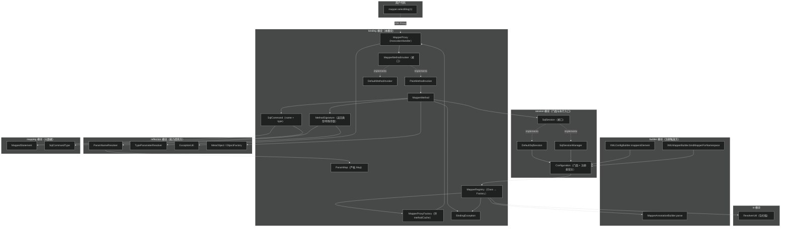
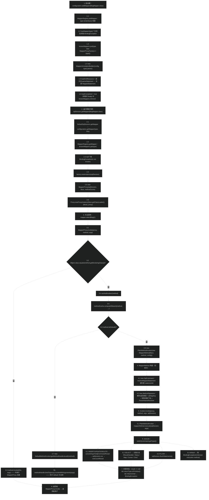
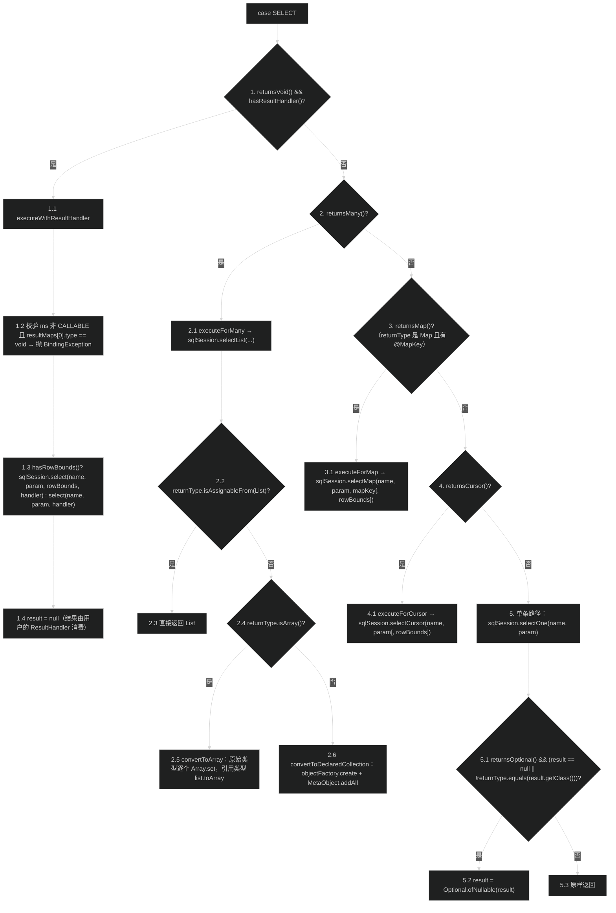
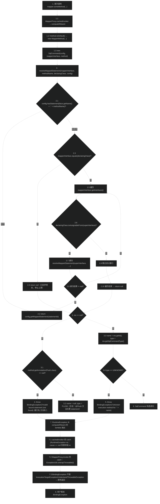
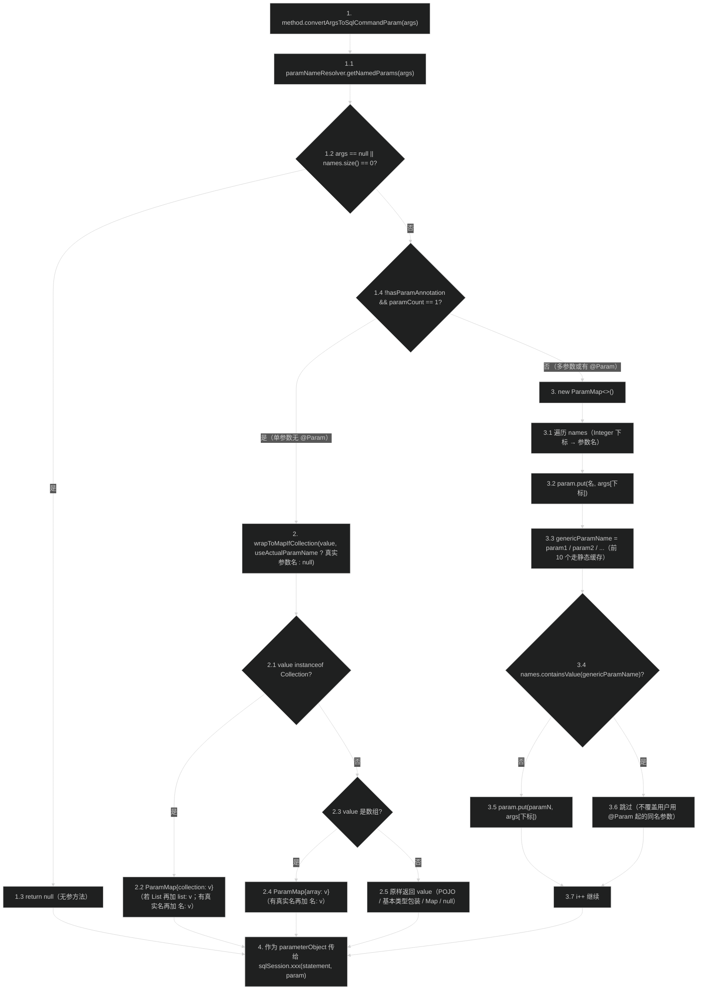

# Mapper 接口绑定（binding）
> 上次修改：2026-07-28 22:36

## 重点关注

| 关注点 | 源码入口 | 为什么重要 |
|--------|----------|------------|
| `MapperProxy.invoke` —— 每次 Mapper 方法调用的唯一入口 | `src/main/java/org/apache/ibatis/binding/MapperProxy.java:58-68` | 用户写的 `mapper.selectBlog(1)` 全部从这里进入 MyBatis。三行代码承担三件事：拦截 `Object` 方法（`equals`/`hashCode`/`toString`）直接反射到 handler 自身、把其余方法交给缓存的 `MapperMethodInvoker`、统一用 `ExceptionUtil.unwrapThrowable` 剥掉代理层包装 |
| `MapperProxy.cachedInvoker` 的双分支 + `computeIfAbsent` 缓存 | `src/main/java/org/apache/ibatis/binding/MapperProxy.java:70-86` | 决定"接口方法是 SQL 方法还是 `default` 方法"的分岔点。`default` 方法走 `MethodHandle.findSpecial`（不能走 `Method.invoke`，否则会递归回代理），普通方法构造 `MapperMethod`。缓存粒度是 `Method` 对象，key 相等即命中，一个 Mapper 接口的所有代理实例共享同一份缓存 |
| `MapperMethod.execute` 的命令分派 | `src/main/java/org/apache/ibatis/binding/MapperMethod.java:57-104` | 本模块的核心分派器：按 `SqlCommandType` 选择 `SqlSession` 的哪个方法，SELECT 分支内再按返回类型分五路（ResultHandler / 集合与数组 / Map / Cursor / 单条）。最后的"原始类型不能返回 null"校验是很多 `BindingException` 的来源 |
| `MapperMethod.SqlCommand` 构造与 `resolveMappedStatement` 递归 | `src/main/java/org/apache/ibatis/binding/MapperMethod.java:222-268` | "Invalid bound statement (not found)" 这条最常见报错的唯一抛出点。递归沿父接口向上查找 statementId，解决"父接口声明方法、子接口 XML 定义 SQL"的继承场景；`@Flush` 方法允许无 statement |
| `MapperMethod.MethodSignature` 的启动期预解析 | `src/main/java/org/apache/ibatis/binding/MapperMethod.java:284-302` | 一次性把方法签名解析成 5 个 boolean + `returnType` + `mapKey` + 两个特殊参数下标 + `ParamNameResolver`，之后每次调用只读字段。是"启动期算一次、运行期零反射解析"的典型 |
| `MapperRegistry.addMapper` 的"先登记后解析 + 失败回滚" | `src/main/java/org/apache/ibatis/binding/MapperRegistry.java:60-80` | `knownMappers.put` 必须发生在 `MapperAnnotationBuilder.parse()` 之前（源码注释明确说明），否则解析 XML 时的 `bindMapperForNamespace` 会重复注册；`finally` 中的 `remove` 保证解析失败不留下半成品工厂 |
| `MapperProxyFactory.methodCache` 的所有权归属 | `src/main/java/org/apache/ibatis/binding/MapperProxyFactory.java:31`、`50-53` | 缓存存放在**工厂**（每个接口一个、与 `Configuration` 同生命周期），而不是存放在**代理**（每个 SqlSession 一个、短生命周期）。这是整个模块最重要的一处生命周期设计，直接决定 `getMapper` 的开销 |
| `MapperMethod.ParamMap.get` 覆写 | `src/main/java/org/apache/ibatis/binding/MapperMethod.java:203-215` | 把 `HashMap` 的"取不到返回 null"改成"抛 `BindingException` 并列出可用参数名"。用户看到的 `Parameter 'xxx' not found. Available parameters are [...]` 就来自这里，是参数绑定错误最快的定位手段 |
| `ParamNameResolver.getNamedParams` 的单参数直传规则 | `src/main/java/org/apache/ibatis/reflection/ParamNameResolver.java:157-180` | 解释了"为什么单参数时 `#{任意名}` 都能取到值，多参数时必须用 `@Param` 或 `param1`"。`hasParamAnnotation && paramCount == 1` 是分水岭；集合/数组单参数会被包成含 `collection`/`list`/`array` 键的 `ParamMap` |
| `MapperProxy` 的 `Serializable` 与 `SqlSession` 不可序列化的矛盾 | `src/main/java/org/apache/ibatis/binding/MapperProxy.java:35-41` | `MapperProxy` 声明 `implements Serializable` 且 `serialVersionUID` 固定，但持有的 `SqlSession` 通常不可序列化。是理解"代理能不能被缓存/传输"这一常见疑问的关键点 |

## 1. 模块定位与职责边界

`org.apache.ibatis.binding` 是 MyBatis 面向用户的**接口绑定层**。它解决的问题只有一句话：让用户可以写 `SqlSession.getMapper(BlogMapper.class).selectBlog(1)` 这样类型安全的 Java 调用，而不必写 `sqlSession.selectOne("org.example.BlogMapper.selectBlog", 1)` 这样字符串驱动的调用。

本模块把"Java 接口方法调用"翻译为"`SqlSession` 上的字符串 statementId 调用"，翻译规则是：**接口全限定名 + "." + 方法名 = statementId**。整个包只有 6 个类 + 1 个 `package-info`，是 MyBatis 中最小的模块之一，但也是用户视角最重要的模块——绝大多数应用只通过它与 MyBatis 交互。

**本模块负责：**
- 维护"Mapper 接口 → 代理工厂"的注册表（`MapperRegistry`）
- 创建 Mapper 接口的 JDK 动态代理实例（`MapperProxyFactory`）
- 拦截接口方法调用并分派（`MapperProxy` + `MapperMethodInvoker`）
- 把方法签名与注解解析为运行期决策所需的元数据（`MapperMethod.SqlCommand` + `MapperMethod.MethodSignature`）
- 把方法实参绑定为 `SqlSession` 需要的单一 `parameterObject`（委托 `ParamNameResolver`，产出 `ParamMap`）
- 把 `SqlSession` 的返回值适配为方法声明的返回类型（`int`/`long`/`boolean`/`void`/`List`/数组/自定义集合/`Map`/`Cursor`/`Optional`/单对象）
- 定义本模块及参数绑定阶段的统一异常类型 `BindingException`

**本模块不负责：**
- 不解析 XML 或注解生成 `MappedStatement`（在 `builder` 模块，本模块只是**触发** `MapperAnnotationBuilder.parse()`）
- 不执行 SQL、不管理连接、不做结果集映射（在 `session` / `executor` 模块）
- 不实现参数名解析算法本身（在 `reflection` 模块的 `ParamNameResolver` / `ParamNameUtil`；本模块只持有并调用）
- 不做泛型返回类型的解析算法（在 `reflection.TypeParameterResolver`）
- 不提供二级代理/插件织入（插件在 `plugin` 模块，作用于 `Executor`/`StatementHandler` 等四大对象，不作用于 Mapper 代理）
- 不缓存 Mapper 代理实例本身（每次 `getMapper` 都新建代理，只缓存方法级 invoker）

**上游（注册方）**：
- `XMLConfigBuilder.mappersElement`（`src/main/java/org/apache/ibatis/builder/xml/XMLConfigBuilder.java:388-410`）解析 `<mappers>`，`<package>` 走 `configuration.addMappers(pkg)`，`<mapper class="...">` 走 `configuration.addMapper(clazz)`
- `XMLMapperBuilder.bindMapperForNamespace`（`src/main/java/org/apache/ibatis/builder/xml/XMLMapperBuilder.java:401-418`）在解析完一个 XML 后，尝试把 namespace 当类名加载并注册
- `Configuration.addMapper` / `addMappers`（`src/main/java/org/apache/ibatis/session/Configuration.java:934-944`）是对外门面，直接委托 `mapperRegistry`

**下游（消费方）**：
- `DefaultSqlSession.getMapper`（`src/main/java/org/apache/ibatis/session/defaults/DefaultSqlSession.java:284-287`）→ `configuration.getMapper(type, this)` → `MapperRegistry.getMapper`
- `SqlSessionManager.getMapper`（`src/main/java/org/apache/ibatis/session/SqlSessionManager.java:257-260`）走同一条路径，但传入的是 `SqlSessionManager` 自身（它本身也是 `SqlSession` 代理）
- 生成的代理最终把调用打回 `SqlSession` 的 `selectOne` / `selectList` / `selectMap` / `selectCursor` / `select` / `insert` / `update` / `delete` / `flushStatements`

**主要输入/输出：**
- 输入（启动期）：Mapper 接口的 `Class` 对象
- 输入（运行期）：`Method` + `Object[] args` + 当前 `SqlSession`
- 输出（启动期）：注册表中的 `MapperProxyFactory`
- 输出（运行期）：代理实例，以及方法调用的返回值（已按声明返回类型适配）

## 2. 架构关系与依赖



**说明表：**

| 节点 | 层级 | 说明 |
|------|------|------|
| `MapperRegistry` | 本模块注册表 | `Map<Class<?>, MapperProxyFactory<?>>`（`ConcurrentHashMap`）。由 `Configuration` 在字段初始化时创建（`Configuration.java:152`），生命周期与 `Configuration` 相同 |
| `MapperProxyFactory<T>` | 本模块工厂 | 每个接口一个实例，持有 `mapperInterface` 和**方法级缓存** `Map<Method, MapperMethodInvoker>`。`newInstance(SqlSession)` 每次创建新的 `MapperProxy` + 新的 JDK 代理，但共享 `methodCache` |
| `MapperProxy<T>` | 本模块 InvocationHandler | 持有 `sqlSession`（会话级、短命）、`mapperInterface`、`methodCache`（工厂级、长命）三个引用。实现 `InvocationHandler` 和 `Serializable` |
| `MapperMethodInvoker` | 本模块调度抽象 | 单方法接口 `invoke(proxy, method, args, sqlSession)`。**注意它显式带 `sqlSession` 参数**——这是让缓存能跨会话复用的关键：invoker 本身不持会话，会话由调用时传入 |
| `PlainMethodInvoker` | 本模块实现 | 包一个 `MapperMethod`，直接 `mapperMethod.execute(sqlSession, args)`。用于普通（非 `default`）方法 |
| `DefaultMethodInvoker` | 本模块实现 | 包一个 `MethodHandle`，`methodHandle.bindTo(proxy).invokeWithArguments(args)`。用于接口 `default` 方法 |
| `MapperMethod` | 本模块调用模型 | `SqlCommand` + `MethodSignature` 的组合，`execute` 是命令分派器。无状态（两个字段均 `final` 且不可变），可跨线程共享 |
| `SqlCommand` | 本模块静态内部类 | 只有 `name`（statementId）和 `type`（`SqlCommandType`）两个 `final` 字段，构造期完成 statement 查找和校验 |
| `MethodSignature` | 本模块静态内部类 | 10 个 `final` 字段，构造期完成返回类型解析（含泛型）、`@MapKey` 读取、`RowBounds`/`ResultHandler` 参数定位、`ParamNameResolver` 创建 |
| `ParamMap<V>` | 本模块静态内部类 | `extends HashMap<String, V>`，仅覆写 `get` 使缺键抛 `BindingException`。**由 `reflection.ParamNameResolver` 创建**（反向依赖，见下） |
| `BindingException` | 本模块异常 | `extends PersistenceException`（→ `IbatisException` → `RuntimeException`）。四个标准构造重载 |
| `Configuration` | 上游门面 | 持有 `MapperRegistry` 并转发 `addMapper` / `addMappers` / `getMapper` / `hasMapper` / `getMapperRegistry` |
| `MapperAnnotationBuilder` | 上游解析器 | 被 `MapperRegistry.addMapper` 直接 `new` 并调用 `parse()`——本模块唯一主动调用 builder 模块的地方 |
| `ResolverUtil` | io 模块工具 | `addMappers(packageName, superType)` 用它做包扫描，通过 `ResolverUtil.IsA` 过滤 |
| `ParamNameResolver` | reflection 模块 | 实参 → `parameterObject` 的实际算法实现。被 `MethodSignature` 持有并在每次调用时使用 |
| `TypeParameterResolver` | reflection 模块 | `resolveReturnType(method, mapperInterface)` 解析泛型父接口上的返回类型，使 `interface BaseMapper<T> { T selectById(int id); }` 这类写法能得到正确的 `returnType` |
| `ExceptionUtil` | reflection 模块 | `unwrapThrowable` 循环剥离 `InvocationTargetException` 和 `UndeclaredThrowableException` |

**依赖强度与耦合点：**
- **强依赖 session 模块**：`MapperMethod.execute` 直接调用 `SqlSession` 的 9 个方法，`SqlCommand` 需要 `Configuration.hasStatement` / `getMappedStatement`。本模块本质上是 `SqlSession` 的**类型安全外观（Facade）**
- **强依赖 reflection 模块**：参数绑定与返回类型解析全部外包
- **对 builder 模块的单点调用**：仅 `MapperRegistry.addMapper` 内 `new MapperAnnotationBuilder(config, type).parse()`。这形成了 binding ↔ builder 的**双向依赖**：builder 的 `bindMapperForNamespace` 会调 `configuration.addMapper`，而 `addMapper` 又会调 builder 的 `parse`。两侧各有一道防重入检查（`hasMapper` / `addLoadedResource("namespace:" + ns)`）来打破环
- **反向依赖点**：`ParamMap` 定义在 `binding.MapperMethod` 内，却由 `reflection.ParamNameResolver` 创建（`ParamNameResolver.java:33` import）。这是一处历史遗留的分层倒置——参数模型属于 binding，算法属于 reflection，但算法反过来 import 了 binding 的内部类
- **重复定义点**：`DefaultSqlSession` 内另有一个功能完全相同的 `StrictMap`（`DefaultSqlSession.java:318-334`，已标记 `@Deprecated Since 3.5.5`），同样在 `get` 缺键时抛 `BindingException`，与 `MapperMethod.ParamMap` 语义重复

## 3. 入口与调用方式

本模块有**两类**入口：启动期的注册入口和运行期的调用入口。

### 3.1 启动期注册入口

| 入口 | 触发条件 | 关键参数 | 返回值 | 进入后续流程 |
|------|----------|----------|--------|-------------|
| `MapperRegistry.addMapper(Class<T>)`（`src/main/java/org/apache/ibatis/binding/MapperRegistry.java:60-80`） | `<mapper class="..."/>` 配置、`bindMapperForNamespace` 推断成功、`addMappers` 扫描到类、或用户手工调用 `configuration.addMapper()` | `Class<T> type`（**非接口直接静默忽略**，无异常无日志） | `void` | `knownMappers.put(type, new MapperProxyFactory<>(type))` → `new MapperAnnotationBuilder(config, type).parse()` → 解析注解与同名 XML → 若抛异常则 `finally` 中 `knownMappers.remove(type)` |
| `MapperRegistry.addMappers(String packageName, Class<?> superType)`（`MapperRegistry.java:103-110`） | `<package name="..."/>` 配置或用户调用 | 包名 + 父类型过滤条件 | `void` | `ResolverUtil.find(new ResolverUtil.IsA(superType), packageName)` 扫描 classpath → 对每个命中类逐个 `addMapper` |
| `MapperRegistry.addMappers(String packageName)`（`MapperRegistry.java:120-122`） | 同上，省略父类型 | 包名 | `void` | 委托上一条，`superType = Object.class`（即包内所有类型，非接口的会在 `addMapper` 里被跳过） |
| `MapperRegistry.hasMapper(Class<T>)`（`MapperRegistry.java:56-58`） | `bindMapperForNamespace` 防重复注册、`addMapper` 自检 | `Class<T> type` | `boolean` | 仅查 `knownMappers.containsKey` |
| `MapperRegistry.getMappers()`（`MapperRegistry.java:89-91`） | 外部工具（如 mybatis-spring）需要遍历已注册接口 | 无 | `Collections.unmodifiableCollection(knownMappers.keySet())` | 只读视图，since 3.2.2 |

### 3.2 运行期调用入口

| 入口 | 触发条件 | 关键参数 | 返回值 | 进入后续流程 |
|------|----------|----------|--------|-------------|
| `MapperRegistry.getMapper(Class<T>, SqlSession)`（`MapperRegistry.java:44-54`） | 用户调用 `sqlSession.getMapper(XxxMapper.class)` | 接口 `Class` + 当前会话 | 代理实例 `T` | 查 `knownMappers`，未注册抛 `BindingException("Type ... is not known to the MapperRegistry.")`；命中则 `mapperProxyFactory.newInstance(sqlSession)`，创建过程中的任何异常被包成 `BindingException("Error getting mapper instance. Cause: ...")` |
| `MapperProxyFactory.newInstance(SqlSession)`（`MapperProxyFactory.java:50-53`） | 上一条内部调用；子类可覆写 `newInstance(MapperProxy)` 定制代理创建 | `SqlSession` | 代理实例 `T` | `new MapperProxy<>(sqlSession, mapperInterface, methodCache)` → `Proxy.newProxyInstance(接口的 ClassLoader, new Class[]{接口}, mapperProxy)` |
| `MapperProxy.invoke(proxy, method, args)`（`MapperProxy.java:58-68`） | **每次**用户调用代理上的任何方法（由 JDK 代理机制回调） | 代理对象、被调 `Method`、实参数组（无参时为 `null`） | 方法返回值 | `Object` 声明的方法 → `method.invoke(this, args)`；其余 → `cachedInvoker(method).invoke(proxy, method, args, sqlSession)`；异常统一经 `ExceptionUtil.unwrapThrowable` 剥壳后抛出 |
| `MapperMethod.execute(SqlSession, Object[])`（`MapperMethod.java:57-104`） | `PlainMethodInvoker.invoke` 内部调用 | 当前会话 + 实参数组 | 已适配为方法声明返回类型的结果 | 按 `SqlCommandType` 分派到 `SqlSession` 的对应方法，再做返回值转换 |

**典型完整调用链**（用户视角）：

```
sqlSession.getMapper(BlogMapper.class)            // DefaultSqlSession.java:284-287
  → configuration.getMapper(type, this)           // Configuration.java:946-948
    → mapperRegistry.getMapper(type, sqlSession)  // MapperRegistry.java:44-54
      → mapperProxyFactory.newInstance(sqlSession)// MapperProxyFactory.java:50-53
        → Proxy.newProxyInstance(...)             // 返回代理

mapper.selectBlog(1)
  → MapperProxy.invoke(proxy, method, args)       // MapperProxy.java:58-68
    → cachedInvoker(method)                       // MapperProxy.java:70-86（命中缓存或新建）
      → PlainMethodInvoker.invoke(...)            // MapperProxy.java:103-106
        → MapperMethod.execute(sqlSession, args)  // MapperMethod.java:57-104
          → method.convertArgsToSqlCommandParam(args)  // → ParamNameResolver.getNamedParams
          → sqlSession.selectOne(command.getName(), param)
```

## 4. 核心概念与领域模型

### 4.1 MapperRegistry —— 接口到代理工厂的注册表

**定义**：持有 `Map<Class<?>, MapperProxyFactory<?>> knownMappers`（`ConcurrentHashMap`）的注册表，是"哪些接口是 Mapper"这一事实的唯一来源。

**生命周期**：由 `Configuration` 在字段声明处直接实例化（`src/main/java/org/apache/ibatis/session/Configuration.java:152`，`new MapperRegistry(this)`），与 `Configuration` 同生共死。可通过 `Configuration.getMapperRegistry()`（`Configuration.java:622-624`，since 3.2.2）拿到，供 mybatis-spring 等集成层使用。

**四类操作**：

| 操作 | 语义 | 并发特性 |
|------|------|----------|
| `addMapper(Class)` | 注册（幂等性由显式 `hasMapper` 检查保证——重复注册**抛异常**而不是静默忽略） | `ConcurrentHashMap.put` 原子，但"检查 + put + parse"整体非原子 |
| `addMappers(pkg[, superType])` | 包扫描批量注册 | 逐个 `addMapper`，无整体事务性——中途失败会留下已注册的部分 |
| `getMapper(Class, SqlSession)` | 取代理 | 纯读 + 新建对象，天然线程安全 |
| `hasMapper(Class)` / `getMappers()` | 查询 | 纯读 |

**关键设计——`type.isInterface()` 的静默过滤**（`MapperRegistry.java:61`）：`addMapper` 用 `if (type.isInterface())` 包住全部逻辑，非接口类型直接返回而不抛异常也不打日志。这使得 `addMappers(packageName)`（`superType = Object.class`）可以粗暴地把包内所有类型都丢进来，让 `addMapper` 自行筛掉普通类。代价是：用户误把实现类配成 `<mapper class="...">` 时**没有任何反馈**，直到运行期 `getMapper` 报 "is not known to the MapperRegistry"。

**三维评估**：

| 维度 | 结论 |
|------|------|
| 好处 | `ConcurrentHashMap` 让启动后的并发 `getMapper` 完全无锁；`isInterface()` 过滤让包扫描入口极简；`getMappers()` 返回不可变视图避免外部篡改 |
| 替代方案 | 可以用 `Map<Class<?>, MapperProxyFactory<?>>` 的不可变快照（启动完成后 `Map.copyOf`），彻底排除运行期注册；但会破坏 mybatis-spring 的延迟注册能力 |
| 风险 | 非接口静默忽略导致配置错误延迟到运行期才暴露；`addMapper` 的重复注册检查与 `put` 之间存在竞态窗口（两个线程同时首次注册同一接口时，都可能通过 `hasMapper` 检查），实际中因注册在单线程启动期完成而不触发 |

### 4.2 MapperProxyFactory —— 代理工厂与方法缓存的宿主

**定义**：泛型工厂 `MapperProxyFactory<T>`，两个字段：`Class<T> mapperInterface` 和 `Map<Method, MapperMethodInvoker> methodCache`（`ConcurrentHashMap`）。

**核心职责有两个，但只有第一个是显式的**：
1. **显式职责**：`newInstance(SqlSession)` 创建 JDK 动态代理
2. **隐式但更重要的职责**：作为 `methodCache` 的**宿主**。缓存放在工厂上（每接口一份、`Configuration` 级生命周期），而不是放在 `MapperProxy` 上（每次 `getMapper` 一份、会话级生命周期）

**为什么缓存必须放在工厂上**：`getMapper` 在典型 Web 应用里是**每请求调用**的（每个请求一个 `SqlSession`）。如果缓存放在 `MapperProxy` 上，那么每个请求的第一次方法调用都要重新构造 `MapperMethod`——而构造 `MapperMethod` 涉及 `TypeParameterResolver.resolveReturnType`、注解读取、`ParamNameResolver` 构造等重量级反射操作。放在工厂上后，这些反射成本在整个应用生命周期内**每个方法只付一次**。

**代理创建的三个参数**（`MapperProxyFactory.java:47`）：
- `mapperInterface.getClassLoader()`：用接口自身的类加载器，保证在 OSGi / 多 ClassLoader 环境下代理类与接口在同一命名空间
- `new Class[] { mapperInterface }`：**只实现一个接口**，代理不会额外实现 `Serializable` 等标记接口
- `mapperProxy`：`InvocationHandler`

**`protected T newInstance(MapperProxy<T>)` 的扩展意图**（`MapperProxyFactory.java:46-48`）：这个重载是 `protected` 的，子类可以覆写它来改变代理的创建方式（例如换用 Byte Buddy / CGLIB，或额外实现更多接口）。这是本模块唯一的继承式扩展点。

**三维评估**：

| 维度 | 结论 |
|------|------|
| 好处 | 缓存归属选择正确，把重反射摊销到应用生命周期；`ConcurrentHashMap` + `computeIfAbsent` 提供无锁读；`protected` 重载留出代理实现替换口 |
| 替代方案 | 可以连代理实例也缓存（每接口一个代理，`SqlSession` 通过 `ThreadLocal` 注入），能省掉每次 `getMapper` 的 `Proxy.newProxyInstance` 开销；但会引入线程绑定的隐式状态，破坏"代理持有明确会话"的清晰语义 |
| 风险 | `getMethodCache()` 是 `public` 的（`MapperProxyFactory.java:41-43`），外部可以直接拿到可变 Map 并 `clear()` / `put` 任意 invoker，无封装保护；`methodCache` 以 `Method` 为 key，同一接口的方法数量有限所以无内存膨胀风险 |

### 4.3 MapperProxy —— InvocationHandler 与方法调度

**定义**：`MapperProxy<T> implements InvocationHandler, Serializable`，是 JDK 动态代理的调用处理器。三个 `final` 字段：`sqlSession`（会话级）、`mapperInterface`、`methodCache`（工厂级，引用共享）。

**`invoke` 的三段结构**（`MapperProxy.java:58-68`）：

| 段 | 代码 | 语义 |
|----|------|------|
| 1 | `if (Object.class.equals(method.getDeclaringClass())) return method.invoke(this, args);` | `equals` / `hashCode` / `toString` / `getClass` 等 `Object` 方法直接作用于 `MapperProxy` 自身。用 `equals`（精确类相等）而非 `isAssignableFrom`，因此只拦截 `Object` 声明的方法 |
| 2 | `return cachedInvoker(method).invoke(proxy, method, args, sqlSession);` | 主路径：取（或建）invoker 后调度 |
| 3 | `catch (Throwable t) { throw ExceptionUtil.unwrapThrowable(t); }` | 统一剥壳。`ExceptionUtil.unwrapThrowable`（`src/main/java/org/apache/ibatis/reflection/ExceptionUtil.java:30-41`）在 `while(true)` 中循环剥离 `InvocationTargetException.getTargetException()` 和 `UndeclaredThrowableException.getUndeclaredThrowable()`，直到拿到原始异常 |

**为什么必须剥壳**：段 1 的 `method.invoke` 会把业务异常包成 `InvocationTargetException`；`DefaultMethodInvoker` 的 `MethodHandle` 调用和 JDK 代理机制本身也可能引入 `UndeclaredThrowableException`。不剥壳的话用户看到的栈顶将是反射框架异常而不是 `PersistenceException` / `SQLException`。

**`static` 初始化块的 `privateLookupInMethod`**（`MapperProxy.java:49-56`）：静态块通过 `MethodHandles.class.getMethod("privateLookupIn", Class.class, Lookup.class)` 反射查找 JDK 9+ 的 `privateLookupIn` 方法，找不到时抛 `IllegalStateException` 使**类初始化直接失败**。这是历史包袱的残留：早期 MyBatis 需要同时支持 JDK 8（用 `Lookup` 的私有构造器）和 JDK 9+（用 `privateLookupIn`），现在最低版本已提升，但仍保留了反射查找而没有改成直接调用 `MethodHandles.privateLookupIn(...)`。

**两个 invoker 实现的差异**：

| 实现 | 持有物 | 调用方式 | 适用方法 |
|------|--------|----------|----------|
| `PlainMethodInvoker`（`MapperProxy.java:96-107`） | `MapperMethod`（含 statementId、返回类型元数据） | `mapperMethod.execute(sqlSession, args)` | 非 `default` 的抽象接口方法（对应真实 SQL） |
| `DefaultMethodInvoker`（`MapperProxy.java:109-120`） | `MethodHandle`（通过 `findSpecial` 得到） | `methodHandle.bindTo(proxy).invokeWithArguments(args)` | 接口 `default` 方法（用户自己写的 Java 逻辑，其内部通常再调用别的 Mapper 方法） |

**`default` 方法为什么不能用 `Method.invoke`**：`method.invoke(proxy, args)` 会走虚方法分派，重新落回代理的 `invoke`，形成无限递归。必须用 `Lookup.findSpecial(declaringClass, name, type, declaringClass)` 拿到"非虚"（`invokespecial` 语义）的 `MethodHandle`，才能真正执行接口中的默认实现体。`bindTo(proxy)` 把 `this` 绑定为代理对象，因此 `default` 方法体内的 `this.otherMethod()` 会再次经过代理——这正是期望行为（用户在 `default` 方法里组合调用其他 SQL 方法）。

**三维评估**：

| 维度 | 结论 |
|------|------|
| 好处 | 三段结构极简且职责清晰；命令模式（`MapperMethodInvoker`）让 `default` 方法与 SQL 方法的差异被收敛到一次性的缓存构造中，运行期热路径上没有 `if (isDefault)` 判断；invoker 接口显式传 `sqlSession` 使缓存可跨会话共享 |
| 替代方案 | JDK 16+ 已提供 `InvocationHandler` 内可直接使用的 `InvocationHandler.invokeDefault(proxy, method, args)`，可完全替代 `DefaultMethodInvoker` + `privateLookupIn` 反射；但会抬高最低 JDK 版本要求 |
| 风险 | `implements Serializable` + 固定 `serialVersionUID` 承诺了可序列化，但 `SqlSession` 字段通常不可序列化，实际序列化会抛 `NotSerializableException`；静态初始化块中的 `IllegalStateException` 会以 `NoClassDefFoundError`/`ExceptionInInitializerError` 形式暴露，排错不直观 |

### 4.4 MapperMethod —— SqlCommand + MethodSignature 的双元组

**定义**：`MapperMethod` 本体只有两个 `final` 字段：`command`（回答"调哪条 SQL、什么类型"）和 `method`（回答"返回什么、参数怎么绑"）。构造函数（`MapperMethod.java:52-55`）同时构造两者，全部解析工作在此完成。

这种拆分把"**语句身份**"与"**方法形态**"两个正交关注点分离：前者依赖 `Configuration` 中的 `MappedStatement` 注册表，后者只依赖 `Method` 的反射信息与注解。

#### 4.4.1 SqlCommand —— 语句身份

**字段**：`String name`（statementId）+ `SqlCommandType type`。均为 `final`。

**构造逻辑**（`MapperMethod.java:222-240`）：
1. `resolveMappedStatement(mapperInterface, methodName, declaringClass, configuration)` 查找 `MappedStatement`
2. 找不到时：若方法上有 `@Flush` 注解 → `name = null; type = FLUSH`；否则抛 `BindingException("Invalid bound statement (not found): 接口名.方法名")`
3. 找到时：`name = ms.getId(); type = ms.getSqlCommandType()`；若 `type == UNKNOWN` 抛 `BindingException("Unknown execution method for: " + name)`

**`resolveMappedStatement` 的递归**（`MapperMethod.java:250-268`）：

```java
String statementId = mapperInterface.getName() + "." + methodName;
if (configuration.hasStatement(statementId)) {          // ① 当前接口名下直接命中
  return configuration.getMappedStatement(statementId);
}
if (mapperInterface.equals(declaringClass)) {           // ② 已到方法声明处，无需再上溯
  return null;
}
for (Class<?> superInterface : mapperInterface.getInterfaces()) {
  if (declaringClass.isAssignableFrom(superInterface)) { // ③ 只沿"能到达声明类"的分支递归
    MappedStatement ms = resolveMappedStatement(superInterface, methodName, declaringClass, configuration);
    if (ms != null) { return ms; }
  }
}
return null;
```

三个分支的设计意图：
- **①** 支撑最常见场景：`XxxMapper.java` 与 `XxxMapper.xml`（namespace = 接口全限定名）一一对应
- **②** 剪枝：如果当前接口就是方法的声明类，说明已经查到最"原生"的位置，再往上找也不可能有该方法
- **③** 剪枝 + 支撑继承：`declaringClass.isAssignableFrom(superInterface)` 保证只沿着那条真正声明了该方法的继承路径往上走，避免在多继承接口中做无谓的全树遍历。这使"子接口 `UserMapper extends BaseMapper<User>`、SQL 定义在 `BaseMapper` 的 namespace 下"能被找到

**关键含义**：SQL 的查找**优先使用调用侧的接口名**（`mapperInterface`），而不是方法声明处的接口名。因此子接口可以通过在自己的 XML 里定义同名 statement 来"覆盖"父接口的 SQL。

#### 4.4.2 MethodSignature —— 方法形态

**10 个 `final` 字段**（`MapperMethod.java:273-282`）：

| 字段 | 计算方式（`MapperMethod.java:284-302`） | 运行期用途 |
|------|------------------------------------|-----------|
| `returnType` | `TypeParameterResolver.resolveReturnType(method, mapperInterface)`；`Class` 直接用，`ParameterizedType` 取 `getRawType()`，其余回退 `method.getReturnType()` | 返回值转换的判定依据；`execute` 末尾的原始类型 null 校验 |
| `returnsVoid` | `void.class.equals(returnType)` | 决定 `rowCountResult` 返回 null；与 `hasResultHandler` 组合决定走 `ResultHandler` 路径 |
| `returnsMany` | `configuration.getObjectFactory().isCollection(returnType) \|\| returnType.isArray()` | SELECT 分支走 `executeForMany` |
| `returnsCursor` | `Cursor.class.equals(returnType)` | SELECT 分支走 `executeForCursor` |
| `returnsOptional` | `Optional.class.equals(returnType)` | 单条查询结果包成 `Optional`（since 3.5.0） |
| `mapKey` | `getMapKey(method)`：返回类型是 `Map` 的子类型**且**方法上有 `@MapKey` 时取其 `value()`，否则 `null` | `executeForMap` 的键属性名 |
| `returnsMap` | `mapKey != null` | SELECT 分支走 `executeForMap` |
| `rowBoundsIndex` | `getUniqueParamIndex(method, RowBounds.class)` | `extractRowBounds(args)` 从实参中取出分页对象 |
| `resultHandlerIndex` | `getUniqueParamIndex(method, ResultHandler.class)` | `extractResultHandler(args)` 取出结果处理器 |
| `paramNameResolver` | `new ParamNameResolver(configuration, method, mapperInterface)` | `convertArgsToSqlCommandParam(args)` 的实际执行者 |

**`returnsMany` 用 `ObjectFactory.isCollection` 而非 `Collection.class.isAssignableFrom`**：`DefaultObjectFactory.isCollection` 的判定是 `Collection.class.isAssignableFrom(type)`，但走 `ObjectFactory` 意味着**用户可以覆写这个判定**，从而让自定义的"类集合"类型也被识别为多结果返回。`convertToDeclaredCollection` 也用同一个 `ObjectFactory` 来实例化目标集合，两处保持一致。

**`returnsMap` 的隐含约束**：只有**同时**满足"返回类型是 Map"和"标注了 `@MapKey`"才算 `returnsMap`。若返回 `Map` 但忘了 `@MapKey`，`returnsMap` 为 false，会落到最后的 `selectOne` 分支——此时 MyBatis 会把结果集的一行映射成一个 Map 返回（这往往正是"返回单行 Map"的合理语义，但容易与"以某列为键的 Map 集合"混淆）。

**`getUniqueParamIndex` 的唯一性校验**（`MapperMethod.java:355-368`）：遍历参数类型，用 `paramType.isAssignableFrom(argTypes[i])` 匹配；一旦发现第二个匹配项就抛 `BindingException("xxx cannot have multiple RowBounds parameters")`。因此一个方法最多一个 `RowBounds` 和一个 `ResultHandler`。

**三维评估**：

| 维度 | 结论 |
|------|------|
| 好处 | 全部 10 个字段在构造期一次算完且 `final`，运行期 `execute` 里只有字段读取和分支判断，零反射解析；`SqlCommand` / `MethodSignature` 的正交拆分让"找不到 SQL"与"返回类型不支持"两类错误在不同阶段以不同异常暴露 |
| 替代方案 | 可以把 5 个 boolean 合并为一个 `enum ReturnKind`（VOID / MANY / MAP / CURSOR / OPTIONAL / ONE），`execute` 改用 `switch`，消除当前 if-else 链中"顺序即优先级"的隐式规则 |
| 风险 | 5 个 boolean 之间的组合可能矛盾（如同时 `returnsMany` 与 `returnsMap` —— `Map` 不是 `Collection` 所以实际不会同时为真，但类型系统不保证），`execute` 中的判断顺序成为事实上的优先级规范却没有文档化；`returnsOptional` 只在单条分支被消费，`Optional<List<T>>` 这类嵌套写法不被支持（`returnType` 是 `Optional`，`returnsMany` 为 false，会走 `selectOne` 并在多行时抛 `TooManyResultsException`） |

### 4.5 ParamMap —— 严格的参数容器

**定义**：`public static class ParamMap<V> extends HashMap<String, V>`（`MapperMethod.java:203-215`），只覆写了 `get(Object key)`：

```java
@Override
public V get(Object key) {
  if (!super.containsKey(key)) {
    throw new BindingException("Parameter '" + key + "' not found. Available parameters are " + keySet());
  }
  return super.get(key);
}
```

**作用**：把"参数名写错"从"静默传 null 给 SQL"变成"立即抛出并列出所有可用参数名"。这是 MyBatis 参数绑定阶段最有价值的错误信息之一。

**关键细节**：用 `containsKey` 而非 `super.get(key) == null` 判断，因此**参数值确实为 null** 时不会误报——只有键不存在才抛异常。

**创建者不在本模块**：`ParamMap` 由 `ParamNameResolver` 创建（`src/main/java/org/apache/ibatis/reflection/ParamNameResolver.java:166`、`224`、`233`）。

**三维评估**：

| 维度 | 结论 |
|------|------|
| 好处 | 一个方法的覆写换来极高的排错价值；`containsKey` 判断避免了 null 值误报 |
| 替代方案 | 可以实现 `Map` 接口而非继承 `HashMap`，通过组合封装内部 map，避免暴露 `HashMap` 的全部可变 API |
| 风险 | 只覆写了 `get`，`getOrDefault` / `containsKey` / `forEach` 等其他读取路径仍是宽松语义——框架内部若通过这些方法取值就绕过了严格检查；继承 `HashMap` 使其无法防止外部 `put` 污染 |

### 4.6 BindingException —— 本模块的统一异常

**定义**：`BindingException extends PersistenceException`（`src/main/java/org/apache/ibatis/binding/BindingException.java:23-41`），四个标准构造重载，`serialVersionUID = 4300802238789381562L`。

**继承链**：`BindingException` → `PersistenceException` → `IbatisException`（`@Deprecated`）→ `RuntimeException`。因此它是**非受检异常**，Mapper 接口方法无需声明 `throws`。

**语义覆盖范围**（不止本模块）：注册表查不到接口、代理创建失败、statement 找不到、命令类型未知、返回类型不支持、原始类型返回 null、特殊参数重复、参数名找不到（`ParamMap`）。

## 5. 关键流程

### 5.1 主成功路径：从 addMapper 注册到方法调用返回



**1-1.6 启动期注册（先登记后解析）**：`MapperRegistry.addMapper` 的顺序是刻意设计的——`knownMappers.put` 必须先于 `parser.parse()`。源码注释（`MapperRegistry.java:68-70`）说明了原因：`MapperAnnotationBuilder.parse()` 内部会 `loadXmlResource()` 加载同名 XML，而 `XMLMapperBuilder` 解析完成后会调用 `bindMapperForNamespace()`，后者会尝试 `configuration.addMapper(boundType)`。如果此时 `knownMappers` 里还没有该类型，就会二次进入 `addMapper` 并在 `hasMapper` 检查处抛"already known"。先 put 就让 `bindMapperForNamespace` 的 `!configuration.hasMapper(boundType)` 条件为 false，安全跳过。`finally` 块中的 `if (!loadCompleted) knownMappers.remove(type)` 保证解析异常（如 XML 语法错、statement 冲突）不会在注册表里留下一个"能取到代理但取不到 SQL"的半成品工厂。

**2-2.6 取代理（每次都新建）**：`getMapper` 不缓存代理实例。每次调用都新建 `MapperProxy` 和 JDK 代理对象。开销是一次 `ConcurrentHashMap.get` + 两次对象分配 + JDK 代理类查找（JDK 内部对 `(ClassLoader, interfaces)` 组合有代理类缓存，所以不会重复生成字节码）。之所以能承受这个开销，是因为真正重的方法元数据解析被 `methodCache` 挡住了。

**3-3.8 方法调度（命令模式 + 缓存）**：`invoke` 先用 `Object.class.equals(method.getDeclaringClass())` 精确判断把 `Object` 声明的方法直接反射到 `MapperProxy` 自身——这使 `mapper.toString()` 返回的是 `MapperProxy` 的 `toString`，`mapper.hashCode()` 是 `MapperProxy` 的 `hashCode`，两个不同 `getMapper` 调用返回的代理**不相等**。其余方法走 `cachedInvoker`：`computeIfAbsent` 在缓存未命中时按 `method.isDefault()` 二选一构造 invoker。

**4-4.2 元数据解析（仅首次）**：`new MapperMethod` 是本模块最重的操作，包含 `TypeParameterResolver.resolveReturnType`（可能递归解析泛型继承链）、`configuration.hasStatement`（可能触发 `buildAllStatements()` 处理未完成的语句）、`resolveMappedStatement` 的接口树递归、注解读取、`ParamNameResolver` 构造（读取 `@Param` 注解、可能通过 `ParamNameUtil` 读取字节码中的真实参数名）。这一切每个方法只做一次。

**5-6.4 命令分派**：`execute` 的 `switch` 按 `SqlCommandType` 把调用打到 `SqlSession` 上。INSERT / UPDATE / DELETE 三个分支结构完全对称（转参 → 调用 → `rowCountResult` 转换行数）；SELECT 分支内是五路 if-else 链；FLUSH 直接 `sqlSession.flushStatements()`（此时 `command.getName()` 为 null，不需要 statementId）；`default` 分支实际不可达（`SqlCommand` 构造时已排除 `UNKNOWN`），是防御性代码。

**7-8 末尾统一校验**：无论走哪个分支，最后都检查 `result == null && returnType.isPrimitive() && !returnsVoid()`。这拦截了"方法声明返回 `int`，但 `selectOne` 返回 null"的情况——如果不拦截，JDK 代理在拆箱 null 时会抛 `NullPointerException`，用户完全看不出问题在哪。这条校验换成明确的 `BindingException("... attempted to return null from a method with a primitive return type ...")`。

### 5.2 SELECT 分支的五路返回值处理



**1-1.4 ResultHandler 路径（`MapperMethod.java:123-138`）**：条件是"返回 void **且**有 `ResultHandler` 参数"。进入后先做一次前置校验：取出 `MappedStatement`，如果它不是 `CALLABLE` 且 `resultMaps.get(0).getType() == void.class`，就抛 `BindingException`，提示需要 `@ResultMap` / `@ResultType` 注解或 XML 的 `resultType` 属性。原因是——方法返回 void，MyBatis 无法从方法签名推断结果对象类型，必须由映射配置显式给出，否则 `ResultHandler` 拿不到任何有意义的对象。`CALLABLE` 被豁免是因为存储过程的输出参数可以携带独立的 resultMap。

**2-2.6 集合与数组路径（`MapperMethod.java:140-157`，issue #510）**：始终先 `sqlSession.selectList` 拿到 `List`，再按声明返回类型做转换：
- `returnType.isAssignableFrom(result.getClass())` 为真（声明 `List` / `Collection` / `Iterable` 等）→ 直接返回，零拷贝
- 声明数组 → `convertToArray`（`MapperMethod.java:178-189`）。引用类型走 `list.toArray((E[]) array)`；**原始类型数组**（`int[]` / `long[]` 等）必须逐元素 `Array.set(array, i, list.get(i))`，因为 `toArray` 无法把 `List<Integer>` 直接填进 `int[]`
- 声明其他集合（`Set` / `LinkedList` / 自定义集合）→ `convertToDeclaredCollection`（`MapperMethod.java:171-176`）：`config.getObjectFactory().create(returnType)` 实例化 + `config.newMetaObject(collection).addAll(list)` 填充。走 `ObjectFactory` 意味着用户可以定制这些集合类型的实例化方式

**3-3.1 Map 路径（`MapperMethod.java:191-201`）**：委托 `sqlSession.selectMap(statement, param, mapKey[, rowBounds])`，由 session 层用 `DefaultMapResultHandler` 以 `mapKey` 指定的属性为键构建 Map。本模块只负责把 `@MapKey` 的值传下去。

**4-4.1 Cursor 路径（`MapperMethod.java:159-169`）**：直接返回 `sqlSession.selectCursor(...)`。注意 `Cursor` 是**延迟游标**——返回时 SQL 尚未遍历完，底层 `ResultSet` 和 `Statement` 仍然打开。因此调用方必须在 `SqlSession` 关闭之前用 try-with-resources 消费完 `Cursor`。本模块不做任何生命周期管理，这个责任完全交给用户。

**5-5.3 单条路径**：`sqlSession.selectOne` 内部（`src/main/java/org/apache/ibatis/session/defaults/DefaultSqlSession.java:71-84`）实际调 `selectList` 后判断：1 行返回该行，0 行返回 null，多于 1 行抛 `TooManyResultsException`。回到本模块，若 `returnsOptional()` 则包一层 `Optional.ofNullable`。

**`Optional` 包装的双条件写法值得注意**（`MapperMethod.java:88-90`）：

```java
if (method.returnsOptional() && (result == null || !method.getReturnType().equals(result.getClass()))) {
  result = Optional.ofNullable(result);
}
```

第二个子条件 `!returnType.equals(result.getClass())` 的作用是**避免重复包装**：如果 SQL 的 `resultType` 本身就配成了 `java.util.Optional`（或某个 TypeHandler 直接返回了 `Optional`），`result.getClass()` 就已经是 `Optional`，此时不再套一层，否则会得到 `Optional<Optional<T>>`。

**五路分支的顺序即优先级**：如果一个方法同时满足多个条件（例如返回 `List` 且带 `ResultHandler` 参数），前面的分支胜出。特别地，"返回 void + 有 ResultHandler"排在最前，意味着即使方法还带了 `RowBounds`，也会进入 `executeWithResultHandler` 里再单独处理 `RowBounds`。

### 5.3 失败路径：Invalid bound statement (not found)



**关键点 1 —— 错误在首次调用时才暴露，不在 `getMapper` 时**：因为 `MapperMethod` 是**懒构造**的（`computeIfAbsent` 时才 new）。所以"接口方法拼错名字"或"XML 里漏写 statement"的问题不会在应用启动时被发现，而是在第一次调用该方法时才抛出。这是本模块最重要的错误时机特征。

**关键点 2 —— `computeIfAbsent` 中抛异常的处理**（`MapperProxy.java:82-85`）：lambda 里可能抛两类异常：
- `BindingException`（`RuntimeException` 子类）直接向上传播
- `NoSuchMethodException` / `IllegalAccessException` / `InvocationTargetException`（来自 `getMethodHandleJava9`）被 lambda 内部包成 `new RuntimeException(e)`

`cachedInvoker` 的 `catch (RuntimeException re) { Throwable cause = re.getCause(); throw cause == null ? re : cause; }` 统一处理：有 cause 就抛 cause（还原受检异常），没有 cause 就抛原异常（保留 `BindingException`）。**注意副作用**：如果一个 `BindingException` 恰好带了 cause（如 `new BindingException(msg, e)`），这段代码会把它剥掉只抛 cause，丢失 `BindingException` 的信息——不过 `SqlCommand` 抛的两个 `BindingException` 都是单参数构造，没有 cause，所以实际不触发。

**关键点 3 —— `computeIfAbsent` 抛异常时不会缓存**：`ConcurrentHashMap.computeIfAbsent` 在 mapping function 抛异常时不会写入映射。因此每次调用出错的方法都会重新走一遍构造并重新抛异常，行为一致（但也意味着每次都重复付出解析开销）。

### 5.4 边界路径：default 方法的 MethodHandle 获取

```mermaid
%%{init: {"theme": "dark"}}%%
flowchart LR
  1["1. cachedInvoker：method.isDefault() == true"] --> 2["2. getMethodHandleJava9(method)"]
  2 --> 2.1["2.1 declaringClass = method.getDeclaringClass()"]
  2.1 --> 2.2["2.2 privateLookupInMethod.invoke(null, declaringClass, MethodHandles.lookup())"]
  2.2 --> 2.3["2.3 得到对 declaringClass 有私有访问权的 Lookup"]
  2.3 --> 2.4["2.4 lookup.findSpecial(declaringClass, name, methodType(returnType, paramTypes), declaringClass)"]
  2.4 --> 3["3. new DefaultMethodInvoker(methodHandle)"]
  3 --> 4["4. 每次调用：methodHandle.bindTo(proxy).invokeWithArguments(args)"]
```



**为什么需要 `privateLookupIn`**：`MethodHandles.lookup()` 返回的是**调用点**（即 `MapperProxy` 类）的 `Lookup`，它没有权限对用户的 Mapper 接口执行 `findSpecial`（`findSpecial` 要求 lookup 具有 `PRIVATE` 访问模式，且 `specialCaller` 必须在 lookup 的可访问范围内）。`MethodHandles.privateLookupIn(declaringClass, lookup)` 把权限"平移"到 `declaringClass` 上，前提是 `declaringClass` 所在模块对 `MapperProxy` 所在模块开放（JPMS 下需要 `opens`/`exports`，普通 classpath 应用无此问题）。

**`findSpecial` 的第四个参数 `specialCaller = declaringClass`**：这使得得到的 `MethodHandle` 具有 `invokespecial` 语义——直接调用接口中的默认实现字节码，绕过虚方法分派表，从而不会再次回到代理的 `invoke`。

**`bindTo(proxy)` 与 `invokeWithArguments(args)`**：`bindTo` 把接收者绑定为代理对象，因此 `default` 方法体内的 `this` 是代理；`invokeWithArguments(args)` 接受 `Object[]`（无参时 `args` 为 `null`，`invokeWithArguments` 能正确处理）。

**性能注记**：`bindTo` 在**每次调用**时执行，而不是在缓存构造时执行。`MethodHandle.bindTo` 会创建一个新的 `MethodHandle` 对象。之所以不能在构造时 `bindTo`——因为 `proxy` 是每次 `getMapper` 新建的实例，而 invoker 被缓存在工厂上跨所有代理共享，缓存时还不知道 `proxy` 是谁。这是"缓存放在工厂上"这一设计的必然代价。

### 5.5 边界路径：ParamMap 参数绑定



**1.2 无参方法返回 null**：`args == null`（无参方法 JDK 代理传 null）或 `names.size() == 0`（所有参数都是 `RowBounds`/`ResultHandler` 这类特殊参数，已在 `ParamNameResolver` 构造期被 `isSpecialParameter` 跳过）时返回 null。此时 SQL 里不能有 `#{}` 引用。

**1.4 单参数直传的分水岭**（`ParamNameResolver.java:162-164`）：条件是 `!hasParamAnnotation && paramCount == 1`。满足时把唯一实参**原样**当 `parameterObject` 传下去（集合/数组除外）。这解释了用户最常遇到的两个现象：
- 单个 POJO 参数时，SQL 里写 `#{name}` 直接取 POJO 的 `name` 属性——因为 `parameterObject` 就是 POJO 本身
- 单个 `int` 参数时，SQL 里写 `#{任意名字}` 都能取到值——因为 `TypeHandler` 面对基本类型时忽略属性名
- 反例：加了 `@Param("id")` 后，即使只有一个参数也会走 `ParamMap` 分支（`hasParamAnnotation` 为 true），此时 `#{id}` 有效但 `#{其他名}` 会抛 `BindingException`

**2.1-2.4 集合/数组的强制包装**（`ParamNameResolver.wrapToMapIfCollection`，`ParamNameResolver.java:222-239`）：单个 `List` 参数会被包成 `ParamMap{"collection": list, "list": list}`（若 `useActualParamName` 开启还会加上真实参数名）。这是 `<foreach collection="list">` 能工作的原因。单个数组包成 `ParamMap{"array": arr}`，对应 `<foreach collection="array">`。

**3.1-3.6 多参数的双键映射**：每个参数被放入 `ParamMap` **两次**——一次用真实名（`@Param` 的值，或开启 `useActualParamName` 时的字节码参数名，或退化为 `"0"`/`"1"`/... 的下标字符串），一次用 `param1`/`param2`/... 的通用名。`names.containsValue(genericParamName)` 检查避免了"用户用 `@Param("param2")` 给第一个参数起名"时的键冲突（`ParamNameResolver.java:172-175` 的注释明确说明）。前 10 个通用名走静态数组 `GENERIC_NAME_CACHE`（`ParamNameResolver.java:43-49`）避免重复字符串拼接。

**注意 `names` 的下标语义**：`names` 是 `SortedMap<Integer, String>`，key 是**真实方法参数下标**，但当 `@Param` 缺失且 `useActualParamName` 关闭时，value 用的是 `map.size()`（即"第几个非特殊参数"）。因此 `aMethod(int a, RowBounds rb, int b)` 得到的是 `{0 → "0", 2 → "1"}`——key 跳过了 1，value 是连续的（`ParamNameResolver.java:53-62` 的 Javadoc 举了这三个例子）。

## 6. 核心实现细节

### 6.1 `MapperRegistry.addMapper` —— 先登记后解析 + 失败回滚

**源码位置**：`src/main/java/org/apache/ibatis/binding/MapperRegistry.java:60-80`

```java
public <T> void addMapper(Class<T> type) {
  if (type.isInterface()) {                                  // (a) 非接口静默忽略
    if (hasMapper(type)) {
      throw new BindingException("Type " + type + " is already known to the MapperRegistry.");  // (b)
    }
    boolean loadCompleted = false;                            // (c) 完成标记
    try {
      knownMappers.put(type, new MapperProxyFactory<>(type)); // (d) 先登记
      // It's important that the type is added before the parser is run
      // otherwise the binding may automatically be attempted by the
      // mapper parser. If the type is already known, it won't try.
      MapperAnnotationBuilder parser = new MapperAnnotationBuilder(config, type);
      parser.parse();                                         // (e) 后解析
      loadCompleted = true;
    } finally {
      if (!loadCompleted) {
        knownMappers.remove(type);                            // (f) 失败回滚
      }
    }
  }
}
```

**逐段解读**：

- **(a)** `type.isInterface()` 包住全部逻辑。非接口不抛异常、不打日志、不返回任何指示。这个宽松设计服务于 `addMappers(packageName)`——它以 `Object.class` 为 superType 扫出包内**所有**类型（包括枚举、注解、普通类），全部丢给 `addMapper` 让它自行筛选。

- **(b)** 重复注册**抛异常**而非幂等忽略。这是一个刻意的严格选择：重复注册通常意味着配置写重了（同一接口既在 `<package>` 里又在 `<mapper class>` 里），值得报错。但它也让 (d) 的顺序变得关键——见下。

- **(c)(f)** `loadCompleted` 布尔标记 + `finally` 回滚是一个手工"事务"。为什么需要：注册表里若留下一个已 put 但 statement 未解析完的 `MapperProxyFactory`，用户能成功 `getMapper` 拿到代理，但调用方法时会得到 "Invalid bound statement (not found)"——错误信息完全指错方向。回滚后用户会得到更准确的 "is not known to the MapperRegistry"，同时启动期的原始解析异常（`BuilderException` 等）会正常向上传播。

- **(d)(e) 顺序的必要性**（源码注释已说明）：`parser.parse()` 内部经由 `MapperAnnotationBuilder.loadXmlResource()` 触发 `XMLMapperBuilder`，后者解析完成后调用 `bindMapperForNamespace()`（`src/main/java/org/apache/ibatis/builder/xml/XMLMapperBuilder.java:401-418`），其中的判断是：

  ```java
  if (boundType != null && !configuration.hasMapper(boundType)) {
    configuration.addLoadedResource("namespace:" + namespace);
    configuration.addMapper(boundType);   // ← 可能重入 addMapper
  }
  ```

  由于 (d) 已经 put 过，`hasMapper(boundType)` 为 true，整个分支被跳过，避免了 (b) 处的 "already known"。若顺序颠倒，从 XML 侧启动的加载路径会立刻自撞。

**双向依赖的两道闸门**：binding 与 builder 之间的环由两处防重入共同打破：
1. binding 侧：`hasMapper(type)` 检查 + 提前 put
2. builder 侧：`addLoadedResource("namespace:" + namespace)` 标记，`MapperAnnotationBuilder.loadXmlResource` 会检查该标记以避免重复加载同一 XML

**三维评估**：

| 维度 | 结论 |
|------|------|
| 好处 | 手工事务保证注册表不留半成品；提前 put 优雅地打破双向依赖环，且注释解释了原因；`isInterface` 过滤让包扫描入口无需额外筛选逻辑 |
| 替代方案 | 可以把"注册"和"解析"彻底分离成两阶段（先把所有接口 put 完，再统一 parse），这样就不需要靠 put 顺序打破环，也天然支持接口间的交叉引用；代价是要改动 `Configuration.addMapper` 的公开语义 |
| 风险 | 非接口静默忽略使配置错误延迟到运行期；`finally` 中的 `remove` 不区分异常类型，`Error`（如 `OutOfMemoryError`）也会触发回滚（无实际危害）；"检查 + put"非原子，理论上存在并发注册竞态（实际注册在单线程启动期完成） |

### 6.2 `MapperProxy.cachedInvoker` —— 双分支构造 + computeIfAbsent 缓存

**源码位置**：`src/main/java/org/apache/ibatis/binding/MapperProxy.java:70-86`

```java
private MapperMethodInvoker cachedInvoker(Method method) throws Throwable {
  try {
    return methodCache.computeIfAbsent(method, m -> {          // (a)
      if (!m.isDefault()) {
        return new PlainMethodInvoker(new MapperMethod(mapperInterface, method, sqlSession.getConfiguration())); // (b)
      }
      try {
        return new DefaultMethodInvoker(getMethodHandleJava9(method));  // (c)
      } catch (NoSuchMethodException | IllegalAccessException | InvocationTargetException e) {
        throw new RuntimeException(e);                          // (d) 受检异常包装
      }
    });
  } catch (RuntimeException re) {
    Throwable cause = re.getCause();
    throw cause == null ? re : cause;                           // (e) 解包
  }
}
```

**逐段解读**：

- **(a)** `ConcurrentHashMap.computeIfAbsent` 提供了"至多计算一次"的语义（同 key 的并发调用中只有一个执行 mapping function，其余阻塞等待）。这既避免了重复的重量级反射，也保证同一 `Method` 在整个应用中只对应一个 invoker 实例。**注意**：`computeIfAbsent` 对同一 bin 加锁，如果 mapping function 内部又去操作同一个 map 会死锁——这里 `new MapperMethod` 不触碰 `methodCache`，所以安全。

- **(b)** 非 `default` 方法：构造 `MapperMethod`。注意 lambda 参数是 `m` 但这里用的是外层的 `method`——两者是同一对象（`computeIfAbsent` 传入的就是 key），功能等价，只是写法不一致。`sqlSession.getConfiguration()` 说明 `Configuration` 是从当前会话拿的，而缓存却跨会话共享——这隐含了一个前提假设：**同一个 `MapperProxyFactory` 只服务于同一个 `Configuration`**。由于工厂由 `MapperRegistry` 持有，而 `MapperRegistry` 由 `Configuration` 持有，这个假设成立。

- **(c)(d)** `default` 方法：`getMethodHandleJava9` 声明了三个受检异常，而 lambda 的函数式接口 `Function.apply` 不允许抛受检异常，因此必须包成 `RuntimeException`。

- **(e)** 解包逻辑：`cause == null ? re : cause`。这一行同时处理两种情况——(d) 包装的受检异常被还原（`cause != null`），而 `MapperMethod` 构造抛出的 `BindingException`（无 cause）被原样抛出。方法签名 `throws Throwable` 使还原后的受检异常可以直抛。

**副作用风险**：如果 `MapperMethod` 构造链路中某处抛出了**带 cause 的** `RuntimeException`（例如某个自定义 `LanguageDriver` 抛 `BuilderException(msg, e)`），(e) 会把外层异常丢掉只抛 cause，导致错误上下文丢失。当前 `SqlCommand` 与 `MethodSignature` 抛出的 `BindingException` 都是单参数构造，实际不触发；但这是一个脆弱的隐式契约。

**三维评估**：

| 维度 | 结论 |
|------|------|
| 好处 | 一次 `computeIfAbsent` 同时完成"判定方法类型 + 构造 invoker + 缓存"，运行期热路径上没有任何类型判断；命令模式让 `default` 与 SQL 方法的差异对 `invoke` 完全透明 |
| 替代方案 | JDK 16+ 的 `InvocationHandler.invokeDefault(proxy, method, args)` 可完全取代 `DefaultMethodInvoker` + `privateLookupIn` 反射，代码可缩短一半并去掉静态初始化块 |
| 风险 | (e) 的无条件解包可能丢失带 cause 的 `RuntimeException` 的外层信息；`computeIfAbsent` 抛异常时不缓存，出错方法每次调用都重复付出解析开销；lambda 里混用 `m` 和 `method` 是易读性瑕疵 |

### 6.3 `MapperMethod.execute` —— switch + 五路 if-else 的命令分派

**源码位置**：`src/main/java/org/apache/ibatis/binding/MapperMethod.java:57-104`

**结构**：外层 `switch (command.getType())` 分四类（INSERT/UPDATE/DELETE 三个对称分支、SELECT、FLUSH、default），SELECT 内层是五路 if-else 链，最后是统一的原始类型 null 校验。

**INSERT/UPDATE/DELETE 三分支的对称性**：三者代码结构完全一致——`convertArgsToSqlCommandParam(args)` → `sqlSession.insert/update/delete(name, param)` → `rowCountResult(...)`。之所以不合并成一个分支（用 `Map<SqlCommandType, BiFunction>` 之类），是因为 `SqlSession` 的三个方法签名虽相同但语义不同，显式分支更利于阅读和调试。

**`rowCountResult` 的四种返回类型适配**（`MapperMethod.java:106-121`）：

| 声明返回类型 | 转换 | 说明 |
|-------------|------|------|
| `void` | `null` | 忽略行数 |
| `Integer` / `int` | `rowCount`（自动装箱） | 最常见 |
| `Long` / `long` | `(long) rowCount` | 显式窄→宽转换 |
| `Boolean` / `boolean` | `rowCount > 0` | 语义转换为"是否影响了行" |
| 其他 | 抛 `BindingException("... has an unsupported return type: ...")` | 例如声明返回 `String` 或 POJO |

判断用 `Integer.class.equals(t) || Integer.TYPE.equals(t)` 同时覆盖包装类和原始类型。注意**没有** `short`/`byte` 支持，声明这些类型会落到最后的异常分支。

**FLUSH 分支的特殊性**（`MapperMethod.java:93-95`）：`result = sqlSession.flushStatements()`，返回 `List<BatchResult>`。此分支**不调用** `convertArgsToSqlCommandParam`（`@Flush` 方法通常无参），也**不使用** `command.getName()`（该值为 null）。`flushStatements` 用于批量执行器（`BatchExecutor`）下强制刷出攒批的语句。

**`default` 分支的不可达性**（`MapperMethod.java:96-97`）：抛 `BindingException("Unknown execution method for: " + command.getName())`。由于 `SqlCommand` 构造时已对 `type == UNKNOWN` 抛过同样信息的异常（`MapperMethod.java:236-238`），这里实际不可达，属防御性代码。两处使用相同的异常消息，排错时需要注意区分（一处在首次调用的构造期，一处在分派期）。

**末尾的原始类型 null 校验**（`MapperMethod.java:99-102`）：

```java
if (result == null && method.getReturnType().isPrimitive() && !method.returnsVoid()) {
  throw new BindingException("Mapper method '" + command.getName()
      + "' attempted to return null from a method with a primitive return type (" + method.getReturnType() + ").");
}
```

三个条件的必要性：`result == null`（有问题）+ `isPrimitive()`（原始类型无法承载 null）+ `!returnsVoid()`（`void.class.isPrimitive()` 返回 **true**，所以必须显式排除 void，否则所有 void 方法都会误报）。触发场景：`int selectCount(...)` 但查询返回 0 行（`selectOne` 返回 null）。

**三维评估**：

| 维度 | 结论 |
|------|------|
| 好处 | `switch` + if-else 的朴素结构使控制流一眼可见，无需追踪策略对象；末尾统一校验把"null 拆箱 NPE"这个极难排查的问题转成明确的 `BindingException`；`rowCountResult` 让同一条 SQL 可以按需声明 `void`/`int`/`long`/`boolean` 四种返回 |
| 替代方案 | 可以把返回值处理抽成 `ResultAdapter` 接口 + 若干实现，在 `MethodSignature` 构造期就选定适配器并缓存，运行期直接 `adapter.adapt(sqlSession, command, args)`，彻底消除运行期的 5 次 boolean 判断；收益是可扩展性（用户可注册自定义返回类型如 `CompletableFuture`），代价是间接层增加 |
| 风险 | SELECT 的五路 if-else 顺序构成事实优先级但未文档化；`rowCountResult` 不支持 `short`/`byte`/`BigInteger` 等类型且错误信息不提示支持哪些类型；`default` 分支与 `SqlCommand` 构造期使用相同异常消息，日志中难以区分抛出位置 |

### 6.4 `SqlCommand.resolveMappedStatement` —— 沿接口继承链的定向递归

**源码位置**：`src/main/java/org/apache/ibatis/binding/MapperMethod.java:250-268`

**算法**：以 `mapperInterface`（**调用侧**接口）为起点，`declaringClass`（方法**声明处**接口）为终点，沿接口继承图做深度优先搜索，在每个节点尝试 `节点全限定名 + "." + 方法名` 这个 statementId。

**三个关键设计点**：

1. **起点是调用侧接口而非声明接口**：这让子接口可以"覆盖"父接口的 SQL。例如 `interface BaseMapper<T> { T selectById(long id); }`、`interface UserMapper extends BaseMapper<User> {}`：如果 `UserMapper.xml` 里定义了 `selectById`，则用它；否则回退到 `BaseMapper.xml` 的定义。

2. **`mapperInterface.equals(declaringClass)` 剪枝**（`MapperMethod.java:256-258`）：到达声明处即停。因为方法在 `declaringClass` 之上的接口里根本不存在，再往上查是无意义的。

3. **`declaringClass.isAssignableFrom(superInterface)` 定向剪枝**（`MapperMethod.java:260`）：只递归那些"是 `declaringClass` 的子类型或就是它"的父接口。这在多重接口继承时避免了全树遍历。例如 `interface UserMapper extends BaseMapper<User>, Auditable`，查找 `BaseMapper` 声明的方法时不会进入 `Auditable` 分支。

**返回 null 的两条路径**：到达声明处仍未命中（`MapperMethod.java:257`），或所有可行父接口分支都返回 null（`MapperMethod.java:267`）。两者都汇入 `SqlCommand` 构造中的 `ms == null` 判断。

**`configuration.hasStatement(statementId)` 的隐藏开销**：`Configuration.hasStatement(String)` 的默认重载会先调 `buildAllStatements()`，尝试处理所有 pending 的 `ResultMap`/`CacheRef`/`Statement`/`Method`。因此**首次**调用某个 Mapper 方法时，`resolveMappedStatement` 可能触发一轮全局的增量构建。这是一个不易察觉的启动期/首调用期开销点。

**三维评估**：

| 维度 | 结论 |
|------|------|
| 好处 | 支撑了"泛型基础 Mapper + 具体子 Mapper"这一广泛使用的组织方式；两处剪枝把搜索空间从整个接口树缩小到"从调用侧到声明侧的路径"；子接口覆盖父接口 SQL 的能力自然涌现，无需额外机制 |
| 替代方案 | 可以在 `MapperRegistry.addMapper` 时就把接口继承链上的所有 statementId 候选预计算成 `Map<Method, String>` 缓存，`SqlCommand` 构造时直接查表；但 `MapperMethod` 已被缓存，递归只执行一次，收益有限 |
| 风险 | 递归无环检测——Java 接口继承不允许成环，所以理论安全，但对字节码增强/动态生成的接口无防护；`hasStatement` 触发 `buildAllStatements` 使首次调用的耗时不可预测；"子接口覆盖父接口 SQL"这一行为是算法的副产物而非显式设计，缺少文档说明，用户误建同名 statement 时会得到静默的覆盖而非冲突报错 |

### 6.5 `MethodSignature` 构造 —— 启动期把方法签名压缩为 10 个字段

**源码位置**：`src/main/java/org/apache/ibatis/binding/MapperMethod.java:284-302`

**返回类型的三级解析**（`MapperMethod.java:285-292`）：

```java
Type resolvedReturnType = TypeParameterResolver.resolveReturnType(method, mapperInterface);
if (resolvedReturnType instanceof Class<?>) {
  this.returnType = (Class<?>) resolvedReturnType;                                    // ① 已是具体类
} else if (resolvedReturnType instanceof ParameterizedType) {
  this.returnType = (Class<?>) ((ParameterizedType) resolvedReturnType).getRawType(); // ② 取原始类型
} else {
  this.returnType = method.getReturnType();                                           // ③ 回退
}
```

- **①** `String selectName()` → `String.class`；也覆盖泛型被具体化的情况（`BaseMapper<User>` 的 `T select()` 解析为 `User.class`）
- **②** `List<Blog> selectAll()` → `resolvedReturnType` 是 `ParameterizedType`，取 `getRawType()` 得 `List.class`。**注意**：泛型实参 `Blog` 在这里被丢弃了——本模块不需要它（元素类型由 `MappedStatement.resultMaps` 决定），只需要知道"容器是 List"
- **③** 兜底：`GenericArrayType`（如 `T[]`）、未能解析的 `TypeVariable`、`WildcardType` 等情况，退回 `method.getReturnType()` 的擦除结果

**为什么必须走 `TypeParameterResolver`**：`method.getReturnType()` 对 `interface BaseMapper<T> { T selectById(long id); }` 只能得到 `Object.class`（类型擦除）。而 `resolveReturnType(method, UserMapper.class)` 能沿着 `UserMapper extends BaseMapper<User>` 的泛型实参回填，得到 `User.class`。这直接决定了 `returnsMany` / `returnsOptional` / `returnsCursor` 的判定正确性——如果拿到 `Object.class`，`List<T> selectAll()` 就会被误判为单条查询。

**五个 boolean 的计算顺序与依赖**（`MapperMethod.java:293-298`）：

```java
this.returnsVoid = void.class.equals(this.returnType);
this.returnsMany = configuration.getObjectFactory().isCollection(this.returnType) || this.returnType.isArray();
this.returnsCursor = Cursor.class.equals(this.returnType);
this.returnsOptional = Optional.class.equals(this.returnType);
this.mapKey = getMapKey(method);
this.returnsMap = this.mapKey != null;   // ← 依赖上一行
```

只有 `returnsMap` 依赖前面的计算（`mapKey`），其余四个相互独立。`returnsCursor` / `returnsOptional` 用 `equals` 精确匹配而非 `isAssignableFrom`——因此自定义的 `Cursor` 子接口作为返回类型不会被识别为游标。

**`getMapKey` 的双条件**（`MapperMethod.java:374-383`）：

```java
if (Map.class.isAssignableFrom(method.getReturnType())) {   // ← 注意用的是 method.getReturnType()
  final MapKey mapKeyAnnotation = method.getAnnotation(MapKey.class);
  if (mapKeyAnnotation != null) { mapKey = mapKeyAnnotation.value(); }
}
```

**这里有一处不一致**：`getMapKey` 用的是 `method.getReturnType()`（擦除后的原始返回类型），而 `returnsMany` 等用的是 `this.returnType`（泛型解析后的）。对于 `interface BaseMapper<T> { @MapKey("id") Map<Long, T> selectAllAsMap(); }` 这类声明，`method.getReturnType()` 就是 `Map`（`Map` 本身不是类型变量），所以实际能正确工作；但若父接口把整个返回类型声明为类型变量（`M selectAsMap()`，子接口指定 `M = Map<Long, User>`），`method.getReturnType()` 得到 `Object`，`Map.class.isAssignableFrom(Object.class)` 为 false，`@MapKey` 会被忽略。这是一个边缘不一致。

**`getUniqueParamIndex` 的匹配与去重**（`MapperMethod.java:355-368`）：用 `paramType.isAssignableFrom(argTypes[i])` 匹配（因此 `RowBounds` 的子类如 `RowBounds.DEFAULT` 的类型也能匹配），发现第二个匹配项立即抛 `BindingException(方法名 + " cannot have multiple " + 简单类名 + " parameters")`。返回 `Integer`（可为 null）而非 `int` + 哨兵值，`hasRowBounds()` / `hasResultHandler()` 通过 `!= null` 判断。

**三维评估**：

| 维度 | 结论 |
|------|------|
| 好处 | 10 个字段全 `final` 且构造期算完，`MethodSignature` 天然线程安全可跨会话共享；`TypeParameterResolver` 的引入让泛型基础 Mapper 完全可用；`returnsMany` 走 `ObjectFactory` 使集合判定与集合实例化保持同一套可覆写规则 |
| 替代方案 | 五个 boolean 可合并为 `enum ReturnKind`，把"顺序即优先级"的隐式规则显式化为一次枚举判定；`Integer` 下标可换成 `OptionalInt` 或 `int` + `-1` 哨兵，避免装箱 |
| 风险 | `getMapKey` 用 `method.getReturnType()` 而非解析后的 `returnType`，在"返回类型整体为类型变量"的极端泛型场景下会忽略 `@MapKey`；`returnsCursor`/`returnsOptional` 用 `equals` 精确匹配，不支持子类型；返回 `Map` 但漏标 `@MapKey` 时静默降级为单条查询，无任何警告 |

### 6.6 `MapperProxy` 的 `default` 方法支持 —— privateLookupIn 的反射调用

**源码位置**：`src/main/java/org/apache/ibatis/binding/MapperProxy.java:49-56`、`88-94`

**静态初始化块**（`MapperProxy.java:49-56`）：

```java
static {
  try {
    privateLookupInMethod = MethodHandles.class.getMethod("privateLookupIn", Class.class, MethodHandles.Lookup.class);
  } catch (NoSuchMethodException e) {
    throw new IllegalStateException(
        "There is no 'privateLookupIn(Class, Lookup)' method in java.lang.invoke.MethodHandles.", e);
  }
}
```

`privateLookupIn` 是 JDK 9 引入的。这段反射查找是历史包袱：早期 MyBatis 需要在同一份代码里兼容 JDK 8（无此方法，走 `Lookup` 的私有构造器）和 JDK 9+。如今项目最低 JDK 已高于 8，`MethodHandles.privateLookupIn(...)` 完全可以直接调用，但反射写法与静态字段被保留了下来。

**`getMethodHandleJava9`**（`MapperProxy.java:88-94`）：

```java
final Class<?> declaringClass = method.getDeclaringClass();
return ((Lookup) privateLookupInMethod.invoke(null, declaringClass, MethodHandles.lookup())).findSpecial(
    declaringClass, method.getName(), MethodType.methodType(method.getReturnType(), method.getParameterTypes()),
    declaringClass);
```

四个要点：
1. `privateLookupInMethod.invoke(null, ...)` —— 静态方法，接收者为 null
2. `MethodHandles.lookup()` 返回 `MapperProxy` 类的 lookup，作为"授权凭证"传入
3. `MethodType.methodType(returnType, parameterTypes)` 用**擦除后**的签名，因为 `MethodHandle` 工作在字节码层面，泛型不存在
4. `findSpecial(refc, name, type, specialCaller)` 的第 1 和第 4 个参数都是 `declaringClass`——`refc` 指定方法所在类，`specialCaller` 指定"以谁的身份做 `invokespecial`"

**`DefaultMethodInvoker.invoke` 的每次 `bindTo`**（`MapperProxy.java:117-119`）：`methodHandle.bindTo(proxy).invokeWithArguments(args)`。`bindTo` 每次调用都创建新的 `MethodHandle`（插入了固定的第一个参数）。理论上可以在构造 invoker 时就 `bindTo`，但 invoker 缓存在工厂上、跨所有代理实例共享，构造时 `proxy` 尚不确定，因此只能在调用时绑定。`invokeWithArguments` 是变参签名，接受 `Object[]`，会做参数类型适配（可能有装箱/拆箱），比 `invokeExact` 慢但通用。

**三维评估**：

| 维度 | 结论 |
|------|------|
| 好处 | `MethodHandle` + `findSpecial` 是执行接口 `default` 方法的唯一正确途径（`Method.invoke` 会无限递归）；`bindTo(proxy)` 使 `default` 方法体内的 `this.otherMethod()` 仍经过代理，符合用户直觉 |
| 替代方案 | JDK 16+ 的 `InvocationHandler.invokeDefault(proxy, method, args)` 一行替代整个 `DefaultMethodInvoker` + 静态块 + `getMethodHandleJava9`；即使保留现有方案，反射查找也应改为直接调用 `MethodHandles.privateLookupIn` |
| 风险 | 静态初始化失败会以 `ExceptionInInitializerError` / `NoClassDefFoundError` 形式暴露，与真实原因（缺少 `privateLookupIn`）距离较远；JPMS 环境下若 Mapper 接口所在模块未 `open`，`privateLookupIn` 抛 `IllegalAccessException` → 被包成 `RuntimeException` → 解包后抛出，错误信息不直观；每次调用的 `bindTo` 产生一个短命对象，高频 `default` 方法调用会增加 GC 压力 |

## 7. 数据结构、配置与外部协议

### 7.1 核心数据结构一览

| 类 | 类型 | 可变性 | 关键字段 |
|----|------|--------|----------|
| `MapperRegistry` | `public class` | `knownMappers` 为可变 `ConcurrentHashMap`（运行期可继续 `addMapper`） | `final Configuration config`、`final Map<Class<?>, MapperProxyFactory<?>> knownMappers` |
| `MapperProxyFactory<T>` | `public class` | `methodCache` 可变（懒填充），且通过 `public getMethodCache()` 对外暴露 | `final Class<T> mapperInterface`、`final Map<Method, MapperMethodInvoker> methodCache` |
| `MapperProxy<T>` | `public class implements InvocationHandler, Serializable` | 三个字段全 `final`；`methodCache` 引用共享自工厂 | `static final Method privateLookupInMethod`、`final SqlSession sqlSession`、`final Class<T> mapperInterface`、`final Map<Method, MapperMethodInvoker> methodCache` |
| `MapperProxy.PlainMethodInvoker` | `private static class` | 完全不可变 | `final MapperMethod mapperMethod` |
| `MapperProxy.DefaultMethodInvoker` | `private static class` | 完全不可变 | `final MethodHandle methodHandle` |
| `MapperMethodInvoker` | `public interface` | — | 单方法 `invoke(Object proxy, Method method, Object[] args, SqlSession sqlSession) throws Throwable` |
| `MapperMethod` | `public class` | 完全不可变（两个 `final` 字段，指向的对象也不可变） | `final SqlCommand command`、`final MethodSignature method` |
| `MapperMethod.SqlCommand` | `public static class` | 完全不可变 | `final String name`（statementId，`@Flush` 时为 null）、`final SqlCommandType type` |
| `MapperMethod.MethodSignature` | `public static class` | 完全不可变（10 个 `final` 字段） | `returnsMany`、`returnsMap`、`returnsVoid`、`returnsCursor`、`returnsOptional`（boolean）；`Class<?> returnType`；`String mapKey`；`Integer resultHandlerIndex`、`Integer rowBoundsIndex`；`ParamNameResolver paramNameResolver` |
| `MapperMethod.ParamMap<V>` | `public static class extends HashMap<String, V>` | 可变（继承 `HashMap` 全部写方法），仅 `get` 被加严 | 无新增字段，`serialVersionUID = -2212268410512043556L` |
| `BindingException` | `public class extends PersistenceException` | 不可变（异常语义） | `serialVersionUID = 4300802238789381562L` |

### 7.2 `ParamMap` 的键约定（本模块最重要的数据契约）

`ParamMap` 中出现哪些键完全由 `ParamNameResolver` 决定，这套约定是用户在 SQL 里写 `#{}` 时能引用什么的唯一依据：

| 场景 | `parameterObject` 类型 | 可用的 `#{}` 键 |
|------|----------------------|----------------|
| 无参方法 | `null` | 无（SQL 中不能有 `#{}`） |
| 单参数，无 `@Param`，非集合/数组 | 实参本身（POJO / `Map` / 包装类型） | POJO 的属性路径；`Map` 的键；基本类型时任意名 |
| 单参数，无 `@Param`，是 `Collection` | `ParamMap` | `collection`、`list`（当实参是 `List`）、真实参数名（`useActualParamName=true` 时） |
| 单参数，无 `@Param`，是数组 | `ParamMap` | `array`、真实参数名（`useActualParamName=true` 时） |
| 单参数，有 `@Param("x")` | `ParamMap` | `x`、`param1` |
| 多参数，全无 `@Param`，`useActualParamName=true`（默认） | `ParamMap` | 各参数的字节码真实名、`param1`…`paramN` |
| 多参数，全无 `@Param`，`useActualParamName=false` | `ParamMap` | `"0"`、`"1"`…（下标字符串）、`param1`…`paramN` |
| 多参数，部分有 `@Param` | `ParamMap` | 有注解的用注解名，无注解的用真实名/下标；外加 `param1`…`paramN` |
| 含 `RowBounds` / `ResultHandler` 参数 | 同上，但这些参数**不进入** `ParamMap` | `paramN` 的编号按"非特殊参数的序号"计算，与方法参数下标不一致 |

**`param1..paramN` 的编号规则**：按 `names`（`SortedMap<Integer, String>`）的迭代顺序（即真实参数下标升序）从 1 开始编号，跳过特殊参数。前 10 个从静态数组 `ParamNameResolver.GENERIC_NAME_CACHE` 取（`ParamNameResolver.java:43-49`），超过 10 个时拼接字符串。若某个 `@Param` 的值恰好是 `paramN` 形式，通用键会被跳过以避免覆盖（`ParamNameResolver.java:172-175`）。

### 7.3 影响本模块行为的配置项

本模块自身不定义任何配置项，但以下 `Configuration` 配置直接改变其行为：

| 配置项 | XML 写法 | 在本模块的作用点 | 影响 |
|--------|---------|-----------------|------|
| `useActualParamName` | `<setting name="useActualParamName" value="true"/>`（默认 true） | `ParamNameResolver` 构造（`ParamNameResolver.java:71`、`94-96`）与 `wrapToMapIfCollection` 的 `actualParamName` 传参（`ParamNameResolver.java:164`） | true 时未标 `@Param` 的参数使用字节码中的真实参数名（需编译时加 `-parameters`）；false 时退化为 `"0"`/`"1"` 下标字符串。**这是"多参数不加 `@Param` 也能用参数名引用"的开关** |
| `objectFactory` | `<objectFactory type="..."/>` | `MethodSignature` 构造中的 `isCollection` 判定（`MapperMethod.java:294`）与 `convertToDeclaredCollection` 的实例化（`MapperMethod.java:172`） | 覆写 `isCollection` 可让自定义"类集合"类型被识别为多结果返回；覆写 `create` 可定制目标集合的实例化 |
| `defaultExecutorType` | `<setting name="defaultExecutorType" value="BATCH"/>` | 间接影响 `FLUSH` 分支的意义（`MapperMethod.java:93-95`） | 只有 `BATCH` 执行器下 `@Flush` / `flushStatements()` 才有实际作用 |
| `<mappers>` 元素 | `<package>` / `<mapper class>` / `<mapper resource>` / `<mapper url>` | `XMLConfigBuilder.mappersElement`（`src/main/java/org/apache/ibatis/builder/xml/XMLConfigBuilder.java:388-410`） | `<package>` → `MapperRegistry.addMappers`；`<mapper class>` → `addMapper`；`resource`/`url` 走 `XMLMapperBuilder`，由 `bindMapperForNamespace` 反向触发 `addMapper` |

### 7.4 注解协议（本模块直接读取的注解）

| 注解 | 位置 | 读取点 | 语义 |
|------|------|--------|------|
| `@Flush` | 方法 | `SqlCommand` 构造（`MapperMethod.java:227`） | 标记该方法不对应任何 `MappedStatement`，`type` 置为 `FLUSH`，调用时执行 `sqlSession.flushStatements()`。是"找不到 statement 却不报错"的唯一豁免 |
| `@MapKey` | 方法 | `MethodSignature.getMapKey`（`MapperMethod.java:374-383`） | 返回类型为 `Map` 时指定作为键的属性名，决定 `returnsMap` 是否为 true |
| `@Param` | 参数 | `ParamNameResolver` 构造（`ParamNameResolver.java:84-91`） | 指定参数名；**只要有一个参数标注**就使 `hasParamAnnotation = true`，从而强制走 `ParamMap` 分支 |

其余注解（`@Select` / `@Insert` / `@Results` / `@Options` 等）由 builder 模块的 `MapperAnnotationBuilder` 读取，本模块不感知——它只关心解析结果（`MappedStatement`）是否已注册。

### 7.5 外部协议

**`MapperMethodInvoker` 接口**（`src/main/java/org/apache/ibatis/binding/MapperMethodInvoker.java:22-26`）：

```java
public interface MapperMethodInvoker {
  Object invoke(Object proxy, Method method, Object[] args, SqlSession sqlSession) throws Throwable;
}
```

签名设计有两处值得注意：
- **显式传入 `sqlSession`**：这是让 invoker 能被缓存在工厂上（跨会话共享）的前提。若 invoker 自己持有会话，缓存就只能是会话级的，方法元数据解析将退化为每会话一次
- **`throws Throwable`**：允许实现直抛任何异常（`MethodHandle.invokeWithArguments` 声明 `throws Throwable`），由 `MapperProxy.invoke` 统一剥壳

该接口是 `public` 的，但两个实现均为 `private static` 内部类，因此**只能新增实现而无法复用现有实现**。它也是本模块唯一可从外部实现的行为扩展点（配合覆写 `MapperProxyFactory.newInstance` 与自定义 `InvocationHandler` 使用）。

**JDK 动态代理协议**：本模块完全依赖 `java.lang.reflect.Proxy` + `InvocationHandler`，因此有三条硬约束：
1. **Mapper 必须是接口**——`Proxy.newProxyInstance` 只能代理接口，这也是 `addMapper` 里 `isInterface()` 检查的根本原因
2. **只能拦截接口方法**——`private` 方法（Java 9+ 接口允许）和 `static` 方法不会经过代理
3. **代理实例不实现 `Serializable`**——`newInstance` 只传入了 `new Class[]{mapperInterface}`（`MapperProxyFactory.java:47`），因此即使 `MapperProxy`（handler）声明了 `Serializable`，代理对象本身也不可序列化

**`Configuration` 门面协议**（`src/main/java/org/apache/ibatis/session/Configuration.java:622-624`、`934-952`）：

| 方法 | 委托目标 |
|------|---------|
| `getMapperRegistry()` | 直接返回 `mapperRegistry`（since 3.2.2，供 mybatis-spring 等集成层使用） |
| `addMappers(String, Class<?>)` / `addMappers(String)` | `mapperRegistry.addMappers(...)` |
| `addMapper(Class<T>)` | `mapperRegistry.addMapper(type)` |
| `getMapper(Class<T>, SqlSession)` | `mapperRegistry.getMapper(type, sqlSession)` |
| `hasMapper(Class<?>)` | `mapperRegistry.hasMapper(type)` |

`Configuration` 只做纯转发，不做任何额外校验或缓存。

## 8. 异常、边界与降级处理

### 8.1 异常传播路径

| 异常类型 | 抛出位置 | 触发条件 | 用户看到的消息 |
|----------|----------|----------|---------------|
| `BindingException` | `MapperRegistry.getMapper`（`MapperRegistry.java:47`） | `knownMappers` 中无该类型 | `Type interface X is not known to the MapperRegistry.` |
| `BindingException` | `MapperRegistry.getMapper`（`MapperRegistry.java:52`） | `newInstance` 抛出任何 `Exception`（包成 cause 保留） | `Error getting mapper instance. Cause: ...` |
| `BindingException` | `MapperRegistry.addMapper`（`MapperRegistry.java:63`） | 同一接口重复注册 | `Type interface X is already known to the MapperRegistry.` |
| `BindingException` | `SqlCommand` 构造（`MapperMethod.java:228-229`） | 找不到 statement 且方法无 `@Flush` | `Invalid bound statement (not found): X.method` |
| `BindingException` | `SqlCommand` 构造（`MapperMethod.java:237`） | `MappedStatement.sqlCommandType == UNKNOWN` | `Unknown execution method for: X.method` |
| `BindingException` | `MethodSignature.getUniqueParamIndex`（`MapperMethod.java:361-362`） | 方法有多个 `RowBounds` 或多个 `ResultHandler` 参数 | `method cannot have multiple RowBounds parameters` |
| `BindingException` | `MapperMethod.execute` default 分支（`MapperMethod.java:97`） | 不可达（防御性） | `Unknown execution method for: ...` |
| `BindingException` | `MapperMethod.execute` 末尾（`MapperMethod.java:100-101`） | 返回 null 但声明返回原始类型（非 void） | `Mapper method 'X.m' attempted to return null from a method with a primitive return type (int).` |
| `BindingException` | `MapperMethod.rowCountResult`（`MapperMethod.java:117-118`） | 增删改方法的返回类型不是 void/int/long/boolean | `Mapper method 'X.m' has an unsupported return type: class java.lang.String` |
| `BindingException` | `MapperMethod.executeWithResultHandler`（`MapperMethod.java:127-129`） | 返回 void + 有 `ResultHandler` 参数，但 statement 非 CALLABLE 且 `resultMaps[0].type == void` | `method X.m needs either a @ResultMap annotation, a @ResultType annotation, or a resultType attribute in XML so a ResultHandler can be used as a parameter.` |
| `BindingException` | `ParamMap.get`（`MapperMethod.java:210`） | SQL 中 `#{}` 引用了不存在的参数名 | `Parameter 'xxx' not found. Available parameters are [id, name, param1, param2]` |
| `IllegalStateException` | `MapperProxy` 静态初始化块（`MapperProxy.java:53-54`） | JDK 中无 `MethodHandles.privateLookupIn` | `There is no 'privateLookupIn(Class, Lookup)' method in java.lang.invoke.MethodHandles.`（实际以 `ExceptionInInitializerError` 形式暴露） |
| `RuntimeException`（包装） | `MapperProxy.cachedInvoker` 的 lambda（`MapperProxy.java:79`） | `getMethodHandleJava9` 抛 `NoSuchMethodException` / `IllegalAccessException` / `InvocationTargetException` | 立即被 `catch (RuntimeException re)` 解包，用户看到的是原始受检异常 |
| `TooManyResultsException` | 非本模块（`DefaultSqlSession.selectOne`，`DefaultSqlSession.java:79-80`） | 单条查询方法返回了多行 | `Expected one result (or null) to be returned by selectOne(), but found: 3` |

**统一剥壳机制**：`MapperProxy.invoke` 的 `catch (Throwable t) { throw ExceptionUtil.unwrapThrowable(t); }`（`MapperProxy.java:65-67`）。`ExceptionUtil.unwrapThrowable`（`src/main/java/org/apache/ibatis/reflection/ExceptionUtil.java:30-41`）在 `while(true)` 里循环剥离两类包装：

| 包装类型 | 剥离方式 | 何时产生 |
|---------|---------|---------|
| `InvocationTargetException` | `getTargetException()` | `Object` 方法分支的 `method.invoke(this, args)`；`privateLookupInMethod.invoke(...)` |
| `UndeclaredThrowableException` | `getUndeclaredThrowable()` | 代理方法抛出了其签名未声明的受检异常时由 JDK 代理机制产生 |

循环（而非单次）剥离是必要的：`InvocationTargetException` 内部可能又包着 `UndeclaredThrowableException`。剥到不再是这两类时返回。由于 `BindingException` / `PersistenceException` 都不属于这两类，它们会原样传给用户。

**异常类型层次**：`BindingException` → `PersistenceException`（`src/main/java/org/apache/ibatis/exceptions/PersistenceException.java:22`）→ `IbatisException`（`@Deprecated`）→ `RuntimeException`。全链非受检，因此 Mapper 接口方法无需 `throws` 声明。

### 8.2 边界条件处理

| 边界 | 处理方式 | 源码位置 |
|------|---------|---------|
| `addMapper` 传入非接口类型 | **静默忽略**（`if (type.isInterface())` 包住全部逻辑），无异常无日志 | `MapperRegistry.java:61` |
| `addMapper` 解析过程抛异常 | `finally` 中 `knownMappers.remove(type)` 回滚，避免留下半成品工厂 | `MapperRegistry.java:74-78` |
| `addMappers(pkg)` 扫到 0 个类 | 静默完成，无警告 | `MapperRegistry.java:103-110` |
| `addMappers` 中途某个类注册失败 | 异常向上抛出，**已成功注册的部分保留**（无整体回滚） | `MapperRegistry.java:107-109` |
| `@Flush` 方法无对应 statement | 合法：`name = null`、`type = FLUSH`，执行时走 `sqlSession.flushStatements()` 而不使用 `name` | `MapperMethod.java:227-232`、`93-95` |
| 无参方法 | JDK 代理传 `args == null`，`getNamedParams` 返回 `null` 作为 `parameterObject` | `ParamNameResolver.java:159-161` |
| 方法只有 `RowBounds`/`ResultHandler` 参数 | 它们在 `ParamNameResolver` 构造期被 `isSpecialParameter` 跳过，`names.size() == 0` → `parameterObject` 为 `null` | `ParamNameResolver.java:79-82`、`135-137`、`159-161` |
| 单参数值为 `null` | `wrapToMapIfCollection` 的 `object != null && isArray()` 判断避免 NPE，`null` 原样返回 | `ParamNameResolver.java:232` |
| `ParamMap` 中键存在但值为 null | **不报错**（用 `containsKey` 而非 `get() == null` 判断） | `MapperMethod.java:209` |
| 单条查询返回 0 行 | `selectOne` 返回 null；若声明返回原始类型则被末尾校验拦成 `BindingException`；若声明 `Optional` 则包成 `Optional.empty()` | `DefaultSqlSession.java:81-83`、`MapperMethod.java:88-90`、`99-102` |
| `resultType` 本身就是 `Optional` | `!returnType.equals(result.getClass())` 条件避免二次包装成 `Optional<Optional<T>>` | `MapperMethod.java:88` |
| 声明返回 `Map` 但漏标 `@MapKey` | **静默降级**为单条查询（`returnsMap` 为 false，走 `selectOne`），多行时抛 `TooManyResultsException` | `MapperMethod.java:298`、`374-383` |
| 返回原始类型数组（`int[]`）| `convertToArray` 逐元素 `Array.set`（`toArray` 无法填充原始类型数组） | `MapperMethod.java:182-188` |
| 返回自定义集合类型 | `convertToDeclaredCollection` 用 `ObjectFactory.create` + `MetaObject.addAll` | `MapperMethod.java:171-176` |
| `computeIfAbsent` 的 mapping function 抛异常 | `ConcurrentHashMap` 不写入映射，下次调用重新尝试（行为一致但重复付出解析开销） | `MapperProxy.java:72-81` |
| `Object` 声明的方法（`equals`/`hashCode`/`toString`） | 直接 `method.invoke(this, args)` 作用于 `MapperProxy` 自身，不进入缓存与 SQL 路径 | `MapperProxy.java:61-63` |

### 8.3 降级与容错策略

本模块**几乎没有降级**——所有异常路径都是快速失败（fail-fast），这是刻意的：绑定错误是配置错误，静默降级只会把问题推到更难排查的地方。唯一的三处"宽松"处理是：

1. **非接口静默忽略**（`MapperRegistry.java:61`）：为了让包扫描入口可以粗放地传入所有类型
2. **`@Flush` 豁免 statement 查找**（`MapperMethod.java:227-232`）：为批量刷新提供无 SQL 的方法
3. **`Map` 返回类型漏标 `@MapKey` 时降级为单条查询**（`MapperMethod.java:298`）：这是唯一一处**有害**的降级——它把配置遗漏转成了运行期的语义偏差

### 8.4 当前实现未覆盖的风险点

| 风险点 | 严重程度 | 源码证据 | 说明 |
|--------|----------|----------|------|
| `MapperProxy implements Serializable` 但持有不可序列化的 `SqlSession` | 中 | `MapperProxy.java:35-39` | 声明了可序列化契约却无法履行；实际序列化 handler 会抛 `NotSerializableException`。且代理对象本身也未实现 `Serializable`（`MapperProxyFactory.java:47` 只传了 mapper 接口），两处矛盾 |
| 错误在**首次方法调用**时才暴露，而非启动期 | 中 | `MapperProxy.java:70-86`（懒构造 `MapperMethod`） | "方法名拼错"、"XML 漏写 statement"等问题不会在应用启动时被发现。生产环境可能在特定接口首次被调用时才爆出 `Invalid bound statement` |
| `cachedInvoker` 的无条件 `throw cause` 会丢弃带 cause 的 `RuntimeException` 外层信息 | 低 | `MapperProxy.java:82-85` | 若 `MapperMethod` 构造链路中抛出 `SomeException(msg, cause)`，用户只会看到 cause，丢失外层的上下文消息 |
| 非接口类型静默忽略，无任何日志 | 低 | `MapperRegistry.java:61` | 用户误把实现类配成 `<mapper class="...">` 时无任何反馈，直到运行期 `getMapper` 报 "is not known" |
| `getMethodCache()` 返回可变 Map | 低 | `MapperProxyFactory.java:41-43` | 外部可 `clear()` 或注入任意 invoker，无封装保护（不过 mybatis-spring 等确实需要此访问权） |
| `addMappers` 无整体事务性 | 低 | `MapperRegistry.java:107-109` | 包扫描中途失败会留下已注册的部分，`Configuration` 处于半初始化状态 |
| `ParamMap` 只加严了 `get` | 低 | `MapperMethod.java:203-215` | `getOrDefault` / `forEach` / `containsKey` 等路径仍是宽松语义；继承 `HashMap` 无法阻止外部 `put` |
| 静态初始化块中的 `IllegalStateException` | 低 | `MapperProxy.java:49-56` | 会被 JVM 包成 `ExceptionInInitializerError`，后续访问该类时变成 `NoClassDefFoundError`，与真实原因距离较远 |
| `MapperMethod.execute` 的 default 分支与 `SqlCommand` 构造使用相同异常消息 | 低 | `MapperMethod.java:97` vs `MapperMethod.java:237` | 日志中无法区分是构造期还是分派期抛出 |
| `getMapKey` 使用擦除后的 `method.getReturnType()` | 低 | `MapperMethod.java:376` | 与 `returnType`（泛型解析后）不一致；"整个返回类型为类型变量"的极端泛型场景下 `@MapKey` 被忽略 |

## 9. 并发、生命周期与性能

### 9.1 三层生命周期

本模块的对象分布在三个截然不同的生命周期层级上，这是理解其性能与线程安全的关键：

| 对象 | 生命周期 | 数量级 | 创建时机 | 销毁时机 |
|------|---------|--------|---------|---------|
| `MapperRegistry` | **应用级**（= `Configuration`） | 1 个 | `Configuration` 字段初始化（`Configuration.java:152`） | 随 `Configuration` 被 GC |
| `MapperProxyFactory<T>` | **应用级** | 每个 Mapper 接口 1 个 | `MapperRegistry.addMapper`（启动期） | 随 `MapperRegistry` 被 GC（或注册失败时 `finally` 回滚移除） |
| `MapperMethodInvoker`（+ `MapperMethod` / `SqlCommand` / `MethodSignature` / `MethodHandle`） | **应用级**（宿主是工厂的 `methodCache`） | 每个接口方法 1 个 | 该方法**首次**被调用时 `computeIfAbsent` | 随工厂被 GC |
| `MapperProxy<T>` + JDK 代理实例 | **会话级** | 每次 `getMapper` 调用 1 组 | `MapperProxyFactory.newInstance(sqlSession)` | 无显式销毁，用户丢弃引用后 GC（通常与 `SqlSession` 同时） |
| `ParamMap` / `parameterObject` | **调用级** | 每次方法调用 0~1 个 | `ParamNameResolver.getNamedParams` | 单次调用结束后 GC |

**核心洞察**：昂贵的东西（方法元数据解析）在应用级，廉价的东西（代理对象）在会话级。这个划分由"`methodCache` 放在工厂而不是代理上"这一个设计决定实现。

### 9.2 并发安全分析

| 对象 | 线程安全性 | 依据 |
|------|-----------|------|
| `MapperRegistry.knownMappers` | 读安全，"检查+写"非原子 | `ConcurrentHashMap`；但 `addMapper` 中 `hasMapper(type)` 与 `put` 之间存在竞态窗口——两个线程同时首次注册同一接口时可能都通过检查。实际中注册在单线程启动期完成，不触发 |
| `MapperProxyFactory` | 安全 | `mapperInterface` 为 `final`；`methodCache` 为 `ConcurrentHashMap`。但 `getMethodCache()` 暴露可变 Map，外部误用可破坏安全性 |
| `MapperProxyFactory.methodCache` 的填充 | 安全且"至多算一次" | `computeIfAbsent` 对同一 key 保证 mapping function 至多执行一次（并发调用中其余线程阻塞等待）；不同 key 落在不同 bin 时可并行 |
| `MapperProxy` | 安全 | 三个字段全 `final`；`invoke` 无可变状态。**但语义上不建议跨线程共享**——它持有 `SqlSession`，而 `SqlSession` 本身不是线程安全的 |
| `MapperMethod` / `SqlCommand` / `MethodSignature` | 完全安全 | 全部字段 `final` 且指向不可变对象（`ParamNameResolver` 内部的 `names` 是 `unmodifiableSortedMap`，`typeMap` 在构造后不再写入） |
| `PlainMethodInvoker` / `DefaultMethodInvoker` | 完全安全 | 单个 `final` 字段；`MethodHandle` 是不可变的（`bindTo` 返回新实例而不修改原对象） |
| `ParamMap` | 调用内封闭 | 每次调用新建，不跨线程共享 |
| JDK 代理实例 | 与 `MapperProxy` 同 | 无自身状态，全部委托给 handler |

**关键结论**：**Mapper 代理的线程安全性等于其持有的 `SqlSession` 的线程安全性**。由于 `DefaultSqlSession` 明确不是线程安全的，代理也不应跨线程共享。这也是 mybatis-spring 用 `SqlSessionTemplate`（内部通过线程绑定的 `SqlSessionHolder` 管理会话）来替代直接 `getMapper` 的原因。反过来，`SqlSessionManager`（`src/main/java/org/apache/ibatis/session/SqlSessionManager.java:257-260`）自身是基于 `ThreadLocal` 的会话代理，通过它 `getMapper` 得到的 Mapper 代理可以安全地作为单例跨线程使用。

**`MapperProxy` 无 `volatile`/同步的原因**：所有可变状态都外置到了 `methodCache`（`ConcurrentHashMap` 自带内存可见性保证）。`methodCache` 的 happens-before 语义确保一个线程构造的 `MapperMethod` 对另一个线程完全可见。

### 9.3 性能特征

**启动期开销**（`addMapper` 路径）：

| 环节 | 开销 | 说明 |
|------|------|------|
| `new MapperProxyFactory<>(type)` | 极小 | 两个字段赋值 + 一个空 `ConcurrentHashMap` |
| `new MapperAnnotationBuilder(config, type).parse()` | **主要开销** | 加载同名 XML、遍历 `type.getMethods()` 逐个 `parseStatement`、注册 `MappedStatement`。与接口方法数量线性相关 |
| `addMappers(pkg)` 的包扫描 | 中等 | `ResolverUtil` 遍历 classpath 下该包的所有 `.class` 资源并加载类。大包 + 多 jar 时明显 |

**首次方法调用开销**（`cachedInvoker` 未命中路径）：

| 环节 | 开销 | 说明 |
|------|------|------|
| `TypeParameterResolver.resolveReturnType` | 中等 | 可能递归遍历泛型继承链 |
| `configuration.hasStatement(statementId)` | **不可预测** | 默认重载会先调 `buildAllStatements()` 处理所有 pending 元素，首次调用可能触发一轮全局增量构建 |
| `resolveMappedStatement` 递归 | 小 | 受两处剪枝限制，只走"调用侧 → 声明侧"的路径 |
| `new ParamNameResolver(...)` | 中等 | 读取参数注解；`useActualParamName=true` 时经 `ParamNameUtil` 读取字节码参数名 |
| `getMethodHandleJava9`（仅 `default` 方法） | 中等 | 一次反射 `invoke` + `findSpecial` |

**稳态运行期开销**（缓存命中路径）：

| 环节 | 开销 | 说明 |
|------|------|------|
| `Proxy.newProxyInstance`（每次 `getMapper`） | 小 | JDK 内部对 `(ClassLoader, interfaces)` 组合缓存代理类，不重复生成字节码；仅一次对象分配 + 构造 |
| `methodCache.get`（`computeIfAbsent` 命中） | 极小 | `ConcurrentHashMap` 无锁读，`Method.hashCode` 计算 |
| `MapperProxy.invoke` 的两次判断 | 极小 | 一次 `Class.equals` + 一次哈希查找 |
| `MapperMethod.execute` 的 switch + if-else | 极小 | 全部是字段读取和引用比较 |
| `convertArgsToSqlCommandParam` | 小 | 单参数直传路径几乎零开销；多参数路径创建一个 `ParamMap` 并 put 2N 个条目 |
| `bindTo(proxy)`（仅 `default` 方法） | 小 | **每次调用**都创建新 `MethodHandle`；`invokeWithArguments` 有参数适配开销，比 `invokeExact` 慢 |
| `convertToArray` / `convertToDeclaredCollection` | 与结果集大小线性相关 | 原始类型数组需逐元素 `Array.set`；自定义集合需 `MetaObject.addAll` 反射调用 |

**热点排序**（本模块内部，不含 SQL 执行）：
1. `ParamNameResolver.getNamedParams` 的多参数分支——每次调用创建 `ParamMap` 并 put 2N 次
2. `DefaultMethodInvoker` 的 `bindTo` + `invokeWithArguments`——每次调用一次对象分配 + 参数适配
3. `Proxy.newProxyInstance`——每次 `getMapper` 一次
4. `methodCache` 查找——每次方法调用一次哈希查找

这些开销相对一次数据库往返（毫秒级）都是微不足道的（微秒/纳秒级）。本模块**不是** MyBatis 的性能瓶颈；真正需要关注的是它把重反射成功地摊销到了应用生命周期这一设计成果。

**内存占用**：`methodCache` 的条目数 = 已被调用过的 Mapper 方法数，有天然上界（接口方法总数），不存在无界增长风险。每条目持有一个 `MapperMethod`（含 `ParamNameResolver`，其中有两个小 Map）或一个 `MethodHandle`。

## 10. 扩展点、测试点与维护建议

### 10.1 扩展点

本模块的扩展性刻意做得很窄——它是用户与 MyBatis 之间的固定契约层，不鼓励替换。真正可用的扩展点只有三个：

| 扩展点 | 位置 | 扩展方式 | 说明与实际用例 |
|--------|------|----------|---------------|
| `MapperProxyFactory.newInstance(MapperProxy<T>)` | `src/main/java/org/apache/ibatis/binding/MapperProxyFactory.java:46-48` | `protected`，继承 `MapperProxyFactory` 并覆写 | 本模块唯一的继承式扩展点。可换用 Byte Buddy / CGLIB 生成代理，或让代理额外实现 `Serializable`、标记接口等。需要同时替换 `MapperRegistry`（因为工厂由它 `new`），实践中意味着要覆写 `Configuration.getMapperRegistry` 的行为 |
| `MapperMethodInvoker` 接口 | `src/main/java/org/apache/ibatis/binding/MapperMethodInvoker.java:22-26` | 实现 `invoke(proxy, method, args, sqlSession)` | `public` 接口，可新增实现（如加入调用计时、慢查询告警、SQL 审计、租户上下文注入）。**但两个内置实现是 `private static` 的**，无法复用，自定义实现需自己构造 `MapperMethod` 或委托。且必须配合自定义 `InvocationHandler`（`MapperProxy` 的 `cachedInvoker` 是 `private`，无法只替换 invoker 构造逻辑） |
| `MapperProxyFactory.getMethodCache()` | `src/main/java/org/apache/ibatis/binding/MapperProxyFactory.java:41-43` | `public`，直接操作返回的可变 Map | 可预填充自定义 invoker（绕过 `cachedInvoker` 的双分支逻辑），或在配置热更新后 `clear()` 使方法元数据重新解析。这是"非设计意图"的扩展口，但确实可用 |

**间接影响本模块行为的扩展点**（不在本包内，但改变本模块决策）：

| 扩展点 | 位置 | 对本模块的影响 |
|--------|------|---------------|
| `ObjectFactory` | `src/main/java/org/apache/ibatis/reflection/factory/ObjectFactory.java` | 覆写 `isCollection` 可让自定义"类集合"类型被 `MethodSignature` 识别为 `returnsMany`；覆写 `create` 决定 `convertToDeclaredCollection` 如何实例化目标集合（`MapperMethod.java:172`、`294`） |
| `useActualParamName` 设置 | `src/main/java/org/apache/ibatis/session/Configuration.java:115` | 切换多参数场景下 `ParamMap` 的键来源（真实参数名 vs `"0"`/`"1"` 下标） |
| `Configuration` 子类 | `Configuration` 的字段均为 `protected` | 可覆写 `getMapper` / `addMapper` 在委托 `MapperRegistry` 前后插入逻辑（mybatis-spring 的 `MapperScannerConfigurer` 走的是外部注册路径而非覆写） |

**不是扩展点的地方**（常见误解）：
- **插件（`Interceptor`）无法拦截 Mapper 方法调用**。MyBatis 插件只作用于 `Executor` / `StatementHandler` / `ParameterHandler` / `ResultSetHandler` 四大对象，Mapper 代理不在其中。要在 Mapper 方法层面做拦截，只能在 Spring 层用 AOP 包一层，或走上表的 `newInstance` 覆写
- `MapperProxy.invoke` / `cachedInvoker` 不可覆写（`MapperProxy` 虽是 `public` 类，但 `cachedInvoker`、`getMethodHandleJava9`、两个 invoker 实现都是 `private`）
- `MapperRegistry` 的 `knownMappers` 无法替换（`private final`）

### 10.2 建议测试点

| 测试场景 | 类别 | 关键验证点 |
|----------|------|-----------|
| `getMapper` 后调用 SELECT 单条方法 | 主路径 | 返回正确对象；同一接口两次 `getMapper` 得到**不同**代理实例但共享 `methodCache`（可通过 `factory.getMethodCache().size()` 观察） |
| 首次调用后 `methodCache` 命中 | 主路径 | 第二次调用同一方法时 `methodCache.size()` 不增长；不同方法各占一个条目 |
| INSERT/UPDATE/DELETE 分别声明 `void`/`int`/`long`/`boolean` 返回 | 主路径 | `rowCountResult` 四种转换正确；`boolean` 在影响 0 行时返回 false |
| 返回 `List` / `Set` / `int[]` / `String[]` / 自定义集合 | 主路径 | `List` 零拷贝直返；`Set` 走 `convertToDeclaredCollection`；`int[]` 走逐元素 `Array.set`；`String[]` 走 `toArray` |
| 返回 `Map` + `@MapKey("id")` | 主路径 | 走 `executeForMap`，键为指定属性值 |
| 返回 `Map` 但**漏标** `@MapKey` | 边界 | 降级为 `selectOne`：单行时返回该行的 Map，多行时抛 `TooManyResultsException` |
| 返回 `Cursor<T>` | 主路径 | 返回未耗尽的游标；在 `SqlSession` 关闭前可正常迭代；关闭后迭代应失败 |
| 返回 `Optional<T>`，查询 0 行 / 1 行 | 主路径 | 0 行得 `Optional.empty()`；1 行得 `Optional.of(obj)` |
| `resultType` 本身配为 `Optional` | 边界 | 不产生 `Optional<Optional<T>>`（`MapperMethod.java:88` 的第二个子条件） |
| `void` 返回 + `ResultHandler` 参数，且 statement 有 `resultType` | 主路径 | 结果通过 `ResultHandler` 逐行回调；方法返回 null |
| `void` 返回 + `ResultHandler` 参数，但 statement **无** `resultType`/`@ResultType` | 失败路径 | 抛 `BindingException("... needs either a @ResultMap annotation, a @ResultType annotation, or a resultType attribute in XML ...")` |
| 接口 `default` 方法（内部调用其他 Mapper 方法） | 主路径 | 走 `DefaultMethodInvoker`；`default` 方法体内的 `this.xxx()` 应再次经过代理并正常执行 SQL |
| 接口 `default` 方法抛出业务异常 | 失败路径 | 用户看到原始异常，而非 `InvocationTargetException` / `UndeclaredThrowableException`（验证 `ExceptionUtil.unwrapThrowable`） |
| 方法名在 XML/注解中不存在 | 失败路径 | **首次调用时**（而非 `getMapper` 时）抛 `BindingException("Invalid bound statement (not found): X.m")` |
| 子接口 `extends BaseMapper<T>`，SQL 定义在父接口 namespace | 边界 | `resolveMappedStatement` 递归命中父接口；`MethodSignature.returnType` 应是具体类型（`User`）而非 `Object`（验证 `TypeParameterResolver`） |
| 子接口与父接口定义同名 statement | 边界 | 子接口的定义胜出（起点是调用侧接口） |
| `@Flush` 方法（BATCH 执行器下） | 边界 | `SqlCommand.name == null`、`type == FLUSH`；调用返回 `List<BatchResult>`，不抛异常 |
| 方法声明返回 `int` 但查询 0 行 | 失败路径 | 抛 `BindingException("... attempted to return null from a method with a primitive return type (int).")` 而非 NPE |
| 增删改方法声明返回 `String` | 失败路径 | 抛 `BindingException("... has an unsupported return type: ...")` |
| 方法有两个 `RowBounds` 参数 | 失败路径 | `MethodSignature` 构造期抛 `BindingException("m cannot have multiple RowBounds parameters")` |
| SQL 中 `#{}` 引用不存在的参数名（多参数场景） | 失败路径 | 抛 `BindingException("Parameter 'xxx' not found. Available parameters are [...]")`（验证 `ParamMap.get`） |
| 多参数，其中一个 `@Param` 值恰为 `param2` | 边界 | 通用键 `param2` 被跳过，用户的 `@Param("param2")` 未被覆盖（`ParamNameResolver.java:172-175`） |
| 单参数为 `List` / 数组 / null | 边界 | `List` 得含 `collection`+`list` 键的 `ParamMap`；数组得含 `array` 键；null 原样传递不 NPE |
| 参数值为 null（键存在） | 边界 | `ParamMap.get` **不**抛异常（用 `containsKey` 判断） |
| `addMapper` 传入非接口类型 | 边界 | 静默返回，`hasMapper` 为 false，无异常 |
| `addMapper` 重复注册同一接口 | 失败路径 | 抛 `BindingException("... is already known to the MapperRegistry.")` |
| `addMapper` 时 XML 解析失败 | 失败路径 | 原始 `BuilderException` 向上抛出，且 `hasMapper(type)` 应为 **false**（验证 `finally` 回滚） |
| `getMapper` 未注册的接口 | 失败路径 | 抛 `BindingException("... is not known to the MapperRegistry.")` |
| `mapper.toString()` / `equals` / `hashCode` | 边界 | 作用于 `MapperProxy` 自身；两次 `getMapper` 的代理**不相等** |
| 多线程并发首次调用同一 Mapper 方法 | 并发 | `methodCache` 中只产生一个 invoker（`computeIfAbsent` 语义）；无异常 |
| 通过 `SqlSessionManager.getMapper` 得到的代理跨线程使用 | 并发 | 应正常工作（`SqlSessionManager` 基于 `ThreadLocal`），与直接 `DefaultSqlSession.getMapper` 的代理形成对比 |
| 序列化 Mapper 代理 | 边界 | 应失败（代理未实现 `Serializable`；即使 handler 声明了，`SqlSession` 也不可序列化）——验证文档中记录的风险点 |

**现有测试参考**：`src/test/java/org/apache/ibatis/binding/BindingTest.java`（主路径与大量返回类型场景）、`MapperMethodParamTest.java`（参数绑定）、`FlushTest.java`（`@Flush`）、`WrongMapperTest.java` / `WrongNamespacesTest.java`（失败路径）、`MapperWithOneAndMany.java` / `BoundBlogMapper.java`（测试用 Mapper 接口）。

### 10.3 维护建议

| 目标位置 | 问题 | 建议动作 | 收益/风险 |
|----------|------|----------|-----------|
| `MapperProxy.java:49-56`、`88-94`、`109-120` | JDK 9 兼容代码已成历史包袱：反射查找 `privateLookupIn` + 自建 `DefaultMethodInvoker` | 若最低 JDK 提升到 16+，用 `InvocationHandler.invokeDefault(proxy, method, args)` 替代整套机制；即使不提升，也应把 `privateLookupInMethod.invoke(...)` 改为直接调用 `MethodHandles.privateLookupIn(...)` | 收益：删除静态初始化块与一个内部类，消除 `ExceptionInInitializerError` 风险，去掉每次调用的 `bindTo` 开销；风险：抬高最低 JDK 版本要求，影响下游用户 |
| `MapperProxy.java:35-37` | `implements Serializable` 是无法履行的承诺（持有不可序列化的 `SqlSession`，且代理本身也未实现该接口） | 移除 `implements Serializable` 与 `serialVersionUID`，或在类 Javadoc 中明确说明"handler 声明可序列化仅为历史兼容，实际不支持" | 收益：消除误导；风险：极小概率有下游代码依赖该声明做 `instanceof Serializable` 判断 |
| `MapperProxy.java:82-85` | `throw cause == null ? re : cause` 无条件解包，会丢弃带 cause 的 `RuntimeException` 外层信息 | 改为只解包本方法自己包装的异常（例如包装时用私有的标记异常类型，catch 时按类型判断） | 收益：不再丢失异常上下文；风险：需确认现有测试没有依赖当前的解包行为 |
| `MapperRegistry.java:61` | 非接口类型静默忽略，配置错误无任何反馈 | 在 `else` 分支加一行 `log.debug`/`log.warn`（`addMappers` 包扫描场景用 debug，`addMapper` 单个调用场景用 warn） | 收益：`<mapper class="SomeImpl"/>` 这类配置错误能在启动期发现；风险：包扫描时可能产生大量 debug 日志（用 debug 级别可控） |
| `MapperMethod.java:75-92` | SELECT 的五路 if-else 链，"顺序即优先级"是隐式规则 | 在 `MethodSignature` 中预计算一个 `enum ReturnKind`（RESULT_HANDLER / MANY / MAP / CURSOR / ONE），`execute` 改用 `switch`；或至少补充注释说明判断顺序的语义 | 收益：优先级显式化，运行期少 5 次 boolean 判断，也为"注册自定义返回类型适配器"打开空间；风险：改动核心分派逻辑，需完整回归 `BindingTest` |
| `MapperMethod.java:298`、`374-383` | 返回 `Map` 漏标 `@MapKey` 时静默降级为单条查询 | 在 `MethodSignature` 构造期检测"返回类型是 `Map` 且泛型实参不是简单键值对"的可疑情况并记录 warn 日志（不能直接抛异常，因为"返回单行 Map"是合法用法） | 收益：减少一类难以自查的语义偏差；风险：难以精确区分"故意返回单行 Map"与"漏标 `@MapKey`"，可能产生噪音警告 |
| `MapperMethod.java:376` | `getMapKey` 用擦除后的 `method.getReturnType()`，与 `this.returnType`（泛型解析后）不一致 | 改用 `this.returnType`（需调整字段初始化顺序，把 `mapKey` 的计算移到 `returnType` 之后——当前已在之后，只需换参数） | 收益：消除极端泛型场景下 `@MapKey` 被忽略的边缘 bug；风险：极低，`Map.class.isAssignableFrom` 的判定范围只会变宽 |
| `MapperMethod.java:106-121` | `rowCountResult` 不支持 `short`/`byte`，且异常消息不提示支持哪些类型 | 在异常消息中列出支持的类型（`void`/`int`/`long`/`boolean` 及其包装类） | 收益：用户可直接从错误信息修正；风险：无 |
| `MapperMethod.java:96-97` | `execute` 的 `default` 分支不可达且与 `SqlCommand` 构造使用相同异常消息 | 改为 `throw new IllegalStateException("Unreachable: SqlCommandType " + command.getType())`，或在消息中加上位置标识 | 收益：日志中可区分抛出位置，明确该分支是防御性代码；风险：无 |
| `MapperProxyFactory.java:41-43` | `getMethodCache()` 返回可变 Map，无封装保护 | 保留方法（下游集成层需要）但补充 Javadoc 说明"返回内部可变缓存，外部修改会影响所有代理，仅供框架集成使用" | 收益：明确契约；风险：无（不改行为） |
| `MapperMethod.java:203-215` vs `DefaultSqlSession.java:318-334` | `ParamMap` 与 `DefaultSqlSession.StrictMap` 功能完全重复（后者已 `@Deprecated Since 3.5.5`） | 在下一个大版本移除 `DefaultSqlSession.StrictMap` | 收益：减少重复概念；风险：极小概率有下游代码引用了这个 `public` 内部类 |
| `ParamNameResolver.java:33` | `reflection` 包 import `binding.MapperMethod.ParamMap`，形成分层倒置 | 把 `ParamMap` 上移到 `org.apache.ibatis.reflection`（或中立的 `org.apache.ibatis.mapping`），在 `binding` 中保留一个 `@Deprecated` 的继承别名 | 收益：消除 reflection → binding 的反向依赖；风险：`ParamMap` 是 `public` 类，可能被下游（如自定义 `TypeHandler`、拦截器）直接引用，需保留兼容别名 |
| `MapperProxy.java:74` | lambda 参数命名为 `m` 但函数体内使用外层的 `method` | 统一使用 `m` | 收益：可读性；风险：无（两者是同一对象） |
| 错误暴露时机 | 绑定错误在**首次方法调用**时才暴露，生产环境可能延迟很久才发现 | 提供一个可选的启动期自检（新增配置项如 `eagerMapperMethodBinding`，在 `addMapper` 完成后遍历接口所有非 `default` 方法预构造 `MapperMethod`） | 收益：把 `Invalid bound statement` 类错误提前到启动期，符合 fail-fast 原则；风险：增加启动时间；对使用 `@Flush` 或动态 statement 的场景需谨慎处理 |

## 11. 文件职责表

包内共 7 个文件（含 `package-info.java`），总计 772 行（含许可证头），是 MyBatis 最小的功能模块之一。

| 文件 | 职责 | 关键类/函数 | 被谁调用 | 备注 |
|------|------|-------------|----------|------|
| `MapperRegistry.java`（124 行） | Mapper 接口注册表——维护"接口 → 代理工厂"映射，是"哪些接口是 Mapper"的唯一权威来源 | `addMapper(Class)`（先登记后解析 + `finally` 回滚）、`addMappers(String[, Class])`（包扫描）、`getMapper(Class, SqlSession)`、`hasMapper(Class)`、`getMappers()` | `Configuration.addMapper` / `addMappers` / `getMapper` / `hasMapper` / `getMapperRegistry`（`Configuration.java:622-624`、`934-952`）；间接被 `XMLConfigBuilder.mappersElement`、`XMLMapperBuilder.bindMapperForNamespace` 触发 | 唯一主动调用 builder 模块的地方（`new MapperAnnotationBuilder(config, type).parse()`）；`knownMappers` 为 `ConcurrentHashMap`；非接口类型静默忽略 |
| `MapperProxyFactory.java`（55 行） | 代理工厂 + **方法级缓存的宿主**——每个 Mapper 接口一个实例，与 `Configuration` 同生命周期 | `newInstance(SqlSession)`（创建 `MapperProxy` + JDK 代理）、`protected newInstance(MapperProxy)`（唯一继承扩展点）、`getMapperInterface()`、`getMethodCache()` | `MapperRegistry.addMapper`（构造）、`MapperRegistry.getMapper`（调用 `newInstance`） | 全模块最重要的设计：`methodCache` 放在工厂（应用级）而非代理（会话级），使重反射每方法只付一次；`getMethodCache()` 暴露可变 Map |
| `MapperProxy.java`（121 行） | JDK 动态代理的 `InvocationHandler`——方法调度中枢，含 `default` 方法支持与两个 invoker 实现 | `invoke(proxy, method, args)`（三段结构：`Object` 方法 / 缓存调度 / 异常剥壳）、`cachedInvoker(Method)`（`computeIfAbsent` + 双分支）、`getMethodHandleJava9(Method)`；内部类 `PlainMethodInvoker`、`DefaultMethodInvoker`；静态字段 `privateLookupInMethod` | 由 JDK 代理机制在**每次**用户调用 Mapper 方法时回调 | `implements Serializable` 但实际不可序列化；静态初始化块反射查找 `privateLookupIn` 是 JDK 8/9 兼容的历史遗留；两个 invoker 实现均为 `private static`，无法从外部复用 |
| `MapperMethod.java`（386 行，本包最大） | 单个 Mapper 方法的完整调用模型——命令分派、返回值适配、参数容器 | `execute(SqlSession, Object[])`（`switch` + SELECT 五路分支 + 末尾原始类型校验）、`rowCountResult(int)`、`executeWithResultHandler`、`executeForMany`、`executeForCursor`、`executeForMap`、`convertToArray`、`convertToDeclaredCollection`；内部类 `ParamMap`、`SqlCommand`、`MethodSignature` | `PlainMethodInvoker.invoke`（`MapperProxy.java:105`）；`ParamMap` 被 `ParamNameResolver` 创建（反向依赖） | 三个内部类各自独立：`SqlCommand`（语句身份，含 `resolveMappedStatement` 接口树递归）、`MethodSignature`（方法形态，10 个 `final` 字段）、`ParamMap`（严格 Map，只覆写 `get`）；本体完全不可变，可跨线程共享 |
| `MapperMethodInvoker.java`（26 行） | 方法调度抽象——命令模式的接口 | `invoke(Object proxy, Method method, Object[] args, SqlSession sqlSession) throws Throwable` | `MapperProxy.invoke` 调用；`MapperProxyFactory.methodCache` 的值类型 | 签名**显式带 `sqlSession`** 是让缓存能跨会话共享的关键设计；`throws Throwable` 允许直抛任何异常；`public` 接口但内置实现私有 |
| `BindingException.java`（41 行） | 本模块统一异常类型 | 四个标准构造重载（无参、message、message+cause、cause） | `MapperRegistry`（3 处）、`MapperMethod`（6 处，含 `ParamMap.get`）、`DefaultSqlSession.StrictMap` | `extends PersistenceException` → `IbatisException`（`@Deprecated`）→ `RuntimeException`，全链非受检；覆盖注册、绑定、返回类型、参数绑定四类错误 |
| `package-info.java`（19 行） | 包级 Javadoc | — | — | 内容为 "Binds mapper interfaces with mapped statements."，一句话精确概括了本模块职责 |

**类间协作一览**：

```
MapperRegistry
  ├─ Map<Class, MapperProxyFactory>          （应用级注册表）
  └─ MapperProxyFactory<T>
       ├─ Class<T> mapperInterface
       ├─ Map<Method, MapperMethodInvoker>   （应用级方法缓存，跨会话共享）
       └─ MapperProxy<T>                     （会话级，每次 getMapper 新建）
            ├─ SqlSession                    （会话级）
            ├─ methodCache 引用              （指向工厂的缓存）
            └─ MapperMethodInvoker
                 ├─ PlainMethodInvoker → MapperMethod
                 │                        ├─ SqlCommand      （name + type）
                 │                        └─ MethodSignature （返回类型 + 特殊参数 + ParamNameResolver）
                 └─ DefaultMethodInvoker → MethodHandle
```

## 12. 代码引用索引

### 12.1 本模块（`src/main/java/org/apache/ibatis/binding/`）

| 引用 | 说明 |
|------|------|
| `src/main/java/org/apache/ibatis/binding/MapperRegistry.java:34-41` | 类声明 + `config` / `knownMappers`（`ConcurrentHashMap`）字段 + 构造函数 |
| `src/main/java/org/apache/ibatis/binding/MapperRegistry.java:44-54` | `getMapper`——查表、未注册抛 `BindingException`、`newInstance` 异常包装 |
| `src/main/java/org/apache/ibatis/binding/MapperRegistry.java:56-58` | `hasMapper`——`containsKey` 查询 |
| `src/main/java/org/apache/ibatis/binding/MapperRegistry.java:60-80` | `addMapper`——`isInterface` 过滤 + 重复检查 + **先登记后解析** + `finally` 回滚 |
| `src/main/java/org/apache/ibatis/binding/MapperRegistry.java:68-70` | 源码注释：解释为何必须在 `parse()` 之前 `put` |
| `src/main/java/org/apache/ibatis/binding/MapperRegistry.java:89-91` | `getMappers`——返回 `unmodifiableCollection` 只读视图（since 3.2.2） |
| `src/main/java/org/apache/ibatis/binding/MapperRegistry.java:103-110` | `addMappers(packageName, superType)`——`ResolverUtil` 包扫描 |
| `src/main/java/org/apache/ibatis/binding/MapperRegistry.java:120-122` | `addMappers(packageName)`——委托上一条，`superType = Object.class` |
| `src/main/java/org/apache/ibatis/binding/MapperProxyFactory.java:28-35` | 类声明 + `mapperInterface` / `methodCache` 字段 + 构造函数 |
| `src/main/java/org/apache/ibatis/binding/MapperProxyFactory.java:31` | `methodCache` 字段声明——全模块最重要的生命周期设计（缓存归属工厂） |
| `src/main/java/org/apache/ibatis/binding/MapperProxyFactory.java:41-43` | `getMethodCache()`——`public` 暴露可变 Map |
| `src/main/java/org/apache/ibatis/binding/MapperProxyFactory.java:46-48` | `protected newInstance(MapperProxy)`——唯一继承式扩展点，`Proxy.newProxyInstance` 调用处 |
| `src/main/java/org/apache/ibatis/binding/MapperProxyFactory.java:50-53` | `newInstance(SqlSession)`——创建 `MapperProxy` 并传入共享的 `methodCache` |
| `src/main/java/org/apache/ibatis/binding/MapperProxy.java:35-47` | 类声明（`InvocationHandler, Serializable`）+ 四个字段 + 构造函数 |
| `src/main/java/org/apache/ibatis/binding/MapperProxy.java:49-56` | 静态初始化块——反射查找 `MethodHandles.privateLookupIn`，失败抛 `IllegalStateException` |
| `src/main/java/org/apache/ibatis/binding/MapperProxy.java:58-68` | `invoke`——三段结构：`Object` 方法直反射 / 缓存调度 / `unwrapThrowable` 剥壳 |
| `src/main/java/org/apache/ibatis/binding/MapperProxy.java:70-86` | `cachedInvoker`——`computeIfAbsent` + `isDefault()` 双分支 + 异常解包 |
| `src/main/java/org/apache/ibatis/binding/MapperProxy.java:82-85` | `catch (RuntimeException re)` 的 `cause == null ? re : cause` 解包逻辑 |
| `src/main/java/org/apache/ibatis/binding/MapperProxy.java:88-94` | `getMethodHandleJava9`——`privateLookupIn` + `findSpecial(declaringClass, ..., declaringClass)` |
| `src/main/java/org/apache/ibatis/binding/MapperProxy.java:96-107` | `PlainMethodInvoker`——包 `MapperMethod`，`execute(sqlSession, args)` |
| `src/main/java/org/apache/ibatis/binding/MapperProxy.java:109-120` | `DefaultMethodInvoker`——包 `MethodHandle`，每次调用 `bindTo(proxy).invokeWithArguments(args)` |
| `src/main/java/org/apache/ibatis/binding/MapperMethod.java:47-55` | 类声明 + `command` / `method` 双字段 + 构造函数（同时构造 `SqlCommand` 和 `MethodSignature`） |
| `src/main/java/org/apache/ibatis/binding/MapperMethod.java:57-104` | `execute`——`switch(SqlCommandType)` 命令分派主体 |
| `src/main/java/org/apache/ibatis/binding/MapperMethod.java:75-92` | SELECT 分支的五路 if-else 链（ResultHandler / Many / Map / Cursor / One） |
| `src/main/java/org/apache/ibatis/binding/MapperMethod.java:88-90` | `Optional` 包装的双条件——第二个子条件避免 `Optional<Optional<T>>` |
| `src/main/java/org/apache/ibatis/binding/MapperMethod.java:93-95` | FLUSH 分支——`sqlSession.flushStatements()`，不使用 `command.getName()` |
| `src/main/java/org/apache/ibatis/binding/MapperMethod.java:96-97` | `default` 分支——不可达的防御性代码 |
| `src/main/java/org/apache/ibatis/binding/MapperMethod.java:99-102` | 末尾原始类型 null 校验——三个条件（含 `!returnsVoid()` 排除 `void.class.isPrimitive()`） |
| `src/main/java/org/apache/ibatis/binding/MapperMethod.java:106-121` | `rowCountResult`——void / Integer / Long / Boolean 四种适配 + 不支持类型异常 |
| `src/main/java/org/apache/ibatis/binding/MapperMethod.java:123-138` | `executeWithResultHandler`——前置 resultType 校验 + `RowBounds` 分支 |
| `src/main/java/org/apache/ibatis/binding/MapperMethod.java:140-157` | `executeForMany`——`selectList` + issue #510 的集合/数组转换分支 |
| `src/main/java/org/apache/ibatis/binding/MapperMethod.java:159-169` | `executeForCursor`——直返延迟游标 |
| `src/main/java/org/apache/ibatis/binding/MapperMethod.java:171-176` | `convertToDeclaredCollection`——`ObjectFactory.create` + `MetaObject.addAll` |
| `src/main/java/org/apache/ibatis/binding/MapperMethod.java:178-189` | `convertToArray`——原始类型逐元素 `Array.set`，引用类型 `list.toArray` |
| `src/main/java/org/apache/ibatis/binding/MapperMethod.java:191-201` | `executeForMap`——委托 `sqlSession.selectMap` 并传入 `mapKey` |
| `src/main/java/org/apache/ibatis/binding/MapperMethod.java:203-215` | `ParamMap`——只覆写 `get`，用 `containsKey` 判断后抛 `BindingException` |
| `src/main/java/org/apache/ibatis/binding/MapperMethod.java:217-269` | `SqlCommand` 静态内部类全体 |
| `src/main/java/org/apache/ibatis/binding/MapperMethod.java:222-240` | `SqlCommand` 构造——statement 查找、`@Flush` 豁免、`UNKNOWN` 校验 |
| `src/main/java/org/apache/ibatis/binding/MapperMethod.java:228-229` | `Invalid bound statement (not found)` 的唯一抛出点 |
| `src/main/java/org/apache/ibatis/binding/MapperMethod.java:250-268` | `resolveMappedStatement`——沿接口继承链的定向递归 + 两处剪枝 |
| `src/main/java/org/apache/ibatis/binding/MapperMethod.java:271-384` | `MethodSignature` 静态内部类全体 |
| `src/main/java/org/apache/ibatis/binding/MapperMethod.java:273-282` | `MethodSignature` 的 10 个 `final` 字段声明 |
| `src/main/java/org/apache/ibatis/binding/MapperMethod.java:284-302` | `MethodSignature` 构造——返回类型三级解析 + 五个 boolean + mapKey + 特殊参数下标 + `ParamNameResolver` |
| `src/main/java/org/apache/ibatis/binding/MapperMethod.java:285-292` | `TypeParameterResolver.resolveReturnType` + `Class` / `ParameterizedType` / 回退三分支 |
| `src/main/java/org/apache/ibatis/binding/MapperMethod.java:294` | `returnsMany` 走 `ObjectFactory.isCollection`（可被用户覆写） |
| `src/main/java/org/apache/ibatis/binding/MapperMethod.java:304-306` | `convertArgsToSqlCommandParam`——委托 `paramNameResolver.getNamedParams` |
| `src/main/java/org/apache/ibatis/binding/MapperMethod.java:308-322` | `hasRowBounds` / `extractRowBounds` / `hasResultHandler` / `extractResultHandler` |
| `src/main/java/org/apache/ibatis/binding/MapperMethod.java:344-353` | `returnsOptional()` + Javadoc（since 3.5.0） |
| `src/main/java/org/apache/ibatis/binding/MapperMethod.java:355-368` | `getUniqueParamIndex`——特殊参数定位 + 重复检测抛异常 |
| `src/main/java/org/apache/ibatis/binding/MapperMethod.java:374-383` | `getMapKey`——`Map` 判定用擦除后的 `method.getReturnType()`（与 `returnType` 不一致点） |
| `src/main/java/org/apache/ibatis/binding/MapperMethodInvoker.java:22-26` | 接口定义——`invoke` 显式带 `sqlSession` 参数、`throws Throwable` |
| `src/main/java/org/apache/ibatis/binding/BindingException.java:23-41` | 异常类定义 + 四个构造重载 |
| `src/main/java/org/apache/ibatis/binding/package-info.java:16-19` | 包级 Javadoc："Binds mapper interfaces with mapped statements." |

### 12.2 上游调用方（注册触发）

| 引用 | 说明 |
|------|------|
| `src/main/java/org/apache/ibatis/session/Configuration.java:152` | `mapperRegistry` 字段声明——`new MapperRegistry(this)` |
| `src/main/java/org/apache/ibatis/session/Configuration.java:622-624` | `getMapperRegistry()`——暴露注册表供集成层使用（since 3.2.2） |
| `src/main/java/org/apache/ibatis/session/Configuration.java:934-944` | `addMappers(String, Class)` / `addMappers(String)` / `addMapper(Class)` 三个转发方法 |
| `src/main/java/org/apache/ibatis/session/Configuration.java:946-952` | `getMapper(Class, SqlSession)` / `hasMapper(Class)` 转发 |
| `src/main/java/org/apache/ibatis/builder/xml/XMLConfigBuilder.java:388-410` | `mappersElement`——`<package>` → `addMappers`，`<mapper class>` → `addMapper`，`resource`/`url` → `XMLMapperBuilder` |
| `src/main/java/org/apache/ibatis/builder/xml/XMLMapperBuilder.java:401-418` | `bindMapperForNamespace`——把 namespace 当类名加载并 `configuration.addMapper`；`!hasMapper` 判断是打破双向依赖环的一道闸门 |
| `src/main/java/org/apache/ibatis/builder/xml/XMLMapperBuilder.java:107` | `bindMapperForNamespace()` 的调用点（XML 解析完成后） |
| `src/main/java/org/apache/ibatis/builder/annotation/MapperAnnotationBuilder.java:115-119` | 构造函数——被 `MapperRegistry.addMapper` 直接 `new` |
| `src/main/java/org/apache/ibatis/builder/annotation/MapperAnnotationBuilder.java:139-155` | `parse()` 的方法遍历部分——逐个 `parseStatement` 注册 `MappedStatement` |
| `src/main/java/org/apache/ibatis/builder/annotation/MapperAnnotationBuilder.java:157-160` | `canHaveStatement`——跳过 bridge 方法与 `default` 方法（issue #237），与 `MapperProxy.cachedInvoker` 的 `isDefault()` 分支相呼应 |
| `src/main/java/org/apache/ibatis/builder/annotation/MapperAnnotationBuilder.java:162-165` | `loadXmlResource`——检查 `namespace:` 标记避免重复加载（另一道闸门） |

### 12.3 下游消费方（运行期调用）

| 引用 | 说明 |
|------|------|
| `src/main/java/org/apache/ibatis/session/defaults/DefaultSqlSession.java:284-287` | `getMapper(Class)`——`configuration.getMapper(type, this)` |
| `src/main/java/org/apache/ibatis/session/SqlSessionManager.java:257-260` | `getMapper(Class)`——基于 `ThreadLocal` 的会话代理，得到的 Mapper 可跨线程安全使用 |
| `src/main/java/org/apache/ibatis/session/SqlSession.java:372` | `SqlSession.getMapper(Class<T>)` 接口声明 |
| `src/main/java/org/apache/ibatis/session/defaults/DefaultSqlSession.java:71-84` | `selectOne`——0 行返回 null、多行抛 `TooManyResultsException`，是单条路径的实际实现 |
| `src/main/java/org/apache/ibatis/session/defaults/DefaultSqlSession.java:318-334` | `StrictMap`（`@Deprecated Since 3.5.5`）——与 `MapperMethod.ParamMap` 功能重复 |
| `src/main/java/org/apache/ibatis/session/Configuration.java:115` | `useActualParamName = true` 字段声明（默认值） |

### 12.4 协作组件（reflection / io / mapping）

| 引用 | 说明 |
|------|------|
| `src/main/java/org/apache/ibatis/reflection/ParamNameResolver.java:33` | `import org.apache.ibatis.binding.MapperMethod.ParamMap`——reflection → binding 的反向依赖点 |
| `src/main/java/org/apache/ibatis/reflection/ParamNameResolver.java:43-49` | `GENERIC_NAME_CACHE`——`param1`…`param10` 的静态缓存 |
| `src/main/java/org/apache/ibatis/reflection/ParamNameResolver.java:53-62` | `names` 字段的 Javadoc——三个下标映射示例，解释了特殊参数如何影响编号 |
| `src/main/java/org/apache/ibatis/reflection/ParamNameResolver.java:70-129` | 构造函数——`@Param` 读取、`useActualParamName` 处理、单参数集合类型的 `typeMap` 补充 |
| `src/main/java/org/apache/ibatis/reflection/ParamNameResolver.java:135-137` | `isSpecialParameter`——跳过 `RowBounds` / `ResultHandler` |
| `src/main/java/org/apache/ibatis/reflection/ParamNameResolver.java:157-180` | `getNamedParams`——单参数直传 vs `ParamMap` 双键映射的分水岭 |
| `src/main/java/org/apache/ibatis/reflection/ParamNameResolver.java:172-175` | 通用名 `paramN` 与用户 `@Param` 名的冲突避让逻辑 |
| `src/main/java/org/apache/ibatis/reflection/ParamNameResolver.java:222-239` | `wrapToMapIfCollection`——集合包成 `collection`/`list`，数组包成 `array`（since 3.5.5） |
| `src/main/java/org/apache/ibatis/reflection/ExceptionUtil.java:30-41` | `unwrapThrowable`——循环剥离 `InvocationTargetException` / `UndeclaredThrowableException` |
| `src/main/java/org/apache/ibatis/reflection/factory/DefaultObjectFactory.java:107-109` | `isCollection`——`returnsMany` 判定的默认实现（`Collection.class.isAssignableFrom`） |
| `src/main/java/org/apache/ibatis/exceptions/PersistenceException.java:22` | `BindingException` 的父类声明（`extends IbatisException`） |
| `src/main/java/org/apache/ibatis/annotations/Flush.java` | `@Flush` 注解定义——`SqlCommand` 构造期的 statement 豁免依据 |
| `src/main/java/org/apache/ibatis/annotations/MapKey.java` | `@MapKey` 注解定义——`returnsMap` 的判定依据 |
| `src/main/java/org/apache/ibatis/annotations/Param.java` | `@Param` 注解定义——`hasParamAnnotation` 的触发源 |
| `src/main/java/org/apache/ibatis/io/ResolverUtil.java` | 包扫描工具——`addMappers(packageName, superType)` 的实现基础（`ResolverUtil.IsA` 过滤器） |
| `src/main/java/org/apache/ibatis/cursor/Cursor.java` | `Cursor` 接口——`returnsCursor` 的精确匹配目标 |

### 12.5 测试参考

| 引用 | 说明 |
|------|------|
| `src/test/java/org/apache/ibatis/binding/BindingTest.java` | 主测试类——覆盖各种返回类型、参数形态、`RowBounds`/`ResultHandler` 场景 |
| `src/test/java/org/apache/ibatis/binding/MapperMethodParamTest.java` | 参数绑定专项测试 |
| `src/test/java/org/apache/ibatis/binding/FlushTest.java` | `@Flush` 与 BATCH 执行器场景 |
| `src/test/java/org/apache/ibatis/binding/WrongMapperTest.java` | 错误 Mapper 定义的失败路径 |
| `src/test/java/org/apache/ibatis/binding/WrongNamespacesTest.java` | namespace 错误的失败路径 |
| `src/test/java/org/apache/ibatis/binding/BoundBlogMapper.java`、`BoundAuthorMapper.java`、`MapperWithOneAndMany.java` | 测试用 Mapper 接口，涵盖 XML 绑定、注解绑定、`default` 方法等形态 |
