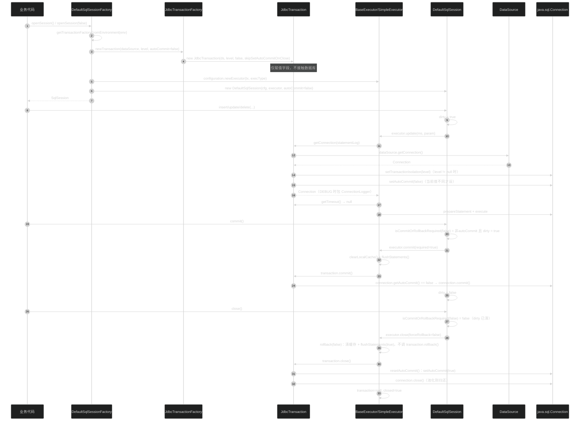
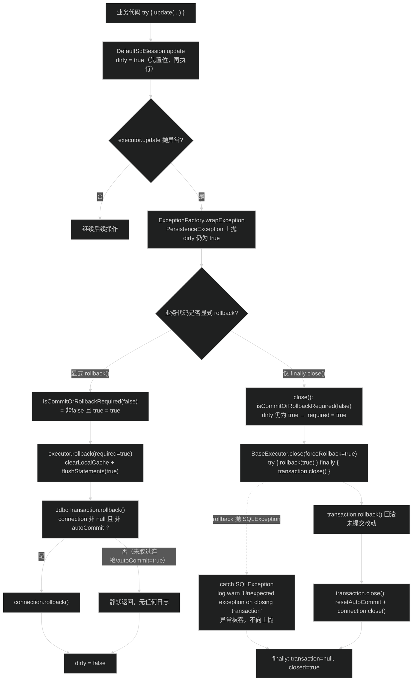
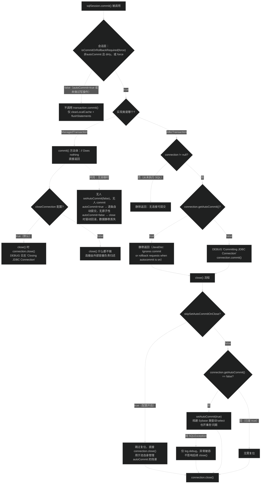

# 事务管理（transaction）
> 上次修改：2026-07-28 23:29

## 重点关注

- **`Transaction` 五方法接口**（`src/main/java/org/apache/ibatis/transaction/Transaction.java:27`）：整个模块的抽象核心，也是 MyBatis 与 Spring / JTA 等外部事务体系对接的唯一契约。只有 `getConnection / commit / rollback / close / getTimeout` 五个方法，理解它就理解了 MyBatis 对"事务"的全部要求。
- **`JdbcTransaction.openConnection()` 的懒获取**（`transaction/jdbc/JdbcTransaction.java:141`）：连接直到第一次真正要执行 SQL 才从 `DataSource` 取出，是"`openSession()` 不占连接"这一重要行为的根源，也是排查连接池占用/泄漏时的第一现场。
- **`JdbcTransaction.commit()/rollback()` 的 autoCommit 短路**（`transaction/jdbc/JdbcTransaction.java:72-90`）：`connection != null && !connection.getAutoCommit()` 双重判断决定了"没取过连接就不提交"和"autoCommit=true 时静默忽略提交"两个易被误解的语义。
- **`JdbcTransaction.resetAutoCommit()` 与 `skipSetAutoCommitOnClose`**（`transaction/jdbc/JdbcTransaction.java:121-139`）：为了绕过"某些数据库 select 也开事务、关连接前必须 commit/rollback"的驱动差异而引入的兼容 hack，注释里点名了 Sybase；是本模块唯一有配置开关的边界处理，也是最容易和连接池（如 HikariCP）打架的地方。
- **`ManagedTransaction.commit()/rollback()` 的空实现**（`transaction/managed/ManagedTransaction.java:65-73`）：把事务边界完全让渡给容器（JEE 容器 / Spring / JTA）。理解"为什么空实现是正确的"以及"在没有容器时它有多危险"，是本模块最重要的一个设计判断。
- **`ManagedTransactionFactory.newTransaction(DataSource, level, autoCommit)` 静默丢弃 autoCommit**（`transaction/managed/ManagedTransactionFactory.java:53-59`）：源码注释明确说明这是为了让同一份业务代码在托管/非托管配置间可移植而故意为之，属于"沉默换可移植性"的取舍。
- **与 `DefaultSqlSession` / `BaseExecutor` 的时机耦合**（`session/defaults/DefaultSqlSession.java:310`、`executor/BaseExecutor.java:251-273`、`executor/BaseExecutor.java:85-104`）：`isCommitOrRollbackRequired` 的 `!autoCommit && dirty || force` 决定了 `Transaction.commit()` 到底会不会被调用；`close()` 时先 `rollback` 再 `transaction.close()` 决定了"忘记 commit 等于回滚"的兜底语义。第 5 节按这条链路画图。

## 1. 模块定位与职责边界

**结论：`transaction` 是 MyBatis 中最薄的一层——它只做"数据库连接的生命周期与提交/回滚动作的抽象与转发"，不做任何事务传播、嵌套、同步或分布式协调。** 它的存在意义是让上层的 `Executor` 只依赖一个五方法接口，而不必知道连接是自己 `DataSource.getConnection()` 拿的、还是被 Spring/JTA 容器塞进来的。

**解决的问题。** JDBC 世界里"事务"就是 `Connection` 上的 `setAutoCommit / commit / rollback / close` 四个动作，但这四个动作的**归属权**在不同运行环境下完全不同：独立应用里归 MyBatis 自己，JEE / Spring 环境里归容器。若不抽象，`Executor` 就必须写满 `if (容器环境)` 分支。`Transaction` 接口（`src/main/java/org/apache/ibatis/transaction/Transaction.java:27`）把这四个动作 + 一个超时查询收敛成 SPI，`TransactionFactory`（`transaction/TransactionFactory.java:30`）负责按环境选实现。

**上游（谁使用本模块）。**
- `Environment` 持有 `TransactionFactory` 实例（`src/main/java/org/apache/ibatis/mapping/Environment.java:27`），并在构造时强制非空校验（`Environment.java:34-36`）。
- `DefaultSqlSessionFactory.openSessionFromDataSource / openSessionFromConnection` 是唯一的 `Transaction` 创建点（`session/defaults/DefaultSqlSessionFactory.java:100`、`:123`）。
- `BaseExecutor` 持有 `protected Transaction transaction` 字段（`executor/BaseExecutor.java:55`），在 `getConnection / commit / rollback / close` 中调用它（`BaseExecutor.java:356`、`:258`、`:270`、`:91`）。
- `SimpleExecutor / ReuseExecutor / BatchExecutor` 通过 `transaction.getTimeout()` 把事务级超时传给 `StatementHandler.prepare`（`executor/SimpleExecutor.java:89`、`executor/ReuseExecutor.java:91`、`executor/BatchExecutor.java:70`）。

**下游（本模块依赖谁）。** 仅依赖 `javax.sql.DataSource` / `java.sql.Connection`（JDK + JDBC 规范）、`org.apache.ibatis.logging`（Log/LogFactory）、`org.apache.ibatis.session.TransactionIsolationLevel`（隔离级别枚举）与 `org.apache.ibatis.exceptions.PersistenceException`（异常基类）。**没有**对 `executor`、`mapping`、`builder` 的反向依赖，因此本模块可以被单独替换（mybatis-spring 的 `SpringManagedTransaction` 就是这么做的）。

**负责什么。**
1. 定义连接生命周期契约（创建、准备、提交/回滚、关闭）。
2. 提供两个内置实现：`JdbcTransaction`（自己管）与 `ManagedTransaction`（交给容器管）。
3. 在获取连接时应用隔离级别与 autoCommit 设置（`JdbcTransaction.openConnection():141-150`、`ManagedTransaction.openConnection():85-93`）。
4. 屏蔽驱动差异：关闭前把 autoCommit 复位（`JdbcTransaction.resetAutoCommit():121`）。
5. 把 autoCommit 配置失败包装成 `TransactionException`（`JdbcTransaction.java:114`）。

**不负责什么（明确排除，避免与相邻模块混淆）。**
- **不决定何时提交/回滚**：由 `DefaultSqlSession.commit/rollback/close` 与 `isCommitOrRollbackRequired`（`session/defaults/DefaultSqlSession.java:310-312`）决定，本模块只是被动执行。
- **不做连接池**：连接来自外部注入的 `DataSource`，池化属于 `datasource` 模块（`org.apache.ibatis.datasource.pooled`）。
- **不做事务传播/嵌套/savepoint**：接口里没有 `begin()`，也没有任何 savepoint API；一个 `Transaction` 实例对应一个 `SqlSession` 的整段生命周期。
- **不实现事务超时**：`getTimeout()` 在两个内置实现里都直接 `return null`（`JdbcTransaction.java:153-155`、`ManagedTransaction.java:96-98`），该方法是留给外部实现（如 Spring 事务同步）的扩展钩子。
- **不做二级缓存事务**：那由 `cache.decorators.TransactionalCache` + `executor.TransactionalCacheManager` 负责，命名相似但与本模块无调用关系。

**主要输入 / 输出 / 状态变化 / 副作用。**

| 维度 | 内容 |
|------|------|
| 输入 | `DataSource` + `TransactionIsolationLevel` + `autoCommit`（数据源路径），或一个现成的 `Connection`（外部连接路径）；`Properties`（工厂级配置：`skipSetAutoCommitOnClose` / `closeConnection`） |
| 输出 | `Connection` 实例（`getConnection()`）、`Integer` 超时（当前恒为 `null`） |
| 内部状态 | `JdbcTransaction.connection` 由 `null` → 已打开（一次性单向转换，无重置）；`ManagedTransaction.connection` 同理。两者的 `connection` 字段都是**非 final 且非 volatile** |
| 副作用 | 从连接池借出连接（可能阻塞/超时）、`setTransactionIsolation`、`setAutoCommit`、`commit`、`rollback`、`close`（归还连接）、DEBUG 级日志输出 |

## 2. 架构关系与依赖

**结论：本模块是一个"双实现的抽象工厂"，对外只暴露两个接口（`Transaction` / `TransactionFactory`），被 `Environment` 静态持有、被 `DefaultSqlSessionFactory` 动态实例化、被 `BaseExecutor` 长期引用。所有跨模块调用都是单向的"上层调用本模块"，本模块从不回调上层。**

```mermaid
%%{init: {"theme": "dark"}}%%
graph TD
  subgraph CFG["配置层 builder / session"]
    XMLCB["XMLConfigBuilder<br/>transactionManagerElement()<br/>解析 &lt;transactionManager type=.../&gt;"]
    ALIAS["Configuration 构造器<br/>别名 JDBC / MANAGED"]
    ENV["Environment<br/>持有 transactionFactory + dataSource<br/>构造时强制非空"]
  end

  subgraph SESS["会话层 session"]
    FACT["DefaultSqlSessionFactory<br/>openSessionFromDataSource / FromConnection<br/>唯一 Transaction 创建点"]
    SESSION["DefaultSqlSession<br/>commit / rollback / close<br/>isCommitOrRollbackRequired 决定 required"]
  end

  subgraph EXEC["执行层 executor"]
    BASEEX["BaseExecutor<br/>持有 Transaction 字段<br/>commit(required)/rollback(required)/close(forceRollback)"]
    SUBEX["SimpleExecutor / ReuseExecutor / BatchExecutor<br/>调用 transaction.getTimeout()"]
  end

  subgraph TX["本模块 transaction"]
    TXIF["Transaction 接口<br/>getConnection/commit/rollback/close/getTimeout"]
    TXFIF["TransactionFactory 接口<br/>setProperties/newTransaction x2"]
    TXEX["TransactionException<br/>extends PersistenceException"]
    JDBCF["JdbcTransactionFactory<br/>字段 skipSetAutoCommitOnClose"]
    JDBCT["JdbcTransaction<br/>直接用 JDBC commit/rollback"]
    MGF["ManagedTransactionFactory<br/>字段 closeConnection=true"]
    MGT["ManagedTransaction<br/>commit/rollback 空实现"]
  end

  subgraph JDK["JDK / JDBC 与基础设施"]
    DS["javax.sql.DataSource<br/>由 datasource 模块提供"]
    CONN["java.sql.Connection"]
    ISO["TransactionIsolationLevel 枚举<br/>session 包"]
    LOG["logging Log / LogFactory"]
  end

  XMLCB -->|"resolveClass + newInstance + setProperties"| TXFIF
  ALIAS -.->|"注册别名"| JDBCF
  ALIAS -.->|"注册别名"| MGF
  XMLCB --> ENV
  ENV -->|"getTransactionFactory()"| TXFIF
  FACT -->|"读取 Environment"| ENV
  FACT -->|"newTransaction(...)"| TXFIF
  FACT -->|"异常时 closeTransaction(tx)"| TXIF
  FACT -->|"configuration.newExecutor(tx, type)"| BASEEX
  SESSION -->|"executor.commit/rollback/close(required)"| BASEEX
  BASEEX -->|"transaction.commit/rollback/close/getConnection"| TXIF
  SUBEX -->|"transaction.getTimeout()"| TXIF
  JDBCF -.->|"创建"| JDBCT
  MGF -.->|"创建"| MGT
  JDBCT -->|"implements"| TXIF
  MGT -->|"implements"| TXIF
  JDBCF -->|"implements"| TXFIF
  MGF -->|"implements"| TXFIF
  JDBCT -->|"getConnection()"| DS
  MGT -->|"getConnection()"| DS
  JDBCT -->|"setAutoCommit/commit/rollback/close"| CONN
  MGT -->|"setTransactionIsolation/close"| CONN
  JDBCT -->|"setTransactionIsolation(level)"| ISO
  MGT --> ISO
  JDBCT -->|"autoCommit 配置失败"| TXEX
  JDBCT --> LOG
  MGT --> LOG
```



**节点与依赖方向说明表。**

| 节点 | 所属层 | 角色 | 依赖方向与强度 |
|------|--------|------|----------------|
| `XMLConfigBuilder.transactionManagerElement`（`builder/xml/XMLConfigBuilder.java:338-342`） | 配置层 | 把 XML 的 `type` 属性反射成 `TransactionFactory` 实例并注入子节点 `<property>` | 单向依赖 `TransactionFactory` 接口；强依赖（无工厂则 `Environment` 构造抛 `IllegalArgumentException`） |
| `Configuration()` 别名注册（`session/Configuration.java:191-192`） | 配置层 | 把字符串 `JDBC` / `MANAGED` 映射到两个内置工厂类 | 编译期依赖两个具体实现类，属于**跨层具体类耦合**（配置层直接 import 实现类），但仅用于别名便利，不影响可替换性 |
| `Environment`（`mapping/Environment.java:25-43`） | 配置层 | `TransactionFactory` 的持有者与生命周期锚点，final 字段 + 构造校验保证不可变 | 强依赖接口；`transactionFactory == null` 直接抛异常（`Environment.java:34`） |
| `DefaultSqlSessionFactory`（`session/defaults/DefaultSqlSessionFactory.java:94-138`） | 会话层 | 唯一的 `Transaction` 实例化入口；两条路径分别对应"从 DataSource 开"和"从既有 Connection 开" | 强依赖两个接口；**并且硬编码依赖 `ManagedTransactionFactory`** 作为 `Environment` 缺失时的兜底（`:133-138`），这是本模块唯一被"默认选中"的实现 |
| `DefaultSqlSession`（`session/defaults/DefaultSqlSession.java:214-312`） | 会话层 | 事务边界的**决策者**：通过 `isCommitOrRollbackRequired(force)` 把 `autoCommit`/`dirty` 折叠成一个 boolean 传给 Executor | 间接依赖（不直接 import `Transaction`，除 `getConnection()`：`:292` 经 `executor.getTransaction()` 取连接） |
| `BaseExecutor`（`executor/BaseExecutor.java:55`、`:85-104`、`:251-273`、`:355-361`） | 执行层 | `Transaction` 的**长期持有者**与转发者；`close()` 中 `rollback → transaction.close()` 的 try/finally 保证连接必被归还 | 强依赖 `Transaction` 接口；`close()` 后把字段置 `null`（`:98`）防止复用 |
| `SimpleExecutor` / `ReuseExecutor` / `BatchExecutor` | 执行层 | 消费 `getTimeout()`，与 `MappedStatement.getTimeout()` 一起决定 `Statement.setQueryTimeout`（`executor/statement/StatementUtil.java:49-57`） | 弱依赖：当前内置实现恒返回 `null`，`applyTransactionTimeout` 直接 `return`（`StatementUtil.java:51-53`） |
| `Transaction` / `TransactionFactory` | 本模块 | 双接口 SPI，全部方法都是 `throws SQLException`（工厂方法除外） | 被依赖端；`TransactionFactory.setProperties` 是 `default` 空实现（`TransactionFactory.java:38-40`），第三方实现可不覆写 |
| `JdbcTransaction` / `JdbcTransactionFactory` | 本模块 | 自管事务，字段 `protected` 便于子类继承定制 | 依赖 `DataSource` + `Connection` + `TransactionException` + `Log` |
| `ManagedTransaction` / `ManagedTransactionFactory` | 本模块 | 托管事务，`commit/rollback` 空实现；字段全 `private`（`closeConnection` 为 `final`） | 依赖 `DataSource` + `Connection` + `Log`；**不依赖** `TransactionException`（它没有任何抛业务异常的路径） |
| `TransactionException`（`transaction/TransactionException.java:23`） | 本模块 | 运行时异常，继承 `PersistenceException`，因此会被 `ExceptionFactory.wrapException` 原样透出 | 仅 `JdbcTransaction.setDesiredAutoCommit` 抛出一处 |
| `DataSource` / `Connection` | JDK | 实际资源提供者 | **可替换依赖**：任何符合 JDBC 规范的实现都可（池化、JNDI、非池化，见 `datasource` 模块） |

**关键数据流。**
1. **配置流（一次性）**：XML `<transactionManager type="JDBC"><property name="skipSetAutoCommitOnClose" value="true"/></transactionManager>` → `resolveClass` 经别名表得到 `JdbcTransactionFactory` → `newInstance()` → `setProperties(props)`（`XMLConfigBuilder.java:338-342`）→ 存入 `Environment`。工厂实例在整个 `Configuration` 生命周期内**单例复用**。
2. **创建流（每次 openSession）**：`Environment.getDataSource()` + `level` + `autoCommit` → `newTransaction(...)` → `Transaction` 实例 → 交给 `Executor` 构造函数。此时**尚未接触数据库**。
3. **执行流（每条 SQL）**：`BaseExecutor.getConnection(statementLog)` → `transaction.getConnection()`（首次触发 `openConnection()`）→ 若 DEBUG 开启则再包一层 `ConnectionLogger` 动态代理（`executor/BaseExecutor.java:357-359`）。
4. **收尾流（commit/rollback/close）**：`DefaultSqlSession` → `BaseExecutor`（先 `clearLocalCache` + `flushStatements`，再按 `required` 决定是否调 `transaction.commit/rollback`）→ `Connection`。

**潜在耦合点与跨层调用（需留意）。**
- **`Configuration` → 具体工厂类的编译期耦合**（`session/Configuration.java:191-192`）：配置层直接 import `JdbcTransactionFactory` / `ManagedTransactionFactory`。好处是零配置即可用短别名；代价是本模块的实现类名不能自由改动。
- **`DefaultSqlSessionFactory` 的 Managed 兜底**（`:133-138`）：`Environment == null` 时返回 `new ManagedTransactionFactory()`。但注意 `openSessionFromDataSource` 紧接着就要用 `environment.getDataSource()`，`environment == null` 会 NPE，因此这条兜底实际只在 `openSessionFromConnection` 路径（`:111-131`）中有意义——那条路径不需要 `DataSource`。
- **`ConnectionLogger` 代理穿透**：`transaction.getConnection()` 返回的原始连接被 Executor 包装后交给 `StatementHandler`，但 `JdbcTransaction.commit()` 操作的是**未包装的原始连接**，因此提交/回滚动作不会出现在 SQL 日志里，只会出现在 `JdbcTransaction` 自己的 DEBUG 日志中（`JdbcTransaction.java:76`、`:86`）。排障时需同时打开这两个 logger。
- **`level` 与连接池的隐性冲突**：`openConnection()` 每次都 `setTransactionIsolation`，但 `close()` 只复位 autoCommit、**不复位隔离级别**（`JdbcTransaction.java:121-139` 中无 `setTransactionIsolation` 调用）。使用池化连接且不同 `SqlSession` 指定不同 `level` 时，隔离级别会残留到下一个借用者——除非连接池自身做了复位（`PooledDataSource` 未做，见 `datasource` 模块文档）。

## 3. 入口与调用方式

**结论：本模块没有面向最终用户的直接入口，全部入口都是"被框架回调"型。共有 4 类入口：配置解析入口（1 个）、实例创建入口（2 个工厂方法）、运行期回调入口（5 个 `Transaction` 方法）、以及一个默认兜底入口。**

### 3.1 配置解析入口：`XMLConfigBuilder.transactionManagerElement(XNode)`

| 项 | 内容 |
|----|------|
| 位置 | `src/main/java/org/apache/ibatis/builder/xml/XMLConfigBuilder.java:338-342`，由 `environmentsElement` 在 `:307` 调用 |
| 触发条件 | 解析 `mybatis-config.xml` 的 `<environments><environment id="X"><transactionManager .../>`，且 `isSpecifiedEnvironment(id)` 为真（`XMLConfigBuilder.java:425-433`） |
| 关键参数 | `type` 属性（必填，走 `resolveClass` → `TypeAliasRegistry`，可写别名 `JDBC`/`MANAGED` 或全限定类名）；子 `<property>` 节点聚合成 `Properties` |
| 返回值 | `TransactionFactory` 实例；反射要求实现类**必须有可访问的无参构造**（`getDeclaredConstructor().newInstance()`） |
| 上下文要求 | 需 `environment` 变量已确定（否则 `isSpecifiedEnvironment` 抛 `BuilderException("No environment specified.")`，`:427`）；实现类需在 classpath 上 |
| 之后进入 | 结果与 `DataSourceFactory` 产物一起构造 `Environment`（`:310-312`），写入 `Configuration`。工厂实例此后**单例复用**，`setProperties` 只调用一次 |

别名注册见 `session/Configuration.java:191-192`：`JDBC → JdbcTransactionFactory`、`MANAGED → ManagedTransactionFactory`。纯 Java 配置时可绕过 XML，直接 `new Environment(id, new JdbcTransactionFactory(), dataSource)`。

### 3.2 实例创建入口：`TransactionFactory` 的两个 `newTransaction`

两个重载对应两种截然不同的连接归属模型，均标注 `@since 3.1.0`（`transaction/TransactionFactory.java:52`、`:68`）。

| 入口 | 触发者 | 关键参数 | 返回/行为 |
|------|--------|----------|-----------|
| `newTransaction(Connection conn)` | `DefaultSqlSessionFactory.openSessionFromConnection`（`session/defaults/DefaultSqlSessionFactory.java:123`），即用户调用 `sqlSessionFactory.openSession(connection)` | 一个**已存在的**连接，通常来自外部事务管理器 | `JdbcTransactionFactory` → `new JdbcTransaction(conn)`（`JdbcTransactionFactory.java:51`），注意此构造器**只赋值 connection**，`dataSource`/`level`/`autoCommit`/`skipSetAutoCommitOnClose` 全为默认值（`JdbcTransaction.java:60-62`）；`ManagedTransactionFactory` → `new ManagedTransaction(conn, closeConnection)`（`ManagedTransactionFactory.java:50`） |
| `newTransaction(DataSource, TransactionIsolationLevel, boolean autoCommit)` | `DefaultSqlSessionFactory.openSessionFromDataSource`（`:100`），即 `openSession()` 系列全部无连接参数的重载 | `level` 可为 `null`（表示不改隔离级别，见 `JdbcTransaction.java:146`）；`autoCommit` 由 `openSession(boolean)` 传入，默认 `false`（`DefaultSqlSessionFactory.java:47`） | `JdbcTransactionFactory` → `new JdbcTransaction(ds, level, autoCommit, skipSetAutoCommitOnClose)`（`:56`）；`ManagedTransactionFactory` → `new ManagedTransaction(ds, level, closeConnection)`（`:58`），**`autoCommit` 参数被静默丢弃** |

调用侧的 `autoCommit` 语义差异值得注意：`openSessionFromConnection` 不接受 `autoCommit` 参数，而是**读取连接当前状态**（`connection.getAutoCommit()`，`:115`），读取失败时降级为 `true`（`:116-120`，注释理由是"多数劣质驱动或数据库不支持事务"），再把该值传给 `DefaultSqlSession` 作为提交决策依据。

### 3.3 工厂配置入口：`TransactionFactory.setProperties(Properties)`

`default` 方法体为空（`transaction/TransactionFactory.java:38-40`），两个内置实现各识别一个键：

| 实现 | 识别键 | 默认值 | 解析代码 | 语义 |
|------|--------|--------|----------|------|
| `JdbcTransactionFactory` | `skipSetAutoCommitOnClose` | `false`（字段默认，`JdbcTransactionFactory.java:36`） | `:43-46`，`props == null` 直接 return（`:40-42`）；`Boolean.parseBoolean` 对非法值静默返回 `false` | `true` 时 `close()` 前不再把 autoCommit 复位为 true |
| `ManagedTransactionFactory` | `closeConnection` | **`true`**（`ManagedTransactionFactory.java:36`） | `:41-45`，同样对 `null` props 与非法值宽容 | `false` 时 `close()` 不关连接，由容器负责归还 |

### 3.4 运行期回调入口：`Transaction` 的五个方法

这五个方法的调用者与时机是本模块与上层协作的核心：

| 方法 | 调用者与位置 | 触发时机 | 关键判断 |
|------|--------------|----------|----------|
| `getConnection()` | `BaseExecutor.getConnection(Log)`（`executor/BaseExecutor.java:356`）；`DefaultSqlSession.getConnection()`（`session/defaults/DefaultSqlSession.java:292`，经 `executor.getTransaction()`） | 每条 SQL 执行前（`StatementHandler` 需要连接时）；用户显式取连接时 | 实现内 `connection == null` 才真正打开（懒获取），后续复用同一连接 |
| `commit()` | `BaseExecutor.commit(boolean required)`（`:258`） | `DefaultSqlSession.commit(force)` → `executor.commit(isCommitOrRollbackRequired(force))`（`DefaultSqlSession.java:222`）；**先 `clearLocalCache()` + `flushStatements()`，再 commit**（`BaseExecutor.java:255-259`） | `required == false` 时**根本不调用**本方法；进入实现后还有 `connection != null && !autoCommit` 二次短路 |
| `rollback()` | `BaseExecutor.rollback(boolean required)`（`:270`） | `DefaultSqlSession.rollback(force)`（`:239`）；或 `close()` 路径下的 `close(forceRollback)` → `rollback(forceRollback)`（`BaseExecutor.java:88`） | 包在 `try/finally` 中，`flushStatements(true)` 无论成败都会走到 `if (required) transaction.rollback()`（`:267-272`） |
| `close()` | `BaseExecutor.close(boolean forceRollback)`（`:91`）；`DefaultSqlSessionFactory.closeTransaction(tx)`（`:140-148`） | `SqlSession.close()`；或 `openSessionFromDataSource` 构造过程抛异常时的补偿关闭（`:104`，注释"may have fetched a connection so lets call close()"） | 位于 `finally` 中，保证即使 `rollback` 抛异常也会执行；此后 `BaseExecutor.transaction = null`（`:98`） |
| `getTimeout()` | `SimpleExecutor.prepareStatement`（`executor/SimpleExecutor.java:89`）、`ReuseExecutor`（`:91`）、`BatchExecutor`（`:70`、`:91`、`:106`）；最终流向 `BaseStatementHandler.setStatementTimeout`（`executor/statement/BaseStatementHandler.java:105-108`）与 `StatementUtil.applyTransactionTimeout` | 每次创建 `Statement` 时 | 两个内置实现恒返回 `null` → `applyTransactionTimeout` 立即 return（`StatementUtil.java:51-53`），等价于不生效 |

### 3.5 默认兜底入口：`getTransactionFactoryFromEnvironment`

`DefaultSqlSessionFactory.getTransactionFactoryFromEnvironment(Environment)`（`:133-138`）在 `environment == null || environment.getTransactionFactory() == null` 时返回 `new ManagedTransactionFactory()`。这意味着**在没有任何事务配置的情况下，MyBatis 的默认行为是"托管"（即不提交也不回滚，但关闭连接）**。由于 `Environment` 构造器已对 `transactionFactory` 做非空校验（`mapping/Environment.java:34-36`），`getTransactionFactory() == null` 实际不可达，真正生效的只有 `environment == null` 一支；而该支在 `openSessionFromDataSource` 中随即会因 `environment.getDataSource()` 而 NPE，故此兜底仅对 `openSessionFromConnection` 路径有效。

## 4. 核心概念与领域模型

本模块只有 5 个概念，但每个都承载明确的设计意图。

### 4.1 `Transaction` —— 连接生命周期的包装器

- **定义**：接口，JavaDoc 自述为"Wraps a database connection. Handles the connection lifecycle that comprises: its creation, preparation, commit/rollback and close"（`transaction/Transaction.java:21-23`）。
- **作用**：把"事务"这一概念降维成"一个连接 + 四个动作"，从而让 `Executor` 与具体事务归属解耦。注意接口里**没有 `begin()`**——事务的"开始"隐含在 `getConnection()` + `setAutoCommit(false)` 中，这是 JDBC 的原生模型。
- **生命周期**：与 `SqlSession` **一一对应且同生共死**。创建于 `DefaultSqlSessionFactory.openSession*`（`:100`/`:123`），销毁于 `BaseExecutor.close()`（`:91`，随后字段置 `null`）。中间不可重启：`close()` 后再调 `getConnection()` 会因 `Executor.closed` 检查而抛 `ExecutorException("Executor was closed.")`（`BaseExecutor.java:78-80`）。
- **相关类型**：实现类 `JdbcTransaction`、`ManagedTransaction`；持有者 `BaseExecutor.transaction`（`:55`）；创建者 `TransactionFactory`。
- **使用场景**：第三方集成的标准做法是实现此接口，例如 mybatis-spring 的 `SpringManagedTransaction` 在 `getConnection()` 中从 Spring 的 `DataSourceUtils` 取当前线程绑定连接，在 `getTimeout()` 中返回 Spring 事务的剩余秒数（这也解释了 `getTimeout()` 为何存在——本仓库内两个实现都返回 `null`，属"未在当前分析范围内确认"的外部用途，但 `StatementUtil.applyTransactionTimeout` 的存在证明了该设计意图）。

**三维评估（把事务抽象为"连接包装器"而非"事务管理器"）**
- **好处**：接口面极小（5 方法），实现成本低；与 JDBC 心智模型一致，无需引入 begin/suspend/resume 等状态机；`Executor` 只需一个字段即可完成所有事务交互，无状态同步负担。
- **替代方案**：(a) 定义带 `begin()/isActive()/getStatus()` 的完整事务接口（类似 JTA `UserTransaction`），能表达传播行为与嵌套，但实现者负担陡增且与 JDBC 语义重复；(b) 干脆不抽象，`Executor` 直接持 `Connection`——那就无法支持容器托管场景；(c) 引入 `TransactionSynchronization` 回调机制，能支持提交前后钩子，但会把观察者模式的复杂度引入核心链路。
- **风险**：无 `begin()` 意味着"事务何时开始"不可观测，日志里只能看到 `Opening JDBC Connection` + `Setting autocommit to false`；无状态查询方法（如 `isActive()`）导致上层无法判断事务是否已被外部提交，只能依赖 `DefaultSqlSession.dirty` 这个近似标志；`getTimeout()` 恒 `null` 使内置实现完全没有事务超时保护，长事务只能靠 `defaultStatementTimeout` 逐语句限制。

### 4.2 `TransactionFactory` —— 抽象工厂 + 属性化配置

- **定义**：接口，三个方法：`default setProperties(Properties)`、`newTransaction(Connection)`、`newTransaction(DataSource, TransactionIsolationLevel, boolean)`（`transaction/TransactionFactory.java:30-70`）。
- **作用**：把"选哪个事务实现"从运行期决策变成配置期决策；同时通过 `Properties` 提供无需改接口的实现级扩展点。
- **生命周期**：**与 `Configuration`/`Environment` 同寿的单例**。`setProperties` 仅在解析阶段调用一次（`XMLConfigBuilder.java:342` 附近），之后工厂字段变为事实只读——这也是 `JdbcTransactionFactory.skipSetAutoCommitOnClose` 用普通 `boolean` 而非 `volatile` 仍然安全的原因（发布时机早于任何 `SqlSession` 创建）。
- **相关类型**：`Environment.transactionFactory`（final 字段，`mapping/Environment.java:27`）、`TypeAliasRegistry` 别名。
- **使用场景**：`<transactionManager type="JDBC"><property name="skipSetAutoCommitOnClose" value="true"/></transactionManager>`。

**三维评估（`setProperties` 用 `Properties` 而非强类型配置对象）**
- **好处**：新增配置项不改接口、不破坏二进制兼容（`skipSetAutoCommitOnClose` 就是这样在后续版本加入的）；与 XML `<property>` 天然同构；`default` 空实现让第三方工厂零成本适配。
- **替代方案**：(a) 为每个工厂定义带 setter 的强类型配置类，IDE 可补全、拼写错误编译期可发现，但需要 builder 层做类型映射；(b) 用注解 + 反射自动绑定属性；(c) 把配置提升到 `Configuration` 上作为全局设置——但事务配置本属 `environment` 级，多环境会冲突。
- **风险**：**拼写错误静默失效**——`props.getProperty("skipSetAutoCommitOnClose")` 返回 `null` 时不报错也不告警（`JdbcTransactionFactory.java:44-46`），写成 `skipSetAutocommitOnClose` 会毫无提示地按默认值运行；`Boolean.parseBoolean` 对 `"yes"`/`"1"` 等值一律解析为 `false`，同样无告警；无配置项清单可供校验。

### 4.3 `JdbcTransaction` —— 自管事务

- **定义**：`implements Transaction`，JavaDoc 三句话概括了全部语义："makes use of the JDBC commit and rollback facilities directly"、"Delays connection retrieval until getConnection() is called"、"Ignores commit or rollback requests when autocommit is on"（`transaction/jdbc/JdbcTransaction.java:29-32`）。
- **作用**：在无容器的独立应用中，由 MyBatis 自己充当事务管理者。
- **状态字段**（全部 `protected`，便于子类继承）：`connection`（懒初始化）、`dataSource`、`level`、`autoCommit`、`skipSetAutoCommitOnClose`（`:42-46`）。
- **生命周期状态迁移**：`未持连接` → （首次 `getConnection()`）→ `持连接且 autoCommit 已按配置设定` → （`commit()`/`rollback()` 可多次调用）→ （`close()`）→ `连接已归还`。注意 `close()` 后 `connection` 字段**不置 null**，若被重复调用会对已关闭连接再次执行 `resetAutoCommit()` + `close()`（详见第 8 节）。
- **使用场景**：`<transactionManager type="JDBC"/>` + 池化数据源，是 MyBatis 独立使用时的标准配置。

**三维评估（懒获取连接 `getConnection()` 才 `dataSource.getConnection()`）**
- **好处**：`openSession()` 本身零 I/O、零连接占用，纯查询失败或提前 `close()` 的会话根本不会去连接池排队；连接持有时长被压缩到"首条 SQL → close"，显著提升池利用率（尤其在 `openSession()` 与首条 SQL 之间还有业务计算的场景）；避免了"开了 session 却没执行 SQL"时的无谓 `setAutoCommit` 往返。
- **替代方案**：(a) 构造时立即取连接——语义更直观、失败更早暴露（fail-fast），但会长时间占用池资源；(b) 每条 SQL 取一次连接、执行完立即归还——池利用率最高，但**无法维持事务**，因为跨语句的 `commit` 必须在同一连接上；(c) 由调用方显式 `begin()` 触发获取——把复杂度外推给用户。
- **风险**：**连接获取失败的时机被推迟**到第一条 SQL，`openSession()` 成功不代表数据库可用，错误堆栈出现在业务代码深处而非会话创建处；**空事务陷阱**——若从未 `getConnection()`，则 `commit()` 因 `connection == null` 静默返回（`:74`），用户以为提交成功实际什么都没发生（虽然逻辑上确实无事可提交，但对"期望至少建立连接"的健康检查类代码是误导）；线程安全上 `connection` 非 `volatile`，跨线程共享 `SqlSession` 时可能重复打开连接并泄漏前一个（详见第 9 节）。

### 4.4 `ManagedTransaction` —— 托管事务

- **定义**：`implements Transaction`，JavaDoc："lets the container manage the full lifecycle of the transaction"、"Delays connection retrieval until getConnection() is called"、"Ignores all commit or rollback requests"、"By default, it closes the connection but can be configured not to do it"（`transaction/managed/ManagedTransaction.java:29-31`）。
- **作用**：当运行在 JEE 容器 / Spring / JTA 环境中时，事务边界由外部划定，MyBatis 必须"闭嘴"，否则会提前提交容器事务的一部分，破坏原子性。
- **状态字段**：`dataSource`、`level`、`connection`（均 `private`）+ `closeConnection`（`private final`，`:41-44`）。相比 `JdbcTransaction` 少了 `autoCommit` 与 `skipSetAutoCommitOnClose`——因为它从不碰 autoCommit。
- **生命周期**：与 `JdbcTransaction` 类似的懒获取，但 `commit()`/`rollback()` 是**无副作用的空操作**（`:66-68`、`:71-73`），`close()` 受 `closeConnection` 开关控制（`:77`）。
- **使用场景**：`<transactionManager type="MANAGED"/>`；配 `<property name="closeConnection" value="false"/>` 时连接连关都不关，完全交给容器（典型于连接由容器包装、需保持打开以参与后续 JTA 提交的场景）。同时它也是 `Environment` 缺失时的默认工厂（`session/defaults/DefaultSqlSessionFactory.java:135`）。

**三维评估（`commit()`/`rollback()` 采用空实现而非抛异常）**
- **好处**：**配置可移植性**——同一份业务代码（含 `sqlSession.commit()` 调用）在 JDBC 与 MANAGED 两种配置间切换时无需任何修改，这正是 `ManagedTransactionFactory.java:55-57` 注释所述意图（"It's silently ignored so that code remains portable between managed and unmanaged configurations"）；避免了 MyBatis 在容器事务中途提交造成的原子性破坏；也免去了上层针对托管场景的 `if` 分支。
- **替代方案**：(a) 抛 `UnsupportedOperationException`——能立刻暴露误用，但会让所有跨环境复用的代码在 MANAGED 下崩溃，牺牲可移植性；(b) 输出 WARN 日志后忽略——保留可移植性同时提供可观测性，代价是正常路径下的日志噪音（每次 `commit()` 都打）；(c) 让 `Transaction` 增加 `isManaged()` 供上层跳过调用——接口膨胀且泄漏实现细节；(d) 通过 `TransactionSynchronization` 注册到容器，真正参与容器事务——即 mybatis-spring 的做法，但需要依赖具体容器 API，核心库无法内置。
- **风险**：**静默失效是本模块最大的误配置陷阱**。若在没有任何容器/外部事务管理器的环境下误用 `MANAGED`，`sqlSession.commit()` 会成功返回但数据**不会**落库：`ManagedTransaction` 从不 `setAutoCommit(false)`，连接的 autoCommit 取决于驱动/池的默认值（多数为 `true`，此时逐条自动提交，看似"能用"但实际无事务原子性；若池配置了 `autoCommit=false`，则 `close()` 时未提交的改动被驱动回滚，数据静默丢失）。**没有任何日志或异常提示这种误用**——`commit()` 方法体只有一行注释 `// Does nothing`。此外 `closeConnection=false` 时连接的关闭责任完全外移，若外部忘记归还即造成连接池耗尽。

### 4.5 `TransactionException` —— 事务领域异常

- **定义**：`extends PersistenceException`（`transaction/TransactionException.java:23`），四个标准构造器，`serialVersionUID = -433589569461084605L`（`:25`）。
- **作用**：把事务配置类故障标记为持久层异常。由于 `PersistenceException` 是 `RuntimeException` 子类，无需在 `Transaction` 接口签名上声明。
- **生命周期**：仅在 `JdbcTransaction.setDesiredAutoCommit` 捕获 `SQLException` 后抛出一次（`JdbcTransaction.java:114-117`），消息中携带请求的 autoCommit 值与原始异常。
- **概念关系**：`TransactionException` → `PersistenceException` → `IbatisException`(deprecated) / `RuntimeException`；因其已是 `PersistenceException`，`ExceptionFactory.wrapException` 会原样透出而不再二次包装。
- **使用场景**：驱动不支持 `getAutoCommit()`/`setAutoCommit()` 时。源码注释坦言"Only a very poorly implemented driver would fail here, and there's not much we can do about that"（`:112-113`）。

**概念间关系总览。** `Environment` **聚合** 一个 `TransactionFactory`；`TransactionFactory` **创建** `Transaction`（工厂-产品）；`Transaction` **包装** 一个 `Connection`（组合，且是连接的**状态拥有者**——autoCommit/隔离级别的修改都由它发起）；`BaseExecutor` **引用** `Transaction`（1:1，弱所有权：负责调用 `close()` 但不负责创建）；`DefaultSqlSession` **不直接引用** `Transaction`，而是通过 `Executor` 间接控制，并用自身的 `autoCommit` + `dirty` 两个布尔量**转换**为 `required` 参数——这是本模块与会话层之间唯一的"决策接口"。

## 5. 关键流程

### 5.1 主成功路径：JDBC 事务的"开会话 → 执行 → 提交 → 关闭"



**1-7 会话与事务对象的装配（纯内存阶段）。** `openSession()` 默认走 `openSessionFromDataSource(defaultExecutorType, null, false)`（`session/defaults/DefaultSqlSessionFactory.java:47`），先从 `Configuration` 取 `Environment`，经 `getTransactionFactoryFromEnvironment` 拿到解析期就固定下来的工厂单例（`:99`、`:133-138`），再调 `newTransaction(dataSource, level, autoCommit)`（`:100`）得到 `JdbcTransaction`。`JdbcTransaction` 的四参构造器只做字段赋值（`transaction/jdbc/JdbcTransaction.java:52-58`），**整个阶段零 I/O、零连接占用**——这是懒获取设计最直接的收益。随后 `configuration.newExecutor(tx, execType)` 把事务交给 Executor 持有（`BaseExecutor.java:66-67`），`autoCommit` 同时传给 `DefaultSqlSession` 作为后续提交决策的依据（`:102`）。若这一段任意环节抛异常，`catch` 分支会调 `closeTransaction(tx)`（`:104`），注释解释了原因："may have fetched a connection so lets call close()"。

**8-18 首条 SQL 触发连接的真正获取与事务准备。** 业务调用 `insert/update/delete` 时 `DefaultSqlSession` 先把 `dirty = true`（`session/defaults/DefaultSqlSession.java:194`）——这是后续"是否需要提交"的唯一标志。执行链走到 `BaseExecutor.getConnection(statementLog)`（`:355-361`），转发给 `transaction.getConnection()`。此时 `connection == null` 成立，进入 `openConnection()`（`JdbcTransaction.java:141-150`）：打 DEBUG 日志 → `dataSource.getConnection()` → `level != null` 才 `setTransactionIsolation`（`:146-148`，`null` 表示沿用连接现状）→ `setDesiredAutoCommit(autoCommit)`。后者还有一层优化：仅当 `connection.getAutoCommit() != desiredAutoCommit` 才真正调 `setAutoCommit`（`:105-110`），避免对已经是目标状态的池化连接做无谓的网络往返。**"事务开始"这一动作在物理上就是这一句 `setAutoCommit(false)`**。若驱动在此抛 `SQLException`，会被包成 `TransactionException` 向上抛出（`:111-118`）。连接返回给 Executor 后，DEBUG 日志开启时会再包一层 `ConnectionLogger` 动态代理（`BaseExecutor.java:357-359`）——注意事务自身的 commit/rollback 操作的是**未包装的原始连接**，不会出现在 SQL 日志里。`transaction.getTimeout()` 返回 `null`，使 `StatementUtil.applyTransactionTimeout` 立即返回而不设置 query timeout（`executor/statement/StatementUtil.java:51-53`）。

**19-25 提交阶段的两级判断。** `sqlSession.commit()` → `commit(false)` → `executor.commit(isCommitOrRollbackRequired(false))`（`DefaultSqlSession.java:215-228`）。**第一级判断在会话层**：`!autoCommit && dirty || force`（`:311`），此处 `autoCommit=false`、`dirty=true`，故 `required=true`。`BaseExecutor.commit` 先 `clearLocalCache()` 再 `flushStatements()`（`:255-256`）——顺序很关键：批处理模式下未 flush 的语句必须在 commit 前送到数据库，否则会被后续 `close` 丢弃。**第二级判断在本模块**：`JdbcTransaction.commit()` 要求 `connection != null && !connection.getAutoCommit()`（`:74`），即"取过连接"且"确实处于手动提交模式"才执行 `connection.commit()`。两级判断都通过后，提交才真正发生，最后 `dirty = false`（`DefaultSqlSession.java:223`）。任一环节抛异常都会被 `ExceptionFactory.wrapException("Error committing transaction. ...")` 包装（`:225`），且 `dirty` **保持为 true**——意味着后续 `close()` 会触发回滚兜底。

**26-33 关闭阶段与 autoCommit 复位。** `close()` 同样先算 `isCommitOrRollbackRequired(false)`（`:262`）：因为上一步已把 `dirty` 清零，这里得到 `false`，所以 `BaseExecutor.close(false)` → `rollback(false)` 只清本地缓存并 `flushStatements(true)`，**不会**调 `transaction.rollback()`（`:263-272`）。接着在 `finally` 中执行 `transaction.close()`（`:90-92`），进入 `JdbcTransaction.close()`（`:93-101`）：先 `resetAutoCommit()` 再 `connection.close()`。`resetAutoCommit` 的条件是 `!skipSetAutoCommitOnClose && !connection.getAutoCommit()`（`:123`），源码注释给出了完整理由——MyBatis 对纯查询会话不发 commit/rollback，而某些数据库（注释点名 Sybase）连 select 也开事务并要求关连接前必须结束事务，于是"把 autoCommit 设为 true"成为一种通用收尾（`:124-128`）。该操作若失败**只打 DEBUG 日志、不抛异常**（`:134-137`），因为此刻连接即将关闭，抛异常只会掩盖真正的业务错误。最终 `BaseExecutor` 在 `finally` 中把 `transaction` 等字段置 `null` 并标记 `closed=true`（`:97-103`），彻底断开引用。

### 5.2 重要失败路径：SQL 异常后忘记回滚，由 `close()` 兜底



**1-5 异常发生与脏标志的保留。** `DefaultSqlSession.update` 在**执行前**就设置 `dirty = true`（`session/defaults/DefaultSqlSession.java:193-194`），而不是执行成功后才置位。这是刻意的悲观策略：SQL 抛异常时也可能已有部分改动落到连接上（尤其批处理与多语句场景），因此必须假定"脏"。异常经 `ExceptionFactory.wrapException` 包成 `PersistenceException` 抛出，`dirty` 不被重置（只有 `commit`/`rollback`/`close` 成功才清零，`:223`/`:240`/`:264`）。

**6-10 显式回滚路径。** `rollback()` → `rollback(false)` → `executor.rollback(isCommitOrRollbackRequired(false))`（`:237-246`），`required=true`。`BaseExecutor.rollback` 的结构值得注意：`clearLocalCache()` 与 `flushStatements(true)` 放在 `try` 中，`if (required) transaction.rollback()` 放在 `finally` 中（`executor/BaseExecutor.java:263-273`），**保证即使刷批处理语句时抛异常，回滚也一定执行**。进入 `JdbcTransaction.rollback()` 后仍有 `connection != null && !connection.getAutoCommit()` 短路（`:84`）：从未取过连接、或连接处于 autoCommit 模式时静默返回——后者意味着**在 `openSession(true)` 下调用 `rollback()` 是完全无效的空操作，且没有任何日志提示**，这是易错点。

**11-16 `close()` 的回滚兜底（最重要的失败保护）。** 若业务代码只在 `finally` 里 `close()` 而未回滚，`isCommitOrRollbackRequired(false)` 因 `dirty` 仍为 `true` 而返回 `true`（`:262`、`:311`），于是 `BaseExecutor.close(true)` → `rollback(true)` → `transaction.rollback()`，未提交的改动被回滚。这构成了 MyBatis 的核心安全语义：**"没提交就等于回滚"**。`BaseExecutor.close` 的三层结构（外层 `try` 捕 `SQLException`、内层 `try/finally` 保证 `transaction.close()`、最外层 `finally` 清字段）确保三件事：回滚先于关闭、关闭必然执行、异常绝不逃逸（`:85-104`）。其中 `catch (SQLException e) { log.warn(...) }`（`:94-96`）附注释"Ignore. There's nothing that can be done at this point."——关闭阶段的异常只降级为 WARN 日志。

**17 补偿关闭路径。** 另有一条独立的失败路径：`openSessionFromDataSource` 在构造 Executor/Session 过程中抛异常时，`catch` 块调用 `closeTransaction(tx)`（`session/defaults/DefaultSqlSessionFactory.java:103-105`、`:140-148`）。该方法内部 `catch (SQLException ignore)` 并附注释"Intentionally ignore. Prefer previous error."——优先保留原始错误，避免关闭失败掩盖真因。

### 5.3 边界路径：Managed 托管 + autoCommit=true + skipSetAutoCommitOnClose 的三类"静默"分支



**1-3 会话层短路：autoCommit 会话下 commit 根本不下传。** `openSession(true)` 使 `DefaultSqlSession.autoCommit = true`，于是 `isCommitOrRollbackRequired(false)` 恒为 `false`（`session/defaults/DefaultSqlSession.java:311`），`required=false` 传给 `BaseExecutor.commit`，后者只做 `clearLocalCache() + flushStatements()` 而跳过 `transaction.commit()`（`executor/BaseExecutor.java:255-259`）。同理，一个只执行 `select` 的会话 `dirty` 始终为 `false`，即使 `autoCommit=false` 也不会触发 `transaction.commit()`——这正是 `resetAutoCommit` 注释所说的"MyBatis does not call commit/rollback on a connection if just selects were performed"（`transaction/jdbc/JdbcTransaction.java:124`），也是该兼容 hack 存在的前提。

**4-9 Managed 分支：双重"什么都不做"。** `ManagedTransaction.commit()` 与 `rollback()` 的方法体分别只有注释 `// Does nothing`（`transaction/managed/ManagedTransaction.java:66-68`、`:71-73`）。`openConnection()` 也**不设置 autoCommit**（`:85-93`，对比 `JdbcTransaction.openConnection` 少了 `setDesiredAutoCommit` 一行），只在 `level != null` 时设隔离级别。`close()` 由 `closeConnection` 控制：默认 `true` 则关连接（`:77-82`），配 `false` 则连关都不关。此外 `ManagedTransactionFactory.newTransaction(ds, level, autoCommit)` 会**静默丢弃 `autoCommit` 参数**，注释说明这是为了让代码在托管/非托管配置间可移植（`transaction/managed/ManagedTransactionFactory.java:54-58`）。风险分支（图中 `MRISK`）：无容器时误用 `MANAGED`，`commit()` 成功返回但数据行为完全取决于连接的 autoCommit 默认值，且**全链路无一处日志或异常告警**。

**10-14 JdbcTransaction 的两级静默短路。** `connection == null`（从未执行过任何 SQL）时 `commit()`/`rollback()` 静默返回（`:74`、`:84`）——逻辑上无事可做，但对"先 openSession 再 commit 做连通性探测"的代码是误导。`connection.getAutoCommit() == true` 时同样静默返回，对应 JavaDoc 的"Ignores commit or rollback requests when autocommit is on"（`:32`）。注意这里读的是**连接的实时状态**而非构造时传入的 `autoCommit` 字段——若通过 `new JdbcTransaction(connection)` 单参构造器创建（`:60-62`），`autoCommit` 字段为默认 `false`、`dataSource` 为 `null`，此时行为完全由外部连接的真实 autoCommit 决定，字段值不参与判断。

**15-20 关闭时的 autoCommit 复位三分支。** `resetAutoCommit()` 的条件 `!skipSetAutoCommitOnClose && !connection.getAutoCommit()`（`:123`）产生三条路径：配置开启 `skipSetAutoCommitOnClose=true` 则完全跳过复位（适用于连接池自身负责 autoCommit 状态、或数据库不接受该调用的场景，如注释提到"Sybase throws an exception here"）；未开启且当前 `autoCommit=false` 则 `setAutoCommit(true)`；已是 `true` 则无需动作。第一条分支的存在本身说明"无条件复位"曾造成实际问题——对配置了 `autoCommit=false` 的连接池而言，MyBatis 归还前把它改成 `true`，池若不复位就会污染下一个借用者。复位失败只记 DEBUG 日志（`:134-137`），随后 `connection.close()` 照常执行（`:99`）。

## 6. 核心实现细节

### 6.1 `Transaction` 接口的方法集裁剪

`transaction/Transaction.java:27-73` 只声明五个方法，全部 `throws SQLException`。设计上有三处刻意的"缺失"：

1. **无 `begin()`**：事务开始 = `getConnection()` 中的 `setAutoCommit(false)`，隐式发生。
2. **无状态查询**（`isActive()` / `getStatus()`）：上层用 `DefaultSqlSession.dirty` 近似替代。
3. **无 savepoint / 嵌套**：一个实例只对应一段扁平事务。

唯一"非四件套"的方法是 `getTimeout()`，返回 `Integer`（可为 `null`）而非 `int`——`null` 语义为"无事务超时"，被 `StatementUtil.applyTransactionTimeout` 直接 `return` 消化（`executor/statement/StatementUtil.java:51-53`）。用 `Integer` 而非 `int` + 哨兵值（如 `-1`）避免了哨兵约定，也让 `BaseStatementHandler.setStatementTimeout` 的三方比较（statement 级、全局默认、事务级）能用统一的 null 判断（`executor/statement/BaseStatementHandler.java:105-108`）。

**三维评估（五方法极简接口 + `SQLException` 直抛）**
- **好处**：实现负担极低，第三方（Spring/Guice/CDI 集成）只需几十行；`SQLException` 直抛让上层 `Executor` 统一在 `DefaultSqlSession` 层做异常包装（`ExceptionFactory.wrapException`），避免本模块重复包装造成堆栈膨胀。
- **替代方案**：(a) 抛自定义 `TransactionException`（已存在该类）统一异常类型——但会让 `Executor` 无法区分"事务故障"与"SQL 故障"，也与 `Executor` 接口签名的 `throws SQLException` 不一致；(b) 返回布尔状态码而非抛异常——违背 Java 惯例且易被忽略。
- **风险**：`SQLException` 是检查异常，导致 `Transaction` 的每个实现与调用点都被迫处理它，`BaseExecutor.close` 里就出现了"捕获后仅 log.warn"的吞异常写法（`executor/BaseExecutor.java:94-96`）；接口无版本化机制，未来加方法会破坏所有第三方实现（`TransactionFactory.setProperties` 已用 `default` 规避过一次这个问题，但 `Transaction` 本身没有任何 `default` 方法）。

### 6.2 `JdbcTransaction.openConnection()` —— 懒获取 + 三步准备

```
// transaction/jdbc/JdbcTransaction.java:141-150
protected void openConnection() throws SQLException {
  if (log.isDebugEnabled()) { log.debug("Opening JDBC Connection"); }
  connection = dataSource.getConnection();
  if (level != null) { connection.setTransactionIsolation(level.getLevel()); }
  setDesiredAutoCommit(autoCommit);
}
```

- **输入**：字段 `dataSource`、`level`、`autoCommit`（构造期固定）。
- **处理**：借连接 → 条件设隔离级别 → 设 autoCommit。三步顺序不可换：隔离级别必须在事务开始（`setAutoCommit(false)`）之前设置，否则部分驱动会因"事务已激活"拒绝修改。
- **输出/状态变化**：`connection` 字段由 `null` 变为非 `null`，此后 `getConnection()` 直接返回（`:65-70`）。
- **副作用**：占用池中一个连接槽；两次可能的网络往返（隔离级别 + autoCommit）。
- **隐藏假设**：(1) `dataSource != null`——若通过单参构造器 `new JdbcTransaction(connection)` 创建（`:60-62`），`dataSource` 为 `null`，但那条路径下 `connection` 已非 `null`，`openConnection()` 永不被调用，因此不会 NPE；这是靠"构造器互斥"而非显式校验保证的不变式。(2) `level` 为 `null` 表示"沿用连接现状"，而非"使用数据库默认"——池化连接可能残留上一个使用者设置的隔离级别（`PooledDataSource` 归还连接时不复位隔离级别，仅处理未提交事务）。
- **`protected` 修饰**：与 `connection`/`dataSource` 等 `protected` 字段一致，明确支持子类覆写连接获取逻辑（例如加重试、加路由）。

`setDesiredAutoCommit`（`:103-119`）的关键是**先读后写**：`if (connection.getAutoCommit() != desiredAutoCommit)` 才调用 `setAutoCommit`。对池化连接（通常已是所需状态）可省一次往返。异常处理把 `SQLException` 转成 `TransactionException`，消息里同时给出请求值与"你的驱动可能不支持 getAutoCommit()/setAutoCommit()"的诊断提示（`:114-117`）。

**三维评估（懒获取连接）**——见第 4.3 节的完整三维评估。此处补充实现层面的一点：懒获取与"`connection` 字段一旦赋值不再重置"共同构成了一个**单向状态机**，因此 `getConnection()` 不需要任何同步即可保证单线程下的幂等；代价是无法支持"释放后重连"，这也是 `BaseExecutor.close()` 必须把 `transaction` 置 `null`（`:98`）而不能复用的原因。

### 6.3 `commit()` / `rollback()` 的双条件短路

```
// transaction/jdbc/JdbcTransaction.java:72-90
if (connection != null && !connection.getAutoCommit()) { ... connection.commit(); }
```

两个条件的职责不同：`connection != null` 处理"懒获取从未触发"，`!connection.getAutoCommit()` 处理"连接处于自动提交模式"。第二个条件读的是**连接实时状态**而非 `autoCommit` 字段，这一点很重要——单参构造器路径下 `autoCommit` 字段是无意义的默认 `false`，只有实时读取才正确。`commit()` 与 `rollback()` 结构完全对称，仅日志文案与最终调用不同。

**三维评估（静默忽略而非抛异常/告警）**
- **好处**：与 `ManagedTransaction` 的空实现形成一致语义——上层无需知道当前是否 autoCommit 模式就可以无条件调 `commit()`，代码在 `openSession()` / `openSession(true)` / MANAGED 三种配置间可移植；避免了对 autoCommit 会话每次 commit 都抛异常的噪音。
- **替代方案**：(a) autoCommit 模式下 `commit()` 抛 `IllegalStateException`——能立刻暴露误用，但破坏可移植性且会让 `close()` 兜底路径也炸；(b) 打 WARN 日志——保留可移植性同时可观测，代价是日志噪音（每次 close 都可能触发）；(c) 在 `openSession(true)` 时就让 `DefaultSqlSession` 拒绝 `commit()` 调用——但 `isCommitOrRollbackRequired` 已经在会话层做了这层过滤，本模块的判断实际是**第二重防线**，重复但更安全。
- **风险**：`autoCommit=true` 时 `rollback()` 完全无效且无提示，容易让开发者误以为"回滚成功"；`connection == null` 时的静默返回掩盖了"会话没做任何数据库交互"这一事实。此外每次 commit/rollback 都要调一次 `connection.getAutoCommit()`，对某些需要往返查询的驱动是额外开销（多数驱动本地缓存该标志，影响可忽略）。

### 6.4 `resetAutoCommit()` —— 驱动兼容 hack 与它的开关

```
// transaction/jdbc/JdbcTransaction.java:121-139
if (!skipSetAutoCommitOnClose && !connection.getAutoCommit()) {
  // MyBatis does not call commit/rollback on a connection if just selects were performed.
  // Some databases start transactions with select statements
  // and they mandate a commit/rollback before closing the connection.
  // A workaround is setting the autocommit to true before closing the connection.
  // Sybase throws an exception here.
  connection.setAutoCommit(true);
}
```

- **问题背景**（源码注释自述）：纯查询会话不会触发 `transaction.commit()`（因为 `dirty == false`，见 5.3 节），但某些数据库连 select 也开启事务并要求关连接前必须结束事务。把 autoCommit 设为 `true` 会隐式提交/结束当前事务，构成通用收尾。
- **输入**：`skipSetAutoCommitOnClose` 字段 + 连接实时状态。
- **副作用**：一次 `setAutoCommit(true)`；失败时**只打 DEBUG 日志**（`:134-137`），异常被吞。
- **为什么吞异常**：此方法只在 `close()` 中被调用（`:95`），紧接着就是 `connection.close()`。若在这里抛异常，连接将泄漏（`close()` 后续语句不执行），且会掩盖业务层的真实错误。吞掉异常换取"连接一定被关闭"是正确的权衡——但注释提到的"Sybase throws an exception here"正是这条路径被高频触发的场景。
- **`skipSetAutoCommitOnClose` 开关的意义**：当连接池自身管理 autoCommit（如 HikariCP 的 `autoCommit` 配置项，归还连接时会按池配置复位），MyBatis 的复位是多余甚至有害的往返；配 `true` 可跳过。

**三维评估（默认无条件复位 + 提供跳过开关）**
- **好处**：默认行为覆盖了"某些数据库 select 也开事务"这类难以诊断的问题，让绝大多数用户开箱即用；`skipSetAutoCommitOnClose` 让懂行的用户能省掉一次往返或规避驱动异常；开关默认 `false` 保证向后兼容（该字段是后加的，见 `JdbcTransactionFactory.java:36`）。
- **替代方案**：(a) 纯查询会话也无条件 `commit()`——语义更明确但对不需要的数据库是额外往返，且对只读事务可能触发不必要的日志写；(b) 由用户显式配置"是否在关闭前提交"——比当前 hack 更直白但增加认知负担；(c) 按 `databaseId` 自动判定——需要维护数据库黑白名单，MyBatis 核心不愿承担；(d) 完全不处理，交给连接池——但连接池行为不统一，无法保证。
- **风险**：与连接池的 autoCommit 管理产生**双重写**：MyBatis 归还前设为 `true`，池借出时又设回配置值，白白浪费两次往返；若池不做复位（`PooledDataSource` 即不复位 autoCommit 也不复位隔离级别），下一个使用者拿到的连接 autoCommit 已被改为 `true`——但由于 `setDesiredAutoCommit` 会检查并纠正，实际不会出错。**隔离级别则没有对应的复位机制**，是真正的残留风险点（见第 9 节）。异常被吞使复位失败完全不可见（DEBUG 级别默认不开），排查"为什么 Sybase 偶发报错"时缺少线索。

### 6.5 `ManagedTransaction` —— 空实现的精确边界

`ManagedTransaction` 与 `JdbcTransaction` 的差异可以精确列举：

| 维度 | `JdbcTransaction` | `ManagedTransaction` |
|------|-------------------|----------------------|
| 字段可见性 | `protected`（支持继承定制） | `private`，`closeConnection` 为 `final`（不鼓励继承） |
| `openConnection()` | 取连接 + 设隔离级别 + **设 autoCommit**（`:141-150`） | 取连接 + 设隔离级别，**不碰 autoCommit**（`:85-93`） |
| `commit()` | 双条件后 `connection.commit()`（`:72-80`） | `// Does nothing`（`:66-68`） |
| `rollback()` | 双条件后 `connection.rollback()`（`:82-90`） | `// Does nothing`（`:71-73`） |
| `close()` | `resetAutoCommit()` + `close()`（`:93-101`） | `closeConnection && connection != null` 才 `close()`（`:76-83`） |
| 抛业务异常 | `TransactionException`（autoCommit 配置失败） | 无（不 import `TransactionException`） |
| 工厂配置项 | `skipSetAutoCommitOnClose`（默认 `false`） | `closeConnection`（默认 `true`） |

**为什么不碰 autoCommit 是关键。** 容器（JTA/Spring）在把连接交给应用前已按自己的事务策略设置好 autoCommit 与隔离级别；MyBatis 若再改，会破坏容器的状态假设，甚至隐式提交容器事务的一部分。`ManagedTransaction` 因此对连接状态**完全只读**（唯一例外是 `level != null` 时的 `setTransactionIsolation`，`:90-92`——这是一个可争议的残留：既然事务全托管，改隔离级别同样可能干扰容器，但为了与 `openSession(level)` API 保持形式一致而保留了下来）。

**三维评估（`ManagedTransaction` 仍然默认关闭连接，`closeConnection` 默认 `true`）**
- **好处**：在容器提供的连接是"逻辑连接/包装连接"的常见场景下（JEE 数据源返回的句柄，`close()` 语义就是"归还给容器"而非物理断开），关闭是正确且必要的——不关会导致句柄泄漏。默认 `true` 覆盖多数 JEE 场景，无需配置。
- **替代方案**：(a) 默认 `false`（不关），把归还责任完全外推——对 JEE 逻辑连接会造成泄漏，是更差的默认值；(b) 不提供该开关，一律关闭——无法适配"连接需保持打开以参与后续操作"的场景（如同一物理连接被多个 SqlSession 复用）；(c) 通过检测连接是否为包装类型自动判断——不可靠且脆弱。
- **风险**：`closeConnection=false` 时 MyBatis 彻底放弃连接管理，一旦外部忘记归还即造成连接池耗尽，且 MyBatis 侧无任何日志痕迹（`close()` 连 DEBUG 都不打，因为整个 if 块被跳过，`:77`）；反之若容器期望自己关闭而 MyBatis 提前关了（默认 `true` 且容器给的是物理连接），可能导致容器后续操作失败。该配置项的正确值完全依赖运行环境，文档之外无从推断。

### 6.6 `TransactionFactory` 的 `default` 方法与属性解析的宽容策略

`setProperties` 声明为 `default` 空实现（`transaction/TransactionFactory.java:38-40`，方法体注释 `// NOP`），使得只关心 `newTransaction` 的第三方实现无需覆写。两个内置工厂的解析代码风格略有差异但语义等价：

- `JdbcTransactionFactory`：早返回风格 `if (props == null) return;`（`:40-42`）。
- `ManagedTransactionFactory`：嵌套风格 `if (props != null) { ... }`（`:40-46`）。

两者都用 `props.getProperty(key) != null` 判断"是否显式配置"，再用 `Boolean.parseBoolean` 转换——这意味着**未配置时保留字段默认值，配置了非法值时静默变成 `false`**。

**三维评估（属性解析不做校验、不告警）**
- **好处**：实现极简（各 4 行）；对缺失配置宽容，不会因为一个可选项拼错就导致启动失败；`getProperty != null` 的判断保证了"未配置"与"配置为 false"可区分（对 `closeConnection` 尤其重要，它默认是 `true`）。
- **替代方案**：(a) 用 `Boolean.valueOf` + 严格校验，非法值抛 `BuilderException`——启动即失败，问题暴露最早，符合 `XMLConfigBuilder` 其他地方对未知配置项的处理风格；(b) 记录 WARN 日志提示未识别的属性键——需要工厂知晓自己支持的全部键名，可用 `Set` 常量实现；(c) 复用 MyBatis 内部的 `PropertyParser` 支持占位符与默认值语法。
- **风险**：**拼写错误零反馈**是最实际的风险——`skipSetAutocommitOnClose`（小写 c）会被完全忽略，用户以为配置生效但行为未变，只能通过阅读源码或调试字段值才能发现；`value="yes"` 被 `parseBoolean` 解析为 `false`，同样静默；工厂实例的字段非 `final` 且非 `volatile`，虽然实际发布时机（解析期，早于任何 `SqlSession` 创建）保证了安全，但若有人在运行期再次调用 `setProperties`，其他线程可能看不到更新——该场景在当前代码路径中不存在，属理论风险。

## 7. 数据结构、配置与外部协议

### 7.1 核心数据结构（实例字段）

**`JdbcTransaction`**（`transaction/jdbc/JdbcTransaction.java:42-46`）

| 字段 | 类型 | 可见性 | 默认/来源 | 含义与约束 |
|------|------|--------|-----------|------------|
| `connection` | `Connection` | `protected` | `null`（DataSource 路径）或构造入参 | 唯一的可变状态；`null` → 非 `null` 单向迁移，`close()` 后**不置 null** |
| `dataSource` | `DataSource` | `protected` | 构造入参；单参构造器下为 `null` | 懒获取的来源；仅在 `connection == null` 时使用，因此单参路径下的 `null` 不会 NPE |
| `level` | `TransactionIsolationLevel` | `protected` | 构造入参，允许 `null` | `null` 表示不修改连接的隔离级别（沿用现状，非"数据库默认"）；非 `null` 时在事务开始前应用 |
| `autoCommit` | `boolean` | `protected` | 构造入参；单参构造器下为 `false`（字段默认） | 仅在 `openConnection()` 中作为目标值使用；`commit()/rollback()` **不读此字段**而读连接实时状态 |
| `skipSetAutoCommitOnClose` | `boolean` | `protected` | 由工厂注入，默认 `false` | `true` 时 `close()` 前不复位 autoCommit |
| `log` | `Log` | `private static final` | `LogFactory.getLog(JdbcTransaction.class)` | logger 名即 `org.apache.ibatis.transaction.jdbc.JdbcTransaction`，排障时需单独开 DEBUG |

**`ManagedTransaction`**（`transaction/managed/ManagedTransaction.java:41-44`）

| 字段 | 类型 | 可见性 | 默认/来源 | 含义与约束 |
|------|------|--------|-----------|------------|
| `dataSource` | `DataSource` | `private` | 构造入参；双参（Connection）构造器下为 `null` | 同上 |
| `level` | `TransactionIsolationLevel` | `private` | 构造入参，允许 `null` | 唯一会被本类修改的连接属性 |
| `connection` | `Connection` | `private` | `null` 或构造入参 | 懒获取 |
| `closeConnection` | `boolean` | `private final` | 由工厂注入，默认 `true` | `final` 表明创建后不可变；`false` 时 `close()` 完全无动作 |

**`JdbcTransactionFactory` / `ManagedTransactionFactory`** 各只有一个 `boolean` 字段（`JdbcTransactionFactory.java:36`、`ManagedTransactionFactory.java:36`），非 `final`、非 `volatile`，在配置解析期一次性写入后事实只读。

### 7.2 配置项清单（XML `<transactionManager>` 子 `<property>`）

XML 结构由 DTD 约束：`<!ELEMENT transactionManager (property*)>` + `type CDATA #REQUIRED`（`src/main/resources/org/apache/ibatis/builder/xml/mybatis-3-config.dtd:95-98`），XSD 同步定义于 `mybatis-config.xsd:150-156`。`<environment>` 要求 `(transactionManager,dataSource)` 两个子元素**均必填且有序**（DTD `:90`），因此配置文件里不可省略 `<transactionManager>`。

| 配置位置 | 键 | 类型 | 默认值 | 生效实现 | 错误配置的后果 |
|----------|-----|------|--------|----------|----------------|
| `<transactionManager type="...">` | `type` | 字符串（别名或全限定类名） | 无（DTD 标为 `#REQUIRED`） | — | 别名未注册且类不存在 → `resolveClass` 抛异常（`XMLConfigBuilder.java:342`）；类无无参构造 → `NoSuchMethodException`；类不实现 `TransactionFactory` → `ClassCastException` |
| `<property name="skipSetAutoCommitOnClose">` | 布尔字符串 | `boolean` | `false` | `JdbcTransactionFactory`（`:43-46`） | 拼写错误 → **静默忽略**；`"yes"`/`"1"` → `parseBoolean` 得 `false`，**静默按默认值运行**；误设 `true` 而池不管理 autoCommit → 连接以 `autoCommit=false` 归还池，可能触发某些数据库的"关连接前需结束事务"错误 |
| `<property name="closeConnection">` | 布尔字符串 | `boolean` | **`true`** | `ManagedTransactionFactory`（`:41-45`） | 同上的拼写/非法值静默问题；误设 `false` 且外部不归还 → **连接池耗尽**；误设 `true` 而容器期望自己关闭物理连接 → 容器后续操作失败 |

内置 `type` 别名（`session/Configuration.java:191-192`）：

| 别名 | 实现类 | 语义 |
|------|--------|------|
| `JDBC` | `org.apache.ibatis.transaction.jdbc.JdbcTransactionFactory` | MyBatis 自管事务，`commit/rollback` 直达 JDBC |
| `MANAGED` | `org.apache.ibatis.transaction.managed.ManagedTransactionFactory` | 事务交由外部容器；`commit/rollback` 空实现 |

**兼容性要求。** `skipSetAutoCommitOnClose` 是后加配置项，默认 `false` 保证旧行为不变；`TransactionFactory.setProperties` 从抽象方法改为 `default` 方法（`transaction/TransactionFactory.java:38`）使旧第三方实现无需修改即可编译；两个 `newTransaction` 重载均标注 `@since 3.1.0`（`:50`、`:66`），说明工厂接口在 3.1.0 时做过一次签名扩展。

### 7.3 与运行期 API 参数的关系

除 XML 配置外，事务行为还受三个运行期入参影响（均由 `SqlSessionFactory` 的重载传入）：

| 参数 | 来源 API | 流向 | 对本模块的影响 |
|------|----------|------|----------------|
| `autoCommit` | `openSession(boolean)` / `openSession(ExecutorType, boolean)` | `DefaultSqlSessionFactory.openSessionFromDataSource(…, autoCommit)`（`:51`、`:71`）→ `newTransaction(ds, level, autoCommit)` **且** `new DefaultSqlSession(…, autoCommit)` | 双路径：一路决定 `JdbcTransaction.openConnection()` 里 `setAutoCommit` 的目标值；一路决定 `isCommitOrRollbackRequired` 的短路。`ManagedTransactionFactory` **丢弃**第一路 |
| `level` | `openSession(TransactionIsolationLevel)` / `openSession(ExecutorType, level)` | `newTransaction(ds, level, false)`（`:62`、`:67`） | `null` 时跳过 `setTransactionIsolation`；非 `null` 时在两个实现的 `openConnection()` 中应用 |
| `connection` | `openSession(Connection)` / `openSession(ExecutorType, Connection)` | `openSessionFromConnection` → `newTransaction(conn)`（`:123`） | 走单参构造器，`dataSource`/`level` 均为 `null`，`autoCommit` 由**读取连接实时状态**得到并传给会话（`:113-120`，读失败降级为 `true`） |

`TransactionIsolationLevel` 枚举（`session/TransactionIsolationLevel.java:23-40`）包裹 `java.sql.Connection` 常量：`NONE`、`READ_COMMITTED`、`READ_UNCOMMITTED`、`REPEATABLE_READ`、`SERIALIZABLE`，外加非标准的 `SQL_SERVER_SNAPSHOT(0x1000)`（`@since 3.5.6`，对应 SQL Server JDBC 驱动的私有常量）。`getLevel()` 返回的 int 被直接传给 `connection.setTransactionIsolation`，因此**指定驱动不支持的级别会抛 `SQLException`**（在 `openConnection()` 中直接向上传播，不被包装成 `TransactionException`）。

### 7.4 外部协议

**本模块没有自定义的网络协议、消息格式或持久化结构。** 它对外依赖的"协议"就是 JDBC 规范本身，具体用到以下 6 个 `Connection` 方法：`getAutoCommit()`、`setAutoCommit(boolean)`、`setTransactionIsolation(int)`、`commit()`、`rollback()`、`close()`，以及 `DataSource.getConnection()`。这构成了本模块对驱动的**最小兼容面**——`setDesiredAutoCommit` 的异常消息明确把 `getAutoCommit()`/`setAutoCommit()` 的缺失列为可能故障（`JdbcTransaction.java:115`），说明 MyBatis 并不假定所有驱动完整实现 JDBC。

替代外部协议的内部结构是：`Environment`（配置载体）、`TransactionIsolationLevel`（枚举协议）、`Properties`（配置协议）。日志侧则通过 `org.apache.ibatis.logging.Log` 抽象输出，两个实现共 6 处 DEBUG 日志（`JdbcTransaction` 5 处：Committing/Rolling back/Closing/Setting autocommit/Resetting autocommit/Opening；`ManagedTransaction` 2 处：Closing/Opening），构成本模块唯一的可观测协议。

## 8. 异常、边界与降级处理

**结论：本模块只主动抛出一种异常（`TransactionException`，且仅一处），其余 `SQLException` 全部直接向上传播；同时存在 4 处"故意吞异常"的降级点和 5 处"静默短路"的边界处理。整体策略是"关闭路径绝不抛异常，执行路径全部透传"。**

### 8.1 异常传播矩阵

| 触发点 | 异常 | 处理方式 | 最终去向 |
|--------|------|----------|----------|
| `setDesiredAutoCommit` 中 `getAutoCommit()`/`setAutoCommit()` 失败（`JdbcTransaction.java:111-118`） | `SQLException` | **转换**为 `TransactionException`，消息含请求值与驱动兼容性提示 | 因是 `RuntimeException`，沿 `openConnection` → `getConnection` → `Executor` → `DefaultSqlSession` 抛出；`PersistenceException` 子类不再被 `ExceptionFactory` 二次包装 |
| `dataSource.getConnection()` 失败（`JdbcTransaction.java:145`、`ManagedTransaction.java:89`） | `SQLException` | **不捕获**，直接透传 | 由 `DefaultSqlSession` 的 `try/catch` 包成 `PersistenceException`（如 `"Error querying database. Cause: ..."`） |
| `setTransactionIsolation(level)` 失败（`JdbcTransaction.java:147`、`ManagedTransaction.java:91`） | `SQLException` | **不捕获**，直接透传（注意：**不**转成 `TransactionException`，与 autoCommit 处理不一致） | 同上 |
| `connection.commit()` / `rollback()` 失败（`JdbcTransaction.java:78`、`:88`） | `SQLException` | 不捕获 | `DefaultSqlSession.commit` 包成 `"Error committing transaction. Cause: ..."`（`DefaultSqlSession.java:225`）；`rollback` 同理（`:242`）。此时 `dirty` **保持 true**，后续 `close()` 会再尝试回滚 |
| `resetAutoCommit` 中 `setAutoCommit(true)` 失败（`JdbcTransaction.java:134-137`） | `SQLException` | **吞掉**，仅 `log.debug` | 不影响后续 `connection.close()` 执行 |
| `connection.close()` 失败（`JdbcTransaction.java:99`、`ManagedTransaction.java:81`） | `SQLException` | 本模块不捕获，但调用方 `BaseExecutor.close` 捕获后 `log.warn`（`executor/BaseExecutor.java:94-96`，注释"Ignore. There's nothing that can be done at this point."） | 不向业务抛出 |
| `DefaultSqlSessionFactory.closeTransaction` 中的 `close()` 失败（`:143-146`） | `SQLException` | **吞掉**（`catch (SQLException ignore)`，注释"Intentionally ignore. Prefer previous error."） | 保留会话创建时的原始异常 |
| `type` 属性解析失败（`XMLConfigBuilder.java:342`） | 反射相关异常 | 由 `environmentsElement` 的 `throws Exception` 上抛 | 最终包成 `BuilderException`，**启动期即失败** |

### 8.2 边界场景清单

| 边界 | 当前行为 | 源码依据 | 评价 |
|------|----------|----------|------|
| **参数非法：`level == null`** | 跳过 `setTransactionIsolation`，沿用连接现状 | `JdbcTransaction.java:146`、`ManagedTransaction.java:90` | 合理，是默认路径（`openSession()` 传 `null`） |
| **参数非法：`props == null`** | 早返回/跳过，保留字段默认值 | `JdbcTransactionFactory.java:40-42`、`ManagedTransactionFactory.java:40` | 合理；`XMLConfigBuilder` 实际总传非 `null`（`getChildrenAsProperties`） |
| **参数非法：配置键拼错或值非法** | **静默忽略，无日志无异常** | `JdbcTransactionFactory.java:44-46`、`ManagedTransactionFactory.java:42-44` | **风险点**：误配置完全不可见 |
| **参数非法：`dataSource == null`（单参构造器）** | 不校验；但因 `connection` 已非 `null`，`openConnection()` 永不执行 | `JdbcTransaction.java:60-62` + `:66-68` | 靠构造器互斥保证的隐式不变式，无显式断言 |
| **空数据：从未执行 SQL 就 commit/rollback** | `connection == null` 短路，静默返回 | `JdbcTransaction.java:74`、`:84` | 逻辑正确但无痕迹 |
| **空数据：从未执行 SQL 就 close** | `connection == null` 短路，`close()` 整体跳过 | `JdbcTransaction.java:94`、`ManagedTransaction.java:77` | 正确：无连接可关 |
| **重复调用 `close()`** | **无幂等保护**：`connection` 字段不置 `null`，第二次仍会走 `resetAutoCommit()` + `connection.close()` | `JdbcTransaction.java:93-101`（无 `closed` 标志）、`ManagedTransaction.java:76-83` | 实际由 `BaseExecutor.closed` 标志与 `transaction = null`（`:98`、`:102`）在上层拦截；直接持有 `Transaction` 的代码需自行保证。JDBC 规范要求 `Connection.close()` 幂等，`resetAutoCommit` 对已关闭连接的 `getAutoCommit()` 会抛 `SQLException` 但被吞掉，因此实际不会崩，只会多打日志 |
| **重复调用 `commit()`** | 每次都真实执行 `connection.commit()`（JDBC 层对空事务的 commit 是允许的） | `JdbcTransaction.java:72-80` | 无副作用；会话层 `dirty = false` 会阻止第二次下传 |
| **依赖失败：连接池耗尽/超时** | `dataSource.getConnection()` 抛 `SQLException`，透传 | `JdbcTransaction.java:145` | 失败点被推迟到首条 SQL（懒获取的固有代价） |
| **超时：事务超时** | **完全未实现**，`getTimeout()` 恒返回 `null` | `JdbcTransaction.java:153-155`、`ManagedTransaction.java:96-98` | 内置实现无事务超时保护；只能依赖 `defaultStatementTimeout` 逐语句限制 |
| **资源不可用：`close()` 期间 `resetAutoCommit` 失败** | 降级为 DEBUG 日志，继续关闭 | `JdbcTransaction.java:134-137` | 正确的降级（保证连接归还优先） |
| **权限不足** | 不涉及；本模块无权限概念，权限由数据库/驱动在 SQL 执行时校验 | — | 不适用 |

### 8.3 未覆盖的风险点（均有源码依据）

1. **`MANAGED` 误用无任何告警。** `ManagedTransaction.commit()`/`rollback()` 方法体只有 `// Does nothing` 注释（`transaction/managed/ManagedTransaction.java:67`、`:72`），无 WARN 日志、无 DEBUG 日志。在没有外部事务管理器的环境下使用 `MANAGED`，写操作的持久化行为完全取决于连接的 autoCommit 默认值（本类从不设置它），可能出现"提交成功但数据丢失"。这是本模块最严重的静默失效风险。
2. **隔离级别不复位。** `openConnection()` 会 `setTransactionIsolation`（`JdbcTransaction.java:146-148`），但 `close()` 只复位 autoCommit、不复位隔离级别（`:121-139` 中无相关调用）。经查 `PooledDataSource` 归还连接时也不复位隔离级别（在 `datasource/pooled/PooledDataSource.java` 中未检索到 `setTransactionIsolation` 调用），因此**用 `openSession(SERIALIZABLE)` 之后，该池化连接会带着 SERIALIZABLE 被下一个 `openSession()` 借走**，除非后者显式指定 level。这是可实际触发的正确性风险。
3. **`autoCommit=true` 下 `rollback()` 无效且无提示。** `JdbcTransaction.rollback()` 的 `!connection.getAutoCommit()` 条件（`:84`）使 autoCommit 会话的回滚成为空操作，且不打任何日志（DEBUG 日志在 if 块内部，`:85-87`）。
4. **`setTransactionIsolation` 失败不转 `TransactionException`。** 与 `setDesiredAutoCommit` 的处理不一致（后者转换，见 `:111-118`），导致隔离级别不受支持时的错误消息缺少"驱动可能不支持"这类诊断提示，只有原始 `SQLException`。
5. **`getTimeout()` 恒 `null` 使 `StatementUtil.applyTransactionTimeout` 成为死代码路径**（在仅使用内置实现时）：`executor/statement/StatementUtil.java:51-53` 的 `if (transactionTimeout == null) return;` 总是命中。该方法只对第三方 `Transaction` 实现有意义。
6. **`Transaction` 无 `closed` 状态，重复 `close()` 依赖上层保护。** 若第三方代码通过 `sqlSession.getConnection()`（`DefaultSqlSession.java:290-296`）拿到连接后自行关闭，再走正常 `sqlSession.close()`，会对已关闭连接执行 `resetAutoCommit()`——异常被吞，但 `connection.close()` 的二次调用依赖驱动的幂等实现。

## 9. 并发、生命周期与性能

### 9.1 生命周期与所有权

| 对象 | 创建时机 | 作用域 | 销毁/释放 | 所有者 |
|------|----------|--------|-----------|--------|
| `TransactionFactory` | 配置解析期，`XMLConfigBuilder.transactionManagerElement` 反射创建（`:342`） | **与 `Configuration`/`Environment` 同寿的单例**，被所有 `SqlSession` 共享 | 随 `Configuration` 被 GC | `Environment`（`final` 字段） |
| `Transaction` | 每次 `openSession*`，`newTransaction(...)`（`DefaultSqlSessionFactory.java:100`/`:123`） | **与单个 `SqlSession` 一一对应**，不跨会话复用 | `BaseExecutor.close()` 中 `transaction.close()` 后字段置 `null`（`:91`、`:98`） | `BaseExecutor`（弱所有权：负责关闭不负责创建） |
| `Connection` | **首次** `getConnection()` 触发的 `openConnection()`（懒获取） | 从首条 SQL 到 `close()` | `transaction.close()` → `connection.close()`（池化则归还） | `Transaction`（状态拥有者：autoCommit/隔离级别的修改方） |

**关键的三段式清理顺序**（`executor/BaseExecutor.java:85-104`）：外层 `try` 捕 `SQLException` 降级为 WARN；内层 `try { rollback(forceRollback) } finally { transaction.close() }` 保证"回滚先于关闭且关闭必然执行"；最外层 `finally` 把 `transaction`/`deferredLoads`/`localCache` 全部置 `null` 并 `closed = true`，切断所有引用防止误用与内存滞留。

`Transaction` 实例**不可重启**：`connection` 字段是单向状态机（`null` → 已打开），`close()` 后既不重置字段也无 `closed` 标志，因此复用会导致对已关闭连接操作。上层通过 `BaseExecutor.closed` + `getTransaction()` 的显式检查（`:78-80`，抛 `ExecutorException("Executor was closed.")`）阻断了这条路径。

### 9.2 并发安全分析

**结论：本模块的两个 `Transaction` 实现都不是线程安全的，但这与 MyBatis 的整体契约一致——`SqlSession` 本身就不是线程安全的，`Transaction` 作为其内部组件继承了同一约束。`TransactionFactory` 则是事实线程安全的。**

| 组件 | 线程安全性 | 依据 |
|------|-----------|------|
| `TransactionFactory`（两个实现） | **事实安全**：字段在解析期一次写入，之后只读 | `JdbcTransactionFactory.skipSetAutoCommitOnClose` / `ManagedTransactionFactory.closeConnection` 非 `final`、非 `volatile`（`:36`），但写发生在 `Configuration` 构建完成之前，与后续 `SqlSession` 创建之间存在 happens-before（通常经由 `SqlSessionFactory` 的安全发布）。若有人在运行期再调 `setProperties`，则是数据竞争——当前代码路径中不存在该调用 |
| `JdbcTransaction` | **不安全** | `connection` 字段 `protected` 且**非 `volatile`**（`:42`）；`getConnection()` 的 `if (connection == null) openConnection()`（`:66-68`）是典型的 check-then-act，两个线程同时进入会**各自借一条连接，后者覆盖前者，前一条连接永久泄漏**（无引用可关） |
| `ManagedTransaction` | **不安全** | 同样的非 `volatile` 字段 + check-then-act（`:59-61`） |
| `TransactionException` | 安全（不可变异常对象） | `transaction/TransactionException.java` |

**为什么不加同步是合理的。** 加 `synchronized` 或用 `volatile` + DCL 会给单线程主路径（99.9% 的实际使用）增加无谓开销，而即使做到"只借一条连接"，`Connection` 本身在多数驱动中也不是并发安全的——两个线程共享同一 `SqlSession` 执行 SQL 依然会出问题。因此正确的解法是文档级契约（"每线程一个 SqlSession"），而非在本层加锁。

**顺序保证。** 在单线程内，`openConnection()` 的三步（借连接 → 设隔离级别 → 设 autoCommit）顺序由程序顺序保证；`BaseExecutor.commit` 的 `clearLocalCache() → flushStatements() → transaction.commit()` 顺序（`:255-259`）保证批处理语句先落库再提交。

**幂等性。** `commit()` 对已提交的空事务再次调用是安全的（JDBC 层允许）；`rollback()` 同理；`close()` **非幂等**但异常被吞（见第 8.2 节）。本模块**无重试机制**——连接获取失败不重试，提交失败不重试，全部交由业务层处理。**无背压/限流**——并发上限由 `DataSource` 的池大小间接决定。

### 9.3 性能特征

**I/O 热点（每个 SqlSession 的数据库往返次数）**

| 阶段 | JDBC 事务 | Managed 事务 | 说明 |
|------|-----------|--------------|------|
| `openSession()` | **0 次** | **0 次** | 懒获取，纯内存 |
| 首次 `getConnection()` | 1（借连接）+ 0~1（`setTransactionIsolation`，`level != null` 时）+ 0~1（`setAutoCommit`，当前值不同时） | 1 + 0~1（隔离级别） | `setDesiredAutoCommit` 的先读后判显著减少往返（`:105-110`） |
| 每条 SQL 前 | 0（连接已缓存，字段直接返回） | 0 | 懒获取只发生一次 |
| `commit()` | 1（`getAutoCommit()` 读，多数驱动本地缓存）+ 1（`commit`） | **0** | Managed 完全无往返 |
| `close()` | 0~1（`getAutoCommit()`）+ 0~1（`setAutoCommit(true)`）+ 1（`close`/归还） | 0~1（`close`，受 `closeConnection` 控制） | `skipSetAutoCommitOnClose=true` 可省掉复位往返 |

**性能关键路径与优化点。**
1. **连接持有时长** = 首条 SQL → `close()`。懒获取把"openSession 到首条 SQL"这段（可能包含业务计算、参数校验、其他服务调用）从持有窗口中剔除，是本模块对连接池吞吐最大的贡献。反过来说，**长事务中夹杂远程调用会显著拉长持有时长**，这是最常见的池耗尽成因。
2. **`getConnection()` 的热路径开销**：非首次调用只有一次 `null` 判断 + 字段返回（`:66-69`），几乎为零。真正的开销在 `BaseExecutor.getConnection` 里——DEBUG 日志开启时每次都 `ConnectionLogger.newInstance` 创建**新的动态代理**（`executor/BaseExecutor.java:357-359`），这是生产环境不应开 DEBUG 的一个具体原因。
3. **日志守卫**：所有 6 处 DEBUG 日志都用 `if (log.isDebugEnabled())` 包裹（如 `JdbcTransaction.java:75`、`:96`、`:106`、`:129`、`:142`），避免了字符串拼接（这些拼接含 `connection.toString()`，某些驱动实现代价不低）。
4. **对象分配**：每个 `SqlSession` 分配一个 `Transaction` 对象（5~6 个字段的小对象），生命周期短，对 GC 压力可忽略。工厂单例复用，零分配。
5. **复杂度**：所有方法均为 O(1)，无循环、无递归、无集合操作、无缓存结构。本模块**不是** CPU 或内存瓶颈；唯一的性能维度就是上述 I/O 往返次数与连接持有时长。

**Managed 的性能优势与代价。** `ManagedTransaction` 在 commit/rollback 上零往返、零日志判断，看似更快——但这只是把事务开销转移给了外部容器（容器自己会 commit），总体往返次数并未减少，且多了容器侧的事务同步开销。不能据此认为 `MANAGED` 比 `JDBC` 快。

## 10. 扩展点、测试点与维护建议

### 10.1 扩展点

| 扩展点 | 位置 | 扩展方式 | 典型用途 |
|--------|------|----------|----------|
| **实现 `Transaction` 接口** | `transaction/Transaction.java:27` | 实现 5 个方法 | 与外部事务体系集成的**主扩展点**。mybatis-spring 的 `SpringManagedTransaction` 即走此路：`getConnection()` 从 Spring 的线程绑定资源取连接，`commit()` 仅在连接非 Spring 管理时才真正提交，`getTimeout()` 返回 Spring 事务剩余时间 |
| **实现 `TransactionFactory` 接口** | `transaction/TransactionFactory.java:30` | 实现两个 `newTransaction`，`setProperties` 可选（`default` 空实现） | 与上一条配套；实现类需有**可访问的无参构造器**（`XMLConfigBuilder.java:342` 用 `getDeclaredConstructor().newInstance()`） |
| **继承 `JdbcTransaction`** | 字段与 `openConnection`/`setDesiredAutoCommit`/`resetAutoCommit` 均为 `protected`（`:42-46`、`:103`、`:121`、`:141`） | 覆写 `openConnection()` 加重试/读写分离路由；覆写 `resetAutoCommit()` 定制复位策略 | **官方明示的继承点**——`protected` 可见性是刻意选择（对比 `ManagedTransaction` 的全 `private`） |
| **`<property>` 属性扩展** | `TransactionFactory.setProperties`（`:38`） | 在自定义工厂中读取任意键 | 不改接口即可加配置；注意需自行校验（内置实现不校验，见 6.6） |
| **注册类型别名** | `Configuration.getTypeAliasRegistry().registerAlias("MYTX", MyTxFactory.class)` 或 `<typeAliases>` | 让自定义工厂能用短名 | 可选；直接写全限定类名同样可行 |
| **替换 `Environment`** | `Configuration.setEnvironment(new Environment(id, factory, ds))`（`mapping/Environment.java:30`） | 纯 Java 配置绕过 XML | 测试与嵌入式场景常用 |

**当前不可扩展的部分**（需注意）：`getTimeout()` 虽是扩展点，但内置实现恒 `null`；事务传播、嵌套、savepoint 在接口层面就不存在，无法通过实现 `Transaction` 补上（会话层没有对应的调用点）。

### 10.2 现有测试资产

模块测试位于 `src/test/java/org/apache/ibatis/transaction/`，采用"抽象契约基类 + 每种构造路径一个实现类"的结构：

| 测试文件 | 作用 |
|----------|------|
| `transaction/TransactionFactoryBase.java` | 工厂契约基类：声明 `shouldSetProperties`、`shouldNewTransactionWithConnection`、`shouldNewTransactionWithDataSource` 三个抽象用例，并提供 `getValue(Field, Object)` 反射读私有字段的工具（`:38-41`） |
| `transaction/jdbc/JdbcTransactionBase.java` | `JdbcTransaction` 契约基类：8 个抽象用例，精确覆盖了本文分析的分支——`shouldCommitWhenConnectionIsNotAutoCommit` / `shouldAutoCommitWhenConnectionIsAutoCommit`（commit 双分支）、对应的两个 rollback 分支、`shouldCloseAndSetAutoCommitWhenConnectionIsNotAutoCommit` / `shouldCloseAndNotSetAutoCommitWhenConnectionIsAutoCommit`（`resetAutoCommit` 双分支）、`shouldReturnNullWhenGetTimeout`（`:31-45`） |
| `transaction/jdbc/JdbcTransactionWithConnectionTest.java` / `...WithDataSourceTest.java` | 两条构造路径各自实现上述 8 个用例 |
| `transaction/jdbc/JdbcTransactionFactoryUnitTest.java` | Mockito 单测；`shouldSetProperties` 用反射断言 `skipSetAutoCommitOnClose` 被写入（`:65-70`）；`shouldNewTransactionWithDataSourceAndCustomProperties` 验证配置从工厂传递到实例（`:103-120`） |
| `transaction/managed/ManagedTransactionBase.java` + `...WithConnectionTest` / `...WithDataSourceTest` / `ManagedTransactionFactoryTest` / `ManagedTransactionFactoryUnitTest` | Managed 侧对称的测试集 |
| `transaction/jdbc/TestConnection.java` | 手写的 `Connection` 桩，用于不便 mock 的场景 |
| `transaction/jdbc/JdbcTransactionTest.java` / `JdbcTransactionFactoryTest.java` | 早期的集成式测试 |

### 10.3 建议补充的测试点

| 类别 | 建议用例 | 理由（对应本文风险点） |
|------|----------|------------------------|
| 主路径 | `openSession()` 后不执行任何 SQL 直接 `commit()` + `close()`，断言 `dataSource.getConnection()` **从未被调用** | 锁定懒获取语义，防止未来重构误改成 eager |
| 主路径 | 完整链路：`openSession(false)` → `update` → `commit` → `close`，用 mock 连接断言调用序列为 `setAutoCommit(false)` → `commit()` → `setAutoCommit(true)` → `close()` | 覆盖第 5.1 节主流程的跨模块协作 |
| 失败路径 | `update` 抛异常后仅调 `close()`，断言 `connection.rollback()` 被调用 | 锁定"没提交等于回滚"的兜底语义（`BaseExecutor.java:85-104` + `DefaultSqlSession.java:262`） |
| 失败路径 | `resetAutoCommit()` 时 `setAutoCommit(true)` 抛 `SQLException`，断言 `connection.close()` **仍被调用**且无异常逃逸 | 覆盖 `JdbcTransaction.java:134-137` 的吞异常降级；这是 Sybase 场景的回归保护 |
| 失败路径 | `setDesiredAutoCommit` 抛 `SQLException`，断言转换为 `TransactionException` 且消息含请求值 | 覆盖 `:111-118` 唯一的异常转换 |
| 边界 | `skipSetAutoCommitOnClose=true` 时 `close()`，断言 `setAutoCommit(true)` **未被调用** | 覆盖 `:123` 的开关分支（现有 `JdbcTransactionBase` 的 8 个用例未显式包含此开关维度） |
| 边界 | `level == null` 时断言 `setTransactionIsolation` 未被调用 | 覆盖 `:146` 的条件分支 |
| 边界 | `ManagedTransaction` 的 `closeConnection=false` 时 `close()`，断言 `connection.close()` 未被调用 | 覆盖 `ManagedTransaction.java:77` |
| 边界 | `ManagedTransaction.commit()/rollback()` 后断言连接**零交互**（`verifyNoInteractions`） | 锁定空实现语义，防止未来误加逻辑 |
| 回归风险 | 工厂配置项拼错时的行为快照测试（当前是静默默认值） | 若未来改为告警或抛异常，此测试会提示行为变更 |

### 10.4 维护建议

| # | 目标位置 | 问题 | 建议动作 | 收益 / 风险 |
|---|----------|------|----------|-------------|
| 1 | `ManagedTransaction.commit()` / `rollback()`（`transaction/managed/ManagedTransaction.java:66-73`） | 空实现完全静默，无容器环境下误用会导致数据静默丢失，是本模块最严重的可用性陷阱 | 在两个方法中加 `if (log.isDebugEnabled()) log.debug("Ignoring commit/rollback: transaction is container-managed [" + connection + "]")` | **收益**：排障时能在日志中看到"提交被忽略"，把静默失效变为可观测；与现有日志风格一致（同类守卫已用于 `close()`）。**风险**：DEBUG 级别，正常生产不输出，噪音可控；行为完全不变，无兼容性影响 |
| 2 | `JdbcTransaction.resetAutoCommit()`（`:121-139`）与 `openConnection()`（`:141-150`） | 设置了隔离级别却从不复位，池化连接会把 `level` 残留给下一个借用者（`PooledDataSource` 亦不复位，已核查） | 方案 A（低风险）：在文档与 `openSession(level)` 的 JavaDoc 中显式说明"隔离级别不会在归还连接时复位，使用池化数据源时请确保所有会话使用一致的隔离级别或由池负责复位"。方案 B（行为变更）：记录 `openConnection()` 前的原隔离级别，在 `close()` 中复位，并用新的 `skipResetIsolationOnClose` 属性控制 | **收益**：方案 A 零风险地消除误解；方案 B 根治正确性问题。**风险**：方案 B 增加 1~2 次数据库往返、可能触发与 `resetAutoCommit` 类似的驱动兼容问题（这正是 `skipSetAutoCommitOnClose` 存在的教训），需要默认关闭 |
| 3 | `JdbcTransaction.openConnection()` 中的 `setTransactionIsolation`（`:147`） | 该处 `SQLException` 直接透传，而相邻的 autoCommit 失败被转成带诊断提示的 `TransactionException`，处理不一致 | 用同样的 try/catch 包装成 `TransactionException("Error setting transaction isolation level ... Your driver may not support ...")` | **收益**：错误消息一致且更具指导性（尤其对 `SQL_SERVER_SNAPSHOT` 这类非标准级别）。**风险**：异常类型从 `SQLException` 变为 `TransactionException`，若有用户代码按 `SQLException` catch 会受影响——但由于最终都被 `ExceptionFactory` 包成 `PersistenceException`，实际影响面很小 |
| 4 | `JdbcTransactionFactory.setProperties`（`:39-47`）、`ManagedTransactionFactory.setProperties`（`:39-46`） | 未识别的属性键完全静默忽略，拼写错误零反馈 | 在两个工厂中维护一个已知键的 `Set`，遍历 `props.stringPropertyNames()`，对未知键 `log.warn("Unknown property ... ignored")` | **收益**：把最常见的配置错误从"永远发现不了"变为"启动时一眼可见"。**风险**：若有用户在 `<transactionManager>` 下放了自定义键给自己的子类用，会产生误报 WARN——可通过让子类覆写"已知键集合"的 protected 方法缓解 |
| 5 | `Transaction` 接口（`transaction/Transaction.java:27`） | 无 `default` 方法机制，未来任何新增方法都会破坏第三方实现的源码/二进制兼容 | 若确需扩展（如 `isActive()`、`getIsolationLevel()`），一律使用 `default` 方法并给出保守默认值，参照 `TransactionFactory.setProperties` 的处理（`:38`） | **收益**：保护 mybatis-spring 等下游生态。**风险**：`default` 方法的默认实现若语义不当会造成"看似支持实则无效"，需谨慎设计默认值 |
| 6 | `JdbcTransaction.close()` / `ManagedTransaction.close()` | 无幂等保护（`connection` 不置 `null`、无 `closed` 标志），直接持有 `Transaction` 的代码重复调用会对已关闭连接操作 | 在 `close()` 末尾把 `connection = null`（`JdbcTransaction.java:100` 之后） | **收益**：`close()` 天然幂等；同时提前释放连接引用。**风险**：若有子类或第三方代码在 `close()` 之后仍读 `protected connection` 字段，行为会变化——需检查生态影响后再定 |
| 7 | 文档/JavaDoc | `MANAGED` 与 `closeConnection` 的正确取值完全依赖运行环境，源码注释虽有说明但用户不易看到 | 在 `ManagedTransactionFactory` 的类级 JavaDoc 中补充"仅在存在外部事务管理器（JEE 容器 / Spring / JTA）时使用；独立应用请使用 JDBC"的醒目警告 | **收益**：在 IDE 悬浮文档中即可看到，成本极低。**风险**：无 |

## 11. 文件职责表

模块共 9 个文件（含 3 个 `package-info.java`），全部列出。

| 文件 | 职责 | 关键类/函数 | 被谁调用 | 备注 |
|------|------|-------------|----------|------|
| `src/main/java/org/apache/ibatis/transaction/Transaction.java` | 模块的核心 SPI：定义连接生命周期契约（创建/准备/提交回滚/关闭 + 超时查询） | `Transaction`；`getConnection()` `commit()` `rollback()` `close()` `getTimeout()` | `BaseExecutor`（持有并转发，`:55`/`:91`/`:258`/`:270`/`:356`）、`SimpleExecutor`/`ReuseExecutor`/`BatchExecutor`（`getTimeout()`）、`DefaultSqlSessionFactory.closeTransaction`、`DefaultSqlSession.getConnection()` | 链路角色：**执行层与连接之间的唯一抽象**。全部方法 `throws SQLException`，无 `default` 方法，扩展需谨慎 |
| `src/main/java/org/apache/ibatis/transaction/TransactionFactory.java` | 抽象工厂 SPI：按环境创建 `Transaction`，并接收属性化配置 | `TransactionFactory`；`default setProperties(Properties)`、`newTransaction(Connection)`、`newTransaction(DataSource, TransactionIsolationLevel, boolean)` | `XMLConfigBuilder.transactionManagerElement`（反射创建 + `setProperties`）、`Environment`（持有）、`DefaultSqlSessionFactory`（调用两个 `newTransaction`） | 链路角色：**配置期与运行期的桥**。工厂实例是与 `Configuration` 同寿的单例；两个 `newTransaction` 标注 `@since 3.1.0` |
| `src/main/java/org/apache/ibatis/transaction/TransactionException.java` | 事务领域的运行时异常类型 | `TransactionException extends PersistenceException`；4 个标准构造器 | `JdbcTransaction.setDesiredAutoCommit`（全模块唯一抛出点，`:114`） | 链路角色：**异常语义标记**。`RuntimeException` 子类，故不出现在接口签名中；已是 `PersistenceException` 故不被 `ExceptionFactory` 二次包装 |
| `src/main/java/org/apache/ibatis/transaction/jdbc/JdbcTransaction.java` | 自管事务实现：懒获取连接、按需设隔离级别与 autoCommit、直接调用 JDBC 的 commit/rollback、关闭前复位 autoCommit | `JdbcTransaction`；`openConnection()`(`:141`)、`setDesiredAutoCommit()`(`:103`)、`resetAutoCommit()`(`:121`)、`commit()`(`:72`)、`rollback()`(`:82`)、`close()`(`:93`) | `JdbcTransactionFactory`（创建）；运行期由 `BaseExecutor` 驱动 | 链路角色：**独立应用的默认事务执行体**。字段与三个 protected 方法开放继承；含 Sybase 兼容 hack |
| `src/main/java/org/apache/ibatis/transaction/jdbc/JdbcTransactionFactory.java` | 创建 `JdbcTransaction`，解析并持有 `skipSetAutoCommitOnClose` | `JdbcTransactionFactory`；`setProperties`(`:39`)、两个 `newTransaction`(`:50`/`:55`) | `XMLConfigBuilder`（`type="JDBC"` 时反射实例化）；`Configuration` 注册别名 `JDBC`(`:191`) | 链路角色：**JDBC 事务的配置载体**。单参 `newTransaction(conn)` 走 `JdbcTransaction(Connection)` 构造器，**不传递** `skipSetAutoCommitOnClose` |
| `src/main/java/org/apache/ibatis/transaction/managed/ManagedTransaction.java` | 托管事务实现：懒获取连接、只设隔离级别、commit/rollback 空实现、close 受开关控制 | `ManagedTransaction`；`openConnection()`(`:85`)、`commit()`(`:66`，空)、`rollback()`(`:71`，空)、`close()`(`:76`) | `ManagedTransactionFactory`（创建）；运行期由 `BaseExecutor` 驱动 | 链路角色：**容器环境下的"不作为"执行体**。字段全 `private`（不鼓励继承）；不 import `TransactionException`（无抛异常路径） |
| `src/main/java/org/apache/ibatis/transaction/managed/ManagedTransactionFactory.java` | 创建 `ManagedTransaction`，解析并持有 `closeConnection`（默认 `true`） | `ManagedTransactionFactory`；`setProperties`(`:39`)、两个 `newTransaction`(`:49`/`:54`) | `XMLConfigBuilder`（`type="MANAGED"`）；`Configuration` 注册别名 `MANAGED`(`:192`)；**`DefaultSqlSessionFactory.getTransactionFactoryFromEnvironment` 的兜底 `new`**(`:135`) | 链路角色：**`Environment` 缺失时的默认工厂**。`newTransaction(ds, level, autoCommit)` 静默丢弃 `autoCommit`，注释说明是为配置可移植性(`:55-57`) |
| `src/main/java/org/apache/ibatis/transaction/package-info.java` | 包级文档 | 注释"Base package for transactions." | 文档工具 | 无逻辑 |
| `src/main/java/org/apache/ibatis/transaction/jdbc/package-info.java` / `managed/package-info.java` | 子包文档 | — | 文档工具 | 无逻辑 |

**模块外但属同一链路的关键文件**（本文多次引用，非本模块所有）：

| 文件 | 在事务链路中的角色 |
|------|--------------------|
| `src/main/java/org/apache/ibatis/mapping/Environment.java` | `TransactionFactory` 的持有者，构造时强制非空校验(`:34-36`) |
| `src/main/java/org/apache/ibatis/session/defaults/DefaultSqlSessionFactory.java` | 唯一的 `Transaction` 创建点(`:100`/`:123`)、Managed 兜底(`:135`)、异常补偿关闭(`:140-148`) |
| `src/main/java/org/apache/ibatis/session/defaults/DefaultSqlSession.java` | 事务边界**决策者**：`isCommitOrRollbackRequired`(`:310-312`) 与 `dirty` 标志(`:194`) |
| `src/main/java/org/apache/ibatis/executor/BaseExecutor.java` | `Transaction` 的持有与转发者；`close()` 的"回滚先于关闭"三段式(`:85-104`) |
| `src/main/java/org/apache/ibatis/builder/xml/XMLConfigBuilder.java` | `<transactionManager>` 解析与工厂反射实例化(`:307`、`:338-342`) |
| `src/main/java/org/apache/ibatis/session/Configuration.java` | `JDBC`/`MANAGED` 别名注册(`:191-192`) |
| `src/main/java/org/apache/ibatis/executor/statement/StatementUtil.java` | 消费 `getTimeout()` 的终点(`:49-57`) |

## 12. 代码引用索引

### 本模块源码

| 引用 | 说明 |
|------|------|
| `src/main/java/org/apache/ibatis/transaction/Transaction.java:21-23` | 接口 JavaDoc：自述为"连接包装器"，划定模块职责（第 1、4.1 节） |
| `src/main/java/org/apache/ibatis/transaction/Transaction.java:27-73` | 五方法 SPI 定义；`getTimeout()` 返回 `Integer` 的设计（第 4.1、6.1 节） |
| `src/main/java/org/apache/ibatis/transaction/TransactionFactory.java:30-70` | 抽象工厂接口全文（第 4.2 节） |
| `src/main/java/org/apache/ibatis/transaction/TransactionFactory.java:38-40` | `setProperties` 的 `default` 空实现（`// NOP`），保证第三方实现兼容（第 3.3、6.6 节） |
| `src/main/java/org/apache/ibatis/transaction/TransactionFactory.java:50-68` | 两个 `newTransaction` 重载及 `@since 3.1.0` 标注（第 3.2、7.2 节） |
| `src/main/java/org/apache/ibatis/transaction/TransactionException.java:23-25` | 继承 `PersistenceException` + `serialVersionUID`（第 4.5 节） |
| `src/main/java/org/apache/ibatis/transaction/jdbc/JdbcTransaction.java:29-32` | 类 JavaDoc 三句语义：直接用 JDBC、延迟取连接、autoCommit 时忽略提交（第 4.3、5.3 节） |
| `src/main/java/org/apache/ibatis/transaction/jdbc/JdbcTransaction.java:42-46` | 五个 `protected` 字段，支持继承定制（第 7.1、10.1 节） |
| `src/main/java/org/apache/ibatis/transaction/jdbc/JdbcTransaction.java:48-62` | 三个构造器；单参构造器只赋 `connection`，形成"构造器互斥"不变式（第 3.2、6.2 节） |
| `src/main/java/org/apache/ibatis/transaction/jdbc/JdbcTransaction.java:65-70` | `getConnection()` 的懒获取判断（`connection == null` check-then-act）（第 6.2、9.2 节） |
| `src/main/java/org/apache/ibatis/transaction/jdbc/JdbcTransaction.java:72-80` | `commit()` 的双条件短路 + DEBUG 日志（第 5.1、6.3 节） |
| `src/main/java/org/apache/ibatis/transaction/jdbc/JdbcTransaction.java:82-90` | `rollback()` 的双条件短路（第 5.2、6.3 节） |
| `src/main/java/org/apache/ibatis/transaction/jdbc/JdbcTransaction.java:93-101` | `close()`：先 `resetAutoCommit()` 后 `connection.close()`（第 5.1、8.2 节） |
| `src/main/java/org/apache/ibatis/transaction/jdbc/JdbcTransaction.java:103-119` | `setDesiredAutoCommit`：先读后写优化 + 唯一的 `TransactionException` 抛出点（第 6.2、8.1 节） |
| `src/main/java/org/apache/ibatis/transaction/jdbc/JdbcTransaction.java:121-139` | `resetAutoCommit`：Sybase 兼容 hack、`skipSetAutoCommitOnClose` 开关、吞异常降级（第 5.3、6.4、8.1 节） |
| `src/main/java/org/apache/ibatis/transaction/jdbc/JdbcTransaction.java:141-150` | `openConnection`：借连接 → 设隔离级别 → 设 autoCommit 三步（第 5.1、6.2 节） |
| `src/main/java/org/apache/ibatis/transaction/jdbc/JdbcTransaction.java:153-155` | `getTimeout()` 恒返回 `null`（第 4.1、8.3 节） |
| `src/main/java/org/apache/ibatis/transaction/jdbc/JdbcTransactionFactory.java:36` | `skipSetAutoCommitOnClose` 字段默认 `false`（第 3.3、7.2 节） |
| `src/main/java/org/apache/ibatis/transaction/jdbc/JdbcTransactionFactory.java:39-47` | 属性解析：早返回风格、无校验无告警（第 6.6 节） |
| `src/main/java/org/apache/ibatis/transaction/jdbc/JdbcTransactionFactory.java:50-57` | 两个 `newTransaction` 实现；单参路径不传 `skipSetAutoCommitOnClose`（第 3.2、11 节） |
| `src/main/java/org/apache/ibatis/transaction/managed/ManagedTransaction.java:29-31` | 类 JavaDoc：容器全托管、延迟取连接、忽略所有提交回滚、默认关连接（第 4.4 节） |
| `src/main/java/org/apache/ibatis/transaction/managed/ManagedTransaction.java:41-44` | 四个 `private` 字段，`closeConnection` 为 `final`（第 7.1 节） |
| `src/main/java/org/apache/ibatis/transaction/managed/ManagedTransaction.java:66-73` | `commit()`/`rollback()` 空实现（`// Does nothing`）——本模块最关键的设计决策（第 4.4、6.5、8.3、10.4 节） |
| `src/main/java/org/apache/ibatis/transaction/managed/ManagedTransaction.java:76-83` | `close()` 受 `closeConnection` 控制（第 5.3、6.5 节） |
| `src/main/java/org/apache/ibatis/transaction/managed/ManagedTransaction.java:85-93` | `openConnection`：只设隔离级别，**不碰 autoCommit**（第 6.5 节） |
| `src/main/java/org/apache/ibatis/transaction/managed/ManagedTransactionFactory.java:36` | `closeConnection` 默认 **`true`**（第 6.5、7.2 节） |
| `src/main/java/org/apache/ibatis/transaction/managed/ManagedTransactionFactory.java:39-46` | 属性解析（嵌套风格）（第 6.6 节） |
| `src/main/java/org/apache/ibatis/transaction/managed/ManagedTransactionFactory.java:54-58` | 静默丢弃 `autoCommit` 的注释与实现——可移植性取舍（第 4.4、5.3 节） |
| `src/main/java/org/apache/ibatis/transaction/package-info.java:16-19` | 包级文档"Base package for transactions."（第 11 节） |

### 协作模块源码

| 引用 | 说明 |
|------|------|
| `src/main/java/org/apache/ibatis/mapping/Environment.java:25-43` | `Environment` 持有 `TransactionFactory`，构造时非空校验（第 1、2、3.5 节） |
| `src/main/java/org/apache/ibatis/session/defaults/DefaultSqlSessionFactory.java:47-83` | `openSession` 各重载对 `autoCommit`/`level`/`connection` 的分发（第 3.2、7.3 节） |
| `src/main/java/org/apache/ibatis/session/defaults/DefaultSqlSessionFactory.java:94-109` | `openSessionFromDataSource`：`Transaction` 创建主路径 + 异常时 `closeTransaction` 补偿（第 3.2、5.1、5.2 节） |
| `src/main/java/org/apache/ibatis/session/defaults/DefaultSqlSessionFactory.java:111-131` | `openSessionFromConnection`：读取连接实时 autoCommit，失败降级为 `true`（第 3.2、7.3 节） |
| `src/main/java/org/apache/ibatis/session/defaults/DefaultSqlSessionFactory.java:133-138` | `getTransactionFactoryFromEnvironment`：Managed 兜底（第 2、3.5 节） |
| `src/main/java/org/apache/ibatis/session/defaults/DefaultSqlSessionFactory.java:140-148` | `closeTransaction`：`catch (SQLException ignore)`，保留原始错误（第 5.2、8.1 节） |
| `src/main/java/org/apache/ibatis/session/defaults/DefaultSqlSession.java:193-194` | `update` 执行前即置 `dirty = true` 的悲观策略（第 5.2 节） |
| `src/main/java/org/apache/ibatis/session/defaults/DefaultSqlSession.java:214-246` | `commit`/`rollback`：调用 `isCommitOrRollbackRequired` 并在成功后清 `dirty`（第 5.1、5.2 节） |
| `src/main/java/org/apache/ibatis/session/defaults/DefaultSqlSession.java:259-264` | `close()` 传入 `isCommitOrRollbackRequired(false)` 作为 `forceRollback`（第 5.1、5.2 节） |
| `src/main/java/org/apache/ibatis/session/defaults/DefaultSqlSession.java:289-296` | `getConnection()` 经 `executor.getTransaction()` 取连接（第 3.4、8.3 节） |
| `src/main/java/org/apache/ibatis/session/defaults/DefaultSqlSession.java:310-312` | `isCommitOrRollbackRequired`：`!autoCommit && dirty \|\| force`，事务边界的核心判断（第 1、5.1、5.3 节） |
| `src/main/java/org/apache/ibatis/executor/BaseExecutor.java:55` | `protected Transaction transaction` 字段（第 1、9.1 节） |
| `src/main/java/org/apache/ibatis/executor/BaseExecutor.java:76-82` | `getTransaction()` 的 `closed` 检查，阻断 `close()` 后复用（第 4.1、9.1 节） |
| `src/main/java/org/apache/ibatis/executor/BaseExecutor.java:85-104` | `close(forceRollback)` 的三段式清理：回滚先于关闭、关闭必然执行、异常降级 WARN（第 5.1、5.2、8.1、9.1 节） |
| `src/main/java/org/apache/ibatis/executor/BaseExecutor.java:250-260` | `commit(required)`：`clearLocalCache` → `flushStatements` → 条件 `transaction.commit()`（第 5.1、5.3 节） |
| `src/main/java/org/apache/ibatis/executor/BaseExecutor.java:262-274` | `rollback(required)`：`finally` 中执行 `transaction.rollback()`（第 5.2 节） |
| `src/main/java/org/apache/ibatis/executor/BaseExecutor.java:355-361` | `getConnection(Log)`：转发给 `transaction.getConnection()` 并按需包 `ConnectionLogger`（第 2、5.1、9.3 节） |
| `src/main/java/org/apache/ibatis/executor/SimpleExecutor.java:86-92` | `prepareStatement` 中调用 `transaction.getTimeout()`（第 3.4 节） |
| `src/main/java/org/apache/ibatis/executor/statement/BaseStatementHandler.java:105-108` | `setStatementTimeout`：statement 级 / 全局默认 / 事务级三方比较（第 3.4、6.1 节） |
| `src/main/java/org/apache/ibatis/executor/statement/StatementUtil.java:49-57` | `applyTransactionTimeout`：`transactionTimeout == null` 立即返回（第 2、3.4、8.3 节） |
| `src/main/java/org/apache/ibatis/builder/xml/XMLConfigBuilder.java:297-316` | `environmentsElement`：选中环境并组装 `Environment`（第 3.1 节） |
| `src/main/java/org/apache/ibatis/builder/xml/XMLConfigBuilder.java:338-342` | `transactionManagerElement`：`type` 解析 + 无参构造反射 + `setProperties`（第 2、3.1、7.2、10.1 节） |
| `src/main/java/org/apache/ibatis/builder/xml/XMLConfigBuilder.java:425-433` | `isSpecifiedEnvironment`：环境未指定时抛 `BuilderException`（第 3.1 节） |
| `src/main/java/org/apache/ibatis/session/Configuration.java:190-192` | `JDBC` / `MANAGED` 别名注册（第 2、3.1、7.2 节） |
| `src/main/java/org/apache/ibatis/session/TransactionIsolationLevel.java:23-50` | 隔离级别枚举，含非标准 `SQL_SERVER_SNAPSHOT(0x1000)`（第 7.3 节） |
| `src/main/java/org/apache/ibatis/datasource/pooled/PooledDataSource.java` | 归还连接时处理未提交事务但**未检索到** `setTransactionIsolation` 调用，佐证隔离级别不复位（第 2、8.3、10.4 节） |

### 配置与测试资源

| 引用 | 说明 |
|------|------|
| `src/main/resources/org/apache/ibatis/builder/xml/mybatis-3-config.dtd:90` | `<!ELEMENT environment (transactionManager,dataSource)>`——两子元素必填有序（第 7.2 节） |
| `src/main/resources/org/apache/ibatis/builder/xml/mybatis-3-config.dtd:95-98` | `<!ELEMENT transactionManager (property*)>` + `type #REQUIRED`（第 7.2 节） |
| `src/main/resources/org/apache/ibatis/builder/xml/mybatis-config.xsd:150-156` | XSD 中同步的 `transactionManager` 定义（第 7.2 节） |
| `src/test/java/org/apache/ibatis/transaction/TransactionFactoryBase.java:30-41` | 工厂契约基类 + `getValue` 反射工具（第 10.2 节） |
| `src/test/java/org/apache/ibatis/transaction/jdbc/JdbcTransactionBase.java:29-46` | 8 个抽象用例，覆盖 commit/rollback/close 的 autoCommit 双分支（第 10.2 节） |
| `src/test/java/org/apache/ibatis/transaction/jdbc/JdbcTransactionFactoryUnitTest.java:62-120` | 属性注入与实例字段传递的断言（第 10.2 节） |
| `src/test/java/org/apache/ibatis/transaction/managed/ManagedTransactionBase.java` 等 5 个文件 | Managed 侧对称测试集（第 10.2 节） |
| `src/test/java/org/apache/ibatis/transaction/jdbc/TestConnection.java` | 手写 `Connection` 桩（第 10.2 节） |
