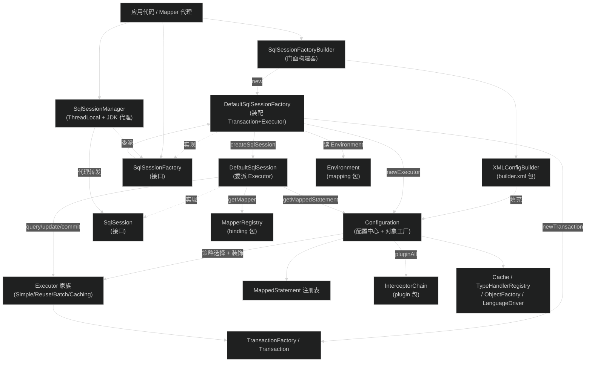
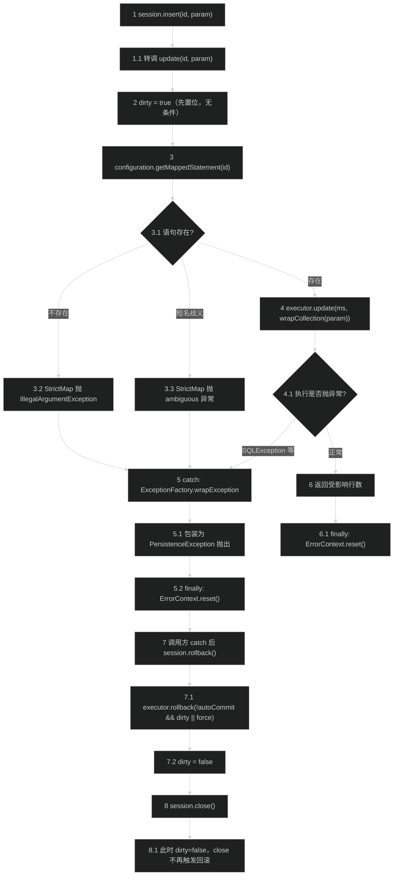
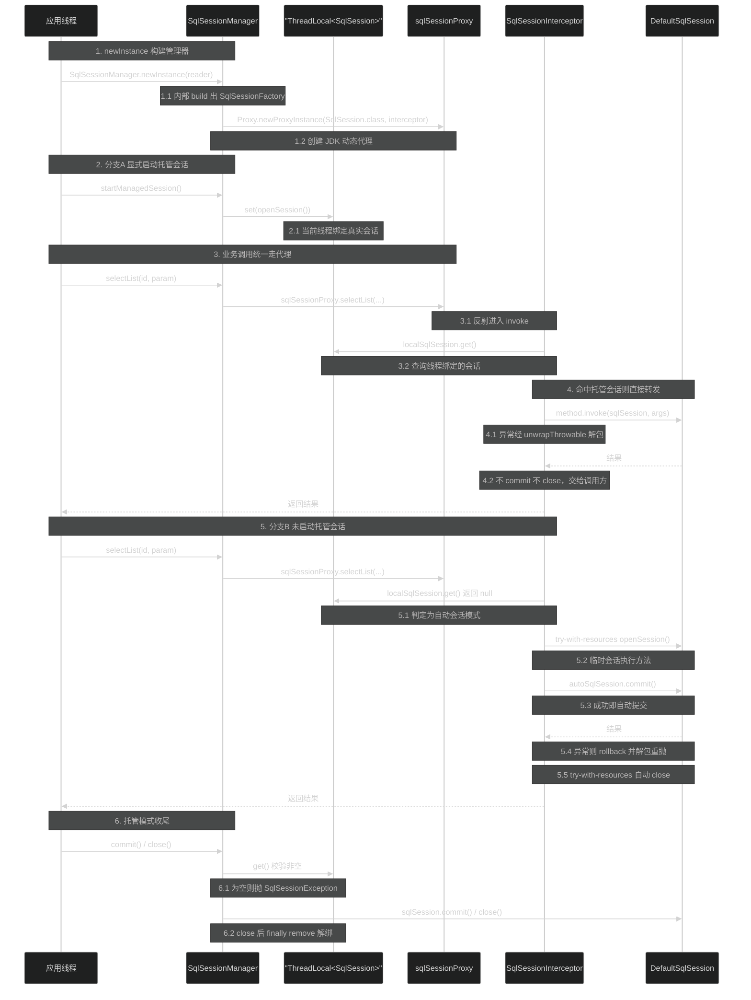
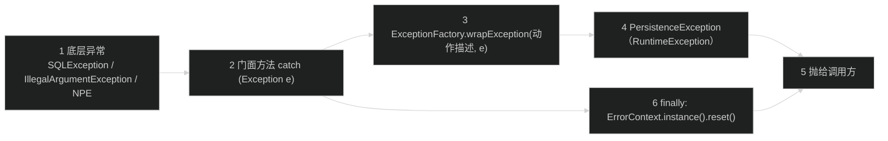
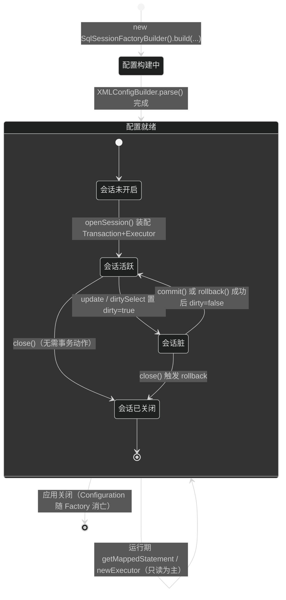

# 会话与配置核心（session）
> 上次修改：2026-07-28 21:35

## 重点关注

| 关注点 | 源码入口 | 为什么重要 |
|--------|----------|------------|
| `openSession` 如何装配 Executor/Transaction | `src/main/java/org/apache/ibatis/session/defaults/DefaultSqlSessionFactory.java:94` | 主链路起点。一次调用同时决定了事务边界（`Transaction`）、执行策略（`ExecutorType`）、二级缓存是否生效（`cacheEnabled`）与插件是否织入，是理解 MyBatis 运行期行为的总开关 |
| `Configuration.newExecutor` 的装配与装饰 | `src/main/java/org/apache/ibatis/session/Configuration.java:735` | 三类 Executor 的选择 + `CachingExecutor` 装饰 + `interceptorChain.pluginAll` 织入，一段 14 行代码承载了策略模式、装饰器模式和插件扩展点 |
| `DefaultSqlSession` 的 dirty 状态机 | `src/main/java/org/apache/ibatis/session/defaults/DefaultSqlSession.java:52`、`310` | `dirty` + `autoCommit` 共同决定 close/commit 时是否真正下发 commit/rollback。这是"忘了 commit 导致数据没落库"这类经典问题的根因所在 |
| 所有对外方法的统一异常与 ErrorContext 包装 | `src/main/java/org/apache/ibatis/session/defaults/DefaultSqlSession.java:149-159`、`191-202` | 模板化的 `try/catch/finally`：异常统一转 `PersistenceException`，`finally` 必须 reset `ErrorContext`，否则 ThreadLocal 会污染后续调用 |
| `SqlSessionManager` 的线程绑定与动态代理 | `src/main/java/org/apache/ibatis/session/SqlSessionManager.java:40`、`338-364` | 唯一同时实现 `SqlSessionFactory` 与 `SqlSession` 的类；`ThreadLocal` + JDK 动态代理实现"托管会话"与"自动会话"双模式，是理解线程安全边界的关键 |
| `Configuration.StrictMap` 的短名歧义机制 | `src/main/java/org/apache/ibatis/session/Configuration.java:1111-1198` | 语句 id 既可用全名也可用短名；短名冲突时写入哨兵对象并在 `get` 时抛歧义异常。这是"Mapped Statements collection does not contain value for xxx"报错的实现源头 |
| `buildAllStatements` 延迟解析触发点 | `src/main/java/org/apache/ibatis/session/Configuration.java:915-978` | 每次 `getMappedStatement` 都会尝试收敛未完成的 ResultMap/CacheRef/Statement/Method，理解跨 mapper 前向引用为何能成功 |

## 1. 模块定位与职责边界

`org.apache.ibatis.session` 是 MyBatis 的**对外门面层（Facade Layer）**。它解决的问题是：把散落在 builder、mapping、executor、cache、type、plugin、transaction 等内部子系统中的能力，收敛成一组少而稳定的公开 API，让调用方只需面对 `Configuration`、`SqlSessionFactory`、`SqlSession` 三个概念即可完成"配置—建会话—执行 SQL—提交/关闭"的全流程。

**上游（调用方）**：

- 应用代码直接使用 `SqlSessionFactoryBuilder` → `SqlSessionFactory` → `SqlSession`；
- `org.apache.ibatis.binding` 的 Mapper 代理层（`MapperProxy`/`MapperMethod`）持有 `SqlSession` 并把接口方法调用翻译成 `sqlSession.selectList(...)` 等门面调用；
- `org.apache.ibatis.builder.xml.XMLConfigBuilder` 反向填充 `Configuration`（`SqlSessionFactoryBuilder.build(Reader)` 中构造并 `parse()`，见 `SqlSessionFactoryBuilder.java:49-50`）。

**下游（被依赖方）**：`executor`（`Executor`/`BatchExecutor`/`ReuseExecutor`/`SimpleExecutor`/`CachingExecutor`）、`transaction`（`TransactionFactory`/`Transaction`）、`mapping`（`MappedStatement`/`Environment`/`ResultMap`）、`binding`（`MapperRegistry`）、`plugin`（`InterceptorChain`）、`cache`、`type`、`reflection`、`scripting`、`logging`、`io`、`datasource`。

**模块负责**：

1. 承载全局配置状态与注册表（`Configuration` 的字段与 `StrictMap` 集合）；
2. 充当运行期对象工厂（`newExecutor`/`newStatementHandler`/`newResultSetHandler`/`newParameterHandler`/`newMetaObject`），并在每个工厂方法出口统一织入插件；
3. 定义会话语义（增删改查签名、事务提交回滚、缓存清理、Mapper 获取、连接获取）；
4. 把语句 id + 参数委派给 `Executor`，并做统一的异常包装与 `ErrorContext` 清理；
5. 提供会话级线程绑定的便捷封装（`SqlSessionManager`）。

**模块不负责**：

- 不解析 XML/注解（属于 `builder` 包，`Configuration` 只是被填充的目标）；
- 不生成 SQL、不处理 JDBC `Statement`、不做结果集映射（属于 `scripting`/`executor`/`type`）；
- 不实现缓存淘汰算法与事务提交细节（属于 `cache`/`transaction`）；
- 不做连接池管理（属于 `datasource`）。

**主要输入 / 输出 / 状态变化 / 副作用**：

| 维度 | 内容 |
|------|------|
| 输入 | XML/`InputStream`/`Reader` + `environment` 名 + `Properties`（`SqlSessionFactoryBuilder`）；语句 id + 参数对象 + `RowBounds` + `ResultHandler`（`SqlSession`）；`ExecutorType`/`TransactionIsolationLevel`/`autoCommit`/`Connection`（`openSession` 重载） |
| 输出 | `SqlSessionFactory`、`SqlSession`、`List`/`Map`/`Cursor`/受影响行数、`List<BatchResult>`、Mapper 代理实例、`Connection` |
| 状态变化 | `Configuration` 各注册表在构建期写入（`addMappedStatement`/`addResultMap`/`addCache`…）；`DefaultSqlSession.dirty` 在写操作与脏查询后置位；`SqlSessionManager.localSqlSession` 的 ThreadLocal set/remove |
| 副作用 | 通过 `TransactionFactory` 取连接（可能触发连接池借出）；`ErrorContext` ThreadLocal 读写；`setLogImpl` 会全局改写 `LogFactory`（`Configuration.java:236-241`）；`setVfsImpl` 会全局注册 VFS 实现（`Configuration.java:247-252`） |

## 2. 架构关系与依赖



| 节点 | 角色 | 依赖方向与强度 |
|------|------|----------------|
| `SqlSessionFactoryBuilder` | 一次性构建器，用完即弃 | 强依赖 `XMLConfigBuilder`、`DefaultSqlSessionFactory`；这是 session 包**唯一**反向依赖 `builder` 包的地方，构成一处刻意保留的跨层调用 |
| `Configuration` | 配置中心 + 运行期对象工厂 | 被 session 包内所有类依赖；同时强依赖 executor、mapping、cache、type、reflection、scripting、plugin、transaction、datasource、logging、io 十余个包。是全项目**依赖扇出最大**的类，也是最主要的耦合点 |
| `SqlSessionFactory` | 会话工厂接口 | 只依赖 session 包内类型，是稳定的抽象边界 |
| `DefaultSqlSessionFactory` | 装配点 | 强依赖 `TransactionFactory`（可替换：JDBC/MANAGED/自定义）与 `Configuration.newExecutor`；`createSqlSession` 为 `protected`，是可覆写扩展点（`DefaultSqlSessionFactory.java:90`） |
| `SqlSession` | 会话接口，继承 `Closeable` | 只依赖 `Cursor`、`BatchResult`、`RowBounds`、`ResultHandler`、`Configuration` |
| `DefaultSqlSession` | 纯委派实现 + dirty 状态 | 强依赖 `Executor`（构造注入，可替换）；依赖 `Configuration` 做语句查找与 Mapper 获取 |
| `SqlSessionManager` | 双接口实现，线程绑定装饰器 | 依赖 `SqlSessionFactory`（组合）与 JDK `Proxy`；对 `DefaultSqlSession` 无编译期依赖，仅通过接口反射调用 |
| `Executor` 家族 | 真正执行 SQL | session 包只依赖其接口 + 三个具体类的构造（`Configuration.newExecutor` 中硬编码 `new`） |
| `InterceptorChain` | 插件织入 | 在 `newExecutor`/`newStatementHandler`/`newResultSetHandler`/`newParameterHandler` 四处出口调用 `pluginAll`，是 MyBatis 全部插件能力的注入面 |

**潜在耦合点**：

1. `Configuration.newExecutor` 通过 `new BatchExecutor/ReuseExecutor/SimpleExecutor` 硬编码具体类（`Configuration.java:738-744`），新增执行策略必须改 `Configuration` 本身，不能靠配置扩展；
2. `Configuration` 同时是"数据容器"和"对象工厂"，两种职责合在一个 1200 行的类里，`git` 历史上的注释 `// Slow but a one time cost. A better solution is welcome.`（`Configuration.java:1077`、`1096`）也说明作者自己认可这里有改进空间；
3. `SqlSessionFactoryBuilder` 让 session 包依赖 builder 包，而 builder 包又依赖 `Configuration`，形成 session ↔ builder 的双向包依赖。

## 3. 入口与调用方式

session 包没有 CLI/HTTP/定时任务入口，全部为**编程式 API 入口**。

### 3.1 构建入口：`SqlSessionFactoryBuilder.build(...)`

- 位置：`src/main/java/org/apache/ibatis/session/SqlSessionFactoryBuilder.java:35-97`
- 触发条件：应用启动阶段调用一次。共 9 个重载，收敛为 3 个核心形态：`build(Reader, String, Properties)`（L47）、`build(InputStream, String, Properties)`（L77）、`build(Configuration)`（L95）。
- 关键参数：`environment` 决定选用 `<environments>` 中哪个环境（为 `null` 时由 `XMLConfigBuilder` 取 `default`）；`properties` 用于覆盖/补充 XML 中的占位符变量。
- 返回值：`SqlSessionFactory`，实际类型 `DefaultSqlSessionFactory`。
- 上下文要求：无线程要求，但**结果应当作为单例长期持有**——每次 build 都会重新解析 XML 并生成一份独立的 `Configuration`（含全部 `MappedStatement` 与二级缓存），重复 build 等价于重复加载全部元数据并丢失二级缓存命中。
- 之后进入的流程：`XMLConfigBuilder.parse()` 完成配置解析 → `new DefaultSqlSessionFactory(config)`。异常统一被 `ExceptionFactory.wrapException("Error building SqlSession.", e)` 包装（L52），`finally` 中 reset `ErrorContext` 并静默关闭流（L54-61，注释明确写了 `Intentionally ignore. Prefer previous error.`）。

### 3.2 会话入口：`SqlSessionFactory.openSession(...)`

- 位置：接口 `src/main/java/org/apache/ibatis/session/SqlSessionFactory.java:29-41`，实现 `src/main/java/org/apache/ibatis/session/defaults/DefaultSqlSessionFactory.java:45-83`
- 8 个重载按参数维度组合：`ExecutorType`（执行策略）、`TransactionIsolationLevel`（隔离级别）、`autoCommit`（是否自动提交）、`Connection`（外部连接）。
- 分派规则（源码可直接读出）：凡传入 `Connection` 的走 `openSessionFromConnection`（L111），其余全部走 `openSessionFromDataSource`（L94）；未显式给出 `ExecutorType` 时取 `configuration.getDefaultExecutorType()`（默认 `SIMPLE`，`Configuration.java:132`）。
- 注意语义不对称：`openSession(Connection)` 不接受 `autoCommit` 参数，而是**反查连接自身的 `getAutoCommit()`**，且在 `SQLException` 时降级为 `true`（L113-120）；`openSession(TransactionIsolationLevel)` 与 `openSession(ExecutorType, TransactionIsolationLevel)` 则强制 `autoCommit=false`。
- 返回值：`DefaultSqlSession`，**非线程安全**（类注释明确写 `Note that this class is not Thread-Safe`，`DefaultSqlSession.java:42`）。

### 3.3 执行入口：`SqlSession` 的 24 个方法

- 位置：`src/main/java/org/apache/ibatis/session/SqlSession.java:32-380`
- 查询族：`selectOne`（2 个）、`selectList`（3 个）、`selectMap`（3 个）、`selectCursor`（3 个）、`select`（3 个，走 `ResultHandler` 流式回调）；
- 写入族：`insert`（2）、`update`（2）、`delete`（2）——实现上**全部收敛到 `update(String, Object)`**（`DefaultSqlSession.java:183`、`206`、`211`）；
- 事务与资源族：`commit`/`rollback`（各 2 个）、`flushStatements`、`close`、`clearCache`；
- 元数据族：`getConfiguration`、`getMapper(Class)`、`getConnection`。
- 权限/上下文要求：`getConnection` 依赖 `executor.getTransaction()` 已成功持有连接；`getMapper` 要求目标接口已注册进 `MapperRegistry`，否则 `MapperRegistry.getMapper` 抛 `BindingException`（`src/main/java/org/apache/ibatis/binding/MapperRegistry.java:46-48`）。

### 3.4 托管会话入口：`SqlSessionManager`

- 位置：`src/main/java/org/apache/ibatis/session/SqlSessionManager.java:48-110`
- 7 个静态 `newInstance` 工厂 + 8 个 `startManagedSession` 重载 + `isManagedSessionStarted()`。
- 触发条件与语义：调用 `startManagedSession()` 后，当前线程后续所有 `selectXxx/insert/update/delete` 都复用同一个 `SqlSession`（由 `ThreadLocal` 持有），事务由调用方通过 `commit()/rollback()/close()` 显式控制；**不调用** `startManagedSession` 时，每次方法调用由代理自动开一个会话并自动 commit/rollback/close（L353-362）。
- 上下文要求：`commit`/`rollback`/`close`/`clearCache`/`getConnection`/`flushStatements` 六个方法**要求当前线程已启动托管会话**，否则抛 `SqlSessionException`（L263-336）。

### 3.5 框架回调入口：`Configuration.newXxx` 工厂方法

- 位置：`src/main/java/org/apache/ibatis/session/Configuration.java:706-748`
- 触发者不是应用代码，而是 executor 内部：`BaseExecutor`/`SimpleExecutor` 调 `newStatementHandler`，`PreparedStatementHandler` 调 `newParameterHandler`/`newResultSetHandler`。它们是 session 包**被下游反向回调**的入口，也是插件织入点。

## 4. 核心概念与领域模型

### 4.1 Configuration —— 全局配置与对象装配中心

**定义**：一个可变的、进程内长生命周期的配置聚合根（`Configuration.java:103`）。

**作用**：三重身份——(1) 设置项容器（约 25 个标量开关，L107-134）；(2) 元数据注册表（`mappedStatements`/`resultMaps`/`parameterMaps`/`caches`/`keyGenerators`/`sqlFragments` 六张 `StrictMap`，L158-168，以及 `mapperRegistry`/`typeHandlerRegistry`/`typeAliasRegistry`/`languageRegistry`/`interceptorChain` 五个子注册表，L152-156）；(3) 运行期对象工厂（L706-748）。

**生命周期**：`XMLConfigBuilder.parse()` 期间被密集写入 → `DefaultSqlSessionFactory` 构造后进入"事实只读"阶段 → 与 `SqlSessionFactory` 同生共死。注意它**没有 freeze/immutable 机制**，运行期仍可调用 setter，属于约定而非强制。

**相关类型**：`Environment`（数据源 + 事务工厂）、`Executor`、`MappedStatement`、`InterceptorChain`。

**使用场景**：无 XML 的纯 Java 配置方式即直接 `new Configuration(environment)` + `addMapper(...)` + `new SqlSessionFactoryBuilder().build(config)`。

**构造期动作值得单独注意**：无参构造函数只做一件事——注册 20 个类型别名并初始化语言驱动注册表（L190-222）。`JDBC`/`MANAGED`、`JNDI`/`POOLED`/`UNPOOLED`、`PERPETUAL`/`FIFO`/`LRU`/`SOFT`/`WEAK`、`DB_VENDOR`、`XML`/`RAW`、7 种日志实现、`CGLIB`/`JAVASSIST` 的别名全部硬编码在此。这解释了为什么 XML 里能直接写 `type="POOLED"`。

三维评估：

- **好处**：单一聚合根让"配置 → 装配"链路极短，任意下游只需持有 `Configuration` 就能拿到全部协作者，避免了大量构造参数传递；类型别名集中注册使 XML 配置可以极简。
- **替代方案**：拆成 `Settings`（标量）+ `MapperMetadataRegistry`（元数据）+ `ComponentFactory`（工厂）三个类，通过组合注入；或使用 IoC 容器托管各组件。
- **风险**：当前实现是**上帝对象**——1200 行、依赖十余个包、`protected` 字段直接暴露给子类（如 mybatis-spring 的 `Configuration` 派生），任何字段语义变更都是破坏性的；无不可变保护，运行期误改 setter（尤其 `setLogImpl` 会全局改写 `LogFactory`）会产生难以定位的全局副作用。

### 4.2 SqlSession —— 会话（工作单元）

**定义**：`Closeable` 的语句执行 + 事务管理门面（`SqlSession.java:32`）。

**作用**：把"语句 id + 参数"翻译成 `Executor` 调用，并持有一次工作单元的事务边界与一级缓存边界。

**生命周期**：`openSession` 创建 → 执行若干语句 → `commit`/`rollback` → `close`。`close` 内部调用 `executor.close(...)`，进而关闭 `Transaction` 并归还连接（`DefaultSqlSession.java:260-268`）。一个 `SqlSession` 对应一个 `Executor`，对应一个 `Transaction`，对应至多一个物理 `Connection`（延迟获取）。

**使用场景**：`try (SqlSession session = factory.openSession()) { ... session.commit(); }`。

三维评估：

- **好处**：接口只有 24 个方法却覆盖了全部 CRUD + 事务 + 缓存 + Mapper 获取；继承 `Closeable` 使 try-with-resources 成为自然写法，大幅降低连接泄漏概率。
- **替代方案**：把查询/写入/事务拆成三个细粒度接口（如 `QueryOperations`/`UpdateOperations`/`TransactionOperations`）；或走 JPA 式 `EntityManager` + 独立 `EntityTransaction`。
- **风险**：接口偏"胖"，实现者（如 mybatis-spring 的 `SqlSessionTemplate`）必须实现全部 24 个方法；`selectMap`/`selectCursor` 等便捷方法把语义分歧带进了接口层（`selectMap` 是内存后处理，`selectCursor` 是流式）；接口本身未标注线程安全约束，仅在实现类注释中说明。

### 4.3 Executor（引用概念）与 ExecutorType

**定义**：`ExecutorType` 是仅含 `SIMPLE`/`REUSE`/`BATCH` 三值的枚举（`ExecutorType.java:21-29`），用于在 `newExecutor` 中选择具体 `Executor` 实现。

**作用与差异**（依据 `Configuration.java:738-744` 的映射）：`SIMPLE` → `SimpleExecutor`（每语句新建 `Statement`）；`REUSE` → `ReuseExecutor`（按 SQL 文本复用 `Statement`）；`BATCH` → `BatchExecutor`（`addBatch` 累积，需 `flushStatements` 或 commit 触发）。

**生命周期**：与 `SqlSession` 同生命周期，由 `openSession` 创建、`session.close()` 关闭。

**关键关系**：`ExecutorType` 是会话级选择项，可被 `openSession(execType)` 逐会话覆盖；`Configuration.defaultExecutorType` 提供全局默认（默认 `SIMPLE`，`Configuration.java:132`、`490`）。

三维评估：

- **好处**：枚举 + 工厂方法的组合让调用方无需感知具体类，且能按业务场景逐会话切换（批量导入用 `BATCH`，普通请求用 `SIMPLE`）。
- **替代方案**：让调用方直接传 `Executor` 实例或 `Supplier<Executor>`；或用 SPI/别名注册表让第三方注册新类型。
- **风险**：枚举封闭，无法在不修改 MyBatis 源码的前提下新增执行策略（只能靠插件包装现有 Executor）；`BATCH` 语义与 `insert` 返回值语义冲突——批量模式下返回的行数不是真实影响行数，这一点在 `SqlSession.insert` 的 javadoc（`SqlSession.java:244`）中并未提示。

### 4.4 RowBounds —— 内存分页边界

**定义**：不可变值对象，只有 `offset`/`limit` 两个 `final int`（`RowBounds.java:27-38`）。

**作用与常量**：`NO_ROW_OFFSET = 0`、`NO_ROW_LIMIT = Integer.MAX_VALUE`、共享单例 `DEFAULT`（L23-25）。`DefaultSqlSession` 的所有无 `RowBounds` 重载都传 `RowBounds.DEFAULT`（L88、L93、L116、L141、L163、L168）。

**生命周期**：随单次查询调用创建/消亡；`DEFAULT` 为进程级共享常量。

**关键行为**：这是**内存分页**——`DefaultResultSetHandler` 在遍历 `ResultSet` 时跳过 `offset` 行、最多取 `limit` 行，SQL 本身不带 `LIMIT`。配合 `safeRowBoundsEnabled` 时，嵌套语句中使用 `RowBounds` 会被拒绝（`src/main/java/org/apache/ibatis/executor/resultset/DefaultResultSetHandler.java:379`）。

三维评估：

- **好处**：不可变 + 共享 `DEFAULT` 常量使零分页场景无额外分配；与数据库方言完全解耦，任意 JDBC 驱动通用。
- **替代方案**：物理分页（改写 SQL 加 `LIMIT/OFFSET`，即 PageHelper 类插件的做法）；或用 `Cursor` 流式读取。
- **风险**：`offset` 很大时驱动仍会把前 `offset` 行传输/解析后丢弃，是明确的性能陷阱；`limit` 默认 `Integer.MAX_VALUE` 意味着误用不会被截断；`RowBounds` 无参校验，传负数不会报错。

### 4.5 ResultHandler / ResultContext —— 流式结果回调

**定义**：`ResultHandler<T>` 是单方法回调接口 `void handleResult(ResultContext<? extends T>)`（`ResultHandler.java:21-23`）；`ResultContext<T>` 提供 `getResultObject`/`getResultCount`/`isStopped`/`stop`（`ResultContext.java:21-31`）。

**作用**：避免把整个结果集物化成 `List`；`stop()` 让消费方可以提前终止遍历。

**生命周期**：由调用方创建并传入 `select(...)`，在结果集遍历期间被逐行回调。

**关键关系**：`Executor.NO_RESULT_HANDLER` 实际就是 `null`（`src/main/java/org/apache/ibatis/executor/Executor.java:35`）；`DefaultSqlSession.selectList` 的公开重载正是用它来表示"不用回调"（`DefaultSqlSession.java:146`）。这个 `null` 语义在 `BaseExecutor.query` 中被复用为**是否走一级缓存的判据**：`list = resultHandler == null ? localCache.getObject(key) : null`（`src/main/java/org/apache/ibatis/executor/BaseExecutor.java:154`）。即**传了 `ResultHandler` 就绕过一级缓存**。

模块内还有 `DefaultMapResultHandler` 的使用样例：`selectMap` 用它把 `List` 折叠成 `Map`（`DefaultSqlSession.java:99-106`）。

三维评估：

- **好处**：单方法接口可直接用 lambda；`stop()` 支持提前退出；配合 `null` 常量实现了"有无回调"的零成本分支。
- **替代方案**：返回 `Stream`/`Iterator`（MyBatis 后来用 `Cursor` 补上了这条路）；或用响应式 `Publisher`。
- **风险**：用 `null` 表示"无 handler"并让它同时承担"是否用缓存"的语义，是一处隐藏耦合——调用方传入 handler 时缓存静默失效，且这一行为未在 `SqlSession.select` 的 javadoc 中说明；`safeResultHandlerEnabled` 为 true 且语句非 `resultOrdered` 时使用 handler 会被拒绝（`DefaultResultSetHandler.java:388`），这层约束同样只体现在 executor 侧。

### 4.6 LocalCacheScope —— 一级缓存作用域

**定义**：`SESSION` / `STATEMENT` 两值枚举（`LocalCacheScope.java:21-23`），`Configuration` 默认 `SESSION`（`Configuration.java:125`）。

**作用**：`SESSION` 表示一级缓存在整个会话内有效；`STATEMENT` 表示每条语句执行完立即清空。

**生命周期与判定点**：`BaseExecutor.query` 在 `queryStack` 归零时检查 `configuration.getLocalCacheScope() == LocalCacheScope.STATEMENT` 并 `clearLocalCache()`（`BaseExecutor.java:170-172`，代码注释标注了 `issue #482`）。

三维评估：

- **好处**：一个枚举开关即可在"性能优先（SESSION）"与"数据新鲜度优先（STATEMENT）"之间切换，无需改业务代码。
- **替代方案**：逐语句配置 `flushCache="true"`（更细粒度，但要改每条语句）；或完全禁用一级缓存。
- **风险**：`SESSION` 模式下长会话中的一级缓存会读到过期数据（外部事务的更新不可见），这是长事务/长会话场景的经典陷阱；`STATEMENT` 模式会让嵌套查询与循环引用解析失去缓存加速。

### 4.7 TransactionIsolationLevel 与 AutoMapping 系列

- `TransactionIsolationLevel`（`TransactionIsolationLevel.java:23-51`）：5 个标准 JDBC 级别 + 非标准 `SQL_SERVER_SNAPSHOT(0x1000)`。`getLevel()` 返回 JDBC 原生 int，由 `JdbcTransaction` 设置到 `Connection`。传 `null` 表示沿用连接默认级别。
- `AutoMappingBehavior`（`AutoMappingBehavior.java:23-39`）：`NONE`/`PARTIAL`/`FULL`，默认 `PARTIAL`（`Configuration.java:133`），控制自动映射是否处理嵌套结果。
- `AutoMappingUnknownColumnBehavior`（`AutoMappingUnknownColumnBehavior.java:31-92`）：**枚举 + 抽象方法**（策略模式的枚举实现），三个常量各自覆写 `doAction`：`NONE` 静默、`WARNING` 打日志、`FAILING` 抛 `SqlSessionException`。日志实例放在 `LogHolder` 静态内部类中做懒初始化（L91-92）。默认 `NONE`（`Configuration.java:134`）。

三维评估（以 `AutoMappingUnknownColumnBehavior` 为例）：

- **好处**：把"未知列如何处理"的三种策略内联在枚举中，调用方只需 `behavior.doAction(...)`，无需 switch；`LogHolder` 惰性持有 `Log` 避免了枚举类加载即初始化日志。
- **替代方案**：定义独立 `UnknownColumnHandler` 接口 + 三个实现类，通过配置注入。
- **风险**：枚举封闭，用户无法注册第四种策略（例如"记录到监控指标"）；`FAILING` 抛 `SqlSessionException` 会让映射失败表现为会话异常，异常类型语义偏移。

### 4.8 SqlSessionException —— 模块专属异常

`SqlSessionException extends PersistenceException`（`SqlSessionException.java:23`），四个标准构造。它有两类用途：`SqlSessionManager` 用它表示"无托管会话"（L266、275、284、293、302、311、320、329）；`AutoMappingUnknownColumnBehavior.FAILING` 用它表示映射失败。由于继承 `PersistenceException`（运行时异常），不强制捕获。

## 5. 关键流程

### 5.1 主成功路径：从 XML 到查询结果

```mermaid
%%{init: {"theme": "dark"}}%%
flowchart TD
  1["1 应用调用 build(InputStream)"] --> 1.1["1.1 new XMLConfigBuilder(is, env, props)"]
  1.1 --> 1.2["1.2 parser.parse() 解析并填充 Configuration"]
  1.2 --> 1.3["1.3 new DefaultSqlSessionFactory(config)"]
  1.3 --> 1.4["1.4 finally: ErrorContext.reset() + 关闭流"]
  1.4 --> 2["2 factory.openSession()"]
  2 --> 2.1["2.1 取 configuration.getEnvironment()"]
  2.1 --> 2.2{"2.2 environment 或 transactionFactory 为 null?"}
  2.2 -->|是| 2.3["2.3 兜底 new ManagedTransactionFactory()"]
  2.2 -->|否| 2.4["2.4 用 environment.getTransactionFactory()"]
  2.3 --> 2.5["2.5 newTransaction(dataSource, level, autoCommit)"]
  2.4 --> 2.5
  2.5 --> 2.6["2.6 configuration.newExecutor(tx, execType)"]
  2.6 --> 2.6.1{"2.6.1 execType?"}
  2.6.1 -->|BATCH| 2.6.2["2.6.2 new BatchExecutor"]
  2.6.1 -->|REUSE| 2.6.3["2.6.3 new ReuseExecutor"]
  2.6.1 -->|SIMPLE 或 null| 2.6.4["2.6.4 new SimpleExecutor"]
  2.6.2 --> 2.6.5{"2.6.5 cacheEnabled?"}
  2.6.3 --> 2.6.5
  2.6.4 --> 2.6.5
  2.6.5 -->|是| 2.6.6["2.6.6 包装 new CachingExecutor(executor)"]
  2.6.5 -->|否| 2.6.7["2.6.7 跳过缓存装饰"]
  2.6.6 --> 2.6.8["2.6.8 interceptorChain.pluginAll(executor)"]
  2.6.7 --> 2.6.8
  2.6.8 --> 2.7["2.7 createSqlSession(config, executor, autoCommit)"]
  2.7 --> 3["3 session.selectList(id, param)"]
  3 --> 3.1["3.1 补默认参数: RowBounds.DEFAULT + NO_RESULT_HANDLER"]
  3.1 --> 3.2["3.2 configuration.getMappedStatement(id)"]
  3.2 --> 3.2.1["3.2.1 buildAllStatements() 收敛未完成元素"]
  3.2.1 --> 3.2.2["3.2.2 StrictMap.get(id) 校验存在性与歧义"]
  3.2.2 --> 3.3["3.3 dirty |= ms.isDirtySelect()"]
  3.3 --> 3.4["3.4 wrapCollection(parameter) 包装集合参数"]
  3.4 --> 3.5["3.5 executor.query(ms, param, rowBounds, handler)"]
  3.5 --> 3.6["3.6 finally: ErrorContext.reset()"]
  3.6 --> 4["4 session.commit()"]
  4 --> 4.1["4.1 isCommitOrRollbackRequired(false)"]
  4.1 --> 4.2["4.2 executor.commit(required) 并置 dirty=false"]
  4.2 --> 5["5 session.close()"]
  5 --> 5.1["5.1 executor.close(isCommitOrRollbackRequired(false))"]
  5.1 --> 5.2["5.2 closeCursors() 关闭并清空 cursorList"]
  5.2 --> 5.3["5.3 dirty=false + ErrorContext.reset()"]
```



**1-1.4 配置构建阶段**：`SqlSessionFactoryBuilder.build(InputStream, String, Properties)`（`SqlSessionFactoryBuilder.java:77-93`）把流交给 `XMLConfigBuilder` 解析，`parse()` 返回填充完毕的 `Configuration`，随即包进 `DefaultSqlSessionFactory`。关键判断在 `finally`：无论成败都 reset `ErrorContext` 并关闭输入流，且关闭流时的 `IOException` 被**故意吞掉**（源码注释 `Intentionally ignore. Prefer previous error.`），保证原始解析异常不被资源清理异常覆盖。解析失败时统一由 `ExceptionFactory.wrapException` 转成 `PersistenceException`。

**2-2.7 会话装配阶段**：这是本模块最核心的一段。`openSessionFromDataSource`（`DefaultSqlSessionFactory.java:94-109`）先取 `Environment`，再通过 `getTransactionFactoryFromEnvironment`（L133-138）拿事务工厂——**关键边界判断**：`environment == null || environment.getTransactionFactory() == null` 时兜底返回 `ManagedTransactionFactory`，即"由容器管理事务、MyBatis 不 commit/rollback"，这让无 `<environment>` 配置的场景也能跑起来。接着 `newTransaction(dataSource, level, autoCommit)` 创建事务（此时**尚未真正取连接**，`JdbcTransaction` 是懒获取）；`configuration.newExecutor(tx, execType)` 完成执行器装配；最后 `createSqlSession` 产出 `DefaultSqlSession`。失败处理很讲究：`catch` 中先 `closeTransaction(tx)`（L104，注释 `may have fetched a connection so lets call close()`）再抛，避免半构造状态下连接泄漏。

**2.6-2.6.8 执行器装配子流程**：`Configuration.newExecutor`（`Configuration.java:735-749`）三步走。第一步策略选择：`executorType == null ? defaultExecutorType : executorType` 做空值兜底，然后 if-else 映射到三个具体类，`else` 分支兜底 `SimpleExecutor`（意味着未来新增枚举值会静默退化为 SIMPLE）。第二步条件装饰：`cacheEnabled`（默认 `true`，`Configuration.java:113`）为真时用 `CachingExecutor` 包一层，二级缓存能力由此注入。第三步插件织入：`interceptorChain.pluginAll(executor)` 依次让每个 `Interceptor` 生成代理。三步的顺序不可交换——插件必须包在最外层才能拦截到缓存行为。

**3-3.6 查询委派阶段**：公开的三个 `selectList` 重载逐层补默认值（`DefaultSqlSession.java:135-147`），最终收敛到私有 `selectList(statement, parameter, rowBounds, handler)`（L149-159）。四步动作：`getMappedStatement` 取元数据（内部会触发 `buildAllStatements`）；`dirty |= ms.isDirtySelect()` —— 这是 3.5.x 之后才有的细节，标记为"脏查询"的 select（如调用了存储过程）也会让会话变脏，从而在 close 时触发 rollback；`wrapCollection` 通过 `ParamNameResolver.wrapToMapIfCollection` 把 `Collection`/数组参数包成 Map（L314-316）；最后委派 `executor.query`。异常统一包成 `Error querying database. Cause: ...`，`finally` reset `ErrorContext`。

**4-4.2 提交阶段**：`commit(false)` → `executor.commit(isCommitOrRollbackRequired(false))`（L220-229）。`isCommitOrRollbackRequired` 的表达式是 `!autoCommit && dirty || force`（L311），即**只有"非自动提交且发生过写操作"或"强制"时才真正下发 commit**。成功后 `dirty = false` 重置状态。

**5-5.3 关闭阶段**：`close()`（L260-268）用 `executor.close(isCommitOrRollbackRequired(false))` 表达"未提交的脏会话在关闭时回滚"，然后 `closeCursors()` 遍历关闭所有登记过的 `Cursor`（L270-277）并清空列表。注意 `close` 方法体本身**没有 catch**，只有 `finally { ErrorContext.reset() }`——`executor.close` 抛异常时 `closeCursors()` 不会执行，这是一个可确认的资源清理缺口（详见第 8 节）。

### 5.2 失败路径：写操作异常与会话回滚



**1-2 写入入口与脏标记**：`insert`/`delete` 全部转调 `update(String, Object)`（`DefaultSqlSession.java:183`、`206`、`211`），说明三者在 MyBatis 内部**完全等价**，区分只存在于 XML 标签与语义表达层面。进入 `update` 后**第一件事**就是 `dirty = true`（L194），位置在 `getMappedStatement` 之前——即使语句不存在导致抛异常，会话也已被标记为脏。这是刻意的保守设计：宁可多回滚一次，也不能漏掉需要回滚的写操作。

**3-3.3 语句查找失败分支**：`Configuration.getMappedStatement` 委派 `StrictMap.get`（`Configuration.java:923`、`1182-1192`）。两种失败：值为 `null` 抛 `"Mapped Statements collection does not contain value for xxx"`；值为 `AMBIGUITY_INSTANCE` 抛 `"xxx is ambiguous in ... (try using the full name including the namespace, or rename one of the entries)"`。两者都是 `IllegalArgumentException`，随后被外层统一包装。

**4-6 执行与异常包装**：`executor.update` 抛出的任何 `Exception`（含 `SQLException`）都被 `ExceptionFactory.wrapException("Error updating database. Cause: " + e, e)` 转成 `PersistenceException`（L197-198）。这意味着**调用方永远见不到受检异常**，但也失去了按 SQL 错误码分类处理的便利（需要自行 `getCause()` 下钻）。无论成功失败，`finally` 都 reset `ErrorContext`（L199-201），防止 ThreadLocal 里的错误上下文泄漏到同线程的下一次调用。

**7-8.1 回滚与关闭**：`rollback(false)` 走 `executor.rollback(isCommitOrRollbackRequired(false))`（L237-246）。因为 `dirty` 已为 `true` 且默认 `autoCommit=false`，条件成立，真正下发 rollback，随后 `dirty = false`。此时再 `close()`，`isCommitOrRollbackRequired(false)` 返回 `false`，不会重复回滚。**若调用方忘记 rollback 直接 close**，`close` 中的 `isCommitOrRollbackRequired(false)` 依然为 `true`，`executor.close(true)` 会执行回滚——这是 MyBatis 的安全网。

### 5.3 边界路径：SqlSessionManager 的线程绑定与自动会话



**1-1.2 管理器构建**：7 个 `newInstance` 静态工厂（`SqlSessionManager.java:48-74`）内部都是"用 `SqlSessionFactoryBuilder` 构建 factory，再 `new SqlSessionManager(factory)`"。私有构造函数（L42-46）做两件事：保存 factory，用 `Proxy.newProxyInstance` 生成只实现 `SqlSession` 接口的动态代理，`InvocationHandler` 是内部类 `SqlSessionInterceptor`。注意 `ThreadLocal<SqlSession> localSqlSession` 是 `final` 实例字段（L40），即**每个 `SqlSessionManager` 实例有独立的线程绑定空间**，多个管理器互不干扰。

**2-2.1 托管模式启动**：8 个 `startManagedSession` 重载（L76-106）一一对应 `openSession` 的 8 个重载，作用都是 `localSqlSession.set(openSession(...))`。`isManagedSessionStarted()` 通过 `get() != null` 判断（L108-110）。

**3-4.2 托管命中路径**：所有 CRUD 方法（L157-255）都转发给 `sqlSessionProxy`，而不是直接用 `localSqlSession.get()`。`SqlSessionInterceptor.invoke`（L344-363）先 `get()`，非空则 `method.invoke(sqlSession, args)` 直接转发，异常用 `ExceptionUtil.unwrapThrowable(t)` 剥掉反射包装的 `InvocationTargetException`。**此路径不做任何事务动作**——commit/rollback/close 完全交给调用方，这正是"托管"的含义。

**5-5.5 自动会话路径**：`get()` 为 `null` 时进入 `try (SqlSession autoSqlSession = openSession())`（L353）。成功则 `commit()` 后返回，失败则 `rollback()` 后解包重抛，try-with-resources 保证 `close()`。这让 `SqlSessionManager` 可以当作"一次调用一个事务"的简易 DAO 门面使用，代价是**每次调用都借还一次连接**。

**6-6.2 托管模式收尾**：`commit`/`commit(boolean)`/`rollback`/`rollback(boolean)`/`flushStatements`/`close`/`clearCache`/`getConnection` 这 8 个方法**不走代理**，而是直接 `localSqlSession.get()` 并在为 `null` 时抛 `SqlSessionException`（L263-336）。设计原因很清楚：这些是事务/资源语义方法，在"自动会话"模式下没有可操作对象。`close()` 用 `try { sqlSession.close(); } finally { localSqlSession.remove(); }`（L331-335）确保即使关闭失败也解除线程绑定，避免 ThreadLocal 泄漏。

## 6. 核心实现细节

### 6.1 `Configuration.newExecutor` —— 策略 + 装饰 + 代理的三段式装配

```
// Configuration.java:735-749
executorType = executorType == null ? defaultExecutorType : executorType;   // ① 空值兜底
if (ExecutorType.BATCH == executorType)      executor = new BatchExecutor(this, transaction);
else if (ExecutorType.REUSE == executorType) executor = new ReuseExecutor(this, transaction);
else                                         executor = new SimpleExecutor(this, transaction);   // ② 策略选择
if (cacheEnabled) executor = new CachingExecutor(executor);                 // ③ 条件装饰
return (Executor) interceptorChain.pluginAll(executor);                     // ④ 插件织入
```

- **输入**：`Transaction`（已创建但连接未必获取）、`ExecutorType`（可为 `null`）。
- **处理逻辑**：四步依次执行，每步的输出是下一步的输入，最终对象是"插件代理 → CachingExecutor → 具体 Executor"的三层洋葱结构。
- **输出**：`Executor` 接口引用，调用方不感知实际层数。
- **副作用**：`new XxxExecutor(this, transaction)` 把 `Configuration` 自身传给了 Executor，形成双向引用（Executor 需要 `Configuration` 来 `newStatementHandler`）。
- **隐藏假设**：(1) `else` 分支吞掉了所有未知枚举值，静默退化为 `SIMPLE`；(2) 装饰顺序假定"缓存必须在具体执行器之外、插件必须在最外层"，若顺序颠倒，插件将拦不到二级缓存调用；(3) `pluginAll` 返回的是 `Object`，这里强转 `Executor`，若插件的 `plugin()` 方法实现错误（返回了非 `Executor`），会在此处抛 `ClassCastException`。
- **非显而易见机制**：`ExecutorType.BATCH == executorType` 用 `==` 比较枚举而非 `equals`，是枚举的惯用写法，同时也天然规避了前面兜底后仍为 `null` 的风险（兜底后已不可能为 `null`，除非 `defaultExecutorType` 被 setter 设成 `null`）。

三维评估：

- **好处**：14 行代码同时提供了"策略可选、缓存可关、行为可插"三种变化维度，且三者正交；调用方（`DefaultSqlSessionFactory`）只需一行调用。
- **替代方案**：把三类 Executor 注册进 `Map<ExecutorType, Function<Transaction, Executor>>`，或引入 `ExecutorFactory` SPI，使新增策略无需改动 `Configuration`；装饰链可用 `List<Function<Executor, Executor>>` 表达。
- **风险**：具体类硬编码使执行策略不可扩展；`defaultExecutorType` 被误设为 `null` 时会 NPE 于 `ExecutorType.BATCH == null` 之后的分支判断（实际会走到 `else` 返回 SIMPLE，不会 NPE，但语义已丢失）；三层包装导致栈深度增加，异常栈可读性下降。

### 6.2 `DefaultSqlSessionFactory.openSessionFromDataSource` 与 `openSessionFromConnection` 的差异

两个私有方法（`DefaultSqlSessionFactory.java:94-131`）看似对称，实际有三处关键差异：

| 差异点 | `openSessionFromDataSource` | `openSessionFromConnection` |
|--------|------------------------------|------------------------------|
| `autoCommit` 来源 | 调用方显式传入 | 反查 `connection.getAutoCommit()`，`SQLException` 时降级 `true`（L113-120） |
| 隔离级别 | 可传 `TransactionIsolationLevel` | 无此参数，沿用连接现状 |
| 失败清理 | `catch` 中 `closeTransaction(tx)`（L104） | **无任何清理**（L126-127） |

`openSessionFromConnection` 缺少事务清理是合理的：连接由外部传入，其生命周期归调用方，MyBatis 不应擅自关闭。但 `tx` 被声明为局部 `final`（L123），若 `newExecutor` 抛异常，`tx` 对象本身会被 GC，包裹的连接仍归调用方所有——语义自洽。

`autoCommit` 降级为 `true` 的注释是 `Failover to true, as most poor drivers or databases won't support transactions`（L117-119）。这个降级方向值得注意：降级为 `true` 意味着 `isCommitOrRollbackRequired` 恒为 `force`，MyBatis 将**不再主动 commit/rollback**，把控制权彻底交还驱动。

三维评估：

- **好处**：两条路径清晰划分"MyBatis 管连接"与"外部管连接"两种所有权模型；降级策略保证了在不支持事务的驱动上也不会因 `getAutoCommit()` 报错而完全不可用。
- **替代方案**：为 `openSession(Connection)` 增加显式 `autoCommit` 重载，把降级决策交给调用方；或降级为 `false` 并在首次 commit 时容错。
- **风险**：降级为 `true` 是静默的（无日志），使用者无法察觉自己的事务语义已经被改变，这在"驱动偶发抛 `SQLException`"的场景下可能导致数据不一致；`openSessionFromConnection` 的异常路径不 reset 连接状态，若 `newExecutor` 已修改过连接属性则残留。

### 6.3 `DefaultSqlSession` 的模板化异常处理

`selectCursor`/`selectList`（私有版）/`update`/`commit`/`rollback`/`flushStatements` 六个方法共享同一骨架（`DefaultSqlSession.java:120-257`）：

```
try { ...业务... }
catch (Exception e) { throw ExceptionFactory.wrapException("<动作描述>. Cause: " + e, e); }
finally { ErrorContext.instance().reset(); }
```

- **为什么这样组织**：`ErrorContext` 是 ThreadLocal 的错误上下文累积器（executor 层在 `resource`/`activity`/`object` 上持续写入），若不在门面出口 reset，下一次调用的异常信息里会混入上一次的资源名与语句 id。把 reset 放在**门面层的每个出口**而不是 executor 内部，是因为只有门面才知道"一次对外调用"的边界。
- **状态变化**：`commit`/`rollback` 成功后 `dirty = false`（L223、L240）；**异常路径不重置 `dirty`**，会话仍为脏，后续 close 会触发回滚——这是正确的。
- **例外**：`close()` 只有 `finally`，没有 `catch`（L260-268）；`getConnection()` 只 catch `SQLException`（L290-296）；`selectOne`/`selectMap`/`select` 等聚合方法不做包装，因为它们最终都落到已包装的私有方法上。

三维评估：

- **好处**：调用方只需处理一种异常族（`PersistenceException`）；`ErrorContext` 的 reset 位置统一，不会遗漏；异常消息带动作描述（`Error querying database` / `Error updating database` / `Error committing transaction`）便于定位阶段。
- **替代方案**：用 AOP/动态代理统一包装（MyBatis 自己在 `SqlSessionManager` 里就有代理设施）；或用 Java 9+ 的 `try-with-resources` + 自定义 `AutoCloseable` 表达 ErrorContext 生命周期。
- **风险**：`catch (Exception e)` 过宽，`RuntimeException`（如 `NullPointerException`、`StrictMap` 的 `IllegalArgumentException`）也会被包装成"数据库错误"，掩盖了真实的编程错误性质；六处重复的 try/catch/finally 是明显的模板代码，任何一处忘写 `finally` 都会造成 ThreadLocal 污染且难以察觉。

### 6.4 `isCommitOrRollbackRequired` —— 三个布尔量的状态机

```
// DefaultSqlSession.java:310-312
private boolean isCommitOrRollbackRequired(boolean force) {
  return !autoCommit && dirty || force;
}
```

运算符优先级为 `((!autoCommit) && dirty) || force`。真值表：

| autoCommit | dirty | force | 结果 | 语义 |
|------------|-------|-------|------|------|
| false | false | false | false | 只读会话，close 时不下发任何事务指令 |
| false | true | false | true | 有写操作，commit/close 时真实提交/回滚 |
| true | true | false | false | 自动提交模式，MyBatis 不重复提交 |
| 任意 | 任意 | true | true | 强制模式，`commit(true)` 可提交纯查询会话 |

`dirty` 的置位点有两处：`update` 无条件置 `true`（L194）、查询路径 `dirty |= ms.isDirtySelect()`（L123、L152）。`isDirtySelect()` 定义在 `src/main/java/org/apache/ibatis/mapping/MappedStatement.java:308`，用于标记"虽然是 select 但可能改数据"（如调用了带副作用的存储过程）。复位点有三处：`commit` 成功（L223）、`rollback` 成功（L240）、`close` 结束（L264）。

三维评估：

- **好处**：一个表达式覆盖了"只读会话免提交、自动提交模式免重复、脏会话必回滚、强制模式可覆盖"四种语义，避免了对空事务发起无意义的网络往返（对连接池吞吐有实际收益）。
- **替代方案**：显式枚举状态机（`CLEAN`/`DIRTY`/`COMMITTED`/`ROLLED_BACK`）；或不做优化，一律 commit 让驱动自行判断。
- **风险**：`dirty` 是非 `volatile` 的普通实例字段（L52），跨线程使用 `DefaultSqlSession` 时该标记的可见性无保障（虽然类本身已声明非线程安全）；`commit()` 默认 `force=false` 意味着**纯查询会话调用 `commit()` 实际什么都不做**，如果业务依赖 commit 来释放数据库端的读视图（如 REPEATABLE_READ 下的长快照），这个"优化"反而是陷阱——`SqlSession.commit()` 的 javadoc 也专门提示了这一点（`SqlSession.java:306-308`）。

### 6.5 `Configuration.StrictMap` —— 全名/短名双键与歧义哨兵

`StrictMap extends ConcurrentHashMap<String, V>`（`Configuration.java:1111-1198`），覆写了 `put`/`containsKey`/`get` 三个方法：

- `put`（L1156-1170）：先用 `containsKey` 判重，重复则抛带 `conflictMessageProducer` 定制消息的 `IllegalArgumentException`（`mappedStatements` 的 producer 会打印冲突双方的 `resource`，L160-161，直接告诉你是哪两个 XML 文件撞了）；随后若 key 含 `.`，额外用**短名**（最后一段）再存一份；短名已存在则把短名槽位覆盖为静态哨兵 `AMBIGUITY_INSTANCE`（L1116、L1166）。
- `containsKey`（L1173-1179）：改为 `super.get(key) != null`，因为 `ConcurrentHashMap` 不允许 `null` 值，这个改写主要是为了对 `null` key 返回 `false` 而不抛 NPE。
- `get`（L1182-1192）：值为 `null` 抛 `"... does not contain value for ..."`，值为哨兵抛 `"... is ambiguous in ..."` 并给出修复建议。

- **数据变化**：一条 id 为 `com.foo.UserMapper.selectById` 的语句会在 map 中产生**两个条目**：全名键和短名键 `selectById`。因此 `mappedStatements.size()` 并不等于语句数量，`getMappedStatementNames()`（L837-840）返回的 keySet 也包含短名。
- **隐藏假设**：短名由 `key.split("\\.")` 取最后一段（L1194-1197），假定 id 中的 `.` 只用于分隔 namespace。

三维评估：

- **好处**：让 XML 中可以用短名引用同 namespace 内的语句/ResultMap，配置更简洁；歧义在**读取时**报错并给出可执行建议（用全名或改名），而不是静默取到错误的语句；`ConcurrentHashMap` 基座使运行期并发读安全。
- **替代方案**：不支持短名，强制全名（简单但配置冗长）；或维护独立的 `Map<String, Set<String>> shortNameIndex` 显式表达一对多，读取时报出所有候选。
- **风险**：同一个 map 里混放两种键空间，使 `size()`/`keySet()`/`values()` 的语义失真（`getMappedStatements()` 会返回重复对象）；`put` 覆写抛异常而非返回旧值，违反了 `Map.put` 契约，用 `putAll`/`compute` 等其他 `ConcurrentHashMap` 方法可绕过校验；`AMBIGUITY_INSTANCE` 是裸 `Object` 并做了 `(V)` 强转（L1166），类型系统被绕开。

### 6.6 `buildAllStatements` —— 懒解析收敛与四把独立锁

`Configuration` 用四个 `LinkedList` 收集解析期未能完成的元素：`incompleteStatements`、`incompleteCacheRefs`、`incompleteResultMaps`、`incompleteMethods`（L169-172），各配一把 `ReentrantLock`（L174-177）。

`buildAllStatements()`（L973-978）按 `ResultMaps → CacheRefs → Statements → Methods` 的固定顺序调用四个 `parsePendingXxx(true)`，被 `getMappedStatement`（L919-924）、`hasStatement`（L958-963）、`getMappedStatementNames`（L838）、`getMappedStatements`（L843）触发。

三个 `parsePendingXxx` 用 `removeIf` 一次性尝试（L1005-1008、L1024、L986-989），而 `parsePendingResultMaps`（L1034-1062）用 `do-while(resolved)` **多轮迭代**：每轮遍历所有待解析项，只要本轮有任何一项成功就再来一轮，直到无进展为止；最后若仍有残留且捕获过异常，在 `reportUnresolved` 为真时抛出。这是因为 ResultMap 之间可以互相 `extends`，存在多级依赖链，一轮无法收敛。

- **状态变化**：成功解析的元素从 incomplete 集合移除并写入对应注册表；失败的留在集合里等下次触发。
- **隐藏假设**：`reportUnresolved=false` 的调用（由 `builder` 包在解析中途使用）允许静默失败，只有第一次真正取语句时才 fail-fast。

三维评估：

- **好处**：支持 mapper 之间的前向引用（A mapper 引用还未加载的 B mapper 的 cache/resultMap），XML 加载顺序无关；fail-fast 时机推迟到"第一次真正用语句"，让启动期的顺序问题不至于误报；四把独立锁避免了不同类型元素解析之间的锁竞争。
- **替代方案**：两阶段解析（先全部收集再统一解析），或用拓扑排序显式求解依赖顺序。
- **风险**：`buildAllStatements` 挂在**每次** `getMappedStatement` 上，虽然四个集合为空时会立即 return（L1000 附近的 `isEmpty()` 短路、L1019、L1035、L981），但仍有 4 次字段读 + 4 次方法调用的固定开销落在最热的查询路径上；`parsePendingResultMaps` 的 `do-while` 在依赖环存在时依赖"本轮无进展"退出，最坏情况是 O(n²) 次解析尝试；异常变量 `ex` 只保留**最后一个**失败原因（L1049-1051），多个失败时前面的信息丢失。

### 6.7 `SqlSessionManager` 的双模式代理

`SqlSessionInterceptor.invoke`（`SqlSessionManager.java:344-363`）是整个类的核心，只有 20 行但承载两种完全不同的语义：

- **输入**：被代理方法 `Method` + 参数数组。
- **托管分支**（`sqlSession != null`）：`method.invoke(sqlSession, args)`，异常经 `ExceptionUtil.unwrapThrowable` 解包后重抛。不触碰事务。
- **自动分支**（`sqlSession == null`）：`try (SqlSession autoSqlSession = openSession())` 打开临时会话 → 执行 → `commit()` → 返回；异常时 `rollback()` 并解包重抛；try-with-resources 保证 `close()`。
- **副作用**：自动分支每次调用借还一次连接；托管分支无额外副作用。
- **隐藏假设**：代理只实现了 `SqlSession` 接口（L44-45），因此 `SqlSessionManager` 中所有非 CRUD 方法必须绕开代理（这正是 L263-336 那 8 个方法直接操作 ThreadLocal 的原因）。

三维评估：

- **好处**：同一套业务代码在"显式事务"和"每调用一事务"两种模式下均可运行，切换只需加/去一行 `startManagedSession()`；`unwrapThrowable` 让反射调用的异常栈对调用方透明。
- **替代方案**：提供两个独立类（`ManagedSqlSession` 与 `AutoCommitSqlSession`）避免模式隐式切换；或用 CGLIB/字节码生成替代 JDK 反射代理以降低调用开销。
- **风险**：模式取决于 ThreadLocal 的隐式状态，同一行业务代码的事务语义会随调用上下文变化，排查困难；**未调用 `close()` 就会造成 ThreadLocal 泄漏**（线程池场景下会把会话与连接绑在复用线程上），而 `SqlSessionManager` 本身没有超时或兜底清理机制；每次 CRUD 都走一次 `Method.invoke` 反射，相比直接调用有可测量的开销；异常消息复用错误——`flushStatements` 无托管会话时抛的消息是 `"Cannot rollback. No managed session is started."`（L320），属于明显的复制粘贴缺陷。

## 7. 数据结构、配置与外部协议

本模块**不定义任何网络协议、消息格式或持久化结构**——它不与外部系统直接通信，JDBC 交互全部下沉到 `executor`/`transaction`/`datasource` 包。本节因此聚焦两类内容：`Configuration` 承载的配置项（对应 `mybatis-config.xml` 的 `<settings>`），以及模块内部的核心数据结构。

### 7.1 配置项：`Configuration` 的标量设置

以下字段声明于 `Configuration.java:107-134`，由 `XMLConfigBuilder` 从 `<settings>` 读入，字段名与 XML 属性名一一对应。

| 字段 | 默认值 | 含义 | 约束 / 错误配置后果 |
|------|--------|------|---------------------|
| `cacheEnabled` | `true` | 是否用 `CachingExecutor` 装饰执行器（`newExecutor` L745） | 置 `false` 后所有 `<cache>` 配置失效，二级缓存彻底不生效 |
| `defaultExecutorType` | `ExecutorType.SIMPLE` | `openSession()` 无参时的执行策略 | 设为 `BATCH` 会让所有会话的 `insert/update` 返回值失去"影响行数"语义 |
| `localCacheScope` | `LocalCacheScope.SESSION` | 一级缓存作用域 | `SESSION` 下长会话可能读到过期数据；`STATEMENT` 下嵌套查询失去缓存加速 |
| `safeRowBoundsEnabled` | `false` | 是否禁止在嵌套语句中使用 `RowBounds` | 置 `true` 后嵌套映射 + `RowBounds` 组合会被 `DefaultResultSetHandler` 拒绝（L379） |
| `safeResultHandlerEnabled` | `true` | 是否禁止在非 `resultOrdered` 语句中使用 `ResultHandler` | 置 `false` 后嵌套映射 + `ResultHandler` 可能产出不完整对象（`DefaultResultSetHandler.java:388`） |
| `mapUnderscoreToCamelCase` | `false` | 列名下划线转驼峰 | 与显式 `<result>` 映射并存时以显式映射优先 |
| `useGeneratedKeys` | `false` | 全局启用 JDBC 自增主键回填 | 驱动不支持时会抛异常 |
| `useColumnLabel` | `true` | 用 `ResultSetMetaData.getColumnLabel` 而非 `getColumnName` | 少数老驱动的 label 行为异常时需关闭 |
| `lazyLoadingEnabled` | `false` | 关联对象延迟加载 | 需配合 `proxyFactory`；会话关闭后触发延迟加载会失败 |
| `aggressiveLazyLoading` | `false` | 访问任一属性即加载全部延迟属性 | 与 `lazyLoadTriggerMethods` 共同决定触发面 |
| `lazyLoadTriggerMethods` | `{equals, clone, hashCode, toString}` | 触发全量延迟加载的方法名集合（L127-128） | 集合为空则只有属性访问触发 |
| `autoMappingBehavior` | `PARTIAL` | 自动映射范围 | `FULL` 在复杂嵌套下可能产生意外映射 |
| `autoMappingUnknownColumnBehavior` | `NONE` | 未知列处理策略 | `FAILING` 会把列名笔误升级为运行时异常 |
| `jdbcTypeForNull` | `JdbcType.OTHER` | 参数为 `null` 时使用的 JDBC 类型 | Oracle 等驱动需改为 `NULL` 才能正常处理 |
| `defaultStatementTimeout` | `null` | 全局语句超时（秒） | `null` 表示不设置，交给驱动默认 |
| `defaultFetchSize` | `null` | 全局 fetch size | `null` 表示不设置 |
| `defaultResultSetType` | `null` | 全局 ResultSet 类型 | `null` 表示驱动默认 |
| `callSettersOnNulls` | `false` | 值为 `null` 时是否仍调 setter | 影响 `Map` 结果中是否出现 null 值键 |
| `useActualParamName` | `true` | 使用真实方法参数名（需 `-parameters` 编译） | 未加 `-parameters` 编译时退化为 `arg0/arg1` |
| `returnInstanceForEmptyRow` | `false` | 全列为 null 时是否返回空实例 | `true` 会让"无数据"与"全 null 数据"难以区分 |
| `shrinkWhitespacesInSql` | `false` | 压缩 SQL 中的空白 | 影响 SQL 文本，进而影响 `ReuseExecutor` 的语句复用键 |
| `nullableOnForEach` | `false` | `<foreach>` 是否允许 null 集合 | `false` 时 null 集合抛异常 |
| `argNameBasedConstructorAutoMapping` | `false` | 构造器自动映射按参数名匹配 | 需 `-parameters` 编译支持 |
| `logPrefix` / `logImpl` / `vfsImpl` | `null` | 日志前缀 / 日志实现 / VFS 实现 | `setLogImpl` 与 `setVfsImpl` 有**全局副作用**（L236-252），改写 `LogFactory`/`VFS` 静态状态 |
| `databaseId` | `null` | 多数据库厂商标识 | 与 `<databaseIdProvider>` 配合筛选语句 |
| `configurationFactory` | `null` | 反序列化时重建 Configuration 的工厂类（L145-150，对应 google code issue 300） | 用于延迟加载对象被序列化后的反序列化恢复 |
| `variables` | 空 `Properties` | 占位符变量表 | 缺失变量导致 `${}` 未替换 |
| `environment` | `null` | 数据源 + 事务工厂（L105、392-397） | 为 `null` 时 `openSession` 走 `ManagedTransactionFactory` 兜底（见 6.2） |

**可替换组件字段**（默认实例 + setter 覆盖）：`reflectorFactory`（`DefaultReflectorFactory`）、`objectFactory`（`DefaultObjectFactory`）、`objectWrapperFactory`（`DefaultObjectWrapperFactory`）、`proxyFactory`（`JavassistProxyFactory`，L142 的注释 `#224 Using internal Javassist instead of OGNL` 记录了历史选择）。

### 7.2 内部核心数据结构

| 结构 | 类型 | 位置 | 说明与生命周期 |
|------|------|------|----------------|
| `mappedStatements` | `StrictMap<MappedStatement>` | `Configuration.java:158-161` | 语句注册表，全名 + 短名双键；带 `conflictMessageProducer` 输出冲突双方 `resource` |
| `caches` / `resultMaps` / `parameterMaps` / `keyGenerators` | `StrictMap<...>` | `Configuration.java:162-165` | 同上双键机制，无自定义冲突消息 |
| `sqlFragments` | `StrictMap<XNode>` | `Configuration.java:168` | `<sql>` 片段的 XML 节点缓存 |
| `loadedResources` | `HashSet<String>` | `Configuration.java:167` | 已加载资源去重集合，防止同一 mapper 重复解析。**非并发容器**，依赖"构建期单线程"假设 |
| `incompleteStatements` / `incompleteCacheRefs` / `incompleteResultMaps` / `incompleteMethods` | `LinkedList<...>` | `Configuration.java:169-172` | 待解析队列，各配一把 `ReentrantLock`（L174-177） |
| `cacheRefMap` | `HashMap<String, String>` | `Configuration.java:183` | namespace → 被引用 namespace 的映射（注释见 L179-182）。同样非并发容器 |
| `mapperRegistry` / `interceptorChain` / `typeHandlerRegistry` / `typeAliasRegistry` / `languageRegistry` | 各自专用类型，`final` | `Configuration.java:152-156` | 五个子注册表，与 `Configuration` 同生命周期 |
| `localSqlSession` | `ThreadLocal<SqlSession>` | `SqlSessionManager.java:40` | 实例级 ThreadLocal，`startManagedSession` set、`close` 的 `finally` remove |
| `cursorList` | `List<Cursor<?>>`（懒初始化） | `DefaultSqlSession.java:53`、`303-308` | 登记本会话产出的所有 `Cursor`，`close` 时统一关闭。首次 `selectCursor` 才 `new ArrayList<>()` |
| `RowBounds.DEFAULT` | `static final RowBounds` | `RowBounds.java:25` | 进程级共享的零分页常量 |
| `AMBIGUITY_INSTANCE` | `static final Object` | `Configuration.java:1116` | 短名歧义哨兵，被强转成 `V` 存入 map |

**为什么 `StrictMap` 选 `ConcurrentHashMap` 而不是 `HashMap`**：注册表在构建期写、运行期高频读（每次 `getMappedStatement`），且 mybatis-spring 等集成场景下可能在运行期动态 `addMapper`。`ConcurrentHashMap` 保证读无锁且写安全，代价是不允许 `null` 值——这恰好被 `get` 覆写利用为"缺失即抛异常"的判据（L1183-1186）。而 `loadedResources`（`HashSet`）与 `cacheRefMap`（`HashMap`）没有并发保护，说明作者认为这两者只在构建期访问。

### 7.3 与外部协议的关系

模块本身无外部协议，但它是**协议参数的汇聚点**：`TransactionIsolationLevel` 直接映射 JDBC 的 `Connection.TRANSACTION_*` 常量（`TransactionIsolationLevel.java:24-32`），并额外定义了非标准的 `SQL_SERVER_SNAPSHOT(0x1000)`（L34-40，javadoc 指向 SQL Server JDBC 驱动的 `ISQLServerConnection`）；`Environment` 中的 `DataSource` 与 `TransactionFactory` 决定了实际的连接协议与事务协议。换言之，session 包定义"用什么语义"，`transaction`/`datasource` 包实现"怎么与数据库说话"。

## 8. 异常、边界与降级处理

### 8.1 异常传播与转换链

session 包的异常策略是**"统一收口 + 全部转运行时异常"**：



1-3 异常收口：`DefaultSqlSession` 的 `selectCursor`/`selectList`/`update`/`commit`/`rollback`/`flushStatements` 与 `SqlSessionFactoryBuilder.build` 的两个流重载、`DefaultSqlSessionFactory` 的两个 `openSessionFromXxx` 共 10 处，全部用 `catch (Exception e)` 捕获后交给 `ExceptionFactory.wrapException`，带上各自的动作描述（`Error building SqlSession.` / `Error opening session.  Cause: ` / `Error querying database.  Cause: ` / `Error updating database.  Cause: ` / `Error committing transaction.  Cause: ` / `Error rolling back transaction.  Cause: ` / `Error flushing statements.  Cause: `）。

4-6 转换与清理：结果统一是 `PersistenceException`（运行时异常），原异常作为 `cause` 保留；`finally` 无条件 reset `ErrorContext`，确保 ThreadLocal 中的资源名/活动/语句 id 不残留。

### 8.2 各类边界的覆盖情况

| 边界场景 | 当前实现 | 源码位置 | 评价 |
|----------|----------|----------|------|
| 语句 id 不存在 | `StrictMap.get` 抛 `IllegalArgumentException("... does not contain value for ...")`，再被包成 `PersistenceException` | `Configuration.java:1184-1186` | 已覆盖，消息可定位 |
| 语句短名歧义 | 抛 `"... is ambiguous in ... (try using the full name...)"` | `Configuration.java:1187-1190` | 已覆盖且给出修复建议 |
| 同 id 重复注册 | `StrictMap.put` 抛 `"... already contains key ..."`，`mappedStatements` 额外打印冲突双方 `resource` | `Configuration.java:1157-1159`、`160-161` | 已覆盖，是排查"XML 重复定义"的关键信息 |
| `environment` 为 `null` | 降级为 `ManagedTransactionFactory`（不管事务） | `DefaultSqlSessionFactory.java:133-138` | **静默降级**，无日志提示 |
| `transactionFactory` 为 `null` | 同上 | 同上 | 同上 |
| `ExecutorType` 为 `null` | 降级为 `defaultExecutorType`，再兜底 `SimpleExecutor` | `Configuration.java:736`、`742-744` | 已覆盖 |
| 外部 `Connection` 的 `getAutoCommit()` 抛错 | 降级 `autoCommit = true`，MyBatis 放弃事务控制 | `DefaultSqlSessionFactory.java:113-120` | **静默降级**，注释说明是为兼容 `poor drivers` |
| `openSession` 中途失败 | `catch` 中 `closeTransaction(tx)` 释放可能已借出的连接；`close` 的 `SQLException` 被忽略（`Prefer previous error`） | `DefaultSqlSessionFactory.java:103-105`、`140-147` | 已覆盖，异常优先级处理得当 |
| 输入流关闭失败 | `finally` 中吞掉 `IOException`（`Intentionally ignore. Prefer previous error.`） | `SqlSessionFactoryBuilder.java:59-61`、`89-91` | 已覆盖 |
| `selectOne` 返回多行 | 抛 `TooManyResultsException`，带实际条数 | `DefaultSqlSession.java:78-81` | 已覆盖 |
| `selectOne` 返回零行 | 返回 `null`（注释 `Popular vote was to return null on 0 results`） | `DefaultSqlSession.java:73`、`82-83` | 已覆盖，但调用方需自行判空 |
| 空数据（`selectList` 无结果） | 返回空 `List`，不抛异常 | `DefaultSqlSession.java:153` | 由 executor 保证非 null |
| Mapper 未注册 | `MapperRegistry.getMapper` 抛 `BindingException` | `src/main/java/org/apache/ibatis/binding/MapperRegistry.java:46-48` | 已覆盖（在 binding 包） |
| 获取连接失败 | `getConnection` catch `SQLException` 并包装 | `DefaultSqlSession.java:290-296` | 已覆盖 |
| 重复 `close()` | `executor.close` 内部有 `closed` 标记；`cursorList.clear()` 后第二次 `closeCursors` 为空操作 | `DefaultSqlSession.java:260-277` | 幂等 |
| 重复 `commit()` | 第二次 `dirty` 已为 `false`，`isCommitOrRollbackRequired(false)` 返回 `false`，不重复下发 | `DefaultSqlSession.java:310-312` | 幂等 |
| 无托管会话时调 `commit`/`close` 等 | 抛 `SqlSessionException("... No managed session is started.")` | `SqlSessionManager.java:263-336` | 已覆盖（消息有复制粘贴缺陷，见 6.7） |
| 超时 | 模块内**无超时机制**，仅通过 `defaultStatementTimeout` 把值传给下游 | `Configuration.java:129` | 不在本模块职责内 |
| 权限不足 | 无处理，作为 `SQLException` 被统一包装 | — | 依赖数据库返回 |
| 未提交就 close | `close` 用 `isCommitOrRollbackRequired(false)` 触发回滚 | `DefaultSqlSession.java:262` | 已覆盖，是重要安全网 |

### 8.3 基于源码可确认的风险点

1. **`close()` 中 `closeCursors()` 可能被跳过**（`DefaultSqlSession.java:260-268）。`close` 的结构是 `try { executor.close(...); closeCursors(); dirty=false; } finally { ErrorContext.reset(); }`——没有 `catch`。若 `executor.close` 抛异常（例如 rollback 时数据库连接已断），`closeCursors()` 不会执行，已登记的 `Cursor` 及其持有的 `ResultSet` 不会被关闭。虽然连接层面通常会随 `Transaction.close` 一并释放，但 `Cursor` 自身的状态标记不会更新。改进方向：把 `closeCursors()` 移入 `finally`。

2. **`catch (Exception e)` 过宽导致异常语义失真**（`DefaultSqlSession.java:154`、`197` 等）。`StrictMap` 抛出的 `IllegalArgumentException`（语句不存在，本质是配置/编程错误）会被包装成 `"Error querying database. Cause: java.lang.IllegalArgumentException..."`，让人误以为是数据库问题。同理，参数对象的 `NullPointerException` 也会被归类为数据库错误。

3. **两处静默降级缺少可观测性**：`getTransactionFactoryFromEnvironment` 的 `ManagedTransactionFactory` 兜底（`DefaultSqlSessionFactory.java:134-136`）与 `getAutoCommit()` 失败后的 `autoCommit=true` 降级（L116-120）都**没有任何日志**。这两个降级都会实质改变事务语义（前者变成"MyBatis 不管事务"，后者变成"每条语句自动提交"），却完全不可见。

4. **`SqlSessionManager` 的 ThreadLocal 泄漏**：只有 `close()` 会 `remove()`（L334）。若业务代码 `startManagedSession()` 后因异常未走到 `close()`，或直接忘记调用，`ThreadLocal` 中的 `SqlSession` 会随线程池线程长期存活，连同其 `Executor`、一级缓存与可能持有的 `Connection`。类中没有任何兜底清理或泄漏检测。

5. **`Configuration` 的非并发容器**：`loadedResources`（`HashSet`，L167）与 `cacheRefMap`（`HashMap`，L183）在运行期动态 `addMapper` 的场景下（mybatis-spring 的 mapper 扫描、或多线程首次访问触发 `buildAllStatements` → `resolveCacheRef` → `addCacheRef`）存在并发写风险。四个 incomplete 集合有锁保护，这两个没有，属于保护粒度不一致。

6. **`update` 先置 `dirty` 再查语句**（`DefaultSqlSession.java:194-195`）：语句 id 写错时会话已被标记为脏，后续 close 会发起一次无意义的 rollback。这是刻意的保守选择（宁可多回滚），但在只读连接上可能引发额外错误。

## 9. 并发、生命周期与性能

### 9.1 三层生命周期与线程安全约定



| 对象 | 作用域 | 线程安全 | 源码依据 |
|------|--------|----------|----------|
| `SqlSessionFactoryBuilder` | 方法级，用完即弃 | 无状态，实例安全 | `SqlSessionFactoryBuilder.java` 无任何实例字段 |
| `Configuration` | 应用级单例 | 构建期非安全、运行期读安全 | 六个注册表基于 `ConcurrentHashMap`（`Configuration.java:1111`）；但 `loadedResources`/`cacheRefMap` 为非并发容器（L167、183）；`setXxx` 无同步 |
| `SqlSessionFactory` | 应用级单例 | 安全（只持有 `final Configuration`） | `DefaultSqlSessionFactory.java:39` |
| `SqlSession` | 请求/事务级 | **非安全**，类注释明示 | `DefaultSqlSession.java:42`；`dirty`（L52）与 `cursorList`（L53）均非 volatile/非并发容器 |
| `Executor` / `Transaction` / `Connection` | 与 `SqlSession` 同生命周期 | 随 `SqlSession` | `openSessionFromDataSource` 中一次性创建（L96-102） |
| `SqlSessionManager` | 应用级单例 | 安全（依赖实例级 `ThreadLocal` 隔离） | `SqlSessionManager.java:40` 的 `final ThreadLocal` |

### 9.2 资源创建、复用与释放

**创建**：`openSession` 一次调用创建 3 个对象——`Transaction`、`Executor`（可能 3 层包装）、`DefaultSqlSession`。**注意连接是懒获取的**：`transactionFactory.newTransaction(dataSource, level, autoCommit)`（`DefaultSqlSessionFactory.java:100`）只保存 `DataSource` 引用，真实 `getConnection()` 发生在首次执行语句或调用 `session.getConnection()` 时。因此"开了会话但没执行 SQL"不会占用连接。

**复用**：

- `Configuration` 及其全部注册表在应用内复用，`MappedStatement` 只解析一次；
- `RowBounds.DEFAULT` 全局共享（`RowBounds.java:25`），零分页查询无额外分配；
- `Executor.NO_RESULT_HANDLER` 是 `null` 常量，无对象开销；
- `ReuseExecutor` 复用 `Statement`，`BatchExecutor` 累积批次——由 `ExecutorType` 选择；
- 一级缓存（`BaseExecutor.localCache`）在 `LocalCacheScope.SESSION` 下贯穿整个会话。

**释放**：`session.close()` → `executor.close(需要回滚?)` → 关闭 `Transaction` → 归还/关闭连接；随后 `closeCursors()` 关闭所有 `Cursor`（`DefaultSqlSession.java:262-263`）。`SqlSessionManager` 额外在 `close` 的 `finally` 中 `localSqlSession.remove()`（L334）。**没有任何自动回收机制**——不依赖 `finalize`、不注册 `Cleaner`、不设超时。会话泄漏完全依赖调用方纪律（try-with-resources）。

### 9.3 并发、顺序与幂等

- **顺序保证**：单会话内语句按调用顺序执行（`SimpleExecutor` 立即执行）；`BATCH` 模式下**顺序被打乱**——同一 SQL 的多次调用会被合并成一个批次，不同 SQL 之间按首次出现顺序分批，因此 `insert A → update B → insert A` 的实际执行顺序不等于调用顺序。这是 `BATCH` 最容易踩的坑，且 session 包的 API 与 javadoc 均未提示。
- **幂等性**：`commit`/`rollback`/`close` 因 `dirty` 复位而天然幂等（见 8.2）；`update`/`insert` 不幂等（每次调用都下发 SQL）。
- **锁竞争**：session 包内唯一的锁是 `Configuration` 的四把 `ReentrantLock`（L174-177），只在解析未完成元素时争用，运行期稳定后 `isEmpty()` 短路，不进入加锁路径。`StrictMap` 依赖 `ConcurrentHashMap` 的分段无锁读。**结论：模块本身几乎无锁竞争。**
- **无重试、无背压**：模块不实现任何重试或限流逻辑。
- **`SqlSessionManager` 的并发模型**：每线程一个绑定会话，线程间完全隔离；但同一线程内嵌套调用 `startManagedSession()` 会**覆盖**前一个会话且不关闭它（L77 直接 `set`），造成泄漏——源码中没有嵌套检测。

### 9.4 性能关键路径与开销分析

按调用频次从高到低：

1. **`DefaultSqlSession.selectList` / `update` 每次调用的固定开销**（`DefaultSqlSession.java:149-159`、`191-202`）：
   - `configuration.getMappedStatement(id)` → `buildAllStatements()` → 4 个 `parsePendingXxx`。稳定运行后四个集合都为空，各方法首行 `isEmpty()` 立即 return（L981、L1000 附近、L1019、L1035），实际开销是 4 次字段读 + 4 次方法调用，可被 JIT 内联，量级为纳秒。
   - `StrictMap.get(id)`：`ConcurrentHashMap` 哈希查找，O(1)。
   - `wrapCollection(parameter)` → `ParamNameResolver.wrapToMapIfCollection`（L314-316）：对非集合参数是一次 `instanceof` 判断；对集合/数组参数会**新建 `HashMap`**，属于每次调用的额外分配。
   - `try/catch/finally` + `ErrorContext.instance()`：一次 ThreadLocal `get`。
   - 结论：门面层开销可忽略，真正成本在 executor/JDBC。

2. **`openSession` 的开销**（`DefaultSqlSessionFactory.java:94-109`）：3 次对象创建 + 若开启插件则 N 次代理生成（`pluginAll` 对每个 `Interceptor` 调 `plugin()`，通常生成 JDK 动态代理）。**插件数量直接放大每次 openSession 的成本**，因为代理是每会话重新生成的，不缓存。高 QPS 下"每请求一会话 + 多个插件"会产生可观的代理创建开销。

3. **`RowBounds` 内存分页**（`RowBounds.java`）：`offset` 很大时驱动仍需传输并解析前 `offset` 行。这是 O(offset) 的浪费，深分页场景应改用物理分页或 `Cursor`。

4. **`selectMap` 的二次遍历**（`DefaultSqlSession.java:97-107`）：先 `selectList` 把全部结果物化成 `List`，再遍历一遍折叠成 `Map`。峰值内存是 `List` + `Map` 两份引用（对象本身共享），时间是 O(n) 额外遍历。对大结果集不友好。

5. **`checkGloballyForDiscriminatedNestedResultMaps`**（`Configuration.java:1077-1094`）：每次 `addResultMap` 都会**遍历全部已注册 ResultMap**，整体是 O(n²)。源码注释直白写着 `// Slow but a one time cost. A better solution is welcome.`——这是构建期一次性成本，ResultMap 数量上千的大型项目会感受到启动变慢。

6. **`SqlSessionManager` 的反射开销**（`SqlSessionManager.java:348`、`355`）：每次 CRUD 都经过 `Method.invoke`。相比直接调用，反射调用即使在 JIT 优化后仍有额外开销；自动会话模式下还叠加"每次借还连接"的成本。

7. **`parsePendingResultMaps` 的多轮迭代**（`Configuration.java:1042-1054`）：最坏 O(n²) 次解析尝试，仅发生在构建期。

**可确认的瓶颈排序**：深分页（`RowBounds` offset）> 每会话插件代理生成 > `selectMap` 大结果集 > 构建期 ResultMap 校验 > `SqlSessionManager` 反射。门面层自身的委派逻辑不构成瓶颈。

## 10. 扩展点、测试点与维护建议

### 10.1 可扩展点清单

| 扩展点 | 类型 | 位置 | 扩展方式与效果 |
|--------|------|------|----------------|
| `InterceptorChain.pluginAll` | 插件织入（最主要扩展面） | `Configuration.java:714`、`721`、`728`、`748` | 实现 `Interceptor` 并 `configuration.addInterceptor(...)`（L930-932），可代理 `Executor`、`StatementHandler`、`ResultSetHandler`、`ParameterHandler` 四类对象。分页插件、SQL 日志插件、多租户插件都走这里 |
| `DefaultSqlSessionFactory.createSqlSession` | `protected` 模板方法 | `DefaultSqlSessionFactory.java:90-92` | 继承 `DefaultSqlSessionFactory` 并覆写，可返回自定义 `SqlSession` 实现（如带监控埋点的装饰器） |
| `TransactionFactory` | 接口注入 | 经 `Environment`，在 `DefaultSqlSessionFactory.java:133-138` 被读取 | 自定义事务管理（Spring 的 `SpringManagedTransactionFactory` 即此路径）；通过 `typeAliasRegistry` 注册的 `JDBC`/`MANAGED` 是内置实现（`Configuration.java:191-192`） |
| `ObjectFactory` / `ObjectWrapperFactory` / `ReflectorFactory` | setter 注入 | `Configuration.java:137-139` | 定制结果对象实例化与属性访问方式 |
| `ProxyFactory` | setter 注入 | `Configuration.java:142` | 切换延迟加载代理实现（`JAVASSIST`/`CGLIB` 别名，L217-218） |
| `LanguageDriver` | 注册表 | `Configuration.java:156`、`686-692` | 注册自定义 SQL 脚本语言（`XML`/`RAW` 为内置，L206-207、220-221） |
| `TypeHandler` | 注册表 | `Configuration.java:154`、`592` | 自定义 Java 类型 ↔ JDBC 类型转换 |
| `Cache` 实现 | 别名 + 注册表 | `Configuration.java:162`、`198-202` | 自定义二级缓存（`PERPETUAL`/`FIFO`/`LRU`/`SOFT`/`WEAK` 为内置） |
| `Log` 实现 | setter（**全局副作用**） | `Configuration.java:236-241` | `setLogImpl` 会调 `LogFactory.useCustomLogging`，影响整个 JVM |
| `VFS` 实现 | setter（**全局副作用**） | `Configuration.java:247-252` | `setVfsImpl` 会调 `VFS.addImplClass`，影响整个 JVM |
| `ResultHandler` | 调用方回调 | `SqlSession.java:211`、`221`、`236` | 流式处理结果，配合 `ResultContext.stop()` 提前终止 |
| `configurationFactory` | 反序列化钩子 | `Configuration.java:145-150` | 为延迟加载对象的反序列化提供 `Configuration` 重建入口 |
| `Configuration` 子类化 | 继承（字段为 `protected`） | `Configuration.java:105-183` | mybatis-spring 等集成层通过继承定制；但这是**脆弱**的扩展方式 |

**推荐的新增功能入口**：绝大多数需求应优先走 `Interceptor`（不侵入源码、可组合）；需要改变会话本身行为时走覆写 `createSqlSession`；需要改变事务边界时走 `TransactionFactory`。**不推荐**直接继承 `Configuration` 或 `DefaultSqlSession`。

### 10.2 建议测试点

**主路径**：

1. `build(InputStream)` → `openSession()` → `selectList` → `commit` → `close` 全链路（对应现有测试目录 `src/test/java/org/apache/ibatis/session/`）；
2. `openSession()` 的 8 个重载各自产出的 `Executor` 类型与 `autoCommit` 值：断言 `SIMPLE/REUSE/BATCH` 分别得到 `SimpleExecutor`/`ReuseExecutor`/`BatchExecutor`，且 `cacheEnabled=true` 时最外层为插件代理包裹的 `CachingExecutor`（`Configuration.java:735-749`）；
3. `insert`/`delete` 与 `update` 的等价性（三者应产生完全相同的 executor 调用）。

**失败路径**：

4. 不存在的语句 id → 断言异常消息含 `does not contain value for`；
5. 短名歧义（两个 namespace 定义同名语句后用短名调用）→ 断言消息含 `is ambiguous in`；
6. 同 id 重复 `addMappedStatement` → 断言消息含 `already contains key` 且包含两个 `resource` 路径；
7. `selectOne` 返回 2 行 → 断言 `TooManyResultsException` 且消息含实际条数；
8. `SqlSessionManager` 未 `startManagedSession` 时调 `commit`/`rollback`/`close`/`clearCache`/`getConnection`/`flushStatements` → 断言 `SqlSessionException`（并可顺便回归 `flushStatements` 的错误消息缺陷）。

**边界条件**：

9. `environment` 为 `null` 的 `Configuration` → `openSession()` 应成功且事务为 `ManagedTransaction`（`DefaultSqlSessionFactory.java:134-136`）；
10. `openSession(Connection)` 传入 `getAutoCommit()` 抛 `SQLException` 的 mock 连接 → 断言 `autoCommit` 被降级为 `true`（可通过后续 commit 不触发实际提交来验证）；
11. `dirty` 状态机四种组合：只读会话 close 不回滚、写会话 close 触发回滚、`commit(true)` 强制提交只读会话、`autoCommit=true` 时 commit 不重复下发（`DefaultSqlSession.java:310-312`）；
12. `selectCursor` 后不显式关闭 cursor，直接 `session.close()` → 断言 cursor 已关闭（覆盖 `closeCursors`，`DefaultSqlSession.java:270-277`）；
13. `openSession` 中 `newExecutor` 抛异常 → 断言 `Transaction.close()` 被调用（覆盖 L104 的清理逻辑）；
14. `LocalCacheScope.STATEMENT` 下同会话两次相同查询 → 断言两次都真实访问数据库（覆盖 `BaseExecutor.java:170-172`）。

**回归风险点**：

15. `ResultMap` 多级 `extends` 的跨 mapper 前向引用（覆盖 `parsePendingResultMaps` 的 `do-while` 收敛，`Configuration.java:1042-1054`）；
16. `SqlSessionManager` 在线程池中复用线程时的 ThreadLocal 隔离与清理；
17. 插件数量 > 1 时 `pluginAll` 的包装顺序（后添加的插件在更外层）。

### 10.3 维护建议

| 目标位置 | 问题 | 建议动作 | 收益 / 风险 |
|----------|------|----------|-------------|
| `src/main/java/org/apache/ibatis/session/defaults/DefaultSqlSession.java:260-268` | `close()` 无 `catch`，`executor.close` 抛异常时 `closeCursors()` 被跳过，`Cursor`/`ResultSet` 不关闭 | 把 `closeCursors()` 与 `dirty = false` 移入 `finally`，或改为嵌套 try | 收益：消除一条确定的资源泄漏路径。风险：极低，`closeCursors` 本身幂等；需注意 `cursor.close()` 自身抛异常时不应掩盖原异常 |
| `src/main/java/org/apache/ibatis/session/defaults/DefaultSqlSessionFactory.java:134-136` 与 `116-120` | 两处静默降级（事务工厂兜底、autoCommit 降级）改变事务语义却无任何日志 | 各加一条 WARN 级日志，说明降级原因与后果 | 收益：显著提升"事务莫名不生效"类问题的可诊断性。风险：极低；需避免在高频路径打日志（`openSession` 属高频，可考虑只在首次或用 DEBUG 级） |
| `src/main/java/org/apache/ibatis/session/SqlSessionManager.java:320` | `flushStatements` 的无会话异常消息误写为 `"Cannot rollback."` | 改为 `"Cannot flush statements."` | 收益：消除误导性错误消息。风险：极低，但属于行为可见变更，若有测试断言了旧消息需同步更新 |
| `src/main/java/org/apache/ibatis/session/SqlSessionManager.java:76-106` | `startManagedSession` 直接 `set`，嵌套调用会覆盖并泄漏前一个会话 | 在 `set` 前检查 `localSqlSession.get() != null`，抛 `SqlSessionException` 或至少打 WARN | 收益：把隐蔽的连接泄漏变成显式错误。风险：中——可能破坏某些依赖"覆盖"行为的既有用法，建议先用日志观察再改为抛异常 |
| `src/main/java/org/apache/ibatis/session/Configuration.java:167`、`183` | `loadedResources`（`HashSet`）与 `cacheRefMap`（`HashMap`）无并发保护，与四个 incomplete 集合的加锁策略不一致 | 改为 `ConcurrentHashMap.newKeySet()` 与 `ConcurrentHashMap` | 收益：消除运行期动态注册 mapper 场景下的并发写风险，保护粒度一致。风险：低，仅内存占用略增 |
| `src/main/java/org/apache/ibatis/session/Configuration.java:735-749` | `newExecutor` 硬编码三个具体 Executor 类，`ExecutorType` 枚举封闭，执行策略不可扩展 | 引入 `Map<ExecutorType, BiFunction<Configuration, Transaction, Executor>>` 或 `ExecutorFactory` SPI | 收益：执行策略可扩展，同时便于测试注入 mock executor。风险：中——属于公开行为的架构调整，需保持向后兼容并评估对现有插件的影响 |
| `src/main/java/org/apache/ibatis/session/defaults/DefaultSqlSession.java:154`、`197` 等 6 处 | `catch (Exception e)` 把编程错误（`IllegalArgumentException`/NPE）也包装成"数据库错误"，异常语义失真 | 区分处理：`RuntimeException` 中明确属于配置/编程错误的直接重抛，只包装 `SQLException` 及其他受检异常 | 收益：错误分类准确，排查更快。风险：中高——改变了对外异常类型，属破坏性变更，需在大版本中进行 |
| `src/main/java/org/apache/ibatis/session/Configuration.java:1077-1094` | `checkGloballyForDiscriminatedNestedResultMaps` 每次 `addResultMap` 全量遍历，整体 O(n²)，源码注释已自认 `Slow` | 维护 `Map<String, Set<String>>` 反向索引（被 discriminator 引用的 resultMapId → 引用者集合），把全量扫描降为 O(1) 查找 | 收益：ResultMap 数量大的项目启动明显加快。风险：低—中，需保证索引与注册表一致；属构建期代码，运行期无影响 |
| `src/main/java/org/apache/ibatis/session/Configuration.java` 整体 | 1200 行上帝类，同时承担设置容器、元数据注册表、对象工厂三种职责，`protected` 字段直接暴露 | 按职责抽出 `MyBatisSettings`、`MapperMetadataRegistry`、`RuntimeComponentFactory` 三个协作对象，`Configuration` 保留为门面委派 | 收益：职责清晰、可测试性提升、降低集成层（mybatis-spring）对字段的依赖。风险：高——`protected` 字段是事实上的公开 API，大量第三方集成依赖它，重构必须分阶段并保留兼容层 |
| `src/main/java/org/apache/ibatis/session/SqlSession.java:244`、`306-308` | `insert` 在 `BATCH` 模式下返回值不是真实影响行数、`commit()` 对只读会话不做任何事这两个关键语义未在 javadoc 中充分提示（`commit` 有提示，`insert` 无） | 补充 `insert`/`update`/`delete` 的 javadoc，说明 `ExecutorType.BATCH` 下返回值语义 | 收益：减少一类高频误用。风险：无，纯文档变更 |

## 11. 文件职责表

| 文件 | 职责 | 关键类/函数 | 被谁调用 | 备注 |
|------|------|-------------|----------|------|
| `src/main/java/org/apache/ibatis/session/Configuration.java` | 链路第 0 环：全局配置容器 + 元数据注册表 + 运行期对象工厂。所有其他组件的装配都从这里取材 | `newExecutor`(735)、`newStatementHandler`(724)、`newResultSetHandler`(717)、`newParameterHandler`(710)、`getMappedStatement`(915)、`buildAllStatements`(973)、`getMapper`(946)、内部类 `StrictMap`(1111) | `XMLConfigBuilder`（写入）、`DefaultSqlSessionFactory`、`DefaultSqlSession`、`BaseExecutor` 及其子类、各 `StatementHandler`（反向回调） | 1200 行上帝类；依赖扇出全项目最大；`protected` 字段是事实公开 API |
| `src/main/java/org/apache/ibatis/session/SqlSessionFactoryBuilder.java` | 链路第 1 环：唯一的构建入口，把 XML/Java 配置转成工厂。用完即弃 | `build(Reader/InputStream, String, Properties)`(47/77)、`build(Configuration)`(95) | 应用启动代码、`SqlSessionManager.newInstance`(48-70) | session 包内唯一依赖 `builder` 包的类；`finally` 中吞流关闭异常 |
| `src/main/java/org/apache/ibatis/session/SqlSessionFactory.java` | 链路第 2 环（抽象）：定义 8 个 `openSession` 重载 + `getConfiguration` 的稳定契约 | 接口方法(29-43) | 应用代码、`SqlSessionManager`（实现 + 组合） | 纯接口，无实现依赖，是最稳定的抽象边界 |
| `src/main/java/org/apache/ibatis/session/defaults/DefaultSqlSessionFactory.java` | 链路第 2 环（实现）：**核心装配点**，把 Environment→Transaction→Executor→SqlSession 串起来 | `openSessionFromDataSource`(94)、`openSessionFromConnection`(111)、`getTransactionFactoryFromEnvironment`(133)、`closeTransaction`(140)、`createSqlSession`(90) | 应用代码经 `SqlSessionFactory` 接口调用 | `createSqlSession` 为 `protected` 扩展点；两处静默降级在此 |
| `src/main/java/org/apache/ibatis/session/SqlSession.java` | 链路第 3 环（抽象）：24 个方法定义会话语义（CRUD + 事务 + 缓存 + Mapper + 连接） | 接口方法(44-379) | 应用代码、`MapperProxy`/`MapperMethod`（binding 包）、`SqlSessionManager` 的动态代理 | 继承 `Closeable` 以支持 try-with-resources |
| `src/main/java/org/apache/ibatis/session/defaults/DefaultSqlSession.java` | 链路第 3 环（实现）：委派 `Executor` + 维护 `dirty` 状态 + 统一异常包装与 `ErrorContext` 清理 | `selectList`(私有版 149)、`update`(191)、`selectMap`(97)、`selectCursor`(120)、`commit`(220)、`close`(260)、`isCommitOrRollbackRequired`(310)、`wrapCollection`(314)、`closeCursors`(270) | `DefaultSqlSessionFactory.createSqlSession` 创建，应用/Mapper 代理调用 | **非线程安全**（类注释 L42）；内部类 `StrictMap` 已 `@Deprecated`(321) |
| `src/main/java/org/apache/ibatis/session/SqlSessionManager.java` | 旁路增强：同时实现两个接口，用 `ThreadLocal` + JDK 代理提供"托管会话"与"自动会话"双模式 | `newInstance`(48-74)、`startManagedSession`(76-106)、内部类 `SqlSessionInterceptor.invoke`(344)、`close`(326) | 应用代码直接使用（不在标准入口链路上） | 唯一同时实现 `SqlSessionFactory` + `SqlSession` 的类；ThreadLocal 泄漏风险点 |
| `src/main/java/org/apache/ibatis/session/RowBounds.java` | 值对象：承载内存分页边界，贯穿所有查询签名 | `NO_ROW_OFFSET`/`NO_ROW_LIMIT`/`DEFAULT`(23-25)、`getOffset`/`getLimit`(40-46) | `DefaultSqlSession` 全部查询方法、`DefaultResultSetHandler`（消费） | 不可变；`DEFAULT` 为全局共享单例 |
| `src/main/java/org/apache/ibatis/session/ExecutorType.java` | 枚举：会话级执行策略选择键 | `SIMPLE`/`REUSE`/`BATCH`(23-27) | `openSession` 重载、`Configuration.newExecutor`(738-744) | 封闭枚举，新增策略需改源码 |
| `src/main/java/org/apache/ibatis/session/ResultHandler.java` | 回调接口：流式逐行处理结果，避免全量物化 | `handleResult(ResultContext)`(23) | `SqlSession.select` 系列、`DefaultResultSetHandler`（调用方） | 单方法接口，可用 lambda；`Executor.NO_RESULT_HANDLER` 即 `null` |
| `src/main/java/org/apache/ibatis/session/ResultContext.java` | 回调上下文：向 `ResultHandler` 暴露当前行、计数与终止能力 | `getResultObject`/`getResultCount`/`isStopped`/`stop`(23-29) | `ResultHandler` 实现方、`DefaultResultContext`（实现方，executor 包） | `stop()` 支持提前终止遍历 |
| `src/main/java/org/apache/ibatis/session/LocalCacheScope.java` | 枚举：一级缓存作用域开关 | `SESSION`/`STATEMENT`(22) | `Configuration.localCacheScope`(125)、`BaseExecutor.query`(170) | 默认 `SESSION` |
| `src/main/java/org/apache/ibatis/session/TransactionIsolationLevel.java` | 枚举：JDBC 隔离级别的类型安全封装 | 5 个标准值 + `SQL_SERVER_SNAPSHOT`(24-40)、`getLevel`(48) | `openSession(TransactionIsolationLevel)`、`JdbcTransaction`（消费） | 值直接映射 `Connection.TRANSACTION_*` 常量 |
| `src/main/java/org/apache/ibatis/session/AutoMappingBehavior.java` | 枚举：自动映射范围策略 | `NONE`/`PARTIAL`/`FULL`(23-38) | `Configuration.autoMappingBehavior`(133)、`DefaultResultSetHandler`（消费） | 默认 `PARTIAL` |
| `src/main/java/org/apache/ibatis/session/AutoMappingUnknownColumnBehavior.java` | 枚举 + 抽象方法实现策略模式：未知列的三种处理动作 | `doAction`(77)、`NONE`/`WARNING`/`FAILING` 各自覆写(36-62)、`buildMessage`(83)、`LogHolder`(91) | `Configuration.autoMappingUnknownColumnBehavior`(134)、`DefaultResultSetHandler`（消费） | `FAILING` 抛 `SqlSessionException`；`LogHolder` 做日志懒初始化 |
| `src/main/java/org/apache/ibatis/session/SqlSessionException.java` | 模块专属运行时异常 | 四个构造(27-40) | `SqlSessionManager` 的 8 处无会话校验、`AutoMappingUnknownColumnBehavior.FAILING` | 继承 `PersistenceException`，不强制捕获 |
| `src/main/java/org/apache/ibatis/session/package-info.java` / `defaults/package-info.java` | 包级文档占位 | — | — | 仅含许可证头与 package 声明，无实质内容 |

## 12. 代码引用索引

| 引用 | 说明 |
|------|------|
| `src/main/java/org/apache/ibatis/session/SqlSessionFactoryBuilder.java:35-97` | 9 个 `build` 重载，构建入口（第 3.1 节） |
| `src/main/java/org/apache/ibatis/session/SqlSessionFactoryBuilder.java:47` | `build(Reader, String, Properties)` 核心形态 |
| `src/main/java/org/apache/ibatis/session/SqlSessionFactoryBuilder.java:49-50` | 构造 `XMLConfigBuilder` 并 `parse()`，session→builder 的跨层调用 |
| `src/main/java/org/apache/ibatis/session/SqlSessionFactoryBuilder.java:52` | `ExceptionFactory.wrapException("Error building SqlSession.", e)` |
| `src/main/java/org/apache/ibatis/session/SqlSessionFactoryBuilder.java:54-61` | `finally` reset ErrorContext 并静默关闭流（`Prefer previous error`） |
| `src/main/java/org/apache/ibatis/session/SqlSessionFactoryBuilder.java:77-93` | `build(InputStream, String, Properties)`，主成功路径起点 |
| `src/main/java/org/apache/ibatis/session/SqlSessionFactoryBuilder.java:95` | `build(Configuration)`，纯 Java 配置入口 |
| `src/main/java/org/apache/ibatis/session/SqlSessionFactory.java:29-43` | 8 个 `openSession` 重载 + `getConfiguration` 契约 |
| `src/main/java/org/apache/ibatis/session/defaults/DefaultSqlSessionFactory.java:39` | `final Configuration` 字段，工厂线程安全的依据 |
| `src/main/java/org/apache/ibatis/session/defaults/DefaultSqlSessionFactory.java:45-83` | 8 个 `openSession` 实现与分派规则 |
| `src/main/java/org/apache/ibatis/session/defaults/DefaultSqlSessionFactory.java:90-92` | `protected createSqlSession`，模板方法扩展点 |
| `src/main/java/org/apache/ibatis/session/defaults/DefaultSqlSessionFactory.java:94-109` | `openSessionFromDataSource`，核心装配流程 |
| `src/main/java/org/apache/ibatis/session/defaults/DefaultSqlSessionFactory.java:100` | `newTransaction(dataSource, level, autoCommit)`，连接懒获取 |
| `src/main/java/org/apache/ibatis/session/defaults/DefaultSqlSessionFactory.java:103-105` | 失败时 `closeTransaction(tx)` 防连接泄漏 |
| `src/main/java/org/apache/ibatis/session/defaults/DefaultSqlSessionFactory.java:111-131` | `openSessionFromConnection`，外部连接路径 |
| `src/main/java/org/apache/ibatis/session/defaults/DefaultSqlSessionFactory.java:113-120` | `getAutoCommit()` 失败降级为 `true`（静默降级风险点） |
| `src/main/java/org/apache/ibatis/session/defaults/DefaultSqlSessionFactory.java:133-138` | `getTransactionFactoryFromEnvironment`，`ManagedTransactionFactory` 兜底 |
| `src/main/java/org/apache/ibatis/session/defaults/DefaultSqlSessionFactory.java:140-147` | `closeTransaction` 忽略 `SQLException` |
| `src/main/java/org/apache/ibatis/session/SqlSession.java:32` | 接口声明，继承 `Closeable` |
| `src/main/java/org/apache/ibatis/session/SqlSession.java:44-379` | 24 个方法的完整签名与 javadoc |
| `src/main/java/org/apache/ibatis/session/SqlSession.java:211`、`221`、`236` | `select` 系列的 `ResultHandler` 回调入口 |
| `src/main/java/org/apache/ibatis/session/SqlSession.java:244` | `insert` javadoc，未提示 BATCH 模式返回值语义 |
| `src/main/java/org/apache/ibatis/session/SqlSession.java:306-308` | `commit()` javadoc，提示无写操作时不提交 |
| `src/main/java/org/apache/ibatis/session/defaults/DefaultSqlSession.java:42` | 类注释明示"非线程安全" |
| `src/main/java/org/apache/ibatis/session/defaults/DefaultSqlSession.java:48-53` | 五个字段：`configuration`/`executor`/`autoCommit`/`dirty`/`cursorList` |
| `src/main/java/org/apache/ibatis/session/defaults/DefaultSqlSession.java:72-84` | `selectOne`：零行返回 null、多行抛 `TooManyResultsException` |
| `src/main/java/org/apache/ibatis/session/defaults/DefaultSqlSession.java:97-107` | `selectMap`：`selectList` + `DefaultMapResultHandler` 二次遍历 |
| `src/main/java/org/apache/ibatis/session/defaults/DefaultSqlSession.java:120-132` | `selectCursor`：`dirty |=`、`registerCursor` |
| `src/main/java/org/apache/ibatis/session/defaults/DefaultSqlSession.java:135-147` | 三个公开 `selectList` 重载逐层补默认值 |
| `src/main/java/org/apache/ibatis/session/defaults/DefaultSqlSession.java:146` | 传入 `Executor.NO_RESULT_HANDLER` |
| `src/main/java/org/apache/ibatis/session/defaults/DefaultSqlSession.java:149-159` | 私有 `selectList`：查询委派主链路 |
| `src/main/java/org/apache/ibatis/session/defaults/DefaultSqlSession.java:183`、`206`、`211` | `insert`/`delete` 全部转调 `update` |
| `src/main/java/org/apache/ibatis/session/defaults/DefaultSqlSession.java:191-202` | `update`：先置 `dirty=true` 再查语句 |
| `src/main/java/org/apache/ibatis/session/defaults/DefaultSqlSession.java:220-229` | `commit(force)` 与 `dirty` 复位 |
| `src/main/java/org/apache/ibatis/session/defaults/DefaultSqlSession.java:237-246` | `rollback(force)` |
| `src/main/java/org/apache/ibatis/session/defaults/DefaultSqlSession.java:249-257` | `flushStatements` |
| `src/main/java/org/apache/ibatis/session/defaults/DefaultSqlSession.java:260-268` | `close()`：无 catch，`closeCursors` 可能被跳过（确认的风险点） |
| `src/main/java/org/apache/ibatis/session/defaults/DefaultSqlSession.java:270-277` | `closeCursors` 遍历关闭并清空 |
| `src/main/java/org/apache/ibatis/session/defaults/DefaultSqlSession.java:286` | `getMapper` 委派 `configuration.getMapper(type, this)` |
| `src/main/java/org/apache/ibatis/session/defaults/DefaultSqlSession.java:290-296` | `getConnection` 经 `executor.getTransaction()` |
| `src/main/java/org/apache/ibatis/session/defaults/DefaultSqlSession.java:303-308` | `registerCursor` 懒初始化 `cursorList` |
| `src/main/java/org/apache/ibatis/session/defaults/DefaultSqlSession.java:310-312` | `isCommitOrRollbackRequired`：三布尔量状态机 |
| `src/main/java/org/apache/ibatis/session/defaults/DefaultSqlSession.java:314-316` | `wrapCollection` 委派 `ParamNameResolver.wrapToMapIfCollection` |
| `src/main/java/org/apache/ibatis/session/defaults/DefaultSqlSession.java:321-334` | 已废弃的内部类 `StrictMap` |
| `src/main/java/org/apache/ibatis/session/Configuration.java:103` | 类声明，配置聚合根 |
| `src/main/java/org/apache/ibatis/session/Configuration.java:107-134` | 约 25 个标量设置项及其默认值 |
| `src/main/java/org/apache/ibatis/session/Configuration.java:113` | `cacheEnabled` 默认 `true` |
| `src/main/java/org/apache/ibatis/session/Configuration.java:125` | `localCacheScope` 默认 `SESSION` |
| `src/main/java/org/apache/ibatis/session/Configuration.java:127-128` | `lazyLoadTriggerMethods` 默认四个方法名 |
| `src/main/java/org/apache/ibatis/session/Configuration.java:132-134` | `defaultExecutorType`/`autoMappingBehavior`/`autoMappingUnknownColumnBehavior` 默认值 |
| `src/main/java/org/apache/ibatis/session/Configuration.java:137-142` | 可替换组件默认实例（含 `#224` Javassist 注释） |
| `src/main/java/org/apache/ibatis/session/Configuration.java:145-150` | `configurationFactory` 及其 issue 300 说明 |
| `src/main/java/org/apache/ibatis/session/Configuration.java:152-156` | 五个 `final` 子注册表 |
| `src/main/java/org/apache/ibatis/session/Configuration.java:158-168` | 六张 `StrictMap` 注册表；L160-161 为冲突消息生产者 |
| `src/main/java/org/apache/ibatis/session/Configuration.java:167`、`183` | `loadedResources`/`cacheRefMap` 非并发容器（风险点） |
| `src/main/java/org/apache/ibatis/session/Configuration.java:169-177` | 四个 incomplete 集合与四把 `ReentrantLock` |
| `src/main/java/org/apache/ibatis/session/Configuration.java:190-222` | 无参构造：20 个类型别名注册 + 语言驱动初始化 |
| `src/main/java/org/apache/ibatis/session/Configuration.java:236-252` | `setLogImpl`/`setVfsImpl` 的全局副作用 |
| `src/main/java/org/apache/ibatis/session/Configuration.java:360-368` | `isSafeResultHandlerEnabled`/`isSafeRowBoundsEnabled` |
| `src/main/java/org/apache/ibatis/session/Configuration.java:392-397` | `getEnvironment`/`setEnvironment` |
| `src/main/java/org/apache/ibatis/session/Configuration.java:490` | `getDefaultExecutorType` |
| `src/main/java/org/apache/ibatis/session/Configuration.java:568` | `getLocalCacheScope` |
| `src/main/java/org/apache/ibatis/session/Configuration.java:686-692` | `getLanguageDriver` 的 null 兜底与自动注册 |
| `src/main/java/org/apache/ibatis/session/Configuration.java:706-748` | 五个 `newXxx` 工厂方法，插件织入的四处出口 |
| `src/main/java/org/apache/ibatis/session/Configuration.java:735-749` | `newExecutor`：策略选择 + 条件装饰 + 插件织入 |
| `src/main/java/org/apache/ibatis/session/Configuration.java:833-835` | `addMappedStatement` |
| `src/main/java/org/apache/ibatis/session/Configuration.java:837-845` | `getMappedStatementNames`/`getMappedStatements` 触发 `buildAllStatements` |
| `src/main/java/org/apache/ibatis/session/Configuration.java:915-924` | `getMappedStatement` 及其 `validateIncompleteStatements` 开关 |
| `src/main/java/org/apache/ibatis/session/Configuration.java:930-932` | `addInterceptor`，插件注册入口 |
| `src/main/java/org/apache/ibatis/session/Configuration.java:946-948` | `getMapper` 委派 `MapperRegistry` |
| `src/main/java/org/apache/ibatis/session/Configuration.java:958-963` | `hasStatement` 同样触发 `buildAllStatements` |
| `src/main/java/org/apache/ibatis/session/Configuration.java:973-978` | `buildAllStatements` 的四步固定顺序 |
| `src/main/java/org/apache/ibatis/session/Configuration.java:980-997` | `parsePendingMethods`（`removeIf` 单轮） |
| `src/main/java/org/apache/ibatis/session/Configuration.java:999-1016` | `parsePendingStatements` |
| `src/main/java/org/apache/ibatis/session/Configuration.java:1018-1032` | `parsePendingCacheRefs` |
| `src/main/java/org/apache/ibatis/session/Configuration.java:1034-1062` | `parsePendingResultMaps` 的 `do-while` 多轮收敛与 `ex` 只留最后一个 |
| `src/main/java/org/apache/ibatis/session/Configuration.java:1077-1094` | `checkGloballyForDiscriminatedNestedResultMaps`，O(n²) 且注释自认 `Slow` |
| `src/main/java/org/apache/ibatis/session/Configuration.java:1096-1109` | `checkLocallyForDiscriminatedNestedResultMaps` |
| `src/main/java/org/apache/ibatis/session/Configuration.java:1111-1198` | `StrictMap`：双键机制与歧义哨兵 |
| `src/main/java/org/apache/ibatis/session/Configuration.java:1116` | `AMBIGUITY_INSTANCE` 静态哨兵 |
| `src/main/java/org/apache/ibatis/session/Configuration.java:1156-1170` | `put` 覆写：重复检测 + 短名双写 |
| `src/main/java/org/apache/ibatis/session/Configuration.java:1182-1192` | `get` 覆写：缺失与歧义两种异常 |
| `src/main/java/org/apache/ibatis/session/Configuration.java:1194-1197` | `getShortName` 按 `.` 切分取末段 |
| `src/main/java/org/apache/ibatis/session/SqlSessionManager.java:35` | 同时实现 `SqlSessionFactory` 与 `SqlSession` |
| `src/main/java/org/apache/ibatis/session/SqlSessionManager.java:40` | 实例级 `ThreadLocal<SqlSession>` |
| `src/main/java/org/apache/ibatis/session/SqlSessionManager.java:42-46` | 私有构造：创建 JDK 动态代理 |
| `src/main/java/org/apache/ibatis/session/SqlSessionManager.java:48-74` | 7 个静态 `newInstance` 工厂 |
| `src/main/java/org/apache/ibatis/session/SqlSessionManager.java:76-106` | 8 个 `startManagedSession`（无嵌套检测） |
| `src/main/java/org/apache/ibatis/session/SqlSessionManager.java:108-110` | `isManagedSessionStarted` |
| `src/main/java/org/apache/ibatis/session/SqlSessionManager.java:157-255` | CRUD 方法统一转发 `sqlSessionProxy` |
| `src/main/java/org/apache/ibatis/session/SqlSessionManager.java:263-336` | 8 个方法直接操作 ThreadLocal 并校验非空 |
| `src/main/java/org/apache/ibatis/session/SqlSessionManager.java:320` | `flushStatements` 错误消息误写为 `Cannot rollback` |
| `src/main/java/org/apache/ibatis/session/SqlSessionManager.java:326-336` | `close`：`finally` 中 `remove()` 解绑 |
| `src/main/java/org/apache/ibatis/session/SqlSessionManager.java:338-364` | `SqlSessionInterceptor`：托管/自动双模式分支 |
| `src/main/java/org/apache/ibatis/session/SqlSessionManager.java:353-362` | 自动会话：try-with-resources + commit/rollback |
| `src/main/java/org/apache/ibatis/session/RowBounds.java:23-25` | `NO_ROW_OFFSET`/`NO_ROW_LIMIT`/`DEFAULT` 常量 |
| `src/main/java/org/apache/ibatis/session/RowBounds.java:27-46` | 不可变字段与两个构造 |
| `src/main/java/org/apache/ibatis/session/ExecutorType.java:21-29` | 三值枚举 |
| `src/main/java/org/apache/ibatis/session/ResultHandler.java:21-23` | 单方法回调接口 |
| `src/main/java/org/apache/ibatis/session/ResultContext.java:21-31` | 四个上下文方法（含 `stop`） |
| `src/main/java/org/apache/ibatis/session/LocalCacheScope.java:21-23` | `SESSION`/`STATEMENT` |
| `src/main/java/org/apache/ibatis/session/TransactionIsolationLevel.java:23-51` | 5 个标准级别 + `SQL_SERVER_SNAPSHOT(0x1000)` |
| `src/main/java/org/apache/ibatis/session/AutoMappingBehavior.java:23-39` | `NONE`/`PARTIAL`/`FULL` |
| `src/main/java/org/apache/ibatis/session/AutoMappingUnknownColumnBehavior.java:31-92` | 枚举 + 抽象方法策略模式；`FAILING` 抛 `SqlSessionException`；`LogHolder` 懒初始化 |
| `src/main/java/org/apache/ibatis/session/SqlSessionException.java:23-40` | 继承 `PersistenceException` 的模块专属异常 |
| `src/main/java/org/apache/ibatis/executor/Executor.java:35` | `NO_RESULT_HANDLER = null` |
| `src/main/java/org/apache/ibatis/executor/BaseExecutor.java:154` | `resultHandler == null` 才走一级缓存（隐藏耦合） |
| `src/main/java/org/apache/ibatis/executor/BaseExecutor.java:170-172` | `LocalCacheScope.STATEMENT` 时清空一级缓存（issue #482） |
| `src/main/java/org/apache/ibatis/executor/resultset/DefaultResultSetHandler.java:379` | `safeRowBoundsEnabled` 的消费点 |
| `src/main/java/org/apache/ibatis/executor/resultset/DefaultResultSetHandler.java:388` | `safeResultHandlerEnabled` 的消费点 |
| `src/main/java/org/apache/ibatis/binding/MapperRegistry.java:46-48` | Mapper 未注册时抛 `BindingException` |
| `src/main/java/org/apache/ibatis/mapping/MappedStatement.java:308` | `isDirtySelect()`，脏查询标记来源 |
