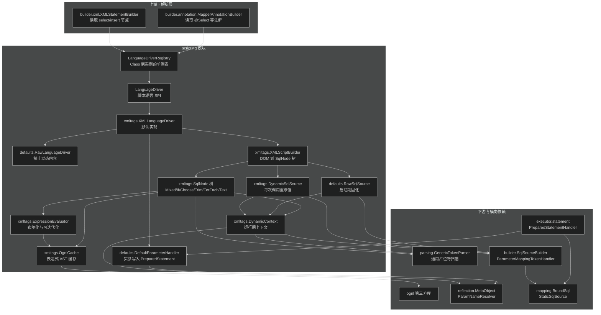
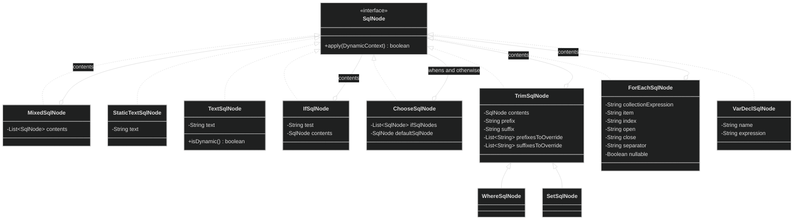
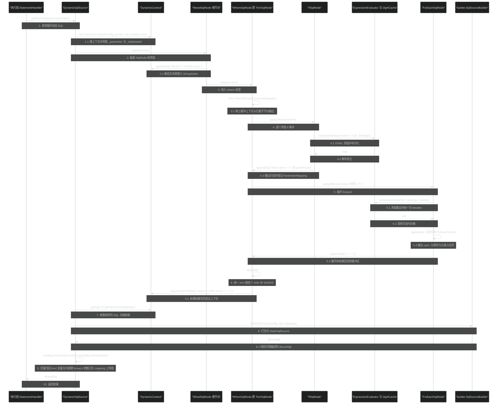
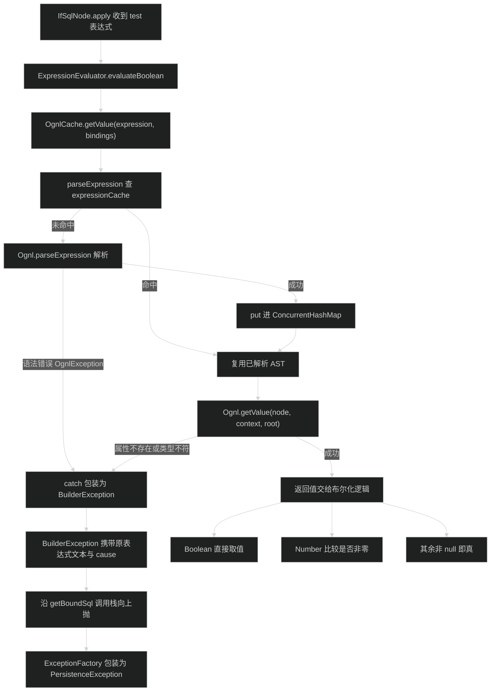
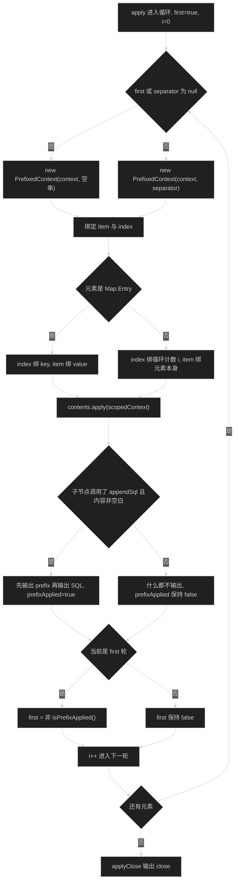

# 动态 SQL 脚本引擎（scripting）
> 上次修改：2026-07-30 00:08

## 重点关注

- **第 5 节「关键流程」+ 第 6.1 节「DynamicSqlSource 求值主链路」**：`DynamicSqlSource.getBoundSql` 是整个模块唯一的运行期入口，一次调用把「SqlNode 树 → 拼接 SQL → `#{}` 转 `?` → BoundSql + additionalParameter」全部走完。不理解这条链路，后面所有标签行为都无从解释。
- **第 6.4 节「ForEachSqlNode 的 PrefixedContext 惰性前缀」**：`separator` 不是简单地"从第二个元素开始加逗号"，而是靠 `PrefixedContext.prefixApplied` 判断"循环体是否真的产出了 SQL"。这是模块里最容易读错、也是线上最容易踩到"多一个逗号/少一个逗号"的地方。
- **第 6.5 节「TrimSqlNode 的 FilteredDynamicContext」**：`where`/`set` 全靠它。它把子节点 SQL 先缓冲、再统一 trim、再删前缀/加前缀，是"装饰器 + 缓冲"复合手法的样板，也是 `AND` 被吃掉的原因所在。
- **第 6.6 节「`#{}` 与 `${}` 的分层处理」**：两者不在同一层、不在同一时刻、不走同一套代码。`${}` 由 `TextSqlNode` 用 OGNL 直接字符串拼接（SQL 注入源头），`#{}` 由 `DynamicContext.parseParam` 转成 JDBC `?`。这是安全审计的第一现场。
- **第 6.7 节「OGNL 缓存与成员访问」**：`OgnlCache.expressionCache` 是无淘汰的 JVM 级 `ConcurrentHashMap`，`OgnlMemberAccess.restore` 故意留空。两个决策都有明确的 issue 背景，也都有可讨论的代价。
- **第 6.2 节「RawSqlSource 与 DynamicSqlSource 的分流」**：`XMLScriptBuilder.isDynamic` 这一个布尔值决定 SQL 是启动期解析一次还是每次调用重解析，是性能差异的分水岭。

## 1. 模块定位与职责边界

### 解决什么问题

`org.apache.ibatis.scripting` 解决一个问题：**把带条件、带循环、带变量的 SQL 模板，在运行期按实参展开为一条可以交给 JDBC 预编译的静态 SQL，同时产出与占位符一一对应的参数映射表**。

它是 MyBatis 里"SQL 文本"到"可执行语句"之间的那一层。上游是解析层（`builder.xml.XMLStatementBuilder` / `builder.annotation.MapperAnnotationBuilder`）把 mapper XML 节点或注解字符串交给它；下游是执行层（`executor.statement.PreparedStatementHandler`）拿它产出的 `BoundSql` 去 `Connection.prepareStatement`，再用它产出的 `ParameterHandler` 把实参 set 进 `PreparedStatement`。

### 负责什么

1. **XML 动态标签的语法树构建**。`XMLScriptBuilder.parseDynamicTags`（`src/main/java/org/apache/ibatis/scripting/xmltags/XMLScriptBuilder.java:86-115`）遍历 DOM 子节点，按 `nodeHandlerMap`（同文件 `:63-73`）注册的 9 个标签名（`trim`/`where`/`set`/`foreach`/`if`/`choose`/`when`/`otherwise`/`bind`）分派到对应 `NodeHandler`，产出一棵 `SqlNode` 树，根节点固定是 `MixedSqlNode`。
2. **SqlNode 树的运行期求值**。`SqlNode.apply(DynamicContext)`（`SqlNode.java:22`）是唯一抽象方法，各节点在 `apply` 内决定"是否输出 SQL 片段""输出什么片段""是否往上下文塞新变量"。
3. **OGNL 表达式求值与缓存**。`OgnlCache.getValue`（`OgnlCache.java:44-51`）是模块内所有表达式求值的唯一出口；`ExpressionEvaluator`（`ExpressionEvaluator.java:29-85`）在它之上做布尔化和可迭代化的语义收敛。
4. **`${}` 的文本替换**。`TextSqlNode.BindingTokenParser.handleToken`（`TextSqlNode.java:58-69`）把 `${expr}` 用 OGNL 求值结果直接拼进 SQL 字符串。
5. **脚本语言的注册与选择**。`LanguageDriverRegistry`（`LanguageDriverRegistry.java:24-70`）维护 `Class → 实例` 单例表和默认驱动类，使 `lang` 属性/`@Lang` 注解可以切换到第三方脚本语言（如 mybatis-velocity、mybatis-freemarker）。
6. **实参写入 JDBC 语句**。`DefaultParameterHandler.setParameters`（`src/main/java/org/apache/ibatis/scripting/defaults/DefaultParameterHandler.java`）按 `ParameterMapping` 列表逐个取值、定类型、调 `TypeHandler.setParameter`。

### 不负责什么

- **不负责 `#{}` 到 `?` 的字符串替换本身**。该逻辑在 `org.apache.ibatis.builder.ParameterMappingTokenHandler` 与 `SqlSourceBuilder`，scripting 只是通过 `DynamicContext.initTokenParser`（`DynamicContext.java:97-103`）组装并驱动它。
- **不负责 `ParameterMapping` 的元数据推导**（javaType/jdbcType/typeHandler 的解析规则在 builder 包）。
- **不负责静态 SQL 的最终承载**。拼好的 SQL 交给 `builder.StaticSqlSource`，见 `DynamicSqlSource.java:48`、`RawSqlSource.java:54`。
- **不负责 SQL 执行、事务、缓存、结果映射**。
- **不负责 `<include>`/`<sql>` 片段展开**——那是 `XMLIncludeTransformer` 在 XML 解析阶段做完的，scripting 拿到的已经是展开后的 DOM。

### 输入、输出、状态变化与副作用

| 维度 | 内容 |
|------|------|
| 启动期输入 | `Configuration`、`XNode`（mapper XML 的 `<select>` 等节点）或注解 SQL 字符串、`parameterType`、`ParamNameResolver` |
| 启动期输出 | 一个 `SqlSource`：含动态标签或 `${}` 时是 `DynamicSqlSource`，否则是 `RawSqlSource`（内部已固化为 `StaticSqlSource`） |
| 运行期输入 | 用户实参 `parameterObject`（可为 `null`、简单类型、`Map`、`ParamMap`、POJO） |
| 运行期输出 | `BoundSql`：`?` 化 SQL + `List<ParameterMapping>` + additionalParameters |
| 状态变化 | 顶层 `DynamicContext.bindings` 被 `<bind>` 变量与 `${}` 的 `value` 注入写入；`foreach` 的 item/index **只写进每轮 `PrefixedContext` 自己拷贝的 bindings**，不回写顶层（`ForEachSqlNode.java:105-115`、`:140`）；`OgnlCache.expressionCache` 单向增长 |
| 副作用 | `OgnlMemberAccess.setup` 会对被访问的非 public 成员调用 `setAccessible(true)` 且**不还原**（`OgnlMemberAccess.java` 的 `restore` 为空实现）；`DynamicSqlSource.getBoundSql:50` 把**顶层** bindings（`_parameter`、`_databaseId`、`<bind>` 变量等内部键）灌进 `BoundSql` 的 additionalParameter —— 其中不含 foreach 的 item/index |

## 2. 架构关系与依赖

### 依赖关系图



### 节点与依赖方向说明

| 节点 | 角色 | 依赖性质 |
|------|------|----------|
| `XMLStatementBuilder` / `MapperAnnotationBuilder` | 反向依赖方，启动期通过 `configuration.getLanguageDriver(...)` 拿驱动并调 `createSqlSource` | 强依赖 scripting（编译期依赖 `LanguageDriver` 接口） |
| `LanguageDriverRegistry` | 驱动注册表，`Configuration` 构造时注册 `XMLLanguageDriver`（默认）和 `RawLanguageDriver`（`Configuration.java:220-221`） | 被 `Configuration` 持有，`Configuration` 是唯一实例化点 |
| `XMLLanguageDriver` | 默认脚本语言驱动，四个 `createSqlSource` 重载 + 一个 `createParameterHandler`（`XMLLanguageDriver.java:37-76`） | scripting 内部核心，第三方驱动可完全替换 |
| `XMLScriptBuilder` | 编译器，把 DOM 编译成 `SqlNode` 树并决定走哪种 `SqlSource` | 只被 `XMLLanguageDriver.createSqlSource` 调用（`XMLLanguageDriver.java:51-52`） |
| `SqlNode` 树 | 组合模式的解释器，运行期唯一执行体 | 依赖 `DynamicContext`、`OgnlCache`、`GenericTokenParser` |
| `DynamicContext` | 运行期上下文，同时是"SQL 累加器 + 变量作用域 + `#{}` 解析器宿主" | 依赖 `reflection.MetaObject`、`builder.ParameterMappingTokenHandler`、`ognl.PropertyAccessor` |
| `OgnlCache` | 表达式 AST 缓存 + `OgnlContext` 工厂 | **强依赖第三方 ognl 库**，是模块唯一的外部库耦合点，不可替换（换求值引擎意味着重写 `ExpressionEvaluator`/`TextSqlNode`/`VarDeclSqlNode`） |
| `parsing.GenericTokenParser` | 通用 `open...close` 扫描器，`${}` 和 `#{}` 复用同一实现（`TextSqlNode.java:47`、`DynamicContext.java:101`） | 可替换依赖（纯工具） |
| `builder.SqlSourceBuilder` | 把拼好的 SQL 与 mapping 打包成 `StaticSqlSource` | **跨层调用**：scripting 反向调用 builder 包，形成 scripting ↔ builder 双向依赖 |
| `DefaultParameterHandler` | 实现 `executor.parameter.ParameterHandler`，被 `StatementHandler` 调用 | 跨层实现：类在 scripting，接口在 executor |

### 需要注意的耦合点

1. **scripting ↔ builder 循环依赖**。`XMLScriptBuilder extends builder.BaseBuilder`，而 `DynamicContext`/`RawSqlSource`/`DynamicSqlSource` 又反过来 import `builder.SqlSourceBuilder` 和 `builder.ParameterMappingTokenHandler`。两包在编译期互相引用，无法单独抽出。
2. **`DefaultParameterHandler` 放在 scripting 而非 executor**。原因见 `LanguageDriver.createParameterHandler` 的 javadoc（`LanguageDriver.java:29-45`）：参数写入方式属于脚本语言的一部分，换语言可能换参数处理策略，所以归 scripting。代价是 scripting 依赖了 `executor.parameter`、`type.TypeHandlerRegistry` 等执行期设施。
3. **`ognl` 是硬依赖**。`OgnlCache` 直接 import `ognl.Ognl`/`OgnlContext`/`OgnlException`，`DynamicContext` 静态块直接调 `OgnlRuntime.setPropertyAccessor`（`DynamicContext.java:43-45`）。这个静态块是**全局副作用**：一旦 `DynamicContext` 被类加载，就永久改变了本 JVM 内 OGNL 对 `ContextMap` 类型的属性访问行为。

## 3. 入口与调用方式

模块有两类入口：**启动期编译入口**（把文本编译成 `SqlSource`）和**运行期求值入口**（把 `SqlSource` 展开成 `BoundSql`）。二者分离是本模块的基本设计。

### 3.1 启动期入口：`LanguageDriver.createSqlSource`

`LanguageDriver` 声明了 4 个 `createSqlSource`（`LanguageDriver.java:61-87`），其中带 `ParamNameResolver` 的两个是 `default` 方法，默认丢弃该参数转调三参数版本——这是为兼容既有第三方驱动做的后向兼容设计。

| 入口 | 源码位置 | 触发条件 | 关键参数 | 返回 |
|------|----------|----------|----------|------|
| `createSqlSource(Configuration, XNode, Class, ParamNameResolver)` | `XMLLanguageDriver.java:48-53` | 解析 mapper XML 的 `<select>`/`<insert>`/`<update>`/`<delete>` 节点时 | `script` 是已完成 `<include>` 展开的 DOM 节点 | `DynamicSqlSource` 或 `RawSqlSource` |
| `createSqlSource(Configuration, String, Class, ParamNameResolver)` | `XMLLanguageDriver.java:60-76` | 解析 `@Select`/`@Update` 等注解，或 `SqlProvider` 返回字符串时 | `script` 是裸 SQL 字符串 | 同上 |
| `createParameterHandler(MappedStatement, Object, BoundSql)` | `XMLLanguageDriver.java:37-41` | 每次 `StatementHandler` 准备语句时 | `boundSql` 已含 `?` 化 SQL 和 mapping | `DefaultParameterHandler` |

字符串入口内部有三条分支（`XMLLanguageDriver.java:63-75`）：

1. 以 `<script>` 开头 → 用 `XPathParser` 当 XML 重新解析，转走 XNode 路径（issue #3，这让注解也能写动态标签）；
2. 否则先 `PropertyParser.parse` 替换 `${}` 形式的**配置变量**（issue #127，注意这一步发生在运行期 OGNL 替换之前，属于启动期常量替换）；
3. 再用 `new TextSqlNode(script).isDynamic()` 判断是否残留 `${}`：残留则 `DynamicSqlSource`，否则 `RawSqlSource`。

### 3.2 驱动选择入口：`LanguageDriverRegistry`

`Configuration` 构造函数末尾注册两个内置驱动（`Configuration.java:220-221`）：

```java
languageRegistry.setDefaultDriverClass(XMLLanguageDriver.class);
languageRegistry.register(RawLanguageDriver.class);
```

`register(Class)` 用 `computeIfAbsent` + 无参构造反射实例化（`LanguageDriverRegistry.java:34-40`），失败包装成 `ScriptingException`。因此**所有 `LanguageDriver` 实现必须有可访问的无参构造器**，且每个驱动类在一个 `Configuration` 内是单例。

用户侧三种切换方式：

- 全局：`<settings><setting name="defaultScriptingLanguage" value="..."/>` → `Configuration.setDefaultScriptingLanguage`（`Configuration.java:665-670`，传 `null` 回落到 `XMLLanguageDriver`）；
- 语句级 XML：`<select lang="RAW">`；
- 语句级注解：`@Lang(RawLanguageDriver.class)`。

### 3.3 运行期入口：`SqlSource.getBoundSql`

`DynamicSqlSource.getBoundSql`（`DynamicSqlSource.java:43-52`）是本模块运行期唯一的实质入口，**每次 SQL 执行都会完整走一遍**：新建 `DynamicContext` → `rootSqlNode.apply` → 取 SQL → `SqlSourceBuilder.buildSqlSource` → 取 `BoundSql` → 回灌 bindings。

`RawSqlSource.getBoundSql`（`RawSqlSource.java:71-74`）则是纯委托，SqlNode 树在构造期就已经跑完一次并被丢弃，运行期零解析开销。

### 3.4 节点级入口：`SqlNode.apply`

`SqlNode` 只有一个方法（`SqlNode.java:22`）：

```java
boolean apply(DynamicContext context);
```

**返回值语义并不统一，这是阅读时的第一个坑**：

| 节点 | 返回值含义 | 源码 |
|------|-----------|------|
| `IfSqlNode` | `test` 表达式是否为真 | `IfSqlNode.java` |
| `ChooseSqlNode` | 是否命中了某个 `when` 或 `otherwise` | `ChooseSqlNode.java` |
| `MixedSqlNode` / `TextSqlNode` / `StaticTextSqlNode` / `ForEachSqlNode` / `VarDeclSqlNode` / `EmptySqlNode` | 恒为 `true`，无信息量 | `MixedSqlNode.java:31-34` 等 |
| `TrimSqlNode` | 透传子节点的返回值（`TrimSqlNode.java:57-59`） | 该值实际无人消费 |

也就是说，返回值**只在 `ChooseSqlNode.apply` 遍历 `ifSqlNodes` 时被真正读取**，用于实现 `when` 的短路。其他场景一律忽略。

## 4. 核心概念与领域模型

### 4.1 SqlNode —— 组合模式的解释器节点

**定义**：`SqlNode` 是一个只有 `apply(DynamicContext)` 的接口（`SqlNode.java:21-23`），代表动态 SQL 语法树上的一个节点。

**作用**：把"一段 SQL 模板"抽象为"一个可以对上下文施加副作用的动作"。节点分三类：

| 分类 | 实现 | 行为 |
|------|------|------|
| 叶子（输出 SQL） | `StaticTextSqlNode`、`TextSqlNode`、`XMLScriptBuilder.EmptySqlNode` | 直接 `context.appendSql` |
| 容器（组合子节点） | `MixedSqlNode`、`IfSqlNode`、`ChooseSqlNode`、`TrimSqlNode`（含 `WhereSqlNode`/`SetSqlNode`）、`ForEachSqlNode` | 递归调用子节点的 `apply`，并对其输出做包装/过滤 |
| 副作用（只改上下文） | `VarDeclSqlNode` | 只 `context.bind`，不产出 SQL（`VarDeclSqlNode.java:31-36`） |

**生命周期**：`XMLScriptBuilder.parseScriptNode` 构建后即固化在 `SqlSource` 里，与 `Configuration` 同生命周期。**节点本身无可变状态**（所有字段 `final`，无实例状态在 `apply` 中被修改），可变状态全部外置到 `DynamicContext` —— 这是它能被多线程并发 `apply` 的根本原因。

**继承关系图**：



**三维评估**：

- **好处**：新增标签只需实现 `SqlNode` + 注册一个 `NodeHandler`，`XMLScriptBuilder.nodeHandlerMap` 一行搞定，无需改动任何现有节点；节点无状态使得同一棵树可被任意线程并发求值；容器节点的"包装子节点输出"能力靠替换传入的 `DynamicContext` 实现（见 `PrefixedContext`/`FilteredDynamicContext`），非常轻量。
- **替代方案**：（a）把动态 SQL 编译成字节码或 Java 源码（类似 JSP 编译），运行期零解释开销，但实现复杂度陡增、无法支持运行期改 SQL；（b）用完整的 AST + Visitor 模式，能对树做多趟分析优化（如常量折叠），但当前"一趟解释、边算边拼"的模型不需要多趟；（c）直接用模板引擎（Velocity/Freemarker），MyBatis 实际上通过 `LanguageDriver` SPI 保留了这条路。
- **风险**：不这么做的最大代价是标签语义会被硬编码进一个巨型 `switch`，`where`/`set` 无法通过继承 `trim` 复用（`WhereSqlNode`/`SetSqlNode` 各自只有一个构造函数、零逻辑代码，正是这个设计的红利）。当前设计的固有代价是 `apply` 返回值语义不统一（见 3.4），以及**解释开销每次调用都付**（由 `RawSqlSource` 分流缓解）。

### 4.2 DynamicContext —— 运行期上下文

**定义**：`DynamicContext`（`DynamicContext.java:38-195`）在一次 `getBoundSql` 中承担三个角色：

1. **SQL 累加器**：`private final StringJoiner sqlBuilder = new StringJoiner(" ")`（`:48`）。用 `StringJoiner` 而非 `StringBuilder`，意味着**每次 `appendSql` 之间自动补一个空格**（`:89-91`），这解决了"标签之间缺空格导致 SQL 粘连"的经典问题；`getSql()` 再 `trim()` 掉首尾（`:93-95`）。
2. **变量作用域**：`protected final ContextMap bindings`（`:47`），预置两个内置变量 `_parameter` 和 `_databaseId`（`:40-41`、`:72-73`）。
3. **`#{}` 解析器宿主**：懒初始化 `GenericTokenParser("#{", "}", ParameterMappingTokenHandler)`（`:97-103`），通过 `parseParam` 暴露（`:110-113`）。

**生命周期**：`DynamicSqlSource.getBoundSql` 每次调用 new 一个（`DynamicSqlSource.java:45`）；`RawSqlSource` 构造时 new 一个用完即弃（`RawSqlSource.java:51`）。**严格的请求级对象，绝不跨请求复用**。

**ContextMap 的取值回退链**（`DynamicContext.java:141-157`）是本模块最易被忽视的机制。`ContextMap extends HashMap` 并覆写 `get`：

```java
if (super.containsKey(strKey)) return super.get(strKey);      // 1. 显式 bind 的变量优先
if (parameterMetaObject == null) return null;                  // 2. 参数是 null 或 Map，无回退
if (fallbackParameterObject && !parameterMetaObject.hasGetter(strKey))
    return parameterMetaObject.getOriginalObject();            // 3. 简单类型：任何名字都返回参数本身
return parameterMetaObject.getValue(strKey);                   // 4. POJO：按属性名反射取值
```

第 3 条分支的条件 `fallbackParameterObject` 来自构造函数里的 `typeHandlerRegistry.hasTypeHandler(parameterObject.getClass())`（`:69`）。这解释了为什么传单个 `Long id` 时，`<if test="value != null">`、`<if test="id != null">`、`<if test="随便什么名 != null">` 全都能取到那个 `Long` —— 因为简单类型的任意属性名都回退到参数本身。

第 4 条注释标了 `issue #61 do not modify the context when reading`：`get` 里只读不写，不缓存反射结果到 map，避免读操作污染上下文。

**ContextAccessor 的第二层回退**（`DynamicContext.java:160-177`）：静态块 `OgnlRuntime.setPropertyAccessor(ContextMap.class, new ContextAccessor())`（`:43-45`）让 OGNL 访问 `ContextMap` 时走自定义逻辑——若 map 里没有该 key 且 `_parameter` 本身是 `Map`，则从 `_parameter` 这个 Map 里取。这是 `Map` 型参数（含 `@Param` 生成的 `ParamMap`）能被 `<if test="key != null">` 直接引用的原因。

**三维评估**：

- **好处**：把"变量查找"的复杂度（显式绑定 → 简单类型回退 → POJO 反射 → Map 穿透）全部收敛到 `ContextMap.get` + `ContextAccessor.getProperty` 两个点，OGNL 表达式作者不需要知道参数到底是 POJO 还是 Map；`StringJoiner(" ")` 一次性解决了所有标签的空格拼接问题。
- **替代方案**：（a）不做回退，强制用户写 `_parameter.id`——语义清晰但破坏所有既有 mapper；（b）在构造 `DynamicContext` 时把 POJO 全部属性 eager 摊平进 map——省掉每次反射，但对大对象是浪费，且丢失了 `hasGetter` 的语义区分；（c）用 `StringBuilder` 手工控制空格——需要每个节点自己保证边界空格，极易出错。
- **风险**：`ContextMap.get` 对不存在的 POJO 属性会走到 `parameterMetaObject.getValue(strKey)`，若属性不存在 `MetaObject` 会抛异常而非返回 null，导致表达式写错属性名时报的是反射错误而不是"变量未定义"；`ContextAccessor` 通过全局 `OgnlRuntime` 注册生效，是进程级副作用，同一 JVM 内多个 `SqlSessionFactory` 共享这一配置。

### 4.3 SqlSource 的两种形态：Raw 与 Dynamic

**定义与判定**：`XMLScriptBuilder.parseScriptNode`（`XMLScriptBuilder.java:75-84`）依据 `isDynamic` 布尔字段二选一。`isDynamic` 在 `parseDynamicTags` 中被置为 `true` 的条件有两个（`:98-100`、`:104-111`）：

1. 文本节点含 `${}`（`TextSqlNode.isDynamic()` 为真）；
2. 出现任何 `ELEMENT_NODE` 子节点（即任何动态标签，包括 `<bind>`）。

注意：只含 `#{}` 的 SQL **不是**动态 SQL —— `#{}` 是编译期就能确定位置的参数占位符。

| 维度 | `RawSqlSource` | `DynamicSqlSource` |
|------|----------------|--------------------|
| SqlNode 树何时求值 | 构造期一次（`RawSqlSource.java:52`） | 每次 `getBoundSql`（`DynamicSqlSource.java:46`） |
| 内部持有 | `StaticSqlSource`（`:54`） | `SqlNode` 树 + `Configuration` + `ParamNameResolver` |
| `ParameterMapping` 何时算出 | 启动期 | 每次调用重算 |
| additionalParameters | 无 | 顶层 bindings 全量灌进去（`DynamicSqlSource.java:50`）：仅 `<bind>` 变量与 `_parameter`/`_databaseId` 等内部键，**不含 foreach 的 item/index** |
| 运行期成本 | 一次 map 查找 + 参数绑定 | OGNL 求值 + 字符串拼接 + `#{}` 重扫描 + `StaticSqlSource` 重建 |

`RawSqlSource` 的类注释直接写明动机（`RawSqlSource.java:34-40`）："Static SqlSource. It is faster than `DynamicSqlSource` because mappings are calculated during startup."

`RawSqlSource` 有两条构造路径：从 `SqlNode` 树来的（`:49-55`，走 `DynamicContext` 收集静态文本）和从裸字符串来的（`:61-69`，直接用 `GenericTokenParser` 扫 `#{}`）。后者不经过 `SqlNode`，是注解 SQL 的快路径。

**三维评估**：

- **好处**：绝大多数 mapper 语句是静态的，这一分流把它们的运行期成本压到接近手写 JDBC；判定逻辑只有一个布尔字段，实现成本极低。
- **替代方案**：（a）统一走 `DynamicSqlSource` 并对结果做缓存——需要设计缓存 key（参数值组合可能爆炸），MyBatis 选择不缓存动态 SQL 结果；（b）更细粒度的部分求值（把树里的静态子树预先折叠成常量）——收益有限而复杂度高，因为 `TrimSqlNode` 等节点的输出依赖兄弟节点的运行期输出。
- **风险**：判定过于保守——只要有一个 `<if>`，整条 SQL（包括 99% 的静态部分）都要每次重解析；`DynamicSqlSource` 每次调用都新建 `StaticSqlSource` 和整套 `ParameterMapping` 对象，高 QPS 下是明确的 GC 压力来源。

### 4.4 LanguageDriver —— 可插拔脚本语言 SPI

**定义**：`LanguageDriver`（`LanguageDriver.java:27-89`）是脚本语言的服务接口，要求实现方回答两个问题："怎么把文本编译成 SqlSource"和"怎么把实参写进 JDBC 语句"。

**生命周期**：由 `LanguageDriverRegistry` 反射实例化并缓存为单例（`LanguageDriverRegistry.java:34-40`），随 `Configuration` 存活。因此**实现类必须线程安全且无请求级状态**。

**内置实现关系**：`RawLanguageDriver extends XMLLanguageDriver`，只在父类返回结果上加一道 `checkIsNotDynamic` 断言（用 `RawSqlSource.class.equals(source.getClass())` 精确匹配，连子类都不放过），不是 `RawSqlSource` 就抛 `BuilderException`。它的 javadoc 明确说明：自 3.2.4 起 `XMLLanguageDriver` 已能自动识别静态 SQL，因此本类在常规场景下不再必要，仅用于"我要确保这条 SQL 绝无动态内容"的强约束场景。

**三维评估**：

- **好处**：把"SQL 模板语言"从框架核心解耦，mybatis-velocity、mybatis-freemarker、mybatis-thymeleaf 等官方生态模块无需 fork 核心即可接入；`default` 方法保证了新增 `ParamNameResolver` 参数不破坏既有第三方驱动的二进制兼容。
- **替代方案**：（a）用 `java.util.ServiceLoader` 做 SPI 自动发现——省掉手工 register，但失去"哪个语句用哪个驱动"的显式控制；（b）只暴露 `createSqlSource` 不暴露 `createParameterHandler`——参数写入逻辑就无法随语言变化，例如某语言想支持自定义参数类型转换就无路可走。
- **风险**：`register(Class)` 强制无参构造，驱动无法通过构造注入 `Configuration`，只能在每次 `createSqlSource` 里从入参拿——这也是为什么 `XMLLanguageDriver` 所有方法都是无状态的；`getDriver` 对未注册的类直接返回 `null`（`LanguageDriverRegistry.java:53-55`），调用方拿到 `null` 后要到很晚才 NPE，无早期失败提示。

### 4.5 内置变量与 OGNL 表达式

| 变量 | 来源 | 含义 | 源码 |
|------|------|------|------|
| `_parameter` | `DynamicContext` 构造时预置 | 原始实参对象 | `DynamicContext.java:40`、`:72` |
| `_databaseId` | 同上 | `configuration.getDatabaseId()`，供多数据库分支 | `DynamicContext.java:41`、`:73` |
| `value` | `TextSqlNode.BindingTokenParser.handleToken` 在参数为简单类型时写入 | 让 `${value}` 能引用单个简单参数 | `TextSqlNode.java:60-65` |
| `<bind>` 声明的名字 | `VarDeclSqlNode.apply` | 用户自定义变量，值由 OGNL 现场求值 | `VarDeclSqlNode.java:33-34` |
| `foreach` 的 `item`/`index` | `ForEachSqlNode.applyItem`/`applyIndex` | 当前元素与索引；**作用域仅限当轮 `PrefixedContext`**，不进顶层 bindings | `ForEachSqlNode.java:105-115`、`:140` |

注意 `value` 的写入时机：**只在解析 `${}` 时才写**，`<if test="...">` 走的是 `ExpressionEvaluator` 不经过这段代码，因此 `<if>` 中能用裸属性名靠的是 4.2 的 `ContextMap` 回退，而 `${}` 中的 `value` 靠的是这里的显式 put。两条机制并行，容易混淆。

## 5. 关键流程

### 5.1 主成功路径：DynamicSqlSource 的一次完整求值

场景：mapper 定义为

```xml
<select id="find" resultType="User">
  SELECT * FROM users
  <where>
    <if test="name != null">AND name = #{name}</if>
    <if test="ids != null">
      AND id IN <foreach collection="ids" item="i" open="(" close=")" separator=",">#{i}</foreach>
    </if>
  </where>
</select>
```



**1-2 上下文建立与树求值启动**：执行层调用 `DynamicSqlSource.getBoundSql`（`DynamicSqlSource.java:44`），第一件事是 new 一个全新的 `DynamicContext`，第五个参数 `paramExists=true` 表示"确实有实参"（`RawSqlSource` 传的是 `false`）。构造函数按实参类型分三路建 `ContextMap`：`null` 或 `Map` 走无 MetaObject 分支，POJO 走 MetaObject + `hasTypeHandler` 探测分支（`DynamicContext.java:65-71`）。随后 `rootSqlNode.apply(context)` 启动整棵树的深度优先求值，`MixedSqlNode.apply` 用 `forEach` 顺序调子节点且**忽略所有返回值**（`MixedSqlNode.java:32`）。

**3-4 where 缓冲与 if 条件判定**：`WhereSqlNode` 实质是配置好的 `TrimSqlNode`（prefix=`WHERE`，prefixesToOverride 是 `AND `/`OR ` 及其 `\n\r\t` 变体）。它的 `apply` 不直接让子节点写真实上下文，而是套一层 `FilteredDynamicContext`（`TrimSqlNode.java:56`），后者覆写 `appendSql` 把内容存进自己的 `sqlBuffer` 而非 delegate（`:100-106`）。`IfSqlNode.apply` 调 `ExpressionEvaluator.evaluateBoolean`，后者对 OGNL 结果做三级布尔化：`Boolean` 直接取值、`Number` 比较是否非零、其余非 null 即真（`ExpressionEvaluator.java:33-42`）。条件成立才递归 `contents.apply`，文本节点在 `appendSql` 前先过 `context.parseParam` 把 `#{name}` 换成 `?` 并往 `parameterMappings` 追加一条（`StaticTextSqlNode.java:30`）。

**5 foreach 展开**：`evaluateIterable` 把 `Iterable`/数组/`Map` 统一成 `Iterable`（数组用 `Array.get` 手工装箱以避开原始类型数组的 `ClassCastException`，见 issue 209 注释，`ExpressionEvaluator.java:66-77`；`Map` 转成 `entrySet()`）。空集合或 `null` 时 `apply` 直接 `return true` —— **`open`/`close` 都不会输出**（`ForEachSqlNode.java:72-74`），这是"空集合不会产生 `IN ()`"的原因。非空则 `applyOpen` 输出 `(`，随后每个元素套一个 `PrefixedContext`（首元素前缀为空串，其余为 `separator`）。

**6 trim 收尾**：所有子节点跑完后 `filteredDynamicContext.applyAll()`（`TrimSqlNode.java:58`、`:90-98`）：先 `trim()` 掉缓冲区首尾空白，再转大写副本用于匹配，若非空则 `applyPrefix` 找到第一个匹配的 `prefixesToOverride` 并 `sql.delete(0, toRemove.trim().length())` 删掉开头的 `AND`，再 `sql.insert(0, " ").insert(0, "WHERE")`；最后把结果一次性 `delegate.appendSql`。**缓冲区为空时跳过前缀后缀处理**，所以所有 `<if>` 都不成立时 `<where>` 不会留下一个孤零零的 `WHERE`。

**7-10 打包与回灌**：`context.getSql()` 返回 `StringJoiner.toString().trim()`；`getParameterMappings()` 触发 `initTokenParser(null)` 保证 tokenHandler 已建（`DynamicContext.java:105-108`）。`SqlSourceBuilder.buildSqlSource` 产出 `StaticSqlSource` 再取 `BoundSql`。最后一步 `context.getBindings().forEach(boundSql::setAdditionalParameter)`（`DynamicSqlSource.java:50`）把**顶层** context 的 bindings 塞进 `BoundSql` 的 additionalParameters —— 内容只有 `_parameter`、`_databaseId` 这类内部键和 `<bind>`（`VarDeclSqlNode`）声明的变量。

**foreach 的 item/index 不在其中**：`ForEachSqlNode.applyIndex`/`applyItem` 调的是每轮新建的 `PrefixedContext.bind`（`ForEachSqlNode.java:105-115`），而 `PrefixedContext` 构造时已 `this.bindings.putAll(delegate.getBindings())` 复制了一份独立 map（`:140`），`bind` 只落在这份副本上，顶层 map 从头到尾看不到 `item`/`index`。foreach 内 `#{item}` 的取值靠**值捕获**完成：`#{}` 被展开时，`ParameterMappingTokenHandler.buildParameterMapping` 在 `paramExists=true` 且 `metaParameters.hasGetter(name)` 成立时（`metaParameters` 就是当轮 `PrefixedContext` 的 bindings，见 `DynamicContext.java:99-100`），把当轮实参值快照进 `builder.value(...)`（`ParameterMappingTokenHandler.java:125-136`），运行期由 `DefaultParameterHandler` 的 `parameterMapping.hasValue()` 分支直接读出（`DefaultParameterHandler.java:105-106`）。因此参数名无需被改写成 `__frch_*` 之类的唯一名（旧版本 MyBatis 的做法，当前 `src/main` 已无 `ITEM_PREFIX`/`itemizeItem`/`uniqueNumber` 任何痕迹），同一个 `#{item}` 在 N 轮循环里产出 N 条各自带值的 `ParameterMapping`，按追加顺序与 SQL 中的 `?` 一一对应。

### 5.2 失败路径：OGNL 表达式求值异常



**1-2 求值与缓存查找**：`OgnlCache.getValue` 每次都新建一个 `OgnlContext`（`OgnlCache.java:46`，因为 context 持有 root 且非线程安全），但表达式 AST 从 `expressionCache` 复用（`:53-60`）。`parseExpression` 用的是 `get` + 判空 + `put` 的非原子写法：并发首次求值同一表达式时可能重复解析并覆盖，但因为 AST 是等价的、`ConcurrentHashMap.put` 本身线程安全，结果正确，只是浪费一次解析。这是刻意的"良性竞争"取舍，比 `computeIfAbsent` 少一次 lambda 分配和潜在的锁竞争。

**3 异常统一转换**：`OgnlException` 是唯一被捕获的异常类型，包装成 `BuilderException` 且消息里带上原表达式（`OgnlCache.java:48-50`）——这一点对排障很关键，因为异常栈里能直接看到是哪个 `test` 写错了。注意 `BuilderException extends PersistenceException`，属于运行期异常，**不会被 scripting 内部任何地方捕获**，一路抛到 `SqlSession` 调用方。`RuntimeException`（如 `MetaObject` 反射失败）则完全不经这层包装，直接穿透。

**4 布尔化分支**：`evaluateBoolean` 的三级回退（`ExpressionEvaluator.java:35-41`）意味着 `<if test="list.size()">` 这类返回数字的表达式也能工作（非零为真），`<if test="user">` 返回对象时非 null 为真。副作用是**表达式写错属性名时如果 OGNL 恰好返回 null，会被静默判为 false**，而不是报错。

### 5.3 边界路径：foreach 的 separator 惰性判定

这是模块内最反直觉的一段逻辑，值得单独一图。



**1-2 每元素独立作用域**：每次迭代都 new 一个 `PrefixedContext`（`ForEachSqlNode.java:79-84`）。`PrefixedContext` 构造时把 delegate 的 bindings **全量拷贝**进自己的 map（`:140` 的 `this.bindings.putAll(delegate.getBindings())`），因此本轮 bind 的 `item`/`index` 不会污染 delegate，也不会被下一轮看到——这正是嵌套 `foreach` 用同名 `item` 不冲突的原因，也意味着这两个变量**从不出现在顶层 bindings、从不进入 additionalParameters**（取值机制见 6.4 细节 4）。`Map.Entry` 的特判（`:86-94`，issue #709）让 `<foreach collection="map">` 时 `index` 拿到 key、`item` 拿到 value。

**3 惰性前缀写入**：`PrefixedContext.appendSql`（`:147-154`）的条件是 `!prefixApplied && sql != null && sql.trim().length() > 0`。也就是说，**只有当循环体真的产出了非空白内容时，separator 才会被写出去**。若循环体是 `<if test="...">` 且本轮条件不成立，本轮什么都不输出，separator 也不会输出——避免了 `IN (1, , 3)` 这种畸形 SQL。

**4-5 first 标志的延迟推进与循环推进**：`if (first) { first = !((PrefixedContext) scopedContext).isPrefixApplied(); }`（`:96-98`）。首轮结束后，若首轮**没有**实际输出（`prefixApplied` 仍为 false），`first` 保持 `true`，于是第二轮仍然使用空前缀。这保证了"第一个真正产出 SQL 的元素前面不带 separator"，而不是"第 0 号元素前面不带 separator"。之后 `i++`（`:99`）推进索引并回到条件判断继续下一个元素——注意 `i` 是独立的循环计数器，只在非 `Map.Entry` 分支用作 `index` 值。**这是整个 foreach 实现的精髓，也是唯一必须理解 `PrefixedContext` 才能读懂的地方**。

**6 open/close 的非对称性**：`applyOpen` 在循环前无条件输出（只要 `open != null`），`applyClose` 在循环后无条件输出。但由于空集合在 `:72-74` 已提前 return，二者要么都输出要么都不输出，不会失衡。风险点在于：**如果集合非空但所有循环体都不产出 SQL**（例如 `<foreach>` 里全是不成立的 `<if>`），会得到 `IN ( )` 这种空括号——源码没有对此做保护。

## 6. 核心实现细节

### 6.1 DynamicSqlSource：九行代码的完整链路

`DynamicSqlSource.getBoundSql`（`DynamicSqlSource.java:43-52`）全文只有 7 条语句，但每一条都不可省：

```java
DynamicContext context = new DynamicContext(configuration, parameterObject, null, paramNameResolver, true);
rootSqlNode.apply(context);
String sql = context.getSql();
SqlSource sqlSource = SqlSourceBuilder.buildSqlSource(configuration, sql, context.getParameterMappings());
BoundSql boundSql = sqlSource.getBoundSql(parameterObject);
context.getBindings().forEach(boundSql::setAdditionalParameter);
return boundSql;
```

**逐段解读**：

- **第 1 行**：`parameterType` 传 `null`。运行期已有实参对象，类型可从对象本身取，不需要声明类型；而 `RawSqlSource` 因为没有实参，必须传 `parameterType`（`RawSqlSource.java:51`）。第五参数 `paramExists=true` 会一路传给 `ParameterMappingTokenHandler`（`DynamicContext.java:99-100`），**它是"值捕获"开关**：只有 `paramExists` 为真时 `buildParameterMapping` 才会把实参值快照进 `ParameterMapping.value`（`ParameterMappingTokenHandler.java:125-136`）；`RawSqlSource` 走的两个构造器都让 `paramExists=false`（`ParameterMappingTokenHandler.java:68`），启动期建的 mapping 一律不带值。
- **第 2 行**：整棵树的求值。**返回值被丢弃**——根节点是 `MixedSqlNode`，恒返回 `true`。
- **第 3 行**：`StringJoiner.toString().trim()`。此时 SQL 里的 `#{}` 已经在各文本节点的 `parseParam` 中被换成 `?`，`${}` 已被 OGNL 结果替换。
- **第 4 行**：跨层调用 `builder.SqlSourceBuilder`。**注意 mapping 列表来自 `context.getParameterMappings()`**，而该列表是由第 2 行求值过程中各节点调 `parseParam` 逐步累积的——顺序严格对应 SQL 中 `?` 的出现顺序，这是参数能正确对位的根本保证。列表里 foreach 展开出的那些 mapping **已经在这一步之前就带上了当轮的实参值快照**，因此下游无需再按名字去哪里查找。
- **第 5 行**：`StaticSqlSource.getBoundSql` 只是把 sql + mappings + parameterObject 装进 `BoundSql`。
- **第 6 行**：顶层 bindings 无过滤地灌进 additionalParameters。这意味着 `_parameter`、`_databaseId` 也会被塞进去，属于冗余，但代价只是一次 map 遍历。**这里灌进去的只有顶层作用域的东西**——`<bind>` 变量和内部键；foreach 每轮的 item/index 存活在各自的 `PrefixedContext` 副本里，随迭代结束即被丢弃。
- **隐藏假设**：`rootSqlNode.apply` 必须在 `getParameterMappings()` 之前调用完毕，否则 mapping 列表为空。这个时序依赖靠代码顺序保证，无断言。

**三维评估**：

- **好处**：整个动态 SQL 的复杂度被"编译期建树、运行期一趟遍历"的模型压平，7 行代码即可读懂全貌；把 `#{}` 处理下沉到 `DynamicContext.parseParam`，使各 SqlNode 无需关心参数化。
- **替代方案**：（a）先拼完整 SQL 再统一扫 `#{}`（早期 MyBatis 的做法），实现更直观，但那时 `foreach` 必须把 `#{item}` 改写成 `__frch_item_N` 这类唯一名并连同值一起塞进 additionalParameters 才能区分各轮——当前实现改用"求值时就地捕获值到 `ParameterMapping`"，省掉了整套名字改写机制；（b）把 `SqlSourceBuilder` 调用结果缓存起来，用 SQL 字符串做 key——能省掉重复的 `#{}` 扫描，但需要维护一个可能无界的缓存，且**与值捕获不兼容**（mapping 上带着上次调用的实参值，不可跨请求复用）。
- **风险**：每次调用产生的临时对象包括 1 个 `DynamicContext`、1 个 `ContextMap`、1 个 `StringJoiner`、N 个 `PrefixedContext`/`FilteredDynamicContext`（每个都 `putAll` 拷贝一份 bindings）、1 个 `StaticSqlSource`、1 个 `BoundSql`、M 个 `ParameterMapping`。**在深层嵌套 + 大集合 foreach 场景下，bindings 的反复 `putAll` 是 O(节点数 × 变量数) 的隐性开销**。

### 6.2 RawSqlSource 与分流判定：把成本挪到启动期

`XMLScriptBuilder.parseDynamicTags`（`XMLScriptBuilder.java:86-115`）在遍历 DOM 时设置 `isDynamic`，`parseScriptNode`（`:75-84`）据此分流。三条值得注意的实现：

1. **空白文本节点的共享缓存**（`:93-96`）：

```java
if (data.trim().isEmpty()) {
  contents.add(emptyNodeCache.computeIfAbsent(data, EmptySqlNode::new));
  continue;
}
```

`emptyNodeCache` 是 `static ConcurrentHashMap<String, SqlNode>`（`:44`）。mapper XML 里缩进产生的大量纯空白文本节点（如 `"\n    "`）被按内容去重共享，一个中大型项目能省下成千上万个对象。`EmptySqlNode.apply` 只做 `context.appendSql(whitespaces)`（`:276-279`），保留原空白以维持 SQL 可读性。因为节点无状态，静态共享是安全的。

2. **`isDynamic` 只增不减**：一旦某个子节点让它变 `true`，整条语句就是动态的。递归解析子标签时用的是同一个 `XMLScriptBuilder` 实例（`TrimHandler` 等都是内部类，共享外层的 `isDynamic` 字段），因此深层嵌套的 `<if>` 也能正确传导到顶层。

3. **`RawSqlSource` 的双路径**：从 `SqlNode` 树来时（`RawSqlSource.java:49-55`）走一次 `DynamicContext`，此时树里只有 `StaticTextSqlNode` 和 `EmptySqlNode`，`apply` 相当于纯拼接 + `#{}` 扫描；从裸字符串来时（`:61-69`）连 `DynamicContext` 都不建，直接 `new ParameterMappingTokenHandler(...)` + `GenericTokenParser` 扫一遍。后者 `parameterType == null` 时兜底成 `Object.class`（`:63`），bindings 传空 `HashMap`。

**三维评估**：

- **好处**：把静态 SQL 的解析成本一次性支付在启动期，运行期只剩参数绑定，性能接近手写 `PreparedStatement`；空白节点共享显著降低 mapper 数量大时的常驻内存。
- **替代方案**：（a）不区分，全部 `DynamicSqlSource`——代码更简单，但静态语句白付每次解析成本；（b）更激进地做"部分静态化"：把动态树中的静态子树预先折叠——但 `TrimSqlNode`/`ForEachSqlNode` 的输出依赖运行期兄弟节点的产出，折叠后语义会变，收益不确定。
- **风险**：`emptyNodeCache` 是**永不清理的静态 map**，key 是空白字符串。虽然空白字符串的种类有限（缩进层级数量级），理论上仍是不受限增长；若有人动态生成含随机长度空白的 SQL，会造成缓慢泄漏。`isDynamic` 的粗粒度导致一个 `<if>` 就让整条 SQL 退化为动态。

### 6.3 TrimSqlNode 与 FilteredDynamicContext：缓冲 + 后处理

`TrimSqlNode.apply` 只有 3 行（`TrimSqlNode.java:55-60`），全部逻辑在 `FilteredDynamicContext`（`:74-151`）。

**核心手法**：`FilteredDynamicContext extends DynamicContext` 并覆写 `appendSql`，把内容重定向到自己的 `StringBuilder sqlBuffer`（`:100-106`），**多次 append 之间手工插一个空格**（因为它用的是 `StringBuilder` 不是父类的 `StringJoiner`）。子节点完全不知道自己在往缓冲区写。等所有子节点跑完，`applyAll()` 做后处理再一次性交给 delegate。

**`applyAll` 的四步**（`:90-98`）：

```java
sqlBuffer = new StringBuilder(sqlBuffer.toString().trim());              // 1. 去首尾空白
String trimmedUppercaseSql = sqlBuffer.toString().toUpperCase(Locale.ENGLISH);  // 2. 造大写副本用于匹配
if (!trimmedUppercaseSql.isEmpty()) {                                    // 3. 空则完全跳过
  applyPrefix(sqlBuffer, trimmedUppercaseSql);
  applySuffix(sqlBuffer, trimmedUppercaseSql);
}
delegate.appendSql(sqlBuffer.toString());                                // 4. 一次性交付
```

`toUpperCase(Locale.ENGLISH)` 显式指定 Locale，避免土耳其语环境下 `i → İ` 导致 `AND`/`OR` 匹配失败（经典 Turkish-I 问题）。

**`applyPrefix` 的删除长度陷阱**（`:118-130`）：

```java
prefixesToOverride.stream().filter(trimmedUppercaseSql::startsWith).findFirst()
    .ifPresent(toRemove -> sql.delete(0, toRemove.trim().length()));
```

匹配用的是**带空白的原串**（如 `"AND "`），但删除长度用的是 `toRemove.trim().length()`（即 3）。这是有意的：删掉 `AND` 三个字符，保留它后面的那个空格，避免删完变成 `WHERE name = ?` 里 `WHERE` 和 `name` 粘连。之后 `sql.insert(0, " ").insert(0, prefix)` 也主动补了空格。

**`applySuffix` 的双条件匹配**（`:132-149`）：

```java
.filter(toRemove -> trimmedUppercaseSql.endsWith(toRemove) || trimmedUppercaseSql.endsWith(toRemove.trim()))
```

因为第 1 步已经 `trim()` 过整个缓冲区，原本以 `", "` 结尾的 SQL 现在以 `","` 结尾，所以必须同时尝试原串和 trim 后的串。`SetSqlNode` 依赖这一点来吃掉 `<set>` 内最后一个多余逗号。

**`WhereSqlNode`/`SetSqlNode` 的零代码复用**：

| 子类 | prefix | prefixesToOverride | suffix | suffixesToOverride |
|------|--------|--------------------|--------|--------------------|
| `WhereSqlNode` | `WHERE` | `AND `/`OR `/`AND\n`/`OR\n`/`AND\r`/`OR\r`/`AND\t`/`OR\t` | `null` | `null` |
| `SetSqlNode` | `SET` | `,` | `null` | `,` |

两个类各自只有一个构造函数调 `super(...)`，一行逻辑代码都没有。`prefixesToOverride` 列举 8 个空白变体是因为匹配用 `startsWith` 且需要区分 `AND` 关键字与 `ANDROID` 这类以 AND 开头的列名——必须带分隔符才能安全匹配。

**三维评估**：

- **好处**：`where`/`set` 完全由 `trim` 参数化表达，语义一致、无重复代码；"缓冲后处理"模式让前后缀处理与子节点求值彻底解耦，子节点无需感知自己处于 trim 内。
- **替代方案**：（a）在拼接时就地判断是否需要加 `AND`——需要每个 `<if>` 知道自己是不是第一个成立的条件，等于把状态摊到所有兄弟节点（这正是 `ForEachSqlNode` 用 `PrefixedContext` 解决的同类问题，但 trim 的场景是"删"而非"加"，就地处理更难）；（b）用正则一次性清洗最终 SQL——性能差，且无法区分 `WHERE` 子句内的 `AND` 与嵌套子查询里的 `AND`。
- **风险**：`prefixesToOverride` 只删**第一个**匹配项（`findFirst`），若用户写了 `AND AND x = 1` 只会删掉一个；只匹配 `startsWith` 而非词边界，理论上 `<where>AND(x)</where>` 这种无空格写法不会被识别（`"AND("` 不以 `"AND "` 开头），会残留 `WHERE AND(x)`。`FilteredDynamicContext` 每次构造都 `bindings.putAll(delegate.getBindings())`（`:87`），嵌套 trim 时是重复的浅拷贝开销。

### 6.4 ForEachSqlNode 与 PrefixedContext：惰性前缀

流程已在 5.3 详述，这里补充实现层的三个细节。

**1. `nullable` 的三级取值**（`ForEachSqlNode.java:70-71`）：

```java
final Iterable<?> iterable = evaluator.evaluateIterable(collectionExpression, bindings,
    Optional.ofNullable(nullable).orElseGet(configuration::isNullableOnForEach));
```

`nullable` 是 `Boolean`（可为 `null`）而非 `boolean`，用来区分"标签没写这个属性"和"标签写了 `nullable=false`"。没写则回退到全局设置 `nullableOnForEach`（3.5.9 引入，默认 `false`）。`orElseGet` 而非 `orElse` 保证只在需要时才调 `configuration` 方法。

`nullable=false` 且集合表达式求值为 `null` 时，`evaluateIterable` 抛 `BuilderException("The expression 'xxx' evaluated to a null value.")`（`ExpressionEvaluator.java:57-62`）——这是历史默认行为，用于早期发现"collection 属性名写错"。设为 `true` 后 `null` 集合被当空集合静默跳过。

**2. `PrefixedContext` 的父类构造参数透传**（`:134-141`）：

```java
super(configuration, delegate.getParameterObject(), delegate.getParameterType(),
      delegate.getParamNameResolver(), delegate.isParamExists());
```

正是为了支撑这种"包装式 context"，`DynamicContext` 才把 `getParameterObject`/`getParameterType`/`getParamNameResolver`/`isParamExists` 声明为 `protected`（`DynamicContext.java:115-129`）。`PrefixedContext` 和 `FilteredDynamicContext` 都是内部类，能访问外层的 `configuration` 字段。

**3. `getParameterMappings` 必须代理**（`:161-164`）：

```java
@Override
public List<ParameterMapping> getParameterMappings() {
  return delegate.getParameterMappings();
}
```

**如果不覆写这个方法，foreach 内 `#{item}` 产生的 `ParameterMapping` 会记进 `PrefixedContext` 自己的 tokenHandler，而顶层 `DynamicSqlSource` 读的是最外层 context 的 mapping 列表，参数就全丢了。** `FilteredDynamicContext` 同理（`TrimSqlNode.java:113-116`）。这两个覆写是"包装式 context"能工作的关键，容易在自行扩展节点时漏掉。

**4. item/index 如何到达 `PreparedStatement`——值捕获而非名字改写**：`applyIndex`/`applyItem` 调的是 `context.bind`（`ForEachSqlNode.java:105-115`），传入的 context 是当轮 `PrefixedContext`，其 bindings 是构造时从 delegate `putAll` 来的**独立副本**（`:140`）。所以 item/index 只在本轮可见，**既不污染顶层 bindings，也不会被 `DynamicSqlSource.java:50` 回灌进 additionalParameters**。

那么 `#{item}` 的值从哪来？关键在于 `parseParam` 是**在当轮 context 上**调用的：`StaticTextSqlNode.apply` 走 `context.parseParam(text)`（`StaticTextSqlNode.java:30`），此时 `PrefixedContext.initTokenParser` 用**自己的 bindings** 构造 `ParameterMappingTokenHandler`（`DynamicContext.java:99-100`），而 mapping 列表因第 3 点的代理指向顶层。于是 `buildParameterMapping` 里：

```java
if (!ParameterMode.OUT.equals(mode) && paramExists) {
  if (metaParameters.hasGetter(propertyTokenizer.getName())) {
    builder.value(metaParameters.getValue(property));
  } else if (parameterObject == null) {
    ...
```

（`ParameterMappingTokenHandler.java:125-136`）`metaParameters` 包的正是当轮 bindings，`item` 有 getter，于是**当轮的元素值被快照进 `ParameterMapping.value`**。`ParameterMapping` 用 `private static final Object UNSET = new Object()` 作哨兵、`value` 字段初值为 `UNSET`（`ParameterMapping.java:29`、`:41`），`hasValue()` 即 `value != UNSET`（`:201-202`），从而能把"值为 null"和"没捕获到值"区分开。运行期 `DefaultParameterHandler.setParameters` 第一优先级就读它（`DefaultParameterHandler.java:105-106`）。

这套机制取代了旧版本的 `ITEM_PREFIX` + `itemizeItem` + `DynamicContext.uniqueNumber` 名字改写方案（把 `#{item}` 重写为 `#{__frch_item_0}` 并把值 bind 进共享 bindings）——当前 `src/main` 下这些标识符**零命中**。副产品是 N 轮循环产出 N 条各自带值的 mapping，靠追加顺序而非唯一名字与 `?` 对位。

**三维评估**：

- **好处**：separator 的正确性不依赖"预先知道哪些元素会产出 SQL"，只依赖"实际是否产出"，天然正确地处理了循环体含条件判断的情形；每元素独立 bindings 让嵌套 foreach 的同名 `item` 互不干扰。
- **替代方案**：（a）先跑一遍循环收集所有非空片段再用 `String.join` 拼接——语义清晰，但要求循环体求值无副作用（实际上 `parseParam` 会追加 `ParameterMapping`，跑两遍会重复登记）；（b）改成"每个元素后面加 separator，最后删掉尾巴"——需要知道缓冲区边界，与 `PrefixedContext` 只能看到 delegate 的模型冲突。
- **风险**：`PrefixedContext.appendSql` 用 `sql.trim().length() > 0` 判断"是否有内容"，若循环体产出的恰好是纯空白（如只有一个 `EmptySqlNode`），会被判为无内容，separator 不输出但空白已进 delegate——极端情况下可能产出 `( )` 或缺少分隔符。集合非空但循环体全不产出时会得到空的 `open close` 对（如 `IN ( )`），源码无保护。每元素 `putAll` 全量 bindings，**大集合 foreach 的开销是 O(元素数 × 变量数)**。

### 6.5 TextSqlNode：`${}` 的 OGNL 文本替换

`TextSqlNode` 有两个用途，靠两个不同的 `TokenHandler` 区分，共用 `createParser`（`TextSqlNode.java:46-48`）：

| 方法 | TokenHandler | 用途 | 时机 |
|------|-------------|------|------|
| `isDynamic()` | `DynamicCheckerTokenParser`（内部私有类，`:72-89`） | 只探测有无 `${}`，`handleToken` 置标志位并返回 `null` | 启动期，`XMLScriptBuilder.parseDynamicTags:98`、`XMLLanguageDriver:71` |
| `apply()` | `BindingTokenParser`（`:50-70`） | 实际用 OGNL 求值替换 | 运行期，每次 `getBoundSql` |

**注意 `DynamicCheckerTokenParser` 不是独立文件**，而是 `TextSqlNode` 的私有静态内部类。它 `handleToken` 返回 `null`，`GenericTokenParser` 拿到 `null` 会按原样保留 token（探测用途下解析结果被丢弃，返回什么都无妨）。

**`BindingTokenParser.handleToken` 的三步**（`:58-69`）：

```java
Object parameter = context.getBindings().get("_parameter");
if (parameter == null) {
  context.getBindings().put("value", null);
} else if (SimpleTypeRegistry.isSimpleType(parameter.getClass())) {
  context.getBindings().put("value", parameter);
}
Object value = OgnlCache.getValue(content, context.getBindings());
return value == null ? "" : String.valueOf(value);          // issue #274
```

- **`value` 变量的注入**：只对 `null` 和简单类型注入。目的是让传单个 `String tableName` 时可以写 `${value}`。**注意这是一次写操作**，会污染所在 context 的 bindings；若发生在顶层 context，还会经 `DynamicSqlSource.getBoundSql:50` 进入 additionalParameters。
- **`null` 返回空串而非 "null"**（issue #274）：否则 `ORDER BY ${col}` 在 `col` 为 null 时会拼出 `ORDER BY null`，是个合法但错误的 SQL；返回空串至少会在语法层面报错，更容易发现。代价是**静默吞掉了变量未定义的错误**。

**`apply` 的关键一行**（`:42`）：

```java
context.appendSql(context.parseParam(parser.parse(text)));
```

执行顺序是**由内向外**：先 `parser.parse(text)` 把 `${}` 换成 OGNL 求值结果（纯字符串拼接），再 `context.parseParam(...)` 把 `#{}` 换成 `?` 并登记 mapping，最后 `appendSql`。这个顺序意味着 **`${}` 的求值结果如果本身含 `#{}`，会被后一步当作参数占位符解析**——这是一个可被利用的能力，也是一个隐蔽的注入面。

### 6.6 `#{}` 与 `${}`：分层、分时、分实现

这是本模块最需要说清的对比。

| 维度 | `#{}` | `${}` |
|------|-------|-------|
| 处理者 | `builder.ParameterMappingTokenHandler`，经 `DynamicContext.parseParam` 驱动（`DynamicContext.java:97-113`） | `TextSqlNode.BindingTokenParser`（`TextSqlNode.java:50-70`） |
| 扫描器 | `GenericTokenParser("#{", "}")`（`DynamicContext.java:101`） | `GenericTokenParser("${", "}")`（`TextSqlNode.java:47`） |
| 求值引擎 | 无表达式求值，只解析属性名 + javaType/jdbcType/typeHandler 等修饰 | 完整 OGNL 表达式求值 |
| 替换结果 | 一个 `?` + 一条 `ParameterMapping`（运行期 `paramExists=true` 时该 mapping 还带上实参值快照，见 6.4 细节 4） | 表达式结果的 `String.valueOf` |
| 何时生效 | `RawSqlSource` 在启动期一次；`DynamicSqlSource` 每次调用 | 只在运行期（含 `${}` 必然是 `DynamicSqlSource`） |
| 是否影响 `isDynamic` | 否 | 是（`TextSqlNode.isDynamic()`） |
| 值到达数据库的方式 | JDBC `PreparedStatement.setXxx`，走驱动的转义与类型编码 | 直接是 SQL 文本的一部分 |
| SQL 注入 | 安全（值不参与 SQL 语法） | **不安全，参数值直接成为 SQL 语法** |
| 典型用途 | 所有普通参数值 | 表名、列名、`ORDER BY` 方向等不能参数化的位置 |
| 能否被 SQL 缓存复用 | 能（同一条 SQL 文本） | 不能（不同参数产生不同 SQL 文本） |

还有第三种 `${}`：**启动期的配置变量替换**，由 `PropertyParser.parse(script, configuration.getVariables())`（`XMLLanguageDriver.java:69`）在**判定 `isDynamic` 之前**执行。所以 `${db.schema}` 这类来自 `mybatis-config.xml` 的 `<properties>` 变量会在启动期被替换掉，不会让语句变成动态 SQL。**同一个 `${}` 语法，三个不同的处理阶段**，这是排查"我的 `${}` 为什么没生效/为什么提前生效"时必须区分的。

**三维评估**：

- **好处**：两套语法明确分工，`#{}` 覆盖 99% 场景且默认安全，`${}` 作为逃生舱解决 JDBC 无法参数化的位置（表名/列名/关键字）；两者复用同一个 `GenericTokenParser`，扫描逻辑零重复。
- **替代方案**：（a）只提供 `#{}`，表名动态化交给上层拼接——用户会自己用字符串拼接绕过，风险更不可控；（b）给 `${}` 加白名单/标识符校验（只允许 `[A-Za-z0-9_]`）——会破坏 `ORDER BY a DESC, b ASC` 这类合法用法，MyBatis 选择不限制，把责任交给用户；（c）为 `${}` 提供 `#{}` 那样的类型安全变体（如强制标识符引用）——生态成本高。
- **风险**：`${}` 的注入风险完全依赖开发者自觉，源码层面**零防护**（`handleToken` 直接 `String.valueOf` 拼接）；`${}` 结果中若含 `#{}` 会被后续 `parseParam` 解析，形成两级嵌套的意外行为；含 `${}` 的语句无法被数据库端的执行计划缓存有效复用，高基数变量会造成 SQL 硬解析风暴。

### 6.7 OGNL 缓存与成员访问

**表达式 AST 缓存**（`OgnlCache.java:34-62`）：

```java
private static final Map<String, Object> expressionCache = new ConcurrentHashMap<>();

private static Object parseExpression(String expression) throws OgnlException {
  Object node = expressionCache.get(expression);
  if (node == null) {
    node = Ognl.parseExpression(expression);
    expressionCache.put(expression, node);
  }
  return node;
}
```

| 缓存属性 | 值 |
|----------|-----|
| 容器 | `static final ConcurrentHashMap` |
| Key | OGNL 表达式原文（如 `"name != null"`、`"ids"`） |
| Value | `Ognl.parseExpression` 返回的 AST 根节点 |
| 作用域 | **类加载器级别，跨 `Configuration`、跨 `SqlSessionFactory` 共享** |
| 淘汰策略 | **无**。无 TTL、无容量上限、无 LRU |
| 线程安全 | 容器安全；`get`+`put` 非原子，并发首次解析会重复计算但结果等价 |

**被缓存的只是 AST，不是求值结果**。`OgnlContext` 每次 `getValue` 都新建（`:46`），因为它持有 root 对象且非线程安全。这个划分是正确的：AST 是纯函数（表达式文本 → 语法树），可无限复用；求值结果依赖实参，不可复用。

未缓存的部分：`Ognl.getValue` 内部的属性访问器解析（OGNL 自身有 `OgnlRuntime` 级别的 method/field 缓存，不在本模块控制范围）。

**`OgnlMemberAccess` 的两个非常规决策**：

1. **`restore` 是空实现**。注释明确：翻转 `accessible` 标志不是线程安全的（issue #1648）。若在 `restore` 里把 `setAccessible(false)` 还原，而另一个线程正处于同一 `Field` 的访问过程中，会随机抛 `IllegalAccessException`。代价是**被 OGNL 触碰过的私有成员永久保持 accessible**——这是一个单向的、进程级的可访问性放宽。
2. **`isAccessible` 直接返回 `Reflector.canControlMemberAccessible()`**。这是在构造时（`OgnlMemberAccess` 实例化即 `OgnlCache` 类加载时）一次性探测的环境能力。在有 `SecurityManager` 或 JPMS 强封装的环境下为 `false`，此时 OGNL **只能访问 public 成员**，访问私有字段的表达式会失败。这解释了为什么某些容器环境下动态 SQL 表达式会莫名报错。

**`OgnlClassResolver`**：覆写 `toClassForName` 改用 `Resources.classForName`（issue 161），使 `${@com.foo.Bar@CONST}` 这类静态引用能通过 MyBatis 的类加载链（含 `ClassLoaderWrapper` 的多 loader 尝试）找到类，而不是受限于 OGNL 自己的 `Class.forName`。

**三维评估**：

- **好处**：表达式解析是 OGNL 里最贵的一步（词法 + 语法分析），缓存后动态 SQL 的 OGNL 开销降到接近纯求值；缓存 key 是表达式文本，天然与 mapper 数量成正比而非与请求量成正比，实际是有界的；不做 `restore` 换来了确定的线程安全。
- **替代方案**：（a）用 `computeIfAbsent` 保证只解析一次——语义更干净，但会在 map 的 bin 上加锁，高并发下反而慢，且当前的重复解析是幂等无害的；（b）用带上限的 LRU（如 Guava Cache）——防住理论上的无界增长，但引入依赖且给常态路径加锁；（c）`restore` 里正确还原 accessible——需要引用计数或 per-Member 锁，复杂度和开销都不值得。
- **风险**：`expressionCache` 无界：**如果应用在运行期动态生成表达式文本**（例如用 `SqlProvider` 拼出带变量的 `test` 表达式），缓存会持续增长直至 OOM。这是真实存在的泄漏路径，只是常规用法下表达式集合固定所以不暴露。`accessible` 永久放宽降低了封装强度（虽然对 ORM 场景无实际安全影响）。`ConcurrentHashMap` 的 key 是 `String`，若表达式来自用户输入还可能被用于内存放大攻击。

### 6.8 DefaultParameterHandler：把值写进 PreparedStatement

`DefaultParameterHandler.setParameters` 是运行期的最后一环，遍历 `boundSql.getParameterMappings()` 逐个 set。它的复杂度全在"取值"和"定类型"两件事上的多级回退。

**取值优先级**（从高到低）：

1. `parameterMapping.hasValue()` —— mapping 上直接带的值（`DefaultParameterHandler.java:105-106`）。**这一条专门服务 `foreach`**：迭代中 `#{item}`/`#{index}` 的值在 `ParameterMappingTokenHandler.buildParameterMapping` 求值当时就被快照进 `ParameterMapping.value`（`ParameterMappingTokenHandler.java:125-136`），靠 `UNSET` 哨兵与"值恰为 null"区分（`ParameterMapping.java:29`、`:41`、`:201-202`）；顶层 `#{}` 在 `paramExists=true` 时同样会被捕获；
2. `boundSql.hasAdditionalParameter(propertyName)` —— **服务 `<bind>` 声明的变量**（issue #448），值来自 `DynamicSqlSource.getBoundSql:50` 回灌的**顶层** bindings。注意 foreach 的 item/index 不走这条路，它们从不进入 additionalParameters；
3. `parameterObject == null` → 值为 `null`；
4. `typeHandlerRegistry.hasTypeHandler(parameterObject.getClass())` → 整个对象即值（单个简单参数场景）；
5. 否则用 `MetaObject` 按属性路径反射取值，`ParamMap` 场景额外通过 `ParamNameResolver.getType()` 拿泛型类型以支持多层路径。

**定类型优先级**：mapping 上显式声明的 `typeHandler` → 按 `propertyGenericType + jdbcType` 查注册表 → 值为 null 时回落 `ObjectTypeHandler.INSTANCE` → 按 `jdbcType` 查 → 全失败抛 `TypeException`。

**JdbcType 优先级**：mapping 显式声明 → `PreparedStatement.getParameterMetaData()` 探测 → 值为 null 时用 `configuration.getJdbcTypeForNull()`。

**两处缓存与一个哨兵**：

- `paramMetaObject`：`parameterObject` 的 `MetaObject` 包装，懒建并复用（避免每个参数都重建）；
- `metaClassCache`：`Class → MetaClass` 的 `HashMap`，用 `computeIfAbsent`。**注意是 `HashMap` 而非并发容器**——这是安全的，因为 `DefaultParameterHandler` 是每次语句执行新建的请求级对象；
- `NULL_PARAM_METADATA`：匿名 `ParameterMetaData` 实现作哨兵。某些 JDBC 驱动不支持 `getParameterMetaData()` 会抛 `SQLException`，第一次失败后就把哨兵存起来，**避免每个参数都触发一次异常**（异常构造在热路径上是明确的性能杀手）。

**三维评估**：

- **好处**：多级回退让"传单个 Long""传 Map""传 POJO""传 @Param 组合""foreach 值捕获参数"这五类场景走同一套代码；哨兵模式把不支持元数据的驱动的开销从 O(参数数) 次异常降到 1 次。
- **替代方案**：（a）在启动期就确定每个参数的取值策略并生成访问器——`RawSqlSource` 场景可行，但动态 SQL 的 mapping 每次都不同；（b）不探测 `ParameterMetaData`，全靠用户声明 `jdbcType`——对 null 值处理更严格但用户负担重（Oracle 场景下 null 必须带 jdbcType）。
- **风险**：回退链长意味着**取值失败时的错误信息可能指向链条末端而非真正原因**（例如属性名写错，报的是 `MetaObject` 的反射错误）；`metaClassCache` 是请求级的，跨请求不复用，同一个 POJO 类型在每次调用都会重建 `MetaClass`（`MetaClass` 内部有 `ReflectorFactory` 级缓存兜底，所以实际成本可控）。

## 7. 数据结构、配置与外部协议

### 7.1 核心数据结构

| 结构 | 定义位置 | 关键字段 | 说明 |
|------|----------|----------|------|
| `SqlNode` | `SqlNode.java:21-23` | 无（纯接口） | 只有 `apply(DynamicContext)`，返回值语义见 3.4 |
| `DynamicContext` | `DynamicContext.java:38-195` | `bindings`（`ContextMap`）、`sqlBuilder`（`StringJoiner(" ")`）、`tokenParser`/`tokenHandler`（懒建）、`paramExists` | 请求级；`bindings` 声明为 `protected final` 供子类 `putAll` |
| `DynamicContext.ContextMap` | `DynamicContext.java:131-158` | `parameterMetaObject`、`fallbackParameterObject` | `extends HashMap<String,Object>`，覆写 `get` 实现四级回退；`serialVersionUID = 2977601501966151582L` |
| `DynamicContext.ContextAccessor` | `DynamicContext.java:160-194` | 无状态 | 实现 `ognl.PropertyAccessor`，通过静态块全局注册给 `ContextMap.class` |
| `TrimSqlNode.FilteredDynamicContext` | `TrimSqlNode.java:74-151` | `delegate`、`sqlBuffer`（`StringBuilder`）、`prefixApplied`、`suffixApplied` | 缓冲式装饰器 |
| `ForEachSqlNode.PrefixedContext` | `ForEachSqlNode.java:129-165` | `delegate`、`prefix`、`prefixApplied` | 惰性前缀装饰器；构造时 `bindings.putAll(delegate.getBindings())` |
| `OgnlCache.expressionCache` | `OgnlCache.java:38` | `static final ConcurrentHashMap<String,Object>` | 无界，key 为表达式文本，value 为 AST |
| `XMLScriptBuilder.nodeHandlerMap` | `XMLScriptBuilder.java:43`、`:63-73` | `HashMap<String,NodeHandler>`，9 个键 | 实例级，构造时初始化；标签名 → 处理器 |
| `XMLScriptBuilder.emptyNodeCache` | `XMLScriptBuilder.java:44` | `static ConcurrentHashMap<String,SqlNode>` | 空白文本节点按内容共享 |
| `LanguageDriverRegistry.languageDriverMap` | `LanguageDriverRegistry.java:26` | `HashMap<Class<? extends LanguageDriver>, LanguageDriver>` | 非并发容器；仅在启动期写入 |
| `TrimSqlNode.prefixesToOverride` | `TrimSqlNode.java:34` | `List<String>`，元素已 `toUpperCase(Locale.ENGLISH)` | 由 `parseOverrides` 用 `\|` 分词得来；无值时是 `List.of()` 而非 null |

### 7.2 XML 标签契约（外部协议）

scripting 的"外部协议"就是 mapper XML 里的动态标签语法。标签名与属性由 `XMLScriptBuilder` 的各 `NodeHandler` 解析，未注册的标签名直接抛 `BuilderException("Unknown element <xxx> in SQL statement.")`（`XMLScriptBuilder.java:107-109`）。

| 标签 | 属性 | 必填 | 默认值 | 解析位置 | 错误配置的后果 |
|------|------|------|--------|----------|----------------|
| `<if>` | `test` | 是 | 无 | `IfHandler.handleNode`，`:204-210` | `test` 缺失 → OGNL 对 `null` 表达式抛 `BuilderException` |
| `<choose>` | 无 | — | — | `ChooseHandler`，`:230-238` | 子节点只允许 `when`/`otherwise`，否则 `BuilderException`（`:251`）；多于一个 `otherwise` 抛 `Too many default (otherwise) elements`（`:261`） |
| `<when>` | `test` | 是 | 无 | 复用 `IfHandler`（`:70`） | 同 `<if>` |
| `<otherwise>` | 无 | — | — | `OtherwiseHandler`，直接把 `MixedSqlNode` 加入列表（`:219-222`） | — |
| `<trim>` | `prefix`、`prefixOverrides`、`suffix`、`suffixOverrides` | 全部可选 | `null` / `List.of()` | `TrimHandler`，`:140-149` | overrides 用 `\|` 分隔；写错大小写无影响（内部统一转大写） |
| `<where>` | 无 | — | 固定 prefix=`WHERE` | `WhereHandler`，`:157-162` | — |
| `<set>` | 无 | — | 固定 prefix=`SET` | `SetHandler`，`:170-175` | — |
| `<foreach>` | `collection`、`item`、`index`、`open`、`close`、`separator`、`nullable` | `collection` 实际必填 | `nullable` 默认取 `nullableOnForEach` | `ForEachHandler`，`:183-196` | `collection` 写错名 → `nullable=false` 时抛 `The expression 'xxx' evaluated to a null value.`；集合类型非 `Iterable`/数组/`Map` → `Return value (...) was not iterable.` |
| `<bind>` | `name`、`value` | 均是 | 无 | `BindHandler`，`:126-132` | `name` 为 null 时会往 bindings 塞 null key；`value` 表达式错误抛 `BuilderException` |

`<select lang="...">` / `@Lang(...)` 属于 scripting 的另一个对外协议，取值是类型别名或全限定类名，最终落到 `LanguageDriverRegistry.getDriver`。

### 7.3 相关配置项

| 配置 | 位置 | 默认值 | 影响 |
|------|------|--------|------|
| `defaultScriptingLanguage` | `Configuration.setDefaultScriptingLanguage`，`Configuration.java:665-670` | `XMLLanguageDriver`（传 `null` 时回落） | 决定所有未指定 `lang` 的语句用哪个驱动 |
| `nullableOnForEach` | `Configuration.isNullableOnForEach`，被 `ForEachSqlNode.java:71` 读取 | `false` | `true` 时 `foreach` 的 `collection` 求值为 `null` 不再抛异常，按空集合处理 |
| `databaseId` | `Configuration.getDatabaseId()`，写入 `DynamicContext.java:73` | `null` | 作为 `_databaseId` 内置变量供 `<if test="_databaseId == 'mysql'">` 使用 |
| `jdbcTypeForNull` | 被 `DefaultParameterHandler` 读取 | `OTHER` | 参数值为 null 且未声明 jdbcType 时使用；Oracle 需改为 `NULL` |
| `<properties>` 变量 | `configuration.getVariables()`，被 `XMLLanguageDriver.java:65`、`:69` 使用 | 空 | 启动期替换注解 SQL 中的 `${}` |

内置驱动的注册是硬编码的（`Configuration.java:220-221`），不可通过配置移除。

### 7.4 内置变量协议

见 4.5 的表格。补充两条约束：

- `_parameter` 与 `_databaseId` 是保留名，用户 `<bind name="_parameter">` 会覆盖它（`ContextMap.get` 优先返回 `super.get`），进而破坏 `${}` 与 `ContextAccessor` 的回退逻辑；
- `foreach` 的 `item`/`index` 名与外层 `<bind>` 变量同名时，因为 `PrefixedContext` 有独立 bindings 副本，**循环内会遮蔽外层同名变量，循环外不受影响**。

### 7.5 无外部网络/持久化协议

本模块不涉及网络协议、消息格式或持久化结构。它对外只依赖两类内部结构作为契约：`mapping.BoundSql`/`ParameterMapping`（输出契约，由 builder/mapping 包定义）和 `parsing.XNode`（输入契约，由 parsing 包定义）。跨模块兼容性风险主要在 `LanguageDriver` 接口——新增方法必须用 `default` 实现，否则会破坏所有第三方驱动（`LanguageDriver.java:63-66`、`:84-87` 的两个 `default` 方法正是这一约定的产物）。

## 8. 异常、边界与降级处理

### 8.1 异常类型与传播路径

| 异常 | 抛出点 | 触发条件 | 是否被捕获 |
|------|--------|----------|-----------|
| `ScriptingException` | `LanguageDriverRegistry.java:38` | 驱动类反射实例化失败（无无参构造 / 构造抛异常 / 类不可访问） | 否，抛到 `Configuration` 构造或 mapper 解析栈 |
| `BuilderException` | `OgnlCache.java:49` | OGNL 表达式解析或求值失败（`OgnlException`） | 否 |
| `BuilderException` | `ExpressionEvaluator.java:61` | `foreach` 的 `collection` 求值为 `null` 且 `nullable=false` | 否 |
| `BuilderException` | `ExpressionEvaluator.java:81-82` | `collection` 求值结果既非 `Iterable`、非数组、非 `Map` | 否 |
| `BuilderException` | `XMLScriptBuilder.java:108` | 遇到未注册的标签名 | 否，启动期失败 |
| `BuilderException` | `XMLScriptBuilder.java:251` | `<choose>` 内出现非 `when`/`otherwise` 子节点 | 否，启动期失败 |
| `BuilderException` | `XMLScriptBuilder.java:261` | `<choose>` 内多于一个 `<otherwise>` | 否，启动期失败 |
| `BuilderException` | `RawLanguageDriver.checkIsNotDynamic` | 使用 RAW 语言但 SQL 含动态内容 | 否，启动期失败 |
| `IllegalArgumentException` | `LanguageDriverRegistry.java:32`、`:45` | `register(null)` | 否 |
| `TypeException` | `DefaultParameterHandler.setParameters` | 找不到可用的 `TypeHandler` | 否 |
| `SQLException` | `DefaultParameterHandler.getParamJdbcType` | 驱动不支持 `getParameterMetaData()` | **是**，捕获后设 `NULL_PARAM_METADATA` 哨兵并返回 `null` |
| `OgnlException` | `Ognl.parseExpression` / `Ognl.getValue` | 表达式问题 | **是**，`OgnlCache.java:48` 转 `BuilderException` |

**唯一的两处 catch** 是 `OgnlCache.getValue`（转换异常类型并附带表达式文本）和 `DefaultParameterHandler.getParamJdbcType`（降级为无元数据）。模块内**没有任何地方吞掉异常后继续执行动态 SQL 求值**——设计上明确选择快速失败，因为拼错的 SQL 继续执行比抛异常危险得多。

`ScriptingException extends PersistenceException`，是 MyBatis 统一异常体系的一员，最终会被 `ExceptionFactory.wrapException` 处理（如果尚未在 `SqlSession` 层被包装）。

### 8.2 边界条件清单

| 边界 | 当前行为 | 源码依据 |
|------|----------|----------|
| `parameterObject == null` | `ContextMap` 无 MetaObject，所有变量查找返回 `null`；`_parameter` 绑定为 `null`；`${}` 时往 bindings 写 `value=null` | `DynamicContext.java:65-66`、`TextSqlNode.java:61-62` |
| `parameterObject` 是简单类型 | `fallbackParameterObject=true`，**任意属性名**都返回参数本身 | `DynamicContext.java:69`、`:152-154` |
| `parameterObject` 是 `Map` | 走无 MetaObject 分支，靠 `ContextAccessor` 从 `_parameter` 穿透取值 | `DynamicContext.java:65-66`、`:171-174` |
| `foreach` 集合为 `null`（`nullable=true`） | 直接 `return true`，**`open`/`close` 都不输出** | `ForEachSqlNode.java:72-74` |
| `foreach` 集合为 `null`（`nullable=false`） | 抛 `BuilderException` | `ExpressionEvaluator.java:57-62` |
| `foreach` 集合为空 | 同 `nullable=true` 的 `null`，直接 return | `ForEachSqlNode.java:72`（`!iterable.iterator().hasNext()`） |
| `foreach` 集合非空但循环体全不产出 | **输出 `open` + `close`，中间为空**（如 `IN ( )`），无保护 | `ForEachSqlNode.java:76`、`:101` |
| `foreach` 集合是原始类型数组 | 用 `Array.getLength` + `Array.get` 手工装箱，避开 `Arrays.asList` 的 `ClassCastException` | `ExpressionEvaluator.java:66-77`（issue 209） |
| `foreach` 集合是 `Map` | 转 `entrySet()`，`index`=key，`item`=value | `ExpressionEvaluator.java:78-80`、`ForEachSqlNode.java:86-90`（issue #709） |
| `<if>` 所有条件均不成立 | `<where>` 缓冲区为空 → `applyAll` 跳过前后缀 → 不产出孤立的 `WHERE` | `TrimSqlNode.java:93-96` |
| `${}` 表达式求值为 `null` | 返回空串 `""` 而非 `"null"` | `TextSqlNode.java:68`（issue #274） |
| `<choose>` 无任何 `when` 成立且无 `otherwise` | `apply` 返回 `false`，不产出 SQL | `ChooseSqlNode.java` |
| `test` 表达式返回数字 | 非零为真 | `ExpressionEvaluator.java:38-40` |
| `test` 表达式返回非布尔非数字对象 | 非 `null` 即真 | `ExpressionEvaluator.java:41` |
| `prefixOverrides` 中同一前缀出现多次 | 只删第一个匹配（`findFirst`） | `TrimSqlNode.java:124` |
| 无 `getParameterMetaData()` 支持的驱动 | 首次 `SQLException` 后设哨兵，后续参数不再尝试 | `DefaultParameterHandler.getParamJdbcType` |
| 重复调用 `applyAll` / `applyPrefix` | `prefixApplied`/`suffixApplied` 幂等保护，第二次直接 return | `TrimSqlNode.java:119-122`、`:133-136` |

### 8.3 降级处理

模块内只有**两处真正的降级**：

1. **`OgnlMemberAccess.isAccessible` 返回 `false` 时的隐式降级**。在 `SecurityManager` 或 JPMS 强封装环境下，`Reflector.canControlMemberAccessible()` 为 `false`，`setup` 不再 `setAccessible(true)`，OGNL 只能访问 public 成员。这不是显式降级逻辑，而是能力探测的自然结果——**表现为"访问私有属性的表达式在某些环境下失败"**，而错误信息里不会提示是环境限制导致的。
2. **`DefaultParameterHandler` 的 `NULL_PARAM_METADATA` 哨兵**。JDBC 元数据不可用时降级为"不探测 jdbcType"，对 null 值改用 `jdbcTypeForNull` 全局配置。

其余情况一律抛异常，无降级。

### 8.4 基于源码的风险点

以下均有明确源码依据，非推测：

1. **`OgnlCache.expressionCache` 无界增长**（`OgnlCache.java:38`、`:53-59`）。常规用法下表达式集合由 mapper 数量决定，有界；但若通过 `SqlProvider` 或 `<script>` 字符串动态拼接出含变量的表达式文本，缓存会随请求增长。无任何上限或清理机制。
2. **`XMLScriptBuilder.emptyNodeCache` 无界增长**（`XMLScriptBuilder.java:44`、`:94`）。同上，key 是空白字符串，常规下有界。
3. **`accessible` 标志永久放宽**（`OgnlMemberAccess.restore` 空实现）。这是有意的权衡（issue #1648），但意味着经过动态 SQL 访问的私有字段在本 JVM 内永久可反射写入。
4. **`OgnlRuntime.setPropertyAccessor` 是进程级副作用**（`DynamicContext.java:43-45`）。同 JVM 内所有 `SqlSessionFactory` 共享；若应用中另有代码对 `ContextMap` 类型注册了别的 accessor，会互相覆盖（后加载者胜）。
5. **`${}` 零注入防护**（`TextSqlNode.java:66-68`）。`String.valueOf` 直接拼接，无任何字符过滤或标识符校验。
6. **`${}` 结果会被二次解析为 `#{}`**（`TextSqlNode.java:42` 的求值顺序）。若 `${}` 的值本身包含 `#{...}` 文本，会被当成参数占位符，产生非预期的参数映射。
7. **`prefixesToOverride` 的 `startsWith` 匹配不识别词边界**（`TrimSqlNode.java:124`）。`<where>AND(x=1)</where>` 写法（AND 后紧跟括号）不会被 `"AND "` 匹配，残留 `WHERE AND(x=1)`。
8. **`ContextMap.get` 对不存在的 POJO 属性抛异常而非返回 null**（`DynamicContext.java:156` 调 `parameterMetaObject.getValue`）。属性名拼错时报的是反射层错误，不是"变量未定义"。
9. **`LanguageDriverRegistry.getDriver` 返回 `null` 无早期失败**（`LanguageDriverRegistry.java:53-55`）。未注册的驱动类会在后续使用时 NPE，错误位置远离根因。
10. **`languageDriverMap` 是普通 `HashMap`**（`LanguageDriverRegistry.java:26`）。若运行期通过 `configuration.getLanguageRegistry().register(...)` 动态注册（API 允许），与并发读会有可见性/结构损坏风险。设计假设是"只在启动期单线程写"，但无强制。

## 9. 并发、生命周期与性能

### 9.1 对象生命周期与线程安全分级

| 对象 | 生命周期 | 线程安全 | 依据 |
|------|----------|----------|------|
| `SqlNode` 树（所有节点） | 与 `Configuration` 同生命周期，启动期建好后只读 | **安全**。所有字段 `final`，`apply` 不修改自身状态 | `IfSqlNode`/`TrimSqlNode`/`ForEachSqlNode` 等全部字段均为 `private final` |
| `DynamicSqlSource` / `RawSqlSource` | 与 `MappedStatement` 同生命周期 | **安全**。`DynamicSqlSource` 三个字段全 `final` 且只读；`RawSqlSource` 的 `sqlSource` 构造后不变 | `DynamicSqlSource.java:29-31`、`RawSqlSource.java:43` |
| `DynamicContext` + `ContextMap` | **请求级**，每次 `getBoundSql` 新建 | **不安全，但无需安全**——从不跨线程共享 | `DynamicSqlSource.java:45` |
| `PrefixedContext` / `FilteredDynamicContext` | **迭代级 / 标签级**，比 `DynamicContext` 更短 | 不安全，同上 | `ForEachSqlNode.java:81`、`TrimSqlNode.java:56` |
| `ExpressionEvaluator.INSTANCE` | JVM 级单例 | **安全**。无字段，纯函数 | `ExpressionEvaluator.java:31` |
| `OgnlCache.expressionCache` | JVM 级（类加载器级） | **容器安全**（`ConcurrentHashMap`）；`get`+`put` 非原子但幂等 | `OgnlCache.java:38`、`:53-59` |
| `OgnlCache.MEMBER_ACCESS` / `CLASS_RESOLVER` | JVM 级单例 | **安全**。`OgnlMemberAccess` 唯一字段 `canControlMemberAccessible` 构造后不变；`restore` 空实现规避了 accessible 翻转竞态 | `OgnlCache.java:36-37` |
| `OgnlContext` | 每次 `getValue` 新建 | 不安全，故不复用 | `OgnlCache.java:46` |
| `XMLScriptBuilder` | 启动期临时对象，`parseScriptNode` 后丢弃 | 不安全（`isDynamic` 是可变字段），但只在单线程解析中使用 | `XMLScriptBuilder.java:40` |
| `XMLScriptBuilder.emptyNodeCache` | JVM 级静态 | **安全**（`ConcurrentHashMap` + `computeIfAbsent`，且 `EmptySqlNode` 不可变） | `XMLScriptBuilder.java:44`、`:94` |
| `LanguageDriverRegistry` + 驱动实例 | 与 `Configuration` 同生命周期 | 驱动实例**安全**（`XMLLanguageDriver` 无字段）；registry 的 `HashMap` **仅在启动期写入时安全** | `LanguageDriverRegistry.java:26` |
| `DefaultParameterHandler` | **请求级**，每次准备语句新建 | 不安全（`paramMetaData`/`paramMetaObject`/`metaClassCache` 均可变），但不跨线程 | 这也是它敢用 `HashMap` 做 `metaClassCache` 的前提 |

**整体并发模型**：**不可变的树 + 请求级的可变上下文**。这是本模块并发安全的全部秘密——所有状态都被挤到 `DynamicContext` 及其装饰器里，而它们从不逃逸出单次 `getBoundSql` 调用。

### 9.2 顺序保证与幂等性

- **`ParameterMapping` 的顺序**由 SqlNode 树的深度优先遍历顺序决定，严格对应最终 SQL 中 `?` 的出现顺序。`MixedSqlNode.apply` 用 `contents.forEach` 保证顺序（`MixedSqlNode.java:32`），`ForEachSqlNode` 按 `Iterable` 的迭代顺序。**若集合是无序的 `HashSet`，同样的参数在不同 JVM 运行中可能产出不同的 SQL 文本**（虽然语义等价），会影响数据库端的语句缓存命中。
- **`getBoundSql` 不幂等**：同一 `parameterObject` 多次调用产出的 SQL 相同，但每次都新建全套对象，且 `${}` 求值若涉及有副作用的方法调用（OGNL 支持方法调用）会重复执行。
- **`TrimSqlNode.applyPrefix`/`applySuffix` 幂等**：靠 `prefixApplied`/`suffixApplied` 标志保护（`TrimSqlNode.java:119-122`、`:133-136`）。但 `applyAll` 本身不幂等——重复调用会把 `sqlBuffer` 再次 `delegate.appendSql`。
- **`OgnlCache.parseExpression` 幂等**：重复解析产出等价 AST，覆盖写入无害。

### 9.3 性能关键路径与复杂度

**动态 SQL 单次求值的成本构成**（设树节点数 N、bindings 变量数 V、foreach 元素数 K、SQL 长度 L）：

| 环节 | 复杂度 | 说明 |
|------|--------|------|
| 树遍历 | O(N) | 每节点一次 `apply` |
| OGNL 求值 | O(表达式数)，每次含一次 `ConcurrentHashMap.get` | AST 已缓存，只付求值成本；`OgnlContext` 每次新建 |
| 装饰器 bindings 拷贝 | **O((trim 层数 + K) × V)** | 每个 `PrefixedContext`/`FilteredDynamicContext` 构造都 `putAll` 全量 bindings |
| `${}` 替换 | O(L) 扫描 | `GenericTokenParser` 单遍扫描 |
| `#{}` 替换 | O(L) 扫描 + 每个占位符建一个 `ParameterMapping` | 由各节点分段调 `parseParam`，总计仍是 O(L) |
| SQL 拼接 | O(L) | `StringJoiner`/`StringBuilder` 摊还线性 |
| `SqlSourceBuilder.buildSqlSource` | O(L) | 新建 `StaticSqlSource` |
| 参数写入 | O(参数数) | `DefaultParameterHandler.setParameters` |

**最明确的瓶颈是 bindings 的重复 `putAll`**（`ForEachSqlNode.java:140`、`TrimSqlNode.java:87`）。一个 `<foreach>` 迭代 1000 个元素、bindings 里有 10 个变量，就是 10000 次 map 写入，全部是纯开销——因为 `PrefixedContext` 的 bindings 除了本轮 item/index 外与 delegate 完全相同。这是"用拷贝换作用域隔离"的直接代价。

**次要热点**：

- 每次 `getBoundSql` 都新建 `StaticSqlSource` + `BoundSql` + N 个 `ParameterMapping`，高 QPS 下是明确的短命对象压力（对分代 GC 影响可控，但对象数不小）；
- `TrimSqlNode.applyAll` 的 `toUpperCase(Locale.ENGLISH)` 每次产生一份 SQL 的完整副本（`TrimSqlNode.java:92`），嵌套 trim 会重复多次；
- `DynamicSqlSource.getBoundSql:50` 把整个顶层 bindings（含 `_parameter`、`_databaseId` 这类无用项）灌进 additionalParameters。

**性能优化的既有手段**：

1. `RawSqlSource` 分流——静态 SQL 零运行期解析（最大的一笔收益）；
2. `OgnlCache.expressionCache`——省掉 OGNL 词法语法分析；
3. `XMLScriptBuilder.emptyNodeCache`——省掉大量空白节点对象；
4. `DynamicContext.initTokenParser` 懒初始化（`DynamicContext.java:97-103`）——不含 `#{}` 的语句不建 `GenericTokenParser` 和 `ParameterMappingTokenHandler`；
5. `ExpressionEvaluator.INSTANCE` 单例——各 SqlNode 共享而非各自持有（`IfSqlNode`/`ForEachSqlNode` 的 `evaluator` 字段都指向它）；
6. `DefaultParameterHandler.NULL_PARAM_METADATA` 哨兵——避免热路径上重复构造 `SQLException`。

### 9.4 资源管理

模块**不持有任何需要显式释放的资源**：无线程、无连接、无文件句柄、无订阅。唯一的"资源"是两个静态缓存（`expressionCache`、`emptyNodeCache`），二者都不提供清理接口——这在应用服务器热部署场景下是潜在的类加载器泄漏源，因为缓存的 AST 对象和 `EmptySqlNode` 由 webapp 的 classloader 加载但被 static 字段持有（若 mybatis jar 位于容器级 classpath 而非 webapp 内）。

## 10. 扩展点、测试点与维护建议

### 10.1 扩展点

| 扩展点 | 方式 | 入口 | 适用场景 |
|--------|------|------|----------|
| **新增脚本语言** | 实现 `LanguageDriver`，`configuration.getLanguageRegistry().register(...)` 或配 `defaultScriptingLanguage`，或语句级 `lang`/`@Lang` | `LanguageDriver.java:27-89` | 接入 Velocity/Freemarker/Thymeleaf 等模板引擎 |
| **新增动态标签** | 实现 `SqlNode` + 实现 `XMLScriptBuilder.NodeHandler` + 在 `initNodeHandlerMap` 注册 | `XMLScriptBuilder.java:63-73`、`:117-119` | **注意 `NodeHandler` 是 `private interface`，`nodeHandlerMap` 是 `private final` 且无 setter——实际上必须继承 `XMLScriptBuilder` 并覆写 `initNodeHandlerMap`（但它也是 private），或直接 fork。这是本模块最弱的扩展点** |
| **自定义参数写入** | 实现 `ParameterHandler`，在自定义 `LanguageDriver.createParameterHandler` 中返回 | `XMLLanguageDriver.java:37-41` | 特殊类型编码、审计埋点 |
| **拦截 SQL 生成结果** | 用 `@Intercepts` 插件拦截 `StatementHandler.prepare` 或 `Executor.query`，改写 `BoundSql` | 不在本模块，但消费本模块输出 | 分页、多租户、SQL 改写 |
| **扩展 OGNL 可见的类** | 无扩展点。`OgnlClassResolver`/`OgnlMemberAccess` 都是 `OgnlCache` 的 `private static final` 字段 | `OgnlCache.java:36-37` | 需要限制/放宽 OGNL 能力时只能 fork |
| **自定义 trim 行为** | 直接用 `<trim>` 标签的四个属性，或继承 `TrimSqlNode`（`protected` 构造函数专为此开放，`TrimSqlNode.java:44-45`） | `TrimSqlNode.java:44` | 类似 `WhereSqlNode`/`SetSqlNode` 的语法糖 |

**`TrimSqlNode` 的 `protected` 构造函数是模块内唯一显式为继承预留的扩展点**——`WhereSqlNode`/`SetSqlNode` 是它的两个官方示例，第三方可以照此实现如 `<having>`、`<order-by>` 之类的糖。

### 10.2 建议测试点

**主路径**：

1. `<if>` 条件成立/不成立各产出正确 SQL；
2. `<where>` 正确吃掉首个 `AND`/`OR`，且全条件不成立时不留孤立 `WHERE`；
3. `<set>` 正确吃掉尾部逗号；
4. `<foreach>` 对 `List`/数组（含原始类型数组）/`Map`/`Set` 均正确展开，`open`/`close`/`separator` 位置正确；
5. `<choose>` 首个成立的 `when` 短路，无 `when` 成立时走 `otherwise`；
6. `<bind>` 变量可被后续 `<if>`/`${}` 引用；
7. 静态 SQL 走 `RawSqlSource`，含 `<if>` 或 `${}` 的走 `DynamicSqlSource`（可用 `mappedStatement.getSqlSource().getClass()` 断言）。

**失败路径**：

8. `collection` 属性名写错，`nullableOnForEach=false` 时抛 `BuilderException` 且消息含表达式原文；
9. `test` 表达式语法错误抛 `BuilderException` 且消息含表达式原文；
10. `<choose>` 内两个 `<otherwise>` 在启动期失败；
11. 未注册标签名在启动期失败；
12. `RawLanguageDriver` + 含 `<if>` 的 SQL 在启动期失败。

**边界条件**（最容易回归的一组）：

13. **`<foreach>` 循环体含 `<if>` 且部分元素不成立**——验证 separator 不多不少（这是 `PrefixedContext` 惰性前缀的核心断言，见 5.3）；
14. `<foreach>` 空集合 → 不产出 `open`/`close`；
15. `<foreach>` 集合为 `null` 且 `nullableOnForEach=true` → 静默跳过；
16. 嵌套 `<foreach>` 使用同名 `item` → 内外不干扰；
    - 同时断言 `<foreach>` 展开出的每条 `ParameterMapping` 都带各自的值（`hasValue()` 为真且 `getValue()` 逐元素递进），而 `boundSql.hasAdditionalParameter("item")` 为 **false**——item/index 不进 additionalParameters；
17. 单个简单类型参数下 `<if test="任意名 != null">` 与 `${value}` 均可用（验证 `ContextMap` 的 `fallbackParameterObject` 回退与 `TextSqlNode` 的 `value` 注入是两条独立路径）；
18. `Map` 参数下 `<if test="key != null">` 可用（验证 `ContextAccessor` 穿透）；
19. `${}` 求值为 `null` → 产出空串而非 `"null"`；
20. 嵌套 `<trim>`/`<where>` 的前后缀处理不互相破坏；
21. `_databaseId` 分支在多 `databaseId` 配置下正确切换。

**并发回归**：

22. 同一 `MappedStatement` 多线程并发 `getBoundSql`，断言各线程拿到的 SQL 与参数互不污染（验证 `DynamicContext` 请求级隔离）。

### 10.3 维护建议

以下每条都绑定具体位置与可执行动作。

**建议 1：给 `OgnlCache.expressionCache` 加容量上限**

- 目标位置：`src/main/java/org/apache/ibatis/scripting/xmltags/OgnlCache.java:38`、`:53-59`
- 问题：`ConcurrentHashMap` 无界，若表达式文本在运行期动态生成（`SqlProvider` 拼串场景），缓存持续增长直至 OOM。
- 建议动作：改用固定容量的 LRU（可复用 `org.apache.ibatis.cache.decorators.LruCache` 的思路，或简单的 `LinkedHashMap` + 同步包装），容量取 4096 之类的经验值；或至少加一个可配置开关。
- 收益/风险：收益是消除一条真实的泄漏路径；风险是引入淘汰后需要加锁或用 `synchronizedMap`，会在热路径上增加竞争——因此**建议先加监控/文档说明，不要贸然改热路径**。

**建议 2：降低 `PrefixedContext` 的 bindings 拷贝开销**

- 目标位置：`ForEachSqlNode.java:140`（`this.bindings.putAll(delegate.getBindings())`）
- 问题：大集合 `foreach` 时是 O(K × V) 的纯开销，因为每轮的 bindings 除 item/index 外与 delegate 完全相同。
- 建议动作：把 `PrefixedContext` 的 bindings 改为"以 delegate 的 bindings 为 parent 的链式查找 map"（即写入本层、读取时回退到 parent），避免全量拷贝。
- 收益/风险：收益是消除大 foreach 的主要开销；风险是需要新的 map 实现且必须与 `ContextAccessor`/`OgnlRuntime.setPropertyAccessor(ContextMap.class, ...)` 的类型注册兼容——`ContextAccessor` 是按 `ContextMap.class` 精确注册的，改类型会静默失效，改动风险不低。

**建议 3：给 `foreach` 的"非空集合但无产出"加保护或告警**

- 目标位置：`ForEachSqlNode.java:76`、`:101`（`applyOpen`/`applyClose`）
- 问题：集合非空但所有循环体都不产出 SQL 时，会拼出 `IN ( )` 这类语法错误的片段，错误在数据库端才暴露，排查成本高。
- 建议动作：在 `applyClose` 前检查本次循环是否有任何 `PrefixedContext` 实际输出过内容（可复用 `isPrefixApplied` 的思路加一个 `anyApplied` 标志），若无则回退掉已输出的 `open`，或至少记一条 warn 日志。
- 收益/风险：收益是把一个"数据库报错"提前成"框架报错或日志"；风险是回退已输出内容需要 `DynamicContext` 支持撤销，`StringJoiner` 不支持，改造面较大——更现实的做法只是加日志。

**建议 4：为 `SqlNode.apply` 的返回值语义补充文档或收窄**

- 目标位置：`src/main/java/org/apache/ibatis/scripting/xmltags/SqlNode.java:22`
- 问题：返回值只被 `ChooseSqlNode` 消费，其余实现恒返回 `true`，`TrimSqlNode` 透传的值实际无人读取。新实现者无法判断该返回什么。
- 建议动作：在接口上加 javadoc 说明"返回值表示本节点是否'命中'，仅 `<choose>` 的子节点需要如实返回，其余可恒返回 true"；或更彻底地引入一个 `ConditionalSqlNode` 子接口只让 `IfSqlNode` 实现。
- 收益/风险：收益是消除扩展时的歧义（纯文档改动零风险）；引入新接口的方案会破坏第三方自定义 SqlNode 的兼容性，不建议。

**建议 5：把 `XMLScriptBuilder` 的标签注册开放为可扩展**

- 目标位置：`XMLScriptBuilder.java:43`（`private final Map<String, NodeHandler> nodeHandlerMap`）、`:63-73`（`private void initNodeHandlerMap`）、`:117-119`（`private interface NodeHandler`）
- 问题：三者全部 `private`，想新增一个自定义标签必须完整 fork `XMLScriptBuilder` 和 `XMLLanguageDriver`，与 `LanguageDriver` SPI 的开放态度不一致。
- 建议动作：把 `NodeHandler` 提升为 public 接口，`initNodeHandlerMap` 改为 `protected`，或提供 `protected void registerNodeHandler(String name, NodeHandler h)`。
- 收益/风险：收益是"加一个标签"的成本从 fork 两个类降到继承一个方法；风险是把内部结构变成公开 API，后续重构受兼容性约束——这也可能正是当前保持 private 的原因，需要项目维护者权衡。

**建议 6：`prefixesToOverride` 匹配改为词边界感知**

- 目标位置：`TrimSqlNode.java:124`（`filter(trimmedUppercaseSql::startsWith)`）
- 问题：`<where>AND(x=1)</where>` 因 `"AND("` 不以 `"AND "` 开头而漏匹配，残留 `WHERE AND(x=1)`；同时 `WhereSqlNode` 不得不列举 8 个空白变体来近似词边界。
- 建议动作：改为"匹配关键字后紧跟非标识符字符"的判断（如 `startsWith("AND")` 且第 4 个字符非字母数字下划线），这样 `prefixList` 可简化为 `["AND", "OR"]`。
- 收益/风险：收益是覆盖无空格写法并简化配置；风险是**行为变更可能影响既有 mapper**——例如列名恰好叫 `AND_FLAG` 时旧逻辑不匹配、新逻辑若实现不严谨可能误删，需要充分回归测试。

## 11. 文件职责表

模块共 20 个源文件（含 4 个 `package-info.java`）。下表覆盖全部 16 个有实质逻辑的文件。

| 文件 | 职责 | 关键类/函数 | 被谁调用 | 备注 |
|------|------|-------------|----------|------|
| `scripting/LanguageDriver.java` | 脚本语言 SPI，定义"文本→SqlSource"和"实参→JDBC"两组契约 | `createSqlSource` ×4、`createParameterHandler` | `XMLStatementBuilder`、`MapperAnnotationBuilder` 经 `LanguageDriverRegistry` 取实例后调用 | 带 `ParamNameResolver` 的两个重载是 `default` 方法，保证第三方驱动的二进制兼容 |
| `scripting/LanguageDriverRegistry.java` | 驱动类 → 单例实例的注册表，管理默认驱动 | `register(Class)`（反射 + `computeIfAbsent`）、`getDriver`、`setDefaultDriverClass` | `Configuration` 构造期注册内置驱动；`Configuration.getLanguageDriver` 查询 | 底层是普通 `HashMap`，假设只在启动期写入；`getDriver` 未命中返回 `null` |
| `scripting/ScriptingException.java` | 模块专属异常类型 | 4 个构造函数 | `LanguageDriverRegistry.register` 唯一抛出点 | `extends PersistenceException`，运行期异常 |
| `xmltags/SqlNode.java` | 动态 SQL 语法树节点接口，整个模块的核心抽象 | `apply(DynamicContext)` | 所有节点实现互相递归调用；根节点由 `SqlSource` 调 | 单方法接口；返回值语义不统一（仅 `ChooseSqlNode` 消费） |
| `xmltags/DynamicSqlSource.java` | 动态 SQL 的运行期承载体，每次调用重新求值整棵树 | `getBoundSql`（7 条语句的完整链路） | `MappedStatement.getBoundSql` → `StatementHandler` | 末尾把顶层 bindings（`<bind>` 变量与内部键）灌进 additionalParameters；foreach 参数走 `ParameterMapping.value` 值捕获，不经此路 |
| `xmltags/DynamicContext.java` | 运行期上下文：SQL 累加器 + 变量作用域 + `#{}` 解析器宿主 | `ContextMap.get`（四级回退）、`ContextAccessor.getProperty`（Map 穿透）、`appendSql`、`parseParam`、静态块注册 `OgnlRuntime` PropertyAccessor | 所有 SqlNode 的 `apply` 参数；被 `PrefixedContext`/`FilteredDynamicContext` 继承 | `StringJoiner(" ")` 自动补空格；`protected` 的四个 getter 专为装饰器子类开放 |
| `xmltags/XMLScriptBuilder.java` | DOM → SqlNode 树的编译器，并决定走 Raw 还是 Dynamic | `parseScriptNode`、`parseDynamicTags`、9 个 `NodeHandler` 内部类、`EmptySqlNode`、`emptyNodeCache` | `XMLLanguageDriver.createSqlSource(XNode…)` 唯一调用者 | `nodeHandlerMap`/`NodeHandler` 全 private，是模块最弱的扩展点；空白节点静态共享 |
| `xmltags/XMLLanguageDriver.java` | 默认脚本语言驱动，模块的启动期总入口 | 4 个 `createSqlSource`、`createParameterHandler` | `LanguageDriverRegistry` 持有实例；builder 包调用 | 字符串路径有 `<script>` 重解析（issue #3）与 `PropertyParser` 常量替换（issue #127）两个前置分支 |
| `xmltags/MixedSqlNode.java` | 顺序容器，SqlNode 树的根节点类型 | `apply`（`contents.forEach`，忽略返回值） | `XMLScriptBuilder.parseDynamicTags` 构造；各容器 handler 作为子内容 | 恒返回 `true`；`ParameterMapping` 顺序由它的遍历顺序保证 |
| `xmltags/StaticTextSqlNode.java` | 静态文本叶子节点，只需处理 `#{}` | `apply`（`appendSql(parseParam(text))`） | `XMLScriptBuilder.parseDynamicTags:102` 在文本不含 `${}` 时创建 | 3 行代码；`RawSqlSource` 树里只有这种节点和 `EmptySqlNode` |
| `xmltags/TextSqlNode.java` | 含 `${}` 的文本节点，兼任"是否动态"探测器 | `isDynamic()`、`apply()`、`BindingTokenParser.handleToken`（OGNL 替换）、`DynamicCheckerTokenParser`（探测） | `XMLScriptBuilder.parseDynamicTags:97`；`XMLLanguageDriver:70` 也用它做探测 | `${}` 注入的唯一发生地；`null` 返回空串（issue #274）；`apply` 中 `${}` 先于 `#{}` 求值 |
| `xmltags/IfSqlNode.java` | `<if>`/`<when>` 条件节点 | `apply`（`evaluateBoolean` 后决定是否递归） | `XMLScriptBuilder.IfHandler`（`if` 与 `when` 共用） | 全模块唯一返回值有意义的节点之一 |
| `xmltags/ChooseSqlNode.java` | `<choose>` 多分支选择，实现 when 短路 | `apply`（遍历 `ifSqlNodes` 遇 `true` 即返回，否则用 `defaultSqlNode`） | `XMLScriptBuilder.ChooseHandler` | 自身不做 OGNL 求值，只调度；是唯一消费子节点返回值的节点 |
| `xmltags/TrimSqlNode.java` | `<trim>` 前后缀增删，`where`/`set` 的实现基座 | `apply`、`parseOverrides`、`FilteredDynamicContext.applyAll`/`applyPrefix`/`applySuffix` | `XMLScriptBuilder.TrimHandler`；被 `WhereSqlNode`/`SetSqlNode` 继承 | 缓冲后处理模式；`toUpperCase(Locale.ENGLISH)` 规避 Turkish-I；`protected` 构造函数是官方预留扩展点 |
| `xmltags/WhereSqlNode.java` | `<where>` 语法糖 | 仅一个构造函数（prefix=`WHERE`，override 8 个 `AND`/`OR` 空白变体） | `XMLScriptBuilder.WhereHandler` | 零逻辑代码，`TrimSqlNode` 复用的样板 |
| `xmltags/SetSqlNode.java` | `<set>` 语法糖 | 仅一个构造函数（prefix=`SET`，前后缀都 override `,`） | `XMLScriptBuilder.SetHandler` | 同上；前后逗号都吃 |
| `xmltags/ForEachSqlNode.java` | `<foreach>` 集合迭代，含惰性 separator | `apply`、`applyIndex`/`applyItem`/`applyOpen`/`applyClose`、`PrefixedContext.appendSql` | `XMLScriptBuilder.ForEachHandler` | 模块内最复杂的节点；`PrefixedContext` 必须覆写 `getParameterMappings` 否则参数丢失；`Map.Entry` 特判（issue #709） |
| `xmltags/VarDeclSqlNode.java` | `<bind>` 变量声明，纯副作用节点 | `apply`（OGNL 求值后 `context.bind`） | `XMLScriptBuilder.BindHandler` | 不产出任何 SQL；顶层声明的变量既会被值捕获进 `ParameterMapping.value`，也会经 additionalParameters 兜底，故可被 `#{}` 引用 |
| `xmltags/ExpressionEvaluator.java` | OGNL 结果的语义收敛层：布尔化与可迭代化 | `INSTANCE` 单例、`evaluateBoolean`（三级回退）、`evaluateIterable`（4 类型归一） | `IfSqlNode`、`ForEachSqlNode` 共享 `INSTANCE` | 原始类型数组手工装箱（issue 209）；`nullable=false` 时对 null 集合抛异常 |
| `xmltags/OgnlCache.java` | OGNL 求值唯一出口 + 表达式 AST 缓存 | `getValue`、`parseExpression`、`MEMBER_ACCESS`/`CLASS_RESOLVER` 静态单例 | `ExpressionEvaluator`、`TextSqlNode.BindingTokenParser`、`VarDeclSqlNode` | 无界 `ConcurrentHashMap`；只缓存 AST 不缓存结果；`OgnlException` → `BuilderException` 转换点 |
| `xmltags/OgnlMemberAccess.java` | 控制 OGNL 对非 public 成员的访问 | `setup`（按需 `setAccessible(true)`）、`restore`（**空实现**）、`isAccessible` | 仅被 `OgnlCache` 作为 `MEMBER_ACCESS` 使用 | `restore` 空实现规避 accessible 翻转的线程安全问题（issue #1648）；能力由 `Reflector.canControlMemberAccessible()` 一次性探测 |
| `xmltags/OgnlClassResolver.java` | 让 OGNL 用 MyBatis 的类加载链解析类名 | `toClassForName`（委托 `Resources.classForName`） | 仅被 `OgnlCache` 作为 `CLASS_RESOLVER` 使用 | issue 161；使 `@com.foo.Bar@CONST` 静态引用可用 |
| `defaults/RawSqlSource.java` | 静态 SQL 承载体，启动期即固化为 `StaticSqlSource` | 4 个构造函数（SqlNode 树路径 + 裸字符串路径）、`getBoundSql`（纯委托） | `XMLScriptBuilder.parseScriptNode:81`、`XMLLanguageDriver:74` | 运行期零解析；类注释明确说明比 `DynamicSqlSource` 快的原因 |
| `defaults/RawLanguageDriver.java` | 强制禁止动态内容的驱动 | 2 个 `createSqlSource` 覆写、`checkIsNotDynamic` | `Configuration` 构造期注册；用户经 `lang="RAW"`/`@Lang` 选用 | `extends XMLLanguageDriver`；用 `getClass().equals()` 精确匹配连子类都拒绝；3.2.4 后常规场景已不必要 |
| `defaults/DefaultParameterHandler.java` | 把实参写进 `PreparedStatement` | `setParameters`（取值 5 级 + TypeHandler 5 级 + JdbcType 3 级回退）、`getParamJdbcType`、`NULL_PARAM_METADATA` 哨兵 | `XMLLanguageDriver.createParameterHandler` 创建；`StatementHandler.parameterize` 调用 | 实现 `executor.parameter.ParameterHandler`（跨层）；请求级对象，故 `metaClassCache` 可用普通 `HashMap` |

## 12. 代码引用索引

### scripting 根包

| 引用 | 说明 | 正文引用位置 |
|------|------|--------------|
| `src/main/java/org/apache/ibatis/scripting/LanguageDriver.java:27-89` | 脚本语言 SPI 接口全文 | 4.4 概念定义 |
| `src/main/java/org/apache/ibatis/scripting/LanguageDriver.java:29-45` | `createParameterHandler` 的 javadoc，解释为何参数处理属于脚本语言 | 2 耦合点 2 |
| `src/main/java/org/apache/ibatis/scripting/LanguageDriver.java:61-87` | 4 个 `createSqlSource` 声明 | 3.1 启动期入口 |
| `src/main/java/org/apache/ibatis/scripting/LanguageDriver.java:63-66`、`:84-87` | 两个 `default` 方法（后向兼容设计） | 3.1、7.5 兼容性约定 |
| `src/main/java/org/apache/ibatis/scripting/LanguageDriverRegistry.java:24-70` | 注册表全文 | 1 职责 5 |
| `src/main/java/org/apache/ibatis/scripting/LanguageDriverRegistry.java:26` | `languageDriverMap` 是普通 `HashMap` | 7.1、8.4 风险 10、9.1 |
| `src/main/java/org/apache/ibatis/scripting/LanguageDriverRegistry.java:32`、`:45` | `register(null)` 抛 `IllegalArgumentException` | 8.1 |
| `src/main/java/org/apache/ibatis/scripting/LanguageDriverRegistry.java:34-40` | `computeIfAbsent` + 反射实例化，失败包 `ScriptingException` | 3.2、4.4 风险、8.1 |
| `src/main/java/org/apache/ibatis/scripting/LanguageDriverRegistry.java:53-55` | `getDriver` 未命中返回 `null` | 4.4 风险、8.4 风险 9 |
| `src/main/java/org/apache/ibatis/scripting/ScriptingException.java:23-42` | 异常类定义 | 8.1 |

### xmltags 包 —— 核心骨架

| 引用 | 说明 | 正文引用位置 |
|------|------|--------------|
| `src/main/java/org/apache/ibatis/scripting/xmltags/SqlNode.java:21-23` | 单方法接口定义 | 1 职责 2、3.4、4.1 |
| `src/main/java/org/apache/ibatis/scripting/xmltags/DynamicSqlSource.java:29-31` | 三个 `final` 字段（线程安全依据） | 9.1 |
| `src/main/java/org/apache/ibatis/scripting/xmltags/DynamicSqlSource.java:43-52` | `getBoundSql` 完整链路 | 3.3、5.1、6.1 |
| `src/main/java/org/apache/ibatis/scripting/xmltags/DynamicSqlSource.java:45` | 新建 `DynamicContext`，`parameterType=null`、`paramExists=true` | 5.1、6.1、9.1 |
| `src/main/java/org/apache/ibatis/scripting/xmltags/DynamicSqlSource.java:46` | `rootSqlNode.apply(context)` 启动树求值 | 4.3、5.1 |
| `src/main/java/org/apache/ibatis/scripting/xmltags/DynamicSqlSource.java:48` | 跨层调 `SqlSourceBuilder.buildSqlSource` | 1 职责边界、6.1 |
| `src/main/java/org/apache/ibatis/scripting/xmltags/DynamicSqlSource.java:50` | **顶层** bindings 全量回灌 additionalParameters（仅 `<bind>` 变量与内部键） | 1 副作用、4.3、5.1、6.1、6.8、9.3 |
| `src/main/java/org/apache/ibatis/scripting/xmltags/DynamicContext.java:38-195` | 上下文类全文 | 4.2 |
| `src/main/java/org/apache/ibatis/scripting/xmltags/DynamicContext.java:40-41`、`:72-73` | `_parameter` 与 `_databaseId` 内置变量 | 4.2、4.5、7.3 |
| `src/main/java/org/apache/ibatis/scripting/xmltags/DynamicContext.java:43-45` | 静态块注册 `ContextAccessor`（进程级副作用） | 2 耦合点 3、4.2、8.4 风险 4 |
| `src/main/java/org/apache/ibatis/scripting/xmltags/DynamicContext.java:47-48` | `bindings` 与 `StringJoiner(" ")` 字段 | 4.2、7.1 |
| `src/main/java/org/apache/ibatis/scripting/xmltags/DynamicContext.java:65-71` | 按实参类型三路构造 `ContextMap` | 5.1、8.2 |
| `src/main/java/org/apache/ibatis/scripting/xmltags/DynamicContext.java:69` | `hasTypeHandler` 决定 `fallbackParameterObject` | 4.2、8.2 |
| `src/main/java/org/apache/ibatis/scripting/xmltags/DynamicContext.java:89-95` | `appendSql` 与 `getSql().trim()` | 4.2 |
| `src/main/java/org/apache/ibatis/scripting/xmltags/DynamicContext.java:97-103` | `initTokenParser` 懒建 `#{}` 解析器 | 1 职责边界、4.2、6.6、9.3 |
| `src/main/java/org/apache/ibatis/scripting/xmltags/DynamicContext.java:101` | `GenericTokenParser("#{", "}")` | 2 依赖说明、6.6 |
| `src/main/java/org/apache/ibatis/scripting/xmltags/DynamicContext.java:105-113` | `getParameterMappings` 与 `parseParam` | 5.1、6.1 |
| `src/main/java/org/apache/ibatis/scripting/xmltags/DynamicContext.java:115-129` | 四个 `protected` getter（为装饰器子类开放） | 6.4 细节 2 |
| `src/main/java/org/apache/ibatis/scripting/xmltags/DynamicContext.java:131-158` | `ContextMap` 及其四级回退 `get` | 4.2、7.1 |
| `src/main/java/org/apache/ibatis/scripting/xmltags/DynamicContext.java:152-154` | 简单类型任意属性名回退到参数本身 | 4.2、8.2 |
| `src/main/java/org/apache/ibatis/scripting/xmltags/DynamicContext.java:155-156` | issue #61 注释：读取时不修改上下文 | 4.2、8.4 风险 8 |
| `src/main/java/org/apache/ibatis/scripting/xmltags/DynamicContext.java:160-177` | `ContextAccessor` 的 Map 穿透逻辑 | 4.2、7.1、8.2 |

### xmltags 包 —— 编译与驱动

| 引用 | 说明 | 正文引用位置 |
|------|------|--------------|
| `src/main/java/org/apache/ibatis/scripting/xmltags/XMLLanguageDriver.java:35-78` | 默认驱动全文 | 2 节点说明 |
| `src/main/java/org/apache/ibatis/scripting/xmltags/XMLLanguageDriver.java:37-41` | `createParameterHandler` 返回 `DefaultParameterHandler` | 3.1、10.1 |
| `src/main/java/org/apache/ibatis/scripting/xmltags/XMLLanguageDriver.java:48-53` | XNode 路径，构造 `XMLScriptBuilder` | 2 节点说明、3.1 |
| `src/main/java/org/apache/ibatis/scripting/xmltags/XMLLanguageDriver.java:60-76` | 字符串路径的三条分支 | 3.1 |
| `src/main/java/org/apache/ibatis/scripting/xmltags/XMLLanguageDriver.java:63-67` | `<script>` 前缀重解析（issue #3） | 3.1 |
| `src/main/java/org/apache/ibatis/scripting/xmltags/XMLLanguageDriver.java:69` | `PropertyParser.parse` 启动期变量替换（issue #127） | 3.1、6.6 第三种 `${}`、7.3 |
| `src/main/java/org/apache/ibatis/scripting/xmltags/XMLLanguageDriver.java:70-75` | `TextSqlNode.isDynamic()` 决定 Dynamic 还是 Raw | 3.1、6.2、6.5 |
| `src/main/java/org/apache/ibatis/scripting/xmltags/XMLScriptBuilder.java:40` | `isDynamic` 可变字段 | 9.1 |
| `src/main/java/org/apache/ibatis/scripting/xmltags/XMLScriptBuilder.java:43-44` | `nodeHandlerMap` 与静态 `emptyNodeCache` | 7.1、10.1 |
| `src/main/java/org/apache/ibatis/scripting/xmltags/XMLScriptBuilder.java:63-73` | 9 个标签的 handler 注册 | 1 职责 1、10.1 扩展点 |
| `src/main/java/org/apache/ibatis/scripting/xmltags/XMLScriptBuilder.java:75-84` | `parseScriptNode` 的 Raw/Dynamic 分流 | 4.3、6.2 |
| `src/main/java/org/apache/ibatis/scripting/xmltags/XMLScriptBuilder.java:86-115` | `parseDynamicTags` 遍历 DOM | 1 职责 1、6.2 |
| `src/main/java/org/apache/ibatis/scripting/xmltags/XMLScriptBuilder.java:93-96` | 空白节点共享缓存 | 6.2 细节 1、8.4 风险 2 |
| `src/main/java/org/apache/ibatis/scripting/xmltags/XMLScriptBuilder.java:97-103` | 文本节点按 `isDynamic` 分为 Text/StaticText | 4.3、6.5 |
| `src/main/java/org/apache/ibatis/scripting/xmltags/XMLScriptBuilder.java:104-111` | 任何 ELEMENT_NODE 都置 `isDynamic=true`（issue #628） | 4.3 |
| `src/main/java/org/apache/ibatis/scripting/xmltags/XMLScriptBuilder.java:107-109` | 未知标签抛 `BuilderException` | 7.2、8.1 |
| `src/main/java/org/apache/ibatis/scripting/xmltags/XMLScriptBuilder.java:117-119` | `private interface NodeHandler` | 10.1 扩展点弱项、10.3 建议 5 |
| `src/main/java/org/apache/ibatis/scripting/xmltags/XMLScriptBuilder.java:126-132` | `BindHandler` 解析 `name`/`value` | 7.2 |
| `src/main/java/org/apache/ibatis/scripting/xmltags/XMLScriptBuilder.java:140-149` | `TrimHandler` 解析四个属性 | 7.2 |
| `src/main/java/org/apache/ibatis/scripting/xmltags/XMLScriptBuilder.java:157-175` | `WhereHandler` 与 `SetHandler` | 7.2 |
| `src/main/java/org/apache/ibatis/scripting/xmltags/XMLScriptBuilder.java:183-196` | `ForEachHandler` 解析 7 个属性 | 7.2 |
| `src/main/java/org/apache/ibatis/scripting/xmltags/XMLScriptBuilder.java:204-210` | `IfHandler` 解析 `test` | 7.2 |
| `src/main/java/org/apache/ibatis/scripting/xmltags/XMLScriptBuilder.java:219-222` | `OtherwiseHandler` | 7.2 |
| `src/main/java/org/apache/ibatis/scripting/xmltags/XMLScriptBuilder.java:230-238` | `ChooseHandler` 组装 when/otherwise | 7.2 |
| `src/main/java/org/apache/ibatis/scripting/xmltags/XMLScriptBuilder.java:251` | `<choose>` 内非法子节点抛异常 | 7.2、8.1 |
| `src/main/java/org/apache/ibatis/scripting/xmltags/XMLScriptBuilder.java:261` | 多个 `<otherwise>` 抛异常 | 7.2、8.1 |
| `src/main/java/org/apache/ibatis/scripting/xmltags/XMLScriptBuilder.java:267-280` | `EmptySqlNode` 定义 | 6.2 细节 1 |

### xmltags 包 —— 各 SqlNode 实现

| 引用 | 说明 | 正文引用位置 |
|------|------|--------------|
| `src/main/java/org/apache/ibatis/scripting/xmltags/MixedSqlNode.java:31-34` | `forEach` 顺序调子节点并忽略返回值 | 3.4、5.1、9.2 |
| `src/main/java/org/apache/ibatis/scripting/xmltags/StaticTextSqlNode.java:29-32` | `appendSql(parseParam(text))` | 5.1、11 |
| `src/main/java/org/apache/ibatis/scripting/xmltags/TextSqlNode.java:32-37` | `isDynamic()` 用 `DynamicCheckerTokenParser` 探测 | 4.3、6.5 |
| `src/main/java/org/apache/ibatis/scripting/xmltags/TextSqlNode.java:39-44` | `apply` 中 `${}` 先于 `#{}` 的求值顺序 | 6.5、6.6、8.4 风险 6 |
| `src/main/java/org/apache/ibatis/scripting/xmltags/TextSqlNode.java:46-48` | `GenericTokenParser("${", "}")` | 6.5、6.6 |
| `src/main/java/org/apache/ibatis/scripting/xmltags/TextSqlNode.java:50-70` | `BindingTokenParser` 全文 | 6.5、6.6 |
| `src/main/java/org/apache/ibatis/scripting/xmltags/TextSqlNode.java:60-65` | 简单类型时注入 `value` 变量 | 4.5、6.5、8.2 |
| `src/main/java/org/apache/ibatis/scripting/xmltags/TextSqlNode.java:66-68` | OGNL 求值 + `null` 返回空串（issue #274） | 1 职责 4、6.5、8.2、8.4 风险 5 |
| `src/main/java/org/apache/ibatis/scripting/xmltags/TextSqlNode.java:72-89` | `DynamicCheckerTokenParser`（私有内部类，非独立文件） | 6.5 |
| `src/main/java/org/apache/ibatis/scripting/xmltags/IfSqlNode.java:31-38` | `test` 求值后决定是否递归；返回值有意义 | 3.4、5.1 |
| `src/main/java/org/apache/ibatis/scripting/xmltags/ChooseSqlNode.java:32-44` | 遍历 when 短路 + otherwise 兜底 | 3.4、4.1、8.2 |
| `src/main/java/org/apache/ibatis/scripting/xmltags/TrimSqlNode.java:34-35` | `prefixesToOverride`/`suffixesToOverride` 字段 | 7.1 |
| `src/main/java/org/apache/ibatis/scripting/xmltags/TrimSqlNode.java:44-45` | `protected` 构造函数（官方预留扩展点） | 10.1 |
| `src/main/java/org/apache/ibatis/scripting/xmltags/TrimSqlNode.java:55-60` | `apply` 的三行：套缓冲上下文 → 求值 → `applyAll` | 3.4、5.1、6.3 |
| `src/main/java/org/apache/ibatis/scripting/xmltags/TrimSqlNode.java:62-72` | `parseOverrides` 用 `\|` 分词并转大写 | 7.1、7.2 |
| `src/main/java/org/apache/ibatis/scripting/xmltags/TrimSqlNode.java:74-151` | `FilteredDynamicContext` 全文 | 6.3、7.1 |
| `src/main/java/org/apache/ibatis/scripting/xmltags/TrimSqlNode.java:87` | 构造时 `bindings.putAll(delegate)` | 6.3 风险、9.3 |
| `src/main/java/org/apache/ibatis/scripting/xmltags/TrimSqlNode.java:90-98` | `applyAll` 的四步 | 5.1、6.3 |
| `src/main/java/org/apache/ibatis/scripting/xmltags/TrimSqlNode.java:92` | `toUpperCase(Locale.ENGLISH)` 规避 Turkish-I | 6.3、9.3 |
| `src/main/java/org/apache/ibatis/scripting/xmltags/TrimSqlNode.java:93-96` | 缓冲区为空则跳过前后缀（不留孤立 WHERE） | 5.1、8.2 |
| `src/main/java/org/apache/ibatis/scripting/xmltags/TrimSqlNode.java:100-106` | `appendSql` 重定向到 `sqlBuffer` | 5.1、6.3 |
| `src/main/java/org/apache/ibatis/scripting/xmltags/TrimSqlNode.java:113-116` | 覆写 `getParameterMappings` 代理 delegate | 6.4 细节 3 |
| `src/main/java/org/apache/ibatis/scripting/xmltags/TrimSqlNode.java:118-130` | `applyPrefix` 的删除长度陷阱 | 6.3 |
| `src/main/java/org/apache/ibatis/scripting/xmltags/TrimSqlNode.java:119-122`、`:133-136` | `prefixApplied`/`suffixApplied` 幂等保护 | 8.2、9.2 |
| `src/main/java/org/apache/ibatis/scripting/xmltags/TrimSqlNode.java:124` | `startsWith` 匹配（无词边界） | 6.3 风险、8.4 风险 7、10.3 建议 6 |
| `src/main/java/org/apache/ibatis/scripting/xmltags/TrimSqlNode.java:132-149` | `applySuffix` 的双条件匹配 | 6.3 |
| `src/main/java/org/apache/ibatis/scripting/xmltags/WhereSqlNode.java:28-33` | prefix=`WHERE`，8 个 AND/OR 空白变体 | 5.1、6.3 |
| `src/main/java/org/apache/ibatis/scripting/xmltags/SetSqlNode.java` | prefix=`SET`，前后都 override `,` | 6.3 |
| `src/main/java/org/apache/ibatis/scripting/xmltags/ForEachSqlNode.java:30-39` | 全部字段（含 `Boolean nullable`） | 4.1 类图 |
| `src/main/java/org/apache/ibatis/scripting/xmltags/ForEachSqlNode.java:41-49` | 废弃的旧构造函数（3.5.9 前） | 11 |
| `src/main/java/org/apache/ibatis/scripting/xmltags/ForEachSqlNode.java:67-103` | `apply` 全文 | 5.3 |
| `src/main/java/org/apache/ibatis/scripting/xmltags/ForEachSqlNode.java:70-71` | `Optional.ofNullable(nullable).orElseGet(configuration::isNullableOnForEach)` | 6.4 细节 1、7.3 |
| `src/main/java/org/apache/ibatis/scripting/xmltags/ForEachSqlNode.java:72-74` | 空集合/null 直接 return，open/close 都不输出 | 5.1、5.3、8.2 |
| `src/main/java/org/apache/ibatis/scripting/xmltags/ForEachSqlNode.java:76`、`:101` | `applyOpen`/`applyClose` 调用点 | 5.3、8.2、10.3 建议 3 |
| `src/main/java/org/apache/ibatis/scripting/xmltags/ForEachSqlNode.java:79-84` | 每元素新建 `PrefixedContext`，首元素前缀为空串 | 5.1、5.3、9.1 |
| `src/main/java/org/apache/ibatis/scripting/xmltags/ForEachSqlNode.java:86-94` | `Map.Entry` 特判（issue #709） | 5.3、8.2 |
| `src/main/java/org/apache/ibatis/scripting/xmltags/ForEachSqlNode.java:96-98` | `first = !isPrefixApplied()` 延迟推进 | 5.3 |
| `src/main/java/org/apache/ibatis/scripting/xmltags/ForEachSqlNode.java:105-115` | `applyIndex`/`applyItem` 绑定变量（落在当轮 `PrefixedContext` 的 bindings 副本上） | 1 职责、1 状态变化、4.5、5.1、6.4 细节 4 |
| `src/main/java/org/apache/ibatis/scripting/xmltags/ForEachSqlNode.java:117-127` | `applyOpen`/`applyClose` 实现 | 5.3 |
| `src/main/java/org/apache/ibatis/scripting/xmltags/ForEachSqlNode.java:129-165` | `PrefixedContext` 全文 | 6.4、7.1 |
| `src/main/java/org/apache/ibatis/scripting/xmltags/ForEachSqlNode.java:134-141` | 构造时透传 delegate 属性 + `putAll` bindings | 6.4 细节 2 |
| `src/main/java/org/apache/ibatis/scripting/xmltags/ForEachSqlNode.java:140` | `bindings.putAll(delegate.getBindings())`（作用域隔离的来源，也是 item/index 不进顶层 bindings 的原因） | 1 状态变化、5.3、6.4 细节 4、6.4 风险、9.3、10.3 建议 2 |
| `src/main/java/org/apache/ibatis/scripting/xmltags/ForEachSqlNode.java:147-154` | `appendSql` 的惰性前缀条件 | 5.3、6.4 风险 |
| `src/main/java/org/apache/ibatis/scripting/xmltags/ForEachSqlNode.java:161-164` | 覆写 `getParameterMappings`（漏则参数丢失） | 6.4 细节 3 |
| `src/main/java/org/apache/ibatis/scripting/xmltags/VarDeclSqlNode.java:31-36` | `<bind>` 的 OGNL 求值 + `context.bind` | 4.1、4.5 |

### xmltags 包 —— OGNL 支撑

| 引用 | 说明 | 正文引用位置 |
|------|------|--------------|
| `src/main/java/org/apache/ibatis/scripting/xmltags/ExpressionEvaluator.java:29-85` | 求值器全文 | 1 职责 3 |
| `src/main/java/org/apache/ibatis/scripting/xmltags/ExpressionEvaluator.java:31` | `INSTANCE` 单例 | 9.1、9.3 |
| `src/main/java/org/apache/ibatis/scripting/xmltags/ExpressionEvaluator.java:33-42` | `evaluateBoolean` 三级布尔化 | 5.1、5.2、8.2 |
| `src/main/java/org/apache/ibatis/scripting/xmltags/ExpressionEvaluator.java:55-83` | `evaluateIterable` 四类型归一 | 5.1 |
| `src/main/java/org/apache/ibatis/scripting/xmltags/ExpressionEvaluator.java:57-62` | `nullable=false` 时 null 集合抛 `BuilderException` | 6.4 细节 1、8.1、8.2 |
| `src/main/java/org/apache/ibatis/scripting/xmltags/ExpressionEvaluator.java:66-77` | 原始类型数组手工装箱（issue 209） | 5.1、8.2 |
| `src/main/java/org/apache/ibatis/scripting/xmltags/ExpressionEvaluator.java:78-80` | `Map` 转 `entrySet()` | 5.1、8.2 |
| `src/main/java/org/apache/ibatis/scripting/xmltags/ExpressionEvaluator.java:81-82` | 不可迭代类型抛 `BuilderException` | 7.2、8.1 |
| `src/main/java/org/apache/ibatis/scripting/xmltags/OgnlCache.java:34-62` | 缓存类全文 | 6.7 |
| `src/main/java/org/apache/ibatis/scripting/xmltags/OgnlCache.java:36-37` | `MEMBER_ACCESS`/`CLASS_RESOLVER` 静态单例 | 9.1、10.1 |
| `src/main/java/org/apache/ibatis/scripting/xmltags/OgnlCache.java:38` | `expressionCache` 声明（无界） | 6.7、7.1、8.4 风险 1、10.3 建议 1 |
| `src/main/java/org/apache/ibatis/scripting/xmltags/OgnlCache.java:44-51` | `getValue`：新建 `OgnlContext` + 求值 + 异常转换 | 1 职责 3、6.7 |
| `src/main/java/org/apache/ibatis/scripting/xmltags/OgnlCache.java:46` | `Ognl.createDefaultContext` 每次新建 | 5.2、6.7、9.1 |
| `src/main/java/org/apache/ibatis/scripting/xmltags/OgnlCache.java:48-50` | `OgnlException` → `BuilderException`（带表达式原文） | 5.2、8.1 |
| `src/main/java/org/apache/ibatis/scripting/xmltags/OgnlCache.java:53-60` | `parseExpression` 的 get+put 非原子缓存 | 5.2、6.7、9.1、9.2 |
| `src/main/java/org/apache/ibatis/scripting/xmltags/OgnlMemberAccess.java` | `setup`/`restore`（空）/`isAccessible` | 1 副作用、6.7、8.3、8.4 风险 3、9.1 |
| `src/main/java/org/apache/ibatis/scripting/xmltags/OgnlClassResolver.java` | `toClassForName` 委托 `Resources.classForName`（issue 161） | 6.7、10.1 |

### defaults 包

| 引用 | 说明 | 正文引用位置 |
|------|------|--------------|
| `src/main/java/org/apache/ibatis/scripting/defaults/RawSqlSource.java:34-40` | 类注释说明比 `DynamicSqlSource` 快的原因 | 4.3 |
| `src/main/java/org/apache/ibatis/scripting/defaults/RawSqlSource.java:43` | `sqlSource` 字段（构造后不变） | 9.1 |
| `src/main/java/org/apache/ibatis/scripting/defaults/RawSqlSource.java:49-55` | SqlNode 树路径：建 `DynamicContext` → apply → build | 3.3、4.3、6.2 |
| `src/main/java/org/apache/ibatis/scripting/defaults/RawSqlSource.java:51` | `parameterType` 必须传（与 `DynamicSqlSource` 相反） | 6.1、4.2 |
| `src/main/java/org/apache/ibatis/scripting/defaults/RawSqlSource.java:54` | `SqlSourceBuilder.buildSqlSource` 产出 `StaticSqlSource` | 1 职责边界、4.3 |
| `src/main/java/org/apache/ibatis/scripting/defaults/RawSqlSource.java:61-69` | 裸字符串路径：`GenericTokenParser` 直扫 `#{}` | 4.3、6.2 细节 3 |
| `src/main/java/org/apache/ibatis/scripting/defaults/RawSqlSource.java:63` | `parameterType == null` 兜底 `Object.class` | 6.2 细节 3 |
| `src/main/java/org/apache/ibatis/scripting/defaults/RawSqlSource.java:71-74` | `getBoundSql` 纯委托（运行期零解析） | 3.3、4.3 |
| `src/main/java/org/apache/ibatis/scripting/defaults/RawLanguageDriver.java` | 两个 `createSqlSource` 覆写 + `checkIsNotDynamic` 精确类型匹配 | 4.4、8.1、10.2 |
| `src/main/java/org/apache/ibatis/scripting/defaults/DefaultParameterHandler.java` | `setParameters` 的三组回退链、`NULL_PARAM_METADATA` 哨兵、`metaClassCache` | 1 职责 6、6.8、8.1、8.3、9.1 |

### 模块外部引用

| 引用 | 说明 | 正文引用位置 |
|------|------|--------------|
| `src/main/java/org/apache/ibatis/session/Configuration.java:118` | `nullableOnForEach` 字段声明（primitive boolean，默认 `false`） | 6.4 细节 1、7.3 |
| `src/main/java/org/apache/ibatis/session/Configuration.java:220-221` | 注册 `XMLLanguageDriver`（默认）与 `RawLanguageDriver` | 2 节点说明、3.2、7.3 |
| `src/main/java/org/apache/ibatis/session/Configuration.java:661-663` | `getLanguageRegistry()` | 3.2 |
| `src/main/java/org/apache/ibatis/session/Configuration.java:665-670` | `setDefaultScriptingLanguage`（null 回落 `XMLLanguageDriver`） | 3.2、7.3 |
| `src/main/java/org/apache/ibatis/session/Configuration.java:672-674` | `getDefaultScriptingLanguageInstance()` | 3.2 |
| `src/main/java/org/apache/ibatis/builder/SqlSourceBuilder.java` | 把 SQL + mapping 打包为 `StaticSqlSource`（跨层被 scripting 调用） | 2 耦合点 1、6.1 |
| `src/main/java/org/apache/ibatis/builder/ParameterMappingTokenHandler.java` | `#{}` → `?` 的实际处理者 | 1 职责边界、6.6 |
| `src/main/java/org/apache/ibatis/builder/ParameterMappingTokenHandler.java:49-60` | 运行期构造器（7 参，带 `parameterObject` 与 `paramExists`），由 `DynamicContext.initTokenParser` 调用 | 6.1、6.4 细节 4 |
| `src/main/java/org/apache/ibatis/builder/ParameterMappingTokenHandler.java:55` | `metaParameters = configuration.newMetaObject(additionalParameters)`——传入的就是当前 context 的 bindings | 6.4 细节 4 |
| `src/main/java/org/apache/ibatis/builder/ParameterMappingTokenHandler.java:62-71` | 启动期构造器（5 参），固定 `paramExists = false`，mapping 不带值 | 6.1、6.2 细节 3 |
| `src/main/java/org/apache/ibatis/builder/ParameterMappingTokenHandler.java:125-136` | **值捕获核心**：`paramExists` 且非 OUT 模式时按 bindings → parameterObject 三路快照实参值到 `builder.value(...)` | 5.1、6.1、6.4 细节 4、6.8 |
| `src/main/java/org/apache/ibatis/mapping/ParameterMapping.java:29`、`:41` | `UNSET` 哨兵与 `value` 字段初值 | 6.4 细节 4、6.8 |
| `src/main/java/org/apache/ibatis/mapping/ParameterMapping.java:103-105` | `Builder.value(Object)` | 6.4 细节 4 |
| `src/main/java/org/apache/ibatis/mapping/ParameterMapping.java:197-202` | `getValue()` / `hasValue()`（`value != UNSET`，区分"值为 null"与"未捕获"） | 6.4 细节 4、6.8 |
| `src/main/java/org/apache/ibatis/scripting/defaults/DefaultParameterHandler.java:105-106` | 取值第一优先级：`parameterMapping.hasValue()` → `getValue()` | 5.1、6.4 细节 4、6.8 |
| `src/main/java/org/apache/ibatis/scripting/defaults/DefaultParameterHandler.java:107-108` | 取值第二优先级：`boundSql.hasAdditionalParameter`（issue #448，服务 `<bind>`） | 6.8 |
| `src/main/java/org/apache/ibatis/parsing/GenericTokenParser.java` | `${}` 与 `#{}` 共用的通用扫描器 | 2 依赖说明、6.6 |
| `src/main/java/org/apache/ibatis/reflection/Reflector.java` | `canControlMemberAccessible()` 环境能力探测 | 6.7、8.3 |
| `src/main/java/org/apache/ibatis/executor/parameter/ParameterHandler.java` | `DefaultParameterHandler` 实现的接口（跨层） | 2 耦合点 2 |

