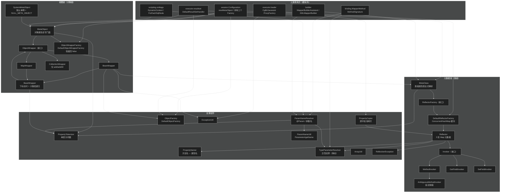
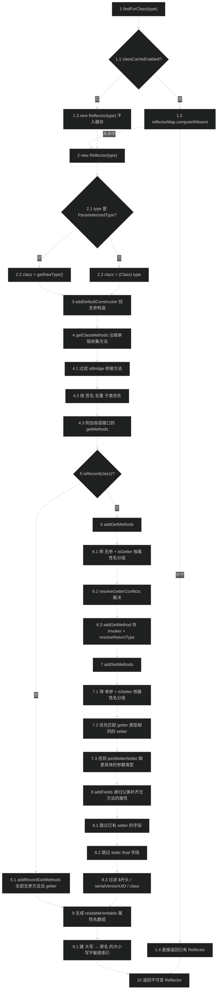
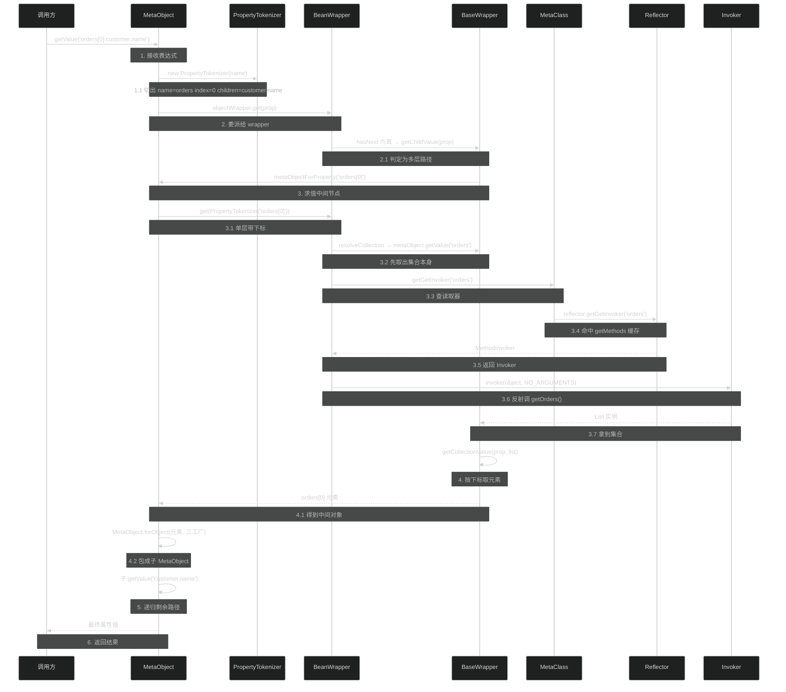
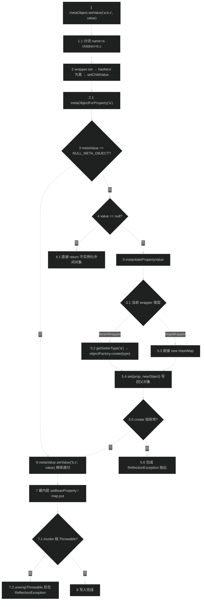
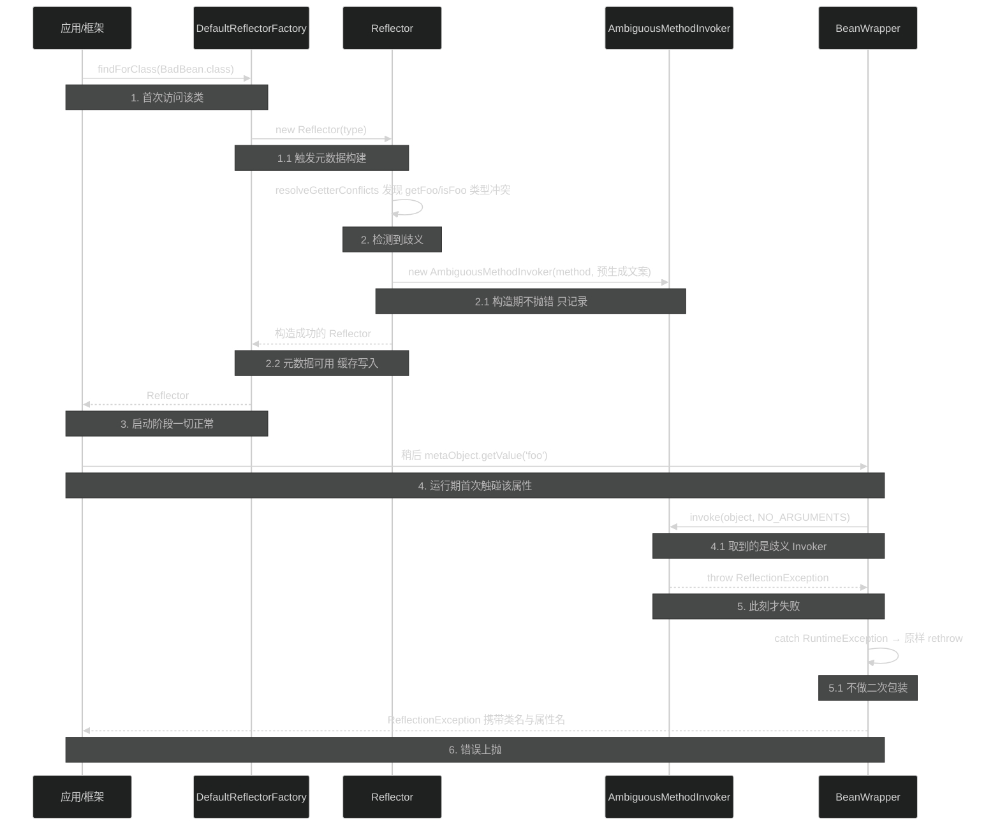
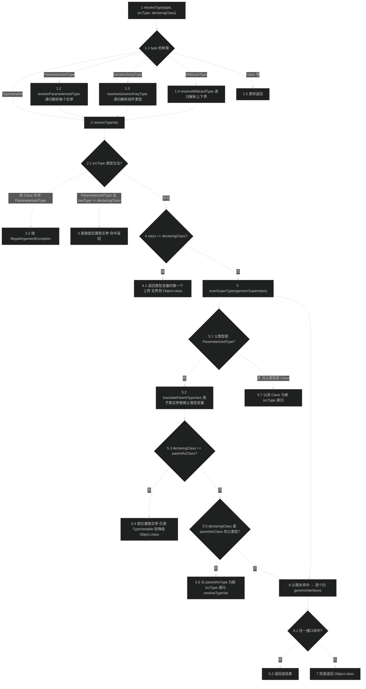

# 反射工具（reflection）
> 上次修改：2026-07-29 00:38

## 重点关注

| 入口 / 章节 | 源码位置 | 为什么重要 |
|-------------|----------|------------|
| `Reflector` 构造函数（一次扫描、终身缓存） | `src/main/java/org/apache/ibatis/reflection/Reflector.java:71-95` | 整个模块的成本中心。一个类的 getter/setter/字段元数据只在这 25 行里算一次，之后全靠 `HashMap` 查表。构造完成后所有字段 `final`（除 `defaultConstructor`），这是 `Reflector` 能被 `ConcurrentHashMap` 无锁共享的前提。 |
| `resolveGetterConflicts` / `resolveSetterConflicts` | `Reflector.java:115-146`、`:171-216` | 桥接方法、协变返回值、`isXxx`/`getXxx` 双 getter、重载 setter 全在这里裁决。裁决不出胜者时不抛异常，而是塞一个"一调用就抛"的 `AmbiguousMethodInvoker`——**延迟失败**是本模块最反直觉的设计。 |
| `Invoker` 三实现 + `canControlMemberAccessible` | `invoker/Invoker.java:23-27`、`MethodInvoker.java:41-52`、`SetFieldInvoker.java:32-44`、`Reflector.java:346-356` | "属性访问"被抽象成单一 `invoke(target, args)`，方法调用与字段直接读写对上层完全透明。`IllegalAccessException` 时才惰性 `setAccessible(true)`，避免无条件破坏封装。 |
| `PropertyTokenizer` 一次只切一层 | `property/PropertyTokenizer.java:29-48` | `a.b[0].c` 表达式的唯一解析器，只有 19 行。它把"分词"和"递归"分离：自己只负责切出 `name`/`index`/`children`，递归由调用方（`BaseWrapper.getChildValue`）驱动。是理解 `MetaObject`/`MetaClass` 全部方法为什么长得一模一样的钥匙。 |
| `MetaObject` 构造中的 wrapper 选型链 | `MetaObject.java:43-61` | 四路 `if-else` 决定后续所有属性读写走 Bean 反射、Map 取键还是直接抛 `UnsupportedOperationException`。`objectWrapperFactory` 排在 `Map`/`Collection` 判断**之前**，这是用户自定义 wrapper 能覆盖内置行为的原因。 |
| `TypeParameterResolver.resolveTypeVar` 递归上爬 | `TypeParameterResolver.java:144-213` | 泛型擦除还原的核心。从 `srcType` 出发沿 `getGenericSuperclass()`/`getGenericInterfaces()` 逐层向 `declaringClass` 爬，同时用 `translateParentTypeVars` 做类型变量替换。多层泛型 Mapper（`Level2Mapper extends Level1Mapper<Date, ...>`）的返回类型就靠它算出来。 |
| `scanSuperTypes` 中的 `TypeVariable → Object.class` 降级 | `TypeParameterResolver.java:198-205` | 解析不出实参时不报错，直接返回 `Object.class`。这条静默降级决定了"泛型 Mapper 未指定实参时 MyBatis 会当 Object 处理"，而不是启动失败。 |
| `ParamNameResolver` 构造函数 | `ParamNameResolver.java:70-129` | `@Param`、`-parameters` 编译参数、位置索引三级回退全在这里。同时决定 `useParamMap`（是否包 `ParamMap`）、`hasParamAnnotation` 两个影响下游 SQL 取值方式的开关。 |
| `getNamedParams` 单参数不包装规则 | `ParamNameResolver.java:157-180` | "为什么单参数时 `#{任意名}` 都能取到值"和"为什么加了 `@Param` 就必须用那个名字"的答案。`wrapToMapIfCollection` 又为集合/数组补上 `collection`/`list`/`array` 三个别名键。 |
| `DefaultReflectorFactory.findForClass` | `DefaultReflectorFactory.java:39-46` | `ConcurrentHashMap.computeIfAbsent(type, Reflector::new)`，一行搞定缓存。注释 `// synchronized (type) removed see issue #461` 记录了从锁到 CHM 的演进，但 `computeIfAbsent` 的可重入风险是本模块最实在的隐患（见第 9 节）。 |
| `BaseWrapper.setChildValue` 的自动实例化 | `wrapper/BaseWrapper.java:124-134` | 写 `a.b.c` 时若 `a.b` 为 null 会**自动 new 一个中间对象**；但 value 为 null 时不实例化。这条不对称规则是 `<association>` 嵌套结果映射能工作的基础。 |
| `MetaClass.getGetterType(PropertyTokenizer)` 的集合元素类型提取 | `MetaClass.java:110-129` | 带下标的属性（`list[0].name`）需要从 `List<Foo>` 的 `ParameterizedType` 里剥出 `Foo`。这是 `Reflector` 除了存 `Class` 还必须存原始 `Type` 的唯一理由。 |

## 1. 模块定位与职责边界

**结论**：`org.apache.ibatis.reflection` 是 MyBatis 的"**属性访问基础设施层**"。它把 JDK 原生的 `java.lang.reflect` 三件套（`Method` / `Field` / `Constructor`）包装成三个更高层的抽象——**可缓存的类元数据**（`Reflector`）、**统一的属性读写视图**（`MetaObject` / `MetaClass` + `ObjectWrapper`）、**擦除后的泛型还原器**（`TypeParameterResolver`）——供上层的结果映射、参数绑定、动态 SQL、配置构建四条链路共用。整个包 25 个源文件，真正有算法密度的只有 `Reflector`（504 行）和 `TypeParameterResolver`（399 行）两个类。

### 它负责什么

1. **类元数据的一次性提取与缓存**：给定一个 `Type`，算出它有哪些可读属性、哪些可写属性、每个属性的读写方式（方法还是字段）、每个属性的声明类型（含泛型实参），结果存在 `Reflector` 的五张 `HashMap` 里（`Reflector.java:61-67`）。
2. **属性表达式的求值**：把 `orders[0].customer.name` 这样的字符串解析成一条访问路径，并在任意对象（Bean / Map / Collection）上求值或赋值（`MetaObject.getValue` / `setValue`，`MetaObject.java:123-130`）。
3. **泛型擦除的运行期还原**：把 `Mapper<Date>` 中方法签名里的 `T` 还原成 `java.util.Date`（`TypeParameterResolver.java:55-94`）。
4. **Mapper 方法参数名的确定**：按 `@Param` → 编译期参数名（`-parameters`）→ 位置索引三级回退定名，并决定是否把多参数包成 `ParamMap`（`ParamNameResolver.java:70-180`）。
5. **对象实例化策略**：`ObjectFactory` 提供"给定 Class 造一个实例"的能力，并把 `List`/`Map`/`Set`/`SortedSet` 等接口映射到具体实现类（`factory/DefaultObjectFactory.java:90-104`）。
6. **反射相关的通用小工具**：`ExceptionUtil.unwrapThrowable` 剥掉 `InvocationTargetException` 外壳（`ExceptionUtil.java:30-41`）、`ArrayUtil` 提供数组安全的 `hashCode`/`equals`/`toString`（`ArrayUtil.java:33-157`）、`PropertyCopier` 做逐字段浅拷贝（`property/PropertyCopier.java:31-52`）。

### 它不负责什么

- **不负责类型转换**：`MetaObject.setValue("age", "18")` 不会把 `String` 转成 `int`，会直接 `IllegalArgumentException`。Java ↔ JDBC 的类型转换属于 `org.apache.ibatis.type` 模块。
- **不负责类加载**：`Reflector` 接收的是已加载的 `Class`；类名 → `Class` 的解析在 `org.apache.ibatis.io.Resources` 与 `type.TypeAliasRegistry`。
- **不负责代理生成**：延迟加载代理（`executor/loader`）虽然大量使用本模块的 `PropertyCopier` 与 `ExceptionUtil`，但字节码增强本身由 javassist/cglib 承担。
- **不负责 SQL 语义**：`ParamNameResolver` 只决定"参数叫什么名"，`#{name}` 怎么被替换成 `?` 是 `scripting`/`builder` 的事。
- **不缓存实例级状态**：`Reflector` 缓存的是**类**的元数据，`MetaObject` 是**每次调用都新建**的一次性对象（`Configuration.newMetaObject`，`session/Configuration.java:706-708`）。

### 主要输入 / 输出 / 副作用

| 维度 | 内容 |
|------|------|
| 输入 | `Type`（`Class` 或 `ParameterizedType`）、任意目标对象、属性表达式字符串、`Method` + 声明类、`Configuration`（仅 `ParamNameResolver` 用于读 `useActualParamName`） |
| 输出 | `Reflector`（元数据）、属性值 `Object`、属性类型 `Class<?>` / `Entry<Type, Class<?>>`、`ParamMap`、新建实例 |
| 状态变化 | `DefaultReflectorFactory.reflectorMap` 单调增长（`DefaultReflectorFactory.java:24`）；`Reflector` 构造完即不可变 |
| 副作用 | 通过 `setAccessible(true)` 破坏封装（仅在 `IllegalAccessException` 后惰性触发）；`BaseWrapper.setChildValue` 会在目标对象上**创建并写入中间对象**（`BaseWrapper.java:124-134`）；`PropertyCopier` 直接写目标 Bean 的字段 |

## 2. 架构关系与依赖

**结论**：模块内部是**两条互不相交的主链**加一组工具类。第一条链是"元数据链"：`ReflectorFactory → Reflector → Invoker`，负责"这个类有什么属性、怎么访问"；第二条链是"视图链"：`MetaObject → ObjectWrapper → MetaClass → Reflector`，负责"在这个具体对象上按表达式读写"。`TypeParameterResolver` 是被两条链共同调用的**无状态纯函数集合**，`ParamNameResolver` 与 `ObjectFactory` 则各自独立，只在 `Reflector` / `MetaObject` 边缘搭一下。



### 节点与依赖方向说明

| 节点 | 角色 | 依赖方向与耦合性质 |
|------|------|--------------------|
| `session.Configuration` | 模块最大的外部持有者，字段级持有 `ReflectorFactory`/`ObjectFactory`/`ObjectWrapperFactory` 三个工厂（`Configuration.java:137-139`），并提供唯一的对外工厂方法 `newMetaObject`（`:706-708`） | 单向依赖本模块；三个工厂都可通过 XML 替换（见第 7 节），属**可替换依赖** |
| `MetaObject` | 对象级门面。构造私有，只能经 `forObject` 进入（`MetaObject.java:63-69`）；几乎所有方法都是对 `objectWrapper` 的一行委派 | 强依赖 `ObjectWrapper`、`PropertyTokenizer`；持有三个工厂引用只为传递给子 `MetaObject`（`:132-135`） |
| `ObjectWrapper` | 策略接口，把"对象长什么样"的差异吸收掉（`wrapper/ObjectWrapper.java:29-67`）。`getGenericSetterType`/`getGenericGetterType` 是 `default` 方法且默认抛 `UnsupportedOperationException`（`:45-53`），属向后兼容的扩展位 | `BeanWrapper` 反向依赖 `MetaClass`→`Reflector`；`MapWrapper` 完全不用反射 |
| `BaseWrapper` | 模板基类，集中实现"下标访问"（`getCollectionValue`/`setCollectionValue`，`BaseWrapper.java:45-114`）与"子路径递归"（`getChildValue`/`setChildValue`，`:116-134`） | 持有 `MetaObject` 反向引用，形成 `MetaObject ⇄ Wrapper` 双向环——这是递归求值能回到门面的关键 |
| `MetaClass` | 类级门面。与 `MetaObject` 方法签名几乎一一对应，但**只看声明类型不看实例值**（`MetaClass.java:69-153`） | 强依赖 `ReflectorFactory`；每次 `metaClassForProperty` 都 `new MetaClass`，本身不缓存（缓存下沉到 `Reflector`） |
| `ReflectorFactory` / `DefaultReflectorFactory` | 缓存边界。接口只三个方法（`ReflectorFactory.java:20-27`），实现用 `ConcurrentHashMap` + `computeIfAbsent`（`DefaultReflectorFactory.java:39-46`） | 是本模块**唯一的可插拔缓存点**；`classCacheEnabled=false` 时退化为每次新建 |
| `Reflector` | 元数据载体，模块的算法核心 | 依赖 `TypeParameterResolver`（解析类型）、`PropertyNamer`（命名转换）、`Invoker` 四实现（封装访问）；被 `MetaClass`、`PropertyCopier` 使用 |
| `Invoker` 四实现 | 把"调 setter"和"写 field"统一成 `invoke(target, args)`（`invoker/Invoker.java:23-27`） | `AmbiguousMethodInvoker extends MethodInvoker` 但 `invoke` 无条件抛 `ReflectionException`（`AmbiguousMethodInvoker.java:31-34`），是**里氏替换的有意违反** |
| `TypeParameterResolver` | 全静态、私有构造（`TypeParameterResolver.java:238-240`），无任何字段 | 零依赖，可独立测试；被 `Reflector`、`ParamNameResolver`、`binding.MapperMethod`（`MapperMethod.java:285`）、`builder.annotation.MapperAnnotationBuilder`（`:446`）、`type.TypeHandlerRegistry`（`:490`）**跨模块**调用 |
| `ParamNameResolver` | 唯一依赖 `session.Configuration` 的类（`ParamNameResolver.java:70-71`），构成从底层工具包到会话层的**反向依赖** | 同时依赖 `binding.MapperMethod.ParamMap`（`:33`）与 `session.RowBounds`/`ResultHandler`（`:36-37`），是本模块中**跨层耦合最重**的一处 |
| `ObjectFactory` / `DefaultObjectFactory` | 实例化策略点，接口带 `default setProperties`（`factory/ObjectFactory.java:34-36`） | 被 `BeanWrapper.instantiatePropertyValue`（`BeanWrapper.java:171-184`）与 `DefaultResultSetHandler` 共同使用；可整体替换 |
| `PropertyTokenizer` | `Iterator<PropertyTokenizer>` 实现，`next()` 返回**新实例**而非推进自身（`PropertyTokenizer.java:71-74`） | 零依赖；被视图链、元数据链、`ParamNameResolver.getType` 三处共用 |
| `ExceptionUtil` / `ArrayUtil` / `PropertyCopier` | 与主链无耦合的独立工具 | `ExceptionUtil` 被所有 JDK 动态代理的 `invoke` 出口使用（`binding/MapperProxy.java`、`plugin/Plugin.java`、`logging/jdbc/*Logger.java`、`datasource/pooled/PooledConnection.java`、`executor/loader/*`），以及 `BeanWrapper.getBeanProperty`（`BeanWrapper.java:192`）；`ArrayUtil` 被 `cache.CacheKey`、`executor.keygen.Jdbc3KeyGenerator`、`logging.jdbc.BaseJdbcLogger` 使用；`PropertyCopier` 只被 `executor.loader` 的两个 `ProxyFactory` 使用（`javassist/JavassistProxyFactory.java:130`、`cglib/CglibProxyFactory.java:133`） |

### 潜在耦合点与跨层调用

- **`ParamNameResolver` → `session.Configuration` / `binding.MapperMethod.ParamMap`**：底层反射包反向引用会话层与绑定层。这让 `ParamNameResolver` 无法脱离 MyBatis 上下文单独使用，也让 `reflection` 包不再是纯粹的叶子模块（`ParamNameResolver.java:32-37`）。
- **`MetaObject ⇄ ObjectWrapper` 循环引用**：`MetaObject` 构造时把 `this` 传给 wrapper（`MetaObject.java:53-59`），wrapper 又通过 `metaObject.getValue(...)` 回调门面（`BaseWrapper.java:38-43`）。递归深度等于属性表达式的层数，无显式深度上限。
- **`Reflector` → `TypeParameterResolver` 的构造期强依赖**：每个 getter/setter/field 都触发一次泛型解析（`Reflector.java:153`、`:213`、`:221`、`:266`、`:274`），是 `Reflector` 构造成本的主要来源。
- **`Jdk` 类的历史遗留**：`Jdk.java:23-79` 三个 `@Deprecated` 常量通过 `Resources.classForName` 探测 JDK 特性，使 `reflection` 包依赖 `io` 包。当前主干代码已无调用点。

## 3. 入口与调用方式

**结论**：本模块没有 API/命令/事件入口，全部是**框架内部的编程式入口**，可归为五组。其中 `Configuration.newMetaObject` 是最高频入口（模块外 20+ 处调用），`TypeParameterResolver` 的三个静态方法是唯一被跨模块直接引用的入口。

### 3.1 主入口：`Configuration.newMetaObject(Object)`

- **位置**：`src/main/java/org/apache/ibatis/session/Configuration.java:706-708`，转发到 `MetaObject.forObject(object, objectFactory, objectWrapperFactory, reflectorFactory)`。
- **触发条件**：任何需要"按属性名读写一个未知对象"的场合。
- **关键参数**：唯一参数是目标对象；三个工厂来自 `Configuration` 字段，因此**同一个 `Configuration` 下所有 `MetaObject` 共享同一份 `Reflector` 缓存**。
- **返回值**：`MetaObject`；入参为 `null` 时返回 `SystemMetaObject.NULL_META_OBJECT` 而非抛异常（`MetaObject.java:65-67`）——这是全模块的 null 哨兵，下游用 `==` 恒等比较来识别（如 `BaseWrapper.java:118`）。
- **进入的核心流程**：wrapper 选型（第 5.1 节）→ `getValue`/`setValue` 表达式求值（第 5.2、5.3 节）。
- **主要调用方**（按链路分组）：

| 调用方 | 位置 | 用途 |
|--------|------|------|
| `executor.resultset.DefaultResultSetHandler` | `:155`、`:466`、`:498`、`:506`、`:811`、`:1073`、`:1366`、`:1602` | 结果集 → 对象的每一次属性写入，以及嵌套结果映射的中间对象访问 |
| `executor.BaseExecutor.createCacheKey` | `BaseExecutor.java:230` | 从参数对象上按属性表达式取值以拼缓存键 |
| `executor.BaseExecutor` 延迟加载 | `BaseExecutor.java:326-327` | `DeferredLoad` 往结果对象上回填延迟加载的属性 |
| `executor.keygen.Jdbc3KeyGenerator` / `SelectKeyGenerator` | `Jdbc3KeyGenerator.java:262`、`SelectKeyGenerator.java:63`、`:74` | 自增/查询主键回填到参数对象 |
| `scripting.defaults.DefaultParameterHandler` | `DefaultParameterHandler.java:187` | 从参数对象取 `#{...}` 对应的值 |
| `scripting.xmltags.DynamicContext` | `DynamicContext.java:68` | 动态 SQL 里 OGNL 表达式的参数对象访问 |
| `mapping.BoundSql.getAdditionalParameter` | `BoundSql.java:49` | 附加参数（`<foreach>` 生成的 `__frch_*` 等）的读写 |
| `binding.MapperMethod.convertToDeclaredCollection` | `MapperMethod.java:171-176` | 把 `List` 结果灌进声明的集合类型，走的是 `CollectionWrapper.addAll`——这是 `CollectionWrapper` 在主干中唯一的实际用途 |
| `executor.loader.ResultLoaderMap` | `ResultLoaderMap.java:207` | 延迟加载触发时定位目标属性 |
| `builder.ParameterMappingTokenHandler` | `ParameterMappingTokenHandler.java:55`、`:66`、`:133` | 构建期推断 `#{...}` 的 javaType |
| `executor.ResultExtractor` | `ResultExtractor.java:43` | 把 `List` 结果转成数组/集合属性 |

- **旁路入口 `SystemMetaObject.forObject(Object)`**（`SystemMetaObject.java:40-43`）：不经 `Configuration`，使用 `DEFAULT_OBJECT_FACTORY` + `DEFAULT_OBJECT_WRAPPER_FACTORY` 且**每次 new 一个 `DefaultReflectorFactory`**。这意味着通过它创建的 `MetaObject` 完全**不复用 `Reflector` 缓存**，只适合测试与一次性场景；主干代码中仅 `SystemMetaObject` 自身的 `NULL_META_OBJECT` 初始化使用（`:30-31`）。

### 3.2 类级入口：`MetaClass.forClass(Type, ReflectorFactory)`

- **位置**：`MetaClass.java:40-42`。
- **触发条件**：只知道类不知道实例时（配置构建期最典型）。
- **关键参数**：`Type` 可以是 `Class` 也可以是 `ParameterizedType`（`Reflector` 构造函数会 `getRawType()` 剥壳，`Reflector.java:73-77`）；必须显式传入 `ReflectorFactory`，通常来自 `configuration.getReflectorFactory()`。
- **主要调用方**：`builder.MapperBuilderAssistant`（`:441`、`:459`，校验 `resultMap` 里的 property 是否存在）、`builder.xml.XMLConfigBuilder`（`:143`，校验 `<settings>` 里的键名是否是 `Configuration` 的合法属性）、`builder.xml.XMLMapperBuilder`（`:269`、`:392`）、`scripting.defaults.DefaultParameterHandler`（`:126`）、`executor.resultset.DefaultResultSetHandler`（`:779`、`:1562`）、`BeanWrapper` 构造函数（`BeanWrapper.java:42`）。
- **权限/上下文要求**：无；但 `getSetterType`/`getGetterType` 在属性不存在时会抛 `ReflectionException`，调用方通常先用 `hasSetter`/`hasGetter` 探测（`MetaClass.java:131-153`）。

### 3.3 元数据入口：`ReflectorFactory.findForClass(Type)`

- **位置**：接口 `ReflectorFactory.java:26`，默认实现 `DefaultReflectorFactory.java:39-46`。
- **触发条件**：`MetaClass` 构造时（`MetaClass.java:37`）。这是唯一进入 `Reflector` 构造的路径，因此**所有元数据提取都被这一个缓存点保护**。
- **返回值**：`Reflector`，之后可直接取 `getGetInvoker`/`getSetInvoker`/`getGetterType`/`getSetablePropertyNames` 等 15 个只读方法（`Reflector.java:363-482`）。

### 3.4 泛型解析入口：`TypeParameterResolver` 四个静态方法

| 方法 | 位置 | 触发条件与调用方 |
|------|------|------------------|
| `resolveReturnType(Method, Type)` | `TypeParameterResolver.java:72-76` | `Reflector.addGetMethod`（`Reflector.java:153`）解析 getter 返回类型；`binding.MapperMethod.MethodSignature` 解析 Mapper 方法返回类型；`builder.annotation.MapperAnnotationBuilder:446` 推断 `@Select` 方法的结果类型 |
| `resolveParamTypes(Method, Type)` | `:90-94` | `Reflector.addSetMethod`（`:221`）、`Reflector.pickBetterSetter`（`:213`）解析 setter 参数类型；`ParamNameResolver` 构造函数解析 Mapper 方法参数类型（`ParamNameResolver.java:75`） |
| `resolveFieldType(Field, Type)` | `:55-59` | `Reflector.addSetField`/`addGetField`（`:266`、`:274`） |
| `resolveClassTypeParams(Class, Class)` | `:35-42` | `type.TypeHandlerRegistry:490`，用于替代已废弃的 `TypeReference`，从 `TypeHandler` 实现类上反推 `T` |

- **关键参数语义**：第二个参数 `srcType` 是**观察者视角的类型**（子类或参数化类型），第一个参数所属的 `declaringClass` 是**声明者视角**。解析方向始终是"从 srcType 向 declaringClass 向上爬"。传入非 `Class`/`ParameterizedType` 会抛 `IllegalArgumentException`（`:160-163`）。

### 3.5 参数名入口：`new ParamNameResolver(Configuration, Method, Class)`

- **位置**：`ParamNameResolver.java:70-129`。
- **触发条件**：Mapper 方法元数据构建期，每个方法一次。
- **主要调用方**：`binding.MapperMethod.MethodSignature` 构造函数（`MapperMethod.java:282`）、`builder.annotation.ProviderSqlSource`（`:141`）、`builder.ParameterMappingTokenHandler`（`:51`）、`scripting.xmltags.DynamicContext`（`:64`、`:123`）、`executor.BaseExecutor`（`:223`）、`scripting.defaults.DefaultParameterHandler`（`:95`）、`scripting.LanguageDriver`（`:64`、`:85`）、`builder.xml.XMLStatementBuilder`（`:92`）。
- **关键参数**：第三个参数 `mapperClass` 是**声明该方法的 Mapper 接口的实际类**，用于把继承来的泛型方法参数还原成具体类型；传错会导致参数类型被算成 `Object`。
- **返回后的用法**：`getNames()` 取名字数组、`getNamedParams(args)` 把实参数组转成 SQL 可用的参数对象、`getType(name)` 反查某个参数名对应的 `Type`（支持带下标，`ParamNameResolver.java:182-208`）、`isUseParamMap()` 告知下游是否被包成了 Map。

### 3.6 实例化入口：`ObjectFactory.create`

- **位置**：`factory/ObjectFactory.java:48`、`:64`；默认实现 `factory/DefaultObjectFactory.java:42-53`。
- **触发条件**：结果映射需要 new 一个结果对象、`BeanWrapper` 需要 new 一个中间对象（`BeanWrapper.java:175`）、`MapWrapper` 需要 new 一个中间 `HashMap`（`MapWrapper.java:151`）。
- **关键行为**：`create(Class)` 走无参构造；`create(Class, List<Class<?>>, List<Object>)` 走指定构造器。两者都先经 `resolveInterface` 把集合接口映射到实现类（`DefaultObjectFactory.java:90-104`）。

## 4. 核心概念与领域模型

### 4.1 Reflector —— 类的属性元数据快照

**定义**：一个 `Reflector` 实例是**某个 `Type` 的属性视图的不可变快照**，由五张 `Map` 和两个数组构成（`Reflector.java:57-69`）：

| 字段 | 类型 | 含义 |
|------|------|------|
| `getMethods` | `Map<String, Invoker>` | 属性名 → 读取器（`MethodInvoker` 或 `GetFieldInvoker`） |
| `setMethods` | `Map<String, Invoker>` | 属性名 → 写入器 |
| `getTypes` | `Map<String, Entry<Type, Class<?>>>` | 属性名 → （泛型还原后的完整 `Type`，擦除后的 `Class`）二元组 |
| `setTypes` | `Map<String, Entry<Type, Class<?>>>` | 同上，写方向 |
| `caseInsensitivePropertyMap` | `Map<String, String>` | 全大写属性名 → 原始属性名，服务 `findPropertyName` 的大小写不敏感查找 |
| `readablePropertyNames` / `writablePropertyNames` | `String[]` | `getMethods`/`setMethods` 的 keySet 快照 |
| `defaultConstructor` | `Constructor<?>` | 无参构造器，可能为 null |

**作用**：把"一次昂贵的类扫描"转成"多次廉价的 Map 查询"。扫描包括 `getDeclaredMethods()` 沿继承链遍历 + 接口方法收集（`getClassMethods`，`Reflector.java:292-311`）、桥接方法过滤、冲突裁决、每个成员一次泛型解析。

**生命周期**：由 `DefaultReflectorFactory` 创建后**永不失效、永不驱逐**，随 `Configuration` 一起存活到应用结束（`DefaultReflectorFactory.java:24`、`:43`）。

**为什么 `getTypes` 存的是 `Entry<Type, Class<?>>` 而不是单个 `Class`**：`MetaClass.getGetterType(PropertyTokenizer)` 处理 `list[0]` 这类带下标的表达式时，必须从 `List<Foo>` 的 `ParameterizedType` 里剥出实参 `Foo`（`MetaClass.java:110-129`，对应 old-google-code issue #506）。只存 `Class` 会丢掉 `Foo` 这一信息，导致集合元素被当成 `Object` 处理。

**三维评估**：

- **好处**：一个类的元数据只算一次；`Entry` 用 `Map.entry()` 创建（`Reflector.java:154`），是 JDK 自带的不可变实现，无需自定义 Pair 类；同时保留 `Type` 与 `Class` 免去了每次调用都做 `typeToClass` 转换。
- **替代方案**：(a) 只存 `Class`，需要泛型信息时临时解析——省内存但把成本推到热路径；(b) 存自定义 `PropertyMeta` 对象，把 `Invoker` 和两个类型合并成一个条目——可读性更好、Map 数量从 5 张降到 2 张，但改动面大且破坏 `getGetterType`/`getGenericGetterType` 的现有 API 语义；(c) 用 `java.beans.Introspector`——但拿不到私有字段，且无法处理 MyBatis 需要的字段回退。
- **风险**：`reflectorMap` 无上限、无驱逐（第 9 节详述），在动态生成类的场景（如大量 CGLIB 代理类、脚本引擎生成类）会持续泄漏；`Reflector` 强引用 `Class`、`Method`、`Field`，会钉住 ClassLoader，热部署环境下阻碍类卸载。

### 4.2 Invoker —— 属性访问的统一抽象

**定义**：只有两个方法的接口（`invoker/Invoker.java:23-27`）：

```java
Object invoke(Object target, Object[] args) throws IllegalAccessException, InvocationTargetException;
Class<?> getType();
```

**四个实现及其语义**：

| 实现 | `invoke` 行为 | `getType()` 返回 |
|------|--------------|------------------|
| `MethodInvoker` | `method.invoke(target, args)`，失败时惰性 `setAccessible` 重试（`MethodInvoker.java:41-52`） | 单参方法返回参数类型，否则返回方法返回类型（`:34-38`） |
| `GetFieldInvoker` | `field.get(target)`，忽略 `args`（`GetFieldInvoker.java:32-43`） | `field.getType()` |
| `SetFieldInvoker` | `field.set(target, args[0])`，返回 `null`（`SetFieldInvoker.java:32-44`） | `field.getType()` |
| `AmbiguousMethodInvoker` | **无条件抛 `ReflectionException`**，携带构造时预生成的错误文案（`AmbiguousMethodInvoker.java:31-34`） | 继承 `MethodInvoker` |

**作用**：让上层（`BeanWrapper.getBeanProperty`，`BeanWrapper.java:186-200`）完全不必区分"这个属性有 getter"还是"这个属性只有字段"，一律 `invoker.invoke(object, NO_ARGUMENTS)`。

**生命周期**：与 `Reflector` 同生共死，构造时创建、存进 Map、之后只读。`Method`/`Field` 引用被长期持有，`setAccessible(true)` 的效果也会被后续所有调用复用。

**三维评估**：

- **好处**：把"方法 vs 字段"这个分支从热路径消灭（只在 `Reflector` 构造期判断一次）；`AmbiguousMethodInvoker` 让"歧义"变成一个**可存储的值**而非异常，使得 `Reflector` 构造不会因为一个坏属性而整个失败。
- **替代方案**：(a) 直接存 `AccessibleObject` 并在调用点 `instanceof` 判断——省一层对象但把分支带回热路径；(b) 用 `MethodHandle`/`LambdaMetafactory` 生成访问器——理论上性能更好（可被 JIT 内联），但字段回退、`setAccessible` 惰性提权这些语义要重写，且模块中只有 `Reflector.getIsRecordMethodHandle`（`Reflector.java:495-503`）用到 `MethodHandle`；(c) 生成字节码访问器——最快但引入编译依赖与类加载开销。
- **风险**：`AmbiguousMethodInvoker` 违反里氏替换（`extends MethodInvoker` 却永远不执行方法），静态分析工具会误判它能正常调用；错误只在**运行到该属性**时才暴露，容易在生产环境才发现 JavaBean 规范违规。

### 4.3 PropertyTokenizer —— 单层属性分词器

**定义**：把 `orders[0].customer.name` 切成四个字段（`property/PropertyTokenizer.java:29-48`）：

| 字段 | 上例的值 | 说明 |
|------|---------|------|
| `name` | `orders` | 去掉下标后的属性名 |
| `index` | `0` | 方括号内的内容，可以是数字（List/数组下标）也可以是任意字符串（Map 的 key） |
| `indexedName` | `orders[0]` | 带下标的完整第一段 |
| `children` | `customer.name` | 第一个 `.` 之后的全部内容，无则为 `null` |

**关键设计**：它**只切一层**。`hasNext()` 判断 `children != null`（`:66-69`），`next()` 返回一个**新的** `PropertyTokenizer(children)` 而不是推进自身状态（`:71-74`）——虽然实现了 `Iterator`，但实际是一个不可变的链表节点。

**使用场景**：三条链路各自驱动递归——`MetaClass` 靠 `prop.getChildren()` 递归自己（`MetaClass.java:71-74`），`BaseWrapper.getChildValue` 靠 `metaObject.metaObjectForProperty(prop.getIndexedName())` 递归到子对象（`BaseWrapper.java:116-122`），`ParamNameResolver.getType` 只用它剥下标不递归（`ParamNameResolver.java:183-184`）。

**三维评估**：

- **好处**：19 行代码承担了全模块的表达式语法；不可变、无状态、天然线程安全；"分词与递归分离"让 `MetaClass`（按声明类型走）和 `MetaObject`（按实际值走）能用同一个分词器但走不同的递归策略。
- **替代方案**：(a) 一次性切成 `String[]` + 索引游标——省掉每层一次对象分配，但需要额外传递游标，且 `children` 字符串在错误信息中很有用；(b) 用 OGNL/SpEL——功能强大但引入重依赖，且 MyBatis 只需要 `a.b[0].c` 这一种语法。
- **风险**：每递归一层就 `new` 一个 `PropertyTokenizer` 并做两次 `substring`，深层表达式在高频路径上会产生可观的短生命周期垃圾；`index` 不做类型校验，非数字下标在 `List` 上会在 `BaseWrapper.getCollectionValue` 里抛 `NumberFormatException`（`BaseWrapper.java:53`）而非友好错误。

### 4.4 MetaObject / MetaClass —— 一对镜像门面

**定义与区别**：两者方法签名高度重合（`findProperty`、`getGetterNames`、`getSetterType`、`hasSetter`…），差别在于**依据什么求值**：

| | `MetaClass` | `MetaObject` |
|--|-------------|--------------|
| 依据 | 类的**声明类型** | 对象的**实际值** |
| 构造 | `forClass(Type, ReflectorFactory)`（`MetaClass.java:40-42`） | `forObject(Object, 三个工厂)`（`MetaObject.java:63-69`） |
| 递归到子属性 | `metaClassForProperty` → 按 getter 声明类型建新 `MetaClass`（`:105-108`） | `metaObjectForProperty` → 先 `getValue` 取出实际值再包一层（`:132-135`） |
| 属性为 null 时 | 不受影响，仍能算出类型 | 得到 `NULL_META_OBJECT`，各 wrapper 需要显式回退到 `MetaClass`（如 `BeanWrapper.java:116-120`） |
| 是否有实例状态 | 只有 `reflector` + `reflectorFactory` | 持有 `originalObject`、`objectWrapper` 和三个工厂 |

**关系**：`MetaObject` **聚合** `ObjectWrapper`，`BeanWrapper` **持有** `MetaClass`，`MetaClass` **持有** `Reflector`。所以一次 `metaObject.getValue("a.b")` 实际上是 `MetaObject → BeanWrapper → MetaClass → Reflector → Invoker` 五层穿透。

**生命周期**：`MetaObject` 是**一次性对象**，每次 `newMetaObject` 都新建；`MetaClass` 同样每次 `forClass` 新建（构造函数只做一次 `findForClass`，成本被 `Reflector` 缓存吸收）。真正被复用的只有 `Reflector`。

**三维评估**：

- **好处**：调用方只需一个 `getValue(String)` 就能穿透任意深度的对象图，无需关心中间对象是 Bean 还是 Map；`MetaClass`/`MetaObject` 的镜像结构让"构建期按类型校验"和"运行期按值读写"能用同一套表达式语法。
- **替代方案**：(a) 只保留 `MetaObject`，构建期用一个假实例——但配置构建期根本拿不到实例；(b) 把两者合并成一个类，用 nullable 的 object 字段区分——会让每个方法都长出 `if (object == null)` 分支；(c) 缓存 `MetaClass` 实例——收益有限，因为 `MetaClass` 只有两个字段，构造成本已被 `Reflector` 缓存摊平。
- **风险**：五层穿透在结果映射这种每行每列都调用的路径上是实打实的开销；`MetaObject` 每次新建意味着每映射一行就产生若干短命对象；`NULL_META_OBJECT` 用 `==` 恒等比较（`BaseWrapper.java:118`、`BeanWrapper.java:89`），若用户自定义 `ObjectWrapperFactory` 返回了别的 null 表示，回退逻辑会失效。

### 4.5 ObjectWrapper —— 对象形态的策略抽象

**定义**：15 个方法的策略接口（`wrapper/ObjectWrapper.java:29-67`），把"这个对象长什么样"的差异吸收在实现里。

| 实现 | 适用对象 | 属性读写方式 | `hasSetter` 语义 | `isCollection()` |
|------|---------|------------|-----------------|------------------|
| `BeanWrapper` | 普通 POJO（兜底分支） | 经 `MetaClass` → `Reflector` → `Invoker` 反射 | 查 `Reflector.setMethods`，还要递归验证子路径（`BeanWrapper.java:139-152`） | `false` |
| `MapWrapper` | `java.util.Map` | 直接 `map.get/put`（`MapWrapper.java:48`、`:59`） | **恒 `true`**（`:127-129`）——Map 永远能塞新键 | `false` |
| `CollectionWrapper` | `java.util.Collection` | 全部 15 个方法中 12 个抛 `UnsupportedOperationException`，只支持 `add`/`addAll`/`isCollection`（`CollectionWrapper.java:36-99`） | 抛异常 | `true` |

**选型时机与顺序**（`MetaObject.java:50-60`）：`object instanceof ObjectWrapper` → `objectWrapperFactory.hasWrapperFor` → `instanceof Map` → `instanceof Collection` → 兜底 `BeanWrapper`。

**生命周期**：与所属 `MetaObject` 同生命周期，一次性。

**三维评估**：

- **好处**：`MapWrapper` 完全绕开反射，让 MyBatis 支持 `resultType="map"` 时零反射开销；用户自定义 wrapper 的判断排在内置判断之前，可以完整接管甚至覆盖 `Map` 的行为。
- **替代方案**：(a) 在 `MetaObject` 里用 `if-else` 直接分派——省一层接口但无法扩展；(b) 让 `CollectionWrapper` 实现全部方法而非抛异常——但 `Collection` 确实没有"属性名"概念，抛异常是诚实的失败；(c) 注册表式分派（类型 → wrapper 工厂）——更灵活但对只有三种形态的场景过度设计。
- **风险**：`MapWrapper.hasSetter` 恒返回 `true` 意味着**任何拼错的属性名在 Map 上都不会报错**，写入后静默产生一个多余的键；`CollectionWrapper` 的大面积 `UnsupportedOperationException` 使得"把 `List` 传给 `MetaObject` 后调用 `getValue`"会崩溃而非返回 null。

### 4.6 ParamNameResolver 的参数名模型

**定义**：`ParamNameResolver` 内部持有三份状态（`ParamNameResolver.java:64-68`）：

- `names: SortedMap<Integer, String>`——**参数在方法签名中的原始下标** → 参数名。跳过 `RowBounds`/`ResultHandler` 后下标会不连续（类注释 `:59-62` 给出的示例：`aMethod(int a, RowBounds rb, int b)` → `{{0,"0"}, {2,"1"}}`，注意 value 是**跳过后的序号**而非原始下标）。
- `typeMap: Map<String, Type>`——参数名 → 泛型还原后的类型。单参数且是集合/数组时额外注册 `collection`/`list`/`array` 三个别名（`:110-128`）。
- `hasParamAnnotation` / `useParamMap`——两个布尔开关，前者决定单参数是否包装，后者告知下游是否走 Map 取值。

**命名的三级回退**（`:83-102`）：`@Param("x")` → `useActualParamName` 时取 `Parameter#getName()`（依赖 `-parameters` 编译参数）→ `String.valueOf(map.size())`（`"0"`、`"1"`…）。

**代码示例（语义推演，非可执行测试）**：下表除注明者外，均假设 `useActualParamName=true`（`Configuration.java:115` 的默认值）且编译时带了 `-parameters`。

| Mapper 方法签名 | `names` | `getNamedParams(args)` 返回 |
|-----------------|---------|-----------------------------|
| `find(User u)` | `{0:"u"}` | 直接返回 `u` 对象本身（`:162-164`） |
| `find(List<Integer> ids)` | `{0:"ids"}` | `ParamMap{collection=ids, list=ids, ids=ids}`（`:222-231`） |
| `find(@Param("id") int id)` | `{0:"id"}` | `ParamMap{id=..., param1=...}`——因 `hasParamAnnotation=true` 走 else 分支（`:165-179`） |
| `find(int a, int b)`（无 `-parameters`） | `{0:"0", 1:"1"}` | `ParamMap{0=.., 1=.., param1=.., param2=..}` |
| `find(int a, RowBounds rb)` | `{0:"a"}` | 直接返回 `a` 的值 |

**三维评估**：

- **好处**：`param1`/`param2` 通用名与实际名共存（`:170-175`），让 XML 里两种写法都能用；`GENERIC_NAME_CACHE` 预生成前 10 个字符串（`:43-49`）避免热路径拼接；单参数不包装保留了"直接传 POJO 用 `#{prop}`"的经典用法。
- **替代方案**：(a) 一律包成 `ParamMap`——语义统一但破坏海量存量 XML；(b) 只支持 `@Param`——强制显式但迁移成本高；(c) 用 ASM 读 LocalVariableTable 取参数名（Spring 的老做法）——不依赖 `-parameters` 但引入字节码解析依赖。
- **风险**：`names.containsValue(genericParamName)` 是 **O(n) 线性扫描**且在循环内（`:173`），参数很多时是 O(n²)，不过 Mapper 方法参数数通常极小；`useActualParamName=true` 但编译时未加 `-parameters` 会静默拿到 `arg0`/`arg1`，SQL 里 `#{userId}` 就会失败且错误信息不指向根因；`getType` 中 `Integer.valueOf(...)` 解析 `paramXX` 失败时被空 `catch` 吞掉（`:194-196`）。

## 5. 关键流程

本节给出四条流程：**主成功路径**（`Reflector` 构造 + 属性表达式求值）、**写入路径的边界分支**（自动实例化中间对象）、**失败路径**（歧义 getter 的延迟失败）、**递归路径**（泛型类型变量的上爬解析）。

### 5.1 主成功路径 A：`Reflector` 元数据构建（冷路径，每类一次）



**1-1.4 缓存查询**：`DefaultReflectorFactory.findForClass` 是唯一入口（`DefaultReflectorFactory.java:39-46`）。`classCacheEnabled` 为 true（默认）时走 `ConcurrentHashMap.computeIfAbsent(type, Reflector::new)`，命中直接返回，整条构建流程被跳过；为 false 时每次新建且不入缓存，仅用于调试或内存敏感场景。注意 key 是 `Type` 而非 `Class`，因此 `List<String>` 与 `List<Integer>` 会各占一个条目。

**2-3 类型剥壳与构造器定位**：`ParameterizedType` 先 `getRawType()` 拿到裸 `Class` 存进 `clazz`，但**原始 `type` 被保留在字段里**（`Reflector.java:57`、`:71-77`），后续所有 `TypeParameterResolver` 调用都以它为 `srcType`——这是 `Reflector` 能解析出泛型实参的前提。`addDefaultConstructor` 用 Stream 找任意无参构造（含私有），找不到时字段保持 null，直到 `getDefaultConstructor()` 被调用才抛 `ReflectionException`（`:367-372`）。

**4-4.3 方法收集**：不用 `Class.getMethods()`，而是自己沿 `getSuperclass()` 循环调 `getDeclaredMethods()`（`getClassMethods`，`:292-311`），原因写在方法注释里——需要**私有方法**。去重键是 `返回类型#方法名:参数类型列表` 的自定义签名（`getSignature`，`:327-337`），把返回类型放进签名是为了区分协变返回的重写方法。`if (!uniqueMethods.containsKey(signature))` 保证**先遇到的胜出**，而遍历是从子类开始的，所以子类方法覆盖父类。桥接方法（`isBridge()`）被直接丢弃（`:315`），这是泛型重写产生的合成方法，参数类型已被擦除成 `Object`，留着会污染 setter 裁决。每一层还会额外收集接口的 `getMethods()`（`:300-303`），以覆盖抽象类未实现接口方法的情况。

**5-5.1 Record 短路**：`isRecord` 通过 `MethodHandle` 反射调用 `Class.isRecord()`（`:487-503`），JDK 15 及以下拿不到该方法时 handle 为 null 直接返回 false。Record 分支把**所有无参方法**都当 getter（`:97-100`），不走 `PropertyNamer` 命名转换（record 的访问器是 `name()` 而非 `getName()`），也**完全跳过 setter 和字段收集**——record 不可变，`writablePropertyNames` 为空数组。

**6-6.3 getter 收集与裁决**：先按 `PropertyNamer.isGetter`（`get` 后有内容或 `is` 后有内容，`PropertyNamer.java:52-54`）筛出候选，用 `methodToProperty` 转成属性名做分组 key（`:31-46`，注意"第二个字符非大写才首字母小写"这条规则保护了 `getURL` → `URL`）。`resolveGetterConflicts` 逐个比较候选：类型相同且非 boolean 直接判歧义；类型相同且是 boolean 时 `isXxx` 胜出（`Reflector.java:127-134`）；类型不同时取**更具体的子类型**（`:135-138`）；完全无关的类型判歧义。裁决结果无论是否歧义都会调 `addGetMethod`（`:144`），歧义时存的是 `AmbiguousMethodInvoker`。每个属性存进 `getTypes` 时都做一次 `TypeParameterResolver.resolveReturnType(method, type)`（`:153`）。

**7-7.3 setter 收集与裁决**：策略与 getter 不同——**优先信任 getter**。若 getter 不歧义且某个 setter 的参数类型与 getter 返回类型完全相同，立即 break 采纳（`:180-184`）。否则退化到 `pickBetterSetter` 两两比较，取参数类型更具体的一方（`:196-207`）。两个无继承关系的参数类型会走到 `:208-215`：**直接把 `AmbiguousMethodInvoker` 塞进 `setMethods` 并返回 null**，外层看到 `match == null` 就不再调 `addSetMethod`（`:190-192`）——注意此时 `setTypes` 已经用 `setter1` 的参数类型填过了（`:213-214`）。

**8-8.3 字段兜底**：`addFields` 递归遍历本类及所有父类的 `getDeclaredFields()`（`:242-261`）。只有**没有对应 setter/getter** 的字段才补充 `SetFieldInvoker`/`GetFieldInvoker`。`static final` 字段被排除在写入之外（`:250`，注释解释 final 非 static 之所以允许是因为 JSR-133 后可反射修改，见 issue #379）。`isValidPropertyName` 过滤掉 `$` 开头（编译器合成，如 `this$0`）、`serialVersionUID` 和 `class`（`:279-281`）。

**9-10 收尾**：两个属性名数组直接从 keySet 快照（`:87-88`），此后 `Reflector` 除 `getTypes`/`setTypes` 的 `computeIfAbsent`（那两处只用于抛异常，`:411-413`、`:433-435`）外不再变化。`caseInsensitivePropertyMap` 用 `Locale.ENGLISH` 归一化，服务 `findPropertyName`（`:480-482`），这是 `mapUnderscoreToCamelCase` 能匹配上大小写不同的列名的基础。

### 5.2 主成功路径 B：`metaObject.getValue("orders[0].customer.name")`



**1-1.1 表达式接入**：`MetaObject.getValue` 只做一件事——`new PropertyTokenizer(name)` 然后转给 wrapper（`MetaObject.java:123-126`）。分词器一次只切第一层，`children` 保留剩余部分，后续递归由 wrapper 驱动。

**2-2.1 wrapper 分派与路径判定**：`BeanWrapper.get` 是三选一（`BeanWrapper.java:45-54`）：`hasNext()` 为真走 `getChildValue`（多层）；`index != null` 走 `getCollectionValue`（单层带下标）；否则走 `getBeanProperty`（单层普通）。本例 `children="customer.name"` 非 null，进入第一支。

**3-3.7 中间节点求值**：`getChildValue` 调 `metaObject.metaObjectForProperty(prop.getIndexedName())`（`BaseWrapper.java:116-122`），注意传的是 **`indexedName`（`orders[0]`）而非 `name`（`orders`）**，所以下标在这一步就被消化。这次调用回到 `MetaObject.getValue`，再次分词得到 `name=orders, index=0, children=null`，落到 `BeanWrapper` 的第二支：先 `resolveCollection` 取出集合本身（内部又是一次 `metaObject.getValue("orders")`，`BaseWrapper.java:38-43`），这次才真正走到 `getBeanProperty` → `MetaClass.getGetInvoker` → `Reflector.getGetInvoker` → `MethodInvoker.invoke`。整条链上只有最后一步是真反射，前面全是 Map 查询与对象分配。

**4-4.2 下标取值与包装**：`getCollectionValue` 用 `instanceof` 链依次判定 `Map`（用 `index` 字符串直接当 key）、`List`、`Object[]` 和八种基本类型数组（`BaseWrapper.java:45-78`）。取到的元素回到 `metaObjectForProperty`，被 `MetaObject.forObject` 重新包装；若元素为 null 则得到 `NULL_META_OBJECT`。

**5-6 递归收敛**：`getChildValue` 里 `metaValue == SystemMetaObject.NULL_META_OBJECT` 时**直接返回 null 而不继续递归**（`BaseWrapper.java:118-120`）——这就是为什么 `a.b.c` 中 `a.b` 为 null 时读操作返回 null 而非 NPE。否则调 `metaValue.getValue(prop.getChildren())` 进入下一轮，递归深度等于表达式层数。

### 5.3 边界路径：`setValue("a.b.c", value)` 时中间对象为 null



**1-2.1 路径下探**：`setValue` 与 `getValue` 对称，`BeanWrapper.set` 同样三选一（`BeanWrapper.java:56-65`），多层路径进 `BaseWrapper.setChildValue`（`:124-134`）。

**3-4.1 null 中间对象的不对称处理**：`metaObjectForProperty("a")` 返回 `NULL_META_OBJECT` 说明 `a` 尚未初始化。此时若 `value == null`，代码注释明确写着 `// don't instantiate child path if value is null`（`BaseWrapper.java:128-131`）——写 null 不值得创建整条对象链。这条规则让 `setValue("a.b.c", null)` 成为一个**静默 no-op**，是排查"为什么嵌套属性没被清空"时的关键点。

**5-5.6 自动实例化**：`value` 非 null 时调 `instantiatePropertyValue(null, new PropertyTokenizer(prop.getName()), objectFactory)`。注意这里**用 `prop.getName()` 重新分词**，即丢掉了下标——所以 `a[0].b` 中 `a[0]` 为 null 时创建的是 `a` 而非数组元素。`BeanWrapper` 的实现（`BeanWrapper.java:171-184`）先 `getSetterType` 拿到声明类型，交给 `objectFactory.create`，成功后立刻 `set(prop, newObject)` **写回父对象**，然后把新对象包成 `MetaObject` 返回。任何异常都被包成 `ReflectionException`，文案里点名"is null and cannot be instantiated"——接口类型属性、无无参构造的属性都会在这里失败。`MapWrapper` 的实现简单得多，无条件 `new HashMap`（`MapWrapper.java:150-155`），因此 Map 上的深层写入永远不会因"无法实例化"失败。

**6-8 递归与最内层写入**：拿到（或新建）的 `metaValue` 继续 `setValue(prop.getChildren(), value)`。最内层落到 `setBeanProperty`（`BeanWrapper.java:202-215`）或 `map.put`（`MapWrapper.java:59`）。`setBeanProperty` 里 `method.invoke` 的任何 `Throwable` 都先经 `ExceptionUtil.unwrapThrowable` 剥掉 `InvocationTargetException` 外壳，再包成 `ReflectionException`。与 `getBeanProperty` 不同的是，`setBeanProperty` **不做 `catch (RuntimeException e) { throw e; }` 的透传**（对比 `:194-195`），所以 setter 内部抛出的业务异常会被统一包装成 `ReflectionException`，只能从 cause 里找回原始异常。

### 5.4 失败路径：歧义 getter 的延迟失败



**1-1.1 构建触发**：歧义只在 `Reflector` 首次构造时被发现，之后被缓存的 `Reflector` 会一直携带这个"坏"属性。

**2-2.2 记录而非抛出**：`resolveGetterConflicts` 判定歧义后不中断循环外的处理，而是把 `isAmbiguous=true` 传给 `addGetMethod`（`Reflector.java:144-155`）。错误文案用 `MessageFormat.format` 在**构造期就拼好**并存进 `AmbiguousMethodInvoker`（`:149-151`），文案里明确指出"This breaks the JavaBeans specification"。setter 侧同理（`:208-211`）。关键后果：**一个坏属性不会导致整个类不可用**，其余属性照常工作。

**3-4.1 延迟到首次访问**：`Reflector` 构造成功并入缓存，应用启动、配置解析全部通过。直到运行期真的读写该属性，`BeanWrapper.getBeanProperty` 从 `metaClass.getGetInvoker(name)` 取到的才是那个 `AmbiguousMethodInvoker`。

**5-6 异常上抛**：`AmbiguousMethodInvoker.invoke` 无条件 `throw new ReflectionException(exceptionMessage)`（`AmbiguousMethodInvoker.java:31-34`）。`getBeanProperty` 的 `catch (RuntimeException e) { throw e; }` 分支（`BeanWrapper.java:194-195`）让它**原样透传**，不被包装成"Could not get property"的模糊文案——这一分支的存在正是为了保住歧义错误的可读性。注意 `setBeanProperty` 没有这个分支（`:211-214`），所以写方向的歧义错误会被套一层。

### 5.5 递归路径：`TypeParameterResolver` 解析类型变量



**1-1.5 类型分发**：`resolveType` 是一个五路分发器（`TypeParameterResolver.java:104-116`）。除 `TypeVariable` 外，其余三种复合类型都是**先递归解析内部成分，再用自定义实现类重新包装**：`ParameterizedTypeImpl`、`WildcardTypeImpl`、`GenericArrayTypeImpl`（`:242-398`）。这三个内部类都完整实现了 `equals`/`hashCode`/`toString`，所以解析结果能和 JDK 原生 `Type` 互相比较（测试 `TypeParameterResolverTest.java:575` 等处正是这样断言的）。`GenericArrayType` 的解析还有一个优化：组件类型解析后若是 `Class`，直接 `Array.newInstance(clazz, 0).getClass()` 返回真实的数组 `Class` 而非包装类型（`:118-127`）。

**2-3 快速命中路径**：`resolveTypeVar` 先看 `srcType`。若是 `ParameterizedType` 且其 `rawType` 恰好就是 `declaringClass`，说明观察者视角与声明者视角重合，按类型变量在 `declaringClass.getTypeParameters()` 中的下标直接取 `getActualTypeArguments()[i]` 返回（`:149-159`）。这是最常见也最廉价的一条路径。非 `Class` 非 `ParameterizedType` 的 `srcType`（如传进来一个 `WildcardType`）会抛 `IllegalArgumentException`（`:160-163`）。

**4-4.1 上界降级**：若 `srcType` 就是 `declaringClass` 本身（没有任何泛型实参信息，例如直接对 `List.class` 解析 `E`），返回类型变量的第一个上界；无上界则 `Object.class`（`:165-171`）。

**5-5.7 向上爬与变量翻译**：真正的递归发生在 `scanSuperTypes`（`:189-213`）。核心难点是"**父类声明的类型变量要用子类给的实参替换**"，由 `translateParentTypeVars` 完成（`:215-236`）：遍历父类型的实参，凡是 `TypeVariable` 的就去子类的 `getTypeParameters()` 里找同名变量，找到就替换成子类对应位置的实参。举例——`Level1Mapper<E, F> extends Level0Mapper<E, F, String>`，从 `Level2Mapper extends Level1Mapper<Date, Integer>` 出发解析 `Level0Mapper` 声明的 `K`，就需要先把 `Level0Mapper<E, F, String>` 翻译成 `Level0Mapper<Date, Integer, String>` 再按位置取。`noChange` 标志避免了无谓的对象分配（`:221`、`:234`）。若 `declaringClass` 还在更上层，就以翻译后的 `parentAsType` 作为新 `srcType` **递归调用 `resolveTypeVar`**（`:206-208`），实现任意层数的上爬。

**5.4 的静默降级**：按位置取到实参后还要判一次 `actualType instanceof TypeVariable<?> ? Object.class : actualType`（`:202`）。这处理的是"子类也没给实参、只是把类型变量透传上去"的情况——不报错，降级成 `Object.class`。

**6-7 接口分支与兜底**：父类链走完没命中就逐个扫 `getGenericInterfaces()`（`:179-185`）。全部落空则返回 `Object.class`（`:186`）。**整个解析过程没有任何异常路径**（除 `srcType` 类型非法外），最坏结果只是精度损失。这是有意为之：泛型解析失败不应该让 MyBatis 启动不了，而应该退化成"当 Object 处理"，让 `UnknownTypeHandler` 等下游机制在运行期兜底。

## 6. 核心实现细节

### 6.1 `Reflector` 的元数据缓存机制

**为什么这样组织**：`Reflector` 把"昂贵且结果恒定"的计算（继承链遍历、桥接方法过滤、冲突裁决、泛型解析）全部前移到构造函数，把"廉价且高频"的查询（`getMethods.get(name)`）留给运行期。这是典型的**空间换时间 + 不可变对象共享**。缓存的粒度选在"类"这一层而非"属性"这一层，因为按属性缓存需要一个 `(Class, String)` 复合键，查询开销反而更高。

**逐段解读 `Reflector` 构造函数（`Reflector.java:71-95`）**：

| 行 | 输入 | 处理 | 输出/状态变化 | 隐藏假设 |
|----|------|------|--------------|----------|
| `:72-77` | `Type` | 区分 `ParameterizedType` 与 `Class`，前者取 `getRawType()` | `this.type` 保留原始泛型信息，`this.clazz` 为裸类 | 假设 `Type` 只可能是这两种；传 `WildcardType` 会 `ClassCastException` |
| `:78` | `clazz` | `getDeclaredConstructors()` 找任意零参构造 | `defaultConstructor` 可能仍为 null | 不校验可访问性，私有构造也会被采纳 |
| `:79` | `clazz` | `getClassMethods` 收集全部方法 | 得到去重后的 `Method[]` | 假设 `Object` 类的方法不需要（循环条件 `currentClass != Object.class`） |
| `:80-86` | `Method[]` | record 走单独分支，否则 getter → setter → field 三步 | 填充四张 Map | **顺序有依赖**：`resolveSetterConflicts` 读 `getTypes`（`:175`）、`addFields` 读 `setMethods`/`getMethods`（`:245`、`:254`），三步不能重排 |
| `:87-94` | 四张 Map | 快照 keySet、建大写索引 | 两个 `String[]` + `caseInsensitivePropertyMap` | 大写冲突（如 `userId` 与 `USERID` 同时存在）后写覆盖先写，静默丢失一个映射 |

**不可变性的实现细节**：除 `defaultConstructor` 外全部字段 `final`，四张 `HashMap` 在构造期填充完毕后**再无写入路径**——`getGenericGetterType`/`getGenericSetterType` 里的 `computeIfAbsent`（`:411-413`、`:433-435`）看似是写操作，但 mapping function 无条件抛异常，永远不会真的 put。这是一个用 `computeIfAbsent` 实现"缺失即抛错"的取巧写法：省掉一次 `containsKey` 或 null 判断，代价是可读性下降，且在并发场景下 `HashMap.computeIfAbsent` 的 mapping function 抛异常虽然安全，但依赖了实现细节。

**`getClassMethods` 的签名去重（`:292-337`）**：自定义签名格式为 `返回类型#方法名:参数1,参数2`。把**返回类型放进签名**是关键决策——它让协变返回的父类方法（`Object getX()`）与子类方法（`String getX()`）拥有不同签名，两者都会被收集，随后交给 `resolveGetterConflicts` 按"取更具体类型"裁决（`:135-138`）。若签名不含返回类型，父类版本会被误判为已存在而丢弃，虽然子类先遍历所以结果碰巧正确，但对接口默认方法等场景不成立。

**三维评估（Reflector 缓存）**：

- **好处**：构建成本从 O(方法数 × 继承深度) 降为一次性；`Reflector` 完全不可变，可跨线程无同步共享，这是 `Configuration` 能在多线程 SqlSession 间共享的基础；`Invoker` 内部的 `setAccessible(true)` 副作用也随之被复用，避免每次访问私有字段都触发一次安全检查（虽然现代 JDK 已优化，但仍有开销）。
- **替代方案**：(a) 用 `WeakHashMap<Class, Reflector>` 或 `ConcurrentHashMap<Class, SoftReference<Reflector>>`——能让类卸载时元数据一起回收，代价是每次访问多一层解引用与 null 检查，且 `Reflector` 内部仍强引用 `Method`/`Field`，弱化 key 无法解除对 ClassLoader 的钉住；(b) 用带容量上限的 LRU（模块内已有 `cache.decorators.LruCache` 可复用）——能封住无界增长，但会引入命中率抖动，热点类被驱逐后要重新扫描；(c) 完全不缓存，每次现算——正确但性能不可接受；(d) 构建期一次性预热所有 Mapper 涉及的类并冻结缓存——启动变慢但运行期行为可预测。
- **风险**：`reflectorMap` **无容量上限、无过期、无驱逐**（`DefaultReflectorFactory.java:24`），key 是 `Type` 不是 `Class`，意味着 `List<A>`、`List<B>` 各占一条；在动态生成类（脚本引擎、大量 CGLIB 代理、每次请求生成一个匿名类）的场景下持续增长直至 OOM。同时 `Reflector` 强引用 `Class`/`Method`/`Field`，会**钉住 ClassLoader**，在热部署或多租户容器里阻碍类卸载。当前实现没有任何缓解手段，只有把 `classCacheEnabled` 设为 false 这个"全有或全无"的开关。

### 6.2 getter/setter 冲突裁决算法

**为什么需要**：JavaBean 规范允许 `isFoo()` 与 `getFoo()` 并存、允许协变返回、允许重载 setter；Java 泛型还会生成桥接方法。`Reflector` 必须为每个属性名挑出**恰好一个**读取器和写入器。

**getter 裁决的四条规则（`resolveGetterConflicts`，`Reflector.java:115-146`）**，按候选两两比较：

1. 返回类型相同且**不是 boolean** → 判歧义、break。两个签名完全相同的 getter 不可能同时存在（已被签名去重），能走到这里说明是接口与类的重复声明等异常情形。
2. 返回类型相同且**是 boolean** → `is` 前缀胜出（`:132-134`）。这是 JavaBean 规范里 boolean 属性的推荐写法。
3. 候选类型是胜者类型的**父类型** → 保留胜者（`:135-136`，注释"OK getter type is descendant"）。
4. 胜者类型是候选类型的父类型 → 候选上位（`:137-138`）。规则 3、4 合起来实现"取最具体类型"。
5. 两者无继承关系 → 判歧义、break（`:139-141`）。

**setter 裁决的双策略（`resolveSetterConflicts`，`:171-194`）**：

- **策略一（优先）**：若 getter 不歧义且某 setter 参数类型 `equals` getter 返回类型，立即采纳并 `break`（`:180-184`）。这利用了"getter 已经裁决完"这一前置条件，把 setter 问题转化为"跟 getter 对齐"。
- **策略二（回退）**：`pickBetterSetter` 两两比较取更具体的参数类型（`:196-207`）。无法比较时**把 `AmbiguousMethodInvoker` 写进 `setMethods`、把 `setter1` 的参数类型写进 `setTypes`，然后返回 null**（`:208-215`）。返回 null 会让外层的 `isSetterAmbiguous` 置位（`:187`），后续候选不再参与比较，也不会再调 `addSetMethod` 覆盖掉刚写入的歧义 Invoker。

**隐藏假设与副作用**：`pickBetterSetter` 是一个**有副作用的"纯比较函数"**——名字暗示它只挑选，实际会写两张 Map。这是为了在返回 null 表达"无法裁决"的同时不丢失错误信息，但让方法契约变得晦涩。另外注意 `setTypes` 存的是 `setter1` 而非 `setter2` 的类型，纯属"先到先得"，没有语义依据。

**三维评估**：

- **好处**：把 JavaBean 规范里最脏的几个角落（boolean 双 getter、协变返回、重载 setter）压缩到 80 行内；歧义不阻断构建，一个坏属性不影响整个类。
- **替代方案**：(a) 直接用 `java.beans.Introspector`——它已经实现了 JavaBean 规范的裁决，但拿不到私有字段、无法支持 MyBatis 的字段回退，且行为不受控；(b) 遇到歧义直接抛异常终止构造——错误暴露更早（fail-fast），但一个第三方库里的坏 Bean 就能让整个应用起不来；(c) 按声明顺序取第一个——简单但不可预测（`getDeclaredMethods()` 不保证顺序）。
- **风险**：延迟失败意味着问题可能在生产环境的低频代码路径上才暴露；`resolveGetterConflicts` 的 `break` 会跳过剩余候选，若第三个候选本可与胜者兼容也不再考察；`caseInsensitivePropertyMap` 对歧义属性照常建索引，`findPropertyName` 仍会返回它，误导上层认为该属性可用。

### 6.3 `TypeParameterResolver` 的递归解析

**为什么这样组织**：Java 的 `Type` 是一棵递归的树（`Map<String, List<T[]>>` 就有四层），而类型变量的实参分布在继承链的各个节点上。所以算法天然分成两个正交的递归：**沿类型树向内递归**（`resolveType` 的四路分发）和**沿继承链向上递归**（`resolveTypeVar` → `scanSuperTypes` → `resolveTypeVar`）。两个递归在 `resolveTypeVar` 处交汇。

**逐段解读 `translateParentTypeVars`（`:215-236`）**——全模块最难读的 22 行：

- **输入**：`srcType`（子类的参数化类型，如 `Level1Mapper<Date, Integer>`）、`srcClass`（子类的裸类）、`parentType`（父类型的声明，如 `Level0Mapper<E, F, String>`，其中 `E`/`F` 是 `srcClass` 声明的类型变量）。
- **处理**：遍历 `parentType` 的实参。是 `TypeVariable` 的（`E`、`F`）就在 `srcClass.getTypeParameters()` 里找同名者，找到就换成 `srcType` 对应位置的实参（`Date`、`Integer`）；不是类型变量的（`String`）原样保留（`:230-232`）。
- **输出**：翻译后的 `ParameterizedTypeImpl`（`Level0Mapper<Date, Integer, String>`），或在无任何替换时（`noChange`）返回原对象避免分配。
- **副作用**：无，纯函数。
- **隐藏假设**：内层 `for` 找到匹配后**不 break**（`:224-229`），依赖类型变量在同一个类里唯一；若父类实参中出现了不属于 `srcClass` 的类型变量（如方法级类型变量），`newParentArgs[i]` 会保持 null，后续按位置取到 null——这是一个**未防护的边界**，但正常继承结构下不会触发。

**递归终止性**：向上递归的终止条件有三个——命中 `declaringClass == parentAsClass`（`:198`）、`declaringClass.isAssignableFrom(parentAsClass)` 为假（不再深入，`:206`）、以及 `getGenericSuperclass()` 最终返回 null。因为继承图是有向无环的，递归深度受限于继承层数，不会无限。

**三维评估（TypeParameterResolver 递归解析）**：

- **好处**：完整支持 `TypeVariable`/`ParameterizedType`/`GenericArrayType`/`WildcardType` 四种复合类型的任意嵌套，是多层泛型 Mapper（`interface UserMapper extends BaseMapper<User, Long>`）能自动推断结果类型的唯一依据；全静态无状态，天然线程安全且零内存占用；三个自定义 `Type` 实现类都写了 `equals`/`hashCode`，解析结果可以直接当 Map 的 key（`TypeHandlerRegistry` 正是这样用的）。
- **替代方案**：(a) 用 Guava 的 `TypeToken`——功能更完整且经过更多打磨，但 MyBatis 坚持零第三方依赖；(b) 用 Spring 的 `ResolvableType`——同理；(c) 只支持单层泛型，多层直接降级 `Object`——代码能砍掉一大半，但会让 `BaseMapper<T, ID>` 这种极常见的模式失效；(d) 要求用户在 `@Result`/`resultType` 上显式声明类型——把复杂度转嫁给用户。
- **风险**：**静默降级是双刃剑**——`scanSuperTypes` 的 `TypeVariable → Object.class`（`:202`）和 `resolveTypeVar` 末尾的兜底 `return Object.class`（`:186`）都不留任何痕迹，用户遇到"结果映射把字段当 Object 处理"时没有任何日志线索，只能靠调试；每次 `resolveParameterizedType` 都新建 `ParameterizedTypeImpl` 及其 `Type[]` 数组（`:129-136`），复杂泛型签名在 `Reflector` 构造期会产生较多临时对象（但因构造只发生一次，影响可控）；`translateParentTypeVars` 中 `newParentArgs[i]` 可能残留 null 的边界未做防护。

### 6.4 `MetaObject` / `ObjectWrapper` 的统一属性视图

**为什么这样组织**：MyBatis 需要在**四种形态**的对象上做同一件事——POJO、`Map`、`Collection`、用户自定义类型（Scala 集合等）。若在每个调用点写 `if (obj instanceof Map)`，判断会散落到 `DefaultResultSetHandler`、`DefaultParameterHandler`、`DynamicContext` 等十几个地方。`ObjectWrapper` 把这个判断收敛到 `MetaObject` 构造函数的一处（`MetaObject.java:50-60`）。

**选型链的顺序有讲究**：`instanceof ObjectWrapper` 排第一，允许调用方直接传一个已经包装好的 wrapper（此时 `originalObject` 就是 wrapper 本身）；`objectWrapperFactory.hasWrapperFor` 排第二，**在 `Map`/`Collection` 判断之前**，这让用户能接管乃至覆盖内置的 Map 处理；兜底 `BeanWrapper` 不做任何类型检查，任何对象都能被当 Bean 处理（哪怕它没有一个属性，此时 `Reflector` 的两个数组为空，所有 `hasGetter` 返回 false）。

**`MetaClass` 与 `MetaObject` 在"属性为 null"时的分工**：这是 `BeanWrapper` 里最重复也最关键的模式，`getSetterType`/`getGenericSetterType`/`getGetterType`/`getGenericGetterType`/`hasSetter`/`hasGetter` 六个方法都是同一套骨架（如 `BeanWrapper.java:110-121`）：

1. 分词，单层则直接问 `metaClass`（按声明类型）；
2. 多层则先 `metaObjectForProperty(prop.getIndexedName())` 取实际值；
3. 值为 null（`NULL_META_OBJECT`）时**回退到 `metaClass` 按声明类型算整个表达式**；
4. 值非 null 时按**实际运行时类型**递归到子 `MetaObject`。

第 4 步是 `MetaObject` 相对 `MetaClass` 的全部价值所在：声明类型是 `Animal` 而实际值是 `Dog` 时，`a.b.barkTimes` 只有走实际值才能解析。第 3 步的回退保证了 null 值不会让类型推断失败。

**`MapWrapper` 的两个特殊契约**：`hasSetter` 恒返回 `true`（`MapWrapper.java:127-129`），因为 Map 永远能容纳新键；`getGetterType`/`getSetterType` 在键存在时返回 `map.get(name).getClass()`（**实际值的类型**），不存在时返回 `Object.class`（`:89-93`、`:113-117`）。这意味着同一个 Map 在不同时刻查同一个属性可能得到不同类型，调用方不能缓存结果。`getGenericGetterType` 直接把 `Class` 同时当作 `Type` 和 `Class` 塞进 `Map.entry`（`:121-124`），因为 Map 里根本没有泛型声明信息。

**三维评估**：

- **好处**：一个 `getValue(String)` 覆盖全部对象形态；`MapWrapper` 让 `resultType="map"` 完全绕开反射；`MetaClass` 回退机制让 null 值不阻断类型推断。
- **替代方案**：(a) 全部转成 `Map` 再统一处理——语义丢失且性能更差；(b) 为每种形态提供独立的 API（`BeanUtils` / `MapUtils`）——调用方要自己分派，违背了收敛判断的初衷；(c) 用 OGNL 统一求值——MyBatis 在动态 SQL 里确实用了 OGNL，但把它引入结果映射热路径的开销不可接受。
- **风险**：五层穿透（`MetaObject → Wrapper → MetaClass → Reflector → Invoker`）在每行每列都调用的结果映射路径上是实打实的开销；`BeanWrapper` 六个方法的骨架高度重复但细节各有差异（例如 `hasSetter` 用 `metaClass.hasSetter(prop.getIndexedName())` 做前置判断而 `getSetterType` 没有，对比 `:144` 与 `:112-115`），改动时极易漏改其中一个；`MapWrapper.hasSetter` 恒 true 让属性名拼写错误在 Map 上完全静默。

### 6.5 `ParamNameResolver` 与 `-parameters` 编译参数

**为什么这样组织**：Java 8 之前，方法参数名在 class 文件中不保留，MyBatis 只能用 `@Param` 或位置索引。Java 8 引入 `-parameters` 编译选项后 `Parameter#getName()` 才有意义，但**该选项默认关闭**，所以必须保留三级回退。

**`ParamNameUtil` 的极简实现（`ParamNameUtil.java:35-37`）**：一行 Stream，`executable.getParameters()` 映射 `Parameter::getName`。它**不判断参数名是否真实**——未加 `-parameters` 时 JDK 返回 `arg0`/`arg1`，`getName()` 照样返回非 null 字符串。因此 `ParamNameResolver` 里的 `if (name == null)` 兜底（`:97-101`）实际上**永远不会因为缺少 `-parameters` 而触发**，只会在 `useActualParamName=false` 时触发。这解释了一个常见困惑：没加 `-parameters` 时得到的是 `arg0` 而非 `"0"`。

**`useParamMap` 的三个置位点**：`@Param` 存在时（`:87`）、参数个数 > 1 时（`:107-109`）。它被 `isUseParamMap()` 暴露给下游（`:241-243`），用于判断 SQL 里的属性表达式该按 Map 键还是按 POJO 属性解析。

**`getNamedParams` 的分支语义（`:157-180`）**：

- `args == null || paramCount == 0` → 返回 null（无参方法，或全是 `RowBounds`/`ResultHandler`）。
- `!hasParamAnnotation && paramCount == 1` → **直接返回参数值本身**，只在它是集合/数组时经 `wrapToMapIfCollection` 包一层（`:162-164`）。注意条件是 `hasParamAnnotation` 而非 `useParamMap`——单参数加了 `@Param` 就走 else 分支。
- 其余 → 建 `ParamMap`，同时放入实际名与 `param1`/`param2`…；`if (!names.containsValue(genericParamName))` 保护用户显式命名为 `param2` 的参数不被覆盖（`:172-175`）。

**`wrapToMapIfCollection` 的三别名（`:222-239`）**：`Collection` 得到 `collection` 键，`List` 额外得到 `list` 键，数组得到 `array` 键，再加上实际参数名。这是 `<foreach collection="list">` 能工作的原因。构造函数里的 `typeMap` 也做了对称登记（`:110-128`），让 `getType("list")` 能返回正确类型。

**`getType` 的下标处理（`:182-208`）**：先用 `PropertyTokenizer` 剥掉下标拿到裸名，查不到再尝试把 `paramN` 反解成下标去 `names` 里找。若原表达式带下标，则从 `ParameterizedType` 取第一个实参或从数组取 `getComponentType()`——这让 `#{list[0].name}` 能推断出元素类型。

**三维评估**：

- **好处**：三级回退保证了从 JDK 5 时代到今天的所有写法都能工作；`param1`/`param2` 与实际名共存，XML 里两种引用方式都有效；`GENERIC_NAME_CACHE` 预生成前 10 个名字（`:43-49`）避免热路径字符串拼接。
- **替代方案**：(a) 强制 `@Param`——语义最清晰，但破坏海量存量代码；(b) 用 ASM 读 `LocalVariableTable`——不依赖 `-parameters`，但引入字节码解析依赖且对接口方法无效（接口方法没有方法体，也就没有 LocalVariableTable）；(c) 从 Mapper XML 的 `parameterType` 反推——只能拿到类型不能拿到名字。
- **风险**：`names.containsValue(...)` 是 O(n) 且在循环内，理论上 O(n²)（`:173`），实际因参数数极小可忽略；`GENERIC_NAME_CACHE` 是 `public static final String[]`（`:43`）——**数组内容可被外部修改**，是一个真实的封装漏洞；`getType` 里 `NumberFormatException` 被空 catch 吞掉且注释只写 `// user mistake`（`:194-196`），用户把 `#{paramX}` 写错时得到的是 null 类型而非错误提示；构造函数依赖 `Configuration`，使这个本应通用的工具类无法脱离 MyBatis 复用。

### 6.6 `setAccessible` 的惰性提权模式

四处实现完全一致的模式（`MethodInvoker.java:43-51`、`GetFieldInvoker.java:34-42`、`SetFieldInvoker.java:34-42`、`DefaultObjectFactory.java:60-79`、`PropertyCopier.java:37-45`）：**先直接调用，捕获 `IllegalAccessException` 后再判断 `Reflector.canControlMemberAccessible()`，允许则 `setAccessible(true)` 重试，不允许则原样抛出**。

`canControlMemberAccessible`（`Reflector.java:346-356`）通过 `SecurityManager.checkPermission(new ReflectPermission("suppressAccessChecks"))` 探测权限，捕获 `SecurityException` 返回 false。注意 `SecurityManager` 在 JDK 17 已废弃、JDK 24 已默认禁用，`System.getSecurityManager()` 在现代 JDK 上恒返回 null，因此该方法实际上**恒返回 true**。

- **好处**：正常可访问的成员（绝大多数 public getter/setter）走的是零额外开销的快路径，只有真正需要提权的私有成员才付出一次异常捕获的代价；提权效果被 `Invoker` 长期持有，只发生一次。
- **替代方案**：(a) 构造 `Invoker` 时无条件 `setAccessible(true)`——省掉运行期的 try-catch，但对每个成员都破坏封装，且在有 `SecurityManager` 或强模块封装（JPMS）的环境下会在构造期直接失败，使整个 `Reflector` 不可用；(b) 构造期用 `Modifier.isPublic` 预判——判断不完整（还要考虑声明类本身是否 public、模块是否 open）。
- **风险**：这是"用异常做控制流"，虽然只在首次触发，但 JVM 构造 `IllegalAccessException` 需要填充栈轨迹，若某个类有大量私有字段且被反复创建 `Reflector`（`classCacheEnabled=false` 时）会有可观开销；在 JPMS 强封装模块下抛的是 `InaccessibleObjectException`（`RuntimeException` 的子类）而非 `IllegalAccessException`，**不会被这段 catch 捕获**，会直接穿透到上层包成 `ReflectionException`，错误信息不指向"模块未 open"这个根因。

## 7. 数据结构、配置与外部协议

**结论**：本模块**没有任何外部协议**（无网络、无消息、无持久化、无环境变量）。它的"外部接口"有两类：一是 `mybatis-config.xml` 中三个可替换工厂的配置元素与一个开关，二是编译期的 `-parameters` javac 选项。除此之外全部是内部数据结构。

### 7.1 核心内部数据结构

| 结构 | 定义位置 | 字段/键含义 | 约束 |
|------|---------|------------|------|
| `Reflector.getMethods` / `setMethods` | `Reflector.java:61-62` | 属性名 → `Invoker` | 属性名不含 `$` 前缀、不为 `serialVersionUID`/`class`（`:279-281`）；值可能是"一调用就抛"的 `AmbiguousMethodInvoker` |
| `Reflector.getTypes` / `setTypes` | `Reflector.java:63-64` | 属性名 → `Entry<Type, Class<?>>`，key 为泛型还原后的完整 `Type`，value 为擦除后的 `Class` | 由 `Map.entry()` 创建，**不允许 null**；缺失时用静态 `nullEntry`（`:69`）做 `getOrDefault` 的默认值以避免 NPE |
| `Reflector.caseInsensitivePropertyMap` | `Reflector.java:67` | `属性名.toUpperCase(Locale.ENGLISH)` → 原属性名 | 大写冲突时后写覆盖先写；固定用 `Locale.ENGLISH` 避免土耳其语 `i` 问题 |
| `DefaultReflectorFactory.reflectorMap` | `DefaultReflectorFactory.java:24` | `Type` → `Reflector` | `ConcurrentHashMap`，**无上限、无过期、无驱逐**；key 是 `Type` 不是 `Class`，泛型实参不同会各占一条 |
| `PropertyTokenizer` 四字段 | `PropertyTokenizer.java:24-27` | `name`/`index`/`indexedName`/`children` | `index` 与 `children` 可为 null；`indexedName` 与 `children` 为 `final`，`name`/`index` 在构造中被二次赋值后事实不可变 |
| `ParamNameResolver.names` | `ParamNameResolver.java:64` | 原始参数下标 → 参数名 | `Collections.unmodifiableSortedMap` 包装（`:106`）；下标因跳过 `RowBounds`/`ResultHandler` 而可能不连续 |
| `ParamNameResolver.typeMap` | `ParamNameResolver.java:65` | 参数名 → 泛型还原后的 `Type` | 单参数集合/数组时额外含 `collection`/`list`/`array` 三个别名键（`:110-128`） |
| `ParamNameResolver.GENERIC_NAME_CACHE` | `ParamNameResolver.java:43-49` | 下标 → `param1`…`param10` | `public static final String[]`，长度固定 10；超出时现场拼接（`:171`） |
| `TypeParameterResolver.ParameterizedTypeImpl` 等三个内部类 | `TypeParameterResolver.java:242-398` | JDK `Type` 三个子接口的自定义实现 | 均实现 `equals`/`hashCode`/`toString`，可与 JDK 原生 `Type` 互相比较；`actualTypeArguments` 数组直接暴露（`getActualTypeArguments()` 返回内部引用，未做防御性拷贝） |
| `SystemMetaObject.NULL_META_OBJECT` | `SystemMetaObject.java:30-31` | 包装私有 `NullObject` 的单例 `MetaObject` | 全模块的 null 哨兵，下游用 `==` 恒等比较识别（`BaseWrapper.java:118`、`BeanWrapper.java:89` 等 8 处） |
| `BaseWrapper.NO_ARGUMENTS` | `BaseWrapper.java:31` | `protected static final Object[] {}` | 共享的空参数数组，避免每次 getter 调用分配 |

### 7.2 配置项

三个工厂都在 `Configuration` 上有字段与 setter（`Configuration.java:137-139`、`:627-647`），并各自对应一个 XML 元素，由 `XMLConfigBuilder` 解析（`XMLConfigBuilder.java:123-125`、`:211-233`）：

| XML 元素 | Configuration 字段 | 默认值 | 作用 | 错误配置的后果 |
|---------|-------------------|--------|------|---------------|
| `<objectFactory type="...">` | `objectFactory` | `DefaultObjectFactory`（`Configuration.java:138`） | 决定所有结果对象与中间对象如何实例化；子元素 `<property>` 会经 `setProperties` 注入 | 未实现 `resolveInterface` 的等价逻辑时，`List`/`Map` 等接口类型的结果属性会因"无法实例化接口"而抛 `ReflectionException` |
| `<objectWrapperFactory type="...">` | `objectWrapperFactory` | `DefaultObjectWrapperFactory`（`Configuration.java:139`） | `hasWrapperFor` 恒返回 false，即默认永不接管（`DefaultObjectWrapperFactory.java:26-29`） | 自定义实现的 `hasWrapperFor` 若过于宽松（如恒 true），会把 POJO 也接管走，绕开 `BeanWrapper` 的全部逻辑 |
| `<reflectorFactory type="...">` | `reflectorFactory` | `DefaultReflectorFactory`（`Configuration.java:137`） | 元数据缓存策略的唯一插拔点 | 自定义实现若非线程安全，会在多线程首次访问同一个类时产生竞态 |
| `<setting name="useActualParamName" value="...">` | `useActualParamName` | `true`（`Configuration.java:115`，`XMLConfigBuilder.java:286` 的默认值同为 true） | 控制 `ParamNameResolver` 是否尝试读取编译期参数名 | 设为 false 时所有未加 `@Param` 的参数只能用 `"0"`/`"1"` 或 `param1`/`param2` 引用；设为 true 但未加 `-parameters` 时得到 `arg0`/`arg1` |

**注意三个元素的解析顺序**：`objectFactory` → `objectWrapperFactory` → `reflectorFactory`，且 `XMLConfigBuilder.java:127` 有注释 `// read it after objectFactory and objectWrapperFactory issue #631`，说明 `<settings>` 的应用必须晚于三个工厂，否则设置会被覆盖。

**特殊点**：`XMLConfigBuilder` 内部还持有一个**独立的 `localReflectorFactory`**（`XMLConfigBuilder.java:143` 使用），专门用于校验 `<settings>` 里的键名是否是 `Configuration` 的合法属性——因为此时用户配置的 `reflectorFactory` 可能还没生效。

### 7.3 编译期"协议"：`-parameters`

这是本模块唯一的构建期外部依赖。要让 `useActualParamName=true` 真正生效，Mapper 接口必须用 `javac -parameters` 编译。MyBatis 自身**无法检测该选项是否开启**——`Parameter#getName()` 在未开启时返回 `arg0` 而非 null 或抛异常（见第 6.5 节）。因此这是一个"配置正确才工作、配置错误则静默降级"的隐式契约。

### 7.4 无外部协议时依赖的内部结构

本模块不与外界通信，其"输入输出契约"完全由三个 Java 接口承担，可视为模块的内部协议：

- **`Invoker`**（`invoker/Invoker.java:23-27`）：属性访问的最小契约。约定 `invoke` 的 `args` 对 getter 为空数组、对 setter 为单元素数组；`GetFieldInvoker` 直接忽略 `args`，`SetFieldInvoker` 无条件取 `args[0]`（越界不防护）。
- **`ObjectWrapper`**（`wrapper/ObjectWrapper.java:29-67`）：对象形态的契约。两个 `default` 方法 `getGenericSetterType`/`getGenericGetterType` 默认抛 `UnsupportedOperationException` 并在文案中提示"must override the default method"——这是为**向后兼容已有的第三方 wrapper 实现**而设计的软性扩展位。
- **`ObjectFactory`**（`factory/ObjectFactory.java:26-80`）：实例化契约。`setProperties` 是 `default` 空实现（`:34-36`），`isCollection` 用于 `MapperMethod.MethodSignature` 判断返回值是否是"多结果"（`MapperMethod.java:294`），因此自定义实现必须正确处理 Scala 集合等非 `java.util.Collection` 类型才能让 `returnsMany` 判断正确。

## 8. 异常、边界与降级处理

**结论**：本模块的异常策略是**"类型/元数据问题静默降级，值/访问问题抛 `ReflectionException`"**。所有主动抛出的异常都是 `ReflectionException`（继承 `PersistenceException` → `RuntimeException`，`ReflectionException.java:23-25`），全部是非受检异常，不强制调用方处理。

### 8.1 异常类型与传播路径

| 异常 | 抛出点 | 触发条件 | 传播 |
|------|--------|---------|------|
| `ReflectionException` | `Reflector.getDefaultConstructor` `:371` | 类无零参构造却被要求实例化 | 直接上抛 |
| `ReflectionException` | `Reflector.getSetInvoker`/`getGetInvoker` `:381`、`:389` | 属性名不存在 | 上抛；`BeanWrapper.getBeanProperty` 的 `catch (RuntimeException e) { throw e; }` 让它原样透传（`BeanWrapper.java:194-195`） |
| `ReflectionException` | `Reflector.getSetterType`/`getGetterType` `:405`、`:427` | 属性类型缺失。**注意这两处错误信息有 bug**：局部变量 `clazz` 遮蔽了字段 `clazz`（`:403`、`:425`），拼进消息的是刚被判定为 null 的局部变量，所以文案里的类名恒为 `null` | 上抛 |
| `ReflectionException` | `getGenericSetterType`/`getGenericGetterType` 的 `computeIfAbsent` lambda `:412`、`:434` | 同上，但走 `computeIfAbsent` 且用参数 `k` 拼消息，文案正确 | 上抛 |
| `ReflectionException` | `AmbiguousMethodInvoker.invoke` `:33` | 访问歧义属性 | 上抛，文案在 `Reflector` 构造期预生成 |
| `ReflectionException` | `Reflector.isRecord` `:491` | `Class.isRecord()` 反射调用失败 | 包裹原始 `Throwable` |
| `ReflectionException` | `BaseWrapper.getCollectionValue`/`setCollectionValue` `:47-48`、`:82-83` | 带下标访问但集合本身为 null | 上抛，文案指明"because the property 'X' is null" |
| `ReflectionException` | `BaseWrapper` 同两方法的 else 分支 `:75-76`、`:110-111` | 目标既非 `Map`/`List` 也非任何数组 | 上抛，文案"is not Map, List or Array" |
| `ReflectionException` | `BeanWrapper.instantiatePropertyValue` `:180-181` | 中间对象无法实例化（接口、抽象类、无零参构造） | 包裹 `objectFactory.create` 的原始异常 |
| `ReflectionException` | `BeanWrapper.getBeanProperty` `:197-198` | getter 调用抛出非 `RuntimeException` 的 `Throwable` | 包裹（已 unwrap 过） |
| `ReflectionException` | `BeanWrapper.setBeanProperty` `:212-213` | setter 调用抛出任何 `Throwable`。**没有 RuntimeException 透传分支**，业务异常也会被包装 | 包裹（已 unwrap 过） |
| `ReflectionException` | `DefaultObjectFactory.instantiateClass` `:85-86` | 构造器不存在、参数不匹配、构造器内部抛异常 | 包裹；文案里列出全部参数类型与值 |
| `ReflectionException` | `DefaultObjectWrapperFactory.getWrapperFor` `:33-34` | 默认工厂被误调用（`hasWrapperFor` 恒 false 时不应发生） | 防御性断言 |
| `ReflectionException` | `PropertyNamer.methodToProperty` `:37-38` | 方法名不以 `is`/`get`/`set` 开头 | 上抛；但 `Reflector` 调用前已用 `isGetter`/`isSetter` 过滤，正常不触发 |
| `IllegalArgumentException` | `PropertyTokenizer` 构造 `:42-43` | 有 `[` 但无闭合 `]` 且无子路径，如 `a[0` | 上抛，非 `ReflectionException` |
| `IllegalArgumentException` | `TypeParameterResolver.resolveTypeVar` `:161-162` | `srcType` 既非 `Class` 也非 `ParameterizedType` | 上抛，非 `ReflectionException` |
| `UnsupportedOperationException` | `CollectionWrapper` 12 个方法 `:36-84` | 在 `Collection` 上做属性读写 | 上抛，无自定义文案 |
| `UnsupportedOperationException` | `BeanWrapper.add`/`addAll` `:224`、`:229`；`MapWrapper.add`/`addAll` `:164`、`:169` | 在 Bean/Map 上调 `add` | 上抛 |
| `UnsupportedOperationException` | `ObjectWrapper` 两个 `default` 方法 `:46-47`、`:51-52` | 第三方 wrapper 未覆写泛型类型方法 | 上抛，文案指名类名与方法名 |
| `UnsupportedOperationException` | `PropertyTokenizer.remove` `:78-79` | 调用 `Iterator.remove` | 上抛 |
| `NumberFormatException` | `BaseWrapper.getCollectionValue`/`setCollectionValue` `:53`、`:88` | 对 `List`/数组用非数字下标（如 `list[abc]`） | **未捕获**，直接穿透 |
| `ClassCastException` | `Reflector` 构造 `:74`、`:76` | 传入 `WildcardType`/`GenericArrayType` 等 | 未防护 |
| `NullPointerException` | `ParamNameResolver` 构造 `:121` | 单参数是 `TypeVariable` 或 `WildcardType` 时 `soleParamClass` 为 null，随后 `Collection.class.isAssignableFrom(null)` | 未防护，但需要极不常见的方法签名才能触发 |

### 8.2 异常转换与信息剥离

**`ExceptionUtil.unwrapThrowable`（`ExceptionUtil.java:30-41`）** 是本模块提供给全框架的通用剥壳器：`while(true)` 循环剥掉 `InvocationTargetException`（取 `getTargetException()`）和 `UndeclaredThrowableException`（取 `getUndeclaredThrowable()`），直到遇到真实异常。两种包装可以任意嵌套（动态代理链上很常见），所以必须循环而非一次剥离。

`BeanWrapper` 的两个私有方法都是**双层 try** 结构：内层捕获 `invoke` 的 `Throwable` 并 unwrap 后重抛，外层再包成 `ReflectionException`（`BeanWrapper.java:186-215`）。差异在于读方向多了一个 `catch (RuntimeException e) { throw e; }`（`:194-195`），使 `ReflectionException`、`AmbiguousMethodInvoker` 的错误、getter 内部的业务运行时异常都原样透传；写方向没有这一层，所以**setter 抛出的业务异常会被统一包成 `ReflectionException`，原始异常只能从 `getCause()` 取回**。这是一处读写不对称，排查"为什么写入时的业务校验异常被吞成了反射错误"要从这里看。

### 8.3 边界条件覆盖情况

| 边界 | 当前处理 | 源码依据 |
|------|---------|---------|
| 目标对象为 null | 返回 `NULL_META_OBJECT`，后续所有读操作返回 null，不 NPE | `MetaObject.java:65-67` |
| 中间路径为 null（读） | `getChildValue` 检测到 `NULL_META_OBJECT` 直接返回 null，不继续递归 | `BaseWrapper.java:118-120` |
| 中间路径为 null（写，value 非 null） | 自动实例化中间对象并写回父对象 | `BaseWrapper.java:131-132` |
| 中间路径为 null（写，value 为 null） | **静默 no-op**，不实例化也不报错 | `BaseWrapper.java:127-131` |
| 属性名不存在（Bean） | `hasGetter`/`hasSetter` 返回 false；直接 `getValue` 抛 `ReflectionException` | `Reflector.java:464-478`、`:389` |
| 属性名不存在（Map） | `hasSetter` **恒 true**，`hasGetter` 查 `containsKey`；`getValue` 返回 null；`setValue` 静默新增键 | `MapWrapper.java:127-147`、`:48`、`:59` |
| 空数据类（无任何属性） | `Reflector` 正常构造，两个属性名数组为空数组，全部 `hasXxx` 返回 false | `Reflector.java:87-88` |
| Record 类 | 全部无参方法当 getter，无 setter、无字段收集 | `Reflector.java:80-82`、`:97-100` |
| JDK 15 及以下（无 `Class.isRecord`） | `MethodHandle` 为 null，`isRecord` 恒 false，走普通分支 | `Reflector.java:495-503`、`:489` |
| 泛型实参无法解析 | 静默降级 `Object.class`，**无日志无警告** | `TypeParameterResolver.java:186`、`:202` |
| 歧义 getter/setter | 构造期不失败，运行期首次访问才抛 | `Reflector.java:149-151`、`AmbiguousMethodInvoker.java:33` |
| `static final` 字段 | 排除在 setter 之外（classloader 才能写），但仍可读 | `Reflector.java:250` |
| 合成字段（`this$0` 等） | 由 `isValidPropertyName` 过滤 `$` 前缀 | `Reflector.java:280` |
| 属性名大小写不一致 | `findPropertyName` 走全大写索引匹配 | `Reflector.java:480-482` |
| 下划线列名 → 驼峰属性 | `MetaClass.findProperty(name, true)` 先 `replace("_","")` 再走大小写不敏感匹配 | `MetaClass.java:54-59` |
| 重复调用 `findForClass` | 幂等，返回同一实例（缓存开启时） | `DefaultReflectorFactory.java:41-44` |
| 私有成员不可访问 | 惰性 `setAccessible(true)` 重试 | `MethodInvoker.java:45-50` 等四处 |
| 有 `SecurityManager` 且禁止 `suppressAccessChecks` | 原样抛 `IllegalAccessException`，最终被包成 `ReflectionException` | `Reflector.java:346-356` |
| `PropertyCopier` 遇到 final 字段 | **空 catch 静默跳过**，注释 `// Nothing useful to do` | `PropertyCopier.java:46-48` |
| `ArrayUtil` 传入 null | `hashCode` 返回 0、`equals` 做 null 对称判断、`toString` 返回字符串 `"null"` | `ArrayUtil.java:34-37`、`:83-88`、`:129-131` |
| 数组类型的 hashCode/equals | 按九种组件类型分派到对应的 `Arrays.hashCode/equals`（非 `deepEquals`） | `ArrayUtil.java:42-62`、`:96-117` |

### 8.4 未覆盖的风险点（均有源码依据）

1. **`reflectorMap` 无界增长**（`DefaultReflectorFactory.java:24`）：无容量上限、无 TTL、无驱逐、无 `clear()` 方法。动态生成类的场景下会持续泄漏并钉住 ClassLoader。唯一"缓解"是 `setClassCacheEnabled(false)`，但那等于完全放弃缓存。
2. **递归深度无上限**：`BaseWrapper.getChildValue`/`setChildValue` 与 `MetaObject.getValue` 互相递归（`BaseWrapper.java:116-134`），深度等于属性表达式层数。`MetaClass.getGetterType` 与 `TypeParameterResolver.resolveTypeVar` 同理。虽然正常表达式层数很浅，但恶意或错误构造的超长表达式会 `StackOverflowError`，且没有任何长度校验。
3. **`getSetterType`/`getGetterType` 的错误信息变量遮蔽**（`Reflector.java:403-406`、`:425-428`）：局部 `Class<?> clazz` 遮蔽字段，异常文案里的类名恒为 `null`，写成 `"...in 'null'"`。这是一处确认的信息缺陷（对比 `:411-413` 的正确写法）。
4. **`NumberFormatException` 未转换**（`BaseWrapper.java:53`、`:88`）：`list[abc]` 这类错误表达式抛出的是 `NumberFormatException` 而非携带属性名的 `ReflectionException`，排障时看不出是哪个表达式出错。
5. **JPMS 强封装下的异常类型不匹配**：`setAccessible(true)` 在未 `open` 的模块上抛 `InaccessibleObjectException`（`RuntimeException`），四处 `catch (IllegalAccessException)` 都捕获不到，会穿透成 `ReflectionException`，文案不提示"模块未 open"。
6. **`GENERIC_NAME_CACHE` 可被外部篡改**（`ParamNameResolver.java:43`）：`public static final String[]` 的元素可写，任何代码都能改掉 `param1` 的值从而影响全局参数命名。
7. **`ParamNameResolver.getType` 吞掉 `NumberFormatException`**（`:194-196`）：注释只写 `// user mistake`，用户把 `#{paramX}` 写错时得到 null 类型，下游只能靠 `UnknownTypeHandler` 兜底。
8. **`MapWrapper.hasSetter` 恒 true**（`MapWrapper.java:127-129`）：Map 上任何拼错的属性名都不会报错，会静默新增一个无用键。结合 `resultType="map"` 使用时，属性名错误完全无法被发现。
9. **`caseInsensitivePropertyMap` 大写冲突静默丢失**（`Reflector.java:89-94`）：`userId` 与 `USERID` 并存时只保留后写入的一个，`findPropertyName` 可能返回不期望的那个。
10. **`ParamNameResolver` 构造中 `soleParamClass` 可能为 null**（`:114-121`）：单参数类型是 `TypeVariable`/`WildcardType` 时两个 `instanceof` 都不成立，随后 `Collection.class.isAssignableFrom(null)` NPE。需要极特殊的 Mapper 方法签名才能触发。

## 9. 并发、生命周期与性能

### 9.1 资源的创建、复用与释放

| 资源 | 创建时机 | 复用范围 | 释放 |
|------|---------|---------|------|
| `Reflector` | 首次 `findForClass(type)` 未命中缓存时 | **整个 `Configuration` 生命周期内全局复用**（同一 `reflectorFactory` 下） | **永不释放**（`DefaultReflectorFactory.java:24` 无驱逐机制） |
| `Invoker` | `Reflector` 构造期 | 随 `Reflector` 复用 | 随 `Reflector` |
| `MetaObject` | 每次 `newMetaObject`/`forObject` | **不复用**，一次性对象 | GC（短生命周期） |
| `MetaClass` | 每次 `forClass`、`metaClassForProperty` | **不复用** | GC |
| `ObjectWrapper` | 随 `MetaObject` 构造 | 随 `MetaObject` | GC |
| `PropertyTokenizer` | 每次分词、每次 `next()` | **不复用**，每层一个新实例 | GC（极短生命周期） |
| `ParamNameResolver` | Mapper 方法元数据构建期，每方法一次 | 随 `MethodSignature` 长期持有（`MapperMethod.java:282`） | 随 `MapperMethod` |
| `ParameterizedTypeImpl` 等 | `TypeParameterResolver` 每次解析复合类型 | 不复用（但因主要在 `Reflector` 构造期调用，总量有限） | GC |
| `SystemMetaObject.NULL_META_OBJECT` | 类初始化时一次 | 全 JVM 单例 | 永不释放（`static final`） |
| `setAccessible(true)` 的提权效果 | 首次 `IllegalAccessException` 后 | 随 `Method`/`Field` 对象长期有效 | 随 `Reflector` |

**关键结论**：模块只有一层缓存（`reflectorMap`），且这层缓存**只增不减**。`MetaObject`/`MetaClass`/`PropertyTokenizer` 全部是每次新建的短命对象——这是一个有意的取舍：让缓存只维护"与实例无关的类元数据"，从而彻底避开缓存一致性问题。

### 9.2 并发安全分析

| 组件 | 线程安全性 | 依据 |
|------|-----------|------|
| `Reflector` | **安全**。除 `defaultConstructor` 外全部字段 `final`；四张 `HashMap` 在构造后无写入路径（`computeIfAbsent` 的 lambda 永远抛异常，不会真 put） | `Reflector.java:57-67`、`:411-413`、`:433-435` |
| `DefaultReflectorFactory` | **基本安全**。`ConcurrentHashMap` + `computeIfAbsent`；`classCacheEnabled` 是普通 `boolean` 非 `volatile`（`:23`），运行期修改的可见性无保证，但它只在配置期设置 | `DefaultReflectorFactory.java:23-24`、`:41-44` |
| `TypeParameterResolver` | **完全安全**。全静态方法、零字段、私有构造 | `TypeParameterResolver.java:238-240` |
| `PropertyTokenizer` | **安全**。构造后事实不可变；`next()` 返回新实例不改自身状态 | `PropertyTokenizer.java:71-74` |
| `PropertyNamer` / `PropertyCopier` / `ExceptionUtil` / `ArrayUtil` / `ParamNameUtil` | **安全**。全静态工具类，私有构造防实例化 | 各类的私有构造 |
| `DefaultObjectFactory` | **安全**。无状态（`Serializable` 但无实例字段） | `DefaultObjectFactory.java:38-40` |
| `ParamNameResolver` | **安全**。构造后 `names` 被 `unmodifiableSortedMap` 包装（`:106`），`typeMap` 虽是普通 `HashMap` 但构造后无写入 | `ParamNameResolver.java:64-106` |
| `MetaObject` / `MetaClass` / 各 `Wrapper` | **不需要**线程安全——每次调用新建、不跨线程共享。但它们**包装的目标对象**若被并发访问则由调用方负责 | `MetaObject.java:63-69` |
| `Jdk` | 安全（`static final` 常量，静态初始化块） | `Jdk.java:33-58` |

**`computeIfAbsent` 的可重入风险（确认的隐患）**：`DefaultReflectorFactory.findForClass` 用 `reflectorMap.computeIfAbsent(type, Reflector::new)`（`:43`）。`Reflector` 构造函数会调用 `TypeParameterResolver`，后者**不会**回调 `findForClass`，所以当前实现路径上不会重入。但这是一个脆弱的不变式：`ConcurrentHashMap.computeIfAbsent` 的 mapping function 若递归访问同一个 map，JDK 8 会**死锁**（哈希桶被锁住），JDK 9+ 会抛 `IllegalStateException("Recursive update")`。若将来 `Reflector` 构造被改成需要解析属性类型的元数据（例如提前构建嵌套的 `MetaClass`），就会踩到这个坑。代码里的注释 `// synchronized (type) removed see issue #461`（`:42`）记录了它从 `synchronized (type)` 演进到 CHM 的历史——旧实现锁的是 `Type` 对象，存在与外部代码争锁的风险。

**多线程首次访问同一个类的行为**：`computeIfAbsent` 保证 mapping function 对同一 key **至多执行一次**，所以不会出现两个线程各构造一个 `Reflector`。这既省了重复扫描，也保证了后续所有线程拿到同一个实例（因此 `setAccessible` 的提权效果被共享）。

**幂等性**：`findForClass` 幂等；`MetaObject.getValue` 对无副作用的 getter 幂等；`MetaObject.setValue` **不幂等**——多层路径首次调用可能创建中间对象（`BaseWrapper.java:131-132`），第二次则复用已创建的。

**顺序保证与重试**：模块内无任何重试、无背压、无锁竞争（唯一的共享可变结构是 CHM）。`Reflector` 构造的三步（getter → setter → field）有严格顺序依赖，但那是单线程内的顺序，不涉及并发。

### 9.3 性能关键路径

**冷路径（每类一次，可接受）**：`Reflector` 构造。复杂度约为 O(继承深度 × 每层方法数) 的方法收集 + O(方法数) 的签名字符串构建 + O(冲突属性数 × 候选数) 的裁决 + O(成员数 × 泛型嵌套深度) 的类型解析。对一个有 20 个属性、3 层继承的普通 Bean，总量在几百次反射 API 调用量级。

**热路径（每行每列，需关注）**：结果映射中的 `metaObject.setValue(property, value)`。一次单层属性写入的开销分解：

1. `new PropertyTokenizer(name)`——1 次对象分配 + 2 次 `indexOf` + 最多 3 次 `substring`（`PropertyTokenizer.java:29-48`）。
2. `BeanWrapper.set` 三路判断——纯分支。
3. `MetaClass.getSetInvoker` → `Reflector.getSetInvoker`——1 次 `HashMap.get`（`Reflector.java:378-384`）。
4. `MethodInvoker.invoke` → `Method.invoke`——**真正的反射调用**，是这条路径的主要成本。
5. `Object[] params = { value }`——1 次数组分配（`BeanWrapper.java:205`）。

**多层表达式的成本放大**：读 `a.b.c` 时，`BaseWrapper.getChildValue` → `metaObjectForProperty` → `MetaObject.getValue` 每层都要**重新 `new MetaObject` + `new BeanWrapper` + `new MetaClass` + 一次 `findForClass`（CHM 查询）+ 一次 `new PropertyTokenizer`**。带下标时 `resolveCollection` 还会额外多一次完整的 `metaObject.getValue(prop.getName())`（`BaseWrapper.java:38-43`），即 `orders[0]` 实际做了两轮求值。所以**表达式每深一层，对象分配量约翻一倍**。

**已有的微优化**：
- `BaseWrapper.NO_ARGUMENTS` 共享空数组（`:31`），避免每次 getter 调用分配。
- `Reflector.nullEntry` 静态共享（`:69`），配合 `getOrDefault` 避免 null 检查分支。
- `readablePropertyNames`/`writablePropertyNames` 预先快照成数组（`:87-88`），避免每次 `keySet().toArray()`。
- `ParamNameResolver.GENERIC_NAME_CACHE` 预生成前 10 个 `paramN` 字符串（`:43-49`）。
- `AmbiguousMethodInvoker` 的错误文案在构造期用 `MessageFormat` 拼好（`Reflector.java:149-151`），避免异常路径上的格式化开销。
- `TypeParameterResolver.translateParentTypeVars` 的 `noChange` 标志（`:221`、`:234`）避免无谓的 `ParameterizedTypeImpl` 分配。

**可能的瓶颈（按影响排序）**：
1. **`Method.invoke` 的反射开销**——无法在当前架构下消除，除非改用 `MethodHandle`/`LambdaMetafactory`/字节码生成。
2. **多层表达式的对象分配**——嵌套 `<association>`/`<collection>` 结果映射会把这个成本乘上行数。
3. **`reflectorMap` 的内存占用**——不是速度瓶颈但是容量瓶颈，见第 8.4 节风险 1。
4. **`ParamNameResolver.getNamedParams` 中的 `names.containsValue`**——O(n) 且在循环内（`:173`），理论 O(n²)，但因 n 是方法参数个数（通常 ≤ 5）实际可忽略。
5. **`Reflector.getSignature` 的字符串拼接**——只在冷路径，且用了 `StringBuilder`。

### 9.4 生命周期与 `Configuration` 的绑定

`Reflector` 缓存的生命周期**完全绑定在 `ReflectorFactory` 实例上**，而后者由 `Configuration` 持有（`Configuration.java:137`）。这带来两个实际后果：

- 同一个 `SqlSessionFactory` 下的所有 `SqlSession`、所有线程共享同一份元数据缓存——这是设计意图。
- **`SystemMetaObject.forObject(Object)` 每次都 `new DefaultReflectorFactory()`**（`SystemMetaObject.java:41-42`），完全不复用缓存。它在主干中只被 `NULL_META_OBJECT` 的初始化使用（`:30-31`），但作为 `public static` 方法暴露给了外部——插件或测试代码若在热路径上调用它，会导致每次都全量重建 `Reflector`。这是一个**易误用的 API**。

## 10. 扩展点、测试点与维护建议

### 10.1 扩展点

| 扩展点 | 接口/位置 | 配置方式 | 典型用途与注意事项 |
|--------|----------|---------|-------------------|
| `ReflectorFactory` | `ReflectorFactory.java:20-27` | `<reflectorFactory type="..."/>`（`XMLConfigBuilder.java:229-235`）或 `configuration.setReflectorFactory(...)` | **缓存策略的唯一插拔点**。可实现带容量上限的 LRU、基于 `SoftReference` 的缓存或按 ClassLoader 分区的缓存来解决无界增长问题。实现必须线程安全，且 `findForClass` 对同一 `Type` 应返回同一实例（否则 `setAccessible` 提权与内存都会被重复付出） |
| `ObjectFactory` | `factory/ObjectFactory.java:26-80` | `<objectFactory type="..."><property .../></objectFactory>`（`XMLConfigBuilder.java:211-219`） | 接管所有结果对象与中间对象的实例化。**推荐继承 `DefaultObjectFactory` 而非从零实现**，以保留 `resolveInterface` 的集合接口映射（`DefaultObjectFactory.java:90-104`）。`isCollection` 会影响 `MapperMethod.MethodSignature.returnsMany` 的判定（`MapperMethod.java:294`），支持 Scala 集合等非 JDK 集合时必须正确覆写 |
| `ObjectWrapperFactory` | `wrapper/ObjectWrapperFactory.java:23-28` | `<objectWrapperFactory type="..."/>`（`XMLConfigBuilder.java:221-227`） | 接管特定类型对象的属性访问。判断排在 `Map`/`Collection` 之前（`MetaObject.java:52-56`），**`hasWrapperFor` 必须写得足够窄**，否则会把 POJO 也接管走 |
| `ObjectWrapper` | `wrapper/ObjectWrapper.java:29-67` | 由自定义 `ObjectWrapperFactory` 返回 | 建议继承 `BaseWrapper` 以复用下标访问与子路径递归逻辑（`BaseWrapper.java:38-134`）。必须覆写两个 `default` 方法 `getGenericSetterType`/`getGenericGetterType`（`:45-53`），否则 3.6 起的泛型类型推断路径会抛 `UnsupportedOperationException` |
| `Invoker` | `invoker/Invoker.java:23-27` | 无配置入口，需自定义 `Reflector` 或 `ReflectorFactory` 才能注入 | 理论上是扩展点（可实现 `MethodHandle` 版本），但 `Reflector` 硬编码创建四种实现（`Reflector.java:149-151`、`:219`、`:265`、`:273`），实际**不可插拔** |
| `classCacheEnabled` 开关 | `ReflectorFactory.java:22-24`、`DefaultReflectorFactory.java:34-37` | 只能编程式 `setClassCacheEnabled(false)`，**无 XML 配置** | 全有或全无的调试开关，关闭后每次 `findForClass` 都重建 `Reflector`，性能急剧下降 |
| `useActualParamName` | `Configuration.java:115`、`:291-293` | `<setting name="useActualParamName" value="false"/>` | 与 `-parameters` 编译选项配套；关闭后未加 `@Param` 的参数只能用 `"0"`/`param1` 引用 |

**不可扩展的部分**（需要 fork 才能改）：`PropertyTokenizer` 的表达式语法（硬编码 `.` 与 `[]`）、`PropertyNamer` 的命名规则（硬编码 `get`/`is`/`set`）、`Reflector` 的冲突裁决策略、`TypeParameterResolver` 的解析算法、`MetaObject` 的 wrapper 选型链顺序。

### 10.2 建议测试点

现有测试位于 `src/test/java/org/apache/ibatis/reflection/`（`ReflectorTest`、`MetaClassTest`、`MetaObjectTest`、`TypeParameterResolverTest`、`ParamNameResolverTest`、`ArrayUtilTest`、`ExceptionUtilTest`、`property/PropertyTokenizerTest`、`property/PropertyCopierTest`、`factory/DefaultObjectFactoryTest`、`wrapper/` 下 6 个，以及 `typeparam/` 下的 `Level0Mapper`/`Level1Mapper`/`Level2Mapper`/`Calculator` 四个多层泛型测试夹具）。以下是建议补强的方向：

**主路径**：
1. `Reflector` 对 record 类的元数据——`readablePropertyNames` 应包含全部组件名、`writablePropertyNames` 应为空、`hasSetter` 全 false（`Reflector.java:97-100`）。
2. 多层泛型 Mapper 的类型解析——用已有的 `typeparam/Level2Mapper` 夹具覆盖 `translateParentTypeVars` 的替换路径（`TypeParameterResolver.java:215-236`）。
3. `list[0].name` 类表达式在 `MetaClass.getGenericGetterType` 上的集合元素类型提取（`MetaClass.java:110-129`，对应 issue #506）。

**失败路径**：
4. 歧义 getter 的延迟失败时机——断言 `new Reflector(BadBean.class)` **不抛异常**，而 `getValue("foo")` 抛 `ReflectionException` 且文案含 "breaks the JavaBeans specification"（`Reflector.java:149-151`）。
5. 歧义 setter 的对称场景——两个无继承关系的重载 setter，断言 `setTypes` 里存的是第一个 setter 的参数类型（`Reflector.java:213-214`）。
6. `setBeanProperty` 对业务异常的包装——setter 内部抛自定义 `RuntimeException`，断言外层是 `ReflectionException` 且 `getCause()` 是原始异常（`BeanWrapper.java:211-214`），与 `getBeanProperty` 的透传行为（`:194-195`）做对照。
7. `instantiatePropertyValue` 对接口类型属性的失败——断言 `ReflectionException` 文案含 "cannot be instantiated"（`BeanWrapper.java:180-181`）。

**边界条件**：
8. `setValue("a.b.c", null)` 且 `a.b` 为 null 时的静默 no-op——断言调用后 `a.b` 仍为 null（`BaseWrapper.java:127-131`）。这条不对称规则容易在重构中被"修正"掉。
9. `Reflector.getSetterType`/`getGetterType` 的错误信息——当前文案里类名恒为 `null`（变量遮蔽，`Reflector.java:403-406`），加断言可锁定行为并在修复时提醒更新测试。
10. `list[abc]` 抛 `NumberFormatException` 而非 `ReflectionException`（`BaseWrapper.java:53`）。
11. `a[0` 缺闭合括号抛 `IllegalArgumentException`（`PropertyTokenizer.java:41-44`）。
12. `caseInsensitivePropertyMap` 的大写冲突——同类里定义 `userId` 与 `USERID`，断言 `findPropertyName("USERID")` 的实际返回（`Reflector.java:89-94`）。
13. `MapWrapper.hasSetter` 恒 true（`MapWrapper.java:127-129`）与 `setValue` 静默新增键的行为。
14. `TypeParameterResolver` 的兜底降级——构造一个无法解析的类型变量场景，断言返回 `Object.class`（`:186`、`:202`）。
15. `ParamNameResolver` 在 `useActualParamName=true` 但未加 `-parameters` 时得到 `arg0`（需要专门的编译配置，可用 `Parameter#isNamePresent()` 做前置跳过）。

**回归风险点**（改动时最容易破坏的行为）：
16. `Reflector` 构造三步的顺序依赖——`resolveSetterConflicts` 读 `getTypes`（`:175`）、`addFields` 读 `setMethods`/`getMethods`（`:245`、`:254`）。任何重排都会静默改变属性解析结果。
17. `getSignature` 包含返回类型——去掉会破坏协变返回的裁决（`Reflector.java:329-330`）。
18. `MetaObject` wrapper 选型链的顺序——把 `objectWrapperFactory` 判断移到 `Map` 之后会破坏用户覆盖 Map 行为的能力（`MetaObject.java:50-60`）。
19. `NULL_META_OBJECT` 的 `==` 恒等比较——8 处调用点依赖它是单例（`BaseWrapper.java:118`、`BeanWrapper.java:89`、`:100`、`:117`、`:128`、`:146`、`:162`、`MapWrapper.java:83`、`:107`、`:139`）。

### 10.3 维护建议

| # | 目标位置 | 问题 | 建议动作 | 收益 / 风险 |
|---|---------|------|---------|------------|
| 1 | `DefaultReflectorFactory.java:24` | `reflectorMap` 无界增长，钉住 ClassLoader，动态生成类场景下会 OOM | 提供一个可选的 `LruReflectorFactory`（复用现有 `cache.decorators.LruCache` 的思路）或把 `reflectorMap` 的 value 改为 `SoftReference`；至少补充一个 `clear()` 方法供容器热部署时调用 | **收益**：封住已知的内存泄漏路径，使 MyBatis 在多租户/热部署容器中更安全。**风险**：LRU 会引入命中率抖动，热点类被驱逐后需重新扫描；`SoftReference` 增加一层解引用且不能解除对 `Class` 的强引用（`Reflector` 内部仍持有 `Method`/`Field`），需同时评估。改成新增可选实现而非改默认行为可把风险降到最低 |
| 2 | `Reflector.java:402-408`、`:424-430` | `getSetterType`/`getGetterType` 中局部变量 `clazz` 遮蔽字段，异常文案里的类名恒为 `null` | 把局部变量改名（如 `propType`），使消息里能拼进真实的 `this.clazz` | **收益**：修掉一处确认的错误信息缺陷，排障时能看到类名。**风险**：几乎为零；仅可能影响断言了异常全文的测试 |
| 3 | `BeanWrapper.java:202-215` | `setBeanProperty` 缺少 `catch (RuntimeException e) { throw e; }`，与 `getBeanProperty`（`:194-195`）不对称，setter 内的业务异常被包成 `ReflectionException` | 补齐透传分支，或至少在文档/Javadoc 中明确这一不对称 | **收益**：写方向的业务异常能原样上抛，错误信息更直接。**风险**：**行为变更**，现有依赖"写入失败一定是 `ReflectionException`"的调用方（如某些 `try-catch` 逻辑）会受影响，需要作为不兼容变更评估 |
| 4 | `BaseWrapper.java:53`、`:88` | 非数字下标抛裸 `NumberFormatException`，不含属性表达式信息 | 包一层，转成携带 `prop.getIndexedName()` 的 `ReflectionException` | **收益**：错误信息直接指向出错的表达式。**风险**：低；异常类型从 `NumberFormatException` 变为 `ReflectionException`，两者都是 `RuntimeException` |
| 5 | `ParamNameResolver.java:43` | `GENERIC_NAME_CACHE` 是 `public static final String[]`，元素可被外部篡改 | 改为 `private` 并提供 `static String genericName(int i)` 访问器，或改用 `List.of(...)` | **收益**：消除封装漏洞。**风险**：字段是 `public` 的既有 API，直接改会破坏可能存在的外部引用；建议先加访问器并把字段标 `@Deprecated` |
| 6 | `ParamNameResolver.java:32-37`、`:70-71` | 底层反射包反向依赖 `session.Configuration` 与 `binding.MapperMethod.ParamMap`，破坏了模块的叶子地位 | 构造函数改为接收一个 `boolean useActualParamName` 而非整个 `Configuration`；`ParamMap` 的位置可考虑下移到 `reflection` 或提升到独立包 | **收益**：`ParamNameResolver` 变得可独立测试与复用，模块依赖图更清晰。**风险**：构造签名是 public API，改动会破坏兼容性（现有 8 个调用点均在框架内部，可一并调整，但外部插件可能引用） |
| 7 | `SystemMetaObject.java:40-43` | `forObject(Object)` 每次新建 `DefaultReflectorFactory`，完全不复用缓存，是易误用的 public API | 改为持有一个 `static final DefaultReflectorFactory`，或在 Javadoc 中明确标注"仅用于测试与一次性场景，热路径请用 `Configuration.newMetaObject`" | **收益**：避免外部插件误用导致的重复扫描。**风险**：改成共享静态工厂会引入一个**全 JVM 生命周期的无界缓存**，比现状更容易泄漏——因此更推荐只加文档而不改实现 |
| 8 | `TypeParameterResolver.java:186`、`:202` | 泛型解析失败静默降级 `Object.class`，用户无任何线索 | 在这两处降级点加 debug 级日志（模块当前无日志依赖，需评估是否引入 `logging` 包） | **收益**：排查"字段被当 Object 处理"时有迹可循。**风险**：`TypeParameterResolver` 目前零依赖、全静态，引入 `logging` 会打破这个优良性质；且这两处在 `Reflector` 构造期会被高频调用，日志需严格控制在 `isDebugEnabled` 保护下 |
| 9 | `Reflector.java:196-216` | `pickBetterSetter` 名为"挑选"实则有写 `setMethods`/`setTypes` 的副作用，契约晦涩 | 拆成纯比较函数 + 显式的 `markSetterAmbiguous(property, setter1, setter2)`；或至少补充方法注释说明副作用 | **收益**：可读性与可测试性提升。**风险**：低（私有方法，无外部影响），但需仔细保持 `setTypes` 用 `setter1` 类型这一现有行为 |
| 10 | `Jdk.java:23-79` | 三个 `@Deprecated` 常量已无任何主干调用点，仅为兼容保留，且使 `reflection` 依赖 `io.Resources` | 在下一个主版本中删除（Javadoc 已注明 "Will remove this field at feature(next major version up)"） | **收益**：减少无效代码与一处包间依赖。**风险**：是 `public static final` API，可能有外部引用；必须放在主版本升级时做 |

## 11. 文件职责表

模块共 25 个源文件（含 5 个 `package-info.java`）。下表覆盖全部 20 个实质文件，按"元数据链 → 视图链 → 支撑组件"分组。

| 文件 | 职责 | 关键类/函数 | 被谁调用 | 备注 |
|------|------|-------------|----------|------|
| `reflection/Reflector.java` | **模块算法核心**。一次扫描出某个 `Type` 的全部可读/可写属性元数据并冻结成不可变对象，是链路上"类元数据"的唯一载体 | 构造函数 `:71-95`、`getClassMethods :292-311`、`resolveGetterConflicts :115-146`、`resolveSetterConflicts :171-194`、`pickBetterSetter :196-216`、`addFields :242-261`、`canControlMemberAccessible :346-356`、`isRecord :487-503` | `DefaultReflectorFactory.findForClass`（唯一构造入口）、`MetaClass`（持有）、`PropertyCopier`（只调静态 `canControlMemberAccessible`） | 504 行，模块最大文件。构造三步有严格顺序依赖，不可重排 |
| `reflection/ReflectorFactory.java` | 元数据缓存的抽象契约，仅 3 个方法 | `findForClass(Type)`、`isClassCacheEnabled`、`setClassCacheEnabled` | `Configuration`（持有）、`MetaClass`（构造参数） | 模块最重要的扩展点接口 |
| `reflection/DefaultReflectorFactory.java` | 默认缓存实现，`ConcurrentHashMap` + `computeIfAbsent` | `findForClass :39-46`、`reflectorMap :24` | `Configuration.java:137` 默认值、`XMLConfigBuilder.java:59` 的 `localReflectorFactory` | 47 行。**无界缓存**是模块头号风险（第 8.4 节） |
| `reflection/MetaClass.java` | **类级属性视图**。按声明类型解析 `a.b[0].c` 表达式，回答"这个类有没有这个属性、类型是什么" | `forClass :40-42`、`getGetterType(PropertyTokenizer) :110-129`（集合元素类型提取）、`hasSetter/hasGetter :131-153`、`buildProperty :163-180` | `BeanWrapper`（持有）、`MapperBuilderAssistant`、`XMLConfigBuilder`、`XMLMapperBuilder`、`DefaultParameterHandler`、`DefaultResultSetHandler` | 与 `MetaObject` 是镜像结构；本身不缓存，缓存下沉到 `Reflector` |
| `reflection/MetaObject.java` | **对象级属性视图门面**。全部方法都是对 `ObjectWrapper` 的一行委派；构造函数承担 wrapper 选型 | 构造函数 `:43-61`（选型链）、`forObject :63-69`、`getValue/setValue :123-130`、`metaObjectForProperty :132-135` | `Configuration.newMetaObject`（主入口）、`SystemMetaObject`、`BaseWrapper`（反向回调） | 153 行。构造私有，与 wrapper 形成双向环 |
| `reflection/SystemMetaObject.java` | 提供不依赖 `Configuration` 的默认工厂单例与 **null 哨兵 `NULL_META_OBJECT`** | `DEFAULT_OBJECT_FACTORY :28`、`DEFAULT_OBJECT_WRAPPER_FACTORY :29`、`NULL_META_OBJECT :30-31`、`forObject(Object) :40-43` | `NULL_META_OBJECT` 被 `BaseWrapper`/`BeanWrapper`/`MapWrapper` 共 10 处 `==` 比较；`forObject` 主干仅内部使用 | `forObject` 每次新建 `ReflectorFactory`，是易误用 API（第 9.4 节） |
| `reflection/TypeParameterResolver.java` | **泛型擦除还原器**。把方法返回类型/参数类型/字段类型中的 `TypeVariable` 还原成实际类型 | `resolveReturnType :72-76`、`resolveParamTypes :90-94`、`resolveFieldType :55-59`、`resolveClassTypeParams :35-42`、`resolveTypeVar :144-187`、`scanSuperTypes :189-213`、`translateParentTypeVars :215-236` + 三个 `Type` 实现类 `:242-398` | `Reflector`（5 处）、`ParamNameResolver:75`、`MapperMethod:285`、`MapperAnnotationBuilder:446`、`TypeHandlerRegistry:490` | 399 行，全静态零依赖。唯一被跨模块直接引用的类 |
| `reflection/ParamNameResolver.java` | **Mapper 方法参数名解析器**。`@Param` → `-parameters` → 位置索引三级回退，并决定是否包 `ParamMap` | 构造函数 `:70-129`、`getNamedParams :157-180`、`getType :182-208`、`wrapToMapIfCollection :222-239`、`GENERIC_NAME_CACHE :43-49` | `MapperMethod.MethodSignature:282`、`ProviderSqlSource:141`、`ParameterMappingTokenHandler:51`、`DynamicContext:64`、`BaseExecutor:223`、`DefaultParameterHandler:95`、`LanguageDriver:64/85`、`XMLStatementBuilder:92` | 模块内**跨层耦合最重**的类（依赖 `Configuration`、`ParamMap`、`RowBounds`、`ResultHandler`） |
| `reflection/ParamNameUtil.java` | 从 `Method`/`Constructor` 读取编译期参数名 | `getParamNames(Method) :27-29`、`getParameterNames :35-37` | `ParamNameResolver.getActualParamName:132`、`type` 包的构造器映射逻辑 | 41 行。**不判断参数名是否真实**，未加 `-parameters` 时返回 `arg0` |
| `reflection/ReflectionException.java` | 模块统一异常类型，继承 `PersistenceException` | 四个构造重载 | 模块内 14 处抛出点；`MapWrapper` 外的所有 wrapper、`Reflector`、`DefaultObjectFactory`、`PropertyNamer` | 非受检异常，不强制调用方处理 |
| `reflection/ExceptionUtil.java` | 剥掉 `InvocationTargetException` / `UndeclaredThrowableException` 外壳 | `unwrapThrowable :30-41`（`while(true)` 循环剥壳） | `BeanWrapper:192/209`、`MapperProxy`、`Plugin`、`logging/jdbc/*Logger`、`PooledConnection`、`executor/loader/*` | 全框架所有动态代理 `invoke` 出口的必经工具 |
| `reflection/ArrayUtil.java` | 数组安全的 `hashCode`/`equals`/`toString`，按九种组件类型分派 | `hashCode :33-63`、`equals :82-117`、`toString :128-157` | `cache.CacheKey`、`Jdbc3KeyGenerator`、`logging.jdbc.BaseJdbcLogger` | 与反射主链无耦合；`equals` 用 `Arrays.equals` 而非 `deepEquals`（Javadoc 明确说明） |
| `reflection/OptionalUtil.java` | 已废弃的 `Optional.ofNullable` 包装 | `ofNullable :26-28` | 无主干调用点 | `@Deprecated`，仅为兼容保留 |
| `reflection/Jdk.java` | 已废弃的 JDK 特性探测常量 | `parameterExists`、`dateAndTimeApiExists`、`optionalExists` | 无主干调用点 | 三个常量全 `@Deprecated`；使 `reflection` 依赖 `io.Resources`，建议下个主版本删除 |
| `reflection/invoker/Invoker.java` | 属性访问的最小契约：`invoke(target, args)` + `getType()` | 两个方法声明 `:24-26` | `Reflector`（存储）、`BeanWrapper`（调用） | 把"调方法"与"读写字段"的差异从热路径消灭 |
| `reflection/invoker/MethodInvoker.java` | 经 getter/setter 方法访问属性，含惰性 `setAccessible` | `invoke :41-52`、`getType` 的单参判断 `:34-38` | `Reflector.addGetMethod/addSetMethod` | `getType()` 对单参方法返回参数类型，是 setter 语义所需 |
| `reflection/invoker/GetFieldInvoker.java` | 直接读字段（无 getter 时的兜底） | `invoke :32-43` | `Reflector.addGetField:273` | 忽略 `args` 参数 |
| `reflection/invoker/SetFieldInvoker.java` | 直接写字段（无 setter 时的兜底） | `invoke :32-44` | `Reflector.addSetField:265` | 无条件取 `args[0]`，越界不防护；返回 null |
| `reflection/invoker/AmbiguousMethodInvoker.java` | **歧义属性的延迟失败载体**，`invoke` 无条件抛异常 | `invoke :31-34` | `Reflector.addGetMethod:149`、`pickBetterSetter:208` | 34 行。`extends MethodInvoker` 但永不执行方法，有意违反里氏替换 |
| `reflection/property/PropertyTokenizer.java` | **表达式单层分词器**，切出 `name`/`index`/`indexedName`/`children` | 构造函数 `:29-48`、`hasNext :66-69`、`next :71-74` | `MetaObject`、`MetaClass`、`BaseWrapper`、各 wrapper、`ParamNameResolver.getType` | 81 行承担全模块表达式语法；`Iterator` 实现但 `next()` 返回新实例 |
| `reflection/property/PropertyNamer.java` | 方法名 ↔ 属性名转换与 getter/setter 判定 | `methodToProperty :31-46`、`isGetter :52-54`、`isSetter :56-58`、`isProperty :48-50` | `Reflector.addGetMethods:110`、`addSetMethods:159`；`builder` 包的注解解析 | "第二字符非大写才首字母小写"这条规则保护了 `getURL` → `URL` |
| `reflection/property/PropertyCopier.java` | 沿继承链逐字段浅拷贝 Bean | `copyBeanProperties :31-52` | `executor/loader/javassist/JavassistProxyFactory:130/146/191`、`cglib/CglibProxyFactory:133/149/194`、`AbstractEnhancedDeserializationProxy:68` | 与主链无耦合；final 字段失败被空 catch 静默跳过 |
| `reflection/factory/ObjectFactory.java` | 实例化契约，含 `default setProperties` | `create(Class) :48`、`create(Class, List, List) :64`、`isCollection :79` | `Configuration`（持有）、`BeanWrapper.instantiatePropertyValue:175`、`DefaultResultSetHandler`、`MapperMethod` | `isCollection` 影响 `MethodSignature.returnsMany` 判定 |
| `reflection/factory/DefaultObjectFactory.java` | 默认实例化实现，含集合接口 → 实现类映射 | `instantiateClass :55-88`、`resolveInterface :90-104`（`List`→`ArrayList`、`Map`→`HashMap`、`SortedSet`→`TreeSet`、`Set`→`HashSet`） | `Configuration.java:138`、`SystemMetaObject.java:28` | 111 行。自定义 `ObjectFactory` 建议继承它以保留 `resolveInterface` |
| `reflection/wrapper/ObjectWrapper.java` | 对象形态的策略接口，15 个方法 | 全部方法声明；两个 `default` 泛型类型方法 `:45-53` | `MetaObject`（持有并委派） | 两个 `default` 抛 `UnsupportedOperationException`，是 3.6 泛型支持的向后兼容扩展位 |
| `reflection/wrapper/BaseWrapper.java` | 模板基类，集中实现下标访问与子路径递归 | `resolveCollection :38-43`、`getCollectionValue :45-78`、`setCollectionValue :80-114`、`getChildValue :116-122`、`setChildValue :124-134`、`NO_ARGUMENTS :31` | `BeanWrapper`、`MapWrapper` 继承 | 持有 `MetaObject` 反向引用，是递归能回到门面的关键。`setChildValue` 的 null 不对称规则在此 |
| `reflection/wrapper/BeanWrapper.java` | POJO 的属性访问实现（兜底分支） | `get :45-54`、`set :56-65`、六个类型/存在性方法的"实际值优先、null 回退 MetaClass"骨架 `:82-168`、`instantiatePropertyValue :171-184`、`getBeanProperty :186-200`、`setBeanProperty :202-215` | `MetaObject` 构造函数兜底分支 `:59` | 233 行。读写异常处理不对称（读有 `RuntimeException` 透传，写没有） |
| `reflection/wrapper/MapWrapper.java` | `Map` 的属性访问实现，完全绕开反射 | `get :42-50`、`set :52-61`、`hasSetter` 恒 true `:127-129`、`getGetterType` 返回实际值类型 `:103-118`、`instantiatePropertyValue` 无条件 `new HashMap` `:150-155` | `MetaObject` 构造函数 `:55` | 让 `resultType="map"` 零反射开销；`hasSetter` 恒 true 使拼写错误完全静默 |
| `reflection/wrapper/CollectionWrapper.java` | `Collection` 的最小实现，仅支持 `add`/`addAll`/`isCollection` | 12 个方法抛 `UnsupportedOperationException` `:36-84`、`add :92-94`、`addAll :96-99` | `MetaObject` 构造函数 `:57`；实际由 `MapperMethod.convertToDeclaredCollection:171-176` 触发 | 101 行。`Collection` 无"属性名"概念，抛异常是诚实的失败 |
| `reflection/wrapper/ObjectWrapperFactory.java` | 自定义 wrapper 的接入契约 | `hasWrapperFor`、`getWrapperFor` | `Configuration`（持有）、`MetaObject:52-53` | 判断排在 `Map`/`Collection` 之前，可覆盖内置行为 |
| `reflection/wrapper/DefaultObjectWrapperFactory.java` | 默认实现，`hasWrapperFor` **恒 false**（即永不接管） | `hasWrapperFor :26-29`、`getWrapperFor :31-35`（防御性抛异常） | `Configuration.java:139`、`SystemMetaObject.java:29` | 36 行。是一个"空实现占位"，让扩展点有默认值 |

## 12. 代码引用索引

所有路径均为工程内相对路径，根目录为 `/home/haochuliu/Projects/workspaces/idea/mybatis-3`。

### 12.1 模块内：元数据链

| 引用 | 说明 |
|------|------|
| `src/main/java/org/apache/ibatis/reflection/Reflector.java:57-69` | 五张元数据 Map、`type`/`clazz` 双字段、静态 `nullEntry` 与 `isRecordMethodHandle` 的声明（第 4.1、7.1 节） |
| `src/main/java/org/apache/ibatis/reflection/Reflector.java:71-95` | 构造函数：类型剥壳 → 构造器定位 → 方法收集 → getter/setter/field 三步 → 属性名快照（第 5.1、6.1 节） |
| `src/main/java/org/apache/ibatis/reflection/Reflector.java:97-100` | `addRecordGetMethods`：record 类的全部无参方法当 getter，不走命名转换（第 5.1 节 5-5.1） |
| `src/main/java/org/apache/ibatis/reflection/Reflector.java:102-106` | `addDefaultConstructor`：找任意零参构造（含私有），失败不报错 |
| `src/main/java/org/apache/ibatis/reflection/Reflector.java:115-146` | `resolveGetterConflicts`：boolean 的 `is` 优先、协变取更具体、无关类型判歧义（第 6.2 节） |
| `src/main/java/org/apache/ibatis/reflection/Reflector.java:148-155` | `addGetMethod`：歧义时存 `AmbiguousMethodInvoker` 并预生成错误文案；调 `resolveReturnType` 填 `getTypes`（第 5.4 节） |
| `src/main/java/org/apache/ibatis/reflection/Reflector.java:171-194` | `resolveSetterConflicts`：优先匹配 getter 类型，否则回退 `pickBetterSetter`（第 6.2 节） |
| `src/main/java/org/apache/ibatis/reflection/Reflector.java:196-216` | `pickBetterSetter`：有副作用的"比较函数"，无法裁决时写入歧义 Invoker 并返回 null（第 6.2 节、维护建议 9） |
| `src/main/java/org/apache/ibatis/reflection/Reflector.java:225-240` | `typeToClass`：`Type` → `Class` 的擦除，含 `GenericArrayType` 的 `Array.newInstance` 处理 |
| `src/main/java/org/apache/ibatis/reflection/Reflector.java:242-261` | `addFields`：递归父类补齐无方法的属性，排除 `static final` |
| `src/main/java/org/apache/ibatis/reflection/Reflector.java:279-281` | `isValidPropertyName`：过滤 `$` 前缀、`serialVersionUID`、`class` |
| `src/main/java/org/apache/ibatis/reflection/Reflector.java:292-311` | `getClassMethods`：沿继承链 `getDeclaredMethods` + 各层接口方法，为了拿到私有方法而不用 `getMethods()`（第 5.1、6.1 节） |
| `src/main/java/org/apache/ibatis/reflection/Reflector.java:313-337` | `addUniqueMethods` + `getSignature`：桥接方法过滤与含返回类型的自定义签名去重（第 6.1 节） |
| `src/main/java/org/apache/ibatis/reflection/Reflector.java:346-356` | `canControlMemberAccessible`：`SecurityManager` 权限探测，现代 JDK 上恒返回 true（第 6.6 节） |
| `src/main/java/org/apache/ibatis/reflection/Reflector.java:367-372` | `getDefaultConstructor`：无零参构造时抛 `ReflectionException` |
| `src/main/java/org/apache/ibatis/reflection/Reflector.java:378-392` | `getSetInvoker`/`getGetInvoker`：属性不存在时抛 `ReflectionException`（第 5.2 节 3.4） |
| `src/main/java/org/apache/ibatis/reflection/Reflector.java:402-408`、`:424-430` | `getSetterType`/`getGetterType`：**局部变量遮蔽字段导致错误文案里类名恒为 null**（第 8.1、8.4 节风险 3、维护建议 2） |
| `src/main/java/org/apache/ibatis/reflection/Reflector.java:410-414`、`:432-436` | `getGenericSetterType`/`getGenericGetterType`：用 `computeIfAbsent` + 抛异常的 lambda 实现"缺失即抛错"（第 6.1 节） |
| `src/main/java/org/apache/ibatis/reflection/Reflector.java:464-482` | `hasSetter`/`hasGetter`/`findPropertyName`：存在性判断与大小写不敏感查找 |
| `src/main/java/org/apache/ibatis/reflection/Reflector.java:487-503` | `isRecord` + `getIsRecordMethodHandle`：JDK 15 及以下的 `Class.isRecord()` 兼容处理（第 8.3 节） |
| `src/main/java/org/apache/ibatis/reflection/ReflectorFactory.java:20-27` | 缓存契约的三个方法声明（第 10.1 节扩展点） |
| `src/main/java/org/apache/ibatis/reflection/DefaultReflectorFactory.java:23-24` | `classCacheEnabled` 非 volatile、`reflectorMap` 无界（第 8.4 节风险 1、第 9.2 节） |
| `src/main/java/org/apache/ibatis/reflection/DefaultReflectorFactory.java:39-46` | `findForClass`：`computeIfAbsent(type, Reflector::new)` 与 issue #461 注释（第 5.1 节 1-1.4、第 9.2 节可重入风险） |
| `src/main/java/org/apache/ibatis/reflection/MetaClass.java:35-42` | 构造与 `forClass`：构造时立即 `findForClass` |
| `src/main/java/org/apache/ibatis/reflection/MetaClass.java:54-59` | `findProperty(name, useCamelCaseMapping)`：`replace("_","")` 后走大小写不敏感匹配（第 8.3 节） |
| `src/main/java/org/apache/ibatis/reflection/MetaClass.java:69-103` | 四个类型查询方法的统一骨架：`hasNext` 则递归子 `MetaClass` |
| `src/main/java/org/apache/ibatis/reflection/MetaClass.java:110-129` | `getGetterType(PropertyTokenizer)`：带下标时从 `ParameterizedType` 剥出集合元素类型（issue #506，第 4.1 节） |
| `src/main/java/org/apache/ibatis/reflection/MetaClass.java:131-153` | `hasSetter`/`hasGetter`：多层路径需要逐层验证 |
| `src/main/java/org/apache/ibatis/reflection/MetaClass.java:163-180` | `buildProperty`：逐层用 `findPropertyName` 归一化并拼回完整表达式 |

### 12.2 模块内：视图链

| 引用 | 说明 |
|------|------|
| `src/main/java/org/apache/ibatis/reflection/MetaObject.java:43-61` | 构造函数的四路 wrapper 选型链，`objectWrapperFactory` 排在 `Map`/`Collection` 之前（第 4.5、6.4 节） |
| `src/main/java/org/apache/ibatis/reflection/MetaObject.java:63-69` | `forObject`：null 入参返回 `NULL_META_OBJECT`（第 3.1、8.3 节） |
| `src/main/java/org/apache/ibatis/reflection/MetaObject.java:123-130` | `getValue`/`setValue`：分词后委派给 wrapper（第 5.2、5.3 节） |
| `src/main/java/org/apache/ibatis/reflection/MetaObject.java:132-135` | `metaObjectForProperty`：先求值再包装，驱动多层递归 |
| `src/main/java/org/apache/ibatis/reflection/SystemMetaObject.java:28-31` | 三个默认单例与 `NULL_META_OBJECT` 的初始化（第 7.1 节） |
| `src/main/java/org/apache/ibatis/reflection/SystemMetaObject.java:40-43` | `forObject(Object)`：每次新建 `DefaultReflectorFactory`，不复用缓存（第 9.4 节、维护建议 7） |
| `src/main/java/org/apache/ibatis/reflection/wrapper/ObjectWrapper.java:29-67` | 15 个方法的策略契约；`:45-53` 两个 `default` 方法默认抛 `UnsupportedOperationException`（第 4.5、7.4 节） |
| `src/main/java/org/apache/ibatis/reflection/wrapper/BaseWrapper.java:31` | `NO_ARGUMENTS` 共享空数组（第 9.3 节微优化） |
| `src/main/java/org/apache/ibatis/reflection/wrapper/BaseWrapper.java:38-43` | `resolveCollection`：带下标时先完整求值一次取出集合本身（第 5.2 节 3.2、第 9.3 节成本放大） |
| `src/main/java/org/apache/ibatis/reflection/wrapper/BaseWrapper.java:45-78` | `getCollectionValue`：`Map`/`List`/`Object[]`/八种基本类型数组的 `instanceof` 链；`:53` 的 `Integer.parseInt` 未防护（第 8.4 节风险 4） |
| `src/main/java/org/apache/ibatis/reflection/wrapper/BaseWrapper.java:80-114` | `setCollectionValue`：写方向对称实现，含基本类型的强制装箱转换 |
| `src/main/java/org/apache/ibatis/reflection/wrapper/BaseWrapper.java:116-122` | `getChildValue`：`NULL_META_OBJECT` 时直接返回 null 终止递归（第 5.2 节 5-6） |
| `src/main/java/org/apache/ibatis/reflection/wrapper/BaseWrapper.java:124-134` | `setChildValue`：**value 为 null 则不实例化中间对象**的不对称规则（第 5.3 节 3-4.1、第 8.3 节） |
| `src/main/java/org/apache/ibatis/reflection/wrapper/BeanWrapper.java:39-43` | 构造时建立 `MetaClass`，把类元数据拉进对象视图 |
| `src/main/java/org/apache/ibatis/reflection/wrapper/BeanWrapper.java:45-65` | `get`/`set` 的三路分派：多层 / 带下标 / 单层普通（第 5.2 节 2-2.1） |
| `src/main/java/org/apache/ibatis/reflection/wrapper/BeanWrapper.java:82-168` | 六个类型/存在性方法的"实际值优先、null 回退 `MetaClass`"骨架；注意 `hasSetter :144` 有前置判断而 `getSetterType :112-115` 没有（第 6.4 节） |
| `src/main/java/org/apache/ibatis/reflection/wrapper/BeanWrapper.java:171-184` | `instantiatePropertyValue`：`objectFactory.create` + 写回父对象；失败包成 `ReflectionException`（第 5.3 节 5-5.6） |
| `src/main/java/org/apache/ibatis/reflection/wrapper/BeanWrapper.java:186-200` | `getBeanProperty`：双层 try + `RuntimeException` 透传分支（第 5.4 节 5-6、第 8.2 节） |
| `src/main/java/org/apache/ibatis/reflection/wrapper/BeanWrapper.java:202-215` | `setBeanProperty`：**缺少 `RuntimeException` 透传**，业务异常被包装（第 8.2 节、维护建议 3） |
| `src/main/java/org/apache/ibatis/reflection/wrapper/MapWrapper.java:42-61` | `get`/`set`：无反射，直接 `map.get`/`map.put` |
| `src/main/java/org/apache/ibatis/reflection/wrapper/MapWrapper.java:79-124` | 类型查询返回**实际值的 `getClass()`**，缺键返回 `Object.class`；`getGeneric*Type` 把 `Class` 同时当 `Type`（第 6.4 节） |
| `src/main/java/org/apache/ibatis/reflection/wrapper/MapWrapper.java:127-147` | `hasSetter` **恒 true**、`hasGetter` 查 `containsKey`（第 4.5、8.4 节风险 8） |
| `src/main/java/org/apache/ibatis/reflection/wrapper/MapWrapper.java:150-155` | `instantiatePropertyValue`：无条件 `new HashMap`，Map 上的深层写入永不失败（第 5.3 节 5.3） |
| `src/main/java/org/apache/ibatis/reflection/wrapper/CollectionWrapper.java:36-99` | 12 个方法抛 `UnsupportedOperationException`，仅 `add`/`addAll`/`isCollection` 可用（第 4.5 节） |
| `src/main/java/org/apache/ibatis/reflection/wrapper/DefaultObjectWrapperFactory.java:26-35` | `hasWrapperFor` 恒 false + `getWrapperFor` 防御性抛异常（第 7.2 节） |

### 12.3 模块内：Invoker 与支撑组件

| 引用 | 说明 |
|------|------|
| `src/main/java/org/apache/ibatis/reflection/invoker/Invoker.java:23-27` | 两方法契约（第 4.2、7.4 节） |
| `src/main/java/org/apache/ibatis/reflection/invoker/MethodInvoker.java:34-38` | `getType()` 对单参方法返回参数类型（setter 语义） |
| `src/main/java/org/apache/ibatis/reflection/invoker/MethodInvoker.java:41-52` | 惰性 `setAccessible` 提权模式（第 6.6 节） |
| `src/main/java/org/apache/ibatis/reflection/invoker/GetFieldInvoker.java:32-43` | 字段读取，忽略 `args` |
| `src/main/java/org/apache/ibatis/reflection/invoker/SetFieldInvoker.java:32-44` | 字段写入，无条件取 `args[0]` 且越界不防护 |
| `src/main/java/org/apache/ibatis/reflection/invoker/AmbiguousMethodInvoker.java:31-34` | 无条件抛 `ReflectionException`，延迟失败的落点（第 4.2、5.4 节） |
| `src/main/java/org/apache/ibatis/reflection/property/PropertyTokenizer.java:24-27` | 四个字段声明（第 4.3、7.1 节） |
| `src/main/java/org/apache/ibatis/reflection/property/PropertyTokenizer.java:29-48` | 构造函数：切 `.` → 切 `[` → 校验闭合括号（`:41-44` 抛 `IllegalArgumentException`）（第 4.3、8.1 节） |
| `src/main/java/org/apache/ibatis/reflection/property/PropertyTokenizer.java:66-79` | `hasNext`/`next` 返回新实例；`remove` 抛 `UnsupportedOperationException` |
| `src/main/java/org/apache/ibatis/reflection/property/PropertyNamer.java:31-46` | `methodToProperty`：去前缀 + "第二字符非大写才首字母小写"（保护 `getURL`） |
| `src/main/java/org/apache/ibatis/reflection/property/PropertyNamer.java:52-58` | `isGetter`（`get` 长度 > 3 或 `is` 长度 > 2）/ `isSetter` |
| `src/main/java/org/apache/ibatis/reflection/property/PropertyCopier.java:31-52` | `copyBeanProperties`：沿继承链逐字段拷贝，final 字段失败被空 catch 跳过（第 8.3 节） |
| `src/main/java/org/apache/ibatis/reflection/factory/ObjectFactory.java:26-80` | 实例化契约，`setProperties` 为 `default` 空实现（第 7.4 节） |
| `src/main/java/org/apache/ibatis/reflection/factory/DefaultObjectFactory.java:55-88` | `instantiateClass`：两条构造路径 + 惰性 `setAccessible` + 失败时列出全部参数类型与值（第 8.1 节） |
| `src/main/java/org/apache/ibatis/reflection/factory/DefaultObjectFactory.java:90-104` | `resolveInterface`：`List`/`Collection`/`Iterable`→`ArrayList`、`Map`→`HashMap`、`SortedSet`→`TreeSet`（issue #510）、`Set`→`HashSet`（第 3.6、10.1 节） |
| `src/main/java/org/apache/ibatis/reflection/ExceptionUtil.java:30-41` | `unwrapThrowable` 的 `while(true)` 循环剥壳（第 8.2 节） |
| `src/main/java/org/apache/ibatis/reflection/ArrayUtil.java:33-63`、`:82-117`、`:128-157` | 数组安全的 `hashCode`/`equals`/`toString`，按九种组件类型分派（第 8.3 节） |
| `src/main/java/org/apache/ibatis/reflection/ReflectionException.java:23-25` | 继承 `PersistenceException`，非受检异常（第 8.1 节） |
| `src/main/java/org/apache/ibatis/reflection/Jdk.java:23-79` | 三个 `@Deprecated` JDK 特性探测常量，无主干调用点（第 2、11 节，维护建议 10） |
| `src/main/java/org/apache/ibatis/reflection/OptionalUtil.java:23-28` | 已废弃的 `Optional.ofNullable` 包装 |

### 12.4 模块内：泛型解析与参数名

| 引用 | 说明 |
|------|------|
| `src/main/java/org/apache/ibatis/reflection/TypeParameterResolver.java:35-42` | `resolveClassTypeParams`：从子类反推父类的全部类型实参，供 `TypeHandlerRegistry` 使用（第 3.4 节） |
| `src/main/java/org/apache/ibatis/reflection/TypeParameterResolver.java:55-94` | 三个公开入口 `resolveFieldType`/`resolveReturnType`/`resolveParamTypes`（第 3.4 节） |
| `src/main/java/org/apache/ibatis/reflection/TypeParameterResolver.java:104-116` | `resolveType`：五路分发器（第 5.5 节 1-1.5） |
| `src/main/java/org/apache/ibatis/reflection/TypeParameterResolver.java:118-142` | 三个复合类型的解析：数组组件为 `Class` 时直接构造真实数组类型 |
| `src/main/java/org/apache/ibatis/reflection/TypeParameterResolver.java:144-187` | `resolveTypeVar`：快速命中 → 上界降级 → 父类上爬 → 接口上爬 → 兜底 `Object.class`（第 5.5、6.3 节） |
| `src/main/java/org/apache/ibatis/reflection/TypeParameterResolver.java:160-163` | `srcType` 类型非法时抛 `IllegalArgumentException`（第 8.1 节） |
| `src/main/java/org/apache/ibatis/reflection/TypeParameterResolver.java:189-213` | `scanSuperTypes`：`:202` 的 `TypeVariable → Object.class` 静默降级、`:206-208` 的递归上爬（第 5.5 节 5-5.7） |
| `src/main/java/org/apache/ibatis/reflection/TypeParameterResolver.java:215-236` | `translateParentTypeVars`：父类型变量 → 子类实参的替换，`noChange` 避免无谓分配（第 6.3 节） |
| `src/main/java/org/apache/ibatis/reflection/TypeParameterResolver.java:242-398` | `ParameterizedTypeImpl`/`WildcardTypeImpl`/`GenericArrayTypeImpl` 三个自定义 `Type` 实现，均含 `equals`/`hashCode`/`toString`（第 6.3、7.1 节） |
| `src/main/java/org/apache/ibatis/reflection/ParamNameResolver.java:41-49` | `GENERIC_NAME_PREFIX` 与 `GENERIC_NAME_CACHE`（`public static final String[]`，可被篡改）（第 6.5、8.4 节风险 6） |
| `src/main/java/org/apache/ibatis/reflection/ParamNameResolver.java:53-68` | `names`/`typeMap`/`hasParamAnnotation`/`useParamMap` 四份状态及类注释里的下标示例（第 4.6 节） |
| `src/main/java/org/apache/ibatis/reflection/ParamNameResolver.java:70-129` | 构造函数：跳过特殊参数 → `@Param` → 实际参数名 → 位置索引；`:110-128` 为单参数集合/数组登记 `collection`/`list`/`array` 类型（第 4.6、6.5 节） |
| `src/main/java/org/apache/ibatis/reflection/ParamNameResolver.java:135-137` | `isSpecialParameter`：`RowBounds`/`ResultHandler` 被跳过 |
| `src/main/java/org/apache/ibatis/reflection/ParamNameResolver.java:157-180` | `getNamedParams`：单参数不包装规则 + `param1`/`param2` 通用名注入 + `containsValue` 的 O(n) 保护（第 6.5 节） |
| `src/main/java/org/apache/ibatis/reflection/ParamNameResolver.java:182-208` | `getType`：剥下标 → `paramN` 反解 → 集合/数组元素类型提取；`:194-196` 空 catch 吞 `NumberFormatException`（第 6.5、8.4 节风险 7） |
| `src/main/java/org/apache/ibatis/reflection/ParamNameResolver.java:222-239` | `wrapToMapIfCollection`：为集合/数组补 `collection`/`list`/`array` 三个别名键（第 4.6 节） |
| `src/main/java/org/apache/ibatis/reflection/ParamNameUtil.java:27-37` | 从 `Executable#getParameters()` 取名，不判断名字是否真实（第 6.5 节） |

### 12.5 模块外：上游调用方与配置

| 引用 | 说明 |
|------|------|
| `src/main/java/org/apache/ibatis/session/Configuration.java:115` | `useActualParamName` 默认 `true`（第 4.6、7.2 节） |
| `src/main/java/org/apache/ibatis/session/Configuration.java:137-139` | 三个工厂的字段与默认值（第 2、7.2 节） |
| `src/main/java/org/apache/ibatis/session/Configuration.java:627-647` | 三个工厂的 getter/setter，编程式替换入口 |
| `src/main/java/org/apache/ibatis/session/Configuration.java:706-708` | `newMetaObject`：模块主入口（第 3.1 节） |
| `src/main/java/org/apache/ibatis/builder/xml/XMLConfigBuilder.java:59` | `localReflectorFactory`：独立于用户配置的内部工厂（第 7.2 节） |
| `src/main/java/org/apache/ibatis/builder/xml/XMLConfigBuilder.java:123-127` | 三个工厂元素的解析顺序与 issue #631 注释（第 7.2 节） |
| `src/main/java/org/apache/ibatis/builder/xml/XMLConfigBuilder.java:143-148` | 用 `MetaClass.forClass(Configuration.class, ...)` + `hasSetter` 校验 `<settings>` 键名合法性（第 3.2 节） |
| `src/main/java/org/apache/ibatis/builder/xml/XMLConfigBuilder.java:211-235` | `objectFactoryElement`/`objectWrapperFactoryElement`/`reflectorFactoryElement` 三个解析方法（第 7.2、10.1 节） |
| `src/main/java/org/apache/ibatis/builder/xml/XMLConfigBuilder.java:286` | `useActualParamName` 的 XML 默认值同为 true |
| `src/main/java/org/apache/ibatis/binding/MapperMethod.java:171-176` | `convertToDeclaredCollection`：`CollectionWrapper.addAll` 在主干中的唯一实际用途（第 3.1、11 节） |
| `src/main/java/org/apache/ibatis/binding/MapperMethod.java:282-285` | `MethodSignature` 构造中创建 `ParamNameResolver` 与调用 `resolveReturnType`（第 3.4、3.5 节） |
| `src/main/java/org/apache/ibatis/binding/MapperMethod.java:294` | `objectFactory.isCollection` 决定 `returnsMany`（第 7.4、10.1 节） |
| `src/main/java/org/apache/ibatis/builder/annotation/MapperAnnotationBuilder.java:446` | 跨模块调用 `TypeParameterResolver.resolveReturnType` 推断 `@Select` 的结果类型（第 3.4 节） |
| `src/main/java/org/apache/ibatis/type/TypeHandlerRegistry.java:490` | 跨模块调用 `resolveClassTypeParams` 替代已废弃的 `TypeReference`（第 3.4 节） |
| `src/main/java/org/apache/ibatis/executor/resultset/DefaultResultSetHandler.java:155`、`:466`、`:498`、`:506`、`:811`、`:1073`、`:1366`、`:1602` | 结果映射中的 8 处 `newMetaObject` 调用，是模块最高频的调用方（第 3.1 节） |
| `src/main/java/org/apache/ibatis/executor/resultset/DefaultResultSetHandler.java:779`、`:1562` | 两处 `MetaClass.forClass` 调用（第 3.2 节） |
| `src/main/java/org/apache/ibatis/executor/BaseExecutor.java:223`、`:230`、`:326-327` | `ParamNameResolver` + `newMetaObject` 在缓存键构造与延迟加载回填中的使用（第 3.1、3.5 节） |
| `src/main/java/org/apache/ibatis/scripting/defaults/DefaultParameterHandler.java:95`、`:126`、`:187` | `ParamNameResolver` / `MetaClass.forClass` / `newMetaObject` 三者在参数设置中的使用（第 3.1、3.2、3.5 节） |
| `src/main/java/org/apache/ibatis/scripting/xmltags/DynamicContext.java:64`、`:68`、`:123` | 动态 SQL 上下文对 `ParamNameResolver` 与 `newMetaObject` 的使用（第 3.1、3.5 节） |
| `src/main/java/org/apache/ibatis/builder/MapperBuilderAssistant.java:205`、`:441`、`:459` | 构建期用 `ParamNameResolver` 与 `MetaClass.forClass` 校验 `resultMap` 的属性名（第 3.2、3.5 节） |
| `src/main/java/org/apache/ibatis/builder/ParameterMappingTokenHandler.java:51`、`:55`、`:66`、`:133`、`:159`、`:177` | `#{...}` 的 javaType 推断，同时用到 `ParamNameResolver`、`newMetaObject` 与 `MetaClass.forClass`（第 3.1、3.2 节） |
| `src/main/java/org/apache/ibatis/executor/keygen/Jdbc3KeyGenerator.java:52`、`:262` | 主键回填时用 `ParamNameResolver` 与 `newMetaObject` 定位目标属性（第 3.1 节） |
| `src/main/java/org/apache/ibatis/executor/keygen/SelectKeyGenerator.java:63`、`:74` | `<selectKey>` 的主键回填（第 3.1 节） |
| `src/main/java/org/apache/ibatis/mapping/BoundSql.java:49` | `additionalParameters` 的 `MetaObject` 视图（第 3.1 节） |
| `src/main/java/org/apache/ibatis/executor/loader/ResultLoaderMap.java:207` | 延迟加载触发时定位目标属性（第 3.1 节） |
| `src/main/java/org/apache/ibatis/executor/ResultExtractor.java:43` | 把 `List` 结果转成数组/集合属性（第 3.1 节） |
| `src/main/java/org/apache/ibatis/executor/loader/javassist/JavassistProxyFactory.java:130`、`:146`、`:191` | `PropertyCopier.copyBeanProperties` 在延迟加载代理中的使用（第 2、11 节） |
| `src/main/java/org/apache/ibatis/executor/loader/cglib/CglibProxyFactory.java:133`、`:149`、`:194` | 同上，cglib 版本（第 2、11 节） |
| `src/main/java/org/apache/ibatis/executor/loader/AbstractEnhancedDeserializationProxy.java:68` | 反序列化代理中的 `PropertyCopier` 使用 |

### 12.6 测试代码引用

| 引用 | 说明 |
|------|------|
| `src/test/java/org/apache/ibatis/reflection/ReflectorTest.java` | `Reflector` 元数据与冲突裁决的现有测试（第 10.2 节） |
| `src/test/java/org/apache/ibatis/reflection/MetaClassTest.java`、`MetaObjectTest.java` | 属性表达式求值的现有测试 |
| `src/test/java/org/apache/ibatis/reflection/TypeParameterResolverTest.java:575`、`:598`、`:618` | 断言自定义 `Type` 实现与 JDK 原生 `Type` 的 `equals` 相等（第 5.5 节 1-1.5） |
| `src/test/java/org/apache/ibatis/reflection/typeparam/Level0Mapper.java`、`Level1Mapper.java`、`Level2Mapper.java`、`Calculator.java` | 多层泛型继承的测试夹具，覆盖 `translateParentTypeVars` 的替换路径（第 6.3、10.2 节） |
| `src/test/java/org/apache/ibatis/reflection/ParamNameResolverTest.java` | 参数名解析的现有测试（第 10.2 节） |
| `src/test/java/org/apache/ibatis/reflection/wrapper/BeanWrapperTest.java`、`BeanWrapperUnitTest.java`、`MapWrapperTest.java`、`MapWrapperUnitTest.java`、`CollectionWrapperUnitTest.java`、`ObjectWrapperBase.java` | 三种 wrapper 的现有测试与共享夹具（第 10.2 节） |
| `src/test/java/org/apache/ibatis/reflection/property/PropertyTokenizerTest.java`、`PropertyCopierTest.java`、`SourceBeanCopierData.java` | 分词器与浅拷贝的现有测试及夹具 |
| `src/test/java/org/apache/ibatis/reflection/factory/DefaultObjectFactoryTest.java`、`TestClass.java` | `resolveInterface` 与实例化失败路径的现有测试 |
| `src/test/java/org/apache/ibatis/reflection/ArrayUtilTest.java`、`ExceptionUtilTest.java` | 两个工具类的现有测试 |
