# MyBatis 3 工程概览
> 上次修改：2026-07-28 21:40

## 工程目录结构

MyBatis 3 是一个 **Maven 单模块** Java 工程（`pom.xml` 中 `groupId=org.mybatis`、`artifactId=mybatis`、`version=3.6.0-SNAPSHOT`，父 POM 为 `org.mybatis:mybatis-parent:52`），不存在子模块聚合，因此顶层目录非常扁平：根目录只放构建脚本、代码规范配置、CI 配置和法务文件，全部代码集中在 `src/` 之下，按 Maven 标准布局分为 `src/main`（框架主源码，393 个 Java 文件）、`src/test`（1002 个测试类）和 `src/site`（官方文档站点的多语言 Markdown）。

真正的架构组织体现在 `src/main/java/org/apache/ibatis/` 下的 **19 个功能包**。这些包不是按分层（controller/service/dao）划分的，而是**按框架职责纵向切分**的：`session` 是对外门面与全局配置，`builder` 负责把 XML/注解配置解析成内存模型，`mapping` 是解析结果的领域模型，`binding` 把 Mapper 接口代理到映射语句，`executor` 是 SQL 执行与结果映射的核心引擎，`scripting` 负责动态 SQL 求值，剩余的 `cache`/`datasource`/`transaction`/`type`/`reflection`/`plugin`/`logging`/`io`/`parsing`/`cursor`/`jdbc`/`annotations`/`exceptions` 则是被上述主链路复用的基础设施与扩展点。包之间的依赖方向大体是 `session → builder → mapping → executor → 基础设施`，且每个可替换的能力（缓存、数据源、事务、日志、类型处理、代理工厂）都以「接口 + 工厂 + 多实现子包」的形式出现，这是全工程最一致的设计惯例。

`src/main/resources` 只有一个用途：存放 `org/apache/ibatis/builder/xml/` 下的四份配置约束文件（`mybatis-3-config.dtd`、`mybatis-3-mapper.dtd`、`mybatis-config.xsd`、`mybatis-mapper.xsd`），由 `builder/xml/XMLMapperEntityResolver.java` 在解析 XML 时本地加载，避免联网取 DTD。

## 目录结构图

```mermaid
%%{init: {"theme": "dark"}}%%
graph TD
  根目录["根目录 —— MyBatis 3 Maven 单模块工程根"]
  根目录 --> POM["pom.xml —— 依赖、插件、JDK Profile、测试排除组"]
  根目录 --> RD["README.md / CONTRIBUTING.md —— 项目定位与贡献流程"]
  根目录 --> MVNW[".mvn + mvnw + mvnw.cmd —— Maven Wrapper 与 JVM/构建参数"]
  根目录 --> GH[".github —— GitHub Actions CI 与 Issue 模板"]
  根目录 --> HK["hooks —— pre-commit.sh 提交前校验"]
  根目录 --> FMT["format.xml / .editorconfig / LICENSE_HEADER —— 代码风格与许可头"]
  根目录 --> LIC["LICENSE / NOTICE / ICLA —— Apache 2.0 法务文件"]
  根目录 --> MDDIR["md —— 源码阅读文档输出目录"]
  根目录 --> SRC["src —— 源码、资源与站点文档"]

  SRC --> MAIN["src/main —— 框架主源码与 XML 约束资源"]
  SRC --> TEST["src/test —— 1002 个测试类与内嵌数据库脚本"]
  SRC --> SITE["src/site —— 官网文档 markdown 及 es/fr/ja/ko/zh_CN 译本"]

  MAIN --> RES["src/main/resources —— builder/xml 下的 DTD 与 XSD"]
  MAIN --> IB["org/apache/ibatis —— 19 个功能包，按框架职责纵向切分"]

  IB --> SESSION["session —— SqlSession 门面与 Configuration 全局配置"]
  IB --> EXEC["executor —— SQL 执行引擎、语句/参数/结果/主键/延迟加载"]
  IB --> MAPPING["mapping —— MappedStatement、ResultMap、BoundSql 领域模型"]
  IB --> BUILDER["builder —— XML 与注解配置解析成内存模型"]
  IB --> SCRIPT["scripting —— 动态 SQL 节点树与 OGNL 求值"]
  IB --> BINDING["binding —— Mapper 接口动态代理与语句路由"]
  IB --> CACHE["cache —— 二级缓存接口与装饰器链"]
  IB --> DS["datasource —— 连接池、无池化、JNDI 三种数据源"]
  IB --> TX["transaction —— JDBC 与容器托管事务"]
  IB --> TYPE["type —— TypeHandler 体系与类型别名注册表"]
  IB --> REFLECT["reflection —— Reflector/MetaObject 反射与泛型解析"]
  IB --> PLUGIN["plugin —— Interceptor 拦截器链与四大对象代理"]
  IB --> LOG["logging —— 日志门面适配与 JDBC 调用日志"]
  IB --> IO["io —— 类加载与资源定位 VFS"]
  IB --> PARSING["parsing —— XPath 解析与 token 占位符替换"]
  IB --> ANNO["annotations —— Mapper 注解 API"]
  IB --> CURSOR["cursor —— 游标式流式结果集"]
  IB --> JDBC["jdbc —— SQL DSL、脚本执行器等 JDBC 辅助工具"]
  IB --> EXC["exceptions —— 异常基类与包装工厂"]

  click 根目录 "../工程目录.md" "回到目录"
```

图中层级关系为：根目录持有构建/规范/法务配置与 `src`；`src` 三分为主源码、测试、站点文档；主源码收敛到 `org/apache/ibatis` 后再展开为 19 个职责包。包节点的排列顺序刻意从「对外入口」（session）走向「执行核心」（executor/mapping/builder/scripting/binding）再走向「可替换基础设施」（cache 及其后），与阅读顺序一致。

## 目录说明

### 根目录

根目录不含任何 Java 代码，只放工程级配置与治理文件。`pom.xml` 是唯一构建入口，声明父 POM `mybatis-parent:52`、`3.6.0-SNAPSHOT` 版本、全部第三方依赖，并定义了几个关键 Profile：`testContainers`（放开 `TestcontainersTests` 标签）、`17` 与 `19`（按 JDK 版本切换 `derby.version`）、`release`（把 `maven-source-plugin` 提前到 `prepare-package` 阶段，以配合 OGNL/Javassist 的 shade 重定位，见 `pom.xml:487-512`）。`README.md` 给出项目定位——「MyBatis SQL mapper framework 让关系数据库更容易与面向对象应用协作，通过 XML 描述符或注解把对象与 SQL/存储过程耦合」——并记录了默认排除的测试组 `TestcontainersTests,RequireIllegalAccess` 及各平台/JDK 组合下的测试数量基线。`mvnw`/`mvnw.cmd` 与 `.mvn/`（含 `extensions.xml`、`jvm.config`、`maven.config`、`settings.xml`、`wrapper/`）提供可复现的 Maven Wrapper 构建环境；`.github/` 下是 `workflows/`（CI 定义，README 明确指向 `.github/workflows/ci.yaml`）与 `ISSUE_TEMPLATE/`；`hooks/pre-commit.sh` 是提交前校验脚本；`format.xml`、`.editorconfig`、`LICENSE_HEADER` 约束格式与许可头；`LICENSE`、`NOTICE`、`ICLA` 是 Apache 2.0 法务文件；`renovate.json` 配置依赖自动升级；`md/` 是本套源码阅读文档的输出目录（其中 `md/images/` 存放配图）。

### src/ 源码目录

`src/` 遵循 Maven 标准布局并额外承载官网文档。`src/main/java` 是框架全部产品代码，唯一顶层包为 `org.apache.ibatis`；`src/main/resources` 只镜像出 `org/apache/ibatis/builder/xml/` 一条路径，放 `mybatis-3-config.dtd`、`mybatis-3-mapper.dtd`、`mybatis-config.xsd`、`mybatis-mapper.xsd` 四份约束文件，供 XML 解析时本地校验。`src/test/java` 与主源码包结构镜像（`binding`、`builder`、`cache`、`executor`、`reflection`、`scripting`、`session`、`type` 等同名测试包），此外还有三类特殊测试目录：`submitted/`（按 issue 编号或特性命名的上百个回归用例目录，是理解边界行为最丰富的素材）、`domain/`（`blog`、`jpetstore`、`misc` 等共享领域模型）、`databases/` 与 `testcontainers/`（内嵌 HSQLDB/Derby 数据集与容器化数据库测试）；`src/test/resources` 放 `log4j.properties`、`logback-test.xml` 及各测试包对应的 mapper XML 与建表脚本。`src/site` 是发布到 mybatis.org 的文档站点源，`markdown/` 下有 `getting-started.md`、`configuration.md`、`sqlmap-xml.md`、`dynamic-sql.md`、`java-api.md`、`logging.md`、`statement-builders.md`，并有 `es/`、`fr/`、`ja/`、`ko/`、`zh_CN/` 五套译本和对应的 `site_*.xml` 站点描述。

### src/main/java/org/apache/ibatis/ —— 框架主源码

该目录是全部 393 个 Java 文件的家，只有一个直接文件 `package-info.java`，其余全部落在 19 个功能包里。包规模从大到小依次为 `type`（57）、`executor`（55）、`reflection`（36）、`annotations`（34）、`scripting`（28）、`logging`（28）、`builder`（25）、`mapping`（20）、`cache`（19）、`session`（18）、`datasource`（13）、`transaction`（10）、`jdbc`（9）、`io`（9）、`plugin`（8）、`parsing`（7）、`binding`（7）、`exceptions`（5）、`cursor`（4）。规模分布本身说明了工程重心：类型转换与执行引擎是代码量最集中的两处，也是阅读时最需要预留时间的地方。

#### session/ —— 会话与配置核心

对外 API 的门面层，同时也是全局配置的持有者。`SqlSession.java`、`SqlSessionFactory.java`、`SqlSessionFactoryBuilder.java` 构成用户最先接触的三件套：`SqlSessionFactoryBuilder` 读入配置流交给 `builder` 包解析，产出 `SqlSessionFactory`，再开出 `SqlSession` 执行 CRUD。`Configuration.java` 是整个框架的中枢容器，聚合 `MappedStatement` 注册表、类型处理器注册表、插件链、缓存、环境等一切运行期元数据，几乎所有其他包都反向依赖它。`SqlSessionManager.java` 提供线程绑定的会话管理；`ExecutorType.java`、`LocalCacheScope.java`、`AutoMappingBehavior.java`、`AutoMappingUnknownColumnBehavior.java`、`TransactionIsolationLevel.java` 是配置枚举；`RowBounds.java`、`ResultHandler.java`、`ResultContext.java` 是查询时的分页与结果回调契约；`defaults/` 下的 `DefaultSqlSessionFactory.java` 与 `DefaultSqlSession.java` 是默认实现，也是从 API 进入 `executor` 的实际跳板。`package-info.java` 自述为「Base package. Contains the SqlSession.」

👉 详见 [会话与配置核心](会话与配置核心.md)

#### executor/ —— 执行器与结果处理

框架最核心也最庞大的包（55 个文件），负责把 `MappedStatement` 真正变成 JDBC 调用并把 `ResultSet` 变成对象。顶层是执行器家族：`Executor.java` 接口、`BaseExecutor.java` 模板基类（承载一级缓存与延迟加载队列）、三个策略实现 `SimpleExecutor.java`/`ReuseExecutor.java`/`BatchExecutor.java`，以及包装二级缓存的装饰器 `CachingExecutor.java`；`BatchResult.java`、`BatchExecutorException.java` 服务批量场景，`ErrorContext.java` 以 ThreadLocal 累积错误上下文用于异常信息拼装，`ResultExtractor.java` 处理集合/数组返回值转换。子包按 JDBC 生命周期切分：`statement/` 是 `StatementHandler` 体系（`RoutingStatementHandler` 按 `StatementType` 分派给 `SimpleStatementHandler`、`PreparedStatementHandler`、`CallableStatementHandler`，`BaseStatementHandler` 提供超时与预处理骨架）；`parameter/` 定义 `ParameterHandler` 参数绑定契约；`resultset/` 是结果映射主战场，`DefaultResultSetHandler.java` 处理嵌套映射、鉴别器、自动映射与构造器映射，`PendingConstructorCreation.java`/`PendingCreationKey.java`/`PendingCreationMetaInfo.java` 支撑不可变对象的延迟构造，`ResultSetWrapper.java` 缓存列元数据；`result/` 提供 `DefaultResultHandler`、`DefaultMapResultHandler`、`DefaultResultContext`；`keygen/` 实现自增主键回填（`Jdbc3KeyGenerator`、`SelectKeyGenerator`、`NoKeyGenerator`）；`loader/` 实现延迟加载代理（`ProxyFactory` 接口加 `JavassistProxyFactory`、`CglibProxyFactory` 两套实现，`ResultLoader`/`ResultLoaderMap` 管理待加载属性，`AbstractSerialStateHolder` 处理代理对象序列化）。`package-info.java` 自述为「Contains the statement executors.」

👉 详见 [执行器与结果处理](执行器与结果处理.md)

#### mapping/ —— 映射模型

配置解析后的**不可变领域模型**，是 `builder` 的输出与 `executor` 的输入。`MappedStatement.java` 是一条映射语句的完整描述（SQL 来源、参数映射、结果映射、缓存、主键生成器、语句类型、超时等），`SqlSource.java` 与 `BoundSql.java` 表达「可求值的 SQL」与「求值后的 SQL 加参数」，`ResultMap.java`/`ResultMapping.java`/`Discriminator.java`/`ResultFlag.java` 描述列到属性的映射规则与鉴别分支，`ParameterMap.java`/`ParameterMapping.java`/`ParameterMode.java` 描述入参与出参（含存储过程 OUT 参数），`SqlCommandType.java`/`StatementType.java`/`ResultSetType.java`/`FetchType.java` 是行为枚举。`Environment.java` 绑定数据源与事务工厂，`CacheBuilder.java` 以建造者方式组装缓存装饰器链，`DatabaseIdProvider.java`/`DefaultDatabaseIdProvider.java`/`VendorDatabaseIdProvider.java` 支撑多数据库厂商的语句切换。

👉 详见 [映射模型](映射模型.md)

#### builder/ —— 配置构建器

把外部配置翻译成 `mapping` 模型的编译期。顶层 `BaseBuilder.java` 提供类型解析与别名解析的公共能力，`MapperBuilderAssistant.java` 是 XML 与注解两条路径共用的注册助手（构建并注册 `ResultMap`、`MappedStatement`、缓存引用），`SqlSourceBuilder.java` 与 `ParameterMappingTokenHandler.java` 把 `#{}` 占位符转成 `?` 并生成 `ParameterMapping`，`StaticSqlSource.java` 是无动态标签时的最简 `SqlSource`，`ParameterExpression.java` 解析 `#{prop,javaType=...,jdbcType=...}` 内的属性表达式。`IncompleteElementException.java`、`CacheRefResolver.java`、`ResultMapResolver.java`、`ResultMappingConstructorResolver.java` 共同实现「前向引用先挂起、后续再重试解析」的增量解析机制，`InitializingObject.java` 给自定义组件提供初始化回调。`xml/` 子包是 XML 路径：`XMLConfigBuilder`（解析 mybatis-config）、`XMLMapperBuilder`（解析 mapper 文件）、`XMLStatementBuilder`（解析单条语句）、`XMLIncludeTransformer`（展开 `<include>`）、`XMLMapperEntityResolver`（本地加载 DTD/XSD）。`annotation/` 子包是注解路径：`MapperAnnotationBuilder`（扫描接口注解建语句）、`MethodResolver`（挂起方法的重试解析）、`ProviderSqlSource`/`ProviderContext`/`ProviderMethodResolver`（支撑 `@SelectProvider` 等 SQL 提供者）。

👉 详见 [配置构建器](配置构建器.md)

#### scripting/ —— 动态 SQL 脚本引擎

负责运行期根据参数生成最终 SQL。顶层 `LanguageDriver.java` 与 `LanguageDriverRegistry.java` 定义并注册「脚本语言」扩展点，使动态 SQL 方言可替换。`xmltags/` 是默认的 XML 标签实现：`SqlNode.java` 是节点接口，`MixedSqlNode`/`StaticTextSqlNode`/`TextSqlNode` 处理文本与 `${}` 插值，`IfSqlNode`/`ChooseSqlNode`/`WhereSqlNode`/`SetSqlNode`/`TrimSqlNode`/`ForEachSqlNode`/`VarDeclSqlNode` 一一对应 `<if>`、`<choose>`、`<where>`、`<set>`、`<trim>`、`<foreach>`、`<bind>` 标签；`XMLScriptBuilder` 把 XML 节点树编译成 `SqlNode` 树，`DynamicSqlSource` 在每次执行时遍历树求值，`DynamicContext` 承载求值过程中的参数绑定与 SQL 缓冲；`ExpressionEvaluator`、`OgnlCache`、`OgnlClassResolver`、`OgnlMemberAccess` 封装 OGNL 表达式求值并做表达式缓存与访问控制。`defaults/` 提供无动态标签时的快路径 `RawLanguageDriver`/`RawSqlSource`，以及默认参数绑定实现 `DefaultParameterHandler`。

👉 详见 [动态 SQL 脚本引擎](动态 SQL 脚本引擎.md)

#### binding/ —— Mapper 接口绑定

把用户定义的 Mapper 接口方法调用转换为 `SqlSession` 调用，是「面向接口编程」体验的实现处。`MapperRegistry.java` 维护接口到工厂的注册表并负责 `getMapper` 查找，`MapperProxyFactory.java` 创建 JDK 动态代理，`MapperProxy.java` 是 `InvocationHandler`（同时处理默认方法与方法缓存），`MapperMethod.java` 解析方法签名（命令类型、返回类型、是否返回多行/Map/游标/Optional）并把参数转换成 SQL 参数对象，`MapperMethodInvoker.java` 抽象普通方法与接口默认方法两种调用路径，`BindingException.java` 用于接口与语句不匹配时报错。`package-info.java` 自述为「Binds mapper interfaces with mapped statements.」

👉 详见 [Mapper 接口绑定](Mapper 接口绑定.md)

#### cache/ —— 缓存体系

标准的装饰器模式实践。`Cache.java` 是极简接口（id、put、get、remove、clear、size），`impl/PerpetualCache.java` 是唯一的基础存储实现（HashMap），其余能力全部由 `decorators/` 下的装饰器叠加：`LruCache`/`FifoCache`（淘汰策略）、`SoftCache`/`WeakCache`（引用级回收）、`ScheduledCache`（定时清空）、`SerializedCache`（值序列化隔离）、`SynchronizedCache`（线程安全）、`LoggingCache`（命中率日志）、`BlockingCache`（防击穿单键阻塞）、`TransactionalCache`（二级缓存的事务暂存区）。`CacheKey.java` 定义多维度组合缓存键，`NullCacheKey.java` 是空对象，`TransactionalCacheManager.java` 统一管理一次事务内多个命名空间的暂存缓存并在提交时统一刷入，`CacheException.java` 是异常类型。装饰器组装顺序由 `mapping/CacheBuilder.java` 决定。

👉 详见 [缓存体系](缓存体系.md)

#### datasource/ —— 数据源

以工厂模式提供三种连接获取方式。`DataSourceFactory.java` 是配置驱动的工厂接口，`DataSourceException.java` 是异常类型。`unpooled/` 下 `UnpooledDataSource` 每次新建连接，`UnpooledDataSourceFactory` 负责用属性反射填充数据源（也是另两种工厂的父类）；`pooled/` 是 MyBatis 自带连接池实现，`PooledDataSource` 管理借还与超时回收，`PooledConnection` 是带代理的连接包装（拦截 `close` 以归还而非关闭），`PoolState` 统计空闲/活跃连接与请求耗时；`jndi/` 下 `JndiDataSourceFactory` 从容器 JNDI 上下文查找既有数据源。

👉 详见 [数据源](数据源.md)

#### transaction/ —— 事务管理

薄而清晰的事务抽象层。`Transaction.java` 定义 `getConnection`/`commit`/`rollback`/`close`/`getTimeout`，`TransactionFactory.java` 从 `Environment` 配置创建事务，`TransactionException.java` 是异常类型。`jdbc/` 下 `JdbcTransaction` 直接操作 JDBC 连接的自动提交与提交回滚，`JdbcTransactionFactory` 是其工厂；`managed/` 下 `ManagedTransaction` 把事务控制完全交给外部容器（提交回滚为空操作，仅可选关闭连接），用于 Spring/JEE 等托管场景。这个包是 MyBatis 能被 Spring 无缝接管的关键接缝。

👉 详见 [事务管理](事务管理.md)

#### type/ —— 类型处理与别名

文件数最多的包（57 个），承担 Java 类型与 JDBC 类型的双向转换。`TypeHandler.java` 是核心接口，`BaseTypeHandler.java` 提供空值与异常包装骨架，`TypeHandlerRegistry.java` 是按 Java 类型 + JdbcType 二维查找的注册中心，`JdbcType.java` 枚举 JDBC 类型，`UnknownTypeHandler.java` 在类型未知时按运行期值或结果集元数据推断，`ConflictedTypeHandler.java` 标记注册冲突。其余四十余个是具体处理器，覆盖基础类型（`IntegerTypeHandler`、`StringTypeHandler`、`BooleanTypeHandler` 等）、大对象（`BlobTypeHandler`、`ClobTypeHandler`、`NClobTypeHandler`、`BlobInputStreamTypeHandler`、`ClobReaderTypeHandler`、`SqlxmlTypeHandler`）、数组与字节（`ArrayTypeHandler`、`ByteArrayTypeHandler`、`ByteObjectArrayTypeHandler`、`ByteArrayUtils`）、枚举两种策略（`EnumTypeHandler` 按名、`EnumOrdinalTypeHandler` 按序号）、JSR-310 时间类型（`LocalDateTimeTypeHandler`、`InstantTypeHandler`、`OffsetDateTimeTypeHandler`、`ZonedDateTimeTypeHandler`、`YearMonthTypeHandler`、`JapaneseDateTypeHandler` 等）与旧日期类型。`TypeAliasRegistry.java` 负责配置里 `int`、`string`、`map` 之类的短别名解析，`Alias.java`/`MappedTypes.java`/`MappedJdbcTypes.java` 是自定义处理器的声明注解，`TypeReference.java` 用于捕获泛型实参，`SimpleTypeRegistry.java` 判定简单类型。

👉 详见 [类型处理与别名](类型处理与别名.md)

#### reflection/ —— 反射工具

被 `builder`、`executor`、`scripting` 共同依赖的底层反射设施。`Reflector.java` 缓存单个类的可读写属性、getter/setter 与构造器信息，`ReflectorFactory.java`/`DefaultReflectorFactory.java` 提供可替换的缓存工厂，`MetaClass.java` 提供类级别的属性路径解析（支持 `a.b[0].c` 形式），`MetaObject.java` 提供实例级别的统一取值赋值入口，`SystemMetaObject.java` 是常用单例。`TypeParameterResolver.java` 解析泛型方法返回值与字段类型（结果映射与 Mapper 方法返回类型判定的关键），`ParamNameResolver.java`/`ParamNameUtil.java` 解析方法参数名与 `@Param` 注解，`ExceptionUtil.java` 拆解反射调用包装异常，`ArrayUtil.java`/`OptionalUtil.java`/`Jdk.java` 是小工具。子包中 `invoker/` 是取值赋值调用器抽象（方法调用与字段直取），`property/` 是属性名与 token 解析工具，`factory/` 是 `ObjectFactory` 对象实例化扩展点，`wrapper/` 是 `ObjectWrapper` 体系（Bean、Map、Collection 的统一访问外观）。

👉 详见 [反射工具](反射工具.md)

#### plugin/ —— 插件与拦截器

MyBatis 最重要的对外扩展机制，仅 8 个文件却影响全部执行路径。`Interceptor.java` 是用户实现的拦截器接口，`Intercepts.java` 与 `Signature.java` 是声明拦截目标（类型 + 方法 + 参数类型）的注解，`Plugin.java` 用 JDK 动态代理按签名织入拦截逻辑，`InterceptorChain.java` 按注册顺序层层包装，`Invocation.java` 封装被拦截的目标、方法与参数并提供 `proceed()`，`PluginException.java` 是异常类型。可被拦截的四类对象由 `Configuration` 在创建 `Executor`、`StatementHandler`、`ParameterHandler`、`ResultSetHandler` 时调用 `InterceptorChain.pluginAll` 决定，因此本包与 `session`、`executor` 存在紧密协作。

👉 详见 [插件与拦截器](插件与拦截器.md)

#### logging/ —— 日志适配

自建日志门面，避免强绑定任何日志框架。顶层 `Log.java` 是最小日志接口，`LogFactory.java` 按固定顺序探测可用实现并自动选型，`LogException.java` 是异常类型。适配子包各自包装一种后端：`slf4j/`、`commons/`（Commons Logging）、`log4j/`、`log4j2/`、`jdk14/`（java.util.logging）、`stdout/`（标准输出）、`nologging/`（空实现）。`jdbc/` 子包是另一类用途——用代理包装 `Connection`、`PreparedStatement`、`ResultSet` 输出 SQL、参数与结果行日志，是排查「实际执行了什么 SQL」的首选工具。

👉 详见 [日志适配](日志适配.md)

#### io/ 与 parsing/ —— 资源加载与解析

这两个包共同构成配置读取的最底层，因此合并为一篇文档。`io/` 解决「从哪里、用哪个类加载器拿到资源」：`Resources.java` 是常用静态入口（按类路径/URL/文件取流、Reader、Properties、Class），`ClassLoaderWrapper.java` 按多个候选类加载器依次尝试，`VFS.java`/`DefaultVFS.java`/`JBoss6VFS.java` 抽象虚拟文件系统以便在 jar、目录、应用服务器等环境下列出资源，`ResolverUtil.java` 支持按包扫描出符合条件的类（类型别名包扫描、Mapper 包扫描依赖它），`SerialFilterChecker.java` 校验反序列化过滤配置，`ExternalResources.java` 提供文件复制等辅助。`parsing/` 解决「拿到内容后如何解析」：`XPathParser.java` 封装 DOM 与 XPath 求值并集成 DTD/XSD 校验，`XNode.java` 是带属性求值与占位符替换能力的节点包装，`GenericTokenParser.java` 是通用 token 扫描器（`${}`、`#{}` 的公共实现），`TokenHandler.java` 是 token 替换回调，`PropertyParser.java` 完成 `${}` 属性占位符替换（含默认值语法），`ParsingException.java` 是异常类型。

👉 详见 [资源加载与解析](资源加载与解析.md)

#### annotations/ —— 注解 API

纯声明式的对外 API 包，34 个文件几乎全是注解定义，不含运行逻辑（实际处理在 `builder/annotation/`）。语句注解 `@Select`、`@Insert`、`@Update`、`@Delete` 与对应的动态提供者 `@SelectProvider`、`@InsertProvider`、`@UpdateProvider`、`@DeleteProvider` 定义 SQL 来源；`@Results`、`@Result`、`@ResultMap`、`@NamedResultMap`、`@NamedResultMaps`、`@One`、`@Many`、`@TypeDiscriminator`、`@Case`、`@ResultType`、`@ResultOrdered` 定义结果映射与关联；`@ConstructorArgs`、`@Arg`、`@AutomapConstructor` 支持构造器映射；`@Param` 命名参数，`@Options` 配置刷缓存/超时/主键策略，`@SelectKey` 定义主键查询，`@CacheNamespace`、`@CacheNamespaceRef` 配置二级缓存，`@Lang` 指定脚本语言驱动，`@Flush` 触发批量刷新，`@MapKey` 指定 Map 返回键，`@Mapper` 标记接口，`@Property` 与 `AnnotationConstants.java` 是辅助元素。

👉 详见 [注解 API](注解 API.md)

#### cursor/ —— 游标流式查询

最小的包（4 个文件），为大结果集提供惰性遍历能力。`Cursor.java` 接口继承 `Closeable` 与 `Iterable`，暴露 `isOpen`、`isConsumed`、`getCurrentIndex`，语义上要求边读边映射、不把全部行加载进内存。`defaults/DefaultCursor.java` 是唯一实现，内部持有 `DefaultResultSetHandler` 与 `ResultSetWrapper`，通过自定义迭代器逐行拉取并映射，同时维护游标状态机（CREATED/OPEN/CLOSED/CONSUMED）。使用者必须显式关闭，且与 `RowBounds`、事务生命周期强相关，是本包主要的边界风险来源。

👉 详见 [游标流式查询](游标流式查询.md)

#### jdbc/ —— JDBC 辅助工具

与核心执行链路解耦的独立工具集，可脱离 MyBatis 配置单独使用。`AbstractSQL.java`、`SQL.java`、`SelectBuilder.java`、`SqlBuilder.java` 组成流式 SQL 构造 DSL（用于在 Java 代码或 `@SelectProvider` 方法中拼装 SQL，避免字符串拼接），`SqlRunner.java` 提供不依赖映射配置的直接 SQL 执行（返回 Map 列表），`ScriptRunner.java` 批量执行 SQL 脚本文件（测试与初始化场景大量使用），`Null.java` 把「类型化的 null」表达为枚举以便正确设置 JDBC 参数类型，`RuntimeSqlException.java` 是本包的运行时异常。

👉 详见 [JDBC 辅助工具](JDBC 辅助工具.md)

#### exceptions/ —— 异常体系

统一异常语义的根基。`PersistenceException.java` 是运行期异常基类，全框架的持久化异常最终收敛到它；`IbatisException.java` 是历史遗留基类（已废弃保留兼容）；`ExceptionFactory.java` 负责把底层异常统一包装成 `PersistenceException` 并附加 `ErrorContext` 累积的上下文信息，是异常信息可读性的关键；`TooManyResultsException.java` 表达 `selectOne` 返回多行的语义错误。各功能包另有自己的专用异常（如 `BindingException`、`BuilderException`、`ExecutorException`、`TypeException`、`CacheException`、`ScriptingException`、`ParsingException`、`PluginException`、`DataSourceException`、`TransactionException`、`ReflectionException`、`LogException`），它们都继承本包基类，形成「统一根 + 分包细化」的两级结构。

👉 详见 [异常体系](异常体系.md)
