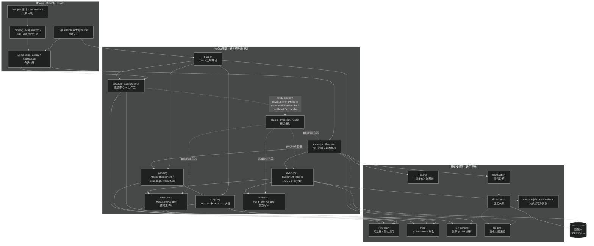

# MyBatis 3 源码阅读 — 目录

> 上次修改：2026-07-30 00:35

## 技术栈与项目概述

MyBatis 3 是一个 Java 持久层框架（SQL Mapper），在 JDBC 之上提供 SQL 与 Java 对象之间的双向映射层：开发者用 XML 或注解编写 SQL，框架负责参数绑定、语句执行、结果集到 POJO 的映射以及缓存、事务与延迟加载。

- **项目名称**：MyBatis 3，版本 `3.6.0-SNAPSHOT`，分析基线 `master @ 8da8f31`
- **主要语言/平台**：Java 11（`src/main/java/org/apache/ibatis` 单一根包，20 个子包）
- **核心技术**：JDK 动态代理（Mapper 接口绑定、插件织入）、OGNL（动态 SQL 表达式求值）、Javassist / CGLIB（延迟加载代理）、反射 + 元数据缓存（`reflection`）、多日志门面适配（SLF4J / Log4j2 / JCL / JUL / stdout）
- **构建方式**：Maven，继承 `mybatis-parent:52`，附带 Maven Wrapper（`./mvnw`）；`maven-shade-plugin` 将 `ognl`、`javassist` 重定位进 `org.apache.ibatis.*` 打成 uber-jar
- **项目规模**：393 个主源码 Java 文件 + 1002 个测试文件
- **许可证**：Apache License 2.0
- **分析范围**：仅 `src/main/java` 主源码树的静态分析，不含测试代码执行、不含 mybatis-spring 等生态子项目

需要特别注意的是，**MyBatis 是类库而非可执行应用**：没有 `main` 方法，没有常驻服务进程，"运行"指的是被宿主应用以 API 方式调用。因此本文档集不存在传统意义上的"启动流程"，取而代之的是 `SqlSessionFactory` 构建流程与 `SqlSession` 执行流程。

## 重点关注

以下入口按"读懂 MyBatis 必须先理解"的优先级排列：

1. **`Configuration` —— 全局配置中心与组件工厂**
   `src/main/java/org/apache/ibatis/session/Configuration.java`。它同时承担三个角色：解析产物的容器（`MappedStatement`、`ResultMap`、`TypeHandler`、`Cache` 注册表）、运行期组件的工厂（`newExecutor` / `newStatementHandler` / `newParameterHandler` / `newResultSetHandler`）、以及行为开关的持有者（懒加载、自动映射、缓存作用域）。**几乎所有链路都会穿过它**，是理解全局的锚点。
   👉 [会话与配置核心（session）](<会话与配置核心（session）.md>)

2. **`SqlSession → Executor → StatementHandler → ResultSetHandler` 执行主链路**
   这是一次数据库操作的四段式骨架：`DefaultSqlSession` 负责 API 门面与参数包装，`Executor`（Simple / Reuse / Batch + `CachingExecutor` 装饰）负责缓存协同与语句复用，`StatementHandler` 负责 JDBC `Statement` 的创建与参数设置，`ResultSetHandler` 负责结果集到对象图的还原。**读懂这条链路等于读懂了 MyBatis 的一半。**
   👉 [核心源码分析：查询主链路与缓存协同](<核心源码分析-查询主链路与缓存协同.md>)、[执行器与结果处理（executor）](<执行器与结果处理（executor）.md>)

3. **`MapperProxy` —— Mapper 接口绑定入口**
   `src/main/java/org/apache/ibatis/binding/MapperProxy.java`。用户代码调用的是接口方法，而接口没有实现类；`MapperProxy` 通过 JDK 动态代理把方法调用翻译成 `SqlSession` 调用，`MapperMethod` 负责 SQL 命令类型判定、参数名解析和返回值适配（含 `Optional`、`Cursor`、`@MapKey`、多结果集）。这是**用户视角的第一行代码**。
   👉 [核心源码分析：Mapper 接口代理与方法分派](<核心源码分析-Mapper接口代理与方法分派.md>)

4. **动态 SQL 的 `SqlNode` 组合树**
   `src/main/java/org/apache/ibatis/scripting/xmltags/`。`<if>` / `<where>` / `<foreach>` / `<choose>` 等标签被解析为 `SqlNode` 组合树，运行期由 `DynamicContext` 驱动递归 `apply`，再由 OGNL 求值条件表达式。**这是组合模式的教科书式应用**，也是参数传递语义最容易踩坑的地方（尤其是 `foreach` 内部的参数绑定）。
   👉 [核心源码分析：动态 SQL 解析与 OGNL 求值](<核心源码分析-动态SQL解析与OGNL求值.md>)、[动态 SQL 脚本引擎（scripting）](<动态 SQL 脚本引擎（scripting）.md>)

5. **插件可拦截的四大对象**
   `Executor`、`StatementHandler`、`ParameterHandler`、`ResultSetHandler` —— 这四个组件都由 `Configuration#newXxx` 创建，创建后立刻经 `InterceptorChain#pluginAll` 包装。理解"哪些方法可被拦截、代理如何层层嵌套、`@Signature` 如何匹配"是编写分页插件、SQL 日志插件、多租户插件的前提。
   👉 [核心源码分析：插件织入机制](<核心源码分析-插件织入机制.md>)、[插件与拦截器（plugin）](<插件与拦截器（plugin）.md>)

6. **`XMLConfigBuilder` / `XMLMapperBuilder` 解析阶段**
   配置阶段与运行阶段的分界线。所有 XML/注解信息在此被转成内存模型（`MappedStatement`、`ResultMap`、`BoundSql`），**运行期不再回读 XML**。排查"配置写了但不生效"类问题必须从这里入手。
   👉 [核心源码分析：SqlSessionFactory 构建与配置解析](<核心源码分析-SqlSessionFactory构建与配置解析.md>)、[配置构建器（builder）](<配置构建器（builder）.md>)

## 阅读路线

### 路线 A：新手 —— 先建立"一次查询发生了什么"的整体印象

1. [工程概览](<工程概览.md>) —— 先知道 20 个包各自在哪、大致分工，避免一上来就迷失在文件树里。
2. [编译运行流程](<编译运行流程.md>) —— 理解 MyBatis 是类库不是应用，知道怎么把源码跑起来（`./mvnw test`）以便随时验证猜想。
3. [会话与配置核心（session）](<会话与配置核心（session）.md>) —— 掌握 `SqlSessionFactoryBuilder → SqlSessionFactory → SqlSession` 三级门面，这是所有示例代码的形状。
4. [Mapper 接口绑定（binding）](<Mapper 接口绑定（binding）.md>) —— 解开"接口没有实现类为什么能调用"这个最直观的疑问。
5. [核心源码分析：查询主链路与缓存协同](<核心源码分析-查询主链路与缓存协同.md>) —— 沿着一次 `selectOne` 走完全程，把前面的碎片串成链路。
6. [映射模型（mapping）](<映射模型（mapping）.md>) —— 认识 `MappedStatement` / `BoundSql` / `ResultMap` 这三个贯穿全局的数据结构。

> 新手阶段建议**跳过** `reflection`、`type` 两个包的细节，它们是支撑设施，等主链路读通后再回头看不迟。

### 路线 B：维护者 —— 需要改动代码，必须理解模块边界与约束

1. [核心源码分析：SqlSessionFactory 构建与配置解析](<核心源码分析-SqlSessionFactory构建与配置解析.md>) —— 明确"解析期 vs 运行期"的分界，改动配置项时才知道该动哪一侧。
2. [配置构建器（builder）](<配置构建器（builder）.md>) —— XML 与注解两条解析路径的汇合点，新增标签/注解的落点。
3. [执行器与结果处理（executor）](<执行器与结果处理（executor）.md>) —— 55 个文件的最大包，装饰器链、批处理、延迟加载都在这里。
4. [核心源码分析：结果集映射引擎](<核心源码分析-结果集映射引擎.md>) —— `DefaultResultSetHandler` 是 bug 密度最高的区域（嵌套映射、自动映射、鉴别器交织）。
5. [反射工具（reflection）](<反射工具（reflection）.md>) —— `Reflector` / `MetaObject` / `ObjectWrapper` 的元数据缓存语义，改动属性访问逻辑必读。
6. [类型处理与别名（type）](<类型处理与别名（type）.md>) —— `TypeHandler` 的注册与查找规则（Java 类型 + JdbcType 双键），新增类型支持的入口。
7. [缓存体系（cache）](<缓存体系（cache）.md>) —— 装饰器链的另一处集中体现，改动缓存行为前必须理解 `TransactionalCacheManager` 的延迟提交语义。

### 路线 C：排障者 —— 带着具体现象来定位问题

按现象选择入口，不必顺序读完：

| 现象 | 建议阅读顺序 | 理由 |
|------|-------------|------|
| SQL 拼出来不对 / `foreach` 参数错乱 | [核心源码分析：动态 SQL 解析与 OGNL 求值](<核心源码分析-动态SQL解析与OGNL求值.md>) → [动态 SQL 脚本引擎（scripting）](<动态 SQL 脚本引擎（scripting）.md>) | 定位 `SqlNode.apply` 的拼接结果与 `ParameterMapping` 的实参快照 |
| 查到数据但对象字段为 null | [核心源码分析：结果集映射引擎](<核心源码分析-结果集映射引擎.md>) → [类型处理与别名（type）](<类型处理与别名（type）.md>) | 区分是列名未匹配、`TypeHandler` 未命中，还是构造器映射失败 |
| 改了数据但读到旧值 | [核心源码分析：查询主链路与缓存协同](<核心源码分析-查询主链路与缓存协同.md>) → [缓存体系（cache）](<缓存体系（cache）.md>) | 一级缓存作用域与二级缓存的事务性提交是脏读的两大来源 |
| 事务不回滚 / 连接泄漏 | [事务管理（transaction）](<事务管理（transaction）.md>) → [数据源（datasource）](<数据源（datasource）.md>) | `Transaction` 的 `autoCommit` 语义与 `PooledDataSource` 的归还逻辑 |
| 插件没生效 / 插件之间互相干扰 | [核心源码分析：插件织入机制](<核心源码分析-插件织入机制.md>) → [插件与拦截器（plugin）](<插件与拦截器（plugin）.md>) | `@Signature` 匹配失败与代理嵌套顺序是两大典型原因 |
| Mapper 方法调用报 `BindingException` | [核心源码分析：Mapper 接口代理与方法分派](<核心源码分析-Mapper接口代理与方法分派.md>) → [注解 API（annotations）](<注解 API（annotations）.md>) | 多为 `MappedStatement` 未注册或命名空间不匹配 |
| 找不到 mapper 资源 / classpath 问题 | [资源加载与解析（io + parsing）](<资源加载与解析（io + parsing）.md>) | `Resources` 与 `VFS` 的类加载器查找顺序 |
| 日志不输出 / 输出到错误框架 | [日志适配（logging）](<日志适配（logging）.md>) | `LogFactory` 的静态初始化探测顺序 |
| 大结果集 OOM | [游标与 JDBC 辅助工具](<游标与 JDBC 辅助工具（cursor + jdbc + exceptions）.md>) | `Cursor` 流式读取是替代一次性 `List` 返回的方案 |

### 路线 D：扩展开发者 —— 要写插件、自定义组件或对接新数据库

1. [插件与拦截器（plugin）](<插件与拦截器（plugin）.md>) + [核心源码分析：插件织入机制](<核心源码分析-插件织入机制.md>) —— 最主流的扩展方式，先搞清四大可拦截对象与各自的可拦截方法签名。
2. [类型处理与别名（type）](<类型处理与别名（type）.md>) —— 自定义 `TypeHandler` 对接 JSON 列、枚举、地理类型等非标准 JDBC 类型。
3. [执行器与结果处理（executor）](<执行器与结果处理（executor）.md>) —— 自定义 `KeyGenerator`（主键回填）、`LanguageDriver` 挂接点的上游语境。
4. [动态 SQL 脚本引擎（scripting）](<动态 SQL 脚本引擎（scripting）.md>) —— 实现自定义 `LanguageDriver`（例如接入 Velocity/Freemarker 风格模板）。
5. [缓存体系（cache）](<缓存体系（cache）.md>) —— 实现自定义 `Cache` 对接 Redis/Caffeine，注意装饰器契约与 `getReadWriteLock` 的历史包袱。
6. [数据源（datasource）](<数据源（datasource）.md>) + [事务管理（transaction）](<事务管理（transaction）.md>) —— 实现 `DataSourceFactory` / `TransactionFactory` 以接入容器管理的连接池与事务。
7. [会话与配置核心（session）](<会话与配置核心（session）.md>) —— 最后回到 `Configuration`，所有扩展点最终都要在这里注册才能生效。

## 文档清单

本文档集共 **25 篇**（含本篇），按类型分组如下。

### 工程概览

- [工程概览](<工程概览.md>) —— 源码目录结构总览与各级目录职责说明

### 编译运行流程

- [编译运行流程](<编译运行流程.md>) —— Maven 构建、依赖清单、测试执行与 shade 打包产物说明

### 模块文档（16 篇）

按包名对应关系列出：

- [注解 API（annotations）](<注解 API（annotations）.md>) —— `org.apache.ibatis.annotations`
- [Mapper 接口绑定（binding）](<Mapper 接口绑定（binding）.md>) —— `org.apache.ibatis.binding`
- [配置构建器（builder）](<配置构建器（builder）.md>) —— `org.apache.ibatis.builder`
- [缓存体系（cache）](<缓存体系（cache）.md>) —— `org.apache.ibatis.cache`
- [游标与 JDBC 辅助工具](<游标与 JDBC 辅助工具（cursor + jdbc + exceptions）.md>) —— `org.apache.ibatis.cursor` + `jdbc` + `exceptions`
- [数据源（datasource）](<数据源（datasource）.md>) —— `org.apache.ibatis.datasource`
- [执行器与结果处理（executor）](<执行器与结果处理（executor）.md>) —— `org.apache.ibatis.executor`
- [资源加载与解析（io + parsing）](<资源加载与解析（io + parsing）.md>) —— `org.apache.ibatis.io` + `parsing`
- [日志适配（logging）](<日志适配（logging）.md>) —— `org.apache.ibatis.logging`
- [映射模型（mapping）](<映射模型（mapping）.md>) —— `org.apache.ibatis.mapping`
- [插件与拦截器（plugin）](<插件与拦截器（plugin）.md>) —— `org.apache.ibatis.plugin`
- [反射工具（reflection）](<反射工具（reflection）.md>) —— `org.apache.ibatis.reflection`
- [动态 SQL 脚本引擎（scripting）](<动态 SQL 脚本引擎（scripting）.md>) —— `org.apache.ibatis.scripting`
- [会话与配置核心（session）](<会话与配置核心（session）.md>) —— `org.apache.ibatis.session`
- [事务管理（transaction）](<事务管理（transaction）.md>) —— `org.apache.ibatis.transaction`
- [类型处理与别名（type）](<类型处理与别名（type）.md>) —— `org.apache.ibatis.type`

### 核心源码阅读（6 篇）

按执行链路顺序列出：

- [核心源码分析：SqlSessionFactory 构建与配置解析](<核心源码分析-SqlSessionFactory构建与配置解析.md>) —— 解析期：XML/注解 → `Configuration`
- [核心源码分析：Mapper 接口代理与方法分派](<核心源码分析-Mapper接口代理与方法分派.md>) —— 入口：接口方法 → `SqlSession` 调用
- [核心源码分析：动态 SQL 解析与 OGNL 求值](<核心源码分析-动态SQL解析与OGNL求值.md>) —— SQL 生成：`SqlNode` 树 → `BoundSql`
- [核心源码分析：查询主链路与缓存协同](<核心源码分析-查询主链路与缓存协同.md>) —— 执行：`Executor` 装饰链与一/二级缓存
- [核心源码分析：结果集映射引擎](<核心源码分析-结果集映射引擎.md>) —— 回程：`ResultSet` → 对象图
- [核心源码分析：插件织入机制](<核心源码分析-插件织入机制.md>) —— 横切：四大对象的代理包装

### 场景分析

- 暂无。见下方「关键场景索引」。

## 模块功能摘要

下表按包名字母序列出 16 个模块。「核心入口类」指进入该模块阅读时的第一个落点，包路径统一省略前缀 `org.apache.ibatis`。

| 模块 | 主要功能 | 核心入口类 | 文档 |
|------|----------|-----------|------|
| `annotations`（34 个文件） | 注解式 SQL 声明的元数据定义：CRUD 注解、结果映射注解、参数与选项注解，本身只有声明没有逻辑，由 `builder.annotation` 消费 | `@Select` / `@Insert` / `@Results` / `@Param` / `@Options` | [注解 API（annotations）](<注解 API（annotations）.md>) |
| `binding`（7 个文件） | Mapper 接口到 `SqlSession` 调用的桥梁：注册接口、生成 JDK 动态代理、按方法签名分派到对应 `MappedStatement`、适配返回值类型 | `MapperRegistry` / `MapperProxy` / `MapperMethod` | [Mapper 接口绑定（binding）](<Mapper 接口绑定（binding）.md>) |
| `builder`（25 个文件） | 解析期核心：把 `mybatis-config.xml`、Mapper XML 与接口注解统一转换为 `Configuration` 中的内存模型，并处理增量解析（`IncompleteElementException` 重试） | `XMLConfigBuilder` / `XMLMapperBuilder` / `MapperAnnotationBuilder` / `MapperBuilderAssistant` | [配置构建器（builder）](<配置构建器（builder）.md>) |
| `cache`（19 个文件） | 二级缓存的存储与策略组合：基础实现 + 装饰器链（LRU/FIFO/软弱引用/定时刷新/序列化/日志），以及事务性提交暂存 | `Cache` / `PerpetualCache` / `TransactionalCacheManager` | [缓存体系（cache）](<缓存体系（cache）.md>) |
| `cursor` + `jdbc` + `exceptions`（4+9+5 个文件） | 流式结果读取（惰性 `Iterator`，避免大结果集全量入内存）；SQL 脚本执行与元数据辅助工具；框架统一异常基类与包装策略 | `Cursor` / `DefaultCursor` / `ScriptRunner` / `SQLExceptionTranslator` | [游标与 JDBC 辅助工具](<游标与 JDBC 辅助工具（cursor + jdbc + exceptions）.md>) |
| `datasource`（13 个文件） | 连接来源抽象：内置无池化实现、自研连接池（含空闲/活跃连接管理与坏连接检测）、JNDI 查找 | `DataSourceFactory` / `UnpooledDataSource` / `PooledDataSource` | [数据源（datasource）](<数据源（datasource）.md>) |
| `executor`（55 个文件，最大包） | 运行期核心：语句执行策略（Simple/Reuse/Batch）、一级缓存与二级缓存协同、JDBC `Statement` 生命周期、参数设置、结果集映射、主键生成、延迟加载代理 | `Executor` / `BaseExecutor` / `CachingExecutor` / `StatementHandler` / `DefaultResultSetHandler` | [执行器与结果处理（executor）](<执行器与结果处理（executor）.md>) |
| `io` + `parsing`（9+7 个文件） | 资源定位与读取（多类加载器兜底、VFS 扫描包内类）；XML 解析封装与 `${}` 占位符 / `#{}` token 的通用解析器 | `Resources` / `VFS` / `XPathParser` / `GenericTokenParser` / `PropertyParser` | [资源加载与解析（io + parsing）](<资源加载与解析（io + parsing）.md>) |
| `logging`（28 个文件） | 日志门面适配：运行期按优先级探测可用日志实现；JDBC 层代理（`Connection`/`Statement`/`ResultSet`）输出 SQL 与参数 | `LogFactory` / `Log` / `jdbc.ConnectionLogger` | [日志适配（logging）](<日志适配（logging）.md>) |
| `mapping`（20 个文件） | 解析产物的领域模型层：一条语句的全部元信息、运行期生成的 SQL 与参数绑定、结果映射规则、环境与鉴别器 | `MappedStatement` / `BoundSql` / `SqlSource` / `ResultMap` / `ParameterMapping` | [映射模型（mapping）](<映射模型（mapping）.md>) |
| `plugin`（8 个文件） | AOP 式扩展机制：按 `@Intercepts`/`@Signature` 匹配目标方法，用 JDK 动态代理层层包装四大可拦截对象 | `Interceptor` / `InterceptorChain` / `Plugin` / `Invocation` | [插件与拦截器（plugin）](<插件与拦截器（plugin）.md>) |
| `reflection`（36 个文件） | 全框架的反射支撑：类元数据缓存、统一属性读写抽象（POJO/Map/Collection）、方法参数名解析、泛型类型推断、对象实例化 | `Reflector` / `MetaObject` / `ObjectWrapper` / `ParamNameResolver` / `TypeParameterResolver` | [反射工具（reflection）](<反射工具（reflection）.md>) |
| `scripting`（28 个文件） | 动态 SQL 引擎：XML 标签解析为 `SqlNode` 组合树，运行期递归拼接并用 OGNL 求值条件表达式，最终产出带参数映射的 `BoundSql` | `LanguageDriver` / `XMLScriptBuilder` / `SqlNode` / `DynamicSqlSource` / `OgnlCache` | [动态 SQL 脚本引擎（scripting）](<动态 SQL 脚本引擎（scripting）.md>) |
| `session`（18 个文件） | 对外 API 门面与全局状态中心：三级构建链、会话生命周期、`Configuration` 兼任配置容器与运行期组件工厂 | `Configuration` / `SqlSessionFactoryBuilder` / `SqlSession` / `DefaultSqlSession` | [会话与配置核心（session）](<会话与配置核心（session）.md>) |
| `transaction`（10 个文件） | 事务边界抽象：自管理事务（直接操作 `Connection` 的 `autoCommit`/`commit`/`rollback`）与容器托管事务两种策略 | `Transaction` / `TransactionFactory` / `JdbcTransaction` / `ManagedTransaction` | [事务管理（transaction）](<事务管理（transaction）.md>) |
| `type`（57 个文件） | Java 类型与 JDBC 类型的双向转换：按「Java 类型 + JdbcType」双键注册与查找 `TypeHandler`，以及类型别名注册表 | `TypeHandler` / `BaseTypeHandler` / `TypeHandlerRegistry` / `TypeAliasRegistry` / `JdbcType` | [类型处理与别名（type）](<类型处理与别名（type）.md>) |

## 架构总览

### 层次划分

**接口层**是用户唯一需要直接接触的部分。它提供两种编程风格：语句 ID 风格（`sqlSession.selectOne("ns.id", param)`）和接口风格（`mapper.selectById(1)`）。后者经 `MapperProxy` 翻译后仍然落到前者，因此**两种风格在运行期是同一条路径**，接口风格只是多了一层类型安全的代理。

**核心处理层**内部还有一条更重要的隐性分界：**解析期**（`builder` + `io/parsing`，只在 `SqlSessionFactory` 构建时运行一次）与**运行期**（`executor` 四大组件 + `scripting` 动态拼接，每次调用都运行）。`Configuration` 与 `mapping` 的模型对象横跨两侧：解析期写入，运行期只读。这条分界线是理解性能特征的关键 —— XML 解析成本一次性摊销，运行期开销集中在动态 SQL 拼接、反射属性写入和结果集遍历上。

**基础支撑层**是被上层反复复用的通用设施，特点是**不反向依赖上层**（`reflection`、`type`、`parsing` 基本可以独立测试）。少数例外是 `cache` 和 `transaction`：它们的接口在支撑层，但生命周期由 `executor` 驱动。

### 依赖方向与关键耦合

依赖总体自上而下，但有几处必须留意的耦合点：

1. **`Configuration` 是事实上的上帝对象**。它既被解析期写入，又在运行期充当组件工厂，几乎所有类都持有它的引用。好处是省去了独立的 IoC 容器、组件替换只需改一个地方；代价是**它成了循环依赖的汇聚点**（`Configuration` → `MappedStatement` → `Configuration`），也让单元测试难以隔离。这是阅读时最需要建立心智模型的一处设计。

2. **插件层是"侧面注入"而非层间调用**（图中虚线）。`InterceptorChain` 不在主调用链上，而是在四大对象**创建瞬间**把它们替换为代理。这意味着插件只能拦截创建之后的调用，且多个插件形成嵌套代理，**执行顺序与注册顺序相反**（后注册的在最外层）。

3. **`executor` 内部是双层装饰**：`CachingExecutor` 装饰 `BaseExecutor` 子类处理二级缓存，而一级缓存在 `BaseExecutor` 内部。两级缓存分居不同层次，是"改了数据仍读到旧值"类问题需要分两处排查的根源。

4. **`scripting` 与 `mapping` 双向咬合**：`SqlSource`（接口在 `mapping`）的动态实现 `DynamicSqlSource` 在 `scripting`，运行期产出的 `BoundSql` 又回到 `mapping` 的模型。阅读时容易在两个包之间来回跳转，建议以 `SqlSource` 接口为锚点。

5. **`type` 被参数写入与结果读取两侧共用**。同一个 `TypeHandler` 实例既负责 `setParameter` 也负责 `getResult`，因此 `TypeHandler` 实现**必须是无状态且线程安全的**，这是自定义类型处理器最常被忽略的约束。

## 关键场景索引

暂无场景分析文档，可通过 `/source-code-read byCase` 生成。

场景文档用于回答"某个具体功能是怎么走通的"这类问题，会给出跨模块的调用时序图与分步源码追踪。基于当前模块与核心分析文档的覆盖情况，以下场景较值得后续补充：

- 一次带 `<if>`/`<foreach>` 的动态查询从 Mapper 方法到结果对象的完整时序
- `@Insert` + `useGeneratedKeys` 的主键回填全过程
- 二级缓存在事务提交/回滚两种结局下的状态变迁
- 嵌套 `<collection>` 结果映射的对象图组装与 `nestedResultObjects` 去重
- 批处理执行器（`BatchExecutor`）从 `flushStatements` 到 `BatchResult` 的聚合
- 分页插件拦截 `StatementHandler#prepare` 改写 SQL 的织入细节

## 文档维护记录

### 2026-07-30 00:15 —— init 全量生成

本次 `init` 运行的产出与修正：

**新增模块文档 1 篇**

- [游标与 JDBC 辅助工具](<游标与 JDBC 辅助工具（cursor + jdbc + exceptions）.md>) —— 合并覆盖 `cursor`（4）、`jdbc`（9）、`exceptions`（5）三个小包，共 18 个文件。此前这三个包无文档覆盖，模块文档数由 15 篇补齐到 16 篇，实现主源码树 20 个子包的完整覆盖。

**新增核心源码分析 6 篇**

沿执行链路组织，依次为：`SqlSessionFactory 构建与配置解析`、`Mapper 接口代理与方法分派`、`动态 SQL 解析与 OGNL 求值`、`查询主链路与缓存协同`、`结果集映射引擎`、`插件织入机制`。

**修正 `动态 SQL 脚本引擎（scripting）.md` 中关于 foreach 参数传递的过时描述（共 21 处编辑）**

原文档描述的是 MyBatis 较早版本的实现，与 `3.6.0-SNAPSHOT` 的源码不符，具体两点：

- 旧描述中的 `__frch_item_N` 形式的自动生成参数名已不再是当前实现的机制；
- 旧描述中的 `additionalParameters` 回灌路径在 `3.6.0-SNAPSHOT` 已不存在。

当前实现的实际机制是：`ForEachSqlNode` 通过 `PrefixedContext` 为每次迭代创建**独立的 bindings 副本**，避免迭代之间互相污染；随后 `ParameterMappingTokenHandler` 在构建 `ParameterMapping` 时，直接把该次迭代的**实参值快照**写入 `ParameterMapping.value`。这一改动的实际影响是：调试 `foreach` 参数问题时应检查 `ParameterMapping.value`，而不再是在 `DynamicContext` 的全局 bindings 中查找带序号的生成名。

**此前已有文档 17 篇**

- 工程概览 1 篇：[工程概览](<工程概览.md>)
- 编译运行流程 1 篇：[编译运行流程](<编译运行流程.md>)
- 模块文档 15 篇：`annotations`、`binding`、`builder`、`cache`、`datasource`、`executor`、`io + parsing`、`logging`、`mapping`、`plugin`、`reflection`、`scripting`、`session`、`transaction`、`type`

**本次分析约束**

全程静态分析，未编译、未运行、未执行测试。所有结论基于 `src/main/java` 源码阅读，涉及运行期行为的推断已在各文档中标注依据的源码位置。
