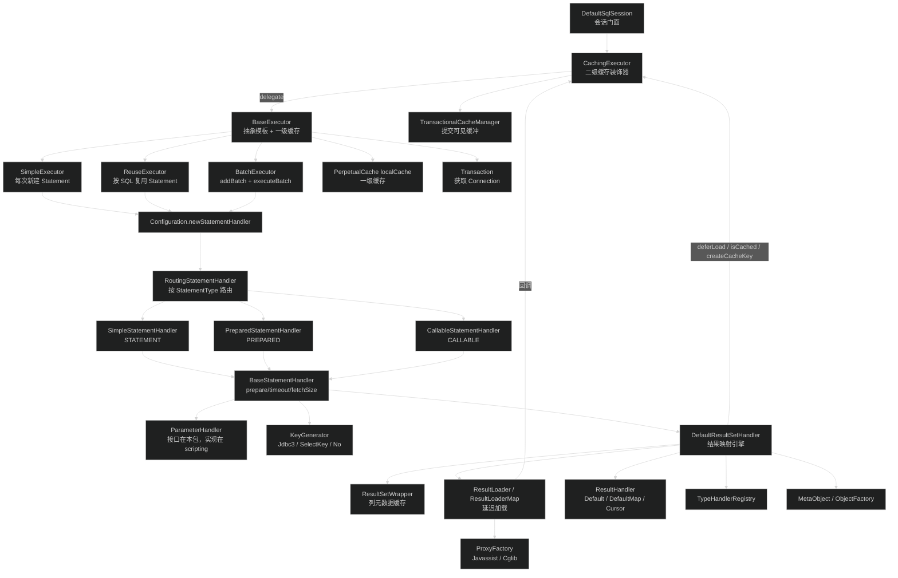
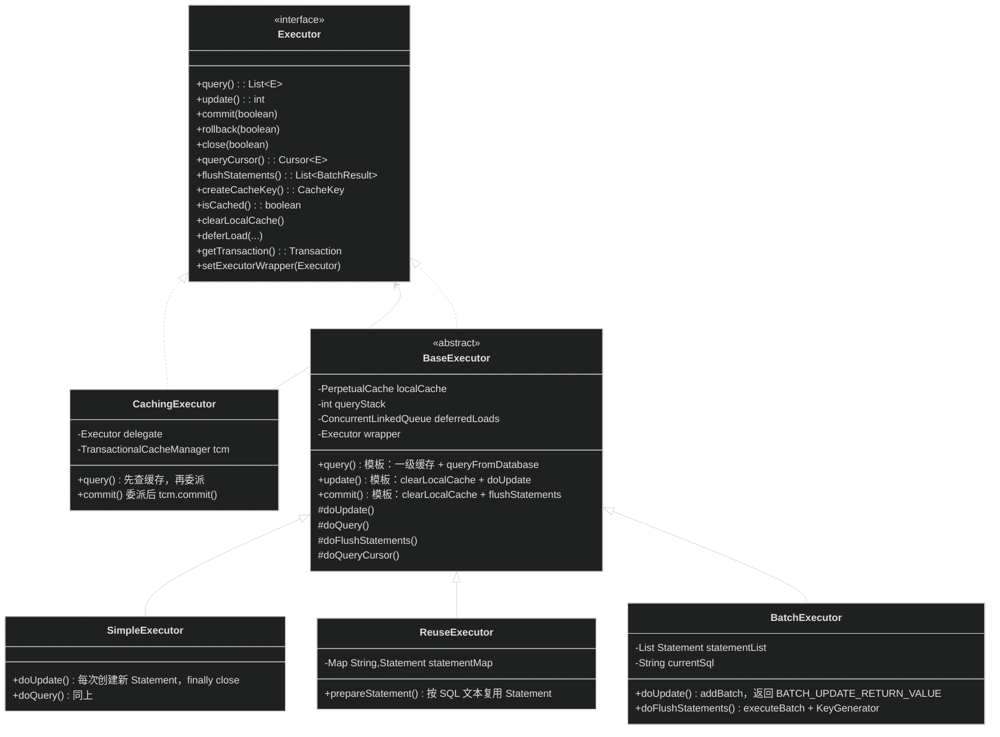
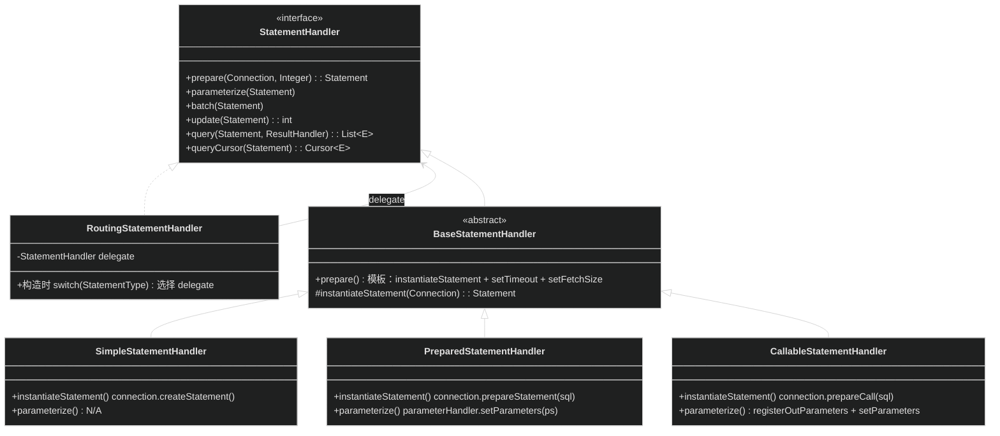
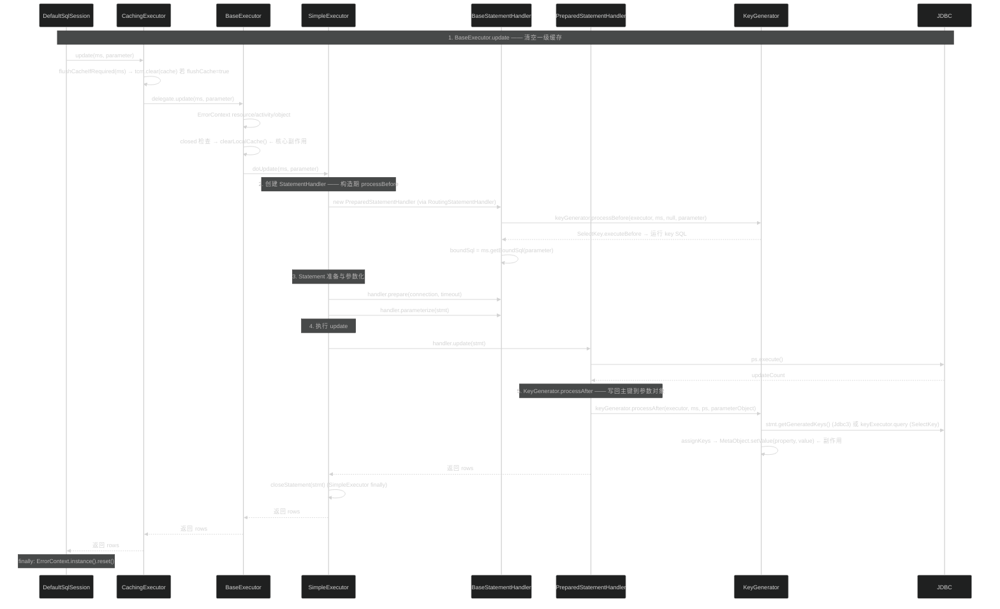
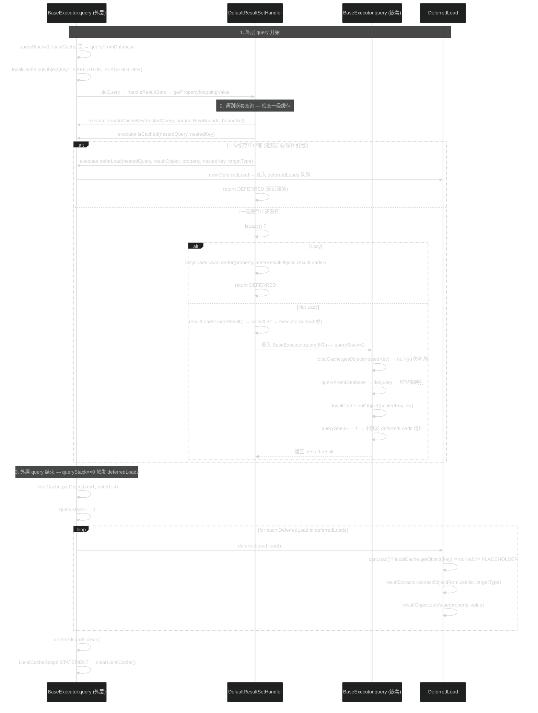
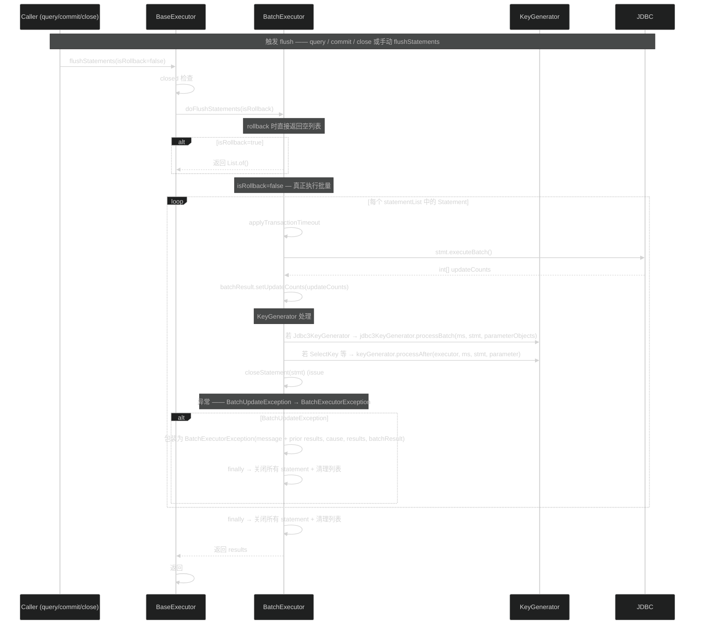

# 执行器与结果处理（executor）
> 上次修改：2026-07-28 22:10

## 重点关注

| 入口 / 章节 | 源码位置 | 为什么重要 |
|-------------|----------|------------|
| `BaseExecutor.query(...)` 六参重载 | `src/main/java/org/apache/ibatis/executor/BaseExecutor.java:143-176` | 一级缓存（localCache）、`queryStack` 嵌套计数、`deferredLoads` 触发时机三件事全部集中在这一个方法里，是整个查询链路的枢纽。误改任何一处都会导致缓存穿透或延迟加载丢失。 |
| `BaseExecutor.queryFromDatabase(...)` | `src/main/java/org/apache/ibatis/executor/BaseExecutor.java:339-353` | 先放 `EXECUTION_PLACEHOLDER` 再执行、再覆盖为真实结果的写法，是循环引用检测（`DeferredLoad.canLoad()`）的唯一依据，属于非显而易见的隐藏协议。 |
| `CachingExecutor.query(...)` | `src/main/java/org/apache/ibatis/executor/CachingExecutor.java:93-111` | 二级缓存以装饰器形式套在 `BaseExecutor` 外，且经由 `TransactionalCacheManager` 做"提交才可见"的事务缓冲，是理解脏读隔离的关键。 |
| `Simple / Reuse / Batch` 三个 `doUpdate` | `SimpleExecutor.java:43-53`、`ReuseExecutor.java:47-52`、`BatchExecutor.java:54-79` | 三种执行器的差异全部体现在 `Statement` 的创建、复用与关闭策略上，其中 `BatchExecutor` 返回魔法值 `BATCH_UPDATE_RETURN_VALUE` 是最常见的排障困惑点。 |
| `BaseStatementHandler` 构造器 | `src/main/java/org/apache/ibatis/executor/statement/BaseStatementHandler.java:53-73` | 构造期就调用 `generateKeys()` 触发 `<selectKey>` 前置执行，并且创建 `ParameterHandler`/`ResultSetHandler`；顺序敏感（issue #435），是"为什么 selectKey 能在 SQL 之前拿到主键"的答案。 |
| `DefaultResultSetHandler.handleRowValuesForNestedResultMap(...)` | `src/main/java/org/apache/ibatis/executor/resultset/DefaultResultSetHandler.java:1146-1200` | 嵌套结果集（join 映射）的行合并算法，涉及 `nestedResultObjects`、`previousRowValue`、`resultOrdered` 三态交互，是全模块最复杂的分支。 |
| `getRowValue` 两个重载 | `DefaultResultSetHandler.java:461-487`（简单）/ `493-524`（嵌套） | 简单映射与嵌套映射走两条独立的取值路径，`foundValues` 语义、`returnInstanceForEmptyRow` 分支、`ancestorObjects` 循环引用保护都在这里。 |
| `getNestedQueryMappingValue(...)` | `DefaultResultSetHandler.java:1022-1051` | 三态返回（命中一级缓存→`deferLoad`、lazy→`ResultLoaderMap`、否则立即 `ResultLoader.loadResult()`）决定了 N+1 查询与延迟加载的实际行为。 |
| `Jdbc3KeyGenerator.assignKeys(...)` | `src/main/java/org/apache/ibatis/executor/keygen/Jdbc3KeyGenerator.java:97-236` | 批量插入主键回填在单参/多参/@Param/List 四种参数形态下有四条不同分支，是主键回填失败的高频根因。 |
| `ErrorContext` | `src/main/java/org/apache/ibatis/executor/ErrorContext.java:21-146` | ThreadLocal 单链栈式错误上下文，`store()`/`recall()` 配合 `generateKeys` 使用；排障时的所有 `### The error occurred while ...` 信息都由它拼装。 |

## 1. 模块定位与职责边界

**结论**：`executor` 包是 MyBatis 的"SQL 执行引擎"，位于 `session`（会话层）之下、JDBC 驱动之上。它接收 `MappedStatement` + 参数对象，负责把它们变成真实的 JDBC 调用，再把 `ResultSet` 变回 Java 对象图。

### 上下游位置

- **上游（调用方）**：`DefaultSqlSession` 持有一个 `Executor` 实例，所有 `selectList` / `update` / `selectCursor` / `commit` / `rollback` / `close` 都直接委派给它（`src/main/java/org/apache/ibatis/session/defaults/DefaultSqlSession.java:153`、`:196`、`:124`、`:222`、`:239`、`:262`）。`Executor` 实例由 `Configuration.newExecutor(Transaction, ExecutorType)` 创建（`src/main/java/org/apache/ibatis/session/Configuration.java:735-749`）。
- **下游（被依赖）**：`java.sql.Connection` / `Statement` / `ResultSet`（经 `Transaction.getConnection()` 获取）、`type` 包的 `TypeHandlerRegistry`、`reflection` 包的 `MetaObject` / `ObjectFactory`、`cache` 包的 `PerpetualCache` 与 `TransactionalCacheManager`、`mapping` 包的 `MappedStatement` / `BoundSql` / `ResultMap`。

### 负责什么

1. **执行策略选择**：`Simple` / `Reuse` / `Batch` 三种 `Statement` 管理策略（`Configuration.java:738-744`）。
2. **一级缓存（SESSION 级）**：`BaseExecutor.localCache`，键为 `CacheKey`，随 `update` / `commit` / `rollback` 清空（`BaseExecutor.java:117`、`:255`、`:266`）。
3. **二级缓存装饰**：`CachingExecutor` 在委派前后读写 `MappedStatement.getCache()`，通过 `TransactionalCacheManager` 延迟到 commit 才写入共享缓存。
4. **Statement 生命周期**：`prepare` → `parameterize` → `execute/batch` → 结果处理 → `close`，由 `StatementHandler` 家族承担（`statement/` 子包）。
5. **结果集映射**：`DefaultResultSetHandler` 把 `ResultSet` 按 `ResultMap` 映射为对象，含自动映射、构造器映射、鉴别器、嵌套 resultMap、嵌套查询、多结果集、游标。
6. **主键生成与回填**：`keygen/` 子包，`Jdbc3KeyGenerator`（`getGeneratedKeys()`）与 `SelectKeyGenerator`（额外执行一条 select）。
7. **延迟加载**：`loader/` 子包，`ResultLoader` + `ResultLoaderMap` + `ProxyFactory`（Javassist/Cglib 代理）。
8. **错误上下文富化**：`ErrorContext` 以 ThreadLocal 记录 resource / activity / object / sql，供 `ExceptionFactory` 拼装可读错误。

### 不负责什么（避免与相邻模块混淆）

- **不负责 SQL 文本生成**：动态 SQL 解析、`#{}` 占位符替换发生在 `scripting` + `mapping.SqlSource`，`executor` 只调用 `ms.getBoundSql(parameter)` 拿现成的 `BoundSql`（`BaseExecutor.java:136`）。
- **不负责参数值写入 JDBC**：`ParameterHandler` 接口定义在 `executor/parameter/`，但**默认实现 `DefaultParameterHandler` 位于 `scripting/defaults/`**，不在本包。本包只声明契约并在 `PreparedStatementHandler.parameterize()` 调用它（`PreparedStatementHandler.java:96-98`）。
- **不负责事务提交**：`BaseExecutor.commit(boolean)` 只做"清缓存 + flush 批处理"，真正的 `Connection.commit()` 由 `transaction` 包的 `Transaction` 实现（`BaseExecutor.java:251-260`）。
- **不负责缓存淘汰策略**：LRU / FIFO / 软弱引用等装饰器在 `cache/decorators/`，`executor` 只是使用者。
- **不负责 Mapper 接口代理**：`binding` 包负责，`executor` 拿到的已经是 `MappedStatement`。

### 主要输入 / 输出 / 状态变化 / 副作用

| 维度 | 内容 |
|------|------|
| 输入 | `MappedStatement`（含 SQL、ResultMap、KeyGenerator、StatementType、cache 配置）、参数对象、`RowBounds`、`ResultHandler`、可选的外部 `CacheKey` + `BoundSql` |
| 输出 | `List<E>`（查询）、`int` 影响行数（更新；Batch 模式为 `BATCH_UPDATE_RETURN_VALUE`）、`Cursor<E>`（游标）、`List<BatchResult>`（flush） |
| 内存状态变化 | `localCache` / `localOutputParameterCache` 增删、`queryStack` 增减、`deferredLoads` 队列、`ReuseExecutor.statementMap`、`BatchExecutor.statementList`/`batchResultList`/`currentSql`、`TransactionalCache.entriesToAddOnCommit` |
| 副作用 | 打开/关闭 JDBC `Statement` 与 `ResultSet`；向参数对象**写回主键**（`Jdbc3KeyGenerator`/`SelectKeyGenerator` 通过 `MetaObject.setValue`）；向参数对象写回存储过程 OUT 参数（`DefaultResultSetHandler.handleOutputParameters`）；生成 Javassist/Cglib 代理类；写 ThreadLocal `ErrorContext` |

## 2. 架构关系与依赖

**结论**：本模块是"**双层装饰 + 三层策略 + 一个巨型映射器**"的组合结构。装饰层是 `CachingExecutor`（二级缓存），策略层是 `Simple/Reuse/Batch`（Statement 管理），路由层是 `RoutingStatementHandler`（StatementType 分派），映射层是 `DefaultResultSetHandler`。



### 节点与依赖方向说明

| 节点 | 角色 | 依赖方向与强度 |
|------|------|----------------|
| `DefaultSqlSession` | 唯一常规调用方 | 单向依赖 `Executor` 接口，**强依赖**；`Executor` 不反向引用 session |
| `CachingExecutor` | 二级缓存装饰器，实现 `Executor` 但**不继承** `BaseExecutor` | 组合持有 `delegate`；构造时调用 `delegate.setExecutorWrapper(this)`（`CachingExecutor.java:46`），形成**受控回环** |
| `BaseExecutor` | 模板方法基类，持有一级缓存与 `wrapper` 字段 | `wrapper` 默认为 `this`，被 `CachingExecutor` 改写为外层装饰器；`doQuery` 时传 `wrapper` 而非 `this`（`SimpleExecutor.java:61`），确保嵌套查询也能走二级缓存——这是**跨层回调**的关键耦合点 |
| `Simple/Reuse/BatchExecutor` | 三个可替换策略实现 | 由 `ExecutorType` 枚举选择，**可替换依赖** |
| `RoutingStatementHandler` | 静态路由（构造期决定 delegate），非动态代理 | **强依赖** `MappedStatement.getStatementType()` |
| `BaseStatementHandler` | 模板基类，统一 `prepare`/超时/fetchSize/`generateKeys` | 依赖 `Configuration.newParameterHandler` / `newResultSetHandler`，因此**插件可在此处介入** |
| `DefaultResultSetHandler` | 唯一 `ResultSetHandler` 实现（约 1660 行） | 反向调用 `Executor.createCacheKey` / `isCached` / `deferLoad`（`DefaultResultSetHandler.java:1012`、`1036-1037`），构成 **executor ↔ resultset 双向依赖** |
| `ResultSetWrapper` | 列名/JdbcType/TypeHandler 的**每结果集级缓存** | 单向依赖 `TypeHandlerRegistry`；被 `DefaultCursor` 也持有 |
| `ResultLoader` / `ResultLoaderMap` | 延迟加载执行器与未加载属性表 | `ResultLoader` 可在原 `Executor` 关闭或跨线程时**自建 SimpleExecutor**（`ResultLoader.java:76-103`），这是一处隐蔽的资源创建点 |
| `ProxyFactory` | 延迟加载代理生成，SPI 式可替换 | 由 `Configuration.getProxyFactory()` 提供，默认 Javassist |
| `KeyGenerator` | 主键策略点 | 被 `BaseStatementHandler`（before）与各 `StatementHandler.update`（after）以及 `BatchExecutor.doFlushStatements` 调用 |
| `ErrorContext` | 横切错误上下文 | ThreadLocal 静态单例，被 `BaseExecutor`、`BaseStatementHandler`、`DefaultResultSetHandler`、`DefaultSqlSession`、代理类共同写入，**隐式耦合**，清理责任在 `DefaultSqlSession` 的 `finally`（`DefaultSqlSession.java:157` 等） |

### 潜在耦合点与风险

1. **`wrapper` 回环**：`BaseExecutor.wrapper` 指向 `CachingExecutor`，`CachingExecutor.delegate` 指向 `BaseExecutor`。若自定义装饰器忘记调用 `setExecutorWrapper`，嵌套查询会绕过二级缓存。`CachingExecutor.setExecutorWrapper` 主动抛 `UnsupportedOperationException`（`CachingExecutor.java:176-178`）以阻止二次包装。
2. **`DefaultResultSetHandler` → `Executor`**：结果映射过程中会发起新的 SQL（嵌套查询），使"结果处理"阶段可能重入执行器，因此 `queryStack` 与 `EXECUTION_PLACEHOLDER` 的存在是必需的，而非可选优化。
3. **`ResultLoader` 自建 Executor**：反序列化后或跨线程延迟加载会新建 `Transaction` 与 `SimpleExecutor` 并在 `finally` 关闭（`ResultLoader.java:85-87`），绕开了会话的事务边界，是数据一致性风险点。
4. **插件切面集中在 `Configuration`**：`newExecutor` / `newStatementHandler` / `newParameterHandler` / `newResultSetHandler` 四处 `interceptorChain.pluginAll`（`Configuration.java:714`、`721`、`728`、`748`），本包所有对象都可能是代理，**不能对运行时具体类型做断言**。

## 3. 入口与调用方式

**结论**：executor 模块有且仅有一个外部调用方——`DefaultSqlSession`，其余入口均来自内部子组件之间的反向调用（`DefaultResultSetHandler` → `Executor`）或构造期间接调用（`Configuration.newStatementHandler` → 各 `StatementHandler` 构造）。

### 3.1 外部入口清单

| 入口 | 触发者 | 关键参数 | 返回值 | 源码位置 |
|------|--------|----------|--------|----------|
| `Executor.query(MappedStatement, Object, RowBounds, ResultHandler, CacheKey, BoundSql)` | `DefaultSqlSession.selectList`（`:153`） | 六参，含预计算的 CacheKey 与 BoundSql → 进入 `BaseExecutor.query` 一级缓存匹配 | `List<E>` | `BaseExecutor.java:143` |
| `Executor.query(MappedStatement, Object, RowBounds, ResultHandler)` | `DefaultSqlSession.selectList` 无 CacheKey 版本间接调用 | 四参 → 内部构造 `BoundSql` + `CacheKey` 后仍走六参版本 | `List<E>` | `BaseExecutor.java:134` |
| `Executor.update(MappedStatement, Object)` | `DefaultSqlSession.update`（含 insert/delete，`:196`） | MappedStatement + 参数 → 清空 localCache 后调用模板方法 `doUpdate` | `int`（Batch 返回 `BATCH_UPDATE_RETURN_VALUE`） | `BaseExecutor.java:112` |
| `Executor.queryCursor(MappedStatement, Object, RowBounds)` | `DefaultSqlSession.selectCursor`（`:124`） | 不走一级缓存，不走 `ResultHandler` → 直接委托 `doQueryCursor` | `Cursor<E>` | `BaseExecutor.java:179` |
| `Executor.flushStatements()` | `DefaultSqlSession.flushStatements`（`:251`）；commit/rollback 也会在清缓存后调用 | 无额外参数；在 Batch 模式下真正执行 `executeBatch`；非 Batch 子类返回空列表 | `List<BatchResult>` | `BaseExecutor.java:122` |
| `Executor.commit(boolean)` / `rollback(boolean)` | `DefaultSqlSession.commit/rollback`（`:222`、`:239`） | `required` 控制是否调用底层 `Transaction.commit()/rollback()` | 无返回值 | `BaseExecutor.java:251`、`:263` |
| `Executor.close(boolean)` | `DefaultSqlSession.close`（`:262`） | `forceRollback` 控制先 rollback 再 close transaction | 无返回值，字段置 null | `BaseExecutor.java:85` |

调用链关键证据：
- `DefaultSqlSession.selectList` 最终调用 `executor.query(ms, wrapCollection(parameter), rowBounds, handler)`（`DefaultSqlSession.java:153`），进入 `BaseExecutor.java:134` 的四参版本，该方法内部调用 `ms.getBoundSql(parameter)` + `createCacheKey(...)` 后再次调用六参版本 `query(...)`（`BaseExecutor.java:136-138`）。
- `DefaultSqlSession.update` 也调用 `executor.update(ms, wrapCollection(parameter))`（`DefaultSqlSession.java:196`），进入 `BaseExecutor.update`（`BaseExecutor.java:112`）。

### 3.2 内部入口（跨组件调用）

| 入口 | 触发者 | 触发场景 | 源码位置 |
|------|--------|----------|----------|
| `Executor.createCacheKey(...)` | `DefaultResultSetHandler.getNestedQueryMappingValue` / `getNestedQueryConstructorValue` | 嵌套查询（`<association select="..." />`）需要缓存键来检查一级缓存是否已命中 | `DefaultResultSetHandler.java:1012`、`1033` |
| `Executor.isCached(...)` | `DefaultResultSetHandler.getNestedQueryMappingValue` | 若一级缓存已命中 → `deferLoad` 延迟到外层 query 结束时赋值（避免立即加载中触发相同的嵌套查询） | `DefaultResultSetHandler.java:1036` |
| `Executor.deferLoad(...)` | 同上 | 命中缓存的嵌套查询结果在 `queryStack==0` 时才由 `DeferredLoad.load()` 真正赋给 resultObject | `DefaultResultSetHandler.java:1037` |
| `Configuration.newExecutor(Transaction)` / `newExecutor(Transaction, ExecutorType)` | `DefaultSqlSession` 构造（通过 `Configuration`）、`ResultLoader`（延迟加载时自建） | 根据 `ExecutorType` 选择实现、可选包装 `CachingExecutor`，最后走 `interceptorChain.pluginAll` | `Configuration.java:731-749` |
| `Configuration.newStatementHandler(...)` | 各 `doQuery`/`doUpdate` | 创建 `RoutingStatementHandler` 并走 `interceptorChain.pluginAll`，各子类委托 `configuration.newStatementHandler(wrapper, ms, ...)` | `Configuration.java:724-728` |
| `Configuration.newParameterHandler(...)` | `BaseStatementHandler` 构造 | 委托 `LanguageDriver.createParameterHandler` 后走 `interceptorChain.pluginAll` | `Configuration.java:710-714` |
| `Configuration.newResultSetHandler(...)` | `BaseStatementHandler` 构造 | 创建 `DefaultResultSetHandler` 后走 `interceptorChain.pluginAll` | `Configuration.java:717-721` |
| `KeyGenerator.processBefore(...)` | `BaseStatementHandler.generateKeys`（`:141-143`） | 在 `BaseStatementHandler` 构造中，若 boundSql 为 null（首次），则先走 SelectKey 前置执行，再调用 `ms.getBoundSql(parameter)` | `BaseStatementHandler.java:63-66` |
| `KeyGenerator.processAfter(...)` | `PreparedStatementHandler.update`、`SimpleStatementHandler.update`、`CallableStatementHandler.update`、`BatchExecutor.doFlushStatements` | SQL 执行后回填主键 | `PreparedStatementHandler.java:50-52`、`SimpleStatementHandler.java:48-61`、`CallableStatementHandler.java:53-55`、`BatchExecutor.java:128-136` |

### 3.3 入口之后的典型路由

1. **query 路由**：`DefaultSqlSession.selectList` → `Executor.query(4参)` → `ms.getBoundSql()` + `createCacheKey()` → `query(6参)` → [一级缓存命中则返回 / 未命中则 `queryFromDatabase`] → `doQuery`（子类） → `Configuration.newStatementHandler(wrapper, ...)` → `RoutingStatementHandler` → `PreparedStatementHandler.prepare` / `parameterize` / `execute` / `resultSetHandler.handleResultSets`。
2. **update 路由**：`DefaultSqlSession.update` → `BaseExecutor.update` → `clearLocalCache()` → `doUpdate`（子类） → `Configuration.newStatementHandler(this, ...)`（注意传的是 `this` 而非 `wrapper`，因为 update 不触发嵌套查询） → `StatementHandler.prepare` / `parameterize` / `update`。
3. **commit 路由**：`DefaultSqlSession.commit` → `BaseExecutor.commit` → `clearLocalCache()` + `flushStatements()` + `transaction.commit()` → 若在 `CachingExecutor` 层还被调用，还会额外执行 `tcm.commit()`（真正写入共享缓存）。

## 4. 核心概念与领域模型

**结论**：executor 模块的核心模型由四个层次组成——**执行策略层**（Executor 类型）、**语句处理层**（StatementHandler 类型）、**结果映射层**（ResultSetHandler + ResultHandler）、**横切关注点**（KeyGenerator、ErrorContext、ExecutionPlaceholder）。每层通过 `Configuration` 工厂方法组装，通过 `InterceptorChain` 统一注入了插件截获能力。

### 4.1 Executor 接口与实现层次（执行策略）



#### 概念评估

**`BaseExecutor` 一级缓存模板方法**

- **定义**：`BaseExecutor` 实现 `query(6参)` 作为非 final 模板方法，核心步骤依次为：检查 `closed` → 检查 `flushCacheRequired` → `queryStack++` → 查 `localCache` → 命中则返回 / 未命中则 `queryFromDatabase` → `queryStack--` → `queryStack==0` 时触发 `deferredLoads` + 检查 `LocalCacheScope.STATEMENT`。
- **生命周期**：随 `DefaultSqlSession` 创建（`Configuration.newExecutor`），随 `close()` 置空所有字段。`localCache` 为 `PerpetualCache`（内存 HashMap），在 update / commit / rollback 时清空。
- **相关类型**：`CacheKey`（复合键，含 ms.id / rowBounds / SQL 文本 / 参数值）、`ExecutionPlaceholder.EXECUTION_PLACEHOLDER`（循环引用哨兵）。
- **好处/替代方案/风险**：
  - **好处**：模板方法让子类只关注 `Statement` 的管理方式，缓存逻辑完全复用。`queryStack` 计数让嵌套查询结束后的清理动作（延迟加载、STATEMENT 级缓存清空）只执行一次。
  - **替代方案**：若用 Caffeine/Guava 等带淘汰的外部缓存替代一级缓存，需要继承并重写 `query(6参)`，成本高；目前 `createCacheKey` 是 public，可被覆盖，但 `localCache` 字段是 package-private 的 `PerpetualCache`，不可替换。
  - **风险**：`localCache` 只增不清在 SELECT 密集场景可能 OOM（仅在 update/commit/rollback 清理；`LocalCacheScope.STATEMENT` 模式下每次外层 query 结束清理）。`EXECUTION_PLACEHOLDER` 协议依赖于 `finally` 必执行，若 JVM 崩溃或线程被杀，可能残留占位符。

**`SimpleExecutor` vs `ReuseExecutor` vs `BatchExecutor`**

- **Simple**：每次 `doQuery`/`doUpdate` 创建新 `Statement`，`finally` 关闭。好处是隔离性强、无状态泄漏；代价是高吞吐下 Statement 编译开销大。
- **Reuse**：以 `HashMap<String, Statement>` 缓存语句，按 SQL 文本去重。`doFlushStatements` 时关闭全部。好处是减少 SQL 编译；风险是连接关闭后 Statement 不可用——`hasStatementFor` 检查 `!statement.getConnection().isClosed()`（`ReuseExecutor.java:101`）。
- **Batch**：`doUpdate` 时连续 `addBatch()`，仅当 SQL 或 MappedStatement 变化时才创建新 Statement（`BatchExecutor.java:61-76`）。`doFlushStatements` 时 `executeBatch()` + `KeyGenerator` 处理 + `closeStatement`。**重要**：`doQuery` 时会先 `flushStatements()` 确保所有未执行 batch 入库（`BatchExecutor.java:86`），否则读取到过时数据。`doFlushStatements` 在 rollback 时返回空列表而不执行 batch（`BatchExecutor.java:117-119`）。

**`CachingExecutor` 二级缓存装饰器**

- **定义**：实现 `Executor` 但**不继承** `BaseExecutor`，以组合方式持有 `Executor delegate`。`query` 时先查 `tcm.getObject(cache, key)`，未命中则 `delegate.query` 后 `tcm.putObject`。`commit` 时 `tcm.commit()` 真正写入共享缓存。`close` 时根据 `forceRollback` 决定 `tcm.rollback()` 还是 `tcm.commit()`。
- **好处/替代方案/风险**：
  - **好处**：装饰器模式避免了 `BaseExecutor` 的子类需要分别支持两级缓存。`TransactionalCacheManager` 内部使用 `TransactionalCache`（`cache/decorators/TransactionalCache.java:38-135`）在事务期间缓冲 `entriesToAddOnCommit` / `entriesMissedInCache` / `clearOnCommit`，commit 时才刷新并清空，实现"本事务提交前对其它事务不可见"的隔离。
  - **替代方案**：可以通过 `cacheEnabled=false` 关闭二级缓存，此时 `Configuration.newExecutor` 不会套 `CachingExecutor`（`Configuration.java:745-747`）。
  - **风险**：存储过程 OUT 参数不能缓存——`ensureNoOutParams`（`CachingExecutor.java:135-145`）在检测到 CALLABLE + OUT 参数时直接抛异常并要求设置 `useCache=false`。另外 `close` 时 `forceRollback=true` 才回滚 tcm（`CachingExecutor.java:58-60`），若忘记 `forceRollback`，未提交的缓存条目会意外提交到共享缓存。

### 4.2 StatementHandler 类型层次（语句处理路由）

**结论**：StatementHandler 使用**静态路由（构造期决定）**而非动态分发，`RoutingStatementHandler` 在构造时根据 `MappedStatement.getStatementType()` 创建对应的子类（`Simple`/`Prepared`/`Callable`），之后完全委托。



#### 概念评估

**`RuntimeStatementHandler` 静态路由**

- **定义**：`RoutingStatementHandler` 构造器（`RoutingStatementHandler.java:39-56`）的 switch 枚举 `STATEMENT`/`PREPARED`/`CALLABLE` 分别创建对应 handler。其后所有方法 `prepare`/`parameterize`/`batch`/`update`/`query`/`queryCursor`/`getBoundSql`/`getParameterHandler` 全部委派给 `delegate`。
- **好处/替代方案/风险**：
  - **好处**：极简路由，零运行时开销（无反射、无 Map 查找），与 `MutableStatement.getStatementType()` 默认值 `PREPARED` 配合良好。
  - **替代方案**：可用 Map `<StatementType, Supplier<StatementHandler>>` 注册，但不必要——三种类型固定且变化很少。
  - **风险**：`default` 分支抛 `ExecutorException("Unknown statement type: " + ms.getStatementType())`，新增枚举值需要同步修改此处 switch。

**`BaseStatementHandler` 构造期副作用**

- **定义**：`BaseStatementHandler` 构造器（`BaseStatementHandler.java:53-73`）接收一个可空 `boundSql`。若 `boundSql == null`，则先调用 `generateKeys(parameterObject)`，其内执行 `keyGenerator.processBefore(executor, mappedStatement, null, parameter)`（`:140-143`）。这就是 `<selectKey>` 在 SQL 执行前拿到主键的原因。之后再调用 `ms.getBoundSql(parameter)`，这个顺序是 issue #435 的修复结果——先拿到 key 才能正确替换 `#{}` 中的 keyProperty 引用。
- **好处/替代方案/风险**：
  - **好处**：集中在一个构造器里，避免每个子类单独处理 key generation 时机。
  - **替代方案**：可拆为两步构造，但会导致所有调用方需要额外一步，不如当前"构造器即初始化完成"简单。
  - **风险**：构造期内执行I/O（`SelectKeyGenerator` 会发一条 SELECT），是反直觉的隐藏行为；且 `ErrorContext.store()/recall()` 在 `generateKeys` 内部保护原错误上下文（`BaseStatementHandler.java:142-143`），否则 key generation 失败会覆盖业务 SQL 的错误信息。

**`PreparedStatementHandler` instantiateStatement 与主键列名**

- **定义**：`instantiateStatement`（`PreparedStatementHandler.java:77-93`）检查 `KeyGenerator` 是否为 `Jdbc3KeyGenerator`，若是则调用 `connection.prepareStatement(sql, Statement.RETURN_GENERATED_KEYS)` 或 `connection.prepareStatement(sql, keyColumnNames)`。否则按 `ResultSetType` 创建普通或只读的 `PreparedStatement`。
- **好处/替代方案/风险**：
  - **好处**：`RETURN_GENERATED_KEYS` 由 JDBC 3.0 标准支持，效率最高且无需额外 SELECT。
  - **替代方案**：`Jdbc3KeyGenerator.processBefore` 是空实现——它对 JDBC 自动生成键不起作用。`SelectKeyGenerator` 的方式则需额外一次查询。
  - **风险**：某些 JDBC 驱动对 `RETURN_GENERATED_KEYS` 支持不完全或行为有差异（如 PostgreSQL 需要指定 `keyColumnNames`，Oracle 要求正确序列名）。未能自适应的错误会由驱动直接抛出并被包装为 `ExecutorException`。

### 4.3 ResultSetHandler 与结果映射概念

**`DefaultResultSetHandler` —— 唯一实现，约 1660 行**

- **定义**：`DefaultResultSetHandler` 实现 `ResultSetHandler` 接口，是 MyBatis 最复杂的单类之一。它把 `ResultSet` 按 `ResultMap` 的定义转换为 Java 对象图。
- **核心概念**：
  - **`handleResultSets(Statement)`**：主入口（`:211-246`）。循环处理多结果集：按 `resultMaps` 列表逐个映射，再处理 `resultSets`（多结果集的关联映射），最后按"单结果集 → 展平为 List，多结果集 → 保持 List<List>"收缩。
  - **`handleRowValues(...)`**：分流点（`:367-376`）。根据 `resultMap.hasNestedResultMaps()` 将行处理分为简单映射和嵌套映射两条路径。嵌套映射还受 `useCollectionConstructorInjection` 与 `resultOrdered` 标志影响。
  - **`getRowValue(...)`**：行→对象映射核心。简单版本（`:461-487`）：`createResultObject` → 自动映射 → 属性映射 → 懒加载代理。嵌套版本（`:493-524`）：额外处理 `ancestorObjects`（防止循环引用）和 `nestedResultMappings`（JOIN 映射下的子对象链接）。
  - **`createResultObject(...)`**：对象实例化（`:745-773`）。处理三种情况：1) 有 TypeHandler 的单列结果（直接 `createPrimitiveResultObject`）；2) 有 `<constructor>` 映射（`createParameterizedResultObject`，涉及延迟构造——`PendingConstructorCreation`）；3) 无参构造或接口默认实例化（`objectFactory.create`）。构造完成后如果存在 lazy 属性，通过 `ProxyFactory` 创建代理。
  - **`resolveDiscriminatedResultMap(...)`**：鉴别器链（`:1104-1122`）。沿着 `discriminator` 链逐层解析，直到遇到循环或无匹配子映射，每次循环检查 `pastDiscriminators` 防无限循环。
- **嵌套结果集映射核心机制**：
  - **RowKey 去重**：`createRowKey(CacheKey)`（`:1494-1511`）为每行生成唯一键，优先用 `<id>` 列，否则用全部 `propertyResultMappings` 列，再否则 fallback 到所有未映射列或 Map 的全部列。
  - **`nestedResultObjects`**（`:100`）：`Map<CacheKey, Object>` 缓存行键到对象，实现 JOIN 查询中"同一父对象的多次 JOIN 行"合并。
  - **`ancestorObjects`**（`:101`）：`Map<String, Object>` 记录正在处理的 resultMapId → 父对象，当嵌套映射检测到 `ancestorObject != null` 时直接 `linkObjects` 而不重新创建（循环引用处理，`DefaultResultSetHandler.java:1413-1419`）。
  - **`previousRowValue`**（`:102`）：非 `resultOrdered` 模式下，最后未存储的行值保留到下一轮，用于跨行合并。
- **好处/替代方案/风险**：
  - **好处**：单类集中管理所有映射逻辑，避免拆散导致上下文传递复杂化。
  - **替代方案**：可拆分为 `SimpleResultMapper` / `NestedResultMapper` 等策略类，但当前已通过 `handleRowValues` 分流 + 多个重载方法实现了一定的分隔。
  - **风险**：约 1660 行单类维护成本高，代码的局部变量（`useConstructorMappings`）依赖特定方法调用顺序（先 `createResultObject` 后取值），存在隐式协议。

**`ResultSetWrapper`**

- **定义**：`ResultSetWrapper`（`:41-194`）对 `ResultSet` 做了一次性元数据缓存——构造时读取 `ResultSetMetaData` 获得 `columnNames`（根据 `useColumnLabel` 配置选择 label 或 name）、`jdbcTypes`、`classNames`。后续所有列名查找、JdbcType 查询都不再调用 ResultSet 的元数据。
- **懒加载列映射分类**：`loadMappedAndUnmappedColumnNames`（`:144-159`）按 `ResultMap.mappedColumns` 把列分为 mapped / unmapped 两组并缓存——这是自动映射能区分"已映射列"和"未映射列"且只做一次分类的关键。
- **好处/替代方案/风险**：
  - **好处**：避免多次读取 ResultSetMetaData（某些驱动较慢），分类结果缓存避免每行重复计算。
  - **风险**：缓存键为 `resultMap.id + ":" + columnPrefix`，不同 resultMap 共享同一个 ResultSetWrapper 的场景下可能有用；但若同一结果集上交替使用不同 resultMap（不太常见的场景），缓存逻辑仍然正确。

### 4.4 KeyGenerator 主键生成策略

| 实现 | processBefore | processAfter | 适用场景 |
|------|:---:|:---:|----------|
| `NoKeyGenerator`（`:27-46`） | 空 | 空 | 不需要主键回填的语句；实例为 `INSTANCE` 单例 |
| `Jdbc3KeyGenerator`（`:50-288`） | 空 | 调用 `stmt.getGeneratedKeys()` + `assignKeys` 按四种参数形态写入 | INSERT 用 JDBC 3.0 `RETURN_GENERATED_KEYS` 获取自增主键 |
| `SelectKeyGenerator`（`:33-121`） | `executeBefore=true` 时才执行 | `executeBefore=false` 时才执行 | `<selectKey>` 标签定义的额外 SELECT，适用于序列（Oracle）、UUID 等非自增 key |

**Jdbc3KeyGenerator 参数形态分支**（`assignKeys` / `Jdbc3KeyGenerator.java:97-236`）：
1. 参数为 `ParamMap / StrictMap` 且含多参 → `assignKeysToParamMap`
2. 参数为 `ArrayList<ParamMap>` → `assignKeysToParamMapList`
3. 其他单一参数 → `assignKeysToParam`（内部 `collectionize` 将非集合包装为单元素列表）

**SelectKeyGenerator 评估**：
- **好处**：不限于 JDBC 自增，可执行任意 SELECT（如 Oracle `SELECT seq.NEXTVAL FROM DUAL`），且支持 `executeBefore`（insert 前执行）和默认（insert 后执行）。
- **风险**：新建了一个 `SimpleExecutor` 执行 key SQL（`SelectKeyGenerator.java:66`：`configuration.newExecutor(executor.getTransaction(), ExecutorType.SIMPLE)`），并明确注释"不关闭 keyExecutor"。这意味 keyExecutor 与父 executor 共用事务，但创建新的 Executor 意味着额外的一次一级缓存创建/销毁开销。如果 key SQL 返回多行，会抛异常（`SelectKeyGenerator.java:72`）。

### 4.5 延迟加载概念（`loader` 子包）

| 概念 | 角色 | 源码位置 |
|------|------|----------|
| `ResultLoader` | 执行一条延迟加载查询（可重入、可跨线程自建 Executor） | `loader/ResultLoader.java:40-109` |
| `ResultLoaderMap` | 存储"属性名 → `LoadPair`"的映射；代理对象被访问 getter 时，`ProxyFactory` 回调 `load(property)` | `loader/ResultLoaderMap.java:48-313` |
| `ProxyFactory` (接口) | SPI 接口：`createProxy(target, lazyLoader, config, objectFactory, constructorArgTypes, constructorArgs)` | `loader/ProxyFactory.java` |
| `JavassistProxyFactory` | 默认实现：Javassist 字节码增强。`invoke` 中根据 `aggressive`/`lazyLoadTriggerMethods`/getter/setter 决定立即加载还是触发单个属性加载 | `loader/javassist/JavassistProxyFactory.java:43-214` |
| `LoadPair.load()` | 被代理触发或手动调用 `lazyLoader.loadAll()` 时执行；若反序列化后重建，通过 `ClosedExecutor` + 反射工厂方法重新获取 `Configuration` | `ResultLoaderMap.java:177-223` |

**延迟加载关键判断链**（`DefaultResultSetHandler.getNestedQueryMappingValue` / `:1022-1051`）：
1. 若 `executor.isCached(nestedQuery, key)` 返回 true → 调用 `executor.deferLoad(...)`，将赋值推迟到外层 `queryStack==0` 时——避免在嵌套查询里再触发相同的嵌套查询造成循环。
2. 若 `propertyMapping.isLazy()` → `lazyLoader.addLoader(property, metaResultObject, resultLoader)`，返回 `DEFERRED`。后续 `getRowValue` 中检查 `lazyLoader.size() > 0` 后创建代理。
3. 否则 → 立即调用 `resultLoader.loadResult()`。

**好处/替代方案/风险**：
- **好处**：通过代理对象透明实现 N+1 懒加载，应用代码不感知。
- **替代方案**：MyBatis 还提供了 Cglib 实现（`loader/cglib/`），通过配置文件 `proxyFactory` 切换；默认使用 Javassist 因为它更快且对 JDK 版本无依赖。
- **风险**：`LoadPair.load()` 在反序列化后通过 `ClosedExecutor` + 反射工厂方法重新获取 `Configuration`，再重建 `ResultLoader`（`:192-220`）。这个过程假设 `configurationFactory` 类的静态 `getConfiguration()` 方法可访问且返回有效的 Configuration——如果应用自定义了 Configuration 生命周期，这个假设可能不成立。此外，`ClosedExecutor` 只重写 `isClosed()` 返回 true，`selectList` 内 `ResultLoader` 检测到 `executor.isClosed()` 就会 `newExecutor()` 创建全新的连接（`:78-79`），这意味着反序列化后的延迟加载**不属于原有事务**。

### 4.6 ErrorContext —— 横切错误上下文

- **定义**：`ErrorContext`（`:21-146`）是 ThreadLocal 单例栈式错误上下文。`store()` 将当前实例保存，新建实例压入 ThreadLocal；`recall()` 恢复前一实例。所有字段（resource / activity / object / message / sql / cause）通过 builder 式方法链设置。
- **使用场景**：`BaseExecutor.query` / `update` 设置 resource/activity/object（`:145`、`:113`）；`BaseStatementHandler.generateKeys` 先用 `store()` 保存，后用 `recall()` 恢复（`:142-143`）；`DefaultSqlSession` 的方法 finally 块 `ErrorContext.instance().reset()`（`:157`等）。`toString()` 将所有字段拼接为 `### ...` 格式的错误消息。
- **好处/替代方案/风险**：
  - **好处**：`store()/recall()` 栈机制允许嵌套操作（如 `<selectKey>` 在 SQL 前执行）不互相覆盖错误上下文。
  - **风险**：`reset()` + `LOCAL.remove()` 由调用方控制，若遗漏会导致 ThreadLocal 内存泄漏（线程池复用场景下旧上下文残留）。

### 4.7 辅助领域模型

| 类 | 职责 | 关键字段/方法 | 源码 |
|----|------|-------------|------|
| `CacheKey`（位于 cache 包） | 缓存键，由 ms.id / offset / limit / SQL 文本 / 参数值 multiplative hash 生成 | `update(Object)`, `getUpdateCount()` | 被 `BaseExecutor.createCacheKey` 创建 |
| `ExecutionPlaceholder` | 单值枚举 `EXECUTION_PLACEHOLDER` | 无方法 | `ExecutionPlaceholder.java:21-23` |
| `BatchResult` | 批处理结果，存 MappedStatement / SQL / 参数列表 / 更新计数 | `addParameterObject`, `setUpdateCounts` | `BatchResult.java:26-74` |
| `BatchExecutorException` | 批处理异常，持成功结果列表和 root cause BatchUpdateException | `getSuccessfulBatchResults`, `getFailingSqlStatement` | `BatchExecutorException.java:28-80` |
| `ResultExtractor` | 从 `List<Object>` 按 targetType 提取单一对象/集合/数组 | `extractObjectFromList` 四分支：列表、集合、数组、单值 | `ResultExtractor.java:28-63` |
| `ResultSetHandler` | 结果集处理器接口 | `handleResultSets`, `handleCursorResultSets`, `handleOutputParameters` | `resultset/ResultSetHandler.java` |
| `DefaultResultContext<T>` | `ResultContext` 的默认实现，保存当前结果对象、计数、停止标志 | `nextResultObject(T)`, `stop()`, `isStopped()` | `result/DefaultResultContext.java:23-60` |
| `DefaultResultHandler` | 通用 ResultHandler，把行收集到 ArrayList | `getResultList()` | `result/DefaultResultHandler.java:28-50` |
| `DefaultMapResultHandler<K,V>` | selectMap 专用 ResultHandler，按指定属性为键存入 Map | `getMappedResults()` | `result/DefaultMapResultHandler.java:30-60` |
| `PendingConstructorCreation` | 暂缓构造对象（构造函数参数含集合类且值尚未全部收集） | `create(ObjectFactory)` 递归创建最终对象 | `resultset/PendingConstructorCreation.java:35-146` |
| `StatementUtil` | JDBC Statement 工具类 | `applyTransactionTimeout` | `statement/StatementUtil.java:28-59` |

## 5. 关键流程

本章覆盖三条核心路径：主查询成功路径（一级缓存 miss → doQuery → ResultSetHandler）、主更新成功路径（clearCache → doUpdate → KeyGenerator after → Cache flush）、以及嵌套查询延迟加载路径（含 `EXECUTION_PLACEHOLDER` 防循环协议）。

### 5.1 主查询流程（一级缓存未命中，简单 resultMap）

```mermaid
%%{init: {"theme": "dark"}}%%
sequenceDiagram
    participant SS as DefaultSqlSession
    participant CE as CachingExecutor
    participant BE as BaseExecutor
    participant SIM as SimpleExecutor
    participant CFG as Configuration
    participant RSH as RoutingStatementHandler
    participant PSH as PreparedStatementHandler
    participant BSH as BaseStatementHandler
    participant KG as KeyGenerator
    participant DRSH as DefaultResultSetHandler
    participant JDBC

    Note over SS,JDBC: 1. 入口 —— DefaultSqlSession.selectList 委派给 Executor.query(4参)
    SS->>CE: query(ms,parameter,RowBounds,ResultHandler)
    Note over CE: 2. 二级缓存检查 —— 若有 cache 且 useCache=true 且无 resultHandler，尝试 tcm.getObject
    CE->>CE: ms.getCache()!=null → tcm.getObject(cache,key)
    alt 二级缓存命中
        CE-->>SS: 直接返回 list
    else 二级缓存未命中
        CE->>BE: delegate.query(ms,parameter,RowBounds,resultHandler,key,boundSql)
        Note over BE: 3. 一级缓存检查 —— queryStack 计数 + localCache.getObject(key)
        BE->>BE: ErrorContext resource/activity/object
        BE->>BE: closed 检查 → flushCacheRequired 检查
        BE->>BE: queryStack++ → localCache.getObject(key)
        alt 一级缓存命中
            BE->>BE: handleLocallyCachedOutputParameters
            BE-->>CE: 返回 list
        else 一级缓存未命中
            BE->>BE: queryFromDatabase: localCache.putObject(key, EXECUTION_PLACEHOLDER)
            BE->>SIM: doQuery(ms,parameter,rowBounds,resultHandler,boundSql)
            Note over SIM,JDBC: 4. StatementHandler 创建与执行
            SIM->>CFG: newStatementHandler(wrapper, ms, parameter, rowBounds, resultHandler, boundSql)
            CFG->>RSH: new RoutingStatementHandler → switch StatementType 选择 Prepared/Callable/Simple
            RSH->>PSH: PreparedStatementHandler 构造
            PSH->>BSH: super(executor,ms,parameter,rowBounds,resultHandler,boundSql)
            Note over BSH: 5. BoundSql 为空时先生成 Key —— processBefore
            BSH->>KG: keyGenerator.processBefore(executor,ms,null,parameter)
            KG-->>BSH: SelectKey 在此执行额外 SELECT
            BSH->>BSH: boundSql=ms.getBoundSql(parameter)
            BSH->>CFG: newParameterHandler → newResultSetHandler
            Note over SIM: 6. Statement 准备与参数化
            SIM->>BSH: handler.prepare(connection, timeout)
            BSH->>PSH: instantiateStatement(connection)
            PSH->>JDBC: connection.prepareStatement(sql, RETURN_GENERATED_KEYS)
            BSH->>BSH: setStatementTimeout / setFetchSize
            SIM->>PSH: handler.parameterize(stmt)
            PSH->>PSH: parameterHandler.setParameters((PreparedStatement)stmt)
            Note over SIM: 7. 执行与结果处理
            SIM->>PSH: handler.query(stmt, resultHandler)
            PSH->>JDBC: ps.execute()
            PSH->>DRSH: resultSetHandler.handleResultSets(ps)
            Note over DRSH: 8. 结果映射 —— handleResultSets → handleRowValues
            DRSH->>DRSH: getFirstResultSet → ResultSetWrapper
            loop 每个 ResultMap + 每行
                DRSH->>DRSH: resolveDiscriminatedResultMap → getRowValue
                DRSH->>DRSH: createResultObject → 自动映射 → 属性映射
                DRSH->>DRSH: storeObject → callResultHandler
            end
            DRSH-->>PSH: 返回 list
            PSH-->>SIM: 返回 list
            SIM->>SIM: closeStatement(stmt) (SimpleExecutor finally)
            SIM-->>BE: 返回 list
            Note over BE: 9. 一级缓存写回 —— 移除 placeholder + 写入真实结果
            BE->>BE: localCache.removeObject(key) → localCache.putObject(key, list)
            BE->>BE: 若 CALLABLE → localOutputParameterCache.putObject(key, parameter)
            BE-->>CE: 返回 list
            Note over BE: 10. queryStack--; 堆栈归零时触发 deferredLoad + STATEMENT 缓存清空
            BE->>BE: for DeferredLoad → load()
            BE->>BE: deferredLoads.clear()
            BE->>BE: 若 LocalCacheScope.STATEMENT → clearLocalCache()
        end
        CE->>CE: tcm.putObject(cache, key, list)
        CE-->>SS: 返回 list
    end
    Note over SS: finally: ErrorContext.instance().reset()
```

**步骤说明**：

- **1-2. 入口与二级缓存**：`DefaultSqlSession` 调用 `Executor.query(4参)`，内部自动补全 `BoundSql` 与 `CacheKey`（`BaseExecutor.java:134-138`）。如果启用了 `CachingExecutor`，先查二级缓存（`CachingExecutor.java:93-111`）：需要 `ms.getCache() != null`、`ms.isUseCache()`、`resultHandler == null`、无存储过程 OUT 参数四个条件同时满足。缓存通过 `TransactionalCacheManager` 读取，该管理器在底层使用 `TransactionalCache` 以事务 commit 为边界进行缓冲。

- **3. 一级缓存检查（BaseExecutor query 六参模板）**：设置 `ErrorContext`（`:145`）→ 检查 `closed`（`:146`）→ 若最外层 `query` 且 `ms.isFlushCacheRequired()` 则 `clearLocalCache()`（`:149-151`）→ `queryStack++`（`:154`）→ 若 `resultHandler == null` 则查 `localCache.getObject(key)`（`:155`）。**关键细节**：只有无自定义 `ResultHandler` 时才查缓存，因为 `ResultHandler` 的存在意味着调用者要逐行处理，不能直接用缓存的整个 List。

- **4. queryFromDatabase 与 EXECUTION_PLACEHOLDER 协议**（`:339-353`）：先 `localCache.putObject(key, EXECUTION_PLACEHOLDER)`（`:342`），然后 `doQuery`（`:344`），finally 移除 placeholder（`:346`），写入真实 list（`:348`）。**协议含义**：`DeferredLoad.canLoad()`（`:390-393`）检查 `cached != null && cached != EXECUTION_PLACEHOLDER`，此时若嵌套查询遇到相同的 CacheKey（循环引用场景），会看到 `EXECUTION_PLACEHOLDER` 并等待外层完成后再处理（`deferLoad`），而非陷入无限循环。CALLABLE 类型额外缓存 `localOutputParameterCache`（`:349-351`）。

- **5. 构造期 KeyGenerator.processBefore**：`BaseStatementHandler` 构造中若 `boundSql == null`，先调用 `generateKeys(parameter)`（`BaseStatementHandler.java:63-66`），其内调用 `keyGenerator.processBefore(executor, mappedStatement, null, parameter)`。`SelectKeyGenerator.processBefore` 在 `executeBefore=true` 时运行 key SQL（`SelectKeyGenerator.java:46-49`），运行期间用 `ErrorContext.store()/recall()` 保护外层错误上下文。

- **6. Statement 准备与参数化**：`BaseStatementHandler.prepare`（`:86-101`）调用子类 `instantiateStatement` 创建 JDBC Statement，然后 `setStatementTimeout`（优先 MappedStatement.timeout → Configuration.defaultStatementTimeout → 最后用 transaction 超时覆盖）、`setFetchSize`。"参数化"即 `ParameterHandler.setParameters((PreparedStatement) ps)`（`PreparedStatementHandler.java:96-98`），将 BoundSql 中的参数映射逐一设置到 PreparedStatement。

- **7-8. 执行与结果映射**：`PreparedStatementHandler.query`（`:63-67`）调用 `ps.execute()` 后立即委派给 `resultSetHandler.handleResultSets(ps)`。`handleResultSets` 通过 `getFirstResultSet`（`:266-293`）处理 HSQLDB/Oracle 等驱动的兼容性问题（如 Oracle 的 ORA-17283 空游标、某些驱动不把 resultSet 放在第一位置）。每行处理：`resolveDiscriminatedResultMap` 鉴别器链解析 → `getRowValue` 实例化+映射 → `storeObject` 收集或链接。

- **9-10. 缓存写入与清理**：`queryFromDatabase` 的 finally 移除 placeholder 后写真实结果。回到 `query(6参)` 的 `finally`（`:161-163`）中 `queryStack--`。**当 `queryStack==0` 时**（`:164-174`）：先处理所有 `DeferredLoad`（`:165-167`），然后清除 deferredLoads 队列（`:169`）。如果 `LocalCacheScope.STATEMENT` 则为每条语句清空一级缓存（`:170-173`）；默认 `SESSION` 则不在此清理。

### 5.2 更新流程（含 main cache 清空与 SelectKey）



**步骤说明**：

- **1. 缓存清空**：`BaseExecutor.update`（`:112-119`）总是 `clearLocalCache()`。因为任何写操作都会使一级缓存失效——这是最简单的缓存一致性策略。如果在 `CachingExecutor` 层且 `ms.isFlushCacheRequired()`，还会 `tcm.clear(cache)`。

- **2-3. 与查询一致**：构造 StatementHandler（含 processBefore）、prepare + parameterize 与查询流程完全一致。**区别**：`doUpdate` 传 `this` 而非 `wrapper` 给 `Configuration.newStatementHandler`（`SimpleExecutor.java:47`），因为 update 不触发嵌套查询。

- **4-5. 执行与主键回填**：`PreparedStatementHandler.update`（`:46-54`）`ps.execute()` → `ps.getUpdateCount()` → `keyGenerator.processAfter(executor, mappedStatement, ps, parameterObject)`。`Jdbc3KeyGenerator.processAfter` 调用 `processBatch(ms, stmt, parameter)`，其内 `stmt.getGeneratedKeys()` 获取自增值，通过 `assignKeys` 按参数形态分发给 `MetaObject.setValue` 写回参数对象（`Jdbc3KeyGenerator.java:76-95`）。**副作用**：参数对象的主键属性被直接修改，调用方无需做任何事就能拿到 `insert` 后自动赋值的主键。

### 5.3 嵌套查询延迟加载与 EXECUTION_PLACEHOLDER 防循环协议



**步骤说明**：

- **1. 外层 query 进入**：`queryStack` 从 0 变为 1，`EXECUTION_PLACEHOLDER` 先占位再执行。这是为了防止**循环引用**——当嵌套查询在某行中又引用了同一个 MappedStatement 时，`DeferredLoad.canLoad()` 会因为看到 `EXECUTION_PLACEHOLDER` 而返回 false，避免无限递归。

- **2. 嵌套查询的三态返回**（`getNestedQueryMappingValue`，`:1022-1051`）：
  - **态一 - 缓存命中**：`executor.isCached(nestedQuery, key)` → `executor.deferLoad(...)`。此时嵌套查询的结果已经在一级缓存中，但不立即赋值——因为这可能发生在另一行对相同嵌套查询的处理中。`DeferredLoad` 被加入 `deferredLoads` 队列，在外层 `queryStack==0` 时统一执行（`:165-167`）。返回值是 `DEFERRED` 哨兵。
  - **态二 - 延迟加载（lazy）**：`propertyMapping.isLazy()` → `lazyLoader.addLoader(property, metaResultObject, resultLoader)`。返回 `DEFERRED`。后续在 `getRowValue` 中，若 `lazyLoader.size() > 0`，通过 `ProxyFactory.createProxy` 生成代理（`DefaultResultSetHandler.java:757-760`）。代理的 getter 被调用时由 `JavassistProxyFactory.EnhancedResultObjectProxyImpl.invoke` 触发 `lazyLoader.load(property)`（`JavassistProxyFactory.java:162-163`）。
  - **态三 - 立即加载**：`resultLoader.loadResult()` → `selectList()` → 重入 `executor.query(6参)`。此时 `queryStack` 变为 2，嵌套查询执行并缓存结果。`queryStack--` 后为 1 不等于 0，所以**不触发 deferredLoads 处理**——这由最外层 query 统一触发。

- **3. 最外层结束处理**：当 `queryStack` 降回 0（`:164-174`），遍历 `deferredLoads` 中所有已命中缓存的延迟赋值（`:165-167`），然后清理队列。若 `LocalCacheScope.STATEMENT`，清空一级缓存（`:170-173`）——这是"当次查询后不再缓存"的实现。

### 5.4 批处理 flush 流程（BatchExecutor）



**步骤说明**：

- `BatchExecutor.doUpdate`（`:54-79`）每次调用只做 `addBatch()`，不实际执行。`doQuery` 前先 `flushStatements()`（`:86`）确保批量语句已入库。`doFlushStatements` 是真正执行 `executeBatch()` 的地方（`:120-160`），每次执行一条不同的 SQL（每个 `statementList` 元素对应一个 SQL）。执行后立即处理 `KeyGenerator`（`:128-136`）：`Jdbc3KeyGenerator.processBatch` 遍历所有参数对象逐一回填主键；非 `Jdbc3KeyGenerator` 则逐个参数对象调用 `processAfter`。`closeStatement(stmt)`（`:138`）是修复 issue #1109（避免游标泄漏）。异常时包装为 `BatchExecutorException`，携带之前成功子执行器的结果列表，方便调用方定位失败点。

## 6. 核心实现细节

本章以关键类/方法为单位，逐一解读"实现为什么这样组织"及关键判断。

### 6.1 BaseExecutor.query(六参) —— 一级缓存模板

**代码**：`BaseExecutor.java:143-176`

```java
// 核心逻辑（简化）
if (queryStack == 0 && ms.isFlushCacheRequired()) { clearLocalCache(); }
List<E> list;
try {
  queryStack++;
  list = resultHandler == null ? (List<E>) localCache.getObject(key) : null;
  if (list != null) {
    handleLocallyCachedOutputParameters(ms, key, parameter, boundSql);
  } else {
    list = queryFromDatabase(ms, parameter, rowBounds, resultHandler, key, boundSql);
  }
} finally {
  queryStack--;
}
if (queryStack == 0) {
  for (DeferredLoad deferredLoad : deferredLoads) { deferredLoad.load(); }
  deferredLoads.clear();
  if (configuration.getLocalCacheScope() == LocalCacheScope.STATEMENT) { clearLocalCache(); }
}
```

**解读**：

| 维度 | 分析 |
|------|------|
| 输入 | `MappedStatement`（含 SQL、缓存配置、StatementType）、`Object parameter`、`RowBounds`、`ResultHandler`（可 null）、预算的 `CacheKey` + `BoundSql` |
| 处理逻辑 | 1) 外层 `flushCacheRequired` 仅在 `queryStack==0` 时执行，避免嵌套查询重复清理 2) `queryStack++` 延迟加载的触发时间点标记 3) `resultHandler == null` 时才用缓存——因为自定义 ResultHandler 需要逐行触发 4) 缓存命中时仅处理 CALLABLE 的输出参数 5) 未命中走 `queryFromDatabase` |
| 输出 | `List<E>`，可能来自缓存或数据库 |
| 副作用 | `queryStack` 增减；`deferredLoads` 被遍历执行并清空；可能清空 `localCache` |
| 隐藏假设 | `queryStack` 是 int 而非 AtomicInteger，因为**假设同一线程内只有串联嵌套查询**，无并发嵌套——这在 MyBatis 单线程模型下成立 |

**好处/替代方案/风险**：
- **好处**：`queryStack` 计数让嵌套查询的最外层统一处理 deferredLoads 和缓存清理，避免每层都重复清理。`resultHandler` 判断直接在模板层做了，子类无需关心。
- **替代方案**：可显式传入是否"外层查询"标志，但不如计数器简洁——计数器还能处理三层嵌套。
- **风险**：`queryStack` 溢出（理论上，但实际不太可能超过 int 上限）。`localCache.getObject(key)` 的返回值直接无条件 cast 为 `List<E>`（`:155`），若之前某个操作错误地把非 List 对象放入，将 ClassCastException。

### 6.2 queryFromDatabase —— 先占位后覆盖协议

**代码**：`BaseExecutor.java:339-353`

**解读**：

| 维度 | 分析 |
|------|------|
| 输入 | 与 query 同参 |
| 处理逻辑 | 1) `localCache.putObject(key, EXECUTION_PLACEHOLDER)` — 标记"此 key 正在加载中" 2) `doQuery` 3) `finally` 中 `localCache.removeObject(key)` — 无论成功还是失败都移除占位符 4) `localCache.putObject(key, list)` — 写入实际结果 5) CALLABLE 输出参数缓存 |
| 输出 | `List<E>` |
| 副作用 | localCache 两次写入（先 PLACEHOLDER，后真实结果）；CALLABLE 时 `localOutputParameterCache` 新增条目 |
| 隐藏假设 | `finally` 中 `removeObject(key)` 一定会被执行——在 ThreadDeath 等极端场景下可能不成立 |

**好处/替代方案/风险**：
- **好处**：仅靠一个单值枚举 `EXECUTION_PLACEHOLDER` 就实现了循环引用检测，`DeferredLoad.canLoad()`（`:390-393`）一行判断 `cached != null && cached != EXECUTION_PLACEHOLDER` 就区分了"已缓存"与"正在加载中"两种状态。无需额外的 `LoadingState` map。
- **替代方案**：可维护一个单独的 `Set<CacheKey> loadingKeys`，但会增加内存和管理复杂度。当前方案将状态编码到缓存空间，数据结构最少。
- **风险**：`EXECUTION_PLACEHOLDER` 存在于 `localCache` 的 `PerpetualCache`（基于 HashMap），若线程崩溃导致 `finally` 未执行，占位符永远残留；不过 Session 级生命周期通常够短，且 Session 关闭时 `localCache=null`，此风险有限。

### 6.3 createCacheKey —— 缓存键构造

**代码**：`BaseExecutor.java:199-243`

**解读**：
- 键组成序列：`ms.getId()` → `rowBounds.getOffset()` → `rowBounds.getLimit()` → `boundSql.getSql()` → 每个 IN/INOUT 参数的实际值 → `environment.getId()`（最后一个 `cacheKey.update`）。
- **参数值获取**（`:212-237`）：遍历 `parameterMappings`，跳过 OUT 参数。值的来源有四层优先级：`parameterMapping.hasValue()` → `boundSql.hasAdditionalParameter(propertyName)` → `parameterObject == null ? null` → 从 `MetaObject` 取值。中间还有 `typeHandlerRegistry.hasTypeHandler(parameterObject.getClass())` 判定——若整个参数对象有 TypeHandler（如 String/Integer 等简单类型），则直接以 `parameterObject` 为值，跳过属性解析。
- **Environment 参与键计算**（`:238-241`）：issue #176 修复多数据源下不同环境的缓存污染。
- **好处/替代方案/风险**：
  - **好处**：与 `DefaultParameterHandler.setParameters` 逻辑保持一致（注释中也说 `mimic DefaultParameterHandler logic`），保证缓存键和实际 SQL 参数值对应。
  - **替代方案**：可对参数对象做 `hashCode()`/`equals()`，但无法处理 `MetaObject` 属性级别的值。
  - **风险**：参数对象的每个属性都会影响缓存键——若传入了大对象（如一个大 Map），将遍历所有属性并计算 hash，有一定 CPU 开销。另外，`CacheKey.update(Object)` 对 null 值只加 hash 不调用 `equals`，所以 `null` 和 `"null"` 字符串不会冲突（实际上 `update(null)` 被短路处理）。

### 6.4 Simple/Reuse/Batch 三策略差异总结

| 维度 | SimpleExecutor | ReuseExecutor | BatchExecutor |
|------|:---:|:---:|:---:|
| Statement 创建 | 每次 `doQuery`/`doUpdate` 新建 | 按 SQL 文本复用 `Map<String,Statement>` | 按 SQL+MappedStatement 相等时复用，否则新建 |
| Statement 关闭 | `finally closeStatement` | `doFlushStatements` 时统一关闭 | `doFlushStatements` 时 `executeBatch` 后关闭 |
| `doUpdate` 返回值 | 实际 updateCount | 实际 updateCount | `BATCH_UPDATE_RETURN_VALUE = Integer.MIN_VALUE + 1002` |
| `doFlushStatements` | 返回 `List.of()`（空） | 关闭所有 Statement，返回空 | 执行 `executeBatch()`，处理 KeyGenerator，返回 `List<BatchResult>` |
| `doQuery` 前是否 flush | N/A | N/A | **是** — 先 `flushStatements()` 保证数据一致 |
| 适用场景 | 一般场景，简单可靠 | 同一事务内重复执行相同 SQL | 批量 INSERT/UPDATE/DELETE |

**BatchExecutor 魔法返回值的由来**：`doUpdate` 返回 `BATCH_UPDATE_RETURN_VALUE = Integer.MIN_VALUE + 1002`（`BatchExecutor.java:42,78`），而非实际影响行数。原因是此时 `addBatch()` 不返回行数——真正行数在 `flushStatements` 的 `executeBatch()` 中得到。调用方（`DefaultSqlSession.update`）将拿到这个负值，应检查 `ExecutorType.BATCH` 而非依赖 update 的返回值。

### 6.5 BaseStatementHandler.prepare —— Statement 创建模板

**代码**：`BaseStatementHandler.java:86-101`

**解读**：

| 维度 | 分析 |
|------|------|
| 输入 | `Connection`、`Integer transactionTimeout` |
| 处理逻辑 | 1) 记录 SQL 到 ErrorContext 2) 调用子类 `instantiateStatement(connection)` 创建合适的 Statement 类型 3) `setStatementTimeout` — 三层优先级：MappedStatement.timeout → Configuration.defaultStatementTimeout → transaction timeout 覆盖 4) `setFetchSize` — 两层优先级：MappedStatement.fetchSize → Configuration.defaultFetchSize |
| 输出 | 已创建、已配置超时和 fetchSize 的 JDBC `Statement` |
| 副作用 | ErrorContext 写 SQL 文本 |
| 隐藏假设 | `instantiateStatement` 成功后 `setStatementTimeout` 和 `setFetchSize` 始终可用——某些 JDBC 驱动对 `setQueryTimeout` 或 `setFetchSize` 支持不完整 |

**setStatementTimeout（`:105-116`）与 transaction timeout（`:49-57`）的两层逻辑**：
- 先按 MappedStatement → Configuration 优先级设置 `stmt.setQueryTimeout(queryTimeout)`
- 再调用 `StatementUtil.applyTransactionTimeout(stmt, queryTimeout, transactionTimeout)`，其逻辑为：若 transactionTimeout 不为 null 且（queryTimeout 为 null/0/大于 transactionTimeout），则覆盖为 transactionTimeout。**目的**：确保 Statement 不会超过事务超时时间——因为超时的 Statement 会中断事务一致性。

### 6.6 DefaultResultSetHandler —— 结果映射关键实现

#### 6.6.1 handleResultSets —— 多结果集处理入口

**代码**：`DefaultResultSetHandler.java:211-246`

- 第一循环：按 `resultMaps` 列表逐个处理 `ResultSet`。调用 `handleResultSet` → `handleRowValues`。
- 第二循环：按 `resultSets`（`<select>` 标签 `resultSets` 属性）处理关联结果集。通过 `nextResultMaps` 映射找到对应的 `parentMapping` 和 `nestedResultMapId`，将附加结果集链接到主结果集对象上。
- 收尾：`collapseSingleResultList` — 若只有一个结果集，展平为 `List<?>`；多个结果集保持 `List<List<?>>`。

#### 6.6.2 handleRowValues —— 简单 vs 嵌套分流

**代码**：`DefaultResultSetHandler.java:367-376`

`resultMap.hasNestedResultMaps()` 是整个映射器最关键的 if 分支：
- **简单映射**（`:396-416`）：`handleRowValuesForSimpleResultMap` — 逐行读取：`skipRows` → `resolveDiscriminatedResultMap` → `getRowValue`（简单版本） → `storeObject`。支持 `useCollectionConstructorInjection` 的特殊分支（构造函数参数含集合时延迟构造）。
- **嵌套映射**（`:1146-1200`）：`handleRowValuesForNestedResultMap` — 通过 `createRowKey` 为每行生成唯一键，查 `nestedResultObjects` 判断是否是新的唯一行。然后分三种模式：

| 模式 | 触发条件 | 行为 |
|------|----------|------|
| resultOrdered | `ms.isResultOrdered() == true` | 遇到新行键时存储上一行、清理 nestedResultObjects，**内存占用最小** |
| 非 resultOrdered | 默认 | 遇到新行键时直接存储，不清除嵌套对象缓存——后续行可继续访问已有对象以完成合并 |
| 构造函数集合注入 | `useCollectionConstructorInjection == true` | 行值可能是 `PendingConstructorCreation`，最后统一调用 `create` 构造 |

#### 6.6.3 createRowKey —— 嵌套映射的行去重键

**代码**：`DefaultResultSetHandler.java:1494-1511`

键值策略（`getResultMappingsForRowKey` / `:1527-1533`）：
1. 优先用 `<id>` 映射（`resultMap.getIdResultMappings()`）
2. 若无 id，用所有 `propertyResultMappings`
3. 若无任何映射，按目标类型分：Map → 所有列名为键；普通对象 → 仅保留类型匹配的未映射列

若最终 `cacheKey.getUpdateCount() < 2`（即只有 resultMap.getId() 一个 update 调用，没有实际列值），返回 `CacheKey.NULL_CACHE_KEY`。`NULL_CACHE_KEY` 表示此 key 无效，在 `combineKeys` 中等价于 null，不参与嵌套对象缓存。

#### 6.6.4 构造器映射与延迟构造

**对象创建决策链**（`createResultObject` / `:775-793`）：
1. 有 TypeHandler 直接处理结果类型 → `createPrimitiveResultObject`（单列简单类型）
2. 有 `<constructor>` 映射 → `createParameterizedResultObject`
3. resultType 为接口或有默认构造函数 → `objectFactory.create(resultType)`
4. 否则尝试构造器自动映射 → `createByConstructorSignature`

**延迟构造对象（`PendingConstructorCreation`）**（`PendingConstructorCreation.java:35-146`）：当构造函数参数含 `Collection` 且嵌套结果映射尚未收集完毕时，暂不实际创建对象，而是将参数暂存为 `PendingConstructorCreation`。在 `handleRowValuesForNestedResultMap` 的每轮循环中，若 `useCollectionConstructorInjection` 且检测到新行键，调用 `createAndStorePendingCreation` 完成未完成的上一个创建（`:1168-1170`）。最终 `create(ObjectFactory)` 递归构建完整的对象图（`:113-145`）。

**构造器自动映射（`findConstructorForAutomapping` / `:859-880`）**：
- 仅一个构造函数 → 直接使用
- 多个构造函数 → 优先用 `@AutomapConstructor` 注解的
- 启用了 `argNameBasedConstructorAutoMapping` → 必须标注 `@AutomapConstructor`
- 否则 → 按参数数量 + 每个参数是否有 JDBC TypeHandler 匹配，挑第一个全匹配的

#### 6.6.5 鉴别器链

**代码**：`resolveDiscriminatedResultMap` / `:1104-1122`

沿 `discriminator` 链循环解析：读取鉴别器列值 → `discriminator.getMapIdFor(value)` → 获取子 ResultMap → 继续解析子 ResultMap 的鉴别器。两个终止条件：1) 未匹配到子映射 2) 遇到重复的 discriminatedMapId（`pastDiscriminators` 防循环）。

#### 6.6.6 嵌套查询处置

**代码**：`getNestedQueryMappingValue` / `:1022-1051` + `getNestedQueryConstructorValue` / `:1002-1020`

两个方法分别处理属性级和构造器级的 `nestedQueryId`。核心差异：
- 属性级（`:1022-1051`）：三态返回——上文 5.3 已详述。
- 构造器级（`:1002-1020`）：立即 `resultLoader.loadResult()`，不支持 lazy 或 deferLoad——因为构造器参数值在对象创建时必须存在。
- 两者共享 `prepareParameterForNestedQuery`（`:1053-1059`），根据 `isCompositeResult()` 分简单/复合键两种参数准备方式。

### 6.7 Jdbc3KeyGenerator —— 主键回填的参数分发

**代码**：`Jdbc3KeyGenerator.java:50-288`

核心分发链（`assignKeys` / `:98-111`）：

```
parameter instanceof ParamMap || StrictMap → assignKeysToParamMap
parameter instanceof ArrayList<ParamMap>   → assignKeysToParamMapList
其他                                       → assignKeysToParam
```

- **assignKeysToParam**（`:113-132`）：`collectionize(parameter)` 将参数包装为集合，逐行遍历 ResultSet 为每个参数对象赋值。若 ResultSet 行数 > 参数数量，抛异常（`MSG_TOO_MANY_KEYS` 或 `MSG_TOO_MANY_KEYS_FOR_MAP`）。
- **assignKeysToParamMapList**（`:134-154`）：处理 @Param 标注的批量操作。首行构建 KeyAssigner 列表（`:144-149`），后续复用。每行对当前 `ParamMap` 循环 assign。
- **assignKeysToParamMap**（`:156-180`）：处理多参数非批量场景。根据 `keyProperty` 中的点号确定归属参数名（如 `param.id` → 参数名为 `param`）。`getAssignerForParamMap`（`:182-212`）处理 singleParam vs multiParam 的分支。

**KeyAssigner 内部类**（`:238-287`）：缓存 `typeHandler`（仅在首次执行时根据 property 类型和 JDBC jdbcType 查询一次），后续行复用；赋值时若 `paramName != null`，先从 `ParamMap` 中取出实际参数对象再赋值。

### 6.8 CachingExecutor —— 二级缓存装饰的关键判断

**代码**：`CachingExecutor.java:93-111`

二级缓存查询条件链：

```
ms.getCache() != null          // 有缓存配置
&& ms.isUseCache()             // 该语句启用了缓存
&& resultHandler == null       // 无自定义 ResultHandler
&& ensureNoOutParams(ms, boundSql) // 无存储过程 OUT 参数（否则抛异常）
```

`ensureNoOutParams`（`:135-145`）在 `CALLABLE` 类型下检查所有 `ParameterMapping`，任一非 `IN` 模式即抛异常——因为 OUT 参数的结果无法缓存。

**commit 时的缓存写回**（`:119-122`）：`delegate.commit(required)` + `tcm.commit()`。`tcm.commit()` 将 `TransactionalCache.entriesToAddOnCommit` 刷新到底层缓存、处理 `clearOnCommit` 和 `entriesMissedInCache`（`TransactionalCache.java:94-100` → `flushPendingEntries:113-122`）。**顺序关键**：先委派 delegate commit（清一级缓存 + 事务提交），再 tcm commit（写共享缓存）——避免写入后事务回滚的脏写。

### 6.9 延迟加载代理的实现

**代码**：`JavassistProxyFactory.java:103-175`（`EnhancedResultObjectProxyImpl`）

**代理触发逻辑**（`invoke` / `:134-174`）：

```
writeReplace 方法 → 创建原始对象副本 + 序列化状态持有者
aggressive=true → lazyLoader.loadAll() 立即加载所有
lazyLoadTriggerMethods 包含此方法 → lazyLoader.loadAll()
setter → lazyLoader.remove(property)  // 用户显式赋值后移除延迟加载
getter → lazyLoader.hasLoader(property) → lazyLoader.load(property) // 单属性触发
```

**三个关键配置**：
- `aggressive`（`configuration.isAggressiveLazyLoading()`）：true 时任何方法调用（`finalize` 除外）都触发 `loadAll()`，相当于"不管访问哪个属性都加载全部"。
- `lazyLoadTriggerMethods`（`configuration.getLazyLoadTriggerMethods()`）：默认包含 `equals`、`clone`、`hashCode`、`toString`，这些方法被调用时也触发 `loadAll()`。
- **ReentrantLock**（`:111`）：整个 `invoke` 由 `lock.lock()`/`lock.unlock()` 保护，防止并发触发同一个属性的多次加载。

**序列化支持**：`writeReplace` 被调用时（`:139-153`），先创建原始对象副本，若 `lazyLoader` 非空，返回 `JavassistSerialStateHolder`（其内保存 `unloadedProperties`）。反序列化时 `EnhancedDeserializationProxyImpl` 重建代理并重新注册 `LoadPair`，在后续访问时通过 `ClosedExecutor` + `configurationFactory` 静态方法重建 `ResultLoader`（`ResultLoaderMap.LoadPair.load` / `:192-220`）。

### 6.10 ResultLoader selectList —— 跨线程/反序列化安全

**代码**：`ResultLoader.java:70-103`

**核心判断**：`Thread.currentThread().getId() != this.creatorThreadId || localExecutor.isClosed()`

- 若当前线程是原始创建线程且 executor 未关闭 → 复用 executor
- 否则 → `newExecutor()` 创建全新的 `Transaction` + `SimpleExecutor`，在 finally 中关闭新 executor

**newExecutor（`:91-103`）**：从 `Configuration.getEnvironment()` 获取 DataSource 和 TransactionFactory，以 `autoCommit=false` 创建事务，再 `configuration.newExecutor(tx, ExecutorType.SIMPLE)`。这本质上是一次**独立的数据库连接和事务**——与原始会话的事务隔离——若数据库隔离级别不足，可能出现幻读。

## 7. 数据结构、配置与外部协议

### 7.1 核心内部数据结构

| 数据结构 | 所属类 | 类型 | 说明 |
|----------|--------|------|------|
| `BaseExecutor.localCache` | `BaseExecutor` | `PerpetualCache`（内部 HashMap） | 一级缓存，键为 `CacheKey`，值为查询结果 `List<?>`（或 `EXECUTION_PLACEHOLDER` 占位符）。在 update/commit/rollback/close 时清空；STATEMENT 模式下每次外层 query 结束清空 |
| `BaseExecutor.localOutputParameterCache` | `BaseExecutor` | `PerpetualCache` | CALLABLE 语句的输出参数缓存，与 localCache 生命周期一致 |
| `BaseExecutor.deferredLoads` | `BaseExecutor` | `ConcurrentLinkedQueue<DeferredLoad>` | 延迟赋值队列。嵌套查询中命中一级缓存但需推迟赋值的条目在此排队，外层 `queryStack==0` 时统一处理 |
| `BaseExecutor.queryStack` | `BaseExecutor` | `int` | 嵌套查询计数器，非线程安全（依赖单线程调用模型）。为 0 时表示最外层 query |
| `ReuseExecutor.statementMap` | `ReuseExecutor` | `HashMap<String, Statement>` | 按 SQL 文本缓存的 Statement。在 `hasStatementFor` 中检查连接是否关闭（`:101`），关闭则返回 false 触发重建 |
| `BatchExecutor.statementList` | `BatchExecutor` | `ArrayList<Statement>` | 批处理的 Statement 列表，每个元素对应一种不同的 SQL |
| `BatchExecutor.batchResultList` | `BatchExecutor` | `ArrayList<BatchResult>` | 与 statementList 等长的结果列表，每个 BatchResult 持有该 SQL 的参数对象列表和最终 updateCounts |
| `BatchExecutor.currentSql` / `currentStatement` | `BatchExecutor` | `String` / `MappedStatement` | 记录当前正在批处理的 SQL 和 MappedStatement，用于判断下一行是否可复用同一 Statement |
| `CachingExecutor.tcm` | `CachingExecutor` | `TransactionalCacheManager` | 管理每个 Cache 对应的 `TransactionalCache`，实现"先暂存、commit 才生效"的事务缓存 |
| `TransactionalCache.entriesToAddOnCommit` | `TransactionalCache` | `HashMap<Object, Object>` | 待提交的缓存条目，commit 时写入底层 Cache |
| `TransactionalCache.entriesMissedInCache` | `TransactionalCache` | `HashSet<Object>` | 在底层 Cache 中未命中的键集合，commit 时若对应的添加条目不存在，写入 null（用于阻塞缓存的锁释放） |
| `TransactionalCache.clearOnCommit` | `TransactionalCache` | `boolean` | 标记在 commit 时是否需要清空底层 Cache |
| `DefaultResultSetHandler.nestedResultObjects` | `DefaultResultSetHandler` | `HashMap<CacheKey, Object>` | 嵌套映射的行键→对象缓存，用于 JOIN 合并：同一父对象的多个子对象通过此 Map 找到已创建的父对象继续填充 |
| `DefaultResultSetHandler.ancestorObjects` | `DefaultResultSetHandler` | `HashMap<String, Object>` | 正在处理的祖先对象索引（resultMapId → 对象），用于检测和拦截循环引用 |
| `DefaultResultSetHandler.previousRowValue` | `DefaultResultSetHandler` | `Object` | 非 resultOrdered 模式下的上一行值缓存，用于跨行合并嵌套映射 |
| `DefaultResultSetHandler.autoMappingsCache` | `DefaultResultSetHandler` | `HashMap<String, List<UnMappedColumnAutoMapping>>` | 自动映射列缓存，按 `resultMap.id + ":" + columnPrefix` 为键，避免每行重复计算未映射列与类型的匹配 |
| `DefaultResultSetHandler.pendingPccRelations` | `DefaultResultSetHandler` | `IdentityHashMap<Object, PendingRelation>` | 记录了已被暂缓构造的行值和它所属的 MetaObject/ResultMapping，用于后续 rebuild |
| `DefaultResultSetHandler.pendingRelations` | `DefaultResultSetHandler` | `HashMap<CacheKey, List<PendingRelation>>` | 多结果集关联映射时，父结果集的待挂接关系暂存于此，等子结果集数据到达后 link |
| `DefaultResultSetHandler.nextResultMaps` | `DefaultResultSetHandler` | `HashMap<String, ResultMapping>` | 多结果集关联映射时，父结果集的 `resultSet` → `ResultMapping` 映射 |
| `ResultSetWrapper.typeHandlerMap` | `ResultSetWrapper` | `HashMap<String, Map<Class<?>, TypeHandler<?>>>` | 二级查找缓存：column → (javaType → TypeHandler)，避免每行重复查找 TypeHandler |
| `ResultLoaderMap.loaderMap` | `ResultLoaderMap` | `HashMap<String, LoadPair>` | 属性名（大写首字母）→ LoadPair 映射，单属性加载体 |
| `PendingConstructorCreation.constructorArgTypes/Args` | `PendingConstructorCreation` | `List<Class<?>>` / `List<Object>` | 暂存构造函数参数类型和值，`create()` 时递归构建最终对象 |
| `PendingConstructorCreation.linkedCollectionsByKey` | `PendingConstructorCreation` | `Map<PendingCreationKey, Collection<Object>>` | 按 ResultMapping 分组的集合值缓存 |
| `PendingConstructorCreation.linkedCreationsByKey` | `PendingConstructorCreation` | `Map<PendingCreationKey, List<PendingConstructorCreation>>` | 嵌套的延迟构造对象，在 `create()` 时递归创建 |
| `ErrorContext` 字段 | `ErrorContext` | resource/activity/object/message/sql/cause | ThreadLocal 单例，`store()` 保存当前实例、`recall()` 恢复，实现简单栈式上下文管理 |

### 7.2 配置项清单

| 配置项 | 位置 | 默认值 | 说明 |
|--------|------|--------|------|
| `cacheEnabled` | `Configuration` | `true` | 决定 `newExecutor` 是否包 `CachingExecutor`（`Configuration.java:745-747`） |
| `defaultExecutorType` | `Configuration.newExecutor` | `ExecutorType.SIMPLE` | 决定 Executor 类型（`:736`），可通过 mapper 的 `<select fetchType="BATCH">` 等配置 |
| `localCacheScope` | `Configuration` → `BaseExecutor.query` | `SESSION` | `SESSION` 时一级缓存在整个会话周期有效；`STATEMENT` 时每次外层 query 结束清空（`BaseExecutor.java:170-173`） |
| `defaultStatementTimeout` | `BaseStatementHandler.setStatementTimeout` | `null` | Statement 默认查询超时秒数（`:109-110`），会被 MappedStatement.timeout 覆盖 |
| `defaultFetchSize` | `BaseStatementHandler.setFetchSize` | `null` | Statement 默认 fetch size（`:124-127`），会被 MappedStatement.fetchSize 覆盖 |
| `autoMappingBehavior` | `DefaultResultSetHandler.shouldApplyAutomaticMappings` | `PARTIAL` | `NONE` 关闭自动映射；`PARTIAL` 仅非嵌套时映射；`FULL` 嵌套也映射（`:530-538`） |
| `safeRowBoundsEnabled` | `DefaultResultSetHandler.ensureNoRowBounds` | `false` | 嵌套结果映射禁止 RowBounds 时的安全检查（`:378-385`） |
| `safeResultHandlerEnabled` | `DefaultResultSetHandler.checkResultHandler` | `false` | 嵌套结果映射禁止自定义 ResultHandler 时的安全检查（`:387-394`） |
| `mapUnderscoreToCamelCase` | `DefaultResultSetHandler.createAutomaticMappings` | `false` | 控制自动映射时 column_name → columnName 转换（`:647`） |
| `callSettersOnNulls` | `DefaultResultSetHandler.applyPropertyMappings` / `applyAutomaticMappings` | `false` | 是否在值为 null 时仍调用 setter（`:573`、`:681`） |
| `returnInstanceForEmptyRow` | `DefaultResultSetHandler.getRowValue` / `createRowKey` 等 | `false` | 即使所有列都是 null，也返回对象实例（而非 null）（`:473`、`:906`、`:1551`） |
| `isUseColumnLabel` | `ResultSetWrapper` 构造 | `true` | 列名使用 `ResultSetMetaData.getColumnLabel()` 而非 `getColumnName()`（`:58`） |
| `argNameBasedConstructorAutoMapping` | `DefaultResultSetHandler.findConstructorForAutomapping` | `false` | 启用基于参数名的构造器自动映射（`:871`） |
| `proxyFactory` | `Configuration.getProxyFactory()` | Javassist | 延迟加载代理实现，可切换为 Cglib |
| `lazyLoadTriggerMethods` | `Configuration` → `JavassistProxyFactory` | equals, clone, hashCode, toString | 触发 `loadAll()` 的方法名集合（`:118`） |
| `aggressiveLazyLoading` | `Configuration` → `JavassistProxyFactory` | `false`(3.4.1+) | true 时任意方法调用都触发 `loadAll()`（`:117`、`:155`） |

### 7.3 外部接口与协议

| 接口/协议 | 说明 |
|-----------|------|
| `Executor` 接口（`:33-69`） | 模块契约：14 个方法定义。提交、回滚、查询、更新、缓存键生成、延迟加载注册。被 `DefaultSqlSession` 及 `DefaultResultSetHandler` 调用 |
| `StatementHandler` 接口（`statement/StatementHandler.java:31-48`） | 8 个方法：prepare / parameterize / batch / update / query / queryCursor / getBoundSql / getParameterHandler |
| `ResultSetHandler` 接口（`resultset/ResultSetHandler.java`） | `handleResultSets(Statement)` / `handleCursorResultSets(Statement)` / `handleOutputParameters(CallableStatement)` |
| `ParameterHandler` 接口（`parameter/ParameterHandler.java:26-32`） | `getParameterObject()` / `setParameters(PreparedStatement)`，接口在本包，实现在 `scripting` 包 |
| `KeyGenerator` 接口（`keygen/KeyGenerator.java:26-32`） | `processBefore(Executor, MappedStatement, Statement, Object)` / `processAfter(...)` |
| `ResultHandler<T>` 接口（`session/ResultHandler.java`） | `handleResult(ResultContext<? extends T>)` 回调模式，来自 session 包 |
| `ResultContext<T>` 接口（`session/ResultContext.java`） | `getResultObject()` / `getResultCount()` / `isStopped()` / `stop()` |
| `ProxyFactory` SPI | 位于 loader 子包，两个工厂方法供 Configuration 替换加载器实现 |
| `ObjectFactory`（`session.Configuration` 提供） | 对象实例化委托，executor 通过它创建结果对象和集合 |
| `TypeHandlerRegistry`（`session.Configuration` 提供） | JDBC 类型 ↔ Java 类型转换注册表 |
| JDBC `ResultSet.getMetaData()` | `ResultSetWrapper` 构造时读取一次作为列元数据 |
| JDBC `Statement.RETURN_GENERATED_KEYS` | `Jdbc3KeyGenerator` 依赖此常量获取自增键 |
| `plugins.InterceptorChain.pluginAll` | 四处入口（`Configuration.java:714,721,728,748`）被插件链包裹，影响本包所有核心对象 |

## 8. 异常、边界与降级处理

### 8.1 异常类型与传播

| 异常 | 抛出位置 | 触发条件 | 是否可恢复 |
|------|----------|----------|:---:|
| `ExecutorException("Executor was closed.")` | `BaseExecutor.query/:146, update/:114, getTransaction/:78` 等 | Executor 已 close 后调用 | 否，close 后字段已置 null |
| `ExecutorException("Cannot commit, transaction is already closed")` | `BaseExecutor.commit/:253` | 同上 | 否 |
| `BatchExecutorException` | `BatchExecutor.doFlushStatements/:139-147` | `executeBatch()` 抛出 `BatchUpdateException` | 部分可恢复——前 n-1 个 batch 可能已成功执行（结果在 `successfulBatchResults` 中） |
| `ExecutorException("Caching stored procedures with OUT params is not supported")` | `CachingExecutor.ensureNoOutParams/:139-141` | CALLABLE + OUT 参数 + useCache=true | 可配置 useCache=false 绕过 |
| `ExecutorException("Error getting generated key ...")` | `Jdbc3KeyGenerator.processBatch/:92-93`、`KeyAssigner.assign/:282-285` | JDBC 自增键获取失败或赋值失败 | 否 |
| `ExecutorException("SelectKey returned no data / more than one value")` | `SelectKeyGenerator.processGeneratedKeys/:69-73` | key SQL 返回空或多行 | 否 |
| `ExecutorException("No setter found for the keyProperty '...'")` | `Jdbc3KeyGenerator.KeyAssigner.assign/:265-267`、`SelectKeyGenerator.setValue/:115-118` | keyProperty 指定的属性在参数对象上无 setter | 可配置正确 keyProperty 修复 |
| `ExecutorException("Do not know how to create an instance of ...")` | `DefaultResultSetHandler.createResultObject/:793` | resultType 无默认构造、无 TypeHandler、无 constructor 映射且不满足自动映射条件 | 否 |
| `ExecutorException("No type handler found for ...")` | `DefaultResultSetHandler.getPropertyMappingValue/:604-605` | 某列无对应的 TypeHandler | 否 |
| `ExecutorException("Mapped Statements with nested result mappings cannot be safely constrained by RowBounds ...")` | `DefaultResultSetHandler.ensureNoRowBounds/:381-383` | 嵌套 resultMap + safeRowBoundsEnabled + RowBounds | 可 false 绕过 |
| `ExecutorException("Mapped Statements with nested result mappings cannot be safely used with a custom ResultHandler ...")` | `DefaultResultSetHandler.checkResultHandler/:389-393` | 嵌套 resultMap + safeResultHandlerEnabled + 自定义 ResultHandler + 非 resultOrdered | 可 false 绕过 |
| `ExecutorException("Error preparing statement ...")` | `BaseStatementHandler.prepare/:99` | `instantiateStatement` 或 `setTimeout/setFetchSize` 非 SQLException 异常 | 否 |
| `ResultLoader` 自己捕获并重新 `newExecutor()` | `ResultLoader.selectList/:78-79` | 跨线程或 executor 关闭时**降级**为新建 SimpleExecutor | 是 — 自动降级 |
| SQLException from JDBC | 各 `doQuery`/`doUpdate` | JDBC 驱动层各类错误 | 取决于具体错误码；逐层向上抛至 `DefaultSqlSession` 被 `ExceptionFactory.wrapException` 包装 |

### 8.2 关键边界处理

**8.2.1 Executor 关闭后操作**（`BaseExecutor.java:85-104`）

`close(boolean forceRollback)`：先 `rollback(forceRollback)`（不清空缓存？不——`rollback` 已调 `clearLocalCache()`），再关闭 transaction。finally 将所有字段置 null——包括 `transaction`、`deferredLoads`、`localCache`、`localOutputParameterCache`。`isClosed()` 返回 true 后，所有 query/update/commit/getTransaction 等入口都检查 `closed` 并抛异常。但 `rollback(boolean)` 的检查是 `!closed`（`:264`），意味着**close 后 rollback 是安全的 no-op**——避免重复关闭的资源泄漏。

**8.2.2 EXECUTION_PLACEHOLDER 残留**

`queryFromDatabase` 的 `try-finally` 在 `localCache.removeObject(key)` 后才 put 真实结果。若 `doQuery` 抛出异常，finally 移除 placeholder，不会写真实结果，一级缓存中不残留数据。这是防御性编程——异常路径下不应缓存不完整的数据。

**8.2.3 嵌套结果映射的 RowBounds 限制**

`handleRowValues` 检测到 `resultMap.hasNestedResultMaps()` 时调用 `ensureNoRowBounds()`（`:369-370`）。若配置 `safeRowBoundsEnabled=true` 且 RowBounds 有偏移/限制，则抛异常。原因是嵌套结果映射的 JOIN 结果逻辑行数和 RowBounds 的物理行数不对应——用 RowBounds 会导致子对象被截断。

**8.2.4 嵌套结果映射的 ResultHandler 限制**

`checkResultHandler()`（`:387-394`）：嵌套映射 + `safeResultHandlerEnabled=true` + 自定义 ResultHandler + 非 resultOrdered → 抛异常。原因是嵌套映射可能跨多行合并成单行，而自定义 ResultHandler 在每行被触发，拿到的是不完整的行值。

**8.2.5 BatchExecutor 查询前的隐式 flush**

`BatchExecutor.doQuery`（`:82-97`）**必须先** `flushStatements()` 再执行查询。这是数据一致性保证——批量操作可能未提交，查询如果先于批量执行将返回过时数据。

**8.2.6 BatchExecutor rollback 时的 doFlushStatements**

`doFlushStatements(true)`（`:117-119`）直接返回空列表而不执行 batch。但 finally 块仍然关闭所有 statement 并清理列表（`:152-159`）。所以 rollback 路径安全——不执行语句但清理资源。

**8.2.7 主键数不匹配**

`assignKeysToParam` 中（`:124-128`）：ResultSet 行数超过参数数量时抛 `MSG_TOO_MANY_KEYS`。`MSG_TOO_MANY_KEYS_FOR_MAP` 专门用于 Map 参数的情况（Map 被视为单个目标对象，但多行插入产生多个键值）。

**8.2.8 鉴别器死循环防护**

`resolveDiscriminatedResultMap`（`:1107`）：`pastDiscriminators` 记录已处理的 discriminatedMapId，若 `!pastDiscriminators.add(discriminatedMapId)` 则 break。判断 `discriminator == lastDiscriminator`（`:1117`）也防止同一个鉴别器重复解析。

**8.2.9 空 ResultSet 与结果集兼容性**

- `getFirstResultSet`（`:266-293`）处理 `stmt.getResultSet()` 返回 null 的情况（HSQLDB 不把 resultSet 放在第一位置），用 `stmt.getMoreResults()` 推进直到拿到 resultSet 或确认无更多结果。
- `getNextResultSet`（`:295-316`）特意注释 "DO NOT try to 'improve' the condition"——`stmt.getUpdateCount() == -1` 的判断**必须在** `stmt.getMoreResults()` 之后调用以消耗完所有内容。
- Oracle 隐式游标的 ORA-17283 异常在 `getFirstResultSet` 中被 catch（`:270-275`），并在外层的循环中 fallback 处理。

**8.2.10 延迟加载的跨线程与序列化降级**

`ResultLoader.selectList`（`:76-89`）检测到 `executor.isClosed()` 时**不是抛异常**，而是**创建新的 SimpleExecutor 并关闭它**。这是反序列化后再访问 lazy 属性的标准路径——原 Session 已关闭，需要新连接获取延迟数据。`ResultLoaderMap.LoadPair.load`（`:192-220`）在反序列化后通过 `configurationFactory.getConfiguration()` 反射重建 Configuration 引用，然后创建新的 `ResultLoader`。

### 8.3 未覆盖的风险点

| 风险点 | 严重度 | 描述 |
|--------|:---:|------|
| ThreadLocal 泄漏 | 中 | `ErrorContext.reset()` + `LOCAL.remove()` 由调用方负责（`DefaultSqlSession` 的 finally），若自定义调用链遗忘 reset，线程池复用场景下 ThreadLocal 残留旧值 |
| `queryStack` 溢出 | 低 | 理论上递归嵌套查询足够深会导致 int 溢出溢出，但实际 SQL 嵌套深度通常有限 |
| BatchExecutor.INSERT_RETURN_VALUE 不一致 | 低 | `BATCH_UPDATE_RETURN_VALUE` 是固定魔法值，调用方 `DefaultSqlSession.update` 直接返回它——批量模式下调用方无法从返回值判断行数，需通过 `flushStatements` 获取 |
| CachingExecutor 的 `setExecutorWrapper` 被调用的防护不足 | 低 | `CachingExecutor.setExecutorWrapper` 抛异常（`:176-178`），但仅在 `CachingExecutor` 又被包装时触发——如果三级缓存装饰器被引入，需要类似处理 |
| 自动映射未知列的行为 | 低 | `AutoMappingUnknownColumnBehavior.doAction` 在自动映射时触发，如果配置为 `WARNING` 或 `FAILING` 会有日志/异常（`:658-664`），但默认是 `NONE` |

## 9. 并发、生命周期与性能

### 9.1 生命周期

| 对象 | 创建时机 | 销毁时机 | 持有者 |
|------|----------|----------|--------|
| `Executor` 整体 | `Configuration.newExecutor(Transaction)`（`:735-749`） | `DefaultSqlSession.close()` → `executor.close(forceRollback)` | `DefaultSqlSession`（**一个 session 一个 executor**） |
| `BaseExecutor.localCache` | `BaseExecutor` 构造（`:69`） | `close()` 中置 null（`:100`） | `BaseExecutor` |
| `ReuseExecutor.statementMap` | `ReuseExecutor` 构造内联初始化（`:40`） | `doFlushStatements()` 关闭所有 Statement 并 clear | `ReuseExecutor` |
| `BatchExecutor` 列表 | `BatchExecutor` 构造内联初始化（`:44-45`） | `doFlushStatements` 的 finally 清理 | `BatchExecutor` |
| `StatementHandler` | 每次 `doQuery`/`doUpdate` 中 `Configuration.newStatementHandler` | 方法结束后被 GC（SimpleExecutor）或缓存（ReuseExecutor/BatchExecutor） | Executor 方法局部变量 |
| `DefaultResultSetHandler` | `BaseStatementHandler` 构造中 `Configuration.newResultSetHandler`（`:71-72`） | 随 StatementHandler 被 GC | `BaseStatementHandler.resultSetHandler` |
| `ResultSetWrapper` | `DefaultResultSetHandler.getFirstResultSet`（`:292`） | 被 GC | `handleResultSets` 局部变量 |
| `ResultLoader` | `DefaultResultSetHandler.getNestedQueryMappingValue` / `getNestedQueryConstructorValue` | 被 GC；跨线程/反序列化时可能新建临时实例 | `ResultLoaderMap.LoadPair` |
| `DelayedLoad Proxy`（Javassist/Cglib） | `DefaultResultSetHandler.createResultObject`（`:758`） | 随结果对象被 GC | 结果对象 |
| `ErrorContext` ThreadLocal | 按需 `ErrorContext.instance()` ThreadLocal.withInitial | `ErrorContext.reset()` + `LOCAL.remove()` | ThreadLocal |

### 9.2 并发安全分析

| 组件 | 并发模型 | 说明 |
|------|----------|------|
| `BaseExecutor.query` | **非线程安全** | `queryStack` 是普通 int，无同步。MyBatis 假设一个 SqlSession 同时只有一个线程使用。有意的设计选择而非缺陷。 |
| `BaseExecutor.deferredLoads` | **线程安全** | `ConcurrentLinkedQueue`，但仅在被 `queryStack==0` 的同一个线程中遍历——并发队列的选择可能是确保 SafePublishing 而非并发访问 |
| `BaseExecutor.localCache` | **非线程安全** | `PerpetualCache` 内部 HashMap，无同步 |
| `CachingExecutor` | **非线程安全** | 依赖 delegate 的非线程安全假设 |
| `ReuseExecutor.statementMap` | **非线程安全** | HashMap，无同步 |
| `BatchExecutor` | **非线程安全** | 列表和字段无同步 |
| `DefaultResultSetHandler` | **非线程安全** | 大量实例字段（nestedResultObjects、ancestorObjects 等）均为 HashMap。每个 StatementHandler 实例对应一次执行，不跨线程共享 |
| `ResultSetWrapper` | **不可变（构造后不修改公开集合）** | columnNames/jdbcTypes 构造后不修改；typeHandlerMap/mappedColumnNamesMap 通过 `computeIfAbsent` 懒加载但同一实例不会跨线程共享 |
| `ErrorContext` | **线程安全（ThreadLocal）** | 每个线程独立实例，线程安全 |
| `JavassistProxyFactory.EnhancedResultObjectProxyImpl` | **线程安全** | `invoke` 使用 `ReentrantLock`（`:111`、`:137`）保护懒加载触发 |
| `Jdbc3KeyGenerator.INSTANCE` | **线程安全** | 无状态单例，所有数据由参数传入 |
| `NoKeyGenerator.INSTANCE` | **线程安全** | 无状态单例 |

**核心并发原则**：MyBatis 的并发模型是**"每个 SqlSession 独占一个线程"**。所有 executor 内部的非线程安全都是有意为之——代价是使用者必须遵守线程模型，收益是零同步开销。唯一特意做了并发防护的是 `deferredLoads`（用于 SafePublishing）和延迟加载代理（防止同一代理对象在多线程中被同时访问触发重复加载）。

### 9.3 性能关键路径与潜在瓶颈

**9.3.1 一级缓存命中路径**

- **操作**：`BaseExecutor.query` → `localCache.getObject(key)` 一次 HashMap 查找 → 返回。
- **开销**：`createCacheKey` 在命中路径**仍然执行**（因为它在 `query(4参)` 中就创建了，`:137`），需要在入参对象上遍历所有 `ParameterMapping` 计算值 hash。如果参数对象很大且映射很多，缓存键计算可能是意外开销。
- **优化建议**：对于确定性只读查询（如字典表），可考虑预先计算缓存键或使用更高效的序列化方式。但当前方案的键计算每次查询都要执行——这是缓存语义正确性的代价。

**9.3.2 自动映射列分类**

- **开销**：`ResultSetWrapper.loadMappedAndUnmappedColumnNames`（`:144-159`）**仅执行一次**，结果按 `resultMap.id + ":" + columnPrefix` 缓存到 `mappedColumnNamesMap` 和 `unMappedColumnNamesMap`。后续在同一 `ResultSetWrapper` 中为同一 resultMap 查询时直接返回。
- **同样**：`createAutomaticMappings`（`:625-669`）的结果缓存到 `autoMappingsCache`，每行不再重复计算列与属性的匹配。
- **评估**：这些缓存是正确且有效的——列分类和属性匹配是 O(n*m) 的操作（n=列数，m=属性数），缓存避免了每行重复。

**9.3.3 TypeHandler 查找缓存**

- **开销**：`ResultSetWrapper.getTypeHandler`（`:96-121`）使用二级 `computeIfAbsent` 缓存，键为 `columnName → (propertyType → TypeHandler)`。首次查找时会做 JDBC 类型到 Java 类型的匹配，后续命中缓存仅一次 HashMap 查找。

**9.3.4 嵌套查询 N+1 问题**

- **现象**：`getNestedQueryMappingValue` 对非 lazy 非 cached 的嵌套查询，每条父行都执行一次子查询（`resultLoader.loadResult()`）。
- **缓解**：一级缓存——子查询结果会被缓存，多个父行共享同一子查询参数时只查一次。但不同参数仍会导致 N+1。
- **彻底方案**：使用 JOIN + 嵌套 resultMap（`<collection resultMap="..." columnPrefix="..." />`）替代嵌套查询，将多次查询合并为一次 JOIN。

**9.3.5 BatchExecutor 的批处理收益**

- **BatchExecutor** 将所有 INSERT 收集到 `statementList` 中，仅在 `flushStatements` 时执行 `stmt.executeBatch()`。JDBC 驱动通常会对批处理做网络层面的优化（合并发送），减少往返次数。但**每条不同的 SQL 创建一个新 Statement**——同 SQL 的大量重复操作批处理收益最大。

**9.3.6 ReuseExecutor 的 Statement 复用**

- `ReuseExecutor` 按 SQL 文本复用 Statement，减少 SQL 编译开销。`hasStatementFor`（`:98-105`）检查连接是否关闭——因为连接关闭后 Statement 不可用。`prepareStatement` 中对复用 Statement 仍调用 `applyTransactionTimeout` 和 `parameterize`（`:88-89`、`:94`）——因为参数值已变，必须重新设置。

**9.3.7 代理对象开销**

- 延迟加载代理（Javassist/Cglib）在每个方法调用上都经过 `invoke` → `ReentrantLock.lock()` → 判断方法类型 → 可能触发加载。对于频繁访问的 getter（如循环中遍历属性），建议配置 `aggressiveLazyLoading=true`（一次性加载）避免每个 getter 都走锁和判断路径。

## 10. 扩展点、测试点与维护建议

### 10.1 可扩展接口与策略点

| 扩展点 | 位置 | 扩展方式 | 说明 |
|--------|------|----------|------|
| 自定义 `Executor` | `BaseExecutor` 子类 / `Executor` 实现 | 继承 `BaseExecutor` 实现 `doQuery`/`doUpdate`/`doFlushStatements`/`doQueryCursor` 并在 `Configuration.newExecutor` 中注册 | 如自定义连接池策略或特殊缓存策略。注意：若需要二级缓存，需自行或通过 `CachingExecutor` 包装 |
| 自定义 `KeyGenerator` | `KeyGenerator` 接口 | 实现 `processBefore`/`processAfter`，通过 `Configuration.addKeyGenerator(id, keyGenerator)` 注册 | 如特殊序列生成器、UUID 生成器 |
| 插件拦截器 | `InterceptorChain.pluginAll` | 在 `Configuration` 四处 factory 方法中的 `interceptorChain.pluginAll` 拦截 `Executor` / `StatementHandler` / `ParameterHandler` / `ResultSetHandler` | **最主流的扩展点**。可拦截 `Executor.query/update`（如分页插件）、`StatementHandler.parameterize`（如字段加密）、`ResultSetHandler.handleResultSets`（如结果脱敏） |
| `StatementHandler` 替换 | `Configuration.newStatementHandler` | 继承 `RoutingStatementHandler` 或直接实现 `StatementHandler` | 通常不必要——`Interceptor` 已足够。注意 `RoutingStatementHandler` 构造是 switch 硬编码 |
| 自定义 `ResultSetHandler` | `Configuration.newResultSetHandler` | 继承 `DefaultResultSetHandler` 或实现 `ResultSetHandler` | 极少数场景，如特殊 SQL 函数的结果处理 |
| 延迟加载代理 | `ProxyFactory` 接口 | 实现 `createProxy` 方法，通过配置切换 | 默认 Javassist，可选 Cglib |
| `Cache` 实现 | `Cache` 接口 | 实现缓存接口，通过 `MapperBuilderAssistant.useNewCache` 注册 | 不在本模块定义，但 `CachingExecutor` 是消费者 |
| 自定义 `ObjectFactory` | `Configuration.objectFactory` | 替代默认对象实例化逻辑 | 影响 `DefaultResultSetHandler` 中的 `objectFactory.create(...)` |
| `TypeHandler` 注册 | `TypeHandlerRegistry` | 通过 `Configuration.getTypeHandlerRegistry().register(...)` 注册 | 影响 `ResultSetWrapper.getTypeHandler` 和 `getPropertyMappingValue` 中的类型转换 |
| `AutoMappingUnknownColumnBehavior` | `Configuration` | 枚举：NONE / WARNING / FAILING | 控制自动映射遇到未知列时的行为（`:658-664`） |

### 10.2 建议测试点

| 测试目标 | 优先级 | 测试要点 |
|----------|:---:|----------|
| **一级缓存正确性** | 高 | 同一会话中相同查询返回相同 List 引用（`isCached` + `localCache.getObject` 验证）；update 后缓存清空；`LocalCacheScope.STATEMENT` 模式下每条语句后清空 |
| **二级缓存事务边界** | 高 | 事务提交前不同会话不应看到已缓存数据；commit 后可见；rollback 后不可见；`flushCache=true` 时清空 |
| **BaseExecutor queryStack 嵌套计数** | 高 | 嵌套查询的 deferLoad 在 `queryStack==0` 时才执行；构造测试：外层查询的 `<association select="..."/>` 触发嵌套，验证 deferredLoad 时机 |
| **EXECUTION_PLACEHOLDER 防循环** | 高 | 构造循环引用场景（A 的嵌套查询引用 B，B 的嵌套查询引用 A），验证不栈溢出且最终结果正确链接 |
| **BatchExecutor flush 时机** | 高 | `doQuery` 前自动 flush；`commit`/`close` 时 flush；`rollback` 时不执行但清理资源；异常时 `BatchExecutorException` 携带之前成功结果 |
| **Jdbc3KeyGenerator 参数形态** | 高 | 单参/多参/@Param/List 四种参数形态下主键回填正确，主键数不匹配时抛异常 |
| **SelectKeyGenerator before/after** | 高 | `executeBefore=true` 时主键在 SQL 执行前已填充；`executeBefore=false` 时在 SQL 执行后填充；key 值多于一行或多于一个时抛异常 |
| **嵌套 resultMap join 合并** | 中 | 一对多 JOIN 结果正确合并为父对象含子列表；resultOrdered vs 非 resultOrdered 两种模式；跨行 `previousRowValue` 续接 |
| **鉴别器链** | 中 | 多级鉴别器正确解析；父子鉴别器循环时终止；无匹配子映射时 fallback |
| **自动映射** | 中 | NONE/PARTIAL/FULL 三级行为正确；mapUnderscoreToCamelCase 转换；callSettersOnNulls 设置 |
| **延迟加载代理** | 中 | lazy 加载延迟到 getter 触发；aggressive 模式下立即加载；跨线程访问触发新连接；反序列化后恢复；setter 移除延迟加载 |
| **ReuseExecutor Statement 复用** | 中 | 相同 SQL 复用 Statement；不同 SQL 新建；连接关闭后 Statement 不可用检查 |
| **多结果集映射** | 低 | `resultSets` 属性关联结果集正确链接；`nextResultMaps` 去重 |
| **游标模式 queryCursor** | 低 | Cursor 逐行迭代；RowBounds 偏移；close 后不可迭代；单 iterator 限制 |
| **存储过程输出参数** | 低 | CALLABLE 的 OUT/INOUT 参数回写参数对象；Ref Cursor 处理 |
| **构造器自动映射** | 低 | @AutomapConstructor 注解选择；argNameBased 模式下的参数匹配；columnPrefix 拼接 |

### 10.3 维护建议

| 目标位置 | 问题 | 建议动作 | 收益/风险 |
|----------|------|----------|-----------|
| `DefaultResultSetHandler`（约 1660 行） | 单类过长，维护困难 | 将鉴别器解析、构造器映射、嵌套映射拆为独立策略类（如 `DiscriminatorResolver`、`ConstructorMapper`、`NestedResultMapHandler`），保留 `DefaultResultSetHandler` 作为编排者 | **收益**：降低单文件复杂度，每类可独立测试；**风险**：需要大量上下文参数传递，可能在字段访问间引入不一致 |
| `BaseExecutor.query(6参)` | `localCache.getObject(key)` 直接 cast 为 `List<E>`（`:155`） | 添加 `instanceof` 检查，对非 List 值直接视为 miss 并 warn | **收益**：避免 ClassCastException；**风险**：轻微性能开销（已有 HashMap 查找，再加 instanceof 开销可忽略） |
| `Jdbc3KeyGenerator.collectionize`（`:227-236`） | 将单个非集合参数包装为单元素列表 | 确认对 Map 类型单独处理是否完备——当 Map 作为单参传入时被 `collectionize` 包装为单元素列表后走 `assignKeysToParam`，但 `MSG_TOO_MANY_KEYS_FOR_MAP` 的提示建议将此视为错误 | **收益**：减少 Map 参数下主键回填失败的困惑；**风险**：可能是向后兼容考虑，改行为需仔细评估 |
| `DefaultResultSetHandler.getFirstResultSet`（`:266-293`） | 兼容 Oracle 空隐式游标的 try-catch（`:270-275`） | 将驱动兼容逻辑提取为策略类或组合到一个 `ResultSetFetcher` 中，类似现有的 `getNextResultSet` 方式 | **收益**：驱动兼容集中管理；**风险**：代码量小，可能过度抽象 |
| `ReuseExecutor.statementMap` | 无限增长直到 flush | 如果事务内执行大量不同 SQL，statementMap 可能变得很大。考虑添加大小限制或在达到阈值时强制 flush | **收益**：防止内存占用过大；**风险**：语句复用行为变化可能影响性能预期 |
| `CacheKey.update(Object)` | 调用 `org.apache.ibatis.cache.CacheKey` 的 multiplative hash 算法 | 确认 hash 冲突率在大量参数时的表现——若冲突率过高会影响一级缓存的正确性 | **收益**：确保缓存正确性；**风险**：算法修改需全面回归测试 |
| `ResultLoader.selectList` 跨线程检测 | `Thread.currentThread().getId() != this.creatorThreadId` | `getId()` 是线程唯一标识但非生产级别的线程安全检测——仅用于判断是否需要新建 executor | **收益**：当前检测对"同一线程"的判断是准确且最低开销的；**风险**：无 |

## 11. 文件职责表

| 文件 | 职责 | 关键类/函数 | 被谁调用 | 备注 |
|------|------|-------------|----------|------|
| `Executor.java` | 执行器接口定义，14 个方法契约 | `query`, `update`, `commit`, `rollback`, `flushStatements`, `createCacheKey`, `isCached`, `clearLocalCache`, `deferLoad`, `getTransaction`, `close`, `isClosed`, `setExecutorWrapper`, `queryCursor` | `DefaultSqlSession`（主调用方），`DefaultResultSetHandler`（嵌套查询回调），`CachingExecutor`（代理） | 模块核心契约 |
| `BaseExecutor.java` | 抽象模板：一级缓存、queryStack 计数、deferred Loads 管理、ErrorContext 设置、Connection 获取 | `query(6参)`, `queryFromDatabase`, `createCacheKey`, `update`, `commit`, `rollback`, `close`, `deferLoad`, `getConnection`, `closeStatement`, `applyTransactionTimeout`, 内部类 `DeferredLoad` | 所有子类（Simple/Reuse/Batch）直接继承；`CachingExecutor` 通过组合持有 | **deferredLoads** 仅 `ConcurrentLinkedQueue` 保证了 SafePublishing，非并发消费 |
| `SimpleExecutor.java` | 每次创建新 Statement，finally 关闭 | `doQuery`, `doUpdate`, `doQueryCursor`, `prepareStatement`, `doFlushStatements` | `Configuration.newExecutor(ExecutorType.SIMPLE)` | `doFlushStatements` 返回空列表 |
| `ReuseExecutor.java` | 按 SQL 文本缓存和复用 Statement | `doQuery`, `doUpdate`, `prepareStatement`, `hasStatementFor`, `doFlushStatements` | `Configuration.newExecutor(ExecutorType.REUSE)` | `hasStatementFor` 检查连接是否关闭以决定复用还是重建 |
| `BatchExecutor.java` | addBatch + executeBatch 批量模式 | `doUpdate`（addBatch），`doQuery`（先 flush），`doFlushStatements`（executeBatch + KeyGenerator 处理） | `Configuration.newExecutor(ExecutorType.BATCH)` | `doUpdate` 返回 `BATCH_UPDATE_RETURN_VALUE`；`doQuery` 前必须先 flush；常量 `BATCH_UPDATE_RETURN_VALUE = Integer.MIN_VALUE + 1002` |
| `CachingExecutor.java` | 二级缓存装饰器，不继承 BaseExecutor | `query`（先查 `TransactionalCacheManager`），`update`（flush 缓存），`commit`（tcm.commit），`close`，`flushCacheIfRequired`，`ensureNoOutParams` | `Configuration.newExecutor` 在 `cacheEnabled=true` 时自动包装 | 构造时调用 `delegate.setExecutorWrapper(this)` 建立回调链；禁止被再次包装 |
| `BatchResult.java` | 批处理结果数据对象 | `getMappedStatement`, `getSql`, `getParameterObjects`, `getUpdateCounts`, `addParameterObject` | `BatchExecutor.doFlushStatements` 创建并填充 | 持有同一 SQL 的所有参数对象列表和执行后的 updateCounts 数组 |
| `BatchExecutorException.java` | 批处理异常，携带成功子结果 | `getSuccessfulBatchResults`, `getBatchUpdateException`, `getFailingSqlStatement`, `getFailingStatementId` | `BatchExecutor.doFlushStatements` 在 `BatchUpdateException` 时抛出 | 携带 root cause 和 partial success，供调用方决策补偿逻辑 |
| `ErrorContext.java` | ThreadLocal 错误上下文栈 | `instance()`, `store()`, `recall()`, `resource()`, `activity()`, `object()`, `message()`, `sql()`, `cause()`, `reset()`, `toString()` | 几乎所有 executor 组件 + `DefaultSqlSession` | `store()/recall()` 栈机制用于 `<selectKey>` 等嵌套操作隔离错误上下文 |
| `ExecutionPlaceholder.java` | 单值枚举标记 `EXECUTION_PLACEHOLDER` | 只有枚举值 | `BaseExecutor.queryFromDatabase`（先写入标记）和 `DeferredLoad.canLoad()`（检查是否是标记） | 循环引用检测协议的基石 |
| `ExecutorException.java` | executor 包通用运行时异常 | — | 所有 executor 组件 | — |
| `ResultExtractor.java` | 从 List 按 targetType 提取结果 | `extractObjectFromList`（四分支：List/Collection/Array/Object） | `DeferredLoad.load()` 和 `ResultLoader.loadResult()` | 处理 selectOne 的"单行提取"和集合/数组转换 |
| **statement 子包** | | | | |
| `StatementHandler.java` | 语句处理器接口 | `prepare`, `parameterize`, `batch`, `update`, `query`, `queryCursor`, `getBoundSql`, `getParameterHandler` | Executor 子类在 `doQuery`/`doUpdate` 中通过 `Configuration.newStatementHandler` 创建 | — |
| `RoutingStatementHandler.java` | 按 StatementType 静态路由 | 构造时 switch 选择 delegate | `Configuration.newStatementHandler`（`:726-727`） | 非动态代理，delegate 构造时定型 |
| `BaseStatementHandler.java` | 语句处理器模板基类 | `prepare`（调用 instantiateStatement + setTimeout + setFetchSize），`generateKeys`（构造期内 processBefore），`setStatementTimeout`，`setFetchSize` | 三个子类继承 | 构造期处理 `boundSql == null` 时先 generateKeys 再 `ms.getBoundSql(parameter)` |
| `PreparedStatementHandler.java` | PREPARED 语句处理器（默认） | `instantiateStatement`（含 RETURN_GENERATED_KEYS 判定），`parameterize`，`update`（含 processAfter），`query`，`queryCursor`，`batch` | `RoutingStatementHandler` 构造时在 `PREPARED` 分支创建 | 最常用的实现 |
| `SimpleStatementHandler.java` | STATEMENT 模式处理器 | `instantiateStatement`（createStatement），`parameterize`（N/A），`update`，`query` | `RoutingStatementHandler` 构造时在 `STATEMENT` 分支创建 | 无 ParameterHandler 参数化，直接拼 SQL 字符串 |
| `CallableStatementHandler.java` | CALLABLE 存储过程处理器 | `instantiateStatement`（prepareCall），`parameterize`（先 registerOutParameter 再 setParameters），`registerOutputParameters`，`update`/`query`（执行后 handleOutputParameters） | `RoutingStatementHandler` 构造时在 `CALLABLE` 分支创建 | 唯一处理 OUT/INOUT 参数和 `handleOutputParameters` 的实现 |
| `StatementUtil.java` | Statement 工具类 | `applyTransactionTimeout` | `BaseExecutor.applyTransactionTimeout` 和 `BaseStatementHandler.setStatementTimeout` | 确保 Statement 超时不大于事务超时 |
| **resultset 子包** | | | | |
| `ResultSetHandler.java` | 结果集处理器接口 | `handleResultSets`, `handleCursorResultSets`, `handleOutputParameters` | `PreparedStatementHandler.query/update` 等 | — |
| `DefaultResultSetHandler.java` | 结果映射引擎（约 1660 行） | `handleResultSets`（多结果集循环），`handleRowValues`（简单/嵌套分流），`getRowValue`（两个重载），`createResultObject`，`applyPropertyMappings`，`applyAutomaticMappings`，`resolveDiscriminatedResultMap`，`getNestedQueryMappingValue`，`createRowKey`，`handleRowValuesForNestedResultMap`，`linkObjects`，`createParameterizedResultObject`，`applyConstructorAutomapping` | `PreparedStatementHandler.query/update` 和 `CallableStatementHandler` | 被 `Configuration.newResultSetHandler` 创建后通过 `interceptorChain.pluginAll` 可能是代理；**反向依赖** `Executor.createCacheKey/isCached/deferLoad` |
| `ResultSetWrapper.java` | ResultSet 元数据一次性缓存 | `getTypeHandler`（二级缓存），`getMappedColumnNames`，`getUnmappedColumnNames`，`getColumnNames`，`getJdbcTypes` | `DefaultResultSetHandler` 几乎所有方法 | typeHandlerMap 按 `columnName → (Type → TypeHandler)` 二级缓存 |
| `PendingConstructorCreation.java` | 延迟构造对象（集合参数的暂缓创建） | `create(ObjectFactory)` 递归构建，`initializeCollectionForResultMapping`，`linkCreation`，`linkCollectionValue` | `DefaultResultSetHandler.handleRowValuesForNestedResultMap` + `createAndStorePendingCreation` | 当构造器参数是 Collection 且嵌套结果映射尚未收集完毕时使用 |
| `PendingCreationKey.java` | `PendingConstructorCreation` 使用的键 | — | `PendingConstructorCreation` 内部 | — |
| `PendingCreationMetaInfo.java` | 创建元信息（resultType + key） | — | `PendingConstructorCreation` 内部 | — |
| **result 子包** | | | | |
| `DefaultResultContext.java` | `ResultContext` 默认实现 | `nextResultObject(T)`, `stop()`, `isStopped()`, `getResultCount()` | `DefaultResultSetHandler.callResultHandler` | 逐行传递当前结果对象的上下文 |
| `DefaultResultHandler.java` | 通用结果收集器 | `handleResult`（添加行到 ArrayList），`getResultList()` | `DefaultResultSetHandler.handleResultSet`（无自定义 ResultHandler 时创建） | 将行收集为 List |
| `DefaultMapResultHandler.java` | selectMap 专用 ResultHandler | `handleResult`（取 mapKey 属性值为键，对象为值存入 Map），`getMappedResults()` | `DefaultSqlSession.selectMap` | 依赖 MetaObject 按属性名取值 |
| `ResultMapException.java` | 结果映射异常 | — | `DefaultResultSetHandler` 各种映射失败 | — |
| **keygen 子包** | | | | |
| `KeyGenerator.java` | 主键策略接口 | `processBefore`, `processAfter` | `BaseStatementHandler.generateKeys`（before），`PreparedStatementHandler.update`（after），`BatchExecutor.doFlushStatements` | — |
| `Jdbc3KeyGenerator.java` | JDBC3.0 自增键获取 | `processAfter` → `processBatch` → `assignKeys` 四参数分发 → `assignKeysToParam/ParamMap/ParamMapList`，内部类 `KeyAssigner` | 同上 | 单例 `INSTANCE`；**最复杂的主键处理**——按四种参数形态三条分发路径 |
| `SelectKeyGenerator.java` | `<selectKey>` 前/后执行额外 SELECT | `processBefore`（executeBefore=true），`processAfter`（executeBefore=false），`processGeneratedKeys`（新建 SimpleExecutor 执行 key SQL） | 同上 | 在 key SQL 的执行中创建了额外 Executor（共用事务但不关闭） |
| `NoKeyGenerator.java` | 空主键实现 | `processBefore`/`processAfter` 均为空 | `MappedStatement` 默认 keyGenerator | 单例 `INSTANCE` |
| **loader 子包** | | | | |
| `ProxyFactory.java` | 延迟加载代理工厂 SPI | `createProxy(target, lazyLoader, config, objectFactory, constructorArgTypes, constructorArgs)` | `DefaultResultSetHandler.createResultObject` | — |
| `ResultLoader.java` | 执行一条延迟加载查询 | `loadResult()` → `selectList()`（跨线程/关闭时重建 SimpleExecutor），`newExecutor()` | `DefaultResultSetHandler.getNestedQueryMappingValue` + `getNestedQueryConstructorValue` + `ResultLoaderMap.LoadPair.load` | `selectList` 的跨线程检测用 `Thread.getId()` |
| `ResultLoaderMap.java` | 延迟加载属性表 + `LoadPair` 内部类 + `ClosedExecutor` | `addLoader`, `hasLoader`, `load(property)`, `loadAll()`, `remove(property)`, `LoadPair.load()`（含反序列化恢复） | `DefaultResultSetHandler.getRowValue`（创建代理时），`JavassistProxyFactory.invoke`（触发加载时） | `ClosedExecutor` 是空模板实现的占位对象，仅 `isClosed()` 返回 true |
| `AbstractEnhancedDeserializationProxy.java` | 反序列化代理抽象基类 | `invoke`（恢复懒加载数据） | `JavassistProxyFactory.EnhancedDeserializationProxyImpl` 和 Cglib 对应实现 | — |
| `AbstractSerialStateHolder.java` | 序列化状态持有者抽象基类 | `writeReplace` 序列化逻辑 | 同上 | — |
| `WriteReplaceInterface.java` | 标记接口（ObjectOutputStream writeReplace 协议） | — | Javassist/Cglib 代理类实现此接口 | — |
| `JavassistProxyFactory.java` | Javassist 延迟加载代理实现 | `createProxy` → `EnhancedResultObjectProxyImpl.invoke`（含 aggressive/lazyLoadTriggerMethods/getter/setter 四路判断 + ReentrantLock），`createDeserializationProxy`，`EnhancedDeserializationProxyImpl` | `Configuration` 默认 proxyFactory | invoke 中用 `ErrorContext.instance().reset()` 在 finally 清理 |
| `CglibProxyFactory.java` | Cglib 代理实现（备选） | 相当于 `JavassistProxyFactory` 的 Cglib 版本 | 配置切换后替代 Javassist | — |
| **parameter 子包** | | | | |
| `ParameterHandler.java` | 参数设置接口 | `getParameterObject`, `setParameters(PreparedStatement)` | `PreparedStatementHandler.parameterize` 和 `CallableStatementHandler.parameterize` | **接口在本包，实现不在本包**（实现在 `scripting/defaults/`） |

## 12. 代码引用索引

| 引用 | 说明 |
|------|------|
| `src/main/java/org/apache/ibatis/executor/Executor.java:33-69` | Executor 接口定义（14 个方法契约） |
| `src/main/java/org/apache/ibatis/executor/BaseExecutor.java:51-405` | 抽象模板：一级缓存、queryStack、deferredLoads、createCacheKey |
| `src/main/java/org/apache/ibatis/executor/BaseExecutor.java:66-74` | 构造器：初始化 localCache、localOutputParameterCache、deferredLoads |
| `src/main/java/org/apache/ibatis/executor/BaseExecutor.java:85-104` | close(boolean forceRollback)：先 rollback 再关闭事务，置空所有字段 |
| `src/main/java/org/apache/ibatis/executor/BaseExecutor.java:112-119` | update：清空 localCache + 模板方法 doUpdate |
| `src/main/java/org/apache/ibatis/executor/BaseExecutor.java:134-138` | query(4参)：内部补全 BoundSql + CacheKey 后调用 6 参版本 |
| `src/main/java/org/apache/ibatis/executor/BaseExecutor.java:143-176` | query(6参)：一级缓存模板（含 queryStack 计数、deferredLoads 处理、STATEMENT 级缓存清空） |
| `src/main/java/org/apache/ibatis/executor/BaseExecutor.java:199-243` | createCacheKey：ms.id + rowBounds + SQL 文本 + 参数值 + environment.id |
| `src/main/java/org/apache/ibatis/executor/BaseExecutor.java:251-260` | commit：clearLocalCache + flushStatements + 可选 transaction.commit() |
| `src/main/java/org/apache/ibatis/executor/BaseExecutor.java:263-274` | rollback：clearLocalCache + flushStatements(true) + 可选 transaction.rollback() |
| `src/main/java/org/apache/ibatis/executor/BaseExecutor.java:339-353` | queryFromDatabase：EXECUTION_PLACEHOLDER 先占位协议 |
| `src/main/java/org/apache/ibatis/executor/BaseExecutor.java:368-403` | DeferredLoad 内部类：canLoad 检查 PLACEHOLDER、load 从缓存取结果赋值 |
| `src/main/java/org/apache/ibatis/executor/SimpleExecutor.java:36-94` | 简单执行器：每次创建 Statement，finally 关闭 |
| `src/main/java/org/apache/ibatis/executor/ReuseExecutor.java:38-115` | 复用执行器：HashMap 按 SQL 缓存 Statement，hasStatementFor 检查连接 |
| `src/main/java/org/apache/ibatis/executor/BatchExecutor.java:40-162` | 批量执行器：addBatch 收集 → executeBatch 执行 → KeyGenerator 处理 |
| `src/main/java/org/apache/ibatis/executor/BatchExecutor.java:42` | BATCH_UPDATE_RETURN_VALUE 魔法常量 |
| `src/main/java/org/apache/ibatis/executor/BatchExecutor.java:54-79` | doUpdate：按 SQL+MappedStatement 相等时复用 Statement 并 addBatch，否则新建 |
| `src/main/java/org/apache/ibatis/executor/BatchExecutor.java:82-97` | doQuery：先 flushStatements 保证数据一致性 |
| `src/main/java/org/apache/ibatis/executor/BatchExecutor.java:114-160` | doFlushStatements：executeBatch + KeyGenerator processBatch/processAfter + closeStatement |
| `src/main/java/org/apache/ibatis/executor/BatchExecutor.java:139-148` | BatchUpdateException → BatchExecutorException 包装，携带之前成功结果 |
| `src/main/java/org/apache/ibatis/executor/CachingExecutor.java:39-180` | 二级缓存装饰器：tcm 事务缓冲 + delegate |
| `src/main/java/org/apache/ibatis/executor/CachingExecutor.java:44-47` | 构造器：保存 delegate + 调用 setExecutorWrapper(this) 建立回环 |
| `src/main/java/org/apache/ibatis/executor/CachingExecutor.java:93-111` | query：二级缓存查/写逻辑 |
| `src/main/java/org/apache/ibatis/executor/CachingExecutor.java:119-122` | commit：先 delegate 再 tcm.commit() 写入共享缓存 |
| `src/main/java/org/apache/ibatis/executor/CachingExecutor.java:135-145` | ensureNoOutParams：CALLABLE + OUT 参数禁止缓存 |
| `src/main/java/org/apache/ibatis/executor/CachingExecutor.java:168-173` | flushCacheIfRequired：ms.isFlushCacheRequired() 时 tcm.clear(cache) |
| `src/main/java/org/apache/ibatis/executor/CachingExecutor.java:176-178` | setExecutorWrapper 抛异常防止二次包装 |
| `src/main/java/org/apache/ibatis/executor/ErrorContext.java:21-146` | ThreadLocal 错误上下文栈（store/recall/reset/toString） |
| `src/main/java/org/apache/ibatis/executor/ExecutionPlaceholder.java:21-23` | 单值枚举 EXECUTION_PLACEHOLDER |
| `src/main/java/org/apache/ibatis/executor/BatchResult.java:26-74` | 批量结果数据对象 |
| `src/main/java/org/apache/ibatis/executor/BatchExecutorException.java:28-80` | 批量异常（携带 successfulBatchResults + root cause） |
| `src/main/java/org/apache/ibatis/executor/ResultExtractor.java:28-63` | 从 List 按 targetType 提取结果（四分支：List/Collection/Array/Object） |
| `src/main/java/org/apache/ibatis/executor/result/DefaultResultContext.java:23-60` | ResultContext 默认实现 |
| `src/main/java/org/apache/ibatis/executor/result/DefaultResultHandler.java:28-50` | 通用 ResultHandler（收集到 ArrayList） |
| `src/main/java/org/apache/ibatis/executor/result/DefaultMapResultHandler.java:30-60` | selectMap ResultHandler（按指定属性为键存入 Map） |
| `src/main/java/org/apache/ibatis/executor/statement/StatementHandler.java:31-48` | StatementHandler 接口 |
| `src/main/java/org/apache/ibatis/executor/statement/RoutingStatementHandler.java:35-97` | 按 StatementType 静态路由 |
| `src/main/java/org/apache/ibatis/executor/statement/BaseStatementHandler.java:39-147` | 模板基类：prepare/instantiateStatement/generateKeys/setTimeout/setFetchSize |
| `src/main/java/org/apache/ibatis/executor/statement/BaseStatementHandler.java:53-73` | 构造器：boundSql==null 时 generateKeys + 创建 ParameterHandler + ResultSetHandler |
| `src/main/java/org/apache/ibatis/executor/statement/BaseStatementHandler.java:86-101` | prepare 方法：instantiateStatement + setTimeout + setFetchSize |
| `src/main/java/org/apache/ibatis/executor/statement/BaseStatementHandler.java:105-116` | setStatementTimeout 三层优先级 |
| `src/main/java/org/apache/ibatis/executor/statement/BaseStatementHandler.java:140-145` | generateKeys：keyGenerator.processBefore + ErrorContext.store/recall 保护 |
| `src/main/java/org/apache/ibatis/executor/statement/PreparedStatementHandler.java:38-100` | PREPARED 实现：RETURN_GENERATED_KEYS、processAfter、parameterize |
| `src/main/java/org/apache/ibatis/executor/statement/PreparedStatementHandler.java:77-93` | instantiateStatement：Jdbc3KeyGenerator 时 prepareStatement(sql, RETURN_GENERATED_KEYS) |
| `src/main/java/org/apache/ibatis/executor/statement/SimpleStatementHandler.java:38-99` | STATEMENT 实现：无 parameterize |
| `src/main/java/org/apache/ibatis/executor/statement/CallableStatementHandler.java:41-123` | CALLABLE 实现：registerOutParameter + handleOutputParameters |
| `src/main/java/org/apache/ibatis/executor/statement/StatementUtil.java:28-59` | applyTransactionTimeout |
| `src/main/java/org/apache/ibatis/executor/resultset/ResultSetWrapper.java:41-194` | ResultSet 元数据缓存 + TypeHandler 二级缓存 + 列分类 |
| `src/main/java/org/apache/ibatis/executor/resultset/DefaultResultSetHandler.java:81-1662` | 结果映射引擎完整实现 |
| `src/main/java/org/apache/ibatis/executor/resultset/DefaultResultSetHandler.java:211-246` | handleResultSets：多结果集循环 + 关联结果集链接 + collapseSingleResultList |
| `src/main/java/org/apache/ibatis/executor/resultset/DefaultResultSetHandler.java:266-293` | getFirstResultSet：兼容 Oracle HSQLDB 的空/多结果集 |
| `src/main/java/org/apache/ibatis/executor/resultset/DefaultResultSetHandler.java:367-376` | handleRowValues：简单 vs 嵌套分流 |
| `src/main/java/org/apache/ibatis/executor/resultset/DefaultResultSetHandler.java:396-416` | handleRowValuesForSimpleResultMap：skipRows + 逐行 getRowValue + storeObject |
| `src/main/java/org/apache/ibatis/executor/resultset/DefaultResultSetHandler.java:461-487` | getRowValue(简单版)：createResultObject + 自动映射 + 属性映射 + 代理 |
| `src/main/java/org/apache/ibatis/executor/resultset/DefaultResultSetHandler.java:493-524` | getRowValue(嵌套版)：ancestorObjects 循环防护 + nestedResultMappings |
| `src/main/java/org/apache/ibatis/executor/resultset/DefaultResultSetHandler.java:625-669` | createAutomaticMappings：缓存自动映射列列表 |
| `src/main/java/org/apache/ibatis/executor/resultset/DefaultResultSetHandler.java:671-688` | applyAutomaticMappings：将自动映射列的值写入对象属性 |
| `src/main/java/org/apache/ibatis/executor/resultset/DefaultResultSetHandler.java:745-773` | createResultObject：实例化 + 如果存在 lazy 属性通过 ProxyFactory 创建代理 |
| `src/main/java/org/apache/ibatis/executor/resultset/DefaultResultSetHandler.java:775-793` | createResultObject(6参)：TypeHandler/constructor/默认构造/自动构造四条分叉 |
| `src/main/java/org/apache/ibatis/executor/resultset/DefaultResultSetHandler.java:796-850` | createParameterizedResultObject：构造器参数映射 + PendingConstructorCreation |
| `src/main/java/org/apache/ibatis/executor/resultset/DefaultResultSetHandler.java:852-857` | createByConstructorSignature：自动构造器签名映射入口 |
| `src/main/java/org/apache/ibatis/executor/resultset/DefaultResultSetHandler.java:859-880` | findConstructorForAutomapping：@AutomapConstructor 或 argNameBased 或按 JDBC 类型匹配 |
| `src/main/java/org/apache/ibatis/executor/resultset/DefaultResultSetHandler.java:1022-1051` | getNestedQueryMappingValue：三态返回（缓存/deferLoad → lazyLoader/立即加载） |
| `src/main/java/org/apache/ibatis/executor/resultset/DefaultResultSetHandler.java:1002-1020` | getNestedQueryConstructorValue：构造器参数嵌套查询 |
| `src/main/java/org/apache/ibatis/executor/resultset/DefaultResultSetHandler.java:1053-1098` | prepareParameterForNestedQuery：简单键 vs 复合键参数准备 |
| `src/main/java/org/apache/ibatis/executor/resultset/DefaultResultSetHandler.java:1104-1122` | resolveDiscriminatedResultMap：鉴别器链解析 + 死循环防护 |
| `src/main/java/org/apache/ibatis/executor/resultset/DefaultResultSetHandler.java:1146-1200` | handleRowValuesForNestedResultMap：三模式嵌套映射（ordered/非ordered/constructorCollection） |
| `src/main/java/org/apache/ibatis/executor/resultset/DefaultResultSetHandler.java:1205-1272` | linkNestedPendingCreations：构造函数集合注入的链接逻辑 |
| `src/main/java/org/apache/ibatis/executor/resultset/DefaultResultSetHandler.java:1401-1447` | applyNestedResultMappings：嵌套 resultMap 的 JOIN 映射合并 |
| `src/main/java/org/apache/ibatis/executor/resultset/DefaultResultSetHandler.java:1494-1511` | createRowKey：行唯一键生成（id列 → property列 → 未映射列/Map） |
| `src/main/java/org/apache/ibatis/executor/resultset/PendingConstructorCreation.java:35-146` | 延迟构造对象：initializeCollectionForResultMapping + linkCreation + linkCollectionValue + create 递归构建 |
| `src/main/java/org/apache/ibatis/executor/keygen/KeyGenerator.java:26-32` | KeyGenerator 接口 |
| `src/main/java/org/apache/ibatis/executor/keygen/Jdbc3KeyGenerator.java:50-288` | JDBC3 自增键获取：四参数分发 + KeyAssigner |
| `src/main/java/org/apache/ibatis/executor/keygen/Jdbc3KeyGenerator.java:97-111` | assignKeys：四种参数形态分发 |
| `src/main/java/org/apache/ibatis/executor/keygen/Jdbc3KeyGenerator.java:113-132` | assignKeysToParam：collectionize + 行遍历 |
| `src/main/java/org/apache/ibatis/executor/keygen/Jdbc3KeyGenerator.java:134-154` | assignKeysToParamMapList：@Param 批量操作 |
| `src/main/java/org/apache/ibatis/executor/keygen/Jdbc3KeyGenerator.java:156-180` | assignKeysToParamMap：多参数非批量 |
| `src/main/java/org/apache/ibatis/executor/keygen/Jdbc3KeyGenerator.java:238-287` | KeyAssigner 内部类：缓存 TypeHandler + 赋值 |
| `src/main/java/org/apache/ibatis/executor/keygen/SelectKeyGenerator.java:33-121` | selectKey 主键生成：executeBefore 控制 + processGeneratedKeys 新建 SimpleExecutor |
| `src/main/java/org/apache/ibatis/executor/keygen/SelectKeyGenerator.java:64-67` | processGeneratedKeys：新建 keyExecutor（共用事务不关闭） |
| `src/main/java/org/apache/ibatis/executor/keygen/NoKeyGenerator.java:27-46` | 空主键实现（INSTANCE 单例） |
| `src/main/java/org/apache/ibatis/executor/loader/ResultLoader.java:40-109` | 延迟加载执行器：跨线程/关闭时重建 SimpleExecutor |
| `src/main/java/org/apache/ibatis/executor/loader/ResultLoader.java:70-103` | selectList：跨线程检测 + 新建 executor 降级 |
| `src/main/java/org/apache/ibatis/executor/loader/ResultLoaderMap.java:48-313` | 延迟加载属性表 + LoadPair 内部类（含反序列化恢复）+ ClosedExecutor 内部类 |
| `src/main/java/org/apache/ibatis/executor/loader/ResultLoaderMap.java:177-223` | LoadPair.load：反序列化后通过 ClosedExecutor + 反射重建 ResultLoader |
| `src/main/java/org/apache/ibatis/executor/loader/ResultLoaderMap.java:280-312` | ClosedExecutor 内部类：所有 doXxx 方法抛 UnsupportedOperationException，isClosed 返回 true |
| `src/main/java/org/apache/ibatis/executor/loader/JavassistProxyFactory.java:43-214` | Javassist 代理实现：invoke 中的 aggressive/lazyLoadTriggerMethods/getter/setter 四路判断 + ReentrantLock |
| `src/main/java/org/apache/ibatis/executor/loader/JavassistProxyFactory.java:134-174` | EnhancedResultObjectProxyImpl.invoke：代理拦截核心逻辑 |
| `src/main/java/org/apache/ibatis/executor/parameter/ParameterHandler.java:26-32` | 参数设置接口（实现在 scripting 包） |
| `src/main/java/org/apache/ibatis/session/Configuration.java:710-714` | newParameterHandler：委托 LanguageDriver + interceptorChain.pluginAll |
| `src/main/java/org/apache/ibatis/session/Configuration.java:717-721` | newResultSetHandler：创建 DefaultResultSetHandler + interceptorChain.pluginAll |
| `src/main/java/org/apache/ibatis/session/Configuration.java:724-728` | newStatementHandler：创建 RoutingStatementHandler + interceptorChain.pluginAll |
| `src/main/java/org/apache/ibatis/session/Configuration.java:731-749` | newExecutor：根据 ExecutorType 创建 → 可选 CachingExecutor → interceptorChain.pluginAll |
| `src/main/java/org/apache/ibatis/session/defaults/DefaultSqlSession.java:120-132` | selectCursor：通过 executor.queryCursor |
| `src/main/java/org/apache/ibatis/session/defaults/DefaultSqlSession.java:149-158` | selectList：通过 executor.query |
| `src/main/java/org/apache/ibatis/session/defaults/DefaultSqlSession.java:192-202` | update：通过 executor.update |
| `src/main/java/org/apache/ibatis/session/defaults/DefaultSqlSession.java:220-228` | commit：通过 executor.commit |
| `src/main/java/org/apache/ibatis/session/defaults/DefaultSqlSession.java:236-245` | rollback：通过 executor.rollback |
| `src/main/java/org/apache/ibatis/session/defaults/DefaultSqlSession.java:249-257` | flushStatements：通过 executor.flushStatements |
| `src/main/java/org/apache/ibatis/session/defaults/DefaultSqlSession.java:260-268` | close：通过 executor.close |
| `src/main/java/org/apache/ibatis/cache/decorators/TransactionalCache.java:38-135` | 事务缓存缓冲：entriesToAddOnCommit + entriesMissedInCache + clearOnCommit（commit 时生效） |
| `src/main/java/org/apache/ibatis/cursor/defaults/DefaultCursor.java:36-225` | 游标默认实现：handleRowValues 逐行取、iterator 单次限制 |
