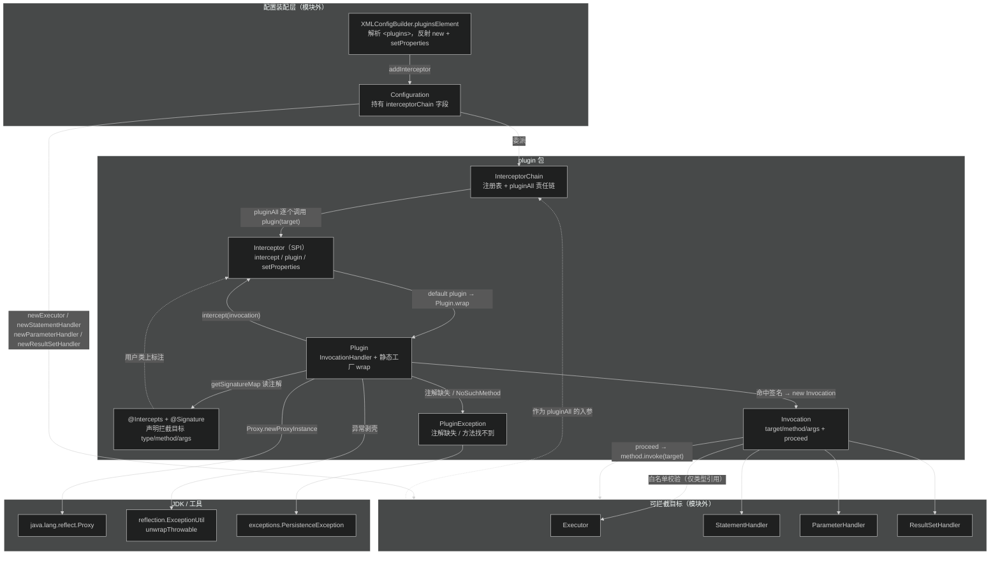
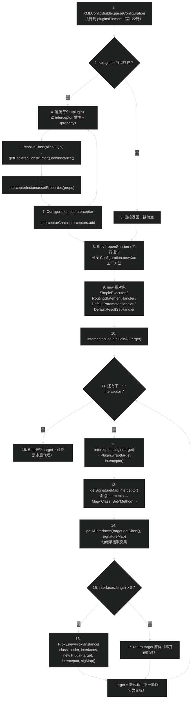
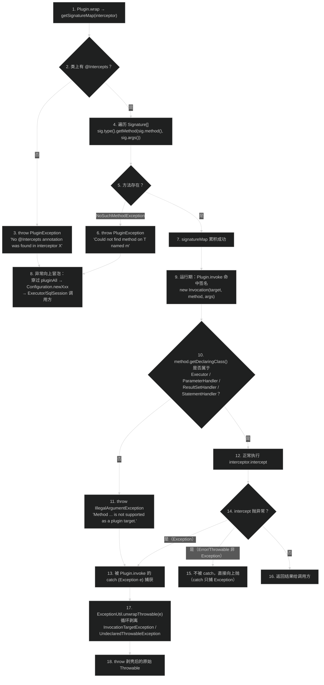
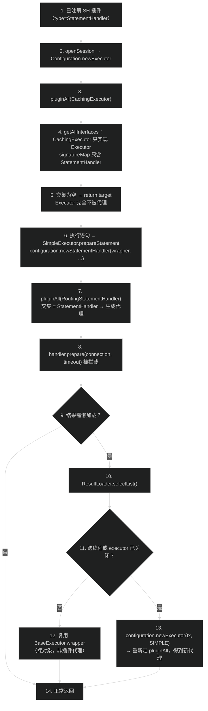

# 插件与拦截器（plugin）
> 上次修改：2026-07-29 00:49

## 重点关注

| 入口 / 章节 | 源码位置 | 为什么重要 |
|-------------|----------|------------|
| `Plugin.wrap(Object, Interceptor)` | `src/main/java/org/apache/ibatis/plugin/Plugin.java:43-51` | 整个插件机制的**唯一织入现场**。三行代码决定了 MyBatis 插件"基于 JDK 动态代理、只能代理接口、不匹配就原样返回"这三条铁律。`interfaces.length > 0` 的短路返回是"插件对无关对象零开销"的关键。 |
| `Plugin.invoke(...)` 的两分支 | `Plugin.java:53-64` | 每一次被代理对象的方法调用都要过这里。`signatureMap.get(method.getDeclaringClass())` + `methods.contains(method)` 双重判定决定"拦截"还是"直通"；catch 里的 `ExceptionUtil.unwrapThrowable` 决定业务异常能不能原样抛出而不被包成 `UndeclaredThrowableException`。 |
| `Plugin.getSignatureMap(...)` | `Plugin.java:66-86` | `@Intercepts`/`@Signature` 注解 → `Map<Class, Set<Method>>` 的全部解析逻辑。注解缺失 / 方法签名写错都在这里 fail-fast（issue #251）。**注意它没有任何缓存**，每次 `wrap` 都重新反射一遍，是性能分析的重点（见 §9）。 |
| `Plugin.getAllInterfaces(...)` | `Plugin.java:88-99` | 沿类继承链向上收集"**同时被目标实现且被插件声明**"的接口。这解释了两件反直觉的事：为什么代理只暴露被声明的接口（多插件嵌套时后续插件可能匹配不到），以及为什么必须实现接口才能被拦截。 |
| `InterceptorChain.pluginAll(Object)` | `src/main/java/org/apache/ibatis/plugin/InterceptorChain.java:28-33` | 责任链的组装点。`target = interceptor.plugin(target)` 的循环赋值形成**洋葱式嵌套代理**，决定了多插件的执行顺序（注册顺序 = 最内层优先，见 §6.4）。 |
| `Invocation` 构造器的白名单校验 | `src/main/java/org/apache/ibatis/plugin/Invocation.java:33-46` | 硬编码 `Executor`/`ParameterHandler`/`ResultSetHandler`/`StatementHandler` 四个类。这是"MyBatis 只能拦截四大对象"这条限制**在代码中唯一的强制点**，且它在运行时而非启动时抛错——易错边界。 |
| `Invocation.proceed()` | `Invocation.java:60-62` | `method.invoke(target, args)` 直接打到**原始 target**，不是下一层代理。理解"为什么改 `args` 数组能影响真实调用"以及"为什么 proceed 不像 Servlet Filter 那样走链"都靠这一行。 |
| `Configuration.newExecutor / newStatementHandler / newParameterHandler / newResultSetHandler` | `src/main/java/org/apache/ibatis/session/Configuration.java:710-749` | 四个可拦截对象的**唯一创建现场**，也是 `pluginAll` 的四个调用点。任何插件生效与否，都要回到这四个方法看目标对象是不是从这里出来的。 |
| `XMLConfigBuilder.pluginsElement(XNode)` | `src/main/java/org/apache/ibatis/builder/xml/XMLConfigBuilder.java:198-209` | 插件注册的配置入口：反射无参构造 → `setProperties` → `addInterceptor`。它决定了拦截器**必须有公开无参构造函数**，且 `<plugins>` 在 `parseConfiguration` 中的解析位置（第 122 行）决定了插件早于 `environments`/`mappers` 就绪。 |
| `BaseExecutor.wrapper` 字段的赋值链 | `src/main/java/org/apache/ibatis/executor/BaseExecutor.java:56,73,364-365` | **重要陷阱**：传给 `StatementHandler`/`ResultSetHandler` 的 Executor 是 `wrapper`（`this` 或裸 `CachingExecutor`），**从不是插件代理**。所以插件内部拿到的 Executor 调用不会再次触发 Executor 插件（见 §8.5）。 |
| `PluginTest.shouldPluginNotInvokeArbitraryMethod` | `src/test/java/org/apache/ibatis/plugin/PluginTest.java:89-111` | 官方用测试固化了"非四大对象的方法即使被代理也会抛 `IllegalArgumentException`"这一行为，是理解 `Invocation` 白名单意图的最佳证据。 |

## 1. 模块定位与职责边界

**结论**：`plugin` 包是 MyBatis 的"**AOP 微内核**"——整个包只有 7 个源文件、不到 200 行有效代码（`Plugin.java` 101 行是最大的一个），却提供了 MyBatis 唯一的官方运行时行为扩展机制。它的职责可以精确概括为一句话：**把用户实现的 `Interceptor` 用 JDK 动态代理织入到 MyBatis 四大核心对象的接口调用上，并向拦截器暴露"目标 + 方法 + 参数 + 继续执行"四要素**。

### 上下游位置

- **上游（谁驱动它）**
  1. `builder.xml.XMLConfigBuilder.pluginsElement(...)`（`XMLConfigBuilder.java:198-209`）：解析 `<plugins><plugin interceptor="..."/></plugins>`，反射实例化拦截器、注入 `Properties`，再交给 `Configuration.addInterceptor`。
  2. `session.Configuration.addInterceptor(Interceptor)`（`Configuration.java:930-932`）：唯一的编程式注册 API，转发给内部 `interceptorChain`（`Configuration.java:153`）。Spring 集成、Java 硬编码配置都走这条路。
  3. `session.Configuration` 的四个工厂方法（`Configuration.java:710-749`）：在对象刚 new 出来、尚未被任何人持有时调用 `interceptorChain.pluginAll(...)`。
- **下游（它依赖什么）**
  - JDK：`java.lang.reflect.Proxy` / `InvocationHandler` / `Method`，`HashMap` / `HashSet` / `ArrayList`。
  - `reflection.ExceptionUtil.unwrapThrowable(...)`（`src/main/java/org/apache/ibatis/reflection/ExceptionUtil.java:30-41`）：剥离 `InvocationTargetException` / `UndeclaredThrowableException` 外壳。
  - `exceptions.PersistenceException`：`PluginException` 的父类（`PluginException.java:23`）。
  - `executor.Executor`、`executor.parameter.ParameterHandler`、`executor.resultset.ResultSetHandler`、`executor.statement.StatementHandler`：**仅 `Invocation` 引用**（`Invocation.java:23-26,33-34`），用于白名单校验。

### 负责什么

1. **定义拦截器 SPI**：`Interceptor` 三方法（1 个必需 `intercept`，2 个 default：`plugin`、`setProperties`）。
2. **定义声明式拦截目标语法**：`@Intercepts` + `@Signature(type, method, args)` 组成的注解对（`Intercepts.java:47-54`、`Signature.java:33-54`）。
3. **实现织入**：`Plugin` 同时是 `InvocationHandler` 和静态工厂（`wrap`），负责注解解析、接口筛选、代理生成、方法分派。
4. **维护拦截器注册表并串成链**：`InterceptorChain` 持有 `List<Interceptor>`，`pluginAll` 做逐层包装。
5. **封装被拦截调用的上下文**：`Invocation` 三元组（target/method/args）+ `proceed()`，并强制四大对象白名单。
6. **提供插件专属异常类型**：`PluginException`。

### 不负责什么（避免与相邻模块混淆）

- **不决定"哪些对象可被拦截"的物理位置**：那由 `Configuration` 在哪里调用 `pluginAll` 决定；`plugin` 包只在 `Invocation` 里做了一层语义校验。
- **不负责 SQL 改写、分页、多租户、审计等业务语义**：这些都是使用者在 `intercept` 里自己写的，`plugin` 包不提供任何 SQL/BoundSql 操作辅助类（分页插件必须借助 `reflection.MetaObject` 或直接强转 `RoutingStatementHandler` 来改 `BoundSql`）。
- **不负责拦截器排序**：没有 `@Order`、没有优先级字段，顺序完全等于 `addInterceptor` 的调用顺序，即 XML 中 `<plugin>` 的书写顺序。
- **不负责拦截器实例的生命周期管理**：拦截器由 `XMLConfigBuilder` new 出来后就与 `Configuration` 同生共死，没有销毁回调、没有 `close()`。
- **不做 CGLIB/ByteBuddy 类增强**：只用 JDK 接口代理，因此**无法拦截未在接口上声明的方法**，也无法拦截 `DefaultSqlSession`、`MapperProxy`、`TypeHandler` 等对象。

### 主要输入、输出、状态与副作用

| 维度 | 内容 |
|------|------|
| 输入 | ①`Interceptor` 实例（含类上的 `@Intercepts` 注解）；②`<plugin>` 子元素 `<property>` 形成的 `Properties`；③待包装的目标对象（四大对象之一）；④运行时的 `method` + `args` |
| 输出 | ①`Proxy` 实例（若接口匹配）或原对象（若不匹配）——`Plugin.java:47-50`；②`intercept` 的返回值，直接作为被代理方法的返回值 |
| 内部状态 | `InterceptorChain.interceptors`（`ArrayList`，仅启动期写、运行期只读）；`Plugin` 的三个 `final` 字段（target/interceptor/signatureMap），实例不可变 |
| 副作用 | ①生成代理类（触发 JVM 动态类生成与 ClassLoader 注册）；②`setProperties` 可能让拦截器持有外部状态；③`intercept` 内可任意改写 `invocation.getArgs()` 数组元素，从而**直接篡改真实调用参数**（`Invocation.proceed()` 用的就是同一个数组引用，`Invocation.java:45,61`） |

## 2. 架构关系与依赖

**结论**：`plugin` 包内部是一个"**注解声明层 → 注册表层 → 织入层 → 上下文层**"的四层薄结构，对外只有两个方向的耦合：向 `session.Configuration` 暴露注册与织入 API（强耦合、不可替换），向 `executor.*` 的四个接口做**编译期符号依赖**（仅 `Invocation` 一处，用于白名单）。反向依赖上，`builder` 和 `session` 都依赖它，它不依赖二者，因此 `plugin` 包处于依赖图的**较低层**。



### 节点与依赖方向说明

| 节点 | 层次 | 依赖方向与性质 |
|------|------|----------------|
| `XMLConfigBuilder.pluginsElement` | 配置装配层 | 单向依赖 `Interceptor` 类型与 `Configuration.addInterceptor`（`XMLConfigBuilder.java:198-209`）。**可替换**：任何代码只要能拿到 `Configuration` 就能绕过 XML 直接注册。 |
| `Configuration` | 配置装配层 | 持有 `private final InterceptorChain interceptorChain = new InterceptorChain()`（`Configuration.java:153`）。**强耦合、不可替换**：`InterceptorChain` 是具体类而非接口，无法通过配置换实现。 |
| `InterceptorChain` | 注册表层 | 只依赖 `Interceptor` 接口，是包内唯一持有可变集合的类。对外暴露 `pluginAll` / `addInterceptor` / `getInterceptors`（`InterceptorChain.java:28-41`）。 |
| `Interceptor` | SPI 层 | **依赖倒置的支点**：`InterceptorChain` 只认这个接口；其 `default plugin(Object)` 把默认织入策略委托给 `Plugin.wrap`（`Interceptor.java:27-29`），但用户**可以覆写 `plugin` 换成 CGLIB 或任意包装**——这是包内唯一的可替换点。 |
| `@Intercepts` / `@Signature` | 声明层 | 纯元数据，`RetentionPolicy.RUNTIME`。`@Signature` 的 `@Target({})` 表示它**只能作为 `@Intercepts` 的成员使用，不能单独标注任何元素**（`Signature.java:32`）。 |
| `Plugin` | 织入层 | 依赖 JDK `Proxy` + `ExceptionUtil`。**跨层调用点**：`Plugin.invoke` 直接回调用户的 `interceptor.intercept`，把框架控制权交给外部代码。 |
| `Invocation` | 上下文层 | **潜在耦合点**：为做白名单校验，`plugin` 包 `import` 了 `executor` 包的四个接口（`Invocation.java:23-26`），形成 `plugin → executor` 的编译期依赖。这是全包唯一一处对业务接口的硬编码，也是"只能拦截四大对象"限制的落地位置。 |
| `PluginException` | 异常层 | 继承 `PersistenceException`（`PluginException.java:23`），因而是 `RuntimeException`，不强制 catch。 |
| `ExceptionUtil` | 工具 | `plugin → reflection` 的单向弱依赖，只用一个静态方法。 |

### 关键数据流

1. **启动期（一次性）**：XML 文本 → `Interceptor` 实例 → `InterceptorChain.interceptors` 列表。
2. **每次创建四大对象时**：裸对象 → `pluginAll` 循环 → N 层 `Proxy` → 返回给 `Executor`/`SqlSession` 使用。
3. **每次方法调用时**：`proxy.method(args)` → 最外层 `Plugin.invoke` → 命中则 `intercept(new Invocation(...))`，用户调用 `proceed()` → `method.invoke(target)` → 进入**下一层代理**的 `invoke`（若还有嵌套）→ … → 最终真实对象。

### 强依赖 / 可替换依赖清单

- **强依赖（改动会破坏机制）**：JDK 动态代理（决定"必须是接口"）；`Configuration` 的四个工厂方法（决定"可拦截点"）；`Invocation` 的四类白名单。
- **可替换依赖**：`Interceptor.plugin(Object)` 是 `default` 方法，用户可覆写以改变织入方式（例如返回原对象实现"条件禁用"，或改用其他代理库）；`InterceptorChain.getInterceptors()` 返回 `List.copyOf(...)` 不可变副本（`InterceptorChain.java:40`），外部无法通过它篡改注册表。

## 3. 入口与调用方式

**结论**：本模块有**两类入口**——"注册入口"（把拦截器放进链，启动期一次性）和"织入/触发入口"（把链应用到对象上并在方法调用时触发，运行期高频）。此外还有一个**用户侧扩展入口** `Interceptor.plugin(Object)`，是唯一允许覆盖框架默认行为的钩子。

### 3.1 注册入口

#### （A）XML 配置入口 `<plugins>`

| 项目 | 内容 |
|------|------|
| 源码位置 | `src/main/java/org/apache/ibatis/builder/xml/XMLConfigBuilder.java:198-209`，由 `parseConfiguration` 第 122 行调用 |
| 触发条件 | `mybatis-config.xml` 中存在 `<plugins>` 节点；DTD 约束 `<plugins>` 必须位于 `reflectorFactory` 之后、`environments` 之前（`src/main/resources/org/apache/ibatis/builder/xml/mybatis-3-config.dtd:19`），且至少一个 `<plugin>`（`plugins (plugin+)`，第 78 行） |
| 关键参数 | `interceptor` 属性（必需）：全限定类名或 typeAlias，经 `resolveClass` 走 `TypeAliasRegistry`；`<property name value>` 子元素（可选，`plugin (property*)`，DTD 第 80 行）汇成 `Properties` |
| 上下文要求 | 拦截器类必须有**可访问的无参构造函数**——`resolveClass(interceptor).getDeclaredConstructor().newInstance()`（`XMLConfigBuilder.java:203-204`）；实例化后立即 `setProperties(properties)`，再 `configuration.addInterceptor(...)` |
| 返回值 | 无（副作用式：向 `Configuration` 注册） |
| 之后进入 | `Configuration.addInterceptor` → `InterceptorChain.addInterceptor`，仅入队，不做任何注解校验 |

**重要时序含义**：`pluginsElement` 在第 122 行执行，而 `settingsElement`（第 126 行）、`environmentsElement`（第 128 行）、`mappersElement`（第 131 行）都在其后。这意味着拦截器的构造函数与 `setProperties` 里**读不到最终的 settings、拿不到 DataSource、看不到任何 MappedStatement**。需要这些信息的插件只能延迟到 `plugin(Object)` 或 `intercept(...)` 时（此时可从 `Invocation` 的目标对象反向拿到 `Configuration`）。

配置示例（取自官方测试 `src/test/resources/org/apache/ibatis/plugin/mybatis-config.xml:25-28`）：

```xml
<plugins>
  <plugin interceptor="org.apache.ibatis.plugin.PluginTest$SwitchCatalogInterceptor" />
</plugins>
```

#### （B）编程式入口 `Configuration.addInterceptor(Interceptor)`

| 项目 | 内容 |
|------|------|
| 源码位置 | `src/main/java/org/apache/ibatis/session/Configuration.java:930-932` |
| 触发条件 | 任何持有 `Configuration` 的代码主动调用；典型场景是 Java Config、Spring Boot 的 `ConfigurationCustomizer`、测试代码 |
| 关键参数 | 已构造好的 `Interceptor` 实例（构造方式不受限，可带任意依赖注入） |
| 权限/上下文要求 | 无同步保护，**必须在任何 `SqlSession` 打开前完成**（见 §9.1 的可见性分析） |
| 之后进入 | 同 (A) |

#### （C）查询入口 `InterceptorChain.getInterceptors()`

`InterceptorChain.java:39-41` 返回 `List.copyOf(interceptors)`。这是外部**只读**观察已注册拦截器的唯一途径（诊断、单测断言常用）；返回不可变副本意味着调用方无法通过它插队或删除。

### 3.2 织入入口：`Configuration` 的四个工厂方法

四个方法是 `pluginAll` 的**全部**调用点（全仓库搜索 `pluginAll` 仅 5 处命中，其中 1 处是定义本身）：

| 工厂方法 | 源码位置 | 被包装的裸对象 | 调用时机 / 频率 |
|----------|----------|----------------|-----------------|
| `newExecutor(Transaction, ExecutorType)` | `Configuration.java:735-749` | `SimpleExecutor` / `ReuseExecutor` / `BatchExecutor`，若 `cacheEnabled` 再套 `CachingExecutor` | 每次 `openSession()`；`ResultLoader` 懒加载跨线程时也会新建（`src/main/java/org/apache/ibatis/executor/loader/ResultLoader.java:91-102`） |
| `newStatementHandler(...)` | `Configuration.java:724-729` | `RoutingStatementHandler`（内部再委派 Simple/Prepared/Callable） | **每条语句执行一次**（`SimpleExecutor.java:61,74`、`ReuseExecutor.java:58,68`、`BatchExecutor.java:88,104`） |
| `newParameterHandler(...)` | `Configuration.java:710-715` | 由 `LanguageDriver.createParameterHandler` 产出，默认 `DefaultParameterHandler` | 每条语句执行一次（在 `BaseStatementHandler` 构造期） |
| `newResultSetHandler(...)` | `Configuration.java:717-722` | `DefaultResultSetHandler` | 每条语句执行一次（在 `BaseStatementHandler` 构造期） |

**关键判断**：包装发生在**对象刚 new 出来、返回给调用方之前**，所以调用方持有的引用天然是代理；不存在"漏包装"的时间窗。但反过来，**任何不经由这四个方法创建的对象都不会被插件覆盖**——例如 `CachingExecutor` 内部的 `delegate`（`CachingExecutor.java:46` 只拿到裸 delegate）、`RoutingStatementHandler` 内部的 `delegate`。

### 3.3 触发入口：`Plugin.invoke(Object, Method, Object[])`

`Plugin.java:53-64` 是 `InvocationHandler` 回调，由 JVM 生成的代理类在每次接口方法调用时触发。它不是"用户入口"而是"框架回调入口"：

- 触发条件：被代理对象的**任意接口方法**被调用（包括未被拦截的方法，也要走一次 `invoke`）。
- 分派规则：`signatureMap.get(method.getDeclaringClass())` 非空且 `contains(method)` → 走 `interceptor.intercept(new Invocation(target, method, args))`；否则 `method.invoke(target, args)` 直通。
- 返回值：`intercept` 的返回值原样返回给调用方；**类型不匹配时由 JVM 在代理类内抛 `ClassCastException`**。

### 3.4 用户侧扩展入口：`Interceptor.plugin(Object)`

`Interceptor.java:27-29` 是 `default` 方法，默认实现 `return Plugin.wrap(target, this)`。覆写它可以实现：

- **条件织入**：`return target instanceof Executor ? Plugin.wrap(target, this) : target;`（避免为无关对象生成代理）；
- **换代理实现**：返回自建的 CGLIB/ByteBuddy 代理，从而突破"只能代理接口"的限制；
- **完全禁用**：直接 `return target`，配合 `setProperties` 里的开关做灰度。

官方测试 `PluginTest.java:92` 直接调用 `new AlwaysMapPlugin().plugin(map)`，证明这个入口**可以脱离 `Configuration` 单独使用**——`Plugin.wrap` 对目标类型没有任何前置断言，任何实现了被声明接口的对象都能被包装（校验推迟到 `Invocation` 构造期）。

## 4. 核心概念与领域模型

模块只有 6 个概念，但它们的关系决定了整个插件机制的能力上界。

### 4.1 `Interceptor` —— 拦截器 SPI

- **定义**：`src/main/java/org/apache/ibatis/plugin/Interceptor.java:23-35`，3 个方法：
  - `Object intercept(Invocation) throws Throwable`（必需）——拦截逻辑本体，`throws Throwable` 意味着实现方可以抛任何东西。
  - `default Object plugin(Object target)`——织入策略，默认 `Plugin.wrap(target, this)`。
  - `default void setProperties(Properties)`——配置注入，默认 NOP（第 32 行注释 `// NOP`）。
- **作用**：用户扩展 MyBatis 行为的唯一契约。它是**无状态假设**的：框架只保留一个实例，被所有线程共享（见 §9.2）。
- **生命周期**：`XMLConfigBuilder` 实例化 → `setProperties` 一次 → 加入 `InterceptorChain` → 与 `Configuration` 同生命周期 → 无销毁回调。
- **相关类型**：`Invocation`（入参）、`Plugin`（默认织入器）、`@Intercepts`（必需的伴随注解）。
- **使用场景**：分页、SQL 打印、多租户 schema 切换（官方测试 `PluginTest.SwitchCatalogInterceptor`，`PluginTest.java:78-87`）、慢 SQL 告警、逻辑删除、数据脱敏。

三维评估（把 `plugin` 与 `setProperties` 设成 `default`）：

- **好处**：新增拦截器只需实现 1 个方法，SPI 表面积最小；同时保留了覆写 `plugin` 以更换代理策略的后门。这个改动（自 3.5.x 起 `plugin`/`setProperties` 变为 default）**向后兼容**旧的三方法实现。
- **替代方案**：提供抽象基类 `AbstractInterceptor`（Java 7 之前的常见做法），或把织入策略抽成独立的 `InterceptorWeaver` 接口注册到 `Configuration`。
- **风险**：`plugin` 作为 `default` 方法暴露在 SPI 上，等于把"框架如何织入"变成了公共契约的一部分——用户覆写后 `Plugin.wrap` 的所有保护（注解校验、接口筛选）都会被绕过，出问题难以定位。且 `intercept` 声明 `throws Throwable`，使编译器无法帮用户区分受检/非受检异常。

### 4.2 `@Intercepts` + `@Signature` —— 声明式拦截目标

- **定义**：`Intercepts.java:44-54`（`@Documented @Retention(RUNTIME) @Target(TYPE)`，成员 `Signature[] value()`）；`Signature.java:30-54`（`@Target({})`，成员 `Class<?> type()` / `String method()` / `Class<?>[] args()`）。
- **作用**：以"接口类型 + 方法名 + 参数类型列表"三元组精确定位一个 `java.lang.reflect.Method`。三者共同构成方法签名，缺一不可（重载方法只靠方法名无法区分）。
- **生命周期**：编译期写入 class 文件常量池 → 运行时每次 `Plugin.wrap` 都被读取一次（无缓存）。
- **关系**：`@Intercepts` 是聚合根，`@Signature` 是其值成员；`@Signature` 的 `@Target({})` 表示它**不能标注任何程序元素**，只能出现在 `@Intercepts` 的 `value` 里——这是一个用注解元数据强制约束用法的技巧。
- **代码示例**（`Intercepts.java:30` 的官方 Javadoc 示例）：

```java
@Intercepts({ @Signature(type = Executor.class, method = "update",
                         args = { MappedStatement.class, Object.class }) })
public class ExamplePlugin implements Interceptor {
  @Override
  public Object intercept(Invocation invocation) throws Throwable {
    // 前置处理
    Object returnObject = invocation.proceed();
    // 后置处理
    return returnObject;
  }
}
```

三维评估（用注解而非配置文件/接口方法声明拦截目标）：

- **好处**：声明与实现同处一个类，可读性高；`args` 用 `Class<?>[]` 而非字符串，**编译期就能保证类型存在**，重构（改包名、改参数类型）时 IDE 能自动跟随；`Plugin.getSignatureMap` 可在织入时 fail-fast。
- **替代方案**：①在 XML 里写 `<plugin><target type=... method=.../></plugin>`（灵活但无编译期检查）；②让 `Interceptor` 暴露 `boolean supports(Method)` 回调（最灵活，但每次调用都要执行用户代码，性能与正确性风险更高）；③按接口分裂 SPI（`ExecutorInterceptor`、`StatementHandlerInterceptor`…），编译期最安全但会丢失"一个插件拦多个点"的能力。
- **风险**：`method` 是**字符串**，重命名目标方法时注解不会跟随，只能在运行时以 `PluginException` 暴露（`Plugin.java:81-82`）；`args` 必须与接口声明**逐字精确匹配**——例如 `StatementHandler.prepare(Connection, Integer)` 必须写 `Integer.class` 而非 `int.class`，写错即启动/首次执行失败；泛型方法（如 `Executor.query` 的 `<E>`）必须用擦除后的类型，容易踩坑。

### 4.3 `Plugin` —— 织入器 + `InvocationHandler` 二合一

- **定义**：`Plugin.java:31-101`，`implements InvocationHandler`，三个 `final` 字段 `target` / `interceptor` / `signatureMap`，**私有构造函数**（第 37 行）强制外部只能通过静态 `wrap` 创建。
- **作用**：把 `Interceptor` 与目标对象绑定成一个代理。它同时承担两个角色：静态工厂（`wrap`、`getSignatureMap`、`getAllInterfaces`）与运行时分派器（`invoke`）。
- **生命周期**：一个 `Plugin` 实例对应"一个拦截器 × 一个目标对象"。因为 `newStatementHandler` 等每条语句都调，所以 **StatementHandler 层的 `Plugin` 实例是每条 SQL 一个，随请求结束被 GC**；`Executor` 层的则与 `SqlSession` 同寿。
- **相关类型**：`signatureMap` 的 `Map<Class<?>, Set<Method>>` 结构是核心（见 §7.1）。
- **关系**：`Plugin` 持有 `target`（可能是另一个 `Plugin` 代理，形成链）与 `interceptor`（共享单例）。

### 4.4 `InterceptorChain` —— 注册表与洋葱包装器

- **定义**：`InterceptorChain.java:24-43`，仅一个 `private final List<Interceptor> interceptors = new ArrayList<>()`。
- **作用**：①保存注册顺序；②`pluginAll` 把 N 个拦截器**逐层套在同一个目标上**。注意它**不是** Servlet FilterChain 那种"运行期依次调用"的链——链在**织入期**就固化成了嵌套代理结构。
- **生命周期**：`Configuration` 的字段（`Configuration.java:153`），随 `Configuration` 创建/销毁；写操作只在启动期。
- **关系**：聚合多个 `Interceptor`；被 `Configuration` 组合持有（非继承、不可替换）。

三维评估（把"链"实现为织入期嵌套代理，而非运行期迭代）：

- **好处**：运行期零链管理开销——没有游标、没有 `chain.doFilter(index+1)` 状态，天然线程安全且可重入；每个拦截器只需关心 `proceed()`；未匹配签名的拦截器在织入期就被剔除（`interfaces.length == 0` → 返回原对象，`Plugin.java:47-50`），运行期完全无感。
- **替代方案**：单一代理 + 运行期遍历拦截器列表（Spring AOP 的 `ReflectiveMethodInvocation` 模型）。那样只需一层代理、可按需排序、可在运行期动态增减拦截器，但需要在 `MethodInvocation` 中维护索引状态，且每次调用都要遍历全部拦截器做匹配。
- **风险**：①**代理层数 = 匹配的拦截器数**，每层都有一次 `InvocationHandler` 分派与反射调用，插件多时调用栈深、栈帧可读性差、异常栈很长；②`getAllInterfaces` 作用在**上一层代理类**上，导致后注册的插件只能看到前一层代理已暴露的接口，出现"接口收窄"效应（见 §6.3）；③无法在运行期动态启停插件（只能靠 `setProperties` 开关 + `intercept` 内部 if）。

### 4.5 `Invocation` —— 被拦截调用的上下文

- **定义**：`Invocation.java:31-64`。静态白名单 `targetClasses = [Executor, ParameterHandler, ResultSetHandler, StatementHandler]`（第 33-34 行）；三个 `final` 字段；构造器校验 `method.getDeclaringClass()` 必须在白名单内，否则 `IllegalArgumentException`（第 40-42 行）。
- **作用**：向拦截器暴露"我拦到了什么"（`getTarget` / `getMethod` / `getArgs`）与"如何放行"（`proceed`）。
- **生命周期**：**每次命中拦截创建一个新实例**（`Plugin.java:58`），随 `intercept` 返回即可回收。
- **相关类型**：`getArgs()` 返回**原始数组引用**（非拷贝），`proceed()` 用的也是同一引用（第 45、61 行）——所以直接修改数组元素即可改写真实调用参数，这是分页插件改写 `RowBounds`、多租户插件改写参数对象的常用手法。
- **关系**：由 `Plugin.invoke` 创建，被用户 `intercept` 消费；`proceed()` 绕过所有代理直达 `target`。

三维评估（在 `Invocation` 构造器里做四类白名单校验）：

- **好处**：把"MyBatis 只支持拦截四大对象"从文档约定变成**代码强制**，避免用户误以为可以拦截任意接口（`PluginTest.shouldPluginNotInvokeArbitraryMethod` 固化了这一行为，`PluginTest.java:89-103`）；错误信息明确指出方法签名。
- **替代方案**：①在 `Plugin.getSignatureMap` 里就校验 `sig.type()` 是否属于四类，**启动期**即失败（更早、更好定位）；②完全不校验，允许 `Plugin.wrap` 作为通用代理工具复用。
- **风险**：校验点选在**运行时**而非启动时——写错 `type` 的插件能通过配置解析、能生成代理、直到第一次真实调用才抛 `IllegalArgumentException`，且该异常还会被 `Plugin.invoke` 的 `catch (Exception e)` 捕获后经 `unwrapThrowable` 抛出，混在业务异常里更难辨认。另外白名单是 `List` 且用 `contains` 线性查找（`Invocation.java:40`），每次命中拦截都要走一次——4 个元素影响极小，但属于热路径上的可优化点（改为 `Set` 或 `switch`）。

### 4.6 `PluginException` —— 插件专属异常

- **定义**：`PluginException.java:23-41`，继承 `PersistenceException`（→ `RuntimeException`），四个标准构造器，显式 `serialVersionUID`。
- **作用**：标识"插件声明本身有问题"的配置类错误，与"插件执行时的业务异常"区分开。
- **生命周期**：仅在 `Plugin.getSignatureMap` 的两处抛出（`Plugin.java:70-72` 注解缺失、`Plugin.java:81-82` 方法找不到）；全模块无 catch。
- **关系**：与 `Invocation` 抛的 `IllegalArgumentException` 形成对比——**同为"声明错误"，却用了两种不同异常类型**，是本模块一处内部不一致（见 §8.4）。

## 5. 关键流程

本节给出四条流程：**5.1 启动期注册与织入**（主成功路径的前半段）、**5.2 运行期多插件嵌套分派**（主成功路径的后半段）、**5.3 声明错误的失败路径**、**5.4 接口不匹配的边界路径与懒加载新建 Executor 的旁路**。

### 5.1 启动期：注册 → 织入（洋葱包装）



**步骤说明**

**1-3 解析入口与空配置短路。** `XMLConfigBuilder.parseConfiguration` 按固定顺序解析各节点，`pluginsElement` 排在 `typeAliasesElement` 之后、`objectFactoryElement` 之前（`XMLConfigBuilder.java:121-123`）。这个位置保证了拦截器类名可以用 typeAlias 书写，但也决定了拦截器构造期看不到 settings/environment。`context != null` 的判空（`XMLConfigBuilder.java:199`）让"没有 `<plugins>`"成为完全无副作用的路径，此时 `interceptorChain.interceptors` 保持空列表，后续 `pluginAll` 的 for 循环零次迭代，直接原样返回目标——**未配置插件时机制的总开销为一次空循环**。

**4-7 实例化与注册。** 每个 `<plugin>` 独立处理：`resolveClass` 经 `BaseBuilder` 走 `TypeAliasRegistry` 解析类名，`getDeclaredConstructor().newInstance()` 要求无参构造函数存在且可访问，任何反射失败都会被 `parseConfiguration` 的 `catch (Exception e)` 包成 `BuilderException`（`XMLConfigBuilder.java:132-134`），因此配置期错误统一表现为"Error parsing SQL Mapper Configuration"。`setProperties` 在 `addInterceptor` **之前**调用（第 205-206 行），保证拦截器进入链时配置已就绪。注意这一步**不校验 `@Intercepts` 是否存在**——注解缺失的错误要等到第 13 步才暴露。

**8-11 织入触发与循环入口。** 织入不在启动期发生，而是**每次创建四大对象时**按需发生。`pluginAll` 的 `for (Interceptor interceptor : interceptors) { target = interceptor.plugin(target); }`（`InterceptorChain.java:29-31`）是全模块最关键的三行：`target` 被**循环重新赋值**，所以第 2 个拦截器包装的是"第 1 个拦截器产出的代理"，而不是原始对象。

**12-15 单次包装的三步决策。** `Plugin.wrap` 先解析注解拿到 `signatureMap`（每次都重新反射，无缓存），再用 `getAllInterfaces` 在"目标类及其所有父类实现的接口"与"注解声明的接口"之间求交集。交集为空意味着这个拦截器与当前目标无关。

**16-18 生成代理或原样返回。** 交集非空时用**目标类的 ClassLoader**（`type.getClassLoader()`，`Plugin.java:48`）生成代理，`Plugin` 实例作为 `InvocationHandler` 捕获 target/interceptor/signatureMap 三者；交集为空时第 50 行 `return target` 保证无关插件不引入任何代理层。循环结束后返回的对象层数等于**匹配成功的拦截器个数**。

### 5.2 运行期：多插件嵌套分派（以两个 Executor 插件为例）

假设按顺序注册了 `LogPlugin`（拦 `Executor.query`）和 `PagePlugin`（拦 `Executor.query`），则 `pluginAll` 产出结构为 `Proxy(PagePlugin) → Proxy(LogPlugin) → CachingExecutor → SimpleExecutor`。

```mermaid
%%{init: {"theme": "dark"}}%%
sequenceDiagram
  autonumber
  participant S as DefaultSqlSession
  participant P2 as 外层代理 / Plugin(PagePlugin)
  participant I2 as PagePlugin.intercept
  participant P1 as 内层代理 / Plugin(LogPlugin)
  participant I1 as LogPlugin.intercept
  participant CE as CachingExecutor（真实 target）

  S->>P2: query(ms, param, rowBounds, handler)
  P2->>P2: signatureMap 命中 Executor.query
  P2->>I2: intercept(new Invocation(内层代理, method, args))
  I2->>I2: 前置：改写 args / 追加 count 查询
  I2->>P1: invocation.proceed() → method.invoke(内层代理, args)
  P1->>P1: signatureMap 命中 Executor.query
  P1->>I1: intercept(new Invocation(CachingExecutor, method, args))
  I1->>I1: 前置：记录 SQL 与起始时间
  I1->>CE: invocation.proceed() → method.invoke(CachingExecutor, args)
  CE-->>I1: List&lt;E&gt; 结果
  I1->>I1: 后置：打印耗时
  I1-->>P1: return 结果
  P1-->>I2: return 结果
  I2->>I2: 后置：包装成 Page 对象
  I2-->>P2: return Page
  P2-->>S: return Page
```

**步骤说明**

**1-3 最外层代理接管调用。** `DefaultSqlSession` 持有的 Executor 引用是 `pluginAll` 的返回值，即**最后注册的插件生成的最外层代理**。JVM 生成的代理类把调用转给 `Plugin.invoke`，后者用 `method.getDeclaringClass()`（这里是 `Executor`）查 `signatureMap`，再用 `methods.contains(method)` 精确比对（`Plugin.java:56-57`）。两级判定都通过才构造 `Invocation`。这里 `Invocation` 的 `target` 是 **内层代理**（LogPlugin 生成的那一层），不是真实 Executor——因为外层 `Plugin` 的 `target` 字段在织入时被赋为内层代理。

**4-6 外层插件的前置逻辑与放行。** 拦截器先做前置处理（分页插件在此改写 `args[2]` 的 `RowBounds` 或向 `BoundSql` 追加 `limit`），然后 `invocation.proceed()` 执行 `method.invoke(target, args)`（`Invocation.java:61`）。由于 `target` 是内层代理，这次反射调用又落进内层 `Plugin.invoke`，形成**递归下降**。

**7-10 内层插件重复同样的分派。** 内层 `Plugin` 的判定逻辑完全相同，其 `Invocation.target` 才是真实的 `CachingExecutor`。因此**注册顺序靠后的插件在调用栈上更靠外、先执行前置逻辑；注册顺序靠前的插件更靠内、后执行前置逻辑但先执行后置逻辑**——这是本模块最容易记错的一点（与 Spring 的 `@Order` 语义相反）。

**11-16 结果沿栈回传与后置处理。** 真实 Executor 返回后，控制权按相反顺序回到各层 `intercept` 的 `proceed()` 之后，形成"内层先完成后置、外层最后完成后置"的洋葱顺序。任一层可以**替换返回值**（如分页插件把 `List` 包成 `Page`）——但必须保证返回类型与接口声明兼容，否则代理类内会抛 `ClassCastException`。

### 5.3 失败路径：声明错误与白名单拒绝



**步骤说明**

**1-8 织入期的两类 fail-fast。** `getSignatureMap` 是全模块唯一抛 `PluginException` 的地方。缺少 `@Intercepts` 时的报错源自 issue #251（`Plugin.java:68` 的注释明确标注），在此之前该情况会静默 NPE。`sig.type().getMethod(...)` 用**精确签名查找**，参数类型少写一个、写成基本类型而非包装类型、或方法被重命名，都会命中 `NoSuchMethodException` 分支（`Plugin.java:80-83`），异常消息里带上 `type` 与 `method` 便于定位但**不打印期望的参数列表**（原始 `NoSuchMethodException` 的 `toString` 会带上实际查找的签名，因此 `Cause: ` 后的内容才是关键线索）。这两个异常都发生在 `Configuration.newXxx` 内部，向上冒泡时**不会被包装**（`PluginException` 是 `RuntimeException`），最终表现为 openSession 或首次执行语句时崩溃——**而不是配置解析时崩溃**，这是排障时容易误判的边界。

**9-13 运行期白名单拒绝。** 若 `@Signature.type` 指向的不是四大接口（例如官方测试里的 `Map.class`），织入完全成功，直到第一次调用被拦截方法时 `Invocation` 构造器才抛 `IllegalArgumentException`（`Invocation.java:40-42`）。该异常随后被 `Plugin.invoke` 的 `catch (Exception e)` 捕获并交给 `unwrapThrowable`——由于它既不是 `InvocationTargetException` 也不是 `UndeclaredThrowableException`，`ExceptionUtil` 的 while 循环第一轮就 `return unwrapped`（`ExceptionUtil.java:37-38`），原样抛出。测试 `PluginTest.java:96-99` 断言的正是这条完整路径。

**14-18 业务异常的剥壳语义。** `intercept` 声明 `throws Throwable`，用户可抛任意异常。`Plugin.invoke` 只 catch `Exception`（`Plugin.java:61`），所以 `Error`（如 `StackOverflowError`、`OutOfMemoryError`）会直接穿透而不剥壳。对被 catch 的部分，`unwrapThrowable` 用 while 循环**反复剥离**嵌套的 `InvocationTargetException` / `UndeclaredThrowableException`（`ExceptionUtil.java:32-40`）——这对多层嵌套代理至关重要：N 层代理会让原始 `SQLException` 被 N 层 `InvocationTargetException` 包裹，循环剥壳保证上层拿到的仍是原始 `SQLException`，从而让 `ErrorContext` / `ExceptionFactory` 的错误信息保持可读。

### 5.4 边界路径：接口不匹配的零开销直通，与懒加载旁路



**步骤说明**

**1-5 无关目标的零成本跳过。** `getAllInterfaces` 沿 `type.getSuperclass()` 向上遍历（`Plugin.java:90-97`），只收集**同时满足"目标实现"和"注解声明"**的接口。`CachingExecutor implements Executor`（`CachingExecutor.java:39`），而插件只声明 `StatementHandler`，交集为空 → `Plugin.java:50` 原样返回。结果是：**只拦 StatementHandler 的插件不会给 Executor 增加任何一层代理**，Executor 上的所有方法调用保持原生性能。这是"织入期决策"相对"运行期遍历"的最大收益。

**6-8 真正的织入点。** 语句执行时 `SimpleExecutor.prepareStatement` 调用 `configuration.newStatementHandler(wrapper, ms, ...)`（`SimpleExecutor.java:61`），此时目标是 `RoutingStatementHandler implements StatementHandler`（`RoutingStatementHandler.java:35`），交集非空，代理生成，`prepare(Connection, Integer)` 调用被拦截。官方测试的多租户插件走的正是这条路（`PluginTest.java:78-87`：从 `args[0]` 取 `Connection` 后 `con.setSchema(...)` 再 `proceed()`）。

**9-14 懒加载旁路的两条分支。** `ResultLoader.selectList()` 判断"当前线程是否是创建线程"且"executor 是否已关闭"（`ResultLoader.java:78`）。**同线程复用分支**用的是 `DefaultResultSetHandler` 持有的 executor，其来源是 `BaseExecutor.wrapper`（`SimpleExecutor.java:61` 传入），而 `wrapper` 只可能是 `this` 或裸 `CachingExecutor`（`BaseExecutor.java:73`、`CachingExecutor.java:46`）——**永远不是插件代理**。因此这条路径上的嵌套查询**不会触发 Executor 插件**。**跨线程/已关闭分支**则调用 `configuration.newExecutor(tx, ExecutorType.SIMPLE)`（`ResultLoader.java:102`），重新走一遍 `pluginAll`，插件正常生效。两条分支行为不一致，是 Executor 类插件（如分页、租户过滤）在懒加载场景下"有时生效有时不生效"的根因。

## 6. 核心实现细节

### 6.1 `Plugin.wrap` —— 三步织入决策

```java
public static Object wrap(Object target, Interceptor interceptor) {
  Map<Class<?>, Set<Method>> signatureMap = getSignatureMap(interceptor);
  Class<?> type = target.getClass();
  Class<?>[] interfaces = getAllInterfaces(type, signatureMap);
  if (interfaces.length > 0) {
    return Proxy.newProxyInstance(type.getClassLoader(), interfaces, new Plugin(target, interceptor, signatureMap));
  }
  return target;
}
```
（`src/main/java/org/apache/ibatis/plugin/Plugin.java:43-51`）

- **输入**：任意目标对象 + 拦截器实例。对 `target` 无任何类型断言（`null` 会在 `target.getClass()` 处 NPE）。
- **处理**：①解析注解得到"接口 → 方法集"映射；②用 `target.getClass()`（**注意是运行时实际类**，若 target 已是代理则为代理类）；③求接口交集；④生成代理或原样返回。
- **输出**：`Proxy` 实例或原对象。返回类型是 `Object`，**调用方必须强转**——这正是 `Configuration` 里四处 `(Executor) interceptorChain.pluginAll(...)` 的原因（`Configuration.java:714,721,728,748`）。
- **副作用**：可能触发 JVM 生成新的代理类并注册到 `type.getClassLoader()`；代理类会被 JDK 内部缓存（按 ClassLoader + 接口列表），因此**重复 wrap 相同接口组合不会无限生成类**。
- **隐藏假设**：①目标对象的 ClassLoader 能看到所有被声明的接口——在 OSGi、Spring Boot DevTools 热重载、多 ClassLoader 容器中可能不成立，会抛 `IllegalArgumentException: interface X is not visible from class loader`；②`interfaces.length > 0` 用作"相关性判据"，隐含"注解声明的接口若不被目标实现，则此插件与该目标无关"。

三维评估（用 JDK 动态代理做织入）：

- **好处**：零第三方依赖（MyBatis 核心 jar 无 CGLIB/ASM 强依赖）；不受 `final` 类/方法限制；代理生成快、无需字节码生成器；`InvocationHandler` 模型简单，`Plugin` 一个类即可完成全部逻辑；与 MyBatis 本身"面向接口设计"的风格一致（四大对象天然都是接口）。
- **替代方案**：①**CGLIB/ByteBuddy 子类代理**——可以拦截具体类的方法（例如直接拦 `BaseExecutor.queryFromDatabase` 这类非接口方法），MyBatis 在懒加载模块里就同时提供了 CGLIB 与 Javassist 两种实现（`executor/loader/cglib`、`executor/loader/javassist`），说明并非能力缺失而是**刻意的取舍**；②**编译期 AOP / AspectJ 织入**——运行期零代理开销，但需要额外构建步骤；③**在四大对象内部预留显式钩子**（如 `Executor` 增加 `beforeQuery/afterQuery` 回调）——最快最安全，但每加一个扩展点都要改核心接口。
- **风险**：①**只能拦截接口上声明的方法**，接口没暴露的行为（`DefaultResultSetHandler` 的行级映射细节、`BaseExecutor` 的一级缓存读写、`MapperProxy` 的方法分派、`TypeHandler` 的类型转换）全部无法拦截；②生成的代理**只实现被声明的接口**，若目标对象还有其他公共接口/方法，代理上会丢失（见 §6.3）；③`equals`/`hashCode`/`toString` 也会经过 `invoke`——它们的 `getDeclaringClass()` 是 `Object`，`signatureMap.get(Object.class)` 为 null，走 `method.invoke(target, args)` 直通，语义上等价于目标对象，行为正确但每次都有反射开销；④代理层数随插件数线性增长，异常栈中会出现大量 `com.sun.proxy.$ProxyN` 与 `Plugin.invoke` 帧。

### 6.2 `Plugin.getSignatureMap` —— 注解解析与 fail-fast

```java
Intercepts interceptsAnnotation = interceptor.getClass().getAnnotation(Intercepts.class);
// issue #251
if (interceptsAnnotation == null) {
  throw new PluginException("No @Intercepts annotation was found in interceptor " + interceptor.getClass().getName());
}
Signature[] sigs = interceptsAnnotation.value();
Map<Class<?>, Set<Method>> signatureMap = new HashMap<>();
for (Signature sig : sigs) {
  Set<Method> methods = signatureMap.computeIfAbsent(sig.type(), k -> new HashSet<>());
  try {
    Method method = sig.type().getMethod(sig.method(), sig.args());
    methods.add(method);
  } catch (NoSuchMethodException e) {
    throw new PluginException("Could not find method on " + sig.type() + " named " + sig.method() + ". Cause: " + e, e);
  }
}
return signatureMap;
```
（`Plugin.java:66-86`）

- **输入**：拦截器实例（只用到它的 `Class`）。
- **处理**：`getAnnotation` 读运行时注解 → 逐个 `Signature` 用 `getMethod(name, paramTypes)` 反射查找 → 按 `type()` 分组塞进 `HashMap<Class, HashSet<Method>>`。`computeIfAbsent` 让同一个 `type` 的多个 `@Signature` 自动合并到一个 `Set`。
- **输出**：`Map<Class<?>, Set<Method>>`，随后既用于 `getAllInterfaces` 的交集判定（只用 keySet），又用于 `invoke` 的方法命中判定（用 value 的 `Set.contains`）。**一个结构服务两个用途**是这个设计的精妙处。
- **副作用**：反射读注解 + 反射查方法，无缓存写入。
- **隐藏假设**：①`interceptor.getClass()` 上必须**直接**有 `@Intercepts`——`getAnnotation` 对非 `@Inherited` 注解不查父类，所以**继承一个已标注 `@Intercepts` 的抽象拦截器基类会失败**（`Intercepts` 没有 `@Inherited`，`Intercepts.java:44-46`）；若拦截器本身被其他框架（如 Spring AOP）代理过，`getClass()` 拿到代理类同样读不到注解；②`getMethod` 只查 public 方法（含继承来的），对接口而言足够。

三维评估（每次 `wrap` 都重新解析注解、不做缓存）：

- **好处**：`Plugin` 保持完全无状态、无静态可变字段，天然线程安全；无缓存失效问题；代码短、无并发容器；`Interceptor` 若被用户覆写 `plugin` 动态改变行为，也不会读到过期缓存。
- **替代方案**：在 `Interceptor` 实例上惰性缓存（需要改 SPI 或用外部 `Map`）；或在 `InterceptorChain.addInterceptor` 时**预解析一次**并把 `signatureMap` 与拦截器一起存入链——启动期即校验注解正确性，同时彻底消除运行期反射，改动量很小且能顺带把 §5.3 的 fail-fast 提前到配置期。
- **风险**：**性能热点**。`newStatementHandler` / `newParameterHandler` / `newResultSetHandler` 每条 SQL 各调一次，每次 `pluginAll` 又对每个拦截器调一次 `getSignatureMap`。设 N 个拦截器、每个 M 个 `@Signature`，则**每条 SQL 要做 3×N 次 `getAnnotation` + 3×N×M 次 `Class.getMethod`**，并分配 3×N 个 `HashMap` + 若干 `HashSet`。`Class.getMethod` 内部会复制方法数组（`privateGetPublicMethods` + `copyMethods`），在高 QPS + 多插件场景下会产生可观的临时对象与 CPU 开销。这是本模块**最值得优化的一处**（见 §10.3）。

### 6.3 `Plugin.getAllInterfaces` —— 沿继承链求接口交集

```java
private static Class<?>[] getAllInterfaces(Class<?> type, Map<Class<?>, Set<Method>> signatureMap) {
  Set<Class<?>> interfaces = new HashSet<>();
  while (type != null) {
    for (Class<?> c : type.getInterfaces()) {
      if (signatureMap.containsKey(c)) {
        interfaces.add(c);
      }
    }
    type = type.getSuperclass();
  }
  return interfaces.toArray(new Class<?>[0]);
}
```
（`Plugin.java:88-99`）

- **输入**：目标运行时类 + 已解析的 `signatureMap`。
- **处理**：`while (type != null)` 沿 `getSuperclass()` 向上直到 `Object` 的父类（null），每层用 `type.getInterfaces()` 取**直接实现的接口**，命中 `signatureMap` 的 key 就收集。
- **输出**：去重后的接口数组，作为 `Proxy.newProxyInstance` 的接口列表。
- **隐藏假设与已知不足**：`getInterfaces()` 只返回**直接**父接口，**不递归接口的父接口**。也就是说，如果 `@Signature.type` 指向的是某个被间接继承的祖父接口，交集会漏掉。对 MyBatis 自身不成问题（`Executor`、`StatementHandler`、`ParameterHandler`、`ResultSetHandler` 都被实现类**直接**实现：`CachingExecutor implements Executor`、`BaseExecutor implements Executor`、`RoutingStatementHandler implements StatementHandler`、`DefaultParameterHandler implements ParameterHandler`、`DefaultResultSetHandler implements ResultSetHandler`），但自定义 `Executor` 若通过中间接口继承 `Executor`（`interface MyExecutor extends Executor` → `class Impl implements MyExecutor`），插件会**静默失效**——不报错、不生成代理、也没有任何日志。

三维评估（只把匹配到的接口放进代理）：

- **好处**：代理表面积最小，避免为无关接口生成分派逻辑；`interfaces.length == 0` 成为廉价的"无关性"判据，实现了无关插件的零开销。
- **替代方案**：把目标的**全部**接口都放进代理（`ClassUtils.getAllInterfaces`），只用 `signatureMap` 控制拦截与否。这样代理与目标接口完全等价，不会丢接口。
- **风险**：**接口收窄（interface narrowing）**。多插件嵌套时第二层 `wrap` 的输入是第一层的代理类，其 `getInterfaces()` 只有第一层匹配到的接口。举例：目标 `X implements A, B`，插件 P1 声明 `A`、插件 P2 声明 `B`。`pluginAll` 先 P1 → 得到只实现 `A` 的代理；再 P2 对该代理求交集 → 代理不实现 `B` → **交集为空，P2 被静默跳过**，最终对象也丢失了 `B`。MyBatis 四大实现类恰好各自只实现一个目标接口，所以线上不易触发；但自定义 Executor 同时实现多个可拦截接口时就会踩到。同样地，若目标类有接口之外的公共方法，代理上一律不可见，强转到具体类会 `ClassCastException`——这也是"不能把 pluginAll 的结果强转成 `RoutingStatementHandler`"的原因。

### 6.4 `InterceptorChain.pluginAll` 与嵌套顺序

```java
public Object pluginAll(Object target) {
  for (Interceptor interceptor : interceptors) {
    target = interceptor.plugin(target);
  }
  return target;
}
```
（`InterceptorChain.java:28-33`）

- **输入/输出**：裸目标 → 多层代理（或原样）。
- **关键语义**：`target` 循环重赋值 → **先注册的在内层，后注册的在外层**。因此：
  - **前置逻辑执行顺序** = 注册顺序的**逆序**（最后注册的先执行前置）；
  - **后置逻辑执行顺序** = 注册顺序（最先注册的先完成后置）；
  - 对"改写入参"类插件（分页、租户），**最后注册的先改**，其修改会被内层插件看到；
  - 对"改写返回值"类插件，**最先注册的先改**，其结果会被外层插件再加工。
- **实践含义**：分页插件通常要求"注册在其他 SQL 改写插件之后"或"之前"，取决于它期望看到原始 SQL 还是已改写的 SQL。由于 MyBatis 不提供 `@Order`，**唯一的排序手段就是调整 `<plugin>` 在 XML 中的书写顺序**（Spring Boot 场景下则是 `Configuration.addInterceptor` 的调用顺序，受 Bean 加载顺序影响，需显式控制）。
- **`getInterceptors()` 的防御性拷贝**：`List.copyOf(interceptors)`（`InterceptorChain.java:40`）返回不可变列表。若返回可变引用，外部可通过 `getInterceptors().add(...)` 在运行期插队，破坏"启动期写、运行期只读"的并发假设。

三维评估（无序号、无优先级的纯注册顺序）：

- **好处**：实现极简（一个 `ArrayList`），语义确定可预测；不需要处理"相同 order 如何 tie-break"。
- **替代方案**：引入 `int getOrder()` 或 `@Order` 注解并在 `pluginAll` 前排序（Spring `PageHelper` 等生态项目为此常提供额外的排序配置）；或允许拦截器声明 `before/after` 依赖关系做拓扑排序。
- **风险**：多来源注册（XML + Java Config + Spring Starter 自动装配）时顺序不可控，且顺序错误的表现往往是**静默的语义错误**（如分页拦截器拿到的是已被审计插件改写过的 SQL），没有任何告警。

### 6.5 `Plugin.invoke` 的分派与异常剥壳

```java
public Object invoke(Object proxy, Method method, Object[] args) throws Throwable {
  try {
    Set<Method> methods = signatureMap.get(method.getDeclaringClass());
    if (methods != null && methods.contains(method)) {
      return interceptor.intercept(new Invocation(target, method, args));
    }
    return method.invoke(target, args);
  } catch (Exception e) {
    throw ExceptionUtil.unwrapThrowable(e);
  }
}
```
（`Plugin.java:53-64`）

- **两级判定**：先按 `method.getDeclaringClass()` 定位接口（O(1) HashMap），再 `Set.contains(method)`（O(1) HashSet，依赖 `Method.equals/hashCode` 按声明类+名称+参数类型比较）。这样重载方法能被精确区分，且未声明的方法只多付一次 map 查询。
- **`getDeclaringClass()` 的准确性**：`Method` 对象来自代理类的分派，其声明类必然是代理实现的某个接口（或 `Object`），与 `signatureMap` 的 key（`@Signature.type`）严格对齐。若插件声明的是实现类而非接口，`getAllInterfaces` 阶段就不会匹配，不会走到这里。
- **直通分支的代价**：未被拦截的方法走 `method.invoke(target, args)`——**这是一次反射调用**，比直接调用慢。所以"给 Executor 装一个只拦 `query` 的插件"会让 `Executor` 的其余十几个方法（`commit`/`rollback`/`createCacheKey`/`isCached`/`close`…）全部变成反射调用。这是代理带来的隐性全局开销。
- **异常语义**：只 catch `Exception`。`method.invoke` 抛出的 `InvocationTargetException` 与嵌套代理产生的 `UndeclaredThrowableException` 被 `unwrapThrowable` 循环剥离（`ExceptionUtil.java:30-41`），保证最终抛出的是业务原始异常。**注意 `intercept` 声明 `throws Throwable`**：若用户抛出非 `Exception` 的 `Throwable`（自定义直接继承 `Throwable`、或 `Error`），不会被 catch，会以 `UndeclaredThrowableException` 形式（因为接口方法未声明该受检 Throwable）传给上层——此时外层代理的 `unwrapThrowable` 才会剥壳，形成层数相关的行为差异。

三维评估（catch Exception + unwrapThrowable）：

- **好处**：屏蔽了动态代理引入的异常包装，使插件对上层完全透明——`Executor.query` 抛的 `SQLException` 仍以 `SQLException` 到达 `DefaultSqlSession`，`ExceptionFactory`/`ErrorContext` 的错误信息不被破坏；while 循环剥壳天然支持任意层数嵌套代理。
- **替代方案**：只 catch `InvocationTargetException` 并 `throw e.getTargetException()`（更精确，不影响其他异常的栈）；或不做任何处理，由上层统一剥壳（MyBatis 在 `MapperProxy` 等处也有类似逻辑）。
- **风险**：①`catch (Exception e)` 范围过宽——`intercept` 内部**自己抛出的**受检/非受检异常也会被走一遍剥壳逻辑，虽然 `unwrapThrowable` 对非 ITE/UTE 类型是恒等变换，但语义上把"框架层包装"和"业务层异常"混在一处处理；②剥壳后**丢失了包装层的栈帧**，栈上看不到经过了哪些代理，插件相关的问题更难定位；③`throw ExceptionUtil.unwrapThrowable(e)` 抛出的是 `Throwable`，而 `invoke` 声明 `throws Throwable`，编译通过，但若剥出的受检异常不在目标接口方法的 `throws` 列表内，JVM 会在代理类中把它重新包成 `UndeclaredThrowableException`——形成"剥了又包"的往返。

### 6.6 `Invocation` 的参数数组共享

`Invocation` 的 `args` 字段直接引用 `Plugin.invoke` 收到的数组（`Invocation.java:45`），`getArgs()` 返回该引用（第 57 行），`proceed()` 用同一引用调用（第 61 行）。**没有任何拷贝**。

- **好处**：改参数只需 `invocation.getArgs()[i] = newValue`，无需额外 API（MyBatis 未提供 `setArg` 方法，这是唯一手段）；零拷贝开销。
- **替代方案**：提供 `Object[] getArgs()` 返回副本 + `void setArgs(Object[])` 或 `proceed(Object[] newArgs)` 显式改参（Spring AOP 的 `ProceedingJoinPoint.proceed(Object[])` 模型），意图更清晰、可审计。
- **风险**：可变共享状态。多个插件都改同一个数组时，改动**互相可见且顺序敏感**（外层先改，内层看到的是改后的值）；插件若把 `args` 引用存起来在异步线程中读写，会产生数据竞争；且由于 `args` 是 `final` 字段但数组内容可变，`Invocation` 只是"浅不可变"。

### 6.7 典型例子：分页插件的两种实现路径

**路径 A：拦 `StatementHandler.prepare`，改写 SQL 文本。**

```java
@Intercepts(@Signature(type = StatementHandler.class, method = "prepare",
                       args = { Connection.class, Integer.class }))
public class PagePlugin implements Interceptor {
  @Override
  public Object intercept(Invocation invocation) throws Throwable {
    // target 是 RoutingStatementHandler；用 MetaObject 穿透 delegate.boundSql.sql
    MetaObject meta = SystemMetaObject.forObject(invocation.getTarget());
    RowBounds rowBounds = (RowBounds) meta.getValue("delegate.rowBounds");
    if (rowBounds != RowBounds.DEFAULT) {
      String sql = (String) meta.getValue("delegate.boundSql.sql");
      meta.setValue("delegate.boundSql.sql",
          sql + " LIMIT " + rowBounds.getLimit() + " OFFSET " + rowBounds.getOffset());
      meta.setValue("delegate.rowBounds.offset", RowBounds.NO_ROW_OFFSET);
      meta.setValue("delegate.rowBounds.limit", RowBounds.NO_ROW_LIMIT);
    }
    return invocation.proceed();
  }
}
```

要点与陷阱：①`invocation.getTarget()` 拿到的是 `RoutingStatementHandler`，真正持有 `BoundSql`/`RowBounds` 的是它内部的 `delegate`，所以必须借助 `reflection.MetaObject` 逐级穿透（`plugin` 包不提供任何辅助工具）；②`prepare` 的 `args` 必须写成 `{ Connection.class, Integer.class }`——对照 `StatementHandler.prepare(Connection connection, Integer transactionTimeout)` 的签名，写 `int.class` 会在 `getSignatureMap` 抛 `PluginException`；③改完 SQL 后必须把 `RowBounds` 复位，否则 `DefaultResultSetHandler` 会在内存中再跳过一遍行。

**路径 B：拦 `Executor.query`（六参重载），可同时做 count 查询与结果包装。**

```java
@Intercepts(@Signature(type = Executor.class, method = "query",
    args = { MappedStatement.class, Object.class, RowBounds.class, ResultHandler.class,
             CacheKey.class, BoundSql.class }))
```

要点：`Executor` 的 `query` 有**两个重载**（`Executor.java:39-43`：四参与六参），必须精确选择。六参版本能同时拿到 `CacheKey` 与 `BoundSql`，便于自建 count 语句并**修正 CacheKey** 以免分页结果串缓存；四参版本更早、参数更少但拿不到 `BoundSql`。

三维评估（两条路径的选择）：

- **好处**：路径 A 位置最靠底层，对所有 Executor 类型（Simple/Reuse/Batch）与是否开启二级缓存都生效，且改写发生在 JDBC `prepareStatement` 之前，SQL 一定被数据库看到；路径 B 能拿到 `MappedStatement` 与 `CacheKey`，可以做 count 查询、结果包装、缓存键修正等更完整的分页语义。
- **替代方案**：不用插件——直接在 Mapper XML 里写 `limit #{offset}, #{limit}`（零魔法、最可维护），或使用 `RowBounds` 的内存分页（无需插件但会全量取数）。
- **风险**：路径 A 依赖 `RoutingStatementHandler` 内部字段名 `delegate`、`boundSql`、`rowBounds`——这是**对私有实现细节的字符串级耦合**，MyBatis 重命名字段即失效，且失效方式是运行期 `ReflectionException` 而非编译错误。路径 B 若不修正 `CacheKey`，第 1 页与第 2 页会命中同一二级缓存条目导致数据错误；同时因为它拦的是 Executor，会遇到 §5.4 的懒加载旁路问题（同线程嵌套查询走 `wrapper` 裸对象，插件不生效）。

## 7. 数据结构、配置与外部协议

**结论**：本模块没有网络协议、没有持久化结构、没有环境变量，也**没有一个 `<setting>` 开关**（不存在 `pluginsEnabled` 之类的配置）。它的"外部协议"只有两样：**XML 的 `<plugins>` 片段**（受 DTD 约束）与**注解 `@Intercepts`/`@Signature` 的语法契约**；内部则依赖 3 个数据结构。

### 7.1 核心数据结构

| 结构 | 定义位置 | 类型 | 字段/元素含义 | 生命周期与约束 |
|------|----------|------|----------------|----------------|
| `InterceptorChain.interceptors` | `InterceptorChain.java:26` | `final List<Interceptor>`（`ArrayList`） | 按注册顺序保存拦截器单例 | 与 `Configuration` 同寿；**启动期写、运行期只读**；无同步保护；顺序即优先级（后注册→更外层） |
| `Plugin.signatureMap` | `Plugin.java:35` | `final Map<Class<?>, Set<Method>>`（`HashMap` + `HashSet`） | key = `@Signature.type()` 声明的接口；value = 该接口上要拦截的 `Method` 集合 | 每次 `wrap` 新建；构造后**只读**（`invoke` 只调 `get`/`contains`）；一份结构服务两个用途：keySet 用于接口交集判定，value 用于方法命中判定 |
| `Plugin.target` / `Plugin.interceptor` | `Plugin.java:33-34` | `final Object` / `final Interceptor` | 被包装对象（可能是内层代理）/ 共享的拦截器单例 | 与代理实例同寿；`target` 形成链式引用（外层代理 → 内层代理 → … → 真实对象） |
| `Invocation.targetClasses` | `Invocation.java:33-34` | `static final List<Class<?>>`（`Arrays.asList`，不可变） | 四大可拦截接口白名单 | JVM 级常量；用 `contains` 线性查找（4 个元素） |
| `Invocation.args` | `Invocation.java:37` | `final Object[]` | 被拦截方法的实参数组，**与 `Plugin.invoke` 的 `args` 同一引用** | 每次拦截命中新建 `Invocation` 但复用数组；**内容可变**，是插件改参的唯一途径 |

**为什么 `Map<Class, Set<Method>>` 而不是 `Set<Method>` 或 `Map<String, Method>`？**

- 用 `Map` 的 key 做接口维度分组，使 `getAllInterfaces` 只需 `containsKey`（O(1)）就能判断"某接口是否被本插件关心"，无需遍历所有方法取 `getDeclaringClass()`。
- 用 `Set<Method>` 而非 `List`，让 `invoke` 的命中判定是 O(1)；`Method.equals` 按"声明类 + 名称 + 参数类型"比较，天然支持重载区分（这是 `Executor.query` 两个重载能被独立拦截的基础）。
- 若改用 `Map<String, Method>`（方法名为 key）会丢失重载区分能力；若用扁平 `Set<Method>` 则 `getAllInterfaces` 需要额外遍历。

### 7.2 配置项：`<plugins>` 元素

DTD 约束（`src/main/resources/org/apache/ibatis/builder/xml/mybatis-3-config.dtd`）：

| DTD 行 | 内容 | 含义 |
|--------|------|------|
| 19 | `configuration (properties?, settings?, typeAliases?, typeHandlers?, objectFactory?, objectWrapperFactory?, reflectorFactory?, plugins?, environments?, databaseIdProvider?, mappers?)` | `<plugins>` 可选、最多一次，**位置固定**在 `reflectorFactory` 与 `environments` 之间；写错位置会导致 XML 校验失败 |
| 78 | `plugins (plugin+)` | 若出现 `<plugins>`，则**至少要有一个** `<plugin>`；空的 `<plugins/>` 不合法 |
| 80-81 | `plugin (property*)` + `ATTLIST plugin` | 每个 `<plugin>` 可带 0..N 个 `<property>`；`interceptor` 属性由 ATTLIST 声明 |

| 配置项 | 类型 | 默认值 | 约束 | 错误配置的后果 |
|--------|------|--------|------|----------------|
| `plugin/@interceptor` | 字符串（FQN 或 typeAlias） | 无（必需） | 类须实现 `Interceptor`、有可访问无参构造函数、类上有 `@Intercepts` | 类找不到/无无参构造 → `BuilderException`（解析期，`XMLConfigBuilder.java:132-134`）；缺 `@Intercepts` → `PluginException`（**首次织入期**，非解析期） |
| `plugin/property/@name` + `@value` | 字符串键值对 | 空 `Properties` | 通过 `child.getChildrenAsProperties()` 汇总（`XMLConfigBuilder.java:202`），支持 `${}` 占位符替换（由 `XPathParser` 在解析阶段完成） | 拦截器 `setProperties` 若不覆写则被静默丢弃（默认 NOP，`Interceptor.java:31-33`）——**写了配置没生效且无告警** |

**兼容性要求**：`Interceptor` 的 `plugin`/`setProperties` 为 `default` 方法，因此实现了旧版三方法接口的历史插件**二进制与源码双向兼容**；反之，只实现 `intercept` 的新插件无法在 3.4 及更早版本上运行。

### 7.3 注解语法契约（面向插件开发者的"协议"）

| 契约项 | 要求 | 违反后果 |
|--------|------|----------|
| `@Intercepts` 必须直接标注在拦截器类上 | 非 `@Inherited`（`Intercepts.java:44-46`），`getAnnotation` 不查父类 | 继承已标注的基类 → `PluginException: No @Intercepts annotation was found` |
| `@Signature.type` 必须是**接口**且被目标对象**直接**实现 | `getAllInterfaces` 只看 `getInterfaces()`，不递归父接口（`Plugin.java:91`） | 写成实现类或间接父接口 → **静默不生效**（无异常、无日志） |
| `@Signature.type` 应属于四大接口之一 | `Invocation` 白名单（`Invocation.java:33-34,40-42`） | 其他接口 → 织入成功但首次调用抛 `IllegalArgumentException` |
| `@Signature.method` 字符串须与接口方法名完全一致 | `Class.getMethod` 精确匹配 | `PluginException: Could not find method on ... named ...` |
| `@Signature.args` 须与方法形参类型**逐一精确匹配**（含包装类型、擦除后的泛型类型） | 同上 | 同上；`Integer` 写成 `int`、漏写参数、重载选错都会失败 |
| `intercept` 返回值须与被拦截方法返回类型兼容 | 由 JVM 代理类做隐式转换 | `ClassCastException`（发生在调用方而非插件内，栈上不含插件帧，难定位） |

### 7.4 无外部协议时依赖的内部结构

本模块不与任何外部系统通信。它对"被拦截对象的内部状态"的访问完全依赖以下**其他模块**的内部结构，这构成了插件开发的实际耦合面：

- `reflection.MetaObject` / `SystemMetaObject`：插件穿透 `RoutingStatementHandler.delegate.boundSql.sql` 等私有字段的唯一手段（`plugin` 包自身不提供）。
- `mapping.BoundSql` / `MappedStatement` / `session.RowBounds` / `cache.CacheKey`：作为 `@Signature.args` 的类型出现在签名里，也是插件读写的主要数据载体。
- `executor.statement.RoutingStatementHandler.delegate`：路径 A 类分页插件依赖的字段名，属于**未公开的实现细节**。

## 8. 异常、边界与降级处理

**结论**：本模块的异常策略是"**声明错误快速失败、执行错误透明传递**"，且**没有任何降级机制**——插件一旦抛异常，整条 SQL 执行链就失败，没有 try-catch 兜底、没有"跳过失败插件"的开关、没有日志。这是一个刻意的取舍：插件被视为业务语义的一部分而非可选增强。

### 8.1 异常清单与传播路径

| 触发条件 | 异常类型 | 抛出位置 | 是否被本模块捕获 | 最终表现 |
|----------|----------|----------|------------------|----------|
| 拦截器类无 `@Intercepts` | `PluginException`（RuntimeException） | `Plugin.java:70-72` | 否 | 首次 `openSession()` 或首次执行语句时抛出 |
| `@Signature` 的方法签名找不到 | `PluginException`（cause = `NoSuchMethodException`） | `Plugin.java:81-82` | 否 | 同上 |
| `@Signature.type` 不在四大接口白名单 | `IllegalArgumentException` | `Invocation.java:41` | 是（`Plugin.java:61`），经 `unwrapThrowable` 原样重抛 | 首次调用被拦截方法时抛出 |
| 目标对象接口对 ClassLoader 不可见 | `IllegalArgumentException`（JDK 抛出） | `Proxy.newProxyInstance`（`Plugin.java:48`） | 否 | 织入期抛出，常见于 OSGi / 热重载环境 |
| `intercept` 内业务异常（`Exception` 子类） | 原始异常 | 用户代码 | 是，经 `unwrapThrowable` 剥壳后重抛 | 上层看到原始异常（如 `SQLException`） |
| `intercept` 抛 `Error` 或非 `Exception` 的 `Throwable` | 原样 | 用户代码 | **否**（`catch (Exception e)` 不覆盖） | 直接穿透；若接口未声明该受检类型，JVM 代理会包成 `UndeclaredThrowableException` |
| `intercept` 返回类型不兼容 | `ClassCastException` | JVM 生成的代理类 | 否 | 栈上不含插件帧，最难定位 |
| 拦截器类无无参构造 / 类名解析失败 | `BuilderException` | `XMLConfigBuilder.java:132-134` 的 catch 包装 | — | 配置解析期失败，信息为 "Error parsing SQL Mapper Configuration" |

`ExceptionUtil.unwrapThrowable` 的剥壳是 while 循环（`ExceptionUtil.java:32-40`），对 `InvocationTargetException` 取 `getTargetException()`、对 `UndeclaredThrowableException` 取 `getUndeclaredThrowable()`，直到遇到其他类型才返回。这保证了 **N 层嵌套代理下原始异常仍能穿透到最外层**。

### 8.2 边界情况逐项核对

| 边界 | 当前行为 | 源码依据 |
|------|----------|----------|
| **未配置任何插件** | `interceptors` 空列表 → `pluginAll` 零次迭代 → 原样返回目标 → 全链路零代理、零开销 | `InterceptorChain.java:29-32` |
| **`<plugins>` 节点缺失** | `pluginsElement` 的 `context != null` 判空直接返回 | `XMLConfigBuilder.java:199` |
| **插件与目标完全无关** | `getAllInterfaces` 交集为空 → `return target` 原对象，不生成代理 | `Plugin.java:47-50` |
| **`wrap(null, ...)`** | `target.getClass()` 抛 NPE，**无判空** | `Plugin.java:45` |
| **`@Intercepts` 的 `value()` 为空数组** | for 循环零次 → `signatureMap` 为空 Map → `getAllInterfaces` 交集必空 → 原样返回。**合法但插件永不生效，无任何提示** | `Plugin.java:73-85` + `88-99` |
| **同一 `type` 声明多个 `@Signature`** | `computeIfAbsent` 合并到同一 `Set`，多个方法都被拦截 | `Plugin.java:76` |
| **完全相同的 `@Signature` 重复声明** | `Set.add` 去重，等价于声明一次 | `Plugin.java:79` |
| **同一个 `Interceptor` 实例被 `addInterceptor` 两次** | 链中出现两次 → 生成**两层代理** → `intercept` 被执行两次。**无去重检查** | `InterceptorChain.java:35-37` |
| **`equals`/`hashCode`/`toString` 调用** | `getDeclaringClass()` 为 `Object`，`signatureMap.get(Object.class)` 为 null → 走 `method.invoke(target, args)` 直通。语义正确，但**代理与目标 `equals` 不对称**（`proxy.equals(target)` 委派给 target 的 equals，通常返回 false） | `Plugin.java:56-60` |
| **无参方法（`args = {}`）** | `getMethod(name)` 正常工作；`invoke` 收到的 `args` 为 `null`（JDK 规范），`Invocation.args` 也为 `null`，`proceed()` 的 `method.invoke(target, null)` 合法 | `Invocation.java:45,61` |
| **插件不调用 `proceed()`** | 完全短路，真实对象方法不执行。可用于缓存插件、权限拦截；但对 `Executor.commit` 之类方法短路会导致事务不提交且无告警 | `Plugin.java:58` |
| **插件多次调用 `proceed()`** | 允许，每次都是一次完整的真实调用（可用于重试）。但对有状态的 `StatementHandler`（Statement 已消费）会产生不可预期结果 | `Invocation.java:60-62` |

### 8.3 未覆盖的风险点（均有源码依据）

1. **接口收窄导致插件静默失效**（`Plugin.java:88-99`）。多插件拦不同接口、目标实现多个可拦截接口时，第二个插件被跳过。当前实现无任何日志或校验。
2. **间接实现接口导致插件静默失效**（`Plugin.java:91`）。`getInterfaces()` 不递归父接口。
3. **`type` 非四大接口的错误推迟到运行期**（`Invocation.java:40`）。`getSignatureMap` 完全有能力在织入期做同样检查，却没做——启动即失败本可提前发现。
4. **`setProperties` 配置写了但未覆写方法时静默丢弃**（`Interceptor.java:31-33` 的默认 NOP）。`XMLConfigBuilder` 无条件调用，不检查是否被覆写。
5. **`Executor` 插件在同线程懒加载路径上不生效**（`BaseExecutor.java:56,73`、`CachingExecutor.java:46`、`ResultLoader.java:77-86`）。`wrapper` 永远指向裸对象，`newStatementHandler(wrapper, ...)` 传下去的 Executor 也是裸的。这意味着**从 `ResultSetHandler`/`StatementHandler` 里反查到的 Executor 不带插件**。
6. **代理丢失非接口方法**（`Plugin.java:96-98` 只放接口）。任何把 `pluginAll` 结果强转为具体实现类的代码都会 `ClassCastException`。
7. **`Configuration` 的 `newXxx` 强转无防御**（`Configuration.java:714,721,728,748`）。若用户覆写 `Interceptor.plugin` 返回了不兼容的对象，会在这四行抛 `ClassCastException`。

### 8.4 一处内部不一致

同为"插件声明错误"，本模块用了两种异常类型：`getSignatureMap` 抛 `PluginException`（`Plugin.java:70,81`），而 `Invocation` 抛 `IllegalArgumentException`（`Invocation.java:41`）。这导致调用方无法用 `catch (PluginException e)` 统一捕获所有插件配置错误。从测试代码看这是**刻意固化的行为**（`PluginTest.java:96` 明确断言 `IllegalArgumentException`），修改会破坏兼容性，但值得在文档中标注。

### 8.5 无降级设计的含义

模块内**不存在**以下常见容错机制，排障时不要去找：

- 没有 "插件执行失败则跳过" 的开关；
- 没有对 `intercept` 的耗时/异常做任何日志（`plugin` 包不 import 任何 `logging` 类）；
- 没有插件级别的启用/禁用配置；
- 没有对插件数量、代理层数的上限保护。

若需要这些能力，只能由插件作者在自己的 `intercept` 里用 try-catch 实现，或覆写 `Interceptor.plugin` 做条件织入。

## 9. 并发、生命周期与性能

**结论**：模块自身的所有可变状态只有 `InterceptorChain.interceptors` 一个，且被"启动期写、运行期只读"的约定保护（无锁）；`Plugin` 与 `Invocation` 都是字段 `final` 的不可变对象。**真正的并发风险全部来自用户的 `Interceptor` 实现**——因为拦截器是被所有线程共享的单例。性能上最突出的是 `getSignatureMap` 无缓存导致的每语句反射开销。

### 9.1 生命周期与资源

| 对象 | 创建时机 | 创建频率 | 复用范围 | 释放方式 |
|------|----------|----------|----------|----------|
| `Interceptor` 实例 | `XMLConfigBuilder.pluginsElement` 反射 new（`XMLConfigBuilder.java:203-204`）或用户手动 new | **每个 Configuration 一次** | 全局单例，被所有线程、所有 SqlSession、所有代理层共享 | 随 `Configuration` 被 GC；**无 close/destroy 回调** |
| `InterceptorChain` | `Configuration` 字段初始化（`Configuration.java:153`） | 每个 Configuration 一次 | 全局 | 随 `Configuration` GC |
| `Plugin`（Executor 层） | `Configuration.newExecutor` → `pluginAll`（`Configuration.java:748`） | **每次 `openSession()`**，另加懒加载跨线程时（`ResultLoader.java:102`） | 与 `SqlSession` 同寿 | `SqlSession` 关闭后随 Executor 一起 GC |
| `Plugin`（StatementHandler / ParameterHandler / ResultSetHandler 层） | `Configuration.newStatementHandler` / `newParameterHandler` / `newResultSetHandler`（`Configuration.java:710-729`） | **每条 SQL 各一次**（`SimpleExecutor.java:61,74`、`ReuseExecutor.java:58,68`、`BatchExecutor.java:88,104`） | 单条语句执行期 | 语句结束即成为垃圾（**高频短命对象**） |
| `signatureMap`（HashMap + HashSet） | 每次 `Plugin.wrap`（`Plugin.java:44`） | 同上，即每条 SQL × 每个拦截器 | 单个 `Plugin` 实例 | 随 `Plugin` GC |
| `Invocation` | 每次拦截命中（`Plugin.java:58`） | 每次被拦截方法调用 | 单次调用 | 方法返回即成为垃圾 |
| JDK 代理类（Class 对象） | `Proxy.newProxyInstance` 首次遇到某"ClassLoader + 接口组合" | **有限次**（JDK 内部按 ClassLoader+接口列表缓存代理类） | JVM 级 | 随 ClassLoader 卸载；因组合数很少，不构成元空间泄漏风险 |

**关键点**：真正被反复创建的是 `Plugin` 实例与 `signatureMap`，而不是代理**类**。JDK 的 `Proxy` 类缓存意味着 `$Proxy12 implements StatementHandler` 只生成一次，后续 `newProxyInstance` 只是 new 一个实例并调构造器传入 `InvocationHandler`，开销远小于类生成。

### 9.2 并发安全分析

**模块自身：安全。**

- `InterceptorChain.interceptors` 是 `ArrayList`，**不是线程安全的**（`InterceptorChain.java:26`）。但它的写操作只发生在 `addInterceptor`，即配置构建期；读操作（`pluginAll` 的迭代）发生在运行期。MyBatis 依赖 `SqlSessionFactoryBuilder.build()` 完成后才交出 `SqlSessionFactory` 这一"安全发布"边界来保证可见性。**若在多线程环境下运行期调用 `addInterceptor`，会有 `ConcurrentModificationException` 与内存可见性双重风险**，且模块内没有任何防护。
- `Plugin` 三个字段全 `final`，构造后不变；`invoke` 只读 `signatureMap`（`HashMap` 只读并发访问安全）。**可重入且线程安全**。
- `Invocation` 的 `target`/`method` 引用不变；`args` 数组引用不变但**内容可变**，不过每个 `Invocation` 只服务一次调用、只被一个线程访问，除非插件自己把引用泄漏到其他线程。
- `Invocation.targetClasses` 是 `static final` 的 `Arrays.asList(...)`，不可变（`Arrays$ArrayList` 不支持 add/remove），并发读安全。
- `getInterceptors()` 返回 `List.copyOf(...)`（`InterceptorChain.java:40`），阻止外部在运行期篡改注册表。

**用户拦截器：由用户负责。**

`Interceptor` 是全局单例，`intercept` 会被**所有业务线程并发调用**。因此：

- 拦截器**不得**持有请求级可变状态作为实例字段（典型错误：把 `BoundSql` 或计时起点存成字段）。
- 需要跨方法传递请求上下文时必须用 `ThreadLocal`——官方测试 `PluginTest.SchemaHolder` 正是这个模式（`PluginTest.java:63-76`，`ThreadLocal.withInitial(() -> "PUBLIC")`）。
- `setProperties` 注入的 `Properties` 应视为**只读配置**；`Properties` 继承 `Hashtable` 本身同步，但运行期修改会让不同线程看到不同配置。
- `intercept` 内若把 `invocation.getArgs()` 引用交给异步任务，会与后续 `proceed()` 形成数据竞争（`Invocation.java:45,57,61` 共享同一数组）。

**顺序保证与幂等性**：多插件的执行顺序在织入期固化（见 §6.4），因此**同一个 Executor/StatementHandler 上的插件顺序在整个生命周期内稳定**，不会因线程不同而变化。模块不提供任何重试或幂等语义；插件可通过多次调用 `proceed()` 自行实现重试，但需自行保证目标方法可重入（`StatementHandler.query` 等消费 `Statement` 的方法通常不可重入）。

**无背压/无锁竞争**：模块内不存在锁、不存在共享计数器、不存在阻塞队列，因此不会成为竞争点。唯一的间接竞争来自用户拦截器中的同步代码。

### 9.3 性能关键路径与瓶颈

按调用频率从高到低排列：

**① 每条 SQL 3 次 `pluginAll`（最热）。** `newStatementHandler` + `newParameterHandler` + `newResultSetHandler` 各一次。每次 `pluginAll` 对每个拦截器执行一次 `Plugin.wrap`，而 `wrap` **必然**先调 `getSignatureMap`：

- `interceptor.getClass().getAnnotation(Intercepts.class)`：注解读取，JDK 内部有 `AnnotationData` 缓存，开销中等；
- `sig.type().getMethod(name, args)`：**每个 `@Signature` 一次**。`Class.getMethod` 内部走 `privateGetPublicMethods()` 并对结果做数组拷贝（`copyMethods`），是公认的反射热点；
- 分配 1 个 `HashMap` + 每个 `type` 一个 `HashSet` + 每个 `Method` 的副本对象（`getMethod` 返回的是 `Method` 的 copy）。

设 N 个拦截器、平均 M 个 `@Signature`，则**每条 SQL 额外产生 3N 次注解读取、3NM 次 `getMethod`、约 3N(1+若干) 个临时对象**。在 N=3、M=2 的常见配置下即每条 SQL 约 18 次 `getMethod` 调用。这是本模块**唯一确定的性能瓶颈**，且完全可以通过缓存消除（见 §10.3）。

**② 每次接口方法调用一次 `Plugin.invoke`。** 命中判定本身是两次 O(1) 哈希查找，很便宜。真正的成本在**未命中分支的 `method.invoke(target, args)`**：一旦某接口被代理，该接口上**所有**方法都变成反射调用。以 `Executor` 为例，接口有 15 个方法（`Executor.java:37-67`），装一个只拦 `query` 的插件后，`commit`/`rollback`/`createCacheKey`/`isCached`/`clearLocalCache`/`deferLoad`/`getTransaction`/`isClosed` 等全部经由反射，且每次都要装箱可变参数数组。现代 JIT 对反射有 inflation 优化（多次调用后生成字节码 accessor），稳态开销可接受，但相比直接调用仍有额外的参数数组分配。

**③ 代理层数带来的栈深度。** 每个匹配的插件增加 2 层栈帧（代理类方法 + `Plugin.invoke`）再加 `Method.invoke` 的反射帧。N 个插件嵌套时，一次 `Executor.query` 的调用栈会比无插件时深 3N~4N 帧。这对性能影响很小，但会显著拉长异常栈、增加 APM 采样开销，并在深度嵌套 + 递归查询时轻微提升 `StackOverflowError` 风险。

**④ 空插件场景的开销：近乎为零。** 未配置插件时 `pluginAll` 是一次空 for 循环；配置了但不匹配当前目标时，`getSignatureMap` 仍会执行（这是唯一的浪费），但 `getAllInterfaces` 返回空数组后**不生成代理**，运行期完全无开销。这说明"只拦 StatementHandler 的插件不会拖慢 Executor"，但"每条 SQL 仍要为它解析一遍注解"。

**复杂度小结**：`getSignatureMap` = O(M)（M 为 `@Signature` 数）；`getAllInterfaces` = O(D×I)（D 为继承深度、I 为每层接口数，均为个位数）；`invoke` 的分派 = O(1)。全部为常数级，问题不在渐进复杂度而在**常数因子与调用频次的乘积**。

## 10. 扩展点、测试点与维护建议

### 10.1 扩展点清单

| 扩展点 | 位置 | 扩展方式 | 适用场景 |
|--------|------|----------|----------|
| **实现 `Interceptor.intercept`** | `Interceptor.java:25` | 主扩展路径：`@Intercepts` 声明目标 + 实现 `intercept` | 分页、SQL 日志、慢查询告警、多租户、逻辑删除、字段填充、数据脱敏 |
| **覆写 `Interceptor.plugin(Object)`** | `Interceptor.java:27-29` | 返回 `target` 实现条件禁用；返回自建代理改变织入方式 | 灰度开关、只对特定 Executor 类型生效、突破"只能代理接口"限制 |
| **覆写 `Interceptor.setProperties`** | `Interceptor.java:31-33` | 接收 `<property>` 配置 | 阈值、开关、白名单表等参数化 |
| **`Configuration.addInterceptor`** | `Configuration.java:930-932` | 编程式注册，可注入任意依赖 | Spring/Spring Boot 集成（拦截器作为 Bean，绕过无参构造限制） |
| **四大可拦截接口** | `Executor.java:37-67`、`StatementHandler.java:33-47`、`ParameterHandler.java:28-30`、`ResultSetHandler.java:30-34` | 选择 `@Signature.type` | 见下表 |

**四大对象可拦截方法与典型用途**：

| 接口 | 可拦截方法（接口声明） | 典型插件用途 |
|------|------------------------|--------------|
| `Executor` | `update`、`query`（四参/六参两个重载）、`queryCursor`、`flushStatements`、`commit`、`rollback`、`createCacheKey`、`isCached`、`clearLocalCache`、`deferLoad`、`getTransaction`、`close`、`isClosed`、`setExecutorWrapper`（共 15 个） | 分页（含 count 查询）、二级缓存键改写、事务钩子、租户过滤、全链路 SQL 审计 |
| `StatementHandler` | `prepare`、`parameterize`、`batch`、`update`、`query`、`queryCursor`、`getBoundSql`、`getParameterHandler` | SQL 文本改写（分页/关键字替换）、执行超时控制、Connection 级设置（如官方测试的 `setSchema`） |
| `ParameterHandler` | `getParameterObject`、`setParameters` | 参数加密、默认值填充、参数日志 |
| `ResultSetHandler` | `handleResultSets`、`handleCursorResultSets`、`handleOutputParameters` | 结果脱敏、结果集后处理、字典翻译 |

### 10.2 建议测试点

**主路径**
1. 单插件拦 `StatementHandler.prepare`，断言 `intercept` 被调用且 `proceed()` 结果透传——可直接复用 `PluginTest.shouldPluginSwitchSchema` 的结构（`PluginTest.java:48-61`），它通过"切 schema 后同一 Mapper 返回不同数据"间接验证了拦截生效。
2. 单插件拦 `Executor.query`，断言 `Invocation.getTarget()` 是 `CachingExecutor`（`cacheEnabled=true` 时）或 `SimpleExecutor`。
3. `setProperties` 注入的值能在 `intercept` 中读到。

**顺序与嵌套（当前测试未覆盖，建议补充）**
4. 注册 A、B 两个都拦 `Executor.query` 的插件，用 `List<String>` 记录进出顺序，断言序列为 `B-in, A-in, A-out, B-out`（验证 §6.4 的"后注册在外层"）。
5. 断言 `Invocation.getTarget()` 在多插件场景下是**内层代理**而非真实对象（`Proxy.isProxyClass(target.getClass())` 为 true）。

**失败路径**
6. 无 `@Intercepts` 的拦截器 → 断言 `PluginException` 且消息含 "No @Intercepts annotation was found"（`Plugin.java:71`）。
7. `@Signature` 方法名/参数写错 → 断言 `PluginException` 且 cause 为 `NoSuchMethodException`（`Plugin.java:80-82`）。
8. 非四大接口的 `type` → 断言 `IllegalArgumentException`，已由 `PluginTest.shouldPluginNotInvokeArbitraryMethod` 覆盖（`PluginTest.java:89-103`）。
9. `intercept` 内抛 `SQLException` → 断言上层收到的是原始 `SQLException` 而非 `InvocationTargetException`（验证 `unwrapThrowable` 剥壳，`Plugin.java:61-63`）。

**边界条件（当前测试未覆盖）**
10. `@Intercepts({})` 空数组 → 断言 `wrap` 返回**原对象本身**（`assertSame`），插件不生效。
11. 插件只拦 `StatementHandler` 时，断言 `configuration.newExecutor(tx)` 返回的对象**不是**代理（`Proxy.isProxyClass` 为 false）——验证 §5.4 的零开销跳过。
12. 插件不调用 `proceed()` 直接返回固定值 → 断言真实对象方法未被执行。
13. 同一实例 `addInterceptor` 两次 → 断言 `intercept` 被调用两次（当前无去重）。
14. 拦截 `equals`/`toString` 之外的 `Object` 方法行为：断言 `proxy.toString()` 不抛异常且走直通分支。
15. **懒加载旁路回归**：配置一个拦 `Executor.query` 的计数插件 + 嵌套 `select` 的懒加载 resultMap，断言同线程懒加载时计数**不增加**（固化 §5.4 与 §8.3-5 的现有行为，防止无意变更）。

**并发**
16. 多线程并发执行同一 Mapper 方法，插件内用 `ThreadLocal` 存请求上下文，断言无串号——对应 `PluginTest.SchemaHolder` 模式（`PluginTest.java:63-76`）。

### 10.3 维护建议

**建议 1：把 `signatureMap` 的解析结果缓存起来（性能，收益最大）**

- 目标位置：`src/main/java/org/apache/ibatis/plugin/Plugin.java:44,66-86`。
- 问题：`getSignatureMap` 在每条 SQL、每个拦截器上重复执行 `getAnnotation` 与 `Class.getMethod`，产生大量重复反射与临时对象（见 §9.3-①）。
- 建议动作：在 `Plugin` 中加一个 `private static final Map<Class<? extends Interceptor>, Map<Class<?>, Set<Method>>> CACHE = new ConcurrentHashMap<>();`，`wrap` 改为 `CACHE.computeIfAbsent(interceptor.getClass(), Plugin::getSignatureMap0)`；或更彻底地在 `InterceptorChain.addInterceptor` 时预解析并随拦截器一起保存。
- 收益：消除每语句 3NM 次 `getMethod`，热路径分配大幅下降；顺带把注解错误的暴露时机提前到配置期。
- 风险：`signatureMap` 变成跨请求共享，必须保证其**只读**（当前 `invoke` 只读，安全）；若用 `ClassValue` 或强引用 `Map` 需注意自定义 ClassLoader 场景下的类泄漏——用 `ClassValue` 可规避。改动会改变异常抛出时机，属于行为变更，需评估兼容性。

**建议 2：把"`type` 是否属于四大接口"的校验提前到织入期（可诊断性）**

- 目标位置：`Plugin.java:75-84`（`getSignatureMap` 的循环内）与 `Invocation.java:40-42`。
- 问题：错误的 `type` 直到首次真实调用才报错，且抛的是 `IllegalArgumentException` 而非 `PluginException`（§8.4 的不一致）。
- 建议动作：在 `getSignatureMap` 遍历 `Signature` 时增加白名单检查（复用 `Invocation` 的常量），不通过则抛 `PluginException`，消息中列出四个合法接口。保留 `Invocation` 的现有校验以维持 `PluginTest.java:96` 的断言。
- 收益：启动/首次织入即失败，错误信息可指导修复。
- 风险：会让某些"把 `Plugin.wrap` 当通用代理工具"的非常规用法（如测试中包装 `Map`）在织入期就失败，可能破坏下游生态；因此宜作为可选的严格模式而非默认行为。

**建议 3：为"插件被静默跳过"增加诊断信息（可诊断性）**

- 目标位置：`Plugin.java:47-50`、`Plugin.java:88-99`。
- 问题：交集为空时静默 `return target`。区分不出三种情况：正常无关、接口收窄（§6.3）、间接实现接口（§8.3-2）。这是"插件不生效"类问题最常见的排查黑洞。
- 建议动作：`getAllInterfaces` 改为收集**目标的全部接口（含递归父接口）**再求交集；同时在"signatureMap 非空但交集为空且目标是四大对象之一"时输出 DEBUG 日志。
- 收益：修掉接口收窄与间接实现两个静默失效；插件不生效可通过开 DEBUG 日志自证。
- 风险：`plugin` 包当前**不依赖 `logging`**，引入日志会新增包间依赖；递归收集接口会略微增加织入开销，并可能让原先"恰好被跳过"的插件突然开始生效，属于行为变更。

**建议 4：把 `Invocation.targetClasses` 从 `List` 改为 `Set`（微优化）**

- 目标位置：`Invocation.java:33-34,40`。
- 问题：`Arrays.asList(...).contains(...)` 是线性查找，位于每次拦截命中的热路径上。
- 建议动作：改为 `Set.of(Executor.class, ParameterHandler.class, ResultSetHandler.class, StatementHandler.class)`。
- 收益：语义更准确（本质是集合语义），查找从 O(4) 变 O(1)。
- 风险：极低；4 个元素的实际收益微乎其微，属于代码整洁性改进而非真实优化。

**建议 5：为多插件顺序提供文档化或显式排序（可维护性）**

- 目标位置：`InterceptorChain.java:28-33`。
- 问题：`pluginAll` 的循环赋值语义（后注册→外层→前置逻辑先执行）与 Spring 的 `@Order` 直觉相反，且无任何 Javadoc 说明。多来源注册（XML + Java Config + Starter）时顺序不可控（§6.4 风险项）。
- 建议动作：**最小改动**是在 `pluginAll` 上补充 Javadoc 明确嵌套语义；**较大改动**是引入可选的 `default int getOrder()` 并在 `pluginAll` 前稳定排序。
- 收益：减少"插件顺序错但静默产生语义错误"的事故。
- 风险：引入 order 会改变现有插件的相对顺序，属于破坏性变更；仅补文档则无风险但不解决多来源注册问题。

**建议 6：`Plugin.wrap` 增加 `target` 判空（健壮性）**

- 目标位置：`Plugin.java:45`。
- 问题：`target.getClass()` 对 `null` 抛裸 NPE，无上下文信息。
- 建议动作：`Objects.requireNonNull(target, "target")`，或在 `pluginAll` 层面判空。
- 收益：错误信息更明确。
- 风险：几乎为零；但正常调用路径（`Configuration.newXxx`）不会传 null，收益也有限。

## 11. 文件职责表

### 11.1 模块内文件（`src/main/java/org/apache/ibatis/plugin/`，共 7 个）

| 文件 | 职责 | 关键类/函数 | 被谁调用 | 备注 |
|------|------|-------------|----------|------|
| `Plugin.java` | **织入层核心**：解析注解、筛选接口、生成 JDK 代理、运行期分派方法、剥离异常外壳。链路中扮演"AOP 织入器 + 方法分派器"双角色 | `wrap`（静态工厂，L43-51）、`invoke`（InvocationHandler，L53-64）、`getSignatureMap`（L66-86）、`getAllInterfaces`（L88-99） | `Interceptor.plugin` 默认实现（`Interceptor.java:28`）；JVM 代理类回调 `invoke` | 101 行，全包最大；私有构造强制走 `wrap`；三字段全 `final`，实例不可变、线程安全 |
| `InterceptorChain.java` | **注册表 + 责任链组装器**：保存注册顺序，`pluginAll` 逐层包装形成洋葱式嵌套代理 | `pluginAll`（L28-33）、`addInterceptor`（L35-37）、`getInterceptors`（L39-41） | `Configuration` 的 4 个工厂方法与 `addInterceptor`（`Configuration.java:714,721,728,748,931`） | 唯一持有可变状态（`ArrayList`）；无同步，依赖"启动期写、运行期只读"；`getInterceptors` 返回不可变副本 |
| `Interceptor.java` | **SPI 契约**：定义用户扩展点；`plugin` 与 `setProperties` 为 `default`，前者是唯一可覆写的织入策略钩子 | `intercept`（L25，必需）、`plugin`（L27-29，default）、`setProperties`（L31-33，default NOP） | `InterceptorChain.pluginAll` 调 `plugin`；`XMLConfigBuilder` 调 `setProperties`；`Plugin.invoke` 调 `intercept` | 全局单例、被所有线程共享 → 实现类必须无状态或用 ThreadLocal |
| `Invocation.java` | **调用上下文**：封装 target/method/args 供拦截器读写，`proceed` 放行；构造期强制四大对象白名单 | `targetClasses` 白名单（L33-34）、构造器校验（L39-46）、`getArgs`（L56-58）、`proceed`（L60-62） | `Plugin.invoke` 创建（`Plugin.java:58`）；用户 `intercept` 消费 | `args` 与 `Plugin.invoke` 共享同一数组 → 改数组元素即改真实调用参数；白名单是"只能拦四大对象"的唯一强制点 |
| `Intercepts.java` | **声明层聚合注解**：`RUNTIME` 保留、`TYPE` 目标，成员为 `Signature[]` | `value()`（L53） | `Plugin.getSignatureMap` 通过 `getAnnotation` 读取（`Plugin.java:67`） | 非 `@Inherited` → 继承已标注的基类会导致 `PluginException`；Javadoc 内含官方使用示例（L29-40） |
| `Signature.java` | **声明层方法签名注解**：`type` + `method` + `args` 三元组精确定位一个 `Method` | `type()`（L39）、`method()`（L46）、`args()`（L53） | 同上，在 `getSignatureMap` 循环中被逐个解析（`Plugin.java:75-84`） | `@Target({})` 表示只能作为 `@Intercepts` 的成员，无法单独标注元素；`method` 是字符串 → 重构不跟随 |
| `PluginException.java` | **异常类型**：标识插件声明错误（注解缺失、方法找不到） | 4 个构造器（L27-40） | 仅 `Plugin.getSignatureMap` 抛出两次（`Plugin.java:70,81`） | 继承 `PersistenceException` → `RuntimeException`；模块内无 catch；与 `Invocation` 抛的 `IllegalArgumentException` 形成不一致（§8.4） |

### 11.2 模块外的关键协作文件

| 文件 | 在插件链路中的角色 | 关键位置 | 备注 |
|------|--------------------|----------|------|
| `src/main/java/org/apache/ibatis/session/Configuration.java` | **织入的唯一发起方**：持有 `interceptorChain`，在四个工厂方法中调用 `pluginAll` 并强转结果 | L153（字段）、L710-715（ParameterHandler）、L717-722（ResultSetHandler）、L724-729（StatementHandler）、L735-749（Executor）、L930-932（addInterceptor） | 四处强转 `(Executor)`/`(StatementHandler)` 等无防御，用户覆写 `plugin` 返回不兼容对象会 `ClassCastException` |
| `src/main/java/org/apache/ibatis/builder/xml/XMLConfigBuilder.java` | **配置入口**：解析 `<plugins>`，反射实例化 → `setProperties` → 注册 | L122（调用点）、L198-209（`pluginsElement`） | 解析位置早于 settings/environments/mappers → 拦截器构造期看不到这些配置 |
| `src/main/java/org/apache/ibatis/reflection/ExceptionUtil.java` | **异常剥壳工具**：while 循环剥离 ITE/UTE，保证原始异常穿透多层代理 | L30-41（`unwrapThrowable`） | `plugin → reflection` 的唯一依赖 |
| `src/main/java/org/apache/ibatis/executor/Executor.java` | 可拦截接口 #1，15 个方法 | L37-67 | `query` 有四参/六参两个重载，`@Signature.args` 必须精确区分 |
| `src/main/java/org/apache/ibatis/executor/statement/StatementHandler.java` | 可拦截接口 #2，8 个方法；实际目标是 `RoutingStatementHandler` | L33-47 | `prepare(Connection, Integer)` 是分页/租户插件最常用的拦截点 |
| `src/main/java/org/apache/ibatis/executor/parameter/ParameterHandler.java` | 可拦截接口 #3，2 个方法 | L28-30 | 目标由 `LanguageDriver.createParameterHandler` 产出 |
| `src/main/java/org/apache/ibatis/executor/resultset/ResultSetHandler.java` | 可拦截接口 #4，3 个方法 | L30-34 | 目标为 `DefaultResultSetHandler` |
| `src/main/java/org/apache/ibatis/executor/BaseExecutor.java` | **插件旁路的成因**：`wrapper` 字段永远是裸对象，被传给 `newStatementHandler` | L56、L73、L364-365 | 导致从 StatementHandler/ResultSetHandler 反查到的 Executor 不带插件（§8.3-5） |
| `src/main/java/org/apache/ibatis/executor/CachingExecutor.java` | Executor 层被包装的最外层裸对象；其 `delegate` 不被插件覆盖 | L39（implements Executor）、L46（`delegate.setExecutorWrapper(this)`） | `cacheEnabled=true` 时 `Invocation.getTarget()` 是它 |
| `src/main/java/org/apache/ibatis/executor/loader/ResultLoader.java` | **懒加载分支点**：同线程复用裸 Executor，跨线程/已关闭则重新 `newExecutor` 走 `pluginAll` | L77-86、L91-102 | Executor 插件"有时生效有时不生效"的根因 |
| `src/main/resources/org/apache/ibatis/builder/xml/mybatis-3-config.dtd` | `<plugins>` 的语法约束 | L19、L78、L80-81 | 规定位置固定、`plugin+` 至少一个、`property*` 任意个 |
| `src/test/java/org/apache/ibatis/plugin/PluginTest.java` | **行为固化测试**：多租户 schema 切换（主路径）+ 非四大对象拒绝（失败路径） | L48-61、L63-76、L78-87、L89-111 | `SchemaHolder` 是 ThreadLocal 传递上下文的官方范例 |
| `src/test/resources/org/apache/ibatis/plugin/mybatis-config.xml` | `<plugins>` 配置的最小可用范例 | L25-28 | 内部类拦截器用 `$` 分隔（`PluginTest$SwitchCatalogInterceptor`） |

## 12. 代码引用索引

| 引用 | 说明 |
|------|------|
| `src/main/java/org/apache/ibatis/plugin/Interceptor.java:23-35` | 拦截器 SPI 全文：3 个方法，其中 2 个为 default |
| `src/main/java/org/apache/ibatis/plugin/Interceptor.java:25` | `intercept(Invocation) throws Throwable`，唯一必需方法 |
| `src/main/java/org/apache/ibatis/plugin/Interceptor.java:27-29` | `default plugin(Object)` → `Plugin.wrap`，唯一可覆写的织入策略钩子 |
| `src/main/java/org/apache/ibatis/plugin/Interceptor.java:31-33` | `default setProperties` 为 NOP，未覆写时配置被静默丢弃 |
| `src/main/java/org/apache/ibatis/plugin/InterceptorChain.java:26` | `final List<Interceptor> interceptors`，模块唯一可变状态（`ArrayList`，无同步） |
| `src/main/java/org/apache/ibatis/plugin/InterceptorChain.java:28-33` | `pluginAll` 循环重赋值 target，形成洋葱式嵌套代理，决定插件顺序语义 |
| `src/main/java/org/apache/ibatis/plugin/InterceptorChain.java:35-37` | `addInterceptor` 仅入队，不做注解校验、不去重 |
| `src/main/java/org/apache/ibatis/plugin/InterceptorChain.java:39-41` | `getInterceptors` 返回 `List.copyOf`，防止运行期外部篡改注册表 |
| `src/main/java/org/apache/ibatis/plugin/Plugin.java:33-35` | 三个 `final` 字段 target/interceptor/signatureMap，实例不可变 |
| `src/main/java/org/apache/ibatis/plugin/Plugin.java:37-41` | 私有构造器，强制外部只能通过静态 `wrap` 创建 |
| `src/main/java/org/apache/ibatis/plugin/Plugin.java:43-51` | `wrap` 三步织入决策；第 47-50 行 `interfaces.length > 0` 是无关插件零开销的关键 |
| `src/main/java/org/apache/ibatis/plugin/Plugin.java:48` | `Proxy.newProxyInstance(type.getClassLoader(), interfaces, ...)`，ClassLoader 可见性约束的来源 |
| `src/main/java/org/apache/ibatis/plugin/Plugin.java:53-64` | `invoke` 两级命中判定 + 未命中反射直通 + `catch (Exception)` 剥壳 |
| `src/main/java/org/apache/ibatis/plugin/Plugin.java:56-57` | `signatureMap.get(method.getDeclaringClass())` + `methods.contains(method)` 双重判定 |
| `src/main/java/org/apache/ibatis/plugin/Plugin.java:58` | 每次命中都 `new Invocation(target, method, args)`；此处 target 可能是内层代理 |
| `src/main/java/org/apache/ibatis/plugin/Plugin.java:60` | 未拦截方法走 `method.invoke(target, args)`，使被代理接口的所有方法都变成反射调用 |
| `src/main/java/org/apache/ibatis/plugin/Plugin.java:61-63` | 只 catch `Exception`（Error/非 Exception Throwable 穿透），交给 `unwrapThrowable` |
| `src/main/java/org/apache/ibatis/plugin/Plugin.java:66-86` | `getSignatureMap` 注解解析全文，**无缓存**，性能热点 |
| `src/main/java/org/apache/ibatis/plugin/Plugin.java:68-72` | issue #251：缺少 `@Intercepts` 时抛 `PluginException` |
| `src/main/java/org/apache/ibatis/plugin/Plugin.java:76` | `computeIfAbsent` 把同一 `type` 的多个 `@Signature` 合并进一个 `HashSet` |
| `src/main/java/org/apache/ibatis/plugin/Plugin.java:78-83` | `sig.type().getMethod(sig.method(), sig.args())` 精确签名查找；失败抛 `PluginException` |
| `src/main/java/org/apache/ibatis/plugin/Plugin.java:88-99` | `getAllInterfaces` 沿继承链求接口交集；只用 `getInterfaces()` 不递归父接口 |
| `src/main/java/org/apache/ibatis/plugin/Plugin.java:96-98` | `type = type.getSuperclass()` 向上遍历 + `toArray`，接口收窄效应的来源 |
| `src/main/java/org/apache/ibatis/plugin/Invocation.java:23-26` | import 四大接口，形成 `plugin → executor` 的编译期依赖 |
| `src/main/java/org/apache/ibatis/plugin/Invocation.java:33-34` | `targetClasses` 白名单常量（`Arrays.asList`，线性 contains） |
| `src/main/java/org/apache/ibatis/plugin/Invocation.java:39-46` | 构造器白名单校验，抛 `IllegalArgumentException`；"只能拦四大对象"的唯一强制点 |
| `src/main/java/org/apache/ibatis/plugin/Invocation.java:45,57,61` | `args` 数组引用在构造、`getArgs`、`proceed` 三处共享，改元素即改真实调用参数 |
| `src/main/java/org/apache/ibatis/plugin/Invocation.java:60-62` | `proceed()` = `method.invoke(target, args)`，直达 target 而非"下一个拦截器" |
| `src/main/java/org/apache/ibatis/plugin/Intercepts.java:29-40` | 官方 Javadoc 使用示例（`@Signature(type = Executor.class, method = "update", ...)`） |
| `src/main/java/org/apache/ibatis/plugin/Intercepts.java:44-46` | `@Documented @Retention(RUNTIME) @Target(TYPE)`；**非 `@Inherited`** |
| `src/main/java/org/apache/ibatis/plugin/Intercepts.java:53` | `Signature[] value()` |
| `src/main/java/org/apache/ibatis/plugin/Signature.java:32` | `@Target({})`：只能作为 `@Intercepts` 成员，不能单独标注元素 |
| `src/main/java/org/apache/ibatis/plugin/Signature.java:39,46,53` | `type()` / `method()` / `args()` 三元组定义 |
| `src/main/java/org/apache/ibatis/plugin/PluginException.java:23-41` | 继承 `PersistenceException`（RuntimeException），4 个构造器 |
| `src/main/java/org/apache/ibatis/session/Configuration.java:153` | `private final InterceptorChain interceptorChain = new InterceptorChain()`，强耦合具体类 |
| `src/main/java/org/apache/ibatis/session/Configuration.java:710-715` | `newParameterHandler` → `pluginAll`（每条 SQL 一次） |
| `src/main/java/org/apache/ibatis/session/Configuration.java:717-722` | `newResultSetHandler` → `pluginAll`（包装 `DefaultResultSetHandler`） |
| `src/main/java/org/apache/ibatis/session/Configuration.java:724-729` | `newStatementHandler` → `pluginAll`（包装 `RoutingStatementHandler`） |
| `src/main/java/org/apache/ibatis/session/Configuration.java:735-749` | `newExecutor`：按 ExecutorType 选择实现 → 可选 `CachingExecutor` → `pluginAll` |
| `src/main/java/org/apache/ibatis/session/Configuration.java:930-932` | `addInterceptor` 编程式注册入口，转发给 `interceptorChain` |
| `src/main/java/org/apache/ibatis/builder/xml/XMLConfigBuilder.java:121-123` | `pluginsElement` 在 `typeAliases` 之后、`objectFactory` 之前解析，决定拦截器构造期可见的配置范围 |
| `src/main/java/org/apache/ibatis/builder/xml/XMLConfigBuilder.java:198-209` | `<plugins>` 解析：判空 → `resolveClass` → 无参构造 → `setProperties` → `addInterceptor` |
| `src/main/java/org/apache/ibatis/builder/xml/XMLConfigBuilder.java:132-134` | `catch (Exception e)` 把解析期错误统一包成 `BuilderException` |
| `src/main/java/org/apache/ibatis/reflection/ExceptionUtil.java:30-41` | `unwrapThrowable` while 循环剥离 ITE/UTE，支持任意层数嵌套代理 |
| `src/main/java/org/apache/ibatis/executor/Executor.java:37-67` | 可拦截接口 #1 的 15 个方法；第 39-43 行 `query` 的两个重载 |
| `src/main/java/org/apache/ibatis/executor/statement/StatementHandler.java:33-47` | 可拦截接口 #2；第 33 行 `prepare(Connection, Integer)` 是最常用拦截点 |
| `src/main/java/org/apache/ibatis/executor/parameter/ParameterHandler.java:28-30` | 可拦截接口 #3 的 2 个方法 |
| `src/main/java/org/apache/ibatis/executor/resultset/ResultSetHandler.java:30-34` | 可拦截接口 #4 的 3 个方法 |
| `src/main/java/org/apache/ibatis/executor/BaseExecutor.java:56,73,364-365` | `wrapper` 字段声明、初始化为 `this`、`setExecutorWrapper` 赋值——永不为插件代理 |
| `src/main/java/org/apache/ibatis/executor/CachingExecutor.java:39,46` | `implements Executor`（决定接口交集）；`delegate.setExecutorWrapper(this)` 传入裸引用 |
| `src/main/java/org/apache/ibatis/executor/SimpleExecutor.java:61,74` | `configuration.newStatementHandler(wrapper, ...)`，每条语句触发一次 StatementHandler 织入 |
| `src/main/java/org/apache/ibatis/executor/ReuseExecutor.java:58,68` | 同上（REUSE 模式） |
| `src/main/java/org/apache/ibatis/executor/BatchExecutor.java:88,104` | 同上（BATCH 模式） |
| `src/main/java/org/apache/ibatis/executor/statement/RoutingStatementHandler.java:35` | `implements StatementHandler`，插件拦到的实际目标；内部 `delegate` 不被代理 |
| `src/main/java/org/apache/ibatis/scripting/defaults/DefaultParameterHandler.java:48` | `implements ParameterHandler` |
| `src/main/java/org/apache/ibatis/executor/resultset/DefaultResultSetHandler.java:81` | `implements ResultSetHandler` |
| `src/main/java/org/apache/ibatis/executor/loader/ResultLoader.java:77-86` | 懒加载分支：同线程且未关闭则复用裸 executor（插件不生效） |
| `src/main/java/org/apache/ibatis/executor/loader/ResultLoader.java:91-102` | 跨线程/已关闭则 `configuration.newExecutor(tx, SIMPLE)` 重新走 `pluginAll`（插件生效） |
| `src/main/resources/org/apache/ibatis/builder/xml/mybatis-3-config.dtd:19` | `<plugins>` 在 configuration 中的固定位置（reflectorFactory 之后、environments 之前） |
| `src/main/resources/org/apache/ibatis/builder/xml/mybatis-3-config.dtd:78,80-81` | `plugins (plugin+)`、`plugin (property*)` 及 `plugin` 的 ATTLIST |
| `src/test/java/org/apache/ibatis/plugin/PluginTest.java:48-61` | 主路径测试：通过 schema 切换验证 StatementHandler 插件生效 |
| `src/test/java/org/apache/ibatis/plugin/PluginTest.java:63-76` | `SchemaHolder`：ThreadLocal 传递请求上下文的官方范例 |
| `src/test/java/org/apache/ibatis/plugin/PluginTest.java:78-87` | `SwitchCatalogInterceptor`：从 `args[0]` 取 Connection、`setSchema` 后 `proceed()` |
| `src/test/java/org/apache/ibatis/plugin/PluginTest.java:89-111` | 失败路径测试：非四大对象（`Map.get`）被拦截时抛 `IllegalArgumentException`，并直接调用 `plugin(map)` 证明 `wrap` 可脱离 Configuration 使用 |
| `src/test/resources/org/apache/ibatis/plugin/mybatis-config.xml:25-28` | `<plugins><plugin interceptor="..."/></plugins>` 最小配置范例 |
