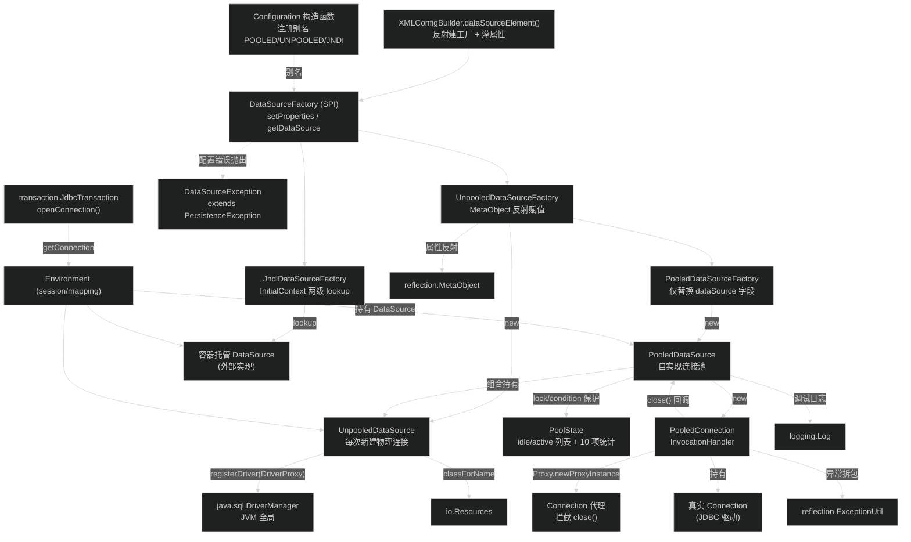
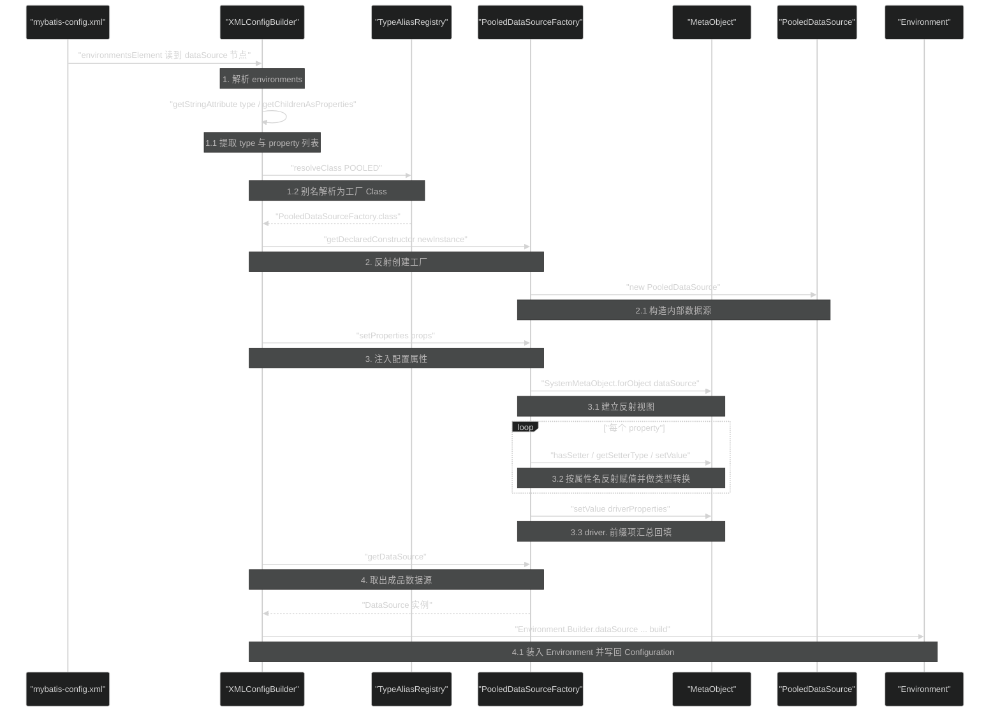
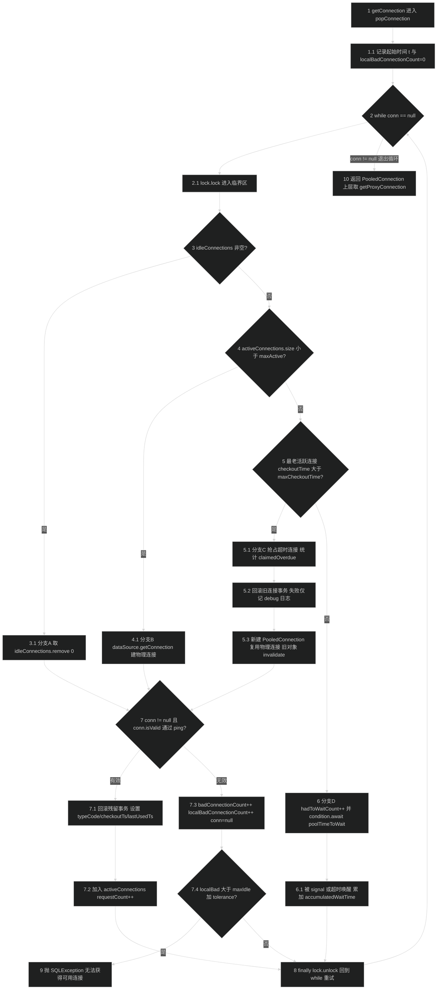
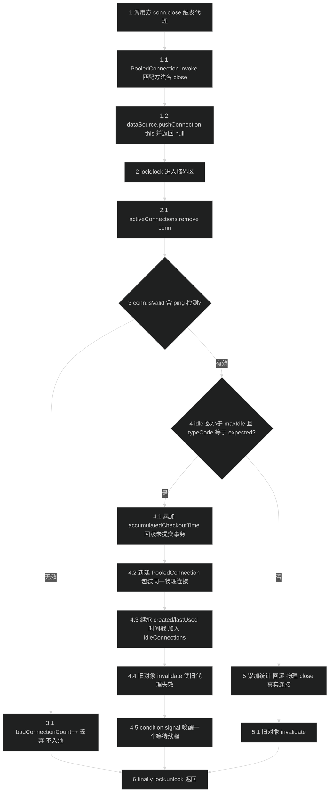

# 数据源（datasource）
> 上次修改：2026-07-29 00:36

## 重点关注

| 入口 / 章节 | 源码位置 | 为什么重要 |
|-------------|----------|------------|
| `DataSourceFactory` 两方法 SPI | `src/main/java/org/apache/ibatis/datasource/DataSourceFactory.java:25-31` | 整个模块对外只有这一个契约：`setProperties(Properties)` + `getDataSource()`。`<dataSource type="POOLED">` 能换成任意第三方池（Druid/HikariCP）全靠它，是模块唯一扩展点。 |
| `PooledDataSource.popConnection(...)` | `src/main/java/org/apache/ibatis/datasource/pooled/PooledDataSource.java:435-551` | 全模块最复杂的一段（117 行、4 路分支 + 外层 `while` 重试）。"取空闲 / 建新连接 / 抢超时连接 / 阻塞等待"四条路径 + 坏连接容忍计数都在这里，连接池所有疑难问题的排查起点。 |
| `PooledDataSource.pushConnection(...)` | `PooledDataSource.java:391-433` | 归还路径。这里做了一个反直觉的动作：**归还时并不复用原 `PooledConnection`，而是新建一个包装同一物理连接的对象**（`:403`），以此使旧代理立即失效。理解"为什么关闭后的 Connection 再用会抛异常"必须看这段。 |
| `PooledConnection.invoke(...)` | `src/main/java/org/apache/ibatis/datasource/pooled/PooledConnection.java:246-263` | JDK 动态代理拦截 `close()` 改为归还池，是"用户代码照常写 `conn.close()`"却能池化的全部魔法；同时 `checkConnection()` 让失效代理主动抛 `SQLException`。 |
| `PooledDataSource.pingConnection(...)` | `PooledDataSource.java:561-603` | 连接存活检测：先 `isClosed()` 快检，再按 `poolPingConnectionsNotUsedFor` 触发 `poolPingQuery`。**该方法在持有池全局锁时被调用**（见第 9 节），是最值得关注的性能与阻塞风险点。 |
| `PoolState` 与其独立锁 | `src/main/java/org/apache/ibatis/datasource/pooled/PoolState.java:27-49` | 源码注释自己承认"This lock does not guarantee consistency"——`PoolState` 用的是**自己的** `ReentrantLock`，而字段实际由 `PooledDataSource` 的另一把锁保护。监控读数不一致的根因。 |
| `UnpooledDataSource.initializeDriver()` | `src/main/java/org/apache/ibatis/datasource/unpooled/UnpooledDataSource.java:233-253` | 用静态 `ConcurrentHashMap` + `computeIfAbsent` 保证同一驱动只向 `DriverManager` 注册一次（对应 issue #430），并用 `DriverProxy` 解决自定义 `ClassLoader` 加载的驱动被 `DriverManager` 拒绝的经典问题。 |
| `UnpooledDataSource.configureConnection(...)` | `UnpooledDataSource.java:255-265` | 三行代码里藏着一个资源泄漏：`Executors.newSingleThreadExecutor()` 为**每个连接**创建线程池且从不 shutdown（`:257`）。第 8、9 节详述。 |
| `UnpooledDataSourceFactory.setProperties(...)` | `src/main/java/org/apache/ibatis/datasource/unpooled/UnpooledDataSourceFactory.java:41-61` | 用 `MetaObject` 反射把 XML 的 `<property>` 赋到 DataSource 上，并把 `driver.` 前缀的项拆到 `driverProperties`。这是"XML 配置项名 = setter 名"这条隐含约定的实现处。 |
| `PooledDataSourceFactory` 三行实现 | `src/main/java/org/apache/ibatis/datasource/pooled/PooledDataSourceFactory.java:23-29` | 只换 `dataSource` 字段就复用了全部反射赋值逻辑，是"继承代替配置"的极简范例，也解释了为什么 `poolMaximumActiveConnections` 等池参数无需任何注册即可在 XML 中生效。 |
| `JndiDataSourceFactory.setProperties(...)` | `src/main/java/org/apache/ibatis/datasource/jndi/JndiDataSourceFactory.java:40-61` | 唯一一个"不创建、只查找"的工厂；`env.` 前缀属性 → `InitialContext` 环境，两级 `lookup` 语义（`initial_context` + `data_source`）容易配错。 |
| 与 `builder` 的衔接点 | `src/main/java/org/apache/ibatis/builder/xml/XMLConfigBuilder.java:349-358` | 模块被激活的唯一现场：反射 `newInstance()` → `setProperties(props)` → `getDataSource()`。要理解别名 `POOLED/UNPOOLED/JNDI` 从哪来，还需看 `Configuration.java:194-196`。 |

## 1. 模块定位与职责边界

**结论**：`datasource` 包是 MyBatis 的"**`javax.sql.DataSource` 供给层**"——它的唯一产出物是一个 `DataSource` 实例，交给 `Environment` 持有，最终被 `transaction` 层用来取 `Connection`。整个包只有 13 个 Java 文件（含 4 个 `package-info.java`），约 1760 行代码，却自带了一个完整可用的连接池实现。

### 解决什么问题

MyBatis 需要在"零依赖"前提下开箱可用：既要能在没有任何连接池库的环境里直接跑（`UNPOOLED`），也要在没有容器时提供基本的连接复用能力（`POOLED`），还要能在应用服务器里直接接管容器托管的数据源（`JNDI`）。这三种诉求由三个 `DataSourceFactory` 实现覆盖，而三者对外形状完全一致。

### 上下游位置

- **上游（谁调用本模块）**
  - `builder.xml.XMLConfigBuilder.dataSourceElement(XNode)`：解析 `<dataSource type="...">`，反射实例化工厂、灌入属性、取出 `DataSource`（`src/main/java/org/apache/ibatis/builder/xml/XMLConfigBuilder.java:349-358`）。
  - `session.Configuration` 构造函数：注册三个别名 `JNDI` / `POOLED` / `UNPOOLED`（`src/main/java/org/apache/ibatis/session/Configuration.java:194-196`），使 XML 里可写短名。
  - `environmentsElement(XNode)`：把 `dsFactory.getDataSource()` 的结果放进 `Environment.Builder`（`XMLConfigBuilder.java:308-312`）。
- **下游（本模块依赖谁）**
  - `io.Resources.classForName(String)`：默认的驱动类加载途径（`UnpooledDataSource.java:241`）。
  - `reflection.MetaObject` / `SystemMetaObject`：属性反射赋值（`UnpooledDataSourceFactory.java:44`、`:50-53`）。
  - `reflection.ExceptionUtil.unwrapThrowable(Throwable)`：把动态代理的 `InvocationTargetException` 拆包（`PooledConnection.java:260`）。
  - `logging.Log` / `LogFactory`：连接池调试日志（`PooledDataSource.java:45`）。
  - `exceptions.PersistenceException`：`DataSourceException` 的父类（`DataSourceException.java:23`）。
  - JDK：`DriverManager`、`java.sql.Driver`、`java.lang.reflect.Proxy`、`ReentrantLock`/`Condition`、`javax.naming.InitialContext`。

**关键事实**：本模块**不依赖任何 MyBatis 核心域对象**——不认识 `MappedStatement`、`Configuration`、`SqlSession`、`Executor`，甚至不认识 `Transaction`。反向依赖也极窄：`src/main/java` 中除 `datasource` 包自身，只有 `Configuration.java` 提到过 `PooledDataSourceFactory` / `UnpooledDataSourceFactory`（仅为注册别名）。这种彻底的解耦是 `PooledDataSource` 可以被单独 `new` 出来当独立连接池用的原因。

### 负责什么

| 职责 | 承担者 | 说明 |
|------|--------|------|
| 把配置文本变成可用 `DataSource` | 三个 `*DataSourceFactory` | 属性名 → setter 反射映射、类型转换、`driver.`/`env.` 前缀分流 |
| 建立物理 JDBC 连接 | `UnpooledDataSource` | 驱动懒加载与去重注册、`DriverManager.getConnection`、连接初始化（autoCommit / 隔离级别 / 网络超时） |
| 连接复用与容量控制 | `PooledDataSource` + `PoolState` | 空闲/活跃双列表、`maxActive`/`maxIdle`、超时抢占、阻塞等待、存活检测、统计 |
| 让 `close()` 变成"归还" | `PooledConnection` | JDK 动态代理拦截 `Connection.close()` |
| 直接复用容器数据源 | `JndiDataSourceFactory` | JNDI 两级 lookup |

### 不负责什么（明确边界）

- **不负责事务**：`commit`/`rollback`/`setAutoCommit` 的业务语义在 `transaction` 包（`JdbcTransaction` / `ManagedTransaction`）。本模块只在归还/抢占连接时做**防御性 `rollback()`**（`PooledDataSource.java:400-402`、`:414-416`、`:466-478`），目的是不把脏事务留在池里，而不是实现事务控制。
- **不负责 SQL 执行**：唯一执行 SQL 的地方是心跳探测 `poolPingQuery`（`PooledDataSource.java:580-582`）。
- **不负责 `Statement`/`ResultSet` 池化**：代理只覆盖 `Connection` 一个接口（`PooledConnection.java:32` 的 `IFACES`），从连接上取出的 `Statement` 不被拦截、不被跟踪。
- **不负责连接泄漏的准确检测**：没有 stack-trace 记录、没有泄漏告警日志。所谓"回收"是基于 `poolMaximumCheckoutTime` 的**超时抢占**（见第 6.4 节），语义上是"猜它泄漏了就抢走"，与 HikariCP 的 `leakDetectionThreshold` 不是一回事。

### 主要输入 / 输出 / 状态 / 副作用

- **输入**：`Properties`（来自 `<dataSource>` 的子 `<property>` 节点），键为 DataSource 的属性名，或 `driver.` / `env.` 前缀键。
- **输出**：`javax.sql.DataSource`；进一步 `getConnection()` 输出物理 `Connection`（UNPOOLED）或代理 `Connection`（POOLED）。
- **状态变化**：`PoolState.idleConnections` / `activeConnections` 两个 `ArrayList` 的增删；8 个统计计数器累加；`UnpooledDataSource.registeredDrivers` 这个 **JVM 级静态 Map** 的写入。
- **副作用**：向 `DriverManager` 全局注册驱动（进程级，不可撤销）；修改 `DriverManager` 的全局 loginTimeout / logWriter（`UnpooledDataSource.java:105-122`、`PooledDataSource.java:109-126`）；为每个配置了 `defaultNetworkTimeout` 的连接创建一个线程池（`UnpooledDataSource.java:257`）。

## 2. 架构关系与依赖

**结论**：模块是一个"**双层三分支**"结构。上层是三个工厂（`UNPOOLED`/`POOLED`/`JNDI`），下层是两个 `DataSource` 实现（`UnpooledDataSource` 和包装它的 `PooledDataSource`）。`PooledDataSourceFactory` 通过**继承**复用 `UnpooledDataSourceFactory` 的反射赋值逻辑，`PooledDataSource` 通过**组合**复用 `UnpooledDataSource` 的建连逻辑——同一个复用目标，上下两层用了两种不同手段。



### 节点与依赖方向说明

| 节点 | 角色 | 依赖方向与强度 |
|------|------|----------------|
| `XMLConfigBuilder.dataSourceElement()` | 模块唯一激活入口 | 单向依赖 `DataSourceFactory`；**强依赖**，无它则模块不会被 XML 路径实例化（Java API 路径可绕过） |
| `Configuration` 构造函数 | 别名注册者 | 只依赖三个工厂的 `Class` 字面量，不调用其方法；属于**弱耦合**（去掉别名后仍可写全限定类名） |
| `DataSourceFactory` | SPI 契约 | 被上游依赖、依赖 `javax.sql.DataSource`；**可替换点**（第三方池实现此接口即可） |
| `UnpooledDataSourceFactory` | 属性映射引擎 | 强依赖 `MetaObject`；被 `PooledDataSourceFactory` **继承**复用 |
| `PooledDataSourceFactory` | 仅换实现类 | 继承关系，是全模块最短的类（`PooledDataSourceFactory.java:23-29`，7 行有效代码） |
| `UnpooledDataSource` | 物理建连器 | 强依赖 `DriverManager`（**跨层、进程级全局副作用**）与 `io.Resources` |
| `PooledDataSource` | 池化装饰者 | **组合**持有 `UnpooledDataSource`（`PooledDataSource.java:49`），把建连委托出去，自己只管容量与复用 |
| `PoolState` | 池状态容器 | 被 `PooledDataSource` 直接访问 `protected` 字段；**潜在耦合点**：字段由外部锁保护，自身锁只保护读方法（`PoolState.java:27-32` 注释明确承认不一致） |
| `PooledConnection` | 代理处理器 | **双向依赖**：`PooledDataSource` 创建它，它又回调 `dataSource.pushConnection(this)` / `dataSource.pingConnection(this)`（`PooledConnection.java:249`、`:75`）——这是模块内唯一的循环依赖，也是"归还"语义的实现方式 |
| `JndiDataSourceFactory` | 查找型工厂 | 依赖 `javax.naming`；不产出自有实现，**完全依赖外部容器**；找不到时 `dataSource` 保持 `null`（见第 8 节） |
| `DataSourceException` | 配置期异常 | 继承 `PersistenceException`（运行时异常），使配置错误能穿透 `setProperties` 无检查异常签名 |
| `Environment` / `transaction` | 下游消费者 | 反向依赖：只通过 `javax.sql.DataSource` 标准接口消费，**不感知**具体是哪种数据源 |

### 强依赖 vs 可替换依赖

- **强依赖（不可替换）**：`DriverManager`（UNPOOLED 建连的唯一途径，`UnpooledDataSource.java:228`）、JDK 动态代理（`PooledConnection.java:59`）、`MetaObject`（属性赋值）。
- **可替换依赖**：`Log`（`LogFactory` 已做适配层）、`io.Resources`（可通过 `driverClassLoader` 绕过，`UnpooledDataSource.java:238-242`）。
- **跨层调用**：`UnpooledDataSource` 直接操作 `DriverManager` 全局状态（`setLoginTimeout` / `setLogWriter` / `registerDriver`），把"数据源级配置"写到了"JVM 级"，是本模块最明显的跨层耦合。
- **潜在耦合点**：`PoolState` 的 `protected` 字段被 `PooledDataSource` 与 `PoolState.toString()` 双方读写，且分属两把不同的锁；任何一方重构都可能破坏另一方的可见性假设。

## 3. 入口与调用方式

**结论**：模块有两类入口——**配置期入口**（工厂被 XML 解析器实例化并注入属性，全局仅执行一次）与**运行期入口**（`DataSource.getConnection()`，每条 SQL 都会经过），再加上一个**回调型入口**（代理连接的 `close()`）。三类入口的调用频次相差数个量级，是理解性能敏感点的关键。

### 3.1 配置期入口：`DataSourceFactory` SPI

| 项 | 内容 |
|----|------|
| 入口方法 | `DataSourceFactory.setProperties(Properties)` → `DataSourceFactory.getDataSource()`（`DataSourceFactory.java:27-29`） |
| 触发条件 | 解析 mybatis-config.xml 时遇到 `<environment>/<dataSource>` 节点 |
| 调用现场 | `XMLConfigBuilder.dataSourceElement(XNode)`（`XMLConfigBuilder.java:349-358`）：`resolveClass(type).getDeclaredConstructor().newInstance()` → `factory.setProperties(props)` → 上层 `dsFactory.getDataSource()`（`XMLConfigBuilder.java:308-309`） |
| 关键参数 | `type` 属性（`POOLED` / `UNPOOLED` / `JNDI` / 自定义全限定类名）；`props` 来自 `context.getChildrenAsProperties()`，即所有子 `<property name= value=>` |
| 前置要求 | 实现类必须有**公开无参构造函数**（`getDeclaredConstructor().newInstance()`）；`type` 必须能被 `TypeAliasRegistry` 解析 |
| 返回值 | `javax.sql.DataSource`；JNDI 分支可能返回 `null`（见第 8 节） |
| 失败行为 | `context == null` 时抛 `BuilderException("Environment declaration requires a DataSourceFactory.")`（`XMLConfigBuilder.java:357`）；未知属性名抛 `DataSourceException`（`UnpooledDataSourceFactory.java:55`） |
| 后续流程 | 产出的 `DataSource` 装入 `Environment.Builder`（`XMLConfigBuilder.java:310-312`），此后由 `transaction` 层消费 |

三个内置别名的注册位置固定在 `Configuration` 构造函数：

```java
typeAliasRegistry.registerAlias("JNDI", JndiDataSourceFactory.class);
typeAliasRegistry.registerAlias("POOLED", PooledDataSourceFactory.class);
typeAliasRegistry.registerAlias("UNPOOLED", UnpooledDataSourceFactory.class);
```
（`src/main/java/org/apache/ibatis/session/Configuration.java:194-196`）

### 3.2 运行期入口：`DataSource.getConnection()`

| 实现 | 行为 | 源码位置 |
|------|------|----------|
| `UnpooledDataSource.getConnection()` | 无条件 `doGetConnection(username, password)` → 每次建立**新的物理连接** | `UnpooledDataSource.java:95-102` |
| `UnpooledDataSource.getConnection(user, pwd)` | 同上，但用参数覆盖凭据（写入 `props` 的 `user`/`password` 键） | `UnpooledDataSource.java:100-102`、`:212-224` |
| `PooledDataSource.getConnection()` | `popConnection(...)` → 返回 `getProxyConnection()`（**代理对象，不是物理连接**） | `PooledDataSource.java:99-101` |
| `PooledDataSource.getConnection(user, pwd)` | 同上，但注意：用户名/密码只参与 `connectionTypeCode` 计算，**新建物理连接时仍走 `dataSource.getConnection()` 的默认凭据**（`:452`），见第 8 节的边界说明 | `PooledDataSource.java:104-106` |

上下文要求：两者都不检查线程上下文或权限；`PooledDataSource.getConnection()` **可能阻塞最长 `poolTimeToWait` 毫秒**（默认 20000ms），且在池满时会循环重试，理论上无总超时上限（第 8 节详述）。

### 3.3 回调型入口：代理连接的 `close()`

`PooledDataSource.getConnection()` 返回的是 `Proxy.newProxyInstance(Connection.class.getClassLoader(), {Connection.class}, pooledConnection)`（`PooledConnection.java:59`）。调用方（`JdbcTransaction.close()` → `connection.close()`）看似关闭连接，实际进入：

```java
if (CLOSE.equals(methodName)) {
  dataSource.pushConnection(this);
  return null;
}
```
（`PooledConnection.java:248-251`）

触发条件：任何对代理调用名为 `close` 的方法（**只比较方法名，不校验签名与参数**）。返回值恒为 `null`。副作用：连接被放回 `idleConnections` 或被物理关闭，且当前 `PooledConnection` 被 `invalidate()`，后续任何非 `Object` 方法调用都会抛 `SQLException`（`PooledConnection.java:265-269`）。

### 3.4 编程式入口（不经 XML）

`PooledDataSource` / `UnpooledDataSource` 提供 5 组重载构造函数，可脱离 MyBatis 直接当独立数据源使用：

- `new UnpooledDataSource(driver, url, username, password)`（`UnpooledDataSource.java:65-70`）
- `new PooledDataSource(driver, url, username, password)`（`PooledDataSource.java:74-78`，构造时即计算 `expectedConnectionTypeCode`）
- `new PooledDataSource(UnpooledDataSource)`（`PooledDataSource.java:70-72`）——**注意此重载不初始化 `expectedConnectionTypeCode`**，详见第 8 节。

测试代码即以此方式使用：`new PooledDataSource("org.hsqldb.jdbcDriver", "jdbc:hsqldb:mem:multipledrivers", "sa", "")`（`src/test/java/org/apache/ibatis/datasource/pooled/PooledDataSourceTest.java:39`）。

### 3.5 运维观测入口

`PooledDataSource.getPoolState()`（`PooledDataSource.java:383-385`）返回内部 `PoolState`，其 `toString()` 输出配置 + 10 项运行指标的文本快照（`PoolState.java:142-176`），密码字段被脱敏为 `************`（`PoolState.java:151-152`）。这是模块提供的唯一监控出口，无 JMX、无 Metrics 接入。

## 4. 核心概念与领域模型

### 4.1 `DataSourceFactory`——两方法 SPI

- **定义**：`void setProperties(Properties)` + `DataSource getDataSource()`（`DataSourceFactory.java:25-31`），无任何默认方法、无泛型、无生命周期回调。
- **作用**：把"配置文本"与"数据源实例"之间的转换责任下沉到实现类，让 `XMLConfigBuilder` 只需知道接口。
- **生命周期**：由 `XMLConfigBuilder` 反射创建 → `setProperties` 一次 → `getDataSource` 一次 → 工厂对象随即被丢弃（`XMLConfigBuilder.java:308-309` 中 `dsFactory` 是局部变量），只有它产出的 `DataSource` 被 `Environment` 长期持有。
- **相关类型**：`UnpooledDataSourceFactory`、`PooledDataSourceFactory`、`JndiDataSourceFactory`。
- **使用场景**：接入 Druid 只需 `class DruidDataSourceFactory implements DataSourceFactory`，然后 `<dataSource type="com.x.DruidDataSourceFactory">`。

**三维评估**

- **好处**：接口面积最小（2 个方法），实现成本极低；`Properties` 作为通用载体避免了为每种池定义配置类；配置期与运行期彻底分离，`DataSource` 拿到后不再回头依赖工厂。
- **替代方案**：(a) 直接在 XML 里配 `<dataSource class="javax.sql.DataSource 实现">` 并用 `MetaObject` 赋值——省掉工厂层，但无法表达 JNDI 这种"查找而非构造"的语义；(b) 用 Java SPI（`META-INF/services`）自动发现——获得零配置，但失去了"一个环境一个数据源"的显式性，且与 `TypeAliasRegistry` 体系不一致。
- **风险**：`setProperties` 未声明检查异常，实现类只能抛运行时异常（这正是 `DataSourceException extends PersistenceException` 的原因）；`getDataSource()` 允许返回 `null` 而接口未约束，`JndiDataSourceFactory` 正是利用了这一点（见第 8 节），把错误从配置期推迟到了首次取连接时。

### 4.2 `UnpooledDataSource`——每次新建物理连接

- **定义**：直接实现 `javax.sql.DataSource` 的无池数据源（`UnpooledDataSource.java:39`）。
- **作用**：`getConnection()` 每次都走 `DriverManager.getConnection(url, properties)`（`UnpooledDataSource.java:226-231`），连接的关闭就是真正的物理关闭。
- **生命周期**：数据源实例与 `Configuration` 同寿；它产出的每个连接从建立到 `close()` 只服务一次调用方。
- **状态**：实例级只有配置字段（`driver`/`url`/`username`/`password`/`autoCommit`/`defaultTransactionIsolationLevel`/`defaultNetworkTimeout`）；类级有一个 `static final Map<String, Driver> registeredDrivers`（`UnpooledDataSource.java:43`），**跨实例、跨 `Configuration` 共享**。
- **使用场景**：单元测试、批处理脚本、连接极少的场合；也是 `PooledDataSource` 的内部建连引擎。

**三维评估**

- **好处**：实现极简（无并发状态可言）；语义可预测，不存在"连接被别人用过"的残留状态问题；对短生命周期进程（CLI、测试）最省事。
- **替代方案**：直接让用户配 `DriverManagerDataSource`（Spring 的等价物）——但 MyBatis 要求零第三方依赖；或完全省略 UNPOOLED 只留 POOLED——会让最简场景被迫承担池的复杂度。
- **风险**：每次建连都是完整 TCP + 认证握手（毫秒到数十毫秒级），高频调用下是性能灾难；`registeredDrivers` 是静态的，一旦某驱动类名被注册，同名不同 `ClassLoader` 的驱动**不会**再注册（`computeIfAbsent` 以类名为键，`UnpooledDataSource.java:235`），在热部署容器中可能拿到已卸载 `ClassLoader` 的驱动实例。

### 4.3 `PooledDataSource`——自实现连接池

- **定义**：`PooledDataSource implements DataSource`，类注释自述 "a simple, synchronous, thread-safe database connection pool"（`PooledDataSource.java:39`）。
- **作用**：在 `UnpooledDataSource` 之上加一层"借出/归还"语义，用 `PoolState` 的两个列表管理连接归属。
- **生命周期**：与 `Configuration` 同寿；`forceCloseAll()` 可清空池（`PooledDataSource.java:342-381`），`finalize()` 中也会调一次（`:623-627`，注意 `finalize` 在 JDK 9+ 已废弃）。**16 个配置 setter 中有 15 个会触发 `forceCloseAll()`**（如 `:130`、`:135`、`:185`），意即"改配置 = 清空池"。
- **相关类型**：`PoolState`（状态）、`PooledConnection`（借出单元）、`UnpooledDataSource`（建连委托）。
- **关键字段**：`expectedConnectionTypeCode`（`:61`），由 `url + username + password` 的字符串拼接 hashCode 得到（`:387-389`），用于判断"归还的连接是否属于当前配置"。

**三维评估**

- **好处**：零依赖自带池，使 MyBatis 单独可用；实现只有 600 余行，可完整读懂；`PoolState` 提供了同类简易池少见的 10 项统计指标（平均请求耗时、平均等待耗时、超时抢占次数等）。
- **替代方案**：不自带池、强制用户引入 HikariCP/Druid——获得成熟的连接生命周期管理与泄漏检测，但破坏"开箱可用"；或用 `javax.sql.ConnectionPoolDataSource` 标准（`PooledConnection` 类名正来自这一标准的术语，见 `PooledConnection.java:45` 的 javadoc "Constructor for SimplePooledConnection"），但 JDBC 的池标准实际未被驱动普遍实现。
- **风险**：单把全局锁串行化所有借还操作，且**建连与 ping 查询都在锁内执行**（`:452`、`:510`），高并发下锁持有时间可达网络 RTT 量级；无后台维护线程，空闲连接不会被主动老化淘汰——只有下次被借出时才做存活检测；`poolMaximumCheckoutTime` 抢占机制在语义上允许两个线程同时持有同一物理连接（见第 6.4 节风险）。

### 4.4 `PooledConnection`——借出单元与动态代理

- **定义**：包私有类 `class PooledConnection implements InvocationHandler`（`PooledConnection.java:29`），同时是"连接的元数据载体"和"代理的调用处理器"。
- **作用**：一个对象承担三件事——(1) 持有 `realConnection` 与其 `proxyConnection`；(2) 记录 4 个时间戳（创建/最后使用/借出/以及派生的 age、checkoutTime）；(3) 拦截 `close()` 转为归还。
- **生命周期**：`new PooledConnection(realConn, ds)` → 在 `activeConnections` 中 → `close()` → `pushConnection` 中被 `invalidate()` 并**由一个全新的 `PooledConnection` 接管同一物理连接**进入 `idleConnections`（`PooledDataSource.java:403-407`）。也就是说：**物理连接可长寿，`PooledConnection` 每借还一轮就换一个新的**。
- **`valid` 标志**：`invalidate()` 置 false（`PooledConnection.java:65-67`），此后 `checkConnection()` 抛 `SQLException("Error accessing PooledConnection. Connection is invalid.")`（`:265-269`）。
- **`equals` 语义**：与 `PooledConnection` 比较时按 `realConnection.hashCode()`，与 `Connection` 比较时按自身缓存的 `hashCode`（`:222-231`）——即"同一物理连接的不同包装对象互相相等"。这条语义直接决定了 `state.activeConnections.remove(conn)` 的行为（见第 8 节的疑似问题）。

**三维评估**

- **好处**：调用方代码零改动（照常 `try-with-resources` 或 `conn.close()`）即获得池化；`invalidate()` + `checkConnection()` 把"用了已归还的连接"这类 bug 从静默数据错误变成显式 `SQLException`（对应源码注释提到的 issue #579，`:254-255`）；用 JDK 代理而非字节码增强，无额外依赖。
- **替代方案**：手写 `class PooledConnectionWrapper implements Connection` 逐一委托 50+ 个方法——性能更好（无反射）但代码量巨大且每次 JDBC 版本升级都要补方法；或用 CGLIB/ByteBuddy 生成子类——需引入依赖，且 `Connection` 是接口，JDK 代理已足够。
- **风险**：每次 JDBC 调用都经过 `Method.invoke` 反射（`:258`），有可测量的开销；`CLOSE.equals(methodName)` 只按名匹配，若未来 `Connection` 增加同名重载方法会被误拦截；`invoke` 中把所有 `Throwable` 交给 `ExceptionUtil.unwrapThrowable` 后重抛（`:259-261`），`Error` 也会被原样透出。

### 4.5 `PoolState`——池状态与统计

- **定义**：持有 `idleConnections` / `activeConnections` 两个 `ArrayList<PooledConnection>` 与 8 个 `long` 计数器（`PoolState.java:36-45`）。
- **作用**：把"池里有什么"和"池表现如何"集中在一个对象，便于 `toString()` 一次性 dump。
- **生命周期**：`private final PoolState state = new PoolState(this)`（`PooledDataSource.java:47`），与 `PooledDataSource` 严格同寿，不可替换。
- **锁模型**：字段是 `protected` 的，**写操作全部发生在 `PooledDataSource` 中并由 `PooledDataSource.lock` 保护**；`PoolState` 自己的 `ReentrantLock`（`PoolState.java:32`）只保护它自己的 getter。源码注释直言："This lock does not guarantee consistency. Field values can be modified in PooledDataSource after the instance is returned from PooledDataSource#getPoolState(). A possible fix is to create and return a 'snapshot'."（`PoolState.java:27-31`）
- **为什么用 `List` 而非 `Queue`/`Deque`**：`popConnection` 取 `idleConnections.remove(0)`（FIFO 借出，`PooledDataSource.java:446`）、取 `activeConnections.get(0)` 作为"最老的活跃连接"（`:458`）——后者依赖"按借出顺序追加"的位置语义，`ArrayList` 的索引访问正好满足；同时 `remove(Object)` 依赖 `PooledConnection.equals`。若换成 `ArrayDeque` 则失去 `get(0)` 的 O(1) 索引与 `remove(Object)` 的等值语义组合。

**三维评估**

- **好处**：结构直白，两个列表的 size 直接就是 idle/active 计数；`toString()` 输出对排查"连接不够用"极为有效（一屏看全配置与 10 项统计）。
- **替代方案**：`BlockingQueue<PooledConnection>` + `AtomicInteger` 计数——可去掉全局锁、显著降低竞争，但无法实现"扫描最老活跃连接并抢占"这一逻辑（需要遍历 active 集合）；或返回不可变快照对象——解决注释中承认的一致性问题，代价是每次 `getPoolState()` 都要复制。
- **风险**：两把锁并存造成读数可能不自洽（例如 `toString()` 中 `getActiveConnectionCount()` 与 `getIdleConnectionCount()` 分别加锁，两次读之间池状态可能已变）；`ArrayList.remove(0)` 是 O(n) 移动，池容量小时可忽略，但若把 `poolMaximumIdleConnections` 配到成百上千则成为热点。

### 4.6 连接类型码（`connectionTypeCode`）

- **定义**：`("" + url + username + password).hashCode()`（`PooledDataSource.java:387-389`）。
- **作用**：归还时判断这条连接是否与"当前数据源配置"匹配（`:398`）；不匹配则不入池、直接物理关闭（`:417`）。这使得 `setUrl` / `setUsername` 之类的运行时改配置不会污染新配置的池。
- **生命周期**：借出时写入 `PooledConnection`（`:514`），与 `expectedConnectionTypeCode` 在 `forceCloseAll()` 中被同步刷新（`:345-346`）。
- **风险**：用字符串拼接 hashCode 判等，存在哈希碰撞（概率极低但非零）与"三段拼接歧义"（`url="a"+user="bc"` 与 `url="ab"+user="c"` 产生同一码）的理论问题；且 `new PooledDataSource(UnpooledDataSource)` 这个构造重载**不计算** `expectedConnectionTypeCode`（`:70-72`），使其初值为 0，见第 8 节。

## 5. 关键流程

本节覆盖三条路径：**配置期装配（主成功路径）**、**运行期取连接（含四分支与失败路径）**、**归还与超时抢占（边界路径）**。

### 5.1 配置期装配（主成功路径）



**1-1.2 解析与别名解析**：`XMLConfigBuilder.environmentsElement(XNode)` 遍历 `<environment>` 子节点，命中 `isSpecifiedEnvironment(id)` 后调用 `dataSourceElement(child.evalNode("dataSource"))`（`XMLConfigBuilder.java:304-308`）。后者取出 `type` 属性与全部子 `<property>`（`XMLConfigBuilder.java:351-352`），再用 `resolveClass(type)` 经 `TypeAliasRegistry` 把 `POOLED` 映射到 `PooledDataSourceFactory.class`（别名注册见 `Configuration.java:194-196`）。若 `<dataSource>` 节点缺失，直接抛 `BuilderException`（`XMLConfigBuilder.java:357`）。

**2-2.1 反射创建工厂**：`getDeclaredConstructor().newInstance()`（`XMLConfigBuilder.java:353`）要求工厂有无参构造。`PooledDataSourceFactory` 的构造函数只做一件事：`this.dataSource = new PooledDataSource()`（`PooledDataSourceFactory.java:25-27`），覆盖父类构造中赋的 `UnpooledDataSource`（`UnpooledDataSourceFactory.java:37-39`）。此时 `PooledDataSource` 内部已 `new UnpooledDataSource()`（`PooledDataSource.java:66-68`），但尚无任何连接参数。

**3-3.3 属性注入**：`UnpooledDataSourceFactory.setProperties(Properties)`（`:41-61`）对每个键做三路判断——以 `driver.` 开头则剥前缀存入临时 `driverProperties`；`metaDataSource.hasSetter(name)` 为真则经 `convertValue` 做 Integer/Long/Boolean 转换后 `setValue`；否则抛 `DataSourceException("Unknown DataSource property: " + propertyName)`。**这条 else 分支意味着任何拼错的属性名都会让启动失败**，是有意的 fail-fast。循环结束后若 `driverProperties` 非空，整体作为一个属性赋给 `driverProperties`（`:58-60`）。注意：赋值给 `PooledDataSource` 的 setter 大多会顺带调用 `forceCloseAll()`（如 `PooledDataSource.java:130`、`:185`），在装配阶段池本来就是空的，因此无副作用。

**4-4.1 交付**：`getDataSource()` 直接返回字段（`UnpooledDataSourceFactory.java:63-66`），工厂对象随后被丢弃。`DataSource` 与 `TransactionFactory` 一起装入 `Environment` 并 `configuration.setEnvironment(...)`（`XMLConfigBuilder.java:309-312`）。至此模块进入待命状态，**未建立任何物理连接**——POOLED 的池是懒填充的。

### 5.2 运行期取连接 `popConnection`（主路径 + 失败路径）



**1-2.1 进入与加锁**：`popConnection(username, password)`（`PooledDataSource.java:435-443`）记录 `t = System.currentTimeMillis()` 用于统计单次请求总耗时，并把 `localBadConnectionCount` 初始化为 0——这是**每次调用独立**的坏连接容忍计数（与 `PoolState.badConnectionCount` 的全局累计不同）。外层 `while (conn == null)` 使任何一轮失败都能重试；每轮开头 `lock.lock()`、`finally` 中 `unlock()`（`:442`、`:536-538`），因此**每轮循环都会完整释放一次锁**，给其他线程插入机会。

**3-3.1 分支 A：命中空闲连接（最快路径）**：`state.idleConnections.remove(0)`（`:446`）按 FIFO 取最早归还的连接。这条路径不产生任何 I/O（除非随后 ping 被触发），是理想稳态下的主路径。

**4-4.1 分支 B：池未满，新建连接**：`state.activeConnections.size() < poolMaximumActiveConnections` 时 `new PooledConnection(dataSource.getConnection(), this)`（`:450-452`）。**注意 `dataSource.getConnection()` 是无参重载**，用的是 `UnpooledDataSource` 自身的 `username`/`password`，与传入 `popConnection` 的参数无关——这是第 8 节要展开的一处语义不一致。更重要的是：**这次物理建连发生在锁内**，TCP 握手 + 认证的全部耗时都会阻塞其他借还线程。

**5-5.3 分支 C：抢占超时连接**：池已满时取 `state.activeConnections.get(0)`（列表首位 = 最早借出者，`:458`），若其 `getCheckoutTime() > poolMaximumCheckoutTime`（默认 20000ms）就判定为"疑似泄漏"并强行回收：累加三个统计量、从 active 移除、尝试 `rollback()`（失败只写 debug 日志并继续，源码注释解释了这样做是为了"不打断当前线程、让它有机会参与下一轮竞争"，`:470-477`）、用同一个 `realConnection` 新建 `PooledConnection` 并继承创建/最后使用时间戳，最后 `oldestActiveConnection.invalidate()` 让原持有者的代理失效（`:479-482`）。**这不是泄漏检测，是超时抢占**：原线程若仍在使用该连接，其后续调用会抛 `SQLException`，但抢占方与原方在抢占瞬间共享同一物理连接。

**6-6.1 分支 D：阻塞等待**：既满又无超时连接时，首次进入记一次 `hadToWaitCount++`（用 `countedWait` 保证一次调用只记一次，`:489-492`），然后 `condition.await(poolTimeToWait, MILLISECONDS)`（`:497`）。`await` 会释放锁，被 `pushConnection` 中的 `condition.signal()`（`:411`）唤醒，或超时后自行返回 false（仅记 debug 日志）。醒来后累加 `accumulatedWaitTime`，`conn` 仍为 null，回到 `while` 重试。若被中断则设置中断标志并 `break` 跳出 while（`:501-505`），此时 `conn == null`，流程走到 `:542-548` 抛出 "Unknown severe error condition" 的 `SQLException`。

**7-7.2 有效性校验与登记（成功收尾）**：拿到 `conn` 后调用 `conn.isValid()`（`:510`），它内部是 `valid && realConnection != null && dataSource.pingConnection(this)`（`PooledConnection.java:75`）——**ping 也在锁内执行**。通过后：残留事务 `rollback()`、写入 `connectionTypeCode`（此处才用到传入的 username/password，`:514`）、`checkoutTimestamp` 与 `lastUsedTimestamp` 置为当前时间、加入 `activeConnections`、`requestCount++`、累加 `accumulatedRequestTime`（`:511-519`）。

**7.3-9 坏连接与失败路径**：`isValid()` 为假时丢弃该连接，两个计数器各 +1，`conn = null` 触发重试；当 `localBadConnectionCount > poolMaximumIdleConnections + poolMaximumLocalBadConnectionTolerance`（默认 5 + 3 = 8）时抛 `SQLException("PooledDataSource: Could not get a good connection to the database.")`（`:528-533`）。这是模块中**唯一有上限保护的重试**——分支 D 的等待重试没有次数上限。

**10 返回**：`popConnection` 返回 `PooledConnection` 对象，`getConnection()` 再取其 `getProxyConnection()` 交给调用方（`:100`），调用方拿到的自始至终是代理。

### 5.3 归还连接 `pushConnection`（边界路径）



**1-1.2 代理拦截**：任何对代理 `Connection` 调用 `close()` 都被 `PooledConnection.invoke` 捕获（`PooledConnection.java:246-251`）。判断条件是 `CLOSE.equals(methodName)`，即**纯方法名匹配**，随后 `dataSource.pushConnection(this)` 并返回 `null`，真实连接**不会**被关闭。这一步是"用户以为关闭、实际归还"的分界线。

**2-2.1 摘出活跃列表**：`state.activeConnections.remove(conn)`（`PooledDataSource.java:395`）依赖 `PooledConnection.equals` 按 `realConnection.hashCode()` 判等（`PooledConnection.java:222-231`），因此**同一物理连接的任意包装对象都能匹配**——这既让"抢占后原对象归还"能找到目标，也埋下了误删的隐患（第 8 节）。

**3-3.1 有效性判定**：`conn.isValid()` 再次触发 `pingConnection`（含可能的 `poolPingQuery` 网络往返，仍在锁内）。无效则只累加 `badConnectionCount` 后丢弃——**注意此分支不做 `realConnection.close()`**，物理连接的关闭依赖 `pingConnection` 内部 ping 失败时的 `close()`（`PooledDataSource.java:591-595`）或依赖驱动侧已断开的事实。

**4-4.5 入池（正常归还）**：两个条件同时满足才入池——空闲数未达 `poolMaximumIdleConnections`（默认 5）、且 `connectionTypeCode == expectedConnectionTypeCode`（配置未变更）。随后累加借出时长、回滚未提交事务，**新建一个 `PooledConnection` 包装同一 `realConnection`** 放入 idle，并把创建/最后使用时间戳搬过去（`:399-406`）；旧对象 `invalidate()` 保证调用方即使持有旧代理引用也无法再用（`:407`）。最后 `condition.signal()` 唤醒一个在分支 D 等待的线程（`:411`）——注意是 `signal` 而非 `signalAll`。

**5-5.1 溢出关闭（容量边界）**：空闲已满或配置已变时，累加统计、回滚、`conn.getRealConnection().close()` 真正关闭物理连接（`:413-421`）。这是 `poolMaximumIdleConnections` 的执行点：**池不会保留超过 maxIdle 的空闲连接**，测试 `shouldEnsureCorrectIdleConnectionCount` 正是验证这一点（`src/test/java/org/apache/ibatis/datasource/pooled/PooledDataSourceTest.java:86-110`，10 个连接全关后空闲数恰为 5）。

**6 释放锁**：三条分支统一走 `finally { lock.unlock(); }`（`:430-432`）。整个 `pushConnection` 声明 `throws SQLException`，异常来自 `getAutoCommit()` / `rollback()` / `close()`——这些异常会**穿透 `invoke` 抛给调用方的 `close()`**，即"归还失败表现为关闭失败"。

## 6. 核心实现细节

### 6.1 驱动注册去重与 `DriverProxy`（`UnpooledDataSource.java:43-60`、`:233-253`、`:267-308`）

**输入**：`driver` 属性（驱动类全限定名）、可选 `driverClassLoader`。**输出**：`DriverManager` 中存在一个可用于该 URL 的 `Driver`。**副作用**：JVM 全局驱动列表新增一项，且 `registeredDrivers` 静态 Map 新增一项。

实现分三步：

1. **静态初始化预热**（`:54-60`）：类加载时把 `DriverManager.getDrivers()` 中已有的驱动按类名塞进 `registeredDrivers`。这样对于通过 SPI（`META-INF/services/java.sql.Driver`）自动注册的现代驱动，后续 `computeIfAbsent` 直接命中，不会重复注册。
2. **懒加载 + 原子去重**（`:235-249`）：`registeredDrivers.computeIfAbsent(driver, x -> {...})`。映射函数内按是否配置 `driverClassLoader` 选择 `Class.forName(x, true, driverClassLoader)` 或 `Resources.classForName(x)`，实例化后 `DriverManager.registerDriver(new DriverProxy(driverInstance))`。`ConcurrentHashMap.computeIfAbsent` 保证**同一 key 的映射函数最多执行一次**，这正是测试 `shouldNotRegisterTheSameDriverMultipleTimes` 要验证的行为（`src/test/java/org/apache/ibatis/datasource/unpooled/UnpooledDataSourceTest.java:31-41`，对应 old-google-code issue #430）。
3. **`DriverProxy` 包装**（`:267-308`）：一个纯委托的 `Driver` 实现，只重写了 `getParentLogger()` 返回全局 Logger。

**隐藏假设**：为什么必须包一层代理？因为 `DriverManager` 在 `getConnection` 时会做**调用方 ClassLoader 校验**——只有当驱动类对调用者的 ClassLoader 可见时才会被选用。通过自定义 `URLClassLoader` 动态加载的驱动（如运行时加载 jar 中的 MySQL 驱动）不满足该条件，而 `DriverProxy` 由 MyBatis 自己的 ClassLoader 加载，从而绕过限制。被 `@Disabled` 的测试 `shouldRegisterDynamicallyLoadedDriver`（`UnpooledDataSourceTest.java:43-59`）正是这一场景的说明性用例。

**三维评估**

- **好处**：解决了"自定义 ClassLoader 加载的驱动不可用"这一 JDBC 经典问题；`computeIfAbsent` 用一行代码同时拿到懒加载、去重、线程安全三个性质；预热静态块避免与 SPI 自动注册冲突。
- **替代方案**：(a) 要求用户自行 `Class.forName(driver)` 并放弃 `driverClassLoader` 支持——简单但丧失灵活性；(b) 用 `synchronized` + 双重检查代替 `computeIfAbsent`——等价但代码更长；(c) 不注册到 `DriverManager`，直接 `driverInstance.connect(url, props)`——**能彻底避免全局副作用**，但会失去 `DriverManager` 的 loginTimeout / logWriter 集成。
- **风险**：① `registeredDrivers` 以**类名字符串**为键且是 `static`，在多 ClassLoader（Web 容器热部署）环境下，第二个应用的同名驱动不会被注册，且 Map 长期持有第一个 ClassLoader 加载的 `Driver` 实例，构成**类加载器泄漏**；② 注册到 `DriverManager` 的驱动**永不注销**，`forceCloseAll()` 也不会清理；③ `driver` 为 `null` 时 `ConcurrentHashMap.computeIfAbsent(null, ...)` 抛 `NullPointerException`，被 `catch (RuntimeException re)` 捕获后包装成 `SQLException(msg, re.getCause())`，而 NPE 的 cause 是 `null`——**根因信息在这里丢失**（`:250-252`）；④ 在 `computeIfAbsent` 的映射函数中调用 `DriverManager.registerDriver`，若某驱动的静态初始化过程反过来操作同一个 Map，会触发 `ConcurrentHashMap` 的递归更新检测（`IllegalStateException`），属低概率但真实存在的约束。

### 6.2 属性反射注入与前缀分流（`UnpooledDataSourceFactory.java:41-79`）

**输入**：`Properties`。**处理**：三路分流 + 类型转换。**输出**：目标 `DataSource` 的字段被填充。

```java
if (propertyName.startsWith(DRIVER_PROPERTY_PREFIX)) {           // "driver."
  driverProperties.setProperty(propertyName.substring(DRIVER_PROPERTY_PREFIX_LENGTH), value);
} else if (metaDataSource.hasSetter(propertyName)) {
  metaDataSource.setValue(propertyName, convertValue(metaDataSource, propertyName, value));
} else {
  throw new DataSourceException("Unknown DataSource property: " + propertyName);
}
```

要点：

- **`driver.` 前缀的意义**：这些属性不是数据源自身的配置，而是**透传给 JDBC 驱动**的连接参数（例如 `driver.encoding=UTF8` 最终进入 `DriverManager.getConnection(url, props)` 的 props）。剥前缀后统一收集，循环结束再一次性 `setValue("driverProperties", driverProperties)`（`:58-60`）。
- **类型转换只覆盖 3 类**：`Integer/int`、`Long/long`、`Boolean/boolean`（`convertValue`，`:68-79`），其余一律按 `String` 处理。因此 `defaultTransactionIsolationLevel` 必须写成数字（如 `2`），不能写 `READ_COMMITTED`。
- **`hasSetter` 的隐含契约**：XML 属性名必须**恰好等于**目标类的 JavaBean 属性名。`PooledDataSource` 的池参数（`poolMaximumActiveConnections` 等）之所以无需任何注册就能配，正是因为它们有同名 setter；而 `UNPOOLED` 下写这些名字会因 `hasSetter` 为 false 直接抛异常。
- **`PooledDataSourceFactory` 的复用手法**：只在构造函数里换掉 `protected DataSource dataSource` 字段（`PooledDataSourceFactory.java:25-27`），`setProperties` 通过 `SystemMetaObject.forObject(dataSource)` 在**运行时**绑定实际对象，因此父类逻辑对子类的新属性集自动生效。

**三维评估**

- **好处**：新增配置项零成本——给 `PooledDataSource` 加一个 setter 即可在 XML 中使用，不需改解析器、不需改注册表；未知属性 fail-fast 避免了"配了没生效"这类静默错误。
- **替代方案**：(a) 为每个数据源实现写显式的 `if/else` 属性表——类型安全、无反射开销，但每加一个参数要改两处；(b) 用 Java Bean `Introspector` 或 `Properties` → 构造器绑定框架——引入依赖；(c) 允许未知属性只告警不抛异常——对用户更宽容，但会掩盖拼写错误。
- **风险**：① `String value = (String) properties.get(propertyName)`（`:51`）**硬转型**，若 `Properties` 中被程序化放入非 String 值会抛 `ClassCastException`；② 属性名与 setter 名强绑定，重命名字段即破坏配置兼容性；③ `driver.` 前缀的处理位于 `if` 的第一分支，若某天 `DataSource` 出现真正以 `driver.` 开头的属性名将无法配置。

### 6.3 `popConnection` 的四分支状态机（`PooledDataSource.java:435-551`）

流程已在第 5.2 节展开，这里补充三个非显而易见的设计点。

**（1）为什么每轮循环都释放锁**：`lock.lock()` 在 `while` 内部而非外部（`:441-442`），`finally` 在 `while` 内部收口（`:536-538`）。这意味着"取到坏连接 → 重试"这条路径会**完整放锁再抢锁**，避免一个持续取到坏连接的线程长期霸占临界区。代价是每轮都有一次锁的获取开销。

**（2）为什么 `localBadConnectionCount` 阈值是 `maxIdle + tolerance`**：`poolMaximumIdleConnections + poolMaximumLocalBadConnectionTolerance`（`:528`）。语义是"最坏情况下池里所有空闲连接都坏了（maxIdle 个），再额外容忍 tolerance 次新建失败"。默认 5 + 3 = 8。这个组合让"数据库刚重启、池里全是死连接"的场景能自愈，而不是让线程无限重试。

**（3）为什么抢占用"最老的活跃连接"而不是遍历找最超时的**：`state.activeConnections.get(0)`（`:458`）依赖一个不变式——连接按借出顺序 append 到 active 列表尾部（`:517`），因此首位就是借出时间最早、`checkoutTime` 最大者。这把"找超时连接"从 O(n) 降到 O(1)。但该不变式在"抢占后原持有者归还"时会被 `remove(Object)` 的等值语义破坏（第 8 节）。

**三维评估**

- **好处**：四条分支覆盖了池的全部状态（有空闲 / 可扩容 / 已满有超时 / 已满无超时），逻辑闭合；把统计埋点与业务逻辑写在一起，`PoolState` 的每个计数器都能对应到确切的代码分支，排障时读数可信；抢占机制让"忘记 close" 的应用不至于永久性死锁。
- **替代方案**：(a) `BlockingQueue.poll(timeout)` + 独立的 `AtomicInteger totalCount` 做扩容判断——可去掉全局锁，吞吐大幅提升，但需要另建后台线程做超时回收；(b) 用信号量（`Semaphore(maxActive)`）控制并发度 + 无锁队列存空闲连接——业界主流（HikariCP 思路），但改动量等同重写；(c) 放弃抢占、改为记录借出堆栈的泄漏告警——诊断性更好、更安全，但无法自愈。
- **风险**：① **建连（`:452`）与 ping（`:510`）都在锁内**，锁持有时间与网络延迟挂钩，是本模块最大的并发瓶颈；② 分支 D 的重试无总次数/总时长上限，数据库长时间不可用时线程会以 `poolTimeToWait` 为周期永久自旋等待（每轮只写一条 debug 日志）；③ 抢占分支不校验原持有者是否真的空闲，存在两线程短暂共用同一物理连接的窗口。

### 6.4 超时抢占 vs 连接泄漏检测（`PooledDataSource.java:456-485`）

这是本模块最容易被误解的机制，值得单列。

**它做了什么**：当池满且最老活跃连接的借出时长超过 `poolMaximumCheckoutTime` 时，把该物理连接**从原持有者手里夺走**，包装成新的 `PooledConnection` 交给当前线程；原 `PooledConnection` 被 `invalidate()`。

**它没做什么**：不记录借出时的调用栈、不打印 WARN 级泄漏告警（只有 debug 级 "Claimed overdue connection"，`:483-485`）、不区分"真的泄漏"与"这条 SQL 本来就跑得慢"。

**关键后果**：一个执行时间超过 20 秒（默认阈值）的**正常慢查询**，其连接也会被抢占。原线程随后在该连接上的任何调用会遇到两种情况——若走的是代理，`checkConnection()` 抛 `SQLException("Error accessing PooledConnection. Connection is invalid.")`；若已经拿到了 `Statement`/`ResultSet`（这些对象**不被代理**），则直接在共享的物理连接上继续操作，与抢占方的操作交织。

**三维评估**

- **好处**：无需任何后台线程即可让"连接泄漏"的应用自动恢复，对小型应用是有效的兜底；实现只有 30 行；`accumulatedCheckoutTimeOfOverdueConnections` / `claimedOverdueConnectionCount` 两个统计能直接暴露"是否发生过抢占"，运维可据此判断是否需要调大 `poolMaximumCheckoutTime`。
- **替代方案**：(a) HikariCP 式 `leakDetectionThreshold`——只告警不回收，记录借出堆栈，诊断精确且无正确性风险，但不能自愈；(b) 为借出连接设置 `Connection.setNetworkTimeout` 让驱动层超时——把超时下沉到 JDBC，但粒度是单次网络操作而非整个借出周期；(c) 抢占前先尝试 `realConnection.abort(executor)` 或 `cancel()` 中断原操作——语义更干净，但依赖驱动实现。
- **风险**：① **正确性风险**：抢占瞬间同一 `Connection` 被两个线程引用，若原线程正在执行事务，抢占方的 `rollback()`（`:466-468`）会回滚掉别人的事务数据；② 慢查询被误判为泄漏，表现为难以复现的 "Connection is invalid" 异常；③ `poolMaximumCheckoutTime` 与 `poolTimeToWait` 默认都是 20000ms（`:54-55`），语义完全不同却取值相同，容易在调优时混淆。

### 6.5 `pingConnection` 的两级存活检测（`PooledDataSource.java:561-603`）

**输入**：待检测的 `PooledConnection`。**输出**：boolean。**副作用**：可能执行一次 SQL、可能 `rollback()`、可能物理关闭连接。

第一级是廉价检查：`result = !conn.getRealConnection().isClosed()`（`:565`），抛异常即判死。第二级是真实探活，需同时满足三个条件（`:573-574`）：

- `poolPingEnabled == true`（默认 **false**）
- `poolPingConnectionsNotUsedFor >= 0`（默认 0）
- `conn.getTimeElapsedSinceLastUse() > poolPingConnectionsNotUsedFor`

满足后用 `try (Statement statement = realConn.createStatement())` 执行 `poolPingQuery`（默认字符串 `"NO PING QUERY SET"`，`:57`），并 `.close()` 结果集；随后若非自动提交则 `rollback()`（`:583-585`，避免 ping 本身开启的事务残留）。任何异常都会 `log.warn` 并**物理关闭**该连接、返回 false（`:589-600`）。

**隐藏假设与陷阱**：`poolPingQuery` 的默认值 `"NO PING QUERY SET"` 不是合法 SQL——设计意图是"开启 ping 却忘配 query 时，让所有连接立刻被判为坏并附带 WARN 日志"，属于故意的响亮失败。另外 `poolPingConnectionsNotUsedFor` 默认 0 意味着**一旦开启 ping，几乎每次借还都会探活**（`getTimeElapsedSinceLastUse() > 0` 几乎恒真），性能代价显著；实践中应配成数万毫秒。

**三维评估**

- **好处**：`isClosed()` 快检覆盖了绝大多数已知失效场景且零开销；ping 默认关闭，不为多数用户增加成本；按"闲置时长"触发而非每次触发，是成本与可靠性的合理折中；ping 失败即物理关闭，不会让坏连接留在 `DriverManager` 侧。
- **替代方案**：(a) 用 JDBC 4.0 的 `Connection.isValid(timeout)`——标准 API、驱动可优化实现、自带超时，明显优于自定义 query（MyBatis 保留 query 方式主要是历史与 JDBC 3 兼容考虑）；(b) 只在归还时探活、借出时信任——减半开销但增加拿到坏连接的概率；(c) 后台线程周期性巡检空闲连接——不阻塞业务路径，但需要额外线程。
- **风险**：① **ping 在池的全局锁内执行**（经 `isValid()` 从 `popConnection:510` / `pushConnection:396` 调用），一次慢 ping 会阻塞所有借还线程；② `statement.executeQuery(...)` 未设置查询超时，若数据库无响应会挂到驱动层默认超时；③ `isClosed()` 只反映本地状态，对"服务端已断开但客户端未感知"的半开连接无效——这正是需要 ping 的原因，但默认关闭意味着**默认配置下半开连接会被借给业务方**。

### 6.6 JDK 动态代理拦截 `close()`（`PooledConnection.java:29-60`、`:246-269`）

**构造时机**：`PooledConnection` 构造函数末尾创建代理（`:59`）：

```java
this.proxyConnection = (Connection) Proxy.newProxyInstance(Connection.class.getClassLoader(), IFACES, this);
```

三个参数各有讲究：ClassLoader 取自 `Connection.class`（JDK 自身的类加载器）而非驱动或 MyBatis 的，保证代理类始终能看到 `Connection` 接口；`IFACES` 是 `{ Connection.class }` 单元素常量数组（`:32`），**只代理 `Connection`，不代理驱动的扩展接口**；`this` 使 `PooledConnection` 同时充当处理器。

**`invoke` 的三段逻辑**（`:246-263`）：

1. `close` 短路：`dataSource.pushConnection(this); return null;`
2. 非 `Object` 声明的方法先 `checkConnection()`——注释明确说明这是为了 issue #579："toString() should never fail, throw an SQLException instead of a Runtime"（`:253-255`）。即 `toString()`/`hashCode()`/`equals()` 在连接失效后仍可安全调用，便于调试与日志。
3. `method.invoke(realConnection, args)` 转发，异常经 `ExceptionUtil.unwrapThrowable(t)` 拆包后重抛（`:258-261`），避免调用方看到 `InvocationTargetException` 包装层。

**配套的解包工具**：`PooledDataSource.unwrapConnection(Connection)`（`:613-621`）通过 `Proxy.isProxyClass` + `Proxy.getInvocationHandler` 取回真实连接，供需要驱动特有 API 的场景使用。

**三维评估**

- **好处**：对调用方完全透明，`try-with-resources` 照常工作；`invalidate` + `checkConnection` 把"使用已归还连接"变成显式异常；`unwrapConnection` 提供了逃生舱；只代理一个接口使代理创建成本最低。
- **替代方案**：(a) 手写委托类实现 `Connection` 全部方法——省去反射开销（每次 JDBC 调用可省数十到数百纳秒），但需维护 50+ 方法且随 JDBC 版本演进；(b) 返回真实连接并要求调用方显式调 `pool.release(conn)`——性能最佳，但破坏 `DataSource` 标准语义，无法与 Spring 等框架协作；(c) 用 `ConnectionPoolDataSource`/`javax.sql.PooledConnection` 标准 + `ConnectionEventListener`——标准做法，但依赖驱动实现该 SPI。
- **风险**：① **只代理 `Connection`**，从中取出的 `Statement`/`PreparedStatement`/`ResultSet` 是裸对象，连接被归还后这些对象仍指向物理连接，可能在下一个借用者的会话上继续操作；② 反射调用开销存在于每次 JDBC 操作；③ `CLOSE.equals(methodName)` 按名匹配，未来若 `Connection` 出现重载 `close(...)` 会被误吞；④ `invoke` 抛出的 `Throwable` 包含 `Error`，`unwrapThrowable` 会原样透传。

### 6.7 `forceCloseAll` 与"改配置即清池"（`PooledDataSource.java:342-381`）

`forceCloseAll()` 在锁内先刷新 `expectedConnectionTypeCode`（`:345-346`），再**倒序遍历**两个列表（`for (int i = size; i > 0; i--)`，`:347`、`:361`）逐个 `remove(i-1)` → `invalidate()` → 回滚 → 物理关闭。倒序 + 尾部删除避免了 `ArrayList` 的元素搬移与索引错位。每个连接的关闭都包在 `try/catch (Exception e) { // ignore }` 中（`:357-359`），保证一个连接关闭失败不影响其余。

值得注意的是**调用它的时机**：`setDriver` / `setUrl` / `setUsername` / `setPassword` / `setDefaultAutoCommit` / `setDefaultTransactionIsolationLevel` / `setDriverProperties` / `setDefaultNetworkTimeout` / `setPoolMaximumActiveConnections` / `setPoolMaximumIdleConnections` / `setPoolMaximumCheckoutTime` / `setPoolTimeToWait` / `setPoolPingQuery` / `setPoolPingEnabled` / `setPoolPingConnectionsNotUsedFor` —— **16 个配置 setter 中有 15 个会清空整个池**，唯一的例外是 `setPoolMaximumLocalBadConnectionTolerance`（`:208-210`，无 `forceCloseAll`）。（另有 `setLoginTimeout` / `setLogWriter` 两个 `DataSource` 接口方法只操作 `DriverManager` 全局状态，不属于池配置。）

**三维评估**

- **好处**：语义强一致——配置一变，所有按旧配置建立的连接立即作废，不会出现"一半连接连旧库、一半连新库"；`invalidate()` 让已借出的连接在下次使用时报错，而不是静默用错库；倒序删除是正确且高效的列表清空写法。
- **替代方案**：(a) 只清空闲连接、活跃连接靠 `connectionTypeCode` 在归还时自然淘汰——更温和、不打断在途请求，实际上 `pushConnection:398` 的 typeCode 检查已经具备这个能力，`forceCloseAll` 属于"双保险"；(b) 把配置设为不可变、只允许构造时指定——彻底避免该问题，但失去了运行时调参能力。
- **风险**：① 在生产环境调用任何池参数 setter 都会**瞬间中断所有在途请求**，这一点在方法 javadoc 中完全没有提示；② `setPoolMaximumLocalBadConnectionTolerance` 不清池而其余都清，行为不一致且无注释解释；③ `finalize()` 中调用 `forceCloseAll()`（`:623-627`）——`finalize` 自 JDK 9 起废弃、JDK 18 起默认禁用，这条清理路径实际上已不可靠。

## 7. 数据结构、配置与外部协议

### 7.1 `UNPOOLED` 配置项（`UnpooledDataSource` 字段，`:41-52`）

| 属性名 | 类型 | 默认值 | 含义 | 错误配置后果 |
|--------|------|--------|------|--------------|
| `driver` | String | 无 | JDBC 驱动类全限定名 | 为 `null` 时 `computeIfAbsent` 抛 NPE → 包装为 `SQLException` 且 **cause 丢失**（`:250-252`）；类名错误则 `ClassNotFoundException` 被包成 `SQLException` |
| `url` | String | 无 | JDBC 连接串 | 无匹配驱动时 `DriverManager` 抛 `SQLException: No suitable driver` |
| `username` / `password` | String | null | 凭据，写入 props 的 `user`/`password` 键（`:217-222`） | 为 null 时**不写入** props，依赖 URL 内嵌凭据 |
| `driverProperties` | Properties | null | 透传给驱动的参数，XML 中用 `driver.xxx` 配置 | 无效键通常被驱动忽略或报错，因驱动而异 |
| `driverClassLoader` | ClassLoader | null | 加载驱动用的类加载器；null 时走 `Resources.classForName` | 仅编程式可设（无 String setter，XML 配不了） |
| `autoCommit` | Boolean | null（不干预） | 非 null 且与连接现值不同时才 `setAutoCommit`（`:259-261`） | 与 `transaction` 层的 autoCommit 管理叠加，可能造成意外提交 |
| `defaultTransactionIsolationLevel` | Integer | null（不干预） | 直接传给 `setTransactionIsolation`，须写 `java.sql.Connection` 常量的**数值** | 驱动不支持该级别时抛 `SQLException` |
| `defaultNetworkTimeout` | Integer | null（不干预） | 毫秒，见 `setNetworkTimeout`（`:257`），since 3.5.2 | **每个连接创建一个单线程池且从不 shutdown**，配置后即产生线程泄漏 |

三个非 String 类型（Boolean/Integer）依赖 `convertValue` 转换（`UnpooledDataSourceFactory.java:68-79`），因此 XML 中写 `true`/`2`/`5000` 即可。

### 7.2 `POOLED` 额外配置项（`PooledDataSource.java:52-59`）

| 属性名 | 类型 | 默认值 | 含义 | 约束与后果 |
|--------|------|--------|------|------------|
| `poolMaximumActiveConnections` | int | **10** | 同时借出的连接上限 | 配 ≤0 时分支 B 永不触发，池只能靠抢占或等待，实际不可用 |
| `poolMaximumIdleConnections` | int | **5** | 池中保留的空闲连接上限，超出即物理关闭 | 也参与坏连接阈值 `maxIdle + tolerance`（`:528`），调大会同时放宽重试次数 |
| `poolMaximumCheckoutTime` | int（ms） | **20000** | 借出多久后允许被其他线程抢占 | 小于最慢 SQL 的执行时长会导致正常查询被抢占（见 6.4） |
| `poolTimeToWait` | int（ms） | **20000** | 单次 `condition.await` 的最长等待 | 只是单轮上限，**不是** `getConnection` 的总超时；超时后无限重试 |
| `poolMaximumLocalBadConnectionTolerance` | int | **3** | 单次 `getConnection` 额外容忍的坏连接次数，since 3.4.5 | 唯一不触发 `forceCloseAll` 的 setter（`:208-210`） |
| `poolPingQuery` | String | **`"NO PING QUERY SET"`** | 探活 SQL | 默认值非合法 SQL——开了 ping 却不配 query 会让所有连接被判坏 |
| `poolPingEnabled` | boolean | **false** | 是否启用 SQL 探活 | 关闭时半开连接可能被借给业务方 |
| `poolPingConnectionsNotUsedFor` | int（ms） | **0** | 闲置超过此时长才探活 | 默认 0 意味着开启 ping 后几乎每次借还都探活，开销大 |

注意这 8 个字段声明为 `protected`（`:52-59`），`PoolState.toString()` 直接跨类读取（`PoolState.java:153-159`），构成一处刻意的包内耦合。

### 7.3 `JNDI` 配置项（`JndiDataSourceFactory.java:34-36`）

| 属性名 | 常量 | 含义 |
|--------|------|------|
| `initial_context` | `INITIAL_CONTEXT` | 可选。第一级 lookup 的上下文名，如 `java:/comp/env` |
| `data_source` | `DATA_SOURCE` | 必需。数据源的 JNDI 名 |
| `env.*` | `ENV_PREFIX` | 可选。剥掉 `env.` 后作为 `InitialContext` 的环境属性，典型如 `env.java.naming.factory.initial` |

两级 lookup 语义（`:51-56`）：同时给出 `initial_context` 和 `data_source` 时先 `initCtx.lookup(initial_context)` 得到 `Context` 再二次 lookup；只给 `data_source` 时直接一级 lookup。**两者都不满足时 `dataSource` 保持 `null` 且不抛异常**——最危险的配置边界，详见第 8 节。测试 `JndiDataSourceFactoryTest.shouldRetrieveDataSourceFromJNDI` 用 `MockContextFactory` 覆盖了两级路径（`src/test/java/org/apache/ibatis/datasource/jndi/JndiDataSourceFactoryTest.java:51-63`）。

### 7.4 核心内存数据结构

| 结构 | 位置 | 内容 | 生命周期 |
|------|------|------|----------|
| `static Map<String, Driver> registeredDrivers` | `UnpooledDataSource.java:43` | 驱动类名 → `Driver` 实例（`ConcurrentHashMap`） | **JVM 级**，进程内永不清理 |
| `List<PooledConnection> idleConnections` | `PoolState.java:36` | 可借出的空闲连接（`ArrayList`，FIFO 借出） | 与 `PooledDataSource` 同寿；`forceCloseAll` 清空 |
| `List<PooledConnection> activeConnections` | `PoolState.java:37` | 已借出连接，**按借出时间升序**（首位最老） | 同上 |
| 8 个 `long` 统计量 | `PoolState.java:38-45` | `requestCount`、`accumulatedRequestTime`、`accumulatedCheckoutTime`、`claimedOverdueConnectionCount`、`accumulatedCheckoutTimeOfOverdueConnections`、`accumulatedWaitTime`、`hadToWaitCount`、`badConnectionCount` | 只增不减，**`forceCloseAll` 不重置** |
| `Properties props`（临时） | `UnpooledDataSource.java:213` | 每次建连时新建，含 driverProperties + user + password | 单次 `doGetConnection` 调用内 |

`PoolState` 派生指标全部是"累计量 / 次数"的整除（如 `getAverageRequestTime()` = `accumulatedRequestTime / requestCount`，`PoolState.java:60-67`），分母为 0 时返回 0，无浮点、无分位数。

### 7.5 外部协议

模块本身**不定义任何自有网络协议或持久化格式**，它依赖三类外部契约：

1. **JDBC 规范**：`javax.sql.DataSource`（实现方）、`java.sql.Driver` / `DriverManager`（消费方）、`java.sql.Connection`（代理目标）。`unwrap` / `isWrapperFor` 两个 JDBC 4.0 方法被显式拒绝实现——`unwrap` 无条件抛 `SQLException(getClass().getName() + " is not a wrapper.")`，`isWrapperFor` 恒返 false（`UnpooledDataSource.java:310-318`、`PooledDataSource.java:629-637`）。
2. **JNDI 规范**：`javax.naming.InitialContext` / `Context` / `NamingException`（`JndiDataSourceFactory.java:21-23`）。
3. **mybatis-config.xml 的 `<dataSource>` 元素**：`type` 属性 + 若干 `<property name value>`，由 `builder` 模块解析。约束由 `mybatis-3-config.dtd` 与 `UnpooledDataSourceFactory` 的 `hasSetter` 检查共同保证——**DTD 只约束结构，属性名的合法性完全靠运行时反射检查**。

兼容性要求：`Properties` 的值一律以 String 形式提供（XML 来源天然满足）；新增配置项必须同时提供 JavaBean setter，否则无法通过 XML 配置；类型超出 Integer/Long/Boolean/String 四类时需自行在 setter 中解析。

## 8. 异常、边界与降级处理

### 8.1 异常体系与传播

| 异常 | 抛出位置 | 类型 | 传播路径 |
|------|----------|------|----------|
| `DataSourceException("Unknown DataSource property: ...")` | `UnpooledDataSourceFactory.java:55` | 运行时（继承 `PersistenceException`） | 穿透 `setProperties` → `XMLConfigBuilder.parseConfiguration` → 被包成 `BuilderException` → 启动失败 |
| `DataSourceException("There was an error configuring JndiDataSourceTransactionPool...")` | `JndiDataSourceFactory.java:59` | 运行时 | 同上；由 `NamingException` 转换而来，**cause 被保留** |
| `SQLException("Error setting driver on UnpooledDataSource.")` | `UnpooledDataSource.java:251` | 检查异常 | 从 `getConnection()` 抛给调用方；cause 为 `re.getCause()` |
| `SQLException("PooledDataSource: Could not get a good connection to the database.")` | `PooledDataSource.java:532` | 检查异常 | 坏连接超过容忍阈值时终止重试 |
| `SQLException("PooledDataSource: Unknown severe error condition...")` | `PooledDataSource.java:546-547` | 检查异常 | 仅在 `await` 被中断 `break` 后到达（`:504`） |
| `SQLException("Error accessing PooledConnection. Connection is invalid.")` | `PooledConnection.java:267` | 检查异常 | 通过代理 `invoke` 抛给使用失效连接的调用方 |
| `SQLException("... is not a wrapper.")` | `UnpooledDataSource.java:312`、`PooledDataSource.java:631` | 检查异常 | `unwrap()` 被调用即抛，属"明确不支持" |

**异常转换的两处特点**：① `setProperties` 签名无检查异常，故配置错误只能用 `PersistenceException` 子类表达——这是 `DataSourceException` 存在的唯一理由；② `PooledConnection.invoke` 用 `ExceptionUtil.unwrapThrowable` 剥掉 `InvocationTargetException`（`PooledConnection.java:259-261`），使调用方看到的是驱动原始异常。

### 8.2 边界与已确认的行为

**（1）参数非法**

- `driver == null`（未配 `driver` 属性）：`registeredDrivers.computeIfAbsent(null, ...)` 抛 NPE，被 `catch (RuntimeException re)` 捕获，包成 `SQLException(msg, re.getCause())`——**NPE 的 cause 为 null，根因信息丢失**（`UnpooledDataSource.java:250-252`）。表现为一条没有堆栈线索的 "Error setting driver on UnpooledDataSource."。
- 属性名拼错：fail-fast 抛 `DataSourceException`，启动即失败（`UnpooledDataSourceFactory.java:55`）。这是**有意的严格策略**，避免"配了没生效"。
- `properties.get(name)` 非 String：`(String)` 硬转型抛 `ClassCastException`（`UnpooledDataSourceFactory.java:51`），不被捕获。

**（2）依赖失败**

- 数据库不可达：`DriverManager.getConnection` 抛 `SQLException`。在 POOLED 的分支 B 中，该异常从 `dataSource.getConnection()`（`PooledDataSource.java:452`）直接穿出 `popConnection`——**不会**被计入 `badConnectionCount`，也不触发重试。
- ping 失败：`pingConnection` 捕获全部 `Exception`，`log.warn` 后关闭物理连接并返回 false（`:589-600`），**降级为"这条连接坏了"而非中断请求**，调用方会自动获得另一条连接。这是模块中最完整的一处降级。
- `forceCloseAll` 中单个连接关闭失败：`catch (Exception e) { // ignore }`（`:357-359`、`:371-373`），保证清池动作整体完成。

**（3）空数据 / null 返回**

- **`JndiDataSourceFactory.getDataSource()` 可能返回 `null`**：当 `properties` 既不含 `data_source` 也不含 `initial_context`+`data_source` 组合时，两个 `if` 都不成立，`dataSource` 保持 null 且**不抛异常**（`JndiDataSourceFactory.java:51-57`）。该 null 会一路进入 `Environment`（`XMLConfigBuilder.java:309-311`），直到首次 `transaction` 层取连接时才以 NPE 形式爆发——**错误现场与错误根因相距极远**，是本模块最值得修复的边界。
- `PooledConnection.getRealHashCode()` 对 null 连接返回 0（`PooledConnection.java:101-103`），属防御式编程；但构造函数第一行就 `connection.hashCode()`（`:53`），传入 null 会立即 NPE，因此 `realConnection == null` 实际不可达。

**（4）超时**

- `poolTimeToWait` 只是**单轮**等待上限。`condition.await` 返回 false 后只记一条 debug 日志（`PooledDataSource.java:497-499`），`conn` 仍为 null，`while` 继续。因此 `getConnection()` **没有总超时**：数据库长时间满载时线程会以 20 秒为周期无限循环。这是与 HikariCP（`connectionTimeout` 后直接抛异常）最显著的语义差异。
- `poolPingQuery` 的执行未设置 `Statement.setQueryTimeout`（`:580-582`），依赖驱动默认行为。

**（5）重复调用 / 幂等性**

- 对同一代理连接**多次调用 `close()`**：第一次归还并 `invalidate()`；第二次仍会进入 `close` 短路分支（`PooledConnection.java:248`，**在 `checkConnection()` 之前**），再次执行 `pushConnection`。此时 `activeConnections.remove(conn)` 无效果、`conn.isValid()` 因 `valid == false` 返回 false，于是走到"坏连接"分支只把 `badConnectionCount++`（`PooledDataSource.java:423-429`）。**结果是幂等的（不会重复入池），但会污染统计**。
- `forceCloseAll()` 可重复调用，第二次两个列表已空，只刷新 typeCode。

**（6）资源不可用**

- `poolMaximumActiveConnections` 配为 0 或负数：分支 B 的条件 `size() < 0` 恒假，分支 C 需要 `activeConnections.get(0)`——空列表会抛 `IndexOutOfBoundsException`。源码**未校验该参数下界**（`setPoolMaximumActiveConnections`，`:183-186`）。
- 空闲连接全为死连接（数据库重启）：靠 `localBadConnectionCount` 阈值在 8 次以内终止并抛 `SQLException`，随后池被逐步清空，下次请求走分支 B 重建——**可自愈**。

### 8.3 疑似问题（需进一步验证）

**（1）抢占后原持有者归还会误删活跃连接（中等严重）**

`PooledConnection.equals` 按 `realConnection.hashCode()` 判等（`PooledConnection.java:222-231`），而抢占分支会用**同一 `realConnection`** 新建 `PooledConnection` 并放入 `activeConnections`（`PooledDataSource.java:479`、`:517`）。若原持有者随后调用 `close()`，`pushConnection` 的 `state.activeConnections.remove(conn)`（`:395`）会因等值语义**移除抢占方那条正在使用的记录**；接着 `conn.isValid()` 为 false（已被 invalidate），只走 `badConnectionCount++`。净效果：抢占方的连接从 active 列表中消失但仍在使用，`activeConnections.size()` 低于真实借出数，**池可以超出 `poolMaximumActiveConnections` 继续新建连接**。复现条件：`poolMaximumCheckoutTime` 小于实际借出时长，且原持有者在被抢占后仍调用 `close()`。测试 `PoppedConnectionShouldBeNotEqualToClosedConnection`（`PooledDataSourceTest.java:67-83`）关注的是 equals 语义，但未覆盖此组合场景。

**（2）`new PooledDataSource(UnpooledDataSource)` 不初始化 `expectedConnectionTypeCode`（低严重，已被其他路径掩盖）**

该构造重载（`PooledDataSource.java:70-72`）与其余四个重载不同，**没有**调用 `assembleConnectionTypeCode`，`expectedConnectionTypeCode` 初值为 0。而借出时写入的 typeCode 是真实 hash，几乎不可能为 0，因此 `pushConnection` 的 `conn.getConnectionTypeCode() == expectedConnectionTypeCode`（`:398`）恒假，**所有连接归还时都会被物理关闭，池退化为无池**。掩盖条件：只要之后调用过任一带 `forceCloseAll()` 的 setter（14 个中的任意一个），typeCode 就会被刷新（`:345-346`）。`NetworkTimeoutTest.networkTimeoutPooledDataSource` 正是这样先 `new PooledDataSource(unpooledDataSource)` 再 `setDefaultNetworkTimeout(5000)`（`src/test/java/org/apache/ibatis/datasource/unpooled/NetworkTimeoutTest.java:39-45`），因此测试中不会暴露。

**（3）`getConnection(username, password)` 的凭据不参与建连（确认的语义不一致）**

`PooledDataSource.getConnection(user, pwd)` → `popConnection(user, pwd)`，但分支 B 建连用的是 `dataSource.getConnection()` 无参重载（`:452`），即 `UnpooledDataSource` 自身的凭据。传入的 user/pwd **只用于计算 `connectionTypeCode`**（`:514`）。后果：用非默认凭据取到的连接实际以默认凭据认证，且其 typeCode 与 `expectedConnectionTypeCode` 不符，归还时必然被物理关闭（`:417`）——表现为"用带凭据的重载取连接时池完全失效"。`UnpooledDataSource` 的同名重载则行为正确（`UnpooledDataSource.java:100-102`）。

**（4）`defaultNetworkTimeout` 造成线程泄漏（确认的问题，中等严重）**

`configureConnection` 中 `conn.setNetworkTimeout(Executors.newSingleThreadExecutor(), defaultNetworkTimeout)`（`UnpooledDataSource.java:257`）——**每建立一个连接就创建一个单线程 `ExecutorService`，且从未 `shutdown()`**。UNPOOLED 下每次 `getConnection` 都会新增一个线程；POOLED 下每次分支 B 新建物理连接也会新增一个。这些线程池被 `Connection` 引用，连接关闭后 executor 仍非守护线程且未终止。复现条件：配置了 `defaultNetworkTimeout` 并反复取连接。

**（5）`PoolState` 读数不自洽（源码已自述）**

`PoolState.java:27-31` 的注释明确指出该锁不保证一致性，因为字段实际由 `PooledDataSource` 修改。`toString()` 内部虽持有 `PoolState.lock`，但对 `getActiveConnectionCount()` / `getIdleConnectionCount()` 等的多次调用之间池状态可自由变化，导出的快照可能自相矛盾（如 active+idle 与请求数不匹配）。注释同时给出了修复方向："A possible fix is to create and return a 'snapshot'."

### 8.4 未覆盖的风险点（基于源码证据）

- **无连接最大生命周期（maxLifetime）**：`PooledConnection.getAge()`（`:176-178`）被定义了却**在 `src/main` 中无任何调用方**，意即"连接活了多久"这个信息被记录但从未用于淘汰决策。长连接被中间件（如 LVS/NAT）单向断开时，只能靠 ping 发现。
- **无后台维护线程**：空闲连接不会被主动老化或探活，池的所有状态变迁都由业务线程驱动。数据库重启后，池中的死连接要等到下次被借出时才被发现和清理。
- **`Statement`/`ResultSet` 不受管控**：`IFACES` 只含 `Connection`（`PooledConnection.java:32`），从连接派生的对象在归还后仍可操作物理连接。
- **`finalize()` 兜底不可靠**：`PooledDataSource.finalize()`（`:623-627`）在 JDK 9+ 已废弃、JDK 18+ 默认禁用，且模块**未提供 `close()`/`shutdown()` 公开方法**——想优雅关闭池只能调 `forceCloseAll()`，而该方法的命名并未体现"关闭数据源"的语义。
- **无 `getConnection` 总超时**：见 8.2(4)。

## 9. 并发、生命周期与性能

### 9.1 同步模型：一把 `ReentrantLock` + 一个 `Condition`

**结论**：当前实现（3.5.x 及以后）已从早期的 `synchronized (state)` 改为**显式锁**：

```java
private final Lock lock = new ReentrantLock();
private final Condition condition = lock.newCondition();
```
（`PooledDataSource.java:63-64`）

`PooledDataSource` 中所有涉及池状态的方法都在这把锁下运行：`forceCloseAll()`（`:343`/`:376`）、`pushConnection()`（`:393`/`:431`）、`popConnection()` 的每轮循环（`:442`/`:537`）。等待/唤醒由 `condition.await(poolTimeToWait, MILLISECONDS)`（`:497`）与 `condition.signal()`（`:411`）配对完成。

**与旧版 `synchronized (state)` 的差别**：语义等价（都是单一互斥区 + 条件等待），但显式锁获得了 `await` 的**带超时返回值**（`boolean`），旧版 `state.wait(timeout)` 无法区分"被唤醒"与"超时"。源码里 `if (!condition.await(...)) log.debug("Wait failed...")` 正是利用了这个返回值（`:497-499`）。注意 `PoolState` **仍然自带另一把** `ReentrantLock`（`PoolState.java:32`），两把锁互不相干——这是第 8.3(5) 节所述读数不一致的根源。

**`signal` 而非 `signalAll`**：`pushConnection` 只唤醒一个等待者（`:411`）。这是正确的（一次归还只多出一条可用连接），且避免了惊群。但由于 `popConnection` 中"抢占超时连接"也会消耗容量却**不发 signal**，理论上存在等待者需要靠自身超时（20 秒）而非被唤醒来推进的情形。

**临界区内的阻塞操作（最关键的并发缺陷）**：

| 操作 | 位置 | 阻塞时长量级 |
|------|------|--------------|
| `dataSource.getConnection()` 建立物理连接 | `PooledDataSource.java:452` | TCP 握手 + 认证，毫秒到数十毫秒 |
| `conn.isValid()` → `pingConnection` → `executeQuery(poolPingQuery)` | `:510`（借出）、`:396`（归还） | 一次数据库往返 |
| `realConnection.rollback()` | `:400-402`、`:414-416`、`:466-478`、`:511-513` | 一次数据库往返 |
| `realConnection.close()` | `:417`、`:592` | 一次数据库往返 |

也就是说**池的全局锁持有时间与数据库网络延迟直接挂钩**。类注释自称 "simple, synchronous, thread-safe"（`:39`）中的 "synchronous" 正是对此的诚实描述。这解释了为什么生产环境普遍改用 HikariCP/Druid。

### 9.2 资源生命周期

| 资源 | 创建 | 复用 | 释放 |
|------|------|------|------|
| `Driver` 实例 | `initializeDriver()` 首次遇到该类名时（`UnpooledDataSource.java:243`） | JVM 内全局共享（static Map） | **从不释放**，也不从 `DriverManager` 注销 |
| 物理 `Connection`（UNPOOLED） | 每次 `getConnection()`（`:228`） | 不复用 | 调用方 `close()` 即物理关闭 |
| 物理 `Connection`（POOLED） | 分支 B（`PooledDataSource.java:452`） | 通过 idle 列表复用；无最大存活时间 | 超出 maxIdle 时（`:417`）、ping 失败时（`:592`）、`forceCloseAll()` 时（`:356`/`:370`） |
| `PooledConnection` 包装对象 | 每次借出 + 每次入池都新建（`:403`、`:452`、`:479`） | 不复用，一次借还即弃 | GC；`invalidate()` 只改标志不释放内存 |
| `Connection` 代理对象 | 随 `PooledConnection` 构造（`PooledConnection.java:59`） | 与其宿主同寿 | GC |
| `ExecutorService`（networkTimeout） | 每个连接一个（`UnpooledDataSource.java:257`） | 不复用 | **从不 shutdown——泄漏** |
| `Statement`（ping 用） | `pingConnection` 内（`PooledDataSource.java:580`） | 不复用 | try-with-resources 保证关闭 |

**`PooledConnection` 的"一次性"设计值得强调**：归还时不复用原对象而是新建一个包装同一物理连接的对象（`:403-406`），使旧代理立即且不可逆地失效。代价是每次借还产生 2 个短命对象（`PooledConnection` + 其代理），在高 QPS 下增加 young GC 压力；收益是彻底杜绝了"归还后仍被使用"的静默错误。

### 9.3 幂等性与顺序保证

- **借出顺序**：`idleConnections.remove(0)` 是 FIFO——最早归还的最先被复用。这有利于让所有连接均匀承担流量（相比 LIFO 更容易让空闲连接保持活跃，但也意味着不会有连接因长期闲置而被自然淘汰）。
- **`forceCloseAll` 不重置统计**：8 个计数器只增不减（`PoolState.java:38-45`），因此 `requestCount` 等指标是数据源自创建以来的累计值，重启池不会清零。
- **等待公平性**：`ReentrantLock` 默认**非公平**，`condition.signal()` 唤醒的是等待队列首位，但被唤醒者仍需重新竞争锁，可能被新到达线程抢先。因此**不保证 FIFO 的连接分配公平性**，长尾等待时间可能显著高于平均值（`accumulatedWaitTime / hadToWaitCount` 只给出均值，无分位数）。
- **`close()` 幂等**：见 8.2(5)，结果幂等但污染统计。
- **重试**：仅 `popConnection` 有重试（坏连接与等待两类），均无退避策略——等待分支的"退避"实际由 `poolTimeToWait` 隐式提供。
- **背压**：`poolMaximumActiveConnections` 是唯一的背压手段，超出后线程被阻塞在 `condition.await`，**不排队、不拒绝、不降级**。

### 9.4 性能关键路径与复杂度

**热路径**：`getConnection()` → `popConnection()` → `isValid()` → `getProxyConnection()`，随后**每一次 JDBC 调用**都经 `PooledConnection.invoke` 的反射转发（`PooledConnection.java:258`）。

| 操作 | 复杂度 | 说明 |
|------|--------|------|
| 分支 A 取空闲连接 | O(n) | `ArrayList.remove(0)` 需搬移 n-1 个元素，n ≤ maxIdle（默认 5），可忽略 |
| 分支 C 找最老活跃连接 | O(1) | `activeConnections.get(0)` |
| `activeConnections.remove(conn)` | O(n) | 线性查找 + 搬移，n ≤ maxActive（默认 10） |
| `activeConnections.add(conn)` | 均摊 O(1) | 尾部追加 |
| `forceCloseAll()` | O(n) | 倒序尾删，避免搬移 |
| 每次 JDBC 方法调用 | O(1) + 反射开销 | `Method.invoke`，纳秒到微秒级 |
| `initializeDriver()` | O(1) | `computeIfAbsent` 命中即返回 |

**I/O 热点**：① 分支 B 的物理建连（锁内）；② ping 查询（锁内，默认关闭）；③ 每次借出与归还的 `getAutoCommit()`——这是一个**常被忽略的隐性往返**：`if (!conn.getRealConnection().getAutoCommit())` 在 `pushConnection`（`:400`、`:414`）、`popConnection`（`:511`）、`forceCloseAll`（`:353`、`:367`）中共出现 5 处，多数驱动会缓存该值本地返回，但部分驱动实现为服务端查询。

**瓶颈判定**：默认配置（maxActive=10、ping 关闭）下，池本身的 CPU 开销可忽略，**瓶颈是全局锁 + 锁内建连**。可用 `PoolState` 的读数定位：`hadToWaitCount` 显著非零说明 maxActive 偏小；`claimedOverdueConnectionCount` 非零说明存在泄漏或慢查询；`badConnectionCount` 持续增长说明网络/数据库不稳定或 ping 配置有误；`averageRequestTime` 远大于 `averageWaitTime` 说明时间花在锁竞争与建连而非等待可用连接。

## 10. 扩展点、测试点与维护建议

### 10.1 扩展点

| 扩展点 | 位置 | 如何使用 | 限制 |
|--------|------|----------|------|
| 实现 `DataSourceFactory` | `DataSourceFactory.java:25-31` | 写一个带无参构造的类，`setProperties` 解析 `Properties`、`getDataSource` 返回实例；XML 中 `<dataSource type="全限定类名">` | 必须有公开无参构造；异常只能是运行时异常 |
| 继承 `UnpooledDataSourceFactory` | `UnpooledDataSourceFactory.java:30-39` | 构造函数里替换 `protected DataSource dataSource` 字段，即可白送反射属性注入。`PooledDataSourceFactory` 就是范例（`PooledDataSourceFactory.java:23-29`） | 目标 DataSource 的配置项必须是 JavaBean setter，且类型限于 String/Integer/Long/Boolean |
| 注册自定义别名 | `Configuration.getTypeAliasRegistry().registerAlias(...)` | 让自定义工厂也能用短名 | 需在解析配置前完成 |
| 覆写 `PooledDataSource.pingConnection` | `PooledDataSource.java:561`（`protected`） | 子类可换成 `Connection.isValid(timeout)` 等更优实现 | 仍会在池锁内被调用 |
| 覆写 `PooledDataSource.pushConnection` | `PooledDataSource.java:391`（`protected`） | 可加入归还时的自定义清理/审计 | 必须自行维护 `PoolState` 的一致性 |
| 8 个 `protected` 池参数字段 | `PooledDataSource.java:52-59` | 子类可直接读写，绕过 setter 的 `forceCloseAll()` 副作用 | 绕过后 `expectedConnectionTypeCode` 不会刷新 |
| `driverClassLoader` | `UnpooledDataSource.java:128-130` | 编程式注入自定义 ClassLoader 加载驱动 | 无 String setter，XML 无法配置 |
| `PooledDataSource.unwrapConnection` | `PooledDataSource.java:613-621` | 静态工具，从代理取回真实连接以调用驱动私有 API | 不适用于非代理连接（原样返回） |

**注意本模块没有的扩展点**：无 `ConnectionListener`/事件回调、无自定义驱逐策略接口、无 Metrics/JMX 导出接口。想要这些能力只能整体换池。

### 10.2 现有测试覆盖

| 测试 | 覆盖点 | 位置 |
|------|--------|------|
| `PooledDataSourceTest.shouldBlockUntilConnectionIsAvailableInPooledDataSource` | 分支 D 阻塞等待 + `signal` 唤醒（借满 10 条后新线程阻塞，`close()` 后 1 秒内成功） | `src/test/java/org/apache/ibatis/datasource/pooled/PooledDataSourceTest.java:43-65` |
| `PooledDataSourceTest.PoppedConnectionShouldBeNotEqualToClosedConnection` | 归还时新建包装对象导致的 equals 语义 | 同上 `:67-83` |
| `PooledDataSourceTest.shouldEnsureCorrectIdleConnectionCount` | `poolMaximumIdleConnections` 上限（10 关 5 留） | 同上 `:86-110` |
| `PooledDataSourceTest.connectionShouldBeAvailableAfterMaximumCheckoutTime` | 分支 C 超时抢占（checkoutTime=1000、timeToWait=500） | 同上 `:113-134` |
| `PooledDataSourceTest.forceCloseAllShouldRemoveAllActiveAndIdleConnection` | `forceCloseAll` 清空两个列表 | 同上 `:137-160` |
| `UnpooledDataSourceTest.shouldNotRegisterTheSameDriverMultipleTimes` | 驱动注册去重（issue #430） | `src/test/java/org/apache/ibatis/datasource/unpooled/UnpooledDataSourceTest.java:31-41` |
| `UnpooledDataSourceTest.shouldRegisterDynamicallyLoadedDriver` | 自定义 ClassLoader 驱动（**`@Disabled`，需 MySQL**） | 同上 `:43-59` |
| `NetworkTimeoutTest`（`@Tag("TestcontainersTests")`） | `defaultNetworkTimeout` 在两种数据源下生效 | `src/test/java/org/apache/ibatis/datasource/unpooled/NetworkTimeoutTest.java:29-47` |
| `JndiDataSourceFactoryTest.shouldRetrieveDataSourceFromJNDI` | JNDI 两级 lookup + `env.` 前缀（用 `MockContextFactory`） | `src/test/java/org/apache/ibatis/datasource/jndi/JndiDataSourceFactoryTest.java:51-63` |
| `MysqlTimeoutTest` | MySQL 场景超时（容器化） | `src/test/java/org/apache/ibatis/datasource/pooled/MysqlTimeoutTest.java` |

### 10.3 建议补充的测试点

- **主路径**：`UnpooledDataSourceFactory.setProperties` 的 `driver.` 前缀分流——断言 `driverProperties` 只含剥前缀后的键，且未知属性名确实抛 `DataSourceException`（当前无直接的单元测试）。
- **失败路径**：`driver` 属性缺失时 `getConnection()` 抛出的 `SQLException` 消息与 cause（可固化 8.2(1) 描述的 cause 丢失现象，作为回归基线）。
- **失败路径**：坏连接容忍阈值——用一个总是 `isClosed()==true` 的 mock 驱动验证第 9 次（`maxIdle 5 + tolerance 3`）抛 `SQLException("...Could not get a good connection...")`。
- **边界条件**：`JndiDataSourceFactory` 在缺 `data_source` 时 `getDataSource()` 返回 null（当前完全未覆盖，是 8.2(3) 的关键回归点）。
- **边界条件**：`new PooledDataSource(UnpooledDataSource)` 后**不调用任何 setter**直接借还两次，断言第二次能命中 idle 列表（可复现 8.3(2)）。
- **边界条件**：`getConnection(user, pwd)` 在 POOLED 下借还后 `PoolState.getIdleConnectionCount()` 是否为 0（可复现 8.3(3)）。
- **回归风险**：超时抢占后原持有者 `close()`——断言 `PoolState.getActiveConnectionCount()` 未被错误递减（可复现 8.3(1)）。
- **并发**：多线程同时 `getConnection`/`close` + 周期性 `getPoolState().toString()`，用 `activeConnections.size() <= poolMaximumActiveConnections` 作为不变式断言（覆盖 8.3(1) 的净效果）。

### 10.4 维护建议

| # | 目标位置 | 问题 | 建议动作 | 收益 / 风险 |
|---|----------|------|----------|-------------|
| 1 | `JndiDataSourceFactory.java:51-57` | 缺 `data_source` 时静默返回 null，错误延迟到运行期以 NPE 爆发 | 在两个 `if` 后补 `else { throw new DataSourceException("Property '" + DATA_SOURCE + "' is required for JNDI DataSource."); }` | 收益：错误在启动期定位，消息自解释。风险：极低；仅影响本就无法工作的配置 |
| 2 | `UnpooledDataSource.java:255-265` | `Executors.newSingleThreadExecutor()` 每连接一个且永不 shutdown，构成线程泄漏 | 改为数据源级共享的 `static`/实例级 executor（可用守护线程工厂），或改用 `Runnable::run` 式的直接执行器 | 收益：消除线程泄漏。风险：`setNetworkTimeout` 的 executor 语义要求能异步执行超时回调，改为同步执行器需验证驱动兼容性 |
| 3 | `PooledDataSource.java:452`、`:510` | 物理建连与 ping 在池全局锁内执行，锁持有时间与网络延迟挂钩 | 建连改为"锁内占位（先递增计数并加入 active）→ 释放锁 → 锁外建连 → 失败时锁内回滚占位"；ping 同理移出锁 | 收益：并发吞吐显著提升。风险：改动核心状态机，需重新设计"占位"不变式，回归风险高，建议配合 10.3 的并发不变式测试 |
| 4 | `PooledDataSource.java:497-499` | `getConnection()` 无总超时，数据库长时间不可用时线程永久自旋 | 引入 `poolMaximumWaitTime`（或复用 `poolTimeToWait` 语义为总超时），超限抛 `SQLException` | 收益：故障时快速失败而非线程堆积。风险：改变现有语义，需通过新增参数保持向后兼容 |
| 5 | `PooledDataSource.java:70-72` | `PooledDataSource(UnpooledDataSource)` 未初始化 `expectedConnectionTypeCode`，池可能退化为无池 | 在该构造函数中补一次 `assembleConnectionTypeCode(...)`，与其余四个重载对齐 | 收益：消除一处隐蔽失效。风险：无 |
| 6 | `PooledDataSource.java:104-106`、`:452` | `getConnection(user, pwd)` 的凭据不参与建连，语义与 `UnpooledDataSource` 不一致 | 分支 B 改为 `dataSource.getConnection(username, password)`；或在方法上加 javadoc 明示"凭据仅用于池分区" | 收益：语义一致或至少不误导。风险：改行为可能影响依赖当前行为的使用方，建议先加文档 |
| 7 | `PoolState.java:27-32` | 两把锁并存，`getPoolState()` 返回的对象读数不自洽（源码注释已自述） | 按注释建议改为返回不可变快照（在 `PooledDataSource.lock` 内一次性复制全部字段） | 收益：监控数据可信。风险：`getPoolState()` 返回类型若改变会破坏 API，可新增 `getPoolStateSnapshot()` 并保留旧方法 |
| 8 | `PooledDataSource.java:561-582` | ping 用自定义 SQL，需用户配 `poolPingQuery`，且默认值 `"NO PING QUERY SET"` 是陷阱 | 当 `poolPingQuery` 未显式配置时回退到 JDBC 4.0 的 `Connection.isValid(timeout)` | 收益：开箱可用的探活，无需用户配 SQL。风险：需处理不支持 `isValid` 的老驱动 |
| 9 | `PooledDataSource.java:623-627` | 仅靠已废弃的 `finalize()` 清理，且无公开的关闭方法 | 让 `PooledDataSource implements AutoCloseable`，`close()` 委托 `forceCloseAll()`，移除 `finalize()` | 收益：可被 try-with-resources 与容器生命周期正确管理。风险：`AutoCloseable.close()` 与 `DataSource` 无冲突，兼容性风险低 |
| 10 | `PooledDataSource.java:183-186` | `poolMaximumActiveConnections` 无下界校验，配 0/负数会导致分支 C 抛 `IndexOutOfBoundsException` | setter 中校验 `> 0`，否则抛 `IllegalArgumentException` | 收益：配置错误 fail-fast。风险：无 |
| 11 | `PooledConnection.java:246-251` | `close()` 短路发生在 `checkConnection()` 之前，重复 `close()` 会污染 `badConnectionCount` | 在 `close` 分支中先判 `valid`，已失效则直接返回 | 收益：统计数据准确。风险：需确认没有依赖"重复 close 也会走 push"的使用方 |

## 11. 文件职责表

| 文件 | 职责 | 关键类/函数 | 被谁调用 | 备注 |
|------|------|-------------|----------|------|
| `src/main/java/org/apache/ibatis/datasource/DataSourceFactory.java` | 模块唯一 SPI：把配置变成 `DataSource` | `setProperties(Properties)`、`getDataSource()` | `XMLConfigBuilder.dataSourceElement`（`:353-355`） | 7 行接口，是所有第三方连接池接入 MyBatis 的入口；链路角色为**契约层** |
| `src/main/java/org/apache/ibatis/datasource/DataSourceException.java` | 配置期异常载体 | `DataSourceException(String[, Throwable])` | `UnpooledDataSourceFactory:55`、`JndiDataSourceFactory:59` | 继承 `PersistenceException`（运行时），使 `setProperties` 无需声明检查异常；链路角色为**错误通道** |
| `src/main/java/org/apache/ibatis/datasource/unpooled/UnpooledDataSourceFactory.java` | 属性反射注入引擎；`UNPOOLED` 工厂 | `setProperties`、`convertValue`、常量 `DRIVER_PROPERTY_PREFIX` | `XMLConfigBuilder`；被 `PooledDataSourceFactory` 继承 | 全模块的配置映射中枢：`driver.` 前缀分流 + `MetaObject` 赋值 + 未知属性 fail-fast；链路角色为**装配层** |
| `src/main/java/org/apache/ibatis/datasource/unpooled/UnpooledDataSource.java` | 物理建连；驱动去重注册 | `doGetConnection`、`initializeDriver`、`configureConnection`、内部类 `DriverProxy`、`static registeredDrivers` | `UnpooledDataSourceFactory`（持有）、`PooledDataSource`（组合持有并委托建连） | 唯一直接使用 `DriverManager` 的类，也是唯一产生 JVM 级副作用的类；链路角色为**建连层** |
| `src/main/java/org/apache/ibatis/datasource/pooled/PooledDataSourceFactory.java` | `POOLED` 工厂 | 仅构造函数替换 `dataSource` 字段 | `XMLConfigBuilder` | 7 行有效代码，"继承复用装配逻辑"的极简范例；链路角色为**装配层** |
| `src/main/java/org/apache/ibatis/datasource/pooled/PooledDataSource.java` | 连接池核心：容量控制、借还、探活、抢占、统计 | `popConnection`、`pushConnection`、`pingConnection`、`forceCloseAll`、`assembleConnectionTypeCode`、`unwrapConnection`、`lock`/`condition` | `Environment`→`transaction` 层通过 `DataSource.getConnection()`；`PooledConnection` 回调 `pushConnection`/`pingConnection` | 644 行，全模块最复杂文件；4 条借出分支 + 3 条归还分支；链路角色为**池化层** |
| `src/main/java/org/apache/ibatis/datasource/pooled/PooledConnection.java` | 借出单元 + JDK 动态代理处理器 | `invoke`（拦截 `close`）、`isValid`、`invalidate`、`checkConnection`、`equals`、5 组时间戳访问器 | `PooledDataSource` 创建；调用方通过其 `proxyConnection` 使用 | 包私有类；`equals` 按 `realConnection.hashCode()` 判等，直接影响 `activeConnections.remove`；链路角色为**代理层** |
| `src/main/java/org/apache/ibatis/datasource/pooled/PoolState.java` | 池状态容器 + 统计与文本快照 | `idleConnections`/`activeConnections`、8 个计数器、10 个指标 getter、`toString` | `PooledDataSource`（直接读写 `protected` 字段）、运维通过 `getPoolState()` | 自带一把**与池锁无关**的 `ReentrantLock`，注释自述不保证一致性（`:27-31`）；链路角色为**状态与观测层** |
| `src/main/java/org/apache/ibatis/datasource/jndi/JndiDataSourceFactory.java` | 从 JNDI 查找容器托管数据源 | `setProperties`、`getEnvProperties`、常量 `INITIAL_CONTEXT`/`DATA_SOURCE`/`ENV_PREFIX` | `XMLConfigBuilder` | 唯一"查找而非构造"的工厂；配置缺失时静默返回 null（见 8.2）；链路角色为**外部集成层** |
| `src/main/java/org/apache/ibatis/datasource/package-info.java` 等 4 个 | 包级 javadoc | — | javadoc 工具 | `pooled/package-info.java` 自述 "Simple single-thread pooled datasource."，与实现的多线程支持措辞不符（实为"单一互斥区"之意） |

**模块外的关键协作文件**（非本模块，但构成链路）：

| 文件 | 在本模块链路中的角色 |
|------|----------------------|
| `src/main/java/org/apache/ibatis/builder/xml/XMLConfigBuilder.java` | 唯一激活入口：`dataSourceElement`（`:349-358`）反射建工厂并注入属性；`environmentsElement`（`:297-316`）把 `DataSource` 交给 `Environment` |
| `src/main/java/org/apache/ibatis/session/Configuration.java` | 注册 `JNDI`/`POOLED`/`UNPOOLED` 三个别名（`:194-196`） |
| `src/main/java/org/apache/ibatis/reflection/MetaObject.java` | 提供 `hasSetter`/`getSetterType`/`setValue`，是属性注入的实际执行者 |
| `src/main/java/org/apache/ibatis/reflection/ExceptionUtil.java` | 在 `PooledConnection.invoke` 中拆掉 `InvocationTargetException` 包装（`PooledConnection.java:260`） |
| `src/main/java/org/apache/ibatis/io/Resources.java` | 默认的驱动类加载途径（`UnpooledDataSource.java:241`） |

## 12. 代码引用索引

### 主源码

| 引用 | 说明 |
|------|------|
| `src/main/java/org/apache/ibatis/datasource/DataSourceFactory.java:25-31` | 模块唯一 SPI 定义（重点关注、§1、§3.1、§4.1、§10.1） |
| `src/main/java/org/apache/ibatis/datasource/DataSourceException.java:23` | 继承 `PersistenceException`，配置期运行时异常（§2、§8.1） |
| `src/main/java/org/apache/ibatis/datasource/unpooled/UnpooledDataSourceFactory.java:30-39` | 类声明与构造函数（默认 `UnpooledDataSource`）（§5.1、§10.1） |
| `.../unpooled/UnpooledDataSourceFactory.java:41-61` | `setProperties` 三路分流：`driver.` 前缀 / `hasSetter` / 抛异常（重点关注、§5.1、§6.2） |
| `.../unpooled/UnpooledDataSourceFactory.java:51` | `(String) properties.get(...)` 硬转型（§6.2 风险、§8.2） |
| `.../unpooled/UnpooledDataSourceFactory.java:55` | `DataSourceException("Unknown DataSource property: ...")` fail-fast（§8.1、§8.2） |
| `.../unpooled/UnpooledDataSourceFactory.java:58-60` | `driverProperties` 一次性回填（§6.2、§7.1） |
| `.../unpooled/UnpooledDataSourceFactory.java:63-66` | `getDataSource()` 直接返回字段（§5.1） |
| `.../unpooled/UnpooledDataSourceFactory.java:68-79` | `convertValue` 仅支持 Integer/Long/Boolean（§6.2、§7.1） |
| `src/main/java/org/apache/ibatis/datasource/unpooled/UnpooledDataSource.java:39` | 类声明（§4.2） |
| `.../unpooled/UnpooledDataSource.java:41-52` | 配置字段与 `static registeredDrivers`（§4.2、§7.1、§7.4） |
| `.../unpooled/UnpooledDataSource.java:54-60` | 静态块预热已注册驱动（§6.1） |
| `.../unpooled/UnpooledDataSource.java:65-92` | 5 组构造函数重载（§3.4） |
| `.../unpooled/UnpooledDataSource.java:95-102` | `getConnection()` 两个重载（§3.2） |
| `.../unpooled/UnpooledDataSource.java:105-122` | loginTimeout / logWriter 委托给 `DriverManager` 全局状态（§1 副作用、§2 跨层调用） |
| `.../unpooled/UnpooledDataSource.java:212-231` | `doGetConnection` 两级：拼 props → 建连 → 配置（§3.2、§4.2） |
| `.../unpooled/UnpooledDataSource.java:233-253` | `initializeDriver` 用 `computeIfAbsent` 懒加载去重注册（重点关注、§6.1） |
| `.../unpooled/UnpooledDataSource.java:250-252` | `catch (RuntimeException re)` → `SQLException(msg, re.getCause())`，NPE cause 丢失（§6.1、§8.2） |
| `.../unpooled/UnpooledDataSource.java:255-265` | `configureConnection`：networkTimeout / autoCommit / 隔离级别（重点关注、§6.1、§8.3、§10.4） |
| `.../unpooled/UnpooledDataSource.java:257` | `Executors.newSingleThreadExecutor()` 每连接一个、永不 shutdown（§7.1、§8.3、§9.2、§10.4） |
| `.../unpooled/UnpooledDataSource.java:267-308` | `DriverProxy` 纯委托实现，绕过 `DriverManager` 的 ClassLoader 校验（§6.1） |
| `.../unpooled/UnpooledDataSource.java:310-318` | `unwrap` 抛异常、`isWrapperFor` 恒 false（§7.5） |
| `src/main/java/org/apache/ibatis/datasource/pooled/PooledDataSourceFactory.java:23-29` | 仅替换 `dataSource` 字段的极简工厂（重点关注、§2、§5.1、§6.2、§10.1） |
| `src/main/java/org/apache/ibatis/datasource/pooled/PooledDataSource.java:39-49` | 类注释 "simple, synchronous, thread-safe"、`state` 与内部 `dataSource` 字段（§2、§4.3、§9.1） |
| `.../pooled/PooledDataSource.java:52-59` | 8 个 `protected` 池参数及默认值（§4.3、§7.2、§10.1） |
| `.../pooled/PooledDataSource.java:61` | `expectedConnectionTypeCode` 字段（§4.6） |
| `.../pooled/PooledDataSource.java:63-64` | `ReentrantLock` + `Condition`（§9.1） |
| `.../pooled/PooledDataSource.java:66-96` | 5 组构造函数；`:70-72` 未初始化 typeCode（§3.4、§8.3） |
| `.../pooled/PooledDataSource.java:99-106` | `getConnection()` 返回代理连接（§3.2、§8.3） |
| `.../pooled/PooledDataSource.java:128-266` | 15 个 setter，其中 14 个调用 `forceCloseAll()`（§4.3、§6.7） |
| `.../pooled/PooledDataSource.java:183-186` | `setPoolMaximumActiveConnections` 无下界校验（§8.2、§10.4） |
| `.../pooled/PooledDataSource.java:208-210` | `setPoolMaximumLocalBadConnectionTolerance` 是唯一不清池的 setter（§6.7、§7.2） |
| `.../pooled/PooledDataSource.java:342-381` | `forceCloseAll` 倒序清空两个列表（§6.7、§8.2、§9.2） |
| `.../pooled/PooledDataSource.java:383-385` | `getPoolState()` 观测入口（§3.5、§8.3） |
| `.../pooled/PooledDataSource.java:387-389` | `assembleConnectionTypeCode` 字符串拼接 hashCode（§4.6） |
| `.../pooled/PooledDataSource.java:391-433` | `pushConnection` 归还全流程（重点关注、§5.3） |
| `.../pooled/PooledDataSource.java:395` | `activeConnections.remove(conn)` 依赖 equals 语义（§5.3、§8.3） |
| `.../pooled/PooledDataSource.java:397-411` | 入池条件（maxIdle + typeCode）与新建包装对象、`condition.signal()`（§5.3、§9.1、§9.2） |
| `.../pooled/PooledDataSource.java:413-421` | 溢出/配置变更时物理关闭（§5.3、§7.2、§8.3） |
| `.../pooled/PooledDataSource.java:423-429` | 坏连接归还只累加 `badConnectionCount`（§5.3、§8.2） |
| `.../pooled/PooledDataSource.java:435-551` | `popConnection` 四分支状态机（重点关注、§5.2、§6.3） |
| `.../pooled/PooledDataSource.java:444-449` | 分支 A：`idleConnections.remove(0)` FIFO（§5.2、§9.3、§9.4） |
| `.../pooled/PooledDataSource.java:450-455` | 分支 B：锁内建立物理连接（§5.2、§8.2、§9.1、§10.4） |
| `.../pooled/PooledDataSource.java:456-485` | 分支 C：超时抢占（§5.2、§6.4、§8.3） |
| `.../pooled/PooledDataSource.java:486-506` | 分支 D：`condition.await(poolTimeToWait)` 与中断处理（§5.2、§8.2、§9.1） |
| `.../pooled/PooledDataSource.java:508-519` | `isValid()` 校验 + 写入 typeCode/时间戳 + 登记 active（§5.2、§8.3、§9.1） |
| `.../pooled/PooledDataSource.java:520-533` | 坏连接容忍阈值 `maxIdle + tolerance`（§5.2、§6.3、§7.2） |
| `.../pooled/PooledDataSource.java:542-548` | 中断后 `conn == null` 的兜底异常（§5.2、§8.1） |
| `.../pooled/PooledDataSource.java:561-603` | `pingConnection` 两级存活检测（重点关注、§6.5） |
| `.../pooled/PooledDataSource.java:573-574` | ping 触发三条件（enabled / notUsedFor / elapsed）（§6.5、§7.2） |
| `.../pooled/PooledDataSource.java:580-585` | 执行 `poolPingQuery` 并回滚（§6.5、§8.2） |
| `.../pooled/PooledDataSource.java:589-600` | ping 失败降级：warn + 物理关闭 + 返回 false（§6.5、§8.2） |
| `.../pooled/PooledDataSource.java:613-621` | `unwrapConnection` 静态解包工具（§6.6、§10.1） |
| `.../pooled/PooledDataSource.java:623-627` | `finalize()` 中 `forceCloseAll()`（§6.7、§8.4、§10.4） |
| `.../pooled/PooledDataSource.java:629-637` | `unwrap`/`isWrapperFor`（§7.5） |
| `src/main/java/org/apache/ibatis/datasource/pooled/PooledConnection.java:29-42` | 类声明、`CLOSE`/`IFACES` 常量与字段（§4.4、§6.6） |
| `.../pooled/PooledConnection.java:52-60` | 构造函数：记录时间戳并创建 JDK 代理（§4.4、§6.6、§9.2） |
| `.../pooled/PooledConnection.java:65-76` | `invalidate()` 与 `isValid()`（后者回调 `pingConnection`）（§2、§4.4、§5.2） |
| `.../pooled/PooledConnection.java:101-103` | `getRealHashCode()` 对 null 返回 0（§8.2） |
| `.../pooled/PooledConnection.java:167-206` | `getTimeElapsedSinceLastUse`/`getAge`/`getCheckoutTime`（§4.4、§8.4） |
| `.../pooled/PooledConnection.java:222-231` | `equals` 双语义（PooledConnection 比 realConnection hash、Connection 比自身 hash）（§4.4、§5.3、§8.3） |
| `.../pooled/PooledConnection.java:246-263` | `invoke`：`close` 短路 → `checkConnection` → 反射转发 → 异常拆包（重点关注、§3.3、§6.6、§8.2） |
| `.../pooled/PooledConnection.java:253-255` | issue #579 注释：`toString()` 不应失败（§6.6） |
| `.../pooled/PooledConnection.java:265-269` | `checkConnection` 抛 "Connection is invalid."（§3.3、§4.4、§8.1） |
| `src/main/java/org/apache/ibatis/datasource/pooled/PoolState.java:27-32` | 注释自述"锁不保证一致性"+ 独立 `ReentrantLock`（重点关注、§4.5、§8.3、§9.1、§10.4） |
| `.../pooled/PoolState.java:36-49` | 两个连接列表 + 9 个统计字段 + 构造函数（§4.5、§7.4） |
| `.../pooled/PoolState.java:60-140` | 派生指标（整除、分母 0 返 0）与 idle/active 计数（§7.4、§9.4） |
| `.../pooled/PoolState.java:142-176` | `toString()` 输出配置 + 状态快照，密码脱敏（§3.5、§7.2） |
| `src/main/java/org/apache/ibatis/datasource/jndi/JndiDataSourceFactory.java:32-38` | 类声明与三个属性常量（§3.1、§7.3） |
| `.../jndi/JndiDataSourceFactory.java:40-61` | `setProperties`：env 构建 + 两级 lookup + `NamingException` 转换（重点关注、§7.3、§8.1） |
| `.../jndi/JndiDataSourceFactory.java:51-57` | 两个 `if` 均不成立时 `dataSource` 保持 null（§8.2、§10.4） |
| `.../jndi/JndiDataSourceFactory.java:68-81` | `getEnvProperties` 剥 `env.` 前缀（§7.3） |
| `src/main/java/org/apache/ibatis/datasource/pooled/package-info.java` | 包注释 "Simple single-thread pooled datasource."（§11 备注） |

### 模块外协作点

| 引用 | 说明 |
|------|------|
| `src/main/java/org/apache/ibatis/builder/xml/XMLConfigBuilder.java:297-316` | `environmentsElement`：取 `DataSource` 装入 `Environment`（§1、§3.1、§5.1） |
| `src/main/java/org/apache/ibatis/builder/xml/XMLConfigBuilder.java:349-358` | `dataSourceElement`：模块唯一激活现场（重点关注、§1、§3.1、§5.1） |
| `src/main/java/org/apache/ibatis/session/Configuration.java:194-196` | 注册 `JNDI`/`POOLED`/`UNPOOLED` 三个别名（重点关注、§1、§3.1、§5.1） |
| `src/main/java/org/apache/ibatis/reflection/MetaObject.java` | `hasSetter`/`getSetterType`/`setValue` 的实际实现（§2、§6.2、§11） |
| `src/main/java/org/apache/ibatis/reflection/ExceptionUtil.java` | `unwrapThrowable` 拆解代理异常（§2、§6.6、§11） |
| `src/main/java/org/apache/ibatis/io/Resources.java` | `classForName` 默认驱动加载途径（§2、§6.1、§11） |

### 测试

| 引用 | 说明 |
|------|------|
| `src/test/java/org/apache/ibatis/datasource/pooled/PooledDataSourceTest.java:39` | 编程式构造 `PooledDataSource`（§3.4） |
| `.../pooled/PooledDataSourceTest.java:43-65` | 阻塞等待 + signal 唤醒（§10.2） |
| `.../pooled/PooledDataSourceTest.java:67-83` | 归还后 equals 语义（§8.3、§10.2） |
| `.../pooled/PooledDataSourceTest.java:86-110` | `poolMaximumIdleConnections` 上限验证（§5.3、§10.2） |
| `.../pooled/PooledDataSourceTest.java:113-134` | 超时抢占可用性验证（§10.2） |
| `.../pooled/PooledDataSourceTest.java:137-160` | `forceCloseAll` 清空验证（§10.2） |
| `src/test/java/org/apache/ibatis/datasource/unpooled/UnpooledDataSourceTest.java:31-41` | 驱动注册去重（issue #430）（§6.1、§10.2） |
| `.../unpooled/UnpooledDataSourceTest.java:43-59` | `@Disabled` 的自定义 ClassLoader 驱动用例（§6.1、§10.2） |
| `src/test/java/org/apache/ibatis/datasource/unpooled/NetworkTimeoutTest.java:29-47` | networkTimeout 生效验证；也是掩盖 §8.3(2) 的调用序列（§8.3、§10.2） |
| `src/test/java/org/apache/ibatis/datasource/jndi/JndiDataSourceFactoryTest.java:51-63` | JNDI 两级 lookup + `env.` 前缀（§7.3、§10.2） |
| `src/test/java/org/apache/ibatis/datasource/pooled/MysqlTimeoutTest.java` | 容器化的 MySQL 超时场景（§10.2） |
