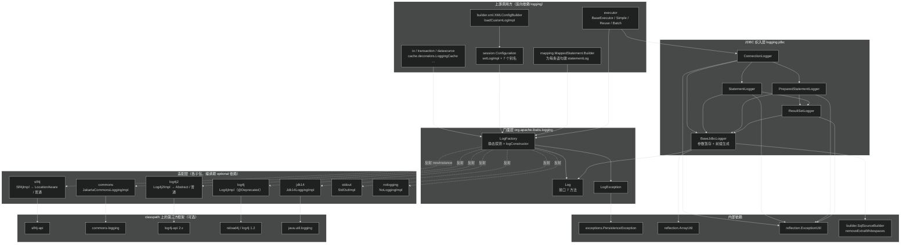
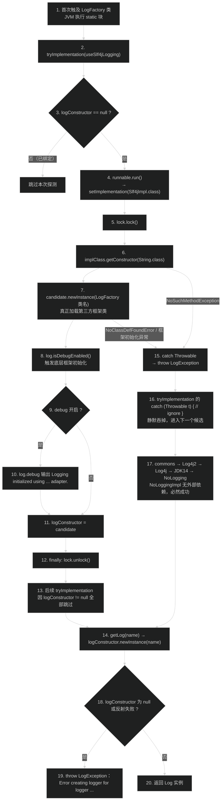
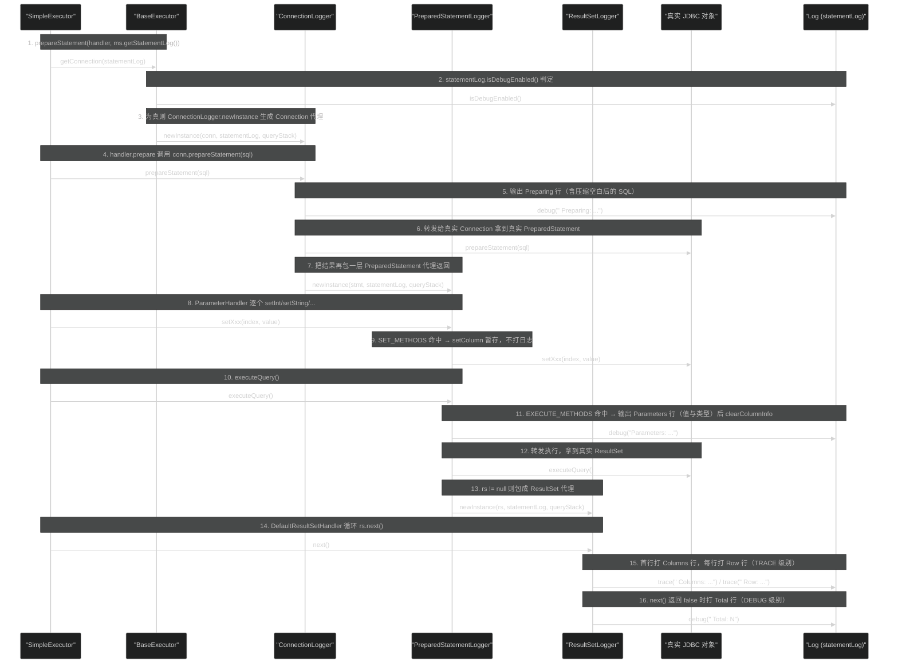
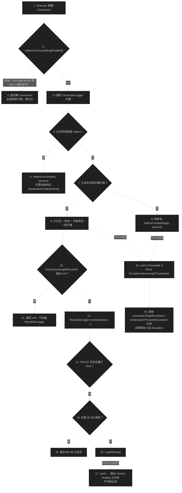
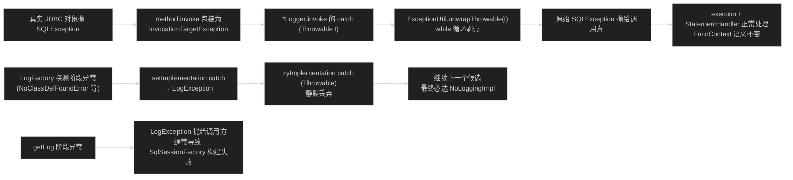

# 日志适配（logging）
> 上次修改：2026-07-29 02:02

## 重点关注

| 入口 / 章节 | 源码位置 | 为什么重要 |
|-------------|----------|------------|
| `LogFactory` 静态初始化块 | `src/main/java/org/apache/ibatis/logging/LogFactory.java:35-42` | 整个 MyBatis 日志行为的"出生地"。六个 `tryImplementation` 按 SLF4J → commons-logging → Log4j2 → Log4j(1.x) → JDK14 → NoLogging 的**硬编码顺序**依次探测，第一个不抛异常的胜出。"为什么我的 SQL 日志不打印"绝大多数追到这里。 |
| `LogFactory.setImplementation(...)` | `LogFactory.java:106-120` | 探测的实际执行体：反射取 `(String)` 单参构造 → **立刻 new 一个实例试跑** → `isDebugEnabled()` 触发底层框架初始化 → 成功才赋值 `logConstructor`。"试跑"这一步是探测能生效的关键，也是 SLF4J 无绑定时误判的根源（见 8.2）。 |
| `Log` 接口七方法 | `src/main/java/org/apache/ibatis/logging/Log.java:21-37` | MyBatis 全部日志能力的完整契约：只有 `trace/debug/warn/error` 四级 + 两个 `isXxxEnabled`，**没有 info、没有参数化占位符、没有 Marker 参数**。理解这个"故意做小"的门面是理解后面所有适配器的前提。 |
| `ConnectionLogger.newInstance(...)` | `src/main/java/org/apache/ibatis/logging/jdbc/ConnectionLogger.java:78-82` | SQL 日志链路的**唯一入口**。JDK 动态代理包住 `Connection`，此后 `prepareStatement` / `createStatement` 返回的都是代理，日志能力像病毒一样沿 JDBC 对象图传播。 |
| `BaseExecutor.getConnection(Log)` | `src/main/java/org/apache/ibatis/executor/BaseExecutor.java:355-361` | 代理是否创建的**唯一开关**：`statementLog.isDebugEnabled()` 为假时直接返回裸连接。这解释了"把日志级别调到 DEBUG 才有 SQL"以及"生产环境零代理开销"两件事。 |
| `PreparedStatementLogger.invoke(...)` | `src/main/java/org/apache/ibatis/logging/jdbc/PreparedStatementLogger.java:44-83` | `Parameters:` 这一行的产地。`setXxx` 调用被拦截并暂存到 `columnMap/columnNames/columnValues`，直到 `execute*`/`addBatch` 才一次性格式化输出。参数错位、参数类型不符的排查全靠它。 |
| `BaseJdbcLogger.prefix(boolean)` | `src/main/java/org/apache/ibatis/logging/jdbc/BaseJdbcLogger.java:145-155` | 日志行首那串 `==> ` / `<==  ` 的生成算法，长度由 `queryStack` 决定。**嵌套查询的层级深度直接编码在前缀里**，是判断"这条 SQL 是不是嵌套子查询触发的"最快的信号。 |
| `ResultSetLogger.invoke` + `printColumnValues` | `src/main/java/org/apache/ibatis/logging/jdbc/ResultSetLogger.java:62-118` | TRACE 级别逐行打印结果集的实现。含 BLOB 列白名单跳过、`getString()` 失败降级为 `<<Cannot Display>>`，以及"`next()` 返回 false 时才打 `Total:`"的收口逻辑。 |
| `Slf4jImpl` 构造函数的二次探测 | `src/main/java/org/apache/ibatis/logging/slf4j/Slf4jImpl.java:32-49` | 适配器内部还有一层"能力探测"：反射检查 `LocationAwareLogger.log(...)` 六参方法是否存在，存在则走 `Slf4jLocationAwareLoggerImpl`（能正确输出调用者类名/行号），否则降级。日志里 `%class`/`%line` 打成 `Slf4jLoggerImpl` 的原因在此。 |
| `Configuration.setLogImpl(...)` | `src/main/java/org/apache/ibatis/session/Configuration.java:236-241` | `<setting name="logImpl">` 的落点。它**不是**把实现存进当前 `Configuration` 就完事，而是直接调 `LogFactory.useCustomLogging` 改**全局静态**状态——多 `SqlSessionFactory` 共存时互相踩踏的根因（见 9.3）。 |
| `MappedStatement.Builder` 中 `statementLog` 的命名 | `src/main/java/org/apache/ibatis/mapping/MappedStatement.java:80-84` | 每条语句的 Logger 名 = `logPrefix + statementId`（全限定 Mapper 方法名）。这是能对**单个 Mapper 方法**单独开 DEBUG 的机制来源，也是日志配置文件里 logger name 该怎么写的依据。 |

## 1. 模块定位与职责边界

**结论**：`logging` 包做两件互不相干、却被打包在一起的事：

1. **日志门面 + 自动适配层**（`logging` 根包 + 六个实现子包）：让 MyBatis 核心代码只依赖自己的 `Log` 接口，运行时再按 classpath 上实际存在的日志框架自动挑一个绑上去。目标是**零强制依赖**——MyBatis 主 jar 对 slf4j/commons-logging/log4j 的依赖在 `pom.xml` 中全部标记为 `<optional>true</optional>`（`pom.xml:284-307`）。
2. **JDBC 日志织入层**（`logging.jdbc` 子包）：用 JDK 动态代理包裹 `Connection` / `Statement` / `PreparedStatement` / `ResultSet`，把"预编译的 SQL、绑定的参数、影响行数、结果集列名与每一行"输出成人类可读的日志。这是 MyBatis 最著名的那段 `==> Preparing: / ==> Parameters: / <== Total:` 输出的全部实现。

整个包 22 个源文件（含 7 个 `package-info.java`），约 1100 行代码，是 MyBatis 中**最容易被完整读完**、同时**排障价值最高**的模块。

### 负责什么

- 定义统一日志契约 `Log`（`Log.java:21-37`），并在 `LogFactory` 中提供唯一的 Logger 获取入口 `getLog(Class)` / `getLog(String)`。
- 在**类加载时**完成日志框架探测与绑定（`LogFactory.java:35-42`），无需任何配置即可工作。
- 提供 6 个第三方框架适配器 + 2 个特殊实现（`StdOutImpl` 直接打 `System.out`、`NoLoggingImpl` 全部丢弃）。
- 把 JDBC 四个核心接口的调用翻译成日志文本，并维护"参数暂存 → 执行时输出"的时序（`BaseJdbcLogger` + 四个 `*Logger`）。
- 向底层框架传递 `MYBATIS` Marker（`LogFactory.MARKER`，`LogFactory.java:30`），使支持 Marker 的框架（SLF4J、Log4j2）能按 Marker 过滤 MyBatis 日志。

### 不负责什么

- **不负责日志的输出目的地、格式、滚动、级别配置**——这些完全交给底层框架的配置文件（logback.xml / log4j2.xml / logging.properties）。`logging` 包内**没有任何一处读取日志配置文件**。
- **不负责决定何时创建 JDBC 代理**。开关在 `BaseExecutor.getConnection(Log)`（`BaseExecutor.java:355-361`）与三个 `Executor` 子类里，属于 `executor` 模块职责。
- **不负责 SQL 文本的生成与参数绑定**。`logging.jdbc` 只是旁观者：它拦截 `setInt/setString/...` 的**入参**做记录，真正的绑定动作仍由被代理对象完成（`PreparedStatementLogger.java:67`）。
- **不提供 `info` 级别**。`Log` 接口只有 trace/debug/warn/error 四级；MyBatis 内部凡是"正常运行信息"都归到 `debug`。
- **不负责异常的定义与转换语义**，`LogException`（`LogException.java:23-41`）只是 `PersistenceException` 的一个空壳子类，仅在工厂初始化/取 Logger 失败时抛出。

### 主要输入、输出、状态与副作用

| 维度 | 内容 | 源码依据 |
|------|------|----------|
| 输入（门面侧） | Logger 名称字符串（通常是类全名，或 `logPrefix + statementId`） | `LogFactory.java:48-58`、`MappedStatement.java:80-84` |
| 输入（JDBC 侧） | 被代理的 JDBC 对象、`Log` 实例、`queryStack` 整数 | `ConnectionLogger.java:78`、`BaseExecutor.java:358` |
| 输出 | 无返回值的日志文本；以及**代理对象**（`Connection`/`Statement`/`PreparedStatement`/`ResultSet`） | `ConnectionLogger.java:81`、`PreparedStatementLogger.java:100-101` |
| 全局可变状态 | `LogFactory.logConstructor`（`static`，非 volatile） | `LogFactory.java:33` |
| 实例可变状态 | `BaseJdbcLogger` 的 `columnMap` / `columnNames` / `columnValues`；`ResultSetLogger` 的 `first` / `rows` / `blobColumns` | `BaseJdbcLogger.java:46-49`、`ResultSetLogger.java:41-44` |
| 副作用 | 写日志（I/O）；`ResultSetLogger` 在 TRACE 下**额外调用** `rs.getMetaData()` 与 `rs.getString(i)`（对被代理 ResultSet 产生真实读取行为，见 9.4） | `ResultSetLogger.java:73`、`:110` |

## 2. 架构关系与依赖

**结论**：`logging` 是 MyBatis 的**最底层横切模块**之一，被 `io` / `executor` / `transaction` / `datasource` / `cache` / `mapping` / `builder` / `session` 广泛反向依赖，而它自己只依赖三个极轻的内部工具（`exceptions.PersistenceException`、`reflection.ArrayUtil`、`reflection.ExceptionUtil`）和**一个不该有的上层依赖**（`builder.SqlSourceBuilder`，见下文耦合点）。



### 节点与依赖方向说明

| 节点 | 角色 | 依赖方向与性质 |
|------|------|----------------|
| `Log`（`Log.java:21`） | 全模块唯一契约 | 被所有适配器实现、被 `BaseJdbcLogger` 与全部上游持有。**强依赖、不可替换**。 |
| `LogFactory`（`LogFactory.java:25`） | 静态工厂 + 探测器 | 单向依赖全部 7 个适配器类字面量（`LogFactory.java:64-94`），因此是**编译期硬引用**；但真正加载靠反射 + `tryImplementation` 吞异常，所以缺 jar 也能启动。 |
| `slf4j` / `commons` / `log4j2` / `log4j` / `jdk14` 子包 | 适配器 | 各自依赖对应第三方框架。**可替换依赖**：任一 jar 缺失只导致该分支探测失败。 |
| `stdout` / `nologging` | 兜底实现 | **零外部依赖**，保证 `LogFactory` 探测链一定有终点（`useNoLogging` 永不失败）。 |
| `BaseJdbcLogger`（`BaseJdbcLogger.java:41`） | 四个代理的共享基类 | 持有 `Log` + `queryStack`，提供 `setColumn/getParameterValueString/prefix/debug/trace`。 |
| `ConnectionLogger` → `PreparedStatementLogger` / `StatementLogger` → `ResultSetLogger` | 代理传播链 | **单向下游传播**：上层代理在拦截到工厂方法（`prepareStatement`/`createStatement`/`executeQuery`/`getResultSet`）时，把返回值再包一层。链条一旦从 `Connection` 断掉（未走 `BaseExecutor.getConnection`），下游全部无日志。 |
| `reflection.ExceptionUtil`（`ExceptionUtil.java:31-42`） | 异常解包 | 四个 `invoke` 的 `catch` 里统一调用，剥掉 `InvocationTargetException` / `UndeclaredThrowableException` 外壳，**保证代理对调用方透明**。 |
| `reflection.ArrayUtil` | 数组转字符串 | 仅供 `objectValueString` 处理 `java.sql.Array` 参数（`BaseJdbcLogger.java:100-109`）。 |
| `builder.SqlSourceBuilder.removeExtraWhitespaces` | SQL 文本压缩 | **跨层向上依赖**（底层 logging → 上层 builder），见下方耦合点。 |

### 强依赖 / 可替换依赖 / 跨层调用 / 耦合点

- **强依赖**：`Log` 接口；`java.lang.reflect.Proxy`（JDBC 层完全建立在 JDK 动态代理上，无 fallback）；`exceptions.PersistenceException`。
- **可替换依赖**：全部 5 个第三方日志框架。`pom.xml:284-307` 将 reload4j、commons-logging、log4j-api、slf4j-api 全部声明为 `optional`，即使用者不引入任何日志 jar，MyBatis 依然可运行（落到 `NoLoggingImpl`）。
- **跨层调用（耦合点 1）**：`BaseJdbcLogger.removeExtraWhitespace`（`BaseJdbcLogger.java:121-123`）委托 `org.apache.ibatis.builder.SqlSourceBuilder.removeExtraWhitespaces`。底层日志模块反向依赖了配置构建模块的一个静态工具方法，纯属**复用便利导致的层次倒挂**；该方法本身只是 `StringTokenizer` 折叠空白（`SqlSourceBuilder.java:41-53`），完全可以下沉到通用工具包。
- **耦合点 2**：`Configuration` 直接持有 7 个适配器类的**类字面量**用于注册别名（`Configuration.java:209-215`：`SLF4J` / `COMMONS_LOGGING` / `LOG4J` / `LOG4J2` / `JDK_LOGGING` / `STDOUT_LOGGING` / `NO_LOGGING`）。这意味着**加载 `Configuration` 就会加载这 7 个适配器类**（仅类引用、不触发第三方框架初始化），新增适配器必须同步改 `Configuration`，扩展性靠 `logImpl` 写全限定类名兜底。
- **耦合点 3（全局状态）**：`Configuration.setLogImpl` 写入的是 `LogFactory` 的 `static` 字段（`Configuration.java:236-241` → `LogFactory.java:60-62`），属于**实例配置污染全局单例**，详见 9.3。

## 3. 入口与调用方式

本模块**没有用户 API、没有命令入口、没有定时任务**，只有三类入口：类加载入口、编程/配置入口、以及框架内部的调用入口。

### 3.1 类加载入口：`LogFactory` 静态初始化块

| 项 | 内容 |
|----|------|
| 源码位置 | `src/main/java/org/apache/ibatis/logging/LogFactory.java:35-42` |
| 触发条件 | **首次触及 `LogFactory` 类**（JVM 类初始化时机）。最常见的触发点是 `Configuration` 构造过程中 `MappedStatement.Builder` 调 `LogFactory.getLog(logId)`，或任何持有 `private static final Log log = LogFactory.getLog(X.class)` 的类被加载（如 `PooledDataSource.java:45`、`JdbcTransaction.java:40`、`DefaultVFS.java:46`）。 |
| 关键参数 | 无参。行为完全取决于**当前 classpath**。 |
| 返回值 | 无。副作用是给 `static Constructor<? extends Log> logConstructor` 赋值。 |
| 上下文要求 | 无。但注意它在**任何用户配置被读取之前**就已完成——所以 `logImpl` 设置本质是"事后覆盖"而非"事前指定"。 |
| 之后进入 | `tryImplementation` → `setImplementation` → 反射构造 + 试跑（详见 5.1）。 |

### 3.2 编程入口：`LogFactory` 的 8 个静态方法

| 入口 | 源码位置 | 触发条件与语义 |
|------|----------|----------------|
| `getLog(Class<?> clazz)` | `LogFactory.java:48-50` | 唯一推荐用法，内部转 `clazz.getName()`。**框架内部 20 处使用此形式**（`BaseExecutor.java:53`、`TransactionalCache.java:40`、`VFS.java:36`、`ResolverUtil.java:63` 等）。 |
| `getLog(String logger)` | `LogFactory.java:52-58` | 支持任意 Logger 名。用于**按语句维度命名**（`MappedStatement.java:84`）与**按缓存 namespace 命名**（`LoggingCache.java:34`）。失败包装为 `LogException`。 |
| `useCustomLogging(Class<? extends Log>)` | `LogFactory.java:60-62` | 由 `Configuration.setLogImpl` 调用，是 `<setting name="logImpl">` 的最终落点。 |
| `useSlf4jLogging()` / `useCommonsLogging()` / `useLog4J2Logging()` / `useJdkLogging()` / `useStdOutLogging()` / `useNoLogging()` | `LogFactory.java:64-94` | 供用户在**创建 `SqlSessionFactory` 之前**手动强制指定；也被静态块自己复用。`useStdOutLogging` 不在探测链中，只能手动调用。 |
| `useLog4JLogging()` | `LogFactory.java:76-78` | 已 `@Deprecated`（3.5.9 起，issue #1223），指向 log4j 1.x 的 `Log4jImpl`；仍留在探测链第 4 位。 |

关键约束：这些 `useXxx` 方法都会走 `setImplementation`，**失败时抛 `LogException`**（不像静态块里被 `tryImplementation` 吞掉）。因此手动调用 `LogFactory.useLog4J2Logging()` 而 classpath 无 log4j-api 时会直接炸，这是**故意的快速失败**设计。

### 3.3 配置入口：`<setting name="logImpl">`

```
XML <settings> → XMLConfigBuilder.loadCustomLogImpl(props)   builder/xml/XMLConfigBuilder.java:168-171
                → resolveClass("logImpl")  → 走 TypeAliasRegistry
                → Configuration.setLogImpl(clazz)            session/Configuration.java:236-241
                → LogFactory.useCustomLogging(clazz)         logging/LogFactory.java:60-62
```

- 取值可以是 7 个内置别名之一（`Configuration.java:209-215` 注册：`SLF4J`、`COMMONS_LOGGING`、`LOG4J`、`LOG4J2`、`JDK_LOGGING`、`STDOUT_LOGGING`、`NO_LOGGING`），也可以是任意实现 `Log` 且有 `(String)` 构造的**全限定类名**。
- 权限/上下文要求：必须在 `SqlSessionFactory` 构建期生效；构建完成后再改不会影响已经建好的 `MappedStatement.statementLog`（那些 `Log` 实例在 Builder 里就已固化，`MappedStatement.java:84`）。
- 该入口的行为已被 `LogFactoryTest.shouldReadLogImplFromSettings`（`src/test/java/org/apache/ibatis/logging/LogFactoryTest.java:97-106`）覆盖：加载一个把 `logImpl` 设为 `NO_LOGGING` 的配置后，`LogFactory.getLog` 返回 `NoLoggingImpl`。

### 3.4 框架内部入口：JDBC 代理的创建点

| 入口 | 源码位置 | 触发条件 | 之后进入 |
|------|----------|----------|----------|
| `BaseExecutor.getConnection(Log statementLog)` | `executor/BaseExecutor.java:355-361` | **仅当 `statementLog.isDebugEnabled()` 为 true** 才返回 `ConnectionLogger.newInstance(...)`，否则返回 `transaction.getConnection()` 原对象 | 见 5.2 的代理传播链 |
| `SimpleExecutor.prepareStatement(handler, ms.getStatementLog())` | `executor/SimpleExecutor.java:48`、`:63`、`:75`、`:86` | 每次 `doUpdate` / `doQuery` / `doQueryCursor` | 把 `ms.getStatementLog()` 传下去，最终到 `getConnection` |
| `ReuseExecutor` / `BatchExecutor` 同名逻辑 | `executor/ReuseExecutor.java:50`、`:60`、`:69`；`executor/BatchExecutor.java:69`、`:90`、`:105` | 同上 | 同上 |
| `ConnectionLogger.newInstance(conn, statementLog, queryStack)` | `logging/jdbc/ConnectionLogger.java:78-82` | 由上一行调用，是 `logging.jdbc` 对外的**唯一 public 创建入口**（另外三个 `newInstance` 只在包内被上级代理调用） | `Proxy.newProxyInstance` 生成 `Connection` 代理 |

**关键结论**：`Log` 实例的来源是 `MappedStatement.getStatementLog()`（`MappedStatement.java:296-298`），其名字为 `logPrefix + statementId`（`MappedStatement.java:80-84`）。因此"SQL 日志开关"实际上是**按 Mapper 方法全限定名配置的 DEBUG 级别**，例如在 logback 中：

```xml
<logger name="com.example.mapper.UserMapper.selectById" level="TRACE"/>
<logger name="com.example.mapper.UserMapper" level="DEBUG"/>
```

前者可精确到单个方法（因为 logger 名就是方法全限定名），后者利用日志框架的层级继承覆盖整个 Mapper。

## 4. 核心概念与领域模型

### 4.1 `Log` —— 极简日志门面

- **定义**：7 个方法的接口（`Log.java:21-37`）：`isDebugEnabled()`、`isTraceEnabled()`、`error(String, Throwable)`、`error(String)`、`debug(String)`、`trace(String)`、`warn(String)`。
- **作用**：把 MyBatis 全部日志需求收敛到最小公共子集，使适配器可以在**任何**日志框架上无损实现。
- **生命周期**：由 `LogFactory.getLog` 创建；MyBatis 内部通常存为 `private static final`（与类同生命周期），或存为 `MappedStatement` 的 final 字段（与配置同生命周期）。**没有任何回收/关闭动作**。
- **相关类型**：7 个实现类 + `BaseJdbcLogger.statementLog` 字段。
- **使用场景**：
  - 直接使用：`if (log.isDebugEnabled()) { log.debug("Cache Hit Ratio [" + getId() + "]: " + getHitRatio()); }`（`cache/decorators/LoggingCache.java:59-61`）——**先判级别再拼字符串**是全库统一写法，因为接口无参数化占位符。
- **设计特征**：没有 `info`；没有 `isWarnEnabled`/`isErrorEnabled`（warn/error 无条件输出，由底层框架过滤）；没有 `Object... args` 重载。

**三维评估（为什么自造门面而不直接用 SLF4J）**

| 维度 | 内容 |
|------|------|
| 好处 | ① MyBatis 主 jar 对所有日志框架都是 `optional`（`pom.xml:284-307`），使用者不会被强行拖入 slf4j-api，这对"要嵌进任意宿主环境"的持久层框架至关重要（MyBatis 早于 SLF4J 成为事实标准）；② 接口只有 7 个方法，实现新适配器成本极低；③ `LogFactory` 可以在**无任何配置**下自动工作，比 SLF4J 的"缺绑定就打警告"体验更平滑（有 `NoLoggingImpl` 兜底）。 |
| 替代方案 | ① 直接依赖 `slf4j-api`（编译期强依赖，实现最简单，但强加依赖且丧失自动降级）；② 用 JDK 的 `java.util.logging` 作为唯一门面（零依赖，但格式/级别模型与主流框架错位，`FINE/FINER` 语义别扭，见 `Jdk14LoggingImpl.java:35-42` 的级别映射）；③ 依赖 `jboss-logging`/`commons-logging` 这类第三方门面（把选择权外包，但历史上 commons-logging 的类加载器泄漏问题严重）。 |
| 风险 | ① **丢失参数化日志**：`debug(String)` 强制调用方自己拼字符串，虽然有 `isDebugEnabled()` 守卫，但仍有遗漏守卫导致无谓拼串的可能；② **丢失 MDC/结构化字段**，无法把 SQL、参数、耗时作为独立字段输出，不利于日志采集与检索；③ 多一层委托导致堆栈里多出 `Slf4jLoggerImpl`/`Log4j2LoggerImpl` 一层，必须靠 FQCN 机制（4.4）修正调用者定位；④ 无 `info` 级别使得"正常但重要"的信息（如日志适配器初始化）只能打在 debug，容易被过滤掉（`LogFactory.java:111-113`）。 |

### 4.2 `logConstructor` —— 反射构造器缓存

- **定义**：`private static Constructor<? extends Log> logConstructor`（`LogFactory.java:33`）。
- **作用**：探测阶段确定一次，之后每次 `getLog` 都用它 `newInstance(logger)`（`LogFactory.java:54`），避免重复 `Class.forName` / `getConstructor`。
- **生命周期**：类初始化时赋值，可被 `useXxxLogging` / `useCustomLogging` **随时重写**；进程内全局唯一。
- **隐含契约**：所有 `Log` 实现**必须**提供一个 `public (String)` 单参构造。这条契约没有编译期保障，只在 `setImplementation` 里 `implClass.getConstructor(String.class)` 时暴露（`LogFactory.java:109`）；7 个内置实现全部遵守（如 `StdOutImpl.java:25`、`NoLoggingImpl.java:25`、`Jdk14LoggingImpl.java:30`）。
- **并发保护**：写侧用 `ReentrantLock lock`（`LogFactory.java:32`、`:107-119`）串行化；读侧（`getLog`）**不加锁、字段非 volatile**，见 9.3。

### 4.3 `queryStack` 与日志前缀 —— 嵌套查询深度的可视化

- **定义**：`BaseJdbcLogger.queryStack`（`BaseJdbcLogger.java:52`），由构造函数归一化：传入 0 时强制为 1（`BaseJdbcLogger.java:59-63`）。
- **来源**：`BaseExecutor.queryStack`（`BaseExecutor.java:63`），在 `BaseExecutor.query` 进入时 `++`、`finally` 里 `--`（`BaseExecutor.java:154`、`:162`），用于嵌套/延迟加载查询的深度计数与一级缓存清理时机（`BaseExecutor.java:149`、`:164-173`）。创建 `ConnectionLogger` 时把当时的值快照进来（`BaseExecutor.java:358`）。
- **作用**：`prefix(boolean)`（`BaseJdbcLogger.java:145-155`）按深度生成 `2*queryStack+2` 个字符的前缀：输入方向为 `==> `（末位 `>`），输出方向为 `<== `（首位 `<`）。深度 2 时变成 `====> ` / `<====  `，肉眼即可分辨嵌套层级。
- **关系**：`queryStack` 由 `Connection` 代理**沿传播链一路传给**`Statement`/`PreparedStatement`/`ResultSet` 代理（`ConnectionLogger.java:54`、`:58`；`PreparedStatementLogger.java:56`、`:70`），因此同一次执行的所有日志行前缀宽度一致。

**三维评估**

| 维度 | 内容 |
|------|------|
| 好处 | 用零成本的字符串前缀表达了"嵌套深度"这个原本需要 MDC/调用栈才能表达的信息；`<` 在最左、`>` 在最右形成视觉上的"进/出"箭头，人工阅读长日志时定位极快。 |
| 替代方案 | ① 用 MDC 存深度并交给日志 pattern 渲染（更结构化，但要求底层框架支持 MDC，与 4.1 的极简门面冲突）；② 直接在文本里写 `depth=2`（可解析但不可读）；③ 不表达深度（3.x 早期行为，嵌套查询日志混在一起难以区分）。 |
| 风险 | ① `queryStack` 是**创建代理那一刻的快照**，若同一个 `Connection` 代理被跨深度复用（例如 `ReuseExecutor` 缓存了 `Statement`），前缀深度会与实际深度不符；② 深度很大时前缀会线性变长（`new char[queryStack*2+2]`，`BaseJdbcLogger.java:146`），无上限保护，理论上递归延迟加载可产生极长前缀；③ 传入 0 归一化为 1 使得"顶层查询"与"深度 1"无法区分。 |

### 4.4 FQCN + Marker —— 让底层框架正确定位调用者

- **定义**：两个静态常量组合。`LogFactory.MARKER = "MYBATIS"`（`LogFactory.java:30`）；各"位置感知"适配器里的 `FQCN`，如 `Slf4jLocationAwareLoggerImpl.FQCN = Slf4jImpl.class.getName()`（`Slf4jLocationAwareLoggerImpl.java:31`）、`Log4j2AbstractLoggerImpl.FQCN = Log4j2Impl.class.getName()`（`Log4j2AbstractLoggerImpl.java:35`）。
- **作用**：日志框架计算 `%class`/`%line` 时会沿调用栈向上找"第一个不属于 FQCN 及其内部的帧"。把 FQCN 声明为**外层门面类**（`Slf4jImpl` / `Log4j2Impl`）而非内层实现类，可让框架跳过 MyBatis 的两层委托，输出真正的业务调用者。
- **生命周期**：`static final`，随类常驻。
- **Marker 的作用**：`MarkerFactory.getMarker("MYBATIS")`（`Slf4jLocationAwareLoggerImpl.java:29`）/ `MarkerManager.getMarker(...)`（`Log4j2AbstractLoggerImpl.java:33`），使用者可用 `MarkerFilter` 单独收集或屏蔽 MyBatis 日志。**只有这两个"位置感知"实现传 Marker**；普通 `Slf4jLoggerImpl`（`Slf4jLoggerImpl.java:42-65`）、`Log4j2LoggerImpl`、`Jdk14LoggingImpl`、`JakartaCommonsLoggingImpl` 都不传。
- **关系**：由 `Slf4jImpl` / `Log4j2Impl` 的构造函数**运行时选择**用哪个内部实现（`Slf4jImpl.java:35-48`、`Log4j2Impl.java:33-38`），构成一个"外层门面 + 双内层实现"的两级委托结构。

**三维评估**

| 维度 | 内容 |
|------|------|
| 好处 | ① 解决门面模式最典型的副作用——调用位置全部指向门面类；② Marker 让 MyBatis 日志可被单独过滤，不必依赖 logger 名前缀匹配；③ `Slf4jImpl` 用**反射探方法签名**（`Slf4jImpl.java:38-39`）而不是判版本号，兼容 slf4j 1.6/1.7/2.x 各种混搭。 |
| 替代方案 | ① 一律用普通 `Logger.debug(...)`，放弃位置准确性（实现简单，但 `%line` 永远错）；② 要求使用者在 pattern 里配 `%caller{2}` 之类手工跳帧（把复杂度转移给使用者）；③ 用 SLF4J 2.x 的 Fluent API `atDebug().setCallerBoundary(...)`（更干净，但要求 slf4j ≥ 2.0，会破坏对 1.x 的兼容）。 |
| 风险 | ① 反射探测发生在**每次 `new Slf4jImpl`**（即每个 logger 名一次，`Slf4jImpl.java:38`），语句数量大的应用启动期会有可观的反射开销（每条 `MappedStatement` 一个 logger）；② `logger.getClass().getMethod(...)` 依赖具体实现类而非接口，某些代理/包装型 `Logger` 实现可能探测失败而静默降级为 `Slf4jLoggerImpl`（`Slf4jImpl.java:42-48` 只 catch 后 fall-through，无任何日志提示，排查困难）；③ FQCN 硬编码为外层类名，若将来插入第三层委托必须同步修改，否则位置信息又会偏。 |

### 4.5 参数暂存三元组 —— `columnMap` / `columnNames` / `columnValues`

- **定义**：`BaseJdbcLogger` 的三个实例字段（`BaseJdbcLogger.java:46-49`），`setColumn(key, value)` 同时写三者（`BaseJdbcLogger.java:77-81`）。
- **作用**：`PreparedStatement.setXxx(idx, val)` 是**逐个**调用的，而日志要在 `execute*` 时**一次性**打印全部参数，因此必须暂存。`columnValues` 保序用于输出值，`columnNames` 保序用于输出键（参数下标或名称），`columnMap` 提供按键随机访问（`getColumn`）。
- **生命周期**：随 `PreparedStatementLogger` 实例存在；在 `execute*`/`addBatch` 打印后立即 `clearColumnInfo()`（`PreparedStatementLogger.java:53`），`ResultSetLogger` 每次 `invoke` 结束也无条件清空（`ResultSetLogger.java:85`）。
- **相关方法**：`getParameterValueString()`（`BaseJdbcLogger.java:87-98`）把每个值渲染为 `值(类型简名)`，`null` 渲染为字面量 `null`；`objectValueString`（`:100-109`）对 `java.sql.Array` 特殊处理成 `ArrayUtil.toString(array.getArray())`。
- **注意**：`getColumnString()`（`:111-113`）返回 `columnNames.toString()`，在当前代码中**未被任何 `*Logger` 调用**（`PreparedStatementLogger` 只打 `getParameterValueString()`），属于历史遗留的 protected API。

**三维评估**

| 维度 | 内容 |
|------|------|
| 好处 | 三个容器分工明确，`getParameterValueString` 输出与 `setXxx` 调用顺序严格一致，便于和 `Preparing:` 行里的 `?` 逐个对位；`值(类型)` 格式同时暴露了 TypeHandler 推断出的 Java 类型，是排查"参数类型不符导致索引失效"的关键信息。 |
| 替代方案 | ① 只保留 `List<Object>`（省一个 `Map`，但失去按键查询能力，`getColumn` 会消失）；② 用 `LinkedHashMap` 一个容器同时满足保序 + 随机访问（更省内存，且天然去重；当前实现下同一下标被 `set` 两次会在 `columnValues` 里**留下两条**记录，导致参数行比 `?` 多）；③ 不暂存，在每次 `setXxx` 时立即打一行日志（简单但日志量爆炸且丢失对位视觉）。 |
| 风险 | ① **重复 set 会重复记录**：`setColumn` 无条件 `add`（`BaseJdbcLogger.java:79-80`），若业务对同一参数位置重复赋值，`Parameters:` 行的项数会多于 SQL 中 `?` 的个数；② `objectValueString` 直接调 `value.toString()`（`:108`），对大对象/大数组会产生**巨大日志行**，且可能触发业务 `toString()` 中的副作用或异常（未做 try-catch）；③ 参数值原样进日志，**密码/身份证等敏感数据会被明文记录**，模块内无任何脱敏钩子。 |

## 5. 关键流程

### 5.1 主成功路径：`LogFactory` 静态探测与绑定



**1-3 类初始化与幂等守卫**：JVM 在首次主动使用 `LogFactory` 时执行静态块（`LogFactory.java:35-42`），依次把 6 个 `useXxxLogging` 方法引用交给 `tryImplementation`。`tryImplementation` 的第一件事是判 `logConstructor == null`（`LogFactory.java:97`）——这是**唯一的"已绑定则不再尝试"守卫**，也是"探测顺序即优先级"的实现方式：只有前面全失败，后面的候选才有机会。注意该守卫**没有加锁**，静态块由 JVM 保证单线程执行，故此处安全。

**4-7 反射取构造器并真正加载框架**：`setImplementation` 先获得 `lock`（`LogFactory.java:107`），再 `implClass.getConstructor(String.class)`（`:109`）。此时 `Slf4jImpl` 类已被加载，但它字段/构造体里引用的 `org.slf4j.LoggerFactory` **尚未解析**；真正的"classpath 有没有 slf4j"要到第 7 步 `candidate.newInstance(...)` 执行 `Slf4jImpl` 构造体时才见分晓（`Slf4jImpl.java:33` 调 `LoggerFactory.getLogger`）。这就是为什么探测必须**实例化一次**而不能只 `getConstructor` 了事。

**8-12 试跑校验与提交绑定**：`log.isDebugEnabled()`（`LogFactory.java:111`）除了决定是否打初始化日志，更重要的作用是**强制走通一次完整的日志调用链**——底层框架的配置解析、Appender 创建等在此阶段暴露问题。只有走到 `logConstructor = candidate`（`:114`）才算绑定成功，也就是说**赋值是最后一步**，中途任何异常都不会留下半成品状态（这一点很关键，见 8.1）。`lock.unlock()` 在 `finally` 中（`:117-119`），异常路径也不会漏锁。

**13-14 后续探测短路与取 Logger**：一旦绑定，其余 5 个 `tryImplementation` 都在第 3 步被短路。之后所有 `getLog` 调用都是"一次反射 `newInstance`"（`LogFactory.java:54`），没有缓存 Logger 实例——**每次 `getLog` 都 new 一个新的 `Log` 包装对象**（底层框架的 `Logger` 本身通常是缓存的，如 `LoggerFactory.getLogger` / `LogManager.getLogger`）。

**15-17 失败降级链**：`setImplementation` 把任何 `Throwable` 包成 `LogException` 抛出（`LogFactory.java:115-116`），而 `tryImplementation` 用 `catch (Throwable t) { // ignore }` 全部吞掉（`:100-102`）。捕获 `Throwable` 而非 `Exception` 是必需的——缺 jar 时抛的是 `NoClassDefFoundError`（`Error` 分支）。链条终点 `NoLoggingImpl` 无任何外部依赖（`NoLoggingImpl.java:23-27`），`isDebugEnabled()` 恒返回 `false`，所以第 8-9 步必然通过，**探测链保证有终点**。

**18-20 取 Logger 的失败处理**：`getLog` 不做 null 检查，直接 `logConstructor.newInstance(logger)`（`LogFactory.java:54`）。理论上 `logConstructor` 为 null 会抛 `NullPointerException`，但被 `catch (Throwable t)` 捕获并包装为 `LogException`（`:55-57`），消息中带上 logger 名与原因，便于定位。

### 5.2 主成功路径：SQL 日志的代理传播链



**1-3 代理的按需创建**：`SimpleExecutor.doQuery` 把 `ms.getStatementLog()` 一路传到 `BaseExecutor.getConnection`（`SimpleExecutor.java:63`、`:86` → `BaseExecutor.java:355`）。`getConnection` 用 `statementLog.isDebugEnabled()` 做**唯一开关**（`BaseExecutor.java:357`）：为假时直接返回 `transaction.getConnection()` 的裸连接，整条日志链**一个对象都不创建**；为真时创建 `ConnectionLogger` 代理，同时把当前 `queryStack` 快照进去。这一判断把"日志关闭时的性能开销"压到了一次 `isDebugEnabled()` 调用。

**4-7 Preparing 行与代理下传**：`ConnectionLogger.invoke` 只识别三个方法名。`prepareStatement`/`prepareCall` 命中时先 `debug(" Preparing: " + removeExtraWhitespace((String) params[0]), true)`（`ConnectionLogger.java:49-52`）——注意它取 `params[0]` 作为 SQL 且**强转 String**，同时用 `removeExtraWhitespace` 把 XML 里多行缩进的 SQL 折叠成单行（`BaseJdbcLogger.java:121-123` → `SqlSourceBuilder.java:41-53`）。随后转发给真实连接，并把返回的 `PreparedStatement` 再包一层（`:53-54`）。`createStatement` 分支**不打任何日志**（`:56-59`），因为此时 SQL 还未知，SQL 要等到 `StatementLogger` 拦到 `execute*(sql)` 才能拿到（`StatementLogger.java:48-51`，输出的是 `Executing:` 而非 `Preparing:`）。`Object` 声明的方法（`equals`/`hashCode`/`toString`）被前置分支转发到 handler 自身（`ConnectionLogger.java:46-48`），避免代理对象的身份语义错乱。

**8-9 参数暂存**：`PreparedStatementLogger.invoke` 用 `SET_METHODS` 判定是否为参数绑定方法（`PreparedStatementLogger.java:61`）。`SET_METHODS` 在 `BaseJdbcLogger` 静态块中由**反射扫描 `PreparedStatement` 的声明方法**得到：名字以 `set` 开头且参数数 > 1（`BaseJdbcLogger.java:67-69`）——`> 1` 这个条件精确排除了 `setFetchSize(int)`、`setMaxRows(int)` 等单参配置方法，只留下 `setInt(int,int)`、`setString(int,String)` 这类"下标 + 值"的绑定方法。命中后 `setColumn(params[0], params[1])`；`setNull` 特殊处理为 `setColumn(params[0], null)`（`:62-66`），因为 `setNull(idx, sqlType)` 的第二参是类型码而不是值。**这一步不打日志**。

**10-13 Parameters 行与执行**：`EXECUTE_METHODS`（`execute`/`executeUpdate`/`executeQuery`/`addBatch`，`BaseJdbcLogger.java:71-74`）命中时先打 `Parameters:` 行再 `clearColumnInfo()`（`PreparedStatementLogger.java:49-53`）。把 `addBatch` 也算进执行方法，正是为了让 `BatchExecutor` 的每一批参数都能各打一行。`executeQuery` 单独分支把返回的 `ResultSet` 包成代理，并做了 **null 保护**：`rs == null ? null : ResultSetLogger.newInstance(...)`（`:56`）。`getUpdateCount` 分支在返回值 `!= -1` 时打 `<==    Updates: N`（`:71-76`），这是 update/insert/delete 影响行数的来源。

**14-16 结果集逐行输出**：`ResultSetLogger.invoke` 的结构与前两者相反——它**先转发**再判断（`ResultSetLogger.java:68`），因为 `next()` 的返回值决定后续行为。`next()` 返回 true：`rows++`，且仅在 TRACE 开启时取 `ResultSetMetaData`、首行打 `Columns:`（`printColumnHeaders`，`:92-101`，同时把 BLOB 类列号记入 `blobColumns`）、每行打 `Row:`（`printColumnValues`，`:103-118`）。`next()` 返回 false：打 `<==      Total: N`（`:82`），这是唯一在 DEBUG 级别输出的 ResultSet 日志，也解释了"只看到 Total 没看到 Row"就是 TRACE 未开启。`invoke` 末尾无条件 `clearColumnInfo()`（`:85`）——对 `ResultSetLogger` 而言这三个容器从未被写入，属于从基类继承来的冗余调用。

### 5.3 边界与失败路径：日志关闭、null 结果集、代理内部异常



**1-3 关闭日志的完全短路**：这是最重要的边界。`BaseExecutor.getConnection` 在 `isDebugEnabled()` 为 false 时返回原始连接（`BaseExecutor.java:357-360`），因此**生产环境把级别设为 INFO 及以上时，`logging.jdbc` 的全部代码都不会执行**——没有 `Proxy` 创建、没有 `invoke` 拦截、没有反射开销。若用 `NoLoggingImpl`（`isDebugEnabled()` 恒 `false`，`NoLoggingImpl.java:29-32`）则彻底禁用。反过来，`StdOutImpl` 的 `isDebugEnabled()`/`isTraceEnabled()` **恒返回 true**（`StdOutImpl.java:29-37`），意味着选 `STDOUT_LOGGING` 就是无条件全量代理 + 全量 TRACE 输出，只适合调试。

**4-8 拦截判定的三层结构**：四个 `invoke` 方法都遵循同一骨架：先判 `Object.class.equals(method.getDeclaringClass())` 转发给 handler 自身（`ConnectionLogger.java:46-48`、`PreparedStatementLogger.java:46-48`、`StatementLogger.java:45-47`、`ResultSetLogger.java:65-67`），再按方法名匹配拦截列表，最后**默认纯转发**。这个"白名单拦截 + 默认透传"结构保证了 JDBC 接口新增方法时代理不会失效（`Connection` 有近 60 个方法，只拦 3 个）。

**9-12 null 结果集的防御**：三处创建 `ResultSetLogger` 的地方全部做了 null 判断（`PreparedStatementLogger.java:56`、`:70`；`StatementLogger.java:54`、`:61`）。这是必要的——`Statement.getResultSet()` 在当前结果是更新计数时按 JDBC 规范返回 null，若无判断会给上层返回一个包着 null 的代理，后续任何调用都变成 NPE。

**13-17 结果集取值的降级**：`printColumnValues` 对每一列单独 try-catch（`ResultSetLogger.java:106-115`），`SQLException` 时写入 `<<Cannot Display>>` 而不是抛出。配合基于 `ResultSetMetaData.getColumnType` 的 BLOB 白名单预判（`:95-97`，涵盖 `BINARY`/`BLOB`/`CLOB`/`LONGNVARCHAR`/`LONGVARBINARY`/`LONGVARCHAR`/`NCLOB`/`VARBINARY`，`:47-54`）直接输出 `<<BLOB>>`（`:107-108`），既避免把二进制内容灌进日志，又避免大量异常。注意 `printColumnHeaders` 本身**声明抛出 `SQLException`**（`:92`），若 `getColumnLabel`/`getColumnType` 失败，异常会冒泡到 `invoke` 的 catch 并被 `unwrapThrowable` 抛给业务——**打日志失败会导致业务查询失败**，这是一处未降级的风险点。

**18-19 异常透明化**：所有 `invoke` 用 `catch (Throwable t) { throw ExceptionUtil.unwrapThrowable(t); }`（如 `ConnectionLogger.java:61-63`）。`method.invoke` 会把目标方法抛出的 `SQLException` 包成 `InvocationTargetException`，若不解包，上层 `executor` 的 `SQLException` 捕获逻辑与 `ErrorContext` 都会失效。`ExceptionUtil.unwrapThrowable`（`ExceptionUtil.java:31-42`）用 `while(true)` 循环剥离 `InvocationTargetException` 与 `UndeclaredThrowableException`，直到拿到原始异常，保证**代理对调用方完全透明**。

## 6. 核心实现细节

### 6.1 `LogFactory` —— 用"函数引用 + 吞异常"实现的探测链

关键代码（`LogFactory.java:35-42`、`:96-120`）：

```java
static {
  tryImplementation(LogFactory::useSlf4jLogging);
  tryImplementation(LogFactory::useCommonsLogging);
  tryImplementation(LogFactory::useLog4J2Logging);
  tryImplementation(LogFactory::useLog4JLogging);
  tryImplementation(LogFactory::useJdkLogging);
  tryImplementation(LogFactory::useNoLogging);
}

private static void tryImplementation(Runnable runnable) {
  if (logConstructor == null) {
    try { runnable.run(); } catch (Throwable t) { /* ignore */ }
  }
}
```

**逐段解读**

- **输入**：无显式输入，隐式输入是 classpath 内容。**注意实际顺序是 6 个候选**：SLF4J → commons-logging → Log4j2 → **Log4j 1.x（已 `@Deprecated`）** → JDK14 → NoLogging。`useStdOutLogging` 故意不在链中（`LogFactory.java:88-90`），只能显式调用。
- **处理逻辑**：`Runnable` 用方法引用而非 `Class` 常量，好处是每个候选可以在自己的方法里写死类字面量（`LogFactory.java:64-94`），JIT/编译期能校验类名拼写；坏处是这 7 个 `useXxx` 方法同时也是**公开 API**，职责被复用（既是探测步骤，又是用户手动开关）。
- **输出与副作用**：给 `logConstructor` 赋值，并可能向底层框架写一条 debug 日志（`:111-113`）。
- **隐藏假设 1**：`logConstructor == null` 是"未绑定"的唯一判据。由于 `setImplementation` 把赋值放在最后（`:114`），中途失败不会留下"已绑定但不可用"的状态。
- **隐藏假设 2**：`catch (Throwable)` 而非 `catch (Exception)`。缺 jar 时 JVM 抛的是 `NoClassDefFoundError`（属于 `Error`），若只捕 `Exception` 整个静态块会失败，导致 `LogFactory` 类初始化失败（`ExceptionInInitializerError`/`NoClassDefFoundError`），MyBatis 完全不可用。
- **隐藏假设 3**：`NoLoggingImpl` 一定能成功，因此不需要"全部失败"的兜底分支。

**三维评估**

| 维度 | 内容 |
|------|------|
| 好处 | ① 零配置可用，且优先绑定"最可能是用户真实意图"的 SLF4J；② 探测代码只有 8 行，行为一目了然；③ 用异常做能力探测，不依赖 `Class.forName` 字符串（拼错会编译失败）；④ `useXxx` 同时充当公开 API，用户可完全绕过探测。 |
| 替代方案 | ① 用 `ServiceLoader` + SPI 文件让适配器自注册（可插拔、无需改 `LogFactory`，但需要每个适配器带 `META-INF/services`，且顺序不可控）；② 显式 `Class.forName("org.slf4j.Logger")` 探测标志类后再实例化（少一次无用实例化，但要为每个框架维护"标志类名"字符串）；③ 强制用户通过 `logImpl` 声明，无自动探测（行为确定、无踩踏，但破坏开箱即用与向后兼容）。 |
| 风险 | ① **顺序硬编码不可配置**：classpath 同时存在 slf4j-api 与 log4j2 时必然选 SLF4J，即使用户希望直连 Log4j2（只能用 `logImpl` 覆盖）；② **SLF4J 无绑定误判**：slf4j-api 存在但无任何绑定实现时，SLF4J 返回 NOP logger，`Slf4jImpl` 构造与 `isDebugEnabled()` 都不会抛异常，探测"成功"→ **所有日志静默丢弃**，且不会继续尝试 commons-logging/Log4j2（这是 MyBatis 日志"神秘消失"最常见的原因）；③ 静默吞掉全部 `Throwable`（`:100-102`）意味着**任何探测失败都无痕迹**，用户无法知道为什么落到了 NoLogging；④ 探测发生在类初始化阶段，时机早于任何用户代码，且**依赖类加载顺序**——在 OSGi/模块化容器中不同 bundle 的 classpath 可见性不同，结果可能不符预期；⑤ `useLog4JLogging` 仍在链中且早于 JDK14，若 classpath 残留 log4j 1.x（或 reload4j，`pom.xml:284-289`）会绑定到已废弃实现。 |

### 6.2 `setImplementation` —— "实例化 + 试跑"的双重校验

```java
private static void setImplementation(Class<? extends Log> implClass) {
  lock.lock();
  try {
    Constructor<? extends Log> candidate = implClass.getConstructor(String.class);
    Log log = candidate.newInstance(LogFactory.class.getName());
    if (log.isDebugEnabled()) {
      log.debug("Logging initialized using '" + implClass + "' adapter.");
    }
    logConstructor = candidate;
  } catch (Throwable t) {
    throw new LogException("Error setting Log implementation.  Cause: " + t, t);
  } finally {
    lock.unlock();
  }
}
```

- **输入**：`Class<? extends Log>`（来自 7 个 `useXxx` 或用户的 `logImpl`）。
- **处理逻辑**：三步校验——（a）**有 `(String)` 构造吗**（`:109`）；（b）**能构造成功吗**（`:110`，此步真正触发第三方类加载与框架初始化）；（c）**能调用吗**（`:111`，`isDebugEnabled` 是最轻量的探活方法）。
- **输出**：`logConstructor` 被替换。**注意这是"最后一步"**，前面任何失败都不会污染既有绑定——即用户手动调 `useLog4J2Logging()` 失败后，原本的 SLF4J 绑定依然有效（虽然会收到 `LogException`）。
- **副作用**：向新绑定的框架写一条 `Logging initialized using 'class ...' adapter.` 的 **debug** 日志，logger 名为 `org.apache.ibatis.logging.LogFactory`。这是判断"MyBatis 最终选了哪个适配器"的官方手段。
- **隐藏假设**：探测期创建的那个 `Log` 实例（`log` 局部变量）是**一次性丢弃**的，仅用于验证；真正给业务用的实例在 `getLog` 里重新创建。

**三维评估**

| 维度 | 内容 |
|------|------|
| 好处 | ① 把"类存在"与"框架可用"两件事一次校验完，避免绑定后首次打日志才炸；② 赋值放最后，实现了朴素的"事务性"绑定语义；③ `ReentrantLock` + `finally unlock` 保证多线程调用 `useCustomLogging` 时不会交错写入。 |
| 替代方案 | ① 只 `getConstructor` 不实例化（更快，但 `NoClassDefFoundError` 会延迟到首次 `getLog` 才爆发，且那时已错过降级机会）；② 用 `synchronized` 代替 `ReentrantLock`（代码更短；当前用 `ReentrantLock` 的收益不明显，因为没用到 tryLock/超时等高级特性——这更可能是为满足静态分析规则而做的替换）；③ 把 `logConstructor` 设为 `volatile` 并用 CAS（读侧可见性更强，见风险）。 |
| 风险 | ① **`logConstructor` 非 volatile**（`LogFactory.java:33`）：写侧持锁，读侧（`getLog`）不持锁也无 volatile 读。若线程 A 在运行期调 `useCustomLogging`，线程 B 可能长时间读到旧值。实践中影响有限（只是短期用旧适配器打日志），但严格来说是**数据竞争**；② `isDebugEnabled()` 会**触发底层框架完整初始化**，若用户的 log4j2.xml/logback.xml 有错，异常将在此抛出并被 `tryImplementation` 吞掉，表现为"莫名降级到下一个框架"；③ 探测期额外创建了一个丢弃的 `Log` 实例，对 `Slf4jImpl` 而言还额外做了一次反射探测（4.4），属可省略开销；④ 初始化成功信息打在 **debug** 级别，而大多数生产配置从 INFO 起，导致这条最有诊断价值的日志默认看不到。 |

### 6.3 `BaseJdbcLogger` —— 共享状态 + 前缀算法

**（a）`SET_METHODS` 的反射构建**（`BaseJdbcLogger.java:66-75`）

```java
SET_METHODS = Arrays.stream(PreparedStatement.class.getDeclaredMethods())
    .filter(method -> method.getName().startsWith("set"))
    .filter(method -> method.getParameterCount() > 1)
    .map(Method::getName).collect(Collectors.toSet());
```

- **输入**：`PreparedStatement` 接口的声明方法（注意是 `getDeclaredMethods`，**不含 `Statement` 继承来的方法**，因此 `setFetchSize`/`setMaxRows`/`setQueryTimeout` 天然被排除）。
- **处理逻辑**：`set` 前缀 + 参数数 > 1。`> 1` 是精髓：`PreparedStatement` 自身声明的所有参数绑定方法都是 `(int|String index, value[, extra])` 形式，至少 2 个参数。
- **输出**：只含**方法名**的 `Set<String>`（丢弃了签名），因此 `invoke` 里 `SET_METHODS.contains(method.getName())` 的判定粒度是名字级——对重载方法（如 `setObject` 的 4 个重载）一律命中，正是期望行为。
- **隐藏假设**：JDBC 驱动实现类的方法名与接口一致（动态代理场景下 `method` 来自接口，必然成立）。

**（b）前缀算法**（`BaseJdbcLogger.java:145-155`）

```java
char[] buffer = new char[queryStack * 2 + 2];
Arrays.fill(buffer, '=');
buffer[queryStack * 2 + 1] = ' ';
if (isInput) { buffer[queryStack * 2] = '>'; } else { buffer[0] = '<'; }
```

- `queryStack = 1` 时 buffer 长度 4：输入 → `"==> "`，输出 → `"<==  "`（末位仍是空格，倒数第二位是 `=`）。
- 输入方向把 `>` 放在**倒数第二位**，输出方向把 `<` 放在**第一位**，形成左右箭头对称。
- 与调用点的字符串拼接配合形成对齐：`ConnectionLogger` 传 `" Preparing: "`（前导空格）、`PreparedStatementLogger` 传 `"Parameters: "`（无前导）、`"   Updates: "`、`ResultSetLogger` 传 `"   Columns: "`/`"       Row: "`/`"     Total: "`——**前导空格数是手工数出来让冒号对齐的**（`ConnectionLogger.java:51`、`PreparedStatementLogger.java:51`、`:74`、`ResultSetLogger.java:93`、`:104`、`:82`）。

**（c）级别守卫的双重实现**：`debug(text, input)` 内部已判 `isDebugEnabled()`（`BaseJdbcLogger.java:133-137`），但调用方**又判了一次**（`ConnectionLogger.java:50`、`PreparedStatementLogger.java:50`、`StatementLogger.java:49`）。外层判断的真实目的是避免执行 `removeExtraWhitespace(...)` 与 `getParameterValueString()` 这两个**有实际开销的字符串构造**，不是冗余。反例：`PreparedStatementLogger.java:74` 的 `debug("   Updates: " + updateCount, false)` **没有外层守卫**，因为拼一个 int 的开销可忽略。

**三维评估**

| 维度 | 内容 |
|------|------|
| 好处 | ① `SET_METHODS` 反射构建一次缓存在 static，运行期只做 `HashSet.contains`，O(1)；② 前缀用 `char[]` 一次分配 + `Arrays.fill`，比字符串拼接快且无中间对象；③ 双重级别守卫把"昂贵的日志文本构造"精确挡在门外。 |
| 替代方案 | ① `SET_METHODS` 手工硬编码字符串常量集合（无反射、启动更快，但 JDBC 版本升级新增 `setXxx` 时会漏；当前实现自动跟随 JDK 的 `PreparedStatement` 定义）；② 前缀按 `queryStack` 预生成缓存到数组（省掉每行一次分配，深度通常 ≤ 3，收益有限）；③ 用 `String.repeat`（Java 11+，代码更短但会产生额外中间字符串）。 |
| 风险 | ① `getDeclaredMethods` 的返回**顺序无保证**，虽然此处只收集名字到 Set 不受影响，但依赖反射扫描 JDK 接口意味着**行为随 JDK 版本变化**——若未来 `PreparedStatement` 新增一个 `set`+多参但语义不是"参数绑定"的方法，会被误判为参数并暂存；② 前缀 buffer 长度随 `queryStack` 线性增长且无上限；③ `columnMap/Names/Values` 是**非线程安全**的 `HashMap`/`ArrayList`（`BaseJdbcLogger.java:46-49`），依赖"一个 Statement 不被多线程共享"这一 JDBC 惯例假设，见 9.2；④ `getColumnString()`（`:111-113`）与 `getColumn(key)`（`:83-85`）在主线代码中已无调用者，属于**死代码**，但作为 protected 方法不能随意删除（可能被外部子类使用）。 |

### 6.4 四个 `*Logger` —— JDK 动态代理的统一骨架

四个类都是 `final class ... extends BaseJdbcLogger implements InvocationHandler`，构造函数 `private`，只暴露 `static newInstance(...)` 与 `getXxx()`（取回被包装对象）。

**代理接口清单**（决定了代理对象能被强转成什么）：

| 类 | `Proxy.newProxyInstance` 的接口数组 | 源码位置 | 备注 |
|----|-------------------------------------|----------|------|
| `ConnectionLogger` | `{ Connection.class }` | `ConnectionLogger.java:81` | ClassLoader 取 `Connection.class.getClassLoader()`（即 **bootstrap/platform 加载器**，`java.sql` 模块） |
| `PreparedStatementLogger` | `{ PreparedStatement.class, CallableStatement.class }` | `PreparedStatementLogger.java:100-101` | **同时声明两个接口**，使 `prepareCall` 返回的代理可强转为 `CallableStatement`（`ConnectionLogger.java:49` 把 `prepareCall` 与 `prepareStatement` 合并处理，结果强转为 `PreparedStatement`，靠这里的双接口兜住） |
| `StatementLogger` | `{ Statement.class }` | `StatementLogger.java:85` | 只拦 `execute*`/`getResultSet` |
| `ResultSetLogger` | `{ ResultSet.class }` | `ResultSetLogger.java:135` | 只拦 `next` |

**`getConnection()` / `getPreparedStatement()` / `getStatement()` / `getRs()`** 四个 getter（`ConnectionLogger.java:89-91` 等）在 `src/main/` 中**没有任何调用者**（经全量检索确认），它们是给使用者/插件"从代理里取回真实对象"的逃生舱：配合 `Proxy.isProxyClass` + `Proxy.getInvocationHandler` 使用，模式与 `PooledDataSource.unwrapConnection`（`datasource/pooled/PooledDataSource.java:613-621`）完全一致。

**三维评估**

| 维度 | 内容 |
|------|------|
| 好处 | ① JDK 动态代理无需第三方字节码库，与 MyBatis"零强制依赖"目标一致；② 白名单拦截 + 默认透传，JDBC 规范演进时无需修改代理；③ 四个类结构高度一致（同样的 `Object` 方法前置分支、同样的 `unwrapThrowable` 收尾），阅读一个即懂全部；④ `private` 构造 + `static newInstance` 保证代理与 handler 总是配对创建，不会出现裸 handler。 |
| 替代方案 | ① 用 `Statement.unwrap`/`isWrapperFor`（JDBC 4 的官方包装协议）实现（更规范，但驱动支持度不一，且无法拦截调用）；② 用 CGLIB/ByteBuddy 生成子类代理（性能更高，可拦截具体类方法，但引入字节码依赖且 JDBC 实现类多为 final/包私有）；③ 不用代理，在 `StatementHandler`/`ParameterHandler` 里直接打日志（无代理开销，但 SQL/参数/结果三处逻辑分散，且拿不到"驱动实际收到什么"的真实视角）；④ 用 `p6spy`/`datasource-proxy` 这类专门的 JDBC 代理库（功能更全，如耗时统计、慢 SQL 告警，但又是一个外部依赖）。 |
| 风险 | ① **每次方法调用都是反射**：`invoke` 里所有分支最终都走 `method.invoke(target, params)`，相比直接调用有明显开销，且发生在**每一个 JDBC 方法调用**上（包括 `ResultSet.getString` 这种在结果集循环里被调用 N×M 次的方法），见 9.4；② `ClassLoader` 取自 `Connection.class.getClassLoader()`（`ConnectionLogger.java:80`），在容器/模块化环境下若 `java.sql` 与业务类由不同加载器加载，代理可见性可能出问题（当前实现只需要 JDBC 接口本身可见，风险较低）；③ `ConnectionLogger` 只声明 `Connection` 一个接口，**驱动特有的扩展接口（如 `oracle.jdbc.OracleConnection`）在代理后全部丢失**，业务若强转会 `ClassCastException`——这是 MyBatis 开 DEBUG 日志后偶发 CCE 的根因；④ `PreparedStatementLogger` 同时声明 `PreparedStatement` + `CallableStatement`，对于普通 `prepareStatement` 返回的代理，`instanceof CallableStatement` 会**错误地返回 true**；⑤ 代理让 `equals`/`hashCode` 落到 handler 自身（`ConnectionLogger.java:46-48`），因此**代理对象与被包装对象互不相等**，若上层用连接对象作 Map 键会出问题。 |

### 6.5 适配器族 —— 两级委托与级别映射

所有适配器归纳为三类实现风格：

| 风格 | 代表 | 结构 | 说明 |
|------|------|------|------|
| **两级委托（能力探测）** | `Slf4jImpl`（`slf4j/Slf4jImpl.java:28-49`）、`Log4j2Impl`（`log4j2/Log4j2Impl.java:26-38`） | 外层 `implements Log` 持有 `private Log log`，构造时探测底层能力并 new 内层实现，所有方法纯转发 | `Slf4jImpl` 用 `instanceof LocationAwareLogger` + 反射查六参 `log(...)` 方法（`Slf4jImpl.java:35-45`）；`Log4j2Impl` 用 `instanceof AbstractLogger`（`Log4j2Impl.java:33-37`），命中则包成 `ExtendedLoggerWrapper` 并用 `logIfEnabled(FQCN, Level, Marker, Message, Throwable)`（`Log4j2AbstractLoggerImpl.java:40`、`:55`） |
| **单级直连** | `JakartaCommonsLoggingImpl`（`commons/JakartaCommonsLoggingImpl.java:24-30`）、`Jdk14LoggingImpl`（`jdk14/Jdk14LoggingImpl.java:26-32`）、`Log4jImpl`（`log4j/Log4jImpl.java:28-35`，`@Deprecated`） | 持有底层 `Logger`，方法逐一映射 | `Jdk14LoggingImpl` 的**级别映射是理解 JDK 日志配置的关键**：`debug → Level.FINE`、`trace → Level.FINER`、`warn → Level.WARNING`、`error → Level.SEVERE`（`Jdk14LoggingImpl.java:35-67`）。用 `logging.properties` 配 MyBatis 时必须写 `FINE`/`FINER`，写 `DEBUG` 无效 |
| **无外部依赖** | `StdOutImpl`（`stdout/StdOutImpl.java:23-64`）、`NoLoggingImpl`（`nologging/NoLoggingImpl.java:23-27`） | 硬编码行为 | `StdOutImpl`：两个 `isXxxEnabled` 恒 `true`，`error` 走 `System.err` + `printStackTrace`，其余走 `System.out`；`NoLoggingImpl`：两个 `isXxxEnabled` 恒 `false`，方法体全空 |

**三维评估（两级委托结构）**

| 维度 | 内容 |
|------|------|
| 好处 | ① 把"版本/能力差异"隔离在构造函数一次性完成，运行期每次打日志只多一次虚方法调用；② 外层类名固定（`Slf4jImpl`/`Log4j2Impl`），既是 `LogFactory` 与 `Configuration` 别名引用的稳定目标（`Configuration.java:209`、`:212`），又正好可以做 FQCN 边界（4.4）；③ 内层类为**包私有**（`Slf4jLoggerImpl`/`Slf4jLocationAwareLoggerImpl` 都是 `class` 无 `public`，`Slf4jLoggerImpl.java:24`、`Slf4jLocationAwareLoggerImpl.java:27`），不构成公开 API 负担。 |
| 替代方案 | ① 只保留 LocationAware 实现并声明最低版本要求（少一半类，但破坏兼容）；② 在每次打日志时判断能力（无需构造期探测，但把开销挪到热路径）；③ 用 SLF4J 2.x Fluent API 统一（代码最简，但要求 slf4j ≥ 2.0，且对 Log4j2 无对应方案）。 |
| 风险 | ① `Slf4jImpl.log` 字段**没有 `final`**（`Slf4jImpl.java:30`，对比 `Log4j2Impl.log` 是 `final`，`Log4j2Impl.java:28`），存在可见性/可变性上的不一致（虽然构造后不再赋值）；② 探测失败静默降级，无任何提示（`Slf4jImpl.java:42-44` 的 catch 块只有注释）；③ `Log4j2AbstractLoggerImpl` 需要 `(Message)` 强转（`Log4j2AbstractLoggerImpl.java:55`），说明它绑定了 Log4j2 特定重载，Log4j2 大版本变更时容易断；④ `Log4jImpl` 依赖 `org.apache.log4j`（由 `ch.qos.reload4j:reload4j` 提供，`pom.xml:284-289`），已 `@Deprecated`（issue #1223）但仍在探测链第 4 位，是历史包袱。 |

## 7. 数据结构、配置与外部协议

### 7.1 核心数据结构

| 结构 | 类型 | 位置 | 含义 / 默认值 / 约束 |
|------|------|------|----------------------|
| `LogFactory.MARKER` | `public static final String` | `LogFactory.java:30` | 固定值 `"MYBATIS"`。传给支持 Marker 的框架（SLF4J、Log4j2），供 `MarkerFilter` 过滤。**公开常量，改动即破坏用户过滤配置**。 |
| `LogFactory.logConstructor` | `static Constructor<? extends Log>` | `LogFactory.java:33` | 全局唯一绑定点。初值由静态块决定；**非 volatile**。约束：目标类必须有 `public (String)` 构造。 |
| `LogFactory.lock` | `static final ReentrantLock` | `LogFactory.java:32` | 仅保护 `setImplementation` 的写路径，不保护 `getLog` 的读路径。 |
| `BaseJdbcLogger.SET_METHODS` | `protected static final Set<String>` | `BaseJdbcLogger.java:43`、`:67-69` | 反射自 `PreparedStatement.getDeclaredMethods()`，含 `setInt`/`setString`/`setObject`/`setNull`/... 约 40 个名字。**运行期只读**。 |
| `BaseJdbcLogger.EXECUTE_METHODS` | `protected static final Set<String>` | `BaseJdbcLogger.java:44`、`:71-74` | 固定四元素：`execute`、`executeUpdate`、`executeQuery`、`addBatch`。**注意不含 `executeBatch` 与 `executeLargeUpdate`**，见 8.5。 |
| `BaseJdbcLogger.columnMap` | `private final Map<Object,Object>` | `BaseJdbcLogger.java:46` | 参数键 → 值，供 `getColumn` 随机访问（当前无调用者）。 |
| `BaseJdbcLogger.columnNames` / `columnValues` | `private final List<Object>` | `BaseJdbcLogger.java:48-49` | 按 `setXxx` 调用顺序追加，**不去重**。`columnValues` 是 `Parameters:` 行的唯一数据源。 |
| `BaseJdbcLogger.statementLog` | `protected final Log` | `BaseJdbcLogger.java:51` | 来自 `MappedStatement.getStatementLog()`，logger 名 = `logPrefix + statementId`。 |
| `BaseJdbcLogger.queryStack` | `protected final int` | `BaseJdbcLogger.java:52` | 嵌套深度快照，构造时 0 归一为 1（`:59-63`）。决定前缀宽度。 |
| `ResultSetLogger.BLOB_TYPES` | `private static final Set<Integer>` | `ResultSetLogger.java:40`、`:47-54` | 8 个 `java.sql.Types` 常量：`BINARY`、`BLOB`、`CLOB`、`LONGNVARCHAR`、`LONGVARBINARY`、`LONGVARCHAR`、`NCLOB`、`VARBINARY`。命中则输出 `<<BLOB>>`。 |
| `ResultSetLogger.first` / `rows` / `blobColumns` | `boolean` / `int` / `Set<Integer>` | `ResultSetLogger.java:41-44` | `first` 控制 `Columns:` 只打一次；`rows` 累计行数供 `Total:`；`blobColumns` 在首行由 metadata 填充后复用于所有行。**均为可变实例状态**。 |
| `Slf4jLocationAwareLoggerImpl.FQCN` / `Log4j2AbstractLoggerImpl.FQCN` | `private static final String` | `Slf4jLocationAwareLoggerImpl.java:31`、`Log4j2AbstractLoggerImpl.java:35` | 分别为 `Slf4jImpl` / `Log4j2Impl` 的类名，作为调用者定位的边界。 |

### 7.2 配置项

模块自身**不读取任何配置文件**，只有一个通过 MyBatis 配置体系注入的开关：

| 配置项 | 位置 | 取值 | 默认 | 错误配置的后果 |
|--------|------|------|------|----------------|
| `<setting name="logImpl" value="..."/>` | `XMLConfigBuilder.java:168-171` → `Configuration.java:236-241` | 7 个别名（`SLF4J`/`COMMONS_LOGGING`/`LOG4J`/`LOG4J2`/`JDK_LOGGING`/`STDOUT_LOGGING`/`NO_LOGGING`，注册于 `Configuration.java:209-215`）或任意 `Log` 实现全限定类名 | `null`（保持 `LogFactory` 静态探测结果） | 别名拼错 → `TypeAliasRegistry` 抛 `TypeException`（配置解析阶段失败）；类名正确但**缺 `(String)` 构造**或类不可用 → `setImplementation` 抛 `LogException`（`LogFactory.java:116`），`SqlSessionFactory` 构建失败。注意 `setLogImpl` 对 `null` 做了保护（`Configuration.java:237`），未配置时不会覆盖探测结果。 |
| `<setting name="logPrefix" value="..."/>` | `Configuration.java:228-230`，消费点 `MappedStatement.java:80-84` | 任意字符串 | `null` | 影响每条语句的 logger 名（`logPrefix + statementId`）。配了之后**原有按 Mapper 包名的 logger 配置会全部失效**，因为 logger 名不再以包名开头，日志框架的层级继承断裂。 |

**环境变量 / 系统属性**：本模块不读取任何系统属性。但底层框架会（如 `log4j.configurationFile`、`java.util.logging.config.file`），这些属于第三方框架协议，不在本模块范围。

### 7.3 外部协议（面向底层日志框架与 JDBC 的双向契约）

**（a）对日志框架侧的协议**——模块作为**调用方**：

| 框架 | 依赖坐标与作用域 | 使用的 API | 位置 |
|------|------------------|-----------|------|
| SLF4J | `org.slf4j:slf4j-api:2.0.18`，`optional` (`pom.xml:302-307`) | `LoggerFactory.getLogger`、`LocationAwareLogger.log(Marker,String,int,String,Object[],Throwable)`、`MarkerFactory.getMarker` | `Slf4jImpl.java:33`、`Slf4jLocationAwareLoggerImpl.java:51`、`:29` |
| commons-logging | `commons-logging:commons-logging:1.4.0`，`optional` (`pom.xml:290-295`) | `LogFactory.getLog(String)` + `Log.debug/trace/warn/error` | `JakartaCommonsLoggingImpl.java:29` |
| Log4j2 | `org.apache.logging.log4j:log4j-api:2.26.1`，`optional` (`pom.xml:296-301`) | `LogManager.getLogger`、`ExtendedLoggerWrapper.logIfEnabled(String,Level,Marker,Message,Throwable)`、`MarkerManager.getMarker` | `Log4j2Impl.java:31`、`Log4j2AbstractLoggerImpl.java:40`、`:55` |
| Log4j 1.x | `ch.qos.reload4j:reload4j:1.2.26`，`optional` (`pom.xml:284-289`) | `org.apache.log4j.Logger` | `Log4jImpl.java:19-20`（已 `@Deprecated`） |
| JDK | JDK 自带 | `java.util.logging.Logger.log(Level, String[, Throwable])` | `Jdk14LoggingImpl.java:31`、`:46-67` |

**兼容性要求**：全部为 `optional`，**不会传递给使用者**。使用者必须自行引入所需日志 jar；测试期用 `logback-classic:1.6.0` 与 `log4j-core:2.26.1`（`pom.xml:308-321`，`scope=test`）。这也解释了为什么 MyBatis 用户手册强调"日志实现要自己加"。

**（b）对 JDBC 侧的协议**——模块作为**代理实现方**，必须遵守 JDBC 语义：

| 约定 | 实现处 | 说明 |
|------|--------|------|
| 代理必须对调用方透明（异常类型不变） | 四个 `invoke` 的 `catch` + `ExceptionUtil.unwrapThrowable`（`ConnectionLogger.java:61-63` 等） | 否则上层 `SQLException` 处理与 `ErrorContext` 失效 |
| `getResultSet()` 可以合法返回 `null` | `PreparedStatementLogger.java:56`、`:70`；`StatementLogger.java:54`、`:61` | 四处 null 判断 |
| `setNull(idx, sqlType)` 的第二参不是值 | `PreparedStatementLogger.java:62-63` | 单独走 `setColumn(params[0], null)` |
| `prepareCall` 返回的对象必须可转 `CallableStatement` | `PreparedStatementLogger.java:100-101` 双接口 | `ConnectionLogger` 把 `prepareCall` 与 `prepareStatement` 合并为一条分支处理（`ConnectionLogger.java:49`） |
| `Object` 声明的方法不得转发给被代理对象 | 四处前置分支（`ResultSetLogger.java:65-67` 等） | 保持代理自身的身份语义 |

**（c）日志输出格式协议**（事实上的对外契约，被大量文档/工具/教程依赖）：

```
==>  Preparing: select id, name from users where id = ?
==> Parameters: 3(Integer)
<==    Columns: id, name
<==        Row: 3, Alice
<==      Total: 1
```

各行的产地：`Preparing:` ← `ConnectionLogger.java:51`；`Parameters:` ← `PreparedStatementLogger.java:51`；`Updates:` ← `PreparedStatementLogger.java:74`；`Executing:` ← `StatementLogger.java:50`；`Columns:` ← `ResultSetLogger.java:93`；`Row:` ← `ResultSetLogger.java:104`；`Total:` ← `ResultSetLogger.java:82`。**这些字符串字面量没有任何常量化**，散落在各类中，是解析型工具（如 SQL 日志美化插件）的隐式依赖面。

**没有配置时依赖的内部结构替代**：模块不需要外部配置即可工作，其"配置"完全由两个内部结构承担——`LogFactory.logConstructor`（决定用哪个框架）与 `Log.isDebugEnabled()/isTraceEnabled()` 的返回值（决定打什么级别、是否创建代理）。也就是说，**MyBatis 日志的"配置"实际存放在底层框架的配置文件里**，本模块只做转译。

## 8. 异常、边界与降级处理

**结论**：本模块的异常策略呈**两极分化**——门面层（`LogFactory`）极度宽容（吞掉一切 `Throwable` 以保证 MyBatis 一定能启动），JDBC 织入层则极度透明（原样抛出并解包，绝不吞异常）。唯一的例外是 `printColumnValues` 的逐列降级。

### 8.1 参数非法 / 契约不满足

| 边界 | 触发条件 | 实现行为 | 源码 |
|------|----------|----------|------|
| `Log` 实现无 `(String)` 构造 | 用户 `logImpl` 指向自定义类但只有无参构造 | `implClass.getConstructor(String.class)` 抛 `NoSuchMethodException` → 包成 `LogException("Error setting Log implementation. Cause: ...")` | `LogFactory.java:109`、`:115-116` |
| `logImpl` 为 `null` | `<settings>` 未配置该项 | `Configuration.setLogImpl` 前置判空，**直接跳过**，保留静态探测结果 | `Configuration.java:237-240` |
| `logConstructor` 为 `null`（理论） | 静态块全部失败（当前实现不可能，`NoLoggingImpl` 必成功） | `getLog` 中 NPE 被 `catch (Throwable)` 捕获 → `LogException("Error creating logger for logger X. Cause: ...")` | `LogFactory.java:53-57` |
| `prepareStatement` 首参非 `String` | 理论上不会发生（JDBC 规范保证） | `(String) params[0]` **无类型检查直接强转**，失败会抛 `ClassCastException` 并被 `unwrapThrowable` 原样抛出 | `ConnectionLogger.java:51` |
| `execute*(sql)` 无参重载 | `Statement.execute()`（无参）不存在；但 `PreparedStatement.execute()` 是无参的 | `StatementLogger` 拦截 `EXECUTE_METHODS` 后直接取 `params[0]`（`StatementLogger.java:50`）。**若 `StatementLogger` 代理的对象上被调用无参 `execute()`，`params` 为 `null` → NPE**。实践中不会发生：`StatementLogger` 只包装 `createStatement()` 的产物，而 `Statement` 上的 `execute*` 全部带 SQL 参数 | `StatementLogger.java:48-51` |

**关键设计**：`setImplementation` 把赋值放在**最后一行**（`LogFactory.java:114`），使失败具有原子性——用户手动切换适配器失败后，原绑定仍然可用。

### 8.2 依赖失败与降级链（最重要的边界）

| 场景 | 表现 | 源码依据 |
|------|------|----------|
| classpath 缺 slf4j-api | `Slf4jImpl` 构造时 `NoClassDefFoundError` → `setImplementation` 包成 `LogException` → `tryImplementation` **静默吞掉** → 尝试下一个 | `LogFactory.java:96-104` |
| 全部框架缺失 | 落到 `NoLoggingImpl`，**MyBatis 静默无日志但正常运行** | `LogFactory.java:41`、`NoLoggingImpl.java:23-27` |
| **slf4j-api 存在但无绑定**（高频陷阱） | SLF4J 返回 NOP logger，构造与 `isDebugEnabled()` 均**不抛异常** → 探测判定成功 → **绑定到一个什么都不打的实现，且不再尝试 Log4j2/JDK14**。用户 classpath 里明明有 log4j2 却完全没有 MyBatis 日志 | `Slf4jImpl.java:33`、`LogFactory.java:36`、`:111` |
| 底层框架配置文件有错 | `isDebugEnabled()` 触发框架初始化时抛异常 → 被吞 → **莫名降级到下一个框架** | `LogFactory.java:111` + `:100-102` |
| `Slf4jImpl` 的能力探测失败 | `SecurityException`/`NoSuchMethodException` → fall-through 到 `Slf4jLoggerImpl`，**无任何提示**，仅调用位置信息变得不准 | `Slf4jImpl.java:42-48` |

**未覆盖的风险点（基于源码）**：`tryImplementation` 的 `catch (Throwable t) { // ignore }`（`LogFactory.java:100-102`）**不记录任何信息**，连 `t` 都没用。由于此时还没有可用的 `Log`，确实无法用本模块自己打日志，但完全可以留一个可选的 `System.err` 或把失败原因存进静态字段供诊断——当前实现下"为什么落到了 NoLogging"只能靠排除法猜。

### 8.3 空数据与空值

| 边界 | 处理 | 源码 |
|------|------|------|
| `executeQuery()` / `getResultSet()` 返回 `null` | 四处 `rs == null ? null : ResultSetLogger.newInstance(...)`，**不包装 null** | `PreparedStatementLogger.java:56`、`:70`；`StatementLogger.java:54`、`:61` |
| 参数值为 `null` | `getParameterValueString` 输出字面量 `"null"`（不带类型后缀），与非 null 的 `值(类型)` 格式区分 | `BaseJdbcLogger.java:90-94` |
| 空结果集（0 行） | `next()` 首次即返回 false → 不打 `Columns:`/`Row:`（`first` 仍为 true），只打 `<== Total: 0` | `ResultSetLogger.java:69-83` |
| 无参数的 SQL | `columnValues` 为空 → `typeList.toString()` 为 `"[]"` → `substring(1, len-1)` 得到空串 → 输出 `==> Parameters: ` | `BaseJdbcLogger.java:96-97` |
| `getUpdateCount()` 返回 `-1` | 明确跳过日志（JDBC 用 -1 表示"当前结果不是更新计数"） | `PreparedStatementLogger.java:73-75` |
| BLOB 列取值失败 | 逐列 try-catch → `<<Cannot Display>>`，**不中断整行** | `ResultSetLogger.java:112-115` |

### 8.4 异常的传播、转换与恢复



- **传播**：JDBC 层异常**全部原样传播**，不做任何吞噬。这是正确的——日志代理绝不能改变业务语义。
- **转换**：`ExceptionUtil.unwrapThrowable`（`reflection/ExceptionUtil.java:31-42`）用 `while(true)` 反复剥离 `InvocationTargetException` 与 `UndeclaredThrowableException`。用 `while` 而非单次判断是必要的：多层代理嵌套（如 `Connection` 代理 → `PreparedStatement` 代理）会产生多层包装。
- **记录**：本模块**不记录自身异常**。这是一个有意的取舍：日志模块记录自己的失败会陷入递归。
- **恢复**：只有两处真正的"恢复"——`LogFactory` 的降级链（8.2）与 `printColumnValues` 的逐列降级（`ResultSetLogger.java:112-115`）。

### 8.5 已识别的未覆盖风险（均有源码证据）

| 风险 | 证据 | 后果 |
|------|------|------|
| `printColumnHeaders` 声明抛 `SQLException` 且**无降级** | `ResultSetLogger.java:92`（签名）、`:95-98` 调用 `getColumnType`/`getColumnLabel` | 若驱动的 metadata 访问失败，异常经 `invoke` 的 catch 抛给业务——**打日志失败导致业务查询失败**。对比同类的 `printColumnValues` 就做了 try-catch，属明显不对称 |
| `EXECUTE_METHODS` 不含 `executeBatch` | `BaseJdbcLogger.java:71-74` | `BatchExecutor` 场景下每次 `addBatch` 打一行 `Parameters:`，但真正的 `executeBatch()` 无任何日志，也不打影响行数（`getUpdateCount` 在批量场景通常不被调用） |
| `EXECUTE_METHODS` 不含 `executeLargeUpdate` / `executeLargeBatch`（JDBC 4.2） | 同上 | 使用大更新 API 的驱动/代码路径完全无日志 |
| `objectValueString` 直接调 `value.toString()` 且**无 try-catch** | `BaseJdbcLogger.java:100-109`（仅对 `java.sql.Array` 的 `getArray()` 做了 SQLException 兜底） | 业务对象 `toString()` 抛异常时，异常从 `PreparedStatementLogger.invoke` 的 `debug(...)` 调用中冒出 → `unwrapThrowable` → **抛给业务，SQL 执行失败** |
| 参数值明文入日志，无脱敏钩子 | `BaseJdbcLogger.java:87-98` | 密码、身份证、手机号等敏感数据被完整记录，合规风险；模块内无任何可插拔的值渲染扩展点 |
| `setColumn` 无条件追加，重复 set 会重复记录 | `BaseJdbcLogger.java:77-81` | `Parameters:` 行的项数可能多于 SQL 中 `?` 的个数，误导排查 |
| `ConnectionLogger` 代理仅声明 `Connection` 接口 | `ConnectionLogger.java:81` | 业务/驱动特有接口（如 `OracleConnection`）在开启 DEBUG 后丢失，强转抛 `ClassCastException`——**"开了日志就报错"类问题的典型根因** |
| `PreparedStatement` 代理同时声明 `CallableStatement` | `PreparedStatementLogger.java:100-101` | 普通预编译语句的代理上 `instanceof CallableStatement` 误判为 true |
| `queryStack` 是创建时快照 | `BaseExecutor.java:358` → `BaseJdbcLogger.java:57-64` | `ReuseExecutor` 复用 `Statement` 跨嵌套层级时，前缀深度与实际深度不一致 |

## 9. 并发、生命周期与性能

### 9.1 资源的创建、复用与释放

| 资源 | 创建时机 | 复用策略 | 释放 |
|------|----------|----------|------|
| `logConstructor` | 类初始化（`LogFactory.java:35-42`）或 `useXxx` 调用 | **全局单例，进程内复用** | 随类卸载；无显式释放 |
| `Log` 实例（业务用） | 每次 `getLog(name)` **都 new 一个**（`LogFactory.java:54`） | **模块自身不缓存**；复用靠调用方——`private static final Log log`（`BaseExecutor.java:53` 等）或 `MappedStatement.statementLog` final 字段（`MappedStatement.java:84`） | 无；随持有者 GC。底层框架的 `Logger` 对象由框架自己缓存 |
| 探测期的临时 `Log` | `setImplementation` 内（`LogFactory.java:110`） | 不复用，**用完即弃** | 立即可回收 |
| 四类 JDBC 代理对象 | 每次 `getConnection` / `prepareStatement` / `executeQuery` / `getResultSet`（`BaseExecutor.java:358` 等） | **完全不复用**，每次调用新建代理 + 新建 handler | 随被代理对象一起被 GC；`Connection` 归还连接池时代理即成垃圾 |
| `SET_METHODS` / `EXECUTE_METHODS` / `BLOB_TYPES` | 静态块一次性构建（`BaseJdbcLogger.java:66-75`、`ResultSetLogger.java:46-55`） | 全局共享只读 | 无 |
| `columnMap/Names/Values` | 随 `PreparedStatementLogger` 实例 | 每次 `execute*` 后 `clearColumnInfo()` 清空复用（`PreparedStatementLogger.java:53`） | 随 handler GC |

**关键结论**：`logging` 模块**不持有任何需要显式关闭的资源**（无线程、无文件句柄、无连接）。生命周期风险主要来自"代理对象长期存活"——若使用者把 `ResultSet` 代理存成 `Cursor` 长期持有（`SimpleExecutor.doQueryCursor`，`SimpleExecutor.java:71-79`），handler 里的 `rows`/`blobColumns` 会一直累积到 Cursor 关闭。

### 9.2 并发安全性

| 组件 | 线程安全性 | 依据与说明 |
|------|-----------|-----------|
| `LogFactory.getLog` | **安全但存在良性数据竞争** | `logConstructor` 读侧无锁、字段非 volatile（`LogFactory.java:33`、`:54`）。运行期切换适配器时其他线程可能读到旧值。由于静态块由 JVM 保证在首次使用前完成且有初始化安全语义，"初始绑定"对所有线程可见；只有**运行期动态切换**才有可见性延迟 |
| `LogFactory.setImplementation` | **安全** | `ReentrantLock` 全程保护 + `finally unlock`（`LogFactory.java:107-119`） |
| 各适配器实例 | **安全**（转发型） | 全部无可变状态（`Slf4jLoggerImpl.log`、`Jdk14LoggingImpl.log`、`Log4j2AbstractLoggerImpl.log` 均为 `final`），线程安全性由底层框架保证。**唯一瑕疵**：`Slf4jImpl.log` 未加 `final`（`Slf4jImpl.java:30`），构造后不再写入故实际安全 |
| `StdOutImpl` | **不保证行序** | `System.out.println` 单次调用原子，但多行日志（如 `Columns:` + `Row:`）在并发下会交错 |
| `BaseJdbcLogger` 子类实例 | **不安全** | `columnMap`（`HashMap`）、`columnNames`/`columnValues`（`ArrayList`）均非并发容器（`BaseJdbcLogger.java:46-49`），`ResultSetLogger.first`/`rows`/`blobColumns` 也是裸可变字段（`ResultSetLogger.java:41-44`）。**依赖"单个 Statement/ResultSet 不跨线程共享"这一 JDBC 惯例** |
| `SET_METHODS` / `EXECUTE_METHODS` / `BLOB_TYPES` | **安全** | 静态块中构建完成后只读；静态初始化的 happens-before 保证可见性。注意 `EXECUTE_METHODS` 声明为 `new HashSet<>()` 后在静态块中 `add`（`BaseJdbcLogger.java:44`、`:71-74`），不是不可变集合，若有代码在运行期修改它则不安全（当前无此代码） |

**顺序保证与幂等性**：
- **顺序**：`Preparing:` → `Parameters:` → `Columns:` → `Row:`* → `Total:` 的顺序由代理链的调用顺序天然保证，同一次执行内严格有序。但**多线程并发执行不同语句时，日志行会交错**，只能靠 logger 名（= 语句 ID）区分。这是"没有 MDC/traceId"的直接后果（4.1 风险项）。
- **幂等性**：`ResultSetLogger.first` 保证 `Columns:` 只打一次（`ResultSetLogger.java:75-78`）。`clearColumnInfo` 幂等。`setImplementation` 可重复调用，后调用覆盖前者。

### 9.3 全局静态状态的踩踏问题（重要）

```
Configuration A: <setting name="logImpl" value="STDOUT_LOGGING"/>
Configuration B: 未配置（期望走探测结果 SLF4J）
```

`Configuration.setLogImpl` 调 `LogFactory.useCustomLogging`（`Configuration.java:239`），写的是**静态字段**。因此：

1. **顺序依赖**：A、B 谁后构建谁生效。B 未配置时不会重置（`Configuration.java:237` 的 null 判断），所以最终**两个 SqlSessionFactory 都用 STDOUT**。
2. **构建期与运行期割裂**：`MappedStatement.statementLog` 在 Builder 阶段就固化（`MappedStatement.java:84`），所以 A 构建完成后 B 再改 `logImpl`，**A 已有的语句日志不受影响**，但 A 之后新建的 logger 会受影响——形成"同一个 Factory 内新旧适配器混用"。
3. **多租户/多数据源场景**（Spring 中多个 `SqlSessionFactoryBean`）：无法为不同数据源配置不同日志实现。

**三维评估**

| 维度 | 内容 |
|------|------|
| 好处 | ① 全局单点使 `LogFactory.getLog(X.class)` 这种**无上下文的静态调用**成为可能——`io`/`transaction`/`datasource` 等模块里的 `private static final Log` 根本拿不到 `Configuration`，若日志实现是实例级的，这些类将无法获取 Logger；② 与主流日志框架的静态工厂惯例一致，学习成本低。 |
| 替代方案 | ① 把 `logImpl` 做成 `Configuration` 的实例状态，`Log` 从 `Configuration` 获取（隔离干净，但需要把 `Configuration` 注入到 `io`/`datasource` 等底层类，改造面极大且引入循环依赖）；② 用 `ThreadLocal` 承载当前 `Configuration` 的日志实现（无侵入但生命周期难管理、易泄漏）；③ 保持静态但在检测到"不同 `Configuration` 设置了不同 `logImpl`"时打警告（低成本，能显著改善可诊断性）。 |
| 风险 | ① 上述踩踏；② `setLogImpl` 是 public setter，**运行期任何时刻**都可能被调用并改变全局行为，与 `logConstructor` 非 volatile 叠加产生可见性延迟；③ 单元测试相互污染——`LogFactoryTest` 必须用 `@AfterAll static void restore() { LogFactory.useSlf4jLogging(); }`（`src/test/java/org/apache/ibatis/logging/LogFactoryTest.java:36-39`）手动复位，这本身就是全局状态问题的直接证据。 |

### 9.4 性能关键路径与开销分析

**关键路径（DEBUG 开启时的一次查询）**：

| 阶段 | 开销 | 复杂度 | 说明 |
|------|------|--------|------|
| `isDebugEnabled()` 判定 | 1 次虚调用（SLF4J 下是 1-2 次） | O(1) | **日志关闭时的全部开销就是这一次调用**（`BaseExecutor.java:357`）。这是整个设计最漂亮的地方 |
| 创建 `Connection` 代理 | 1 次 `Proxy.newProxyInstance`（首次含代理类生成，后续走 JDK 缓存）+ 1 次 handler new | O(1) | `ConnectionLogger.java:79-81`，每次 `getConnection` 一次 |
| 每个 JDBC 方法调用 | 1 次 `invoke` 分发 + 1-2 次 `Set.contains` + 1 次 `Method.invoke` 反射 | O(1) | **反射调用是主要成本**，比直接调用慢一个量级 |
| `Preparing:` 行 | `removeExtraWhitespaces` 遍历 SQL 全文 + `StringBuilder` | O(len(SQL)) | `SqlSourceBuilder.java:41-53`，每条语句一次 |
| `setXxx` 拦截 | 3 次容器写入（Map.put + 2×List.add） | O(1) 均摊 | `BaseJdbcLogger.java:77-81`，参数个数次 |
| `Parameters:` 行 | 遍历参数、每个值 `toString()` + 类名拼接 + `List.toString()` + `substring` | O(参数数 × 值长度) | `BaseJdbcLogger.java:87-98`，每次执行一次 |
| **结果集遍历（TRACE 开启）** | **每行 columnCount 次 `rs.getString(i)` 反射调用 + StringJoiner 拼接** | **O(行数 × 列数)** | `ResultSetLogger.java:103-118`。**这是最大的性能热点** |

**热点详解（`ResultSet` 代理）**：

1. `ResultSetLogger.invoke` 对 **`ResultSet` 上的每一个方法调用**都做一次反射转发（`ResultSetLogger.java:68`）。而 `DefaultResultSetHandler` 会对每行每列调用 `getXxx`，即 `行数 × 列数` 次反射。**即使 TRACE 未开启**，只要 DEBUG 开着，代理就已创建，这层反射开销无法避免。
2. TRACE 开启时更重：每行额外调 `rs.getMetaData()`（`:73`，**每行都调，未缓存**）+ `columnCount` 次 `rs.getString(i)`（`:110`）。注意 `getString(i)` 是**通过被代理对象直接调用**（`rs` 是真实对象），不走代理，但它是**真实的额外数据读取**——对某些驱动（如流式游标、LOB 延迟加载）可能触发额外网络往返或改变列读取状态。
3. `invoke` 末尾无条件 `clearColumnInfo()`（`:85`）对 `ResultSetLogger` 而言是纯浪费——3 次空容器 clear × 每次方法调用。

**优化空间（基于源码）**：
- `rs.getMetaData()` 可在 `first` 分支缓存 `columnCount`，省掉每行一次 metadata 调用（`ResultSetLogger.java:73-74`）。
- `invoke` 中的 `clearColumnInfo()` 可移除或收窄到需要的分支（`:85`）。
- `next` 判定可提前：当前是"先转发再判方法名"（`:68-69`），对非 `next` 方法（占绝大多数调用）多做了一次字符串 `equals`；可先判 `isTraceEnabled()` 短路。
- 前缀字符串可按 `queryStack` 预生成缓存，省掉每行一次 `char[]` 分配（`BaseJdbcLogger.java:145-155`）。

**结论**：本模块在**日志关闭时开销近乎为零**（一次 `isDebugEnabled`），在 **DEBUG 开启时有中等反射开销**，在 **TRACE 开启时开销显著**（结果集逐行逐列）。生产环境的正确姿势是保持 INFO 及以上级别，仅在排障时对特定 Mapper 方法临时开 DEBUG/TRACE（利用 3.3 的按语句名配置能力）。

## 10. 扩展点、测试点与维护建议

### 10.1 扩展点

| 扩展点 | 方式 | 位置 | 说明与代价 |
|--------|------|------|-----------|
| **自定义日志实现**（一等扩展点） | 实现 `Log` 接口 + 提供 `public (String)` 构造，然后 `<setting name="logImpl" value="全限定类名"/>` 或代码调 `LogFactory.useCustomLogging(X.class)` | `Log.java:21-37`、`LogFactory.java:60-62` | 唯一无需改动框架代码的扩展点。代价：只有 7 个方法可用，无法接收 Marker/参数化消息；且是**全局生效**（9.3） |
| 内置别名 | 在 `Configuration` 构造中注册 | `Configuration.java:209-215` | 新增内置适配器**必须改 `Configuration`**；第三方适配器只能用全限定类名 |
| 手动强制指定框架 | 在构建 `SqlSessionFactory` **之前**调 `LogFactory.useXxxLogging()` | `LogFactory.java:64-94` | 绕过静态探测，是解决 8.2"SLF4J 无绑定误判"的标准手段。失败会抛 `LogException`（快速失败） |
| 从代理取回真实 JDBC 对象 | `Proxy.getInvocationHandler(obj)` 后强转为 `ConnectionLogger`/`PreparedStatementLogger`/`StatementLogger`/`ResultSetLogger`，调 `getConnection()`/`getPreparedStatement()`/`getStatement()`/`getRs()` | `ConnectionLogger.java:89-91`、`PreparedStatementLogger.java:109-111`、`StatementLogger.java:93-95`、`ResultSetLogger.java:143-145` | 供插件/驱动特性适配使用（模式参考 `PooledDataSource.unwrapConnection`，`datasource/pooled/PooledDataSource.java:613-621`）。这四个 getter 在 `src/main` 中无调用者，纯为扩展保留 |
| 继承 `BaseJdbcLogger` 自定义代理 | `BaseJdbcLogger` 为 `public abstract`，`setColumn`/`getColumn`/`getParameterValueString`/`getColumnString`/`debug`/`trace`/`removeExtraWhitespace` 均为 `protected` | `BaseJdbcLogger.java:41`、`:77-143` | 可复用参数暂存与前缀能力实现自己的 JDBC 代理。但四个内置 `*Logger` 都是 `final` 且构造私有，**无法继承或替换**——只能自己从 `Connection` 起完整重做一条链 |
| **不存在的扩展点** | — | — | ① **无参数值渲染扩展点**（无法脱敏，`BaseJdbcLogger.java:100-109` 硬编码 `toString`）；② **无日志格式扩展点**（`Preparing:`/`Parameters:` 等字面量散落各处）；③ **无探测顺序配置**（`LogFactory.java:35-42` 硬编码）；④ **代理创建开关不可扩展**（`BaseExecutor.java:357` 硬编码 `isDebugEnabled()`） |

### 10.2 建议测试点

现有测试位于 `src/test/java/org/apache/ibatis/logging/`，共 6 个类，全部基于 Mockito mock JDBC 对象 + mock `Log`：

| 已有测试 | 覆盖内容 | 位置 |
|----------|----------|------|
| `LogFactoryTest` | 7 个 `useXxx` 各自绑定正确实现；`logImpl` 从 XML settings 读取生效；`@AfterAll` 复位全局状态 | `LogFactoryTest.java:41-106`、`:36-39` |
| `ConnectionLoggerTest` | `prepareStatement` / `prepareCall` 打日志；**`createStatement` 不打日志** | `ConnectionLoggerTest.java:55-72` |
| `PreparedStatementLoggerTest` | 参数打印；null 参数打印；`isDebugEnabled=false` 时不打；`getUpdateCount` 打印 | `PreparedStatementLoggerTest.java:57-95` |
| `StatementLoggerTest` | `executeQuery` 打印；update 打印；关闭时不打 | `StatementLoggerTest.java:52-75` |
| `ResultSetLoggerTest` | **BLOB 类型列不打印内容**；VARCHAR 正常打印 | `ResultSetLoggerTest.java:56-67` |
| `BaseJdbcLoggerTest` | 基本类型数组参数、对象数组参数的描述（`ArrayUtil` 路径） | `BaseJdbcLoggerTest.java:46-57` |

**建议补充的测试点**（按价值排序）：

| 类型 | 测试点 | 理由（对应风险） |
|------|--------|-----------------|
| 主路径 | 完整链路集成测试：DEBUG 下断言 `Preparing:` → `Parameters:` → `Total:` 四行的**顺序与前缀**（`==> ` / `<== `） | 前缀算法（`BaseJdbcLogger.java:145-155`）与格式契约（7.3c）目前无测试保护，改动会静默破坏工具链 |
| 边界 | `queryStack = 2` 时前缀为 `====> ` / `<====  ` | 嵌套查询前缀无测试 |
| 边界 | `executeQuery` 返回 `null` 时不创建 `ResultSetLogger` 且返回 `null` | `PreparedStatementLogger.java:56`、`StatementLogger.java:54` 的 null 保护无测试 |
| 边界 | 空结果集：`next()` 首次 false → 只打 `Total: 0`，不打 `Columns:` | `ResultSetLogger.java:75-83` 的 `first` 逻辑无测试 |
| 失败路径 | `printColumnHeaders` 中 `getColumnType` 抛 `SQLException` 时的行为 | 8.5 第一条：当前会把异常抛给业务，测试可固化/驱动修复 |
| 失败路径 | 参数对象 `toString()` 抛异常时的行为 | 8.5：当前会导致 SQL 执行失败 |
| 失败路径 | `useCustomLogging` 传入无 `(String)` 构造的类 → 抛 `LogException` 且**原绑定不变** | `LogFactory.java:109-116` 的"原子性"语义无测试 |
| 回归风险 | 同一参数下标重复 `setInt` → `Parameters:` 项数 | 8.5：固化当前（有争议的）行为，避免无意变更 |
| 回归风险 | `addBatch` 打印参数、`executeBatch` 不打印 | `BaseJdbcLogger.java:71-74` 的集合内容是行为契约 |
| 并发 | 多线程同时 `getLog` 期间调用 `useCustomLogging`，断言不抛异常 | 9.2 的数据竞争，至少验证不崩 |

### 10.3 维护建议

| 编号 | 目标位置 | 问题 | 建议动作 | 收益 / 风险 |
|------|----------|------|----------|-------------|
| M1 | `LogFactory.java:96-104` | `tryImplementation` 静默吞掉全部 `Throwable`，"为什么落到 NoLogging"完全不可诊断（8.2） | 把每次失败的候选类名与异常摘要存入一个静态 `List<String>`，并新增 `public static List<String> getDetectionFailures()`；或在最终落到 `NoLoggingImpl` 时输出一次 `System.err` 提示 | 收益：显著改善日志缺失类问题的排查效率。风险：极低（新增只读 API），但需注意不要在探测期使用本模块自身的日志 |
| M2 | `ResultSetLogger.java:92-101` | `printColumnHeaders` 无异常降级，**打日志失败会导致业务查询失败**（8.5 第一条），与同类 `printColumnValues` 不对称 | 在 `printColumnHeaders` 外层（或 `invoke` 的 TRACE 分支整体）加 try-catch，失败时降级为不打印列头 | 收益：消除"开 TRACE 导致查询失败"的风险。风险：可能掩盖驱动 metadata 问题，需在 catch 中留痕 |
| M3 | `ResultSetLogger.java:73-74`、`:85` | 每行都调 `rs.getMetaData()`；`clearColumnInfo()` 在每次 `invoke` 无条件执行（9.4 热点） | `columnCount` 在 `first` 分支缓存到实例字段；移除 `ResultSetLogger` 中无意义的 `clearColumnInfo()` 调用 | 收益：TRACE 下结果集遍历的常数开销下降。风险：`clearColumnInfo` 若被外部子类语义依赖（可能性极低，`ResultSetLogger` 是 `final`），基本无风险 |
| M4 | `BaseJdbcLogger.java:87-109` | 参数值明文入日志，无脱敏能力，合规风险（8.5） | 抽出一个 `protected String renderValue(Object)` 或引入可配置的 `ParameterValueRenderer` 策略接口，默认行为不变 | 收益：使脱敏成为可能，无需 fork。风险：新增公开扩展面需长期维护；需与社区确认 API 形态 |
| M5 | `BaseJdbcLogger.java:121-123` | 底层 `logging` 反向依赖上层 `builder.SqlSourceBuilder`，层次倒挂（2. 耦合点 1） | 把 `removeExtraWhitespaces`（`SqlSourceBuilder.java:41-53`）下沉到一个通用字符串工具（如 `parsing`/`reflection` 层），两边共同引用 | 收益：消除跨层依赖，`logging` 变为真正的最底层模块。风险：`SqlSourceBuilder.removeExtraWhitespaces` 是 `public static`，可能被外部使用，需保留委托方法 |
| M6 | `BaseJdbcLogger.java:71-74` | `EXECUTE_METHODS` 不含 `executeBatch` / `executeLargeUpdate` / `executeLargeBatch`（8.5） | 至少补充 `executeLargeUpdate`；`executeBatch` 需配合"打印批量总数"的新逻辑 | 收益：覆盖 JDBC 4.2 与批量场景的日志盲区。风险：`addBatch` + `executeBatch` 都打印可能导致日志重复，需设计清楚语义 |
| M7 | `LogFactory.java:33` | `logConstructor` 非 volatile，运行期切换有可见性延迟（9.2） | 加 `volatile` | 收益：消除数据竞争，语义更清晰。风险：读路径多一次内存屏障，考虑到 `getLog` 调用频率极低（每个 logger 名一次），开销可忽略 |
| M8 | `Slf4jImpl.java:30`、`:42-48` | `log` 字段缺 `final`（与 `Log4j2Impl.java:28` 不一致）；能力探测失败无任何痕迹 | 加 `final`（需把两个赋值分支重构为一个三目/局部变量）；探测失败时记录一个可查询的标记 | 收益：一致性与可诊断性。风险：极低 |
| M9 | `logging/log4j/`（`Log4jImpl`） + `LogFactory.java:39`、`:76-78` | log4j 1.x 已 EOL，`@Deprecated` 自 3.5.9（issue #1223），但仍在探测链第 4 位，优先于 JDK14 | 按既定计划在下个大版本移除该子包、`useLog4JLogging`、`Configuration` 的 `LOG4J` 别名与 reload4j 依赖 | 收益：减少一个候选、去掉一个 `optional` 依赖、消除"残留 log4j 1.x 导致意外绑定"的问题。风险：**破坏性变更**，需主版本号配合与迁移说明 |
| M10 | `ConnectionLogger.java:81` | 代理只声明 `Connection`，丢失驱动扩展接口，开 DEBUG 后强转报 CCE（8.5） | 用 `conn.getClass().getInterfaces()` 或"`Connection` + 原对象全部接口"构建代理接口数组 | 收益：消除"开日志就报错"类问题。风险：接口集合变大后 `invoke` 需处理更多方法；不同驱动接口可见性/加载器不一致可能引入新问题，需谨慎评估 |

## 11. 文件职责表

| 文件 | 职责 | 关键类/函数 | 被谁调用 | 备注 |
|------|------|-------------|----------|------|
| `src/main/java/org/apache/ibatis/logging/Log.java` | 定义 MyBatis 唯一日志契约，是门面层的核心 | `Log`（`isDebugEnabled`/`isTraceEnabled`/`error`×2/`debug`/`trace`/`warn`） | 全部适配器实现它；`BaseJdbcLogger`、`MappedStatement`、`BaseExecutor` 等 20+ 处持有它 | 无 `info` 级别、无参数化占位符；接口"故意做小"是全模块设计基调 |
| `src/main/java/org/apache/ibatis/logging/LogFactory.java` | 静态探测 + 绑定 + Logger 生产。链路起点 | 静态块（`:35-42`）、`getLog`（`:48-58`）、`tryImplementation`（`:96-104`）、`setImplementation`（`:106-120`）、`MARKER`（`:30`） | `Configuration.setLogImpl`、`MappedStatement.Builder`、`LoggingCache`、`io`/`transaction`/`datasource` 中所有 `static final Log` | 全局静态状态的持有者（9.3）；`logConstructor` 非 volatile |
| `src/main/java/org/apache/ibatis/logging/LogException.java` | 日志初始化/获取失败的异常类型 | `LogException` extends `PersistenceException` | 仅 `LogFactory.getLog` 与 `setImplementation` 抛出 | 空壳子类，无额外字段与逻辑 |
| `src/main/java/org/apache/ibatis/logging/jdbc/BaseJdbcLogger.java` | 四个 JDBC 代理的共享基类：参数暂存、值渲染、前缀生成、级别守卫 | `SET_METHODS`/`EXECUTE_METHODS` 静态构建（`:66-75`）、`setColumn`（`:77-81`）、`getParameterValueString`（`:87-98`）、`objectValueString`（`:100-109`）、`prefix`（`:145-155`） | 被 4 个 `*Logger` 继承 | 唯一的可变状态载体（非线程安全）；跨层依赖 `SqlSourceBuilder` |
| `src/main/java/org/apache/ibatis/logging/jdbc/ConnectionLogger.java` | SQL 日志链的入口代理：拦 `prepareStatement`/`prepareCall`/`createStatement`，输出 `Preparing:` 并向下传播代理 | `invoke`（`:44-64`）、`newInstance`（`:78-82`）、`getConnection`（`:89-91`） | `BaseExecutor.getConnection`（`BaseExecutor.java:358`）——**唯一调用者** | `createStatement` 分支不打日志（SQL 未知） |
| `src/main/java/org/apache/ibatis/logging/jdbc/PreparedStatementLogger.java` | 预编译语句代理：暂存 `setXxx` 参数、执行时输出 `Parameters:`、输出 `Updates:`、包装 `ResultSet` | `invoke`（`:44-83`）、`newInstance`（`:97-102`）、`getPreparedStatement`（`:109-111`） | `ConnectionLogger.invoke`（`ConnectionLogger.java:54`） | 代理同时声明 `PreparedStatement` + `CallableStatement` |
| `src/main/java/org/apache/ibatis/logging/jdbc/StatementLogger.java` | 普通语句代理：拦 `execute*(sql)` 输出 `Executing:`、包装 `ResultSet` | `invoke`（`:43-68`）、`newInstance`（`:82-86`）、`getStatement`（`:93-95`） | `ConnectionLogger.invoke`（`ConnectionLogger.java:58`） | 无参数暂存需求（SQL 内联）；输出关键字是 `Executing:` 而非 `Preparing:` |
| `src/main/java/org/apache/ibatis/logging/jdbc/ResultSetLogger.java` | 结果集代理：TRACE 下逐行输出 `Columns:`/`Row:`，`next()` 结束时输出 `Total:` | `invoke`（`:62-90`）、`printColumnHeaders`（`:92-101`）、`printColumnValues`（`:103-118`）、`BLOB_TYPES`（`:46-55`）、`newInstance`（`:132-136`） | `PreparedStatementLogger`（`:56`、`:70`）、`StatementLogger`（`:54`、`:61`） | 性能热点（9.4）；`printColumnHeaders` 缺异常降级（8.5） |
| `src/main/java/org/apache/ibatis/logging/slf4j/Slf4jImpl.java` | SLF4J 外层门面：运行期探测 `LocationAwareLogger` 能力并选择内层实现 | 构造函数（`:32-49`，反射查六参 `log` 方法） | `LogFactory.useSlf4jLogging`（探测链第 1 位）、`Configuration` 的 `SLF4J` 别名 | 是探测链的默认赢家；也是 FQCN 边界类 |
| `src/main/java/org/apache/ibatis/logging/slf4j/Slf4jLocationAwareLoggerImpl.java` | 位置感知实现：传 FQCN + `MYBATIS` Marker，使 `%class`/`%line` 指向真实调用者 | `MARKER`（`:29`）、`FQCN`（`:31`）、五个 `logger.log(...)` 调用（`:49-72`） | 仅 `Slf4jImpl` 构造函数 | 包私有类 |
| `src/main/java/org/apache/ibatis/logging/slf4j/Slf4jLoggerImpl.java` | SLF4J 普通实现：直接调 `Logger.debug/trace/warn/error`，不传 Marker | 五个转发方法（`:42-65`） | 仅 `Slf4jImpl` 构造函数（降级分支） | 包私有类；调用位置信息不准 |
| `src/main/java/org/apache/ibatis/logging/log4j2/Log4j2Impl.java` | Log4j2 外层门面：按 `instanceof AbstractLogger` 选内层实现 | 构造函数（`:30-38`） | `LogFactory.useLog4J2Logging`（探测链第 3 位）、`LOG4J2` 别名 | 结构与 `Slf4jImpl` 对称，但用 `instanceof` 而非反射探测 |
| `src/main/java/org/apache/ibatis/logging/log4j2/Log4j2AbstractLoggerImpl.java` | Log4j2 位置感知实现：`ExtendedLoggerWrapper.logIfEnabled(FQCN, Level, Marker, Message, Throwable)` | `MARKER`（`:33`）、`FQCN`（`:35`）、构造包装（`:40`）、五个 `logIfEnabled`（`:54-`） | 仅 `Log4j2Impl` 构造函数 | 需要 `(Message)` 强转，绑定 Log4j2 特定重载 |
| `src/main/java/org/apache/ibatis/logging/log4j2/Log4j2LoggerImpl.java` | Log4j2 普通实现 | 五个转发方法 | 仅 `Log4j2Impl` 构造函数（降级分支） | 未展开分析，结构同 `Slf4jLoggerImpl` |
| `src/main/java/org/apache/ibatis/logging/commons/JakartaCommonsLoggingImpl.java` | commons-logging 适配（单级直连） | 构造函数（`:28-30`，调 `org.apache.commons.logging.LogFactory.getLog`） | `LogFactory.useCommonsLogging`（探测链第 2 位）、`COMMONS_LOGGING` 别名 | 类内同时出现两个 `LogFactory`/`Log` 同名类型，靠全限定名区分（`:24`） |
| `src/main/java/org/apache/ibatis/logging/jdk14/Jdk14LoggingImpl.java` | JDK `java.util.logging` 适配，含**级别映射** | `debug→FINE`、`trace→FINER`、`warn→WARNING`、`error→SEVERE`（`:35-67`） | `LogFactory.useJdkLogging`（探测链第 5 位）、`JDK_LOGGING` 别名 | 用 `logging.properties` 配 MyBatis 必须写 `FINE`/`FINER` |
| `src/main/java/org/apache/ibatis/logging/log4j/Log4jImpl.java` | log4j 1.x 适配（`@Deprecated` 自 3.5.9，issue #1223） | 构造函数（`:34-35`）、`FQCN`（`:30`） | `LogFactory.useLog4JLogging`（探测链第 4 位）、`LOG4J` 别名 | 依赖由 `ch.qos.reload4j:reload4j` 提供（`pom.xml:284-289`）；待移除（M9） |
| `src/main/java/org/apache/ibatis/logging/stdout/StdOutImpl.java` | 直接打标准输出/标准错误的调试实现 | `isDebugEnabled`/`isTraceEnabled` **恒 true**（`:29-37`）、`error` 走 `System.err`（`:40-48`） | 仅 `LogFactory.useStdOutLogging`（**不在探测链中**）、`STDOUT_LOGGING` 别名 | 恒 true 意味着无条件全量代理 + 全量 TRACE，仅适合调试 |
| `src/main/java/org/apache/ibatis/logging/nologging/NoLoggingImpl.java` | 全部丢弃的空实现，探测链的兜底终点 | `isDebugEnabled`/`isTraceEnabled` **恒 false**（`:29-37`）、方法体全空 | `LogFactory.useNoLogging`（探测链第 6 位）、`NO_LOGGING` 别名 | 恒 false 使 JDBC 代理**完全不创建**，是彻底关闭日志的最优选择 |
| `src/main/java/org/apache/ibatis/logging/package-info.java`、`jdbc/package-info.java` 等 7 个 | 包级 Javadoc | — | — | `jdbc/package-info.java` 一句话点明本质："Logging proxies that logs any JDBC statement" |

**模块外相关文件**（不属于 `logging` 包但构成完整链路，见 12 节引用索引）：`executor/BaseExecutor.java`（代理创建开关 + `queryStack` 源）、`mapping/MappedStatement.java`（`statementLog` 命名）、`session/Configuration.java`（`logImpl` + 7 个别名）、`builder/xml/XMLConfigBuilder.java`（配置读取）、`reflection/ExceptionUtil.java`（异常解包）、`builder/SqlSourceBuilder.java`（SQL 空白压缩）、`cache/decorators/LoggingCache.java`（门面典型用法）。

## 12. 代码引用索引

### 门面层（`org.apache.ibatis.logging`）

| 引用 | 说明 |
|------|------|
| `src/main/java/org/apache/ibatis/logging/Log.java:21-37` | `Log` 接口七方法定义，全模块唯一契约（4.1） |
| `src/main/java/org/apache/ibatis/logging/LogFactory.java:30` | `MARKER = "MYBATIS"` 常量，供支持 Marker 的框架过滤（4.4、7.1） |
| `src/main/java/org/apache/ibatis/logging/LogFactory.java:32-33` | `ReentrantLock lock` 与非 volatile 的 `logConstructor`（4.2、9.2、M7） |
| `src/main/java/org/apache/ibatis/logging/LogFactory.java:35-42` | 静态初始化块：6 个候选的探测顺序（5.1、6.1） |
| `src/main/java/org/apache/ibatis/logging/LogFactory.java:48-58` | `getLog(Class)` / `getLog(String)`，失败包装为 `LogException`（3.2、5.1、8.1） |
| `src/main/java/org/apache/ibatis/logging/LogFactory.java:60-94` | `useCustomLogging` + 7 个 `useXxxLogging`；`useStdOutLogging` 不在探测链（3.2、10.1） |
| `src/main/java/org/apache/ibatis/logging/LogFactory.java:76-78` | `useLog4JLogging` 已 `@Deprecated`（issue #1223），仍在链中第 4 位（6.1、M9） |
| `src/main/java/org/apache/ibatis/logging/LogFactory.java:96-104` | `tryImplementation`：`logConstructor == null` 守卫 + 静默吞 `Throwable`（5.1、6.1、8.2、M1） |
| `src/main/java/org/apache/ibatis/logging/LogFactory.java:106-120` | `setImplementation`：反射构造 + 试跑 + 最后赋值（5.1、6.2、8.1） |
| `src/main/java/org/apache/ibatis/logging/LogFactory.java:111-113` | `isDebugEnabled()` 探活 + `Logging initialized using ... adapter.` 诊断日志（6.2） |
| `src/main/java/org/apache/ibatis/logging/LogException.java:23-41` | `LogException` 继承 `PersistenceException`，四个构造（1、8.1） |

### JDBC 织入层（`org.apache.ibatis.logging.jdbc`）

| 引用 | 说明 |
|------|------|
| `src/main/java/org/apache/ibatis/logging/jdbc/BaseJdbcLogger.java:41` | `public abstract class BaseJdbcLogger`，四个代理的共享基类（10.1） |
| `.../jdbc/BaseJdbcLogger.java:43-52` | `SET_METHODS`/`EXECUTE_METHODS`/三个参数容器/`statementLog`/`queryStack` 字段声明（7.1、9.2） |
| `.../jdbc/BaseJdbcLogger.java:57-64` | 构造函数：`queryStack == 0` 归一化为 1（4.3） |
| `.../jdbc/BaseJdbcLogger.java:66-75` | 静态块：反射扫描 `PreparedStatement` 构建 `SET_METHODS`；`EXECUTE_METHODS` 四元素（6.3a、8.5、M6） |
| `.../jdbc/BaseJdbcLogger.java:77-85` | `setColumn`（三容器同写、不去重）与 `getColumn`（无调用者）（4.5、8.5） |
| `.../jdbc/BaseJdbcLogger.java:87-98` | `getParameterValueString`：`值(类型简名)` 渲染、`null` 字面量、`substring` 去方括号（4.5、8.3、M4） |
| `.../jdbc/BaseJdbcLogger.java:100-109` | `objectValueString`：`java.sql.Array` 走 `ArrayUtil.toString`，否则裸 `toString()`（4.5、8.5、M4） |
| `.../jdbc/BaseJdbcLogger.java:111-119` | `getColumnString()`（死代码）与 `clearColumnInfo()`（4.5、9.4） |
| `.../jdbc/BaseJdbcLogger.java:121-123` | `removeExtraWhitespace` 委托 `SqlSourceBuilder`——跨层依赖（2、M5） |
| `.../jdbc/BaseJdbcLogger.java:133-143` | `debug(text, input)` / `trace(text, input)` 内层级别守卫（6.3c） |
| `.../jdbc/BaseJdbcLogger.java:145-155` | `prefix(boolean)`：`char[queryStack*2+2]` 生成 `==> ` / `<== `（4.3、6.3b、9.4） |
| `.../jdbc/ConnectionLogger.java:44-64` | `invoke`：`Object` 前置分支、`prepareStatement`/`prepareCall` 打 `Preparing:`、`createStatement` 静默、默认转发、`unwrapThrowable`（5.2、5.3、8.4） |
| `.../jdbc/ConnectionLogger.java:78-82` | `newInstance`：`Proxy.newProxyInstance(cl, {Connection.class}, handler)`（3.4、6.4、8.5、M10） |
| `.../jdbc/ConnectionLogger.java:89-91` | `getConnection()` 逃生舱（无内部调用者）（6.4、10.1） |
| `.../jdbc/PreparedStatementLogger.java:44-83` | `invoke`：`EXECUTE_METHODS` 打 `Parameters:` + 清空、`SET_METHODS` 暂存、`setNull` 特例、`getResultSet` 包装、`getUpdateCount` 打 `Updates:`（5.2、5.3、8.3） |
| `.../jdbc/PreparedStatementLogger.java:97-102` | `newInstance`：双接口 `{PreparedStatement, CallableStatement}`（6.4、7.3b、8.5） |
| `.../jdbc/PreparedStatementLogger.java:109-111` | `getPreparedStatement()` 逃生舱（10.1） |
| `.../jdbc/StatementLogger.java:43-68` | `invoke`：`execute*(sql)` 打 `Executing:`、`getResultSet` 包装 + null 判断（5.2、8.1、8.3） |
| `.../jdbc/StatementLogger.java:82-86`、`:93-95` | `newInstance`（单接口）与 `getStatement()`（6.4、10.1） |
| `.../jdbc/ResultSetLogger.java:40-55` | `BLOB_TYPES` 8 个 `java.sql.Types` 常量；`first`/`rows`/`blobColumns` 可变字段（7.1、9.2） |
| `.../jdbc/ResultSetLogger.java:62-90` | `invoke`：先转发后判 `next`、`rows++`、TRACE 下取 metadata、`Total:` 收口、末尾无条件 `clearColumnInfo`（5.2、5.3、9.4、M3） |
| `.../jdbc/ResultSetLogger.java:92-101` | `printColumnHeaders`：填充 `blobColumns` + 打 `Columns:`；**声明抛 `SQLException` 无降级**（5.3、8.5、M2） |
| `.../jdbc/ResultSetLogger.java:103-118` | `printColumnValues`：BLOB 输出 `<<BLOB>>`、逐列 try-catch 输出 `<<Cannot Display>>`（5.3、8.3、9.4） |
| `.../jdbc/ResultSetLogger.java:132-136`、`:143-145` | `newInstance` 与 `getRs()`（6.4、10.1） |
| `src/main/java/org/apache/ibatis/logging/jdbc/package-info.java` | 包级说明："Logging proxies that logs any JDBC statement"（11） |

### 适配层（各实现子包）

| 引用 | 说明 |
|------|------|
| `src/main/java/org/apache/ibatis/logging/slf4j/Slf4jImpl.java:30` | `private Log log` 缺 `final`（与 `Log4j2Impl` 不一致）（6.5、9.2、M8） |
| `.../slf4j/Slf4jImpl.java:32-49` | 构造函数：`instanceof LocationAwareLogger` + 反射查六参 `log(...)`，失败静默降级（4.4、5.1、6.5、8.2、M8） |
| `.../slf4j/Slf4jLocationAwareLoggerImpl.java:27-37` | 包私有类；`MARKER = MarkerFactory.getMarker("MYBATIS")`；`FQCN = Slf4jImpl.class.getName()`（4.4、7.1） |
| `.../slf4j/Slf4jLocationAwareLoggerImpl.java:49-72` | 五个 `logger.log(MARKER, FQCN, LEVEL_INT, s, null, e)` 调用（4.4、7.3a） |
| `.../slf4j/Slf4jLoggerImpl.java:24-65` | 普通 SLF4J 实现（包私有、不传 Marker、`final Logger`）（6.5、9.2） |
| `.../log4j2/Log4j2Impl.java:26-38` | 外层门面 + `instanceof AbstractLogger` 分派；`log` 字段为 `final`（6.5、M8） |
| `.../log4j2/Log4j2AbstractLoggerImpl.java:31-41` | `MARKER`/`FQCN`/`ExtendedLoggerWrapper` 包装（4.4、6.5） |
| `.../log4j2/Log4j2AbstractLoggerImpl.java:54-61` | `logIfEnabled(FQCN, Level, MARKER, (Message) new SimpleMessage(s), e)`——需 `(Message)` 强转（6.5、7.3a） |
| `.../commons/JakartaCommonsLoggingImpl.java:24-30` | 单级直连；类声明用全限定名区分同名 `Log`（6.5、7.3a） |
| `.../jdk14/Jdk14LoggingImpl.java:26-32` | 构造：`Logger.getLogger(clazz)`（6.5） |
| `.../jdk14/Jdk14LoggingImpl.java:35-67` | 级别映射 `FINE`/`FINER`/`WARNING`/`SEVERE`（4.1 风险、6.5、7.3a） |
| `.../log4j/Log4jImpl.java:19-20`、`:28-35` | log4j 1.x 适配（`@Deprecated`，依赖 `org.apache.log4j`）（6.5、7.3a、M9） |
| `.../stdout/StdOutImpl.java:23-64` | `isDebugEnabled`/`isTraceEnabled` 恒 true；`error` 走 `System.err` + `printStackTrace`（5.3、6.5、9.2） |
| `.../nologging/NoLoggingImpl.java:23-41` | 两个判定恒 false、方法体全空——探测链兜底终点（5.1、5.3、6.5、8.2） |

### 模块外链路（上游调用方与依赖）

| 引用 | 说明 |
|------|------|
| `src/main/java/org/apache/ibatis/executor/BaseExecutor.java:53` | `private static final Log log = LogFactory.getLog(BaseExecutor.class)` —— 门面典型用法（3.2、9.1） |
| `src/main/java/org/apache/ibatis/executor/BaseExecutor.java:63`、`:149`、`:154`、`:162`、`:164-173` | `queryStack` 字段声明、`++`/`--` 与 `queryStack == 0` 的清缓存判断（4.3） |
| `src/main/java/org/apache/ibatis/executor/BaseExecutor.java:355-361` | `getConnection(Log)`：`isDebugEnabled()` 为唯一代理开关（3.4、5.2、5.3、9.4） |
| `src/main/java/org/apache/ibatis/executor/SimpleExecutor.java:48`、`:63`、`:75`、`:86` | `prepareStatement(handler, ms.getStatementLog())` 把 `Log` 一路传下（3.4、5.2） |
| `src/main/java/org/apache/ibatis/executor/ReuseExecutor.java:50`、`:60`、`:69` | 同上（`ReuseExecutor` 复用 `Statement` 与 `queryStack` 快照冲突见 4.3 风险）（3.4） |
| `src/main/java/org/apache/ibatis/executor/BatchExecutor.java:69`、`:90`、`:105` | 同上；批量场景 `addBatch` 打参数但 `executeBatch` 无日志（3.4、8.5） |
| `src/main/java/org/apache/ibatis/mapping/MappedStatement.java:80-84` | `logId = logPrefix + id`，`statementLog = LogFactory.getLog(logId)`——按语句名建 Logger（3.3、4.3、9.1、9.3） |
| `src/main/java/org/apache/ibatis/mapping/MappedStatement.java:296-298` | `getStatementLog()`，`Log` 的对外出口（3.4） |
| `src/main/java/org/apache/ibatis/session/Configuration.java:209-215` | 注册 7 个日志实现别名：`SLF4J`/`COMMONS_LOGGING`/`LOG4J`/`LOG4J2`/`JDK_LOGGING`/`STDOUT_LOGGING`/`NO_LOGGING`（2 耦合点 2、7.2、10.1） |
| `src/main/java/org/apache/ibatis/session/Configuration.java:228-230` | `setLogPrefix`，影响 Logger 命名（7.2） |
| `src/main/java/org/apache/ibatis/session/Configuration.java:236-241` | `setLogImpl`：null 保护 + 调 `LogFactory.useCustomLogging`——实例配置写全局静态（3.3、8.1、9.3） |
| `src/main/java/org/apache/ibatis/builder/xml/XMLConfigBuilder.java:168-171` | `loadCustomLogImpl`：从 `<settings>` 读 `logImpl` 并 `resolveClass`（3.3、7.2） |
| `src/main/java/org/apache/ibatis/builder/SqlSourceBuilder.java:41-53` | `removeExtraWhitespaces`：`StringTokenizer` 折叠空白，被 `BaseJdbcLogger` 反向依赖（2、5.2、9.4、M5） |
| `src/main/java/org/apache/ibatis/reflection/ExceptionUtil.java:31-42` | `unwrapThrowable`：`while` 循环剥离 `InvocationTargetException`/`UndeclaredThrowableException`（2、5.3、8.4） |
| `src/main/java/org/apache/ibatis/cache/decorators/LoggingCache.java:34`、`:59-61` | `LogFactory.getLog(getId())` + "先判级别再拼串"的标准用法（3.2、4.1） |
| `src/main/java/org/apache/ibatis/datasource/pooled/PooledDataSource.java:45`、`:613-621` | `static final Log`；`unwrapConnection` 的 `Proxy.isProxyClass` + `getInvocationHandler` 模式（可类比 `*Logger` 的 getter 用法）（6.4、10.1） |
| `pom.xml:74`、`:283-321` | `log4j.version=2.26.1`；reload4j / commons-logging / log4j-api / slf4j-api 均为 `optional`，logback-classic 与 log4j-core 为 `test`（1、2、7.3a） |

### 测试代码

| 引用 | 说明 |
|------|------|
| `src/test/java/org/apache/ibatis/logging/LogFactoryTest.java:36-39` | `@AfterAll restore()` 手动复位全局状态——全局静态问题的直接证据（9.3、10.2） |
| `src/test/java/org/apache/ibatis/logging/LogFactoryTest.java:41-95` | 7 个 `useXxx` 的绑定断言（10.2） |
| `src/test/java/org/apache/ibatis/logging/LogFactoryTest.java:97-106` | `shouldReadLogImplFromSettings`：验证 `logImpl=NO_LOGGING` 生效（3.3、10.2） |
| `src/test/java/org/apache/ibatis/logging/jdbc/ConnectionLoggerTest.java:55-72` | `prepareStatement`/`prepareCall` 打日志、`createStatement` 不打（5.2、10.2） |
| `src/test/java/org/apache/ibatis/logging/jdbc/PreparedStatementLoggerTest.java:57-95` | 参数/null 参数/关闭日志/`getUpdateCount` 四个用例（10.2） |
| `src/test/java/org/apache/ibatis/logging/jdbc/StatementLoggerTest.java:52-75` | `executeQuery`/update/关闭日志（10.2） |
| `src/test/java/org/apache/ibatis/logging/jdbc/ResultSetLoggerTest.java:56-67` | BLOB 不打印内容、VARCHAR 正常打印（5.3、10.2） |
| `src/test/java/org/apache/ibatis/logging/jdbc/BaseJdbcLoggerTest.java:46-57` | 基本类型数组与对象数组参数的描述（4.5、10.2） |

