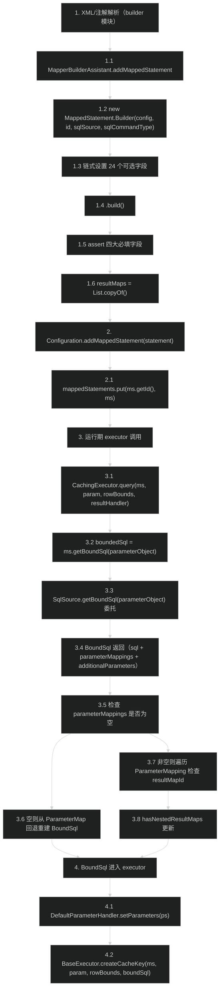
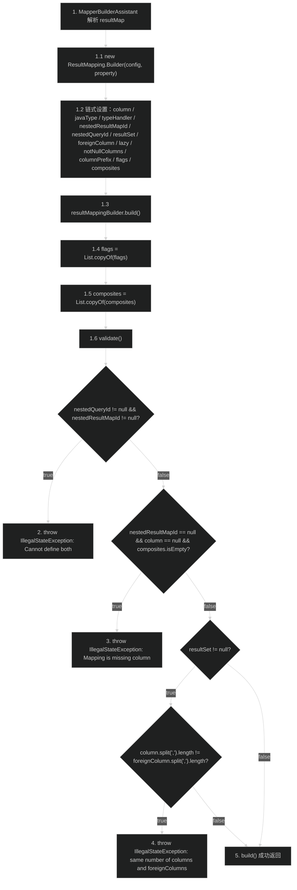
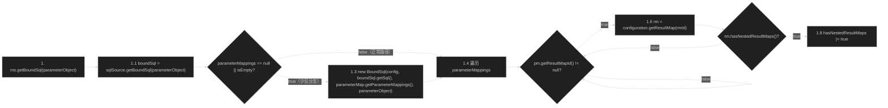

# 映射模型（mapping）
> 上次修改：2026-07-28 22:03

## 重点关注

| 关注点 | 源码入口 | 为什么重要 |
|--------|----------|------------|
| `MappedStatement.getBoundSql` —— 运行期 SQL 绑定唯一出口 | `src/main/java/org/apache/ibatis/mapping/MappedStatement.java:328-347` | 本模块唯一有实质逻辑的运行期方法。它把静态元数据（`SqlSource` + `ParameterMap`）与本次调用的实参结合成 `BoundSql`，还内含两处补偿逻辑（参数映射回退、issue #30 嵌套 resultMap 探测），是"元数据 → 可执行 SQL"的分水岭 |
| `MappedStatement` 的 27 个字段与 Builder | `src/main/java/org/apache/ibatis/mapping/MappedStatement.java:36-60`、`66-214` | 一条 `<select>`/`@Select` 解析后的全部元数据都在这里。executor / statement / resultset 三层的所有行为开关（`statementType`、`useCache`、`flushCacheRequired`、`resultOrdered`、`keyGenerator`、`dirtySelect`）都从这些字段读出 |
| `ResultMap.Builder.build` 的预计算 | `src/main/java/org/apache/ibatis/mapping/ResultMap.java:89-151` | 一次遍历把 `resultMappings` 拆成 id / constructor / property 三张子表并算出 `mappedColumns`、`hasNestedResultMaps`、`hasNestedQueries` 等标志位。这是"启动期算一次、运行期零判断"的典型，直接决定 `DefaultResultSetHandler` 走简单映射还是嵌套映射 |
| `ResultMapping.Builder.validate` 的三条约束 | `src/main/java/org/apache/ibatis/mapping/ResultMapping.java:160-185` | 本模块唯一主动抛异常的校验点，对应 issue #697 / #4 / GH #39。理解"Mapping is missing column attribute for property xxx"这类启动期报错的根因 |
| `Discriminator` 与 `resolveDiscriminatedResultMap` 的配合 | `src/main/java/org/apache/ibatis/mapping/Discriminator.java:59-61`、`src/main/java/org/apache/ibatis/executor/resultset/DefaultResultSetHandler.java:1104-1122` | `Discriminator` 本身只是"列值 → resultMapId"的字典，真正的循环解析和防环在消费方。是理解"模块只提供数据契约、不提供行为"这一设计边界的最佳样本 |
| `BoundSql.additionalParameters` 与 `metaParameters` | `src/main/java/org/apache/ibatis/mapping/BoundSql.java:40-41`、`64-79` | 动态 SQL（`<foreach>`、`<bind>`）产生的临时变量寄存处。`DefaultParameterHandler` 取值时优先查这里（issue #448），是理解"为什么 `#{item}` 能取到值"的关键 |
| `CacheBuilder.build` 的装饰器流水线 | `src/main/java/org/apache/ibatis/mapping/CacheBuilder.java:92-140` | 唯一在本模块内做对象装配的类，用反射 + 固定顺序的装饰链构造二级缓存；issue #352 的"自定义 Cache 不套标准装饰器"分支是易错点 |
| `Environment` 的三元不变式 | `src/main/java/org/apache/ibatis/mapping/Environment.java:30-43` | 全模块唯一 `final` + 构造即校验的不可变对象，绑定 `DataSource` 与 `TransactionFactory`，是 `openSession` 拿到连接和事务的源头 |

## 1. 模块定位与职责边界

`org.apache.ibatis.mapping` 是 MyBatis 的**运行期领域模型层（Domain Model）**。它解决的问题是：把 XML 映射文件和注解（`<select>` / `@Select` 等）中声明的内容，转换为 executor 层在运行期可直接消费的**不可变数据结构**（或构建后锁定的数据结构）。本模块是 builder 模块的下游、executor 模块的上游——它定义的是"数据契约"，而不是"行为逻辑"。

**本模块负责：**
- 定义承载 SQL 语句全部元数据的模型 `MappedStatement`
- 定义 SQL 来源抽象 `SqlSource` 及其运行期产出物 `BoundSql`
- 定义结果映射规则模型 `ResultMap` / `ResultMapping` / `Discriminator`，把 Java 属性名、列名、JDBC 类型、TypeHandler、嵌套查询/嵌套结果之间的映射关系编码为对象图
- 定义参数映射模型 `ParameterMap` / `ParameterMapping` 及调用模式枚举 `ParameterMode`
- 定义环境绑定 `Environment`（DataSource + TransactionFactory 的不可变对）
- 定义语句类型 `SqlCommandType`、`StatementType`、`ResultSetType`、`FetchType` 等语义枚举
- 提供 `CacheBuilder` 构造二级缓存实例（反射 + 装饰器链）
- 提供 `DatabaseIdProvider` / `VendorDatabaseIdProvider` 多数据库厂商识别

**本模块不负责：**
- 不解析 XML 或注解（解析逻辑在 `builder` 模块，如 `XMLStatementBuilder` / `MapperAnnotationBuilder`）
- 不执行 SQL、不管理连接、不处理事务（在 `executor` 模块）
- 不做 SQL 字符串拼接和参数绑定（在 `scripting` 模块的 `LanguageDriver` 实现中；本模块只持有 `SqlSource` 的引用）
- 不做二级缓存的实际存取（缓存的 put / get / 淘汰在 `cache` 包实现；本模块只定义 `Cache` 引用的存储和构造）

**上游（构建方）**：`MapperBuilderAssistant.addMappedStatement`（`src/main/java/org/apache/ibatis/builder/MapperBuilderAssistant.java:201-229`）通过 `MappedStatement.Builder` 逐字段装配，最终调用 `configuration.addMappedStatement(statement)` 注册。

**下游（消费方）**：`CachingExecutor`、`BaseExecutor`、各类 `StatementHandler`、`DefaultResultSetHandler`、`DefaultParameterHandler` 和 `MapperMethod` 通过 `MappedStatement` 的 getter 读取各自关心的元数据。

**主要输入/输出：**
- 输入：`Builder` 子类的参数（由 builder 模块从 XML/注解提取后传入）
- 输出：`build()` 返回的不可变模型对象（字段或集合被 `List.copyOf` / `Set.copyOf` 锁定）
- 唯一运行期转换：`MappedStatement.getBoundSql(parameterObject)` 把 `SqlSource` + `ParameterMap` + 本次实参结合为 `BoundSql`

## 2. 架构关系与依赖

```mermaid
%%{init: {"theme": "dark"}}%%
graph TD
  subgraph builder["builder 模块（构建方）"]
    MapperBuilderAssistant["MapperBuilderAssistant"]
    XMLStatementBuilder["XMLStatementBuilder"]
    MapperAnnotationBuilder["MapperAnnotationBuilder"]
  end

  subgraph mapping["mapping 模块（本模块——领域模型）"]
    MS["MappedStatement"]
    SS["SqlSource（接口）"]
    BS["BoundSql"]
    RM["ResultMap"]
    RMapping["ResultMapping"]
    Discriminator["Discriminator"]
    PM["ParameterMap"]
    PMapping["ParameterMapping"]
    Env["Environment"]
    CacheB["CacheBuilder"]
    DBIdProv["DatabaseIdProvider"]
    Enums["枚举：SqlCommandType / StatementType / ResultSetType / ParameterMode / FetchType / ResultFlag"]
  end

  subgraph scripting["scripting 模块（SQL 来源实现）"]
    DynamicSqlSource["DynamicSqlSource"]
    RawSqlSource["RawSqlSource"]
    StaticSqlSource["StaticSqlSource（builder 包内）"]
    ProviderSqlSource["ProviderSqlSource"]
  end

  subgraph executor["executor 模块（消费方）"]
    CachingExecutor["CachingExecutor"]
    BaseExecutor["BaseExecutor"]
    StatementHandler["StatementHandler（Routing → Simple / Prepared / Callable）"]
    DRSH["DefaultResultSetHandler"]
    DPH["DefaultParameterHandler"]
  end

  subgraph session["session 模块（注册/检索）"]
    Configuration["Configuration（注册表）"]
    DSF["DefaultSqlSessionFactory"]
  end

  MapperBuilderAssistant --> MS
  XMLStatementBuilder --> MS
  MapperAnnotationBuilder --> MS
  MS --> SS
  MS --> RM
  MS --> PM
  MS --> DBIdProv
  MS --> Env
  SS --> BS
  DynamicSqlSource -.->|implements| SS
  RawSqlSource -.->|implements| SS
  StaticSqlSource -.->|implements| SS
  ProviderSqlSource -.->|implements| SS
  Discriminator --> RMapping
  Discriminator --> RM
  RM --> RMapping
  PM --> PMapping
  Configuration --> MS
  Configuration --> RM
  Configuration --> PM
  DSF --> Env
  CachingExecutor --> MS
  CachingExecutor --> BS
  BaseExecutor --> MS
  StatementHandler --> MS
  DRSH --> RM
  DRSH --> Discriminator
  DPH --> PMapping
```



**说明表：**

| 节点 | 层级 | 说明 |
|------|------|------|
| builder 模块 | 上游（构建） | 解析 XML/注解，调用 `MappedStatement.Builder`、`ResultMap.Builder` 等填充字段后 `build()` |
| `MappedStatement` | 本模块核心 | 本模块最复杂的聚合根，27 个字段覆盖一条 SQL 语句的全部元数据；持有 `SqlSource`、`ResultMap`、`ParameterMap` 的引用 |
| `SqlSource`（接口） | 本模块抽象 | 只定义 `getBoundSql(parameterObject)` 一个方法；四种实现分别在 `scripting` 和 `builder` 包中 |
| `BoundSql` | 本模块执行体 | 运行期真正传给 JDBC 的 SQL 字符串 + 有序 `ParameterMapping` 列表 + 动态变量附加参数 |
| `ResultMap` + `ResultMapping` + `Discriminator` | 本模块映射规则 | 三层结构：`ResultMap` 是一组 `ResultMapping` 的容器，`Discriminator` 持有一个 `ResultMapping` 做值读取，并根据值选择另一个 `ResultMap` |
| `ParameterMap` + `ParameterMapping` | 本模块参数映射 | 描述 `#{}` 占位符对应的属性名、JavaType、JdbcType、TypeHandler 和调用模式（IN/OUT/INOUT） |
| `Environment` | 本模块环境 | 不可变的三元组（id, TransactionFactory, DataSource），构造时即校验非空 |
| `CacheBuilder` | 本模块缓存装配 | 用反射创建 `PerpetualCache` 并依次包裹 `LruCache` / `ScheduledCache` / `SerializedCache` / `LoggingCache` / `SynchronizedCache` / `BlockingCache` |
| `DatabaseIdProvider` | 本模块多库识别 | 抽取接口；`VendorDatabaseIdProvider` 通过 `Connection.getMetaData().getDatabaseProductName()` 获取数据库产品名，支持 Properties 做别名映射 |
| executor 模块 | 下游（消费） | 通过 `MappedStatement` 的 getter 读取元数据驱动执行、参数绑定和结果映射 |
| `Configuration` | 注册表 | 持有 `Map<String, MappedStatement>`、`Map<String, ResultMap>`、`Map<String, ParameterMap>` 三个 `StrictMap` 注册表，直接注入到 `MappedStatement.configuration` 字段 |

**依赖强度与耦合点：**
- **强依赖**：`MappedStatement` 持有 `Configuration` 引用，必须能访问 `TypeHandlerRegistry` 和 `resultMaps`（`getBoundSql` 内查 issue #30 场景时需要）
- **可替换依赖**：`SqlSource` 由 `MappedStatement.Builder` 注入，不同 `LanguageDriver` 产生不同实现；`DatabaseIdProvider` 可在配置文件中选择实现类
- **跨层调用**：`MappedStatement.getBoundSql` 在被 executor 调用的路径中，实际触发了 `SqlSource.getBoundSql`（委托到 scripting/build 层），是唯一一处本模块到 scripting 层的调用链

## 3. 入口与调用方式

本模块没有传统意义上的"对外 API 入口"——它的所有类都是被 builder 模块构造、被 executor 模块消费的**数据结构**。进入本模块的唯一方式是通过各 `Builder` 静态内部类的 `build()` 方法。

| 入口 | 触发条件 | 关键参数 | 返回值 | 进入后续流程 |
|------|----------|----------|--------|-------------|
| `MappedStatement.Builder.build()`（`src/main/java/org/apache/ibatis/mapping/MappedStatement.java:206-213`） | `MapperBuilderAssistant.addMappedStatement` 创建 Builder 并链式设置所有字段后调用 | 无（字段已在 Builder 中完成设置） | 不可变 `MappedStatement` | 返回的实例注册到 `Configuration.mappedStatements`，后续 executor 通过 `Configuration.getMappedStatement(id)` 检索 |
| `MappedStatement.getBoundSql(parameterObject)`（`src/main/java/org/apache/ibatis/mapping/MappedStatement.java:328-347`） | executor 每次执行语句时调用（`BaseExecutor.query`、`CachingExecutor.query`、`BaseStatementHandler` 构造函数） | `Object parameterObject`（本次调用的实参，可能是 POJO / Map / @Param 多参数） | `BoundSql`（含可执行 SQL、参数映射列表、附加参数绑定） | `BoundSql` 进入 `DefaultParameterHandler.setParameters(ps)` 和 `BaseExecutor.createCacheKey` |
| `ResultMap.Builder.build()`（`src/main/java/org/apache/ibatis/mapping/ResultMap.java:89-151`） | `MapperBuilderAssistant` 或 `XMLMapperBuilder` 的 resultMap 解析完成后调用 | 已填充的 `resultMappings` 列表、可选的 `discriminator`、可选的 `autoMapping` | 不可变 `ResultMap`（5 张子 List + 2 个 Set 均锁定） | 注册到 `Configuration.resultMaps`，运行时 `DefaultResultSetHandler` 通过 id 查找后走 `applyAutomaticMappings` / `applyPropertyMappings` 等路径 |
| `ResultMapping.Builder.build()`（`src/main/java/org/apache/ibatis/mapping/ResultMapping.java:152-158`） | 每条 `<result>` / `<id>` / `<constructor>` / `<association>` / `<collection>` 解析后调用 | 已在 Builder 中设置的 property / column / javaType / jdbcType / typeHandler / nestedResultMapId / nestedQueryId 等 | 不可变 `ResultMapping`（flags / composites 锁定） | 作为 `ResultMap.resultMappings` 的元素供 `DefaultResultSetHandler` 逐列映射 |
| `Discriminator.Builder.build()`（`src/main/java/org/apache/ibatis/mapping/Discriminator.java:41-48`） | `<discriminator>` 解析完成后调用 | 分辨列 `resultMapping` + 值到 resultMapId 的映射表 | 不可变 `Discriminator`（map 锁定） | 运行时 `resolveDiscriminatedResultMap` 循环调用 `getMapIdFor` 查表切换 resultMap |
| `Environment` 构造函数（`src/main/java/org/apache/ibatis/mapping/Environment.java:30-43`） | `XMLConfigBuilder` 的 `environmentsElement` 解析 `<environments>` 时调用 | `id`, `TransactionFactory`, `DataSource`（均不可为 null） | 不可变 `Environment` | 存入 `Configuration.environment`，`DefaultSqlSessionFactory.openSessionFromDataSource` 从 `Configuration.getEnvironment()` 取出 |
| `CacheBuilder.build()`（`src/main/java/org/apache/ibatis/mapping/CacheBuilder.java:92-107`） | `MapperBuilderAssistant.useNewCache` 构造并调用 | 已在 Builder 中设置的 id / implementation / decorators / size / clearInterval / readWrite / blocking / properties | `Cache` 实例（被装饰器层层包裹） | 返回后存入 `Configuration.caches` 和 `MapperBuilderAssistant.currentCache`，最终注入 `MappedStatement.cache` |
| `VendorDatabaseIdProvider.getDatabaseId(dataSource)`（`src/main/java/org/apache/ibatis/mapping/VendorDatabaseIdProvider.java:40-48`） | `XMLConfigBuilder.databaseIdProviderElement` 在环境准备就绪后调用 | `DataSource`（取自当前 `Environment`） | `String`（数据库产品名或其别名，可能为 null） | 结果通过 `configuration.setDatabaseId(id)` 存入，后续 `MappedStatement.Builder.databaseId` 用于多库 SQL 选择 |

## 4. 核心概念与领域模型

### 4.1 MappedStatement —— 语句元数据聚合根

**定义**：一条 SQL 映射语句（`<select>` / `@Select` 等）解析后的全部运行期元数据的载体。本模块最复杂的类，27 个私有字段，通过静态内部 `Builder` 构造，构造后不可变（`resultMaps` 通过 `List.copyOf` 锁定）。

**作用**：将 XML 或注解中分散在不同地方的配置（SQL 文本、参数类型、结果类型、缓存策略、超时、主键生成器等）收敛为一个对象，供 executor 层的各个组件按需读取。

**生命周期**：在 `MapperBuilderAssistant.addMappedStatement` 中创建、构建、注册（存入 `Configuration.mappedStatements`），在应用关闭时随 `Configuration` 被 GC。

**关键字段（按功能分组）**：

| 分组 | 字段 | 来源/消费方 | 说明 |
|------|------|------------|------|
| 标识 | `id`, `resource`, `databaseId` | `id` 是 XML namespace + 语句 id 的全限定名；`resource` 记录来源文件用于日志和冲突提示；`databaseId` 标记多数据库归属 | 运行时 executor 通过 `id` 从 `Configuration` 检索 `MappedStatement` |
| SQL | `sqlSource`, `parameterMap`, `lang` | `sqlSource` 持有 SQL 来源；`lang` 持有脚本语言驱动引用；执行时通过 `getBoundSql` 转换 | `CachingExecutor` 和 `StatementHandler` 构造时调用 |
| 结果 | `resultMaps`, `hasNestedResultMaps`, `resultSets` | `resultMaps` 是 `List<ResultMap>`（支持多结果集）；`resultSets` 是多结果集名称；`hasNestedResultMaps` 在 Builder.resultMaps 中预计算 | `DefaultResultSetHandler` 读取 |
| 行为 | `statementType`, `sqlCommandType`, `resultSetType`, `fetchSize`, `timeout` | JDBC 语句创建和调优参数 | `RoutingStatementHandler` 根据 `statementType` 选择子类；`BaseStatementHandler.setFetchSize` 和 `setStatementTimeout` 应用 |
| 缓存 | `cache`, `flushCacheRequired`, `useCache` | 二级缓存相关 | `CachingExecutor.query` 据此决定是否访问 `TransactionalCacheManager` |
| 主键 | `keyGenerator`, `keyProperties`, `keyColumns` | 主键生成：`Jdbc3KeyGenerator` 用于 INSERT 的 useGeneratedKeys，`NoKeyGenerator` 为默认 | `BaseExecutor.update` 后调用 `keyGenerator.processAfter` |
| 参数 | `paramNameResolver` | 用于把 `createCacheKey` 中的参数值按名称解析 | `BaseExecutor.createCacheKey` 中使用 |
| 事务/其他 | `resultOrdered`, `dirtySelect`, `useCache`, `statementLog` | `resultOrdered` 优化嵌套结果不排序；`dirtySelect` 标记只读 SELECT 也会让 session dirty | `DefaultSqlSession` 读取 `dirtySelect` 控制 commit 行为 |

**三维评估**：

| 维度 | 结论 |
|------|------|
| 好处 | 单一聚合根避免参数散落在各处；Builder 模式让构造过程链式且可读；`build()` 后的 `List.copyOf` 保证不可变性避免无意修改 |
| 替代方案 | 可以拆为 `StatementMetadata`（SQL 相关）+ `MappingConfig`（结果/参数相关）两个对象以减少字段数量，但会增加 executor 层持有两个引用的开销 |
| 风险 | 27 个字段全部可选（除了 id / configuration / sqlSource / lang 有 `assert`），大量 null 值容易造成 NPE；`assert` 断言在生产环境默认被禁用后不会阻止非法对象创建 |

### 4.2 SqlSource（接口）与 BoundSql —— SQL 的"来源"与"成品"

**定义**：`SqlSource` 是函数式接口，只定义 `BoundSql getBoundSql(Object parameterObject)` 一个方法。`BoundSql` 是 `SqlSource` 的产出物，包含最终的 SQL 字符串（`?` 占位符）、有序的 `List<ParameterMapping>` 和用于可选参数绑定的 `additionalParameters` Map。

**实现类（均在 `scripting` 或 `builder` 包中，不在本模块）**：

| 实现 | 位置 | `getBoundSql` 行为 |
|------|------|-------------------|
| `StaticSqlSource` | `org.apache.ibatis.builder.StaticSqlSource` | 直接 `new BoundSql(configuration, sql, parameterMappings, parameterObject)`——最快 |
| `DynamicSqlSource` | `org.apache.ibatis.scripting.xmltags.DynamicSqlSource:44-53` | 每次执行时 `rootSqlNode.apply(context)` 动态拼接 SQL，再 `SqlSourceBuilder.buildSqlSource` 解析 `#{}` 占位符，把 `context.getBindings()` 中的 `<foreach>` / `<bind>` 变量写入 `boundSql.setAdditionalParameter` |
| `RawSqlSource` | `org.apache.ibatis.scripting.defaults.RawSqlSource:72-73` | 构造时已完成 `#{}` 解析（在构造器中调用了 `SqlSourceBuilder.buildSqlSource`），运行期直接委托给内部的 `StaticSqlSource.getBoundSql`——比 `DynamicSqlSource` 快 |
| `ProviderSqlSource` | `org.apache.ibatis.builder.annotation.ProviderSqlSource:164-166` | 先调用 `@SelectProvider` 等方法获取 SQL 字符串，再委托给内部 `SqlSource` |

**`BoundSql` 的关键字段**（`src/main/java/org/apache/ibatis/mapping/BoundSql.java:37-41`）：
- `sql`（`final String`）：含 `?` 占位符的最终 SQL，由 `SqlSource` 生成后不可修改
- `parameterMappings`（`final List<ParameterMapping>`）：与 `?` 一一对应的参数描述，`DefaultParameterHandler.setParameters` 按此列表的索引顺序取参数值、设置 TypeHandler 并调用 `PreparedStatement.setXxx`
- `parameterObject`（`final Object`）：原始入参对象，构造时注入，用于 `DefaultParameterHandler` 中的属性值提取（`params = null` 时回退到此对象）
- `additionalParameters`（`Map<String, Object>`）：动态 SQL 产生的临时变量（如 `<foreach>` 的 item/index、`<bind>` 变量），通过 `metaParameters`（`MetaObject` 包装）允许反射式存取

**为什么 `additionalParameters` 使用 MetaObject 包装**：`DynamicSqlSource.getBoundSql` 通过 `context.getBindings().forEach(boundSql::setAdditionalParameter)` 写入，这些 binding 可能包含嵌套属性路径（如 `"item.name"`）。`MetaObject` 支持点号分隔的路径表达式，使得 `DefaultParameterHandler` 可以用表达式语言取值而无需知道 Map 的内部结构。

**三维评估**：

| 维度 | 结论 |
|------|------|
| 好处 | `SqlSource` 接口极简（一个方法），不同实现可按需在"启动期解析"（RawSqlSource）或"运行期解析"（DynamicSqlSource）之间权衡 |
| 替代方案 | 可以在 `SqlSource` 接口上加一个 `isDynamic()` 方法，让 executor 预先判断是否需要每次重新计算 `BoundSql` 的 `CacheKey`（当前 `CachingExecutor` 每次重建 `CacheKey` 间接调用了 `getBoundSql`） |
| 风险 | `BoundSql.sql` 字段是 final 的但引用不变不代表不可变——没有通过 `new String(sql)` 拷贝（String 在 Java 中不可变，所以实际没有安全问题）；`additionalParameters` 是 mutable Map，多线程场景需注意 |

### 4.3 ResultMap / ResultMapping / Discriminator —— 结果映射的三层模型

**三层结构**：

`ResultMap`（容器）包含零到多条 `ResultMapping`（单列映射规则）和可选的 1 个 `Discriminator`（鉴别器，持有一个 `ResultMapping` + 值到 `ResultMap` 的映射字典）。

**`ResultMap` 的关键字段**（`src/main/java/org/apache/ibatis/mapping/ResultMap.java:31-45`）：

| 字段 | 构建方式 | 用途 |
|------|----------|------|
| `id` | Builder 直接注入 | `Configuration.resultMaps` 的 key |
| `type` | Builder 注入（目标 Java 类型） | 结果对象实例化的类型 |
| `resultMappings` | Builder 注入的完整列表，`build()` 后锁定 | 所有列映射的原始全量 |
| `idResultMappings` | `build()` 中从 `resultMappings` 筛选 `ResultFlag.ID` | 缓存 key 构造 / 唯一性判定 |
| `constructorResultMappings` | `build()` 中从 `resultMappings` 筛选 `ResultFlag.CONSTRUCTOR` | 构造器注入映射 |
| `propertyResultMappings` | `build()` 中排除 CONSTRUCTOR 后的映射 | setter / 字段映射 |
| `mappedColumns` | `build()` 中从所有 `resultMapping.getColumn()` 收集（大写） | 自动映射时判断哪些列已被手动映射、不再自动映射 |
| `mappedProperties` | `build()` 中从所有 `resultMapping.getProperty()` 收集 | 同上但按属性名去重 |
| `discriminator` | Builder 注入 | 运行时 `resolveDiscriminatedResultMap` 读取 |
| `hasNestedResultMaps` / `hasNestedQueries` | `build()` 中根据 `resultMapping.getNestedResultMapId()` / `getNestedQueryId()` 预计算 | 控制 `DefaultResultSetHandler` 是否走嵌套映射/嵌套查询路径 |
| `autoMapping` | Builder 注入（可为 null） | 三层优先级：resultMap 级 autoMapping > configuration 级 autoMappingBehavior > 默认值 |

**`Discriminator`**（`src/main/java/org/apache/ibatis/mapping/Discriminator.java:25-63`）：持有 `resultMapping`（从当前行读取鉴别列的映射，含 column + javaType + typeHandler）和 `discriminatorMap`（`Map<String, String>`，值到 resultMapId）。运行期 `resolveDiscriminatedResultMap`（`src/main/java/org/apache/ibatis/executor/resultset/DefaultResultSetHandler.java:1104-1122`）在 while 循环中调用 `getDiscriminatorValue` 读取列值，再调用 `discriminator.getMapIdFor(value)` 查找对应的 resultMapId，直到链上的 `Discriminator` 耗尽或出现循环引用。

**防环机制**（`resolveDiscriminatedResultMap` 中）：`pastDiscriminators`（`Set<String>`）记录已访问的 `discriminatedMapId`，当 `!pastDiscriminators.add(discriminatedMapId)` 为 false（即已存在）时 `break` 退出循环，防止 A -> B -> A 的无限循环。

**三维评估**：

| 维度 | 结论 |
|------|------|
| 好处 | `build()` 中的预计算把 O(n) 遍历开销从运行期移到启动期；`mappedColumns` / `mappedProperties` 让自动映射"知道哪些列已被占"而不需每次查 `resultMappings`；三分法（id / constructor / property）让 executor 层可以按阶段调用不同子列表 |
| 替代方案 | 不预计算子列表而是运行期按 `flags.contains` 过滤——每次映射都要过滤，对大量列的查询有性能损耗 |
| 风险 | `build()` 中当 `idResultMappings.isEmpty()` 时，回退策略是把**全部** `resultMappings` 当 id 映射，可能导致缓存 key 包含了不该参与唯一性判定的列 |
| 修复 | 设置 isLazy(boolean) 已标记为 @Deprecated，因为延迟加载不应在映射规则级别控制，而是在全局配置中统一管理 |

### 4.4 ParameterMap / ParameterMapping / ParameterMode —— 参数映射模型

**定义**：`ParameterMap` 是参数映射描述的容器，`ParameterMapping` 描述单个 `#{}` 占位符的映射细节（属性名、Java 类型、JDBC 类型、TypeHandler、调用模式等）。`ParameterMode` 是枚举（IN / OUT / INOUT），仅在 `StatementType.CALLABLE`（存储过程）时用到 OUT/INOUT。

**`ParameterMapping` 关键字段**（`src/main/java/org/apache/ibatis/mapping/ParameterMapping.java:29-41`）：

| 字段 | 默认值 | 说明 |
|------|--------|------|
| `property` | — | `#{}` 中的属性名 |
| `mode` | `ParameterMode.IN` | CALLABLE 时可以是 OUT/INOUT |
| `javaType` | `Object.class` | 参数 Java 类型 |
| `jdbcType` | `null` | JDBC 类型（`UnknownTypeHandler` 需要此信息推断） |
| `numericScale` | `null` | CALLABLE 时传给 `registerOutParameter` |
| `typeHandler` | — | Builder 直接注入 |
| `resultMapId` | `null` | 参数类型为 `java.sql.ResultSet` 时必须指定 |
| `jdbcTypeName` | `null` | 与 `numericScale` 类似，CALLABLE 输出参数用 |
| `expression` | `null` | 注释标注"Not used"，保留字段 |
| `value` | `UNSET`（哨兵对象） | 当参数是固定值时直接携带值而非通过反射取 |

**`value` 字段的 UNSET 哨兵模式**：`ParameterMapping` 使用 `private static final Object UNSET = new Object()` 区分"未设置值"和"实际值为 null"。`hasValue()` 方法比较 `value != UNSET`。`DefaultParameterHandler.setParameters` 在 `parameterMapping.hasValue()` 为 true 时直接使用 `parameterMapping.getValue()`，不再从参数对象反射取值。

**`ParameterMapping.Builder.validate`**（`src/main/java/org/apache/ibatis/mapping/ParameterMapping.java:113-118`）：唯一校验规则——如果 `javaType == ResultSet.class` 且 `resultMapId == null`，则抛出 `IllegalStateException("Missing resultMap...")`。这是一个安全守卫，防止存储过程的 `ResultSet` 输出参数缺少映射信息。

**三维评估**：

| 维度 | 结论 |
|------|------|
| 好处 | `UNSET` 哨兵解决了"null 值歧义"问题（`#{value, javaType=int, jdbcType=NUMERIC}` 中的 null 是真实值，未设置的字段不应干预参数绑定） |
| 替代方案 | 可以用 `Optional<Object>` 代替手工哨兵，但会增加装箱开销和 API 复杂性 |
| 风险 | `expression` 字段标注"Not used"但保留在字段列表中——可能是未来功能预留或清理遗漏，占内存但对行为无影响 |

### 4.5 Environment —— 环境绑定（DataSource + TransactionFactory 的不可变对）

**定义**：封装一个数据库连接环境的三元组——`id`（环境名称）、`transactionFactory`（事务工厂）、`dataSource`（数据源）。全模块唯一的 `final` class + 构造即校验非空的不可变对象。

**源码位置**：`src/main/java/org/apache/ibatis/mapping/Environment.java`（仅 86 行，含 Builder）。

**作用**：`DefaultSqlSessionFactory.openSessionFromDataSource`（`src/main/java/org/apache/ibatis/session/defaults/DefaultSqlSessionFactory.java:98-100`）从 `Configuration.getEnvironment()` 取出 `Environment`，通过 `environment.getTransactionFactory()` 创建 `Transaction`，通过 `environment.getDataSource()` 获取 `Connection`。

**为什么用 final + 构造校验**：`Environment` 一旦创建就不应变更——`DataSource` 和 `TransactionFactory` 是物理连接的来源，运行时切换会导致连接泄漏和事务状态混乱。构造时的三个 null 检查（`id`、`transactionFactory`、`dataSource`）确保不会有半成品对象进入 `Configuration`。

**三维评估**：

| 维度 | 结论 |
|------|------|
| 好处 | 三个字段全部 final，线程安全且语义清晰——"环境就是这三个东西，不可替换" |
| 替代方案 | 可以用 `record`（Java 14+）替代，但项目须保持对较低 JDK 版本的兼容 |
| 风险 | 如果 `DataSource` 实现本身不是线程安全的（如某些连接池的未同步初始化），`Environment` 的不可变性并不能传递保护 |

### 4.6 枚举类型 —— 行为开关与语义标记

| 枚举 | 取值 | 作用 | 消费方 |
|------|------|------|--------|
| `SqlCommandType` | UNKNOWN / INSERT / UPDATE / DELETE / SELECT / FLUSH | 标记 SQL 语义类型 | `MappedStatement` 存储；`MapperMethod` 根据类型决定 `SqlSession.selectXxx` vs `update`；FLUSH 类型不被常规 mapper 使用（内部缓存刷新用） |
| `StatementType` | STATEMENT / PREPARED / CALLABLE | 决定 JDBC 语句类型 | `RoutingStatementHandler` 的 switch 语句据此选择 `SimpleStatementHandler` / `PreparedStatementHandler` / `CallableStatementHandler` |
| `ResultSetType` | DEFAULT(-1) / FORWARD_ONLY / SCROLL_INSENSITIVE / SCROLL_SENSITIVE | 控制 ResultSet 并发/滚动属性 | 各 `StatementHandler` 子类的 `instantiateStatement` 方法创建 `Statement` / `PreparedStatement` 时传入 `createStatement(resultSetType.getValue(), ...)` |
| `ParameterMode` | IN / OUT / INOUT | 标记存储过程参数方向 | `ParameterMapping.mode`；`DefaultParameterHandler.setParameters` 跳过 OUT 参数；`CallableStatementHandler.registerOutputParameters` 为 OUT/INOUT 调用 `cs.registerOutParameter` |
| `ResultFlag` | ID / CONSTRUCTOR | 标记 ResultMapping 是 ID 列还是构造器参数 | `ResultMap.build()` 据此分拣到 `idResultMappings` 和 `constructorResultMappings` |
| `FetchType` | LAZY / EAGER / DEFAULT | 标记嵌套查询的加载策略 | 消费方在 `ResultMapping.lazy` 字段和全局 `lazyLoadingEnabled` 综合决策（但 lazy 属性本身已标记 @Deprecated） |

### 4.7 CacheBuilder —— 二级缓存装配器（唯一有行为的构造器）

**定义**：`CacheBuilder` 是本模块中唯一不只是一堆 getter 的类——它的 `build()` 方法（`src/main/java/org/apache/ibatis/mapping/CacheBuilder.java:92-107`）通过反射创建 `PerpetualCache` 实例，并在它外面包裹多层装饰器。

**装配流程**：

1. `setDefaultImplementations()`：如果 `implementation` 为 null，默认用 `PerpetualCache`；如果 `decorators` 为空，默认添加 `LruCache`
2. `newBaseCacheInstance(implementation, id)`：反射调用 `Class<? extends Cache>.getConstructor(String.class)`，传入 id 创建底层缓存
3. `setCacheProperties(cache)`：通过 `MetaObject` 反射设置属性；如果实现了 `InitializingObject` 则调用 `initialize()`
4. **issue #352 分支**：仅当底层是 `PerpetualCache`（非自定义）时，才包裹用户配置的装饰器 + 标准装饰器；自定义 Cache 只在外层不已有 `LoggingCache` 时加一个 `LoggingCache`
5. `setStandardDecorators(cache)`：按固定顺序包裹 `ScheduledCache`（如果 `clearInterval` 非空）-> `SerializedCache`（如果 `readWrite=true`）-> `LoggingCache` -> `SynchronizedCache` -> `BlockingCache`（如果 `blocking=true`）

**三维评估**：

| 维度 | 结论 |
|------|------|
| 好处 | 装饰器链按固定顺序做"包裹"，保证读/写路径的一致性（`SynchronizedCache` 在最外层确保线程安全） |
| 替代方案 | 可以用依赖注入框架装配，但 MyBatis 刻意不引入 DI 依赖；也可用 builder.copy() 模式让两个 builder 共享部分配置 |
| 风险 | 反射创建实例的异常被 `CacheException` 包裹但原始异常未保留为 cause（部分分支有，部分没有）；`setCacheProperties` 中的类型转换不支持数组/集合等复杂类型 |

### 4.8 VendorDatabaseIdProvider —— 多数据库厂商识别

**定义**：`VendorDatabaseIdProvider` 实现 `DatabaseIdProvider` 接口，通过 `DataSource.getConnection().getMetaData().getDatabaseProductName()` 获取数据库产品名，并支持通过 Properties 将产品名映射为短别名。

**实现逻辑**（`src/main/java/org/apache/ibatis/mapping/VendorDatabaseIdProvider.java:56-63`）：

```java
String productName = getDatabaseProductName(dataSource);
if (properties == null || properties.isEmpty()) {
    return productName;  // 直接返回产品名
}
// 遍历 Properties，productName 包含 key 时返回对应的 value
return properties.entrySet().stream()
    .filter(entry -> productName.contains((String) entry.getKey()))
    .map(entry -> (String) entry.getValue())
    .findFirst().orElse(null);
```

**典型配置**：`properties` 中 `"Microsoft SQL Server" -> "ms"`、`"MySQL" -> "mysql"`、`"Oracle" -> "oracle"`。使用 `contains` 而非 `equals` 匹配，解决不同驱动返回的名称差异（如 "MySQL" vs "MySQL 5.7"）。

**调用链**：`XMLConfigBuilder.databaseIdProviderElement`（`src/main/java/org/apache/ibatis/builder/xml/XMLConfigBuilder.java:318-336`）-> `databaseIdProvider.getDatabaseId(environment.getDataSource())` -> `configuration.setDatabaseId(databaseId)`。后续 `MapperBuilderAssistant.addMappedStatement` 根据 `databaseId` 选择同 id 名下匹配的 SQL。

**`DefaultDatabaseIdProvider`** 已标记 `@Deprecated`，它是 `VendorDatabaseIdProvider` 的简单继承，仅保留兼容性。

## 5. 关键流程

### 5.1 主成功路径：从 MappedStatement 构造到 BoundSql 产生



**1-1.6 MappedStatement 构造**：builder 模块解析 XML/注解后，经由 `MapperBuilderAssistant.addMappedStatement` 创建 `MappedStatement.Builder`。构造函数强制传入 `configuration`、`id`、`sqlSource`、`sqlCommandType` 四个参数，其余 24 个字段通过 Builder 链式方法逐个设置（有默认值的字段如 `statementType=PREPARED`、`resultSetType=DEFAULT`、`keyGenerator=NoKeyGenerator.INSTANCE` 在 Builder 构造函数中初始化）。`.build()` 执行 `assert` 校验四大必填字段非空（注意 `assert` 在生产环境默认关闭），并将 `resultMaps` 用 `List.copyOf()` 锁定为不可变列表。

**2-2.1 注册到 Configuration**：`configuration.addMappedStatement(statement)` 将 `MappedStatement` 注册到 `Configuration.mappedStatements`（类型为 `StrictMap<MappedStatement>`，支持全限定名和短名双键查找，同名冲突时抛异常并提示两个来源资源文件路径）。

**3-4 BoundSql 产生**：运行期 `CachingExecutor.query` 调用 `ms.getBoundSql(parameterObject)`，委托给 `mappedStatement.sqlSource.getBoundSql(parameterObject)`。对于 `DynamicSqlSource`，这一步触发 `rootSqlNode.apply(context)` 动态拼接 SQL 和 `SqlSourceBuilder.buildSqlSource` 解析 `#{}`；对于 `RawSqlSource`/`StaticSqlSource`，这一步直接包装成 `BoundSql` 返回。

**3.5-3.8 补偿逻辑**：`getBoundSql` 的方法体有两段补偿处理：
- 如果 `BoundSql.parameterMappings` 为空（可能因为 SqlSource 实现未提供参数映射），用 `ParameterMap.getParameterMappings()` 重建 `BoundSql`——这是一个防御性的兜底分支
- 遍历所有 `ParameterMapping`，如果包含 `resultMapId`（存储过程的输出参数可能关联 resultMap），从中解析 `ResultMap` 并更新 `hasNestedResultMaps` 标志（对应 issue #30）

**4-4.2 消费方使用**：`BoundSql` 产生的 SQL 和参数映射被两条消费路径分流：
- `DefaultParameterHandler.setParameters(ps)` 按 `parameterMappings` 的顺序遍历，从参数对象或 `additionalParameters` 取值，通过 `TypeHandler` 设置到 `PreparedStatement`
- `BaseExecutor.createCacheKey` 将 `ms.getId()` + `rowBounds` + `boundSql.getSql()` + 参数值组合成缓存键

### 5.2 失败路径：ResultMapping 校验失败导致启动期异常



**1-1.5 构造链路**：`ResultMapping.Builder` 有三个构造函数重载（带 TypeHandler、带 javaType、仅 property），设置 `configuration.configuration.isLazyLoadingEnabled()` 为 `lazy` 的初始值（该字段已标记 @Deprecated，但保存向后兼容）。

**2-4 三条致命校验**：
- **issue #697**：不能同时对同一个 property 同时定义 `nestedQueryId`（`<association select="...">`）和 `nestedResultMapId`（`<association resultMap="...">`），二者语义互斥
- **issue #4 / GH #39**：非嵌套 ResultMap 的情况下 `column` 不能为空——因为需要列名才能从 `ResultSet` 中取值。但这仅在 `nestedResultMapId == null` 时校验，嵌套映射的列信息在目标 ResultMap 中定义
- **多结果集列数校验**：使用 `resultSet` 字段时（`<association resultSet="...">`），`column` 和 `foreignColumn` 必须以逗号分隔且数量一致，否则无法建立关联

### 5.3 边界路径：Discriminator 的循环递代与防环

详见第 4.3 节中对 `resolveDiscriminatedResultMap` 的源码解读。`Discriminator` 在本模块内仅是数据容器（`discriminatorMap`），行为在 executor 层。

### 5.4 边界路径：MappedStatement.getBoundSql 的参数映射回退分支



1.3 分支的触发场景：当 `SqlSource` 实现未填充 `parameterMappings`（如某些自定义 `LanguageDriver` 产生的 `SqlSource` 没有走 `SqlSourceBuilder` 解析），此时回退到 `ParameterMap` 的映射列表。这是一个防御性分支，在日常使用中很少触发。

## 6. 核心实现细节

### 6.1 `MappedStatement.Builder` —— 默认值的集中管理与预计算

**源码位置**：`src/main/java/org/apache/ibatis/mapping/MappedStatement.java:66-214`

**核心实现**：Builder 构造函数（第 69-86 行）设置了 13 个字段的默认值：

```java
// MappedStatement.java:69-86
mappedStatement.configuration = configuration;
mappedStatement.id = id;
mappedStatement.sqlSource = sqlSource;
mappedStatement.statementType = StatementType.PREPARED;       // 默认使用 PreparedStatement
mappedStatement.resultSetType = ResultSetType.DEFAULT;        // 默认驱动决定
mappedStatement.parameterMap = ParameterMap.buildEmpty(...);  // 空参数映射
mappedStatement.resultMaps = new ArrayList<>();
mappedStatement.sqlCommandType = sqlCommandType;
mappedStatement.keyGenerator = configuration.isUseGeneratedKeys() && SqlCommandType.INSERT.equals(sqlCommandType)
    ? Jdbc3KeyGenerator.INSTANCE : NoKeyGenerator.INSTANCE;   // 根据 sqlCommandType 和全局配置决定
mappedStatement.statementLog = LogFactory.getLog(logId);      // 支持 logPrefix
mappedStatement.lang = configuration.getDefaultScriptingLanguageInstance();
```

**关键设计**：

1. **`keyGenerator` 的隐式决策**：仅当 `configuration.isUseGeneratedKeys() == true` 且 `sqlCommandType == INSERT` 时才用 `Jdbc3KeyGenerator`，否则默认 `NoKeyGenerator`。这匹配了 JDBC 的语义——只有 INSERT 可能产生自增主键。

2. **`logPrefix` 支持**：如果 `Configuration` 设置了 `logPrefix`，`statementLog` 的 logger name 会以 `prefix + id` 形式组成，便于按前缀过滤日志。

3. **`resultMaps(List)` 中的 `hasNestedResultMaps` 预计算**（第 102-108 行）：
   ```java
   for (ResultMap resultMap : resultMaps) {
     mappedStatement.hasNestedResultMaps = mappedStatement.hasNestedResultMaps || resultMap.hasNestedResultMaps();
   }
   ```
   这保证了 `MappedStatement.hasNestedResultMaps()` 在运行期是 O(1) 的 boolean 读取，而非每次查询时遍历。

4. **`build()` 的 `assert` 校验**（第 206-213 行）：四个 `assert` 检查 `configuration`、`id`、`sqlSource`、`lang` 非空。**重要**：`assert` 在生产环境默认禁用（JVM 不传 `-ea`），这意味着这些校验只是开发期辅助，不是运行期安全屏障。

**三维评估**：

| 维度 | 结论 |
|------|------|
| 好处 | Builder 模式将参数分散设置同默认值集中管理解耦，调用方只需关注需要覆盖的字段 |
| 替代方案 | 可以用 Lombok `@Builder` 但需引入额外依赖；当前手工 Builder 可精确控制 `build()` 中的锁定和预计算 |
| 风险 | `assert` 在生产环境禁用的安全漏洞：如果 builder 模块有 bug 导致漏设 `sqlSource`，运行时会在 `getBoundSql` 中 NPE 而非在 `build()` 时发现 |

### 6.2 `MappedStatement.getBoundSql` —— 两段补偿逻辑

**源码位置**：`src/main/java/org/apache/ibatis/mapping/MappedStatement.java:328-347`

```java
public BoundSql getBoundSql(Object parameterObject) {
    BoundSql boundSql = sqlSource.getBoundSql(parameterObject);           // (a) 委托
    List<ParameterMapping> parameterMappings = boundSql.getParameterMappings();
    if (parameterMappings == null || parameterMappings.isEmpty()) {       // (b) 补偿1
        boundSql = new BoundSql(configuration, boundSql.getSql(),
            parameterMap.getParameterMappings(), parameterObject);
    }
    for (ParameterMapping pm : boundSql.getParameterMappings()) {         // (c) 补偿2
        String rmId = pm.getResultMapId();
        if (rmId != null) {
            ResultMap rm = configuration.getResultMap(rmId);
            if (rm != null) {
                hasNestedResultMaps |= rm.hasNestedResultMaps();          // (d) 更新全局标志
            }
        }
    }
    return boundSql;
}
```

**逐段解读**：

- **(a)** 委托给 `sqlSource.getBoundSql(parameterObject)`——这是本模块唯一与 scripting/builder 层的调用链。不会触发循环依赖，因为 `SqlSource` 的实现类不依赖 `mapping` 包的其他类。

- **(b)** 当 `sqlSource` 产生的 `BoundSql` 没有参数映射时，用 `ParameterMap` 中的映射重新构造。这出现在 `ParameterMap` 通过 XML 的 `<parameterMap>` 元素显式定义而 `SqlSource` 未解析 `#{}` 的场景。（参数映射在 `ParameterMap` 层面显式列出，而不是在 SQL 文本中通过 `#{}` 嵌入）。

- **(c)-(d)** 遍历参数映射以探测嵌套 ResultMap（issue #30）。这是一个"副作用式探测"——它修改了 `MappedStatement` 的 `hasNestedResultMaps` 字段。**为什么这样做**：`hasNestedResultMaps` 在 Builder 构建时只计算了 `resultMaps` 中的嵌套情况，不包括存储过程输出参数引用嵌套 ResultMap 的情况。此处的探测作为运行时补偿，覆盖了 Builder 构建期无法预见的场景。

**注意**：`hasNestedResultMaps` 在这里的修改不是线程安全的——`MappedStatement` 本身被设计为不可变，但此字段在运行期被修改。好在 `MappedStatement` 由 `Configuration` 持有并在应用启动后不再变更，而 `getBoundSql` 的第一次调用的结果是确定性的，因此实际不存在竞态问题。

**三维评估**：

| 维度 | 结论 |
|------|------|
| 好处 | 两段补偿让 `getBoundSql` 成为"无论 SqlSource 实现多不规范都能产生可用 BoundSql"的最后一道防线 |
| 替代方案 | 可以把 (b) 逻辑下沉到 `SqlSource` 接口的默认方法或抽象基类，让每种 `SqlSource` 实现自觉处理参数映射缺失情况，而不是让调用方（`MappedStatement`）承担防御责任 |
| 风险 | 三重副作用同时在一个方法中：返回 `BoundSql` + 修改 `hasNestedResultMaps` + 从 `Configuration` 查询并可能抛 `IllegalArgumentException`（如果 `resultMapId` 不存在于注册表） |

### 6.3 `ResultMap.Builder.build` —— 启动期一次遍历、运行期零判断的预计算

**源码位置**：`src/main/java/org/apache/ibatis/mapping/ResultMap.java:89-151`

**核心实现**：`build()` 方法对 `resultMappings` 做一次完整遍历，产生以下预计算结果：

1. **分拣三分法**（第 100-136 行）：
   - `ResultFlag.CONSTRUCTOR` -> `constructorResultMappings`（构造器注入）
   - 非 CONSTRUCTOR -> `propertyResultMappings`（setter/字段注入）
   - `ResultFlag.ID` -> `idResultMappings`（主键列，用于缓存 key 和唯一性判断）

2. **标志位计算**（第 101-103 行）：
   - `hasNestedQueries`：任意一条 `resultMapping.getNestedQueryId() != null`
   - `hasNestedResultMaps`：任意一条 `resultMapping.getNestedResultMapId() != null` 且 `resultSet == null` 且 `jdbcType != CURSOR`（CURSOR 类型的嵌套不走嵌套结果映射路径）

3. **列/属性去重集合**（第 104-119 行）：`mappedColumns`（大写列名集合）和 `mappedProperties`（属性名集合）。自动映射时用于判断"哪些列/属性已被手动映射，不应再自动映射"。

4. **id 回退策略**（第 138-140 行）：如果 `idResultMappings.isEmpty()`，回退到全部 `resultMappings` 作为 id 映射。这意味着如果没有显式的 `<id>` 标签，**所有列都会参与缓存 key 和唯一性判断**。

5. **集合锁定**（第 143-148 行）：6 个集合（`resultMappings`、`idResultMappings`、`constructorResultMappings`、`propertyResultMappings`、`mappedColumns`、`mappedProperties`）全部通过 `List.copyOf` / `Set.copyOf` 锁定为不可变。

**hasNestedResultMaps 的判断细节**（第 102-103 行）：
```java
resultMap.hasNestedResultMaps = resultMap.hasNestedResultMaps
    || (resultMapping.getNestedResultMapId() != null
        && resultMapping.getResultSet() == null
        && !JdbcType.CURSOR.equals(resultMapping.getJdbcType()));
```
三个条件的含义：
- `getNestedResultMapId() != null`：有嵌套的 resultMap 引用
- `getResultSet() == null`：不是多结果集模式（多结果集有专门的 handleResultSet 路径）
- `!JdbcType.CURSOR.equals(...)`：JDBC CURSOR 类型不是标准嵌套结果映射

**三维评估**：

| 维度 | 结论 |
|------|------|
| 好处 | 一次 O(n) 遍历产出 6 张不变集合 + 4 个 boolean 标志，运行期 executor 可以根据 `hasNestedResultMaps` 和 `hasNestedQueries` 快速决定执行路径 |
| 替代方案 | 可以在 build 时不预计算标志位，而在 `ResultMap.getHasNestedResultMaps()` 中做惰性计算（缓存结果），但增加了 getter 的复杂度 |
| 风险 | id 回退策略可能导致非预期行为：如果配置中没有 `<id>` 且所有列的值组合唯一，缓存 key 正确；但如果有重复行，非 id 回退会导致"全列匹配"才算命中缓存，偏离用户预期 |

### 6.4 `ResultMapping.Builder.validate` —— 三条启动期约束

**源码位置**：`src/main/java/org/apache/ibatis/mapping/ResultMapping.java:160-185`

三条约束对应 GitHub issue 记录：

1. **issue #697**（第 162-165 行）：`nestedQueryId` 和 `nestedResultMapId` 互斥——映射到一个属性要么通过嵌套查询（再执行一条 SELECT）要么通过嵌套结果（从当前 ResultSet 的后续行读取），不能同时使用。

2. **issue #4 / GH #39**（第 167-169 行）：非嵌套场景下 `column` 不能为空——没有列名就无法从 ResultSet 中读取值。但复合映射（`composites`）可以替代 column。

3. **多结果集关联校验**（第 171-183 行）：当 `resultSet` 不为 null 时（`<association resultSet="...">` 模式），`column` 和 `foreignColumn` 的逗号分隔数量必须一致。

### 6.5 `CacheBuilder.build` —— 反射 + 装饰器链 + 条件分支

**源码位置**：`src/main/java/org/apache/ibatis/mapping/CacheBuilder.java:92-107`

详见第 4.7 节。补充两个实现细节：

**反射的 `getConstructor` 约定**：
- 基础 Cache 实现必须有 `Constructor(String id)`
- Cache 装饰器必须有 `Constructor(Cache base)`
- 不符合约定直接抛 `CacheException`，错误信息明确指出缺少的构造函数签名

**issue #352 分支**（第 97-105 行）：`PerpetualCache.class.equals(cache.getClass())` 使用 `equals`（精确匹配子类判断）而非 `instanceof`。这意味着自定义 Cache 如果继承 `PerpetualCache`，仍会被识别为"非 PerpetualCache"而跳过标准装饰器。if-else 分支的语义是：
- 是 `PerpetualCache`：应用用户配置的装饰器，再应用标准装饰器全套
- 不是 `PerpetualCache` 且不是 `LoggingCache` 的子类：只加 `LoggingCache`

**三维评估**：

| 维度 | 结论 |
|------|------|
| 好处 | 反射创建避免了编译期依赖具体的 Cache 实现类；装饰器链固定顺序（SynchronizedCache 最外层）保证线程安全性和读写一致性 |
| 替代方案 | 可以用 `ServiceLoader` 机制发现和装配 Cache，但引入复杂度且启动速度更慢 |
| 风险 | `setCacheProperties` 只支持 8 种基本类型 + String 的反射设置，不支持数组、List、Map 等复杂属性；对未知类型抛 `CacheException` 阻断启动

## 7. 数据结构、配置与外部协议

### 7.1 核心数据结构一览

| 类 | 类型 | 可变性 | 关键字段 |
|----|------|--------|----------|
| `MappedStatement` | `public final class` | `build()` 后 `resultMaps` 锁定，但 `hasNestedResultMaps`、`dirtySelect`、`fetchSize` 等字段为私有可变（无 setter 所以外部不可变） | 27 个字段（详见 4.1 节分组表） |
| `SqlSource` | `public interface` | 接口，实现类可变性各异 | 一个方法 `getBoundSql(Object)` |
| `BoundSql` | `public class`（非 final） | `sql`/`parameterMappings`/`parameterObject` 为 final；`additionalParameters` 为 mutable HashMap | `String sql`、`List<ParameterMapping>`、`Map<String, Object> additionalParameters` |
| `ResultMap` | `public class`（非 final） | `build()` 后 6 个 List/Set 全部锁定 | `id`、`type`、`resultMappings`、`idResultMappings`、`constructorResultMappings`、`propertyResultMappings`、`mappedColumns`、`mappedProperties`、`discriminator`、`hasNestedResultMaps`、`hasNestedQueries`、`autoMapping` |
| `ResultMapping` | `public class`（非 final） | `build()` 后 `flags`/`composites` 锁定；`lazy`、`foreignColumn` 有 @Deprecated setter | `property`、`column`、`javaType`、`jdbcType`、`typeHandler`、`nestedResultMapId`、`nestedQueryId`、`resultSet`、`foreignColumn`、`lazy`、`notNullColumns`、`columnPrefix`、`flags`、`composites` |
| `Discriminator` | `public class`（非 final） | `build()` 后 `discriminatorMap` 锁定 | `resultMapping`、`discriminatorMap`（`Map<String, String>`） |
| `ParameterMap` | `public class`（非 final） | `build()` 后 `parameterMappings` 锁定 | `id`、`type`、`parameterMappings` |
| `ParameterMapping` | `public class`（非 final） | 无显式锁定（仅 `UNSET` 哨兵控制 `value` 语义） | `property`、`mode`、`javaType`、`jdbcType`、`typeHandler`、`resultMapId`、`jdbcTypeName`、`numericScale`、`expression`、`value` |
| `Environment` | `public final class` | 完全不可变（三个字段均为 final，构造即校验非空） | `id`、`transactionFactory`、`dataSource` |
| `CacheBuilder` | `public class`（非 final） | 仅用于构造，不存储状态 | `id`、`implementation`、`decorators`、`size`、`clearInterval`、`readWrite`、`blocking`、`properties` |

### 7.2 配置项

本模块不直接定义配置项（配置定义在 `Configuration` 类中，属于 session 模块），但以下 `Configuration` 配置直接影响本模块的模型行为：

| 配置项 | 在 Configuration 中的字段/getter | 对本模块的影响 |
|--------|-------------------------------|---------------|
| `useGeneratedKeys` | `boolean useGeneratedKeys` | 决定 `MappedStatement.Builder` 构造函数中 `keyGenerator` 的默认值（INSERT + true -> `Jdbc3KeyGenerator`） |
| `lazyLoadingEnabled` | `boolean lazyLoadingEnabled` | 决定 `ResultMapping.Builder` 构造函数中 `lazy` 的初始值 |
| `defaultScriptingLanguage` | `Class<? extends LanguageDriver> defaultScriptingLanguage` | 决定 `MappedStatement.Builder` 构造函数中 `lang` 的默认值 |
| `logPrefix` | `String logPrefix` | 影响 `MappedStatement.Builder` 构造函数中 `statementLog` 的 logger name 前缀 |
| `defaultFetchSize` | `Integer defaultFetchSize` | `BaseStatementHandler.setFetchSize` 的兜底值（非 mapping 模块直接消费但在同一消费链路中） |
| `defaultStatementTimeout` | `Integer defaultStatementTimeout` | 同上，`setStatementTimeout` 的兜底值 |
| `databaseId` | `String databaseId` | `XMLConfigBuilder.databaseIdProviderElement` 通过 `configuration.setDatabaseId()` 设置；`MapperBuilderAssistant.addMappedStatement` 据此选择同 id 的 SQL |

### 7.3 外部协议

**`DatabaseIdProvider` 接口**（`src/main/java/org/apache/ibatis/mapping/DatabaseIdProvider.java`）：

```java
public interface DatabaseIdProvider {
  default void setProperties(Properties p) { /* NOP */ }
  String getDatabaseId(DataSource dataSource) throws SQLException;
}
```

- `setProperties` 有默认空实现，为不需要属性的实现类提供便利
- `getDatabaseId` 接受 `DataSource`，返回数据库标识字符串（可能为 null）
- 调用者必须处理 null 返回值：`XMLConfigBuilder.databaseIdProviderElement` 中 `configuration.setDatabaseId(databaseId)`，而在后续 `MapperBuilderAssistant.addMappedStatement` 中，`databaseId` 为 null 意味着不参与多库 SQL 匹配

### 7.4 内部注册表（Configuration 持有）

本模块的模型对象全部注册在 `Configuration` 的三个 `StrictMap` 中：

| 注册表 | 类型 | key | value |
|--------|------|-----|-------|
| `mappedStatements` | `StrictMap<MappedStatement>` | 语句全限定 id（namespace + "." + id）| `MappedStatement` |
| `resultMaps` | `StrictMap<ResultMap>` | resultMap 全限定 id | `ResultMap` |
| `parameterMaps` | `StrictMap<ParameterMap>` | parameterMap 全限定 id | `ParameterMap` |

`StrictMap` 支持双键查找（全限定名和短名），同名冲突时 `get` 抛出 `IllegalArgumentException` 并附带两个冲突来源的 `resource` 路径。

## 8. 异常、边界与降级处理

### 8.1 异常传播路径

| 异常类型 | 抛出位置 | 触发条件 | 处理方式 |
|----------|----------|----------|----------|
| `IllegalArgumentException` | `Environment` 构造函数 (L31-40) | `id`、`transactionFactory`、`dataSource` 任一为 null | 直接抛出，阻断 XML 配置解析 |
| `IllegalArgumentException` | `ResultMap.Builder.build()` (L90-92) | `ResultMap.id` 为 null | 直接抛出 |
| `IllegalStateException` | `ResultMapping.Builder.validate()` (L162-165) | `nestedQueryId` 和 `nestedResultMapId` 同时非 null | 直接抛出（issue #697） |
| `IllegalStateException` | `ResultMapping.Builder.validate()` (L167-170) | `nestedResultMapId == null && column == null && composites.isEmpty()` | 直接抛出（issue #4 / GH #39） |
| `IllegalStateException` | `ResultMapping.Builder.validate()` (L180-183) | `resultSet` 模式下列和外部列数量不一致 | 直接抛出 |
| `IllegalStateException` | `ParameterMapping.Builder.validate()` (L114-117) | `javaType == ResultSet.class && resultMapId == null` | 直接抛出 |
| `CacheException` | `CacheBuilder.build()` / `setStandardDecorators` / `setCacheProperties` | 反射创建 Cache 失败、不支持的类型、初始化异常 | 包裹原始异常后抛出 |
| `NullPointerException` | `VendorDatabaseIdProvider.getDatabaseId()` (L42) | `dataSource` 为 null | 直接抛出 |
| `BuilderException` | `VendorDatabaseIdProvider.getDatabaseId()` (L47) | 获取数据库产品名时 SQLException | 包裹原始 SQLException 后抛出 |

### 8.2 边界条件处理

**`MappedStatement.getBoundSql` 的空参数处理**：如果 `parameterMappings` 为 null 或为空，回退到 `ParameterMap` 重新构造 `BoundSql`（第 331-333 行）。这是一个安全网——即使 `SqlSource` 实现不规范也能产生可用的参数绑定列表。

**`ResultMap.Builder.build` 的空 id 映射回退**（第 138-140 行）：当没有显式的 `<id>` 元素时，将全部 `resultMappings` 视为 id 映射。这是对"用户可能不定义 id 列"的隐式降级，但存在语义风险（任何列值的差异都会导致缓存 key 不同）。

**`Discriminator` 为 null**：如果 `ResultMap` 没有 `discriminator`，`resolveDiscriminatedResultMap` 的 while 循环不会进入，直接返回原始 `resultMap`。

**`VendorDatabaseIdProvider` 的 properties 为空**：直接返回数据库产品名作为 databaseId，不做别名映射。

**`CacheBuilder` 的 `setDefaultImplementations`**：当 `implementation` 为 null 且 `decorators` 为空时，默认添加 `LRU` 策略。这是对"用户未指定缓存实现"的兜底。

### 8.3 当前实现未覆盖的风险点

| 风险点 | 严重程度 | 源码证据 | 说明 |
|--------|----------|----------|------|
| `MappedStatement.build()` 使用 `assert` 而非显式 `if-null-throw` | 中 | `MappedStatement.java:207-210` | 生产环境默认禁用 `assert`，若 builder 模块 bug 导致漏设 `sqlSource`，运行时将在 `getBoundSql` 中 NPE |
| `MappedStatement.getBoundSql` 中的 `hasNestedResultMaps` 写操作无同步 | 低 | `MappedStatement.java:341` | `MappedStatement` 被设计为不可变，但在 `getBoundSql` 中可能被修改；好在 `Configuration` 在启动后不再变更 |
| `ParameterMapping.expression` 保留但"Not used" | 低 | `ParameterMapping.java:191-193` | 死字段占内存，可能误导阅读者 |
| `CacheBuilder` 的 `setCacheProperties` 不支持数组/集合/Map 类型 | 低 | `CacheBuilder.java:142-171` | 如果 Spring 等框架通过 Properties 注入复杂配置，会抛 `CacheException` 阻断启动 |
| `VendorDatabaseIdProvider.getDatabaseName` 使用 `contains` 而非 `equals` | 低 | `VendorDatabaseIdProvider.java:61` | 可能将 "Microsoft SQL Server" 的 Properties 错误匹配到 "Microsoft SQL Server Compact" |

## 9. 并发、生命周期与性能

### 9.1 生命周期

所有领域模型对象（`MappedStatement`、`ResultMap`、`ResultMapping`、`ParameterMap`、`ParameterMapping`、`Discriminator`、`Environment`、`BoundSql`）的生命周期如下：

| 阶段 | 行为 | 说明 |
|------|------|------|
| 创建 | builder 模块在解析 XML/注解时，通过各 Builder 子类构造 | 单线程（XML 解析在主线程完成） |
| 注册 | `Configuration.addMappedStatement` / `resultMaps.put` / `parameterMaps.put` | 单线程写入，后续多线程读取 |
| 使用 | executor 模块通过 `Configuration.getMappedStatement(id)` 检索后读取字段 | 多线程并发读取 |
| 销毁 | 随 `Configuration` 实例一起被 GC | 应用关闭时 |

`BoundSql` 是个例外：它由 `getBoundSql` 在每次查询时**新创建**，生命周期仅限一次查询。

### 9.2 并发安全

**静态元数据（MappedStatement / ResultMap / ResultMapping / ParameterMap / ParameterMapping / Discriminator / Environment）**：

这些对象在 `build()` 后即为事实不可变（字段通过 `List.copyOf` / `Set.copyOf` 锁定，或为 final），因此在多线程并发读取时是安全的。**唯一例外**：`MappedStatement.hasNestedResultMaps` 可能在 `getBoundSql` 中被修改（第 341 行），但由于修改的值是确定性的（从 false 变为 true，不会从 true 变回 false），且在同一 `Configuration` 初始化后不再有新的 `MappedStatement` 注入，该写操作不构成竞态。

**BoundSql**：每次查询新创建，线程封闭。

**Cache**（由 `CacheBuilder.build()` 产出）：本模块只负责构造，不管理并发。并发控制由装饰器链中的 `SynchronizedCache` 和 `BlockingCache` 保证。

### 9.3 性能考量

**启动期优化**：
- `ResultMap.Builder.build()` 中的一次遍历预计算（O(n) 遍历 `resultMappings`，n 为列数）是本模块启动期的主要开销。对于列数极多（数百列）的表，当且仅当配置了显式 `<resultMap>` 时有此开销（大部分场景使用自动映射或 `<resultType>` 则无此开销）
- `checkGloballyForDiscriminatedNestedResultMaps`（`src/main/java/org/apache/ibatis/session/Configuration.java:1080-1092`）对每个包含嵌套 resultMap 的 ResultMap 做一次全局遍历。源码注释注明"Slow but a one time cost"，是启动期的已知性能点

**运行期性能**：
- `MappedStatement.getBoundSql` 中的 for 循环（`parameterMappings` 遍历 + `resultMapId` 检查）通常迭代次数等于参数个数（个位数到数十），开销可忽略
- `BoundSql.additionalParameters` 的 `MetaObject` 包装通过 `PropertyTokenizer` 导航嵌套属性，每次 `setAdditionalParameter` 可能涉及 Map 创建和多级属性设置
- `CacheBuilder.build()` 的反射创建只在启动期执行一次，不影响运行期

**热点**：`MappedStatement.getBoundSql` 是每次 SQL 执行都要经过的路径，其中的 `sqlSource.getBoundSql` 委托是主要开销——`DynamicSqlSource` 的实现会做 SQL 拼接 + `#{}` 解析，`RawSqlSource`/`StaticSqlSource` 则接近零开销。

## 10. 扩展点、测试点与维护建议

### 10.1 扩展点

| 扩展点 | 位置 | 扩展方式 | 说明 |
|--------|------|----------|------|
| `SqlSource` 接口 | `src/main/java/org/apache/ibatis/mapping/SqlSource.java:24-28` | 实现 `getBoundSql(Object)` | 自定义 SQL 来源——可在此注入 SQL 改写、审计、脱敏等逻辑。现有四种实现覆盖了主流场景（静态、动态、预编译、Provider） |
| `DatabaseIdProvider` 接口 | `src/main/java/org/apache/ibatis/mapping/DatabaseIdProvider.java:15-22` | 实现 `getDatabaseId(DataSource)` | 自定义数据库识别逻辑——可用更精确的匹配规则替代 `VendorDatabaseIdProvider` 的 `contains` 匹配 |
| `CacheBuilder` 的 `implementation` 字段 | `src/main/java/org/apache/ibatis/mapping/CacheBuilder.java:42` | 设置自定义 `Cache` 实现类（需有 `Constructor(String id)`） | 不满足默认 `PerpetualCache` 时可完全替换底层存储；自定义 Cache 会被跳过标准装饰器链（issue #352） |
| `CacheBuilder` 的 `decorators` 列表 | `src/main/java/org/apache/ibatis/mapping/CacheBuilder.java:43` | `addDecorator(Class)` | 在标准装饰器链之前插入自定义行为（如指标收集、分布式同步等） |
| `LanguageDriver`（非本模块，但在 `MappedStatement.Builder.lang` 注入） | `src/main/java/org/apache/ibatis/scripting/LanguageDriver.java` | 实现自定义 `LanguageDriver`，在 `MappedStatement.Builder.lang(driver)` 注入 | 可全局替换 SQL 方言（如添加分页插件、SQL 格式化等） |

### 10.2 建议测试点

| 测试场景 | 测试目标 | 关键验证点 |
|----------|----------|-----------|
| **主路径**：`MappedStatement.getBoundSql` 正常流程 | `DynamicSqlSource` 产生带参数映射的 `BoundSql` | `boundSql.getParameterMappings()` 非空且有序；`boundSql.getSql()` 中的 `?` 数量等于映射列表长度 |
| **补偿路径**：`SqlSource` 返回空 parameterMappings | 回退到 `ParameterMap` 重建 | `BoundSql` 仍可被 `DefaultParameterHandler` 正常消费 |
| **失败路径**：`ResultMapping.Builder.build()` 非法组合 | `nestedQueryId` 和 `nestedResultMapId` 同时设置 | 应抛出 `IllegalStateException("Cannot define both...")` |
| **失败路径**：`ResultMapping.Builder.build()` 缺列名 | 非嵌套映射但 `column == null` 且 `composites.isEmpty()` | 应抛出 `IllegalStateException("Mapping is missing column...")` |
| **失败路径**：`Environment` 构造 null 校验 | `id`/`transactionFactory`/`dataSource` 任一为 null | 应抛出 `IllegalArgumentException` |
| **边界**：`ResultMap.Builder.build()` id 映射回退 | 没有 `<id>` 标签的 resultMap | `idResultMappings` 应等于全部 `resultMappings` |
| **边界**：`CacheBuilder.build()` 自定义 Cache 不走标准装饰器 | `implementation != PerpetualCache.class` | 装饰器链中仅包含 `LoggingCache`（如果不存在） |
| **边界**：`VendorDatabaseIdProvider.getDatabaseId` 的 null dataSource | 传入 null | 应抛出 `NullPointerException` |
| **性能**：`ResultMap.Builder.build()` 对 100+ 列的 resultMap | 过多 property 和 column 映射 | `build()` 完成时间应在毫秒级，内存无泄漏 |
| **并发**：多线程读取同一个 `MappedStatement` | 多线程并发调用 `getBoundSql` | 无竞态异常或 NPE |

### 10.3 维护建议

| 目标位置 | 问题 | 建议动作 | 收益/风险 |
|----------|------|----------|------------|
| `MappedStatement.Builder.build()` (L206-213) | `assert` 不能替代生产环境校验 | 将 `assert` 替换为显式的 `if-null-throw IllegalArgumentException` | 收益：生产环境不会因 builder 模块 bug 导致延迟 NPE；风险：增加了启动期的校验开销（微小） |
| `MappedStatement.getBoundSql()` (L328-347) | 副作用（修改 `hasNestedResultMaps`）违反不可变设计意图 | 将 issue #30 的首探移到 `Configuration.checkGloballyForDiscriminatedNestedResultMaps` 的同类逻辑中，在启动期完成 | 收益：`getBoundSql` 完全无副作用；风险：需要识别所有引用嵌套 ResultMap 的 ParameterMapping（当前遍历全部映射项较慢） |
| `ParameterMapping.expression` (L40) | 死字段，注释标注"Not used" | 移除或标注 `@Deprecated` 并说明移除计划 | 收益：减少混乱；风险：无（字段从未被消费） |
| `CacheBuilder.setCacheProperties` (L142-171) | 属性类型转换不支持 List/Map/数组等常见类型 | 扩展类型转换支持或提供 `setExtendedProperties(Map)` | 收益：支持更丰富的缓存配置；风险：如果调用者依赖"不支持的类型抛异常"作为配置校验，可能漏报配置错误 |
| `VendorDatabaseIdProvider.getDatabaseName` (L61) | `contains` 匹配可能导致意料之外的匹配 | 增加精确匹配优先（先 `equals` 再 `contains`），或提供 `matchMode` 配置 | 收益：避免 "Microsoft SQL Server" 误匹配 "Microsoft SQL Server Compact"；风险：改变匹配语义可能影响现有配置 |

## 11. 文件职责表

| 文件 | 职责 | 关键类/函数 | 被谁调用 | 备注 |
|------|------|-------------|----------|------|
| `MappedStatement.java` | 语句元数据聚合根——承载一条映射语句的所有元数据 | `Builder`（静态内部类）、`getBoundSql(Object)`、`delimitedStringToArray` | builder: `MapperBuilderAssistant.addMappedStatement`；executor: `CachingExecutor`、`BaseExecutor`、各组 `StatementHandler`、`DefaultResultSetHandler`、`DefaultParameterHandler` | 本模块最复杂的类，27 个字段 + 1 个 Builder + 1 个运行期方法 |
| `SqlSource.java` | 函数式接口——定义 SQL 来源到 BoundSql 的转换 | `getBoundSql(Object)`（单抽象方法） | `MappedStatement.getBoundSql` 中委托 | 四种实现在 scripting/builder 包；本模块只定义接口 |
| `BoundSql.java` | SQL 执行体——含最终 SQL 字符串、参数映射列表和动态变量 | `BoundSql(Configuration, String, List, Object)`、`setAdditionalParameter`、`hasAdditionalParameter` | `DefaultParameterHandler.setParameters`、`BaseExecutor.createCacheKey` | `additionalParameters` 通过 `MetaObject` 支持属性路径表达式 |
| `ResultMap.java` | 结果映射规则容器——从列到对象属性的完整映射定义 | `Builder.build()`（预计算 6 张子集合 + 4 个 boolean 标志）、`buildEmpty`（空结果映射工厂方法） | `DefaultResultSetHandler.handleRowValues` / `handleResultSet` | 构建期一次遍历、运行期零判断的典型 |
| `ResultMapping.java` | 单列映射规则——列名、属性名、Java/JDBC 类型、TypeHandler、嵌套映射/查询引用的聚合 | `Builder.build()`（含 `validate`）、`isSimple`、`equals/hashCode`（基于 property） | `ResultMap.Builder` 注入为 `resultMappings`；`DefaultResultSetHandler.applyPropertyMappings` 逐条消费 | 三条校验规则分别对应 issue #697、#4、GH #39 |
| `Discriminator.java` | 鉴别器模型——根据列值切换 ResultMap | `getMapIdFor(String)`、`Builder.build()`（Map.copyOf 锁定） | `DefaultResultSetHandler.resolveDiscriminatedResultMap` 调用 `getMapIdFor` 查表 | 纯数据容器；循环递代和防环在消费方实现 |
| `ParameterMap.java` | 参数映射容器——语句级参数映射描述的聚合 | `Builder.build()`（List.copyOf 锁定）、`buildEmpty`（空参数映射工厂） | `MappedStatement.Builder` 注入；`MappedStatement.getBoundSql` 回退分支 | 已逐渐被 SqlSource 内联参数映射取代，但仍用于显式 `<parameterMap>` 声明 |
| `ParameterMapping.java` | 单参数映射规则——`#{}` 占位符的参数描述 | `Builder.build()`（含 `validate`）、`hasValue()`（UNSET 哨兵判断） | `DefaultParameterHandler.setParameters` 遍历、`CallableStatementHandler.registerOutputParameters`、`BaseExecutor.createCacheKey` | `UNSET` 哨兵解决 null 值歧义 |
| `Environment.java` | 环境绑定——DataSource 与 TransactionFactory 的不可变对 | `Environment(String, TransactionFactory, DataSource)`（构造即校验非空）、`Builder` | `DefaultSqlSessionFactory.openSessionFromDataSource` 取出后创建 Transaction 和 Connection | 唯一的 `final class`；三个字段构造后不可变 |
| `CacheBuilder.java` | 二级缓存装配器——通过反射 + 装饰器链构造 Cache 实例 | `build()`、`setDefaultImplementations`、`setStandardDecorators`、`setCacheProperties` | `MapperBuilderAssistant.useNewCache` | 本模块唯一有复杂行为的构造器；issue #352 自定义 Cache 分支 |
| `SqlCommandType.java` | 枚举——INSERT / UPDATE / DELETE / SELECT / UNKNOWN / FLUSH | — | `MappedStatement.sqlCommandType`；`MapperMethod` 据此选择 `selectXxx` vs `update` | FLUSH 类型不用于常规 mapper |
| `StatementType.java` | 枚举——STATEMENT / PREPARED / CALLABLE | — | `RoutingStatementHandler` 的 switch 分支选择子类 | — |
| `ResultSetType.java` | 枚举——DEFAULT(-1) / FORWARD_ONLY / SCROLL_INSENSITIVE / SCROLL_SENSITIVE | `getValue()` 返回 JDBC 常量 | 各 `StatementHandler` 子类创建 Statement 时传入 | — |
| `ParameterMode.java` | 枚举——IN / OUT / INOUT | — | `ParameterMapping.mode`、`DefaultParameterHandler.setParameters` 跳过 OUT、`CallableStatementHandler.registerOutputParameters` | 仅 CALLABLE 时 OUT/INOUT 有实际意义 |
| `ResultFlag.java` | 枚举——ID / CONSTRUCTOR | — | `ResultMap.Builder.build()` 分拣到 id/constructor 子列表 | — |
| `FetchType.java` | 枚举——LAZY / EAGER / DEFAULT | — | `ResultMapping.lazy`（已 @Deprecated）和相关消费 | 与全局 `lazyLoadingEnabled` 协同决策 |
| `DatabaseIdProvider.java` | 接口——数据库标识提供者 | `getDatabaseId(DataSource)`、`setProperties(Properties)`（默认空实现） | `XMLConfigBuilder.databaseIdProviderElement` | — |
| `VendorDatabaseIdProvider.java` | 通过 JDBC 元数据获取数据库产品名并做别名映射 | `getDatabaseId(DataSource)`、`getDatabaseName`、`getDatabaseProductName` | 同上 | `contains` 匹配可能误报 |
| `DefaultDatabaseIdProvider.java` | VendorDatabaseIdProvider 的 @Deprecated 子类 | — | — | 仅用于向后兼容 |
| `package-info.java` | 包级 Javadoc | — | — | "Base package for mapping." |

## 12. 代码引用索引

| 引用 | 说明 |
|------|------|
| `src/main/java/org/apache/ibatis/mapping/MappedStatement.java:36-60` | MappedStatement 27 个字段声明 |
| `src/main/java/org/apache/ibatis/mapping/MappedStatement.java:66-86` | Builder 构造函数——默认值集中管理 |
| `src/main/java/org/apache/ibatis/mapping/MappedStatement.java:102-108` | Builder.resultMaps(List)——hasNestedResultMaps 预计算 |
| `src/main/java/org/apache/ibatis/mapping/MappedStatement.java:206-213` | Builder.build()——assert 校验 + List.copyOf 锁定 |
| `src/main/java/org/apache/ibatis/mapping/MappedStatement.java:328-347` | getBoundSql——两段补偿逻辑 |
| `src/main/java/org/apache/ibatis/mapping/SqlSource.java:24-28` | SqlSource 接口定义 |
| `src/main/java/org/apache/ibatis/mapping/BoundSql.java:37-49` | BoundSql 字段和构造函数 |
| `src/main/java/org/apache/ibatis/mapping/BoundSql.java:64-79` | additionalParameters 的 MetaObject 包装存取 |
| `src/main/java/org/apache/ibatis/mapping/ResultMap.java:31-45` | ResultMap 字段声明 |
| `src/main/java/org/apache/ibatis/mapping/ResultMap.java:50-62` | buildEmpty 工厂方法 |
| `src/main/java/org/apache/ibatis/mapping/ResultMap.java:64-152` | Builder 构造函数 + discriminator + build() 预计算 |
| `src/main/java/org/apache/ibatis/mapping/ResultMap.java:100-136` | build() 中的 resultMappings 遍历与分拣 |
| `src/main/java/org/apache/ibatis/mapping/ResultMap.java:138-140` | id 映射回退策略 |
| `src/main/java/org/apache/ibatis/mapping/ResultMap.java:143-148` | 集合锁定（List.copyOf / Set.copyOf） |
| `src/main/java/org/apache/ibatis/mapping/ResultMapping.java:29-46` | ResultMapping 字段声明 |
| `src/main/java/org/apache/ibatis/mapping/ResultMapping.java:50-191` | Builder 三个构造重载 + 链式方法 + build + validate |
| `src/main/java/org/apache/ibatis/mapping/ResultMapping.java:160-185` | validate() 三条校验规则 |
| `src/main/java/org/apache/ibatis/mapping/ResultMapping.java:263-265` | isSimple()——判断是否简单映射（无嵌套） |
| `src/main/java/org/apache/ibatis/mapping/Discriminator.java:25-63` | Discriminator 字段 + Builder + getMapIdFor |
| `src/main/java/org/apache/ibatis/mapping/ParameterMap.java:25-74` | ParameterMap 字段 + Builder + buildEmpty |
| `src/main/java/org/apache/ibatis/mapping/ParameterMapping.java:29-41` | ParameterMapping 字段声明 |
| `src/main/java/org/apache/ibatis/mapping/ParameterMapping.java:45-119` | Builder 两个构造重载 + 链式方法 + build + validate |
| `src/main/java/org/apache/ibatis/mapping/ParameterMapping.java:113-118` | validate 中 ResultSet 参数的 resultMap 检查 |
| `src/main/java/org/apache/ibatis/mapping/ParameterMapping.java:201-203` | hasValue() UNSET 哨兵判断 |
| `src/main/java/org/apache/ibatis/mapping/Environment.java:30-43` | Environment 构造即校验非空 |
| `src/main/java/org/apache/ibatis/mapping/Environment.java:45-72` | Builder |
| `src/main/java/org/apache/ibatis/mapping/CacheBuilder.java:40-53` | CacheBuilder 字段和构造函数 |
| `src/main/java/org/apache/ibatis/mapping/CacheBuilder.java:92-107` | build()——核心装配流程 |
| `src/main/java/org/apache/ibatis/mapping/CacheBuilder.java:118-140` | setStandardDecorators——固定顺序装饰器链 |
| `src/main/java/org/apache/ibatis/mapping/CacheBuilder.java:142-171` | setCacheProperties——反射属性设置 + InitializingObject |
| `src/main/java/org/apache/ibatis/mapping/CacheBuilder.java:182-217` | 反射创建 Cache/Decorator 实例的工具方法 |
| `src/main/java/org/apache/ibatis/mapping/VendorDatabaseIdProvider.java:35-71` | getDatabaseId + getDatabaseName + getDatabaseProductName |
| `src/main/java/org/apache/ibatis/mapping/DatabaseIdProvider.java:15-22` | DatabaseIdProvider 接口 |
| `src/main/java/org/apache/ibatis/builder/StaticSqlSource.java:28-49` | StaticSqlSource——最简单的 SqlSource 实现 |
| `src/main/java/org/apache/ibatis/scripting/xmltags/DynamicSqlSource.java:30-53` | DynamicSqlSource——运行期动态 SQL 拼接 |
| `src/main/java/org/apache/ibatis/scripting/defaults/RawSqlSource.java:30-73` | RawSqlSource——启动期预编译的 SqlSource |
| `src/main/java/org/apache/ibatis/builder/MapperBuilderAssistant.java:201-229` | MappedStatement 的构建调用方 |
| `src/main/java/org/apache/ibatis/executor/CachingExecutor.java:86-113` | CachingExecutor.query——MappedStatement 的二级缓存消费方 |
| `src/main/java/org/apache/ibatis/executor/BaseExecutor.java:131-168` | BaseExecutor.query——MappedStatement 的一级缓存消费方 |
| `src/main/java/org/apache/ibatis/executor/BaseExecutor.java:199-226` | createCacheKey——使用 MappedStatement 的 id 和参数构造缓存键 |
| `src/main/java/org/apache/ibatis/executor/statement/BaseStatementHandler.java:58-76` | 构造中调用 `mappedStatement.getBoundSql` |
| `src/main/java/org/apache/ibatis/executor/statement/BaseStatementHandler.java:110-133` | setFetchSize / setStatementTimeout 使用 mappedStatement 的配置 |
| `src/main/java/org/apache/ibatis/executor/resultset/DefaultResultSetHandler.java:230` | getResultSets 多结果集处理入口 |
| `src/main/java/org/apache/ibatis/executor/resultset/DefaultResultSetHandler.java:404-416` | resolveDiscriminatedResultMap 的调用点 |
| `src/main/java/org/apache/ibatis/executor/resultset/DefaultResultSetHandler.java:1104-1122` | resolveDiscriminatedResultMap——鉴别器循环递代与防环 |
| `src/main/java/org/apache/ibatis/scripting/defaults/DefaultParameterHandler.java:91-105` | setParameters 入口——遍历 parameterMappings 并设置 PreparedStatement |
| `src/main/java/org/apache/ibatis/session/Configuration.java:105` | Configuration.environment 字段声明 |
| `src/main/java/org/apache/ibatis/session/Configuration.java:158-165` | mappedStatements / resultMaps / parameterMaps 注册表声明 |
| `src/main/java/org/apache/ibatis/session/Configuration.java:1081-1101` | checkGloballyForDiscriminatedNestedResultMaps / checkLocallyForDiscriminatedNestedResultMaps |
| `src/main/java/org/apache/ibatis/session/defaults/DefaultSqlSessionFactory.java:98-100` | openSessionFromDataSource 中从 Environment 取 TransactionFactory 和 DataSource |
| `src/main/java/org/apache/ibatis/builder/xml/XMLConfigBuilder.java:318-336` | databaseIdProviderElement——DatabaseIdProvider 的调用和 databaseId 设定 |
