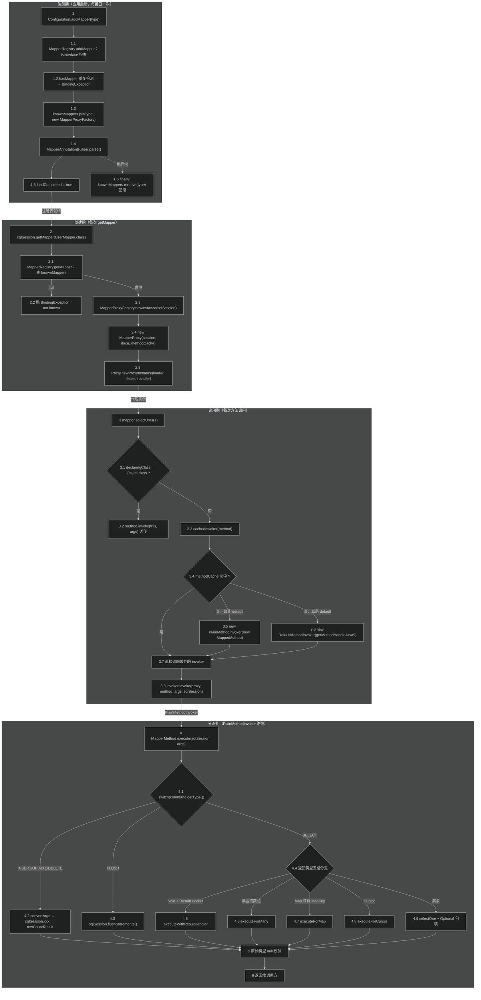
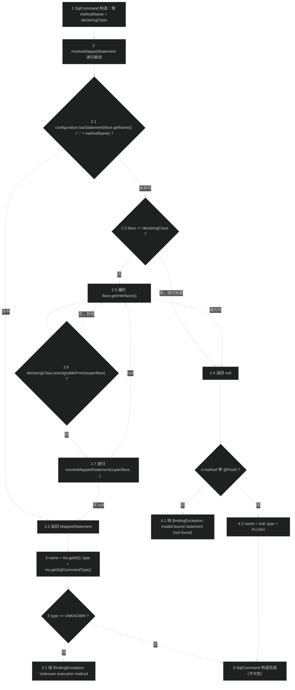
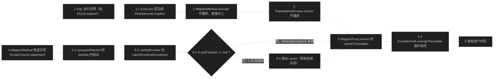

# 源码分析：Mapper 接口代理与方法分派

> 上次修改：2026-07-29 22:45

## 阅读向导

**面向读者**

| 读者类型 | 建议重点 | 理由 |
|----------|----------|------|
| 新接手开发者 | 第 1、2、4 章 | 需要先建立"接口方法 → statementId 字符串"的完整心智模型，第 4 章逐行解读是主干 |
| 排障者 | 第 5、8 章 | `Invalid bound statement (not found)`、`Parameter 'x' not found`、`attempted to return null from a method with a primitive return type` 三大高频报错的抛出点都在第 5 章；第 8 章给出复现条件 |
| 代码审查者 / 二次开发者 | 第 6、7 章 | 动态代理 + 工厂 + 命令分派的三维评估，以及 `methodCache` 的生命周期归属，决定了能否安全地缓存 Mapper 实例或替换代理机制 |
| 性能调优者 | 第 7 章 | `getMapper` 每次新建代理的开销、`MapperMethod` 的一次性解析、`ParamMap` 的每次分配都在这一章量化 |

**阅读前建议先读的文档**

- [Mapper 接口绑定（binding）](Mapper%20接口绑定（binding）.md)：本文的模块级视角版本。本文不重复模块职责边界与文件清单，直接进入行级解读。
- [会话与配置核心（session）](会话与配置核心（session）.md)：理解 `Configuration` 作为注册表宿主、`DefaultSqlSession` 作为最终落点的角色。
- [配置构建器（builder）](配置构建器（builder）.md)：理解 `MapperAnnotationBuilder.parse()` 在注册期做了什么，本文只分析它被触发的时机与失败回滚。
- [反射工具（reflection）](反射工具（reflection）.md)：理解 `TypeParameterResolver` 与 `ParamNameResolver` 的算法本体，本文只分析它们在绑定链路上的调用点与返回值消费方式。

**与模块文档的分工**

模块文档回答"binding 包是什么、有哪些类、与谁交互"；本文回答"`mapper.selectUser(1)` 这一行代码在字节码层面经过哪几次方法调用、每一行源码做了什么判断、哪些字段在什么时刻被写入"。本文的每个结论都绑定到 `文件:行号`。

---

## 1. 分析范围与目标

### 1.1 分析目标

用一条贯穿线索串起整个绑定层：**用户写下的 `mapper.selectUser(1)` 是如何最终变成 `sqlSession.selectOne("org.example.UserMapper.selectUser", 1)` 的**。

围绕这条线索回答四个问题：

1. **注册期**：`UserMapper.class` 是什么时候、以什么形式进入 MyBatis 的？失败了会留下什么残留？
2. **创建期**：`getMapper(UserMapper.class)` 返回的对象到底是什么？它的方法缓存归谁所有、活多久？
3. **拦截期**：JDK 代理拦截到 `selectUser` 后，如何区分"这是 SQL 方法"还是"这是 `default` 方法"还是"这是 `Object.toString()`"？
4. **分派期**：方法签名（返回类型、参数列表、注解）是在哪一刻被解析成运行期决策数据的？实参 `1` 是如何变成 `parameterObject` 的？返回值又是如何被适配回声明类型的？

### 1.2 涵盖范围

| 范围 | 文件 | 涵盖的类/方法 |
|------|------|---------------|
| 注册入口 | `src/main/java/org/apache/ibatis/session/Configuration.java` | `addMapper` / `addMappers` / `getMapper`（L934-948）、`useActualParamName` 字段（L115、L287-289） |
| 注册表 | `src/main/java/org/apache/ibatis/binding/MapperRegistry.java` | 全类（L34-124） |
| 代理工厂 | `src/main/java/org/apache/ibatis/binding/MapperProxyFactory.java` | 全类（L28-55） |
| 调用拦截 | `src/main/java/org/apache/ibatis/binding/MapperProxy.java` | 全类（L35-121），含两个内部 Invoker |
| 分派契约 | `src/main/java/org/apache/ibatis/binding/MapperMethodInvoker.java` | 接口（L22-26） |
| 命令与签名 | `src/main/java/org/apache/ibatis/binding/MapperMethod.java` | 全类（L47-386），含 `ParamMap` / `SqlCommand` / `MethodSignature` |
| 参数绑定 | `src/main/java/org/apache/ibatis/reflection/ParamNameResolver.java` | 构造器（L70-129）、`getNamedParams`（L157-180）、`wrapToMapIfCollection`（L222-239） |
| 泛型解析（调用点） | `src/main/java/org/apache/ibatis/reflection/TypeParameterResolver.java` | `resolveReturnType`（L72-76）、`resolveParamTypes`（L90-94）、`resolveType` 分派（L104-112） |
| 异常剥壳 | `src/main/java/org/apache/ibatis/reflection/ExceptionUtil.java` | `unwrapThrowable`（L30-41） |
| 落点确认 | `src/main/java/org/apache/ibatis/session/defaults/DefaultSqlSession.java` | `getMapper`（L284-287）、`selectOne`（L71-83） |

### 1.3 不涵盖范围

- **不涵盖 `MapperAnnotationBuilder.parse()` 的内部实现**：本文只分析它在 `MapperRegistry.addMapper` 中被调用的时机（`MapperRegistry.java:71-72`）以及失败对注册表状态的影响。注解解析算法见 `配置构建器（builder）.md`。
- **不涵盖 `TypeParameterResolver` 的泛型推导算法本体**：本文只解释 `MethodSignature` 为什么调用它、返回值的三种形态如何被消费（`MapperMethod.java:285-292`）。
- **不涵盖 `SqlSession.selectOne` 之后的执行链路**：`Executor` → `StatementHandler` → `ResultSetHandler` 见 `核心源码分析-查询主链路与缓存协同.md` 与 `执行器与结果处理（executor）.md`。
- **不涵盖 XML `<mappers>` 元素的解析**：注册的上游触发见 `配置构建器（builder）.md`。
- **不涵盖插件（`Interceptor`）**：MyBatis 插件织入 `Executor` / `StatementHandler` / `ParameterHandler` / `ResultSetHandler` 四大对象，**不作用于 Mapper 代理**，因此不在本链路上。

### 1.4 分析方法与版本约束

- 全程静态分析，未执行编译/运行/测试。
- 分析基于当前工作区 `master` 分支（最新提交 `8da8f31`）的源码快照。
- 项目 Java 版本为 11（`pom.xml:67` 中 `<java.version>11</java.version>`），这直接影响第 4.3 节 `privateLookupIn` 的可用性判断。

---

## 2. 核心类/函数全景

### 2.1 注册期参与者

| 类/方法 | 职责 | 关键方法/字段 | 代码位置 |
|---------|------|---------------|----------|
| `Configuration` | 全局配置门面，持有注册表实例 | `addMapper` / `addMappers` / `getMapper` | `Configuration.java:934-948` |
| `MapperRegistry` | Mapper 接口 → 代理工厂的注册表 | `knownMappers`（`ConcurrentHashMap`）、`addMapper`、`getMapper`、`hasMapper` | `MapperRegistry.java:34-124` |
| `MapperAnnotationBuilder` | 解析接口上的注解与同名 XML，产出 `MappedStatement` | `parse()` | `MapperAnnotationBuilder.java:122-155` |
| `ResolverUtil` | 包扫描，找出包下所有符合 `superType` 的类 | `find(IsA, packageName)` | `MapperRegistry.java:104-106` 调用点 |

### 2.2 创建期参与者

| 类/方法 | 职责 | 关键方法/字段 | 代码位置 |
|---------|------|---------------|----------|
| `MapperProxyFactory<T>` | 为一个接口反复生产代理实例；**持有跨实例共享的方法缓存** | `mapperInterface`、`methodCache`、`newInstance(SqlSession)`、`newInstance(MapperProxy)` | `MapperProxyFactory.java:28-55` |
| `java.lang.reflect.Proxy` | JDK 标准动态代理生成器 | `newProxyInstance(ClassLoader, Class[], InvocationHandler)` | 调用点 `MapperProxyFactory.java:47` |
| `MapperProxy<T>` | `InvocationHandler` 实现，每个 `SqlSession` 一个 | `sqlSession`、`mapperInterface`、`methodCache`、`privateLookupInMethod` | `MapperProxy.java:35-56` |

### 2.3 调用期参与者

| 类/方法 | 职责 | 关键方法/字段 | 代码位置 |
|---------|------|---------------|----------|
| `MapperProxy.invoke` | 唯一拦截入口：`Object` 方法透传 / 其余方法交给 invoker / 异常剥壳 | — | `MapperProxy.java:58-68` |
| `MapperProxy.cachedInvoker` | 按 `Method` 缓存并惰性构造 invoker；区分普通方法与 `default` 方法 | `methodCache.computeIfAbsent` | `MapperProxy.java:70-86` |
| `MapperProxy.getMethodHandleJava9` | 反射调用 `MethodHandles.privateLookupIn` 拿到私有 `Lookup`，再 `findSpecial` 得到 `default` 方法句柄 | — | `MapperProxy.java:88-94` |
| `MapperMethodInvoker` | 分派契约，只有一个方法 | `invoke(proxy, method, args, sqlSession)` | `MapperMethodInvoker.java:22-26` |
| `MapperProxy.PlainMethodInvoker` | 策略 A：委托给预构建的 `MapperMethod` | `mapperMethod` | `MapperProxy.java:96-107` |
| `MapperProxy.DefaultMethodInvoker` | 策略 B：`methodHandle.bindTo(proxy).invokeWithArguments(args)` | `methodHandle` | `MapperProxy.java:109-120` |
| `ExceptionUtil.unwrapThrowable` | 循环剥掉 `InvocationTargetException` / `UndeclaredThrowableException` 外壳 | — | `ExceptionUtil.java:30-41` |

### 2.4 分派期参与者

| 类/方法 | 职责 | 关键方法/字段 | 代码位置 |
|---------|------|---------------|----------|
| `MapperMethod` | 一个接口方法的完整运行期描述 = `SqlCommand` + `MethodSignature` | `execute(SqlSession, Object[])` | `MapperMethod.java:47-104` |
| `MapperMethod.SqlCommand` | 解析"调哪个 statement、是什么类型的 SQL" | `name`、`type`、`resolveMappedStatement` | `MapperMethod.java:217-269` |
| `MapperMethod.MethodSignature` | 解析"返回什么、特殊参数在第几位、参数怎么命名" | 5 个 boolean + `returnType` + `mapKey` + 两个 `Integer` 下标 + `paramNameResolver` | `MapperMethod.java:271-384` |
| `MapperMethod.ParamMap<V>` | 严格 `HashMap`：取不到键时抛 `BindingException` 而非返回 `null` | `get(Object)` | `MapperMethod.java:203-215` |
| `ParamNameResolver` | 方法实参 → `SqlSession` 的单一 `parameterObject` | `names`（`SortedMap<Integer,String>`）、`getNamedParams`、`wrapToMapIfCollection` | `ParamNameResolver.java:39-244` |
| `TypeParameterResolver` | 把泛型返回类型/参数类型解析成实际 `Type` | `resolveReturnType`、`resolveParamTypes` | `TypeParameterResolver.java:72-94` |

### 2.5 结果适配辅助方法

| 方法 | 输入 | 输出 | 代码位置 |
|------|------|------|----------|
| `rowCountResult(int)` | JDBC 影响行数 | `null` / `Integer` / `Long` / `Boolean`，否则抛异常 | `MapperMethod.java:106-121` |
| `executeWithResultHandler` | `args` | `void`（结果流向用户的 `ResultHandler`） | `MapperMethod.java:123-138` |
| `executeForMany` | `args` | `List` 或数组或自定义 `Collection` | `MapperMethod.java:140-157` |
| `executeForCursor` | `args` | `Cursor<T>` | `MapperMethod.java:159-169` |
| `executeForMap` | `args` | `Map<K,V>` | `MapperMethod.java:191-201` |
| `convertToDeclaredCollection` | `List` | 用 `ObjectFactory` 创建声明的集合类型并 `addAll` | `MapperMethod.java:171-176` |
| `convertToArray` | `List` | 原始类型数组走 `Array.set` 逐个拆箱，引用类型走 `toArray` | `MapperMethod.java:178-189` |

---

## 3. 关键数据结构

### 3.1 `MapperRegistry.knownMappers`

```java
// MapperRegistry.java:37
private final Map<Class<?>, MapperProxyFactory<?>> knownMappers = new ConcurrentHashMap<>();
```

| 属性 | 说明 |
|------|------|
| 键 | Mapper 接口的 `Class` 对象；`Class` 的 `hashCode`/`equals` 是身份语义，因此同一个类被不同 `ClassLoader` 加载会是两个不同键 |
| 值 | 该接口专属的 `MapperProxyFactory`，一个接口一个，与 `Configuration` 同生命周期 |
| 生命周期 | 启动期写入（`addMapper`），运行期只读（`getMapper` / `hasMapper` / `getMappers`） |
| 并发语义 | `ConcurrentHashMap`。运行期是纯读场景，但支持 Spring 等框架在运行中晚绑定注册 |

**为什么用 `Map` 而不是 `List`？** `getMapper` 的调用频率等于用户获取 Mapper 的频率（Spring 场景下每个请求可能多次），必须是 O(1) 的 `Class` 精确匹配。`List` 需要线性扫描，且 `Class` 没有天然序。

**为什么用 `ConcurrentHashMap` 而不是 `HashMap`？** 注册主要发生在单线程的启动期，但 MyBatis 允许运行期动态 `addMapper`（`Configuration.java:942-944` 是 public API），而 `getMapper` 是高频并发读。`ConcurrentHashMap` 保证读无锁且写可见，代价只是稍高的内存开销。`getMappers()`（`MapperRegistry.java:89-91`）返回 `Collections.unmodifiableCollection(knownMappers.keySet())`——注意这是**视图**不是快照，运行期新增的 mapper 会反映到已返回的集合中。

### 3.2 `MapperProxyFactory.methodCache`

```java
// MapperProxyFactory.java:31
private final Map<Method, MapperMethodInvoker> methodCache = new ConcurrentHashMap<>();
```

这是整个绑定层**最重要的一处生命周期设计**。

| 属性 | 说明 |
|------|------|
| 键 | `java.lang.reflect.Method` 对象。`Method.equals` 比较声明类 + 方法名 + 参数类型 + 返回类型，因此不同 `getMethod()` 调用得到的不同 `Method` 实例仍然相等 |
| 值 | `PlainMethodInvoker`（含已解析完毕的 `MapperMethod`）或 `DefaultMethodInvoker`（含 `MethodHandle`） |
| 所有者 | **工厂**，不是代理 |
| 生命周期 | 与 `MapperProxyFactory` 相同 = 与 `Configuration` 相同 = 应用整个生命周期 |
| 容量上界 | 该接口的方法数量，天然有界，不会无限增长 |

**放在 Factory 而非 Proxy 上的意义**：`MapperProxyFactory.newInstance(SqlSession)`（`MapperProxyFactory.java:50-53`）每次都 `new MapperProxy<>(...)`，把 `methodCache` 的**同一个引用**传进去（L51）。这意味着：

- 每个 `SqlSession` 都会拿到一个全新的 `MapperProxy`（因为它必须持有会话引用），但**所有会话共享同一份方法解析结果**。
- 第一次调用 `selectUser` 会付出 `new MapperMethod(...)` 的完整解析代价（`TypeParameterResolver` 泛型推导 + `ParamNameResolver` 参数扫描 + `resolveMappedStatement` 递归查找）；第 N 个 `SqlSession` 第一次调用 `selectUser` 时直接命中缓存。
- 如果缓存放在 `MapperProxy` 上，每个短生命周期的 `SqlSession` 都要重新解析全部方法，反射开销将随会话数线性增长——这在 Web 应用中意味着每个 HTTP 请求都要重解析一次。

### 3.3 `MapperMethod.SqlCommand`

```java
// MapperMethod.java:219-220
private final String name;
private final SqlCommandType type;
```

只有两个 `final` 字段，是典型的**不可变值对象**。

| 字段 | 含义 | 取值来源 | 特殊值 |
|------|------|----------|--------|
| `name` | `MappedStatement` 的 id，即 `接口全限定名.方法名` | `ms.getId()`（L234） | `@Flush` 方法为 `null`（L231） |
| `type` | SQL 类型枚举 | `ms.getSqlCommandType()`（L235） | `@Flush` 方法为 `SqlCommandType.FLUSH`（L232）；`UNKNOWN` 直接抛异常（L236-238） |

**为什么把 `name` 存成 `String` 而不是直接存 `MappedStatement` 引用？** `MappedStatement` 可能在 `Configuration` 中被延迟构建（`IncompleteElementException` → `addIncompleteMethod`，见 `MapperAnnotationBuilder.java:149-151`）。存 id 字符串意味着每次 `execute` 都通过当前 `Configuration` 重新查找，能反映最终态；存对象引用则会固化早期快照。代价是每次调用多一次 `Map` 查找。

### 3.4 `MapperMethod.MethodSignature`

```java
// MapperMethod.java:273-282
private final boolean returnsMany;
private final boolean returnsMap;
private final boolean returnsVoid;
private final boolean returnsCursor;
private final boolean returnsOptional;
private final Class<?> returnType;
private final String mapKey;
private final Integer resultHandlerIndex;
private final Integer rowBoundsIndex;
private final ParamNameResolver paramNameResolver;
```

这是"**启动期算一次、运行期零反射**"的教科书式实现：10 个字段全部 `final`，全部在构造器（L284-302）一次性计算完成，运行期的 `execute` 只做字段读取和 `if` 判断。

| 字段 | 判定逻辑 | 行号 |
|------|----------|------|
| `returnType` | `TypeParameterResolver.resolveReturnType` 的三态处理（`Class` / `ParameterizedType` 取 rawType / 兜底 `method.getReturnType()`） | L285-292 |
| `returnsVoid` | `void.class.equals(returnType)` | L293 |
| `returnsMany` | `ObjectFactory.isCollection(returnType) \|\| returnType.isArray()` | L294 |
| `returnsCursor` | `Cursor.class.equals(returnType)` | L295 |
| `returnsOptional` | `Optional.class.equals(returnType)` | L296 |
| `mapKey` | 返回类型是 `Map` 且方法带 `@MapKey` 时取注解值，否则 `null` | L297、L374-383 |
| `returnsMap` | `mapKey != null`——**注意：不是"返回类型是 Map"** | L298 |
| `rowBoundsIndex` | 扫描参数列表找唯一的 `RowBounds` 参数下标 | L299、L355-368 |
| `resultHandlerIndex` | 扫描参数列表找唯一的 `ResultHandler` 参数下标 | L300、L355-368 |

**`Integer` 而非 `int` 的设计**：`rowBoundsIndex` / `resultHandlerIndex` 用装箱的 `Integer`，`null` 表示"没有这个参数"（`hasRowBounds()` = `rowBoundsIndex != null`，L308-310）。用 `int` + `-1` 哨兵值也可以，但 `null` 语义更明确、更难误用。代价是一次装箱和运行期的 `null` 检查。

**`returnsMap` 依赖 `@MapKey` 的陷阱**：一个返回 `Map<String, Object>` 但**没有** `@MapKey` 注解的方法，`returnsMap` 为 `false`，会落到 `execute` 的 `else` 分支走 `selectOne`（`MapperMethod.java:86-87`），把整行结果当成一个 `Map` 返回。这是符合预期的（单行多列 → Map），但对期望"多行聚合成 Map"的用户是隐式陷阱。

### 3.5 `ParamNameResolver.names`

```java
// ParamNameResolver.java:64
private final SortedMap<Integer, String> names;
```

| 属性 | 说明 |
|------|------|
| 键 | 参数在**方法签名**中的原始下标（含被跳过的特殊参数造成的空洞） |
| 值 | 该参数在 SQL 中的引用名 |
| 实现 | `TreeMap`（L74），构造末尾用 `Collections.unmodifiableSortedMap` 冻结（L106） |

**为什么需要 `SortedMap` 而不是 `List`？** 因为 `RowBounds` / `ResultHandler` 会被跳过（L79-82），下标不连续。文档注释（L58-62）给出了三个精确示例：

```
aMethod(@Param("M") int a, @Param("N") int b)  ->  {{0,"M"}, {1,"N"}}
aMethod(int a, int b)                          ->  {{0,"0"}, {1,"1"}}
aMethod(int a, RowBounds rb, int b)            ->  {{0,"0"}, {2,"1"}}
```

第三个例子最能说明问题：`b` 的**方法下标是 2**（键），但它的**默认名是 "1"**（值，来自 `String.valueOf(map.size())`，L100）。键必须是 2 才能从 `args[2]` 取到值，值必须是 "1" 才能让 `param2` 的编号连续。`SortedMap` 保证遍历顺序等于参数声明顺序，这是 `getNamedParams` 中 `param1..paramN` 编号正确的前提。

### 3.6 `ParamNameResolver` 的三个状态标志

| 字段 | 含义 | 写入时机 | 行号 |
|------|------|----------|------|
| `useActualParamName` | 是否使用编译产生的真实参数名 | 构造器读 `Configuration.isUseActualParamName()`，默认 `true`（`Configuration.java:115`） | L51、L71 |
| `hasParamAnnotation` | 是否至少有一个参数带 `@Param` | 扫描到 `@Param` 时置 `true` | L67、L86 |
| `useParamMap` | 最终是否会产出 `ParamMap` | 有 `@Param`（L87）或参数数 > 1（L107-109）时置 `true` | L68 |

`hasParamAnnotation` 与 `useParamMap` 看似重复，但语义不同：前者只记录"用户显式命名过"，后者是"多参数或显式命名"的并集。前者参与 `getNamedParams` 的单参数直返判断（L162），后者对外暴露给 SQL 提供方（`isUseParamMap()`，L241-243）。

### 3.7 `ParamNameResolver.typeMap` 与 `GENERIC_NAME_CACHE`

```java
// ParamNameResolver.java:43-49
public static final String[] GENERIC_NAME_CACHE = new String[10];
static {
  for (int i = 0; i < 10; i++) {
    GENERIC_NAME_CACHE[i] = GENERIC_NAME_PREFIX + (i + 1);
  }
}
```

预生成 `"param1".."param10"` 常量数组，避免每次调用都做字符串拼接。`getNamedParams` 中的 `i < 10 ? GENERIC_NAME_CACHE[i] : GENERIC_NAME_PREFIX + (i + 1)`（L171）是典型的"覆盖 99% 场景的快路径 + 兜底慢路径"。10 个参数以上的 Mapper 方法极为罕见，慢路径几乎不会触发。

`typeMap`（L65）是 `name → Type` 的映射，供 SQL 提供方（`@SelectProvider` 等）通过 `getType(String)`（L182-208）查询参数的实际泛型类型。注意单参数场景下还会额外注册 `"collection"` / `"list"` / `"array"` 三个别名键（L110-128），与 `wrapToMapIfCollection` 产出的 `ParamMap` 键保持一致。

### 3.8 `MapperMethod.ParamMap<V>`

```java
// MapperMethod.java:203-215
public static class ParamMap<V> extends HashMap<String, V> {
  @Override
  public V get(Object key) {
    if (!super.containsKey(key)) {
      throw new BindingException("Parameter '" + key + "' not found. Available parameters are " + keySet());
    }
    return super.get(key);
  }
}
```

只覆写了 `get`，把 `HashMap` 的"缺键返回 `null`"改成"缺键立即抛异常并列出所有可用键"。

**设计理由**：SQL 中的 `#{userName}` 如果拼写错误，在原生 `HashMap` 下会静默取到 `null`，最终变成 `WHERE name = NULL` 这样永远不匹配的查询——一个非常难排查的静默失败。改成快速失败后，用户直接看到 `Parameter 'userName' not found. Available parameters are [userNam, param1]`，错误定位从"查半天数据"变成"看一眼报错"。

**未覆写的方法带来的不一致**：`containsKey` / `getOrDefault` / `computeIfAbsent` 等继承自 `HashMap`，行为仍是宽松的。因此"缺键抛异常"这条契约只在 `get` 路径上成立。详见第 8 章。

---

## 4. 主线流程逐行解读

### 4.0 全景流程图



**1-1.6 注册期**：`Configuration.addMapper` 直接委托 `MapperRegistry.addMapper`。注册表先做接口类型与重复注册两道校验，随后**先写入 `knownMappers` 再触发注解解析**——这个顺序不可调换（源码 L68-70 有明确注释）。`MapperAnnotationBuilder.parse()` 内部解析同名 XML 时会回调 `bindMapperForNamespace`，若此时接口尚未登记就会造成重复注册。整个解析包在 `try/finally` 中，任何异常都会触发 `knownMappers.remove(type)`，避免留下一个"已登记但没有任何 `MappedStatement`"的半成品工厂。

**2-2.5 创建期**：`getMapper` 是 O(1) 的 `Map` 查找 + 两次对象分配。未注册的接口在 L46-48 抛出 `Type xxx is not known to the MapperRegistry`。工厂把自己持有的 `methodCache` 引用传给新建的 `MapperProxy`（`MapperProxyFactory.java:51`），因此所有会话共享同一份方法解析缓存。`Proxy.newProxyInstance` 的三个参数分别是接口的 `ClassLoader`、只含该接口的数组、以及 `MapperProxy` 自身。

**3-3.8 调用期**：所有方法调用统一进入 `MapperProxy.invoke`。第一道判断把 `Object` 上声明的 `equals`/`hashCode`/`toString` 反射到 handler 自身（而非再进 SQL 分派），其余方法查 `methodCache`。缓存未命中时按 `method.isDefault()` 二选一构造 invoker：普通方法构造 `MapperMethod`（此时才做全部签名解析），`default` 方法则通过 `MethodHandle` 绑定。整个 `invoke` 体外包一层 `catch (Throwable t) { throw ExceptionUtil.unwrapThrowable(t); }`。

**4.1-4.9 分派期**：`MapperMethod.execute` 按 `SqlCommandType` 做一级分派，SELECT 分支内再按 `MethodSignature` 的预计算 boolean 做二级分派，五条路径的判断顺序是固定且有优先级的（见 4.6.2）。

**5-6 收尾**：无论走哪条路径，返回前都要过一道"声明返回类型是原始类型但结果为 `null`"的校验（L99-102），否则 JVM 自动拆箱会抛出信息量为零的 `NullPointerException`。

### 4.1 注册期：`Configuration.addMapper` → `MapperRegistry.addMapper`

**入口（`Configuration.java:942-944`）**

```java
public <T> void addMapper(Class<T> type) {
  mapperRegistry.addMapper(type);
}
```

纯委托，`Configuration` 在这里只是门面。真正的逻辑全在注册表。

**核心实现（`MapperRegistry.java:60-80`）**

```java
public <T> void addMapper(Class<T> type) {
  if (type.isInterface()) {                                          // L61
    if (hasMapper(type)) {                                           // L62
      throw new BindingException("Type " + type + " is already known to the MapperRegistry.");  // L63
    }
    boolean loadCompleted = false;                                   // L65
    try {
      knownMappers.put(type, new MapperProxyFactory<>(type));         // L67
      // It's important that the type is added before the parser is run
      MapperAnnotationBuilder parser = new MapperAnnotationBuilder(config, type);  // L71
      parser.parse();                                                // L72
      loadCompleted = true;                                          // L73
    } finally {
      if (!loadCompleted) {                                          // L75
        knownMappers.remove(type);                                   // L76
      }
    }
  }
}
```

逐行解读：

- **L61 `if (type.isInterface())`**：非接口**静默忽略**，没有 `else` 分支也没有日志。这是包扫描场景（`addMappers(packageName)`，L120-122，默认 `superType = Object.class`）的必要设计——扫描一个包会捞出接口、类、枚举、注解等所有类型，如果对非接口报错，用户几乎无法使用包扫描。副作用是：用户把一个抽象类误当 Mapper 注册时**不会得到任何提示**，直到运行期 `getMapper` 才抛出 "not known to the MapperRegistry"，报错位置与真实原因相距甚远。

- **L62-64 重复注册检测**：`hasMapper` 就是 `knownMappers.containsKey`（L56-58）。这是一个**保护性快速失败**：重复调用 `addMapper` 通常意味着配置文件里同一个 mapper 被写了两遍，或者 `<package>` 扫描与 `<mapper class>` 重叠。注意这个"检查后写入"的组合**不是原子的**（详见第 8.2 节）。

- **L65 `loadCompleted` 标志**：Java 没有 `try/except/else` 结构，用一个布尔标志 + `finally` 是标准的"仅在异常时回滚"惯用法。放在 `try` 外声明是必须的，否则 `finally` 无法访问。

- **L67 先 `put` 后 `parse`**：源码注释（L68-70）解释得非常清楚——"重要的是 type 必须在 parser 运行之前被加入，否则 mapper parser 可能会自动尝试绑定；如果 type 已经是 known 的，它就不会尝试"。具体机制是：`parse()`（`MapperAnnotationBuilder.java:122-155`）第一步就 `loadXmlResource()`（L125）去加载同名的 `.xml` 文件；`XMLMapperBuilder` 解析完 XML 后会调用 `bindMapperForNamespace`，把 namespace 当作类名去 `configuration.addMapper(boundType)`。如果此时 `knownMappers` 中还没有该类型，就会**递归进入 `addMapper` 并第二次执行 `parse()`**——轻则重复解析，重则在内层 `parse` 完成后外层 `parse` 再次执行时抛出"statement 已存在"的异常。先 `put` 之后，内层调用会被 `bindMapperForNamespace` 中的 `hasMapper` 检查挡住。

  **代价**：`put` 到 `parse` 之间存在一个"工厂已可见但 `MappedStatement` 尚未就绪"的时间窗口。单线程启动无影响；若并发调用 `addMapper` 与 `getMapper`，另一线程可能拿到能创建代理但调用方法时抛 `Invalid bound statement` 的工厂。

- **L71-72 触发注解解析**：`MapperAnnotationBuilder.parse()` 是绑定层与构建层的唯一交界。它会解析 `@Select`/`@Insert`/`@Results` 等注解并生成 `MappedStatement` 注册进 `Configuration`。注意 L139-142 的 `canHaveStatement` 过滤：`!method.isBridge() && !method.isDefault()`——桥接方法（泛型擦除产生）和 `default` 方法**不会**被当作 SQL 方法解析，这与运行期 `cachedInvoker` 对 `default` 方法的特殊处理形成闭环。

- **L74-78 `finally` 回滚**：一旦 `parse()` 抛出任何异常（XML 语法错误、`ResultMap` 引用不存在、SQL 提供者类无法加载），`loadCompleted` 保持 `false`，`knownMappers.remove(type)` 撤销 L67 的写入。这保证注册表要么完全没有该接口，要么该接口的所有 `MappedStatement` 都已就绪，不存在中间态。

  **注意这不是完整回滚**：`parse()` 在抛异常前可能已经向 `Configuration.mappedStatements` / `resultMaps` / `caches` 写入了部分内容，这些**不会**被撤销。`MapperRegistry` 只回滚自己那一格。由于异常通常会导致启动失败，实践中影响有限，但如果上层捕获了异常继续运行，`Configuration` 就处于污染状态。

### 4.2 创建期：`getMapper` → `Proxy.newProxyInstance`

**用户入口（`DefaultSqlSession.java:284-287`）**

```java
@Override
public <T> T getMapper(Class<T> type) {
  return configuration.getMapper(type, this);
}
```

关键在于 `this`：把**当前会话**传下去，最终成为 `MapperProxy.sqlSession`。这是"代理绑定会话"的根源，也是代理不能跨会话复用的原因。

**注册表取用（`MapperRegistry.java:43-54`）**

```java
@SuppressWarnings("unchecked")
public <T> T getMapper(Class<T> type, SqlSession sqlSession) {
  final MapperProxyFactory<T> mapperProxyFactory = (MapperProxyFactory<T>) knownMappers.get(type);  // L45
  if (mapperProxyFactory == null) {                                                                 // L46
    throw new BindingException("Type " + type + " is not known to the MapperRegistry.");            // L47
  }
  try {
    return mapperProxyFactory.newInstance(sqlSession);                                              // L50
  } catch (Exception e) {
    throw new BindingException("Error getting mapper instance. Cause: " + e, e);                    // L52
  }
}
```

- **L45 的强制转型**：`knownMappers` 的值类型是 `MapperProxyFactory<?>`，编译期无法证明它与 `Class<T>` 的 `T` 一致。类型安全由 `addMapper` 的写入不变式保证：`knownMappers.put(type, new MapperProxyFactory<>(type))`（L67）中 key 与工厂泛型参数必然同源。`@SuppressWarnings("unchecked")` 是对这个不变式的显式声明。
- **L46-48**：这是用户最常见的第二类报错（第一类是 `Invalid bound statement`）。触发条件：接口没有出现在 `<mappers>` 中、包扫描路径写错、或者 `addMapper` 因为 L61 的非接口判断被静默跳过。
- **L49-53 的 `try/catch`**：把 `newInstance` 中可能出现的任何异常（比如 `ClassLoader` 问题导致 `Proxy.newProxyInstance` 失败）统一包装成 `BindingException`。注意捕获的是 `Exception` 而非 `Throwable`，`Error` 会直接穿透。

**工厂创建（`MapperProxyFactory.java:45-53`）**

```java
@SuppressWarnings("unchecked")
protected T newInstance(MapperProxy<T> mapperProxy) {
  return (T) Proxy.newProxyInstance(mapperInterface.getClassLoader(), new Class[] { mapperInterface }, mapperProxy);  // L47
}

public T newInstance(SqlSession sqlSession) {
  final MapperProxy<T> mapperProxy = new MapperProxy<>(sqlSession, mapperInterface, methodCache);  // L51
  return newInstance(mapperProxy);                                                                 // L52
}
```

**L47 `Proxy.newProxyInstance` 的三个参数**：

| 参数 | 传入值 | 为什么这样传 |
|------|--------|--------------|
| `ClassLoader` | `mapperInterface.getClassLoader()` | **必须**用接口自身的加载器，不能用 `Thread.currentThread().getContextClassLoader()` 或 `MapperProxyFactory.class.getClassLoader()`。生成的代理类要实现该接口，若加载器看不见该接口就会抛 `IllegalArgumentException`。在 OSGi、Spring Boot 的 `LaunchedURLClassLoader`、应用服务器的模块化加载器等场景下，接口的加载器往往与 MyBatis 自身不同 |
| `Class<?>[] interfaces` | `new Class[] { mapperInterface }` | **只实现一个接口**。代理不额外实现 `Serializable` 等标记接口——尽管 `MapperProxy` 自己 `implements Serializable`（L35），但那是 handler 的属性，不会传递给生成的代理类。因此**代理实例本身不可序列化** |
| `InvocationHandler` | `mapperProxy` | 每次 `newInstance(SqlSession)` 都是新建的（L51） |

**L51-52 的两级 `newInstance`**：拆成 `newInstance(SqlSession)`（public）和 `newInstance(MapperProxy)`（**protected**）两层，是为子类留的扩展点——继承 `MapperProxyFactory` 并覆写 protected 版本，就能在不改变 handler 构造逻辑的前提下替换代理生成方式（例如换成 CGLib、或包裹额外接口）。

**每次调用都新建代理的代价**：`getMapper` 不缓存代理实例。每次调用产生两次分配：一个 `MapperProxy`（3 个引用字段）+ 一次 `Proxy.newProxyInstance`。后者在首次为某接口生成代理类时需要**字节码生成**（较重），但 JDK 内部有代理类缓存（`Proxy` 的 `proxyClassCache`），同一 `(ClassLoader, interfaces)` 组合的后续调用只是 `Constructor.newInstance`，开销降到普通对象创建量级。

### 4.3 调用期：`MapperProxy.invoke`

**入口（`MapperProxy.java:58-68）**

```java
@Override
public Object invoke(Object proxy, Method method, Object[] args) throws Throwable {
  try {
    if (Object.class.equals(method.getDeclaringClass())) {   // L61
      return method.invoke(this, args);                      // L62
    }
    return cachedInvoker(method).invoke(proxy, method, args, sqlSession);  // L64
  } catch (Throwable t) {
    throw ExceptionUtil.unwrapThrowable(t);                  // L66
  }
}
```

**L61 `Object.class.equals(method.getDeclaringClass())`**：

JDK 代理会把 `equals` / `hashCode` / `toString` 三个方法也路由到 handler（其余 `Object` 方法如 `getClass` / `wait` / `notify` 是 `final` 或 `native`，不会被代理）。如果不做这个判断，`System.out.println(mapper)` 会触发 `toString()` → 进入 SQL 分派 → `SqlCommand` 构造时找不到名为 `toString` 的 statement → 抛 `Invalid bound statement (not found): xxx.toString`。调试时打印一下 mapper 就炸了，体验极差。

**为什么用 `getDeclaringClass()` 而不是 `method.getName()` 白名单？** 声明类判断更精确：如果用户在 Mapper 接口上自己声明了一个 `String toString()` 抽象方法，它的 `declaringClass` 是 Mapper 接口而非 `Object`，会正常走 SQL 分派——这符合"用户显式声明就是用户意图"的原则。反之名字白名单会错误拦截。

**注意 `method.invoke(this, args)` 的 `this` 是 `MapperProxy` 而非 `proxy`**：调用的是 `MapperProxy` 继承自 `Object` 的默认实现。因此：

- `mapper.toString()` 返回类似 `org.apache.ibatis.binding.MapperProxy@1b6d3586`
- `mapper.equals(other)` 是**两个 handler 的引用相等**，而不是两个代理的。由于每次 `getMapper` 都新建 handler，**同一会话两次 `getMapper` 得到的 mapper 互不相等**
- `mapper.hashCode()` 每次 `getMapper` 都不同 —— 把 Mapper 实例当 `HashMap` 的键会有反直觉行为

如果传 `proxy` 会怎样？`method.invoke(proxy, args)` 会再次触发代理拦截，`toString` 无限递归直到 `StackOverflowError`。

**L64 主路径**：`cachedInvoker(method)` 取（或构造）invoker，然后立即 `invoke`。注意 `sqlSession` 是从 handler 字段读取的——invoker 本身是无会话状态的（可跨会话共享），会话在**调用时**作为参数注入。这正是 `methodCache` 能放在工厂上的前提：如果 invoker 内部持有会话，它就只能属于某个 `MapperProxy`。

**L65-67 `ExceptionUtil.unwrapThrowable`**：

```java
// ExceptionUtil.java:30-41
public static Throwable unwrapThrowable(Throwable wrapped) {
  Throwable unwrapped = wrapped;
  while (true) {
    if (unwrapped instanceof InvocationTargetException) {
      unwrapped = ((InvocationTargetException) unwrapped).getTargetException();
    } else if (unwrapped instanceof UndeclaredThrowableException) {
      unwrapped = ((UndeclaredThrowableException) unwrapped).getUndeclaredThrowable();
    } else {
      return unwrapped;
    }
  }
}
```

反射调用会把业务异常包进 `InvocationTargetException`；JDK 代理在 handler 抛出接口未声明的受检异常时会包进 `UndeclaredThrowableException`。这两层可能**嵌套多次**（例如 handler 内部又用了反射），所以是 `while(true)` 循环剥壳而不是单次 `if`。效果是：用户在 `catch (PersistenceException e)` 中拿到的就是真正的 `PersistenceException`，而不是三层包装。

**副作用**：受检异常的编译期契约被绕过。若剥壳后得到的是接口方法未声明的受检异常，它会以未声明的形式抛出到调用方——这是"为了可用性牺牲类型严格性"的有意取舍。

### 4.4 缓存与双策略构造：`cachedInvoker`

**源码（`MapperProxy.java:70-86`）**

```java
private MapperMethodInvoker cachedInvoker(Method method) throws Throwable {
  try {
    return methodCache.computeIfAbsent(method, m -> {                                    // L72
      if (!m.isDefault()) {                                                              // L73
        return new PlainMethodInvoker(new MapperMethod(mapperInterface, method, sqlSession.getConfiguration()));  // L74
      }
      try {
        return new DefaultMethodInvoker(getMethodHandleJava9(method));                   // L77
      } catch (NoSuchMethodException | IllegalAccessException | InvocationTargetException e) {
        throw new RuntimeException(e);                                                   // L79
      }
    });
  } catch (RuntimeException re) {                                                        // L82
    Throwable cause = re.getCause();
    throw cause == null ? re : cause;                                                    // L84
  }
}
```

**L72 `computeIfAbsent` 的原子性语义**：`ConcurrentHashMap.computeIfAbsent` 保证同一个键的映射函数**至多执行一次**，并且计算期间对该桶加锁。两个线程同时首次调用 `selectUser` 时，只有一个会执行 `new MapperMethod(...)`，另一个阻塞等待并直接拿到结果。这避免了重复解析，也保证了 `MapperMethod` 的构造副作用（如触发 `Configuration.buildAllStatements`）不会并发执行。

**L72 的递归更新陷阱（重要）**：JDK 8 的 `ConcurrentHashMap.computeIfAbsent` **禁止映射函数内部修改同一个 map**，否则会导致 `IllegalStateException: Recursive update` 或死锁（JDK-8062841）。这里的映射函数体是 `new MapperMethod(...)`，其内部会调用 `SqlCommand` → `Configuration.hasStatement`/`getMappedStatement`、`MethodSignature` → `TypeParameterResolver`/`ParamNameResolver`，**没有任何一条路径会回写 `methodCache`**，因此在当前实现下是安全的。

需要注意的是：MyBatis 历史上曾引入 `org.apache.ibatis.util.MapUtil.computeIfAbsent`（先 `get` 后 `computeIfAbsent` 的两段式写法）来规避这类风险，**但该工具类在当前工作区源码中不存在**（`search_text "MapUtil"` 仅命中已有文档，`src/main/java/org/apache/ibatis/util/` 目录不存在）。当前代码直接使用 `ConcurrentHashMap.computeIfAbsent`。这意味着**如果未来有人在 `MapperMethod` 构造链路上加入回写 `methodCache` 的逻辑，就会立即踩到递归更新陷阱**。这一点在第 8 章作为疑似问题记录。

**L73 `m.isDefault()` 二分**：这是整个绑定层的核心分岔点。

- **非 `default`**：接口上的抽象方法 = SQL 方法。构造 `MapperMethod`，此时才做全部签名解析（第 4.5 节）。这是**懒加载**：注册期的 `MapperAnnotationBuilder.parse` 只生成 `MappedStatement`，`MapperMethod` 直到第一次调用才构造。好处是启动更快、未被调用的方法不付出解析代价；代价是首次调用有额外延迟，且**签名错误直到运行期才暴露**（例如 `Invalid bound statement` 不会在启动时报出来）。
- **`default`**：JDK 8 引入的接口默认方法，接口自己有实现体。**绝对不能**走 `MapperMethod`，因为 `default` 方法在 `MapperAnnotationBuilder` 中被 `canHaveStatement`（`MapperAnnotationBuilder.java:157-160`）明确排除，不存在对应的 `MappedStatement`，构造 `SqlCommand` 会直接抛 `Invalid bound statement`。

**L74 的 lambda 参数陷阱（细节）**：lambda 形参是 `m`，但 L74 传给 `MapperMethod` 的是**外层的 `method`** 而不是 `m`。二者在 `computeIfAbsent` 语义下必然是同一个对象引用（`computeIfAbsent` 把 key 原样传入函数），因此没有 bug，但这是一处**不一致的代码风格**：L73 用 `m`，L74 用 `method`。若将来有人为 key 做规范化处理（例如把桥接方法映射到目标方法），这个不一致会立刻变成真实缺陷。

**L76-80 受检异常包装**：`Function` 的 `apply` 不允许抛受检异常，因此 `getMethodHandleJava9` 抛出的三种反射异常必须包成 `RuntimeException`。

**L82-85 异常解包**：`computeIfAbsent` 抛出 `RuntimeException` 后，取 `getCause()` 还原原始异常。`cause == null` 时说明这个 `RuntimeException` 不是 L79 包装的（可能来自 `MapperMethod` 构造中真实抛出的 `BindingException`），原样抛出。这样 `BindingException` 能保持原貌传给 L66 的 `unwrapThrowable`。

### 4.5 `default` 方法的句柄获取：`getMethodHandleJava9`

**静态初始化（`MapperProxy.java:49-56`）**

```java
static {
  try {
    privateLookupInMethod = MethodHandles.class.getMethod("privateLookupIn", Class.class, MethodHandles.Lookup.class);
  } catch (NoSuchMethodException e) {
    throw new IllegalStateException(
        "There is no 'privateLookupIn(Class, Lookup)' method in java.lang.invoke.MethodHandles.", e);
  }
}
```

**为什么用反射拿 `privateLookupIn` 而不是直接调用？** 这是**历史遗留的版本兼容代码**。`MethodHandles.privateLookupIn(Class, Lookup)` 是 JDK 9 才引入的 API。MyBatis 早期需要同时支持 JDK 8 和 JDK 9+：JDK 8 下走 `Lookup` 的私有构造器反射（`Lookup.class.getDeclaredConstructor(Class.class, int.class)` + `setAccessible(true)`），JDK 9+ 下走 `privateLookupIn`。用反射查找方法可以在**不引入编译期依赖**的前提下做运行期分支。

本项目 `pom.xml:67` 已声明 `<java.version>11</java.version>`，`privateLookupIn` 必然存在，所以静态块里的 `catch` 分支实际上是死代码，方法名 `getMethodHandleJava9` 里的 "Java9" 也只剩历史印记。这段反射现在**只带来开销和 GraalVM native-image 等场景的额外配置负担，不再提供任何兼容价值**（见第 8 章改进建议）。

**句柄构造（`MapperProxy.java:88-94`）**

```java
private MethodHandle getMethodHandleJava9(Method method)
    throws NoSuchMethodException, IllegalAccessException, InvocationTargetException {
  final Class<?> declaringClass = method.getDeclaringClass();                        // L90
  return ((Lookup) privateLookupInMethod.invoke(null, declaringClass, MethodHandles.lookup())).findSpecial(  // L91
      declaringClass, method.getName(), MethodType.methodType(method.getReturnType(), method.getParameterTypes()),  // L92
      declaringClass);                                                               // L93
}
```

- **L90 `declaringClass`**：注意取的是**声明该 `default` 方法的接口**，不是 `mapperInterface`。若 `UserMapper extends BaseMapper` 且 `default` 方法定义在 `BaseMapper` 上，`declaringClass` 就是 `BaseMapper`——`findSpecial` 必须以真正的声明类为准，否则找不到方法体。
- **L91 `privateLookupInMethod.invoke(null, declaringClass, MethodHandles.lookup())`**：静态方法反射调用（第一个参数 `null` 表示无接收者）。`MethodHandles.lookup()` 返回**调用点（`MapperProxy` 类）**的 `Lookup`，`privateLookupIn` 用它作为凭证，"提权"出一个以 `declaringClass` 为查找上下文的 `Lookup`。若 `declaringClass` 所在模块没有对 MyBatis 的模块 `open`，这一步会抛 `IllegalAccessException`——这是 JPMS 环境下 `default` 方法失效的典型原因。
- **L91-93 `findSpecial(refc, name, type, specialCaller)`**：四个参数依次是"方法所在类"、"方法名"、"方法类型（返回类型 + 参数类型列表）"、"特殊调用者"。

  **为什么必须是 `findSpecial` 而不是 `findVirtual`？** `findSpecial` 对应字节码的 `invokespecial`，**绕过虚方法表直接定位到指定类的实现**；`findVirtual` 对应 `invokevirtual`，会走动态分派。代理对象的动态类型是 `$Proxy0`，它对该 `default` 方法的"实现"就是转发给 handler。若用 `findVirtual`，调用会被再次路由回 `MapperProxy.invoke` → 无限递归 → `StackOverflowError`。同理，也不能用 `Method.invoke(proxy, args)`。

  第四个参数 `specialCaller` 传 `declaringClass` 自身，语义是"以该接口的身份执行 `invokespecial`"——这正是接口内 `super` 调用的语义。

**执行（`MapperProxy.java:109-120`）**

```java
private static class DefaultMethodInvoker implements MapperMethodInvoker {
  private final MethodHandle methodHandle;
  @Override
  public Object invoke(Object proxy, Method method, Object[] args, SqlSession sqlSession) throws Throwable {
    return methodHandle.bindTo(proxy).invokeWithArguments(args);   // L118
  }
}
```

`bindTo(proxy)` 把代理实例绑定为 `this`。这一步至关重要：`default` 方法体内如果调用了本接口的其他抽象方法（很常见的写法，例如 `default User findOrThrow(int id) { return Optional.ofNullable(selectUser(id)).orElseThrow(...); }`），`this.selectUser(id)` 的 `this` 是代理，会**正常再次进入 `MapperProxy.invoke`** 走 SQL 分派。绑定成 handler 或其他对象都会破坏这个能力。

**性能注意**：`bindTo` 每次调用都会创建一个新的 `MethodHandle` 实例（不可变对象的绑定操作），`invokeWithArguments` 是变参形式，需要装箱与类型适配，比 `invokeExact` 慢。缓存的是**未绑定**的句柄，因为绑定目标（proxy）每次调用都可能不同。

### 4.6 分派期：`MapperMethod.execute`

**构造（`MapperMethod.java:52-55`）**

```java
public MapperMethod(Class<?> mapperInterface, Method method, Configuration config) {
  this.command = new SqlCommand(config, mapperInterface, method);        // L53
  this.method = new MethodSignature(config, mapperInterface, method);    // L54
}
```

两个 `final` 字段，两次一次性解析。构造完成后 `MapperMethod` 是**完全不可变**的，因此可以安全地跨会话、跨线程共享——这是它能放进工厂级 `methodCache` 的前提。

**注意构造顺序**：`SqlCommand` 先于 `MethodSignature`。若方法没有对应的 `MappedStatement`，L53 就会抛 `Invalid bound statement`，`MethodSignature` 根本不会构造。这意味着"statement 缺失"这个错误优先于"返回类型不支持"、"多个 RowBounds 参数"等签名错误暴露。

#### 4.6.1 `SqlCommand` 构造与 `resolveMappedStatement` 递归

**源码（`MapperMethod.java:222-268`）**

```java
public SqlCommand(Configuration configuration, Class<?> mapperInterface, Method method) {
  final String methodName = method.getName();                                                  // L223
  final Class<?> declaringClass = method.getDeclaringClass();                                  // L224
  MappedStatement ms = resolveMappedStatement(mapperInterface, methodName, declaringClass, configuration);  // L225
  if (ms == null) {                                                                            // L226
    if (method.getAnnotation(Flush.class) == null) {                                           // L227
      throw new BindingException(
          "Invalid bound statement (not found): " + mapperInterface.getName() + "." + methodName);  // L228-229
    }
    name = null;                                                                               // L231
    type = SqlCommandType.FLUSH;                                                               // L232
  } else {
    name = ms.getId();                                                                         // L234
    type = ms.getSqlCommandType();                                                             // L235
    if (type == SqlCommandType.UNKNOWN) {                                                      // L236
      throw new BindingException("Unknown execution method for: " + name);                     // L237
    }
  }
}
```

- **L223-224 两个身份**：`mapperInterface` 是"用户请求的接口"（`getMapper(UserMapper.class)` 中的类型），`declaringClass` 是"方法实际声明所在的接口"。两者在简单场景下相同，在接口继承场景下不同。递归查找就是在这两者之间的继承路径上进行的。
- **L225 递归查找**（见下）。
- **L226-232 `@Flush` 特例**：`@Flush` 标注的方法（`org.apache.ibatis.annotations.Flush`）不对应任何 SQL，它的作用是触发批量执行器的 `flushStatements`。因此允许 `ms == null`，`name` 置 `null`、`type` 置 `FLUSH`。运行期 `execute` 的 `case FLUSH` 分支（L93-95）直接调 `sqlSession.flushStatements()`，不使用 `command.getName()`，所以 `name = null` 不会引发 NPE。
- **L228-229 最著名的报错**：`Invalid bound statement (not found): org.example.UserMapper.selectUser`。这是 MyBatis 使用者遇到最多的异常，全项目**只有这一处抛出点**。常见原因：XML 的 `namespace` 与接口全限定名不一致、方法名与 statement id 不一致、XML 文件没有被打包进 classpath（Maven `src/main/java` 下的 `.xml` 默认不被复制）、`<mappers>` 中漏配。
- **L236-238 `UNKNOWN` 防御**：`SqlCommandType.UNKNOWN` 出现在 `MapperAnnotationBuilder` 处理 `@Options` / `@SelectKey` 这类"非 SQL 类型注解"时（`MapperAnnotationBuilder.java:745-754`）。正常路径下不会产出 `UNKNOWN` 的 `MappedStatement`，这是防御性检查。

**递归实现（`MapperMethod.java:250-268`）**

```java
private MappedStatement resolveMappedStatement(Class<?> mapperInterface, String methodName, Class<?> declaringClass,
    Configuration configuration) {
  String statementId = mapperInterface.getName() + "." + methodName;      // L252
  if (configuration.hasStatement(statementId)) {                          // L253
    return configuration.getMappedStatement(statementId);                 // L254
  }
  if (mapperInterface.equals(declaringClass)) {                           // L256
    return null;                                                          // L257
  }
  for (Class<?> superInterface : mapperInterface.getInterfaces()) {        // L259
    if (declaringClass.isAssignableFrom(superInterface)) {                 // L260
      MappedStatement ms = resolveMappedStatement(superInterface, methodName, declaringClass, configuration);  // L261
      if (ms != null) {                                                   // L262
        return ms;
      }
    }
  }
  return null;                                                            // L267
}
```

- **L252 statementId 拼接规则**：`接口全限定名 + "." + 方法名`。这就是整个绑定层的**核心约定**——把 Java 的类型化调用映射到字符串化的 statement id。注意这里用的是 `mapperInterface.getName()`（当前递归层的接口），不是 `declaringClass.getName()`，因此**子接口的 XML 优先于父接口的 XML**。
- **L253-255 优先自身**：先在当前接口名下找。这实现了"子接口可以覆盖父接口的 SQL"——`UserMapper extends BaseMapper<User>`，若 `UserMapper.xml` 中定义了 `selectById`，即使 `BaseMapper.xml` 也有同名 statement，也优先用 `UserMapper` 的。
- **L256-258 递归终止**：当递归到方法真正的声明类时停止。此时若还没找到，说明该方法确实没有对应 SQL，返回 `null`。这是唯一的终止条件之一。
- **L259-266 沿继承链向上**：遍历当前接口**直接**继承的父接口。`declaringClass.isAssignableFrom(superInterface)` 是**剪枝条件**：只有当 `superInterface` 是 `declaringClass` 的子类型（或就是它）时，才可能在这条路径上找到该方法。这避免了在与目标方法无关的父接口分支上做无谓的字符串拼接与 `Map` 查找。

  例如 `UserMapper extends BaseMapper<User>, Serializable`，查找声明在 `BaseMapper` 上的方法时，`Serializable` 分支会被剪掉。

- **递归深度与复杂度**：深度等于接口继承树的高度，实际项目中通常 ≤ 3。剪枝后每层最多访问一个分支，总体近似 O(继承深度) 次 `Map` 查找。由于结果被 `SqlCommand` 的 `final` 字段固化并进入 `methodCache`，这个开销**每个方法只付一次**。

- **解决的场景**：通用 Mapper 模式。`BaseMapper<T>` 声明 `T selectById(Long id)`，各业务接口继承它并在自己的 XML 中提供实现。没有这段递归，`resolveMappedStatement` 只会用 `declaringClass`（即 `BaseMapper`）拼 id，永远找不到 `UserMapper.selectById`。

#### 4.6.2 `MethodSignature` 构造

**源码（`MapperMethod.java:284-302`）**

```java
public MethodSignature(Configuration configuration, Class<?> mapperInterface, Method method) {
  Type resolvedReturnType = TypeParameterResolver.resolveReturnType(method, mapperInterface);  // L285
  if (resolvedReturnType instanceof Class<?>) {                                                // L286
    this.returnType = (Class<?>) resolvedReturnType;                                           // L287
  } else if (resolvedReturnType instanceof ParameterizedType) {                                // L288
    this.returnType = (Class<?>) ((ParameterizedType) resolvedReturnType).getRawType();        // L289
  } else {
    this.returnType = method.getReturnType();                                                  // L291
  }
  this.returnsVoid = void.class.equals(this.returnType);                                       // L293
  this.returnsMany = configuration.getObjectFactory().isCollection(this.returnType) || this.returnType.isArray();  // L294
  this.returnsCursor = Cursor.class.equals(this.returnType);                                   // L295
  this.returnsOptional = Optional.class.equals(this.returnType);                               // L296
  this.mapKey = getMapKey(method);                                                             // L297
  this.returnsMap = this.mapKey != null;                                                       // L298
  this.rowBoundsIndex = getUniqueParamIndex(method, RowBounds.class);                          // L299
  this.resultHandlerIndex = getUniqueParamIndex(method, ResultHandler.class);                  // L300
  this.paramNameResolver = new ParamNameResolver(configuration, method, mapperInterface);      // L301
}
```

**L285 为什么要借 `TypeParameterResolver`？** 因为 `method.getReturnType()` 对泛型是无能为力的。考虑：

```java
public interface BaseMapper<T> { T selectById(Long id); }
public interface UserMapper extends BaseMapper<User> { }
```

`method.getReturnType()` 返回 `Object`（类型擦除后的上界），而 `TypeParameterResolver.resolveReturnType(method, UserMapper.class)` 会沿继承链把类型变量 `T` 绑定到 `User`，返回 `User.class`。第二个参数传 `mapperInterface` 而非 `declaringClass`，正是为了提供"实际类型参数"的上下文。

**L286-292 三态处理**（对应 `TypeParameterResolver.resolveType` 的四种返回可能，`TypeParameterResolver.java:104-112`）：

| `resolvedReturnType` 类型 | 处理 | 典型场景 |
|---------------------------|------|----------|
| `Class<?>` | 直接强转（L287） | `User selectUser(int)`、泛型已解析为具体类 |
| `ParameterizedType` | 取 `getRawType()`（L289） | `List<User> selectAll()` → `List.class`；`Optional<User>` → `Optional.class` |
| 其他（`TypeVariable` / `WildcardType` / `GenericArrayType`） | 兜底 `method.getReturnType()`（L291） | 无法解析的类型变量（如 `<S extends T> S selectOne()`），退化为擦除后的类型 |

取 `rawType` 是有意为之：后续所有判断（`isCollection` / `equals(Cursor.class)` / `isPrimitive`）都只需要原始类型，具体的元素类型由 `ResultMap` 在结果映射阶段决定。

**L293-296 四个 boolean 的判定**：

- `returnsVoid`：`void.class.equals(returnType)`。注意是 `void.class`（原始类型的类字面量）而非 `Void.class`（包装类）。返回 `Void`（大写）的方法**不会**被判定为 void，会走 `selectOne` 分支。
- `returnsMany`：`isCollection(returnType) || isArray()`。`DefaultObjectFactory.isCollection` 的实现是 `Collection.class.isAssignableFrom(type)`（`DefaultObjectFactory.java:107-109`）。**注意 `Map` 不是 `Collection`**，所以返回 `Map` 的方法 `returnsMany` 为 `false`。用 `ObjectFactory` 而非硬编码，是为了给自定义 `ObjectFactory` 留出扩展空间。
- `returnsCursor` / `returnsOptional`：精确 `equals` 判断，**不是** `isAssignableFrom`。自定义的 `Cursor` 子接口或 `Optional` 子类（后者不可能，`Optional` 是 `final`）不会被识别。

**L297-298 `returnsMap` 的间接判定**：`mapKey = getMapKey(method)`（L374-383）先检查 `Map.class.isAssignableFrom(method.getReturnType())`——注意用的是**原始的** `method.getReturnType()` 而非解析后的 `this.returnType`。这是一处**内部不一致**：如果 `Map` 是通过泛型变量解析出来的（如 `BaseMapper<T>` 中的 `T getAll()` 而 `T = Map<...>`），`method.getReturnType()` 返回 `Object`，`getMapKey` 会返回 `null`，`returnsMap` 为 `false`。实践中 `@MapKey` 方法几乎都直接声明 `Map` 返回类型，影响有限。详见第 8 章。

**L299-300 特殊参数下标扫描（`MapperMethod.java:355-368`）**

```java
private Integer getUniqueParamIndex(Method method, Class<?> paramType) {
  Integer index = null;
  final Class<?>[] argTypes = method.getParameterTypes();
  for (int i = 0; i < argTypes.length; i++) {
    if (paramType.isAssignableFrom(argTypes[i])) {     // L359
      if (index != null) {                             // L360
        throw new BindingException(
            method.getName() + " cannot have multiple " + paramType.getSimpleName() + " parameters");  // L361-362
      }
      index = i;                                       // L364
    }
  }
  return index;
}
```

- **L359 用 `isAssignableFrom` 而非 `equals`**：允许用户传入 `RowBounds` 的子类（MyBatis 自带 `RowBounds.DEFAULT` 以及分页插件常见的自定义子类），也允许 `ResultHandler` 的任意实现。这与 L295-296 的精确 `equals` 形成对比——参数是"用户提供的实现"，需要宽松；返回类型是"框架识别的语义标记"，需要精确。
- **L360-363 唯一性约束**：一个方法只能有一个 `RowBounds` 和一个 `ResultHandler`。因为 `extractRowBounds`（L312-314）用单个下标取值，多个的话无法确定用哪个。这个校验在**启动期**（首次调用时的 `MapperMethod` 构造）执行，属于快速失败。
- **返回 `Integer`（可为 `null`）**：`null` 表示不存在。这个下标是**方法签名中的原始下标**，而 `ParamNameResolver` 会跳过这些参数——两套下标体系并存，是第 3.5 节讨论的 `SortedMap` 空洞的根源。

#### 4.6.3 `execute` 的两级分派

**一级分派：按 `SqlCommandType`（`MapperMethod.java:59-98`）**

```java
switch (command.getType()) {
  case INSERT: {
    Object param = method.convertArgsToSqlCommandParam(args);        // L61
    result = rowCountResult(sqlSession.insert(command.getName(), param));  // L62
    break;
  }
  case UPDATE: { ... sqlSession.update(...) ... }                    // L65-69
  case DELETE: { ... sqlSession.delete(...) ... }                    // L70-74
  case SELECT: ...                                                   // L75-92
  case FLUSH:
    result = sqlSession.flushStatements();                           // L94
    break;
  default:
    throw new BindingException("Unknown execution method for: " + command.getName());  // L97
}
```

INSERT / UPDATE / DELETE 三个分支结构完全相同：转参数 → 调对应的 `SqlSession` 方法 → 用 `rowCountResult` 适配返回值。它们没有被合并成一个分支（虽然可以用 `switch` 穿透 + 一个 lambda），保持了与 `SqlSession` API 的一一对应关系，可读性更好。

`default` 分支（L96-97）在 `SqlCommand` 构造已经排除了 `UNKNOWN`（L236-238）的前提下是不可达的防御代码，但它保护了未来新增 `SqlCommandType` 枚举值时的行为——不会静默地让 `result` 保持未初始化（Java 编译器也会因此报错，所以这个 `default` 是编译必需的）。

**二级分派：SELECT 分支的五路判断（`MapperMethod.java:75-92`）**

```java
case SELECT:
  if (method.returnsVoid() && method.hasResultHandler()) {      // L76 —— 优先级 1
    executeWithResultHandler(sqlSession, args);
    result = null;
  } else if (method.returnsMany()) {                            // L79 —— 优先级 2
    result = executeForMany(sqlSession, args);
  } else if (method.returnsMap()) {                             // L81 —— 优先级 3
    result = executeForMap(sqlSession, args);
  } else if (method.returnsCursor()) {                          // L83 —— 优先级 4
    result = executeForCursor(sqlSession, args);
  } else {                                                      // L85 —— 兜底
    Object param = method.convertArgsToSqlCommandParam(args);
    result = sqlSession.selectOne(command.getName(), param);    // L87
    if (method.returnsOptional() && (result == null || !method.getReturnType().equals(result.getClass()))) {
      result = Optional.ofNullable(result);                     // L89
    }
  }
  break;
```

**判断顺序即优先级，且这个顺序不能随意调换**：

| 优先级 | 条件 | 为什么在这个位置 |
|--------|------|------------------|
| 1 | `returnsVoid() && hasResultHandler()` | 必须最先判断。`ResultHandler` 是流式消费，返回类型必然是 `void`。若放在后面，`void` 返回类型会落到兜底的 `selectOne`，用户的 handler 永远不会被调用 |
| 2 | `returnsMany()` | 集合与数组。`List` / `Set` / 自定义 `Collection` / 数组都在这一路。放在 `returnsMap` 前面是安全的，因为 `Map` 不是 `Collection` |
| 3 | `returnsMap()`（即有 `@MapKey`） | 必须在 `returnsCursor` 前，也必须在兜底前。没有 `@MapKey` 的 `Map` 返回类型会落到兜底走 `selectOne`（单行 → Map），这是设计意图 |
| 4 | `returnsCursor()` | `Cursor` 既不是 `Collection` 也不是 `Map`，位置相对自由 |
| 兜底 | 其余 | 单个对象 + `Optional` 包装 |

**注意 `returnsOptional` 没有独立分支**：`Optional<User>` 的 `returnType` 是 `Optional.class`，它不是 `Collection`、没有 `@MapKey`、不是 `Cursor`，因此自然落到兜底分支。`selectOne` 返回裸 `User`（或 `null`），再由 L88-90 包装。

**L88 的双重条件很微妙**：

```java
if (method.returnsOptional() && (result == null || !method.getReturnType().equals(result.getClass())))
```

`result == null` 时必须包装成 `Optional.empty()`。而 `!getReturnType().equals(result.getClass())` 这一半是防止**二次包装**：如果 `MappedStatement` 配置的 `resultType` 本身就是 `Optional`（用户自定义 `TypeHandler` 直接产出 `Optional`），`result.getClass()` 就是 `Optional`，等于 `getReturnType()`，此时跳过包装，避免得到 `Optional<Optional<User>>`。

注意这里用 `equals` 比较 `Class` 对象。`Optional` 是 `final` 类，`result.getClass()` 必然精确等于 `Optional.class`，所以判断可靠。

**L99-102 统一的原始类型校验**

```java
if (result == null && method.getReturnType().isPrimitive() && !method.returnsVoid()) {
  throw new BindingException("Mapper method '" + command.getName()
      + "' attempted to return null from a method with a primitive return type (" + method.getReturnType() + ").");
}
```

三个条件缺一不可：结果为 `null`、声明返回类型是原始类型、且不是 `void`（`void.class.isPrimitive()` 返回 `true`，所以必须显式排除）。

**为什么必须显式检查？** 如果不检查，`int selectCount(...)` 返回 `null` 时，JVM 在代理返回处自动拆箱会抛出一个**没有任何上下文信息**的 `NullPointerException`，栈顶还在生成的 `$Proxy` 类里，用户完全不知道是哪个方法、哪条 SQL。改成 `BindingException` 后，报错直接给出 statement id 和返回类型。

典型触发场景：`int selectAge(int id)` 查询的行不存在（`selectOne` 返回 `null`），或查到的列值是 SQL `NULL`。

### 4.7 参数转换：`convertArgsToSqlCommandParam` → `getNamedParams`

**转发（`MapperMethod.java:304-306`）**

```java
public Object convertArgsToSqlCommandParam(Object[] args) {
  return paramNameResolver.getNamedParams(args);
}
```

**核心实现（`ParamNameResolver.java:157-180`）**

```java
public Object getNamedParams(Object[] args) {
  final int paramCount = names.size();                                            // L158
  if (args == null || paramCount == 0) {                                          // L159
    return null;                                                                  // L160
  }
  if (!hasParamAnnotation && paramCount == 1) {                                   // L162
    Object value = args[names.firstKey()];                                        // L163
    return wrapToMapIfCollection(value, useActualParamName ? names.get(names.firstKey()) : null);  // L164
  } else {
    final Map<String, Object> param = new ParamMap<>();                           // L166
    int i = 0;
    for (Map.Entry<Integer, String> entry : names.entrySet()) {                   // L168
      param.put(entry.getValue(), args[entry.getKey()]);                          // L169
      final String genericParamName = i < 10 ? GENERIC_NAME_CACHE[i] : GENERIC_NAME_PREFIX + (i + 1);  // L171
      if (!names.containsValue(genericParamName)) {                               // L173
        param.put(genericParamName, args[entry.getKey()]);                        // L174
      }
      i++;
    }
    return param;                                                                 // L178
  }
}
```

**L158-161 零参数快路径**：无参方法（`List<User> selectAll()`）或全是特殊参数的方法直接返回 `null`。`SqlSession.selectList(statement, null)` 是合法调用，SQL 中不引用任何 `#{}` 即可。

**L162-164 单参数直返（最重要的规则）**：

条件是 `!hasParamAnnotation && paramCount == 1`——**没有任何 `@Param` 注解且只有一个非特殊参数**。此时**不包装成 Map**，直接把实参对象交给 `SqlSession`。

这解释了 MyBatis 使用中最常被问的问题："为什么单参数时 `#{id}` / `#{xxx}` / `#{随便什么名字}` 都能取到值？"

答案是：`parameterObject` 是裸的 `Integer`（或任意对象），`ParameterHandler` 在设置参数时发现它有对应的 `TypeHandler`（是"简单类型"），就直接把整个对象作为值使用，**根本不去解析 `#{}` 里的属性名**。所以名字写什么都无所谓。

而一旦有了 `@Param`（`hasParamAnnotation = true`）或多个参数（`paramCount > 1`），就进入 `else` 分支产出 `ParamMap`，此时 `#{}` 里的名字会被当作 Map 的键去 `get`——名字写错就命中 `ParamMap.get` 的 `BindingException`。

**L163 `args[names.firstKey()]` 而不是 `args[0]`**：因为特殊参数可能占据了下标 0。`selectUsers(RowBounds rb, String name)` 的 `names` 是 `{{1, "name"}}`，`firstKey()` 是 1，必须取 `args[1]`。

**L164 `wrapToMapIfCollection` 的介入（`ParamNameResolver.java:222-239`）**

```java
public static Object wrapToMapIfCollection(Object object, String actualParamName) {
  if (object instanceof Collection) {
    ParamMap<Object> map = new ParamMap<>();
    map.put("collection", object);                                          // L225
    if (object instanceof List) {
      map.put("list", object);                                              // L227
    }
    Optional.ofNullable(actualParamName).ifPresent(name -> map.put(name, object));  // L229
    return map;
  }
  if (object != null && object.getClass().isArray()) {
    ParamMap<Object> map = new ParamMap<>();
    map.put("array", object);                                               // L234
    Optional.ofNullable(actualParamName).ifPresent(name -> map.put(name, object));  // L235
    return map;
  }
  return object;                                                            // L238
}
```

即使是单参数，如果它是 `Collection` / `List` / 数组，仍然会被包成 `ParamMap`。这是为了让 `<foreach collection="list">` 能工作——`<foreach>` 需要通过一个名字引用集合，而裸集合无法被命名引用。三个约定键：

| 输入类型 | 注册的键 |
|----------|----------|
| `List` | `"collection"` + `"list"` + 真实参数名 |
| 其他 `Collection`（`Set` 等） | `"collection"` + 真实参数名 |
| 数组 | `"array"` + 真实参数名 |

**L164 中 `useActualParamName ? names.get(...) : null` 的作用**：当 `useActualParamName` 为 `true`（默认，`Configuration.java:115`）时，额外用真实参数名注册一个键。这样 `<foreach collection="userIds">` 和 `<foreach collection="list">` 都能工作，比只能写 `list` 友好得多。

**L165-178 多参数包 Map**：

- **L169 按声明名放入**：`param.put(names.get(i), args[i])`。名字来源优先级见下。
- **L171-175 同时放 `param1..paramN`**：这是"位置引用"的兜底，让用户即使不写 `@Param` 也能用 `#{param1}`。编号 `i` 是**遍历序号**（从 0 开始，`+1` 后从 1 开始），不是方法下标——所以 `selectUsers(String name, RowBounds rb, int age)` 中 `age` 是 `param2` 而非 `param3`。
- **L173 `!names.containsValue(genericParamName)` 防覆盖**：如果用户写了 `@Param("param1")` 给第二个参数，`names` 中已经有 "param1" 这个值，自动生成的 `param1` 就不会覆盖它。这是一个**边界防护**：`containsValue` 对 `TreeMap` 是 O(n) 线性扫描，在参数数量 n 的循环内调用，整体 O(n²)。参数数量极小（通常 ≤ 5），实际无影响。

**参数名的三级优先级（`ParamNameResolver.java:83-102`）**

```java
String name = null;
for (Annotation annotation : paramAnnotations[paramIndex]) {
  if (annotation instanceof Param) {
    hasParamAnnotation = true;
    useParamMap = true;
    name = ((Param) annotation).value();     // 优先级 1：@Param 显式指定
    break;
  }
}
if (name == null) {
  if (useActualParamName) {
    name = getActualParamName(method, paramIndex);   // 优先级 2：编译产生的真实参数名
  }
  if (name == null) {
    name = String.valueOf(map.size());               // 优先级 3：位置序号 "0"/"1"/...
  }
}
```

| 优先级 | 来源 | 生效条件 | 行号 |
|--------|------|----------|------|
| 1 | `@Param("xxx")` | 参数标注了注解 | L85-90 |
| 2 | `Parameter.getName()` | `useActualParamName = true`（默认） | L94-96、L131-133 |
| 3 | `String.valueOf(map.size())` | 前两者都不可用 | L100 |

**优先级 2 对 `-parameters` 编译选项的依赖（关键）**：

`getActualParamName` 最终走 `ParamNameUtil.getParameterNames`（`ParamNameUtil.java:35-37`）：

```java
return Arrays.stream(executable.getParameters()).map(Parameter::getName).collect(Collectors.toList());
```

`java.lang.reflect.Parameter.getName()` 的行为取决于 class 文件中是否存在 `MethodParameters` 属性：

- **编译时带 `-parameters`**：返回源码中的真实参数名，如 `"userId"`。
- **编译时不带 `-parameters`（javac 默认）**：返回**合成名** `"arg0"` / `"arg1"` / ...

关键在于：**未带 `-parameters` 时，`getName()` 不会返回 `null`，而是返回 `"arg0"`**。因此 `ParamNameResolver.java:97` 的 `if (name == null)` 兜底分支**在这种情况下不会触发**，参数名会是 `"arg0"` 而不是 `"0"`。

这带来一个真实的迁移陷阱：同一份代码，在开启 `-parameters` 的构建下 SQL 写 `#{userId}` 可用；换到未开启的构建环境，`#{userId}` 会命中 `ParamMap.get` 抛出 `Parameter 'userId' not found. Available parameters are [arg0, arg1, param1, param2]`——报错信息里的 `arg0` 正是这个机制的指纹。

**本项目 `pom.xml` 未配置 `-parameters`**（搜索 `pom.xml` 中 `-parameters` 无结果）。这是 MyBatis 核心库自身的构建配置，不影响用户项目；但它说明 MyBatis 自己的测试用例不依赖真实参数名。**使用 MyBatis 的应用若要依赖参数名，必须自行在 `maven-compiler-plugin` 中加 `<parameters>true</parameters>`**（Spring Boot 的 `spring-boot-starter-parent` 默认已开启）。

**L104 `typeMap.put(name, actualParamTypes[paramIndex])`**：同时记录参数的**解析后泛型类型**（来自 `TypeParameterResolver.resolveParamTypes`，L75）。这份类型信息供 `@SelectProvider` 等 SQL 提供方通过 `getType(String)` 查询，与本主线无关，但说明 `ParamNameResolver` 承担了"名字"和"类型"两份元数据。

**L110-128 单参数的类型别名注册**：当只有一个非特殊参数时，额外向 `typeMap` 注册 `"array"` / `"collection"` / `"list"` 键，与 `wrapToMapIfCollection` 产出的运行期键保持一致。注意 L115-120 的 `soleParamClass` 可能保持 `null`（当 `soleParamType` 既不是 `ParameterizedType` 也不是 `Class` 时，例如 `TypeVariable`），随后 L121 的 `Collection.class.isAssignableFrom(soleParamClass)` 会 NPE。这是一个疑似缺陷，见第 8 章。

### 4.8 结果适配

#### 4.8.1 `rowCountResult`（INSERT / UPDATE / DELETE）

**源码（`MapperMethod.java:106-121`）**

```java
private Object rowCountResult(int rowCount) {
  final Object result;
  if (method.returnsVoid()) {
    result = null;                                                        // L109
  } else if (Integer.class.equals(...) || Integer.TYPE.equals(...)) {
    result = rowCount;                                                    // L111
  } else if (Long.class.equals(...) || Long.TYPE.equals(...)) {
    result = (long) rowCount;                                             // L113
  } else if (Boolean.class.equals(...) || Boolean.TYPE.equals(...)) {
    result = rowCount > 0;                                                // L115
  } else {
    throw new BindingException("Mapper method '" + command.getName()
        + "' has an unsupported return type: " + method.getReturnType());  // L117-118
  }
  return result;
}
```

支持的返回类型只有四种，每种都同时接受包装类和原始类型（`Integer.class` / `Integer.TYPE` 成对判断）：

| 声明返回类型 | 结果 | 语义 |
|--------------|------|------|
| `void` | `null` | 不关心影响行数 |
| `int` / `Integer` | 原值 | JDBC `executeUpdate` 的直接返回 |
| `long` / `Long` | `(long) rowCount` | 仅做宽化，**不会**给出超过 `int` 范围的真实行数——JDBC 的 `executeUpdate` 本身就返回 `int`，超大批量应使用 `executeLargeUpdate`。这里的 `long` 支持只是类型便利，没有精度收益 |
| `boolean` / `Boolean` | `rowCount > 0` | "是否至少影响一行"。注意 `rowCount` 为 `Statement.SUCCESS_NO_INFO`(-2) 或 `EXECUTE_FAILED`(-3) 时会得到 `false`，批量执行器下可能误导 |
| 其他 | 抛 `BindingException` | 例如误写 `String delete(...)` |

**为什么不支持返回实体对象？** 因为 `insert`/`update`/`delete` 的 `SqlSession` API 签名就是 `int`。想拿回自增主键要用 `@Options(useGeneratedKeys=true, keyProperty="id")`，MyBatis 会**回填到入参对象**，而不是通过返回值。

**注意 `rowCountResult` 结果仍要过 L99-102 的原始类型校验**：`returnsVoid` 分支返回 `null`，但 `returnsVoid()` 为 `true` 使得 L99 的第三个条件 `!method.returnsVoid()` 为 `false`，校验被跳过。

#### 4.8.2 `executeForMany`（集合与数组）

**源码（`MapperMethod.java:140-157`）**

```java
private <E> Object executeForMany(SqlSession sqlSession, Object[] args) {
  List<E> result;
  Object param = method.convertArgsToSqlCommandParam(args);
  if (method.hasRowBounds()) {                                          // L143
    RowBounds rowBounds = method.extractRowBounds(args);                // L144
    result = sqlSession.selectList(command.getName(), param, rowBounds);  // L145
  } else {
    result = sqlSession.selectList(command.getName(), param);           // L147
  }
  // issue #510 Collections & arrays support
  if (!method.getReturnType().isAssignableFrom(result.getClass())) {    // L150
    if (method.getReturnType().isArray()) {                             // L151
      return convertToArray(result);                                    // L152
    }
    return convertToDeclaredCollection(sqlSession.getConfiguration(), result);  // L154
  }
  return result;                                                        // L156
}
```

**L143-148 `RowBounds` 的可选性**：`hasRowBounds()` 就是 `rowBoundsIndex != null`。有则从 `args` 中按下标取出（L312-314）并传给 `selectList` 的三参重载。注意 `RowBounds` 是**内存分页**（`DefaultResultSetHandler` 会跳过前 `offset` 行后再收集 `limit` 行），大偏移量下仍会扫描全部结果集。

**L150 快路径判断**：`selectList` 恒定返回 `List`（`ArrayList`）。如果声明返回类型能接受 `ArrayList`（`List` / `Collection` / `Iterable` / `ArrayList` / `Object`），直接返回，**零拷贝**。这覆盖了绝大多数用法。

**L151-153 数组转换（`MapperMethod.java:178-189`）**

```java
@SuppressWarnings("unchecked")
private <E> Object convertToArray(List<E> list) {
  Class<?> arrayComponentType = method.getReturnType().getComponentType();   // L180
  Object array = Array.newInstance(arrayComponentType, list.size());         // L181
  if (!arrayComponentType.isPrimitive()) {
    return list.toArray((E[]) array);                                        // L183
  }
  for (int i = 0; i < list.size(); i++) {
    Array.set(array, i, list.get(i));                                        // L186
  }
  return array;
}
```

分两条路径的原因：`List<Integer>.toArray(int[])` 是**不可能的**——`toArray(T[])` 要求 `T` 是引用类型，`int[]` 不是 `Object[]` 的子类型，编译期就通不过（这里靠 `Array.newInstance` 返回 `Object` 绕过了编译检查，但运行期 `toArray` 会 `ArrayStoreException`）。

- **引用类型（`User[]`）**：`list.toArray(array)` 一次性批量拷贝，JIT 可优化为 `System.arraycopy`。
- **原始类型（`int[]`）**：只能 `Array.set` 逐元素写入，每次都要**拆箱**（`Integer` → `int`）。这条路径慢得多，且如果结果集中有 `null`（SQL NULL），`Array.set(array, i, null)` 对原始类型数组会抛 `IllegalArgumentException`。

**L154 自定义集合转换（`MapperMethod.java:171-176`）**

```java
private <E> Object convertToDeclaredCollection(Configuration config, List<E> list) {
  Object collection = config.getObjectFactory().create(method.getReturnType());  // L172
  MetaObject metaObject = config.newMetaObject(collection);                      // L173
  metaObject.addAll(list);                                                       // L174
  return collection;
}
```

声明返回 `Set<User>` / `LinkedList<User>` / `TreeSet<User>` 时走这里。`ObjectFactory.create` 对常见接口有默认映射（`Set` → `HashSet`、`SortedSet` → `TreeSet`），自定义 `ObjectFactory` 可以改写。用 `MetaObject.addAll` 而不是直接强转成 `Collection` 再 `addAll`，是为了复用反射封装层（`MetaObject` 内部会识别 `Collection` 并调用其 `addAll`）。

**代价**：完整拷贝一份数据，内存峰值是结果集的两倍（原 `List` 尚未被回收）。`Set` 类型还会做全量哈希/比较。

#### 4.8.3 `executeForMap` 与 `executeForCursor`

**`executeForMap`（`MapperMethod.java:191-201`）**：结构与 `executeForMany` 一致，区别是调 `sqlSession.selectMap(statement, param, mapKey[, rowBounds])`，多传一个 `mapKey`。`DefaultSqlSession.selectMap` 内部用 `DefaultMapResultHandler` 按 `mapKey` 指定的属性做分组。**没有返回值适配**——`selectMap` 直接返回 `Map`，声明类型必须能接受它。

**`executeForCursor`（`MapperMethod.java:159-169`）**：同样结构，调 `selectCursor`。返回的 `Cursor` 是**惰性游标**，底层 `ResultSet` 保持打开。这是唯一一条"方法返回后资源仍未释放"的路径：用户必须 `try-with-resources` 关闭 `Cursor`，或者依赖 `SqlSession.close()` 时的清理。这与其他分支"方法返回即完成"的语义有本质区别，也是本模块唯一的资源泄漏风险点（见第 7、8 章）。

---

## 5. 分支与边界处理

### 5.1 注册期分支

| 分支 | 条件 | 结果 | 风险 | 位置 |
|------|------|------|------|------|
| 非接口静默跳过 | `!type.isInterface()` | 什么都不做，无日志无异常 | 用户误注册抽象类时问题延迟到运行期才暴露，且报错为"not known"，与真实原因（"不是接口"）无关 | `MapperRegistry.java:61` |
| 重复注册 | `hasMapper(type)` | 抛 `BindingException: already known` | 检查与写入非原子，并发注册可能双双通过检查 | `MapperRegistry.java:62-64` |
| 解析失败回滚 | `parse()` 抛任何异常 | `knownMappers.remove(type)` | 只回滚注册表，`Configuration` 中已写入的 `MappedStatement`/`ResultMap`/`Cache` 不回滚 | `MapperRegistry.java:74-78` |
| 包扫描 `superType` 过滤 | `ResolverUtil.IsA(superType)` | 默认 `Object.class`，捞出包下全部类型 | 会把非 Mapper 接口（如工具接口、DTO 接口）也注册进去，其方法首次调用才报 `Invalid bound statement` | `MapperRegistry.java:103-110, 120-122` |

### 5.2 代理创建期分支

| 分支 | 条件 | 结果 | 位置 |
|------|------|------|------|
| 未注册 | `knownMappers.get(type) == null` | 抛 `BindingException: not known to the MapperRegistry` | `MapperRegistry.java:46-48` |
| 代理创建失败 | `Proxy.newProxyInstance` 抛 `Exception` | 包成 `BindingException: Error getting mapper instance` | `MapperRegistry.java:51-53` |
| `Error` 穿透 | `newInstance` 抛 `Error`（如 `NoClassDefFoundError`） | **不被捕获**，原样向上抛 | `MapperRegistry.java:51`（catch 的是 `Exception`） |

### 5.3 调用拦截分支

| 分支 | 条件 | 结果 | 边界说明 | 位置 |
|------|------|------|----------|------|
| `Object` 方法透传 | `Object.class.equals(method.getDeclaringClass())` | `method.invoke(this, args)` | 只影响 `equals`/`hashCode`/`toString`；`this` 是 handler 不是 proxy，因此两次 `getMapper` 的结果互不 `equals` | `MapperProxy.java:61-63` |
| 用户在接口上重声明 `toString` | `declaringClass == mapperInterface` | 走 SQL 分派 | 若无对应 statement 会抛 `Invalid bound statement`；这是"用户显式声明即用户意图"的取舍 | `MapperProxy.java:61` |
| 普通方法 | `!method.isDefault()` | 构造 `PlainMethodInvoker` | 首次调用付出全部解析开销 | `MapperProxy.java:73-75` |
| `default` 方法 | `method.isDefault()` | 构造 `DefaultMethodInvoker` | 若接口所在模块未 `open` 给 MyBatis，`privateLookupIn` 抛 `IllegalAccessException` → 包成 `RuntimeException` → L83 解包后抛出 | `MapperProxy.java:76-80` |
| `static` 接口方法 | — | **不会进入代理** | JDK 代理不拦截接口静态方法，调用直接落到接口实现，与 MyBatis 无关 | — |
| 私有接口方法（JDK 9+） | — | `isDefault()` 返回 `false` | 会被当作 SQL 方法处理，构造 `MapperMethod` 时抛 `Invalid bound statement`。但私有方法不可能从接口外调用，实际不可达 | `MapperProxy.java:73` |
| 异常剥壳 | 任何 `Throwable` | 循环剥掉 `InvocationTargetException` / `UndeclaredThrowableException` | 可能把接口未声明的受检异常抛给调用方 | `MapperProxy.java:65-67` |

### 5.4 `SqlCommand` 构造分支



**1-2 入口与递归启动**：取出方法名和方法真正的声明接口，以"用户请求的接口"为起点开始向上查找。两个身份分离是继承场景能工作的前提。

**2.1-2.7 递归查找**：每层先用"当前接口全限定名 + . + 方法名"拼 statementId 查 `Configuration`，命中即返回——这保证了子接口 XML 覆盖父接口 XML。未命中且当前接口就是声明类时说明已到底，返回 `null`。否则沿直接父接口向上，用 `declaringClass.isAssignableFrom(superIface)` 剪掉与目标方法无关的分支，避免无谓查找。任一分支找到即短路返回。

**3、5-6 正常路径**：拿到 `MappedStatement` 后固化 id 和 SQL 类型。`UNKNOWN` 类型是防御性检查，正常配置下不会出现，只在 `@Options`/`@SelectKey` 等非 SQL 注解被误处理时可能触发。

**4-4.2 未找到的两条出路**：带 `@Flush` 注解的方法允许没有 statement，置为 `FLUSH` 类型且 `name = null`（运行期不会用到 `name`）；否则抛出全项目唯一的 `Invalid bound statement (not found)`。

### 5.5 `MethodSignature` 构造分支

| 分支 | 触发条件 | 结果 | 位置 |
|------|----------|------|------|
| 返回类型是 `Class` | `TypeParameterResolver` 解析出具体类 | 直接使用 | L286-287 |
| 返回类型是 `ParameterizedType` | `List<User>` / `Optional<User>` 等 | 取 `getRawType()` | L288-289 |
| 返回类型无法解析 | `TypeVariable` / `WildcardType` / `GenericArrayType` | 兜底 `method.getReturnType()`（擦除后类型） | L290-292 |
| 多个 `RowBounds` 参数 | 参数列表中 ≥ 2 个 `RowBounds` 子类型 | 抛 `BindingException: cannot have multiple RowBounds parameters` | L360-363 |
| 多个 `ResultHandler` 参数 | 同上 | 抛 `BindingException: cannot have multiple ResultHandler parameters` | L360-363 |
| `Map` 返回但无 `@MapKey` | `getMapKey` 返回 `null` | `returnsMap = false`，运行期走 `selectOne` | L297-298、L374-383 |

### 5.6 `execute` 的返回类型分支矩阵

| 声明返回类型 | 参数中有 `ResultHandler` | 有 `@MapKey` | 走的分支 | 最终 `SqlSession` 调用 |
|--------------|--------------------------|--------------|----------|------------------------|
| `void` | 是 | — | `executeWithResultHandler` | `select(...)` |
| `void` | 否 | — | 兜底 | `selectOne(...)`（结果丢弃） |
| `List<User>` | — | — | `executeForMany` | `selectList(...)` |
| `Set<User>` | — | — | `executeForMany` → `convertToDeclaredCollection` | `selectList(...)` |
| `User[]` | — | — | `executeForMany` → `convertToArray`（引用路径） | `selectList(...)` |
| `int[]` | — | — | `executeForMany` → `convertToArray`（拆箱路径） | `selectList(...)` |
| `Map<K,V>` | — | 是 | `executeForMap` | `selectMap(...)` |
| `Map<K,V>` | — | 否 | 兜底 | `selectOne(...)`（单行 → Map） |
| `Cursor<User>` | — | — | `executeForCursor` | `selectCursor(...)` |
| `Optional<User>` | — | — | 兜底 + L88-90 包装 | `selectOne(...)` |
| `User` | — | — | 兜底 | `selectOne(...)` |
| `int` / `long` / `boolean` | — | — | 兜底（SELECT）或 `rowCountResult`（DML） | `selectOne(...)` / `insert(...)` 等 |

### 5.7 `executeWithResultHandler` 的前置校验

**源码（`MapperMethod.java:123-138`）**

```java
MappedStatement ms = sqlSession.getConfiguration().getMappedStatement(command.getName());  // L124
if (!StatementType.CALLABLE.equals(ms.getStatementType())
    && void.class.equals(ms.getResultMaps().get(0).getType())) {                          // L125-126
  throw new BindingException(
      "method " + command.getName() + " needs either a @ResultMap annotation, a @ResultType annotation,"
          + " or a resultType attribute in XML so a ResultHandler can be used as a parameter.");  // L127-129
}
```

这是一个**运行期每次调用都执行**的校验（不像其他校验只在构造期执行一次）。逻辑：`ResultHandler` 需要知道把每行映射成什么类型，如果 `MappedStatement` 的第一个 `ResultMap` 的类型是 `void`，说明用户既没写 `resultType` 也没写 `resultMap`，`ResultHandler` 拿不到任何东西。

`CALLABLE`（存储过程）例外：存储过程可能通过 `OUT` 参数返回结果，不需要 `resultType`。

**注意 `ms.getResultMaps().get(0)`** 假定至少有一个 `ResultMap`。若 `MappedStatement` 构造时 `resultMaps` 为空，这里会 `IndexOutOfBoundsException`。实践中 MyBatis 的构建器总会至少放一个占位 `ResultMap`，但这是一个未加防护的假定。

**每次调用重复执行的代价**：`getMappedStatement` 是一次 `Map` 查找（且可能触发 `buildAllStatements`，见 `Configuration.java:918-924`），加上两次 `equals`。这条路径的使用频率不高（`ResultHandler` 是流式场景），影响可忽略，但从设计一致性看，这个校验本可以移到 `MethodSignature` 构造期。

### 5.8 参数绑定边界

| 边界 | 触发条件 | 结果 | 位置 |
|------|----------|------|------|
| `args == null` | 无参方法（JDK 传 `null` 而非空数组） | 返回 `null` | `ParamNameResolver.java:159-161` |
| 全是特殊参数 | 如 `void select(ResultHandler h)` | `paramCount == 0` → 返回 `null` | `ParamNameResolver.java:158-161` |
| 单参数 + 无 `@Param` | 分水岭条件 | 直接返回实参（或集合包装） | `ParamNameResolver.java:162-164` |
| 单参数为 `null` | `args[0] == null` | `wrapToMapIfCollection` 的 `object instanceof Collection` 为 `false`，`object != null` 为 `false`，直接返回 `null` | `ParamNameResolver.java:223, 232, 238` |
| `@Param` 名与 `paramN` 冲突 | `@Param("param1")` 标在第二个参数上 | `containsValue` 检查阻止覆盖，用户的 `param1` 胜出 | `ParamNameResolver.java:173` |
| SQL 中引用不存在的键 | `#{typo}` | `ParamMap.get` 抛 `BindingException: Parameter 'typo' not found. Available parameters are [...]` | `MapperMethod.java:208-212` |
| 参数超过 10 个 | `i >= 10` | 走字符串拼接慢路径，功能正常 | `ParamNameResolver.java:171` |

### 5.9 异常传播链



**1-5 运行期 SQL 异常**：从 JDBC 到用户代码之间，`binding` 层完全不做业务捕获，只在最外层做一次剥壳。这意味着**绑定层不会吞掉任何异常**，也不会为异常增加上下文（statement id 等上下文由 `ErrorContext` 在 `executor` 层附加）。

**6-6.4 构造期异常**：`MapperMethod` 构造抛出的 `BindingException` 是 `RuntimeException` 且 `cause` 为 `null`，被 `computeIfAbsent` 原样传播后，L84 的 `cause == null ? re : cause` 判断把它原样抛出，保持异常类型与消息不变。而 L79 主动包装的 `RuntimeException(e)` 有非空 `cause`，会被解包还原成原始的 `IllegalAccessException` 等。这个两分支设计让两类异常都能以最原始的形态到达用户。

**关键副作用**：`computeIfAbsent` 抛异常时**不会写入缓存**。因此一个配置错误的方法，每次调用都会重新构造 `MapperMethod` 并重新抛出——报错稳定可复现，但每次都付出完整的解析开销。对于配置错误但被上层反复重试的场景，这是持续的 CPU 浪费。

---

## 6. 设计模式与架构决策

### 6.1 JDK 动态代理（Proxy Pattern）

**实现位置**：`MapperProxyFactory.java:47`（`Proxy.newProxyInstance`）+ `MapperProxy.java:35`（`implements InvocationHandler`）。

**决策**：用 JDK 动态代理为纯接口生成运行期实现，而不是代码生成、字节码增强或让用户写实现类。

**好处**

1. **零依赖**：`java.lang.reflect.Proxy` 是 JDK 内置，MyBatis 核心不需要引入 CGLib/ByteBuddy/ASM 作为强依赖。这对一个被大量项目依赖的基础库至关重要——依赖越少，冲突越少。
2. **接口即契约**：用户只写接口，实现完全由框架提供。接口是类型安全的（编译期检查方法名、参数类型、返回类型），而 `sqlSession.selectOne("字符串id", param)` 是完全不安全的。
3. **天然适配**：Mapper 本来就是纯接口、无状态、无字段，正好落在 JDK 代理的能力范围内（只能代理接口）。
4. **与 Spring 集成友好**：Spring 的 `MapperFactoryBean` 可以把代理直接注册为 Bean，且 JDK 代理与 Spring AOP 的 JDK 代理机制同源，不会互相干扰。

**替代方案与权衡**

| 方案 | 优点 | 为什么没选 |
|------|------|------------|
| CGLib / ByteBuddy 字节码生成 | 可代理类；生成的调用比反射快（直接方法调用，无 `InvocationHandler` 装箱） | 引入外部依赖；无法代理 `final` 类/方法；`Mapper` 本就是接口，代理类的能力用不上；生成的类占用 Metaspace 且难以卸载 |
| 编译期注解处理器（APT）生成实现类 | 零运行期开销，可调试，IDE 可跳转 | 需要用户配置注解处理器，构建复杂度大幅上升；无法支持运行期动态注册（Spring Boot 的条件化 Mapper）；MyBatis 诞生于 APT 尚不成熟的年代 |
| 让用户手写实现类 | 完全可控 | 每个方法都要写一遍 `sqlSession.selectOne("...", param)`，完全丧失了框架价值 |
| `MethodHandle` 全量替代反射 | 理论上更快 | 每个方法仍需一个分派入口，`InvocationHandler` 仍是最简洁的挂载点；`MethodHandle` 的性能优势只在 `invokeExact` 且句柄是常量时才显著 |

**风险**

1. **只能代理接口**：无法为抽象类形式的 Mapper 提供支持。这限制了"Mapper 带部分实现"的场景——虽然 JDK 8 的 `default` 方法部分缓解了（本文 4.5 节），但 `default` 方法不能有字段状态。
2. **每次调用有反射开销**：`invoke` 的 `args` 是 `Object[]`，原始类型参数必须装箱；返回值也要装箱/拆箱。高频调用（每秒百万次）下这是可测量的开销，但相对于一次数据库往返（毫秒级）可以忽略。
3. **栈帧污染**：异常栈中会出现 `com.sun.proxy.$Proxy12.selectUser(Unknown Source)` 这样无源码信息的帧，增加排障难度。这也是 `ExceptionUtil.unwrapThrowable` 存在的间接原因。
4. **代理实例不可序列化**：`Proxy.newProxyInstance` 只传入了 `mapperInterface`（`MapperProxyFactory.java:47`），代理类不实现 `Serializable`。尽管 `MapperProxy` 自己 `implements Serializable` 并定义了 `serialVersionUID`（`MapperProxy.java:35, 37`），这个声明对代理实例毫无作用，且 `sqlSession` 字段本身通常也不可序列化。这是一处**误导性的代码**（见第 8 章）。
5. **`Object` 方法语义反直觉**：`equals`/`hashCode` 落到 handler 上（`MapperProxy.java:62` 传 `this`），导致两次 `getMapper` 得到的 Mapper 互不相等、`hashCode` 不同。把 Mapper 放进 `Set` 或作为 `Map` 键会有反直觉行为。

### 6.2 工厂模式：`MapperProxyFactory` 与缓存归属

**实现位置**：`MapperProxyFactory.java:28-55`，两级 `newInstance`（L46-48 protected、L50-53 public）。

**决策**：为每个 Mapper 接口创建一个专属工厂，工厂持有该接口的方法解析缓存；代理实例每次按需创建、不缓存。

**好处**

1. **缓存生命周期与代理生命周期解耦**（核心价值）。`methodCache` 属于工厂（`MapperProxyFactory.java:31`），工厂属于 `Configuration`，因此缓存活得和应用一样久；`MapperProxy` 绑定 `SqlSession`，随会话生死。`newInstance` 只是把工厂的缓存引用传下去（L51），零拷贝。这样即使一个应用创建了百万个 `SqlSession`，每个接口的每个方法也只解析一次。
2. **接口元信息集中**：`mapperInterface` 字段（L30）避免每次创建代理时重新推导。
3. **可扩展**：`newInstance(MapperProxy)` 是 `protected`（L46），子类可覆写以替换代理生成机制（换成 CGLib、包裹更多接口、加入 AOP 织入），而不必重写会话绑定逻辑。MyBatis-Spring 等生态项目正是靠这个扩展点。

**替代方案与权衡**

| 方案 | 优点 | 为什么没选 |
|------|------|------------|
| `MapperRegistry` 直接存 `Class`，`getMapper` 时现场 `Proxy.newProxyInstance` | 少一个类 | 无处安放 `methodCache`——只能放在 `MapperProxy`（每会话重解析）或全局静态 Map（`Method` 强引用泄漏、无法按接口卸载） |
| 缓存代理实例本身（每个 `(接口, SqlSession)` 一个） | 避免重复创建代理 | `SqlSession` 数量不可控且生命周期短，缓存键会无限增长，必须引入弱引用+清理，复杂度远超收益。而 `Proxy.newProxyInstance` 在代理类已生成后只是一次构造器调用，本就很便宜 |
| 缓存 `MapperMethod` 在全局静态 `Map<Method, MapperMethod>` | 跨 `Configuration` 共享 | 多 `Configuration`（多数据源）场景下同一个接口方法可能对应不同的 `MappedStatement`，共享会串数据；且静态 Map 持有 `Method` 强引用会阻止 `ClassLoader` 卸载（热部署内存泄漏） |
| 把缓存放到 `Configuration` 上的一个大 Map | 集中管理 | 键要变成 `(接口, Method)` 复合键，且失去了"按接口卸载"的可能；工厂粒度更自然 |

**风险**

1. **缓存无失效机制**：`methodCache` 只增不减，没有 `clear()` 也没有过期。正常场景下容量有界（= 接口方法数），但如果应用在运行期反复 `addMapper` 同一接口的不同版本（热部署、动态类加载），旧的 `MapperProxyFactory` 会随旧 `Class` 一起被 `knownMappers.remove` 移除——只要没有其他强引用，可以正常 GC。这个风险是可控的。
2. **`Method` 作为键的隐式强引用**：`Method` 持有 `declaringClass` 引用，进而持有 `ClassLoader`。只要 `Configuration` 存活，Mapper 接口的 `ClassLoader` 就无法卸载。在需要频繁热部署的容器中，必须确保 `Configuration` 一并被丢弃。
3. **每次 `getMapper` 都新建代理**：在"每请求获取一次 Mapper"的 Web 场景下，这是每请求两次对象分配。属于年轻代垃圾，GC 压力可忽略，但在极高 QPS 下不为零。

### 6.3 命令模式 + 策略分派：`MapperMethodInvoker` 与 `MapperMethod`

**实现位置**：`MapperMethodInvoker.java:22-26`（策略接口）、`MapperProxy.java:96-120`（两个策略实现）、`MapperMethod.java:57-104`（命令对象的 `execute`）。

这里实际上叠了**两层**模式：

- **策略模式（Strategy）**：`MapperMethodInvoker` 是策略接口，`PlainMethodInvoker` / `DefaultMethodInvoker` 是两个策略。**策略选择发生在缓存构造时（`MapperProxy.java:73`），运行期零判断**——这是与"每次调用都 `if (method.isDefault())`"的关键区别。
- **命令模式（Command）**：`MapperMethod` 把"调用哪个 statement、参数怎么转、结果怎么适配"封装成一个可反复执行的对象。`SqlCommand`（做什么）+ `MethodSignature`（怎么做）+ `execute`（执行）构成完整的命令封装。命令对象不可变，可安全共享。

**好处**

1. **判断前置，运行期零成本**：`method.isDefault()` 这个反射判断在整个应用生命周期内每个方法只执行一次。同理，返回类型是否是集合、是否有 `@MapKey`、`RowBounds` 在第几位——全部在 `MethodSignature` 构造期算完（L284-302），运行期 `execute` 只读 `final` boolean 字段。
2. **扩展新分派方式只需加一个 Invoker**：如果将来要支持"响应式返回类型"（`Mono`/`Flux`）或"异步方法"，只需新增一个 `MapperMethodInvoker` 实现并在 `cachedInvoker` 中加一个分支，`MapperProxy.invoke` 完全不动。
3. **策略实现是 `static` 内部类**：`PlainMethodInvoker`（L96）和 `DefaultMethodInvoker`（L109）都是 `private static`，**不持有外部 `MapperProxy` 的引用**。这是它们能被工厂级缓存跨会话共享的前提——如果是非静态内部类，每个 invoker 会隐式持有一个 `MapperProxy`（进而持有一个 `SqlSession`），缓存就会泄漏已关闭的会话。
4. **`SqlSession` 作为参数而非字段**：`MapperMethodInvoker.invoke` 的签名包含 `SqlSession sqlSession`（`MapperMethodInvoker.java:24`），会话在**调用时**注入。这是上一条的另一面：无状态策略 + 调用时注入上下文 = 可共享。

**替代方案与权衡**

| 方案 | 优点 | 为什么没选 |
|------|------|------------|
| 在 `invoke` 中每次 `if (method.isDefault())` 判断 | 少两个类 | 每次调用一次反射判断；且 `MethodHandle` 的构造（`privateLookupIn` + `findSpecial`）非常昂贵，必须缓存，缓存了就等于事实上的策略对象 |
| 把 `MapperMethod.execute` 的 `switch` 换成多态（每种 `SqlCommandType` 一个子类） | 消除 `switch`，更"面向对象" | 类数量从 1 涨到 5+，且 SELECT 分支内部还有五路判断，多态化后类会爆炸到 10+；`switch` 在枚举上是 `tableswitch` 字节码，性能等同数组索引，没有优化空间 |
| 用 `Map<SqlCommandType, Function>` 做表驱动分派 | 无 `switch` | 每次调用一次 `Map` 查找 + lambda 调用，比 `tableswitch` 慢；且 SELECT 的五路子分支无法自然表达 |
| 把返回类型判断也做成策略对象（`ResultAdapter` 接口） | SELECT 的五路分支可以消除 | MyBatis 支持的返回类型是**封闭集合**（不允许用户扩展），封闭集合用 `if-else` 比开放式策略更直白；且五路判断有严格优先级（4.6.3 节），策略集合难以表达优先级 |

**风险**

1. **`switch` 的封闭性**：`MapperMethod.execute` 的返回类型适配是硬编码的（L75-92），用户**无法扩展**。想让 Mapper 方法返回 `CompletableFuture<User>` 或 `Mono<User>`，只能 fork 源码或在 `default` 方法里手动包装。这是有意的封闭设计（保证行为可预测），但也是社区反复提出的扩展需求。
2. **两级 `if-else` 的可读性衰减**：`execute` 一个方法承担 `switch` + 5 路 `if-else` + 后置校验，共 46 行（L57-104）。加入新的返回类型支持会持续增加圈复杂度。
3. **策略选择时机与错误暴露时机绑定**：策略在**首次调用**时选定，因此配置错误也在首次调用时才暴露，而不是启动时。这让 "启动成功 ≠ 配置正确"，在灰度发布场景下可能把问题带到线上（见第 8 章改进建议）。

### 6.4 注册表模式：`MapperRegistry` 的先登记后解析

**实现位置**：`MapperRegistry.java:60-80`。

**决策**：`knownMappers.put` 必须发生在 `MapperAnnotationBuilder.parse()` 之前，且用 `loadCompleted` + `finally` 做失败回滚。

**好处**

1. **打破递归注册**：注册表本身充当了递归的"访问标记"。`parse()` → 解析 XML → `bindMapperForNamespace` → `addMapper` 的回路，被 L62 的 `hasMapper` 检查切断。这是一个非常轻量的解法——不需要额外的"正在解析中"集合或 `ThreadLocal`。
2. **原子性语义**：从注册表的角度看，一个接口要么完全注册成功（所有 statement 就绪），要么完全不存在。不会出现"工厂在但 SQL 缺失"的持久状态。
3. **失败不影响后续**：回滚后用户可以修复配置再次 `addMapper`，不会撞上 "already known"。

**替代方案与权衡**

| 方案 | 优点 | 为什么没选 |
|------|------|------------|
| 用一个独立的 `Set<Class> parsing` 标记"正在解析" | 语义更明确，不依赖注册表的中间态 | 多一个字段和一份清理逻辑；且需要处理"解析完成后从 parsing 移到 known"的转换，反而更容易出错 |
| 先 `parse()` 再 `put` | 没有中间态窗口 | 直接触发递归注册问题——`parse` 内部的 `bindMapperForNamespace` 会看不到该类型从而再次 `addMapper` |
| 用 `computeIfAbsent` 一次性完成 put + parse | 原子 | 映射函数内会递归修改同一个 `ConcurrentHashMap`（`bindMapperForNamespace` → `addMapper` → `put`），直接触发 JDK 8 的 `Recursive update` 异常/死锁 |
| 两阶段提交：先构建到临时 `Configuration` 再合并 | 完整回滚 | `Configuration` 状态庞大，克隆和合并的成本与复杂度远超收益 |

**风险**

1. **中间态窗口**（第 4.1 节已述）：`put`（L67）到 `loadCompleted = true`（L73）之间，另一线程的 `getMapper` 可以成功拿到工厂并创建代理，但调用方法时会抛 `Invalid bound statement`。启动期单线程注册时不存在这个问题；Spring 的懒加载 Bean 或运行期动态 `addMapper` 场景下理论上可能命中。
2. **回滚不完整**：`finally` 只 `remove` 注册表条目，`Configuration` 中已写入的 `mappedStatements` / `resultMaps` / `caches` / `loadedResources` 不会撤销。注意 `MapperAnnotationBuilder.parse` 第一步就 `configuration.addLoadedResource(resource)`（L126），若后续失败，该资源已被标记为"已加载"——**重试 `addMapper` 时 `isResourceLoaded` 会返回 `true`，整个 `parse` 体被跳过**，导致重试静默失败。这是一个真实的可复现问题（见第 8 章）。
3. **`isInterface` 静默跳过**：非接口不注册也不报错（L61），与"失败快速暴露"的整体风格不一致。

### 6.5 严格 Map：`ParamMap` 的快速失败

**实现位置**：`MapperMethod.java:203-215`。

**决策**：继承 `HashMap` 并只覆写 `get`，把"缺键返回 `null`"改成"缺键抛异常并列出可用键"。

**好处**：把一个**静默的数据错误**（`WHERE name = NULL` 永远不匹配，用户以为是数据问题查半天）变成一个**明确的配置错误**（异常消息直接给出拼错的名字和所有可用名字）。这是整个 MyBatis 中排障体验提升最显著的一处设计。

**替代方案与权衡**

| 方案 | 优点 | 为什么没选 |
|------|------|------------|
| 用普通 `HashMap` + 在 `ParameterHandler` 中检查 | 不需要自定义 Map | 检查点分散，且 `ParameterHandler` 拿不到"所有可用参数名"这个上下文来构造友好消息 |
| 启动期校验 SQL 中所有 `#{}` 引用的名字都存在 | 最早暴露 | 动态 SQL（`<if>` / `<foreach>` / OGNL 表达式）的引用无法静态枚举；`${}` 拼接更是完全动态 |
| 用 `Optional` 风格 API | 类型安全 | `parameterObject` 要被 OGNL/`MetaObject` 通用反射访问，无法要求调用方用特定 API |

**风险**

1. **只覆写了 `get`**：`containsKey` / `getOrDefault` / `computeIfAbsent` / `merge` 等继承自 `HashMap`，行为仍然宽松。这违反了里氏替换原则的一部分——`ParamMap` 不能安全地替换任何期待标准 `Map` 语义的位置。实际上 MyBatis 内部有代码依赖这一点（`MetaObject`/OGNL 会先 `containsKey` 再 `get`），所以这个"不一致"是刻意保留的。
2. **异常消息包含全部参数名**：`keySet()` 会输出所有键，包括 `param1..paramN`。参数很多时消息较长，且可能泄露参数命名（在把异常消息返回给外部调用方的系统中是轻微的信息泄露）。
3. **`ParamMap` 是 `public static` 内部类且被 `reflection` 包依赖**：`ParamNameResolver.java:33` `import org.apache.ibatis.binding.MapperMethod.ParamMap`——`reflection` 包反向依赖 `binding` 包。这是一处**分层倒置**：`reflection` 是基础工具层，`binding` 是上层业务，基础层不应依赖上层。历史原因造成，改动会破坏向后兼容（`ParamMap` 是 public API）。

### 6.6 模板方法的缺席：`MapperMethod` 为什么不是抽象类

值得注意的是 MyBatis **没有**把 `MapperMethod` 做成模板方法（抽象基类 + 每种 `SqlCommandType` 一个子类）。这是一个有意的"不使用设计模式"的决策：

- **好处**：`MapperMethod` 保持为单个不可变类，构造一次即可跨会话共享；没有继承层次，行为完全可从一处代码读出。
- **替代方案（模板方法）的代价**：需要在 `SqlCommand` 构造完成后根据 `type` 选择子类，而 `MethodSignature` 的解析对所有类型都相同，会造成大量重复或需要引入组合。最终会得到 5 个只差几行的子类。
- **风险**：`execute` 方法承担了全部分派职责，是全类最复杂的方法（46 行、圈复杂度约 12）。每新增一种返回类型支持都会让它更长。

---

## 7. 性能与资源分析

### 7.1 各阶段开销分解

| 阶段 | 频率 | 主要开销 | 复杂度 | 是否可缓存 |
|------|------|----------|--------|------------|
| `addMapper` | 每接口一次（启动期） | `MapperAnnotationBuilder.parse()` 全量解析注解 + XML | O(方法数 × 注解数) | 结果即注册表本身 |
| `getMapper` | 每次用户获取（可能每请求多次） | `ConcurrentHashMap.get` + `new MapperProxy` + `Proxy.newProxyInstance` | O(1) | **未缓存**（有意） |
| `invoke` 的 `Object` 判断 | 每次调用 | 一次 `Class.equals` | O(1) | — |
| `cachedInvoker` 命中 | 每次调用（稳态） | 一次 `ConcurrentHashMap.get`（`computeIfAbsent` 命中时的快路径） | O(1) | 已缓存 |
| `cachedInvoker` 未命中 | 每接口每方法一次 | `MapperMethod` 全量构造（见 7.2） | 见 7.2 | 缓存到工厂 |
| `convertArgsToSqlCommandParam` | 每次调用 | 单参数：0 次分配（非集合）；多参数：1 个 `ParamMap` + 2n 次 `put` | O(n²)（`containsValue`） | **不可缓存**（依赖实参） |
| `execute` 的 `switch` + `if` | 每次调用 | `tableswitch` + ≤ 5 次布尔字段读 | O(1) | — |
| 结果适配 | 每次调用 | 快路径 0 拷贝；数组/自定义集合路径 1 次全量拷贝 | O(结果集大小) | — |

### 7.2 `MapperMethod` 构造的开销明细（首次调用）

这是整条链路上最重的单次操作，也是"首次调用慢、后续快"现象的根源：

| 步骤 | 操作 | 开销量级 |
|------|------|----------|
| `SqlCommand` → `resolveMappedStatement` | 字符串拼接 + 沿接口继承链最多 D 次 `Configuration.hasStatement`/`getMappedStatement` | O(D) 次 `Map` 查找，D 通常 ≤ 3 |
| `MethodSignature` → `TypeParameterResolver.resolveReturnType` | 递归遍历泛型声明与继承链，构造 `ParameterizedTypeImpl` 等中间对象 | 中等；泛型层次深时会有多次 `Type` 对象分配 |
| `MethodSignature` → `getUniqueParamIndex` × 2 | 两次遍历 `method.getParameterTypes()`（每次调用 `getParameterTypes()` 都会**克隆数组**） | O(参数数) × 2，另有 2 次数组克隆 |
| `MethodSignature` → `getMapKey` | 一次 `isAssignableFrom` + 一次 `getAnnotation` | 小 |
| `ParamNameResolver` 构造 | `getParameterTypes()` + `getParameterAnnotations()`（都克隆数组）+ `TypeParameterResolver.resolveParamTypes` + 逐参数遍历注解 + 可能的 `Parameter.getName()` 反射 | 中等偏重；`getParameterAnnotations()` 会创建二维数组 |

其中 `Method.getParameterTypes()` 在 `MethodSignature` 构造中被调用了 **3 次**（`getUniqueParamIndex` 两次 + `ParamNameResolver` 构造一次），`TypeParameterResolver` 内部还会调用 `getGenericParameterTypes()`。每次都是防御性数组克隆。由于结果被缓存，这些冗余只发生一次，属于可接受的"一次性浪费"。

**关键结论**：`MapperMethod` 的构造成本被 `methodCache` 完全摊平。假设一个应用有 50 个 Mapper、每个 20 个方法、处理 100 万次请求，总构造次数是 1000 次（每方法一次），而不是 100 万次。

### 7.3 缓存策略总览

| 缓存 | 位置 | 键 | 容量 | 生命周期 | 命中率 |
|------|------|-----|------|----------|--------|
| `knownMappers` | `MapperRegistry.java:37` | `Class<?>` | Mapper 接口数 | 与 `Configuration` 同 | 稳态 100% |
| `methodCache` | `MapperProxyFactory.java:31` | `Method` | 该接口的方法数 | 与 `Configuration` 同 | 稳态 100%（除配置错误的方法，见下） |
| `GENERIC_NAME_CACHE` | `ParamNameResolver.java:43` | 数组下标 | 固定 10 | 静态常量 | 参数数 ≤ 10 时 100% |
| JDK 代理类缓存 | `java.lang.reflect.Proxy` 内部 | `(ClassLoader, interfaces)` | JDK 管理 | 与 `ClassLoader` 同 | 首次生成后 100% |
| `privateLookupInMethod` | `MapperProxy.java:38` | — | 单个 `Method` | 静态，类加载时初始化一次 | 100% |

**`methodCache` 的负缓存缺失**：`computeIfAbsent` 在映射函数抛异常时**不写入**。因此一个配置错误的方法（`Invalid bound statement`）每次调用都会：重新构造 `MapperMethod` → `resolveMappedStatement` 递归查找失败 → 抛异常 → L84 解包 → L66 剥壳 → 抛给用户。完整解析开销 + 异常构造（含栈捕获）每次都付。如果这个方法被上层框架反复重试（如定时任务、消息重投），会持续消耗 CPU。这是一个真实但影响有限的问题（配置错误通常在测试期就被发现）。

### 7.4 内存分配热点

按"每次方法调用"计算的分配量：

| 分配点 | 对象 | 条件 |
|--------|------|------|
| `MapperProxy.invoke` 的 `args` | `Object[]` | JDK 代理生成的代码创建；无参方法传 `null`，不分配 |
| 原始类型参数装箱 | `Integer` / `Long` 等 | `mapper.selectUser(1)` 的 `1` 会装箱；小整数走 `Integer` 缓存不分配 |
| `getNamedParams` 的 `ParamMap` | 1 个 `ParamMap` + 内部 `Node[]` | **仅多参数或有 `@Param` 时**。单参数非集合场景**零分配** |
| `wrapToMapIfCollection` 的 `ParamMap` | 1 个 `ParamMap` | 单参数是集合/数组时 |
| `DefaultMethodInvoker` 的 `bindTo` | 1 个 `MethodHandle` | 每次 `default` 方法调用；`invokeWithArguments` 还会为变参创建数组 |
| `convertToArray` / `convertToDeclaredCollection` | 完整的目标容器 | 声明返回类型不是 `List` 兼容类型时 |
| `rowCountResult` 的装箱 | `Integer` / `Long` / `Boolean` | `Boolean` 走 `TRUE`/`FALSE` 常量；小 `int` 走缓存 |

**优化亮点**：单参数直返（`ParamNameResolver.java:162-164`）让最常见的 `selectById(1)` 这类调用在参数转换阶段**零分配**（除装箱）。这是一个高价值的快路径。

**优化空间**：`getNamedParams` 的 `ParamMap` 每次调用都新建，且同时放入 `n` 个业务名 + `n` 个 `paramN` 键，实际是 `2n` 个条目。对于 3 参数方法，每次调用分配一个装 6 个条目的 `HashMap`（默认容量 16 的 `Node[]`）。可以用 `new ParamMap<>(计算好的初始容量)` 避免扩容，也可以考虑对 `paramN` 键做惰性生成（只有 SQL 真正引用时才放入）——但后者需要改变 Map 语义，收益不明。

### 7.5 并发与线程安全

| 对象 | 线程安全性 | 依据 |
|------|------------|------|
| `MapperRegistry` | 安全 | `knownMappers` 是 `ConcurrentHashMap`；但 `addMapper` 的"检查后写入"非原子（`MapperRegistry.java:62`+`L67`） |
| `MapperProxyFactory` | 安全 | 两个字段都 `final`，`methodCache` 是 `ConcurrentHashMap` |
| `MapperProxy` | **不安全**（因持有 `SqlSession`） | 三个字段虽 `final`，但 `SqlSession` 本身不是线程安全的。因此**代理实例不能跨线程共享** |
| `MapperMethod` / `SqlCommand` / `MethodSignature` | 安全（不可变） | 全部字段 `final`，构造后不变 |
| `PlainMethodInvoker` / `DefaultMethodInvoker` | 安全 | `private static` 内部类，单个 `final` 字段，不持有会话 |
| `ParamNameResolver` | 安全 | `names` 用 `unmodifiableSortedMap` 冻结（L106）；`typeMap` 是普通 `HashMap` 但构造后只读；三个 boolean 在构造期写入后不变 |
| `ParamMap` | 不安全 | 继承 `HashMap`；但每次调用新建、单线程使用，无共享 |

**Mapper 代理的线程模型（重要）**：`MapperProxy` 持有 `SqlSession`，而 `DefaultSqlSession` 不是线程安全的。因此：

- **不能**把 `getMapper` 的结果存成静态字段或单例 Bean 供多线程使用。
- Spring 集成下之所以能把 Mapper 注册成单例 Bean，是因为 `MapperFactoryBean` 注入的是 `SqlSessionTemplate`——它本身是一个 `SqlSession` 的**代理**，内部按线程/事务从 `TransactionSynchronizationManager` 取出真正的会话。绑定层对此完全无感知。

**`methodCache` 的并发保证**：`computeIfAbsent` 对同一键的映射函数至多执行一次且计算期间持桶锁。这带来一个次要影响：**同一个方法首次被 N 个线程同时调用时，N-1 个线程会阻塞在桶锁上**等待 `MapperMethod` 构造完成。构造涉及泛型解析与多次 `Map` 查找，微秒级，实际不构成瓶颈；但如果构造链路上未来引入 I/O 或长时间操作，就会变成串行点。

**`ParamNameResolver.typeMap` 的可见性**：`typeMap` 是普通 `HashMap`（L65），在构造器中写入（L104、L113、L122-124）。`MapperMethod` 通过 `computeIfAbsent` 发布到 `methodCache`，`ConcurrentHashMap` 的写入建立了 happens-before 关系，因此其他线程读到的 `typeMap` 内容是完整可见的。这依赖于 `computeIfAbsent` 的内存语义，是安全但**隐式**的（不像 `names` 那样有 `unmodifiableSortedMap` 的显式意图表达）。

### 7.6 资源生命周期

| 资源 | 创建 | 释放 | 风险 |
|------|------|------|------|
| `MapperProxyFactory` | `addMapper`（`MapperRegistry.java:67`） | 随 `Configuration` GC；`addMapper` 失败时 `remove` | 无 |
| `MapperProxy` | 每次 `getMapper`（`MapperProxyFactory.java:51`） | 无显式释放，随 GC | 持有 `SqlSession` 引用。若把 Mapper 存成长生命周期字段，会**阻止已关闭的 `SqlSession` 及其 `Connection` 被回收** |
| JDK 代理类 | 首次 `Proxy.newProxyInstance` | 随 `ClassLoader` 卸载 | Metaspace 占用；热部署场景需注意 |
| `MethodHandle`（缓存的未绑定句柄） | `getMethodHandleJava9` | 随 `methodCache` | 无 |
| `MethodHandle`（`bindTo` 产生） | 每次 `default` 方法调用 | 立即成为垃圾 | 每次调用一次分配 |
| `Cursor`（`executeForCursor` 返回） | `sqlSession.selectCursor` | **由用户负责**或 `SqlSession.close()` | **唯一的真实泄漏风险点**：`Cursor` 持有打开的 `ResultSet` 和 `Statement`。用户忘记 `try-with-resources` 且会话长时间不关闭时，数据库游标会持续占用 |

**`Cursor` 的资源契约断裂**：这是本模块唯一一处"方法返回后资源仍未释放"的路径（`MapperMethod.java:159-169`）。所有其他分支在 `execute` 返回时资源已全部释放。绑定层**没有为此提供任何提示或防护**——既没有在返回 `Cursor` 时记录警告，也没有把 `Cursor` 包装成带泄漏检测的形式。用户只能靠文档知晓。

### 7.7 性能瓶颈判断

**结论：绑定层不是性能瓶颈。** 稳态下每次 Mapper 方法调用在 binding 层的开销是：

1. 一次 `Class.equals`（`MapperProxy.java:61`）
2. 一次 `ConcurrentHashMap.get`（`MapperProxy.java:72` 的命中快路径）
3. 一次接口方法调用（`MapperMethodInvoker.invoke`）
4. 参数转换：单参数 0 分配，多参数一个小 `HashMap`
5. 一次 `tableswitch` + ≤ 5 次布尔字段读
6. 结果适配：快路径 0 拷贝

总计**亚微秒级**，相对于一次数据库往返（数百微秒到数毫秒）低 3 个数量级以上。

**真正需要关注的两处**：

1. **首次调用延迟**：`MapperMethod` 构造 + JDK 代理类生成，可能达到毫秒级。在冷启动敏感场景（Serverless、健康检查）中，建议启动后主动预热（调用一次每个关键方法，或触发 `getMethodCache()` 预填充）。
2. **大结果集的容器转换**：`convertToArray` 的原始类型路径逐元素 `Array.set`（`MapperMethod.java:185-187`），`convertToDeclaredCollection` 的全量拷贝（L171-176）。返回 10 万行时会有可测量的额外 CPU 和内存峰值。规避方式是把返回类型声明为 `List`，走 L156 的零拷贝快路径。

---

## 8. 潜在问题与改进建议

### 8.1 确认的问题

#### 问题 1：`addMapper` 解析失败后重试会静默跳过（中等严重）

**证据链**：

- `MapperRegistry.java:74-78`：`finally` 只 `remove` 注册表条目。
- `MapperAnnotationBuilder.java:124-126`：`parse()` 的第一步是 `if (!configuration.isResourceLoaded(resource))`，随后立即 `configuration.addLoadedResource(resource)`。

**复现条件**：

1. 调用 `configuration.addMapper(UserMapper.class)`。
2. `parse()` 在标记 `addLoadedResource` **之后**、完成之前抛出异常（例如 `UserMapper.xml` 中某个 `<result>` 引用了不存在的 `TypeHandler`）。
3. `MapperRegistry` 回滚了 `knownMappers`，但 `Configuration.loadedResources` 中已残留 `"interface org.example.UserMapper"`。
4. 上层捕获异常、修复问题后再次调用 `addMapper(UserMapper.class)`。
5. 这次 `parse()` 的 `isResourceLoaded` 返回 `true`，**整个 `if` 体被跳过**，不解析任何注解、不加载 XML，方法直接执行到 `configuration.parsePendingMethods(false)`（L154）返回。
6. `loadCompleted = true`，注册表中留下一个**能创建代理但所有方法都抛 `Invalid bound statement` 的工厂**。

**严重程度**：中等。启动期异常通常导致进程退出，不会走到重试；但在支持热部署/动态注册的框架（Spring Boot DevTools、OSGi、自研插件系统）中，"捕获异常继续运行"是常见模式，此时会命中。

**改进建议**：在 `MapperRegistry.addMapper` 的 `finally` 回滚分支中，同时移除 `Configuration.loadedResources` 中对应的条目。需要 `Configuration` 新增一个 `removeLoadedResource(String)` 方法。**收益**：重试能真正生效，错误可恢复。**风险**：`loadedResources` 也被 XML 解析路径使用（`XMLMapperBuilder`），移除时机需要仔细区分是"接口注册"还是"XML 加载"标记，否则可能导致 XML 被重复解析。

#### 问题 2：`MapperProxy implements Serializable` 是误导性声明（低严重）

**证据链**：

- `MapperProxy.java:35`：`public class MapperProxy<T> implements InvocationHandler, Serializable`。
- `MapperProxy.java:37`：`private static final long serialVersionUID = -4724728412955527868L`。
- `MapperProxy.java:39`：`private final SqlSession sqlSession` —— `SqlSession` 接口**未**继承 `Serializable`，`DefaultSqlSession` 也没有实现它。
- `MapperProxyFactory.java:47`：`new Class[] { mapperInterface }` —— 生成的代理类**只**实现 Mapper 接口，不实现 `Serializable`。

**结论**：代理实例无法序列化（`ObjectOutputStream` 会抛 `NotSerializableException`，因为 `$Proxy0` 不是 `Serializable`）；即使代理实现了 `Serializable`，序列化时会尝试序列化 handler，进而尝试序列化 `sqlSession` 字段，同样失败。

因此 `implements Serializable` 和 `serialVersionUID` 在当前实现下**完全无效**，但会误导读者以为 Mapper 可以被序列化缓存或跨 JVM 传输。

**严重程度**：低（无功能影响，纯认知负担）。

**改进建议**：两条路可选。(a) 移除 `Serializable` 声明和 `serialVersionUID`，消除误导——**风险**：`serialVersionUID` 是 public 二进制契约的一部分，虽然实际不可序列化，移除仍是不兼容变更，需走大版本。(b) 保留声明但加 Javadoc 说明"代理实例不可序列化，此声明为历史遗留"——**收益**：零风险，消除误导；**代价**：代码噪音仍在。推荐 (b)。

#### 问题 3：`privateLookupIn` 的反射查找已无兼容价值（低严重）

**证据链**：

- `MapperProxy.java:49-56`：静态块用 `MethodHandles.class.getMethod("privateLookupIn", ...)` 反射查找。
- `MapperProxy.java:91`：`privateLookupInMethod.invoke(null, declaringClass, MethodHandles.lookup())`。
- `pom.xml:67`：`<java.version>11</java.version>`。

**分析**：`MethodHandles.privateLookupIn` 自 JDK 9 起是标准 API。项目最低要求 JDK 11，因此该方法必然存在，静态块的 `catch (NoSuchMethodException)` 分支不可达，方法名 `getMethodHandleJava9` 中的版本标记也已失去意义。

反射调用带来的实际代价：

1. 每次 `default` 方法首次解析时多一次 `Method.invoke`（含参数装箱成 `Object[]`）——被缓存摊平，可忽略。
2. **GraalVM native-image / 类似 AOT 场景需要额外的反射配置**（`reflect-config.json` 中注册 `MethodHandles.privateLookupIn`），否则运行期失败。这是真实的可维护性成本。
3. 静态初始化失败会抛 `IllegalStateException` 导致 `MapperProxy` 类无法加载——`ExceptionInInitializerError` 是最难排查的错误类型之一，而这个风险本可以完全消除。

**严重程度**：低（当前无功能问题），但**可维护性收益明确**。

**改进建议**：把 `getMethodHandleJava9` 改为直接调用：

```java
private MethodHandle getMethodHandle(Method method) throws IllegalAccessException {
  final Class<?> declaringClass = method.getDeclaringClass();
  return MethodHandles.privateLookupIn(declaringClass, MethodHandles.lookup())
      .findSpecial(declaringClass, method.getName(),
          MethodType.methodType(method.getReturnType(), method.getParameterTypes()), declaringClass);
}
```

同时删除静态块和 `privateLookupInMethod` 字段，`cachedInvoker` 的 catch 列表可从三个异常收窄为 `IllegalAccessException`。**收益**：少一次反射、少一处静态初始化失败点、AOT 友好、代码意图清晰。**风险**：如果有下游项目在 JDK 8 上使用当前源码分支（不太可能，因为 `pom.xml` 已声明 11），会编译失败。

#### 问题 4：`getMapKey` 使用未解析的返回类型（低严重）

**证据链**：

- `MapperMethod.java:291`：兜底使用 `method.getReturnType()`（擦除后类型）。
- `MapperMethod.java:376`：`if (Map.class.isAssignableFrom(method.getReturnType()))` —— 用的是**原始** `method.getReturnType()`，而不是构造器中已经解析好的 `this.returnType`。

**不一致性**：`MethodSignature` 花了 L285-292 三个分支去解析泛型返回类型，得到 `this.returnType`；但 `getMapKey` 又退回去用未解析的 `method.getReturnType()`。

**复现条件**：

```java
public interface BaseMapper<R> {
  @MapKey("id")
  R selectAllAsMap();
}
public interface UserMapper extends BaseMapper<Map<Long, User>> { }
```

此时 `this.returnType` 被正确解析为 `Map.class`（L289 取 rawType），但 `method.getReturnType()` 是 `Object.class`，`Map.class.isAssignableFrom(Object.class)` 为 `false`，`mapKey` 为 `null`，`returnsMap` 为 `false`。运行期会落到兜底的 `selectOne` 分支，把多行结果当单行处理 → 抛 `TooManyResultsException`。

**严重程度**：低（这种泛型化 `@MapKey` 写法极为罕见）。

**改进建议**：把 `getMapKey(Method)` 改为使用已解析的 `this.returnType`。由于 `getMapKey` 在构造器 L297 被调用，而 `this.returnType` 在 L287-291 已赋值，改动是安全的：

```java
private String getMapKey(Method method) {
  String mapKey = null;
  if (Map.class.isAssignableFrom(this.returnType)) {   // 改用已解析的 returnType
    final MapKey mapKeyAnnotation = method.getAnnotation(MapKey.class);
    if (mapKeyAnnotation != null) {
      mapKey = mapKeyAnnotation.value();
    }
  }
  return mapKey;
}
```

**收益**：与其余五个 `returnsXxx` 判定保持一致，泛型场景正确。**风险**：极低。理论上如果某个现有用法依赖"泛型 Map 不被当作 returnsMap"的当前行为，会发生行为变更——但这种依赖只可能是无意的。

#### 问题 5：`Cursor` 的资源契约未在绑定层体现（中等严重，设计层面）

**证据链**：`MapperMethod.java:159-169` 的 `executeForCursor` 直接返回 `sqlSession.selectCursor(...)` 的结果，没有任何包装、警告或注册。

**问题**：这是 `execute` 六条路径中唯一一条"返回后资源仍持有"的路径。`Cursor` 内部持有打开的 `ResultSet`/`Statement`/`Connection`。用户如果不用 `try-with-resources`，游标会一直持有到 `SqlSession.close()`（`DefaultSqlSession.close` 会清理已注册的 cursor）。若会话本身生命周期很长（如 Spring 的长事务、手动管理的会话），数据库侧的游标资源会长时间占用，可能触发 `ORA-01000: maximum open cursors exceeded` 之类的错误。

**严重程度**：中等。虽然是"用户责任"，但绑定层完全没有提供任何提示，容易踩坑。

**改进建议**：在 `MapperMethod` 中为 `Cursor` 返回类型加入调试级日志（"returning an open Cursor; caller must close it"），或者在 `MethodSignature` 构造期检测到 `returnsCursor` 时输出一次性 warn 提示配合文档。**收益**：提升可发现性。**风险**：日志噪音；且 `binding` 包目前完全不依赖 `logging` 包，引入会增加耦合。更保守的做法是仅在 Javadoc 中强化说明。

### 8.2 疑似问题（需进一步验证）

#### 疑似 1：`addMapper` 的"检查后写入"非原子

**观察**：`MapperRegistry.java:62`（`hasMapper` 检查）与 `L67`（`knownMappers.put`）之间不是原子操作。

**理论上的竞态**：两个线程同时对同一接口调用 `addMapper`，都通过 L62 的检查，都执行 L67 的 `put`（后者覆盖前者），然后**都执行 `parse()`**。第二次 `parse()` 会因为 `isResourceLoaded` 返回 `true` 而整体跳过（`MapperAnnotationBuilder.java:124`），所以不会重复注册 statement；但 `knownMappers` 中留下的是第二个线程创建的工厂，第一个线程创建的工厂被丢弃（如果第一个线程已经用它创建了代理，那些代理的 `methodCache` 与注册表中的工厂不一致——功能上仍正确，只是缓存不共享）。

**为什么标记为"疑似"**：需要验证 (a) 是否存在真实场景会并发调用同一个 `addMapper`（正常启动是单线程；Spring 的 `MapperScannerConfigurer` 也是单线程；只有自研的并发初始化代码才可能触发），(b) `parse()` 在并发下的完整行为需要读 `MapperAnnotationBuilder` 全文与 `Configuration` 的各个 `addXxx` 方法的线程安全性才能确认。

**若确认，改进建议**：把 L62-L78 整体改为 `knownMappers.computeIfAbsent` 是**不可行的**（会触发 `Recursive update`，见 6.4 节表格）。可行方案是先用 `putIfAbsent` 占位并检查返回值：

```java
if (knownMappers.putIfAbsent(type, new MapperProxyFactory<>(type)) != null) {
  throw new BindingException("Type " + type + " is already known to the MapperRegistry.");
}
```

**收益**：检查与写入原子化，消除竞态。**风险**：即使 `putIfAbsent` 失败也已经创建了一个 `MapperProxyFactory`（浪费一次分配，可忽略）；且行为变更——原实现在重复注册时不会创建工厂对象。

#### 疑似 2：`ConcurrentHashMap.computeIfAbsent` 的递归更新风险（当前不触发）

**观察**：`MapperProxy.java:72` 直接使用 `methodCache.computeIfAbsent`。JDK 8 的 `ConcurrentHashMap` 明确禁止映射函数修改同一个 map（JDK-8062841），违反会导致 `IllegalStateException: Recursive update` 或死锁。

**当前状态**：映射函数体是 `new MapperMethod(...)` 或 `new DefaultMethodInvoker(getMethodHandleJava9(...))`。追溯调用链：

- `SqlCommand` → `Configuration.hasStatement` / `getMappedStatement`（可能触发 `buildAllStatements`）
- `MethodSignature` → `TypeParameterResolver` / `ObjectFactory.isCollection` / `ParamNameResolver`
- `getMethodHandleJava9` → `MethodHandles` API

**这些路径中没有任何一条会回写 `methodCache`**，因此当前实现安全。

**为什么标记为"疑似"**：这是一个**脆弱的不变式**，而代码中没有任何注释保护它。MyBatis 历史上曾引入 `MapUtil.computeIfAbsent`（先 `get`、未命中再 `computeIfAbsent` 的两段式写法）来规避同类风险，但该工具类在当前工作区源码中**不存在**（`search_text "MapUtil"` 在 `src/` 下零命中，`src/main/java/org/apache/ibatis/util/` 目录不存在，`git log` 也无该文件的历史）。因此无法确认是"从未引入"还是"已被移除"。

需要进一步验证的点：(a) `Configuration.buildAllStatements` 的完整调用链是否可能间接触发 `MapperProxy` 上的方法（理论上 `buildAllStatements` → `MapperAnnotationBuilder.parseStatement` → 不涉及代理，但需完整确认）；(b) 是否有插件/扩展点能在 `MapperMethod` 构造期回调用户代码。

**改进建议**：在 `MapperProxy.java:72` 上方加一行注释，明确"映射函数不得修改 methodCache"的不变式，或改用两段式写法：

```java
MapperMethodInvoker invoker = methodCache.get(method);
if (invoker != null) {
  return invoker;
}
return methodCache.computeIfAbsent(method, m -> { ... });
```

**收益**：显式记录不变式，防止未来回归；两段式写法还能让绝大多数命中走无锁的 `get`（虽然 `computeIfAbsent` 命中时也是快路径，差异很小）。**风险**：两段式失去了"至多构造一次"的强保证——并发首次调用时可能有多个线程都构造 `MapperMethod`，但只有一个被保留。由于 `MapperMethod` 构造无副作用（除了可能触发 `buildAllStatements`，而它自身有幂等保护），多构造几次只是浪费 CPU，功能正确。需要权衡"强保证"与"防递归"。

#### 疑似 3：`ParamNameResolver` 单参数类型解析可能 NPE

**观察**：`ParamNameResolver.java:110-127`

```java
if (names.size() == 1) {
  Type soleParamType = actualParamTypes[0];                              // L111
  if (soleParamType instanceof GenericArrayType) { ... } else {
    Class<?> soleParamClass = null;                                      // L115
    if (soleParamType instanceof ParameterizedType) {
      soleParamClass = (Class<?>) ((ParameterizedType) soleParamType).getRawType();
    } else if (soleParamType instanceof Class) {
      soleParamClass = (Class<?>) soleParamType;
    }
    if (Collection.class.isAssignableFrom(soleParamClass)) { ... }       // L121 —— soleParamClass 可能为 null
  }
}
```

若 `soleParamType` 既不是 `ParameterizedType` 也不是 `Class`（即是 `TypeVariable` 或 `WildcardType`），`soleParamClass` 保持 `null`，L121 的 `isAssignableFrom(null)` 会抛 `NullPointerException`。

**触发条件推测**：需要 `TypeParameterResolver.resolveParamTypes` 返回一个未能解析的 `TypeVariable`。例如方法自身声明了类型参数：

```java
public interface UserMapper {
  <T> List<User> selectBy(T criteria);
}
```

此时 `T` 是**方法级**类型变量，无法通过接口的实际类型参数解析。

**另一个观察**：`ParamNameResolver.java:111` 用的是 `actualParamTypes[0]`（硬编码下标 0），而 `names.size() == 1` 并不保证唯一的非特殊参数就在下标 0。`selectUsers(RowBounds rb, String name)` 的 `names` 是 `{{1, "name"}}`，`size()` 为 1，但 L111 取的是 `actualParamTypes[0]` = `RowBounds` 的类型，而不是 `String`。这会导致 `typeMap` 中的 `"collection"`/`"list"`/`"array"` 别名基于**错误的参数类型**判断。

**为什么标记为"疑似"**：

1. 需要验证 `TypeParameterResolver.resolveTypeVar` 在无法解析时是否真的返回 `TypeVariable`，还是会退化为其上界的 `Class`（后者不会 NPE）。这需要完整阅读 `TypeParameterResolver.java:104-340` 的 `resolveTypeVar` 实现，超出本次分析范围。
2. `typeMap` 的 `collection`/`list`/`array` 别名只被 `getType(String)`（L182-208）消费，而 `getType` 只服务于 SQL 提供方（`@SelectProvider` 等）。需要验证下标错误是否会造成用户可见的行为差异，还是只是一个"未被使用的错误元数据"。

**改进建议**：把 L111 改为 `actualParamTypes[names.firstKey()]`，与 `getNamedParams`（L163）保持一致；并在 L121 前加 `soleParamClass != null &&` 的空值保护。**收益**：修正下标错误、消除潜在 NPE。**风险**：极低；若确实有代码依赖当前的（错误的）别名注册，行为会变化，但这种依赖只可能是无意的。

#### 疑似 4：`executeWithResultHandler` 的 `getResultMaps().get(0)` 无边界保护

**观察**：`MapperMethod.java:126` `void.class.equals(ms.getResultMaps().get(0).getType())` 直接取第 0 个元素。

若 `MappedStatement.resultMaps` 为空列表，会抛 `IndexOutOfBoundsException`——一个信息量为零的异常，与该方法其余部分精心设计的 `BindingException` 消息风格完全不符。

**为什么标记为"疑似"**：需要验证 `MappedStatement.Builder` 是否保证 `resultMaps` 至少有一个元素。从 `MapperAnnotationBuilder` 的行为看，即使没有 `resultType` 也会构造一个 `void` 类型的占位 `ResultMap`（这正是 L126 检查 `void.class` 的前提），因此空列表可能不可达。需要读 `MappedStatement` 与 `MapperBuilderAssistant.addMappedStatement` 的完整实现才能确认。

**改进建议**：若确认可为空，加一个 `ms.getResultMaps().isEmpty() ||` 的前置条件并统一抛 `BindingException`。**收益**：异常消息一致、可诊断。**风险**：无。

### 8.3 设计层面的改进建议（非缺陷）

#### 建议 1：提供启动期全量校验开关

**问题**：`MapperMethod` 是懒构造的（`MapperProxy.java:74`），因此 `Invalid bound statement`、`cannot have multiple RowBounds parameters`、`unsupported return type` 等**签名级配置错误全部在首次调用时才暴露**。这让"启动成功"不等于"配置正确"，在灰度发布、金丝雀部署等场景下，冷门方法的配置错误可能被带到生产环境。

**建议**：新增一个 `Configuration` 开关（如 `validateAllMapperMethods`），启用时在 `addMapper` 成功后遍历接口的所有方法，为每个非 `default`、非桥接方法预先构造 `MapperMethod` 并填入 `methodCache`。

**收益**：(a) 配置错误在启动期暴露，符合快速失败原则；(b) 顺便完成缓存预热，消除首次调用延迟（对 Serverless 冷启动有实际价值）。

**风险**：(a) 启动时间增加（正比于方法总数）；(b) 会破坏一部分现有用法——有些项目的接口中存在"永不调用的遗留方法"或"仅在特定 profile 下有 SQL 的方法"，全量校验会让这些项目启动失败。因此必须默认关闭。

#### 建议 2：`ParamMap` 预设初始容量

**问题**：`ParamNameResolver.java:166` 的 `new ParamMap<>()` 使用 `HashMap` 默认容量 16。多参数方法会放入 `2n` 个条目（n 个业务名 + n 个 `paramN`）。当 n ≥ 7 时（14 个条目 > 16 × 0.75 = 12），会触发一次扩容与全表 rehash。

**建议**：`new ParamMap<>(计算好的容量)`。由于 `paramCount` 在方法入口就已知（L158），可以直接算出。

**收益**：消除多参数方法的扩容开销。**风险**：无功能风险；但需要给 `ParamMap` 加一个 `int initialCapacity` 构造器，而 `ParamMap` 是 public API，新增构造器是兼容变更。收益很小（7+ 参数的 Mapper 方法罕见），属于可选优化。

#### 建议 3：为 `methodCache` 加入负缓存

**问题**：配置错误的方法每次调用都重新构造 `MapperMethod` 并重新抛异常（7.3 节）。

**建议**：`computeIfAbsent` 失败时缓存一个"永远抛出预存异常"的 `FailedMethodInvoker`。

**收益**：避免重复的解析开销和栈捕获，异常消息保持一致。

**风险**：这会**永久固化错误**——如果错误是由"`MappedStatement` 尚未构建完成"这类**暂时性**原因造成的（`Configuration` 的 `incompleteMethods` 机制正是为此存在），负缓存会让后续本该成功的调用永久失败。这个风险足以否决该建议，除非能精确区分"永久性错误"（statement 确实不存在）与"暂时性错误"。**结论：不建议实施**，此处记录以说明取舍。

#### 建议 4：统一 `cachedInvoker` 中的 lambda 参数使用

**问题**：`MapperProxy.java:73` 用 lambda 形参 `m`，L74 用外层变量 `method`。二者当前必然相同，但这是一处不一致，若未来对 key 做规范化（例如把桥接方法映射到目标方法）会立刻变成真实缺陷。

**建议**：统一使用 `m`。

**收益**：消除隐患，代码意图清晰。**风险**：零（纯等价变换）。这是本文列出的所有建议中收益/风险比最好的一条。

---

## 9. 文件职责表

| 文件 | 职责 | 关键类/函数 | 分析涉及章节 |
|------|------|-------------|--------------|
| `src/main/java/org/apache/ibatis/binding/MapperRegistry.java` | Mapper 接口 → 代理工厂的注册表；负责注册、重复检测、失败回滚、包扫描、代理取用 | `knownMappers`、`addMapper`、`getMapper`、`hasMapper`、`addMappers` | 3.1、4.1、4.2、5.1、5.2、6.4、8.1（问题 1）、8.2（疑似 1） |
| `src/main/java/org/apache/ibatis/binding/MapperProxyFactory.java` | 为单个接口反复生产代理；**持有工厂级方法缓存** | `mapperInterface`、`methodCache`、`newInstance(SqlSession)`、`newInstance(MapperProxy)` | 3.2、4.2、6.1、6.2、7.3、7.6 |
| `src/main/java/org/apache/ibatis/binding/MapperProxy.java` | `InvocationHandler` 实现：`Object` 方法透传、invoker 缓存与双策略构造、`default` 方法句柄获取、异常剥壳；含两个 `static` 内部 Invoker | `invoke`、`cachedInvoker`、`getMethodHandleJava9`、`PlainMethodInvoker`、`DefaultMethodInvoker` | 4.3、4.4、4.5、5.3、6.1、6.3、7.5、8.1（问题 2、3）、8.2（疑似 2）、8.3（建议 4） |
| `src/main/java/org/apache/ibatis/binding/MapperMethodInvoker.java` | 分派策略契约；`SqlSession` 作为参数而非字段，使策略可跨会话共享 | `invoke(proxy, method, args, sqlSession)` | 2.3、6.3 |
| `src/main/java/org/apache/ibatis/binding/MapperMethod.java` | 一个接口方法的完整运行期描述与执行：命令分派、参数转换调用、结果适配；含 `ParamMap` / `SqlCommand` / `MethodSignature` 三个内部类 | `execute`、`rowCountResult`、`executeForMany`、`executeForMap`、`executeForCursor`、`convertToArray`、`convertToDeclaredCollection`、`SqlCommand.resolveMappedStatement`、`MethodSignature` 构造、`getUniqueParamIndex` | 3.3、3.4、3.8、4.6、4.8、5.4、5.5、5.6、5.7、6.3、6.5、6.6、7.2、8.1（问题 4、5）、8.2（疑似 4） |
| `src/main/java/org/apache/ibatis/reflection/ParamNameResolver.java` | 方法实参 → `SqlSession` 的单一 `parameterObject`；参数名三级优先级、单参数直返、集合包装、`paramN` 生成 | `names`、`typeMap`、`getNamedParams`、`wrapToMapIfCollection`、`getActualParamName`、`isSpecialParameter`、`getType` | 3.5、3.6、3.7、4.7、5.8、7.4、8.2（疑似 3）、8.3（建议 2） |
| `src/main/java/org/apache/ibatis/reflection/ParamNameUtil.java` | 通过 `java.lang.reflect.Parameter.getName()` 读取参数名；行为依赖 `-parameters` 编译选项 | `getParamNames(Method)`、`getParameterNames(Executable)` | 4.7 |
| `src/main/java/org/apache/ibatis/reflection/TypeParameterResolver.java` | 把泛型返回类型/参数类型沿继承链解析为实际 `Type`；本文只涉及其入口与返回值消费 | `resolveReturnType`、`resolveParamTypes`、`resolveType` | 3.4、4.6.2、7.2 |
| `src/main/java/org/apache/ibatis/reflection/ExceptionUtil.java` | 循环剥掉 `InvocationTargetException` / `UndeclaredThrowableException` 外壳，还原业务异常 | `unwrapThrowable` | 4.3、5.9 |
| `src/main/java/org/apache/ibatis/session/Configuration.java` | 全局配置门面：注册表宿主、`MappedStatement` 仓库、`useActualParamName` 等设置项 | `addMapper`、`addMappers`、`getMapper`、`hasStatement`、`getMappedStatement`、`isUseActualParamName` | 2.1、3.3、4.1、4.6.1、4.7 |
| `src/main/java/org/apache/ibatis/session/defaults/DefaultSqlSession.java` | 用户入口 `getMapper`（把自身作为会话传下去）；绑定层的最终落点 `selectOne` 等 | `getMapper`、`selectOne`、`selectList`、`selectMap`、`selectCursor` | 2.1、4.2、4.6.3 |
| `src/main/java/org/apache/ibatis/builder/annotation/MapperAnnotationBuilder.java` | 解析接口注解与同名 XML 生成 `MappedStatement`；本文只涉及被触发时机与 `canHaveStatement` 过滤 | `parse()`、`canHaveStatement`、`loadXmlResource` | 4.1、8.1（问题 1）、8.2（疑似 1） |
| `src/main/java/org/apache/ibatis/reflection/factory/DefaultObjectFactory.java` | 默认对象工厂；`isCollection` 判定被 `MethodSignature` 用于确定 `returnsMany` | `isCollection`、`create` | 4.6.2、4.8.2 |
| `src/main/java/org/apache/ibatis/binding/BindingException.java` | 绑定层与参数绑定阶段的统一异常类型 | `BindingException` | 4.1、4.2、4.6.1、5.x 全章 |
| `pom.xml` | 构建配置；`<java.version>11</java.version>` 影响 `privateLookupIn` 的兼容性判断；未配置 `-parameters` | `java.version` 属性 | 1.4、4.7、8.1（问题 3） |

---

## 10. 代码引用索引

### 10.1 注册期

| 引用 | 说明 |
|------|------|
| `src/main/java/org/apache/ibatis/session/Configuration.java:934-944` | `addMappers` / `addMapper` 门面，纯委托 `mapperRegistry` |
| `src/main/java/org/apache/ibatis/session/Configuration.java:946-948` | `getMapper` 门面 |
| `src/main/java/org/apache/ibatis/session/Configuration.java:115` | `useActualParamName = true` 默认值 |
| `src/main/java/org/apache/ibatis/session/Configuration.java:287-289` | `isUseActualParamName()` getter |
| `src/main/java/org/apache/ibatis/session/Configuration.java:918-924` | `getMappedStatement` 可能触发 `buildAllStatements` |
| `src/main/java/org/apache/ibatis/binding/MapperRegistry.java:37` | `knownMappers` 声明为 `ConcurrentHashMap` |
| `src/main/java/org/apache/ibatis/binding/MapperRegistry.java:56-58` | `hasMapper` = `containsKey` |
| `src/main/java/org/apache/ibatis/binding/MapperRegistry.java:60-80` | `addMapper` 全体：接口检查、重复检测、先登记后解析、失败回滚 |
| `src/main/java/org/apache/ibatis/binding/MapperRegistry.java:61` | `isInterface` 静默跳过非接口 |
| `src/main/java/org/apache/ibatis/binding/MapperRegistry.java:62-64` | 重复注册抛 `already known` |
| `src/main/java/org/apache/ibatis/binding/MapperRegistry.java:67-70` | `put` 先于 `parse` 及其源码注释 |
| `src/main/java/org/apache/ibatis/binding/MapperRegistry.java:74-78` | `finally` 中的 `loadCompleted` 回滚 |
| `src/main/java/org/apache/ibatis/binding/MapperRegistry.java:89-91` | `getMappers` 返回不可修改的 keySet **视图** |
| `src/main/java/org/apache/ibatis/binding/MapperRegistry.java:103-122` | `addMappers` 包扫描，默认 `superType = Object.class` |
| `src/main/java/org/apache/ibatis/builder/annotation/MapperAnnotationBuilder.java:122-155` | `parse()` 全体，含 `isResourceLoaded` 短路与 `addLoadedResource` |
| `src/main/java/org/apache/ibatis/builder/annotation/MapperAnnotationBuilder.java:157-160` | `canHaveStatement`：排除桥接方法与 `default` 方法 |
| `src/main/java/org/apache/ibatis/builder/annotation/MapperAnnotationBuilder.java:745-754` | `SqlCommandType.UNKNOWN` 的产生位置（`@Options` / `@SelectKey`） |

### 10.2 代理创建期

| 引用 | 说明 |
|------|------|
| `src/main/java/org/apache/ibatis/session/defaults/DefaultSqlSession.java:284-287` | 用户入口 `getMapper`，把 `this` 作为会话传下去 |
| `src/main/java/org/apache/ibatis/binding/MapperRegistry.java:43-54` | `getMapper`：查表、`not known` 异常、包装 `Error getting mapper instance` |
| `src/main/java/org/apache/ibatis/binding/MapperProxyFactory.java:30-31` | `mapperInterface` 与 `methodCache` 字段声明 |
| `src/main/java/org/apache/ibatis/binding/MapperProxyFactory.java:41-43` | `getMethodCache()` 暴露缓存（可用于预热） |
| `src/main/java/org/apache/ibatis/binding/MapperProxyFactory.java:45-48` | `protected newInstance(MapperProxy)`：`Proxy.newProxyInstance` 三参数 |
| `src/main/java/org/apache/ibatis/binding/MapperProxyFactory.java:50-53` | `newInstance(SqlSession)`：新建 handler 并传入共享的 `methodCache` |

### 10.3 调用拦截期

| 引用 | 说明 |
|------|------|
| `src/main/java/org/apache/ibatis/binding/MapperProxy.java:35` | `implements InvocationHandler, Serializable`（后者为误导性声明） |
| `src/main/java/org/apache/ibatis/binding/MapperProxy.java:37-41` | `serialVersionUID` 与三个 `final` 字段 |
| `src/main/java/org/apache/ibatis/binding/MapperProxy.java:49-56` | 静态块反射查找 `MethodHandles.privateLookupIn` |
| `src/main/java/org/apache/ibatis/binding/MapperProxy.java:58-68` | `invoke` 全体：`Object` 判断、主路径、异常剥壳 |
| `src/main/java/org/apache/ibatis/binding/MapperProxy.java:61-63` | `Object.class.equals(getDeclaringClass())` 与 `method.invoke(this, args)` |
| `src/main/java/org/apache/ibatis/binding/MapperProxy.java:70-86` | `cachedInvoker` 全体：`computeIfAbsent`、双策略、异常解包 |
| `src/main/java/org/apache/ibatis/binding/MapperProxy.java:72` | `methodCache.computeIfAbsent`（递归更新不变式所在） |
| `src/main/java/org/apache/ibatis/binding/MapperProxy.java:73-75` | `!m.isDefault()` 分支与 lambda 参数不一致（`m` vs `method`） |
| `src/main/java/org/apache/ibatis/binding/MapperProxy.java:76-80` | `default` 方法分支与受检异常包装 |
| `src/main/java/org/apache/ibatis/binding/MapperProxy.java:82-85` | `cause == null ? re : cause` 双分支解包 |
| `src/main/java/org/apache/ibatis/binding/MapperProxy.java:88-94` | `getMethodHandleJava9`：`privateLookupIn` + `findSpecial` |
| `src/main/java/org/apache/ibatis/binding/MapperProxy.java:96-107` | `PlainMethodInvoker`（`private static`，委托 `MapperMethod`） |
| `src/main/java/org/apache/ibatis/binding/MapperProxy.java:109-120` | `DefaultMethodInvoker`（`bindTo(proxy).invokeWithArguments`） |
| `src/main/java/org/apache/ibatis/binding/MapperMethodInvoker.java:22-26` | 策略接口，`SqlSession` 作为参数 |
| `src/main/java/org/apache/ibatis/reflection/ExceptionUtil.java:30-41` | `unwrapThrowable` 的 `while(true)` 循环剥壳 |

### 10.4 命令与签名解析

| 引用 | 说明 |
|------|------|
| `src/main/java/org/apache/ibatis/binding/MapperMethod.java:52-55` | 构造器：`SqlCommand` 先于 `MethodSignature` |
| `src/main/java/org/apache/ibatis/binding/MapperMethod.java:203-215` | `ParamMap.get` 覆写，缺键抛 `BindingException` |
| `src/main/java/org/apache/ibatis/binding/MapperMethod.java:219-220` | `SqlCommand` 的两个 `final` 字段 |
| `src/main/java/org/apache/ibatis/binding/MapperMethod.java:222-240` | `SqlCommand` 构造：`@Flush` 特例、`Invalid bound statement`、`UNKNOWN` 防御 |
| `src/main/java/org/apache/ibatis/binding/MapperMethod.java:228-229` | `Invalid bound statement (not found)` 全项目唯一抛出点 |
| `src/main/java/org/apache/ibatis/binding/MapperMethod.java:250-268` | `resolveMappedStatement` 递归：statementId 拼接、子接口优先、`isAssignableFrom` 剪枝 |
| `src/main/java/org/apache/ibatis/binding/MapperMethod.java:273-282` | `MethodSignature` 的 10 个 `final` 字段 |
| `src/main/java/org/apache/ibatis/binding/MapperMethod.java:284-302` | `MethodSignature` 构造全体 |
| `src/main/java/org/apache/ibatis/binding/MapperMethod.java:285-292` | `TypeParameterResolver.resolveReturnType` 与三态处理 |
| `src/main/java/org/apache/ibatis/binding/MapperMethod.java:293-296` | 四个 boolean 的精确 `equals` 判定 |
| `src/main/java/org/apache/ibatis/binding/MapperMethod.java:297-298` | `returnsMap` 依赖 `mapKey != null` |
| `src/main/java/org/apache/ibatis/binding/MapperMethod.java:304-306` | `convertArgsToSqlCommandParam` 转发 |
| `src/main/java/org/apache/ibatis/binding/MapperMethod.java:308-322` | `hasRowBounds` / `extractRowBounds` / `hasResultHandler` / `extractResultHandler` |
| `src/main/java/org/apache/ibatis/binding/MapperMethod.java:355-368` | `getUniqueParamIndex`：`isAssignableFrom` + 唯一性校验 |
| `src/main/java/org/apache/ibatis/binding/MapperMethod.java:374-383` | `getMapKey` 使用未解析的 `method.getReturnType()`（问题 4） |
| `src/main/java/org/apache/ibatis/reflection/TypeParameterResolver.java:72-76` | `resolveReturnType` 入口 |
| `src/main/java/org/apache/ibatis/reflection/TypeParameterResolver.java:90-94` | `resolveParamTypes` 入口 |
| `src/main/java/org/apache/ibatis/reflection/TypeParameterResolver.java:104-112` | `resolveType` 的四路类型分派 |

### 10.5 执行与结果适配

| 引用 | 说明 |
|------|------|
| `src/main/java/org/apache/ibatis/binding/MapperMethod.java:57-104` | `execute` 全体：两级分派 + 原始类型校验 |
| `src/main/java/org/apache/ibatis/binding/MapperMethod.java:59-98` | 一级 `switch(SqlCommandType)` |
| `src/main/java/org/apache/ibatis/binding/MapperMethod.java:75-92` | SELECT 的五路优先级分支 |
| `src/main/java/org/apache/ibatis/binding/MapperMethod.java:88-90` | `Optional` 包装的双重条件（防二次包装） |
| `src/main/java/org/apache/ibatis/binding/MapperMethod.java:93-95` | `case FLUSH` 不使用 `command.getName()` |
| `src/main/java/org/apache/ibatis/binding/MapperMethod.java:96-97` | `default` 分支的防御性异常 |
| `src/main/java/org/apache/ibatis/binding/MapperMethod.java:99-102` | 原始类型返回 `null` 的统一校验 |
| `src/main/java/org/apache/ibatis/binding/MapperMethod.java:106-121` | `rowCountResult`：四种类型适配 + 不支持类型异常 |
| `src/main/java/org/apache/ibatis/binding/MapperMethod.java:123-138` | `executeWithResultHandler`：运行期 `resultType` 校验 + `getResultMaps().get(0)` |
| `src/main/java/org/apache/ibatis/binding/MapperMethod.java:140-157` | `executeForMany`：`RowBounds` 可选 + `isAssignableFrom` 快路径 |
| `src/main/java/org/apache/ibatis/binding/MapperMethod.java:159-169` | `executeForCursor`（唯一资源未释放路径） |
| `src/main/java/org/apache/ibatis/binding/MapperMethod.java:171-176` | `convertToDeclaredCollection`：`ObjectFactory` + `MetaObject.addAll` |
| `src/main/java/org/apache/ibatis/binding/MapperMethod.java:178-189` | `convertToArray`：引用类型 `toArray` vs 原始类型 `Array.set` |
| `src/main/java/org/apache/ibatis/binding/MapperMethod.java:191-201` | `executeForMap`：多传 `mapKey`，无返回值适配 |
| `src/main/java/org/apache/ibatis/session/defaults/DefaultSqlSession.java:71-83` | `selectOne` 的落点实现：0 条返回 `null`、>1 条抛 `TooManyResultsException` |
| `src/main/java/org/apache/ibatis/reflection/factory/DefaultObjectFactory.java:107-109` | `isCollection` = `Collection.class.isAssignableFrom(type)` |

### 10.6 参数绑定

| 引用 | 说明 |
|------|------|
| `src/main/java/org/apache/ibatis/reflection/ParamNameResolver.java:33` | `import ...binding.MapperMethod.ParamMap`（分层倒置证据） |
| `src/main/java/org/apache/ibatis/reflection/ParamNameResolver.java:41-49` | `GENERIC_NAME_PREFIX` 与 `GENERIC_NAME_CACHE` 静态预生成 |
| `src/main/java/org/apache/ibatis/reflection/ParamNameResolver.java:53-65` | `names` 的 Javadoc 三个示例 + `typeMap` 声明 |
| `src/main/java/org/apache/ibatis/reflection/ParamNameResolver.java:67-68` | `hasParamAnnotation` / `useParamMap` 标志 |
| `src/main/java/org/apache/ibatis/reflection/ParamNameResolver.java:70-129` | 构造器全体：参数扫描、三级命名、别名类型注册 |
| `src/main/java/org/apache/ibatis/reflection/ParamNameResolver.java:79-82` | `isSpecialParameter` 跳过导致下标空洞 |
| `src/main/java/org/apache/ibatis/reflection/ParamNameResolver.java:83-102` | 参数名三级优先级 |
| `src/main/java/org/apache/ibatis/reflection/ParamNameResolver.java:106-109` | `unmodifiableSortedMap` 冻结 + 多参数置 `useParamMap` |
| `src/main/java/org/apache/ibatis/reflection/ParamNameResolver.java:110-128` | 单参数别名类型注册（疑似 3 的 NPE 与下标问题） |
| `src/main/java/org/apache/ibatis/reflection/ParamNameResolver.java:131-137` | `getActualParamName` 与 `isSpecialParameter` |
| `src/main/java/org/apache/ibatis/reflection/ParamNameResolver.java:157-180` | `getNamedParams` 全体：零参快路径、单参直返、多参 `ParamMap` |
| `src/main/java/org/apache/ibatis/reflection/ParamNameResolver.java:162-164` | 单参数直返的分水岭条件 |
| `src/main/java/org/apache/ibatis/reflection/ParamNameResolver.java:171-175` | `paramN` 生成与 `containsValue` 防覆盖 |
| `src/main/java/org/apache/ibatis/reflection/ParamNameResolver.java:182-208` | `getType`：供 SQL 提供方查询参数类型 |
| `src/main/java/org/apache/ibatis/reflection/ParamNameResolver.java:222-239` | `wrapToMapIfCollection`：`collection` / `list` / `array` 三个约定键 |
| `src/main/java/org/apache/ibatis/reflection/ParamNameResolver.java:241-243` | `isUseParamMap` 对外暴露 |
| `src/main/java/org/apache/ibatis/reflection/ParamNameUtil.java:27-37` | `Parameter::getName`，行为依赖 `-parameters` 编译选项 |

### 10.7 构建配置

| 引用 | 说明 |
|------|------|
| `pom.xml:67` | `<java.version>11</java.version>`：`privateLookupIn` 必然存在的依据 |
| `pom.xml:428-437` | `maven-enforcer-plugin` 的字节码版本约束 |
| `pom.xml`（全文搜索 `-parameters` 零命中） | MyBatis 自身构建未启用 `-parameters`，说明其测试不依赖真实参数名 |


