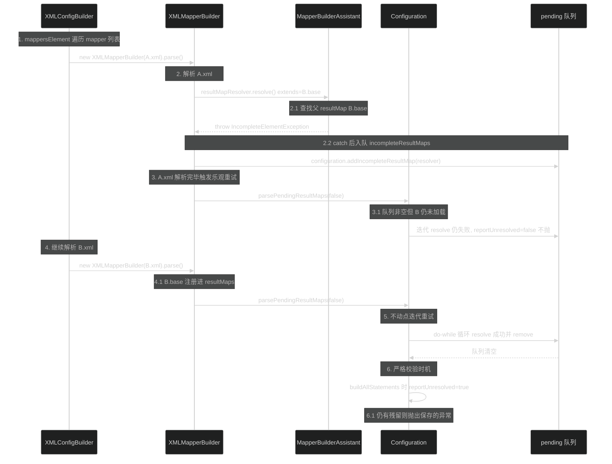
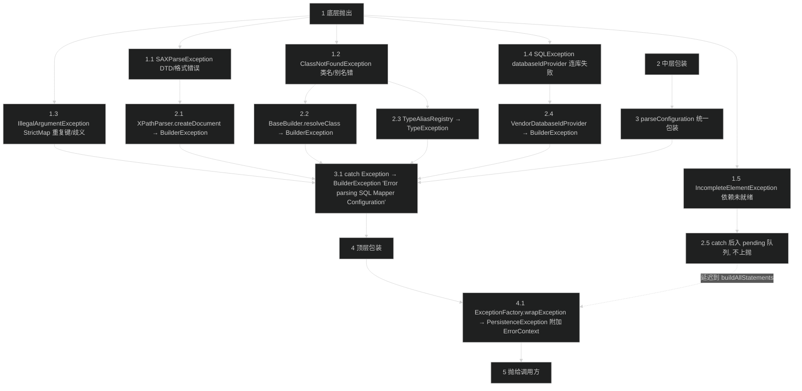

# 源码分析：SqlSessionFactory 构建与配置解析

> 上次修改：2026-07-29 22:52

## 阅读向导

本文面向三类读者：

- **新接手 MyBatis 源码的开发者**：想搞清楚「一个 `mybatis-config.xml` 输入流，怎么就变成了一个能 `openSession()` 的工厂」。
- **启动期排障者**：遇到 `BuilderException: The setting xxx is not known`、`Mapped Statements collection already contains key`、`xxx is ambiguous in Mapped Statements collection`、`Could not find a parent resultMap with id 'xxx'` 这类只在启动时爆出来的异常，需要定位是哪一步、哪一行抛的。
- **框架集成/扩展开发者**：写 Spring 集成、自定义 `Interceptor`、自定义 `DatabaseIdProvider`/`VFS`/`ObjectFactory` 的人，需要知道自己的扩展点被织入的**确切时机**。

**本文最值得先读的三处**（也是 MyBatis 启动期最容易踩坑、也最见设计功力的地方）：

1. **第 4.4 节 `parseConfiguration` 的严格顺序依赖** —— 12 行调用的顺序不是随手写的，每一行都被前一行的副作用喂养。源码里两条注释（`// issue #117 read properties first`、`// read it after objectFactory and objectWrapperFactory issue #631`）就是两次线上事故留下的疤。
2. **第 4.7 / 5.3 节 Mapper 解析的前向引用与延迟重试** —— `incompleteResultMaps` / `incompleteCacheRefs` / `incompleteStatements` / `incompleteMethods` 四个集合加上 `IncompleteElementException`，构成了 MyBatis 对「XML 之间可以互相引用、但加载有先后」这一现实的妥协方案。`parsePendingResultMaps` 的 do-while 不动点迭代与其他三个 `removeIf` 的写法差异，是本文重点比对的对象。
3. **第 6.2 节 `StrictMap` 的短名歧义检测** —— 一个 `put` 方法里塞进了「重复键快速失败」和「短名歧义标记」两件事，`AMBIGUITY_INSTANCE` 哨兵对象是理解 `xxx is ambiguous` 报错的唯一入口。

**阅读前建议先了解的文档**（本文不重复它们的模块级铺垫，直接下钻到行级）：

- [会话与配置核心（session）](会话与配置核心（session）.md) —— `Configuration`、`SqlSession`、`SqlSessionFactory` 的整体职责划分。
- [配置构建器（builder）](配置构建器（builder）.md) —— `XMLConfigBuilder` / `XMLMapperBuilder` / `MapperBuilderAssistant` 的模块级关系。
- [资源加载与解析（io + parsing）](资源加载与解析（io%20+%20parsing）.md) —— `Resources`、`XPathParser`、`GenericTokenParser` 的定位。
- [映射模型（mapping）](映射模型（mapping）.md) —— `Environment`、`MappedStatement`、`ResultMap` 等运行期模型。

---

## 1. 分析范围与目标

### 1.1 涵盖范围

本文追踪一条完整的**启动期主线**：从用户手里的一个 `InputStream`，到一个可用的 `DefaultSqlSessionFactory`，再到第一次 `openSession()` 拿到 `DefaultSqlSession`。

| 阶段 | 涵盖的类与方法 |
|------|----------------|
| 入口与生命周期 | `SqlSessionFactoryBuilder.build(...)` 全部 8 个重载 + `build(Configuration)` |
| XML 读取底座 | `XPathParser` 的构造/`createDocument`/`evalNode`，`XMLMapperEntityResolver.resolveEntity`，`XNode.parseAttributes`/`getChildrenAsProperties`，`PropertyParser.parse` 与 `GenericTokenParser.parse` |
| 全局配置解析 | `XMLConfigBuilder.parse` / `parseConfiguration` 及其 12 个子方法（`propertiesElement`…`mappersElement`） |
| Mapper 解析展开 | `XMLMapperBuilder.parse` / `configurationElement` / `bindMapperForNamespace`，`MapperRegistry.addMapper`，`MapperAnnotationBuilder.parse` 的收尾部分 |
| 前向引用重试 | `Configuration.addIncomplete*` / `parsePending*` / `buildAllStatements`，`IncompleteElementException` 的四个抛出点 |
| 组件工厂 | `Configuration.newExecutor` / `newStatementHandler` / `newResultSetHandler` / `newParameterHandler`，`InterceptorChain.pluginAll` |
| 会话打开 | `DefaultSqlSessionFactory.openSessionFromDataSource` / `openSessionFromConnection` / `getTransactionFactoryFromEnvironment` |
| 关键容器 | `Configuration.StrictMap` 的 `put` / `get` / `containsKey` |

### 1.2 不涵盖范围

以下内容在本文中只作为「边界」提及，不展开逐行分析，需要时请转向对应文档：

- **单条 statement 的解析细节**：`XMLStatementBuilder.parseStatementNode`、`XMLIncludeTransformer.applyIncludes`、`SqlSourceBuilder`、`#{}` 参数解析 —— 见 [配置构建器（builder）](配置构建器（builder）.md) 与 [动态 SQL 脚本引擎（scripting）](动态%20SQL%20脚本引擎（scripting）.md)。
- **注解 Mapper 的完整解析**：`MapperAnnotationBuilder` 对 `@Select`/`@Results`/`@SelectProvider` 的处理 —— 见 [注解 API（annotations）](注解%20API（annotations）.md)。
- **运行期执行链路**：`Executor.query`、一级/二级缓存协同、结果集映射 —— 见 [核心源码分析-查询主链路与缓存协同](核心源码分析-查询主链路与缓存协同.md) 与 [核心源码分析-结果集映射引擎](核心源码分析-结果集映射引擎.md)。
- **数据源与事务实现内部**：`PooledDataSource` 的连接池算法、`JdbcTransaction` 的提交回滚 —— 见 [数据源（datasource）](数据源（datasource）.md) 与 [事务管理（transaction）](事务管理（transaction）.md)。

### 1.3 分析目标

1. **理解顺序耦合**：说清 `parseConfiguration` 中 12 步的**依赖方向**，以及每一步调换后会以什么形式失败（静默错配 vs 抛异常）。
2. **理解延迟解析算法**：说清 MyBatis 如何在「不做拓扑排序」的前提下，用异常 + 重试队列解决 Mapper 之间的前向引用。
3. **定位启动期异常**：把常见启动期报错映射到确切的源码行。
4. **评估可维护性**：识别隐式契约（如 `parsed` 标志、`environment` 字段被 `environmentsElement` 就地改写）带来的风险。

---

## 2. 核心类/函数全景

| 类 / 函数 | 职责 | 关键方法 / 字段 | 代码位置 |
|-----------|------|-----------------|----------|
| `SqlSessionFactoryBuilder` | 启动期唯一公开入口，8 个重载收敛到 2 个真实实现；负责流的关闭与异常包装 | `build(InputStream, String, Properties)`、`build(Configuration)` | `src/main/java/org/apache/ibatis/session/SqlSessionFactoryBuilder.java:77`、`:95` |
| `XMLConfigBuilder` | 把 `<configuration>` 节点树翻译成 `Configuration` 对象的全部字段与注册表 | `parse()`、`parseConfiguration(XNode)`、`settingsAsProperties`、`environmentsElement`、`mappersElement` | `src/main/java/org/apache/ibatis/builder/xml/XMLConfigBuilder.java:105`、`:114`、`:137`、`:297`、`:388` |
| `BaseBuilder` | 所有 builder 的共同基类，持有 `Configuration` 与两个注册表，提供类型/别名解析与默认值工具 | `resolveClass`、`booleanValueOf`、`createInstance`、`resolveAlias` | `src/main/java/org/apache/ibatis/builder/BaseBuilder.java:35`、`:100`、`:91` |
| `XPathParser` | DOM + XPath 的薄封装；负责建 `Document`、跑 XPath、把结果包成 `XNode` | `createDocument`、`commonConstructor`、`evalNode`、`evalString`、`setVariables` | `src/main/java/org/apache/ibatis/parsing/XPathParser.java:229`、`:266`、`:213`、`:143` |
| `XMLMapperEntityResolver` | 离线 DTD 解析器，把公网 DTD 的 systemId 映射到 classpath 内的本地文件 | `resolveEntity`、`getInputSource` | `src/main/java/org/apache/ibatis/builder/xml/XMLMapperEntityResolver.java:57`、`:74` |
| `XNode` | DOM `Node` 的装饰器，**在构造时**就完成属性与文本的 `${}` 替换 | `parseAttributes`、`parseBody`、`getStringAttribute`、`getChildrenAsProperties`、`getValueBasedIdentifier` | `src/main/java/org/apache/ibatis/parsing/XNode.java:326`、`:339`、`:205`、`:269`、`:76` |
| `PropertyParser` | `${}` 占位符替换策略，支持 `:` 默认值语法（默认关闭） | `parse`、内部类 `VariableTokenHandler.handleToken` | `src/main/java/org/apache/ibatis/parsing/PropertyParser.java:53`、`:75` |
| `GenericTokenParser` | 通用 token 扫描器，支持 `\` 转义；`${}` 与 `#{}` 共用 | `parse(String)` | `src/main/java/org/apache/ibatis/parsing/GenericTokenParser.java:33` |
| `XMLMapperBuilder` | 解析单个 Mapper XML；解析完成后触发三个 pending 队列的非严格重试 | `parse()`、`configurationElement`、`resultMapElements`、`bindMapperForNamespace` | `src/main/java/org/apache/ibatis/builder/xml/XMLMapperBuilder.java:103`、`:118`、`:210`、`:401` |
| `Configuration` | 启动期的**装配目标**，运行期的**组件工厂**；同时是所有注册表与 pending 队列的宿主 | `newExecutor`、`newStatementHandler`、`parsePending*`、`buildAllStatements`、内部类 `StrictMap` | `src/main/java/org/apache/ibatis/session/Configuration.java:735`、`:724`、`:999`、`:973`、`:1111` |
| `Environment` | 不可变三元组 `(id, TransactionFactory, DataSource)`，构造即校验 | 构造函数、内部类 `Builder` | `src/main/java/org/apache/ibatis/mapping/Environment.java:30`、`:45` |
| `VendorDatabaseIdProvider` | 通过一次真实 JDBC 连接读取 `DatabaseProductName`，映射成 `databaseId` | `getDatabaseId`、`getDatabaseName` | `src/main/java/org/apache/ibatis/mapping/VendorDatabaseIdProvider.java:40`、`:56` |
| `DefaultSqlSessionFactory` | `SqlSessionFactory` 的唯一内置实现；8 个 `openSession` 重载收敛到 2 个私有方法 | `openSessionFromDataSource`、`openSessionFromConnection`、`getTransactionFactoryFromEnvironment` | `src/main/java/org/apache/ibatis/session/defaults/DefaultSqlSessionFactory.java:94`、`:111`、`:133` |
| `IncompleteElementException` | 「依赖尚未就绪」的信号异常，是延迟重试机制的唯一驱动力 | 继承自 `BuilderException` | `src/main/java/org/apache/ibatis/builder/IncompleteElementException.java:21` |
| `InterceptorChain` | 插件织入点，`pluginAll` 按注册顺序层层包装目标对象 | `pluginAll`、`addInterceptor` | `src/main/java/org/apache/ibatis/plugin/InterceptorChain.java:26` 起 |

---

## 3. 关键数据结构

### 3.1 `XMLConfigBuilder` 的四个实例字段

```java
private boolean parsed;                                                     // :56
private final XPathParser parser;                                           // :57
private String environment;                                                 // :58
private final ReflectorFactory localReflectorFactory = new DefaultReflectorFactory(); // :59
```

- **`parsed`**（`XMLConfigBuilder.java:56`）：一次性开关。`parse()` 首行检查、次行置位（`:106-109`）。生命周期与 builder 实例相同；builder 本身是**一次性对象**，用完即弃。
- **`environment`**（`:58`）：注意它是 **非 final** 的。构造时来自调用方传入的环境名（可能为 `null`），随后在 `environmentsElement` 中被 `<environments default="...">` 的值**就地覆盖**（`:301-303`）。这是一个隐式的「参数 → 配置」回填，也是本文第 8 章记录的一个可读性风险点。
- **`localReflectorFactory`**（`:59`）：**独立于** `configuration.reflectorFactory` 的一份局部反射工厂。之所以要独立，是因为 `settingsAsProperties` 需要在用户自定义的 `<reflectorFactory>` 被解析之前，就用反射检查 setting 键名（`:143`）；此时 `configuration` 上挂的还是默认工厂，用它会造成「校验行为依赖于尚未生效的配置」的循环。

**为什么选择独立字段而非局部变量**：`MetaClass.forClass` 内部依赖 `ReflectorFactory` 的缓存能力，`settingsAsProperties` 虽然只调一次，但字段化保证了缓存语义清晰、且不与用户配置耦合。代价是多一个几乎不用的对象。

### 3.2 `Configuration` 的四类容器

`Configuration` 的字段可以分成四类，理解这个分类是理解装配顺序的前提。

**（1）标量配置项**（`Configuration.java:107-150`）：`cacheEnabled`、`lazyLoadingEnabled`、`defaultExecutorType`、`jdbcTypeForNull` 等，全部带**代码内默认值**。这一点很关键 —— `settingsElement` 会用 `props.getProperty(key, "默认值")` 的形式再写一遍默认值（如 `:263` 的 `"PARTIAL"`、`:272` 的 `"SIMPLE"`），**两处默认值必须保持一致**，否则不写 `<settings>` 和写了空 `<settings>` 会得到不同行为。

**（2）final 注册表**（`:152-156`）：

```java
protected final MapperRegistry mapperRegistry = new MapperRegistry(this);
protected final InterceptorChain interceptorChain = new InterceptorChain();
protected final TypeHandlerRegistry typeHandlerRegistry = new TypeHandlerRegistry(this);
protected final TypeAliasRegistry typeAliasRegistry = new TypeAliasRegistry();
protected final LanguageDriverRegistry languageRegistry = new LanguageDriverRegistry();
```

全部 `final`，意味着**只能往里加，不能整体替换**。`XMLConfigBuilder` 对它们的操作全是 `register`/`add` 形式（`:180`、`:187`、`:206`、`:367`）。这与可替换的 `objectFactory`/`reflectorFactory`（有 setter，`:630`、`:638`）形成对比：前者是累加型扩展，后者是替换型扩展。

**（3）`StrictMap` 容器**（`:158-168`）：`mappedStatements`、`caches`、`resultMaps`、`parameterMaps`、`keyGenerators`、`sqlFragments`。都是 `StrictMap`，都以「全限定名」为键。选 `StrictMap` 而非普通 `Map` 的理由见第 6.2 节。

注意 `mappedStatements` 额外挂了 `conflictMessageProducer`（`:160-161`），冲突消息里会带上两个 resource 路径 —— 这是把「哪两个 XML 文件撞了 id」直接告诉用户，属于很实用的错误信息设计。

**（4）pending 队列 + 锁**（`:169-177`）：

```java
protected final Collection<XMLStatementBuilder> incompleteStatements = new LinkedList<>();
protected final Collection<CacheRefResolver>    incompleteCacheRefs   = new LinkedList<>();
protected final Collection<ResultMapResolver>   incompleteResultMaps  = new LinkedList<>();
protected final Collection<MethodResolver>      incompleteMethods     = new LinkedList<>();

private final ReentrantLock incompleteResultMapsLock = new ReentrantLock();
private final ReentrantLock incompleteCacheRefsLock  = new ReentrantLock();
private final ReentrantLock incompleteStatementsLock = new ReentrantLock();
private final ReentrantLock incompleteMethodsLock    = new ReentrantLock();
```

**为什么用 `LinkedList` 而非 `ArrayList`**：这四个集合的主要操作是「追加」与「迭代中删除」（`Iterator.remove` 或 `removeIf`）。`LinkedList` 的中间删除是 O(1)，而 `ArrayList` 是 O(n)。在正常场景下队列长度是个位数，差异可忽略；但在超大工程（数千 mapper、大量 `extends` 链）下，`ArrayList` 的重试会退化到 O(n²) 的元素搬移。

**为什么每个队列配一把独立锁**：四个队列的重试是**互相独立**的（`resultMap` 重试不会往 `cacheRef` 队列里加东西），独立锁避免了不必要的串行。这些锁是为「运行期动态 `addMapper`」准备的 —— `getMappedStatement` 会触发 `buildAllStatements`（`:921`），而这可能发生在多个业务线程上。启动期单线程解析时这些锁没有争用。

### 3.3 `StrictMap` 与 `AMBIGUITY_INSTANCE`

`Configuration.StrictMap`（`:1111-1198`）继承 `ConcurrentHashMap<String, V>`，重写了三个方法：

| 成员 | 位置 | 行为 |
|------|------|------|
| `AMBIGUITY_INSTANCE` | `:1116` | `private static final Object`，**哨兵对象**。被强转成 `V` 塞进 map 表示「这个短名对应多个全名」 |
| `put(String, V)` | `:1156` | 先查重复键 → 抛 `IllegalArgumentException`；再自动为含 `.` 的键注册一份**短名**索引；短名已被占用则替换为哨兵 |
| `containsKey(Object)` | `:1173` | 不用父类的 `containsKey`，改用 `super.get(key) != null`。这是为了兼容 `ConcurrentHashMap` 不允许 null value 的语义，同时把 null key 安全处理为 `false` |
| `get(Object)` | `:1182` | 取不到 → 抛「does not contain value for」；取到哨兵 → 抛「is ambiguous in」 |

关键片段（`:1156-1170`）：

```java
public V put(String key, V value) {
  if (containsKey(key)) {
    throw new IllegalArgumentException(name + " already contains key " + key
        + (conflictMessageProducer == null ? "" : conflictMessageProducer.apply(super.get(key), value)));
  }
  if (key.contains(".")) {
    final String shortKey = getShortName(key);
    if (super.get(shortKey) == null) {
      super.put(shortKey, value);
    } else {
      super.put(shortKey, (V) AMBIGUITY_INSTANCE);
    }
  }
  return super.put(key, value);
}
```

**字段含义与生命周期**：一次 `put("com.foo.UserMapper.selectById", ms)` 实际写入**两个条目** —— 全名和短名 `selectById`。这就是为什么 MyBatis 允许你写 `session.selectOne("selectById")` 而不写全名。当第二个 mapper 也定义 `selectById` 时，短名槽位被 `AMBIGUITY_INSTANCE` 覆盖，此后任何按短名的读取都会抛「ambiguous」。

**注意一个不对称**：短名冲突时替换为哨兵、**不抛异常**（因为短名冲突是完全合法的用法）；而全名冲突直接抛异常（`:1157`）。这个区分是正确的，但代价是 map 的实际条目数最多是逻辑条目数的两倍。

### 3.4 `Environment` —— 构造即校验的不可变三元组

`Environment`（`mapping/Environment.java:25-43`）是 `final class`，三个字段全 `final`，构造函数做三次 null 检查：

```java
if (id == null)                 throw new IllegalArgumentException("Parameter 'id' must not be null");
if (transactionFactory == null) throw new IllegalArgumentException("Parameter 'transactionFactory' must not be null");
if (dataSource == null)         throw new IllegalArgumentException("Parameter 'dataSource' must not be null");
```

配套的 `Environment.Builder`（`:45-72`）只是一个可选参数收集器，`build()` 里把校验完全交给构造函数（`:69`）。

**这里有一个可以留意的细节**：`this.id = id;` 在第二次检查之后、第三次检查之前执行（`:37-40`），即字段赋值与参数校验交错。虽然对象最终要么完整构造要么抛异常（不会泄漏半成品），但这种写法在阅读时容易误以为存在部分初始化。

**生命周期**：`Environment` 在 `environmentsElement`（`XMLConfigBuilder.java:310-312`）中被创建，之后挂在 `Configuration.environment` 上直到 JVM 退出；`DataSource` 的连接池生命周期与之绑定。它是**运行期唯一的数据源来源**，`openSessionFromDataSource` 每次都从这里取（`DefaultSqlSessionFactory.java:98`）。

### 3.5 `PropertyParser` 的三个魔法键

| 常量 | 值 | 默认 | 位置 |
|------|-----|------|------|
| `KEY_ENABLE_DEFAULT_VALUE` | `org.apache.ibatis.parsing.PropertyParser.enable-default-value` | `"false"` | `PropertyParser.java:35`、`:46` |
| `KEY_DEFAULT_VALUE_SEPARATOR` | `org.apache.ibatis.parsing.PropertyParser.default-value-separator` | `":"` | `:44`、`:47` |
| `KEY_PREFIX` | `org.apache.ibatis.parsing.PropertyParser.` | — | `:26` |

这三个键**本身就存在于用户的 `variables` 里**（通过 `<properties><property name="org.apache.ibatis.parsing.PropertyParser.enable-default-value" value="true"/></properties>` 设置），即「用配置来配置配置解析器」。`VariableTokenHandler` 构造时读取它们（`:66-67`），因此**同一个 `Properties` 快照内**开关是一致的。

**重要后果**：`enableDefaultValue` 默认为 `false`，意味着 `${db.username:postgres}` 在默认配置下**整个 `db.username:postgres` 被当作 key**，找不到就原样保留 `${db.username:postgres}`（`:93`）。这是一个高频误解点。

---

## 4. 主线流程逐行解读

### 4.0 全景流程图

```mermaid
%%{init: {"theme": "dark"}}%%
flowchart TD
  1["1 SqlSessionFactoryBuilder.build(InputStream, env, props)"]
  1.1["1.1 new XMLConfigBuilder(...)"]
  1.2["1.2 new XPathParser(is, true, props, EntityResolver)"]
  1.3["1.3 createDocument: 离线 DTD + 校验 + 建 DOM"]
  1.4["1.4 super(newConfig(Configuration.class)) 反射建 Configuration"]
  2["2 parser.parse()"]
  2.1{"2.1 parsed == true?"}
  2.2["2.2 抛 BuilderException 一次性保护"]
  2.3["2.3 parsed = true"]
  2.4["2.4 evalNode('/configuration')"]
  3["3 parseConfiguration(root) 12 步严格顺序"]
  3.1["3.1 propertiesElement 变量表就位"]
  3.2["3.2 settingsAsProperties + MetaClass 自校验"]
  3.3["3.3 loadCustomVfsImpl / loadCustomLogImpl"]
  3.4["3.4 typeAliasesElement 别名表就位"]
  3.5["3.5 pluginsElement 拦截器入链"]
  3.6["3.6 objectFactory / objectWrapperFactory / reflectorFactory"]
  3.7["3.7 settingsElement 回填标量配置"]
  3.8["3.8 environmentsElement 建 Environment"]
  3.9["3.9 databaseIdProviderElement 真实连库取 databaseId"]
  3.10["3.10 typeHandlersElement"]
  3.11["3.11 mappersElement 四选一分发"]
  4["4 XMLMapperBuilder.parse() 逐个 mapper"]
  4.1["4.1 configurationElement: cache-ref/cache/parameterMap/resultMap/sql/statement"]
  4.2["4.2 IncompleteElementException 入 pending 队列"]
  4.3["4.3 bindMapperForNamespace 反查接口并 addMapper"]
  4.4["4.4 parsePending* (reportUnresolved=false) 非严格重试"]
  5["5 build(Configuration) → new DefaultSqlSessionFactory"]
  5.1["5.1 finally: ErrorContext.reset() + inputStream.close() 吞异常"]
  6["6 openSession() → openSessionFromDataSource"]
  6.1["6.1 getTransactionFactoryFromEnvironment null 兜底 Managed"]
  6.2["6.2 newTransaction(dataSource, level, autoCommit)"]
  6.3["6.3 newExecutor: Simple/Reuse/Batch + CachingExecutor + pluginAll"]
  6.4["6.4 new DefaultSqlSession"]

  1 --> 1.1 --> 1.2 --> 1.3
  1.1 --> 1.4
  1.3 --> 2
  1.4 --> 2
  2 --> 2.1
  2.1 -->|是| 2.2
  2.1 -->|否| 2.3 --> 2.4 --> 3
  3 --> 3.1 --> 3.2 --> 3.3 --> 3.4 --> 3.5 --> 3.6 --> 3.7 --> 3.8 --> 3.9 --> 3.10 --> 3.11
  3.11 --> 4 --> 4.1 --> 4.2
  4.1 --> 4.3
  4.2 --> 4.4
  4.3 --> 4.4
  4.4 --> 5 --> 5.1
  5 --> 6 --> 6.1 --> 6.2 --> 6.3 --> 6.4
```



**1-1.4 入口与底座搭建**：调用方交出一个 `InputStream`，`SqlSessionFactoryBuilder` 立刻把它交给 `XMLConfigBuilder` 的构造链。这条链有两个副作用：一是通过 `XPathParser` 把整个 XML **一次性**读成内存中的 DOM 树（此时 DTD 校验与实体解析已完成，联网风险在 `XMLMapperEntityResolver` 处被拦截）；二是通过 `newConfig` 反射创建一个空白 `Configuration`。任一步失败都会抛 `BuilderException`，被外层 `catch (Exception e)` 包成 `PersistenceException`。

**2-2.4 一次性保护与根节点定位**：`parse()` 用 `parsed` 布尔量拒绝第二次调用。这不是并发保护（无同步），而是防止「同一个 builder 被复用导致配置被加载两次」。通过检查后立即置位（先置位再解析），因此**即使解析中途抛异常，也无法重试**。

**3-3.11 配置装配的 12 步严格顺序**：这是全流程的核心。每一步都消费前面步骤的产物：变量表 → 校验后的 settings → 别名表 → 插件链 → 反射三件套 → 标量配置 → 环境 → databaseId → typeHandler → mapper。详见 4.4 节的依赖矩阵。

**4-4.4 Mapper 解析与延迟重试**：每个 mapper 独立解析，遇到「引用了还没加载的东西」就抛 `IncompleteElementException`，被捕获后塞进 pending 队列。每解析完一个 mapper，就用 `reportUnresolved=false` 做一轮乐观重试 —— 此时失败不报错，因为后面的 mapper 可能提供缺失的定义。

**5-5.1 工厂返回与资源清理**：`build(Configuration)` 只是 `new DefaultSqlSessionFactory(config)`，没有任何逻辑。真正值得注意的是 `finally` 块：`ErrorContext.instance().reset()` 清理 ThreadLocal，`inputStream.close()` 的 `IOException` 被**故意吞掉**（注释写明 `Prefer previous error`）。

**6-6.4 首次开启会话**：`openSession()` 从 `Environment` 取 `TransactionFactory`（null 时兜底 `ManagedTransactionFactory`），造 `Transaction`，再由 `Configuration.newExecutor` 装配三层 Executor（基础实现 + 可选缓存层 + 插件层），最后包成 `DefaultSqlSession`。

### 4.1 入口：`SqlSessionFactoryBuilder.build` 的重载族

`SqlSessionFactoryBuilder`（`session/SqlSessionFactoryBuilder.java:33-99`）一共 9 个 `build` 方法，但**只有 3 个有实质逻辑**：

```
build(Reader)               :35  ─┐
build(Reader, String)       :39  ─┼─→ build(Reader, String, Properties)      :47  ← 实质实现 A
build(Reader, Properties)   :43  ─┘

build(InputStream)              :65  ─┐
build(InputStream, String)      :69  ─┼─→ build(InputStream, String, Properties) :77  ← 实质实现 B
build(InputStream, Properties)  :73  ─┘

                                       build(Configuration)                  :95  ← 实质实现 C
```

**为什么 6 个转发方法都显式写出来，而不用可变参数或默认值**：Java 没有默认参数，且 MyBatis 需要区分 `build(reader, environment)` 与 `build(reader, properties)` 这两个**同 arity 不同语义**的重载。用 `null` 填充缺失参数（`:36`、`:40`、`:44`）是最直接的做法。副作用是「传 `null` environment」与「不传 environment」在下游完全不可区分 —— `XMLConfigBuilder.environment` 字段就是靠这个 `null` 来决定是否采纳 XML 里的 `default` 属性（见 4.11 节）。

实质实现 B（`:77-93`）：

```java
77  public SqlSessionFactory build(InputStream inputStream, String environment, Properties properties) {
78    try {
79      XMLConfigBuilder parser = new XMLConfigBuilder(inputStream, environment, properties);
80      return build(parser.parse());
81    } catch (Exception e) {
82      throw ExceptionFactory.wrapException("Error building SqlSession.", e);
83    } finally {
84      ErrorContext.instance().reset();
85      try {
86        if (inputStream != null) {
87          inputStream.close();
88        }
89      } catch (IOException e) {
90        // Intentionally ignore. Prefer previous error.
91      }
92    }
93  }
```

**逐段解读**：

- **`:79` 构造 builder**：注意 `XMLConfigBuilder` 的构造函数会**立即**完成 XML 到 DOM 的转换（见 4.2 节），所以这一行就可能因为 XML 格式错误而抛异常。
- **`:80` 双重 build**：`parser.parse()` 返回 `Configuration`，立刻传给 `build(Configuration)`（`:95`）。这里的 `build(Configuration)` 只有一句 `return new DefaultSqlSessionFactory(config);` —— **不做任何校验**。这意味着一个手工拼装、字段残缺的 `Configuration` 也能造出工厂，问题会推迟到 `openSession()` 甚至第一次执行 SQL 时才暴露。
- **`:81-83` 异常包装**：`catch (Exception e)` 范围极宽，把 `BuilderException`、`NullPointerException`、`ClassNotFoundException` 统统包成 `PersistenceException`。`ExceptionFactory.wrapException`（`exceptions/ExceptionFactory.java:29-31`）会把 `ErrorContext` 的上下文信息（resource / activity / object / sql）拼进消息 —— 这就是为什么 MyBatis 的启动期报错能告诉你「出错在哪个 XML 的哪个 statement」。
- **`:84` ErrorContext 清理**：`ErrorContext` 基于 `ThreadLocal`（`executor/ErrorContext.java:86-95` 的 `reset()` 里有 `LOCAL.remove()`）。注意 `reset()` 在 `finally` 里 —— **它在 `catch` 之后执行**，所以 `:82` 的 `wrapException` 读到的仍是完整上下文，清理不会污染错误消息。这个顺序是正确的，但很脆弱：如果有人把 `reset()` 挪到 `catch` 里就会丢失上下文。
- **`:85-91` 流关闭与异常吞掉**：`close()` 的 `IOException` 被彻底忽略。注释 `Prefer previous error` 点明了理由 —— 如果解析已经失败，用户真正需要看到的是解析错误而不是「流关不掉」。**但反过来的场景没有被覆盖**：解析成功但 `close()` 失败时，异常被静默丢弃，连一条 warn 日志都没有，可能掩盖文件句柄泄漏（见第 8 章）。
- **谁负责关流**：MyBatis 关闭调用方传入的流，这**违反了「谁打开谁关闭」的常规约定**。好处是用户代码可以写成一行 `new SqlSessionFactoryBuilder().build(Resources.getResourceAsStream("mybatis-config.xml"))` 而不泄漏；风险是如果用户在 try-with-resources 里传入，会发生**双重关闭**（对大多数 `InputStream` 实现幂等，但不保证）。

### 4.2 `XMLConfigBuilder` 构造链与 `XPathParser` 底座

四层构造链（`XMLConfigBuilder.java:86-103`）：

```java
86   public XMLConfigBuilder(InputStream inputStream, String environment, Properties props) {
87     this(Configuration.class, inputStream, environment, props);
88   }
90   public XMLConfigBuilder(Class<? extends Configuration> configClass, InputStream inputStream, String environment,
91       Properties props) {
92     this(configClass, new XPathParser(inputStream, true, props, new XMLMapperEntityResolver()), environment, props);
93   }
95   private XMLConfigBuilder(Class<? extends Configuration> configClass, XPathParser parser, String environment,
96       Properties props) {
97     super(newConfig(configClass));
98     ErrorContext.instance().resource("SQL Mapper Configuration");
99     this.configuration.setVariables(props);
100    this.parsed = false;
101    this.environment = environment;
102    this.parser = parser;
103  }
```

**`:92` 三个硬编码决定**：

1. **`validation = true`**：配置文件**强制 DTD 校验**。这是 MyBatis 少见的「不给关」的选项 —— `XPathParser` 提供了 `validation=false` 的构造函数（`:85`），但 `XMLConfigBuilder` 不暴露。好处是配置写错元素名/顺序会立刻报错而非静默忽略；风险是遗留的、DTD 不合规的老配置无法加载。
2. **`props` 直接作为 `variables`**：调用方传入的 `Properties` 立即成为 `XPathParser` 的变量表，因此**在解析 `<properties>` 节点之前**，`${}` 就已经可以用外部传入的值替换了。这解决了「`<properties resource="${env}.properties"/>` 这种自引用」的鸡生蛋问题。
3. **`new XMLMapperEntityResolver()`**：见下文。

**`:97` `super(newConfig(configClass))`** —— `newConfig`（`:435-441`）通过 `configClass.getDeclaredConstructor().newInstance()` 反射创建。之所以要支持传入 `configClass`，是为了让 Spring/MyBatis-Plus 这类框架传入 `Configuration` 的子类。失败时抛 `BuilderException("Failed to create a new Configuration instance.")`。注意 `super(...)` 调用的 `BaseBuilder` 构造函数（`BaseBuilder.java:40-44`）会**立刻**把 `typeAliasRegistry` 和 `typeHandlerRegistry` 缓存成字段 —— 由于这两个字段在 `Configuration` 里是 `final` 的，缓存是安全的。

**`:98` `ErrorContext.instance().resource("SQL Mapper Configuration")`**：在解析开始前就设置好上下文标签，这样后续任何位置抛出的异常都会带上「正在解析主配置文件」的信息。

**`:99` `configuration.setVariables(props)`**：把外部 props 也放进 `Configuration`，这样 `propertiesElement` 才能在 `:253-256` 读回来做合并。

#### `XPathParser` 的 `createDocument`

`XPathParser` 的构造遵循「先 `commonConstructor` 后 `createDocument`」的严格顺序（`XPathParser.java:230` 的注释 `important: this must only be called AFTER common constructor` 就是在提醒这一点）—— 因为 `createDocument` 要读 `this.validation` 和 `this.entityResolver`，而这两个字段由 `commonConstructor`（`:266-272`）设置。

`createDocument`（`:229-264`）的六个 factory 开关：

| 行 | 设置 | 含义与后果 |
|----|------|------------|
| `:233` | `setFeature(FEATURE_SECURE_PROCESSING, true)` | 开启 JAXP 安全处理，限制实体展开次数等，**抵御 XML 炸弹（Billion Laughs）** |
| `:234` | `setValidating(validation)` | 由构造参数决定；`XMLConfigBuilder` 恒为 true |
| `:236` | `setNamespaceAware(false)` | MyBatis 的 XML 不用命名空间，关掉可简化 XPath 表达式（`/configuration` 而非 `/*[local-name()='configuration']`） |
| `:237` | `setIgnoringComments(true)` | 注释不进 DOM，`getChildren()` 遍历时不用过滤 |
| `:238` | `setIgnoringElementContentWhitespace(false)` | **保留空白**。这对动态 SQL 至关重要 —— `<if>` 前后的空格决定了拼出的 SQL 是 `a=1 AND b=2` 还是 `a=1AND b=2` |
| `:240` | `setExpandEntityReferences(false)` | 不展开实体引用，与 `FEATURE_SECURE_PROCESSING` 一起构成 XXE 防线 |

`:244-259` 的匿名 `ErrorHandler` 定义了严格策略：`error` 和 `fatalError` 都**直接 rethrow**，`warning` 是空实现（NOP）。也就是说 DTD 校验失败会立刻中断解析。所有异常最终在 `:261-263` 被统一包成 `BuilderException("Error creating document instance.")`。

#### `XMLMapperEntityResolver` 的离线 DTD

`resolveEntity`（`XMLMapperEntityResolver.java:57-72`）是避免联网的关键：

```java
59  if (systemId != null) {
60    String lowerCaseSystemId = systemId.toLowerCase(Locale.ENGLISH);
61    if (lowerCaseSystemId.contains(MYBATIS_CONFIG_SYSTEM) || lowerCaseSystemId.contains(IBATIS_CONFIG_SYSTEM)) {
62      return getInputSource(MYBATIS_CONFIG_DTD, publicId, systemId);
63    }
64    if (lowerCaseSystemId.contains(MYBATIS_MAPPER_SYSTEM) || lowerCaseSystemId.contains(IBATIS_MAPPER_SYSTEM)) {
65      return getInputSource(MYBATIS_MAPPER_DTD, publicId, systemId);
66    }
67  }
68  return null;
```

**逐点解读**：

- **匹配依据是 `systemId` 而非 `publicId`**：`systemId` 是 `<!DOCTYPE configuration PUBLIC "..." "https://mybatis.org/dtd/mybatis-3-config.dtd">` 中的 URL。用 `contains` 做**子串匹配**而非精确相等，因此 `http://`、`https://`、`mybatis.org` vs `ibatis.apache.org` 各种历史写法都能命中。
- **`toLowerCase(Locale.ENGLISH)`**：显式指定 Locale 避免土耳其语 I 问题（`I`.toLowerCase() 在 tr_TR 下变成 `ı`）。这是一个容易被忽略但确实存在的国际化陷阱。
- **同时支持 `ibatis-3-*` 与 `mybatis-3-*`**：`:35-38` 定义了四个 systemId 常量，`ibatis` 前缀是为了兼容 iBATIS 3 时代的老配置文件。两者都映射到**同一份** `mybatis-3-config.dtd`（`:40-41`）。
- **`:68 return null` 的含义**：SAX 规范中返回 `null` 表示「我不处理，你按 systemId 自己去取」。所以如果用户在 DOCTYPE 里写了别的 DTD URL，**解析器会真的去联网下载** —— 这是本机制的边界（见第 5 章）。
- **`getInputSource` 吞掉 `IOException`（`:82-84`）**：如果 classpath 里找不到 DTD 文件（例如 jar 被裁剪过），返回 `null`，退化为联网解析。这是「优雅降级」，但会让离线环境的失败表现为一个难以理解的网络超时而非明确的「DTD 缺失」。

#### `XNode` 的构造即替换

`XNode` 构造函数（`parsing/XNode.java:42-49`）在**创建时**就完成了两件事：

```java
47  this.attributes = parseAttributes(node);
48  this.body = parseBody(node);
```

`parseAttributes`（`:326-337`）对每个属性值调用 `PropertyParser.parse(attribute.getNodeValue(), variables)`；`getBodyData`（`:354-358`）对文本/CDATA 内容做同样处理。

**这个设计的重要后果**：`${}` 替换是在 `XNode` **对象创建那一刻**用**当时的 `variables`** 完成的，是一次性快照。因此 —— **`XPathParser.setVariables()` 只对之后创建的 `XNode` 生效**。这正是 `propertiesElement` 必须排在第一位的根本原因（见 4.4 节）。

### 4.3 `parse()` 的一次性保证

```java
105  public Configuration parse() {
106    if (parsed) {
107      throw new BuilderException("Each XMLConfigBuilder can only be used once.");
108    }
109    parsed = true;
110    parseConfiguration(parser.evalNode("/configuration"));
111    return configuration;
112  }
```

- **`:106-108` 幂等拒绝**：不是幂等（不返回已有结果），而是**明确拒绝**。理由是 `parseConfiguration` 的绝大部分操作是**累加型副作用**（往 `typeAliasRegistry` 注册、往 `interceptorChain` 添加、往 `mappedStatements` put）。重复执行会导致 `StrictMap.put` 抛「already contains key」、拦截器被注册两遍。与其让用户看到这些间接错误，不如直接拒绝。
- **`:109` 置位时机在解析之前**：这意味着**解析失败后无法重试**。设计上是对的（失败时 `Configuration` 已被部分污染，重试只会更乱），但错误消息 `Each XMLConfigBuilder can only be used once.` 在这种场景下具有误导性 —— 用户会以为自己调了两次，实际是第一次失败了。
- **`:110` `evalNode("/configuration")`**：如果 XML 根节点不叫 `configuration`，`evalNode` 返回 `null`（`XPathParser.java:215-217`），随后 `parseConfiguration` 的 `root.evalNode("properties")` 会抛 `NullPointerException`，被 `:132` 的 `catch (Exception e)` 包成 `BuilderException("Error parsing SQL Mapper Configuration. Cause: java.lang.NullPointerException")` —— 一条相当不友好的错误消息。不过由于 DTD 校验强制开启（4.2 节），实践中根节点名错误会先被 DTD 拦下。

### 4.4 `parseConfiguration` —— 12 步严格顺序依赖（核心）

```java
114  private void parseConfiguration(XNode root) {
115    try {
116      // issue #117 read properties first
117      propertiesElement(root.evalNode("properties"));
118      Properties settings = settingsAsProperties(root.evalNode("settings"));
119      loadCustomVfsImpl(settings);
120      loadCustomLogImpl(settings);
121      typeAliasesElement(root.evalNode("typeAliases"));
122      pluginsElement(root.evalNode("plugins"));
123      objectFactoryElement(root.evalNode("objectFactory"));
124      objectWrapperFactoryElement(root.evalNode("objectWrapperFactory"));
125      reflectorFactoryElement(root.evalNode("reflectorFactory"));
126      settingsElement(settings);
127      // read it after objectFactory and objectWrapperFactory issue #631
128      environmentsElement(root.evalNode("environments"));
129      databaseIdProviderElement(root.evalNode("databaseIdProvider"));
130      typeHandlersElement(root.evalNode("typeHandlers"));
131      mappersElement(root.evalNode("mappers"));
132    } catch (Exception e) {
133      throw new BuilderException("Error parsing SQL Mapper Configuration. Cause: " + e, e);
134    }
135  }
```

**注意：这 12 行的顺序与 DTD 中元素的声明顺序无关**。DTD 规定了 XML 里元素必须按什么顺序**书写**，而这里规定的是按什么顺序**处理**。两者恰好接近，但依赖关系是由代码这里决定的。

#### 依赖矩阵

| 步骤 | 行 | 产出（写了什么） | 依赖（读了什么） | 若提前会怎样 | 若推后会怎样 |
|------|-----|------------------|------------------|--------------|--------------|
| 1 `propertiesElement` | `:117` | `parser.variables`、`configuration.variables` | 无（只依赖构造时传入的 props） | — | **所有后续 `${}` 失效**（静默保留原文，不报错） |
| 2 `settingsAsProperties` | `:118` | 局部 `settings` 变量 + 键名合法性校验 | `MetaClass.forClass(Configuration.class)` | 会丢 `${}` 替换 | 校验推迟，错误暴露变晚 |
| 3 `loadCustomVfsImpl` | `:119` | `configuration.vfsImpl` → `VFS.addImplClass` | `settings` | 无 settings 可读 | **`<mappers><package>` 扫描已用默认 VFS，自定义 VFS 白设** |
| 4 `loadCustomLogImpl` | `:120` | `configuration.logImpl` → `LogFactory.useCustomLogging` | `settings` | 无 settings | 前面步骤的日志用默认实现输出 |
| 5 `typeAliasesElement` | `:121` | `typeAliasRegistry` 条目 | `${}` 已替换的属性 | 别名表为空 | **后续所有 `resolveClass` 遇到自定义别名会当成 FQCN 去 `Class.forName`，抛 `TypeException`** |
| 6 `pluginsElement` | `:122` | `interceptorChain` | `typeAliasRegistry`（`resolveClass(interceptor)`） | 别名解析失败 | 后续若有组件被创建则漏织入 |
| 7 `objectFactoryElement` | `:123` | `configuration.objectFactory` | `typeAliasRegistry` | 别名失败 | **见 issue #631** |
| 8 `objectWrapperFactoryElement` | `:124` | `configuration.objectWrapperFactory` | 同上 | 同上 | 同上 |
| 9 `reflectorFactoryElement` | `:125` | `configuration.reflectorFactory` | 同上 | 同上 | **`resultMap` 的 setter 类型推断会用默认工厂** |
| 10 `settingsElement` | `:126` | 约 28 个标量字段 | `settings` + `typeAliasRegistry`（`resolveClass`）+ 前三个工厂 | 见 issue #631 | 后续 `environmentsElement` 读不到正确的默认值 |
| 11 `environmentsElement` | `:128` | `configuration.environment` | `typeAliasRegistry`（`JDBC`/`POOLED` 等别名）、`${}` 变量 | 别名解析失败 | **`databaseIdProviderElement` 拿不到 DataSource，`databaseId` 恒为 null** |
| 12 `databaseIdProviderElement` | `:129` | `configuration.databaseId` | `configuration.environment` | 静默跳过（见下） | **mapper 的 `databaseId` 过滤全部失效** |
| 13 `typeHandlersElement` | `:130` | `typeHandlerRegistry` | `typeAliasRegistry` | 别名失败 | **mapper 里引用的自定义 handler 找不到** |
| 14 `mappersElement` | `:131` | `mappedStatements`/`resultMaps`/`caches`… | **以上全部** | 大面积失败 | — |

#### 关键顺序的逐条论证

**（a）`properties` 必须第一 —— 源码注释 `// issue #117 read properties first`（`:116`）**

根本原因在 4.2 节已埋下伏笔：`XNode` 在**构造时**就用当时的 `variables` 完成 `${}` 替换（`XNode.java:332`）。`propertiesElement` 的最后两行（`:257-258`）：

```java
257  parser.setVariables(defaults);
258  configuration.setVariables(defaults);
```

只更新 `XPathParser.variables` 字段。而 `root.evalNode("settings")`（`:118`）此时才创建 `settings` 节点的 `XNode`，读到的是**更新后**的变量表。

**如果把 `propertiesElement` 挪到后面会发生什么**：所有在它之前 `evalNode` 出来的节点，其属性中的 `${}` 会**原样保留**（`PropertyParser.java:93` 的 `return "${" + content + "}"`）。比如 `<setting name="cacheEnabled" value="${cache.on}"/>` 会得到字符串 `"${cache.on}"`，`booleanValueOf` 用 `Boolean.valueOf("${cache.on}")` 得到 `false` —— **静默错配，不抛异常**。这类失败最难排查，也正是 issue #117 的由来。

**（b）`settingsAsProperties` 的元数据自校验（`:137-151`）**

```java
141    Properties props = context.getChildrenAsProperties();
142    // Check that all settings are known to the configuration class
143    MetaClass metaConfig = MetaClass.forClass(Configuration.class, localReflectorFactory);
144    for (Object key : props.keySet()) {
145      if (!metaConfig.hasSetter(String.valueOf(key))) {
146        throw new BuilderException(
147            "The setting " + key + " is not known.  Make sure you spelled it correctly (case sensitive).");
148      }
149    }
```

这是一段**反射驱动的配置契约校验**：MyBatis 不维护一份「合法 setting 名单」，而是把 `Configuration` 类自身的 setter 集合当作事实来源。写 `<setting name="cacheEnable" .../>`（少个 d）会立刻抛 `BuilderException`，而不是被静默忽略。

- **`MetaClass.forClass(Configuration.class, ...)`** 传的是 `Configuration.class` 而非 `configuration.getClass()`。这意味着**子类新增的 setter 不被承认** —— Spring 的 `MybatisConfiguration` 若加了新 setting，在 `<settings>` 里写会被拒。这是一个有意的收窄（保证配置文件跨实现可移植），但也是一个限制。
- **用 `localReflectorFactory` 而非 `configuration.getReflectorFactory()`**：呼应 3.1 节 —— 此刻 `<reflectorFactory>` 还没解析（要到 `:125`），用 `configuration` 的工厂就成了「用未配置完的东西校验配置」。
- **注意校验只覆盖键名，不覆盖值**。`<setting name="defaultExecutorType" value="TYPO"/>` 会通过这里，到 `settingsElement`（`:272`）的 `ExecutorType.valueOf("TYPO")` 才抛 `IllegalArgumentException` —— 消息是 `No enum constant`，比这里的友好提示差远了。
- **`context == null` 时返回空 `Properties`（`:138-140`）而非 null**：使得后续 `loadCustomVfsImpl`/`settingsElement` 不需要判空，全靠 `getProperty(key, default)` 的默认值机制。这是一个干净的 null 消除。

**（c）`settingsElement` 必须晚于三个 factory —— 源码注释指向 issue #631（`:127`）**

注释 `// read it after objectFactory and objectWrapperFactory issue #631` 的位置在 `:127`，紧挨着 `environmentsElement`。但从依赖看，真正被约束的是 `settingsElement`（`:126`）必须排在 `:123-125` 三个工厂之后。原因在 `settingsElement` 内部：

```java
267    configuration.setProxyFactory((ProxyFactory) createInstance(props.getProperty("proxyFactory")));
283    configuration.setDefaultScriptingLanguage(resolveClass(props.getProperty("defaultScriptingLanguage")));
284    configuration.setDefaultEnumTypeHandler(resolveClass(props.getProperty("defaultEnumTypeHandler")));
```

- `:267` 的 `createInstance`（`BaseBuilder.java:91-98`）会**真正反射实例化**一个 `ProxyFactory`。延迟加载代理工厂在创建对象时依赖 `ObjectFactory`/`ObjectWrapperFactory` 的语义。
- `:284` 的 `setDefaultEnumTypeHandler`（`Configuration.java:605-609`）会调用 `typeHandlerRegistry.setDefaultEnumTypeHandler(...)`，直接改写全局注册表 —— 这个改写必须发生在 `typeHandlersElement`（`:130`）之前，好让用户显式注册的 handler 能覆盖默认枚举 handler。
- `:283` 的 `setDefaultScriptingLanguage`（`Configuration.java:665-670`）有一个**关键的 null 兜底**：`if (driver == null) driver = XMLLanguageDriver.class;`。所以哪怕不配也一定有默认驱动。

**如果 `settingsElement` 排在三个工厂之前**：`ProxyFactory` 实例化时看到的是默认的 `DefaultObjectFactory`，用户自定义的工厂对懒加载代理不生效 —— 又是一次**静默错配**。

**（d）`typeAliases` 必须早于 `plugins`/`environments`/`typeHandlers`/`mappers`**

`typeAliasesElement`（`:173-196`）把别名写入 `typeAliasRegistry`。而后续几乎每个元素解析都要经过 `BaseBuilder.resolveClass` → `resolveAlias` → `TypeAliasRegistry.resolveAlias`（`type/TypeAliasRegistry.java:112-129`）：

```java
118      String key = string.toLowerCase(Locale.ENGLISH);
120      if (typeAliases.containsKey(key)) {
121        value = (Class<T>) typeAliases.get(key);
122      } else {
123        value = (Class<T>) Resources.classForName(string);
124      }
...
126    } catch (ClassNotFoundException e) {
127      throw new TypeException("Could not resolve type alias '" + string + "'.  Cause: " + e, e);
```

关键在 `:122-123` 的 fallback：**别名表里没有，就当成全限定类名去 `Class.forName`**。所以如果 `typeAliases` 排在 `environments` 之后，`<transactionManager type="JDBC"/>` 中的 `JDBC`（内置别名，在 `Configuration` 构造函数 `:191` 就注册了）仍然能解析，但**用户自定义别名**会走 `Class.forName("MyTxFactory")` 而抛 `TypeException` —— 好在这次是**显式失败**而非静默错配。

内置别名在 `Configuration` 无参构造函数里就已经注册完毕（`:190-222`），共 20 个：事务工厂 2 个、数据源工厂 3 个、Cache 实现 5 个、`DB_VENDOR`、语言驱动 2 个、日志实现 7 个、代理工厂 2 个。这解释了为什么 `<transactionManager type="JDBC"/>` 从来不需要用户显式注册别名。

**（e）`environments` 必须早于 `databaseIdProvider`**

`databaseIdProviderElement`（`:318-336`）的收尾三行：

```java
331    Environment environment = configuration.getEnvironment();
332    if (environment != null) {
333      String databaseId = databaseIdProvider.getDatabaseId(environment.getDataSource());
334      configuration.setDatabaseId(databaseId);
335    }
```

**`:332` 的 `if (environment != null)` 是一个静默跳过**。如果顺序颠倒（或用户根本没配 `<environments>`），`databaseId` 就保持 `null`，**不抛任何异常**。后果是 mapper XML 中所有带 `databaseId` 属性的 statement 都会被 `XMLMapperBuilder.buildStatementFromContext`（`:136-141`）的第一次调用跳过：

```java
137    if (configuration.getDatabaseId() != null) {
138      buildStatementFromContext(list, configuration.getDatabaseId());
139    }
140    buildStatementFromContext(list, null);
```

`:137` 的判空使得 `databaseId == null` 时只跑一次「无 databaseId」的匹配 —— 多数据库特化的 SQL 全部失效，而用户看不到任何提示。这是本文标记的一个**疑似问题**（第 8 章）。

**（f）`typeHandlers` 必须早于 `mappers`**

`typeHandlersElement`（`:360-386`）注册的 handler，会被 mapper 里 `<result typeHandler="..."/>` 及自动类型推断使用。顺序颠倒会导致 `MapperBuilderAssistant.buildResultMapping` 找不到 handler。

**（g）为什么不做拓扑排序 / 依赖注入**

- **好处**：一段线性代码，读者从上到下就能理解全部装配过程；没有隐藏的调度器，没有依赖图；调试时栈帧清晰。
- **替代方案**：(i) 把每个元素封装成带 `dependsOn` 声明的 `ConfigElementParser`，由框架拓扑排序；(ii) 用两遍扫描（第一遍收集，第二遍按依赖解析）；(iii) 全部惰性化（用到时才解析）。
- **风险**：顺序知识**只存在于两行注释和维护者的脑子里**。新增一个配置元素时，插错位置有很大概率不会立刻暴露（因为多数错配是静默的）。当前代码里 `// issue #117` 和 `// issue #631` 两条注释就是两次真实事故的化石。更稳妥的做法是在方法上加一段结构化的顺序契约文档，或写一个断言前置条件的测试。

### 4.5 `propertiesElement` —— 变量表的三层合并

```java
241    Properties defaults = context.getChildrenAsProperties();       // 第 1 层：内联 <property>
242    String resource = context.getStringAttribute("resource");
243    String url = context.getStringAttribute("url");
244    if (resource != null && url != null) {
245      throw new BuilderException(
246          "The properties element cannot specify both a URL and a resource based property file reference.  ...");
247    }
248    if (resource != null) {
249      defaults.putAll(Resources.getResourceAsProperties(resource));  // 第 2 层：外部文件
250    } else if (url != null) {
251      defaults.putAll(Resources.getUrlAsProperties(url));
252    }
253    Properties vars = configuration.getVariables();
254    if (vars != null) {
255      defaults.putAll(vars);                                        // 第 3 层：代码传入
256    }
257    parser.setVariables(defaults);
258    configuration.setVariables(defaults);
```

**优先级从低到高**：内联 `<property>` < 外部文件 < 构造时传入的 `Properties`。这个顺序由 `putAll` 的覆盖语义决定（后者覆盖前者），设计意图明确 —— **代码传入的值优先级最高**，方便测试和多环境部署时用程序覆盖配置文件。

**`:244-247` 的互斥校验**：`resource` 与 `url` 同时出现直接抛异常。注意与 `mappersElement` 的四选一校验（4.9 节）风格一致 —— MyBatis 对「互斥属性」的处理统一是 fail-fast。

**边界**：`resource` 与 `url` 都为 null 时（只写内联 property），跳过 `:248-252`，完全合法。

**一个隐蔽的循环依赖已被规避**：`:242` 的 `getStringAttribute("resource")` 读到的是**已替换过 `${}`** 的值 —— 因为 `context` 这个 `XNode` 是在 `:117` 的 `root.evalNode("properties")` 里创建的，那时用的 `variables` 是构造函数传入的 props（`XMLConfigBuilder.java:99` 设进 `Configuration`，但 `XPathParser` 在 `:92` 构造时就直接拿到了）。所以 `<properties resource="${profile}/db.properties"/>` 是可行的，前提是 `profile` 从代码传入。

### 4.6 `environmentsElement` —— 环境选择与三段实例化

```java
297  private void environmentsElement(XNode context) throws Exception {
298    if (context == null) {
299      return;
300    }
301    if (environment == null) {
302      environment = context.getStringAttribute("default");
303    }
304    for (XNode child : context.getChildren()) {
305      String id = child.getStringAttribute("id");
306      if (isSpecifiedEnvironment(id)) {
307        TransactionFactory txFactory = transactionManagerElement(child.evalNode("transactionManager"));
308        DataSourceFactory dsFactory = dataSourceElement(child.evalNode("dataSource"));
309        DataSource dataSource = dsFactory.getDataSource();
310        Environment.Builder environmentBuilder = new Environment.Builder(id).transactionFactory(txFactory)
311            .dataSource(dataSource);
312        configuration.setEnvironment(environmentBuilder.build());
313        break;
314      }
315    }
316  }
```

**`:298-300` 静默返回**：不配 `<environments>` 完全合法（Spring 集成场景下 DataSource 由 Spring 提供）。这正是 `DefaultSqlSessionFactory.getTransactionFactoryFromEnvironment` 需要 null 兜底的原因（4.12 节）。

**`:301-303` 「参数优先，XML 兜底」**：这是 3.1 节提到的**字段就地改写**。`environment` 字段是外部传入的环境名；为 `null` 时才采纳 XML 的 `default` 属性。这个语义正确，但把「入参」和「解析中间态」放在同一个字段里，导致读代码时无法一眼判断 `environment` 当前是哪一层来源。

**`:306` `isSpecifiedEnvironment`（`:425-433`）的双重非空检查**：

```java
426    if (environment == null) {
427      throw new BuilderException("No environment specified.");
428    }
429    if (id == null) {
430      throw new BuilderException("Environment requires an id attribute.");
431    }
432    return environment.equals(id);
```

- `:426` 触发条件：既没传 environment 参数，`<environments>` 又没写 `default` 属性。注意此时**已经进了 for 循环**，所以只有存在至少一个 `<environment>` 子节点时才会报错；空的 `<environments/>` 会静默通过。
- `:429` 是 DTD 的兜底 —— DTD 里 `id` 是 `#REQUIRED`，正常不会触发。

**`:307-308` 两个工厂的实例化模式完全对称**（`transactionManagerElement:338-347` 与 `dataSourceElement:349-358`）：读 `type` → `resolveClass` 解析别名 → `getDeclaredConstructor().newInstance()` 反射建实例 → `setProperties(props)` 注入子 `<property>`。两者的 null 分支都抛 `BuilderException`（`:346`、`:357`），措辞是 `Environment declaration requires a TransactionFactory/DataSourceFactory.`。这是 **SPI/注册表模式** 的典型形态：类型名（可以是别名）+ 属性包 → 实例。

**`:309` `dsFactory.getDataSource()` 的隐藏成本**：对 `PooledDataSourceFactory`/`UnpooledDataSourceFactory` 只是返回一个已配置好的对象，**不建立连接**；但对 `JndiDataSourceFactory`，`setProperties` 阶段就会做 JNDI 查找，可能失败或阻塞。

**`:313` `break` 的重要性**：找到匹配环境立刻退出，因此**后续 `<environment>` 节点根本不会被解析** —— 其中的 DataSource 不会被实例化，连接池不会被创建。这是有意的资源节约：一个应用同时定义 dev/test/prod 三套环境，只会激活一套。

**`Environment.Builder` 为什么存在**：三个参数中 `id` 必填、另两个可选设置，Builder 提供了流式 API。但由于 `Environment` 只有 3 个字段，Builder 的收益有限 —— 它真正的价值是让 `Environment` 的构造函数可以保持 `final` + 全校验，同时给调用方分步赋值的自由。见第 6.1 节的三维评估。

### 4.7 `databaseIdProviderElement` —— 一次真实的建连

```java
322    String type = context.getStringAttribute("type");
323    // awful patch to keep backward compatibility
324    if ("VENDOR".equals(type)) {
325      type = "DB_VENDOR";
326    }
```

`:323` 的自嘲注释 `awful patch` 说明了这是历史包袱：早期版本用 `VENDOR`，后来改为 `DB_VENDOR`（在 `Configuration:204` 注册为 `VendorDatabaseIdProvider` 的别名），为了不破坏老配置留了这个字符串映射。

`VendorDatabaseIdProvider.getDatabaseName`（`mapping/VendorDatabaseIdProvider.java:56-63`）：

```java
57    String productName = getDatabaseProductName(dataSource);
58    if (properties == null || properties.isEmpty()) {
59      return productName;
60    }
61    return properties.entrySet().stream().filter(entry -> productName.contains((String) entry.getKey()))
62        .map(entry -> (String) entry.getValue()).findFirst().orElse(null);
```

- **`:57` → `getDatabaseProductName`（`:65-69`）会真的 `dataSource.getConnection()`**，用 try-with-resources 保证归还。**这是整个启动流程中唯一一次真实的数据库交互**。后果：配了 `<databaseIdProvider>` 的应用，启动时数据库必须可达，否则 `SQLException` 被包成 `BuilderException("Error occurred when getting DB product name.")`（`:47`）导致启动失败。没配的应用则完全离线启动。
- **`:58-60` 无映射时直接返回原始产品名**：`"MySQL"`、`"Oracle"`、`"PostgreSQL"` 这类 JDBC 驱动返回的原文。
- **`:61-62` 用 `contains` 做子串匹配**：`<property name="SQL Server" value="sqlserver"/>` 能匹配 `"Microsoft SQL Server"`。用 `findFirst()` 取第一个命中 —— 但 `Properties` 继承自 `Hashtable`，**`entrySet()` 的迭代顺序无保证**。如果配了多个互相包含的 key（如 `SQL` 和 `SQL Server`），命中哪个是不确定的。这是本文记录的一个**疑似问题**（第 8 章）。
- **`orElse(null)`**：配了映射但一个都没命中 → `databaseId = null` → 退化为「无多数据库支持」，静默。

### 4.8 `typeAliasesElement` / `pluginsElement` / `typeHandlersElement` 的共同形态

这三个方法（`:173-196`、`:198-209`、`:360-386`）呈现完全一致的结构：遍历子节点 → 判断是否 `package` → 是则批量注册，否则逐个注册。

`typeAliasesElement` 的两个分支（`:178-194`）：

```java
178      if ("package".equals(child.getName())) {
179        String typeAliasPackage = child.getStringAttribute("name");
180        configuration.getTypeAliasRegistry().registerAliases(typeAliasPackage);
181      } else {
182        String alias = child.getStringAttribute("alias");
183        String type = child.getStringAttribute("type");
184        try {
185          Class<?> clazz = Resources.classForName(type);
186          if (alias == null) {
187            typeAliasRegistry.registerAlias(clazz);      // 用 @Alias 注解或简单类名
188          } else {
189            typeAliasRegistry.registerAlias(alias, clazz);
190          }
191        } catch (ClassNotFoundException e) {
192          throw new BuilderException("Error registering typeAlias for '" + alias + "'. Cause: " + e, e);
193        }
```

**一个细节不一致**：`:180` 用 `configuration.getTypeAliasRegistry()`，而 `:187`/`:189` 用 `BaseBuilder` 继承来的 `typeAliasRegistry` 字段。两者指向同一对象（`Configuration.typeAliasRegistry` 是 `final`，`BaseBuilder:42` 构造时缓存），行为等价，只是写法不统一。

**`:192` 的错误消息有缺陷**：当 `alias == null`（只写 `type` 不写 `alias`）且类不存在时，消息变成 `Error registering typeAlias for 'null'` —— 真正有用的 `type` 值反而没出现在消息里。这是本文记录的一个**确认的问题**（第 8 章）。

`pluginsElement`（`:198-209`）的织入时机是本文强调的重点：

```java
203        Interceptor interceptorInstance = (Interceptor) resolveClass(interceptor).getDeclaredConstructor()
204            .newInstance();
205        interceptorInstance.setProperties(properties);
206        configuration.addInterceptor(interceptorInstance);
```

`addInterceptor`（`Configuration.java:930-932`）转发到 `interceptorChain.addInterceptor`。**拦截器只是被登记，此刻不发生任何织入** —— 织入发生在运行期每次 `newExecutor`/`newStatementHandler`/`newResultSetHandler`/`newParameterHandler` 调用时（4.13 节）。这个「注册期 vs 织入期」的分离，是插件能对**每一个**新建对象生效的原因。

`typeHandlersElement`（`:360-386`）的三重判断（`:375-383`）值得注意：`javaType` 非空且 `jdbcType` 非空 → 三参注册；`javaType` 非空 `jdbcType` 空 → 双参注册；`javaType` 为空 → 单参注册（由 handler 类上的 `@MappedTypes`/泛型推断）。这是**同一个 XML 元素承载三种注册语义**的典型例子，灵活但可读性偏低。

### 4.9 `mappersElement` —— 四种互斥写法与优先级校验

```java
392    for (XNode child : context.getChildren()) {
393      if ("package".equals(child.getName())) {
394        String mapperPackage = child.getStringAttribute("name");
395        configuration.addMappers(mapperPackage);
396      } else {
397        String resource = child.getStringAttribute("resource");
398        String url = child.getStringAttribute("url");
399        String mapperClass = child.getStringAttribute("class");
400        if (resource != null && url == null && mapperClass == null) {
401          ErrorContext.instance().resource(resource);
402          try (InputStream inputStream = Resources.getResourceAsStream(resource)) {
403            XMLMapperBuilder mapperParser = new XMLMapperBuilder(inputStream, configuration, resource,
404                configuration.getSqlFragments());
405            mapperParser.parse();
406          }
407        } else if (resource == null && url != null && mapperClass == null) {
408          ...  // getUrlAsStream 分支，结构完全相同
414        } else if (resource == null && url == null && mapperClass != null) {
415          Class<?> mapperInterface = Resources.classForName(mapperClass);
416          configuration.addMapper(mapperInterface);
417        } else {
418          throw new BuilderException(
419              "A mapper element may only specify a url, resource or class, but not more than one.");
420        }
```

**校验方式：三元组的穷举而非计数**。三个 `else if` 分支各自写死了「一个非空、另两个为空」的完整模式。落到 `:417` 的 `else` 有两种情况：三个都为空，或者两个及以上非空。**两种情况共用同一条错误消息**，而「三个都不写」得到的提示 `may only specify ... but not more than one` 是有歧义的（用户会以为自己写多了，实际是没写）。这是第 8 章记录的一个确认的问题。

**四种写法的实际差异**：

| 写法 | 行 | 走的路径 | 特点 |
|------|-----|----------|------|
| `<package name="..."/>` | `:394-395` | `Configuration.addMappers` → `MapperRegistry.addMappers` → 每个接口 `addMapper` | 用 VFS 扫描包（这解释了 `vfsImpl` 为何要在 `:119` 提前设置）；只注册接口，XML 由 `MapperAnnotationBuilder.loadXmlResource` 按同名约定加载 |
| `resource="..."` | `:400-406` | `Resources.getResourceAsStream` → `XMLMapperBuilder.parse` | 最常用；classpath 相对路径 |
| `url="..."` | `:407-413` | `Resources.getUrlAsStream` → `XMLMapperBuilder.parse` | 支持 `file:`/`http:` 等绝对 URL |
| `class="..."` | `:414-416` | `Resources.classForName` → `Configuration.addMapper` | 接口优先；XML 反向加载 |

**`:402` 与 `:409` 的 try-with-resources**：与 `SqlSessionFactoryBuilder` 那种「手写 finally 吞异常」不同，这里用了标准的 try-with-resources，`close()` 的异常会作为 suppressed exception 附加到主异常上。**同一个代码库里两种资源管理风格并存**，值得留意。

**`:404` 传入 `configuration.getSqlFragments()`**：把**全局共享**的 sql 片段表交给每个 `XMLMapperBuilder`。这是 `<sql>` 片段能跨 mapper 被 `<include>` 引用的物理基础，也是「解析顺序影响 include 能否成功」的根源（见 4.11 节）。

**`:401`/`:408` 的 `ErrorContext.instance().resource(...)`**：在解析每个 mapper 前更新 ThreadLocal 上下文，使得该 mapper 内部任意深度抛出的异常都能带上文件名。

### 4.10 `XMLMapperBuilder.parse()` 的展开

```java
103  public void parse() {
104    if (!configuration.isResourceLoaded(resource)) {
105      configurationElement(parser.evalNode("/mapper"));
106      configuration.addLoadedResource(resource);
107      bindMapperForNamespace();
108    }
109    configuration.parsePendingResultMaps(false);
110    configuration.parsePendingCacheRefs(false);
111    configuration.parsePendingStatements(false);
112  }
```

**`:104` 幂等守卫**：`loadedResources`（`Configuration.java:167`，一个 `HashSet<String>`）记录已加载资源。这个守卫存在的原因是**同一个 mapper 可能被两条路径同时引用**：用户在 `<mappers>` 里写了 `resource="UserMapper.xml"`，同时 `UserMapper` 接口又被 `bindMapperForNamespace` → `addMapper` → `MapperAnnotationBuilder.loadXmlResource` 试图再加载一次。没有这个守卫就会撞上 `StrictMap` 的「already contains key」。

**`:109-111` 三次非严格重试**：**注意 `parse()` 无论走没走 `:104` 分支，都会执行这三行**。即使当前 mapper 因为已加载而被跳过，也会触发一轮 pending 重试。`reportUnresolved=false` 表示「这轮解不开不算错」—— 因为后续可能还有 mapper 提供缺失的定义。

**注意这里缺了 `parsePendingMethods`**。它由 `MapperAnnotationBuilder.parse()` 在自己的收尾处调用（`builder/annotation/MapperAnnotationBuilder.java:154`）。四个队列的重试触发点是分散的：三个在 XML 路径，一个在注解路径，而 `buildAllStatements`（`Configuration.java:973-978`）会一次性重试全部四个。

**`configurationElement`（`:118-134`）的内部顺序也有依赖**：

```java
125      cacheRefElement(context.evalNode("cache-ref"));
126      cacheElement(context.evalNode("cache"));
127      parameterMapElement(context.evalNodes("/mapper/parameterMap"));
128      resultMapElements(context.evalNodes("/mapper/resultMap"));
129      sqlElement(context.evalNodes("/mapper/sql"));
130      buildStatementFromContext(context.evalNodes("select|insert|update|delete"));
```

`cache-ref` 在 `cache` 之前（`:125-126`）—— 这样本 namespace 若既有 `<cache-ref>` 又有 `<cache>`，后者会覆盖前者对 `currentCache` 的设置。`sql` 在 statement 之前（`:129-130`）—— 本文件内的 `<include>` 才能立刻解析。

**`:120-123` 的 namespace 校验**：

```java
120      String namespace = context.getStringAttribute("namespace");
121      if (namespace == null || namespace.isEmpty()) {
122        throw new BuilderException("Mapper's namespace cannot be empty");
123      }
```

namespace 是所有 id 的前缀来源，为空则所有短名会污染全局命名空间，因此 fail-fast。

**`bindMapperForNamespace`（`:401-418`）—— XML 反查接口**：

```java
405      try {
406        boundType = Resources.classForName(namespace);
407      } catch (ClassNotFoundException e) {
408        // ignore, bound type is not required
409      }
410      if (boundType != null && !configuration.hasMapper(boundType)) {
411        // Spring may not know the real resource name so we set a flag
412        // to prevent loading again this resource from the mapper interface
413        // look at MapperAnnotationBuilder#loadXmlResource
414        configuration.addLoadedResource("namespace:" + namespace);
415        configuration.addMapper(boundType);
416      }
```

- **`:406-409` 把 namespace 当类名试解析，失败就静默忽略**。这允许 namespace 是任意字符串（纯 XML 模式，不写接口）。
- **`:414` 的 `"namespace:" + namespace` 前缀标记**：这是一个**双向防重入的握手协议**。XML 路径先打上 `namespace:xxx` 标记，再 `addMapper`；`addMapper` 内部的 `MapperAnnotationBuilder.loadXmlResource` 会检查这个标记，发现已存在就不再去 classpath 找同名 XML。注释 `:411-413` 明确说明是为 Spring 场景准备的（Spring 可能不知道真实的 resource 名）。这个协议依赖两处代码约定同一个字符串前缀，**没有常量抽取**，是一个隐式耦合点。
- **`:415` `configuration.addMapper(boundType)`** → `MapperRegistry.addMapper`（`binding/MapperRegistry.java:60-80`）：

```java
61    if (type.isInterface()) {
62      if (hasMapper(type)) {
63        throw new BindingException("Type " + type + " is already known to the MapperRegistry.");
64      }
65      boolean loadCompleted = false;
66      try {
67        knownMappers.put(type, new MapperProxyFactory<>(type));
68        // It's important that the type is added before the parser is run
69        // otherwise the binding may automatically be attempted by the
70        // mapper parser. If the type is already known, it won't try.
71        MapperAnnotationBuilder parser = new MapperAnnotationBuilder(config, type);
72        parser.parse();
73        loadCompleted = true;
74      } finally {
75        if (!loadCompleted) {
76          knownMappers.remove(type);
77        }
78      }
79    }
```

`:67-72` 的「先登记后解析」+ `:74-78` 的「失败回滚」是一个**手写的两阶段提交**：先占位防止递归重入（注释 `:68-70` 说明了这一点），解析失败则移除占位。注意 `:61` 的 `if (type.isInterface())` —— **非接口类型被静默忽略**，不报错也不注册。

### 4.11 前向引用与延迟重试（核心）

#### 问题的本质

Mapper 之间存在四类跨文件引用，而加载顺序由用户在 `<mappers>` 里的书写顺序决定：

| 引用类型 | 抛出点 | 异常消息 |
|----------|--------|----------|
| `<resultMap extends="其他namespace.xxx">` | `MapperBuilderAssistant.java:164` | `Could not find a parent resultMap with id 'xxx'` |
| `<cache-ref namespace="其他namespace">` | `MapperBuilderAssistant.java:117` / `:123` | `No cache for namespace 'xxx' could be found.` |
| statement 使用了未解析的 cache-ref | `MapperBuilderAssistant.java:208` | `Cache-ref not yet resolved` |
| statement 引用 `parameterMap` | `MapperBuilderAssistant.java:307` | `Could not find parameter map xxx` |
| `<include refid="其他文件的sql">` | `XMLIncludeTransformer.java:101` | `Could not find SQL statement to include with refid 'xxx'` |
| 注解方法引用未就绪元素 | `MapperAnnotationBuilder.java:149` 捕获 | — |

全部统一为 `IncompleteElementException`（`builder/IncompleteElementException.java:21`，继承 `BuilderException`）。**这个异常不是错误，是一个「稍后再试」的信号**。

#### 时序图



**1-2.2 首次解析与入队**：`XMLConfigBuilder.mappersElement`（`:392`）按书写顺序逐个构造 `XMLMapperBuilder`。解析 A.xml 时，`resultMapElement`（`XMLMapperBuilder.java:257-262`）调用 `resultMapResolver.resolve()`，最终落到 `MapperBuilderAssistant.addResultMap` 的 `:162-165`：父 resultMap 不存在则抛 `IncompleteElementException`。捕获后 `configuration.addIncompleteResultMap(resultMapResolver)` 入队，**然后 `throw e` 继续向上抛**（`:261`），由外层 `resultMapElements` 的 `catch` 静默吞掉（`:214-216` 的注释 `ignore, it will be retried`）。

**3-3.1 乐观重试**：A.xml 解析完，`parse()` 的 `:109-111` 触发三次 `parsePending*(false)`。此时 B 还没加载，重试仍然失败，但因为 `reportUnresolved=false` 而不抛异常。这一轮看似浪费，实际覆盖了「A 依赖 A 内部后定义的 resultMap」这种同文件内前向引用。

**4-5 后续 mapper 补齐依赖并重试成功**：B.xml 解析时把 `B.base` 注册进 `configuration.resultMaps`，紧接着的 `parsePendingResultMaps(false)` 就能把 A 的待解析项解开并从队列移除。

**6-6.1 严格校验兜底**：如果所有 mapper 都解析完队列仍不空（真正的配置错误，比如引用了一个根本不存在的 resultMap），错误不会在启动时暴露 —— 要等到第一次 `getMappedStatement`/`getMappedStatements`/`hasStatement` 触发 `buildAllStatements()`（`Configuration.java:921`、`:838`、`:960`），此时 `reportUnresolved=true` 才抛出。**这是一个重要的延迟失败特征**（第 8 章）。

#### 四个 `parsePending*` 的实现差异

**三个用 `removeIf` 的简单版本**（`parsePendingMethods:980`、`parsePendingStatements:999`、`parsePendingCacheRefs:1018`），以 `parsePendingStatements` 为例：

```java
999  public void parsePendingStatements(boolean reportUnresolved) {
1000   if (incompleteStatements.isEmpty()) {
1001     return;
1002   }
1003   incompleteStatementsLock.lock();
1004   try {
1005     incompleteStatements.removeIf(x -> {
1006       x.parseStatementNode();
1007       return true;
1008     });
1009   } catch (IncompleteElementException e) {
1010     if (reportUnresolved) {
1011       throw e;
1012     }
1013   } finally {
1014     incompleteStatementsLock.unlock();
1015   }
1016 }
```

**关键行为**：`:1005-1008` 的 lambda 无条件 `return true`（解析成功就删）。**但一旦某个元素抛 `IncompleteElementException`，整个 `removeIf` 立刻中断**（异常穿透到 `:1009`），队列中**它之后的元素这一轮不会被尝试**。这意味着单轮重试是「顺序敏感」的：如果队列是 `[依赖B的A, B]`，第一轮删不掉 A 也来不及处理 B。好在这个方法会被反复调用（每个 mapper 解析后一次），多轮之后总能收敛。

**`:1000-1002` 的无锁快速返回**：`incompleteStatements.isEmpty()` 在加锁**之前**读取一个非线程安全的 `LinkedList`。启动期单线程无碍，但运行期动态 `addMapper` 的并发场景下这是一个 benign race —— 最坏情况是错过一次重试，下次调用会补上。

**`parsePendingResultMaps` 的不动点迭代版本**（`:1034-1062`）：

```java
1040     boolean resolved;
1041     IncompleteElementException ex = null;
1042     do {
1043       resolved = false;
1044       Iterator<ResultMapResolver> iterator = incompleteResultMaps.iterator();
1045       while (iterator.hasNext()) {
1046         try {
1047           iterator.next().resolve();
1048           iterator.remove();
1049           resolved = true;
1050         } catch (IncompleteElementException e) {
1051           ex = e;
1052         }
1053       }
1054     } while (resolved);
1055     if (reportUnresolved && !incompleteResultMaps.isEmpty() && ex != null) {
1056       // At least one result map is unresolvable.
1057       throw ex;
1058     }
```

**为什么只有 resultMap 需要不动点迭代**：`<resultMap extends="...">` 可以形成**任意长的链**（A extends B extends C extends D），而且这些 resultMap 可能在同一个文件里以任意顺序出现。用 `removeIf` 的单遍扫描，最坏情况下每轮只能解开一个，需要外部调用 N 次。而 `do-while` 在**方法内部**反复扫描直到「一轮下来一个都解不开」（`resolved == false`）为止，一次调用就能解开整条链。cache-ref 和 statement 的依赖深度通常是 1（引用一个已存在的 cache / 已存在的 resultMap），不需要迭代。

**`:1046-1052` 的容错**：单个元素失败**不中断**本轮扫描（异常被 catch 保存到 `ex`），继续处理下一个。这与三个 `removeIf` 版本形成鲜明对比。

**`:1051` 的 `ex` 被反复覆盖**：只保留**最后一个**失败元素的异常。如果有多个无法解析的 resultMap，用户只能看到其中一个的错误消息，修好后再看到下一个 —— 排查体验是「打地鼠」式的。这是第 8 章记录的一个疑似问题。

**复杂度**：设队列长度 N、依赖链最长深度 D，`do-while` 最多跑 D+1 轮，每轮 O(N)，总计 O(N·D)。加上 `LinkedList.remove` 通过 `Iterator` 是 O(1)，整体表现良好。

#### `buildAllStatements` 的严格模式

```java
973  protected void buildAllStatements() {
974    parsePendingResultMaps(true);
975    parsePendingCacheRefs(true);
976    parsePendingStatements(true);
977    parsePendingMethods(true);
978  }
```

四个队列**必须按这个顺序**重试：resultMap 是最底层的依赖，cacheRef 次之，statement 依赖前两者，注解方法最后。任何一步 `reportUnresolved=true` 抛出，后面的就不执行 —— 这是合理的 fail-fast。

调用者只有三个：`getMappedStatementNames`（`:838`）、`getMappedStatements`（`:843`）、`getMappedStatement(id, true)`（`:921`）、`hasStatement(name, true)`（`:960`）。注释 `:969-972` 明确建议「所有 mapper 添加完后调一次以获得 fail-fast 校验」，但**框架自己没有在启动流程末尾调用它** —— `XMLConfigBuilder.parse()` 返回前没有这一步。

### 4.12 `DefaultSqlSessionFactory.openSessionFromDataSource`

```java
94   private SqlSession openSessionFromDataSource(ExecutorType execType, TransactionIsolationLevel level,
95       boolean autoCommit) {
96     Transaction tx = null;
97     try {
98       final Environment environment = configuration.getEnvironment();
99       final TransactionFactory transactionFactory = getTransactionFactoryFromEnvironment(environment);
100      tx = transactionFactory.newTransaction(environment.getDataSource(), level, autoCommit);
101      final Executor executor = configuration.newExecutor(tx, execType);
102      return createSqlSession(configuration, executor, autoCommit);
103    } catch (Exception e) {
104      closeTransaction(tx); // may have fetched a connection so lets call close()
105      throw ExceptionFactory.wrapException("Error opening session.  Cause: " + e, e);
106    } finally {
107      ErrorContext.instance().reset();
108    }
109  }
```

**`:96` `tx` 在 try 之外声明**：为了让 `:104` 的 `catch` 能拿到可能已创建的 `Transaction`。这是手写资源清理的经典形态（`Transaction` 未实现 `AutoCloseable`，无法用 try-with-resources）。

**`:99` `getTransactionFactoryFromEnvironment`（`:133-138`）的 null 兜底**：

```java
134    if (environment == null || environment.getTransactionFactory() == null) {
135      return new ManagedTransactionFactory();
136    }
137    return environment.getTransactionFactory();
```

- 两个条件里，`environment.getTransactionFactory() == null` **实际上不可能成立** —— `Environment` 构造函数（`mapping/Environment.java:34-36`）已经保证了 `transactionFactory` 非 null。这是一个冗余但无害的防御。
- **`environment == null` 才是真正的目标场景**：对应 4.6 节的「不配 `<environments>`」。兜底返回 `ManagedTransactionFactory` 意为「事务由外部容器管理，MyBatis 不提交不回滚」。
- **但这个兜底在 `:100` 立刻失效**：`environment.getDataSource()` 会对 null 的 `environment` 抛 `NullPointerException`。也就是说，兜底只是**推迟了一行**崩溃。这是本文记录的一个**确认的问题**（第 8 章）：兜底逻辑不完整，实际效果只是把清晰的「未配置环境」错误变成了模糊的 NPE。

**`:100` `newTransaction`**：对 `JdbcTransactionFactory` 只是包装 DataSource，**不立即建连**（懒获取）；对 `ManagedTransactionFactory` 也是。所以 `openSession()` 本身通常不消耗数据库连接。

**`:101` `newExecutor`**：见 4.13 节。

**`:102` `createSqlSession` 是 `protected`（`:90-92`）**：这是一个**留给子类的扩展钩子** —— 想换成自定义 `SqlSession` 实现，继承 `DefaultSqlSessionFactory` 覆写这一个方法即可，不必重写 8 个 `openSession` 重载。

**`:104` `closeTransaction`（`:140-148`）**：

```java
141    if (tx != null) {
142      try {
143        tx.close();
144      } catch (SQLException ignore) {
145        // Intentionally ignore. Prefer previous error.
146      }
147    }
```

与 `SqlSessionFactoryBuilder` 的流关闭一样的模式：清理失败让位于原始错误。注释 `:104` 的 `may have fetched a connection so lets call close()` 说明了必要性 —— `newExecutor` 或 `createSqlSession` 失败时，`Transaction` 可能已经持有连接，不关就是连接泄漏。

**`:107` `ErrorContext.instance().reset()` 在 `finally`**：与 4.1 节同样的顺序保证 —— 在 `catch` 的 `wrapException` 之后执行，不影响错误消息。

**`openSessionFromConnection`（`:111-131`）的差异**：`:113-120` 先探测 `connection.getAutoCommit()`，`SQLException` 时 **failover 到 `true`**（注释：`most poor drivers or databases won't support transactions`）。另外它**没有** `closeTransaction` 的清理 —— 因为连接是调用方传入的，MyBatis 不该关它。这个不对称是正确的。

### 4.13 `Configuration.newExecutor` —— 三层装配与插件织入

```java
735  public Executor newExecutor(Transaction transaction, ExecutorType executorType) {
736    executorType = executorType == null ? defaultExecutorType : executorType;
737    Executor executor;
738    if (ExecutorType.BATCH == executorType) {
739      executor = new BatchExecutor(this, transaction);
740    } else if (ExecutorType.REUSE == executorType) {
741      executor = new ReuseExecutor(this, transaction);
742    } else {
743      executor = new SimpleExecutor(this, transaction);
744    }
745    if (cacheEnabled) {
746      executor = new CachingExecutor(executor);
747    }
748    return (Executor) interceptorChain.pluginAll(executor);
749  }
```

**三层结构**：

1. **`:738-744` 基础实现选择**（策略模式）：`BATCH`/`REUSE`/`SIMPLE` 三选一。注意 `else` 分支兜底 `SimpleExecutor` —— 即使 `executorType` 是未来新增的枚举值也不会崩，但也不会报错。`:736` 的 null 兜底用 `defaultExecutorType`（由 `settingsElement:272` 设置）。
2. **`:745-747` 缓存装饰**（装饰器模式）：`cacheEnabled` 为 true（默认值，`Configuration.java:113`）时用 `CachingExecutor` 包一层，实现二级缓存。**这就是二级缓存开关的物理位置** —— 关掉不是「缓存不命中」，而是整个装饰层不存在。
3. **`:748` 插件织入**（代理链）：`interceptorChain.pluginAll` 按注册顺序遍历（`plugin/InterceptorChain.java` 的 `pluginAll`），每个 `Interceptor.plugin(target)` 返回一个代理（通常是 `Plugin.wrap` 生成的 JDK 动态代理）。

**织入顺序的后果**：`pluginAll` 是 `target = interceptor.plugin(target)` 的连续赋值，所以**先注册的拦截器在内层，后注册的在外层**。调用时后注册的先执行。这个顺序由 `<plugins>` 里的书写顺序（`XMLConfigBuilder:200` 的遍历顺序）决定。

**四个 `newXxx` 方法的一致性**（`:710-749`）：

| 方法 | 行 | 被包装的对象 | 创建方式 |
|------|-----|--------------|----------|
| `newParameterHandler` | `:710-715` | `ParameterHandler` | 委托给 `mappedStatement.getLang().createParameterHandler(...)` —— **由 LanguageDriver 决定** |
| `newResultSetHandler` | `:717-722` | `DefaultResultSetHandler` | 硬编码 new |
| `newStatementHandler` | `:724-729` | `RoutingStatementHandler` | 硬编码 new，内部再按 StatementType 路由 |
| `newExecutor` | `:735-749` | 三选一 + 可选装饰 | 见上 |

四者末尾都是 `(T) interceptorChain.pluginAll(x)` —— **这四个方法就是 MyBatis 插件体系的全部织入点**，也解释了为什么 `@Intercepts` 只能拦截这四种类型。

**织入时机是「每次创建」而非「一次性」**：`newStatementHandler` 在每次执行 SQL 时都被调用，意味着**每条 SQL 都要走一遍完整的代理创建**。这是第 7 章分析的一个性能考量点。

---

## 5. 分支与边界处理

### 5.1 `${}` 替换的分支全景

`PropertyParser.VariableTokenHandler.handleToken`（`parsing/PropertyParser.java:75-94`）是所有 `${}` 的最终裁决者：

```java
76      if (variables != null) {
77        String key = content;
78        if (enableDefaultValue) {
79          final int separatorIndex = content.indexOf(defaultValueSeparator);
80          String defaultValue = null;
81          if (separatorIndex >= 0) {
82            key = content.substring(0, separatorIndex);
83            defaultValue = content.substring(separatorIndex + defaultValueSeparator.length());
84          }
85          if (defaultValue != null) {
86            return variables.getProperty(key, defaultValue);
87          }
88        }
89        if (variables.containsKey(key)) {
90          return variables.getProperty(key);
91        }
92      }
93      return "${" + content + "}";
```

| 分支 | 触发条件 | 结果 | 风险 |
|------|----------|------|------|
| A | `variables == null` | 原样返回 `${content}` | 静默。发生在 `<properties>` 之前的节点上 |
| B | `enableDefaultValue=true` 且 `content` 含分隔符 | `getProperty(key, defaultValue)` | `indexOf` 取**第一个**分隔符。`${jdbc.url:jdbc:mysql://h/db}` 会切成 key=`jdbc.url`、default=`jdbc:mysql://h/db`，**恰好正确**；但 `${a:b:c}` 的 default 是 `b:c`，是否符合预期取决于用户理解 |
| C | `enableDefaultValue=true` 但无分隔符 | `defaultValue` 保持 null，落入 `:89` 常规查找 | 正常 |
| D | `enableDefaultValue=false`（**默认**）且 key 存在 | 返回值 | 正常 |
| E | `enableDefaultValue=false` 且 key 不存在 | 原样返回 `${content}` | **最危险的静默分支**。`${db.url}` 拼错会得到字面串 `"${db.url}"`，DataSource 拿到这个 URL 后报一个莫名其妙的 JDBC 错误 |
| F | `enableDefaultValue=false` 但写了 `${k:v}` | 整个 `k:v` 当 key，必然不存在 → 分支 E | **高频误解**：以为默认值语法开箱即用 |

**没有「严格模式」**：MyBatis 不提供「未解析占位符则报错」的选项。所有未解析的占位符都以字面量形式流入下游。

**`GenericTokenParser` 的边界**（`parsing/GenericTokenParser.java:46-93`）：

- `:33-35` `text == null || text.isEmpty()` → **返回 `""` 而非 null**。这是一个类型规范化，但会把 null 变成空串。
- `:38-40` 找不到 `${` → 原样返回，零拷贝快路径。
- `:47-50` 反斜杠转义：`\${...}` 中的 `\` 被吃掉，`${` 原样输出，不做替换。
- `:73-76` `end == -1`（有 `${` 无 `}`）→ 把剩余全部原样附加，不报错。所以 `"select ${col"` 不会崩，只是不替换。

### 5.2 启动期异常的分类与传播



**1-1.5 底层异常源**：五类完全不同性质的失败在不同层次产生。其中 `IncompleteElementException`（1.5）性质特殊 —— 它不是错误，而是控制流信号。

**2-2.5 中层包装**：除了 `IncompleteElementException` 被捕获入队（不上抛）之外，其余全部被包装成 `BuilderException`/`TypeException`。这一层的包装保留了 `cause`，因此堆栈完整。

**3-3.1 统一收口**：`XMLConfigBuilder.parseConfiguration` 的 `catch (Exception e)`（`:132-134`）把所有类型统一成 `BuilderException`，消息前缀 `Error parsing SQL Mapper Configuration. Cause: `。**注意消息用的是 `+ e` 即 `e.toString()`** —— 这样嵌套多层后消息会变成套娃式的长串。

**4-4.1 顶层增强**：`SqlSessionFactoryBuilder` 的 `ExceptionFactory.wrapException`（`exceptions/ExceptionFactory.java:29-31`）把 `ErrorContext` 的 resource/activity/object/sql 拼进消息，这才是 MyBatis 报错能定位到具体 XML 与 statement 的原因。

**5 调用方看到的**：一律是 `PersistenceException`（`RuntimeException` 的子类），不需要 catch。

**关键边界：`IncompleteElementException` 的延迟路径（2.5 的虚线）**。如果一个引用永远解不开，异常不在启动时抛出，而在第一次 `getMappedStatement` 时才通过 `buildAllStatements` 抛出。此时 `ErrorContext` 已经被 `reset` 过多次，上下文信息可能不完整。

### 5.3 静默跳过的分支清单

这一节集中列出所有「不满足条件就悄悄什么都不做」的分支，它们是排障时最需要警惕的地方：

| 位置 | 条件 | 静默后果 |
|------|------|----------|
| `XMLConfigBuilder.java:298-300` | `<environments>` 缺失 | `configuration.environment == null` → `openSession()` 时 NPE |
| `XMLConfigBuilder.java:332` | `environment == null` | `databaseId` 恒 null → 所有 databaseId 特化 statement 失效 |
| `XMLConfigBuilder.java:138-140` | `<settings>` 缺失 | 返回空 Properties，全部走代码默认值（正确行为） |
| `XMLConfigBuilder.java:154-157` | 无 `vfsImpl` setting | 用默认 VFS（正确行为） |
| `XMLConfigBuilder.java:199` / `:212` / `:222` / `:230` / `:239` / `:298` / `:319` / `:361` / `:389` | 对应元素缺失 | 跳过（正确行为，全部可选） |
| `Configuration.java:237` / `:248` | `logImpl`/`vfsImpl` 为 null | setter 内部判空跳过，避免用 null 覆盖默认值 |
| `XMLMapperEntityResolver.java:68` | systemId 不匹配任何已知 DTD | 返回 null → **解析器可能联网** |
| `XMLMapperEntityResolver.java:82-84` | classpath 找不到 DTD | 返回 null → 同上 |
| `XMLMapperBuilder.java:407-409` | namespace 不是有效类名 | 不做接口绑定（正确行为，纯 XML 模式） |
| `MapperRegistry.java:61` | `type` 不是接口 | **完全静默忽略**，用户以为注册了实际没有 |
| `VendorDatabaseIdProvider.java:62` | 配了映射但无一命中 | `databaseId = null` |
| `XMLMapperBuilder.java:214-216` | resultMap 解析未完成 | 注释 `ignore, it will be retried`，入队后忽略 |
| `Configuration.java:1010` / `:1026` / `:992` | `reportUnresolved=false` | 重试失败不报错 |

### 5.4 循环与递归的边界

**`parsePendingResultMaps` 的 `do-while`（`:1042-1054`）会不会死循环**：不会。终止条件是 `resolved == false`，而 `resolved` 只在 `iterator.remove()` 成功后置 true。每次 `remove` 让队列严格变短，队列有限，所以最多迭代「队列长度 + 1」轮。**但如果 `resolve()` 有副作用往同一队列里加元素**（当前实现没有），就可能不终止。

**`resultMapElement` 的递归**（`XMLMapperBuilder.java:224` ↔ `:378-387` 的 `processNestedResultMappings` ↔ `:383` 回调 `resultMapElement`）：`<association>`/`<collection>`/`<case>` 嵌套会递归。**没有深度限制** —— 但递归深度由 XML 嵌套深度决定，而 XML 嵌套深度受 DTD 与人类可写性天然约束，实践中不会栈溢出。

**`GenericTokenParser.parse` 的 `do-while`（`:44-93`）**：终止条件是 `start == -1`（`:92` 重新 `indexOf` 找不到）。每轮 `offset` 严格前进（`:49`/`:74`/`:78`），因此必然终止。

### 5.5 类型转换的失败点

`settingsElement`（`:261-295`）中三类转换的失败表现不同：

| 转换 | 例子 | 值非法时 |
|------|------|----------|
| 枚举 `valueOf` | `:263` `AutoMappingBehavior.valueOf`、`:272` `ExecutorType.valueOf`、`:278` `LocalCacheScope.valueOf`、`:279` `JdbcType.valueOf` | 抛 `IllegalArgumentException: No enum constant ...`，消息不含 setting 名，排查需要看堆栈 |
| `booleanValueOf`（`BaseBuilder.java:54-56`） | `:266` `cacheEnabled` | **`Boolean.valueOf` 对任何非 "true" 字符串返回 false，不报错**。写 `value="yes"` 得到 false |
| `integerValueOf`（`BaseBuilder.java:58-60`） | `:273` `defaultStatementTimeout` | `Integer.valueOf` 抛 `NumberFormatException` |

**`booleanValueOf` 是这三者中唯一静默的** —— 一个 typo 会得到与期望相反的行为且毫无提示。

---

## 6. 设计模式与架构决策

### 6.1 建造者模式（Builder）—— 三个层次的不同用法

MyBatis 在启动期用了三种形态各异的「Builder」，值得分开评估。

#### （a）`SqlSessionFactoryBuilder` —— 无状态的门面式 Builder

它没有任何字段，9 个 `build` 方法全是静态语义。严格说这不是 GoF 的 Builder，更像一个**参数重载门面**。

- **好处**：调用方不需要知道 `XMLConfigBuilder`、`XPathParser`、`DefaultSqlSessionFactory` 的存在，一行代码完成启动；无状态意味着线程安全、可复用、可被静态持有。
- **替代方案**：(i) 提供静态工厂方法 `SqlSessionFactory.fromStream(...)`，省去 `new`；(ii) 用一个真正的流式 Builder（`SqlSessionFactoryBuilder.stream(is).environment("dev").properties(p).build()`），避免 6 个重载；(iii) 直接暴露 `XMLConfigBuilder` 让用户自己 `parse()` 再 `new DefaultSqlSessionFactory(...)`。
- **风险**：当前设计里，「谁关流」的责任被 Builder 单方面接管（`:85-91`），与 Java 生态惯例相悖，用户在 try-with-resources 中传入会导致双关。而且 6 个重载中 `build(X, String)` 与 `build(X, Properties)` 的语义差异只靠参数类型区分，`build(reader, null)` 这样的调用会编译歧义。

#### （b）`XMLConfigBuilder` / `XMLMapperBuilder` —— 有状态的一次性 Builder

带 `parsed` 标志、持有 `XPathParser` 和 `Configuration`，`parse()` 只能调一次。

- **好处**：把复杂的多步装配封装成一个方法调用；`parsed` 标志把「重复解析导致注册表污染」这个隐晦错误转换成一条明确的消息（`:107`）；`BaseBuilder` 基类让 `XMLConfigBuilder`/`XMLMapperBuilder`/`XMLStatementBuilder`/`MapperAnnotationBuilder` 共享 `resolveClass`/`booleanValueOf` 等工具（`BaseBuilder.java:50-138`），消除大量重复。
- **替代方案**：(i) 纯函数式 —— `Configuration parse(Document)` 静态方法，无状态无标志；(ii) 每步返回新的不可变 `Configuration`（函数式装配），彻底消除顺序陷阱但对象拷贝成本高；(iii) 用一个显式的 `ConfigurationAssembler` 状态机，把顺序依赖编码成状态转移。
- **风险**：`parsed` 在解析**之前**置位（`:109`），使得解析失败后重试会得到误导性的「only be used once」消息。另外 `environment` 字段同时承担「入参」和「解析中间态」两种角色（`:301-303`），破坏了字段语义的单一性。

#### （c）`Environment.Builder` —— 经典的不可变对象 Builder

- **好处**：让 `Environment` 三个字段全 `final`、构造函数全校验（`Environment.java:30-43`），同时给调用方分步赋值的自由；`Builder.id()` 这个 getter（`:64-66`）让调用方能读回 id 用于日志，不必额外保存。
- **替代方案**：(i) 直接用 3 参构造函数 —— 对 3 个字段来说完全够用，Builder 是过度设计；(ii) 用 Java 16+ 的 `record` + 紧凑构造函数校验，代码量减半；(iii) 用可选参数模式（多个构造重载）。
- **风险**：Builder **不校验**，全部推给 `build()` 里的构造函数（`:69`）。所以 `new Environment.Builder("dev").build()` 会抛 `IllegalArgumentException: Parameter 'transactionFactory' must not be null` —— 错误发生在 `build()` 而不是缺失设置的那一刻，堆栈指向的位置离问题根源较远。对于只有 3 个字段的类，Builder 带来的间接性大于收益。

### 6.2 SPI / 注册表模式 —— 「类型名 + 属性包 → 实例」

MyBatis 启动期反复出现同一个模式：

```java
String type = context.getStringAttribute("type");
Properties props = context.getChildrenAsProperties();
XxxFactory factory = (XxxFactory) resolveClass(type).getDeclaredConstructor().newInstance();
factory.setProperties(props);
```

出现在 `transactionManagerElement`（`:338-347`）、`dataSourceElement`（`:349-358`）、`objectFactoryElement`（`:211-219`）、`objectWrapperFactoryElement`（`:221-227`）、`reflectorFactoryElement`（`:229-235`）、`pluginsElement`（`:198-209`）、`databaseIdProviderElement`（`:318-336`）—— **七处几乎逐字重复**。

底层由两个注册表支撑：

- **`TypeAliasRegistry`**（`type/TypeAliasRegistry.java:112-129`）：短名 → Class 的映射，`resolveAlias` 找不到就 fallback 到 `Class.forName`（`:123`）。20 个内置别名在 `Configuration` 构造函数中注册（`:190-222`）。
- **`InterceptorChain`**（`plugin/InterceptorChain.java`）：`List<Interceptor>` + `pluginAll` 顺序包装。

**三维评估**：

- **好处**：扩展**零编译期依赖** —— 用户写一个实现类、在 XML 里填类名即可，MyBatis 核心不需要知道它的存在。别名机制让常用实现（`JDBC`/`POOLED`/`LRU`）的配置极其简短。`resolveAlias` 的 fallback 设计使得「别名」和「全限定类名」在配置里可以自由混用，降低了心智负担。
- **替代方案**：(i) **Java 标准 SPI**（`ServiceLoader` + `META-INF/services`）—— 无需在 XML 里写类名，但失去了「同一接口配置多个不同参数的实例」的能力，也无法从 XML 传 `Properties`；(ii) **注解扫描**（`@MyBatisPlugin` + classpath 扫描）—— 更「自动」，但配置来源分散，且难以控制顺序；(iii) **依赖注入容器**（交给 Spring）—— 这正是 mybatis-spring 做的，但会绑定框架。
- **风险**：
  1. **反射实例化要求无参构造**（`getDeclaredConstructor().newInstance()`），扩展类不能有构造参数，只能靠 `setProperties` 做二段初始化 —— 这是一种**弱化的依赖注入**，对象在 `new` 之后、`setProperties` 之前处于半初始化状态。
  2. **七处重复代码**：新增一种可插拔组件就要复制一遍这段模板。可以抽成 `<T> T instantiate(XNode context, Class<T> iface)` 工具方法。
  3. **`(XxxFactory)` 强制转换无前置检查**：类名写成一个不实现该接口的类，会抛 `ClassCastException` 而非友好的 `BuilderException`。对比 `BaseBuilder.resolveTypeHandler`（`:121-124`）就做了 `isAssignableFrom` 检查并给出清晰消息 —— **同一个代码库内标准不一致**。
  4. **别名 fallback 的双刃剑**：写错的别名会被当成类名去 `Class.forName`，得到的错误消息是 `Could not resolve type alias 'xxx'. Cause: ClassNotFoundException`，用户可能困惑于「我明明写的是别名」。

### 6.3 模板方法模式 —— `BaseBuilder` 与 `parseConfiguration`

#### （a）`BaseBuilder` 作为工具基类

`BaseBuilder`（`builder/BaseBuilder.java:35-139`）是抽象类但**没有任何抽象方法**，也没有定义算法骨架 —— 它提供的是三个 protected 字段（`configuration`/`typeAliasRegistry`/`typeHandlerRegistry`）和一组 protected 工具方法。严格说这是**「工具基类 / 受保护变体」而非教科书式的模板方法**。

- **好处**：四个子类（`XMLConfigBuilder`、`XMLMapperBuilder`、`XMLStatementBuilder`、`MapperAnnotationBuilder`）共享类型解析与默认值处理逻辑；`resolveClass`、`booleanValueOf` 等直接以 `this.xxx()` 调用，比工具类静态方法读起来更简洁。
- **替代方案**：(i) 把这些方法做成 `BuilderUtils` 静态工具类 + 组合 —— 更符合「组合优于继承」，且能被非 builder 的代码复用；(ii) 定义真正的模板方法 `public final Configuration build() { validate(); doParse(); postProcess(); }` 让子类填空。
- **风险**：继承带来的耦合是刚性的 —— 如果某天需要一个不持有 `Configuration` 的 builder，就无法复用这些工具。另外 `typeAliasRegistry`/`typeHandlerRegistry` 在构造时缓存（`:42-43`），依赖「`Configuration` 里这两个字段是 final」这一**未被显式表达的契约**；一旦有人给它们加了 setter，缓存就会失效且难以发现。

#### （b）`parseConfiguration` 作为「固定骨架」

`parseConfiguration`（`:114-135`）本身是一个**硬编码的算法骨架**：12 个步骤的顺序固定，每一步委托给一个 private 方法。由于所有步骤方法都是 `private`，**子类无法覆写任何一步** —— 这是一个「封闭的模板方法」。

- **好处**：顺序不可能被子类破坏，避免了「Spring 子类改了某一步顺序导致静默错配」这类灾难；private 方法的内联优化对 JIT 友好。
- **替代方案**：(i) 把 12 步做成 `protected`，允许子类覆写单步（Spring 就能改自己关心的部分）；(ii) 把每步抽成 `ConfigElementHandler` 接口 + 有序列表，子类可以插入/替换 handler；(iii) 引入事件钩子（`beforeXxx`/`afterXxx`）。
- **风险**：**扩展性为零**。`XMLConfigBuilder` 唯一的扩展点是构造函数里的 `Class<? extends Configuration> configClass`（`:90`），只能换 `Configuration` 的实现类，不能改解析行为。想加一个自定义配置元素，只能整体复制这个类。这就是为什么 mybatis-spring 选择在 `Configuration` 建好之后做后处理，而不是介入解析过程。

### 6.4 装饰器模式 —— `CachingExecutor` 与插件代理

`newExecutor`（`:735-749`）连续套两层装饰：`CachingExecutor` 包基础 Executor，插件代理再包 `CachingExecutor`。

- **好处**：二级缓存作为一个**可完全移除的层**存在，`cacheEnabled=false` 时基础 Executor 的代码路径上没有任何缓存相关的判断 —— 零开销抽象。插件同理，没有插件时 `pluginAll` 直接返回原对象，无代理开销。
- **替代方案**：(i) 在 `BaseExecutor` 里加 `if (cacheEnabled)` 分支 —— 简单但把缓存逻辑污染进每个 Executor；(ii) 用 AOP 框架统一织入；(iii) 用组合 + 显式的 `CacheStrategy` 策略对象。
- **风险**：**层数与顺序是硬编码的**。插件永远在最外层，这意味着插件拦截 `Executor.query` 时看到的是「带缓存的调用」，无法在缓存**内层**做拦截。想在缓存命中之后、真实查询之前插入逻辑，当前架构做不到。此外多层代理会加深调试栈帧，`StatementHandler` 在有 3 个插件时的调用栈会多出 6-9 层。

### 6.5 「异常驱动的延迟解析」—— 一个有争议的决策

用 `IncompleteElementException` + 四个队列解决前向引用（4.11 节），本质是**用异常做控制流**。

- **好处**：**实现极其简单** —— 不需要构建依赖图、不需要拓扑排序、不需要两遍扫描。每个解析点只要「缺依赖就抛」，重试机制自动兜底。而且它天然支持**运行期动态添加 mapper**（Spring 场景），因为队列和重试是持久机制而非一次性算法。相比之下，拓扑排序方案需要在动态添加时重新计算整个图。
- **替代方案**：(i) **两遍扫描** —— 第一遍只收集所有 id 的声明（不解析内容），第二遍按需解析。可以在第一遍结束时就报出「引用了不存在的 xxx」，错误更早更准；(ii) **显式依赖图 + 拓扑排序** —— 精确的解析顺序，能检测循环依赖，但实现复杂度高一个数量级；(iii) **惰性代理** —— resultMap 引用返回一个懒解析的代理，第一次使用时才真正解析。
- **风险**：
  1. **异常做控制流的性能代价**：`IncompleteElementException` 每次抛出都要填充堆栈（未覆写 `fillInStackTrace`）。在有大量 `extends` 链的大工程里，一个 resultMap 可能被重试多轮，每轮都抛一次带完整堆栈的异常。
  2. **错误延迟**：真正无法解析的引用不在启动时报错，而是拖到第一次 `getMappedStatement`（4.11 节末），此时 `ErrorContext` 已被清理。
  3. **错误信息丢失**：`parsePendingResultMaps:1051` 的 `ex = e` 只保留最后一个异常。
  4. **无循环依赖检测**：A extends B、B extends A 会导致两者都永远在队列里，不动点迭代在第一轮就 `resolved=false` 退出，然后在 `buildAllStatements` 时抛出一个「找不到父 resultMap」的消息 —— 而真正的原因是循环，消息有误导性。
  5. **调试困难**：断点打在 `IncompleteElementException` 的构造函数上会被命中很多次，其中绝大多数是「正常的」。

### 6.6 `StrictMap` —— 把两个正交关注点塞进 `put`

`StrictMap`（`Configuration.java:1111-1198`）在一个 `put` 里做了「重复键检测」和「短名索引维护」两件事。

- **好处**：
  1. **重复键 fail-fast**：两个 XML 定义了同一个 statement id 会立刻报错，并通过 `conflictMessageProducer`（`:160-161`）告知是哪两个文件。若用普通 `HashMap`，后者静默覆盖前者，是极难排查的问题。
  2. **短名便利**：`session.selectOne("selectById")` 这种简写全靠 `:1161-1168` 自动注册的短名索引。
  3. **歧义显式化**：`AMBIGUITY_INSTANCE`（`:1116`）让「短名撞车」在**读取时**报出清晰消息（`:1188-1189` 的 `try using the full name including the namespace, or rename one of the entries`），而不是随机返回其中一个。
- **替代方案**：(i) **两个独立的 Map** —— `fullNameMap` 和 `shortNameMap`，职责清晰，`shortNameMap` 的 value 可以是 `List<V>` 从而在歧义时列出所有候选；(ii) **放弃短名支持** —— 强制用全名，代码大幅简化（这也是很多现代框架的选择）；(iii) **用 `Optional`/密封类型代替哨兵对象**，避免 `(V) AMBIGUITY_INSTANCE` 这种类型不安全的强转。
- **风险**：
  1. **类型不安全**：`super.put(shortKey, (V) AMBIGUITY_INSTANCE)`（`:1166`）把 `Object` 强转成 `V`，靠 `@SuppressWarnings("unchecked")` 压制。任何绕过 `get()` 直接遍历 `values()` 的代码都可能拿到这个 `Object` 并 `ClassCastException`。**`Configuration.checkGloballyForDiscriminatedNestedResultMaps`（`:1081-1083`）就必须写 `if (resultMapObject instanceof ResultMap)` 来防这一手** —— 这是哨兵设计泄漏到调用方的直接证据。
  2. **`get()` 抛异常而非返回 null（`:1182-1192`）违反 `Map` 契约**：任何把 `StrictMap` 当普通 `Map` 用的代码（如某些 `getOrDefault`、`merge` 实现）行为都会异常。这也是 `containsKey` 必须重写成 `super.get(key) != null`（`:1178`）的原因 —— 不能调自己的 `get()`。
  3. **条目数翻倍**：每个含 `.` 的 key 占两个槽位，`mappedStatements` 的实际内存占用接近逻辑条目的两倍。
  4. **短名注册不可撤销**：一旦被标记为 ambiguous，即使后来删掉冲突项也无法恢复（`StrictMap` 没有 remove 的对应处理）。

### 6.7 「配置对象即组件工厂」

`Configuration` 既是配置数据的容器，又是 `newExecutor`/`newStatementHandler`/`newResultSetHandler`/`newParameterHandler`/`newMetaObject` 的工厂（`:706-749`）。

- **好处**：工厂方法能直接读到所有配置（`cacheEnabled`、`defaultExecutorType`、`objectFactory`），不需要传一堆参数；`interceptorChain` 就在手边，插件织入自然而然；调用方只需持有一个 `Configuration` 引用。
- **替代方案**：(i) 拆成 `Configuration`（纯数据）+ `ComponentFactory`（行为），符合单一职责；(ii) 用 DI 容器管理组件生命周期；(iii) 把工厂方法做成静态方法 + 显式传 `Configuration` 参数。
- **风险**：`Configuration` 膨胀到 1200 行，承担了配置容器、注册表宿主、pending 队列管理、组件工厂、类型解析代理五种角色。这直接导致它**难以测试**（要测 `newExecutor` 就得构造一个完整 `Configuration`）和**难以扩展**（子类化是唯一手段，而大量字段是 `protected` 正是为了子类化 —— 这本身就是设计压力的表现）。

---

## 7. 性能与资源分析

### 7.1 启动期时间开销分布

启动是一次性成本，但在 Serverless、单元测试、热重载等场景下会被反复付出。按数量级排序：

| 阶段 | 复杂度 | 主要成本 | 位置 |
|------|--------|----------|------|
| DOM 构建 | O(文件大小) | **整个 XML 一次性读入内存**，DTD 校验遍历全树 | `XPathParser.java:260` |
| XPath 求值 | O(节点数) × 表达式数 | 每个 `evalNode` 都是一次独立的 XPath 遍历 | `XPathParser.java:221-227` |
| `${}` 替换 | O(文本总长) | 每个 `XNode` 构造时对所有属性 + body 扫描一遍 | `XNode.java:326-337`、`:354-358` |
| 别名/类解析 | O(1) 查表 或 O(类加载) | `Class.forName` 触发类加载与静态初始化 | `TypeAliasRegistry.java:123` |
| 反射实例化 | 每个组件一次 | `getDeclaredConstructor().newInstance()` | `XMLConfigBuilder.java:203`、`:215`、`:328`、`:342`、`:353` |
| **`databaseIdProvider`** | **一次网络往返** | `dataSource.getConnection()` + `getDatabaseProductName()` | `VendorDatabaseIdProvider.java:66-67` |
| mapper 解析 | O(mapper 数 × 节点数) | 每个 mapper 一次完整的 DOM 构建 + XPath | `XMLConfigBuilder.java:403-405` |
| pending 重试 | O(N × D) 累计 O(M × N × D) | 见下 | `Configuration.java:1034-1062` |
| `@Alias`/`@MappedTypes` 扫描 | O(包内类数) | `<package>` 写法要用 VFS 扫 classpath | `TypeAliasRegistry.registerAliases` |

**最大的单点成本是 `databaseIdProvider`**：它是启动流程中唯一的 I/O 阻塞点，且会触发连接池的首次建连（对 `PooledDataSource` 意味着完整的 TCP + 认证握手）。不配 `<databaseIdProvider>` 的应用可以完全离线启动。

**pending 重试的累计成本**：`XMLMapperBuilder.parse()` 每次都调三个 `parsePending*`（`:109-111`）。设有 M 个 mapper，则 `parsePendingResultMaps` 被调用 M 次。虽然 `:1035-1037` 的 `isEmpty()` 快速返回让空队列的调用近乎零成本，但在有 N 个待解析项、依赖深度 D 的情况下，最坏累计是 O(M × N × D) 次 `resolve()` 尝试，每次失败都伴随一次带完整堆栈的异常构造。

**异常构造的隐藏成本**：`IncompleteElementException` 继承 `BuilderException` → `PersistenceException` → `RuntimeException`，**没有覆写 `fillInStackTrace()`**。每次抛出都要遍历完整调用栈（在深度嵌套的 resultMap 解析中可能有 30+ 帧）。若改成覆写 `fillInStackTrace()` 返回 `this`（因为这个异常的堆栈对用户毫无价值），大工程的启动时间会有可测量的改善。

### 7.2 内存占用

**峰值内存出现在 mapper 解析期间**，同时存在：

1. **主配置的 DOM 树**：`XPathParser.document` 是 `final` 字段，被 `XMLConfigBuilder.parser` 持有。`XMLConfigBuilder` 在 `SqlSessionFactoryBuilder.build` 返回后失去引用即可回收。
2. **每个 mapper 的 DOM 树**：`XMLMapperBuilder` 是局部变量（`:403`），单个 mapper 解析完即可回收 —— **除了 `<sql>` 片段**。
3. **`sqlFragments` 的长期持有**：`Configuration.sqlFragments`（`:168`）是一个 `StrictMap<String, XNode>`，`sqlElement`（`XMLMapperBuilder.java:332`）把 `<sql>` 节点的 `XNode` 直接存进去。**`XNode` 持有 `org.w3c.dom.Node` 引用，而 DOM `Node` 持有其 `ownerDocument` 引用** —— 这意味着**只要有一个 `<sql>` 片段被存下，整个 mapper XML 的 DOM 树就无法被回收**，终生驻留。

这是本文识别的最值得注意的资源问题（第 8 章）。对于大量使用 `<sql>` 片段的大型工程，这部分常驻内存可能达到数十 MB。

4. **`StrictMap` 的短名副本**：条目数最多翻倍（6.6 节）。`mappedStatements`/`resultMaps`/`caches`/`parameterMaps`/`keyGenerators` 五个 map 都受影响，但存的是引用不是对象拷贝，开销是 `Map.Entry` 的额外节点（约 32-48 字节/条）。

5. **pending 队列**：正常收敛后为空，不构成长期占用。

### 7.3 运行期成本：每次 `openSession` 与每条 SQL

**`openSession()` 的成本（`DefaultSqlSessionFactory.java:94-109`）**：

- `getTransactionFactoryFromEnvironment`：两次 null 检查，O(1)。
- `newTransaction`：对 `JdbcTransaction` 只是构造一个持有 DataSource 引用的对象，**不建连**。
- `newExecutor`：1-3 次对象构造 + `pluginAll` 的 P 次代理创建（P = 插件数）。
- `new DefaultSqlSession`：O(1)。

**结论**：`openSession()` 是廉价操作（无 I/O），可以每请求一次。真正的连接获取发生在第一次执行 SQL 时。

**每条 SQL 的插件织入成本**：`newStatementHandler`（`:724-729`）在每次执行时被调用，其 `pluginAll` 会为每个插件创建一个新的 JDK 动态代理。P 个插件 = P 次 `Proxy.newProxyInstance`。JDK 会缓存代理**类**，但每次仍要 `new` 一个代理**实例**并做 P 层方法调用转发。在高 QPS 下，插件数量对吞吐有可测量的影响。

**`pluginAll` 的零开销路径**：无插件时 `for` 循环不执行，直接返回原对象 —— 没有插件的应用完全不承担这个成本。

### 7.4 并发与线程安全

| 对象 | 线程安全性 | 依据 |
|------|-----------|------|
| `SqlSessionFactoryBuilder` | **安全**（无状态） | 无字段 |
| `XMLConfigBuilder` | **不安全** | `parsed`/`environment` 是可变字段且无同步。但它是一次性局部对象，不会被共享 |
| `XPathParser` | **不安全** | `variables` 有 setter（`:135-137`）；`XPath` 实例本身按 JAXP 规范就不是线程安全的 |
| `Configuration`（启动后） | **只读安全** | 启动完成后不再有写操作，`final` 字段的安全发布由 `DefaultSqlSessionFactory` 的 `final configuration` 字段保证 |
| `Configuration`（运行期动态 addMapper） | **部分安全** | 四把 `ReentrantLock` 保护 pending 队列；`StrictMap` 继承 `ConcurrentHashMap`；但 `loadedResources`（`:167`）是普通 `HashSet`，`cacheRefMap`（`:183`）是普通 `HashMap` —— **这两个在并发 `addMapper` 下不安全** |
| `DefaultSqlSessionFactory` | **安全** | 唯一字段 `final Configuration` |
| `DefaultSqlSession` / `Executor` | **不安全** | 设计上就是每线程一个 |
| `ErrorContext` | **线程隔离** | `ThreadLocal`，`reset()` 里 `LOCAL.remove()`（`ErrorContext.java:93`）避免线程池场景的内存泄漏 |

**`parsePending*` 的锁粒度**：四把独立锁（`Configuration.java:174-177`）避免了不必要的串行。但 `:1000-1002`、`:1035-1037` 的 `isEmpty()` 快速返回在**锁外**读取非并发的 `LinkedList` —— 这是一个 data race。在启动期单线程下无碍；运行期并发 `addMapper` 时，最坏情况是读到过期的 `isEmpty()` 结果而跳过一轮重试，下次调用会补上，**属于良性竞争**，但严格来说 `LinkedList.isEmpty()` 在并发修改下的行为是未定义的（虽然实践中只读 `size` 字段）。

**`ErrorContext` 在线程池下的正确性**：`reset()` 显式调用 `LOCAL.remove()` 而非仅仅把字段置 null，这是防止 ThreadLocal 内存泄漏的正确做法。`SqlSessionFactoryBuilder.build`（`:84`）和 `openSessionFromDataSource`（`:107`）都在 `finally` 里调用它。

### 7.5 优化空间

| 优化点 | 当前 | 建议 | 预期收益 |
|--------|------|------|----------|
| `IncompleteElementException` 堆栈 | 每次抛出填充完整堆栈 | 覆写 `fillInStackTrace()` 返回 `this` | 大工程启动加速；堆栈对用户无价值 |
| `sqlFragments` 持有 DOM | 整棵 Document 常驻 | 存储时深拷贝节点并 `Document.adoptNode` 剥离原 Document，或预先序列化 | 释放数十 MB 常驻内存 |
| XPath 表达式重复求值 | `context.evalNodes("/mapper/resultMap")` 每次全树遍历 | 用 `getChildren()` + 名字过滤替代绝对路径 XPath | 中等 mapper 文件可省一次全树扫描 |
| pending 重试频率 | 每个 mapper 后重试 3 次 | 改为「本轮有新注册才重试」的脏标记 | 减少无效遍历 |
| `StrictMap` 短名 | 每条 key 占两槽 | 拆成两个 map，或提供关闭短名的开关 | 减少约 40% 的 map 条目 |
| `databaseIdProvider` 建连 | 启动时阻塞 | 支持惰性求值（首次需要 databaseId 时才连） | 消除启动期唯一 I/O 阻塞 |

---

## 8. 潜在问题与改进建议

### 8.1 确认的问题

以下问题有明确的源码依据，行为可以从代码逻辑直接推断。

---

**问题 1：`getTransactionFactoryFromEnvironment` 的 null 兜底不完整，实际只推迟一行崩溃**

- **严重程度**：中
- **位置**：`src/main/java/org/apache/ibatis/session/defaults/DefaultSqlSessionFactory.java:99-100`、`:133-138`
- **复现条件**：`mybatis-config.xml` 不写 `<environments>`（或 `<environments>` 里没有匹配的 environment），然后调 `openSession()`。
- **依据**：`:134` 明确处理了 `environment == null` 并返回 `ManagedTransactionFactory`，说明作者意图是「支持无环境场景」。但紧接着 `:100` 的 `environment.getDataSource()` 对 null 的 `environment` 必然 NPE。这个 NPE 被 `:103-105` 包成 `PersistenceException("Error opening session.  Cause: java.lang.NullPointerException")` —— 消息完全没有指出「你没配 environment」。
- **改进建议**：在 `:98` 之后加显式检查：`if (environment == null) throw new IllegalStateException("No environment is configured. Please define <environments> in the configuration file or set it programmatically.");`。或者，如果确实要支持无环境（外部管理数据源）场景，就需要一个 DataSource 的兜底来源，而不是只兜 TransactionFactory。当前的半吊子兜底反而让人误以为该场景被支持。

---

**问题 2：`sqlFragments` 长期持有 `XNode` 导致整棵 mapper DOM 树无法回收**

- **严重程度**：中（内存），对大型工程可能是高
- **位置**：`src/main/java/org/apache/ibatis/session/Configuration.java:168`、`src/main/java/org/apache/ibatis/builder/xml/XMLMapperBuilder.java:332`
- **复现条件**：任何使用 `<sql>` 片段的 mapper。片段越少、文件越大，浪费比例越高（存一个 3 行的 `<sql>` 就锁住整个 2000 行 XML 的 DOM）。
- **依据**：`XMLMapperBuilder.java:332` 的 `sqlFragments.put(id, context)` 存入的 `XNode` 通过 `XNode.node` 字段（`XNode.java:35`）持有 `org.w3c.dom.Node`。DOM 规范中每个 `Node` 都能通过 `getOwnerDocument()` 到达根 `Document`，因此形成 `Configuration → sqlFragments → XNode → Node → Document → 整棵树` 的强引用链。`Configuration` 的生命周期是整个应用，所以这些 DOM 树永不回收。
- **改进建议**：短期可在存入前用 `document.importNode(node, true)` 把片段挪到一个轻量 Document 中；长期应把 `<sql>` 在解析期就转成一个不依赖 DOM 的中间表示（如已展开的文本 + 占位符列表）。需要注意 `XMLIncludeTransformer` 依赖 DOM 节点做树变换，改造需要一并考虑。

---

**问题 3：`mappersElement` 的「四选一」错误消息对「一个都没写」的场景有误导性**

- **严重程度**：低
- **位置**：`src/main/java/org/apache/ibatis/builder/xml/XMLConfigBuilder.java:417-420`
- **复现条件**：写 `<mapper/>`（空元素，三个属性都不写）。
- **依据**：`:400`、`:407`、`:414` 三个分支各自要求「恰好一个非空」，落到 `:417` 的 `else` 同时覆盖「零个非空」和「多个非空」。消息 `A mapper element may only specify a url, resource or class, but not more than one.` 只描述了后者。
- **改进建议**：拆成两条消息 —— 先统计非空数量，`count == 0` 时提示 `A mapper element must specify exactly one of url, resource or class.`，`count > 1` 时保留现有消息。

---

**问题 4：`typeAliasesElement` 的异常消息在 `alias` 未指定时显示 `null`**

- **严重程度**：低
- **位置**：`src/main/java/org/apache/ibatis/builder/xml/XMLConfigBuilder.java:191-193`
- **复现条件**：写 `<typeAlias type="com.foo.Typo"/>`（只写 `type`，不写 `alias`），且类不存在。
- **依据**：`:192` 的消息模板是 `"Error registering typeAlias for '" + alias + "'"`，而 `alias` 在这个场景下是 `null`（`:182` 读不到属性）。真正有诊断价值的 `type` 值（`:183`）反而没有出现在消息里。虽然 `cause` 里的 `ClassNotFoundException` 会带类名，但一层包装后不一定显示在最外层。
- **改进建议**：改为 `"Error registering typeAlias for type '" + type + "' (alias=" + alias + ")"`。

---

**问题 5：SPI 实例化的强制转换缺少前置类型检查，与同库其他位置标准不一致**

- **严重程度**：低
- **位置**：`src/main/java/org/apache/ibatis/builder/xml/XMLConfigBuilder.java:203`、`:215`、`:224`、`:232`、`:328`、`:342`、`:353`
- **复现条件**：`<transactionManager type="java.lang.String"/>` 这类填了一个存在但不实现目标接口的类。
- **依据**：七处都写成 `(XxxFactory) resolveClass(type).getDeclaredConstructor().newInstance()`，没有 `isAssignableFrom` 检查，失败时抛 `ClassCastException`。对比 `BaseBuilder.resolveTypeHandler`（`BaseBuilder.java:121-124`）：

  ```java
  if (typeHandlerType != null && !TypeHandler.class.isAssignableFrom(typeHandlerType)) {
    throw new BuilderException("Type " + typeHandlerType.getName()
        + " is not a valid TypeHandler because it does not implement TypeHandler interface");
  }
  ```
  同一代码库内对同类问题有两套标准。
- **改进建议**：在 `BaseBuilder` 里加一个 `protected <T> T instantiate(String alias, Class<T> expectedInterface)` 工具方法，内部做 `isAssignableFrom` 检查并给出与 `resolveTypeHandler` 一致的消息，然后把七处调用统一替换。这同时解决了 6.2 节提到的模板代码重复。

---

**问题 6：`parse()` 的 `parsed` 标志在解析前置位，导致失败重试的错误消息有误导性**

- **严重程度**：低
- **位置**：`src/main/java/org/apache/ibatis/builder/xml/XMLConfigBuilder.java:105-112`
- **复现条件**：第一次 `parse()` 因配置错误抛异常，用户 catch 后修改某些状态再调一次 `parse()`。
- **依据**：`:109` 的 `parsed = true` 在 `:110` 的 `parseConfiguration` **之前**执行，所以异常路径也会留下 `parsed=true`。第二次调用得到 `Each XMLConfigBuilder can only be used once.` —— 但用户明明只成功调用过零次。
- **改进建议**：不应改成「成功后才置位」（因为失败后 `Configuration` 已被部分污染，重试是错误的）。正确做法是区分状态：加一个 `parseFailed` 标志，消息改为 `This XMLConfigBuilder has already attempted parsing and failed; create a new instance to retry.`。

---

**问题 7：`InputStream.close()` 的 `IOException` 被完全静默，成功路径下也不记录**

- **严重程度**：低
- **位置**：`src/main/java/org/apache/ibatis/session/SqlSessionFactoryBuilder.java:89-91`（以及 `:59-61` 的 Reader 版本）
- **复现条件**：解析成功但底层流关闭失败（如网络文件系统断开、自定义 InputStream 在 close 时抛异常）。
- **依据**：注释 `Intentionally ignore. Prefer previous error.` 说明的是**异常路径**的意图，这个意图是对的。但 `catch` 块对成功路径同样生效 —— 此时没有 "previous error" 可以 prefer，异常被无条件丢弃，连一条 warn 都没有。
- **改进建议**：区分处理 —— 用一个局部变量记录是否已有异常在飞，无异常时至少 `log.warn("Failed to close the input stream.", e)`。或改用 try-with-resources 让 `close()` 的异常成为 suppressed exception（这也能与 `mappersElement:402` 的风格统一）。

---

### 8.2 疑似问题（需进一步验证）

以下问题基于源码逻辑推断，但缺少运行验证或可能存在本文未覆盖的补偿机制，标注为疑似。

---

**疑似 1：无 `<environments>` 时 `databaseId` 静默为 null，多数据库特化 SQL 全部失效且无任何提示**

- **推断依据**：`XMLConfigBuilder.java:332` 的 `if (environment != null)` 使得 `databaseIdProvider` 在无环境时**完全不执行**，`configuration.databaseId` 保持 null。随后 `XMLMapperBuilder.buildStatementFromContext:137` 的 `if (configuration.getDatabaseId() != null)` 会跳过 databaseId 匹配轮次，所有带 `databaseId="mysql"` 的 statement 都进不了 `mappedStatements`。同样的逻辑也影响 `sqlElement:319`。
- **为什么标为疑似**：这个场景在 Spring 集成中很常见（DataSource 由 Spring 提供，`<environments>` 确实不写），而 mybatis-spring 可能有独立的 `databaseIdProvider` 配置路径来补偿。**未在当前分析范围内确认** mybatis-spring 的处理方式。
- **验证方法**：构造一个不含 `<environments>` 但含 `<databaseIdProvider>` 的配置，加上带 `databaseId` 的 statement，检查 `configuration.getMappedStatements()` 是否缺失。
- **改进建议**：如果确认，`:332` 应改为「配了 `<databaseIdProvider>` 但拿不到 environment」时至少 `log.warn`。

---

**疑似 2：`VendorDatabaseIdProvider` 的多 key 匹配顺序不确定**

- **推断依据**：`VendorDatabaseIdProvider.java:61-62` 用 `properties.entrySet().stream().filter(...).findFirst()`。`Properties` 继承 `Hashtable`，`entrySet()` 的迭代顺序**不保证**（虽然 `Hashtable` 的实现在同一 JVM 内是确定的，但依赖于 hash 值与容量，不同 JDK 版本/不同 key 集合下可能变化）。配了 `SQL=a` 和 `SQL Server=b` 两个 key 时，`"Microsoft SQL Server"` 同时匹配两者，返回哪个不确定。
- **为什么标为疑似**：实践中很少有人配置互相包含的 key，且同一 JVM 同一配置下结果是稳定的（只是不可预测）。**未确认**是否有测试覆盖此场景。
- **验证方法**：在测试里配置多个互相包含的 key，在不同 JDK 版本下运行看结果是否一致。
- **改进建议**：改为「最长匹配优先」（`max(Comparator.comparingInt(e -> e.getKey().length()))`），语义明确且符合直觉。

---

**疑似 3：`parsePendingResultMaps` 只保留最后一个异常，多个错误时排查体验差**

- **推断依据**：`Configuration.java:1051` 的 `ex = e` 在循环中被反复覆盖。若有 3 个 resultMap 都引用了不存在的父，`:1057` 只抛出最后一个。用户修好后再跑，看到第二个，如此往复。
- **为什么标为疑似**：这是体验问题而非正确性问题，且「最后一个」的定义依赖 `LinkedList` 的迭代顺序（这个是确定的）。是否真的困扰用户**未在当前分析范围内确认**。
- **改进建议**：收集所有失败项，抛出一个聚合异常，消息里列出全部无法解析的 id。

---

**疑似 4：resultMap 的 `extends` 循环依赖没有检测，错误消息误导**

- **推断依据**：A extends B、B extends A 时，`MapperBuilderAssistant.addResultMap:163` 对两者都抛 `IncompleteElementException`。`parsePendingResultMaps` 的 `do-while` 第一轮 `resolved` 就是 false，直接退出。最终在 `buildAllStatements` 时抛出 `Could not find a parent resultMap with id 'A'` —— 但 A 明明存在，只是解析不出来。用户会以为是拼写问题。
- **为什么标为疑似**：**未确认** DTD 或其他环节是否有前置检查阻止这种配置。而且循环 extends 是明显的用户错误，可能优先级很低。
- **验证方法**：写两个互相 `extends` 的 resultMap，看最终抛出的消息。
- **改进建议**：在不动点迭代退出且队列非空时，做一次简单的环检测（沿 `extend` 字段走一遍），若发现环则给出 `Circular resultMap inheritance detected: A -> B -> A`。

---

**疑似 5：pending 队列在解析失败后残留，影响后续 `Configuration` 使用**

- **推断依据**：如果 `mappersElement` 中途抛出非 `IncompleteElementException` 的异常，`parseConfiguration:132` 会把它包成 `BuilderException` 上抛，此时 pending 队列可能还有残留元素。虽然 `Configuration` 对象随即被丢弃（`SqlSessionFactoryBuilder` 不会返回它），但如果用户是直接使用 `XMLConfigBuilder` 并持有了 `configuration` 引用，后续任何 `getMappedStatement` 都会触发 `buildAllStatements` 并抛出这些残留项的异常，掩盖真正的原始错误。
- **为什么标为疑似**：这需要用户以非常规方式（不通过 `SqlSessionFactoryBuilder`）使用 API，**未在当前分析范围内确认**是否有实际用例。
- **改进建议**：在 `parseConfiguration` 的 catch 里清空四个 pending 队列，或在 `Configuration` 上加一个 `invalid` 标志。

---

**疑似 6：`Configuration.loadedResources` 与 `cacheRefMap` 在并发 `addMapper` 下不安全**

- **推断依据**：`Configuration.java:167` 的 `loadedResources` 是 `HashSet`，`:183` 的 `cacheRefMap` 是 `HashMap`，均无同步。而 `addLoadedResource`（`:384`）/`addCacheRef`（`:965`）在运行期 `addMapper` 路径上会被调用。相比之下，同一个类里的 pending 队列有锁、`StrictMap` 是 `ConcurrentHashMap` —— 说明作者是考虑过并发的，这两处可能是遗漏。
- **为什么标为疑似**：MyBatis 官方文档明确说 `Configuration` 应在启动期完成配置，运行期动态 `addMapper` 是非推荐用法。**未确认**是否有官方支持的并发 addMapper 场景。
- **改进建议**：改为 `ConcurrentHashMap.newKeySet()` 和 `ConcurrentHashMap`，成本极低。

---

**疑似 7：`buildAllStatements` 从未在启动流程末尾被调用，导致真正的配置错误延迟暴露**

- **推断依据**：`Configuration.java:969-972` 的注释明确写着 `It is recommended to call this method once all the mappers are added as it provides fail-fast statement validation.`，但 `XMLConfigBuilder.parse()`（`:105-112`）返回前并没有调用它。因此永久无法解析的引用不会在 `build()` 时报错，而要等到第一次 `getMappedStatement`（通常是第一次执行 SQL）。
- **为什么标为疑似**：这可能是**有意的设计** —— 允许「先建工厂、后动态添加 mapper」的场景（Spring 的 `MapperScannerConfigurer` 就是这样）。如果启动时严格校验，这些场景会失败。**未在当前分析范围内确认** MyBatis 官方对此的立场。
- **改进建议**：提供一个 setting（如 `failFastOnStartup`，默认 false）让用户可选地在 `parse()` 末尾调用 `buildAllStatements()`。实际上 mybatis-spring 的 `SqlSessionFactoryBean` 就提供了类似的 `failFast` 属性 —— 这从侧面印证了核心库缺少这个能力。

---

## 9. 文件职责表

| 文件 | 职责 | 关键类/函数 | 分析涉及章节 |
|------|------|-------------|-------------|
| `src/main/java/org/apache/ibatis/session/SqlSessionFactoryBuilder.java` | 启动期唯一公开入口；8 个重载收敛到 2 个实现 + 1 个终点；负责流关闭与异常包装 | `build(InputStream, String, Properties)`、`build(Configuration)` | 2、4.1、5.2、6.1、8.1（问题 7） |
| `src/main/java/org/apache/ibatis/builder/xml/XMLConfigBuilder.java` | 把 `<configuration>` DOM 翻译成 `Configuration`；承载 12 步严格顺序依赖 | `parse`、`parseConfiguration`、`settingsAsProperties`、`propertiesElement`、`environmentsElement`、`databaseIdProviderElement`、`mappersElement`、`isSpecifiedEnvironment`、`newConfig` | 2、3.1、4.2-4.9、5.3、6.2、6.3、8.1（问题 3/4/5/6） |
| `src/main/java/org/apache/ibatis/builder/BaseBuilder.java` | 所有 builder 的工具基类；持有 `Configuration` + 两个注册表；提供类型解析与默认值转换 | `resolveClass`、`resolveAlias`、`createInstance`、`booleanValueOf`、`integerValueOf`、`resolveTypeHandler` | 2、4.2、5.5、6.2、6.3 |
| `src/main/java/org/apache/ibatis/parsing/XPathParser.java` | DOM + XPath 薄封装；`createDocument` 的 6 个安全/行为开关；`evalNode` 包 `XNode` | `createDocument`、`commonConstructor`、`evalNode`、`evalString`、`evaluate`、`setVariables` | 2、4.2、7.1、7.4 |
| `src/main/java/org/apache/ibatis/builder/xml/XMLMapperEntityResolver.java` | 离线 DTD 解析，避免联网；兼容 ibatis-3 与 mybatis-3 两代 systemId | `resolveEntity`、`getInputSource` | 2、4.2、5.3 |
| `src/main/java/org/apache/ibatis/parsing/XNode.java` | DOM Node 装饰器；**构造时**完成属性/文本的 `${}` 替换（一次性快照语义） | `parseAttributes`、`parseBody`、`getBodyData`、`getStringAttribute`、`getChildren`、`getChildrenAsProperties`、`getValueBasedIdentifier` | 2、4.2、4.4(a)、7.2 |
| `src/main/java/org/apache/ibatis/parsing/PropertyParser.java` | `${}` 替换策略；`:` 默认值语法（默认关闭）与三个魔法配置键 | `parse`、`VariableTokenHandler.handleToken`、`getPropertyValue` | 2、3.5、5.1 |
| `src/main/java/org/apache/ibatis/parsing/GenericTokenParser.java` | 通用 token 扫描器；`\` 转义、未闭合容错 | `parse` | 2、5.1、5.4 |
| `src/main/java/org/apache/ibatis/builder/xml/XMLMapperBuilder.java` | 解析单个 Mapper XML；内部顺序依赖；解析后触发三次乐观重试；反查接口绑定 | `parse`、`configurationElement`、`resultMapElements`、`resultMapElement`、`buildStatementFromContext`、`cacheRefElement`、`sqlElement`、`bindMapperForNamespace` | 2、4.10、4.11、5.3、7.2、8.1（问题 2） |
| `src/main/java/org/apache/ibatis/session/Configuration.java` | 启动期装配目标 + 运行期组件工厂 + 注册表宿主 + pending 队列管理 | `newExecutor`、`newStatementHandler`、`newResultSetHandler`、`newParameterHandler`、`parsePendingResultMaps`、`parsePendingStatements`、`parsePendingCacheRefs`、`parsePendingMethods`、`buildAllStatements`、`addIncomplete*`、`StrictMap` | 2、3.2、3.3、4.11、4.13、6.6、6.7、7.2、7.4、8.2（疑似 3/5/6/7） |
| `src/main/java/org/apache/ibatis/session/defaults/DefaultSqlSessionFactory.java` | `SqlSessionFactory` 唯一内置实现；8 个 `openSession` 收敛到 2 个私有方法；事务工厂 null 兜底 | `openSessionFromDataSource`、`openSessionFromConnection`、`getTransactionFactoryFromEnvironment`、`closeTransaction`、`createSqlSession` | 2、4.12、7.3、8.1（问题 1） |
| `src/main/java/org/apache/ibatis/mapping/Environment.java` | 不可变三元组 `(id, TransactionFactory, DataSource)`；构造即校验 | 构造函数、`Builder` | 2、3.4、4.6、6.1 |
| `src/main/java/org/apache/ibatis/mapping/VendorDatabaseIdProvider.java` | 通过一次真实 JDBC 连接读取产品名并按 `contains` 映射成 databaseId | `getDatabaseId`、`getDatabaseName`、`getDatabaseProductName` | 2、4.7、7.1、8.2（疑似 2） |
| `src/main/java/org/apache/ibatis/builder/IncompleteElementException.java` | 「依赖未就绪」信号异常；延迟重试机制的唯一驱动力 | 类本身（4 个构造函数） | 4.11、5.2、6.5、7.1 |
| `src/main/java/org/apache/ibatis/builder/MapperBuilderAssistant.java` | XML 与注解两条路径共用的组装器；四个 `IncompleteElementException` 抛出点所在 | `useCacheRef`、`addResultMap`、`addMappedStatement`（判 `unresolvedCacheRef`） | 4.11、6.5 |
| `src/main/java/org/apache/ibatis/builder/ResultMapResolver.java` | resultMap 解析的可重放闭包（保存全部参数供重试） | `resolve` | 4.11 |
| `src/main/java/org/apache/ibatis/builder/CacheRefResolver.java` | cache-ref 解析的可重放闭包 | `resolveCacheRef` | 4.11 |
| `src/main/java/org/apache/ibatis/binding/MapperRegistry.java` | 接口 → `MapperProxyFactory` 注册表；「先登记后解析 + 失败回滚」的两阶段提交 | `addMapper`、`addMappers`、`getMapper`、`hasMapper` | 4.9、4.10 |
| `src/main/java/org/apache/ibatis/plugin/InterceptorChain.java` | 插件链；`pluginAll` 按注册顺序层层包装（先注册在内层） | `pluginAll`、`addInterceptor` | 2、4.8、4.13、6.4、7.3 |
| `src/main/java/org/apache/ibatis/type/TypeAliasRegistry.java` | 别名 → Class；找不到别名时 fallback 到 `Class.forName` | `resolveAlias`、`registerAlias`、`registerAliases` | 4.4(d)、4.8、6.2 |
| `src/main/java/org/apache/ibatis/exceptions/ExceptionFactory.java` | 把任意异常包成 `PersistenceException`，并拼入 `ErrorContext` 上下文 | `wrapException` | 4.1、5.2 |
| `src/main/java/org/apache/ibatis/executor/ErrorContext.java` | `ThreadLocal` 错误上下文；`reset()` 里 `LOCAL.remove()` 防泄漏 | `instance`、`resource`、`activity`、`reset`、`toString` | 4.1、4.2、4.9、4.12、7.4 |
| `src/main/java/org/apache/ibatis/builder/annotation/MapperAnnotationBuilder.java` | 注解 Mapper 解析；本文只涉及它与 XML 路径的握手（`loadXmlResource`）与 `parsePendingMethods` 收尾 | `parse`、`loadXmlResource` | 4.10、4.11 |

---

## 10. 代码引用索引

### 10.1 入口与工厂

| 引用 | 说明 |
|------|------|
| `src/main/java/org/apache/ibatis/session/SqlSessionFactoryBuilder.java:35-45` | Reader 系 3 个转发重载，用 null 填充缺失参数 |
| `src/main/java/org/apache/ibatis/session/SqlSessionFactoryBuilder.java:47-63` | Reader 系实质实现 A |
| `src/main/java/org/apache/ibatis/session/SqlSessionFactoryBuilder.java:65-75` | InputStream 系 3 个转发重载 |
| `src/main/java/org/apache/ibatis/session/SqlSessionFactoryBuilder.java:77-93` | **主线入口**：构造 builder → parse → 包装异常 → finally 清理 |
| `src/main/java/org/apache/ibatis/session/SqlSessionFactoryBuilder.java:84` | `ErrorContext.instance().reset()` 在 `catch` 之后执行，不污染错误消息 |
| `src/main/java/org/apache/ibatis/session/SqlSessionFactoryBuilder.java:89-91` | `close()` 的 `IOException` 被静默吞掉（问题 7） |
| `src/main/java/org/apache/ibatis/session/SqlSessionFactoryBuilder.java:95-97` | `build(Configuration)`：仅 `new DefaultSqlSessionFactory`，不做任何校验 |
| `src/main/java/org/apache/ibatis/exceptions/ExceptionFactory.java:29-31` | `wrapException` 拼入 `ErrorContext` 上下文 |

### 10.2 XML 读取底座

| 引用 | 说明 |
|------|------|
| `src/main/java/org/apache/ibatis/parsing/XPathParser.java:125-128` | 4 参构造：`(InputStream, validation, variables, entityResolver)` |
| `src/main/java/org/apache/ibatis/parsing/XPathParser.java:229-264` | `createDocument` 六个 factory 开关 + 严格 ErrorHandler |
| `src/main/java/org/apache/ibatis/parsing/XPathParser.java:230` | 注释：必须在 `commonConstructor` 之后调用 |
| `src/main/java/org/apache/ibatis/parsing/XPathParser.java:233` | `FEATURE_SECURE_PROCESSING` 抵御 XML 炸弹 |
| `src/main/java/org/apache/ibatis/parsing/XPathParser.java:238` | 保留空白，动态 SQL 依赖此项 |
| `src/main/java/org/apache/ibatis/parsing/XPathParser.java:240` | 不展开实体引用（XXE 防线） |
| `src/main/java/org/apache/ibatis/parsing/XPathParser.java:244-259` | ErrorHandler：error/fatalError rethrow，warning NOP |
| `src/main/java/org/apache/ibatis/parsing/XPathParser.java:213-219` | `evalNode`：node 为 null 时返回 null |
| `src/main/java/org/apache/ibatis/parsing/XPathParser.java:266-272` | `commonConstructor` 设置 validation/entityResolver/variables |
| `src/main/java/org/apache/ibatis/builder/xml/XMLMapperEntityResolver.java:35-41` | 四个 systemId 常量 + 两个本地 DTD 路径 |
| `src/main/java/org/apache/ibatis/builder/xml/XMLMapperEntityResolver.java:57-72` | `resolveEntity`：`toLowerCase(Locale.ENGLISH)` + `contains` 子串匹配 |
| `src/main/java/org/apache/ibatis/builder/xml/XMLMapperEntityResolver.java:68` | 不匹配时返回 null → 可能联网 |
| `src/main/java/org/apache/ibatis/builder/xml/XMLMapperEntityResolver.java:82-84` | 找不到本地 DTD 时静默降级 |
| `src/main/java/org/apache/ibatis/parsing/XNode.java:42-49` | 构造时即完成 `${}` 替换（一次性快照） |
| `src/main/java/org/apache/ibatis/parsing/XNode.java:205-208` | `getStringAttribute(name, def)` |
| `src/main/java/org/apache/ibatis/parsing/XNode.java:255-267` | `getChildren` 只保留 ELEMENT_NODE |
| `src/main/java/org/apache/ibatis/parsing/XNode.java:269-279` | `getChildrenAsProperties`：`name`/`value` 都非空才收 |
| `src/main/java/org/apache/ibatis/parsing/XNode.java:326-337` | `parseAttributes` 对每个属性做 `PropertyParser.parse` |
| `src/main/java/org/apache/ibatis/parsing/XNode.java:354-358` | `getBodyData` 对文本/CDATA 做 `${}` 替换 |
| `src/main/java/org/apache/ibatis/parsing/XNode.java:76-95` | `getValueBasedIdentifier`：无 id 时自动生成 resultMap 标识 |
| `src/main/java/org/apache/ibatis/parsing/PropertyParser.java:26-47` | 三个魔法键与默认值常量 |
| `src/main/java/org/apache/ibatis/parsing/PropertyParser.java:53-57` | `parse`：组装 `GenericTokenParser("${", "}", handler)` |
| `src/main/java/org/apache/ibatis/parsing/PropertyParser.java:64-68` | 构造时读取开关，形成一致快照 |
| `src/main/java/org/apache/ibatis/parsing/PropertyParser.java:75-94` | `handleToken` 六个分支（表见 5.1） |
| `src/main/java/org/apache/ibatis/parsing/PropertyParser.java:93` | 未解析时原样返回 `${content}`（最危险的静默分支） |
| `src/main/java/org/apache/ibatis/parsing/GenericTokenParser.java:33-93` | token 扫描：转义、未闭合容错、offset 单调前进 |

### 10.3 全局配置解析

| 引用 | 说明 |
|------|------|
| `src/main/java/org/apache/ibatis/builder/xml/XMLConfigBuilder.java:56-59` | 四个实例字段（`parsed`/`parser`/`environment`/`localReflectorFactory`） |
| `src/main/java/org/apache/ibatis/builder/xml/XMLConfigBuilder.java:86-93` | 构造链：硬编码 `validation=true` + `XMLMapperEntityResolver` |
| `src/main/java/org/apache/ibatis/builder/xml/XMLConfigBuilder.java:95-103` | 私有构造：`newConfig` 反射建 Configuration + 设 ErrorContext + 设 variables |
| `src/main/java/org/apache/ibatis/builder/xml/XMLConfigBuilder.java:105-112` | `parse()` 一次性保证（问题 6） |
| `src/main/java/org/apache/ibatis/builder/xml/XMLConfigBuilder.java:114-135` | **`parseConfiguration` 12 步严格顺序**（本文核心） |
| `src/main/java/org/apache/ibatis/builder/xml/XMLConfigBuilder.java:116` | 注释 `issue #117 read properties first` |
| `src/main/java/org/apache/ibatis/builder/xml/XMLConfigBuilder.java:127` | 注释 `read it after objectFactory and objectWrapperFactory issue #631` |
| `src/main/java/org/apache/ibatis/builder/xml/XMLConfigBuilder.java:132-134` | 统一包装成 `BuilderException` |
| `src/main/java/org/apache/ibatis/builder/xml/XMLConfigBuilder.java:137-151` | `settingsAsProperties` 的 `MetaClass` + `hasSetter` 自校验 |
| `src/main/java/org/apache/ibatis/builder/xml/XMLConfigBuilder.java:143` | 用 `Configuration.class` + `localReflectorFactory`，非实例类与配置工厂 |
| `src/main/java/org/apache/ibatis/builder/xml/XMLConfigBuilder.java:153-166` | `loadCustomVfsImpl`：支持逗号分隔多实现 |
| `src/main/java/org/apache/ibatis/builder/xml/XMLConfigBuilder.java:168-171` | `loadCustomLogImpl` |
| `src/main/java/org/apache/ibatis/builder/xml/XMLConfigBuilder.java:173-196` | `typeAliasesElement` 的 package/单个双分支 |
| `src/main/java/org/apache/ibatis/builder/xml/XMLConfigBuilder.java:191-193` | 错误消息在 `alias` 为 null 时显示 `null`（问题 4） |
| `src/main/java/org/apache/ibatis/builder/xml/XMLConfigBuilder.java:198-209` | `pluginsElement`：注册而非织入 |
| `src/main/java/org/apache/ibatis/builder/xml/XMLConfigBuilder.java:211-235` | 三个 factory 元素（objectFactory / objectWrapperFactory / reflectorFactory） |
| `src/main/java/org/apache/ibatis/builder/xml/XMLConfigBuilder.java:237-259` | `propertiesElement` 三层合并 + `resource`/`url` 互斥校验 |
| `src/main/java/org/apache/ibatis/builder/xml/XMLConfigBuilder.java:257-258` | `parser.setVariables` + `configuration.setVariables` |
| `src/main/java/org/apache/ibatis/builder/xml/XMLConfigBuilder.java:261-295` | `settingsElement` 约 28 个字段回填 |
| `src/main/java/org/apache/ibatis/builder/xml/XMLConfigBuilder.java:267` | `createInstance` 真正实例化 ProxyFactory（issue #631 的根源） |
| `src/main/java/org/apache/ibatis/builder/xml/XMLConfigBuilder.java:283-284` | `setDefaultScriptingLanguage` / `setDefaultEnumTypeHandler` 改写全局注册表 |
| `src/main/java/org/apache/ibatis/builder/xml/XMLConfigBuilder.java:297-316` | `environmentsElement` |
| `src/main/java/org/apache/ibatis/builder/xml/XMLConfigBuilder.java:301-303` | `environment` 字段就地改写（参数优先，XML 兜底） |
| `src/main/java/org/apache/ibatis/builder/xml/XMLConfigBuilder.java:310-313` | `Environment.Builder` 组装 + `break` 跳过其余环境 |
| `src/main/java/org/apache/ibatis/builder/xml/XMLConfigBuilder.java:318-336` | `databaseIdProviderElement` |
| `src/main/java/org/apache/ibatis/builder/xml/XMLConfigBuilder.java:323-326` | `awful patch`：`VENDOR` → `DB_VENDOR` 向后兼容 |
| `src/main/java/org/apache/ibatis/builder/xml/XMLConfigBuilder.java:332` | `if (environment != null)` 静默跳过（疑似 1） |
| `src/main/java/org/apache/ibatis/builder/xml/XMLConfigBuilder.java:338-358` | `transactionManagerElement` / `dataSourceElement` 的对称实例化 |
| `src/main/java/org/apache/ibatis/builder/xml/XMLConfigBuilder.java:360-386` | `typeHandlersElement` 三重注册语义 |
| `src/main/java/org/apache/ibatis/builder/xml/XMLConfigBuilder.java:388-423` | `mappersElement` 四选一分发 |
| `src/main/java/org/apache/ibatis/builder/xml/XMLConfigBuilder.java:402`、`:409` | try-with-resources（与 `SqlSessionFactoryBuilder` 风格不一致） |
| `src/main/java/org/apache/ibatis/builder/xml/XMLConfigBuilder.java:417-420` | 四选一校验的错误消息歧义（问题 3） |
| `src/main/java/org/apache/ibatis/builder/xml/XMLConfigBuilder.java:425-433` | `isSpecifiedEnvironment` 双重非空检查 |
| `src/main/java/org/apache/ibatis/builder/xml/XMLConfigBuilder.java:435-441` | `newConfig` 反射创建，支持 `Configuration` 子类 |
| `src/main/java/org/apache/ibatis/builder/BaseBuilder.java:40-44` | 构造时缓存两个注册表（依赖它们在 `Configuration` 里是 final） |
| `src/main/java/org/apache/ibatis/builder/BaseBuilder.java:54-60` | `booleanValueOf`（静默）与 `integerValueOf`（抛异常）的差异 |
| `src/main/java/org/apache/ibatis/builder/BaseBuilder.java:91-98` | `createInstance` 反射实例化 |
| `src/main/java/org/apache/ibatis/builder/BaseBuilder.java:100-106` | `resolveClass` → `resolveAlias`，异常包成 `BuilderException` |
| `src/main/java/org/apache/ibatis/builder/BaseBuilder.java:121-124` | `isAssignableFrom` 前置检查（与 SPI 七处的标准不一致，问题 5） |
| `src/main/java/org/apache/ibatis/type/TypeAliasRegistry.java:112-129` | `resolveAlias` 的 `Class.forName` fallback |

### 10.4 Mapper 解析与前向引用

| 引用 | 说明 |
|------|------|
| `src/main/java/org/apache/ibatis/builder/xml/XMLMapperBuilder.java:88-92` | 构造：`validation=true` + `configuration.getVariables()` |
| `src/main/java/org/apache/ibatis/builder/xml/XMLMapperBuilder.java:103-112` | `parse()`：幂等守卫 + 三次乐观重试 |
| `src/main/java/org/apache/ibatis/builder/xml/XMLMapperBuilder.java:118-134` | `configurationElement` 的六步内部顺序 |
| `src/main/java/org/apache/ibatis/builder/xml/XMLMapperBuilder.java:120-123` | namespace 非空 fail-fast |
| `src/main/java/org/apache/ibatis/builder/xml/XMLMapperBuilder.java:136-153` | `buildStatementFromContext` 两轮（databaseId 轮 + null 轮） |
| `src/main/java/org/apache/ibatis/builder/xml/XMLMapperBuilder.java:137` | `databaseId == null` 时跳过特化轮次（疑似 1 的下游影响） |
| `src/main/java/org/apache/ibatis/builder/xml/XMLMapperBuilder.java:149-151` | statement 未完成 → `addIncompleteStatement` |
| `src/main/java/org/apache/ibatis/builder/xml/XMLMapperBuilder.java:155-166` | `cacheRefElement` → `addIncompleteCacheRef` |
| `src/main/java/org/apache/ibatis/builder/xml/XMLMapperBuilder.java:210-218` | `resultMapElements` 的 `ignore, it will be retried` |
| `src/main/java/org/apache/ibatis/builder/xml/XMLMapperBuilder.java:257-262` | `addIncompleteResultMap` 后 `throw e` 继续上抛 |
| `src/main/java/org/apache/ibatis/builder/xml/XMLMapperBuilder.java:318-334` | `sqlElement` 把 `XNode` 存入全局 `sqlFragments`（问题 2 的位置） |
| `src/main/java/org/apache/ibatis/builder/xml/XMLMapperBuilder.java:336-349` | `databaseIdMatchesCurrent` 的三段判定 |
| `src/main/java/org/apache/ibatis/builder/xml/XMLMapperBuilder.java:378-387` | `processNestedResultMappings` 递归入口 |
| `src/main/java/org/apache/ibatis/builder/xml/XMLMapperBuilder.java:401-418` | `bindMapperForNamespace` + `"namespace:"` 前缀握手协议 |
| `src/main/java/org/apache/ibatis/builder/IncompleteElementException.java:21-38` | 信号异常定义（未覆写 `fillInStackTrace`） |
| `src/main/java/org/apache/ibatis/builder/MapperBuilderAssistant.java:109-125` | `useCacheRef`：`unresolvedCacheRef` 标志 + 两处抛异常 |
| `src/main/java/org/apache/ibatis/builder/MapperBuilderAssistant.java:157-186` | `addResultMap`：`extends` 解析与父 mapping 合并 |
| `src/main/java/org/apache/ibatis/builder/MapperBuilderAssistant.java:162-165` | 父 resultMap 不存在 → `IncompleteElementException` |
| `src/main/java/org/apache/ibatis/builder/MapperBuilderAssistant.java:207-208` | `Cache-ref not yet resolved` 抛出点 |
| `src/main/java/org/apache/ibatis/builder/MapperBuilderAssistant.java:307`、`:325` | parameterMap / 其他未就绪引用的抛出点 |
| `src/main/java/org/apache/ibatis/builder/ResultMapResolver.java:36-50` | 可重放闭包：保存全部 7 个参数 |
| `src/main/java/org/apache/ibatis/builder/CacheRefResolver.java:23-35` | cache-ref 可重放闭包 |
| `src/main/java/org/apache/ibatis/builder/xml/XMLIncludeTransformer.java:101` | `<include>` 找不到片段 → `IncompleteElementException` |
| `src/main/java/org/apache/ibatis/binding/MapperRegistry.java:60-80` | 「先登记后解析 + 失败回滚」两阶段提交 |
| `src/main/java/org/apache/ibatis/binding/MapperRegistry.java:61` | 非接口静默忽略 |
| `src/main/java/org/apache/ibatis/binding/MapperRegistry.java:68-70` | 注释：必须先登记类型再跑 parser |
| `src/main/java/org/apache/ibatis/builder/annotation/MapperAnnotationBuilder.java:122-155` | 注解路径的 `parse()`，末尾 `parsePendingMethods(false)` |
| `src/main/java/org/apache/ibatis/builder/annotation/MapperAnnotationBuilder.java:147-151` | 方法解析未完成 → `addIncompleteMethod` |

### 10.5 Configuration 与运行期工厂

| 引用 | 说明 |
|------|------|
| `src/main/java/org/apache/ibatis/session/Configuration.java:107-150` | 标量配置项及其代码内默认值 |
| `src/main/java/org/apache/ibatis/session/Configuration.java:152-156` | 五个 `final` 注册表（只能加不能换） |
| `src/main/java/org/apache/ibatis/session/Configuration.java:158-168` | 六个 `StrictMap` 容器 |
| `src/main/java/org/apache/ibatis/session/Configuration.java:160-161` | `mappedStatements` 的 `conflictMessageProducer`（报出两个 resource） |
| `src/main/java/org/apache/ibatis/session/Configuration.java:167` | `loadedResources` 是普通 `HashSet`（疑似 6） |
| `src/main/java/org/apache/ibatis/session/Configuration.java:168` | `sqlFragments` 长期持有 `XNode`（问题 2） |
| `src/main/java/org/apache/ibatis/session/Configuration.java:169-172` | 四个 pending 队列（`LinkedList`） |
| `src/main/java/org/apache/ibatis/session/Configuration.java:174-177` | 四把独立 `ReentrantLock` |
| `src/main/java/org/apache/ibatis/session/Configuration.java:183` | `cacheRefMap` 是普通 `HashMap`（疑似 6） |
| `src/main/java/org/apache/ibatis/session/Configuration.java:190-222` | 无参构造注册 20 个内置别名 + 语言驱动 |
| `src/main/java/org/apache/ibatis/session/Configuration.java:236-241` | `setLogImpl` 的 null 判断 + `LogFactory.useCustomLogging` |
| `src/main/java/org/apache/ibatis/session/Configuration.java:247-252` | `setVfsImpl` 的 null 判断 + `VFS.addImplClass` |
| `src/main/java/org/apache/ibatis/session/Configuration.java:384-390` | `addLoadedResource` / `isResourceLoaded` |
| `src/main/java/org/apache/ibatis/session/Configuration.java:605-609` | `setDefaultEnumTypeHandler` 改写 `typeHandlerRegistry` |
| `src/main/java/org/apache/ibatis/session/Configuration.java:665-670` | `setDefaultScriptingLanguage` 的 `XMLLanguageDriver` 兜底 |
| `src/main/java/org/apache/ibatis/session/Configuration.java:710-715` | `newParameterHandler`：委托 LanguageDriver + `pluginAll` |
| `src/main/java/org/apache/ibatis/session/Configuration.java:717-722` | `newResultSetHandler` + `pluginAll` |
| `src/main/java/org/apache/ibatis/session/Configuration.java:724-729` | `newStatementHandler`（`RoutingStatementHandler`）+ `pluginAll` |
| `src/main/java/org/apache/ibatis/session/Configuration.java:735-749` | **`newExecutor` 三层装配**：策略 + 装饰 + 代理 |
| `src/main/java/org/apache/ibatis/session/Configuration.java:745-747` | `cacheEnabled` 控制 `CachingExecutor` 装饰层是否存在 |
| `src/main/java/org/apache/ibatis/session/Configuration.java:838`、`:843`、`:921`、`:960` | `buildAllStatements` 的四个触发点 |
| `src/main/java/org/apache/ibatis/session/Configuration.java:855-905` | 四个 `addIncomplete*`（各自加锁） |
| `src/main/java/org/apache/ibatis/session/Configuration.java:930-932` | `addInterceptor` → `interceptorChain` |
| `src/main/java/org/apache/ibatis/session/Configuration.java:938-944` | `addMappers` / `addMapper` → `MapperRegistry` |
| `src/main/java/org/apache/ibatis/session/Configuration.java:969-978` | `buildAllStatements` 及其「建议调用」注释（疑似 7） |
| `src/main/java/org/apache/ibatis/session/Configuration.java:980-997` | `parsePendingMethods`（`removeIf` 版本） |
| `src/main/java/org/apache/ibatis/session/Configuration.java:999-1016` | `parsePendingStatements`（`removeIf` 版本，异常中断本轮） |
| `src/main/java/org/apache/ibatis/session/Configuration.java:1018-1032` | `parsePendingCacheRefs`（`removeIf` 版本） |
| `src/main/java/org/apache/ibatis/session/Configuration.java:1034-1062` | **`parsePendingResultMaps` 不动点迭代** |
| `src/main/java/org/apache/ibatis/session/Configuration.java:1051` | `ex = e` 反复覆盖，只留最后一个异常（疑似 3） |
| `src/main/java/org/apache/ibatis/session/Configuration.java:1081-1083` | `instanceof ResultMap` 防哨兵对象（`StrictMap` 设计泄漏的证据） |
| `src/main/java/org/apache/ibatis/session/Configuration.java:1111-1198` | **`StrictMap` 全体** |
| `src/main/java/org/apache/ibatis/session/Configuration.java:1116` | `AMBIGUITY_INSTANCE` 哨兵对象 |
| `src/main/java/org/apache/ibatis/session/Configuration.java:1156-1170` | `put`：重复键检测 + 短名索引维护 |
| `src/main/java/org/apache/ibatis/session/Configuration.java:1173-1179` | `containsKey` 改用 `super.get(key) != null` |
| `src/main/java/org/apache/ibatis/session/Configuration.java:1182-1192` | `get` 抛异常而非返回 null（违反 `Map` 契约） |
| `src/main/java/org/apache/ibatis/plugin/InterceptorChain.java` | `pluginAll` 顺序包装（先注册在内层）、`addInterceptor`、`getInterceptors` 返回不可变副本 |

### 10.6 会话打开与环境

| 引用 | 说明 |
|------|------|
| `src/main/java/org/apache/ibatis/session/defaults/DefaultSqlSessionFactory.java:41-43` | 唯一字段 `final Configuration`（线程安全的基础） |
| `src/main/java/org/apache/ibatis/session/defaults/DefaultSqlSessionFactory.java:45-83` | 8 个 `openSession` 重载 |
| `src/main/java/org/apache/ibatis/session/defaults/DefaultSqlSessionFactory.java:90-92` | `createSqlSession` 是 protected 扩展钩子 |
| `src/main/java/org/apache/ibatis/session/defaults/DefaultSqlSessionFactory.java:94-109` | **`openSessionFromDataSource` 主线** |
| `src/main/java/org/apache/ibatis/session/defaults/DefaultSqlSessionFactory.java:100` | `environment.getDataSource()` 对 null environment 会 NPE（问题 1） |
| `src/main/java/org/apache/ibatis/session/defaults/DefaultSqlSessionFactory.java:103-105` | `closeTransaction` + `wrapException` |
| `src/main/java/org/apache/ibatis/session/defaults/DefaultSqlSessionFactory.java:106-108` | `finally` 中 `ErrorContext.reset()` |
| `src/main/java/org/apache/ibatis/session/defaults/DefaultSqlSessionFactory.java:111-131` | `openSessionFromConnection`：`getAutoCommit` failover 到 true |
| `src/main/java/org/apache/ibatis/session/defaults/DefaultSqlSessionFactory.java:133-138` | `getTransactionFactoryFromEnvironment` 的 null 兜底（问题 1） |
| `src/main/java/org/apache/ibatis/session/defaults/DefaultSqlSessionFactory.java:140-148` | `closeTransaction` 吞 `SQLException` |
| `src/main/java/org/apache/ibatis/mapping/Environment.java:25-43` | 不可变三元组 + 三次 null 校验 |
| `src/main/java/org/apache/ibatis/mapping/Environment.java:45-72` | `Environment.Builder`（不校验，全部推给 `build()`） |
| `src/main/java/org/apache/ibatis/mapping/VendorDatabaseIdProvider.java:40-49` | `getDatabaseId`：`SQLException` 包成 `BuilderException` |
| `src/main/java/org/apache/ibatis/mapping/VendorDatabaseIdProvider.java:56-63` | `contains` 子串匹配 + `findFirst`（疑似 2） |
| `src/main/java/org/apache/ibatis/mapping/VendorDatabaseIdProvider.java:65-69` | **启动期唯一的真实数据库交互** |
| `src/main/java/org/apache/ibatis/executor/ErrorContext.java:86-95` | `reset()` 含 `LOCAL.remove()` 防 ThreadLocal 泄漏 |
