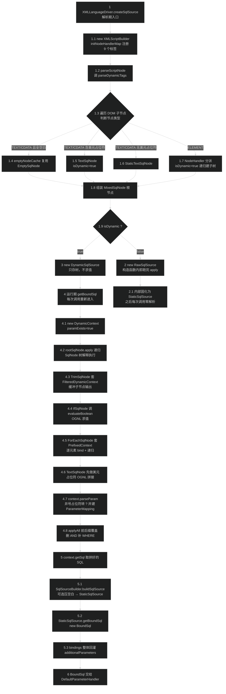

# 源码分析：动态 SQL 解析与 OGNL 求值

> 上次修改：2026-07-29 22:44

## 阅读向导

**面向读者**：

- **新接手 MyBatis 内核的开发者**：想弄清"一段 `<select>` 里的 `<where>`/`<if>`/`<foreach>` 到底是在什么时刻、被谁、按什么顺序变成 `SELECT ... WHERE id = ?` 的"。
- **线上排障者**：遇到"多了一个逗号""`WHERE` 后面跟着 `AND`""`foreach` 参数错位""`IN ()` 语法错误""OGNL 表达式报 `BuilderException`"这类问题，需要定位到具体代码行。
- **安全审计者**：需要判断 `${}` 的注入边界在哪里、OGNL 的类解析能走多远、`ParameterMapping` 里现在装了什么。
- **代码审查者 / 扩展开发者**：想通过 `LanguageDriver` SPI 替换脚本引擎，或者写插件拦截 `BoundSql`。

**阅读前建议先读**（本文不重复这些文档已覆盖的模块级内容，直接进入行级）：

- [动态 SQL 脚本引擎（scripting）](动态%20SQL%20脚本引擎（scripting）.md) —— 模块职责边界、SqlNode 家族清单、与上下游的依赖关系。**注意该文档第 5.1 / 6.4 / 8 节关于 `__frch_item_N` 的描述已与当前分支不符**，具体见本文 §4.6 与 §8.1 的确认结论。
- [映射模型（mapping）](映射模型（mapping）.md) —— `SqlSource` / `BoundSql` / `ParameterMapping` / `MappedStatement` 的定位。
- [配置构建器（builder）](配置构建器（builder）.md) —— `XMLStatementBuilder` 如何拿到 `<select>` 节点并选择 `LanguageDriver`。

**建议阅读顺序**：§1 划范围 → §3 先把 `DynamicContext` 这个"上下文对象"看懂（后面每一段都绕不开它）→ §4 按执行顺序走完两条路径 → §5 看边界 → §8 看已确认的坑。若只关心 `foreach`，直接跳 §4.6 + §8.1。

**基准版本**：`pom.xml:32` 声明 `3.6.0-SNAPSHOT`。本文所有行号以当前工作区 `master`（`8da8f31`）为准。

---

## 1. 分析范围与目标

### 1.1 涵盖范围

本文追踪一条 XML 标签从"文本"到"可执行 SQL + 参数表"的完整生命周期，覆盖两个时刻截然不同的阶段：

| 阶段 | 时机 | 入口 | 主要类 |
|------|------|------|--------|
| **解析期** | `SqlSessionFactory` 构建时，每个 statement 一次 | `XMLLanguageDriver.createSqlSource` | `XMLScriptBuilder`、各 `NodeHandler` |
| **运行期** | 每次 mapper 方法调用 | `DynamicSqlSource.getBoundSql` | `DynamicContext`、各 `SqlNode.apply`、`OgnlCache` |

具体到文件与函数：

- **解析期**：`XMLLanguageDriver.createSqlSource`（4 个重载）、`XMLScriptBuilder` 全类（`parseScriptNode` / `parseDynamicTags` / `initNodeHandlerMap` / 9 个内部 `NodeHandler` / `EmptySqlNode`）、`TextSqlNode.isDynamic`、`RawSqlSource` 两组构造函数。
- **SqlNode 组合树**：`SqlNode` 接口、`MixedSqlNode`、`StaticTextSqlNode`、`TextSqlNode`、`IfSqlNode`、`ChooseSqlNode`、`TrimSqlNode`（含 `FilteredDynamicContext`）、`WhereSqlNode`、`SetSqlNode`、`ForEachSqlNode`（含 `PrefixedContext`）、`VarDeclSqlNode`。
- **运行期**：`DynamicSqlSource.getBoundSql`、`DynamicContext` 全类（`ContextMap` / `ContextAccessor` / `appendSql` / `parseParam` / `initTokenParser`）、`GenericTokenParser.parse`、`ParameterMappingTokenHandler.handleToken` 与 `buildParameterMapping`、`SqlSourceBuilder.buildSqlSource`、`StaticSqlSource.getBoundSql`、`BoundSql` 的 `additionalParameters`。
- **OGNL 层**：`ExpressionEvaluator.evaluateBoolean` / `evaluateIterable`、`OgnlCache.getValue` / `parseExpression`、`OgnlMemberAccess`、`OgnlClassResolver`。
- **SPI 层**：`LanguageDriver` 接口、`LanguageDriverRegistry`、`RawLanguageDriver`、`Configuration` 中的注册与 `@Lang` / `lang` 属性解析入口。
- **参数落地**：`DefaultParameterHandler.setParameters` 的取值优先级（因为它是验证"值到底存在哪里"的唯一证据）。

### 1.2 不涵盖范围

- **`<include>` / `<sql>` 片段展开**：由 `XMLIncludeTransformer` 在 DOM 阶段完成，`XMLScriptBuilder` 拿到的已经是展开后的树。
- **`${}` 之外的属性占位符**：`${}` 在 `<properties>` 层面的替换由 `PropertyParser` 负责（`XMLLanguageDriver.java:69` 只对注解 SQL 调用一次），本文只分析 `TextSqlNode` 里的运行期 `${}`。
- **`ProviderSqlSource`（`@SelectProvider` 家族）**：它复用同一套 `LanguageDriver`，但方法调用与缓存逻辑另成体系。
- **SQL 执行、事务、一级/二级缓存、结果集映射**。
- **`TypeHandler` 的选型细节**：`ParameterMappingTokenHandler.figureOutJavaType` 只讲它对本流程的影响（何时把值写进 `ParameterMapping`），不展开泛型推导规则。

### 1.3 分析目标

1. **搞清两条路径的分叉点**：`XMLScriptBuilder.isDynamic` 这一个布尔字段决定了 SQL 是"启动期解析一次"还是"每次调用重解析"，本文要给出它的两个触发源与判定顺序。
2. **逐行还原运行期算法**：`SqlNode.apply` 递归 + `DynamicContext` 上下文栈 + `#{}` 的即时参数化，这三者的时序耦合是整个引擎最难读的部分。
3. **确认 `foreach` 的参数绑定机制**：老版本靠 `__frch_item_N` 名字改写，**当前分支已经换成了另一套机制**——本文用源码证据给出结论，并解释新机制带来的新风险。
4. **划清 `${}` 与 `#{}` 的安全边界**：说明为什么一个是注入源、另一个不是，以及它们的处理顺序会引出什么二阶问题。
5. **给出可执行的问题清单**：区分"读代码就能确认的问题"和"需要写测试才能坐实的疑似问题"。

---

## 2. 核心类/函数全景

### 2.1 解析期

| 类 / 函数 | 职责 | 关键方法 / 字段 | 代码位置 |
|-----------|------|-----------------|----------|
| `LanguageDriver` | 脚本引擎 SPI，4 个 `createSqlSource` 重载（XNode / String × 有无 `ParamNameResolver`） | `createSqlSource`、`createParameterHandler` | `src/main/java/org/apache/ibatis/scripting/LanguageDriver.java:27-89` |
| `XMLLanguageDriver` | 默认实现。XML 走 `XMLScriptBuilder`；注解字符串先判断是否 `<script>` 包裹 | `createSqlSource(Configuration, String, ...)` | `src/main/java/org/apache/ibatis/scripting/xmltags/XMLLanguageDriver.java:44-76` |
| `XMLScriptBuilder` | 把 DOM 子树翻译成 `SqlNode` 树，并根据 `isDynamic` 决定产出哪种 `SqlSource` | `parseScriptNode`、`parseDynamicTags`、`nodeHandlerMap`、`emptyNodeCache` | `XMLScriptBuilder.java:37-281` |
| `NodeHandler`（内部接口） | 每种标签一个处理器，9 个实现映射到 9 个标签名 | `handleNode(XNode, List<SqlNode>)` | `XMLScriptBuilder.java:117-265` |
| `RawSqlSource` | 静态 SQL 容器。**构造函数里就把 `apply` 跑完**，之后每次调用零解析开销 | 两组构造函数、`getBoundSql` | `src/main/java/org/apache/ibatis/scripting/defaults/RawSqlSource.java:41-76` |
| `RawLanguageDriver` | 校验型驱动，产出不是 `RawSqlSource` 就抛异常 | `checkIsNotDynamic` | `src/main/java/org/apache/ibatis/scripting/defaults/RawLanguageDriver.java:50-54` |
| `LanguageDriverRegistry` | `Class → 单例` 注册表 + 默认驱动类 | `register`、`getDriver`、`setDefaultDriverClass` | `src/main/java/org/apache/ibatis/scripting/LanguageDriverRegistry.java:24-69` |

### 2.2 SqlNode 组合树

| 类 | `apply` 语义 | 返回值含义 | 代码位置 |
|----|--------------|------------|----------|
| `SqlNode` | 唯一抽象方法 `boolean apply(DynamicContext)` | 约定"本节点是否产生了内容"，实际只有 `IfSqlNode` / `ChooseSqlNode` 真正消费 | `SqlNode.java:21-23` |
| `MixedSqlNode` | 顺序 `forEach` 调用子节点，**丢弃全部子返回值** | 恒 `true` | `MixedSqlNode.java:30-34` |
| `StaticTextSqlNode` | `context.appendSql(context.parseParam(text))`，只处理 `#{}` | 恒 `true` | `StaticTextSqlNode.java:28-32` |
| `TextSqlNode` | 先 `${}` OGNL 替换，再 `#{}` 参数化 | 恒 `true` | `TextSqlNode.java:39-44` |
| `EmptySqlNode` | 纯空白节点，只 `appendSql(whitespaces)`，不走 `parseParam` | 恒 `true` | `XMLScriptBuilder.java:267-280` |
| `IfSqlNode` | `evaluateBoolean(test)` 为真才递归 | **测试结果**（`choose` 依赖它） | `IfSqlNode.java:31-38` |
| `ChooseSqlNode` | 顺序试 `when`，首个返回 `true` 的胜出；否则用 `otherwise` | 是否有分支命中 | `ChooseSqlNode.java:32-44` |
| `TrimSqlNode` | 套 `FilteredDynamicContext` 缓冲 → `applyAll()` 做前后缀覆盖 | 透传 `contents.apply` 结果 | `TrimSqlNode.java:54-60` |
| `WhereSqlNode` | `TrimSqlNode(prefix="WHERE", prefixesToOverride=8 个 AND/OR 变体)` | 同 `TrimSqlNode` | `WhereSqlNode.java:26-33` |
| `SetSqlNode` | `TrimSqlNode(prefix="SET", prefixesToOverride=[","], suffixesToOverride=[","])` | 同 `TrimSqlNode` | `SetSqlNode.java:25-32` |
| `ForEachSqlNode` | `evaluateIterable` → 逐元素套 `PrefixedContext` 递归 | 恒 `true`（含空集合） | `ForEachSqlNode.java:67-103` |
| `VarDeclSqlNode` | `<bind>`：OGNL 求值后 `context.bind(name, value)` | 恒 `true` | `VarDeclSqlNode.java:31-36` |

### 2.3 运行期与 OGNL

| 类 / 函数 | 职责 | 关键点 | 代码位置 |
|-----------|------|--------|----------|
| `DynamicSqlSource.getBoundSql` | 运行期唯一入口，7 行完成全部编排 | 建上下文 → `apply` → 取 SQL → 建 `StaticSqlSource` → 回灌 bindings | `DynamicSqlSource.java:43-52` |
| `DynamicContext` | 上下文对象：变量表 + SQL 缓冲 + `#{}` 解析器 | `bindings`、`sqlBuilder`、`parseParam`、`initTokenParser` | `DynamicContext.java:38-194` |
| `DynamicContext.ContextMap` | `HashMap` 子类，`get` 未命中时回退到 `parameterMetaObject` | 只覆写 `get`，**未覆写 `containsKey`** | `DynamicContext.java:131-158` |
| `DynamicContext.ContextAccessor` | OGNL 的 `PropertyAccessor`，让 `Map` 型实参的键可直接被表达式引用 | 回退读 `_parameter` | `DynamicContext.java:160-194` |
| `GenericTokenParser.parse` | 通用 `openToken...closeToken` 扫描器，`${}` 与 `#{}` 共用 | 反斜杠转义、未闭合容错 | `src/main/java/org/apache/ibatis/parsing/GenericTokenParser.java:33-86` |
| `ParameterMappingTokenHandler` | `#{expr}` → `"?"`，并产出一条 `ParameterMapping` | `paramExists=true` 时**顺带把值也捕获进去** | `src/main/java/org/apache/ibatis/builder/ParameterMappingTokenHandler.java:77-138` |
| `SqlSourceBuilder.buildSqlSource` | 静态工厂，按 `shrinkWhitespacesInSql` 决定是否压空白 | 全类只有 2 个静态方法 | `src/main/java/org/apache/ibatis/builder/SqlSourceBuilder.java:34-53` |
| `StaticSqlSource` | 不可变三元组 `(sql, mappings, configuration)` | `getBoundSql` 只 new 一个 `BoundSql` | `src/main/java/org/apache/ibatis/builder/StaticSqlSource.java:44-47` |
| `BoundSql` | 最终产物：`?` 化 SQL + mappings + additionalParameters | `hasAdditionalParameter` 走 `PropertyTokenizer` 取根名 | `src/main/java/org/apache/ibatis/mapping/BoundSql.java:35-80` |
| `ExpressionEvaluator` | OGNL 结果的语义收敛：布尔化 / 可迭代化 | 单例 `INSTANCE` | `ExpressionEvaluator.java:29-85` |
| `OgnlCache` | 表达式 AST 缓存 + 统一异常包装 | 静态 `ConcurrentHashMap`，**无淘汰** | `OgnlCache.java:34-62` |
| `OgnlMemberAccess` | 控制 OGNL 能否访问非 public 成员 | `restore` 故意空实现（issue #1648） | `OgnlMemberAccess.java:38-67` |
| `OgnlClassResolver` | 用 `Resources.classForName` 代替 `Class.forName`（issue 161） | **无类名白名单** | `OgnlClassResolver.java:30-36` |
| `DefaultParameterHandler.setParameters` | 把值 set 进 `PreparedStatement` | 取值优先级第一条就是 `parameterMapping.hasValue()` | `src/main/java/org/apache/ibatis/scripting/defaults/DefaultParameterHandler.java:91-181` |

---

## 3. 关键数据结构

### 3.1 `DynamicContext` —— 贯穿全流程的上下文

```
DynamicContext
├── ContextMap bindings        // 变量表：_parameter / _databaseId / <bind> 变量 / foreach 的 item&index
├── StringJoiner sqlBuilder    // SQL 片段缓冲，分隔符固定为 " "
├── Configuration configuration
├── Object   parameterObject   // 运行期实参；解析期为 null
├── Class<?> parameterType     // 解析期用；运行期为 null
├── ParamNameResolver paramNameResolver
├── boolean  paramExists       // ★ 决定是否在解析 #{} 时顺带捕获实参值
├── GenericTokenParser        tokenParser    // 懒创建，"#{" .. "}"
└── ParameterMappingTokenHandler tokenHandler // 懒创建，持有 parameterMappings 列表
```

**字段设计要点**：

- **`bindings` 为什么是 `HashMap` 子类而不是普通 `Map`**：OGNL 的根对象就是这个 map（`IfSqlNode.java:33` 传的是 `context.getBindings()`）。`ContextMap.get`（`DynamicContext.java:142-157`）覆写后实现了"先查显式绑定，未命中则用 `MetaObject` 反射读实参属性"的两级回退，让 `test="user.name != null"` 这类表达式在实参是 POJO 时也能直接写属性名。选 `HashMap` 而非 `LinkedHashMap` 是因为**顺序无意义**——所有消费方（OGNL、`MetaObject`）都按名字查。
- **`sqlBuilder` 为什么是 `StringJoiner(" ")` 而不是 `StringBuilder`**：SqlNode 之间必须有分隔符，否则 `</if>` 与下一个片段会粘连成 `id=?name=?`。用 `StringJoiner` 把"加空格"这件事下沉到容器，各节点 `appendSql` 时不用关心自己是不是第一个。代价是**即使 append 空串也会产生一个分隔空格**，所以 `getSql()`（`:93-95`）末尾要 `trim()`，且默认配置下最终 SQL 会保留大量多余空白（见 §7.3）。
- **`paramExists` 是新老机制的开关**：`DynamicSqlSource` 传 `true`（`DynamicSqlSource.java:45`），`RawSqlSource` 走 3 参构造函数最终传 `false`（`DynamicContext.java:59-61`）。这一个布尔值决定 `ParameterMappingTokenHandler` 是否在建 `ParameterMapping` 时把**实参值**一并塞进去（`ParameterMappingTokenHandler.java:125`）。静态 SQL 的 mapping 列表要跨调用复用，绝不能带值；动态 SQL 每次调用重建，带值才安全。
- **`tokenParser` / `tokenHandler` 懒创建**：`initTokenParser`（`:97-103`）保证一个 `DynamicContext` 只有一套解析器。关键在于 `tokenHandler` 构造时把 `bindings` 这个**对象引用**当作 `additionalParameters` 传进去（`:100`），并在 `ParameterMappingTokenHandler` 里包成 `MetaObject`（`ParameterMappingTokenHandler.java:55`）。因为是引用而不是拷贝，后续 `bind()` 写入的变量对已创建的 handler **立即可见**——这是 `<bind>` 能被后面的 `#{}` 读到的技术前提。

**`ContextMap` 的一个关键不对称**（后文多处依赖）：它**只覆写了 `get`，没有覆写 `containsKey`**。所以：

| 调用 | 行为 |
|------|------|
| `bindings.get("userName")`（实参是 POJO 且有该属性） | 回退到 `parameterMetaObject.getValue`，**返回值** |
| `bindings.containsKey("userName")` | 走 `HashMap` 原生实现，**返回 false** |

`ParameterMappingTokenHandler` 判断"这个 `#{}` 是不是引用了上下文变量"时用的是 `metaParameters.hasGetter(...)`（`:126`），而 `MapWrapper.hasGetter` 底层就是 `map.containsKey`（`src/main/java/org/apache/ibatis/reflection/wrapper/MapWrapper.java:135`）。因此**只有显式 `put` 进 bindings 的键**（`_parameter`、`_databaseId`、`<bind>` 变量、`foreach` 的 item/index、`${}` 触发写入的 `value`）才会走"上下文变量"分支，POJO 属性走另一条分支。这个设计是刻意的：否则 POJO 的每个属性都会被误判成上下文变量。

### 3.2 `ContextAccessor` —— 为 Map 实参打的补丁

`DynamicContext` 静态块（`:43-45`）向 OGNL 全局注册：`ContextMap` 类型用 `ContextAccessor` 取属性。

`getProperty`（`:163-177`）逻辑：

1. `map.get(name)`；
2. 若 `containsKey` 或结果非 null，直接返回；
3. 否则取出 `_parameter`，**若它是 `Map`，就再从里面取一次**；
4. 仍取不到返回 null。

第 3 步存在的原因：`DynamicContext` 构造函数（`:65-66`）对 `Map` 型实参**不建 `MetaObject`**（`bindings = new ContextMap(null, false)`），也不把 map 的内容拷进 bindings。所以 `Map` 实参的键在 `ContextMap.get` 里必然落空（`parameterMetaObject == null` → `return null`，`:148-150`）。`ContextAccessor` 就是补上这一跳，让 `test="key != null"` 对 `Map` 实参可用。

**注意这是一条 OGNL-only 的路径**：`#{key}` 走的是 `MetaObject`/`ParameterMappingTokenHandler` 而不是 OGNL，不经过 `ContextAccessor`。两条取值链路在这里是分叉的。

### 3.3 `ParameterMapping` —— 从纯元数据变成了"元数据 + 值"

```java
private static final Object UNSET = new Object();   // ParameterMapping.java:29
private Object value = UNSET;                       // ParameterMapping.java:41
public boolean hasValue() { return value != UNSET; } // ParameterMapping.java:201-203
```

用 `UNSET` 哨兵而不是 `null` 判定，是因为**参数值本身合法地可以是 `null`**（`ParameterMappingTokenHandler.java:129` 明确 `builder.value(null)`）。若用 `value != null` 判定，`#{nullableField}` 会退回去走 `parameterObject` 反射路径，在 `foreach` 场景下就会取错元素。

| 字段 | 含义 | 生命周期 |
|------|------|----------|
| `property` | `#{}` 花括号里的属性路径，如 `item.name` | 不可变 |
| `javaType` / `jdbcType` / `typeHandler` | 类型三元组，`figureOutJavaType` 推导 | 不可变 |
| `mode` | `IN`/`OUT`/`INOUT`，仅存储过程用 | 不可变 |
| `value` | **实参值**，仅 `paramExists=true`（即 `DynamicSqlSource`）时写入 | 与本次调用同生命周期 |

**这个字段的存在把 `ParameterMapping` 的可复用性切成了两半**：`RawSqlSource` 产出的 mapping 列表跨调用共享且不带值（安全）；`DynamicSqlSource` 产出的每次新建且带值（**不可缓存、不可跨线程共享**）。详见 §6.4 与 §8.1。

### 3.4 `BoundSql.additionalParameters`

```java
private final Map<String, Object> additionalParameters;  // BoundSql.java:40
private final MetaObject metaParameters;                 // BoundSql.java:41，包装上面那个 map
```

- `setAdditionalParameter`（`:69-71`）走 `metaParameters.setValue`，所以支持 `a.b.c` 形式的路径写入。
- `hasAdditionalParameter`（`:64-67`）先用 `PropertyTokenizer` 取**根名**再 `containsKey`——所以 `hasAdditionalParameter("user.name")` 实际检查的是 `user`。
- 填充点唯一：`DynamicSqlSource.java:50` 把 `context.getBindings()` **整体无过滤**灌进去，包括 `_parameter`、`_databaseId` 这些内部键。

在当前分支下，这条回灌链路的作用已经**弱化**：`foreach` 的 item/index 绑定在临时的 `PrefixedContext` 里，根本不会流到这里（详见 §4.6）；真正还依赖它的是**顶层 `<bind>` 变量**和插件对 `BoundSql` 的读取。

### 3.5 `XMLScriptBuilder.emptyNodeCache` —— 一个容易忽略的静态缓存

```java
private static final Map<String, SqlNode> emptyNodeCache = new ConcurrentHashMap<>();  // :44
...
if (data.trim().isEmpty()) {
  contents.add(emptyNodeCache.computeIfAbsent(data, EmptySqlNode::new));  // :94
  continue;
}
```

- **键就是空白串本身**（如 `"\n    "`），值是复用的 `EmptySqlNode`。
- **`static` 意味着跨 `Configuration`、跨整个 JVM 共享**。`EmptySqlNode` 只持有一个 `final String`、`apply` 无状态，所以共享是安全的。
- 收益：mapper XML 里缩进产生的空白文本节点极多且高度重复，复用可以显著减少启动期对象数。
- 代价：**无淘汰**。键空间是"出现过的所有空白串"，正常项目里基数很低（几十种缩进组合），但它随类加载器常驻，热部署场景下会跨应用累积。

---

## 4. 主线流程逐行解读

以下贯穿示例（后续各小节反复引用）：

```xml
<select id="find" resultType="User">
  SELECT * FROM users
  <where>
    <if test="name != null"> AND name LIKE #{name} </if>
    <if test="ids != null">
      AND id IN
      <foreach collection="ids" item="id" open="(" close=")" separator=",">#{id}</foreach>
    </if>
  </where>
  ORDER BY ${orderBy}
</select>
```

### 4.0 全流程总图



**1-1.9 解析期建树与分流**：`XMLLanguageDriver.createSqlSource` 收到 `<select>` 的 `XNode`，构造 `XMLScriptBuilder` 时先把 9 个标签名注册进 `nodeHandlerMap`，再由 `parseDynamicTags` 深度优先遍历 DOM。对每个子节点做三分类：**全空白文本**复用缓存的 `EmptySqlNode`；**含 `${}` 的文本**建 `TextSqlNode` 并置 `isDynamic=true`；**不含 `${}` 的文本**建 `StaticTextSqlNode`（不改标志位）；**元素节点**查 `nodeHandlerMap`，查不到直接抛 `BuilderException`，查到则递归建子树并**无条件**置 `isDynamic=true`。遍历完把节点列表包成 `MixedSqlNode` 作根，最后按 `isDynamic` 二选一产出 `SqlSource`。示例里既有 `<where>` 又有 `${orderBy}`，两个触发源都命中。

**2-2.1 静态路径（仅 `isDynamic=false` 时走）**：`RawSqlSource` 在**构造函数里**就建一个 `paramExists=false` 的 `DynamicContext` 并跑 `rootSqlNode.apply`，把 `#{}` 全部转成 `?`、mapping 列表定型，固化成 `StaticSqlSource`。运行期 `getBoundSql` 只是一层转发。

**3-4.8 动态路径的运行期解释执行**：`DynamicSqlSource` 只在解析期存下树。每次调用新建 `paramExists=true` 的 `DynamicContext`，然后 `rootSqlNode.apply` 递归下去。递归中三种上下文装饰互相嵌套：`TrimSqlNode` 的 `FilteredDynamicContext` 把子输出截流到自己的 `StringBuilder`；`ForEachSqlNode` 的 `PrefixedContext` 惰性补分隔符；文本节点在 `appendSql` 前先过 `${}` OGNL 拼接、再过 `#{}` 参数化。`<if>` 的条件走 `ExpressionEvaluator.evaluateBoolean`。子树跑完后 `applyAll()` 做前后缀覆盖（删掉开头 `AND`、补上 `WHERE`），一次性写回父上下文。

**5-6 打包与交付**：`getSql()` 拿到拼好的字符串，`SqlSourceBuilder.buildSqlSource` 按 `shrinkWhitespacesInSql` 决定是否压缩空白后包成 `StaticSqlSource`，立刻取 `BoundSql`，再把整个 `bindings` 灌进 `additionalParameters`。产物交给 `DefaultParameterHandler` 逐个 set 进 `PreparedStatement`。

### 4.1 解析期入口：`XMLLanguageDriver.createSqlSource`

`XMLLanguageDriver.java:48-53`（XNode 版本，XML mapper 走这条）：

```java
public SqlSource createSqlSource(Configuration configuration, XNode script, Class<?> parameterType,
    ParamNameResolver paramNameResolver) {
  XMLScriptBuilder builder = new XMLScriptBuilder(configuration, script, parameterType, paramNameResolver);
  return builder.parseScriptNode();
}
```

**没有任何逻辑**——纯委托。真正值得看的是字符串版本（`:60-76`，注解 SQL 走这条）：

```java
if (script.startsWith("<script>")) {                                    // :64  issue #3
  XPathParser parser = new XPathParser(script, false, configuration.getVariables(), new XMLMapperEntityResolver());
  return createSqlSource(configuration, parser.evalNode("/script"), parameterType);   // :66
}
script = PropertyParser.parse(script, configuration.getVariables());    // :69  issue #127
TextSqlNode textSqlNode = new TextSqlNode(script);
if (textSqlNode.isDynamic()) {                                          // :71
  return new DynamicSqlSource(configuration, textSqlNode);
} else {
  return new RawSqlSource(configuration, script, parameterType, paramNameResolver);
}
```

三个隐含行为：

1. **`<script>` 包裹的注解 SQL 被重新走一遍 XML 解析**，等价于 XML mapper 的能力。
2. **`:66` 这一跳丢掉了 `paramNameResolver`**——调用的是 3 参重载。这是一个可以确认的行为缺口，见 §8.1。
3. **`:69` 的 `PropertyParser.parse` 是解析期的 `${}` 替换**，把 `<properties>` 里定义的配置值直接嵌死。注意它和 `TextSqlNode` 的运行期 `${}` **共用同一对定界符 `${` `}`**，但时机、语义、安全性质完全不同：这里替换的是配置文件里的常量，不接受用户输入。已被 `PropertyParser` 替换掉的 `${}` 自然不会再被 `isDynamic()` 看到；**只有 `configuration.getVariables()` 里没有对应键的 `${}` 才会留下来并触发 `isDynamic=true`**（`PropertyParser` 默认行为是保留原样）。

### 4.2 `parseDynamicTags` 递归与 `isDynamic` 的两个触发源

`XMLScriptBuilder.java:86-115` 是整个解析期的核心，逐行拆：

```java
protected MixedSqlNode parseDynamicTags(XNode node) {
  List<SqlNode> contents = new ArrayList<>();                              // :87
  NodeList children = node.getNode().getChildNodes();                      // :88
  for (int i = 0; i < children.getLength(); i++) {
    XNode child = node.newXNode(children.item(i));                         // :90
    if (child.getNode().getNodeType() == Node.CDATA_SECTION_NODE
        || child.getNode().getNodeType() == Node.TEXT_NODE) {              // :91
      String data = child.getStringBody("");                               // :92
      if (data.trim().isEmpty()) {                                        // :93
        contents.add(emptyNodeCache.computeIfAbsent(data, EmptySqlNode::new));  // :94
        continue;                                                          // :95
      }
      TextSqlNode textSqlNode = new TextSqlNode(data);                     // :97
      if (textSqlNode.isDynamic()) {                                       // :98
        contents.add(textSqlNode);
        isDynamic = true;                                                  // :100 ← 触发源 A
      } else {
        contents.add(new StaticTextSqlNode(data));                         // :102
      }
    } else if (child.getNode().getNodeType() == Node.ELEMENT_NODE) {        // :104 issue #628
      String nodeName = child.getNode().getNodeName();                     // :105
      NodeHandler handler = nodeHandlerMap.get(nodeName);                  // :106
      if (handler == null) {
        throw new BuilderException("Unknown element <" + nodeName + "> in SQL statement.");  // :108
      }
      handler.handleNode(child, contents);                                 // :110 ← 递归发生在这里
      isDynamic = true;                                                    // :111 ← 触发源 B
    }
  }
  return new MixedSqlNode(contents);                                       // :114
}
```

**逐段解读**：

- **`:87-90` 建列表并逐个包 `XNode`**。`node.newXNode` 复用父节点的 `XPathParser` 与 `variables`，保证子节点属性读取时的 `${}` 配置替换行为一致。
- **`:91` 只认 `TEXT_NODE` 与 `CDATA_SECTION_NODE`**。注释 `issue #628` 挂在 `:104` 的 `ELEMENT_NODE` 分支上：加这个显式判断的目的是**跳过注释节点（`COMMENT_NODE`）和处理指令节点**。在此之前，非文本非元素的节点会掉进 `else` 分支被当成标签处理，XML 注释会导致 `Unknown element` 异常。现在这两类节点会被静默丢弃——**既不产出 SqlNode，也不影响 `isDynamic`**。
- **`:93-95` 空白短路**。`data.trim().isEmpty()` 命中时用 `emptyNodeCache` 复用节点，并 `continue` **跳过 `isDynamic` 判定**。这是正确的：纯空白不可能含 `${}`。同时也意味着 `EmptySqlNode.apply` 不走 `parseParam`（`XMLScriptBuilder.java:277`），少一次无用的 `GenericTokenParser` 扫描。
- **`:97-103` 触发源 A：`${}`**。判定委托 `TextSqlNode.isDynamic()`（`TextSqlNode.java:32-37`）：
  ```java
  DynamicCheckerTokenParser checker = new DynamicCheckerTokenParser();
  GenericTokenParser parser = createParser(checker);   // "${" .. "}"
  parser.parse(text);
  return checker.isDynamic();
  ```
  这是一次**探测性解析**：`DynamicCheckerTokenParser.handleToken`（`:84-88`）只把标志位置 `true` 并**返回 `null`**。返回 null 会被 `GenericTokenParser.java:76` 的 `builder.append(handler.handleToken(...))` 拼成字符串 `"null"`——但拼出来的字符串被直接丢弃，所以无害。这是"用副作用而非返回值传递信息"的写法，性能上比正则匹配好（单趟字符扫描，支持转义），可读性上略绕。
- **`:104-111` 触发源 B：任何已注册的动态标签**。注意 `:111` 的 `isDynamic = true` 是**无条件**的，在 `handler.handleNode` 之后执行。这有两个后果：
  1. **哪怕标签内容完全静态也算动态**。例如 `<trim prefix="WHERE">id = #{id}</trim>` 里没有任何条件判断和 `${}`，结果依然是 `DynamicSqlSource`，每次调用都要重跑一遍 `apply` + `SqlSourceBuilder`。**过度包裹 `<trim>`/`<where>` 是一个隐性的性能损失**（见 §7.1）。
  2. `handleNode` 内部的递归（各 handler 第一行都是 `parseDynamicTags(nodeToHandle)`，如 `:142`、`:159`、`:172`、`:185`、`:206`、`:220`）会先把子树的 `isDynamic` 也写上，所以标志位只会单向变 `true`，**没有重置逻辑**——一旦某个片段是动态的，整条 statement 就是动态的。这个字段是**实例字段而非局部变量**，靠"一个 `XMLScriptBuilder` 只处理一条 statement"的约定保证正确性；`XMLScriptBuilder` 不是线程安全的，也不可复用。
- **`:114` 无论子节点多少，一律包成 `MixedSqlNode`**。这带来一个可观察的开销：即使 `<if>` 里只有一个文本节点，也会多套一层 `MixedSqlNode`（一次 `forEach` + 一个 lambda 对象）。换来的是**类型统一**——所有 handler 只需处理"一个 SqlNode"，不用区分 0/1/N 个子节点。

### 4.3 `NodeHandler` 分派：9 个标签，7 种处理器

`initNodeHandlerMap`（`:63-73`）：

| 标签 | Handler | 产出节点 | 特殊之处 |
|------|---------|----------|----------|
| `trim` | `TrimHandler`（`:135-150`） | `TrimSqlNode` | 读 4 个属性 |
| `where` | `WhereHandler`（`:152-163`） | `WhereSqlNode` | 无属性 |
| `set` | `SetHandler`（`:165-176`） | `SetSqlNode` | 无属性 |
| `foreach` | `ForEachHandler`（`:178-197`） | `ForEachSqlNode` | 读 7 个属性 |
| `if` | `IfHandler`（`:199-211`） | `IfSqlNode` | 读 `test` |
| `when` | **`IfHandler`（同一个类，但 `:68` 与 `:70` 是两个不同实例）** | `IfSqlNode` | 与 `if` 完全同构 |
| `choose` | `ChooseHandler`（`:225-265`） | `ChooseSqlNode` | 自己遍历子节点 |
| `otherwise` | `OtherwiseHandler`（`:213-223`） | **裸 `MixedSqlNode`** | 不包装 |
| `bind` | `BindHandler`（`:121-133`） | `VarDeclSqlNode` | `static` 类 |

三个设计细节：

1. **`when` 复用 `IfHandler`** 而不是新建类型。`ChooseHandler.handleWhenOtherwiseNodes`（`:240-254`）靠 `handler instanceof IfHandler` / `instanceof OtherwiseHandler` 区分子节点归属。副作用是：**`<when>` 与 `<if>` 在 `nodeHandlerMap` 中是平级注册的**，所以 `<when>` 语法上可以直接写在 `<select>` 里（脱离 `<choose>`），此时它退化成一个普通 `<if>`，不报错。同理 `<otherwise>` 单独使用会退化成"无条件输出内容"。这是宽松而非严格的解析策略。
2. **`OtherwiseHandler` 不包装**（`:221` 直接 `targetContents.add(mixedSqlNode)`）。因为 `otherwise` 语义上就是"无条件执行"，`MixedSqlNode.apply` 恒返回 `true` 正好匹配 `ChooseSqlNode.java:39-42` 的期望。
3. **只有 `BindHandler` 和 `EmptySqlNode` 是 `static`**，其余 6 个是内部类（非静态），因为它们要访问外层的 `configuration` 字段和 `parseDynamicTags` 方法。构造函数上那句 `// Prevent Synthetic Access` 注释是为了消除 SpotBugs 的"合成访问器"告警——显式声明 public 无参构造避免编译器生成 `access$` 桥接方法。

`ChooseHandler` 的校验逻辑（`:256-263`）值得一提：`otherwise` 超过 1 个直接抛 `BuilderException("Too many default (otherwise) elements")`；0 个则 `defaultSqlNode = null`，运行期 `ChooseSqlNode` 会返回 `false`（`ChooseSqlNode.java:43`）。而 **`when` 为 0 个不报错**——`<choose>` 里只写 `<otherwise>` 是合法的，行为等价于无条件输出。

### 4.4 分流：`RawSqlSource` vs `DynamicSqlSource`

`parseScriptNode`（`:75-84`）：

```java
MixedSqlNode rootSqlNode = parseDynamicTags(context);   // :76
if (isDynamic) {
  sqlSource = new DynamicSqlSource(configuration, rootSqlNode);                          // :79
} else {
  sqlSource = new RawSqlSource(configuration, rootSqlNode, parameterType, paramNameResolver);  // :81
}
```

**`RawSqlSource` 在构造函数里就把运行期该做的事全做完了**（`RawSqlSource.java:49-55`）：

```java
DynamicContext context = new DynamicContext(configuration, parameterType, paramNameResolver);  // :51 ← 3 参构造，paramExists=false
rootSqlNode.apply(context);                                                                     // :52
String sql = context.getSql();                                                                   // :53
sqlSource = SqlSourceBuilder.buildSqlSource(configuration, sql, context.getParameterMappings()); // :54
```

对比 `DynamicSqlSource.getBoundSql`（`:44-51`），这 4 行与运行期的前 4 步**一一对应**。差别只有两处，但都是本质性的：

| | `RawSqlSource`（`:51`） | `DynamicSqlSource`（`:45`） |
|---|---|---|
| `parameterObject` | 传不进来（3 参构造 → `DynamicContext.java:60` 硬编码 `null`） | 真实实参 |
| `paramExists` | `false` | `true` |
| 结果 | mapping **不带值**，可跨调用共享 | mapping **带值**，一次性 |
| 调用开销 | 一次转发 | 完整重跑 |

`RawSqlSource` 能这么做的前提是"树里没有任何依赖实参的节点"。`isDynamic=false` 意味着树里**只可能有 `StaticTextSqlNode` 和 `EmptySqlNode`**（`TextSqlNode` 必然置 `isDynamic=true`，所有标签节点也必然置 `true`），这两种节点的 `apply` 都不读 `bindings`。所以传 `null` 实参是安全的。

`RawSqlSource` 另有一组字符串版构造函数（`:61-69`），供 `XMLLanguageDriver.java:74` 的注解路径使用。它**不建 `DynamicContext`**，直接手搓一个 `ParameterMappingTokenHandler`（`:65-66`，用 4 参重载，`paramExists` 恒 `false`，`additionalParameters` 传空 `HashMap`）+ `GenericTokenParser`，扫一遍 `#{}` 就完事。这条路径**没有 `bindings`**，所以注解里的静态 SQL 不支持任何上下文变量——这是合理的，因为没有动态标签就没有 `<bind>`。

### 4.5 运行期主链路：`DynamicSqlSource.getBoundSql` 7 行

```java
public BoundSql getBoundSql(Object parameterObject) {
  DynamicContext context = new DynamicContext(configuration, parameterObject, null, paramNameResolver, true);  // :45
  rootSqlNode.apply(context);                                                                                  // :46
  String sql = context.getSql();                                                                               // :47
  SqlSource sqlSource = SqlSourceBuilder.buildSqlSource(configuration, sql, context.getParameterMappings());    // :48
  BoundSql boundSql = sqlSource.getBoundSql(parameterObject);                                                   // :49
  context.getBindings().forEach(boundSql::setAdditionalParameter);                                              // :50
  return boundSql;
}
```

**`:45` 建上下文**。第 3 个参数 `parameterType` 传 `null`——因为有了真实的 `parameterObject`，`ParameterMappingTokenHandler` 构造时会用 `parameterObject.getClass()`（`ParameterMappingTokenHandler.java:53-54`）。构造函数内部按实参类型分两路（`DynamicContext.java:65-71`）：

- `null` 或 `Map` → `new ContextMap(null, false)`，**不建 `MetaObject`**（Map 的属性访问靠 `ContextAccessor` 补，见 §3.2）；
- 其他 → 建 `MetaObject`，并查 `fallbackParameterObject = typeHandlerRegistry.hasTypeHandler(实参类)`。这第二个布尔值服务的是"实参是单个简单类型"的场景：`ContextMap.get` 在 `hasGetter` 失败时**返回整个实参对象**（`:152-154`），使 `test="_parameter > 0"` 和 `${anyName}` 都能取到那个 `Integer`。

随后 `:72-73` 无条件塞两个内置键：`_parameter`（可为 null）、`_databaseId`（可为 null）。**它们是 `super.put` 进 `HashMap` 的，所以 `containsKey` 会返回 true**——这就是 §3.1 提到的"显式 put 的键才走上下文变量分支"，`#{_parameter}` 因此可以正常工作。

**`:46` 递归求值**。这一行展开就是整棵树的解释执行，是本文 §4.6 - §4.8 的内容。

**`:47` 取 SQL**：`sqlBuilder.toString().trim()`（`DynamicContext.java:94`）。只 trim 首尾，中间的多余空白留给下一步。

**`:48` 参数化产物打包**。注意 `context.getParameterMappings()`（`:105-108`）会调 `initTokenParser(null)` 兜底：万一整条 SQL 里一个 `#{}` 都没有（`parseParam` 从未被有效调用），`tokenHandler` 仍是 null，这里会现场建一个空列表的 handler，避免 NPE。

**关键时序依赖**：`:46` 必须在 `:48` 之前完成，否则 mapping 列表是空的。这个顺序**没有任何断言或状态机保护**，纯靠代码书写顺序。任何试图重排这几行的重构都会静默产出"SQL 有 `?` 但 mapping 为空"的 `BoundSql`，然后在 `PreparedStatement.setXxx` 阶段才炸。

**`:49` 建 `BoundSql`**。`StaticSqlSource.getBoundSql`（`StaticSqlSource.java:45-47`）只是 `new BoundSql(configuration, sql, parameterMappings, parameterObject)`——这里 `parameterObject` 被再次传入，供 `DefaultParameterHandler` 的反射兜底路径使用。

**`:50` 回灌 bindings**。`forEach(boundSql::setAdditionalParameter)` 把 `_parameter`、`_databaseId`、所有 `<bind>` 变量整体灌进 `additionalParameters`。**无过滤**，所以内部键也进去了。`setAdditionalParameter` 走 `MetaObject.setValue`（`BoundSql.java:70`），如果某个 `<bind>` 的 `name` 含点号（如 `<bind name="a.b" .../>`），这里会被当成嵌套路径处理并可能抛异常——一个很少有人踩到但存在的边界。

### 4.6 `ForEachSqlNode`：item/index 绑定与 `PrefixedContext`

**这是本文最需要纠正既有认知的一节。**

`apply`（`ForEachSqlNode.java:67-103`）：

```java
Map<String, Object> bindings = context.getBindings();                                    // :69
final Iterable<?> iterable = evaluator.evaluateIterable(collectionExpression, bindings,
    Optional.ofNullable(nullable).orElseGet(configuration::isNullableOnForEach));         // :70-71
if (iterable == null || !iterable.iterator().hasNext()) {
  return true;                                                                            // :73 ← 空集合直接返回
}
boolean first = true;
applyOpen(context);                                                                       // :76
int i = 0;
for (Object o : iterable) {
  DynamicContext scopedContext;
  if (first || separator == null) {
    scopedContext = new PrefixedContext(context, "");                                     // :81
  } else {
    scopedContext = new PrefixedContext(context, separator);                              // :83
  }
  if (o instanceof Map.Entry) {                                                           // :86  Issue #709
    Map.Entry<Object, Object> mapEntry = (Map.Entry<Object, Object>) o;
    applyIndex(scopedContext, mapEntry.getKey());                                         // :89
    applyItem(scopedContext, mapEntry.getValue());                                        // :90
  } else {
    applyIndex(scopedContext, i);                                                         // :92
    applyItem(scopedContext, o);                                                          // :93
  }
  contents.apply(scopedContext);                                                          // :95
  if (first) {
    first = !((PrefixedContext) scopedContext).isPrefixApplied();                          // :97
  }
  i++;
}
applyClose(context);                                                                      // :101
return true;
```

#### 4.6.1 `#{item}` 现在是怎么取到值的

**确认结论：当前分支（3.6.0-SNAPSHOT）已经不存在 `__frch_item_N` 名字改写机制。**

源码证据（三条独立验证）：

1. 全项目搜索 `ITEM_PREFIX`：`src/` 下**零命中**（仅在 `md/` 已有文档中出现，属于文档滞后）。
2. 全项目搜索 `__frch`：`src/main` 下**零命中**；`src/test` 只有一处 `submitted/language/VelocitySqlSource.java:94`，那是测试用的第三方语言驱动**自己实现**的一套同名前缀，与 `xmltags` 无关。
3. 搜索 `uniqueNumber`：`src/` 下**零命中**。`DynamicContext` 里既没有 `uniqueNumber` 字段，也没有 `getUniqueNumber()` 方法（对照 `DynamicContext.java:47-57` 的完整字段列表）。
4. `ForEachSqlNode` 里**没有 `FilteredDynamicContext`、没有 `itemizeItem`**——只有一个 `PrefixedContext`（`:129-165`），它只覆写 `appendSql`/`getSql`/`getParameterMappings`，**不改写 SQL 文本内容**。

那么 `<foreach item="id">#{id}</foreach>` 迭代 3 次，产出 3 个 `?` 和 3 条 `ParameterMapping`（`property` 都叫 `"id"`），值是怎么区分的？答案在 **`ParameterMapping.value`**：

- `:93` 的 `applyItem(scopedContext, o)` → `context.bind("id", o)` → `PrefixedContext` **自己的** `bindings.put("id", 当前元素)`。注意 `PrefixedContext` 构造时 `this.bindings.putAll(delegate.getBindings())`（`:140`），它有**独立的 bindings 副本**，写入不会污染父上下文。
- `:95` 的 `contents.apply(scopedContext)` 让文本节点在**这个** scopedContext 上调 `parseParam("#{id}")`。
- `PrefixedContext` **没有覆写 `parseParam` 和 `initTokenParser`**，所以它用的是**自己继承来的** `tokenParser`/`tokenHandler`（懒创建，`DynamicContext.java:98`），而这个 handler 的 `metaParameters` 包的是 `PrefixedContext` 自己的 bindings（含本次迭代的 `id`）。
- `ParameterMappingTokenHandler.handleToken`（`:78-83`）返回 `"?"`，并调 `buildParameterMapping`。因为 `paramExists=true`（从 delegate 透传，`ForEachSqlNode.java:136`）且 `metaParameters.hasGetter("id")` 为真（`id` 是显式 put 的键），走到 `ParameterMappingTokenHandler.java:126-127`：
  ```java
  if (metaParameters.hasGetter(propertyTokenizer.getName())) {
    builder.value(metaParameters.getValue(property));   // ← 值在此刻被"快照"进 ParameterMapping
  }
  ```
- **`ParameterMapping` 被追加到哪个列表？** `PrefixedContext.getParameterMappings()` 覆写为 `delegate.getParameterMappings()`（`:161-164`），所以 `initTokenParser` 里 `getParameterMappings()` 拿到的是**父上下文的同一个 `List` 实例**（`DynamicContext.java:111` → `:99`）。三次迭代的 mapping 因此按顺序追加进同一个列表，与 SQL 里 `?` 的顺序严格对应。
- 最终 `DefaultParameterHandler.setParameters` 的第一条判定 `parameterMapping.hasValue()`（`DefaultParameterHandler.java:105-106`）就直接取到了值，**不再需要查 `additionalParameters`**。

**这就是新机制的全貌：用"值快照到 mapping"替代了"改写参数名 + 回灌 additionalParameters"。**

#### 4.6.2 新旧机制对比（三维评估）

- **好处**：
  1. SQL 文本不再被改写。老机制要把 `#{id}` 重写成 `#{__frch_id_0}`，需要在 `FilteredDynamicContext` 里再套一层 `GenericTokenParser` + 正则式的名字拼接，出错时 SQL 日志里出现的是 `__frch_id_0` 这种对用户毫无意义的名字。现在日志里就是原始属性名。
  2. 消除了名字冲突面。老机制下用户若真写了一个叫 `__frch_x_0` 的属性会撞车；`uniqueNumber` 还是 `DynamicContext` 的可变计数器，嵌套 foreach 时序稍变就会错位。
  3. 少一层上下文包装（老版本 foreach 里同时有 `FilteredDynamicContext` 和 `PrefixedContext`）。
  4. `additionalParameters` 不再承载 foreach 参数，`BoundSql` 的 map 体积随集合规模从 O(N) 降回 O(1)。
- **替代方案**：
  1. 保持老的名字改写（向后兼容更好，插件若依赖 `__frch_` 前缀不会挂）；
  2. 给 `ParameterMapping` 加一个 `Supplier<Object>` 而不是直接存值（延迟到 set 时才求值，避免值被过早快照），但会引入闭包持有上下文的生命周期问题；
  3. 让 `PrefixedContext` 也覆写 `getParameterMappings` 返回独立列表，最后合并——顺序管理更复杂，收益不明。
- **风险**：
  1. **`ParameterMapping` 从"元数据"变成了"元数据 + 数据"，破坏了它的不可变共享语义**。`DynamicSqlSource` 产出的 mapping 列表**绑定单次调用**，任何缓存它的插件都会读到过期值。这是一个真实的兼容性断面（详见 §8.1 问题 1）。
  2. 值在 `parseParam` 时刻被快照，而不是在 `setParameters` 时刻读取。如果实参对象在两个时刻之间被并发修改，行为与老机制不同（老机制读的是 `additionalParameters` 里同样已快照的值，但 `#{pojo.field}` 这类非上下文变量老机制是延迟读的）。
  3. `ParameterMapping` 持有实参值的引用，使 `BoundSql` 的可达对象图变大；若 `BoundSql` 被长期缓存（如某些二级缓存 key 构造场景），会延长实参对象的生命周期。

#### 4.6.3 `PrefixedContext` 的惰性分隔符

`appendSql`（`:147-154`）：

```java
public void appendSql(String sql) {
  if (!prefixApplied && sql != null && sql.trim().length() > 0) {
    delegate.appendSql(prefix);      // :150 ← 先补分隔符
    prefixApplied = true;            // :151
  }
  delegate.appendSql(sql);           // :153
}
```

**分隔符不是"从第二个元素开始加"，而是"第一次有非空内容要写时才加"**。配合 `:96-97` 的 `first = !scopedContext.isPrefixApplied()`：

- 若某次迭代的循环体**什么都没输出**（例如体内是 `<if test="...">` 且条件为假），`prefixApplied` 保持 `false`，`first` 就**保持 `true`**，下一次迭代仍然用空前缀。
- 这正是"跳过的元素不会留下一个孤立逗号"的实现方式。
- 注意 `:80` 的判断是 `if (first || separator == null)`：`first` 为真时用空前缀。所以第一个**真正产出内容**的元素前面没有分隔符，之后每个都有。

**`sql.trim().length() > 0` 这个条件是关键也是隐患**：`EmptySqlNode` 会 `appendSql` 纯空白（`XMLScriptBuilder.java:277`），这些空白通过 `:153` 写进 delegate 但**不触发前缀**。设计上正确。但如果循环体产出的内容恰好是纯空白 + 后续有真内容，空白会先落地（`StringJoiner` 会为它加一个分隔空格），造成多余空白——功能无害，可读性受影响。

#### 4.6.4 空集合与 null 的两种结局

`:72-73` 的 `if (iterable == null || !iterable.iterator().hasNext()) return true;` **在 `applyOpen` 之前**。所以：

- **空集合 → `open`/`close` 都不输出**。`<foreach open="(" close=")">` 遇到空 List 时不会产出 `IN ()`，而是什么都不产出。示例 SQL 里 `AND id IN` 后面就直接断了——生成 `... AND id IN` 这样的**语法错误 SQL**。这不是 bug 而是刻意设计（避免 `IN ()` 在多数数据库上也是语法错误），但意味着**调用方必须自己保证集合非空**，通常靠外层 `<if test="ids != null and ids.size() > 0">`。
- **`null` 的结局取决于 `nullable`**：`:70-71` 的 `Optional.ofNullable(nullable).orElseGet(configuration::isNullableOnForEach)` —— 标签上的 `nullable` 属性优先，缺省则读全局 `Configuration.nullableOnForEach`（`Configuration.java:118`，默认 `false`）。`ExpressionEvaluator.evaluateIterable`（`:57-62`）在 `value == null` 时：`nullable=true` 返回 `null`（→ foreach 静默跳过）；`nullable=false` 抛 `BuilderException("The expression 'xxx' evaluated to a null value.")`。**默认是抛异常**，这是刻意的 fail-fast。

#### 4.6.5 `Map.Entry` 特化（issue #709）

`:86-90`：迭代元素是 `Map.Entry` 时，`index` 绑 key、`item` 绑 value。这个分支的来源是 `evaluateIterable` 对 `Map` 的处理（`ExpressionEvaluator.java:78-80`）：`return ((Map) value).entrySet()`。

**存在一个可确认的误判风险**：如果用户传的是 `List<Map.Entry<K,V>>`（不是 Map），元素也会走 key/value 分支，此时 `index` 拿到的是 entry 的 key 而不是下标 `i`。这是 `instanceof` 类型判断而非"来源判断"的固有代价——`apply` 里已经拿不到"这个 Iterable 是从 Map 转来的还是本来就是 List"的信息。见 §8.2 疑似问题 1。

另注意 `:99` 的 `i++` 在循环体末尾**无条件**执行，所以 `index` 是"元素序号"而不是"输出序号"——被 `<if>` 跳过的元素也会占用一个 index 值。这与 `first`/`prefixApplied` 的"输出语义"是不一致的，混用时容易出错。

### 4.7 `TrimSqlNode`：前后缀覆盖算法

`apply`（`TrimSqlNode.java:54-60`）只有三行：

```java
FilteredDynamicContext filteredDynamicContext = new FilteredDynamicContext(context);  // :56
boolean result = contents.apply(filteredDynamicContext);                              // :57
filteredDynamicContext.applyAll();                                                   // :58
return result;                                                                        // :59
```

#### 4.7.1 `parseOverrides`：解析期一次性完成

`:62-72`：

```java
private static List<String> parseOverrides(String overrides) {
  if (overrides != null) {
    final StringTokenizer parser = new StringTokenizer(overrides, "|", false);
    final List<String> list = new ArrayList<>(parser.countTokens());
    while (parser.hasMoreTokens()) {
      list.add(parser.nextToken().toUpperCase(Locale.ENGLISH));   // :67 ← 全部转大写
    }
    return list;
  }
  return List.of();   // :71 ← 不可变空列表
}
```

三个要点：

- **以 `|` 分割**，所以 `prefixOverrides="AND |OR "` 得到 `["AND ", "OR "]`。`StringTokenizer` 的第三参 `false` 表示不返回分隔符本身。
- **`:67` 统一 `toUpperCase(Locale.ENGLISH)`**。显式指定 Locale 是为了避开土耳其语的 `i → İ` 问题（`"id"` 在 tr_TR 下 upper 成 `"İD"` 会匹配失败）。这是 MyBatis 里常见的防御性写法。
- **`:71` 返回 `List.of()` 而非 `null`**。这使 `applyPrefix` 里的 `if (prefixesToOverride != null)`（`:123`）在走 public 构造函数时**永真**。但 protected 构造函数（`:44-52`）允许直接传 `null`，`WhereSqlNode.java:32` 就传了 `suffixesToOverride=null`。所以 null 检查不是死代码。

`WhereSqlNode` 的前缀列表（`WhereSqlNode.java:28-29`）：

```java
Arrays.asList("AND ", "OR ", "AND\n", "OR\n", "AND\r", "OR\r", "AND\t", "OR\t")
```

**8 个变体而不是 2 个**，是因为匹配是**纯字符串 `startsWith`**，没有正则、没有"任意空白"的概念。`<if>` 里写 `AND name = #{name}` 用空格分隔就命中 `"AND "`；写成
```xml
<if test="...">
  AND
  name = #{name}
</if>
```
换行分隔就命中 `"AND\n"`。**但如果是 `AND  name`（两个空格）也能命中 `"AND "`（第二个空格留在 SQL 里，无害）；如果是 `and name`（小写）——因为 `applyAll` 里比对的是大写副本，也能命中**。真正命中不了的情况是"AND 后面跟的空白字符不是空格/\n/\r/\t"，例如全角空格或 `\f`——极罕见。

`SetSqlNode`（`SetSqlNode.java:27-30`）用的是 `List.of(",")`，**前后都覆盖**：`prefixesToOverride=[","]` 处理"第一个 `<if>` 不成立导致开头是逗号"，`suffixesToOverride=[","]` 处理"最后一个字段后面多个逗号"。

#### 4.7.2 `FilteredDynamicContext`：缓冲 + 截流

```java
public FilteredDynamicContext(DynamicContext delegate) {
  super(configuration, delegate.getParameterObject(), delegate.getParameterType(),
      delegate.getParamNameResolver(), delegate.isParamExists());   // :81-82
  this.delegate = delegate;
  this.sqlBuffer = new StringBuilder();                             // :86
  this.bindings.putAll(delegate.getBindings());                     // :87 ← 拷贝一份变量表
}

@Override
public void appendSql(String sql) {                                 // :100-106
  if (sqlBuffer.length() > 0) {
    sqlBuffer.append(" ");
  }
  sqlBuffer.append(sql);
}
```

- **`:100-106` 是"截流"的核心**：子节点的输出全部落进自己的 `sqlBuffer`，**不经过父上下文的 `sqlBuilder`**。这是能做前后缀覆盖的前提——必须先看到完整片段才能判断开头是不是 `AND`。
- **手工实现了 `StringJoiner` 的语义**（`length() > 0` 时先补空格）而不是复用父类的 `StringJoiner`。因为 `StringJoiner` 不支持"取出当前内容再修改"——`applyAll` 需要对缓冲区做 `delete`/`insert`，只有 `StringBuilder` 能做。
- **`:87` 的 `bindings.putAll`** 是一次浅拷贝。子节点里的 `<bind>` 写入的变量会落在这份副本里，**`applyAll` 不会把它写回 delegate**。所以：**`<where>`/`<trim>`/`<foreach>` 内部的 `<bind>` 变量在标签外不可见**。这是一个真实的作用域规则，源码依据就是 `:87` 只有 `putAll` 进来、`:90-98` 的 `applyAll` 只 `appendSql` 出去。
- **`getSql()` 覆写为 `delegate.getSql()`（`:109-111`）**：如果有人在子节点里调 `getSql()`，拿到的是**父上下文已积累的 SQL，不含当前缓冲区**。这个覆写的实际用途存疑（正常流程中没有节点在 apply 期间调 `getSql`），但它保证了"`getSql` 语义 = 最终 SQL"的一致性。
- **`getParameterMappings()` 覆写为 `delegate.getParameterMappings()`（`:113-116`）**：与 `PrefixedContext` 同理，保证 mapping 全部进同一个列表、顺序与 `?` 对齐。**这是嵌套上下文能正确工作的关键**——如果每层都有独立的 mapping 列表，最后合并顺序会错。

#### 4.7.3 `applyAll`：三步走

```java
public void applyAll() {
  sqlBuffer = new StringBuilder(sqlBuffer.toString().trim());              // :91  ① trim
  String trimmedUppercaseSql = sqlBuffer.toString().toUpperCase(Locale.ENGLISH);  // :92  ② 大写副本
  if (!trimmedUppercaseSql.isEmpty()) {                                   // :93  ③ 空则跳过
    applyPrefix(sqlBuffer, trimmedUppercaseSql);
    applySuffix(sqlBuffer, trimmedUppercaseSql);
  }
  delegate.appendSql(sqlBuffer.toString());                               // :97  ④ 一次性写回
}
```

- **① `:91` 先 trim**，重建一个 `StringBuilder`。必须先 trim 才能做 `startsWith("AND ")` 判断——否则缓冲区开头可能是 `\n  AND`。代价是多一次字符串拷贝。
- **② `:92` 大写副本用于匹配，原缓冲区用于修改**。这是"匹配位置在大写副本上算，删除操作在原串上做"的经典手法，前提是 **`toUpperCase` 不改变字符串长度**。对 ASCII 成立；对某些 Unicode 字符（如德语 `ß` → `SS`）**不成立**，会导致 `delete`/索引错位。见 §8.2 疑似问题 2。
- **③ `:93` 缓冲区为空时完全跳过前后缀**。这是"所有 `<if>` 都不成立时 `<where>` 不留下孤立 `WHERE`"的实现。`delegate.appendSql("")` 仍会执行（`:97`），`StringJoiner` 会为空串加一个分隔空格——无害但产生多余空白。
- **④ `:97` 一次性写回**，父上下文只看到一个完整片段。

`applyPrefix`（`:118-130`）：

```java
if (prefixApplied) { return; }                                   // :119-121 幂等保护
prefixApplied = true;
if (prefixesToOverride != null) {
  prefixesToOverride.stream().filter(trimmedUppercaseSql::startsWith).findFirst()
      .ifPresent(toRemove -> sql.delete(0, toRemove.trim().length()));   // :124-125
}
if (prefix != null) {
  sql.insert(0, " ").insert(0, prefix);                          // :128
}
```

- **`findFirst()` 只删第一个匹配项**。所以 `AND AND x` 只会被删成 `AND x`（第一个 `AND ` 被删）。列表顺序有意义：`WhereSqlNode` 的列表把 `"AND "` 放在 `"OR "` 前，但两者互斥，顺序无影响。
- **`:125` 的 `toRemove.trim().length()`** 是一个容易读漏的细节：匹配用的是 `"AND "`（4 字符，含尾空格），**删除的长度却是 `trim()` 后的 3**。所以 `AND name` 被删成 `" name"`（保留了那个空格）。这是刻意的——保留空格避免 `WHERE` 和 `name` 粘连成 `WHEREname`。但配合 `:128` 又 `insert(0, " ")` 补了一个空格，结果是 `WHERE  name`（**两个空格**）。功能无害，是默认配置下 SQL 里多余空白的来源之一。
- **`:128` 的双 `insert(0, ...)`** 顺序是先插空格再插前缀，等价于 `insert(0, prefix + " ")`，避免字符串拼接。
- **`prefixApplied` 幂等保护的意义**：`applyAll` 在正常流程中只被调用一次（`TrimSqlNode.java:58`），这个标志位是防御性的。但它是**实例字段**，而 `FilteredDynamicContext` 每次 `apply` 都新建，所以实际上永远不会命中 `return`。属于冗余但无害的防御。

`applySuffix`（`:132-149`）比 prefix 多一个条件：

```java
.filter(toRemove -> trimmedUppercaseSql.endsWith(toRemove)
    || trimmedUppercaseSql.endsWith(toRemove.trim()))            // :139 ← 两种都试
```

因为后缀的空白在**尾部**，`trim()` 过的缓冲区必然已经把尾部空白去掉了。所以要匹配 `"AND "` 这种带尾空格的项，必须也试 `trim()` 后的版本。删除时统一用 `toRemove.trim().length()`（`:141`）。**这里没有像 prefix 那样保留分隔空格**——`applySuffix` 之后是 `sql.append(" ").append(suffix)`（`:147`），空格由 append 补上，所以不需要保留。

**`applyPrefix` 与 `applySuffix` 共用同一个 `trimmedUppercaseSql`**（`:94-95` 传的是同一个变量）。但 `applyPrefix` 已经修改过 `sql`！所以 `applySuffix` 里的 `trimmedUppercaseSql.endsWith(...)` 判断用的是**修改前的**内容。对 `<set>` 场景（前缀删逗号、后缀删逗号）：`, a=?, b=?,` → applyPrefix 删掉开头逗号得到 ` a=?, b=?,` 并插入 `SET ` → applySuffix 用**旧串** `, A=?, B=?,` 判断 `endsWith(",")` 为真 → 在**新串**上 `delete(sql.length()-1, sql.length())` 删掉末尾逗号。结果正确，**因为前缀操作只影响开头、后缀判断只看结尾，两者不重叠**。但这个正确性依赖"前缀不会把串改短到影响尾部判断"这个未被断言的前提。见 §8.2 疑似问题 3。

### 4.8 `${}` 与 `#{}` 的两次扫描

`TextSqlNode.apply`（`TextSqlNode.java:39-44`）一行完成两次嵌套解析：

```java
GenericTokenParser parser = createParser(new BindingTokenParser(context));   // "${" .. "}"
context.appendSql(context.parseParam(parser.parse(text)));                    // :42
```

求值顺序（**从内往外**）：

1. `parser.parse(text)` —— 扫 `${}`，OGNL 求值后**字符串拼接**进 SQL 文本；
2. `context.parseParam(...)` —— 扫 `#{}`，转成 `?` 并产出 `ParameterMapping`；
3. `context.appendSql(...)` —— 写进缓冲。

**顺序是 `${}` 先、`#{}` 后**，这有一个直接后果：**`${}` 的求值结果里如果含 `#{...}`，会被第 2 步当成参数占位符处理**。例如 `<bind name="col" value="'#{injected}'"/>` 配合 `ORDER BY ${col}`——第 1 步把 `#{injected}` 拼进 SQL 文本，第 2 步把它转成 `?` 并试图建 mapping。这不是注入（值走 JDBC 参数），但会产生一个用户没写的 `?`，且 `property` 名来自数据，属于**行为异常**。见 §8.2 疑似问题 4。

`BindingTokenParser.handleToken`（`:58-69`）：

```java
Object parameter = context.getBindings().get("_parameter");     // :60
if (parameter == null) {
  context.getBindings().put("value", null);                     // :62 ← 写入上下文！
} else if (SimpleTypeRegistry.isSimpleType(parameter.getClass())) {
  context.getBindings().put("value", parameter);                // :64 ← 写入上下文！
}
Object value = OgnlCache.getValue(content, context.getBindings());
return value == null ? "" : String.valueOf(value);              // :68  issue #274
```

- **`:62`/`:64` 有副作用**：为了让 `${value}` 在"实参是单个简单类型"时可用（如 `@Select("SELECT ${value}")` 配 `String` 参数），这里往 bindings 里 put 了一个名为 `value` 的键。**每次遇到 `${}` 都 put 一次**。副作用有两个：(a) 用户自己的 `value` 变量会被覆盖；(b) 这个键会通过 `DynamicSqlSource.java:50` 灌进 `additionalParameters`，进而影响 `#{value}` 的取值路径（因为 `hasAdditionalParameter("value")` 会返回 true）。
- **`:68` 返回 `""` 而不是 `"null"`**（issue #274）。这是为了避免 `ORDER BY ${orderBy}` 在 `orderBy` 为空时生成 `ORDER BY null`。但代价是**静默降级**：拼出 `ORDER BY ` 这样的残缺 SQL，错误在数据库端才暴露。
- **`String.valueOf(value)` 是唯一的转换**——没有转义、没有引号、没有白名单校验。**这就是 SQL 注入点。**

`context.parseParam`（`DynamicContext.java:110-113`）：

```java
protected String parseParam(String sql) {
  initTokenParser(getParameterMappings());   // :111
  return tokenParser.parse(sql);             // :112
}
```

`:111` 有个绕：`getParameterMappings()` 内部先调 `initTokenParser(null)`（`:106`），若 handler 未建则用 `new ArrayList<>()` 建（`:99`）；然后返回它的列表；再把这个列表传给外层的 `initTokenParser`，但因为 `tokenParser != null` 了，`:98` 的守卫直接跳过。所以**第一次调用时参数其实是被丢弃的**，实际列表来自 `:99` 的 `new ArrayList<>()`。这段代码等价于 `initTokenParser(null); return tokenParser.parse(sql);`，绕的写法是历史演进痕迹。

### 4.9 `GenericTokenParser`：两套占位符共用的扫描器

`GenericTokenParser.java:33-86` 是 `${}` 和 `#{}` 共用的实现。核心是单趟字符扫描 + 两处转义处理：

- **`:34-36` 空输入返回 `""`**（不是 `null`）。注意：**`null` 输入也返回 `""`** —— 这是一个静默的 null→空串转换。
- **`:38-41` 快速路径**：没有 openToken 直接原样返回，不建 `char[]` 和 `StringBuilder`。这个短路在实践中命中率极高（大部分 SQL 片段既没 `${}` 也没 `#{}`），是重要的性能优化。
- **`:47-50` openToken 转义**：前一个字符是 `\` 时，删掉反斜杠、原样输出 openToken。所以 `\${notAVariable}` 会输出 `${notAVariable}`。
- **`:61-70` closeToken 转义**：内层 while 循环处理表达式里含转义 `\}` 的情况，允许 `#{a\}b}` 这种写法。
- **`:71-74` 未闭合容错**：找不到 closeToken 时，**把从 openToken 起的剩余文本原样输出**，不抛异常。所以 `SELECT * FROM t WHERE a = #{x` 会原样保留 `#{x`，最终以 SQL 语法错误的形式在数据库端暴露。这是"宽松解析"的选择——好处是不会因为 SQL 里恰好出现 `#{` 就构建失败，代价是错误延迟发现。
- **`:45`/`:53-57` 的 `expression` 复用**：`StringBuilder` 只在首次遇到 token 时创建，后续用 `setLength(0)` 重置。多 token 场景下省掉 N-1 次对象分配。
- **`:76` `builder.append(handler.handleToken(...))`**：handler 返回 `null` 会被 `StringBuilder.append(String)` 拼成字面 `"null"`。这在 `DynamicCheckerTokenParser`（返回 null）场景下无害（结果被丢弃），但如果自定义 `TokenHandler` 误返 null 就会在 SQL 里出现 `null` 字面量。

### 4.10 `ParameterMappingTokenHandler`：`#{}` → `?` + mapping

`handleToken`（`ParameterMappingTokenHandler.java:77-83`）：

```java
public String handleToken(String content) {
  genericType = null;                                    // :79 ← 重置可变字段
  typeHandler = null;                                    // :80
  parameterMappings.add(buildParameterMapping(content));  // :81
  return "?";                                             // :82
}
```

**`:79-80` 每次重置**两个实例字段。这两个字段是 `buildParameterMapping` 与 `figureOutJavaType` 之间的**隐式返回通道**（`figureOutJavaType` 在 `:149`/`:165`/`:169`/`:180` 写它们，`buildParameterMapping` 在 `:97-103` 读）。用可变字段代替返回值/out 参数，是为了让 `figureOutJavaType` 能同时返回 `Class<?>` 和 `Type` 两个结果。**代价是 `ParameterMappingTokenHandler` 彻底不可重入、不可并发**。这在当前流程下是安全的（每个 `DynamicContext` 一个 handler，`DynamicContext` 不跨线程），但是一个脆弱的约定。

`buildParameterMapping`（`:85-138`）关键分支——**值捕获**（`:125-136`）：

```java
if (!ParameterMode.OUT.equals(mode) && paramExists) {              // :125
  if (metaParameters.hasGetter(propertyTokenizer.getName())) {     // :126 ← 上下文变量
    builder.value(metaParameters.getValue(property));             // :127
  } else if (parameterObject == null) {
    builder.value(null);                                           // :129
  } else if (typeHandlerRegistry.hasTypeHandler(parameterObject.getClass())) {
    builder.value(parameterObject);                                // :131 ← 单个简单参数
  } else {
    MetaObject metaObject = configuration.newMetaObject(parameterObject);
    builder.value(metaObject.getValue(property));                  // :134 ← POJO/Map 属性路径
  }
}
```

四条分支的触发条件与去向：

| 分支 | 条件 | 值来源 | 典型场景 |
|------|------|--------|----------|
| `:127` | `metaParameters.hasGetter(根名)`，即 bindings 显式含该键 | bindings | `foreach` 的 `#{item}`、`<bind>` 变量、`#{_parameter}` |
| `:129` | 实参为 null | `null` | 无参方法里写了 `#{x}` |
| `:131` | 实参类有 TypeHandler | 整个实参 | 单个 `Integer`/`String` 参数 |
| `:134` | 其余 | 反射取属性 | POJO / `Map` / `ParamMap` |

**`:126` 用 `propertyTokenizer.getName()`（根名）判断，`:127` 用完整 `property` 取值**。这个不对称是必要的：判断"`item.name` 的 `item` 是否在上下文里"要用根名，取值要用完整路径。

**`:134` 这条分支是新机制引入的一个重要行为变化**：`paramExists=true` 时，**普通 POJO 属性的值也被提前快照进 mapping 了**。这意味着 `DefaultParameterHandler` 的 `hasValue()` 分支（`:105`）在动态 SQL 下几乎总是命中，后面那一大段反射兜底逻辑（`:109-151`）在动态 SQL 场景下基本是死代码，只对 `RawSqlSource`（`paramExists=false`，mapping 无值）生效。这是一个**明显的双路径分裂**：静态 SQL 走反射取值 + TypeHandler 二次推导；动态 SQL 走提前快照，`typeHandler` 也在解析期定死（`:101-103`）。见 §8.2 疑似问题 5。

`figureOutJavaType`（`:140-184`）的判定顺序（先命中先返回）：

1. `:142-145` `#{x, javaType=...}` 显式声明 → 直接用；
2. `:146-148` `metaParameters.hasGetter(根名)` → 从 bindings 的 `MetaObject` 取类型（issue #448）。**注意此处用 `getGetterType(property)` 而不是根名**；
3. `:149-152` 整个 `parameterType` 有 TypeHandler → 就是它（单参场景）；
4. `:153-155` `jdbcType=CURSOR` → `ResultSet.class`；
5. `:156-173` `ParamMap` + 有 `paramNameResolver` → 用 `ParamNameResolver.getType` 拿声明泛型，再用 `MetaClass` 走子路径；兜底 `Object.class`；
6. `:174-176` 其他 `Map` → `Object.class`（Map 无法静态推导值类型）；
7. `:177-183` POJO → `MetaClass.getGenericGetterType`；查不到 → `Object.class`。

第 5 条是较新的能力：多参方法（`ParamMap`）下 `#{user.name}` 能推出 `String` 而不是退化成 `Object`，从而选到正确的 `TypeHandler`。它依赖 `paramNameResolver != null`——而 §4.1 提到的 `XMLLanguageDriver.java:66` 恰好把它丢了。

### 4.11 OGNL 求值层

**`OgnlCache.getValue`（`OgnlCache.java:44-51`）是所有表达式求值的唯一出口**：

```java
OgnlContext context = Ognl.createDefaultContext(root, MEMBER_ACCESS, CLASS_RESOLVER, null);  // :46
return Ognl.getValue(parseExpression(expression), context, root);                             // :47
```

- **`:46` 每次调用都新建 `OgnlContext`**。`OgnlContext` 是 OGNL 的求值上下文（含变量表、类解析器、类型转换器），不可复用于并发求值。**这是运行期的一个固定分配点**：`<if>`/`<foreach>`/`<bind>`/`${}` 每次求值一个 `OgnlContext`。
- **`MEMBER_ACCESS` 和 `CLASS_RESOLVER` 是 `static final` 单例**（`:36-37`），可以共享因为它们无状态（`OgnlMemberAccess` 只有一个 `final boolean`）。
- **`:48-50` 统一包装成 `BuilderException`**。原始 `OgnlException` 作为 cause 保留。**但异常消息里包含了表达式原文**——如果表达式里有敏感信息（罕见），会进日志。

**`parseExpression`（`:53-60`）的缓存**：

```java
Object node = expressionCache.get(expression);
if (node == null) {
  node = Ognl.parseExpression(expression);
  expressionCache.put(expression, node);   // :57
}
return node;
```

- **缓存的是 AST 而不是结果**。表达式解析（词法+语法分析）是纯函数且开销可观（每次都要 new 一堆 AST 节点），求值结果依赖实参不能缓存。这个划分是正确的。
- **用 `get` + `put` 而不是 `computeIfAbsent`**。差别：`computeIfAbsent` 会对同一 key 加锁保证只算一次；这里在并发首次访问同一表达式时会**重复解析并覆盖**。因为 `parseExpression` 是纯函数且 AST 不可变（OGNL 的 `Node` 在求值时不修改自身），重复解析只是浪费一点 CPU，无正确性问题。反过来，避免 `computeIfAbsent` 的锁开销在高并发下是净收益。**这是一个有意的权衡**。
- **`static` + 无淘汰**。key 空间 = "所有 mapper 里出现过的表达式字符串"，是**有界的**（由 mapper 文件数量决定），所以正常场景下不会 OOM。但 `static` 意味着**跨 `Configuration`、跨类加载器共享**：多租户/热部署场景下条目会累积，且 AST 对象会持有 OGNL 类的引用，可能阻止旧类加载器回收。这是 issue 342 的修复方案，收益（避免重复解析）远大于代价。

**`ExpressionEvaluator.evaluateBoolean`（`:33-42`）的三级布尔化**：

```java
Object value = OgnlCache.getValue(expression, parameterObject);
if (value instanceof Boolean) { return (Boolean) value; }                                       // :35-37
if (value instanceof Number) { return new BigDecimal(String.valueOf(value)).compareTo(BigDecimal.ZERO) != 0; }  // :38-40
return value != null;                                                                            // :41
```

- **`Number` 用 `BigDecimal` 而不是 `doubleValue() != 0`**。因为 `BigDecimal`/`BigInteger` 的 `doubleValue()` 可能精度丢失（极大整数），也可能溢出成 `Infinity`。走 `new BigDecimal(String.valueOf(value))` 确保任意 `Number` 子类都能精确比较。代价是**每次判断两个对象分配**（`String` + `BigDecimal`）。
- **`:41` 的"非 null 即真"是最容易踩坑的一条**：`test="name"`（写漏了 `!= null`）在 `name` 是空字符串 `""` 时也返回 `true`。而 `test="name != null and name != ''"` 才是正确写法。源码层面无法区分用户意图，这是设计取舍。
- **`Character`/`String` 不特化**：`test="'false'"` 返回 `true`（非 null 的 String）。

**`ExpressionEvaluator.INSTANCE`（`:31`）是单例**，`IfSqlNode.java:22` 和 `ForEachSqlNode.java:30` 都用它。`ExpressionEvaluator` 无状态（只有 `INSTANCE` 一个静态字段），所以单例安全。注意这两处写的是 `private final ExpressionEvaluator evaluator = ExpressionEvaluator.INSTANCE`——**每个 SqlNode 实例仍然持有一个引用字段**，而不是直接静态调用。这是从"每个节点 new 一个 evaluator"演进过来的痕迹，改成单例后保留了字段以最小化 diff。

**`OgnlMemberAccess`（`:38-67`）**：

```java
public Object setup(OgnlContext context, Object target, Member member, String propertyName) {
  if (isAccessible(...)) {
    AccessibleObject accessible = (AccessibleObject) member;
    if (!accessible.canAccess(target)) {
      result = Boolean.FALSE;
      accessible.setAccessible(true);       // :53
    }
  }
  return result;
}

public void restore(...) {
  // Flipping accessible flag is not thread safe. See #1648      // :61
}
```

- **`restore` 故意空实现**。OGNL 的 `DefaultMemberAccess` 会在求值后把 `accessible` 标志翻回去，但 `AccessibleObject.setAccessible` 修改的是**共享的 `Method`/`Field` 对象状态**（同一个反射对象在整个 JVM 内共享）。并发求值时 A 线程 restore 会关掉 B 线程正在用的访问权限，导致随机 `IllegalAccessException`。issue #1648 的修复就是**不再 restore**。
- **代价：`setAccessible(true)` 永久生效且不可撤销**。一旦某个 private 字段被 OGNL 表达式访问过，它就对整个 JVM 的反射调用开放了。这是"用永久放宽换并发安全"的取舍。
- **`isAccessible` 只看 `canControlMemberAccessible`（`:65-67`）**，即"当前环境是否允许 `setAccessible`"（`Reflector.canControlMemberAccessible()` 探测 SecurityManager）。**没有任何成员级别的白名单/黑名单**。

**`OgnlClassResolver`（`:30-36`）**：只把 `Class.forName` 换成 `Resources.classForName`（issue 161，解决 OSGi/自定义类加载器下找不到类的问题）。**没有类名白名单**——OGNL 表达式里可以写 `@java.lang.Runtime@getRuntime()`。这构成一个真实的攻击面，但前提是**攻击者能控制 mapper XML 或注解的内容**，而不是能控制运行期实参（`test` 表达式在解析期就固定了）。所以实际风险取决于 mapper 文件是否可信。

---

## 5. 分支与边界处理

### 5.1 解析期分支

| 分支点 | 触发条件 | 结果 | 风险 |
|--------|----------|------|------|
| `XMLLanguageDriver.java:64` | 注解 SQL 以 `<script>` 开头 | 走完整 XML 解析 | `:66` 丢弃 `paramNameResolver`（§8.1 问题 2） |
| `XMLScriptBuilder.java:91` | 节点类型是 TEXT/CDATA | 走文本分支 | 注释节点与处理指令被静默丢弃 |
| `XMLScriptBuilder.java:93` | 文本 `trim()` 后为空 | 复用 `EmptySqlNode`，跳过 `isDynamic` 判定 | 静态缓存无淘汰（§3.5） |
| `XMLScriptBuilder.java:98` | `TextSqlNode.isDynamic()` 为真 | `isDynamic=true`，用 `TextSqlNode` | 探测解析多扫一趟文本 |
| `XMLScriptBuilder.java:107` | `nodeHandlerMap` 查不到标签名 | 抛 `BuilderException("Unknown element <x>")` | fail-fast，正确 |
| `XMLScriptBuilder.java:111` | 任何已注册标签 | `isDynamic=true`（**无条件**） | 纯静态 `<trim>` 也被判为动态（§7.1） |
| `XMLScriptBuilder.java:246-252` | `<choose>` 子节点不是 when/otherwise | 抛 `BuilderException` | 空白文本子节点会走到这里吗？—— 不会，`getChildren()` 只返回 ELEMENT 节点 |
| `XMLScriptBuilder.java:260-262` | `<otherwise>` 超过 1 个 | 抛 `BuilderException("Too many default")` | 正确 |
| `XMLScriptBuilder.java:78` | `isDynamic` | `DynamicSqlSource` / `RawSqlSource` | 分水岭，见 §7.1 |
| `RawLanguageDriver.java:51` | 产出不是 `RawSqlSource` | 抛 `BuilderException("Dynamic content is not allowed")` | 用 `!RawSqlSource.class.equals(getClass())`（精确类型比对，子类也会被拒） |

### 5.2 运行期条件分支

| 分支点 | 触发条件 | 结果 |
|--------|----------|------|
| `DynamicContext.java:65` | 实参为 null 或 `Map` | `ContextMap(null, false)`，属性访问只能靠 `ContextAccessor` |
| `DynamicContext.java:69` | 实参类有 TypeHandler | `fallbackParameterObject=true`，`get` 未命中时返回整个实参 |
| `ContextMap.java:144` | `super.containsKey` | 显式绑定优先 |
| `ContextMap.java:148` | `parameterMetaObject == null` | 返回 null（Map/null 实参的必然结局） |
| `ContextMap.java:152` | `fallback && !hasGetter` | 返回整个实参对象 |
| `ContextAccessor.java:167` | `containsKey \|\| result != null` | 直接返回 |
| `ContextAccessor.java:172` | `_parameter instanceof Map` | 从实参 Map 里再取一次 |
| `IfSqlNode.java:33` | `evaluateBoolean(test)` | 真则递归并返回 true，假则返回 false（`choose` 据此选分支） |
| `ChooseSqlNode.java:35` | 某个 when 返回 true | 立即 return，**后续 when 不再求值**（短路） |
| `ChooseSqlNode.java:39` | 全部 when 为假且有 otherwise | 执行 otherwise，返回 true |
| `ForEachSqlNode.java:72` | iterable 为 null 或空 | **直接 return true，open/close 都不输出** |
| `ForEachSqlNode.java:80` | `first \|\| separator == null` | 用空前缀 |
| `ForEachSqlNode.java:86` | 元素是 `Map.Entry` | index=key, item=value（§8.2 疑似问题 1） |
| `ForEachSqlNode.java:96-97` | 本次迭代产出了内容 | `first` 转 false，后续加分隔符 |
| `PrefixedContext.java:149` | `!prefixApplied && sql.trim() 非空` | 补分隔符 |
| `TrimSqlNode.java:93` | 缓冲区 trim 后非空 | 才做前后缀处理 |
| `TrimSqlNode.java:124` | 某个 prefixOverride `startsWith` 命中 | 删掉（只删第一个） |
| `TrimSqlNode.java:139` | 某个 suffixOverride `endsWith` 命中（原串或 trim 后） | 删掉 |
| `SqlSourceBuilder.java:37` | `configuration.isShrinkWhitespacesInSql()` | 是则压缩全部多余空白 |
| `ParameterMappingTokenHandler.java:125` | `mode != OUT && paramExists` | 捕获值到 mapping（动态 SQL 才走） |
| `DefaultParameterHandler.java:105` | `parameterMapping.hasValue()` | 直接用 mapping 里的值 |
| `DefaultParameterHandler.java:107` | `boundSql.hasAdditionalParameter(name)` | 从 additionalParameters 取（`<bind>` 兜底路径） |

### 5.3 递归结构

三处递归，都以 DOM 树 / SqlNode 树的深度为界：

1. **解析期递归**：`parseDynamicTags` → `handler.handleNode` → `parseDynamicTags`（`XMLScriptBuilder.java:110` → 各 handler 首行）。深度 = XML 标签嵌套深度。`<choose>` 走 `handleWhenOtherwiseNodes`（`:240`）多一跳。**无深度限制**，但 XML 解析器本身会先对畸形深嵌套报错。
2. **运行期递归**：`SqlNode.apply` → `MixedSqlNode.apply` → 子节点 `apply`（`MixedSqlNode.java:32`）。深度同上。
3. **`ForEachSqlNode` 的"递归 × 循环"叠加**：`contents.apply(scopedContext)`（`:95`）在循环里，若 `contents` 里又有 `<foreach>`，栈深度 = 嵌套层数，但**每层的上下文对象数 = 元素个数**。嵌套两层各 1000 元素会产生 1000 + 1000×1000 个 `PrefixedContext`，每个都 `putAll` 拷贝一次 bindings。这是唯一可能真正压垮内存的组合（§7.2）。

### 5.4 异常路径

| 异常 | 抛出位置 | 触发条件 | 是否可恢复 |
|------|----------|----------|-----------|
| `BuilderException("Unknown element")` | `XMLScriptBuilder.java:108` / `:251` | 标签名不在 map 里 | 启动期失败，不可恢复 |
| `BuilderException("Too many default")` | `XMLScriptBuilder.java:261` | 多个 `<otherwise>` | 启动期失败 |
| `BuilderException("Dynamic content is not allowed")` | `RawLanguageDriver.java:52` | RAW 驱动下有动态内容 | 启动期失败 |
| `BuilderException("evaluated to a null value")` | `ExpressionEvaluator.java:61` | foreach 集合为 null 且 `nullable=false` | **运行期失败**，每次调用都会抛 |
| `BuilderException("was not iterable")` | `ExpressionEvaluator.java:81-82` | foreach 集合不是 Iterable/数组/Map | 运行期失败 |
| `BuilderException("Error evaluating expression")` | `OgnlCache.java:49` | OGNL 求值抛 `OgnlException`（属性不存在、方法调用失败、类找不到） | 运行期失败 |
| `BuilderException("Expression based parameters are not supported")` | `ParameterMappingTokenHandler.java:119` | `#{x, expression=...}` | 启动期或运行期，取决于路径 |
| `BuilderException("An invalid property 'x' was found")` | `ParameterMappingTokenHandler.java:121-122` | `#{}` 里写了不认识的属性名 | 同上 |
| `BuilderException("Parsing error was found in mapping")` | `ParameterMappingTokenHandler.java:192-193` | `ParameterExpression` 解析失败 | 同上 |
| `IllegalStateException("Missing resultMap")` | `ParameterMapping.java:115-116` | `javaType=ResultSet` 但无 resultMap | 构建 mapping 时 |
| `TypeException("Could not find type handler")` | `DefaultParameterHandler.java:170-171` | 推导不出 TypeHandler | 执行期失败 |

**共同特征：全部是 `RuntimeException`，没有一处 catch-and-continue。** 唯一的宽容点是 `GenericTokenParser.java:71-74` 的未闭合 token（原样保留，不抛）和 `DefaultParameterHandler.java:146-148` 的泛型推导失败（`catch (Exception e) { /* Not always resolvable */ }`）。

**没有任何异常包含"当前是哪条 statement / 哪个 mapper 文件"的信息**——`OgnlCache.java:49` 只有表达式原文。定位靠 `ErrorContext`（在更外层由 `executor` 层维护），但 `scripting` 包内没有主动 `ErrorContext.instance().activity(...)` 的调用。这使得"某个 mapper 里某个 `<if>` 表达式写错"的排查需要靠表达式原文反查。见 §8.1 问题 4。

### 5.5 边界值汇总

| 边界 | 行为 | 源码依据 |
|------|------|----------|
| `text == null` 传给 `GenericTokenParser.parse` | 返回 `""`（静默转换） | `GenericTokenParser.java:34-36` |
| `${expr}` 求值为 null | 拼入 `""`（不是 `"null"`） | `TextSqlNode.java:68` |
| `${}` 里表达式为空串 `${}` | OGNL 解析空表达式 → `OgnlException` → `BuilderException` | `OgnlCache.java:48` |
| foreach 集合为空 List | open/close 都不输出，SQL 残缺 | `ForEachSqlNode.java:72-73` |
| foreach 集合为 null + `nullable=true` | 静默跳过 | `ExpressionEvaluator.java:58-59` |
| foreach 集合为 null + `nullable=false`（默认） | 抛异常 | `ExpressionEvaluator.java:61` |
| foreach 的 `item`/`index` 为 null（属性未写） | `applyIndex`/`applyItem` 直接返回，不绑定 | `ForEachSqlNode.java:106`/`:112` |
| foreach 循环体全部被 `<if>` 跳过 | `first` 保持 true，无多余分隔符 | `ForEachSqlNode.java:97` |
| `<where>` 内所有 `<if>` 为假 | 不输出 `WHERE`（缓冲区空则跳过前缀） | `TrimSqlNode.java:93` |
| `<trim>` 内容开头是 `and`（小写） | 仍被删除（比对大写副本） | `TrimSqlNode.java:92` + `:67` |
| `<trim>` 内容开头是 `AND AND x` | 只删第一个 | `TrimSqlNode.java:124` `findFirst()` |
| `test` 表达式返回空字符串 `""` | **判为 true**（非 null 即真） | `ExpressionEvaluator.java:41` |
| `test` 表达式返回 `0` | 判为 false | `ExpressionEvaluator.java:38-40` |
| `test` 表达式返回 `BigDecimal("0.00")` | 判为 false（`compareTo` 而非 `equals`） | `ExpressionEvaluator.java:39` |
| `#{}` 未闭合 | 原样保留，SQL 语法错误 | `GenericTokenParser.java:71-74` |
| `\${x}` | 输出字面 `${x}` | `GenericTokenParser.java:47-50` |
| 实参为 null，SQL 里有 `#{x}` | mapping 的 value 为 null（动态）/ 走反射 NPE 兜底（静态） | `ParameterMappingTokenHandler.java:129` |
| `<bind name="a.b">` | `setAdditionalParameter` 走 `MetaObject.setValue`，按嵌套路径处理 | `BoundSql.java:70` |
| `<when>` 单独用在 `<select>` 里 | 合法，退化为 `<if>` | `XMLScriptBuilder.java:70` |
| `<choose>` 只有 `<otherwise>` | 合法，无条件输出 | `XMLScriptBuilder.java:257-263` |

---

## 6. 设计模式与架构决策

### 6.1 组合模式（Composite）—— `SqlNode` 树

**模式识别**：`SqlNode`（`SqlNode.java:21-23`）是唯一的 Component 接口，只有 `boolean apply(DynamicContext)` 一个方法。

- **Leaf**：`StaticTextSqlNode`、`TextSqlNode`、`EmptySqlNode`、`VarDeclSqlNode`（不持有子节点）。
- **Composite**：`MixedSqlNode`（持 `List<SqlNode>`）、`IfSqlNode`/`TrimSqlNode`/`ForEachSqlNode`（各持 1 个 `SqlNode`）、`ChooseSqlNode`（持 `List` + 1 个）。
- **一致性**：所有 handler（`XMLScriptBuilder.java:142`、`:159`、`:172`、`:185`、`:206`、`:220`）都只调 `parseDynamicTags` 拿一个 `MixedSqlNode`，**不区分子节点数量**。运行期 `apply` 也不区分叶子和组合。

**三维评估**：

- **好处**：
  1. **新增标签的成本被压到最低**——加一个标签只需 (a) 写一个实现 `SqlNode` 的类，(b) 写一个 `NodeHandler`，(c) 在 `initNodeHandlerMap` 加一行。9 个标签的解析代码总共只有 145 行（`XMLScriptBuilder.java:121-265`）。
  2. **嵌套能力免费获得**。`<where>` 里套 `<if>` 里套 `<foreach>` 里套 `<choose>` 无需任何特殊处理，因为每层只认"一个 SqlNode"。
  3. **运行期是一趟无条件遍历**，没有类型判断（`MixedSqlNode.java:32` 就是一句 `contents.forEach(node -> node.apply(context))`），JIT 友好。
- **替代方案**：
  1. **访问者模式（Visitor）**：把求值逻辑从节点里抽到 `SqlNodeVisitor`。好处是能加"打印树""静态分析"等新操作而不改节点类；代价是加新节点类型要改所有 visitor（表达式问题的另一半），而 MyBatis 的标签集合**稳定但操作单一**（只有"求值"这一个操作），所以组合模式的取舍方向是对的。
  2. **直接生成字节码/Java 源码**（模板编译）：把 `<if>`/`<foreach>` 编译成一个 `StringBuilder` 拼接方法，运行期零解释开销。这是 mybatis-dynamic-sql 和一些 ORM 的做法。好处是性能显著提升（省掉全部上下文对象和 OGNL 求值）；代价是需要引入字节码库、类加载器管理、调试困难，且 OGNL 表达式的动态性（`@Class@method()`）很难编译。
  3. **扁平化指令序列**（把树压成线性指令数组 + 跳转）：更好的 cache locality，但可读性崩塌。
- **风险**：
  1. **`apply` 的返回值语义在树里是不一致的**。约定是"本节点是否产生内容"，但 `MixedSqlNode.java:32` 用 `forEach` **丢弃了所有子返回值**并恒返 `true`。这导致 `<if>` 套在 `<choose><when>` 里时，若 `<when>` 的内容是多个节点，`ChooseSqlNode` 拿到的是 `IfSqlNode` 的结果（正确，因为 handler 直接产出 `IfSqlNode` 而非包一层），但如果有人在 `<when>` 外面再包一层 `MixedSqlNode`，短路逻辑就失效了。当前实现靠"`IfHandler` 直接把 `IfSqlNode` add 进 `ifSqlNodes`"（`:208-209` + `:247`）规避，是一个**结构性巧合而非显式保证**。
  2. **无深度限制**，深嵌套的栈消耗不可控（§5.3）。
  3. **树是可变对象图但被跨线程共享**。`DynamicSqlSource.rootSqlNode` 是 `final` 的，各节点的字段也都是 `final`（检查过 `IfSqlNode`/`TrimSqlNode`/`ForEachSqlNode`/`MixedSqlNode` 的全部字段），所以线程安全。但**这个不变性没有任何机制强制**——如果哪天有人给某个 SqlNode 加一个可变字段（比如缓存），会立刻引入并发 bug。

### 6.2 解释器模式（Interpreter）—— `apply` + `DynamicContext`

**模式识别**：`SqlNode` 树是抽象语法树，`DynamicContext` 是求值上下文（Context），`apply` 是 `interpret` 方法。这是 GoF 解释器模式的教科书形态，只是把 `interpret(Context)` 叫成了 `apply(DynamicContext)`。

**MyBatis 的三处偏离**：

1. **上下文是"栈式装饰"而非"栈帧列表"**。标准解释器通常用一个 Context 对象贯穿全程，变量作用域靠栈帧管理。MyBatis 的做法是：需要作用域隔离时**新建一个 `DynamicContext` 子类实例并 `putAll` 拷贝变量表**（`TrimSqlNode.java:87`、`ForEachSqlNode.java:140`），子类覆写 `appendSql` 改变输出去向。这带来两个后果：
   - **作用域是"写不出去"的**（子上下文的绑定不回流父上下文，见 §4.7.2），符合直觉；
   - **拷贝成本是 O(变量数)**，且**每层都拷贝一次**（不是共享 + 差异层）。
2. **输出不是返回值而是副作用**。`apply` 返回 `boolean`（是否产生内容），SQL 通过 `context.appendSql` 写出。这使 `TrimSqlNode`/`PrefixedContext` 能通过覆写 `appendSql` 拦截输出——本质上是把"输出通道"当成了可替换的策略。
3. **两阶段解释**：`${}` 由 OGNL 解释（真正的表达式解释器），`#{}` 由 `GenericTokenParser` 做词法级替换（不是解释）。两者混在同一个 `apply` 里（`TextSqlNode.java:42`），求值顺序耦合（§4.8）。

**三维评估**：

- **好处**：
  1. **调试友好**。整个求值过程就是一串 Java 方法调用，栈帧对应树结构，断点打在任意 `apply` 上就能看到当前 SQL 缓冲和变量表。相比字节码生成方案，这是巨大的运维优势。
  2. **热更新可能**（虽然 MyBatis 没暴露这个能力）：树可以在运行期被替换，不需要重新加载类。
  3. **`DynamicContext` 的装饰能力让"缓冲""前缀"这类横切逻辑不污染节点实现**。`TrimSqlNode.apply` 只有 3 行就是因为把 60 行的缓冲逻辑放在了 `FilteredDynamicContext` 里。
- **替代方案**：
  1. **提前编译成不变的 SQL 模板 + 运行期只做条件选择**（部分预计算）：例如把 `<if>` 的两种结果都预生成，运行期按条件选。对分支数少的场景可行，但 `<foreach>` 的输出长度依赖数据，无法预生成。
  2. **缓存求值结果**：用 (SQL 模板 ID + 条件真值组合) 做 key 缓存生成的 SQL 和 mapping。`<if>` 只有 2^N 种组合，可以缓存；但 `<foreach>` 的元素个数不可枚举，且 mapping 现在带值（§6.4）根本不能缓存。**这也解释了为什么 MyBatis 至今没做这层缓存**。
  3. **把 `DynamicContext` 改成不可变 + 函数式返回**（每个 `apply` 返回新 Context）：消除可变状态，但对象分配量爆炸。
- **风险**：
  1. **每次调用都重新解释**。一条有 `<where>` 的 SQL，哪怕条件恒真、参数不变，每次都要走完整流程。这是 `RawSqlSource` 存在的全部理由，但只覆盖"完全无动态标签"的情况。
  2. **`DynamicContext` 的字段可见性设计脆弱**：`bindings` 是 `protected final`（`DynamicContext.java:47`），子类直接访问；`parseParam`/`getParameterObject` 等是 `protected`（`:110`/`:115`/`:119`/`:123`/`:127`）。**子类（`FilteredDynamicContext`/`PrefixedContext`）必须精确知道该覆写哪些方法**——覆写 `appendSql` 但忘了覆写 `getParameterMappings`，mapping 就会进错列表导致参数错位。这是继承而非组合带来的固有脆弱性，且**没有任何编译期保护**（没有 abstract 方法强制、没有 `@MustOverride` 之类的标注）。
  3. **求值顺序的隐式依赖**（`:46` 必须在 `:48` 前）无任何保护（§4.5）。

### 6.3 SPI（`LanguageDriver` + `LanguageDriverRegistry`）

**机制全貌**：

```
Configuration 静态初始化（Configuration.java:206-207, 220-221）
├── typeAliasRegistry.registerAlias("XML", XMLLanguageDriver.class)
├── typeAliasRegistry.registerAlias("RAW", RawLanguageDriver.class)
├── languageRegistry.setDefaultDriverClass(XMLLanguageDriver.class)   // 内部会 register
└── languageRegistry.register(RawLanguageDriver.class)

解析期选择
├── XML:  XMLStatementBuilder.java:113 → getLanguageDriver(lang 属性)
│         → :236 resolveClass(lang)（走别名表）→ :238 configuration.getLanguageDriver(langClass)
├── 注解: MapperAnnotationBuilder.java:418-424 → method.getAnnotation(Lang.class).value()
└── Provider: ProviderSqlSource.java:106-107 → 同上

Configuration.getLanguageDriver（:686-692）
├── langClass == null → languageRegistry.getDefaultDriver()
└── 否则 register(langClass) 后 getDriver(langClass)   // ★ 用时注册
```

**`LanguageDriverRegistry` 的三个实现细节**：

1. **`register(Class)`（`:30-41`）用 `computeIfAbsent` + 反射无参构造**，构造失败包成 `ScriptingException`。所以**自定义驱动必须有 public 无参构造函数**。
2. **`register(LanguageDriver)`（`:43-51`）允许注册预先构造的实例**，用 `containsKey` 检查而非 `computeIfAbsent`——语义是"已存在则不覆盖"。这个重载让需要构造参数的驱动也能注册（先自己 new 好）。
3. **`setDefaultDriverClass`（`:65-68`）先 register 再赋值**，保证默认驱动一定在表里。
4. **底层是普通 `HashMap`（`:26`）不是 `ConcurrentHashMap`**。而 `Configuration.getLanguageDriver:690` 会在**运行期**（严格说是解析期，但可能被 `ProviderSqlSource` 在首次调用时触发）调 `register`——**这是一个潜在的并发写点**。见 §8.2 疑似问题 6。

**`RawLanguageDriver` 的定位**：它不是"另一种语言"，而是**一个约束检查器**。继承 `XMLLanguageDriver`，在两个 `createSqlSource` 后加 `checkIsNotDynamic`（`:50-54`），产出不是 `RawSqlSource` 就抛异常。类注释（`:26-27`）明确说了自 3.2.4 起默认驱动已能自动识别静态语句，所以 RAW **只在"我要确保这条 SQL 绝对不含动态内容"时才有意义**——一种编译期断言。

注意它只覆写了 2 个重载（XNode 3 参版和 String 4 参版）。**XNode 4 参版没覆写**，走父类默认实现（`LanguageDriver.java:63-66` 的 default 方法转发到 3 参版，而 3 参版被 `RawLanguageDriver` 覆写了）→ 校验仍生效。**String 3 参版也没覆写**，但 `XMLLanguageDriver.java:56-58` 的 3 参版转发到 4 参版，被覆写了 → 校验也生效。所以四个入口都被覆盖，但**是靠转发链的巧合而非显式设计**。

**三维评估**：

- **好处**：
  1. **零侵入替换整个 SQL 生成机制**。mybatis-velocity / mybatis-freemarker / mybatis-thymeleaf 都只需实现 `LanguageDriver`，就能把 mapper 里的 SQL 语法整体换掉，同时复用 MyBatis 的执行器、缓存、结果映射。
  2. **粒度到单个方法**（`@Lang`）。同一个 mapper 里可以混用不同语言，迁移可以逐方法进行。
  3. **`createParameterHandler` 也在 SPI 里**（`LanguageDriver.java:45`），所以自定义语言可以自己决定参数如何绑定——`VelocitySqlSource`（`src/test/java/org/apache/ibatis/submitted/language/VelocitySqlSource.java`）就自己实现了一套 `__frch_` 前缀机制，证明了这个扩展点的完整性。
  4. **`default` 方法做向后兼容**（`LanguageDriver.java:63-66`、`:84-87`）。加 `ParamNameResolver` 参数时老驱动不用改代码。
- **替代方案**：
  1. **`java.util.ServiceLoader` 自动发现**：不用在 XML 里写 `lang` 属性。但 MyBatis 需要"按 statement 选择"而非"全局唯一"，ServiceLoader 的单一发现模型不匹配。
  2. **注解处理器编译期生成**：性能最好，但破坏"改 XML 不用重编译"的核心卖点。
  3. **不做 SPI，直接暴露 `SqlSource` 接口让用户实现**：更简单，但用户要自己处理 `ParameterHandler` 的配套，且注解/XML 两条解析路径的差异要用户自己吸收。
- **风险**：
  1. **`languageDriverMap` 是 `HashMap` 且 `getLanguageDriver` 可能延迟注册**（§8.2 疑似问题 6）。
  2. **驱动实例是单例且跨 statement 共享**（`:34` / `:48`），所以**自定义驱动必须无状态或线程安全**。这个约束在 `LanguageDriver` 的 javadoc 里**没有写明**——`:45-45` 只说了参数含义，没有一句"实现必须线程安全"。第三方实现踩坑的可能性真实存在。
  3. **`default` 方法的转发链把 `paramNameResolver` 静默丢弃**。`LanguageDriver.java:65` 的 `return createSqlSource(configuration, script, parameterType);` 意味着老驱动**永远拿不到 `ParamNameResolver`**，其推导出的 `javaType` 会退化成 `Object.class`（`ParameterMappingTokenHandler.java:172`）→ 选到 `ObjectTypeHandler` 或 `UnknownTypeHandler`。这是一个**静默的能力降级**，只在类型推导出错时才暴露。

### 6.4 值捕获替代名字改写（本分支的核心架构变更）

这不是 GoF 模式，但是本分支相对老版本最重要的架构决策，必须单独评估。

**决策内容**：`ParameterMapping` 新增 `value` 字段 + `UNSET` 哨兵（`ParameterMapping.java:29`、`:41`、`:201-203`），`DynamicContext` 新增 `paramExists` 开关（`:54`），`ParameterMappingTokenHandler` 在 `paramExists=true` 时把值快照进 mapping（`:125-136`），`DefaultParameterHandler` 优先读 `hasValue()`（`:105-106`）。以此**完全替代**了老版本 `ForEachSqlNode.FilteredDynamicContext.itemizeItem` + `ITEM_PREFIX` + `DynamicContext.uniqueNumber` 的名字改写方案。

**三维评估**（这一节的三维评估在 §4.6.2 已给出细节，此处从架构层面补充）：

- **好处**：
  1. **消除了一整层上下文包装和一次额外的 token 扫描**。老版本 `ForEachSqlNode` 里的 `FilteredDynamicContext.appendSql` 要对每个片段再跑一次 `GenericTokenParser("#{", "}")` 做名字改写；现在 `PrefixedContext.appendSql` 只有 6 行。
  2. **SQL 与参数名的对应关系变得可读**。日志里的 `ParameterMapping{property='id'}` 而不是 `property='__frch_id_0'`。
  3. **`BoundSql.additionalParameters` 的规模从 O(集合大小) 降到 O(bind 变量数)**。1000 元素的 foreach 不再往 map 里塞 1000 个键。
  4. **消除了 `uniqueNumber` 这个跨节点共享的可变计数器**，嵌套 foreach 的正确性不再依赖计数器的递增时序。
- **替代方案**（本节从"如果重新设计"的角度）：
  1. **保留名字改写但把计数器改成局部变量**：兼容性最好，但仍然有名字冲突和日志可读性问题。
  2. **让 `DynamicContext` 维护一个 `List<Object>` 值序列**，`parseParam` 时按序号 append，`BoundSql` 持这个列表 —— 概念上最干净（值和 `?` 严格按位置对应，不依赖名字），且 `ParameterMapping` 保持纯元数据。**这可能是更好的设计**：现在的方案把值塞进 mapping，等于让 mapping 同时承担"元数据"和"第 i 个参数的值"两个职责。
  3. **给 `BoundSql` 加一个 `Object[] values`**：与上一条类似，但改动面更小（不动 `ParameterMapping`）。
- **风险**（架构层面）：
  1. **`ParameterMapping` 的语义被污染**。它原本是"从 XML/注解解析出的不可变元数据"，现在同一个类既可能是共享元数据（`RawSqlSource`）又可能是一次性数据载体（`DynamicSqlSource`）。**类型上无法区分**——只能靠 `hasValue()` 运行期判断。任何缓存或复用 `ParameterMapping` 的代码（包括第三方插件）都可能出错。
  2. **`DefaultParameterHandler` 的两条取值路径分裂**（§4.10 末）。`:109-151` 那 43 行反射兜底逻辑现在只服务 `RawSqlSource`，但代码里没有任何注释说明这一点。维护者容易误以为动态 SQL 也走这条路，进而在错误的分支上加逻辑。
  3. **值被提前快照**改变了求值时机语义。老机制下 `#{pojo.field}` 是在 `setParameters` 时读的；现在是在 `parseParam` 时读的。两个时刻之间如果实参被修改（例如插件在 `prepare` 拦截点改了参数对象），行为不同。
  4. **`md/动态 SQL 脚本引擎（scripting）.md` 的相关章节已经过期**——文档描述的是老机制。这本身是一个需要修复的文档缺口。

### 6.5 其他可辨识的模式

| 模式 | 体现位置 | 一句话说明 |
|------|----------|-----------|
| **装饰器（Decorator）** | `FilteredDynamicContext`（`TrimSqlNode.java:74-151`）、`PrefixedContext`（`ForEachSqlNode.java:129-165`） | 都持有 `delegate`、覆写 `appendSql` 改变输出行为。**但用的是继承而非纯组合**——必须继承 `DynamicContext` 才能被 `SqlNode.apply` 接受，是"接口缺失导致的继承式装饰"。 |
| **模板方法（Template Method）** | `WhereSqlNode`（`:31-33`）/ `SetSqlNode`（`:29-31`）继承 `TrimSqlNode` 并在构造函数里填入固定参数 | 严格说这是**参数化子类**而非模板方法（没有覆写任何 hook 方法）。用继承表达"预配置"，比工厂方法更省代码但耦合更紧。 |
| **策略（Strategy）** | `TokenHandler` 接口（`BindingTokenParser` / `DynamicCheckerTokenParser` / `ParameterMappingTokenHandler`）配 `GenericTokenParser` | 同一个扫描算法配三种处理策略：文本替换、存在性探测、参数化。这是本文范围内**最干净的一处模式应用**。 |
| **享元（Flyweight）** | `emptyNodeCache`（`XMLScriptBuilder.java:44`、`:94`） | 空白节点按内容复用。 |
| **单例** | `ExpressionEvaluator.INSTANCE`（`:31`）、`OgnlCache` 的 `MEMBER_ACCESS`/`CLASS_RESOLVER`（`:36-37`）、`ObjectTypeHandler.INSTANCE`（`DefaultParameterHandler.java:158`） | 全部是无状态对象的静态复用。 |
| **空对象（Null Object）** | `NULL_PARAM_METADATA`（`DefaultParameterHandler.java:60-74`） | 驱动不支持 `getParameterMetaData` 时用它避免反复抛异常（`:198-200` 记住失败）。 |
| **注册表（Registry）** | `nodeHandlerMap`（`:43`）、`languageDriverMap`（`LanguageDriverRegistry.java:26`）、`expressionCache`（`OgnlCache.java:38`） | 三个 map 分别做标签分派、驱动查找、AST 缓存。 |
| **静态工厂** | `SqlSourceBuilder.buildSqlSource`（`:34-39`），私有构造函数（`:30-32`） | 全类只有 2 个静态方法，是一个纯工具类。名字里的 "Builder" 已是历史遗留——它不再是 Builder 模式。 |

---

## 7. 性能与资源分析

### 7.1 两条路径的成本对比

设一条 statement 的 SQL 文本总长 `L`、SqlNode 数 `N`、`#{}` 个数 `P`、OGNL 表达式求值次数 `E`、foreach 总迭代次数 `I`、bindings 变量数 `V`。

| | `RawSqlSource` | `DynamicSqlSource` |
|---|---|---|
| **解析期** | O(L + N + P)，一次 | O(N)，只建树 |
| **每次调用** | **O(1)**（`RawSqlSource.java:73` 一次转发 + `StaticSqlSource.java:46` new 一个 `BoundSql`） | O(L + N + P + E + I·V) |
| **每次调用分配** | 1 个 `BoundSql` + 1 个 `HashMap` + 1 个 `MetaObject` | 见 §7.2 |
| **mapping 列表** | 跨调用**共享同一个 `List` 实例** | 每次新建 |

**分水岭是 `XMLScriptBuilder.java:111` 的无条件 `isDynamic = true`。** 这意味着：

```xml
<!-- 这条 SQL 完全静态，但因为用了 <where> 标签，每次调用都要走完整解释流程 -->
<select id="a">SELECT * FROM t <where>id = #{id}</where></select>

<!-- 这条等价 SQL 走 RawSqlSource，每次调用近乎零开销 -->
<select id="b">SELECT * FROM t WHERE id = #{id}</select>
```

**可执行的优化点**：在 `parseScriptNode` 里加一次"树是否真的依赖运行期状态"的后置分析（遍历树，若不含 `IfSqlNode`/`ChooseSqlNode`/`ForEachSqlNode`/`TextSqlNode`/`VarDeclSqlNode` 则可降级为 `RawSqlSource`）。见 §8.3 建议 1。

**`RawSqlSource` 共享 mapping 列表的隐含契约**：`RawSqlSource.java:54` 产出的 `StaticSqlSource` 持有的 `List<ParameterMapping>` 被所有调用共享，`BoundSql.java:46` 直接把这个引用传出去。所以**任何修改 `boundSql.getParameterMappings()` 的插件都会污染全局**。`BoundSql.getParameterMappings()`（`:56-58`）返回的是**可变列表引用**，没有 `unmodifiableList` 包装。这在 `DynamicSqlSource` 下无害（每次新建），在 `RawSqlSource` 下是真实风险。

### 7.2 运行期对象分配清单

一次 `DynamicSqlSource.getBoundSql` 调用的分配（按发生顺序）：

| 对象 | 数量 | 位置 |
|------|------|------|
| `DynamicContext` | 1 | `DynamicSqlSource.java:45` |
| `ContextMap` | 1 | `DynamicContext.java:66`/`:70` |
| `MetaObject`（实参，非 Map/null 时） | 1 | `DynamicContext.java:68` |
| `StringJoiner` | 1 | `DynamicContext.java:48` |
| `FilteredDynamicContext` + 其 `ContextMap` + `StringBuilder` + 无用的 `StringJoiner` | 每个 `<trim>`/`<where>`/`<set>` **各 4 个** | `TrimSqlNode.java:56` |
| `PrefixedContext` + 其 `ContextMap` + 无用的 `StringBuilder`? + 无用的 `StringJoiner` | **每次迭代 3 个** | `ForEachSqlNode.java:81`/`:83` |
| bindings 的 `putAll` 拷贝 | 每个子上下文一次，成本 O(V) | `TrimSqlNode.java:87`、`ForEachSqlNode.java:140` |
| `OgnlContext` | 每次表达式求值 1 个 | `OgnlCache.java:46` |
| `BigDecimal` + `String`（`test` 返回 Number 时） | 每次 2 个 | `ExpressionEvaluator.java:39` |
| `char[]`（`text.toCharArray()`） | 每个含 token 的文本节点每次 1 个 | `GenericTokenParser.java:42` |
| `StringBuilder`（parse 的 builder + expression） | 每个含 token 的文本节点每次 2 个 | `GenericTokenParser.java:44`/`:54` |
| `ParameterMappingTokenHandler` + `GenericTokenParser` + `MetaObject`(bindings) | **每个 `DynamicContext` 各 1 个**（含每个 `PrefixedContext`！） | `DynamicContext.java:99-101` + `ParameterMappingTokenHandler.java:55` |
| `ParameterExpression`（`#{}` 内容解析） | 每个 `#{}` 每次 1 个 | `ParameterMappingTokenHandler.java:188` |
| `ParameterMapping` + `ParameterMapping.Builder` | 每个 `#{}` 每次 2 个 | `ParameterMappingTokenHandler.java:92`、`:137` |
| `StaticSqlSource` + `BoundSql` + `HashMap` + `MetaObject` | 各 1 | `SqlSourceBuilder.java:36`、`BoundSql.java:48-49` |

**三个值得关注的热点**：

1. **`PrefixedContext` 的三重浪费**（`ForEachSqlNode.java:134-141`）。每次迭代新建一个完整的 `DynamicContext` 子类实例，其中：
   - `super(...)` 会执行 `DynamicContext` 构造函数全套逻辑，包括**为实参再建一次 `MetaObject`**（`DynamicContext.java:68`，若实参是 POJO）和 `new StringJoiner(" ")`（`:48`，但 `appendSql` 被覆写，这个 `StringJoiner` **永远不会被使用**）；
   - `:140` 的 `bindings.putAll(delegate.getBindings())` 是 O(V) 全量拷贝；
   - 首次 `parseParam` 时还会建一套 `ParameterMappingTokenHandler` + `GenericTokenParser` + `MetaObject`（`DynamicContext.java:99-101`）。

   **一个 1000 元素的 foreach 大约产生 6000-7000 个临时对象**，其中至少 2000 个（`StringJoiner` 和实参 `MetaObject`）是纯浪费。

2. **`ParameterMappingTokenHandler` 每 `PrefixedContext` 一份**，意味着 `figureOutJavaType`（`:140-184`）里的类型推导**每次迭代都重跑一遍**：`resolveTypeHandler`、`MetaClass.forClass`、`getGenericGetterType`。`MetaClass.forClass` 有 `ReflectorFactory` 缓存兜底，但 `resolveTypeHandler` 的 registry 查找是实打实的 map 查询。1000 元素 × 每元素 1 个 `#{}` = 1000 次完全相同的类型推导。

3. **`OgnlContext` 每次求值一个**（`OgnlCache.java:46`）。一个有 5 个 `<if>` 的 SQL，每次调用分配 5 个 `OgnlContext`。`Ognl.createDefaultContext` 内部还会建一个 map。**这是唯一不能通过复用轻易优化的点**——OGNL 的 API 不支持 context 复用于并发求值。

### 7.3 SQL 字符串的空白膨胀

`DynamicContext.appendSql` 用 `StringJoiner(" ")`（`:48`、`:90`），**每次 append 无条件加一个分隔空格**，包括：

- `EmptySqlNode` append 的原始空白（`XMLScriptBuilder.java:277`）——空白 + 分隔空格；
- `TrimSqlNode.applyAll` 在缓冲区为空时 append 空串（`TrimSqlNode.java:97`）——纯粹的一个空格；
- `applyPrefix` 保留的原空格 + `insert(0, " ")` 补的空格（`TrimSqlNode.java:125` + `:128`）——两个连续空格。

结果：默认配置下生成的 SQL 含大量连续空白和换行。这**不影响正确性**（SQL 解析器忽略多余空白），但影响：

- **日志可读性**（`logging` 模块打印的 SQL）；
- **数据库端的 SQL 文本缓存命中**（Oracle 的 shared pool 按文本精确匹配，空白差异会导致不同的 cursor —— 但同一条 statement 每次生成的空白模式是稳定的，所以实际影响有限）；
- **网络传输量**（微乎其微）。

**开关**：`Configuration.shrinkWhitespacesInSql`（`Configuration.java:117`，默认 `false`）。开启后 `SqlSourceBuilder.java:37` 调 `removeExtraWhitespaces`（`:41-53`），用 `StringTokenizer` 按默认分隔符（空格/\t/\n/\r/\f）切分再用单空格重连。

**开启的代价**：`removeExtraWhitespaces` 会**破坏字符串字面量里的空白**。`SELECT 'a    b' FROM t` 会被压成 `SELECT 'a b' FROM t`——**这是一个静默的数据篡改**。`StringTokenizer` 完全不理解 SQL 语法和引号。所以这个开关默认关闭是正确的，开启前必须确认 SQL 里没有含多空格的字面量。见 §8.1 问题 5。

### 7.4 缓存策略汇总

| 缓存 | 位置 | 键 | 淘汰 | 作用域 | 评估 |
|------|------|-----|------|--------|------|
| `OgnlCache.expressionCache` | `OgnlCache.java:38` | 表达式字符串 | **无** | `static`（JVM 级） | 键空间由 mapper 数量界定，正常有界；`static` 在多类加载器场景下会累积 |
| `XMLScriptBuilder.emptyNodeCache` | `XMLScriptBuilder.java:44` | 空白串 | **无** | `static`（JVM 级） | 键空间极小，实际无风险 |
| `DefaultParameterHandler.metaClassCache` | `DefaultParameterHandler.java:59` | `Class<?>` | 无 | **实例级**（一次 statement 执行） | 生命周期短，无风险。用 `HashMap` 而非并发 map，因为 handler 不跨线程 |
| `ReflectorFactory`（间接） | `Configuration` 持有 | `Class<?>` | 无 | `Configuration` 级 | `MetaClass.forClass` 走它，避免重复反射扫描 |
| `TypeHandlerRegistry`（间接） | `Configuration` 持有 | (javaType, jdbcType) | 无 | `Configuration` 级 | `resolveTypeHandler` 走它 |
| **没有缓存的地方** | — | — | — | — | **生成的 SQL 字符串、`ParameterMapping` 列表、`StaticSqlSource`** 每次调用重建。§6.2 解释了为什么没法缓存 |

### 7.5 并发与线程安全

| 对象 | 是否跨线程共享 | 是否线程安全 | 依据 |
|------|----------------|--------------|------|
| `SqlNode` 树 | **是**（`DynamicSqlSource.rootSqlNode` 是 final，`Configuration` 全局共享） | 是（所有字段 final 且不可变） | 逐类检查过字段声明 |
| `DynamicSqlSource` / `RawSqlSource` | 是 | 是（字段全 final） | `DynamicSqlSource.java:29-31`、`RawSqlSource.java:43` |
| `DynamicContext` 及子类 | **否**（每次调用新建） | 否（`bindings` 可变） | `DynamicSqlSource.java:45` |
| `XMLScriptBuilder` | 否（解析期临时对象） | **否**（`isDynamic` 是可变实例字段） | `XMLScriptBuilder.java:40` |
| `ParameterMappingTokenHandler` | 否 | **否**（`genericType`/`typeHandler` 是可变字段） | `ParameterMappingTokenHandler.java:46-47` |
| `ExpressionEvaluator.INSTANCE` | 是 | 是（无实例字段） | `ExpressionEvaluator.java:29-31` |
| `OgnlCache.expressionCache` | 是 | 是（`ConcurrentHashMap`） | `OgnlCache.java:38` |
| **OGNL AST 节点（缓存的值）** | **是** | **需要验证** | 见 §8.2 疑似问题 7 |
| `OgnlMemberAccess` / `OgnlClassResolver` | 是 | 是（`OgnlMemberAccess` 只有一个 final boolean；`restore` 空实现正是为了并发安全，issue #1648） | `OgnlMemberAccess.java:40`、`:60-62` |
| `LanguageDriverRegistry.languageDriverMap` | 是 | **否**（`HashMap`） | `LanguageDriverRegistry.java:26`，见 §8.2 疑似问题 6 |
| `LanguageDriver` 实例 | 是 | **依赖实现**（接口未声明约束） | `LanguageDriverRegistry.java:34-40` |
| `RawSqlSource` 内的 `List<ParameterMapping>` | **是** | 只读则安全，**无 immutable 包装** | `StaticSqlSource.java:40` → `BoundSql.java:46` → `:57` |
| `emptyNodeCache` 的 `EmptySqlNode` | 是 | 是（只有一个 final String，`apply` 无状态） | `XMLScriptBuilder.java:268-279` |

**结论**：核心不变式是"**解析期产物不可变 + 运行期上下文不共享**"。这个不变式在本文范围内基本成立，两个例外（`LanguageDriverRegistry` 的 `HashMap`、`RawSqlSource` 的可变 mapping 列表）见 §8。

---

## 8. 潜在问题与改进建议

### 8.1 确认的问题（读代码即可坐实）

#### 问题 1：`ParameterMapping` 携带值破坏了共享语义，且值可能进入日志

- **严重程度**：中（安全 + 兼容性）
- **源码依据**：`ParameterMapping.java:41` 新增 `value` 字段；`:205-221` 的 `toString()` 在 `:218` 输出 `sb.append(", value='").append(value)`；`DefaultParameterHandler.java:175-177`：
  ```java
  } catch (TypeException | SQLException e) {
    throw new TypeException("Could not set parameters for mapping: " + parameterMapping + ". Cause: " + e, e);
  }
  ```
- **复现条件**：动态 SQL（`DynamicSqlSource`）+ 某个参数的 `TypeHandler.setParameter` 抛异常（例如类型不匹配）。异常消息会通过 `parameterMapping.toString()` 把**实参值原文**拼进去。如果该参数是密码、身份证号、令牌，就直接进了异常栈和日志。
- **老版本对比**：`value` 字段不存在，`toString()` 不含值，异常消息只有元数据。**这是一个新引入的信息泄露面。**
- **附带问题**：`DynamicSqlSource` 产出的 `ParameterMapping` 不再是可缓存的元数据。任何插件若缓存 `boundSql.getParameterMappings()` 跨调用复用，会读到上一次调用的值。
- **改进建议**：
  1. `ParameterMapping.toString()` 里**移除 value 或做脱敏**（如只输出 `value=<set>`/`value=<unset>`）。这是最小改动且立即生效。
  2. 在 `ParameterMapping` 的 javadoc 里明确"带 value 的实例绑定单次调用，不得缓存"。
  3. 长期考虑把值移出 `ParameterMapping`，改为 `BoundSql` 持一个按位置索引的值数组（§6.4 替代方案 2/3）。
- **收益/风险**：脱敏 `toString` 收益明确、风险极低（只影响调试输出）；移出 value 是破坏性变更，需要主版本号。

#### 问题 2：`XMLLanguageDriver` 的 `<script>` 分支丢弃 `paramNameResolver`

- **严重程度**：中（功能降级，静默）
- **源码依据**：`XMLLanguageDriver.java:60-67`
  ```java
  public SqlSource createSqlSource(Configuration configuration, String script, Class<?> parameterType,
      ParamNameResolver paramNameResolver) {          // ← 收到了 paramNameResolver
    if (script.startsWith("<script>")) {
      XPathParser parser = new XPathParser(...);
      return createSqlSource(configuration, parser.evalNode("/script"), parameterType);   // :66 ← 只传 3 个参数！
    }
  ```
  `:66` 调的是 `createSqlSource(Configuration, XNode, Class<?>)`（`:44-46`），后者转发到 4 参版时**硬编码 `null`**（`:45`）。
- **对比**：同方法的非 `<script>` 分支（`:74`）正确传递了 `paramNameResolver`。
- **后果**：`@Select("<script>...</script>")` 形式的注解 SQL，其 `ParameterMappingTokenHandler.paramNameResolver` 为 null，于是 `figureOutJavaType` 的第 5 条规则（`ParameterMappingTokenHandler.java:156-173`）失效——多参方法（`ParamMap`）下 `#{user.name}` 无法推导出 `String`，退化成 `Object.class`（`:172`），最终可能选到 `UnknownTypeHandler`。`DefaultParameterHandler.java:121-140` 的同名逻辑也受影响。
- **表现**：类型推导错误只在特定 JDBC 驱动/类型组合下暴露（如 `setObject` 对某些类型失败、枚举被当 Object 处理），排查困难。
- **改进建议**：把 `:66` 改成 `return createSqlSource(configuration, parser.evalNode("/script"), parameterType, paramNameResolver);`。改动 1 行，行为向好，无兼容性风险。

#### 问题 3：`<trim>` 的 `prefixOverrides` 只支持精确前缀匹配，`AND(` 形式不被识别

- **严重程度**：低-中（用户可绕过，但错误信息不友好）
- **源码依据**：`TrimSqlNode.java:124` 的 `filter(trimmedUppercaseSql::startsWith)` 是纯字符串前缀比对；`WhereSqlNode.java:28-29` 的列表只枚举了 `"AND "`、`"AND\n"`、`"AND\r"`、`"AND\t"`（及 OR 的四个变体），**不含裸 `"AND"`**。
- **复现条件**：
  ```xml
  <where>
    <if test="a != null">AND(a = #{a})</if>   <!-- AND 后面直接跟左括号，无空白 -->
  </where>
  ```
  生成 `WHERE AND(a = ?)` —— SQL 语法错误。
- **为什么不能简单地加一个裸 `"AND"`**：那会误伤以 `AND` 开头的标识符，例如 `<if>ANDROID_ID = #{x}</if>` 会被删成 `ROID_ID = ?`。**这正是当前实现枚举空白变体而不用裸 `AND` 的原因**——现有设计是刻意的保守选择。
- **改进建议**：
  1. 最小改动：给 `WhereSqlNode.prefixList` 补上 `"AND("`、`"OR("`（同理 `SetSqlNode` 无此问题）。仍是精确匹配，不会误伤标识符。
  2. 更完整：把匹配改成"前缀后必须跟非标识符字符"的判定（一个 `Character.isJavaIdentifierPart` 检查），但这会改变 `<trim prefixOverrides>` 对自定义前缀的行为，属于破坏性变更。
- **收益/风险**：方案 1 收益小但风险几乎为零；方案 2 收益大但需要评估现有用户的自定义 `prefixOverrides`。

#### 问题 4：`scripting` 层的异常不含 statement 定位信息

- **严重程度**：中（可运维性）
- **源码依据**：`OgnlCache.java:49` `new BuilderException("Error evaluating expression '" + expression + "'. Cause: " + e, e)`；`ExpressionEvaluator.java:61`、`:81-82` 同理，只有表达式原文。`scripting` 包内**没有一处 `ErrorContext.instance().activity(...)`** 调用（对比 `DefaultParameterHandler.java:92` 有）。
- **复现条件**：任意 mapper 里的 `<if test="user.nonExistentField != null">`。异常信息只说"表达式 xxx 求值出错"，不说是哪个 mapper 的哪条 statement。项目里若有多处相同表达式，需要全文搜索定位。
- **改进建议**：在 `DynamicSqlSource.getBoundSql` 入口调 `ErrorContext.instance().activity("evaluating dynamic sql")`，或在 `XMLScriptBuilder` 构建 `IfSqlNode` 时把 statement id 传进去用于异常消息。前者改动小、覆盖面广。
- **收益/风险**：收益明确（排障时间大幅缩短）；风险是 `ErrorContext` 是 ThreadLocal，在 `getBoundSql` 里写入需确认不会覆盖 executor 层已设置的上下文。

#### 问题 5：`shrinkWhitespacesInSql` 会破坏 SQL 字符串字面量

- **严重程度**：中（数据正确性，但需显式开启才触发）
- **源码依据**：`SqlSourceBuilder.java:41-53` 的 `removeExtraWhitespaces` 用 `new StringTokenizer(original)`（默认分隔符 = 空格/\t/\n/\r/\f）逐 token 重连，**完全不理解引号**。
- **复现条件**：`shrinkWhitespacesInSql=true` + SQL 含多空格字面量：
  ```sql
  SELECT REPLACE(name, '  ', ' ') FROM t     -- '  ' 会被压成 ' '
  SELECT 'a    b' AS x FROM t                 -- 'a    b' 会被压成 'a b'
  ```
- **为什么是"确认的问题"而不是"疑似"**：`StringTokenizer` 的行为完全确定，不需要运行验证。
- **改进建议**：
  1. 在 `Configuration.setShrinkWhitespacesInSql` 的 javadoc 里明确警告这个限制（当前 `Configuration.java:307-309` 无任何说明）；
  2. 实现一个引号感知的压缩器（跳过 `'...'` 和 `"..."` 内的内容）。需要处理转义引号 `''`，复杂度可控。
- **收益/风险**：加文档收益/风险比最优；改实现有回归风险（引号解析本身可能出错），需配套测试。

#### 问题 6：`BoundSql.getParameterMappings()` 返回可变列表，静态 SQL 下跨调用共享

- **严重程度**：低（需要插件误用才触发）
- **源码依据**：`BoundSql.java:56-58` 直接 `return parameterMappings`，无 `unmodifiableList`。`RawSqlSource` 路径下这个列表来自 `StaticSqlSource.java:40` 的字段，**被所有调用共享**。
- **复现条件**：插件在 `StatementHandler.prepare` 拦截点调 `boundSql.getParameterMappings().add(...)` 或 `.remove(...)`（分页插件常见做法）。静态 SQL 下会永久污染；动态 SQL 下只影响本次调用。**两种 SqlSource 下同一段插件代码行为不同**，这是最难排查的一类 bug。
- **改进建议**：`StaticSqlSource.getBoundSql` 在构造 `BoundSql` 时传 `new ArrayList<>(parameterMappings)` 的拷贝。代价是每次调用多一次 O(P) 拷贝（P 通常个位数），换来行为一致性。或者在 `BoundSql.getParameterMappings` 上加 javadoc 明确"返回值不得修改"。
- **收益/风险**：拷贝方案会让 `RawSqlSource` 失去"零分配"优势，需要权衡；文档方案零风险但依赖使用者自觉。

### 8.2 疑似问题（需进一步验证）

> 以下每条都基于静态推理，**未通过运行测试确认**（本次分析全程静态，未执行任何构建/测试命令）。给出复现路径供后续验证。

#### 疑似问题 1：`List<Map.Entry>` 会被误判为 Map 迭代

- **源码依据**：`ForEachSqlNode.java:86` `if (o instanceof Map.Entry)` 是**元素类型判断**，而 `evaluateIterable`（`ExpressionEvaluator.java:78-80`）把 Map 转成 `entrySet()` 的信息在 `apply` 里已经丢失。
- **推测行为**：传 `List<Map.Entry<String,Integer>>` 给 `collection`，`index` 会绑到 entry 的 key 而不是下标 `0,1,2...`。
- **验证方法**：写一个 mapper 方法接受 `List<Map.Entry<String,Integer>>`，foreach 里输出 `${index}`，看是 key 还是数字。
- **影响**：极窄的场景（很少有人传 entry 列表），但行为违反直觉且无文档说明。
- **建议**：若确认，在 `evaluateIterable` 返回时用一个包装类型标记"来自 Map"，`apply` 里改判包装类型。或至少在 javadoc 里说明。

#### 疑似问题 2：`toUpperCase` 改变长度时 `TrimSqlNode` 索引错位

- **源码依据**：`TrimSqlNode.java:92` 用 `sqlBuffer.toString().toUpperCase(Locale.ENGLISH)` 生成匹配副本，`:125`/`:141-143` 在**原串**上按副本的匹配结果做 `delete`。前提是 `toUpperCase` 保长。
- **推测行为**：德语 `ß`（U+00DF）在 `toUpperCase(Locale.ENGLISH)` 下变成两个字符 `SS`。若 SQL 片段含 `ß`，副本比原串长，`applySuffix` 的 `int start = sql.length() - toRemove.trim().length()`（`:141`）算出的位置会偏移。
- **验证方法**：`<trim suffixOverrides="X">straße X</trim>`，看删除位置是否正确。
- **影响**：需要 SQL 里出现 `ß`、`fi` 等特殊字符，极罕见。
- **建议**：若要严谨，改用 `regionMatches(true, ...)` 做大小写不敏感比对而不生成大写副本，从根上消除长度假设。

#### 疑似问题 3：`applyPrefix` 缩短字符串后 `applySuffix` 可能越界

- **源码依据**：`TrimSqlNode.java:94-95` 两次调用共用同一个 `trimmedUppercaseSql`（**未在 applyPrefix 后重算**），而 `applyPrefix` 会 `sql.delete(0, n)` 缩短原串。`applySuffix:141` 的 `int start = sql.length() - toRemove.trim().length()` 可能算出负数。
- **构造的复现路径**：
  ```xml
  <trim prefixOverrides="AB" suffixOverrides="ABC">ABC</trim>
  ```
  推演：`sqlBuffer="ABC"` → `trimmedUppercaseSql="ABC"` → `applyPrefix`：`"ABC".startsWith("AB")` 为真 → `sql.delete(0,2)` → `sql="C"` → `applySuffix`：用**旧的** `"ABC"` 判断 `endsWith("ABC")` 为真 → `start = 1 - 3 = -2` → `sql.delete(-2, 1)` → **`StringIndexOutOfBoundsException`**。
- **为什么标为"疑似"**：`StringBuilder.delete` 对负 start 的行为需要实测确认（JDK 文档说 `start < 0` 抛 `StringIndexOutOfBoundsException`，但需验证实际路径确实走到这里）。
- **影响**：需要 `prefixOverrides` 与 `suffixOverrides` 在同一段内容上重叠命中，`<where>`/`<set>` 的内置配置不会触发（`<where>` 无 suffix；`<set>` 的前后缀都是 `,`，前缀删掉逗号后不会让串短于 1 个逗号 —— 除非内容就是单个 `,`，此时 `applyPrefix` 后 `sql=""`，`applySuffix` 用旧串 `","` 判断 `endsWith(",")` 为真 → `start = 0 - 1 = -1` → **同样越界**）。
- **`<set>` 的复现路径**：`<set><if test="false">x</if>,</set>` 形式，使缓冲区最终只有一个逗号。**这个路径比构造的 `trim` 更可能在真实项目中出现。**
- **建议**：`applyPrefix` 之后重算 `trimmedUppercaseSql`，或在 `applySuffix` 里加 `if (start < 0) return;` 守卫。后者 1 行改动，零风险。**这条建议优先级最高**。

#### 疑似问题 4：`${}` 结果中的 `#{}` 会被二次解析

- **源码依据**：`TextSqlNode.java:42` 的 `context.parseParam(parser.parse(text))` —— 内层先做 `${}` 替换，外层再扫 `#{}`。`${}` 的替换结果（`:68` 的 `String.valueOf(value)`）**直接进入 `#{}` 的扫描范围**。
- **推测行为**：若某个 `${}` 表达式求值出一个含 `#{` 的字符串（例如 `<bind name="c" value="'#{x}'"/>` + `ORDER BY ${c}`，或数据库里存的排序字段名恰好含 `#{`），会凭空产生一个 `?` 和一条 `property` 来自数据的 `ParameterMapping`。
- **验证方法**：`<bind name="c" value="'#{id}'"/><select>SELECT * FROM t ORDER BY ${c}</select>`，观察生成的 SQL 和 mapping 数量。
- **影响**：不构成 SQL 注入（值仍走 JDBC 参数），但会产生 `?` 数量与用户预期不符的 SQL，且 `#{}` 内容若不是合法属性名会抛 `BuilderException`。属于 DoS 而非数据泄露。
- **建议**：若确认，在 `BindingTokenParser.handleToken` 的返回值里对 `#{` 做转义（改成 `\#{`，`GenericTokenParser.java:47-50` 会正确处理），或至少在文档里说明 `${}` 结果不得含 `#{`。

#### 疑似问题 5：动态 SQL 下 `DefaultParameterHandler` 的反射兜底路径成为死代码

- **源码依据**：`ParameterMappingTokenHandler.java:125-136` 在 `paramExists=true` 时**四条分支全覆盖**（含 `:134` 的 POJO 反射兜底），必然调用 `builder.value(...)`。于是 `DefaultParameterHandler.java:105` 的 `parameterMapping.hasValue()` 在动态 SQL 下恒为真，`:109-151` 的 43 行逻辑不可达。
- **需要验证的点**：是否存在 `paramExists=true` 但某条分支不写 value 的情况。`:125` 的条件是 `!ParameterMode.OUT.equals(mode) && paramExists`——**`mode=OUT` 时不写 value**。而 `DefaultParameterHandler.java:98` 的 `if (parameterMapping.getMode() != ParameterMode.OUT)` 恰好把 OUT 参数排除在外。所以 OUT 场景两边都跳过，**推测下 `:109-151` 在动态 SQL 下确实不可达**。
- **影响**：不是缺陷，是**维护风险**——两条路径的类型推导逻辑（`ParameterMappingTokenHandler.figureOutJavaType` 与 `DefaultParameterHandler:120-150`）几乎重复但不完全一致，修改其中一处容易遗漏另一处。
- **建议**：加代码注释标明"以下分支仅对 `RawSqlSource`（`paramExists=false`）生效"，或考虑统一两处的推导逻辑。

#### 疑似问题 6：`LanguageDriverRegistry` 用 `HashMap` 但可能在运行期写入

- **源码依据**：`LanguageDriverRegistry.java:26` 是 `new HashMap<>()`；`Configuration.java:690` 的 `getLanguageDriver` 在 `langClass != null` 时先 `languageRegistry.register(langClass)` 再取。
- **已验证的部分**：`ProviderSqlSource.java:106-107` 的调用位于**构造函数内**（`ProviderSqlSource(Configuration, Annotation, Class<?>, Method)`，`:100` 开始），属于解析期，不是 `getBoundSql` 路径。所以 `@SelectProvider` 不构成并发写入点。
- **仍未排除的部分**：`Configuration.getLanguageDriver` 是 **public** 方法（`Configuration.java:686`），用户代码或第三方框架（如 Spring Boot starter 的动态注册、运行期 `addMapper`）可以在任意时刻调用。`Configuration.addMapper` 本身也没有对 `languageRegistry` 加锁。若应用在多线程环境下动态注册 mapper（懒加载场景），仍存在并发 `HashMap.put`。
- **验证方法**：检查是否有生产场景在多线程下调用 `Configuration.addMapper` / `getLanguageDriver`。
- **影响**：并发 `HashMap.put` 在 JDK8+ 下可能丢失条目或产生不一致视图，表现为随机的 `NullPointerException`（`getDriver` 返回 null 后被使用）。
- **建议**：把 `languageDriverMap` 改成 `ConcurrentHashMap`。改动 1 行，语义不变（`computeIfAbsent` 和 `containsKey`+`put` 在 `ConcurrentHashMap` 上都可用），消除整类风险。**性价比很高，建议无条件采纳。**

#### 疑似问题 7：OGNL AST 节点被跨线程共享

- **源码依据**：`OgnlCache.java:53-60` 缓存 `Ognl.parseExpression` 返回的 AST（`ognl.Node`），并在 `:47` 传给 `Ognl.getValue` 供并发求值。
- **需要验证的点**：OGNL 的 `ASTProperty`/`ASTChain` 等节点在求值过程中是否会写入自身状态（如缓存 getter 方法引用、目标类型）。若会，则并发求值存在数据竞争。
- **为什么无法静态定论**：OGNL 是外部依赖（`ognl` jar），其内部实现不在本项目源码范围内。
- **现实证据**：MyBatis 从 issue 342 起就采用这个方案并沿用至今（`OgnlCache.java:32` 引用了该 issue），没有大规模并发问题报告，**推测 OGNL 的 AST 求值确实是无状态的或其内部缓存是幂等的**。
- **建议**：不改动。若要保守，可以给缓存的是"表达式字符串 → 每次 parse"（放弃缓存）或用 `ThreadLocal` 持 AST 副本，但两者都是明显的性能倒退，收益不成比例。**记录此项是为了让后续读者知道这里有一个未被本项目源码覆盖的假设。**

### 8.3 改进建议（非缺陷类）

#### 建议 1：给 `isDynamic` 加一次后置降级分析

- **目标位置**：`XMLScriptBuilder.parseScriptNode`（`:75-84`）。
- **问题**：`:111` 无条件把任何标签判为动态，导致 `<trim>`/`<where>` 包裹的纯静态 SQL 也走每次重解释（§7.1）。
- **建议动作**：在 `parseDynamicTags` 返回后，遍历一次 `rootSqlNode` 树，若不含 `IfSqlNode`/`ChooseSqlNode`/`ForEachSqlNode`/`TextSqlNode`/`VarDeclSqlNode`（即只有 `MixedSqlNode`/`StaticTextSqlNode`/`EmptySqlNode`/`TrimSqlNode`），则改用 `RawSqlSource`。需要给 `SqlNode` 加一个 `default boolean isRuntimeDependent() { return true; }` 或用 `instanceof` 白名单。
- **收益**：常见的"用 `<where>` 但条件恒定"写法从"每次调用 O(L+N+P)"降到 O(1)。
- **风险**：`TrimSqlNode` 的 `apply` 依赖上下文缓冲但不依赖实参，需仔细确认降级安全；`RawSqlSource` 传 `null` 实参给 `TrimSqlNode.FilteredDynamicContext` 的构造函数（`:81`）在当前代码下已经是可行的（`RawSqlSource` 路径本来就可能含 `TrimSqlNode`？——**不，当前不可能**，因为有 trim 就必然 `isDynamic=true`）。所以这是一个需要新增测试覆盖的路径。**收益明确但改动需谨慎。**

#### 建议 2：消除 `PrefixedContext` 的无用分配

- **目标位置**：`ForEachSqlNode.PrefixedContext`（`:129-165`）与 `DynamicContext` 构造函数（`:63-79`）。
- **问题**：每个 `PrefixedContext` 都会在 `super(...)` 里 new 一个永不使用的 `StringJoiner`（`DynamicContext.java:48`）和一个重复的实参 `MetaObject`（`:68`）。大集合 foreach 下这是显著的浪费（§7.2）。
- **建议动作**：给 `DynamicContext` 加一个 protected 构造函数供子类使用，跳过 `sqlBuilder` 初始化（改成懒创建或允许 null）并复用 delegate 的 `MetaObject`（把 `ContextMap` 直接传进来）。
- **收益**：1000 元素 foreach 减少约 2000 个对象分配。
- **风险**：改动 `DynamicContext` 的构造契约会影响所有子类（含第三方语言驱动可能的子类），需评估兼容性。

#### 建议 3：`ParameterMappingTokenHandler` 的类型推导结果按 `#{}` 内容缓存

- **目标位置**：`ParameterMappingTokenHandler.figureOutJavaType`（`:140-184`）。
- **问题**：foreach 每次迭代重跑完全相同的类型推导（§7.2 热点 2）。
- **建议动作**：在 `DynamicContext` 层面维护一个 `Map<String, ResolvedType>`（key 是 `#{}` 的原始 content），同一个上下文内复用。注意值不能缓存（每次迭代不同），只缓存 `javaType`/`genericType`/`typeHandler`。
- **收益**：大集合 foreach 下省掉 N-1 次 `MetaClass`/`TypeHandlerRegistry` 查找。
- **风险**：**必须确认同一个 `#{}` 在不同迭代下推导出的类型确实相同**。`:146-148` 的分支从 `metaParameters`（bindings）取类型，而 bindings 每次迭代绑的元素类型可能不同（异构集合），此时缓存会出错。所以缓存只能对 `:142-145`（显式 javaType）和 `:174-183`（POJO 静态推导）这类"与实参值无关"的分支生效。**风险显著，收益需实测衡量。**

#### 建议 4：同步更新模块文档

- **目标位置**：`md/动态 SQL 脚本引擎（scripting）.md` 的第 5.1、6.1、6.4 节以及第 8 节末尾。
- **问题**：该文档（第 456、556、787 行附近）描述的 `__frch_item_N` / `additionalParameters` 传递机制在当前分支已被 `ParameterMapping.value` 值捕获机制取代（§4.6.1 三条证据）。文档与代码不一致会误导排障。
- **建议动作**：按本文 §4.6 与 §6.4 的结论修订这三处描述，并在"副作用"表格里把"foreach item/index 灌进 additionalParameters"改成"仅顶层 `<bind>` 变量与内部键灌进 additionalParameters"。
- **收益/风险**：纯文档修订，收益是排障准确性，风险为零。

---

## 9. 文件职责表

| 文件 | 职责 | 关键类/函数 | 分析涉及章节 |
|------|------|-------------|-------------|
| `src/main/java/org/apache/ibatis/scripting/LanguageDriver.java` | 脚本引擎 SPI 接口，4 个 `createSqlSource` 重载 + `createParameterHandler`；两个 `default` 方法做向后兼容 | `createSqlSource`（`:61`/`:63`/`:82`/`:84`） | §2.1, §6.3 |
| `src/main/java/org/apache/ibatis/scripting/LanguageDriverRegistry.java` | `Class → LanguageDriver` 单例注册表，管理默认驱动 | `register`（`:30`/`:43`）、`setDefaultDriverClass`（`:65`） | §2.1, §6.3, §7.5, §8.2 |
| `src/main/java/org/apache/ibatis/scripting/xmltags/XMLLanguageDriver.java` | 默认驱动实现。XML 走 `XMLScriptBuilder`；注解字符串先判 `<script>` 再判 `${}` | `createSqlSource(Configuration, String, ...)`（`:60-76`） | §4.1, §8.1 问题 2 |
| `src/main/java/org/apache/ibatis/scripting/xmltags/XMLScriptBuilder.java` | **解析期核心**：DOM → SqlNode 树，9 个标签的 `NodeHandler`，`isDynamic` 判定与分流 | `parseDynamicTags`（`:86-115`）、`parseScriptNode`（`:75-84`）、`initNodeHandlerMap`（`:63-73`）、`emptyNodeCache`（`:44`） | §3.5, §4.2, §4.3, §4.4, §5.1, §7.1, §8.3 建议 1 |
| `src/main/java/org/apache/ibatis/scripting/xmltags/SqlNode.java` | 组合模式的 Component 接口，唯一方法 `apply` | `apply`（`:22`） | §2.2, §6.1 |
| `src/main/java/org/apache/ibatis/scripting/xmltags/MixedSqlNode.java` | Composite：顺序执行子节点，**丢弃子返回值** | `apply`（`:30-34`） | §2.2, §6.1 风险 1 |
| `src/main/java/org/apache/ibatis/scripting/xmltags/StaticTextSqlNode.java` | Leaf：只处理 `#{}`，不处理 `${}` | `apply`（`:28-32`） | §2.2, §4.4 |
| `src/main/java/org/apache/ibatis/scripting/xmltags/TextSqlNode.java` | Leaf：`${}` OGNL 拼接（**注入点**）+ `#{}` 参数化；`isDynamic()` 是分流判定的触发源 A | `apply`（`:39-44`）、`isDynamic`（`:32-37`）、`BindingTokenParser`（`:50-70`）、`DynamicCheckerTokenParser`（`:72-89`） | §4.2, §4.8, §8.2 疑似 4 |
| `src/main/java/org/apache/ibatis/scripting/xmltags/IfSqlNode.java` | `<if>`/`<when>`：OGNL 布尔判定后递归；**返回值被 `choose` 消费** | `apply`（`:31-38`） | §2.2, §5.2, §6.1 |
| `src/main/java/org/apache/ibatis/scripting/xmltags/ChooseSqlNode.java` | `<choose>`：顺序试 when 短路，兜底 otherwise | `apply`（`:32-44`） | §2.2, §4.3, §5.2 |
| `src/main/java/org/apache/ibatis/scripting/xmltags/TrimSqlNode.java` | **前后缀覆盖算法**：`FilteredDynamicContext` 缓冲 + `applyAll` 三步走 | `apply`（`:54-60`）、`parseOverrides`（`:62-72`）、`applyAll`（`:90-98`）、`applyPrefix`（`:118-130`）、`applySuffix`（`:132-149`） | §4.7, §5.2, §8.1 问题 3, §8.2 疑似 2/3 |
| `src/main/java/org/apache/ibatis/scripting/xmltags/WhereSqlNode.java` | `TrimSqlNode` 的预配置子类，8 个 AND/OR 空白变体 | `prefixList`（`:28-29`） | §4.7.1, §8.1 问题 3 |
| `src/main/java/org/apache/ibatis/scripting/xmltags/SetSqlNode.java` | `TrimSqlNode` 的预配置子类，前后都覆盖逗号 | `COMMA`（`:27`） | §4.7.1, §8.2 疑似 3 |
| `src/main/java/org/apache/ibatis/scripting/xmltags/ForEachSqlNode.java` | **迭代展开 + item/index 绑定 + `PrefixedContext` 惰性分隔符** | `apply`（`:67-103`）、`applyIndex`/`applyItem`（`:105-115`）、`PrefixedContext`（`:129-165`） | §4.6, §5.2, §5.3, §7.2, §8.2 疑似 1, §8.3 建议 2 |
| `src/main/java/org/apache/ibatis/scripting/xmltags/VarDeclSqlNode.java` | `<bind>`：OGNL 求值后写入 bindings | `apply`（`:31-36`） | §2.2, §4.7.2 |
| `src/main/java/org/apache/ibatis/scripting/xmltags/DynamicSqlSource.java` | **运行期唯一入口**，7 行完成全部编排 | `getBoundSql`（`:43-52`） | §4.5, §7.1 |
| `src/main/java/org/apache/ibatis/scripting/xmltags/DynamicContext.java` | 上下文对象：`bindings` + `sqlBuilder` + `#{}` 解析器；`ContextMap`/`ContextAccessor` 两级取值回退 | `appendSql`（`:89-91`）、`parseParam`（`:110-113`）、`initTokenParser`（`:97-103`）、`ContextMap.get`（`:142-157`）、`ContextAccessor.getProperty`（`:163-177`） | §3.1, §3.2, §4.5, §6.2, §7.2 |
| `src/main/java/org/apache/ibatis/scripting/xmltags/ExpressionEvaluator.java` | OGNL 结果的语义收敛：三级布尔化、四类可迭代化 | `evaluateBoolean`（`:33-42`）、`evaluateIterable`（`:55-83`） | §4.6.4, §4.11, §5.4, §5.5 |
| `src/main/java/org/apache/ibatis/scripting/xmltags/OgnlCache.java` | 表达式 AST 缓存 + `OgnlContext` 创建 + 异常包装 | `getValue`（`:44-51`）、`parseExpression`（`:53-60`）、`expressionCache`（`:38`） | §4.11, §7.4, §8.2 疑似 7 |
| `src/main/java/org/apache/ibatis/scripting/xmltags/OgnlMemberAccess.java` | 控制 OGNL 对非 public 成员的访问；`restore` 故意空实现（issue #1648） | `setup`（`:46-57`）、`restore`（`:59-62`） | §4.11, §7.5 |
| `src/main/java/org/apache/ibatis/scripting/xmltags/OgnlClassResolver.java` | 用 `Resources.classForName` 替代 `Class.forName`（issue 161）；**无类名白名单** | `toClassForName`（`:32-35`） | §4.11 |
| `src/main/java/org/apache/ibatis/scripting/defaults/RawSqlSource.java` | 静态 SQL 容器，构造函数内即完成全部解析 | 4 个构造函数（`:45-69`）、`getBoundSql`（`:71-74`） | §4.4, §7.1 |
| `src/main/java/org/apache/ibatis/scripting/defaults/RawLanguageDriver.java` | 校验型驱动：产出不是 `RawSqlSource` 就抛异常 | `checkIsNotDynamic`（`:50-54`） | §6.3, §5.1 |
| `src/main/java/org/apache/ibatis/scripting/defaults/DefaultParameterHandler.java` | 把值 set 进 `PreparedStatement`；取值优先级第一条是 `hasValue()` | `setParameters`（`:91-181`）、`getParamJdbcType`（`:191-203`） | §3.3, §4.6.1, §4.10, §8.1 问题 1, §8.2 疑似 5 |
| `src/main/java/org/apache/ibatis/builder/SqlSourceBuilder.java` | 静态工厂：可选压空白后包成 `StaticSqlSource` | `buildSqlSource`（`:34-39`）、`removeExtraWhitespaces`（`:41-53`） | §4.5, §7.3, §8.1 问题 5 |
| `src/main/java/org/apache/ibatis/builder/StaticSqlSource.java` | 不可变三元组，`getBoundSql` 只 new 一个 `BoundSql` | `getBoundSql`（`:44-47`） | §4.5, §7.1, §8.1 问题 6 |
| `src/main/java/org/apache/ibatis/builder/ParameterMappingTokenHandler.java` | `#{expr}` → `"?"` + 建 `ParameterMapping`；`paramExists=true` 时**顺带捕获值** | `handleToken`（`:77-83`）、`buildParameterMapping`（`:85-138`）、`figureOutJavaType`（`:140-184`） | §4.6.1, §4.10, §7.2, §8.2 疑似 5, §8.3 建议 3 |
| `src/main/java/org/apache/ibatis/parsing/GenericTokenParser.java` | `${}` 与 `#{}` 共用的单趟扫描器，含转义与未闭合容错 | `parse`（`:33-86`） | §4.2, §4.9, §5.5 |
| `src/main/java/org/apache/ibatis/mapping/BoundSql.java` | 最终产物：`?` 化 SQL + mappings + additionalParameters | `hasAdditionalParameter`（`:64-67`）、`setAdditionalParameter`（`:69-71`）、`getParameterMappings`（`:56-58`） | §3.4, §4.5, §8.1 问题 6 |
| `src/main/java/org/apache/ibatis/mapping/ParameterMapping.java` | 参数元数据 + **实参值**（`UNSET` 哨兵）；`toString` 会输出值 | `value`/`UNSET`（`:29`/`:41`）、`hasValue`（`:201-203`）、`toString`（`:205-221`） | §3.3, §4.6.1, §6.4, §8.1 问题 1 |
| `src/main/java/org/apache/ibatis/session/Configuration.java` | 注册 XML/RAW 驱动别名与默认驱动；`getLanguageDriver` 的用时注册；两个相关开关 | `:206-207`、`:220-221`、`getLanguageDriver`（`:686-692`）、`shrinkWhitespacesInSql`（`:117`）、`nullableOnForEach`（`:118`） | §4.6.4, §6.3, §7.3, §8.2 疑似 6 |
| `src/main/java/org/apache/ibatis/reflection/wrapper/MapWrapper.java` | `hasGetter` 底层是 `map.containsKey`，决定"上下文变量"的判定边界 | `hasGetter`（`:132-147`） | §3.1 |

---

## 10. 代码引用索引

### 10.1 解析期

| 引用 | 说明 |
|------|------|
| `src/main/java/org/apache/ibatis/scripting/LanguageDriver.java:61` | SPI 主方法 `createSqlSource(Configuration, XNode, Class<?>)` |
| `src/main/java/org/apache/ibatis/scripting/LanguageDriver.java:63-66` | `default` 4 参重载，转发时**丢弃 `paramNameResolver`** |
| `src/main/java/org/apache/ibatis/scripting/LanguageDriver.java:84-87` | String 版 `default` 重载，同样丢弃 |
| `src/main/java/org/apache/ibatis/scripting/xmltags/XMLLanguageDriver.java:48-53` | XNode 4 参版，纯委托 `XMLScriptBuilder` |
| `src/main/java/org/apache/ibatis/scripting/xmltags/XMLLanguageDriver.java:64` | `<script>` 前缀判定（issue #3） |
| `src/main/java/org/apache/ibatis/scripting/xmltags/XMLLanguageDriver.java:66` | **确认缺陷**：只传 3 参，丢弃 `paramNameResolver`（§8.1 问题 2） |
| `src/main/java/org/apache/ibatis/scripting/xmltags/XMLLanguageDriver.java:69` | `PropertyParser.parse` 解析期 `${}` 配置替换（issue #127） |
| `src/main/java/org/apache/ibatis/scripting/xmltags/XMLLanguageDriver.java:71-75` | 注解 SQL 的 `isDynamic` 分流 |
| `src/main/java/org/apache/ibatis/scripting/xmltags/XMLScriptBuilder.java:40` | `isDynamic` 可变实例字段（线程不安全的根源） |
| `src/main/java/org/apache/ibatis/scripting/xmltags/XMLScriptBuilder.java:44` | `emptyNodeCache` 静态无淘汰享元缓存 |
| `src/main/java/org/apache/ibatis/scripting/xmltags/XMLScriptBuilder.java:63-73` | `initNodeHandlerMap`：9 个标签注册 |
| `src/main/java/org/apache/ibatis/scripting/xmltags/XMLScriptBuilder.java:75-84` | `parseScriptNode`：分流 `DynamicSqlSource` / `RawSqlSource` |
| `src/main/java/org/apache/ibatis/scripting/xmltags/XMLScriptBuilder.java:86-115` | `parseDynamicTags`：解析期核心递归 |
| `src/main/java/org/apache/ibatis/scripting/xmltags/XMLScriptBuilder.java:91` | 节点类型判定（TEXT/CDATA），注释与 PI 被静默丢弃 |
| `src/main/java/org/apache/ibatis/scripting/xmltags/XMLScriptBuilder.java:93-95` | 空白短路 + 享元复用 |
| `src/main/java/org/apache/ibatis/scripting/xmltags/XMLScriptBuilder.java:98-100` | **触发源 A**：`${}` 使 `isDynamic=true` |
| `src/main/java/org/apache/ibatis/scripting/xmltags/XMLScriptBuilder.java:104` | ELEMENT 分支（issue #628） |
| `src/main/java/org/apache/ibatis/scripting/xmltags/XMLScriptBuilder.java:108` | `Unknown element` fail-fast |
| `src/main/java/org/apache/ibatis/scripting/xmltags/XMLScriptBuilder.java:110-111` | **触发源 B**：任何标签**无条件** `isDynamic=true`（§7.1 性能分水岭） |
| `src/main/java/org/apache/ibatis/scripting/xmltags/XMLScriptBuilder.java:114` | 一律包 `MixedSqlNode` |
| `src/main/java/org/apache/ibatis/scripting/xmltags/XMLScriptBuilder.java:121-133` | `BindHandler`（唯一 static 的 handler） |
| `src/main/java/org/apache/ibatis/scripting/xmltags/XMLScriptBuilder.java:142`/`159`/`172`/`185`/`206`/`220` | 6 个 handler 的递归入口 |
| `src/main/java/org/apache/ibatis/scripting/xmltags/XMLScriptBuilder.java:221` | `OtherwiseHandler` 直接 add 裸 `MixedSqlNode` |
| `src/main/java/org/apache/ibatis/scripting/xmltags/XMLScriptBuilder.java:240-254` | `handleWhenOtherwiseNodes`：靠 `instanceof` 分派 |
| `src/main/java/org/apache/ibatis/scripting/xmltags/XMLScriptBuilder.java:256-263` | `getDefaultSqlNode`：`otherwise` 数量校验 |
| `src/main/java/org/apache/ibatis/scripting/xmltags/XMLScriptBuilder.java:267-280` | `EmptySqlNode`：不走 `parseParam` |
| `src/main/java/org/apache/ibatis/scripting/defaults/RawSqlSource.java:49-55` | SqlNode 版构造函数：**构造期就跑完 apply** |
| `src/main/java/org/apache/ibatis/scripting/defaults/RawSqlSource.java:61-69` | 字符串版构造函数：不建 `DynamicContext` |
| `src/main/java/org/apache/ibatis/scripting/defaults/RawLanguageDriver.java:50-54` | `checkIsNotDynamic`：精确类型比对 |
| `src/main/java/org/apache/ibatis/scripting/LanguageDriverRegistry.java:26` | **`HashMap`**（§8.2 疑似 6） |
| `src/main/java/org/apache/ibatis/scripting/LanguageDriverRegistry.java:30-41` | `register(Class)`：`computeIfAbsent` + 反射无参构造 |
| `src/main/java/org/apache/ibatis/scripting/LanguageDriverRegistry.java:43-51` | `register(instance)`：允许预构造实例 |
| `src/main/java/org/apache/ibatis/scripting/LanguageDriverRegistry.java:65-68` | `setDefaultDriverClass`：先 register 再赋值 |
| `src/main/java/org/apache/ibatis/session/Configuration.java:206-207` | `XML`/`RAW` 别名注册 |
| `src/main/java/org/apache/ibatis/session/Configuration.java:220-221` | 默认驱动 = `XMLLanguageDriver`，同时注册 RAW |
| `src/main/java/org/apache/ibatis/session/Configuration.java:686-692` | `getLanguageDriver`：**用时注册** |
| `src/main/java/org/apache/ibatis/builder/xml/XMLStatementBuilder.java:113`/`233-238` | XML 的 `lang` 属性解析 |
| `src/main/java/org/apache/ibatis/builder/annotation/MapperAnnotationBuilder.java:418-424` | `@Lang` 注解解析 |
| `src/main/java/org/apache/ibatis/builder/annotation/ProviderSqlSource.java:100`/`:106-107` | Provider 的驱动选择（**构造期**，已验证非运行期） |

### 10.2 SqlNode 组合树

| 引用 | 说明 |
|------|------|
| `src/main/java/org/apache/ibatis/scripting/xmltags/SqlNode.java:21-23` | Component 接口，唯一方法 |
| `src/main/java/org/apache/ibatis/scripting/xmltags/MixedSqlNode.java:30-34` | `forEach` 丢弃子返回值（§6.1 风险 1） |
| `src/main/java/org/apache/ibatis/scripting/xmltags/StaticTextSqlNode.java:28-32` | 只 `parseParam`，不处理 `${}` |
| `src/main/java/org/apache/ibatis/scripting/xmltags/TextSqlNode.java:32-37` | `isDynamic()` 探测解析 |
| `src/main/java/org/apache/ibatis/scripting/xmltags/TextSqlNode.java:39-44` | `apply`：`${}` 先、`#{}` 后（§4.8 求值顺序） |
| `src/main/java/org/apache/ibatis/scripting/xmltags/TextSqlNode.java:60-65` | `BindingTokenParser` 往 bindings 写 `value` 的副作用 |
| `src/main/java/org/apache/ibatis/scripting/xmltags/TextSqlNode.java:66` | **`${}` 的 OGNL 求值** |
| `src/main/java/org/apache/ibatis/scripting/xmltags/TextSqlNode.java:68` | `String.valueOf` 无转义 —— **SQL 注入点**（issue #274 的 `""` 兜底） |
| `src/main/java/org/apache/ibatis/scripting/xmltags/TextSqlNode.java:84-88` | `DynamicCheckerTokenParser.handleToken` 返回 null |
| `src/main/java/org/apache/ibatis/scripting/xmltags/IfSqlNode.java:22` | 持 `ExpressionEvaluator.INSTANCE` 引用 |
| `src/main/java/org/apache/ibatis/scripting/xmltags/IfSqlNode.java:31-38` | 条件判定 + 返回测试结果 |
| `src/main/java/org/apache/ibatis/scripting/xmltags/ChooseSqlNode.java:32-44` | when 短路 + otherwise 兜底 |
| `src/main/java/org/apache/ibatis/scripting/xmltags/WhereSqlNode.java:28-29` | **8 个 AND/OR 空白变体**（§8.1 问题 3） |
| `src/main/java/org/apache/ibatis/scripting/xmltags/WhereSqlNode.java:32` | `suffixesToOverride` 传 null |
| `src/main/java/org/apache/ibatis/scripting/xmltags/SetSqlNode.java:27-30` | 前后都覆盖逗号 |
| `src/main/java/org/apache/ibatis/scripting/xmltags/VarDeclSqlNode.java:31-36` | `<bind>` 求值 + 绑定 |

### 10.3 TrimSqlNode 前后缀算法

| 引用 | 说明 |
|------|------|
| `src/main/java/org/apache/ibatis/scripting/xmltags/TrimSqlNode.java:54-60` | `apply` 三行：套上下文 → 递归 → `applyAll` |
| `src/main/java/org/apache/ibatis/scripting/xmltags/TrimSqlNode.java:62-72` | `parseOverrides`：按竖线分割 + `toUpperCase(Locale.ENGLISH)` + `List.of()` 兜底 |
| `src/main/java/org/apache/ibatis/scripting/xmltags/TrimSqlNode.java:74-88` | `FilteredDynamicContext` 构造：`sqlBuffer` + `bindings.putAll` |
| `src/main/java/org/apache/ibatis/scripting/xmltags/TrimSqlNode.java:87` | **子上下文变量不回流父上下文**的源码依据（§4.7.2 作用域规则） |
| `src/main/java/org/apache/ibatis/scripting/xmltags/TrimSqlNode.java:90-98` | `applyAll` 三步：trim → 大写副本 → 前后缀 → 写回 |
| `src/main/java/org/apache/ibatis/scripting/xmltags/TrimSqlNode.java:92` | 大写副本（§8.2 疑似 2 的长度假设） |
| `src/main/java/org/apache/ibatis/scripting/xmltags/TrimSqlNode.java:93` | **缓冲区为空则跳过前后缀**（`<where>` 不留孤立 WHERE） |
| `src/main/java/org/apache/ibatis/scripting/xmltags/TrimSqlNode.java:94-95` | 两次调用共用同一个 `trimmedUppercaseSql`（§8.2 疑似 3） |
| `src/main/java/org/apache/ibatis/scripting/xmltags/TrimSqlNode.java:100-106` | `appendSql` 覆写：截流到 `sqlBuffer` |
| `src/main/java/org/apache/ibatis/scripting/xmltags/TrimSqlNode.java:113-116` | `getParameterMappings` 覆写 → delegate（mapping 顺序正确的关键） |
| `src/main/java/org/apache/ibatis/scripting/xmltags/TrimSqlNode.java:118-130` | `applyPrefix`：`findFirst` 只删第一个 |
| `src/main/java/org/apache/ibatis/scripting/xmltags/TrimSqlNode.java:125` | 匹配用 `"AND "`、删除用 `trim().length()`（保留分隔空格） |
| `src/main/java/org/apache/ibatis/scripting/xmltags/TrimSqlNode.java:128` | 双 `insert(0, ...)` 补前缀 |
| `src/main/java/org/apache/ibatis/scripting/xmltags/TrimSqlNode.java:132-149` | `applySuffix`：`endsWith` 两种都试 |
| `src/main/java/org/apache/ibatis/scripting/xmltags/TrimSqlNode.java:141-143` | `start` 可能为负（§8.2 疑似 3 的越界点） |

### 10.4 ForEachSqlNode

| 引用 | 说明 |
|------|------|
| `src/main/java/org/apache/ibatis/scripting/xmltags/ForEachSqlNode.java:70-71` | `nullable` 三级取值：标签属性 → 全局配置 |
| `src/main/java/org/apache/ibatis/scripting/xmltags/ForEachSqlNode.java:72-73` | **空集合直接 return，open/close 都不输出** |
| `src/main/java/org/apache/ibatis/scripting/xmltags/ForEachSqlNode.java:80-84` | `PrefixedContext` 前缀选择 |
| `src/main/java/org/apache/ibatis/scripting/xmltags/ForEachSqlNode.java:86-90` | `Map.Entry` 特化（issue #709，§8.2 疑似 1） |
| `src/main/java/org/apache/ibatis/scripting/xmltags/ForEachSqlNode.java:92-93` | `applyIndex(i)` / `applyItem(o)` —— **item/index 绑定的唯一位置** |
| `src/main/java/org/apache/ibatis/scripting/xmltags/ForEachSqlNode.java:95` | 递归 apply 到 scopedContext |
| `src/main/java/org/apache/ibatis/scripting/xmltags/ForEachSqlNode.java:96-97` | `first = !isPrefixApplied()` —— 惰性分隔符的核心 |
| `src/main/java/org/apache/ibatis/scripting/xmltags/ForEachSqlNode.java:99` | `i++` 无条件递增（index 是元素序号而非输出序号） |
| `src/main/java/org/apache/ibatis/scripting/xmltags/ForEachSqlNode.java:105-115` | `applyIndex`/`applyItem`：属性为 null 则不绑定 |
| `src/main/java/org/apache/ibatis/scripting/xmltags/ForEachSqlNode.java:129-141` | `PrefixedContext` 构造（§7.2 热点 1 的三重浪费） |
| `src/main/java/org/apache/ibatis/scripting/xmltags/ForEachSqlNode.java:140` | `bindings.putAll` O(V) 拷贝 |
| `src/main/java/org/apache/ibatis/scripting/xmltags/ForEachSqlNode.java:147-154` | `appendSql`：`trim().length() > 0` 才补前缀 |
| `src/main/java/org/apache/ibatis/scripting/xmltags/ForEachSqlNode.java:161-164` | `getParameterMappings` → delegate（**`#{item}` 值机制的关键一环**） |

### 10.5 运行期与参数化

| 引用 | 说明 |
|------|------|
| `src/main/java/org/apache/ibatis/scripting/xmltags/DynamicSqlSource.java:43-52` | **运行期主链路 7 行** |
| `src/main/java/org/apache/ibatis/scripting/xmltags/DynamicSqlSource.java:45` | 建 `DynamicContext`，`paramExists=true` |
| `src/main/java/org/apache/ibatis/scripting/xmltags/DynamicSqlSource.java:46`/`:48` | **隐式时序依赖**：apply 必须在 getParameterMappings 前 |
| `src/main/java/org/apache/ibatis/scripting/xmltags/DynamicSqlSource.java:50` | bindings 整体无过滤回灌 additionalParameters |
| `src/main/java/org/apache/ibatis/scripting/xmltags/DynamicContext.java:43-45` | 静态块：注册 `ContextAccessor` 到 OGNL |
| `src/main/java/org/apache/ibatis/scripting/xmltags/DynamicContext.java:47-57` | 完整字段列表（**证明无 `uniqueNumber`**） |
| `src/main/java/org/apache/ibatis/scripting/xmltags/DynamicContext.java:48` | `StringJoiner(" ")` —— 空白膨胀的来源 |
| `src/main/java/org/apache/ibatis/scripting/xmltags/DynamicContext.java:59-61` | 3 参构造：`paramExists=false`（`RawSqlSource` 用） |
| `src/main/java/org/apache/ibatis/scripting/xmltags/DynamicContext.java:65-71` | 实参分两路：Map/null 不建 `MetaObject` |
| `src/main/java/org/apache/ibatis/scripting/xmltags/DynamicContext.java:72-73` | `_parameter` / `_databaseId` 显式 put |
| `src/main/java/org/apache/ibatis/scripting/xmltags/DynamicContext.java:89-95` | `appendSql` / `getSql`（只 trim 首尾） |
| `src/main/java/org/apache/ibatis/scripting/xmltags/DynamicContext.java:97-103` | `initTokenParser`：bindings 作为 `additionalParameters` **按引用传入** |
| `src/main/java/org/apache/ibatis/scripting/xmltags/DynamicContext.java:105-108` | `getParameterMappings` 的兜底 init |
| `src/main/java/org/apache/ibatis/scripting/xmltags/DynamicContext.java:110-113` | `parseParam`：`#{}` 扫描入口 |
| `src/main/java/org/apache/ibatis/scripting/xmltags/DynamicContext.java:142-157` | `ContextMap.get` 两级回退（**只覆写 get，不覆写 containsKey**） |
| `src/main/java/org/apache/ibatis/scripting/xmltags/DynamicContext.java:152-154` | `fallbackParameterObject` 返回整个实参 |
| `src/main/java/org/apache/ibatis/scripting/xmltags/DynamicContext.java:163-177` | `ContextAccessor.getProperty`：Map 实参的补丁路径 |
| `src/main/java/org/apache/ibatis/parsing/GenericTokenParser.java:34-36` | null/空输入 → `""`（静默转换） |
| `src/main/java/org/apache/ibatis/parsing/GenericTokenParser.java:38-41` | 无 openToken 快速路径 |
| `src/main/java/org/apache/ibatis/parsing/GenericTokenParser.java:47-50` | openToken 反斜杠转义 |
| `src/main/java/org/apache/ibatis/parsing/GenericTokenParser.java:61-70` | closeToken 转义内层循环 |
| `src/main/java/org/apache/ibatis/parsing/GenericTokenParser.java:71-74` | **未闭合容错：原样保留不抛异常** |
| `src/main/java/org/apache/ibatis/parsing/GenericTokenParser.java:76` | `append(handler.handleToken(...))`，null 会变字面 `"null"` |
| `src/main/java/org/apache/ibatis/builder/ParameterMappingTokenHandler.java:46-47` | 可变字段 `genericType`/`typeHandler`（不可重入的根源） |
| `src/main/java/org/apache/ibatis/builder/ParameterMappingTokenHandler.java:53-54` | `parameterType` 优先用 `parameterObject.getClass()` |
| `src/main/java/org/apache/ibatis/builder/ParameterMappingTokenHandler.java:55` | bindings 包成 `metaParameters` |
| `src/main/java/org/apache/ibatis/builder/ParameterMappingTokenHandler.java:62-71` | 4 参构造：`paramExists` 恒 false |
| `src/main/java/org/apache/ibatis/builder/ParameterMappingTokenHandler.java:77-83` | `handleToken` 返回 `"?"` + 重置可变字段 |
| `src/main/java/org/apache/ibatis/builder/ParameterMappingTokenHandler.java:97-103` | 通过可变字段读取 `figureOutJavaType` 的第二个返回值 |
| `src/main/java/org/apache/ibatis/builder/ParameterMappingTokenHandler.java:119`/`:121-122` | `expression=` 不支持 / 非法属性名 |
| `src/main/java/org/apache/ibatis/builder/ParameterMappingTokenHandler.java:125-136` | **值捕获四分支**（§4.6.1 新机制核心） |
| `src/main/java/org/apache/ibatis/builder/ParameterMappingTokenHandler.java:126-127` | `metaParameters.hasGetter(根名)` → `foreach`/`<bind>` 的值来源 |
| `src/main/java/org/apache/ibatis/builder/ParameterMappingTokenHandler.java:134` | POJO 属性也被提前快照（§8.2 疑似 5） |
| `src/main/java/org/apache/ibatis/builder/ParameterMappingTokenHandler.java:140-184` | `figureOutJavaType` 七级判定 |
| `src/main/java/org/apache/ibatis/builder/ParameterMappingTokenHandler.java:156-173` | `ParamMap` + `paramNameResolver` 的泛型推导（被 §8.1 问题 2 影响） |
| `src/main/java/org/apache/ibatis/builder/ParameterMappingTokenHandler.java:188`/`:192-193` | `ParameterExpression` 解析与异常包装 |
| `src/main/java/org/apache/ibatis/builder/SqlSourceBuilder.java:34-39` | `buildSqlSource` 静态工厂 |
| `src/main/java/org/apache/ibatis/builder/SqlSourceBuilder.java:41-53` | `removeExtraWhitespaces`：`StringTokenizer` **不理解引号**（§8.1 问题 5） |
| `src/main/java/org/apache/ibatis/builder/StaticSqlSource.java:38-42` | 不可变三元组字段 |
| `src/main/java/org/apache/ibatis/builder/StaticSqlSource.java:44-47` | `getBoundSql` 只 new 一个 `BoundSql` |
| `src/main/java/org/apache/ibatis/mapping/BoundSql.java:40-41` | `additionalParameters` + 包装它的 `metaParameters` |
| `src/main/java/org/apache/ibatis/mapping/BoundSql.java:56-58` | `getParameterMappings` 返回**可变列表**（§8.1 问题 6） |
| `src/main/java/org/apache/ibatis/mapping/BoundSql.java:64-67` | `hasAdditionalParameter` 走 `PropertyTokenizer` 取根名 |
| `src/main/java/org/apache/ibatis/mapping/BoundSql.java:69-71` | `setAdditionalParameter` 走 `MetaObject.setValue`（支持嵌套路径） |
| `src/main/java/org/apache/ibatis/mapping/ParameterMapping.java:29`/`:41` | `UNSET` 哨兵 + `value` 字段 |
| `src/main/java/org/apache/ibatis/mapping/ParameterMapping.java:113-118` | `validate`：`ResultSet` 类型必须有 resultMap |
| `src/main/java/org/apache/ibatis/mapping/ParameterMapping.java:201-203` | `hasValue()`：`value != UNSET` |
| `src/main/java/org/apache/ibatis/mapping/ParameterMapping.java:205-221` | `toString` 输出 value —— **§8.1 问题 1 的信息泄露点（`:218`）** |
| `src/main/java/org/apache/ibatis/scripting/defaults/DefaultParameterHandler.java:59` | 实例级 `metaClassCache`（`HashMap`，不跨线程） |
| `src/main/java/org/apache/ibatis/scripting/defaults/DefaultParameterHandler.java:60-74` | `NULL_PARAM_METADATA` 空对象 |
| `src/main/java/org/apache/ibatis/scripting/defaults/DefaultParameterHandler.java:98` | `mode != OUT` 才处理 |
| `src/main/java/org/apache/ibatis/scripting/defaults/DefaultParameterHandler.java:105-106` | **取值优先级第一条：`hasValue()`** |
| `src/main/java/org/apache/ibatis/scripting/defaults/DefaultParameterHandler.java:107-108` | 第二条：`additionalParameters`（issue #448，`<bind>` 兜底） |
| `src/main/java/org/apache/ibatis/scripting/defaults/DefaultParameterHandler.java:109-151` | 反射兜底路径（动态 SQL 下推测不可达，§8.2 疑似 5） |
| `src/main/java/org/apache/ibatis/scripting/defaults/DefaultParameterHandler.java:146-148` | 唯一的 catch-and-continue |
| `src/main/java/org/apache/ibatis/scripting/defaults/DefaultParameterHandler.java:170-171` | `TypeException("Could not find type handler")` |
| `src/main/java/org/apache/ibatis/scripting/defaults/DefaultParameterHandler.java:175-177` | 异常消息拼 `parameterMapping.toString()` —— §8.1 问题 1 的触发路径 |
| `src/main/java/org/apache/ibatis/reflection/wrapper/MapWrapper.java:132-147` | `hasGetter` = `map.containsKey`（§3.1 的判定边界） |

### 10.6 OGNL 层

| 引用 | 说明 |
|------|------|
| `src/main/java/org/apache/ibatis/scripting/xmltags/ExpressionEvaluator.java:29-31` | 单例 `INSTANCE`，无实例字段 |
| `src/main/java/org/apache/ibatis/scripting/xmltags/ExpressionEvaluator.java:33-42` | `evaluateBoolean` 三级布尔化 |
| `src/main/java/org/apache/ibatis/scripting/xmltags/ExpressionEvaluator.java:39` | `BigDecimal.compareTo` 而非 `doubleValue`（精度考虑） |
| `src/main/java/org/apache/ibatis/scripting/xmltags/ExpressionEvaluator.java:41` | **"非 null 即真"** —— `test="name"` 对 `""` 也返回 true |
| `src/main/java/org/apache/ibatis/scripting/xmltags/ExpressionEvaluator.java:55-83` | `evaluateIterable` 四类处理 |
| `src/main/java/org/apache/ibatis/scripting/xmltags/ExpressionEvaluator.java:57-62` | null + `nullable` 的两种结局（默认抛异常） |
| `src/main/java/org/apache/ibatis/scripting/xmltags/ExpressionEvaluator.java:66-77` | 原始类型数组手工装箱（issue 209） |
| `src/main/java/org/apache/ibatis/scripting/xmltags/ExpressionEvaluator.java:78-80` | `Map` → `entrySet()`（§8.2 疑似 1 的来源） |
| `src/main/java/org/apache/ibatis/scripting/xmltags/OgnlCache.java:32` | 类注释引用 issue 342（缓存的动机） |
| `src/main/java/org/apache/ibatis/scripting/xmltags/OgnlCache.java:36-37` | 静态单例 `MEMBER_ACCESS` / `CLASS_RESOLVER` |
| `src/main/java/org/apache/ibatis/scripting/xmltags/OgnlCache.java:38` | `expressionCache`：static + 无淘汰 |
| `src/main/java/org/apache/ibatis/scripting/xmltags/OgnlCache.java:44-51` | **所有表达式求值的唯一出口** |
| `src/main/java/org/apache/ibatis/scripting/xmltags/OgnlCache.java:46` | 每次求值新建 `OgnlContext`（§7.2 热点 3） |
| `src/main/java/org/apache/ibatis/scripting/xmltags/OgnlCache.java:48-50` | 统一包装 `BuilderException`（**不含 statement 定位**，§8.1 问题 4） |
| `src/main/java/org/apache/ibatis/scripting/xmltags/OgnlCache.java:53-60` | `parseExpression`：`get`+`put` 而非 `computeIfAbsent`（有意的无锁权衡） |
| `src/main/java/org/apache/ibatis/scripting/xmltags/OgnlMemberAccess.java:40`/`:42-44` | 唯一 final 字段，构造期探测 |
| `src/main/java/org/apache/ibatis/scripting/xmltags/OgnlMemberAccess.java:46-57` | `setup`：`setAccessible(true)` |
| `src/main/java/org/apache/ibatis/scripting/xmltags/OgnlMemberAccess.java:59-62` | **`restore` 故意空实现**（issue #1648，并发安全换永久放宽） |
| `src/main/java/org/apache/ibatis/scripting/xmltags/OgnlMemberAccess.java:64-67` | `isAccessible` 无成员级白名单 |
| `src/main/java/org/apache/ibatis/scripting/xmltags/OgnlClassResolver.java:30-36` | `Resources.classForName`（issue 161），**无类名白名单** |

### 10.7 配置开关

| 引用 | 说明 |
|------|------|
| `src/main/java/org/apache/ibatis/session/Configuration.java:117` | `shrinkWhitespacesInSql`（默认 false） |
| `src/main/java/org/apache/ibatis/session/Configuration.java:118` | `nullableOnForEach`（默认 false） |
| `src/main/java/org/apache/ibatis/session/Configuration.java:304-309` | `shrinkWhitespacesInSql` 的 getter/setter（**javadoc 无引号限制说明**，§8.1 问题 5） |
| `src/main/java/org/apache/ibatis/session/Configuration.java:319-333` | `nullableOnForEach` 的 getter/setter |
| `src/main/java/org/apache/ibatis/session/Configuration.java:156` | `languageRegistry` 字段 |
| `pom.xml:32` | 版本基准 `3.6.0-SNAPSHOT` |

### 10.8 测试与文档参照

| 引用 | 说明 |
|------|------|
| `src/test/java/org/apache/ibatis/submitted/language/VelocitySqlSource.java:94` | 第三方语言驱动**自行实现**的 `__frch_` 前缀（证明该前缀不再属于 `xmltags`，§4.6.1 证据 2） |
| `md/动态 SQL 脚本引擎（scripting）.md` | 模块级文档，第 5.1/6.1/6.4 节关于 `__frch_item_N` 的描述已过期（§8.3 建议 4） |
| `md/映射模型（mapping）.md` | `SqlSource`/`BoundSql`/`ParameterMapping` 的模块级定位 |
| `md/配置构建器（builder）.md` | `XMLStatementBuilder` 与 `LanguageDriver` 选择的上游流程 |

---
