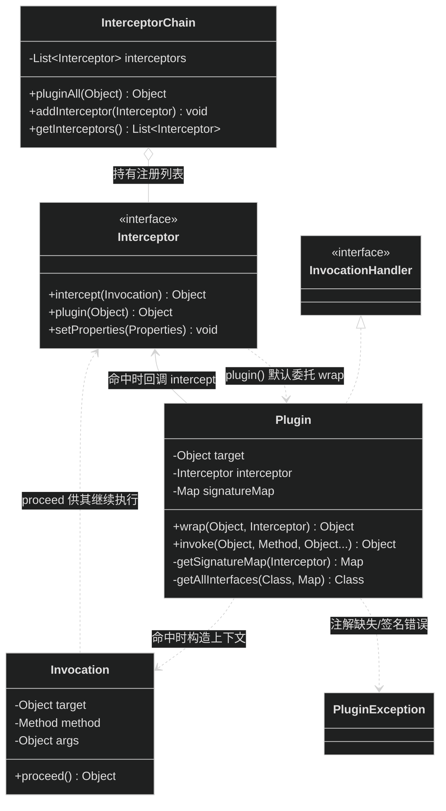
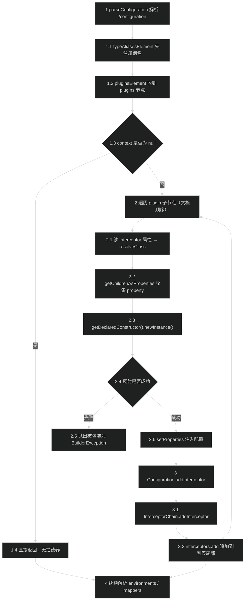
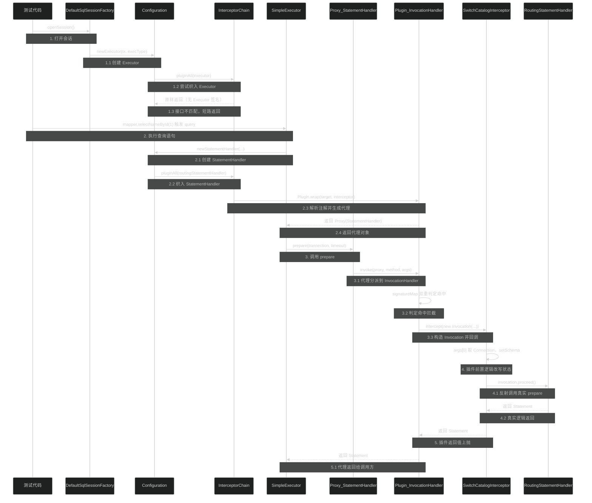

# 源码分析：插件织入机制

> 上次修改：2026-07-29 23:24

## 阅读向导

**面向读者**

| 读者类型 | 关注重点 | 建议阅读顺序 |
|----------|----------|--------------|
| 扩展开发者（要写分页/多租户/审计插件） | 织入点在哪、能改什么、改了会影响谁 | §1 → §4.2 → §4.3 → §5 → §8 |
| 排障者（"我的插件为什么不生效"） | `getAllInterfaces` 的接口筛选、四个工厂方法的调用时机 | §4.2.3 → §5.2 → §5.3 → §8 |
| 代码审查者 / 架构评估者 | 洋葱包装的顺序语义、代理模式的取舍 | §4.2.2 → §6 → §7 |
| 新接手 MyBatis 内核的开发者 | 从注册到调用的完整链路 | 按序通读 |

**阅读前建议先了解的文档**

- [插件与拦截器（plugin）](插件与拦截器（plugin）.md)：`plugin` 包的模块级职责、依赖图、文件清单。本文假定读者已知道包内有哪 7 个类，不再重复模块级介绍。
- [会话与配置核心（session）](会话与配置核心（session）.md)：`Configuration` 作为全局配置容器的定位，以及 `openSession` 的整体流程。本文只截取与 `pluginAll` 相关的四个工厂方法。
- [执行器与结果处理（executor）](执行器与结果处理（executor）.md)：`Executor` / `StatementHandler` / `ParameterHandler` / `ResultSetHandler` 四大对象各自的职责与协作关系。本文只关心它们"何时被 new 出来、被谁包装"。

**本文与模块文档的分工**：模块文档回答"这个包是什么、有哪些类"；本文回答"**一个 `Interceptor` 实例，从 XML 里的一行配置，怎样一步步变成运行时套在四大对象外面的代理层，以及一次方法调用怎样层层穿透这些代理**"。因此本文全部分析绑定到具体行号，并对顺序语义、短路条件、异常解包等易错点做逐行推导。

## 1. 分析范围与目标

### 涵盖范围

| 阶段 | 涵盖的源码 |
|------|-----------|
| 注册期 | `XMLConfigBuilder.pluginsElement`（`XMLConfigBuilder.java:198-209`）、`Configuration.addInterceptor`（`Configuration.java:930-932`）、`InterceptorChain.addInterceptor`（`InterceptorChain.java:35-37`）、`InterceptorChain.getInterceptors`（`InterceptorChain.java:39-41`） |
| 织入期 | `InterceptorChain.pluginAll`（`InterceptorChain.java:28-33`）、`Interceptor.plugin` 默认实现（`Interceptor.java:27-29`）、`Plugin.wrap`（`Plugin.java:43-51`）、`Plugin.getSignatureMap`（`Plugin.java:66-86`）、`Plugin.getAllInterfaces`（`Plugin.java:88-99`）、`Configuration` 四个工厂方法（`Configuration.java:710-749`） |
| 调用期 | `Plugin.invoke`（`Plugin.java:53-64`）、`Invocation` 构造器与 `proceed`（`Invocation.java:39-62`）、`ExceptionUtil.unwrapThrowable`（`ExceptionUtil.java:30-41`） |
| 声明语法 | `@Intercepts`（`Intercepts.java:44-54`）、`@Signature`（`Signature.java:30-54`）、`Interceptor` SPI（`Interceptor.java:23-35`）、`PluginException`（`PluginException.java:23-41`） |
| 佐证用例 | `PluginTest`（`src/test/java/org/apache/ibatis/plugin/PluginTest.java`）、`ExamplePlugin`（`src/test/java/org/apache/ibatis/builder/ExamplePlugin.java`）、`XmlConfigBuilderTest.java:241-243` |

### 不涵盖范围

- 四大对象自身的业务实现（SQL 生成、参数绑定、结果映射），见 [执行器与结果处理（executor）](执行器与结果处理（executor）.md)。
- `MapperProxy` 的动态代理（那是 Mapper 接口绑定机制，与插件机制共用 JDK Proxy 但互不相关），见 [核心源码分析-Mapper接口代理与方法分派](核心源码分析-Mapper接口代理与方法分派.md)。
- Spring/Spring Boot 集成中拦截器的自动注册（不在本仓库内）。
- 具体分页插件（如 PageHelper）的实现（第三方库），本文只从源码推导"插件能做到什么、边界在哪"。

### 分析目标

1. **准确回答"注册顺序与执行顺序的关系"**：这是插件机制最容易被记反的一点，本文从 `pluginAll` 的循环赋值逐步展开代理嵌套结构，给出可验证的结论。
2. **说清"只有四类对象可被拦截"是被什么强制的**：区分"物理限制"（`pluginAll` 只在四处被调用）与"语义校验"（`Invocation` 构造器白名单）。
3. **定位插件不生效的所有源码级原因**：注解缺失、签名写错、接口不匹配、目标不是从工厂方法出来的、被内层代理裁剪了接口。
4. **评估设计取舍与风险**：代理模式 vs 字节码增强、责任链 vs 装饰器、注解驱动 vs 编程式注册。

## 2. 核心类/函数全景

| 名称 | 职责 | 关键方法 / 字段 | 代码位置 |
|------|------|-----------------|----------|
| `Interceptor` | 拦截器 SPI。一个必需方法 + 两个 default 方法，是"最小接口 + 默认实现"的典型 | `intercept(Invocation)` 必需；`plugin(Object)` default 委托 `Plugin.wrap`；`setProperties(Properties)` default NOP | `src/main/java/org/apache/ibatis/plugin/Interceptor.java:23-35` |
| `@Intercepts` | 类级注解，声明该拦截器要拦哪些方法。`RUNTIME` 保留，`TYPE` 目标 | `Signature[] value()` | `src/main/java/org/apache/ibatis/plugin/Intercepts.java:44-54` |
| `@Signature` | 单条方法签名声明。`@Target({})` 意味着它**只能**作为 `@Intercepts` 的成员使用，不能独立标注 | `type()` / `method()` / `args()` | `src/main/java/org/apache/ibatis/plugin/Signature.java:30-54` |
| `InterceptorChain` | 拦截器注册表 + 织入驱动。全包最短的类（43 行） | `interceptors` 私有 `ArrayList`；`pluginAll(Object)`；`addInterceptor`；`getInterceptors()` 返回 `List.copyOf` 不可变副本 | `src/main/java/org/apache/ibatis/plugin/InterceptorChain.java:24-43` |
| `Plugin` | **唯一织入现场**。同时扮演静态工厂（`wrap`）和 `InvocationHandler`（`invoke`）两个角色 | `wrap` / `invoke` / `getSignatureMap` / `getAllInterfaces`；三个 `final` 字段 `target`、`interceptor`、`signatureMap` | `src/main/java/org/apache/ibatis/plugin/Plugin.java:31-101` |
| `Invocation` | 被拦截调用的上下文三元组 + 继续执行的出口 + 四大对象白名单 | `targetClasses` 静态白名单；`getTarget/getMethod/getArgs`；`proceed()` | `src/main/java/org/apache/ibatis/plugin/Invocation.java:31-64` |
| `PluginException` | 插件专属异常，继承 `PersistenceException`（进而是 `RuntimeException`），因此**不需要声明抛出** | 四个构造器 | `src/main/java/org/apache/ibatis/plugin/PluginException.java:23-41` |
| `Configuration`（相关部分） | 四个工厂方法是 `pluginAll` 的全部调用点；`addInterceptor` 是注册转发点 | `newParameterHandler:710-715`；`newResultSetHandler:717-722`；`newStatementHandler:724-729`；`newExecutor:731-749`；`addInterceptor:930-932`；`interceptorChain` 字段 `:153` | `src/main/java/org/apache/ibatis/session/Configuration.java` |
| `XMLConfigBuilder.pluginsElement` | XML 注册入口：反射无参构造 → `setProperties` → `addInterceptor` | 单方法，12 行 | `src/main/java/org/apache/ibatis/builder/xml/XMLConfigBuilder.java:198-209` |
| `ExceptionUtil.unwrapThrowable` | 死循环剥壳工具，处理 `InvocationTargetException` / `UndeclaredThrowableException` 嵌套 | `while(true)` + 两个 `instanceof` 分支 | `src/main/java/org/apache/ibatis/reflection/ExceptionUtil.java:30-41` |

### 角色划分图



图中三条关键依赖：`Interceptor.plugin` 默认实现指向 `Plugin.wrap`（把织入细节从 SPI 中隐藏）；`Plugin` 实现 `InvocationHandler` 从而成为 JDK 代理的分派中心；`Invocation` 是 `Plugin` 与用户代码之间唯一的数据契约。注意 `InterceptorChain` **不认识** `Plugin`——它只调用 `interceptor.plugin(target)`，织入方式完全由拦截器自己决定，这为"自定义织入策略"留了口子（见 §6.4）。

## 3. 关键数据结构

### 3.1 `InterceptorChain.interceptors` —— `List<Interceptor>`

```java
// InterceptorChain.java:26
private final List<Interceptor> interceptors = new ArrayList<>();
```

| 维度 | 说明 |
|------|------|
| 字段含义 | 全局唯一的拦截器注册表，与 `Configuration` 同生命周期（`Configuration.java:153` 声明为 `final`，随 `Configuration` 构造即创建） |
| 为什么是 `List` 而不是 `Set`/`Map` | **顺序即语义**。插件的嵌套层次完全由 `List` 的迭代顺序决定（`pluginAll` 的 `for` 循环，`InterceptorChain.java:29`）。用 `Set` 会丢失顺序，用 `Map` 需要额外的 key 且无法表达重复注册同类拦截器 |
| 是否允许重复 | 允许。`addInterceptor` 只做 `interceptors.add(...)`（`InterceptorChain.java:36`），没有去重、没有 key 冲突检查。同一个拦截器类注册两次会产生**两层代理**，`intercept` 被调用两次 |
| 生命周期 | 启动期写（`pluginsElement` 遍历 XML 子节点顺序 add）、运行期只读（`pluginAll` 只迭代不修改） |
| 并发安全 | `ArrayList` 非线程安全。当前使用模式下安全的前提是"配置阶段单线程完成，之后不再写入"。**如果运行期调用 `addInterceptor`（API 是 `public` 的，`Configuration.java:930`），与正在执行的 `pluginAll` 迭代会构成数据竞争**，详见 §8.2 |
| 对外暴露 | `getInterceptors()` 返回 `List.copyOf(interceptors)`（`InterceptorChain.java:40`），是**不可变快照**，调用方无法通过返回值篡改注册表——这是一个刻意的防御性设计 |

### 3.2 `Plugin.signatureMap` —— `Map<Class<?>, Set<Method>>`

```java
// Plugin.java:35
private final Map<Class<?>, Set<Method>> signatureMap;
```

这是本机制中**设计理由最值得推敲**的数据结构。

| 维度 | 说明 |
|------|------|
| 结构语义 | key = `@Signature.type()` 声明的接口类型（如 `StatementHandler.class`）；value = 该接口上被声明拦截的 `Method` 对象集合 |
| 构造时机 | `Plugin.wrap` 第一行 `getSignatureMap(interceptor)`（`Plugin.java:44`），即**每次 wrap 都重新构造一次**（无缓存，见 §7.1） |
| 实现类型 | `HashMap` + `HashSet`（`Plugin.java:74,76`） |
| **为什么用 `Map` 而不是 `List<Method>`** | 因为它要服务**两个完全不同的查询**：①`getAllInterfaces` 需要按"接口类型"判断是否匹配（`signatureMap.containsKey(c)`，`Plugin.java:92`）——这是 O(1) 的 key 查找；②`invoke` 需要按 `method.getDeclaringClass()` 先缩小范围再判断方法（`Plugin.java:56-57`）。若用扁平 `List<Method>`，①需要遍历全部方法取 `getDeclaringClass` 去重，②在每次方法调用时都要线性扫描。以"接口类型"为一级索引，正好把两个高频查询都降到常数级 |
| **为什么 value 用 `Set` 而不是 `List`** | `invoke` 里做的是 `methods.contains(method)`（`Plugin.java:57`）——存在性判断。`HashSet.contains` 是 O(1)，`ArrayList.contains` 是 O(n)。这条路径是**每次被代理方法调用都要走**的热路径，常数级查找是必要的 |
| `Method` 作为 `Set` 元素是否可靠 | 可靠但有前提。`Method.equals` 比较声明类、方法名、返回类型和参数类型；`hashCode` 由声明类名与方法名异或得到。因为 `getSignatureMap` 用 `sig.type().getMethod(...)`（`Plugin.java:78`）取的是**接口上声明的 `Method`**，而 `invoke` 收到的 `method` 参数由 JDK 代理传入，也是**接口上的 `Method`**，两者 `getDeclaringClass()` 一致，故 `contains` 能命中。**若插件把 `type` 写成实现类（如 `PreparedStatementHandler.class`）而非接口，`containsKey` 在 `getAllInterfaces` 里就匹配不上，代理根本不会生成**——这是"插件不生效"的头号原因 |
| 不可变性 | 字段 `final`，且 `Plugin` 实例私有构造（`Plugin.java:37`），Map 引用不会被替换。但 Map 内容本身未做 `unmodifiable` 包装，理论上仍可被反射修改（实践中无人这么做） |

### 3.3 `Invocation` 三元组与静态白名单

```java
// Invocation.java:33-37
private static final List<Class<?>> targetClasses = Arrays.asList(Executor.class, ParameterHandler.class,
    ResultSetHandler.class, StatementHandler.class);
private final Object target;
private final Method method;
private final Object[] args;
```

| 字段 | 含义 | 生命周期 | 关键特性 |
|------|------|----------|----------|
| `targetClasses` | 四大对象白名单，`static final` 的 `Arrays.asList`（定长不可增删，但元素理论可 `set`） | 类加载时一次性初始化 | 这是"MyBatis 只能拦截四类对象"在代码中**唯一的强制断言点**（`Invocation.java:40-42`）。注意它是 `List` 而非 `Set`——只有 4 个元素，线性扫描比哈希更快，且每次拦截只查一次，不是热点 |
| `target` | **原始被代理对象**，不是外层代理 | 与本次方法调用同生命周期 | 由 `Plugin` 构造时传入 `this.target`（`Plugin.java:58`），即当前这一层 `Plugin` 持有的 target |
| `method` | 接口上的 `Method` 对象 | 同上 | 由 JDK 代理透传，`getDeclaringClass()` 必为接口 |
| `args` | 实参数组引用 | 同上 | **可变**且被 `proceed()` 直接复用（`Invocation.java:61`）。这是插件能改写调用参数的唯一物理基础，见 §3.4 |

`targetClasses` 的校验在**构造器**里执行（`Invocation.java:40`），这意味着：只有当某个方法**已经命中 signatureMap** 时才会走到这里（`Plugin.java:57-58`）。因此白名单是"运行时事后拒绝"而非"启动时前置拒绝"——`PluginTest.shouldPluginNotInvokeArbitraryMethod`（`PluginTest.java:89-103`）正是固化这个行为：把 `@Signature(type = Map.class, method = "get", ...)` 的插件套到 `HashMap` 上，`plugin()` 调用成功、代理正常生成，直到真的调用 `map.get("Anything")` 才抛出 `IllegalArgumentException`，且异常消息把完整方法签名打了出来。

### 3.4 `args` 数组的共享语义（插件改写能力的根源）

`Invocation` 构造时只做引用赋值（`Invocation.java:45`：`this.args = args;`），没有 `clone()`；`proceed()` 又把同一个引用交给 `method.invoke(target, args)`（`Invocation.java:61`）。而这个数组最初来自 JDK 代理传给 `Plugin.invoke` 的 `args` 形参（`Plugin.java:54`）。

因此形成一条**贯通的可变引用链**：

```text
JDK Proxy 生成的 args[]  →  Plugin.invoke(proxy, method, args)
                         →  new Invocation(target, method, args)   [引用共享，无拷贝]
                         →  用户 intercept 中 invocation.getArgs()[i] = 新值
                         →  proceed() → method.invoke(target, args) [改动生效]
```

分页插件正是依赖这条链：拦截 `StatementHandler.prepare` 或 `Executor.query`，在 `intercept` 中取出 `args` 里的 `MappedStatement` / `BoundSql` / `RowBounds`，改写 SQL 或替换参数元素，再 `proceed()`。

- **好处**：零拷贝、零额外 API，插件获得了最大的改写自由度（连 `Connection`、`Statement` 这类 JDBC 对象都能替换）。`PluginTest.SwitchCatalogInterceptor`（`PluginTest.java:78-87`）就是最小示例——它不改数组，而是取出 `args[0]` 的 `Connection` 后调用 `con.setSchema(...)`，改的是参数对象的**内部状态**。
- **替代方案**：①把 `args` 做防御性拷贝，插件的修改需通过显式 `setArgs` 提交——能防误改，但会破坏"改参数对象内部状态"这类用法且增加每次调用的拷贝开销；②提供类型安全的 `InvocationContext`（如 `getMappedStatement()`），但会把 `plugin` 包与 `mapping`/`executor` 包强耦合，破坏当前"`Invocation` 只依赖四个接口类型"的轻量依赖。
- **风险**：无任何越界或类型校验。插件把 `args[0]` 换成类型不兼容的对象，错误直到 `method.invoke` 反射调用时才以 `IllegalArgumentException` 暴露，且异常信息不会指出是哪个插件改坏的；多插件同时改写同一 `args` 时后写覆盖先写，无冲突检测。

## 4. 主线流程逐行解读

本章按"注册 → 织入 → 调用"三个阶段推进，每段给出行号、做了什么、为什么这样做、状态变化。

### 4.1 阶段一：注册期（配置解析）

#### 4.1.1 `<plugins>` 在配置解析中的位置

```java
// XMLConfigBuilder.java:114-135（节选）
private void parseConfiguration(XNode root) {
  try {
    propertiesElement(root.evalNode("properties"));            // 117
    Properties settings = settingsAsProperties(...);           // 118
    loadCustomVfsImpl(settings);                               // 119
    loadCustomLogImpl(settings);                               // 120
    typeAliasesElement(root.evalNode("typeAliases"));          // 121
    pluginsElement(root.evalNode("plugins"));                  // 122  ← 插件在这里注册
    objectFactoryElement(root.evalNode("objectFactory"));      // 123
    ...
    environmentsElement(root.evalNode("environments"));        // 128
    ...
    mappersElement(root.evalNode("mappers"));                  // 131
  } catch (Exception e) {
    throw new BuilderException("Error parsing SQL Mapper Configuration. Cause: " + e, e);  // 133
  }
}
```

**顺序的三个含义**（均可从行号直接推出）：

1. **在 `typeAliases`（121 行）之后**：因此 `<plugin interceptor="...">` 的值可以写类型别名，而不必是全限定名——`resolveClass` 会查 `typeAliasRegistry`。
2. **在 `environments`（128 行）与 `mappers`（131 行）之前**：拦截器实例化时 `Configuration` 里还**没有** `Environment`、没有任何 `MappedStatement`。所以拦截器的构造器和 `setProperties` 中**不能**依赖这些配置；只能在 `intercept` 运行时通过 `invocation` 拿到。
3. **整个方法被 `try/catch(Exception)` 包裹（132-134 行）**：拦截器构造失败（类找不到、无无参构造、`setProperties` 抛异常）都会被统一转成 `BuilderException`，原始异常作为 `cause`。这意味着插件的配置错误在**启动阶段就 fail-fast**，不会拖到运行期。

#### 4.1.2 `pluginsElement` 逐行

```java
// XMLConfigBuilder.java:198-209
private void pluginsElement(XNode context) throws Exception {
  if (context != null) {                                                        // 199
    for (XNode child : context.getChildren()) {                                 // 200
      String interceptor = child.getStringAttribute("interceptor");             // 201
      Properties properties = child.getChildrenAsProperties();                  // 202
      Interceptor interceptorInstance = (Interceptor) resolveClass(interceptor) // 203
          .getDeclaredConstructor().newInstance();                              // 204
      interceptorInstance.setProperties(properties);                            // 205
      configuration.addInterceptor(interceptorInstance);                        // 206
    }
  }
}
```

- **199 行 `context != null`**：`<plugins>` 是可选节点，缺失时 `evalNode` 返回 `null`，方法直接空转。输入：可能为 null 的 `XNode`；输出：无（副作用写入 `Configuration`）。
- **200 行 `getChildren()`**：返回的是 DOM 子节点的**文档顺序**列表。这一行是"注册顺序 = XML 书写顺序"的源头，进而决定了后续代理嵌套层次（§4.2.2）。
- **201-202 行**：读 `interceptor` 属性得到类名；`getChildrenAsProperties()` 把 `<property name= value=>` 子节点收成 `Properties`。若无 `<property>`，得到**空 `Properties` 而非 null**——所以 `setProperties` 实现中不必判空。
- **203-204 行 `getDeclaredConstructor().newInstance()`**：硬要求**无参构造函数**。用 `getDeclaredConstructor` 而非 `getConstructor`，意味着构造器可以是非 public（会触发 `setAccessible` 相关的可访问性检查，同包/开放模块下可行）；但**不支持带参构造、不支持工厂方法、不支持从 IoC 容器取实例**。这也解释了为什么 Spring 集成要走 `Configuration.addInterceptor` 编程式路径而不是 XML。
- **205 行 `setProperties(properties)`**：由于 `Interceptor.setProperties` 是 default NOP（`Interceptor.java:31-33`），不实现它的拦截器这一行是空操作。`ExamplePlugin`（`ExamplePlugin.java:39-42`）覆写它把 `Properties` 存下来，`XmlConfigBuilderTest.java:241-243` 断言 `pluginProperty=100` 被正确注入——这是"配置注入确实生效"的直接证据。
- **206 行 `addInterceptor`**：状态变化的落点。转发链是 `Configuration.addInterceptor`（`Configuration.java:930-932`）→ `interceptorChain.addInterceptor`（`InterceptorChain.java:35-37`）→ `interceptors.add(...)`。三层转发没有任何加工，纯粹是封装层次：`Configuration` 对外隐藏 `InterceptorChain` 的存在。

#### 4.1.3 注册期流程图



1-1.4 前置与短路：`parseConfiguration` 按固定次序推进，`typeAliases` 先于 `plugins`，使插件类名可用别名书写；`pluginsElement` 拿到 `<plugins>` 节点后先判空，节点缺失即返回，此时 `interceptors` 保持空列表，后续所有 `pluginAll` 都会原样返回目标对象（零开销）。

2-2.6 逐个实例化：按 XML 文档顺序遍历 `<plugin>`，每个都要经历"解析类名 → 收集属性 → 无参反射构造 → 注入属性"四步。反射失败（类不存在、无无参构造、构造器抛异常）会向上冒泡，被 `parseConfiguration` 的 `catch` 统一包装成 `BuilderException`，配置错误在启动期暴露而非运行期。

3-3.2 追加到注册表：`Configuration.addInterceptor` 是纯转发，最终 `ArrayList.add` 追加到**列表尾部**。这一步确立了"XML 书写顺序 = List 索引顺序"的等价关系，是理解 §4.2.2 嵌套顺序的前提。

4 后续解析：插件注册完毕后才解析 `environments` 与 `mappers`，因此拦截器实例在构造与 `setProperties` 期间看不到数据源与映射语句。

### 4.2 阶段二：织入期（代理生成）

#### 4.2.1 四个织入点与时机差异

`interceptorChain.pluginAll(...)` 在整个 `src/main` 中**只出现 4 次**，全部集中在 `Configuration` 的四个工厂方法里：

```java
// Configuration.java:710-715
public ParameterHandler newParameterHandler(MappedStatement mappedStatement, Object parameterObject,
    BoundSql boundSql) {
  ParameterHandler parameterHandler = mappedStatement.getLang().createParameterHandler(mappedStatement,
      parameterObject, boundSql);
  return (ParameterHandler) interceptorChain.pluginAll(parameterHandler);   // 714
}

// Configuration.java:717-722
public ResultSetHandler newResultSetHandler(...) {
  ResultSetHandler resultSetHandler = new DefaultResultSetHandler(executor, mappedStatement, parameterHandler,
      resultHandler, boundSql, rowBounds);
  return (ResultSetHandler) interceptorChain.pluginAll(resultSetHandler);   // 721
}

// Configuration.java:724-729
public StatementHandler newStatementHandler(...) {
  StatementHandler statementHandler = new RoutingStatementHandler(executor, mappedStatement, parameterObject,
      rowBounds, resultHandler, boundSql);
  return (StatementHandler) interceptorChain.pluginAll(statementHandler);   // 728
}

// Configuration.java:735-749
public Executor newExecutor(Transaction transaction, ExecutorType executorType) {
  executorType = executorType == null ? defaultExecutorType : executorType;  // 736
  Executor executor;
  if (ExecutorType.BATCH == executorType) {        // 738
    executor = new BatchExecutor(this, transaction);
  } else if (ExecutorType.REUSE == executorType) { // 740
    executor = new ReuseExecutor(this, transaction);
  } else {
    executor = new SimpleExecutor(this, transaction);
  }
  if (cacheEnabled) {                             // 745
    executor = new CachingExecutor(executor);
  }
  return (Executor) interceptorChain.pluginAll(executor);                    // 748
}
```

**为什么只有这四类对象可被拦截**——需要区分两个层面：

| 层面 | 机制 | 源码位置 |
|------|------|----------|
| 物理限制（决定性的） | `pluginAll` 只在这四个方法里被调用。其他任何对象（`SqlSession`、`MapperProxy`、`TypeHandler`、`Transaction`、`Cache`）在创建时**根本没有经过** `pluginAll`，因此不可能被包装 | `Configuration.java:714,721,728,748` |
| 语义校验（防御性的） | 即使用户绕过框架，手动 `interceptor.plugin(someObject)` 造出代理，`Invocation` 构造器的白名单也会在方法真正被拦截时抛 `IllegalArgumentException` | `Invocation.java:33-34,40-42` |

换句话说：**"四大对象"不是由 `plugin` 包定义的，而是由 `Configuration` 选择在哪四个地方调用 `pluginAll` 决定的**；`Invocation` 的白名单只是把这个约定在语义上补齐，防止误用。

**四类对象的织入时机差异**（这是排障时最关键的信息）：

| 对象 | 创建/织入时机 | 每次会话/语句的织入次数 | 依据 |
|------|---------------|------------------------|------|
| `Executor` | **打开会话时一次** | 每个 `SqlSession` 一次 | `DefaultSqlSessionFactory.openSessionFromDataSource:101` 与 `openSessionFromConnection:124` 调用 `configuration.newExecutor(tx, execType)`；该 Executor 随后被 `DefaultSqlSession` 持有直到 `close()` |
| `StatementHandler` | **每次语句执行时** | 每条 SQL 一次 | `SimpleExecutor.doUpdate:47`、`doQuery:61`、`doQueryCursor:74` 都在方法内新建；`ReuseExecutor`（`:49,58,68`）、`BatchExecutor`（`:56,88,104`）同理 |
| `ParameterHandler` | **每次创建 StatementHandler 时**（更内层） | 每条 SQL 一次 | `BaseStatementHandler` 构造器 `:70` 调用 `configuration.newParameterHandler(...)` |
| `ResultSetHandler` | **每次创建 StatementHandler 时** | 每条 SQL 一次 | `BaseStatementHandler` 构造器 `:71-72` 调用 `configuration.newResultSetHandler(...)` |

由此推出两条实用结论：

1. **Executor 插件的代理生成开销可忽略**（一次会话一次），但 `StatementHandler`/`ParameterHandler`/`ResultSetHandler` 插件的 `wrap` 是**每条 SQL 三次**（在同一次 `newStatementHandler` 调用中，`RoutingStatementHandler` 构造时会连带创建并织入 Parameter/ResultSet 两个 Handler），性能敏感（见 §7.1）。
2. **`Executor` 的织入点还有两处"隐藏入口"**：`ResultLoader.newExecutor:102`（延迟加载跨线程/Executor 已关闭时新建）和 `SelectKeyGenerator.processGeneratedKeys:66`（`<selectKey>` 用独立 Executor）。这两处都调用 `configuration.newExecutor(...)`，因此**同样会被 Executor 插件包装**。分页插件如果无条件改写所有 `Executor.query`，会误伤 `<selectKey>` 的主键查询和延迟加载查询。

同时注意 `newExecutor` 内部的**装饰顺序**（745-747 行）：`CachingExecutor` 先包住基础 Executor，**然后**才交给 `pluginAll`。所以插件代理永远在 `CachingExecutor` 的**外面**，插件能拦到二级缓存判断之前的调用。若 `cacheEnabled=false`，插件直接包裹 `SimpleExecutor`/`ReuseExecutor`/`BatchExecutor`。

#### 4.2.2 `pluginAll` 的洋葱式包装与顺序反转（核心推导）

```java
// InterceptorChain.java:28-33
public Object pluginAll(Object target) {
  for (Interceptor interceptor : interceptors) {   // 29
    target = interceptor.plugin(target);           // 30  ← 循环赋值，累积包装
  }
  return target;                                   // 32
}
```

第 30 行是整个机制里信息密度最高的一行。**`target` 变量在循环中被反复覆盖**：每次迭代的输入是上一次迭代的输出。

设注册顺序为 `A`（索引 0）、`B`（索引 1）、`C`（索引 2），原始对象为 `O`，则逐轮状态为：

| 迭代轮次 | 语句 | 循环后 `target` 的值 |
|----------|------|---------------------|
| 初始 | — | `O` |
| 第 1 轮（A） | `target = A.plugin(O)` | `Proxy_A(O)` |
| 第 2 轮（B） | `target = B.plugin(Proxy_A(O))` | `Proxy_B(Proxy_A(O))` |
| 第 3 轮（C） | `target = C.plugin(Proxy_B(...))` | `Proxy_C(Proxy_B(Proxy_A(O)))` |

**结论（务必记准）**：

- **最先注册的 A 在最内层**（离原始对象 `O` 最近）；**最后注册的 C 在最外层**。
- 调用者拿到的是 `Proxy_C`，所以一次方法调用的进入顺序是 **C → B → A → O**，即**与注册顺序相反**。
- 每个插件 `intercept` 中"前置逻辑"的执行顺序是 C、B、A；"后置逻辑"（`proceed()` 之后的代码）的执行顺序是 A、B、C。

这个反转关系可以从代码直接验证，不需要运行：`Plugin.wrap` 把传入的 `target` 存为自己的 `this.target`（`Plugin.java:37-41`），而 `Plugin.invoke` 未命中时调 `method.invoke(target, args)`（`Plugin.java:60`）、命中时把同一个 `target` 交给 `Invocation`（`Plugin.java:58`）。所以"内层"就是"被外层持有为 target 的那个对象"，A 被 B 持有、B 被 C 持有，调用必然从 C 开始向内传递。

```mermaid
%%{init: {"theme": "dark"}}%%
flowchart LR
  subgraph REG["注册期：List 顺序"]
    1["1 A 注册（index 0）"] --> 2["2 B 注册（index 1）"]
    2 --> 3["3 C 注册（index 2）"]
  end
  subgraph WRAP["织入期：pluginAll 循环累积"]
    4["4 target = A.plugin(O) → Proxy_A"] --> 5["5 target = B.plugin(Proxy_A) → Proxy_B"]
    5 --> 6["6 target = C.plugin(Proxy_B) → Proxy_C（返回值）"]
  end
  subgraph CALL["调用期：由外向内穿透"]
    7["7 调用方持有 Proxy_C"] --> 7.1["7.1 C.intercept 前置"]
    7.1 --> 7.2["7.2 proceed → Proxy_B"]
    7.2 --> 7.3["7.3 B.intercept 前置"]
    7.3 --> 7.4["7.4 proceed → Proxy_A"]
    7.4 --> 7.5["7.5 A.intercept 前置"]
    7.5 --> 8["8 proceed → 原始对象 O 真实方法"]
    8 --> 8.1["8.1 A 后置 → B 后置 → C 后置"]
  end
  3 --> 4
  6 --> 7
```



1-3 注册累积：`pluginsElement` 按 XML 文档顺序依次 `add`，A、B、C 在 `ArrayList` 中占据索引 0/1/2。此阶段不产生任何代理对象，仅记录顺序。

4-6 洋葱包装：`pluginAll` 的 `for` 循环按索引升序执行 `target = interceptor.plugin(target)`。由于每轮都用上一轮结果作为输入，先注册者被包在里面，最后注册者成为最外层壳，方法返回值是最外层代理 `Proxy_C`。若某个插件的 `signatureMap` 与当前 `target` 不匹配，该轮 `plugin` 原样返回输入（`Plugin.java:50`），该层被跳过、不产生嵌套。

7-8.1 反向穿透：调用方（`SqlSession`、`Executor` 等）只持有 `Proxy_C`。方法调用先进最外层 C，`proceed()` 打到 C 持有的 target 即 `Proxy_B`，再进 B、A，最后到原始对象 `O` 执行真实逻辑；返回时按 A→B→C 的顺序执行各插件 `proceed()` 之后的后置代码，形成完整的"洋葱穿透"。

#### 4.2.3 `Plugin.wrap` 逐行

```java
// Plugin.java:43-51
public static Object wrap(Object target, Interceptor interceptor) {
  Map<Class<?>, Set<Method>> signatureMap = getSignatureMap(interceptor);   // 44
  Class<?> type = target.getClass();                                        // 45
  Class<?>[] interfaces = getAllInterfaces(type, signatureMap);             // 46
  if (interfaces.length > 0) {                                              // 47
    return Proxy.newProxyInstance(type.getClassLoader(), interfaces, new Plugin(target, interceptor, signatureMap));  // 48
  }
  return target;                                                            // 50
}
```

- **44 行**：解析注解得到 `signatureMap`。注意它在 `wrap` **最开头**执行，即使最终不匹配（走 50 行）也已经付出了完整的注解解析 + 反射查方法开销。这是 §7.1 的性能焦点。
- **45 行 `target.getClass()`**：取**运行时实际类**。当 `target` 已经是上一层的 `Proxy` 时，这里得到的是 JVM 生成的 `$ProxyN` 类——它的 `getInterfaces()` 只包含**上一层 `getAllInterfaces` 筛出来的那些接口**。这直接导致 §5.3 的接口裁剪问题。
- **46-47 行**：`getAllInterfaces` 返回匹配到的接口数组，`length > 0` 是唯一的织入条件。
- **48 行 `Proxy.newProxyInstance`**：三个参数各有讲究。ClassLoader 用 `type.getClassLoader()`（目标类的加载器，保证接口可见）；接口数组只含**匹配到的接口**（不是目标的全部接口，见下）；`InvocationHandler` 是新建的 `Plugin` 实例，三个字段全部 `final`，实例不可变，可安全地被多线程持有。
- **50 行 `return target`（关键短路优化）**：不匹配时**原样返回未包装的对象**。这条路径保证了"一个只拦 `Executor` 的插件，对 `StatementHandler`/`ParameterHandler`/`ResultSetHandler` 三类对象**完全零运行时开销**"——它们不会被套上任何代理，方法调用是直接的虚方法分派，没有反射、没有 `invoke` 分派。这是 MyBatis 插件机制"按需付费"的核心保障，也是设计上最优雅的一笔。

#### 4.2.4 `getSignatureMap` 逐行

```java
// Plugin.java:66-86
private static Map<Class<?>, Set<Method>> getSignatureMap(Interceptor interceptor) {
  Intercepts interceptsAnnotation = interceptor.getClass().getAnnotation(Intercepts.class);  // 67
  // issue #251
  if (interceptsAnnotation == null) {                                                        // 69
    throw new PluginException(
        "No @Intercepts annotation was found in interceptor " + interceptor.getClass().getName());  // 70-71
  }
  Signature[] sigs = interceptsAnnotation.value();                                           // 73
  Map<Class<?>, Set<Method>> signatureMap = new HashMap<>();                                 // 74
  for (Signature sig : sigs) {                                                               // 75
    Set<Method> methods = signatureMap.computeIfAbsent(sig.type(), k -> new HashSet<>());     // 76
    try {
      Method method = sig.type().getMethod(sig.method(), sig.args());                         // 78
      methods.add(method);                                                                    // 79
    } catch (NoSuchMethodException e) {                                                        // 80
      throw new PluginException("Could not find method on " + sig.type() + " named " + sig.method() + ". Cause: " + e, e);  // 81-82
    }
  }
  return signatureMap;                                                                        // 85
}
```

- **67 行**：`interceptor.getClass().getAnnotation(...)`。用运行时类而非声明类型，所以拦截器可以继承一个带 `@Intercepts` 的父类——但要注意 `@Intercepts` **没有 `@Inherited`**（`Intercepts.java:44-46` 只有 `@Documented`、`@Retention(RUNTIME)`、`@Target(TYPE)`），所以**注解不会被子类继承**，子类必须自己标注。
- **69-71 行（issue #251）**：注解缺失直接抛 `PluginException`。注释里的 issue 号说明这是后补的防御：早期版本注解缺失会导致 `NullPointerException`，错误信息完全无法定位。现在的消息带上了拦截器类名，可直接定位。因为 `PluginException` 继承 `PersistenceException` → `RuntimeException`（`PluginException.java:23`），不需要在签名上声明抛出。
- **73 行 `interceptsAnnotation.value()`**：可以是**空数组**。`ExamplePlugin` 就写的 `@Intercepts({})`（`ExamplePlugin.java:25`）——合法，但会得到空 `signatureMap`，进而 `getAllInterfaces` 返回空数组，`wrap` 走 50 行原样返回。所以 `ExamplePlugin` **实际上从不拦截任何东西**，它存在的目的只是验证配置解析与属性注入（`XmlConfigBuilderTest.java:241-243`）。这是一个容易被误读为"示例插件"的测试夹具。
- **76 行 `computeIfAbsent`**：同一个 `type` 声明多个方法时，复用同一个 `HashSet`。写法上比"先 get 再判空再 put"更紧凑，且避免了重复 put。
- **78 行 `sig.type().getMethod(sig.method(), sig.args())`**：**精确签名匹配**，不是模糊查找。三个隐含要求：①`type` 必须是**声明该方法的类型**（写成子接口/实现类时若方法非本类声明会找不到）；②`method` 名大小写敏感；③`args` 必须与形参类型**完全一致**，且顺序一致。`PluginTest.SwitchCatalogInterceptor` 的 `args = { Connection.class, Integer.class }`（`PluginTest.java:78`）就精确对应 `StatementHandler.prepare(Connection, Integer)`（`StatementHandler.java:33`）——注意是包装类型 `Integer` 而非 `int`，写错就会在启动时抛异常。
- **80-82 行 `NoSuchMethodException` → `PluginException`**：转成运行时异常并保留 `cause`。**关键价值是 fail-fast**：签名写错在**首次 `wrap` 时**就爆，而不是静默地永不命中。这比"配置错了但程序照常跑、只是插件不生效"要好得多。但要注意 fail-fast 的时点是**首次 wrap**（即首次 `openSession` 或首次执行语句），不是配置解析时——因为 `getSignatureMap` 只在 `wrap` 里被调用。

#### 4.2.5 `getAllInterfaces` 逐行

```java
// Plugin.java:88-99
private static Class<?>[] getAllInterfaces(Class<?> type, Map<Class<?>, Set<Method>> signatureMap) {
  Set<Class<?>> interfaces = new HashSet<>();     // 89
  while (type != null) {                          // 90
    for (Class<?> c : type.getInterfaces()) {     // 91
      if (signatureMap.containsKey(c)) {          // 92
        interfaces.add(c);                        // 93
      }
    }
    type = type.getSuperclass();                  // 96
  }
  return interfaces.toArray(new Class<?>[0]);     // 98
}
```

- **90/96 行的循环条件**：沿 `getSuperclass()` 向上走到 `null`（`Object.getSuperclass()` 返回 `null`），因此**父类实现的接口也能被找到**。这对 `StatementHandler` 尤为重要：`RoutingStatementHandler` 自己直接实现 `StatementHandler`（`RoutingStatementHandler.java:35`），而 `PreparedStatementHandler` 是通过 `BaseStatementHandler` 间接实现的——沿父类链向上遍历才能覆盖两种情况。
- **91 行 `type.getInterfaces()`**：只返回**该类直接声明**的接口，**不递归接口的父接口**。这是一个容易被忽略的限制：若 `@Signature.type` 写的是某个接口的**父接口**，而目标类只直接实现了子接口，`containsKey` 会匹配不上。当前四大对象都是单层接口，不受影响。
- **92 行 `signatureMap.containsKey(c)`**：**取交集**——只保留"目标实现了"且"插件声明了"的接口。这是全部筛选逻辑，O(1) 查找。
- **93 行 `HashSet.add`**：自动去重（多层类实现同一接口时只留一份）。
- **98 行 `toArray(new Class<?>[0])`**：零长度数组模板，JVM 对此有优化，比 `new Class<?>[interfaces.size()]` 更惯用。

**这一步的产物直接决定了代理的"能力面"**：`Proxy.newProxyInstance` 只用这个数组作为代理接口。因此代理对象**只实现被插件声明的接口**，不实现目标的其他接口——这是 §5.3 讨论的接口裁剪风险的根源。

### 4.3 阶段三：调用期（方法分派）

#### 4.3.1 `Plugin.invoke` 逐行

```java
// Plugin.java:53-64
@Override
public Object invoke(Object proxy, Method method, Object[] args) throws Throwable {
  try {
    Set<Method> methods = signatureMap.get(method.getDeclaringClass());   // 56
    if (methods != null && methods.contains(method)) {                    // 57
      return interceptor.intercept(new Invocation(target, method, args)); // 58
    }
    return method.invoke(target, args);                                   // 60
  } catch (Exception e) {                                                 // 61
    throw ExceptionUtil.unwrapThrowable(e);                               // 62
  }
}
```

- **54 行的 `proxy` 形参从未被使用**。这是刻意的：如果 `Plugin` 用 `proxy` 做后续调用会造成无限递归。所有内部调用都走 `target`（56-60 行）。
- **56 行 `signatureMap.get(method.getDeclaringClass())`**：一级索引查找。`method` 由 JDK 代理传入，其 `getDeclaringClass()` 是**声明该方法的接口**（因为代理只实现接口）。所以这里用接口类型做 key 与 `getSignatureMap` 中 `sig.type()` 的 key 语义一致。若 `signatureMap` 里没有这个接口，得到 `null`，走 60 行透传。
- **57 行双重判定 `methods != null && methods.contains(method)`**：第一个条件挡住"该接口完全没被声明"，第二个条件挡住"该接口被声明了但当前方法不在声明列表中"。例如插件只声明 `StatementHandler.prepare`，那么 `parameterize`、`update`、`query` 等方法都在这里落到 60 行直接透传。这个粒度控制到**方法级**，而 `getAllInterfaces` 的粒度是**接口级**——两级过滤配合，接口级决定"是否生成代理"，方法级决定"是否真的调 intercept"。
- **58 行 `interceptor.intercept(new Invocation(target, method, args))`**：命中路径。注意三点：①`Invocation` **每次调用都新建**（不复用、不池化），保证线程安全但产生短命对象（见 §7.2）；②传入的 `target` 是**本层持有的 target**，可能是下一层代理也可能是原始对象；③`intercept` 的返回值**直接作为被代理方法的返回值**，插件可以完全替换返回结果——`PluginTest.AlwaysMapPlugin.intercept` 就无条件返回 `"Always"`（`PluginTest.java:108-110`）。
- **60 行 `method.invoke(target, args)`（未命中透传）**：用**反射**调用，不是直接虚方法调用。这意味着即便某个方法不被拦截，只要它所在的接口被声明了（导致代理生成），该方法的每次调用都要付一次反射开销。例如插件只拦 `StatementHandler.prepare`，但 `parameterize`/`query` 也会因为代理存在而走反射——这是 §7.3 的性能要点。
- **61-62 行 `catch (Exception e)` + `unwrapThrowable`**：**捕获 `Exception` 而非 `Throwable`**。所以 `Error`（`OutOfMemoryError`、`StackOverflowError`）会直接穿透，不做解包——这是合理的，`Error` 不应被框架吞掉或改写。

#### 4.3.2 为什么必须 `unwrapThrowable`

```java
// ExceptionUtil.java:30-41
public static Throwable unwrapThrowable(Throwable wrapped) {
  Throwable unwrapped = wrapped;
  while (true) {                                                        // 32
    if (unwrapped instanceof InvocationTargetException) {                // 33
      unwrapped = ((InvocationTargetException) unwrapped).getTargetException();  // 34
    } else if (unwrapped instanceof UndeclaredThrowableException) {      // 35
      unwrapped = ((UndeclaredThrowableException) unwrapped).getUndeclaredThrowable();  // 36
    } else {
      return unwrapped;                                                 // 38
    }
  }
}
```

**问题的来源有两处**：

1. `method.invoke(target, args)`（`Plugin.java:60`）和 `Invocation.proceed()`（`Invocation.java:61`）都是**反射调用**。反射调用中被调方法抛出的任何异常都会被 JDK 包装成 `InvocationTargetException`。如果不解包，用户看到的将是 `InvocationTargetException` 而非真实的 `SQLException`/`PersistenceException`，`catch (SQLException e)` 之类的上层处理会全部失效。
2. `UndeclaredThrowableException`：当 `InvocationHandler.invoke` 抛出的受检异常没有在被代理接口方法上声明时，JDK 代理会把它包成 `UndeclaredThrowableException`。

**为什么用 `while(true)` 死循环而不是单次判断**：因为嵌套是**多层**的。多插件场景下，内层 `Plugin.invoke` 抛出的异常经过外层的 `method.invoke` 会**再被包一层** `InvocationTargetException`。层数与代理嵌套深度相关，无法预知，所以必须循环剥到底。循环终止性由 38 行保证——只要不是这两种包装类型就立即返回，而 `getTargetException()`/`getUndeclaredThrowable()` 每次都取出内层对象，不可能无限嵌套（除非有人恶意构造自引用异常，实践中不存在）。

**净效果**：无论代理嵌套多少层，业务代码 `catch` 到的都是最初抛出的那个真实异常。

#### 4.3.3 `Invocation` 构造与 `proceed`

```java
// Invocation.java:39-46
public Invocation(Object target, Method method, Object[] args) {
  if (!targetClasses.contains(method.getDeclaringClass())) {                                  // 40
    throw new IllegalArgumentException("Method '" + method + "' is not supported as a plugin target.");  // 41
  }
  this.target = target;                                                                       // 43
  this.method = method;                                                                       // 44
  this.args = args;                                                                           // 45
}

// Invocation.java:60-62
public Object proceed() throws InvocationTargetException, IllegalAccessException {
  return method.invoke(target, args);                                                         // 61
}
```

- **40-41 行白名单校验**：用 `method.getDeclaringClass()` 而非 `target.getClass()`——因为 `target` 可能是代理，其 `getClass()` 是 `$ProxyN`，不在白名单里。用声明类（接口）才能稳定匹配。异常类型选的是 `IllegalArgumentException` 而非 `PluginException`，语义上表示"调用方参数不合法"。
- **43-45 行**：三个纯赋值，`args` **不做拷贝**（§3.4）。
- **61 行 `proceed()` 的关键语义**：`method.invoke(target, args)` 打到的是**本层 `Plugin` 持有的 target**。这带来一个常被误解的点——**`proceed()` 不是"调用链上的下一个插件"，而是"调用我持有的那个对象的这个方法"**。之所以效果上等价于"进入下一层插件"，是因为在洋葱结构中"我持有的对象"恰好就是下一层代理（§4.2.2）。如果当前层是最内层，target 就是原始对象，`proceed()` 直接执行真实逻辑。

这个区别在两种情况下变得可见：

1. 如果插件**不调用** `proceed()`（如 `AlwaysMapPlugin`，`PluginTest.java:108-110` 直接返回 `"Always"`），则内层所有插件与原始方法**全部被跳过**——外层插件拥有完全的短路权。
2. `Invocation.getTarget()` 返回的是**本层的 target**（可能是代理），而不是原始对象。插件若想拿到"真正的" `RoutingStatementHandler` 以改写 `BoundSql`，在多插件嵌套时可能拿到的是另一层代理，需要用 `MetaObject` 递归剥离 `h`/`target` 字段——这是分页插件里那段"循环 `metaObject.hasGetter("h")` 剥壳"代码的由来。

#### 4.3.4 调用期完整时序

以"一个只拦 `StatementHandler.prepare` 的插件（`SwitchCatalogInterceptor`）"为例，追踪 `PluginTest.shouldPluginSwitchSchema`（`PluginTest.java:48-61`）的执行：



1-1.3 会话打开与 Executor 织入尝试：`openSession()` 触发 `DefaultSqlSessionFactory.openSessionFromDataSource:101` 调用 `configuration.newExecutor`，创建 `SimpleExecutor`（`cacheEnabled` 为真时还会套 `CachingExecutor`），随后交给 `pluginAll`。因为 `SwitchCatalogInterceptor` 的 `signatureMap` 只有 `StatementHandler` 一个 key，`getAllInterfaces` 在 Executor 的类继承链上找不到匹配接口，`Plugin.wrap:50` 原样返回未包装对象。**Executor 不产生任何代理，这是短路优化的直接体现**。

2-2.4 语句执行与 StatementHandler 织入：Mapper 方法调用最终落到 `SimpleExecutor.doQuery:61`，其中调用 `configuration.newStatementHandler(...)`。`RoutingStatementHandler` 构造完成后（其构造器内部还会连带创建并织入 `ParameterHandler`、`ResultSetHandler`，同样因不匹配而被短路），`pluginAll` 走 `Plugin.wrap`：`getSignatureMap` 解析出 `{StatementHandler → {prepare}}`，`getAllInterfaces` 在 `RoutingStatementHandler` 上匹配到 `StatementHandler`，`interfaces.length > 0` 成立，生成 JDK 代理返回。

3-3.3 方法分派与判定：`SimpleExecutor.prepareStatement:89` 调用 `handler.prepare(connection, timeout)`。代理把调用转到 `Plugin.invoke`，`signatureMap.get(StatementHandler.class)` 得到非空集合，`contains(prepare)` 命中，于是构造 `Invocation`（构造器白名单校验通过，因为 `StatementHandler` 在 `targetClasses` 中）并回调 `intercept`。

4-4.2 插件逻辑与继续执行：拦截器从 `invocation.getArgs()[0]` 取出 `Connection`，调用 `con.setSchema(SchemaHolder.get())` 切换数据库 schema（`PluginTest.java:82-84`），然后 `invocation.proceed()` 通过反射调用 `RoutingStatementHandler.prepare` 执行真实的 `Statement` 创建。注意此处插件改的是**参数对象的内部状态**，不是替换数组元素。

5-5.1 返回值回传：`proceed()` 的返回值被 `intercept` 原样返回（`PluginTest.java:85`），`Plugin.invoke` 把它作为代理方法的返回值交回 `SimpleExecutor`。整个过程中 Executor 层无代理、StatementHandler 层单层代理，一次调用只经过一次 `intercept`。

## 5. 分支与边界处理

### 5.1 织入判定的两级过滤

| 级别 | 判定位置 | 条件 | 命中结果 | 未命中结果 |
|------|----------|------|----------|-----------|
| 接口级 | `Plugin.wrap:47` | `getAllInterfaces` 返回数组非空 | 生成 JDK 代理 | **原样返回目标对象**，该插件对该类对象完全无开销 |
| 方法级 | `Plugin.invoke:57` | `methods != null && methods.contains(method)` | 构造 `Invocation` → `intercept` | `method.invoke(target, args)` **反射透传** |

两级过滤的**代价不对称**：接口级未命中是零成本（无代理），方法级未命中是有成本的（代理已存在，每次调用都要走 `invoke` + 反射）。这个不对称性决定了插件应当**尽量精确声明接口**——声明一个接口就要为该接口的**所有**方法付反射代价。

### 5.2 五种"插件不生效"的源码级原因

按排查顺序列出，每条给出定位手段：

| # | 原因 | 源码依据 | 现象 | 定位手段 |
|---|------|----------|------|----------|
| 1 | 缺 `@Intercepts` 注解 | `Plugin.java:69-71` | 抛 `PluginException: No @Intercepts annotation was found in interceptor X` | 异常消息直接给出类名。注意 `@Intercepts` 无 `@Inherited`，父类标注对子类无效 |
| 2 | `@Signature` 签名写错（方法名/参数类型/参数顺序） | `Plugin.java:78-83` | 抛 `PluginException: Could not find method on X named Y` | 异常消息给出接口与方法名。常见错误：`int` 写成 `Integer` 或反之、漏掉参数、`type` 写成实现类 |
| 3 | `@Intercepts({})` 空数组 | `Plugin.java:73` → `getAllInterfaces` 返回空 | **静默不生效**，无任何异常 | `ExamplePlugin.java:25` 就是这种情况。这是最危险的一类：完全没有报错 |
| 4 | `type` 写的是实现类而非接口 | `Plugin.java:92` `containsKey(c)` 只比较**直接实现的接口** | **静默不生效** | 检查 `@Signature.type` 是否是 `Executor`/`StatementHandler`/`ParameterHandler`/`ResultSetHandler` 四者之一 |
| 5 | 目标对象不是从四个工厂方法出来的 | `pluginAll` 只在 `Configuration.java:714,721,728,748` 被调用 | **静默不生效** | 确认要拦的对象是否经过 `newExecutor`/`newStatementHandler`/`newParameterHandler`/`newResultSetHandler`。例如想拦 `SqlSession`、`TypeHandler`、`Transaction` 都不可能生效 |

第 3、4、5 条都是**静默失败**，没有任何日志或异常。这是当前实现的一个明确缺口（见 §8.1）。

### 5.3 多插件嵌套时的接口裁剪风险

这是最隐蔽的边界问题，需要把 `wrap:45` 与 `getAllInterfaces:91` 连起来看。

**场景**：插件 A 声明 `@Signature(type = StatementHandler.class, ...)`，插件 B 声明 `@Signature(type = ParameterHandler.class, ...)`，按 A、B 顺序注册。当 `pluginAll` 处理一个 `RoutingStatementHandler` 时：

1. 第 1 轮（A）：`target.getClass()` = `RoutingStatementHandler`，它实现 `StatementHandler`，匹配，生成 `Proxy_A`。此时 `Proxy_A` **只实现 `StatementHandler` 一个接口**（`getAllInterfaces` 只返回了这一个）。
2. 第 2 轮（B）：`target.getClass()` = `$ProxyN`（A 的代理类），`getInterfaces()` 只有 `StatementHandler`，`signatureMap` 里只有 `ParameterHandler`，`containsKey` 不匹配 → 原样返回 `Proxy_A`。B 未织入（本例中这是**正确**的，因为目标本来就不是 `ParameterHandler`）。

这个例子里裁剪没有造成问题，但它揭示了机制：**外层插件看到的"目标接口集"是内层筛选后的结果，不是原始对象的完整接口集**。

**真正会出问题的场景**：若某个目标类同时实现两个接口 `I1`、`I2`，插件 A 只声明 `I1`、插件 B 只声明 `I2`：

- 第 1 轮 A 匹配 `I1`，生成的 `Proxy_A` **只实现 `I1`，丢掉了 `I2`**。
- 第 2 轮 B 要匹配 `I2`，但 `Proxy_A.getInterfaces()` 里没有 `I2` → B 织入失败。
- 更严重的是，即使 B 不存在，**调用方若把返回值强转成 `I2` 也会抛 `ClassCastException`**。

当前 MyBatis 四大对象各自只实现单一目标接口（`Executor`、`StatementHandler`、`ParameterHandler`、`ResultSetHandler` 互不重叠），且 `Configuration` 的四个工厂方法强转的正好是各自的接口（`Configuration.java:714,721,728,748`），所以生产代码不会触发。但这是一条**依赖于"目标类恰好单接口"的隐式假设**，属于疑似问题（§8.2）。

### 5.4 异常路径分类

| 异常 | 抛出位置 | 触发条件 | 时点 | 是否可恢复 |
|------|----------|----------|------|-----------|
| `BuilderException` | `XMLConfigBuilder.java:133` | 拦截器类找不到、无无参构造、`setProperties` 抛异常 | 配置解析期 | 不可恢复，启动失败 |
| `PluginException`（注解缺失） | `Plugin.java:70-71` | 拦截器类无 `@Intercepts` | **首次 wrap 时**（首次 openSession 或首次执行语句） | 不可恢复 |
| `PluginException`（方法找不到） | `Plugin.java:81-82` | `@Signature` 签名与接口不符 | 首次 wrap 时 | 不可恢复 |
| `IllegalArgumentException` | `Invocation.java:41` | 被拦截方法的声明类不在四大对象白名单内 | **方法实际被调用时** | 不可恢复；`PluginTest.java:89-103` 固化此行为 |
| 业务异常（`SQLException` 等） | 目标方法内部 | 正常业务失败 | 方法调用时 | 经 `unwrapThrowable`（`Plugin.java:62`）解包后**原样抛给调用方** |
| `Error` | 任意位置 | JVM 级错误 | 任意 | `catch (Exception)`（`Plugin.java:61`）**不捕获**，直接穿透 |

注意 `PluginException` 的时点特殊性：它在 `wrap` 里抛出，而 `wrap` 由 `pluginAll` 在工厂方法中调用。所以配置错误的插件**不会在 `SqlSessionFactoryBuilder.build()` 时报错**，而是要等到第一次 `openSession()`（Executor 插件）或第一次执行 SQL（其他三类）才暴露。这削弱了 fail-fast 的效果（见 §8.1）。

## 6. 设计模式与架构决策

### 6.1 代理模式（JDK 动态代理）—— 织入的物理载体

**实现**：`Plugin implements InvocationHandler`（`Plugin.java:31`）+ `Proxy.newProxyInstance`（`Plugin.java:48`）。整个织入只有这两行是"技术含量"所在，其余都是筛选逻辑。

**三维评估**

- **好处**
  1. **零第三方依赖**。全部使用 JDK 标准库（`java.lang.reflect`），MyBatis 核心 jar 不需要引入 CGLIB/ASM/ByteBuddy。这对一个定位为"轻量持久层"的框架是决定性的——插件机制的引入没有增加任何依赖负担。
  2. **与四大对象的接口化设计天然契合**。`Executor`（`Executor.java:33`）、`StatementHandler`（`StatementHandler.java:31`）、`ParameterHandler`（`ParameterHandler.java:26`）、`ResultSetHandler`（`ResultSetHandler.java:28`）本来就都是接口，且实现类都不是 final，接口代理无需任何额外适配。
  3. **可短路**。因为代理生成是显式的一次调用（`wrap`），不匹配时可以直接 `return target`（`Plugin.java:50`），做到"不用则零开销"。字节码增强方案通常在类加载期一次性完成，难以做到这种按对象粒度的短路。
  4. **实例不可变、天然线程安全**。`Plugin` 三个字段全 `final`（`Plugin.java:33-35`），生成后可被任意线程共享。

- **替代方案**
  1. **CGLIB / ByteBuddy 子类代理**：能拦截类上的非接口方法（例如 `BaseExecutor` 的 protected 模板方法 `doQuery`），拦截粒度更细；代价是引入字节码库依赖、无法代理 final 类/方法、需要处理构造器调用与 `Objenesis` 之类的实例化问题，且 JDK 17+ 的模块系统下反射开放性更麻烦。
  2. **编译期 AOP（AspectJ）**：性能最好（无运行时分派开销），但需要编织步骤或 javaagent，对使用者构建流程侵入过大，与"加一段 XML 就能扩展"的目标冲突。
  3. **框架内置扩展点（Hook 接口）**：在 `BaseExecutor`、`BaseStatementHandler` 里预留 `beforeXxx`/`afterXxx` 回调。好处是类型安全、无反射；代价是扩展点必须被框架**预先枚举**，无法覆盖未预见的需求，且每加一个扩展点都是 API 承诺。
  4. **装饰器手写**：让用户自己实现 `Executor` 接口包装原 Executor。类型安全且零反射，但用户必须实现接口的**全部** 13 个方法（`Executor.java:37-68`），改一个方法要写十几个转发方法，可用性差。

- **风险**
  1. **只能拦接口上声明的方法**。`RoutingStatementHandler` 的 `delegate` 字段、`BaseExecutor` 的 protected 方法都无法被拦截。想改 SQL 只能通过接口暴露的 `getBoundSql()`（`StatementHandler.java:45`）或反射 `MetaObject`。
  2. **代理只实现被声明的接口**（`Plugin.java:46,48`），造成 §5.3 的接口裁剪风险；调用方若强转到未被声明的接口会 `ClassCastException`。
  3. **每次未命中的方法调用都要付反射代价**（`Plugin.java:60`），见 §7.3。
  4. **`equals`/`hashCode`/`toString` 也会被代理拦截**。这三个 `Object` 方法在 JDK 代理上是会被转发到 `InvocationHandler` 的。当前实现下它们的 `getDeclaringClass()` 是 `Object`，`signatureMap` 里必定没有 `Object` 这个 key（因为 `@Signature.type` 只可能写四大接口，否则 `getAllInterfaces` 匹配不上），所以走 60 行反射透传到 target——行为正确，但每次 `toString` 都是一次反射。

### 6.2 责任链 + 装饰器的混合 —— 顺序语义的载体

`InterceptorChain` 的命名暗示"责任链"，但实现更接近**装饰器的递归嵌套**。二者的差异恰是理解本机制的关键。

| 维度 | 经典责任链（如 Servlet Filter） | MyBatis 的实现 |
|------|-------------------------------|----------------|
| 链的物化 | 有显式的 `FilterChain` 对象，持有链表 + 游标 | **没有链对象**。链体现为代理的嵌套引用（`Plugin.target` 指向下一层） |
| 继续执行 | `chain.doFilter(req, res)`，由链推进游标 | `invocation.proceed()`（`Invocation.java:61`），语义是"调用我的 target"，**不知道链的存在** |
| 组装时机 | 每次请求组装（或预组装） | 对象创建时组装（`pluginAll`），组装结果就是最终对象 |
| 顺序表达 | 链表顺序 = 执行顺序（正向） | 注册顺序 = 嵌套深度，执行顺序**反向**（§4.2.2） |
| 短路 | 不调 `doFilter` 即短路 | 不调 `proceed()` 即短路（`AlwaysMapPlugin` 就是这样，`PluginTest.java:108-110`） |

**三维评估**

- **好处**
  1. **对调用方完全透明**。`SimpleExecutor` 拿到的就是一个 `StatementHandler`（`SimpleExecutor.java:61`），它不知道有几层插件、不需要任何链推进代码。这是装饰器相对责任链的最大优势——**调用方零改动**。
  2. **组装一次、多次调用**。`pluginAll` 在对象创建时执行一次，之后每次方法调用都直接沿嵌套引用穿透，没有"每次调用重新遍历链"的开销。
  3. **`InterceptorChain` 极简**（43 行，`InterceptorChain.java:24-43`），且**不认识 `Plugin`**——它只调 `interceptor.plugin(target)`。因为 `Interceptor.plugin` 是 default 方法（`Interceptor.java:27-29`），用户可以覆写它实现完全自定义的织入（例如换成 CGLIB、或加条件判断决定是否包装）。这是一个**被低估的扩展点**。
  4. **`getInterceptors()` 返回不可变副本**（`InterceptorChain.java:40`，`List.copyOf`），外部无法通过它篡改注册表。

- **替代方案**
  1. **显式链对象 + 游标**（Servlet Filter 风格）：顺序语义更直观（注册顺序 = 执行顺序），且可以在链上做统一的监控/超时/异常处理。代价是需要为四大对象各写一个 `Chain` 实现，且调用方必须改成"通过链调用"，侵入性大。
  2. **`List<Interceptor>` 排序 + 优先级注解**（如 Spring 的 `@Order`）：能让用户显式控制顺序而不依赖"反转"这个隐式规则。代价是增加 API 面，且与"顺序 = 书写顺序"的简单心智模型冲突。
  3. **单层代理 + 内部遍历拦截器**：只生成一个代理，`invoke` 内部遍历所有匹配的拦截器依次调用。好处是代理层数恒为 1（栈更浅、`unwrapThrowable` 剥壳层数固定），且顺序为正向；代价是要自己实现"链推进"逻辑，且 `proceed()` 的语义需要重新设计。

- **风险**
  1. **顺序反转是隐式知识**，源码里没有一行注释说明（`InterceptorChain.java:28-33` 全无注释）。开发者极易记反，导致"我的日志插件为什么打不到改写后的 SQL"这类问题。
  2. **代理层数 = 匹配的插件数**，栈深度随插件数线性增长。5 个插件全部匹配 `Executor` 时，一次 `query` 调用要经过 5 层 `invoke` + 5 次反射，栈帧增加数十层。异常栈会变得很长（虽然 `unwrapThrowable` 保证异常类型正确）。
  3. **`proceed()` 的语义容易误解**（§4.3.3）：它不是"下一个插件"而是"我的 target"，且 `getTarget()` 返回的可能是代理而非原始对象——这直接导致所有分页插件都要写"递归剥壳"的样板代码。
  4. **无冲突检测**。两个插件都改写同一个 `args` 元素时后写覆盖先写，框架不给任何提示。

### 6.3 注解驱动的声明式配置 —— 拦截目标的表达方式

`@Intercepts` + `@Signature`（`Intercepts.java:47-54`、`Signature.java:33-54`）用注解声明"拦哪个接口的哪个方法"。

**三维评估**

- **好处**
  1. **声明与实现分离且就近**。拦截目标写在类上，`intercept` 写在类里，读一个类就知道它拦什么，不需要跳到 XML 或别处查配置。
  2. **`Class<?>` 类型的属性带来编译期检查**。`type()` 和 `args()` 都是 `Class<?>`（`Signature.java:39,53`），写错类名是**编译错误**而非运行时字符串错误。相比"用字符串写全限定类名"的方案，这挡掉了一大类错误。
  3. **`@Target({})` 的巧妙用法**（`Signature.java:32`）：空 target 意味着 `@Signature` **不能**标注在任何程序元素上，只能作为其他注解的成员值使用。这在编译期就强制了"`@Signature` 必须写在 `@Intercepts` 里面"，无需运行时校验。
  4. **`RetentionPolicy.RUNTIME`**（`Intercepts.java:45`）使运行时反射可读，是 `getSignatureMap` 能工作的前提。
  5. **支持多签名**：`Signature[] value()`（`Intercepts.java:53`）+ `getSignatureMap` 的 `computeIfAbsent`（`Plugin.java:76`），一个插件可以同时拦多个接口的多个方法。

- **替代方案**
  1. **在 `Interceptor` 接口上加方法**（如 `Set<MethodSignature> targets()`）：能表达动态目标（运行时根据配置决定拦什么），且不依赖反射读注解；代价是每个插件都要写一个返回集合的方法，样板代码更多，且丢失了 `@Target({})` 那种编译期约束。
  2. **XML 里声明签名**（`<plugin interceptor="..."><intercept type="..." method="..."/></plugin>`）：配置集中、可不改代码调整；代价是丢失编译期类型检查，且声明与实现分离过远。
  3. **约定优于配置**（方法名匹配，如拦截器里定义 `interceptQuery` 就自动拦 `query`）：最少配置；但语义模糊、无法处理重载、可读性差。

- **风险**
  1. **签名匹配是"精确匹配"且错误只在运行时暴露**（`Plugin.java:78-83`）。`args` 写错一个类型（例如 `Integer` 写成 `int`）编译期完全无感，要等首次 `wrap` 才抛 `PluginException`。
  2. **注解不可继承**（`Intercepts.java:44-46` 无 `@Inherited`），且 `getSignatureMap` 用 `interceptor.getClass().getAnnotation()`（`Plugin.java:67`）不查父类。写一个抽象基类插件、子类只写业务逻辑的做法**不可行**，每个子类必须重复标注。
  3. **无法表达"拦截所有方法"或通配**。想拦 `Executor` 的全部 13 个方法必须写 13 个 `@Signature`。
  4. **`@Intercepts({})` 空数组合法但静默无效**（`ExamplePlugin.java:25` 即是），没有任何警告。
  5. **注解值在 `wrap` 时每次重新解析**，没有缓存（§7.1）。

### 6.4 `Interceptor` 的"最小接口 + 默认实现"

```java
// Interceptor.java:23-35
public interface Interceptor {
  Object intercept(Invocation invocation) throws Throwable;   // 25  必需
  default Object plugin(Object target) {                      // 27  可选
    return Plugin.wrap(target, this);
  }
  default void setProperties(Properties properties) {         // 31  可选
    // NOP
  }
}
```

**三维评估**

- **好处**：①用户最少只需实现 1 个方法（对比 MyBatis 3.5.0 之前三个方法全部必需，`ExamplePlugin.java:29-42` 保留了三个方法全实现的老式写法，正好是版本演进的化石证据）；②`plugin` 的 default 实现把"如何织入"从 SPI 中隐藏，同时**保留了覆写的可能**——这是唯一能替换织入策略的口子；③`setProperties` 的 NOP 默认实现让不需要配置的插件完全不用管它，也让 `pluginsElement:205` 可以无条件调用而不必判断。
- **替代方案**：①提供抽象类 `AbstractInterceptor`（Java 8 之前的做法）——但会占用用户唯一的继承位；②把 `plugin` 从接口中移除、由 `InterceptorChain` 直接调 `Plugin.wrap`——会丢掉自定义织入的扩展点；③`intercept` 也给默认实现——语义上没有合理默认值，会让"忘记实现"变成静默失败。
- **风险**：①`intercept` 声明 `throws Throwable`，最宽松的异常签名，意味着插件可以抛任何东西（包括 `Error`），框架的 `catch (Exception)`（`Plugin.java:61`）不会拦住 `Error`；②`plugin(Object)` 的参数和返回值都是 `Object`，无类型约束，覆写者返回一个与目标接口不兼容的对象会导致工厂方法的强转（如 `Configuration.java:728`）抛 `ClassCastException`，且错误现场离根因很远。

### 6.5 决策背后的历史线索（有源码证据的部分）

| 线索 | 证据 | 推断 |
|------|------|------|
| `// issue #251` | `Plugin.java:68` | 注解缺失的 `PluginException` 是后补的防御，早期版本会 NPE |
| `Interceptor` 的 default 方法 | `Interceptor.java:27,31` + `ExamplePlugin.java:34-42` 仍全部 `@Override` | 从"三方法全必需"演进到"仅 `intercept` 必需"，老代码保持兼容 |
| `getInterceptors` 的 `@since 3.2.2` | `Configuration.java:655` | 读取拦截器列表的能力是 3.2.2 才补的（供 Spring 等外部框架内省） |
| `List.copyOf` 返回不可变副本 | `InterceptorChain.java:40` | 现代 JDK API，说明这个防御是较近期加固的（早期实现直接返回内部 `List`） |
| `Invocation` 的白名单 + 对应测试 | `Invocation.java:33-34,40-42` + `PluginTest.java:89-103` | 白名单是为了给"套到非四大对象上"的误用一个明确错误消息，而非静默怪异行为 |
| `PluginTest.SwitchCatalogInterceptor` 的存在 | `PluginTest.java:78-87` + `mybatis-config.xml` 的 `<plugins>` | 官方以"多租户 schema 切换"作为端到端示例，说明"改参数对象状态"是被认可的用法 |

## 7. 性能与资源分析

### 7.1 `getSignatureMap` 的重复解析（最明显的优化空间）

`wrap` 每次调用都重新执行 `getSignatureMap`（`Plugin.java:44`），而后者要做：

1. 一次 `getAnnotation(Intercepts.class)`（`Plugin.java:67`）——注解读取涉及注解代理对象的创建/缓存查找。
2. 对每个 `@Signature` 做一次 `Class.getMethod(name, args)`（`Plugin.java:78`）——**这是最贵的一步**。`getMethod` 需要遍历方法表并做参数类型逐一比对，且 JDK 会**返回 `Method` 的副本**（防止调用方修改 `accessible` 标志影响全局），每次调用都产生新对象。
3. 构造 `HashMap` + 若干 `HashSet`（`Plugin.java:74,76`）。

**调用频次估算**（设有 N 个拦截器，其中 M 个匹配当前对象类型）：

| 场景 | `wrap` 调用次数 | `getSignatureMap` 执行次数 |
|------|----------------|--------------------------|
| 每次 `openSession()` | N（`pluginAll` 遍历全部拦截器，`InterceptorChain.java:29`） | N |
| 每条 SQL 执行 | 3N（`newStatementHandler` + 其内部连带的 `newParameterHandler` + `newResultSetHandler`） | 3N |

即：**每执行一条 SQL，就要重新解析全部拦截器的注解 3N 次**。注意这个开销与"插件是否匹配"无关——即使插件完全不匹配（走 `Plugin.java:50` 短路返回），`getSignatureMap` 也已经执行完了。

**这是短路优化的一个不彻底之处**：`wrap` 只在"生成代理"这一步短路，注解解析这一步没有短路。

**优化空间**：`signatureMap` 只依赖 `interceptor.getClass()`，是**纯函数结果且完全不变**，天然可缓存。可以在 `Plugin` 里加一个 `static Map<Class<?>, Map<Class<?>, Set<Method>>>`（`ConcurrentHashMap`），或者更干净地在 `InterceptorChain.addInterceptor` 时预解析并缓存。同理 `getAllInterfaces(type, signatureMap)` 的结果也只依赖 `(拦截器类, 目标类)` 二元组，可缓存。这两处缓存能把每条 SQL 的 3N 次注解解析降到 0。

**风险**：静态缓存需要考虑 ClassLoader 泄漏（key 持有 `Class` 引用会阻止类卸载），在容器热部署场景下需用弱引用；这可能是当前未做缓存的原因之一，但更可能只是历史遗留（这段代码从 MyBatis 3.0 起几乎未变）。

### 7.2 每次调用的对象分配

| 对象 | 分配位置 | 频次 | 生命周期 |
|------|----------|------|----------|
| `Invocation` | `Plugin.java:58` | 每次**命中**的方法调用 | 极短命，`intercept` 返回即可回收 |
| `Method` 副本 | `Plugin.java:78`（`getMethod` 内部） | 每次 `getSignatureMap`，即每次 `wrap` | 与 `signatureMap` 同生命周期（即与 `Plugin` 实例同命） |
| `HashMap` + `HashSet` | `Plugin.java:74,76` | 每次 `wrap` | 同上 |
| `Plugin` 实例 | `Plugin.java:48` | 每次匹配的 `wrap` | 与代理对象同命 |
| 代理实例 | `Plugin.java:48` | 每次匹配的 `wrap` | 与被包装对象同命 |
| `Class<?>[]` | `Plugin.java:98` | 每次 `wrap` | 传给 `newProxyInstance` 后即可回收 |

这些都是**短命的小对象**，落在新生代，GC 成本低（Minor GC 的复制成本与存活对象数相关，短命对象几乎零成本）。真正的隐忧不是 GC 而是 §7.1 的 CPU 开销和下面的反射开销。

代理**类**（不是实例）由 JDK 缓存：`Proxy.newProxyInstance` 内部按 `(ClassLoader, 接口数组)` 做缓存，相同组合不会重复生成字节码。所以"每条 SQL 生成新代理"只是新建实例，不会反复生成类，也不会造成 Metaspace 增长。

### 7.3 反射调用开销与"接口污染"效应

`Plugin.invoke` 的两条路径**都是反射**：

- 未命中：`method.invoke(target, args)`（`Plugin.java:60`）。
- 命中：`intercept` 内的 `invocation.proceed()` → `method.invoke(target, args)`（`Invocation.java:61`）。

现代 JVM 对反射有 inflation 优化（默认 15 次调用后生成字节码 accessor），热路径上的反射开销约为直接调用的 2-3 倍而非数十倍。但要注意**放大效应**：

**关键结论**：一旦某个接口被插件声明，该接口上**所有**方法的调用都要走 `Plugin.invoke` + 反射，不只是被声明的那个方法。

举例：插件只声明 `Executor.query`，但 `Executor` 接口有 13 个方法（`Executor.java:37-68`）。代理生成后，`commit`、`rollback`、`createCacheKey`、`isCached`、`clearLocalCache`、`deferLoad`、`getTransaction`、`close`、`isClosed`、`setExecutorWrapper` 等方法的每次调用都要经过一次 `invoke` 分派 + 一次 `HashMap.get` + 一次反射。其中 `createCacheKey`、`isCached`、`deferLoad` 在嵌套结果映射场景下调用极频繁（每行每个嵌套属性都可能触发）。

**多层叠加**：M 个插件都匹配 `Executor` 时，一次 `commit()` 要经过 M 次 `invoke` + M 次反射 + M 次 `HashMap.get`。

**优化建议**（静态分析得出，未实测）：`invoke` 里可以在**接口级**再做一次预判——若 `signatureMap` 中该接口对应的方法集不包含当前方法，且 target 不是代理，理论上无法避免反射（`InvocationHandler` 契约要求返回结果）。真正的优化只能在 `getAllInterfaces` 侧：让插件精确声明接口，或框架层面对"高频非拦截方法"提供绕行通道（当前实现没有这个能力）。因此**使用侧的建议是**：`Executor` 级插件的性能影响大于 `StatementHandler` 级插件，能在 `StatementHandler` 层解决的需求不要放到 `Executor` 层。

### 7.4 资源复用与生命周期

| 资源 | 复用情况 | 依据 |
|------|----------|------|
| `Interceptor` 实例 | **全局单例**，随 `Configuration` 存活 | `pluginsElement:203-204` new 一次，`interceptors` 列表持有引用直到 `Configuration` 被回收。**因此拦截器必须是线程安全的**——多个 `SqlSession` 并发时共享同一个拦截器实例。`PluginTest.SchemaHolder` 用 `ThreadLocal`（`PluginTest.java:64`）正是为此 |
| `signatureMap` | **完全不复用**（每次 `wrap` 重建） | `Plugin.java:44` |
| `Plugin` 实例 | 不复用，每次匹配的 `wrap` 新建 | `Plugin.java:48` |
| 代理类（字节码） | **JDK 内部缓存复用** | `Proxy.newProxyInstance` 的实现契约 |
| `Executor` 代理 | 每 `SqlSession` 一个 | `DefaultSqlSessionFactory.java:101,124` |
| `StatementHandler`/`ParameterHandler`/`ResultSetHandler` 代理 | 每条 SQL 一组 | `SimpleExecutor.java:47,61,74`、`BaseStatementHandler.java:70-72` |

**没有需要显式释放的资源**：`Plugin`、`Invocation`、代理实例都不持有 JDBC 连接、文件句柄或线程，全部由 GC 回收。`Interceptor` 也**没有销毁回调**——如果用户的拦截器持有连接池、线程池或定时任务，框架不会通知它清理，必须自行处理（例如注册 JVM shutdown hook）。这是一个 API 缺口（§8.2）。

## 8. 潜在问题与改进建议

本章严格区分两类：**确认的问题**（结论可从源码直接推出，无需运行验证）与**疑似问题**（需要运行时验证或依赖使用方式才能确认危害）。

### 8.1 确认的问题

#### C1. `getSignatureMap` 无缓存，每条 SQL 重复解析注解 3N 次

- **严重程度**：中（性能问题，不影响正确性；高 QPS 场景下可测量）
- **源码依据**：`Plugin.java:44` 在 `wrap` 开头无条件调用 `getSignatureMap`；`wrap` 由 `pluginAll`（`InterceptorChain.java:30`）在 `Configuration.java:714,721,728,748` 四处调用；其中三处（`newStatementHandler` 及其内部连带的 `newParameterHandler`/`newResultSetHandler`，见 `BaseStatementHandler.java:70-72`）在**每条 SQL** 执行时触发。
- **复现条件**：注册任意 N 个拦截器（即使一个都不匹配），执行任意 SQL。每条 SQL 触发 3N 次 `getAnnotation` + 3N×签名数次 `Class.getMethod`。
- **改进建议**：在 `Plugin` 中引入 `private static final Map<Class<?>, Map<Class<?>, Set<Method>>> SIGNATURE_CACHE = new ConcurrentHashMap<>()`，`getSignatureMap` 改为 `computeIfAbsent(interceptor.getClass(), Plugin::parseSignatureMap)`。更彻底的方案是在 `InterceptorChain.addInterceptor` 时预解析——这还能把 `PluginException` 的抛出时点提前到配置解析期（顺带解决 C3）。
- **收益/风险**：收益是消除热路径上的注解解析开销；风险是静态 Map 以 `Class` 为 key 会阻止类卸载，容器热部署场景需改用弱引用 key（如 `WeakHashMap` 配合同步，或以拦截器实例的 identity 为 key 存在 `InterceptorChain` 内以规避静态状态）。

#### C2. 静默失败：三种配置错误没有任何提示

- **严重程度**：中高（可用性问题，导致排障时间成本极高）
- **源码依据**：
  - `@Intercepts({})` 空数组：`Plugin.java:73` 得到空数组 → `signatureMap` 为空 → `getAllInterfaces:92` 永不匹配 → `wrap:50` 原样返回。全程无异常无日志。`ExamplePlugin.java:25` 就是这种配置。
  - `@Signature.type` 写成实现类：`getAllInterfaces:92` 的 `containsKey` 匹配不上（因为 `getInterfaces()` 返回的是接口，`Plugin.java:91`）→ 同样静默返回。
  - 目标不是四大对象：`pluginAll` 根本没在该对象的创建路径上，插件永不被调用。
- **复现条件**：把 `@Signature(type = PreparedStatementHandler.class, method = "prepare", args = {...})` 写进插件——`getSignatureMap` **能成功**（`PreparedStatementHandler` 确实有 `prepare` 方法，继承自 `BaseStatementHandler.java:86`），不抛异常，但代理永不生成。
- **改进建议**：在 `Plugin.wrap` 的 50 行短路分支前加 debug 级日志（`plugin` 包当前不依赖 `logging` 包，需评估是否引入）；或在 `getSignatureMap` 里对 `sigs.length == 0` 发出 warn；或在 `getSignatureMap` 中校验 `sig.type().isInterface()`，非接口时抛 `PluginException` 提示"插件目标必须是接口"。
- **收益/风险**：收益是把三类静默失败中的两类变成显式错误或可观测日志；风险是校验 `isInterface()` 是**行为变更**，理论上可能破坏某些依赖"用类做 key"的非常规用法（虽然那些用法本来就不生效）。

#### C3. `PluginException` 的 fail-fast 时点偏晚

- **严重程度**：中（可用性问题）
- **源码依据**：`getSignatureMap` 只在 `Plugin.wrap:44` 被调用，而 `wrap` 最早的触发点是首次 `pluginAll`。对 Executor 插件是首次 `openSession()`（`DefaultSqlSessionFactory.java:101`），对其他三类是首次执行 SQL（`SimpleExecutor.java:47/61/74`）。因此**`SqlSessionFactoryBuilder.build()` 成功返回并不代表插件配置正确**。
- **复现条件**：写一个签名错误的插件（如 `args = { Connection.class, int.class }` 而正确的是 `Integer.class`，对比 `StatementHandler.java:33`），配置解析、`build()` 全部成功，直到第一次执行 SQL 才抛 `PluginException`。
- **改进建议**：在 `XMLConfigBuilder.pluginsElement:205` 之后（或 `InterceptorChain.addInterceptor` 里）调一次注解解析做校验；结合 C1 的缓存实现，这个校验是零额外成本的。
- **收益/风险**：收益是配置错误在启动期暴露，符合其他配置项（如 `settingsAsProperties` 对未知 setting 的严格校验，`XMLConfigBuilder.java:144-149`）的一致风格；风险是对"注册了但从不使用"的拦截器（例如 `@Intercepts({})` 的占位插件）会从"静默通过"变成"启动失败"——需要评估兼容性，`ExamplePlugin` 本身就会受影响（不过它的注解是空数组，解析不会失败）。

#### C4. 顺序反转规则无任何文档或注释

- **严重程度**：中（认知负担，直接导致误用）
- **源码依据**：`InterceptorChain.java:28-33` 的 `pluginAll` 全无注释；`Interceptor.java`、`Intercepts.java` 的 Javadoc（`Intercepts.java:24-42`）只给了单插件示例，未提及多插件顺序。
- **复现条件**：注册"SQL 改写插件"和"SQL 日志插件"，期望日志打出改写后的 SQL——若按"先改写后日志"的直觉顺序注册，实际执行顺序是"日志先、改写后"，日志打出的是原始 SQL。
- **改进建议**：在 `InterceptorChain.pluginAll` 上加 Javadoc 明确说明"最先注册的拦截器位于代理链最内层，因此调用时最后执行前置逻辑"；并在 `@Intercepts` 的 Javadoc 里补一个双插件顺序示例。
- **收益/风险**：纯文档改动，零风险，收益显著。

#### C5. `Interceptor` 无销毁回调

- **严重程度**：低（仅影响持有外部资源的插件）
- **源码依据**：`Interceptor` 接口只有三个方法（`Interceptor.java:25,27,31`），无 `close()`/`destroy()`；`InterceptorChain` 也无任何遍历销毁的方法（`InterceptorChain.java:24-43` 只有三个方法）。`Configuration` 本身也没有 `close()`。
- **复现条件**：插件在 `setProperties` 里启动一个定时线程或连接池，应用关闭时无处清理。
- **改进建议**：让 `Interceptor` 可选实现 `Closeable`，并在 `Configuration` 层提供一个 `closeInterceptors()`；或在文档中明确"插件不应持有需显式释放的资源，如需持有请自行注册 shutdown hook"。
- **收益/风险**：收益是资源安全；风险是引入生命周期概念会扩大 API 面，而 MyBatis 的 `Configuration` 本身就没有生命周期终点（无 `close()`），单独给插件加会不对称。文档化可能是更合适的方案。

### 8.2 疑似问题（需进一步验证）

#### S1. `interceptors` 列表的运行期并发写入风险

- **严重程度**：疑似高（若真的发生，是数据竞争）
- **源码依据**：`InterceptorChain.interceptors` 是 `ArrayList`（`InterceptorChain.java:26`），非线程安全。`Configuration.addInterceptor` 是 **`public`** 的（`Configuration.java:930`），没有任何"配置已冻结"的保护。`pluginAll` 用 for-each 迭代（`InterceptorChain.java:29`）。
- **为何是"疑似"**：正常使用模式下，`addInterceptor` 只在配置解析阶段（单线程）调用，运行期只读，因此实际不会发生竞争。但这个安全性**完全依赖使用约定，代码层面没有任何强制**。需要验证的是：是否有框架（如 Spring 的某些动态注册场景）或用户代码在运行期调用 `addInterceptor`。
- **潜在后果**：若运行期 add 与 `pluginAll` 迭代并发，可能抛 `ConcurrentModificationException`（for-each 的 modCount 检查），或在 `ArrayList` 扩容期间读到 `null`/旧数组。
- **验证方式**：在 `addInterceptor` 加断点/日志，观察是否在首次 `openSession` 之后仍被调用；或检查依赖 MyBatis 的框架代码。
- **改进建议**：改用 `CopyOnWriteArrayList`（读多写少场景的标准选择，且迭代天然安全），或在 `Configuration` 中引入 `frozen` 标志，首次 `pluginAll` 后拒绝 `addInterceptor`。
- **收益/风险**：`CopyOnWriteArrayList` 改动最小、无行为变化，写开销增加但写只发生在启动期；`frozen` 标志更严格但是**破坏性变更**，可能打断某些合法的动态注册用法。

#### S2. 多插件场景下代理接口被裁剪导致后续插件失效或 `ClassCastException`

- **严重程度**：疑似中（当前四大对象结构下不触发）
- **源码依据**：`Plugin.wrap:46` 传给 `newProxyInstance` 的接口数组是 `getAllInterfaces` 的**交集结果**，只含被声明的接口；`wrap:45` 的 `target.getClass()` 对已被包装的对象取到的是 `$ProxyN`，其 `getInterfaces()` 只有上一层筛出的接口（详细推导见 §5.3）。
- **为何是"疑似"**：需要"目标类实现多个可被拦截的接口"才会触发。当前 `Executor`、`StatementHandler`、`ParameterHandler`、`ResultSetHandler` 四个接口彼此无实现类重叠（`RoutingStatementHandler` 只实现 `StatementHandler`，`RoutingStatementHandler.java:35`；`DefaultResultSetHandler` 只实现 `ResultSetHandler`），所以生产路径不会触发。
- **潜在后果**：若未来某个实现类同时实现两个可拦截接口，或用户自定义 `Executor` 实现类额外实现了别的接口，则第二个插件会静默失效；调用方强转到被裁剪掉的接口会 `ClassCastException`。
- **验证方式**：构造一个同时实现 `Executor` 与 `StatementHandler` 的测试类，分别注册只拦其中一个接口的两个插件，观察第二个是否织入。
- **改进建议**：`getAllInterfaces` 改为"目标全部接口 ∪ 匹配的接口"，即代理实现目标的**所有**接口而不只是匹配的；`invoke` 的判定逻辑不变（未匹配的仍透传）。
- **收益/风险**：收益是消除接口裁剪、保证代理与原对象类型兼容；风险是代理接口变多会略微增加代理类生成成本，且**改变了现有行为**——某些依赖"代理只暴露特定接口"的代码（如通过 `instanceof` 判断是否被特定插件包装）会受影响。

#### S3. `Invocation.getTarget()` 返回代理导致插件拿不到真实对象

- **严重程度**：疑似中（是实践中的真实痛点，但严格说是"设计如此"而非缺陷）
- **源码依据**：`Plugin.invoke:58` 传给 `Invocation` 的是 `this.target`，即本层 `Plugin` 持有的对象。在多插件嵌套下，外层插件的 `target` 是内层代理（§4.2.2 推导）。`Invocation.getTarget()`（`Invocation.java:48-50`）直接返回它。
- **为何是"疑似"**：单插件场景下 `getTarget()` 就是原始对象，完全正常。只有多插件都匹配同一接口时才会拿到代理。
- **潜在后果**：需要强转 target 以访问接口外成员的插件（分页插件强转 `RoutingStatementHandler` 以改 `BoundSql`）会抛 `ClassCastException`。这也是所有主流分页插件都包含"循环用 `MetaObject` 剥 `h`/`target` 字段"样板代码的原因。
- **验证方式**：注册两个都拦 `StatementHandler.prepare` 的插件，在外层插件里 `(RoutingStatementHandler) invocation.getTarget()`，观察是否抛异常。
- **改进建议**：在 `Invocation` 上增加 `getRealTarget()`，内部循环判断 `Proxy.isProxyClass(target.getClass())` 并通过 `Proxy.getInvocationHandler` 取出 `Plugin.target`，直到拿到非代理对象。这样能把每个插件都要写的样板代码收进框架。
- **收益/风险**：收益是消除大量重复的反射剥壳代码、降低插件编写门槛；风险是"暴露真实对象"会鼓励插件绕过接口直接操作实现类，加剧插件与内部实现的耦合——这可能正是当前不提供该 API 的**有意选择**。

#### S4. Executor 插件会误伤 `<selectKey>` 与延迟加载

- **严重程度**：疑似中（取决于插件是否做条件判断）
- **源码依据**：`configuration.newExecutor(...)` 除了 `DefaultSqlSessionFactory.java:101,124` 之外，还在两处被调用：`SelectKeyGenerator.processGeneratedKeys:66`（为 `<selectKey>` 创建独立的 `SIMPLE` Executor）和 `ResultLoader.newExecutor:102`（延迟加载在跨线程或原 Executor 已关闭时新建）。两处都会经过 `pluginAll:748`，因此**同样被 Executor 插件包装**。
- **为何是"疑似"**：是否成为问题取决于插件逻辑。一个无条件给所有 `Executor.query` 加分页 LIMIT 的插件会把 `<selectKey>` 的主键查询也加上 LIMIT（虽然结果可能仍正确），或让延迟加载的子查询被意外分页；而一个基于 `MappedStatement.getId()` 做白名单判断的插件不受影响。
- **验证方式**：注册一个在 `Executor.query` 上打印 `MappedStatement.getId()` 的插件，执行一个带 `<selectKey>` 的 insert 和一个带延迟加载的查询，观察是否打印出 `!selectKey` 后缀的语句 id 和嵌套查询 id。
- **改进建议**：属于使用侧注意事项而非框架缺陷。建议在插件文档中明确"Executor 级插件会拦截到 `<selectKey>` 与延迟加载产生的内部查询，必须基于 `MappedStatement` 做条件判断"。
- **收益/风险**：纯文档改动无风险；若要在框架侧解决（如给内部 Executor 打标记跳过插件），会破坏"插件能看到全部执行"的透明性，反而可能阻碍审计类插件。

#### S5. `equals`/`hashCode`/`toString` 经代理透传的语义影响

- **严重程度**：疑似低
- **源码依据**：JDK 代理会把 `Object` 的这三个方法转发到 `InvocationHandler`。`Plugin.invoke:56` 的 `signatureMap.get(Object.class)` 必为 `null`（`@Signature.type` 若写 `Object.class`，`getAllInterfaces:92` 也匹配不上任何接口），因此走 `:60` 反射透传到 target。
- **为何是"疑似"**：透传行为本身是**正确的**——代理的 `equals` 委托给 target，语义合理。潜在影响有两点需验证：①`proxy.equals(target)` 会调用 `target.equals(target)` 返回 true，但 `target.equals(proxy)` 返回 false，破坏 `equals` 对称性；②每次 `toString`（例如日志打印 Executor）都是一次反射。
- **潜在后果**：若框架内部或用户代码把代理对象放进 `HashSet`/`HashMap` 并与原对象混用，可能出现"存进去取不出来"的不对称行为。当前源码中未发现四大对象被用作 Map key 的地方（`Executor` 在 `DefaultSqlSession` 里只是字段引用），所以实际风险低。
- **验证方式**：检索四大对象是否被用作集合元素或 Map key；构造 `proxy.equals(target)` 与 `target.equals(proxy)` 对比。
- **改进建议**：若确认无风险则无需改动；若要严谨，可在 `Plugin.invoke` 开头对 `Object` 声明的方法做特殊处理（`equals` 比较 InvocationHandler、`hashCode` 用 identity）。
- **收益/风险**：收益是 `equals` 契约严格；风险是改动会让"代理与 target 相等"这一当前行为发生变化，可能破坏依赖它的代码。

## 9. 文件职责表

| 文件 | 职责 | 关键类/函数 | 分析涉及章节 |
|------|------|-------------|-------------|
| `src/main/java/org/apache/ibatis/plugin/Plugin.java` | 唯一织入现场：静态工厂生成代理 + `InvocationHandler` 分派方法调用 + 注解解析 + 接口筛选 | `wrap:43-51`、`invoke:53-64`、`getSignatureMap:66-86`、`getAllInterfaces:88-99` | §2、§3.2、§4.2.3-4.2.5、§4.3.1、§5、§6.1、§7、§8.1 |
| `src/main/java/org/apache/ibatis/plugin/InterceptorChain.java` | 拦截器注册表 + 洋葱式包装驱动 | `pluginAll:28-33`、`addInterceptor:35-37`、`getInterceptors:39-41` | §2、§3.1、§4.1.2、§4.2.2、§6.2、§8.2 |
| `src/main/java/org/apache/ibatis/plugin/Interceptor.java` | 拦截器 SPI：1 个必需方法 + 2 个 default 方法 | `intercept:25`、`plugin:27-29`、`setProperties:31-33` | §2、§4.1.2、§4.2.2、§6.4、§8.1 |
| `src/main/java/org/apache/ibatis/plugin/Invocation.java` | 被拦截调用的上下文三元组 + `proceed()` 出口 + 四大对象白名单校验 | `targetClasses:33-34`、构造器 `39-46`、`getArgs:56-58`、`proceed:60-62` | §2、§3.3、§3.4、§4.3.3、§5.4、§8.2 |
| `src/main/java/org/apache/ibatis/plugin/Intercepts.java` | 类级注解，声明拦截目标集合；`RUNTIME` 保留使反射可读 | `value():53` | §2、§4.2.4、§6.3 |
| `src/main/java/org/apache/ibatis/plugin/Signature.java` | 单条方法签名声明；`@Target({})` 强制只能作为 `@Intercepts` 成员 | `type():39`、`method():46`、`args():53` | §2、§4.2.4、§6.3 |
| `src/main/java/org/apache/ibatis/plugin/PluginException.java` | 插件专属运行时异常（继承 `PersistenceException`） | 四个构造器 `27-40` | §2、§4.2.4、§5.4 |
| `src/main/java/org/apache/ibatis/session/Configuration.java` | 四个工厂方法是 `pluginAll` 的全部调用点；`addInterceptor` 是注册转发点 | `newParameterHandler:710-715`、`newResultSetHandler:717-722`、`newStatementHandler:724-729`、`newExecutor:731-749`、`addInterceptor:930-932`、`getInterceptors:657-659`、`interceptorChain:153` | §2、§4.2.1、§5.2、§7.1、§8.1 |
| `src/main/java/org/apache/ibatis/builder/xml/XMLConfigBuilder.java` | XML 注册入口：反射无参构造 → `setProperties` → `addInterceptor` | `pluginsElement:198-209`、`parseConfiguration:114-135` | §4.1.1、§4.1.2、§7.4、§8.1 |
| `src/main/java/org/apache/ibatis/reflection/ExceptionUtil.java` | 死循环剥离反射异常外壳，保证业务异常原样抛出 | `unwrapThrowable:30-41` | §4.3.1、§4.3.2 |
| `src/main/java/org/apache/ibatis/session/defaults/DefaultSqlSessionFactory.java` | Executor 织入的主入口（每次 openSession 一次） | `openSessionFromDataSource:101`、`openSessionFromConnection:124` | §4.2.1、§4.3.4、§7.4 |
| `src/main/java/org/apache/ibatis/executor/SimpleExecutor.java` | StatementHandler 织入的触发点（每条 SQL 一次） | `doUpdate:47`、`doQuery:61`、`doQueryCursor:74`、`prepareStatement:86-89` | §4.2.1、§4.3.4、§7.4 |
| `src/main/java/org/apache/ibatis/executor/statement/BaseStatementHandler.java` | ParameterHandler 与 ResultSetHandler 的织入触发点（构造器内） | 构造器 `:70-72` | §4.2.1、§7.1、§7.4 |
| `src/test/java/org/apache/ibatis/plugin/PluginTest.java` | 官方端到端用例：多租户 schema 切换插件 + 非四大对象白名单拒绝 | `SwitchCatalogInterceptor:78-87`、`AlwaysMapPlugin:105-111`、`shouldPluginNotInvokeArbitraryMethod:89-103` | §3.3、§3.4、§4.3.3、§4.3.4、§5.4、§6.5 |
| `src/test/java/org/apache/ibatis/builder/ExamplePlugin.java` | 配置注入测试夹具；`@Intercepts({})` 空数组的活标本 | `@Intercepts({}):25`、`setProperties:39-42` | §4.1.2、§4.2.4、§5.2、§6.4、§8.1 |

## 10. 代码引用索引

### 主源码

| 引用 | 说明 |
|------|------|
| `src/main/java/org/apache/ibatis/plugin/Plugin.java:31` | `Plugin implements InvocationHandler`，代理分派中心 |
| `src/main/java/org/apache/ibatis/plugin/Plugin.java:33-35` | 三个 `final` 字段 `target`/`interceptor`/`signatureMap`，实例不可变 |
| `src/main/java/org/apache/ibatis/plugin/Plugin.java:43-51` | `wrap` 静态织入逻辑，47 行 `interfaces.length > 0` 是唯一织入条件 |
| `src/main/java/org/apache/ibatis/plugin/Plugin.java:44` | `getSignatureMap` 无条件执行——性能焦点，无缓存 |
| `src/main/java/org/apache/ibatis/plugin/Plugin.java:45` | `target.getClass()`，已被包装时取到 `$ProxyN`，导致接口裁剪 |
| `src/main/java/org/apache/ibatis/plugin/Plugin.java:48` | `Proxy.newProxyInstance` 三参数：目标 ClassLoader + 匹配接口 + 新建 `Plugin` |
| `src/main/java/org/apache/ibatis/plugin/Plugin.java:50` | **短路优化**：不匹配时原样返回未包装对象 |
| `src/main/java/org/apache/ibatis/plugin/Plugin.java:53-64` | `invoke` 双分支：命中 `intercept`、未命中反射透传 |
| `src/main/java/org/apache/ibatis/plugin/Plugin.java:56-57` | 方法级双重判定 `signatureMap.get(declaringClass)` + `contains(method)` |
| `src/main/java/org/apache/ibatis/plugin/Plugin.java:58` | 命中路径：新建 `Invocation` 并回调 `intercept` |
| `src/main/java/org/apache/ibatis/plugin/Plugin.java:60` | 未命中路径：`method.invoke(target, args)` 反射透传 |
| `src/main/java/org/apache/ibatis/plugin/Plugin.java:61-62` | `catch (Exception)` + `unwrapThrowable`，`Error` 不被捕获 |
| `src/main/java/org/apache/ibatis/plugin/Plugin.java:67` | `interceptor.getClass().getAnnotation(...)`，不查父类（注解不可继承） |
| `src/main/java/org/apache/ibatis/plugin/Plugin.java:68-71` | issue #251：注解缺失抛 `PluginException`，消息含类名 |
| `src/main/java/org/apache/ibatis/plugin/Plugin.java:73` | `value()` 可为空数组（`ExamplePlugin` 即是），静默不生效 |
| `src/main/java/org/apache/ibatis/plugin/Plugin.java:74-79` | `HashMap` + `computeIfAbsent` + `HashSet`，构造 `signatureMap` |
| `src/main/java/org/apache/ibatis/plugin/Plugin.java:78` | `sig.type().getMethod(name, args)` 精确签名匹配 |
| `src/main/java/org/apache/ibatis/plugin/Plugin.java:80-83` | `NoSuchMethodException` → `PluginException`，签名错误 fail-fast |
| `src/main/java/org/apache/ibatis/plugin/Plugin.java:88-99` | `getAllInterfaces` 沿 `getSuperclass()` 向上遍历取接口交集 |
| `src/main/java/org/apache/ibatis/plugin/Plugin.java:91-92` | `getInterfaces()` 只取直接接口 + `containsKey` 取交集 |
| `src/main/java/org/apache/ibatis/plugin/InterceptorChain.java:26` | `interceptors` 为 `ArrayList`，顺序即语义，非线程安全 |
| `src/main/java/org/apache/ibatis/plugin/InterceptorChain.java:28-33` | `pluginAll` 循环赋值形成洋葱嵌套，顺序反转的源头 |
| `src/main/java/org/apache/ibatis/plugin/InterceptorChain.java:35-37` | `addInterceptor` 无去重、追加到列表尾部 |
| `src/main/java/org/apache/ibatis/plugin/InterceptorChain.java:39-41` | `getInterceptors` 返回 `List.copyOf` 不可变快照 |
| `src/main/java/org/apache/ibatis/plugin/Interceptor.java:25` | `intercept` 唯一必需方法，`throws Throwable` |
| `src/main/java/org/apache/ibatis/plugin/Interceptor.java:27-29` | `plugin` default 实现委托 `Plugin.wrap`，可覆写换织入策略 |
| `src/main/java/org/apache/ibatis/plugin/Interceptor.java:31-33` | `setProperties` default NOP |
| `src/main/java/org/apache/ibatis/plugin/Invocation.java:33-34` | `targetClasses` 四大对象白名单，`static final List` |
| `src/main/java/org/apache/ibatis/plugin/Invocation.java:39-46` | 构造器：白名单校验 + 三字段赋值，`args` **不拷贝** |
| `src/main/java/org/apache/ibatis/plugin/Invocation.java:40-42` | 用 `method.getDeclaringClass()` 校验，失败抛 `IllegalArgumentException` |
| `src/main/java/org/apache/ibatis/plugin/Invocation.java:48-50` | `getTarget()` 返回本层 target，多插件时可能是代理 |
| `src/main/java/org/apache/ibatis/plugin/Invocation.java:60-62` | `proceed()` = `method.invoke(target, args)`，打到本层 target |
| `src/main/java/org/apache/ibatis/plugin/Intercepts.java:24-42` | Javadoc 单插件示例，未说明多插件顺序 |
| `src/main/java/org/apache/ibatis/plugin/Intercepts.java:44-46` | `@Documented` + `@Retention(RUNTIME)` + `@Target(TYPE)`，**无 `@Inherited`** |
| `src/main/java/org/apache/ibatis/plugin/Intercepts.java:53` | `Signature[] value()` 支持多签名 |
| `src/main/java/org/apache/ibatis/plugin/Signature.java:32` | `@Target({})` 强制只能作为 `@Intercepts` 成员使用 |
| `src/main/java/org/apache/ibatis/plugin/Signature.java:39,46,53` | `type()` / `method()` / `args()` 三属性，`Class<?>` 带编译期检查 |
| `src/main/java/org/apache/ibatis/plugin/PluginException.java:23` | 继承 `PersistenceException`（运行时异常），无需声明抛出 |
| `src/main/java/org/apache/ibatis/session/Configuration.java:153` | `interceptorChain` 字段声明，`final`，随 `Configuration` 创建 |
| `src/main/java/org/apache/ibatis/session/Configuration.java:655-659` | `getInterceptors()`，`@since 3.2.2` |
| `src/main/java/org/apache/ibatis/session/Configuration.java:710-715` | `newParameterHandler` + `pluginAll`（织入点 1） |
| `src/main/java/org/apache/ibatis/session/Configuration.java:717-722` | `newResultSetHandler` + `pluginAll`（织入点 2） |
| `src/main/java/org/apache/ibatis/session/Configuration.java:724-729` | `newStatementHandler` + `pluginAll`（织入点 3） |
| `src/main/java/org/apache/ibatis/session/Configuration.java:731-749` | `newExecutor` 的三分支 + `CachingExecutor` 装饰 + `pluginAll`（织入点 4） |
| `src/main/java/org/apache/ibatis/session/Configuration.java:745-747` | `cacheEnabled` 时先套 `CachingExecutor`，**再**交给插件——插件在最外层 |
| `src/main/java/org/apache/ibatis/session/Configuration.java:930-932` | `addInterceptor` 转发给 `interceptorChain`，`public` 且无冻结保护 |
| `src/main/java/org/apache/ibatis/builder/xml/XMLConfigBuilder.java:114-135` | `parseConfiguration` 顺序：`plugins`(122) 在 `typeAliases`(121) 后、`environments`(128) 前 |
| `src/main/java/org/apache/ibatis/builder/xml/XMLConfigBuilder.java:132-134` | `catch (Exception)` 统一包装为 `BuilderException` |
| `src/main/java/org/apache/ibatis/builder/xml/XMLConfigBuilder.java:144-149` | `settingsAsProperties` 对未知 setting 严格校验（对比 C3 的风格不一致） |
| `src/main/java/org/apache/ibatis/builder/xml/XMLConfigBuilder.java:198-209` | `pluginsElement` 全文：文档顺序遍历 + 无参反射构造 + `setProperties` + `addInterceptor` |
| `src/main/java/org/apache/ibatis/reflection/ExceptionUtil.java:30-41` | `unwrapThrowable` 的 `while(true)` 多层剥壳 |
| `src/main/java/org/apache/ibatis/session/defaults/DefaultSqlSessionFactory.java:101` | `openSessionFromDataSource` 调 `newExecutor`，Executor 织入主入口 |
| `src/main/java/org/apache/ibatis/session/defaults/DefaultSqlSessionFactory.java:124` | `openSessionFromConnection` 调 `newExecutor` |
| `src/main/java/org/apache/ibatis/executor/Executor.java:33-68` | `Executor` 接口 13 个方法——决定了 Executor 插件的反射放大面 |
| `src/main/java/org/apache/ibatis/executor/statement/StatementHandler.java:31-48` | `StatementHandler` 接口 8 个方法；`prepare(Connection, Integer):33` 是测试插件的目标 |
| `src/main/java/org/apache/ibatis/executor/parameter/ParameterHandler.java:26-32` | `ParameterHandler` 接口仅 2 个方法 |
| `src/main/java/org/apache/ibatis/executor/resultset/ResultSetHandler.java:28-36` | `ResultSetHandler` 接口 3 个方法 |
| `src/main/java/org/apache/ibatis/executor/SimpleExecutor.java:47,61,74` | `doUpdate`/`doQuery`/`doQueryCursor` 各调一次 `newStatementHandler` |
| `src/main/java/org/apache/ibatis/executor/SimpleExecutor.java:86-89` | `prepareStatement` 调 `handler.prepare(connection, timeout)`——测试插件的拦截现场 |
| `src/main/java/org/apache/ibatis/executor/ReuseExecutor.java:49,58,68` | `ReuseExecutor` 的三处 `newStatementHandler` |
| `src/main/java/org/apache/ibatis/executor/BatchExecutor.java:56,88,104` | `BatchExecutor` 的三处 `newStatementHandler` |
| `src/main/java/org/apache/ibatis/executor/statement/BaseStatementHandler.java:70-72` | 构造器内连带织入 `ParameterHandler` 与 `ResultSetHandler` |
| `src/main/java/org/apache/ibatis/executor/statement/BaseStatementHandler.java:86` | `prepare` 的真实实现（继承给 `PreparedStatementHandler`，非其自身声明） |
| `src/main/java/org/apache/ibatis/executor/statement/RoutingStatementHandler.java:35` | 只实现 `StatementHandler` 单接口——S2 不触发的原因 |
| `src/main/java/org/apache/ibatis/executor/statement/RoutingStatementHandler.java:42-54` | 按 `StatementType` 路由到三种 Handler |
| `src/main/java/org/apache/ibatis/executor/CachingExecutor.java:44-47` | `CachingExecutor` 构造时 `delegate.setExecutorWrapper(this)` |
| `src/main/java/org/apache/ibatis/executor/BaseExecutor.java:56,73` | `wrapper` 字段初始为 `this`，传给 StatementHandler 的不是插件代理 |
| `src/main/java/org/apache/ibatis/executor/loader/ResultLoader.java:91-103` | 延迟加载的隐藏 `newExecutor` 入口（S4） |
| `src/main/java/org/apache/ibatis/executor/keygen/SelectKeyGenerator.java:58-67` | `<selectKey>` 的隐藏 `newExecutor` 入口（S4） |

### 测试源码

| 引用 | 说明 |
|------|------|
| `src/test/java/org/apache/ibatis/plugin/PluginTest.java:41-46` | `@BeforeAll` 从 `mybatis-config.xml` 构建工厂，端到端验证 XML 注册路径 |
| `src/test/java/org/apache/ibatis/plugin/PluginTest.java:48-61` | `shouldPluginSwitchSchema`：两次 `openSession` 验证 ThreadLocal 驱动的 schema 切换 |
| `src/test/java/org/apache/ibatis/plugin/PluginTest.java:63-76` | `SchemaHolder` 用 `ThreadLocal` —— 拦截器单例共享下的线程安全惯用法 |
| `src/test/java/org/apache/ibatis/plugin/PluginTest.java:78` | `@Intercepts(@Signature(type = StatementHandler.class, method = "prepare", args = {Connection.class, Integer.class}))` 精确签名示范 |
| `src/test/java/org/apache/ibatis/plugin/PluginTest.java:81-86` | `intercept` 从 `args[0]` 取 `Connection` 改内部状态后 `proceed()`——典型写法 |
| `src/test/java/org/apache/ibatis/plugin/PluginTest.java:89-103` | `shouldPluginNotInvokeArbitraryMethod`：非四大对象在**调用时**抛 `IllegalArgumentException` |
| `src/test/java/org/apache/ibatis/plugin/PluginTest.java:105-111` | `AlwaysMapPlugin` 不调 `proceed()` 直接返回——短路能力的证明 |
| `src/test/java/org/apache/ibatis/builder/ExamplePlugin.java:25` | `@Intercepts({})` 空数组，静默不生效的活标本 |
| `src/test/java/org/apache/ibatis/builder/ExamplePlugin.java:29-42` | 三方法全 `@Override` 的老式写法（default 方法引入前的化石） |
| `src/test/java/org/apache/ibatis/builder/XmlConfigBuilderTest.java:241-243` | 断言 `ExamplePlugin` 的 `pluginProperty=100` 被注入——`setProperties` 生效的证据 |
| `src/test/resources/org/apache/ibatis/plugin/mybatis-config.xml` | `<plugins><plugin interceptor="...PluginTest$SwitchCatalogInterceptor"/></plugins>`，注意内部类用 `$` 分隔 |
| `src/test/resources/org/apache/ibatis/builder/MapperConfig.xml:53-57` | `<plugin>` 带 `<property name="pluginProperty" value="100"/>` 的完整配置示例 |
| `src/test/resources/org/apache/ibatis/builder/CustomizedSettingsMapperConfig.xml:84-88` | 同上，另一份配置样本 |


