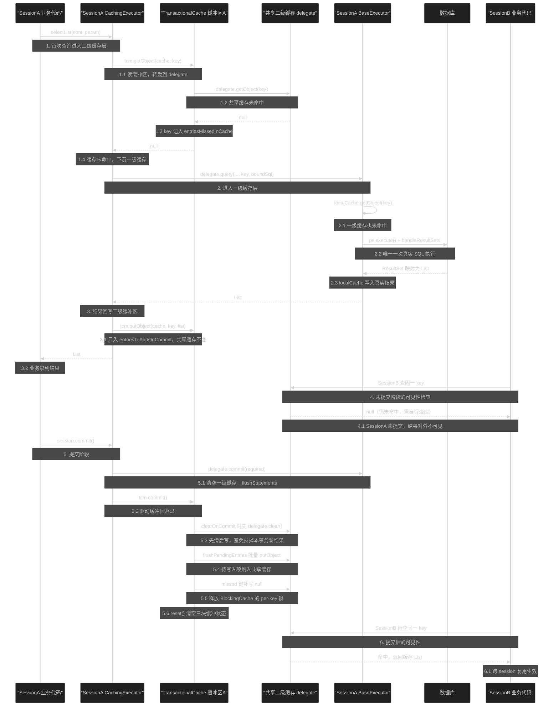

# 源码分析：查询主链路与缓存协同

> 上次修改：2026-07-29 21:41

## 阅读向导

本文面向三类读者：

- **新接手 MyBatis 内核的开发者**：想知道 `mapper.selectXxx()` 之后到底发生了什么，SQL 在哪一行真正被 `execute()`。
- **缓存排障者**：遇到"改了数据还读到旧值""同一个 session 里第二次查询不发 SQL""commit 之后别的线程才看到缓存"这类现象，需要定位到具体分支。
- **代码审查者 / 扩展开发者**：准备写 `Interceptor`、自定义 `Cache`、自定义 `Executor`，需要确认哪些不变式不能破坏。

阅读前建议先浏览这三篇模块文档，本文不重复其中的模块级职责划分与全景介绍，只在它们的基础上**下沉到行级**：

- [执行器与结果处理（executor）](执行器与结果处理（executor）.md) —— 执行器家族、StatementHandler 家族、结果映射引擎的模块级视角。
- [缓存体系（cache）](缓存体系（cache）.md) —— `Cache` 接口与全部装饰器（LRU / FIFO / Scheduled / Serialized / Synchronized / Blocking / Logging）的实现细节。
- [会话与配置核心（session）](会话与配置核心（session）.md) —— `Configuration` 的装配过程、`SqlSessionFactory` 的会话创建、全局配置项含义。

与上述文档的分工：模块文档回答"这个包里有什么、各自负责什么"；本文回答"一次 select 从入口到返回对象经过了哪些行，两级缓存在这些行之间如何交接状态"。

阅读顺序建议：先看 [4. 主线流程逐行解读](#4-主线流程逐行解读) 的总图建立骨架，再回到 [3. 关键数据结构](#3-关键数据结构) 理解 `CacheKey` 与 `TransactionalCache` 的字段含义，最后读 [5. 分支与边界处理](#5-分支与边界处理) 和 [8. 潜在问题与改进建议](#8-潜在问题与改进建议)。

## 1. 分析范围与目标

### 涵盖范围

本文追踪一次 `select` 查询的完整执行路径，以及一级缓存（session 级）与二级缓存（namespace 级）在这条路径上的协同关系。具体覆盖以下源码：

| 阶段 | 源码范围 |
|------|----------|
| 会话入口 | `DefaultSqlSession.selectList` / `selectOne` / `selectMap`、`wrapCollection`、`isCommitOrRollbackRequired`（`src/main/java/org/apache/ibatis/session/defaults/DefaultSqlSession.java:66-159`、`:310-316`） |
| 语句查找 | `Configuration.getMappedStatement`（`src/main/java/org/apache/ibatis/session/Configuration.java:915-924`）、`MappedStatement.getBoundSql`（`src/main/java/org/apache/ibatis/mapping/MappedStatement.java:328-347`） |
| 二级缓存层 | `CachingExecutor` 全类（`src/main/java/org/apache/ibatis/executor/CachingExecutor.java:39-180`） |
| 事务缓冲 | `TransactionalCacheManager` 全类、`TransactionalCache` 全类（`src/main/java/org/apache/ibatis/cache/TransactionalCacheManager.java:26-58`、`src/main/java/org/apache/ibatis/cache/decorators/TransactionalCache.java:38-135`） |
| 一级缓存层 | `BaseExecutor.query` / `queryFromDatabase` / `createCacheKey` / `deferLoad` / `clearLocalCache` / `DeferredLoad` 内部类（`src/main/java/org/apache/ibatis/executor/BaseExecutor.java:112-403`） |
| 缓存键 | `CacheKey` 全类（`src/main/java/org/apache/ibatis/cache/CacheKey.java:28-138`）、`ArrayUtil`（`src/main/java/org/apache/ibatis/reflection/ArrayUtil.java:33-117`） |
| JDBC 落地 | `SimpleExecutor.doQuery` / `prepareStatement`（`src/main/java/org/apache/ibatis/executor/SimpleExecutor.java:56-92`）、`RoutingStatementHandler`（`src/main/java/org/apache/ibatis/executor/statement/RoutingStatementHandler.java:39-97`）、`BaseStatementHandler`（`src/main/java/org/apache/ibatis/executor/statement/BaseStatementHandler.java:53-128`）、`PreparedStatementHandler`（`src/main/java/org/apache/ibatis/executor/statement/PreparedStatementHandler.java:63-98`） |
| 结果处理边界 | `DefaultResultSetHandler.handleResultSets` 及其直接下游（`src/main/java/org/apache/ibatis/executor/resultset/DefaultResultSetHandler.java:211-246`、`:266-293`、`:340-361`） |
| 缓存失效触发点 | `BaseExecutor.update` / `commit` / `rollback`、`CachingExecutor.update` / `commit` / `rollback` / `close` |

### 不涵盖范围

- **结果集到对象的映射细节**：`getRowValue`、嵌套 resultMap 的行合并、鉴别器、构造器注入等，只在结果处理的入口处停下（`handleResultSets`），细节见 [执行器与结果处理（executor）](执行器与结果处理（executor）.md)。
- **SQL 文本的生成**：`SqlSource` / `DynamicSqlSource` / `SqlNode` 的解析属于 `scripting` 包，本文把 `BoundSql` 当作既成事实。
- **缓存装饰器的内部算法**：LRU 的 `keyMap` 淘汰、`ScheduledCache` 的定时清理、`SerializedCache` 的序列化过滤器等，见 [缓存体系（cache）](缓存体系（cache）.md)；本文只关心它们作为 `TransactionalCache.delegate` 时暴露的语义。
- **`ReuseExecutor` / `BatchExecutor` 的 Statement 管理**：只在与主线有语义差异处（`BatchExecutor.doQuery` 的先 flush 行为）点到。
- **延迟加载代理**：`ProxyFactory` / `ResultLoaderMap` 的字节码代理不展开，只分析 `deferLoad` 与一级缓存的交互。

### 分析目标

1. 建立**行级执行地图**：任何一行日志、任何一个断点都能在链路上定位。
2. 说清**两级缓存的读写时序与可见性边界**：为什么二级缓存"提交才可见"，为什么一级缓存"更新即清空"。
3. 找出**缓存键的等价语义**及其冲突/失效风险。
4. 标注**确认的实现约束**与**疑似风险**，供扩展开发者规避。

## 2. 核心类/函数全景

| 类 / 函数 | 职责 | 关键方法 / 字段 | 代码位置 |
|-----------|------|-----------------|----------|
| `DefaultSqlSession` | 会话门面，把语句 id 翻译成 `MappedStatement` 并委派给 `Executor`；维护 `dirty` 标记决定是否需要真提交 | `selectList(4参私有版)`、`dirty`、`wrapCollection`、`isCommitOrRollbackRequired` | `session/defaults/DefaultSqlSession.java:46-316` |
| `Configuration` | 语句注册表 + 组件工厂，`newExecutor` 决定是否套上 `CachingExecutor` | `getMappedStatement`、`newExecutor`、`newStatementHandler`、`newResultSetHandler` | `session/Configuration.java:915-924`、`:717-749` |
| `Executor`（接口） | 执行器契约，12 个方法覆盖查询/更新/缓存键/延迟加载/事务 | `query` 双重载、`createCacheKey`、`isCached`、`deferLoad`、`clearLocalCache`、`setExecutorWrapper` | `executor/Executor.java:33-69` |
| `CachingExecutor` | 二级缓存装饰器，**实现 `Executor` 但不继承 `BaseExecutor`**；缓存读写全部经 `tcm` 缓冲 | `query(6参)`、`flushCacheIfRequired`、`ensureNoOutParams`、`commit`、`rollback`、`close`、`tcm` | `executor/CachingExecutor.java:39-180` |
| `TransactionalCacheManager` | 按 `Cache` 实例分桶管理 `TransactionalCache`，一个 session 内一个实例 | `transactionalCaches`（HashMap）、`getObject`、`putObject`、`clear`、`commit`、`rollback` | `cache/TransactionalCacheManager.java:26-58` |
| `TransactionalCache` | 二级缓存的**事务缓冲区**：写入暂存、命中穿透记录、清空延迟 | `entriesToAddOnCommit`、`entriesMissedInCache`、`clearOnCommit`、`flushPendingEntries`、`unlockMissedEntries` | `cache/decorators/TransactionalCache.java:38-135` |
| `BaseExecutor` | 模板方法基类，承载一级缓存、`queryStack`、`deferredLoads`、`CacheKey` 构造 | `query(6参)`、`queryFromDatabase`、`createCacheKey`、`deferLoad`、`clearLocalCache`、`localCache` | `executor/BaseExecutor.java:51-405` |
| `BaseExecutor.DeferredLoad` | 一级缓存命中但结果尚未就绪时的延迟赋值单元 | `canLoad`、`load`、`key`、`localCache` | `executor/BaseExecutor.java:368-403` |
| `ExecutionPlaceholder` | 单值枚举，作为"查询正在执行中"的占位符 | `EXECUTION_PLACEHOLDER` | `executor/ExecutionPlaceholder.java:21-23` |
| `CacheKey` | 多因子复合键，同时承载 `hashcode`/`checksum`/`count`/`updateList` 四重判等依据 | `update`、`equals`、`hashCode`、`clone`、`NULL_CACHE_KEY` | `cache/CacheKey.java:28-138` |
| `PerpetualCache` | 一级缓存与二级缓存的最底层存储，裸 `HashMap` | `cache`（HashMap）、`putObject`、`getObject`、`removeObject`、`clear` | `cache/impl/PerpetualCache.java:27-91` |
| `SimpleExecutor` | 默认执行策略：每次查询新建并关闭 `Statement` | `doQuery`、`prepareStatement` | `executor/SimpleExecutor.java:36-94` |
| `RoutingStatementHandler` | 按 `StatementType` 在**构造期**静态选定 delegate | 构造器 switch、`query` 透传 | `executor/statement/RoutingStatementHandler.java:39-97` |
| `BaseStatementHandler` | Statement 生命周期模板：`prepare` → 超时 → fetchSize；构造期触发 `<selectKey>` | `prepare`、`setStatementTimeout`、`setFetchSize`、`generateKeys` | `executor/statement/BaseStatementHandler.java:53-146` |
| `PreparedStatementHandler` | `PREPARED` 类型的实际执行者，`ps.execute()` 就在这里 | `query`、`instantiateStatement`、`parameterize` | `executor/statement/PreparedStatementHandler.java:63-98` |
| `DefaultResultSetHandler` | `ResultSet` → 对象图；主线只关心它的入口与多结果集收敛 | `handleResultSets`、`getFirstResultSet`、`handleResultSet`、`collapseSingleResultList` | `executor/resultset/DefaultResultSetHandler.java:211-361` |
| `ResultExtractor` | `List` → 目标类型（单值/集合/数组）的收敛器，`DeferredLoad` 与 `ResultLoader` 共用 | `extractObjectFromList` | `executor/ResultExtractor.java:37-62` |

## 3. 关键数据结构

### 3.1 `CacheKey` —— 四重判等的复合键

`CacheKey` 是两级缓存**共用**的键类型（`cache/CacheKey.java:28-138`）。它不是简单的字符串拼接，而是维护四个并列字段：

| 字段 | 类型 | 含义 | 生命周期 |
|------|------|------|----------|
| `multiplier` | `final int` = 37 | 哈希混合乘子，构造后不可变（`:47`、`:60`） | 与实例同生命周期 |
| `hashcode` | `int`，初值 17 | 累积哈希，`hashCode()` 唯一返回值（`:48`、`:81`、`:119`） | 每次 `update` 递增演化 |
| `checksum` | `long` | 所有元素 `baseHashCode` 的**无权重累加**（`:78`） | 同上 |
| `count` | `int` | 已 `update` 的元素个数，同时充当第 n 个元素的权重（`:77`、`:79`） | 同上 |
| `updateList` | `List<Object>`（非 transient） | 保留所有参与计算的原始对象，供 `equals` 逐项复核（`:56`、`:83`） | 同上 |

`update(Object)` 的四步（`:74-84`）：

```java
int baseHashCode = object == null ? 1 : ArrayUtil.hashCode(object);
count++;
checksum += baseHashCode;          // 顺序无关的累加
baseHashCode *= count;             // 乘位置权重 → 引入顺序敏感
hashcode = multiplier * hashcode + baseHashCode;
updateList.add(object);
```

注意 `null` 被映射为 `1` 而不是 `ArrayUtil.hashCode(null)` 的 `0`（`ArrayUtil.java:33-37`）——若用 0，`null` 元素对 `checksum` 与 `hashcode` 的贡献会被"吞掉"，`f(null)` 与 `f(0-hash 的对象)` 会撞键。`ArrayUtil.hashCode` 的存在是为了让数组参数按**内容**而非引用参与哈希（`ArrayUtil.java:38-63`），否则每次新建的 `Integer[]` 参数都会产出不同的键，二级缓存永不命中。

`equals` 的短路顺序（`:93-115`）：先 `==` 引用比较 → 类型检查 → `hashcode`/`checksum`/`count` 三者任一不等即返回 false → 最后遍历 `updateList` 用 `ArrayUtil.equals` 逐项比对。三个廉价标量先挡掉绝大多数不等的情况，`updateList` 遍历只在"高度疑似相等"时才发生。

**为什么需要 `updateList` 兜底**：`hashcode` + `checksum` + `count` 全部相等仍可能是碰撞（都是有损压缩）。缓存键碰撞的后果是**返回另一条 SQL 的结果**，属于静默数据错误，因此必须保留原始对象做最终裁定。这是用内存换正确性的取舍。

**风险点**：`updateList` 持有参数对象的**强引用**。一级缓存的 `localCache` 以 `CacheKey` 为 key，`PerpetualCache` 内部是裸 `HashMap`（`cache/impl/PerpetualCache.java:31`），因此在 session 存活期间，所有查询过的参数对象都无法回收。长生命周期 session（如误把 `SqlSession` 做成单例）会持续膨胀。

### 3.2 `CacheKey.NULL_CACHE_KEY` —— 不可变哨兵

`:32-45` 用匿名子类覆写 `update` / `updateAll` 直接抛 `CacheException`，作为"不应参与缓存"的哨兵值。它保证了误用会**立刻失败**而不是静默产生一个空键（空键会让所有语句共享同一缓存槽）。

### 3.3 `BaseExecutor` 的三块可变状态

| 字段 | 类型 | 作用 | 清理时机 |
|------|------|------|----------|
| `localCache` | `PerpetualCache`（`:59`、`:69`） | 一级缓存，键 `CacheKey`，值 `List` 或 `EXECUTION_PLACEHOLDER` | `update`（`:117`）、`commit`（`:255`）、`rollback`（`:266`）、`localCacheScope=STATEMENT` 时每次查询结束（`:170-173`）、`close`（`:100`） |
| `localOutputParameterCache` | `PerpetualCache`（`:60`、`:70`） | 仅 `CALLABLE` 用，缓存存储过程 OUT 参数值 | 与 `localCache` 同步（`:280`） |
| `queryStack` | `int`（`:63`） | 查询嵌套深度计数；`0` 表示回到最外层 | `finally` 中自减（`:162`） |
| `deferredLoads` | `ConcurrentLinkedQueue<DeferredLoad>`（`:58`、`:68`） | 待回填的嵌套查询属性 | `queryStack==0` 时全部 `load()` 后 `clear()`（`:165-169`） |

`deferredLoads` 选用 `ConcurrentLinkedQueue` 而非 `ArrayList` 值得注意：`DefaultSqlSession` 的类注释明确写着 "not Thread-Safe"（`DefaultSqlSession.java:42`），单 session 单线程下并发队列并不必要。这里更像是防御性选择（延迟加载可能跨线程触发，见 `ResultLoader.java:78`），代价是每次 `add` 的 CAS 开销。

### 3.4 `EXECUTION_PLACEHOLDER` —— 用枚举做"执行中"标记

`ExecutionPlaceholder` 是只有一个常量的枚举（`executor/ExecutionPlaceholder.java:21-23`）。`queryFromDatabase` 先把它放进 `localCache`，执行完再移除并覆盖为真实结果（`BaseExecutor.java:342-348`）。

它的唯一消费者是 `DeferredLoad.canLoad()`：`cached != null && cached != EXECUTION_PLACEHOLDER`（`:392`）。语义是三态而非二态：

| `localCache.getObject(key)` | 语义 | `canLoad()` |
|---|---|---|
| `null` | 从未查过 | false（走真实加载） |
| `EXECUTION_PLACEHOLDER` | **正在查，尚无结果**（循环引用） | false（必须延迟） |
| `List` | 已有结果 | true（可立即赋值） |

用枚举单例而非 `new Object()` 的好处：`==` 比较无歧义、`toString()` 可读（调试时 dump 缓存能看懂）、天然序列化安全。

### 3.5 `TransactionalCache` 的三块缓冲状态

`TransactionalCache` 是 `Cache` 的装饰器，但语义与其他装饰器完全不同——它**不是存储策略，而是事务隔离层**（`cache/decorators/TransactionalCache.java:38-135`）。

| 字段 | 类型 | 作用 |
|------|------|------|
| `delegate` | `final Cache` | 真正共享的二级缓存（通常是 `Synchronized(Logging(Lru(Perpetual)))` 这一串装饰链） |
| `clearOnCommit` | `boolean`（`:43`） | 本事务内发生过 `clear()`，提交时才真正清空 delegate |
| `entriesToAddOnCommit` | `Map<Object,Object>`（`:44`） | 本事务内的写入暂存，提交时批量刷入 delegate |
| `entriesMissedInCache` | `Set<Object>`（`:45`） | 本事务内**未命中**的键集合，用于 `BlockingCache` 解锁与缓存穿透防护 |

关键的方法语义偏离：

- `putObject` **不写 delegate**，只写 `entriesToAddOnCommit`（`:79-81`）。这是"提交才可见"的实现根据。
- `removeObject` **永远返回 null 且什么都不做**（`:84-86`）。事务缓冲区内没有"删除"概念，失效统一走 `clear()`。
- `clear()` 只置 `clearOnCommit = true` 并清空待写入项（`:89-92`），delegate 完全不动。因此**同一事务内的 `flushCache` 不影响其他事务的读取**。
- `getObject` 读的是 delegate（`:67`），但若 `clearOnCommit` 已置位则强制返回 `null`（`:72-74`，issue #146）。语义是"我已声明要清空这个缓存，因此我自己不能再读到旧数据"。

### 3.6 `TransactionalCacheManager` 的分桶

`transactionalCaches` 是 `Map<Cache, TransactionalCache>`（`cache/TransactionalCacheManager.java:28`），`computeIfAbsent` 惰性创建（`:55`）。key 是**共享 Cache 实例**，而 `PerpetualCache.equals/hashCode` 是按 `id` 比较的（`cache/impl/PerpetualCache.java:68-89`），`id` 就是 namespace。因此一个 session 内每个 namespace 最多一个 `TransactionalCache` 缓冲区。

选 `HashMap` 而非 `ConcurrentHashMap`：`CachingExecutor` 与其 `tcm` 严格绑定在单 session 上，不跨线程共享，普通 `HashMap` 足够且更快。这是与 `deferredLoads` 用并发队列相反的选择，两处并不一致（见 [8. 潜在问题](#8-潜在问题与改进建议)）。

## 4. 主线流程逐行解读

### 4.0 整体流程图

```mermaid
%%{init: {"theme": "dark"}}%%
flowchart TD
  1["1 DefaultSqlSession.selectList<br/>L145-159"] --> 1.1["1.1 configuration.getMappedStatement(id)<br/>L151"]
  1.1 --> 1.2["1.2 dirty |= ms.isDirtySelect()<br/>L152"]
  1.2 --> 1.3["1.3 wrapCollection(parameter)<br/>L153 / L314-316"]
  1.3 --> 2["2 CachingExecutor.query 4参<br/>L86-91"]
  2 --> 2.1["2.1 ms.getBoundSql(parameterObject)<br/>L88"]
  2.1 --> 2.2["2.2 createCacheKey → 委派 delegate<br/>L89 / L148-150"]
  2.2 --> 2.3["2.3 BaseExecutor.createCacheKey<br/>L199-243"]
  2.3 --> 3["3 CachingExecutor.query 6参<br/>L93-111"]
  3 --> 3.1{"3.1 cache = ms.getCache()<br/>为 null？L96-97"}
  3.1 -->|"是"| 6["6 delegate.query 直通<br/>L110"]
  3.1 -->|"否"| 3.2["3.2 flushCacheIfRequired(ms)<br/>L98 / L168-173"]
  3.2 --> 3.3{"3.3 isUseCache 且<br/>resultHandler==null？L99"}
  3.3 -->|"否"| 6
  3.3 -->|"是"| 3.4["3.4 ensureNoOutParams<br/>L100 / L135-145"]
  3.4 --> 3.5["3.5 tcm.getObject(cache, key)<br/>L102"]
  3.5 --> 3.6{"3.6 命中？L103"}
  3.6 -->|"命中"| 3.7["3.7 直接返回缓存 List<br/>L107"]
  3.6 -->|"未命中"| 6
  6 --> 6.1["6.1 BaseExecutor.query 6参<br/>L143-176"]
  6.1 --> 6.2{"6.2 queryStack==0 且<br/>isFlushCacheRequired？L149"}
  6.2 -->|"是"| 6.3["6.3 clearLocalCache()<br/>L150 / L277-282"]
  6.2 -->|"否"| 6.4
  6.3 --> 6.4["6.4 queryStack++<br/>L154"]
  6.4 --> 6.5{"6.5 resultHandler==null 且<br/>localCache 命中？L155-156"}
  6.5 -->|"命中"| 6.6["6.6 handleLocallyCachedOutputParameters<br/>L157 / L321-337"]
  6.5 -->|"未命中"| 7["7 queryFromDatabase<br/>L339-353"]
  7 --> 7.1["7.1 localCache.putObject(key, PLACEHOLDER)<br/>L342"]
  7.1 --> 7.2["7.2 doQuery → SimpleExecutor<br/>L344 / SimpleExecutor L56-68"]
  7.2 --> 7.3["7.3 newStatementHandler(wrapper,...)<br/>SimpleExecutor L61-62"]
  7.3 --> 7.4["7.4 RoutingStatementHandler 构造期路由<br/>Routing L42-54"]
  7.4 --> 7.5["7.5 BaseStatementHandler 构造<br/>Base L53-73"]
  7.5 --> 7.6["7.6 prepare + parameterize<br/>SimpleExecutor L86-92"]
  7.6 --> 7.7["7.7 ps.execute()<br/>Prepared L65"]
  7.7 --> 7.8["7.8 handleResultSets(ps)<br/>Prepared L66 / DRSH L211-246"]
  7.8 --> 7.9["7.9 finally localCache.removeObject(key)<br/>L346"]
  7.9 --> 7.10["7.10 localCache.putObject(key, list)<br/>L348"]
  6.6 --> 8["8 finally queryStack--<br/>L162"]
  7.10 --> 8
  8 --> 8.1{"8.1 queryStack==0？L164"}
  8.1 -->|"否"| 9
  8.1 -->|"是"| 8.2["8.2 deferredLoads 全部 load + clear<br/>L165-169"]
  8.2 --> 8.3{"8.3 localCacheScope==STATEMENT？L170"}
  8.3 -->|"是"| 8.4["8.4 clearLocalCache()<br/>L172"]
  8.3 -->|"否"| 9
  8.4 --> 9["9 返回 List 给 CachingExecutor"]
  9 --> 9.1{"9.1 走过二级缓存分支？"}
  9.1 -->|"是"| 9.2["9.2 tcm.putObject(cache, key, list)<br/>L105"]
  9.1 -->|"否"| 10
  9.2 --> 10["10 返回 List 给 DefaultSqlSession"]
  10 --> 10.1["10.1 finally ErrorContext.reset()<br/>L157"]
  10.1 --> 11["11 提交阶段 session.commit<br/>L220-229"]
  11 --> 11.1["11.1 CachingExecutor.commit<br/>L119-122"]
  11.1 --> 11.2["11.2 delegate.commit → clearLocalCache + flushStatements<br/>BaseExecutor L251-260"]
  11.2 --> 11.3["11.3 tcm.commit → TransactionalCache.commit<br/>TxCache L94-100"]
  11.3 --> 11.4["11.4 clearOnCommit 则 delegate.clear()<br/>TxCache L95-97"]
  11.4 --> 11.5["11.5 flushPendingEntries 刷入共享缓存<br/>TxCache L113-122"]
```



**1-1.3 会话入口与语句定位**：`DefaultSqlSession.selectList` 的四参私有重载是所有 `selectList`/`selectOne`/`selectMap`/`select` 的汇聚点。先用语句 id 从 `Configuration` 取 `MappedStatement`（会触发 `buildAllStatements()` 补齐未完成的解析），再累积 `dirty` 标记，最后把 `Collection`/数组参数包装成 `ParamMap`。任何异常都被 `ExceptionFactory.wrapException` 统一包装，`finally` 里必定 `ErrorContext.reset()`。

**2-2.3 SQL 与缓存键的预计算**：`CachingExecutor.query` 的四参版本先解析出 `BoundSql`，再算出 `CacheKey`，然后调用六参版本。关键点是**这两个产物随后被一路透传**，一级缓存与二级缓存共用同一个 `CacheKey` 实例，避免了重复计算与语义分歧。`createCacheKey` 自身被委派回 `delegate`（即 `BaseExecutor`），因此二级缓存的键由一级缓存的算法生成。

**3-3.7 二级缓存读取**：四层门禁依次是"namespace 是否配了 `<cache>`"→"是否需要先清空"→"该语句是否 `useCache` 且没有自定义 `ResultHandler`"→"是否是带 OUT 参数的存储过程"。全部通过后才读 `tcm`。命中则整条链路提前返回，不接触 `BaseExecutor`、不接触 JDBC。

**6-6.6 一级缓存读取**：`BaseExecutor.query` 先判断"最外层查询且语句声明 `flushCache=true`"来清空 session 缓存，然后 `queryStack++` 进入受保护区。有自定义 `ResultHandler` 时**直接跳过一级缓存读取**（`resultHandler == null ? ... : null`），因为结果已经被 handler 消费掉、没有 `List` 可缓存。

**7-7.10 落库执行**：`queryFromDatabase` 用"占位符 → 执行 → 移除占位符 → 写真值"的四步保证嵌套查询能识别循环引用。中间的 `doQuery` 下沉到 `SimpleExecutor`，经 `RoutingStatementHandler` 静态路由到 `PreparedStatementHandler`，`ps.execute()` 是整条链路唯一真正访问数据库的一行。

**8-8.4 出栈与延迟回填**：`queryStack--` 放在 `finally`，保证异常也能正确出栈。回到最外层（`queryStack==0`）时统一执行 `deferredLoads`——此时 `localCache` 里所有结果都已就绪，循环引用可以安全地互相赋值。若 `localCacheScope=STATEMENT`，紧接着清空一级缓存，实现"语句级缓存"。

**9-10.1 二级缓存回写与收尾**：结果返回 `CachingExecutor` 后写入 `tcm`（注意是**缓冲区**而非共享缓存）。即使结果是空 `List` 也会写入（issue #578/#116），这是防缓存穿透的第一道措施。

**11-11.5 提交落盘**：`session.commit` → `CachingExecutor.commit` 先让 `delegate` 清一级缓存并 flush 批处理，再让 `tcm` 把缓冲区刷入共享缓存。顺序不可颠倒：若先刷二级缓存，一级缓存里的旧数据在 flush 失败回滚时会造成不一致。

### 4.1 入口：`DefaultSqlSession.selectList`（`DefaultSqlSession.java:145-159`）

```java
public <E> List<E> selectList(String statement, Object parameter, RowBounds rowBounds) {   // L145
  return selectList(statement, parameter, rowBounds, Executor.NO_RESULT_HANDLER);          // L146
}

private <E> List<E> selectList(String statement, Object parameter, RowBounds rowBounds,
    ResultHandler handler) {                                                               // L149
  try {
    MappedStatement ms = configuration.getMappedStatement(statement);                       // L151
    dirty |= ms.isDirtySelect();                                                            // L152
    return executor.query(ms, wrapCollection(parameter), rowBounds, handler);               // L153
  } catch (Exception e) {
    throw ExceptionFactory.wrapException("Error querying database.  Cause: " + e, e);       // L155
  } finally {
    ErrorContext.instance().reset();                                                        // L157
  }
}
```

- **L146**：`Executor.NO_RESULT_HANDLER` 是 `Executor` 接口里的常量 `null`（`Executor.java:35`）。用命名常量而非裸 `null`，让后续所有 `resultHandler == null` 判断有明确语义——"调用方不接管结果，返回 `List`"。这个 null 值一路影响到一级缓存与二级缓存的启用判断。
- **L151**：`getMappedStatement(String)` 默认 `validateIncompleteStatements=true`（`Configuration.java:915-917`），因此每次查询都会调用 `buildAllStatements()` 尝试解析残留的 `<resultMap>` / `<cache-ref>` / 注解语句。语句不存在时 `StrictMap.get` 抛 `IllegalArgumentException`（`Configuration.java:1182-1192`），最终被 L155 包装成 `PersistenceException`。
- **L152**：`dirtySelect` 来自 `<select affectData="true">`（`builder/xml/XMLStatementBuilder.java:150`）。这是给"select 里带副作用"（如调用会写数据的函数）用的开关，置位后 `isCommitOrRollbackRequired(false)` 返回 true（`DefaultSqlSession.java:310-312`），关闭 session 时会真提交而不是回滚。**这是查询也能影响事务行为的唯一入口**。
- **L153**：`wrapCollection` 委派 `ParamNameResolver.wrapToMapIfCollection(object, null)`（`DefaultSqlSession.java:314-316`）。`Collection` 被包成含 `collection`/`list` 两个键的 `ParamMap`，数组包成含 `array` 键的 `ParamMap`（`ParamNameResolver.java:222-239`）。**这一步发生在 `createCacheKey` 之前**，因此缓存键里记录的是包装后的对象，而 `ParamMap` 继承 `HashMap`，其 `hashCode` 按内容计算——同样内容的 `List` 参数能命中同一缓存键。
- **L157**：`ErrorContext` 是 ThreadLocal 单例，不 reset 会让下一次查询的错误信息里混入上次的 `sql`/`activity`。放在 `finally` 保证异常路径也清理。

### 4.2 语句级 SQL 解析：`MappedStatement.getBoundSql`（`MappedStatement.java:328-347`）

`CachingExecutor.query` 四参版本的第一行就是它（`CachingExecutor.java:88`）：

- **L329**：`sqlSource.getBoundSql(parameterObject)`。对 `DynamicSqlSource` 而言，每次调用都会**重新执行动态 SQL 节点树**，产出的 SQL 文本可能因参数不同而不同。这正是 `createCacheKey` 必须把 `boundSql.getSql()` 纳入键的原因（见 4.3）。
- **L331-333**：若动态解析出的 `parameterMappings` 为空，用 `parameterMap` 的映射重建 `BoundSql`。这是兼容老式 `<parameterMap>` 配置的补丁。
- **L336-344**：遍历参数映射，若某个参数引用了带嵌套 resultMap 的 `resultMapId`，就把 `hasNestedResultMaps` 置位。注意这是**运行期修改 `MappedStatement` 的可变字段**（`|=` 单向置位，`MappedStatement.java:341`），只增不减，因此没有并发正确性问题，但它意味着 `MappedStatement` 并非严格不可变。

### 4.3 缓存键构造：`BaseExecutor.createCacheKey`（`BaseExecutor.java:199-243`）

`CachingExecutor.createCacheKey` 只是转发（`CachingExecutor.java:148-150`），真正的算法在 `BaseExecutor`。六个因子按固定顺序 `update`：

```java
CacheKey cacheKey = new CacheKey();               // L203
cacheKey.update(ms.getId());                      // L204  语句全限定 id
cacheKey.update(rowBounds.getOffset());           // L205  分页 offset
cacheKey.update(rowBounds.getLimit());            // L206  分页 limit
cacheKey.update(boundSql.getSql());               // L207  实际 SQL 文本
// L212-237 逐个参数值
if (configuration.getEnvironment() != null) {     // L238
  cacheKey.update(configuration.getEnvironment().getId());   // L240  issue #176
}
```

各因子的必要性：

| 因子 | 不纳入会发生什么 |
|------|------------------|
| `ms.getId()`（L204） | 不同 namespace 的同形 SQL 互相污染 |
| `offset`/`limit`（L205-206） | `RowBounds` 分页是**内存分页**（`DefaultResultSetHandler.skipRows`），SQL 相同但结果集不同，会返回错误的页 |
| `boundSql.getSql()`（L207） | 动态 SQL 在不同 `<if>` 分支下生成不同语句，键相同则串结果 |
| 参数值（L235） | `where id = ?` 的不同 id 会共享结果 |
| `environment.getId()`（L240） | 多数据源（如读写分离、多租户分库）共用一个 `Configuration` 时，不同库的结果互相污染。issue #176 就是这个问题 |

参数取值逻辑（L212-237）刻意"mimic DefaultParameterHandler logic"（L210 注释），四条分支按优先级：

1. **L216-217** `parameterMapping.hasValue()`：映射自带常量值，直接取。
2. **L218-219** `boundSql.hasAdditionalParameter(propertyName)`：`<foreach>`/`<bind>` 产生的动态参数（`BoundSql.additionalParameters`，`BoundSql.java:40`、`:64-75`）。**必须优先于 `metaObject` 取值**，否则 `<foreach>` 展开的 `__frch_item_0` 这类合成名在参数对象上根本不存在。
3. **L220-221** `parameterObject == null`：值为 null。
4. **L223-233**：先看 `ParamNameResolver` 声明的首个参数类型或 `parameterObject` 自身类型是否有 `TypeHandler`——有则整个对象就是值（单参数场景）；否则用 `MetaObject` 反射取属性。`metaObject` 被**惰性创建并复用**（L229-231），避免多参数时重复构建 `Reflector`。

`OUT` 模式参数被跳过（L213 `!= ParameterMode.OUT`）：OUT 参数是输出而非输入，纳入键会导致同一次调用前后键不一致。

**三维评估**：

- **好处**：六因子覆盖了"同一 SQL 文本 + 同一参数 + 同一分页 + 同一数据源 = 同一结果"这一等价类，且 `equals` 有 `updateList` 兜底，误命中概率极低。构造成本是 O(参数个数) 的哈希与一次 `ArrayList` 分配。
- **替代方案**：(a) 直接用 `sql + 参数 toString()` 拼字符串做 key——实现简单，但字符串拼接分配大、`toString` 未必稳定（默认 `Object.toString` 含 hashCode）、且无法区分类型（`"1"` 与 `1`）；(b) 只用 `hashcode` 不留 `updateList`——省内存，但碰撞即静默错误；(c) 让用户显式声明缓存键——精确但把负担推给使用方。
- **风险**：`updateList` 强引用参数对象，长生命周期 session 下阻止 GC；`boundSql.getSql()` 是完整 SQL 文本，长 IN 列表会让键本身很大；自定义 `TypeHandler` 若把不同 Java 值映射到同一 JDBC 值，键不同但结果相同，导致缓存冗余（浪费但不出错）。

### 4.4 二级缓存层：`CachingExecutor.query` 六参版本（`CachingExecutor.java:93-111`）

```java
Cache cache = ms.getCache();                                                    // L96
if (cache != null) {                                                            // L97
  flushCacheIfRequired(ms);                                                     // L98
  if (ms.isUseCache() && resultHandler == null) {                               // L99
    ensureNoOutParams(ms, boundSql);                                            // L100
    List<E> list = (List<E>) tcm.getObject(cache, key);                         // L102
    if (list == null) {                                                         // L103
      list = delegate.query(ms, parameterObject, rowBounds, resultHandler, key, boundSql); // L104
      tcm.putObject(cache, key, list); // issue #578 and #116                   // L105
    }
    return list;                                                                // L107
  }
}
return delegate.query(ms, parameterObject, rowBounds, resultHandler, key, boundSql);       // L110
```

- **L96-97**：`ms.getCache()` 为 null 表示该 namespace 没配 `<cache>` 或 `<cache-ref>`。此时整个二级缓存逻辑被跳过，连 `TransactionalCache` 都不创建。注意 `CachingExecutor` 本身是否存在由 `Configuration.cacheEnabled` 决定（`Configuration.java:745-747`），而**是否生效**由每个 namespace 的 `cache` 字段决定——两级开关。
- **L98 `flushCacheIfRequired`（L168-173）**：`cache != null && ms.isFlushCacheRequired()` 时调用 `tcm.clear(cache)`。查询语句的 `flushCache` 默认为 `false`（`XMLStatementBuilder.java:82`：`getBooleanAttribute("flushCache", !isSelect)`），所以普通 select 不会走到这里；写语句默认 `true`。**这一行对 select 的意义在于 `<select flushCache="true">` 的显式声明**。清空是"声明式"的：只置 `clearOnCommit=true` 并清空缓冲（`TransactionalCache.java:89-92`），共享缓存要到 commit 才真被清。
- **L99**：两个条件。`isUseCache()` 对 select 默认 `true`、对写语句默认 `false`（`XMLStatementBuilder.java:83`）。`resultHandler == null` 是硬约束：若调用方传了 `ResultHandler`，结果被流式消费掉，`delegate.query` 返回的 `List` 是空的（`DefaultResultSetHandler.handleResultSet` 走 `resultHandler != null` 分支，不构造 `DefaultResultHandler`，见 `DefaultResultSetHandler.java:345-351`），缓存空列表会造成后续查询拿到空结果。
- **L100 `ensureNoOutParams`（L135-145）**：仅当 `StatementType.CALLABLE` 时遍历参数映射，发现任何非 `IN` 模式参数就抛 `ExecutorException`，提示配 `useCache=false`。原因：OUT 参数的值通过**副作用写回参数对象**，缓存命中时不会重新执行存储过程，OUT 参数就拿不到值。这里选择"快速失败"而不是"静默降级为不缓存"——配置错误应当被发现。
- **L102**：`tcm.getObject` → `TransactionalCache.getObject`。这一步有两个副作用：未命中时把 key 加入 `entriesMissedInCache`（`TransactionalCache.java:68-70`），以及当 `clearOnCommit` 已置位时强制返回 null（`:72-74`）。注意 `TransactionalCache` **不读自己的 `entriesToAddOnCommit`**——同一 session 内先查后再查同一语句，第二次不会命中二级缓冲区，而是命中**一级缓存**（在 `BaseExecutor` 层就返回了，根本到不了这里）。
- **L104-105**：未命中则下沉到一级缓存层，拿到结果后无条件写入缓冲区。**空 `List` 也会被缓存**，配合 `flushPendingEntries` 里给未命中键写 `null`（`TransactionalCache.java:117-121`），构成两层穿透防护。
- **L110**：所有"不适用二级缓存"的情况都汇聚到这一行直通 `delegate`。注意 `key` 和 `boundSql` 仍然传下去，一级缓存照常工作。

**三维评估（装饰器 + 事务缓冲的组合）**：

- **好处**：二级缓存作为独立装饰器，`BaseExecutor` 完全不知道它的存在，两级缓存的清理策略可以独立演进；`TransactionalCache` 把"事务可见性"从缓存实现里剥离，任何第三方 `Cache`（EhCache、Redis）都自动获得"提交才可见"语义，无需自己实现事务。
- **替代方案**：(a) 把二级缓存逻辑合并进 `BaseExecutor`——少一层委派、少一次虚调用，但一级/二级缓存的清理时机纠缠在一起，且第三方缓存要自己处理事务；(b) 让缓存实现自己支持事务（如用 Redis MULTI）——语义更强但把 MyBatis 绑死在特定缓存能力上；(c) 写后立即刷缓存，不做缓冲——延迟更低，但事务回滚后共享缓存里留着脏数据，其他 session 会读到未提交的值。
- **风险**：`entriesToAddOnCommit` 在长事务/大结果集下是**堆内存放大器**（一个 session 内所有查询结果都留副本直到 commit）；`CachingExecutor.setExecutorWrapper` 主动抛 `UnsupportedOperationException`（`CachingExecutor.java:176-178`），意味着**不能把 `CachingExecutor` 再套一层装饰器**，自定义执行器链路受限。

### 4.5 一级缓存层：`BaseExecutor.query` 六参版本（`BaseExecutor.java:143-176`）

```java
ErrorContext.instance().resource(ms.getResource()).activity("executing a query").object(ms.getId()); // L145
if (closed) { throw new ExecutorException("Executor was closed."); }                    // L146-148
if (queryStack == 0 && ms.isFlushCacheRequired()) { clearLocalCache(); }               // L149-151
List<E> list;
try {
  queryStack++;                                                                        // L154
  list = resultHandler == null ? (List<E>) localCache.getObject(key) : null;            // L155
  if (list != null) {
    handleLocallyCachedOutputParameters(ms, key, parameter, boundSql);                  // L157
  } else {
    list = queryFromDatabase(ms, parameter, rowBounds, resultHandler, key, boundSql);   // L159
  }
} finally {
  queryStack--;                                                                        // L162
}
if (queryStack == 0) {                                                                 // L164
  for (DeferredLoad deferredLoad : deferredLoads) { deferredLoad.load(); }              // L165-167
  deferredLoads.clear();                                        // issue #601          // L169
  if (configuration.getLocalCacheScope() == LocalCacheScope.STATEMENT) {                // L170
    clearLocalCache();                                          // issue #482          // L172
  }
}
return list;                                                                           // L175
```

- **L145**：填充 `ErrorContext` 的 resource/activity/object 三段，出错时错误消息形如 `### The error occurred while executing a query`。这是排障信息的来源，不影响逻辑。
- **L146-148**：`closed` 检查。`BaseExecutor.close` 会把 `localCache`、`deferredLoads`、`transaction` 全部置 null（`:98-102`），若不拦截会 NPE。这里抛的是语义明确的 `ExecutorException`。
- **L149**：`queryStack == 0 && ms.isFlushCacheRequired()` —— 两个条件都关键。`queryStack == 0` 保证只有**最外层**查询才清缓存：嵌套查询（`<association select>`）若也清，会把外层正在用的 `EXECUTION_PLACEHOLDER` 和已完成结果一起抹掉，循环引用检测立即失效。`isFlushCacheRequired()` 就是 `<select flushCache="true">`。
- **L154 / L162**：`queryStack++` 在 try 内第一行，`--` 在 finally。异常路径也能正确出栈，否则一次失败查询会让 `queryStack` 永久大于 0，此后 `deferredLoads` 再也不会被执行。
- **L155**：三元表达式让"有 `ResultHandler`"直接得到 `null` 而**不去读缓存**。理由与二级缓存同源：结果被 handler 消费，没有可复用的 `List`。这一行也是"为什么用 `ResultHandler` 就享受不到一级缓存"的答案。
- **L157 `handleLocallyCachedOutputParameters`（L321-337）**：仅 `CALLABLE` 生效。一级缓存命中时存储过程没有真正执行，OUT 参数不会被 JDBC 写回，因此从 `localOutputParameterCache` 取出上次的参数对象，用两个 `MetaObject` 把非 IN 参数的值逐个拷回当前参数对象。这是**为了让缓存命中在语义上等价于真实执行**所做的补偿。注意二级缓存那边选择了抛异常（4.4 的 `ensureNoOutParams`），一级缓存这边选择了补偿——两级缓存对同一问题采取了不同策略，因为一级缓存的参数对象仍在同一 session 内，可信；二级缓存跨 session，参数对象已不可达。
- **L159**：未命中则落库，见 4.6。
- **L164-169**：`queryStack == 0` 时统一驱动 `deferredLoads`。此时所有嵌套查询都已完成、`localCache` 里全是真实结果，`DeferredLoad.load()` 可以安全取值。`clear()` 标注 issue #601——不清空会导致同一 session 的后续查询重复执行历史的 deferred load，把值赋给已经过期的对象。
- **L170-173**：`localCacheScope=STATEMENT` 时每条语句结束即清缓存（issue #482）。这是给"一级缓存导致读不到其他事务已提交数据"场景的逃生阀。注意它在 `queryStack == 0` 内部，所以嵌套查询进行中不会被清。

### 4.6 落库：`BaseExecutor.queryFromDatabase`（`BaseExecutor.java:339-353`）

```java
localCache.putObject(key, EXECUTION_PLACEHOLDER);          // L342
try {
  list = doQuery(ms, parameter, rowBounds, resultHandler, boundSql);   // L344
} finally {
  localCache.removeObject(key);                            // L346
}
localCache.putObject(key, list);                           // L348
if (ms.getStatementType() == StatementType.CALLABLE) {
  localOutputParameterCache.putObject(key, parameter);     // L350
}
return list;
```

这 5 行是整个链路里最容易被误读的部分。三个动作的必要性：

- **L342 放占位符**：`doQuery` 期间结果映射可能触发嵌套查询，嵌套查询又可能回指当前对象（A 关联 B，B 关联 A）。`DefaultResultSetHandler.getNestedQueryMappingValue` 会先问 `executor.isCached(nestedQuery, key)`（`DefaultResultSetHandler.java:1036`）。`isCached` 的实现是 `localCache.getObject(key) != null`（`BaseExecutor.java:247`）——占位符**非 null**，所以 `isCached` 返回 true，走 `executor.deferLoad(...)` 分支（`DefaultResultSetHandler.java:1037`）。
- **L346 finally 移除**：无论成功失败都先移除。失败时移除是必须的——否则占位符永久滞留，`isCached` 永远返回 true 而 `DeferredLoad.canLoad()` 永远返回 false，该键的查询在本 session 内彻底死锁在"永远延迟"状态。成功时移除后紧接 L348 重新放入，这个"先删再放"看似冗余，实际是让 `PerpetualCache` 的 `HashMap.put` 语义清晰（`HashMap.put` 本身就会覆盖，所以 L346+L348 的组合在成功路径上确实等价于单次 put，冗余是为了让失败路径共享同一段清理代码）。
- **L348 写真值**：写入后 `DeferredLoad.canLoad()` 才会返回 true（`:392` 判断 `cached != EXECUTION_PLACEHOLDER`），随后在 `queryStack==0` 时被 `load()` 消费。
- **L350**：`CALLABLE` 时额外缓存参数对象本身，供 4.5 的 `handleLocallyCachedOutputParameters` 使用。

`deferLoad` 的配合（`BaseExecutor.java:185-196`）：先 `new DeferredLoad(...)` 并 `canLoad()` 试探——若结果已就绪就**立即 `load()`**，避免入队；否则**再 new 一个** `DeferredLoad` 入队（L194）。这里连续 new 两个等价对象是可优化点（见第 8 章）。

### 4.7 JDBC 执行：`SimpleExecutor.doQuery` → `PreparedStatementHandler.query`

`SimpleExecutor.doQuery`（`SimpleExecutor.java:56-68`）：

```java
StatementHandler handler = configuration.newStatementHandler(wrapper, ms, parameter, rowBounds,
    resultHandler, boundSql);                              // L61-62
stmt = prepareStatement(handler, ms.getStatementLog());    // L63
return handler.query(stmt, resultHandler);                 // L64
// finally: closeStatement(stmt)                              L66
```

- **L61 传 `wrapper` 而非 `this`**：`wrapper` 字段默认是 `this`，但被 `CachingExecutor` 构造器改写为 `CachingExecutor` 自身（`CachingExecutor.java:46` → `BaseExecutor.setExecutorWrapper`，`:364-366`）。传 `wrapper` 意味着 `DefaultResultSetHandler` 拿到的 `executor` 是**最外层装饰器**，因此嵌套查询（`ResultLoader.selectList` → `localExecutor.query`，`ResultLoader.java:82`）也会经过二级缓存。若这里传 `this`，嵌套查询将绕过二级缓存——这是 `wrapper` 字段存在的唯一理由。
- **L63 `prepareStatement`（L86-92）**：`getConnection(statementLog)` → `handler.prepare(connection, transaction.getTimeout())` → `handler.parameterize(stmt)`。`getConnection` 在 debug 日志开启时返回 `ConnectionLogger` 代理并把 `queryStack` 作为缩进层级传入（`BaseExecutor.java:357-358`）——日志里嵌套查询的缩进就来自这里。
- **L64-66**：`SimpleExecutor` 每次查询都新建 `Statement` 并在 `finally` 关闭。这是它与 `ReuseExecutor`（按 SQL 文本缓存 `Statement`）的唯一差别。`BatchExecutor.doQuery` 额外在开头调用 `flushStatements()`（`BatchExecutor.java:86`），保证未提交的批量写入先落库，否则查询读不到本 session 已"写"但仍在 batch 队列里的数据。

`RoutingStatementHandler` 构造器（`RoutingStatementHandler.java:42-54`）用 switch 在**构造期**选定 delegate，之后所有方法纯透传。这是静态路由而非动态分派：`StatementType` 在 `MappedStatement` 上是不变的，构造期决定一次即可，省去每次调用的判断。

`BaseStatementHandler` 构造器（`BaseStatementHandler.java:53-73`）的顺序敏感点在 L63-66：`boundSql == null` 时**先 `generateKeys(parameterObject)` 再 `getBoundSql`**，注释标注 issue #435。原因是 `<selectKey>` 会写回参数对象的主键属性，而 SQL 文本可能引用该属性；顺序颠倒会拿到 null。**查询路径上 `boundSql` 总是非 null**（由 `CachingExecutor.query` L88 预先算出并透传），所以这段不会执行——但它解释了为什么 `boundSql` 要一路透传：既避免重复解析动态 SQL，也避免在查询路径上意外触发 `generateKeys`。

`PreparedStatementHandler.query`（`PreparedStatementHandler.java:63-67`）：

```java
PreparedStatement ps = (PreparedStatement) statement;
ps.execute();                                   // L65
return resultSetHandler.handleResultSets(ps);   // L66
```

**L65 是整条链路唯一访问数据库的语句**。用 `execute()` 而非 `executeQuery()`：`execute()` 支持返回多结果集，配合 `handleResultSets` 的多结果集循环（`DefaultResultSetHandler.java:222-243`）与存储过程场景。

### 4.8 结果处理边界：`DefaultResultSetHandler.handleResultSets`（`:211-246`）

本文只到这一层，映射细节见模块文档。三个与主线相关的点：

- **L217 `getFirstResultSet`（L266-293）**：先 `stmt.getResultSet()`，Oracle 隐式游标会抛 ORA-17283，异常被暂存到 `e1`；随后 `while (rs == null)` 用 `getMoreResults()` / `getUpdateCount() == -1` 组合往前推进，兼容 HSQLDB 不把结果集放第一位的行为。这段代码的注释明确写着 "DO NOT try to 'improve' the condition even if IDE tells you to"（`:302`），是踩过坑的驱动兼容层。
- **L222-228 多结果集循环**：每个 `ResultMap` 消费一个 `ResultSet`，每轮结束 `cleanUpAfterHandlingResultSet()` 清空 `nestedResultObjects`（`:328-330`），防止跨结果集串对象。
- **L245 `collapseSingleResultList`（L359-361）**：`multipleResults.size() == 1` 时直接返回内层 `List`，否则返回 `List<List>`。这决定了 `BaseExecutor.queryFromDatabase` 缓存的到底是"结果列表"还是"结果列表的列表"——单结果集场景下缓存的是前者，这也是 `DeferredLoad.load()` 能直接把缓存值当 `List<Object>` 强转的前提（`BaseExecutor.java:398`）。

### 4.9 提交阶段：二级缓存落盘

`DefaultSqlSession.commit(boolean force)`（`:220-229`）→ `executor.commit(isCommitOrRollbackRequired(force))`。`isCommitOrRollbackRequired` 是 `!autoCommit && dirty || force`（`:310-312`），纯查询且未设 `affectData` 时 `dirty` 为 false，因此 `required=false`。

`CachingExecutor.commit`（`:119-122`）：

```java
delegate.commit(required);   // L120
tcm.commit();                // L121
```

`delegate.commit`（`BaseExecutor.java:251-260`）依次：`closed` 检查 → `clearLocalCache()` → `flushStatements()` → `required` 时 `transaction.commit()`。**一级缓存在 commit 时必清**：事务边界一过，之前读到的快照不再可信。

`tcm.commit()` 遍历所有 `TransactionalCache` 调 `commit()`（`TransactionalCacheManager.java:42-46`），`TransactionalCache.commit`（`:94-100`）：

```java
if (clearOnCommit) { delegate.clear(); }   // L95-97
flushPendingEntries();                     // L98
reset();                                   // L99
```

顺序是**先清后写**：若本事务声明过 `flushCache`，先清掉共享缓存的旧内容，再写入本事务的新结果。反过来会把本事务的新结果一起清掉。

`flushPendingEntries`（`:113-122`）两个循环：

1. 把 `entriesToAddOnCommit` 全部 `delegate.putObject`。
2. 遍历 `entriesMissedInCache`，对**不在** `entriesToAddOnCommit` 里的键写入 `null`。

第二个循环是双重目的。其一，**给 `BlockingCache` 解锁**：`BlockingCache.getObject` 未命中时保持持锁（`BlockingCache.java:68-75`），必须靠一次 `putObject` 才会 `releaseLock`（`:59-65`）。若某个键被查过（进了 missed 集合）却因为异常没有走到 `tcm.putObject`，不补这一次 put 就会让其他线程永久阻塞在 `acquireLock`。其二，**缓存穿透防护**：给确认不存在的键写 `null` 占位。

`rollback` 路径（`CachingExecutor.java:125-133`）：`delegate.rollback` 在 try 内，`tcm.rollback()` 在 finally 且**仅当 `required`**。`TransactionalCache.rollback`（`:102-105`）调 `unlockMissedEntries()` + `reset()`——只解锁、不落盘，`entriesToAddOnCommit` 被 `reset` 丢弃。`unlockMissedEntries`（`:124-133`）对每个 missed 键调 `delegate.removeObject`，并**逐个 try-catch 只记 warn**：第三方缓存适配器的 `removeObject` 可能抛异常，回滚路径上不能因为清理失败而掩盖原始错误。

`close` 路径（`CachingExecutor.java:55-66`）：`forceRollback` 决定 `tcm.rollback()` 还是 `tcm.commit()`，且在 `finally` 里必定 `delegate.close(forceRollback)`。注释标注 issues #499/#524/#573——未显式 commit 就 close 的 session 也要正确处理缓冲区，否则 `BlockingCache` 的锁泄漏。

### 4.10 两级缓存协同时序（两个 session 的可见性）



1-1.4 二级缓存读取与未命中登记：SessionA 的查询先经 `CachingExecutor.query`（`CachingExecutor.java:102`）读 `TransactionalCache`，后者转发到共享 delegate（`TransactionalCache.java:67`）。未命中时把 key 记入 `entriesMissedInCache`（`:69`）——这个集合后续既用于解锁 `BlockingCache`，也用于提交时补写 null。

2-2.3 一级缓存与真实执行：下沉到 `BaseExecutor.query`（`:143-176`）后一级缓存同样未命中，走 `queryFromDatabase`（`:339-353`）：放占位符 → `doQuery` → `ps.execute()`（`PreparedStatementHandler.java:65`）→ 结果映射 → 移除占位符 → 写入真实结果。这是整条链路唯一一次数据库往返。

3-3.2 结果回写缓冲区：结果返回 `CachingExecutor` 后写入 `tcm`（`:105`），但 `TransactionalCache.putObject` 只落在 `entriesToAddOnCommit`（`TransactionalCache.java:79-81`），共享缓存此刻毫无变化。空 `List` 也会写入，这是空结果防护。

4-4.1 未提交阶段的隔离：SessionB 此时查同一 key 仍然未命中，因为共享缓存里没有任何新条目。这就是"提交才可见"的实际含义——它防止 SessionA 回滚后 SessionB 读到从未存在过的数据。

5-5.6 提交落盘：`CachingExecutor.commit`（`:119-122`）先让 `delegate` 清一级缓存并 flush 批处理（`BaseExecutor.java:251-260`），再 `tcm.commit()`。`TransactionalCache.commit`（`:94-100`）严格按"clearOnCommit 时先清 → flushPendingEntries 写入 → missed 键补 null → reset"的顺序执行，顺序颠倒会导致本事务新结果被自己清掉或 `BlockingCache` 锁泄漏。

6-6.1 提交后跨 session 复用：共享缓存已有条目，SessionB 直接命中，不再访问数据库。至此二级缓存的价值才真正兑现——它的收益窗口从**提交时刻**才开始。

## 5. 分支与边界处理

### 5.1 两级缓存的启用矩阵

| 条件 | 二级缓存 | 一级缓存 | 源码依据 |
|------|----------|----------|----------|
| `cacheEnabled=false`（全局） | 不存在（无 `CachingExecutor`） | 生效 | `Configuration.java:745-747` |
| namespace 无 `<cache>` | 跳过（`cache == null`） | 生效 | `CachingExecutor.java:96-97` |
| `<select useCache="false">` | 跳过 | 生效 | `CachingExecutor.java:99` |
| 传了自定义 `ResultHandler` | 跳过 | **跳过** | `CachingExecutor.java:99`、`BaseExecutor.java:155` |
| `localCacheScope=STATEMENT` | 正常生效 | 每语句后清空 | `BaseExecutor.java:170-173` |
| `<select flushCache="true">` | 先声明清空 | 最外层时立即清空 | `CachingExecutor.java:98`、`BaseExecutor.java:149-151` |
| `CALLABLE` 且有非 IN 参数 | **抛异常** | 生效 + OUT 参数补偿 | `CachingExecutor.java:135-145`、`BaseExecutor.java:321-337` |
| `selectCursor` | 跳过（只 flush 不读写） | **完全跳过** | `CachingExecutor.java:80-83`、`BaseExecutor.java:179-182` |

`selectCursor` 是最容易被忽略的边界：`CachingExecutor.queryCursor` 只调 `flushCacheIfRequired` 就直接委派（`:81-82`），`BaseExecutor.queryCursor` 连 `createCacheKey` 都不算，直接 `doQueryCursor`（`:180-181`）。原因是 `Cursor` 是**惰性、一次性、持有开放 ResultSet** 的对象，缓存一个已被消费的游标毫无意义且会泄漏连接。

### 5.2 `queryStack` 的嵌套语义

`queryStack` 只有三处读写，但控制三件事：

| 位置 | 判断 | 后果 |
|------|------|------|
| `BaseExecutor.java:149` | `queryStack == 0` 才允许 `flushCache` 清一级缓存 | 嵌套查询不清缓存，保护外层的占位符与已完成结果 |
| `BaseExecutor.java:164` | `queryStack == 0` 才驱动 `deferredLoads` 与 STATEMENT 清理 | 保证所有嵌套查询完成后才回填 |
| `BaseExecutor.java:358` | 作为 `ConnectionLogger` 的缩进层级 | 日志可读性 |

递归深度由数据结构决定（对象图的关联深度），不设上限。理论上循环引用的对象图可能导致无限递归，但 `EXECUTION_PLACEHOLDER` + `deferLoad` 组合把递归截断成"发现正在执行 → 转为延迟回填"，因此实际不会栈溢出——**前提是嵌套查询的 `CacheKey` 与外层完全相同**。若 A 查 B、B 查 A 但参数不同（如 id 递增），键不同，占位符检测失效，会真正无限递归直到 `StackOverflowError`。这属于配置错误而非实现缺陷，但没有防御性检查。

### 5.3 异常路径的状态一致性

| 异常发生点 | 已发生的状态变更 | 是否被回滚 | 后果 |
|------------|------------------|-----------|------|
| `doQuery` 抛 SQLException（`BaseExecutor.java:344`） | `localCache` 有占位符 | 是，`finally` 移除（`:346`） | 一致 |
| 同上 | `queryStack` 已 ++ | 是，`finally` --（`:162`） | 一致 |
| 同上 | `deferredLoads` 可能已有元素 | **否**，`queryStack==0` 段被跳过，队列残留 | 见下 |
| `tcm.putObject` 前抛异常（`CachingExecutor.java:104`） | `entriesMissedInCache` 已含该键 | 由 `close`/`rollback` 的 `unlockMissedEntries` 兜底 | 一致（`BlockingCache` 能解锁） |
| `flushPendingEntries` 中途抛异常（`TransactionalCache.java:113-122`） | 部分键已刷入 delegate | **否**，无补偿；且 `reset()` 不会执行 | 缓冲区状态残留 |

**`deferredLoads` 残留**：`BaseExecutor.query` 的 `queryStack==0` 清理段在 try-finally **之外**（`:164-174`）。若 `queryFromDatabase` 抛异常，`finally` 只做 `queryStack--`，随后异常向上抛出，L164 之后的代码全部跳过，`deferredLoads` 里的元素留到**下一次查询**才被消费。下一次查询的 `queryStack` 归零时会执行这些陈旧的 `DeferredLoad.load()`，向已经失效的 `resultObject` 赋值。issue #601 的 `clear()` 缓解了"重复执行"，但没有解决"异常后残留"。

**`flushPendingEntries` 部分成功**：与 `unlockMissedEntries` 的逐个 try-catch（`:126-131`）形成鲜明对比——回滚路径做了容错，提交路径没有。若某个第三方缓存的 `putObject` 抛异常（如 Redis 连接断开），前半部分键已刷入、后半部分没有，且 `reset()` 不执行导致 `entriesToAddOnCommit` 残留到下一个事务。

### 5.4 `equals`/`hashCode` 的边界

`CacheKey.equals` 的 `updateList` 遍历（`:107-113`）用 `this.updateList.size()` 作为循环上界，访问 `cacheKey.updateList.get(i)`。若两个 `CacheKey` 的 `count` 相同但 `updateList.size()` 不同，就会 `IndexOutOfBoundsException`。正常情况下 `count` 与 `updateList.size()` 严格同步（`update` 里同时递增与 add，`:77`、`:83`），所以不会发生——除非通过 `clone()` 之后手动篡改，或反序列化了一个被破坏的实例。`getUpdateCount()` 返回的是 `updateList.size()` 而非 `count`（`:70-72`），也暗示这两者被认为等价。

`clone()`（`:132-136`）做浅拷贝后**重建 `updateList`**（`new ArrayList<>(updateList)`）。这是为了让克隆后的键继续 `update` 不影响原键。但列表元素本身仍是共享引用——`clone` 是"键结构的深拷贝、参数对象的浅拷贝"。这个层次正好：键的判等依赖元素的 `equals`，不需要元素副本。

`ArrayUtil.equals`（`ArrayUtil.java:82-117`）对数组用 `Arrays.equals` 而非 `deepEquals`（注释明确说明，`:71-72`）。因此**嵌套数组参数**（`Object[][]`）只比较外层引用，可能误判不等（导致缓存不命中，浪费但不出错）；不会误判相等。

### 5.5 `null` 与空结果的处理

| 场景 | 一级缓存存什么 | 二级缓存存什么 | 后续查询行为 |
|------|----------------|----------------|--------------|
| 查询返回 0 行 | 空 `List`（非 null） | 空 `List`（`CachingExecutor.java:105` 无 null 判断） | 命中，不查库 |
| 键从未查过 | 无条目 | 无条目 | 未命中，查库 |
| 二级缓存 miss 后事务提交 | — | `null`（`TransactionalCache.java:119`） | `getObject` 返回 null → **仍然未命中，会查库** |

第三行值得注意：`flushPendingEntries` 给 missed 键写 `null`，但 `TransactionalCache.getObject` 拿到 `null` 后走 `entriesMissedInCache.add(key)` 分支并返回 null（`:67-70`），`CachingExecutor` 判断 `list == null` 仍然会查库（`:103`）。所以写 `null` **并不能防止缓存穿透的重复查询**——它的真实作用是给 `BlockingCache` 解锁（见 4.9）。把它称为"缓存穿透防护"只在"底层缓存能区分 null 值与不存在"（如 EhCache 的 null element）时才成立，对 MyBatis 内置的 `PerpetualCache`（`HashMap.get` 对两者都返回 null）不成立。真正的空结果防护是 L105 缓存空 `List`。

### 5.6 `dirty` 与提交必要性

`DefaultSqlSession.dirty` 的三个写点：`update`（无条件置 true，`:194`）、`selectList`/`selectCursor`（`|= ms.isDirtySelect()`，`:152`、`:123`）、`commit`/`rollback`/`close`（置 false，`:223`、`:240`、`:264`）。

`isCommitOrRollbackRequired(force)` = `!autoCommit && dirty || force`（`:310-312`）。注意运算符优先级：`(!autoCommit && dirty) || force`。因此：

- 纯查询 + 非 autoCommit：`required=false`，`close()` 时 `BaseExecutor.rollback(false)` 只清缓存 + flush，不调 `transaction.rollback()`。
- `<select affectData="true">` 后：`dirty=true`，`close()` 时会真回滚（因为 `close` 传 `isCommitOrRollbackRequired(false)` 给 `executor.close`，`:262`，进而 `rollback(true)`）。**这意味着带副作用的 select 若忘记显式 commit，副作用会被回滚**——符合预期但容易踩坑。
- `CachingExecutor.rollback` 的 `if (required)` 保护（`:129`）：`required=false` 时**不调 `tcm.rollback()`**，缓冲区里的 `entriesMissedInCache` 不解锁。纯查询 session 直接 `close(false)` 时走 `tcm.commit()`（`:61`）而非 rollback，所以解锁仍然发生——两条路径互补。

## 6. 设计模式与架构决策

### 6.1 装饰器模式：`CachingExecutor` 包裹 `BaseExecutor`

`CachingExecutor implements Executor` 并持有 `delegate`（`CachingExecutor.java:39-47`），而非继承 `BaseExecutor`。构造器里 `delegate.setExecutorWrapper(this)` 建立反向引用（`:46`）。

- **好处**：二级缓存可以整体开关（`Configuration.newExecutor` 的 `if (cacheEnabled)`，`:745-747`）而无需三个子类各写一份；一级缓存与二级缓存的清理策略完全解耦；`Simple`/`Reuse`/`Batch` 三个策略实现无需知道缓存存在。
- **替代方案**：(a) 用继承，做 `CachingSimpleExecutor`/`CachingReuseExecutor`/`CachingBatchExecutor`——类数量翻倍且组合爆炸；(b) 在 `BaseExecutor.query` 里内联二级缓存逻辑，用 `cache != null` 判断——少一层虚调用，但两级缓存的生命周期纠缠，且第三方缓存拿不到"提交才可见"的免费实现；(c) 用 AOP/插件实现——MyBatis 确实有 `Interceptor` 机制，但缓存是核心语义而非可选切面，做成插件会让"是否启用缓存"变成配置顺序问题。
- **风险**：`wrapper` 反向引用形成受控回环，自定义装饰器若忘记 `setExecutorWrapper`，嵌套查询会绕过二级缓存且**无任何报错**；`CachingExecutor.setExecutorWrapper` 主动抛 `UnsupportedOperationException`（`:176-178`）意味着不能在 `CachingExecutor` 外再套装饰器，扩展性受限；两层委派让栈帧变深，异常栈可读性下降。

### 6.2 模板方法：`BaseExecutor` 的四个抽象方法

`doUpdate` / `doFlushStatements` / `doQuery` / `doQueryCursor`（`BaseExecutor.java:284-292`）由子类实现，公共的缓存管理、`queryStack`、`closed` 检查、`ErrorContext` 填充留在基类。

- **好处**：一级缓存的语义在唯一位置定义，三个子类不可能实现出不一致的缓存行为；新增执行策略只需实现四个方法。
- **替代方案**：(a) 策略模式——把 `Statement` 管理抽成独立接口注入，组合优于继承且可单测，但需要额外的接口与工厂，且 `BatchExecutor` 需要访问 `transaction`/`configuration` 等基类状态，接口会很宽；(b) 函数式——传 lambda，Java 5 时代不可行（MyBatis 的历史约束，源码里仍有 `@SuppressWarnings("unchecked")` 与手写泛型转换的痕迹）。
- **风险**：`protected` 字段（`transaction`、`localCache`、`wrapper`、`queryStack`，`:55-63`）对子类完全开放，`BatchExecutor` 直接读 `transaction`（`BatchExecutor.java:91`）、`SimpleExecutor` 直接读 `wrapper`（`SimpleExecutor.java:61`）；任何子类都能破坏缓存不变式而基类无法防御。

### 6.3 缓冲区模式：`TransactionalCache` 作为伪 `Cache`

`TransactionalCache implements Cache` 但三个方法的语义与接口契约不符：`putObject` 不写底层、`removeObject` 恒返回 null、`clear` 不清底层（`:79-92`）。

- **好处**：复用 `Cache` 接口意味着零新增抽象；`TransactionalCacheManager` 可以用统一的 `Cache` 类型持有；对 `CachingExecutor` 而言读写就是普通缓存操作，事务性完全透明；任何第三方 `Cache` 实现自动获得事务隔离。
- **替代方案**：(a) 定义独立的 `TransactionalBuffer` 接口，不复用 `Cache`——语义诚实，但需要新接口且 `TransactionalCacheManager` 的 API 要改；(b) 让 `Cache` 接口本身增加 `commit`/`rollback` 方法——所有第三方实现都要改，破坏兼容；(c) 用两阶段提交协议——过度设计。
- **风险**：**语义偏离是隐藏陷阱**。若有人把 `TransactionalCache` 当普通装饰器用（如放进 `CacheBuilder.decorators`，`mapping/CacheBuilder.java:98-101`），得到的会是一个"写不进去、删不掉"的缓存且**不报错**。`CacheBuilder` 没有任何检查阻止这种误用。此外 `getObject` 读 delegate 但不读自己的 `entriesToAddOnCommit`，同一事务内"写后读"不可见——依赖一级缓存兜底，若一级缓存被 `localCacheScope=STATEMENT` 关掉，同一 session 内重复查询会重复访问数据库。

### 6.4 占位符哨兵：用枚举实现三态

`EXECUTION_PLACEHOLDER` 让 `localCache` 从二态（有/无）变三态（无/执行中/已完成），从而在**不引入额外数据结构**的前提下实现循环引用检测（`BaseExecutor.java:342`、`:392`）。

- **好处**：零额外内存（一个键一个槽，共用 `localCache`）；`isCached` 与 `canLoad` 的组合天然表达"已开始但未完成"；实现只有 3 行。
- **替代方案**：(a) 单独维护 `Set<CacheKey> inProgress`——语义显式、可读性更好，但多一个数据结构且要保证与 `localCache` 同步清理（`clearLocalCache` 得清两处）；(b) 用递归深度 + 访问路径栈做循环检测——通用但复杂度高；(c) 不做检测，靠用户避免循环引用——MyBatis 的 `<association>` 双向关联是常见用法，不可接受。
- **风险**：**语义依赖隐式约定**。`isCached`（`:247`）只判 `!= null`，把占位符也算作"已缓存"——这是刻意的（要触发 `deferLoad`），但方法名 `isCached` 与"结果可用"的直觉不符，`DefaultResultSetHandler` 的调用方必须知道这层含义（`DefaultResultSetHandler.java:1036-1038`）。此外若占位符因异常滞留（4.6 分析的 `finally` 保护正是防这个），该键在本 session 内永久不可用。

### 6.5 键值双校验：`hashCode` + `checksum` + `count` + `updateList`

见 4.3 的三维评估。补充架构层面的决策背景：`CacheKey` 同时被一级缓存（`HashMap`）与二级缓存（可能是 Redis/EhCache，需要**序列化**）使用，因此它 `implements Serializable`（`:28`），且 `updateList` **刻意不标 transient**——源码里有一段注释专门解释这个决定（`:54-56`）："Sonarlint flags this as needing to be marked transient. While true if content is not serializable, this is not always true and thus should not be marked transient."。标 transient 会让反序列化后的键失去 `equals` 的最终裁定能力，退化为纯哈希比较，碰撞即数据错误。这是"静态检查工具的建议与正确性冲突时选择正确性"的案例。

### 6.6 静态路由：`RoutingStatementHandler` 构造期分派

`RoutingStatementHandler` 在构造器 switch 里选定 delegate（`RoutingStatementHandler.java:42-54`），之后 9 个方法全部单行透传。

- **好处**：`StatementType` 在 `MappedStatement` 上不变，一次判断即可；`Configuration.newStatementHandler` 只需返回一个类型，插件（`interceptorChain.pluginAll`，`Configuration.java:728`）只需代理一个类；`default` 分支抛 `ExecutorException` 覆盖枚举扩展。
- **替代方案**：(a) 在 `Configuration.newStatementHandler` 里直接 switch 返回具体子类——少一层透传对象，但插件要面对三种不同类型，且 `StatementHandler` 的插件签名会变得不确定；(b) 用 `Map<StatementType, Supplier<StatementHandler>>` 注册表——可扩展但对固定三值枚举是过度设计。
- **风险**：多一层对象与 9 个透传方法是纯样板代码，新增 `StatementHandler` 方法要改三处（接口、Routing、各实现）；`RoutingStatementHandler` 不继承 `BaseStatementHandler`，因此 `getBoundSql()` 等方法拿到的是 delegate 的状态，插件若通过反射访问 `RoutingStatementHandler` 的字段会拿不到预期数据（社区插件里常见的 `MetaObject` 多层 `h.target` 剥壳就是为此）。

## 7. 性能与资源分析

### 7.1 单次查询的成本拆解

| 阶段 | 复杂度 | 主要开销 | 源码位置 |
|------|--------|----------|----------|
| `getMappedStatement` | O(1) 查表 + O(未完成项) | 每次查询都调 `buildAllStatements()`，正常运行期未完成集合为空，退化为几次空集合判断 | `Configuration.java:915-924` |
| `getBoundSql` | O(SQL 节点数) | `DynamicSqlSource` 每次重新遍历 `SqlNode` 树并做 OGNL 求值；`RawSqlSource` 为 O(1) | `MappedStatement.java:328-347` |
| `createCacheKey` | O(参数个数) | 每个参数一次 `ArrayUtil.hashCode` + 一次 `ArrayList.add`；`update(boundSql.getSql())` 对长 SQL 是 O(SQL 长度) 的 `String.hashCode`（有缓存，首次除外） | `BaseExecutor.java:199-243` |
| 二级缓存查找 | O(1) 期望 + 装饰链深度 | `TransactionalCache` → `Blocking` → `Synchronized`（加锁）→ `Serialized`（**反序列化整个结果集**）→ `Lru`（`LinkedHashMap` touch）→ `Perpetual` | `CachingExecutor.java:102` |
| 一级缓存查找 | O(1) 期望 | 裸 `HashMap.get` + `CacheKey.equals` 的三标量比较，命中时才遍历 `updateList` | `BaseExecutor.java:155` |
| JDBC 执行 | 网络 I/O | 唯一的真实瓶颈 | `PreparedStatementHandler.java:65` |
| 结果映射 | O(行数 × 列数) | `ResultSetWrapper` 每结果集缓存列元数据；嵌套 resultMap 额外 O(行数) 的 `nestedResultObjects` 查找 | `DefaultResultSetHandler.java:211-246` |

**缓存命中的收益边界**：一级缓存命中是纯内存操作，成本约等于两次哈希查找，收益是完整省掉一次网络往返 + 结果映射。二级缓存命中若开了 `readWrite=true`（即 `SerializedCache`，`mapping/CacheBuilder.java:128-130`），每次命中都要**反序列化整个结果列表**（`SerializedCache.java:62-64`、`:98-108`）——大结果集下反序列化可能比重新查库 + 映射更慢。这是"二级缓存不一定更快"的具体机制。

### 7.2 内存驻留分析

三处会在 session 生命周期内持续累积：

| 结构 | 累积内容 | 上限 | 释放时机 |
|------|----------|------|----------|
| `BaseExecutor.localCache` | 每个唯一 `CacheKey` → 完整结果 `List`；`CacheKey.updateList` 强引用所有参数对象 | **无上限**（裸 `HashMap`，`PerpetualCache.java:31`） | `update`/`commit`/`rollback`/`close`/STATEMENT 作用域 |
| `TransactionalCache.entriesToAddOnCommit` | 本事务内所有查询结果的引用副本 | 无上限（`HashMap`，`:50`） | `commit`/`rollback` 的 `reset()`（`:107-111`） |
| `TransactionalCache.entriesMissedInCache` | 本事务内所有未命中的键 | 无上限（`HashSet`，`:51`） | 同上 |

关键结论：**一级缓存没有容量上限也没有淘汰策略**。二级缓存有 `LruCache` 默认装饰（`CacheBuilder.java:112-114`，默认 1024 条），一级缓存没有对应机制。因此长事务里遍历大量不同参数的查询会让 `localCache` 单向增长直到 commit。典型放大场景：一个事务里循环 10000 次 `selectById(i)`，`localCache` 会驻留 10000 个 `List` + 10000 个 `CacheKey`（每个键内含 `ms.getId()` 字符串引用、SQL 文本引用、参数对象引用）。缓解手段只有 `localCacheScope=STATEMENT` 或分批 commit。

同时注意 `entriesToAddOnCommit` 与 `localCache` 是**两份独立引用**（同一批 `List` 对象被两处引用），所以开启二级缓存不会让结果对象翻倍，但会让 map 结构本身翻倍。

### 7.3 锁竞争与并发

一级缓存路径**完全无锁**：`PerpetualCache` 是裸 `HashMap`（`:31`），`BaseExecutor` 的字段无同步。这依赖 `SqlSession` 单线程使用的约定（`DefaultSqlSession.java:42` 的类注释 "not Thread-Safe"）。多线程共用一个 `SqlSession` 会导致 `HashMap` 结构性破坏（JDK8 下不会死循环但可能丢数据或抛 `ConcurrentModificationException`）。

二级缓存路径有两处锁：

- `SynchronizedCache` 用 `ReentrantLock` 包住每个操作（`SynchronizedCache.java:41-87`）。粒度是**整个缓存实例**，同一 namespace 的所有并发查询串行化访问缓存。大结果集配合 `SerializedCache` 时，反序列化发生在锁内（装饰顺序是 `Synchronized(Serialized(...))`，见 `CacheBuilder.java:128-132`：`readWrite` 先包 `Serialized`，再 `Logging`，再 `Synchronized`），锁持有时间被序列化开销放大。
- `BlockingCache` 用 per-key `CountDownLatch`（`BlockingCache.java:41`、`:89-118`）。miss 时**持锁返回**，靠后续 `putObject` 或 `removeObject` 释放。这是防缓存击穿的设计，代价是任何遗漏 put 的路径都会造成永久阻塞——`TransactionalCache.flushPendingEntries` 的第二个循环（`:117-121`）与 `unlockMissedEntries`（`:124-133`）就是为了兜住所有路径。

`TransactionalCacheManager.transactionalCaches` 用 `HashMap` 而 `deferredLoads` 用 `ConcurrentLinkedQueue`（`BaseExecutor.java:58`、`TransactionalCacheManager.java:28`）——两处对同一个"单 session 单线程"假设做了不同判断，前者信任假设，后者防御。

### 7.4 资源生命周期

`SimpleExecutor` 每次查询新建 `Statement` 并在 `finally` 关闭（`SimpleExecutor.java:63-67`），`ResultSet` 由 `DefaultResultSetHandler.handleResultSet` 的 `finally` 关闭（`DefaultResultSetHandler.java:352-355`，issue #228）。`Connection` 不在这里关——归 `Transaction` 管，`BaseExecutor.close` 触发 `transaction.close()`（`:90-92`）。

`BaseExecutor.close` 把 `transaction`/`deferredLoads`/`localCache`/`localOutputParameterCache` 全部置 null（`:98-102`）而不是仅 `clear()`。置 null 让 GC 能立刻回收整棵引用树，代价是所有方法都必须先检查 `closed`（`:114`、`:127`、`:146`、`:187`、`:200`、`:252`），漏检就是 NPE。`clearLocalCache` 是唯一做了 `if (!closed)` 保护而非抛异常的方法（`:277-282`），因为它可能在 `close` 流程内部被调用（`close` → `rollback` → `clearLocalCache`，`:88`、`:266`）。

`ResultLoader.selectList` 在跨线程或原执行器已关闭时**自建一个 `SimpleExecutor` 与 `Transaction`**（`ResultLoader.java:78-88`、`:91-103`），用完在 `finally` 关闭。这条路径绕开了会话的事务边界：新执行器有自己的连接与一级缓存，读到的是另一个事务快照。延迟加载在 session 关闭后触发（常见于把实体传给视图层渲染）会走这条路，是数据一致性与连接泄漏的双重风险点。

## 8. 潜在问题与改进建议

### 8.1 确认的问题

以下每条都能在源码上直接读出，不需要运行验证。

**C1. `deferredLoads` 在查询异常后残留（中等严重）**

- **位置**：`BaseExecutor.java:161-174`。
- **证据**：`queryStack--` 在 `finally`（`:162`），但 `if (queryStack == 0) { ... deferredLoads.clear(); }` 段在 try-finally **之外**（`:164-174`）。异常从 `queryFromDatabase` 抛出后，L164 起的代码全部跳过。
- **复现条件**：一个带 `<association select="...">` 的查询，嵌套查询触发了 `deferLoad` 入队（即 `isCached` 为 true 而 `canLoad` 为 false），随后外层查询在结果映射阶段抛异常。
- **后果**：队列元素留到下一次查询的 `queryStack==0` 时才被 `load()`，向已经被丢弃的 `resultObject` 赋值。由于 `DeferredLoad.load()` 会 `localCache.getObject(key)` 并强转 `List<Object>`（`:396-400`），若期间 `localCache` 已被 `clearLocalCache` 清空，会得到 `null` 并在 `ResultExtractor.extractObjectFromList` 里 NPE（`ResultExtractor.java:39` 对 null list 调 `list.getClass()`）。
- **改进建议**：把 L164-174 移入 `finally`，或在 `catch` 里显式 `deferredLoads.clear()`。前者更彻底但会改变异常路径的行为（异常时也执行 deferred load），建议后者：`catch (Exception e) { deferredLoads.clear(); throw e; }`。

**C2. `flushPendingEntries` 无容错，与 `unlockMissedEntries` 不对称（中等严重）**

- **位置**：`TransactionalCache.java:113-122` 对比 `:124-133`。
- **证据**：`unlockMissedEntries` 对每个键做 try-catch 并只记 warn（`:126-131`）；`flushPendingEntries` 的两个循环完全裸奔。且 `commit()` 里 `flushPendingEntries()` 在 `reset()` 之前（`:98-99`），异常会跳过 `reset()`。
- **复现条件**：第三方 `Cache`（Redis/Memcached 适配器）在 commit 时连接断开，`delegate.putObject` 抛异常。
- **后果**：部分键已刷入共享缓存、部分没有（缓存状态不完整但不出错）；`entriesToAddOnCommit`/`entriesMissedInCache` 未 reset，残留到下一个事务，造成跨事务的缓存写入串扰；`BlockingCache` 的锁可能未释放。
- **改进建议**：给 `flushPendingEntries` 加与 `unlockMissedEntries` 同样的逐项 try-catch，并把 `reset()` 放进 `commit()` 的 `finally`。

**C3. 一级缓存无容量上限（中等严重，设计取舍）**

- **位置**：`BaseExecutor.java:69`（`new PerpetualCache("LocalCache")`）+ `PerpetualCache.java:31`（裸 `HashMap`）。
- **证据**：二级缓存经 `CacheBuilder` 默认套 `LruCache`（`mapping/CacheBuilder.java:112-114`），一级缓存直接用 `PerpetualCache` 无任何装饰。
- **复现条件**：长事务里执行大量参数不同的查询，或把 `SqlSession` 误用为长生命周期对象。
- **后果**：`localCache` 单向增长；`CacheKey.updateList` 强引用参数对象（`CacheKey.java:83`）阻止其回收，放大内存占用。
- **改进建议**：给 `localCacheScope` 增加一个"带上限"的模式，或允许通过配置为 `localCache` 指定装饰器。改动涉及 `Configuration` 新增配置项，属于特性而非缺陷修复；短期的可行做法是在文档里明确"长事务应使用 `localCacheScope=STATEMENT` 或分批提交"。

**C4. `TransactionalCache` 违反 `Cache` 接口契约且无误用防护（低严重）**

- **位置**：`TransactionalCache.java:79-92`（`putObject` 不写 delegate、`removeObject` 恒返回 null、`clear` 不清 delegate）。
- **证据**：`CacheBuilder.build()` 会把 `decorators` 列表里的任意 `Cache` 装饰器实例化（`mapping/CacheBuilder.java:98-101`），没有排除 `TransactionalCache`。
- **复现条件**：用户在 `<cache type="..."/>` 或 `@CacheNamespace` 里把 `TransactionalCache` 当装饰器配上。
- **后果**：得到一个"写不进、删不掉"的缓存，**完全不报错**，表现为二级缓存永远不命中。
- **改进建议**：在 `CacheBuilder.addDecorator` 或 `build` 里显式拒绝 `TransactionalCache`，抛出说明性的 `CacheException`。改动局部且零兼容风险。

**C5. `deferLoad` 重复构造 `DeferredLoad`（低严重，纯浪费）**

- **位置**：`BaseExecutor.java:190-195`。
- **证据**：L190 构造一个 `DeferredLoad` 用于 `canLoad()` 试探，L194 在 else 分支**再构造一个完全等价的实例**入队，而非复用 L190 的 `deferredLoad` 变量。
- **后果**：每次未就绪的延迟加载多分配一个对象（含一个 `ResultExtractor` 实例，`:386`）。嵌套查询密集的场景下是可测量的额外分配。
- **改进建议**：`deferredLoads.add(deferredLoad)` 复用已有实例。行为完全等价（`DeferredLoad` 的字段全为 final 且构造后未被修改），零风险。

**C6. 空结果的两级缓存行为不一致（低严重）**

- **位置**：`CachingExecutor.java:105` 无条件 `tcm.putObject` vs `TransactionalCache.java:117-121` 给 missed 键写 `null`。
- **证据**：写入 `null` 后，`TransactionalCache.getObject` 从 delegate 拿到 `null`（`:67`），仍走 `entriesMissedInCache.add` 并返回 null（`:68-70`），`CachingExecutor` 的 `list == null` 判断（`:103`）仍会查库。
- **后果**：注释里被称为穿透防护的第二个循环，对内置 `PerpetualCache` 而言只起解锁作用，不减少查库。真正的空结果防护是缓存空 `List`。这不是 bug，但是**注释与实际效果不匹配**，容易让人误判防护强度。
- **改进建议**：补充注释说明第二个循环的主要目的是 `BlockingCache` 解锁；或用一个哨兵对象（而非 `null`）表示"确认不存在"，让穿透防护真正生效。后者是行为变更，需要评估对第三方缓存的影响。

### 8.2 疑似问题（需进一步验证）

以下判断基于静态阅读，**需要实际运行或查阅 issue 历史确认**，本文未运行任何测试。

**S1. 嵌套查询参数不同时的无限递归**

- **推测**：5.2 分析的场景——A 关联 B、B 关联 A 但每层的 `CacheKey` 不同（如关联条件依赖递增值）。`EXECUTION_PLACEHOLDER` 检测依赖键相等，键不同则检测失效，理论上会递归到 `StackOverflowError`。
- **未确认部分**：是否存在其他层面的保护（如 `ancestorObjects` 在 `DefaultResultSetHandler` 的嵌套 resultMap 路径上有循环保护，但那是 resultMap 而非 nested query 路径）。需要构造用例验证，且需确认这是否属于合法配置。
- **验证方式**：静态上可先检查 `DefaultResultSetHandler` 的 nested query 路径（`:1002-1051`）是否有深度限制——本文阅读范围内**未发现**任何深度检查。建议构造一个自关联表 + `<association select>` 且关联条件为 `id + 1` 的用例观察。

**S2. `CacheKey.equals` 的 `IndexOutOfBoundsException` 可达性**

- **推测**：`equals` 用 `this.updateList.size()` 遍历访问 `cacheKey.updateList.get(i)`（`:107-109`）。若 `count` 相等但 `updateList.size()` 不等则越界。
- **未确认部分**：正常路径上 `count` 与 `updateList.size()` 由 `update()` 同步维护（`:77`、`:83`），应当不可达。但反序列化一个被篡改的 `CacheKey`（二级缓存用 Redis 时键会序列化）理论上可以构造。
- **验证方式**：审查是否存在任何绕过 `update()` 修改 `count` 或 `updateList` 的路径；若确认不可达，可考虑把循环上界改为 `Math.min` 或直接先比 `updateList.size()`，成本极低。

**S3. `MappedStatement.hasNestedResultMaps` 的运行期可变性**

- **推测**：`getBoundSql` 在运行期对 `hasNestedResultMaps` 做 `|=` 置位（`MappedStatement.java:341`）。`MappedStatement` 被多线程共享（存在 `Configuration.mappedStatements` 里），这是非同步的可变共享状态。
- **未确认部分**：由于是 boolean 的单向 `false → true` 置位，即使有可见性延迟，最坏情况是某个线程晚一点看到 true，行为退化为走简单映射路径。是否会导致实际错误（简单映射处理嵌套 resultMap 的数据）需要验证 `handleRowValues` 的分支（`DefaultResultSetHandler.java:369-375`）在这种情况下的行为。
- **验证方式**：确认 `hasNestedResultMaps` 是否还有其他初始化来源（`MapperBuilderAssistant` 构建期），若构建期已正确置位，运行期的 `|=` 只是补丁，风险可忽略。

**S4. `entriesToAddOnCommit` 在只读长事务下的内存放大**

- **推测**：7.2 分析的内存驻留。开了二级缓存的只读长事务里，`localCache` 与 `entriesToAddOnCommit` 双份 map 结构 + 结果对象直到 commit 才释放。
- **未确认部分**：实际放大倍数取决于结果集大小与查询次数，需要实测。另外 `SerializedCache` 场景下 `entriesToAddOnCommit` 存的是**原始对象**（序列化发生在 `delegate.putObject` 即 commit 时），所以缓冲期的内存占用比落盘后更大——这一点需要确认装饰链顺序（`CacheBuilder.java:128-132` 显示 `Serialized` 在 `Synchronized` 内层，而 `TransactionalCache` 在最外层，故推断成立，但未实测）。
- **验证方式**：用堆 dump 对比开/关二级缓存时同一长事务的 retained size。

## 9. 文件职责表

| 文件 | 职责 | 关键类/函数 | 分析涉及章节 |
|------|------|-------------|-------------|
| `src/main/java/org/apache/ibatis/session/defaults/DefaultSqlSession.java` | 会话门面，语句 id → `MappedStatement`，维护 `dirty` | `selectList`（4参私有）、`wrapCollection`、`isCommitOrRollbackRequired`、`commit`、`close` | 4.1、4.9、5.6 |
| `src/main/java/org/apache/ibatis/session/Configuration.java` | 语句注册表与组件工厂，决定是否包 `CachingExecutor` | `getMappedStatement`、`newExecutor`、`newStatementHandler` | 4.1、6.1 |
| `src/main/java/org/apache/ibatis/executor/Executor.java` | 执行器契约，`NO_RESULT_HANDLER` 常量 | 接口 12 方法 | 2、4.1 |
| `src/main/java/org/apache/ibatis/executor/CachingExecutor.java` | 二级缓存装饰器，四层门禁 + 事务缓冲读写 | `query`(6参)、`flushCacheIfRequired`、`ensureNoOutParams`、`commit`、`rollback`、`close` | 4.4、4.9、5.1、6.1 |
| `src/main/java/org/apache/ibatis/cache/TransactionalCacheManager.java` | 按 `Cache` 实例分桶管理缓冲区 | `getObject`、`putObject`、`clear`、`commit`、`rollback` | 3.6、4.9 |
| `src/main/java/org/apache/ibatis/cache/decorators/TransactionalCache.java` | 二级缓存事务缓冲区，"提交才可见" | `entriesToAddOnCommit`、`entriesMissedInCache`、`clearOnCommit`、`flushPendingEntries`、`unlockMissedEntries` | 3.5、4.9、5.3、6.3、8.1 |
| `src/main/java/org/apache/ibatis/executor/BaseExecutor.java` | 模板基类，一级缓存 + `queryStack` + `deferredLoads` + 缓存键构造 | `query`(6参)、`queryFromDatabase`、`createCacheKey`、`deferLoad`、`clearLocalCache`、`DeferredLoad` | 4.3、4.5、4.6、5.2、5.3、7.2、8.1 |
| `src/main/java/org/apache/ibatis/executor/ExecutionPlaceholder.java` | "执行中"哨兵枚举 | `EXECUTION_PLACEHOLDER` | 3.4、4.6、6.4 |
| `src/main/java/org/apache/ibatis/cache/CacheKey.java` | 四重判等的复合缓存键，两级缓存共用 | `update`、`equals`、`hashCode`、`clone`、`NULL_CACHE_KEY` | 3.1、3.2、4.3、5.4、6.5 |
| `src/main/java/org/apache/ibatis/reflection/ArrayUtil.java` | 数组感知的 hashCode/equals/toString | `hashCode`、`equals` | 3.1、5.4 |
| `src/main/java/org/apache/ibatis/cache/impl/PerpetualCache.java` | 最底层存储（裸 HashMap），一级缓存直接使用 | `cache` 字段、`equals`/`hashCode` 按 id | 3.1、3.6、7.2 |
| `src/main/java/org/apache/ibatis/executor/SimpleExecutor.java` | 默认执行策略，每次新建/关闭 Statement；传 `wrapper` 而非 `this` | `doQuery`、`prepareStatement` | 4.7、7.4 |
| `src/main/java/org/apache/ibatis/executor/statement/RoutingStatementHandler.java` | 构造期按 `StatementType` 静态路由 | 构造器 switch | 4.7、6.6 |
| `src/main/java/org/apache/ibatis/executor/statement/BaseStatementHandler.java` | Statement 生命周期模板，构造期触发 `<selectKey>` | 构造器、`prepare`、`setStatementTimeout`、`setFetchSize` | 4.7 |
| `src/main/java/org/apache/ibatis/executor/statement/PreparedStatementHandler.java` | `PREPARED` 类型执行者，`ps.execute()` 所在 | `query`、`instantiateStatement`、`parameterize` | 4.7 |
| `src/main/java/org/apache/ibatis/executor/resultset/DefaultResultSetHandler.java` | 结果映射引擎；本文只到入口与多结果集收敛，并分析其反向调用执行器的三个点 | `handleResultSets`、`getFirstResultSet`、`handleResultSet`、`collapseSingleResultList`、`getNestedQueryMappingValue` | 4.6、4.8、6.4 |
| `src/main/java/org/apache/ibatis/executor/ResultExtractor.java` | `List` → 目标类型收敛，`DeferredLoad`/`ResultLoader` 共用 | `extractObjectFromList` | 4.8、8.1 |
| `src/main/java/org/apache/ibatis/executor/loader/ResultLoader.java` | 延迟加载执行，跨线程/已关闭时自建执行器 | `loadResult`、`selectList`、`newExecutor` | 4.7、7.4 |
| `src/main/java/org/apache/ibatis/mapping/MappedStatement.java` | 语句元数据，`getBoundSql` 每次重新解析动态 SQL | `getBoundSql`、`isFlushCacheRequired`、`isUseCache`、`isDirtySelect`、`getCache` | 4.2、5.1、5.6 |
| `src/main/java/org/apache/ibatis/mapping/BoundSql.java` | SQL 文本 + 参数映射 + `additionalParameters` | `getSql`、`hasAdditionalParameter`、`getAdditionalParameter` | 4.3 |
| `src/main/java/org/apache/ibatis/mapping/CacheBuilder.java` | 二级缓存装饰链装配，默认套 LRU | `build`、`setStandardDecorators`、`setDefaultImplementations` | 6.3、7.1、7.2、8.1 |
| `src/main/java/org/apache/ibatis/cache/decorators/BlockingCache.java` | per-key latch 防击穿；miss 时持锁 | `getObject`、`putObject`、`removeObject`、`acquireLock` | 4.9、5.5、7.3 |
| `src/main/java/org/apache/ibatis/cache/decorators/SynchronizedCache.java` | 实例级 `ReentrantLock` | `getObject`、`putObject` | 7.3 |
| `src/main/java/org/apache/ibatis/cache/decorators/SerializedCache.java` | `readWrite=true` 时的深拷贝语义 | `putObject`、`getObject`、`deserialize` | 7.1、7.3 |
| `src/main/java/org/apache/ibatis/builder/xml/XMLStatementBuilder.java` | `flushCache`/`useCache`/`affectData` 三个开关的默认值来源 | `parseStatementNode` 的 L81-83、L150 | 4.1、4.4、5.1 |
| `src/main/java/org/apache/ibatis/reflection/ParamNameResolver.java` | 集合/数组参数包装成 `ParamMap` | `wrapToMapIfCollection` | 4.1 |
| `src/main/java/org/apache/ibatis/session/LocalCacheScope.java` | 一级缓存作用域枚举 | `SESSION`、`STATEMENT` | 4.5、5.1 |
| `src/main/java/org/apache/ibatis/executor/BatchExecutor.java` | 与主线的差异点：`doQuery` 先 flush | `doQuery` L86 | 4.7 |

## 10. 代码引用索引

| 引用 | 说明 |
|------|------|
| `src/main/java/org/apache/ibatis/session/defaults/DefaultSqlSession.java:42` | 类注释声明"not Thread-Safe"，一级缓存无锁的前提 |
| `src/main/java/org/apache/ibatis/session/defaults/DefaultSqlSession.java:145-159` | `selectList` 四参私有重载，全部查询入口的汇聚点 |
| `src/main/java/org/apache/ibatis/session/defaults/DefaultSqlSession.java:152` | `dirty |= ms.isDirtySelect()`，查询影响事务的唯一入口 |
| `src/main/java/org/apache/ibatis/session/defaults/DefaultSqlSession.java:157` | `finally` 中 `ErrorContext.reset()` |
| `src/main/java/org/apache/ibatis/session/defaults/DefaultSqlSession.java:220-229` | `commit(boolean force)` |
| `src/main/java/org/apache/ibatis/session/defaults/DefaultSqlSession.java:262` | `close` 传 `isCommitOrRollbackRequired(false)` |
| `src/main/java/org/apache/ibatis/session/defaults/DefaultSqlSession.java:310-316` | `isCommitOrRollbackRequired`、`wrapCollection` |
| `src/main/java/org/apache/ibatis/session/defaults/DefaultSqlSessionFactory.java:94-109` | `openSessionFromDataSource`，`Executor` 的创建位置 |
| `src/main/java/org/apache/ibatis/session/Configuration.java:717-729` | `newResultSetHandler` / `newStatementHandler` 的插件切面 |
| `src/main/java/org/apache/ibatis/session/Configuration.java:735-749` | `newExecutor`，`cacheEnabled` 决定是否包 `CachingExecutor` |
| `src/main/java/org/apache/ibatis/session/Configuration.java:915-924` | `getMappedStatement`，默认触发 `buildAllStatements` |
| `src/main/java/org/apache/ibatis/session/Configuration.java:1182-1192` | `StrictMap.get`，语句不存在时抛歧义/缺失异常 |
| `src/main/java/org/apache/ibatis/session/LocalCacheScope.java:21-23` | `SESSION` / `STATEMENT` 枚举 |
| `src/main/java/org/apache/ibatis/executor/Executor.java:33-69` | 执行器接口 12 方法与 `NO_RESULT_HANDLER` |
| `src/main/java/org/apache/ibatis/executor/CachingExecutor.java:44-47` | 构造器建立 `wrapper` 反向引用 |
| `src/main/java/org/apache/ibatis/executor/CachingExecutor.java:55-66` | `close`，按 `forceRollback` 决定缓冲区去向（issues #499/#524/#573） |
| `src/main/java/org/apache/ibatis/executor/CachingExecutor.java:80-83` | `queryCursor` 只 flush 不读写缓存 |
| `src/main/java/org/apache/ibatis/executor/CachingExecutor.java:86-91` | 四参 `query`：预算 `BoundSql` + `CacheKey` |
| `src/main/java/org/apache/ibatis/executor/CachingExecutor.java:93-111` | 六参 `query`，二级缓存四层门禁与读写 |
| `src/main/java/org/apache/ibatis/executor/CachingExecutor.java:119-133` | `commit` / `rollback` 的顺序与 `required` 保护 |
| `src/main/java/org/apache/ibatis/executor/CachingExecutor.java:135-145` | `ensureNoOutParams`，CALLABLE 带 OUT 参数快速失败 |
| `src/main/java/org/apache/ibatis/executor/CachingExecutor.java:168-173` | `flushCacheIfRequired` |
| `src/main/java/org/apache/ibatis/executor/CachingExecutor.java:176-178` | `setExecutorWrapper` 主动抛异常，阻止二次包装 |
| `src/main/java/org/apache/ibatis/executor/BaseExecutor.java:55-64` | `protected` 可变字段，子类可直接访问 |
| `src/main/java/org/apache/ibatis/executor/BaseExecutor.java:66-74` | 构造器初始化两个 `PerpetualCache` 与并发队列 |
| `src/main/java/org/apache/ibatis/executor/BaseExecutor.java:85-104` | `close` 把字段置 null |
| `src/main/java/org/apache/ibatis/executor/BaseExecutor.java:112-119` | `update` 无条件 `clearLocalCache` |
| `src/main/java/org/apache/ibatis/executor/BaseExecutor.java:143-176` | 一级缓存主逻辑：`queryStack`、缓存读、`deferredLoads`、STATEMENT 清理 |
| `src/main/java/org/apache/ibatis/executor/BaseExecutor.java:149-151` | `queryStack == 0 && isFlushCacheRequired` 才清缓存 |
| `src/main/java/org/apache/ibatis/executor/BaseExecutor.java:155` | 有 `ResultHandler` 时跳过一级缓存读 |
| `src/main/java/org/apache/ibatis/executor/BaseExecutor.java:164-174` | `queryStack==0` 清理段位于 try-finally 之外（问题 C1） |
| `src/main/java/org/apache/ibatis/executor/BaseExecutor.java:179-182` | `queryCursor` 完全跳过一级缓存 |
| `src/main/java/org/apache/ibatis/executor/BaseExecutor.java:185-196` | `deferLoad`，重复构造 `DeferredLoad`（问题 C5） |
| `src/main/java/org/apache/ibatis/executor/BaseExecutor.java:199-243` | `createCacheKey` 六因子与参数取值四分支 |
| `src/main/java/org/apache/ibatis/executor/BaseExecutor.java:240` | `environment.getId()` 纳入键（issue #176） |
| `src/main/java/org/apache/ibatis/executor/BaseExecutor.java:247` | `isCached` 只判 `!= null`，占位符也算命中 |
| `src/main/java/org/apache/ibatis/executor/BaseExecutor.java:251-274` | `commit` / `rollback` 均先 `clearLocalCache` |
| `src/main/java/org/apache/ibatis/executor/BaseExecutor.java:277-282` | `clearLocalCache` 用 `if (!closed)` 而非抛异常 |
| `src/main/java/org/apache/ibatis/executor/BaseExecutor.java:284-292` | 四个抽象模板方法 |
| `src/main/java/org/apache/ibatis/executor/BaseExecutor.java:321-337` | `handleLocallyCachedOutputParameters`，OUT 参数补偿 |
| `src/main/java/org/apache/ibatis/executor/BaseExecutor.java:339-353` | `queryFromDatabase`，占位符四步 |
| `src/main/java/org/apache/ibatis/executor/BaseExecutor.java:355-361` | `getConnection` 用 `queryStack` 作日志缩进 |
| `src/main/java/org/apache/ibatis/executor/BaseExecutor.java:368-403` | `DeferredLoad` 内部类，`canLoad` 的三态判断 |
| `src/main/java/org/apache/ibatis/executor/ExecutionPlaceholder.java:21-23` | 单值枚举哨兵 |
| `src/main/java/org/apache/ibatis/executor/SimpleExecutor.java:56-68` | `doQuery`，L61 传 `wrapper` 保证嵌套查询走二级缓存 |
| `src/main/java/org/apache/ibatis/executor/SimpleExecutor.java:86-92` | `prepareStatement`：getConnection → prepare → parameterize |
| `src/main/java/org/apache/ibatis/executor/BatchExecutor.java:86` | `doQuery` 先 `flushStatements()` |
| `src/main/java/org/apache/ibatis/executor/ResultExtractor.java:37-62` | `extractObjectFromList` 的类型收敛分支 |
| `src/main/java/org/apache/ibatis/executor/loader/ResultLoader.java:76-103` | 跨线程/已关闭时自建 `SimpleExecutor` 与 `Transaction` |
| `src/main/java/org/apache/ibatis/executor/statement/RoutingStatementHandler.java:39-56` | 构造期 switch 静态路由 |
| `src/main/java/org/apache/ibatis/executor/statement/BaseStatementHandler.java:53-73` | 构造器；L63-66 先 `generateKeys` 再 `getBoundSql`（issue #435） |
| `src/main/java/org/apache/ibatis/executor/statement/BaseStatementHandler.java:86-128` | `prepare` / `setStatementTimeout` / `setFetchSize` |
| `src/main/java/org/apache/ibatis/executor/statement/PreparedStatementHandler.java:63-67` | `ps.execute()` + `handleResultSets`，唯一访问数据库处 |
| `src/main/java/org/apache/ibatis/executor/statement/PreparedStatementHandler.java:77-98` | `instantiateStatement` / `parameterize` |
| `src/main/java/org/apache/ibatis/executor/resultset/DefaultResultSetHandler.java:211-246` | `handleResultSets` 多结果集循环 |
| `src/main/java/org/apache/ibatis/executor/resultset/DefaultResultSetHandler.java:266-293` | `getFirstResultSet` 的驱动兼容逻辑 |
| `src/main/java/org/apache/ibatis/executor/resultset/DefaultResultSetHandler.java:302` | "DO NOT try to 'improve' the condition" 注释 |
| `src/main/java/org/apache/ibatis/executor/resultset/DefaultResultSetHandler.java:328-330` | `cleanUpAfterHandlingResultSet` |
| `src/main/java/org/apache/ibatis/executor/resultset/DefaultResultSetHandler.java:340-361` | `handleResultSet`（含 issue #228 的 ResultSet 关闭）与 `collapseSingleResultList` |
| `src/main/java/org/apache/ibatis/executor/resultset/DefaultResultSetHandler.java:369-375` | `handleRowValues` 按 `hasNestedResultMaps` 分派 |
| `src/main/java/org/apache/ibatis/executor/resultset/DefaultResultSetHandler.java:1002-1051` | 嵌套查询取值；L1036-1038 的 `isCached` → `deferLoad` 三态分支 |
| `src/main/java/org/apache/ibatis/cache/CacheKey.java:32-45` | `NULL_CACHE_KEY` 不可变哨兵 |
| `src/main/java/org/apache/ibatis/cache/CacheKey.java:54-56` | `updateList` 刻意不标 transient 的注释 |
| `src/main/java/org/apache/ibatis/cache/CacheKey.java:74-84` | `update` 的四步哈希混合 |
| `src/main/java/org/apache/ibatis/cache/CacheKey.java:93-115` | `equals` 的三标量短路 + `updateList` 兜底 |
| `src/main/java/org/apache/ibatis/cache/CacheKey.java:132-136` | `clone` 重建 `updateList` |
| `src/main/java/org/apache/ibatis/cache/TransactionalCacheManager.java:28` | `HashMap` 分桶，key 是共享 `Cache` 实例 |
| `src/main/java/org/apache/ibatis/cache/TransactionalCacheManager.java:42-56` | `commit` / `rollback` 遍历与 `computeIfAbsent` 惰性创建 |
| `src/main/java/org/apache/ibatis/cache/decorators/TransactionalCache.java:42-52` | 三块缓冲状态字段 |
| `src/main/java/org/apache/ibatis/cache/decorators/TransactionalCache.java:65-92` | `getObject`（issue #116/#146）、`putObject`、`removeObject`、`clear` 的语义偏离 |
| `src/main/java/org/apache/ibatis/cache/decorators/TransactionalCache.java:94-105` | `commit` 先清后写、`rollback` 只解锁 |
| `src/main/java/org/apache/ibatis/cache/decorators/TransactionalCache.java:113-122` | `flushPendingEntries` 两个循环（问题 C2、C6） |
| `src/main/java/org/apache/ibatis/cache/decorators/TransactionalCache.java:124-133` | `unlockMissedEntries` 的逐项 try-catch |
| `src/main/java/org/apache/ibatis/cache/impl/PerpetualCache.java:31` | 裸 `HashMap`，无容量上限 |
| `src/main/java/org/apache/ibatis/cache/impl/PerpetualCache.java:68-89` | `equals`/`hashCode` 按 `id`（namespace）比较 |
| `src/main/java/org/apache/ibatis/cache/decorators/BlockingCache.java:59-82` | miss 时持锁、`putObject`/`removeObject` 才解锁 |
| `src/main/java/org/apache/ibatis/cache/decorators/BlockingCache.java:89-118` | `acquireLock` / `releaseLock` 的 latch 实现 |
| `src/main/java/org/apache/ibatis/cache/decorators/SynchronizedCache.java:41-87` | 实例级 `ReentrantLock` 粒度 |
| `src/main/java/org/apache/ibatis/cache/decorators/SerializedCache.java:54-64` | `putObject` 序列化 / `getObject` 反序列化 |
| `src/main/java/org/apache/ibatis/mapping/MappedStatement.java:328-347` | `getBoundSql` 每次重解析动态 SQL；L341 运行期置位 `hasNestedResultMaps` |
| `src/main/java/org/apache/ibatis/mapping/MappedStatement.java:268-278` | `getCache` / `isFlushCacheRequired` / `isUseCache` |
| `src/main/java/org/apache/ibatis/mapping/MappedStatement.java:308-310` | `isDirtySelect` |
| `src/main/java/org/apache/ibatis/mapping/BoundSql.java:40-79` | `additionalParameters` 与 `hasAdditionalParameter` |
| `src/main/java/org/apache/ibatis/mapping/CacheBuilder.java:92-116` | `build` 与默认 LRU 装饰（未排除 `TransactionalCache`，问题 C4） |
| `src/main/java/org/apache/ibatis/mapping/CacheBuilder.java:118-140` | `setStandardDecorators` 的装饰顺序 |
| `src/main/java/org/apache/ibatis/reflection/ArrayUtil.java:33-63` | 数组感知 `hashCode`，null → 0 |
| `src/main/java/org/apache/ibatis/reflection/ArrayUtil.java:82-117` | `equals` 用 `Arrays.equals` 而非 `deepEquals` |
| `src/main/java/org/apache/ibatis/reflection/ParamNameResolver.java:222-239` | `wrapToMapIfCollection` 的包装规则 |
| `src/main/java/org/apache/ibatis/builder/xml/XMLStatementBuilder.java:81-83` | `flushCache` / `useCache` 按 `isSelect` 取默认值 |
| `src/main/java/org/apache/ibatis/builder/xml/XMLStatementBuilder.java:150` | `affectData` → `dirtySelect` |
| `src/main/java/org/apache/ibatis/binding/MapperMethod.java:57-98` | Mapper 接口方法到 `SqlSession` 各 select 重载的分派（本文入口的上游） |
