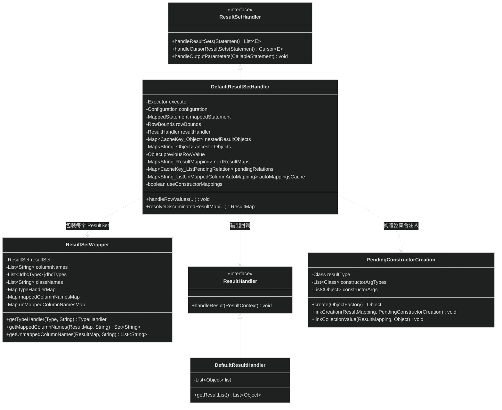
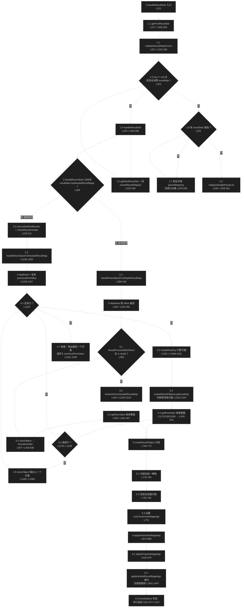
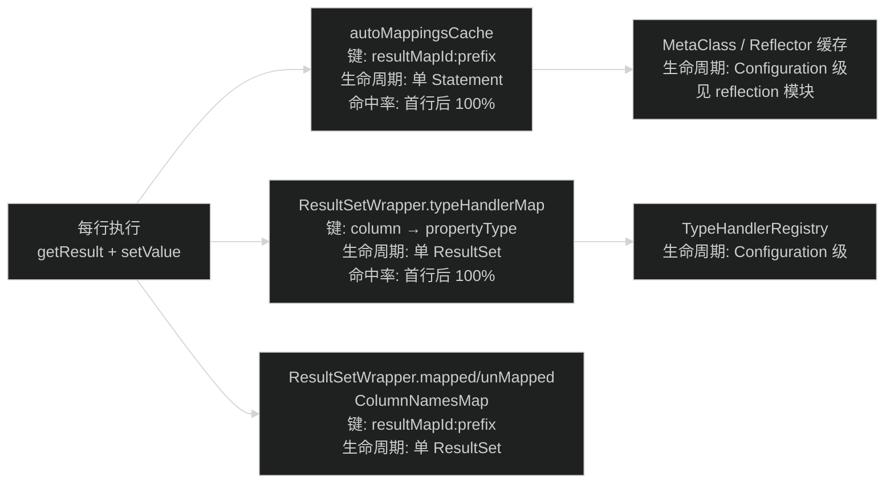

# 源码分析：结果集映射引擎（DefaultResultSetHandler）

> 上次修改：2026-07-29 21:41

## 阅读向导

**面向读者**：

| 读者类型 | 建议关注 | 理由 |
|----------|----------|------|
| 新接手开发者 | 第 2、3、4 章 | 先建立「`handleResultSets` → `handleRowValues` → `getRowValue` → `applyXxxMappings`」的四层骨架心智模型，再看细节 |
| 排障者（映射结果不对/多了少了/为空） | 第 5、8 章 | `foundValues` 语义、`returnInstanceForEmptyRow`、`resultOrdered`、`CacheKey` 退化为 `NULL_CACHE_KEY` 是 90% 映射诡异现象的根因 |
| 代码审查者 / 二次开发者 | 第 6、7 章 | 该类是全项目最复杂的单类（1662 行、约 60 个方法），改动前必须理解它的隐式状态机与字段级副作用 |
| 性能调优者 | 第 3、7 章 | `autoMappingsCache`、`ResultSetWrapper` 的三层缓存、`nestedResultObjects` 的内存增长模型 |

**阅读前建议先了解**（本文假设读者已具备这些背景，不再重复）：

- [执行器与结果处理（executor）](执行器与结果处理（executor）.md) —— 模块级视角：`Executor` / `StatementHandler` / `ResultSetHandler` 三层关系、一级缓存、`ErrorContext`。本文是它第 6 节「结果集映射」的行级展开。
- [映射模型（mapping）](映射模型（mapping）.md) —— `ResultMap` / `ResultMapping` / `Discriminator` 的构建期语义（XML/注解如何变成对象）。本文只关心**运行期如何消费**这些对象。
- [反射工具（reflection）](反射工具（reflection）.md) —— `MetaObject` / `MetaClass` / `ObjectFactory` / `Reflector` 的属性读写与缓存机制。本文把 `MetaObject.setValue` 当作黑盒使用。
- [类型处理与别名（type）](类型处理与别名（type）.md) —— `TypeHandler` / `TypeHandlerRegistry` 的注册与查找规则。本文只关心 `getResult(rs, columnName)` 的调用时机。

**与模块文档的分工**：模块文档回答「有哪些组件、怎么串起来」；本文回答「每一行在干什么、为什么必须是这个顺序、改了会怎样」。

---

## 1. 分析范围与目标

### 1.1 涵盖范围

**主分析对象**：`src/main/java/org/apache/ibatis/executor/resultset/DefaultResultSetHandler.java`（1662 行，MyBatis 中最长、分支最密的单个类）。

覆盖的功能面：

| 功能面 | 关键方法 | 行号区间 |
|--------|----------|----------|
| 入口全景与多结果集 | `handleResultSets` / `getFirstResultSet` / `getNextResultSet` / `collapseSingleResultList` | 210-246、266-316、359-361 |
| 单结果集分发 | `handleResultSet` / `handleRowValues` | 340-356、367-376 |
| 简单结果集行循环 | `handleRowValuesForSimpleResultMap` / `skipRows` / `shouldProcessMoreRows` / `storeObject` | 396-455、418-441 |
| 行对象构造 | `createResultObject`（两个重载）/ `createParameterizedResultObject` / `createByConstructorSignature` / `createPrimitiveResultObject` | 745-996 |
| 属性映射双路径 | `applyPropertyMappings` / `applyAutomaticMappings` / `createAutomaticMappings` | 545-579、625-688 |
| 嵌套映射与行去重 | `handleRowValuesForNestedResultMap` / `getRowValue`（嵌套重载）/ `applyNestedResultMappings` / `createRowKey` / `combineKeys` / `linkObjects` | 1146-1200、493-524、1401-1447、1494-1533、1594-1653 |
| 鉴别器 | `resolveDiscriminatedResultMap` / `getDiscriminatorValue` / `prependPrefix` | 1104-1140 |
| 嵌套查询与延迟加载 | `getNestedQueryMappingValue` / `getNestedQueryConstructorValue` / `prepareParameterForNestedQuery` | 1002-1098 |
| 多结果集关联 | `linkToParents` / `addPendingChildRelation` / `createKeyForMultipleResults` | 692-739 |
| 存储过程出参 | `handleOutputParameters` / `handleRefCursorOutputParameter` | 152-205 |
| 构造器集合注入（issue #101） | `PendingConstructorCreation` 相关的 `linkNestedPendingCreations` / `applyNestedPendingConstructorCreations` / `createPendingConstructorCreations` | 1205-1395 |

**辅助分析对象**（只分析与本引擎交互的部分）：

- `src/main/java/org/apache/ibatis/executor/resultset/ResultSetWrapper.java`（194 行）—— 列元数据与 TypeHandler 的每结果集级缓存
- `src/main/java/org/apache/ibatis/executor/result/DefaultResultHandler.java`（50 行）—— 默认收集器
- `src/main/java/org/apache/ibatis/executor/result/DefaultResultContext.java`（60 行）—— 行计数与 `stop()` 信号
- `src/main/java/org/apache/ibatis/executor/resultset/PendingConstructorCreation.java`（146 行）—— 不可变对象 + 构造器集合的延迟构建
- `src/main/java/org/apache/ibatis/mapping/ResultMap.java` / `ResultMapping.java` —— 被消费的元数据
- `src/main/java/org/apache/ibatis/executor/loader/ResultLoaderMap.java` —— 延迟加载挂载点
- `src/main/java/org/apache/ibatis/cache/CacheKey.java` —— 被复用为「行身份标识」

### 1.2 不涵盖范围

| 不涵盖 | 原因 | 去哪看 |
|--------|------|--------|
| `ResultMap` / `ResultMapping` 的**构建过程**（XML/注解解析） | 属于 `builder` 包的职责，本文只消费构建结果 | [配置构建器（builder）](配置构建器（builder）.md) |
| `TypeHandler` 的**实现细节**（如何调用 `rs.getInt`） | 本文只关心调用点与返回值判空 | [类型处理与别名（type）](类型处理与别名（type）.md) |
| `MetaObject.setValue` 的**反射细节** | 本文只关心它作为「写属性」的语义 | [反射工具（reflection）](反射工具（reflection）.md) |
| `ResultLoader.loadResult()` **内部**如何建 Executor | 本文只关心它作为「触发嵌套查询」的挂载点 | [执行器与结果处理（executor）](执行器与结果处理（executor）.md) 第 6.6 节 |
| `ProxyFactory` 生成代理的字节码机制 | 本文只标出 `createResultObject` 中的代理切入点（L757-761） | 同上 |
| `DefaultCursor` 的迭代器语义 | 本文只说明它复用了 `handleRowValues`（`DefaultCursor.java:141`） | 同上 |

### 1.3 分析目标

1. **理解核心算法**：JDBC 的「平坦行集」如何被还原成「Java 对象图」——尤其是 join 结果集下的**行合并去重算法**（`CacheKey` 作为对象身份）。
2. **建立行级可追溯性**：给出从入口到叶子的完整执行顺序，使排障时能沿行号回溯。
3. **识别隐藏协议**：`foundValues` 的三重语义、`useConstructorMappings` 这个字段级临时标记、`DEFERRED` 哨兵对象、`CacheKey.NULL_CACHE_KEY` 的退化语义——这些都不能从方法签名看出来。
4. **评估可维护性风险**：本类持有 7 个可变实例字段且非线程安全，本文给出这些字段的生命周期与清理点。

---

## 2. 核心类/函数全景

### 2.1 类层次



### 2.2 核心方法清单

| 方法 | 职责 | 关键输入 | 返回/副作用 | 代码位置 |
|------|------|----------|-------------|----------|
| `handleResultSets(Statement)` | 唯一外部入口。驱动多结果集循环，产出最终 `List` | JDBC `Statement` | `List<Object>`；每处理完一个结果集清空 `nestedResultObjects` | `DefaultResultSetHandler.java:211-246` |
| `handleCursorResultSets(Statement)` | 游标入口，不做行循环，把自身与 `rsw` 交给 `DefaultCursor` | `Statement` | `Cursor<E>`；强制单 ResultMap | `:249-264` |
| `handleOutputParameters(CallableStatement)` | 存储过程 OUT/INOUT 参数写回参数对象 | `CallableStatement` | 无返回；**写参数对象**（副作用） | `:153-183` |
| `getFirstResultSet(Statement)` | 兼容 Oracle 隐式游标与 HSQLDB 的首结果集获取 | `Statement` | `ResultSetWrapper` 或 `null` | `:266-293` |
| `getNextResultSet(Statement)` | 标准 JDBC 「还有没有下一个结果集」判断 | `Statement` | `ResultSetWrapper` 或 `null`；**吞掉所有异常** | `:295-316` |
| `handleResultSet(...)` | 三分支分发：多结果集子关联 / 无 handler / 有 handler | `rsw`、`resultMap`、`multipleResults`、`parentMapping` | 向 `multipleResults` 追加；`finally` 关 ResultSet | `:340-356` |
| `handleRowValues(...)` | **分水岭**：有嵌套 ResultMap 走 A 路，否则走 B 路 | 同上 + `rowBounds` | 无返回 | `:367-376` |
| `handleRowValuesForSimpleResultMap(...)` | B 路：逐行独立构造，不做去重 | 同上 | 通过 `storeObject` 回调 handler | `:396-416` |
| `handleRowValuesForNestedResultMap(...)` | A 路：行合并算法，三种模式（pcc / resultOrdered / 默认） | 同上 | 同上；维护 `previousRowValue` | `:1146-1200` |
| `getRowValue(rsw, rm, columnPrefix, parentRowKey)` | 简单路径的单行取值 | 无 CacheKey | 返回行对象或 `null` | `:461-487` |
| `getRowValue(rsw, rm, combinedKey, columnPrefix, partialObject)` | 嵌套路径的单行取值；`partialObject != null` 表示「补充已有对象」 | 有 CacheKey | 同上；写 `nestedResultObjects` | `:493-524` |
| `createResultObject(rsw, rm, lazyLoader, prefix, key)` 外层 | 创建对象 + 挂延迟加载代理 + 设置 `useConstructorMappings` | — | 对象实例（可能是代理 / `PendingConstructorCreation`） | `:745-773` |
| `createResultObject(...)` 内层 | 四选一策略：TypeHandler 直取 / 显式构造器 / 默认构造器 / 构造器自动映射 | — | 对象实例 | `:775-794` |
| `createParameterizedResultObject(...)` | 按 `<constructor>` 声明逐个求值并调 `ObjectFactory.create` | `constructorMappings` | 对象或 `null`（全 null 时） | `:796-850` |
| `createByConstructorSignature(...)` | 无默认构造器时按签名自动匹配构造器 | — | 对象或抛 `ExecutorException` | `:852-857` |
| `applyPropertyMappings(...)` | 走 `<result>`/`<id>` 显式映射 | `ResultMapping` 列表 | `boolean foundValues`；写 `MetaObject` | `:545-579` |
| `applyAutomaticMappings(...)` | 走未显式映射列的自动映射 | 缓存的 `UnMappedColumnAutoMapping` | 同上 | `:671-688` |
| `createAutomaticMappings(...)` | 构建并缓存自动映射计划（列→属性→TypeHandler） | — | `List<UnMappedColumnAutoMapping>`；写 `autoMappingsCache` | `:625-669` |
| `applyNestedResultMappings(...)` | 递归处理 `<association>`/`<collection>` | `parentRowKey`、`newObject` | `boolean`；调 `linkObjects` | `:1401-1447` |
| `createRowKey(...)` | 用 `CacheKey` 编码「这一行属于哪个逻辑对象」 | `resultMap`、`columnPrefix` | `CacheKey` 或 `NULL_CACHE_KEY` | `:1494-1511` |
| `combineKeys(rowKey, parentRowKey)` | 父子键拼接，形成路径唯一标识 | 两个 `CacheKey` | 合并键或 `NULL_CACHE_KEY` | `:1513-1525` |
| `linkObjects(...)` | 把子对象挂到父对象（集合 add 或标量 set） | `MetaObject`、`ResultMapping` | 写父对象 | `:1594-1623` |
| `instantiateCollectionPropertyIfAppropriate(...)` | 惰性初始化集合属性 | — | 集合实例或 `null`（非集合） | `:1630-1653` |
| `resolveDiscriminatedResultMap(...)` | 沿 `<discriminator>` 链解析出真实 ResultMap | — | `ResultMap`；带循环防护 | `:1104-1122` |
| `getNestedQueryMappingValue(...)` | 嵌套查询三态：`deferLoad` / lazy / 立即加载 | — | 值 / `DEFERRED` / `null` | `:1022-1051` |
| `skipRows(rs, rowBounds)` | RowBounds offset 裁剪 | — | 移动游标 | `:443-455` |
| `shouldProcessMoreRows(ctx, rowBounds)` | RowBounds limit + `stop()` 判断 | — | `boolean` | `:439-441` |

### 2.3 `ResultSetWrapper` 的三层缓存

| 缓存字段 | 键 | 值 | 作用 | 位置 |
|----------|-----|-----|------|------|
| `typeHandlerMap` | `columnName` → `propertyType` | `TypeHandler` | 避免每行每列都查 `TypeHandlerRegistry` | `ResultSetWrapper.java:48、96-121` |
| `mappedColumnNamesMap` | `resultMapId + ":" + columnPrefix` | `Set<String>`（大写列名） | 判断某列是否被显式映射 | `:49、161-168` |
| `unMappedColumnNamesMap` | 同上 | `List<String>`（原始大小写） | 自动映射的候选列 | `:50、170-177` |

注意 `columnNames` / `jdbcTypes` / `classNames` 三个 `List` 在构造器中一次性从 `ResultSetMetaData` 抽取（`ResultSetWrapper.java:55-61`），后续所有列查找都基于内存 List，避免反复 JDBC 元数据调用。

---

## 3. 关键数据结构

### 3.1 实例字段：一个隐式状态机

`DefaultResultSetHandler` 的实例字段中，**7 个是可变状态**，构成了一个跨方法的隐式状态机。理解它们的生命周期是理解本类的前提。

| 字段 | 类型 | 生命周期 | 何时写入 | 何时清理 | 位置 |
|------|------|----------|----------|----------|------|
| `nestedResultObjects` | `HashMap<CacheKey, Object>` | 单个结果集 | `getRowValue` 嵌套重载 L520、`linkNestedPendingCreations` L1217 | `cleanUpAfterHandlingResultSet()` L328-330（每个结果集处理完）；`resultOrdered` 模式下每遇新行 `clear()` L1179；`createAndStorePendingCreation` L1394 | `:100` |
| `ancestorObjects` | `HashMap<String, Object>` | 单行的递归栈 | `putAncestor` L526-528 | 递归返回时 `remove` L501、L515 | `:101` |
| `previousRowValue` | `Object` | 跨 `handleRowValues` 调用 | L1198 | L1196 置 null | `:102` |
| `nextResultMaps` | `HashMap<String, ResultMapping>` | 整个 Statement | `addPendingChildRelation` L717 | 不清理（对象随 handler 销毁） | `:105` |
| `pendingRelations` | `HashMap<CacheKey, List<PendingRelation>>` | 整个 Statement | `addPendingChildRelation` L712-714 | 不清理 | `:106` |
| `autoMappingsCache` | `HashMap<String, List<UnMappedColumnAutoMapping>>` | 整个 Statement | `createAutomaticMappings` L666 | 不清理 | `:109` |
| `constructorAutoMappingColumns` | `HashMap<String, List<String>>` | 整个 Statement | `applyArgNameBasedConstructorAutoMapping` L950 | `createAutomaticMappings` L633 用 `remove` **消费即删** | `:110` |
| `useConstructorMappings` | `boolean` | 单个对象创建 | `createResultObject` L747 重置、L771 设置 | 下次 `createResultObject` 重置 | `:113` |
| `pendingPccRelations` | `IdentityHashMap<Object, PendingRelation>` | 整个 Statement | `linkObjects` L1617 | `createPendingConstructorCreations` L1351 `remove` | `:97` |

**为什么 `useConstructorMappings` 是字段而不是返回值？** 源码注释写得很直白（L112）：`use field to reduce memory usage`。`createResultObject` 需要同时返回「对象实例」和「是否走了构造器映射」两个值，Java 没有多返回值，作者选择了字段而非包装类。这个标记随后在 `getRowValue` L467、L507 被读作 `foundValues` 的初值——**构造器注入成功本身就算「找到了值」**。

**为什么 `pendingPccRelations` 用 `IdentityHashMap` 而不是 `HashMap`？** 因为键是**用户的结果对象**，其 `equals`/`hashCode` 由用户类定义。若用户实现了基于业务字段的 `equals`（例如两个不同的订单行 `equals` 相等），普通 `HashMap` 会误判为同一对象导致关系覆盖。`IdentityHashMap` 强制用 `==` 比较，保证「对象身份」语义。这是本类中少见的、防御用户代码的设计。

### 3.2 `CacheKey` 被复用为「行身份」

`CacheKey` 原本是缓存模块的键（`src/main/java/org/apache/ibatis/cache/CacheKey.java`），本引擎把它复用为「这一行数据属于哪个逻辑对象」的身份标识。

**结构**（`CacheKey.java:50-56`）：

| 字段 | 作用 |
|------|------|
| `multiplier` = 37 / `hashcode` 初值 17 | 标准 31/37 型哈希累积 |
| `checksum` | 所有元素原始 hashCode 之和，作为 `equals` 的快速前置判断 |
| `count` | 更新次数，参与哈希扰动（`baseHashCode *= count`），使「相同元素不同顺序」产生不同哈希 |
| `updateList` | 保留所有更新过的对象，`equals` 时逐个 `ArrayUtil.equals` 精确比较 |

**为什么选 `CacheKey` 而非 `List` 或字符串拼接？**

- **好处**：① `equals` 有三级短路（hashcode → checksum → count → 逐元素），失配时极快；② `update(Object)` 天然支持 `null`（L75 `object == null ? 1 : ...`），而字符串拼接需要额外的 null 占位约定；③ `clone()` 支持（L132-136）使 `combineKeys` 能低成本派生子键；④ 复用现有类，无需新增概念。
- **替代方案**：用 `List<Object>` 直接作键——`ArrayList.equals` 是逐元素比较且无 checksum 短路，大结果集下 `HashMap` 查找退化明显；用 `String.join` 拼列值——会丢失类型信息（`1` 与 `"1"` 无法区分），且数组类型的 `toString` 不可靠。
- **风险**：`CacheKey.equals` 依赖 `updateList` 中元素的 `equals`。若某列的 `TypeHandler` 返回了一个 `equals` 未正确实现的自定义类型（例如某些 JDBC 驱动返回的专有 BLOB 对象），行去重会失效，表现为「本该合并的行没合并，集合里出现重复子对象」。

**`NULL_CACHE_KEY` 的退化语义**（`CacheKey.java:32-45`）：这是一个匿名子类单例，任何 `update` 都抛 `CacheException`。`createRowKey` 在 `cacheKey.getUpdateCount() < 2` 时返回它（L1507-1509）——意思是「除了 `resultMap.getId()` 之外一个有效列值都没取到，这一行无法建立身份」。下游一律用 `!= CacheKey.NULL_CACHE_KEY` 做**引用比较**（L481、L519、L1216、L1255、L1335）来跳过写入 `nestedResultObjects`。

这是本类最容易踩的坑之一：**如果 `<id>` 列全为 NULL，或 ResultMap 完全没有可用列，行去重就静默失效**，每一行都会创建新对象。

### 3.3 `UnMappedColumnAutoMapping`：自动映射的编译产物

```
私有静态内部类（:120-132）
  column      String        —— ResultSet 中的列名（保留原始大小写）
  property    String        —— 目标属性名（经 MetaObject.findProperty 解析，支持下划线转驼峰）
  typeHandler TypeHandler   —— 已解析好的类型处理器
  primitive   boolean       —— 属性是否为原始类型，用于 callSettersOnNulls 时避免 NPE
```

**设计理由**：自动映射的「列名 → 属性名 → TypeHandler」解析涉及反射与注册表查找，成本高但对同一个 `(resultMapId, columnPrefix)` 组合**结果恒定**。把它编译成一个不可变的小对象列表缓存起来（`autoMappingsCache`，键为 `resultMap.getId() + ":" + columnPrefix`，L627），后续每行只做 `typeHandler.getResult` + `metaObject.setValue` 两步。这是典型的「解释 → 编译」优化。

`primitive` 字段专为 `callSettersOnNulls` 服务：L681 `value != null || configuration.isCallSettersOnNulls() && !mapping.primitive`——对原始类型属性调 `setValue(null)` 会在拆箱时 NPE，所以必须跳过。注意 `applyPropertyMappings` 走的是另一条路（L573 `!metaObject.getSetterType(property).isPrimitive()`），**每次都实时反射查询**，没有预编译——这是两条路径不对称的地方（见第 7 章）。

### 3.4 `DEFERRED` 哨兵对象

```java
private static final Object DEFERRED = new Object();   // :83
```

一个纯标记对象，表示「这个属性的值稍后由别人填」。三处产生（L595 多结果集、L1038 一级缓存命中、L1044 延迟加载），一处消费（L565-568）：

```java
if (value == DEFERRED) {
  foundValues = true;      // 算作「找到了值」，避免整行被判为空行丢弃
  continue;                // 但不写入属性
}
```

**好处**：用引用相等（`==`）区分「真的取到了 null」与「值将来才有」，零成本且无歧义。**替代方案**：用 `Optional` 或专门的包装类型——会给每个属性值都带来装箱开销，而 DEFERRED 只在极少数属性上出现。**风险**：`DEFERRED` 是 `private static final`，若某个 `TypeHandler` 恰好返回了这个实例（实际不可能，因为它不可访问），会造成语义混乱；实际风险为零。

### 3.5 `PendingConstructorCreation`：不可变对象 + 集合构造器参数

这是 MyBatis 为 issue #101（「构造器里带集合的不可变对象」）引入的机制。核心矛盾：**Java 构造器必须一次性拿到全部参数，但集合参数需要跨多行累积**。

解法是「延迟构造」：

```
PendingConstructorCreation（PendingConstructorCreation.java:35-146）
  resultType            Class            —— 最终要 new 的类型
  constructorArgTypes   List<Class>      —— 构造器签名
  constructorArgs       List<Object>     —— 已求值的参数（集合位置先放空集合）
  linkedCollectionMetaInfo  Map<Integer, PendingCreationMetaInfo>  —— 参数下标 → 集合元信息
  linkedCollectionsByKey    Map<PendingCreationKey, Collection>    —— 简单值集合累积区
  linkedCreationsByKey      Map<PendingCreationKey, List<PCC>>     —— 嵌套 PCC 累积区
  create(ObjectFactory)  —— 递归把子 PCC 也 create 出来，最后调 objectFactory.create
```

`create()`（`PendingConstructorCreation.java:113-145`）遍历参数位：无元信息的直接用原值；有 `linkedCreations` 的先递归 `create` 每个子 PCC 再填入集合；否则用已内联构建好的集合。

**为什么必须要求 `resultOrdered=true`？** 见 `verifyPendingCreationPreconditions`（L1378-1388）：因为 PCC 一旦 `create()` 就无法再追加元素（对象已不可变），所以必须保证「同一逻辑对象的所有行是连续的」，才能在遇到新行键时安全地把上一个 PCC 收尾。不排序则抛 `ExecutorException`。这是一个**把正确性责任外推给用户配置**的设计（见第 6 章评估）。

### 3.6 配置项对映射行为的影响

| 配置项 | 默认值 | 影响点 | 源码位置 |
|--------|--------|--------|----------|
| `autoMappingBehavior` | `PARTIAL` | `shouldApplyAutomaticMappings`：`NONE` 全关；`PARTIAL` 只对非嵌套开；`FULL` 嵌套也开 | `Configuration.java:133`；`DefaultResultSetHandler.java:530-539` |
| `autoMappingUnknownColumnBehavior` | `NONE` | 自动映射找不到属性或 TypeHandler 时：忽略 / 警告 / 抛异常 | `AutoMappingUnknownColumnBehavior.java:36-62`；调用点 L658、L662 |
| `mapUnderscoreToCamelCase` | `false` | `metaObject.findProperty(name, true)` 时把 `USER_NAME` 匹配到 `userName` | `Configuration.java:109`；调用点 L647、L1573、L980 |
| `useColumnLabel` | `true` | `ResultSetWrapper` 用 `getColumnLabel` 还是 `getColumnName` | `ResultSetWrapper.java:58` |
| `callSettersOnNulls` | `false` | NULL 值是否也调用 setter（影响 Map 结果的键是否存在） | L573、L681 |
| `returnInstanceForEmptyRow` | `false` | 全 NULL 行返回空实例还是 `null` | L473、L517、L906、L1551 |
| `safeRowBoundsEnabled` | `false` | 嵌套 ResultMap + RowBounds 是否抛异常 | L379-384 |
| `safeResultHandlerEnabled` | `true` | 嵌套 ResultMap + 自定义 ResultHandler 且非 resultOrdered 时抛异常 | L388-393 |
| `argNameBasedConstructorAutoMapping` | `false` | 构造器自动映射按参数名还是按列顺序 | L871、L899 |

---

## 4. 主线流程逐行解读

本章从 `handleResultSets` 开始，按执行顺序逐段解读。所有行号指向 `src/main/java/org/apache/ibatis/executor/resultset/DefaultResultSetHandler.java`。

### 4.1 整体流程图



**1-1.8 多结果集驱动**：`handleResultSets` 是本引擎唯一的常规入口。它先取第一个 `ResultSet`（`getFirstResultSet` 内含 Oracle 隐式游标与 HSQLDB 的兼容逻辑），校验至少配置了一个 ResultMap，然后进入主循环：每轮取一个 ResultMap 处理一个 ResultSet，处理完立即清空 `nestedResultObjects` 防止跨结果集串联。主循环结束后，若 `<select resultSets="a,b">` 声明了具名结果集，则进入第二个循环，把剩余结果集按名字关联回父对象（用于「一次查询返回主表+子表两个结果集」的场景）。最后 `collapseSingleResultList` 做一个语法糖：只有一个结果集时直接返回内层 List 而非 `List<List>`。

**2-2.3 分水岭判断**：`handleRowValues` 只做一件事——看 `resultMap.hasNestedResultMaps()`（这个标记在 `ResultMap.Builder.build()` 中预计算，`ResultMap.java:102-103`）决定走哪条路。走嵌套路时先做两个安全检查：`ensureNoRowBounds` 阻止 RowBounds 与嵌套映射同用（因为 RowBounds 裁剪的是「JDBC 行」而非「逻辑对象」，语义会错），`checkResultHandler` 阻止自定义 ResultHandler 在非 `resultOrdered` 下使用（因为对象要到最后才完整，中途回调会给出不完整对象）。

**3-3.4 简单路径行循环**：先 `skipRows` 按 offset 跳过前 N 行，然后 `while` 循环：每行先解析鉴别器（同一个结果集的不同行可能映射到不同的子 ResultMap），再 `getRowValue` 构造对象，最后 `storeObject` 交给 ResultHandler。注意循环条件 `!resultSet.isClosed()`（L403）——这是防止 `ResultHandler.stop()` 或嵌套查询意外关闭结果集后继续读取。

**4-4.7 嵌套路径行循环**：核心差异是每行都要先算 `rowKey`，然后查 `nestedResultObjects` 看这个逻辑对象是否已经存在。存在则把当前行的数据「补充」进去（只补集合），不存在则新建。`storeObject` 的调用时机在三种模式下不同（见 4.6 节）。

**5-6.3 单行的对象构造与属性填充**：两条 `getRowValue` 最终都汇聚到「创建对象 → 自动映射 → 显式映射 →（嵌套路径还有）递归子映射 → 空行判定」这个五步序列。

### 4.2 入口：`handleResultSets`（L211-246）

```java
L212: ErrorContext.instance().activity("handling results").object(mappedStatement.getId());
```
向 ThreadLocal 错误上下文写入当前阶段，异常时错误信息会带上「### The error occurred while handling results」。

```java
L214: final List<Object> multipleResults = new ArrayList<>();
L216: int resultSetCount = 0;
L217: ResultSetWrapper rsw = getFirstResultSet(stmt);
L219: List<ResultMap> resultMaps = mappedStatement.getResultMaps();
L220: int resultMapCount = resultMaps.size();
L221: validateResultMapsCount(rsw, resultMapCount);
```
`multipleResults` 是最终产物的容器——每个 ResultSet 贡献一个 `List`。`getFirstResultSet` 返回 `null` 表示「这条语句根本没有结果集」（例如纯 update），此时 `validateResultMapsCount`（L332-338）也不会抛异常（因为它的条件是 `rsw != null && resultMapCount < 1`）。反之若有结果集但没配 ResultMap，抛出的正是那条经典错误：`A query was run and no Result Maps were found for the Mapped Statement '...'`。

```java
L222: while (rsw != null && resultMapCount > resultSetCount) {
L223:   ResultMap resultMap = resultMaps.get(resultSetCount);
L224:   handleResultSet(rsw, resultMap, multipleResults, null);
L225:   rsw = getNextResultSet(stmt);
L226:   cleanUpAfterHandlingResultSet();
L227:   resultSetCount++;
L228: }
```
**主循环**：ResultMap 与 ResultSet 按下标一一配对。`parentMapping` 传 `null` 表示「这是顶层结果集，结果要收集到 `multipleResults`」。L226 的 `cleanUpAfterHandlingResultSet()` 只做一件事：`nestedResultObjects.clear()`（L328-330）——**必须清**，否则第二个结果集的行键可能与第一个碰撞，把不相干的对象当成「已存在的父对象」。

注意循环条件是 `resultMapCount > resultSetCount`，也就是「ResultMap 用完就停」。若 ResultSet 比 ResultMap 多，多余的会留给下面的 `resultSets` 循环处理；若 ResultMap 比 ResultSet 多，`rsw == null` 会提前终止，多余的 ResultMap 静默忽略（不报错）。

```java
L230: String[] resultSets = mappedStatement.getResultSets();
L231: if (resultSets != null) {
L232:   while (rsw != null && resultSetCount < resultSets.length) {
L233:     ResultMapping parentMapping = nextResultMaps.get(resultSets[resultSetCount]);
L234:     if (parentMapping != null) {
L235:       String nestedResultMapId = parentMapping.getNestedResultMapId();
L236:       ResultMap resultMap = configuration.getResultMap(nestedResultMapId);
L237:       handleResultSet(rsw, resultMap, null, parentMapping);
L238:     }
L239:     rsw = getNextResultSet(stmt);
L240:     cleanUpAfterHandlingResultSet();
L241:     resultSetCount++;
L242:   }
L243: }
```
**多结果集关联循环**。这段服务于这样的配置：

```xml
<select id="getUsers" resultSets="users,orders" resultMap="userMap">
  {call get_users_and_orders()}
</select>
<resultMap id="userMap" type="User">
  <id property="id" column="id"/>
  <collection property="orders" ofType="Order" resultSet="orders"
              column="id" foreignColumn="user_id"/>
</resultMap>
```

流程是：第一个结果集（users）在主循环中处理，处理过程中每遇到一个带 `resultSet="orders"` 的 `ResultMapping`，就调 `addPendingChildRelation`（L594）把「这个 User 对象在等 orders 结果集里 user_id = 它的 id 的行」登记到 `pendingRelations`，同时把 `parentMapping` 登记到 `nextResultMaps`（L717）。到了这个 `resultSets` 循环，第二个结果集（orders）就能通过 `nextResultMaps.get("orders")` 找回那个 `ResultMapping`，传 `parentMapping != null` 让 `handleResultSet` 走 `linkToParents` 分支把 Order 挂回 User。

关键点：`multipleResults` 传 `null`——子结果集的行**不进最终返回值**，只用于回填父对象。

```java
L245: return collapseSingleResultList(multipleResults);
```
`collapseSingleResultList`（L359-361）：`multipleResults.size() == 1 ? (List<Object>) multipleResults.get(0) : multipleResults`。这是一个纯粹的 API 便利性处理——单结果集时返回 `List<User>` 而非 `List<List<User>>`。**副作用**：调用方（`BaseExecutor` → `DefaultSqlSession`）无法从返回类型区分这两种情况，只能靠约定。

### 4.3 结果集获取的驱动兼容：`getFirstResultSet` / `getNextResultSet`

```java
L270: try {
L271:   rs = stmt.getResultSet();
L272: } catch (SQLException e) {
L273:   // Oracle throws ORA-17283 for implicit cursor
L274:   e1 = e;
L275: }
L277: try {
L278:   while (rs == null) {
L281:     if (stmt.getMoreResults()) {
L282:       rs = stmt.getResultSet();
L283:     } else if (stmt.getUpdateCount() == -1) {
L285:       break;
L286:     }
L287:   }
L288: } catch (SQLException e) {
L289:   throw e1 != null ? e1 : e;
L290: }
```
两段 try 的组合是为了兼容两类驱动缺陷：① Oracle 对隐式游标直接抛 `ORA-17283`（不返回 null），所以第一次异常被暂存到 `e1` 而不是立即抛出；② HSQLDB 可能不把 ResultSet 作为第一个结果返回，需要 `getMoreResults()` 往前推进。`getUpdateCount() == -1` 是 JDBC 规范约定的「没有更多结果」信号。L289 的异常优先级设计很讲究：如果第二段也失败，优先抛第一段的异常（更接近根因）。

```java
L304: if (!(!stmt.getMoreResults() && stmt.getUpdateCount() == -1)) {
```
`getNextResultSet` 中这行带着源码注释「DO NOT try to 'improve' the condition even if IDE tells you to!」（L302）。IDE 会建议化简为 `stmt.getMoreResults() || stmt.getUpdateCount() != -1`，但那会因为 `||` 短路而**跳过 `getUpdateCount()` 的调用**，而某些驱动依赖这个调用来推进内部状态。这是一个「副作用依赖」的经典案例。

L312-314 `catch (Exception e) { /* Intentionally ignored. */ }` —— 整个方法吞掉所有异常返回 `null`，注释说明是「Making this method tolerant of bad JDBC drivers」（L296）。代价是真实的连接故障也会被静默当作「没有更多结果集」（见第 8 章疑似问题）。

### 4.4 分发：`handleResultSet`（L340-356）与 `handleRowValues`（L367-376）

```java
L342: try {
L343:   if (parentMapping != null) {
L344:     handleRowValues(rsw, resultMap, null, RowBounds.DEFAULT, parentMapping);
L345:   } else if (resultHandler == null) {
L346:     DefaultResultHandler defaultResultHandler = new DefaultResultHandler(objectFactory);
L347:     handleRowValues(rsw, resultMap, defaultResultHandler, rowBounds, null);
L348:     multipleResults.add(defaultResultHandler.getResultList());
L349:   } else {
L350:     handleRowValues(rsw, resultMap, resultHandler, rowBounds, null);
L351:   }
L352: } finally {
L354:   closeResultSet(rsw.getResultSet());
L355: }
```

三个分支的语义差别：

| 分支 | 条件 | ResultHandler | RowBounds | 结果去向 |
|------|------|---------------|-----------|----------|
| 子结果集回填 | `parentMapping != null` | `null` | `DEFAULT`（不裁剪） | 通过 `linkToParents` 回填父对象；**不进 `multipleResults`** |
| 默认收集 | `resultHandler == null` | 新建 `DefaultResultHandler` | 用户传入的 | `multipleResults.add(list)` |
| 用户回调 | `resultHandler != null` | 用户的 | 用户传入的 | **完全不进 `multipleResults`**，最终返回空列表 |

第三个分支解释了一个常见困惑：**用了自定义 `ResultHandler` 后 `selectList` 返回空列表**——因为结果全被回调消费了，`multipleResults` 从未被 add。

`DefaultResultHandler` 本身极简（`DefaultResultHandler.java:28-50`）：一个 `List` + `handleResult` 时 `list.add(context.getResultObject())`。它的 `List` 由 `objectFactory.create(List.class)` 创建（L38），意味着用户可以通过自定义 `ObjectFactory` 替换结果容器类型。

`finally` 中的 `closeResultSet`（L318-326）对应 issue #228，同样吞掉 `SQLException`。

```java
L369: if (resultMap.hasNestedResultMaps()) {
L370:   ensureNoRowBounds();
L371:   checkResultHandler();
L372:   handleRowValuesForNestedResultMap(...);
L373: } else {
L374:   handleRowValuesForSimpleResultMap(...);
L375: }
```
`handleRowValues` 是 `public` 方法（L367），因为 `DefaultCursor` 要调它（`DefaultCursor.java:141`）——游标模式下每次 `next()` 都调一次，靠 `ObjectWrapperResultHandler` 的 `stop()` 实现「取一个就停」。

注意 `ensureNoRowBounds`（L378-385）读的是**字段** `this.rowBounds` 而不是参数 `rowBounds`。这不是笔误：`DefaultCursor` 调用时传的参数是 `RowBounds.DEFAULT`（因为游标自己做分页），但字段仍是用户设置的 RowBounds，检查字段才能正确拦截「游标 + 嵌套映射 + RowBounds」的组合。

### 4.5 简单路径行循环：`handleRowValuesForSimpleResultMap`（L396-416）

```java
L400: DefaultResultContext<Object> resultContext = new DefaultResultContext<>();
L401: ResultSet resultSet = rsw.getResultSet();
L402: skipRows(resultSet, rowBounds);
L403: while (shouldProcessMoreRows(resultContext, rowBounds) && !resultSet.isClosed() && resultSet.next()) {
L404:   ResultMap discriminatedResultMap = resolveDiscriminatedResultMap(rsw, resultMap, null);
L405:   Object rowValue = getRowValue(rsw, discriminatedResultMap, null, null);
L406:   if (!useCollectionConstructorInjection) {
L407:     storeObject(resultHandler, resultContext, rowValue, parentMapping, resultSet);
L408:   } else { ... }
L409: }
```

**`skipRows`（L443-455）的两种实现**：

```java
L444: if (rs.getType() != ResultSet.TYPE_FORWARD_ONLY) {
L445:   if (rowBounds.getOffset() != RowBounds.NO_ROW_OFFSET) {
L446:     rs.absolute(rowBounds.getOffset());
L447:   }
L448: } else {
L449:   for (int i = 0; i < rowBounds.getOffset(); i++) {
L450:     if (!rs.next()) { break; }
L451:   }
L452: }
```
可滚动结果集用 `absolute(offset)` 一步到位；只进结果集只能逐行 `next()` 空转。**这解释了 RowBounds 为什么不是真正的分页**：数据库已经把所有行传输过来了，MyBatis 只是在客户端丢弃前 N 行。offset=100000 时会有 10 万次 `next()` 调用与完整的网络传输。

`rs.absolute(offset)` 的语义细节：JDBC 的 `absolute(n)` 把游标定位到**第 n 行**（1-based），而后续 `rs.next()` 会读第 n+1 行。所以 `absolute(3)` + `next()` 读到的是第 4 行，恰好跳过了前 3 行——语义正确。但 `absolute(0)` 在 JDBC 规范中意为「定位到第一行之前」，与 `NO_ROW_OFFSET == 0` 的判空是等价的，所以 L445 的判断只是避免一次无意义的驱动调用。

**`shouldProcessMoreRows`（L439-441）**：

```java
return !context.isStopped() && context.getResultCount() < rowBounds.getLimit();
```
两个终止条件：用户在 `ResultHandler` 里调了 `context.stop()`，或已产出的对象数达到 limit。注意用的是 `getResultCount()`（`DefaultResultContext.java:51` 中每次 `nextResultObject` 递增）而非「已读行数」——**limit 计的是对象数不是行数**。在嵌套映射下这两者不等，但那条路径本来就被 `ensureNoRowBounds` 保护着。

**鉴别器在循环内解析**（L404）：每一行都重新调 `resolveDiscriminatedResultMap`，因为同一个结果集的不同行可能有不同的鉴别列值（例如 `type='A'` 的行映射到 CarMap，`type='B'` 的映射到 TruckMap）。这里 `columnPrefix` 传 `null`，因为顶层结果集没有前缀。

### 4.6 `storeObject` 与 `callResultHandler`（L418-437）

```java
L420: if (parentMapping != null) {
L421:   linkToParents(rs, parentMapping, rowValue);
L422:   return;
L423: }
L425: if (pendingPccRelations.containsKey(rowValue)) {
L426:   createPendingConstructorCreations(rowValue);
L427: }
L429: callResultHandler(resultHandler, resultContext, rowValue);
```
三段：① 子结果集模式直接回填父对象后返回（不调 handler）；② 若这个对象的某个集合属性里塞着 `PendingConstructorCreation`（由 `linkObjects` L1612-1618 登记），先把它们真正 `create()` 出来；③ 正常回调。

`callResultHandler`（L433-437）先 `resultContext.nextResultObject(rowValue)` 再 `handleResult(resultContext)`。这个顺序意味着 **`getResultCount()` 在 handler 内部看到的是「包含当前对象」的计数**（从 1 开始）。

### 4.7 单行取值（简单路径）：`getRowValue`（L461-487）

```java
L463: final ResultLoaderMap lazyLoader = new ResultLoaderMap();
L464: Object rowValue = createResultObject(rsw, resultMap, lazyLoader, columnPrefix, parentRowKey);
L465: if (rowValue != null && !hasTypeHandlerForResultObject(rsw, resultMap.getType())) {
L466:   final MetaObject metaObject = configuration.newMetaObject(rowValue);
L467:   boolean foundValues = this.useConstructorMappings;
L468:   if (shouldApplyAutomaticMappings(resultMap, false)) {
L469:     foundValues = applyAutomaticMappings(rsw, resultMap, metaObject, columnPrefix) || foundValues;
L470:   }
L471:   foundValues = applyPropertyMappings(rsw, resultMap, metaObject, lazyLoader, columnPrefix) || foundValues;
L472:   foundValues = lazyLoader.size() > 0 || foundValues;
L473:   rowValue = foundValues || configuration.isReturnInstanceForEmptyRow() ? rowValue : null;
L474: }
```

**逐行要点**：

- **L463**：每行新建一个 `ResultLoaderMap`。它是「本行对象有哪些属性还没加载」的登记表，会被传给 `ProxyFactory.createProxy`（L758）成为代理对象的一部分。若本行没有 lazy 属性，这个对象就被丢弃——**每行一次无用分配**（见第 7 章）。
- **L465** `hasTypeHandlerForResultObject`（L1655-1660）：判断结果类型本身是否有 TypeHandler（例如 `resultType="int"` 或 `resultType="String"`）。若有，说明 `createResultObject` 已经通过 `createPrimitiveResultObject`（L983-996）直接把列值取出来了，**不需要也不能做属性映射**（`int` 没有属性）。这个方法有一个微妙分支：单列时用 `hasTypeHandler(resultType, jdbcType)`（考虑 JdbcType），多列时只用 `hasTypeHandler(resultType)`。
- **L467** `foundValues` 初值取 `useConstructorMappings`：构造器注入成功即视为「有值」，避免「所有值都在构造器里、属性映射一个都没匹配上」时被误判为空行丢弃。
- **L469 vs L471 的顺序**：**先自动映射，后显式映射**。这个顺序保证显式映射能覆盖自动映射的结果。不过实际上两者的列集合是互斥的（`createAutomaticMappings` 只处理 `getUnmappedColumnNames`，L631），所以顺序在正常情况下不影响结果；但如果用户在 ResultMap 里映射了同一列到不同属性，显式的会后写。
- **L469/L471 的 `|| foundValues` 位置**：写成 `foundValues = f(...) || foundValues` 而不是 `foundValues = foundValues || f(...)`——**后者会因为短路而跳过函数调用**。这里必须让副作用（写属性）发生，所以函数调用必须在 `||` 左侧。这是一处容易被「优化」破坏的写法。
- **L472** `lazyLoader.size() > 0`：有待加载的 lazy 属性也算「有值」，因为对象确实代表了一行真实数据。
- **L473** 空行判定：`foundValues == false` 且 `returnInstanceForEmptyRow == false` 时返回 `null`。这是 LEFT JOIN 场景的关键——右表全 NULL 时不应该产出一个字段全空的对象。

```java
L476: if (parentRowKey != null) {
L477:   final CacheKey rowKey = createRowKey(resultMap, rsw, columnPrefix);
L478:   final CacheKey combinedKey = combineKeys(rowKey, parentRowKey);
L479:   if (combinedKey != CacheKey.NULL_CACHE_KEY) {
L480:     nestedResultObjects.put(combinedKey, rowValue);
L481:   }
L482: }
```
这段只在构造器集合注入（PCC）场景生效——`parentRowKey` 非 null 时把这个简单对象也登记进 `nestedResultObjects`，让后续行能识别出「这个位置已经有值了」。

### 4.8 对象创建：`createResultObject` 双层（L745-794）

**外层（L745-773）**：

```java
L747: this.useConstructorMappings = false;                    // 重置
L748: final List<Class<?>> constructorArgTypes = new ArrayList<>();
L749: final List<Object> constructorArgs = new ArrayList<>();
L751: Object resultObject = createResultObject(rsw, resultMap, constructorArgTypes, constructorArgs, columnPrefix, parentRowKey);
L753: if (resultObject != null && !hasTypeHandlerForResultObject(rsw, resultMap.getType())) {
L754:   final List<ResultMapping> propertyMappings = resultMap.getPropertyResultMappings();
L755:   for (ResultMapping propertyMapping : propertyMappings) {
L757:     if (propertyMapping.getNestedQueryId() != null && propertyMapping.isLazy()) {
L758:       resultObject = configuration.getProxyFactory().createProxy(resultObject, lazyLoader, configuration,
L759:           objectFactory, constructorArgTypes, constructorArgs);
L760:       break;
L761:     }
L762:   }
L765:   if (resultMap.hasResultMapsUsingConstructorCollection() && resultObject instanceof PendingConstructorCreation) {
L766:     linkNestedPendingCreations(...);
L768:   }
L769: }
L771: this.useConstructorMappings = resultObject != null && !constructorArgTypes.isEmpty();
```

- **L747 与 L771 成对**：重置在最前、设置在最后，中间的所有递归调用（嵌套 ResultMap 的 `getRowValue` → `createResultObject`）都会覆写这个字段。所以 L771 的赋值必须在**所有递归返回之后**才有意义。这也意味着调用方必须在 `createResultObject` 返回后**立即**读取 `useConstructorMappings`（`getRowValue` L467 正是这样做的），任何插入的其他调用都会污染它。
- **L755-762 代理挂载点**：只要 ResultMap 里**有任何一个** lazy 的嵌套查询属性，就把整个对象换成代理（`break` 表示找到一个就够）。代理内部持有 `lazyLoader`，在 getter 被调用时触发 `ResultLoaderMap.load(property)`（`ResultLoaderMap.java:82-89`）。注意代理是在**属性映射之前**创建的，所以后续 `metaObject.setValue` 操作的是代理对象。
- **L758 传 `constructorArgTypes/Args`**：代理类需要用相同的构造器参数来 `new` 被代理实例（Javassist/Cglib 生成的子类必须调用父类构造器）。

**内层（L775-794）——四选一策略**：

```java
L781: if (hasTypeHandlerForResultObject(rsw, resultType)) {
L782:   return createPrimitiveResultObject(rsw, resultMap, columnPrefix);
L783: }
L784: if (!constructorMappings.isEmpty()) {
L785:   return createParameterizedResultObject(...);
L787: } else if (resultType.isInterface() || metaType.hasDefaultConstructor()) {
L788:   return objectFactory.create(resultType);
L789: } else if (shouldApplyAutomaticMappings(resultMap, false)) {
L790:   return createByConstructorSignature(...);
L791: }
L793: throw new ExecutorException("Do not know how to create an instance of " + resultType);
```

| 分支 | 触发条件 | 行为 |
|------|----------|------|
| 1. 标量 | 结果类型本身有 TypeHandler（`int`/`String`/`Date`…） | 直接 `typeHandler.getResult(rs, columnName)`，不创建对象 |
| 2. 显式构造器 | ResultMap 有 `<constructor>` 元素 | 按声明逐个求值后 `objectFactory.create(type, argTypes, args)` |
| 3. 默认构造器 | 是接口（`ObjectFactory` 会给 `Map`/`List` 找实现）或有无参构造器 | `objectFactory.create(resultType)` |
| 4. 构造器自动映射 | 无默认构造器 + 允许自动映射 | 按签名找构造器并按列填充 |

L793 的异常触发条件：不可变类（无默认构造器）+ 没配 `<constructor>` + `autoMappingBehavior=NONE`。

**`createPrimitiveResultObject`（L983-996）**的列名选择逻辑值得注意：

```java
L987: if (!resultMap.getResultMappings().isEmpty()) {
L989:   final ResultMapping mapping = resultMappingList.get(0);
L990:   columnName = prependPrefix(mapping.getColumn(), columnPrefix);
L991: } else {
L992:   columnName = rsw.getColumnNames().get(0);
L993: }
```
有 ResultMapping 时取**第一个** mapping 的列，否则取结果集的**第一列**。这解释了 `<select resultType="String">SELECT name, age FROM user</select>` 为什么返回的是 name——静默取第一列，多余列被忽略。

### 4.9 显式构造器映射：`createParameterizedResultObject`（L796-850）

```java
L801: for (ResultMapping constructorMapping : constructorMappings) {
L806:   if (constructorMapping.getNestedQueryId() != null) {
L807:     value = getNestedQueryConstructorValue(rsw, constructorMapping, columnPrefix);
L808:   } else if (JdbcType.CURSOR.equals(constructorMapping.getJdbcType())) {
L809:     ... 嵌套游标 ...
L817:   } else if (constructorMapping.getNestedResultMapId() != null) {
L818:     final String constructorColumnPrefix = getColumnPrefix(columnPrefix, constructorMapping);
L819:     final ResultMap resultMap = resolveDiscriminatedResultMap(...);
L821:     value = getRowValue(rsw, resultMap, constructorColumnPrefix,
L822:         useCollectionConstructorInjection ? parentRowKey : null);
L823:   } else {
L824:     TypeHandler<?> typeHandler = constructorMapping.getTypeHandler();
L825:     if (typeHandler == null) {
L826:       typeHandler = typeHandlerRegistry.getTypeHandler(constructorMapping.getJavaType(), rsw.getJdbcType(column));
L827:     }
L828:     value = typeHandler.getResult(rsw.getResultSet(), prependPrefix(column, columnPrefix));
L829:   }
L834:   constructorArgTypes.add(parameterType);
L835:   constructorArgs.add(value);
L837:   foundValues = value != null || foundValues;
L838: }
L840: if (!foundValues) { return null; }
L844: if (useCollectionConstructorInjection) {
L846:   return new PendingConstructorCreation(resultType, constructorArgTypes, constructorArgs);
L847: }
L849: return objectFactory.create(resultType, constructorArgTypes, constructorArgs);
```

四种构造器参数来源：嵌套查询 / 嵌套游标 / 嵌套 ResultMap / 普通列。L834-835 **无条件添加**参数（即使 value 为 null），保证参数个数与构造器签名一致。L840 全 null 时返回 `null` 而非空对象——与属性映射的空行判定语义一致。

L826 直接使用 `typeHandlerRegistry.getTypeHandler(...)` 的返回值而**未做 null 检查**，L828 直接调用——若 javaType 与 jdbcType 组合没有注册处理器，这里会 NPE 而非给出可读错误（见第 8 章）。对比 `getPropertyMappingValue` L603-606 有明确的 null 检查并抛 `ExecutorException`。

L830-832 的 `catch (ResultMapException | SQLException e)` 把异常包装为「Could not process result for mapping: ...」，带上完整的 `ResultMapping.toString()`（`ResultMapping.java:294-313` 输出所有字段），排障信息相当完整。

### 4.10 构造器自动映射：`createByConstructorSignature` 系列（L852-981）

**找构造器**（`findConstructorForAutomapping`，L859-880）的优先级：

1. **只有一个构造器** → 直接用（L861-863）
2. **有 `@AutomapConstructor` 注解** → 用它；标注在多个上则抛异常（L864-867 用 `reduce` 制造「有第二个元素就抛」的效果，是一个巧妙的写法）
3. **`argNameBasedConstructorAutoMapping=true` 且多构造器** → 抛异常要求显式标注（L871-876）
4. **否则按参数类型匹配 JdbcType**（`findUsableConstructorByArgTypes`，L882-893）：参数个数必须等于列数，且每个位置的 `(参数类型, 列 JdbcType)` 都能找到 TypeHandler；用 `findAny()` 取任意一个匹配的——**多个匹配时结果不确定**（L878）。

**填参数**有两种模式（`applyConstructorAutomapping`，L895-908）：

- **按列顺序**（`applyColumnOrderBasedConstructorAutomapping`，L910-930）：第 i 个构造器参数 ← 第 i 列。参数多于列数时抛出带诊断信息的异常（L914-918）。**完全依赖 SELECT 的列顺序**，改一下 `SELECT` 的字段顺序结果就错，且不一定报错（类型兼容时静默错位）。
- **按参数名**（`applyArgNameBasedConstructorAutoMapping`，L932-970）：用 `Parameter.getName()` 或 `@Param` 值与列名比对（`columnMatchesParam`，L972-981，支持 `columnPrefix` 剥离与下划线消除）。需要编译时加 `-parameters` 否则参数名是 `arg0`/`arg1`。L963-968 在「找到了部分值但参数不全」时抛出带 `missingArgs`、可用列名、`mapUnderscoreToCamelCase` 状态的诊断异常。

L948-951 记录 `constructorAutoMappingColumns`：把构造器已消费的列登记下来，供后续 `createAutomaticMappings`（L633-636）从自动映射候选中剔除，**避免同一列既进构造器又进 setter**。这个记录只在 `autoMappingsCache` 尚未构建时进行（L949 的 `containsKey` 判断），因为一旦缓存建好就不需要再记录了。

### 4.11 属性映射路径一：`applyPropertyMappings`（L545-579）

```java
L547: final Set<String> mappedColumnNames = rsw.getMappedColumnNames(resultMap, columnPrefix);
L550: for (ResultMapping propertyMapping : propertyMappings) {
L551:   String column = prependPrefix(propertyMapping.getColumn(), columnPrefix);
L552:   if (propertyMapping.getNestedResultMapId() != null && !JdbcType.CURSOR.equals(propertyMapping.getJdbcType())) {
L554:     column = null;                                    // 嵌套 ResultMap 的 column 属性无意义，置空
L555:   }
L556:   if (propertyMapping.isCompositeResult()
L557:       || column != null && mappedColumnNames.contains(column.toUpperCase(Locale.ENGLISH))
L558:       || propertyMapping.getResultSet() != null) {
L559:     Object value = getPropertyMappingValue(rsw, metaObject, propertyMapping, lazyLoader, columnPrefix);
L561:     final String property = propertyMapping.getProperty();
L562:     if (property == null) { continue; }               // issue #541
L565:     if (value == DEFERRED) { foundValues = true; continue; }
L569:     if (value != null) { foundValues = true; }
L572:     if (value != null || configuration.isCallSettersOnNulls() && !metaObject.getSetterType(property).isPrimitive()) {
L575:       metaObject.setValue(property, value);
L576:     }
L577:   }
L578: }
```

**L556-558 的三个「或」条件**决定一个 ResultMapping 是否参与本轮映射：

| 条件 | 场景 |
|------|------|
| `isCompositeResult()` | `column="{id=user_id,name=user_name}"` 复合键，没有单一 column |
| `column != null && mappedColumnNames.contains(...)` | 普通列映射，且该列**确实存在于结果集中** |
| `getResultSet() != null` | 多结果集关联，值来自另一个 ResultSet |

第二个条件的存在解释了一个常见现象：**ResultMap 里映射了 SQL 没查出来的列时不会报错，而是静默跳过**。`mappedColumnNames` 来自 `ResultSetWrapper.loadMappedAndUnmappedColumnNames`（`ResultSetWrapper.java:144-159`），它把结果集实际列名与 ResultMap 声明列名求交集。

**L552-554 的 column 置空**：`<association property="a" resultMap="aMap" column="x"/>` 中的 `column="x"` 对嵌套 ResultMap 是无意义的（源码注释：「the user added a column attribute to a nested result map, ignore it」），置 null 后第二个条件不成立，该 mapping 在本方法中被跳过——它会在 `applyNestedResultMappings` 中被处理。但 `JdbcType.CURSOR` 是例外（Oracle REF CURSOR 需要用 column 取出游标对象）。

**L562 的 `property == null`**（issue #541）：`<constructor>` 里的 `<arg>` 可以不写 property，此时只做值求取的副作用（比如触发 `addPendingChildRelation`）而不写属性。

`getPropertyMappingValue`（L582-610）的四分支：

```java
L585: if (propertyMapping.getNestedQueryId() != null) → getNestedQueryMappingValue(...)     // 嵌套查询
L588: if (JdbcType.CURSOR.equals(...))               → getNestedCursorValue + linkObjects   // REF CURSOR
L593: if (propertyMapping.getResultSet() != null)    → addPendingChildRelation + DEFERRED   // 多结果集
L596: else                                           → typeHandler.getResult(rs, column)    // 普通列
```

普通列分支（L597-608）中 TypeHandler 的解析：先用 `ResultMapping` 上声明的（构建期已解析），为 null 则用 `metaResultObject.getGenericSetterType(property)` 拿到属性的**泛型类型**再让 `ResultSetWrapper.getTypeHandler(javaType, column)` 结合列的 JdbcType 查找。找不到时抛出明确的 `No type handler found for '...' and JDBC type '...'`。

### 4.12 属性映射路径二：`applyAutomaticMappings` + `createAutomaticMappings`（L625-688）

**编译阶段**（`createAutomaticMappings`，L625-669）：

```java
L627: final String mapKey = resultMap.getId() + ":" + columnPrefix;
L628: List<UnMappedColumnAutoMapping> autoMapping = autoMappingsCache.get(mapKey);
L629: if (autoMapping == null) {
L631:   final List<String> unmappedColumnNames = rsw.getUnmappedColumnNames(resultMap, columnPrefix);
L633:   List<String> mappedInConstructorAutoMapping = constructorAutoMappingColumns.remove(mapKey);
L634:   if (mappedInConstructorAutoMapping != null) {
L635:     unmappedColumnNames.removeAll(mappedInConstructorAutoMapping);
L636:   }
L637:   for (String columnName : unmappedColumnNames) {
L638:     String propertyName = columnName;
L639:     if (columnPrefix != null && !columnPrefix.isEmpty()) {
L642:       if (!columnName.toUpperCase(Locale.ENGLISH).startsWith(columnPrefix)) { continue; }
L645:       propertyName = columnName.substring(columnPrefix.length());
L646:     }
L647:     final String property = metaObject.findProperty(propertyName, configuration.isMapUnderscoreToCamelCase());
L648:     if (property != null && metaObject.hasSetter(property)) {
L649:       if (resultMap.getMappedProperties().contains(property)) { continue; }
L652:       final Type propertyType = metaObject.getGenericSetterType(property).getKey();
L653:       TypeHandler<?> typeHandler = rsw.getTypeHandler(propertyType, columnName);
L654:       if (typeHandler != null) {
L655:         autoMapping.add(new UnMappedColumnAutoMapping(columnName, property, typeHandler, ...isPrimitive()));
L657:       } else {
L658:         configuration.getAutoMappingUnknownColumnBehavior().doAction(mappedStatement, columnName, property, propertyType);
L660:       }
L661:     } else {
L662:       configuration.getAutoMappingUnknownColumnBehavior().doAction(mappedStatement, columnName, property != null ? property : propertyName, null);
L664:     }
L665:   }
L666:   autoMappingsCache.put(mapKey, autoMapping);
L667: }
```

**关键点**：

- **L633 `remove` 而非 `get`**：源码注释「Remove the entry to release the memory」。构造器自动映射的列清单只需要在建立自动映射缓存时用一次，之后立即释放。这也意味着**这个方法对同一个 mapKey 只会真正执行一次**（第二次直接命中 `autoMappingsCache`）。
- **L639-645 的 `columnPrefix` 处理**：指定了前缀时，不带前缀的列直接跳过（保证 `<association columnPrefix="addr_">` 只吃 `addr_` 开头的列），并剥离前缀后再匹配属性名。注意 L642 的比较是「列名转大写 vs columnPrefix」——`columnPrefix` 已在 `getColumnPrefix`（L1457）中转过大写，所以比较是安全的。
- **L649 `resultMap.getMappedProperties().contains(property)`**：即使某列没有被显式映射，如果它推导出的属性名**已被别的显式映射占用**，也要跳过——防止「`user_name` 列自动映射到 `userName`，而 `<result property="userName" column="uname"/>` 已经映射过」的冲突。
- **L658 vs L662 的区别**：前者是「属性找到了但没有 TypeHandler」（传 `propertyType`），后者是「属性根本找不到」（传 `null`）。`AutoMappingUnknownColumnBehavior.buildMessage`（`AutoMappingUnknownColumnBehavior.java:83-89`）用 `propertyType != null` 区分这两种消息。

**执行阶段**（`applyAutomaticMappings`，L671-688）：

```java
L676: for (UnMappedColumnAutoMapping mapping : autoMapping) {
L677:   final Object value = mapping.typeHandler.getResult(rsw.getResultSet(), mapping.column);
L678:   if (value != null) { foundValues = true; }
L681:   if (value != null || configuration.isCallSettersOnNulls() && !mapping.primitive) {
L683:     metaObject.setValue(mapping.property, value);
L684:   }
L685: }
```
每行只做两次调用，所有解析工作已在编译阶段完成。

### 4.13 嵌套路径行循环：`handleRowValuesForNestedResultMap`（L1146-1200）

这是全类最复杂的方法，实现「多行 → 一个对象图」的合并。

```java
L1154: final DefaultResultContext<Object> resultContext = new DefaultResultContext<>();
L1156: skipRows(resultSet, rowBounds);
L1157: Object rowValue = previousRowValue;                    // 恢复上次调用的残留
L1159: while (shouldProcessMoreRows(resultContext, rowBounds) && !resultSet.isClosed() && resultSet.next()) {
L1160:   final ResultMap discriminatedResultMap = resolveDiscriminatedResultMap(rsw, resultMap, null);
L1161:   final CacheKey rowKey = createRowKey(discriminatedResultMap, rsw, null);
L1163:   final Object partialObject = nestedResultObjects.get(rowKey);
L1164:   final boolean foundNewUniqueRow = partialObject == null;
```

L1157 的 `previousRowValue` 是为**游标模式**服务的：`DefaultCursor` 每次 `next()` 都重新调 `handleRowValues`，上一次调用中「还没确定是否完整」的对象需要跨调用保留。

L1161-1164 是合并算法的核心两步：算行键 → 查已有对象。`partialObject != null` 意味着「这一行属于一个我已经见过的逻辑对象」，只需要把它的**集合部分**再补充一份。

**三种模式分支**：

```java
L1167: if (useCollectionConstructorInjection) {                      // 模式 A：构造器集合注入
L1168:   if (foundNewUniqueRow && lastHandledCreation != null) {
L1169:     createAndStorePendingCreation(resultHandler, resultSet, resultContext, lastHandledCreation);
L1170:     lastHandledCreation = null;
L1171:   }
L1173:   rowValue = getRowValue(rsw, discriminatedResultMap, rowKey, null, partialObject);
L1174:   if (rowValue instanceof PendingConstructorCreation) {
L1175:     lastHandledCreation = (PendingConstructorCreation) rowValue;
L1176:   }
L1177: } else if (mappedStatement.isResultOrdered()) {                // 模式 B：结果有序
L1178:   if (foundNewUniqueRow && rowValue != null) {
L1179:     nestedResultObjects.clear();
L1180:     storeObject(resultHandler, resultContext, rowValue, parentMapping, resultSet);
L1181:   }
L1182:   rowValue = getRowValue(rsw, discriminatedResultMap, rowKey, null, partialObject);
L1183: } else {                                                       // 模式 C：默认
L1184:   rowValue = getRowValue(rsw, discriminatedResultMap, rowKey, null, partialObject);
L1185:   if (foundNewUniqueRow) {
L1186:     storeObject(resultHandler, resultContext, rowValue, parentMapping, resultSet);
L1187:   }
L1188: }
```

| 模式 | 触发条件 | `storeObject` 时机 | `nestedResultObjects` 增长 |
|------|----------|-------------------|---------------------------|
| A（PCC） | ResultMap 有集合类型的构造器参数 | 遇到新行键时输出**上一个** PCC；`createAndStorePendingCreation` 内部 `clear()`（L1394） | 有界（每个逻辑对象处理完即清） |
| B（resultOrdered） | `<select resultOrdered="true">` | 遇到新行键时先 `clear()` 再输出**上一个**对象 | 有界（同上） |
| C（默认） | 其余情况 | 新对象**立即**输出（此时对象还不完整！） | **无界，随不同行键数线性增长** |

**模式 C 的关键理解**：`storeObject` 在对象刚创建时就调用，此时它的集合属性可能只有一个元素。之所以可行，是因为传给 handler 的是**对象引用**——后续行会继续往同一个对象的集合里 `add`，handler 持有的引用能看到最终结果。这也正是 `checkResultHandler`（L387-393）必须存在的原因：自定义 `ResultHandler` 如果在回调里立即序列化/深拷贝对象，拿到的就是不完整的快照。

**模式 B 的代价与收益**：`resultOrdered=true` 是用户对 MyBatis 的一个承诺——「同一逻辑对象的所有行是连续的」。有了这个承诺，遇到新行键时就能确定上一个对象已完整，可以安全地 `clear()` 掉整个 `nestedResultObjects`，把内存占用从 O(结果集所有对象) 降到 O(单个对象及其子对象)。**承诺不成立时不会报错，而是静默产出重复对象**（同一个 id 的父对象出现多次，每次带部分子集合）。

**收尾逻辑**（L1191-1199）：

```java
L1191: if (useCollectionConstructorInjection && lastHandledCreation != null) {
L1192:   createAndStorePendingCreation(...);                       // 输出最后一个 PCC
L1193: } else if (rowValue != null && mappedStatement.isResultOrdered() && shouldProcessMoreRows(resultContext, rowBounds)) {
L1195:   storeObject(...);                                          // 输出最后一个对象
L1196:   previousRowValue = null;
L1197: } else if (rowValue != null) {
L1198:   previousRowValue = rowValue;                               // 留给下次调用（游标模式）
L1199: }
```
L1193 的 `shouldProcessMoreRows` 再判一次：如果是因为达到 limit 而退出循环，最后这个对象就不该输出（否则会多产出一个）。

### 4.14 单行取值（嵌套路径）：`getRowValue` 重载（L493-524）

```java
L496: Object rowValue = partialObject;
L497: if (rowValue != null) {                                    // 分支一：补充已有对象
L498:   final MetaObject metaObject = configuration.newMetaObject(rowValue);
L499:   putAncestor(rowValue, resultMapId);
L500:   applyNestedResultMappings(rsw, resultMap, metaObject, columnPrefix, combinedKey, false);
L501:   ancestorObjects.remove(resultMapId);
L502: } else {                                                   // 分支二：全新对象
L503:   final ResultLoaderMap lazyLoader = new ResultLoaderMap();
L504:   rowValue = createResultObject(rsw, resultMap, lazyLoader, columnPrefix, combinedKey);
L505:   if (rowValue != null && !hasTypeHandlerForResultObject(rsw, resultMap.getType())) {
L506:     final MetaObject metaObject = configuration.newMetaObject(rowValue);
L507:     boolean foundValues = this.useConstructorMappings;
L508:     if (shouldApplyAutomaticMappings(resultMap, true)) {
L509:       foundValues = applyAutomaticMappings(...) || foundValues;
L510:     }
L511:     foundValues = applyPropertyMappings(...) || foundValues;
L512:     putAncestor(rowValue, resultMapId);
L513:     foundValues = applyNestedResultMappings(rsw, resultMap, metaObject, columnPrefix, combinedKey, true) || foundValues;
L514:     ancestorObjects.remove(resultMapId);
L515:     foundValues = lazyLoader.size() > 0 || foundValues;
L516:     rowValue = foundValues || configuration.isReturnInstanceForEmptyRow() ? rowValue : null;
L517:   }
L518:   if (combinedKey != CacheKey.NULL_CACHE_KEY) {
L519:     nestedResultObjects.put(combinedKey, rowValue);
L520:   }
L521: }
```

**分支一（L497-501）是行合并的关键**：对象已存在，所以**不重做**属性映射（标量属性的值在所有行里都一样，重做纯属浪费），只调 `applyNestedResultMappings(..., newObject=false)` 去处理集合部分。`newObject=false` 这个参数会传到 `applyNestedResultMappings` L1415，控制「循环引用时是否要重新 link」。

**L508 的 `isNested=true`**：`shouldApplyAutomaticMappings(resultMap, true)`（L530-539）在嵌套场景下要求 `autoMappingBehavior == FULL` 才开启自动映射（默认是 `PARTIAL`）。理由：嵌套映射下多个 ResultMap 共享同一个平坦结果集，自动映射可能把父表的列错误地映射到子对象上。除非 ResultMap 显式设置了 `autoMapping="true"`（L531-533 优先级最高）。

**L512-514 的 `ancestorObjects` 夹逼**：进入递归前把当前对象登记为「resultMapId 对应的祖先」，递归返回后立即移除。这形成了一个「当前递归路径上的对象栈」，供 `applyNestedResultMappings` 检测循环引用。用 `resultMapId` 而非对象作键，意味着**同一个 ResultMap 在递归路径上只能出现一次**。

**L518-519 无条件 put（包括 null）**：即使 `rowValue` 被空行判定置为 `null` 也要放进 map。这样下一行遇到相同 rowKey 时 `partialObject` 拿到 `null`，会走分支二重新尝试创建——看似浪费，但保证了「某行的子对象全 NULL、下一行有值」时不会丢数据。不过这也导致 `nestedResultObjects.get(rowKey)` 返回 null 无法区分「没见过」与「见过但是空对象」。

### 4.15 递归子映射：`applyNestedResultMappings`（L1401-1447）

```java
L1404: for (ResultMapping resultMapping : resultMap.getPropertyResultMappings()) {
L1405:   final String nestedResultMapId = resultMapping.getNestedResultMapId();
L1406:   if (nestedResultMapId != null && resultMapping.getResultSet() == null) {
L1408:     final String columnPrefix = getColumnPrefix(parentPrefix, resultMapping);
L1409:     final ResultMap nestedResultMap = getNestedResultMap(rsw, nestedResultMapId, columnPrefix);
L1410:     if (resultMapping.getColumnPrefix() == null) {
L1413:       Object ancestorObject = ancestorObjects.get(nestedResultMapId);
L1414:       if (ancestorObject != null) {
L1415:         if (newObject) {
L1416:           linkObjects(metaObject, resultMapping, ancestorObject);   // issue #385
L1417:         }
L1418:         continue;
L1419:       }
L1420:     }
L1421:     final CacheKey rowKey = createRowKey(nestedResultMap, rsw, columnPrefix);
L1422:     final CacheKey combinedKey = combineKeys(rowKey, parentRowKey);
L1423:     Object rowValue = nestedResultObjects.get(combinedKey);
L1424:     boolean knownValue = rowValue != null;
L1425:     instantiateCollectionPropertyIfAppropriate(resultMapping, metaObject);   // mandatory
L1426:     if (anyNotNullColumnHasValue(resultMapping, columnPrefix, rsw)) {
L1427:       rowValue = getRowValue(rsw, nestedResultMap, combinedKey, columnPrefix, rowValue);
L1428:       if (rowValue != null && !knownValue) {
L1429:         linkObjects(metaObject, resultMapping, rowValue);
L1430:         foundValues = true;
L1431:       }
L1432:     }
L1433:   }
L1434: }
```

**逐点解读**：

- **L1406 的双条件**：有 `nestedResultMapId` 且 `resultSet == null`——带 `resultSet` 属性的走多结果集路径（`addPendingChildRelation`），不在这里处理。
- **L1408 `getColumnPrefix`（L1449-1458）**：父前缀 + 本级前缀拼接后转大写。多层嵌套时前缀会累加（`addr_` + `city_` = `ADDR_CITY_`）。返回 `null` 而非空串（L1457），因为下游多处用 `prefix == null` 判断。
- **L1410-1420 循环引用防护（issue #215、#385）**：只在**没有 columnPrefix** 时才做。理由（源码注释 L1411-1412）：有前缀说明用户明确要把不同前缀的列映射成不同对象，此时同一个 ResultMap 出现两次是合法的（例如 `manager` 和 `employee` 都用 `EmployeeMap` 但前缀不同）。检测到祖先对象时，`newObject=true` 才 `linkObjects`——避免每一行都重复 link 造成集合里出现 N 个相同引用。
- **L1425 `instantiateCollectionPropertyIfAppropriate` 标注 mandatory**：**必须在判断 `anyNotNullColumnHasValue` 之前调用**。理由：即使这一行的子对象全为空（LEFT JOIN 没匹配到），集合属性也应该是**空集合而非 null**，否则调用方 `user.getOrders().size()` 会 NPE。这一行是「空集合语义」的唯一保证。
- **L1426 `anyNotNullColumnHasValue`（L1460-1482）** 的三级判断：
  1. 配了 `notNullColumn` → 逐列 `rs.getObject` + `wasNull()`，任一非空即返回 true（L1462-1472）
  2. 有 `columnPrefix` → 只要结果集里有任何一列以该前缀开头就返回 true（L1473-1480）——这是个**很弱的检查**，只验证「结果集包含这些列」而非「这些列有值」
  3. 都没有 → 无条件 true（L1481）
- **L1424 `knownValue` + L1428 `!knownValue`**：只有第一次见到这个子对象时才 `linkObjects`。第二次遇到相同的 combinedKey 说明这个子对象已经在父对象的集合里了，重复 link 会造成集合元素重复。
- **L1430 `foundValues = true` 的位置**：只在**新建**子对象时置 true。所以在分支一（补充已有对象）的调用中，即使成功补充了孙子对象，`foundValues` 也可能是 false——但分支一根本不用这个返回值（L500 丢弃了它），所以无影响。

### 4.16 行键计算：`createRowKey` / `combineKeys`（L1494-1533）

```java
L1495: final CacheKey cacheKey = new CacheKey();
L1496: cacheKey.update(resultMap.getId());                          // 第 1 个元素：ResultMap 身份
L1497: List<ResultMapping> resultMappings = getResultMappingsForRowKey(resultMap);
L1498: if (resultMappings.isEmpty()) {
L1499:   if (Map.class.isAssignableFrom(resultMap.getType())) {
L1500:     createRowKeyForMap(rsw, cacheKey);                        // Map 结果：用所有列
L1501:   } else {
L1502:     createRowKeyForUnmappedProperties(resultMap, rsw, cacheKey, columnPrefix);
L1503:   }
L1504: } else {
L1505:   createRowKeyForMappedProperties(resultMap, rsw, cacheKey, resultMappings, columnPrefix);
L1506: }
L1507: if (cacheKey.getUpdateCount() < 2) {
L1508:   return CacheKey.NULL_CACHE_KEY;                             // 只有 resultMap.getId()，无有效身份
L1509: }
```

**L1496 先放 ResultMap ID**：保证不同 ResultMap 的行键永不相等，即使列值完全相同。这是嵌套场景下父子对象共用列时的必要区分。

**`getResultMappingsForRowKey`（L1527-1533）**：优先用 `<id>` 声明的映射，没有则退化为**全部** property 映射。注意 `ResultMap.Builder.build()` 中有一段（`ResultMap.java:138-140`）：`idResultMappings` 为空时会填入**全部** `resultMappings`。所以 `getIdResultMappings()` 实际上很少为空。

**`createRowKeyForMappedProperties`（L1535-1558）** 的过滤条件（L1538 `resultMapping.isSimple()`）：只用简单映射（无 nestedResultMapId、无 nestedQueryId、无 resultSet，见 `ResultMapping.java:263-265`）参与行键。理由显然——嵌套对象的值不能用来标识当前行。

L1543 的 `mappedColumnNames.contains(...)`（issue #114）：列必须真的存在于结果集中。L1551 `value != null || configuration.isReturnInstanceForEmptyRow()`：NULL 值默认不参与行键——这意味着**如果 `<id>` 列为 NULL，行键会退化**。

**`combineKeys`（L1513-1525）**：

```java
L1514: if (rowKey.getUpdateCount() > 1 && parentRowKey.getUpdateCount() > 1) {
L1517:   combinedKey = rowKey.clone();
L1521:   combinedKey.update(parentRowKey);
L1522:   return combinedKey;
L1523: }
L1524: return CacheKey.NULL_CACHE_KEY;
```
**两个键都必须有效**才能合并。`clone()`（`CacheKey.java:132-136`）做的是浅拷贝 + `updateList` 的新 `ArrayList`——元素本身共享，成本可控。L1521 把 `parentRowKey` **整个作为一个元素** update 进去（`CacheKey` 自身的 `hashCode`/`equals` 参与计算），形成「子键 + 父键」的路径标识。

这解释了为什么同一个子对象在不同父对象下会被视为不同实体：`combinedKey` 包含了父键。例如两个不同的 User 都有一个 id=1 的 Tag，它们的 combinedKey 不同，会创建两个 Tag 实例。

### 4.17 对象挂载：`linkObjects` / `instantiateCollectionPropertyIfAppropriate`（L1594-1653）

```java
L1600: final Object collectionProperty = instantiateCollectionPropertyIfAppropriate(resultMapping, metaObject);
L1601: if (collectionProperty != null) {
L1602:   final MetaObject targetMetaObject = configuration.newMetaObject(collectionProperty);
L1603:   if (isNestedCursorResult) {
L1604:     targetMetaObject.addAll((List<?>) rowValue);
L1605:   } else {
L1606:     targetMetaObject.add(rowValue);
L1607:   }
L1611:   final Object originalObject = metaObject.getOriginalObject();
L1612:   if (rowValue instanceof PendingConstructorCreation && !pendingPccRelations.containsKey(originalObject)) {
L1613:     PendingRelation pendingRelation = new PendingRelation();
L1617:     pendingPccRelations.put(originalObject, pendingRelation);
L1618:   }
L1619: } else {
L1620:   metaObject.setValue(resultMapping.getProperty(), isNestedCursorResult ? toSingleObj((List<?>) rowValue) : rowValue);
L1621: }
```
用 `instantiateCollectionPropertyIfAppropriate` 的返回值区分 `<collection>` 与 `<association>`：返回非 null 说明是集合属性 → `add`；返回 null 说明是标量属性 → `setValue`。

`instantiateCollectionPropertyIfAppropriate`（L1630-1653）的三态返回：

| 情形 | 行为 | 返回 |
|------|------|------|
| 属性为 null 且类型是集合 | `objectFactory.create(type)` + `setValue` | 新集合 |
| 属性为 null 且类型非集合 | 什么都不做 | `null` |
| 属性已有值且是集合 | 什么都不做 | 已有集合 |
| 属性已有值但非集合 | 什么都不做 | `null` |

L1634-1637 类型来源优先级：`resultMapping.getJavaType()`（用户在 `<collection javaType="ArrayList">` 声明的）优先，否则用 `metaObject.getSetterType(propertyName)` 反射推导。

`toSingleObj`（L1625-1628）：游标结果映射到非集合属性时「silently returns the first one」——多元素时静默丢弃其余，是一处**无告警的数据丢失**。

### 4.18 鉴别器：`resolveDiscriminatedResultMap`（L1104-1122）

```java
L1106: Set<String> pastDiscriminators = new HashSet<>();
L1107: Discriminator discriminator = resultMap.getDiscriminator();
L1108: while (discriminator != null) {
L1109:   final Object value = getDiscriminatorValue(rsw, discriminator, columnPrefix);
L1110:   final String discriminatedMapId = discriminator.getMapIdFor(String.valueOf(value));
L1111:   if (!configuration.hasResultMap(discriminatedMapId)) { break; }
L1114:   resultMap = configuration.getResultMap(discriminatedMapId);
L1115:   Discriminator lastDiscriminator = discriminator;
L1116:   discriminator = resultMap.getDiscriminator();
L1117:   if (discriminator == lastDiscriminator || !pastDiscriminators.add(discriminatedMapId)) {
L1118:     break;
L1119:   }
L1120: }
L1121: return resultMap;
```

鉴别器可以**链式**：A 的鉴别器指向 B，B 又有自己的鉴别器指向 C。`while` 循环沿链下行直到没有更多鉴别器。

**L1110 `String.valueOf(value)`**：鉴别器的 case 值在 XML 里是字符串，所以取到的值统一转字符串比对。`value == null` 时得到字符串 `"null"`，可以配 `<case value="null">` 匹配（虽然不直观但可用）。

**L1111 找不到映射就 break**：`getMapIdFor` 返回 null 时 `hasResultMap(null)` 为 false，`break` 后返回**当前** resultMap——即「没有匹配的 case 就用默认映射」，不报错。

**L1117 双重循环防护**：① `discriminator == lastDiscriminator` 检测自引用（ResultMap 的鉴别器指向自己）；② `!pastDiscriminators.add(id)` 检测环（A→B→A）。`HashSet.add` 返回 false 表示已存在。这个 `HashSet` **每次调用都新建**（L1106），而这个方法在简单路径下**每行都调**（L404）——每行一次 `HashSet` 分配，是一处可优化点（无鉴别器时 `while` 根本不进入，`HashSet` 纯浪费，见第 7 章）。

`getDiscriminatorValue`（L1124-1133）与 `prependPrefix`（L1135-1140）：后者是全类最简单的方法，但被调用极频繁（列名拼前缀），空前缀时直接返回原串避免字符串拼接。

### 4.19 嵌套查询：`getNestedQueryMappingValue`（L1022-1051）

```java
L1028: final Object nestedQueryParameterObject = prepareParameterForNestedQuery(rsw, propertyMapping, nestedQueryParameterType, columnPrefix);
L1030: Object value = null;
L1031: if (nestedQueryParameterObject != null) {
L1032:   final BoundSql nestedBoundSql = nestedQuery.getBoundSql(nestedQueryParameterObject);
L1033:   final CacheKey key = executor.createCacheKey(nestedQuery, nestedQueryParameterObject, RowBounds.DEFAULT, nestedBoundSql);
L1035:   final Class<?> targetType = propertyMapping.getJavaType();
L1036:   if (executor.isCached(nestedQuery, key)) {
L1037:     executor.deferLoad(nestedQuery, metaResultObject, property, key, targetType);
L1038:     value = DEFERRED;
L1039:   } else {
L1040:     final ResultLoader resultLoader = new ResultLoader(configuration, executor, nestedQuery, nestedQueryParameterObject, targetType, key, nestedBoundSql);
L1042:     if (propertyMapping.isLazy()) {
L1043:       lazyLoader.addLoader(property, metaResultObject, resultLoader);
L1044:       value = DEFERRED;
L1045:     } else {
L1046:       value = resultLoader.loadResult();
L1047:     }
L1048:   }
L1049: }
```

**三态决策树**：

| 条件 | 行为 | 返回 | 时机 |
|------|------|------|------|
| 参数对象为 null | 什么都不做 | `null` | —（issue #353/#560：外键为 NULL 时不发起查询） |
| 一级缓存已有该 key | `executor.deferLoad(...)` | `DEFERRED` | 外层 query 的 `queryStack` 归零时赋值 |
| lazy=true | `lazyLoader.addLoader(...)` | `DEFERRED` | getter 首次被调用时 |
| 其余 | `resultLoader.loadResult()` | 实际值 | **立即**（N+1 的来源） |

**为什么缓存命中反而要 deferLoad？** 因为一级缓存可能存的是 `EXECUTION_PLACEHOLDER`（`BaseExecutor` 在执行前先放占位符），说明这个查询正在外层执行中——此时立即读会拿到占位符。`deferLoad` 把赋值推迟到最外层查询完成之后。这是循环引用（A 查 B，B 又查 A）能工作的机制。

`prepareParameterForNestedQuery`（L1053-1059）分两路：复合键（`prepareCompositeKeyParameter`，L1069-1087）构造一个参数对象并逐个填字段，**任一字段非 null 即认为有效**（L1081-1086 的 `foundValues`）；简单键（`prepareSimpleKeyParameter`，L1061-1067）直接用 `getTypeHandler(null, columnName)`——传 `null` 作为 propertyType 意味着完全按列的 JdbcType 推断类型。

`getNestedQueryConstructorValue`（L1002-1020）是构造器版本，**没有 lazy 与 deferLoad 分支**——构造器参数必须立即求值，无法延迟。这是一个语言层面的硬约束。

### 4.20 多结果集关联：`addPendingChildRelation` / `linkToParents`（L692-739）

**登记阶段**（`addPendingChildRelation`，L705-721，由 `getPropertyMappingValue` L594 触发）：

```java
L707: CacheKey cacheKey = createKeyForMultipleResults(rs, parentMapping, parentMapping.getColumn(), parentMapping.getColumn());
L709: PendingRelation deferLoad = new PendingRelation();
L710: deferLoad.metaObject = metaResultObject;
L711: deferLoad.propertyMapping = parentMapping;
L712: List<PendingRelation> relations = pendingRelations.computeIfAbsent(cacheKey, k -> new ArrayList<>());
L714: relations.add(deferLoad);
L715: ResultMapping previous = nextResultMaps.get(parentMapping.getResultSet());
L716: if (previous == null) {
L717:   nextResultMaps.put(parentMapping.getResultSet(), parentMapping);
L718: } else if (!previous.equals(parentMapping)) {
L719:   throw new ExecutorException("Two different properties are mapped to the same resultSet");
L720: }
```
注意 L707 的两个参数都传 `parentMapping.getColumn()`（names 和 columns 相同），而 `linkToParents` L693-694 传的是 `getColumn()` 和 `getForeignColumn()`。这是刻意的：**父结果集用自己的列名作为键的「名字」和「取值列」，子结果集用父列名作「名字」、外键列作「取值列」**，从而让两边算出相同的 CacheKey。

L718 的 `previous.equals(parentMapping)` 依赖 `ResultMapping.equals`（`ResultMapping.java:267-279`），它**只比较 property 字段**。所以「两个不同属性映射到同一个 resultSet」会被检出。

**回填阶段**（`linkToParents`，L692-703，由 `storeObject` L421 触发）：

```java
L693: CacheKey parentKey = createKeyForMultipleResults(rs, parentMapping, parentMapping.getColumn(), parentMapping.getForeignColumn());
L695: List<PendingRelation> parents = pendingRelations.get(parentKey);
L696: if (parents != null) {
L697:   for (PendingRelation parent : parents) {
L698:     if (parent != null && rowValue != null) {
L699:       linkObjects(parent.metaObject, parent.propertyMapping, rowValue);
L700:     }
L701:   }
L702: }
```
子结果集的每一行算出父键，找到所有等待它的父对象，逐个 `linkObjects`。`parents == null` 时静默跳过——**孤儿子记录（外键指向不存在的父）被静默丢弃**。

`createKeyForMultipleResults`（L723-739）用 `rs.getString(column)` 取值（L731），**统一按字符串比较**，规避了父子结果集中同一逻辑值的 JDBC 类型可能不同的问题（例如父表 `BIGINT` 子表 `VARCHAR`）。代价是类型精度损失（`1` 与 `01` 会被区分）。

### 4.21 存储过程出参：`handleOutputParameters`（L153-183）

```java
L157: for (int i = 0; i < parameterMappings.size(); i++) {
L158:   final ParameterMapping parameterMapping = parameterMappings.get(i);
L159:   if (parameterMapping.getMode() == ParameterMode.OUT || parameterMapping.getMode() == ParameterMode.INOUT) {
L160:     if (ResultSet.class.equals(parameterMapping.getJavaType())) {
L161:       handleRefCursorOutputParameter((ResultSet) cs.getObject(i + 1), parameterMapping, metaParam);
L162:     } else {
L164:       TypeHandler<?> typeHandler = parameterMapping.getTypeHandler();
L165:       if (typeHandler == null) {
L166:         Type javaType = parameterMapping.getJavaType();
L167:         if (javaType == null || javaType == Object.class) {
L168:           javaType = metaParam.getGenericSetterType(property).getKey();
L169:         }
L171:         typeHandler = typeHandlerRegistry.getTypeHandler(javaType, jdbcType, null);
L172:         if (typeHandler == null) {
L173:           typeHandler = typeHandlerRegistry.getTypeHandler(jdbcType);
L174:           if (typeHandler == null) {
L175:             typeHandler = ObjectTypeHandler.INSTANCE;
L176:           }
L177:         }
L178:       }
L179:       metaParam.setValue(property, typeHandler.getResult(cs, i + 1));
L180:     }
L181:   }
L182: }
```

这是本引擎唯一**写用户参数对象**的方法（副作用点）。`i + 1` 是 JDBC 参数下标（1-based）。TypeHandler 的解析有四级回退：mapping 上声明的 → 按 javaType+jdbcType 查 → 按 jdbcType 查 → `ObjectTypeHandler`。这个链条比结果映射路径更宽容（后者会抛异常），因为存储过程的出参类型信息往往不完整。

`handleRefCursorOutputParameter`（L185-205）把 REF CURSOR 参数当作一个独立结果集处理：包成 `ResultSetWrapper` → `handleRowValues` → 结果 List 写回参数属性。`finally` 中 `closeResultSet`（issue #228）。注意 L194-200：有用户 `resultHandler` 时结果**不写回参数对象**，直接被 handler 消费——与 `handleResultSet` 的第三分支行为一致。

---

## 5. 分支与边界处理

### 5.1 关键条件分支汇总

| 分支 | 位置 | 触发条件 | 结果 | 风险 |
|------|------|----------|------|------|
| `hasNestedResultMaps()` 分水岭 | L369 | ResultMap 含 `<association>`/`<collection>` 且 `resultSet==null` 且非 CURSOR（`ResultMap.java:102-103`） | 走行合并算法 / 走逐行独立算法 | 通过 `forceNestedResultMaps()`（`ResultMap.java:202-204`）可被构建期强制置真，导致本来简单的映射走了嵌套路径 |
| `resultHandler == null` | L345 | 用户是否传了自定义 handler | 结果进 `multipleResults` / 完全被 handler 消费 | 用自定义 handler 后 `selectList` 返回空列表 |
| `parentMapping != null` | L343、L420 | 是否为多结果集的子结果集 | 回填父对象 / 正常输出 | 子结果集行不出现在返回值中 |
| `hasTypeHandlerForResultObject` | L465、L505、L753、L781 | 结果类型自身有 TypeHandler | 跳过全部属性映射 | 多列时只取第一列，其余静默忽略（L992） |
| `useCollectionConstructorInjection` | L398、L1148 | `hasResultMapsUsingConstructorCollection()` | 走 PCC 延迟构造 | 简单路径下若不是 PCC 实例直接抛 `ExecutorException`（L409-411） |
| `mappedStatement.isResultOrdered()` | L1177、L1193、L1384 | `<select resultOrdered="true">` | 增量输出 + 清缓存 | **承诺不成立时静默产出重复对象** |
| `partialObject == null` | L1164 | 该行键是否已见过 | 新建对象 / 补充集合 | 行键退化为 `NULL_CACHE_KEY` 时永远为新对象 |
| `combinedKey != NULL_CACHE_KEY` | L479、L518、L1216、L1255、L1335 | 父子键都有效 | 登记进 `nestedResultObjects` / 不登记 | 不登记即无去重 |
| `shouldApplyAutomaticMappings(rm, isNested)` | L468、L508、L789 | `autoMapping` 属性 → `autoMappingBehavior` | 是否做自动映射 | 嵌套下默认关闭（需 `FULL`） |
| `value == DEFERRED` | L565 | 值将由 deferLoad/lazy 提供 | `foundValues=true` 但不写属性 | — |
| `resultMapping.getColumnPrefix() == null` | L1410 | 是否配了列前缀 | 做/不做循环引用检测 | 配了前缀就完全跳过循环防护 |
| `anyNotNullColumnHasValue` | L1426 | `notNullColumn` 配置或前缀存在性 | 是否尝试构造子对象 | 无配置时无条件 true，依赖 `foundValues` 兜底 |
| `configuration.isReturnInstanceForEmptyRow()` | L473、L517、L906、L1551 | 全局配置 | 空行返回实例 / `null` | 开启后行键计算也会把 null 值纳入（L1551），改变去重行为 |
| `rowKey.getUpdateCount() > 1` | L1514 | 键是否含有效列值 | 合并 / 退化 | 静默退化 |
| `discriminator == lastDiscriminator \|\| !pastDiscriminators.add(id)` | L1117 | 鉴别器自引用或成环 | `break` 返回当前 ResultMap | 静默 break，用户不知道链被截断 |

### 5.2 循环结构

**三处主循环**：

| 循环 | 位置 | 终止条件 | 每轮副作用 |
|------|------|----------|-----------|
| 多结果集循环 | L222-228 | `rsw == null` 或 ResultMap 用完 | `nestedResultObjects.clear()` |
| 具名结果集循环 | L232-242 | `rsw == null` 或 `resultSets` 数组耗尽 | 同上 |
| 行循环（两处） | L403、L1159 | `stop()` / limit / `isClosed()` / `!next()` | 简单路径无状态；嵌套路径写 `nestedResultObjects` |

行循环的三重条件 `shouldProcessMoreRows(...) && !resultSet.isClosed() && resultSet.next()` 顺序不可交换：`isClosed()` 必须在 `next()` 之前，否则在已关闭的结果集上调 `next()` 会抛 `SQLException`。结果集被提前关闭的路径确实存在——嵌套查询（`getNestedQueryMappingValue` → `ResultLoader.loadResult()`）在某些执行器模式下会关闭 Statement 及其结果集。

`skipRows` 的 `for` 循环（L449-453）在 `!rs.next()` 时 `break` 而非报错——offset 超过总行数时得到空结果，不抛异常。

### 5.3 递归结构

三条递归链：

```
链 1（嵌套 ResultMap 递归）：
  getRowValue(嵌套重载, L493)
    → applyNestedResultMappings(L1401)
      → getRowValue(嵌套重载, L1427)   ← 递归

链 2（构造器内嵌套 ResultMap）：
  createResultObject(内层, L775)
    → createParameterizedResultObject(L796)
      → getRowValue(简单重载, L821)
        → createResultObject(L464)      ← 递归

链 3（PCC 嵌套）：
  applyNestedResultMappings(L1401)
    → applyNestedPendingConstructorCreations(L1274)
      → getRowValue(嵌套重载, L1318)
        → applyNestedResultMappings     ← 递归
  以及 PendingConstructorCreation.create()（PendingConstructorCreation.java:133）自身递归
```

**递归深度的防护**：只有链 1 有显式防护（`ancestorObjects`，L512-514 / L1413-1419），且防护条件是「同一 resultMapId 在路径上不重复」。链 2 没有独立防护——但它经过 `getRowValue` 简单重载（L461），该重载不写 `ancestorObjects`，所以「构造器参数引用了自身 ResultMap」会导致**无限递归直到 StackOverflowError**（见第 8 章疑似问题）。实践中这种配置极罕见。

`resolveDiscriminatedResultMap` 的 `while`（L1108-1120）是迭代而非递归，`pastDiscriminators` 保证最多迭代「ResultMap 总数」次。

### 5.4 异常路径

**主动抛出的 `ExecutorException`**（共 12 处）：

| 消息 | 位置 | 触发条件 | 可操作性 |
|------|------|----------|----------|
| `A query was run and no Result Maps were found...` | L334-336 | 有结果集但没配 resultType/resultMap | 高（提示明确） |
| `Cursor results cannot be mapped to multiple resultMaps` | L259 | 游标 + 多 ResultMap | 高 |
| `Mapped Statements with nested result mappings cannot be safely constrained by RowBounds` | L381-383 | 嵌套映射 + RowBounds + `safeRowBoundsEnabled` | 高（给出了绕过开关） |
| `...cannot be safely used with a custom ResultHandler` | L389-392 | 嵌套映射 + 自定义 handler + 非 resultOrdered | 高 |
| `Two different properties are mapped to the same resultSet` | L719 | 多结果集配置冲突 | 中（未指出是哪两个属性） |
| `Do not know how to create an instance of X` | L793 | 无默认构造器 + 无 `<constructor>` + `autoMapping=NONE` | 中（未提示应该怎么做） |
| `Could not process result for mapping: {ResultMapping}` | L831 | 构造器参数求值失败 | 高（带完整 mapping 信息） |
| `No constructor found in X matching [列类型...]` | L855-856 | 构造器自动映射找不到匹配 | 高 |
| `@AutomapConstructor should be used in only one constructor` | L866 | 注解重复 | 高 |
| `'argNameBasedConstructorAutoMapping' is enabled and the class X has multiple constructors...` | L874-876 | 需要显式标注 | 高 |
| `Constructor auto-mapping of X failed. The constructor takes N arguments, but there are only M columns` | L915-917 | 参数多于列 | 高 |
| `Constructor auto-mapping of X failed because [missingArgs] were not found...` | L964-967 | 参数名匹配不全；附带可用列名与 `mapUnderscoreToCamelCase` 状态 | 很高 |
| `Error getting nested result map values for 'X'` | L1434-1435 | 嵌套映射内 SQLException | 高（指出属性名） |
| `Error instantiating collection property for result 'X'` | L1645-1647 | 集合属性无法实例化 | 高 |
| `Error cloning cache key` | L1519 | `CacheKey.clone` 失败 | 低（理论上不可能） |
| `Nested lazy loaded result property 'X' ... must be unique` | `ResultLoaderMap.java:55-57` | 两个 lazy 属性的最左段同名 | 中 |
| `Cannot construct objects with collections in constructors using multiple result sets yet!` | L1380-1381 | PCC + 多结果集 | 高（明确说明未支持） |
| `Cannot reliably construct result if we are not sure the results are ordered...` | L1385-1386 | PCC + 非 resultOrdered | 高 |
| `Expected result object to be a pending constructor creation!` | L410 | 内部一致性断言 | 低（MyBatis 内部错误） |
| `parentObject is not a pending creation, cannot continue linking! MyBatis internal error!` | L1311-1312 | 同上 | 低 |

**被静默吞掉的异常**（4 处）：

| 位置 | 吞掉什么 | 后果 |
|------|----------|------|
| `getNextResultSet` L312-314 | 所有 `Exception` | 真实连接故障被当作「没有更多结果集」 |
| `closeResultSet` L323-325 | `SQLException` | 结果集关闭失败无感知（可能泄漏游标） |
| `getFirstResultSet` L272-275 | 第一次 `SQLException` 暂存 | 仅在第二段也失败时才抛（有意设计） |
| `ResultSetWrapper.resolveClass` L129-131 | `ClassNotFoundException` | 返回 null，后续 L110 的 `isAssignableFrom` 会 NPE（见第 8 章） |

### 5.5 空值与边界

| 边界 | 处理 | 位置 |
|------|------|------|
| 语句无结果集 | `getFirstResultSet` 返回 null → 主循环不进入 → 返回空 `multipleResults` | L217、L222 |
| 结果集有行但全列 NULL | `foundValues == false` → 返回 null（除非 `returnInstanceForEmptyRow`） | L473、L517 |
| `<id>` 列为 NULL | 不参与行键（L1551）→ 行键可能退化 → 去重失效 | L1551、L1507 |
| ResultMap 映射了不存在的列 | `mappedColumnNames` 不含该列 → 静默跳过 | L557 |
| 嵌套查询外键为 NULL | `prepareCompositeKeyParameter` 返回 null → 不发查询，属性为 null | L1086、L1031 |
| 集合属性无匹配子行 | `instantiateCollectionPropertyIfAppropriate` 保证是空集合而非 null | L1425 |
| RowBounds offset 超总行数 | `skipRows` 的 `break` → 空结果 | L450-452 |
| 鉴别器值无匹配 case | `break` → 用当前 ResultMap | L1111-1113 |
| 多结果集的孤儿子行 | `pendingRelations.get(key)` 为 null → 静默丢弃 | L695-696 |
| 游标结果映射到标量属性且多元素 | `toSingleObj` 取第一个，静默丢弃其余 | L1626-1627 |
| Map 结果类型的行键 | `createRowKeyForMap` 用**所有列的字符串值** → 全列相同才算同一行 | L1583-1592 |

---

## 6. 设计模式与架构决策

### 6.1 使用的设计模式

| 模式 | 体现 | 位置 |
|------|------|------|
| **策略模式** | `TypeHandler`（列值转换）、`ObjectFactory`（对象实例化）、`ProxyFactory`（代理生成）、`ResultHandler`（结果消费）、`AutoMappingUnknownColumnBehavior`（枚举策略） | L677、L788、L758、L436、L658 |
| **模板方法（变体）** | `getRowValue` 两个重载共享「创建 → 自动映射 → 显式映射 → 空行判定」骨架，差异部分内联而非抽象方法 | L461-487 vs L493-524 |
| **享元 / 单例** | `DEFERRED`、`CacheKey.NULL_CACHE_KEY`、`ObjectTypeHandler.INSTANCE`、`RowBounds.DEFAULT` | L83、`CacheKey.java:32`、L175、L344 |
| **装饰器（间接）** | `ProxyFactory.createProxy` 用代理装饰结果对象，注入延迟加载行为 | L758-759 |
| **备忘录 / 延迟构建** | `PendingConstructorCreation` 记录构造意图，`create()` 时才真正实例化 | `PendingConstructorCreation.java:113-145` |
| **适配器** | `ResultSetWrapper` 把 JDBC 的 `ResultSetMetaData`（1-based、按索引）适配成按列名访问的内存结构 | `ResultSetWrapper.java:52-62` |
| **迭代器** | `DefaultCursor` 把「一次性行循环」适配成惰性迭代（复用 `handleRowValues` + `stop()`） | `DefaultCursor.java:141` |
| **组合模式（数据侧）** | `ResultMap` 通过 `nestedResultMapId` 组合成树，映射过程是对该树的深度优先遍历 | L1409、L1427 |

### 6.2 决策一：用 `CacheKey` 做行身份而非显式 Identity 类

**决策**：`createRowKey`（L1494）用缓存模块的 `CacheKey` 编码「这一行属于哪个逻辑对象」，`combineKeys`（L1513）用父子键拼接形成路径唯一标识。

**好处**：
- 零新增概念，复用已有的、经过充分测试的哈希与相等实现（含 `null` 安全、数组安全 `ArrayUtil`）。
- `equals` 三级短路（hashcode → checksum → count → 逐元素，`CacheKey.java:103-114`），在大结果集下 `HashMap` 查找失配极快。
- `clone()` 支持让父子键派生成本可控（浅拷贝 + 新 `ArrayList`）。
- 语义天然支持「变长键」：`<id>` 可以是 1 列也可以是 5 列复合主键，无需泛型体操。

**替代方案**：
- **专门的 `RowIdentity` 值类 + record**：语义更清晰（字段名能表达「resultMapId / idValues / parentIdentity」），但需要新写 `equals`/`hashCode`，且失去 checksum 短路优化。
- **列值字符串拼接**（如 `resultMapId + "|" + id1 + "|" + id2`）：实现最简单，内存最小，但丢失类型信息（`1` 与 `"1"`、`null` 与 `"null"` 无法区分），且分隔符会与数据内容冲突。
- **父子键用嵌套结构而非 update 进去**：`combineKeys` 现在把 `parentRowKey` 整个当一个元素（L1521），依赖 `CacheKey.hashCode`；若改成把父键的 `updateList` 展开，能减少一层间接但会让键长度随嵌套深度线性膨胀。

**风险**：
- `CacheKey.equals` 依赖 `updateList` 中元素的 `equals`。列值若是 `equals` 实现不当的驱动专有类型（某些 BLOB/CLOB 包装），去重会失效，表现为「集合里出现重复子对象」——且**没有任何告警**。
- `NULL_CACHE_KEY` 的退化是静默的：`<id>` 列全 NULL 或 ResultMap 无可用列时行去重完全失效，用户只看到「结果里对象重复了」，无法从异常追溯。
- 语义混用：`CacheKey` 同时承担「二级缓存键」和「行身份」两种职责，`cache` 包的改动（例如为缓存优化调整哈希算法）会意外影响映射正确性。这是一处**跨模块的隐式契约**。

### 6.3 决策二：两条独立的行循环算法（简单 vs 嵌套）

**决策**：`handleRowValues`（L369）根据 `hasNestedResultMaps()` 分派到两个几乎完全独立的方法（L396 / L1146），而不是用一个统一算法。

**好处**：
- **简单路径零开销**：不算行键（省掉每行的 `CacheKey` 构造与列读取）、不查 `nestedResultObjects`、不维护 `ancestorObjects`。绝大多数查询（单表、无关联）走这条路，性能与手写 JDBC 接近。
- 简单路径的方法体只有 21 行（L396-416），可读性远好于嵌套路径的 55 行。
- 两条路径的 bug 相互隔离——嵌套映射的复杂逻辑改动不会影响简单查询。

**替代方案**：
- **统一算法**：所有查询都走行键去重，简单查询时行键恒不相等。实现更统一，但每行都要读取 `<id>` 列并构造 `CacheKey`，简单查询性能损失估计在 20%~40%（每行多 1 次对象分配 + N 次列读取 + 1 次 HashMap 操作）。
- **策略对象**：抽出 `RowProcessingStrategy` 接口两个实现。结构更清晰，但多一层虚调用，且两个实现要共享大量状态（`resultContext`、`rsw`、`rowBounds`），接口签名会很宽。

**风险**：
- **代码重复**：`skipRows` + `shouldProcessMoreRows` + `resolveDiscriminatedResultMap` + `resultSet.next()` 的循环骨架在两处几乎逐字重复（L402-405 vs L1156-1161）。任何对循环条件的修复必须记得改两处。
- **两条 `getRowValue` 重载的语义漂移**：简单重载（L461）与嵌套重载（L493）的空行判定、`useConstructorMappings` 使用、`nestedResultObjects` 写入时机各有差异，且**签名只差一个参数类型**（`String columnPrefix, CacheKey parentRowKey` vs `CacheKey combinedKey, String columnPrefix, Object partialObject`）——重载解析靠参数个数区分，阅读时极易看错。
- `hasNestedResultMaps` 可以被 `forceNestedResultMaps()`（`ResultMap.java:202-204`）在构建期强制置真，意味着「简单 ResultMap 也可能走嵌套路径」，两条路径的行为差异会变成隐蔽的行为变更。

### 6.4 决策三：自动映射编译为 `UnMappedColumnAutoMapping` 列表并缓存

**决策**：`createAutomaticMappings`（L625）把「列名 → 属性名 → TypeHandler」的解析结果编译成不可变小对象列表，按 `resultMapId + ":" + columnPrefix` 缓存在 `autoMappingsCache`（L666）。

**好处**：
- 解析涉及 `MetaObject.findProperty`（字符串处理 + 反射查表）、`getGenericSetterType`（泛型解析）、`TypeHandlerRegistry` 多级查找——都是重操作，但结果对同一 ResultMap+前缀恒定。缓存后每行只剩 `getResult` + `setValue` 两步。
- `primitive` 标记预计算，避免 `callSettersOnNulls` 时每行都反射查属性类型。
- 缓存生命周期与 `DefaultResultSetHandler` 实例一致（每个 Statement 执行一次），无跨请求污染，也无需清理。

**替代方案**：
- **缓存到 `Configuration` 级别**（跨语句共享）：命中率更高，但缓存键必须包含结果集的列集合（因为同一 ResultMap 在不同 SQL 下未映射列不同），键的构造与比较成本可能抵消收益，且需要考虑并发安全。
- **不缓存，每行现算**：代码最简单，但对 N 行结果集会做 N 次重复解析，宽表大结果集下开销显著。
- **在 `ResultMap` 构建期预编译**：构建期还不知道结果集有哪些列（`SELECT *` 的列集合运行时才确定），无法完成。

**风险**：
- 缓存键不含「结果集列集合」。同一个 `DefaultResultSetHandler` 实例处理**多个结果集**时（`handleResultSets` 的主循环，L222-228），如果两个结果集用了同一个 ResultMap 但列不同，第二个结果集会复用第一个的自动映射计划，导致读取不存在的列（抛 `SQLException`）或漏掉本该映射的列。实践中同一 ResultMap 配给多个结果集的情况罕见，但**这是一个真实的边界**（见第 8 章疑似问题）。
- `constructorAutoMappingColumns` 用 `remove` 消费（L633），依赖「`createAutomaticMappings` 对同一 mapKey 只真正执行一次」的隐式假设。若将来有代码清空了 `autoMappingsCache` 而不清 `constructorAutoMappingColumns`，会出现构造器列被重复排除或不被排除的不一致。

### 6.5 决策四：`resultOrdered` 把正确性责任外推给用户配置

**决策**：嵌套映射默认把所有已见对象保留在 `nestedResultObjects` 中（模式 C），内存 O(对象总数)；用户可通过 `resultOrdered="true"` 声明「同一逻辑对象的行连续」，换取 `nestedResultObjects.clear()`（L1179）把内存降到 O(单对象子树)。PCC 场景则**强制**要求 `resultOrdered`（L1384-1387）。

**好处**：
- 默认路径不要求用户懂 SQL 排序，开箱可用且结果正确。
- 大结果集（几十万行 join）下用户有明确的内存优化开关，且开启后能配合自定义 `ResultHandler` 做流式处理（`checkResultHandler` L388 正是把这两者绑定的）。
- 框架不需要自己加 ORDER BY（那会改变用户 SQL 且可能触发额外排序开销）。

**替代方案**：
- **框架自动检测乱序**：在 `clear()` 前记录已输出的行键集合，发现重复则告警或抛异常。代价是又要维护一个「已输出键」集合，抵消了 `clear()` 的内存收益（虽然只存键不存对象，仍是 O(对象数)）。
- **框架自动追加 ORDER BY**：侵入用户 SQL，且无法确定该按哪些列排（`<id>` 列可能不是索引列，强制排序可能引入 filesort）。
- **始终全量缓存**（去掉 `resultOrdered`）：语义最简单，但放弃了大结果集的流式处理能力。

**风险**：
- **静默错误**：`resultOrdered=true` 但 SQL 实际未排序时，不抛异常、不告警，而是产出重复的父对象（每个带部分子集合）。这是 MyBatis 嵌套映射最难排查的问题类型之一——症状（结果多了）与原因（配置与 SQL 不一致）距离很远。
- 模式 C 下 `storeObject` 在对象**尚未完整**时就回调 handler（L1186），依赖「handler 持有引用而非快照」。`checkResultHandler`（L387-393）只在 `safeResultHandlerEnabled=true`（默认）时拦截，关掉这个开关后用户很容易写出「在 handler 里立刻序列化对象」的错误代码。
- 模式 C 的内存无上界：`nestedResultObjects` 会持有整个结果集映射出的**所有**对象（父、子、孙），直到 `cleanUpAfterHandlingResultSet()`。百万行 join 会 OOM，而这是默认行为。

### 6.6 决策五：`PendingConstructorCreation` 支持「构造器带集合的不可变对象」

**决策**：为 issue #101 引入 `PendingConstructorCreation`（`PendingConstructorCreation.java:35`），把「对象创建」推迟到集合参数收集完成，`create()` 时递归实例化整棵树。

**好处**：
- 让 record / 全 final 字段的不可变类能承载 `<collection>`——这是 Java 16+ record 普及后的真实需求，此前只能改用可变类 + setter。
- 递归 `create()`（`PendingConstructorCreation.java:132-137`）自然支持多层不可变嵌套。
- 用 `IdentityHashMap`（L97）跟踪 pcc 关系，防御用户自定义 `equals` 的干扰。

**替代方案**：
- **不支持**（issue #101 之前的状态）：用户必须为集合属性提供 setter 或改用可变类。实现零成本，但把限制转嫁给用户的领域模型设计。
- **两遍扫描**：第一遍收集所有集合数据，第二遍构造对象。语义更清晰，但要么缓存全部行数据（内存翻倍），要么重新执行查询（I/O 翻倍）。
- **构造后反射改 final 字段**：能保持单遍，但破坏不可变语义、依赖 `setAccessible`、在模块化 JDK 上会被拒绝。

**风险**：
- **复杂度成本极高**：为这一个特性新增了 5 个私有方法（`linkNestedPendingCreations` L1205、`applyNestedPendingConstructorCreations` L1274、`createPendingConstructorCreations` L1348、`verifyPendingCreationPreconditions` L1378、`createAndStorePendingCreation` L1390）、1 个字段（`pendingPccRelations`）、2 个辅助类（`PendingConstructorCreation`、`PendingCreationKey`/`PendingCreationMetaInfo`），并在两条行循环里都插入了分支。约占本类 15% 的代码量，服务于一个小众特性。
- **前置条件苛刻**：强制 `resultOrdered=true`（L1384）、不支持多结果集（L1380）。用户配置错误时才在运行期抛异常，而非配置解析期。
- **内部一致性断言外泄**：L410 和 L1311-1312 两处抛的是「MyBatis internal error」级别的消息，说明作者自己也认为这些路径的不变量难以静态保证。
- `PendingConstructorCreation` 混入 `nestedResultObjects`（L1217、L1256、L1336）与用户对象共用同一个 Map，下游取值处必须做 `instanceof` 判断（L1300、L1325、L1612）——类型不安全的异构容器。

### 6.7 架构层面的观察：单类 1662 行的代价

本类承担了 9 个可分离的关注点：多结果集驱动、行循环、对象实例化、属性映射、行去重、鉴别器解析、嵌套查询触发、多结果集关联、PCC 延迟构造。它们通过 7 个可变实例字段耦合。

**为什么没有拆分**（推测，源码中无直接证据）：
- 拆分需要把这 7 个字段提升为共享上下文对象，所有方法签名都要带上它——参数列表已经很长了（`applyNestedResultMappings` 有 6 个参数）。
- 各关注点之间的调用是双向的（`getRowValue` ↔ `applyNestedResultMappings` 互相递归），拆成多个类会形成循环依赖。
- 该类是 `ResultSetHandler` 的唯一实现且被 `interceptorChain.pluginAll` 包装，拆分会改变插件可见的方法边界，属于破坏性变更。

**实际代价**：
- 非线程安全且无文档说明。字段状态跨方法传递，任何并发复用都会数据错乱。所幸每次查询都新建实例（`Configuration.newResultSetHandler`），但这个约束只体现在创建方式上，类本身没有任何标注。
- 单元测试困难：大部分核心方法是 `private`，只能通过 `handleResultSets` 端到端测试。少数方法（`createParameterizedResultObject` L796、`handleRowValues` L367、`resolveDiscriminatedResultMap` L1104、`checkResultHandler` L387）被放宽为包可见或 public，可以推断是为了测试。

---

## 7. 性能与资源分析

### 7.1 时间复杂度

设 R = 结果集行数，C = 列数，P = ResultMap 的属性映射数，D = 嵌套 ResultMap 深度，K = 不同逻辑对象数。

| 路径 | 复杂度 | 主要成本 |
|------|--------|----------|
| 简单路径整体 | O(R × (C + P)) | 每行：1 次鉴别器解析、1 次对象创建、P 次 `typeHandler.getResult` + `setValue` |
| 嵌套路径整体 | O(R × D × (C + P + log K)) | 额外：每行每层 1 次 `createRowKey`（读 `<id>` 列）+ 1 次 `HashMap` 查找 |
| `createRowKey` 单次 | O(I) I=id 列数 | 每列 1 次 `typeHandler.getResult` 或 `rs.getString` |
| `CacheKey.equals` | 最好 O(1)，最坏 O(n) | hashcode/checksum/count 三级短路后才逐元素比较 |
| `ResultSetWrapper.getColumnIndex` | **O(C) 线性扫描** | `ResultSetWrapper.java:135-142`，`equalsIgnoreCase` 逐个比 |
| `createAutomaticMappings` | O(C × 反射) 但只执行一次 | 之后 O(1) 命中缓存 |
| `applyAutomaticMappings` 单行 | O(A) A=自动映射列数 | 纯 `getResult` + `setValue` |

**`getColumnIndex` 是隐藏的热点**：它被 `getJdbcType`（L82）和 `getTypeHandler`（L98）调用。`getTypeHandler` 有 `typeHandlerMap` 两级缓存兜住（`ResultSetWrapper.java:97`），所以线性扫描只在冷启动时发生；但 `getJdbcType` **没有缓存**，而它在 `createRowKeyForMappedProperties`（L1545）里可能每行每列都被调用。宽表（100+ 列）+ 大结果集下这是 O(R × I × C) 的字符串比较。

### 7.2 空间复杂度与内存增长

| 结构 | 增长模型 | 上界 | 释放点 |
|------|----------|------|--------|
| `nestedResultObjects`（模式 C） | O(K)，K = 所有层级的不同对象数 | **无上界** | `cleanUpAfterHandlingResultSet()` L329（结果集处理完） |
| `nestedResultObjects`（模式 B/A） | O(单个顶层对象的子树大小) | 有界 | 每遇新行键 `clear()` L1179 / L1394 |
| `ancestorObjects` | O(D)，D = 递归深度 | 有界（ResultMap 嵌套层数） | 递归返回时 `remove` L501/L515 |
| `autoMappingsCache` | O(ResultMap 数 × 前缀数) | 有界（配置规模） | 不释放（随 handler GC） |
| `pendingRelations` | O(父对象数 × 待关联属性数) | 无上界 | 不释放 |
| `pendingPccRelations` | O(含 PCC 集合的父对象数) | 无上界 | `remove` L1351（逐个消费） |
| `ResultSetWrapper` 的三个 Map | O(ResultMap 数 × 前缀数 + C × 属性类型数) | 有界 | 随 rsw GC（每结果集一个） |
| `DefaultResultHandler.list` | O(K) 顶层对象数 | 无上界 | 返回给调用方 |

**默认配置下最大的内存风险是模式 C 的 `nestedResultObjects`**：一个返回 50 万行、映射出 5 万个订单 + 50 万个订单项的 join 查询，会在这个 HashMap 里同时持有 55 万个条目（每个条目还有一个 `CacheKey`，其 `updateList` 又持有列值引用）。加上 `DefaultResultHandler.list` 的 5 万个引用，实际驻留对象数远超用户预期的「5 万个订单」。

### 7.3 每行的对象分配

简单路径每行的确定性分配：

| 分配 | 位置 | 是否可避免 |
|------|------|-----------|
| `HashSet` (pastDiscriminators) | L1106 | **可**——无鉴别器时完全不用（`while` 不进入），可延迟到首次需要时创建 |
| `ResultLoaderMap` | L463 | **可**——`resultMap.hasNestedQueries()` 已在 `ResultMap` 上预计算（`ResultMap.java:166-168`），无 lazy 属性时可复用一个空单例 |
| 结果对象本身 | L788 等 | 不可 |
| `MetaObject` | L466 | 部分可——`MetaObject` 内部有 Reflector 缓存，但包装对象本身每行新建 |
| `ArrayList` × 2 (constructorArgTypes/Args) | L748-749 | **可**——非构造器映射路径下这两个 List 始终为空却每行都分配 |

嵌套路径每行额外：`CacheKey` × (1 + 嵌套层数)、`combinedKey` 的 `clone`（含新 `ArrayList`）、`MetaObject` × 嵌套层数。

**综合估算**：简单路径每行约 5-6 个短命对象，其中 3 个（`HashSet`、`ResultLoaderMap`、2 个空 `ArrayList`）在常见配置下是纯浪费。对 100 万行的查询是约 300 万次无用分配。这些都是 Eden 区短命对象，GC 成本不算高，但在高吞吐场景下值得优化（见第 8 章建议）。

### 7.4 I/O 与 JDBC 调用频率

| 调用 | 频率 | 说明 |
|------|------|------|
| `ResultSetMetaData` 相关 | 每结果集 1 次（C 次循环） | `ResultSetWrapper` 构造器 L55-61，已最优 |
| `rs.next()` | R + offset 次 | `skipRows` 的空转（只进结果集）也算 |
| `typeHandler.getResult(rs, col)` | R × (P + A) 次 | 不可避免的核心成本 |
| `rs.getString(col)`（行键用） | R × I 次（嵌套路径） | `createRowKeyForUnmappedProperties` L1574、`createRowKeyForMap` L1586 用 `getString` 强转 |
| `rs.getObject(col)` + `wasNull()` | R × notNullColumn 数 | `anyNotNullColumnHasValue` L1466-1467 |
| `rs.isClosed()` | R 次 | 每行循环条件（L403、L1159），某些驱动实现有锁 |
| **嵌套查询 SQL** | 最坏 R × 嵌套查询数 | **N+1 问题的来源**，`getNestedQueryMappingValue` L1046 立即执行 |

**N+1 的精确条件**：`<association select="...">` 或 `<collection select="...">` 且 `lazy=false` 且一级缓存未命中 → 每行发起一条 SQL（L1046）。缓解手段有三：① `lazyLoadingEnabled=true` 让它变成 getter 触发；② 靠一级缓存去重（相同参数的第二次会走 `deferLoad` 分支 L1037）；③ 改用嵌套 ResultMap（join）而非嵌套查询。

`createRowKeyForMap`（L1583-1592）对 Map 结果类型用**所有列**的 `getString` 构造行键——对宽表是 R × C 次 `getString`，是嵌套映射 + `resultType="map"` 组合下最重的路径。

### 7.5 缓存策略总览

三层缓存，命中率与生命周期各异：



`autoMappingsCache` 与 `ResultSetWrapper` 的缓存都是**每次查询重建**的。这意味着「每个查询的第一行」成本明显高于后续行——对只返回 1 行的查询（大量的 `selectOne`），这些缓存基础设施是净开销。不过绝对值很小（几十次反射查找），且 `MetaClass`/`Reflector`/`TypeHandlerRegistry` 是 Configuration 级共享的，真正的重活已经被更上层的缓存吸收了。

### 7.6 性能瓶颈排序（基于静态分析的推断）

1. **N+1 嵌套查询**（L1046）——数量级最大，一次查询变 N+1 次网络往返。
2. **模式 C 的 `nestedResultObjects` 无界增长**（L520）——大 join 的 OOM 风险。
3. **RowBounds 的客户端分页**（L449-453）——offset 大时全量传输 + 空转。
4. **`getJdbcType` 的线性列查找**（`ResultSetWrapper.java:81`，无缓存）——宽表 + 嵌套映射时 O(R × I × C) 字符串比较。
5. **`createRowKeyForMap` 全列 `getString`**（L1586）——Map 结果 + 嵌套映射的组合。
6. **每行的无用对象分配**（L1106、L463、L748-749）——量大但单价低。

需要说明：以上排序基于代码结构的静态推断，**未经性能剖析验证**。实际瓶颈依赖具体的 SQL 形态、结果集规模与驱动实现。

---

## 8. 潜在问题与改进建议

本章严格区分两类：「确认的问题」有明确的源码证据链，读代码即可判定；「疑似问题」需要运行验证或依赖对第三方行为（JDBC 驱动、用户配置）的假设。本文全程静态分析，未执行任何编译或测试，因此第二类无法自行证实。

### 8.1 确认的问题

#### 问题 1：`getNextResultSet` 吞掉所有异常，掩盖真实故障

**严重程度**：中

**证据**：L295-316

```java
} catch (Exception e) {
  // Intentionally ignored.
}
return null;
```

捕获的是 `Exception` 而非 `SQLException`，且没有任何日志。注释说明意图是「Making this method tolerant of bad JDBC drivers」（L296），但代价是**连接断开、超时、权限错误都会被当作「没有更多结果集」**，`handleResultSets` 的主循环正常退出并返回已处理的部分结果。

**复现条件**：多结果集查询（存储过程）执行到第二个结果集时连接中断 → 用户拿到只含第一个结果集的 `List`，无任何异常或日志。

**改进建议**：至少加 debug 级日志记录被吞的异常。位置：L312-314。收益是排障时能定位；风险是极低（只是加日志），但需要在本类引入 `Log` 依赖（本类目前不持有 logger）。

#### 问题 2：`createParameterizedResultObject` 缺少 TypeHandler null 检查，导致 NPE 而非可读错误

**严重程度**：中

**证据**：L824-828

```java
TypeHandler<?> typeHandler = constructorMapping.getTypeHandler();
if (typeHandler == null) {
  typeHandler = typeHandlerRegistry.getTypeHandler(constructorMapping.getJavaType(), rsw.getJdbcType(column));
}
value = typeHandler.getResult(rsw.getResultSet(), prependPrefix(column, columnPrefix));
```

`TypeHandlerRegistry.getTypeHandler(javaType, jdbcType)` 找不到时返回 `null`，L828 直接解引用。虽然 L830 的 `catch (ResultMapException | SQLException e)` 存在，但 **NPE 不属于这两类**，会直接冒泡。

对比路径：`getPropertyMappingValue` 在同样的场景下有明确检查（L603-606）：

```java
if (typeHandler == null) {
  throw new ExecutorException("No type handler found for '" + javaType + "' and JDBC type '" + rsw.getJdbcType(column) + "'");
}
```

**复现条件**：`<constructor><arg column="data" javaType="com.example.CustomType"/></constructor>` 且 `CustomType` 未注册 TypeHandler。用户看到的是 `NullPointerException`，看不到是哪个列/类型的问题。

**改进建议**：在 L827 后补 null 检查并抛出与 L604 一致的 `ExecutorException`（消息中带上 `constructorMapping`）。收益：错误可定位；风险：几乎为零（原本是 NPE，改后是明确异常，行为都是失败）。

#### 问题 3：两条属性映射路径的 `callSettersOnNulls` 实现不对称

**严重程度**：低（性能）

**证据**：
- 自动映射路径：`primitive` 在编译期预计算并缓存（L656 构造 `UnMappedColumnAutoMapping` 时），执行期只读字段（L681 `!mapping.primitive`）。
- 显式映射路径：**每行每属性都实时反射查询**（L573 `!metaObject.getSetterType(property).isPrimitive()`）。

`MetaObject.getSetterType` 最终走到 `Reflector` 的 Map 查找（有缓存），所以不是灾难性开销，但相比一次字段读取仍是数量级差异，且只在 `callSettersOnNulls=true` 且值为 null 时才触发（`&&` 短路，L573）。

**改进建议**：在 `ResultMapping` 或一个类似 `autoMappingsCache` 的结构中预计算属性是否为原始类型。位置：L572-573。收益：`callSettersOnNulls=true` 且多 NULL 值的场景下减少反射；风险：新增缓存结构会增加本类的状态字段（本类已有 9 个），需要权衡是否值得。

#### 问题 4：`toSingleObj` 静默丢弃数据

**严重程度**：低（但静默）

**证据**：L1625-1628

```java
private Object toSingleObj(List<?> list) {
  // Even if there are multiple elements, silently returns the first one.
  return list.isEmpty() ? null : list.get(0);
}
```

注释自己承认了「silently」。调用点：L815（构造器的游标参数映射到非集合类型）、L1621（`linkObjects` 把游标结果挂到标量属性）。

**复现条件**：`<association property="detail" jdbcType="CURSOR" resultMap="detailMap"/>` 而游标返回多行 → 只有第一行被映射，其余静默丢弃。

**改进建议**：多元素时输出 WARN 日志，或提供配置项让用户选择「抛异常 / 取第一个」。位置：L1626。收益：避免数据丢失被误认为「数据库里就只有一条」；风险：现有依赖此行为的用户会看到新的告警噪音。

#### 问题 5：模式 C 下 `nestedResultObjects` 无上界，默认配置存在 OOM 风险

**严重程度**：高（在大结果集场景）

**证据**：L1183-1187 的默认分支不做任何 `clear()`，而 L519-520 每个新对象都无条件写入。唯一的清理点是 `cleanUpAfterHandlingResultSet()`（L328-330），它在**整个结果集处理完之后**才执行（L226）。

内存驻留量 = 所有层级的不同对象数 + 相同数量的 `CacheKey`（每个 `CacheKey` 的 `updateList` 又持有列值引用，`CacheKey.java:56`）。

**复现条件**：默认配置（`resultOrdered=false`）+ 一对多 join 返回大量行。50 万行、5 万父 + 50 万子的场景下，Map 中有 55 万条目，且 `CacheKey.updateList` 额外持有约 55 万个列值对象引用（阻止它们被回收）。

**为什么这不是「疑似」**：`clear()` 的缺失和 `put` 的无条件性都是纯代码事实，无需运行验证。只有「多大规模会 OOM」需要实测，但「增长无上界」本身是确定的。

**改进建议**：这是有意的设计权衡（正确性优先），不建议改变默认行为。但可以在文档与日志层面改进：当 `nestedResultObjects.size()` 超过阈值时输出一次 WARN，提示考虑 `resultOrdered` + 流式 `ResultHandler`。位置：L519-520 附近。收益：让用户在 OOM 前得到信号；风险：阈值难以设定得普适，可能产生噪音。

#### 问题 6：`resultOrdered=true` 与实际 SQL 不一致时静默产出重复对象

**严重程度**：高（正确性，但责任在用户配置）

**证据**：L1177-1182。模式 B 遇到新行键时无条件 `nestedResultObjects.clear()`（L1179）。若同一逻辑对象的行不连续（例如 id 序列为 1,2,1），第二次遇到 id=1 时 `partialObject` 为 null（因为已被 clear），会创建**第二个** id=1 的对象并再次 `storeObject` 输出。

`verifyPendingCreationPreconditions`（L1384-1387）在 PCC 场景下会检查 `isResultOrdered()` 这个**配置值**，但没有任何地方检查 SQL 是否真的有序——框架无法检查。

**复现条件**：`<select resultOrdered="true">` 但 SQL 没有按 `<id>` 列 ORDER BY。结果中出现重复的父对象，每个带部分子集合。

**改进建议**：可选的「乱序检测」——用一个 `Set<CacheKey>` 记录已 clear 掉的行键，再次遇到时抛出带诊断信息的异常。这个 Set 只存键不存对象，内存是 O(K) 而非 O(对象总数)，仍显著优于模式 C。位置：L1178-1181。收益：把静默错误变成可定位异常；风险：牺牲了 `resultOrdered` 的部分内存优势，应作为可选开关（如 `verifyResultOrdered`）而非默认行为。

#### 问题 7：`autoMappingsCache` 的键不含结果集列集合

**严重程度**：低（罕见配置才触发）

**证据**：缓存键是 `resultMap.getId() + ":" + columnPrefix`（L627），不含结果集标识。而 `DefaultResultSetHandler` 实例在 `handleResultSets` 中会处理**多个结果集**（L222-228 主循环），`cleanUpAfterHandlingResultSet()`（L328-330）只清 `nestedResultObjects`，**不清 `autoMappingsCache`**。

自动映射计划中的 `column` 字段（L655）来自第一个结果集的列名，`typeHandler` 也是按第一个结果集的 JdbcType 解析的。

**复现条件**：同一个 ResultMap 被配给多个结果集（`<select resultMap="m1,m1">`），且两个结果集的列不同。第二个结果集会用第一个的映射计划 → 读取不存在的列（`SQLException`）或用错误的 TypeHandler。

**为什么是确认的**：缓存键的构成、清理逻辑的范围都是代码事实。只有「用户是否会这样配」属于概率问题，不影响缺陷的存在性。

**改进建议**：在 `cleanUpAfterHandlingResultSet()`（L328-330）中同时清空 `autoMappingsCache` 与 `constructorAutoMappingColumns`。收益：消除跨结果集污染；风险：多结果集共用同一 ResultMap 时会重建缓存（成本可忽略，因为每个结果集的第一行才付费）。这个改动很小且安全。

#### 问题 8：`getRowValue` 两个重载的签名过于相似

**严重程度**：低（可维护性）

**证据**：
```java
L461: private Object getRowValue(ResultSetWrapper rsw, ResultMap resultMap, String columnPrefix, CacheKey parentRowKey)
L493: private Object getRowValue(ResultSetWrapper rsw, ResultMap resultMap, CacheKey combinedKey, String columnPrefix, Object partialObject)
```

参数个数 4 vs 5，且第 3、4 个参数的类型正好互换（`String, CacheKey` vs `CacheKey, String`）。两者的语义差异很大：前者不写 `nestedResultObjects`（除 PCC 场景），不做嵌套递归，`isNested=false`；后者是行合并的核心。

**风险表现**：在 L821（构造器内的嵌套 ResultMap）调用的是**简单重载**，传 `(rsw, resultMap, constructorColumnPrefix, useCollectionConstructorInjection ? parentRowKey : null)`。阅读时极易误认为调用的是嵌套重载。

**改进建议**：重命名为 `getRowValueForSimpleResultMap` / `getRowValueForNestedResultMap`，与已有的 `handleRowValuesForSimpleResultMap` / `handleRowValuesForNestedResultMap` 命名风格对齐。位置：L461、L493 及全部 6 处调用点（L405、L821、L1173、L1182、L1184、L1318、L1427）。收益：可读性显著提升，且与现有命名约定一致；风险：这两个方法都是 `private`，重命名不影响任何外部 API，风险极低。

### 8.2 疑似问题（需进一步验证）

#### 疑似 1：`ResultSetWrapper.getTypeHandler` 中 `javaType` 为 null 时可能 NPE

**严重程度（若成立）**：中

**证据**：`ResultSetWrapper.java:109-113`

```java
Class<?> javaType = resolveClass(classNames.get(index));
if (!(k instanceof Class && ((Class<?>) k).isAssignableFrom(javaType))) {
  // Clearly incompatible
  return null;
}
```

`resolveClass`（`ResultSetWrapper.java:123-133`）在 `className == null`（注释指明 issue #699：「className could be null」）或 `ClassNotFoundException` 时返回 `null`。而 `isAssignableFrom(null)` 会抛 `NullPointerException`。

**为什么是「疑似」**：这条路径要求 ① `k`（propertyType）是 `Class` 实例（否则 `&&` 短路，不会调 `isAssignableFrom`）；② 该 propertyType 与列 JdbcType 组合在 `TypeHandlerRegistry` 中找不到处理器（否则 L105-107 已返回）；③ `metaData.getColumnClassName(i)` 返回 null 或返回一个类加载器找不到的类名。三个条件同时成立依赖具体驱动行为，**无法通过静态分析确认是否可达**。项目禁止运行测试，我无法验证。

**验证方法**：写一个 mock 的 `ResultSetMetaData` 让 `getColumnClassName` 返回 `null`，配一个未注册 TypeHandler 的自定义属性类型，观察是否 NPE。

**改进建议（若成立）**：在 L110 的条件中加 `javaType != null`：`if (javaType == null || !(k instanceof Class && ...))`。返回 `null` 会让上游走 `AutoMappingUnknownColumnBehavior`（L657-660）或抛明确的 `ExecutorException`（L604），比 NPE 好。

#### 疑似 2：构造器内嵌套 ResultMap 的自引用可能导致 StackOverflowError

**严重程度（若成立）**：低（配置极罕见）

**证据**：递归链 2（见 5.3 节）经过 `getRowValue` **简单重载**（L821），该重载不调用 `putAncestor`（对比嵌套重载的 L512），因此 `ancestorObjects` 的循环防护（L1413）在这条链上不生效。

```
createParameterizedResultObject(L796) → getRowValue 简单重载(L821)
  → createResultObject(L464) → createParameterizedResultObject(L785) → ...
```

若某个 `<constructor><arg resultMap="selfMap"/></constructor>` 的 `selfMap` 又引用自身，理论上会无限递归。

**为什么是「疑似」**：① `ResultMap.Builder` 或 `XMLMapperBuilder` 可能在构建期就拒绝这种配置（我未完整审查 `builder` 包的校验逻辑）；② 递归每层都会 `createRowKey` 并读列，实际行为可能在别处先失败。需要实际构造这样一份 mapper XML 才能确认。

**验证方法**：写一个 `<resultMap id="a"><constructor><arg javaType="A" resultMap="a"/></constructor></resultMap>` 的配置，看是构建期报错还是运行期 StackOverflow。

**改进建议（若成立）**：在简单重载中也维护 `ancestorObjects`，或在 `createParameterizedResultObject` 中加递归深度计数。风险：改动会影响构造器映射的主路径，需要充分回归。

#### 疑似 3：`skipRows` 对可滚动结果集使用 `absolute` 的边界语义

**严重程度（若成立）**：低

**证据**：L444-447

```java
if (rs.getType() != ResultSet.TYPE_FORWARD_ONLY) {
  if (rowBounds.getOffset() != RowBounds.NO_ROW_OFFSET) {
    rs.absolute(rowBounds.getOffset());
  }
}
```

JDBC 规范中 `absolute(n)` 对 n 超过总行数时应把游标置于最后一行之后并返回 `false`，后续 `next()` 返回 `false`——语义正确。但 `absolute` 对**负数**的语义是「从末尾倒数」（`absolute(-1)` = 最后一行）。`RowBounds` 的构造器（`RowBounds.java:35-38`）**不校验 offset 非负**，所以 `new RowBounds(-5, 10)` 会被传入 `absolute(-5)`，语义变成「从倒数第 5 行开始」——与只进结果集分支（L449 的 `for` 循环，负 offset 时一次都不执行，等价于 offset=0）**行为不一致**。

**为什么是「疑似」**：这需要用户传入负 offset（明显是误用），且不同驱动对 `absolute` 负数的实现可能有差异。是否算「问题」也取决于是否认为框架应该校验用户输入。

**验证方法**：用可滚动结果集 + `new RowBounds(-5, 10)` 与只进结果集做同样查询，对比结果。

**改进建议（若成立）**：在 `RowBounds` 构造器中校验 `offset >= 0`（属于 `session` 包的改动），或在 `skipRows` 中做 `Math.max(0, offset)`。收益：消除两条分支的行为差异；风险：`RowBounds` 是公开 API，加校验属于行为变更，可能影响依赖负数行为的代码（虽然极不可能存在）。

#### 疑似 4：`closeResultSet` 静默失败可能导致游标泄漏

**严重程度（若成立）**：中

**证据**：L318-326 捕获 `SQLException` 后 `// ignore`。调用点：L354（`handleResultSet` 的 finally）、L203（REF CURSOR 的 finally）。

若 `rs.close()` 失败，数据库侧的游标可能未释放。对于游标资源有限的数据库（Oracle 的 `OPEN_CURSORS`），高频调用下可能耗尽。

**为什么是「疑似」**：① 多数 JDBC 驱动在 `Statement.close()` 或 `Connection.close()` 时会级联关闭其 ResultSet，所以泄漏窗口通常止于 Statement 关闭；② `rs.close()` 抛异常本身就罕见。需要真实的驱动 + 数据库监控 `v$open_cursor` 才能确认是否有实际泄漏。

**验证方法**：在 Oracle 环境下监控游标数，构造 `close()` 失败的场景（例如连接已断）。

**改进建议（若成立）**：加 debug 日志。与问题 1 同属「静默吞异常」类别，可一并处理。

#### 疑似 5：`ResultSetWrapper.getJdbcType` 的线性查找在宽表下是热点

**严重程度（若成立）**：低-中（性能）

**证据**：`ResultSetWrapper.java:80-83` → `getColumnIndex`（`:135-142`）对 `columnNames` 做 `equalsIgnoreCase` 线性扫描，**无缓存**。而 `getTypeHandler` 有 `typeHandlerMap` 缓存（`:97`）兜住了它自己的调用。

`getJdbcType` 的调用点：L1545（`createRowKeyForMappedProperties`，嵌套路径每行每 id 列）、L605（异常消息构造，冷路径）、L826（构造器映射）、L1657（`hasTypeHandlerForResultObject`，每行）、L1130（鉴别器）。

**为什么是「疑似」**：需要性能剖析才能确认它是否真的进入热点前列。100 列的表 + 3 个 id 列 + 100 万行 = 3 亿次 `equalsIgnoreCase`，理论上可观；但 `equalsIgnoreCase` 在长度不同时立即返回，实际成本可能远低于估算。且这条路径只在嵌套映射下每行触发。

**验证方法**：用宽表 + 嵌套 ResultMap 做 JFR/async-profiler 采样，看 `getColumnIndex` 的占比。

**改进建议（若成立）**：在 `ResultSetWrapper` 构造器中建一个 `Map<String, Integer>`（键为大写列名）替代线性扫描。收益：O(C) → O(1)；风险：需要处理重复列名（同名列时线性扫描返回第一个，Map 需要用 `putIfAbsent` 保持相同语义），且增加一次 C 大小的内存分配。

### 8.3 建议优先级

| 优先级 | 建议 | 位置 | 收益 / 风险 |
|--------|------|------|------------|
| P1 | `cleanUpAfterHandlingResultSet` 中同时清 `autoMappingsCache` | L328-330 | 消除跨结果集映射污染 / 风险极低 |
| P1 | `createParameterizedResultObject` 补 TypeHandler null 检查 | L827 | NPE → 可定位异常 / 风险极低 |
| P2 | 两个 `getRowValue` 重载重命名 | L461、L493 | 可读性 / 纯 private 重命名，风险极低 |
| P2 | `getNextResultSet` / `closeResultSet` 加 debug 日志 | L312、L323 | 排障能力 / 需引入 logger 依赖 |
| P3 | `ResultSetWrapper` 加列名 → 索引 Map | `ResultSetWrapper.java:135` | 性能 / 需先剖析确认是热点 |
| P3 | 可选的 `resultOrdered` 乱序检测开关 | L1178 | 把静默错误变异常 / 牺牲部分内存优势，须默认关闭 |
| P3 | `toSingleObj` 多元素时告警 | L1626 | 避免静默数据丢失 / 可能产生噪音 |
| P4 | 减少每行无用分配（`HashSet`、`ResultLoaderMap`、空 `ArrayList`） | L1106、L463、L748 | 高吞吐下减少 GC 压力 / 改动触及主路径，收益需实测 |

---

## 9. 文件职责表

| 文件 | 职责 | 关键类/函数 | 分析涉及章节 |
|------|------|-------------|-------------|
| `src/main/java/org/apache/ibatis/executor/resultset/DefaultResultSetHandler.java` | 结果集映射引擎主体（1662 行）。把 JDBC 平坦行集还原成 Java 对象图，覆盖自动映射、构造器映射、鉴别器、嵌套 ResultMap、嵌套查询、多结果集、存储过程出参 | `handleResultSets` L211、`handleRowValues` L367、`handleRowValuesForSimpleResultMap` L396、`handleRowValuesForNestedResultMap` L1146、`getRowValue` L461/L493、`createResultObject` L745/L775、`applyPropertyMappings` L545、`applyAutomaticMappings` L671、`applyNestedResultMappings` L1401、`createRowKey` L1494、`combineKeys` L1513、`linkObjects` L1594、`resolveDiscriminatedResultMap` L1104、`getNestedQueryMappingValue` L1022、`handleOutputParameters` L153 | 全部（1-8） |
| `src/main/java/org/apache/ibatis/executor/resultset/ResultSetWrapper.java` | 单个 `ResultSet` 的元数据适配与三层缓存：列名/JdbcType/className 数组、TypeHandler 缓存、已映射/未映射列名缓存 | 构造器 L52-62、`getTypeHandler` L96、`getMappedColumnNames` L161、`getUnmappedColumnNames` L170、`loadMappedAndUnmappedColumnNames` L144、`getColumnIndex` L135、`resolveClass` L123 | 2.3、7.1、7.5、8.2 |
| `src/main/java/org/apache/ibatis/executor/resultset/ResultSetHandler.java` | 接口定义，三个方法（列表 / 游标 / 出参） | `handleResultSets`、`handleCursorResultSets`、`handleOutputParameters` | 2.1 |
| `src/main/java/org/apache/ibatis/executor/resultset/PendingConstructorCreation.java` | 「构造器带集合的不可变对象」的延迟构造载体。累积集合元素与嵌套 PCC，`create()` 时递归实例化 | `initializeCollectionForResultMapping` L59、`linkCreation` L76、`linkCollectionValue` L88、`create` L113 | 3.5、6.6 |
| `src/main/java/org/apache/ibatis/executor/result/DefaultResultHandler.java` | 默认结果收集器。`resultHandler == null` 时由 `handleResultSet` 创建，收集到 `objectFactory.create(List.class)` | `handleResult` L42、`getResultList` L46 | 2.1、4.4 |
| `src/main/java/org/apache/ibatis/executor/result/DefaultResultContext.java` | 行上下文：对象计数（供 RowBounds limit 判断）与 `stop()` 信号 | `nextResultObject` L50、`getResultCount` L41、`stop` L56 | 4.5、4.6 |
| `src/main/java/org/apache/ibatis/mapping/ResultMap.java` | 被消费的映射元数据。构建期预计算 `hasNestedResultMaps` / `hasNestedQueries` / `hasResultMapsUsingConstructorCollection` / `idResultMappings` 等派生结论 | `Builder.build` L89-151、`hasNestedResultMaps` L162、`hasResultMapsUsingConstructorCollection` L158、`getIdResultMappings` L186、`forceNestedResultMaps` L202 | 3.6、5.1、6.3 |
| `src/main/java/org/apache/ibatis/mapping/ResultMapping.java` | 单条映射规则。`isSimple()` 决定是否参与行键，`equals` 只比 property（影响多结果集冲突检测） | `isSimple` L263、`isCompositeResult` L237、`equals` L267、`Builder.validate` L160 | 3.1、4.11、4.16、4.20 |
| `src/main/java/org/apache/ibatis/cache/CacheKey.java` | 被复用为「行身份标识」。三级短路 `equals`、`clone` 支持、`NULL_CACHE_KEY` 退化单例 | `update` L74、`equals` L92、`clone` L132、`NULL_CACHE_KEY` L32 | 3.2、4.16、6.2 |
| `src/main/java/org/apache/ibatis/executor/loader/ResultLoaderMap.java` | 延迟加载挂载点。每行新建，登记「未加载属性 → ResultLoader」，交给代理对象 | `addLoader` L52、`load` L82、`size` L70、`LoadPair.load` L192 | 3.6、4.7、4.19 |
| `src/main/java/org/apache/ibatis/session/RowBounds.java` | 分页参数容器。`NO_ROW_OFFSET=0` / `NO_ROW_LIMIT=MAX_VALUE` / `DEFAULT` 单例；不校验负数 | 常量 L23-25 | 4.5、8.2 |
| `src/main/java/org/apache/ibatis/session/AutoMappingUnknownColumnBehavior.java` | 自动映射失配策略（NONE/WARNING/FAILING），枚举实现策略模式 | `doAction` L77、`buildMessage` L83 | 3.6、4.12 |
| `src/main/java/org/apache/ibatis/session/Configuration.java` | 影响映射行为的 10 个配置项的持有者与默认值 | `autoMappingBehavior` L133、`returnInstanceForEmptyRow` L116、`callSettersOnNulls` L114、`safeRowBoundsEnabled` L107、`safeResultHandlerEnabled` L108、`argNameBasedConstructorAutoMapping` L119、`mapUnderscoreToCamelCase` L109、`useColumnLabel` L112 | 3.6 |
| `src/main/java/org/apache/ibatis/cursor/defaults/DefaultCursor.java` | 游标模式复用本引擎的行循环，靠 `ObjectWrapperResultHandler.stop()` 实现「取一个就停」 | `fetchNextUsingRowBound` L124、`handleRowValues` 调用点 L141 | 2.2、4.4、4.13 |

---

## 10. 代码引用索引

本文正文引用过的全部源码位置。工程内使用相对路径，行号对应仓库当前状态（`master`，commit `8da8f31`）。

### 10.1 `DefaultResultSetHandler.java`（主分析对象）

| 引用 | 说明 |
|------|------|
| `src/main/java/org/apache/ibatis/executor/resultset/DefaultResultSetHandler.java:83` | `DEFERRED` 哨兵对象定义 |
| `...DefaultResultSetHandler.java:97` | `pendingPccRelations`（`IdentityHashMap`，防御用户 `equals`） |
| `...DefaultResultSetHandler.java:100-102` | `nestedResultObjects` / `ancestorObjects` / `previousRowValue` 三个嵌套映射状态字段 |
| `...DefaultResultSetHandler.java:105-106` | `nextResultMaps` / `pendingRelations` 多结果集字段 |
| `...DefaultResultSetHandler.java:109-110` | `autoMappingsCache` / `constructorAutoMappingColumns` |
| `...DefaultResultSetHandler.java:112-113` | `useConstructorMappings` 及其「用字段省内存」的注释 |
| `...DefaultResultSetHandler.java:115-118` | `PendingRelation` 内部类 |
| `...DefaultResultSetHandler.java:120-132` | `UnMappedColumnAutoMapping` 内部类（自动映射编译产物） |
| `...DefaultResultSetHandler.java:153-183` | `handleOutputParameters`：存储过程 OUT/INOUT 写回参数对象 |
| `...DefaultResultSetHandler.java:185-205` | `handleRefCursorOutputParameter`：REF CURSOR 当独立结果集处理 |
| `...DefaultResultSetHandler.java:211-246` | `handleResultSets` 主入口：多结果集循环 + 具名结果集循环 |
| `...DefaultResultSetHandler.java:249-264` | `handleCursorResultSets`：游标入口，强制单 ResultMap |
| `...DefaultResultSetHandler.java:266-293` | `getFirstResultSet`：Oracle 隐式游标与 HSQLDB 兼容 |
| `...DefaultResultSetHandler.java:295-316` | `getNextResultSet`：「不要优化这个条件」的副作用依赖 + 吞异常 |
| `...DefaultResultSetHandler.java:318-326` | `closeResultSet`：issue #228，吞 `SQLException` |
| `...DefaultResultSetHandler.java:328-330` | `cleanUpAfterHandlingResultSet`：只清 `nestedResultObjects` |
| `...DefaultResultSetHandler.java:332-338` | `validateResultMapsCount`：无 ResultMap 时的经典错误 |
| `...DefaultResultSetHandler.java:340-356` | `handleResultSet` 三分支分发 + finally 关结果集 |
| `...DefaultResultSetHandler.java:359-361` | `collapseSingleResultList`：单结果集时降一层 |
| `...DefaultResultSetHandler.java:367-376` | `handleRowValues`：嵌套 vs 简单的分水岭（public，供 Cursor 调用） |
| `...DefaultResultSetHandler.java:378-385` | `ensureNoRowBounds`：读字段而非参数 |
| `...DefaultResultSetHandler.java:387-394` | `checkResultHandler`：嵌套 + 自定义 handler + 非有序则拒绝 |
| `...DefaultResultSetHandler.java:396-416` | `handleRowValuesForSimpleResultMap`：简单路径行循环 |
| `...DefaultResultSetHandler.java:418-430` | `storeObject`：三段（回填父 / PCC 收尾 / 回调） |
| `...DefaultResultSetHandler.java:432-437` | `callResultHandler`：先计数再回调 |
| `...DefaultResultSetHandler.java:439-441` | `shouldProcessMoreRows`：limit 计对象数而非行数 |
| `...DefaultResultSetHandler.java:443-455` | `skipRows`：`absolute` vs 逐行 `next` 两种 offset 裁剪 |
| `...DefaultResultSetHandler.java:461-487` | `getRowValue` 简单重载：五步序列 + `foundValues` 判定 |
| `...DefaultResultSetHandler.java:493-524` | `getRowValue` 嵌套重载：`partialObject` 分支 + `ancestorObjects` 夹逼 |
| `...DefaultResultSetHandler.java:526-528` | `putAncestor` |
| `...DefaultResultSetHandler.java:530-539` | `shouldApplyAutomaticMappings`：`autoMapping` → `PARTIAL`/`FULL` 三级 |
| `...DefaultResultSetHandler.java:545-579` | `applyPropertyMappings`：三「或」参与条件 + `DEFERRED` 消费 + `callSettersOnNulls` |
| `...DefaultResultSetHandler.java:582-610` | `getPropertyMappingValue` 四分支 + TypeHandler null 检查（对比 L827） |
| `...DefaultResultSetHandler.java:612-623` | `getNestedCursorValue` |
| `...DefaultResultSetHandler.java:625-669` | `createAutomaticMappings`：编译阶段 + `remove` 消费构造器列 + 未知列行为 |
| `...DefaultResultSetHandler.java:671-688` | `applyAutomaticMappings`：执行阶段，每行两次调用 |
| `...DefaultResultSetHandler.java:692-703` | `linkToParents`：子结果集回填，孤儿行静默丢弃 |
| `...DefaultResultSetHandler.java:705-721` | `addPendingChildRelation`：登记待关联 + 「同一 resultSet 两个属性」冲突检测 |
| `...DefaultResultSetHandler.java:723-739` | `createKeyForMultipleResults`：统一按 `getString` 比较 |
| `...DefaultResultSetHandler.java:745-773` | `createResultObject` 外层：重置/设置 `useConstructorMappings` + 代理挂载点 |
| `...DefaultResultSetHandler.java:775-794` | `createResultObject` 内层：四选一策略 + `Do not know how to create` |
| `...DefaultResultSetHandler.java:796-850` | `createParameterizedResultObject`：显式构造器映射四种参数来源 + PCC 分叉 |
| `...DefaultResultSetHandler.java:852-857` | `createByConstructorSignature` |
| `...DefaultResultSetHandler.java:859-880` | `findConstructorForAutomapping`：四级优先级 + `reduce` 检测重复注解 |
| `...DefaultResultSetHandler.java:882-893` | `findUsableConstructorByArgTypes`：按 JdbcType 匹配 |
| `...DefaultResultSetHandler.java:895-908` | `applyConstructorAutomapping`：按名 vs 按序分派 |
| `...DefaultResultSetHandler.java:910-930` | `applyColumnOrderBasedConstructorAutomapping`：依赖 SELECT 列顺序 |
| `...DefaultResultSetHandler.java:932-970` | `applyArgNameBasedConstructorAutoMapping`：记录 `constructorAutoMappingColumns` + 诊断异常 |
| `...DefaultResultSetHandler.java:972-981` | `columnMatchesParam`：前缀剥离 + 下划线消除 |
| `...DefaultResultSetHandler.java:983-996` | `createPrimitiveResultObject`：取第一个 mapping 或第一列 |
| `...DefaultResultSetHandler.java:1002-1020` | `getNestedQueryConstructorValue`：无 lazy / deferLoad 分支 |
| `...DefaultResultSetHandler.java:1022-1051` | `getNestedQueryMappingValue`：三态决策（deferLoad / lazy / 立即），N+1 来源 |
| `...DefaultResultSetHandler.java:1053-1059` | `prepareParameterForNestedQuery` |
| `...DefaultResultSetHandler.java:1061-1067` | `prepareSimpleKeyParameter`：`getTypeHandler(null, col)` |
| `...DefaultResultSetHandler.java:1069-1087` | `prepareCompositeKeyParameter`：issue #353/#560，全 null 不发查询 |
| `...DefaultResultSetHandler.java:1089-1098` | `instantiateParameterObject`：issue #649 |
| `...DefaultResultSetHandler.java:1104-1122` | `resolveDiscriminatedResultMap`：链式解析 + 双重循环防护 |
| `...DefaultResultSetHandler.java:1124-1133` | `getDiscriminatorValue` |
| `...DefaultResultSetHandler.java:1135-1140` | `prependPrefix`：空前缀短路 |
| `...DefaultResultSetHandler.java:1146-1200` | `handleRowValuesForNestedResultMap`：三模式行合并算法 + 收尾逻辑 |
| `...DefaultResultSetHandler.java:1205-1272` | `linkNestedPendingCreations`：PCC 集合参数占位与登记 |
| `...DefaultResultSetHandler.java:1274-1346` | `applyNestedPendingConstructorCreations`：PCC 递归链接 |
| `...DefaultResultSetHandler.java:1348-1376` | `createPendingConstructorCreations`：重建集合属性 |
| `...DefaultResultSetHandler.java:1378-1388` | `verifyPendingCreationPreconditions`：强制 `resultOrdered`、拒绝多结果集 |
| `...DefaultResultSetHandler.java:1390-1395` | `createAndStorePendingCreation`：`create()` + 输出 + `clear()` |
| `...DefaultResultSetHandler.java:1401-1447` | `applyNestedResultMappings`：递归子映射 + issue #215/#385 循环防护 + mandatory 集合初始化 |
| `...DefaultResultSetHandler.java:1449-1458` | `getColumnPrefix`：父子前缀累加转大写，空返回 null |
| `...DefaultResultSetHandler.java:1460-1482` | `anyNotNullColumnHasValue`：三级判断（notNullColumn / 前缀存在性 / 无条件） |
| `...DefaultResultSetHandler.java:1484-1488` | `getNestedResultMap` |
| `...DefaultResultSetHandler.java:1494-1511` | `createRowKey`：ResultMap ID 优先 + `updateCount < 2` 退化 |
| `...DefaultResultSetHandler.java:1513-1525` | `combineKeys`：双有效才合并，`clone` + `update(parentRowKey)` |
| `...DefaultResultSetHandler.java:1527-1533` | `getResultMappingsForRowKey`：`<id>` 优先，退化为全部 property |
| `...DefaultResultSetHandler.java:1535-1558` | `createRowKeyForMappedProperties`：issue #114 + NULL 不参与键 |
| `...DefaultResultSetHandler.java:1560-1581` | `createRowKeyForUnmappedProperties` |
| `...DefaultResultSetHandler.java:1583-1592` | `createRowKeyForMap`：全列 `getString`，最重的行键路径 |
| `...DefaultResultSetHandler.java:1594-1623` | `linkObjects`：集合 add vs 标量 set + PCC 关系登记 |
| `...DefaultResultSetHandler.java:1625-1628` | `toSingleObj`：「silently returns the first one」 |
| `...DefaultResultSetHandler.java:1630-1653` | `instantiateCollectionPropertyIfAppropriate`：三态返回，空集合语义的唯一保证 |
| `...DefaultResultSetHandler.java:1655-1660` | `hasTypeHandlerForResultObject`：单列考虑 JdbcType，多列不考虑 |

### 10.2 辅助文件

| 引用 | 说明 |
|------|------|
| `src/main/java/org/apache/ibatis/executor/resultset/ResultSetWrapper.java:48-50` | 三层缓存字段 |
| `...ResultSetWrapper.java:52-62` | 构造器：一次性抽取列名/JdbcType/className |
| `...ResultSetWrapper.java:58` | `useColumnLabel` 决定 `getColumnLabel` vs `getColumnName` |
| `...ResultSetWrapper.java:96-121` | `getTypeHandler` 两级 `computeIfAbsent` 缓存 |
| `...ResultSetWrapper.java:109-113` | 疑似 NPE：`isAssignableFrom(javaType)` 未判 null |
| `...ResultSetWrapper.java:123-133` | `resolveClass`：issue #699，可返回 null |
| `...ResultSetWrapper.java:135-142` | `getColumnIndex`：O(C) 线性 `equalsIgnoreCase`，无缓存 |
| `...ResultSetWrapper.java:144-159` | `loadMappedAndUnmappedColumnNames`：结果集列与 ResultMap 声明求交 |
| `...ResultSetWrapper.java:161-177` | `getMappedColumnNames` / `getUnmappedColumnNames` 惰性加载 |
| `src/main/java/org/apache/ibatis/executor/resultset/ResultSetHandler.java:28-35` | 接口三方法 |
| `src/main/java/org/apache/ibatis/executor/resultset/PendingConstructorCreation.java:35-56` | 字段与构造器 |
| `...PendingConstructorCreation.java:59-74` | `initializeCollectionForResultMapping` |
| `...PendingConstructorCreation.java:76-98` | `linkCreation` / `linkCollectionValue` |
| `...PendingConstructorCreation.java:113-145` | `create` 递归实例化 |
| `src/main/java/org/apache/ibatis/executor/result/DefaultResultHandler.java:28-50` | 默认收集器，List 由 `ObjectFactory` 创建 |
| `src/main/java/org/apache/ibatis/executor/result/DefaultResultContext.java:41-58` | `getResultCount` / `nextResultObject` / `stop` |
| `src/main/java/org/apache/ibatis/mapping/ResultMap.java:100-140` | `Builder.build` 预计算派生结论 |
| `...ResultMap.java:102-103` | `hasNestedResultMaps` 的三条件 |
| `...ResultMap.java:126-128` | `hasResultMapsUsingConstructorCollection`（issue #101） |
| `...ResultMap.java:138-140` | `idResultMappings` 为空时填入全部 |
| `...ResultMap.java:202-204` | `forceNestedResultMaps` |
| `src/main/java/org/apache/ibatis/mapping/ResultMapping.java:160-185` | `Builder.validate`：issue #697、#4、GH #39、列数一致性 |
| `...ResultMapping.java:263-265` | `isSimple`：决定是否参与行键 |
| `...ResultMapping.java:267-279` | `equals` 只比 property |
| `...ResultMapping.java:294-313` | `toString` 输出全字段（排障用） |
| `src/main/java/org/apache/ibatis/cache/CacheKey.java:32-45` | `NULL_CACHE_KEY` 匿名子类单例 |
| `...CacheKey.java:50-56` | `multiplier` / `hashcode` / `checksum` / `count` / `updateList` |
| `...CacheKey.java:74-84` | `update`：null 安全 + `count` 扰动 |
| `...CacheKey.java:92-115` | `equals` 三级短路 |
| `...CacheKey.java:132-136` | `clone`：浅拷贝 + 新 `ArrayList` |
| `src/main/java/org/apache/ibatis/executor/loader/ResultLoaderMap.java:52-60` | `addLoader` + 「最左属性必须唯一」校验 |
| `...ResultLoaderMap.java:70-89` | `size` / `load` |
| `...ResultLoaderMap.java:192-223` | `LoadPair.load`：反序列化后自建 `ClosedExecutor` |
| `src/main/java/org/apache/ibatis/session/RowBounds.java:23-38` | 常量与构造器（不校验负数） |
| `src/main/java/org/apache/ibatis/session/AutoMappingUnknownColumnBehavior.java:36-62` | NONE / WARNING / FAILING 三策略 |
| `...AutoMappingUnknownColumnBehavior.java:83-89` | `buildMessage`：用 `propertyType != null` 区分两类失配 |
| `src/main/java/org/apache/ibatis/session/Configuration.java:107-134` | 影响映射的配置项默认值 |
| `src/main/java/org/apache/ibatis/cursor/defaults/DefaultCursor.java:124-152` | `fetchNextUsingRowBound` |
| `...DefaultCursor.java:141` | 复用 `handleRowValues`，传 `RowBounds.DEFAULT` |
| `...DefaultCursor.java:169` | `ObjectWrapperResultHandler`（靠 `stop()` 取一停一） |
