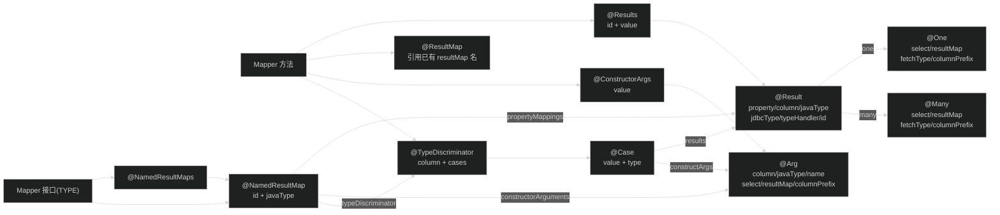
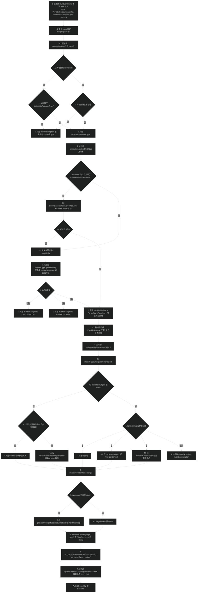
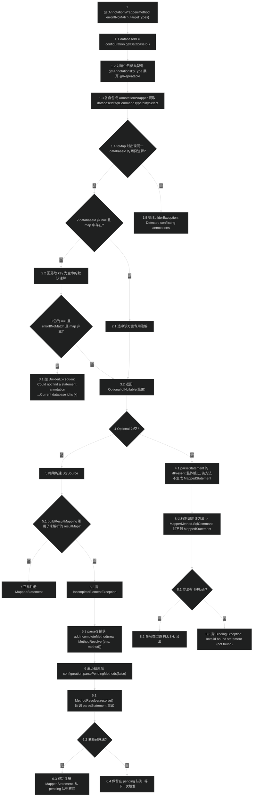

# 注解 API（annotations）
> 上次修改：2026-07-29 01:56

## 重点关注

- **`annotations` 包只有声明、没有逻辑**：包内 32 个注解全部是纯声明式元数据（`@interface`），不含任何可执行代码；唯一的普通类是 `AnnotationConstants`（只有一个哨兵常量）。阅读本模块最重要的心态是"看注解要配合看解析器"——真正的行为在 `builder/annotation/MapperAnnotationBuilder` 里。因此第 2、3、5 节讲的是"注解 → 解析器 → Configuration"这条链路。
- **`@Select`/`@Insert`/`@Update`/`@Delete` 的 `databaseId` + `@Repeatable`**：这是 3.5.5 引入的多数据库方言机制，同一方法可重复标注多份 SQL，解析时按 `Configuration.databaseId` 选择。选择逻辑（含冲突检测和"有注解但都不匹配"的报错）集中在 `MapperAnnotationBuilder.getAnnotationWrapper`，是容易踩坑的分支，见第 6.3 节。
- **Provider 四兄弟（`@SelectProvider` 等）与 `SqlProvider` 方法的协作契约**：`value()`/`type()` 双别名属性、`method()` 可省略、`ProviderMethodResolver` 与 `provideSql` 兜底、`ProviderContext` 注入位置——这是注解模块唯一带"运行时动态求值"语义的注解族，也是 MyBatis Dynamic SQL / MyBatis Generator 的扩展基石，见第 4.2、5.2、6.2 节。
- **`@Results`/`@Result`/`@One`/`@Many` 与 XML `<resultMap>` 的一一对应关系**：注解式结果映射的属性名、默认值（`void.class`、`JdbcType.UNDEFINED`、`UnknownTypeHandler.class` 这三个"空值哨兵"）以及 resultMap id 的自动生成规则（`generateResultMapName`）是排查"结果映射不生效"的第一现场，见第 4.3、6.4 节。
- **`@Target({})` 这个反直觉的元注解**：`@One`、`@Many`、`@Case`、`@Property` 都声明为 `@Target({})`，意味着它们**不能**独立标注在任何元素上，只能作为其他注解的属性值出现。误用会直接编译失败，见第 4.6 节。
- **3.6.0 新增的 `@NamedResultMap`/`@NamedResultMaps`/`@ResultOrdered`**：前者把 resultMap 从"依附于某个 select 方法"提升为"依附于 Mapper 接口的独立命名对象"，补上了注解式配置长期缺失的一块；后者对应 XML 的 `resultOrdered`。它们是本模块最新的演进方向，见第 4.3、6.5 节。
- **第 8 节的异常边界**：注解模块自身不抛异常（没有代码），但所有"注解写错"的报错都由解析器抛出 `BuilderException`。第 8 节按注解逐条列出可触发的错误信息与源码位置，是排障时的查表入口。

## 1. 模块定位与职责边界

### 定位

`org.apache.ibatis.annotations` 是 MyBatis **面向用户的注解式配置入口**，即 package-info 里那一句话的职责说明："Contains all the annotation that are used in mapper interfaces."（`src/main/java/org/apache/ibatis/annotations/package-info.java:17`）。它与 Mapper XML 文件是**平级的两套等价 DSL**：XML 用元素/属性描述映射，注解用 Java 类型系统描述同样的映射，二者最终汇聚到同一批运行期对象（`MappedStatement`、`ResultMap`、`Cache`、`KeyGenerator`）。

在项目分层里它处于**最上游**：

- **上游（谁使用它）**：用户编写的 Mapper 接口。用户直接把这些注解写在自己的接口/方法/参数/构造器上，注解就是用户与 MyBatis 之间的公开契约（public API），因此这个包的**任何属性改名都是破坏性变更**。
- **下游（谁消费它）**：`org.apache.ibatis.builder.annotation.MapperAnnotationBuilder` 是绝对主力消费者，导入了本包 26 个注解类型（`MapperAnnotationBuilder.java:39-66`）；其余零散消费者是 `reflection/ParamNameResolver`（读 `@Param`）、`binding/MapperMethod`（读 `@Flush`、`@MapKey`）、`executor/resultset/DefaultResultSetHandler`（读 `@AutomapConstructor`）、`builder/ResultMappingConstructorResolver`（读构造器参数上的 `@Param`）。

### 职责

- **定义声明式配置词汇表**：以 32 个 `@interface` 的形式，给出 CRUD 语句、SQL 提供者、结果映射、构造器映射、鉴别器、参数命名、语句选项、主键生成、二级缓存、语言驱动这十类配置的属性名、类型和默认值。
- **通过属性默认值表达"未指定"语义**：注解属性不能为 `null`，因此本包统一约定了三个"空值哨兵"——`void.class`（未指定 Java 类型/提供者类）、`JdbcType.UNDEFINED`（未指定 JDBC 类型）、`UnknownTypeHandler.class`（未指定 TypeHandler），另加空字符串 `""`。所有解析器都要把哨兵翻译成 `null`（见 `MapperAnnotationBuilder.applyResults` 的三处三元表达式，`MapperAnnotationBuilder.java:508-516`）。
- **通过元注解约束使用位置**：`@Target` 限定注解只能出现在方法、类型、参数还是构造器上；`@Target({})` 则表示只能作为嵌套属性值（`One.java:35`、`Many.java:35`、`Case.java:36`、`Property.java:34`）。`@Retention(RetentionPolicy.RUNTIME)` 是全包统一选择，因为 MyBatis 完全依赖运行期反射解析，没有任何注解处理器（annotation processor）。
- **通过 `@Repeatable` + 嵌套 `List` 容器支持多方言**：`@Select`、`@Insert`、`@Update`、`@Delete`、四个 Provider、`@Options`、`@SelectKey` 各自声明 `@Repeatable(X.List.class)` 并内嵌一个 `@interface List`，让同一方法能挂多份带不同 `databaseId` 的配置。`@Result` 的容器则复用了已有的 `@Results`（`Result.java:39`），`@Arg` 的容器复用 `@ConstructorArgs`（`Arg.java:39`），`@NamedResultMap` 的容器是 `@NamedResultMaps`（`NamedResultMap.java:68`）。

### 不负责

- **不负责解析**：包内没有一行解析逻辑。注解只是"数据"，`MapperAnnotationBuilder` 才是"读数据的程序"。
- **不负责校验**：所有语义校验（如"`@One` 和 `@Many` 不能同时出现在一个 `@Result` 里"）都由解析器实现（`MapperAnnotationBuilder.java:541-544`、`569-572`），注解自身只能靠 Java 编译器做类型和位置校验。
- **不负责 SQL 拼装与执行**：`@Select("...")` 里的字符串原样交给 `LanguageDriver`（`MapperAnnotationBuilder.java:656-660`），动态 SQL 的 `<script>` 解析属于 `scripting` 模块。
- **不负责 Mapper 注册/代理**：`@Mapper` 只是一个空标记注解（`Mapper.java:43-45`），MyBatis 核心代码**完全没有读取它**（在 `src/main/java` 中搜索 `annotations.Mapper` 无结果）；它是留给 mybatis-spring 等集成层做包扫描用的。注册入口在 `binding/MapperRegistry.addMapper`。
- **不负责默认值的最终生效**：注解默认值只是"注解层面的默认"，运行期还会被 `Configuration` 的全局设置覆盖或兜底，例如 `@Options` 缺失时 `useGeneratedKeys` 回落到 `configuration.isUseGeneratedKeys()`（`MapperAnnotationBuilder.java:358-359`），`@One(fetchType=DEFAULT)` 回落到 `configuration.isLazyLoadingEnabled()`（`MapperAnnotationBuilder.java:559`）。

### 输入 / 输出 / 状态变化 / 副作用

- **输入**：用户 Mapper 接口的 `Class` 对象（携带类级、方法级、参数级、构造器级注解）。
- **输出**：本模块自身没有输出——它是被读取方。经解析器加工后的输出是 `Configuration` 中新增的 `MappedStatement`、`ResultMap`、`Discriminator`、`Cache`、`KeyGenerator`。
- **状态变化**：注解本身是不可变的编译期常量池数据，零状态。运行期状态变化发生在 `Configuration` 的各个 `StrictMap` 上。
- **副作用**：唯一带副作用语义的是 Provider 族——`@SelectProvider(type=X.class)` 会导致运行期通过 `X.getDeclaredConstructor().newInstance()` 反射实例化用户类并调用其方法（`ProviderSqlSource.java:246-250`），这是本模块间接引入的**可执行副作用**。

## 2. 架构关系与依赖

### 依赖关系图

```mermaid
%%{init: {"theme": "dark"}}%%
graph TD
    subgraph User["用户代码层"]
        UM["Mapper 接口<br/>UserMapper.java"]
        SP["SqlProvider 类<br/>用户自定义"]
        PO["POJO 实体<br/>带 @AutomapConstructor"]
    end

    subgraph Anno["annotations 包 -- 纯声明层"]
        A1["CRUD 族<br/>Select/Insert/Update/Delete"]
        A2["Provider 族<br/>SelectProvider 等 4 个"]
        A3["结果映射族<br/>Results/Result/One/Many<br/>ResultMap/NamedResultMap<br/>ConstructorArgs/Arg<br/>TypeDiscriminator/Case"]
        A4["参数与选项族<br/>Param/Options/SelectKey<br/>Flush/MapKey/ResultType<br/>ResultOrdered/Lang"]
        A5["缓存族<br/>CacheNamespace<br/>CacheNamespaceRef/Property"]
        A6["标记族<br/>Mapper/AutomapConstructor"]
        AC["AnnotationConstants<br/>NULL_TYPE_DISCRIMINATOR 哨兵"]
    end

    subgraph Parser["builder.annotation -- 解析层"]
        MAB["MapperAnnotationBuilder<br/>主解析器"]
        AW["AnnotationWrapper<br/>内部类:databaseId 归一化"]
        PSS["ProviderSqlSource<br/>运行期动态 SQL"]
        PMR["ProviderMethodResolver<br/>方法解析 SPI"]
        PC["ProviderContext<br/>回传上下文"]
        MR["MethodResolver<br/>延迟重解析"]
    end

    subgraph Other["其他消费方"]
        PNR["reflection.ParamNameResolver"]
        MM["binding.MapperMethod"]
        DRSH["executor.DefaultResultSetHandler"]
        RMCR["builder.ResultMappingConstructorResolver"]
    end

    subgraph Runtime["运行期产物"]
        CFG["session.Configuration"]
        MS["mapping.MappedStatement"]
        RM["mapping.ResultMap"]
        CACHE["cache.Cache"]
        KG["executor.keygen.KeyGenerator"]
    end

    subgraph Dep["annotations 反向依赖的类型"]
        T1["type.JdbcType<br/>type.TypeHandler<br/>type.UnknownTypeHandler"]
        T2["mapping.FetchType<br/>mapping.StatementType<br/>mapping.ResultSetType"]
        T3["cache.Cache<br/>cache.impl.PerpetualCache<br/>cache.decorators.LruCache"]
        T4["scripting.LanguageDriver"]
    end

    UM -.标注.-> A1
    UM -.标注.-> A2
    UM -.标注.-> A3
    UM -.标注.-> A4
    UM -.标注.-> A5
    UM -.标注.-> A6
    PO -.标注.-> A6

    A3 --> AC
    A3 --> T1
    A3 --> T2
    A4 --> T2
    A4 --> T4
    A5 --> T3

    MAB -->|反射读取| A1
    MAB -->|反射读取| A2
    MAB -->|反射读取| A3
    MAB -->|反射读取| A4
    MAB -->|反射读取| A5
    MAB --> AW
    MAB --> MR
    MAB -->|Provider 分支| PSS
    PSS --> PMR
    PSS --> PC
    PSS -.反射调用.-> SP
    PMR -.由用户类实现.-> SP

    PNR -->|读 @Param| A4
    MM -->|读 @Flush/@MapKey| A4
    DRSH -->|读 @AutomapConstructor| A6
    RMCR -->|读构造器 @Param| A4

    MAB --> CFG
    CFG --> MS
    CFG --> RM
    CFG --> CACHE
    CFG --> KG
```



### 节点与依赖方向说明

| 节点 | 角色 | 依赖方向与耦合性质 |
|------|------|--------------------|
| Mapper 接口 / SqlProvider 类 / POJO | 用户代码，注解的**标注宿主** | 编译期依赖 annotations 包。这是 MyBatis 唯一强制用户直接 import 框架类型的地方，属于**公开 API 契约**，向后兼容要求最高 |
| CRUD 族 / Provider 族 / 结果映射族等 6 个注解族 | 纯声明，零逻辑 | 只依赖 `type`、`mapping`、`cache`、`scripting` 四个包中的**枚举与接口类型**（表格底部 Dep 分组）。注意这是**注解包反向依赖核心包**，而不是核心包依赖注解包 |
| `AnnotationConstants` | 为 `@NamedResultMap.typeDiscriminator()` 提供"故意非法的列名"哨兵 `--NULL TYPE DISCRIMINATOR--`（`AnnotationConstants.java:23`） | 被 `NamedResultMap`（静态导入，`NamedResultMap.java:18`）和 `MapperAnnotationBuilder`（`java:253`、`261`）双向使用，是注解层与解析层之间唯一的**共享常量耦合点** |
| `MapperAnnotationBuilder` | **主解析器**，把注解翻译成 Configuration 对象 | 强依赖：import 了 26 个注解类型。这是全模块最重要的耦合边——注解新增属性必须同步改这里，否则属性形同虚设 |
| `AnnotationWrapper`（MAB 内部类） | 把 8 种语句注解 + `@Options` + `@SelectKey` 归一化成 `(annotation, databaseId, sqlCommandType, dirtySelect)` 四元组（`MapperAnnotationBuilder.java:711-772`） | 强耦合：用一长串 `instanceof` 硬编码了所有注解类型，**新增语句注解必须改这个 if-else 链** |
| `ProviderSqlSource` | Provider 注解的运行期执行器 | 通过 `annotationType().getMethod("type"/"value"/"method").invoke(...)` 做**鸭子类型反射**（`ProviderSqlSource.java:109`、`255-256`），刻意不 `instanceof` 四个 Provider 注解，因此四个 Provider 注解只要保持"有 value/type/method 三个属性"这个隐式契约即可，**可替换、弱耦合** |
| `ProviderMethodResolver` | 用户可实现的 SPI，用于自定义"mapper 方法 → provider 方法"的解析规则 | 被 `@SelectProvider.method()` 的 Javadoc 明确引用（`SelectProvider.java:83`），是注解与 builder 之间的**扩展点耦合** |
| `ProviderContext` | 把 mapperType / mapperMethod / databaseId 回传给用户 provider 方法 | 单向数据流，不可变对象，`ProviderContext.java:43` 构造器是包私有，用户只能接收不能构造 |
| `ParamNameResolver` / `MapperMethod` / `DefaultResultSetHandler` / `ResultMappingConstructorResolver` | 四个**跨层直读注解**的消费者 | 这是本模块的**潜在耦合点**：它们绕过 `MapperAnnotationBuilder`，在 binding/reflection/executor 层直接反射读注解，导致"注解 → 行为"的链路不止一条，排障时容易只看解析器而漏掉这几处 |
| `Configuration` 及其产物 | 注解解析的最终落点 | 单向：注解 → Configuration，绝无反向。Configuration 不持有任何注解对象引用 |

### 强依赖 / 可替换依赖 / 跨层调用

- **强依赖（改则连锁）**：`annotations` → `type.JdbcType`/`TypeHandler`/`UnknownTypeHandler`（`Result.java:25-27`、`Arg.java:25-27`、`TypeDiscriminator.java:24-26`）、`mapping.FetchType`（`One.java:23`、`Many.java:23`）、`mapping.StatementType`/`ResultSetType`（`Options.java:25-26`、`SelectKey.java:25`）、`cache.Cache`/`PerpetualCache`/`LruCache`（`CacheNamespace.java:24-26`）、`scripting.LanguageDriver`（`Lang.java:24`）。这些类型作为注解属性的类型或默认值出现在**常量池**里，删除或改名会导致用户代码编译失败。
- **可替换依赖**：Provider 族与 `ProviderSqlSource` 之间是反射契约而非类型契约，理论上第三方可以定义自己的 `@XxxProvider` 注解，只要提供 `value`/`type`/`method` 三个属性即可复用 `ProviderSqlSource`——不过 `MapperAnnotationBuilder.statementAnnotationTypes`（`java:106-109`）是硬编码的 `Set`，实际上封死了这个口子。
- **跨层调用**：`executor.resultset.DefaultResultSetHandler` 直接读 `@AutomapConstructor`（`DefaultResultSetHandler.java:864-867`），这是 executor 层跨越 builder 层直读用户注解的唯一一处，原因是构造器自动映射发生在结果集处理时而非配置构建时。

## 3. 入口与调用方式

本模块是**被动模块**，没有可执行入口。这里的"入口"分两类：用户侧的**标注入口**（怎么用），和框架侧的**读取入口**（谁来读、什么时候读）。

### 3.1 用户侧标注入口

| 标注位置（`@Target`） | 可用注解 | 触发条件 |
|----------------------|----------|----------|
| `ElementType.TYPE`（Mapper 接口） | `@CacheNamespace`、`@CacheNamespaceRef`、`@NamedResultMap`、`@NamedResultMaps`、`@Mapper` | 接口被注册进 `MapperRegistry` 时读取 |
| `ElementType.METHOD`（Mapper 方法） | `@Select`/`@Insert`/`@Update`/`@Delete` 及四个 Provider、`@Results`、`@Result`、`@ResultMap`、`@ConstructorArgs`、`@Arg`、`@TypeDiscriminator`、`@Options`、`@SelectKey`、`@Flush`、`@MapKey`、`@ResultType`、`@ResultOrdered`、`@Lang`、`@Mapper` | 同上，逐方法遍历 |
| `ElementType.PARAMETER`（方法参数） | `@Param`、`@Mapper` | 构建 `ParamNameResolver` 时读取（配置期与运行期各一次） |
| `ElementType.CONSTRUCTOR`（POJO 构造器） | `@AutomapConstructor` | 结果集自动映射需要选构造器时读取（运行期） |
| `@Target({})`（只能作为属性值） | `@One`、`@Many`、`@Case`、`@Property` | 随宿主注解一并读取 |
| `ElementType.FIELD` | `@Mapper`（唯一） | 未被核心代码读取 |

`@Mapper` 是唯一同时允许 TYPE/METHOD/FIELD/PARAMETER 四个位置的注解（`Mapper.java:42`），也是唯一带 `@Inherited` 的注解（`Mapper.java:40`）——`@Inherited` 对接口其实不生效，这个元注解在当前用法下是**冗余的**。

### 3.2 框架侧读取入口（配置期）

**主入口：`MapperRegistry.addMapper(Class)` → `MapperAnnotationBuilder.parse()`**

```
Configuration.addMapper(type) / addMappers(package)
  └─ MapperRegistry.addMapper(type)                          MapperRegistry.java:60
       ├─ knownMappers.put(type, new MapperProxyFactory<>(type))   :67（必须先放，避免解析中递归绑定）
       ├─ new MapperAnnotationBuilder(config, type).parse()        :71-72
       └─ finally: 未完成则 knownMappers.remove(type)              :74-77（失败回滚）
```

- **触发条件**：三条路径都会走到这里——① `mybatis-config.xml` 里 `<mappers><mapper class="..."/></mappers>`（`XMLConfigBuilder.java:416`）；② `<mappers><package name="..."/></mappers>`（`XMLConfigBuilder.java:395`）；③ 代码里直接 `configuration.addMapper(UserMapper.class)`。
- **关键参数**：`type` 必须是接口（`MapperRegistry.java:61`），否则静默忽略。
- **返回值 / 上下文要求**：无返回值；要求 `Configuration` 中 properties、typeAliases、typeHandlers、plugins 已解析完毕（因为 `@Property` 的 `${}` 占位替换要用 `configuration.getVariables()`，见 `MapperAnnotationBuilder.java:203`）。
- **进入的核心流程**：`parse()`（`MapperAnnotationBuilder.java:122-155`）→ 先 `loadXmlResource()` 尝试加载同名 XML（注解与 XML 混用的关键，`java:162-184`）→ `parseCache()`/`parseCacheRef()` → `parseNamedResultMap(s)` → 逐方法 `parseResultMap()` + `parseStatement()`。详见第 5.1 节。

**重解析入口：`MethodResolver.resolve()`**

`parseStatement` 抛 `IncompleteElementException`（典型场景：`@Result(one=@One(resultMap="尚未解析的 XML resultMap"))`）时，方法被包成 `MethodResolver` 塞进 `configuration.addIncompleteMethod`（`MapperAnnotationBuilder.java:149-151`），随后由 `configuration.parsePendingMethods(false)`（`java:154`）重试，`MethodResolver.resolve()` 只是回调 `annotationBuilder.parseStatement(method)`（`MethodResolver.java:32-34`）。

### 3.3 框架侧读取入口（运行期）

| 入口 | 读取的注解 | 触发时机 | 关键行为 |
|------|-----------|----------|----------|
| `ProviderSqlSource.getBoundSql(param)`（`ProviderSqlSource.java:164-167`） | Provider 族（通过反射读 `value`/`type`/`method`） | **每次执行 SQL 时**，不缓存 | 反射调用用户 provider 方法拿到 SQL 字符串，再交给 `LanguageDriver.createSqlSource` 现场编译。见第 5.2 节 |
| `MapperMethod.SqlCommand` 构造器（`MapperMethod.java:222-240`） | `@Flush` | Mapper 方法首次绑定时 | 找不到对应 `MappedStatement` 且**没有** `@Flush` → 抛 `BindingException("Invalid bound statement")`；有 `@Flush` → 命令类型置为 `SqlCommandType.FLUSH`（`java:227-232`） |
| `MapperMethod.MethodSignature` 构造器（`MapperMethod.java:374-383`） | `@MapKey` | 同上 | 仅当返回类型是 `Map` 的子类型时才读 `@MapKey`，取 `value()` 作为 map 的 key 属性名 |
| `ParamNameResolver` 构造器（`ParamNameResolver.java:78-89`） | `@Param` | 配置期（`MapperAnnotationBuilder.java:334`）与运行期（`MapperMethod.java:301`）各构造一次 | 命中 `@Param` 则 `hasParamAnnotation=true`、`useParamMap=true`，参数名取 `value()`；否则回落到实际参数名或索引 |
| `DefaultResultSetHandler.findConstructorForAutomapping`（`DefaultResultSetHandler.java:859-870`） | `@AutomapConstructor` | 结果自动映射且目标类有多个构造器时 | 只有一个构造器就直接用；多个则找唯一带 `@AutomapConstructor` 的，找到两个抛 `ExecutorException`（`java:865-866`） |
| `ResultMappingConstructorResolver.getArgNames`（`ResultMappingConstructorResolver.java:324-352`） | POJO 构造器参数上的 `@Param` | 配置期解析 `@ConstructorArgs`/`@NamedResultMap` 时 | 用构造器参数名匹配 `@Arg(name=...)`，`@Param` 优先于实际参数名，都没有则退化为 `arg{index}` |

### 3.4 入口之间的顺序约束

配置期读取严格按 `parse()` 内的顺序（`MapperAnnotationBuilder.java:122-155`）：XML 资源 → cache → cache-ref → named result maps → 逐方法 resultMap → 逐方法 statement。这个顺序不可调换——`parseStatement` 里生成的 `MappedStatement` 需要引用前面已注册的 `Cache` 和 `ResultMap`；`@NamedResultMap` 必须在方法遍历前解析，否则方法上的 `@ResultMap("userResult")` 会找不到目标。

## 4. 核心概念与领域模型

全包 34 个文件 = 32 个注解类型 + 1 个常量类（`AnnotationConstants`）+ 1 个 `package-info`。下面按六个类别分组说明。

### 4.1 CRUD 语句注解族（4 个）

**定义**：`@Select`、`@Insert`、`@Update`、`@Delete` 是把一段 SQL 字符串直接绑定到 Mapper 方法上的注解，四者结构完全同构。

**属性**（以 `Select.java:61-98` 为准，其余三个少 `affectData`）：

| 属性 | 类型 | 默认值 | 作用 |
|------|------|--------|------|
| `value()` | `String[]` | 必填 | SQL 文本。数组元素在解析时用**单个空格**拼接后 `trim()`（`MapperAnnotationBuilder.java:658`），因此用户可以按行折行书写 |
| `databaseId()` | `String` | `""` | 3.5.5 起；与 `Configuration.databaseId` 匹配，实现同一方法多方言 |
| `affectData()` | `boolean` | `false` | 3.5.12 起，**仅 `@Select` 和 `@SelectProvider` 有**；标记"这个 select 会改数据"（PostgreSQL 的 `RETURNING`、SQL Server 的 `OUTPUT`），解析后传给 `MappedStatement` 的 `dirtySelect` 标志（`MapperAnnotationBuilder.java:413`） |

**元注解**：`@Documented @Retention(RUNTIME) @Target(METHOD) @Repeatable(X.List.class)`。每个注解内嵌一个 `@interface List { X[] value(); }` 作为 `@Repeatable` 的容器（`Select.java:93-98`）。

**生命周期**：编译期写入 class 文件常量池 → `MapperAnnotationBuilder.parse()` 时被 `method.getAnnotationsByType(X.class)` 读出（`java:672`）→ 转成 `AnnotationWrapper` → 生成 `SqlSource` 与 `MappedStatement` → 注解本身此后不再被访问（SQL 已固化）。

**使用场景**：`value()` 是 `String[]` 而不是 `String`，配合 `<script>` 标签就能写多行动态 SQL——`@Select({"<script>", "select * from users", "<if test=\"age != null\"> age = #{age} </if>", "</script>"})`（`Select.java:44-47`）。

**关联函数**：`MapperAnnotationBuilder.buildSqlSource`（`java:639-654`）对这四个注解做 `instanceof` 分派，取出 `value()` 后走 `buildSqlSourceFromStrings`；Provider 注解落入最后的 `return new ProviderSqlSource(...)` 分支。

**三维评估（CRUD 注解 vs XML `<select>` 元素）**

- **好处**：SQL 与方法签名同处一屏，重构（改方法名/参数）时 IDE 能一起带走；无需维护 XML 文件与 namespace 的对应关系；编译期就能保证注解属性名拼写正确（XML 属性名拼错只在运行时报错）。
- **替代方案**：① 纯 XML —— 支持完整动态 SQL 元素、`<include>` 片段复用、`<resultMap>` 继承（`extends`），且 DBA 可以直接编辑 SQL 不必碰 Java；② 混合模式 —— MyBatis 明确支持，`loadXmlResource()`（`MapperAnnotationBuilder.java:162-184`）会自动去 classpath 找与接口同名的 `.xml`，语句用注解、复杂 resultMap 用 XML；③ Provider 注解 —— 见 4.2。
- **风险**：注解里的 SQL 是**字符串常量**，无法复用 `<sql>` 片段（只能靠 Java 常量拼接）；`<script>` 内的 XML 需要在 Java 字符串里转义引号，可读性差；SQL 变更必须重新编译部署；注解属性长度受 class 文件常量池限制（虽然 64KB 上限实际很难触发）；`value()` 用空格拼接意味着**行尾如果没留空格，SQL 关键字仍会被正确分隔，但行内注释 `--` 会吞掉后续内容**（因为拼成了一行）。

### 4.2 Provider 注解族（4 个）

**定义**：`@SelectProvider`、`@InsertProvider`、`@UpdateProvider`、`@DeleteProvider` 不直接给 SQL，而是指向一个"SQL 提供者类 + 方法"，由该方法在**运行期**返回 SQL 字符串。

**属性**（以 `SelectProvider.java:51-123` 为准）：

| 属性 | 类型 | 默认值 | 作用 |
|------|------|--------|------|
| `value()` | `Class<?>` | `void.class` | 3.5.2 起；提供者类。与 `type()` 互为别名 |
| `type()` | `Class<?>` | `void.class` | 提供者类（老属性）。`value` 与 `type` 只能填一个且值必须一致，否则报错（`ProviderSqlSource.java:264-267`） |
| `method()` | `String` | `""` | 3.5.1 起可省略。省略时的解析顺序见下 |
| `databaseId()` | `String` | `""` | 同 CRUD 族 |
| `affectData()` | `boolean` | `false` | 仅 `@SelectProvider` 有 |

**`method()` 省略时的三级回退链**（`ProviderSqlSource.java:111-139`，注解 Javadoc 在 `SelectProvider.java:80-88` 已声明）：

1. 提供者类实现了 `ProviderMethodResolver` → 调其 `resolveMethod(ProviderContext)`。默认实现按"方法名与 mapper 方法同名 + 返回 `CharSequence` 子类型"筛选，零个或多个都抛 `BuilderException`（`ProviderMethodResolver.java:55-73`）。
2. 上一步返回 `null` 或未实现该接口 → 方法名回退为字面量 `"provideSql"`。
3. 在提供者类的 `getMethods()` 里按"名字匹配 + 返回 `CharSequence`"查找；找到多个抛"Sql provider method can not overload"（`ProviderSqlSource.java:122-126`），找不到抛"Method 'x' not found in SqlProvider"（`java:136-139`）。

**`value`/`type` 都省略时**：回退到 `Configuration.getDefaultSqlProviderType()`（全局设置 `defaultSqlProviderType`，`ProviderSqlSource.java:257-263`），仍为空才报错。

**`ProviderContext` 注入**：提供者方法的参数列表里可以出现一个 `ProviderContext` 类型的形参（位置任意），`ProviderSqlSource` 构造时扫描出它的下标 `providerContextIndex`（`java:146-158`），调用时按下标填入；出现两个则抛 `BuilderException`。`ProviderContext` 携带 `mapperType`、`mapperMethod`、`databaseId` 三个只读字段（`ProviderContext.java:29-31`），让提供者能反射 mapper 方法的返回类型/参数来生成通用 SQL——这正是 MyBatis Dynamic SQL 与各种"通用 Mapper"的实现基础。

**生命周期**：与 CRUD 族不同，Provider 注解的"值"在配置期只用来**定位方法**（一次性），而 SQL 在**每次 `getBoundSql` 时重新生成**（`ProviderSqlSource.java:164-167`），生命周期贯穿整个应用运行期。

**三维评估（Provider 机制）**

- **好处**：SQL 用 Java 代码构造，能用循环、条件、字符串 API 和类型安全的元编程，比 `<if>`/`<foreach>` 这套 OGNL + XML DSL 表达力强得多；`ProviderContext` 让"一个 provider 服务 N 个 mapper 方法"成为可能，是通用 CRUD 框架的基础；`method()` 可省略 + `ProviderMethodResolver` 让约定优于配置。
- **替代方案**：① `<script>` + 动态 SQL 标签 —— 无需额外类，但表达力受限、调试困难；② 自定义 `LanguageDriver` 并用 `@Lang` 指定 —— 可以换掉整套 SQL 模板语言（如 Velocity、Freemarker），粒度更粗但更彻底；③ 在 Java 层拼好 SQL 传给 `@Select("${sql}")` —— 简单但有 SQL 注入风险且丧失参数映射。
- **风险**：① **每次执行都反射调用** provider 方法并重新 `createSqlSource`，无缓存（`ProviderSqlSource.createSqlSource` 每次新建，`java:169-212`），高频查询下有可观的反射与解析开销；② provider 方法非 `static` 时**每次调用都 `newInstance()`** 一个提供者对象（`java:246-248`），既是垃圾又要求必须有公开无参构造；③ 参数绑定规则复杂——`createSqlSource` 里对 `Map` 参数、单参数、双参数分了四个 case（`java:172-202`），组合非法时抛"invalid combination"，用户很难从错误信息推断正确写法；④ 提供者方法不能重载，这个限制只在运行期才暴露；⑤ SQL 从"声明"变成"代码"，静态分析工具与 DBA 都看不到实际 SQL。

### 4.3 结果映射注解族（11 个）

**嵌套关系**：



**与 XML `<resultMap>` 的对应表**：

| 注解 | XML 等价物 | 说明 |
|------|-----------|------|
| `@Results(id, value)` | `<resultMap id="..">` | 只能挂在方法上；不填 `id` 时由 `generateResultMapName` 按"接口全名.方法名-参数类型简名..."自动生成（`MapperAnnotationBuilder.java:271-285`） |
| `@Result(property, column, javaType, jdbcType, typeHandler, id)` | `<result>` / `<id>` | `id()=true` 对应 `<id>`，解析时加 `ResultFlag.ID`（`java:504-506`） |
| `@Result(one=@One(...))` | `<association>` | `select` 对应嵌套查询，`resultMap` 对应嵌套结果映射 |
| `@Result(many=@Many(...))` | `<collection>` | 同上 |
| `@ResultMap({"a","b"})` | statement 的 `resultMap="a,b"` 属性 | 多个名字在解析时用逗号 join（`java:401`）；一旦出现 `@ResultMap`，方法上的 `@Results` 就**不会**被解析（`java:143-146`） |
| `@ConstructorArgs(value)` + `@Arg` | `<constructor><idArg>/<arg>` | `@Arg` 会被打上 `ResultFlag.CONSTRUCTOR`（`java:580`） |
| `@TypeDiscriminator(column, javaType, jdbcType, typeHandler, cases)` | `<discriminator>` | 未指定 `javaType` 时默认 `String.class`（`java:315`），这是注解层无法表达的默认值，只能由解析器补 |
| `@Case(value, type, results, constructArgs)` | `<case>` | 每个 case 生成一个 id 为 `父resultMapId-case值` 的独立 ResultMap，并以父 resultMap 为 `extends`（`java:298-309`） |
| `@NamedResultMap(id, javaType, constructorArguments, propertyMappings, typeDiscriminator)` | 独立的 `<resultMap>` | 3.6.0 新增，挂在**接口**上，id 为 `接口全名.id`（`java:248`） |
| `@NamedResultMaps(value)` | 多个 `<resultMap>` | `@NamedResultMap` 的 `@Repeatable` 容器 |

**`@One` / `@Many` 的关键约束**：`@Target({})`（`One.java:35`、`Many.java:35`），只能作为 `@Result` 的属性值；`@Result` 的默认值写成 `one() default @One`（`Result.java:88`），即"一个所有属性都取默认值的空 `@One`"——因此解析器判断"用户是否真的配了嵌套"只能靠 `select()`/`resultMap()` 是否为空字符串（`MapperAnnotationBuilder.java:541-544`、`569-572`）。同一个 `@Result` 里 `@One` 和 `@Many` 都填了会抛 `BuilderException("Cannot use both @One and @Many annotations in the same @Result")`。

**`fetchType` 三态**：`FetchType.DEFAULT`（默认）表示"跟随全局 `lazyLoadingEnabled`"，`LAZY`/`EAGER` 显式覆盖，判定逻辑在 `isLazy`（`java:558-566`）——注意只有当对应的 `select()` 非空时 `fetchType` 才生效。

**三维评估（`@Results`/`@Result` vs XML `<resultMap>`）**

- **好处**：映射定义紧贴查询方法，读代码不用跳文件；`javaType = User.class` 是**类型字面量**，重命名/删除类时编译期就报错，而 XML 里的 `type="com.example.User"` 只能运行期发现。
- **替代方案**：① XML `<resultMap>` —— 支持 `extends` 继承、跨 namespace 引用、`autoMapping` 开关，且同一 resultMap 天然可被多个 statement 复用；② `@ResultMap("name")` + XML —— 注解写语句、XML 写映射，是官方支持且最常见的折中；③ 3.6.0 的 `@NamedResultMap` —— 纯注解也能定义可复用的命名 resultMap，填补了历史空白。
- **风险**：① 3.6.0 之前，`@Results` 生成的 resultMap id 是"方法名 + 参数类型简名"拼出来的（`java:276-284`），**方法重载或改参数类型会静默改变 id**，导致别处 `@ResultMap("...")`/`@One(resultMap="...")` 的引用失效；② 注解无法表达 `extends` 和 `autoMapping`，源码里两处 `// TODO add AutoMappingBehaviour`（`java:293`、`306`）明确记录了这个缺口；③ 深层嵌套（`@TypeDiscriminator` → `@Case` → `@Result` → `@One`）在 Java 里写出来极其冗长，可读性远不如 XML 缩进；④ `@Result` 的 `typeHandler` 属性类型是**原始类型** `Class<? extends TypeHandler>`（`Result.java:81`，无泛型参数），解析时必须 `@SuppressWarnings("unchecked")` 强转（`java:507-509`）。

### 4.4 参数与语句选项注解族（8 个）

| 注解 | `@Target` | 核心属性 | 作用与生命周期 |
|------|-----------|----------|----------------|
| `@Param` | `PARAMETER` | `value()` 必填 | 给方法参数（或 POJO 构造器参数）命名，使 SQL 里能写 `#{name}`。命中后 `ParamNameResolver` 会把参数打包成 `ParamMap`（`ParamNameResolver.java:85-89`）。同时影响 `MapperAnnotationBuilder.getParameterType`：一旦有任一参数带 `@Param`，`parameterType` 就变成 `ParamMap.class`（`java:435-439`）|
| `@Options` | `METHOD`，`@Repeatable(Options.List)` | `useCache`、`flushCache`、`resultSetType`、`statementType`、`fetchSize`、`timeout`、`useGeneratedKeys`、`keyProperty`、`keyColumn`、`resultSets`、`databaseId` | 对应 XML statement 上的同名属性。内嵌 `enum FlushCachePolicy {DEFAULT, TRUE, FALSE}`（`Options.java:51-58`）用三态解决"boolean 无法表达未设置"的问题——`DEFAULT` 表示"select 不刷、增删改刷"|
| `@SelectKey` | `METHOD`，`@Repeatable` | `statement()`、`keyProperty()`、`before()`、`resultType()` 全部必填；`keyColumn`、`statementType`、`databaseId` 可选 | 对应 `<selectKey>`。解析时会**额外注册一个 id 为 `原语句id!selectKey` 的 `MappedStatement`**（`MapperAnnotationBuilder.java:605`、`627-635`），并把 `SelectKeyGenerator` 注册进 `Configuration`。优先级高于 `@Options.useGeneratedKeys`（`java:351-357` 注释明确写了 "that overrides everything else"）|
| `@Flush` | `METHOD` | 无属性（标记注解） | 让方法在 `ExecutorType.BATCH` 下触发 `flushStatements()` 并返回 `List<BatchResult>`。它是**唯一允许 Mapper 方法没有对应 MappedStatement** 的注解（`MapperMethod.java:227-232`）|
| `@MapKey` | `METHOD` | `value()` | 返回类型为 `Map` 时指定用哪个属性做 key。双重作用：运行期决定 map 的 key（`MapperMethod.java:374-383`），配置期还影响返回类型推断——只有存在 `@MapKey` 时才会去取 `Map<K,V>` 的 `V` 作为 resultType（`MapperAnnotationBuilder.java:477-478`，注释标注 gcode issue 504）|
| `@ResultType` | `METHOD` | `value()` | 3.2.0 起。方法用 `ResultHandler` 参数时返回类型必须是 `void`，此注解补上"每行该构造成什么对象"（`ResultType.java:25-26`）。生效点在 `getReturnType` 的 `void.class` 分支（`java:453-458`，gcode issue #508）|
| `@ResultOrdered` | `METHOD` | `value()` default `true` | 3.6.0 起。声明结果集已按分组排序，对应 XML 的 `resultOrdered`；Javadoc 注明"构造器里带集合的映射必须开这个"（`ResultOrdered.java:25-26`）。解析后写入 `MappedStatement.isResultOrdered`（`java:392-395`、`411`）|
| `@Lang` | `METHOD` | `value()`：`Class<? extends LanguageDriver>` | 为单个方法指定 SQL 模板语言驱动。两处读取：`MapperAnnotationBuilder.getLanguageDriver`（`java:418-425`）和 `ProviderSqlSource` 构造器（`ProviderSqlSource.java:106-107`）——后者说明 Provider 返回的 SQL 也走 `@Lang` 指定的驱动 |

**三维评估（`@Options` 用枚举 `FlushCachePolicy` 表达三态）**

- **好处**：Java 注解属性不能为 `null`，`boolean` 只有两态，无法区分"用户显式写了 false"和"用户没写"。引入 `DEFAULT` 枚举值让解析器能保留"按语句类型推断"的默认行为（`MapperAnnotationBuilder.java:374-381`）。
- **替代方案**：① 用 `String` 属性 + 空串表示未设置 —— 丧失类型安全，拼写错误只在运行期暴露；② 拆成两个属性 `flushCacheSet` + `flushCache` —— 用户体验糟糕；③ 用 `Boolean` 包装类 —— **Java 语言不允许**，注解属性类型只能是基本类型、String、Class、枚举、注解及其数组。
- **风险**：同样的三态问题在别处并未统一处理——`Options.fetchSize()` 用 `-1` 表示未设置，但代码里还有一个 `Integer.MIN_VALUE` 的特例判断 `options.fetchSize() > -1 || options.fetchSize() == Integer.MIN_VALUE`（`java:384`，注释 issue #348），说明"用魔法数字表示未设置"的方案已经打了补丁；`useCache` 则是纯 `boolean` 默认 `true`，意味着**在 update/insert/delete 上写 `@Options` 会意外把 `useCache` 设成 true**（`java:382` 无条件覆盖），而不带 `@Options` 时 `useCache` 应为 `false`（`java:375`）。

### 4.5 缓存注解族（3 个）

| 注解 | `@Target` | 属性 | 说明 |
|------|-----------|------|------|
| `@CacheNamespace` | `TYPE` | `implementation` default `PerpetualCache.class`、`eviction` default `LruCache.class`、`flushInterval` default `0`、`size` default `1024`、`readWrite` default `true`、`blocking` default `false`、`properties` default `{}`（3.4.2 起）| 等价于 XML `<cache>`。解析时把 `size==0`/`flushInterval==0` 翻译成 `null` 交给 `assistant.useNewCache`（`MapperAnnotationBuilder.java:189-193`）——即 `0` 是这两个属性的"未设置"哨兵 |
| `@CacheNamespaceRef` | `TYPE` | `value()`（`Class<?>`，命名空间取该类 FQCN）、`name()`（3.4.2 起，直接给命名空间字符串）| 等价于 `<cache-ref>`。二者**必须且只能填一个**，都不填或都填都抛 `BuilderException`（`java:213-218`）。`name()` 的存在是为了引用**没有对应 Java 接口的 XML namespace** |
| `@Property` | `@Target({})` | `name()`、`value()` | 只作为 `@CacheNamespace.properties` 的元素。`value()` 支持 `${}` 占位符，解析时经 `PropertyParser.parse(value, configuration.getVariables())` 替换（`java:203`），这是注解**唯一支持外部化配置**的地方（`CacheNamespace.java:35-36` 的示例正是 `${mybatis.cache.host}`）|

**生命周期**：`@CacheNamespace` 在 `parseCache()` 里一次性转换为 `Cache` 实例并注册进 `Configuration`，此后由 `executor.CachingExecutor` 使用，直到 `Configuration` 销毁。`@CacheNamespaceRef` 若引用的 namespace 尚未解析，会抛 `IncompleteElementException` 并被包成 `CacheRefResolver` 延迟重试（`java:222-224`）。

### 4.6 元注解约定与"空值哨兵"（跨全包的两条隐式规则）

**规则一：`@Retention(RUNTIME)` 全包统一**。32 个注解无一例外。这是一个架构决策：MyBatis 选择**运行期反射**而非**编译期注解处理器**来消费注解。好处是零构建配置、支持动态代理与 Spring 集成；代价是所有配置错误都推迟到启动期（甚至首次调用时）才暴露，且启动期有反射开销。

**规则二：三个"空值哨兵" + 空字符串**。注解属性不可为 `null`，因此：

| 哨兵值 | 语义 | 出现位置 | 解析器翻译 |
|--------|------|----------|-----------|
| `void.class` | 未指定 Class | `Result.javaType`、`Arg.javaType`、`TypeDiscriminator.javaType`、`CacheNamespaceRef.value`、Provider 的 `value`/`type` | `x == void.class ? null : x`（`MapperAnnotationBuilder.java:512`、`588`）；`TypeDiscriminator.javaType` 特殊——翻译成 `String.class`（`java:315`）|
| `JdbcType.UNDEFINED` | 未指定 JDBC 类型 | `Result.jdbcType`、`Arg.jdbcType`、`TypeDiscriminator.jdbcType` | `== UNDEFINED ? null : x`（`java:513`、`589`）|
| `UnknownTypeHandler.class` | 未指定 TypeHandler | 同上三处 | `== UnknownTypeHandler.class ? null : x`（`java:508-509`、`585-586`、`318-319`）|
| `""`（空串） | 未指定字符串 | `databaseId`、`select`、`resultMap`、`columnPrefix`、`property`、`column`、`name` 等 | `nullOrEmpty()` 工具方法统一 trim 后判空（`java:599-601`）|
| `AnnotationConstants.NULL_TYPE_DISCRIMINATOR` = `"--NULL TYPE DISCRIMINATOR--"` | 未指定鉴别器 | `NamedResultMap.typeDiscriminator` 的默认值 `@TypeDiscriminator(column = NULL_TYPE_DISCRIMINATOR, cases = {})`（`NamedResultMap.java:104`）| `equals` 命中则整个 discriminator 置 `null`（`java:253-255`）；注释说明这是"故意非法的 SQL 列名以避免与真实列名冲突"（`AnnotationConstants.java:20-22`）|

**规则三：`@Target({})` = 只能当属性值**。`@One`、`@Many`、`@Case`、`@Property` 四个注解声明空 target 数组，Java 编译器会拒绝把它们标注到任何程序元素上，但仍允许它们作为注解属性的类型和默认值出现。

**三维评估（`NULL_TYPE_DISCRIMINATOR` 哨兵字符串）**

- **好处**：`@TypeDiscriminator.column()` 是必填属性（`TypeDiscriminator.java:55` 无 default），所以 `@NamedResultMap` 想给 `typeDiscriminator` 一个"空"默认值，就必须造一个占位注解实例；选一个含空格和连字符的非法列名，能确保永远不会与用户真实列名撞车。
- **替代方案**：① 给 `TypeDiscriminator.column()` 加 `default ""`，用空串判空 —— 会放松对直接使用 `@TypeDiscriminator` 的用户的约束（本来必填的属性变可选），破坏既有校验；② 把 `typeDiscriminator` 属性改成 `TypeDiscriminator[]`，用空数组表示"没有" —— 更干净，但 API 语义变成"可以有多个鉴别器"，具有误导性；③ 拆一个 `boolean hasTypeDiscriminator()` 属性 —— 用户可能忘记设置，导致状态不一致。
- **风险**：哨兵值是**字符串字面量比较**（`java:253`、`261`），一旦用户真的写了一个叫 `--NULL TYPE DISCRIMINATOR--` 的列（虽然不可能），鉴别器会被静默丢弃；另外 `validateNamedResultMap`（`java:260-269`）依赖同一个哨兵判断"有没有鉴别器"，两处逻辑重复，改动时容易漏改一处。

## 5. 关键流程

### 5.1 主成功路径：注解 → MappedStatement（配置期，一次性）

```mermaid
%%{init: {"theme": "dark"}}%%
flowchart TD
    1["1 MapperRegistry.addMapper(type)"] --> 1.1["1.1 knownMappers 先放入 MapperProxyFactory"]
    1.1 --> 1.2["1.2 new MapperAnnotationBuilder(config, type).parse()"]
    1.2 --> 2{"2 configuration.isResourceLoaded(type.toString())?"}
    2 -->|已加载| 9["9 configuration.parsePendingMethods(false)"]
    2 -->|未加载| 2.1["2.1 loadXmlResource() 尝试加载同名 .xml"]
    2.1 --> 2.2["2.2 assistant.setCurrentNamespace(type.getName())"]
    2.2 --> 3["3 parseCache() 读 @CacheNamespace"]
    3 --> 3.1["3.1 @Property 数组经 PropertyParser 替换 ${} 后转 Properties"]
    3.1 --> 3.2["3.2 assistant.useNewCache(...) 注册 Cache"]
    3.2 --> 4["4 parseCacheRef() 读 @CacheNamespaceRef"]
    4 --> 4.1{"4.1 value 与 name 恰好填一个?"}
    4.1 -->|否| 4.2["4.2 抛 BuilderException"]
    4.1 -->|是| 4.3["4.3 assistant.useCacheRef(namespace)"]
    4.3 --> 5["5 读接口上的 @NamedResultMap / @NamedResultMaps"]
    5 --> 5.1["5.1 validateNamedResultMap 校验至少有一项映射"]
    5.1 --> 5.2["5.2 命中 NULL_TYPE_DISCRIMINATOR 则 discriminator 置 null"]
    5.2 --> 5.3["5.3 applyResultMap(接口名.id, javaType, args, results, disc)"]
    5.3 --> 6["6 遍历 type.getMethods()"]
    6 --> 6.1{"6.1 canHaveStatement: 非 bridge 且非 default?"}
    6.1 -->|否| 6
    6.1 -->|是| 6.2{"6.2 有 @Select/@SelectProvider 且无 @ResultMap?"}
    6.2 -->|是| 6.3["6.3 parseResultMap: 收集 @Arg/@Result/@TypeDiscriminator"]
    6.3 --> 6.4["6.4 generateResultMapName 生成 resultMap id"]
    6.4 --> 6.5["6.5 applyConstructorArgs + applyResults + applyDiscriminator"]
    6.5 --> 6.6["6.6 assistant.addResultMap 注册, 再为每个 @Case 建子 ResultMap"]
    6.6 --> 7["7 parseStatement(method)"]
    6.2 -->|否| 7
    7 --> 7.1["7.1 getParameterType: 有 @Param 则用 ParamMap.class"]
    7.1 --> 7.2["7.2 getLanguageDriver: 读 @Lang"]
    7.2 --> 7.3["7.3 getAnnotationWrapper 按 databaseId 选出唯一语句注解"]
    7.3 --> 7.4["7.4 buildSqlSource: CRUD 走字符串拼接, Provider 走 ProviderSqlSource"]
    7.4 --> 7.5{"7.5 INSERT 或 UPDATE?"}
    7.5 -->|是| 7.6["7.6 有 @SelectKey 则建 selectKey 语句 + SelectKeyGenerator"]
    7.6 --> 7.7["7.7 否则按 @Options.useGeneratedKeys 或全局设置选 Jdbc3/NoKeyGenerator"]
    7.5 -->|否| 7.8["7.8 keyGenerator = NoKeyGenerator"]
    7.7 --> 8["8 合并 @Options / @ResultOrdered / @ResultMap / getReturnType 结果"]
    7.8 --> 8
    8 --> 8.1["8.1 assistant.addMappedStatement(...) 注册 MappedStatement"]
    8.1 --> 6
    6 -->|遍历结束| 9
    9 --> 10["10 完成: Configuration 内含全部 MappedStatement/ResultMap/Cache"]
```



**1-2 注册与幂等保护**：`MapperRegistry.addMapper` 先把 `MapperProxyFactory` 放进 `knownMappers` 再解析（`MapperRegistry.java:67-72`），源码注释解释了原因——解析过程中 `XMLMapperBuilder.bindMapperForNamespace` 可能反过来尝试注册同一接口，先放入可让它跳过。随后 `parse()` 用 `configuration.isResourceLoaded(type.toString())` 做幂等门（`MapperAnnotationBuilder.java:124`）；已加载则直接跳到步骤 9。`loadXmlResource()` 先查 `"namespace:" + 类名` 标记位避免与 XML 路径重复加载，再尝试用 `type.getResourceAsStream`（JPMD 模块内）和 `Resources.getResourceAsStream`（classpath）两种方式找同名 `.xml`，找不到就静默忽略（`java:162-184`，注释标注 #1347）——**这是注解与 XML 混用能同时生效的机制所在**。

**3-4 缓存配置**：`parseCache` 把 `@CacheNamespace` 的 `size==0`、`flushInterval==0` 翻译为 `null`（表示"用默认"），`@Property` 数组经 `PropertyParser.parse` 做 `${}` 替换后转成 `Properties`（`java:186-206`）。`parseCacheRef` 对 `@CacheNamespaceRef` 做互斥校验：`value` 与 `name` 都空或都填都抛 `BuilderException`（`java:213-218`）；若引用的 namespace 还没解析，`useCacheRef` 抛 `IncompleteElementException`，此处捕获并注册 `CacheRefResolver` 延迟重试（`java:222-224`）——这是**失败降级而非中断**。

**5 接口级命名 resultMap（3.6.0）**：先 `validateNamedResultMap` 检查"没有鉴别器时必须至少有一个构造器参数或属性映射"，否则抛 `BuilderException`（`java:260-269`）；再把默认的哨兵鉴别器归一化为 `null`（`java:253-255`），最后走与方法级 resultMap 完全相同的 `applyResultMap`。注意 `@NamedResultMap` 与 `@NamedResultMaps` 是**分别判断**的（`java:131-137`）：单个标注走前者，重复标注被编译器打包成后者。

**6 结果映射解析**：`canHaveStatement` 过滤掉桥接方法和 `default` 方法（`java:157-160`，注释 issue #237）。只有"有 `@Select`/`@SelectProvider` 且没有 `@ResultMap`"才解析方法级 resultMap（`java:143-146`）——即 `@ResultMap` 出现时 `@Results` 被彻底忽略，这是一个**静默的优先级规则**。`applyResultMap` 依次调用 `applyConstructorArgs`（打 `CONSTRUCTOR` 标记并交给 `ResultMappingConstructorResolver` 选构造器）、`applyResults`（翻译哨兵值、判定嵌套 select/resultMap/lazy）、`applyDiscriminator`（把每个 `@Case.value` 映射到 `父id-value` 的子 resultMap id），最后 `addResultMap` 注册父 resultMap，再 `createDiscriminatorResultMaps` 为每个 case 注册以父 resultMap 为 `extends` 的子 resultMap（`java:287-330`）。

**7 语句解析与主键策略**：`getParameterType` 遍历参数，跳过 `RowBounds`/`ResultHandler`，只要出现第二个普通参数或任一 `@Param` 就返回 `ParamMap.class`（`java:427-442`）。`getAnnotationWrapper(method, true, statementAnnotationTypes)` 是**多方言选择的核心**（详见 6.3）。主键策略优先级明确：`@SelectKey` > `@Options.useGeneratedKeys` > `configuration.isUseGeneratedKeys()`（`java:350-364`），且只在 INSERT/UPDATE 时判定，其余一律 `NoKeyGenerator`。`@SelectKey` 分支会**额外注册一个 MappedStatement**（id 加 `!selectKey` 后缀）并把 `SelectKeyGenerator` 注册进 `Configuration`（`java:603-637`）。

**8-10 落地与延迟重试**：`@Options` 的各字段带条件覆盖默认值（`java:376-390`），`@ResultOrdered` 决定 `isResultOrdered`，`@ResultMap` 或自动生成的名字决定 `resultMapId`（仅 select 需要），`getReturnType` 递归拆解泛型得到 `resultType`，全部塞进 `assistant.addMappedStatement`（`java:407-414`）。整个方法遍历过程中任一方法抛 `IncompleteElementException` 都被捕获并注册成 `MethodResolver`（`java:147-151`），遍历结束后 `parsePendingMethods(false)` 统一重试（`java:154`）——参数 `false` 表示"重试失败不报错"，留给后续时机。

### 5.2 Provider 注解的运行期 SQL 生成（每次执行都走）



**1-3 配置期一次性解析（定位 provider 方法）**：`buildSqlSource` 对四种 CRUD 注解和 `@SelectKey` 做 `instanceof` 分派，剩下的一律 `new ProviderSqlSource(...)`（`MapperAnnotationBuilder.java:639-654`）。`ProviderSqlSource` 构造器不做 `instanceof`，而是用 `annotation.annotationType().getMethod("type"/"value"/"method").invoke(annotation)` 的**鸭子类型反射**读属性（`ProviderSqlSource.java:109`、`255-256`），因此四个 Provider 注解不需要共同父类型。提供者类的确定有三层：`value`/`type` 二选一（都填且不同则报错）→ 全空时回落 `Configuration.defaultSqlProviderType` → 仍空则报错（`java:253-269`）。方法定位是三级回退链（`java:111-139`），任何歧义都在**启动期**抛 `BuilderException`，这是有意的 fail-fast。构造器最后缓存 `providerMethod`、`ParamNameResolver`、参数类型数组和 `providerContextIndex`（`java:140-160`）——这些是运行期唯一被复用的状态。

**4-5 运行期参数组装与反射调用**：`createSqlSource` 按参数形态分支（`java:169-212`）。Map 分支的判断很微妙：`bindParameterCount == 1 && providerMethodParameterTypes[...].isAssignableFrom(parameterObject.getClass())`（`java:174-176`）——意思是"provider 只要一个业务参数且它能接受整个 Map"时把 Map 整体传入，否则按参数名逐个从 Map 取值。非 Map 分支按 provider 方法参数个数 0/1/2 分派，**超过 2 个（扣掉 ProviderContext 后超过 1 个业务参数）且参数对象不是 Map 时直接报错**（`java:198-201`）。`invokeProviderMethod` 对非静态方法每次 `newInstance()`（`java:246-248`），这是**每次执行都发生的对象分配**。

**6-7 SQL 编译与降级**：拿到字符串后交给 `languageDriver.createSqlSource` **每次重新编译**（`java:205`），parameterType 用运行期实参的真实类型（`parameterObject == null ? Object.class : getClass()`，`java:204`）。异常处理有两层：`BuilderException` 原样抛出保留原始信息，其他异常包装成 `BuilderException` 并通过 `extractRootCause` 递归剥出根因附在消息里（`java:206-220`）——这是为了让"provider 方法内部抛了 NPE"这类错误在日志里可读。

### 5.3 失败路径：多方言注解冲突与延迟重解析



**1 多方言注解收集**：`getAnnotationWrapper` 把 8 种语句注解（或单独查 `@Options`/`@SelectKey`/`@ResultOrdered`）通过 `getAnnotationsByType` 展开 `@Repeatable` 容器，用 `databaseId` 作 map key 收集（`MapperAnnotationBuilder.java:668-677`）。`AnnotationWrapper` 构造器用一长串 `instanceof` 为每种注解抽出 `databaseId` 与 `SqlCommandType`，并对 `@Select`/`@SelectProvider` 额外抽 `affectData` 作为 `dirtySelect`（`java:717-755`）；不认识的注解落到 `SqlCommandType.UNKNOWN` 且 `databaseId=""`。

**1.4-1.5 冲突检测**：`Collectors.toMap` 的合并函数直接抛异常，消息里带上两个冲突注解的 `toString` 和方法全名（`java:673-677`）。触发条件是**同一方法上两份 `databaseId` 相同的语句注解**，例如同时写 `@Select` 和 `@SelectProvider` 且都不填 `databaseId`。

**2-3 方言选择与"有注解但都不匹配"**：先按当前 `databaseId` 精确匹配，未命中则回落到空串（默认）注解（`java:679-684`）。`errorIfNoMatch=true`（解析语句注解时，`java:337`）且 map 非空但选不出 → 抛"Could not find a statement annotation that correspond a current database or default statement"并附上当前 databaseId（`java:685-690`）。这是**用户配了 `databaseId="mysql"` 却运行在 PostgreSQL 上且没写默认语句**的典型报错。

**4-4.1 静默跳过**：`errorIfNoMatch=false` 或 map 本身为空时返回空 `Optional`，`parseStatement` 的 `ifPresent(...)` 整体不执行（`java:337`、`415`）——即**没有语句注解的方法不报错，只是不生成 MappedStatement**。这是为了容纳"该方法的 SQL 写在 XML 里"的混用场景，代价是拼错注解名时不会有任何配置期提示。

**5-6 延迟重解析**：`buildResultMapping` 引用尚未注册的 resultMap（例如 `@One(resultMap="XML 里定义的 map")` 而 XML 还没解析）会抛 `IncompleteElementException`，`parse()` 捕获后把方法包成 `MethodResolver` 入队（`java:147-151`），`MethodResolver.resolve()` 只是重新调用 `parseStatement`（`MethodResolver.java:32-34`）。`parsePendingMethods(false)` 的 `false` 表示"这轮失败不抛错"，把彻底无法解析的项留到 `Configuration` 后续（如首次取 MappedStatement 时）再判定。

**8 运行期兜底**：配置期静默跳过的方法在运行期才暴露——`MapperMethod.SqlCommand` 找不到 `MappedStatement` 时，只有带 `@Flush` 的方法被放行（类型置 `SqlCommandType.FLUSH`），否则抛 `BindingException("Invalid bound statement (not found)")`（`MapperMethod.java:225-239`）。这就是 MyBatis 用户最常遇到的那条错误信息的源头。

## 6. 核心实现细节

## 7. 数据结构、配置与外部协议

## 8. 异常、边界与降级处理

## 9. 并发、生命周期与性能

## 10. 扩展点、测试点与维护建议

## 11. 文件职责表

## 12. 代码引用索引
