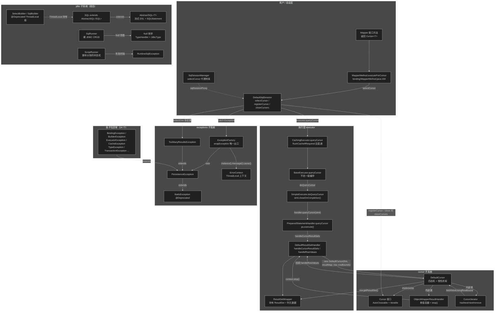
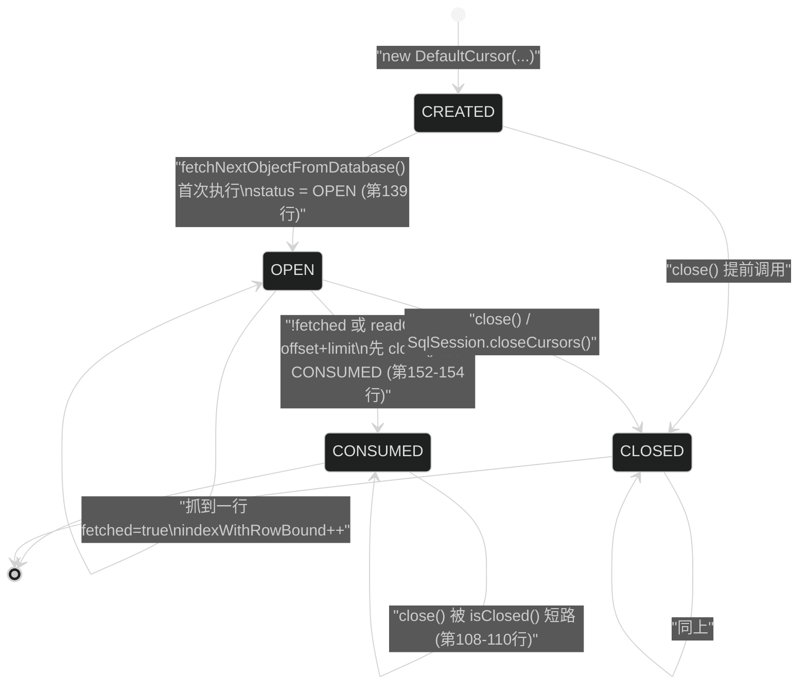
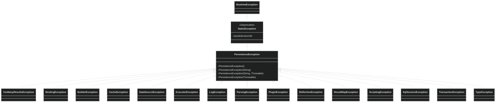
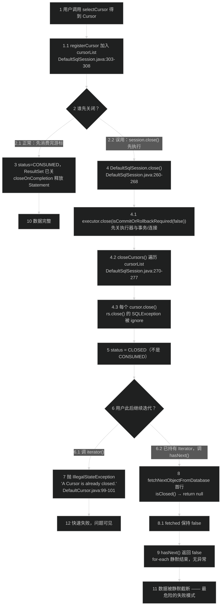
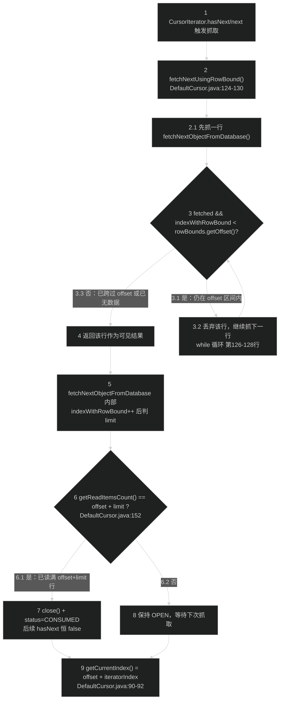
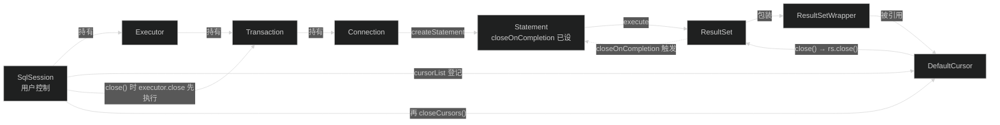

# 游标与 JDBC 辅助工具（cursor + jdbc + exceptions）
> 上次修改：2026-07-29 22:11

## 重点关注

- **`DefaultCursor.fetchNextObjectFromDatabase()` 的"一次一行"改写**（`src/main/java/org/apache/ibatis/cursor/defaults/DefaultCursor.java:132-159`）：整个流式游标的核心技巧——把 `DefaultResultSetHandler.handleRowValues` 这个"批量循环读完 ResultSet"的方法，用 `ObjectWrapperResultHandler.handleResult()` 里的 `context.stop()` 强行截断成"每调用一次只前进一行"。理解这一行 `stop()`，就理解了 MyBatis 游标的全部实现原理。
- **`ObjectWrapperResultHandler.fetched` 这个共享布尔标志**（`cursor/defaults/DefaultCursor.java:169-180`、`:196-199`、`:207-216`）：它同时充当"本次抓取是否成功""hasNext 的缓存有效位""next 是否需要重新抓取"三重语义，是 `CursorIterator` 状态机唯一的同步点，也是 `hasNext()` 可以被重复调用而不重复消费行的原因。
- **`CursorStatus` 四态机与 `isClosed()` 的双值判断**（`cursor/defaults/DefaultCursor.java:51-69`、`:161-163`）：`CREATED → OPEN → CONSUMED`（正常走完）与 `→ CLOSED`（提前关闭）两条路径。`CONSUMED` 被显式定义为"必然已关闭"，因此 `isClosed()` 要同时判断两个枚举值——这是理解"游标关闭后 `fetchNextObjectFromDatabase` 静默返回 null"的关键。
- **`iteratorRetrieved` 的一次性守卫**（`cursor/defaults/DefaultCursor.java:46`、`:96-104`）：`Cursor` 虽然实现了 `Iterable<T>`，却**不能**被 for-each 两次，第二次 `iterator()` 直接抛 `IllegalStateException`。这是 `Iterable` 契约的一处刻意违背，必须在文档里显式说明。
- **`DefaultSqlSession.registerCursor / closeCursors` 的生命周期兜底**（`src/main/java/org/apache/ibatis/session/defaults/DefaultSqlSession.java:303-308`、`:270-277`、`:263`）：游标必须在 `SqlSession.close()` 之前消费完，因为 `close()` 会强制关掉所有已注册游标；而 `SimpleExecutor.doQueryCursor` 用 `stmt.closeOnCompletion()`（`executor/SimpleExecutor.java:77`）把 Statement 的释放挂到 ResultSet 关闭上——这两个机制共同构成了游标的资源回收链。
- **`AbstractSQL.SQLStatement.sqlClause()` 的 AND/OR 哨兵串比较**（`src/main/java/org/apache/ibatis/jdbc/AbstractSQL.java:703-723`、`:34-35`）：用两个私有常量字符串 `") \nAND ("` / `") \nOR ("` 作为"分组分隔符"塞进普通条件列表，再在拼接时用 `equals` 识别它们来抑制默认连接词。这是一个用字符串当哨兵的巧妙但脆弱的设计，第 6 节做三维评估。
- **`ScriptRunner.handleLine()` 的分隔符状态机与 `@DELIMITER` 指令**（`src/main/java/org/apache/ibatis/jdbc/ScriptRunner.java:213-240`、`:44-45`）：注释行不仅被跳过，还会被正则扫描以动态改写 `delimiter` 字段——脚本可以在运行中途改分隔符（Oracle 存储过程场景）。这是本模块最容易被误读的一段逻辑。
- **`ScriptRunner.executeStatement()` 里那个"不许优化"的 while 条件**（`jdbc/ScriptRunner.java:250-257`）：源码带有 `DO NOT try to 'improve' the condition even if IDE tells you to!` 注释，因为 `getUpdateCount()` 的调用本身有副作用。属于典型的"看起来能化简、实际不能"的 JDBC 陷阱。
- **`ExceptionFactory.wrapException` + `ErrorContext` 的错误信息组装**（`src/main/java/org/apache/ibatis/exceptions/ExceptionFactory.java:29-31`、`src/main/java/org/apache/ibatis/executor/ErrorContext.java:97-144`）：MyBatis 那段著名的 `### The error may exist in / ### The error occurred while / ### SQL: / ### Cause:` 报错格式就产自这里，且依赖 `ThreadLocal`。第 8 节分析它的传播与清理时机。
- **异常体系的"两层继承 + 一层废弃"**（`exceptions/PersistenceException.java:22`、`exceptions/IbatisException.java:21-22`）：`PersistenceException extends IbatisException`（后者已 `@Deprecated`）是为了向后兼容而保留的历史包袱；全项目 14 个子包异常全部继承 `PersistenceException`，这是 MyBatis"所有异常都是 unchecked"这一设计的落点。

## 1. 模块定位与职责边界

**结论：这是三个彼此几乎不相互调用的"周边子系统"，被归入同一篇文档是因为它们都属于"不参与 SQL 执行主链路、但服务于主链路两端"的辅助设施。** `cursor` 是执行结果的一种**输出形态**；`jdbc` 是完全独立于 MyBatis 核心的**裸 JDBC 工具箱**；`exceptions` 是全项目异常的**根类型与包装出口**。三者的共同点是：体量小、依赖少、可被单独理解，且各自都藏着一到两个非显而易见的实现技巧。

**三个子系统各自解决的问题。**

| 子系统 | 解决的问题 | 若不存在会怎样 |
|--------|-----------|---------------|
| `cursor`（`src/main/java/org/apache/ibatis/cursor/`） | 百万行级查询无法一次性装进 `List<T>` 内存 | 只能用 `ResultHandler` 回调（控制反转，无法在调用方写 for 循环），或自己分页 |
| `jdbc`（`src/main/java/org/apache/ibatis/jdbc/`） | ① 注解式 Mapper 里手写字符串拼 SQL 易错；② 测试/初始化时需要执行 DDL 脚本；③ 极简场景不想启动整个 MyBatis | 需要引入外部 SQL builder 与 DbUnit/Flyway 之类的脚本工具 |
| `exceptions`（`src/main/java/org/apache/ibatis/exceptions/`） | JDBC 的 `SQLException` 是 checked，逐层 `throws` 污染 API；且原始异常缺少"哪个 Mapper / 哪条 SQL"的上下文 | 用户 API 上到处是 `throws SQLException`，报错信息只有 `ORA-00942` 之类的裸错误码 |

**上游（谁使用本模块）。**
- `cursor` 的唯一生产者是 `DefaultResultSetHandler.handleCursorResultSets()`（`src/main/java/org/apache/ibatis/executor/resultset/DefaultResultSetHandler.java:248-264`），唯一注册者是 `DefaultSqlSession.selectCursor()`（`session/defaults/DefaultSqlSession.java:119-132`），Mapper 接口侧入口是 `MapperMethod.executeForCursor()`（`src/main/java/org/apache/ibatis/binding/MapperMethod.java:159-170`）。
- `jdbc` 在 `src/main/java` 内**没有任何调用者**——`mcp__idea__search_text` 对 `org.apache.ibatis.jdbc.SQL` 的全量搜索在 `src/main/java/**` 下返回空集。它纯粹是给用户和测试代码用的：测试基类 `BaseDataTest.runScript()`（`src/test/java/org/apache/ibatis/BaseDataTest.java:61-76`）是 `ScriptRunner` 在本仓库内的最大消费方。
- `exceptions` 被 12 处 `ExceptionFactory.wrapException` 调用点使用，集中在 `SqlSessionFactoryBuilder`（`session/SqlSessionFactoryBuilder.java:52`、`:82`）、`DefaultSqlSession`（7 处，如 `:128`、`:155`、`:294`）与 `DefaultSqlSessionFactory`（`:105`、`:127`）；`PersistenceException` 则被全项目 14 个子包异常继承。

**下游（本模块依赖谁）。**
- `cursor` → `executor.resultset.DefaultResultSetHandler`（**具体类**，非接口）、`executor.resultset.ResultSetWrapper`、`mapping.ResultMap`、`session.ResultContext/ResultHandler/RowBounds`。这是本文三个子系统里耦合最重的一个，见第 2 节。
- `jdbc` → 仅 `io.Resources`、`type.TypeHandler*`（`SqlRunner`/`Null` 用），`SQL`/`AbstractSQL`/`ScriptRunner` 甚至只依赖 JDK。
- `exceptions` → 仅 `executor.ErrorContext` 一个类（`exceptions/ExceptionFactory.java:18`）。注意这是一条**反向依赖**：底层异常包依赖了上层的 executor 包，见第 2 节耦合点分析。

**负责什么 / 不负责什么。**

| 子系统 | 负责 | 明确不负责 |
|--------|------|-----------|
| `cursor` | 把已有的 `ResultSet` 包装成惰性 `Iterator`；维护读取位置与四态状态机；把 `RowBounds.offset/limit` 转成"跳过/截断"语义 | 不负责打开/执行 Statement（`SimpleExecutor.doQueryCursor` 做）；不负责结果映射本身（转发给 `DefaultResultSetHandler`）；不负责关闭 `Statement` 与 `Connection`（靠 `closeOnCompletion` 与 `SqlSession`）；**不是线程安全的**（类注释 `DefaultCursor.java:32` 明写 `This implementation is not thread safe`） |
| `jdbc` | 字符串级 SQL 拼装；裸 JDBC 的 CRUD 便捷封装；脚本按分隔符切分并逐条执行 | 不做 SQL 语法校验（`AbstractSQL` 只管拼字符串）；不做参数绑定解析（`#{}` 由 `scripting` 模块处理）；`ScriptRunner` 不管理连接生命周期（3.5.4 起 `closeConnection()` 已 `@Deprecated`，见 `jdbc/ScriptRunner.java:166-175`） |
| `exceptions` | 定义 unchecked 根异常；提供唯一的包装工厂方法；定义 `selectOne` 多结果的专用异常 | 不做异常翻译/错误码映射（无 `SQLExceptionTranslator` 之类）；不做重试或降级；不记录日志（`wrapException` 只组装 message） |

**主要输入 / 输出 / 状态变化 / 副作用。**

| 子系统 | 输入 | 输出 | 内部状态变化 | 副作用 |
|--------|------|------|-------------|--------|
| `cursor` | `DefaultResultSetHandler` + `ResultMap` + `ResultSetWrapper` + `RowBounds` | 逐个 `T` 对象 | `status`：`CREATED→OPEN→CONSUMED/CLOSED`；`indexWithRowBound`：`-1→n`；`iteratorIndex`：`-1→n`；`iteratorRetrieved`：`false→true`（单向） | 推进底层 `ResultSet` 游标（不可逆）；`close()` 关闭 `ResultSet`（进而经 `closeOnCompletion` 关闭 `Statement`） |
| `jdbc` | SQL 片段字符串 / `Reader` 脚本流 / `Connection` | SQL 字符串 / `List<Map<String,Object>>` / 影响行数 | `SQLStatement` 的 14 个 `List` 字段持续 append；`ScriptRunner.delimiter` 可被脚本注释改写 | 执行 DDL/DML（**不可回滚的 DDL**）、`setAutoCommit`、`commit`/`rollback`、向 `PrintWriter` 打印结果集 |
| `exceptions` | message + cause | `PersistenceException` 实例 | 无自身状态；但读取并依赖 `ErrorContext` 的 `ThreadLocal` 快照 | 无（`ErrorContext.reset()` 由调用方在 `finally` 里做，见 `DefaultSqlSession.java:130`） |

## 2. 架构关系与依赖

**结论：三个子系统在依赖图上呈"一重、一轻、一枢纽"格局——`cursor` 深度耦合 executor 层（且是对具体类的耦合），`jdbc` 是几乎零依赖的孤岛，`exceptions` 是被全项目继承的枢纽但自身只依赖一个 `ErrorContext`（一条反向依赖）。**



**节点与依赖方向说明表。**

| 节点 | 所属层 | 角色 | 依赖方向与强度 |
|------|--------|------|---------------|
| `Cursor<T>` 接口（`cursor/Cursor.java:25`） | cursor | 对外契约：`extends AutoCloseable, Iterable<T>`，四个方法 `isOpen/isConsumed/getCurrentIndex/close` | 零依赖，纯 JDK。是 `MapperMethod.MethodSignature` 判断 `returnsCursor` 的类型标记（`binding/MapperMethod.java:295`） |
| `DefaultCursor<T>`（`cursor/defaults/DefaultCursor.java:36`） | cursor | 唯一实现。持有 4 个 final 协作对象 + 2 个内部类实例 | **强耦合且是具体类耦合**：构造参数类型是 `DefaultResultSetHandler` 而非 `ResultSetHandler` 接口（`:39`、`:71`），因为它要调 `handleRowValues` 这个非接口方法（`ResultSetHandler` 接口只声明了 `handleResultSets/handleOutputParameters/handleCursorResultSets`） |
| `ObjectWrapperResultHandler<T>`（`DefaultCursor.java:169-180`） | cursor | 把 `ResultHandler` 回调降级成"单对象槽 + 到手即停" | 依赖 `session.ResultContext.stop()`，而 `stop()` 的效果落在 `DefaultResultContext.stopped`（`executor/result/DefaultResultContext.java:56-58`），再被 `shouldProcessMoreRows` 读取（`DefaultResultSetHandler.java:439-441`）——这是一条**跨 3 个类的隐式控制流** |
| `CursorIterator`（`DefaultCursor.java:182-224`） | cursor | 非静态内部类，直接读写外层的 `objectWrapperResultHandler.fetched` | 与外层 `DefaultCursor` 双向紧耦合（内部类天然持有外层引用），`remove()` 直接抛 `UnsupportedOperationException`（`:221-223`） |
| `DefaultResultSetHandler`（`executor/resultset/DefaultResultSetHandler.java:249`、`:367`） | executor | cursor 的**生产者 + 被回调者**双重身份 | 单向 import `DefaultCursor`（`:43`）；`handleRowValues` 被声明为 `public` 就是为了让 `DefaultCursor` 能调用（同包外调用），属于**为游标开的后门** |
| `SimpleExecutor.doQueryCursor`（`executor/SimpleExecutor.java:70-79`） | executor | 唯一显式调用 `stmt.closeOnCompletion()` 的地方（`:77`） | 弱依赖 `Cursor` 类型；这一行是"Statement 不在方法返回时关闭"的原因，与 `doQuery`（`:59-67` 有 `finally { closeStatement(stmt); }`）形成鲜明对比 |
| `ReuseExecutor.doQueryCursor`（`executor/ReuseExecutor.java:64-71`） | executor | 复用 Statement，**没有** `closeOnCompletion` | 因为 Statement 由 `statementMap` 缓存并在 `doFlushStatements` 统一关闭，语义上与 Simple 不同 |
| `BatchExecutor.doQueryCursor`（`executor/BatchExecutor.java:99-108`） | executor | 先 `flushStatements()` 再开游标 | 保证批处理中未提交的语句先落库，避免游标读到过期数据 |
| `CachingExecutor.queryCursor`（`executor/CachingExecutor.java:79-83`） | executor | `flushCacheIfRequired(ms)` 后直接委托 delegate | **游标不进二级缓存**——因为游标是有状态、只能消费一次的对象，缓存它没有意义 |
| `DefaultSqlSession`（`session/defaults/DefaultSqlSession.java:53`、`:303-308`、`:270-277`） | session | 游标的**注册表与兜底关闭者**，字段 `List<Cursor<?>> cursorList` 懒初始化 | 强依赖 `Cursor` 接口；`close()` 中 `executor.close(...)` 在前、`closeCursors()` 在后（`:262-263`），顺序值得注意（见第 8 节） |
| `AbstractSQL<T>`（`jdbc/AbstractSQL.java:32`） | jdbc | 自递归泛型（CRTP）的流式 DSL 基类，40+ 个大写方法全部 `return getSelf()` | **零外部依赖**，只用 JDK 的 `ArrayList/Arrays/Collections/Appendable/BooleanSupplier/Consumer` |
| `SQL`（`jdbc/SQL.java:21-27`） | jdbc | 8 行的具体化子类，只实现 `getSelf() { return this; }` | 单向 extends `AbstractSQL<SQL>` |
| `SelectBuilder` / `SqlBuilder`（`jdbc/SelectBuilder.java:24`、`jdbc/SqlBuilder.java:24`） | jdbc | 已 `@Deprecated` 的静态导入风格 API，内部用 `ThreadLocal<SQL>` 存实例 | 依赖 `SQL`；两者都在 static 块里 `BEGIN()` 初始化（`SelectBuilder.java:28-30`），是典型的历史遗留 |
| `SqlRunner`（`jdbc/SqlRunner.java:39`） | jdbc | 裸 JDBC CRUD 封装 | 依赖 `io.Resources.classForName`（`:243`）、`type.TypeHandlerRegistry`（`:49`）、`type.ObjectTypeHandler.INSTANCE`（`:246`）。**每个实例 new 一个 TypeHandlerRegistry**（`:49`），见第 9 节性能分析 |
| `ScriptRunner`（`jdbc/ScriptRunner.java:38`） | jdbc | 脚本执行器，类注释自称 `This is an internal testing utility` | 零 MyBatis 依赖，纯 JDK + JDBC；失败时抛 `RuntimeSqlException`（同包，`jdbc/RuntimeSqlException.java:21`） |
| `Null` 枚举（`jdbc/Null.java:44-87`） | jdbc | 22 个枚举常量，每个绑定一对 `(TypeHandler, JdbcType)` | 依赖 `type` 包的 20 个具体 TypeHandler 类；**只被 `SqlRunner.setParameters` 使用**（`jdbc/SqlRunner.java:222-223`） |
| `ExceptionFactory`（`exceptions/ExceptionFactory.java:23`） | exceptions | 私有构造 + 唯一静态方法的工具类 | **反向依赖**：`exceptions` 包 import 了 `executor.ErrorContext`（`:18`）。分层上"基础异常包"不该依赖"执行器包"，这是本模块最明显的架构瑕疵 |
| `PersistenceException`（`exceptions/PersistenceException.java:22`） | exceptions | 全项目异常根，4 个标准构造器 | extends 已废弃的 `IbatisException`，类上带 `@SuppressWarnings("deprecation")`（`:21`）来消警告 |
| `IbatisException`（`exceptions/IbatisException.java:21-22`） | exceptions | `@Deprecated` 的历史根类，`extends RuntimeException` | 保留它是为了让老代码 `catch (IbatisException e)` 仍然生效 |
| `TooManyResultsException`（`exceptions/TooManyResultsException.java:21`） | exceptions | `selectOne()` 返回多行时的专用异常 | 唯一抛出点 `DefaultSqlSession.selectOne`（`session/defaults/DefaultSqlSession.java:78-81`） |
| `ErrorContext`（`executor/ErrorContext.java:21-24`） | executor | `ThreadLocal` 承载的错误上下文，6 个字段 + `store/recall` 栈式嵌套 | 被 `ExceptionFactory` 读取；由各调用方在 `finally` 中 `reset()` 并 `LOCAL.remove()`（`:86-95`） |

**关键数据流。**

1. **游标创建流（一次性，无数据库交互之外的分配）**：`MapperMethod.executeForCursor` → `DefaultSqlSession.selectCursor` → `CachingExecutor.queryCursor`（清缓存）→ `BaseExecutor.queryCursor`（`executor/BaseExecutor.java:178-182`，注意**不查一级缓存**）→ `SimpleExecutor.doQueryCursor` → `PreparedStatementHandler.queryCursor`（`executor/statement/PreparedStatementHandler.java:69-74`，`ps.execute()`）→ `DefaultResultSetHandler.handleCursorResultSets` → `new DefaultCursor<>(this, resultMap, rsw, rowBounds)`。此时 `status == CREATED`，**一行都还没读**。
2. **游标消费流（每次 `next()`）**：`CursorIterator.next()` → `DefaultCursor.fetchNextUsingRowBound()` → `fetchNextObjectFromDatabase()` → `resultSetHandler.handleRowValues(rsw, resultMap, objectWrapperResultHandler, RowBounds.DEFAULT, null)` → `handleRowValuesForSimpleResultMap` 的 `while` 循环推进一行 → `storeObject` → `callResultHandler` → `ObjectWrapperResultHandler.handleResult` 存值 + `context.stop()` → `shouldProcessMoreRows` 返回 false → 循环退出 → 值经 `objectWrapperResultHandler.result` 回传。
3. **SQL DSL 构建流**：`new SQL(){{ SELECT("a"); FROM("t"); WHERE("x=#{x}"); }}.toString()` → 各方法把片段 append 进 `SQLStatement` 的对应 `List` → `toString()`（`jdbc/AbstractSQL.java:596-601`）→ `SQLStatement.sql(StringBuilder)` → 按 `statementType` 分派到 `selectSQL/insertSQL/deleteSQL/updateSQL` → 每个子句走 `sqlClause()` 拼接。
4. **脚本执行流**：`runScript(Reader)` → `setAutoCommit()` → `executeLineByLine` 或 `executeFullScript` → 逐行 `handleLine` 累积到 `StringBuilder command` → 遇分隔符则 `executeStatement` → `finally { rollbackConnection(); }`（`jdbc/ScriptRunner.java:123-125`）。
5. **异常包装流**：业务代码抛 `Exception` → `DefaultSqlSession` 的 `catch` → `ExceptionFactory.wrapException(msg, e)` → 读取当前线程 `ErrorContext` 的 `resource/object/activity/sql` 四个字段 → 组装成多行 `###` 格式 message → `new PersistenceException(message, e)` → `finally` 里 `ErrorContext.instance().reset()`。

**潜在耦合点与跨层调用（需留意）。**

- **`exceptions → executor` 的反向依赖**（`exceptions/ExceptionFactory.java:18`）：包名暗示 `exceptions` 是最底层，但它 import 了 `org.apache.ibatis.executor.ErrorContext`。如果想把 `exceptions` 抽成独立 artifact，必须先把 `ErrorContext` 挪走或抽接口。
- **`DefaultCursor` 对具体类 `DefaultResultSetHandler` 的依赖**（`cursor/defaults/DefaultCursor.java:24`、`:39`）：无法用自定义 `ResultSetHandler` 实现替换游标的映射行为——即使通过插件拦截了 `ResultSetHandler`，`DefaultCursor` 拿到的仍是构造时传入的 `this`（`DefaultResultSetHandler.java:263` 传的是 `this`，**不是被代理的对象**），这意味着**插件对 `handleRowValues` 的拦截在游标路径上会被绕过**。
- **`handleRowValues` 的 `public` 可见性**（`DefaultResultSetHandler.java:367`）：同类中的 `handleResultSet`（`:340`）、`handleRowValuesForSimpleResultMap`（`:396`）都是 `private`，唯独 `handleRowValues` 是 `public`——纯粹为 `DefaultCursor` 开的口子。这是一处"为了内部协作而扩大 API 面"的妥协。
- **`jdbc` 包与 `mapping`/`scripting` 的"名义相关、实际无关"**：`AbstractSQL` 产出的字符串里可以含 `#{param}`，但这个占位符的解析完全发生在 `scripting` 模块的 `SqlSourceBuilder`，两者之间没有任何编译期或运行期调用关系。文档里必须点明，避免读者误以为 `SQL` 类参与了参数绑定。
- **`ScriptRunner` 的 `delimiter` 字段可被输入数据改写**（`jdbc/ScriptRunner.java:218`）：`setDelimiter()` 设置的值会被脚本里的 `-- @DELIMITER xxx` 注释覆盖，且**改写后不会恢复**。同一个 `ScriptRunner` 实例连续跑两个脚本时，第一个脚本改的分隔符会污染第二个——`BaseDataTest.runScript(runner, resource)`（`src/test/java/org/apache/ibatis/BaseDataTest.java:72-76`）正是复用同一 runner 的用法。

## 3. 入口与调用方式

**结论：三个子系统的入口形态完全不同——`cursor` 是"返回值类型驱动"的隐式入口，`jdbc` 是纯手工 `new` 的显式入口，`exceptions` 是"被 catch 块调用"的横切入口。**

### 3.1 cursor 的三个入口

| 入口 | 位置 | 触发条件 | 关键参数 | 返回 | 之后进入的流程 |
|------|------|---------|---------|------|--------------|
| Mapper 接口方法 | 用户接口，如 `Cursor<User> selectAll();` | `MethodSignature.returnsCursor` 为 true，即 `Cursor.class.equals(returnType)`（`binding/MapperMethod.java:295`） | 方法入参 + 可选 `RowBounds` | `Cursor<T>` | `MapperMethod.executeForCursor`（`:159-170`）→ `SqlSession.selectCursor` |
| `SqlSession.selectCursor(...)` 三重载 | `session/SqlSession.java:167`、`:181`、`:197`；实现 `session/defaults/DefaultSqlSession.java:109-132` | 直接调用 | `statement` 语句 ID、`parameter`、`rowBounds` | `Cursor<T>` | `executor.queryCursor` → ... → `new DefaultCursor` |
| `SqlSessionManager.selectCursor(...)` | `session/SqlSessionManager.java:182-190` | 线程绑定会话模式下调用 | 同上 | `Cursor<T>` | 经 `sqlSessionProxy` 动态代理转发到 `DefaultSqlSession` |

**注意 `returnsCursor` 的判定是 `equals` 而非 `isAssignableFrom`**（`binding/MapperMethod.java:295`）：`private Cursor<T> myCursorSubtype()` 这类返回自定义子接口的 Mapper 方法**不会**走游标分支，会被误判成 `returnsMany` 或单值。这是一个易踩的边界。

**权限/上下文要求**：`selectCursor` 内部有 `dirty |= ms.isDirtySelect()`（`DefaultSqlSession.java:123`），与 `selectList` 一致，说明标记为 dirty 的 select 同样会影响后续是否需要 commit/rollback。此外**必须在 `SqlSession` 关闭前完成消费**，否则 `close()` 里的 `closeCursors()` 会强制关掉游标（`:263`、`:270-277`）。

### 3.2 jdbc 的四个入口

| 入口 | 位置 | 典型用法 | 关键约束 |
|------|------|---------|---------|
| `new SQL(){{ ... }}.toString()` | `jdbc/SQL.java:21` + `jdbc/AbstractSQL.java` 全部大写方法 | 配合 `@SelectProvider`/`@InsertProvider` 在 Provider 方法里返回字符串 | 必须先调用一个设置 `statementType` 的方法（`SELECT/INSERT_INTO/UPDATE/DELETE_FROM`），否则 `SQLStatement.sql()` 直接 `return null`（`AbstractSQL.java:777-779`），`toString()` 返回空串 |
| `AbstractSQL.usingAppender(A a)` | `jdbc/AbstractSQL.java:526-529` | 把 SQL 直接写进已有 `StringBuilder`/`Writer`，避免中间字符串 | 传入的 `Appendable` 若抛 `IOException` 会被 `SafeAppendable` 包成 `RuntimeException`（`:617-619`） |
| `new SqlRunner(connection).selectAll/selectOne/insert/update/delete/run` | `jdbc/SqlRunner.java:69`、`:90`、`:112`、`:165`、`:185`、`:198` | 测试或轻量脚本中不想启动 MyBatis 时 | 参数**不允许直接传 `null`**，必须用 `Null.STRING` 等枚举常量（`:218-221` 抛 `SQLException`）；连接由调用方管理（`closeConnection()` 已废弃，`:205-214`） |
| `new ScriptRunner(connection).runScript(reader)` | `jdbc/ScriptRunner.java:62`、`:114-126` | 初始化测试数据库、执行 DDL | 先设 `setAutoCommit/setStopOnError/setLogWriter` 等；`logWriter` 默认是 `System.out`（`:56`），大脚本会刷屏，测试里通常 `setLogWriter(null)`（见 `BaseDataTest.java:66-67`） |

`SelectBuilder` / `SqlBuilder` 两个静态入口（`jdbc/SelectBuilder.java:36-106`、`jdbc/SqlBuilder.java:36-131`）已整类 `@Deprecated`，Javadoc 明写 `Use the {@link SQL} Class`，新代码不应使用。

### 3.3 exceptions 的入口

唯一的编程入口是 `ExceptionFactory.wrapException(String message, Exception e)`（`exceptions/ExceptionFactory.java:29-31`），**静态方法，返回 `RuntimeException`（实际类型 `PersistenceException`）而不是抛出**——调用方必须自己写 `throw`。全部 12 个调用点都遵循同一模式：

```java
try {
  // ...
} catch (Exception e) {
  throw ExceptionFactory.wrapException("Error querying database.  Cause: " + e, e);
} finally {
  ErrorContext.instance().reset();
}
```

见 `session/defaults/DefaultSqlSession.java:127-131`。`finally` 里的 `reset()` 是必需的，否则 `ThreadLocal` 里的上下文会泄漏到该线程的下一次调用（线程池场景尤其危险）。

另一个"入口"是**继承**：任何子包想定义自己的异常，只需 `extends PersistenceException` 并提供 4 个标准构造器——`GeneralExceptionsTest.shouldInstantiateAndThrowAllCustomExceptions`（`src/test/java/org/apache/ibatis/exceptions/GeneralExceptionsTest.java:50-60`）用反射逐个校验这 14 个异常类都具备这 4 个构造器，等于把"构造器约定"固化成了测试。

## 4. 核心概念与领域模型

### 4.1 Cursor（游标）

**定义**：`Cursor<T> extends AutoCloseable, Iterable<T>`（`cursor/Cursor.java:25`），表示一个"尚未完全从数据库读出的结果序列"。

**作用**：让调用方以 for-each 的正序写法消费任意大的结果集，同时保持 O(1) 的内存占用（只驻留当前行映射出的一个对象）。类 Javadoc 明确指出适用场景是 `millions of items queries that would not normally fit in memory`（`Cursor.java:19-21`）。

**生命周期**：`CREATED`（构造完成，未读任何行）→ `OPEN`（第一次 `fetchNextObjectFromDatabase` 起）→ `CONSUMED`（读完或达到 limit）或 `CLOSED`（显式 `close()` / `SqlSession.close()` 触发）。`CONSUMED` 的枚举注释写着 `a consumed cursor is always closed`（`cursor/defaults/DefaultCursor.java:65-68`），因为 `fetchNextObjectFromDatabase` 在设 `CONSUMED` 之前先调了 `close()`（`:153-154`）。

**相关类型**：`DefaultCursor`（唯一实现）、`CursorIterator`（内部迭代器）、`ObjectWrapperResultHandler`（单值容器）、`CursorStatus`（私有枚举）。

**使用场景**：

```java
try (SqlSession session = factory.openSession();
     Cursor<User> cursor = session.selectCursor("selectAllUsers")) {
  for (User u : cursor) {          // 惰性，每次循环读一行
    process(u);
  }
}                                   // cursor 先关，session 后关（try-with-resources 逆序）
```

若 resultMap 中含 `collection` 嵌套，SQL **必须**按 id 列排序且 `resultOrdered="true"`（`Cursor.java:20-21` 的 Javadoc 要求）——否则同一个逻辑对象的多行会散落在结果集各处，而游标只保留 `previousRowValue` 一个"待合并对象"（`DefaultResultSetHandler.java:1157`、`:1193-1199`），导致对象被截断成多个。

**三维评估（Cursor 作为"惰性 Iterable"的建模）**

- **好处**：调用方代码形态与 `List` 完全一致（都是 for-each），迁移成本近乎为零；`AutoCloseable` 让 try-with-resources 自动接管释放；`isOpen/isConsumed/getCurrentIndex` 三个查询方法提供了可观测性，便于排障时判断游标停在哪。
- **替代方案**：① 用 `ResultHandler<T>` 回调（MyBatis 早已支持，`SqlSession.select(stmt, handler)`）——不需要新类型，但控制反转导致无法 `break`、无法在循环外持有状态、异常传播别扭；② 返回 `java.util.stream.Stream<T>`（jOOQ/Spring Data JDBC 的做法）——可组合性更强，但 MyBatis 3 的基线 JDK 曾低于 8，且 `Stream` 的关闭语义更隐蔽；③ 手工分页（`RowBounds` + 多次查询）——无需任何新机制，但会产生 N 次往返且有幻读风险。
- **风险**：`Iterable` 契约被违背——标准 `Iterable` 允许多次 `iterator()`，而这里第二次直接抛 `IllegalStateException`（`DefaultCursor.java:96-98`）。任何"防御性地遍历两次"的通用工具代码（如某些集合拷贝、日志打印工具）传入 `Cursor` 都会炸。另一个风险是**资源生命周期跨越方法边界**：Mapper 方法返回后连接仍处于占用状态，若调用方忘了 close 且 `SqlSession` 也长期不关，连接池会被耗尽。

### 4.2 CursorStatus 与 fetched 标志（游标的状态模型）

**定义**：两套正交的状态——`CursorStatus`（游标级，4 值枚举，`DefaultCursor.java:51-69`）与 `ObjectWrapperResultHandler.fetched`（单次抓取级，boolean，`:172`）。

**作用**：`CursorStatus` 回答"这个游标还能不能用"，`fetched` 回答"上一次抓取有没有拿到东西 / 当前槽里有没有未消费的值"。

**生命周期与转换**：



关键点：**`CLOSED` 与 `CONSUMED` 之间没有转换边**。一旦 `close()` 先于消费完成执行，`status` 就永远停在 `CLOSED`，此后 `fetchNextObjectFromDatabase` 首行 `if (isClosed()) return null`（`:133-135`）静默返回，`hasNext()` 因 `fetched` 保持 false 而返回 false，for-each **静默地提前结束且不报错**。这是本模块最容易导致"数据莫名少了"的行为，第 8 节展开。

**三维评估（用两个独立标志而非单一状态机）**

- **好处**：`fetched` 使 `hasNext()` 可以幂等——连续调 3 次 `hasNext()` 只会真正抓取 1 行（`:196-199` 的 `if (!fetched)` 守卫），符合 `Iterator` 契约；而 `CursorStatus` 独立演进，使 `isOpen()/isConsumed()` 这类对外查询不受抓取细节影响。
- **替代方案**：合并成单一状态机（如 `CREATED/OPEN_WITH_BUFFERED/OPEN_EMPTY/CONSUMED/CLOSED`）——状态转换更显式、更易画图验证，但会让 `fetchNextObjectFromDatabase` 与 `CursorIterator` 之间的每次交互都要做状态判断，代码量翻倍；或者用 `Optional<T> buffered` 字段代替 `result + fetched` 两个字段——语义更清晰，但每行都要分配一个 `Optional` 包装对象，在百万行场景下是可观的 GC 压力。
- **风险**：`fetched` 是 `ObjectWrapperResultHandler` 的**包内可见（protected）非 volatile 字段**，同时被 `DefaultCursor`（外层）和 `CursorIterator`（内部类）读写。类注释虽已声明非线程安全（`:32`），但"把 Cursor 传给另一个线程消费"是很自然的误用（例如提交给线程池做并行处理），此时 `fetched` 的可见性问题会导致漏行或重复行，且**没有任何 fail-fast 检测**。

### 4.3 SQLStatement 与 SafeAppendable（SQL DSL 的内部模型）

**定义**：`SQLStatement` 是 `AbstractSQL` 的私有静态内部类（`jdbc/AbstractSQL.java:629`），持有 14 个 `List<String>` + 1 个 `List<List<String>>` + `distinct/offset/limit/statementType/limitingRowsStrategy` 共 20 个字段；`SafeAppendable` 是对 `Appendable` 的薄封装（`:603-627`），只加两件事：把 `IOException` 转成 `RuntimeException`、维护一个 `empty` 标志。

**作用**：`SQLStatement` 把"SQL 的各个子句"建模成互相独立的字符串列表，使得 DSL 方法可以任意顺序调用（先 `WHERE` 后 `FROM` 也没问题）；`SafeAppendable.empty` 用于决定"要不要在子句前加换行"（`:706-708`），从而避免生成的 SQL 以空行开头。

**生命周期**：与 `AbstractSQL` 实例同生共死（`private final SQLStatement sql = new SQLStatement()`，`:37`）。**没有 reset 方法**——一个 `SQL` 实例只能产出一份 SQL，重复调 `toString()` 会得到相同结果（幂等，因为 `sql(Appendable)` 每次新建 `SafeAppendable`，`:776`），但**不能复用它去拼第二条不同的 SQL**。

**关键字段说明**：

| 字段 | 类型 | 含义 | 默认值/初始化 |
|------|------|------|--------------|
| `statementType` | `StatementType` 枚举 | 决定 `sql()` 分派到哪个生成器 | `null`——为 null 时 `sql()` 返回 null（`:777-779`） |
| `lastList` | `List<String>` | 指向最近一次 `WHERE()` 或 `HAVING()` 操作的列表，供 `AND()`/`OR()` 追加哨兵 | 初始为一个**独立的空 ArrayList**（`:690`），若在任何 `WHERE`/`HAVING` 之前调用 `AND()`，哨兵会加进这个孤儿列表并被永久丢弃 |
| `valuesList` | `List<List<String>>` | 支持多行 INSERT，每个子列表是一行 | 构造器里预置一个空列表（`:698-701`），因此 `INTO_VALUES` 可以直接取 `size()-1` |
| `limitingRowsStrategy` | 枚举 `NOP/ISO/OFFSET_LIMIT` | 决定分页子句方言 | `NOP`（`:696`），由 `LIMIT()`/`OFFSET()` 切成 `OFFSET_LIMIT`，由 `FETCH_FIRST_ROWS_ONLY()`/`OFFSET_ROWS()` 切成 `ISO` |
| `distinct` | `boolean` | 是否 `SELECT DISTINCT` | `false`，由 `SELECT_DISTINCT` 置 true（`:133`） |

**三维评估（用 `List<String>` + 关键字常量拼字符串，而不是构建 AST）**

- **好处**：实现极简（整个 `SQLStatement` 只有 180 行却覆盖了 4 种语句类型 + 5 种 join + 2 种分页方言）；对使用者零学习成本——传进去的就是 SQL 片段原文，不需要学一套表达式 API；天然支持任意方言的函数、hint、注释，因为它根本不解析内容。
- **替代方案**：① 构建真正的 AST（jOOQ / QueryDSL 路线）——能做类型安全的列引用、编译期校验、方言自动翻译，但需要代码生成器和庞大的 API 面；② 直接用 `String.format`/文本块——更简单，但失去了"条件片段可有可无"的组合能力（`applyIf` 这类，`:545-569`）；③ 模板引擎（如 MyBatis 自己的 `<script>` 动态 SQL）——已有能力，但只能写在 XML/注解字符串里，无法用 Java 控制流。
- **风险**：**零校验**——`SELECT("*"); UPDATE("t")` 这种自相矛盾的调用不会报错，只会以最后一次 `statementType` 赋值为准（`UPDATE` 覆盖 `SELECT`，`:42`），生成一条丢失了 select 列的 UPDATE。**注入风险**——所有片段原样拼进 SQL，Provider 方法里若把用户输入拼进 `WHERE()` 就是直接的 SQL 注入，必须坚持用 `#{}` 占位符。**哨兵串脆弱**——用户若恰好传入等于 `") \nAND ("` 的字符串（虽极不可能），行为会错乱。

### 4.4 Null 枚举（类型化的 NULL）

**定义**：22 个常量的枚举（`jdbc/Null.java:44-87`），每个常量绑定 `(TypeHandler<?>, JdbcType)` 二元组。

**作用**：解决 JDBC 的一个老问题——`PreparedStatement.setObject(i, null)` 在多数驱动上会失败或行为不定，必须用 `setNull(i, sqlType)` 并指明类型。`Null.STRING` 就等于"一个类型为 VARCHAR 的 null"。

**使用场景**（`jdbc/SqlRunner.java:216-233`）：

```java
runner.update("UPDATE t SET name = ? WHERE id = ?", Null.STRING, 1);
//                                     ↑ 走 setParameter(ps, 1, null, JdbcType.VARCHAR)
```

`setParameters` 的判定顺序是：先拒绝裸 `null`（抛 `SQLException`，`:218-221`），再判 `instanceof Null` 走类型化 null 路径（`:222-223`），否则按 `args[i].getClass()` 查 `TypeHandlerRegistry`（`:225-229`）。

**注意几个语义重叠的常量**：`CLOB` 与 `LONGVARCHAR` 共用 `ClobTypeHandler` 但 JdbcType 不同（`:63`、`:65`）；`BLOB` 与 `LONGVARBINARY` 共用 `BlobTypeHandler`（`:69`、`:71`）；`OBJECT` 与 `OTHER` 完全等价，都是 `(ObjectTypeHandler.INSTANCE, JdbcType.OTHER)`（`:73`、`:75`）——后者纯属命名冗余。

**三维评估**

- **好处**：把"类型 + null"这个二元信息压缩成单个枚举常量，调用点极其简洁；枚举天生单例、线程安全、可用于 switch；每个常量在类加载时 `new` 一次 TypeHandler，之后零分配。
- **替代方案**：`SqlRunner` 直接接收 `(Object value, JdbcType type)` 参数对——更灵活但调用点变啰嗦；或者让 `SqlRunner` 允许传 `null` 并统一用 `Types.NULL`——最简单，但在 Oracle 等驱动上不可靠。
- **风险**：`Null` 枚举里的 TypeHandler 实例是**枚举常量持有的可变对象引用**（虽然这些 TypeHandler 本身无状态），且与 `TypeHandlerRegistry` 里注册的实例是两套不同对象——若用户自定义了 `StringTypeHandler` 的替代实现并注册到 registry，`Null.STRING` 仍然用内建的那个，行为会不一致。此外该枚举**只服务于 `SqlRunner`**，在 MyBatis 主链路中完全用不上，容易被误以为是通用工具。

### 4.5 PersistenceException 与异常层次

**定义**：`PersistenceException extends IbatisException extends RuntimeException`（`exceptions/PersistenceException.java:22`、`exceptions/IbatisException.java:22`）。

**作用**：给整个 MyBatis 提供一个"catch 得住全部"的根类型，同时保证所有异常都是 unchecked，使得 `SqlSession` 的方法签名上没有一个 `throws`。

**生命周期**：由 `ExceptionFactory.wrapException` 在 catch 块中创建，携带组装好的多行 message 与原始 cause；向上抛给用户代码后由用户处理。**message 在创建时就固化**——因为 `ErrorContext.toString()` 在 `wrapException` 内立即求值（`exceptions/ExceptionFactory.java:30`），随后 `finally` 里的 `reset()` 清空上下文也不影响已生成的字符串。

**继承树**（全部来自 `mcp__idea__search_text` 对 `extends PersistenceException` 的检索）：



15 个直接子类（14 个来自各子包 + `TooManyResultsException` 本包），分别位于 `binding/BindingException.java:23`、`builder/BuilderException.java:23`、`cache/CacheException.java:23`、`datasource/DataSourceException.java:23`、`executor/ExecutorException.java:23`、`executor/result/ResultMapException.java:23`、`logging/LogException.java:23`、`parsing/ParsingException.java:23`、`plugin/PluginException.java:23`、`reflection/ReflectionException.java:23`、`scripting/ScriptingException.java:23`、`session/SqlSessionException.java:23`、`transaction/TransactionException.java:23`、`type/TypeException.java:23`。

**游离在体系外的异常**：`jdbc/RuntimeSqlException.java:21` **直接 extends RuntimeException**，不属于 `PersistenceException` 体系——这是刻意的，因为 `jdbc` 包被定位成独立工具箱，不应强迫使用者 catch MyBatis 的类型。

**三维评估（统一 unchecked 根 + 每子包一个子类）**

- **好处**：用户 API 干净（`SqlSession` 全部方法无 `throws`）；`catch (PersistenceException e)` 能兜住 MyBatis 抛出的一切；每个子包有自己的异常类型，便于精确定位问题域，也便于 mybatis-spring 之类的框架做异常翻译（Spring 的 `MyBatisExceptionTranslator` 就是按类型分派的）。
- **替代方案**：① 全部用 `PersistenceException` 不分子类——更简单，但无法按域区分，Spring 的翻译层只能靠 message 匹配；② 保留 checked 异常——编译期强制处理，但会污染整条调用链，且与 Spring/JPA 的主流做法相悖；③ 用错误码 + 单一异常类型（如 `MyBatisException(code, msg)`）——便于国际化和文档化，但改造成本高且丢失类型信息。
- **风险**：`IbatisException` 已 `@Deprecated` 却仍是继承链的一环（`PersistenceException.java:21` 用 `@SuppressWarnings("deprecation")` 压警告），意味着这个废弃类**永远删不掉**——删了就破坏二进制兼容。另一个风险是 `ExceptionFactory` 只有一个方法、message 全靠 `ErrorContext` 的 `ThreadLocal`：若调用方忘了在 `finally` 里 `reset()`，线程池复用时会把上一次请求的 `resource`/`sql` 信息串进这一次的报错，产生**误导性极强的错误信息**。

## 5. 关键流程

### 5.1 主成功路径：游标的一次完整迭代

```mermaid
%%{init: {"theme": "dark"}}%%
sequenceDiagram
  participant User as 用户代码
  participant Session as DefaultSqlSession
  participant Exec as SimpleExecutor
  participant PSH as PreparedStatementHandler
  participant DRSH as DefaultResultSetHandler
  participant Cur as DefaultCursor
  participant Iter as CursorIterator
  participant OW as ObjectWrapperResultHandler
  participant RS as ResultSet

  User->>Session: selectCursor("selectAll")
  Note over User, Session: 1. 发起游标查询
  Session->>Exec: executor.queryCursor(ms, param, rowBounds)
  Note over Session, Exec: 1.1 转发到执行器（不查一级缓存）
  Exec->>PSH: handler.queryCursor(stmt)
  Note over Exec, PSH: 1.2 prepare + parameterize 后执行
  PSH->>RS: ps.execute()
  Note over PSH, RS: 1.3 数据库产生结果集（未读取）
  PSH->>DRSH: handleCursorResultSets(ps)
  Note over PSH, DRSH: 2. 校验 resultMap 只有一个
  DRSH->>Cur: new DefaultCursor(this, resultMap, rsw, rowBounds)
  Note over DRSH, Cur: 2.1 构造游标 status=CREATED
  Cur-->>Session: 返回 Cursor
  Note over Cur, Session: 2.2 逐层回传
  Session->>Session: registerCursor(cursor)
  Note over Session: 2.3 登记到 cursorList 供 close 兜底
  Exec->>Exec: stmt.closeOnCompletion()
  Note over Exec: 2.4 挂接 Statement 自动释放

  User->>Iter: for-each 触发 cursor.iterator()
  Note over User, Iter: 3. 取迭代器（iteratorRetrieved 置 true）
  Iter->>Cur: hasNext() → fetchNextUsingRowBound()
  Note over Iter, Cur: 3.1 首次抓取，status 转 OPEN
  Cur->>DRSH: handleRowValues(rsw, resultMap, OW, RowBounds.DEFAULT, null)
  Note over Cur, DRSH: 3.2 委托映射一行
  DRSH->>RS: resultSet.next() + 列映射
  Note over DRSH, RS: 3.3 推进物理游标并构造对象
  DRSH->>OW: handleResult(context)
  Note over DRSH, OW: 4. 回调存值
  OW->>OW: result = obj; context.stop(); fetched = true
  Note over OW: 4.1 置停止位截断循环
  DRSH-->>Cur: handleRowValues 返回
  Note over DRSH, Cur: 4.2 shouldProcessMoreRows 为 false 退出循环
  Cur->>Cur: indexWithRowBound++; result 置 null
  Note over Cur: 4.3 更新索引并清空槽位
  Cur-->>Iter: 返回对象，hasNext=true
  Note over Cur, Iter: 5. 交付本行
  Iter->>User: next() 返回 T
  Note over Iter, User: 5.1 iteratorIndex++，fetched 复位

  User->>Iter: 循环直至 hasNext()==false
  Note over User, Iter: 6. 末行后再抓取
  Cur->>Cur: !fetched → close() + status=CONSUMED
  Note over Cur: 6.1 关闭 ResultSet，触发 Statement 释放
  User->>Cur: try-with-resources 调 close()
  Note over User, Cur: 7. 幂等关闭（isClosed 短路）
```

**1-2 游标创建阶段**：用户调用 `selectCursor` 后，请求沿 `DefaultSqlSession.selectCursor`（`session/defaults/DefaultSqlSession.java:119-132`）→ `CachingExecutor.queryCursor`（`executor/CachingExecutor.java:79-83`，只做 `flushCacheIfRequired`，**不缓存游标**）→ `BaseExecutor.queryCursor`（`executor/BaseExecutor.java:178-182`，注意这里**没有一级缓存查询**，直接 `doQueryCursor`）→ `SimpleExecutor.doQueryCursor`（`executor/SimpleExecutor.java:70-79`）下行。`PreparedStatementHandler.queryCursor` 执行 `ps.execute()`（`executor/statement/PreparedStatementHandler.java:69-74`）后交给 `DefaultResultSetHandler.handleCursorResultSets`（`executor/resultset/DefaultResultSetHandler.java:248-264`）。后者做的唯一实质工作是校验 `resultMapCount == 1`（`:258-260`，否则抛 `ExecutorException("Cursor results cannot be mapped to multiple resultMaps")`），然后 `new DefaultCursor<>(this, resultMap, rsw, rowBounds)`。**关键判断**：此时一行数据都没读，`status == CREATED`。回程路上 `SimpleExecutor` 调 `stmt.closeOnCompletion()`（`:77`）——这是与 `doQuery` 最本质的差异（`doQuery` 在 `finally` 里 `closeStatement(stmt)`，`:65-67`），因为游标返回后 Statement 必须继续存活。`DefaultSqlSession.registerCursor`（`:303-308`）把游标加入 `cursorList` 作为最后一道防线。

**3-4 首次抓取阶段**：for-each 隐式调用 `iterator()`（`cursor/defaults/DefaultCursor.java:95-104`），此处做两道守卫（`iteratorRetrieved` 与 `isClosed()`）后置位并返回单例 `cursorIterator`。`hasNext()` 发现 `!fetched` 便调 `fetchNextUsingRowBound()`（`:196-198`），后者调 `fetchNextObjectFromDatabase()`（`:132-159`）。这个方法先把 `fetched` 清零、`status` 置 `OPEN`（`:138-139`），检查 `!rsw.getResultSet().isClosed()` 后调用 `resultSetHandler.handleRowValues(rsw, resultMap, objectWrapperResultHandler, RowBounds.DEFAULT, null)`（`:141`）。**注意这里传的是 `RowBounds.DEFAULT` 而非游标自己的 `rowBounds`**——分页语义被完全接管到游标层自己实现（见 5.3）。`handleRowValues` 进入 `handleRowValuesForSimpleResultMap` 的 `while (shouldProcessMoreRows(...) && !resultSet.isClosed() && resultSet.next())` 循环（`DefaultResultSetHandler.java:403`），映射出一行后 `storeObject` → `callResultHandler`（`:418-437`）回调到 `ObjectWrapperResultHandler.handleResult`：存值、`context.stop()`、`fetched = true`（`DefaultCursor.java:175-179`）。`stop()` 把 `DefaultResultContext.stopped` 置 true（`executor/result/DefaultResultContext.java:56-58`），下一轮 `shouldProcessMoreRows` 返回 false（`DefaultResultSetHandler.java:439-441`），循环退出——**一次调用只前进一行的效果就是这样做到的**。

**5-6 逐行交付与终止阶段**：回到 `fetchNextObjectFromDatabase`，`fetched` 为真则 `indexWithRowBound++`（`:148-150`），随后判断终止条件 `!fetched || getReadItemsCount() == rowBounds.getOffset() + rowBounds.getLimit()`（`:152`），满足则 `close()` + `status = CONSUMED`（`:153-154`）。最后清空 `objectWrapperResultHandler.result`（`:156`，防止对象被游标长期持有影响 GC）并返回本地变量 `next`。`CursorIterator.next()` 拿到值后把 `fetched` 复位、`object` 置 null、`iteratorIndex++`（`:211-215`）。当结果集读完，`handleRowValues` 里的 `resultSet.next()` 返回 false，循环一次都没跑，`fetched` 保持 false，触发终止分支。

**7 关闭阶段**：try-with-resources 调 `close()`（`:107-122`），因 `status` 已是 `CONSUMED`，`isClosed()` 为真直接 return（`:108-110`），幂等。若是提前退出的场景，`close()` 会真正执行 `rs.close()`，其中的 `SQLException` 被**静默吞掉**（`:117-118` 的 `// ignore`），`finally` 里无条件置 `CLOSED`。

### 5.2 失败路径：SqlSession 先于游标被关闭



**1-2 注册与竞争**：每个通过 `selectCursor` 产生的游标都会被登记进 `cursorList`（懒初始化，`DefaultSqlSession.java:304-306`）。此后游标的关闭权同时握在用户（显式 `close()` 或 try-with-resources）和 `SqlSession`（`close()` 时的 `closeCursors()`）两方手里，谁先执行决定了后续行为。

**3 正常路径**：游标先被消费完，`fetchNextObjectFromDatabase` 内部走 `close()` + `status = CONSUMED`（`DefaultCursor.java:152-154`），`ResultSet` 关闭进而触发 `closeOnCompletion` 释放 `Statement`。此后 `session.close()` 里的 `closeCursors()` 对该游标是幂等空操作。

**4-5 误用路径**：`DefaultSqlSession.close()` 的执行顺序是 `executor.close(...)` **在前**、`closeCursors()` **在后**（`:262-263`）。也就是说事务与连接可能已经被归还，`closeCursors()` 里再去 `rs.close()` 时驱动很可能已经抛异常——但 `DefaultCursor.close()` 把这个 `SQLException` 无条件 `// ignore`（`:117-118`），所以不会有任何征兆。最终 `status` 停在 `CLOSED`。

**6-9 后续访问的两种表现**：若用户此时才去调 `iterator()`，会撞上 `isClosed()` 守卫并抛 `IllegalStateException("A Cursor is already closed.")`（`:99-101`）——这是**好的**失败，问题立刻暴露。但若用户早已持有 `Iterator` 并处在 for-each 循环中（例如把 `Cursor` 传给了另一个方法/线程），`hasNext()` → `fetchNextObjectFromDatabase` → `if (isClosed()) return null`（`:133-135`）→ `fetched` 保持 false → `hasNext()` 返回 false，**for-each 直接正常结束，不抛任何异常**。业务代码会认为"数据就这么多"，导致静默的数据截断。

**10-12 后果对比**：正常路径数据完整；`iterator()` 路径快速失败可见；而"已持有 Iterator + 静默截断"是本模块最危险的失败模式——它既不报错也不打日志，只能靠对比行数发现。规避手段见第 10 节的测试建议。

### 5.3 边界路径：RowBounds 在游标中的两段式实现



**1-3 offset 的"抓了再丢"实现**：`fetchNextUsingRowBound`（`cursor/defaults/DefaultCursor.java:124-130`）用一个 while 循环反复调用 `fetchNextObjectFromDatabase`，把 `indexWithRowBound < rowBounds.getOffset()` 的行**全部读出来再丢掉**。这与 `DefaultResultSetHandler.skipRows`（`executor/resultset/DefaultResultSetHandler.java:443-455`，可对可滚动结果集用 `rs.absolute(offset)` 直接跳）不同——游标路径**永远是逐行读取丢弃**，因为传给 `handleRowValues` 的是 `RowBounds.DEFAULT`（`DefaultCursor.java:141`），底层根本不知道有 offset。**关键后果**：`offset=1000000` 时游标会真的把前一百万行映射成对象再扔掉，代价高昂。

**4-6 limit 的终止判定**：`getReadItemsCount()` 定义为 `indexWithRowBound + 1`（`:165-167`），终止条件写成 `== rowBounds.getOffset() + rowBounds.getLimit()`（`:152`）。注意这里是**等号而非大于等于**。`RowBounds.DEFAULT` 的 limit 是 `Integer.MAX_VALUE`、offset 是 0，两者相加不溢出（`Integer.MAX_VALUE`），实际不可能被命中，因此默认场景下终止只靠 `!fetched` 分支。但若用户显式构造 `new RowBounds(largeOffset, largeLimit)` 使 `offset + limit` 溢出成负数，这个等式将**永远不成立**，limit 失效——属于边界缺陷，见第 8 节。

**7-9 索引语义**：`getCurrentIndex()` 返回 `rowBounds.getOffset() + cursorIterator.iteratorIndex`（`:90-92`），即"在原始结果集中的绝对下标"；而内部的 `indexWithRowBound` 计的是"实际从数据库读出的行数 - 1"。两个索引在 offset > 0 时并不相等，排障时要分清。

## 6. 核心实现细节

### 6.1 DefaultCursor：把批量 handler 改造成单步迭代器

**这是本模块最值得精读的一段代码。** 问题的本质是：`DefaultResultSetHandler.handleRowValues` 的设计意图是"把整个 ResultSet 读干净"，而游标需要的是"读一行就停"。MyBatis 没有为游标另写一套映射逻辑（那意味着要重复实现嵌套映射、鉴别器、延迟加载等上千行逻辑），而是**利用了 `ResultHandler` 已有的 `stop()` 协议**。

三个协作对象的分工（`cursor/defaults/DefaultCursor.java`）：

| 对象 | 代码位置 | 职责 | 隐藏假设 |
|------|---------|------|---------|
| `ObjectWrapperResultHandler` | `:169-180` | 单值槽 + 立即 stop | 假设每次 `handleRowValues` 最多回调一次 `handleResult`——对**嵌套 resultMap** 不成立（见下） |
| `fetchNextObjectFromDatabase` | `:132-159` | 一次调用 = 前进一行 + 状态维护 | 假设 `handleRowValues` 抛 `SQLException` 时游标可以直接放弃（包成 `RuntimeException`，`:143-145`） |
| `CursorIterator` | `:182-224` | `Iterator` 契约适配 + 缓冲 | 假设 `hasNext()` 一定在 `next()` 之前被调用（不成立时 `next()` 自己补抓，`:207-209`） |

**逐段解读 `fetchNextObjectFromDatabase`（`:132-159`）**：

- 输入：无参；隐式输入是 `status`、`rsw`、`resultMap`、`objectWrapperResultHandler` 四个字段。
- `:133-135` 关闭守卫：`isClosed()` 为真则**返回 null 而不是抛异常**。这是 5.2 节"静默截断"的根源，但也是 `close()` 幂等性的保障。
- `:138` `fetched = false`：每次抓取前必须清零，否则上一轮的结果会被误判为本轮成功。
- `:139` `status = CursorStatus.OPEN`：**每次都赋值**而非只在首次赋值——看起来冗余，但保证了 `CREATED → OPEN` 的转换不需要额外判断。
- `:140` `if (!rsw.getResultSet().isClosed())`：这是为 **DB2 等"next() 返回 false 时自动关闭 ResultSet"的驱动**准备的防御。`DefaultCursorTest.shouldCloseImmediatelyIfResultSetIsClosed`（`src/test/java/org/apache/ibatis/cursor/defaults/DefaultCursorTest.java:63-100`）用一个 `ImpatientResultSet`（注释明写 `Simulate a driver that closes ResultSet automatically when next() returns false (e.g. DB2)`，`:129-131`）专门覆盖这条分支。
- `:143-145` 异常处理：`SQLException` 被包成裸 `RuntimeException`——**不是** `PersistenceException` 也不是 `ExecutorException`。这是本模块与 `exceptions` 体系的一处不一致，见第 8 节。
- `:147-155` 结果提取与终止判定：先取出 `result`，再根据 `fetched` 更新索引，再判断是否该终止。**顺序很重要**：`close()` 发生在返回值取出之后，所以最后一行数据仍能正常返回。
- `:156` `objectWrapperResultHandler.result = null`：显式断开引用，避免游标对象长期持有最后一行的对象图（在嵌套映射场景下这个对象图可能很大）。

**`CursorIterator.hasNext()/next()` 的缓冲协议（`:194-218`）**：`hasNext()` 抓到的对象存进 `object` 字段并保持 `fetched = true`；`next()` 优先取 `object`，若发现 `!fetched`（说明用户直接调了 `next()` 没先调 `hasNext()`）则自行补抓。两个方法都以 `fetched` 为唯一判据，因此**连续多次 `hasNext()` 是安全的**，而 `next()` 会消耗掉缓冲。若最终 `fetched` 仍为 false，抛 `NoSuchElementException`（`:217`），符合 `Iterator` 契约。

**三维评估（复用 handleRowValues + stop() 而非另写映射逻辑）**

- **好处**：零重复代码——嵌套 resultMap、`<discriminator>`、`<association>`/`<collection>`、自动映射、延迟加载全部原样可用，游标实现只有 190 行；未来 `DefaultResultSetHandler` 的映射能力增强，游标自动受益。
- **替代方案**：① 为游标单写一个 `CursorResultSetHandler`——可以做针对性优化（如跳过 offset 时不构造对象），但要复制上千行映射逻辑且长期双份维护；② 让 `handleRowValues` 接受一个 `maxRows` 参数——侵入性更小，但要改公共方法签名并波及所有调用点；③ 用 Java 的 `Spliterator`/`Stream` 重写——API 更现代，但 `ResultSet` 本身不支持分割，`trySplit` 只能返回 null，收益有限。
- **风险**：**嵌套 resultMap 下的语义偏差**。`handleRowValuesForNestedResultMap`（`executor/resultset/DefaultResultSetHandler.java:1146-1200`）为了合并同一逻辑对象的多行，采用"先攒后交"的策略——`previousRowValue` 会把当前对象**暂存到下一次调用**（`:1197-1199`）。这意味着游标在嵌套场景下必须依赖 `resultOrdered=true`（`:1177`）才能正确工作，否则对象会被拆成多个。`Cursor` 接口的 Javadoc（`cursor/Cursor.java:20-21`）把这条约束写进了文档，但**代码里没有任何强制检查**——`handleCursorResultSets`（`:248-264`）只校验了 resultMap 数量，没校验 `isResultOrdered()`。用户配错了不会报错，只会静默得到错误的对象拆分。这是本模块最值得提出的改进点。

### 6.2 AbstractSQL：自递归泛型 + 哨兵串

**为什么是 `AbstractSQL<T>` 而不是直接一个 `SQL` 类？** 因为要支持用户继承并扩展自己的 DSL 方法且保持链式调用的类型。`AbstractSQL<T>` 的每个方法都 `return getSelf()`（抽象方法，`:39`），`SQL` 实现为 `return this`（`jdbc/SQL.java:24-26`）。用户若写 `class MySQL extends AbstractSQL<MySQL>`，链式调用中间步骤的静态类型就是 `MySQL` 而不是 `AbstractSQL`，可以无缝接上自定义方法。这是 CRTP（Curiously Recurring Template Pattern）在 Java 中的标准用法。

**`sqlClause()` 的逐段解读（`jdbc/AbstractSQL.java:703-723`）**：

- 输入：`builder`（累积器）、`keyword`（如 `"WHERE"`）、`parts`（片段列表）、`open`/`close`（包裹符，如 `"("` / `")"`）、`conjunction`（默认连接词，如 `" AND "`）。
- `:705` 空列表直接跳过——这就是"没调 `WHERE()` 就不会生成 WHERE 子句"的实现。
- `:706-708` `if (!builder.isEmpty()) builder.append("\n")`：只有当前面已经写过内容时才换行，避免 SQL 以空行开头。这是 `SafeAppendable.empty` 字段存在的**唯一理由**（`:605`、`:613-615`、`:623-625`）。
- `:712-720` 核心循环与哨兵判定：`last` 初始化为一个不可能出现的占位串 `"________"`（`:712`），然后对每个片段判断 `i > 0 && !AND.equals(part) && !OR.equals(part) && !AND.equals(last) && !OR.equals(last)`——只有当**本片段不是哨兵、上一个片段也不是哨兵**时才插入默认 `conjunction`。

**哨兵机制的工作原理**：`AND()` 方法（`:307-310`）向 `lastList` 追加常量 `AND = ") \nAND ("`（`:34`），这个字符串自带闭括号和开括号。于是 `WHERE("a=1").AND().WHERE("b=2")` 生成的是：

```
WHERE (a=1) 
AND (b=2)
```

而不带 `AND()` 的 `WHERE("a=1").WHERE("b=2")` 生成 `WHERE (a=1 AND b=2)`——两者的**括号分组不同**，这正是 `AND()`/`OR()` 存在的意义：显式控制条件分组。

**`LimitingRowsStrategy` 的枚举多态（`:643-675`）**：三个枚举常量各自覆写 `appendClause`——`NOP` 什么都不做、`ISO` 生成 `OFFSET n ROWS FETCH FIRST m ROWS ONLY`（SQL:2008 标准，DB2/Oracle 12c+/SQL Server 2012+）、`OFFSET_LIMIT` 生成 `LIMIT m OFFSET n`（MySQL/PostgreSQL）。策略的选择由调用哪个 DSL 方法隐式决定（`LIMIT()`→`OFFSET_LIMIT`，`FETCH_FIRST_ROWS_ONLY()`→`ISO`），**不能显式指定**。注意 `deleteSQL`/`updateSQL` 调用 `appendClause(builder, null, limit)` 时把 offset 传成了 null（`:762`、`:771`），因为 DELETE/UPDATE 只支持 LIMIT 不支持 OFFSET。

**三维评估（枚举常量多态实现分页方言）**

- **好处**：把三种方言的差异收敛到一个枚举内，`selectSQL` 只需一行 `limitingRowsStrategy.appendClause(builder, offset, limit)`（`:738`）；枚举天然单例无分配；新增方言只需加一个常量。
- **替代方案**：① `if/else` 分支——最直白，但方言判断逻辑会散落在 4 个 `xxxSQL` 方法里；② 传入 `Dialect` 接口实例——更开放（用户可注册自定义方言），但需要在 `AbstractSQL` 上加配置入口，与"零配置"的设计取向冲突；③ 让用户自己写 `ORDER_BY("... LIMIT 10")`——什么都不做，但失去了方言无关性。
- **风险**：策略是**由方法调用隐式切换的**，`LIMIT(10).OFFSET_ROWS(5)` 这种混用会让 `limitingRowsStrategy` 停在最后一次赋值（`ISO`），而 `limit` 字段是 `LIMIT()` 设的——生成的 SQL 会是 `OFFSET 5 ROWS FETCH FIRST 10 ROWS ONLY`，用户可能预期的是 MySQL 语法。没有任何警告或校验。

### 6.3 ScriptRunner：分隔符状态机与"不许优化"的循环

**`handleLine` 的三分支状态机（`jdbc/ScriptRunner.java:213-231`）**：

| 分支 | 条件 | 动作 | 副作用 |
|------|------|------|--------|
| 注释行 | `trimmedLine.startsWith("//") \|\| startsWith("--")`（`:233-235`） | 用 `DELIMITER_PATTERN` 匹配，命中则 `delimiter = matcher.group(5)`（`:216-219`） | **改写实例字段 `delimiter`，且不会恢复** |
| 语句结束 | `commandReadyToExecute(trimmedLine)`（`:237-240`） | 截取到最后一个 delimiter 之前的内容（`:222` 的 `line.lastIndexOf(delimiter)`），执行后清空 buffer | 立即执行 SQL |
| 普通行 | `trimmedLine.length() > 0` | 追加到 `command` buffer | 无 |

`DELIMITER_PATTERN = "^\\s*((--)|(//))?\\s*(//)?\\s*@DELIMITER\\s+([^\\s]+)"`（`:44-45`，`CASE_INSENSITIVE`）：允许 `-- @DELIMITER ||`、`// @DELIMITER ;`、甚至 `-- // @DELIMITER x` 三种写法，捕获组 5 是新分隔符。`ScriptRunnerTest.shouldAcceptMultiCharDelimiter`（`src/test/java/org/apache/ibatis/jdbc/ScriptRunnerTest.java:263-284`）验证了在同一脚本中先切到 `||` 再切回 `;` 的场景。

`commandReadyToExecute` 的两种模式（`:237-240`）：`fullLineDelimiter == false`（默认）时只要行内**包含**分隔符即触发；`true` 时要求整行**等于**分隔符（Oracle 的 `/` 单独一行的风格）。注释 `// issue #561 remove anything after the delimiter` 说明 `lastIndexOf` 的用法是为了处理"分隔符后还有内容"的情况——但用 `lastIndexOf` 意味着**一行里有多条语句时只会执行最后一个分隔符之前的整体**，而不是拆成多条。

**`executeStatement` 里的"不许优化"循环（`:250-257`）**：

```java
boolean hasResults = statement.execute(sql);
// DO NOT try to 'improve' the condition even if IDE tells you to!
// It's important that getUpdateCount() is called here.
while (!(!hasResults && statement.getUpdateCount() == -1)) {
```

条件 `!(!hasResults && getUpdateCount() == -1)` 逻辑上等价于 `hasResults || getUpdateCount() != -1`，IDE 会建议化简。但化简后**短路求值会让 `getUpdateCount()` 在 `hasResults == true` 时不被调用**，而 JDBC 规范要求交替调用 `getResultSet()`/`getUpdateCount()`/`getMoreResults()` 来遍历多结果——某些驱动依赖 `getUpdateCount()` 的调用来推进内部状态。这是一段典型的"副作用藏在条件表达式里"的代码。

**错误与事务策略（`:114-126`、`:177-205`、`:258-266`）**：

- `runScript` 的骨架是 `setAutoCommit(); try { ... } finally { rollbackConnection(); }`（`:114-126`）。`finally` 里无条件 `rollbackConnection()` 看似危险，但因为正常路径末尾已经 `commitConnection()`（`:140`、`:156`），此时 rollback 是空操作；异常路径下它才真正回滚。
- `rollbackConnection`（`:197-205`）与 `commitConnection`（`:187-195`）都先判 `!connection.getAutoCommit()`——`autoCommit=true` 时两者都是空操作，此时**每条语句独立提交，脚本无原子性**。
- `stopOnError`（`:261-263`）：为 false 时 `SQLException` 只打印到 `errorLogWriter` 不中断——这是执行"可能已存在的表"的 DDL 脚本时的常用配置（`BaseDataTest.java:65` 就设了 `setStopOnError(false)`）。
- `throwWarning`（`:270-280`）：注释解释了它的存在理由——`In Oracle, CREATE PROCEDURE, FUNCTION, etc. returns warning instead of throwing exception if there is compilation error`（`:274-275`）。不开这个开关，Oracle 存储过程编译失败会被完全忽略。
- `SQLWarning` 的特殊 catch 顺序（`:258-260`）：`catch (SQLWarning e) { throw e; }` 必须写在 `catch (SQLException e)` 之前，因为 `SQLWarning extends SQLException`——否则 `throwWarning` 抛出的 warning 会被 `stopOnError` 分支吞掉。

**三维评估（逐行扫描 + 字符串包含判定的脚本切分）**

- **好处**：实现只有 ~90 行核心逻辑，无需 SQL 词法分析器；支持运行时切换分隔符，能处理 Oracle PL/SQL 块；`sendFullScript` 模式（`:128-146`）提供了"整份丢给驱动"的逃生舱，应对复杂脚本。
- **替代方案**：① 引入真正的 SQL 词法分析（识别字符串字面量、注释、`$$` 引号体）——能正确处理 `INSERT INTO t VALUES('a;b')` 这类含分隔符的字面量，但复杂度暴增且要跟各方言的引号规则；② 用 Flyway/Liquibase 等成熟工具——功能完备，但引入外部依赖，而这个类的定位是 `internal testing utility`（`:31`）；③ 要求脚本预先切分成多个文件——最简单，但使用体验差。
- **风险**：**字符串字面量中的分隔符会被误判**。`INSERT INTO t VALUES ('hello; world');` 会在 `hello;` 处被切开，生成两条非法 SQL。源码没有任何引号感知逻辑（`commandReadyToExecute` 只做 `contains`）。类注释已经用四行文字免责——`if there is some feature/enhancement you need for your own usage, please make and modify your own copy instead of sending us an enhancement request`（`:32-34`）——这是维护者对该类能力边界的明确声明，文档里必须转述给读者。

### 6.4 SqlRunner：TypeHandler 驱动的裸 JDBC 封装

**`getResults` 的两阶段设计（`jdbc/SqlRunner.java:235-263`）**：

- 阶段一（`:239-252`）：读 `ResultSetMetaData`，对每一列**预解析** `TypeHandler`——`Resources.classForName(rsmd.getColumnClassName(i+1))` 拿到驱动声明的 Java 类型，再查 registry；查不到或抛异常则退化为 `ObjectTypeHandler.INSTANCE`（`:245-251`）。
- 阶段二（`:253-261`）：逐行 `rs.next()`，用预解析好的 handler 数组取值，键统一 `toUpperCase(Locale.ENGLISH)`（`:258`）。

**关键判断**：列名大写化意味着**结果 Map 的 key 永远是大写**，与列的实际大小写无关。`ScriptRunnerTest.assertProductsTableExistsAndLoaded`（`src/test/java/org/apache/ibatis/jdbc/ScriptRunnerTest.java:211-220`）就是靠这个约定读结果的。指定 `Locale.ENGLISH` 是为了规避土耳其语 locale 下 `i → İ` 的经典陷阱。

**`insert` 的生成键处理（`:112-150`）**：这是全类唯一没用 try-with-resources 的方法——因为 `useGeneratedKeySupport` 分支要在 `executeUpdate()` 之后再 `getGeneratedKeys()`，作者用了手写 `try/finally`（`:143-149`）。生成键的提取逻辑相当保守：只有恰好 1 行 1 个非 null 键且能 `Integer.parseInt` 成功才返回（`:126-139`），否则一路 fall through 到 `return NO_GENERATED_KEY`（`:142`，值为 `Integer.MIN_VALUE + 1001`，`:41`）。`NumberFormatException` 被静默吞掉（`:134-136` 的 `// ignore, no numeric key support`），意味着**UUID 主键场景下 `insert` 的返回值毫无意义**。

**三维评估（每个 SqlRunner 实例 new 一个 TypeHandlerRegistry）**

- **好处**：完全独立于 `Configuration`，可以在没有 MyBatis 配置的环境里直接用；每个实例的类型处理互不干扰。
- **替代方案**：① 接受一个 `Configuration` 或 `TypeHandlerRegistry` 参数——可复用主配置里注册的自定义 handler，但破坏了"零配置"的定位；② 用静态单例 registry——省内存，但多个 SqlRunner 无法有不同的类型策略。
- **风险**：`new TypeHandlerRegistry()`（`:49`）会注册全部内置 TypeHandler（几十个 `put` 操作），在循环里频繁 `new SqlRunner(conn)` 会产生可观的开销。更重要的是**用户注册的自定义 TypeHandler 完全用不上**——`SqlRunner` 无法看到 `Configuration` 里的注册表，遇到自定义类型只能退化成 `ObjectTypeHandler`。

### 6.5 ExceptionFactory + ErrorContext：错误信息的组装机制

**`wrapException` 只有一行（`exceptions/ExceptionFactory.java:29-31`）**：

```java
return new PersistenceException(ErrorContext.instance().message(message).cause(e).toString(), e);
```

拆开看做了四件事：① `ErrorContext.instance()` 取当前线程的上下文（`ThreadLocal.withInitial(ErrorContext::new)`，`executor/ErrorContext.java:24`）；② `.message(message).cause(e)` 把本次的 message 与 cause 补进上下文（链式 setter，`:71-84`）；③ `.toString()` 立即求值成多行字符串；④ 用这个字符串 + 原始 cause 构造 `PersistenceException`。

**`ErrorContext.toString()` 的输出格式（`executor/ErrorContext.java:97-144`）**：按 `message → resource → object → activity → sql → cause` 的固定顺序，每个非 null 字段输出一行 `### 前缀 + 值`。这就是 MyBatis 典型报错的来源：

```
### Error querying database.  Cause: java.sql.SQLSyntaxErrorException: ...
### The error may exist in mapper/UserMapper.xml
### The error may involve com.example.UserMapper.selectById
### The error occurred while handling results
### SQL: select * from user where id = ?
### Cause: java.sql.SQLSyntaxErrorException: ...
```

其中 `resource` 由 builder 层在解析时写入、`object` 是 MappedStatement 的 id、`activity` 由各阶段写入（如 `DefaultResultSetHandler.handleResultSets` 里的 `activity("handling results")`，`executor/resultset/DefaultResultSetHandler.java:212`；游标路径写的是 `activity("handling cursor results")`，`:250`）、`sql` 由 `BaseStatementHandler.prepare` 写入（`executor/statement/BaseStatementHandler.java:87`）。`sql` 字段输出时会把换行/回车/制表符统一替换成空格再 trim（`ErrorContext.java:133`），保证报错是单行。

**`store()`/`recall()` 的栈式嵌套（`:41-54`）**：用 `stored` 字段串成链表，实现"进入子流程前保存现场、返回后恢复"。唯一使用者是 `BaseStatementHandler.generateKeys`（`executor/statement/BaseStatementHandler.java:142-144`）——因为 `<selectKey>` 会执行一条独立的 SQL，需要独立的错误上下文，执行完再切回主语句的上下文。

**`reset()` 的双重清理（`:86-95`）**：既把 6 个字段置 null，又调 `LOCAL.remove()`。两者都做是必要的：`remove()` 防止 ThreadLocal 在线程池中的内存泄漏；字段置 null 是因为调用方可能仍持有 `reset()` 返回的 `this` 引用。

**三维评估（用 ThreadLocal 累积错误上下文）**

- **好处**：错误上下文可以在**任意深度**的调用栈里被补充（builder 层写 resource、executor 层写 activity、statement 层写 sql），无需通过方法参数层层传递；对正常路径零开销（只有几次字段赋值）；组装出的报错信息包含了排障所需的全部关键坐标。
- **替代方案**：① 把上下文对象作为参数传递——显式无魔法，但 `SqlSession → Executor → StatementHandler → ResultSetHandler → TypeHandler` 这条链上每个方法都要加参数，侵入性极大；② 每层各自包装异常并追加信息（`throw new XxxException("in stage Y", e)`）——链路信息藏在 cause 链里，用户要展开多层才能看全；③ 用 MDC（日志上下文）——同样是 ThreadLocal，但只对日志有效，异常 message 里拿不到。
- **风险**：**必须在 `finally` 里 `reset()`，一处遗漏就污染整个线程的后续请求**。检索显示 `DefaultSqlSession` 的每个公开方法都规规矩矩写了 `finally { ErrorContext.instance().reset(); }`（如 `session/defaults/DefaultSqlSession.java:129-131`、`:156-158`、`:243-245`、`:254-256`、`:265-267`），但这是靠人工纪律维持的约定，没有任何编译期或运行期强制。此外，**异步场景完全失效**：若 Mapper 内部把任务提交到另一个线程池（例如自定义插件里做并行加载），子线程的 `ErrorContext` 是空的，报错会丢掉 resource/object/sql 全部上下文。

## 7. 数据结构、配置与外部协议

**结论：三个子系统都没有 XML/Properties 级别的对外配置项，全部行为通过构造参数或 setter 在代码里决定。`cursor` 依赖 `RowBounds` 与 `resultOrdered` 两个已有配置作为间接输入，`ScriptRunner` 有 8 个 setter 构成事实上的"配置面"，`exceptions` 完全无配置。**

### 7.1 cursor 的核心数据结构与间接配置

| 结构/字段 | 类型 | 含义 | 默认值 | 约束与错误后果 |
|-----------|------|------|--------|---------------|
| `DefaultCursor.status`（`cursor/defaults/DefaultCursor.java:48`） | `CursorStatus` | 游标四态 | `CREATED` | 非 volatile，跨线程可见性无保障 |
| `indexWithRowBound`（`:49`） | `int` | 已从数据库物理读出的行数 - 1 | `-1` | 与 `getCurrentIndex()` 返回的逻辑下标**不是同一个值**（offset>0 时相差 offset） |
| `iteratorRetrieved`（`:46`） | `boolean` | 是否已发放过 Iterator | `false` | 单向；第二次 `iterator()` 抛 `IllegalStateException` |
| `CursorIterator.iteratorIndex`（`:192`） | `int` | 已通过 `next()` 交付给用户的行数 - 1 | `-1` | 只在 `next()` 成功时递增（`:214`），`hasNext()` 不动它 |
| `ObjectWrapperResultHandler.result`（`:171`） | `T` | 当前行映射结果的临时槽 | `null` | 每次抓取后被显式置 null（`:156`） |
| `ObjectWrapperResultHandler.fetched`（`:172`） | `boolean` | 本次抓取是否命中 / 槽中是否有未消费值 | `false` | 三处读写：`fetchNextObjectFromDatabase`、`hasNext`、`next` |

**间接配置项（由外部模块提供，但直接影响游标行为）**：

| 配置 | 来源 | 对游标的影响 | 配错的后果 |
|------|------|-------------|-----------|
| `resultOrdered="true"` | `<select>` 属性，读取点 `DefaultResultSetHandler.java:1177`、`:1193` | 嵌套 resultMap 场景下决定"攒行合并"能否正确工作 | **不设时对象被拆成多个不完整实例，且无任何报错**——见 6.1 风险 |
| `RowBounds(offset, limit)` | `selectCursor` 第三参数 | offset 触发"抓了再丢"循环，limit 触发提前 CONSUMED | offset 很大时性能极差；`offset+limit` 溢出时 limit 失效 |
| `resultMap` 数量 | `<select resultMap="a,b">` | `handleCursorResultSets` 强制要求恰好 1 个（`:258-260`） | 多个时抛 `ExecutorException("Cursor results cannot be mapped to multiple resultMaps")` |
| `defaultFetchSize` | `<setting name="defaultFetchSize">`，应用点 `executor/statement/BaseStatementHandler.java:123-128` | 决定 JDBC 驱动一次网络往返取多少行 | **游标场景下这是最重要的性能配置**：MySQL 默认会把整个结果集拉到客户端内存，必须配合 `fetchSize=Integer.MIN_VALUE` 才能真正流式 |
| `ResultSetType` | `<select resultSetType="FORWARD_ONLY">`，应用点 `executor/statement/PreparedStatementHandler.java:87-92` | 影响 `skipRows` 能否用 `absolute()`——但游标路径传 `RowBounds.DEFAULT`，实际用不上 | 无直接影响 |

### 7.2 jdbc 的数据结构与"setter 配置面"

`SQLStatement` 的 20 个字段已在 4.3 节列表说明。这里补充 `ScriptRunner` 的 8 个可配置字段（`jdbc/ScriptRunner.java:49-60`），它们构成该类事实上的配置协议：

| setter | 字段默认值 | 作用 | 配错的后果 |
|--------|-----------|------|-----------|
| `setStopOnError(boolean)`（`:66`） | `false` | true 时首个 SQLException 即中断并抛 `RuntimeSqlException` | 保持 false 时错误只打印不中断，脚本"看起来跑成功了"但数据不全 |
| `setThrowWarning(boolean)`（`:70`） | `false` | true 时把 `SQLWarning` 也当错误抛 | Oracle 存储过程编译错误只产生 warning，不开此项会被完全忽略（源码注释 `:274-275`） |
| `setAutoCommit(boolean)`（`:74`） | `false` | 决定脚本是否整体事务 | false + 中途异常 → `finally` 里 `rollbackConnection()` 回滚全部（`:124`）；true → 每条独立提交，无原子性 |
| `setSendFullScript(boolean)`（`:78`） | `false` | true 时整个文件作为一条 SQL 交给驱动（`:128-146`） | true 时不做任何分隔符处理，依赖驱动支持多语句；false 时才走 `handleLine` 状态机 |
| `setRemoveCRs(boolean)`（`:82`） | `false` | true 时把 `\r\n` 替换为 `\n`（`:246-248`） | 某些驱动/数据库对 CRLF 敏感（如旧版 Oracle 的 PL/SQL 块） |
| `setEscapeProcessing(boolean)`（`:94`，since 3.1.1） | `true` | 透传到 `statement.setEscapeProcessing`（`:244`） | 保持 true 时 SQL 里的 `{fn ...}`、`{d '...'}` 会被 JDBC 转义处理；含大量 `{` 的脚本应设 false |
| `setDelimiter(String)`（`:106`） | `";"`（`DEFAULT_DELIMITER`，`:42`） | 语句分隔符 | **会被脚本中的 `-- @DELIMITER` 覆盖且不恢复**（`:218`），复用 runner 跑多个脚本时会串味 |
| `setFullLineDelimiter(boolean)`（`:110`） | `false` | true 时要求整行等于分隔符（`:239`） | false 时行内包含即触发，字符串字面量里的 `;` 会误切 |
| `setLogWriter` / `setErrorLogWriter`（`:98`、`:102`） | `System.out` / `System.err`（`:56-57`） | 输出目标；传 `null` 则静默（`:307`、`:321` 的 null 判断） | 大脚本不设 null 会刷屏；测试里通常都设 null（`src/test/java/org/apache/ibatis/BaseDataTest.java:66-67`） |

**外部协议：`@DELIMITER` 脚本指令**。这是 `jdbc` 子系统唯一的"对外数据格式约定"，正则见 `jdbc/ScriptRunner.java:44-45`。合法写法（`CASE_INSENSITIVE`，捕获组 5 为新分隔符）：

```sql
-- @DELIMITER ||
CREATE PROCEDURE p() BEGIN ... END;
||
// @DELIMITER ;
SELECT 1;
```

`ScriptRunnerTest.shouldAcceptMultiCharDelimiter`（`src/test/java/org/apache/ibatis/jdbc/ScriptRunnerTest.java:263-284`）验证了这个格式的两种前缀（`--` 与 `//`）与多字符分隔符。

### 7.3 exceptions 的"协议"

无配置、无外部协议。它依赖两个内部结构作为替代：

1. **`ErrorContext` 的 6 个字段**（`executor/ErrorContext.java:27-32`）作为事实上的"错误信息 schema"——`resource / activity / object / message / sql / cause`。这个 schema 决定了 MyBatis 报错的固定六行格式，是用户与工具（IDE 报错解析、日志聚合规则）实际依赖的"协议"。
2. **4 个标准构造器的约定**——`()`、`(String)`、`(String, Throwable)`、`(Throwable)`。这个约定由 `GeneralExceptionsTest.testExceptionConstructors`（`src/test/java/org/apache/ibatis/exceptions/GeneralExceptionsTest.java:62-73`）用反射强制校验，新增异常类若漏掉任一构造器，测试会失败。**这是本模块唯一被自动化验证的"协议"**。

**兼容性要求**：三个异常类都显式声明了 `serialVersionUID`（`PersistenceException.java:24`、`IbatisException.java:24`、`TooManyResultsException.java:23`、`jdbc/RuntimeSqlException.java:23`），说明它们被视为可序列化的公共 API，字段结构不应变动。

## 8. 异常、边界与降级处理

**结论：三个子系统的异常策略截然不同且互不统一——`cursor` 用裸 `RuntimeException` 与 `IllegalStateException`（完全不走 `PersistenceException` 体系），`jdbc` 用自己的 `RuntimeSqlException` 与直接透出 `SQLException`（checked），`exceptions` 自己则是全项目的包装出口。这种不统一是历史演进的结果，但也是本模块最值得记录的"反直觉"点。**

### 8.1 cursor 的边界与异常清单

| 边界情形 | 源码位置 | 当前行为 | 风险评估 |
|---------|---------|---------|---------|
| 第二次调 `iterator()` | `cursor/defaults/DefaultCursor.java:96-98` | 抛 `IllegalStateException("Cannot open more than one iterator on a Cursor")` | **好的失败**。但违背 `Iterable` 契约，通用工具代码会炸 |
| 对已关闭游标调 `iterator()` | `:99-101` | 抛 `IllegalStateException("A Cursor is already closed.")` | 好的失败 |
| 已持有 Iterator，游标被别处关闭 | `:133-135` | `fetchNextObjectFromDatabase` 静默 `return null`，`hasNext()` 返回 false | **最危险**：for-each 静默提前结束，无异常无日志，数据被截断。见 5.2 |
| `handleRowValues` 抛 `SQLException` | `:143-145` | 包成裸 `new RuntimeException(e)` | **不一致**：全项目其他地方都用 `PersistenceException`/`ExecutorException`。用户 `catch (PersistenceException e)` 兜不住游标迭代中的数据库错误 |
| `rs.close()` 抛 `SQLException` | `:117-118` | 完全 `// ignore`，`finally` 里仍置 `CLOSED` | 合理（关闭失败无从恢复），但会掩盖连接已失效的信号 |
| 底层驱动提前关闭 ResultSet（DB2） | `:140` 的 `if (!rsw.getResultSet().isClosed())` | 跳过 `handleRowValues`，`fetched` 保持 false → 正常终止 | 已由 `DefaultCursorTest`（`src/test/java/org/apache/ibatis/cursor/defaults/DefaultCursorTest.java:129-188`）覆盖 |
| 调 `remove()` | `:221-223` | 抛 `UnsupportedOperationException("Cannot remove element from Cursor")` | 好的失败，符合 `Iterator` 的可选方法约定 |
| 未调 `hasNext()` 直接 `next()` | `:207-209` | 自行补抓一次 | 正确处理；读完后抛 `NoSuchElementException`（`:217`） |
| 多个 resultMap | `executor/resultset/DefaultResultSetHandler.java:258-260` | 抛 `ExecutorException` | 好的失败，创建时即拦截 |
| 嵌套 resultMap 但 `resultOrdered=false` | 无检查点 | 静默产生被拆分的不完整对象 | **确认的缺陷**：Javadoc 有要求（`cursor/Cursor.java:20-21`）但代码零校验 |
| `RowBounds` 的 `offset+limit` 溢出 | `cursor/defaults/DefaultCursor.java:152` 的 `==` 判定 | limit 永不生效，游标读到底 | **疑似缺陷**（需构造极端 RowBounds 验证）：条件用 `==` 而非 `>=`，溢出成负数后等式永不成立 |

**异常传播路径**：游标创建阶段的异常（如 SQL 语法错误）发生在 `selectCursor` 的 try 块内，被 `DefaultSqlSession` 的 `catch (Exception e)` 捕获并 `ExceptionFactory.wrapException` 包装（`session/defaults/DefaultSqlSession.java:127-128`），带完整 `ErrorContext` 信息。但**迭代阶段的异常发生在 `selectCursor` 返回之后**，此时早已跳出 try/catch/finally，`ErrorContext` 也已被 `reset()`——所以迭代期的 `RuntimeException` 既没有 MyBatis 的上下文信息，也不是 `PersistenceException`。这是"惰性求值 + 集中式异常包装"两种设计的固有冲突。

### 8.2 jdbc 的边界与异常清单

| 边界情形 | 源码位置 | 当前行为 |
|---------|---------|---------|
| `SQLStatement.statementType == null`（没调 SELECT/INSERT/UPDATE/DELETE_FROM） | `jdbc/AbstractSQL.java:777-779` | `sql()` 返回 null，`toString()` 得到空字符串（因为 `StringBuilder` 没被写入） |
| `Appendable.append` 抛 `IOException` | `jdbc/AbstractSQL.java:617-619` | `SafeAppendable` 包成裸 `RuntimeException` |
| 在任何 `WHERE`/`HAVING` 之前调 `AND()`/`OR()` | `jdbc/AbstractSQL.java:302-310`，`lastList` 初值 `:690` | 哨兵被加进一个孤儿 `ArrayList`，永久丢弃，无报错 |
| `INTO_VALUES` 前未调 `ADD_ROW`（首行） | `:104-108`、构造器 `:698-701` | 构造器已预置一个空列表，安全 |
| `SqlRunner` 参数传裸 `null` | `jdbc/SqlRunner.java:218-221` | 抛 `SQLException("SqlRunner requires an instance of Null to represent typed null values...")`——**主动拒绝而非猜测** |
| `SqlRunner` 参数类型无对应 TypeHandler | `:226-227` | 抛 `SQLException("SqlRunner could not find a TypeHandler instance for ...")` |
| `selectOne` 返回 0 或 >1 行 | `:71-73` | 抛 `SQLException("Statement returned N results where exactly one (1) was expected.")`——注意**0 行也抛**，与 `SqlSession.selectOne`（返回 null）语义不同 |
| `getResults` 中列类型无法 `classForName` | `:242-251` | 捕获所有 `Exception`，退化为 `ObjectTypeHandler.INSTANCE` |
| `insert` 生成键非数字 | `:134-136` | `NumberFormatException` 静默吞掉，返回 `NO_GENERATED_KEY` |
| `SqlRunner.closeConnection()` | `:207-214` | `@Deprecated`（since 3.5.4），`SQLException` 被 ignore |
| `ScriptRunner` 脚本末尾缺少分隔符 | `jdbc/ScriptRunner.java:207-211` | `checkForMissingLineTerminator` 抛 `RuntimeSqlException("Line missing end-of-line terminator (;) => ...")`，但注意它在 `commitConnection()` **之后**调用（`:156-157`），所以前面的语句已经提交 |
| `ScriptRunner` 执行中 SQLException 且 `stopOnError=false` | `:260-266` | 打印到 `errorLogWriter` 后继续下一条 |
| `ScriptRunner` `setAutoCommit` 失败 | `:182-184` | 抛 `RuntimeSqlException("Could not set AutoCommit to X. Cause: ...")`，捕获的是 `Throwable`（连 `Error` 也捕） |
| `ScriptRunner` commit 失败 | `:192-194` | 抛 `RuntimeSqlException("Could not commit transaction...")` |
| `ScriptRunner` rollback 失败 | `:202-204` | 完全 ignore——因为 rollback 在 `finally` 里，抛异常会掩盖原始错误 |
| `printResults` 读结果集失败 | `:301-303` | 只打印 `"Error printing results: ..."`，不影响脚本继续 |

**降级策略汇总**：`jdbc` 子系统的降级都是"打印 + 继续"或"退化到 ObjectTypeHandler"，没有重试机制。唯一的"硬失败"是 `RuntimeSqlException`，且它**不属于 `PersistenceException` 体系**（`jdbc/RuntimeSqlException.java:21` 直接 `extends RuntimeException`）——这是刻意的设计，让 `jdbc` 包保持独立。

### 8.3 exceptions 自身的边界

| 边界情形 | 源码位置 | 行为 |
|---------|---------|------|
| `wrapException(msg, null)` | `exceptions/ExceptionFactory.java:29-31` | `ErrorContext.cause(null)` 后 `toString()` 跳过 cause 行（`executor/ErrorContext.java:137`），`PersistenceException(msg, null)` 合法 |
| 调用方忘了 `finally { reset(); }` | `executor/ErrorContext.java:86-95` | **上下文泄漏到该线程的下一次调用**，产生误导性报错。无防护 |
| 异步/跨线程场景 | 同上 | 子线程 `ErrorContext` 为空，报错丢失全部上下文 |
| 已废弃的 `IbatisException` 仍在继承链上 | `exceptions/IbatisException.java:21` + `PersistenceException.java:21` 的 `@SuppressWarnings("deprecation")` | 永久保留以维持二进制兼容 |
| `TooManyResultsException` 只有一处抛出点 | `session/defaults/DefaultSqlSession.java:78-81` | 注释解释了取舍：`Popular vote was to return null on 0 results and throw exception on too many.`（`:73`）——0 行返回 null、多行抛异常，是社区投票的结果 |

**未覆盖的风险点（基于源码证据）**：

1. **游标迭代期异常不进 `PersistenceException` 体系**（`cursor/defaults/DefaultCursor.java:144`）：`catch (Exception e)` 无法通过类型区分是 MyBatis 问题还是业务问题。
2. **`resultOrdered` 无校验**（`executor/resultset/DefaultResultSetHandler.java:248-264` 缺少 `isResultOrdered()` 检查）：与 `checkResultHandler()`（`:387-394`，为自定义 `ResultHandler` 做了同类校验并有 `safeResultHandlerEnabled` 开关）形成鲜明对比——游标路径明明有同样的约束，却没有对应的校验。
3. **`ScriptRunner.delimiter` 跨脚本污染**（`jdbc/ScriptRunner.java:218`）：无恢复机制，而 `BaseDataTest` 正是复用 runner 的用法。

## 9. 并发、生命周期与性能

**结论：`cursor` 明确非线程安全且持有跨方法边界的数据库资源，是本模块唯一有真实并发与泄漏风险的部分；`jdbc` 的两个 Runner 是"一实例一连接"的短生命周期对象但 `ScriptRunner.delimiter` 是可变共享状态；`exceptions` 的并发风险全部集中在 `ErrorContext` 的 `ThreadLocal` 上。**

### 9.1 资源生命周期链



**释放顺序的关键判断**：正常路径下 `ResultSet` 关闭 → `closeOnCompletion` 自动关 `Statement`（`executor/SimpleExecutor.java:77`）→ 之后 `SqlSession.close()` 关 `Transaction`/`Connection`。但 `DefaultSqlSession.close()` 的实际顺序是 `executor.close(...)` 在前、`closeCursors()` 在后（`session/defaults/DefaultSqlSession.java:262-263`），即**连接可能先于 ResultSet 被归还**。JDBC 规范规定关闭 `Connection` 会级联关闭其 `Statement`/`ResultSet`，所以资源不会真泄漏；但 `closeCursors()` 里的 `rs.close()` 会在已关闭连接上操作，抛出的 `SQLException` 被 `// ignore` 吞掉（`cursor/defaults/DefaultCursor.java:117-118`）。这解释了为什么"忘记关游标"通常不会导致连接泄漏——但代价是游标状态停在 `CLOSED` 而非 `CONSUMED`，且数据被静默截断。

**三个 Executor 的游标资源策略差异**（这是本节最实用的对比）：

| Executor | 代码位置 | Statement 释放方式 | 影响 |
|----------|---------|-------------------|------|
| `SimpleExecutor` | `executor/SimpleExecutor.java:70-79` | `stmt.closeOnCompletion()`（`:77`） | ResultSet 关闭时自动释放，最干净 |
| `ReuseExecutor` | `executor/ReuseExecutor.java:64-71` | **无** `closeOnCompletion` | Statement 留在 `statementMap` 里，直到 `doFlushStatements` 才关。多次开游标会累积 Statement |
| `BatchExecutor` | `executor/BatchExecutor.java:99-108` | 有 `closeOnCompletion`（`:108`），且**先 `flushStatements()`**（`:102`） | 保证游标读到已落库的数据，代价是强制一次批量提交 |

### 9.2 并发安全分析

| 组件 | 线程安全性 | 源码证据 | 并发风险 |
|------|-----------|---------|---------|
| `DefaultCursor` | **明确非线程安全** | 类注释 `This implementation is not thread safe`（`cursor/defaults/DefaultCursor.java:32`）；`status`/`iteratorRetrieved`/`indexWithRowBound`/`fetched`/`result` 全部非 volatile 非 final | 把 `Cursor` 提交给线程池并行处理时，`fetched` 的可见性问题会导致漏行/重复行；`iteratorRetrieved` 的检查非原子，两个线程可能同时通过守卫拿到同一个 Iterator。**没有 fail-fast 检测**（对比 `ArrayList` 的 `modCount`） |
| `CursorIterator` | 非线程安全 | 内部类，直接读写外层字段 | 同上 |
| `AbstractSQL` / `SQL` | 非线程安全 | `SQLStatement` 的 14 个 `ArrayList` 无同步 | 但典型用法是方法局部 `new`，实际不共享；`usingAppender` 传入的 `Appendable` 若被共享则不安全 |
| `SelectBuilder` / `SqlBuilder` | 线程隔离（但有陷阱） | `ThreadLocal<SQL> localSQL`（`jdbc/SelectBuilder.java:26`） | 每线程独立实例，但 `SQL()` 方法在 `finally` 里 `RESET()`（`:100-106`）——`SqlBuilder` **没有对应的 `SQL()` 方法**，意味着它的 ThreadLocal 只在下次 `BEGIN()` 时才被重置，线程池中会残留上次的 SQL 片段 |
| `Null` 枚举 | 线程安全 | 枚举常量 + `final` 字段（`jdbc/Null.java:89-90`），持有的 TypeHandler 均无状态 | 无 |
| `SqlRunner` | 非线程安全 | 持有单个 `Connection`（`jdbc/SqlRunner.java:43`） | 与 `Connection` 本身的线程约束一致 |
| `ScriptRunner` | 非线程安全 | `delimiter`（`:59`）、`fullLineDelimiter`（`:60`）等 6 个可变 boolean/String 字段 | 单实例并发跑两个脚本会互相改写 `delimiter` |
| `ExceptionFactory` | 线程安全 | 私有构造 + 无状态静态方法（`exceptions/ExceptionFactory.java:25-31`） | 自身安全，但依赖的 `ErrorContext` 是 ThreadLocal |
| `ErrorContext` | 线程隔离 | `ThreadLocal.withInitial`（`executor/ErrorContext.java:24`） | **线程池泄漏**：忘记 `reset()` 会让上下文跨请求残留。`reset()` 里的 `LOCAL.remove()`（`:93`）是防泄漏的关键 |
| 全部异常类 | 线程安全 | 不可变（只有 `serialVersionUID` 静态字段） | 无 |

### 9.3 性能关键路径与复杂度

| 路径 | 复杂度 / 开销 | 瓶颈与优化空间 |
|------|--------------|---------------|
| 游标逐行抓取（`fetchNextObjectFromDatabase`） | 每行 O(列数)；但**每行都要重新进入 `handleRowValues` → `handleRowValuesForSimpleResultMap`**，每次都 `new DefaultResultContext<>()`（`executor/resultset/DefaultResultSetHandler.java:400`）、每次都调 `skipRows`（`:402`，offset=0 时是空循环）、每次都 `resolveDiscriminatedResultMap`（`:404`） | **这是游标的主要额外开销**：批量路径下这些初始化只做一次，游标路径下每行做一次。N 行结果集会创建 N 个 `DefaultResultContext` 对象。优化方向是把循环外的初始化提取出来，但会破坏"复用 handleRowValues"的简洁性 |
| 游标 offset 跳过（`fetchNextUsingRowBound`） | O(offset)，且**每行都完整映射成对象后丢弃** | `cursor/defaults/DefaultCursor.java:124-130`。对比批量路径的 `skipRows` 可用 `rs.absolute(offset)` 一步跳（`DefaultResultSetHandler.java:444-447`）。大 offset 时应改用 SQL 层分页 |
| 网络往返 | 由 `defaultFetchSize` 决定（`executor/statement/BaseStatementHandler.java:123-128`） | **游标性能的真正决定因素**。不配 fetchSize 时 MySQL 驱动会把整个结果集拉到客户端内存，游标的"省内存"优势完全丧失 |
| `SQL.toString()` | O(片段总长度) | 每次 `toString()` 都重新遍历全部列表并新建 `StringBuilder`（`jdbc/AbstractSQL.java:597-600`）。在 Provider 方法里每次调用 Mapper 都会重跑（除非配了 `sqlSource` 缓存） |
| `sqlClause` 的哨兵比较 | 每个片段 4 次 `String.equals` | `jdbc/AbstractSQL.java:715`。片段数通常个位数，可忽略 |
| `new SqlRunner(conn)` | O(内置 TypeHandler 数量)，约几十次 Map put | `jdbc/SqlRunner.java:49`。循环内频繁 new 是明确的浪费 |
| `SqlRunner.getResults` | O(行数 × 列数)，全量装进 `List<Map>` | `:235-263`。**全内存**，与游标的设计目标正相反；大结果集会 OOM |
| `ScriptRunner.executeLineByLine` | O(脚本字节数)，逐行读 + StringBuilder 累积 | `:148-163`。`command.setLength(0)`（`:226`）复用 buffer，避免重复分配 |
| `ErrorContext.toString()` | O(6 个字段长度)，含 `sql.replace()` 三次全串扫描（`executor/ErrorContext.java:133`） | 只在异常路径执行，不在热路径 |
| `ExceptionFactory.wrapException` | O(message 长度) | 只在异常路径 |

## 10. 扩展点、测试点与维护建议

### 10.1 扩展点

| 扩展点 | 位置 | 如何扩展 | 限制 |
|--------|------|---------|------|
| 自定义 `Cursor` 实现 | `cursor/Cursor.java:25` | 实现 4 个方法 | **实际不可用**：`DefaultResultSetHandler.handleCursorResultSets` 硬编码 `new DefaultCursor<>(...)`（`executor/resultset/DefaultResultSetHandler.java:263`），没有工厂或配置钩子。要换实现只能替换整个 `ResultSetHandler`（可通过 `Configuration.newResultSetHandler` + 插件），但那样 `DefaultCursor` 需要的 `handleRowValues` 就没了 |
| 继承 `DefaultCursor` | `cursor/defaults/DefaultCursor.java:43`、`:124`、`:132`、`:169`、`:182` | `objectWrapperResultHandler` 字段与 `fetchNextUsingRowBound`/`fetchNextObjectFromDatabase` 方法、两个内部类均为 `protected` | 明显是为继承预留的（对比 `isClosed()`/`getReadItemsCount()` 是 `private`）。但由于上一条的实例化限制，子类无法被框架使用，只能在自定义 `ResultSetHandler` 里手工 new |
| 扩展 SQL DSL | `jdbc/AbstractSQL.java:32`、`:39` | `class MySQL extends AbstractSQL<MySQL> { public MySQL getSelf(){return this;} public MySQL UPSERT(...){...} }` | `SQLStatement` 是 `private static` 内部类，子类**无法访问**内部状态，只能组合已有的公开 DSL 方法。想加新子句类型（如 `WINDOW`）做不到 |
| 条件化 SQL 组装 | `jdbc/AbstractSQL.java:545-569`、`:586-594` | `applyIf(boolean, Consumer<T>)`、`applyIf(BooleanSupplier, Consumer<T>)`、`applyForEach(Iterable, ForEachConsumer)`（均 since 3.5.15） | 这是替代"在 Provider 方法里写 if/for"的推荐方式，也是本模块最新的扩展 API |
| 自定义 Appendable 输出 | `jdbc/AbstractSQL.java:526-529` | `usingAppender(myWriter)` 直接写入流，避免中间 String | `IOException` 会被转成 `RuntimeException` |
| 脚本分隔符协议 | `jdbc/ScriptRunner.java:44-45`、`:106-112` | 用 `setDelimiter`/`setFullLineDelimiter` 或脚本内 `@DELIMITER` | 正则固定，无法自定义指令格式 |
| 新增子包异常 | `exceptions/PersistenceException.java:22` | `extends PersistenceException` + 4 个标准构造器 | 必须补齐 4 个构造器，否则 `GeneralExceptionsTest` 失败（若把新类加入测试数组） |
| 扩展错误上下文字段 | `executor/ErrorContext.java:27-32`、`:97-144` | 需要修改 `ErrorContext` 本身（无扩展点） | 硬编码 6 字段 + 固定输出顺序，无插件机制 |

### 10.2 建议测试点

**cursor（主路径）**：
1. 单行、多行、零行结果集下的完整 for-each，断言 `isOpen()/isConsumed()/getCurrentIndex()` 在每个阶段的值。参考已有的 `DefaultCursorTest`（`src/test/java/org/apache/ibatis/cursor/defaults/DefaultCursorTest.java:63-100`）。
2. `hasNext()` 连续调用 3 次后再 `next()`，断言只消费了一行（验证 `fetched` 缓冲）。
3. 不调 `hasNext()` 直接连续 `next()` 到耗尽，断言最后抛 `NoSuchElementException`（`DefaultCursor.java:217`）。

**cursor（失败路径）**：
4. 两次 `iterator()`，断言 `IllegalStateException`（`:96-98`）。
5. `close()` 后调 `iterator()`，断言 `IllegalStateException`（`:99-101`）。
6. **关键回归点**：持有 Iterator 后调 `cursor.close()`，再 `hasNext()`，断言返回 false 且**记录当前行为**——这是 5.2 节的静默截断，若将来改成抛异常，此测试会捕获行为变更。
7. `remove()` 抛 `UnsupportedOperationException`（`:221-223`）。
8. 多 resultMap 的 `<select>` 走游标，断言 `ExecutorException`（`DefaultResultSetHandler.java:258-260`）。
9. **未覆盖的缺口**：嵌套 resultMap + `resultOrdered=false` 的游标查询，断言当前会产生拆分对象（记录缺陷行为，便于将来加校验时更新）。

**cursor（边界）**：
10. `RowBounds(2, 3)` 下断言 `getCurrentIndex()` 首次为 2、共交付 3 行（验证 5.3 的两段式实现）。
11. `SqlSession.close()` 先于游标消费完，断言 `cursorList` 被清空（`DefaultSqlSession.java:275`）且不抛异常。
12. 三种 Executor（Simple/Reuse/Batch）下分别开游标，断言 Statement 释放行为差异。

**jdbc**：
13. `SQL` 未设 statementType 时 `toString()` 返回空串（`AbstractSQL.java:777-779`）。
14. `WHERE("a").AND().WHERE("b")` 与 `WHERE("a").WHERE("b")` 生成的括号分组不同（哨兵机制，`:715`）。
15. `LIMIT` 与 `FETCH_FIRST_ROWS_ONLY` 混用时的策略覆盖行为（`:388`、`:456`）。
16. `applyIf(false, ...)` / `applyForEach` 的片段拼接（`:545`、`:586`）。
17. `SqlRunner` 传裸 null 抛 `SQLException`（`SqlRunner.java:218-221`）；传 `Null.STRING` 正常。
18. `SqlRunner.selectOne` 在 0 行时也抛异常（`:71-73`）——与 `SqlSession.selectOne` 返回 null 的语义差异。
19. `ScriptRunner` 的 `@DELIMITER` 切换与多字符分隔符（已有 `ScriptRunnerTest.shouldAcceptMultiCharDelimiter`，`src/test/java/org/apache/ibatis/jdbc/ScriptRunnerTest.java:263-284`）。
20. **未覆盖的缺口**：含分号字面量的 INSERT（`VALUES('a;b')`）被误切，记录当前行为。
21. **未覆盖的缺口**：同一 `ScriptRunner` 连续跑两个脚本，第一个改了 delimiter，断言第二个受污染。

**exceptions**：
22. `wrapException` 的 message 包含 `ErrorContext` 全部非 null 字段（`ExceptionFactory.java:30` + `ErrorContext.java:97-144`）。
23. 14 个子包异常的 4 构造器（已有 `GeneralExceptionsTest`，`src/test/java/org/apache/ibatis/exceptions/GeneralExceptionsTest.java:50-60`）。
24. **未覆盖的缺口**：`ErrorContext` 未 `reset()` 时的跨调用污染——用同一线程连续两次调用，第一次故意跳过 reset，断言第二次的报错含第一次的 sql。
25. `ErrorContext.store()/recall()` 的嵌套栈行为（`ErrorContext.java:41-54`），对应 `<selectKey>` 场景。

### 10.3 维护建议

| 目标位置 | 问题 | 建议动作 | 收益 / 风险 |
|---------|------|---------|-----------|
| `executor/resultset/DefaultResultSetHandler.java:248-264`（`handleCursorResultSets`） | 嵌套 resultMap 的游标查询要求 `resultOrdered=true`（`cursor/Cursor.java:20-21` 的 Javadoc 明确要求），但代码零校验，配错只会静默产生被拆分的不完整对象 | 参照同类中已有的 `checkResultHandler()`（`:387-394`）模式，在创建 `DefaultCursor` 前加一道 `if (resultMap.hasNestedResultMaps() && !mappedStatement.isResultOrdered())` 校验并抛 `ExecutorException`，同时提供 `safeCursorEnabled` 之类的开关以兼容存量配置 | 收益：把当前"静默数据错误"变成启动即失败的显式错误，是本模块最高价值的改进。风险：存量应用可能正依赖未排序但恰好能工作的配置（例如结果本就有序但没标注），加校验会导致升级后报错——因此必须提供开关且默认关闭一个版本 |
| `cursor/defaults/DefaultCursor.java:143-145` | `SQLException` 被包成裸 `new RuntimeException(e)`，脱离 `PersistenceException` 体系，用户无法用统一的 catch 兜住游标迭代期的数据库错误 | 改为抛 `ExecutorException`（已 extends `PersistenceException`）或新增 `CursorException` | 收益：异常类型统一，与 mybatis-spring 的异常翻译层兼容。风险：**破坏行为兼容**——现有 `catch (RuntimeException)` 仍能工作，但依赖 `e.getClass() == RuntimeException.class` 的代码会失效；属于 minor 版本可做的变更 |
| `cursor/defaults/DefaultCursor.java:133-135` | 已关闭游标的 `fetchNextObjectFromDatabase` 静默返回 null，导致 for-each 无声截断（5.2 节的最危险失败模式） | 区分两种关闭：`CONSUMED` 时返回 null（正常终止），`CLOSED` 时抛 `IllegalStateException`——与 `iterator()` 的守卫（`:99-101`）行为对齐 | 收益：把静默数据丢失变成快速失败，排障成本骤降。风险：`SqlSession.close()` 已关游标后若还有代码在迭代，会从"静默结束"变成"抛异常"，可能打破某些依赖宽松行为的存量代码 |
| `cursor/defaults/DefaultCursor.java:152` | limit 终止条件用 `getReadItemsCount() == rowBounds.getOffset() + rowBounds.getLimit()`，`offset + limit` 溢出为负时等式永不成立，limit 静默失效 | 改为 `>=`，并对 `offset + limit` 用 `Math.addExact` 或改用 long 运算 | 收益：消除极端 RowBounds 下的边界缺陷。风险：极低（`>=` 在正常情况下与 `==` 等价，因为计数每次只增 1） |
| `exceptions/ExceptionFactory.java:18` | `exceptions` 包 import `executor.ErrorContext`，形成"底层依赖上层"的反向依赖，阻碍 `exceptions` 独立成模块 | 把 `ErrorContext` 移到 `org.apache.ibatis.exceptions` 或抽一个 `ErrorContextProvider` 接口注入 | 收益：依赖方向理顺，包边界清晰。风险：`ErrorContext` 是公开类且被大量 import（builder/executor/session/scripting 等多处），移动会破坏源码兼容，只能在大版本做，或用 `@Deprecated` 转发类过渡 |
| `jdbc/ScriptRunner.java:218` | 脚本中的 `@DELIMITER` 永久改写实例字段，同一 runner 跑多个脚本会串味（而 `BaseDataTest.runScript(runner, resource)`，`src/test/java/org/apache/ibatis/BaseDataTest.java:72-76`，正是复用 runner 的用法） | 在 `runScript` 开头把 `delimiter` 备份、`finally` 里恢复；或把 delimiter 改成 `executeLineByLine` 的局部变量 | 收益：消除跨脚本的隐式状态污染。风险：若有用户依赖"第一个脚本设的分隔符对后续脚本生效"这一行为（不太可能，但类注释已声明不接受增强请求），会受影响 |
| `jdbc/SqlRunner.java:49` | 每个实例 `new TypeHandlerRegistry()` 注册全部内置 handler，且看不到用户在 `Configuration` 里注册的自定义 handler | 增加一个接受 `TypeHandlerRegistry` 或 `Configuration` 的构造器重载，保留现有无参行为 | 收益：避免重复初始化开销，且支持自定义类型。风险：极低（纯新增重载） |
| `jdbc/SqlBuilder.java`（整类） | `SqlBuilder` 与 `SelectBuilder` 都已 `@Deprecated`，但 `SqlBuilder` 缺少 `SelectBuilder.SQL()`（`jdbc/SelectBuilder.java:100-106`）那样带 `finally { RESET(); }` 的取值方法，ThreadLocal 残留风险更高 | 既然已废弃，建议在下个大版本直接删除，或至少在 Javadoc 里补充 ThreadLocal 残留的警告 | 收益：减少维护面与误用。风险：删除破坏二进制兼容，需走正常的废弃-移除流程 |

## 11. 文件职责表

| 文件 | 职责 | 关键类/函数 | 被谁调用 | 备注 |
|------|------|-------------|----------|------|
| `src/main/java/org/apache/ibatis/cursor/Cursor.java` | 游标对外契约，`AutoCloseable + Iterable<T>` | `isOpen` / `isConsumed` / `getCurrentIndex` / `close`（`:30`、`:35`、`:42`、`:48`） | `MapperMethod.MethodSignature`（类型标记，`binding/MapperMethod.java:295`）、`SqlSession.selectCursor` 返回类型、`Executor.queryCursor` 返回类型 | Javadoc 里写明了"嵌套集合需 `resultOrdered=true`"这条**唯一的软约束**（`:20-21`） |
| `src/main/java/org/apache/ibatis/cursor/defaults/DefaultCursor.java` | 唯一实现：四态机 + 惰性抓取 + Iterator 适配 | `fetchNextObjectFromDatabase`（`:132`）、`fetchNextUsingRowBound`（`:124`）、`CursorIterator`（`:182`）、`ObjectWrapperResultHandler`（`:169`）、`CursorStatus`（`:51`） | 仅 `DefaultResultSetHandler.handleCursorResultSets`（`executor/resultset/DefaultResultSetHandler.java:263`）实例化 | 全模块最核心的 190 行；`protected` 成员为继承预留但实例化点硬编码，扩展性受限 |
| `src/main/java/org/apache/ibatis/jdbc/AbstractSQL.java` | 流式 SQL DSL 基类（CRTP）+ 内部 `SQLStatement`/`SafeAppendable` | `sqlClause`（`:703`）、`selectSQL`/`insertSQL`/`deleteSQL`/`updateSQL`（`:725`/`:750`/`:759`/`:766`）、`LimitingRowsStrategy`（`:643`）、`applyIf`/`applyForEach`（`:545`/`:586`） | 用户的 `@SelectProvider` 等 Provider 方法；`SQL`/`SelectBuilder`/`SqlBuilder` | 834 行中约 500 行是 40+ 个大写 DSL 方法的样板；核心逻辑集中在 `:603-806` |
| `src/main/java/org/apache/ibatis/jdbc/SQL.java` | `AbstractSQL` 的具体化子类 | `getSelf()`（`:24-26`） | 用户代码、两个已废弃 Builder 的 `ThreadLocal` | 全文件 28 行，只为 CRTP 收尾 |
| `src/main/java/org/apache/ibatis/jdbc/SelectBuilder.java` | `@Deprecated` 的静态导入风格 SELECT 构建器 | `BEGIN`/`RESET`（`:36`/`:40`）、`SQL()`（`:100`，含 `finally { RESET(); }`） | 存量用户代码 | `ThreadLocal<SQL>`（`:26`）+ static 块初始化（`:28-30`）；Javadoc 指向 `SQL` 类 |
| `src/main/java/org/apache/ibatis/jdbc/SqlBuilder.java` | `@Deprecated` 的静态导入风格全语句构建器 | `BEGIN`/`RESET`（`:36`/`:40`）、各 DSL 转发方法 | 存量用户代码 | 与 `SelectBuilder` 同构，但**缺少带 `RESET()` 的取值方法**，ThreadLocal 残留风险更高 |
| `src/main/java/org/apache/ibatis/jdbc/SqlRunner.java` | 裸 JDBC 的 CRUD 便捷封装 | `selectOne`（`:69`）、`selectAll`（`:90`）、`insert`（`:112`）、`update`（`:165`）、`run`（`:198`）、`setParameters`（`:216`）、`getResults`（`:235`） | 用户代码；本仓库内 `ScriptRunnerTest.assertProductsTableExistsAndLoaded`（`src/test/java/org/apache/ibatis/jdbc/ScriptRunnerTest.java:214`） | 每实例 new 一个 `TypeHandlerRegistry`（`:49`）；结果 Map 的 key 强制大写（`:258`） |
| `src/main/java/org/apache/ibatis/jdbc/ScriptRunner.java` | DDL/DML 脚本执行器，分隔符状态机 | `runScript`（`:114`）、`handleLine`（`:213`）、`executeStatement`（`:242`）、`commandReadyToExecute`（`:237`）、`DELIMITER_PATTERN`（`:44`） | 用户代码；`BaseDataTest.runScript`（`src/test/java/org/apache/ibatis/BaseDataTest.java:61-76`）——本仓库最大消费方 | 类注释自称 `internal testing utility` 并明确拒绝增强请求（`:31-34`）；`:251-252` 有"不许优化条件"的注释 |
| `src/main/java/org/apache/ibatis/jdbc/Null.java` | 类型化 NULL 枚举，22 个常量 | `getTypeHandler`（`:97`）、`getJdbcType`（`:101`） | 仅 `SqlRunner.setParameters`（`jdbc/SqlRunner.java:222-223`） | `OBJECT` 与 `OTHER` 完全等价（`:73`、`:75`）；持有的 TypeHandler 与 `TypeHandlerRegistry` 中的实例是两套 |
| `src/main/java/org/apache/ibatis/jdbc/RuntimeSqlException.java` | `jdbc` 包专用运行时异常 | 4 个标准构造器（`:25-38`） | `ScriptRunner` 的 5 处抛出点（`:144`、`:161`、`:183`、`:193`、`:209`） | **直接 extends `RuntimeException`**，刻意不进 `PersistenceException` 体系，以保持 `jdbc` 包独立 |
| `src/main/java/org/apache/ibatis/exceptions/ExceptionFactory.java` | 全项目唯一的异常包装出口 | `wrapException(String, Exception)`（`:29-31`） | 12 处调用：`SqlSessionFactoryBuilder`（`:52`、`:82`）、`DefaultSqlSession`（7 处）、`DefaultSqlSessionFactory`（`:105`、`:127`） | 33 行，其中核心只 1 行；import 了 `executor.ErrorContext`（`:18`），形成反向依赖 |
| `src/main/java/org/apache/ibatis/exceptions/PersistenceException.java` | 全项目异常根类 | 4 个标准构造器（`:26-39`） | 15 个直接子类 + `ExceptionFactory` | `extends` 已废弃的 `IbatisException`，类上 `@SuppressWarnings("deprecation")`（`:21`） |
| `src/main/java/org/apache/ibatis/exceptions/IbatisException.java` | 历史根异常，已 `@Deprecated` | 4 个标准构造器（`:26-38`） | 仅 `PersistenceException` | 因二进制兼容永远无法删除 |
| `src/main/java/org/apache/ibatis/exceptions/TooManyResultsException.java` | `selectOne` 多结果专用异常 | 4 个标准构造器（`:25-38`） | 唯一抛出点 `DefaultSqlSession.selectOne`（`session/defaults/DefaultSqlSession.java:79`） | 语义取舍见 `DefaultSqlSession.java:73` 的注释"社区投票决定 0 行返 null、多行抛异常" |
| `src/main/java/org/apache/ibatis/executor/ErrorContext.java` | （外部协作类）ThreadLocal 错误上下文 | `instance`（`:37`）、`store`/`recall`（`:41`/`:48`）、`reset`（`:86`）、`toString`（`:97`） | `ExceptionFactory`（`:30`）、`DefaultResultSetHandler`（`:212`、`:250`）、`BaseStatementHandler`（`:87`、`:142-144`）、`DefaultSqlSession` 各 `finally` | 不属于本模块但决定了报错格式；`reset()` 里的 `LOCAL.remove()`（`:93`）是防线程池泄漏的关键 |
| `src/main/java/org/apache/ibatis/executor/resultset/DefaultResultSetHandler.java` | （外部协作类）游标的生产者与被回调者 | `handleCursorResultSets`（`:248`）、`handleRowValues`（`:367`，为游标开放的 `public`）、`shouldProcessMoreRows`（`:439`）、`handleRowValuesForNestedResultMap`（`:1146`） | `PreparedStatementHandler.queryCursor`（`:73`）；被 `DefaultCursor` 反向回调（`DefaultCursor.java:141`） | `handleRowValues` 的 `public` 可见性是本模块与 executor 层耦合的具体体现 |
| `src/main/java/org/apache/ibatis/session/defaults/DefaultSqlSession.java` | （外部协作类）游标的注册表与兜底关闭者 | `selectCursor`（`:109-132`）、`registerCursor`（`:303`）、`closeCursors`（`:270`）、`close`（`:260`）、`selectOne`（`:72`，抛 `TooManyResultsException`） | 用户代码、`MapperMethod`、`SqlSessionManager` | `close()` 中 `executor.close` 先于 `closeCursors()`（`:262-263`）的顺序值得注意 |

## 12. 代码引用索引

| 引用 | 说明 |
|------|------|
| `src/main/java/org/apache/ibatis/cursor/Cursor.java:19-21` | 类 Javadoc：适用于百万行查询；嵌套集合需 `resultOrdered="true"` |
| `src/main/java/org/apache/ibatis/cursor/Cursor.java:25` | `Cursor<T> extends AutoCloseable, Iterable<T>` 接口声明 |
| `src/main/java/org/apache/ibatis/cursor/Cursor.java:30`、`:35`、`:42`、`:48` | `isOpen` / `isConsumed` / `getCurrentIndex` / `close` 四个方法 |
| `src/main/java/org/apache/ibatis/cursor/defaults/DefaultCursor.java:32` | 类注释明确声明 `This implementation is not thread safe` |
| `src/main/java/org/apache/ibatis/cursor/defaults/DefaultCursor.java:39`、`:71` | 构造参数类型是具体类 `DefaultResultSetHandler` 而非接口 |
| `src/main/java/org/apache/ibatis/cursor/defaults/DefaultCursor.java:43`、`:46`、`:48`、`:49` | 四个可变字段：`objectWrapperResultHandler` / `iteratorRetrieved` / `status` / `indexWithRowBound` |
| `src/main/java/org/apache/ibatis/cursor/defaults/DefaultCursor.java:51-69` | `CursorStatus` 四值枚举，`CONSUMED` 注释写明"必然已关闭" |
| `src/main/java/org/apache/ibatis/cursor/defaults/DefaultCursor.java:90-92` | `getCurrentIndex()` = `rowBounds.getOffset() + iteratorIndex`，与内部 `indexWithRowBound` 语义不同 |
| `src/main/java/org/apache/ibatis/cursor/defaults/DefaultCursor.java:96-98` | `iteratorRetrieved` 守卫，第二次 `iterator()` 抛 `IllegalStateException` |
| `src/main/java/org/apache/ibatis/cursor/defaults/DefaultCursor.java:99-101` | 已关闭游标调 `iterator()` 抛 `IllegalStateException` |
| `src/main/java/org/apache/ibatis/cursor/defaults/DefaultCursor.java:107-122` | `close()`：`isClosed()` 短路实现幂等；`rs.close()` 的 SQLException 被 ignore |
| `src/main/java/org/apache/ibatis/cursor/defaults/DefaultCursor.java:124-130` | `fetchNextUsingRowBound()`：offset 的"抓了再丢"循环 |
| `src/main/java/org/apache/ibatis/cursor/defaults/DefaultCursor.java:132-159` | `fetchNextObjectFromDatabase()`：模块最核心方法，逐段解读见 6.1 |
| `src/main/java/org/apache/ibatis/cursor/defaults/DefaultCursor.java:133-135` | 关闭守卫静默 `return null`——静默截断的根源 |
| `src/main/java/org/apache/ibatis/cursor/defaults/DefaultCursor.java:140` | `!rsw.getResultSet().isClosed()` 防御 DB2 类驱动提前关闭 |
| `src/main/java/org/apache/ibatis/cursor/defaults/DefaultCursor.java:141` | 传 `RowBounds.DEFAULT` 给 `handleRowValues`——分页由游标层自行实现 |
| `src/main/java/org/apache/ibatis/cursor/defaults/DefaultCursor.java:143-145` | `SQLException` 被包成裸 `RuntimeException`，脱离 `PersistenceException` 体系 |
| `src/main/java/org/apache/ibatis/cursor/defaults/DefaultCursor.java:152-154` | limit 终止判定（`==` 而非 `>=`）+ 先 `close()` 再置 `CONSUMED` |
| `src/main/java/org/apache/ibatis/cursor/defaults/DefaultCursor.java:156` | 显式清空 `result` 引用，避免长期持有对象图 |
| `src/main/java/org/apache/ibatis/cursor/defaults/DefaultCursor.java:161-163` | `isClosed()` 同时判 `CLOSED` 与 `CONSUMED` |
| `src/main/java/org/apache/ibatis/cursor/defaults/DefaultCursor.java:165-167` | `getReadItemsCount()` = `indexWithRowBound + 1` |
| `src/main/java/org/apache/ibatis/cursor/defaults/DefaultCursor.java:169-180` | `ObjectWrapperResultHandler`：单值槽 + `context.stop()` + `fetched = true` |
| `src/main/java/org/apache/ibatis/cursor/defaults/DefaultCursor.java:182-224` | `CursorIterator`：`hasNext`/`next` 的 `fetched` 缓冲协议、`remove()` 抛异常 |
| `src/main/java/org/apache/ibatis/cursor/package-info.java:17` | 包说明 `Base package for cursor feature.` |
| `src/main/java/org/apache/ibatis/jdbc/AbstractSQL.java:32`、`:37`、`:39` | CRTP 泛型基类声明、`private final SQLStatement sql`、抽象 `getSelf()` |
| `src/main/java/org/apache/ibatis/jdbc/AbstractSQL.java:34-35` | `AND` / `OR` 两个哨兵常量字符串 `") \nAND ("` / `") \nOR ("` |
| `src/main/java/org/apache/ibatis/jdbc/AbstractSQL.java:42`、`:111`、`:155`、`:68` | 四个设置 `statementType` 的入口方法（UPDATE / SELECT / DELETE_FROM / INSERT_INTO） |
| `src/main/java/org/apache/ibatis/jdbc/AbstractSQL.java:104-108` | `INTO_VALUES` 取 `valuesList.get(size()-1)`，依赖构造器预置的空列表 |
| `src/main/java/org/apache/ibatis/jdbc/AbstractSQL.java:133`、`:149` | `SELECT_DISTINCT` 设置 `distinct = true` |
| `src/main/java/org/apache/ibatis/jdbc/AbstractSQL.java:280-310` | `WHERE`/`HAVING` 更新 `lastList`，`AND()`/`OR()` 向其追加哨兵 |
| `src/main/java/org/apache/ibatis/jdbc/AbstractSQL.java:386-390`、`:420-424`、`:454-458`、`:488-492` | `LIMIT`/`OFFSET` 切 `OFFSET_LIMIT` 策略，`FETCH_FIRST_ROWS_ONLY`/`OFFSET_ROWS` 切 `ISO` 策略 |
| `src/main/java/org/apache/ibatis/jdbc/AbstractSQL.java:517-520` | `ADD_ROW()` 为多行 INSERT 追加新的 values 子列表 |
| `src/main/java/org/apache/ibatis/jdbc/AbstractSQL.java:526-529` | `usingAppender(A a)` 直接写入外部 `Appendable` |
| `src/main/java/org/apache/ibatis/jdbc/AbstractSQL.java:545-569`、`:586-594` | `applyIf`（两个重载）与 `applyForEach` 条件化组装 API（since 3.5.15） |
| `src/main/java/org/apache/ibatis/jdbc/AbstractSQL.java:596-601` | `toString()` → `SQLStatement.sql(StringBuilder)` |
| `src/main/java/org/apache/ibatis/jdbc/AbstractSQL.java:603-627` | `SafeAppendable`：`IOException` 转 `RuntimeException` + `empty` 标志 |
| `src/main/java/org/apache/ibatis/jdbc/AbstractSQL.java:629-701` | `SQLStatement` 的 20 个字段、`StatementType` 枚举、构造器预置 valuesList |
| `src/main/java/org/apache/ibatis/jdbc/AbstractSQL.java:643-675` | `LimitingRowsStrategy` 三个枚举常量各自覆写 `appendClause` |
| `src/main/java/org/apache/ibatis/jdbc/AbstractSQL.java:690` | `lastList` 初始化为独立空列表——`WHERE` 前调 `AND()` 会丢弃哨兵 |
| `src/main/java/org/apache/ibatis/jdbc/AbstractSQL.java:703-723` | `sqlClause()`：空列表跳过、换行判定、哨兵串比较抑制连接词 |
| `src/main/java/org/apache/ibatis/jdbc/AbstractSQL.java:725-773` | `selectSQL`/`joins`/`insertSQL`/`deleteSQL`/`updateSQL` 五个生成器 |
| `src/main/java/org/apache/ibatis/jdbc/AbstractSQL.java:775-805` | `sql(Appendable)`：`statementType == null` 返回 null + 四路 switch 分派 |
| `src/main/java/org/apache/ibatis/jdbc/AbstractSQL.java:818-832` | `ForEachConsumer` 函数式接口 |
| `src/main/java/org/apache/ibatis/jdbc/SQL.java:21-27` | `SQL extends AbstractSQL<SQL>`，`getSelf()` 返回 this |
| `src/main/java/org/apache/ibatis/jdbc/SelectBuilder.java:24`、`:26`、`:28-30`、`:100-106` | `@Deprecated` 声明、`ThreadLocal<SQL>`、static 块初始化、`SQL()` 带 `finally { RESET(); }` |
| `src/main/java/org/apache/ibatis/jdbc/SqlBuilder.java:24`、`:26` | `@Deprecated` 声明与 `ThreadLocal<SQL>`；缺少带 RESET 的取值方法 |
| `src/main/java/org/apache/ibatis/jdbc/SqlRunner.java:41` | `NO_GENERATED_KEY = Integer.MIN_VALUE + 1001` |
| `src/main/java/org/apache/ibatis/jdbc/SqlRunner.java:49` | 每实例 `new TypeHandlerRegistry()` |
| `src/main/java/org/apache/ibatis/jdbc/SqlRunner.java:69-75` | `selectOne`：0 行或多行都抛 `SQLException`（与 `SqlSession.selectOne` 语义不同） |
| `src/main/java/org/apache/ibatis/jdbc/SqlRunner.java:112-150` | `insert`：手写 try/finally + 生成键的保守提取逻辑 |
| `src/main/java/org/apache/ibatis/jdbc/SqlRunner.java:134-136` | `NumberFormatException` 静默吞掉，非数字主键返回 `NO_GENERATED_KEY` |
| `src/main/java/org/apache/ibatis/jdbc/SqlRunner.java:198-202` | `run(String)`：给 DDL 用的 `Statement.execute` |
| `src/main/java/org/apache/ibatis/jdbc/SqlRunner.java:205-214` | `closeConnection()` 自 3.5.4 起 `@Deprecated` |
| `src/main/java/org/apache/ibatis/jdbc/SqlRunner.java:216-233` | `setParameters`：拒绝裸 null → `Null` 枚举分支 → registry 查询 |
| `src/main/java/org/apache/ibatis/jdbc/SqlRunner.java:235-263` | `getResults`：列元数据预解析 TypeHandler + 结果 key 大写化 |
| `src/main/java/org/apache/ibatis/jdbc/ScriptRunner.java:31-34` | 类注释自称 `internal testing utility` 并拒绝增强请求 |
| `src/main/java/org/apache/ibatis/jdbc/ScriptRunner.java:42`、`:44-45` | `DEFAULT_DELIMITER = ";"` 与 `DELIMITER_PATTERN` 正则 |
| `src/main/java/org/apache/ibatis/jdbc/ScriptRunner.java:49-60` | 8 个可配置字段及其默认值（含 `logWriter = System.out`） |
| `src/main/java/org/apache/ibatis/jdbc/ScriptRunner.java:114-126` | `runScript` 骨架：`setAutoCommit()` + try + `finally { rollbackConnection(); }` |
| `src/main/java/org/apache/ibatis/jdbc/ScriptRunner.java:128-146` | `executeFullScript`：整份脚本一次提交 |
| `src/main/java/org/apache/ibatis/jdbc/ScriptRunner.java:148-163` | `executeLineByLine`：逐行 + `commitConnection` 在 `checkForMissingLineTerminator` 之前 |
| `src/main/java/org/apache/ibatis/jdbc/ScriptRunner.java:166-175` | `closeConnection()` 自 3.5.4 起 `@Deprecated` |
| `src/main/java/org/apache/ibatis/jdbc/ScriptRunner.java:177-205` | `setAutoCommit`/`commitConnection`/`rollbackConnection` 三个事务动作及其 `Throwable` 捕获策略 |
| `src/main/java/org/apache/ibatis/jdbc/ScriptRunner.java:207-211` | `checkForMissingLineTerminator` 抛 `RuntimeSqlException` |
| `src/main/java/org/apache/ibatis/jdbc/ScriptRunner.java:213-240` | `handleLine` 三分支状态机 + `@DELIMITER` 改写 + `commandReadyToExecute` 两种模式 |
| `src/main/java/org/apache/ibatis/jdbc/ScriptRunner.java:242-268` | `executeStatement`：`removeCRs`、"不许优化"的 while 条件、`SQLWarning` 先于 `SQLException` 的 catch 顺序、`stopOnError` 分支 |
| `src/main/java/org/apache/ibatis/jdbc/ScriptRunner.java:270-280` | `checkWarnings` 及其 Oracle 存储过程编译错误的注释说明 |
| `src/main/java/org/apache/ibatis/jdbc/ScriptRunner.java:282-304` | `printResults`：读取失败只打印不中断 |
| `src/main/java/org/apache/ibatis/jdbc/ScriptRunner.java:306-325` | `print`/`println`/`printlnError` 的 null writer 判断 |
| `src/main/java/org/apache/ibatis/jdbc/Null.java:44-87` | 22 个枚举常量及其 `(TypeHandler, JdbcType)` 绑定；`OBJECT`/`OTHER` 等价 |
| `src/main/java/org/apache/ibatis/jdbc/Null.java:89-103` | `final` 字段与两个 getter |
| `src/main/java/org/apache/ibatis/jdbc/RuntimeSqlException.java:21`、`:23` | 直接 `extends RuntimeException`；`serialVersionUID` |
| `src/main/java/org/apache/ibatis/jdbc/package-info.java:17` | 包说明 `Utilities for JDBC.` |
| `src/main/java/org/apache/ibatis/exceptions/ExceptionFactory.java:18` | import `executor.ErrorContext`——反向依赖证据 |
| `src/main/java/org/apache/ibatis/exceptions/ExceptionFactory.java:25-31` | 私有构造 + 唯一静态方法 `wrapException` |
| `src/main/java/org/apache/ibatis/exceptions/PersistenceException.java:21-22`、`:24` | `@SuppressWarnings("deprecation")` + `extends IbatisException` + `serialVersionUID` |
| `src/main/java/org/apache/ibatis/exceptions/IbatisException.java:21-22` | `@Deprecated` 的历史根异常 |
| `src/main/java/org/apache/ibatis/exceptions/TooManyResultsException.java:21`、`:23` | `extends PersistenceException` + `serialVersionUID` |
| `src/main/java/org/apache/ibatis/exceptions/package-info.java:17` | 包说明 `Base package for exceptions.` |
| `src/main/java/org/apache/ibatis/executor/ErrorContext.java:23-24` | `ThreadLocal.withInitial(ErrorContext::new)` |
| `src/main/java/org/apache/ibatis/executor/ErrorContext.java:27-32` | 6 个上下文字段构成事实上的错误信息 schema |
| `src/main/java/org/apache/ibatis/executor/ErrorContext.java:41-54` | `store()`/`recall()` 的栈式嵌套 |
| `src/main/java/org/apache/ibatis/executor/ErrorContext.java:86-95` | `reset()` 双重清理（字段置 null + `LOCAL.remove()`） |
| `src/main/java/org/apache/ibatis/executor/ErrorContext.java:97-144` | `toString()` 生成六行 `###` 报错格式；`:133` 把 sql 的换行/制表符压成空格 |
| `src/main/java/org/apache/ibatis/executor/resultset/DefaultResultSetHandler.java:43` | import `DefaultCursor` |
| `src/main/java/org/apache/ibatis/executor/resultset/DefaultResultSetHandler.java:248-264` | `handleCursorResultSets`：`activity("handling cursor results")`、resultMap 数量校验、`new DefaultCursor<>(this, ...)` |
| `src/main/java/org/apache/ibatis/executor/resultset/DefaultResultSetHandler.java:340-356` | `handleResultSet`（private）对比 `handleRowValues`（public）的可见性差异 |
| `src/main/java/org/apache/ibatis/executor/resultset/DefaultResultSetHandler.java:367-376` | `handleRowValues` 的 `public` 声明与嵌套/简单两路分派 |
| `src/main/java/org/apache/ibatis/executor/resultset/DefaultResultSetHandler.java:387-394` | `checkResultHandler()`：为自定义 ResultHandler 做的 `resultOrdered` 校验（游标路径缺少同类校验） |
| `src/main/java/org/apache/ibatis/executor/resultset/DefaultResultSetHandler.java:396-416` | `handleRowValuesForSimpleResultMap`：每次调用都 new `DefaultResultContext`、调 `skipRows`、`resolveDiscriminatedResultMap` |
| `src/main/java/org/apache/ibatis/executor/resultset/DefaultResultSetHandler.java:418-437` | `storeObject` → `callResultHandler` → 用户 handler |
| `src/main/java/org/apache/ibatis/executor/resultset/DefaultResultSetHandler.java:439-441` | `shouldProcessMoreRows` 读取 `context.isStopped()`——`stop()` 生效的地方 |
| `src/main/java/org/apache/ibatis/executor/resultset/DefaultResultSetHandler.java:443-455` | `skipRows` 可用 `rs.absolute(offset)`，游标路径用不上 |
| `src/main/java/org/apache/ibatis/executor/resultset/DefaultResultSetHandler.java:1146-1200` | `handleRowValuesForNestedResultMap`：`previousRowValue` 的攒行合并与 `isResultOrdered()` 依赖 |
| `src/main/java/org/apache/ibatis/executor/result/DefaultResultContext.java:50-58` | `nextResultObject` 递增 `resultCount`；`stop()` 置 `stopped` |
| `src/main/java/org/apache/ibatis/executor/BaseExecutor.java:178-182` | `queryCursor`：**不查一级缓存**，直接 `doQueryCursor` |
| `src/main/java/org/apache/ibatis/executor/SimpleExecutor.java:59-67` | `doQuery` 在 `finally` 里 `closeStatement`——与游标路径的对照 |
| `src/main/java/org/apache/ibatis/executor/SimpleExecutor.java:70-79` | `doQueryCursor` + `stmt.closeOnCompletion()`（`:77`） |
| `src/main/java/org/apache/ibatis/executor/ReuseExecutor.java:64-71` | `doQueryCursor` **无** `closeOnCompletion`，Statement 由 statementMap 管理 |
| `src/main/java/org/apache/ibatis/executor/BatchExecutor.java:99-108` | `doQueryCursor` 先 `flushStatements()`，再 `closeOnCompletion` |
| `src/main/java/org/apache/ibatis/executor/CachingExecutor.java:79-83` | `queryCursor` 只 `flushCacheIfRequired` 后直通——游标不进二级缓存 |
| `src/main/java/org/apache/ibatis/executor/statement/PreparedStatementHandler.java:69-74` | `queryCursor`：`ps.execute()` + `handleCursorResultSets` |
| `src/main/java/org/apache/ibatis/executor/statement/PreparedStatementHandler.java:87-92` | `resultSetType` 决定 `prepareStatement` 的重载 |
| `src/main/java/org/apache/ibatis/executor/statement/BaseStatementHandler.java:85-101` | `prepare`：`ErrorContext.sql()` 写入 + `setFetchSize` |
| `src/main/java/org/apache/ibatis/executor/statement/BaseStatementHandler.java:123-128` | `setFetchSize` 应用 `defaultFetchSize`——游标性能的关键配置 |
| `src/main/java/org/apache/ibatis/executor/statement/BaseStatementHandler.java:140-145` | `generateKeys` 中 `ErrorContext.store()/recall()` 的唯一使用点 |
| `src/main/java/org/apache/ibatis/session/defaults/DefaultSqlSession.java:53` | 字段 `List<Cursor<?>> cursorList` |
| `src/main/java/org/apache/ibatis/session/defaults/DefaultSqlSession.java:72-84` | `selectOne` 抛 `TooManyResultsException`；`:73` 的社区投票注释 |
| `src/main/java/org/apache/ibatis/session/defaults/DefaultSqlSession.java:109-132` | `selectCursor` 三重载：`dirty \|= ms.isDirtySelect()`、`registerCursor`、`ExceptionFactory.wrapException`、`finally reset()` |
| `src/main/java/org/apache/ibatis/session/defaults/DefaultSqlSession.java:260-268` | `close()`：`executor.close(...)` 先于 `closeCursors()` |
| `src/main/java/org/apache/ibatis/session/defaults/DefaultSqlSession.java:270-277` | `closeCursors()` 遍历并清空 `cursorList` |
| `src/main/java/org/apache/ibatis/session/defaults/DefaultSqlSession.java:303-308` | `registerCursor` 懒初始化 `cursorList` |
| `src/main/java/org/apache/ibatis/session/SqlSessionFactoryBuilder.java:52`、`:82` | `wrapException` 的两处调用点（Reader / InputStream 两条 build 路径） |
| `src/main/java/org/apache/ibatis/session/SqlSessionManager.java:182-190` | `selectCursor` 经 `sqlSessionProxy` 转发 |
| `src/main/java/org/apache/ibatis/binding/MapperMethod.java:83-84` | `returnsCursor()` 分支进入 `executeForCursor` |
| `src/main/java/org/apache/ibatis/binding/MapperMethod.java:159-170` | `executeForCursor`：按是否有 RowBounds 选择 `selectCursor` 重载 |
| `src/main/java/org/apache/ibatis/binding/MapperMethod.java:295` | `returnsCursor = Cursor.class.equals(returnType)`——`equals` 而非 `isAssignableFrom` |
| `src/main/java/org/apache/ibatis/builder/annotation/MapperAnnotationBuilder.java:462` | `Cursor.class.isAssignableFrom(rawType)` 提取泛型实参作为结果类型 |
| `src/main/java/org/apache/ibatis/reflection/ExceptionUtil.java:30-41` | `unwrapThrowable` 剥离 `InvocationTargetException`/`UndeclaredThrowableException`（`SqlSessionManager` 代理链上使用） |
| `src/test/java/org/apache/ibatis/cursor/defaults/DefaultCursorTest.java:63-100` | 唯一的游标单元测试：验证 DB2 式提前关闭 + `isOpen`/`isConsumed` 状态断言 |
| `src/test/java/org/apache/ibatis/cursor/defaults/DefaultCursorTest.java:129-188` | `ImpatientResultSet` 模拟"next() 返回 false 即自动关闭"的驱动 |
| `src/test/java/org/apache/ibatis/jdbc/ScriptRunnerTest.java:211-220` | `assertProductsTableExistsAndLoaded` 使用 `SqlRunner.selectAll` |
| `src/test/java/org/apache/ibatis/jdbc/ScriptRunnerTest.java:263-284` | `shouldAcceptMultiCharDelimiter` 验证 `@DELIMITER` 的两种前缀与多字符分隔符 |
| `src/test/java/org/apache/ibatis/exceptions/GeneralExceptionsTest.java:43-48` | 断言 `wrapException` 返回 `PersistenceException` |
| `src/test/java/org/apache/ibatis/exceptions/GeneralExceptionsTest.java:50-73` | 反射校验 14 个异常类均具备 4 个标准构造器 |
| `src/test/java/org/apache/ibatis/BaseDataTest.java:61-76` | `runScript` 两个重载：`setAutoCommit(true)`/`setStopOnError(false)`/两个 writer 设 null；**复用同一 runner 跑多脚本** |
| `src/main/java/org/apache/ibatis/binding/BindingException.java:23`、`builder/BuilderException.java:23`、`cache/CacheException.java:23`、`datasource/DataSourceException.java:23`、`executor/ExecutorException.java:23`、`executor/result/ResultMapException.java:23`、`logging/LogException.java:23`、`parsing/ParsingException.java:23`、`plugin/PluginException.java:23`、`reflection/ReflectionException.java:23`、`scripting/ScriptingException.java:23`、`session/SqlSessionException.java:23`、`transaction/TransactionException.java:23`、`type/TypeException.java:23` | 14 个子包异常的 `extends PersistenceException` 声明位置（第 4.5 节继承树的来源） |
