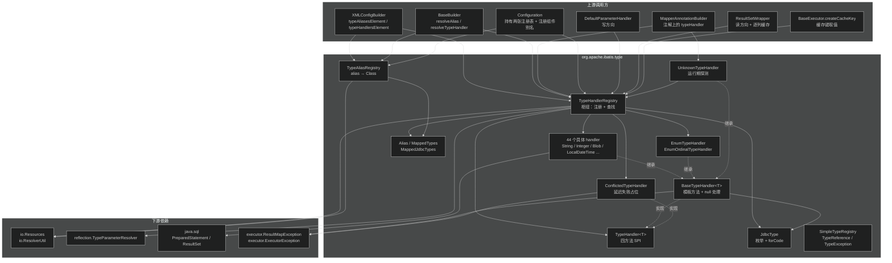
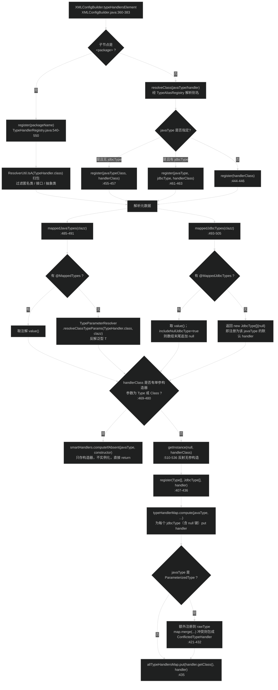
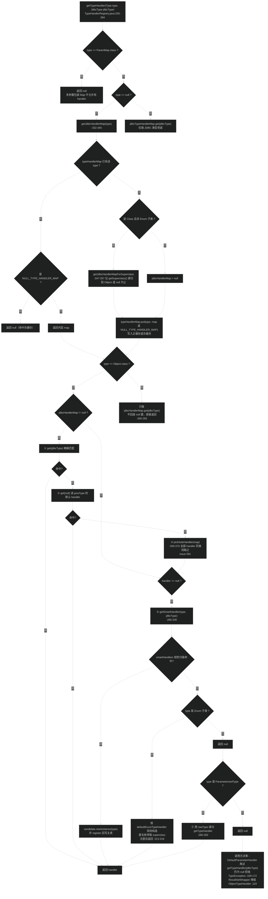
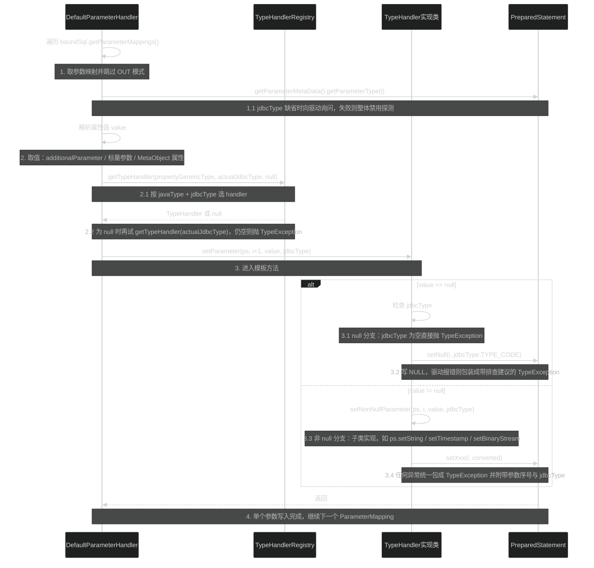
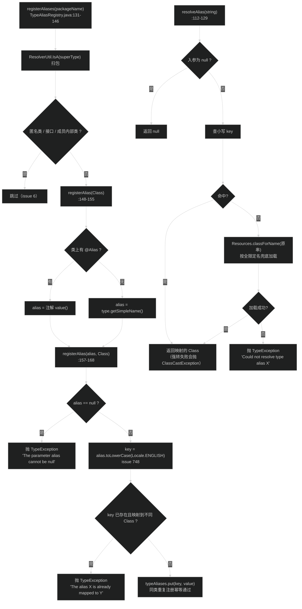

# 类型处理与别名（type）
> 上次修改：2026-07-29 00:36

## 重点关注

| 入口 / 章节 | 源码位置 | 为什么重要 |
|-------------|----------|------------|
| `TypeHandler<T>` 四方法 SPI | `src/main/java/org/apache/ibatis/type/TypeHandler.java:26-49` | 整个 Java ↔ JDBC 双向转换只有这一个契约：1 个写方向（`setParameter`）+ 3 个读方向（列名 / 列下标 / `CallableStatement`）。所有 44 个内置 handler 和用户自定义 handler 都塞进这四个方法里。 |
| `BaseTypeHandler.setParameter` 的 null 分支 | `BaseTypeHandler.java:58-80` | "参数为 null 时必须知道 JdbcType"这条 JDBC 硬约束的唯一落地点。它抛出的 `TypeException` 文案（提示改 `jdbcTypeForNull`）是线上最常见的类型错误之一。 |
| `BaseTypeHandler` 自 3.5.0 起**不再调用** `wasNull()` | `BaseTypeHandler.java:26-36` 类注释 | 读方向的 null 判定被**下放到子类**。`EnumOrdinalTypeHandler.getNullableResult` 里的 `ordinal == 0 && rs.wasNull()`（`EnumOrdinalTypeHandler.java:48-63`）就是这个契约变更的直接后果，写自定义数值型 handler 时不处理会静默把 NULL 读成 0。 |
| `TypeHandlerRegistry.getTypeHandler(Type, JdbcType)` | `TypeHandlerRegistry.java:250-284` | 模块的心脏。双层 Map（javaType → jdbcType → handler）四级回退：精确 jdbcType → null 键默认 → `pickSoleHandler` → smart handler → `ParameterizedType` 降级到 rawType。任何"为什么我的 handler 没生效"都从这 35 行读起。 |
| `getJdbcHandlerMap` 的负缓存与父类继承 | `TypeHandlerRegistry.java:332-357` | 用 `NULL_TYPE_HANDLER_MAP` 做**否定结果缓存**，并沿 `getSuperclass()` 链继承父类的 handler 映射。这解释了"给 `java.util.Date` 注册的 handler 为什么对其子类也生效"，同时藏着一处 get-then-put 的并发覆盖窗口。 |
| `getSmartHandler` + `smartHandlers` | `TypeHandlerRegistry.java:286-330`、`:465-483` | 3.6 引入的**延迟实例化**机制：注册的是 `Constructor<?>`（单参 `Type`/`Class`）而非实例，遇到具体 javaType 时才 `newInstance(type)` 并回写注册表（自填充缓存）。枚举的自动注册（`:310-321`）也走这条路。 |
| 枚举的两套策略与默认切换 | `EnumTypeHandler.java:26-63`、`EnumOrdinalTypeHandler.java:26-82`、`TypeHandlerRegistry.java:77`、`:188-190` | name() 与 ordinal() 两种持久化语义（一个抗重排、一个省空间）。`defaultEnumTypeHandler` 是全局开关，改错会造成历史数据全部读错且不报错。 |
| `TypeReference` 的泛型父类捕获 | `TypeReference.java:31-56` | 经典的"super type token"：靠 `getGenericSuperclass()` 逐层上爬拿回被擦除的 `T`。3.6.0 已把注册表侧的入口全部 `@Deprecated(forRemoval)`，改用 `TypeParameterResolver.resolveClassTypeParams`（`TypeHandlerRegistry.java:485-491`），是理解这次演进的关键对照。 |
| `ConflictedTypeHandler` 延迟失败 | `ConflictedTypeHandler.java:28-76`、`TypeHandlerRegistry.java:421-432` | 泛型 handler 注册到 rawType 时若冲突，不在注册期报错，而是塞一个"一用就抛 `ExecutorException`"的占位 handler。这是 3.6 泛型支持带来的新异常形态。 |
| `UnknownTypeHandler` 的运行期探测 | `UnknownTypeHandler.java:94-161` | javaType 不可知时的兜底：读 `ResultSetMetaData` 的列类型码与列类名反查 handler，两次 `safeGet*` 全部吞异常，最终降级 `ObjectTypeHandler`。已在 3.6.0 标记 `forRemoval`，但仍是 `@Result/@Arg` 注解的"未指定"哨兵值。 |
| `TypeAliasRegistry` 的大小写归一与冲突检测 | `TypeAliasRegistry.java:112-129`、`:157-168` | 全部 key 走 `toLowerCase(Locale.ENGLISH)`（issue #748）；同名不同类直接抛 `TypeException`，同名同类静默通过。别名解析失败会 fallback 到 `Resources.classForName`，所以"别名"和"全限定类名"在配置里可以混用。 |
| `JdbcType.forCode` 返回 null 的设计 | `JdbcType.java:112-126` | 未知类型码不抛异常而返回 null，让上游（`ResultSetWrapper`、`DefaultParameterHandler.getParamJdbcType`）能以"无 jdbcType"继续走查找回退，是驱动兼容性的关键松弛点。 |

## 1. 模块定位与职责边界

**结论**：`org.apache.ibatis.type` 是 MyBatis 的"**类型边界层**"——它把 Java 世界的 `Type` 与 JDBC 世界的 `java.sql.Types` 之间的双向搬运，收敛成一个只有四个方法的 SPI（`TypeHandler`），并用两张注册表（`TypeHandlerRegistry`、`TypeAliasRegistry`）负责"**给定一个 Java 类型和一个 JDBC 类型，找到该用哪个搬运工**"以及"**给定一个字符串别名，找到是哪个 Class**"。整个包 57 个文件中，44 个是具体 handler（几乎都是十几行的模板复制），真正有算法密度的只有 `TypeHandlerRegistry` 一个类。

### 上游（谁调用它）

- **配置构建期**
  - `builder/BaseBuilder`：所有 builder 的基类，构造时就抓住两张注册表（`BaseBuilder.java:40-44`），并提供 `resolveAlias`（`:136-138`）、`resolveJdbcType`（`:67-73`）、`resolveTypeHandler`（`:118-134`）三个解析原语。
  - `builder/xml/XMLConfigBuilder`：解析 `<typeAliases>`（`:177-196`）与 `<typeHandlers>`（`:360-383`），把 XML 声明翻译成 `registerAlias(...)` / `register(...)` 调用。
  - `builder/annotation/MapperAnnotationBuilder`：把 `@Result(typeHandler=...)`、`@Arg(typeHandler=...)`、`@TypeDiscriminator` 上的 handler 类解析成实例；其中 `UnknownTypeHandler.class` 被当作"用户未指定"的哨兵值（`MapperAnnotationBuilder.java:507-509`）。
  - `session/Configuration`：字段级持有两张注册表（`Configuration.java:154-155`），并在构造函数里注册 `JDBC`/`MANAGED`/`POOLED`/`LRU`/`SLF4J` 等一大批**框架组件别名**（`Configuration.java:190-218`）。
- **SQL 执行期**
  - `scripting/defaults/DefaultParameterHandler.setParameters`：写方向的唯一现场，逐个 `ParameterMapping` 取 handler 并调用 `setParameter`（`DefaultParameterHandler.java:91-181`）。
  - `executor/resultset/ResultSetWrapper.getTypeHandler`：读方向的 handler 选择与逐列缓存（`ResultSetWrapper.java:96-119`）。
  - `executor/resultset/DefaultResultSetHandler`、`executor/keygen/Jdbc3KeyGenerator`、`executor/statement/BaseStatementHandler`：分别用于结果映射、自增主键回填、语句准备。
  - `executor/BaseExecutor.createCacheKey`：为了让缓存键与实际参数值一致，需要"模仿 `DefaultParameterHandler` 的逻辑"取参数值（`BaseExecutor.java:198-212`）。
  - `scripting/xmltags/DynamicContext`、`TextSqlNode`（后者用 `SimpleTypeRegistry.isSimpleType` 判断参数是否是标量，`TextSqlNode.java:63`）。

### 下游（它依赖谁）

| 依赖 | 用途 | 强度 |
|------|------|------|
| `io.Resources` | 别名解析兜底的类加载、`UnknownTypeHandler` 按列类名反查 Class | 强依赖 |
| `io.ResolverUtil` | `register(String packageName)` 与 `registerAliases(String)` 的包扫描 | 强依赖（仅扫描路径） |
| `reflection.TypeParameterResolver` | 从 handler 类的泛型签名反解 `TypeHandler<T>` 的 T | 强依赖（3.6 新增） |
| `session.Configuration` | 注册表构造入参；`UnknownTypeHandler` 读 `isUseColumnLabel` | **反向依赖**（见下） |
| `executor.result.ResultMapException` | `BaseTypeHandler.getResult` 的异常包装 | 跨层依赖 |
| `executor.ExecutorException` | `ConflictedTypeHandler` 抛出的异常类型 | 跨层依赖 |
| `binding.MapperMethod.ParamMap` | `getTypeHandler` 的第一条短路判断 | **跨层耦合点** |
| `exceptions.PersistenceException` | `TypeException` 的父类 | 弱依赖 |

**值得标注的耦合点**：`type` 包本应是最底层的叶子包，但它反向引用了三个上层包——`TypeHandlerRegistry` 构造函数需要 `Configuration`（`TypeHandlerRegistry.java:94`）、`getTypeHandler` 里硬编码了 `binding` 包的 `ParamMap`（`:251-252`）、`BaseTypeHandler`/`ConflictedTypeHandler` 抛的是 `executor` 包的异常。这形成了 `type ↔ session ↔ executor ↔ binding` 的循环依赖，是历史演进的产物（`BaseTypeHandler.configuration` 字段自 3.5.0 起已 `@Deprecated`，见 `BaseTypeHandler.java:39-56`）。

### 负责什么

1. **定义类型转换 SPI**：`TypeHandler<T>` 四方法契约。
2. **提供模板基类**：`BaseTypeHandler<T>` 处理 null 写入与异常包装，子类只写非 null 逻辑。
3. **提供 44 个内置 handler**：覆盖 8 种基本类型及其包装类、`String`/`BigDecimal`/`BigInteger`、字节数组、LOB（Blob/Clob/NClob/SQLXML）、流与 Reader、`java.util.Date` 与三个 `java.sql` 时间类型、10 个 JSR-310 类型（含 `JapaneseDate`）、数组、枚举（两种策略）、`Object`、`Unknown`。
4. **维护 javaType + jdbcType → handler 的映射**：`TypeHandlerRegistry`，含内置注册、用户注册、包扫描注册、注解驱动注册、smart handler 延迟注册、枚举自动注册六条入口。
5. **维护 alias → Class 的映射**：`TypeAliasRegistry`，含 60+ 个内置别名与 `@Alias` 注解扫描。
6. **枚举 JDBC 类型码**：`JdbcType`，含 5 个非标准/厂商扩展项（`CURSOR`、`DATETIMEOFFSET`、`UNDEFINED` 等）。
7. **判定"简单类型"**：`SimpleTypeRegistry`，一个 13 项的静态 `Set`，供动态 SQL 判断参数对象是否为标量。
8. **定义类型异常**：`TypeException`（非受检）。

### 不负责什么

- **不负责决定某个字段该用哪个 javaType/jdbcType**：那是 `mapping.ResultMapping` / `mapping.ParameterMapping` 与 `builder` 的职责，`type` 包只接受已经确定的 `(javaType, jdbcType)` 二元组做查询。
- **不负责调用 handler**：`setParameter`/`getResult` 的调用时机与顺序由 `scripting.defaults.DefaultParameterHandler` 和 `executor.resultset.DefaultResultSetHandler` 决定。
- **不负责 null 的默认 JdbcType 取值**：`jdbcTypeForNull`（默认 `JdbcType.OTHER`）定义在 `Configuration.java:126`，由 `DefaultParameterHandler.java:153-156` 在调用 handler **之前**补齐；`BaseTypeHandler` 只负责在仍为 null 时抛错。
- **不负责结果对象的实例化与属性写入**：那是 `reflection` + `executor.resultset` 的职责。
- **不负责别名的使用场景约束**：别名可以指向任意 Class，`type` 包不校验它是不是 TransactionFactory 还是 DataSource——校验发生在使用方的强制类型转换处。

### 输入 / 输出 / 副作用

- **注册路径**：输入 = `(Type[]?, JdbcType[]?, TypeHandler 实例或 Class 或包名)`；输出 = void；副作用 = 三张内部 Map（`typeHandlerMap`、`smartHandlers`、`allTypeHandlersMap`）或 `jdbcTypeHandlerMap` 被写入。
- **查找路径**：输入 = `(Type javaType, JdbcType jdbcType[, Class handlerType])`；输出 = `TypeHandler<?>` 或 **null**（注意：查不到返回 null 而非抛异常，抛异常由调用方决定，如 `DefaultParameterHandler.java:169-172`）；副作用 = **可能写缓存**（负缓存、父类映射提升、smart handler 实例化回写、枚举自动注册），即 `getTypeHandler` 不是纯函数。
- **执行路径**：输入 = `(PreparedStatement/ResultSet/CallableStatement, 位置, 值, jdbcType)`；输出 = 写入语句参数或返回 Java 对象；副作用 = JDBC 资源操作（如 `ArrayTypeHandler` 会 `createArrayOf` 并 `free()`，`BlobTypeHandler` 会建 `ByteArrayInputStream`）。

## 2. 架构关系与依赖

**结论**：`type` 包内部是"**一个 SPI + 一个模板基类 + N 个叶子实现 + 两张注册表**"的经典插件式结构。注册表是唯一的枢纽节点：向上被 `builder`（注册）和 `executor`/`scripting`（查找）共同使用，向下只依赖 `io`（类加载/包扫描）和 `reflection`（泛型反解）。



| 节点 | 角色 | 依赖方向说明 |
|------|------|--------------|
| `TypeHandlerRegistry` | 模块枢纽 | 被 4 类上游写入、被 3 类上游读取；内部依赖 `TypeParameterResolver` 反解泛型、`ResolverUtil` 扫包、`JdbcType` 做 key |
| `TypeAliasRegistry` | 独立枢纽 | 与 `TypeHandlerRegistry` **无相互依赖**，只被 builder 与 `Configuration` 使用；依赖 `Resources.classForName` 兜底 |
| `TypeHandler<T>` | SPI 契约 | 无出边，纯接口。所有实现（含用户实现）向它收敛 |
| `BaseTypeHandler<T>` | 模板方法基类 | 实现 SPI；向上被 44 个叶子继承；向外依赖 `JdbcType.TYPE_CODE` 与 `executor` 的异常类型（跨层） |
| 44 个具体 handler | 叶子实现 | 只依赖 `java.sql` API，彼此独立；`BlobByteObjectArrayTypeHandler`/`ByteObjectArrayTypeHandler` 共用包私有 `ByteArrayUtils` |
| `UnknownTypeHandler` | 运行期回退 | **反向依赖注册表**（构成 registry ↔ handler 环），通过 `Supplier<TypeHandlerRegistry>` 延迟解引用以避开构造期循环（`UnknownTypeHandler.java:38`、`:50`） |
| `ConflictedTypeHandler` | 失败占位 | 由注册表在冲突时构造（`TypeHandlerRegistry.java:427-428`），一旦被调用即抛 `ExecutorException` |
| `JdbcType` | 值枚举 | 无出边（只依赖 `java.sql.Types`），是模块中最稳定的部分 |
| `Alias`/`MappedTypes`/`MappedJdbcTypes` | 声明式元数据 | 运行时保留（`RUNTIME`），由两张注册表反射读取 |
| `SimpleTypeRegistry` | 静态工具 | 与注册表体系**完全无关**，只被 `scripting.xmltags.TextSqlNode` 使用，属于"放错位置的工具类" |

### 强依赖 / 可替换依赖 / 潜在耦合

- **强依赖（不可替换）**：`JdbcType` 是两层 Map 的内层 key，任何 handler 的 `setParameter` 都要用它的 `TYPE_CODE`；`reflection.TypeParameterResolver` 是 3.6 之后自动识别 javaType 的唯一手段，替换它意味着回退到 `TypeReference` 方案。
- **可替换依赖**：`ResolverUtil` 只在两处扫包入口使用（`TypeHandlerRegistry.java:540-550`、`TypeAliasRegistry.java:131-146`），可以换成任意 classpath 扫描器；`Resources.classForName` 可换成任意 ClassLoader 策略。
- **跨层调用**：`BaseTypeHandler.getResult` 抛 `executor.result.ResultMapException`，`ConflictedTypeHandler` 抛 `executor.ExecutorException`——底层包引用上层包异常，属于典型的历史遗留跨层。
- **潜在耦合点 1**：`getTypeHandler` 开头对 `binding.MapperMethod.ParamMap` 的硬编码短路（`TypeHandlerRegistry.java:251-252`）。这行代码的语义是"多参数包装 Map 永远不该有 handler，否则会被当成单个值写进 SQL"，但它把 `binding` 包的实现细节泄漏进了类型层。
- **潜在耦合点 2**：`TypeHandlerRegistry(Configuration)` 与 `Configuration` 互相 new（`Configuration.java:154` new registry；`TypeHandlerRegistry.java:82-84` 无参构造 new Configuration）。无参构造造出的 `Configuration` 是**一次性临时对象**，只为满足签名，若用户走无参路径再依赖 `configuration` 相关行为会得到孤儿对象。

## 3. 入口与调用方式

`type` 包没有用户直接调用的 API，所有入口都是"**框架回调式**"的：要么在配置解析期被 builder 调用，要么在 SQL 执行期被 executor 调用。按生命周期分为注册期、查找期、执行期三组。

### 3.1 注册期入口（配置解析时，单线程）

| 入口 | 源码位置 | 触发条件 | 关键参数 | 后续流程 |
|------|----------|----------|----------|----------|
| `TypeHandlerRegistry(Configuration)` | `TypeHandlerRegistry.java:94-177` | `new Configuration()` 时（`Configuration.java:154`） | Configuration 实例 | 内置 40+ 条 `register(...)` 与 27 条 `jdbcTypeHandlerMap.put(...)`，构造完即完成默认映射 |
| `register(String packageName)` | `:540-550` | `<typeHandlers><package name="..."/></typeHandlers>`（`XMLConfigBuilder.java:365-367`） | 包名 | `ResolverUtil` 扫出所有 `TypeHandler` 子类，过滤匿名类/接口/抽象类后逐个 `register(Class)` |
| `register(Class<?> handlerClass)` | `:444-446` | 包扫描或 `<typeHandler handler="..."/>`（无 javaType 时，`XMLConfigBuilder.java:382`） | handler 类 | 先读 `@MappedTypes`/`@MappedJdbcTypes`，无注解则用 `TypeParameterResolver` 反解泛型 T；再判断是否 smart handler |
| `register(Type, Class)` / `register(Type, JdbcType, Class)` | `:455-463` | `<typeHandler javaType="..." [jdbcType="..."] handler="..."/>`（`XMLConfigBuilder.java:375-380`） | javaType、jdbcType、handler 类 | 显式 javaType 覆盖注解值 |
| `register(TypeHandler<T>)` 及三个重载 | `:382-405` | 编程式配置（`configuration.getTypeHandlerRegistry().register(...)`） | handler 实例 | 直接写入双层 Map |
| `register(JdbcType, TypeHandler)` | `:372-374` | 编程式覆盖 jdbcType 兜底表 | jdbcType、handler | 只改 `jdbcTypeHandlerMap`；源码注释明确警告"可能有意外副作用"（`:146-149`） |
| `setDefaultEnumTypeHandler(Class)` | `:188-190` | `Configuration.setDefaultEnumTypeHandler`（`Configuration.java:596-599`） | handler 类（如 `EnumOrdinalTypeHandler.class`） | 只影响**此后**才被自动注册的枚举；已注册的不回溯 |
| `TypeAliasRegistry.registerAlias(String, Class)` | `TypeAliasRegistry.java:157-168` | `<typeAlias alias="..." type="..."/>`（`XMLConfigBuilder.java:189`）、`Configuration` 构造（`:190-218`） | 别名、目标类 | key 小写归一后写入 `HashMap`；同名不同类抛 `TypeException` |
| `TypeAliasRegistry.registerAliases(String[, Class])` | `:131-146` | `<typeAliases><package name="..."/></typeAliases>`（`XMLConfigBuilder.java:178-180`） | 包名、可选父类型过滤 | 扫包后按 `@Alias` 或 `getSimpleName()` 注册；跳过匿名类、接口、成员内部类（issue #6） |

### 3.2 查找期入口（构建 ResultMapping/ParameterMapping 时，或首次执行时）

| 入口 | 源码位置 | 语义 | 返回 null 时的后果 |
|------|----------|------|--------------------|
| `getTypeHandler(Type, JdbcType)` | `:250-284` | 主查找算法，四级回退 | 交由调用方决定；`hasTypeHandler` 用它做存在性判断（`:201-203`） |
| `getTypeHandler(Type, JdbcType, Class handlerType)` | `:234-248` | 带"用户指定 handler 类"约束的查找：先按二元组查，若命中的 handler 类型不匹配指定类，则从 `allTypeHandlersMap` 取已注册实例，再退化为 `getInstance` 现场反射构造 | `BaseBuilder.resolveTypeHandler` 直接返回（`BaseBuilder.java:128-134`） |
| `getTypeHandler(JdbcType)` | `:224-226` | 只按 jdbcType 查兜底表 | `DefaultParameterHandler` 最终抛 `TypeException`（`:169-172`） |
| `getInstance(Type, Class)` | `:510-536` | 反射构造 handler：优先 `(Type)` 构造器 → `(Class)` 构造器 → 无参构造器 | 三者皆无则抛 `TypeException("Unable to find a usable constructor")` |
| `TypeAliasRegistry.resolveAlias(String)` | `TypeAliasRegistry.java:112-129` | 小写查表；未命中则 `Resources.classForName(原串)` | 类加载失败抛 `TypeException`；入参 null 时返回 null |

### 3.3 执行期入口（每条 SQL、每个参数、每一列）

| 入口 | 触发者 | 关键行为 |
|------|--------|----------|
| `TypeHandler.setParameter(ps, i, value, jdbcType)` | `DefaultParameterHandler.setParameters`（`:174`） | 写方向。调用前上游已完成：jdbcType 兜底（`:153-156`）、handler 三级选择（`:160-172`） |
| `TypeHandler.getResult(rs, columnName)` / `(rs, columnIndex)` | `DefaultResultSetHandler` 经 `ResultSetWrapper.getTypeHandler`（`ResultSetWrapper.java:96-119`） | 读方向。handler 按 `(columnName, propertyType)` 双层 Map 缓存在 `ResultSetWrapper` 内，每个 ResultSet 只解析一次 |
| `TypeHandler.getResult(cs, columnIndex)` | `DefaultResultSetHandler` 处理存储过程 OUT 参数 | `CallableStatement` 方向，很多 handler 在此实现与 ResultSet 分支不同（如 `UnknownTypeHandler.java:89-92` 直接 `cs.getObject`，不做探测） |
| `JdbcType.forCode(int)` | `ResultSetWrapper` 构造（`:59`）、`DefaultParameterHandler.getParamJdbcType`（`:196`）、`UnknownTypeHandler.safeGetJdbcTypeForColumn`（`:147-153`） | 把驱动返回的类型码翻译成枚举，未知码返回 null |

**权限 / 上下文要求**：注册期入口必须在 `SqlSessionFactory` 构建完成前调用（之后再注册虽不会报错，但已构建的 `ResultMapping`/`ParameterMapping` 已经持有旧 handler 实例，不会重新查找）；执行期入口必须在有效的 JDBC `Connection`/`Statement` 上下文中调用。

## 4. 核心概念与领域模型

### 4.1 TypeHandler —— 类型搬运工 SPI

- **定义**：`TypeHandler<T>` 是四方法接口（`TypeHandler.java:26-49`）：一个写方向 `setParameter(PreparedStatement, int, T, JdbcType)`，三个读方向 `getResult(ResultSet, String)`、`getResult(ResultSet, int)`、`getResult(CallableStatement, int)`。
- **作用**：把"某个 Java 值如何写进 SQL 占位符"和"某一列如何读成 Java 对象"这两件事封装成可替换单元。
- **生命周期**：绝大多数是**进程级单例**——内置 handler 通过 `public static final INSTANCE` 常量共享（如 `StringTypeHandler.java:27`、`BlobTypeHandler.java:29`、`ObjectTypeHandler.java:27`），或在注册表构造时 `new` 一次；smart handler 按 javaType 各实例化一份并缓存。因此 **handler 必须无状态、线程安全**。
- **使用场景**：读方向三个重载对应 `useColumnLabel` 开关（按列名或按下标）与存储过程 OUT 参数三种取值方式，实现时不能只写其中一个。

### 4.2 BaseTypeHandler —— 模板方法基类

- **定义**：抽象类，实现 `TypeHandler` 的四个方法，把它们转发到四个抽象方法 `setNonNullParameter` / 三个 `getNullableResult`（`BaseTypeHandler.java:112-132`）。
- **作用**：抽走两件横切关注点——**null 参数的统一处理**（`:58-80`）和**异常包装**（`:82-110`，读方向一律包成 `ResultMapException` 并带上列名/列号）。
- **隐藏契约**：自 3.5.0 起，基类**永不调用** `ResultSet.wasNull()` / `CallableStatement.wasNull()`（类注释 `:26-36`），读方向的 null 语义由子类自负。对象型返回值（`getString`、`getTimestamp`、`getObject`）天然返回 null，无需处理；**原始类型返回值必须自己判 `wasNull`**——`EnumOrdinalTypeHandler.java:48-63` 是包内唯一显式处理的例子。
- **三维评估**
  - **好处**：44 个叶子类平均只有 25 行，全部是纯 JDBC 调用，无一行 null 判断与 try/catch；异常信息在唯一位置生成，格式统一且包含"改 jdbcType 或 jdbcTypeForNull"的可执行建议。
  - **替代方案**：(a) 让每个 handler 自己处理 null——代码重复 44 份且极易漏掉；(b) 用装饰器 `NullSafeTypeHandler` 包住任意 handler——更灵活（用户实现 `TypeHandler` 而不继承基类时也能受益），但会多一层对象与虚调用，且注册表要处理"装饰后类型 != 注册类型"的识别问题（`allTypeHandlersMap` 以 `handler.getClass()` 为 key，`:435`）；(c) AOP/字节码增强——代价远超收益。
  - **风险**：模板方法把 null 处理"藏"进基类，用户直接实现 `TypeHandler` 接口（框架允许，如 `ConflictedTypeHandler` 就是）时会完全绕过 null 保护；`getResult` 捕获的是 `Exception` 而非 `SQLException`，会把子类的 `NullPointerException`、`IllegalArgumentException` 一并转成 `ResultMapException`，栈顶信息被"Error attempting to get column"覆盖，排查时必须看 cause。

### 4.3 JdbcType —— JDBC 类型枚举

- **定义**：40 项枚举，每项包一个 `public final int TYPE_CODE`（`JdbcType.java:111`），静态 `codeLookup` 支持 `forCode` 反查（`:112-126`）。
- **作用**：既是 `ps.setNull(i, code)` 的实参来源，也是注册表内层 Map 的 key。
- **非标准项**：`CURSOR(-10)`（Oracle REF CURSOR）、`DATETIMEOFFSET(-155)`（SQL Server 2008）、`UNDEFINED(Integer.MIN_VALUE + 1000)`（框架内部哨兵），说明这个枚举并非 `java.sql.Types` 的纯镜像。
- **关键设计**：`forCode` 对未知码返回 **null 而非抛异常**，让调用方能以"jdbcType 未知"继续走查找回退链。

### 4.4 双层映射：javaType → jdbcType → handler

- **定义**：`Map<Type, Map<JdbcType, TypeHandler<?>>> typeHandlerMap`（`TypeHandlerRegistry.java:64`）。内层 map 的 **null key 代表"该 javaType 的默认 handler"**（构造函数注释 `:95-98` 明确说明）。
- **作用**：同时表达三种粒度的映射——"仅按 Java 类型"（null 键）、"Java 类型 + 特定 JDBC 类型"（如 `String + CLOB → ClobTypeHandler`，`:131`）、"仅按 JDBC 类型"（另一张 `jdbcTypeHandlerMap`，`:63`）。
- **相关类型**：key 是 `java.lang.reflect.Type` 而非 `Class`，因此 `List<String>` 这样的 `ParameterizedType` 也能作为 key（3.6 的泛型 handler 支持）。
- **三维评估**
  - **好处**：一次 `Map.get` 定位到内层 map 后，jdbcType 维度的所有候选都在手边，便于实现 null 键回退与 `pickSoleHandler` 唯一性判定；内层用 `HashMap` 而非 `EnumMap` 是因为 null 键不被 `EnumMap` 接受。
  - **替代方案**：用 `Map<Pair<Type,JdbcType>, Handler>` 单层扁平表——查找 O(1) 更直接，但"回退到 null 键"和"该 javaType 是否只注册了一个 handler"都需要额外索引；用 `Table`（Guava）语义等价但引入依赖。
  - **风险**：内层 `HashMap` 在 `compute` 之外被读取（`:262`、`:268-274`），依赖 `ConcurrentHashMap.compute` 的原子性来保证发布安全；若有人在运行期直接向内层 map 写入（源码内没有这种路径，但反射可达），会出现无同步的并发修改。

### 4.5 Smart Handler —— 延迟实例化的类型感知 handler

- **定义**：拥有单参构造器 `(Type)` 或 `(Class)` 的 handler 类。注册时**不实例化**，只把 `Constructor<?>` 存进 `smartHandlers`（`TypeHandlerRegistry.java:465-483`）。
- **作用**：让一个 handler 类服务一整族 javaType（枚举、`List<T>`、自定义泛型包装等），在真正遇到具体类型时才 `newInstance(type)`。
- **生命周期**：构造器常驻；实例在首次查找时创建并通过 `register(type, jdbcType, typeHandler)` 回写主表（`:325`），后续查找走正常路径，属于**自填充缓存**。
- **典型例子**：`EnumTypeHandler(Class<E>)`、`EnumOrdinalTypeHandler(Class<E>)`（`EnumTypeHandler.java:30`、`EnumOrdinalTypeHandler.java:31`）。枚举甚至不需要显式注册——`getSmartHandler` 的兜底分支会为任意 `Enum` 子类现场创建 `defaultEnumTypeHandler`（`:310-321`）。
- **三维评估**
  - **好处**：避免为每个枚举/每个泛型实参预先注册；handler 内部可以持有解析好的类型信息（如 `EnumOrdinalTypeHandler` 在构造时就缓存了 `type.getEnumConstants()`，`EnumOrdinalTypeHandler.java:36`），运行期零反射。
  - **替代方案**：handler 每次调用时从参数值现推类型（`parameter.getClass()`）——读方向拿不到值就无法推断；或要求用户为每个枚举显式配 `<typeHandler javaType="..."/>`——配置量爆炸。
  - **风险**：`getSmartHandler` 是**全表线性扫描**（`:289-308`），且找到可赋值候选后不 break（只有精确匹配才 break），复杂度 O(n) 且"最后一个匹配者胜出"——注册顺序会影响结果，而 `ConcurrentHashMap.entrySet()` 的迭代顺序是不确定的，这使多个可赋值候选并存时结果**不可预测**。

### 4.6 类型别名（Alias）

- **定义**：`alias → Class` 的小写归一映射（`TypeAliasRegistry.java:39`、`:118`）。
- **作用**：让 XML 里写 `resultType="user"` 而非全限定名；同时充当框架组件的**枚举式配置值**——`JDBC`/`MANAGED`、`POOLED`/`UNPOOLED`/`JNDI`、`LRU`/`FIFO`/`SOFT`/`WEAK`、`SLF4J`/`LOG4J2` 等都是通过别名机制实现的（`Configuration.java:190-218`）。
- **生命周期**：随 `Configuration` 存活；`getTypeAliases()` 返回 `Map.copyOf` 的不可变快照（`:186`）。
- **命名约定**：包装类用裸名（`int` → `Integer.class`），原始类型加下划线前缀（`_int` → `int.class`），数组加 `[]`（`_int[]` → `int[].class`）。这套约定在 `TypeAliasRegistry.java:44-98` 一次性铺开，共 60+ 项。
- **三维评估**
  - **好处**：配置文件可读性大幅提升；别名未命中时自动回退 `Resources.classForName`（`:123`），意味着别名与全限定名可以自由混写，无需用户区分。
  - **替代方案**：不做别名、全用全限定名——配置冗长；或用 Spring 式的 bean name 注册中心——过重且引入容器概念。
  - **风险**：大小写不敏感（issue #748）意味着 `User` 与 `user` 是同一个 key，两个不同包下同名类的自动扫描注册会直接抛 `TypeException`（`:163-166`），且错误发生在启动期扫描顺序相关的位置，定位成本高；`_int` 这类前缀约定无处校验，写错只会得到"Could not resolve type alias"。

### 4.7 概念间关系

- `TypeHandlerRegistry` **聚合** handler 实例（`allTypeHandlersMap` 以 handler 类为 key 持有唯一实例，`:66`、`:435`），并**索引** javaType/jdbcType 到实例的映射；同一个 handler 实例可被多个 (javaType, jdbcType) 组合引用（如 `BooleanTypeHandler.INSTANCE` 同时挂在 `Boolean`、`boolean`、`JdbcType.BOOLEAN`、`JdbcType.BIT` 下）。
- `TypeAliasRegistry` 与 `TypeHandlerRegistry` **无引用关系**，只在 builder 层被串联使用：先 `resolveAlias("string")` 得到 `String.class`，再 `getTypeHandler(String.class, jdbcType)`。
- `TypeReference` 与 `TypeParameterResolver` 是**同一问题的两代解法**：前者要求用户"多写一层匿名子类"，后者直接从 handler 类的泛型签名反解，见 §6.4。
- `UnknownTypeHandler` **反向依赖** `TypeHandlerRegistry`，是唯一一个"会再次触发查找"的 handler，构成受控的一级递归（它显式排除自身以防无限递归，`UnknownTypeHandler.java:101-103`、`:124-126`）。

## 5. 关键流程

### 5.1 主成功路径：TypeHandler 的注册（启动期）



**1-1.8 入口分发**：`<typeHandlers>` 下每个子节点走两条路——`<package>` 交给 `ResolverUtil` 全盘扫描（会把包内所有 `TypeHandler` 实现都注册，因此包内不要放测试用 handler），其余节点先用 `TypeAliasRegistry` 把 `javaType`/`handler` 字符串解析成 Class，再按"是否显式给了 javaType / jdbcType"分派到三个 `register` 重载。显式 javaType 会**完全覆盖** handler 类上 `@MappedTypes` 的声明（`:456` 直接构造 `new Type[]{mappedJavaType}`）。

**2-2.8 元数据解析**：javaType 的来源有优先级——`@MappedTypes` 注解 > 泛型反解。泛型反解走 `TypeParameterResolver.resolveClassTypeParams(TypeHandler.class, clazz)`（`TypeParameterResolver.java:35-42`），它把 `TypeHandler` 声明的类型变量 T 在 `clazz` 的继承链上一路代换，因此 `class MyHandler extends BaseTypeHandler<LocalDate>` 无需任何注解即可被识别。jdbcType 的默认值是"**只有一个 null 元素的数组**"，这正是"注册为该 Java 类型的默认 handler"的编码方式；`includeNullJdbcType=true` 则表示"既服务这些 jdbcType，也当默认 handler"。

**3-3.2 实例化策略分叉**：这是 3.6 的核心分支。若 handler 有 `(Type)` 或 `(Class)` 单参构造器，就判定为 smart handler，**只把构造器存进 `smartHandlers` 就 return**，主表一行不写；否则走无参构造得到单例后进入正常注册。注意 `getConstructors()` 只看 public 构造器，且找到第一个符合的就 return，不再继续检查其他构造器。

**4-4.4 写入双层 Map**：`typeHandlerMap.compute` 保证同一 javaType 的内层 map 创建与写入是原子的；内层 map 若曾被负缓存占位（`NULL_TYPE_HANDLER_MAP`）则新建一个真 `HashMap` 替换（`:414`）。若 javaType 是 `ParameterizedType`（如 `List<String>`），会**额外**在 rawType（`List`）下登记一份，用 `merge` 处理冲突：相同 handler 幂等，不同 handler 则替换为 `ConflictedTypeHandler`——注册期不报错，等到真正按 rawType 查出来并使用时才抛 `ExecutorException`。最后 `allTypeHandlersMap` 以 handler 类为 key 记录实例，供 `getTypeHandler(type, jdbcType, handlerClass)` 复用。

### 5.2 核心算法路径：handler 查找的四级回退（含查不到的失败路径）



**1-1.4 前置短路**：两个特判先行。`ParamMap`（`binding` 包的多参数包装容器）直接返回 null，否则 `@Param` 多参数方法的整个参数 Map 会被当成一个值写进 SQL；`type == null` 表示调用方只知道列的 JDBC 类型（典型场景是 `<select resultType="map">` 或 `UnknownTypeHandler` 探测），此时只查 `jdbcTypeHandlerMap` 这张 27 项的兜底表（`:150-176`）。

**2-2.8 内层 map 定位与两种缓存写入**：这是查找中唯一有"写"副作用的阶段。未命中时，非枚举的 Class 会沿 `getSuperclass()` 链向上找父类已注册的映射（这就是给 `java.util.Date` 注册的 handler 对其子类生效的原因，也是 `java.sql.Date extends java.util.Date` 需要显式注册专用 handler 的原因，`:115`）；枚举被排除在父类继承之外，因为所有枚举的父类都是 `Enum`，一旦被继承就会全体共用同一个 handler。无论找到与否都会 `put` 回 `typeHandlerMap`——找到写正缓存（把父类的 map 提升到子类 key 上），没找到写 `NULL_TYPE_HANDLER_MAP` 负缓存，避免每次查找都重走一遍父类链递归。

**3-3.1 Object.class 特判**：`Object` 是所有类的父类，如果让它参与 null 键回退，任何"注册在 Object 上的默认 handler"都会成为全局兜底，掩盖真实的类型缺失。因此对 `Object.class` 只做 jdbcType 精确匹配后立即返回（可能是 null）。这一分支支撑了 `register(Object.class, JdbcType.DATE, new DateTypeHandler())` 这种"为 Map 结果的某类列指定 handler"的推荐用法（源码注释 `:148-149`）。

**4-4.5 三级表内回退**：精确 `(javaType, jdbcType)` → 该 javaType 的默认 handler（null 键）→ `pickSoleHandler`。第三级的语义是"如果这个 Java 类型下注册的所有 handler 其实是同一个类，那么 jdbcType 不匹配也无所谓"（issue #591）；只要出现两个不同类的 handler 就返回 null，把决策权交回上层。

**5-5.8 表外回退与递归**：表内全部落空后，先做 smart handler 匹配（精确 Type 相等 > Class 可赋值 > ParameterizedType rawType 可赋值），命中则实例化并回写；未命中且 type 是枚举，则用 `defaultEnumTypeHandler` 现场造一个并注册（注意这里注册用的 jdbcType 就是本次查询的 jdbcType，`:316`，意味着**首次查询的 jdbcType 决定了该枚举 handler 挂在哪个键上**）；仍为空且 type 是 `ParameterizedType`，最后用 rawType 再走一遍完整流程。

**7-7.1 失败收口**：注册表本身**不抛异常**，返回 null。写方向由 `DefaultParameterHandler` 再试一次 `getTypeHandler(actualJdbcType)`，仍失败才抛 `TypeException("Could not find type handler for Java type ... nor JDBC type ...")`；读方向由 `ResultSetWrapper` 静默降级为 `ObjectTypeHandler.INSTANCE`（`ResultSetWrapper.java:119`），这个差异解释了"写参数会报错、读结果却悄悄给了个 Object"的不对称体验。

### 5.3 边界路径：执行期写入参数（null 与非 null 两条分支）



**1-1.1 参数遍历与 jdbcType 补齐**：`setParameters` 按 `ParameterMapping` 顺序处理，`ParameterMode.OUT` 的参数跳过（它们只读不写）。当映射上没有声明 jdbcType 时，会尝试从 `ParameterMetaData` 拿驱动侧的类型码（`DefaultParameterHandler.java:191-203`）；一旦驱动抛 `SQLException`，就把 `paramMetaData` 换成 `NULL_PARAM_METADATA` 哨兵对象（`:60-74`），此后**整条语句不再重复询问驱动**——这是一处针对"不支持 ParameterMetaData 的驱动"的一次性降级。

**2-2.2 取值与 handler 选择**：值的来源有三条（`parameterMapping.hasValue()` 的字面量 → `boundSql` 的附加参数 → 参数对象本身或其属性）。handler 优先用 `ParameterMapping` 上构建期就绑定好的实例，为空才现场查注册表；`propertyGenericType` 优先取 `MetaObject.getGenericGetterType` 的**泛型**类型（`:143-145`），拿不到才退化为 `value.getClass()`（`:161-163`），这保证了泛型属性能命中 `ParameterizedType` 注册项。特别地，**value 为 null 时会先把 jdbcType 补成 `configuration.getJdbcTypeForNull()`（默认 `OTHER`）**（`:153-156`），所以 `BaseTypeHandler` 里那句"必须指定 JdbcType"的异常只在用户显式把 `jdbcTypeForNull` 设为 null 时才可能触发。

**3-3.4 模板方法的两条分支**：null 分支只做 `ps.setNull(i, TYPE_CODE)`，并把驱动异常包成携带"试试换个 JdbcType 或调整 jdbcTypeForNull"的 `TypeException`（`BaseTypeHandler.java:66-70`）——Oracle 对 `OTHER` 不友好、需要改成 `NULL` 的经典问题就在这里报出。非 null 分支交给子类，异常同样被 catch `Exception` 后统一包装（`:74-78`），因此子类里的空指针也会以 `TypeException` 形式出现。

**4 收口**：单参数写入完成后继续循环；`DefaultParameterHandler` 在外层再包一次异常，附上完整 `ParameterMapping.toString()`（`:175-177`），使错误信息包含 property、mode、javaType、jdbcType 全套上下文。

### 5.4 失败路径：别名解析与冲突检测



**1-1.7 扫包与别名命名**：包扫描注册的别名默认取 `getSimpleName()`，`@Alias` 注解可覆盖。三类被跳过的类型各有原因：匿名类没有有意义的简单名、接口不能被实例化为 resultType 目标、成员内部类的简单名极易与顶层类冲突（issue #6）。

**2-2.6 冲突检测**：所有 key 归一为小写，导致 `com.a.User` 与 `com.b.user` 在同一次扫描中必然冲突并抛 `TypeException`。判定条件是"已存在**且**已有值非 null **且**与新值不相等"，因此同一个类被重复注册（例如包扫描后又写了显式 `<typeAlias>`）是幂等的，不会报错。

**3-3.8 解析与兜底**：解析先查表后回退到类加载，这使配置里的 `resultType` 可以自由写别名或全限定名。两个易踩的点：一是**返回值被无条件强转成 `Class<T>`**（`:112` 上方注释直言"types cannot be assigned 时也会抛 ClassCastException"），别名指向了错误的类型会在调用点而非解析点报错；二是全限定名兜底会把任何拼错的别名变成 `ClassNotFoundException`，最终包成 `TypeException`，错误信息里只有原始字符串，无法提示"你是不是想写 xxx"。

## 6. 核心实现细节

### 6.1 TypeHandlerRegistry 的四张表

`TypeHandlerRegistry` 只有四个可变字段（`TypeHandlerRegistry.java:63-66`），理解它们的分工就理解了整个类：

| 字段 | 类型 | 内容 | 何时写 | 何时读 |
|------|------|------|--------|--------|
| `jdbcTypeHandlerMap` | `EnumMap<JdbcType, TypeHandler>` | 27 条"仅按 JDBC 类型"的兜底映射（`:150-176`） | 构造函数 + `register(JdbcType, TypeHandler)` | javaType 未知时（`:224-226`、`:254`）；`BaseExecutor` 建缓存键时也走这条路 |
| `typeHandlerMap` | `ConcurrentHashMap<Type, Map<JdbcType, TypeHandler>>` | 主表：javaType → (jdbcType → handler)，内层 null 键 = 默认 handler | `register(Type[], JdbcType[], handler)`（`:413-431`）+ `getJdbcHandlerMap` 的缓存写回（`:343`） | 每次 `getTypeHandler(Type, JdbcType)` |
| `smartHandlers` | `ConcurrentHashMap<Type, Constructor<?>>` | 类型感知 handler 的构造器，尚未实例化 | `register(Type[], JdbcType[], Class)` 检测到单参构造器时（`:476`） | 主表全部落空后线性扫描（`:289-308`） |
| `allTypeHandlersMap` | `HashMap<Class<?>, TypeHandler>` | handler 类 → 唯一实例 | 每次实例注册的最后一步（`:435`） | `getMappingTypeHandler`（`:211-213`）、`getTypeHandler(type, jdbcType, handlerClass)`（`:242`）、`getTypeHandlers()`（供 mybatis-guice，`:561-563`） |

一个容易忽略的事实：`allTypeHandlersMap` 是**普通 `HashMap`**，而它在 `register` 里被写、在 `getTypeHandler(type, jdbcType, handlerClass)` 里被读。由于注册全部发生在配置期，运行期只读，实践上安全；但 smart handler 的**运行期自注册**（`:325` → `:435`）会在查找过程中写这张 HashMap，理论上存在并发写风险（见 §9）。

### 6.2 关键实现一：查找算法的四级回退 + 双向缓存

代码入口 `getTypeHandler(Type, JdbcType)`（`:250-284`）与 `getJdbcHandlerMap(Type)`（`:332-345`）。逐段解读：

1. **输入**：`(Type, JdbcType)`，两者都可为 null；**输出**：`TypeHandler<?>` 或 null；**副作用**：可能向 `typeHandlerMap`（正/负缓存）与 `smartHandlers` 派生的实例注册写入。
2. `getJdbcHandlerMap` 的三态返回是理解点：返回**非空 map**（有注册项）、返回 **null**（确认无 handler）、内部第三态 `NULL_TYPE_HANDLER_MAP`（"已确认无 handler"的缓存哨兵，对外仍表现为 null）。哨兵是 `Collections.emptyMap()`（`:68-74`），并特意加了 `@SuppressModernizer` 注释说明"不能用 `Map.of()`，因为本 map 会以 null 作为 key 被查询"。
3. **判定哨兵用的是 `equals` 而非 `==`**（`:335`），而 `register` 里判定用的是 `==`（`:414`、`:425`）。因为 `Collections.emptyMap().equals(anyEmptyMap)` 为真，任何**空**内层 map 都会被 `getJdbcHandlerMap` 当作"无 handler"。当前代码路径下 `register` 至少写入一个 entry，不会产生空 map，所以这处不一致目前无害，但属于隐藏假设。
4. **父类链继承**（`:347-357`）是递归的，终止条件是 `superclass == null || Object.class.equals(superclass)`——**故意不继承 `Object` 上的注册项**，与 `:260-265` 的 `Object.class` 特判互为呼应。
5. **隐藏假设**：`typeHandlerMap` 的 key 是任意 `Type` 实例。`ParameterizedType` 的相等性依赖 JDK 实现的 `equals`（`sun.reflect.generics.reflectiveObjects.ParameterizedTypeImpl` 有正确实现），而 MyBatis 自己在 `TypeParameterResolver` 里也造了 `ParameterizedTypeImpl`/`GenericArrayTypeImpl` 并实现了 `equals`/`hashCode`（`TypeParameterResolver.java:377-392` 可见 `GenericArrayType` 的实现），两套实现必须能互相 `equals` 才能命中缓存。

**三维评估**

- **好处**：(1) 单次查找在命中缓存时是两次 `HashMap.get`，成本极低，而查找发生在每个参数、每列上，是不折不扣的热路径；(2) 负缓存把"父类链递归 + 反射"的一次性成本摊掉，对"给 Map 结果里的未注册类型反复查找"的场景尤其有效；(3) 四级回退把"精确优先、逐步放宽"的策略显式编码，用户既能精确控制 `(javaType, jdbcType)` 组合，又能只写一个默认 handler 就覆盖全部 jdbcType；(4) 父类继承让"给一个基类注册 handler 覆盖整个类族"成为可能，无需为每个子类重复配置。
- **替代方案**：(a) 纯静态表、不做任何回退与继承——查找可预测、无副作用、可并发安全，但用户必须穷举所有 `(javaType, jdbcType)` 组合，配置量与出错率剧增；(b) 用 `Map<Type, Map<JdbcType, Handler>>` 但把继承关系在**注册时**展开（注册 `Date` 时同步写入所有已知子类）——查找变成纯读，但注册顺序敏感且无法覆盖后来才出现的子类；(c) 用责任链/策略列表（每个 handler 自报"我能处理什么"）替代 Map——扩展性最好，但每次查找都要遍历所有 handler，热路径退化为 O(n)；(d) 把回退结果缓存在更上层（`ResultSetWrapper` 已经这么做了，`ResultSetWrapper.java:97`）——确实减少了调用次数，但不能替代注册表自身的语义。
- **风险**：(1) **`getTypeHandler` 有写副作用**，"查询"会改变注册表状态，使其不是纯函数，也让"注册顺序 + 查询顺序"共同决定最终映射（枚举首次查询时的 jdbcType 被固化为注册键，`:316`）；(2) `getJdbcHandlerMap` 用的是 get-then-put 而非 `computeIfAbsent`（`:333`、`:343`），若某线程正在查找而另一线程调用 `register`，`put` 可能把新注册的内层 map 覆盖成父类 map 或负缓存哨兵，造成"注册了却查不到"的偶发问题；(3) 负缓存以 `Type` 为 key 无上限增长，若上层持续用**动态生成**的 `ParameterizedType` 实例查询未注册类型，`typeHandlerMap` 会单向膨胀（无淘汰逻辑）；(4) `pickSoleHandler` 让"注册了 `String+CLOB` 一个 handler"的用户在查询 `String+VARCHAR` 时也拿到 CLOB handler——只要该 javaType 下别无其他 handler 类，这个"宽容"可能超出预期。

### 6.3 关键实现二：smart handler 的延迟实例化与自填充

`register(Type[], JdbcType[], Class)`（`:465-483`）与 `getSmartHandler`（`:286-330`）配合完成。要点：

- **检测逻辑**：遍历 `handlerClass.getConstructors()`，找参数个数为 1 且参数类型是 `Type` 或 `Class` 的构造器，找到就把构造器存进 `smartHandlers` 并 `return`（跳过实例注册）。因此一个 handler 只要有这样的公开构造器，就**永远走不到主表**，即使它同时有无参构造器。
- **匹配逻辑**（`:289-308`）：三种匹配强度——`registeredType.equals(type)` 精确匹配（`break`，立即胜出）；`registeredType` 是 Class 且 `isAssignableFrom(type)`（记录候选，**不 break**）；两边都是 `ParameterizedType` 且 rawType 可赋值（记录候选，不 break）。
- **实例化与回写**（`:323-329`）：`candidate.newInstance(type)` 后立刻 `register(type, jdbcType, typeHandler)`，下一次同类型查询走主表；反射失败包成 `TypeException("Failed to invoke constructor ...")`。
- **枚举兜底**（`:310-321`）：没有任何 smart 候选时，若 type 是 `Enum` 子类，用 `defaultEnumTypeHandler` 造实例。`(clazz.isAnonymousClass() || !clazz.isEnum()) ? clazz.getSuperclass() : clazz` 这行处理的是**带方法体的枚举常量**——`enum E { A { ... } }` 中 `A` 的运行时类是 `E$1` 匿名子类，必须回退到 `E` 才能拿到枚举常量集合。

**三维评估**

- **好处**：一个 handler 类服务无限多个 javaType，无需预注册；实例化后立即回写主表，把 O(n) 扫描收敛为一次性成本；枚举兜底让"用户什么都不配就能存枚举"成立，是 MyBatis 开箱体验的关键一环。
- **替代方案**：(a) 要求用户为每个枚举/泛型实参显式注册——配置爆炸；(b) 让 handler 自身在每次调用时按值推断类型——读方向无值可推，且丧失构造期缓存（如 `EnumOrdinalTypeHandler` 的 `enumConstants` 数组）；(c) 用 `Map<Class<?>, Constructor>` + 按类层次逐级 `getSuperclass()` 查找替代线性扫描——可预测且更快，但无法表达 `ParameterizedType` 的 rawType 匹配。
- **风险**：(1) 线性扫描且"后匹配者覆盖前者"，而 `ConcurrentHashMap.entrySet()` **无序**，多个可赋值候选并存时结果不确定；(2) 每次未命中主表的查找都会全表扫描 `smartHandlers`，若上层反复查询不存在的类型（且未被负缓存兜住，因为负缓存只挡 `getJdbcHandlerMap`、不挡 `getSmartHandler`），会产生持续开销；(3) 自动注册使"查询"改变状态，枚举的注册键取自首次查询的 jdbcType，同一枚举在不同 jdbcType 下首次出现的顺序会影响后续命中路径；(4) 用户为 handler 加一个 `(Class)` 构造器（例如为了方便测试）就会意外把它变成 smart handler，注册语义静默改变。

### 6.4 关键实现三：TypeReference 的泛型父类捕获与它的继任者

`TypeReference<T>`（`TypeReference.java:31-56`）是 Gafter 提出的 "super type token" 模式的标准实现：

```
protected TypeReference() { rawType = getSuperclassTypeParameter(getClass()); }
```

- **原理**：Java 擦除的是"类型变量的运行时值"，但**不擦除类的泛型超类签名**。`getClass().getGenericSuperclass()` 对 `class MyRef extends TypeReference<List<String>>` 返回一个 `ParameterizedType`，取 `getActualTypeArguments()[0]` 即得 `List<String>`。
- **多层继承的处理**（`:39-52`）：若 `getGenericSuperclass()` 返回的是 `Class`（说明这一层没有泛型参数），就沿 `getSuperclass()` 继续上爬（"try to climb up the hierarchy until meet something useful"）；一路爬到 `TypeReference` 本身仍未见 `ParameterizedType`，说明用户写了裸继承，抛 `TypeException` 并给出可执行建议："Remove the extension or add a type parameter to it."
- **它的历史地位**：3.5.x 时代 `BaseTypeHandler` 继承 `TypeReference`，注册表通过 `handler.getRawType()` 拿 javaType。在当前 3.6 代码里，`BaseTypeHandler` **已不再继承** `TypeReference`（`BaseTypeHandler.java:37`），注册表所有 `TypeReference` 相关方法被标记 `@Deprecated(since = "3.6.0", forRemoval = true)`（`:196-232`、`:396-399`），javaType 识别改由 `TypeParameterResolver.resolveClassTypeParams(TypeHandler.class, clazz)` 完成（`:490`）。全量搜索确认：`src/main/java` 中 `type` 包之外**已无任何 `TypeReference` 引用**，它现在只是为兼容旧扩展保留的公共 API。

**三维评估**

- **好处**：(1) 零配置——用户只要写出 `extends BaseTypeHandler<LocalDate>` 就自动带上了 javaType，无需 `@MappedTypes`；(2) 能表达**泛型类型**（`List<String>`、`Map<String, Integer>`），这是 `Class<?>` 字面量根本无法表达的；(3) 编译期即可校验类型参数写没写错，比字符串配置安全；(4) 实现只有 25 行，无第三方依赖。
- **替代方案**：(a) `@MappedTypes(LocalDate.class)` 注解显式声明——直观、无需继承体系，但表达不了泛型实参，且注解值与泛型签名可能不一致（当前代码里注解优先，`:486-489`）；(b) 用 `TypeParameterResolver.resolveClassTypeParams` 直接从**任意** handler 类的泛型签名反解——这正是 3.6 选择的方案，优点是**不要求继承 `TypeReference`**，直接实现 `TypeHandler<T>` 接口的类也能被识别，且不需要"多写一层子类"；(c) 要求注册时显式传入 javaType（`register(LocalDate.class, handler)`）——最直白，但把负担全推给配置。
- **风险**：(1) `TypeReference` 的约束"必须由带具体类型参数的子类实例化"是运行期才检查的，用户写裸继承要到构造时才炸；(2) 若中间层类把类型参数继续泛化（`class A<T> extends TypeReference<T>`），`getActualTypeArguments()[0]` 拿到的是 `TypeVariable` 而不是具体类型，`rawType` 就成了一个无法用于查表的 `T`——`getSuperclassTypeParameter` 不检测这种情况；(3) 强制继承特定基类是侵入式设计，阻断了"用户已有基类"的场景，这也是 3.6 转向 `TypeParameterResolver` 的直接动机；(4) 保留 deprecated 重载（`:196-232`）导致注册表 API 表面积偏大，有 6 个方法只为兼容而存在。

### 6.5 关键实现四：BaseTypeHandler 之下的 44 个 handler 模板

所有具体 handler 都是同一份模板的变体，只在"用哪个 JDBC 方法 + 要不要中间转换"上不同。按变体归类：

| 变体 | 代表 | 模板特征 |
|------|------|----------|
| **直通型** | `StringTypeHandler`（`:26-49`）、`IntegerTypeHandler`、`LongTypeHandler`、`BooleanTypeHandler` | 写 `ps.setXxx`，读 `rs.getXxx`/`cs.getXxx`，零转换。原始类型返回值靠自动装箱，**NULL 会被读成 0/false**（依赖上层 `ResultSetWrapper`/结果映射决定是否赋值） |
| **N 字符集型** | `NStringTypeHandler`（`:26-50`）、`NClobTypeHandler` | 与直通型同构，只是调用 `setNString`/`getNString`，专供 `NCHAR/NVARCHAR/NCLOB` 三个 jdbcType（`TypeHandlerRegistry.java:133-134`） |
| **转换型** | `DateTypeHandler`（`:28-55`）、`SqlDateTypeHandler`、`BigIntegerTypeHandler` | 有私有转换方法。`DateTypeHandler` 写时 `new Timestamp(date.getTime())`、读时 `new Date(ts.getTime())`，且 `toDate` 显式判 null（`DateTypeHandler.java:51-53`） |
| **LOB 型** | `BlobTypeHandler`（`:28-56`）、`ClobTypeHandler`（`:28-60`）、`BlobInputStreamTypeHandler`、`ClobReaderTypeHandler` | 写时转成流（`ByteArrayInputStream`/`StringReader`）并传长度；读时先 `getBlob`/`getClob` 再全量取出（`blob.getBytes(1, (int) blob.length())`）——**把整个 LOB 载入内存**，且 `(int)` 强转对 >2GB 的 LOB 会溢出 |
| **JSR-310 型** | `LocalDateTimeTypeHandler`（`:29-51`）、`LocalDateTypeHandler`、`InstantTypeHandler`、`OffsetDateTimeTypeHandler` 等 10 个 | 统一用 JDBC 4.2 的 `ps.setObject(i, value)` 与 `rs.getObject(i, XXX.class)`，把转换责任完全交给驱动。驱动不支持时直接 `SQLFeatureNotSupportedException` |
| **数组型** | `ArrayTypeHandler`（`:39-126`） | 唯一有静态映射表的 handler：`STANDARD_MAPPING` 把 27 个 Java 类型映射成 SQL 类型名（`:43-73`），供 `createArrayOf` 使用；未知类型退化为 `JAVA_OBJECT`。**它管理 JDBC 资源**：写完 `array.free()`（`:94`）、读完 `array.free()`（`:122`），但传入的已是 `java.sql.Array` 时明确声明"由用户负责 free"（`:82`） |
| **字节数组桥接型** | `ByteObjectArrayTypeHandler`、`BlobByteObjectArrayTypeHandler` | 借包私有 `ByteArrayUtils`（`:21-42`）在 `byte[]` 与 `Byte[]` 间逐元素拷贝，解决"包装类型数组无法直接喂给 JDBC"的问题 |
| **探测/占位型** | `UnknownTypeHandler`、`ObjectTypeHandler`、`ConflictedTypeHandler` | 不做具体类型转换，见 §6.6、§6.7 |

**共享单例约定**：热点 handler 都提供 `public static final INSTANCE`（`StringTypeHandler.java:27`、`BlobTypeHandler.java:29`、`DateTypeHandler.java:29`、`ObjectTypeHandler.java:27` 等），构造函数注册时直接引用，避免同一 handler 在多处 `new`。但并非全部——`CharacterTypeHandler`、`BigIntegerTypeHandler`、所有 JSR-310 handler 都是 `new` 出来的（`TypeHandlerRegistry.java:106-128`），呈现出"有 INSTANCE 的是被复用到 `jdbcTypeHandlerMap` 的那批"这一规律。

**三维评估（模板复制 vs 泛化）**

- **好处**：每个 handler 都能精确使用最合适的 JDBC 方法（`setString` vs `setNString` vs `setCharacterStream`），无反射、无分支，JIT 友好；单个文件 20-30 行，阅读成本极低；新增类型只需复制模板，改动面为零。
- **替代方案**：(a) 用一个反射驱动的通用 handler（按 javaType 反射调用对应 `ResultSet.getXxx`）——文件数从 44 降到 1，但每次调用都有反射开销，且无法表达 LOB/数组这类需要多步处理的逻辑；(b) 用代码生成（annotation processor）产出这些模板类——消除手写重复，但增加构建复杂度与调试难度；(c) 用函数式注册（`register(String.class, ps::setString, rs::getString)`）——最紧凑，但三个读方向签名不同，lambda 组合会很啰嗦。
- **风险**：模板复制意味着**修复要复制 44 次**。例如"读方向是否处理 `wasNull`"这一决策，各 handler 表现不一致：`EnumOrdinalTypeHandler` 处理了，`IntegerTypeHandler` 这类直通型没有（依赖上层）；LOB handler 的 `(int) blob.length()` 强转溢出问题也散落在多个文件里，无法一处修复。

### 6.6 关键实现五：UnknownTypeHandler 的运行期探测

`UnknownTypeHandler`（`:34-162`）是唯一"在运行期反查注册表"的 handler，已在 3.6.0 标记 `forRemoval`，但仍作为注解体系的"未指定"哨兵值广泛存在（`annotations/Result.java:81`、`annotations/Arg.java:75`、`annotations/TypeDiscriminator.java:76`，由 `MapperAnnotationBuilder.java:507-509` 与 `ResultMappingConstructorResolver.java:257-259` 翻译成 null）。

- **写方向**（`:67-72`、`:94-106`）：用 `parameter.getClass()` 现场查注册表；参数为 null 或查不到（issue #270）则用 `ObjectTypeHandler.INSTANCE`。显式排除"查出来又是 `UnknownTypeHandler`"以防无限递归。
- **读方向（按列名）**（`:108-131`）：**每次调用都重建一遍列名 → 下标的 `HashMap`**——读 `ResultSetMetaData`、按 `useColumnLabel` 取列名/列标签、遍历所有列。这是明显的重复劳动（`ResultSetWrapper` 在构造时已经做过一次同样的事，`ResultSetWrapper.java:55-61`）。
- **读方向（按下标）**（`:80-87`、`:133-145`）：从 metadata 取 `getColumnType`（→ `JdbcType.forCode`）与 `getColumnClassName`（→ `Resources.classForName`），按"两者都有 / 只有 javaType / 只有 jdbcType"三种组合分别查表。两个 `safeGetXxx`（`:147-161`）把所有异常吞成 null。
- **CallableStatement 方向**（`:89-92`）：**完全不探测**，直接 `cs.getObject(columnIndex)`。这个不对称是有意的（存储过程 OUT 参数的 metadata 常不可靠），但也意味着同一个 handler 在三个读方向上的行为并不一致。

**三维评估**

- **好处**：让"完全不知道 javaType"的场景（`resultType="map"` 里的任意列、注解未指定 handler）也能工作，且尽量利用驱动提供的真实类型信息，而不是一律 `getObject`；`safeGet*` 吞异常使不合规驱动不会导致整条查询失败。
- **替代方案**：(a) 直接用 `ObjectTypeHandler`——最简单，但丢失了"驱动说这列是 DATE，就用 DateTypeHandler"的精度；(b) 把探测结果缓存到 `ResultSetWrapper` 层——3.6 实际上就是这么做的（`ResultSetWrapper.java:96-119` 按 `(columnName, propertyType)` 缓存并做同类回退），这也正是 `UnknownTypeHandler` 被标记 `forRemoval` 的原因；(c) 在构建期就把 javaType 定下来（要求注解/XML 必须写 javaType）——彻底消除探测，但牺牲易用性。
- **风险**：(1) **按列名读取的路径每行每列都重建 metadata 映射**，宽表大结果集下是显著的 CPU 与临时对象开销；(2) `safeGet*` 吞掉全部异常，驱动的 metadata 异常被静默转成"降级为 ObjectTypeHandler"，问题不可观测；(3) 探测依赖 `getColumnClassName` 的类可加载，OSGi/模块化环境下容易失败并静默降级；(4) 三个读方向行为不一致（`CallableStatement` 不探测），排查时容易误判。

### 6.7 关键实现六：ConflictedTypeHandler 的延迟失败

当带泛型的 handler 被注册时，`register` 会**额外**把它登记到 rawType 下（`:421-432`），用 `map.merge` 处理冲突：相同 handler 幂等，不同 handler 则替换成 `ConflictedTypeHandler(rawType, jdbcType, handler1, handler2)`。这个占位 handler 的四个方法一律抛 `ExecutorException`，消息里列出所有冲突 handler 的类名（`ConflictedTypeHandler.java:70-75`），并且构造时会**合并**已有的冲突集合（`:38-43`），使多次冲突累积成一条完整清单。

- **触发场景**：同时注册 `MyHandler implements TypeHandler<List<String>>` 与 `OtherHandler implements TypeHandler<List<Integer>>`，两者都会被登记到 `List` 这个 rawType 上。
- **为什么需要 rawType 登记**：查找时上层未必能拿到完整泛型信息（`MetaObject.getGenericGetterType` 可能失败，`DefaultParameterHandler.java:146-148` 就 catch 了这种情况），此时只能用 rawType 查——若只注册了一个泛型 handler，用 rawType 查到它是合理的推断。
- **源码里的自我怀疑**：`:422` 留有注释 `// MEMO: add annotation to skip this?`，说明作者也认为这个自动 rawType 登记未必总是期望行为。

**三维评估**

- **好处**：把"注册期无法判断是否会真的冲突"的问题推迟到"确实按 rawType 查出来并使用"的时刻，避免因为注册了两个不相干的泛型 handler 就让整个应用启动失败；错误信息包含 javaType、jdbcType 和全部候选 handler，可操作性强。
- **替代方案**：(a) 注册期直接抛异常——快速失败、问题定位早，但会误伤"两个泛型 handler 各自被精确类型查找、从不走 rawType"的正常用法；(b) 不做 rawType 登记——语义最干净，但泛型信息不可得时就查不到 handler，退化为 `ObjectTypeHandler`；(c) 用"最近注册者胜出"或"按注册顺序优先"——行为可预测但静默，用户可能永远不知道自己的 handler 被覆盖了。
- **风险**：(1) 失败发生在运行期而非启动期，可能在生产环境的某条冷门 SQL 上才爆出；(2) 抛的是 `executor.ExecutorException` 而非 `TypeException`，与包内其他异常不一致，按异常类型做告警分类时容易漏；(3) `ConflictedTypeHandler` 也会被写进 `allTypeHandlersMap`（`:435` 对所有 register 生效，但注意 rawType 冲突分支走的是 `merge`，冲突 handler 本身**不会**进 `allTypeHandlersMap`），造成注册表内两张表对"存在哪些 handler"的认知不完全一致。

## 7. 数据结构、配置与外部协议

### 7.1 核心数据结构

四张注册表字段见 §6.1。补充字段级约束：

| 结构 | 字段/键 | 含义与约束 | 错误使用的后果 |
|------|---------|-----------|----------------|
| `typeHandlerMap` 内层 map | key = `JdbcType`（**允许 null**） | null 键 = 该 javaType 的默认 handler | 用 `EnumMap`/`Map.of` 替换会因不接受 null 键而 NPE，源码为此专门加了 `@SuppressModernizer`（`TypeHandlerRegistry.java:70-74`） |
| `NULL_TYPE_HANDLER_MAP` | `Collections.emptyMap()` | 负缓存哨兵 | 若某处向主表写入**空** map，会被 `getJdbcHandlerMap` 的 `equals` 判定为"无 handler"（`:335`） |
| `JdbcType.TYPE_CODE` | `public final int` | 直接暴露的字段（非 getter），值来自 `java.sql.Types` 或厂商扩展 | `ps.setNull(i, TYPE_CODE)` 传了驱动不认的码会抛 `SQLException`，被包成带建议的 `TypeException` |
| `JdbcType.codeLookup` | `HashMap<Integer, JdbcType>` 静态 | 反查表，同码后注册者覆盖前者 | 目前 40 项无重复码；新增厂商类型时若撞码会静默覆盖 |
| `typeAliases` | `HashMap<String, Class<?>>` | key 强制小写 | 大小写不同但拼写相同的两个类冲突抛 `TypeException` |
| `SIMPLE_TYPE_SET` | 13 项静态 `HashSet` | 只含包装类 + `String`/`Date`/`Class`/`BigInteger`/`BigDecimal` | **不含原始类型、不含枚举、不含 JSR-310 类型**，`TextSqlNode` 依赖它判断 `${}` 参数是否标量（`TextSqlNode.java:63`），新类型不加入会走错分支 |
| `ArrayTypeHandler.STANDARD_MAPPING` | 27 项 `ConcurrentHashMap<Class, String>` | Java 类型 → SQL 类型名，供 `createArrayOf` | 未收录类型退化为 `"JAVA_OBJECT"`，多数驱动会拒绝 |

### 7.2 内置注册清单

**按 javaType 的默认 handler**（`TypeHandlerRegistry.java:99-128`，jdbcType 键为 null）：8 种基本类型及其包装类、`String`、`Reader`（→ `ClobReaderTypeHandler`）、`BigInteger`、`BigDecimal`、`InputStream`（→ `BlobInputStreamTypeHandler`）、`Byte[]`/`byte[]`、`java.util.Date`、`java.sql.Date`/`Time`/`Timestamp`、以及 10 个 JSR-310 类型（`Instant`、`LocalDateTime`、`LocalDate`、`LocalTime`、`OffsetDateTime`、`OffsetTime`、`ZonedDateTime`、`Month`、`Year`、`YearMonth`）与 `JapaneseDate`。

**按 (javaType, jdbcType) 组合的特化 handler**（`:131-141`）：

| javaType | jdbcType | handler |
|----------|----------|---------|
| `String` | `CLOB` | `ClobTypeHandler` |
| `String` | `NCLOB` | `NClobTypeHandler` |
| `String` | `NCHAR` / `NVARCHAR` / `LONGNVARCHAR` | `NStringTypeHandler` |
| `String` | `SQLXML` | `SqlxmlTypeHandler` |
| `Byte[]` | `BLOB` / `LONGVARBINARY` | `BlobByteObjectArrayTypeHandler` |
| `byte[]` | `BLOB` / `LONGVARBINARY` | `BlobTypeHandler` |
| `java.util.Date` | `DATE` | `DateOnlyTypeHandler` |
| `java.util.Date` | `TIME` | `TimeOnlyTypeHandler` |

**仅按 jdbcType 的兜底表**（`jdbcTypeHandlerMap`，27 项，`:150-176`）：数值类按 JDBC 规范映射（注意 `REAL → Float`、`FLOAT → Double`，源码注释 "As per JDBC spec"，`:156-157`，与直觉相反）；字符类 `CHAR/VARCHAR/LONGVARCHAR → String`、N 系列 → `NString`；二进制 `BINARY/VARBINARY/LONGVARBINARY → ByteArray`、`BLOB → Blob`；时间 `TIMESTAMP → Date`、`DATE → DateOnly`、`TIME → TimeOnly`；`ARRAY → ArrayTypeHandler`。源码明确建议**不要**通过 `register(JdbcType, TypeHandler)` 覆盖这张表，而应改用三参数 `register(Object.class, JdbcType.DATE, handler)`（`:143-149`）。

**内置别名**（`TypeAliasRegistry.java:42-107`，60+ 项）分五组：标量包装类（`string`/`int`/`integer`/`long`...）、包装类数组（`int[]`/`double[]`...）、原始类型（`_int`/`_long`... 下划线前缀）、原始类型数组（`_int[]`...）、常用容器与其他（`map`/`hashmap`/`list`/`arraylist`/`collection`/`iterator`/`date`/`decimal`/`bigdecimal`/`biginteger`/`object`/`ResultSet`）。此外 `Configuration` 构造函数追加了 20+ 个**组件别名**（`Configuration.java:190-218`）：事务工厂 `JDBC`/`MANAGED`，数据源 `JNDI`/`POOLED`/`UNPOOLED`，缓存 `PERPETUAL`/`FIFO`/`LRU`/`SOFT`/`WEAK`，`DB_VENDOR`，语言驱动 `XML`/`RAW`，日志实现 `SLF4J`/`COMMONS_LOGGING` 等。

### 7.3 配置项

| 配置 | 位置 | 默认值 | 作用与约束 |
|------|------|--------|-----------|
| `<typeAliases><typeAlias alias type/></typeAliases>` | `XMLConfigBuilder.java:177-196` | 无 | `alias` 可省略（用 `getSimpleName()` 或 `@Alias`）；`type` 必须是可加载的全限定名，否则抛 `BuilderException` |
| `<typeAliases><package name/></typeAliases>` | `XMLConfigBuilder.java:178-180` | 无 | 扫描整包；同简单名（忽略大小写）的两个类会导致启动失败 |
| `<typeHandlers><typeHandler javaType jdbcType handler/></typeHandlers>` | `XMLConfigBuilder.java:368-382` | 无 | 三个属性都可走别名解析；`javaType` 省略时回落到 handler 类上的 `@MappedTypes`/泛型签名 |
| `<typeHandlers><package name/></typeHandlers>` | `XMLConfigBuilder.java:365-367` | 无 | 扫描整包内所有 `TypeHandler` 实现；抽象类、接口、匿名类被跳过 |
| `defaultEnumTypeHandler` | `TypeHandlerRegistry.java:77`、`Configuration.java:596-599` | `EnumTypeHandler.class` | 只影响**之后**才自动注册的枚举；改成 `EnumOrdinalTypeHandler` 会改变全库枚举的持久化语义 |
| `jdbcTypeForNull` | `Configuration.java:126`、`XMLConfigBuilder.java:279` | `JdbcType.OTHER` | 在 `DefaultParameterHandler.java:153-156` 应用；Oracle 场景通常需改为 `NULL` |
| `useColumnLabel` | `Configuration`，被 `UnknownTypeHandler.java:114` 与 `ResultSetWrapper.java:58` 读取 | `true` | 决定探测时按 `getColumnLabel` 还是 `getColumnName` 建索引 |

### 7.4 注解协议

| 注解 | 目标 | 默认值 | 语义 |
|------|------|--------|------|
| `@MappedTypes(Class<?>[])` | handler 类（`MappedTypes.java:41-48`） | 无默认，必填 | 声明该 handler 服务的 javaType；**优先级高于泛型签名**（`TypeHandlerRegistry.java:486-489`）。注意注解值类型是 `Class<?>[]`，无法表达 `List<String>` 这类泛型 |
| `@MappedJdbcTypes(JdbcType[], includeNullJdbcType)` | handler 类（`MappedJdbcTypes.java:41-55`） | `includeNullJdbcType = false` | 声明服务的 jdbcType 集合；`includeNullJdbcType=true` 时在数组末尾追加 null（`TypeHandlerRegistry.java:497-501`），使其**同时**成为该 javaType 的默认 handler |
| `@Alias(String)` | 任意类（`Alias.java:41-48`） | 无默认，必填 | 包扫描注册别名时覆盖 `getSimpleName()` |

三个注解都是 `@Retention(RUNTIME) @Target(TYPE) @Documented`，缺少 `RUNTIME` 会导致反射读不到（用户自定义类似注解时的常见坑）。

### 7.5 外部协议：JDBC API 契约

本模块的"外部协议"就是 JDBC 规范本身，模块与驱动的接触面集中在三处：

1. **写入协议**：`PreparedStatement.setXxx(int, T)` / `setNull(int, int)` / `setObject(int, Object[, int])`。约束是"**参数索引从 1 开始**"——`DefaultParameterHandler` 传入的是 `i + 1`（`:174`），handler 内部不再加一。
2. **读取协议**：`ResultSet.getXxx(String|int)` / `getObject(int, Class)`（JDBC 4.2）/ `wasNull()`。约束是"getXxx 对 SQL NULL 的返回值因类型而异"（对象型返回 null、原始型返回 0/false），这正是 `BaseTypeHandler` 把 null 判定下放子类后必须逐个 handler 关注的点。
3. **元数据协议**：`ResultSetMetaData.getColumnType/getColumnLabel/getColumnName/getColumnClassName`、`ParameterMetaData.getParameterType`。这两个接口的驱动实现质量参差不齐，模块对此的应对是**全面容错**：`JdbcType.forCode` 返回 null、`UnknownTypeHandler.safeGet*` 吞异常、`DefaultParameterHandler` 用 `NULL_PARAM_METADATA` 哨兵永久关闭探测。
4. **资源协议**：`Array.free()` 由 `ArrayTypeHandler` 负责调用（`ArrayTypeHandler.java:94`、`:122`），但当用户直接传入 `java.sql.Array` 实例时，释放责任转回用户（`:82` 注释明示）；`Blob`/`Clob` 则一律**不调用 `free()`**——读完即整体载入内存，依赖 GC 与驱动自身的连接关闭回收。

## 8. 异常、边界与降级处理

### 8.1 异常类型与传播路径

| 异常 | 抛出点 | 触发条件 | 传播/转换 |
|------|--------|----------|-----------|
| `TypeException`（非受检，继承 `PersistenceException`，`TypeException.java:23`） | `BaseTypeHandler.java:62` | 参数值为 null 且 jdbcType 也为 null | 直接向上冒泡到 `DefaultParameterHandler.java:175-177` 被再包一层（附带完整 `ParameterMapping`） |
| `TypeException` | `BaseTypeHandler.java:67-69` | `ps.setNull` 抛 `SQLException`（驱动不接受该类型码） | 同上；消息里带"Try setting a different JdbcType ... or a different jdbcTypeForNull" |
| `TypeException` | `BaseTypeHandler.java:75-77` | `setNonNullParameter` 抛**任何** `Exception` | 同上；catch 的是 `Exception`，子类的 NPE/IAE 也被吞进来 |
| `ResultMapException` | `BaseTypeHandler.java:87`、`:97`、`:107` | 三个 `getResult` 中 `getNullableResult` 抛任何 `Exception` | 交给 `executor.resultset` 层；消息含列名或列号，但**不含 javaType/handler 类名** |
| `TypeException` | `TypeHandlerRegistry.java:328` | smart handler 构造器反射调用失败 | 启动期或首次查找时抛出 |
| `TypeException` | `TypeHandlerRegistry.java:531`、`:534` | `getInstance` 找不到可用构造器 / 构造失败 | 同上 |
| `IllegalArgumentException` | `TypeHandlerRegistry.java:466-467` | 注册的类不实现 `TypeHandler` | 启动期快速失败 |
| `IllegalArgumentException` | `EnumTypeHandler.java:32`、`EnumOrdinalTypeHandler.java:32`、`:38` | 构造时 type 为 null 或不是枚举 | 通常在 smart handler 反射构造时被包成 `TypeException` |
| `IllegalArgumentException` | `EnumOrdinalTypeHandler.java:78-79` | 读到的 ordinal 越界 | 被 `BaseTypeHandler.getResult` 包成 `ResultMapException` |
| `TypeException` | `TypeAliasRegistry.java:127`、`:159`、`:164-165`、`:174` | 别名解析失败 / 别名为 null / 别名冲突 / 注册时类加载失败 | 通常再被 `BaseBuilder.resolveClass` 包成 `BuilderException`（`BaseBuilder.java:100-106`） |
| `ExecutorException` | `ConflictedTypeHandler.java:71-74` | 冲突占位 handler 被实际调用 | 运行期抛出，不经 `TypeException` 转换 |
| `TypeException` | `ArrayTypeHandler.java:86-88` | 参数既不是 `java.sql.Array` 也不是 Java 数组 | 被 `BaseTypeHandler.setParameter` 再包一层 |
| `TypeException` | `TypeReference.java:47-48` | 子类继承 `TypeReference` 但没写类型参数 | 构造时抛出 |

**传播特征**：本模块**全部使用非受检异常**（`TypeException` 继承 `PersistenceException` 继承 `RuntimeException`），不强制调用方处理；但接口签名保留 `throws SQLException`，形成"受检签名 + 非受检实际"的混合，调用方通常两者都要 catch（`DefaultParameterHandler.java:175` 就是 `catch (TypeException | SQLException e)`）。

### 8.2 边界与降级矩阵

| 边界 | 当前行为 | 源码位置 | 评价 |
|------|----------|----------|------|
| **参数值为 null** | 上游先补 `jdbcTypeForNull`（默认 `OTHER`），再 `ps.setNull(i, code)` | `DefaultParameterHandler.java:153-156`、`BaseTypeHandler.java:60-70` | 双层保护，但把 `jdbcTypeForNull` 设为 null 会直接触发异常 |
| **javaType 为 null** | 退化为只按 jdbcType 查兜底表 | `TypeHandlerRegistry.java:253-255` | 合理降级 |
| **jdbcType 为 null（读方向）** | 驱动返回未知类型码时 `forCode` 返回 null，查找靠 null 键与 `pickSoleHandler` 兜住 | `JdbcType.java:124-126` | 合理降级 |
| **查不到任何 handler（写方向）** | 再试 jdbcType 兜底表，仍空则抛 `TypeException` | `DefaultParameterHandler.java:166-172` | 快速失败，信息完整 |
| **查不到任何 handler（读方向）** | 静默降级 `ObjectTypeHandler.INSTANCE` | `ResultSetWrapper.java:119`、`:100` | **与写方向不对称**，可能把列读成 driver 默认对象类型而无任何提示 |
| **属性类型与列类型明显不兼容** | `ResultSetWrapper` 判断 `!propertyType.isAssignableFrom(columnJavaType)` 时返回 **null**（而非降级） | `ResultSetWrapper.java:109-113` | 返回 null 让上层决定跳过该列，是 3.6 新增的显式不兼容判定 |
| **枚举名在 Java 侧不存在** | `Enum.valueOf` 抛 `IllegalArgumentException` → 包成 `ResultMapException` | `EnumTypeHandler.java:49` | 数据库存了历史枚举值、Java 侧已删除时的典型故障 |
| **枚举 ordinal 越界** | 数组下标越界被 catch，转成带类型名的 `IllegalArgumentException` | `EnumOrdinalTypeHandler.java:74-81` | 信息友好，但同样是 `ResultMapException` 包装后才可见 |
| **枚举列为 SQL NULL（ordinal 策略）** | `rs.getInt` 返回 0，靠 `wasNull()` 判定后返回 null | `EnumOrdinalTypeHandler.java:49-52` | 正确；但用户自写数值型 handler 时极易漏掉 |
| **LOB 超大** | 全量 `blob.getBytes(1, (int) blob.length())` 载入内存 | `BlobTypeHandler.java:53-55`、`ClobTypeHandler.java:56-58` | **未覆盖**：>2GB 时 `(int)` 强转溢出为负数，行为未定义；无流式选项时应改用 `BlobInputStreamTypeHandler`/`ClobReaderTypeHandler` |
| **数组元素类型未知** | `resolveTypeName` 退化为 `"JAVA_OBJECT"` | `ArrayTypeHandler.java:98-100` | 多数驱动会在 `createArrayOf` 处报错，错误信息来自驱动而非 MyBatis |
| **数组参数是原始类型数组** | `(Object[]) parameter` 强转 `int[]` 会抛 `ClassCastException` | `ArrayTypeHandler.java:92` | **未覆盖**：`:85-89` 只校验了 `isArray()`，没校验组件类型是否为引用类型 |
| **驱动不支持 `ParameterMetaData`** | 首次异常后用 `NULL_PARAM_METADATA` 哨兵永久关闭探测 | `DefaultParameterHandler.java:191-203` | 优雅的一次性降级 |
| **驱动 metadata 不可用（探测）** | `safeGetJdbcTypeForColumn`/`safeGetClassForColumn` 吞异常返回 null | `UnknownTypeHandler.java:147-161` | 完全静默，无日志，问题不可观测 |
| **重复注册同一别名同一类** | 幂等通过 | `TypeAliasRegistry.java:163` | 合理 |
| **重复注册同一别名不同类** | 抛 `TypeException`，启动失败 | `TypeAliasRegistry.java:163-166` | 快速失败 |
| **重复注册同一 (javaType, jdbcType) 不同 handler** | **后者静默覆盖前者**（`map.put`） | `TypeHandlerRegistry.java:416` | 与别名的处理策略不一致：别名冲突报错，handler 冲突静默覆盖。这正是"用户自定义 handler 覆盖内置 handler"得以工作的机制，但也意味着两个用户 handler 互相覆盖不会有任何提示 |
| **泛型 rawType 冲突** | 存 `ConflictedTypeHandler`，使用时抛 `ExecutorException` | `TypeHandlerRegistry.java:427-428` | 延迟失败，见 §6.7 |
| **`ParamMap` 作为 javaType** | 硬编码返回 null | `TypeHandlerRegistry.java:251-252` | 防止多参数 Map 被整体当值写入 |

### 8.3 基于源码证据的未覆盖风险

1. **读方向的 null 语义不统一**（`BaseTypeHandler.java:26-36` 契约 + 各 handler 实现）：基类不再调 `wasNull()`，但只有 `EnumOrdinalTypeHandler` 显式处理。`IntegerTypeHandler` 这类直通 handler 读到 SQL NULL 会返回 `Integer.valueOf(0)`（`rs.getInt` 返回 0 后自动装箱），**不是 null**。对于映射到包装类字段的场景，"NULL 变 0"是静默的数据失真。
2. **`getJdbcHandlerMap` 的 get-then-put 竞态**（`TypeHandlerRegistry.java:333`、`:343`）：运行期注册（smart handler 自注册、枚举自动注册）与并发查找同时发生时，`put` 可能覆盖刚写入的注册项。窗口极窄，但在高并发首次访问同一枚举类型时理论可达。
3. **负缓存无上限**（`:343`）：以任意 `Type` 为 key 写入，无淘汰。若上层持续构造新的 `ParameterizedType` 实例查询（例如每次都 new 一个 `ParameterizedTypeImpl`），且这些实例 `equals` 不相等，`typeHandlerMap` 会无界增长。
4. **`UnknownTypeHandler` 按列名读取的重复开销**（`:108-131`）：每次调用重建 metadata 索引，宽表大结果集下是 O(行数 × 列数) 的额外工作。
5. **`allTypeHandlersMap` 是非并发 `HashMap`**（`:66`）却可能被运行期的 smart handler 自注册写入（`:325` → `:435`）：并发扩容可能导致丢失条目（JDK8 之后不会死循环但仍会丢数据）。

## 9. 并发、生命周期与性能

### 9.1 生命周期

| 对象 | 创建时机 | 存活范围 | 释放 |
|------|----------|----------|------|
| `TypeHandlerRegistry` | `new Configuration()` 时（`Configuration.java:154`） | 与 `Configuration` / `SqlSessionFactory` 同生命周期（通常整个应用） | 随 `Configuration` 被 GC |
| `TypeAliasRegistry` | 同上（`Configuration.java:155`） | 同上 | 同上 |
| 内置 handler 实例 | 注册表构造函数中一次性创建（`INSTANCE` 常量则是类加载时） | 进程级 | 不释放（`INSTANCE` 是静态常量，随类卸载才回收） |
| smart handler 实例 | **首次查找该 javaType 时**（`TypeHandlerRegistry.java:324`、`:315`） | 注册进主表后与注册表同寿 | 不主动释放 |
| `Constructor<?>`（smartHandlers 值） | 注册期反射获取（`:476`） | 与注册表同寿 | — |
| `ResultSetWrapper.typeHandlerMap` | 每个 `ResultSet` 一个（`ResultSetWrapper.java:48`） | 单次查询的结果集处理期间 | 随 wrapper 出栈 |
| `ArrayTypeHandler` 产出的 `java.sql.Array` | `setNonNullParameter` 内 `createArrayOf` | 单次参数写入 | **立即 `free()`**（`ArrayTypeHandler.java:94`）；读方向 `extractArray` 也会 `free()`（`:122`） |
| LOB 中间对象（`ByteArrayInputStream`/`StringReader`/`Blob`/`Clob`） | 每次读写 | 单次调用 | 依赖 GC，**不调 `free()`** |

**关键约束**：注册表是"**配置期写、运行期只读**"的设计意图，但 smart handler / 枚举的自动注册打破了这个约定，使运行期也存在写入。这是理解本模块并发特性的核心。

### 9.2 并发安全分析

| 结构 | 线程安全性 | 依据 | 实际风险 |
|------|-----------|------|----------|
| `typeHandlerMap` | 容器本身安全 | `ConcurrentHashMap`（`:64`），写入走 `compute` 原子块（`:413`、`:424`） | `getJdbcHandlerMap` 的 get-then-put 不是原子的（`:333`、`:343`），存在覆盖窗口 |
| `typeHandlerMap` 的内层 map | **不安全** | 普通 `HashMap`（`:414`） | 只在 `compute` 回调内被修改，靠 `ConcurrentHashMap` 对同 key 的串行化保证；读取（`:262`、`:268`）无同步，但依赖 `compute` 完成后的 happens-before 发布 |
| `smartHandlers` | 安全 | `ConcurrentHashMap`（`:65`），写走 `computeIfAbsent`（`:476`） | 迭代（`:289`）是弱一致的，可能看到部分更新，配合"最后匹配者胜出"使结果不确定 |
| `allTypeHandlersMap` | **不安全** | 普通 `HashMap`（`:66`） | 运行期 smart handler 自注册会写它（`:435`），并发首次访问多个新类型时可能丢条目或读到中间状态 |
| `jdbcTypeHandlerMap` | **不安全** | `EnumMap`（`:63`） | 仅构造期与显式 `register(JdbcType, ...)` 写入；运行期只读，实践安全 |
| `typeAliases` | **不安全** | 普通 `HashMap`（`TypeAliasRegistry.java:39`） | 仅配置期写；`getTypeAliases()` 返回 `Map.copyOf` 快照（`:186`），避免外部迭代时的并发修改 |
| handler 实例 | 必须无状态 | 检查所有内置 handler：字段只有 `final` 的 `type`/`enums`/`STANDARD_MAPPING`（`EnumTypeHandler.java:28`、`EnumOrdinalTypeHandler.java:28-29`、`ArrayTypeHandler.java:41`） | 安全。唯一可变字段是 `BaseTypeHandler.configuration`（`:43`，已 `@Deprecated`），若用户 handler 在其中存状态则不安全 |
| `JdbcType.codeLookup` | 安全 | 静态初始化块完成后只读（`JdbcType.java:114-118`） | 无风险 |
| `SimpleTypeRegistry.SIMPLE_TYPE_SET` | 安全 | 静态初始化后只读（`:31-45`） | 无风险（但字段是可变 `HashSet`，未 `unmodifiable` 包装，反射可改） |

**顺序保证与幂等性**：注册是幂等的（同 key 重复 put 结果相同），但**不可交换**——同 `(javaType, jdbcType)` 的后注册者覆盖前者（`:416`），因此"内置注册 → XML 注册 → 编程式注册"的顺序决定最终映射。查找是幂等的（同输入同输出），但**第一次调用与后续调用走的路径不同**（第一次可能触发缓存写入与实例化）。

### 9.3 性能特征

**热路径**：`getTypeHandler(Type, JdbcType)` 每个 SQL 参数、每个结果列都要走一次（除了被上层缓存的部分）。

| 场景 | 复杂度 | 说明 |
|------|--------|------|
| 主表命中（绝大多数情况） | O(1)，两次 `HashMap.get` | `ConcurrentHashMap.get` 无锁读，成本约几纳秒 |
| 首次查询某类型（父类链） | O(继承深度)，每层一次 `get` | 结果写回缓存，只发生一次 |
| 负缓存命中 | O(1) + 一次 `equals` | `Collections.emptyMap().equals(map)` 对非空 map 会先比 size，极快 |
| smart handler 匹配 | **O(n)**，n = `smartHandlers` 条目数 + 每项一次 `isAssignableFrom` | 仅在主表完全落空时发生；命中后回写主表，同类型不再重复 |
| 枚举首次使用 | O(n) 扫描 + 一次反射构造 + 一次注册 | `EnumOrdinalTypeHandler` 构造时还会 `getEnumConstants()`（数组克隆） |
| **持续查询不存在的类型** | **每次都 O(n)** | 负缓存只挡住 `getJdbcHandlerMap`，**不挡 `getSmartHandler`**（`:277-279` 无条件调用）。这是唯一的潜在性能陷阱 |
| 别名解析 | O(1) + 一次 `toLowerCase` | 只在配置期发生 |

**上层缓存抵消了大部分开销**：

- `ResultSetWrapper` 按 `(columnName, propertyType)` 双层 `computeIfAbsent` 缓存 handler（`ResultSetWrapper.java:97`），每个 ResultSet 每列每属性类型只查一次注册表。
- `ParameterMapping` / `ResultMapping` 在**构建期**就把 handler 实例固化进对象（`BaseBuilder.resolveTypeHandler` → `MapperBuilderAssistant`），运行期直接用（`DefaultParameterHandler.java:104`），只有映射上没绑 handler 时才现场查。

**I/O 与内存热点**（在 handler 内部，不在注册表）：

1. **LOB 全量载入**：`BlobTypeHandler`/`ClobTypeHandler` 一次性把整个 LOB 读进 `byte[]`/`String`（`BlobTypeHandler.java:54`、`ClobTypeHandler.java:57`）。大字段场景应改用 `BlobInputStreamTypeHandler`/`ClobReaderTypeHandler` 走流式。
2. **字节数组双份拷贝**：`ByteObjectArrayTypeHandler` 路径下 `byte[]` ↔ `Byte[]` 逐元素转换（`ByteArrayUtils.java:27-41`），既有 O(n) 拷贝又有 n 个 `Byte` 对象装箱，大二进制字段用 `Byte[]` 属性是明显的反模式。
3. **`UnknownTypeHandler` 按列名读取**：每次调用新建 `HashMap` 并遍历全部列（`UnknownTypeHandler.java:110-118`），是包内最重的单次操作。
4. **`ArrayTypeHandler` 的 `createArrayOf`**：需要活跃 `Connection`（`ArrayTypeHandler.java:92`），且驱动实现通常涉及一次网络往返或本地类型解析。

## 10. 扩展点、测试点与维护建议

### 10.1 扩展点

| 扩展点 | 做法 | 源码支撑 | 适用场景 |
|--------|------|----------|----------|
| **自定义 TypeHandler（推荐）** | `extends BaseTypeHandler<T>`，实现 4 个抽象方法；泛型 T 会被 `TypeParameterResolver` 自动识别 | `BaseTypeHandler.java:112-132`、`TypeHandlerRegistry.java:490` | JSON 列、加密字段、自定义值对象 |
| **精确绑定 jdbcType** | 加 `@MappedJdbcTypes({CHAR, VARCHAR})`；要同时当默认 handler 就加 `includeNullJdbcType = true` | `MappedJdbcTypes.java:41-55`、`TypeHandlerRegistry.java:493-505` | 同一 Java 类型在不同列类型下需要不同处理（如 Y/N 布尔） |
| **覆盖内置 handler** | 对同一 `(javaType, jdbcType)` 再注册一次，后者胜出 | `TypeHandlerRegistry.java:416`；构造函数注释 `:95-98` 明确支持 | 全局改变 `Boolean`/`Date` 等的存储形式 |
| **类型感知 handler（smart handler）** | 提供 `public MyHandler(Type type)` 或 `(Class<?> type)` 单参构造器，注册**类**而非实例 | `TypeHandlerRegistry.java:469-480`、`:323-326` | 一个 handler 服务一族类型（枚举、`List<T>`、密封类层次） |
| **泛型 handler** | 实现 `TypeHandler<List<Foo>>` 之类的参数化接口；注册表会同时登记到 `List` rawType | `:421-432` | 集合/包装类型的整体序列化 |
| **切换枚举默认策略** | `configuration.setDefaultEnumTypeHandler(EnumOrdinalTypeHandler.class)` | `Configuration.java:596-599` → `TypeHandlerRegistry.java:188-190` | 全局用 ordinal 存枚举 |
| **jdbcType 兜底表** | `register(JdbcType.X, handler)`；官方**不推荐**，建议改用 `register(Object.class, JdbcType.X, handler)` | `:372-374` 与 `:143-149` 注释 | 改变 `resultType="map"` 场景下某类列的读取方式 |
| **包扫描注册** | `<typeHandlers><package name="..."/>`、`<typeAliases><package name="..." />` | `:540-550`、`TypeAliasRegistry.java:131-146` | 批量接入 |
| **`@Alias` 命名** | 类上加 `@Alias("Email")` | `TypeAliasRegistry.java:148-155` | 避免简单名冲突 |
| **不继承 BaseTypeHandler** | 直接 `implements TypeHandler<T>` 也被接受 | `:466-467` 只校验 `TypeHandler.class.isAssignableFrom` | 需要完全接管 null 处理时；**代价是失去 null 保护与异常包装** |

**扩展时的三个陷阱**（均有源码依据）：

1. 给 handler 加一个 `(Class)` 构造器（哪怕只为测试方便）会让它被判定为 smart handler，从此**不再进主表**（`:469-480` 找到即 `return`）。
2. `@MappedTypes` 的值类型是 `Class<?>[]`，**无法表达泛型**；要注册 `List<String>` 只能走编程式 `register(new TypeToken...getType(), handler)` 或依赖泛型签名反解。
3. 自定义 handler 若返回原始类型（如 `int`），必须自己处理 `rs.wasNull()`，否则 NULL 会静默变成 0（`BaseTypeHandler.java:26-36` 契约）。

### 10.2 测试点

项目已有 50 个测试文件与源码一一对应（`src/test/java/org/apache/ibatis/type/`），其中 `BaseTypeHandlerTest`（`:28-52`）用抽象方法强制每个 handler 测试覆盖 **7 个固定场景**：`shouldSetParameter` + 三个读方向的正常值 + 三个读方向的 null 值。新增 handler 时应沿用这个模板。

建议补充/关注的测试点：

| 类别 | 测试点 | 现有覆盖 | 建议 |
|------|--------|----------|------|
| 主路径 | 每个 handler 的 7 场景 | `XxxTypeHandlerTest`（46 个） | 新 handler 必须继承 `BaseTypeHandlerTest` |
| 查找算法 | 四级回退各自命中一次；`pickSoleHandler` 的"唯一 handler 类"与"多 handler 类"两种结果 | `TypeHandlerRegistryTest` | 补一个"同 javaType 下注册两个不同类 handler、用未注册 jdbcType 查"的用例，断言返回 null |
| 查找算法 | `Object.class` 不回退 null 键 | 未确认 | 断言 `getTypeHandler(Object.class, null)` 与 `(Object.class, DATE)` 的差异 |
| 缓存副作用 | 先 `getTypeHandler(Foo.class, null)`（写负缓存）→ 再 `register(Foo.class, handler)` → 再查，应能查到 | 未确认 | 这是负缓存与注册顺序交互的关键回归点（`:343` 写入 vs `:414` 判定） |
| smart handler | 注册带 `(Class)` 构造器的 handler 后，用子类查询能命中并回写主表 | 未确认（`Jsr310TypeHandlerRegistryTest` 覆盖的是内置 JSR-310） | 补"多个可赋值候选并存"的用例以固化（或暴露）当前的不确定性 |
| 枚举 | name 策略与 ordinal 策略互换；ordinal 越界；SQL NULL | `EnumTypeHandlerTest`、`EnumOrdinalTypeHandlerTest` | 补"带方法体的枚举常量（匿名子类）"用例，验证 `:314` 的 superclass 回退 |
| 泛型冲突 | 两个 `TypeHandler<List<X>>` 注册后按 `List` 查，应得 `ConflictedTypeHandler` 且调用抛 `ExecutorException` | 未确认 | 关键新特性，值得单测 |
| 别名 | 大小写冲突、同类幂等、未命中回退 `classForName`、null 入参 | `TypeAliasRegistryTest` | 已较完整 |
| null 边界 | `jdbcTypeForNull = null` 时写 null 参数抛 `TypeException` | 未确认 | 断言异常消息包含 "jdbcTypeForNull" |
| 探测回退 | `UnknownTypeHandler` 在 metadata 抛异常时降级 `ObjectTypeHandler` | `UnknownTypeHandlerTest` | 已覆盖主要分支 |
| `TypeReference` | 裸继承抛 `TypeException`；多层继承能爬到具体类型 | `TypeReferenceTest` | 补"中间层仍是类型变量"的用例（当前会返回 `TypeVariable`，无法查表） |

### 10.3 维护建议

| # | 目标位置 | 问题 | 建议动作 | 收益 / 风险 |
|---|----------|------|----------|-------------|
| 1 | `TypeHandlerRegistry.java:333-344` | `getJdbcHandlerMap` 用 get-then-put，与并发 `register` 存在覆盖窗口 | 改为 `typeHandlerMap.computeIfAbsent(type, k -> 计算结果)`，把"计算 + 写入"合并为原子操作 | 收益：消除竞态，语义不变。风险：`computeIfAbsent` 的映射函数内不能再操作同一个 map（父类链查找只做 `get`，安全），但要注意别在函数里触发 `register` |
| 2 | `TypeHandlerRegistry.java:66`、`:435` | `allTypeHandlersMap` 是 `HashMap`，却可能被运行期 smart handler 自注册写入 | 换成 `ConcurrentHashMap` | 收益：消除并发写风险，改动一行。风险：极低 |
| 3 | `TypeHandlerRegistry.java:277-279` | 主表未命中时**每次**都做 O(n) 的 `getSmartHandler` 全表扫描，负缓存挡不住 | 让负缓存也覆盖 smart handler 落空的情形（例如在返回 null 前写入哨兵），或把 `smartHandlers` 改为按 `Class` 层次索引 | 收益：消除"持续查询未注册类型"的持续开销。风险：会让"运行期新注册 smart handler"不再对已被负缓存的类型生效，需要提供失效机制 |
| 4 | `TypeHandlerRegistry.java:289-308` | smart handler 匹配"最后一个可赋值候选胜出"，而 `ConcurrentHashMap` 迭代无序 → 结果不确定 | 引入明确的优先级规则（如"最具体的类型胜出"：在多个候选中选 `isAssignableFrom` 链最深的），或在多候选时抛异常 | 收益：行为可预测、可测试。风险：可能改变现有用户的既有行为，属破坏性变更，需版本说明 |
| 5 | `UnknownTypeHandler.java:108-131` | 按列名读取时每次重建 metadata 索引 | 该类已 `@Deprecated(forRemoval)`，推进调用方（`MapperAnnotationBuilder`、`ResultMappingConstructorResolver`）改用 null 语义 + `ResultSetWrapper` 的缓存路径 | 收益：去掉包内最重的运行期操作。风险：`UnknownTypeHandler.class` 作为注解默认值是公开 API，移除需走废弃周期 |
| 6 | `BlobTypeHandler.java:53-55`、`ClobTypeHandler.java:56-58` | `(int) blob.length()` 对 >2GB LOB 溢出，且全量载入内存 | 增加长度校验并在超阈值时抛出明确异常，文档中引导使用流式 handler | 收益：把未定义行为变成明确失败。风险：极端场景下的行为变更 |
| 7 | `ArrayTypeHandler.java:85-92` | 只校验 `isArray()`，原始类型数组在 `(Object[])` 强转处抛 `ClassCastException` | 在 `:85` 的校验里加上 `componentType.isPrimitive()` 判断并抛带说明的 `TypeException` | 收益：错误信息可操作（提示改用包装类型数组）。风险：无 |
| 8 | `TypeHandlerRegistry.java:335` vs `:414` | 负缓存哨兵判定一处用 `equals`、一处用 `==`，语义不一致 | 统一为 `==`（身份比较），并加注释说明"空 map 不代表无 handler" | 收益：消除隐藏假设。风险：需确认没有其他路径依赖 `equals` 的宽松判定 |
| 9 | `TypeHandlerRegistry.java:251-252` | 硬编码 `binding.MapperMethod.ParamMap`，底层包依赖上层包 | 改为在 `ParamMap` 上打标记接口（如 `NotMappable`）或由调用方在查找前过滤 | 收益：解开一处循环依赖。风险：需要改动 `binding` 包，且 `ParamMap` 是公开类型 |
| 10 | `SimpleTypeRegistry.java:27-61` | 与类型处理体系无关，只被 `scripting.xmltags.TextSqlNode` 使用；且集合内容 13 项已过时（无 JSR-310、无枚举） | 评估迁移到 `reflection` 或 `scripting` 包；若保留则考虑补充 JSR-310 类型 | 收益：包职责更聚焦。风险：`SimpleTypeRegistry` 是 public API，移动会破坏兼容 |

## 11. 文件职责表

包内共 57 个文件。下表列出 18 个关键文件；其余 39 个是"直通/转换型 handler"的模板复制（见 §6.5 的变体归类），职责与代表文件同构。

| 文件 | 职责 | 关键类/函数 | 被谁调用 | 备注 |
|------|------|-------------|----------|------|
| `src/main/java/org/apache/ibatis/type/TypeHandler.java` | 定义类型转换 SPI，是整个模块的收敛点 | `setParameter`、三个 `getResult` | `DefaultParameterHandler`、`DefaultResultSetHandler`、`Jdbc3KeyGenerator` | 4 个方法，49 行，自 3.x 起签名未变 |
| `type/BaseTypeHandler.java` | 模板方法基类：统一 null 参数处理与异常包装 | `setParameter`（null 分支）、`getResult` ×3、4 个抽象方法 | 44 个 handler 继承 | 3.5.0 起不再调 `wasNull()`；`configuration` 字段已废弃 |
| `type/TypeHandlerRegistry.java` | **模块枢纽**：四张表 + 六条注册入口 + 四级回退查找 | `getTypeHandler(Type, JdbcType)`、`getJdbcHandlerMap`、`getSmartHandler`、`register(...)` 系列、`getInstance`、`mappedJavaTypes`/`mappedJdbcTypes` | `Configuration`、`BaseBuilder`、`XMLConfigBuilder`、`DefaultParameterHandler`、`ResultSetWrapper`、`BaseExecutor` | 565 行，包内唯一有算法密度的类；查找有写副作用 |
| `type/TypeAliasRegistry.java` | alias → Class 的小写归一映射与冲突检测 | `resolveAlias`、`registerAlias` ×3、`registerAliases` | `Configuration` 构造、`BaseBuilder.resolveAlias`、`XMLConfigBuilder`、`XMLMapperBuilder` | 与 `TypeHandlerRegistry` 无耦合；内置 60+ 别名 |
| `type/TypeReference.java` | super type token：靠泛型父类签名捕获被擦除的 T | `getSuperclassTypeParameter`、`getRawType` | 已无 `type` 包外调用；注册表侧入口全部 `@Deprecated(forRemoval)` | 继任者是 `reflection.TypeParameterResolver.resolveClassTypeParams` |
| `type/JdbcType.java` | 40 项 JDBC 类型枚举 + 类型码反查 | `TYPE_CODE`、`forCode` | `BaseTypeHandler.setParameter`、`ResultSetWrapper`、`DefaultParameterHandler`、`BaseBuilder.resolveJdbcType` | 含 `CURSOR`/`DATETIMEOFFSET`/`UNDEFINED` 等非标准项；未知码返回 null |
| `type/UnknownTypeHandler.java` | javaType 未知时的运行期探测与降级 | `resolveTypeHandler` ×3、`safeGetJdbcTypeForColumn`、`safeGetClassForColumn` | 注解体系的默认哨兵值（`@Result`/`@Arg`/`@TypeDiscriminator`）；`ParameterMapping` 注释提到 | `@Deprecated(since=3.6.0, forRemoval)`；反向依赖注册表 |
| `type/ConflictedTypeHandler.java` | 泛型 rawType 注册冲突时的延迟失败占位 | 构造器合并冲突集合、`exception()` | 由 `TypeHandlerRegistry.register` 在 `merge` 中构造 | 抛 `executor.ExecutorException`，与包内异常风格不一致 |
| `type/EnumTypeHandler.java` | 枚举按 `name()` 持久化 | `setNonNullParameter`（`ps.setString`/`setObject`）、`Enum.valueOf` | 默认 `defaultEnumTypeHandler`，由 `getSmartHandler` 自动实例化 | smart handler（单参 `Class` 构造器） |
| `type/EnumOrdinalTypeHandler.java` | 枚举按 `ordinal()` 持久化 | 构造时缓存 `getEnumConstants()`、`toOrdinalEnum` | 用户显式设为 `defaultEnumTypeHandler` 时 | 包内**唯一**显式处理 `wasNull()` 的 handler |
| `type/ObjectTypeHandler.java` | `getObject`/`setObject` 直通，作为全局降级目标 | `INSTANCE` 单例 | `UnknownTypeHandler`、`ResultSetWrapper`、`DefaultParameterHandler` | 读方向降级的终点 |
| `type/ArrayTypeHandler.java` | SQL 数组与 Java 数组互转，含 27 项类型名映射 | `STANDARD_MAPPING`、`resolveTypeName`、`extractArray` | 注册在 `jdbcTypeHandlerMap[ARRAY]` | 包内唯一管理 JDBC 资源（`Array.free()`）的 handler |
| `type/BlobTypeHandler.java` | `byte[]` ↔ BLOB（全量载入） | `toPrimitiveBytes` | `byte[]+BLOB/LONGVARBINARY`、`jdbcTypeHandlerMap[BLOB]` | `(int) blob.length()` 有溢出风险；流式版本是 `BlobInputStreamTypeHandler` |
| `type/ClobTypeHandler.java` | `String` ↔ CLOB（全量载入） | `toString(Clob)` | `String+CLOB`、`jdbcTypeHandlerMap[CLOB]` | 同上；流式版本是 `ClobReaderTypeHandler` |
| `type/StringTypeHandler.java` | 直通型 handler 的模板范本 | `INSTANCE`、四个方法各一行 | `String` 默认 handler、`CHAR/VARCHAR/LONGVARCHAR` 兜底 | 其余 30+ 个标量 handler 与它同构 |
| `type/LocalDateTimeTypeHandler.java` | JSR-310 型 handler 的模板范本 | `ps.setObject` / `rs.getObject(i, LocalDateTime.class)` | `LocalDateTime` 默认 handler | 10 个 JSR-310 handler 与它同构，转换全交给驱动 |
| `type/SimpleTypeRegistry.java` | 13 项"简单类型"静态集合 | `isSimpleType` | **仅** `scripting.xmltags.TextSqlNode:63` | 与注册表体系无关；不含原始类型/枚举/JSR-310 |
| `type/ByteArrayUtils.java` | `byte[]` ↔ `Byte[]` 逐元素转换 | `convertToPrimitiveArray`、`convertToObjectArray` | `ByteObjectArrayTypeHandler`、`BlobByteObjectArrayTypeHandler` | 包私有工具类，私有构造器禁止实例化 |
| `type/Alias.java` / `MappedTypes.java` / `MappedJdbcTypes.java` | 声明式元数据 | `value()`、`includeNullJdbcType()` | 两张注册表反射读取 | 均为 `RUNTIME` + `TYPE` 保留策略 |
| `type/TypeException.java` | 模块异常类型 | 4 个构造器 | 包内各处 | 继承 `PersistenceException`，非受检 |
| `type/package-info.java` | 包文档（仅一行 "Type handlers."） | — | — | 无实质内容 |

**其余同构文件清单**（按 §6.5 的变体归类，不逐一展开）：`BooleanTypeHandler`、`ByteTypeHandler`、`ShortTypeHandler`、`IntegerTypeHandler`、`LongTypeHandler`、`FloatTypeHandler`、`DoubleTypeHandler`、`CharacterTypeHandler`、`BigDecimalTypeHandler`、`BigIntegerTypeHandler`、`ByteArrayTypeHandler`、`ByteObjectArrayTypeHandler`、`BlobByteObjectArrayTypeHandler`、`BlobInputStreamTypeHandler`、`ClobReaderTypeHandler`、`NClobTypeHandler`、`NStringTypeHandler`、`SqlxmlTypeHandler`、`DateOnlyTypeHandler`、`TimeOnlyTypeHandler`、`SqlDateTypeHandler`、`SqlTimeTypeHandler`、`SqlTimestampTypeHandler`、`DateTypeHandler`、`InstantTypeHandler`、`LocalDateTypeHandler`、`LocalTimeTypeHandler`、`OffsetDateTimeTypeHandler`、`OffsetTimeTypeHandler`、`ZonedDateTimeTypeHandler`、`MonthTypeHandler`、`YearTypeHandler`、`YearMonthTypeHandler`、`JapaneseDateTypeHandler`。

## 12. 代码引用索引

| 引用 | 说明 |
|------|------|
| `src/main/java/org/apache/ibatis/type/TypeHandler.java:26-49` | `TypeHandler<T>` 四方法 SPI 定义 |
| `src/main/java/org/apache/ibatis/type/BaseTypeHandler.java:26-36` | 类注释：3.5.0 起不再调用 `wasNull()`，null 处理下放子类 |
| `type/BaseTypeHandler.java:39-56` | 已废弃的 `configuration` 字段与 setter |
| `type/BaseTypeHandler.java:58-80` | `setParameter` 模板方法：null 分支（`setNull`）与非 null 分支（`setNonNullParameter`）及异常包装 |
| `type/BaseTypeHandler.java:82-110` | 三个 `getResult` 的异常包装为 `ResultMapException` |
| `type/BaseTypeHandler.java:112-132` | 四个抽象方法签名 |
| `type/TypeHandlerRegistry.java:63-66` | 四张核心表的字段声明 |
| `type/TypeHandlerRegistry.java:68-74` | `NULL_TYPE_HANDLER_MAP` 负缓存哨兵与 `@SuppressModernizer` 说明 |
| `type/TypeHandlerRegistry.java:77` | `defaultEnumTypeHandler` 默认为 `EnumTypeHandler.class` |
| `type/TypeHandlerRegistry.java:82-84` | 无参构造器内部 `new Configuration()` 的孤儿对象问题 |
| `type/TypeHandlerRegistry.java:94-177` | 构造函数：内置默认 handler、特化组合、jdbcType 兜底表 |
| `type/TypeHandlerRegistry.java:95-98` | 注释：null jdbcType 键即"该 Java 类型的默认 handler" |
| `type/TypeHandlerRegistry.java:143-149` | 注释：不建议覆盖 `jdbcTypeHandlerMap`，推荐三参数 register |
| `type/TypeHandlerRegistry.java:156-157` | `REAL → Float`、`FLOAT → Double`（As per JDBC spec） |
| `type/TypeHandlerRegistry.java:188-190` | `setDefaultEnumTypeHandler` |
| `type/TypeHandlerRegistry.java:196-232` | 6 个 `@Deprecated(since=3.6.0, forRemoval)` 的 `TypeReference` 相关方法 |
| `type/TypeHandlerRegistry.java:234-248` | `getTypeHandler(Type, JdbcType, Class)`：带指定 handler 类的查找 |
| `type/TypeHandlerRegistry.java:250-284` | **核心查找算法**：ParamMap 短路、Object 特判、四级回退、ParameterizedType 递归 |
| `type/TypeHandlerRegistry.java:286-330` | `getSmartHandler`：线性扫描匹配、反射实例化回写、枚举兜底与匿名枚举 superclass 处理 |
| `type/TypeHandlerRegistry.java:332-345` | `getJdbcHandlerMap`：负缓存判定（`equals`）与 get-then-put 缓存写回 |
| `type/TypeHandlerRegistry.java:347-357` | `getJdbcHandlerMapForSuperclass`：父类链递归，终止于 `Object` |
| `type/TypeHandlerRegistry.java:359-370` | `pickSoleHandler`（issue #591）：唯一 handler 类时忽略 jdbcType 不匹配 |
| `type/TypeHandlerRegistry.java:372-374` | `register(JdbcType, TypeHandler)` |
| `type/TypeHandlerRegistry.java:407-436` | `register(Type[], JdbcType[], handler)`：`compute` 原子写入、rawType 额外登记与冲突合并、`allTypeHandlersMap` 记账 |
| `type/TypeHandlerRegistry.java:421-432` | `ParameterizedType` → rawType 的 `merge` 与 `ConflictedTypeHandler` 生成；含 `// MEMO` 自我怀疑注释 |
| `type/TypeHandlerRegistry.java:444-483` | 按 Class 注册的三个重载与 smart handler 检测（单参 `Type`/`Class` 构造器） |
| `type/TypeHandlerRegistry.java:485-505` | `mappedJavaTypes`（注解优先，泛型反解兜底）与 `mappedJdbcTypes`（`includeNullJdbcType` 追加 null） |
| `type/TypeHandlerRegistry.java:510-536` | `getInstance`：`(Type)` → `(Class)` → 无参三级构造器探测 |
| `type/TypeHandlerRegistry.java:540-550` | `register(String packageName)` 包扫描与过滤规则 |
| `type/TypeHandlerRegistry.java:561-563` | `getTypeHandlers()`（供 mybatis-guice） |
| `type/TypeAliasRegistry.java:39-108` | `typeAliases` 字段与 60+ 条内置别名（含 `_` 前缀原始类型、`[]` 数组约定） |
| `type/TypeAliasRegistry.java:112-129` | `resolveAlias`：小写查表 + `Resources.classForName` 兜底 + 无条件强转 |
| `type/TypeAliasRegistry.java:131-146` | `registerAliases(package[, superType])` 与跳过匿名/接口/成员内部类（issue #6） |
| `type/TypeAliasRegistry.java:148-168` | `@Alias` 解析、小写归一（issue #748）、冲突抛 `TypeException` |
| `type/TypeAliasRegistry.java:186` | `getTypeAliases()` 返回 `Map.copyOf` 快照 |
| `type/TypeReference.java:31-56` | super type token 实现：泛型父类捕获、多层上爬、裸继承报错 |
| `type/JdbcType.java:25-109` | 40 项枚举，含 `CURSOR(-10)`、`DATETIMEOFFSET(-155)`、`UNDEFINED` |
| `type/JdbcType.java:111-126` | `TYPE_CODE` 公开字段、静态 `codeLookup`、`forCode` 未知码返回 null |
| `type/UnknownTypeHandler.java:33-51` | `@Deprecated(forRemoval)` 与 `Supplier<TypeHandlerRegistry>` 延迟解引用 |
| `type/UnknownTypeHandler.java:67-92` | 三个读方向 + 写方向的分支差异（`CallableStatement` 不探测） |
| `type/UnknownTypeHandler.java:94-131` | `resolveTypeHandler`：null/未知降级 `ObjectTypeHandler`、按列名重建 metadata 索引 |
| `type/UnknownTypeHandler.java:133-161` | 按 metadata 三种组合查表 + `safeGet*` 吞异常 |
| `type/ConflictedTypeHandler.java:28-76` | 冲突集合合并与四方法一律抛 `ExecutorException` |
| `type/EnumTypeHandler.java:26-63` | name 策略：`ps.setString`/`setObject`、`Enum.valueOf` |
| `type/EnumOrdinalTypeHandler.java:26-82` | ordinal 策略：构造时缓存枚举常量、三处 `wasNull()` 判定、`toOrdinalEnum` 越界处理 |
| `type/ObjectTypeHandler.java:26-49` | `INSTANCE` 单例与 `getObject`/`setObject` 直通 |
| `type/StringTypeHandler.java:26-49` | 直通型 handler 模板范本 |
| `type/NStringTypeHandler.java:26-50` | N 字符集变体（`setNString`/`getNString`） |
| `type/DateTypeHandler.java:28-55` | 转换型模板：`Timestamp` ↔ `java.util.Date`，`toDate` 判 null |
| `type/BlobTypeHandler.java:28-56` | LOB 型模板：写入流、读取全量 `getBytes(1, (int) blob.length())` |
| `type/ClobTypeHandler.java:28-60` | LOB 型模板：`StringReader` 写入、`getSubString` 全量读取 |
| `type/LocalDateTimeTypeHandler.java:29-51` | JSR-310 型模板：`setObject` / `getObject(i, Class)` |
| `type/ArrayTypeHandler.java:39-126` | `STANDARD_MAPPING` 27 项映射、`createArrayOf` + `free()`、原始数组强转风险、`resolveTypeName` 兜底 |
| `type/ByteArrayUtils.java:21-42` | `byte[]` ↔ `Byte[]` 逐元素转换 |
| `type/SimpleTypeRegistry.java:27-61` | 13 项简单类型集合与 `isSimpleType` |
| `type/MappedTypes.java:41-48` | `@MappedTypes(Class<?>[])` 定义 |
| `type/MappedJdbcTypes.java:41-55` | `@MappedJdbcTypes` 定义与 `includeNullJdbcType` 默认 false |
| `type/Alias.java:41-48` | `@Alias(String)` 定义 |
| `type/TypeException.java:23-41` | 非受检异常定义 |
| `src/main/java/org/apache/ibatis/session/Configuration.java:126` | `jdbcTypeForNull` 默认 `JdbcType.OTHER` |
| `session/Configuration.java:154-155` | 两张注册表的字段初始化 |
| `session/Configuration.java:190-218` | 20+ 个框架组件别名注册（JDBC/POOLED/LRU/SLF4J 等） |
| `session/Configuration.java:592-599` | `getTypeHandlerRegistry` 与 `setDefaultEnumTypeHandler` |
| `src/main/java/org/apache/ibatis/builder/BaseBuilder.java:35-44` | builder 基类持有两张注册表 |
| `builder/BaseBuilder.java:67-73` | `resolveJdbcType`：`JdbcType.valueOf` + `BuilderException` 包装 |
| `builder/BaseBuilder.java:100-138` | `resolveClass`/`resolveTypeHandler`/`resolveAlias` 三个解析原语 |
| `src/main/java/org/apache/ibatis/builder/xml/XMLConfigBuilder.java:177-196` | `<typeAliases>` 解析（package 分支与显式分支） |
| `builder/xml/XMLConfigBuilder.java:279` | `jdbcTypeForNull` 配置项读取 |
| `builder/xml/XMLConfigBuilder.java:360-383` | `<typeHandlers>` 解析：package 扫描与 javaType/jdbcType/handler 三属性分派 |
| `src/main/java/org/apache/ibatis/builder/annotation/MapperAnnotationBuilder.java:507-509` | `UnknownTypeHandler.class` 作为"未指定"哨兵转成 null |
| `src/main/java/org/apache/ibatis/builder/ResultMappingConstructorResolver.java:257-259` | 同上哨兵处理（构造器参数场景） |
| `src/main/java/org/apache/ibatis/mapping/ParameterMapping.java:143-149` | 注释：jdbcType 供 `UnknownTypeHandler` 在无 handler 时使用 |
| `src/main/java/org/apache/ibatis/scripting/defaults/DefaultParameterHandler.java:60-74` | `NULL_PARAM_METADATA` 哨兵（驱动不支持 ParameterMetaData 时的一次性降级） |
| `scripting/defaults/DefaultParameterHandler.java:91-181` | `setParameters` 主循环：jdbcType 补齐、取值、handler 三级选择、`setParameter` 调用与异常包装 |
| `scripting/defaults/DefaultParameterHandler.java:143-148` | 用 `MetaObject.getGenericGetterType` 取泛型类型（可能失败被 catch） |
| `scripting/defaults/DefaultParameterHandler.java:153-172` | null 值补 `jdbcTypeForNull`、两级 handler 回退、查不到抛 `TypeException` |
| `scripting/defaults/DefaultParameterHandler.java:191-203` | `getParamJdbcType`：驱动询问失败后永久关闭探测 |
| `src/main/java/org/apache/ibatis/executor/resultset/ResultSetWrapper.java:52-62` | 构造时预读列名、jdbcType、列类名 |
| `executor/resultset/ResultSetWrapper.java:96-119` | 按 `(columnName, propertyType)` 缓存 handler；不兼容返回 null；最终降级 `ObjectTypeHandler` |
| `src/main/java/org/apache/ibatis/executor/BaseExecutor.java:198-212` | `createCacheKey` 借注册表"模仿 DefaultParameterHandler 逻辑"取参数值 |
| `src/main/java/org/apache/ibatis/reflection/TypeParameterResolver.java:35-42` | `resolveClassTypeParams`：从 handler 类的泛型签名反解 `TypeHandler<T>` 的 T |
| `reflection/TypeParameterResolver.java:377-392` | 自建 `GenericArrayTypeImpl` 的 `equals`/`hashCode`（缓存命中的前提） |
| `src/main/java/org/apache/ibatis/scripting/xmltags/TextSqlNode.java:63` | `SimpleTypeRegistry.isSimpleType` 的唯一调用点 |
| `src/test/java/org/apache/ibatis/type/BaseTypeHandlerTest.java:28-52` | 抽象测试基类：强制每个 handler 覆盖 7 个固定场景 |
