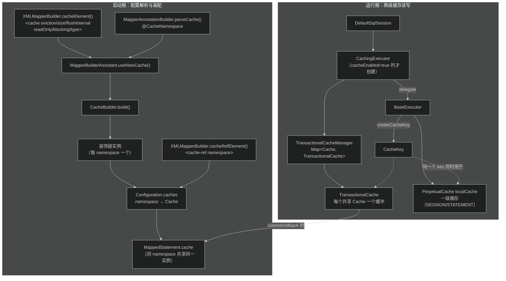
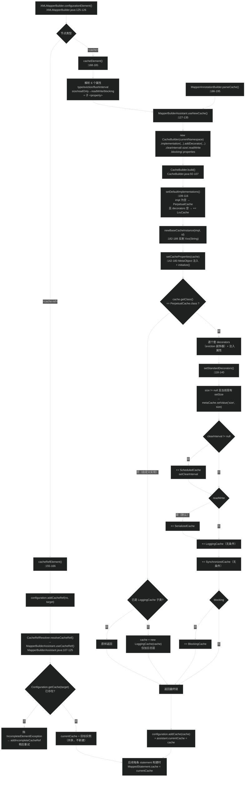
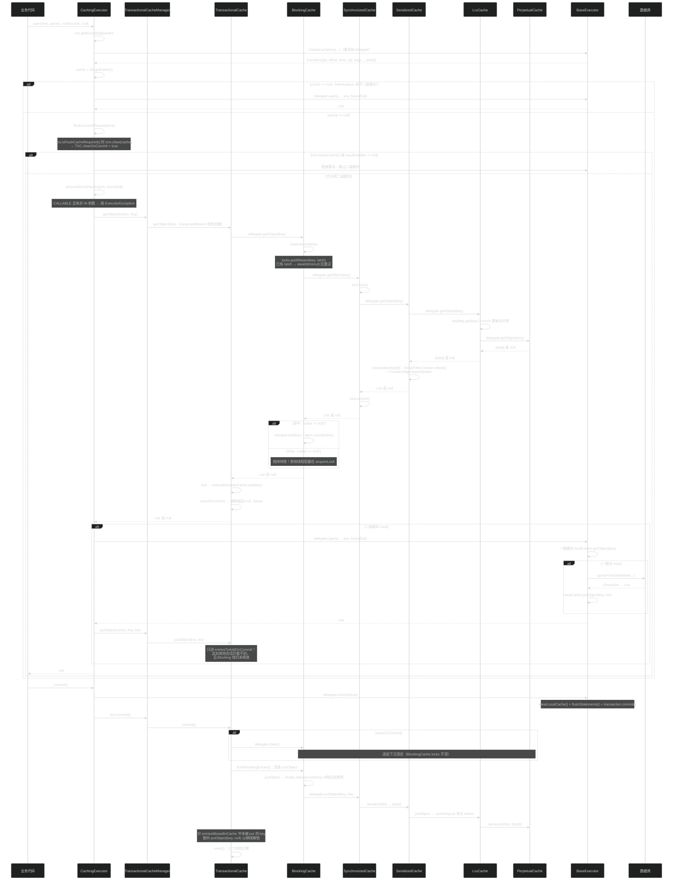
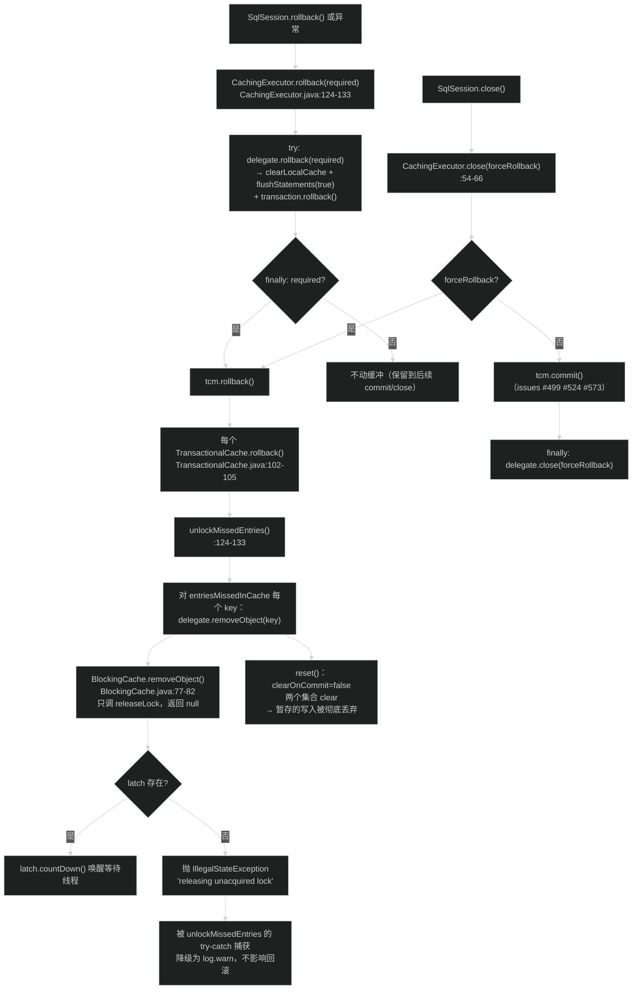

# 缓存体系（cache）
> 上次修改：2026-07-28 23:01

## 重点关注

| 入口 / 章节 | 源码位置 | 为什么重要 |
|-------------|----------|------------|
| `Cache` SPI 六方法 | `src/main/java/org/apache/ibatis/cache/Cache.java:42-101` | 整个缓存体系只有这一个契约。第三方缓存（Redis/EhCache/Caffeine）接入 MyBatis 的唯一入口，且方法注释里藏着"`removeObject` 只在 rollback 时被调用、用于释放 BlockingCache 锁"这条隐藏协议。 |
| `CacheKey.update / equals / hashCode` | `src/main/java/org/apache/ibatis/cache/CacheKey.java:74-120` | 决定"两次查询是否算同一次查询"的全部语义。三重快速判据（hashcode/checksum/count）+ 逐元素 `ArrayUtil.equals` 兜底，是理解一二级缓存命中率的根。 |
| `BaseExecutor.createCacheKey(...)` | `src/main/java/org/apache/ibatis/executor/BaseExecutor.java:198-243` | CacheKey 的**唯一生产现场**：`ms.getId()` + `offset` + `limit` + SQL 文本 + 所有非 OUT 参数值 + `environmentId`。缓存"意外命中/意外不命中"的排查必须从这 6 类输入看起。 |
| `CacheBuilder.build()` + `setStandardDecorators(...)` | `src/main/java/org/apache/ibatis/mapping/CacheBuilder.java:92-140` | 装饰器链的组装顺序在这里被硬编码：自定义装饰器 → Scheduled → Serialized → Logging → Synchronized → Blocking。顺序即语义，改动顺序会直接改变线程安全性与阻塞粒度。 |
| `TransactionalCache` 四态字段 | `src/main/java/org/apache/ibatis/cache/decorators/TransactionalCache.java:42-92` | `clearOnCommit` / `entriesToAddOnCommit` / `entriesMissedInCache` 三者共同实现"提交前不可见"的二级缓存事务语义，是二级缓存脏读隔离的全部实现。 |
| `TransactionalCache.commit / rollback` | `TransactionalCache.java:94-133` | commit 时把暂存写入真实缓存并**为未命中的 key 写 null**（释放 Blocking 锁）；rollback 时只做 `removeObject` 解锁。两条路径不对称，是死锁问题的高发区。 |
| `BlockingCache.acquireLock / releaseLock` | `src/main/java/org/apache/ibatis/cache/decorators/BlockingCache.java:89-118` | 用 `ConcurrentHashMap<Object, CountDownLatch>` 做 key 级互斥，实现缓存击穿防护。`releaseLock` 对未持有锁抛 `IllegalStateException`，配合 `TransactionalCache` 的 miss 记录才闭环。 |
| `CachingExecutor.query(...)` 六参重载 | `src/main/java/org/apache/ibatis/executor/CachingExecutor.java:93-111` | 二级缓存读写的唯一现场。`cache != null` → `flushCacheIfRequired` → `isUseCache && resultHandler == null` 三重门禁，解释了"为什么带 ResultHandler 的查询永不进二级缓存"。 |
| `BaseExecutor.query(...)` 中 `localCacheScope` 分支 | `BaseExecutor.java:164-173` | `queryStack == 0` 时按 `LocalCacheScope.STATEMENT` 清一级缓存，是一级缓存"能否跨语句"的开关，也是嵌套查询计数的收口处。 |
| `SoftCache/WeakCache` 的 `hardLinksToAvoidGarbageCollection` | `SoftCache.java:34-91`、`WeakCache.java:34-90` | 用 256 条强引用保住"最近命中"的对象不被 GC，是软/弱引用缓存能真正提高命中率的关键技巧（否则 minor GC 后全丢）。 |
| `PerpetualCache.equals / hashCode` | `src/main/java/org/apache/ibatis/cache/impl/PerpetualCache.java:67-89` | 按 `id`（namespace）判等，使 `cache-ref` 与 `Configuration.caches` 的去重成立；而部分装饰器**不**转发 equals，形成一处需要注意的不一致。 |
| `CacheKey` 的第二用途：结果行标识 | `src/main/java/org/apache/ibatis/executor/resultset/DefaultResultSetHandler.java:1513-1525` | `CacheKey` 不只是缓存键，还被复用为嵌套 resultMap 的行标识（`combineKeys`/`NULL_CACHE_KEY` 哨兵），说明它本质是"通用复合值对象等价性工具"。 |

## 1. 模块定位与职责边界

**结论**：`cache` 包是 MyBatis 的"**缓存存储原语库**"——它只提供一个极简 SPI（`Cache`）、一个默认 `HashMap` 实现（`PerpetualCache`）、九个可自由叠加的装饰器，以及一个复合等价性键（`CacheKey`）。它**不决定何时读缓存、何时清缓存**，那是 `executor` 的职责；它也**不决定缓存怎么配**，那是 `builder` + `mapping.CacheBuilder` 的职责。整个包只有 19 个文件、约 1200 行代码，却是 MyBatis 中"装饰器模式"教科书级的示范。

### 上下游位置

- **上游（调用方）**
  - `mapping.CacheBuilder`：唯一的组装者，把 `PerpetualCache` 逐层包装成最终的二级缓存实例（`src/main/java/org/apache/ibatis/mapping/CacheBuilder.java:92-140`）。
  - `executor.BaseExecutor`：直接 `new PerpetualCache("LocalCache")` / `new PerpetualCache("LocalOutputParameterCache")` 作为一级缓存与存储过程 OUT 参数缓存；并生产 `CacheKey`（`BaseExecutor.java:198-243`）。
  - `executor.CachingExecutor`：持有 `TransactionalCacheManager`，通过它间接读写 `MappedStatement.getCache()` 拿到的二级缓存（`CachingExecutor.java:42`、`:96-111`）。
  - `executor.resultset.DefaultResultSetHandler`：把 `CacheKey` 当作"结果行标识"使用（`nestedResultObjects`、`pendingRelations` 的 Map 键）。
- **下游（被依赖）**
  - `logging`（`LoggingCache`、`TransactionalCache` 打日志）；
  - `io.Resources` + `io.SerialFilterChecker`（`SerializedCache` 反序列化时的类加载与反序列化过滤）；
  - `reflection.ArrayUtil`（`CacheKey` 对数组元素做 hash/equals）；
  - `exceptions.PersistenceException`（`CacheException` 的父类）；
  - JDK：`HashMap` / `LinkedHashMap` / `LinkedList` / `ConcurrentHashMap` / `CountDownLatch` / `ReentrantLock` / `SoftReference` / `WeakReference` / `ReferenceQueue` / `ObjectOutputStream`。

**关键事实**：`cache` 包**不依赖任何 MyBatis 核心域对象**（既不依赖 `MappedStatement`，也不依赖 `Configuration`、`Executor`、`SqlSession`）。这使它可以被独立测试和替换，也是 `mybatis-redis`、`mybatis-ehcache` 等适配器只需实现单个接口即可接入的原因。

### 负责什么

1. **定义缓存 SPI**：`Cache` 接口的 5 个必需方法（`getId`/`putObject`/`getObject`/`removeObject`/`clear`）+ 2 个可选方法（`getSize`/`getReadWriteLock`，后者已废弃为 `default null`）。
2. **提供基础存储**：`PerpetualCache` = 一个裸 `HashMap` + 按 id 判等，永不淘汰。
3. **提供淘汰策略装饰器**：`LruCache`（`LinkedHashMap` accessOrder）、`FifoCache`（`Deque` 记录插入序）、`ScheduledCache`（按时间间隔整体清空）。
4. **提供内存敏感装饰器**：`SoftCache` / `WeakCache`，把 value 包成 `SoftReference` / `WeakReference` 并用 `ReferenceQueue` 清理墓碑条目。
5. **提供隔离与安全装饰器**：`SerializedCache`（深拷贝，实现读写缓存）、`SynchronizedCache`（`ReentrantLock` 全方法串行）、`BlockingCache`（key 级 `CountDownLatch`，防缓存击穿）。
6. **提供可观测装饰器**：`LoggingCache`（累计 requests/hits，debug 输出命中率）。
7. **提供事务缓冲**：`TransactionalCache` + `TransactionalCacheManager`，把一个会话内对二级缓存的写入暂存，直到 `commit()` 才对其他会话可见。
8. **提供复合缓存键**：`CacheKey`，把任意数量的异构对象聚合成一个具备稳定 `hashCode`/`equals` 的值对象。
9. **定义缓存异常类型**：`CacheException`（继承 `PersistenceException`，属非受检异常）。

### 不负责什么（避免与相邻模块混淆）

- **不负责决定缓存时机**：`flushCache` / `useCache` 的判定、一级缓存的读写、`localCacheScope` 的生效，全在 `executor.BaseExecutor` 与 `executor.CachingExecutor`（`BaseExecutor.java:149-151`、`:164-173`；`CachingExecutor.java:96-111`、`:168-173`）。
- **不负责生成 CacheKey**：`CacheKey` 只提供"累加 + 判等"的能力，**用哪些字段构成键**由 `BaseExecutor.createCacheKey(...)` 决定（`BaseExecutor.java:203-243`）。
- **不负责解析配置**：`<cache eviction="LRU" size="512" .../>`、`@CacheNamespace`、`<cache-ref>` 的解析在 `builder/xml/XMLMapperBuilder.java:155-181` 与 `builder/annotation/MapperAnnotationBuilder.java:186-195`；装配在 `builder/MapperBuilderAssistant.java:127-135` 与 `mapping/CacheBuilder.java`。
- **不负责缓存实例的注册与共享**：`Configuration.caches`（`StrictMap`）持有 namespace → Cache 的映射，`cache-ref` 的跨 namespace 复用由 `Configuration.getCache(namespace)` 完成。
- **不负责事务提交**：`TransactionalCache.commit()` 只是"把暂存刷进 delegate"，真正的 `Connection.commit()` 由 `transaction` 包完成；两者的调用顺序由 `CachingExecutor.commit(boolean)` 编排（`CachingExecutor.java:118-122`）。
- **不负责分布式一致性**：本包所有实现都是**单 JVM 进程内缓存**。跨节点失效需由第三方 `Cache` 实现自行解决。

### 主要输入 / 输出 / 状态变化 / 副作用

| 维度 | 内容 |
|------|------|
| 输入 | `Cache` 装饰链的 delegate 实例；缓存键（实际总是 `CacheKey`，但 SPI 声明为 `Object`）；缓存值（`List<E>` 查询结果，或 `BaseExecutor.EXECUTION_PLACEHOLDER` 占位符，或存储过程参数对象）；来自 `<cache>` 子元素的 `Properties`（经 `MetaObject` 反射注入 `size`/`clearInterval`/`timeout` 等 setter） |
| 输出 | `getObject(key)` 返回缓存值或 `null`；`getSize()` 返回条目数；`getId()` 返回 namespace |
| 内存状态变化 | `PerpetualCache.cache` 增删；`LruCache.keyMap`（LinkedHashMap 访问序）与 `eldestKey`；`FifoCache.keyList`；`ScheduledCache.lastClear`；`SoftCache/WeakCache.hardLinksToAvoidGarbageCollection`（最多 256 条强引用）；`BlockingCache.locks`；`LoggingCache.requests/hits`；`TransactionalCache.clearOnCommit/entriesToAddOnCommit/entriesMissedInCache`；`TransactionalCacheManager.transactionalCaches` |
| 副作用 | `SerializedCache` 触发 Java 序列化/反序列化（含 `SerialFilterChecker.check()` 的 JDK 反序列化过滤器校验）；`BlockingCache` 会**阻塞调用线程**（无限期或 `timeout` 毫秒）；`SoftCache/WeakCache` 依赖 GC 行为，条目可能"自行消失"；`LoggingCache` 写日志；`TransactionalCache.commit()` 会向 delegate 写入 `null` 值条目 |

## 2. 架构关系与依赖

**结论**：本模块是"**一个接口 + 一个叶子实现 + N 个同构装饰器**"的纯装饰器（Decorator）结构。所有装饰器都实现 `Cache` 并持有一个 `private final Cache delegate`，因此可以任意排列组合；但 MyBatis 通过 `CacheBuilder.setStandardDecorators(...)` **硬编码了标准装饰顺序**，使运行期行为可预测。

### 类型关系图

```mermaid
%%{init: {"theme": "dark"}}%%
graph TD
  SPI["interface Cache<br/>getId/putObject/getObject<br/>removeObject/clear/getSize"]

  SPI -.实现.-> PC["PerpetualCache<br/>HashMap 叶子节点<br/>equals/hashCode by id"]
  SPI -.实现.-> THIRD["第三方实现<br/>mybatis-redis / ehcache<br/>（构造器需 String id）"]

  SPI -.实现.-> LRU["LruCache<br/>LinkedHashMap accessOrder"]
  SPI -.实现.-> FIFO["FifoCache<br/>Deque 插入序"]
  SPI -.实现.-> SOFT["SoftCache<br/>SoftReference + 256 硬链"]
  SPI -.实现.-> WEAK["WeakCache<br/>WeakReference + 256 硬链"]
  SPI -.实现.-> SCH["ScheduledCache<br/>clearInterval 到期整体清空"]
  SPI -.实现.-> SER["SerializedCache<br/>序列化深拷贝"]
  SPI -.实现.-> LOG["LoggingCache<br/>命中率统计"]
  SPI -.实现.-> SYN["SynchronizedCache<br/>ReentrantLock"]
  SPI -.实现.-> BLK["BlockingCache<br/>CountDownLatch per key"]
  SPI -.实现.-> TXC["TransactionalCache<br/>提交可见缓冲"]

  LRU -->|delegate| SPI
  FIFO -->|delegate| SPI
  SOFT -->|delegate| SPI
  WEAK -->|delegate| SPI
  SCH -->|delegate| SPI
  SER -->|delegate| SPI
  LOG -->|delegate| SPI
  SYN -->|delegate| SPI
  BLK -->|delegate| SPI
  TXC -->|delegate| SPI

  CK["CacheKey<br/>Cloneable + Serializable<br/>复合等价性键"]
  NCK["NullCacheKey<br/>@Deprecated 3.5.3"] --> CK
  NULLK["CacheKey.NULL_CACHE_KEY<br/>匿名子类哨兵"] -.静态常量.-> CK
  EX["CacheException<br/>extends PersistenceException"]
```



### 运行期装配与协作图



### 依赖方向与耦合特征

| 方向 | 依赖内容 | 耦合强度与说明 |
|------|----------|----------------|
| `cache` → `logging` | `LogFactory.getLog(...)` | 弱。仅 `LoggingCache`、`TransactionalCache` 使用。 |
| `cache` → `io` | `Resources.classForName`、`SerialFilterChecker.check` | 弱，仅 `SerializedCache`。`CustomObjectInputStream` 覆写 `resolveClass` 是为了走 MyBatis 的类加载器链。 |
| `cache` → `reflection` | `ArrayUtil.hashCode/equals/toString` | 弱，仅 `CacheKey`。用途是让"数组类型参数值"参与等价性判断（JDK `Object.equals` 对数组是引用比较，会导致缓存永不命中）。 |
| `cache` → `exceptions` | `PersistenceException` | 弱，仅 `CacheException`。 |
| `mapping.CacheBuilder` → `cache` | 反射创建 `PerpetualCache(String)` 与各装饰器 `XxxCache(Cache)` | **强**。`CacheBuilder` 直接 `import` 了 `BlockingCache`/`LoggingCache`/`LruCache`/`ScheduledCache`/`SerializedCache`/`SynchronizedCache`/`PerpetualCache` 七个具体类。这是唯一一处"核心代码硬编码具体装饰器"的地方。 |
| `executor` → `cache` | `PerpetualCache`（一级缓存）、`CacheKey`、`TransactionalCacheManager` | **强**，且是本包最主要的消费者。 |
| `session.Configuration` → `cache` | 别名注册 `PERPETUAL/FIFO/LRU/SOFT/WEAK`（`Configuration.java:198-202`）；`caches` 注册表 | 中等。别名让 XML 里可以写 `eviction="LRU"`。注意 `SCHEDULED`、`SERIALIZED`、`SYNCHRONIZED`、`BLOCKING`、`LOGGING` **没有别名**，因为它们由 `CacheBuilder` 按开关自动添加而非用户指定。 |
| `cache` → 其他 MyBatis 包 | **无**（除上述 4 个工具型包） | 本包不反向依赖 `executor`/`session`/`mapping`，是干净的叶子模块。 |

### 与相邻模块的边界要点

- **`cache` vs `executor`**：本包提供"容器"，`executor` 提供"策略"。同一个 `PerpetualCache` 类既充当一级缓存的全部实现，也充当二级缓存装饰链的最底层——区别仅在于**谁持有它、生命周期多长**：一级缓存归 `BaseExecutor`（会话级，`close()` 时置 null），二级缓存归 `Configuration.caches`（应用级，与 `SqlSessionFactory` 同寿）。
- **`cache` vs `mapping`**：`CacheBuilder` 在 `mapping` 包而不在 `cache` 包，是一个耐人寻味的分层选择。好处是 `cache` 包保持零配置依赖；代价是"缓存有哪些标准装饰器"这条知识散落在 `mapping` 包里，阅读时容易漏。
- **`CacheKey` 的双重身份**：它虽在 `cache` 包，但被 `DefaultResultSetHandler` 大量用作嵌套结果映射的行标识（`nestedResultObjects`、`pendingRelations`、`combineKeys`）。因此把它理解为"通用复合值对象等价性工具"比"缓存键"更准确。

## 3. 入口与调用方式

**结论**：本包对外只有四类入口：① `Cache` 接口（供第三方实现）；② `CacheKey`（供 `executor` 构造键）；③ 各装饰器的公开构造器 + setter（供 `CacheBuilder` 反射调用）；④ `TransactionalCacheManager`（供 `CachingExecutor` 编排事务可见性）。**没有任何静态工厂或全局单例**，所有实例都由外部注入。

### 3.1 编程入口（Java API）

| 入口 | 签名 | 调用者 | 备注 |
|------|------|--------|------|
| `Cache` | `interface`，6 方法 | 第三方缓存适配器、`CacheBuilder` | 实现类**必须**提供 `public Xxx(String id)` 构造器（`CacheBuilder.java:191-199` 显式 `getConstructor(String.class)`，失败即抛 `CacheException`） |
| 装饰器构造器 | `public XxxCache(Cache delegate)` | `CacheBuilder.newCacheDecoratorInstance` | **必须**是单参 `Cache` 构造器（`CacheBuilder.java:210-217`） |
| `LruCache.setSize(int)` / `FifoCache.setSize(int)` / `SoftCache.setSize(int)` / `WeakCache.setSize(int)` | `void setSize(int)` | `CacheBuilder.setStandardDecorators` 经 `MetaObject.hasSetter("size")` 探测后调用 | 对应 `<cache size="512"/>`。注意 `SoftCache/WeakCache` 的 `size` 语义是"强引用条数"，**不是**容量上限 |
| `ScheduledCache.setClearInterval(long)` | `void setClearInterval(long)` | `CacheBuilder.setStandardDecorators` | 对应 `<cache flushInterval="60000"/>`，单位毫秒 |
| `BlockingCache.setTimeout(long)` | `void setTimeout(long)` | `CacheBuilder.setCacheProperties` 经 `Properties` 注入 | 只能通过 `<cache blocking="true"><property name="timeout" value="5000"/></cache>` 设置；`0`（默认）表示无限等待 |
| `CacheKey` | `new CacheKey()` / `new CacheKey(Object[])`，`update(Object)`、`updateAll(Object[])`、`getUpdateCount()`、`clone()` | `BaseExecutor.createCacheKey`、`DefaultResultSetHandler` | `clone()` 做 `updateList` 的浅层新建，保证克隆后继续 `update` 不污染原键 |
| `CacheKey.NULL_CACHE_KEY` | `public static final CacheKey` | `DefaultResultSetHandler.combineKeys` | 哨兵对象，`update` 会抛 `CacheException`；用 `!=` 身份比较判定"该行不可作为缓存标识" |
| `TransactionalCacheManager` | `getObject/putObject/clear(Cache, CacheKey[, value])`、`commit()`、`rollback()` | `CachingExecutor` | 内部 `Map<Cache, TransactionalCache>` 惰性创建（`computeIfAbsent`） |

### 3.2 配置入口（XML / 注解）

**XML（Mapper 级）** — 解析于 `XMLMapperBuilder.cacheElement(XNode)`（`builder/xml/XMLMapperBuilder.java:168-181`）：

```xml
<mapper namespace="org.example.PersonMapper">
  <!-- 开启当前 namespace 的二级缓存 -->
  <cache type="PERPETUAL"      <!-- 基础实现，默认 PERPETUAL；可填全限定类名或别名 -->
         eviction="LRU"        <!-- 淘汰装饰器，默认 LRU；可选 FIFO/SOFT/WEAK 或自定义类 -->
         flushInterval="60000" <!-- 毫秒；非空 → 追加 ScheduledCache -->
         size="512"            <!-- 注入到有 setSize 的那一层 -->
         readOnly="false"      <!-- false（默认）→ readWrite=true → 追加 SerializedCache -->
         blocking="false">     <!-- true → 追加 BlockingCache -->
    <property name="timeout" value="5000"/> <!-- 任意 setter 均可注入 -->
  </cache>

  <!-- 或：复用另一个 namespace 的缓存实例（不新建） -->
  <cache-ref namespace="org.example.OtherMapper"/>
</mapper>
```

参数映射关系（`XMLMapperBuilder.java:170-179` → `MapperBuilderAssistant.useNewCache` → `CacheBuilder`）：

- `type` → `typeAliasRegistry.resolveAlias(...)` → `CacheBuilder.implementation(...)`；
- `eviction` → `CacheBuilder.addDecorator(...)`；
- `readOnly` **取反**成 `readWrite`：`boolean readWrite = !context.getBooleanAttribute("readOnly", false)`，即**默认 readWrite=true，默认会套 `SerializedCache`**。这是很多人不知道的默认行为，也是"从二级缓存取出的对象是深拷贝、改了不影响缓存"的原因。

**注解（Mapper 接口级）** — 解析于 `MapperAnnotationBuilder.parseCache()`（`builder/annotation/MapperAnnotationBuilder.java:186-195`）：

```java
@CacheNamespace(implementation = PerpetualCache.class, eviction = LruCache.class,
    flushInterval = 60000, size = 512, readWrite = true, blocking = false,
    properties = { @Property(name = "timeout", value = "5000") })
public interface PersonMapper { ... }

@CacheNamespaceRef(PersonMapper.class)   // 等价于 <cache-ref>
public interface ImportantPersonMapper { ... }
```

注意注解路径下 `size == 0` / `flushInterval == 0` 会被转成 `null`（表示"未配置"），因此**无法通过注解把 size 显式设为 0**；另外 `@CacheNamespace.size()` 的默认值是 `1024`（`annotations/CacheNamespace.java:76`），与 XML 路径"不写 size 就完全不注入"的行为不同——两条路径的默认值来源不一样，XML 未写 size 时最终由 `LruCache` 构造器自带的 `setSize(1024)` 兜底。

**全局开关** — `mybatis-config.xml` 的 `<settings>`（解析于 `builder/xml/XMLConfigBuilder.java`）：

| setting | 默认值 | 作用位置 | 说明 |
|---------|--------|----------|------|
| `cacheEnabled` | `true` | `Configuration.newExecutor` `:745-747` | **总闸**。false 时不创建 `CachingExecutor`，所有 `<cache>` 配置形同虚设（缓存实例仍会被构建，只是没人读写） |
| `localCacheScope` | `SESSION` | `BaseExecutor.query` `:170-173` | `STATEMENT` 时每条语句结束即清一级缓存，等价于"关闭一级缓存" |

**语句级开关** — `<select useCache="true" flushCache="false">` / `<insert|update|delete flushCache="true">`，落到 `MappedStatement.useCache` 与 `MappedStatement.flushCacheRequired`（`mapping/MappedStatement.java:47-48`），由 `CachingExecutor` 与 `BaseExecutor` 读取。

### 3.3 典型调用链（自上而下）

```
SqlSession.selectList(statement, param, rowBounds)
  └─ CachingExecutor.query(ms, param, rowBounds, handler)            CachingExecutor.java:85-91
       ├─ ms.getBoundSql(param)                                       → mapping/scripting
       ├─ createCacheKey(...) → delegate.createCacheKey(...)          BaseExecutor.java:198-243
       └─ CachingExecutor.query(..., key, boundSql)                   CachingExecutor.java:93-111
            ├─ flushCacheIfRequired(ms) → tcm.clear(cache)            CachingExecutor.java:168-173
            ├─ tcm.getObject(cache, key)                              TransactionalCacheManager.java:34-36
            │    └─ TransactionalCache.getObject(key)                 TransactionalCache.java:64-76
            │         └─ delegate.getObject(key)  ← 装饰链自外向内下沉
            │              BlockingCache → SynchronizedCache → LoggingCache
            │              → SerializedCache → ScheduledCache → LruCache → PerpetualCache
            ├─ （miss）delegate.query(...) → BaseExecutor.query(...)   BaseExecutor.java:141-174
            │    ├─ localCache.getObject(key)      ← 一级缓存
            │    └─ queryFromDatabase(...)         ← 真正打 DB
            └─ tcm.putObject(cache, key, list)     ← 只进暂存，不进共享缓存
SqlSession.commit()
  └─ CachingExecutor.commit(true)                                     CachingExecutor.java:118-122
       ├─ delegate.commit(true) → clearLocalCache() + transaction.commit()
       └─ tcm.commit() → 每个 TransactionalCache.commit()             TransactionalCache.java:94-100
```

## 4. 核心概念与领域模型

**结论**：只需掌握五个概念——**Cache SPI**、**装饰链**、**CacheKey 等价语义**、**两级缓存**、**事务可见性缓冲**。其余装饰器都是这五个概念的具体落地。

### 4.1 Cache SPI：六个方法的真实契约

| 方法 | 声明契约 | 实际调用者与隐藏语义 |
|------|----------|----------------------|
| `String getId()` | 返回缓存标识 | 实际总是 **namespace 字符串**（`CacheBuilder(currentNamespace)`）。装饰器**全部**转发给 delegate，因此整条链的 `getId()` 相同。`LoggingCache` 用它作 Logger 名 |
| `void putObject(Object key, Object value)` | 写入 | key 实际总是 `CacheKey`；value 是 `List<E>`（二级缓存）或 `List`/`EXECUTION_PLACEHOLDER`/参数对象（一级缓存）。**允许写 null 值**——`TransactionalCache.flushPendingEntries()` 会为 miss 的 key 显式写 `null`（`TransactionalCache.java:117-121`） |
| `Object getObject(Object key)` | 读取，miss 返回 null | 核心用 `null` 判定 miss，因此"缓存了 null 值"与"未缓存"在 SPI 层不可区分 |
| `Object removeObject(Object key)` | 移除，返回值"Not used" | **注释明确写了：自 3.3.0 起，只在 rollback 期间、针对之前 miss 的 key 被调用，目的是让 `BlockingCache` 释放锁**（`Cache.java:66-76`）。这是全包最重要的隐藏协议——第三方实现如果把它实现成"真正删数据"没问题，但如果抛异常就会破坏解锁 |
| `void clear()` | 清空本实例 | 被 `TransactionalCache.commit()`（当 `clearOnCommit`）与 `ScheduledCache.clearWhenStale()` 调用。注意 `BlockingCache.clear()` **不清 `locks`**（`BlockingCache.java:84-87`） |
| `int getSize()` | 条目数（非容量） | 注释标为 "Optional. This method is not called by the core."。仅测试与 `LruCache`/`SoftCache` 内部转发使用 |
| `default ReadWriteLock getReadWriteLock()` | 返回 null | 注释标为"自 3.2.6 起核心不再调用"。历史遗留，锁必须由实现自己管 |

**第三方实现的两条硬约束**（否则 `CacheBuilder` 启动期直接抛 `CacheException`）：

1. 基础实现必须有 `public Xxx(String id)` 构造器（`CacheBuilder.java:191-199`）；
2. 装饰器必须有 `public Xxx(Cache delegate)` 构造器（`CacheBuilder.java:210-217`）。

此外若实现了 `builder.InitializingObject`，`CacheBuilder.setCacheProperties` 会在属性注入完成后调用 `initialize()`（`CacheBuilder.java:172-179`），这是第三方缓存做连接池初始化的钩子。

### 4.2 装饰链：顺序即语义

`CacheBuilder.build()` 的组装逻辑（`CacheBuilder.java:92-140`）：

```
基础实现 = implementation ?: PerpetualCache
若 implementation 为空且 decorators 为空 → decorators += LruCache      // setDefaultImplementations

if (基础实现的运行时类 == PerpetualCache.class)   // 严格 equals，非 isAssignableFrom（issue #352）
    for d in decorators:  cache = new d(cache); 注入属性
    cache = setStandardDecorators(cache)
else if (!(基础实现 instanceof LoggingCache))
    cache = new LoggingCache(cache)             // 自定义缓存只加日志层
```

`setStandardDecorators` 的固定顺序（`CacheBuilder.java:118-140`）——**由内向外**：

| 层序（内→外） | 装饰器 | 触发条件 | 加在这个位置的原因 |
|--------------|--------|----------|--------------------|
| 0 | `PerpetualCache` | 总是 | 实际存储 |
| 1 | `LruCache` / `FifoCache` / `SoftCache` / `WeakCache` | `eviction` 属性（默认 LRU） | 淘汰必须紧贴存储，才能准确 `removeObject` |
| — | `size` 注入 | `size != null && metaCache.hasSetter("size")` | 通过 `MetaObject` 探测**当前最外层**是否有 `setSize`，因此只有淘汰装饰器能收到 |
| 2 | `ScheduledCache` | `clearInterval != null` | 在淘汰之外，整体过期优先于逐条淘汰生效 |
| 3 | `SerializedCache` | `readWrite == true`（即 `readOnly="false"`，**默认**） | 必须在存储之内、锁之外：这样存的是 `byte[]`，取出即深拷贝，天然线程隔离 |
| 4 | `LoggingCache` | 总是 | 统计的是"经过序列化后的真实读写"，不含被外层锁挡住的等待 |
| 5 | `SynchronizedCache` | 总是 | 把以内所有层的复合操作串行化（`LruCache.putObject` 是两步操作，非原子，必须靠这层保护） |
| 6 | `BlockingCache` | `blocking == true` | 必须在**最外层**：其锁粒度是 key，且要在进入 `SynchronizedCache` 的全局锁之前挡住并发线程，否则 miss 的线程会持全局锁去查库 |

三维评估：

- **合理性**：顺序设计是严谨的。`SynchronizedCache` 在 `LruCache` 之外是必要的（`LruCache.putObject` 先 `delegate.putObject` 再 `cycleKeyList`，两步之间被打断会导致 `keyMap` 与实际存储不一致）；`BlockingCache` 在 `SynchronizedCache` 之外也是必要的（否则查库时会持全局锁，吞吐塌陷）。
- **风险**：`build()` 用 `PerpetualCache.class.equals(cache.getClass())` 严格判定（`CacheBuilder.java:97`），意味着**继承 `PerpetualCache` 的自定义缓存不会获得任何标准装饰器**——包括 `SynchronizedCache`。自定义缓存必须自己保证线程安全。这一点在文档里不显眼，是踩坑高发处（issue #352 的取舍）。
- **改动成本**：顺序硬编码在一个 20 行私有方法里，改动本身容易，但语义影响面极大（线程安全、命中率、序列化开销全受影响），属于**高风险低成本**改动，不建议触碰。

### 4.3 CacheKey：等价语义

**构成要素**（`BaseExecutor.createCacheKey`，`BaseExecutor.java:203-243`），按 `update()` 顺序：

1. `ms.getId()` —— MappedStatement 全限定 id（`namespace.statementName`）；
2. `rowBounds.getOffset()` —— `int`；
3. `rowBounds.getLimit()` —— `int`；
4. `boundSql.getSql()` —— **动态标签展开后的 SQL 文本**（`<if>`/`<foreach>` 已处理，`#{}` 已变 `?`）；
5. 对每个 `ParameterMapping`（跳过 `ParameterMode.OUT`）的**实参值**，取值优先级：`parameterMapping.hasValue()` → `boundSql.hasAdditionalParameter(prop)` → `parameterObject == null ? null` → 有 TypeHandler 则用整个 `parameterObject`，否则 `metaObject.getValue(prop)`；
6. `configuration.getEnvironment().getId()`（非空时，issue #176）—— 让多数据源环境不互相污染。

**等价性算法**（`CacheKey.java:74-120`）：

```java
// update(o)：每次累加维护四个状态
int baseHashCode = (o == null) ? 1 : ArrayUtil.hashCode(o);
count++;
checksum   += baseHashCode;          // 与顺序无关的和
baseHashCode *= count;               // 乘位置，引入顺序敏感
hashcode = 37 * hashcode + baseHashCode;   // 初值 17
updateList.add(o);                   // 保留原值，供 equals 兜底
```

```java
// equals：先三重快速否定，再逐元素确认
if (hashcode != that.hashcode || checksum != that.checksum || count != that.count) return false;
for i: if (!ArrayUtil.equals(updateList[i], that.updateList[i])) return false;
return true;
```

关键性质：

- **顺序敏感**：`baseHashCode *= count` 使 `[A,B]` 与 `[B,A]` 的 `hashcode` 不同（尽管 `checksum` 相同）。
- **无哈希碰撞误判**：`equals` 最终逐元素 `ArrayUtil.equals` 比对，所以 `hashcode`/`checksum` 只是加速器，不是判据。这与"用 SQL 字符串拼接当键"的实现相比更严谨。
- **数组感知**：`ArrayUtil.hashCode/equals` 会对数组做 `Arrays.hashCode/equals` 而非引用比较（`reflection/ArrayUtil.java:33`、`:82`），否则 `IN (?,?,?)` 之类的数组参数将永远无法命中缓存。
- **可序列化**：`implements Serializable`，且 `updateList` **故意不加 transient**（`CacheKey.java:54-56` 有专门注释解释这不是 Sonarlint 认为的缺陷）——因为 `SerializedCache` 场景下键也可能需要被外部缓存序列化。
- **可克隆**：`clone()` 重建 `updateList`（`CacheKey.java:131-136`），供 `DefaultResultSetHandler.combineKeys` 在不污染 rowKey 的前提下派生组合键。
- **哨兵 `NULL_CACHE_KEY`**：匿名子类，`update`/`updateAll` 均抛 `CacheException`（`CacheKey.java:32-45`）。用于表示"这一行没有足够的 id 列，无法参与去重"，判定用 `!=` 身份比较（`DefaultResultSetHandler.java:481`、`:519`、`:1216`）。
- **已废弃的 `NullCacheKey`**：`@Deprecated Since 3.5.3, This class never used`（`cache/NullCacheKey.java:19-40`）。它是 `NULL_CACHE_KEY` 的前身，保留只为二进制兼容，阅读时可直接忽略。

**常见"缓存不命中"的根因映射**：

| 现象 | 根因（对应 CacheKey 的哪一项） |
|------|-------------------------------|
| 相同参数两次查询仍打库 | 第 4 项：动态 SQL 展开后的文本不同（如 `<if>` 因参数不同走了不同分支） |
| 分页翻回上一页不命中 | 第 2/3 项：`RowBounds` 的 offset/limit 参与键 |
| 同一 Mapper 方法但传 Map vs POJO 不命中 | 第 5 项：取值路径不同（有 TypeHandler 走整对象，否则走 `metaObject.getValue`） |
| 多数据源切换后不命中 | 第 6 项：`environment.getId()` 参与键 |
| 参数是数组/集合时命中异常 | 第 5 项 + `ArrayUtil`：数组按内容比，但集合按 `List.equals` 比，`ArrayList` 与 `LinkedList` 内容相同即等价 |

### 4.4 两级缓存模型

| 维度 | 一级缓存（Local Cache） | 二级缓存（Second Level Cache） |
|------|------------------------|-------------------------------|
| 实现 | 裸 `PerpetualCache`，无任何装饰器 | `CacheBuilder` 组装的完整装饰链 |
| 持有者 | `BaseExecutor.localCache`（字段） | `Configuration.caches` → `MappedStatement.cache` |
| 作用域 | 单个 `SqlSession`（准确说是单个 `Executor`） | 整个 `SqlSessionFactory`，按 **namespace** 划分 |
| 生命周期 | `Executor` 创建即有，`close()` 时置 `null` | 与 `Configuration` 同寿，进程级 |
| 是否默认开启 | **是**（`localCacheScope=SESSION`），无法关闭，只能降级为 STATEMENT | **否**，需要 `<cache/>` 或 `@CacheNamespace` 显式声明（`cacheEnabled=true` 只是总闸） |
| 键 | 同一个 `CacheKey` | 同一个 `CacheKey` |
| 值 | `List<E>`，或短暂的 `EXECUTION_PLACEHOLDER` | `List<E>`（若 `readWrite` 则底层存 `byte[]`） |
| 读时机 | `BaseExecutor.query` `:155` | `CachingExecutor.query` `:102`（**先于**一级缓存） |
| 清空时机 | 任何 `update`（`:117`）、`commit`（`:255`）、`rollback`（`:266`）、`flushCache=true` 的查询（`:149-151`）、STATEMENT 作用域下每条语句结束（`:170-173`） | `flushCache=true` 的语句触发 `tcm.clear(cache)`（延迟到 commit 才真清）；`ScheduledCache` 到期自动清 |
| 线程安全 | **不安全**，靠 `SqlSession` 不共享线程保证 | 安全，靠 `SynchronizedCache`（自定义实现除外） |
| 跨会话可见 | 否 | 是，但**仅在写入会话 commit 之后** |
| 脏读风险 | 会话内看到自己未提交的写（预期行为） | 由 `TransactionalCache` 隔离；但**跨 namespace 关联查询会脏读**（见 §8） |

**协同顺序**：`CachingExecutor` 包在 `BaseExecutor` 外，所以查询是 **二级 → 一级 → DB**。这意味着二级缓存命中时，**一级缓存不会被填充**（`CachingExecutor.java:104` 只在 miss 时才委派下去）。反之一级缓存命中时，二级缓存的暂存也不会被更新。

### 4.5 事务可见性缓冲

`TransactionalCache` 的三个可变状态（`TransactionalCache.java:43-45`）：

| 字段 | 含义 | 写入点 | 消费点 |
|------|------|--------|--------|
| `clearOnCommit` | 本事务内曾调用过 `clear()`（即执行过 `flushCache=true` 的语句） | `clear()` `:90` | `getObject()` 时强制返回 null（`:72-74`，issue #146）；`commit()` 时先清 delegate（`:95-97`） |
| `entriesToAddOnCommit` | 本事务待写入的 k-v | `putObject()` `:80` | `flushPendingEntries()` 写入 delegate（`:114-116`） |
| `entriesMissedInCache` | 本事务中 delegate 返回 null 的 key（issue #116） | `getObject()` `:68-70` | commit：为其写 `null` 占位以释放 Blocking 锁（`:117-121`）；rollback：`delegate.removeObject` 解锁（`:124-133`） |

三个不变式：

1. **写入永不直达**：`putObject` 只进 `entriesToAddOnCommit`，绝不触碰 delegate。因此未提交的事务对其他会话完全不可见。
2. **`removeObject` 恒返回 null 且不做事**（`:83-86`）——因为事务缓冲层没有"删除"语义，删除通过 `clearOnCommit` 表达。
3. **每个 miss 都必须被"回填"**：commit 走 `putObject(key, null)`，rollback 走 `removeObject(key)`。这条不变式存在的唯一目的是让 `BlockingCache` 的 latch 一定被 countDown（类注释明确说明："any get() that returns a cache miss will be followed by a put() so any lock associated with the key can be released"）。

`TransactionalCacheManager` 只是 `Map<Cache, TransactionalCache>` 的薄封装（58 行），用 `computeIfAbsent` 惰性为每个被访问的共享缓存创建一个缓冲（`TransactionalCacheManager.java:54-56`）。**它的 Map 键是 Cache 实例**，因此 `PerpetualCache.equals` 的"按 id 判等"语义在此处会生效——但由于每个 namespace 只有一个链实例、且外层装饰器（如 `LruCache`/`BlockingCache`）并未转发 `equals`，实际退化为身份比较，行为仍然正确。

## 5. 关键流程

### 5.1 启动期：装饰链的构建



**分组步骤说明**

**① 配置来源归一化（步骤 A→E）**：三个入口（`<cache>`、`@CacheNamespace`、`<cache-ref>`）最终都收敛到 `MapperBuilderAssistant`。前两者走 `useNewCache`（新建实例），第三者走 `useCacheRef`（复用实例）。`<cache-ref>` 可能因目标 mapper 尚未解析而失败，此时抛 `IncompleteElementException` 并登记到 `configuration.incompleteCacheRefs`，由 `XMLMapperBuilder.parsePendingCacheRefs()` 在全部 mapper 解析完后重试——这是 MyBatis 处理"解析顺序无关性"的统一手法。

**② 基础实例创建（步骤 G1→G3）**：`setDefaultImplementations` 有一个容易忽略的细节——**只有当 `implementation == null` 时才补 `LruCache` 默认淘汰器**。这意味着若用户写了 `type="自定义类"` 且没写 `eviction`，`decorators` 会保持为空。但由于后面 G4 分支判定自定义类不等于 `PerpetualCache`，`decorators` 反正也不会被应用，逻辑闭合。

**③ 自定义实现的短路（步骤 G4→G7）**：issue #352 的决定——**自定义 `Cache` 实现不套任何标准装饰器**，最多补一层 `LoggingCache`。判定用 `PerpetualCache.class.equals(cache.getClass())`，是**严格类相等**而非 `isAssignableFrom`，因此连 `PerpetualCache` 的子类也会走这条短路。理由是第三方缓存（Redis/EhCache）往往自带序列化、过期、并发控制，再套一层只会冲突。

**④ 标准装饰的固定叠加（步骤 H1→I）**：`size` 注入发生在**淘汰装饰器之后、其余装饰器之前**（`CacheBuilder.java:121-123`），因此 `metaCache.hasSetter("size")` 探测的正是淘汰层。若用户配了 `size` 但 `eviction` 用的是自定义装饰器且无 `setSize`，`size` 会被**静默忽略**，无任何警告。

**⑤ 实例登记与共享（步骤 J→K）**：`configuration.addCache` 用的是 `StrictMap`，同 namespace 重复注册会抛"already contains value for ..."。同一 namespace 下**所有** statement 共享同一个 `Cache` 实例引用，这正是二级缓存"按 namespace 隔离"的实现方式。

### 5.2 运行期：一次带二级缓存的查询（含 Blocking）



**分组步骤说明**

**① 键生成（App→CacheKey）**：`CachingExecutor.query` 四参重载先算 `BoundSql` 再算 `CacheKey`，然后调六参重载（`CachingExecutor.java:85-91`）。`createCacheKey` 本身**委派给 delegate**（`:148-150`），即真正实现在 `BaseExecutor`。这个委派看似多余，实际是为了让插件能通过拦截 `Executor.createCacheKey` 定制键。

**② 三重门禁（cache != null → flushCache → useCache && resultHandler == null）**：`CachingExecutor.java:96-109`。
- 第一道：namespace 没配 `<cache>` 则 `ms.getCache() == null`，整段跳过；
- 第二道：`flushCacheIfRequired` 是**先清后读**，即 `flushCache="true"` 的 select 会先把缓冲标记为 `clearOnCommit`，导致本次以及本事务内后续读全部 miss；
- 第三道：`ms.isUseCache()`（select 默认 true，其余默认 false）且 `resultHandler == null`。**带 `ResultHandler` 的查询永不进二级缓存**，因为结果是流式交给回调、`CachingExecutor` 手上没有可缓存的 `List`。
- 附加校验：`ensureNoOutParams` 拒绝缓存带 OUT 参数的存储过程（`:135-145`），因为 OUT 参数的回填是副作用，缓存后第二次调用拿不到。

**③ 装饰链下沉读取（TXC→…→PC）**：一次 `getObject` 会穿过全部装饰层。值得注意的副作用：
- `LruCache.getObject` 会先 `keyMap.get(key)` 做 **touch**（`LruCache.java:71-74`），即使随后 delegate 返回 null——这会让"查询过但不存在的 key"也占据访问序位置（但因为 `keyMap` 里本来没有该 key，`get` 不会插入，所以实际无害）。
- `ScheduledCache.getObject` 是 `clearWhenStale() ? null : delegate.getObject(key)`（`ScheduledCache.java:59-61`），即**到期时这次 get 一定返回 null**，即便清空后 delegate 里恰好还有值。
- `SerializedCache.getObject` 每次命中都做一次完整反序列化（`SerializedCache.java:61-65`），这是 readWrite 模式的主要性能成本。

**④ 事务缓冲写入（putObject → entriesToAddOnCommit）**：`tcm.putObject` **一定会**在 miss 路径后被调用（`CachingExecutor.java:105`，注释 "issue #578 and #116"）。这是不变式：任何 miss 都必须后随一次 put，否则 `BlockingCache` 的锁永不释放。

**⑤ 提交刷盘（commit）**：`CachingExecutor.commit` 先 `delegate.commit`（清一级缓存 + 提交 JDBC 事务）再 `tcm.commit`（刷二级缓存）。顺序很关键——若反过来，二级缓存可能在数据库事务失败后仍写入了脏数据。`flushPendingEntries` 除了刷 `entriesToAddOnCommit`，还会为 `entriesMissedInCache` 中未被 put 的 key 写 `null`（`TransactionalCache.java:117-121`）——这些 key 是"读过但从未写过"的（例如 `resultHandler != null` 或异常路径），必须显式解锁。

### 5.3 回滚路径与 BlockingCache 解锁



**分组步骤说明**

**① 回滚的两个入口**：显式 `rollback(true)` 与 `close(forceRollback=true)`。后者的注释指向 issues #499/#524/#573——历史上 `close()` 未处理事务缓冲，导致"未 commit 就 close"时锁泄漏。现在 `close(false)` 会**当作提交处理**（`CachingExecutor.java:58-62`），这意味着**忘记 commit 直接 close 的自动提交会话，其查询结果仍会进入二级缓存**。

**② 回滚只解锁、不清 delegate**：`TransactionalCache.rollback()` 不调 `delegate.clear()`（对比 `commit()` 在 `clearOnCommit` 时会清）。因为回滚意味着"本事务的写从未发生"，共享缓存中的既有数据本来就是有效的，不该清。但这带来一个后果：**执行了 `flushCache="true"` 的语句后回滚，共享缓存不会被清空**——如果该语句实际上已经改动了数据库（部分提交/自动提交场景），会残留脏数据。

**③ 解锁的容错**：`unlockMissedEntries` 的 try-catch 只 `log.warn`（`TransactionalCache.java:126-132`），注释建议"升级你的 cache adapter"。这是为了兼容那些把 `removeObject` 实现成抛异常或有副作用的第三方缓存。代价是**锁泄漏会被静默降级为一条 warn 日志**，排查时容易忽略。

**④ `IllegalStateException` 的触发条件**：`BlockingCache.releaseLock` 对不存在的 latch 抛 `IllegalStateException("This should never happen")`（`BlockingCache.java:112-118`）。它真的会发生——例如同一 key 在同一事务内被 miss 两次（第二次 get 时锁已在第一次 put 时被释放，`entriesMissedInCache` 是 Set 但 rollback 时只解一次，所以这个具体场景安全）；更现实的触发是**未走 `TransactionalCache` 直接操作 BlockingCache**，或自定义装饰器打乱了 get/put 配对。

## 6. 核心实现细节

### 6.1 `CacheKey.update` 的三状态哈希（`CacheKey.java:74-84`）

```java
public void update(Object object) {
  int baseHashCode = object == null ? 1 : ArrayUtil.hashCode(object);
  count++;
  checksum += baseHashCode;          // ① 顺序无关的累加校验和
  baseHashCode *= count;             // ② 乘以序号，注入位置信息
  hashcode = multiplier * hashcode + baseHashCode;   // ③ 37 * h + x，经典多项式
  updateList.add(object);            // ④ 保留原值
}
```

**为什么要同时维护三个状态？** `hashcode` 用于 `HashMap` 分桶；`checksum` 与 `count` 是 `equals` 的**廉价否定判据**——`equals` 先比这三个 int/long，全等才进入 O(n) 的逐元素比对（`:103-113`）。在缓存场景下绝大多数 `equals` 调用都发生在哈希桶冲突时，快速否定能显著降低开销。

**为什么 null 的 baseHashCode 取 1 而不是 0？** 若取 0，则 `checksum` 与 `hashcode` 的第 ③ 步都会"吞掉"这次 update（`37*h + 0`），使 `[A, null]` 与 `[A]` 的 hashcode 相同。取 1 保证 null 也贡献扰动。但注意 `count` 仍然会区分二者，所以即使取 0 也不会误判——取 1 只是提高哈希分布质量。

**为什么 `baseHashCode *= count` 而不是像 JDK 那样只靠 `31*h+x`？** 多项式本身已经顺序敏感，这一步是**额外**的扰动。副作用：当 `count` 很大时 `baseHashCode` 会溢出，但溢出对哈希质量无害。

三维评估：

- **合理性**：设计目标是"在不缓存 SQL 字符串的前提下，用固定开销判定两次查询等价"。三状态 + 兜底列表的组合既快又零误判，是正确的工程取舍。
- **风险**：`updateList` 会**长期持有所有参数值的强引用**。若参数是大对象（如超长 `List` 用于 `<foreach>`），CacheKey 本身就会占用大量内存，而它作为一级/二级缓存的键会一直存活。这是 MyBatis 一个真实的内存放大源，尤其在 `localCacheScope=SESSION` + 长事务 + 大批量 `IN` 查询时。
- **改动成本**：高。`CacheKey` 是 `Serializable` 且 `serialVersionUID` 固定（`1146682552656046210L`），任何字段变更都会破坏已序列化到外部缓存的键。

### 6.2 `LruCache` 借用 `LinkedHashMap` 的淘汰回调（`LruCache.java:49-94`）

```java
public void setSize(final int size) {
  keyMap = new LinkedHashMap<Object, Object>(size, .75F, true) {  // accessOrder=true
    protected boolean removeEldestEntry(Map.Entry<Object,Object> eldest) {
      boolean tooBig = size() > size;
      if (tooBig) { eldestKey = eldest.getKey(); }   // ← 把待删 key 暗号式传出
      return tooBig;
    }
  };
}
private void cycleKeyList(Object key) {
  keyMap.put(key, key);
  if (eldestKey != null) { delegate.removeObject(eldestKey); eldestKey = null; }
}
```

**非显而易见之处**：`removeEldestEntry` 是个**判定方法**，不能直接操作 delegate（那样会在 `LinkedHashMap` 的内部迭代中重入）。MyBatis 用 `eldestKey` 字段做"回调 → 调用方"的单值通道：`removeEldestEntry` 只记录，紧随其后的 `cycleKeyList` 才真正 `delegate.removeObject`。`keyMap` 的 value 存的就是 key 本身（`keyMap.put(key, key)`），value 完全是占位。

**`accessOrder=true` 的作用点**：`getObject` 里那行没有使用返回值的 `keyMap.get(key)` 加了注释 `// touch`（`:72`），它的唯一目的就是触发 `LinkedHashMap` 把该 key 移到访问序末尾。**没有这行，LruCache 就退化成 FifoCache**。

三维评估：

- **合理性**：复用 JDK 现成的 LRU 骨架，实现只 96 行，非常经济。
- **风险**：`keyMap` 与 `delegate` 是**两份独立状态**，中间没有原子性保护。`putObject` 是"先 delegate.put 再 cycleKeyList"两步（`:65-68`），若并发执行会导致 `keyMap.size()` 与实际条目数漂移，进而淘汰错误的 key 甚至遗漏淘汰（内存无界增长）。**这正是 `SynchronizedCache` 必须包在外层的原因**。同时 `setSize` 会**丢弃整个 `keyMap` 但不清 delegate**，导致已有条目脱离 LRU 管理、永不被淘汰——`CacheBuilder` 恰好在构造后立即调 `setSize`，此时缓存为空所以无害，但运行期动态调 size 会踩坑。
- **改动成本**：低。逻辑集中在 40 行内，替换为 `Caffeine` 之类只需实现 `Cache` 接口。

### 6.3 `SoftCache` / `WeakCache` 的强引用保护带（`SoftCache.java:34-118`）

两个类的代码几乎逐行相同，唯一差别是 `SoftReference` vs `WeakReference`。核心三件套：

1. **`SoftEntry extends SoftReference<Object>` 携带 key**（`:120-127`）：JDK 的 `ReferenceQueue` 只告诉你"某个 Reference 被回收了"，不告诉你对应哪个 key。子类多存一个 `final Object key` 字段解决这个问题——这是使用 `ReferenceQueue` 的标准模式。
2. **`removeGarbageCollectedItems()`**（`:113-118`）：在 `putObject`/`removeObject`/`getSize`/`clear` 时轮询队列，把已被 GC 的条目从 delegate 中清掉（否则 delegate 里堆积一堆 `get()` 返回 null 的墓碑 `SoftReference`）。注意 **`getObject` 不调它**——`getObject` 走另一条路：发现 `softReference.get() == null` 就地 `delegate.removeObject(key)`（`:75-76`）。
3. **`hardLinksToAvoidGarbageCollection`**（默认 256 条，`:42-43`）：每次**命中**都把结果对象 `addFirst` 进这个 `LinkedList`，超过 256 就 `removeLast`。这是一条"最近命中的 256 个对象不会被 GC"的保护带。

**为什么需要保护带？** 没有它，`SoftReference` 里的对象在任何一次内存压力下都可能被整批回收，缓存命中率会剧烈抖动。有了保护带，热点数据靠强引用锚定，冷数据才交给 GC 裁决——本质上是**LRU（强引用段）+ GC（软引用段）的二级淘汰**。

**并发保护的粒度**：只有 `hardLinks` 的增删和 `clear` 用 `ReentrantLock` 保护（`:79-87`、`:103-108`），注释指向 issues #586 与 #335："modifications need more than a read lock"。`delegate` 的读写**不加锁**，依赖外层 `SynchronizedCache`。

三维评估：

- **合理性**：思路正确且被广泛验证（代码注释致谢 Dr. Heinz Kabutz）。`SoftCache` 适合"宁可占内存也别丢缓存"的只读字典表；`WeakCache` 的语义在实践中几乎无用——弱引用在下一次 GC 就断，除了这 256 条硬链几乎缓存不住任何东西。
- **风险**：① `hardLinks` 持有的是**反序列化后的对象**（因为 `SerializedCache` 在 `SoftCache` 之外），256 个大 `List` 可能是几十 MB 的常驻内存，且**不受 `size` 属性以外的任何约束**；② `SoftCache` 的 `size` 属性语义与 `LruCache` 的 `size` 完全不同（前者是硬链数，后者是容量上限），同名不同义，配置时极易误解；③ `WeakCache/SoftCache` 二者代码重复率 ~95%，没有抽公共父类，是明确的可维护性缺陷。
- **改动成本**：中。抽取公共基类是安全的重构，但会改变 `typeAliasRegistry` 之外的类层次，需确认没有第三方代码依赖具体类型。

### 6.4 `BlockingCache`：CountDownLatch 实现的 key 级互斥（`BlockingCache.java:59-118`）

```java
private void acquireLock(Object key) {
  CountDownLatch newLatch = new CountDownLatch(1);
  while (true) {
    CountDownLatch latch = locks.putIfAbsent(key, newLatch);
    if (latch == null) { break; }          // 我抢到了锁，往下走
    try {
      if (timeout > 0) {
        boolean acquired = latch.await(timeout, TimeUnit.MILLISECONDS);
        if (!acquired) { throw new CacheException("Couldn't get a lock in " + timeout + ...); }
      } else {
        latch.await();                     // 无限等
      }
    } catch (InterruptedException e) { throw new CacheException(...); }
  }
}
```

**协议全貌**（三个入口对称配合）：

| 方法 | 锁动作 | 说明 |
|------|--------|------|
| `getObject` | `acquireLock` → 读 → **命中才 `releaseLock`** | miss 时**故意继续持锁返回 null**（`:68-75`），让调用方去查库，其他线程阻塞在 `acquireLock` |
| `putObject` | `try { delegate.put } finally { releaseLock }` | 查库完成写入时释放锁（`:59-65`）。`finally` 保证即使 delegate 抛异常也解锁 |
| `removeObject` | 只 `releaseLock`，返回 null | 注释：`despite its name, this method is called only to release locks`（`:78-81`）。回滚路径的解锁通道 |

**为什么用 `CountDownLatch` 而不是 `ReentrantLock`？** 因为持锁与释放锁**发生在同一线程但跨了多次方法调用**（`getObject` 持锁返回，`putObject` 才释放），中间还可能穿过 `TransactionalCache` 的暂存、`CachingExecutor` 的 delegate 查询。`ReentrantLock` 要求同线程 unlock，虽然这里确实是同线程，但语义上更像"一次性门闩"：一个线程负责开门，其余线程等门开。`CountDownLatch(1)` 恰好表达这个语义，且 `await` 的等待者被 `countDown` 唤醒后会**重新走 while 循环重试 putIfAbsent**——因为被唤醒时值可能已被写入（读到）也可能被回滚（需要自己去查），必须重新竞争。

**`while(true)` 重试的必要性**：`latch.await()` 返回只说明"上一个持锁者放手了"，不保证值已就绪。若不重试而直接读 delegate，回滚场景下会导致所有等待线程同时穿透到数据库。

三维评估：

- **合理性**：类注释自称 "Simple and inefficient version of EhCache's BlockingCache decorator"，并明确警告 "can cause deadlock when used incorrectly"。作为轻量防击穿方案是够用的。
- **风险**（这是本包最高风险的类）：
  1. **`clear()` 不清 `locks`**（`:84-87`）。若某 key 处于持锁状态时发生 `clear`，锁依然存在，等待者会一直等到持锁线程 put 或 rollback。
  2. **`timeout` 默认 0 = 无限等待**，且只能通过 `<property>` 设置，容易被漏配。生产环境强烈建议显式设 timeout。
  3. **跨 namespace 死锁**：会话 A 持有 `nsX:key1` 的锁并去查 `nsY:key2`；会话 B 持有 `nsY:key2` 的锁并去查 `nsX:key1` → 环形等待。`BlockingCache` 无死锁检测，只能靠 timeout 打破。
  4. **`locks` 无界增长**：正常路径下 latch 会被 remove，但任何"get 后既不 put 也不 rollback"的路径（如 `resultHandler != null` 的查询、`ScheduledCache` 到期返回 null、异常吞掉）都会泄漏一个 latch + 一个 key 的强引用。
  5. **`IllegalStateException` 是运行时炸弹**：`releaseLock` 对未持有的锁直接抛异常（`:112-118`），在 `putObject` 的 `finally` 里抛出会**覆盖原始异常**。
- **改动成本**：中。加 `clear()` 时清 `locks`、给 `timeout` 一个非零默认值都是小改动，但会改变现有部署的行为，需要谨慎。

### 6.5 `TransactionalCache.flushPendingEntries` 的"补 null"设计（`TransactionalCache.java:113-122`）

```java
private void flushPendingEntries() {
  for (Map.Entry<Object,Object> entry : entriesToAddOnCommit.entrySet()) {
    delegate.putObject(entry.getKey(), entry.getValue());
  }
  for (Object entry : entriesMissedInCache) {
    if (!entriesToAddOnCommit.containsKey(entry)) {
      delegate.putObject(entry, null);      // ← 关键：写 null
    }
  }
}
```

**为什么要往共享缓存里写 null？** 两个目的：

1. **释放 BlockingCache 锁**：`putObject` 在 `BlockingCache` 层的 `finally` 会 `releaseLock`。任何 miss 过但没被 put 的 key（例如查询走了 `resultHandler` 分支、或抛异常后被上层吞掉）都必须靠这里补一次 put 才能解锁。
2. **一致性占位**：写入 `null` 后，下次 `getObject` 仍返回 null（因为 SPI 用 null 表示 miss），语义上等于"没缓存"，不会引入错误命中。

**副作用**：`PerpetualCache` 底层的 `HashMap` 会真的存下一个 `key → null` 条目，**它会占据 `LruCache` 的一个容量名额并计入 `getSize()`**。在高 miss 率场景下，null 条目会挤占有效缓存空间。这是"为解锁而牺牲容量"的取舍，代码里没有注释说明，属于隐藏成本。

三维评估：

- **合理性**：为了让 `BlockingCache` 与事务缓冲协同工作，这是最小侵入的方案（不需要给 SPI 加"解锁"方法）。issue #116 与类注释都印证了这个动机。
- **风险**：null 占位污染容量统计；且第三方 `Cache` 实现若不支持 null 值（如某些 Redis 适配器直接 NPE 或存字符串 "null"）会出问题。
- **改动成本**：中高。要消除 null 占位，必须给 SPI 增加显式的解锁语义（如 `default void unlock(Object key) {}`），是破坏性 API 变更。

### 6.6 `SerializedCache` 的深拷贝与反序列化安全（`SerializedCache.java:53-121`）

- **写路径**：`putObject` 先校验 `object instanceof Serializable`（null 除外），否则抛 `CacheException("SharedCache failed to make a copy of a non-serializable object")`。这是 **`readOnly="false"`（默认）下最常见的启动/运行期报错**——实体类忘记实现 `Serializable` 就会撞上。然后 `serialize` 成 `byte[]` 存入 delegate。
- **读路径**：`deserialize` 先调 `SerialFilterChecker.check()`（`:99`）。这个工具会检查 JDK 的 `jdk.serialFilter` 系统属性是否已配置，未配置则输出一次警告——MyBatis 对反序列化 gadget 攻击的防御提示。
- **`CustomObjectInputStream`**（`:110-121`）：覆写 `resolveClass` 改用 `Resources.classForName(desc.getName())`，走 MyBatis 的类加载器链（线程上下文 → 当前类 → 系统）。这是为了在 OSGi / 应用服务器等多 ClassLoader 环境下能正确加载实体类。

三维评估：

- **合理性**：用序列化实现深拷贝是最通用的方案（不要求对象实现 `Cloneable` 或有拷贝构造器），且天然规避了"多个会话拿到同一个可变对象"的并发问题。
- **风险**：① 性能成本高——每次 put 和 get 都是完整的 Java 序列化往返，对大结果集是显著开销，而这是**默认行为**（`readOnly` 默认 false）；② Java 序列化的安全隐患（虽有 `SerialFilterChecker` 提示但不强制）；③ 不支持不可序列化的字段（如 `InputStream`、Lambda）。
- **改动成本**：低（只需 `readOnly="true"` 关掉这一层，代价是调用方拿到的是共享实例，改动会污染缓存）。但换用 Kryo/Protostuff 等需要替换整个装饰器。

### 6.7 `ScheduledCache` 的惰性清空（`ScheduledCache.java:52-91`）

```java
private boolean clearWhenStale() {
  if (System.currentTimeMillis() - lastClear > clearInterval) { clear(); return true; }
  return false;
}
@Override public Object getObject(Object key) { return clearWhenStale() ? null : delegate.getObject(key); }
```

**关键设计**：**没有后台线程**。过期检查完全惰性——挂在 `getSize`/`putObject`/`getObject`/`removeObject` 四个方法上。因此：

- 一个从不被访问的缓存**永远不会被清空**，`flushInterval` 只保证"下次访问时数据不超过 interval 那么旧"；
- `getObject` 在触发清空的那一次调用**必定返回 null**，即使清空后 delegate 里理论上还该有值（因为清空是整体的，确实没值了，逻辑是正确的）；
- `clear()` 会重置 `lastClear`，所以外部触发的 clear（如 `flushCache="true"`）也会顺延过期时间。

`ScheduledCache` 与 `SerializedCache`、`LoggingCache`、`SynchronizedCache` 一样**转发 `hashCode`/`equals` 给 delegate**（`:75-83`）。而 `LruCache`、`FifoCache`、`SoftCache`、`WeakCache`、`BlockingCache`、`TransactionalCache` **不转发**，用 `Object` 的身份语义。这个不一致没有实际危害（运行期不会拿两条不同链去比较），但会让"用 `Cache` 做 Map 键"的代码行为依赖于链的具体组成，属于设计瑕疵。

三维评估：

- **合理性**：无后台线程 = 无线程泄漏、无需生命周期管理，对一个嵌入式框架是正确取舍。
- **风险**：`flushInterval` 的语义与用户直觉（"每 N 毫秒定时清一次"）不符，容易导致"配了 flushInterval 但缓存一直是旧数据"的困惑（实际是没人访问）。粒度也很粗——**整体清空**而非逐条 TTL，一个热点 key 的过期会导致整个 namespace 的缓存被丢弃。
- **改动成本**：低（33 行有效代码），但改成逐条 TTL 需要在 delegate 里存时间戳，是结构性变更。

## 7. 数据结构、配置与外部协议

### 7.1 内部数据结构一览

| 类 | 字段 | JDK 类型 | 容量/规模 | 线程安全 | 备注 |
|----|------|----------|-----------|----------|------|
| `PerpetualCache` | `cache` | `HashMap<Object,Object>` | 无界 | ❌ | `final`，无淘汰；一级缓存直接用它 |
| `CacheKey` | `updateList` | `ArrayList<Object>` | = update 次数 | ❌ | **非 transient**（有专门注释解释，`:54-56`）；持有全部参数值强引用 |
| `CacheKey` | `hashcode` / `checksum` / `count` | `int` / `long` / `int` | — | ❌ | 初值 17 / 0 / 0；`multiplier` 常量 37 |
| `LruCache` | `keyMap` | 匿名 `LinkedHashMap`（accessOrder=true） | `size`（默认 1024） | ❌ | value 存 key 本身，纯占位 |
| `LruCache` | `eldestKey` | `Object` | 1 | ❌ | `removeEldestEntry` → `cycleKeyList` 的单值通道 |
| `FifoCache` | `keyList` | `LinkedList<Object>`（作 `Deque`） | `size`（默认 1024） | ❌ | `addLast` / `removeFirst`；`removeObject` 里的 `keyList.remove(key)` 是 **O(n)** 线性扫描 |
| `ScheduledCache` | `clearInterval` / `lastClear` | `long` | — | ❌ | 默认 1 小时（`TimeUnit.HOURS.toMillis(1)`）；`protected` 便于测试子类 |
| `SoftCache` / `WeakCache` | `hardLinksToAvoidGarbageCollection` | `LinkedList<Object>`（作 `Deque`） | `numberOfHardLinks`（默认 256） | ✅（`ReentrantLock`） | 只保护这个字段，delegate 不保护 |
| `SoftCache` / `WeakCache` | `queueOfGarbageCollectedEntries` | `ReferenceQueue<Object>` | 无界 | ✅（JDK 保证） | `poll()` 在 put/remove/getSize/clear 时被消费 |
| `SynchronizedCache` | `lock` | `ReentrantLock` | — | ✅ | 非公平锁；3.5.x 从 `synchronized` 方法改为显式锁 |
| `LoggingCache` | `requests` / `hits` | `int`（`protected`） | — | ❌ | 非原子累加，并发下统计会失真（外层有 `SynchronizedCache` 时无碍） |
| `BlockingCache` | `locks` | `ConcurrentHashMap<Object,CountDownLatch>` | 无界 | ✅ | `putIfAbsent` + `remove` 实现 CAS 抢锁 |
| `BlockingCache` | `timeout` | `long` | — | ❌（非 volatile） | 默认 0 = 无限等待 |
| `TransactionalCache` | `entriesToAddOnCommit` | `HashMap<Object,Object>` | 无界 | ❌ | 单会话使用，无需并发保护 |
| `TransactionalCache` | `entriesMissedInCache` | `HashSet<Object>` | 无界 | ❌ | 同上 |
| `TransactionalCache` | `clearOnCommit` | `boolean` | — | ❌ | 一旦置 true，本事务内所有 get 强制返回 null |
| `TransactionalCacheManager` | `transactionalCaches` | `HashMap<Cache,TransactionalCache>` | = 本会话触达的 namespace 数 | ❌ | `computeIfAbsent(cache, TransactionalCache::new)` |

### 7.2 配置项完整清单

**Mapper 级（`<cache>` / `@CacheNamespace`）**

| 属性 | XML 默认 | 注解默认 | 落到哪一层 | 效果 |
|------|----------|----------|-----------|------|
| `type` / `implementation` | `PERPETUAL` | `PerpetualCache.class` | 基础实现 | 非 `PerpetualCache` 时**跳过所有标准装饰器**（只补 `LoggingCache`） |
| `eviction` | `LRU` | `LruCache.class` | 第 1 层装饰器 | 别名可选 `PERPETUAL`/`FIFO`/`LRU`/`SOFT`/`WEAK`（`Configuration.java:198-202`），或写全限定类名 |
| `size` | 无（由淘汰器构造器兜底 1024） | `1024` | 经 `MetaObject.hasSetter("size")` 注入淘汰层 | `LruCache`/`FifoCache`：容量上限；`SoftCache`/`WeakCache`：**硬引用条数**，语义不同 |
| `flushInterval` | 无 | `0` → 转 `null` | `ScheduledCache.clearInterval` | 毫秒；配了才追加 `ScheduledCache`。**惰性检查，无后台线程** |
| `readOnly` | `false` → `readWrite=true` | `readWrite=true` | 是否追加 `SerializedCache` | **默认会序列化**。改为 `readOnly="true"` 可省开销，但返回的是共享实例 |
| `blocking` | `false` | `false` | 是否追加 `BlockingCache` | 追加在**最外层** |
| `<property name="..." value="..."/>` | 无 | `@Property[]` | 经 `MetaObject` 注入**每一层**（`CacheBuilder.setCacheProperties` 在每次套装饰器后都调一次） | 支持 `String`/`int`/`long`/`short`/`byte`/`float`/`boolean`/`double`（`CacheBuilder.java:150-168`）；其他类型抛 `CacheException("Unsupported property type")`；无匹配 setter 则**静默忽略** |

**全局级（`<settings>`）**

| setting | 默认 | 生效位置 | 说明 |
|---------|------|----------|------|
| `cacheEnabled` | `true` | `Configuration.newExecutor` `:745-747` | 决定是否创建 `CachingExecutor`。**只影响二级缓存**，一级缓存不受它控制 |
| `localCacheScope` | `SESSION` | `XMLConfigBuilder.java:278` 解析；`BaseExecutor.query:170-173` 生效 | `STATEMENT` 时每条顶层语句结束即清一级缓存（issue #482），用于规避"同一会话内看不到别人的更新" |

**语句级（`<select>` / `<insert>` 等）**

| 属性 | select 默认 | 增删改默认 | 生效位置 |
|------|-------------|-----------|----------|
| `useCache` | `true` | 不适用 | `CachingExecutor.query:99` —— false 则跳过二级缓存读写 |
| `flushCache` | `false` | `true` | `CachingExecutor.flushCacheIfRequired:168-173`（清二级）+ `BaseExecutor.query:149-151`（清一级） |

### 7.3 对外协议：第三方 Cache 实现契约

要实现一个可被 `<cache type="com.x.MyCache"/>` 使用的缓存，必须满足：

| 约束 | 强制性 | 违反后果 |
|------|--------|----------|
| `implements org.apache.ibatis.cache.Cache` | 必须 | 编译期 / `CacheBuilder` 类型不匹配 |
| `public MyCache(String id)` 构造器 | 必须 | 启动期抛 `CacheException("Invalid base cache implementation ... must have a constructor that takes a String id")`（`CacheBuilder.java:191-199`） |
| **自行保证线程安全** | 必须 | 因为跳过 `SynchronizedCache`（`CacheBuilder.java:97`），并发下数据错乱 |
| **自行处理值的可见性/拷贝语义** | 必须 | 跳过 `SerializedCache`，返回的是共享对象引用 |
| `getObject` miss 返回 `null` | 必须 | 核心用 null 判定 miss |
| 允许 `putObject(key, null)` | 必须 | `TransactionalCache.flushPendingEntries` 会写 null |
| `removeObject` 不抛异常 | 强烈建议 | rollback 路径会调用；抛异常虽被 catch 但降级为 warn（`TransactionalCache.java:126-132`） |
| 若需初始化，可 `implements builder.InitializingObject` | 可选 | `CacheBuilder.setCacheProperties` 在属性注入后调 `initialize()`（`:172-179`），失败抛 `CacheException("Failed cache initialization for ...")` |
| 为 `<property>` 提供 setter | 可选 | 无 setter 则静默忽略 |
| 键必须支持 `hashCode`/`equals` | 事实约束 | 实际传入的是 `CacheKey`，它已正确实现 |
| 键值需可序列化（若跨进程） | 场景约束 | `CacheKey implements Serializable`（`serialVersionUID = 1146682552656046210L`）；值需业务对象自行实现 `Serializable` |

**装饰器实现契约**：`public MyDecorator(Cache delegate)` 单参构造器（`CacheBuilder.java:210-217`），可通过 `eviction` 属性指定。

### 7.4 外部协议依赖

| 协议 / 机制 | 使用者 | 细节 |
|------------|--------|------|
| Java 对象序列化（JEP-290） | `SerializedCache` | `ObjectOutputStream`/`ObjectInputStream`；`SerialFilterChecker.check()` 检测 `jdk.serialFilter`（Java 9+ 走 `ObjectInputFilter$Config.getSerialFilter()`，Java 8 走系统属性/`Security` 属性），**未配置时仅打一次 warn 日志**，不阻断（`io/SerialFilterChecker.java`）。MyBatis 明确表态不内置黑名单过滤器，建议用户使用 JEP-290 白名单 |
| ClassLoader 协议 | `SerializedCache.CustomObjectInputStream` | 覆写 `resolveClass` 走 `Resources.classForName`，适配多 ClassLoader 容器 |
| `java.lang.ref` GC 协议 | `SoftCache` / `WeakCache` | `SoftReference` 在内存不足时被回收（HotSpot 按 `-XX:SoftRefLRUPolicyMSPerMB` 计算存活时间）；`WeakReference` 在下次 GC 即断。`ReferenceQueue` 用于回收后清理墓碑 |
| `TypeAliasRegistry` 别名协议 | XML 的 `type` / `eviction` 属性 | 仅 `PERPETUAL`/`FIFO`/`LRU`/`SOFT`/`WEAK` 五个别名（`Configuration.java:198-202`）。`SCHEDULED`/`SERIALIZED`/`SYNCHRONIZED`/`BLOCKING`/`LOGGING` **无别名**，无法通过 `eviction` 指定 |
| `MetaObject` 反射注入协议 | `CacheBuilder.setCacheProperties` | 用 `SystemMetaObject.forObject(cache)` 探测 setter，仅支持 8 种基础类型 + `String` |

## 8. 异常、边界与降级处理

### 8.1 异常体系与抛出点

`CacheException extends PersistenceException extends RuntimeException`（`cache/CacheException.java`），**全部为非受检异常**，不会强制调用方处理。

| 抛出点 | 异常 | 消息片段 | 触发条件 | 是否可恢复 |
|--------|------|----------|----------|-----------|
| `CacheBuilder.getBaseCacheConstructor` `:191-199` | `CacheException` | `Invalid base cache implementation (...). Base cache implementations must have a constructor that takes a String id` | 自定义 `Cache` 无 `(String)` 构造器 | ❌ 启动期失败，需改代码 |
| `CacheBuilder.newBaseCacheInstance` `:182-189` | `CacheException` | `Could not instantiate cache implementation (...)` | 构造器抛异常 / 非 public / 抽象类 | ❌ 启动期 |
| `CacheBuilder.getCacheDecoratorConstructor` `:210-217` | `CacheException` | `Invalid cache decorator (...). Cache decorators must have a constructor that takes a Cache instance` | `eviction` 指定的类无 `(Cache)` 构造器 | ❌ 启动期 |
| `CacheBuilder.newCacheDecoratorInstance` `:201-208` | `CacheException` | `Could not instantiate cache decorator (...)` | 装饰器构造失败 | ❌ 启动期 |
| `CacheBuilder.setCacheProperties` `:167` | `CacheException` | `Unsupported property type for cache: 'xxx' of type ...` | `<property>` 对应的 setter 参数类型不在 9 种支持类型内 | ❌ 启动期 |
| `CacheBuilder.setCacheProperties` `:176-178` | `CacheException` | `Failed cache initialization for 'id' on 'class'` | `InitializingObject.initialize()` 抛异常（如 Redis 连不上） | ❌ 启动期 |
| `CacheBuilder.setStandardDecorators` `:137-139` | `CacheException` | `Error building standard cache decorators` | `MetaObject.setValue("size", ...)` 反射失败 | ❌ 启动期 |
| `PerpetualCache.equals/hashCode` `:69-71`、`:85-87` | `CacheException` | `Cache instances require an ID.` | `getId() == null`（子类覆写 `getId` 返回 null） | ❌ 编程错误 |
| `CacheKey.NULL_CACHE_KEY.update/updateAll` `:36-44` | `CacheException` | `Not allowed to update a null cache key instance.` | 对哨兵键调 `update` | ❌ 编程错误（防御性） |
| `NullCacheKey.update/updateAll` `:31-38` | `CacheException` | `Not allowed to update a NullCacheKey instance.` | 同上（已废弃类） | ❌ |
| `BlockingCache.acquireLock` `:99-102` | `CacheException` | `Couldn't get a lock in {timeout} for the key {key} at the cache {id}` | `timeout > 0` 且等待超时 | ⚠️ **可恢复**：业务侧重试即可；本质是保护性熔断 |
| `BlockingCache.acquireLock` `:106-108` | `CacheException` | `Got interrupted while trying to acquire lock for key ...` | 等待期间线程被 `interrupt()` | ⚠️ 注意：**中断状态未被恢复**（未调 `Thread.currentThread().interrupt()`），中断信号在此丢失 |
| `BlockingCache.releaseLock` `:112-118` | `IllegalStateException`（**不是** `CacheException`） | `Detected an attempt at releasing unacquired lock. This should never happen.` | latch 已被移除时再次释放 | ❌ 表示协议被破坏 |
| `SerializedCache.putObject` `:55-57` | `CacheException` | `SharedCache failed to make a copy of a non-serializable object: ...` | `readOnly="false"`（默认）下实体未实现 `Serializable` | ❌ **最常见的运行期缓存错误** |
| `SerializedCache.serialize` `:93-95` | `CacheException` | `Error serializing object. Cause: ...` | 对象图中含不可序列化字段 | ❌ |
| `SerializedCache.deserialize` `:104-106` | `CacheException` | `Error deserializing object. Cause: ...` | 类找不到 / `serialVersionUID` 不匹配 / 被 JEP-290 过滤器拦截 | ❌ |
| `CachingExecutor.ensureNoOutParams` `:135-145` | `ExecutorException`（不在本包） | `Caching stored procedures with OUT params is not supported. Please configure useCache=false in {id}` | `StatementType.CALLABLE` 且有非 IN 参数，同时开了二级缓存 | ❌ 需改配置 |

### 8.2 唯一的降级路径

整个 `cache` 包只有**一处**主动降级：`TransactionalCache.unlockMissedEntries()`（`:124-133`）

```java
for (Object entry : entriesMissedInCache) {
  try { delegate.removeObject(entry); }
  catch (Exception e) {
    log.warn("Unexpected exception while notifying a rollback to the cache adapter. "
        + "Consider upgrading your cache adapter to the latest version. Cause: " + e);
  }
}
```

设计意图是兼容那些 `removeObject` 实现有问题的第三方缓存适配器（3.3.0 之前该方法从未被核心调用，很多适配器把它实现成抛 `UnsupportedOperationException`）。**代价**：如果 delegate 链里含 `BlockingCache`，异常被吞会导致**锁永久泄漏**，症状是后续访问同一 key 的线程无限阻塞，而线索只有一条 warn 日志。

其余所有异常都是**快速失败**：不做任何"缓存出错就绕过缓存直连数据库"的降级。这是有意的设计——静默绕过会掩盖配置错误，且可能导致不一致。

### 8.3 边界条件汇总

| 边界 | 行为 | 是否符合直觉 |
|------|------|-------------|
| `key = null` | `PerpetualCache` 底层 `HashMap` 允许 null key；`CacheKey` 永不为 null（`createCacheKey` 总返回新实例） | 不会发生 |
| `value = null` | 允许写入；但 `getObject` 返回 null 无法区分"缓存了 null"与"未缓存"。`TransactionalCache` 主动写 null 占位 | ⚠️ 不符合直觉，是隐藏语义 |
| 缓存 null 结果集 | 查询返回空 `List`（非 null），可正常缓存并命中，**能防住空结果的穿透** | ✅ |
| `size = 0` | `LruCache`：`new LinkedHashMap(0, .75f, true)` + `removeEldestEntry` 恒真 → 每次 put 立即淘汰，等价于禁用缓存；`FifoCache`：`keyList.size() > 0` 恒真，同样立即淘汰 | ⚠️ 静默变成"禁用缓存"，无警告 |
| `size` 为负 | `LruCache` 会因 `new LinkedHashMap(负数)` 抛 `IllegalArgumentException`（被 `setStandardDecorators` 包装为 `CacheException`） | ✅ 快速失败 |
| `flushInterval = 0` | XML 路径：`getLongAttribute` 返回 `0L`（非 null）→ **仍会追加 `ScheduledCache` 且 interval=0** → 每次访问都清空，缓存彻底失效；注解路径：`0` 被转成 `null`，不追加 | ⚠️ **两条路径行为不一致**，XML 写 `flushInterval="0"` 是陷阱 |
| `blocking=true` + `timeout` 未配 | 无限等待。持锁线程若崩溃且未走 rollback（如 `Error`、线程被 kill）→ 永久死锁 | ⚠️ 高风险默认值 |
| 同一 namespace 重复 `<cache>` | `Configuration.caches` 是 `StrictMap`，抛 `IllegalArgumentException("Cache Collection already contains value for ...")` | ✅ |
| `<cache-ref>` 指向不存在的 namespace | 抛 `IncompleteElementException`，登记待重试；全部 mapper 解析完仍失败则最终抛出 | ✅ |
| `<cache-ref>` 循环引用 | `MapperBuilderAssistant.unresolvedCacheRef` 标志 + `IncompleteElementException` 重试机制可检测 | ✅ |
| 自定义 `Cache` + 配了 `size`/`blocking`/`readOnly` | **全部静默失效**（`CacheBuilder.java:97` 短路） | ❌ 严重不直觉，无任何警告 |
| 继承 `PerpetualCache` 的自定义类 | 同上，因为判定是 `PerpetualCache.class.equals(getClass())` 严格类相等 | ❌ 更不直觉 |
| `<property>` 名字打错 | `MetaObject.hasSetter` 返回 false → **静默忽略** | ❌ 无警告，配置失效难排查 |
| 带 `ResultHandler` 的查询 | 不读不写二级缓存（`CachingExecutor.java:99`），也不读一级缓存（`BaseExecutor.java:155` 的 `resultHandler == null ? ... : null`） | ✅ 有必要，结果是流式的 |
| `queryCursor`（游标查询） | `CachingExecutor.queryCursor` 只做 `flushCacheIfRequired` 后直接委派（`:79-83`），**完全不参与缓存** | ✅ |
| 二级缓存命中时的一级缓存 | **不会被填充**（`CachingExecutor.java:104` 只在 miss 才委派） | ⚠️ 意味着同一会话内重复查询会反复走二级缓存的完整装饰链（含反序列化） |
| 同一事务内先 update 后 select（同 namespace） | update 触发 `flushCacheIfRequired` → `clearOnCommit=true` → 后续 select 的二级缓存读**强制返回 null**（issue #146），落到一级缓存 / DB，能读到自己的写 | ✅ |
| **跨 namespace 关联查询** | A namespace 的缓存不会因 B namespace 的 update 而失效 → **读到过期数据** | ❌ MyBatis 二级缓存的**根本性缺陷**，官方解法是 `<cache-ref>` 让相关 mapper 共享同一缓存实例 |
| 未 commit 直接 `close()` | `CachingExecutor.close(false)` 走 `tcm.commit()` → **暂存的查询结果仍写入二级缓存**（issues #499/#524/#573） | ⚠️ 对查询而言无害（数据未变），但语义上出人意料 |
| `SoftCache/WeakCache` 中的对象被 GC | `getObject` 返回 null 并顺带 `delegate.removeObject(key)` 清墓碑 | ✅ |
| `ScheduledCache` 从不被访问 | 永不清空（惰性检查） | ⚠️ `flushInterval` 语义弱于直觉 |
| `BlockingCache.clear()` | 不清 `locks`，持锁状态跨越 clear 存活 | ⚠️ 潜在锁泄漏 |
| 多线程共享同一 `SqlSession` | 一级缓存（裸 `PerpetualCache`）与 `TransactionalCache`/`TransactionalCacheManager` 全部**非线程安全** → 数据错乱、`HashMap` 死循环风险 | ❌ MyBatis 文档明确禁止共享 SqlSession |

## 9. 并发、生命周期与性能

### 9.1 线程安全矩阵

| 类 | 线程安全 | 保护机制 | 依赖外层保护 |
|----|----------|----------|-------------|
| `Cache`（接口） | — | 注释明确："Any locking needed by the cache must be provided internally by the cache provider"（`Cache.java:93`） | — |
| `PerpetualCache` | ❌ | 无 | 是（作二级缓存底层时依赖 `SynchronizedCache`；作一级缓存时依赖"SqlSession 不跨线程"） |
| `LruCache` | ❌ | 无 | **必须**。`putObject` 是"delegate.put + cycleKeyList"两步非原子 |
| `FifoCache` | ❌ | 无 | **必须**。`LinkedList` 并发修改会结构性损坏 |
| `ScheduledCache` | ❌ | 无（`lastClear` 非 volatile） | 是。并发下可能多线程同时 `clear()`（幂等，危害小） |
| `SoftCache` / `WeakCache` | ⚠️ 部分 | `ReentrantLock` 仅保护 `hardLinks` 与 `clear`（issues #586、#335） | 是（delegate 读写无保护） |
| `SerializedCache` | ✅ 无状态 | 自身无可变状态；序列化/反序列化是纯函数 | 否（但 delegate 需要） |
| `LoggingCache` | ⚠️ | `requests`/`hits` 是普通 `int`，`++` 非原子 | 统计精度依赖外层；`SynchronizedCache` 在它外层，实际串行 |
| `SynchronizedCache` | ✅ | `ReentrantLock` 包裹全部 5 个方法 | — |
| `BlockingCache` | ✅ 自身 | `ConcurrentHashMap.putIfAbsent` 抢锁 + `CountDownLatch` 等待 | — |
| `TransactionalCache` | ❌ | 无 | **不需要**：每个 `SqlSession` 一个实例，天然线程隔离 |
| `TransactionalCacheManager` | ❌ | 普通 `HashMap` + `computeIfAbsent` | 同上，每会话一个 |
| `CacheKey` | ❌ 可变 | 无 | 构造后由单线程 `update` 完成再作键使用；作键后事实不可变 |

**关键结论**：本包**只有 `SynchronizedCache` 和 `BlockingCache` 提供真正的并发保护**。二级缓存的线程安全完全建立在"`SynchronizedCache` 必然存在且在淘汰层之外"这个装配约定上——而自定义 `Cache` 实现会绕过这个约定（见 §6.2 风险）。

### 9.2 锁竞争与阻塞分析

**`SynchronizedCache` 的粒度问题**：它是**整缓存实例级的独占锁**（不是读写锁、不是分段锁）。一个 namespace 的所有 get/put 完全串行。当 `SerializedCache` 在它内层时，**序列化/反序列化的 CPU 开销也被算在临界区内**：

```
BlockingCache (key 级)
  └─ SynchronizedCache.lock ←── 临界区开始
       └─ LoggingCache
            └─ SerializedCache ←── 序列化/反序列化在临界区内执行（高开销）
                 └─ LruCache
                      └─ PerpetualCache ←── 临界区结束
```

这意味着**热点 namespace 的二级缓存吞吐上限 ≈ 1 / 单次序列化耗时**。对大结果集（如几千行的列表查询）这个上限可能只有每秒几百次。缓解方式：`readOnly="true"` 去掉 `SerializedCache` 层（但失去深拷贝隔离），或换用自身线程安全的第三方缓存实现（同时跳过 `SynchronizedCache`）。

**`BlockingCache` 的阻塞语义**：锁粒度是 key，但**持锁跨越了整个数据库查询 + 结果映射**（从 `getObject` 返回 null 到 `putObject` 被调用）。因此：

- 优点：同一 key 的并发请求只有 1 个打库，N-1 个等待 → 真正防住缓存击穿；
- 缺点：等待线程占用应用线程池，若 SQL 慢 + 并发高，线程池可能被打满（本质是把数据库压力转成了线程池压力）；
- **`timeout` 是唯一的逃生阀**，默认 0（无限等待）非常危险。

**死锁场景**（类注释已警告 "can cause deadlock when used incorrectly"）：

1. **跨 namespace 环形等待**：会话 A 持 `nsX:k1` 锁并查 `nsY:k2`；会话 B 持 `nsY:k2` 锁并查 `nsX:k1`。
2. **同会话嵌套查询同 key**：嵌套 resultMap 的子查询若命中同一个 `CacheKey`（理论上罕见，因为 `ms.getId()` 不同）。
3. **持锁线程异常退出且未走 rollback**：`Error`（如 `OutOfMemoryError`）、线程被强制中断、或 `unlockMissedEntries` 的异常被吞（见 §8.2）。

**GC 相关的"伪并发问题"**：`SoftCache`/`WeakCache` 的条目可能在任意时刻消失，这在功能上等价于"另一个线程清了缓存"。因此依赖 `getSize()` 做断言的测试天生不稳定（`src/test/java/org/apache/ibatis/cache/SoftCacheTest.java`、`WeakCacheTest.java` 里都用了大量 `for` 循环制造内存压力来验证）。

### 9.3 生命周期

| 对象 | 创建时机 | 销毁时机 | 作用域 |
|------|----------|----------|--------|
| 二级缓存装饰链 | 启动期 `CacheBuilder.build()`，每 namespace 一次 | **从不销毁**，随 `Configuration` 常驻 | 进程级 / `SqlSessionFactory` 级 |
| `Configuration.caches` 条目 | `MapperBuilderAssistant.useNewCache` `:132` | 从不移除 | 同上 |
| 一级缓存 `PerpetualCache` | `BaseExecutor` 构造器 `:69-70` | `close()` 中置 `null`（`:100-101`） | `SqlSession` 级 |
| `CachingExecutor` | `Configuration.newExecutor` `:745-747`（仅 `cacheEnabled=true`） | 随 `SqlSession.close()` | `SqlSession` 级 |
| `TransactionalCacheManager` | `CachingExecutor` 字段初始化 `:42` | 随 `CachingExecutor` | `SqlSession` 级 |
| `TransactionalCache` | 首次访问某共享缓存时 `computeIfAbsent`（`:54-56`） | **不销毁**，但 `commit`/`rollback` 后 `reset()` 清空内部状态 | `SqlSession` 级（可跨多个事务复用） |
| `CacheKey` | 每次 `createCacheKey`（`BaseExecutor.java:203`） | 作为 Map 键被缓存持有，随条目淘汰 | 与缓存条目同寿 |
| `BlockingCache` 的 `CountDownLatch` | `acquireLock` 抢锁成功时 | `releaseLock` 的 `locks.remove(key)` | 一次 get-put 配对 |
| `SoftCache/WeakCache` 的 `hardLinks` 条目 | 每次缓存命中 `addFirst` | 超过 256 条时 `removeLast`，或 `clear()` | 最近 256 次命中 |

**一个重要的生命周期陷阱**：`TransactionalCache` 实例在 `SqlSession` 内**跨事务复用**（只 `reset()` 状态不重建）。如果业务代码在同一个 `SqlSession` 里做多轮 `commit()`，`transactionalCaches` map 会一直持有这些缓冲对象——本身很小，但意味着长生命周期的 `SqlSession`（如错误地把 SqlSession 做成单例）会让 `entriesMissedInCache` 在两次 commit 之间无界增长。

**热重载不支持**：二级缓存实例从不销毁也不重建，因此运行期修改 `<cache>` 配置需要重建整个 `SqlSessionFactory`。

### 9.4 性能特征

| 操作 | 复杂度 | 主要成本 | 备注 |
|------|--------|----------|------|
| `CacheKey.update(o)` | O(1)（数组参数为 O(len)） | `ArrayUtil.hashCode` | 每次查询固定调用 5 + 参数个数次 |
| `CacheKey.hashCode()` | O(1) | 直接返回字段 | 已预计算 |
| `CacheKey.equals()` | 快速否定 O(1)；确认 O(n) | `ArrayUtil.equals` 逐元素 | n = update 次数，通常 < 20 |
| `PerpetualCache.get/put` | O(1) | `HashMap` | — |
| `LruCache.get` | O(1) | `keyMap.get`（LinkedHashMap 移动节点） | 额外一次 hash 查找 |
| `LruCache.put` | O(1) | `keyMap.put` + 可能一次 `delegate.removeObject` | — |
| `FifoCache.put` | O(1) | `Deque.addLast`/`removeFirst` | — |
| **`FifoCache.removeObject`** | **O(n)** | `LinkedList.remove(Object)` 线性扫描 | **性能陷阱**：与 `TransactionalCache.rollback` 的 `unlockMissedEntries` 组合时，n 次 remove 变成 O(n·size) |
| `ScheduledCache` 各方法 | O(1) | 一次 `System.currentTimeMillis()` | 清空时 O(size) |
| `SerializedCache.put` | O(size of object graph) | **Java 序列化**（分配 `byte[]`、反射遍历对象图） | **最大的单点开销**，且是默认开启 |
| `SerializedCache.get` | O(size) | **Java 反序列化** + `Resources.classForName`（有 ClassLoader 查找成本） | 每次命中都付 |
| `SoftCache/WeakCache.get` | O(1) + 摊还 | `ReferenceQueue.poll` 循环（在 put/remove 时）；`hardLinks.addFirst` + 可能 `removeLast` | `LinkedList` 的两端操作 O(1) |
| `SynchronizedCache` 各方法 | O(1) + 锁 | 无竞争时 `ReentrantLock` 约几十 ns；有竞争时上下文切换 | 临界区包含所有内层开销 |
| `BlockingCache.get`（无竞争） | O(1) | `ConcurrentHashMap.putIfAbsent` + `remove` | 两次 CHM 操作 |
| `BlockingCache.get`（有竞争） | 阻塞 | 等待时间 = 持锁者的完整查询耗时 | — |
| `TransactionalCache` 各方法 | O(1) | `HashMap`/`HashSet` | — |
| `TransactionalCache.commit` | O(待写条目 + miss 条目) | 每条都穿一遍完整装饰链（含序列化） | **commit 是同步阻塞的批量写**，大事务的 commit 会有明显停顿 |

**性能优化清单**（从收益高到低）：

1. **`readOnly="true"`**：去掉 `SerializedCache`，省掉双向序列化。前提是确保调用方不修改返回对象（否则会污染缓存）。收益通常最大。
2. **调低 `size`**：默认 1024 条 × 大结果集可能是几百 MB。`LruCache`/`FifoCache` 的 `size` 是条目数而非字节数，**MyBatis 内置缓存没有任何内存容量限制**，这是 OOM 的常见来源。
3. **用 `<cache-ref>` 合并相关 namespace**：既解决跨 namespace 脏读，又减少重复缓存。
4. **对写多读少的 namespace 直接不开二级缓存**：任何 update 都会 `clearOnCommit` 整体清空，缓存命中率极低而维护成本恒定。
5. **`localCacheScope=STATEMENT`** 只在需要"同会话内读到别人的更新"时用，它会牺牲一级缓存的全部收益（包括嵌套查询的去重）。
6. **换第三方缓存实现**（Redis/Caffeine）：跳过 `SynchronizedCache` 的全局锁，但要自行保证线程安全与拷贝语义。

## 10. 扩展点、测试点与维护建议

### 10.1 扩展点

| 扩展点 | 方式 | 契约 | 典型用途 |
|--------|------|------|----------|
| **替换基础缓存实现** | `implements Cache` + `public Xxx(String id)` 构造器，配 `<cache type="com.x.MyCache"/>` 或 `@CacheNamespace(implementation=...)` | 见 §7.3。**注意会跳过所有标准装饰器**，需自行保证线程安全、拷贝语义、过期与容量 | 接入 Redis / Memcached / EhCache / Caffeine（`mybatis-redis`、`mybatis-ehcache` 等官方 adapter 走的就是这条路） |
| **新增淘汰装饰器** | `implements Cache` + `public Xxx(Cache delegate)` 构造器，配 `eviction="com.x.MyEviction"` | 会被套在 `PerpetualCache` 之上、标准装饰器之下；若提供 `setSize(int)` 可接收 `size` 属性 | LFU、TinyLFU、按内存字节数淘汰 |
| **注入自定义属性** | `<property name="foo" value="bar"/>` + 对应 setter | 类型限于 `String` + 8 种基础类型（`CacheBuilder.java:150-168`）；**每一层装饰器都会被尝试注入**，因此不同层的同名属性会同时被设置 | 传连接串、超时、序列化器名 |
| **启动期初始化钩子** | `implements builder.InitializingObject` | `initialize()` 在属性注入完成后被调用（`CacheBuilder.java:172-179`），异常包装为 `CacheException` | 建立远程连接、预热、注册 MBean |
| **拦截缓存键生成** | 插件（`@Intercepts`）拦截 `Executor.createCacheKey(MappedStatement, Object, RowBounds, BoundSql)` | `CachingExecutor.createCacheKey` 委派给 delegate（`:148-150`），所以插件在两层都能拦到 | 加入 tenantId、userId 实现多租户缓存隔离 |
| **拦截缓存读写** | 插件拦截 `Executor.query(6 参)` | 可在 `CachingExecutor` 之外再加一层缓存 | 加应用层缓存、埋点、命中率上报 |
| **共享缓存实例** | `<cache-ref namespace="..."/>` / `@CacheNamespaceRef` | 目标 namespace 必须已声明 `<cache>`；解析顺序无关（`IncompleteElementException` 重试） | 解决跨 namespace 脏读（**唯一官方解法**） |
| **全局禁用二级缓存** | `<setting name="cacheEnabled" value="false"/>` | 不创建 `CachingExecutor` | 排查缓存相关问题时的开关 |
| **降级一级缓存** | `<setting name="localCacheScope" value="STATEMENT"/>` | `BaseExecutor.query:170-173` | 需要同会话内读到其他会话的更新 |

**不可扩展的部分**（硬编码，只能改源码）：

- 标准装饰器的**顺序与集合**（`CacheBuilder.setStandardDecorators`）；
- `CacheKey` 的**构成要素**（`BaseExecutor.createCacheKey`；只能通过插件整体替换，无法增删单个要素）；
- `TransactionalCache` 的事务缓冲逻辑（`CachingExecutor` 硬编码 `new TransactionalCacheManager()`）；
- 二级缓存的失效粒度（永远是 namespace 整体清空，无法按 key 精确失效）。

### 10.2 现有测试与测试点

| 测试文件 | 覆盖内容 | 值得借鉴的手法 |
|----------|----------|----------------|
| `src/test/java/org/apache/ibatis/cache/CacheKeyTest.java` | 相等 / 因 Date 不同而不等 / **因顺序不同而不等** / 空键与 null 键相等 / 二进制数组键 / 哨兵键抛异常 / 克隆后相等 / 序列化与反序列化 | `shouldTestCacheKeysNotEqualDueToOrder`（`:56`）直接验证了顺序敏感性；`serializationTest`（`:119`）验证跨序列化的键等价 |
| `src/test/java/org/apache/ibatis/cache/BaseCacheTest.java` | 验证 `SynchronizedCache`/`SerializedCache`/`LoggingCache`/`ScheduledCache` 的 `equals`/`hashCode` **转发**给 delegate，且四者放进 `HashSet` 后 size 仍为 1（`:33-52`） | 反证了 `LruCache`/`FifoCache`/`SoftCache`/`WeakCache`/`BlockingCache`/`TransactionalCache` **不在此列**——这个测试恰好暴露了 §6.7 提到的不一致 |
| `src/test/java/org/apache/ibatis/cache/SuperCacheTest.java` | 9 层装饰链叠加（Lru→Fifo→Soft→Weak→Scheduled→Serialized→Synchronized→Transactional）灌 10 万条数据不崩，且 `getSize() < N`（`:34-52`） | 断言写成 `o == null || i == (Integer) o`，容忍软/弱引用条目消失——**这是测试 GC 敏感缓存的正确姿势** |
| `PerpetualCacheTest` / `LruCacheTest` / `FifoCacheTest` / `ScheduledCacheTest` / `SerializedCacheTest` / `SoftCacheTest` / `WeakCacheTest` | 各装饰器的基本行为与淘汰边界 | `SoftCacheTest`/`WeakCacheTest` 用大循环制造内存压力触发 GC |
| `src/test/java/org/apache/ibatis/submitted/cache/CacheTest.java` | **集成级**：`testplan1/2/3` 覆盖不同 `flushCache`/`useCache` 组合；`shouldInsertWithOptionsFlushesCache`；`shouldApplyFlushCacheOptions`；`shouldApplyCacheNamespaceRef`；`shouldResultBeCachedAfterInsert`；`shouldApplyCustomCacheProperties`；`shouldErrorUnsupportedProperties`；`<cache-ref>` 属性校验 | 这是理解"两级缓存协同"最好的可执行文档，配套 `CustomCache.java`（自定义实现示例）与 4 个 Mapper |
| `src/test/java/org/apache/ibatis/executor/Caching{Simple,Reuse,Batch}ExecutorTest.java` | 三种 `ExecutorType` 外套 `CachingExecutor` 的组合 | 验证装饰关系不破坏底层执行器语义 |

**当前测试覆盖的缺口**（建议补充）：

1. **`BlockingCache` 无独立单测**。`src/test/java/org/apache/ibatis/cache/` 下没有 `BlockingCacheTest`，其 `acquireLock`/`releaseLock`/`timeout`/`IllegalStateException` 路径缺少直接验证。考虑到它是本包风险最高的类，这是显著缺口。
2. **`TransactionalCache` 无独立单测**。`commit`/`rollback`/`clearOnCommit`/`entriesMissedInCache` 的交互只在集成测试里被间接覆盖。特别是"rollback 后 delegate 未被清空"这个行为没有回归保护。
3. **并发测试缺失**：`LruCache` 在无 `SynchronizedCache` 保护下的并发损坏、`BlockingCache` 的多线程等待与唤醒，都没有压力测试。
4. **边界配置测试缺失**：`size=0`、`flushInterval=0`（XML 路径）、自定义 `Cache` 时 `size`/`blocking` 被静默忽略——这些"静默失效"行为没有测试锁定，说明它们是"事实行为"而非"设计意图"。

**若要新增测试，建议的验证点**：

| 场景 | 断言 |
|------|------|
| `BlockingCache` 防击穿 | N 个线程并发 get 同一 miss key，只有 1 个进入"查库"逻辑；其余在 put 后各自拿到值 |
| `BlockingCache` timeout | 设 timeout=100ms，持锁不放，第二个线程在约 100ms 后抛 `CacheException` 且消息含 key 与 cache id |
| `BlockingCache.clear` 与锁 | clear 后 `locks` 仍含未释放的 latch（锁定现有行为，或作为待修缺陷标记） |
| `TransactionalCache` 可见性 | put 后未 commit，直接查 delegate 应返回 null；commit 后可见 |
| `TransactionalCache` miss 补 null | get 一个不存在的 key 后 commit，delegate 中应存在 `key → null` 条目 |
| `TransactionalCache` rollback | rollback 后 delegate 不含暂存数据，且对 miss key 调用过 `removeObject` |
| `CacheBuilder` 自定义实现短路 | 自定义 `Cache` + `blocking=true`，构建结果**不含** `BlockingCache`（当前行为） |
| `SerializedCache` 非序列化对象 | put 非 `Serializable` 对象抛 `CacheException` 且消息含 "non-serializable" |

### 10.3 维护建议与改进方向

**低风险、建议优先**

1. **`SoftCache` / `WeakCache` 抽取公共基类**：两个类 95% 重复（129 vs 128 行），差异只在 `SoftReference` vs `WeakReference` 与 `SoftEntry`/`WeakEntry`。可抽 `AbstractReferenceCache<R extends Reference<Object>>` 并用抽象工厂方法创建 Reference。纯内部重构，不影响 API。
2. **`FifoCache.removeObject` 的 O(n) 问题**：`keyList` 用 `LinkedList` 且 `remove(Object)` 是线性扫描。改用 `LinkedHashSet` 可让 remove 变 O(1)，且天然去重（当前 `keyList.addLast` 会导致同一 key 重复入队，进而在容量满时错误淘汰一个仍在缓存中的 key——这其实是个隐藏缺陷）。
3. **`<property>` 名字无匹配 setter 时打 warn 日志**：`CacheBuilder.setCacheProperties` 的 `if (metaCache.hasSetter(name))` 分支缺 else，配置错字完全静默。加一行 `log.warn` 成本极低、收益明确。
4. **`size = 0` / `flushInterval = 0` 显式校验**：当前静默变成"禁用缓存"。加参数校验或 warn 日志。
5. **`BlockingCache` 的 `InterruptedException` 恢复中断状态**：`:106-108` catch 后直接抛 `CacheException`，未调 `Thread.currentThread().interrupt()`，丢失中断信号。这是标准的并发编程反模式，一行修复。

**中风险、需要评估**

6. **`BlockingCache.clear()` 同时清 `locks`**：当前不清（`:84-87`），是锁泄漏源。但清除会唤醒/丢弃等待者的 latch，需要设计"clear 时对所有 latch countDown"的语义，且要考虑等待者被唤醒后重试的行为。
7. **`BlockingCache.timeout` 给非零默认值**：例如 30 秒。会改变现有部署行为（原本永久阻塞的现在会抛异常），但从"无限死锁 vs 快速失败"的角度是明显改进。至少应在文档中强烈警示。
8. **统一 `equals`/`hashCode` 转发**：让全部装饰器都转发给 delegate（与 `BaseCacheTest` 已验证的四个保持一致），消除 §6.7 的不一致。需确认 `TransactionalCacheManager` 的 `HashMap<Cache, ...>` 语义不受影响——转发后不同的链若底层 id 相同会被视为同一个键，这在 `<cache-ref>` 场景下反而更正确。
9. **`unlockMissedEntries` 的异常吞掉改为可配置**：至少把 warn 提升为 error，或统计泄漏计数暴露给监控。

**高风险、不建议轻改**

10. **`CacheKey` 的字段与算法**：`Serializable` + 固定 `serialVersionUID`，改动会破坏已持久化到外部缓存的键。
11. **`setStandardDecorators` 的顺序**：见 §4.2 的三维评估，顺序即语义。
12. **`CacheBuilder.build()` 中自定义实现的短路判定**：改成 `isAssignableFrom` 会让继承 `PerpetualCache` 的自定义类突然获得全套装饰器（可能与其自身逻辑冲突），是行为破坏性变更。当前行为虽反直觉，但已被 issue #352 明确确认为设计意图，**建议改文档而非改代码**。

**阅读顺序建议**（给接手者）：

```
Cache.java（读全部注释，特别是 removeObject 的隐藏协议）
  → PerpetualCache.java（30 行，理解叶子节点）
  → CacheKey.java（理解等价语义）+ BaseExecutor.createCacheKey（理解键的构成）
  → CacheBuilder.build/setStandardDecorators（理解链怎么搭出来）
  → LruCache（理解装饰器套路）→ BlockingCache（理解最复杂的那个）
  → TransactionalCache + TransactionalCacheManager + CachingExecutor（理解两级协同）
  → 跑一遍 src/test/java/org/apache/ibatis/submitted/cache/CacheTest.java（打断点看装饰链）
```

## 11. 文件职责表

### 11.1 `cache` 包内文件（19 个，约 1200 行）

| 文件 | 行数 | 职责 | 关键成员 | 阅读优先级 |
|------|------|------|----------|-----------|
| `cache/Cache.java` | 101 | **SPI 定义**。5 个必需方法 + `getSize` + `default getReadWriteLock`。类注释规定"每 namespace 一个实例"与"必须有 `(String id)` 构造器"；`removeObject` 注释规定"仅 rollback 时调用、用于释放 Blocking 锁" | `getId`、`putObject`、`getObject`、`removeObject`、`clear`、`getSize` | ★★★★★ |
| `cache/CacheKey.java` | 138 | **复合等价性键**。三状态哈希（hashcode/checksum/count）+ `updateList` 兜底比对；`Cloneable` + `Serializable`；内含 `NULL_CACHE_KEY` 哨兵 | `update`、`updateAll`、`equals`、`hashCode`、`clone`、`getUpdateCount`、`NULL_CACHE_KEY` | ★★★★★ |
| `cache/impl/PerpetualCache.java` | 91 | **叶子存储**。裸 `HashMap`，无淘汰；`equals`/`hashCode` 按 `id`（namespace）判定，`id == null` 时抛 `CacheException` | `cache`（HashMap）、`equals`、`hashCode` | ★★★★★ |
| `cache/TransactionalCacheManager.java` | 58 | **事务缓冲注册表**。`Map<Cache, TransactionalCache>` + `computeIfAbsent` 惰性创建；转发 `getObject`/`putObject`/`clear`，批量 `commit`/`rollback` | `transactionalCaches`、`commit`、`rollback`、`getTransactionalCache` | ★★★★★ |
| `cache/decorators/TransactionalCache.java` | 135 | **提交可见性缓冲**。`clearOnCommit` + `entriesToAddOnCommit` + `entriesMissedInCache` 三态；`commit` 刷盘并为 miss 补 null，`rollback` 仅解锁 | `commit`、`rollback`、`flushPendingEntries`、`unlockMissedEntries`、`reset` | ★★★★★ |
| `cache/decorators/BlockingCache.java` | 127 | **防缓存击穿**。`ConcurrentHashMap<Object, CountDownLatch>` 实现 key 级互斥；miss 时持锁返回，put/remove 时释放；`timeout` 默认 0（无限等） | `acquireLock`、`releaseLock`、`locks`、`timeout` | ★★★★★ |
| `cache/decorators/LruCache.java` | 96 | **LRU 淘汰**。匿名 `LinkedHashMap(size, .75f, accessOrder=true)` + `removeEldestEntry` 回调经 `eldestKey` 传出待删 key；`getObject` 里的 `keyMap.get` 是 touch | `keyMap`、`eldestKey`、`setSize`、`cycleKeyList` | ★★★★☆ |
| `cache/decorators/SerializedCache.java` | 123 | **深拷贝隔离**（`readOnly="false"` 默认开启）。存 `byte[]`，取时反序列化；`SerialFilterChecker.check()` 提示 JEP-290；`CustomObjectInputStream` 覆写 `resolveClass` 走 `Resources.classForName` | `serialize`、`deserialize`、`CustomObjectInputStream` | ★★★★☆ |
| `cache/decorators/SoftCache.java` | 129 | **软引用缓存**。value 包成 `SoftEntry extends SoftReference`（携带 key）；`ReferenceQueue` 清墓碑；256 条 `hardLinks` 保护最近命中对象；`ReentrantLock` 仅保护 hardLinks（issues #586/#335） | `hardLinksToAvoidGarbageCollection`、`queueOfGarbageCollectedEntries`、`removeGarbageCollectedItems`、`SoftEntry` | ★★★☆☆ |
| `cache/decorators/WeakCache.java` | 128 | **弱引用缓存**。与 `SoftCache` 逻辑逐行相同，仅 `WeakReference`/`WeakEntry` 不同 | 同 `SoftCache` | ★★☆☆☆ |
| `cache/decorators/SynchronizedCache.java` | 99 | **全方法串行**。`ReentrantLock` 包裹 5 个方法；`equals`/`hashCode` 转发 delegate。**二级缓存线程安全的唯一保障** | `lock` | ★★★☆☆ |
| `cache/decorators/ScheduledCache.java` | 93 | **定期整体清空**。`clearInterval` 默认 1 小时；**惰性检查无后台线程**，`clearWhenStale()` 挂在 4 个方法上；`getObject` 触发清空时必返 null | `clearInterval`、`lastClear`、`clearWhenStale`、`setClearInterval` | ★★★☆☆ |
| `cache/decorators/FifoCache.java` | 85 | **FIFO 淘汰**。`Deque`（`LinkedList`）记录插入序，`addLast`/`removeFirst`；`removeObject` 是 O(n) 线性扫描 | `keyList`、`size`、`cycleKeyList` | ★★☆☆☆ |
| `cache/decorators/LoggingCache.java` | 89 | **命中率统计**。`requests`/`hits` 计数，debug 级输出命中率；Logger 名 = `getId()` = namespace。**无条件被加入标准装饰链** | `requests`、`hits`、`getHitRatio` | ★★☆☆☆ |
| `cache/CacheException.java` | 42 | 缓存异常类型，`extends PersistenceException`（非受检） | 4 个构造器 | ★☆☆☆☆ |
| `cache/NullCacheKey.java` | 40 | **已废弃**（`@Deprecated Since 3.5.3, This class never used`）。`CacheKey.NULL_CACHE_KEY` 的前身，保留仅为兼容 | `update`/`updateAll` 抛异常 | ☆☆☆☆☆ |
| `cache/package-info.java` | 19 | 包注释："Base package for caching stuff." | — | ☆☆☆☆☆ |
| `cache/decorators/package-info.java` | 19 | 包注释："Contains cache decorators." | — | ☆☆☆☆☆ |
| `cache/impl/package-info.java` | 19 | 包注释 | — | ☆☆☆☆☆ |

### 11.2 包外强相关文件（理解本模块必读）

| 文件 | 与缓存相关的职责 | 关键位置 |
|------|-----------------|----------|
| `mapping/CacheBuilder.java` | **装饰链的唯一组装者**。反射创建基础实现与装饰器；硬编码标准装饰顺序；`MetaObject` 注入属性；`InitializingObject` 钩子 | `build():92-107`、`setDefaultImplementations():109-116`、`setStandardDecorators():118-140`、`setCacheProperties():142-180` |
| `executor/BaseExecutor.java` | **一级缓存 + CacheKey 生产者**。`localCache`/`localOutputParameterCache` 两个裸 `PerpetualCache`；`createCacheKey` 决定键的构成；`localCacheScope` 生效点 | 字段 `:59-60`、构造 `:69-70`、`query():141-174`、`createCacheKey():198-243`、`queryFromDatabase():338-352`、`clearLocalCache():277-282` |
| `executor/CachingExecutor.java` | **二级缓存装饰执行器**。三重门禁；`TransactionalCacheManager` 编排；commit/rollback/close 时刷缓冲 | `query(6参):93-111`、`commit():118-122`、`rollback():124-133`、`close():54-66`、`flushCacheIfRequired():168-173`、`ensureNoOutParams():135-145` |
| `mapping/MappedStatement.java` | 持有 `cache` 引用与 `useCache`/`flushCacheRequired` 两个开关 | 字段 `:47-48`、`isFlushCacheRequired():273`、`isUseCache():277` |
| `builder/MapperBuilderAssistant.java` | `useNewCache`（新建）与 `useCacheRef`（复用）；维护 `currentCache` 供后续 statement 引用 | `useCacheRef():107-125`、`useNewCache():127-135` |
| `builder/xml/XMLMapperBuilder.java` | 解析 `<cache>` 与 `<cache-ref>` 的 6 个属性 + 子 `<property>` | `cacheRefElement():155-166`、`cacheElement():168-181`、调用点 `:125-126` |
| `builder/annotation/MapperAnnotationBuilder.java` | 解析 `@CacheNamespace` 与 `@CacheNamespaceRef` | `parseCache():186-195`、`parseCacheRef():208+` |
| `session/Configuration.java` | 缓存别名注册（仅 5 个）；`caches` 注册表；`cacheEnabled` 总闸；`localCacheScope`；`newExecutor` 决定是否套 `CachingExecutor` | 别名 `:198-202`、`cacheEnabled` `:113`/`:499-504`、`localCacheScope` `:125`/`:568-574`、`newExecutor():735-749` |
| `session/LocalCacheScope.java` | 枚举 `SESSION` / `STATEMENT` | 全文 12 行 |
| `reflection/ArrayUtil.java` | 让 `CacheKey` 对数组参数按内容而非引用比较 | `hashCode():33`、`equals():82`、`toString():128` |
| `io/SerialFilterChecker.java` | `SerializedCache` 反序列化前检测 JEP-290 过滤器是否配置，未配则打一次 warn | `check()` |
| `executor/resultset/DefaultResultSetHandler.java` | **`CacheKey` 的第二用途**：作嵌套 resultMap 的行标识 | `nestedResultObjects:100`、`pendingRelations:106`、`createRowKey`、`combineKeys():1513-1525`、`createKeyForMultipleResults():723-739` |
| `annotations/CacheNamespace.java` | 注解定义，默认值 `size=1024`、`readWrite=true`、`blocking=false` | `:76`、`:83`、`:90` |
| `annotations/CacheNamespaceRef.java` | `<cache-ref>` 的注解等价物 | `:44` |

## 12. 代码引用索引

> 行号基于当前工作树（`master`，`8da8f31`）。所有路径相对仓库根 `/home/haochuliu/Projects/workspaces/idea/mybatis-3`。

### 12.1 SPI 与核心类型

| 引用点 | 位置 | 说明 |
|--------|------|------|
| `Cache` 接口声明 | `src/main/java/org/apache/ibatis/cache/Cache.java:42` | SPI 入口 |
| `Cache` 类注释：每 namespace 一实例 + `(String id)` 构造器 | `src/main/java/org/apache/ibatis/cache/Cache.java:20-40` | 第三方实现契约的文字来源 |
| `removeObject` 隐藏协议注释 | `src/main/java/org/apache/ibatis/cache/Cache.java:65-76` | "As of 3.3.0 this method is only called during a rollback ... lets any blocking cache to release the lock" |
| `getSize` 标记为 Optional | `src/main/java/org/apache/ibatis/cache/Cache.java:83-88` | "not called by the core" |
| `getReadWriteLock` 废弃说明 | `src/main/java/org/apache/ibatis/cache/Cache.java:90-99` | "As of 3.2.6 no longer called by the core" |
| `CacheException` | `src/main/java/org/apache/ibatis/cache/CacheException.java:26-41` | `extends PersistenceException` |

### 12.2 CacheKey

| 引用点 | 位置 | 说明 |
|--------|------|------|
| `NULL_CACHE_KEY` 哨兵定义 | `src/main/java/org/apache/ibatis/cache/CacheKey.java:32-45` | 匿名子类，`update` 抛 `CacheException` |
| 常量 `DEFAULT_MULTIPLIER=37` / `DEFAULT_HASHCODE=17` | `src/main/java/org/apache/ibatis/cache/CacheKey.java:47-48` | 哈希多项式参数 |
| 四个可变状态字段 | `src/main/java/org/apache/ibatis/cache/CacheKey.java:50-56` | `updateList` 非 transient 的原因注释在 `:54-55` |
| `update(Object)` 三状态累加 | `src/main/java/org/apache/ibatis/cache/CacheKey.java:74-84` | `checksum += h`；`h *= count`；`hashcode = 37*h + x` |
| `equals` 三重快速否定 + 逐元素兜底 | `src/main/java/org/apache/ibatis/cache/CacheKey.java:92-115` | `:103-105` 是快速否定；`:107-113` 是 `ArrayUtil.equals` 兜底 |
| `hashCode` 直接返回预算值 | `src/main/java/org/apache/ibatis/cache/CacheKey.java:117-120` | O(1) |
| `clone()` 重建 `updateList` | `src/main/java/org/apache/ibatis/cache/CacheKey.java:131-136` | 供 `combineKeys` 派生 |
| **CacheKey 生产现场** | `src/main/java/org/apache/ibatis/executor/BaseExecutor.java:198-243` | 6 类输入：`ms.getId()` `:204`、offset `:205`、limit `:206`、SQL `:207`、参数值循环 `:212-237`、envId `:239-241`（issue #176） |
| 参数取值优先级 | `src/main/java/org/apache/ibatis/executor/BaseExecutor.java:216-236` | `hasValue` → `additionalParameter` → null → TypeHandler 整对象 → `metaObject.getValue` |
| `ArrayUtil.hashCode` / `equals` | `src/main/java/org/apache/ibatis/reflection/ArrayUtil.java:33`、`:82` | 数组按内容比较 |
| `CacheKey` 作行标识：`combineKeys` | `src/main/java/org/apache/ibatis/executor/resultset/DefaultResultSetHandler.java:1513-1525` | `getUpdateCount() > 1` 才组合，否则返回 `NULL_CACHE_KEY` |
| `NULL_CACHE_KEY` 的身份比较用法 | `DefaultResultSetHandler.java:481`、`:519`、`:1216`、`:1255` | `!=` 判定 |
| `createKeyForMultipleResults` | `DefaultResultSetHandler.java:723-739` | 多结果集关联键 |
| 已废弃的 `NullCacheKey` | `src/main/java/org/apache/ibatis/cache/NullCacheKey.java:19-40` | `@Deprecated Since 3.5.3` |

### 12.3 基础实现与装饰器

| 引用点 | 位置 | 说明 |
|--------|------|------|
| `PerpetualCache.cache`（裸 HashMap） | `src/main/java/org/apache/ibatis/cache/impl/PerpetualCache.java:31` | 无界无淘汰 |
| `PerpetualCache.equals` 按 id 判定 | `src/main/java/org/apache/ibatis/cache/impl/PerpetualCache.java:67-81` | `getId() == null` 抛 `CacheException` |
| `PerpetualCache.hashCode` | `src/main/java/org/apache/ibatis/cache/impl/PerpetualCache.java:83-89` | 同上 |
| `LruCache.setSize` 匿名 LinkedHashMap | `src/main/java/org/apache/ibatis/cache/decorators/LruCache.java:49-62` | `accessOrder=true`；`removeEldestEntry` 记录 `eldestKey` |
| `LruCache.getObject` 的 touch | `src/main/java/org/apache/ibatis/cache/decorators/LruCache.java:70-74` | `keyMap.get(key); // touch` —— 删掉就退化成 FIFO |
| `LruCache.cycleKeyList` 真正淘汰 | `src/main/java/org/apache/ibatis/cache/decorators/LruCache.java:88-94` | `delegate.removeObject(eldestKey)` |
| `FifoCache.cycleKeyList` | `src/main/java/org/apache/ibatis/cache/decorators/FifoCache.java:77-83` | `addLast` + 超限 `removeFirst` |
| `FifoCache.removeObject` 的 O(n) | `src/main/java/org/apache/ibatis/cache/decorators/FifoCache.java:65-69` | `keyList.remove(key)` 线性扫描 |
| `SoftCache.hardLinks` 与 `ReferenceQueue` | `src/main/java/org/apache/ibatis/cache/decorators/SoftCache.java:34-45` | 默认 256 条硬链 |
| `SoftCache.getObject` 的硬链加锁 | `src/main/java/org/apache/ibatis/cache/decorators/SoftCache.java:68-91` | 注释 "See #586 (and #335) modifications need more than a read lock" 在 `:78` |
| `SoftCache.removeGarbageCollectedItems` | `src/main/java/org/apache/ibatis/cache/decorators/SoftCache.java:113-118` | `queue.poll()` 循环清墓碑 |
| `SoftEntry` 携带 key | `src/main/java/org/apache/ibatis/cache/decorators/SoftCache.java:120-127` | `ReferenceQueue` 标准模式 |
| `WeakCache`（与 SoftCache 同构） | `src/main/java/org/apache/ibatis/cache/decorators/WeakCache.java:33-128` | `WeakEntry` 在 `:119-126` |
| `ScheduledCache.clearInterval` 默认 1 小时 | `src/main/java/org/apache/ibatis/cache/decorators/ScheduledCache.java:31-35` | `TimeUnit.HOURS.toMillis(1)` |
| `ScheduledCache.getObject` 到期必返 null | `src/main/java/org/apache/ibatis/cache/decorators/ScheduledCache.java:58-61` | `clearWhenStale() ? null : delegate.getObject(key)` |
| `ScheduledCache.clearWhenStale` 惰性检查 | `src/main/java/org/apache/ibatis/cache/decorators/ScheduledCache.java:85-91` | 无后台线程 |
| `ScheduledCache` 转发 equals/hashCode | `src/main/java/org/apache/ibatis/cache/decorators/ScheduledCache.java:75-83` | 与 `SerializedCache`/`LoggingCache`/`SynchronizedCache` 一致 |
| `SerializedCache.putObject` 非序列化校验 | `src/main/java/org/apache/ibatis/cache/decorators/SerializedCache.java:53-59` | 抛 "SharedCache failed to make a copy of a non-serializable object" |
| `SerializedCache.deserialize` + JEP-290 检查 | `src/main/java/org/apache/ibatis/cache/decorators/SerializedCache.java:98-108` | `SerialFilterChecker.check()` 在 `:99` |
| `CustomObjectInputStream.resolveClass` | `src/main/java/org/apache/ibatis/cache/decorators/SerializedCache.java:110-121` | 走 `Resources.classForName` |
| `SerialFilterChecker.check` 实现 | `src/main/java/org/apache/ibatis/io/SerialFilterChecker.java` | 仅首次调用时 warn，不阻断 |
| `SynchronizedCache.lock` | `src/main/java/org/apache/ibatis/cache/decorators/SynchronizedCache.java:27` | `ReentrantLock`，包裹 5 个方法 `:39-87` |
| `LoggingCache.requests/hits` | `src/main/java/org/apache/ibatis/cache/decorators/LoggingCache.java:29-30`、`:52-63` | 非原子计数；Logger 名 = getId() `:34` |
| `BlockingCache.locks` | `src/main/java/org/apache/ibatis/cache/decorators/BlockingCache.java:41` | `ConcurrentHashMap<Object, CountDownLatch>` |
| `BlockingCache.putObject` finally 解锁 | `src/main/java/org/apache/ibatis/cache/decorators/BlockingCache.java:58-65` | 保证异常也解锁 |
| `BlockingCache.getObject` miss 持锁 | `src/main/java/org/apache/ibatis/cache/decorators/BlockingCache.java:67-75` | `value != null` 才 `releaseLock` |
| `BlockingCache.removeObject` 只解锁 | `src/main/java/org/apache/ibatis/cache/decorators/BlockingCache.java:77-82` | 注释 "despite its name, this method is called only to release locks" |
| `BlockingCache.clear` 不清 locks | `src/main/java/org/apache/ibatis/cache/decorators/BlockingCache.java:84-87` | 潜在锁泄漏 |
| `BlockingCache.acquireLock` while 重试 | `src/main/java/org/apache/ibatis/cache/decorators/BlockingCache.java:89-110` | `putIfAbsent` + `await(timeout)`；超时抛 `CacheException` `:99-102`；中断抛 `CacheException` `:106-108`（未恢复中断状态） |
| `BlockingCache.releaseLock` 严格校验 | `src/main/java/org/apache/ibatis/cache/decorators/BlockingCache.java:112-118` | 未持锁抛 `IllegalStateException` |

### 12.4 事务缓冲与两级协同

| 引用点 | 位置 | 说明 |
|--------|------|------|
| `TransactionalCache` 类注释 | `src/main/java/org/apache/ibatis/cache/decorators/TransactionalCache.java:27-37` | "any get() that returns a cache miss will be followed by a put() so any lock ... can be released" |
| 三个可变状态字段 | `src/main/java/org/apache/ibatis/cache/decorators/TransactionalCache.java:43-45` | `clearOnCommit` / `entriesToAddOnCommit` / `entriesMissedInCache` |
| `getObject` 记录 miss + clearOnCommit 强制 null | `src/main/java/org/apache/ibatis/cache/decorators/TransactionalCache.java:64-76` | issue #116 在 `:66`；issue #146 在 `:71` |
| `putObject` 只进暂存 | `src/main/java/org/apache/ibatis/cache/decorators/TransactionalCache.java:78-81` | 不触碰 delegate |
| `removeObject` 恒返回 null | `src/main/java/org/apache/ibatis/cache/decorators/TransactionalCache.java:83-86` | 无删除语义 |
| `clear()` 置 clearOnCommit | `src/main/java/org/apache/ibatis/cache/decorators/TransactionalCache.java:88-92` | 同时清暂存 |
| `commit()` | `src/main/java/org/apache/ibatis/cache/decorators/TransactionalCache.java:94-100` | clearOnCommit → `delegate.clear()`；再 `flushPendingEntries()`；再 `reset()` |
| `rollback()` | `src/main/java/org/apache/ibatis/cache/decorators/TransactionalCache.java:102-105` | 仅 `unlockMissedEntries()` + `reset()`，**不清 delegate** |
| `flushPendingEntries` 补 null | `src/main/java/org/apache/ibatis/cache/decorators/TransactionalCache.java:113-122` | `:117-121` 为未被 put 的 miss key 写 null |
| `unlockMissedEntries` 吞异常降级 | `src/main/java/org/apache/ibatis/cache/decorators/TransactionalCache.java:124-133` | 只 `log.warn`，锁泄漏可能被掩盖 |
| `TransactionalCacheManager.transactionalCaches` | `src/main/java/org/apache/ibatis/cache/TransactionalCacheManager.java:28` | `HashMap<Cache, TransactionalCache>` |
| `computeIfAbsent` 惰性创建 | `src/main/java/org/apache/ibatis/cache/TransactionalCacheManager.java:54-56` | `TransactionalCache::new` |
| 批量 commit / rollback | `src/main/java/org/apache/ibatis/cache/TransactionalCacheManager.java:42-52` | 遍历所有缓冲 |
| `CachingExecutor.tcm` 字段 | `src/main/java/org/apache/ibatis/executor/CachingExecutor.java:42` | 每 Executor 一个 |
| `CachingExecutor.query` 三重门禁 | `src/main/java/org/apache/ibatis/executor/CachingExecutor.java:93-111` | `cache != null` `:97`、`flushCacheIfRequired` `:98`、`isUseCache && resultHandler == null` `:99`；`tcm.getObject` `:102`；miss 委派 `:104`；`tcm.putObject` `:105`（issue #578/#116） |
| `ensureNoOutParams` | `src/main/java/org/apache/ibatis/executor/CachingExecutor.java:135-145` | CALLABLE + 非 IN 参数 → `ExecutorException` |
| `flushCacheIfRequired` | `src/main/java/org/apache/ibatis/executor/CachingExecutor.java:168-173` | `tcm.clear(cache)` |
| `commit` 顺序：先 delegate 后 tcm | `src/main/java/org/apache/ibatis/executor/CachingExecutor.java:118-122` | 保证 DB 事务先成功 |
| `rollback` 的 finally | `src/main/java/org/apache/ibatis/executor/CachingExecutor.java:124-133` | `required` 才 `tcm.rollback()` |
| `close(forceRollback)` | `src/main/java/org/apache/ibatis/executor/CachingExecutor.java:54-66` | issues #499/#524/#573；**`close(false)` 当作 commit** |
| `queryCursor` 不参与缓存 | `src/main/java/org/apache/ibatis/executor/CachingExecutor.java:79-83` | 仅 flush 后委派 |
| `createCacheKey` 委派 delegate | `src/main/java/org/apache/ibatis/executor/CachingExecutor.java:147-150` | 供插件在两层拦截 |
| 一级缓存字段 | `src/main/java/org/apache/ibatis/executor/BaseExecutor.java:59-60`、`:69-70` | 两个裸 `PerpetualCache`：`"LocalCache"` / `"LocalOutputParameterCache"` |
| 一级缓存读 + `queryStack` | `src/main/java/org/apache/ibatis/executor/BaseExecutor.java:141-174` | `flushCache` 清一级 `:149-151`；读 `:155`；`localCacheScope=STATEMENT` 清 `:170-173`（issue #482） |
| `queryFromDatabase` 占位符协议 | `src/main/java/org/apache/ibatis/executor/BaseExecutor.java:338-352` | 先 put `EXECUTION_PLACEHOLDER` `:342`，finally remove，再 put 真结果 |
| `update` 清一级缓存 | `src/main/java/org/apache/ibatis/executor/BaseExecutor.java:117` | 任何更新都清 |
| `commit` / `rollback` 清一级缓存 | `src/main/java/org/apache/ibatis/executor/BaseExecutor.java:255`、`:266` | — |
| `clearLocalCache` | `src/main/java/org/apache/ibatis/executor/BaseExecutor.java:277-282` | 同时清 `localOutputParameterCache` |
| `close` 置 null | `src/main/java/org/apache/ibatis/executor/BaseExecutor.java:100-101` | 一级缓存生命周期终点 |

### 12.5 配置解析与装配

| 引用点 | 位置 | 说明 |
|--------|------|------|
| `CacheBuilder.build()` | `src/main/java/org/apache/ibatis/mapping/CacheBuilder.java:92-107` | 自定义实现短路判定在 `:97`（issue #352 注释在 `:96`） |
| `setDefaultImplementations` | `src/main/java/org/apache/ibatis/mapping/CacheBuilder.java:109-116` | 默认 `PerpetualCache` + `LruCache` |
| `setStandardDecorators` 固定顺序 | `src/main/java/org/apache/ibatis/mapping/CacheBuilder.java:118-140` | size 注入 `:121-123`、Scheduled `:124-127`、Serialized `:128-130`、Logging `:131`、Synchronized `:132`、Blocking `:133-135` |
| `setCacheProperties` 类型支持表 | `src/main/java/org/apache/ibatis/mapping/CacheBuilder.java:142-180` | 9 种类型 `:150-166`；不支持则抛 `:167`；`InitializingObject.initialize()` `:172-179` |
| `newBaseCacheInstance` + `(String)` 构造器约束 | `src/main/java/org/apache/ibatis/mapping/CacheBuilder.java:182-199` | 失败抛 `CacheException` |
| `newCacheDecoratorInstance` + `(Cache)` 构造器约束 | `src/main/java/org/apache/ibatis/mapping/CacheBuilder.java:201-217` | 同上 |
| `MapperBuilderAssistant.useCacheRef` | `src/main/java/org/apache/ibatis/builder/MapperBuilderAssistant.java:107-125` | `unresolvedCacheRef` 标志 + `IncompleteElementException` |
| `MapperBuilderAssistant.useNewCache` | `src/main/java/org/apache/ibatis/builder/MapperBuilderAssistant.java:127-135` | 链式调用 `CacheBuilder`，注册到 `Configuration` |
| `XMLMapperBuilder.cacheRefElement` | `src/main/java/org/apache/ibatis/builder/xml/XMLMapperBuilder.java:155-166` | `CacheRefResolver` + 待重试登记 |
| `XMLMapperBuilder.cacheElement` | `src/main/java/org/apache/ibatis/builder/xml/XMLMapperBuilder.java:168-181` | **`readOnly` 取反成 `readWrite`** 在 `:176` |
| 调用点顺序（cache-ref 先于 cache） | `src/main/java/org/apache/ibatis/builder/xml/XMLMapperBuilder.java:125-126` | — |
| `MapperAnnotationBuilder.parseCache` | `src/main/java/org/apache/ibatis/builder/annotation/MapperAnnotationBuilder.java:186-195` | `size==0`/`flushInterval==0` → null |
| `@CacheNamespace` 默认值 | `src/main/java/org/apache/ibatis/annotations/CacheNamespace.java:76`、`:83`、`:90` | `size=1024`、`readWrite=true`、`blocking=false` |
| `@CacheNamespaceRef` | `src/main/java/org/apache/ibatis/annotations/CacheNamespaceRef.java:44` | `<cache-ref>` 注解版 |
| 缓存别名注册（仅 5 个） | `src/main/java/org/apache/ibatis/session/Configuration.java:198-202` | `PERPETUAL`/`FIFO`/`LRU`/`SOFT`/`WEAK` |
| `cacheEnabled` 总闸 | `src/main/java/org/apache/ibatis/session/Configuration.java:113`、`:499-504` | 默认 true |
| `newExecutor` 套 `CachingExecutor` | `src/main/java/org/apache/ibatis/session/Configuration.java:735-749` | `:745-747` 条件包装；`:748` 再过插件链 |
| `localCacheScope` 字段与访问器 | `src/main/java/org/apache/ibatis/session/Configuration.java:125`、`:568-574` | 默认 `SESSION` |
| `localCacheScope` XML 解析 | `src/main/java/org/apache/ibatis/builder/xml/XMLConfigBuilder.java:278` | `valueOf(props.getProperty("localCacheScope", "SESSION"))` |
| `LocalCacheScope` 枚举 | `src/main/java/org/apache/ibatis/session/LocalCacheScope.java:21` | `SESSION, STATEMENT` |
| `MappedStatement` 缓存开关 | `src/main/java/org/apache/ibatis/mapping/MappedStatement.java:47-48`、`:273`、`:277` | `flushCacheRequired` / `useCache` |

### 12.6 测试

| 引用点 | 位置 | 说明 |
|--------|------|------|
| `CacheKey` 顺序敏感性 | `src/test/java/org/apache/ibatis/cache/CacheKeyTest.java:56` | `shouldTestCacheKeysNotEqualDueToOrder` |
| `CacheKey` 空键与 null 键相等 | `src/test/java/org/apache/ibatis/cache/CacheKeyTest.java:67` | — |
| `CacheKey` 二进制数组键 | `src/test/java/org/apache/ibatis/cache/CacheKeyTest.java:83` | 验证 `ArrayUtil` 生效 |
| `NULL_CACHE_KEY` 抛异常 | `src/test/java/org/apache/ibatis/cache/CacheKeyTest.java:92`、`:98` | — |
| `CacheKey` 序列化往返 | `src/test/java/org/apache/ibatis/cache/CacheKeyTest.java:112`、`:119` | — |
| 四个装饰器转发 equals/hashCode | `src/test/java/org/apache/ibatis/cache/BaseCacheTest.java:33-52` | `HashSet` size 为 1 |
| 9 层装饰链压测 | `src/test/java/org/apache/ibatis/cache/SuperCacheTest.java:34-52` | 断言容忍软/弱引用条目消失 |
| 二级缓存集成测试 | `src/test/java/org/apache/ibatis/submitted/cache/CacheTest.java:70-325` | `testplan1/2/3`、`shouldApplyFlushCacheOptions`、`shouldApplyCacheNamespaceRef`、`shouldResultBeCachedAfterInsert`、`shouldApplyCustomCacheProperties`、`shouldErrorUnsupportedProperties` |
| 自定义 Cache 实现示例 | `src/test/java/org/apache/ibatis/submitted/cache/CustomCache.java` | 演示 §7.3 契约 |
| 各装饰器单测 | `src/test/java/org/apache/ibatis/cache/{Perpetual,Lru,Fifo,Scheduled,Serialized,Soft,Weak}CacheTest.java` | **缺 `BlockingCacheTest` 与 `TransactionalCacheTest`** |
| `CachingExecutor` 与三种 ExecutorType 组合 | `src/test/java/org/apache/ibatis/executor/Caching{Simple,Reuse,Batch}ExecutorTest.java` | — |

