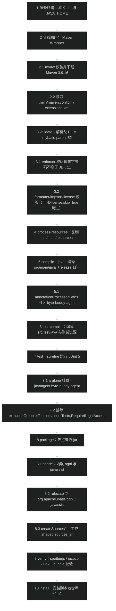

# MyBatis 3 编译与运行流程
> 上次修改：2026-07-28 21:34

## 技术栈与依赖

MyBatis 3 是一个**纯 Java 库项目**（单 Maven 模块，无可执行 main 入口、无 Web 容器、无 Docker 镜像），其定位是把 Java 对象与 SQL 语句/存储过程解耦的 SQL Mapper 框架。因此本文的"运行流程"不是"启动一个服务"，而是"把构建产物作为依赖引入宿主应用并通过 `SqlSessionFactoryBuilder` 驱动"，以及"通过测试用例运行框架代码观察行为"。

技术栈构成（依据 `pom.xml`）：

- **语言与字节码级别**：Java 11。`pom.xml` 中 `<java.version>11</java.version>`、`<java.release.version>11</java.release.version>`，并由 `maven-enforcer-plugin` 的 `enforceBytecodeVersion` 规则强制约束依赖字节码不超过 JDK 11（`ignoredScopes` 为 `provided,test`，即测试/provided 依赖不受此限制）。
- **数据访问底座**：JDBC。项目本身不绑定任何具体数据库驱动，运行期驱动由宿主应用提供；测试期才引入 HSQLDB/H2/Derby/PostgreSQL/MySQL/Oracle 驱动。
- **构建工具**：Maven，继承 `org.mybatis:mybatis-parent:52`（`<relativePath />` 表示强制从仓库解析父 POM，不查找本地上级目录）。仓库自带 Maven Wrapper（`mvnw` / `mvnw.cmd`），`.mvn/wrapper/maven-wrapper.properties` 固定 Maven 3.9.16。
- **动态 SQL 表达式引擎**：OGNL（`ognl:ognl`，`optional`）。
- **延迟加载代理**：Javassist（`org.javassist:javassist`，`optional`，默认代理工厂）与 CGLIB（`cglib:cglib`，`optional`，兼容用途）。
- **可插拔日志门面**：SLF4J、Log4j2 API、reload4j、commons-logging 均为 `optional`，运行期按 classpath 探测选择，均不存在时回退 JDK14 Logging / 无日志实现。
- **打包增强**：`maven-shade-plugin` 在 `package` 阶段把 `ognl` 与 `javassist` 重定位（relocate）进 `org.apache.ibatis.ognl` / `org.apache.ibatis.javassist` 并内联进最终 jar，因此发布的 `mybatis` jar 自带这两个库，宿主应用无需再显式声明（这也解释了为何它们在 POM 中是 `optional`）。
- **OSGi 支持**：`osgi.export` 导出 `org.apache.ibatis.*` 与 shade 后的 `org.apache.ibatis.javassist.util.proxy`，`osgi.import` 全部标记为 `resolution:=optional`。
- **代码规范工具链**（由 parent 提供，本地由 git hook 触发）：`formatter-maven-plugin`（`formatter:validate` / `formatter:format`）、`impsort-maven-plugin`（`impsort:check` / `impsort:sort`）、`license-maven-plugin`（CI 中常用 `-Dlicense.skip=true` 跳过）、`spotbugs`（`spotbugs.onlyAnalyze=org.apache.ibatis.*`）、`clirr`（比对基线版本 3.4.6）、`jacoco`（排除 shade 进来的 ognl/javassist 包）。
- **Maven 扩展**：`.mvn/extensions.xml` 注册 `fr.jcgay.maven:maven-profiler:3.3`，可用 `-Dprofile` 打开构建耗时分析。

关键命令速查（本文档所列命令均为供人工执行的说明，本次分析未实际执行）：

| 目的 | 命令 |
|------|------|
| 完整构建（编译 + 测试 + shade 打包 + 安装到本地仓库） | `./mvnw clean install` |
| 只编译主源码 | `./mvnw clean compile` |
| 编译主源码 + 测试源码 | `./mvnw test-compile` |
| 跳过测试打包 | `./mvnw clean package -DskipTests` |
| 跑全部默认测试 | `./mvnw test` |
| 跑单个测试类 | `./mvnw test -Dtest=AutoConstructorTest` |
| 打开 Testcontainers 集成测试 | `./mvnw test -PtestContainers` |
| 生成覆盖率报告 | `./mvnw test jacoco:report` |
| 生成站点文档 | `./mvnw site site:stage -DskipTests` |
| 安装 git pre-commit 钩子 | `./mvnw git-build-hook:install` |

### 主要依赖清单

项目坐标：`org.mybatis:mybatis:3.6.0-SNAPSHOT`（`pom.xml` L30-L32）。依赖分为三类：**编译期 optional 依赖**（进入编译 classpath，但不传递给使用者）、**provided 依赖**（仅编译/文档期需要）、**测试期依赖**（`scope=test`）。

#### 编译期依赖（compile / optional）

| 依赖 | 版本 | scope / optional | 用途 |
|------|------|------------------|------|
| `ognl:ognl` | 3.4.11 | compile, optional | 动态 SQL 中 `<if test="...">`、`<foreach>` 等表达式求值引擎；shade 时重定位为 `org.apache.ibatis.ognl` 并内联入 jar |
| `org.javassist:javassist` | 3.32.0-GA | compile, optional | 默认延迟加载代理工厂（字节码生成）；shade 时重定位为 `org.apache.ibatis.javassist` 并内联入 jar |
| `cglib:cglib` | 3.3.0 | compile, optional | 备选延迟加载代理实现（`CglibProxyFactory`）；**不**参与 shade，需要时由宿主应用自行引入 |
| `ch.qos.reload4j:reload4j` | 1.2.26 | compile, optional | Log4j 1.x 兼容日志实现适配 |
| `commons-logging:commons-logging` | 1.4.0 | compile, optional | JCL 日志门面适配 |
| `org.apache.logging.log4j:log4j-api` | 2.26.1（`log4j.version`） | compile, optional | Log4j2 日志适配 |
| `org.slf4j:slf4j-api` | 2.0.18 | compile, optional | SLF4J 日志门面适配 |
| `org.gaul:modernizer-maven-annotations` | 跟随 parent 的 `modernizer.plugin` | provided | 提供 `@SuppressModernizer` 注解，仅编译期可见（POM 注释说明 parent 53 发布后可移除） |
| `com.microsoft.sqlserver:mssql-jdbc` | 13.4.0.jre11 | provided | 仅为 Javadoc 链接解析引入，不进入运行期 |

说明：所有日志适配依赖都是 `optional`，MyBatis 在运行期通过 `LogFactory` 逐个尝试加载，缺失即跳到下一个候选，因此宿主应用只需引入自己实际使用的那一种日志实现。`ognl` / `javassist` 标为 `optional` 且被 shade 内联，是为了让 IDE 在阅读源码时能解析类，同时避免向使用者传递重复依赖。

#### 测试期依赖（scope=test）

| 依赖 | 版本 | 用途 |
|------|------|------|
| `org.junit.jupiter:junit-jupiter-engine` | 6.1.2 | JUnit 5 测试引擎 |
| `org.junit.jupiter:junit-jupiter-params` | 6.1.2 | 参数化测试（`@ParameterizedTest`） |
| `org.mockito:mockito-core` / `mockito-subclass` / `mockito-junit-jupiter` | 5.23.0（`mockito.version`） | Mock JDBC 组件；`mockito-subclass` 用于无 inline agent 场景 |
| `org.assertj:assertj-core` | 3.27.7 | 流式断言 |
| `net.bytebuddy:byte-buddy` / `byte-buddy-agent` | 1.18.11（`byte-buddy.version`） | 字节码生成与 Java agent；`byte-buddy-agent` 同时作为 surefire `-javaagent` 与编译期 annotation processor path |
| `com.github.hazendaz.catch-exception:catch-exception` | 2.4.0 | 异常捕获断言辅助 |
| `org.hsqldb:hsqldb` | 2.7.4 | 内存数据库，绝大多数测试的默认库 |
| `com.h2database:h2` | 2.4.240 | 内存数据库 |
| `org.apache.derby:derby` / `derbyshared` / `derbyoptionaltools` | 10.17.1.0（`derby.version`，JDK 17 profile 下降为 10.16.1.1） | 内存/嵌入式数据库，覆盖不同 SQL 方言 |
| `org.postgresql:postgresql` | 42.7.13 | refcursor / 游标类测试所需驱动 |
| `com.mysql:mysql-connector-j` | 9.7.0 | MySQL 容器测试驱动 |
| `com.oracle.database.jdbc:ojdbc11` | 23.26.2.0.0 | Oracle 容器测试驱动 |
| `org.apache.velocity:velocity-engine-core` | 2.4.1 | 语言驱动/脚本相关测试 |
| `org.testcontainers:junit-jupiter` / `postgresql` / `mysql` / `oracle-free` | 1.21.4（`testcontainers.version`） | 真实数据库容器化集成测试，需要可用 Docker |
| `ch.qos.logback:logback-classic` | 1.6.0 | 测试期 SLF4J 实现，验证日志适配 |
| `org.apache.logging.log4j:log4j-core` | 2.26.1 | 测试期 Log4j2 实现，验证日志适配 |

注：`derby.version` 会被 JDK profile 覆盖 —— `pom.xml` 的 `17` profile（`[17,)`）设为 10.16.1.1，`19` profile（`[19,)`）又设回 10.17.1.0；Maven 会激活所有匹配的 profile，因此在 JDK 19+ 上最终生效值取决于 profile 声明顺序（`19` 在 `17` 之后声明，故为 10.17.1.0）。

### 环境要求

| 项 | 要求 | 依据 |
|------|------|------|
| 操作系统 | 与平台无关（Linux / macOS / Windows 均可）。CI 矩阵覆盖 `ubuntu-latest` / `macos-latest` / `windows-latest` | `.github/workflows/ci.yaml` L20 |
| JDK（编译目标） | 字节码目标 Java 11，产出可在 JDK 11+ 上运行 | `pom.xml` L67-L68 |
| JDK（本地构建） | 建议 JDK 17 / 21 / 25 等 LTS。CI 使用 Temurin 21 / 25 / 26；`17`、`19` profile 会按 JDK 版本切换 Derby 版本 | `.github/workflows/ci.yaml` L19，`pom.xml` L468-L485 |
| Maven | 无需预装，`mvnw` 会自动下载 Apache Maven 3.9.16（带 SHA-256 校验）。若使用系统 `mvn`，需 3.9.x 及以上以支持 `.mvn/extensions.xml` 与 `maven.config` | `.mvn/wrapper/maven-wrapper.properties`，`mvnw` |
| `JAVA_HOME` | 必需。`mvnw` 头部注释明确 `Required ENV vars: JAVA_HOME` | `mvnw` L26-L27 |
| 内存 | 测试 JVM 固定 `-Xmx2048m`（surefire `argLine`），因此建议机器可用内存 ≥ 4 GB；`.mvn/jvm.config` 为空文件，Maven 本身用默认堆 | `pom.xml` L97 |
| 磁盘 | 需容纳本地仓库中的测试依赖（Testcontainers、多个 JDBC 驱动、Derby 等），建议预留 1-2 GB；构建产物本身很小 | `pom.xml` L133-L281 |
| 网络 | 首次构建需访问 Maven Central：下载 wrapper 发行包、父 POM `org.mybatis:mybatis-parent:52`（`relativePath` 为空，只能从仓库解析）及全部依赖 | `pom.xml` L23-L28 |
| Docker | **仅** Testcontainers 分组集成测试需要（默认被排除，不需要 Docker 即可完成常规构建） | `pom.xml` L83，`.github/workflows/ci.yaml` L33-L35 |

## 编译流程

整体构建是一条标准的 Maven 单模块生命周期，特殊之处集中在两点：`maven-shade-plugin` 在 `package` 阶段重写 jar 内容（重定位 ognl/javassist 并同时生成 sources jar），以及 surefire 通过 `argLine` 挂载 byte-buddy agent 并默认排除两个测试分组。



1-2 环境与工具链准备阶段。确认 `JAVA_HOME` 指向 JDK 11 或更高版本，然后进入源码根目录直接使用仓库自带的 `./mvnw`（Windows 用 `mvnw.cmd`）；wrapper 会按 `.mvn/wrapper/maven-wrapper.properties` 中的 `distributionUrl` 下载 Apache Maven 3.9.16 并用 `distributionSha256Sum` 校验完整性，随后 Maven 自动读取 `.mvn/maven.config`（追加 `-Daether.checksums.algorithms=SHA-512,SHA-256,SHA-1,MD5`、`-Daether.connector.smartChecksums=false`、`--no-transfer-progress`）与 `.mvn/extensions.xml`（加载 maven-profiler 扩展）。这一步若失败通常是网络无法访问 Maven Central，或 `JAVA_HOME` 未设置。

3-4 校验与资源准备阶段。Maven 先从远程仓库解析 `org.mybatis:mybatis-parent:52`（`<relativePath />` 强制走仓库），父 POM 带来绝大多数插件的版本与配置；本项目额外覆写 `maven-enforcer-plugin`，用 `enforceBytecodeVersion` 保证 compile 作用域依赖的字节码不高于 Java 11（`provided`/`test` 被 `ignoredScopes` 排除）。同阶段父 POM 的 `formatter:validate`、`impsort:check`、`license:check` 会校验代码格式、import 顺序与许可证头，CI 中统一通过 `-Dlicense.skip=true` 跳过许可证检查以加速。随后 `process-resources` 把 `src/main/resources`（含 `org/apache/ibatis/builder/*.dtd`、`*.xsd` 等 DTD/XSD 资源）复制到 `target/classes`。

5-6 编译阶段。`compile` 用 `--release 11` 编译 `src/main/java` 下 393 个 Java 文件到 `target/classes`；`maven-compiler-plugin` 被显式配置了 `annotationProcessorPaths`，把 `byte-buddy-agent` 放进注解处理器路径以避免它污染主 classpath。`test-compile` 接着编译 `src/test/java` 下约 1002 个测试类到 `target/test-classes`，并复制 `src/test/resources` 中的 `mybatis-config.xml`、`*Mapper.xml`、`CreateDB.sql` 等测试资源。仅需编译不跑测试时用 `./mvnw clean test-compile`。

7 测试阶段。surefire 以 `argLine` 指定的 `-Xmx2048m` 与 `-javaagent:<localRepo>/net/bytebuddy/byte-buddy-agent/1.18.11/byte-buddy-agent-1.18.11.jar` 启动 forked JVM（agent 供 Mockito 做 inline mock），并注入 `derby.stream.error.file` / `derby.system.home` 系统属性把 Derby 日志与数据文件收敛到 `target/` 下；默认 `excludedGroups=TestcontainersTests,RequireIllegalAccess` 跳过需要 Docker 的容器测试与已失效的非法访问测试。打包时若要跳过测试用 `-DskipTests`（跳过执行）或 `-Dmaven.test.skip=true`（连测试编译一起跳过）。

8 打包与 shade 阶段。`maven-jar-plugin` 先产出常规 jar，随后 `maven-shade-plugin` 的 `shade` 目标绑定在 `package` 阶段执行：`artifactSet` 只纳入 `org.mybatis:mybatis`、`ognl:ognl`、`org.javassist:javassist` 三个构件，过滤掉后两者的 `META-INF/MANIFEST.MF`，把包名 `ognl` → `org.apache.ibatis.ognl`、`javassist` → `org.apache.ibatis.javassist` 重定位，并以 `createSourcesJar=true` + `shadeSourcesContent=true` 生成同样完成重定位的 sources jar；`createDependencyReducedPom=false` 表示不生成裁剪后的 POM。`release` profile 会把 `maven-source-plugin:jar-no-fork` 提前到 `prepare-package` 且 `attach=false`，让 shade 接管 sources jar 的附加，避免重复 attach。

9-10 校验与安装阶段。`verify` 阶段执行父 POM 配置的质量插件：spotbugs 只分析 `org.apache.ibatis.*`（`spotbugs.onlyAnalyze`），jacoco 排除 `org.apache.ibatis.ognl.*` 与 `org.apache.ibatis.javassist.*` 以免统计第三方代码，clirr 与基线版本 3.4.6 比对二进制兼容性，OSGi 相关插件按 `osgi.export`/`osgi.import`/`osgi.dynamicImport` 生成 bundle 元数据。最后 `install` 把 shaded jar、sources jar、javadoc jar 与 POM 安装进 `~/.m2/repository/org/mybatis/mybatis/3.6.0-SNAPSHOT/`，供本地其他工程以依赖方式使用。

### 编译环境准备

1. **安装 JDK 并设置 `JAVA_HOME`**。字节码目标是 Java 11，但本地用 JDK 17/21/25 均可（CI 使用 21/25/26）。校验命令：

   ```bash
   java -version
   echo $JAVA_HOME          # Windows: echo %JAVA_HOME%
   ```

2. **不需要预装 Maven**。使用仓库自带 wrapper，首次执行会自动下载 Maven 3.9.16 到 `~/.m2/wrapper/`：

   ```bash
   cd /path/to/mybatis-3
   ./mvnw -version          # Windows: mvnw.cmd -version
   ```

   注意 `.mvn/wrapper/maven-wrapper.jar` 已被 `.gitignore` 忽略，属于首次运行时由 `mvnw` 按 `wrapperUrl` + `wrapperSha256Sum` 下载生成的文件。

3. **确认可访问 Maven Central**。父 POM `org.mybatis:mybatis-parent:52` 声明了 `<relativePath />`，无法从本地目录解析，必须能从远程仓库下载；离线环境需要先预热本地仓库再用 `-o` 离线构建。

4. **（可选）安装 git pre-commit 钩子**。`git-build-hook-maven-plugin` 的 `install` 目标已绑定到默认生命周期，构建时会自动把 `hooks/pre-commit.sh` 装为 `pre-commit` 钩子；也可单独执行：

   ```bash
   ./mvnw git-build-hook:install
   ```

   该钩子会运行 `mvn formatter:validate impsort:check`，不通过时自动执行 `mvn formatter:format impsort:sort` 并中断本次提交，要求重新选择变更后再提交。

5. **（可选）准备 Docker**。只有需要运行 Testcontainers 分组集成测试时才需要本机可用的 Docker daemon，常规编译与默认测试不依赖 Docker（仓库内不存在 Dockerfile）。

### 编译步骤

下列步骤对应上面流程图的一级节点，每步给出"做什么"与命令。

1. **清理旧产物** —— 删除 `target/`，避免上一次 shade 结果与增量编译产物干扰。

   ```bash
   ./mvnw clean
   ```

2. **只编译主源码** —— 快速验证 `src/main/java` 是否能通过 `--release 11` 编译，不触碰测试代码。

   ```bash
   ./mvnw compile
   ```

   常用组合：`./mvnw clean compile -Dlicense.skip=true`（跳过许可证头校验，加快本地迭代）。

3. **编译主源码 + 测试源码** —— 让 IDE/CLI 双方都能编译测试类，是"改完代码想跑单测"前的最小步骤。

   ```bash
   ./mvnw test-compile
   ```

4. **打包（含默认测试与 shade）** —— 产出可发布的 jar。若只想拿 jar，可跳过测试。

   ```bash
   ./mvnw package                  # 跑默认测试后打包
   ./mvnw package -DskipTests      # 跳过测试执行（仍编译测试类）
   ./mvnw package -Dmaven.test.skip=true   # 连测试编译一起跳过
   ```

5. **安装到本地仓库** —— 让本机其他工程能以 `org.mybatis:mybatis:3.6.0-SNAPSHOT` 依赖到你本地改动后的版本，这是"运行流程"的前置条件。

   ```bash
   ./mvnw clean install -DskipTests -Dlicense.skip=true
   ```

6. **完整验证（等价 CI 强度）** —— 跑测试 + spotbugs + jacoco + clirr 等校验。

   ```bash
   ./mvnw clean verify
   ```

7. **（可选）格式与 import 修复** —— 提交前对齐项目代码风格，避免被 pre-commit 钩子拦截。

   ```bash
   ./mvnw formatter:format impsort:sort
   ./mvnw formatter:validate impsort:check
   ```

8. **（可选）构建耗时分析** —— 借助 `.mvn/extensions.xml` 注册的 maven-profiler 定位慢插件。

   ```bash
   ./mvnw clean install -Dprofile
   ```

9. **（可选）生成站点文档** —— `src/site` 下有 6 种语言的 xdoc/markdown 文档，站点插件配置了 `locales=default,es,ja,fr,zh_CN,ko`。

   ```bash
   ./mvnw site site:stage -DskipTests -Dlicense.skip=true
   ```

   产物位于 `target/staging`（CI 的 site 工作流会把该目录发布到 `gh-pages` 分支）。

### 编译产物说明

所有产物统一输出到 `target/`（已被 `.gitignore` 忽略）。

| 产物 | 位置 | 说明 |
|------|------|------|
| 主编译输出 | `target/classes/` | `org/apache/ibatis/**/*.class` 及从 `src/main/resources` 复制的 DTD/XSD 等资源 |
| 测试编译输出 | `target/test-classes/` | 测试类 + `src/test/resources` 下的 `mybatis-config.xml`、Mapper XML、建表 SQL |
| 发布 jar | `target/mybatis-3.6.0-SNAPSHOT.jar` | shade 后的成品：包含 `org.apache.ibatis.*` 以及重定位后的 `org.apache.ibatis.ognl.*`、`org.apache.ibatis.javassist.*`，并带 OSGi bundle 元数据与 `Automatic-Module-Name: org.mybatis` |
| 源码 jar | `target/mybatis-3.6.0-SNAPSHOT-sources.jar` | 由 shade 的 `createSourcesJar` + `shadeSourcesContent` 生成，源码中的包名同样已重定位，便于 IDE 调试时源码与字节码一致 |
| Javadoc jar | `target/mybatis-3.6.0-SNAPSHOT-javadoc.jar` | 由父 POM 的 javadoc 插件在 release/verify 相关阶段生成 |
| 测试报告 | `target/surefire-reports/` | 每个测试类的 `.txt` 与 `.xml` 报告 |
| 覆盖率数据 | `target/jacoco.exec`、`target/site/jacoco/` | 需执行 `jacoco:report` 才生成 HTML/XML 报告 |
| 静态检查报告 | `target/spotbugsXml.xml`、`target/site/` | spotbugs 与站点报告 |
| Derby 运行残留 | `target/derby.log`、`target/<dbname>/` | 由 surefire 的 `derby.stream.error.file` / `derby.system.home` 系统属性重定向而来；若在 IDE 中不设这两个属性，会在项目根目录生成 `ibderby` 与 `derby.log`（两者已在 `.gitignore` 中） |
| 站点文档 | `target/site/`、`target/staging/` | 多语言站点，`site:stage` 后用于发布 gh-pages |

`project.build.outputTimestamp=1735704225` 使 jar 内条目时间戳固定，保证**可重现构建**（相同源码在不同机器产出字节一致的 jar）。

## 运行流程

**MyBatis 3 没有可执行入口**：`src/main/java` 中不存在 `public static void main`，`pom.xml` 未配置 `maven-jar-plugin` 的 `mainClass`，也没有 exec/spring-boot 一类的运行插件。因此"运行"有且只有两条路径：

1. 把构建产物作为依赖引入宿主应用，通过 `SqlSessionFactoryBuilder` → `SqlSessionFactory` → `SqlSession` 的 API 驱动；
2. 直接在本仓库内运行某个测试用例，用内存数据库观察框架真实行为（调试源码时最常用）。

### 本地运行

#### 方式一：作为依赖引入宿主应用

第 1 步，把本地构建的快照安装进本地仓库：

```bash
./mvnw clean install -DskipTests -Dlicense.skip=true
```

第 2 步，在宿主工程声明依赖（坐标取自 `pom.xml` L30-L32）：

```xml
<dependency>
  <groupId>org.mybatis</groupId>
  <artifactId>mybatis</artifactId>
  <version>3.6.0-SNAPSHOT</version>
</dependency>
```

Gradle 写法：

```groovy
implementation 'org.mybatis:mybatis:3.6.0-SNAPSHOT'
```

第 3 步，按需补齐 MyBatis 自己不提供的运行期依赖。由于 shade 已把 ognl 与 javassist 内联进 jar，宿主**无需**再引入这两者；但下列依赖必须自行提供：

- **JDBC 驱动**（必需）：MyBatis 只依赖 `java.sql`，具体驱动由宿主决定，例如 HSQLDB、H2、MySQL、PostgreSQL。
- **日志实现**（可选）：想用 SLF4J 就引入 `slf4j-api` + 一个绑定（如 logback-classic），想用 Log4j2 就引入 `log4j-api` + `log4j-core`；都不引入时 MyBatis 回退到 JDK14 Logging 或 NoLogging。因为这些依赖在 MyBatis POM 中是 `optional`，不会被传递引入。
- **CGLIB**（可选）：仅当把延迟加载代理工厂显式切换为 CGLIB 时才需要 `cglib:cglib`，它未被 shade。

第 4 步，用 `SqlSessionFactoryBuilder` 启动。下面示例的结构与仓库内测试 `src/test/java/org/apache/ibatis/autoconstructor/AutoConstructorTest.java` 完全一致（该测试正是"最小可运行样例"的现成参照）：

```java
import java.io.Reader;
import org.apache.ibatis.io.Resources;
import org.apache.ibatis.session.SqlSession;
import org.apache.ibatis.session.SqlSessionFactory;
import org.apache.ibatis.session.SqlSessionFactoryBuilder;

public class Bootstrap {
  public static void main(String[] args) throws Exception {
    // 1) 读取 mybatis-config.xml（放在 classpath 上）
    SqlSessionFactory factory;
    try (Reader reader = Resources.getResourceAsReader("mybatis-config.xml")) {
      // 可选重载：build(reader, environmentId) / build(reader, properties)
      factory = new SqlSessionFactoryBuilder().build(reader);
    }

    // 2) 打开会话；try-with-resources 保证 Connection 归还
    try (SqlSession session = factory.openSession()) {
      // 3) 取 Mapper 代理并执行查询
      UserMapper mapper = session.getMapper(UserMapper.class);
      System.out.println(mapper.selectById(1));

      // 4) 写操作需显式提交（openSession() 默认不自动提交）
      // session.commit();
    }
  }
}
```

配套的最小 `mybatis-config.xml`（形态与 `src/test/resources/org/apache/ibatis/autoconstructor/mybatis-config.xml` 一致）：

```xml
<!DOCTYPE configuration PUBLIC "-//mybatis.org//DTD Config 3.0//EN"
    "https://mybatis.org/dtd/mybatis-3-config.dtd">
<configuration>
  <environments default="development">
    <environment id="development">
      <transactionManager type="JDBC"/>
      <dataSource type="UNPOOLED">
        <property name="driver" value="org.hsqldb.jdbcDriver"/>
        <property name="url" value="jdbc:hsqldb:mem:demo"/>
        <property name="username" value="sa"/>
        <property name="password" value=""/>
      </dataSource>
    </environment>
  </environments>
  <mappers>
    <mapper resource="UserMapper.xml"/>
  </mappers>
</configuration>
```

也可以完全用 Java 配置绕开 XML：构造 `Environment`（`JdbcTransactionFactory` + `DataSource`）→ `new Configuration(environment)` → `configuration.addMapper(UserMapper.class)` → `new SqlSessionFactoryBuilder().build(configuration)`。

#### 方式二：在本仓库内跑单个测试观察框架行为

阅读源码时"运行"框架的最快方式是执行一个测试类，它会用 HSQLDB/H2/Derby 内存库真实走完一次 SQL 映射链路：

```bash
# 跑单个测试类
./mvnw test -Dtest=AutoConstructorTest

# 跑单个测试方法
./mvnw test -Dtest=AutoConstructorTest#fullyPopulatedSubject

# 按包/通配符批量跑
./mvnw test -Dtest='org.apache.ibatis.binding.*Test'

# 只跑测试、跳过许可证与格式校验，缩短反馈时间
./mvnw test -Dtest=AutoConstructorTest -Dlicense.skip=true

# 打开调试端口（IDE 远程连接 5005）观察断点
./mvnw test -Dtest=AutoConstructorTest -Dmaven.surefire.debug
```

需要看 MyBatis 内部执行的 SQL 与参数时，测试期已提供 logback-classic 与 log4j-core，可在 `src/test/resources` 下的日志配置中把 `org.apache.ibatis` 或具体 Mapper 接口的日志级别调到 DEBUG。

若测试涉及 Derby，建议保留 surefire 注入的 `derby.system.home`/`derby.stream.error.file` 语义；在 IDE 里直接右键运行时这两个属性缺失，Derby 会在项目根目录写 `ibderby/` 与 `derby.log`（已被 `.gitignore` 忽略，但会污染工作区），可在 IDE 运行配置中手动补上：

```text
-Xmx2048m
-Dderby.system.home=<项目根>/target
-Dderby.stream.error.file=<项目根>/target/derby.log
-javaagent:<本地仓库>/net/bytebuddy/byte-buddy-agent/1.18.11/byte-buddy-agent-1.18.11.jar
```

### Docker 运行（可选）

**不适用（无镜像交付）**。仓库根目录及各级目录均不存在 `Dockerfile`、`docker-compose.yml` 或 `.dockerignore`；本项目是库而非可部署服务，不产出容器镜像。

Docker 在本项目中只以**测试基础设施**的身份出现：`org.testcontainers:junit-jupiter` / `postgresql` / `mysql` / `oracle-free`（1.21.4）在测试期由 Testcontainers 自动拉起真实数据库容器。这类测试被 `@Tag("TestcontainersTests")` 标记并默认排除，具体运行方式见"集成测试"一节。因此本机是否安装 Docker 不影响编译与默认测试。

### 运行配置说明

#### 构建期可调开关

| 参数 / 配置 | 默认值 | 作用 | 来源 |
|-------------|--------|------|------|
| `-DskipTests` | 未设置 | 编译测试类但不执行 | Maven surefire 通用 |
| `-Dmaven.test.skip=true` | 未设置 | 连测试编译一起跳过 | Maven 通用 |
| `-Dtest=<类#方法>` | 未设置 | 指定运行的测试类/方法 | surefire |
| `-D"excludedGroups="` | `TestcontainersTests,RequireIllegalAccess` | 清空排除分组以运行全部测试（README 特别提示 Windows/PowerShell 下用 `-d"excludedGroups="` 形式引号） | `pom.xml` L80-L83，`README.md` L29 |
| `-PtestContainers` | 未激活 | 只保留 `RequireIllegalAccess` 排除，从而放行 Testcontainers 测试 | `pom.xml` L462-L467 |
| `-Dlicense.skip=true` | 未设置 | 跳过许可证头校验，CI 各工作流普遍使用 | `.github/workflows/*.yaml` |
| `-Dprofile` | 未设置 | 启用 maven-profiler 输出各插件耗时 | `.mvn/extensions.xml` |
| `argLine` | `-Xmx2048m -javaagent:.../byte-buddy-agent-1.18.11.jar` | 测试 JVM 堆与 Mockito inline agent；自定义时需保留 agent 否则部分 mock 测试失败 | `pom.xml` L97 |
| `derby.stream.error.file` / `derby.system.home` | `${project.build.directory}/derby.log` / `${project.build.directory}` | 把 Derby 日志与数据库文件收敛到 `target/` | `pom.xml` L343-L352 |
| `clirr.comparisonVersion` | `3.4.6` | 二进制兼容性比对基线版本 | `pom.xml` L70 |
| `spotbugs.onlyAnalyze` | `org.apache.ibatis.*` | 限制静态分析范围，排除 shade 进来的第三方包 | `pom.xml` L94 |
| JDK profile `17` / `19` | 按 JDK 版本自动激活 | 切换 Derby 版本以匹配 JDK 的 class file 要求 | `pom.xml` L468-L485 |
| profile `release` | 未激活 | 把 sources jar 生成提前到 `prepare-package` 且不 attach，交由 shade 附加重定位后的源码 | `pom.xml` L490-L512 |

#### 环境变量

本项目自身运行不读取任何环境变量；下列变量只服务于构建/发布链路：

- `JAVA_HOME`：`mvnw` 必需。
- `MAVEN_OPTS`：可选，调节 Maven 自身 JVM 参数（`.mvn/jvm.config` 为空文件，未预设）。
- `CI_DEPLOY_USERNAME` / `CI_DEPLOY_PASSWORD`：`.mvn/settings.xml` 中 `central` server 的凭据，用于快照/正式版发布。
- `GITHUB_TOKEN`：站点发布与 coveralls/sonar 上报使用。
- `NVD_API_KEY`：`dependency-check-plugin` 访问 NVD 漏洞库。

#### 库使用方的运行期配置

作为库被引入后，行为由宿主提供的 `mybatis-config.xml`（或等价 Java `Configuration`）决定，关键项包括 `<environments>` 下的 `transactionManager`（`JDBC` / `MANAGED`）与 `dataSource`（`UNPOOLED` / `POOLED` / `JNDI`）、`<settings>` 下的 `lazyLoadingEnabled`、`proxyFactory`（`JAVASSIST` 默认 / `CGLIB`）、`logImpl`（`SLF4J` / `LOG4J2` / `JDK_LOGGING` / `NO_LOGGING` 等）、`cacheEnabled`、`defaultExecutorType`。这些配置的解析逻辑位于 `src/main/java/org/apache/ibatis/session/Configuration.java` 与 `src/main/java/org/apache/ibatis/builder/xml/XMLConfigBuilder.java`，校验用的 DTD 位于 `src/main/resources/org/apache/ibatis/builder/xml/`。

## 测试流程（如适用）

本项目**有完整测试模块**（`hasTests=true`）：`src/test/java` 下约 1002 个 Java 文件，`src/test/resources` 提供配套的 `mybatis-config.xml`、Mapper XML 与建表 SQL。测试框架为 **JUnit 5（Jupiter 6.1.2）**，配合 Mockito 5.23.0、AssertJ 3.27.7、catch-exception 2.4.0，由 `maven-surefire-plugin` 驱动。

单元测试与集成测试在同一个 Maven 模块、同一个 surefire 执行中运行，两者的区分**不靠目录也不靠 failsafe，而是靠 JUnit `@Tag` 分组 + `excludedGroups`**：

- 默认（`pom.xml` L83）：`excludedGroups=TestcontainersTests,RequireIllegalAccess`，即跳过需要 Docker 的容器测试与已失效的非法访问测试；
- `testContainers` profile（`pom.xml` L462-L467）把 `excludedGroups` 覆盖为仅 `RequireIllegalAccess`，从而放行 Testcontainers 测试。

README 记录了不同组合下的用例数量：不调整设置时（任意 OS + JDK 21/25）为 1899 个；Linux + `-PtestContainers` 时为 1934 个，差值即容器化集成测试的规模。

测试编译与运行的公共前提：`./mvnw test-compile` 会把测试类编译到 `target/test-classes`，测试资源复制到同一目录；surefire fork 出的 JVM 使用 `argLine` 指定的 `-Xmx2048m` 与 `-javaagent` byte-buddy-agent。

### 单元测试

**范围**：所有未打 `TestcontainersTests` / `RequireIllegalAccess` 标签的测试。它们要么是纯逻辑单测（反射工具、类型处理器、SQL 构建、缓存、脚本解析等），要么用 HSQLDB / H2 / Derby **内存库**跑端到端映射（`org.apache.ibatis.submitted.*` 下大量回归用例属于此类），不需要外部服务。

**目录结构**：

- `src/test/java/org/apache/ibatis/**` —— 与 `src/main/java` 同包镜像，例如 `binding/`、`builder/`、`executor/`、`mapping/`、`reflection/`、`scripting/`、`session/`、`type/`；
- `src/test/java/org/apache/ibatis/submitted/**` —— 按 issue/场景命名的回归测试，每个子目录自带 Mapper 接口与实体；
- `src/test/resources/org/apache/ibatis/**` —— 与测试类同包的 `mybatis-config.xml`、`*Mapper.xml`、`CreateDB.sql`；
- `src/test/java/org/apache/ibatis/BaseDataTest.java` —— 公共基类，提供 `runScript(dataSource, resource)` 等建库辅助方法，是绝大多数集成型单测的初始化入口。

**编译与运行命令**：

```bash
# 只编译测试代码（验证测试是否可编译）
./mvnw test-compile

# 运行默认分组的全部测试
./mvnw test

# 与 CI 完全一致的调用方式
./mvnw test --batch-mode --no-transfer-progress --show-version -D"license.skip=true"

# 单类 / 单方法 / 通配
./mvnw test -Dtest=AutoConstructorTest
./mvnw test -Dtest=AutoConstructorTest#fullyPopulatedSubject
./mvnw test -Dtest='*TypeHandlerTest'

# 失败后继续跑完其余测试
./mvnw test -Dmaven.test.failure.ignore=true
```

**典型用例形态**（以 `src/test/java/org/apache/ibatis/autoconstructor/AutoConstructorTest.java` 为例）：`@BeforeAll` 中用 `Resources.getResourceAsReader(...)` 读取同包下的 `mybatis-config.xml`，`new SqlSessionFactoryBuilder().build(reader)` 建出工厂，再用 `BaseDataTest.runScript(...)` 执行 `CreateDB.sql` 建表灌数；每个 `@Test` 用 try-with-resources 开 `SqlSession`、`getMapper` 后断言。这种写法既是测试，也是最好的 API 使用示例。

**报告位置**：`target/surefire-reports/`（每类一份 `.txt` + `.xml`）。

**注意事项**：

- 覆写 `argLine` 时必须保留 `-javaagent` byte-buddy-agent，否则依赖 inline mock 的测试会失败；
- `RequireIllegalAccess` 分组（如 `CglibProxyTest`、`OgnlStaticTest`、`LazyPropertiesTest` 等 6 个类）依赖 Java 16 之前的非法反射访问，`pom.xml` L82 的注释已说明它们**不再有效**，即使清空 `excludedGroups` 也预期失败，因此不要用 `-D"excludedGroups="` 作为"跑全量"的常规做法。

### 集成测试

**范围**：打了 `@Tag("TestcontainersTests")` 的测试类，用 Testcontainers 1.21.4 拉起**真实数据库容器**，覆盖内存库无法模拟的特性（游标 / REFCURSOR、多结果集、生成主键列、网络超时、SQLXML 等）。当前共 12 个类：

| 测试类（`src/test/java/` 下） | 覆盖点 | 容器 |
|------|------|------|
| `org/apache/ibatis/datasource/pooled/MysqlTimeoutTest.java` | 池化数据源连接超时 | MySQL |
| `org/apache/ibatis/datasource/unpooled/NetworkTimeoutTest.java` | 非池化数据源网络超时 | MySQL |
| `org/apache/ibatis/submitted/cursor_simple/MysqlCursorTest.java` | Cursor 流式查询 | MySQL |
| `org/apache/ibatis/submitted/cursor_simple/PostgresCursorTest.java` | Cursor 流式查询 | PostgreSQL |
| `org/apache/ibatis/submitted/dirty_select/DirtySelectTest.java` | select 触发写操作的脏标记 | PostgreSQL |
| `org/apache/ibatis/submitted/keycolumn/InsertTest.java` | `keyColumn` 主键回填 | PostgreSQL |
| `org/apache/ibatis/submitted/multiple_resultsets/MultipleResultTest.java` | 多结果集映射 | PostgreSQL |
| `org/apache/ibatis/submitted/oracle_cursor/OracleCursorTest.java` | Oracle 游标 | Oracle Free |
| `org/apache/ibatis/submitted/postgres_genkeys/PostgresGeneratedKeysTest.java` | 自增主键返回 | PostgreSQL |
| `org/apache/ibatis/submitted/refcursor/RefCursorTest.java` | 存储过程 REFCURSOR 出参 | PostgreSQL |
| `org/apache/ibatis/submitted/sql/PostgresSQLTest.java` | 方言相关 SQL | PostgreSQL |
| `org/apache/ibatis/type/SqlxmlTypeHandlerTest.java` | `SQLXML` 类型处理器 | PostgreSQL |

**前置条件**：本机存在可用 Docker daemon（Testcontainers 会自行拉取镜像并管理生命周期），且网络可访问镜像仓库。CI 中只在 `ubuntu-latest` 上启用（`.github/workflows/ci.yaml` L33-L35 通过 `TEST_CONTAINERS_PROFILE=-PtestContainers` 环境变量注入），macOS 与 Windows runner 不启用。

**运行命令**：

```bash
# 激活 testContainers profile，放行容器化集成测试
./mvnw test -PtestContainers

# 与 CI ubuntu 任务等价
./mvnw test --batch-mode --no-transfer-progress --show-version -D"license.skip=true" -PtestContainers

# 只跑单个容器测试（便于单点排查，仍需 profile 解除标签排除）
./mvnw test -PtestContainers -Dtest=RefCursorTest
```

**profile 机制说明**：`testContainers` profile 只做一件事 —— 把 `excludedGroups` 从 `TestcontainersTests,RequireIllegalAccess` 覆盖为 `RequireIllegalAccess`。也就是说它**不新增任何依赖或插件执行**，Testcontainers 相关依赖始终在 test classpath 上；不激活 profile 时，这些测试被 surefire 按标签整体跳过，因此无 Docker 环境也能顺利 `./mvnw test`。

**故障排查**：容器测试失败常见原因是 Docker 不可用/权限不足（Linux 上用户未加入 docker 组）、镜像拉取被网络限制、Oracle Free 镜像体积大导致首次超时。这类失败与 MyBatis 代码无关，可先回落到默认分组确认代码本身是否通过。

### 测试覆盖率（可选）

覆盖率由 **JaCoCo** 采集，插件由 `mybatis-parent:52` 提供版本与默认绑定，本项目在 `pom.xml` L416-L425 覆写了 `excludes`，把 shade 进来的第三方包排除在统计之外：

```xml
<excludes>
  <exclude>org.apache.ibatis.ognl.*</exclude>
  <exclude>org.apache.ibatis.javassist.*</exclude>
</excludes>
```

生成报告：

```bash
# 先跑测试产生 target/jacoco.exec，再生成 HTML/XML 报告
./mvnw test jacoco:report

# 报告入口
# target/site/jacoco/index.html
```

CI 侧的两条上报链路（命令可作为本地复现参考）：

- **Coveralls**（`.github/workflows/coveralls.yaml`）：先 `./mvnw test --batch-mode --no-transfer-progress --quiet --show-version -Dlicense.skip=true`，再 `./mvnw generate-sources jacoco:report coveralls:report ... -DrepoToken=... -DserviceName=github`，JDK 25 + ubuntu；
- **SonarCloud**（`.github/workflows/sonar.yaml`）：`./mvnw verify jacoco:report sonar:sonar --batch-mode --no-transfer-progress --show-version -Dlicense.skip=true -Dsonar.host.url=https://sonarcloud.io ...`，仅 master 分支推送触发，需要 `SONAR_TOKEN`。

注意：本地生成的覆盖率数字会低于 CI 的 Linux + `-PtestContainers` 结果，因为默认排除了 12 个容器化集成测试类覆盖的代码路径（README 记录的 1899 vs 1934 用例差）。

## 代码引用索引

| 引用 | 说明 |
|------|------|
| `pom.xml` | 唯一构建描述文件（单模块）；本文所有依赖、插件、profile 结论的来源 |
| `pom.xml:23-28` | 父 POM `org.mybatis:mybatis-parent:52`，`<relativePath />` 强制从远程仓库解析 |
| `pom.xml:30-32` | 项目坐标 `org.mybatis:mybatis:3.6.0-SNAPSHOT` |
| `pom.xml:67-68` | `java.version` / `java.release.version` = 11，决定编译目标 |
| `pom.xml:70` | `clirr.comparisonVersion=3.4.6`，二进制兼容比对基线 |
| `pom.xml:80-83` | `excludedGroups=TestcontainersTests,RequireIllegalAccess` 及其注释（含"RequireIllegalAccess 已失效"说明） |
| `pom.xml:86-94` | `module.name`、OSGi 导出/导入、`spotbugs.onlyAnalyze` |
| `pom.xml:97` | surefire `argLine`：`-Xmx2048m` 与 byte-buddy-agent `-javaagent` |
| `pom.xml:100` | `project.build.outputTimestamp`，可重现构建 |
| `pom.xml:104-131` | 编译期 optional 依赖：ognl / javassist / cglib |
| `pom.xml:133-281` | 测试期依赖（JUnit 5、Mockito、AssertJ、内存库、JDBC 驱动、Testcontainers） |
| `pom.xml:283-321` | 可插拔日志依赖（optional）与测试期日志实现 |
| `pom.xml:326-338` | `maven-compiler-plugin` 的 `annotationProcessorPaths` |
| `pom.xml:339-354` | `maven-surefire-plugin` 的 Derby 系统属性配置 |
| `pom.xml:361-408` | `maven-shade-plugin`：artifactSet、filters、ognl/javassist 重定位、sources jar |
| `pom.xml:409-415` | `maven-site-plugin` 多语言 locales |
| `pom.xml:416-425` | `jacoco-maven-plugin` 排除 shade 包 |
| `pom.xml:428-439` | `maven-enforcer-plugin` 的 `enforceBytecodeVersion` |
| `pom.xml:441-457` | `git-build-hook-maven-plugin` 安装 `hooks/pre-commit.sh` |
| `pom.xml:462-485` | profile `testContainers` 与 JDK `17` / `19` profile |
| `pom.xml:490-512` | profile `release` 中 source 插件的阶段调整 |
| `mvnw` | Maven Wrapper（3.3.4）启动脚本；头部注释说明必需 `JAVA_HOME`、可选 `MAVEN_OPTS` |
| `mvnw.cmd` | Windows 版 Wrapper 脚本 |
| `.mvn/wrapper/maven-wrapper.properties` | 固定 Maven 3.9.16 及 SHA-256 校验值 |
| `.mvn/maven.config` | 默认追加的 Maven 命令行参数（校验算法、`--no-transfer-progress`） |
| `.mvn/extensions.xml` | 注册 `fr.jcgay.maven:maven-profiler:3.3`，`-Dprofile` 启用 |
| `.mvn/jvm.config` | 空文件，未预设 Maven JVM 参数 |
| `.mvn/settings.xml` | 发布/站点/NVD 所需的 server 凭据（读取 `CI_DEPLOY_*`、`GITHUB_TOKEN`、`NVD_API_KEY`） |
| `README.md` | 测试策略说明与各 OS/JDK 组合的用例数量（1899 / 1934） |
| `CONTRIBUTING.md` | 格式化约定（`// @formatter:off/on`）、许可证头要求、PR 流程 |
| `hooks/pre-commit.sh` | pre-commit 钩子：`formatter:validate` + `impsort:check`，失败时自动 format/sort 并中断提交 |
| `.github/workflows/ci.yaml` | CI 矩阵（Temurin 21/25/26 × macOS/ubuntu/windows）与 ubuntu 上的 `-PtestContainers` 注入 |
| `.github/workflows/coveralls.yaml` | 覆盖率上报命令 |
| `.github/workflows/sonar.yaml` | SonarCloud 分析命令 |
| `.github/workflows/site.yaml` | 站点构建 `site site:stage` 与 `target/staging` 发布 |
| `.gitignore` | 确认 `target/`、`derby.log`、`ibderby`、`.mvn/wrapper/maven-wrapper.jar` 为生成物 |
| `src/test/java/org/apache/ibatis/autoconstructor/AutoConstructorTest.java` | 引用为 `SqlSessionFactoryBuilder` 最小可运行样例与单测形态参照 |
| `src/test/resources/org/apache/ibatis/autoconstructor/mybatis-config.xml` | 测试用配置文件形态参照（同目录另有 `CreateDB.sql`、`AutoConstructorMapper.xml`） |
| `src/test/java/org/apache/ibatis/BaseDataTest.java` | 测试公共基类，提供 `runScript` 建库辅助 |
| `src/main/java/org/apache/ibatis/session/Configuration.java` | 运行期配置模型 |
| `src/main/java/org/apache/ibatis/builder/xml/XMLConfigBuilder.java` | `mybatis-config.xml` 解析入口 |
| `src/main/resources/org/apache/ibatis/builder/xml/` | `mybatis-3-config.dtd`、`mybatis-3-mapper.dtd`、`mybatis-config.xsd`、`mybatis-mapper.xsd` |
