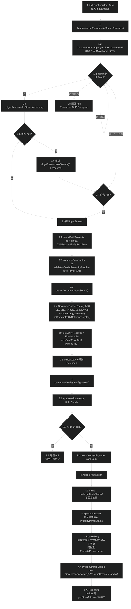
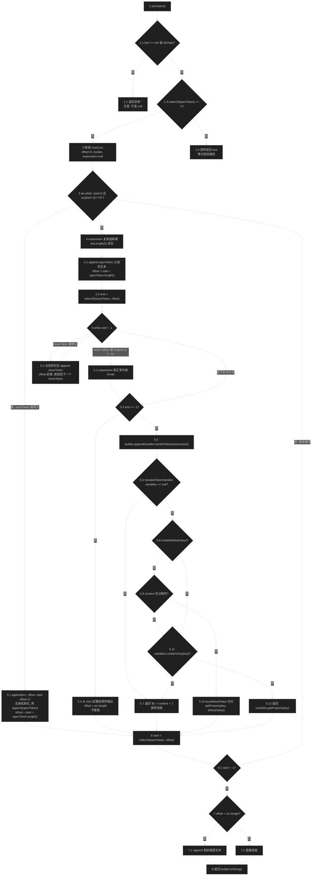

# 资源加载与解析（io + parsing）
> 上次修改：2026-07-29 02:06

## 重点关注

| 入口 / 章节 | 源码位置 | 为什么重要 |
|-------------|----------|------------|
| `ClassLoaderWrapper.getClassLoaders(ClassLoader)` | `src/main/java/org/apache/ibatis/io/ClassLoaderWrapper.java:230-233` | **五个 ClassLoader 的固定回退顺序**（传入的 → `defaultClassLoader` → 线程上下文 → 本类的 → 系统的）在这一行硬编码。"MyBatis 在 Tomcat/OSGi/Spring Boot fat-jar 下找不到 mapper.xml 或 typeHandler 类"几乎全部追到这里。 |
| `ClassLoaderWrapper.getResourceAsStream(String, ClassLoader[])` | `ClassLoaderWrapper.java:133-151` | 每个 ClassLoader 都要**试两次**：先用原路径，再加前导 `/` 重试（L142）。这是兼容历史上"要求带斜杠"的容器的补丁，也是 `Resources` 能容忍两种写法的原因。 |
| `VFS.VFSHolder.createVFS()` | `src/main/java/org/apache/ibatis/io/VFS.java:47-81` | VFS 实现的**探测 + 单例固化**逻辑。用户实现优先于内置实现，`for` 循环无边界检查——探测失败会抛 `IndexOutOfBoundsException` 而非返回 null（见 8.2）。是"自定义 `vfsImpl` 何时生效"的判定点。 |
| `DefaultVFS.list(URL, String)` | `src/main/java/org/apache/ibatis/io/DefaultVFS.java:57-172` | 整个包扫描的**递归主体**，同时处理三种物理形态：jar 条目、"目录当文本文件读"的 Servlet 容器、真实文件目录。含 Zip Slip 防护（L87-90）与三处 issue 编号标记的降级 catch（L115-118）。 |
| `DefaultVFS.isJar(URL, byte[])` | `DefaultVFS.java:339-353` | 不看扩展名、只读**前 4 字节魔数 `PK\3\4`** 判断是否为 jar。任何异常都当成"不是 jar"静默吞掉（L348-350），是扫描静默失效的一个隐藏源头。 |
| `ResolverUtil.find(Test, String)` + `addIfMatching` | `src/main/java/org/apache/ibatis/io/ResolverUtil.java:246-261, 286-302` | `<typeAliases><package>` 和 `<mappers><package>` 的共同实现。`addIfMatching` 会**真正 `loadClass` 每一个扫到的 class**，并把所有 `Throwable` 降级为 `warn` 日志（L298-301）——扫描包内有依赖缺失的类时会静默漏掉。 |
| `addIfMatching` 中的 `fqn.indexOf('.')` | `ResolverUtil.java:288` | 用**第一个** `.` 截断路径，因此包路径中含 `.` 的目录会被截错。是包扫描少数已知的脆弱点，值得在维护时留意（见 8.4）。 |
| `GenericTokenParser.parse(String)` | `src/main/java/org/apache/ibatis/parsing/GenericTokenParser.java:33-86` | MyBatis **全部**占位符（`${}` 与 `#{}`）的唯一词法扫描器。转义规则（`\${`、`\}`）、"闭合符缺失就原样输出"的兜底、以及 `expression` 缓冲区复用都在这 50 行里。 |
| `PropertyParser.VariableTokenHandler.handleToken` | `src/main/java/org/apache/ibatis/parsing/PropertyParser.java:75-94` | `${db.username:postgres}` 默认值语法的实现。默认值特性**默认关闭**（`ENABLE_DEFAULT_VALUE = "false"`，L46），且未命中变量时返回 `"${" + content + "}"` 原样回填而非报错——"占位符没被替换却不报错"的原因在此。 |
| `XPathParser.createDocument(InputSource)` | `src/main/java/org/apache/ibatis/parsing/XPathParser.java:229-264` | DOM 构建的安全与行为基线：开启 `FEATURE_SECURE_PROCESSING`、关闭实体展开、关闭命名空间感知、`ErrorHandler` 把 `error`/`fatalError` 直接抛出而 `warning` 静默 NOP。DTD 校验失败的报错路径从这里进入 `BuilderException`。 |
| `XNode.parseAttributes` / `getBodyData` | `src/main/java/org/apache/ibatis/parsing/XNode.java:326-337, 354-360` | 变量替换的**实际触发点**：属性值和文本体在 `XNode` 构造时就被 `PropertyParser.parse` 处理过一遍。理解"为什么 `${}` 在 XML 任意位置都能用"必须看这两个方法。 |
| `XNode.getValueBasedIdentifier()` | `XNode.java:76-95` | 生成 `select[selectUsers]_include[base]` 这类**层级标识串**，被 builder 用于给匿名节点（如内联 `discriminator`、`selectKey`）构造稳定 id。排查"重复的 resultMap id"时的关键。 |

## 1. 模块定位与职责边界

**结论**：本文合并的两个包处在 MyBatis 启动链路的**最底层**，共同回答一个问题——"配置文件、Mapper XML、类与包，怎么从物理世界（classpath / jar / 文件系统 / URL）变成内存里可以按名字取值的对象"。它们不认识 `Configuration`、不认识 SQL、不认识数据库，纯粹是被 `builder`、`type`、`binding`、`scripting` 复用的基础设施。

两个包合计 16 个源文件（含 2 个 `package-info.java`），约 1500 行，是 MyBatis 中**唯二不依赖任何其他 MyBatis 业务包**的模块（`io` 只依赖 `logging`；`parsing` 只依赖 `builder.BuilderException` 与 `exceptions.PersistenceException`）。

### 1.1 `io` 包 —— 资源定位与类路径扫描

`io` 包解决"**按名字拿到字节流 / URL / Class，以及按包名列出所有 class**"。它把 JDK 那套"哪个 ClassLoader 能看到什么"的不确定性收敛成一组静态方法。

**负责什么**

- 统一资源加载入口：`Resources` 提供 `getResourceAsStream/Reader/Properties/URL/File` 与 `getUrlAsStream/Reader/Properties` 两族方法（`Resources.java:77-314`），以及 `classForName`（`Resources.java:327-329`）。
- 多 ClassLoader 回退查找：`ClassLoaderWrapper` 按固定顺序遍历 5 个 ClassLoader，并对每个 ClassLoader 做"原路径 / 加前导斜杠"两次尝试（`ClassLoaderWrapper.java:133-193`）。
- 抽象文件系统：`VFS` 定义 `list(path)` 契约，`DefaultVFS`（通用）与 `JBoss6VFS`（JBoss 6 专用）两个实现，加上启动期自动探测（`VFS.java:47-81`）。
- 包扫描与过滤：`ResolverUtil` 基于 VFS 列出包下 `.class`，逐个 `loadClass` 后交给 `Test` 判定（`ResolverUtil.java:246-302`），内置 `IsA`（父类型/接口匹配）与 `AnnotatedWith`（注解匹配）两种策略。
- 一次性的环境体检：`SerialFilterChecker.check()` 在首次反序列化时提醒未配置 JEP-290 过滤器（`SerialFilterChecker.java:42-54`）。

**不负责什么**

- **不负责解析内容**。`Resources` 只给 `InputStream`/`Reader`/`Properties`，XML 怎么解读是 `parsing` + `builder` 的事。
- **不负责决定扫哪个包**。包名来自 `<typeAliases><package name="..."/>`、`<mappers><package name="..."/>`（`XMLConfigBuilder.java:178-180, 393-395`），`io` 只执行。
- **不负责缓存已加载资源**。每次 `getResourceAsStream` 都重新走一遍 ClassLoader；"这个 mapper 是否已加载过"由 `Configuration.loadedResources` 判定（`Configuration.java:384-386`）。
- **不负责 classpath 之外的协议扩展**。`getUrlAsStream` 直接用 `new URL(...).openConnection()`（`Resources.java:270-274`），协议支持完全由 JDK 决定。
- **`ExternalResources` 已整类 `@Deprecated`**（`ExternalResources.java:33`），是 MyBatis Migrations 时代遗留的文件拷贝/模板读取工具，主链路不再调用。

**主要输入 / 输出 / 状态 / 副作用**

| 维度 | 内容 |
|------|------|
| 输入 | 资源相对路径（`org/mybatis/example/mybatis-config.xml`）、URL 字符串、全限定类名、Java 包名 |
| 输出 | `InputStream` / `Reader` / `Properties` / `URL` / `File` / `Class<?>` / `List<String>`（资源路径列表）/ `Set<Class<? extends T>>` |
| 全局状态 | `Resources.classLoaderWrapper`（静态单例）、`Resources.charset`（静态、可写）、`VFS.USER_IMPLEMENTATIONS`（静态列表）、`VFSHolder.INSTANCE`（静态单例、一经初始化不可变）、`SerialFilterChecker.firstInvocation` |
| 副作用 | 打开网络/文件流（调用方负责关闭）、通过 `loadClass` 触发**目标类的静态初始化**、写 `warn`/`error` 日志 |

### 1.2 `parsing` 包 —— XML 解析与占位符替换

`parsing` 包解决"**把 XML 变成可按 XPath 取值的树，并在取值时完成 `${}` 变量替换**"，以及提供一个与语法无关的通用占位符扫描器。

**负责什么**

- XPath 求值门面：`XPathParser` 封装 `javax.xml.parsers` + `javax.xml.xpath`，提供 `evalString/Boolean/Short/Integer/Long/Float/Double/Node/Nodes` 九组方法（`XPathParser.java:139-219`）。
- DOM 节点包装：`XNode` 把 `org.w3c.dom.Node` 包成带类型转换、带默认值、带变量替换的读取接口（`XNode.java:33-362`）。
- 通用词法扫描：`GenericTokenParser` 按 `openToken`/`closeToken` 切分文本，交给 `TokenHandler` 回调处理（`GenericTokenParser.java:33-86`）。
- `${}` 语义实现：`PropertyParser` 定义变量查找、可选的默认值语法与分隔符（`PropertyParser.java:53-95`）。
- 异常类型：`ParsingException`（`ParsingException.java:23-40`）。

**不负责什么**

- **不负责 `#{}` 的语义**。`GenericTokenParser` 只做切分，`#{}` 的参数映射由 `builder.ParameterMappingTokenHandler` 实现（`RawSqlSource.java:65-68`、`DynamicContext.java:97-103`）。
- **不负责 DTD/XSD 的定位**。`EntityResolver` 由外部注入，实现类 `XMLMapperEntityResolver` 位于 `builder.xml` 包（`XMLConfigBuilder.java:75`）。本文按约定不展开该类。
- **不负责决定 XML 的语义**。`<select>`/`<resultMap>` 各字段含义属于 `builder` 模块。
- **不负责变量的来源**。`Properties variables` 由 `XMLConfigBuilder.propertiesElement` 从 `<properties>` 子元素、`resource`/`url` 外部文件与调用方传入的 `props` 三处合并（`XMLConfigBuilder.java:241-252`）。
- **不缓存编译后的 XPath 表达式**。每次 `evaluate` 都传字符串给 `XPath.evaluate`（`XPathParser.java:221-227`）。

**主要输入 / 输出 / 状态 / 副作用**

| 维度 | 内容 |
|------|------|
| 输入 | XML 字符串 / `Reader` / `InputStream` / 已构建的 `Document`；XPath 表达式；`Properties variables`；含占位符的任意文本 |
| 输出 | `XNode` 及其子树、各种基本类型包装值、替换后的字符串 |
| 实例状态 | `XPathParser.document`（不可变引用）、`variables`（可被 `setVariables` 覆盖）、`xpath`（`XPath` 实例，非线程安全）、`XNode` 构造期固化的 `name/body/attributes` |
| 副作用 | 构造 `XNode` 时**立即**对属性和文本体做变量替换（`XNode.java:47-48`）；DTD 校验失败时抛 `BuilderException` |

## 2. 架构关系与依赖

**结论**：两个包在架构上是**平级的两条独立支线**，包内没有互相引用（`io` 不 import `parsing`，`parsing` 不 import `io`），它们在**上层的 `builder` 包中才第一次汇合**——`XMLConfigBuilder` 用 `Resources` 拿流、用 `XPathParser` 解析流。这种"底层不互认、上层组装"的切分让两者可以被独立复用（`type` 包只用 `io`，`scripting` 包只用 `parsing`）。

```mermaid
%%{init: {"theme": "dark"}}%%
graph TD
  subgraph 上游调用方
    XMLConfigBuilder["builder.xml.XMLConfigBuilder\n配置文件解析"]
    XMLMapperBuilder["builder.xml.XMLMapperBuilder\nMapper XML 解析"]
    TypeAliasRegistry["type.TypeAliasRegistry\n别名包扫描"]
    MapperRegistry["binding.MapperRegistry\nMapper 接口包扫描"]
    TypeHandlerRegistry["type.TypeHandlerRegistry\nTypeHandler 包扫描"]
    Scripting["scripting.xmltags/defaults\n动态 SQL"]
    Configuration["session.Configuration\nvfsImpl 注册"]
  end

  subgraph io 包
    Resources["Resources\n统一静态门面"]
    CLW["ClassLoaderWrapper\n5 个 ClassLoader 回退"]
    VFS["VFS 抽象类\n探测 + 单例 + list(path)"]
    DefaultVFS["DefaultVFS\njar/目录/文本目录 三形态"]
    JBoss6VFS["JBoss6VFS\n反射调用 org.jboss.vfs"]
    ResolverUtil["ResolverUtil\n包扫描 + Test 过滤"]
    ExternalResources["ExternalResources\n已废弃"]
    SerialFilterChecker["SerialFilterChecker\nJEP-290 体检"]
  end

  subgraph parsing 包
    XPathParser["XPathParser\nDOM 构建 + XPath 求值"]
    XNode["XNode\nDOM 节点包装"]
    GenericTokenParser["GenericTokenParser\nopenToken/closeToken 扫描"]
    TokenHandler["TokenHandler\n回调接口"]
    PropertyParser["PropertyParser\n${} 语义 + 默认值"]
    ParsingException["ParsingException"]
  end

  subgraph JDK / 第三方
    JDKCL["java.lang.ClassLoader"]
    JDKXML["javax.xml.parsers / xpath\norg.w3c.dom"]
    JBossAPI["org.jboss.vfs\n可选、反射访问"]
    Logging["ibatis.logging\nLog / LogFactory"]
  end

  XMLConfigBuilder --> Resources
  XMLConfigBuilder --> XPathParser
  XMLConfigBuilder --> Configuration
  XMLMapperBuilder --> Resources
  XMLMapperBuilder --> XPathParser
  TypeAliasRegistry --> ResolverUtil
  TypeAliasRegistry --> Resources
  MapperRegistry --> ResolverUtil
  TypeHandlerRegistry --> ResolverUtil
  TypeHandlerRegistry --> Resources
  Scripting --> GenericTokenParser
  Scripting --> XPathParser
  Configuration -.->|"addImplClass"| VFS

  Resources --> CLW
  CLW --> JDKCL
  ResolverUtil --> VFS
  VFS --> DefaultVFS
  VFS --> JBoss6VFS
  JBoss6VFS -.->|"反射，缺失则 isValid=false"| JBossAPI
  ResolverUtil --> Logging
  VFS --> Logging
  DefaultVFS --> Logging

  XPathParser --> XNode
  XNode --> XPathParser
  XPathParser --> JDKXML
  XNode --> JDKXML
  XPathParser --> PropertyParser
  XNode --> PropertyParser
  PropertyParser --> GenericTokenParser
  GenericTokenParser --> TokenHandler
  Scripting -.->|"实现"| TokenHandler
```



### 2.1 节点与依赖方向说明

| 节点 | 角色 | 依赖方向与强度 |
|------|------|----------------|
| `Resources` | `io` 的**唯一对外门面**，全静态方法 | 强依赖 `ClassLoaderWrapper`（私有静态字段，`Resources.java:37`，不可替换）。被 `builder`/`type`/`datasource`/`executor.loader`/`jdbc` 等 15+ 处调用 |
| `ClassLoaderWrapper` | ClassLoader 回退策略的封装，**包级可见**（构造器与两个字段都是 package-private） | 强依赖 JDK `ClassLoader`。故意不 public——外部只能通过 `Resources` 使用，保证策略唯一 |
| `VFS` | 抽象类 + 静态探测工厂 + 单例持有者，三种职责压在一个类里 | 强依赖 `DefaultVFS`/`JBoss6VFS`（`IMPLEMENTATIONS` 数组硬编码，`VFS.java:39`）。**反向依赖**：`Configuration.setVfsImpl` 会调 `VFS.addImplClass` 修改静态列表（`Configuration.java:247-252`），这是一处**跨层写全局状态**的耦合点 |
| `DefaultVFS` | 兜底实现，`isValid()` 恒返回 `true`（`DefaultVFS.java:51-54`） | 只依赖 JDK；因此永远是探测链的**最后一环**且必然成功 |
| `JBoss6VFS` | 可选实现，通过反射访问 `org.jboss.vfs`，**类不存在时降级** | 弱依赖（可替换）。静态块 `initialize()`（`JBoss6VFS.java:162-164`）在类加载时就完成探测，非 JBoss 环境下 `valid=false` |
| `ResolverUtil` | 包扫描 + 过滤，`io` 中唯一的泛型有状态类 | 强依赖 `VFS.getInstance()`（`ResolverUtil.java:250`）。**不依赖 `Resources`**，用自己的 `getClassLoader()`（默认线程上下文 ClassLoader，`ResolverUtil.java:170-172`）——与 `Resources` 的 5 层回退策略**不一致**，是一个潜在坑（见 8.3） |
| `XPathParser` | `parsing` 的对外门面 | 强依赖 JDK XML 栈与 `PropertyParser`；**与 `XNode` 双向依赖**（`XPathParser.evalNode` 造 `XNode`，`XNode.evalXxx` 回调 `xpathParser`），这是有意的"父子互引"以支持从任意节点继续求值 |
| `XNode` | 值对象 + 求值代理 | 强依赖 `XPathParser`（构造参数）与 `PropertyParser`（构造期替换） |
| `GenericTokenParser` | 无状态词法扫描器 | 只依赖 `TokenHandler` 接口。**是整个 MyBatis 中被复用次数最多的解析原语**：4 处实例化（`PropertyParser.java:55`、`TextSqlNode.java:47`、`RawSqlSource.java:67`、`DynamicContext.java:101`） |
| `TokenHandler` | 单方法回调接口，天然函数式（未标 `@FunctionalInterface`） | 被 `PropertyParser.VariableTokenHandler`、`TextSqlNode.BindingTokenParser`、`TextSqlNode.DynamicCheckerTokenParser`、`builder.ParameterMappingTokenHandler` 四个类实现 |
| `PropertyParser` | `${}` 语义，全静态 + 私有构造（`PropertyParser.java:49-51`） | 依赖 `GenericTokenParser`。被 `XPathParser.evalString`、`XNode.parseAttributes`、`XNode.getBodyData` 调用 |
| `ExternalResources` | 已废弃的文件工具 | 无 MyBatis 内部调用方（仅测试引用），可视为死代码 |
| `SerialFilterChecker` | 一次性告警 | 被 `cache.decorators.SerializedCache`（`SerializedCache.java:99`）与 `executor.loader.AbstractSerialStateHolder`（`AbstractSerialStateHolder.java:107`）调用，与资源加载主线无关，只是恰好放在 `io` 包 |

### 2.2 关键耦合点

1. **`Configuration` → `VFS` 的静态写入**：`setVfsImpl` 把类塞进 `VFS.USER_IMPLEMENTATIONS`（`Configuration.java:250`），而 `VFSHolder.INSTANCE` 是**首次访问时固化**的静态单例。若在某个 `SqlSessionFactory` 已触发过 VFS 初始化之后，另一个 `Configuration` 再设 `vfsImpl`，该设置**静默无效**。
2. **`ResolverUtil` 与 `Resources` 的 ClassLoader 策略分裂**：前者只用线程上下文 ClassLoader，后者用 5 层回退。同一份配置里 `<mappers><package>` 与 `<mappers><class>` 可能表现不一致。
3. **`parsing` 反向依赖 `builder`**：`XPathParser` 抛的是 `org.apache.ibatis.builder.BuilderException`（`XPathParser.java:225, 262`），而不是同包的 `ParsingException`。这是一处**底层包依赖上层包**的方向反转，`ParsingException` 反而没有被 `parsing` 包自身使用。

## 3. 入口与调用方式

**结论**：两个包都没有"运行时入口"（无 main、无 servlet、无定时任务），全部入口都是**被上层同步调用的库函数**，且集中在 MyBatis 的**启动期**（`SqlSessionFactoryBuilder.build` → `XMLConfigBuilder.parse`）。唯一在运行期反复触发的是 `GenericTokenParser.parse`（动态 SQL 每次执行都要跑）。

### 3.1 `io` 包入口

| 入口 | 源码位置 | 触发条件 | 关键参数 | 返回 / 异常 | 之后进入 |
|------|----------|----------|----------|-------------|----------|
| `Resources.getResourceAsStream(String)` | `Resources.java:114-116` | `<mappers><mapper resource="..."/>`、`<properties resource="..."/>` | classpath 相对路径，**不带**前导斜杠（带了也能兼容） | `InputStream`；找不到抛 `IOException("Could not find resource " + resource)` | `XMLMapperBuilder` / `Properties.load` |
| `Resources.getUrlAsStream(String)` | `Resources.java:270-274` | `<mappers><mapper url="..."/>`、`<properties url="..."/>` | 合法 URL 字符串 | `InputStream`；URL 非法抛 `MalformedURLException` | 同上（`XMLConfigBuilder.java:409`） |
| `Resources.getResourceAsProperties(String)` | `Resources.java:150-156` | `<properties resource="...">` | 同上 | `Properties`；**流在 try-with-resources 中关闭** | 合并进 `configuration.variables`（`XMLConfigBuilder.java:249`） |
| `Resources.classForName(String)` | `Resources.java:327-329` | `<typeAlias type="...">`、`<mapper class="...">`、`vfsImpl`、`logImpl`、`UnpooledDataSource` 驱动加载 | 全限定类名 | `Class<?>`；全部 ClassLoader 失败后抛 `ClassNotFoundException("Cannot find class: " + name)` | 各 registry 注册 |
| `Resources.setDefaultClassLoader(ClassLoader)` | `Resources.java:62-64` | 应用启动时手工调用（容器集成场景） | 任意 ClassLoader | void，**写全局静态状态** | 影响此后所有查找的第 2 顺位 |
| `Resources.setCharset(Charset)` | `Resources.java:335-337` | 需要非平台默认编码读取资源时 | `Charset`，`null` 表示用系统默认 | void，**写全局静态状态** | 只影响 `getResourceAsReader`/`getUrlAsReader`（`Resources.java:190-221, 287-295`），**不影响** `getResourceAsStream` |
| `VFS.getInstance()` | `VFS.java:89-91` | `ResolverUtil.find` 内部调用 | 无 | 单例 `VFS`；探测全失败时抛 `IndexOutOfBoundsException`（见 8.2） | `list(path)` |
| `VFS.addImplClass(Class)` | `VFS.java:100-104` | `<setting name="vfsImpl" value="..."/>` → `Configuration.setVfsImpl` | VFS 子类的 Class | void；**必须在首次 `getInstance()` 之前调用才生效** | 加入 `USER_IMPLEMENTATIONS`，优先于内置实现 |
| `ResolverUtil.findImplementations(Class, String...)` | `ResolverUtil.java:197-208` | 需按父类型扫描时 | 父类/接口 + 多个包名；`packageNames == null` 直接返回自身（无异常） | `this`（链式）；结果在 `getClasses()` | `find(new IsA(parent), pkg)` |
| `ResolverUtil.findAnnotated(Class, String...)` | `ResolverUtil.java:221-232` | 需按注解扫描时 | 注解类型 + 多个包名 | 同上 | `find(new AnnotatedWith(a), pkg)` |
| `ResolverUtil.find(Test, String)` | `ResolverUtil.java:246-261` | **实际主入口**，`TypeAliasRegistry`/`MapperRegistry`/`TypeHandlerRegistry` 都直接调它 | 自定义 `Test` + 单个包名 | `this`；`IOException` 被吞成 `log.error`，**不向上抛** | `VFS.list` → `addIfMatching` |
| `SerialFilterChecker.check()` | `SerialFilterChecker.java:42-54` | `SerializedCache` 反序列化、`AbstractSerialStateHolder` 反序列化 | 无 | void；仅首次且过滤器缺失时打一条 `warn` | 无后续 |

**实际调用组合**（来自源码，非推测）：

- `TypeAliasRegistry.registerAliases(pkg, superType)` → `new ResolverUtil<>()` → `find(new IsA(superType), pkg)` → 过滤掉匿名类/接口/成员类后 `registerAlias`（`TypeAliasRegistry.java:135-144`）。
- `MapperRegistry.addMappers(pkg, superType)` → 同样的 `ResolverUtil` + `IsA`，结果逐个 `addMapper`（`MapperRegistry.java:103-110`）。
- `TypeHandlerRegistry.register(String packageName)` → `ResolverUtil` + `IsA(TypeHandler.class)`（`TypeHandlerRegistry.java:541-542`）。

三者用法完全一致，`ResolverUtil` 实际上只被 `IsA` 一种 `Test` 使用；`AnnotatedWith` 在 `src/main/java` 中**无调用方**，属于预留能力。

### 3.2 `parsing` 包入口

| 入口 | 源码位置 | 触发条件 | 关键参数 | 返回 / 异常 | 之后进入 |
|------|----------|----------|----------|-------------|----------|
| `new XPathParser(InputStream, boolean, Properties, EntityResolver)` | `XPathParser.java:125-128` | `XMLConfigBuilder` / `XMLMapperBuilder` 构造时 | 流、是否 DTD 校验（MyBatis 主链路传 `true`）、变量表、`XMLMapperEntityResolver` | 构造完成即 DOM 已就绪；解析失败抛 `BuilderException("Error creating document instance. Cause: ...")` | `evalNode("/configuration")` |
| `new XPathParser(String)` 等 12 个重载 | `XPathParser.java:55-133` | 测试与 `XMLLanguageDriver`（注解里的 `<script>` 片段走 `new XPathParser(script, false, variables, new XMLMapperEntityResolver())`，`XMLLanguageDriver.java:65`，注意 `validation=false`） | 4 种数据源 × 4 档参数 | 同上 | — |
| `XPathParser.evalNode(String)` | `XPathParser.java:209-219` | 取单个节点 | XPath 表达式 | `XNode`，**节点不存在返回 `null`**（`XPathParser.java:215-217`），调用方必须判空 | `XMLConfigBuilder.parseConfiguration` |
| `XPathParser.evalNodes(String)` | `XPathParser.java:196-207` | 取节点列表 | XPath 表达式 | `List<XNode>`，无匹配返回**空列表**（不是 null） | `XMLMapperBuilder` 遍历 `<select>` 等 |
| `XPathParser.evalString(Object, String)` | `XPathParser.java:143-146` | 取字符串 | root 节点 + 表达式 | 结果**已过 `PropertyParser.parse`**——这是数值类 `evalShort/Integer/Long/Float` 也能享受变量替换的原因（它们内部转调 `evalString`，`XPathParser.java:160-186`） | — |
| `XPathParser.setVariables(Properties)` | `XPathParser.java:135-137` | `<properties>` 解析完后回填变量 | 变量表 | void；**只影响此后新建的 `XNode`**，已构造的 `XNode` 属性不会重新替换 | `XMLConfigBuilder.propertiesElement` 之后的所有元素解析 |
| `XNode.getStringAttribute(name[, def / Supplier])` | `XNode.java:196-208` | builder 读属性 | 属性名 + 可选默认值/默认值供给器 | 属性值（已完成变量替换） | — |
| `XNode.getChildren()` / `getChildrenAsProperties()` | `XNode.java:255-279` | 遍历子元素 / 读 `<property name value>` 对 | 无 | `List<XNode>` / `Properties`；后者**只收集 name 与 value 都非 null 的子节点**（`XNode.java:274-276`） | `<properties>`、`<plugin>`、`<dataSource>` 等 |
| `PropertyParser.parse(String, Properties)` | `PropertyParser.java:53-57` | 任意需要 `${}` 替换处 | 原文 + 变量表 | 替换后字符串；**从不抛异常** | — |
| `new GenericTokenParser(open, close, handler).parse(text)` | `GenericTokenParser.java:27-31, 33` | `${}`（`PropertyParser`、`TextSqlNode`）与 `#{}`（`RawSqlSource`、`DynamicContext`） | 起止 token + 回调 | 拼接后的字符串；`null`/空串**返回 `""` 而非 `null`**（`GenericTokenParser.java:34-36`） | `TokenHandler.handleToken` |

**上下文/权限要求**：两个包均无权限校验。`ClassLoaderWrapper` 构造器对 `ClassLoader.getSystemClassLoader()` 的 `SecurityException` 做了吞异常处理（`ClassLoaderWrapper.java:32-36`，注释指明是 Google App Engine 场景），是全模块唯一与安全管理器相关的分支。

## 4. 核心概念与领域模型

### 4.1 资源路径（Resource Path）

**定义**：不带前导斜杠的、以 `/` 分隔的 classpath 相对路径，如 `org/apache/ibatis/builder/xml/mybatis-3-config.dtd`。

**作用**：`io` 包全部方法的寻址键。`ClassLoaderWrapper` 对同一个路径做**两种形态**尝试——原样与加 `/` 前缀（`ClassLoaderWrapper.java:138-143, 172-178`），因此调用方两种写法都能工作。

**生命周期**：无状态，纯参数。

**与包路径的转换**：`ResolverUtil.getPackagePath` 与 `DefaultVFS.getPackagePath` 都做 `packageName.replace('.', '/')`（`ResolverUtil.java:272-274`、`DefaultVFS.java:312-314`）——**两处完全重复的代码**，且 `DefaultVFS` 的那份在 `src/main/java` 中无调用方。

三维评估：

- **好处**：把"要不要带斜杠"这个历史遗留的容器差异彻底屏蔽，调用方（`XMLConfigBuilder`、用户配置文件）不需要知道运行在什么容器里。
- **替代方案**：在 `Resources` 入口处统一规范化路径（`resource.startsWith("/") ? resource.substring(1) : resource`）后只查一次。这样每个 ClassLoader 只需一次 `getResource` 调用。
- **风险**：当前做法在**资源不存在**时会做 `5 × 2 = 10` 次 ClassLoader 查找才放弃。`ClassLoader.getResource` 在深层委派链 + 大 classpath 下不是廉价操作；启动期若有大量"探测性"查找（如 `Jdk.java:36,53,70` 的可选类探测），这个放大系数会体现在启动耗时上。

### 4.2 ClassLoader 回退链（ClassLoader Fallback Chain）

**定义**：`ClassLoaderWrapper.getClassLoaders` 返回的固定 5 元数组（`ClassLoaderWrapper.java:230-233`）：

```java
new ClassLoader[] { classLoader, defaultClassLoader, Thread.currentThread().getContextClassLoader(),
    getClass().getClassLoader(), systemClassLoader };
```

| 顺位 | 来源 | 典型场景 |
|------|------|----------|
| 1 | 调用方显式传入 | `Resources.getResourceAsStream(loader, resource)` |
| 2 | `Resources.setDefaultClassLoader` 设置的全局值 | 容器集成时由框架注入 |
| 3 | 线程上下文 ClassLoader | Servlet 容器 / 应用服务器的标准做法 |
| 4 | 加载 `ClassLoaderWrapper` 自身的 ClassLoader | MyBatis jar 所在的 ClassLoader（OSGi 下关键） |
| 5 | 系统 ClassLoader | 普通 Java 应用；GAE 下可能为 `null` |

**作用**：让同一份 MyBatis jar 在普通 Java 应用、Web 容器、OSGi、fat-jar 等环境下都能找到资源。数组元素**允许为 `null`**，遍历时逐个判空跳过（`ClassLoaderWrapper.java:135, 169, 212`）。

**生命周期**：数组每次调用重新构造（因为线程上下文 ClassLoader 随线程变化），不缓存。

三维评估：

- **好处**：单一策略、零配置、覆盖绝大多数部署形态；顺序把"调用方最了解上下文"放第一，"最不可能出错的兜底"放最后，语义清晰。
- **替代方案**：像 Spring 那样引入 `ResourceLoader` 抽象，由容器注入具体策略；或用 SPI 让用户替换查找策略。MyBatis 选择硬编码，代价是灵活性、收益是零依赖与零配置。
- **风险**：策略不可覆盖（`ClassLoaderWrapper` 是 package-private，构造器也是），出问题时用户只能靠 `setDefaultClassLoader` 这一个钩子。更严重的是 `ResolverUtil` 完全没走这条链（见 8.3），导致"取单个资源能成功、扫整个包却失败"的不一致。

### 4.3 VFS（Virtual File System）

**定义**：抽象类 `VFS`，契约是"给定一个 classpath 路径，递归列出其下所有资源的完整路径"（`VFS.java:237-243`）。子类只需实现 `isValid()` 与 `list(URL, String)` 两个抽象方法（`VFS.java:207, 223`）。

**作用**：屏蔽"包在磁盘目录里 / 在 jar 里 / 在应用服务器专有虚拟文件系统里"的差异，让 `ResolverUtil` 只面对 `List<String>`。

**生命周期**：进程级单例，通过 `VFSHolder` 静态内部类实现懒初始化（`VFS.java:47-81`），**一经初始化不可更换**。

**相关类型**：`DefaultVFS`（兜底，`isValid()` 恒真）、`JBoss6VFS`（反射访问 `org.jboss.vfs.VFS`/`VirtualFile`）、用户自定义子类（通过 `<setting name="vfsImpl">` 注册）。

**协作示例**（源码链路）：
`<mappers><package name="com.foo.mapper"/>` → `Configuration.addMappers` → `MapperRegistry.addMappers`（`MapperRegistry.java:104-105`）→ `ResolverUtil.find` → `VFS.getInstance().list("com/foo/mapper")`（`ResolverUtil.java:250`）→ `DefaultVFS.list(url, path)` 递归 → 返回 `["com/foo/mapper/UserMapper.class", ...]` → `addIfMatching` 逐个 `loadClass` 并用 `IsA(Object.class)` 判定（恒真）→ `addMapper`。

三维评估：

- **好处**：抽象边界找得很准——只有 `list` 一个方法，实现成本极低，用户为特殊容器写适配器只需几十行。JBoss 适配器用**反射**而非编译期依赖，使得 MyBatis 主 jar 不需要 `org.jboss.vfs` 依赖。
- **替代方案**：直接依赖第三方扫描库（如 Reflections、Spring 的 `PathMatchingResourcePatternResolver`），或使用 JDK 9+ 的 `ModuleFinder`/`FileSystems.newFileSystem(jarUri)` 统一处理 jar 与目录。后者能消掉 `DefaultVFS` 里大量的 URL 字符串拼接与魔数嗅探。
- **风险**：单例固化时机不可控（见 8.2 与 9.2），且 `isValid()` 的语义是"环境是否支持"而非"能否处理这个 URL"——**探测是全局一次性的，不是 per-URL 的**。这意味着一个混合部署（部分资源在 JBoss VFS、部分在普通 jar）中只会有一个实现生效。

### 4.4 `ResolverUtil.Test` 过滤策略

**定义**：单方法接口 `boolean matches(Class<?> type)`（`ResolverUtil.java:69-81`），是包扫描的过滤谓词。

**作用**：把"扫描"与"筛选"解耦。`ResolverUtil` 负责列出并加载类，`Test` 负责判定要不要收。

**内置实现**：

| 实现 | 判定逻辑 | 源码 | 备注 |
|------|----------|------|------|
| `IsA` | `type != null && parent.isAssignableFrom(type)` | `ResolverUtil.java:104-106` | **会匹配 `parent` 自身**（JavaDoc 明确说明，L84-85）。三个 registry 全部使用它 |
| `AnnotatedWith` | `type != null && type.isAnnotationPresent(annotation)` | `ResolverUtil.java:135-137` | 只查**直接标注 + `@Inherited` 继承**，不查元注解。`src/main/java` 中无调用方 |

两者都重写了 `toString()`（L109-111, L140-142），仅用于 `log.debug` 的可读性（`ResolverUtil.java:291`）。

**生命周期**：无状态值对象，每次 `findImplementations`/`findAnnotated` 新建一个。

三维评估：

- **好处**：策略模式的教科书用法；用户可传任意 `Test` 实现复杂条件（如"实现了 A 且标注了 @B 且类名以 Mapper 结尾"），而 `ResolverUtil` 无需改动。
- **替代方案**：用字节码读取（ASM / Javassist）判定，避免 `loadClass`。这是 Spring `ClassPathScanningCandidateComponentProvider` 的做法——不触发静态初始化、不污染 ClassLoader、能读元注解。
- **风险**：`Test.matches` 接收的是**已加载的 `Class`**，意味着扫描包内每个类都被真正加载并触发静态初始化。副作用不可控（静态块可能建连接、启线程），且依赖缺失的类会加载失败（被 `addIfMatching` 的 `catch (Throwable)` 静默降级为 warn，`ResolverUtil.java:298-301`）。

### 4.5 Token 与 TokenHandler

**定义**：`Token` 指由 `openToken` 与 `closeToken` 包裹的一段文本，`GenericTokenParser` 负责识别边界，`TokenHandler.handleToken(String content)` 接收**边界之内的原始内容**并返回替换文本（`TokenHandler.java:21-23`）。

**作用**：这是 MyBatis 里唯一的"模板引擎"原语。`${}` 与 `#{}` 两套完全不同的语义共用同一个扫描器：

| openToken/closeToken | Handler | 语义 | 源码 |
|----------------------|---------|------|------|
| `${` / `}` | `PropertyParser.VariableTokenHandler` | 配置变量替换（启动期） | `PropertyParser.java:55` |
| `${` / `}` | `TextSqlNode.BindingTokenParser` | SQL 字符串拼接（运行期，OGNL 求值） | `TextSqlNode.java:47` |
| `${` / `}` | `TextSqlNode.DynamicCheckerTokenParser` | **只探测是否含 token**，`handleToken` 返回 `null` 并置标志位 | `TextSqlNode.java:84-88` |
| `#{` / `}` | `builder.ParameterMappingTokenHandler` | 生成 `?` 占位符 + `ParameterMapping` | `RawSqlSource.java:67`、`DynamicContext.java:101` |

**生命周期**：`GenericTokenParser` 实例通常是方法内局部变量（用完即弃）；`DynamicContext` 例外，它把 parser 缓存在字段里并懒初始化（`DynamicContext.java:97-103`），因为同一次 SQL 构建中要多次调用。

**注意 `DynamicCheckerTokenParser` 返回 `null`**：`GenericTokenParser` 第 76 行 `builder.append(handler.handleToken(...))` 收到 `null` 时会追加字符串 `"null"`。这在探测场景下无害（返回值被丢弃，只看 `isDynamic()`），但说明 `GenericTokenParser` **未对 handler 返回 `null` 做防御**。

三维评估：

- **好处**：一个 50 行的扫描器支撑了 MyBatis 全部模板能力，且转义规则统一——用户学一次 `\${` 就同时适用于配置文件与 SQL。
- **替代方案**：用正则 `\$\{([^}]*)\}`。代码更短，但正则处理**反斜杠转义**与**嵌套/未闭合**极其笨拙，且每次 `Matcher` 分配比手写字符扫描慢。也可以用真正的词法分析器生成器，但对两个 token 而言完全过度。
- **风险**：手写扫描器的边界条件全靠人肉保证。当前实现有几个非直觉行为：`parse(null)` 返回 `""`（而非 `null`，`GenericTokenParser.java:34-36`）、闭合符缺失时**从 openToken 开始整段原样输出**（L72-74）、handler 返回 `null` 会写成 `"null"`。这些都没有对应的显式契约文档，只能从代码推断。

### 4.6 `XNode` —— 带变量替换的 DOM 视图

**定义**：`org.w3c.dom.Node` 的包装器，构造时即固化 `name`、`attributes`、`body` 三份数据（`XNode.java:42-49`）。

**作用**：给 builder 一套"带类型转换 + 带默认值 + 已完成变量替换"的读取 API，避免 builder 到处写 `node.getAttributes().getNamedItem("x").getNodeValue()` 并手工 `Integer.parseInt`。

**生命周期**：短命值对象。每次 `evalNode`/`evalNodes`/`getChildren`/`getParent`/`newXNode` 都**新建实例**（`XPathParser.java:204, 218`、`XNode.java:52, 60, 262, 305`），不做任何缓存或去重——同一个 DOM 节点被访问 N 次就会产生 N 个 `XNode`。

**核心字段与关系**：

| 字段 | 含义 | 构造期处理 |
|------|------|-----------|
| `node` | 被包装的 DOM 节点 | 直接持有 |
| `name` | `node.getNodeName()` | 直接取，**不做变量替换** |
| `attributes` | `Properties` 形式的属性表 | `parseAttributes` 对每个属性值调 `PropertyParser.parse`（`XNode.java:332`） |
| `body` | 文本内容 | `parseBody`：先试节点自身，再遍历子节点找第一个 TEXT/CDATA（`XNode.java:339-352`），同样过 `PropertyParser.parse`（L357） |
| `variables` | 变量表 | 传递给子 `XNode`，用于后续替换 |
| `xpathParser` | 回指父解析器 | 使 `XNode.evalNode` 等能以本节点为 root 继续求值（`XNode.java:97-115`） |

**读取 API 的三个族**：

1. `getXxxAttribute(name[, def])` —— 7 种类型 + `getEnumAttribute`（`XNode.java:173-253`），全部走 `attributes.getProperty(name)` 后转换。
2. `getXxxBody([def])` —— 6 种类型（`XNode.java:125-171`），读固化的 `body`。
3. `evalXxx(expression)` —— 5 个方法（`XNode.java:97-115`），委托回 `xpathParser` 以本节点为 root 求值。

**特殊方法**：

- `getPath()`（L63-74）：向上遍历 `Element` 父节点，拼出 `configuration/mappers/mapper` 这样的路径，用于错误提示。
- `getValueBasedIdentifier()`（L76-95）：向上遍历并按 `id` → `value` → `property` 的**优先级**取第一个非空属性（L83-84），拼成 `select[selectUsers]_include[base]`。`.` 被替换为 `_`（L86）以避免与 MyBatis 内部的命名空间分隔符冲突。

三维评估：

- **好处**：把"XML 读取"的样板代码集中到一个类，builder 代码可读性大幅提升；变量替换在构造期完成，调用方完全无感知，不可能忘记替换。
- **替代方案**：用 JAXB / Jackson-XML 直接反序列化到配置对象。MyBatis 的 XML schema 有大量"同一元素在不同位置含义不同"的动态结构（如 `<if>`/`<foreach>` 嵌套），静态绑定很难表达，因此手写树遍历更合适。
- **风险**：（1）构造期做变量替换意味着**`setVariables` 之后已存在的 `XNode` 不会更新**，配置解析顺序必须严格保证 `<properties>` 在最前（源码中有 `// issue #117 read properties first` 注释，`XMLConfigBuilder.java:116-117`）；（2）无缓存导致遍历大 Mapper XML 时产生大量短命对象（见 9.3）；（3）`getXxxBody`/`getXxxAttribute` 的数值转换会在格式非法时抛 `NumberFormatException`，且**不携带节点位置信息**，排错困难。

## 5. 关键流程

### 5.1 主成功路径：从资源路径到带变量替换的 `XNode`

这是 MyBatis 启动的第一段链路，`io` 与 `parsing` 在此汇合。



**1-1.8 资源定位**：`XMLConfigBuilder` 拿到的是已经打开的 `InputStream`，流的获取由调用方（`SqlSessionFactoryBuilder` 的使用者或 `XMLConfigBuilder.mappersElement`）通过 `Resources.getResourceAsStream` 完成（`Resources.java:131-137`）。`ClassLoaderWrapper` 每次调用都重新构造 5 元数组（`ClassLoaderWrapper.java:230-233`），因为线程上下文 ClassLoader 可能变化。对每个非 null 的 ClassLoader 做"原路径 + 加斜杠"两次尝试（L138-143）；全部失败后 `getResourceAsStream` 返回 `null`，由 `Resources` 转成 `IOException("Could not find resource " + resource)`（`Resources.java:133-135`）——**这是 `io` 包唯一主动抛出的检查异常**。

**2-2.6 DOM 构建**：`commonConstructor` 必须先执行（`XPathParser.java:230` 有 `// important: this must only be called AFTER common constructor` 注释），因为 `createDocument` 要读 `validation` 与 `entityResolver` 字段。工厂配置的五项组合值得注意：`FEATURE_SECURE_PROCESSING=true` + `setExpandEntityReferences(false)` 共同构成 XXE 防护；`setNamespaceAware(false)` 意味着 MyBatis 的 XPath 表达式一律不带命名空间前缀；`setIgnoringComments(true)` 让注释节点不进 DOM；`setIgnoringElementContentWhitespace(false)` 与 `setCoalescing(false)` 保留空白与 CDATA 边界，这对 SQL 文本的原样保留是必要的。`ErrorHandler` 把 `error` 与 `fatalError` 直接 `throw exception`（L246-253），因此 DTD 校验失败会中断解析；`warning` 空实现（L256-258）。任何异常统一包装为 `BuilderException("Error creating document instance. Cause: " + e, e)`（L262）。

**3-3.4 XPath 求值**：`evaluate` 是所有 `evalXxx` 的收口（`XPathParser.java:221-227`），异常统一转 `BuilderException("Error evaluating XPath. Cause: ...")`。`evalNode` 对 `null` 做了判空后返回 `null`（L215-217），因此 `XMLConfigBuilder.parseConfiguration` 里的每个 `xxxElement(root.evalNode("..."))` 都必须在方法开头判 `context == null`（例如 `XMLConfigBuilder.java:174-176, 389-391`）；`evalNodes` 则永远返回列表（可能为空，L201-206）。

**4-5 变量替换固化**：`XNode` 构造期就把属性值和文本体过一遍 `PropertyParser.parse`（`XNode.java:47-48, 332, 357`），这是"`${}` 在 XML 任意属性和文本里都能用"的实现基础。代价是 `setVariables` 的时序敏感性——`XMLConfigBuilder.parseConfiguration` 特意把 `propertiesElement` 放在第一位并留了 `// issue #117 read properties first` 注释（`XMLConfigBuilder.java:116-117`）。注意 `name` 字段**不做替换**（L45），所以元素名里写 `${}` 无效。

### 5.2 包扫描路径：`<mappers><package>` 到 `Set<Class>`

这条路径涉及 VFS 探测、三种物理形态的目录列举和递归。

```mermaid
%%{init: {"theme": "dark"}}%%
flowchart TD
  1["1 Configuration.addMappers(pkg)\n→ MapperRegistry.addMappers(pkg, Object.class)"] --> 1.1["1.1 new ResolverUtil<>()\nfind(new IsA(Object.class), pkg)"]
  1.1 --> 1.2["1.2 getPackagePath\n'com.foo.mapper' → 'com/foo/mapper'"]
  1.2 --> 2["2 VFS.getInstance()"]

  2 --> 2.1{"2.1 VFSHolder 已初始化?"}
  2.1 -->|"是, 直接返回单例"| 3
  2.1 -->|"否"| 2.2["2.2 createVFS\nimpls = USER_IMPLEMENTATIONS + [JBoss6VFS, DefaultVFS]"]
  2.2 --> 2.3["2.3 i=0; 循环 while vfs==null 或 !isValid()"]
  2.3 --> 2.4["2.4 impls.get(i).getDeclaredConstructor().newInstance()"]
  2.4 --> 2.5{"2.5 vfs.isValid()?"}
  2.5 -->|"否, i++"| 2.3
  2.5 -->|"是"| 2.6["2.6 固化为 INSTANCE\nlog.debug('Using VFS adapter ...')"]
  2.4 -->|"反射异常"| 2.7["2.7 log.error 并 return null\n后续 NPE"]
  2.3 -->|"i 越界"| 2.8["2.8 IndexOutOfBoundsException\n见 8.2"]
  2.6 --> 3

  3["3 VFS.list(path)"] --> 3.1["3.1 getResources(path)\n线程上下文 CL 的 getResources"]
  3.1 --> 3.2["3.2 对每个 URL 调 list(url, path)"]

  3.2 --> 4{"4 DefaultVFS.list\nfindJarForResource(url) 命中?"}
  4 -->|"是"| 4.1["4.1 打开 jar 流\nlistResources(JarInputStream, path)\n按前缀匹配条目名"]
  4 -->|"否"| 4.2{"4.2 isJar(url)?\n读前 4 字节魔数 PK\\3\\4"}
  4.2 -->|"是"| 4.3["4.3 逐条读 JarEntry\n校验 canonical path 前缀\n防 Zip Slip"]
  4.2 -->|"否"| 4.4["4.4 把 URL 当文本读\n每行当作子资源名\n用 getResources 反查是否存在"]
  4.4 --> 4.5{"4.5 某行反查失败?"}
  4.5 -->|"是"| 4.6["4.6 lines.clear()\n判定不是目录"]
  4.5 -->|"否, 全部通过"| 4.7["4.7 children = lines"]
  4.4 -->|"FileNotFoundException\n且 protocol==file"| 4.8["4.8 降级 file.list()\n直接列磁盘目录"]
  4.3 --> 5
  4.6 --> 5
  4.7 --> 5
  4.8 --> 5
  4.1 --> 6

  5["5 拼 prefix = url.toExternalForm() + '/'"] --> 5.1["5.1 对每个 child\nresources.add(path + '/' + child)"]
  5.1 --> 5.2["5.2 递归 list(new URL(prefix+child), resourcePath)"]
  5.2 --> 6

  6["6 返回资源路径列表"] --> 6.1{"6.1 child.endsWith('.class')?"}
  6.1 -->|"否, 跳过"| 6.1
  6.1 -->|"是"| 6.2["6.2 addIfMatching(test, child)"]
  6.2 --> 6.3["6.3 fqn.substring(0, indexOf('.'))\n.replace('/', '.')"]
  6.3 --> 6.4["6.4 getClassLoader().loadClass(externalName)\n触发目标类静态初始化"]
  6.4 --> 6.5{"6.5 test.matches(type)?"}
  6.5 -->|"是"| 6.6["6.6 matches.add(type)"]
  6.5 -->|"否, 丢弃"| 6.7["6.7 继续下一个"]
  6.4 -->|"任意 Throwable"| 6.8["6.8 log.warn 并跳过\n静默漏类"]
  6.6 --> 7["7 getClasses() 交给 MapperRegistry\n逐个 addMapper"]
```



**1-1.2 入口与路径转换**：三个 registry（`MapperRegistry.java:104-105`、`TypeAliasRegistry.java:136-137`、`TypeHandlerRegistry.java:541-542`）的写法完全相同——新建 `ResolverUtil`、用 `IsA` 过滤、取 `getClasses()`。`MapperRegistry` 与 `TypeAliasRegistry` 的默认 `superType` 是 `Object.class`，意味着 `IsA` 判定**恒为真**，`Test` 在此退化为"收下所有类"，真正的过滤发生在 registry 侧（如 `TypeAliasRegistry.java:142` 排除匿名类/接口/成员类，`TypeHandlerRegistry.java:546` 排除匿名类/接口/抽象类）。

**2-2.8 VFS 探测与单例固化**：`VFSHolder` 是标准的 holder 惯用法，由 JVM 保证类初始化的线程安全。探测顺序是"用户实现在前、内置实现在后"（`VFS.java:52-54`），因此 `<setting name="vfsImpl">` 注册的类会被优先尝试。循环条件 `vfs == null || !vfs.isValid()` 配合 `impls.get(i)` 没有做索引边界检查（L58-59），正常情况下不会越界（`DefaultVFS.isValid()` 恒真且总在最后），但如果用户实现的构造器抛非受检异常，`catch` 块只覆盖了四种反射异常（L65-66），`RuntimeException` 会直接穿透。反射失败时 `createVFS` 返回 `null`（L68），`getInstance()` 就返回 `null`，`ResolverUtil.find` 里的 `VFS.getInstance().list(path)` 随即 NPE——**这个 NPE 不会被 `catch (IOException)` 捕获**（L256），会一路抛到 builder。

**3-4.8 三种物理形态的列举**：`DefaultVFS.list` 是全模块最复杂的方法。第一分支 `findJarForResource`（`DefaultVFS.java:233-301`）尝试从 URL 中"剥出" jar 文件本身：先反复用 `new URL(url.getFile())` 剥内层 URL（L240-250，靠 `MalformedURLException` 作为循环终止条件），再截断到 `.jar` 结尾（L253-261），最后用魔数校验（L269）；WebLogic 场景还额外尝试把它当磁盘文件、以及 URL-encode 后再试（L276-292）。第二分支处理"URL 本身就是 jar 流"（某些 JBoss VFS 版本，L74-93），此处有 **Zip Slip 防护**：把条目名 resolve 到 `destinationDir` 后比对 canonical path 前缀，不匹配就抛 `IOException("Bad zip entry: ...")`（L87-90）。第三分支处理"把目录当文本文件读"——Servlet 容器的常见行为，靠"每一行都能被 `getResources` 反查到"来验证这确实是目录列表（L110-113），任何一行失败就 `lines.clear()` 判定失败。`IllegalArgumentException` 与 `FileSystemException` 被单独捕获并清空（L115-118，注释标了 issue #1974 #2598 #3689）。第四分支是 `FileNotFoundException` 兜底：仅当协议是 `file` 时降级为 `File.list()`，否则原样重抛（L131-134）。

**5-5.2 递归展开**：对每个子项都 `resources.add` 后再递归（L154-159）。注意**子项本身也被加入结果**，即目录名也会出现在返回列表里；`ResolverUtil` 靠 `endsWith(".class")` 过滤掉它们（`ResolverUtil.java:252`）。递归深度等于目录嵌套深度，无深度上限保护。

**6-7 类加载与过滤**：`addIfMatching` 用 `fqn.indexOf('.')` 截断扩展名（`ResolverUtil.java:288`）——取**第一个** `.` 而非最后一个，路径中含 `.` 的目录会被截错（见 8.4）。`loadClass` 用的是 `getClassLoader()`，即线程上下文 ClassLoader（L171），与 `Resources` 的 5 层回退**不一致**。`catch (Throwable)` 覆盖 `Error`（含 `NoClassDefFoundError`），只打 `warn` 后继续（L298-301）：这让扫描对"包内有依赖缺失的类"具备容错性，代价是**静默漏类**——用户看到的现象是"我的 Mapper 明明在包里却没被注册"，必须开 warn 日志才能发现。

### 5.3 失败与边界路径：`GenericTokenParser` 的转义、未闭合与变量缺失

这条路径覆盖占位符解析的全部非正常输入。



**1-1.4 快路径与空输入**：`null` 与空串统一返回 `""`（`GenericTokenParser.java:34-36`）——这是一个**契约上的不对称**：输入 `null` 得到非 `null` 输出。好处是下游 `builder.append` 永不遇到 `null`，坏处是调用方无法区分"没有内容"和"内容是空串"。不含 `openToken` 时直接 `return text`（L39-41），避免了 `toCharArray` 与 `StringBuilder` 分配，这是最常见的情况（绝大多数 SQL 与属性值不含占位符），属于有效的快路径优化。

**2-3.1 openToken 转义**：判定条件是 `start > 0 && src[start - 1] == '\\'`（L47）。处理方式是"把反斜杠之前的文本 + openToken 原文"写入结果，然后 `offset` 跳到 openToken 之后（L49-50）——**注意此时不进入寻找 closeToken 的分支**，所以 `\${foo}` 的结果是 `${foo}`，其中的 `}` 作为普通文本在后续 `7.1` 阶段被追加。这里有一个已知的**转义局限**：无法表达"字面的反斜杠紧跟占位符"，即 `\\${foo}` 不会被解析成"反斜杠 + 替换结果"，而是被当作转义处理输出 `\${foo}`（第一个反斜杠留在 `start-offset-1` 的截断范围内被丢弃）。

**4-5.2 closeToken 与其转义**：`expression` 缓冲区被**跨迭代复用**——首次 `new StringBuilder()`，之后 `setLength(0)`（L53-57），这是一处显式的对象复用优化。内层 `while` 循环处理连续多个被转义的 closeToken（L61-70）：判定条件 `(end <= offset) || (src[end - 1] != '\\')` 中的 `end <= offset` 是边界保护——防止 `${}` 这种紧邻情况下访问 `src[end-1]` 读到 openToken 的最后一个字符而误判为转义。

**5.3-5.4 未闭合的兜底**：`end == -1` 时执行 `builder.append(src, start, src.length - start)`（L73），即**从 openToken 位置起把剩余全文原样输出**，然后 `offset = src.length` 结束。这意味着 `select * from ${tbl` 不会报错，而是原样保留 `${tbl`。设计取向是"宁可不替换也不中断"，与 `PropertyParser` 变量缺失时回填 `${key}` 的取向一致。风险是配置写错（漏了 `}`）时没有任何提示，问题会推迟到 SQL 执行时才以数据库语法错误的形式暴露。

**5.6-5.12 变量查找的四种结局**：`VariableTokenHandler` 在构造期就读取 `enableDefaultValue` 与 `defaultValueSeparator` 两个开关（`PropertyParser.java:66-67`），且开关本身也从 `variables` 里读（键为 `org.apache.ibatis.parsing.PropertyParser.enable-default-value` / `.default-value-separator`，L35, L44）——**开关与业务变量混在同一个 `Properties` 里**。默认值特性默认关闭（`ENABLE_DEFAULT_VALUE = "false"`，L46），所以 `${db.url:jdbc:mysql://...}` 在未开启时会被整体当作 key 查找，必然查不到而原样回填。开启后分隔符默认是 `:`，切分用 `indexOf`（取**第一个**分隔符，L79），所以带 `:` 的默认值（如 JDBC URL）能正确保留冒号后面的部分，但 key 本身不能含 `:`。`containsKey` 判定（L89）而非 `getProperty != null`，因此值为空串的变量也算命中。

**边界**：`Properties` 的 `containsKey` 只查**自身**的 `Hashtable`，不查 `defaults` 链；而 `getProperty` 会查 `defaults`。因此如果用 `new Properties(defaults)` 构造变量表，`containsKey` 会漏掉 defaults 中的键，导致占位符原样回填。MyBatis 主链路用 `putAll` 合并（`XMLConfigBuilder.java:249-252`）而非 defaults 链，规避了这个问题。

## 6. 核心实现细节

### 6.1 `Resources` —— 静态门面 + 两族方法的对称设计

`Resources` 共 19 个 public 静态方法，组织上呈现严格的对称性：

- **classpath 族**（`getResourceAsXxx`）：每个方法都有"带 loader"与"不带 loader"两个重载，后者转调前者并传 `null`（如 `Resources.java:114-116`）。注释 `// issue #625`（L78）说明这个设计是为了修复"无法指定 ClassLoader"的历史问题。
- **URL 族**（`getUrlAsXxx`）：只有三个方法（Stream/Reader/Properties），无 loader 参数（URL 与 ClassLoader 无关）。

**关键实现点：资源流的所有权不一致**

| 方法 | 流是否关闭 | 源码 |
|------|-----------|------|
| `getResourceAsStream` | **不关闭**，所有权移交调用方 | `Resources.java:131-137` |
| `getResourceAsReader` | **不关闭**，包成 `InputStreamReader` 后返回 | `Resources.java:190-198` |
| `getResourceAsProperties` | **关闭**，try-with-resources | `Resources.java:150-156` |
| `getUrlAsProperties` | **关闭**，try-with-resources | `Resources.java:308-314` |

调用方必须知道这个差异。`XMLConfigBuilder.mappersElement` 正确地用 try-with-resources 包住 `getResourceAsStream`（`XMLConfigBuilder.java:402-406, 409-413`），而 `propertiesElement` 直接 `defaults.putAll(Resources.getResourceAsProperties(resource))`（L249）不需要关流。

**关键实现点：`charset` 只影响 Reader 族**

`charset` 是静态可变字段（`Resources.java:42`），`null` 表示用平台默认。三个 Reader 方法都是同一个 if/else 模式（L192-196, 215-219, 289-293）。`getResourceAsStream` 与 `getResourceAsProperties` **完全不受影响**——后者用 `Properties.load(InputStream)`，按 spec 是 ISO-8859-1 解码。这意味着含非 ASCII 值的 `.properties` 文件即使设了 `Resources.setCharset(UTF_8)` 也不会按 UTF-8 读取。

**关键实现点：`getResourceAsFile` 的 NIO 转换**

`Path.of(getResourceURL(resource).toURI()).toFile()`（`Resources.java:236-238`）。这个实现对 jar 内资源**必然失败**——`jar:file:/...!/foo.xml` 形式的 URI 无法被 `Path.of` 处理（会抛 `FileSystemNotFoundException` 或 `IllegalArgumentException`，且这两个都是非受检异常，不在声明的 `IOException, URISyntaxException` 之列）。该方法在 `src/main/java` 中无调用方，只用于测试。

三维评估：

- **好处**：全静态门面 + 私有构造器（`Resources.java:44-45`）保证了"MyBatis 里取资源只有一种写法"，没有实例状态需要管理，调用点极简。方法命名 `getXAsY` 高度规律，19 个方法几乎不需要文档。
- **替代方案**：定义 `ResourceLoader` 接口并通过 `Configuration` 注入实例。这样可测试性更好（能 mock 资源）、多租户/多 ClassLoader 场景能隔离，Spring 的 `mybatis-spring` 正是在外层这么做的。代价是 MyBatis 核心要多一个抽象层，且所有静态调用点都要改成拿实例。
- **风险**：静态 `charset` 与静态 `defaultClassLoader` 是**进程级全局可变状态**。同一个 JVM 里两个使用不同编码的 MyBatis 应用无法共存；`setDefaultClassLoader` 被某个组件调用后会影响所有其他组件的资源查找顺序。这类问题在单体应用里不会出现，在插件化/多租户容器里是真实隐患。

### 6.2 `ClassLoaderWrapper` —— 三个近乎重复的遍历

`getResourceAsStream`、`getResourceAsURL`、`classForName` 三个包级方法（`ClassLoaderWrapper.java:133-228`）结构高度同构：遍历数组 → 判空 → 尝试 → 命中即返回 → 全部失败后返回 `null` 或抛异常。差异只在：

| 方法 | 失败语义 | 是否加斜杠重试 | 异常处理 |
|------|----------|---------------|---------|
| `getResourceAsStream` | 返回 `null` | 是（L142） | 无 try/catch |
| `getResourceAsURL` | 返回 `null` | 是（L177） | 无 try/catch |
| `classForName` | 抛 `ClassNotFoundException` | **否**（类名不存在斜杠形态） | 逐个 catch 并忽略（L218-220） |

`classForName` 用的是 `Class.forName(name, true, cl)`（L216），第二个参数 `initialize=true` 表示**立即执行静态初始化**。这与 `ResolverUtil` 的 `loader.loadClass(externalName)`（`ResolverUtil.java:294`，不初始化）形成对比——`loadClass` 只是加载不初始化，但随后 `test.matches(type)` 里的 `isAssignableFrom`/`isAnnotationPresent` 也不会触发初始化，真正的初始化推迟到 registry 侧实例化时。

**`getClassLoaders` 每次重建数组**：不缓存的原因是第 3 顺位 `Thread.currentThread().getContextClassLoader()` 与调用线程绑定。每次调用分配一个 5 元数组，在启动期几百次调用的量级下可忽略。

三维评估：

- **好处**：策略集中在一处 5 元素的数组字面量里，改顺序只需改一行；三个方法的失败语义各自贴合调用方需要（取资源用 `null` 更自然，取类用异常更自然）。
- **替代方案**：抽象成 `<T> T tryEach(Function<ClassLoader, T> op)` 消除三处重复，或用 Stream：`Arrays.stream(getClassLoaders(cl)).filter(Objects::nonNull).map(op).filter(Objects::nonNull).findFirst()`。可读性会提升，但 `classForName` 需要"全失败才抛异常"的语义，用 Stream 表达反而更绕。
- **风险**：三处重复的遍历骨架意味着修 bug 要改三遍（历史上加斜杠重试就只加在了前两个方法）。另外 `getResourceAsStream` 每次尝试都可能**打开一个流**——如果第一个 ClassLoader 返回了流但代码逻辑改动导致继续尝试，会泄漏流。当前实现中 `if (null != returnValue) return` 紧跟在后（L145-147），没有这个问题，但这是脆弱的。

### 6.3 `VFS` —— 三种职责压在一个类里

`VFS` 同时是：（1）抽象契约（`isValid`/`list(URL,String)` 两个抽象方法）；（2）静态工厂 + 单例持有者（`VFSHolder`、`getInstance`、`addImplClass`）；（3）子类的反射工具库（`getClass`/`getMethod`/`invoke`/`getResources` 四个 `protected static` 方法，`VFS.java:114-200`）。

第（3）项是为 `JBoss6VFS` 服务的：`getClass(String)` 用线程上下文 ClassLoader 加载类，失败返回 `null`（L114-124）；`getMethod` 失败返回 `null` 并打 error（L138-151）；`invoke` 把 `InvocationTargetException` 里的 `IOException` 解包重抛，其余包成 `RuntimeException`（L173-185）。注意 L117 留了一行注释掉的 `// return ReflectUtil.findClass(className);`，说明这里曾考虑复用反射工具。

**`getResources` 用线程上下文 ClassLoader**（L198-200）：`Collections.list(Thread.currentThread().getContextClassLoader().getResources(path))`。这是**整个包扫描链路的 ClassLoader 来源**，与 `ClassLoaderWrapper` 的 5 层回退无关。

**`list(String path)` 的聚合逻辑**（L237-243）：对 `getResources` 返回的每个 URL 调抽象 `list(url, path)` 并汇总。同一个包出现在多个 jar / 多个目录（split package）时，结果会包含全部来源的资源，可能有重复路径；`ResolverUtil` 用 `HashSet` 收集结果（`ResolverUtil.java:146`）天然去重。

三维评估：

- **好处**：抽象方法只有两个，用户实现自定义 VFS 的成本极低；`protected static` 反射工具让子类不必重复写"安全反射"样板；holder 惯用法保证懒初始化与线程安全，不用锁。
- **替代方案**：把工厂/单例拆成 `VFSFactory`，把反射工具拆成独立的 `ReflectionSupport`（注释里的 `ReflectUtil` 就是这个思路的痕迹）。这样 `VFS` 只剩纯抽象契约，职责清晰、可测试性更好。
- **风险**：单例语义把"选哪个实现"变成了**进程级一次性决定**。加上 `addImplClass` 只是往静态 `ArrayList` 里 add（L100-104，**无同步、无去重、无移除**），实际效果依赖调用时机：`Configuration.setVfsImpl` 若在任何 `getInstance()` 之后调用就完全无效，且不会有任何警告（见 8.2、9.2）。此外 `USER_IMPLEMENTATIONS` 是静态 `ArrayList`，多个 `Configuration` 各设一次 `vfsImpl` 会**累积**，第一个仍然胜出。

### 6.4 `DefaultVFS.isJar` —— 魔数嗅探与静默失败

```java
protected boolean isJar(URL url, byte[] buffer) {
  try (InputStream is = url.openStream()) {
    is.read(buffer, 0, JAR_MAGIC.length);
    if (Arrays.equals(buffer, JAR_MAGIC)) { ... return true; }
  } catch (Exception e) {
    // Failure to read the stream means this is not a JAR
  }
  return false;
}
```
（`DefaultVFS.java:339-353`，`JAR_MAGIC = { 'P', 'K', 3, 4 }`，L49）

**输入**：任意 URL + 可复用的 4 字节缓冲区。**输出**：布尔。**副作用**：打开并关闭一个流；写入 `buffer`。

**隐藏假设**：（1）`is.read(buffer, 0, 4)` 的返回值**被忽略**——若流只有 2 字节，`buffer` 后两位保留旧值（首次调用时为 0），`Arrays.equals` 会失败，结果正确但属于"碰巧对"；若 `buffer` 被复用且上次装过 `PK\3\4` 的后缀，理论上可能误判（实际上 `isJar(URL)` 每次 `new byte[4]`，L325，复用只发生在调用方显式传 buffer 时，而 `src/main/java` 里没有这样的调用点）。（2）`catch (Exception)` 把网络超时、权限不足、文件不存在全部归为"不是 jar"，**没有任何日志**——这是扫描静默失效最难排查的一环。

三维评估：

- **好处**：不依赖文件扩展名，对 `.war`/`.ear`/无扩展名/被容器改名的归档都能正确识别；只读 4 字节，代价极小。
- **替代方案**：用 `java.util.zip.ZipFile` 或 `FileSystems.newFileSystem(uri)` 尝试打开——语义更准确（魔数只能说明是 ZIP，不代表结构完整），但对远程 URL 不适用，且开销大得多。或者至少检查 `is.read` 的返回值是否等于 4。
- **风险**：静默吞异常。一个因为权限问题打不开的 jar 会被当成"不是 jar"，进而走"当文本文件读"的分支，再失败，最终这个 jar 里的所有类都被跳过，**全程零日志**（`isJar` 的 catch 无日志，`list` 的 `lines.clear()` 也无日志）。

### 6.5 `GenericTokenParser.parse` —— 手写扫描器的关键取舍

方法只有 54 行（`GenericTokenParser.java:33-86`），但包含四个非平凡决策：

**决策 1：`expression` 缓冲区跨迭代复用**
```java
if (expression == null) { expression = new StringBuilder(); } else { expression.setLength(0); }
```
（L53-57）一段文本里有 N 个占位符时只分配 1 个 `StringBuilder` 而非 N 个。`setLength(0)` 保留底层数组容量，后续占位符复用同一块内存。

**决策 2：转义判定是"看前一个字符"而非状态机**
`src[start - 1] == '\\'`（L47）与 `src[end - 1] != '\\'`（L62）。无状态、O(1) 判定，但无法表达"转义反斜杠本身"（`\\` 不是 escape 序列）。

**决策 3：`offset` 单调前进，`builder` 只追加**
整个方法没有回退，`offset` 从 0 单调递增到 `src.length`。这保证了 O(n) 时间复杂度（`indexOf` 从 `offset` 开始，不重复扫描已处理部分）。

**决策 4：闭合符缺失不报错**
`builder.append(src, start, src.length - start)`（L73）把 openToken 及之后全部原样输出。

**一个值得注意的细节**：内层 `while (end > -1)` 的条件 `(end <= offset) || (src[end - 1] != '\\')`（L62）中 `end <= offset` 分支处理的是**空内容占位符**。以 `${}` 为例：`offset` 指向 `}`，`indexOf("}", offset)` 返回的 `end` 恰好等于 `offset`，若没有这个短路条件就会去读 `src[end-1]`，即 `{`，不等于 `\\` 所以结果仍然正确——但如果 openToken 的最后一个字符**恰好是反斜杠**（用户自定义 `new GenericTokenParser("$\\", "}", h)`），就会误判为转义。`end <= offset` 这个短路把这种情况挡在了外面。

三维评估（转义处理）：

- **好处**：单字符前瞻的实现只有两行，零额外状态，性能上等同于纯 `indexOf` 扫描。对 MyBatis 的实际用例（SQL 里偶尔需要字面量 `${`）完全够用，而且 `${}` 与 `#{}` 共享同一套规则，用户只需记一条。
- **替代方案**：（a）用状态机 + 显式 `ESCAPE` 状态，可以正确支持 `\\` 表示字面反斜杠；（b）改用双写转义（`$${` 表示字面 `${`），像 SLF4J 的 `\\{}` 或 SQL 的 `''`；（c）用正则 `(?<!\\)\$\{([^}]*)\}` 配合负向后视。(a) 语义最完整但代码量翻倍；(b) 是破坏性变更，会打断已有配置；(c) 性能与可维护性都不如手写。
- **风险**：（1）`\\${foo}` 的行为反直觉——用户期望"字面反斜杠 + 替换值"，实际得到 `${foo}`，因为 `append(src, offset, start - offset - 1)`（L49）无条件丢弃了 openToken 前的一个字符，无法区分"这个反斜杠是转义符"和"这个反斜杠是被转义的字面量"。（2）转义 openToken 时**不消费 closeToken**，导致 `\${a}` 里的 `}` 走普通文本路径，若同一段文本后续还有真正的占位符，`}` 的配对关系可能与用户预期不符。（3）未闭合静默通过，配置错误延迟暴露。这三点都无源码内文档说明，只能通过 `src/test/java/org/apache/ibatis/parsing/GenericTokenParserTest.java` 的用例反推预期行为。

### 6.6 `XPathParser` —— 12 个构造器的组合爆炸

12 个 public 构造器（`XPathParser.java:55-133`）是 4 种数据源（`String`/`Reader`/`InputStream`/`Document`）× 3 档参数（无、`validation`、`validation+variables`）+ 4 个全参版本的笛卡尔积。所有构造器都遵循同一模式：先 `commonConstructor(...)` 再 `createDocument(...)`，`Document` 版本则直接赋值跳过解析。

**为什么 `document` 是 `final` 而 `variables` 不是**（L49-53）：`document` 一经构造不可替换（DOM 是解析结果），而 `variables` 需要 `setVariables` 在 `<properties>` 解析后回填（L135-137）。`validation`/`entityResolver`/`xpath` 三个字段技术上也应该是 `final`（构造后不再修改），当前未加。

**类型转换的两条路径**（L156-194）：

| 方法 | 实现 | 是否经过变量替换 |
|------|------|-----------------|
| `evalShort/Integer/Long/Float` | `Xxx.valueOf(evalString(root, expression))` | **是**（`evalString` 内部调 `PropertyParser.parse`） |
| `evalDouble` | `(Double) evaluate(expression, root, XPathConstants.NUMBER)` | **否**（直接用 XPath 的 NUMBER 类型） |
| `evalBoolean` | `(Boolean) evaluate(..., XPathConstants.BOOLEAN)` | **否** |

这是一处**不一致**：`evalDouble("...")` 拿到的是 XPath 引擎的数值转换结果（非数值时返回 `NaN` 而非抛异常），而 `evalInteger` 走字符串路径（非数值时抛 `NumberFormatException`）。同一个配置项换用 `evalDouble` 与 `evalFloat` 会有不同的错误行为。`evalBoolean` 更微妙——XPath 的 `boolean()` 函数把**任何非空字符串**都当 `true`，所以 `<setting value="false"/>` 用 `evalBoolean` 读会得到 `true`。MyBatis 主链路读 boolean 配置走的是 `XNode.getBooleanAttribute`（`XNode.java:214-217`，用 `Boolean.valueOf`），而非 `evalBoolean`，规避了这个坑。

三维评估：

- **好处**：调用方永远能找到一个"刚好合适"的构造器，不需要传 `null` 占位；`commonConstructor` 集中了字段赋值，12 个构造器的 body 都只有两行。
- **替代方案**：Builder 模式或一个全参构造器 + 静态工厂方法（`XPathParser.of(reader).validating().withVariables(p).build()`）。12 个构造器只有 5 个在 `src/main/java` 中被使用（`XPathParser.java:120, 125` 的全参版本，以及测试用的若干），其余是 API 兼容包袱。
- **风险**：`createDocument` 依赖 `commonConstructor` 先执行的时序，仅靠一行注释（L230）保证。若未来有人新增构造器时颠倒顺序，`validation` 与 `entityResolver` 会是默认值，DTD 校验静默失效——这类 bug 极难发现，因为配置文件正确时行为完全一样。

### 6.7 `XNode.getValueBasedIdentifier` —— 层级标识的生成算法

```java
XNode current = this;
while (current != null) {
  if (current != this) { builder.insert(0, "_"); }
  String value = current.getStringAttribute("id",
      current.getStringAttribute("value", current.getStringAttribute("property", (String) null)));
  if (value != null) {
    value = value.replace('.', '_');
    builder.insert(0, "]"); builder.insert(0, value); builder.insert(0, "[");
  }
  builder.insert(0, current.getName());
  current = current.getParent();
}
```
（`XNode.java:76-95`）

**输入**：当前节点。**输出**：形如 `mapper[com.foo.UserMapper]_select[findAll]` 的字符串（其中 `.` 已换成 `_`）。**处理逻辑**：自底向上遍历，每层取 `id` → `value` → `property` 三者中第一个非空的属性作为该层的"身份"，用 `[...]` 包裹追加在元素名后；层与层之间用 `_` 分隔。`getParent()` 在父节点不是 `Element` 时返回 `null`（`XNode.java:55-61`），因此遍历自然终止在 document 根之下。

**为什么用 `insert(0, ...)` 而不是 `append` + 反转**：遍历方向是自底向上，但输出需要自顶向下。`insert(0, ...)` 每次都要移动整个已有内容（O(n²)），但层级深度通常 ≤ 5，实际无影响。

**为什么 `.` → `_`**：MyBatis 用 `.` 作为 `namespace.statementId` 的分隔符，如果标识里保留 `.` 会与命名空间解析冲突。

**使用场景**：`builder` 用它给没有显式 id 的嵌套节点生成稳定的 `MappedStatement` id / `ResultMap` id（如内联 `<discriminator>` 下的 `<case>`、`<selectKey>`）。稳定性来自"同一个 XML 结构总产生同一个标识"，因此重复解析同一份 Mapper 时能命中"已加载"检查。

三维评估：

- **好处**：无需用户为每个嵌套节点手写 id，且生成的标识具有可读性（出错时能从 id 直接定位到 XML 位置），比用序号（`select_1_case_2`）更稳定——插入一个兄弟节点不会导致后面所有 id 变化。
- **替代方案**：用 `XNode.getPath()` + 兄弟节点序号，或对节点内容做哈希。前者对"同名同层多个节点"无法区分；后者不可读且内容改动就变。
- **风险**：`id`/`value`/`property` 三个属性的优先级是硬编码的，若某类节点同时有 `id` 和 `value` 且语义上应该用 `value`（当前实现会取 `id`），标识会不符预期。另外把 `.` 换成 `_` 后，`a.b` 与 `a_b` 两个不同的 id 会**碰撞成同一个标识**，理论上可能导致"重复 id"误报或错误复用。

## 7. 数据结构、配置与外部协议

**结论**：两个包对外几乎不定义配置项——它们**消费**配置而非定义配置。唯一由 `parsing` 包自己定义并对用户可见的配置是 `PropertyParser` 的两个特殊属性键；`io` 包唯一可配置的是 `<setting name="vfsImpl">`，但该设置项的定义在 `Configuration`/`XMLConfigBuilder` 侧。

### 7.1 `parsing` 包定义的配置项

| 配置键 | 类型 | 默认值 | 定义位置 | 含义与约束 | 错误配置的后果 |
|--------|------|--------|----------|-----------|---------------|
| `org.apache.ibatis.parsing.PropertyParser.enable-default-value` | `String`（用 `Boolean.parseBoolean` 解析） | `"false"` | `PropertyParser.java:35, 46, 66` | 是否启用 `${key:default}` 默认值语法 | `Boolean.parseBoolean` 对任何非 `"true"`（忽略大小写）的值都返回 `false`，**不报错**。写成 `"1"`/`"yes"`/`"TRUE "`（带空格）都等于关闭，用户会看到占位符原样保留 |
| `org.apache.ibatis.parsing.PropertyParser.default-value-separator` | `String` | `":"` | `PropertyParser.java:44, 47, 67` | key 与默认值的分隔符 | 若设为空串 `""`，`content.indexOf("")` 返回 0，导致 `key` 变成空串、整个 content 变成默认值——所有占位符都会被替换成自身内容去掉首字符后的部分。若设为 key 中本身包含的字符（如 `.`），会在错误位置切分 |

**约束**：这两个键与业务变量**混放在同一个 `Properties` 中**（`PropertyParser.java:70-72` 的 `variables.getProperty(key, defaultValue)`）。因此它们必须写在 `<properties>` 元素里，与普通变量同级：

```xml
<properties resource="db.properties">
  <property name="org.apache.ibatis.parsing.PropertyParser.enable-default-value" value="true"/>
  <property name="org.apache.ibatis.parsing.PropertyParser.default-value-separator" value="?:"/>
</properties>
```

**兼容性**：两个键都标注 `@since 3.4.2`。默认关闭是**向后兼容的必要选择**——若默认开启，历史配置中含 `:` 的占位符（如 `${jdbc:url}`）行为会静默改变。

**读取时机**：`VariableTokenHandler` 在**构造期**读取（`PropertyParser.java:66-67`），而 `VariableTokenHandler` 由 `PropertyParser.parse` 每次调用新建（L54）。所以每次 `parse` 都会重新读一遍这两个键——开关可以在解析过程中途生效，但也意味着每个属性值的替换都要多两次 `Properties.getProperty` 调用。

### 7.2 `io` 包消费的配置项

| 配置 | 来源 | 落点 | 说明 |
|------|------|------|------|
| `<setting name="vfsImpl" value="a.B,c.D"/>` | `XMLConfigBuilder.loadCustomVfsImpl`（`XMLConfigBuilder.java:153-166`） | `Configuration.setVfsImpl` → `VFS.addImplClass`（`Configuration.java:247-252`） | 逗号分隔的多个类名，**循环里每个都调一次 `setVfsImpl`**，因此 `configuration.vfsImpl` 字段最终只保留最后一个，但 `VFS.USER_IMPLEMENTATIONS` 里会累积全部。空串项被跳过（L160） |
| `<typeAliases><package name="..."/></typeAliases>` | `XMLConfigBuilder.typeAliasesElement`（`XMLConfigBuilder.java:178-180`） | `TypeAliasRegistry.registerAliases` | 触发 `ResolverUtil` 扫描 |
| `<mappers><package name="..."/></mappers>` | `XMLConfigBuilder.mappersElement`（`XMLConfigBuilder.java:393-395`） | `Configuration.addMappers` → `MapperRegistry.addMappers` | 同上 |
| `<mappers><mapper resource=/url=/class=/></mappers>` | `XMLConfigBuilder.mappersElement`（L397-420） | `Resources.getResourceAsStream` / `getUrlAsStream` / `classForName` | 三者**互斥**，同时指定或都不指定抛 `BuilderException("A mapper element may only specify a url, resource or class, but not more than one.")`（L418-419） |
| `<properties resource=/url=/>` | `XMLConfigBuilder.propertiesElement`（L242-252） | `Resources.getResourceAsProperties` / `getUrlAsProperties` | 两者互斥，同时指定抛 `BuilderException`（L244-247） |
| `jdk.serialFilter`（系统属性或 `java.security` 属性） | `SerialFilterChecker` 静态块（`SerialFilterChecker.java:30-40`） | 决定是否打 warn | Java 9+ 走 `java.io.ObjectInputFilter$Config.getSerialFilter()` 反射；反射失败（Java 8）降级读系统属性/Security 属性（L37） |

### 7.3 核心内部数据结构

| 结构 | 类型 | 位置 | 生命周期 | 说明 |
|------|------|------|----------|------|
| `Resources.classLoaderWrapper` | `ClassLoaderWrapper` | `Resources.java:37` | 类加载到进程结束 | `private static final`，不可替换 |
| `Resources.charset` | `Charset` | `Resources.java:42` | 全局可变 | `null` = 平台默认 |
| `ClassLoaderWrapper.defaultClassLoader` / `systemClassLoader` | `ClassLoader` | `ClassLoaderWrapper.java:28-29` | 全局可变 / 构造期一次性 | 都是 package-private 字段，`Resources.setDefaultClassLoader` 直接写（`Resources.java:63`） |
| `VFS.IMPLEMENTATIONS` | `Class<?>[]` | `VFS.java:39` | 常量 | `{ JBoss6VFS.class, DefaultVFS.class }`，**顺序即优先级**，`DefaultVFS` 必须在最后 |
| `VFS.USER_IMPLEMENTATIONS` | `List<Class<? extends VFS>>` | `VFS.java:44` | 全局可变、只增不减 | 普通 `ArrayList`，**非线程安全** |
| `VFSHolder.INSTANCE` | `VFS` | `VFS.java:48` | 首次访问时初始化，之后不变 | 可能为 `null`（`createVFS` 反射失败时，L68） |
| `DefaultVFS.JAR_MAGIC` | `byte[]` | `DefaultVFS.java:49` | 常量 | `{ 'P', 'K', 3, 4 }`。**是可变数组常量**——`private static final byte[]` 的内容技术上可被 `isJar` 之外的代码修改，虽然当前无此风险 |
| `JBoss6VFS.VirtualFile.VirtualFile` / `getPathNameRelativeTo` / `getChildrenRecursively` | `Class<?>` / `Method` | `JBoss6VFS.java:39-41` | 静态块初始化后不变 | **静态可变字段**，由 `initialize()` 赋值 |
| `JBoss6VFS.valid` | `Boolean`（装箱） | `JBoss6VFS.java:85` | 静态块设置 | 用 `Boolean` 而非 `boolean` 以支持 "未初始化" 三态（`initialize` 里 `if (valid == null)` 判定，L91） |
| `JBoss6VFS.lock` | `ReentrantLock` | `JBoss6VFS.java:35` | 常量 | 保护 `initialize()`（L89-112）。历史上是 `synchronized`，改为显式锁以适配虚拟线程 |
| `ResolverUtil.matches` | `Set<Class<? extends T>>` | `ResolverUtil.java:146` | 实例级，随 `ResolverUtil` 生命周期 | `HashSet`，天然对 split package 的重复结果去重 |
| `XPathParser.document` | `Document` | `XPathParser.java:49` | `final`，实例级 | 整个 DOM 树常驻内存直到 `XPathParser` 被回收 |
| `XNode.attributes` / `body` | `Properties` / `String` | `XNode.java:38, 37` | 构造期固化，`final` | 已完成 `${}` 替换 |
| `GenericTokenParser.openToken` / `closeToken` / `handler` | `String` / `String` / `TokenHandler` | `GenericTokenParser.java:23-25` | 全部 `final`，实例不可变 | 因此 `GenericTokenParser` 本身是线程安全的（若 handler 也线程安全） |

### 7.4 外部协议与格式

| 协议/格式 | 使用位置 | 约束 |
|-----------|----------|------|
| ZIP/JAR 二进制格式 | `DefaultVFS.isJar` 读魔数、`listResources` 用 `JarInputStream` 顺序读条目 | `JarInputStream` 是**顺序流**，不能随机访问；因此 `listResources` 必须完整遍历一遍所有条目（`DefaultVFS.java:199-216`），无法按前缀跳过 |
| `jar:file:/path/x.jar!/entry` URL 语法 | `DefaultVFS.findJarForResource` 通过 `new URL(url.getFile())` 反复剥壳解析（`DefaultVFS.java:240-250`） | 依赖 JDK 的 `jar:` 协议处理器；对 Spring Boot 的 `jar:file:...!/BOOT-INF/lib/y.jar!/entry` 嵌套形式，`lastIndexOf(".jar")` 会截到**最内层** jar（L254），行为依赖具体嵌套层次 |
| `.properties` 格式 | `Resources.getResourceAsProperties` / `getUrlAsProperties` / `ExternalResources.getConfiguredTemplate` | 走 JDK `Properties.load(InputStream)`，按 spec 用 ISO-8859-1 解码，非 ASCII 需 `\uXXXX` 转义 |
| XML 1.0 + DTD | `XPathParser.createDocument` | `validation=true` 时按 DOCTYPE 声明校验；DTD 的实际定位由注入的 `EntityResolver` 负责（`XMLMapperEntityResolver` 位于 `builder.xml` 包，本文不展开） |
| XPath 1.0 | `XPathParser.evaluate` | `setNamespaceAware(false)`（`XPathParser.java:236`）意味着表达式**不能带命名空间前缀**；`XPathConstants.STRING/BOOLEAN/NUMBER/NODE/NODESET` 五种返回类型被用到 |
| JEP-290 序列化过滤器 | `SerialFilterChecker` | 只读不写，仅用于告警 |

### 7.5 没有外部协议时依赖的内部结构

`parsing` 包对外没有任何配置文件、环境变量或网络协议，它的"契约"完全由三个内部约定承载：

1. **`TokenHandler` 单方法接口**（`TokenHandler.java:21-23`）——扩展点的全部形态。未标 `@FunctionalInterface`，但实际可用 lambda。
2. **`Properties variables`**——变量传递的唯一载体。选 `Properties` 而非 `Map<String,String>` 是历史原因（与 `.properties` 文件天然对应），代价是 `Properties extends Hashtable` 带来的同步开销与 `containsKey` 不查 defaults 链的语义陷阱（见 5.3 末段）。
3. **`XNode` 的 `getXxxAttribute(name, def)` 签名族**——builder 与 XML schema 之间的事实接口。schema 的每个属性都对应一次带默认值的调用，默认值散落在 builder 各处而非集中定义。

## 8. 异常、边界与降级处理

## 9. 并发、生命周期与性能

## 10. 扩展点、测试点与维护建议

## 11. 文件职责表

## 12. 代码引用索引
