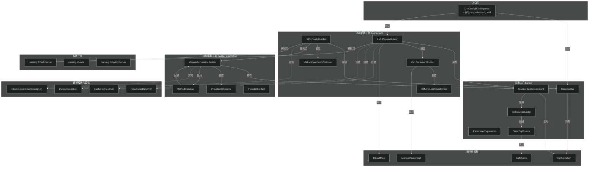
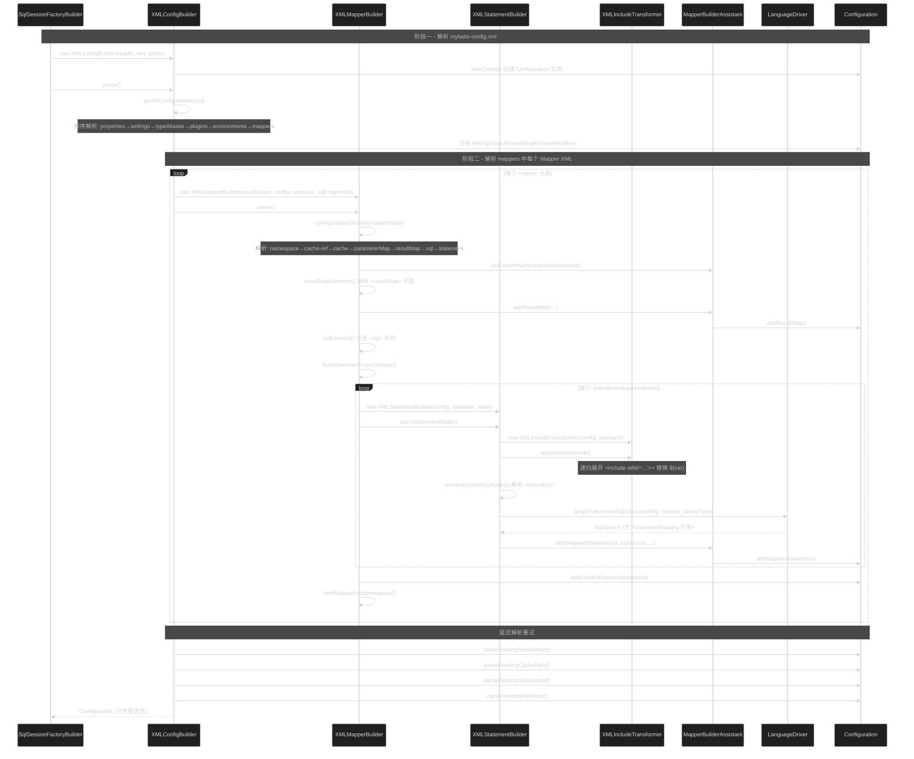
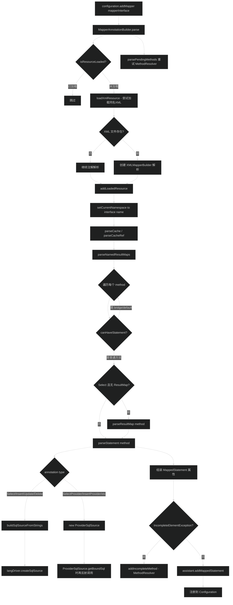

# 配置构建器（builder）
> 上次修改：2026-07-28 22:11

## 重点关注

- **XMLConfigBuilder.parse() -- 主链路入口**：整个 MyBatis 初始化从 mybatis-config.xml 解析开始，是理解配置加载流程的第一个必读方法。内部按固定顺序解析 properties、settings、typeAliases、plugins、environments、mappers 等，顺序错误会导致依赖缺失（如 properties 必须先读以获得占位替换值）。
- **XMLMapperBuilder.parse() -- XML Mapper 解析**：解析单个 Mapper XML 文件，处理 namespace 绑定、cache/cache-ref、parameterMap、resultMap、sql 片段及各 statement 节点，是理解 Mapper XML 如何变成运行期 MappedStatement 的核心。
- **XMLIncludeTransformer.applyIncludes() -- <include> 递归展开**：实现 `<include refid="..."/>` 的递归展开与变量传递，是一个非平凡的 DOM 树变换算法（节点替换+属性/文本占位符替换），涉及跨文档节点导入与递归深度控制。
- **MapperAnnotationBuilder.parse() -- 注解解析**：处理 @Select/@Insert/@Update/@Delete/@SelectProvider 等注解到 MappedStatement 的转换，涉及复杂的 Java 泛型返回类型解析（`getReturnType`）、Provider 方法查找与调用。
- **XMLStatementBuilder.parseStatementNode() -- Statement 节点解析**：处理 SelectKey 的前置解析、LanguageDriver 驱动的 SqlSource 构建、主键策略判定，是 XML 和注解两条路径最终汇聚生成 MappedStatement 的交汇点。
- **MapperBuilderAssistant -- 共用组装器**：XML 和注解两种解析路径共用此助手类完成 namespace 管理、ResultMap/ParameterMap/MappedStatement 的构建与注册，其 `applyCurrentNamespace` 的引用/非引用双模式命名空间规则容易误用，是跨 mapper 引用的关键。

## 1. 模块定位与职责边界

### 定位
`org.apache.ibatis.builder` 包及其子包 `xml` 和 `annotation` 是 MyBatis 的 **配置构建层**。它负责将用户编写的外部配置描述 -- 无论是 mybatis-config.xml 全局配置文件、Mapper XML 映射文件，还是 Mapper 接口上的 Java 注解 -- 解析并转换为 MyBatis 运行时的核心对象 `org.apache.ibatis.session.Configuration`。

### 职责
- **解析 mybatis-config.xml**：将 environments、settings、typeAliases、plugins、typeHandlers、mappers 等全局配置节点解析并注册到 Configuration。
- **解析 Mapper XML**：将 `<resultMap>`、`<sql>`、`<select>`、`<insert>`、`<update>`、`<delete>` 等映射元素解析为 ResultMap、MappedStatement 等运行期对象。
- **解析 Mapper 注解**：将 @Select、@Insert、@Results、@SelectKey、@CacheNamespace 等注解转换为对应的运行期对象。
- **SqlSource 构建**：将带 `#{param}` 占位符的 SQL 文本解析为 SqlSource（通过 LanguageDriver + SqlSourceBuilder）。
- **命名空间管理**：通过 `applyCurrentNamespace` 统一管理 namespace 前缀，保证跨 mapper 引用（如 `<cache-ref>`、嵌套查询引用）的正确解析。
- **延迟解析与重试**：处理解析过程中因依赖未就绪而产生的 IncompleteElementException（如引用了尚未解析的 resultMap），将未完成元素加入 pending 队列后在适当时机重试。

### 不负责
- 不负责 SQL 的执行（那是 `executor` 包的职责）。
- 不负责运行时的参数映射与结果映射（那是 `scripting` 和 `executor` 包通过已构建的 MappedStatement 进行的）。
- 不负责 XML 文件的低层解析（委托给 `parsing` 包的 XPathParser）。
- 不负责事务管理、数据源连接（虽然 XMLConfigBuilder 会解析并实例化这些组件）。

### 输入 / 输出 / 副作用
- **输入**：mybatis-config.xml Reader/InputStream、Mapper XML 文件路径、Mapper 接口 Class 对象。
- **输出**：填充完整的 Configuration 对象，其中包含所有已注册的 MappedStatement、ResultMap、ParameterMap、Cache 等。
- **副作用**：将解析过程中的中间状态（如 pending result maps、pending cache refs）暂存在 Configuration 内部队列中。

## 2. 架构关系与依赖



| 节点 | 角色 | 依赖方向 | 说明 |
|------|------|----------|------|
| **BaseBuilder** | 构建器基类 | 被所有 Builder 继承 | 提供 Configuration、TypeAliasRegistry、TypeHandlerRegistry 引用及通用类型解析方法 |
| **XMLConfigBuilder** | mybatis-config.xml 解析入口 | 继承 BaseBuilder，驱动 XMLMapperBuilder | 一次性使用（parsed 标记防重复），按固定顺序解析11类配置节点 |
| **XMLMapperBuilder** | 单个 Mapper XML 解析器 | 继承 BaseBuilder，持有 MapperBuilderAssistant | 解析 `<mapper namespace="...">` 内所有子元素，驱动 XMLStatementBuilder |
| **XMLStatementBuilder** | 单个 Statement 节点解析器 | 继承 BaseBuilder | 处理 `<select>`/`<insert>`/`<update>`/`<delete>` 节点，含 `<selectKey>` 和 `<include>` 展开 |
| **XMLIncludeTransformer** | 递归 `<include>` 展开 | 被 XMLStatementBuilder 调用 | 对 DOM 树做原地替换，处理属性与文本节点中的 `${var}` 占位符 |
| **XMLMapperEntityResolver** | 离线 DTD 解析 | 被 XPathParser 使用 | 将网络 DTD 引用映射到 classpath 内的本地 DTD 文件，避免 XML 解析时网络 I/O |
| **MapperAnnotationBuilder** | Mapper 接口注解解析器 | 持有 MapperBuilderAssistant，驱动 MethodResolver | 解析接口上的 @CacheNamespace、@Select 等注解，内部类 `AnnotationWrapper` 统一注解类型判断 |
| **MethodResolver** | 延迟方法解析器 | 持有 MapperAnnotationBuilder 引用 | 当注解解析因依赖未就绪失败时，包装为 MethodResolver 加入 pending 队列等待重试 |
| **ProviderSqlSource** | @XxxProvider 动态 SQL 源 | 实现 SqlSource 接口 | 在 `getBoundSql()` 时反射调用 Provider 方法获取 SQL 文本，再委托 LanguageDriver 创建真正的 SqlSource |
| **MapperBuilderAssistant** | 共用组装器 | 被 XMLMapperBuilder 和 MapperAnnotationBuilder 共用 | namespace 管理、ResultMap/ParameterMap/MappedStatement/Cache 构建与注册 |
| **SqlSourceBuilder** | 静态 SqlSource 工厂 | 被 LanguageDriver 使用 | 将解析后的 SQL 字符串和 ParameterMapping 列表封装为 `StaticSqlSource` |
| **ParameterExpression** | `#{param}` 表达式解析 | 被 LanguageDriver 的 TokenHandler 使用 | 解析 `#{property,javaType=int,jdbcType=NUMERIC}` 语法为 Map |
| **StaticSqlSource** | 静态 SQL 源 | 实现 SqlSource | 直接持有已解析的 SQL 字符串和 ParameterMapping 列表，`getBoundSql()` 直接返回 |
| **ResultMapResolver** | 延迟 ResultMap 解析 | 持有 MapperBuilderAssistant | 当 resultMap 引用了尚未解析的父 resultMap 时加入 pending 队列 |
| **CacheRefResolver** | 延迟 Cache 引用解析 | 持有 MapperBuilderAssistant | 当 `<cache-ref>` 引用的 namespace 尚未加载其 cache 时加入 pending 队列 |
| **IncompleteElementException** | 未完成元素异常 | 继承 BuilderException | 被解析器抛出和捕获，触发延迟解析机制——元素被加入 Configuration 的 pending 队列 |
| **BuilderException** | 构建器通用异常 | 继承 PersistenceException | 所有构建期错误的根异常，覆盖配置非法、类找不到、实例化失败等场景 |

### 强依赖与可替换依赖
- **强依赖**：XMLConfigBuilder -> XPathParser（解析XML）、MapperBuilderAssistant -> Configuration（注册产物）、LanguageDriver（构建 SqlSource）。
- **可替换依赖**：LanguageDriver 可自定义（`lang` 属性），XMLMapperEntityResolver 可替换为自定义 EntityResolver，ProviderSqlSource 中的 ProviderMethodResolver 可自定义。
- **潜在耦合点**：XMLConfigBuilder 内部硬编码了解析顺序（properties 必须最先、environments 在 settings 之后等），修改顺序需理解依赖关系；`applyCurrentNamespace` 的双模式（isReference 参数）容易误用导致跨 mapper 引用失败。

## 3. 入口与调用方式

### XML 配置路径入口

**XMLConfigBuilder.parse()** -- 解析 mybatis-config.xml 的主入口。

```java
// 典型调用方式（在 SqlSessionFactoryBuilder 中）
XMLConfigBuilder parser = new XMLConfigBuilder(reader, environment, properties);
Configuration configuration = parser.parse();
```

- **触发条件**：用户调用 `SqlSessionFactoryBuilder.build()` 时创建并调用。
- **关键参数**：`Reader`/`InputStream`（mybatis-config.xml）、`environment`（可选，指定环境名）、`Properties`（可选，外部属性覆盖）。
- **返回值**：填充完整的 `Configuration` 对象。
- **防重复调用**：`parsed` 标记保证了每个 XMLConfigBuilder 实例只能调用一次 `parse()`（L106-L108）。
- **入口之后的行为**：`parse()` 内部调用 `parseConfiguration()`，按固定顺序解析：properties -> settings -> typeAliases -> plugins -> objectFactory/objectWrapperFactory/reflectorFactory -> settings（应用值）-> environments -> databaseIdProvider -> typeHandlers -> **mappers**。

在 mappers 解析阶段（L388-L423），XMlConfigBuilder 根据 mapper 元素的 `resource`/`url`/`class` 属性分发到两种子入口：
1. **XML 路径**：`resource` 或 `url` 指定 Mapper XML 文件路径，创建 `XMLMapperBuilder` 并调用其 `parse()`。
2. **注解路径**：`class` 指定 Mapper 接口全限定名，调用 `configuration.addMapper(mapperInterface)`，后者内部创建 `MapperAnnotationBuilder`。

**源码位置**：`builder/xml/XMLConfigBuilder.java:105-112`, `builder/xml/XMLConfigBuilder.java:388-423`

### XML Mapper 解析入口

**XMLMapperBuilder.parse()** -- 解析单个 Mapper XML 文件。

```java
// 在 XMLConfigBuilder.mappersElement() 中创建
XMLMapperBuilder mapperParser = new XMLMapperBuilder(inputStream, configuration, resource, 
    configuration.getSqlFragments());
mapperParser.parse();
```

- **触发条件**：由 XMLConfigBuilder 或 MapperAnnotationBuilder（加载同名 XML）创建并调用。
- **关键参数**：Mapper XML 的 InputStream、共享的 Configuration、资源路径、全局 sqlFragments Map。
- **防重复加载**：`parse()` 通过 `configuration.isResourceLoaded(resource)` 检查避免重复解析（L104-L108）。
- **入口之后的行为**：`parse()` 首先调用 `configurationElement()` 解析 `<mapper>` 根元素下的所有子节点。解析完成后调用 `bindMapperForNamespace()` 尝试绑定同名 Mapper 接口（如果 namespace 对应的类已加载且尚未注册）。最后触发三次 pending 解析：
  1. `parsePendingResultMaps(false)` -- 重试未完成的 ResultMap
  2. `parsePendingCacheRefs(false)` -- 重试未完成的 Cache 引用
  3. `parsePendingStatements(false)` -- 重试未完成的 Statement（包括 XML 和注解两种来源）

**源码位置**：`builder/xml/XMLMapperBuilder.java:103-112`

### 注解解析入口

**MapperAnnotationBuilder.parse()** -- 解析 Mapper 接口上的注解。

此入口通过 `configuration.addMapper(Class)` 间接调用（Configuration 内部创建 `MapperAnnotationBuilder` 并调用 `parse()`）。

- **触发条件**：`configuration.addMapper()` 被调用时，或 XMLMapperBuilder 的 `bindMapperForNamespace()` 发现 namespace 对应接口已加载时。
- **关键参数**：`Class<?> type` -- Mapper 接口的 Class 对象。
- **防重复加载**：通过 `configuration.isResourceLoaded(resource)` 检查（L124）。
- **入口之后的行为**：
  1. `loadXmlResource()` -- 首先尝试加载与 Mapper 接口同名的 XML 文件（L162-L184），如果存在则创建 XMLMapperBuilder 解析。这里有一个防重复机制：`"namespace:" + type.getName()` 这种特殊的 resource key 防止 MapperAnnotationBuilder 重复加载已被 XMLMapperBuilder 的 `bindMapperForNamespace()` 加载过的资源。
  2. 解析类级别注解：`@CacheNamespace`、`@CacheNamespaceRef`、`@NamedResultMap`。
  3. 遍历所有方法：对每个非 bridge、非 default 方法，先尝试解析 ResultMap（如果是 Select 方法且没有 @ResultMap），再调用 `parseStatement(method)` 解析为 MappedStatement。
  4. 最后调用 `parsePendingMethods(false)` 重试因依赖未就绪而失败的方法。

**源码位置**：`builder/annotation/MapperAnnotationBuilder.java:122-155`

### 入口汇总

| 入口 | 类型 | 触发方式 | 核心流程 |
|------|------|----------|----------|
| `XMLConfigBuilder.parse()` | XML 全局配置 | SqlSessionFactoryBuilder 调用 | parseConfiguration() 按序解析 11 类节点 |
| `XMLMapperBuilder.parse()` | XML Mapper | XMLConfigBuilder 或 MapperAnnotationBuilder 调用 | configurationElement() -> 解析各子元素 + 三次 pending 重试 |
| `MapperAnnotationBuilder.parse()` | 注解 Mapper | configuration.addMapper() 调用 | loadXmlResource() -> 类级注解解析 -> 方法遍历 -> pending 重试 |
| `MethodResolver.resolve()` | 延迟方法重试 | Configuration 在适当时机调用 | 回调 `annotationBuilder.parseStatement(method)` |

## 4. 核心概念与领域模型

### 4.1 Builder 层次：BaseBuilder 为根

所有构建器都继承自 `BaseBuilder`（`builder/BaseBuilder.java`），它持有三个核心引用：
- `configuration` -- 全局 Configuration 对象，所有解析产物最终注入此处
- `typeAliasRegistry` -- 类型别名注册表，用于将 XML/注解中的字符串别名解析为 Java Class
- `typeHandlerRegistry` -- 类型处理器注册表，用于查找 TypeHandler

BaseBuilder 提供了一组受保护的辅助方法（L50-L138），供子类使用：
- `resolveClass(String alias)` -- 将别名解析为 Class
- `resolveJdbcType(String alias)` -- 解析 JDBC 类型枚举
- `resolveResultSetType(String alias)` -- 解析 ResultSet 类型枚举
- `resolveParameterMode(String alias)` -- 解析参数模式（IN/OUT/INOUT）
- `resolveTypeHandler(Type, JdbcType, Class)` -- 解析 TypeHandler
- `booleanValueOf`、`integerValueOf`、`stringSetValueOf` -- 字符串到具体类型的转换，支持默认值
- `createInstance(String alias)` -- 通过反射创建实例

**三维评估**：
- **好处**：集中管理 Configuration 引用和类型解析逻辑，子类只需关注各自的解析流程，不用关心别名注册和 TypeHandler 查找的细节。
- **替代方案**：可以做成独立工具类而非抽象基类，但抽象基类可以约束子类的构造方式（必须传入 Configuration），同时允许子类在不同包下（xml/annotation）复用同一套类型解析逻辑。
- **风险**：BaseBuilder 与 Configuration 是强耦合的，且 Configuration 内部又持有 TypeAliasRegistry 和 TypeHandlerRegistry 引用，形成双向认识。Configuration 的复杂度会直接传导给所有 Builder。

### 4.2 MapperBuilderAssistant -- 共用组装器

`MapperBuilderAssistant`（`builder/MapperBuilderAssistant.java`）是 XML 和注解两条解析路径的 **共用组装器**。它不是 Builder 而是 Assistant，名字暗示它不独立决定解析策略，而是执行具体的构建与注册动作。

**核心职责**：
1. **Namespace 管理**：`setCurrentNamespace()`（L75-L86）和 `applyCurrentNamespace()`（L88-L107）。`applyCurrentNamespace` 有两个模式：
   - `isReference = false`（元素定义模式）：直接追加 namespace 前缀，同时禁止 base 中带 `.`（防止跨 namespace 定义）。
   - `isReference = true`（引用模式）：如果 base 已经包含 `.`（已完全限定）则直接返回，否则追加当前 namespace 前缀。
2. **Cache 管理**：`useNewCache()`（L127-L135）通过 `CacheBuilder` 构建并注册新 Cache；`useCacheRef()`（L109-L125）引用其他 namespace 的 Cache。
3. **ResultMap 构建**：`addResultMap()`（L157-L186）处理 ResultMap 注册，特别是 `extends` 继承机制：子 ResultMap 的映射会移除父 ResultMap 中已有的同名映射，再合并剩余。
4. **ParameterMap 构建**：`addParameterMap()`（L137-L142）和 `buildParameterMapping()`（L144-L155）。
5. **MappedStatement 构建**：`addMappedStatement()`（L201-L229）将所有参数组装为 `MappedStatement.Builder` 并注册到 Configuration。
6. **ResultMapping 构建**：`buildResultMapping()`（L335-L353）处理复杂列名解析（`parseCompositeColumnName`）、嵌套查询/结果映射引用、延迟加载标记。
7. **Discriminator 构建**：`buildDiscriminator()`（L188-L198）构建鉴别器，处理 case 分支到 resultMap 的映射。

**三维评估**：
- **好处**：将 XML 路径和注解路径的构造逻辑统一到一个类中，避免重复代码。Namespace 管理（特别是引用模式的自动补全）简化了跨 mapper 引用。
- **替代方案**：可以让 XMLMapperBuilder 和 MapperAnnotationBuilder 各自直接调用 Configuration 的方法。但这样 namespace 管理和 ResultMap 继承等逻辑需要重复实现。
- **风险**：`applyCurrentNamespace` 的双模式语义不够直观（参数名 `isReference` 不能完全传达行为差异），容易误用导致元素 ID 被错误命名。

### 4.3 SqlSourceBuilder 与 ParameterExpression -- SQL 占位符解析

`SqlSourceBuilder`（`builder/SqlSourceBuilder.java`）是静态工厂类，提供 `buildSqlSource(Configuration, String, List<ParameterMapping>)` 方法，将已解析的 SQL 字符串和参数映射列表封装为 `StaticSqlSource`。

`ParameterExpression`（`builder/ParameterExpression.java`）是一个手写的递归下降解析器，继承自 `HashMap<String, String>`，解析 `#{param}` 内部表达式。支持的语法：
- `property` -- 简单属性名，解析为 `{"property": "name"}`
- `(expression)` -- OGNL 表达式，解析为 `{"expression": "name.toUpperCase()"}`
- `:jdbcType` -- 旧式 JDBC 类型，解析为 `{"property": "name", "jdbcType": "VARCHAR"}`
- `,key=value` -- 键值属性对，解析为 `{"property": "name", "mode": "IN"}`

解析器实现是典型的递归下降结构：`parse()` 判断入口、`expression()` 处理括号内的 OGNL 表达式（通过括号计数匹配）、`property()` 解析简单属性名、`jdbcTypeOpt()` 处理 `:` 引导的 JDBC 类型或 `,` 引导的属性、`option()` 递归解析键值对。

**三维评估**：
- **好处**：手写解析器轻量且不引入第三方解析库依赖。继承 HashMap 使得解析结果可以直接用 Map API 访问。
- **替代方案**：可以使用正则表达式一次性匹配，但参数格式灵活且支持嵌套属性，正则表达式难以覆盖所有情况。
- **风险**：递归下降解析器对格式错误不够健壮，括号不匹配时可能导致 StringIndexOutOfBoundsException。解析器不处理转义字符。

### 4.4 StaticSqlSource -- 静态 SQL 源

`StaticSqlSource`（`builder/StaticSqlSource.java`）是 `SqlSource` 接口的最简单实现。它持有已解析的 SQL 字符串和 `List<ParameterMapping>`，`getBoundSql()` 方法直接构造并返回 `BoundSql` 对象，不做任何动态处理。

**生命周期**：在所有 `#{}` 参数已被 `LanguageDriver` 替换为 `?` 且 ParameterMapping 列表已建立后创建。它是 MappedStatement 中存储的 SqlSource 类型之一。

**三维评估**：
- **好处**：实现简单，零开销，适合占位符已完全确定的 SQL（如 `SELECT * FROM user WHERE id = ?`）。
- **替代方案**：对于动态 SQL（如 `<if>`/`<where>`），使用 `DynamicSqlSource`，它在每次执行时根据参数重新构建 SQL。
- **风险**：如果误将包含未解析占位符的 SQL 传入 StaticSqlSource，运行时会因为参数数量不匹配而失败。

### 4.5 ResultMapResolver 与 CacheRefResolver -- 延迟解析器

这两个类是 **延迟解析（Lazy Resolution）** 模式的具体实现：

- `ResultMapResolver`（`builder/ResultMapResolver.java`）：持有 `MapperBuilderAssistant` 和 ResultMap 构造参数，`resolve()` 方法调用 `assistant.addResultMap()`。当 ResultMap 的 `extends` 属性引用了尚未解析的父 ResultMap 时，当前 ResultMap 的解析会抛出 `IncompleteElementException`，XMLMapperBuilder 捕获后将 ResultMapResolver 加入 Configuration 的 pending 队列，等待后续重试。
- `CacheRefResolver`（`builder/CacheRefResolver.java`）：类似地持有 `MapperBuilderAssistant` 和 `cacheRefNamespace`，`resolve()` 方法调用 `assistant.useCacheRef()`。当 `<cache-ref>` 引用的 namespace 尚未加载其 Cache 时加入 pending 队列。

**三维评估**：
- **好处**：解决了 Mapper XML 的解析顺序问题。用户不需要手动管理文件加载顺序，可以自然地编写跨文件引用。
- **替代方案**：可以预先扫描所有 Mapper 文件建立索引，但需要两次遍历（先建立 ID 索引，再解析内容），且无法处理循环引用检测等边界情况。
- **风险**：延迟解析可能掩盖真正的配置错误。如果某个引用始终无法解析（如引用了不存在的 resultMap），错误会以 `IncompleteElementException` 的形式反复出现，需要在 Configuration 中追踪 pending 队列的长度变化来判断是否确实无解。

### 4.6 概念关系图

```
BaseBuilder (基类)
  |-- XMLConfigBuilder (全局配置解析)
  |     |-- 持有 XPathParser
  |     |-- 创建 XMLMapperBuilder (mapper 文件入口)
  |     |-- 输出: 填充完整的 Configuration
  |
  |-- XMLMapperBuilder (Mapper XML 解析)
  |     |-- 持有 MapperBuilderAssistant
  |     |-- 创建 XMLStatementBuilder (单个 statement)
  |     |-- 处理: resultMap|sql|cache|statement 节点
  |     |-- 输出: ResultMap + MappedStatement 注册到 Configuration
  |
  |-- XMLStatementBuilder (Statement 节点解析)
  |     |-- 持有 MapperBuilderAssistant
  |     |-- 创建 XMLIncludeTransformer (<include> 展开)
  |     |-- 委托 LanguageDriver 构建 SqlSource
  |     |-- 输出: MappedStatement (通过 MapperBuilderAssistant)
  |
  |-- XMLIncludeTransformer (<include> 递归展开)
        |-- 操作 W3C DOM 树 (Node 替换)
        |-- 处理 ${var} 占位符替换
        |-- 跨文档节点导入 (importNode)

MapperAnnotationBuilder (注解解析, 不继承 BaseBuilder)
  |-- 持有 MapperBuilderAssistant
  |-- 持有 Configuration
  |-- 可能创建 XMLMapperBuilder (loadXmlResource)
  |-- 创建 MethodResolver (延迟重试)
  |-- 创建 ProviderSqlSource (Provider 类型)
  |-- 输出: MappedStatement (通过 MapperBuilderAssistant)

MapperBuilderAssistant (共用组装器, 继承 BaseBuilder)
  |-- namespace 管理
  |-- Cache 创建/引用
  |-- ResultMap/ParameterMap/MappedStatement 构建与注册

SqlSourceBuilder (静态工厂)
  |-- 返回 StaticSqlSource

ParameterExpression extends HashMap (SQL 占位解析)
  |-- 递归下降解析器
  |-- 输出: {"property": "...", "jdbcType": "...", ...}
```

## 5. 关键流程

### 5.1 主成功路径：XML 配置解析两步链



**阶段一：解析 mybatis-config.xml（步骤 1-4）**

XMLConfigBuilder 在构造函数中创建 Configuration 实例，`parse()` 方法调用 `parseConfiguration(root)`，按固定顺序解析 11 类配置节点：`properties`（最先，建立变量上下文）-> `settings`（先读取不做应用）-> `loadCustomVfsImpl` -> `loadCustomLogImpl` -> `typeAliases` -> `plugins` -> `objectFactory` -> `objectWrapperFactory` -> `reflectorFactory` -> `settingsElement`（此时应用 settings 值，因为 objectFactory 等可能已被 settings 引用的自定义实现影响）-> `environments` -> `databaseIdProvider` -> `typeHandlers` -> `mappers`。每个解析方法对 `<configuration>` 根节点调用 `root.evalNode("子节点名")` 获取 XNode（可能为空则跳过），然后将解析结果注册到 Configuration。

关键判断：`environmentsElement` 中通过 `isSpecifiedEnvironment(id)` 仅激活匹配默认 environment 名称或指定 environment 名称的数据源配置。`mappersElement` 根据 `resource`/`url`/`class` 属性决定走 XML 解析路径还是注解解析路径，三者必须且仅指定一个。

**阶段二：解析 Mapper XML 并构建 MappedStatement（步骤 5-7）**

XMLMapperBuilder 的 `parse()` 方法首先检查 `configuration.isResourceLoaded(resource)` 防止重复加载。`configurationElement()` 方法按 namespace（必须非空）-> cache-ref -> cache -> parameterMap -> resultMap -> sql -> statement 的顺序解析。

对于 statement 节点，`buildStatementFromContext()` 方法创建 `XMLStatementBuilder` 实例。XMLStatementBuilder 的 `parseStatementNode()` 方法按以下顺序处理：
1. **databaseId 匹配**：根据 `databaseIdMatchesCurrent()` 决定是否处理当前节点，支持多数据库适配
2. **<include> 展开**：通过 XMLIncludeTransformer 递归展开所有 `<include>` 引用和 `${var}` 占位符
3. **<selectKey> 解析**：先解析并移除 selectKey 子节点（因为它们需要在主 SQL 前/后执行）
4. **参数类型推断**：当 parameterType 未指定但有 mapperClass 时，通过 `ParamNameResolver` 从接口方法推断
5. **LanguageDriver 构建 SqlSource**：委托 langDriver 将 XNode（此时已展开 include）转换为 SqlSource
6. **主键策略判定**：已注册的 SelectKeyGenerator 优先，否则根据 useGeneratedKeys 属性选择 Jdbc3KeyGenerator 或 NoKeyGenerator
7. **结果类型推断**：如果 resultType 和 resultMap 都未指定，调用 `MapperAnnotationBuilder.getMethodReturnType()` 从 Mapper 接口方法推断返回类型
8. **组装与注册**：调用 `MBA.addMappedStatement()` 将所有属性组装为 MappedStatement 并注册

### 5.2 失败路径：IncompleteElementException 延迟重试

```mermaid
%%{init: {"theme": "dark"}}%%
flowchart TD
    A[解析 resultMap/statement 引用] --> B{依赖是否已就绪?}
    B -->|是| C[正常注册到 Configuration]
    B -->|否| D[抛出 IncompleteElementException]
    D --> E[解析器 catch 并包装为 Resolver]
    E --> F[addIncompleteResultMap / addIncompleteStatement / addIncompleteMethod]
    F --> G[加入 Configuration pending 队列]
    G --> H{下一次 parse() 调用}
    H --> I[parsePendingXxx() 遍历队列]
    I --> J[调用 resolver.resolve()]
    J --> K{依赖现在是否已就绪?}
    K -->|是| C
    K -->|否| L[保留在 pending 队列]
    L --> H
```

**步骤 1-2**：当 XMLMapperBuilder 解析 resultMap 的 `extends` 属性或 cache-ref 引用其他 namespace 的 cache 时，如果被引用的元素尚未注册到 Configuration，MapperBuilderAssistant 或 XMLMapperBuilder 会抛出 `IncompleteElementException`。

**步骤 3-5**：XMLMapperBuilder 在 `resultMapElement()`（L257-L262）或 XMLStatementBuilder 内部捕获 `IncompleteElementException`，将解析上下文包装为 `ResultMapResolver`、保持 `XMLStatementBuilder` 自身（实现了特定接口）、或将方法包装为 `MethodResolver`，然后加入 Configuration 的三个 pending 队列之一。

**步骤 6-8**：`XMLMapperBuilder.parse()` 方法在每次成功解析一个 Mapper XML 后，都会调用三次 pending 解析（L109-L111）：
```java
configuration.parsePendingResultMaps(false);
configuration.parsePendingCacheRefs(false);
configuration.parsePendingStatements(false);
```
同样，`MapperAnnotationBuilder.parse()` 也在结束时调用 `parsePendingMethods(false)`（L154）。

每次遍历 pending 队列时调用对应 Resolver 的 `resolve()` 方法重试。如果依赖仍然未就绪（再次抛出 IncompleteElementException），元素保留在 pending 队列中等待下一次轮次。这意味着只要所有引用的目标最终被加载，延迟解析机制就能自动完成所有依赖的组装。

**边界**：`XMLConfigBuilder.parse()` 返回完整 Configuration 后，外部调用方（如 `SqlSessionFactoryBuilder`）可能不会再次触发 pending 解析。如果某 Mapper XML 中的引用在所有 Mapper 文件加载完毕后仍未就绪，该元素会永远停留在 pending 队列中，导致运行时的 "MappedStatement not found" 错误。

### 5.3 注解解析路径：注解到 MappedStatement



**步骤 1-4（XML 同步加载）**：`MapperAnnotationBuilder.parse()` 首先调用 `loadXmlResource()` 尝试加载与 Mapper 接口同路径的 XML 文件。这里有一个重要的防重复机制：XMLMapperBuilder 在 `bindMapperForNamespace()` 中通过 `addLoadedResource("namespace:" + namespace)` 设置特殊标记（L414），防止 MapperAnnotationBuilder 重复加载已通过 XML 解析的 Mapper 接口。反过来，如果先触发注解路径加载了 XML（`MapperAnnotationBuilder.loadXmlResource()` 参数中传入了 `type` 作为 `mapperClass`），XMLMapperBuilder 内部通过检查 `configuration.isResourceLoaded(resource)` 也能防止重复加载。

**步骤 5-8（注解到 SQL 源）**：对于直接 SQL 注解（@Select/@Insert/@Update/@Delete），通过 `buildSqlSourceFromStrings()` 将注解的字符串数组合并后委托 LanguageDriver 转换为 SqlSource。对于 Provider 注解，创建 `ProviderSqlSource` 对象，它在 `getBoundSql()` 时反射调用 Provider 类的方法获取 SQL 文本，再委托 LanguageDriver 转换。`ProviderSqlSource` 构造函数（L100-L161）需要解析 Provider 类型（从注解的 `type`/`value` 属性）、查找提供方法（默认名 `provideSql`，或通过 `ProviderMethodResolver.resolveMethod()` 动态解析）、构建 `ParamNameResolver` 用于 Provider 方法的参数名映射。

**步骤 9-10（泛型返回类型解析）**：`MapperAnnotationBuilder.getReturnType()`（L444-L499）是一个复杂的静态方法，处理方法返回值的各种泛型场景：数组（取 component type）、Collection/Cursor（取泛型参数）、Map（通过 MapKey 注解定位 value 类型）、Optional（取泛型参数）、普通类型（直接返回）。

**步骤 11-12（延迟重试）**：如果 `parseStatement()` 过程中因引用未就绪抛出 `IncompleteElementException`，catch 后包装为 `MethodResolver` 加入 Configuration 的 pending methods 队列。`parsePendingMethods()` 会在后续调用时遍历重试。

## 6. 核心实现细节

### 6.1 XMLConfigBuilder 的解析顺序设计

`parseConfiguration()` 方法（`xml/XMLConfigBuilder.java:114-135`）中的解析顺序是经过精心设计的，不是随意排列：

```
properties -> settings(读取) -> loadCustomVfsImpl -> loadCustomLogImpl
-> typeAliases -> plugins -> objectFactory -> objectWrapperFactory
-> reflectorFactory -> settingsElement(应用) -> environments
-> databaseIdProvider -> typeHandlers -> mappers
```

**顺序约束原因**：
1. **properties 最先**（L117）：注释 "#117" 指 properties 必须在其他所有配置之前解析，因为后续节点的属性值可能包含 `${var}` 占位符，依赖 properties 中定义的变量进行替换。
2. **typeAliases 在 plugins 之前**（L121）：plugins 节点的 `interceptor` 属性需要能使用类型别名。
3. **settings 分两阶段**（L118 + L126）：先通过 `settingsAsProperties()` 读取 settings 但不应用（仅做 key 校验），在 objectFactory/objectWrapperFactory/reflectorFactory 解析完成后才通过 `settingsElement()` 应用。这是因为某些 settings（如 proxyFactory）可能涉及 objectFactory 中注册的自定义类型（注释 "#631"）。
4. **environments 在 typeHandlers 之前**（L128 + L130）：typeHandlers 可能需要根据数据源类型做出不同的选择（实际实现中未强依赖，但预留了这种可能）。
5. **mappers 最后**（L131）：所有配置就绪后再加载 Mapper 文件，因为 Mapper 解析依赖 typeAliases、typeHandlers 和完整的 settings。

**XMLConfigBuilder 内的辅助解析方法**：每个 `xxxElement()` 方法都遵循相同的模式：检查 context 是否为 null（节点不存在则跳过），遍历子节点，解析属性，调用 Configuration 的对应方法注册。

### 6.2 XMLIncludeTransformer 的递归展开算法

`XMLIncludeTransformer.applyIncludes()`（`xml/XMLIncludeTransformer.java:46-92`）实现了一个非平凡的 DOM 树原地变换算法，核心逻辑包括：

**Step 1 - 变量上下文构建**（L47-L50）：
```java
Properties variablesContext = new Properties();
Optional.ofNullable(configuration.getVariables()).ifPresent(variablesContext::putAll);
```
首先将全局 Configuration 变量复制到当前上下文，作为根级别的占位符值。

**Step 2 - 递归遍历**（L61-L92）：`applyIncludes(Node source, Properties variablesContext, boolean included)` 方法递归遍历 DOM 树：

- **处理 `<include>` 节点**（L62-L73）：如果当前节点是 `<include>`，执行以下操作：
  1. 通过 `findSqlFragment()` 查找 refid 对应的 SQL 片段 XNode（L63）
  2. 解析 `<include>` 内的 `<property>` 子元素构建变量上下文（L64）
  3. 对被引用的 SQL 片段递归调用 `applyIncludes()` 以处理嵌套的 `<include>`（L65）-- 这实现了**深度优先的递归展开**
  4. 如果被引用节点来自不同文档，通过 `importNode()` 导入（L66-L68）-- 处理跨 Mapper 文件引用
  5. 用被引用的 SQL 片段节点替换当前 `<include>` 节点（L69）
  6. 将替换节点的子节点上提一级（L70-L73）-- `<sql>` 包装节点自身被移除，保留其内容

- **处理元素节点的属性替换**（L74-L82）：如果当前节点是元素节点且处于 `included=true` 状态（意味着它来自被 include 的片段），对节点的所有属性值执行 `PropertyParser.parse()` 替换 `${var}` 占位符。

- **处理文本/CDATA 节点的替换**（L87-L91）：如果当前节点是文本或 CDATA 节点且处于 `included=true` 状态，对其文本内容执行 `${var}` 替换。

- **递归子节点**（L83-L86）：对于普通元素节点，递归处理其所有子节点。

**Step 3 - 查找 SQL 片段**（L94-L103）：`findSqlFragment()` 方法：
1. 通过 `PropertyParser.parse()` 替换 refid 中的变量（L95）
2. 通过 `builderAssistant.applyCurrentNamespace()` 补充 namespace 前缀（L96）
3. 从 Configuration 的全局 `sqlFragments` Map 中查找（L98）
4. 返回节点的克隆（`cloneNode(true)`），避免修改原始定义（L99）

**Step 4 - 变量上下文构建**（L119-L143）：`getVariablesContext()` 从 `<include>` 节点的 `<property>` 子元素构建新的 Properties，继承父级上下文并叠加当前定义的属性。如果发现同名属性重复定义，抛出 `BuilderException`。

**三维评估**：
- **好处**：递归设计天然支持嵌套 include（一个被引用的 SQL 片段内部还可以 include 其他片段）。通过 DOM Node 替换而非字符串拼接，保留了 XML 结构信息。`cloneNode(true)` 保证 SQL 片段定义不被修改，可以安全地被多次 include。
- **替代方案**：可以在 XPath 层面解析而非 DOM 层面，但 DOM API 对 Node 操作（replaceChild、insertBefore、removeChild）的支持更直接。也可以预先将所有 include 展开为字符串再做解析，但那会丢失 XML 结构。
- **风险**：递归没有深度限制，理论上循环引用（A include B, B include A）会导致栈溢出。节点跨文档导入（importNode）在某些 XML 解析器实现中可能存在兼容性问题。`included=false` 的非 include 元素的属性不会做变量替换（L75 的条件 `included && !variablesContext.isEmpty()`），这是一个设计决策而非 bug：非 include 元素的属性不应该被全局 properties 替换。

### 6.3 XMLMapperBuilder.resultMapElement() 的 ResultMap 继承

`resultMapElement()`（`xml/XMLMapperBuilder.java:224-263`）处理 `<resultMap>` 节点的解析，核心实现要点：

**类型推断**（L227-L232）：支持多种属性名（`type`/`ofType`/`resultType`/`javaType`）以兼容不同 MyBatis 版本的写法。如果都为空，调用 `inheritEnclosingType()` 从外层元素（如 `<association>` 或 `<case>`）推断类型。

**ID 生成**（L234）：如果没有 `id` 属性，使用 `getValueBasedIdentifier()` 基于节点内容生成唯一标识。

**子元素处理**（L240-L253）：遍历 resultMap 的子节点，分类处理：
- `<constructor>` -> `processConstructorElement()`：处理构造器参数映射，通过 `ResultMappingConstructorResolver` 匹配构造器并排序
- `<discriminator>` -> `processDiscriminatorElement()`：构建 Discriminator，处理 `<case>` 子元素（case 内可以内联定义 resultMap 或引用已有 resultMap）
- 其他（`<id>`/`<result>`/`<association>`/`<collection>`）-> `buildResultMappingFromContext()`：构建 ResultMapping，处理嵌套 resultMap（association/collection）时递归调用 `resultMapElement()`

**延迟解析包装**（L255-L262）：通过 `ResultMapResolver` 包装解析操作，如果 `resolve()` 抛出 `IncompleteElementException`（例如 `extends` 中的父 resultMap 尚未注册），将 resolver 加入 pending 队列等待重试。

### 6.4 XMLStatementBuilder 的主键策略判定

`parseStatementNode()` 中的主键策略判定逻辑（`xml/XMLStatementBuilder.java:119-128`）：

```java
KeyGenerator keyGenerator;
String keyStatementId = id + SelectKeyGenerator.SELECT_KEY_SUFFIX;
keyStatementId = builderAssistant.applyCurrentNamespace(keyStatementId, true);
if (configuration.hasKeyGenerator(keyStatementId)) {
  keyGenerator = configuration.getKeyGenerator(keyStatementId);
} else {
  keyGenerator = context.getBooleanAttribute("useGeneratedKeys",
      configuration.isUseGeneratedKeys() && SqlCommandType.INSERT.equals(sqlCommandType))
          ? Jdbc3KeyGenerator.INSTANCE : NoKeyGenerator.INSTANCE;
}
```

优先级：
1. 如果存在 `<selectKey>` 子节点（已在 `processSelectKeyNodes()` 中解析并注册），使用 `SelectKeyGenerator`。注册时的 key 是 `statementId + "!selectKey"`。
2. 如果 `useGeneratedKeys` 属性为 true（或全局配置 `useGeneratedKeys=true` 且当前是 INSERT 语句），使用 `Jdbc3KeyGenerator.INSTANCE`（JDBC `Statement.getGeneratedKeys()`）。
3. 否则使用 `NoKeyGenerator.INSTANCE`（无主键生成）。

**selectKey 的解析**（L157-L164 + L166-L209）：`processSelectKeyNodes()` 首先通过 `configuration.getDatabaseId()` 优先匹配带 databaseId 的 selectKey，再匹配不带 databaseId 的（双轮调用确保多数据库适配）。每个 selectKey 节点被解析为一个独立的 SELECT 类型的 MappedStatement，再包装为 `SelectKeyGenerator`（标记 `executeBefore` 决定在主 SQL 之前还是之后执行）。解析完成后通过 `removeSelectKeyNodes()` 从 DOM 树中移除 selectKey 节点（L211-L215），避免后续 LanguageDriver 创建 SQL 时重复处理。

### 6.5 MapperAnnotationBuilder.AnnotationWrapper 与 databaseId 匹配

`AnnotationWrapper` 内部类（`annotation/MapperAnnotationBuilder.java:711-772`）统一了各种语句注解的类型判断和 databaseId 提取。`getAnnotationWrapper()` 方法（L668-L692）根据当前 Configuration 的 databaseId 从候选注解中选择匹配的那个：

```java
Map<String, AnnotationWrapper> statementAnnotations = targetTypes.stream()
    .flatMap(x -> Arrays.stream(method.getAnnotationsByType(x))).map(AnnotationWrapper::new)
    .collect(Collectors.toMap(AnnotationWrapper::getDatabaseId, x -> x, (existing, duplicate) -> {
      throw new BuilderException(String.format("Detected conflicting annotations ..."));
    }));
```

收集一个方法上所有相关注解，按 databaseId 索引。如果存在同一 databaseId 的冲突注解（如同时标注 @Select 和 @Insert），抛出异常。选择逻辑：
1. 优先选择 databaseId 与当前数据源匹配的注解
2. 如果没有匹配的，选择 databaseId 为空的注解（默认语句）
3. 如果存在注解但没有匹配的且没有默认的，抛出异常

这个机制实现了多数据库环境下同一 Mapper 方法拥有多套 SQL 语句的能力（通过 databaseId 区分）。

### 6.6 ProviderSqlSource 的 Provider 方法调用

`ProviderSqlSource`（`annotation/ProviderSqlSource.java`）实现了延迟 SqlSource 构建，是注解路径中 Provider 类型的核心实现。

**构造函数中的方法查找**（L100-L161）：
1. 从注解中获取 Provider 类型（调用注解的 `type()` 和 `value()` 方法）和方法名（调用注解的 `method()` 方法）
2. 如果方法名为空且 Provider 类实现了 `ProviderMethodResolver`，通过反射创建实例并调用 `resolveMethod()` 动态解析方法
3. 如果方法名仍为空，使用默认名 `"provideSql"`
4. 在 Provider 类中查找匹配方法（返回类型必须为 `CharSequence` 子类，不允许重载）
5. 构建 `ParamNameResolver` 用于 Provider 方法的参数名解析
6. 检测 Provider 方法参数中是否包含 `ProviderContext` 类型（用于传递 Mapper 接口和方法信息）

**getBoundSql() 中的反射调用**（L164-L211）：
```java
public BoundSql getBoundSql(Object parameterObject) {
    SqlSource sqlSource = createSqlSource(parameterObject);
    return sqlSource.getBoundSql(parameterObject);
}
```

`createSqlSource()` 方法根据 Provider 方法的参数数量和类型选择不同的反射调用模式：
- 无参数：直接调用 `providerMethod.invoke(targetObject)`
- 单参数 + 无 ProviderContext：直接传入 parameterObject
- 单参数 + 有 ProviderContext：传入 ProviderContext
- 双参数：传入 [parameterObject, providerContext]
- 参数为 Map 时：通过 `paramNameResolver.getNames()` 按名称提取参数

反射调用得到的 SQL 字符串再通过 `languageDriver.createSqlSource()` 转换为 SqlSource。这个两步设计（运行时获取 SQL + 编译时参数绑定）实现了延迟 SQL 生成，但与直接注解 SQL 相比引入了反射开销。

**三维评估**：
- **好处**：Provider 允许用户在运行时动态生成 SQL，比静态注解灵活得多。支持 ProviderContext 参数让 Provider 方法知道当前 Mapper 接口和方法名，可以做出上下文感知的 SQL 生成。
- **替代方案**：可以直接在注解中嵌入 Scripting 表达式，但那样会失去编译期类型检查。也可以用 MyBatis 的动态 SQL XML 语法通过 LanguageDriver 实现类似效果。
- **风险**：每次 `getBoundSql()` 都反射调用 Provider 方法，是性能热点。Provider 方法内部可能执行复杂的字符串操作或数据库查询，需要确保幂等性和可缓存性。Provider 方法返回值会被 LanguageDriver 二次解析（可能产生额外的 `#{}` 解析开销）。

### 6.7 ResultMappingConstructorResolver 的构造器匹配

`ResultMappingConstructorResolver`（`builder/ResultMappingConstructorResolver.java`）是一个较新的组件（引入于解决 issue #2618），用于自动匹配 resultMap 构造器参数与目标对象的实际构造器。

**核心算法**（`resolveWithConstructor()`, L91-L150）：
1. **筛选候选构造器**（L98）：按参数数量筛选 target 类型的构造器
2. **参数名匹配**（L106-L116）：如果所有 ResultMapping 都指定了 `property`（即 name），提取参数名集合，去除参数名不匹配的构造器候选
3. **类型匹配**（L119-L120）：逐一对比 ResultMapping 的 `javaType` 与构造器参数类型，去除类型不兼容的候选
4. **自动类型推断**（L138-L141）：如果存在未知类型，根据构造器参数类型自动填充
5. **排序**（L144-L146）：根据构造器参数顺序对 ResultMapping 列表排序

**三维评估**：
- **好处**：支持按名称而非位置匹配构造器参数，使 resultMap 的 `<constructor>` 元素不需要严格按顺序编写。自动类型推断减少手动指定 `javaType` 的需要。
- **替代方案**：可以要求用户必须显式指定所有参数类型，那样实现更简单但对用户不友好。
- **风险**：多构造器歧义（参数数量相同但类型不同）时，需要依赖 `javaType` 来区分。如果类型信息不全，可能在运行时选择错误的构造器。需要 debug 日志来诊断匹配失败的情况。

## 7. 数据结构、配置与外部协议

### 7.1 核心配置项（通过 XMLConfigBuilder.settingsElement 设置）

以下为 settings 中的关键配置项及其在 builder 模块中的影响：

| 配置项 | 默认值 | 影响范围 | 源码位置 |
|--------|--------|----------|----------|
| `cacheEnabled` | true | 控制 `addMappedStatement` 中 `useCache` 属性的默认值 | `XMLConfigBuilder.java:266` |
| `lazyLoadingEnabled` | false | 影响 `buildResultMapping` 的 `lazy` 参数和 fetchType 默认值 | `XMLConfigBuilder.java:268`，`XMLMapperBuilder.java:369-370` |
| `useGeneratedKeys` | false | INSERT 语句的 `keyGenerator` 默认值 | `XMLConfigBuilder.java:271`，`XMLStatementBuilder.java:125-127` |
| `mapUnderscoreToCamelCase` | false | 影响 ResultMap 构建时的自动映射行为（在运行时生效） | `XMLConfigBuilder.java:276` |
| `useActualParamName` | true | 影响 `ParamNameResolver` 中参数名解析策略 | `XMLConfigBuilder.java:286` |
| `shrinkWhitespacesInSql` | false | 控制 `SqlSourceBuilder.buildSqlSource()` 是否压缩 SQL 空白 | `XMLConfigBuilder.java:290`，`SqlSourceBuilder.java:37` |
| `defaultSqlProviderType` | null | Provider 注解未指定 type/value 时的默认 Provider 类 | `XMLConfigBuilder.java:293`，`ProviderSqlSource.java:258-259` |
| `useColumnLabel` | true | 控制 ResultSet 列名使用 label 还是 column name | `XMLConfigBuilder.java:270` |

### 7.2 Configuration 中的解析中间状态

Configuration 对象在 builder 过程中不仅存储最终结果，还充当解析器之间的共享缓冲区：

| 数据结构 | 类型 | 作用 | 读写者 |
|----------|------|------|--------|
| `sqlFragments` | `Map<String, XNode>` | 存储所有已解析的 `<sql id="...">` 片段 | XMLMapperBuilder（写），XMLIncludeTransformer（读） |
| `loadedResources` | `Set<String>` | 记录已加载的 Mapper 资源路径，防止重复加载 | XMLMapperBuilder + MapperAnnotationBuilder（写与读） |
| `incompleteResultMaps` | `List<ResultMapResolver>` | 未完成的 ResultMap（extends 引用未就绪） | XMLMapperBuilder（写），Configuration.parsePendingResultMaps()（读） |
| `incompleteCacheRefs` | `List<CacheRefResolver>` | 未完成的 Cache 引用 | XMLMapperBuilder（写），Configuration.parsePendingCacheRefs()（读） |
| `incompleteStatements` | `List<XMLStatementBuilder>` | 未完成的 Statement（XML 路径） | XMLMapperBuilder（写），Configuration.parsePendingStatements()（读） |
| `incompleteMethods` | `List<MethodResolver>` | 未完成的方法（注解路径） | MapperAnnotationBuilder（写），Configuration.parsePendingMethods()（读） |
| `caches` | `Map<String, Cache>` | 已注册的 Cache | MapperBuilderAssistant（写），其他 namespace（读） |

### 7.3 外部协议

**DTD 本地解析**：`XMLMapperEntityResolver`（`xml/XMLMapperEntityResolver.java`）将 mybatis-3-config.dtd 和 mybatis-3-mapper.dtd 的远程引用映射到 classpath 中的本地副本（`org/apache/ibatis/builder/xml/` 目录下）。这避免了 XML 解析时的网络 I/O，也支持离线环境。

**XML Schema**：MyBatis 的 XML 配置基于 DTD（而非 XSD），使用 `DOCTYPE` 声明。支持的文件位于：
- `mybatis-3-config.dtd` -- mybatis-config.xml 的 DTD
- `mybatis-3-mapper.dtd` -- Mapper XML 的 DTD

**XPath 解析**：通过 `parsing.XPathParser` 进行 XML 解析，支持 `${var}` 占位符替换（通过 `parsing.PropertyParser`）。

### 7.4 内部数据结构

**ResultMap 继承合并**：`MapperBuilderAssistant.addResultMap()`（L162-L181）中，当 `extend != null` 时：
1. 获取父 ResultMap 的所有 resultMappings
2. 从父映射中移除与当前映射有相同 property/column 的项（`extendedResultMappings.removeAll(resultMappings)` -- 利用 equals 判断）
3. 如果当前映射声明了 constructor，移除父映射的 constructor 映射（避免构造器冲突）
4. 将剩余的父级映射追加到当前映射列表

**复合列名解析**：当关联查询需要多列匹配时，`parseCompositeColumnName()`（`MapperBuilderAssistant.java:421-434`）解析 `column="{prop1=col1,prop2=col2}"` 格式的复合列名。使用 StringTokenizer 按 `{}=, ` 分割，然后交替读取 property 和 column。

## 8. 异常、边界与降级处理

### 8.1 异常体系

模块定义了两种异常类，均继承自 `org.apache.ibatis.exceptions.PersistenceException`：

**BuilderException**（`builder/BuilderException.java`）：构建过程中的通用致命错误。一旦抛出，解析流程中断，Configuration 对象处于未完成状态。常见触发场景：
- 配置文件格式错误（如 settings 中存在未知 key，`XMLConfigBuilder.java:145-148`）
- 类型解析失败（如别名找不到对应的 Class）
- 配置语义错误（如 properties 同时指定 resource 和 url，`XMLConfigBuilder.java:245-247`）
- Provider 方法查找失败（如方法不存在或重载，`ProviderSqlSource.java:137-138`）

**IncompleteElementException**（`builder/IncompleteElementException.java`）：继承 BuilderException，语义特殊的异常。表示"当前元素在当前时点无法完成，但未来可能可以完成"。这是延迟解析机制的核心信号。触发场景：
- ResultMap extends 引用了尚未注册的父 ResultMap（`MapperBuilderAssistant.java:163-164`）
- cache-ref 引用的 namespace 尚未加载 Cache（`MapperBuilderAssistant.java:117-118`）
- Statement 引用了尚未解析的 resultMap（`MapperBuilderAssistant.java:307-308`）
- `<include>` 引用的 SQL 片段不存在（`XMLIncludeTransformer.java:101`）

### 8.2 边界与降级处理

**XMLConfigBuilder 一次性使用**（`XMLConfigBuilder.java:106-108`）：
```java
if (parsed) {
  throw new BuilderException("Each XMLConfigBuilder can only be used once.");
}
```
`parsed` 标记防止重复调用 `parse()`，保证一个 XMLConfigBuilder 实例只能生成一个 Configuration。如果意外重复调用，会抛出 BuilderException。

**Mapper XML 重复加载防护**（`XMLMapperBuilder.java:104-108`）：
通过 `configuration.isResourceLoaded(resource)` 检查，同一资源文件不会被重复解析。`bindMapperForNamespace()` 设置了 `"namespace:" + namespace` 的特殊标记防止 Spring 等框架重复加载（`XMLMapperBuilder.java:414`）。

**Mapper 接口与 XML 双重加载防护**（`MapperAnnotationBuilder.java:166`）：
```java
if (!configuration.isResourceLoaded("namespace:" + type.getName())) {
```
XMLMapperBuilder 在成功解析后设置了此标记，防止 MapperAnnotationBuilder 再次创建同名 XML 的 XMLMapperBuilder。

**Settings 未知 key 校验**（`XMLConfigBuilder.java:142-149`）：
使用 `MetaClass` 反射检查 Configuration 类是否有对应 setter，未知的 setting key 会立即报错。这是一个输入验证边界，防止拼写错误的配置项被静默忽略。

**Properties 不存在的处理**（`XMLConfigBuilder.java:153-166`）：
`loadCustomVfsImpl()` 和 `loadCustomLogImpl()` 在对应的 property 为 null 时静默跳过（L155-L157）。`typeAliasesElement()`、`pluginsElement()`、`environmentsElement()` 等均在 context 为 null 时直接返回，不抛异常。空节点被视为"不配置"而非"配置错误"。

**ResultMap 解析失败静默重试**（`XMLMapperBuilder.java:210-217`）：
```java
for (XNode resultMapNode : list) {
  try {
    resultMapElement(resultMapNode);
  } catch (IncompleteElementException e) {
    // ignore, it will be retried
  }
}
```
`resultMapElements()` 中 catch 到 IncompleteElementException 后静默忽略，依赖后续 pending 重试。这种设计允许 resultMap 的解析顺序不必与依赖顺序一致。

**Statement 解析失败降级为待定**（`XMLMapperBuilder.java:143-152`）：
`buildStatementFromContext()` 中 catch 到 IncompleteElementException 后不是忽略，而是将当前 `XMLStatementBuilder` 实例加入 pending 队列：
```java
catch (IncompleteElementException e) {
  configuration.addIncompleteStatement(statementParser);
}
```

**方法注解解析失败降级**（`MapperAnnotationBuilder.java:148-151`）：
```java
try {
  parseStatement(method);
} catch (IncompleteElementException e) {
  configuration.addIncompleteMethod(new MethodResolver(this, method));
}
```

**Provider 类型默认值**（`ProviderSqlSource.java:111-118` + `ProviderSqlSource.java:257-259`）：
- 如果注解未指定 `method` 且 Provider 类实现了 `ProviderMethodResolver`，动态解析方法
- 如果未找到方法，使用默认方法名 `"provideSql"`
- 如果注解未指定 `type`/`value`，使用全局 `defaultSqlProviderType`

**ParameterExpression 解析错误**（`ParameterExpression.java:101,110`）：
格式错误（如 `#{:` 后无 JDBC 类型名、`#{name,` 后无属性名=值对）时抛出 BuilderException。

### 8.3 未覆盖的风险点（基于源码证据）

1. **XML 解析器提供的 EntityResolver 在网络不可达时报错**：如果 XML 解析器在解析 DTD 声明时尝试网络访问且本地 DTD 未找到，会导致 XML 解析失败。`XMLMapperEntityResolver` 本地加载失败时 catch IOException 后返回 null（L83），让 XML 解析器自行处理。如果 XML 解析器设置为需要验证模式，缺少 DTD 可能导致错误。

2. **递归 include 无深度限制**：`XMLIncludeTransformer.applyIncludes()` 的递归调用（L65 `applyIncludes(toInclude, toIncludeContext, true)`）没有递归深度计数器，循环引用（A include B, B include A）会导致 `StackOverflowError`。

3. **Pending 队列无上限**：Configuration 中的 pending 队列（incompleteResultMaps、incompleteStatements 等）没有最大容量限制。如果大量元素因循环依赖或配置错误而永远无法解析，队列会持续增长。不过在实际使用中每个 Mapper 解析后都会尝试消化队列，所以不会无限增长。

4. **ParameterExpression 不处理转义字符**：`#{property}` 中的属性名如果包含 `:` 或 `,` 可能会被误解析。

## 9. 并发、生命周期与性能

### 9.1 生命周期

**Builder 实例生命周期**：所有 Builder 实例都是临时的、单次使用的。它们在一次 Configuration 构建过程中创建，完成工作后不再被引用。
- `XMLConfigBuilder`：由 `SqlSessionFactoryBuilder.build()` 创建，`parse()` 返回 Configuration 后丢弃。`parsed` 标记进一步保证单次使用。
- `XMLMapperBuilder`：每个 Mapper XML 文件创建一个实例，在 `mappersElement()` 循环中或 `loadXmlResource()` 中创建，用完即丢弃。
- `XMLStatementBuilder`：每个 Statement 节点创建一个实例，用完即丢弃。但可能被引用为 pending 对象存活更久（加入 Configuration 的 incompleteStatements 队列）。
- `MapperBuilderAssistant`：由 XMLMapperBuilder 或 MapperAnnotationBuilder 创建，与拥有者同生命周期。
- `MapperAnnotationBuilder`：由 `configuration.addMapper()` 创建，`parse()` 完成后丢弃。

**Configuration 生命周期**：与整个 MyBatis `SqlSessionFactory` 的生命周期一致，通常是应用级单例。Builder 模块的所有输出都注入到这个单一对象中。

**XNode 和 DOM Node 生命周期**：通过 `cloneNode(true)` 复制的 DOM 节点独立于原始 XML 文档。但 `sqlFragments` Map 中存储的是原始 `XNode` 引用，指向已解析的 DOM 树，只要 DOM 树不被 GC 回收，这些引用就有效。

### 9.2 并发安全

**全量配置构建过程天然单线程**：MyBatis 的配置解析在 `SqlSessionFactoryBuilder.build()` 中同步完成。整个 builder 模块的类都不考虑线程安全（使用非线程安全的 ArrayList、HashMap 等），因为并发访问不会发生。

**Configuration 构建后为只读**：一旦构建完成，Configuration 对象中的 MappedStatement、ResultMap、Cache 等核心数据结构应当被视为不可变的。运行时的并发读写由 Configuration 自身的 `StrictMap`（带歧义检测的 Map）和 `ReadWriteLock` 提供保障。

**ProviderSqlSource 的每次调用都是独立的**：`ProviderSqlSource.getBoundSql()` 每次都会反射创建 Provider 实例并调用方法，是线程安全的（无共享可变状态）。

### 9.3 性能关键路径

1. **XML 解析**：`XPathParser` 使用 DOM 解析器（而非 SAX），将整个 XML 文件加载到内存中。对于大型 Mapper XML 文件，DOM 树的内存占用是一个潜在问题。不过 Mapper 文件通常不大（每个文件数百行到数千行）。

2. **XMLIncludeTransformer 的 DOM 操作**：递归遍历 DOM 树、节点替换和属性遍历是 O(n) 复杂度（n 为节点数）。`importNode`（L67）在跨文档 include 时可能触发深拷贝，对大型 SQL 片段有额外开销。

3. **Reflect 操作**：
   - `ProviderSqlSource.getBoundSql()`：每次调用都反射调用 Provider 方法并创建 Provider 实例（除非方法是 static）。在高频调用场景下是明显的性能热点。实例创建可通过缓存实例规避（目前未实现）。
   - `BaseBuilder.resolveTypeHandler()`：通过 TypeHandlerRegistry 查找 TypeHandler，涉及 ConcurrentHashMap 的 get 操作（Registry 级别做了缓存）。
   - `ResultMappingConstructorResolver`：使用 Stream API 和反射操作处理构造器匹配，发生在配置解析阶段（一次性成本）。

4. **databaseId 双轮解析**：`XMLMapperBuilder.buildStatementFromContext()`（L136-L141）和 `sqlElement()`（L318-L323）在存在 databaseId 时执行两轮处理（先匹配 databaseId，再匹配 null），没有 databaseId 时只执行一轮。这是为了避免遗漏的保守策略，但增加了 O(n) 遍历开销。

5. **ParameterExpression 解析**：每次 `#{param}` 出现都需要一次手写解析器的线性扫描，但对于一条 SQL 而言参数数量有限（通常 1-20 个），开销可忽略。

### 9.4 内存画像

- 每个 `<resultMap>` 解析时创建一个 `ResultMap` 对象及其 `ResultMapping` 列表（通常 < 100 条）
- 每个 statement 解析时创建一个 `MappedStatement` 对象
- `sqlFragments` Map 持有所有 Mapper 文件中 `<sql>` 片段的 XNode 引用（DOM 树节点，内存随片段数量线性增长）
- Pending 队列中的对象（XMLStatementBuilder、MethodResolver、ResultMapResolver 等）在解析完成后应被清空

## 10. 扩展点、测试点与维护建议

### 10.1 扩展点

1. **LanguageDriver（脚本语言扩展）**：`XMLStatementBuilder`（L113-L114）和 `MapperAnnotationBuilder`（L335）均通过 `LanguageDriver` 构建 SqlSource。自定义 LanguageDriver 可以改变 SQL 解析和参数映射的方式。触发方式：在 XML 中设置 `<select lang="...">` 属性，或在 Mapper 方法上使用 `@Lang` 注解。默认实现使用 `XMLLanguageDriver`（XML 方式）或 `RawLanguageDriver`（注解方式）。

2. **ProviderSqlSource 的方法解析扩展**：通过实现 `ProviderMethodResolver` 接口（`annotation/ProviderMethodResolver.java`），可以动态决定调用 Provider 类的哪个方法，而非依赖固定的方法名或注解指定的方法名。`ProviderContext` 参数传递 Mapper 接口 Class、Method 和 databaseId 信息，供解析器做决策。

3. **TypeHandler 注册**：在配置解析期间通过 `<typeHandlers>` 元素（XMLConfigBuilder）注册自定义 TypeHandler，影响后续所有 SQL 解析的参数/结果映射。

4. **ObjectFactory / ObjectWrapperFactory / ReflectorFactory**：通过 `<objectFactory>`、`<objectWrapperFactory>`、`<reflectorFactory>` 节点可替换默认的对象创建、包装和反射策略。

5. **Plugin（拦截器）**：通过 `<plugins>` 节点注册 Interceptor，影响后续所有 Executor/StatementHandler/ParameterHandler/ResultSetHandler 的行为。

### 10.2 建议测试点

| 测试场景 | 测试目标 | 建议方法 |
|----------|----------|----------|
| **主路径**：mybatis-config.xml 全量配置解析 | 验证所有配置节点能正确解析并注册到 Configuration | 准备一个包含所有可选配置的完整 mybatis-config.xml 和对应的 Mapper XML，调用 XMLConfigBuilder.parse() 后断言 Configuration 的各项属性 |
| **主路径**：Mapper 注解全量解析 | 验证所有注解（@Select/@Insert/@Results/@SelectKey/@CacheNamespace 等）能正确构建 MappedStatement | 准备一个包含各种注解组合的 Mapper 接口，调用 configuration.addMapper() 后断言 MappedStatement 的各项属性 |
| **失败路径**：未知 setting key | 验证 settingsAsProperties 能捕获拼写错误的 setting 并抛出 BuilderException | 在 mybatis-config.xml 中设置不存在的 setting 名称 |
| **失败路径**：循环 include | 验证 XMLIncludeTransformer 在循环引用时的行为（当前无深度限制） | 创建 A include B, B include A 的 Mapper XML |
| **边界**：ResultMap extends 链 | 验证多层继承（A extends B extends C）能正确合并映射 | 准备 3 个 Mapper XML，通过 resource 加载顺序验证 pending 重试机制 |
| **边界**：多 databaseId 支持 | 验证同一 statement 的多个 databaseId 版本能根据当前 databaseId 选择正确的 | 设置 Configuration 的 databaseId，验证 XML 和注解路径的选择逻辑 |
| **回归**：重复加载防护 | 验证同一 Mapper XML 不会被重复解析 | 两次调用 configuration.addMapper() 并断言 MappedStatement 数量不变 |
| **回归**：延迟解析超时 | 验证引用不存在的 resultMap 时是否能给出有意义的错误信息 | 配置一个引用不存在 resultMap 的 statement，观察异常消息质量 |

### 10.3 维护建议

| 目标位置 | 问题 | 建议动作 | 收益/风险 |
|----------|------|----------|-----------|
| `XMLIncludeTransformer.java:65` | 递归 include 无深度限制，循环引用导致 StackOverflowError | 添加递归深度计数器（如最大深度 50），超出时抛出 BuilderException | 收益：防止无限递归导致的崩溃，提供明确的错误信息。风险：合理的深度嵌套（如多模块共享 SQL 片段模板）可能达到较高深度，需要选择一个合理的上限值 |
| `XMLMapperBuilder.java:220-263` | `resultMapElement()` 方法较长（43行），混合了解析循环、类型推断和延迟处理 | 提取 `resultMapElement` 中的类型推断逻辑为独立方法（`resolveResultMapType`） | 收益：提高可读性和可测试性。风险：低，纯重构 |
| `MapperAnnotationBuilder.java:444-499` | `getReturnType()` 方法有 55 行，包含多层嵌套的 if-else 和 5 种泛型处理分支 | 按泛型场景拆分为独立方法（resolveArrayReturnType、resolveCollectionReturnType、resolveMapReturnType、resolveOptionalReturnType） | 收益：提高可读性，方便对单一场景进行单元测试。风险：低，纯重构 |
| `ProviderSqlSource.java:169-212` | `createSqlSource()` 方法有 43 行，包含复杂的参数匹配 switch 和 Map 分支处理 | 按调用模式提取为独立方法（invokeProviderNoArgs、invokeProviderSingleArg 等） | 收益：提高可读性。风险：低，纯重构 |
| `SQLFragment` 共享 Map 的线程安全 | `sqlFragments` 使用普通 HashMap 存储，如果在配置构建阶段多线程加载可能有并发问题 | 当前单线程构建模型安全，但建议在文档中明确说明 sqlFragments Map 的非线程安全假设 | 收益：防止未来引入多线程加载时的数据竞争。风险：无

## 11. 文件职责表

| 文件 | 职责 | 关键类/函数 | 被谁调用 | 备注 |
|------|------|-------------|----------|------|
| `builder/BaseBuilder.java` | 所有 Builder 的抽象基类 | `resolveClass`, `resolveJdbcType`, `resolveTypeHandler`, `createInstance`, `booleanValueOf` | XMLConfigBuilder, XMLMapperBuilder, XMLStatementBuilder, MapperBuilderAssistant | 提供 Configuration/TypeAliasRegistry/TypeHandlerRegistry 引用和通用类型解析 |
| `builder/MapperBuilderAssistant.java` | XML 与注解路径的共用组装器 | `setCurrentNamespace`, `applyCurrentNamespace`, `addMappedStatement`, `addResultMap`, `useNewCache`, `useCacheRef`, `buildResultMapping`, `buildParameterMapping`, `buildDiscriminator` | XMLMapperBuilder, XMLStatementBuilder, MapperAnnotationBuilder | 核心组装类，所有构建产物通过它注册到 Configuration |
| `builder/SqlSourceBuilder.java` | 静态 SqlSource 工厂 | `buildSqlSource(Configuration, String, List<ParameterMapping>)`, `removeExtraWhitespaces` | LanguageDriver（如 XMLLanguageDriver） | 工具类（private 构造器），提供 SQL 空白压缩 |
| `builder/ParameterExpression.java` | `#{param}` 表达式解析器 | `ParameterExpression(String)`, `parse`, `expression`, `property`, `jdbcTypeOpt`, `option` | LanguageDriver 的 TokenHandler | 继承 HashMap，递归下降解析器 |
| `builder/StaticSqlSource.java` | 静态 SQL 源实现 | `StaticSqlSource`, `getBoundSql` | SqlSourceBuilder, MapperBuilderAssistant | SqlSource 的最简实现，直接构造 BoundSql |
| `builder/BuilderException.java` | 构建器通用异常 | 继承 PersistenceException | 所有 Builder 类 | 构建期错误根异常 |
| `builder/IncompleteElementException.java` | 未完成元素异常 | 继承 BuilderException | XMLMapperBuilder, MapperAnnotationBuilder, MapperBuilderAssistant | 触发延迟解析机制的核心信号 |
| `builder/ResultMapResolver.java` | ResultMap 延迟解析器 | `ResultMapResolver`, `resolve` | XMLMapperBuilder, Configuration | 包装未完成的 ResultMap 解析操作 |
| `builder/CacheRefResolver.java` | Cache 引用延迟解析器 | `CacheRefResolver`, `resolveCacheRef` | XMLMapperBuilder, MapperAnnotationBuilder, Configuration | 包装未完成的 Cache 引用操作 |
| `builder/ResultMappingConstructorResolver.java` | 构造器参数映射匹配器 | `resolveWithConstructor`, `retrieveConstructorCandidates`, `filterBasedOnType`, `autoTypeConstructorMappings` | XMLMapperBuilder, MapperAnnotationBuilder | 自动匹配构造器参数与 ResultMapping，支持按名/按类型匹配 |
| `builder/InitializingObject.java` | 初始化对象接口 | 定义 `initialize()` | 各类需初始化对象 | 标记对象需要在构建完成后初始化 |
| `builder/xml/XMLConfigBuilder.java` | mybatis-config.xml 解析入口 | `parse`, `parseConfiguration`, `settingsElement`, `environmentsElement`, `mappersElement`, `propertiesElement` | SqlSessionFactoryBuilder | 一次性使用（parsed 标记），按固定顺序解析 11 类配置节点 |
| `builder/xml/XMLMapperBuilder.java` | 单个 Mapper XML 解析器 | `parse`, `configurationElement`, `resultMapElement`, `buildStatementFromContext`, `sqlElement`, `bindMapperForNamespace` | XMLConfigBuilder, MapperAnnotationBuilder | 处理 namespace/cache/resultMap/sql/statement，驱动 pending 重试 |
| `builder/xml/XMLStatementBuilder.java` | 单个 statement 节点解析器 | `parseStatementNode`, `processSelectKeyNodes`, `parseSelectKeyNode` | XMLMapperBuilder | 处理 databaseId 匹配、include 展开、selectKey、主键策略、LanguageDriver 委托 |
| `builder/xml/XMLIncludeTransformer.java` | `<include>` 递归展开器 | `applyIncludes(Node)`, `findSqlFragment`, `getVariablesContext` | XMLStatementBuilder | 递归 DOM 树变换，支持属性/文本 `${var}` 替换和嵌套 include |
| `builder/xml/XMLMapperEntityResolver.java` | 离线 DTD 解析器 | `resolveEntity`, `getInputSource` | XPathParser | 将远程 DTD 引用映射到 classpath 本地文件 |
| `builder/annotation/MapperAnnotationBuilder.java` | Mapper 接口注解解析器 | `parse`, `parseStatement`, `loadXmlResource`, `getReturnType`, `buildSqlSource`, `getAnnotationWrapper` | Configuration.addMapper() | 核心注解解析逻辑，内部类 AnnotationWrapper 统一注解处理 |
| `builder/annotation/MethodResolver.java` | 延迟方法解析器 | `MethodResolver`, `resolve` | MapperAnnotationBuilder, Configuration | 包装注解方法解析的延迟重试 |
| `builder/annotation/ProviderSqlSource.java` | @XxxProvider 动态 SQL 源 | `ProviderSqlSource`, `getBoundSql`, `createSqlSource`, `invokeProviderMethod` | MapperAnnotationBuilder | 运行时反射调用 Provider 方法，支持 ProviderContext 参数，实现 SqlSource |
| `builder/annotation/ProviderContext.java` | Provider 上下文信息 | 持有 mapperType, mapperMethod, databaseId | ProviderSqlSource | 传递给 Provider 方法，提供 Mapper 接口和方法元信息 |
| `builder/annotation/ProviderMethodResolver.java` | Provider 方法解析器接口 | `resolveMethod(ProviderContext)` | ProviderSqlSource | 扩展点，动态决定调用 Provider 的哪个方法 |

## 12. 代码引用索引

| 引用 | 说明 |
|------|------|
| `builder/BaseBuilder.java:35-44` | BaseBuilder 抽象基类定义，持有 configuration/typeAliasRegistry/typeHandlerRegistry |
| `builder/BaseBuilder.java:50-138` | 通用类型解析方法（resolveJdbcType/resolveTypeHandler/createInstance 等） |
| `builder/MapperBuilderAssistant.java:58-86` | MapperBuilderAssistant 定义、namespace 管理 |
| `builder/MapperBuilderAssistant.java:88-107` | `applyCurrentNamespace` 双模式（isReference）命名空间处理 |
| `builder/MapperBuilderAssistant.java:109-125` | `useCacheRef` 跨 namespace Cache 引用 |
| `builder/MapperBuilderAssistant.java:127-135` | `useNewCache` 创建新 Cache |
| `builder/MapperBuilderAssistant.java:157-186` | `addResultMap` ResultMap 注册与 extends 继承合并 |
| `builder/MapperBuilderAssistant.java:201-229` | `addMappedStatement` 核心组装方法 |
| `builder/MapperBuilderAssistant.java:335-353` | `buildResultMapping` 构建 ResultMapping |
| `builder/MapperBuilderAssistant.java:421-434` | `parseCompositeColumnName` 复合列名解析 |
| `builder/MapperBuilderAssistant.java:451-467` | `resolveParameterJavaType` CURSOR/Map 特殊处理 |
| `builder/SqlSourceBuilder.java:34-39` | `buildSqlSource` 工厂方法 |
| `builder/SqlSourceBuilder.java:41-53` | `removeExtraWhitespaces` SQL 空白压缩 |
| `builder/ParameterExpression.java:34-49` | ParameterExpression 构造与入口解析 |
| `builder/ParameterExpression.java:42-48` | `parse` 方法：判断属性/表达式入口 |
| `builder/ParameterExpression.java:51-64` | `expression` 方法：OGNL 表达式的括号计数匹配 |
| `builder/ParameterExpression.java:66-72` | `property` 方法：简单属性名解析 |
| `builder/ParameterExpression.java:93-103` | `jdbcTypeOpt` 方法：JDBC 类型/属性的分派 |
| `builder/ParameterExpression.java:116-127` | `option` 方法：键值对递归解析 |
| `builder/StaticSqlSource.java:28-48` | StaticSqlSource 定义与 getBoundSql |
| `builder/BuilderException.java:23-41` | BuilderException 继承体系 |
| `builder/IncompleteElementException.java:21-39` | IncompleteElementException 延迟解析信号 |
| `builder/ResultMapResolver.java:27-52` | ResultMapResolver 延迟解析包装 |
| `builder/CacheRefResolver.java:23-35` | CacheRefResolver 延迟解析包装 |
| `builder/ResultMappingConstructorResolver.java:57-63` | ResultMappingConstructorResolver 构造 |
| `builder/ResultMappingConstructorResolver.java:91-150` | `resolveWithConstructor` 核心算法 |
| `builder/ResultMappingConstructorResolver.java:283-358` | ConstructorMetaInfo 内部类（构造器元信息） |
| `builder/xml/XMLConfigBuilder.java:54-103` | XMLConfigBuilder 定义、构造器链 |
| `builder/xml/XMLConfigBuilder.java:105-112` | `parse()` 方法，parsed 防重复标记 |
| `builder/xml/XMLConfigBuilder.java:114-135` | `parseConfiguration` 固定解析顺序 |
| `builder/xml/XMLConfigBuilder.java:137-151` | `settingsAsProperties` 未知 key 校验 |
| `builder/xml/XMLConfigBuilder.java:173-196` | `typeAliasesElement` 类型别名注册 |
| `builder/xml/XMLConfigBuilder.java:237-259` | `propertiesElement` 属性加载与合并 |
| `builder/xml/XMLConfigBuilder.java:261-295` | `settingsElement` settings 应用 |
| `builder/xml/XMLConfigBuilder.java:297-315` | `environmentsElement` 环境选择 |
| `builder/xml/XMLConfigBuilder.java:388-423` | `mappersElement` Mapper 加载分派（resource/url/class） |
| `builder/xml/XMLMapperBuilder.java:54-101` | XMLMapperBuilder 定义、构造器链 |
| `builder/xml/XMLMapperBuilder.java:103-112` | `parse()` 方法，防重复加载与三次 pending 重试 |
| `builder/xml/XMLMapperBuilder.java:118-134` | `configurationElement` 解析主流程 |
| `builder/xml/XMLMapperBuilder.java:136-153` | `buildStatementFromContext` databaseId 双轮 + pending 处理 |
| `builder/xml/XMLMapperBuilder.java:168-181` | `cacheElement` Cache 属性解析 |
| `builder/xml/XMLMapperBuilder.java:210-218` | `resultMapElements` IncompleteElementException 静默忽略 |
| `builder/xml/XMLMapperBuilder.java:224-263` | `resultMapElement` 核心 ResultMap 解析与延迟包装 |
| `builder/xml/XMLMapperBuilder.java:265-276` | `inheritEnclosingType` 类型继承推断 |
| `builder/xml/XMLMapperBuilder.java:278-296` | `processConstructorElement` 构造器元素处理 |
| `builder/xml/XMLMapperBuilder.java:298-316` | `processDiscriminatorElement` 鉴别器解析 |
| `builder/xml/XMLMapperBuilder.java:318-349` | `sqlElement` SQL 片段注册与 databaseId 匹配 |
| `builder/xml/XMLMapperBuilder.java:351-376` | `buildResultMappingFromContext` 从 XNode 构建 ResultMapping |
| `builder/xml/XMLMapperBuilder.java:401-418` | `bindMapperForNamespace` Mapper 接口绑定与防重复 |
| `builder/xml/XMLStatementBuilder.java:46-69` | XMLStatementBuilder 定义 |
| `builder/xml/XMLStatementBuilder.java:71-155` | `parseStatementNode` 核心 statement 解析流程 |
| `builder/xml/XMLStatementBuilder.java:119-128` | 主键策略判定（SelectKeyGenerator > Jdbc3KeyGenerator > NoKeyGenerator） |
| `builder/xml/XMLStatementBuilder.java:157-215` | `processSelectKeyNodes` / `parseSelectKeyNode` selectKey 解析与注册 |
| `builder/xml/XMLStatementBuilder.java:217-231` | `databaseIdMatchesCurrent` 多数据库 ID 匹配逻辑 |
| `builder/xml/XMLIncludeTransformer.java:46-92` | `applyIncludes` 递归 include 展开核心算法 |
| `builder/xml/XMLIncludeTransformer.java:94-103` | `findSqlFragment` 查找 SQL 片段 |
| `builder/xml/XMLIncludeTransformer.java:119-143` | `getVariablesContext` 变量上下文构建 |
| `builder/xml/XMLMapperEntityResolver.java:33-89` | XMLMapperEntityResolver 离线 DTD 解析 |
| `builder/annotation/MapperAnnotationBuilder.java:104-155` | MapperAnnotationBuilder 定义与 `parse()` 主流程 |
| `builder/annotation/MapperAnnotationBuilder.java:157-184` | `loadXmlResource` XML 同步加载与防重复 |
| `builder/annotation/MapperAnnotationBuilder.java:186-226` | `parseCache`/`parseCacheRef` 注解缓存配置 |
| `builder/annotation/MapperAnnotationBuilder.java:332-416` | `parseStatement` 核心注解 statement 解析 |
| `builder/annotation/MapperAnnotationBuilder.java:427-442` | `getParameterType` 参数类型推断（排除 RowBounds/ResultHandler） |
| `builder/annotation/MapperAnnotationBuilder.java:444-499` | `getReturnType` 泛型返回类型解析（Array/Collection/Cursor/Map/Optional） |
| `builder/annotation/MapperAnnotationBuilder.java:639-654` | `buildSqlSource` 注解到 SqlSource 的分派 |
| `builder/annotation/MapperAnnotationBuilder.java:668-692` | `getAnnotationWrapper` databaseId 匹配选择 |
| `builder/annotation/MapperAnnotationBuilder.java:711-772` | `AnnotationWrapper` 内部类（注解类型归一化） |
| `builder/annotation/MapperAnnotationBuilder.java:694-709` | `getMethodReturnType` 从 Mapper 接口推断返回类型（静态方法，被 XMLStatementBuilder 调用） |
| `builder/annotation/MethodResolver.java:23-34` | MethodResolver 延迟解析包装 |
| `builder/annotation/ProviderSqlSource.java:36-161` | ProviderSqlSource 定义与构造函数（方法查找 + ProviderContext 检测） |
| `builder/annotation/ProviderSqlSource.java:169-212` | `createSqlSource` 反射调用 Provider 方法获取 SQL |
| `builder/annotation/ProviderSqlSource.java:253-269` | `getProviderType` 注解 type/value 属性解析与默认值 |
