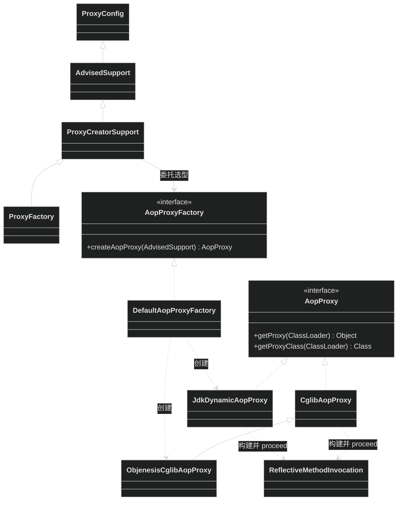
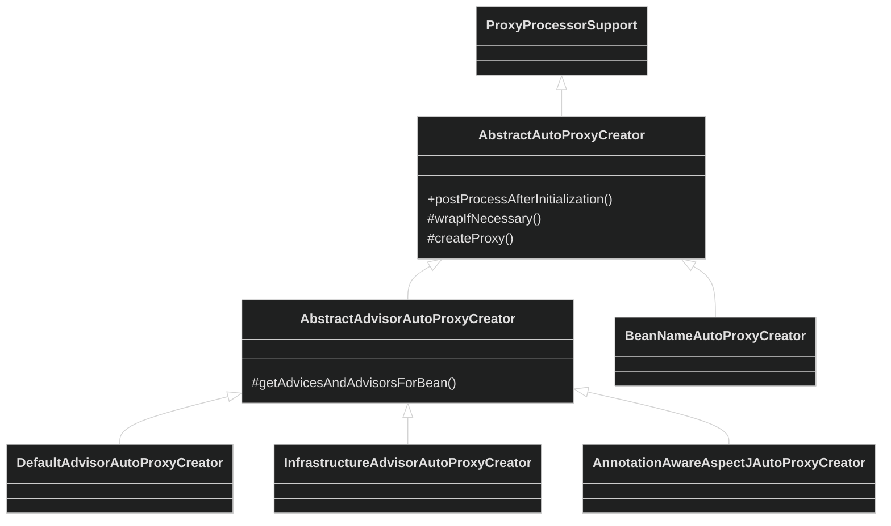
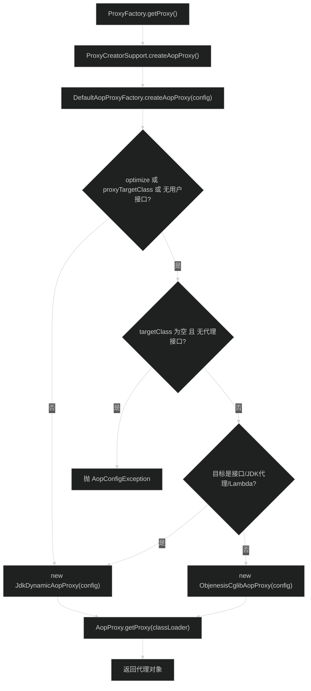
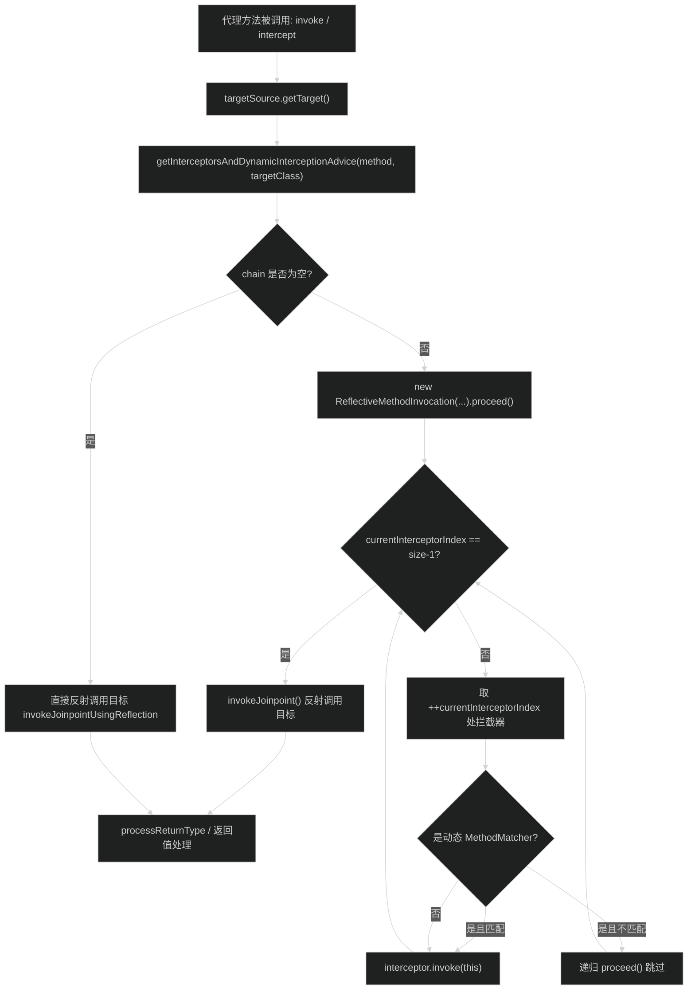
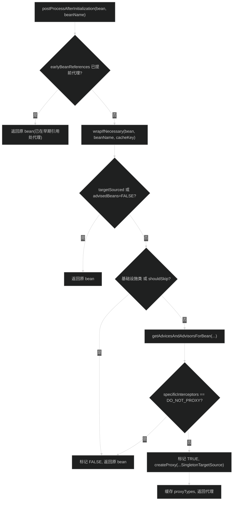

# AOP框架模块（spring-aop）
> 上次修改：2026-07-26 18:11

## 重点关注

- **`DefaultAopProxyFactory.createAopProxy`（第 5、6 章）**：代理选型主路径，决定生成 JDK 动态代理还是 CGLIB 子类代理，是理解 AOP 代理机制的入口。
- **`ReflectiveMethodInvocation.proceed()`（第 5、6 章）**：通过 `currentInterceptorIndex` 递增的递归调用驱动拦截器链，是通知执行顺序的核心。
- **`JdkDynamicAopProxy.invoke` / `CglibAopProxy` 内 `DynamicAdvisedInterceptor.intercept`（第 5、6 章）**：两种代理的实际调用入口，负责取目标、构建链、处理返回值。
- **`AbstractAutoProxyCreator.postProcessAfterInitialization → wrapIfNecessary`（第 5 章）**：容器阶段的自动代理入口，把普通 Bean 替换为代理对象。
- **`Pointcut` / `ClassFilter` / `MethodMatcher`（第 4 章）**：切点匹配的领域模型，决定通知是否命中。
- **`AdvisedSupport.getInterceptorsAndDynamicInterceptionAdvice`（第 6 章）**：拦截器链的构建与缓存，是性能关键路径。
- **第 8 章边界**：final 类/方法无法被 CGLIB 子类化、类内部自调用导致切面失效、目标源获取异常等易错点。

## 1. 模块定位与职责边界

**结论**：spring-aop 是 Spring 的面向切面编程（AOP）基础设施模块，提供切点匹配、通知织入、代理生成与拦截器链执行能力。它位于 spring-beans + spring-core 之上，是 spring-tx（声明式事务）、spring-context（缓存/异步/调度代理）等上层模块的底座。

**负责**：
- 定义 AOP 领域模型：切点（`Pointcut`/`ClassFilter`/`MethodMatcher`）、通知（`Advice` 及其子类型）、切面顾问（`Advisor`/`PointcutAdvisor`）。
- 代理创建：`ProxyFactory`/`ProxyCreatorSupport`/`AdvisedSupport` 汇聚配置，`AopProxyFactory` 选型，`JdkDynamicAopProxy`/`CglibAopProxy` 生成代理。
- 拦截器链执行：`ReflectiveMethodInvocation.proceed()` 递归驱动 `MethodInterceptor`。
- 自动代理：`AbstractAutoProxyCreator` 系列 `BeanPostProcessor`，在 Bean 初始化后按需包装为代理。
- 目标源抽象：`TargetSource` 支持单例、池化、热替换等目标获取策略。

**不负责**：
- 具体的切面语义（如 `@Transactional`、`@Cacheable` 的语义解析）由上层模块提供，本模块只提供织入机制。
- AspectJ 表达式语法的完整解析由 aspectj 子包桥接 AspectJ 运行库完成，非本文核心。
- Bean 生命周期管理、依赖注入由 spring-beans 负责，本模块通过 `BeanPostProcessor` 挂接。

**主要输入/输出/副作用**：输入为目标对象或 `TargetSource` + 一组 `Advisor`/`Advice`；输出为实现相同接口或子类的代理对象；副作用是方法调用被拦截并按链执行通知，`exposeProxy` 时会写入 `AopContext` 的 ThreadLocal。

## 2. 架构关系与依赖

**结论**：模块内部围绕"配置汇聚（AdvisedSupport）→ 选型（AopProxyFactory）→ 生成（AopProxy 两实现）→ 执行（ReflectiveMethodInvocation）"四段组织；自动代理层通过 `BeanPostProcessor` 把上述能力接入容器。

### AopProxy / ProxyFactory 体系

### 自动代理器继承体系

**说明表**：

| 节点 | 角色 | 依赖方向/耦合 |
|------|------|---------------|
| `ProxyConfig` | 代理开关配置（proxyTargetClass/optimize/exposeProxy/frozen 等） | 被 `AdvisedSupport` 继承 |
| `AdvisedSupport` | 汇聚 Advisor/接口/TargetSource，缓存拦截器链 | 强依赖 `Advisor`、`TargetSource`、`AdvisorChainFactory` |
| `ProxyCreatorSupport` | 持有 `AopProxyFactory`，提供 `createAopProxy()` | 委托 `AopProxyFactory` 选型 |
| `ProxyFactory` | 编程式代理入口，`getProxy()` | 继承 `ProxyCreatorSupport` |
| `AopProxyFactory` | 选型策略接口 | 可替换（默认 `DefaultAopProxyFactory`） |
| `DefaultAopProxyFactory` | 默认选型实现 | 决定 JDK/CGLIB |
| `JdkDynamicAopProxy` | 基于 `java.lang.reflect.Proxy` 的 `InvocationHandler` | 依赖目标实现接口 |
| `CglibAopProxy`/`ObjenesisCglibAopProxy` | 基于 CGLIB 子类化，`ObjenesisCglibAopProxy` 用 Objenesis 免构造实例化 | 依赖可被子类化的目标类 |
| `ReflectiveMethodInvocation` | AOP Alliance `MethodInvocation` 实现，驱动链 | 被两种代理复用 |
| `AbstractAutoProxyCreator` | `BeanPostProcessor`，自动代理骨架 | 强依赖 `BeanFactory`（spring-beans） |
| `AbstractAdvisorAutoProxyCreator` | 按 Advisor 匹配挑选 | 子类扩展匹配策略 |
| `AnnotationAwareAspectJAutoProxyCreator` | 识别 `@AspectJ` 切面 | 桥接 aspectj 子包 |

**外部依赖**：`org.aopalliance.aop.Advice`、`org.aopalliance.intercept.MethodInterceptor/MethodInvocation`（AOP Alliance 标准接口，强依赖）；`spring-core`（`ClassUtils`、`BridgeMethodResolver`、`KotlinDetector`）；`spring-beans`（`BeanPostProcessor`、`BeanFactory`）。CGLIB 与 Objenesis 已被 Spring 重打包到 `org.springframework.cglib`/`org.springframework.objenesis`。

## 3. 入口与调用方式

**结论**：模块有两类入口——编程式（`ProxyFactory`）与容器式（自动代理 `BeanPostProcessor`）。

| 入口 | 触发条件 | 关键参数 | 返回/后续 | 源码位置 |
|------|----------|----------|-----------|----------|
| `ProxyFactory.getProxy()` | 用户代码直接构造工厂并调用 | 目标对象/接口/`TargetSource` + Advisor | 返回代理对象；内部 `createAopProxy().getProxy()` | `framework/ProxyFactory.java:96` |
| `ProxyFactory.getProxy(Class, Interceptor)`（静态） | 单拦截器便捷代理 | 接口 + 拦截器 | 代理对象 | `framework/ProxyFactory.java:136` |
| `ProxyCreatorSupport.createAopProxy()` | 由 `getProxy` 间接调用 | 当前 `AdvisedSupport` 配置 | `AopProxy` 实例 | `framework/ProxyCreatorSupport.java` |
| `AbstractAutoProxyCreator.postProcessAfterInitialization` | 容器初始化每个 Bean 后回调 | Bean 实例、beanName | 原 Bean 或其代理 | `framework/autoproxy/AbstractAutoProxyCreator.java:285` |
| `JdkDynamicAopProxy.invoke` | 代理接口方法被调用 | proxy/method/args | 通知链结果 | `framework/JdkDynamicAopProxy.java:166` |
| `DynamicAdvisedInterceptor.intercept` | CGLIB 代理方法被调用 | proxy/method/args/methodProxy | 通知链结果 | `framework/CglibAopProxy.java:691` |

编程式入口先在 `AdvisedSupport` 上累积配置（接口、Advisor、TargetSource），再由 `AopProxyFactory` 选型后生成 `AopProxy`；容器式入口在 Bean 初始化后调用 `wrapIfNecessary` 判定是否需要代理，命中则委托 `createProxy` 走同一套代理生成逻辑。

## 4. 核心概念与领域模型

### 切点 Pointcut

**定义/作用**：`Pointcut` 描述"在哪些连接点织入"，由 `ClassFilter`（类级匹配）与 `MethodMatcher`（方法级匹配）组合而成（`aop/Pointcut.java:33-45`）。`Pointcut.TRUE` 为恒真常量。
**相关类型**：`AspectJExpressionPointcut`（基于 AspectJ 表达式）、`TruePointcut`、`ComposablePointcut`。
**三维评估**：好处——把类过滤与方法匹配拆开，可在类级快速短路，减少方法级匹配开销；替代方案——单一匹配函数会丧失分层短路能力；风险——`MethodMatcher` 若 `isRuntime()` 为真需运行期带参匹配，带来每次调用的匹配成本。

### 通知 Advice

**定义/作用**：`Advice` 是 AOP Alliance 标记接口，代表织入的动作。Spring 提供 `MethodBeforeAdvice`、`AfterReturningAdvice`、`ThrowsAdvice`、以及最通用的 `MethodInterceptor`（环绕）。非拦截器型通知由 `AdvisorAdapterRegistry` 适配为 `MethodInterceptor` 后统一进链（`framework/DefaultAdvisorChainFactory.java:63,101,106`）。
**生命周期**：通常与 Advisor 一同注册，随代理长期存活。
**三维评估**：好处——统一到 `MethodInterceptor` 使 `proceed()` 只需处理一种执行模型；替代方案——为每种通知写独立调度分支会增加执行期判断；风险——适配层引入一次包装对象分配。

### 顾问 Advisor / PointcutAdvisor

**定义/作用**：`Advisor` 将一个 `Advice` 与其适用范围绑定；`PointcutAdvisor` 进一步携带 `Pointcut`。`DefaultPointcutAdvisor` 是常用实现。链构建时按 Advisor 类型分别处理普通切点顾问、引介顾问（`IntroductionAdvisor`）与裸 Advisor。
**关系**：Advisor 聚合 Advice + Pointcut，是自动代理匹配与链构建的基本单元。

### 代理配置聚合 AdvisedSupport

**定义/作用**：`AdvisedSupport`（继承 `ProxyConfig`）持有代理接口集合、Advisor 列表、`TargetSource`，并缓存"方法 → 拦截器链"映射（`framework/AdvisedSupport.java:516-526`）。
**三维评估**：好处——缓存避免每次调用重复匹配 Advisor；替代方案——每次调用重新计算链会显著增加热路径开销；风险——运行期动态改配置需失效缓存，`frozen` 优化会禁止后续变更。

### 目标源 TargetSource

**定义/作用**：`TargetSource` 抽象"如何获取被代理的目标实例"，支持单例（`SingletonTargetSource`）、池化、热替换、原型等。代理执行时 `getTarget()` 取目标、`releaseTarget()` 归还（非静态源时，`framework/JdkDynamicAopProxy.java:202,246`）。
**三维评估**：好处——解耦代理与目标生命周期，支撑池化/热替换；替代方案——直接持有目标引用无法支持池化；风险——`getTarget()` 抛异常会中断调用（见第 8 章）。

## 5. 关键流程

### 5.1 代理创建与 JDK/CGLIB 选型（主路径）

1-2 入口与委托：`ProxyFactory.getProxy()` 调用继承自 `ProxyCreatorSupport` 的 `createAopProxy()`，后者委托当前 `AopProxyFactory`（默认单例 `DefaultAopProxyFactory`）进行选型（`framework/ProxyFactory.java:96`）。

3-3.4 选型判断：`DefaultAopProxyFactory.createAopProxy` 首先判断是否满足 CGLIB 条件（`optimize` 或 `proxyTargetClass` 或未提供用户接口）；不满足则直接走 JDK 动态代理。满足时再校验目标类可确定性——若目标类为空且无代理接口则抛 `AopConfigException`；若目标本身是接口、已是 JDK 代理类或 Lambda，则仍回退 JDK 动态代理；否则生成 `ObjenesisCglibAopProxy`（`framework/DefaultAopProxyFactory.java:60-76`）。

6-7 生成代理：得到 `AopProxy` 后调用 `getProxy(classLoader)`，JDK 实现调用 `Proxy.newProxyInstance`，CGLIB 实现通过 `Enhancer` 生成子类实例，最终返回代理对象（`framework/JdkDynamicAopProxy.java:120-124`、`framework/CglibAopProxy.java:204-227`）。

### 5.2 拦截器链递归调用（ReflectiveMethodInvocation.proceed）

1-3 取目标与建链：代理入口（`JdkDynamicAopProxy.invoke` 或 CGLIB `DynamicAdvisedInterceptor.intercept`）尽量晚地从 `TargetSource` 取目标，随后调用 `AdvisedSupport.getInterceptorsAndDynamicInterceptionAdvice` 得到该方法的拦截器链（可能命中缓存）（`framework/JdkDynamicAopProxy.java:202-206`）。

3.1-4 空链快路径：若链为空，说明无实际通知，跳过 `MethodInvocation` 的创建，直接对目标做反射调用，避免对象分配开销（`framework/JdkDynamicAopProxy.java:210-215`）。

5-5.5 递归推进链：非空链时构造 `ReflectiveMethodInvocation` 并调用 `proceed()`。`proceed()` 以 `currentInterceptorIndex` 从 -1 开始，每次前置自增取下一拦截器；到达链尾（index 等于 size-1）时调用 `invokeJoinpoint()` 反射执行目标方法。链中每个 `MethodInterceptor.invoke(this)` 内部再次调用 `proceed()`，形成递归/嵌套的环绕执行；若元素是需要运行期匹配的 `InterceptorAndDynamicMethodMatcher`，先做带参匹配，不匹配则递归跳过该拦截器（`framework/ReflectiveMethodInvocation.java:155-181`）。

6-7 返回值处理：链执行完毕后回到代理入口对返回值做规整——目标返回 `this` 且类型兼容时替换为 proxy、原始类型返回 `null` 时抛 `AopInvocationException`、Kotlin 挂起函数做协程适配（`framework/JdkDynamicAopProxy.java:226-243`）。

### 5.3 自动代理 postProcessAfterInitialization → wrapIfNecessary

1-1.1 后置回调入口：容器对每个初始化后的 Bean 回调 `postProcessAfterInitialization`；若该 Bean 已在解决循环依赖的早期引用处被代理（`earlyBeanReferences` 命中且为同一实例），则不再重复包装，直接返回（`framework/autoproxy/AbstractAutoProxyCreator.java:285-292`）。

2-2.3 快速排除：`wrapIfNecessary` 依次排除——已自定义 `TargetSource` 的 Bean、已判定不需代理（`advisedBeans` 为 FALSE）、AOP 基础设施类或 `shouldSkip` 命中的 Bean，命中则标记并返回原 Bean，避免对切面自身等做代理（`framework/autoproxy/AbstractAutoProxyCreator.java:321-331`）。

3-5 匹配与生成：调用 `getAdvicesAndAdvisorsForBean` 取该 Bean 适用的 Advisor；若返回非 `DO_NOT_PROXY`，标记为需代理并以 `SingletonTargetSource` 包装原 Bean，走 `createProxy`（内部同样经由 `ProxyFactory`/`AopProxyFactory` 选型）生成代理，缓存代理类型后返回；否则标记 FALSE 返回原 Bean（`framework/autoproxy/AbstractAutoProxyCreator.java:333-344`）。

## 6. 核心实现细节

### 6.1 DefaultAopProxyFactory.createAopProxy 选型判断

逐段解读（`framework/DefaultAopProxyFactory.java:60-76`）：

- **第一层条件** `config.isOptimize() || config.isProxyTargetClass() || !config.hasUserSuppliedInterfaces()`：任一为真才进入"倾向 CGLIB"分支。其中 `proxyTargetClass=true` 是最常见的强制 CGLIB 途径；"无用户提供接口"意味着 JDK 动态代理无接口可实现，只能子类化。
- **目标类可确定性校验**：进入 CGLIB 分支后，若 `targetClass == null && proxiedInterfaces.length == 0`，无法确定被代理类型，抛 `AopConfigException`，属于配置错误的早失败。
- **回退 JDK 的特例**：`targetClass` 为接口、已是 JDK 代理类（`Proxy.isProxyClass`）或 Lambda（`ClassUtils.isLambdaClass`）时，CGLIB 无法有效子类化，改用 `JdkDynamicAopProxy`。
- **默认 CGLIB**：其余情况返回 `ObjenesisCglibAopProxy`（借助 Objenesis 绕过目标类构造函数实例化子类）。
- **else 分支**：三条件都不满足（有用户接口且未强制 CGLIB）时直接 JDK 动态代理。

**三维评估（JDK vs CGLIB）**：
- 好处：JDK 动态代理无需第三方字节码库、生成快、只代理接口方法，语义清晰；CGLIB 可代理未实现接口的类、能拦截类上的具体方法。
- 替代方案：可统一只用 CGLIB（Spring Boot 默认即 `proxyTargetClass=true`），简化选型，代价是引入字节码生成与更高内存/启动成本。
- 风险：JDK 代理无法代理无接口的类；CGLIB 无法代理 `final` 类、无法拦截 `final`/`private`/`static` 方法，且早期对无接口 bean 的自动 CGLIB 化可能与预期的接口注入冲突。

### 6.2 ReflectiveMethodInvocation.proceed 的 currentInterceptorIndex 递增递归

逐段解读（`framework/ReflectiveMethodInvocation.java:155-181`）：

- **索引语义**：`currentInterceptorIndex` 初值 -1，`proceed()` 内先判断 `index == size-1`（已到链尾）则直接 `invokeJoinpoint()` 执行目标；否则 `++currentInterceptorIndex` 取下一个元素。索引前置自增保证每个拦截器只被推进一次。
- **静态拦截器**：普通 `MethodInterceptor` 直接 `invoke(this)`，其内部再调 `this.proceed()` 推进后续，形成"环绕嵌套"的调用栈——每个拦截器的前置逻辑在 `proceed()` 前、后置逻辑在 `proceed()` 后执行。
- **动态匹配拦截器**：元素为 `InterceptorAndDynamicMethodMatcher` 时，用实际参数做运行期 `matches(method, targetClass, arguments)`；匹配则执行，不匹配则递归 `proceed()` 跳过，不消耗额外链位。
- **隐藏假设**：静态匹配已在建链阶段完成，链内元素默认已通过类/方法级匹配；因此链是单线程内、单次调用私有的（每次调用新建 `ReflectiveMethodInvocation`），`currentInterceptorIndex` 无并发问题。

**三维评估**：好处——用单个递增索引 + 递归实现任意长度环绕链，代码简洁且天然支持拦截器控制是否继续（不调用 `proceed()` 即短路）；替代方案——用迭代器或显式栈同样可行，但难以自然表达"环绕"前后置对称语义；风险——链过长时递归深度增加，异常栈较深；拦截器忘记调用 `proceed()` 会静默阻断后续通知与目标方法。

### 6.3 CglibAopProxy 的 DynamicAdvisedInterceptor

逐段解读（`framework/CglibAopProxy.java:682-732`）：

- **角色**：CGLIB 生成的子类将方法调用路由到回调 `DynamicAdvisedInterceptor.intercept`，它是 CGLIB 侧与 `JdkDynamicAopProxy.invoke` 对等的入口。
- **执行流程**：`exposeProxy` 时写入 `AopContext`；晚取目标 `targetSource.getTarget()`；`getInterceptorsAndDynamicInterceptionAdvice` 建链；空链直接反射调用目标，非空链复用同一个 `ReflectiveMethodInvocation.proceed()` 执行；`finally` 中归还非静态目标并恢复 `AopContext`。
- **与 JDK 分支的差异**：CGLIB 通过 `ProxyCallbackFilter` 为不同方法选择不同回调（如无通知且返回类型安全的方法可走 `DISPATCH_TARGET`/`INVOKE_TARGET` 快路径，见 `framework/CglibAopProxy.java:867-889`），比 JDK 单一 `InvocationHandler` 更细粒度地优化调用开销。

**三维评估**：好处——回调过滤器让不同方法走差异化路径，降低无通知方法的拦截成本；替代方案——像 JDK 那样单回调处理所有方法更简单但优化空间小；风险——回调类型与 `ProxyCallbackFilter` 逻辑复杂，`final`/包私有/构造相关限制会导致子类生成失败（抛 `AopConfigException`，见第 8 章）。

## 7. 数据结构、配置与外部协议

**配置项（`ProxyConfig`/`AdvisedSupport`）**：

| 配置 | 含义 | 默认 | 错误配置后果 |
|------|------|------|--------------|
| `proxyTargetClass` | 是否强制 CGLIB 子类代理 | false | 目标无接口时若为 false，仍会因无接口回退 CGLIB |
| `optimize` | 是否启用激进优化（倾向 CGLIB） | false | 对已冻结配置无意义 |
| `exposeProxy` | 是否将当前代理暴露到 `AopContext` | false | 内部自调用需 `AopContext.currentProxy()` 时若为 false 则拿不到代理 |
| `frozen` | 冻结配置以启用优化并禁止变更 | false | 冻结后再改 Advisor 会失败 |
| `opaque` | 是否禁止代理被强转为 `Advised` | false | 为 true 时无法通过代理反查/修改通知 |

**核心数据结构**：
- `AdvisedSupport` 内 `methodCache`/`cachedInterceptors`：方法到拦截器链的缓存（`framework/AdvisedSupport.java:518-531`）。
- `JdkDynamicAopProxy.ProxiedInterfacesCache`：缓存补全后的代理接口集合及 `equals`/`hashCode` 是否在接口中声明（`framework/JdkDynamicAopProxy.java:319-357`）。
- 拦截器链元素类型：`MethodInterceptor` 或 `InterceptorAndDynamicMethodMatcher`（运行期匹配包装）。

**外部协议**：依赖 AOP Alliance 标准接口 `org.aopalliance.aop.Advice` 与 `org.aopalliance.intercept.MethodInterceptor/MethodInvocation`，保证与其他兼容 AOP 实现的通知可互操作。本模块无网络/持久化协议。

## 8. 异常、边界与降级处理

**结论**：本模块的异常主要围绕代理生成失败、目标获取失败与返回值不匹配三类。

- **final 类/方法无法被 CGLIB 子类化**：CGLIB 生成子类时若目标为 `final` 类或方法为 `final`，字节码生成失败，捕获 `CodeGenerationException`/`IllegalArgumentException` 后抛 `AopConfigException`，提示"final class or a non-visible class"（`framework/CglibAopProxy.java:235-239`）。`final`/`private`/`static` 方法即使生成成功也不会被拦截。
- **类内部方法自调用导致切面失效**：代理仅拦截"经过代理对象"的外部调用；目标内部 `this.otherMethod()` 直接走目标实例，不经过代理，通知不生效。规避方式是开启 `exposeProxy` 并通过 `AopContext.currentProxy()` 自调用（`framework/JdkDynamicAopProxy.java:194-198`、`framework/CglibAopProxy.java:697-701`）。
- **目标源获取异常**：`targetSource.getTarget()` 抛异常时，CGLIB 分支在最外层 `catch (Throwable)` 统一抛 `AopConfigException("Unexpected AOP exception")`（`framework/CglibAopProxy.java:240-243`）；JDK 分支异常沿调用向上传播。非静态目标在 `finally` 中 `releaseTarget` 归还，避免池资源泄漏（`framework/JdkDynamicAopProxy.java:246-248`）。
- **原始类型返回 null**：通知链返回 `null` 但目标方法返回原始类型（非 void）时抛 `AopInvocationException`，防止拆箱 NPE（`framework/JdkDynamicAopProxy.java:235-238`）。
- **配置缺失**：CGLIB 选型时目标类与接口皆无，抛 `AopConfigException`，属参数非法早失败（`framework/DefaultAopProxyFactory.java:63-66`）。

## 9. 并发、生命周期与性能

- **代理对象生命周期**：代理在 `getProxy`/`wrapIfNecessary` 时创建，通常与 Bean 同生命周期长期存活；`AdvisedSupport` 的接口集合与拦截器链缓存随代理复用。
- **调用期资源**：每次方法调用新建一个 `ReflectiveMethodInvocation`（非空链时），调用私有、无共享状态，线程安全性取决于目标本身（`framework/JdkDynamicAopProxy.java:54-55` 说明）。
- **目标获取时机**：注释明确"尽量晚取目标，缩短持有时间"，配合池化 `TargetSource` 减少目标占用；非静态源调用后立即 `releaseTarget`（`framework/JdkDynamicAopProxy.java:200-202,246-248`）。
- **性能关键路径**：`getInterceptorsAndDynamicInterceptionAdvice` 通过 `methodCache`/`cachedInterceptors` 缓存链，避免每次调用重复匹配 Advisor（`framework/AdvisedSupport.java:516-531`）；空链快路径跳过 `MethodInvocation` 分配（`framework/JdkDynamicAopProxy.java:210-215`）；`exposeProxy` 会引入 ThreadLocal 读写开销，默认关闭。
- **ThreadLocal 使用**：`AopContext.setCurrentProxy` 基于 ThreadLocal，`finally` 中恢复旧值，保证嵌套代理调用后上下文正确还原。

## 10. 扩展点、测试点与维护建议

**扩展点**：
- `AopProxyFactory`：替换选型策略（默认 `DefaultAopProxyFactory`）。
- `TargetSource`：自定义目标获取（池化、热替换、原型）。
- `AdvisorChainFactory`：定制链构建（默认 `DefaultAdvisorChainFactory`）。
- `AbstractAutoProxyCreator` 子类 / `getAdvicesAndAdvisorsForBean`：定制自动代理匹配。
- `TargetSourceCreator`：为自动代理提供自定义 `TargetSource`。
- `MethodInterceptor`：编写自定义环绕通知。

**建议测试点**：
- 主路径：JDK 与 CGLIB 两种选型下的通知执行顺序、`proceed()` 环绕嵌套。
- 失败路径：final 类/方法代理、原始类型返回 null、目标源抛异常。
- 边界：无接口 bean 的选型、Lambda/已代理对象回退 JDK、类内部自调用与 `exposeProxy` 的对照。
- 回归：`AdvisedSupport` 链缓存在动态增删 Advisor 后的失效正确性。

**维护建议**：
- 目标位置 `DefaultAopProxyFactory.createAopProxy`：问题——选型条件分散在单个布尔表达式，可读性一般；建议动作——补充针对"无接口回退 CGLIB"的显式注释/测试；收益——降低误解风险；风险——低。
- 目标位置 自动代理 `wrapIfNecessary`：问题——内部自调用失效是使用者高频踩坑点；建议动作——在文档/日志层面对 `exposeProxy` 未开启且检测到潜在自调用给出提示；收益/风险——提示成本可控，需避免误报。

## 11. 文件职责表

| 文件 | 职责 | 关键类/函数 | 被谁调用 | 备注 |
|------|------|-------------|----------|------|
| `aop/Pointcut.java` | 切点抽象（类过滤+方法匹配） | `getClassFilter`/`getMethodMatcher` | Advisor、链构建 | `TRUE` 恒真常量 |
| `aop/Advisor.java` | 通知与适用范围绑定 | `getAdvice` | 链构建、自动代理 | 基本织入单元 |
| `aop/TargetSource.java` | 目标实例获取策略 | `getTarget`/`releaseTarget` | 两种代理入口 | 支持池化/热替换 |
| `framework/ProxyConfig.java` | 代理开关配置 | proxyTargetClass/exposeProxy 等 | `AdvisedSupport` | 配置基类 |
| `framework/AdvisedSupport.java` | 汇聚 Advisor/接口/目标源并缓存链 | `getInterceptorsAndDynamicInterceptionAdvice` | 代理入口 | 性能关键缓存 |
| `framework/ProxyCreatorSupport.java` | 持有工厂并触发 `createAopProxy` | `createAopProxy` | `ProxyFactory` | 连接配置与选型 |
| `framework/ProxyFactory.java` | 编程式代理入口 | `getProxy` | 用户代码 | 便捷静态方法 |
| `framework/AopProxyFactory.java` | 代理选型策略接口 | `createAopProxy` | `ProxyCreatorSupport` | 可替换 |
| `framework/DefaultAopProxyFactory.java` | 默认 JDK/CGLIB 选型 | `createAopProxy` | 工厂委托 | 选型核心 |
| `framework/AopProxy.java` | 代理抽象 | `getProxy`/`getProxyClass` | 工厂 | 两实现 |
| `framework/JdkDynamicAopProxy.java` | JDK 动态代理实现 | `invoke` | 代理方法调用 | `InvocationHandler` |
| `framework/CglibAopProxy.java` | CGLIB 子类代理实现 | `DynamicAdvisedInterceptor.intercept`/`getCallbacks` | 代理方法调用 | 回调过滤优化 |
| `framework/ObjenesisCglibAopProxy.java` | 免构造实例化的 CGLIB 代理 | 继承 `CglibAopProxy` | 默认选型 | 用 Objenesis |
| `framework/ReflectiveMethodInvocation.java` | 拦截器链执行 | `proceed`/`invokeJoinpoint` | 两种代理复用 | 递归推进链 |
| `framework/DefaultAdvisorChainFactory.java` | 构建方法拦截器链 | `getInterceptorsAndDynamicInterceptionAdvice` | `AdvisedSupport` | 处理引介/适配 |
| `framework/AopContext.java` | 当前代理 ThreadLocal | `currentProxy`/`setCurrentProxy` | exposeProxy 分支 | 支持自调用 |
| `framework/autoproxy/AbstractAutoProxyCreator.java` | 自动代理骨架 BeanPostProcessor | `postProcessAfterInitialization`/`wrapIfNecessary`/`createProxy` | 容器 | 自动代理入口 |
| `framework/autoproxy/AbstractAdvisorAutoProxyCreator.java` | 按 Advisor 匹配挑选 | `getAdvicesAndAdvisorsForBean` | 骨架回调 | 匹配策略 |
| `framework/autoproxy/AnnotationAwareAspectJAutoProxyCreator.java` | 识别 @AspectJ 切面 | 继承匹配逻辑 | 容器 | 桥接 aspectj |

## 12. 代码引用索引

| 引用 | 说明 |
|------|------|
| `spring-aop/src/main/java/org/springframework/aop/Pointcut.java:33-45` | 切点由 ClassFilter+MethodMatcher 组合 |
| `spring-aop/src/main/java/org/springframework/aop/framework/ProxyFactory.java:96` | `getProxy()` 编程式入口 |
| `spring-aop/src/main/java/org/springframework/aop/framework/ProxyFactory.java:136` | 单拦截器静态便捷方法 |
| `spring-aop/src/main/java/org/springframework/aop/framework/DefaultAopProxyFactory.java:60-76` | JDK/CGLIB 选型判断 |
| `spring-aop/src/main/java/org/springframework/aop/framework/JdkDynamicAopProxy.java:120-124` | JDK 代理生成 `Proxy.newProxyInstance` |
| `spring-aop/src/main/java/org/springframework/aop/framework/JdkDynamicAopProxy.java:166` | `invoke` 拦截入口 |
| `spring-aop/src/main/java/org/springframework/aop/framework/JdkDynamicAopProxy.java:194-215` | exposeProxy、晚取目标、空链快路径 |
| `spring-aop/src/main/java/org/springframework/aop/framework/JdkDynamicAopProxy.java:226-248` | 返回值规整与目标归还 |
| `spring-aop/src/main/java/org/springframework/aop/framework/JdkDynamicAopProxy.java:319-357` | ProxiedInterfacesCache |
| `spring-aop/src/main/java/org/springframework/aop/framework/ReflectiveMethodInvocation.java:155-181` | `proceed()` 递归推进链 |
| `spring-aop/src/main/java/org/springframework/aop/framework/ReflectiveMethodInvocation.java:189-191` | `invokeJoinpoint` 反射调用目标 |
| `spring-aop/src/main/java/org/springframework/aop/framework/CglibAopProxy.java:204-243` | Enhancer 配置、生成与异常处理 |
| `spring-aop/src/main/java/org/springframework/aop/framework/CglibAopProxy.java:682-732` | DynamicAdvisedInterceptor.intercept |
| `spring-aop/src/main/java/org/springframework/aop/framework/CglibAopProxy.java:867-889` | 回调类型选择快路径 |
| `spring-aop/src/main/java/org/springframework/aop/framework/AdvisedSupport.java:516-531` | 拦截器链缓存 |
| `spring-aop/src/main/java/org/springframework/aop/framework/DefaultAdvisorChainFactory.java:57-112` | 链构建与通知适配 |
| `spring-aop/src/main/java/org/springframework/aop/framework/autoproxy/AbstractAutoProxyCreator.java:285-292` | postProcessAfterInitialization |
| `spring-aop/src/main/java/org/springframework/aop/framework/autoproxy/AbstractAutoProxyCreator.java:321-344` | wrapIfNecessary 判定与创建代理 |
