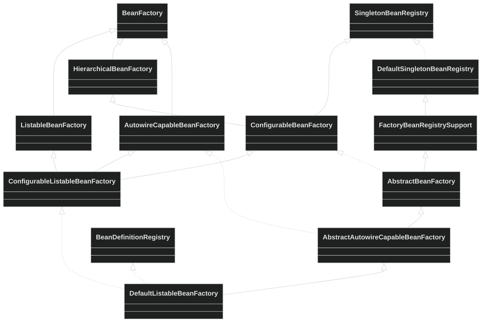
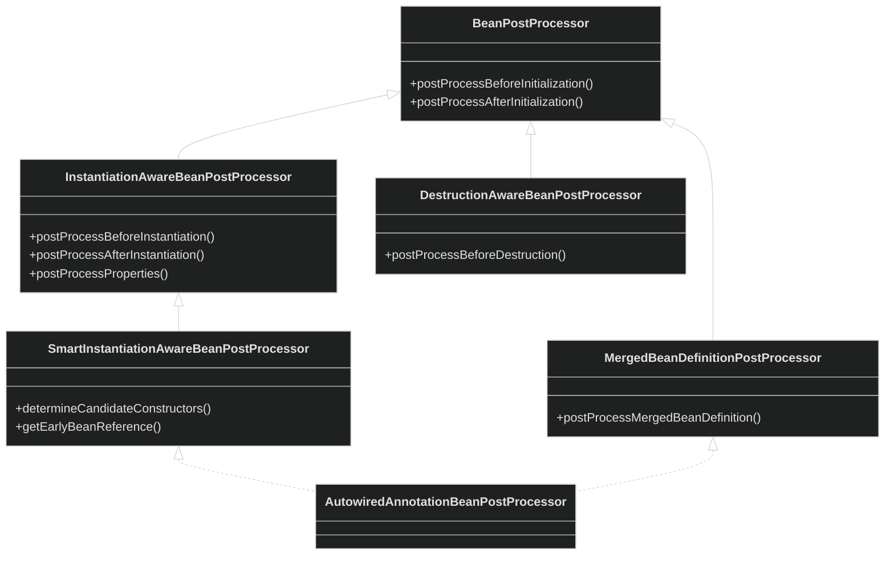
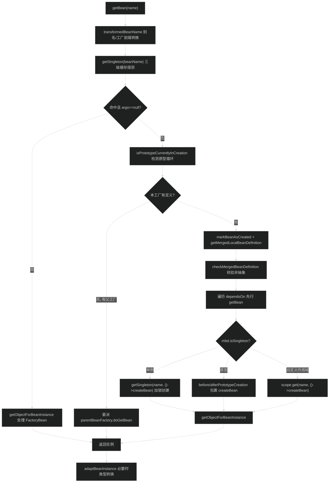
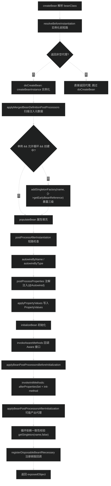
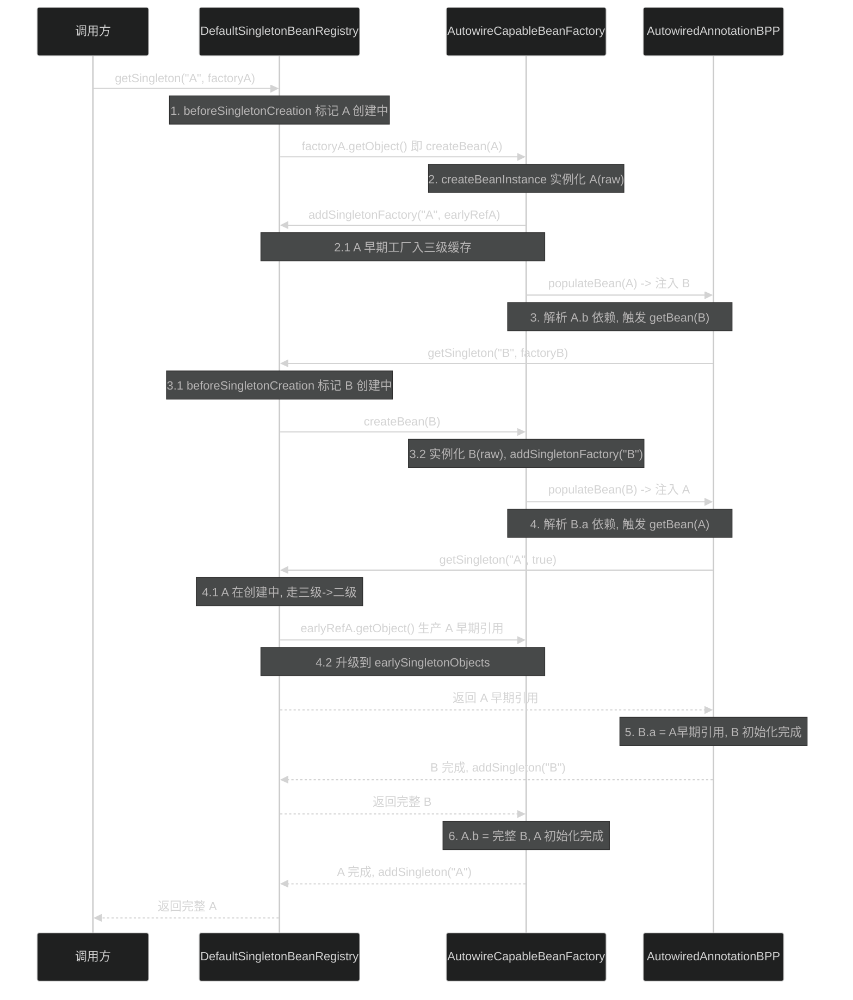

# Bean 工厂模块（spring-beans）
> 上次修改：2026-07-26 17:58

## 重点关注

阅读本模块时，优先关注以下入口与主链路，它们承载了 IoC 容器最核心的语义：

- **`AbstractBeanFactory.doGetBean`（`support/AbstractBeanFactory.java` L240-L400）**：所有 `getBean` 调用的收敛点。负责别名转换、三级缓存命中、父工厂委派、`depends-on` 处理、单例/原型/自定义作用域分支。是理解「取 Bean」的唯一主干。
- **`AbstractAutowireCapableBeanFactory.doCreateBean`（`support/AbstractAutowireCapableBeanFactory.java` L556-L650）**：Bean 生命周期主链路。实例化 → `MergedBeanDefinitionPostProcessor` → 早期引用暴露 → `populateBean` → `initializeBean` → 循环依赖一致性校验 → 注册销毁回调，一条链看懂 Bean 从无到有。
- **三级缓存循环依赖（`support/DefaultSingletonBeanRegistry.java` L208-L244 `getSingleton`、L183-L188 `addSingletonFactory`）**：`singletonObjects` / `earlySingletonObjects` / `singletonFactories` 三级如何协作在构造完成前暴露半成品，解决单例字段/Setter 循环依赖。这是 Spring 面试与排障最高频的机制。
- **`DefaultListableBeanFactory.doResolveDependency`（`support/DefaultListableBeanFactory.java` L1654-L1769）**：`@Autowired` 依赖解析算法核心。`@Value` 求值、集合/数组/Map 多值注入、候选查找、`@Primary`/`@Priority`/按名兜底、唯一性判定，全部在此。
- **`AutowiredAnnotationBeanPostProcessor.postProcessProperties`（`annotation/AutowiredAnnotationBeanPostProcessor.java` L489-L502）**：注解注入扩展点。展示 `BeanPostProcessor` 如何在 `populateBean` 阶段介入完成字段/方法注入，是理解「扩展点驱动」设计的样板。
- **`BeanPostProcessor` 体系（`config/BeanPostProcessor.java` 及其子接口）**：容器几乎所有增强能力（AOP 代理、注解注入、生命周期回调）都挂在这一系列扩展点上，是模块可扩展性的骨架。

---

## 1. 模块定位与职责边界

**结论**：spring-beans 是 Spring IoC 容器的核心基础层，向上被 spring-context 依赖、向下只依赖 spring-core。它负责「Bean 定义的承载 + Bean 实例的创建、装配、生命周期与依赖解析」，但**不负责**注解驱动配置（`@Configuration`/`@ComponentScan` 在 spring-context）、AOP 织入（spring-aop）、事件/环境抽象（spring-context）。

**上游/下游**：
- 下游依赖：spring-core（`ResolvableType`、`ConversionService`、`Ordered`、`AttributeAccessor` 等）。`BeanFactory.java` L22-L23 即引入 `ParameterizedTypeReference`、`ResolvableType`。
- 上游使用者：spring-context 的 `AbstractApplicationContext`/`AnnotationConfigApplicationContext` 内部持有一个 `DefaultListableBeanFactory` 作为真正的容器实现。

**主要输入/输出/状态变化**：
- 输入：`BeanDefinition`（XML、注解扫描或编程式注册），`getBean(name/type)` 请求。
- 输出：完全初始化的 Bean 实例（单例共享或原型独立）。
- 核心状态：`DefaultSingletonBeanRegistry` 中的三级缓存与「正在创建集合」`singletonsCurrentlyInCreation`（`DefaultSingletonBeanRegistry.java` L86-L101）；`DefaultListableBeanFactory` 中的 `beanDefinitionMap` 定义注册表。
- 副作用：向 `disposableBeans` 注册销毁回调（`AbstractAutowireCapableBeanFactory.java` L1922-L1941）；维护 `dependentBeanMap`/`dependenciesForBeanMap` 依赖图以保证销毁顺序（`DefaultSingletonBeanRegistry.java` L599-L615）。

**不负责**：类型转换算法本身（委派 spring-core 的 `ConversionService` 与 `PropertyEditor`）；表达式求值（委派 `BeanExpressionResolver`，实现在 spring-context/spring-expression）。

---

## 2. 架构关系与依赖

**结论**：模块由两条正交的类型层次构成——**接口能力层次**（`BeanFactory` 家族，按能力逐级增强）与**抽象实现层次**（`DefaultSingletonBeanRegistry → AbstractBeanFactory → AbstractAutowireCapableBeanFactory → DefaultListableBeanFactory`，按模板方法逐级填充）。扩展性由 `BeanPostProcessor` 系列接口横向注入。

### 2.1 接口继承与实现类层次

| 节点 | 角色 | 关键增强 | 依赖方向 |
|------|------|----------|----------|
| `BeanFactory` | 容器根接口 | `getBean`/`containsBean`/`isSingleton`/`getType`（`BeanFactory.java` L155-L418） | 被所有子接口继承 |
| `ListableBeanFactory` | 可枚举能力 | 按类型批量获取 `getBeansOfType`/`getBeanNamesForType` | `extends BeanFactory` |
| `HierarchicalBeanFactory` | 父子层次 | `getParentBeanFactory`（`HierarchicalBeanFactory.java` L34） | `extends BeanFactory` |
| `AutowireCapableBeanFactory` | 自动装配 | `createBean`/`autowireBean`/`resolveDependency`（L385-L402） | `extends BeanFactory` |
| `ConfigurableBeanFactory` | 可配置 | 注册 `BeanPostProcessor`、`Scope`、类型转换器；`extends HierarchicalBeanFactory, SingletonBeanRegistry`（`ConfigurableBeanFactory.java` L53） | 强依赖 `SingletonBeanRegistry` |
| `ConfigurableListableBeanFactory` | 完整可配置容器 | 汇聚四大能力；`extends ListableBeanFactory, AutowireCapableBeanFactory, ConfigurableBeanFactory`（L44） | 三接口合流 |
| `DefaultSingletonBeanRegistry` | 单例注册表 | 三级缓存、循环依赖、销毁编排 | 实现 `SingletonBeanRegistry` |
| `AbstractBeanFactory` | 取 Bean 模板 | `doGetBean` 主干、合并定义、作用域分支 | 继承单例注册表 |
| `AbstractAutowireCapableBeanFactory` | 造 Bean 模板 | `createBean`/`doCreateBean`/`populateBean`/`initializeBean` | 继承 `AbstractBeanFactory` |
| `DefaultListableBeanFactory` | 默认完整实现 | 定义注册表、`resolveDependency`、`preInstantiateSingletons` | 继承造 Bean 模板 |

### 2.2 后处理器扩展点体系

| 扩展点 | 触发时机 | 典型用途 | 缓存位置 |
|--------|----------|----------|----------|
| `MergedBeanDefinitionPostProcessor` | 合并定义后、实例化前 | 扫描注入元数据（`@Autowired` 字段/方法） | `BeanPostProcessorCache.mergedDefinition`（`AbstractBeanFactory.java` L2111） |
| `InstantiationAwareBeanPostProcessor` | 实例化前后 / 属性填充 | 短路实例化、`postProcessProperties` 注入 | `BeanPostProcessorCache.instantiationAware`（L2105） |
| `SmartInstantiationAwareBeanPostProcessor` | 构造器推断 / 早期引用 | 构造器自动装配、AOP 早期代理 | `BeanPostProcessorCache.smartInstantiationAware`（L2107） |
| `BeanPostProcessor` | 初始化前后 | AOP 代理、`Aware` 回调补充 | `AbstractBeanFactory.beanPostProcessors`（`BeanPostProcessorCacheAwareList`） |
| `DestructionAwareBeanPostProcessor` | 销毁前 | `@PreDestroy` 回调 | `BeanPostProcessorCache.destructionAware`（L2109） |

**关键耦合点**：`AbstractAutowireCapableBeanFactory` 通过 `getBeanPostProcessorCache()` 返回的预分类缓存（`AbstractBeanFactory.BeanPostProcessorCache`）在各生命周期节点回调对应扩展点。该缓存由 `BeanPostProcessorCacheAwareList`（`AbstractBeanFactory.java` L2007-L2095）在增删后自动失效重建——这是模块可扩展性的核心机制。

---

## 3. 入口与调用方式

**结论**：模块对外主入口是 `BeanFactory` 系列的取 Bean 方法与 `AutowireCapableBeanFactory` 的装配方法；内部所有取 Bean 路径最终汇聚到 `AbstractBeanFactory.doGetBean`，所有造 Bean 路径汇聚到 `AbstractAutowireCapableBeanFactory.createBean`。

| 入口 | 位置 | 触发条件 | 关键参数 | 之后进入 |
|------|------|----------|----------|----------|
| `getBean(String)` / `getBean(Class)` | `BeanFactory.java` L155/L210 | 应用/框架取 Bean | 名称或类型 | `doGetBean`（L240） |
| `getBean(String, Object...args)` | `BeanFactory.java` L194 | 带显式构造参数（仅原型有效） | 名称 + args | `doGetBean` → `createBean(...,args)` |
| `getBeanProvider(...)` | `BeanFactory.java` L243-L282 | 延迟/可选依赖 | 类型或 `ResolvableType` | `DependencyObjectProvider` |
| `resolveDependency(...)` | `AutowireCapableBeanFactory.java` L401 | 依赖注入点解析（`@Autowired`） | `DependencyDescriptor` | `doResolveDependency`（L1654） |
| `createBean(Class)` / `autowireBean(bean)` | `AutowireCapableBeanFactory` | 框架集成外部对象装配 | 已有实例或类型 | `createBean`/`populateBean` |
| `preInstantiateSingletons()` | `DefaultListableBeanFactory.java` L1101 | 容器 refresh 末尾 | 无 | 遍历 `getBean` 触发全部非懒单例 |
| `registerBeanDefinition(...)` | `BeanDefinitionRegistry` 实现 | 定义注册（XML/注解） | 名称 + `BeanDefinition` | 写入 `beanDefinitionMap` |

`doGetBean` 完整签名（`AbstractBeanFactory.java` L237 附近）：`protected <T> T doGetBean(String name, @Nullable Class<T> requiredType, @Nullable Object[] args, boolean typeCheckOnly)`。所有 `getBean` 重载均转发至此。父工厂委派逻辑见 L266-L284：本工厂无该定义且存在父工厂时，直接向父工厂 `doGetBean`。

---

## 4. 核心概念与领域模型

### 4.1 BeanDefinition（Bean 定义）

- **定义**：描述一个 Bean 的元数据——类名、作用域、构造参数、属性值、初始化/销毁方法、自动装配候选标记等（`config/BeanDefinition.java` L42-L378）。
- **作用**：容器创建 Bean 的「蓝图」。可在 `BeanFactoryPostProcessor` 阶段被修改（L31-L33 javadoc 明确此意图）。
- **生命周期**：注册（原始定义）→ 合并（`getMergedLocalBeanDefinition` 生成 `RootBeanDefinition`）→ 创建期使用。
- **相关类型**：`RootBeanDefinition`（合并后的运行时定义）、`GenericBeanDefinition`（通用可配置定义）、`ChildBeanDefinition`（父子继承）、`AbstractBeanDefinition`（公共实现）。
- **关键字段语义**：`scope`（L128 单例/原型）、`lazyInit`（L141）、`dependsOn`（L156 强制先行初始化）、`autowireCandidate`/`primary`/`fallback`（L170-L203 自动装配决策）、`factoryBeanName`/`factoryMethodName`（L213-L239 工厂方法）、`role`（L306 应用/支持/基础设施）。
- **三维评估**：
  - **好处**：定义与实例分离，使得 `BeanFactoryPostProcessor` 能在实例化前统一改写元数据（如占位符解析），且同一定义可产出多个原型实例。
  - **替代方案**：直接用反射按类创建对象（如纯 `new`），但会丢失作用域、生命周期回调、依赖装配的统一语义。
  - **风险**：定义可变（`getPropertyValues()` 返回可修改的 `MutablePropertyValues`），后处理器若并发改写同一定义可能引发不一致；框架靠单线程 refresh 阶段规避。

### 4.2 三级缓存（Singleton Caches）

- **定义**：`DefaultSingletonBeanRegistry` 中三个 Map（`DefaultSingletonBeanRegistry.java` L86/L89/L95）：
  - `singletonObjects`（一级）：完全初始化的单例。
  - `earlySingletonObjects`（二级）：已实例化但未完成初始化的早期引用。
  - `singletonFactories`（三级）：生产早期引用的 `ObjectFactory`。
- **作用**：在单例构造未完成时提前暴露引用，从而解决**单例的字段/Setter 循环依赖**。
- **生命周期**：`addSingletonFactory` 放入三级（L183）→ 被循环依赖方触发时，`getSingleton` 调用工厂生产早期引用并升级到二级（L226-L229）→ 创建完成 `addSingleton` 升级到一级并清理二三级（L165-L167）。
- **三维评估**：
  - **好处**：无侵入地支持循环依赖，且三级的 `ObjectFactory` 延迟到「确实被循环引用」时才执行 `getEarlyBeanReference`（可能生成 AOP 代理），避免所有 Bean 都付出代理成本。
  - **替代方案**：只用二级缓存（提前把 raw 实例放入）也能解 setter 循环依赖，但无法在需要时插入代理逻辑；或彻底禁止循环依赖（构造器注入即如此）。
  - **风险**：无法解决**构造器循环依赖**（实例尚未产生，无法暴露早期引用）；早期引用与最终代理对象不一致时会抛 `BeanCurrentlyInCreationException`（见第 6 章一致性校验）。

### 4.3 DependencyDescriptor（依赖描述符）

- **定义**：封装一个注入点（字段/方法参数/构造参数）及其类型、是否必需、泛型信息。
- **作用**：`resolveDependency` 的输入，`AutowiredAnnotationBeanPostProcessor` 为每个 `@Autowired` 点构造一个描述符（`AutowiredAnnotationBeanPostProcessor.java` L757、L859-L862）。
- **相关能力**：`resolveShortcut`（缓存命中快速返回）、`resolveCandidate`（实际实例化候选）、`forFallbackMatch`（降级匹配）。
- **三维评估**：**好处**——将「注入点语义」与「解析算法」解耦，同一 `doResolveDependency` 可服务字段、方法、构造器；**替代方案**——为每种注入点写独立解析逻辑，重复且易漂移；**风险**——描述符缓存（`ShortcutDependencyDescriptor`）若在定义变更后未失效可能注入过期 Bean。

### 4.4 BeanWrapper（Bean 包装器）

- **定义**：`BeanWrapperImpl`（`beans/BeanWrapperImpl.java` L61）包装一个 Bean 实例，提供基于 JavaBean 内省的属性读写与类型转换。
- **作用**：`createBeanInstance` 返回 `BeanWrapper`，`populateBean` 的 `applyPropertyValues` 通过它把 `PropertyValues` 写入实例。
- **相关机制**：`CachedIntrospectionResults`（L64-L67）缓存内省结果避免重复反射；`BeanPropertyHandler`（L273-L303）封装 read/write Method 调用。
- **三维评估**：**好处**——统一的属性访问抽象 + 内省缓存，兼顾嵌套属性与类型转换；**替代方案**——直接反射 `Field.set`，但缺少 `PropertyEditor`/`ConversionService` 转换链；**风险**——JavaBean 内省对不规范 getter/setter 命名敏感。

### 4.5 BeanPostProcessor（后处理器）

- **定义**：容器级扩展钩子，`postProcessBeforeInitialization`/`postProcessAfterInitialization`（`config/BeanPostProcessor.java` L82/L107），返回值可替换 Bean（用于代理）。
- **作用**：AOP、注解注入、`Aware` 补充回调等增强能力的统一挂载点。返回 `null` 会短路后续处理器（L77-L78）。
- **生命周期**：注册进 `beanPostProcessors` 列表 → 按 `PriorityOrdered`/`Ordered` 排序（自动检测场景）→ 每个 Bean 初始化前后遍历回调。
- **三维评估**：**好处**——开闭原则典范，核心容器无需知道 AOP/注解细节；**替代方案**——把增强逻辑硬编码进 `initializeBean`，破坏可插拔性；**风险**——过早初始化 `BeanPostProcessor` 会使其错过对更早创建 Bean 的处理（javadoc L38-L44 提示用 static `@Bean` 方法规避）。

---

## 5. 关键流程

### 5.1 getBean / doGetBean 主成功路径

1-1.4 缓存快路径：`doGetBean` 先做别名与 `&` 工厂前缀转换（`transformedBeanName`），再用 `getSingleton(beanName)` 探测三级缓存（`AbstractBeanFactory.java` L244）。命中且未传显式 args 时，经 `getObjectForBeanInstance` 处理可能的 `FactoryBean` 解引用后直接返回——这是绝大多数「已初始化单例」的高频路径，无锁。

2-2.2 原型检测与父工厂委派：未命中缓存则先判断 `isPrototypeCurrentlyInCreation`，命中即抛 `BeanCurrentlyInCreationException`（原型不支持循环依赖，L261-L263）；随后若本工厂无该定义而存在父工厂，则原样委派父工厂（L266-L284），实现层次化容器语义。

3-3.2 定义合并与前置依赖：`markBeanAsCreated` 标记创建中，`getMergedLocalBeanDefinition` 合并父子定义得到 `RootBeanDefinition`，`checkMergedBeanDefinition` 校验非抽象（抽象定义抛 `BeanIsAbstractException`）。随后遍历 `dependsOn`，对每个先行 `getBean` 并注册依赖关系；若存在 `isDependent` 反向依赖则抛「Circular depends-on」（L303-L305）。

4-4.4 按作用域创建：单例走 `getSingleton(name, ObjectFactory)`（L331）在单例锁内创建，创建失败时 `destroySingleton` 清理可能已早期暴露的引用（L336-L340）；原型走 `beforePrototypeCreation`/`afterPrototypeCreation` 包裹；自定义作用域委派 `Scope.get`，作用域未激活抛 `ScopeNotActiveException`。三者最终都经 `getObjectForBeanInstance` 完成 `FactoryBean` 解引用。

5-5.1 结果适配：`adaptBeanInstance`（L402-L422）在 `requiredType` 与实际类型不符时尝试 `TypeConverter` 转换，失败抛 `BeanNotOfRequiredTypeException`。

### 5.2 doCreateBean 生命周期路径（populateBean → initializeBean）

1-1.3 实例化前短路：`createBean`（`AbstractAutowireCapableBeanFactory.java` L488）先 `resolveBeanClass`，再 `resolveBeforeInstantiation`（L512-L518）给 `InstantiationAwareBeanPostProcessor.postProcessBeforeInstantiation` 一次完全接管的机会。若返回非空（如自定义 TargetSource 代理），则跳过整个 `doCreateBean`，仅补一次 `postProcessAfterInitialization`。

2-2.3 实例化与早期暴露：`doCreateBean`（L556）经 `createBeanInstance`（L565）产出 `BeanWrapper`（构造器推断见 5.4）；`applyMergedBeanDefinitionPostProcessors`（L577）让 `AutowiredAnnotationBeanPostProcessor` 等扫描并缓存注入元数据。随后判定 `earlySingletonExposure`（单例 && `allowCircularReferences` && 正在创建，L589-L590），成立则 `addSingletonFactory(name, () -> getEarlyBeanReference(...))`（L596）把早期引用工厂放入三级缓存。

3-3.4 属性填充：`populateBean`（L1392）先给 `postProcessAfterInstantiation` 一次短路机会（返回 false 则跳过后续填充，L1418-L1424）；按 `AUTOWIRE_BY_NAME`/`AUTOWIRE_BY_TYPE` 装配（L1432-L1438）；核心的 `@Autowired` 注入发生在 `postProcessProperties`（L1446，委派 `AutowiredAnnotationBeanPostProcessor`）；最后 `applyPropertyValues`（L1461）把显式 `PropertyValues` 经 `BeanWrapper` 写入实例。

4-4.4 初始化：`initializeBean`（L1799）依次执行 `invokeAwareMethods`（L1805，回调 `BeanNameAware`/`BeanClassLoaderAware`/`BeanFactoryAware`）、`applyBeanPostProcessorsBeforeInitialization`（L1809）、`invokeInitMethods`（L1813，先 `InitializingBean.afterPropertiesSet` 再自定义 init-method）、`applyBeanPostProcessorsAfterInitialization`（L1820，AOP 代理通常在此产出）。

5-5.2 一致性校验与销毁注册：若发生了早期暴露，`getSingleton(name, false)`（L615）取回早期引用；当初始化后的 `exposedObject` 与原始 `bean` 不同（被代理）且已有其他 Bean 注入了 raw 引用，且 `!allowRawInjectionDespiteWrapping`，则收集 `actualDependentBeans` 并抛 `BeanCurrentlyInCreationException`（L620-L636）。最后 `registerDisposableBeanIfNecessary`（L643）注册销毁回调并返回。

### 5.3 三级缓存解决单例循环依赖路径

以 A 依赖 B、B 依赖 A 的字段注入为例：

1-2.1 A 进入创建并早期暴露：调用方对 A 触发 `getSingleton(name, ObjectFactory)`，`beforeSingletonCreation` 把 A 加入 `singletonsCurrentlyInCreation`（`DefaultSingletonBeanRegistry.java` L539-L543，若重复加入即抛 `BeanCurrentlyInCreationException`）。`createBean` 实例化出 A 的 raw 对象后，`addSingletonFactory`（L183）把 A 的早期引用工厂放入三级缓存 `singletonFactories`。

3-3.2 A 注入触发 B 创建：A 的 `populateBean` 解析字段 `b`，递归 `getBean(B)`。B 同样进入 `beforeSingletonCreation` 标记、实例化 raw、`addSingletonFactory` 暴露自身早期工厂。

4-4.2 B 注入回取 A 的早期引用：B 的 `populateBean` 解析字段 `a`，`getBean(A)` 进入 `getSingleton(A, allowEarlyReference=true)`（L208）。此时 `singletonObjects` 无 A，但 `isSingletonCurrentlyInCreation(A)` 为真（L211），于是查 `earlySingletonObjects`；仍无则在单例锁内调用三级工厂 `singletonFactory.getObject()` 生产 A 早期引用（L226），并从三级升级到二级 `earlySingletonObjects`（L229），同时移除三级工厂。

5-6 收敛闭环：B 拿到 A 早期引用完成注入与初始化，`addSingleton(B)` 升级为完整单例（L165-L167，清理 B 的二三级）。控制权回到 A 的 `populateBean`，A 拿到**完整的** B 完成初始化，`addSingleton(A)`。由于是字段/Setter 注入，A 早期引用与最终 A 是同一对象（无代理场景），闭环成立。

**边界与失败**：若 A/B 为构造器注入，实例化阶段就需要对方实例，尚无 raw 对象可暴露，`beforeSingletonCreation` 重入即抛 `BeanCurrentlyInCreationException`；若 A 最终被 AOP 代理导致早期引用与最终对象不一致，触发第 5.2 节的一致性校验异常。

### 5.4 补充：createBeanInstance 构造策略选择

`createBeanInstance`（L1177）按优先级选择：① 实例 supplier（L1186）；② 工厂方法 `instantiateUsingFactoryMethod`（L1193-L1195）；③ 已解析构造器的重建捷径（L1197-L1215）；④ `determineConstructorsFromBeanPostProcessors` 推断 `@Autowired` 构造器或 `AUTOWIRE_CONSTRUCTOR` → `autowireConstructor`（L1218-L1222）；⑤ 无参 `instantiateBean`（L1230）。构造器推断委派 `SmartInstantiationAwareBeanPostProcessor.determineCandidateConstructors`（L1321）。

---

## 6. 核心实现细节

### 6.1 三级缓存 getSingleton / addSingletonFactory（DefaultSingletonBeanRegistry）

**代码位置**：`DefaultSingletonBeanRegistry.java` L208-L244（`getSingleton(name, allowEarlyReference)`）、L183-L188（`addSingletonFactory`）、L159-L173（`addSingleton`）。

**逐段解读**：
- `getSingleton` 先做无锁快查 `singletonObjects.get`（L210）——一级命中即返回，覆盖绝大多数流量。
- 仅当一级未命中且 `isSingletonCurrentlyInCreation`（L211）为真时，才进入循环依赖分支：查二级 `earlySingletonObjects`（L212）。
- 二级也无且允许早期引用时，用 `singletonLock.tryLock()`（L214）——注意是 `tryLock` 而非 `lock`：若锁被其他线程持有则直接返回 null（L216），避免在非创建线程上错误推断早期引用。
- 持锁后双重检查一二级，再从三级 `singletonFactories.get(beanName)` 取工厂、`getObject()` 生产早期引用（L224-L226），并用 `singletonFactories.remove(beanName) != null` 判定后原子升级到二级（L228-L229）。
- `addSingletonFactory`（L183）只写三级 + 清二级 + 登记 `registeredSingletons`；`addSingleton`（L159）写一级 + 清二三级，实现「升级即清理」。

**输入/输出/副作用**：输入 beanName；输出（早期或完整）单例或 null；副作用为二三级缓存的迁移与 `registeredSingletons` 顺序集合维护。

**三维评估**：
- **好处**：`ConcurrentHashMap` + 无锁快查使热路径零竞争；`tryLock` 精确限定「只有原始创建线程能生产早期引用」，配合 6.2 版本新增的 lenient creation（L255-L432）在多线程 bootstrap 下降低锁范围。
- **替代方案**：单一 `synchronized(singletonObjects)` 全局锁——实现简单但并发预实例化时锁竞争严重；或二级缓存方案——无法在早期引用生成时插入代理逻辑。
- **风险**：三级工厂 `getObject()` 内部若再触发复杂依赖创建，可能在持有 `singletonLock` 时递归加锁；6.2 引入 `lenientCreationLock` 与 `singletonsInLenientCreation` 处理跨线程死锁，逻辑复杂度显著上升，是本模块最难维护的区域。

### 6.2 populateBean 属性注入（AbstractAutowireCapableBeanFactory）

**代码位置**：`AbstractAutowireCapableBeanFactory.java` L1392-L1462。

**逐段解读**：
- 空实例守卫后，先遍历 `InstantiationAwareBeanPostProcessor.postProcessAfterInstantiation`（L1420）——任一返回 false 立即终止填充（用于完全接管属性的场景）。
- 按 `resolvedAutowireMode` 执行 `autowireByName`（L1433）/`autowireByType`（L1437），把匹配 Bean 塞进 `MutablePropertyValues`（XML `autowire` 属性驱动，注解注入不走这里）。
- 关键：`postProcessProperties`（L1446）遍历 `InstantiationAwareBeanPostProcessor`——`@Autowired`/`@Value`/`@Resource` 的真正注入在此完成，直接反射写字段/调方法，不经 `PropertyValues`。
- 最后 `applyPropertyValues`（L1461）把 XML/编程式 `PropertyValues` 经 `BeanWrapper` + `TypeConverter` 转换写入。

**三维评估**：**好处**——「XML 装配（PropertyValues 路径）」与「注解装配（后处理器路径）」在同一方法内清晰分层，互不干扰；**替代方案**——把注解注入也转成 `PropertyValues` 再统一写，历史上确实如此，但丧失了对私有字段直接注入与延迟解析的灵活性；**风险**——两条路径若对同一属性都赋值，`applyPropertyValues` 后写会覆盖后处理器注入，顺序敏感。

### 6.3 AutowiredAnnotationBeanPostProcessor 注入点扫描与注入

**代码位置**：`AutowiredAnnotationBeanPostProcessor.java` L278-L293（`postProcessMergedBeanDefinition`）、L489-L502（`postProcessProperties`）、L527-L607（`findAutowiringMetadata`/`buildAutowiringMetadata`）、L732-L791（`AutowiredFieldElement.inject`/`resolveFieldValue`）。

**逐段解读**：
- **扫描时机**：`postProcessMergedBeanDefinition`（L278）在实例化前被 `applyMergedBeanDefinitionPostProcessors` 调用，触发 `findInjectionMetadata` → `buildAutowiringMetadata`（L547）。后者用 `ReflectionUtils.doWithLocalFields`（L557）扫字段、`doWithLocalMethods`（L572）扫方法，识别 `@Autowired`/`@Value`/`@Inject`（构造器默认注册见 L192-L205），跳过 static 成员，逐级向父类递归，产出 `InjectionMetadata`。
- **缓存**：结果按 beanName/类名缓存于 `injectionMetadataCache`（L529-L543，双重检查 + `needsRefresh` 门控），避免每次创建都反射扫描。
- **注入**：`postProcessProperties`（L489）取回元数据后 `metadata.inject(bean, beanName, pvs)`（L493）。字段注入 `AutowiredFieldElement.inject`（L732）：首次经 `resolveFieldValue`（L756）构造 `DependencyDescriptor` 并 `beanFactory.resolveDependency`（L764），随后把结果缓存为 `ShortcutDependencyDescriptor`（L774-L780）；二次注入走 `resolveCachedArgument` 快路径（L738）。方法注入 `AutowiredMethodElement.inject`（L808）逐参数解析后 `method.invoke`（L831）。

**输入/输出/副作用**：输入 Bean 实例与 `PropertyValues`；输出注入完成的 Bean（`PropertyValues` 原样返回）；副作用为反射写字段/调方法，并向 `autowiredBeanNames` 登记依赖、注册 `dependentBean` 关系。

**三维评估**：
- **好处**：元数据一次扫描多次复用 + `ShortcutDependencyDescriptor` 缓存单候选解析结果，把注解注入的反射与解析成本摊薄到冷路径。
- **替代方案**：每次注入都重新扫描 + 全量 `resolveDependency`（早期实现），性能明显更差。
- **风险**：缓存以 beanName 为键，若同名定义在运行时被替换但缓存未失效，可能注入到过期候选；`resetBeanDefinition`（L296）负责清理，依赖调用方正确触发。

---

## 7. 数据结构、配置与外部协议

**结论**：模块无网络/持久化外部协议，其「协议」是 XML Bean 定义 DTD/Schema 与内部数据结构。

| 结构/配置 | 位置 | 含义 | 默认/约束 |
|-----------|------|------|-----------|
| `singletonObjects` / `earlySingletonObjects` / `singletonFactories` | `DefaultSingletonBeanRegistry.java` L86/L95/L89 | 三级单例缓存 | `ConcurrentHashMap`，一级容量 256 |
| `singletonsCurrentlyInCreation` | 同上 L101 | 正在创建的单例名集合 | `ConcurrentHashMap.newKeySet`，循环依赖检测依据 |
| `dependentBeanMap` / `dependenciesForBeanMap` | 同上 L134/L137 | 依赖图（谁依赖我 / 我依赖谁） | 保证销毁逆序 |
| `beanDefinitionMap`（`DefaultListableBeanFactory`） | `DefaultListableBeanFactory` | 名称→定义注册表 | `ConcurrentHashMap`，注册顺序另存 `beanDefinitionNames` |
| `BeanPostProcessorCache` | `AbstractBeanFactory.java` L2103-L2112 | 预分类的后处理器列表 | 增删后自动失效重建 |
| `STRICT_LOCKING_PROPERTY_NAME` | `DefaultListableBeanFactory.java` L147 | `spring.locking.strict` 系统属性 | 未设时按线程名推断锁策略 |
| XML `<bean>` 元素 | `xml/BeanDefinitionParserDelegate` | `id`/`class`/`scope`/`autowire`/`init-method` 等 | 由 `XmlBeanDefinitionReader` 解析为 `BeanDefinition` |

**XML 外部协议**：`XmlBeanDefinitionReader`（`xml/` 包）通过 `DocumentLoader` + `BeanDefinitionDocumentReader` 把 XML 解析为 `BeanDefinition`，`BeanDefinitionParserDelegate` 负责单个 `<bean>` 元素到 `AbstractBeanDefinition` 的字段映射。错误配置（如缺 class 且无 factory-method）在解析期即抛 `BeanDefinitionStoreException`。

---

## 8. 异常、边界与降级处理

**结论**：模块异常体系以 `BeansException` 为根，创建期异常统一为 `BeanCreationException` 并携带资源描述与相关原因链。

| 场景 | 异常/处理 | 触发点 |
|------|-----------|--------|
| 找不到 Bean 定义 | `NoSuchBeanDefinitionException` | `doResolveDependency` 无候选且必需时经 `raiseNoMatchingBeanFound`（`DefaultListableBeanFactory.java` L1724-L1725/L2290-L2298） |
| 多候选无法定夺 | `NoUniqueBeanDefinitionException` | `determineAutowireCandidate` 返回 null 且必需（L1739）、多 `@Primary`（L2098）、`@Priority` 平级（L2166） |
| 单例循环依赖（不可解） | `BeanCurrentlyInCreationException` | `beforeSingletonCreation` 重入（`DefaultSingletonBeanRegistry.java` L541）、原型循环（`AbstractBeanFactory.java` L262） |
| 早期引用与代理不一致 | `BeanCurrentlyInCreationException` | `doCreateBean` 一致性校验（`AbstractAutowireCapableBeanFactory.java` L628-L636） |
| depends-on 环 | `BeanCreationException`「Circular depends-on」 | `doGetBean` L303-L305 |
| depends-on 指向缺失 Bean | `BeanCreationException` 包裹 `NoSuchBeanDefinitionException` | L311-L314 |
| 类型不匹配 | `BeanNotOfRequiredTypeException` | `adaptBeanInstance`（L409/L418）、`resolveInstance`（L1780） |
| 销毁期取 Bean | `BeanCreationNotAllowedException` | `getSingleton` 检测 `singletonsCurrentlyInDestruction`（L300-L304） |
| 作用域未激活 | `ScopeNotActiveException` | `doGetBean` 自定义作用域分支 L380-L382 |
| 创建失败清理 | `destroySingleton` 移除早期暴露引用 | 单例工厂 catch（L336-L340） |

**异常传播与恢复**：单例创建失败时 `getSingleton` 内的 `recordSuppressedExceptions` 机制（L361-L392）把过程中抑制的异常（如临时循环依赖问题）作为 `relatedCause` 附加到顶层 `BeanCreationException`，便于定位根因；上限 100 条（L79）。创建失败会经 `cleanupAfterBeanCreationFailure`（`AbstractBeanFactory.java` L388）与 `destroySingleton` 回滚已暴露的半成品。

**未覆盖风险（基于源码）**：构造器循环依赖无法自动解决——这是设计取舍而非缺陷，源码在 `beforeSingletonCreation` 处直接失败，需靠 `@Lazy` 或改字段注入规避。

---

## 9. 并发、生命周期与性能

**结论**：单例创建以 `singletonLock`（`ReentrantLock`）串行化，6.2 起引入 lenient creation 机制在并行 bootstrap 下缩小锁粒度；缓存均为 `ConcurrentHashMap`，热路径（已初始化单例取用）无锁。

- **资源生命周期**：单例随容器全程存活，销毁时 `destroySingletons`（`DefaultSingletonBeanRegistry.java` L693）按 `disposableBeans` 逆序销毁，先销毁依赖者（`destroyBean` L776 递归 `dependentBeanMap`），保证顺序正确。原型不受容器管理销毁（`registerDisposableBeanIfNecessary` L1923 显式跳过原型）。
- **并发安全**：`getSingleton` 无锁快查 + `tryLock` 早期引用（见 6.1）；`beforeSingletonCreation`/`afterSingletonCreation` 用 `ConcurrentHashMap.newKeySet` 无锁标记创建状态。`BeanPostProcessorCacheAwareList` 用 `CopyOnWriteArrayList` 保证遍历期安全增删。
- **并行预实例化**：`preInstantiateSingletons`（L1101）支持 `backgroundInit` Bean 通过 bootstrap executor 后台创建（`CompletableFuture`），主线程 `join` 等待；`isCurrentThreadAllowedToHoldSingletonLock`（L458）区分主线程/后台线程的锁策略。
- **性能关键路径**：`doGetBean` 缓存命中路径与 `findAutowiringMetadata` 缓存、`ShortcutDependencyDescriptor` 缓存是三大性能优化点。`CachedIntrospectionResults`（`BeanWrapperImpl.java` L64）缓存 JavaBean 内省避免重复反射。
- **潜在瓶颈**：大量 Bean 的类型匹配 `findAutowireCandidates`（L1952）需遍历所有候选定义并 `isAutowireCandidate` 判定，`getBeansOfType` 无索引时为 O(N)；`@Autowired` 集合注入会实例化全部候选。

---

## 10. 扩展点、测试点与维护建议

**扩展点**：
- `BeanPostProcessor` 及五个子接口——增强 Bean 的首选入口（代理、注入、生命周期）。
- `BeanFactoryPostProcessor`——在实例化前批量改写 `BeanDefinition`（如占位符替换）。
- `FactoryBean`——把复杂对象创建逻辑封装为 Bean。
- 自定义 `Scope`——通过 `ConfigurableBeanFactory.registerScope` 注册（request/session 即此机制）。
- `AutowireCandidateResolver`——定制自动装配候选判定与 `@Qualifier` 语义。

**建议测试点**：
- 主路径：单例/原型 `getBean` 返回正确性、`FactoryBean` 解引用（`&` 前缀）。
- 循环依赖：字段/Setter 循环依赖成功（含被 AOP 代理场景的一致性校验）、构造器循环依赖抛 `BeanCurrentlyInCreationException`。
- 依赖解析边界：无候选（`NoSuchBeanDefinitionException`）、多候选无 `@Primary`（`NoUniqueBeanDefinitionException`）、`@Primary`/`@Priority`/按名兜底优先级。
- 生命周期顺序：`Aware` → `postProcessBeforeInitialization` → `afterPropertiesSet` → init-method → `postProcessAfterInitialization` 的严格次序（对照 `BeanFactory.java` L70-L91）。
- 销毁顺序：依赖者先于被依赖者销毁。

**维护建议**：
- **目标**：`DefaultSingletonBeanRegistry.getSingleton(name, factory)`（L255-L432）的 lenient creation 逻辑；**问题**：跨线程锁协调分支多、状态字段（`singletonsInLenientCreation`/`lenientWaitingThreads`/`currentCreationThreads`）耦合紧，可读性差；**建议动作**：补充状态机图与并发场景单测覆盖各分支；**收益/风险**：降低误改死锁风险，收益高，改动本身风险需完备回归。
- **目标**：`AbstractAutowireCapableBeanFactory.doCreateBean` 一致性校验（L615-L636）；**问题**：`allowRawInjectionDespiteWrapping` 语义隐晦；**建议动作**：文档化该 flag 的适用场景与默认 false 的原因；**收益/风险**：帮助排障者理解「代理与早期引用不一致」异常，纯文档改动无风险。

---

## 11. 文件职责表

| 文件 | 职责 | 关键类/函数 | 被谁调用 | 备注 |
|------|------|-------------|----------|------|
| `spring-beans/src/main/java/org/springframework/beans/factory/BeanFactory.java` | 容器根接口 | `getBean`/`isSingleton`/`getType` | 全部应用与框架代码 | 定义生命周期回调顺序 |
| `.../factory/config/BeanDefinition.java` | Bean 元数据模型接口 | 属性/构造参数/作用域访问器 | `AbstractBeanFactory`/后处理器 | 可被 `BeanFactoryPostProcessor` 改写 |
| `.../factory/config/AutowireCapableBeanFactory.java` | 自动装配能力接口 | `createBean`/`resolveDependency` | 框架集成、注解注入 | 声明依赖解析契约 |
| `.../factory/config/ConfigurableListableBeanFactory.java` | 完整可配置容器接口 | 汇聚四能力 | spring-context 容器 | `DefaultListableBeanFactory` 实现之 |
| `.../factory/support/DefaultSingletonBeanRegistry.java` | 单例注册表 + 三级缓存 | `getSingleton`/`addSingletonFactory`/`destroySingletons` | `AbstractBeanFactory` | 循环依赖与销毁编排核心 |
| `.../factory/support/AbstractBeanFactory.java` | 取 Bean 模板方法 | `doGetBean`/`getMergedLocalBeanDefinition` | 所有 `getBean` 入口 | 作用域/父工厂/依赖分支 |
| `.../factory/support/AbstractAutowireCapableBeanFactory.java` | 造 Bean 模板方法 | `createBean`/`doCreateBean`/`populateBean`/`initializeBean` | `doGetBean` 创建分支 | Bean 生命周期主链路 |
| `.../factory/support/DefaultListableBeanFactory.java` | 默认完整容器实现 | `resolveDependency`/`doResolveDependency`/`preInstantiateSingletons`/`registerBeanDefinition` | spring-context | 定义注册表 + 依赖解析算法 |
| `.../factory/config/BeanPostProcessor.java` | 初始化前后扩展钩子 | `postProcessBefore/AfterInitialization` | `initializeBean` | AOP/Aware 挂载点 |
| `.../factory/config/InstantiationAwareBeanPostProcessor.java` | 实例化/属性扩展钩子 | `postProcessProperties`/`postProcessAfterInstantiation` | `createBean`/`populateBean` | 注解注入依托 |
| `.../factory/annotation/AutowiredAnnotationBeanPostProcessor.java` | `@Autowired`/`@Value`/`@Inject` 注入 | `postProcessProperties`/`determineCandidateConstructors`/`buildAutowiringMetadata` | `populateBean`/`createBeanInstance` | 注入元数据缓存 |
| `.../beans/BeanWrapperImpl.java` | Bean 属性访问 + 类型转换 | `setPropertyValue`/`BeanPropertyHandler` | `applyPropertyValues` | 内省结果缓存 |
| `.../factory/support/RootBeanDefinition.java` | 合并后的运行时定义 | `getResolvedFactoryMethod` 等 | `getMergedLocalBeanDefinition` | 创建期唯一使用的定义形态 |
| `.../factory/xml/XmlBeanDefinitionReader.java` | XML 定义读取 | `loadBeanDefinitions` | 应用/XML 上下文 | 委派 `BeanDefinitionParserDelegate` |
| `.../factory/xml/BeanDefinitionParserDelegate.java` | 单个 `<bean>` 解析 | `parseBeanDefinitionElement` | `XmlBeanDefinitionReader` | XML→`BeanDefinition` 映射 |
| `.../factory/NoUniqueBeanDefinitionException.java` | 多候选异常 | — | `determineAutowireCandidate` | 依赖解析边界 |
| `.../factory/BeanCurrentlyInCreationException.java` | 循环依赖异常 | — | `beforeSingletonCreation` | 循环依赖检测信号 |

---

## 12. 代码引用索引

| 引用 | 说明 |
|------|------|
| `spring-beans/src/main/java/org/springframework/beans/factory/BeanFactory.java:70-91` | 生命周期初始化回调标准顺序 |
| `spring-beans/src/main/java/org/springframework/beans/factory/BeanFactory.java:155-418` | 取 Bean/类型判断核心方法 |
| `spring-beans/src/main/java/org/springframework/beans/factory/config/BeanDefinition.java:42-378` | Bean 定义元数据模型 |
| `spring-beans/src/main/java/org/springframework/beans/factory/config/AutowireCapableBeanFactory.java:385-402` | `resolveDependency` 契约 |
| `spring-beans/src/main/java/org/springframework/beans/factory/config/ConfigurableBeanFactory.java:53` | `extends HierarchicalBeanFactory, SingletonBeanRegistry` |
| `spring-beans/src/main/java/org/springframework/beans/factory/config/ConfigurableListableBeanFactory.java:44` | 四能力合流接口 |
| `spring-beans/src/main/java/org/springframework/beans/factory/support/AbstractBeanFactory.java:240-400` | `doGetBean` 主链路 |
| `spring-beans/src/main/java/org/springframework/beans/factory/support/AbstractBeanFactory.java:266-284` | 父工厂委派 |
| `spring-beans/src/main/java/org/springframework/beans/factory/support/AbstractBeanFactory.java:300-327` | depends-on 处理与环检测 |
| `spring-beans/src/main/java/org/springframework/beans/factory/support/AbstractBeanFactory.java:330-383` | 单例/原型/作用域创建分支 |
| `spring-beans/src/main/java/org/springframework/beans/factory/support/AbstractBeanFactory.java:2103-2112` | `BeanPostProcessorCache` 预分类 |
| `spring-beans/src/main/java/org/springframework/beans/factory/support/DefaultSingletonBeanRegistry.java:86-101` | 三级缓存 + 创建中集合字段 |
| `spring-beans/src/main/java/org/springframework/beans/factory/support/DefaultSingletonBeanRegistry.java:159-188` | `addSingleton`/`addSingletonFactory` |
| `spring-beans/src/main/java/org/springframework/beans/factory/support/DefaultSingletonBeanRegistry.java:208-244` | `getSingleton` 三级缓存探测 |
| `spring-beans/src/main/java/org/springframework/beans/factory/support/DefaultSingletonBeanRegistry.java:255-432` | 单例创建 + lenient creation 并发 |
| `spring-beans/src/main/java/org/springframework/beans/factory/support/DefaultSingletonBeanRegistry.java:539-555` | `before/afterSingletonCreation` 循环检测 |
| `spring-beans/src/main/java/org/springframework/beans/factory/support/DefaultSingletonBeanRegistry.java:693-830` | `destroySingletons`/`destroyBean` 销毁编排 |
| `spring-beans/src/main/java/org/springframework/beans/factory/support/AbstractAutowireCapableBeanFactory.java:488-529` | `createBean` + 实例化前短路 |
| `spring-beans/src/main/java/org/springframework/beans/factory/support/AbstractAutowireCapableBeanFactory.java:556-650` | `doCreateBean` 生命周期主链路 |
| `spring-beans/src/main/java/org/springframework/beans/factory/support/AbstractAutowireCapableBeanFactory.java:589-596` | 早期单例暴露 `addSingletonFactory` |
| `spring-beans/src/main/java/org/springframework/beans/factory/support/AbstractAutowireCapableBeanFactory.java:615-636` | 循环依赖一致性校验 |
| `spring-beans/src/main/java/org/springframework/beans/factory/support/AbstractAutowireCapableBeanFactory.java:968-975` | `getEarlyBeanReference` |
| `spring-beans/src/main/java/org/springframework/beans/factory/support/AbstractAutowireCapableBeanFactory.java:1177-1231` | `createBeanInstance` 构造策略 |
| `spring-beans/src/main/java/org/springframework/beans/factory/support/AbstractAutowireCapableBeanFactory.java:1392-1462` | `populateBean` 属性注入 |
| `spring-beans/src/main/java/org/springframework/beans/factory/support/AbstractAutowireCapableBeanFactory.java:1799-1823` | `initializeBean` 初始化 |
| `spring-beans/src/main/java/org/springframework/beans/factory/support/AbstractAutowireCapableBeanFactory.java:1922-1941` | `registerDisposableBeanIfNecessary` |
| `spring-beans/src/main/java/org/springframework/beans/factory/support/DefaultListableBeanFactory.java:1101-1151` | `preInstantiateSingletons` |
| `spring-beans/src/main/java/org/springframework/beans/factory/support/DefaultListableBeanFactory.java:1629-1652` | `resolveDependency` 入口分派 |
| `spring-beans/src/main/java/org/springframework/beans/factory/support/DefaultListableBeanFactory.java:1654-1769` | `doResolveDependency` 解析算法 |
| `spring-beans/src/main/java/org/springframework/beans/factory/support/DefaultListableBeanFactory.java:1952-1998` | `findAutowireCandidates` 候选查找 |
| `spring-beans/src/main/java/org/springframework/beans/factory/support/DefaultListableBeanFactory.java:2031-2075` | `determineAutowireCandidate` 定夺链 |
| `spring-beans/src/main/java/org/springframework/beans/factory/support/DefaultListableBeanFactory.java:2085-2172` | `@Primary`/`@Priority` 判定 |
| `spring-beans/src/main/java/org/springframework/beans/factory/config/BeanPostProcessor.java:82-109` | 初始化前后钩子 |
| `spring-beans/src/main/java/org/springframework/beans/factory/annotation/AutowiredAnnotationBeanPostProcessor.java:192-205` | 默认注解类型注册 |
| `spring-beans/src/main/java/org/springframework/beans/factory/annotation/AutowiredAnnotationBeanPostProcessor.java:278-293` | `postProcessMergedBeanDefinition` 扫描 |
| `spring-beans/src/main/java/org/springframework/beans/factory/annotation/AutowiredAnnotationBeanPostProcessor.java:348-451` | `determineCandidateConstructors` |
| `spring-beans/src/main/java/org/springframework/beans/factory/annotation/AutowiredAnnotationBeanPostProcessor.java:489-502` | `postProcessProperties` 注入入口 |
| `spring-beans/src/main/java/org/springframework/beans/factory/annotation/AutowiredAnnotationBeanPostProcessor.java:527-607` | 注入元数据构建与缓存 |
| `spring-beans/src/main/java/org/springframework/beans/factory/annotation/AutowiredAnnotationBeanPostProcessor.java:732-791` | `AutowiredFieldElement` 注入与缓存 |
| `spring-beans/src/main/java/org/springframework/beans/BeanWrapperImpl.java:61-67` | `BeanWrapperImpl` + 内省缓存 |
