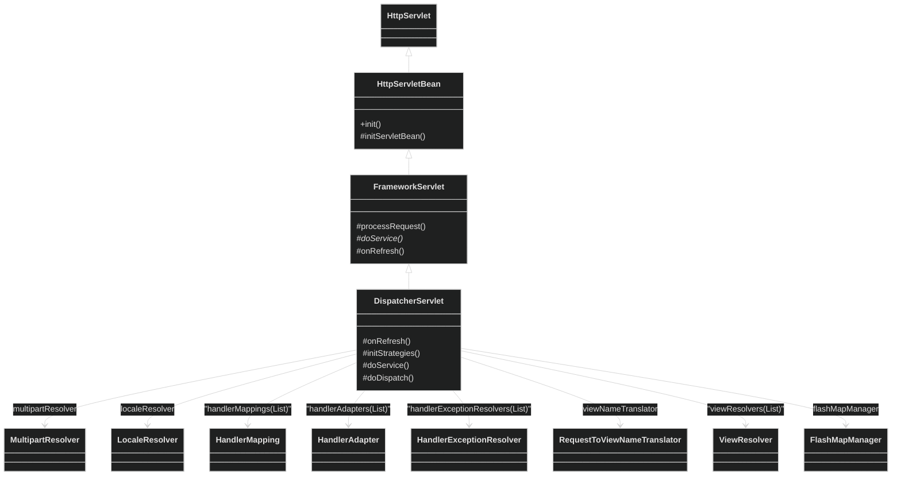
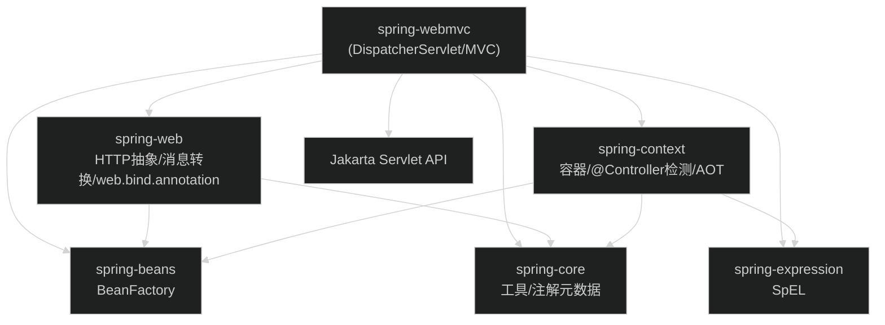
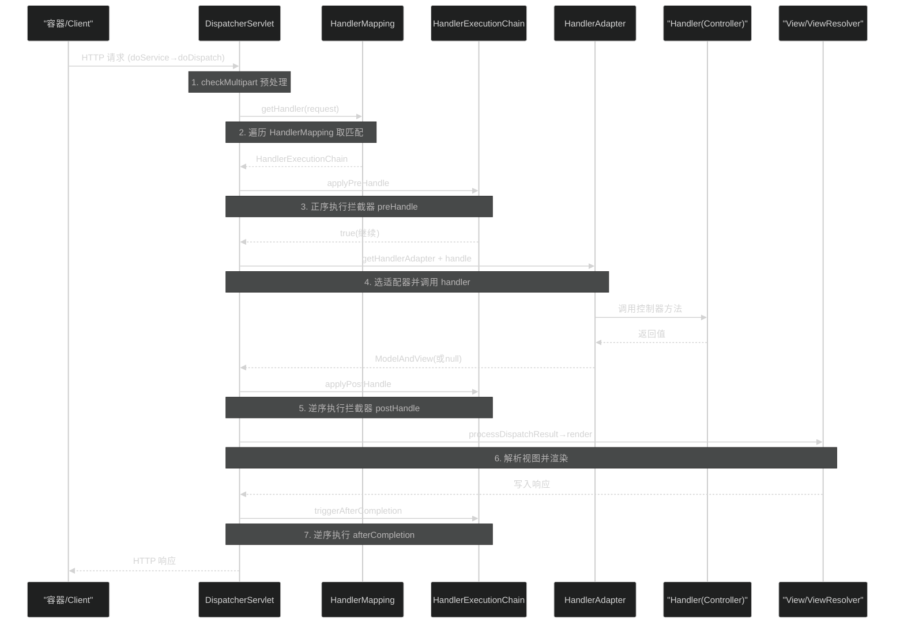
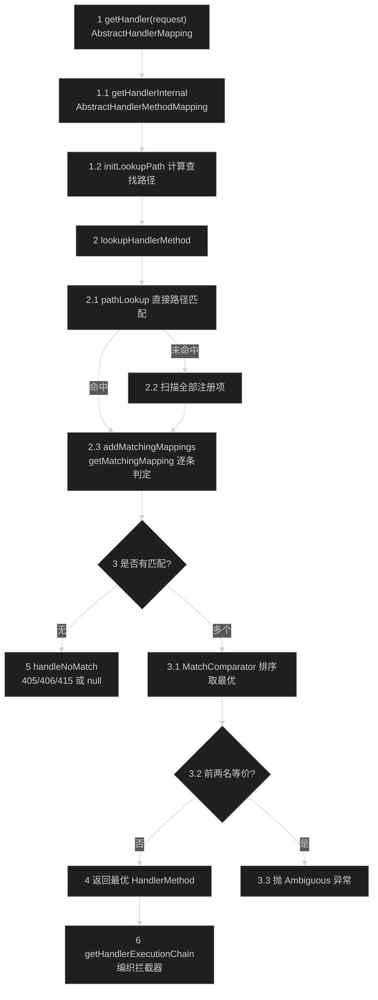
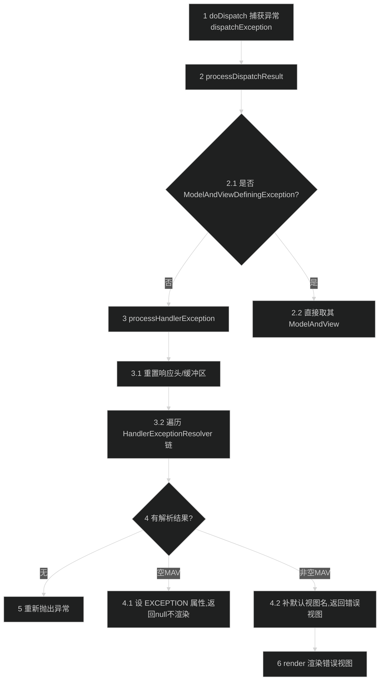

# Servlet MVC 模块（spring-webmvc）
> 上次修改：2026-07-26 18:32

## 重点关注

- **`DispatcherServlet.doDispatch`（请求分发主流程，`DispatcherServlet.java:935`）**：整个 Servlet MVC 的主链路，串起“映射 → 适配 → 拦截器 → 处理 → 结果处理 → afterCompletion”，是理解本模块的第一入口。
- **`DispatcherServlet.initStrategies`（九大策略组件初始化，`DispatcherServlet.java:441`）**：前端控制器的“可插拔”核心，决定 MVC 的可扩展性；配合 `DispatcherServlet.properties` 兜底策略一起看。
- **`RequestMappingHandlerMapping` 映射注册与查找（`RequestMappingHandlerMapping.java` + `AbstractHandlerMethodMapping.java`）**：`@RequestMapping` 如何被扫描注册为 `HandlerMethod`，以及请求如何匹配到最佳处理方法（含歧义与 405/406/415 判定），是复杂度最高、最易踩坑的分支。
- **`RequestMappingHandlerAdapter.invokeHandlerMethod`（参数解析与返回值处理，`RequestMappingHandlerAdapter.java:885`）**：参数解析器/返回值处理器的装配点，也是 `@RequestBody`/`@ResponseBody`/异步返回（Callable/DeferredResult）的分叉点。
- **拦截器链 `HandlerExecutionChain`（`HandlerExecutionChain.java:142`）**：`preHandle`/`postHandle`/`afterCompletion` 的顺序与回滚语义，尤其是 `preHandle` 返回 `false` 的短路行为，是排障高频点。
- **异常处理路径 `processHandlerException`（`DispatcherServlet.java:1207`）**：异常如何经 `HandlerExceptionResolver` 链解析为错误视图或状态码，是错误响应形态的决定处。

---

## 1. 模块定位与职责边界

**结论**：spring-webmvc 是基于 Servlet API（Jakarta Servlet）的同步 MVC 框架，围绕**前端控制器模式**组织。它把一次 HTTP 请求的生命周期拆成一组**可插拔策略**（映射、适配、视图解析、异常解析等），由中央调度器 `DispatcherServlet` 编排，让业务代码以 `@Controller`/`@RequestMapping` 的形式接入而无需实现任何框架接口。

**上游 / 下游**：
- 上游：Servlet 容器（Tomcat/Jetty 等）通过 `DispatcherServlet`（继承 `HttpServlet`）把请求交给本模块。
- 下游：本模块依赖 spring-web 提供的 HTTP 抽象与消息转换（`HttpMessageConverter`、`HandlerMethodArgumentResolver`、`web.bind.annotation.*` 注解、`WebAsyncManager` 等），依赖 spring-context 完成 Bean 装配与 `@Controller` 检测。

**负责什么**：
- HTTP 请求接入与分发（`DispatcherServlet` / `FrameworkServlet` / `HttpServletBean`）。
- 处理器映射（URL/注解 → handler），处理器适配（handler → 统一调用），拦截器链编织。
- 视图名解析与视图渲染（`ViewResolver`/`View`/`ModelAndView`）。
- 异常解析（`HandlerExceptionResolver` 链，含 `@ExceptionHandler`/`@ControllerAdvice`、标准异常 → HTTP 状态码）。
- 九大策略组件的初始化与兜底（`initStrategies` + `DispatcherServlet.properties`）。

**不负责什么**：
- 不定义 HTTP 消息读写与注解本身（`@RequestMapping`/`@RequestBody` 等在 **spring-web** 的 `web.bind.annotation`；`@Controller` 在 **spring-context** 的 `stereotype`）。
- 不做响应式栈（那是 spring-webflux）。
- 不实现 Bean 容器（依赖 spring-context/beans）。

**主要输入 / 输出 / 状态变化 / 副作用**：
- 输入：`HttpServletRequest`（含 URL、方法、头、体、参数）。
- 输出：写入 `HttpServletResponse`（状态码、头、渲染后的正文）。
- 状态变化：向 request 注入框架属性（`WEB_APPLICATION_CONTEXT_ATTRIBUTE`、FlashMap、`BEST_MATCHING_HANDLER_ATTRIBUTE`、URI 模板变量等）；`ModelAndViewContainer` 累积模型与视图状态。
- 副作用：视图渲染（forward/JSP/JSON 写出）、FlashMap 持久化到 Session、多部分请求资源清理。

---

## 2. 架构关系与依赖

**结论**：`DispatcherServlet` 位于 `HttpServletBean → FrameworkServlet → DispatcherServlet` 三层继承体系顶端，通过九个策略字段持有可插拔组件；这些组件在容器刷新（`onRefresh`）时由 `initStrategies` 按“先按类型检测 Bean，缺失则按 `DispatcherServlet.properties` 兜底”的规则装配。

### 2.1 DispatcherServlet 继承体系与九大策略组件

**九大策略组件说明表**（字段见 `DispatcherServlet.java:279-301`，初始化见 `initStrategies` `DispatcherServlet.java:441-450`，默认实现见 `DispatcherServlet.properties`）：

| 组件 | 字段/Bean 名 | 作用 | 默认实现（无自定义 Bean 时） | 兜底方式 |
|------|--------------|------|------------------------------|----------|
| MultipartResolver | `multipartResolver` | 解析 `multipart/form-data` 文件上传 | 无（`null`，不启用） | 仅按 Bean 名检测，缺失即禁用 |
| LocaleResolver | `localeResolver` | 解析请求区域（头/Cookie/Session） | `AcceptHeaderLocaleResolver` | `getDefaultStrategy` 单例兜底 |
| HandlerMapping | `handlerMappings`（List） | 请求 → handler 映射 | `BeanNameUrlHandlerMapping` + `RequestMappingHandlerMapping` + `RouterFunctionMapping` | `getDefaultStrategies` 多例兜底 |
| HandlerAdapter | `handlerAdapters`（List） | 以统一接口调用不同类型 handler | `HttpRequestHandlerAdapter` / `SimpleControllerHandlerAdapter` / `RequestMappingHandlerAdapter` / `HandlerFunctionAdapter` | `getDefaultStrategies` 多例兜底 |
| HandlerExceptionResolver | `handlerExceptionResolvers`（List） | 异常 → 错误视图/状态码 | `ExceptionHandlerExceptionResolver` / `ResponseStatusExceptionResolver` / `DefaultHandlerExceptionResolver` | `getDefaultStrategies` 多例兜底 |
| RequestToViewNameTranslator | `viewNameTranslator` | 无视图名时由请求推导视图名 | `DefaultRequestToViewNameTranslator` | `getDefaultStrategy` 单例兜底 |
| ViewResolver | `viewResolvers`（List） | 视图名 → `View` 对象 | `InternalResourceViewResolver` | `getDefaultStrategies` 多例兜底 |
| FlashMapManager | `flashMapManager` | 重定向间传递 Flash 属性 | `SessionFlashMapManager` | `getDefaultStrategy` 单例兜底 |

> 注：列表型组件（HandlerMapping/Adapter/ExceptionResolver/ViewResolver）默认 `detectAllXxx=true`（`DispatcherServlet.java:265-274`），会用 `BeanFactoryUtils.beansOfTypeIncludingAncestors` 按**类型**检测所有 Bean 并 `AnnotationAwareOrderComparator.sort` 排序（如 `initHandlerMappings` `:509-544`）；单例型组件（LocaleResolver/ViewNameTranslator/FlashMapManager/Multipart）按**固定 Bean 名**检测。

### 2.2 模块外部依赖

**依赖说明**（依据 `spring-webmvc.gradle:7-12` 全部为 `api` 依赖）：

| 节点 | 方向 | 说明 | 耦合强度 |
|------|------|------|----------|
| spring-web | webmvc → web | 提供 `HttpMessageConverter`、`HandlerMethodArgumentResolver`/`ReturnValueHandler` 基类、`web.bind.annotation.*` 注解、`WebAsyncManager`、`MultipartResolver` 等 HTTP 抽象与消息转换 | 强依赖（不可替换，MVC 核心构建于此） |
| spring-context | webmvc → context | 提供 `ApplicationContext`、`@Controller`（stereotype）检测、Bean 生命周期回调 | 强依赖 |
| spring-beans | webmvc → beans | `BeanFactoryUtils` 按类型检测策略 Bean | 强依赖 |
| spring-expression | webmvc → expr | 用于 `@Value`/路径前缀占位符等 SpEL 求值 | 中等 |
| Jakarta Servlet | webmvc → servlet | `HttpServlet`/`HttpServletRequest`/`Response`，DispatcherServlet 的宿主接口 | 强依赖（运行时由容器提供） |

**潜在耦合点**：`@RequestMapping` 注解族在 spring-web，`RequestMappingHandlerMapping`/`Adapter` 在 spring-webmvc，二者必须成对存在才能处理注解（见 `DispatcherServlet.java:128-134` 的类注释）。

---

## 3. 入口与调用方式

**结论**：本模块唯一的运行时入口是 Servlet 容器对 `DispatcherServlet` 的 `service`/`doGet`/`doPost` 回调，最终收敛到 `doDispatch`；初始化入口是容器刷新触发的 `onRefresh → initStrategies`。

| 入口 | 触发条件 | 源码位置 | 关键参数/返回 | 之后进入 |
|------|----------|----------|----------------|----------|
| `HttpServletBean.init()` | 容器创建 Servlet | `HttpServletBean.java:150` | 无 → 调用 `initServletBean()` | `FrameworkServlet.initServletBean` → `initWebApplicationContext` |
| `FrameworkServlet.onRefresh` → `DispatcherServlet.onRefresh` | 容器上下文刷新完成 | `DispatcherServlet.java:432` | `ApplicationContext` | `initStrategies`（装配九大组件） |
| `doGet/doPost/...` → `processRequest` | 每次 HTTP 请求 | `FrameworkServlet.java:889/900/982` | request/response | `doService` |
| `DispatcherServlet.doService` | 由 `processRequest` 调用 | `DispatcherServlet.java:829` | 注入框架属性、FlashMap、解析 RequestPath | `doDispatch` |
| `DispatcherServlet.doDispatch` | 由 `doService` 调用 | `DispatcherServlet.java:935` | request/response | 映射→适配→拦截器→处理→结果处理 |

**HTTP 方法入口**：`FrameworkServlet` 将 `doGet`/`doPost`/`doPut`/`doDelete`/`doOptions`/`doTrace` 全部委托给 `processRequest`（`FrameworkServlet.java:889-968`），`processRequest` 负责绑定 `LocaleContext`/`RequestAttributes`/注册 `WebAsyncManager` 回调后调用抽象方法 `doService`（`FrameworkServlet.java:982-1019`），由 `DispatcherServlet` 实现。

---

## 4. 核心概念与领域模型

### 4.1 DispatcherServlet（前端控制器）
- **定义**：中央调度 Servlet，编排一次请求的完整处理流程。
- **作用**：把请求分发给合适的 handler，并处理映射、拦截、异常、视图渲染。
- **生命周期**：随 Servlet 容器创建（`init`）→ 容器刷新装配策略（`onRefresh`）→ 每请求 `doDispatch` → 容器销毁。
- **相关类型**：`FrameworkServlet`、`HandlerMapping`、`HandlerAdapter`、`ViewResolver`。
- **三维评估**：好处——策略模式使所有环节可替换，`DispatcherServlet` 不含任何 handler 类型的耦合代码（见 `HandlerAdapter.java:26-35` 类注释）；替代方案——把逻辑硬编码进 Servlet（丧失扩展性）；风险——策略数量多、初始化链长，配置错误时不易定位（如缺 `RequestMappingHandlerAdapter` 则 `@RequestMapping` 方法无法调用）。

### 4.2 HandlerMapping / HandlerExecutionChain
- **定义**：`HandlerMapping.getHandler(request)`（`HandlerMapping.java:179`）返回 `HandlerExecutionChain`——即“handler 对象 + 一组 `HandlerInterceptor`”。
- **作用**：将请求路由到 handler，并携带匹配的拦截器。
- **相关类型**：`AbstractHandlerMapping`（实现 `getHandler`，`final`）、`RequestMappingHandlerMapping`（注解映射）、`HandlerInterceptor`。
- **生命周期**：`HandlerExecutionChain` 每请求新建；`interceptorIndex` 记录 `preHandle` 成功的最后位置以支持精确回滚（`HandlerExecutionChain.java:48,149`）。
- **三维评估**：好处——handler 为 `Object`，不限定接口，可接入任意框架的处理器（`HandlerMapping.java:167-170`）；替代方案——强类型 handler 接口（灵活性差）；风险——弱类型意味着适配职责被推给 `HandlerAdapter`，找不到适配器时抛 `ServletException`（`DispatcherServlet.java:1193`）。

### 4.3 HandlerAdapter / HandlerMethod
- **定义**：`HandlerAdapter.supports(handler)` + `handle(...)`（`HandlerAdapter.java:62,76`）以统一接口调用不同类型 handler；`HandlerMethod` 封装“控制器 Bean + `@RequestMapping` 方法”。
- **作用**：屏蔽 handler 类型差异；`RequestMappingHandlerAdapter` 负责注解式方法的参数解析/返回值处理。
- **相关类型**：`AbstractHandlerMethodAdapter`、`RequestMappingHandlerAdapter`、`ServletInvocableHandlerMethod`、`InvocableHandlerMethod`（后二者/基类在 spring-web 的 `web.method.*`）。
- **三维评估**：好处——新增 handler 类型只需新增 Adapter，不改 `DispatcherServlet`；替代方案——`instanceof` 分支硬编码（违反开闭原则）；风险——多 Adapter 顺序敏感，`getHandlerAdapter` 取第一个 `supports` 为 true 者（`DispatcherServlet.java:1185-1195`）。

### 4.4 ModelAndView / ViewResolver / View
- **定义**：`ModelAndView` 同时承载“视图（名或 `View` 实例）+ 模型 + 可选状态码”（字段 `ModelAndView.java:51,54`）；`ViewResolver.resolveViewName(name, locale)` 把视图名解析成 `View`；`View.render(model, req, resp)` 渲染。
- **作用**：解耦“处理结果”与“呈现方式”。
- **关键方法**：`hasView`（`:218`）、`isEmpty`（`:328`）、`wasCleared`（`:339`，`clear` 后又添加内容则返回 `false`）。
- **三维评估**：好处——同一模型可被 JSP/JSON/模板等不同 `View` 渲染，`ViewResolver` 支持链式（返回 `null` 交下一个，`ViewResolver.java:42-46`）；替代方案——控制器直接写响应（丧失视图协商）；风险——视图名解析失败抛 `ServletException`（`DispatcherServlet.java:1279`）。

### 4.5 HandlerInterceptor（拦截器）
- **定义**：三个默认方法 `preHandle`/`postHandle`/`afterCompletion`（`HandlerInterceptor.java:102/129/154`）。
- **作用**：在 handler 前后与请求完成时织入横切逻辑。
- **生命周期语义**：`preHandle` 正序执行、返回 `false` 即短路；`postHandle`/`afterCompletion` **逆序**执行；`afterCompletion` 仅对 `preHandle` 返回过 `true` 的拦截器触发（`HandlerExecutionChain.java:142-181`）。
- **三维评估**：好处——非侵入横切；替代方案——Servlet Filter（更粗粒度、无法访问 handler/ModelAndView）；风险——`postHandle` 中修改 `ModelAndView`（或 `clear()`）会影响渲染，误用易导致空白响应。

---

## 5. 关键流程

### 5.1 doDispatch 请求分发主成功路径

**1-2 请求预处理与映射**：`doDispatch` 先 `checkMultipart` 判断并将请求包装为多部分请求（`DispatcherServlet.java:947`），随后 `getHandler` 按序遍历 `handlerMappings` 取第一个非空 `HandlerExecutionChain`（`:951,1154-1164`）；若无匹配则调 `noHandlerFound` 抛 `NoHandlerFoundException`（`:952-955,1172-1178`，见第 8 章 404）。

**3 拦截器 preHandle**：`mappedHandler.applyPreHandle` 正序调用每个拦截器 `preHandle`，任一返回 `false` 即触发已执行拦截器的 `afterCompletion` 并短路返回（`:957-959`；`HandlerExecutionChain.java:142-152`）。

**4 适配与处理**：`getHandlerAdapter` 取第一个 `supports(handler)` 的适配器（`:962,1185-1195`），`ha.handle(...)` 调用 handler 得到 `ModelAndView`（`:963`）；随后若 `asyncManager.isConcurrentHandlingStarted()` 为真则直接返回（异步分支，见 8.5）。

**5 postHandle**：`applyDefaultViewName` 在无视图时用 `RequestToViewNameTranslator` 补默认视图名（`:969,1009-1016`），`applyPostHandle` 逆序执行拦截器 `postHandle`（`:970`）。

**6 结果处理与渲染**：`processDispatchResult` 判断有异常则走 `processHandlerException`，否则 `mv != null && !mv.wasCleared()` 时 `render` 渲染视图（`:980,1022-1051,1267-1313`）。

**7 afterCompletion**：正常路径末尾 `mappedHandler.triggerAfterCompletion(request, response, null)` 逆序回调（`:1058-1061`）；任一环节抛异常则由外层 catch 调 `triggerAfterCompletion` 并重抛（`:982-988,1357-1364`）。

### 5.2 RequestMappingHandlerMapping 映射查找路径

**1-1.2 入口与查找路径**：`AbstractHandlerMapping.getHandler`（`final`，实现 `HandlerMapping` SPI）先调抽象 `getHandlerInternal`，由 `AbstractHandlerMethodMapping.getHandlerInternal` 计算并缓存 lookup path，再进入 `lookupHandlerMethod`；`getHandlerInternal` 最终对结果调 `createWithResolvedBean()` 将 Bean 名解析为真实 Bean。

**2-2.3 匹配收集**：`lookupHandlerMethod` 先用 `MappingRegistry.pathLookup` 做直接（非模式）路径的快速匹配；命中为空则退化为扫描全部注册项。对每个候选 `RequestMappingInfoHandlerMapping.getMatchingMapping` 调 `info.getMatchingCondition(request)`，返回仅含请求相关条件的新 `RequestMappingInfo`（不匹配则 `null`），收集为 `Match` 列表。

**3-4 最优选择与歧义**：有多个匹配时用 `getMappingComparator`（基于 `info.compareTo`）排序取最优；若排序后前两名等价（非预检）则抛 `IllegalStateException("Ambiguous handler methods mapped ...")`；否则设置 `BEST_MATCHING_HANDLER_ATTRIBUTE` 并返回最优。

**5 无匹配**：无任何匹配时调 `RequestMappingInfoHandlerMapping.handleNoMatch`——它以“仅 URL 匹配”的部分匹配集为依据，抛 405（方法不支持）/415（consumes 不符）/406（produces 不符）等异常；若连 URL 都不匹配则返回 `null`，最终由 `DispatcherServlet` 抛 404（见第 8 章）。

**6 编织拦截器**：回到 `AbstractHandlerMapping.getHandler`，`getHandlerExecutionChain` 把解析出的 `HandlerMethod` 包装为链，遍历 `adaptedInterceptors`：`MappedInterceptor` 仅在路径匹配时加入，其余无条件加入；如适用再前插 CORS 拦截器。

### 5.3 异常处理路径

**1-2.2 异常收集**：`doDispatch` 内 handler 调用与 `postHandle` 抛出的异常被记入 `dispatchException`（`Error` 也被包装为 `ServletException`，`DispatcherServlet.java:972-979`）；`processDispatchResult` 若发现是 `ModelAndViewDefiningException` 则直接取其内置 `ModelAndView`（`:1028-1032`）。

**3-3.2 解析器链**：否则 `processHandlerException` 先重置 `Content-Type`/`Content-Disposition` 与缓冲区（未提交时），再按序遍历 `handlerExceptionResolvers`，命中第一个非空结果即 `break`（`:1207-1232`）。默认三个解析器依次为 `ExceptionHandlerExceptionResolver`（`@ExceptionHandler`/`@ControllerAdvice`）→ `ResponseStatusExceptionResolver`（`@ResponseStatus`）→ `DefaultHandlerExceptionResolver`（标准异常 → 状态码）。

**4-6 结果分派**：解析结果为空 `ModelAndView` 表示“已处理无需渲染”（如仅设了状态码），此时设 `EXCEPTION_ATTRIBUTE` 返回 `null`（`:1233-1237`）；非空则补默认视图名并暴露错误请求属性后返回错误视图供 `render` 渲染（`:1238-1252`）；若**无**解析器处理则重抛异常（`:1255`），冒泡到容器。

---

## 6. 核心实现细节

### 6.1 doDispatch 逐段解读（`DispatcherServlet.java:935-1004`）

- **多部分预处理（`:947-948`）**：`checkMultipart` 若配置了 `MultipartResolver` 且请求是 multipart，则包装请求；`multipartRequestParsed` 标记用于 `finally` 清理。**隐藏假设**：错误分发时若之前多部分解析已失败则跳过重解析（`:1096-1099`），避免破坏错误渲染。
- **映射（`:951-955`）**：`getHandler` 返回 `null` 时立即 `noHandlerFound` 并 `return`，不再走后续。
- **preHandle 短路（`:957-959`）**：返回 `false` 直接 `return`——注意此时**不**执行 `render`，拦截器需自行写响应。
- **适配调用（`:962-963`）**：`ha.handle` 返回的 `mv` 可能为 `null`（如 `@ResponseBody` 已直接写出响应，`mavContainer.isRequestHandled()` 为真）。
- **异步短路（`:965-967`）**：`isConcurrentHandlingStarted()` 为真时直接 `return`，把 `postHandle`/渲染推迟到重新分发（见 6.3 与 8.5）。
- **统一结果处理（`:980`）**：无论成功或异常都进入 `processDispatchResult`，异常经由 `dispatchException` 传入，实现“正常/异常”统一收口。
- **三维评估**：好处——单一方法内用 try/catch 分层清晰地把“handler 异常”与“处理流程异常”分开（`:972-988`）；替代方案——异常在各步就地处理（重复且易漏 `afterCompletion`）；风险——方法较长，`finally` 中异步/多部分清理逻辑对维护者不直观（`:989-1003`）。

### 6.2 initStrategies 组件初始化（`DispatcherServlet.java:441-450` 及各 `initXxx`）

- **通用套路**：列表型组件（`initHandlerMappings` `:506-545` 等）当 `detectAllXxx=true` 时用 `BeanFactoryUtils.beansOfTypeIncludingAncestors` 按类型抓全部 Bean 并排序；否则按固定 Bean 名取单个；仍为空则 `getDefaultStrategies` 从 `DispatcherServlet.properties` 读类名反射创建（`:765-807`）。
- **兜底加载机制**：`getDefaultStrategies` 惰性加载一次 `DispatcherServlet.properties`（静态 `defaultStrategies`，`:262,767-778`），按接口全限定名取逗号分隔类名，用 `context.getAutowireCapableBeanFactory().createBean(clazz)` 创建（`:819-821`）——**即便是兜底策略也走容器装配**，可注入依赖。
- **`parseRequestPath` 联动（`:539-544`）**：任一 `HandlerMapping.usesPathPatterns()` 为真则置位，使 `doService` 提前 `ServletRequestPathUtils.parseAndCache` 解析 `RequestPath`（`:860-863`）。
- **三维评估**：好处——“Bean 检测优先、properties 兜底”让零配置可用又完全可覆盖；替代方案——硬编码默认实现（无法零成本替换）；风险——`properties` 为内部约定、类名字符串反射，类缺失时抛 `BeanInitializationException`（`:792-800`），排障需查该资源文件。

### 6.3 RequestMappingHandlerAdapter.invokeHandlerMethod 参数解析/返回值处理（`RequestMappingHandlerAdapter.java:885-940`）

- **异步基础设施装配（`:888-895`）**：创建 `AsyncWebRequest`、设置超时、把 `taskExecutor`/Callable/DeferredResult 拦截器注册到 `WebAsyncManager`。
- **数据绑定与模型工厂（`:903-904`）**：`getDataBinderFactory` 汇集 `@InitBinder`（局部+`@ControllerAdvice` 全局，`:987-1011`）；`getModelFactory` 汇集 `@ModelAttribute` 方法（`:952-975`）。
- **可调用方法装配（`:906-916`）**：`ServletInvocableHandlerMethod` 注入 `argumentResolvers`（`HandlerMethodArgumentResolver` 组合）、`returnValueHandlers`（`HandlerMethodReturnValueHandler` 组合）、`binderFactory`、`methodValidator`。
- **模型初始化（`:917-919`）**：新建 `ModelAndViewContainer`，并入 Flash 属性，`modelFactory.initModel` 执行 `@ModelAttribute`。
- **异步结果恢复（`:921-932`）**：若 `asyncManager.hasConcurrentResult()`（异步重新分发），取回原 `mavContainer` 并 `wrapConcurrentResult` 用异步结果替换返回值。
- **调用与返回值处理（`:934-939`）**：`invocableMethod.invokeAndHandle` 内部解析参数（各 `HandlerMethodArgumentResolver.resolveArgument`）→ 反射调用控制器 → 由 `HandlerMethodReturnValueHandler` 处理返回值（含 `@ResponseBody` 走消息转换写出）；若返回值是 `Callable`/`DeferredResult`，对应 handler 会启动异步处理，随后 `isConcurrentHandlingStarted()` 为真则返回 `null`（`:935-937`），否则 `getModelAndView` 从容器构建 `ModelAndView`。
- **默认解析器/处理器（`getDefaultArgumentResolvers` `:644`，`getDefaultReturnValueHandlers` `:730`）**：参数解析器含 `RequestParamMethodArgumentResolver`（`:648`）、`PathVariableMethodArgumentResolver`（`:650`）、`ServletModelAttributeMethodProcessor`（`:654`）、`RequestResponseBodyMethodProcessor`（`@RequestBody`，`:655`）、`HttpEntityMethodProcessor`（`:667`）；返回值处理器含 `CallableMethodReturnValueHandler`（`:749`）、`DeferredResultMethodReturnValueHandler`（`:750`）、`RequestResponseBodyMethodProcessor`（`@ResponseBody`，`:755`）、`ViewNameMethodReturnValueHandler`（`:759`）。
- **三维评估**：好处——参数/返回值解析被抽象为可组合的解析器链，新增类型（如自定义注解参数）只需加解析器；替代方案——在适配器里 `switch` 参数类型（不可扩展）；风险——解析器**有序**且首个 `supportsParameter` 命中即用，顺序错误会导致解析行为异常；异步分支返回 `null` 使 `DispatcherServlet` 短路，若拦截器依赖 `postHandle` 需实现 `AsyncHandlerInterceptor`。

### 6.4 getModelAndView 结果构建（`RequestMappingHandlerAdapter.java:1037-1057`）
- `modelFactory.updateModel` 回写 `@SessionAttributes`；若 `mavContainer.isRequestHandled()`（如 `@ResponseBody` 已写出）返回 `null`，`doDispatch` 遂不渲染；否则据容器的 viewName/model/status 构建 `ModelAndView`，`RedirectAttributes` 时把 Flash 属性写入输出 FlashMap。

---

## 7. 数据结构、配置与外部协议

**核心数据结构**：
- `HandlerExecutionChain`：`handler`（`Object`）+ `interceptorList`（`List<HandlerInterceptor>`）+ `interceptorIndex`（回滚游标，`HandlerExecutionChain.java:44-48`）。
- `ModelAndView`：`view`（`String` 名或 `View` 实例）+ `model`（`ModelMap`）+ `status`（`HttpStatusCode`）+ `cleared` 标志（`ModelAndView.java:51-60`）。
- `MappingRegistry`（`AbstractHandlerMethodMapping` 内部）：`registry`（`RequestMappingInfo → MappingRegistration` 主表）、`pathLookup`（直接路径 → 映射，加速查找）、`nameLookup`、`corsLookup`，配合 `ReentrantReadWriteLock` 保证注册/查找并发安全。
- `ModelAndViewContainer`（spring-web）：请求处理期间累积 model/view/status/`requestHandled` 标志。

**配置项 / 请求属性协议**：
- `HandlerMapping` 常量族（`HandlerMapping.java:65-146`）：`BEST_MATCHING_HANDLER_ATTRIBUTE`、`URI_TEMPLATE_VARIABLES_ATTRIBUTE`、`MATRIX_VARIABLES_ATTRIBUTE`、`PRODUCIBLE_MEDIA_TYPES_ATTRIBUTE`、`API_VERSION_ATTRIBUTE` 等，作为 handler/视图可读的请求属性契约。
- `DispatcherServlet` 属性：`WEB_APPLICATION_CONTEXT_ATTRIBUTE`、`INPUT/OUTPUT_FLASH_MAP_ATTRIBUTE`、`EXCEPTION_ATTRIBUTE`（`DispatcherServlet.java:208-241`）。
- 开关：`detectAllHandlerMappings/Adapters/ExceptionResolvers/ViewResolvers`（默认 `true`）、`cleanupAfterInclude`（默认 `true`）（`:265-277`）。
- 外部资源：`DispatcherServlet.properties`（策略默认实现类名清单），错误配置（类名不存在）导致启动期 `BeanInitializationException`。

**外部协议**：本模块直接面向 HTTP（状态码、头、体），HTTP 消息的读写委托给 spring-web 的 `HttpMessageConverter`（`@RequestBody`/`@ResponseBody` 路径）。

---

## 8. 异常、边界与降级处理

| 边界场景 | 触发条件 | 处理 | 源码位置 |
|----------|----------|------|----------|
| **404 无映射** | 所有 `HandlerMapping` 均返回 `null` | `noHandlerFound` 抛 `NoHandlerFoundException`，经解析映射为 404 | `DispatcherServlet.java:952-955,1172-1178` |
| **405 方法不支持** | URL 匹配但 HTTP 方法不符 | `handleNoMatch` 抛 `HttpRequestMethodNotSupportedException` → 405（OPTIONS 特殊处理返回 Allow 头） | `RequestMappingInfoHandlerMapping.handleNoMatch` |
| **415 consumes 不符** | Content-Type 不匹配 | 抛 `HttpMediaTypeNotSupportedException` → 415 | 同上 |
| **406 produces 不符** | Accept 不匹配 | 抛 `HttpMediaTypeNotAcceptableException` → 406 | 同上 |
| **参数校验失败** | `@Valid` 校验不通过 | `MethodArgumentNotValidException`/`HandlerMethodValidationException` → 400（`DefaultHandlerExceptionResolver`） | `DefaultHandlerExceptionResolver` |
| **缺失必填参数** | `@RequestParam` 缺失 | `MissingServletRequestParameterException` → 400 | 同上 |
| **请求体不可读** | JSON 解析失败 | `HttpMessageNotReadableException` → 400 | 同上 |
| **拦截器 preHandle 返回 false** | 拦截器主动拦截 | `doDispatch` 直接 `return`，不调 handler/不渲染；已执行拦截器触发 `afterCompletion` | `DispatcherServlet.java:957-959`；`HandlerExecutionChain.java:145-147` |
| **多部分解析失败** | multipart 解析异常 | 错误分发场景下吞掉异常继续；否则抛 `MultipartException` | `DispatcherServlet.java:1101-1112` |
| **异步请求** | 返回 Callable/DeferredResult | `isConcurrentHandlingStarted()` 为真，主线程 `return`，改调 `applyAfterConcurrentHandlingStarted` | `DispatcherServlet.java:965-967,990-996` |
| **找不到 HandlerAdapter** | 无适配器 supports handler | 抛 `ServletException`（致命） | `DispatcherServlet.java:1193-1194` |
| **视图无法解析** | 无 ViewResolver 命中视图名 | 抛 `ServletException` | `DispatcherServlet.java:1278-1281` |
| **异常无人处理** | 无解析器返回非空 | `processHandlerException` 重抛，冒泡到容器 | `DispatcherServlet.java:1255` |

**异常传播语义**：handler 抛出的 `Exception`/`Error` 都被收集为 `dispatchException` 统一交 `processHandlerException`（`Error` 被包装为 `ServletException`，`:975-979`）；处理流程本身抛异常则由外层 catch 触发 `triggerAfterCompletion` 后重抛，确保拦截器清理不被跳过（`:982-988`）。

**降级点**：`processHandlerException` 先重置响应头/缓冲区（`:1214-1221`），保证错误响应不被半成品正文污染；若响应已提交则捕获 `IllegalStateException` 交由异常处理器尽力而为。

---

## 9. 并发、生命周期与性能

- **线程模型**：`DispatcherServlet` 及九大策略组件为**单例**、跨请求共享，必须无状态/线程安全；每请求的可变状态封装在方法局部变量与请求属性中（`HandlerExecutionChain`、`ModelAndViewContainer` 每请求新建）。
- **映射注册表并发**：`MappingRegistry` 用 `ReentrantReadWriteLock`——注册/注销持写锁，查找持读锁，保证运行期动态注册与高并发查找的一致性。
- **查找性能**：`lookupHandlerMethod` 优先用 `pathLookup`（直接路径 → 映射的 `MultiValueMap`）做 O(1) 定位，未命中才退化为遍历全部注册项做条件匹配（模式路径场景），是热点路径的关键优化。
- **策略缓存**：`RequestMappingHandlerAdapter` 缓存 `@InitBinder`/`@ModelAttribute`/`SessionAttributesHandler`（`initBinderCache`/`modelAttributeCache`/`sessionAttributesHandlerCache`），避免每请求反射扫描控制器方法。
- **异步与背压**：Callable/DeferredResult 由 `WebAsyncManager` 在独立线程处理，主 Servlet 线程释放；异步开始后 `postHandle`/`afterCompletion` 被 `afterConcurrentHandlingStarted` 替代（`HandlerExecutionChain.java:186-200`），完成后请求重新分发再走完整回调。
- **资源释放**：`finally` 中清理多部分请求资源（`cleanupMultipart`），include 场景恢复请求属性快照（`restoreAttributesAfterInclude` `:1372`）。
- **性能热点**：视图渲染（尤其 `@ResponseBody` 消息转换/序列化）与参数解析器链的线性扫描；解析器数量与顺序影响每参数解析开销。

---

## 10. 扩展点、测试点与维护建议

**扩展点**：
- 自定义 `HandlerMapping`/`HandlerAdapter`/`HandlerExceptionResolver`/`ViewResolver` Bean——`detectAllXxx=true` 时自动被检测并按 `@Order` 排序。
- 自定义 `HandlerInterceptor`（或 `AsyncHandlerInterceptor`）+ `MappedInterceptor` 做路径级拦截。
- `HandlerMethodArgumentResolver`/`HandlerMethodReturnValueHandler`（通过 `RequestMappingHandlerAdapter.setCustomArgumentResolvers` 等）扩展参数/返回值类型。
- `@ControllerAdvice` 提供全局 `@ExceptionHandler`/`@InitBinder`/`@ModelAttribute`。
- `RequestBodyAdvice`/`ResponseBodyAdvice` 在消息转换前后织入。

**建议测试点**：
- 主路径：`@RequestMapping` GET/POST 命中、`@ResponseBody` JSON 写出、视图渲染（用 `MockMvc`）。
- 失败路径：404/405/406/415、参数校验 400、`@ExceptionHandler` 命中。
- 边界：拦截器 `preHandle` 返回 false 的短路、拦截器逆序 `postHandle`/`afterCompletion`、异步 Callable/DeferredResult、multipart 上传与清理。
- 回归风险：解析器/处理器顺序、映射歧义（同 URL 多方法）、路径模式 vs `PathMatcher` 切换。

**维护建议**：
1. 目标 `doDispatch`（`DispatcherServlet.java:935`）：问题——方法长、异步/多部分清理逻辑内联在 `finally`；建议——为异步/多部分清理各抽私有方法并补注释；收益——降低维护者理解成本，风险低（纯重构）。
2. 目标 `DispatcherServlet.properties` 兜底机制：问题——策略默认类以字符串+反射硬编码，类缺失只在启动期暴露；建议——文档中明确列出该文件与九大组件的对应关系（本文 2.1 已补），并在排障手册引用；收益——加速“为何某默认组件生效/失效”的定位。

---

## 11. 文件职责表

| 文件 | 职责 | 关键类/函数 | 被谁调用 | 备注 |
|------|------|-------------|----------|------|
| `spring-webmvc/src/main/java/org/springframework/web/servlet/DispatcherServlet.java` | 前端控制器：分发主流程、九大组件初始化、异常/视图收口 | `doDispatch`/`initStrategies`/`processHandlerException`/`render` | Servlet 容器（经 FrameworkServlet） | 模块核心入口 |
| `.../web/servlet/FrameworkServlet.java` | HTTP 方法入口收敛、上下文绑定、容器刷新回调 | `processRequest`/`doService`(抽象)/`onRefresh` | 容器 `service`/`doGet` 等 | DispatcherServlet 父类 |
| `.../web/servlet/HttpServletBean.java` | Servlet 初始化、init-param 绑定 | `init`/`initServletBean`(抽象) | 容器 `init` | 继承链底层 |
| `.../web/servlet/HandlerMapping.java` | 映射 SPI：请求→HandlerExecutionChain；请求属性常量 | `getHandler`/`usesPathPatterns` | `DispatcherServlet.getHandler` | 接口 |
| `.../web/servlet/handler/AbstractHandlerMapping.java` | 实现 `getHandler`（final）、编织拦截器与 CORS | `getHandler`/`getHandlerExecutionChain`/`getHandlerInternal`(抽象) | DispatcherServlet | 所有映射基类 |
| `.../web/servlet/handler/AbstractHandlerMethodMapping.java` | 方法映射注册与查找引擎、`MappingRegistry` | `initHandlerMethods`/`registerHandlerMethod`/`lookupHandlerMethod` | 容器刷新/每请求 | 读写锁保护注册表 |
| `.../web/servlet/mvc/method/RequestMappingInfoHandlerMapping.java` | 基于 `RequestMappingInfo` 匹配、405/406/415 判定 | `getMatchingMapping`/`handleNoMatch` | AbstractHandlerMethodMapping | 部分匹配助手 |
| `.../web/servlet/mvc/method/annotation/RequestMappingHandlerMapping.java` | `@RequestMapping`/`@HttpExchange` → `RequestMappingInfo` | `isHandler`/`getMappingForMethod`/`afterPropertiesSet` | 容器初始化 | 只扫描 `@Controller` |
| `.../web/servlet/HandlerAdapter.java` | 适配 SPI：统一调用任意 handler | `supports`/`handle` | `DispatcherServlet.getHandlerAdapter` | 接口 |
| `.../web/servlet/mvc/method/annotation/RequestMappingHandlerAdapter.java` | 注解方法调用：参数解析/返回值处理/异步 | `invokeHandlerMethod`/`getDefaultArgumentResolvers`/`getDefaultReturnValueHandlers` | DispatcherServlet | 装配解析器链 |
| `.../web/servlet/mvc/method/annotation/ServletInvocableHandlerMethod.java` | 反射调用控制器方法并处理返回值/`@ResponseStatus` | `invokeAndHandle` | RequestMappingHandlerAdapter | 依赖 spring-web 基类 |
| `.../web/servlet/HandlerExecutionChain.java` | 拦截器链：preHandle/postHandle/afterCompletion 编排 | `applyPreHandle`/`applyPostHandle`/`triggerAfterCompletion` | doDispatch | `interceptorIndex` 精确回滚 |
| `.../web/servlet/HandlerInterceptor.java` | 拦截器契约（三个 default 方法） | `preHandle`/`postHandle`/`afterCompletion` | HandlerExecutionChain | `AsyncHandlerInterceptor` 扩展异步回调 |
| `.../web/servlet/HandlerExceptionResolver.java` | 异常解析 SPI | `resolveException` | processHandlerException | 接口 |
| `.../web/servlet/mvc/method/annotation/ExceptionHandlerExceptionResolver.java` | `@ExceptionHandler`/`@ControllerAdvice` 解析 | `doResolveHandlerMethodException`/`getExceptionHandlerMethod` | 异常解析链 | 默认第一个解析器 |
| `.../web/servlet/mvc/support/DefaultHandlerExceptionResolver.java` | 标准 MVC 异常 → HTTP 状态码 | `doResolveException` | 异常解析链 | 405/406/415/400/404 等 |
| `.../web/servlet/ModelAndView.java` | 承载视图（名/实例）+模型+状态 | `hasView`/`isEmpty`/`wasCleared`/`clear` | doDispatch/render | `cleared` 标志控制渲染 |
| `.../web/servlet/ViewResolver.java` / `View.java` | 视图名→View 解析；视图渲染 | `resolveViewName`/`render` | `DispatcherServlet.render` | 支持链式解析 |
| `.../web/servlet/DispatcherServlet.properties`（resources） | 九大策略默认实现类名清单 | — | `getDefaultStrategies` | 兜底装配 |

---

## 12. 代码引用索引

| 引用 | 说明 |
|------|------|
| `spring-webmvc/src/main/java/org/springframework/web/servlet/DispatcherServlet.java:935` | `doDispatch` 分发主流程 |
| `.../DispatcherServlet.java:441-450` | `initStrategies` 九大组件初始化 |
| `.../DispatcherServlet.java:506-545` | `initHandlerMappings`（列表型组件检测+排序+兜底典型） |
| `.../DispatcherServlet.java:765-821` | `getDefaultStrategies`/`createDefaultStrategy` properties 兜底 |
| `.../DispatcherServlet.java:829-879` | `doService`（属性注入/FlashMap/RequestPath 解析） |
| `.../DispatcherServlet.java:1009-1016` | `applyDefaultViewName` 默认视图名 |
| `.../DispatcherServlet.java:1022-1062` | `processDispatchResult` 结果/异常收口 |
| `.../DispatcherServlet.java:1154-1164` | `getHandler` 遍历 HandlerMapping |
| `.../DispatcherServlet.java:1172-1178` | `noHandlerFound` 抛 404 |
| `.../DispatcherServlet.java:1185-1195` | `getHandlerAdapter` 选适配器 |
| `.../DispatcherServlet.java:1207-1256` | `processHandlerException` 异常解析链 |
| `.../DispatcherServlet.java:1267-1313` | `render` 视图解析与渲染 |
| `.../web/servlet/FrameworkServlet.java:889-968` | HTTP 方法入口 → `processRequest` |
| `.../web/servlet/FrameworkServlet.java:982-1019` | `processRequest` 上下文绑定 |
| `.../web/servlet/HttpServletBean.java:150-192` | `init`/`initServletBean` |
| `.../web/servlet/HandlerMapping.java:65-146` | 请求属性常量族 |
| `.../web/servlet/HandlerMapping.java:179` | `getHandler` SPI |
| `.../web/servlet/HandlerAdapter.java:62-76` | `supports`/`handle` SPI |
| `.../web/servlet/HandlerExecutionChain.java:142-200` | 拦截器 preHandle/postHandle/afterCompletion/异步 |
| `.../web/servlet/HandlerInterceptor.java:102/129/154` | 拦截器三方法契约 |
| `.../web/servlet/ModelAndView.java:51-60,218,328,339` | 字段与 hasView/isEmpty/wasCleared |
| `.../web/servlet/ViewResolver.java:38-55` | 视图名解析契约（含链式） |
| `.../web/servlet/mvc/method/annotation/RequestMappingHandlerAdapter.java:885-940` | `invokeHandlerMethod` 主流程 |
| `.../RequestMappingHandlerAdapter.java:644-730` | 默认参数解析器/返回值处理器注册 |
| `.../RequestMappingHandlerAdapter.java:1037-1057` | `getModelAndView` 结果构建 |
| `.../web/servlet/mvc/method/annotation/RequestMappingHandlerMapping.java` | `isHandler`/`getMappingForMethod` 注解映射工厂 |
| `.../web/servlet/handler/AbstractHandlerMapping.java` | `getHandler`(final)/`getHandlerExecutionChain` |
| `.../web/servlet/handler/AbstractHandlerMethodMapping.java` | `MappingRegistry`/`lookupHandlerMethod` 注册与查找 |
| `.../web/servlet/mvc/method/RequestMappingInfoHandlerMapping.java` | `getMatchingMapping`/`handleNoMatch`（405/406/415） |
| `.../web/servlet/mvc/support/DefaultHandlerExceptionResolver.java` | 标准异常→状态码映射 |
| `spring-webmvc/src/main/resources/org/springframework/web/servlet/DispatcherServlet.properties` | 九大策略默认实现清单 |
| `spring-webmvc/spring-webmvc.gradle:7-18` | 模块依赖（beans/core/context/web/expression/aop） |
