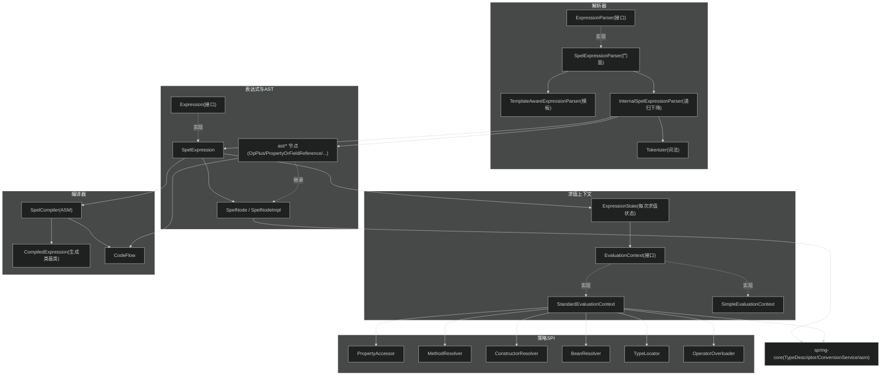
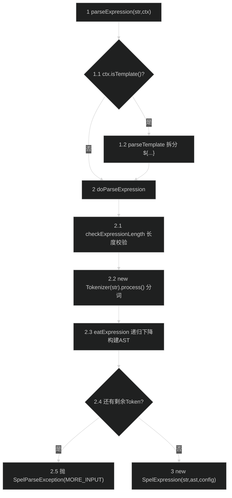
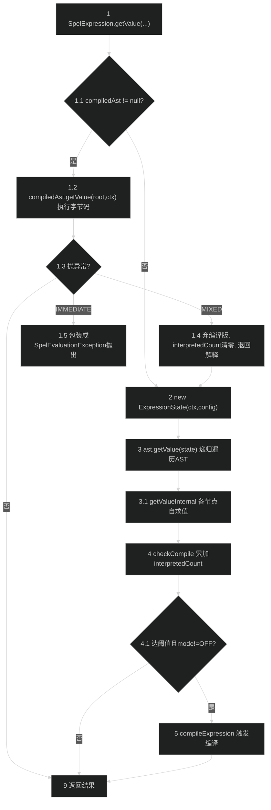
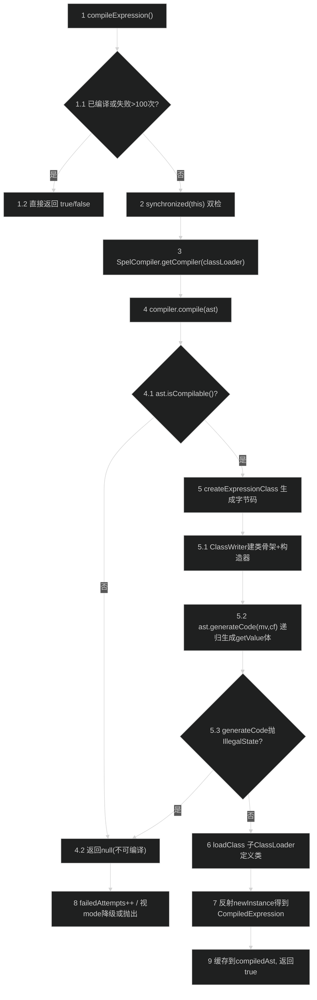

# SpEL 表达式模块（spring-expression）
> 上次修改：2026-07-26 17:58

## 重点关注

- **解析主入口 `parseExpression` → `InternalSpelExpressionParser.doParseExpression`（`InternalSpelExpressionParser.java:128`）**：一次调用串起「词法分析（Tokenizer）→ 递归下降语法分析 → 构建 AST → 封装为 SpelExpression」的完整链路，是理解本模块的第一入口。
- **递归下降解析的优先级阶梯（`InternalSpelExpressionParser.java:170-363`）**：`eatExpression → eatLogicalOrExpression → eatLogicalAndExpression → eatRelationalExpression → eatSumExpression → eatProductExpression → eatPowerIncDecExpression → eatUnaryExpression → eatPrimaryExpression`，每一层对应一个运算符优先级，是本模块最核心的算法骨架。
- **求值主入口 `SpelExpression.getValue` → `SpelNodeImpl.getValue` 遍历 AST（`SpelExpression.java:118`、`SpelNodeImpl.java:112`）**：所有 6 个 `getValue` 重载都遵循「先查编译缓存 → 否则解释执行 AST → checkCompile 计数」的统一骨架。
- **编译路径 `checkCompile → compileExpression → SpelCompiler.compile`（`SpelExpression.java:469`、`SpelCompiler.java:101`）**：基于 ASM 把「热表达式」生成字节码子类，是性能优化的核心，涉及 `interpretedCount` 阈值与 `SpelCompilerMode` 三态。
- **PropertyAccessor 解析链（`PropertyOrFieldReference.java:192`、`AccessorUtils.java:77`）**：属性/字段访问如何按「精确匹配→父类匹配→通用」顺序挑选访问器、如何缓存 `cachedReadAccessor`，是最典型的策略链 + 缓存实现。
- **第 5 章关键流程 / 第 6 章核心实现细节**：分别用流程图与逐段解读串起上述三条主链路，建议重点阅读。

---

## 1. 模块定位与职责边界

**结论**：spring-expression 是 Spring 表达式语言（SpEL）的完整实现，提供「把字符串表达式解析成可重复求值的 `Expression` 对象，并在给定 `EvaluationContext` 中求值」的能力。它是一个几乎独立的模块，仅依赖 spring-core（用于 `TypeDescriptor`/`ConversionService`/`SpringProperties`/内联的 ASM 字节码库），不依赖 spring-beans/spring-context。

**负责什么**（源码证据）：
- **解析**：`ExpressionParser` 定义契约（`ExpressionParser.java:42`），`SpelExpressionParser` 是门面（`SpelExpressionParser.java:35`），`InternalSpelExpressionParser` 做真正的词法+语法分析（`InternalSpelExpressionParser.java:128`），`Tokenizer` 做分词（`Tokenizer.java:88`）。
- **表达式模型与 AST**：`Expression`/`SpelExpression`（`SpelExpression.java:51`），`SpelNode`/`SpelNodeImpl` 及 `spel/ast` 下 50+ 节点类型（`SpelNodeImpl.java:50`）。
- **求值上下文与策略**：`EvaluationContext`（`EvaluationContext.java:46`）及 `StandardEvaluationContext`/`SimpleEvaluationContext`，以及 `PropertyAccessor`/`MethodResolver`/`ConstructorResolver`/`BeanResolver`/`TypeLocator`/`TypeConverter`/`OperatorOverloader` 一整套 SPI。
- **编译优化**：`SpelCompiler`（`SpelCompiler.java:69`）、`CompiledExpression`（`CompiledExpression.java:32`）、`CodeFlow`、`SpelCompilerMode`。
- **模板支持**：`TemplateAwareExpressionParser`（`TemplateAwareExpressionParser.java:45`）、`TemplateParserContext`。

**不负责什么**：
- 不负责 Bean 的实际查找——`BeanResolver` 只是 SPI 接口，具体实现（如 `BeanFactoryResolver`）在 spring-context 中。
- 不负责通用类型转换算法——委托给 spring-core 的 `ConversionService`（通过 `TypeConverter`/`StandardTypeConverter` 桥接）。
- 不定义 `@Value` 等注解——那些在 spring-beans/spring-context，只是这些注解的值最终交给本模块求值。

**主要输入 / 输出 / 副作用**：
- 输入：表达式字符串 + 可选 `ParserContext`（解析阶段）；`EvaluationContext` + rootObject（求值阶段）。
- 输出：`Expression` 对象（解析阶段）；求值结果 `Object`/`TypedValue`（求值阶段）。
- 副作用：求值可能触发 `setValue`（写属性/变量）、`assignVariable`（赋值运算符）；编译会通过子 `ClassLoader` **动态定义并加载生成类**（`SpelCompiler.java:298`），这是最重的副作用。

---

## 2. 架构关系与依赖

**结论**：模块内部按「解析器 / 表达式 / AST / 求值上下文 / 编译器」五个子系统组织，`SpelExpression` 是连接解析产物（AST）与两种执行方式（解释 / 编译）的枢纽。

**节点与依赖说明表**：

| 节点 | 角色 | 依赖方向 / 耦合说明 |
|------|------|---------------------|
| `ExpressionParser` | 解析契约接口 | 上层通用入口；`SpelExpressionParser` 是唯一 SpEL 实现 |
| `SpelExpressionParser` | 线程安全、可复用门面 | 委托 `InternalSpelExpressionParser`，持有 `SpelParserConfiguration` |
| `TemplateAwareExpressionParser` | 模板解析基类 | 处理 `${...}` 定界符拆分；`SpelExpressionParser` 继承之 |
| `InternalSpelExpressionParser` | 递归下降解析器 | **非线程安全**（每次 parse 新建实例）；产出 `SpelExpression` |
| `Tokenizer` | 词法分析（状态机） | 被 `InternalSpelExpressionParser` 一次性调用生成 `List<Token>` |
| `SpelExpression` | 表达式枢纽 | 强依赖 `SpelNodeImpl`(AST)、`ExpressionState`、`SpelCompiler` |
| `SpelNodeImpl` + `ast/*` | AST 节点树 | 每个节点自带 `getValueInternal`（解释）与 `generateCode`（编译）双职责 |
| `EvaluationContext` | 求值上下文 SPI | 可替换：`StandardEvaluationContext`（全功能）/`SimpleEvaluationContext`（受限） |
| `PropertyAccessor` 等 6 类 SPI | 解析策略 | 强扩展点；`StandardEvaluationContext` 提供反射默认实现 |
| `SpelCompiler` | ASM 字节码编译器 | 每个 `ClassLoader` 一个实例，缓存于静态 Map |
| spring-core | 底层依赖 | 提供类型描述/转换/内联 ASM，**唯一外部强依赖** |

**关键耦合点**：AST 节点同时承担「解释执行」与「字节码生成」两种职责（`getValueInternal` + `generateCode` + `isCompilable`），这使解释与编译两条路径共享同一棵树但实现分散在 50+ 个节点类中——扩展新语法节点必须同时考虑两条路径。

---

## 3. 入口与调用方式

**结论**：模块对外只有「解析」与「求值」两组入口，均以接口方法暴露。

| 入口 | 源码位置 | 触发条件 / 参数 | 之后进入 |
|------|----------|-----------------|----------|
| `parseExpression(String)` | `TemplateAwareExpressionParser.java:51` | 普通表达式解析 | `doParseExpression` → 词法+语法分析 |
| `parseExpression(String, ParserContext)` | `TemplateAwareExpressionParser.java:56` | `context.isTemplate()` 为真时走模板拆分 | `parseTemplate` → 逐段 `doParseExpression` |
| `SpelExpressionParser.parseRaw(String)` | `SpelExpressionParser.java:57` | 直接得到 `SpelExpression`（非接口，便于访问 AST） | `InternalSpelExpressionParser.doParseExpression` |
| `Expression.getValue(...)`（6 个重载） | `SpelExpression.java:118/147/182/245/274/308` | 无上下文 / 带 rootObject / 带 EvaluationContext / 带期望类型的组合 | 编译缓存或解释执行 AST |
| `Expression.setValue(...)` | `SpelExpression.java:444/450/456` | 表达式指向可写属性/变量 | `ast.setValue` → `ValueRef.setValue` |
| `Expression.getValueType / isWritable` | `SpelExpression.java:373/426` | 类型内省 / 可写性判断 | `ast.getValueInternal(...).getTypeDescriptor()` |
| `SpelCompiler.compile(Expression)` | `SpelCompiler.java:269` | 手动触发编译（测试/预热用） | `SpelExpression.compileExpression` |

**入口关键点**：
- `parseExpression` 对空串的处理分叉：模板模式空串返回 `LiteralExpression("")`（`TemplateAwareExpressionParser.java:69`），普通模式要求 `hasText`（第 62 行）。
- `getValue` 系列全部先检查 `this.compiledAst`，命中则走编译路径；解析与求值解耦，`Expression` 可复用重复求值（`SpelExpression` 内部含线程安全的计数器与 `volatile compiledAst`）。

---

## 4. 核心概念与领域模型

### 4.1 Expression / SpelExpression
- **定义**：解析后的、可重复求值的表达式对象。`SpelExpression` 持有 `expression`(原串)、`ast`(根节点)、`configuration`。
- **生命周期**：解析时创建一次（`InternalSpelExpressionParser.java:149`），后续多次 `getValue`；内部 `interpretedCount` 累加，达阈值触发编译，`compiledAst` 一旦生成即缓存复用。
- **好处 / 替代方案 / 风险**：好处是解析与求值分离，一次解析多次求值；替代方案是每次都重新解析（简单但慢）；风险是 `SpelExpression` 缓存了从解释运行中「学到」的类型信息用于编译，若同一表达式在不同类型数据上复用，编译版本可能 `ClassCastException`（见第 8 章降级）。

### 4.2 SpelNode / SpelNodeImpl（AST 节点）
- **定义**：AST 的公共超类型。每个节点持有 `startPos/endPos`、`children[]`、`parent`、`exitTypeDescriptor`（编译用类型描述符）。
- **相关类型**：字面量（`IntLiteral`/`StringLiteral`/`BooleanLiteral`/`NullLiteral`…）、运算符（`OpPlus`/`OpMinus`/`OpAnd`/`OpEQ`…）、引用（`PropertyOrFieldReference`/`MethodReference`/`VariableReference`/`FunctionReference`/`BeanReference`/`TypeReference`）、结构（`Indexer`/`Projection`/`Selection`/`InlineList`/`InlineMap`/`Ternary`/`Elvis`/`CompoundExpression`）。
- **关系**：`CompoundExpression` 聚合链式访问（如 `a.b.c` 的多段），`children` 表达组合关系，`parent` 支持 `nextChildIs`（auto-grow 判断，`SpelNodeImpl.java:91`）。
- **三维评估**：好处是「节点自解释 + 自编译」内聚，遍历天然递归；替代方案是集中式 visitor（解释/编译逻辑集中但节点变哑）；风险是每加一种语法需在节点内同时实现解释与编译两套逻辑，易出现 `isCompilable=false` 静默退回解释。

### 4.3 EvaluationContext（StandardEvaluationContext / SimpleEvaluationContext）
- **定义**：求值时解析类型、Bean、属性、方法的上下文。`getRootObject`、6 类解析策略、变量/函数命名空间。
- **StandardEvaluationContext**（`StandardEvaluationContext.java:81`）：全功能，默认懒加载 `ReflectivePropertyAccessor`/`ReflectiveConstructorResolver`/`ReflectiveMethodResolver`/`StandardTypeLocator`，变量与函数共享 `variables` Map。
- **SimpleEvaluationContext**（`SimpleEvaluationContext.java:43`）：为数据绑定场景「安全裁剪」，**排除类型引用（T()）、构造器、Bean 引用**，可选只读/读写，`isAssignmentEnabled` 可关。
- **三维评估**：好处是同一表达式引擎可在「全功能」与「受限安全」两档间切换，缓解 SpEL 注入风险；替代方案是单一上下文（要么危险要么功能不足）；风险是若在用户可控表达式场景误用 `StandardEvaluationContext`，`T(java.lang.Runtime)` 等可造成 RCE。

### 4.4 SpelParserConfiguration
- **定义**：解析器配置。含 `compilerMode`（默认 OFF，可由系统属性 `spring.expression.compiler.mode` 覆盖，`SpelParserConfiguration.java:50`）、`compilerClassLoader`、`autoGrowNullReferences`、`autoGrowCollections`、`maximumAutoGrowSize`、`maximumExpressionLength`（默认 10000，`SpelParserConfiguration.java:41`）。

### 4.5 ExpressionState / TypedValue
- **定义**：`ExpressionState`（`ExpressionState.java:39`）保存**单次求值**的临时状态（活动上下文对象栈、作用域根对象栈、配置），与可复用的 `EvaluationContext` 区分。`TypedValue` 是「值 + `TypeDescriptor`」的载体，`TypedValue.NULL` 表示 null。

---

## 5. 关键流程

### 5.1 解析主路径（词法 → 递归下降 → AST）

**分阶段说明**：

1-1.2 入口与模板拆分：`parseExpression` 判断 `ParserContext.isTemplate()`；若是模板（如 `#{...}`/`${...}`），`parseExpressions` 按前后缀扫描、`skipToCorrectEndSuffix` 用括号栈处理嵌套定界符（`TemplateAwareExpressionParser.java:175`），把静态文本包成 `LiteralExpression`、动态段递归调用 `doParseExpression`，多段则合成 `CompositeStringExpression`。非模板直接进入 `doParseExpression`。

2-2.2 词法分析：先做 `maximumExpressionLength` 校验（超限抛 `MAX_EXPRESSION_LENGTH_EXCEEDED`）。`Tokenizer.process()` 是一个 `switch` 大状态机（`Tokenizer.java:88`）：字母开头 → `lexIdentifier`；数字 → `lexNumericLiteral`（区分 hex/long/real/float）；引号 → `lexQuotedStringLiteral`；符号 → 用 `isTwoCharToken` 区分单/双字符 token（如 `!` vs `!=` vs `!{`）；空白跳过；非法字符抛 `UNSUPPORTED_CHARACTER`。文本形式的运算符（`DIV`/`EQ`/`GE`/`NE`/`NOT` 等）由 `ALTERNATIVE_OPERATOR_NAMES` 二分查找识别（`Tokenizer.java:458`）。

2.3 语法分析（递归下降）：`eatExpression` 是文法起点，按优先级逐层下降（详见第 6 章），构建期间用 `constructedNodes` 栈暂存半成品节点、`push/pop` 出入栈（`InternalSpelExpressionParser.java:830`）。

2.4-3 收尾：AST 为空抛 `OOD`（out of data）；若解析完仍有剩余 Token 抛 `MORE_INPUT`；否则用原串、AST、配置封装为 `SpelExpression` 返回。整个过程中 `InternalParseException` 作为内部载体，最终在 `doParseExpression` 的 catch 里 `throw ex.getCause()` 还原成 `SpelParseException`（`InternalSpelExpressionParser.java:151`）。

### 5.2 求值主路径（getValue → AST 遍历）

**分阶段说明**：

1-1.5 编译缓存优先与降级：所有 `getValue` 重载首先读 `volatile compiledAst`；命中则调 `CompiledExpression.getValue(root, ctx)` 直接执行字节码。若执行抛任意 `Throwable`：MIXED 模式下静默清空 `compiledAst`、重置 `interpretedCount` 后回落解释；IMMEDIATE 模式下包装成 `EXCEPTION_RUNNING_COMPILED_EXPRESSION` 抛给调用者（`SpelExpression.java:126-136`）。这是「学习到的类型」失效时的核心安全网。

2-3.1 解释执行：新建 `ExpressionState`（承载本次求值的临时栈与配置），调用 `ast.getValue(state)`。`SpelNodeImpl.getValue` 是 `final`，统一委托到抽象方法 `getValueInternal`（`SpelNodeImpl.java:112-205`），各节点递归对 `children` 求值——例如 `OpPlus` 先求左右子节点再相加，`PropertyOrFieldReference` 走属性访问器链（见 6.3）。这一步是真正的 AST 遍历。

4-5 编译触发计数：`checkCompile` 每次求值后 `interpretedCount++`；`IMMEDIATE` 模式下 `>1` 即编译，`MIXED` 模式下 `>INTERPRETED_COUNT_THRESHOLD(100)` 才编译，`OFF` 不编译（`SpelExpression.java:469-485`）。编译成功后下次求值即走 1.2 快路径。

### 5.3 编译路径（热表达式 → ASM 字节码）

**分阶段说明**：

1-2 触发与并发保护：`compileExpression` 先无锁快检（已编译返 true；失败超 `FAILED_ATTEMPTS_THRESHOLD(100)` 返 false 不再尝试），再进 `synchronized(this)` 双重检查，避免多线程重复编译（`SpelExpression.java:493-508`）。

3-4.2 可编译性判断：按 `compilerClassLoader` 取（或建）该 ClassLoader 专属的 `SpelCompiler`（静态 Map 缓存，`SpelCompiler.java:248`）。`compile` 先调 `ast.isCompilable()` 遍历整棵树确认「每个节点都已知道足够类型信息」；任一节点不可编译则返回 null，整棵表达式放弃编译。

5-5.3 字节码生成：用内联的 Spring ASM `ClassWriter`（`COMPUTE_MAXS|COMPUTE_FRAMES`）生成 `org.springframework.expression.spel.generated.CompiledExpression#####` 子类，写默认构造器与 `getValue(Object,EvaluationContext)` 方法体；方法体由根节点 `generateCode(mv, cf)` 递归产出，`CodeFlow` 跟踪操作数栈类型描述符。若某节点在生成期发现信息不足会抛 `IllegalStateException`，被捕获后 `opt out`（返回 null）而非崩溃（`SpelCompiler.java:162-171`）。

6-9 定义与实例化：`loadClass` 通过子 `ChildClassLoader` `defineClass`；单个 ClassLoader 定义类数超 `CLASSES_DEFINED_LIMIT(100)` 时会**替换子 ClassLoader**，让旧生成类可被 GC（`SpelCompiler.java:221-236`）。反射 `newInstance` 得到 `CompiledExpression` 实例，赋给 `volatile compiledAst`。失败路径：`failedAttempts++`，MIXED 降级解释，IMMEDIATE 抛 `EXCEPTION_COMPILING_EXPRESSION`。

---

## 6. 核心实现细节

### 6.1 Tokenizer 状态机（`Tokenizer.java:88`）
**组织方式**：构造时把输入尾部补 `\0` 哨兵（`Tokenizer.java:82`），主循环 `while (pos < max)` 逐字符驱动一个大 `switch`。数字/十六进制判定用静态 `FLAGS[256]` 位表（`IS_DIGIT`/`IS_HEXDIGIT`）实现 O(1) 字符分类（`Tokenizer.java:50-66`）。
- **逐段解读**：单字符 token（`(`/`)`/`.`/`,`/`#` 等）直接 `pushCharToken`；可能的双字符 token（`==`/`!=`/`>=`/`&&`/`?:`/`?.`/`![`/`^[`/`$[`）先用 `isTwoCharToken` 前瞻一位再决定 `pushPairToken` 或回退单字符（如 `=` vs `==`，`Tokenizer.java:176`）。`&`/`|` 特殊：`&&`/`||` 是逻辑运算，单 `&` 是 `FACTORY_BEAN_REF`，单 `|` 直接报错（`Tokenizer.java:192`）。标识符里若是 2-3 字母且匹配 `ALTERNATIVE_OPERATOR_NAMES` 则转成对应运算符 token。
- **隐藏假设**：`isDigit`/`isHexadecimalDigit` 对 `ch > 255` 直接返回 false（`Tokenizer.java:564`），即非 ASCII 数字不识别；字符串字面量内 `''`/`""` 表示转义引号（`Tokenizer.java:286`）。
- **三维评估**：好处是手写状态机 + 位表分类，性能高、无正则开销；替代方案是 ANTLR 等生成式词法器（可维护性好但引入依赖、启动慢）；风险是所有字符规则耦合在一个 590 行文件里，新增语法需谨慎排查 `switch` 与前瞻逻辑。

### 6.2 递归下降解析与运算符优先级（`InternalSpelExpressionParser.java:170-539`）
**组织方式**：每个文法产生式对应一个 `eatXxx` 方法，方法上方保留了 ANTLR 风格文法注释。优先级从低到高逐层下降：`eatExpression`（赋值/三元/Elvis）→ `eatLogicalOrExpression`（`or`）→ `eatLogicalAndExpression`（`and`）→ `eatRelationalExpression`（`==` `>` `instanceof` `matches` `between`）→ `eatSumExpression`（`+` `-`）→ `eatProductExpression`（`*` `/` `%`）→ `eatPowerIncDecExpression`（`^` `++` `--`）→ `eatUnaryExpression`（前缀 `!` `+` `-` `++` `--`）→ `eatPrimaryExpression`（起始节点 + 链式 `.`/`[]` 后缀）。
- **逐段解读**：低优先级方法先调用高优先级方法拿到左操作数，再 `while/if peekToken` 检查本层运算符，命中则 `takeToken` 消费并递归拿右操作数，`checkOperands` 校验非空后构造对应 `Op*` 节点（如 `eatSumExpression` 的 `new OpPlus(...)`，`InternalSpelExpressionParser.java:284`）。`eatPrimaryExpression` 处理 `a.b.c[0]` 这类链式访问：起始节点后不断 `eatNode`（`.`/`?.` 走 `eatDottedNode`，`[` 走 `eatNonDottedNode`），多段合成 `CompoundExpression`（`InternalSpelExpressionParser.java:366-383`）。`eatStartNode` 按「字面量→括号→类型引用/null/构造器/方法或属性/函数或变量→Bean引用→投影/选择/索引→内联List/Map」顺序尝试（`InternalSpelExpressionParser.java:516`）。
- **隐藏假设/技巧**：`T`、`new`、`null` 在被当作 map key（后跟 `]`）时会被识别为普通属性引用而非类型/构造器/null 字面量（`InternalSpelExpressionParser.java:582/792/604`）；标识符形式的运算符（`instanceof`/`matches`/`between`）在 `maybeEatRelationalOperator` 里通过 `asXxxToken()` 转换。
- **三维评估**：好处是递归下降直观、优先级用调用层次天然表达、错误定位精确（每个 Token 带 startPos）；替代方案是运算符优先级爬升（parser 更紧凑但可读性差）；风险是文法层数固定，新增中间优先级需插入新方法并调整调用链。

### 6.3 属性访问器解析链与缓存（`PropertyOrFieldReference.java:192`、`AccessorUtils.java:77`）
**组织方式**：`readProperty` 先处理 null-safe（`?.`）与 `Optional` 解包（`PropertyOrFieldReference.java:200-213`）；再尝试 `cachedReadAccessor`（若仍在上下文访问器列表中）；缓存失效则调 `AccessorUtils.getAccessorsToTry` 重新排序候选访问器。
- **逐段解读**：`getAccessorsToTry` 把访问器分三桶——精确类型匹配（`clazz == targetType`）、父类型匹配（`isAssignableFrom`）、通用（`getSpecificTargetClasses()` 为空），按此顺序拼接返回（`AccessorUtils.java:84-115`）。遍历候选，`canRead` 为真则读取；若是 `ReflectivePropertyAccessor` 还会 `createOptimalAccessor` 生成针对具体 getter/field 的优化访问器并缓存到 `cachedReadAccessor`。读取后若访问器是 `CompilablePropertyAccessor`，记录 `exitTypeDescriptor` 供后续编译使用（`PropertyOrFieldReference.java:114`）。
- **auto-grow**：当读到 null 且 `autoGrowNullReferences` 且下一子节点是索引/属性访问时，会按声明类型（List/Map/普通对象）自动 new 并回写（`PropertyOrFieldReference.java:126-164`）。
- **三维评估**：好处是策略链 + 精确度排序 + 单节点缓存，兼顾扩展性与热路径性能；替代方案是固定反射访问（无法扩展自定义访问器如 Map/Bean 访问）；风险是缓存的访问器可能因类结构变化「变陈旧」，代码用 try-catch 吞掉异常后重新解析（`PropertyOrFieldReference.java:221-226`），属于隐式容错。

### 6.4 编译触发条件与模式（`SpelExpression.java:469`、`SpelCompilerMode.java`）
**组织方式**：三态枚举 `OFF`/`IMMEDIATE`/`MIXED`（`SpelCompilerMode.java:44`），默认 OFF（可被系统属性覆盖）。`checkCompile` 在每次解释求值后调用，据模式与 `interpretedCount` 决定是否编译；`compileExpression` 据 `isCompilable()` 决定能否编译。
- **逐段解读**：`IMMEDIATE` 意在「首次解释后立即编译」（阈值 `>1`），编译版异常直接抛给调用者；`MIXED` 意在「预热 100 次后编译」（阈值 `INTERPRETED_COUNT_THRESHOLD=100`），编译版异常内部吞掉并回落解释，失败累积到 `FAILED_ATTEMPTS_THRESHOLD=100` 后永久解释。`revertToInterpreted` 可手动重置三个计数并弃用编译版（`SpelExpression.java:546`）。
- **三维评估**：好处是让「稳定类型的热表达式」获得接近原生 Java 的速度，同时用 MIXED 为「类型多变」表达式提供自愈；替代方案是永远解释（简单但慢）或永远编译（对动态类型不安全）；风险是编译版「无任何类型检查」（`SpelCompiler.java:48` 注释明确说明），对类型漂移的表达式在 IMMEDIATE 模式下会直接抛异常。

---

## 7. 数据结构、配置与外部协议

**核心数据结构**：
- `Token`（`kind`/`data`/`startPos`/`endPos`）与 `TokenKind` 枚举——词法产物。
- `SpelNodeImpl`：`children[]`(组合)、`parent`、`exitTypeDescriptor`(编译类型)、`startPos/endPos`(错误定位)。
- `TypedValue`：值 + `TypeDescriptor`；`TypedValue.NULL` 单例表示 null。
- `ExpressionState`：`contextObjects`/`scopeRootObjects` 两个 `Deque`，承载求值临时状态。

**配置项**（`SpelParserConfiguration`）：

| 配置 | 默认值 | 含义 / 错误后果 |
|------|--------|-----------------|
| `compilerMode` | `OFF`（系统属性 `spring.expression.compiler.mode` 可覆盖） | 控制是否/何时编译；填错枚举值静态块 `valueOf` 抛异常 |
| `compilerClassLoader` | null（用默认 ClassLoader） | 决定生成类的加载器；关系到类可见性与 GC |
| `autoGrowNullReferences` | false | null 属性自动实例化；true 时对不可写属性静默不生长 |
| `autoGrowCollections` | false | 索引越界时自动扩容集合 |
| `maximumAutoGrowSize` | `Integer.MAX_VALUE` | auto-grow 上限 |
| `maximumExpressionLength` | 10000 | 超长表达式抛 `MAX_EXPRESSION_LENGTH_EXCEEDED`（防 DoS） |

**模板协议**：`ParserContext` 定义 `getExpressionPrefix()`/`getExpressionSuffix()`/`isTemplate()`；`TemplateParserContext` 默认 `#{`…`}`。模板拆分对嵌套定界符与字符串字面量内的括号有专门处理（`TemplateAwareExpressionParser.java:175`）。

**生成类协议**：编译产物统一为 `org.springframework.expression.spel.generated.CompiledExpression#####`（5 位递增后缀），继承 `CompiledExpression`，实现 `getValue(Object target, EvaluationContext context)`（`SpelCompiler.java:138`）。

---

## 8. 异常、边界与降级处理

**结论**：模块异常分「解析期」和「求值期」两族，均携带位置与消息码，且编译失败/运行失败有系统化降级。

**异常体系**：
- `ExpressionException`（根，`org.springframework.expression`）→ `ParseException` / `EvaluationException`。
- 解析期：`SpelParseException`（继承 `ParseException`），如 `OOD`(out of data)、`MORE_INPUT`(尾部多余)、`UNSUPPORTED_CHARACTER`、`NON_TERMINATING_QUOTED_STRING`、`MISSING_CHARACTER`。内部用 `InternalParseException` 包裹后在顶层 `catch` 里 `throw ex.getCause()` 还原（`InternalSpelExpressionParser.java:151`）。
- 求值期：`SpelEvaluationException`（继承 `EvaluationException`），携带 `SpelMessage` 消息码与 `position`（`SpelEvaluationException.java:78`）。

**关键边界与降级**：

| 场景 | 处理 | 源码位置 |
|------|------|----------|
| 表达式超长 | 解析前抛 `MAX_EXPRESSION_LENGTH_EXCEEDED` | `InternalSpelExpressionParser.java:156` |
| 空/剩余 Token | `OOD` / `MORE_INPUT` | `InternalSpelExpressionParser.java:142/146` |
| 左右操作数缺失 | `LEFT/RIGHT_OPERAND_PROBLEM` | `InternalSpelExpressionParser.java:1043` |
| 编译版运行抛异常（MIXED） | 弃编译版、`interpretedCount` 清零、回落解释 | `SpelExpression.java:127-131` |
| 编译版运行抛异常（IMMEDIATE） | 包装成 `EXCEPTION_RUNNING_COMPILED_EXPRESSION` 抛出 | `SpelExpression.java:134` |
| 编译失败（MIXED） | `failedAttempts++`，超 100 次永久解释 | `SpelExpression.java:499/528` |
| 编译失败（IMMEDIATE） | 抛 `EXCEPTION_COMPILING_EXPRESSION` | `SpelExpression.java:535` |
| `generateCode` 期信息不足 | 捕获 `IllegalStateException`，opt out 返回 null（不崩溃） | `SpelCompiler.java:165-171` |
| null-safe 目标为 null / 空 Optional | 返回 `TypedValue.NULL` 而非 NPE | `PropertyOrFieldReference.java:200-212` |
| 缓存访问器陈旧 | try-catch 吞异常后重新解析访问器 | `PropertyOrFieldReference.java:221-226` |
| 运算符类型不支持 | `OPERATOR_NOT_SUPPORTED_BETWEEN_TYPES` | `ExpressionState.java:234` |
| auto-grow 对象构造失败 | 包装成 `UNABLE_TO_DYNAMICALLY_CREATE_OBJECT` | `PropertyOrFieldReference.java:156-161` |

**未覆盖风险点（基于源码）**：编译版「无类型检查」（`SpelCompiler.java:48`），若在 IMMEDIATE 模式下用于类型多变的数据，`ClassCastException` 会直接透传给调用者；`SimpleEvaluationContext` 用于受限场景，但若开发者误用 `StandardEvaluationContext` 处理不可信输入，`T()`/构造器可造成安全风险（源码未做输入白名单，属调用方责任）。

---

## 9. 并发、生命周期与性能

**并发**：
- `SpelExpressionParser` 显式声明「可复用、线程安全」（`SpelExpressionParser.java:28`）；`InternalSpelExpressionParser` 声明「可复用但非线程安全」（`InternalSpelExpressionParser.java:86`），因此门面每次 parse 都 `new InternalSpelExpressionParser`（`SpelExpressionParser.java:64`）——每个解析实例独占 `constructedNodes`/`tokenStream` 等可变状态。
- `SpelExpression` 求值可并发：`compiledAst` 为 `volatile`，`interpretedCount`/`failedAttempts` 为 `AtomicInteger`，编译走 `synchronized(this)` 双检（`SpelExpression.java:504`）。
- `SpelCompiler` 每 ClassLoader 一个实例，缓存于静态 `ConcurrentReferenceHashMap`；`InternalSpelExpressionParser` 的正则 `patternCache`、`StandardEvaluationContext` 的 `variables` 均用 `ConcurrentHashMap`。

**生命周期与资源**：
- 生成类由 `ChildClassLoader` 持有——这是内存敏感点：类会「锚定」在 ClassLoader 上无法单独 GC，故超 `CLASSES_DEFINED_LIMIT(100)` 定义数即替换子 ClassLoader，让旧类整体可回收（`SpelCompiler.java:221-236`）。
- `ExpressionState` 生命周期仅限单次求值，随方法返回释放。

**性能关键路径**：
- 热路径是重复 `getValue`：编译后走字节码（接近原生），未编译走 AST 递归 + 反射访问器。
- 属性访问用 `cachedReadAccessor` + `createOptimalAccessor` 减少反射查找；词法用位表 + 手写状态机避免正则。
- 潜在瓶颈：解释模式下每次求值都走访问器链遍历与反射；MIXED 模式预热期（前 100 次）仍是解释成本。

---

## 10. 扩展点、测试点与维护建议

**扩展点**：
- 6 类求值 SPI：`PropertyAccessor`（如自定义 `MapAccessor`/`DataBindingPropertyAccessor`）、`IndexAccessor`、`MethodResolver`、`ConstructorResolver`、`BeanResolver`、`TypeLocator`、`OperatorOverloader`、`TypeConverter`——均可通过 `StandardEvaluationContext.addXxx/setXxx` 注册（`addBeforeDefault` 保证自定义优先于默认反射实现，`StandardEvaluationContext.java:591`）。
- `CompilablePropertyAccessor`/`CompilableIndexAccessor`：让自定义访问器也能参与编译。
- `ParserContext`/`TemplateParserContext`：自定义模板定界符。
- `MethodFilter`：按类型过滤/排序方法候选（`StandardEvaluationContext.java:516`）。

**建议测试点**：
- 主路径：`parseExpression` + `getValue` 对字面量/属性/方法/运算符/三元/Elvis/投影/选择/内联集合。
- 失败路径：非法字符、未闭合字符串、超长表达式、类型不匹配运算、访问不存在属性。
- 边界：null-safe + Optional、auto-grow、模板嵌套定界符。
- 编译回归：IMMEDIATE 与 MIXED 模式下类型漂移的降级行为（用 `SpelCompiler.compile(expr)` 强制编译再喂异型数据）。

**维护建议**：
- **目标**：`Tokenizer.java` 590 行单文件 `switch`。**问题**：字符规则与前瞻逻辑高度耦合，新增语法易漏改。**动作**：为双字符 token 前瞻抽取表驱动映射。**收益/风险**：收益是降低新增运算符出错率；风险是表驱动可能损失少量热路径性能，需基准验证。
- **目标**：AST 节点「解释 + 编译」双职责分散在 50+ 类。**问题**：新增节点须同时正确实现 `getValueInternal` 与 `generateCode/isCompilable`，遗漏时静默退回解释、难察觉。**动作**：补充「所有内置节点均可编译」的覆盖测试矩阵，或在 debug 日志中显式记录 opt-out 节点类型（当前已有 `logger.debug`，可提升可观测性）。**收益/风险**：收益是编译覆盖率可量化；风险为无。
- **目标**：不可信输入场景的上下文选择。**问题**：`StandardEvaluationContext` 默认开放 `T()`/构造器/Bean 引用。**动作**：在面向用户输入的调用方文档/校验层强制 `SimpleEvaluationContext`。**收益/风险**：收益是缓解 SpEL 注入；风险是功能受限需评估。

---

## 11. 文件职责表

| 文件 | 职责 | 关键类/函数 | 被谁调用 | 备注 |
|------|------|-------------|----------|------|
| `spring-expression/src/main/java/org/springframework/expression/ExpressionParser.java` | 解析契约接口 | `parseExpression` | 所有解析调用方 | 顶层入口 |
| `.../expression/Expression.java` | 表达式契约接口 | `getValue`/`setValue`/`getValueType` | 求值调用方 | 表达式对外 API |
| `.../expression/EvaluationContext.java` | 求值上下文 SPI | `getRootObject`/6 类解析器 | AST 节点求值时 | 可替换核心抽象 |
| `.../spel/standard/SpelExpressionParser.java` | 线程安全解析门面 | `doParseExpression`/`parseRaw` | 用户代码 | 委托 Internal 解析器 |
| `.../common/TemplateAwareExpressionParser.java` | 模板解析基类 | `parseExpression`/`skipToCorrectEndSuffix` | `SpelExpressionParser` 继承 | 处理 `${...}` 拆分 |
| `.../spel/standard/InternalSpelExpressionParser.java` | 递归下降语法分析 | `eatExpression` 等 `eatXxx` | 门面 `doParseExpression` | 非线程安全，每次新建 |
| `.../spel/standard/Tokenizer.java` | 词法分析状态机 | `process`/`lexIdentifier`/`lexNumericLiteral` | `InternalSpelExpressionParser` | 位表 + switch |
| `.../spel/standard/SpelExpression.java` | 表达式枢纽（解释/编译分派） | `getValue`/`checkCompile`/`compileExpression` | 求值调用方 | 持 AST 与编译缓存 |
| `.../spel/ast/SpelNodeImpl.java` | AST 节点公共超类 | `getValue`/`getValueInternal`/`generateCodeForArguments` | `SpelExpression`、各节点 | 解释+编译双职责基座 |
| `.../spel/ast/PropertyOrFieldReference.java` | 属性/字段访问节点 | `readProperty`/`getValueInternal`/`generateCode` | AST 遍历 | 访问器链 + 缓存典型 |
| `.../spel/ast/AccessorUtils.java` | 访问器排序工具 | `getAccessorsToTry` | 属性/索引访问节点 | 精确/父类/通用三桶 |
| `.../spel/support/StandardEvaluationContext.java` | 全功能求值上下文 | `initPropertyAccessors`/`registerFunction` | 用户代码 | 默认反射策略 |
| `.../spel/support/SimpleEvaluationContext.java` | 受限数据绑定上下文 | `forReadOnlyDataBinding`/`Builder` | 数据绑定场景 | 排除 T()/构造器/Bean |
| `.../spel/standard/SpelCompiler.java` | ASM 字节码编译器 | `compile`/`createExpressionClass`/`loadClass` | `SpelExpression.compileExpression` | 每 ClassLoader 一实例 |
| `.../spel/CompiledExpression.java` | 编译产物基类 | `getValue` | 生成子类实现 | 编译执行入口 |
| `.../spel/SpelCompilerMode.java` | 编译模式枚举 | `OFF`/`IMMEDIATE`/`MIXED` | `checkCompile`/降级逻辑 | 默认 OFF |
| `.../spel/SpelParserConfiguration.java` | 解析器配置 | `getCompilerMode`/`getMaximumExpressionLength` | 解析/求值全程 | 系统属性可覆盖模式 |
| `.../spel/ExpressionState.java` | 单次求值临时状态 | `operate`/`getActiveContextObject` | AST 节点求值 | 与可复用 Context 区分 |
| `.../spel/SpelEvaluationException.java` | 求值异常 | `getMessageCode`/`getPosition` | 求值失败路径 | 携带 `SpelMessage` |

---

## 12. 代码引用索引

| 引用 | 说明 |
|------|------|
| `spring-expression/src/main/java/org/springframework/expression/ExpressionParser.java:42` | `parseExpression` 契约方法 |
| `spring-expression/src/main/java/org/springframework/expression/Expression.java` | 表达式对外接口（getValue/setValue） |
| `spring-expression/src/main/java/org/springframework/expression/EvaluationContext.java:46` | 求值上下文接口定义 |
| `spring-expression/src/main/java/org/springframework/expression/spel/standard/SpelExpressionParser.java:35` | 线程安全解析门面 |
| `spring-expression/src/main/java/org/springframework/expression/spel/standard/SpelExpressionParser.java:64` | 每次新建 Internal 解析器 |
| `spring-expression/src/main/java/org/springframework/expression/common/TemplateAwareExpressionParser.java:56` | 模板/普通解析分叉 |
| `spring-expression/src/main/java/org/springframework/expression/common/TemplateAwareExpressionParser.java:175` | `skipToCorrectEndSuffix` 括号栈嵌套处理 |
| `spring-expression/src/main/java/org/springframework/expression/spel/standard/InternalSpelExpressionParser.java:128` | `doParseExpression` 解析主流程 |
| `spring-expression/src/main/java/org/springframework/expression/spel/standard/InternalSpelExpressionParser.java:170` | `eatExpression` 文法起点 |
| `spring-expression/src/main/java/org/springframework/expression/spel/standard/InternalSpelExpressionParser.java:277` | `eatSumExpression` 构造 OpPlus/OpMinus |
| `spring-expression/src/main/java/org/springframework/expression/spel/standard/InternalSpelExpressionParser.java:366` | `eatPrimaryExpression` 链式访问合成 CompoundExpression |
| `spring-expression/src/main/java/org/springframework/expression/spel/standard/InternalSpelExpressionParser.java:516` | `eatStartNode` 起始节点尝试顺序 |
| `spring-expression/src/main/java/org/springframework/expression/spel/standard/InternalSpelExpressionParser.java:151` | InternalParseException → SpelParseException 还原 |
| `spring-expression/src/main/java/org/springframework/expression/spel/standard/Tokenizer.java:88` | `process` 词法状态机主循环 |
| `spring-expression/src/main/java/org/springframework/expression/spel/standard/Tokenizer.java:50` | FLAGS 位表字符分类 |
| `spring-expression/src/main/java/org/springframework/expression/spel/standard/Tokenizer.java:458` | 文本运算符二分识别 |
| `spring-expression/src/main/java/org/springframework/expression/spel/standard/SpelExpression.java:118` | `getValue` 求值主入口（编译优先 + 解释回落） |
| `spring-expression/src/main/java/org/springframework/expression/spel/standard/SpelExpression.java:469` | `checkCompile` 编译触发计数 |
| `spring-expression/src/main/java/org/springframework/expression/spel/standard/SpelExpression.java:493` | `compileExpression` 编译入口 + 双检锁 |
| `spring-expression/src/main/java/org/springframework/expression/spel/standard/SpelExpression.java:546` | `revertToInterpreted` 重置降级 |
| `spring-expression/src/main/java/org/springframework/expression/spel/ast/SpelNodeImpl.java:112` | `getValue` final 委托 getValueInternal |
| `spring-expression/src/main/java/org/springframework/expression/spel/ast/SpelNodeImpl.java:246` | `generateCodeForArguments` 参数字节码生成 |
| `spring-expression/src/main/java/org/springframework/expression/spel/ast/PropertyOrFieldReference.java:192` | `readProperty` 访问器链 + null-safe/Optional |
| `spring-expression/src/main/java/org/springframework/expression/spel/ast/PropertyOrFieldReference.java:346` | `isCompilable`/`generateCode` 编译支持 |
| `spring-expression/src/main/java/org/springframework/expression/spel/ast/AccessorUtils.java:77` | `getAccessorsToTry` 三桶排序 |
| `spring-expression/src/main/java/org/springframework/expression/spel/support/StandardEvaluationContext.java:551` | 默认反射访问器懒加载 |
| `spring-expression/src/main/java/org/springframework/expression/spel/support/StandardEvaluationContext.java:591` | `addBeforeDefault` 自定义优先 |
| `spring-expression/src/main/java/org/springframework/expression/spel/support/SimpleEvaluationContext.java:43` | 受限上下文类级说明 |
| `spring-expression/src/main/java/org/springframework/expression/spel/standard/SpelCompiler.java:101` | `compile` 可编译性判断 |
| `spring-expression/src/main/java/org/springframework/expression/spel/standard/SpelCompiler.java:135` | `createExpressionClass` ASM 生成类 |
| `spring-expression/src/main/java/org/springframework/expression/spel/standard/SpelCompiler.java:221` | `loadClass` 子 ClassLoader 替换（GC） |
| `spring-expression/src/main/java/org/springframework/expression/spel/CompiledExpression.java:32` | 编译产物基类 getValue |
| `spring-expression/src/main/java/org/springframework/expression/spel/SpelCompilerMode.java:44` | OFF/IMMEDIATE/MIXED 三态语义 |
| `spring-expression/src/main/java/org/springframework/expression/spel/SpelParserConfiguration.java:41` | 默认最大表达式长度 10000 |
| `spring-expression/src/main/java/org/springframework/expression/spel/SpelParserConfiguration.java:50` | 系统属性覆盖编译模式 |
| `spring-expression/src/main/java/org/springframework/expression/spel/ExpressionState.java:225` | `operate` 运算符重载分派 |
| `spring-expression/src/main/java/org/springframework/expression/spel/SpelEvaluationException.java:78` | 求值异常消息码/位置 |
