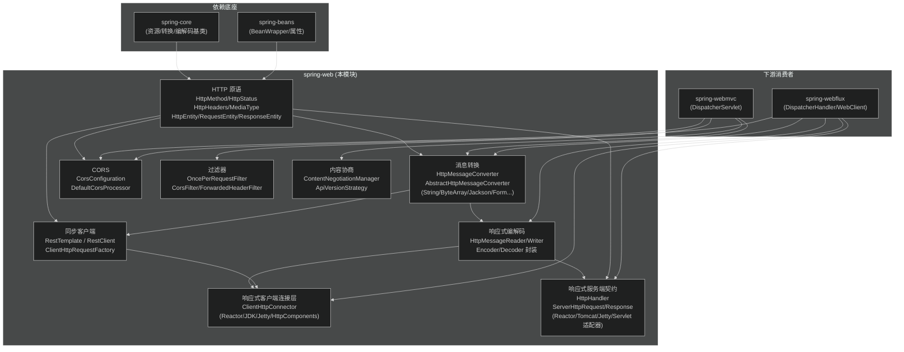
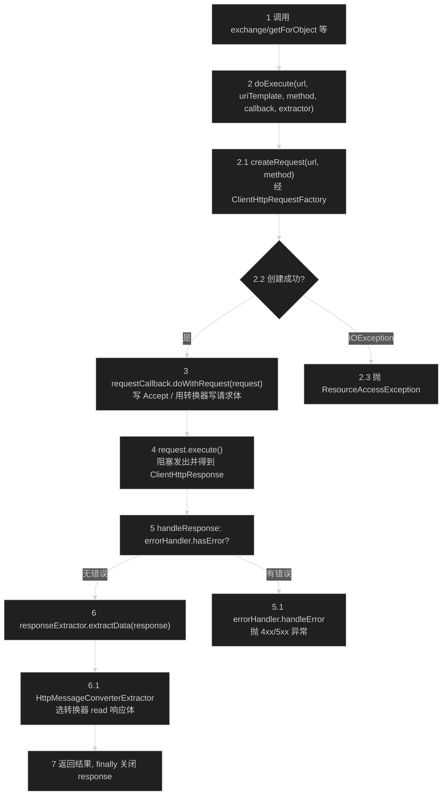
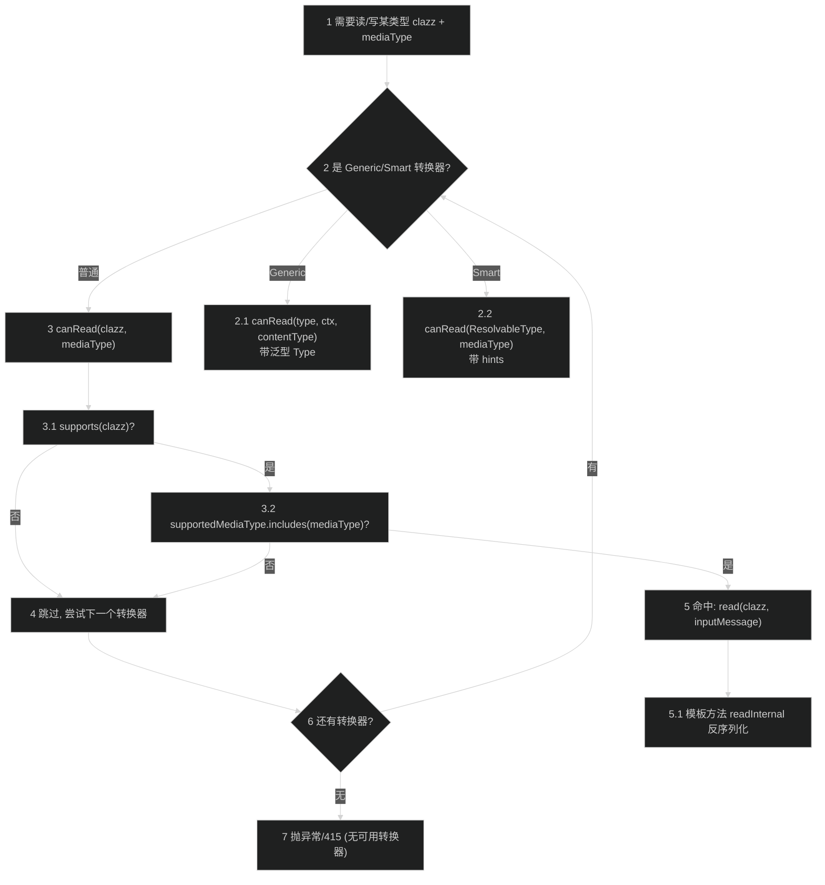
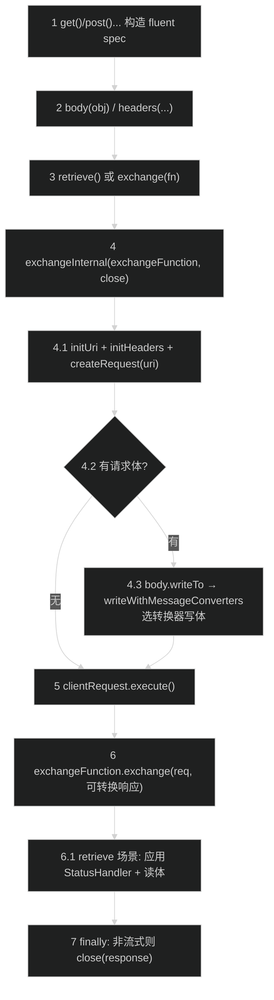
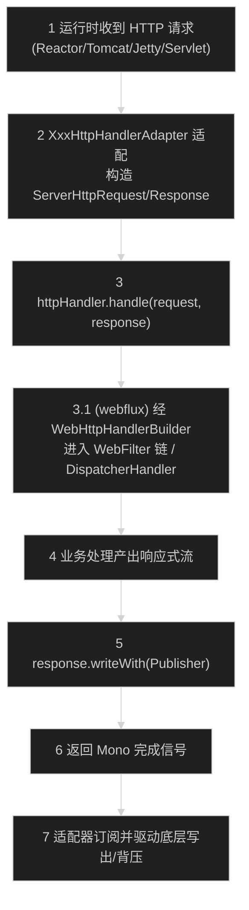
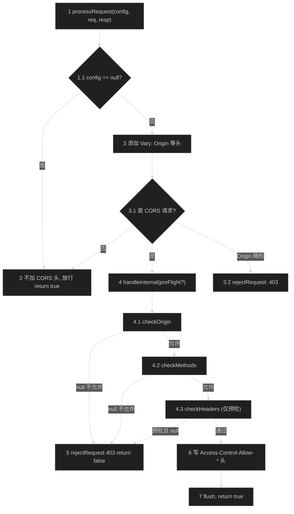

# Web 基础模块（spring-web）
> 上次修改：2026-07-26 18:18

## 重点关注

| 入口 / 章节 | 为什么值得读 |
|------------|------------|
| `HttpMessageConverter` 的 `canRead/canWrite/read/write`（第 6.1 节） | 全模块最核心的策略接口，读写协商是所有客户端/服务端序列化的公共底座 |
| `AbstractHttpMessageConverter` 模板方法（第 6.1 节） | 用「supports + MediaType 匹配」拆分 canRead/canWrite，用 readInternal/writeInternal 承接具体格式，理解一次即可读懂所有具体转换器 |
| `RestTemplate.doExecute` / `HttpMessageConverterExtractor`（第 5.1、6.2 节） | 阻塞式同步客户端主链路：构造请求 → 执行 → 用转换器读响应体，异常与资源释放集中在此 |
| `DefaultRestClient.exchangeInternal` / `writeWithMessageConverters`（第 5.3 节） | 6.1 起推荐的流式同步客户端，与 RestTemplate 共享基础设施但 API 更现代 |
| `HttpHandler` + `ServerHttpRequest/Response`（第 5.4、4 节） | spring-web 提供给 webflux 的响应式服务端最低层契约，理解 webmvc/webflux 共享边界的关键 |
| `DefaultCorsProcessor.handleInternal`（第 5.5、8 节） | CORS 预检与实际请求处理、拒绝路径（403）、Vary 头，安全边界高发区 |
| `DefaultResponseErrorHandler.handleError`（第 8 节） | 4xx→`HttpClientErrorException`、5xx→`HttpServerErrorException` 的状态码映射 |

> 阅读顺序建议：先读第 4 章领域模型建立词汇 → 第 6.1 节吃透转换器模板 → 第 5.1/5.3 节走通同步客户端主链路 → 第 5.4/5.5 节补齐响应式服务端与 CORS。

---

## 1. 模块定位与职责边界

**结论**：spring-web 是整个 Web 栈的「HTTP 抽象与基础设施层」，只提供与具体 Web 框架无关的 HTTP 原语（方法、状态、头、实体、媒体类型）、消息转换（`HttpMessageConverter`）、客户端（`RestTemplate`/`RestClient` 同步、reactive 客户端连接器 `ClientHttpConnector`）、响应式服务端契约（`HttpHandler`/`ServerHttpRequest`/`ServerHttpResponse`）、CORS、multipart、过滤器与内容协商基础。它被 **spring-webmvc** 与 **spring-webflux** 共同依赖，是二者的公共地基。

**上游 / 下游**：
- 上游依赖：`spring-beans`、`spring-core`（`spring-web.gradle:7-8` 为 `api` 依赖），`io.micrometer:micrometer-observation` 用于请求观测；其余全部为 `optional`（Jackson、Netty、Reactor、Servlet API、HttpComponents、Jetty 等），保证核心不强绑定具体运行时。
- 下游消费者：spring-webmvc（Servlet 栈）、spring-webflux（Reactor 栈）、spring-messaging、spring-test。

**负责什么**：
- HTTP 值对象与协议原语：`HttpMethod`、`HttpStatus`/`HttpStatusCode`、`HttpHeaders`、`MediaType`、`HttpEntity`/`RequestEntity`/`ResponseEntity`、`CacheControl`、`ContentDisposition`、`HttpRange`、`ProblemDetail`。
- 消息转换体系：`HttpMessageConverter` 及 `AbstractHttpMessageConverter`/`AbstractGenericHttpMessageConverter`/`SmartHttpMessageConverter` 三条抽象基类与具体转换器（String、ByteArray、Resource、Form、Jackson、Kotlin serialization、Protobuf、XML、YAML 等）。
- 客户端基础设施：同步 `RestTemplate`/`RestClient`、`ClientHttpRequestFactory`/`ClientHttpRequest`/`ClientHttpResponse`（JDK/HttpComponents/Jetty/Reactor 实现）、拦截器、错误处理器；响应式客户端连接层 `http.client.reactive.ClientHttpConnector`（供 webflux 的 WebClient 使用）。
- 响应式服务端契约：`http.server.reactive.HttpHandler` 及各运行时适配器（`ReactorHttpHandlerAdapter`、`TomcatHttpHandlerAdapter`、`ServletHttpHandlerAdapter`、`JettyCoreHttpHandlerAdapter`）。
- 横切能力：CORS（`web.cors`）、过滤器（`web.filter`）、内容协商与 API 版本（`web.accept`）、multipart（`web.multipart`）、URI 构建（`web.util`）、编解码（`http.codec`）。

**不负责什么（职责边界，务必区分）**：
- **不含 `DispatcherServlet`**（在 spring-webmvc）与 **`DispatcherHandler`**（在 spring-webflux）。
- **不含 `WebClient`**：经代码确认 `WebClient.java` 位于 `spring-webflux/.../reactive/function/client/WebClient.java`，**不在 spring-web**。spring-web 只提供其底层依赖 `ClientHttpConnector`。
- 不含注解控制器（`@Controller`/`@RequestMapping` 的处理器映射与调用）——那是 webmvc/webflux 的应用层编程模型。

**主要输入 / 输出 / 副作用**：输入为字节流 + HTTP 头元数据；输出为反序列化后的 Java 对象或序列化后的字节流；副作用集中在网络 I/O（客户端建连/读写）、响应体写入（`HttpOutputMessage.getBody()`）、以及 CORS/过滤器对响应头的修改。

---

## 2. 架构关系与依赖

**结论**：模块内部围绕「HTTP 原语 → 消息转换 → 客户端/服务端」三层组织，转换器是被客户端与服务端共享的中枢；对外仅强依赖 spring-core/spring-beans，其余运行时依赖全部可选。

**节点与依赖说明表**：

| 节点 | 角色 | 依赖方向 / 说明 |
|------|------|----------------|
| HTTP 原语 | 值对象层 | 被本模块几乎所有子系统引用；`MediaType.includes/isCompatibleWith` 是内容协商的判定基元 |
| 消息转换 | 序列化中枢 | 同时被同步客户端（`RestTemplate`/`RestClient`）与 webmvc 服务端复用，是「共享基础」的最直接体现 |
| 响应式编解码 | 流式序列化 | 封装 spring-core 的 `Encoder`/`Decoder` 为 `HttpMessageReader`/`Writer`（返回 `Flux`/`Mono`），供响应式客户端/服务端使用 |
| 同步客户端 | 阻塞式出站 | 依赖转换器写请求体/读响应体；`RestClient` 与 `RestTemplate` 共享 `ClientHttpRequestFactory`、拦截器、转换器 |
| 响应式客户端连接层 | 非阻塞出站 | `ClientHttpConnector.connect` 返回 `Mono<ClientHttpResponse>`；是 webflux `WebClient` 的底座 |
| 响应式服务端契约 | 入站最低层 | `HttpHandler.handle` 返回 `Mono<Void>`，各运行时适配器桥接到 Reactor/Tomcat/Jetty/Servlet |
| CORS | 安全横切 | 依赖 `HttpHeaders` 读写 `Access-Control-*`；被 webmvc（拦截器）与 webflux（`CorsWebFilter`）分别接入 |
| 过滤器 | Servlet 横切 | 依赖 `jakarta.servlet-api`（optional），仅 Servlet 栈（webmvc）可用 |
| 内容协商 | 媒体类型解析 | 供 webmvc/webflux 决定响应 `MediaType` 与 API 版本 |

**强依赖 / 可替换依赖 / 潜在耦合点**：
- 强依赖：`spring-core`（`ResolvableType`、`Encoder`/`Decoder`、`MimeType`）、`spring-beans`、`micrometer-observation`（`RestTemplate.doExecute`/`DefaultRestClient.exchangeInternal` 内嵌观测）。
- 可替换依赖：底层 HTTP 客户端库（JDK / HttpComponents / Jetty / Reactor Netty）通过 `ClientHttpRequestFactory` / `ClientHttpConnector` 策略切换；序列化库（Jackson / Gson / Kotlinx / Protobuf）通过转换器插拔。
- 潜在耦合：`web.filter`、`web.multipart`、`http.server.ServletServerHttp*` 直接引用 `jakarta.servlet-api`，因此这部分只对 Servlet 栈生效；响应式部分则引用 `reactor-core`。二者在同一模块共存但运行时互斥。

---

## 3. 入口与调用方式

spring-web 是「库模块」，无独立启动入口，其入口都是被上层框架或用户代码调用的 API/回调。

| 入口类型 | 入口 | 触发条件 / 关键参数 | 返回值 / 后续流程 |
|----------|------|--------------------|------------------|
| 用户 API（同步客户端） | `RestClient.get()/post()...`（`RestClient.java:90-134`） | 用户构造 HTTP 请求；参数为 URI、头、请求体 | 返回 fluent spec；`retrieve()`/`exchange()` 触发 `DefaultRestClient.exchangeInternal`（第 5.3 节） |
| 用户 API（同步客户端） | `RestTemplate.getForObject/exchange/execute`（`RestTemplate.java`） | 用户直接发请求 | 内部统一收敛到 `doExecute(...)`（`RestTemplate.java:731`，第 5.1 节） |
| 框架回调（服务端转换） | `HttpMessageConverter.canRead/read`、`canWrite/write`（`HttpMessageConverter.java:48-109`） | webmvc/webflux 处理请求体或写响应体时 | 反序列化为对象 / 序列化为字节流（第 6.1 节） |
| 框架契约（响应式服务端） | `HttpHandler.handle(request, response)`（`HttpHandler.java:51`） | 运行时适配器在收到请求时调用 | `Mono<Void>` 完成信号；webflux 通过 `WebHttpHandlerBuilder` 桥接（第 5.4 节） |
| 框架契约（响应式客户端） | `ClientHttpConnector.connect(method, uri, callback)`（`ClientHttpConnector.java:48`） | webflux `WebClient` 发起请求时 | `Mono<ClientHttpResponse>` |
| 框架回调（CORS） | `CorsProcessor.processRequest(config, req, resp)`（`DefaultCorsProcessor.java:72`） | 存在 `Origin` 头的跨域请求 | `boolean`：`true` 继续、`false` 已拒绝（第 5.5 节） |
| Servlet 回调（过滤器） | `OncePerRequestFilter.doFilter`（`OncePerRequestFilter.java:89`） | Servlet 容器对每次请求触发 | 保证单请求内 `doFilterInternal` 只执行一次（第 9 节） |
| Servlet 初始化 | `WebApplicationInitializer` / `SpringServletContainerInitializer`（`web` 包顶层） | 容器启动扫描 `ServletContainerInitializer` | 以编程方式注册 `DispatcherServlet`/过滤器（具体注册逻辑在 webmvc） |

---

## 4. 核心概念与领域模型

### 4.1 HttpMessageConverter（消息转换器）
- **定义**：`HttpMessageConverter<T>` 是「在 Java 对象 ↔ HTTP 请求/响应体之间转换」的策略接口（`HttpMessageConverter.java:39`）。
- **作用**：以 `canRead(clazz, mediaType)`/`canWrite(clazz, mediaType)` 做协商，命中后由 `read`/`write` 执行序列化。
- **生命周期**：通常在容器启动时装配为一组有序 `List<HttpMessageConverter<?>>`，被 `RestTemplate`/`RestClient`/服务端复用，无状态、可共享。
- **相关类型**：`AbstractHttpMessageConverter`（基类）、`GenericHttpMessageConverter`（支持泛型 `Type`）、`SmartHttpMessageConverter`（支持 `ResolvableType` + hints）。
- **三维评估**：好处——把「格式」从「传输」中解耦，新增格式只需实现一个转换器；替代方案——在每个客户端里硬编码序列化逻辑，重复且不可插拔；风险——转换器顺序敏感，`StringHttpMessageConverter` 声明 `*/*` 若排在 JSON 转换器之前会「抢读」JSON（框架默认顺序刻意规避）。

### 4.2 HttpHeaders（HTTP 头容器）
- **定义**：把「header 名 → 值列表」的映射，同时提供大量强类型访问器（`HttpHeaders.java:60-96`）。**7.0 起不再实现 `MultiValueMap`**（`HttpHeaders.java:85`），改为内部持有并暴露 `headerNames()`/`headerSet()` 视图。
- **作用**：`getContentType()`/`setContentType()`、`getAccept()`、`getOrigin()`、`setAccessControlAllowOrigin()` 等把原始字符串头翻译成 `MediaType`/`HttpMethod` 等值对象。
- **生命周期**：请求/响应级，`ReadOnlyHttpHeaders` 为不可变视图（框架内部对已提交响应或缓存头返回只读实例）。
- **风险**：默认构造大小写不敏感，但 `size()` 在某些适配构造下可能「虚高」，官方建议用 `headerNames()` 取名集合。

### 4.3 MediaType（媒体类型）
- **定义**：`type/subtype;params` 的解析结果，继承自 spring-core 的 `MimeType`。
- **关键行为**：`includes(other)` 非对称（`text/*` includes `text/plain`），`isCompatibleWith(other)` 对称（`MediaType.java:597、612`）。前者用于 `canRead`（服务端能否消费该 Content-Type），后者用于 `canWrite`（能否满足 Accept）。
- **三维评估**：好处——一套 MIME 语义支撑读写两侧协商；替代方案——字符串前缀比较，易漏通配与参数（如 `charset`、`q`）；风险——通配 `*/*` 与 `application/*+json` 的匹配细节容易踩坑。

### 4.4 HttpEntity / RequestEntity / ResponseEntity
- **定义**：`HttpEntity<T>` = 头 + 体的不可变载体（`HttpEntity.java:59`）；`RequestEntity` 增加 method+URI（`RequestEntity.java:68` extends `HttpEntity`），`ResponseEntity` 增加状态码（`ResponseEntity.java:81` extends `HttpEntity`，`status` 字段见 `:83`）。
- **作用**：作为客户端请求/响应与服务端返回值的统一容器；`ResponseEntity.status(...).headers(...).body(...)` 是常用构建链。
- **关系**：三者聚合 `HttpHeaders` 与泛型体，`ResponseEntity`/`RequestEntity` 是 `HttpEntity` 的特化子类。

### 4.5 ClientHttpRequestFactory / ClientHttpRequest（同步）与 ClientHttpConnector（响应式）
- **定义**：`ClientHttpRequestFactory.createRequest(uri, method)` 产出 `ClientHttpRequest`，其 `execute()` 返回 `ClientHttpResponse`（同步阻塞）；响应式侧 `ClientHttpConnector.connect(...)` 返回 `Mono<ClientHttpResponse>`（`ClientHttpConnector.java:48`）。
- **作用**：把「使用哪个底层 HTTP 库」封装为策略，`RestTemplate`/`RestClient` 与 webflux `WebClient` 借此切换 JDK/HttpComponents/Jetty/Reactor 实现。
- **三维评估**：好处——运行时可替换、便于测试（可注入 mock 工厂）；替代方案——直接使用 `HttpURLConnection`，无法插拔连接池/HTTP2；风险——不同底层库对流式/重定向/超时语义存在差异。

### 4.6 HttpHandler / ServerHttpRequest / ServerHttpResponse（响应式服务端契约）
- **定义**：`HttpHandler.handle(request, response): Mono<Void>` 是响应式 HTTP 处理的最低公共契约（`HttpHandler.java:43-51`）；`ServerHttpResponse` 继承 `ReactiveHttpOutputMessage`，提供 `setStatusCode`、`addCookie`、以及（继承来的）`writeWith(Publisher)`（`ServerHttpResponse.java:34-73`）。
- **生命周期**：每请求一次；`HttpHandler` 通常代表整个应用，webflux 的高层模型（注解控制器、函数式端点）由 `WebHttpHandlerBuilder` 桥接到它（`HttpHandler.java:32-35`）。
- **三维评估**：好处——一个契约屏蔽 Reactor Netty / Tomcat / Jetty / Servlet 差异；替代方案——为每个运行时写独立入口，无法复用 webflux 上层；风险——响应提交后 `setStatusCode` 返回 `false`（不可再改），需理解「已提交」语义。

### 4.7 CorsConfiguration / CorsProcessor
- **定义**：`CorsConfiguration` 持有 allowedOrigins/allowedOriginPatterns/allowedMethods/allowedHeaders/exposedHeaders/allowCredentials/maxAge 等规则；`CorsProcessor` 把规则施加到请求/响应。
- **作用**：`checkOrigin/checkHttpMethod/checkHeaders` 做逐项判定（`CorsConfiguration.java:671、706、724`），`DefaultCorsProcessor` 据此写 `Access-Control-*` 头或拒绝（403）。
- **三维评估**：好处——集中、声明式的跨域策略；替代方案——在每个控制器手写头，易漏预检；风险——`allowCredentials=true` 与 `allowedOrigins=*` 组合非法，框架在 `checkOrigin` 中通过 `validateAllowCredentials()` 校验拦截（`CorsConfiguration.java:678`）。

---

## 5. 关键流程

### 5.1 RestTemplate 同步请求主链路（构造 → 执行 → 读响应体）

**1-2 入口收敛**：所有 `RestTemplate` 的便捷方法（`getForObject`/`exchange`/`execute`）最终收敛到 `doExecute(...)`（`RestTemplate.java:731`）。参数中 `RequestCallback` 负责准备请求（设置 Accept、写请求体），`ResponseExtractor` 负责从响应中抽取返回值，二者是可插拔的策略。

**2.1-3 构造与准备请求**：`createRequest` 经 `ClientHttpRequestFactory` 产出 `ClientHttpRequest`（`RestTemplate.java:738`），失败即包装为 `ResourceAccessException`（`:740-742`）。随后开启 micrometer 观测 scope（`:744-750`），调用 `requestCallback.doWithRequest`（`:751-753`）——写请求体的实现在内部 `HttpEntityRequestCallback`，其 `doWithRequestBody` 遍历转换器并用第一个 `canWrite` 命中的执行 `write`（`RestTemplate.java:963-994`），找不到则抛 `RestClientException("No HttpMessageConverter ...")`（`:995-999`）。

**4-5 执行与错误判定**：`request.execute()` 同步发出请求得到响应（`RestTemplate.java:754`），`handleResponse` 委托 `ResponseErrorHandler.hasError` 判定（`:794-808`），有错误则 `handleError` 抛出（详见第 8 章）。

**6-7 读响应体与资源释放**：`responseExtractor.extractData(response)` 抽取结果（`RestTemplate.java:757`）；对有响应类型的调用，`ResponseEntityResponseExtractor` 委托 `HttpMessageConverterExtractor` 用转换器读体（第 6.2 节）。`finally` 中无条件 `response.close()` 并 `observation.stop()`（`:768-773`），保证连接释放。

### 5.2 HttpMessageConverter 读写协商路径（canRead/canWrite → read/write）

**1-3 分派协商**：调用方遍历有序转换器列表，按运行时类型分派：`GenericHttpMessageConverter` 走带 `Type` 的重载、`SmartHttpMessageConverter` 走带 `ResolvableType`+hints 的重载、其余走普通 `canRead(clazz, mediaType)`（分派逻辑见 `HttpMessageConverterExtractor.extractData` `:96-121` 与 `DefaultRestClient.writeWithMessageConverters` `:520-540`）。

**3.1-3.2 双重判定**：`AbstractHttpMessageConverter.canRead` 拆成两步——先 `supports(clazz)`（类型是否受支持），再 `canRead(mediaType)`（是否有 supported media type `includes` 该 MediaType）（`AbstractHttpMessageConverter.java:132-155`）。写侧 `canWrite` 对称，但用 `isCompatibleWith` 且对 `null`/`*/*` 放行（`:164-186`）。`mediaType==null` 时读写均放行（未指定即不设限）。

**5-7 执行或失败**：第一个命中的转换器执行 `read`/`write`，`read` 是 `final`，仅委托模板方法 `readInternal`（`AbstractHttpMessageConverter.java:192-197`）；`write` 先 `addDefaultHeaders`（补 Content-Type/Content-Length）再 `writeInternal`（`:203-235`）。若遍历完无命中：读侧在客户端抛 `UnknownContentTypeException`（`HttpMessageConverterExtractor.java:129-131`）、写侧抛 `RestClientException`；服务端侧对应 415/406（第 8 章）。

### 5.3 RestClient 流式同步请求路径（6.1+ 推荐）

**1-3 fluent 构建**：`RestClient` 以 `get()/post()/method()` 起链（`RestClient.java:90-134`），`body(...)`/`header(...)` 设置请求内容，`retrieve()`（返回 `ResponseSpec`）或 `exchange(fn)`（自定义读取）触发执行（`DefaultRestClient.java:566、571`）。

**4-4.3 构造与写体**：`exchangeInternal` 统一执行（`DefaultRestClient.java:582`）：`initUri`/`initHeaders` 组装、`createRequest(uri)` 建请求（`:597`）、合并头与属性、开启观测。若有体则 `body.writeTo(clientRequest)`（`:608-610`），其内部 `writeWithMessageConverters` 与 RestTemplate 同构地遍历转换器，第一个 `canWrite` 命中者执行 `write`，全不命中抛 `RestClientException`（`:520-546`）。

**5-7 执行与收尾**：`clientRequest.execute()` 阻塞发送（`:614`），包装为 `ConvertibleClientHttpResponse` 后交给 `exchangeFunction.exchange`（`:616-617`）；`retrieve()` 场景会在此应用注册的 `StatusHandler` 并用转换器读体。`finally` 中若结果非流式则 `close(response)`（`:643-645`），流式结果则延迟关闭（`:618-620`）以支持流式读取。与 RestTemplate 相比，`RestClient` 与其**共享 `ClientHttpRequestFactory`、拦截器、转换器基础设施**（`RestTemplate.java:83-89` 注释明确），只是 API 更现代。

### 5.4 HttpHandler 响应式服务端处理契约

**1-2 运行时适配**：不同服务器由对应适配器接管——`ReactorHttpHandlerAdapter`、`TomcatHttpHandlerAdapter`、`JettyCoreHttpHandlerAdapter`、`ServletHttpHandlerAdapter`（均在 `http.server.reactive` 包）——把原生请求/响应包装为 `ServerHttpRequest`/`ServerHttpResponse`。

**3-4 契约调用**：适配器调用 `httpHandler.handle(request, response)`（契约见 `HttpHandler.java:51`）。spring-web **只定义契约与适配器**；`HttpHandler` 通常由 webflux 侧 `WebHttpHandlerBuilder` 组装 `WebFilter` 链 + `DispatcherHandler`（`HttpHandler.java:32-35` 注释），这条注释正是 spring-web 与 spring-webflux 的职责分界线。

**5-7 响应式写出与背压**：业务产出 `Publisher<DataBuffer>`，经 `response.writeWith(...)`（继承自 `ReactiveHttpOutputMessage`）写入；`handle` 返回 `Mono<Void>` 表示完成（`HttpHandler.java:49`）。适配器订阅该 `Mono` 并驱动底层非阻塞写出，`AbstractListenerWriteProcessor`/`ChannelSendOperator` 等负责背压协调。注意 `setStatusCode` 在响应已提交后返回 `false`（`ServerHttpResponse.java:39-42`），是关键边界。

### 5.5 CORS 预检失败路径（边界流程）

**1-3.1 前置放行/头准备**：`config==null` 时不拒绝、仅不加 CORS 头并放行（`DefaultCorsProcessor.java:75-80`）；随后无条件补 `Vary: Origin / Access-Control-Request-Method / Access-Control-Request-Headers`（`:82-91`，避免缓存污染）；非 CORS 请求直接放行（`:94-96`），`Origin` 畸形则 403（`:98-102`）；若响应已含 `Access-Control-Allow-Origin` 则跳过（`:104-107`）。

**4-5 三重校验与拒绝**：`handleInternal` 依次 `checkOrigin`（`:131`）、`checkMethods`（`:141`）、`checkHeaders`（预检才强制，`:149-154`）；任一返回 `null` 即 `rejectRequest`（`:118-122`，置 403 并写 "Invalid CORS request"）并 `return false`。`checkOrigin` 内含 `allowCredentials=*` 非法校验（`CorsConfiguration.java:678`）。

**6-7 放行并写头**：全部通过后写 `Access-Control-Allow-Origin`，预检额外写 `Allow-Methods`/`Allow-Headers`/`Max-Age`，并按配置写 `Expose-Headers`/`Allow-Credentials`/`Allow-Private-Network`（`DefaultCorsProcessor.java:156-181`），最后 `flush` 返回 `true`。

---

## 6. 核心实现细节

### 6.1 AbstractHttpMessageConverter 模板方法

**组织方式**：把 `HttpMessageConverter` 的四个抽象操作拆成「协商」与「执行」两层。协商层 `canRead`/`canWrite` 在基类实现为固定骨架，把可变点下沉为 `supports(Class)`；执行层 `read`/`write` 声明为 `final`，把可变点下沉为 `readInternal`/`writeInternal`——典型的**模板方法模式**。

**逐段解读**：
- `canRead(clazz, mediaType) = supports(clazz) && canRead(mediaType)`（`AbstractHttpMessageConverter.java:132-134`）。`canRead(mediaType)`：`null` 放行；否则任一 supported type `includes` 该 mediaType 即通过（`:145-155`）。**隐藏假设**：读协商用非对称 `includes`——「转换器能消费的范围 ⊇ 请求 Content-Type」。
- `canWrite(clazz, mediaType) = supports(clazz) && canWrite(mediaType)`（`:164-166`）。`canWrite(mediaType)`：`null` 或 `*/*` 放行；否则任一 supported type `isCompatibleWith` 该 mediaType（`:176-186`）。写协商用对称 `isCompatibleWith`——匹配客户端 `Accept`。
- `read` 为 `final`，仅委托 `readInternal`（`:192-197`），保证子类无法绕过协商契约。
- `write` 为 `final`：先 `addDefaultHeaders`（若无 Content-Type 则取默认、补 charset、补 Content-Length，`:244-271`），再按是否 `StreamingHttpOutputMessage` 走流式或直接 `writeInternal` 后 `flush`（`:203-235`）。`getDefaultContentType` 默认取 supported 列表首元素（`:282-285`）。
- 具体子类只需实现 `supports`/`readInternal`/`writeInternal`。例如 `StringHttpMessageConverter` 以 `ISO-8859-1` 为默认 charset、`text/plain`+`*/*` 为 supported types、`supports(clazz)==String.class`（`StringHttpMessageConverter.java:44-58`），据此完成字符串读写。

**三维评估**：好处——协商逻辑集中一处，全部具体转换器零重复；`final read/write` 强制子类遵守「先协商后执行」。替代方案——每个转换器各写一套 canRead/read，代码重复且易漏 charset/Content-Length；风险——`getDefaultContentType` 取首元素的隐式约定，要求子类谨慎排列 supportedMediaTypes，否则默认 Content-Type 可能不符预期。

### 6.2 RestTemplate.doExecute 与 HttpMessageConverterExtractor

**doExecute 设计**：把「构造请求 / 观测 / 执行 / 错误处理 / 抽取 / 释放」串成一条带 `try-finally` 的骨架（`RestTemplate.java:731-774`）。可变点全部外置为 `RequestCallback`（写请求）与 `ResponseExtractor`（读响应），使同一执行骨架服务于所有便捷方法。**关键判断**：`finally` 无条件 `response.close()`（`:769-771`），是防连接泄漏的核心保证。

**HttpMessageConverterExtractor 读体**：`extractData` 先用 `IntrospectingClientHttpResponse` 判定是否有体、是否空体，空则返回 `null`（`HttpMessageConverterExtractor.java:88-92`）；取 Content-Type（缺失默认 `application/octet-stream`，`:140-149`）；遍历转换器，按 Generic/Smart/普通三态分派 `canRead` 并读取（`:96-121`）；读/转换异常包装为 `RestClientException`（`:124-127`）；遍历完无命中抛 `UnknownContentTypeException`（`:129-131`，携带状态码、头、原始体）。

**内容协商 MediaType 匹配**：读侧用 `includes`（非对称，转换器范围包含响应类型），写侧用 `isCompatibleWith`（对称，匹配 Accept），二者语义差异是理解「为什么同一 MediaType 在读/写两侧行为不同」的关键（见 6.1）。

**三维评估（阻塞 RestTemplate vs 响应式 WebClient/连接层）**：
- 好处（RestTemplate/RestClient 阻塞式）：编程模型直观、调试简单、与 Servlet 线程模型天然契合；每请求占一线程、逻辑线性。
- 替代方案（响应式）：webflux `WebClient`（基于本模块 `ClientHttpConnector`）用 `Mono`/`Flux` 非阻塞、少量线程支撑高并发、天然背压，适合高扇出/流式 SSE。
- 风险 / 权衡：阻塞式在高并发下线程数即瓶颈，慢下游会耗尽线程池；响应式则调试栈复杂、易误用 `block()`、对全链路（含底层库）非阻塞有要求。spring-web 通过「同一套转换器/头/实体 + 两套客户端骨架」让二者并存，用户按场景选择——这正是本模块作为共享基础的价值。

### 6.3 DefaultCorsProcessor 的判定与写头顺序

**实现要点**：`processRequest` 先做「是否需要处理」的短路（config 空、非 CORS、已有 CORS 头），再进 `handleInternal` 的三重校验（origin→method→headers），最后按「预检 vs 实际」差异化写头（`DefaultCorsProcessor.java:127-185`）。`getMethodToUse`/`getHeadersToUse` 对预检取 `Access-Control-Request-*` 头、对实际请求取真实 method/全部头名（`:205-221`），把预检与实际请求统一进同一处理骨架。

**三维评估**：好处——预检与实际请求复用同一判定链，规则一处定义；替代方案——分两套代码，易产生策略漂移；风险——`checkHeaders` 仅在预检时对 `null` 硬拒绝（实际请求放宽，`:150-154`），若误配 allowedHeaders 可能预检失败但直连成功，行为不一致需注意。

---

## 7. 数据结构、配置与外部协议

**核心数据结构**：

| 结构 | 关键字段/约束 | 说明 |
|------|--------------|------|
| `HttpHeaders` | header 名（大小写不敏感）→ 值列表；`ReadOnlyHttpHeaders` 只读视图 | 7.0 起不再是 `MultiValueMap`（`HttpHeaders.java:85`）；大量强类型访问器 |
| `MediaType` | `type/subtype;q=..;charset=..`；`includes` 非对称、`isCompatibleWith` 对称 | 内容协商基元 |
| `HttpMethod` | 静态常量 `GET/POST/PUT/PATCH/DELETE/...`（`HttpMethod.java:42-72`） | **是类而非枚举**，允许扩展方法名 |
| `HttpStatus`/`HttpStatusCode` | `is4xxClientError`/`is5xxServerError`/`isError` | 错误映射依据（第 8 章） |
| `CorsConfiguration` | allowedOrigins/allowedOriginPatterns/allowedMethods/allowedHeaders/exposedHeaders/allowCredentials/allowPrivateNetwork/maxAge | 声明式 CORS 规则；`allowCredentials+*` 组合非法 |
| `ProblemDetail` | RFC 9457 `type/title/status/detail/instance` | 标准化错误响应体 |

**配置项 / 契约**：
- 转换器列表：`RestTemplate.getMessageConverters()`/`RestClient.Builder.messageConverters(...)` 决定读写能力与优先级；顺序敏感。
- `ClientHttpRequestFactory`/`ClientHttpConnector`：选择底层 HTTP 库（含连接超时、读超时、连接池），错误配置会导致超时语义不一致。
- CORS：`allowedOrigins` 与 `allowCredentials=true` 不能同时用 `*`（否则 `checkOrigin` 校验抛错）。
- 内容协商：`ContentNegotiationManager` + `ApiVersionStrategy` 决定响应 MediaType 与 API 版本解析（`web.accept` 包）。

**外部协议**：严格遵循 HTTP/1.1 与 CORS W3C 规范（`DefaultCorsProcessor.java:40-42` 注释）、RFC 9457（ProblemDetail）、SSE（`http.codec.ServerSentEvent*`）。模块本身无持久化，状态均为请求/响应级。

---

## 8. 异常、边界与降级处理

| 边界 / 异常 | 触发条件 | 处理方式（源码） |
|------------|---------|-----------------|
| 415 不支持媒体类型（服务端） | 请求 Content-Type 无转换器可 `canRead` | 服务端抛 `HttpMediaTypeNotSupportedException`（`web.HttpMediaTypeNotSupportedException`）/ 响应式 `UnsupportedMediaTypeStatusException`；客户端读侧则抛 `UnknownContentTypeException`（`HttpMessageConverterExtractor.java:129`） |
| 406 不可接受（服务端） | 无转换器能满足 `Accept` | `HttpMediaTypeNotAcceptableException` / `NotAcceptableStatusException` |
| 写端找不到转换器（客户端） | 请求体类型无 `canWrite` 命中 | `RestTemplate`/`DefaultRestClient` 抛 `RestClientException("No HttpMessageConverter ...")`（`RestTemplate.java:995-999`、`DefaultRestClient.java:542-546`） |
| 4xx 客户端错误 | `statusCode.is4xxClientError()` | `DefaultResponseErrorHandler.handleError` 抛 `HttpClientErrorException.create(...)`（`DefaultResponseErrorHandler.java:143-144`） |
| 5xx 服务端错误 | `statusCode.is5xxServerError()` | 抛 `HttpServerErrorException.create(...)`（`:146-147`） |
| 未知状态码 | 不在 `HttpStatus` 范围 | 抛 `UnknownHttpStatusCodeException`（`:150`） |
| 网络 I/O / 超时 | `createRequest` 或 `execute()` 抛 `IOException` | 包装为 `ResourceAccessException`（`RestTemplate.java:759-762、776-781`；`DefaultRestClient.java:623-628`）；超时由底层 factory/connector 配置决定 |
| CORS 预检失败 | origin/method/header 校验任一失败 | `DefaultCorsProcessor.rejectRequest` 置 403 + "Invalid CORS request"（`:118-122`） |
| 转换/反序列化错误 | `read` 抛 `HttpMessageNotReadableException` | 客户端包装为 `RestClientException`（`HttpMessageConverterExtractor.java:124-127`）；服务端转 400 |
| 响应已提交后改状态 | 响应式服务端 `setStatusCode` | 返回 `false`（`ServerHttpResponse.java:39-42`），静默失败，需调用方检查 |
| 过滤器重复执行 | 同请求多次进入过滤链 | `OncePerRequestFilter` 用 already-filtered 属性保证只执行一次（第 9 章） |

**异常传播**：客户端异常统一继承 `RestClientException`（`RestClientResponseException` 携带响应体，可经 `setBodyConvertFunction` 反序列化错误体，`DefaultResponseErrorHandler.java:153-155`）。**降级**：`config==null` 时 CORS 不拒绝仅不加头（`DefaultCorsProcessor.java:75-80`）；`NoOpResponseErrorHandler` 可让客户端不抛错、由调用方自行判定状态码——这是可插拔的降级点。

**未覆盖风险（基于源码）**：`RestTemplate` 配置非线程安全（`RestTemplate.java:71-73` 注释），启动后并发修改转换器/工厂无保护；应用需在启动期完成配置。

---

## 9. 并发、生命周期与性能

**资源生命周期**：
- 转换器、`ClientHttpRequestFactory`、`RestTemplate`/`RestClient` 通常为单例共享；转换器无状态、可安全并发读写。
- `ClientHttpRequest`/`ClientHttpResponse` 为请求级，`RestTemplate.doExecute`/`DefaultRestClient.exchangeInternal` 均在 `finally` 关闭响应（`RestTemplate.java:769-771`；`DefaultRestClient.java:643-645`），防连接/流泄漏；`RestClient` 对流式结果延迟关闭以支持流式消费（`:618-620`）。
- 响应式服务端：`ServerHttpRequest/Response` 请求级，`writeWith` 订阅驱动写出，背压由 `AbstractListenerWriteProcessor` 等协调。

**并发安全 / 幂等**：
- `RestTemplate` 配置期非并发安全（见第 8 章），运行期无共享可变状态可安全并发调用。
- `OncePerRequestFilter.doFilter`（`OncePerRequestFilter.java:89-123`）：以 `getAlreadyFilteredAttributeName()`（filter 名 + `.FILTERED`，`:168-174`）为请求属性做守卫——首次进入置属性并调 `doFilterInternal`，再次进入（如 forward/include）直接放行；`finally` 移除属性（`:114-121`）。异步派发默认跳过（`shouldNotFilterAsyncDispatch()==true`，`:205-207`），错误派发有 `doFilterNestedErrorDispatch` 特例（`:104-106`）。这保证了单请求内过滤逻辑幂等。

**性能关键路径 / 热点**：
- 消息转换遍历：每次读/写线性扫描转换器列表并调 `canRead`/`canWrite`，列表越长/越靠后命中越慢；反序列化本身（Jackson 等）是主要 CPU 热点。
- 同步客户端：每请求占一线程 + 一次阻塞 `execute()`，高并发下线程池是瓶颈（对比响应式连接层的非阻塞 `Mono`）。
- I/O 热点：请求/响应体读写、`FileCopyUtils.copyToByteArray`（错误体读取，`HttpMessageConverterExtractor.java:151-158`）。

---

## 10. 扩展点、测试点与维护建议

**扩展点**：
- 自定义 `HttpMessageConverter`：实现 `AbstractHttpMessageConverter`（或 Generic/Smart 变体），加入转换器列表即支持新格式（推荐入口）。
- 自定义 `ClientHttpRequestFactory`/`ClientHttpConnector`：切换底层 HTTP 库或注入 mock。
- `ClientHttpRequestInterceptor`/`ClientHttpRequestInitializer`：统一加认证头、日志、重试。
- `ResponseErrorHandler`：自定义状态码→异常映射；`StatusHandler`（RestClient）按状态码定制。
- `CorsProcessor`/`CorsConfigurationSource`：定制跨域策略。
- 自定义 `OncePerRequestFilter` 子类：接入 Servlet 横切逻辑。

**建议测试点**：
- 主路径：`RestTemplate`/`RestClient` GET/POST + JSON 往返（`MockRestServiceServer`/`MockWebServer`）。
- 协商：转换器 `canRead`/`canWrite` 对通配、`+json`、charset 的匹配；顺序敏感回归。
- 失败路径：415/406、无转换器、4xx/5xx→异常映射、超时→`ResourceAccessException`。
- 边界：CORS 预检拒绝、`allowCredentials+*` 校验、`OncePerRequestFilter` 的 forward/async/error 派发。

**维护建议**：

| 目标位置 | 问题 | 建议动作 | 收益 / 风险 |
|----------|------|---------|-----------|
| 转换器列表装配 | 顺序敏感、`StringHttpMessageConverter` 声明 `*/*` 易「抢读」 | 文档化默认顺序，新增转换器时校验插入位置 | 收益：避免隐蔽的错序列化；风险：改动顺序影响既有行为 |
| `RestTemplate` 配置线程安全 | 运行期并发改配置无保护 | 明确「启动期一次性配置」约定，或迁移到 `RestClient.Builder` 不可变构建 | 收益：消除并发隐患；风险：迁移成本 |
| 阻塞 vs 响应式选择 | 高并发下阻塞客户端线程瓶颈 | 高扇出/流式场景改用 webflux `WebClient`（基于本模块连接层） | 收益：吞吐提升；风险：响应式调试复杂度上升 |

---

## 11. 文件职责表

| 文件 | 职责 | 关键类/函数 | 被谁调用 | 备注 |
|------|------|-------------|----------|------|
| `spring-web/src/main/java/org/springframework/http/converter/HttpMessageConverter.java` | 消息转换策略接口 | `canRead/canWrite/read/write` | 所有客户端与服务端序列化点 | 全模块中枢接口 |
| `spring-web/src/main/java/org/springframework/http/converter/AbstractHttpMessageConverter.java` | 转换器模板基类 | `canRead/canWrite`(协商) + `readInternal/writeInternal`(执行) | 所有具体转换器 | 模板方法模式核心 |
| `spring-web/src/main/java/org/springframework/http/converter/StringHttpMessageConverter.java` | 字符串读写 | `supports/readInternal/writeInternal` | 转换器列表 | `*/*`+`text/plain`，默认 ISO-8859-1 |
| `spring-web/src/main/java/org/springframework/web/client/RestTemplate.java` | 阻塞同步客户端 | `doExecute`、`HttpEntityRequestCallback` | 用户/上层框架 | 6.1 起 `RestClient` 为推荐替代 |
| `spring-web/src/main/java/org/springframework/web/client/HttpMessageConverterExtractor.java` | 用转换器读响应体 | `extractData/getContentType` | `RestTemplate` 抽取器 | 无命中抛 `UnknownContentTypeException` |
| `spring-web/src/main/java/org/springframework/web/client/RestClient.java` | 流式同步客户端接口 | `get/post/retrieve/exchange` | 用户 | fluent API |
| `spring-web/src/main/java/org/springframework/web/client/DefaultRestClient.java` | RestClient 实现 | `exchangeInternal/writeWithMessageConverters` | `RestClient` 调用 | 与 RestTemplate 共享基础设施 |
| `spring-web/src/main/java/org/springframework/web/client/DefaultResponseErrorHandler.java` | 状态码→异常映射 | `hasError/handleError` | `RestTemplate.handleResponse` | 4xx/5xx/未知三分支 |
| `spring-web/src/main/java/org/springframework/http/server/reactive/HttpHandler.java` | 响应式服务端最低契约 | `handle(request,response):Mono<Void>` | 各运行时适配器 | 供 webflux 桥接，不含 DispatcherHandler |
| `spring-web/src/main/java/org/springframework/http/server/reactive/ServerHttpResponse.java` | 响应式响应抽象 | `setStatusCode/addCookie/writeWith(继承)` | `HttpHandler` 实现 | 已提交后 setStatus 返回 false |
| `spring-web/src/main/java/org/springframework/http/client/reactive/ClientHttpConnector.java` | 响应式客户端连接契约 | `connect(...):Mono<ClientHttpResponse>` | webflux WebClient | spring-web 提供、WebClient 在 webflux |
| `spring-web/src/main/java/org/springframework/web/cors/CorsConfiguration.java` | CORS 声明式规则 | `checkOrigin/checkHttpMethod/checkHeaders` | `DefaultCorsProcessor` | `allowCredentials+*` 校验 |
| `spring-web/src/main/java/org/springframework/web/cors/DefaultCorsProcessor.java` | CORS 处理/预检 | `processRequest/handleInternal/rejectRequest` | webmvc 拦截器/webflux filter | 拒绝置 403 |
| `spring-web/src/main/java/org/springframework/http/HttpHeaders.java` | HTTP 头容器 + 强类型访问器 | `getContentType/getAccept/setAccessControlAllowOrigin` | 全模块 | 7.0 起不再是 MultiValueMap |
| `spring-web/src/main/java/org/springframework/http/MediaType.java` | 媒体类型 | `includes/isCompatibleWith` | 内容协商 | 读非对称/写对称 |
| `spring-web/src/main/java/org/springframework/http/ResponseEntity.java` | 响应实体（头+体+状态） | `status/headers/body` | 客户端/服务端 | extends `HttpEntity` |
| `spring-web/src/main/java/org/springframework/web/filter/OncePerRequestFilter.java` | 单请求一次过滤守卫 | `doFilter/doFilterInternal` | Servlet 容器 | already-filtered 属性 |

---

## 12. 代码引用索引

| 引用 | 说明 |
|------|------|
| `spring-web/spring-web.gradle:7-9` | api 依赖 spring-beans/spring-core/micrometer；其余 optional |
| `spring-web/src/main/java/org/springframework/http/converter/HttpMessageConverter.java:39-109` | 转换器接口 canRead/canWrite/read/write |
| `spring-web/src/main/java/org/springframework/http/converter/AbstractHttpMessageConverter.java:132-186` | canRead/canWrite 协商（supports + includes/isCompatibleWith） |
| `spring-web/src/main/java/org/springframework/http/converter/AbstractHttpMessageConverter.java:192-235` | read/write final 模板 + addDefaultHeaders |
| `spring-web/src/main/java/org/springframework/http/converter/AbstractHttpMessageConverter.java:282-285` | getDefaultContentType 取首元素 |
| `spring-web/src/main/java/org/springframework/http/converter/StringHttpMessageConverter.java:44-58` | 字符串转换器默认 charset/媒体类型 |
| `spring-web/src/main/java/org/springframework/web/client/RestTemplate.java:731-774` | doExecute 主链路 + finally 关闭响应 |
| `spring-web/src/main/java/org/springframework/web/client/RestTemplate.java:794-808` | handleResponse 委托 ResponseErrorHandler |
| `spring-web/src/main/java/org/springframework/web/client/RestTemplate.java:963-999` | HttpEntityRequestCallback 写请求体 + 无转换器异常 |
| `spring-web/src/main/java/org/springframework/web/client/HttpMessageConverterExtractor.java:88-131` | extractData 读响应体协商 + UnknownContentTypeException |
| `spring-web/src/main/java/org/springframework/web/client/RestClient.java:57-134` | RestClient 类文档与 get/post 等入口 |
| `spring-web/src/main/java/org/springframework/web/client/DefaultRestClient.java:514-546` | writeWithMessageConverters 写体协商 |
| `spring-web/src/main/java/org/springframework/web/client/DefaultRestClient.java:582-647` | exchangeInternal 执行主路径 + finally |
| `spring-web/src/main/java/org/springframework/web/client/DefaultResponseErrorHandler.java:82-155` | hasError/handleError 4xx/5xx/未知映射 |
| `spring-web/src/main/java/org/springframework/http/server/reactive/HttpHandler.java:32-51` | HttpHandler 契约与 webflux 桥接注释 |
| `spring-web/src/main/java/org/springframework/http/server/reactive/ServerHttpResponse.java:34-73` | 响应式响应 setStatusCode/addCookie |
| `spring-web/src/main/java/org/springframework/http/client/reactive/ClientHttpConnector.java:34-49` | connect 响应式连接契约 |
| `spring-web/src/main/java/org/springframework/web/cors/CorsConfiguration.java:671-714` | checkOrigin/checkHttpMethod（含 allowCredentials 校验） |
| `spring-web/src/main/java/org/springframework/web/cors/CorsConfiguration.java:724-754` | checkHeaders 逐头匹配 |
| `spring-web/src/main/java/org/springframework/web/cors/DefaultCorsProcessor.java:70-185` | processRequest/handleInternal/rejectRequest |
| `spring-web/src/main/java/org/springframework/http/HttpHeaders.java:59-96` | HttpHeaders 说明（7.0 起非 MultiValueMap） |
| `spring-web/src/main/java/org/springframework/http/MediaType.java:597-614` | includes（非对称）/isCompatibleWith（对称） |
| `spring-web/src/main/java/org/springframework/http/HttpMethod.java:42-72` | HttpMethod 静态常量（类而非枚举） |
| `spring-web/src/main/java/org/springframework/http/HttpEntity.java:59-70` / `RequestEntity.java:68` / `ResponseEntity.java:81-83` | 实体继承体系 |
| `spring-web/src/main/java/org/springframework/web/filter/OncePerRequestFilter.java:89-123` | doFilter already-filtered 守卫 |
| `spring-web/src/main/java/org/springframework/web/filter/OncePerRequestFilter.java:168-207` | getAlreadyFilteredAttributeName / async 派发跳过 |
| `spring-webflux/src/main/java/org/springframework/web/reactive/function/client/WebClient.java`（工程外定位说明） | WebClient 实际位于 webflux，非本模块 |
