# Spring Framework 工程概览
> 上次修改：2026-07-25 02:12

## 工程目录结构

Spring Framework 7.0.7 是一个 Gradle 多模块工程，源码采用"按功能垂直切分模块"的组织方式：根目录下直接平铺 22 个 `spring-*` 发布模块（`../../settings.gradle` 中通过 `include` 声明，每个模块的构建脚本为 `<模块名>.gradle`），外加 `framework-*` 系列辅助工程（BOM、平台约束、API 聚合、文档）、`buildSrc`（自定义构建约定）、`integration-tests`（集成测试）和 `../../gradle`、`../../src`（Checkstyle/IDE 风格配置）等基础设施目录。每个 `spring-*` 模块内部遵循标准 Maven 目录布局：`src/main/java/org/springframework/<领域包>` 存放主源码，`src/test` 存放单元测试，部分模块还有 `src/main/kotlin`（Kotlin 扩展）。模块之间的依赖方向总体是：`spring-core`（基础工具）→ `spring-beans`/`spring-expression`（IoC 与表达式）→ `spring-context`/`spring-aop`（容器与代理）→ `spring-web`/`spring-jdbc`/`spring-tx` 等上层能力模块 → `spring-webmvc`/`spring-webflux`/`spring-orm` 等集成模块，`framework-platform` 统一约束全部模块的依赖版本。

## 目录结构图

```mermaid
%%{init: {"theme": "dark"}}%%
graph TD
  root["spring-framework 根目录：Gradle 多模块工程（22 个 spring-* 模块 + framework-* 辅助工程 + buildSrc）"]
  click root "../工程目录.md" "回到目录"

  subgraph CORE["IoC 容器核心"]
    spring-core["spring-core：核心工具、类型转换、资源与环境抽象、AOT 基础"]
    spring-beans["spring-beans：BeanFactory、Bean 定义、依赖注入与属性访问"]
    spring-context["spring-context：ApplicationContext、注解配置、事件、缓存/调度抽象"]
    spring-expression["spring-expression：SpEL 表达式解析与求值引擎"]
  end

  subgraph AOPG["AOP 与代理"]
    spring-aop["spring-aop：AOP 联盟 API、代理工厂、自动代理"]
    spring-aspects["spring-aspects：AspectJ 切面集成（事务/缓存/调度注解切面）"]
  end

  subgraph WEBG["Web 栈"]
    spring-web["spring-web：HTTP 抽象、消息转换器、Web 基础与客户端"]
    spring-webmvc["spring-webmvc：Servlet MVC（DispatcherServlet）"]
    spring-webflux["spring-webflux：响应式 Web（DispatcherHandler）"]
    spring-websocket["spring-websocket：WebSocket 与 STOMP 消息"]
  end

  subgraph DATAG["数据访问"]
    spring-jdbc["spring-jdbc：JdbcTemplate 与 DataSource 支持"]
    spring-tx["spring-tx：事务抽象与声明式事务"]
    spring-orm["spring-orm：JPA/Hibernate 等 ORM 集成"]
    spring-r2dbc["spring-r2dbc：响应式关系数据库访问"]
    spring-oxm["spring-oxm：对象/XML 映射抽象"]
  end

  subgraph MSGG["消息"]
    spring-messaging["spring-messaging：消息抽象、注解编程模型、RSocket"]
    spring-jms["spring-jms：JMS 集成"]
  end

  subgraph TESTG["测试"]
    spring-test["spring-test：TestContext 框架与 Mock 对象"]
    spring-core-test["spring-core-test：核心测试工具与 AOT 测试支持"]
  end

  subgraph SUPG["支撑模块"]
    spring-context-support["spring-context-support：邮件、Quartz 调度、UI/缓存集成"]
    spring-context-indexer["spring-context-indexer：编译期组件索引（加速类路径扫描）"]
    spring-instrument["spring-instrument：类加载期织入 Agent"]
  end

  subgraph BUILDS["构建与辅助"]
    buildSrc["buildSrc：Gradle 构建约定插件"]
    gradleDir["gradle/：共享构建脚本（spring-module.gradle 等）"]
    frameworkBom["framework-bom / framework-platform：依赖版本清单与平台约束"]
    frameworkApiDocs["framework-api / framework-docs：API 聚合文档与参考文档（Antora）"]
    integrationTests["integration-tests：跨模块集成测试"]
    srcDir["src/：Checkstyle、nohttp、Eclipse/IDEA 代码风格配置"]
  end

  root --> CORE
  root --> AOPG
  root --> WEBG
  root --> DATAG
  root --> MSGG
  root --> TESTG
  root --> SUPG
  root --> BUILDS

  spring-core --> coreCore["core/：ResolvableType、注解工具、ReactiveAdapter"]
  spring-core --> coreUtil["util/：Assert、StringUtils、StopWatch 等基础工具"]
  spring-core --> coreAot["aot/：AOT 处理、代码生成与 RuntimeHints"]
  spring-core --> coreEmbed["asm/cglib/objenesis：内嵌重打包的字节码与实例化库"]

  spring-beans --> beansRoot["beans/：BeanWrapper、PropertyEditor、类型转换"]
  spring-beans --> beansFactory["beans/factory/：BeanFactory 体系与依赖注入核心"]
  spring-beans --> beansFactorySub["factory/support、xml、annotation：BeanDefinition 注册与解析"]

  spring-context --> ctxAnnotation["context/annotation/：@Configuration 处理与组件扫描"]
  spring-context --> ctxSupport["context/support/：AbstractApplicationContext 刷新流程"]
  spring-context --> ctxMisc["cache、scheduling、validation、jmx 等：上下文级能力集成"]

  spring-aop --> aopFramework["aop/framework/：ProxyFactory、JDK/CGLIB 代理、自动代理"]
  spring-aop --> aopAspectj["aop/aspectj/：AspectJ 注解切面的实例化与绑定"]

  spring-web --> webHttp["http/：HttpHeaders、MediaType、HttpMessageConverter、codec"]
  spring-web --> webWeb["web/：过滤器、multipart、绑定、client（RestClient）"]

  spring-webmvc --> mvcServlet["web/servlet/：DispatcherServlet、HandlerMapping、视图解析"]
  spring-webflux --> fluxReactive["web/reactive/：DispatcherHandler、响应式 Handler 链、result"]
  spring-jdbc --> jdbcCore["jdbc/core/：JdbcTemplate、NamedParameterJdbcTemplate"]
  spring-tx --> txTx["transaction/：PlatformTransactionManager、@Transactional 拦截器"]
```

## 目录说明

### 根目录

根目录存放整个工程的全局入口文件：`../../settings.gradle` 声明全部 28 个子工程并要求每个模块使用 `<模块名>.gradle` 作为构建脚本；`../../build.gradle` 配置全局插件（Kotlin、Dokka、JMH 等）、按 `spring-`/`framework-` 前缀区分"发布模块"与"辅助工程"，并对所有模块应用 `../../gradle/spring-module.gradle` 构建约定；`../../gradle.properties` 固定版本号（7.0.7）、Kotlin/ByteBuddy 版本与构建内存参数；`../../README.md`、`../../CONTRIBUTING.md`、`../../import-into-intellij-idea.md` 提供项目说明与贡献/导入指引；`gradlew`、`../../gradle/wrapper` 提供 Gradle Wrapper；`../../.github/workflows` 存放 CI 构建定义。

### 构建与辅助目录

- `../../buildSrc`：自定义 Gradle 构建逻辑（构建约定插件、依赖管理），被根构建脚本通过 `org.springframework.build.*` 插件 ID 应用到所有子工程。
- `../../gradle`：共享构建脚本，包括 `spring-module.gradle`（发布模块的统一配置）、`publications.gradle`（构件发布）和 `ide.gradle`（IDE 集成）。
- `../../framework-bom`、`../../framework-platform`：不产出代码，分别生成 BOM（物料清单）和 enforcedPlatform 平台约束，`../../build.gradle` 中所有子工程通过 `enforcedPlatform(project(":framework-platform"))` 统一第三方依赖版本。
- `../../framework-api`：聚合全部模块生成统一 Javadoc/Kotlin API 文档的工程。
- `../../framework-docs`：参考文档源码，基于 Antora 构建（`antora-playbook.yml`、`modules/ROOT`）。
- `../../integration-tests`：跨模块集成测试，验证多个 spring-* 模块协作的场景。
- `../../src`：非源码目录，存放 `checkstyle/`（Checkstyle 规则）、`nohttp/`（禁止 http 链接检查）、`eclipse/`、`idea/`（IDE 代码风格配置）。
- `..`：本源码阅读文档目录。

### spring-core/ —— 核心模块（IoC 基础与工具）

整个框架的地基层，不依赖任何其他 spring 模块。`org.springframework.core` 包提供泛型解析（`ResolvableType`）、注解元数据（`annotation`）、类型转换服务（`convert`）、环境与属性抽象（`env`）、资源加载（`io`）、响应式类型适配（`ReactiveAdapterRegistry`）等基础能力；`org.springframework.util` 提供 `Assert`、`StringUtils`、`CollectionUtils`、`StopWatch` 等通用工具；`org.springframework.aot` 是 GraalVM 原生镜像/AOT 处理的基座（代码生成、`RuntimeHints`）；`asm`、`cglib`、`objenesis`、`javapoet` 是重打包进 spring-core 的第三方字节码/实例化/源码生成库，供上层模块零依赖使用。

👉 详见 [核心模块（IoC 基础与工具）](<核心模块（IoC 基础与工具）.md>)

### spring-beans/ —— Bean 工厂模块

实现 Spring IoC 容器的底层 Bean 工厂。`org.springframework.beans` 根包是属性访问体系（`BeanWrapper`、`PropertyAccessor`、`PropertyEditorRegistry`、`TypeConverter`）；`org.springframework.beans.factory` 是依赖注入核心：`BeanFactory`/`ListableBeanFactory`/`ConfigurableBeanFactory` 接口族、`DefaultListableBeanFactory`（默认容器实现）、`autowire` 装配、`annotation`（`@Autowired` 处理）；`factory/config` 定义 `BeanDefinition`、`BeanPostProcessor`、`BeanFactoryPostProcessor` 等 SPI；`factory/xml` 解析 XML 配置；`factory/aot` 支持 AOT 处理；`propertyeditors` 提供内建属性编辑器；`support` 存放排序/分页等辅助工具。

👉 详见 [Bean 工厂模块](Bean%20工厂模块.md)

### spring-context/ —— 应用上下文模块

在 Bean 工厂之上提供完整的应用上下文（企业级容器）。`org.springframework.context` 根包定义 `ApplicationContext`、`ApplicationEventPublisher`、`MessageSource`、`Lifecycle` 等核心接口；`context/support` 实现刷新流程（`AbstractApplicationContext#refresh`）与各类具体上下文；`context/annotation` 实现注解驱动配置（`@Configuration` 类解析、`@ComponentScan` 组件扫描、`@Conditional` 条件装配、`@Import`）；`context/aot`、`context/index` 支持 AOT 与组件索引；同级还有 `cache`（缓存抽象）、`scheduling`（任务调度）、`validation`（校验）、`jmx`、`jndi`、`format`（格式化）、`stereotype`（`@Component` 等构造型注解）、`resilience`（弹性注解）等子包。

👉 详见 [应用上下文模块](应用上下文模块.md)

### spring-aop/ —— AOP 模块

提供 Spring AOP 框架与 AOP Alliance 接口。`org.springframework.aop` 根包定义 `Pointcut`、`Advisor`、`Advice`、`ClassFilter`/`MethodMatcher` 等切面模型；`aop/framework` 是代理基础设施：`ProxyFactory`、`AopProxyFactory`、JDK 动态代理（`JdkDynamicAopProxy`）与 CGLIB 代理（`CglibAopProxy`）、`autoproxy` 自动代理创建器；`aop/aspectj` 支持 `@AspectJ` 注解切面的解析与绑定；`aop/config`、`aop/scope`、`aop/target`、`aop/interceptor` 分别负责配置、作用域代理、目标源与内建拦截器。

👉 详见 [AOP 模块](AOP%20模块.md)

### spring-expression/ —— SpEL 表达式模块

独立的表达式语言引擎。`org.springframework.expression` 定义 `Expression`、`ExpressionParser`、`EvaluationContext`、`PropertyAccessor`、`MethodResolver` 等 API；`expression/spel` 包含 SpEL 的 AST 节点实现、标准求值器（`SpelExpression`）、解析器与编译支持；`expression/common` 提供模板字面量等公共组件。模块仅依赖 spring-core，被 context、web、security 等广泛复用。

👉 详见 [SpEL 表达式模块](SpEL%20表达式模块.md)

### spring-web/ —— Web 基础模块

Web 技术栈的公共基座。`org.springframework.http` 定义 HTTP 消息模型（`HttpHeaders`、`HttpMethod`、`MediaType`、`RequestEntity`/`ResponseEntity`）、`converter` 消息转换器体系与 `codec` 响应式编解码器、`client` 响应式客户端支持、`server` 响应式服务器抽象；`org.springframework.web` 提供 Servlet 层基础：`filter` 过滤器、`multipart` 文件上传、`bind` 数据绑定、`method`/`accept`/`cors`、`client`（`RestClient`/`RestTemplate`）、`context`（`WebApplicationContext`）、`service`（`HttpServiceProxyFactory`）与 `WebApplicationInitializer` 启动 SPI。

👉 详见 [Web 基础模块](Web%20基础模块.md)

### spring-webmvc/ —— Servlet MVC 模块

基于 Servlet API 的注解式 MVC 框架。`org.springframework.web.servlet` 根包是前端控制器体系：`DispatcherServlet`、`HandlerMapping`/`HandlerAdapter`/`HandlerInterceptor`、`HandlerExceptionResolver`、`View`/`ViewResolver`、`ModelAndView`、`FlashMap`；`servlet/mvc` 存放 `@Controller` 注解编程模型（`method` 子包实现 `RequestMappingHandlerMapping` 等）；`servlet/config` 提供 `@EnableWebMvc` 与 XML 命名空间配置；`servlet/function` 是函数式端点 API；`servlet/resource` 处理静态资源；`servlet/view`、`servlet/i18n`、`servlet/tags` 分别负责视图技术、国际化与 JSP 标签库。

👉 详见 [Servlet MVC 模块](Servlet%20MVC%20模块.md)

### spring-webflux/ —— 响应式 Web 模块

基于 Reactive Streams（Project Reactor）的非阻塞 Web 框架。`org.springframework.web.reactive` 根包是响应式前端控制器体系：`DispatcherHandler`、`HandlerMapping`/`HandlerAdapter`/`HandlerResultHandler`；`reactive/result` 实现 `@Controller` 注解模型与返回值处理（`method` 子包）；`reactive/config` 提供 `@EnableWebFlux`；`reactive/function` 是函数式端点（`RouterFunction`）；`reactive/socket` 支持响应式 WebSocket（RSocket/WebSocket）；`reactive/resource`、`reactive/accept` 处理静态资源与内容协商。

👉 详见 [响应式 Web 模块](响应式%20Web%20模块.md)

### spring-jdbc/ —— JDBC 模块

简化 JDBC 编程的模板与支持层。`org.springframework.jdbc.core` 提供 `JdbcTemplate`、`NamedParameterJdbcTemplate`、`RowMapper` 等核心 API；`jdbc/datasource` 提供 `DataSource` 工具、`DataSourceUtils`（与事务同步的连接获取）与嵌入式数据库；`jdbc/object` 将查询/更新建模为可复用对象；`jdbc/support` 负责 SQLException 翻译（`SQLExceptionTranslator`）、行集与元数据；`jdbc/config` 提供嵌入式数据库命名空间配置。

👉 详见 [JDBC 模块](JDBC%20模块.md)

### spring-tx/ —— 事务模块

Spring 声明式/编程式事务抽象。`org.springframework.transaction` 根包定义 `PlatformTransactionManager`、`TransactionDefinition`、`TransactionStatus`、响应式事务 SPI（`ReactiveTransactionManager`）与事务异常体系；`transaction/support` 提供 `TransactionTemplate`、`AbstractPlatformTransactionManager` 模板基类与事务同步管理；`transaction/interceptor` 实现 `@Transactional` 的 AOP 拦截器与属性源；`transaction/annotation`、`transaction/config` 提供注解与命名空间驱动；`transaction/jta`、`jca` 集成 JTA 与 JCA；同级 `dao` 包提供 DAO 支持异常（`DataAccessException` 体系的一部分）。

👉 详见 [事务模块](事务模块.md)

### spring-orm/ —— ORM 集成模块

ORM 与持久化技术集成层（未在当前分析范围内展开内层包）。`org.springframework.orm` 下按技术分子包：`jpa`（`LocalContainerEntityManagerFactoryBean`、`JpaTransactionManager`、`JpaVendorAdapter`）、`hibernate5`（Hibernate `SessionFactory` 集成）等，配合 spring-tx 将 ORM 会话生命周期纳入 Spring 事务管理。

👉 详见 [ORM 集成模块](ORM%20集成模块.md)

### spring-messaging/ —— 消息抽象模块

消息编程模型的公共抽象。`org.springframework.messaging` 根包定义 `Message`、`MessageChannel`、`MessageHandler` 等基础接口；`messaging/handler` 实现注解式消息处理方法（`@MessageMapping` 映射、参数解析、返回值处理）；`messaging/simp` 是 STOMP 协议支持（simple broker、用户目的地）；`messaging/core` 提供消息发送模板；`messaging/converter` 消息转换；`messaging/rsocket` RSocket 集成；`messaging/support`、`messaging/tcp` 提供通道实现与 TCP 支持。

👉 详见 [消息抽象模块](消息抽象模块.md)

### spring-test/ —— 测试支持模块

Spring 测试框架。`org.springframework.test.context` 是 TestContext 框架核心（`@ContextConfiguration`、TestExecutionListener、缓存的 ApplicationContext）；`test/web` 提供 `MockMvc`；`test/jdbc`、`test/json`、`test/annotation`、`test/util` 提供各专项测试支持；`org.springframework.mock` 提供 Mock 对象：`mock/web`（`MockHttpServletRequest` 等 Servlet API Mock）、`mock/http/client`（`MockRestServiceServer`）、`mock/env`（`MockEnvironment`）。

👉 详见 [测试支持模块](测试支持模块.md)

### 其余 spring-* 模块

- `spring-websocket/`：`org.springframework.web.socket` 提供 WebSocket 握手、会话、消息处理与 SockJS 回退支持。
- `spring-jms/`：`org.springframework.jms` 提供 JMS 模板（`JmsTemplate`）、消息监听容器与 `@JmsListener` 支持。
- `spring-r2dbc/`：`org.springframework.r2dbc` 提供响应式关系数据库访问（`DatabaseClient`）与连接工厂支持。
- `spring-oxm/`：`org.springframework.oxm` 提供对象/XML 映射抽象（`Marshaller`/`Unmarshaller`，支持 JAXB、XStream 等）。
- `spring-aspects/`：基于 AspectJ 的切面实现，按领域分 `transaction`（`@Transactional` LTW 切面）、`cache`、`scheduling`、`beans`、`context` 子包。
- `spring-context-support/`：上下文扩展集成：`mail`（JavaMail）、`scheduling`（Quartz）、`cache`（JCache/Ehcache 适配）、`ui`（视图/主题）。
- `spring-context-indexer/`：`org.springframework.context.index` 编译期注解处理器，生成 `META-INF/spring.components` 组件索引以加速类路径扫描。
- `spring-instrument/`：`org.springframework.instrument` 提供类加载期织入（LTW）的 `InstrumentationSavingAgent`。
- `spring-core-test/`：`org.springframework.core.test` 与 `aot` 测试工具，供各模块测试复用（test fixtures 形式发布）。
