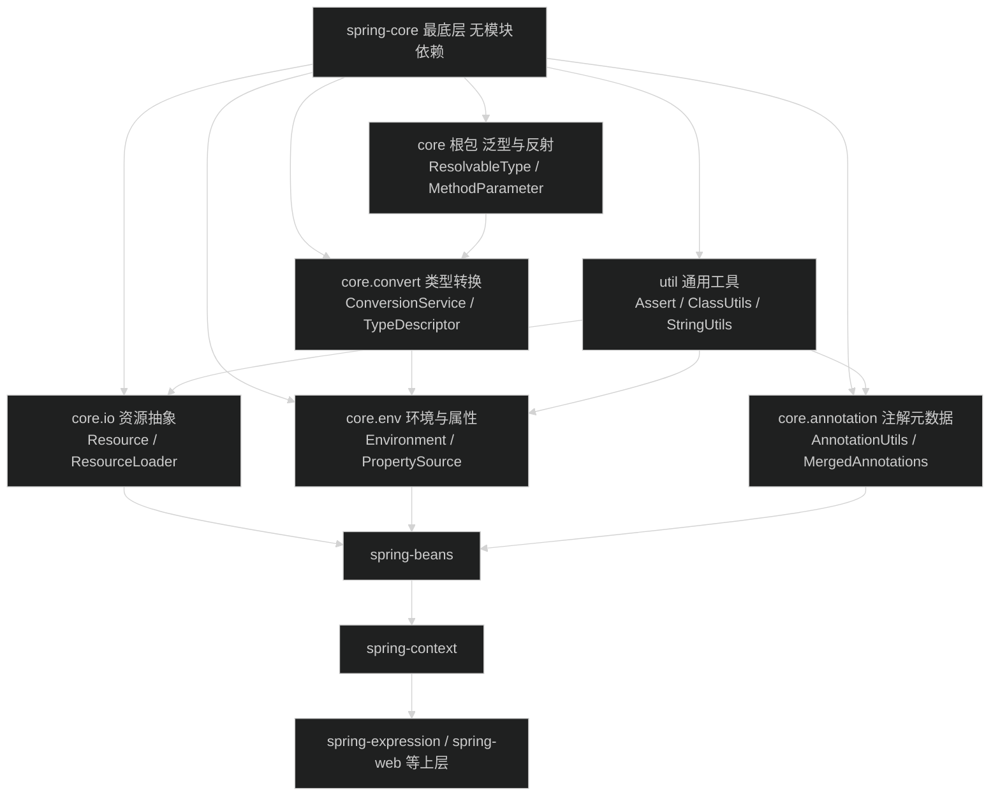
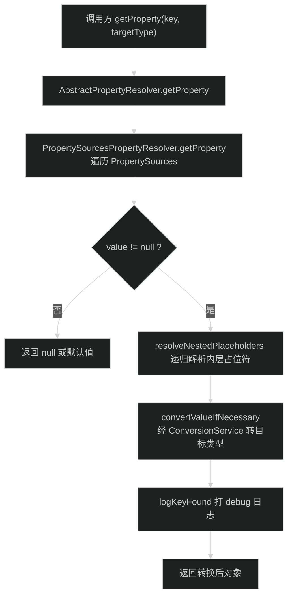
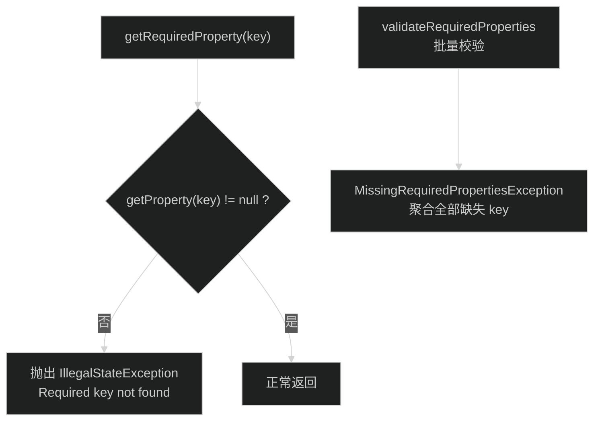
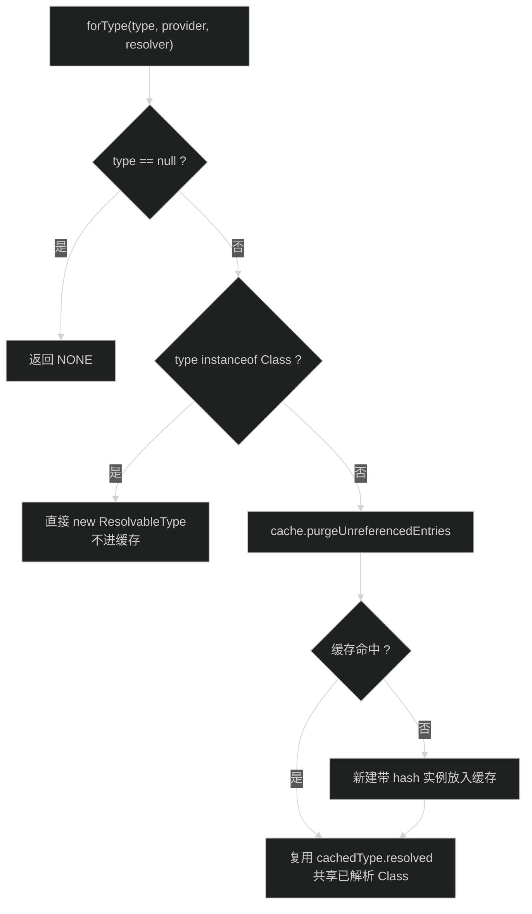
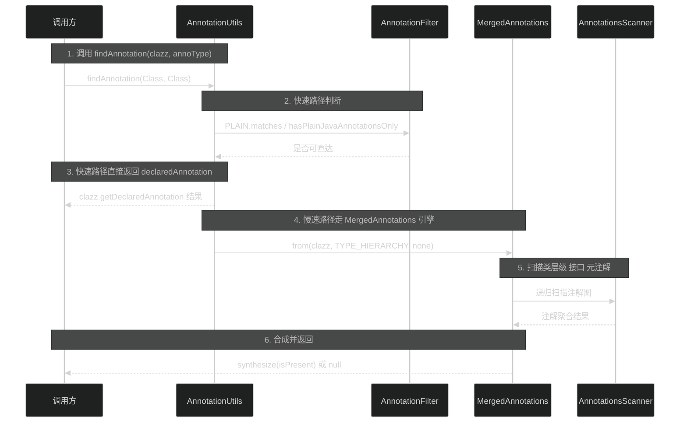

# 核心模块（IoC 基础与工具）
> 上次修改：2026-07-25 02:12

## 重点关注

- **资源抽象（`core/io`）**：`Resource` 接口是 Spring 整个配置体系（XML 文件、`@PropertySource`、组件扫描）读取字节流的统一入口，几乎所有 IoC 容器启动路径都会经过它，是理解后续模块的第一入口（[spring-core/src/main/java/org/springframework/core/io/Resource.java:57](../spring-core/src/main/java/org/springframework/core/io/Resource.java)）。
- **Environment 与属性解析（`core/env`）**：`Environment`/`PropertyResolver` 承担 `${...}` 占位符解析和 Profile 判断，是 spring-context 启动时解析配置、条件化注册的底层引擎（[spring-core/src/main/java/org/springframework/core/env/Environment.java:67](../spring-core/src/main/java/org/springframework/core/env/Environment.java)）。
- **注解元数据（`core/annotation`）**：`AnnotationUtils.findAnnotation` 及其背后的 `MergedAnnotations` 引擎是 `@Component`、`@Conditional` 等一切注解驱动特性的搜索与合成基础，分支多、兼容语义复杂，是易错边界（[spring-core/src/main/java/org/springframework/core/annotation/AnnotationUtils.java:552](../spring-core/src/main/java/org/springframework/core/annotation/AnnotationUtils.java)）。
- **泛型类型解析（`ResolvableType`）**：解决 Java 泛型擦除问题，是自动注入按泛型匹配、`ConversionService` 选择转换器的共同基础，其弱引用缓存设计值得精读（[spring-core/src/main/java/org/springframework/core/ResolvableType.java:88](../spring-core/src/main/java/org/springframework/core/ResolvableType.java)）。
- **类型转换（`core/convert`）**：`GenericConversionService` 的转换器注册表与类层级查找算法，是属性绑定和 SpEL 求值的核心支撑（[spring-core/src/main/java/org/springframework/core/convert/support/GenericConversionService.java:500](../spring-core/src/main/java/org/springframework/core/convert/support/GenericConversionService.java)）。

## 1. 模块定位与职责边界

**定位结论**：spring-core 是 Spring Framework 的最底层模块，不依赖任何其他 spring-* 模块（仅依赖 JDK、jspecify 注解以及内嵌重打包的 ASM/CGLIB/Objenesis，见 spring-core/src/main/java/org/springframework/asm、cglib、objenesis 目录），却被 spring-beans、spring-context、spring-web 等所有上层模块依赖。它解决四个基础问题：字节资源从哪里来（core/io）、配置值与 Profile 怎么解析（core/env）、注解与类型元数据怎么读（core/annotation 与 core 根包）、值怎么从一种类型变成另一种类型（core/convert）。

**负责什么**：
- 资源定位与读取抽象：`Resource`/`ResourceLoader` 及 `UrlResource`、`ClassPathResource`、`FileSystemResource` 等实现（spring-core/src/main/java/org/springframework/core/io/Resource.java:57）。
- 运行环境抽象：`Environment`（Profile）+ `PropertyResolver`（属性/占位符），默认实现 `StandardEnvironment` 注册 systemProperties、systemEnvironment 两个 PropertySource（spring-core/src/main/java/org/springframework/core/env/StandardEnvironment.java:86-91）。
- 注解搜索、合成与合并：`AnnotationUtils`、`MergedAnnotations`、`@AliasFor`（spring-core/src/main/java/org/springframework/core/annotation/AnnotationUtils.java:109）。
- 泛型类型封装：`ResolvableType`（spring-core/src/main/java/org/springframework/core/ResolvableType.java:88）。
- 类型转换 SPI：`ConversionService` 与 `GenericConversionService`/`DefaultConversionService`（spring-core/src/main/java/org/springframework/core/convert/ConversionService.java:32）。
- 通用工具：`org.springframework.util` 下的 `Assert`、`ClassUtils`、`StringUtils` 等（spring-core/src/main/java/org/springframework/util/Assert.java:64）。

**不负责什么**：Bean 的创建与生命周期（spring-beans）、应用上下文与事件机制（spring-context）、`@Autowired` 注入语义（spring-beans）、表达式求值（spring-expression）。spring-core 只提供这些功能所依赖的"词汇表"，不提供"语法"。

**主要输入/输出与状态变化**：
- 输入：位置字符串（如 `classpath:app.xml`）→ 输出：`Resource` 句柄与 `InputStream`；状态变化：无，`Resource` 是无状态句柄（`isOpen()` 默认 false，Resource.java:86）。
- 输入：属性 key、占位符文本、Profile 表达式 → 输出：解析后的字符串或泛型值；状态变化：`AbstractEnvironment` 持有可变 `MutablePropertySources` 与活动 Profile 集合（构造器内调用 `customizePropertySources`，spring-core/src/main/java/org/springframework/core/env/AbstractEnvironment.java:135-138）。
- 输入：`AnnotatedElement`/`Type` → 输出：合成注解代理、`ResolvableType`；状态变化：写入内部缓存（`ResolvableType.cache`，ResolvableType.java:98-99）。
- 副作用：除读取系统属性/环境变量（`System.getProperties()`/`System.getenv()`，StandardEnvironment.java:87-90）与打开文件/网络流外，不触碰磁盘写入与外部服务。

## 2. 架构关系与依赖

**节点与依赖方向说明**：

| 节点 | 说明 | 依赖性质 |
|------|------|----------|
| 1.1 core.io | 资源定位/读取抽象 | 被 2/3 强依赖；内部依赖 1.6 工具类 |
| 1.2 core.env | 属性解析 + Profile | 依赖 1.4（`convertValueIfNecessary` 走 ConversionService，spring-core/src/main/java/org/springframework/core/env/AbstractPropertyResolver.java:298）与 1.6 |
| 1.3 core.annotation | 注解扫描/合成 | 依赖 1.6（ClassUtils、ObjectUtils）；被 spring-context 组件扫描强依赖 |
| 1.4 core.convert | 类型转换 SPI | 依赖 1.5（用 `ResolvableType` 提取转换器泛型签名，spring-core/src/main/java/org/springframework/core/convert/support/GenericConversionService.java:85-94） |
| 1.5 core 根包 | 泛型/反射元数据 | 仅依赖 JDK 反射与 1.6 |
| 1.6 util | 纯静态工具 | 无 Spring 内部依赖，事实上的"零层" |

**潜在耦合点**：core.env → core.convert 是包级跨层调用（env 依赖 convert），而非单向"工具被使用"；core.annotation 与 core.convert 都依赖 `ResolvableType`，core 根包的改动会同时波及注解与转换两个子系统。

## 3. 入口与调用方式

| 入口 | 类型 | 触发条件 | 关键参数/返回 | 源码位置 |
|------|------|----------|----------------|----------|
| `ResourceLoader.getResource(String)` | API 入口 | 上层（如 ApplicationContext）传入位置字符串 | 前缀决定实现：`classpath:`→ClassPathResource，URL→UrlResource，否则 `getResourceByPath` | spring-core/src/main/java/org/springframework/core/io/DefaultResourceLoader.java:145-156 |
| `Resource.getInputStream()` | 数据入口 | 真正读取字节时 | 每次调用返回新流；`InputStreamResource` 例外（isOpen 为 true 不可重复读） | spring-core/src/main/java/org/springframework/core/io/Resource.java:57（接口契约） |
| `Environment.getProperty(key)` / `resolveRequiredPlaceholders(text)` | API 入口 | `${...}` 占位符解析、配置读取 | 返回解析后字符串；required 未命中抛 IllegalStateException | spring-core/src/main/java/org/springframework/core/env/AbstractPropertyResolver.java:210、253 |
| `Environment.acceptsProfiles(Profiles)` | API 入口 | `@Profile`/条件化注册判断 | 支持 `p1 & p2`、`!p1` 表达式（5.1+） | spring-core/src/main/java/org/springframework/core/env/Environment.java:151 |
| `AnnotationUtils.findAnnotation(Class/Method, Class)` | API 入口 | 注解驱动组件扫描、条件评估 | 返回合成注解或 null；类层级/接口/元注解递归 | spring-core/src/main/java/org/springframework/core/annotation/AnnotationUtils.java:552、513 |
| `MergedAnnotations.from(element, strategy)` | API 入口 | 需要属性合并/`@AliasFor` 语义时 | 返回可流式查询的 MergedAnnotations | spring-core/src/main/java/org/springframework/core/annotation/MergedAnnotations.java:347 |
| `ResolvableType.forField/forMethodParameter/forClass` | API 入口 | 注入点泛型解析、转换器签名提取 | 返回可链式导航的 ResolvableType（NONE 兜底） | spring-core/src/main/java/org/springframework/core/ResolvableType.java:1215、1349、1096 |
| `ConversionService.convert(source, targetType)` | API 入口 | 属性绑定、SpEL、`@Value` 注入 | 线程安全；失败抛 ConversionException | spring-core/src/main/java/org/springframework/core/convert/ConversionService.java:75 |
| `GenericConversionService.addConverter(...)` | 扩展入口 | 注册自定义转换器 | 实现 ConverterRegistry | spring-core/src/main/java/org/springframework/core/convert/support/GenericConversionService.java:85 |
| `Assert.notNull / state / isTrue / hasLength` | 库入口 | 全框架参数校验 | 失败抛 IllegalArgumentException/IllegalStateException | spring-core/src/main/java/org/springframework/util/Assert.java:180、78、115、215 |

入口之后的核心流向：`getResource` → 按前缀选择 `Resource` 实现 → `getInputStream`；`getProperty` → `PropertySourcesPropertyResolver` 遍历 PropertySource 链 → 嵌套占位符解析 → `ConversionService` 类型转换（见第 5 节）。

## 4. 核心概念与领域模型

### Resource（资源句柄）
- **定义/作用**：对"可打开为 InputStream 的东西"的统一抽象，继承 `InputStreamSource`（spring-core/src/main/java/org/springframework/core/io/Resource.java:57）。
- **生命周期**：句柄本身无状态、可复用；每次 `getInputStream()` 约定返回新流（`readableChannel()` 同样要求"each call creates a fresh channel"，Resource.java:142）。
- **关键实现族**：`AbstractResource` 提供默认行为（`isFile()` false，spring-core/src/main/java/org/springframework/core/io/AbstractResource.java:98；`getFile()` 抛 UnsupportedOperationException，AbstractResource.java:131）；`UrlResource`/`ClassPathResource`/`FileSystemResource`/`PathResource`/`ByteArrayResource`/`InputStreamResource` 覆盖不同来源。
- **三维评估**：好处——上层代码与资源来源解耦，文件、classpath、jar、URL 透明切换；替代方案——直接用 `java.net.URL`/`File`（失去"jar 内资源也能读"的统一性）；风险——`getFile()` 对 jar 内资源失败，调用方必须优先 `getInputStream()`，jar 场景误用 `getFile()` 是经典陷阱。

### Environment / PropertySource / PropertyResolver
- **定义/作用**：`Environment = PropertyResolver + Profile 判断`（spring-core/src/main/java/org/springframework/core/env/Environment.java:67）；`PropertySource<T>` 是命名键值来源包装（系统属性、环境变量、properties 文件、Map 等）；`PropertySourcesPropertyResolver` 按序遍历来源链。
- **生命周期**：由 `AbstractEnvironment` 构造时创建，经 `customizePropertySources` 模板方法钩子由子类补充默认来源（AbstractEnvironment.java:240；StandardEnvironment.java:86-91）；`MutablePropertySources` 允许运行期增删与重排顺序。
- **三维评估**：好处——来源可插拔、有序覆盖（systemProperties 优先于 systemEnvironment，StandardEnvironment.java:87-90）；替代方案——直接读 `System.getProperty`（无覆盖层级、无占位符嵌套解析）；风险——PropertySource 顺序即优先级，错误的 addFirst/addLast 顺序会静默改变配置值；且 `logKeyFound` 自 4.3.3 起不再打印值本身以防泄露敏感配置（spring-core/src/main/java/org/springframework/core/env/PropertySourcesPropertyResolver.java:114-118），排障只能看来源名与值类型。

### ResolvableType（可解析类型）
- **定义/作用**：对 `java.lang.reflect.Type` 的封装，把 ParameterizedType、TypeVariable、WildcardType、GenericArrayType 统一成可导航、可 resolve 为 Class 的对象（spring-core/src/main/java/org/springframework/core/ResolvableType.java:88）。
- **生命周期**：不可变值对象；通过 `forType` 进入初始容量 256 的 `ConcurrentReferenceHashMap` 缓存（ResolvableType.java:98-99）；简单 Class 直接包装不缓存（forType 中 `type instanceof Class` 分支，ResolvableType.java:1532-1534）。
- **关键关系**：`VariableResolver` 策略接口把 TypeVariable 解析委托给来源类型（ResolvableType.java:1570）；`NONE` 常量代替 null 支持链式调用（ResolvableType.java:94）。
- **三维评估**：好处——一处解决泛型擦除，`as()/getGeneric()/resolveGeneric()` 链式 API 易读；替代方案——手写 `ParameterizedType.getActualTypeArguments()` 递归（无法处理变量跨层级解析与桥接方法）；风险——缓存以 Type 相等性为键，极端动态生成泛型场景可能缓存增长，需 `clearCache()`（ResolvableType.java:1556-1559）。

### ConversionService / TypeDescriptor
- **定义/作用**：线程安全的类型转换服务接口（spring-core/src/main/java/org/springframework/core/convert/ConversionService.java:24-32）；`TypeDescriptor` 在字段/属性上下文中携带泛型与注解信息，决定选择哪个转换器。
- **生命周期**：`DefaultConversionService` 提供共享实例（spring-core/src/main/java/org/springframework/core/convert/support/DefaultConversionService.java:69）；`GenericConversionService` 的转换器注册表运行期可变。
- **三维评估**：好处——统一替代散落各处的 PropertyEditor；替代方案——JavaBeans `PropertyEditorSupport`（非线程安全、无泛型感知）；风险——集合/数组转换时 `canConvert` 返回 true 不代表元素可转，接口 Javadoc 明确警告调用方需处理 ConversionException（ConversionService.java:38-43）。

### Assert 与 util 家族
- **定义/作用**：`Assert` 是框架内部契约校验工具（spring-core/src/main/java/org/springframework/util/Assert.java:64），`@Contract` 注解帮助 IDE 做静态空值流分析（Assert.java:77）。
- **三维评估**：好处——契约失败即抛异常，消息统一、支持 `Supplier` 延迟拼接（Assert.java:100）；替代方案——`Objects.requireNonNull`、Guava Preconditions；风险——抛的是运行时异常 IllegalArgumentException/IllegalStateException，不能用于业务校验（Javadoc 明示面向 programmer error，Assert.java:36-44）。

## 5. 关键流程

### 5.1 属性解析主成功路径（`${...}` → 泛型值）

序号范围 1-2：`AbstractPropertyResolver.getProperty(String, Class)` 是泛型入口，默认目标类型为 String 时走 spring-core/src/main/java/org/springframework/core/env/AbstractPropertyResolver.java:210。

序号范围 3-3.1：`PropertySourcesPropertyResolver` 按序遍历 PropertySources，首个命中即返回，顺序即优先级（spring-core/src/main/java/org/springframework/core/env/PropertySourcesPropertyResolver.java:73-101）。关键判断：value 为 null 直接短路，不做占位符与转换工作。

序号范围 3.2-3.4：命中字符串值先递归解析内层 `${...}`（resolveNestedPlaceholders，AbstractPropertyResolver.java:272），再由 convertValueIfNecessary 经注册的 ConversionService 转成目标类型（AbstractPropertyResolver.java:298），最后 logKeyFound 打 debug 日志（PropertySourcesPropertyResolver.java:114）。数据/状态变化：纯读取操作，无状态变更；副作用仅在日志输出。

### 5.2 属性解析失败路径（required 属性缺失）

序号范围 1-3：单 key required 语义在 spring-core/src/main/java/org/springframework/core/env/AbstractPropertyResolver.java:227-235，未命中即抛 IllegalStateException，调用方通常不捕获，启动期直接失败。关键判断：value == null 是失败唯一条件。

序号范围 4-5：`setRequiredProperties` + `validateRequiredProperties` 提供批量校验（AbstractPropertyResolver.java:187-203），聚合缺失 key 后抛 `MissingRequiredPropertiesException`，适合启动期一次性暴露全部缺失配置。两种失败策略（单条即抛 vs 聚合后抛）对应不同使用场景。

### 5.3 泛型解析与缓存路径（ResolvableType）

序号范围 1-3：`forType` 是全部 forXxx 工厂的最终汇聚点（spring-core/src/main/java/org/springframework/core/ResolvableType.java:1521-1529），null 输入返回 NONE 常量支持链式调用。

序号范围 4-5：简单 Class 无解析成本，源码注释明确"no expensive resolution necessary, so not worth caching"，直接包装返回（ResolvableType.java:1532-1534）。

序号范围 6-9：复杂 Type 先清理引用失效条目（无后台清理线程，访问时顺带 purge，ResolvableType.java:1537），再以"键实例+值实例"双实例策略复用已解析的 resolved 字段，避免重复反射解析（ResolvableType.java:1540-1547）。关键判断：Class 与复杂 Type 走两条不同成本路径；失败处理：无法解析时 `resolve()` 返回 null，`toClass()` 兜底为 Object（ResolvableType.java:237-238）。

### 5.4 注解查找时序（AnnotationUtils.findAnnotation）

步骤 1-3：`findAnnotation(Class, Class)` 先做短路判断，注解类型是 plain（java.lang 注解等）或目标类只有 plain Java 注解时，直接走 JDK `getDeclaredAnnotation`，避免引擎开销（spring-core/src/main/java/org/springframework/core/annotation/AnnotationUtils.java:552-566）。

步骤 4-6：否则进入 MergedAnnotations 引擎，以 TYPE_HIERARCHY 策略遍历类、接口、元注解（Javadoc 给出 4 步递归算法：类本身 → 注解 → 接口 → 父类，AnnotationUtils.java:535-548），最终 `withNonMergedAttributes().synthesize(isPresent)` 返回合成代理。失败处理：找不到返回 null，不抛异常。数据变化：扫描结果在引擎内缓存，synthesize 生成 JDK 动态代理。

## 6. 核心实现细节

### 6.1 ResolvableType 的双实例缓存与 VariableResolver 策略
- **实现组织**：`forType`（spring-core/src/main/java/org/springframework/core/ResolvableType.java:1521）先用"无 upfront resolution"构造器造键实例（resolved = null，仅算 hash，ResolvableType.java:139-148）；缓存未命中时再造"带 upfront resolution"的值实例（resolved = resolveClass()，ResolvableType.java:155-164）放入 ConcurrentReferenceHashMap；最后把值实例的 resolved 赋给键实例返回（ResolvableType.java:1546）。`getSuperType()/getInterfaces()/getGenerics()` 用 transient volatile 字段惰性初始化（ResolvableType.java:126-132），序列化后重新计算。
- **非显而易见机制**：`VariableResolver` 接口（ResolvableType.java:1570）把"变量 T 是什么"委托给声明上下文（如 `forField(field, implementationClass)` 构造 `owner.asVariableResolver()`，ResolvableType.java:1232-1233），支持"字段声明在 `Base<T>` 上、按 `Concrete extends Base<String>` 解析"的跨层级泛型穿透。
- **三维评估**：好处——反射解析只做一次，引用缓存防 ClassLoader 泄漏；替代方案——ConcurrentHashMap 强引用缓存（ClassLoader 泄漏风险）或不缓存（热点路径反射开销大）；风险——purgeUnreferencedEntries 在访问时执行，长时间不访问缓存不收缩；equals/hashCode 在泛型包装类型上成本不低。

### 6.2 GenericConversionService 的注册表与类层级查找
- **实现组织**：内部类 `Converters` 持有 `Map<ConvertiblePair, ConvertersForPair>`（ConcurrentHashMap，初始 256，spring-core/src/main/java/org/springframework/core/convert/support/GenericConversionService.java:468）；注册时按 `converter.getConvertibleTypes()` 展开为多个 pair 分别入表（GenericConversionService.java:471-482）。
- **查找算法**：`find` 先构造源类型与目标类型的完整类层级列表（getClassHierarchy，含接口），然后双重循环从最具体到最泛化逐对查表；表内未命中再退回全局 ConditionalConverter 链做动态匹配（GenericConversionService.java:500-532）。
- **三维评估**：好处——子类自动复用父类/接口注册的转换器（注册 Number→String 后 Integer→String 也命中）；替代方案——精确 pair 匹配（每对类型都要注册，数量爆炸）；风险——查找是 O(源层级×目标层级)，深层继承首次转换有可见开销（结果由 ConvertersForPair 内部缓存摊销）；全局条件转换器按注册序短路，顺序错误会遮蔽专用转换器。

### 6.3 PropertySourcesPropertyResolver 的顺序遍历与嵌套占位符
- **实现组织**：`getProperty(key, targetType, resolveNestedPlaceholders)` 对 PropertySources 线性遍历（spring-core/src/main/java/org/springframework/core/env/PropertySourcesPropertyResolver.java:73-101）；命中字符串后调 resolveNestedPlaceholders 递归解析内层 `${...}`，最终 convertValueIfNecessary 委托 ConversionService（spring-core/src/main/java/org/springframework/core/env/AbstractPropertyResolver.java:298）。
- **隐藏假设**：占位符前后缀、值分隔符、转义字符均可配置（默认 `${`、`}`、`:`，AbstractPropertyResolver.java:96-100）；`ignoreUnresolvableNestedPlaceholders` 默认 false，即占位符无法解析时抛异常而非原样保留（AbstractPropertyResolver.java:94）。
- **三维评估**：好处——来源链模型简单直观、可运行期重排；替代方案——合并成单一 Map 再查（丢失来源追踪与动态增删能力）；风险——遍历是 O(来源数)，属性源极多时是热点；循环占位符引用（a→b→a）依赖递归解析栈深度，深层嵌套有栈溢出风险（未在当前分析范围内确认有显式深度限制）。

### 6.4 AnnotationUtils 的快慢双路径与 MergedAnnotations 引擎
- **实现组织**：`findAnnotation`/`getAnnotation` 统一先短路：注解为 `AnnotationFilter.PLAIN` 或目标元素只含 plain Java 注解时，直接用 JDK 反射返回（spring-core/src/main/java/org/springframework/core/annotation/AnnotationUtils.java:556-566）；否则进入 `MergedAnnotations.from(..., TYPE_HIERARCHY, ...)` 引擎，由 AnnotationsScanner、TypeMappedAnnotations、AnnotationTypeMappings 协同完成元注解递归、属性别名（@AliasFor）合并与合成代理生成（SynthesizedMergedAnnotationInvocationHandler）。
- **三维评估**：好处——快路径让 @Override 这类高频检查零引擎开销，慢路径统一 meta-annotation、@Inherited、接口注解、属性别名四大语义；替代方案——纯 JDK getAnnotation（不支持元注解与别名）、5.2 之前的手写递归搜索（已 @Deprecated，如 AnnotationUtils.java:268）；风险——引擎内部缓存以 AnnotatedElement 为键，动态代理/字节码增强类数量大时缓存膨胀；`findAnnotation` 与 `getAnnotation` 语义差异（前者搜层级/接口，后者只当前层）是经典误用点，Javadoc 专门警告（AnnotationUtils.java:46-75）。

### 6.5 Assert 的契约注解与延迟消息
- **实现组织**：所有方法静态、成对提供 String 与 `Supplier<String>` 两个重载；`@Contract("null, _ -> fail")` 等注解（spring-core/src/main/java/org/springframework/util/Assert.java:179）向 IDE 声明"参数为 null 必失败"，使调用后的代码被推断为非空；`nullSafeGet` 容忍 Supplier 返回 null。
- **三维评估**：好处——零依赖、可与空值分析联动减少误报；替代方案——JDK `Objects.requireNonNull`（无消息分级、无 Contract 元数据）；风险——Supplier 重载若误传有副作用的逻辑会在失败时才执行，调试时序有迷惑性。

## 7. 数据结构、配置与外部协议

| 结构/配置 | 含义 | 默认/约束 | 源码位置 |
|-----------|------|-----------|----------|
| `ConvertiblePair` | 转换器可处理的 (源,目标) 类对，注册表 Map 键 | source/target 非 null | spring-core/src/main/java/org/springframework/core/convert/support/GenericConversionService.java:468 |
| `ResolvableType.cache` | ConcurrentReferenceHashMap 引用缓存 | 初始容量 256；访问时 purge | spring-core/src/main/java/org/springframework/core/ResolvableType.java:98 |
| `spring.profiles.active` | 激活 Profile 的属性名常量 | 逗号分隔 | spring-core/src/main/java/org/springframework/core/env/AbstractEnvironment.java:77 |
| `spring.profiles.default` | 默认 Profile 属性名 | 缺省为保留名 `default` | spring-core/src/main/java/org/springframework/core/env/AbstractEnvironment.java:88、100 |
| `spring.getenv.ignore` | 关闭环境变量读取的开关属性 | 默认 false | spring-core/src/main/java/org/springframework/core/env/AbstractEnvironment.java:66 |
| 占位符前后缀/分隔符 | `${`、`}`、`:` 可配置 | 见 SystemPropertyUtils 常量 | spring-core/src/main/java/org/springframework/core/env/AbstractPropertyResolver.java:96-100 |
| `spring-core` 无外部协议 | 模块不定义网络协议或持久化格式 | 依赖内部结构（PropertySource、TypeDescriptor）作为替代 | 不适用 |

**错误配置后果**：PropertySource 顺序错误 → 配置静默被低优先级来源覆盖；`spring.profiles.active` 拼写错误 → 所有 `@Profile` 条件失效；自定义占位符前缀与值中真实内容冲突 → 误解析或解析失败。

## 8. 异常、边界与降级处理

| 场景 | 行为 | 源码位置 |
|------|------|----------|
| 资源不存在 | `exists()` 返回 false；`getInputStream()` 抛 FileNotFoundException | spring-core/src/main/java/org/springframework/core/io/AbstractResource.java:56 |
| jar 内资源调 getFile() | 抛 UnsupportedOperationException / FileNotFoundException | spring-core/src/main/java/org/springframework/core/io/AbstractResource.java:131 |
| required 属性缺失 | 抛 IllegalStateException | spring-core/src/main/java/org/springframework/core/env/AbstractPropertyResolver.java:227-235 |
| 占位符无法解析 | 默认抛 IllegalArgumentException；`setIgnoreUnresolvableNestedPlaceholders(true)` 后原样保留 | spring-core/src/main/java/org/springframework/core/env/AbstractPropertyResolver.java:94、182 |
| 转换无匹配转换器 | 抛 ConverterNotFoundException；转换执行失败抛 ConversionFailedException | spring-core/src/main/java/org/springframework/core/convert/ConversionService.java:75（throws 声明） |
| 注解找不到 | 返回 null，不抛异常 | spring-core/src/main/java/org/springframework/core/annotation/AnnotationUtils.java:552 |
| 泛型无法解析 | `resolve()` 返回 null；`toClass()` 兜底 Object | spring-core/src/main/java/org/springframework/core/ResolvableType.java:237-238、881 |
| 断言失败 | 抛 IllegalArgumentException（isTrue/notNull）或 IllegalStateException（state） | spring-core/src/main/java/org/springframework/util/Assert.java:78、115 |

**异常传播策略**：spring-core 整体采用"失败即抛运行时异常、由上层决定捕获"的策略，不做静默降级；唯一例外是注解/泛型查找返回 null/NONE 的"空对象"风格，便于调用方链式判断。

**未覆盖风险点（基于源码证据）**：`getProperty` 遍历未做 key 级缓存，高频读取依赖调用方缓存（PropertySourcesPropertyResolver.java:73 循环无缓存字段）；`ResolvableType` 缓存无显式上限，仅依赖引用失效回收（ResolvableType.java:98）。

## 9. 并发、生命周期与性能

- **线程安全**：`ConversionService.convert` 声明线程安全（ConversionService.java:25-26），注册表用 ConcurrentHashMap（GenericConversionService.java:468）；`ResolvableType` 不可变、缓存为 ConcurrentReferenceHashMap；`AbstractEnvironment` 的 PropertySources 可变但通常只在 refresh 前配置，运行期只读。
- **生命周期**：`Resource` 句柄无状态，InputStream 用后即关；`Environment` 随 ApplicationContext 生命周期；`ResolvableType`/`MergedAnnotations` 缓存随 ClassLoader 生命周期，靠弱引用随类卸载释放。
- **性能关键路径**：属性读取是 O(来源数) 线性遍历 + 可能的递归占位符解析；转换器查找首次 O(层级×层级)，之后命中 ConvertersForPair 缓存；注解查找快路径 O(1) JDK 反射，慢路径涉及类层级遍历与代理合成，应缓存结果（spring-context 的 AnnotationMetadata 正是为此存在）。
- **幂等性**：所有读取操作幂等；`addConverter` 重复注册同 pair 会覆盖前者（ConvertersForPair 内部去重语义，未在当前分析范围内逐行确认）。

## 10. 扩展点、测试点与维护建议

**扩展点**：
- 自定义 `PropertySource` 并 `MutablePropertySources.addFirst/addLast`（AbstractEnvironment.java:135 起），接入配置中心等外部来源。
- 实现 `Converter`/`ConverterFactory`/`GenericConverter` 注册到 `ConfigurableConversionService`（GenericConversionService.java:85-120）。
- 继承 `AbstractEnvironment` 重写 `customizePropertySources` 增加默认来源（StandardEnvironment.java:86 即此模式）。
- `DefaultResourceLoader.addProtocolResolver` 支持自定义协议前缀（spring-core/src/main/java/org/springframework/core/io/DefaultResourceLoader.java:108）。
- 注解侧：直接用 `MergedAnnotations` API 而非已废弃的 AnnotationUtils 老方法（AnnotationUtils.java:268 等多处 @Deprecated）。

**建议测试点**：
- 主路径：`classpath:`/`file:`/URL 三种 Resource 的 exists/getInputStream；getProperty 命中优先级顺序；ResolvableType.forField 解析 `HashMap<Integer, List<String>>` 字段。
- 失败路径：required 属性缺失、占位符循环引用、无匹配转换器、jar 内资源 getFile()。
- 边界：Profile 表达式 `!p1`、`p1 & p2`；空字符串/空白 Profile 名抛 IllegalArgumentException（Environment.java:135-141 acceptsProfiles 契约）；集合转换元素不可转。
- 回归风险：PropertySource 顺序变更、自定义 ConversionService 替换默认实例。

**维护建议**：
- 目标 `AnnotationUtils`：多个方法已 @Deprecated（5.2 起），新代码应迁移到 `MergedAnnotations`，收益是统一的别名/合成语义，风险是老 API 调用面大需渐进迁移。
- 目标 `PropertySourcesPropertyResolver`：属性源极多场景可考虑加 key→value 缓存，收益是热点路径 O(1)，风险是缓存与运行期 addFirst/addLast 的一致性需额外失效机制。
- 目标 `ResolvableType.cache`：大型动态代理场景监控缓存增长，必要时暴露指标；风险是 purge 时机被动。

## 11. 文件职责表

| 文件 | 职责 | 关键类/函数 | 被谁调用 | 备注 |
|------|------|-------------|----------|------|
| spring-core/src/main/java/org/springframework/core/io/Resource.java | 资源读取统一接口 | getInputStream/exists/getFile | spring-beans/context 配置加载 | 接口契约定义 |
| spring-core/src/main/java/org/springframework/core/io/AbstractResource.java | Resource 默认实现基类 | exists/isFile/getFile | 各 Resource 实现继承 | 模板行为 |
| spring-core/src/main/java/org/springframework/core/io/DefaultResourceLoader.java | 按前缀选择 Resource 实现 | getResource/addProtocolResolver | ApplicationContext 继承 | 扩展协议入口 |
| spring-core/src/main/java/org/springframework/core/env/Environment.java | Profile+属性 接口 | getActiveProfiles/acceptsProfiles | 全框架注入 Environment | 组合接口 |
| spring-core/src/main/java/org/springframework/core/env/AbstractEnvironment.java | Environment 模板基类 | customizePropertySources | StandardEnvironment 等子类 | 模板方法 |
| spring-core/src/main/java/org/springframework/core/env/StandardEnvironment.java | 非 Web 默认环境 | customizePropertySources | 默认 ApplicationContext | 注册两个默认源 |
| spring-core/src/main/java/org/springframework/core/env/AbstractPropertyResolver.java | 占位符/转换解析基类 | getProperty/resolvePlaceholders | PropertySourcesPropertyResolver | 可配占位符 |
| spring-core/src/main/java/org/springframework/core/env/PropertySourcesPropertyResolver.java | 来源链遍历解析 | getProperty | AbstractEnvironment 委托 | 顺序即优先级 |
| spring-core/src/main/java/org/springframework/core/annotation/AnnotationUtils.java | 注解查找/合成门面 | findAnnotation/synthesizeAnnotation | spring-context 扫描 | 快慢双路径 |
| spring-core/src/main/java/org/springframework/core/annotation/MergedAnnotations.java | 注解合并引擎入口 | from/search | AnnotationUtils 及上层 | 5.2 后推荐 API |
| spring-core/src/main/java/org/springframework/core/ResolvableType.java | 泛型类型封装解析 | forType/getGeneric/resolve | 注入、转换、序列化 | 引用缓存 |
| spring-core/src/main/java/org/springframework/core/convert/ConversionService.java | 类型转换 SPI 接口 | convert/canConvert | env、SpEL、MVC | 线程安全 |
| spring-core/src/main/java/org/springframework/core/convert/support/GenericConversionService.java | 转换器注册与查找 | addConverter/find | DefaultConversionService 及上层 | 层级匹配算法 |
| spring-core/src/main/java/org/springframework/core/convert/support/DefaultConversionService.java | 预置默认转换器集合 | getSharedInstance | 框架默认 | 共享实例 |
| spring-core/src/main/java/org/springframework/util/Assert.java | 契约校验工具 | notNull/state/isTrue | 全框架内部 | @Contract 元数据 |

## 12. 代码引用索引

| 引用 | 说明 |
|------|------|
| spring-core/src/main/java/org/springframework/core/io/Resource.java:57 | Resource 接口定义 |
| spring-core/src/main/java/org/springframework/core/io/Resource.java:86 | isOpen 默认实现 |
| spring-core/src/main/java/org/springframework/core/io/Resource.java:142 | readableChannel 每次新建 channel 契约 |
| spring-core/src/main/java/org/springframework/core/io/AbstractResource.java:56 | exists 默认实现 |
| spring-core/src/main/java/org/springframework/core/io/AbstractResource.java:98 | isFile 默认 false |
| spring-core/src/main/java/org/springframework/core/io/AbstractResource.java:131 | getFile 默认抛异常 |
| spring-core/src/main/java/org/springframework/core/io/DefaultResourceLoader.java:108 | addProtocolResolver 扩展点 |
| spring-core/src/main/java/org/springframework/core/io/DefaultResourceLoader.java:145 | getResource 前缀分派 |
| spring-core/src/main/java/org/springframework/core/env/Environment.java:67 | Environment 接口继承 PropertyResolver |
| spring-core/src/main/java/org/springframework/core/env/Environment.java:151 | acceptsProfiles(Profiles) |
| spring-core/src/main/java/org/springframework/core/env/AbstractEnvironment.java:66 | spring.getenv.ignore 常量 |
| spring-core/src/main/java/org/springframework/core/env/AbstractEnvironment.java:77 | spring.profiles.active 常量 |
| spring-core/src/main/java/org/springframework/core/env/AbstractEnvironment.java:88 | spring.profiles.default 常量 |
| spring-core/src/main/java/org/springframework/core/env/AbstractEnvironment.java:100 | RESERVED_DEFAULT_PROFILE_NAME |
| spring-core/src/main/java/org/springframework/core/env/AbstractEnvironment.java:135 | 构造器调用 customizePropertySources |
| spring-core/src/main/java/org/springframework/core/env/AbstractEnvironment.java:240 | customizePropertySources 模板钩子 |
| spring-core/src/main/java/org/springframework/core/env/StandardEnvironment.java:86 | customizePropertySources 注册默认源 |
| spring-core/src/main/java/org/springframework/core/env/AbstractPropertyResolver.java:94 | ignoreUnresolvableNestedPlaceholders 默认 false |
| spring-core/src/main/java/org/springframework/core/env/AbstractPropertyResolver.java:96 | 占位符前后缀/分隔符默认值 |
| spring-core/src/main/java/org/springframework/core/env/AbstractPropertyResolver.java:210 | getProperty(String) 入口 |
| spring-core/src/main/java/org/springframework/core/env/AbstractPropertyResolver.java:227 | getRequiredProperty 失败即抛 |
| spring-core/src/main/java/org/springframework/core/env/AbstractPropertyResolver.java:253 | resolveRequiredPlaceholders |
| spring-core/src/main/java/org/springframework/core/env/AbstractPropertyResolver.java:272 | resolveNestedPlaceholders 递归解析 |
| spring-core/src/main/java/org/springframework/core/env/AbstractPropertyResolver.java:298 | convertValueIfNecessary 走 ConversionService |
| spring-core/src/main/java/org/springframework/core/env/PropertySourcesPropertyResolver.java:73 | 按序遍历 PropertySources |
| spring-core/src/main/java/org/springframework/core/env/PropertySourcesPropertyResolver.java:114 | logKeyFound 不打印值 |
| spring-core/src/main/java/org/springframework/core/annotation/AnnotationUtils.java:109 | AnnotationUtils 类定义 |
| spring-core/src/main/java/org/springframework/core/annotation/AnnotationUtils.java:268 | 老 API @Deprecated 示例 |
| spring-core/src/main/java/org/springframework/core/annotation/AnnotationUtils.java:513 | findAnnotation(Method, Class) |
| spring-core/src/main/java/org/springframework/core/annotation/AnnotationUtils.java:552 | findAnnotation(Class, Class) 快慢路径 |
| spring-core/src/main/java/org/springframework/core/annotation/MergedAnnotations.java:347 | MergedAnnotations.from 入口 |
| spring-core/src/main/java/org/springframework/core/ResolvableType.java:88 | ResolvableType 类定义 |
| spring-core/src/main/java/org/springframework/core/ResolvableType.java:94 | NONE 常量 |
| spring-core/src/main/java/org/springframework/core/ResolvableType.java:98 | cache ConcurrentReferenceHashMap |
| spring-core/src/main/java/org/springframework/core/ResolvableType.java:126 | volatile 惰性字段 |
| spring-core/src/main/java/org/springframework/core/ResolvableType.java:237 | toClass 兜底 Object |
| spring-core/src/main/java/org/springframework/core/ResolvableType.java:1096 | forClass 工厂 |
| spring-core/src/main/java/org/springframework/core/ResolvableType.java:1215 | forField 工厂 |
| spring-core/src/main/java/org/springframework/core/ResolvableType.java:1349 | forMethodParameter 工厂 |
| spring-core/src/main/java/org/springframework/core/ResolvableType.java:1521 | forType 汇聚工厂 |
| spring-core/src/main/java/org/springframework/core/ResolvableType.java:1532 | Class 不缓存分支 |
| spring-core/src/main/java/org/springframework/core/ResolvableType.java:1537 | purgeUnreferencedEntries |
| spring-core/src/main/java/org/springframework/core/ResolvableType.java:1556 | clearCache |
| spring-core/src/main/java/org/springframework/core/ResolvableType.java:1570 | VariableResolver 策略接口 |
| spring-core/src/main/java/org/springframework/core/convert/ConversionService.java:32 | ConversionService 接口 |
| spring-core/src/main/java/org/springframework/core/convert/ConversionService.java:38 | 集合转换 canConvert 警告 |
| spring-core/src/main/java/org/springframework/core/convert/ConversionService.java:75 | convert 方法 |
| spring-core/src/main/java/org/springframework/core/convert/support/GenericConversionService.java:85 | addConverter 注册入口 |
| spring-core/src/main/java/org/springframework/core/convert/support/GenericConversionService.java:468 | converters 注册表字段 |
| spring-core/src/main/java/org/springframework/core/convert/support/GenericConversionService.java:500 | Converters.find 层级查找 |
| spring-core/src/main/java/org/springframework/core/convert/support/DefaultConversionService.java:69 | getSharedInstance |
| spring-core/src/main/java/org/springframework/util/Assert.java:64 | Assert 类定义 |
| spring-core/src/main/java/org/springframework/util/Assert.java:77 | @Contract 注解 |
| spring-core/src/main/java/org/springframework/util/Assert.java:78 | state 方法 |
| spring-core/src/main/java/org/springframework/util/Assert.java:100 | state Supplier 重载 |
| spring-core/src/main/java/org/springframework/util/Assert.java:115 | isTrue 方法 |
| spring-core/src/main/java/org/springframework/util/Assert.java:180 | notNull 方法 |
