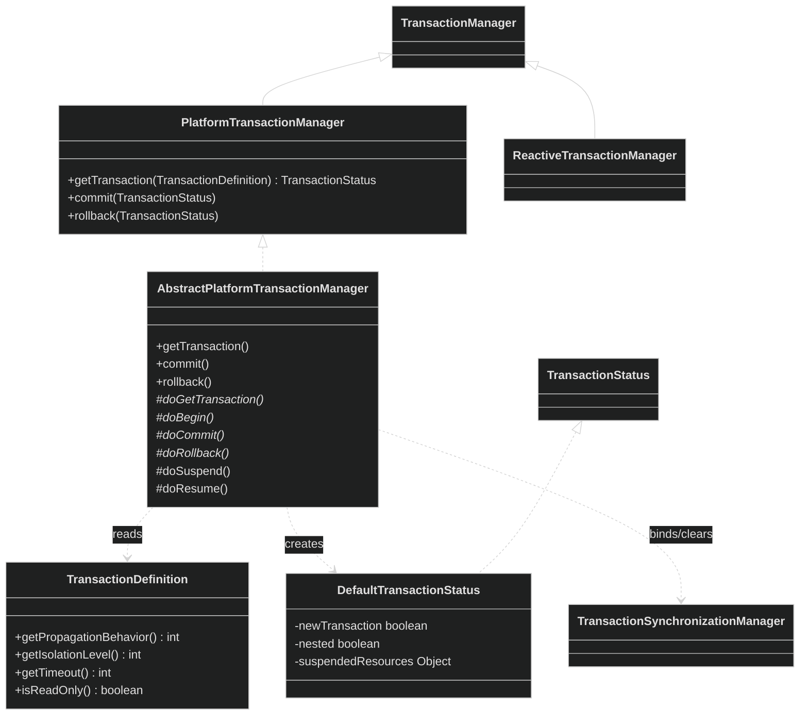
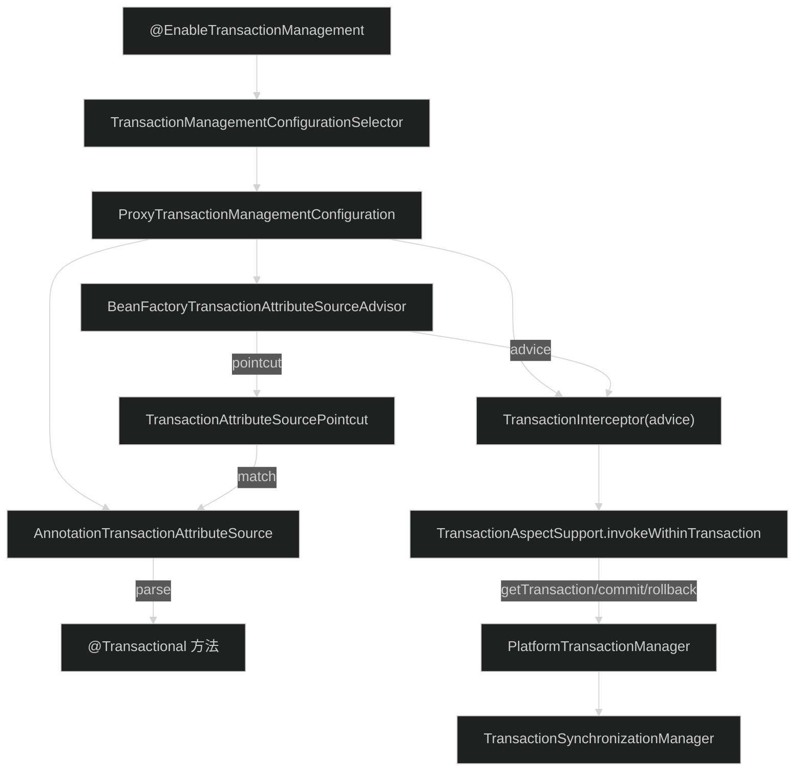
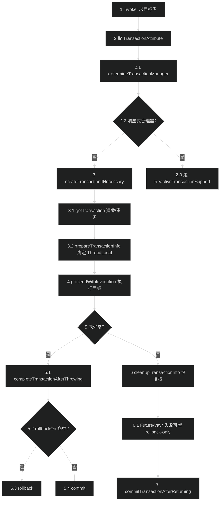
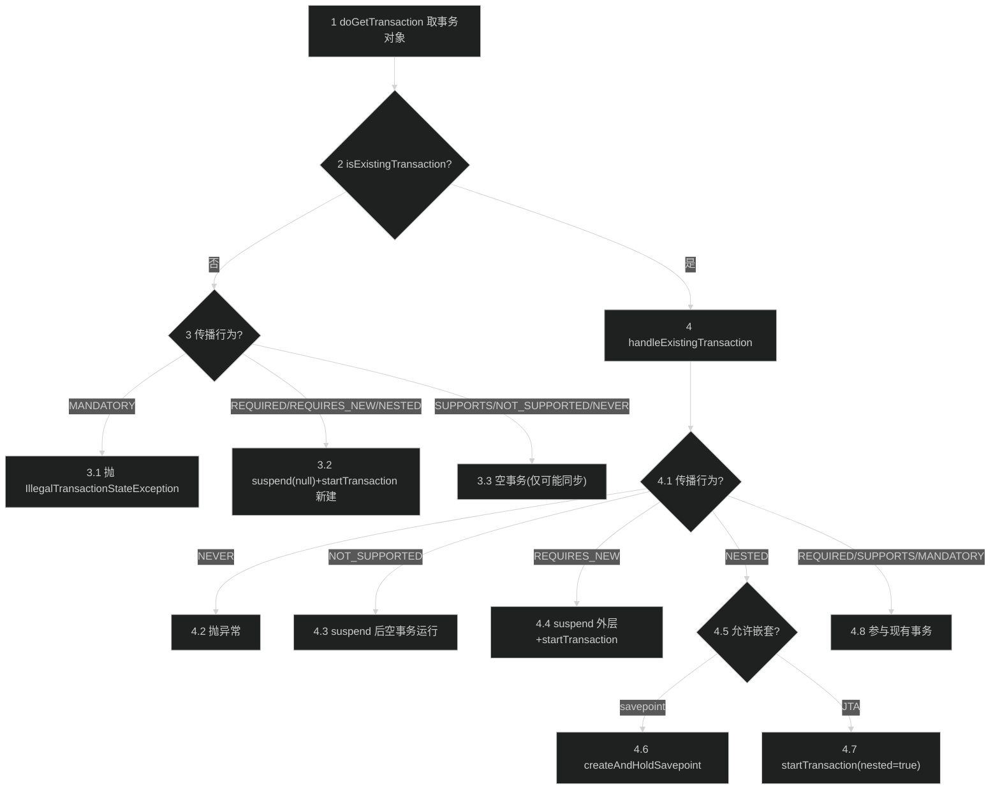
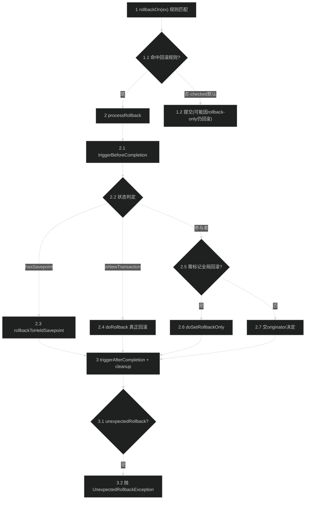

# 事务管理模块（spring-tx）
> 上次修改：2026-07-26 19:52

## 重点关注

- **`TransactionInterceptor.invoke` 声明式入口**（`interceptor/TransactionInterceptor.java:123`）：所有 `@Transactional` 方法的 AOP 织入起点，是理解声明式事务的第一站；它只做目标类识别，随即委托给父类 `invokeWithinTransaction`。
- **`TransactionAspectSupport.invokeWithinTransaction` 主环绕逻辑**（`interceptor/TransactionAspectSupport.java:333`）：串起「取属性 → 定管理器 → 建事务 → 执行目标 → 异常/正常收尾」的整条主链路，且分派命令式 / 响应式 / 回调式三种执行模型，是本模块最复杂、最核心的方法。
- **`AbstractPlatformTransactionManager.getTransaction` + `handleExistingTransaction` 传播行为**（`support/AbstractPlatformTransactionManager.java:372` / `:426`）：7 种 `PROPAGATION_*` 的全部决策集中在这两个方法里（新建、加入、挂起、嵌套、抛异常），是事务语义的真正实现处，易错点最多。
- **`suspend` / `resume` 挂起恢复**（`support/AbstractPlatformTransactionManager.java:614` / `:660`）：`REQUIRES_NEW`、`NOT_SUPPORTED`、`NESTED(JTA)` 依赖它把外层事务的资源与同步回调整体挂到 `SuspendedResourcesHolder`，恢复时严格逆序还原，边界处理很微妙。
- **`commit` / `processCommit` 与 `rollback` / `processRollback` 决策**（`support/AbstractPlatformTransactionManager.java:734` / `:766` / `:858` / `:874`）：rollback-only 检查、savepoint/新事务/参与者三分支、`UnexpectedRollbackException` 静默回滚的抛出点，都是排障高频区。
- **`RuleBasedTransactionAttribute.rollbackOn` 回滚规则匹配**（`interceptor/RuleBasedTransactionAttribute.java:123`）：决定「哪些异常触发回滚」，最浅匹配（shallowest）算法与「默认仅 RuntimeException/Error 回滚」的兜底逻辑是常见误区来源。
- **`TransactionSynchronizationManager` 线程绑定**（`support/TransactionSynchronizationManager.java`）：以 6 个 `ThreadLocal` 承载资源与事务特征，是「事务对上层数据访问透明」的底座，也是「跨线程事务失效」的根因所在。

---

## 1. 模块定位与职责边界

**结论**：spring-tx 是 Spring 的**事务抽象与编排层**，它不实现任何具体资源（JDBC/JPA/JTA）的事务，而是定义统一的事务策略接口（`PlatformTransactionManager` / `ReactiveTransactionManager`）、事务属性模型（`TransactionDefinition`）、以及声明式（`@Transactional` + AOP）和编程式（`TransactionTemplate`）两套使用方式，并把传播行为、挂起/恢复、提交/回滚决策、同步回调等**通用工作流**沉淀在 `AbstractPlatformTransactionManager` 模板类中。

- **上游依赖**：仅依赖 `spring-core`（`NamedThreadLocal`、`OrderComparator`、`ReactiveAdapterRegistry` 等）与 `spring-beans`（`BeanFactory`、`@Qualifier` 解析）；声明式部分可选依赖 `spring-aop`（Advisor/Pointcut）与 `spring-context`（`@EnableTransactionManagement` 配置类、事件发布）。
- **下游使用者**：`spring-jdbc`（`DataSourceTransactionManager`）、`spring-orm`（`JpaTransactionManager`/`HibernateTransactionManager`）、`spring-r2dbc`、`spring-jms` 等提供具体 `doBegin/doCommit/doRollback` 实现；`spring-jta` 相关能力内置在本模块 `jta/` 包。
- **负责什么**：事务边界的划定与传播语义、事务状态对象（`TransactionStatus`/`DefaultTransactionStatus`）管理、线程绑定资源与同步回调、rollback-only 与 savepoint 语义、`@Transactional` 元数据解析（`AnnotationTransactionAttributeSource`）。
- **不负责什么**：不打开/关闭数据库连接、不执行 SQL、不做连接池管理（那是 `spring-jdbc`/资源层的事）；不决定异常如何被业务捕获（只按规则决定回滚）；不提供分布式两阶段提交实现（交给 JTA provider）。
- **主要输入**：被拦截的目标方法 + `TransactionAttribute`（由 `@Transactional` 解析而来）。**主要输出**：一次受事务保护的方法执行，副作用是底层资源事务的 begin/commit/rollback 以及 `ThreadLocal` 状态的绑定与清理。

---

## 2. 架构关系与依赖

**结论**：本模块可分为「事务管理器体系（PlatformTransactionManager 家族）」与「声明式拦截链（@Transactional → AOP 代理 → TransactionInterceptor）」两大子系统，二者通过 `TransactionAspectSupport` 内部调用 `PlatformTransactionManager.getTransaction/commit/rollback` 衔接，底层共享 `TransactionSynchronizationManager` 的线程绑定状态。

### 2.1 管理器与状态体系（类关系）

| 节点 | 角色 | 依赖方向/说明 |
|------|------|----------------|
| `TransactionManager` | 空标记接口 | 命令式与响应式管理器的共同父类型，供 `@Transactional` 统一注入 |
| `PlatformTransactionManager` | 命令式事务策略接口 | 三方法：`getTransaction/commit/rollback`；应用一般不直接用 |
| `ReactiveTransactionManager` | 响应式事务策略接口 | 与命令式对称，返回 `Mono`/`Publisher`，走 Reactor 上下文而非 ThreadLocal |
| `AbstractPlatformTransactionManager` | 模板方法基类 | **强依赖**：实现全部传播/挂起/提交/回滚编排，把资源相关操作留给抽象 `doXxx` |
| `TransactionDefinition` | 事务属性只读契约 | `PROPAGATION_*`/`ISOLATION_*`/超时/只读常量的定义处，被管理器读取 |
| `DefaultTransactionStatus` | 事务运行时状态 | 承载 `newTransaction`/`nested`/`suspendedResources`/savepoint，回传给 `doXxx` |
| `TransactionSynchronizationManager` | 线程绑定中枢 | 6 个 ThreadLocal，管理器在 begin/cleanup 时读写，数据访问层据此复用连接 |

### 2.2 声明式拦截链（@Transactional → 代理 → 拦截器）

| 节点 | 角色 | 说明 |
|------|------|------|
| `@EnableTransactionManagement` | 开关注解 | 触发 `TransactionManagementConfigurationSelector` 导入配置类 |
| `ProxyTransactionManagementConfiguration` | 基础设施装配 | 声明 Advisor + Interceptor + AttributeSource 三个 infrastructure bean（`annotation/ProxyTransactionManagementConfiguration.java:44-67`） |
| `BeanFactoryTransactionAttributeSourceAdvisor` | Advisor | 绑定 pointcut 与 advice，决定哪些 bean 被代理，可设 `order` |
| `TransactionAttributeSourcePointcut` | 切点 | 通过 `AttributeSource` 判断方法是否有事务属性 |
| `AnnotationTransactionAttributeSource` | 属性源 | 解析 `@Transactional`（Spring/JTA/EJB3 三种 parser），产出 `RuleBasedTransactionAttribute` |
| `TransactionInterceptor` | 环绕通知 | MethodInterceptor 实现，`invoke` 委托给 `invokeWithinTransaction` |
| `TransactionAspectSupport` | 编排基类 | 命令式/响应式共用，调用 `PlatformTransactionManager` 完成事务 |

**潜在耦合点**：`TransactionAspectSupport` 用 `ConcurrentReferenceHashMap` 缓存 method→响应式支持、qualifier→管理器；`TransactionInterceptor` 因需作为 AspectJ 切面基类而**不能实现 `Serializable`**（父类注释明确说明，`TransactionAspectSupport.java:95-96`），序列化字段由子类 `writeObject/readObject` 手工处理。

---

## 3. 入口与调用方式

**结论**：本模块有三类入口——声明式 AOP（最常用）、编程式模板、以及直接调用管理器 API。

| 入口 | 触发条件 | 关键参数 | 返回/上下文 | 源码位置 |
|------|----------|----------|-------------|----------|
| **声明式：`TransactionInterceptor.invoke`** | 代理对象上调用带 `@Transactional`（或类级）的方法 | `MethodInvocation`（含 method、target） | 目标方法返回值；织入 begin/commit/rollback | `interceptor/TransactionInterceptor.java:123` |
| **编程式：`TransactionTemplate.execute`** | 应用代码显式包裹回调 | `TransactionCallback<T>` | 回调返回值；`RuntimeException/Error` 及未声明 checked 均回滚 | `support/TransactionTemplate.java:127` |
| **底层 API：`PlatformTransactionManager.getTransaction/commit/rollback`** | 应用或框架手工控制事务边界 | `TransactionDefinition` / `TransactionStatus` | `TransactionStatus`；需自行成对调用 | `transaction/PlatformTransactionManager.java:72,98,118` |
| **静态：`TransactionAspectSupport.currentTransactionStatus`** | 事务方法内部想设 rollback-only 而不抛异常 | 无 | 当前 `TransactionStatus`，无则抛 `NoTransactionException` | `interceptor/TransactionAspectSupport.java:163` |
| **响应式：`invokeWithinTransaction`（rtm 分支）** | 返回类型为 `Mono`/`Flux`/Kotlin 挂起函数且管理器为 `ReactiveTransactionManager` | 同上 | 反应式管道，事务态存于 Reactor Context | `interceptor/TransactionAspectSupport.java:341-358` |

声明式入口触发后进入 `invokeWithinTransaction`（第 5 章主流程）；编程式入口 `execute` 内部直接调用 `getTransaction` → 回调 → `commit`，异常走 `rollbackOnException`（`TransactionTemplate.java:134-151`）。注意 `TransactionTemplate` 与声明式的默认回滚语义略有差别：模板对**未声明的 checked 异常也回滚**（包装为 `UndeclaredThrowableException`，`:144-148`），而声明式默认仅对 unchecked 回滚。

---

## 4. 核心概念与领域模型

### 4.1 TransactionDefinition —— 事务属性契约
- **定义**：只读接口，描述传播行为、隔离级别、超时、只读、名称（`transaction/TransactionDefinition.java:44`）。
- **常量**：7 个 `PROPAGATION_*`（REQUIRED=0…NESTED=6）、5 个 `ISOLATION_*`（DEFAULT=-1 及与 `java.sql.Connection` 对齐的 1/2/4/8）、`TIMEOUT_DEFAULT=-1`。
- **生命周期**：由 `@Transactional` 经 `AnnotationTransactionAttributeSource` 转换为 `RuleBasedTransactionAttribute`（`TransactionAttribute` 子类型），随方法调用传入 `getTransaction`。隔离级别/超时/只读**仅对实际新建的事务生效**（javadoc `:27-31` 明确）。
- **三维评估**：好处——用整型常量与 EJB CMT 对齐，接口默认方法降低实现成本；替代方案——用枚举更类型安全，但会牺牲与 JDBC 常量的数值一致性和序列化紧凑度；风险——整型无编译期约束，非法值只能运行期由管理器抛异常拦截。

### 4.2 TransactionStatus / DefaultTransactionStatus —— 事务运行时句柄
- **定义**：`TransactionStatus` 表示一次事务的当前状态（是否新建、是否有 savepoint、是否 rollback-only）；`DefaultTransactionStatus` 是 `AbstractPlatformTransactionManager` 专用实现，额外持有底层 `transaction` 对象、`newSynchronization`、`nested`、`suspendedResources`（`support/DefaultTransactionStatus.java:52-101`）。
- **作用**：作为 begin 与 commit/rollback 之间的载体，`doCommit/doRollback` 从中取回具体事务对象；`isNewTransaction()` 决定「真正提交」还是「参与外层」。
- **关键判断**：`isGlobalRollbackOnly()` 委托底层事务对象的 `SmartTransactionObject.isRollbackOnly()`（`:174-178`）；savepoint 能力取决于底层 `transaction` 是否实现 `SavepointManager`（`:186-204`）。

### 4.3 TransactionAttribute 与回滚规则
- **定义**：`TransactionAttribute` 在 `TransactionDefinition` 基础上增加 `rollbackOn(Throwable)` 与 `getQualifier()`；`RuleBasedTransactionAttribute` 用一组 `RollbackRuleAttribute`/`NoRollbackRuleAttribute` 决定回滚（`interceptor/RuleBasedTransactionAttribute.java:39`）。
- **默认规则**：无自定义规则时回落到 `DefaultTransactionAttribute.rollbackOn`——**仅 `RuntimeException` 与 `Error` 回滚，checked 异常视为业务异常默认提交**（`interceptor/DefaultTransactionAttribute.java:180-182`）。
- **三维评估**：好处——「最浅匹配」（第 6 章）让更贴近异常类型的规则胜出，语义直观；替代方案——首个匹配即返回会更快但语义随声明顺序漂移；风险——基于**类名 `contains` 子串**的模式匹配会误伤同包相似命名/嵌套类（`Transactional.java:76-92` 的 WARNING）。

### 4.4 传播行为（Propagation）
- **定义**：`@Transactional` 的 `Propagation` 枚举一一映射到 `TransactionDefinition.PROPAGATION_*`。三类语义：需要事务（REQUIRED/REQUIRES_NEW/NESTED/MANDATORY）、支持但不强求（SUPPORTS）、拒绝事务（NOT_SUPPORTED/NEVER）。
- **状态拥有关系**：REQUIRES_NEW/NOT_SUPPORTED 会**挂起**当前事务（产生 `SuspendedResourcesHolder`），NESTED 在支持 savepoint 的管理器上创建**保存点**而非新连接。

### 4.5 TransactionSynchronization —— 完成时回调
- **定义**：在事务提交/回滚各阶段（`beforeCommit`/`beforeCompletion`/`afterCommit`/`afterCompletion`）触发的回调，配合 `suspend`/`resume` 支持挂起。
- **作用**：数据访问层据此在事务结束时关闭/解绑资源（如 Hibernate Session），是「同一事务内复用同一连接」的机制核心。

---

## 5. 关键流程

### 5.1 声明式事务主路径（invokeWithinTransaction）

1-2.3 属性与管理器解析：`invoke` 先算出目标类并交由 `invokeWithinTransaction`，通过 `TransactionAttributeSource.getTransactionAttribute` 拿到属性（为 null 则视为非事务方法），再 `determineTransactionManager` 依 qualifier/类型级 qualifier/beanName/默认 bean 顺序解析管理器（`TransactionAspectSupport.java:489-534`）；若解析出 `ReactiveTransactionManager` 且返回类型为反应式，则改走缓存的 `ReactiveTransactionSupport`（`:341-358`），主流程终止于此分支。

3-3.2 事务创建：命令式路径调用 `createTransactionIfNecessary`，无名时用「类名.方法名」作事务名（`:616-623`），随后 `tm.getTransaction(txAttr)` 建立或加入事务并生成 `TransactionStatus`，再 `prepareTransactionInfo` 封装为 `TransactionInfo` 并 `bindToThread`（压入 ThreadLocal 栈，保存旧值以便恢复，`:808-813`）。

4-5.4 目标执行与异常收尾：`proceedWithInvocation` 推进拦截器链最终调到目标方法；抛异常时 `completeTransactionAfterThrowing` 依 `txAttr.rollbackOn(ex)` 决定回滚或提交（`:697-737`），回滚/提交若再抛 `TransactionSystemException` 会用 `initApplicationException` 记住原始业务异常，避免其被覆盖丢失。

6-7 正常收尾：`finally` 中始终 `cleanupTransactionInfo` 恢复 ThreadLocal 栈（`:744-748`）；返回值若是已完成的 `Future` 或 Vavr `Try` 且失败匹配规则，则置 `setRollbackOnly`（`:382-406`）；最后 `commitTransactionAfterReturning` 触发实际提交（内部再走 rollback-only 检查）。

### 5.2 getTransaction 传播决策（新建/加入/挂起/嵌套）

1-3.3 无现有事务：`doGetTransaction` 由子类返回事务对象，`isExistingTransaction` 判定不存在后先校验超时合法性（`AbstractPlatformTransactionManager.java:388-390`）；`MANDATORY` 直接抛异常；`REQUIRED/REQUIRES_NEW/NESTED` 均视为「需要新事务」，先 `suspend(null)`（此时只挂起可能存在的同步）再 `startTransaction`（`:397-411`），begin 失败会 `resume(null,...)` 还原；其余传播行为创建「空事务」——无实际后端事务，仅当 `SYNCHRONIZATION_ALWAYS` 时开启同步（`:412-420`）。

4-4.3 拒绝或挂起分支：`handleExistingTransaction` 中 `NEVER` 遇到现有事务即抛异常；`NOT_SUPPORTED` 挂起当前事务（`suspend(transaction)`）后以无事务方式运行，同步是否开启同样取决于 `SYNCHRONIZATION_ALWAYS`（`:435-443`）。

4.4 REQUIRES_NEW：挂起外层事务得到 `SuspendedResourcesHolder`，`startTransaction` 新建独立事务；begin 失败经 `resumeAfterBeginException` 恢复外层，并保证「内层 begin 异常不被外层 resume 异常无声覆盖」（`:445-458`、`:682-693`）。

4.5-4.7 NESTED：未开启 `nestedTransactionAllowed` 抛 `NestedTransactionNotSupportedException`；`useSavepointForNestedTransaction()` 为 true（默认）时在现有事务内 `createAndHoldSavepoint` 建保存点、**不激活新同步**（`:469-485`）；JTA 场景走 `startTransaction(nested=true)` 以嵌套 begin/commit 实现。

4.8 常规参与：`REQUIRED/SUPPORTS/MANDATORY` 遇到现有事务时直接参与，若开启 `validateExistingTransaction` 则校验隔离级别与只读标记是否与外层冲突（不一致抛异常，`:499-516`）；参与者的 `newTransaction=false`，因此后续 commit 会被跳过、rollback 只置 rollback-only。

### 5.3 rollback 回滚决策（rollbackOn 规则匹配 + 三分支处理）

1-1.2 规则匹配：`RuleBasedTransactionAttribute.rollbackOn` 遍历规则取「最浅匹配」，无规则命中则回落到「仅 unchecked 回滚」（`RuleBasedTransactionAttribute.java:123-143`）；不回滚的异常仍会走提交路径，但若事务被标记 rollback-only，`commit` 内部仍会转为回滚（`AbstractPlatformTransactionManager.java:749-755`）。

2-2.7 processRollback 三分支：先触发 `beforeCompletion` 回调；有 savepoint 则回滚到保存点（NESTED 语义，`:882-889`）；新事务调用子类 `doRollback` 真正回滚（`:890-897`）；参与者仅在 `isLocalRollbackOnly() || globalRollbackOnParticipationFailure` 时 `doSetRollbackOnly` 把外层标脏，否则「让事务发起者决定」并把 `unexpectedRollback` 复位为 false（`:898-920`）。

3-3.2 完成与静默回滚保护：`finally` 中 `cleanupAfterCompletion` 置完成态、清同步、必要时恢复挂起资源（`:1055-1070`）；若最外层检测到全局 rollback-only 标记但没有对应异常，抛 `UnexpectedRollbackException` 明确告知「事务已被静默回滚」，防止调用方误以为提交成功（`:936-939`）。

---

## 6. 核心实现细节

### 6.1 AbstractPlatformTransactionManager 模板方法骨架

**结论**：该类用**模板方法模式**把「通用事务工作流」与「资源特定操作」解耦——`getTransaction/commit/rollback` 声明为 `final`（不可覆盖，保证语义一致），把 `doGetTransaction/doBegin/doCommit/doRollback` 设为 `abstract`，`doSuspend/doResume/doSetRollbackOnly` 给默认「不支持」实现，子类按需覆盖。

- **`doBegin`**（抽象，`:1159`）：仅在管理器决定真正开启新事务时调用（此前无事务或外层已挂起）；不需处理传播行为。`startTransaction` 在其前后包裹 `beforeBegin/afterBegin` 监听器回调，begin 抛异常时也会通知监听器（`:530-540`）。
- **`doCommit` / `doRollback`**（抽象，`:1253`/`:1264`）：只处理「当前 status 里的事务对象」，无需判断是否新事务——这些判断已由 `processCommit`/`processRollback` 前置完成。
- **`doSuspend` / `doResume`**（默认抛 `TransactionSuspensionNotSupportedException`，`:1175`/`:1193`）：只有支持挂起的管理器（如带 `TransactionManager` 的 JTA、`DataSourceTransactionManager`）才覆盖；这解释了为何某些管理器上 `REQUIRES_NEW` 不可用。
- **隐藏假设**：`newTransactionStatus` 里 `actualNewSynchronization = newSynchronization && !isSynchronizationActive()`（`:566-567`）——只有当前线程尚无活动同步时才开新同步，避免嵌套调用重复初始化 ThreadLocal。
- **三维评估**：好处——`final` + 抽象方法把「传播/挂起/回滚决策」这类易错逻辑收归基类，子类只写十几行资源代码即可获得完整语义；替代方案——把工作流做成可组合策略对象更灵活，但会显著增加理解成本且破坏「一次实现处处一致」；风险——模板过于厚重，子类难以偏离既定流程（如自定义提交前钩子只能通过 `prepareForCommit` 等有限扩展点）。

### 6.2 handleExistingTransaction —— 传播行为的真正实现

**结论**：`getTransaction` 只处理「无现有事务」的简单分支，所有「已有事务如何共处」的复杂决策集中在 `handleExistingTransaction`（`:426-519`），按传播行为顺序短路返回，是理解 REQUIRES_NEW/NESTED/NOT_SUPPORTED 差异的唯一入口。

- **输入**：`definition`（传播行为等）、`transaction`（子类判定为已存在的事务对象）。**输出**：一个 `TransactionStatus`，其 `newTransaction`/`nested`/`suspendedResources` 标记决定后续 commit/rollback 行为。
- **关键副作用**：REQUIRES_NEW/NOT_SUPPORTED 会调用 `suspend(transaction)` 把外层事务与全部同步回调整体摘下，存入 `SuspendedResourcesHolder`，并清空 ThreadLocal 中的 name/readOnly/isolation/active（`:614-648`）。
- **三维评估**：好处——集中式 if 链清晰对应 7 种语义，配合 debug 日志便于排障；替代方案——用策略 Map（传播行为→处理器）可消除长条件，但会分散语义、增加跳转；风险——分支较多且顺序敏感（NESTED 的 savepoint/JTA 两路、validate 校验），改动极易引入回归，测试必须覆盖全部传播矩阵。

### 6.3 suspend / resume —— 挂起与恢复

**结论**：挂起是「先摘同步、再摘资源」，恢复是「先还资源、再还同步」，严格逆序以保证 ThreadLocal 一致性。

- **`suspend`**（`:614-648`）：若同步活跃，先 `doSuspendSynchronization` 逐个调用 `synchronization.suspend()` 并清空同步集合，再 `doSuspend(transaction)` 摘资源，然后把 name/readOnly/isolation/active 逐项读出并复位为「无事务」，打包进 holder；`doSuspend` 失败会回滚已挂起的同步（`:633-637`）。
- **`resume`**（`:660-677`）：先 `doResume` 还原资源，再把 holder 中的 active/isolation/readOnly/name 逐项写回 ThreadLocal，最后 `doResumeSynchronization` 重新 `initSynchronization` 并逐个 `resume()`+`registerSynchronization`（`:715-721`）。
- **数据/状态变化**：一次 REQUIRES_NEW 会产生「外层态 → 挂起态（holder 持有）→ 内层新态 → 内层完成 → cleanup 中 resume 还原外层态」的完整迁移，`cleanupAfterCompletion` 通过 `status.getSuspendedResources()` 触发恢复（`:1063-1069`）。
- **三维评估**：好处——把「事务特征」与「资源/同步」分层挂起，使恢复可精确还原调用前现场；替代方案——用显式栈结构保存嵌套层级会更直观，但当前用 holder + status 链已隐式形成栈；风险——挂起/恢复涉及多次 ThreadLocal 读写，任一 `doSuspend/doResume` 异常都可能导致资源与同步状态不一致，代码用多处 try/catch + 日志兜底。

### 6.4 processCommit —— 提交决策与回调编排

**结论**：`commit` 先做 rollback-only 短路（本地 rollback-only → 回滚；全局 rollback-only 且不允许提交 → 回滚并标记 unexpected），再进 `processCommit`（`:734-757`）。

- **回调顺序**：`prepareForCommit → beforeCommit → beforeCompletion → (savepoint 释放 | doCommit | 仅检查全局标记) → afterCommit → afterCompletion → cleanup`（`:766-848`）。`afterCommit` 抛异常会传播给调用方但事务仍视为已提交（`:832-842`）。
- **静默回滚**：若 `status.isGlobalRollbackOnly()` 为真但底层 commit 未抛异常，主动抛 `UnexpectedRollbackException`（`:800-805`），覆盖「JTA provider 静默回滚」这类隐患。
- **三维评估**：好处——把提交拆成可插拔回调阶段，让数据访问层（flush/资源关闭）与事务协调解耦；替代方案——单一 `doCommit` 更简单但无法支持 Hibernate flush、同步资源解绑等横切需求；风险——阶段众多，`beforeCompletionInvoked`/`commitListenerInvoked` 等布尔标志用于保证异常路径下回调不重复/不遗漏，逻辑密集。

### 6.5 TransactionSynchronizationManager —— ThreadLocal 资源绑定

**结论**：以 6 个 `NamedThreadLocal`（resources、synchronizations、name、readOnly、isolationLevel、actualActive）承载「当前线程的事务上下文」，是事务对数据访问层透明的关键（`support/TransactionSynchronizationManager.java:77-93`）。

- **资源绑定**：`bindResource` 要求同 key 不可覆盖（已存在则抛 `IllegalStateException`，`:170-177`）；`doGetResource` 会透明清除标记为 void 的 `ResourceHolder`（`:141-157`）；`bindSynchronizedResource`（7.0 新增）在绑定同时注册一个同步器，在 `suspend/resume/afterCompletion` 阶段自动解绑并还原旧值（`:194-222`）。
- **同步集合**：`getSynchronizations` 返回**排序快照**（按 `Ordered`，惰性排序），刻意返回不可变副本以避免回调中再注册同步导致的 `ConcurrentModificationException`（`:351-371`）。
- **清理**：`clear()` 一次性移除全部 6 个 ThreadLocal（`:513-519`），由 `cleanupAfterCompletion` 在 `isNewSynchronization` 时调用。
- **三维评估**：好处——静态方法 + ThreadLocal 让任意数据访问代码无需传参即可获取当前事务资源，极大简化 API；替代方案——显式上下文对象传递更利于反应式/虚拟线程，但会侵入所有数据访问签名；风险——ThreadLocal 绑定**不跨线程**，导致「事务方法内 new Thread / 线程池提交」时子线程拿不到事务资源（事务失效），这也是响应式路径改用 Reactor Context 的根因。

---

## 7. 数据结构、配置与外部协议

### 7.1 核心数据结构

| 结构 | 关键字段 | 含义/约束 |
|------|----------|-----------|
| `TransactionDefinition` 常量 | `PROPAGATION_*`(0-6)、`ISOLATION_*`(-1/1/2/4/8)、`TIMEOUT_DEFAULT`(-1) | 隔离级别数值与 `java.sql.Connection` 对齐；`TIMEOUT_DEFAULT` 表示用底层默认 |
| `DefaultTransactionStatus` | `newTransaction`、`newSynchronization`、`nested`、`readOnly`、`suspendedResources`、`transaction` | 承载单次事务运行态，回传给 `doCommit/doRollback` |
| `SuspendedResourcesHolder` | `suspendedResources`、`suspendedSynchronizations`、`name`、`readOnly`、`isolationLevel`、`wasActive` | 挂起现场快照，恢复时逐字段还原（`AbstractPlatformTransactionManager.java:1332-1361`） |
| `TransactionInfo` | `transactionManager`、`transactionAttribute`、`transactionStatus`、`oldTransactionInfo` | ThreadLocal 栈节点，`oldTransactionInfo` 形成链表实现嵌套恢复（`TransactionAspectSupport.java:755-825`） |
| `RollbackRuleAttribute` | `exceptionType` 或 `exceptionPattern` | 类型匹配或类名子串匹配，`getDepth` 返回继承深度用于「最浅匹配」 |

### 7.2 配置项（AbstractPlatformTransactionManager 可调开关）

| 配置 | 默认值 | 作用 | 错误配置后果 |
|------|--------|------|--------------|
| `transactionSynchronization` | `SYNCHRONIZATION_ALWAYS` | 何时激活线程同步 | 设 NEVER 会使依赖同步的资源解绑失效 |
| `defaultTimeout` | `TIMEOUT_DEFAULT(-1)` | 未指定超时时的默认值 | 负值（非 -1）抛 `InvalidTimeoutException`（`:196-198`） |
| `nestedTransactionAllowed` | `false` | 是否允许 NESTED | 关闭时 NESTED 抛 `NestedTransactionNotSupportedException` |
| `validateExistingTransaction` | `false` | 参与现有事务时是否校验隔离/只读一致 | 开启后不一致抛 `IllegalTransactionStateException` |
| `globalRollbackOnParticipationFailure` | `true` | 参与者失败是否把外层标脏 | 关闭后允许发起者自行决定，但资源可能已不可提交 |
| `failEarlyOnGlobalRollbackOnly` | `false` | 是否在内层即抛 `UnexpectedRollbackException` | 默认仅最外层抛，便于测试继续 |

### 7.3 声明式配置协议
- **`@EnableTransactionManagement`**：`mode`(PROXY/ASPECTJ)、`proxyTargetClass`、`order`；PROXY 模式导入 `ProxyTransactionManagementConfiguration`。
- **`@Transactional` 属性**：`propagation`/`isolation`/`timeout`/`timeoutString`/`readOnly`/`rollbackFor`/`noRollbackFor`/`rollbackForClassName`/`noRollbackForClassName`/`transactionManager`(=`value`)/`label`（`annotation/Transactional.java`）。
- **XML 命名空间**：`config/TxNamespaceHandler` 注册 `<tx:annotation-driven>`、`<tx:advice>`、`<tx:jta-transaction-manager>`。

---

## 8. 异常、边界与降级处理

**结论**：本模块的异常语义高度依赖「回滚规则」与「传播行为」，多数边界都有明确的检查点与专用异常类型。

- **默认回滚规则**：无自定义规则时**仅 `RuntimeException`/`Error` 触发回滚，checked 异常默认提交**（`DefaultTransactionAttribute.java:180-182`）。这是最常见误区——业务抛 checked 异常却期望回滚时必须显式 `rollbackFor`。
- **回滚规则匹配边界**：`rollbackOn` 采用「最浅匹配」，同时命中 rollback 与 noRollback 规则时深度更小者胜；`NoRollbackRuleAttribute` 命中则不回滚（`RuleBasedTransactionAttribute.java:123-143`）。基于类名 `contains` 的模式匹配可能误伤（`RollbackRuleAttribute.java:177`）。
- **事务失效场景**（源于机制而非显式抛错）：① **类内自调用**——同类方法间直接 `this.method()` 不经过代理，拦截器不触发；② **非 public 方法**——`@Transactional` javadoc 指明方法可见性约束（`Transactional.java:36-39`），默认代理不拦截非 public；③ **跨线程**——ThreadLocal 不传递（见 6.5），子线程无事务。以上均无异常，静默失效，排障需检查代理与线程边界。
- **超时**：`getTransaction` 对 `< TIMEOUT_DEFAULT` 的非法超时抛 `InvalidTimeoutException`（`AbstractPlatformTransactionManager.java:388-390`）；实际超时由底层资源在 `determineTimeout` 计算后执行。
- **savepoint（NESTED）边界**：底层 `transaction` 未实现 `SavepointManager` 时 `getSavepointManager` 抛 `NestedTransactionNotSupportedException`（`DefaultTransactionStatus.java:186-194`）；回滚到保存点后外层事务可继续。
- **rollback-only 边界**：本地 `setRollbackOnly` 后调用 commit 会转为回滚（`:741-747`）；全局 rollback-only 但 commit 未报错则抛 `UnexpectedRollbackException`（`:800-805`、`:936-939`）。
- **异常覆盖保护**：rollback/commit 过程若抛 `TransactionSystemException`，用 `initApplicationException` 保留原始业务异常，日志记录「Application exception overridden by ...」（`TransactionAspectSupport.java:710-734`）。
- **重复完成保护**：对已 `isCompleted()` 的 status 再次 commit/rollback 抛 `IllegalTransactionStateException`（`:735-738`、`:859-862`）。

---

## 9. 并发、生命周期与性能

- **线程模型**：命令式事务态全部绑定在 `ThreadLocal`（`TransactionSynchronizationManager` 6 项 + `TransactionAspectSupport.transactionInfoHolder`），**天然线程隔离**，但也因此不跨线程传递。`TransactionInterceptor` 自身无状态、线程安全（类注释 `:48`）。
- **响应式生命周期**：反应式路径用 `TransactionContextManager` 把事务态存入 Reactor Context，通过 `Flux/Mono.usingWhen` 绑定 begin→commit/rollback→cancel 回调（`TransactionAspectSupport.java:925-961`），取消时走 `rollbackTransactionOnCancel`。
- **缓存**：`transactionManagerCache`（qualifier→管理器，`ConcurrentReferenceHashMap`，初值 4）避免每次调用重复 `getBean`；`transactionSupportCache`（method→`ReactiveTransactionSupport`，初值 1024）缓存反应式适配，`computeIfAbsent` 保证并发安全（`:184-188`、`:346-355`）。属性源侧 `AbstractFallbackTransactionAttributeSource` 亦有 method→attribute 缓存。
- **资源复用**：同步机制确保同一事务内同一 `DataSource`/`SessionFactory` 复用同一连接/会话，减少物理连接开销。
- **性能关键路径**：每次事务方法调用都经历「属性查找（缓存命中后 O(1)）→ getTransaction（含 doGetTransaction 探测）→ ThreadLocal 读写多次 → 回调触发」。热点在 `ThreadLocal` 频繁读写与同步集合排序（惰性、仅 size>1 时排序，已优化）。
- **顺序保证**：同步回调按 `Ordered` 排序执行；`getSynchronizations` 返回快照避免回调内再注册引发并发修改。

---

## 10. 扩展点、测试点与维护建议

### 扩展点
- **自定义管理器**：继承 `AbstractPlatformTransactionManager`，实现 `doGetTransaction/isExistingTransaction/doBegin/doCommit/doRollback`，按需覆盖 `doSuspend/doResume/doSetRollbackOnly/useSavepointForNestedTransaction`。
- **`TransactionExecutionListener`**：`beforeBegin/afterBegin/beforeCommit/afterCommit/beforeRollback/afterRollback` 全生命周期观测（`ConfigurableTransactionManager.setTransactionExecutionListeners`）。
- **`TransactionSynchronization`**：注册自定义完成回调（资源清理、缓存刷新、事件发布）。
- **属性源扩展**：实现 `TransactionAttributeSource` 或新增 `TransactionAnnotationParser`（已内置 Spring/JTA/EJB3 三种）。
- **注解事件**：`@TransactionalEventListener`（在 `event/` 包）在指定事务阶段消费应用事件。

### 建议测试点
- **主路径**：REQUIRED 新建/加入、正常提交、rollback-only 回滚。
- **传播矩阵**：REQUIRES_NEW 挂起恢复、NESTED savepoint 回滚后外层继续、NOT_SUPPORTED/NEVER/MANDATORY 的异常与空事务分支。
- **回滚规则**：checked 默认提交、`rollbackFor` 生效、最浅匹配、noRollback 覆盖。
- **失效边界**：类内自调用、非 public、跨线程（回归风险最高）。

### 维护建议
| 目标位置 | 问题 | 建议动作 | 收益/风险 |
|----------|------|----------|-----------|
| `RollbackRuleAttribute.getDepth`(`:177`) | 类名 `contains` 子串匹配易误伤同包/嵌套类 | 文档已警示；可评估补充可选的「精确/正则」匹配模式 | 收益：减少误配回滚；风险：改动匹配语义需兼容存量配置 |
| `handleExistingTransaction`(`:426`) | 长 if 链、传播语义集中且顺序敏感 | 保持现状但确保传播矩阵测试全覆盖 | 收益：防回归；风险：重构为策略表可能得不偿失 |
| 事务失效（自调用/非 public/跨线程） | 静默失效难排查 | 在文档/日志层面强化提示（如 debug 日志已有「Participating…」提示） | 收益：降低排障成本；风险：过度日志影响性能 |

---

## 11. 文件职责表

| 文件 | 职责 | 关键类/函数 | 被谁调用 | 备注 |
|------|------|-------------|----------|------|
| `transaction/PlatformTransactionManager.java` | 命令式事务策略接口 | `getTransaction/commit/rollback` | `TransactionAspectSupport`、`TransactionTemplate` | 三方法契约 |
| `transaction/TransactionDefinition.java` | 事务属性只读契约 | `PROPAGATION_*`/`ISOLATION_*` 常量 | 管理器、`@Transactional` 映射 | 数值与 JDBC 对齐 |
| `transaction/TransactionStatus.java` | 事务状态接口 | `isNewTransaction/setRollbackOnly` | 拦截器、模板 | savepoint 能力经子接口 |
| `support/AbstractPlatformTransactionManager.java` | 通用事务工作流模板 | `getTransaction`、`handleExistingTransaction`、`suspend/resume`、`processCommit/processRollback` | 各具体管理器继承 | 模块最核心类 |
| `support/DefaultTransactionStatus.java` | 事务运行时状态实现 | `isGlobalRollbackOnly`、`getSavepointManager` | `AbstractPlatformTransactionManager` | 持底层事务对象 |
| `support/TransactionSynchronizationManager.java` | 线程绑定资源与同步中枢 | `bindResource`、`registerSynchronization`、`clear` | 管理器、数据访问层 | 6 个 ThreadLocal |
| `support/TransactionTemplate.java` | 编程式事务模板 | `execute`、`rollbackOnException` | 应用代码 | 对 checked 也回滚 |
| `interceptor/TransactionInterceptor.java` | 声明式 AOP 环绕通知 | `invoke` | AOP 代理链 | 委托父类；不可 Serializable |
| `interceptor/TransactionAspectSupport.java` | 事务切面编排基类 | `invokeWithinTransaction`、`createTransactionIfNecessary`、`completeTransactionAfterThrowing` | `TransactionInterceptor`、AspectJ 切面 | 命令式/响应式共用 |
| `interceptor/RuleBasedTransactionAttribute.java` | 规则化回滚属性 | `rollbackOn`（最浅匹配） | 拦截器、异常收尾 | 无规则回落默认 |
| `interceptor/DefaultTransactionAttribute.java` | 默认事务属性 | `rollbackOn`（仅 unchecked） | `RuleBasedTransactionAttribute` 父类 | 默认回滚语义 |
| `interceptor/RollbackRuleAttribute.java` | 单条回滚规则 | `getDepth` | `RuleBasedTransactionAttribute` | 类型/模式匹配 |
| `annotation/Transactional.java` | 声明式事务注解 | 属性定义 | `AnnotationTransactionAttributeSource` | 语义映射到属性 |
| `annotation/AnnotationTransactionAttributeSource.java` | `@Transactional` 解析 | `determineTransactionAttribute` | 切点/拦截器 | 三种 parser |
| `annotation/ProxyTransactionManagementConfiguration.java` | 基础设施 bean 装配 | `transactionAdvisor`、`transactionInterceptor` | `@EnableTransactionManagement` | 声明式启用入口 |

---

## 12. 代码引用索引

| 引用 | 说明 |
|------|------|
| `spring-tx/src/main/java/org/springframework/transaction/PlatformTransactionManager.java:72,98,118` | 命令式管理器三方法契约 |
| `spring-tx/src/main/java/org/springframework/transaction/TransactionDefinition.java:52-132` | 7 种传播行为常量 |
| `spring-tx/src/main/java/org/springframework/transaction/TransactionDefinition.java:140-191` | 隔离级别与超时常量 |
| `spring-tx/src/main/java/org/springframework/transaction/support/AbstractPlatformTransactionManager.java:372-421` | `getTransaction` 无现有事务分支 |
| `spring-tx/src/main/java/org/springframework/transaction/support/AbstractPlatformTransactionManager.java:426-519` | `handleExistingTransaction` 传播决策 |
| `spring-tx/src/main/java/org/springframework/transaction/support/AbstractPlatformTransactionManager.java:524-541` | `startTransaction` + doBegin 监听器 |
| `spring-tx/src/main/java/org/springframework/transaction/support/AbstractPlatformTransactionManager.java:614-677` | `suspend`/`resume` 挂起恢复 |
| `spring-tx/src/main/java/org/springframework/transaction/support/AbstractPlatformTransactionManager.java:734-848` | `commit`/`processCommit` 决策与回调 |
| `spring-tx/src/main/java/org/springframework/transaction/support/AbstractPlatformTransactionManager.java:858-944` | `rollback`/`processRollback` 三分支 |
| `spring-tx/src/main/java/org/springframework/transaction/support/AbstractPlatformTransactionManager.java:1055-1070` | `cleanupAfterCompletion` 恢复挂起 |
| `spring-tx/src/main/java/org/springframework/transaction/support/AbstractPlatformTransactionManager.java:1159-1264` | 抽象模板方法 doBegin/doCommit/doRollback |
| `spring-tx/src/main/java/org/springframework/transaction/support/TransactionSynchronizationManager.java:77-93` | 6 个 ThreadLocal 定义 |
| `spring-tx/src/main/java/org/springframework/transaction/support/TransactionSynchronizationManager.java:170-222` | 资源绑定/同步绑定 |
| `spring-tx/src/main/java/org/springframework/transaction/support/TransactionSynchronizationManager.java:351-371` | 同步集合排序快照 |
| `spring-tx/src/main/java/org/springframework/transaction/support/DefaultTransactionStatus.java:174-204` | rollback-only 与 savepoint 能力判定 |
| `spring-tx/src/main/java/org/springframework/transaction/support/TransactionTemplate.java:127-176` | 编程式 execute 与回滚 |
| `spring-tx/src/main/java/org/springframework/transaction/interceptor/TransactionInterceptor.java:123-151` | 声明式 invoke 入口 |
| `spring-tx/src/main/java/org/springframework/transaction/interceptor/TransactionAspectSupport.java:333-473` | `invokeWithinTransaction` 主环绕 |
| `spring-tx/src/main/java/org/springframework/transaction/interceptor/TransactionAspectSupport.java:489-534` | `determineTransactionManager` 管理器解析 |
| `spring-tx/src/main/java/org/springframework/transaction/interceptor/TransactionAspectSupport.java:612-675` | `createTransactionIfNecessary`/`prepareTransactionInfo` |
| `spring-tx/src/main/java/org/springframework/transaction/interceptor/TransactionAspectSupport.java:682-748` | 提交/回滚/清理收尾 |
| `spring-tx/src/main/java/org/springframework/transaction/interceptor/TransactionAspectSupport.java:808-825` | `TransactionInfo` ThreadLocal 栈 |
| `spring-tx/src/main/java/org/springframework/transaction/interceptor/RuleBasedTransactionAttribute.java:123-143` | `rollbackOn` 最浅匹配 |
| `spring-tx/src/main/java/org/springframework/transaction/interceptor/DefaultTransactionAttribute.java:180-182` | 默认仅 unchecked 回滚 |
| `spring-tx/src/main/java/org/springframework/transaction/interceptor/RollbackRuleAttribute.java:165-186` | `getDepth` 继承深度匹配 |
| `spring-tx/src/main/java/org/springframework/transaction/annotation/Transactional.java:36-92,178-287` | 注解可见性约束与回滚规则语义 |
| `spring-tx/src/main/java/org/springframework/transaction/annotation/ProxyTransactionManagementConfiguration.java:44-67` | Advisor/Interceptor 装配 |
