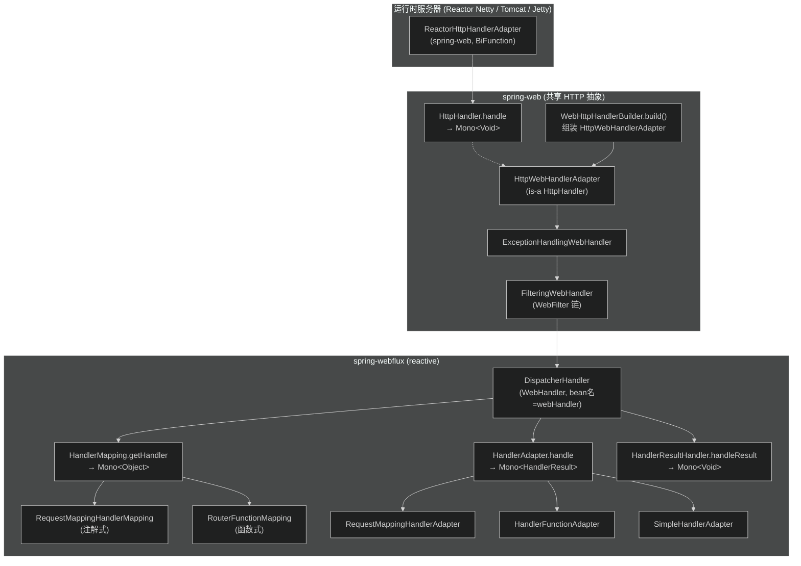
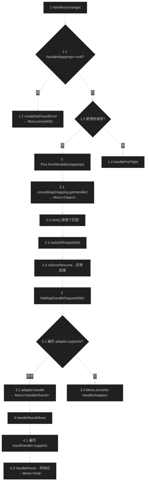
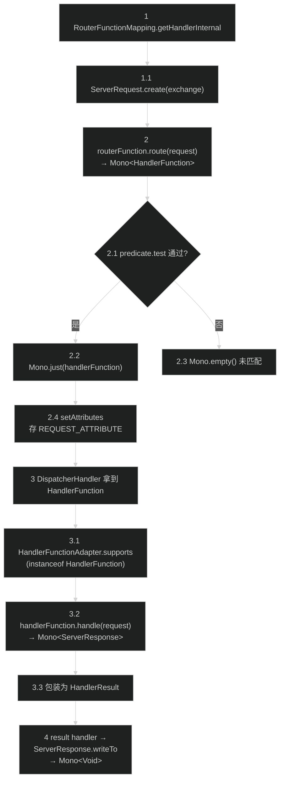
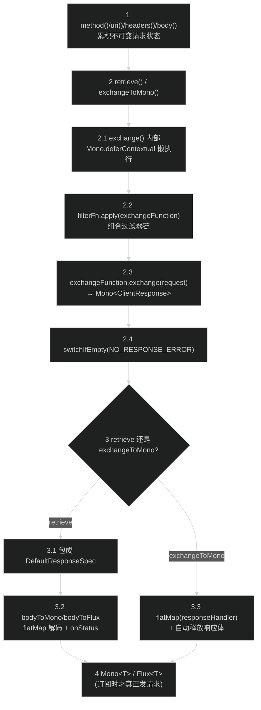

# 响应式 Web 模块（spring-webflux）
> 上次修改：2026-07-26 18:43

## 重点关注

| 关注点 | 位置 | 为什么重要 |
|--------|------|-----------|
| `DispatcherHandler.handle` 响应式分发主链路 | `spring-webflux/src/main/java/org/springframework/web/reactive/DispatcherHandler.java:138` | 整个模块的中心枢纽，用 `Flux.concatMap → next → switchIfEmpty → onErrorResume → flatMap` 组装 Reactor 管道，返回 `Mono<Void>`，是理解"非阻塞分发"的入口 |
| reactive HandlerMapping/HandlerAdapter/HandlerResultHandler 三接口体系 | `DispatcherHandler.java:49-52`、`HandlerMapping.java:107`、`HandlerAdapter.java`、`HandlerResultHandler.java` | 与 webmvc 平行但全部 `Mono/Flux` 化，是编程模型差异的核心证据 |
| 注解式适配器 `RequestMappingHandlerAdapter` + `InvocableHandlerMethod` | `.../result/method/annotation/RequestMappingHandlerAdapter.java`、`.../result/method/InvocableHandlerMethod.java` | 参数逐个解析为 `Mono<Object>`，`Mono.zip` 汇聚后 `flatMap` 反射调用，展示"参数就绪才调用"的响应式装配 |
| 函数式端点 `RouterFunction / HandlerFunction` | `.../function/server/RouterFunction.java:44`、`RouterFunctions.java` | 第二套编程模型，`route → HandlerFunction.handle → ServerResponse.writeTo` 全程 `Mono` |
| 响应式客户端 `WebClient` | `.../function/client/WebClient.java`、`DefaultWebClient.java` | 位于 spring-webflux（非 spring-web）的非阻塞客户端，`retrieve/exchangeToMono → bodyToMono/bodyToFlux` |
| 服务端适配链 `HttpHandler → WebHttpHandlerBuilder → ReactorHttpHandlerAdapter` | spring-web 的 `HttpHandler.java`、`WebHttpHandlerBuilder.java`、`ReactorHttpHandlerAdapter.java` | 说明 DispatcherHandler 如何被包裹成 `HttpHandler` 并桥接到 Reactor Netty 事件循环 |
| 编程模型对比（Servlet 阻塞 vs Reactor 非阻塞背压） | 第 6、9 章 | 全模块设计动机所在 |

---

## 1. 模块定位与职责边界

**结论**：spring-webflux 是 Spring 的**响应式（非阻塞、背压感知）Web 栈**，基于 Reactor（`Mono`/`Flux`）实现，与 Servlet 阻塞的 spring-webmvc **平行且互斥**，二者共享 spring-web 的 HTTP 抽象（`HttpHeaders`、`MediaType`、`HttpMessageReader/Writer`、CORS 等）。

**上游/下游**：
- **依赖（下游）**：`spring-beans`、`spring-core`、`spring-web`（api 依赖）、`io.projectreactor:reactor-core`（api），可选 `spring-context`（`@EnableWebFlux` 配置）、reactor-netty、jackson、Kotlin 协程等。见 `spring-webflux/spring-webflux.gradle:7-11`。
- **被依赖（上游）**：`spring-test`（`WebTestClient`）、`spring-websocket`、应用层控制器/路由。

**负责什么**：
- 响应式前端控制器 `DispatcherHandler`（实现 spring-web 的 `WebHandler`，`handle` 返回 `Mono<Void>`）。
- 响应式请求映射 / 适配 / 结果处理三接口体系（`reactive` 包）。
- 两套编程模型：注解式 `@Controller` 与函数式端点（`reactive.function.server`）。
- 响应式 HTTP 客户端 `WebClient`（`reactive.function.client`，**实际在 spring-webflux 而非 spring-web**）。
- 响应式视图渲染、WebSocket（`reactive.socket`）、静态资源处理。

**不负责什么**：
- HTTP 报文的底层读写、CORS 算法、编解码接口本身（`HttpMessageReader/Writer`、`ServerHttpRequest/Response`、`HttpHandler` 接口）——这些在 **spring-web**。
- 运行时服务器桥接的最外层（`WebHttpHandlerBuilder`、`ReactorHttpHandlerAdapter`）在 **spring-web**（webflux 只提供 `DispatcherHandler` 作为 `webHandler` bean 注入其中）。
- Servlet 阻塞 MVC（spring-webmvc）。

**主要输入/输出/副作用**：输入 `ServerWebExchange`（封装 `ServerHttpRequest/Response`）；输出 `Mono<Void>`（表示"响应写完"的完成信号）；副作用是把响应体写入 `ServerHttpResponse`。**关键特征：`handle` 返回时并未真正执行，只是组装了 Reactor 管道，真正执行发生在最外层被订阅之时。**

---

## 2. 架构关系与依赖

**结论**：`DispatcherHandler` 通过三类策略 bean（`HandlerMapping`/`HandlerAdapter`/`HandlerResultHandler`）完成"映射→适配→结果处理"，全部从 `ApplicationContext` 按类型探测并排序（`DispatcherHandler.initStrategies:115`）。它作为名为 `webHandler` 的 bean，被 spring-web 的 `WebHttpHandlerBuilder` 包裹进 `WebFilter`/`WebExceptionHandler` 链，再由各运行时适配器（如 `ReactorHttpHandlerAdapter`）桥接到底层服务器。

**说明表**：

| 节点 | 所属模块 | 角色 | 依赖方向/耦合 |
|------|----------|------|---------------|
| `ReactorHttpHandlerAdapter` | spring-web | 把 Reactor Netty 的 `(req,resp)` 转成 Spring 的 `ServerHttpRequest/Response`，调用 `HttpHandler.handle` | 强依赖 `HttpHandler`；可替换（Tomcat/Jetty 各有适配器） |
| `HttpHandler` | spring-web | 最底层运行时无关契约，`handle(req,resp)→Mono<Void>` | 由 `WebHttpHandlerBuilder` 产出的 `HttpWebHandlerAdapter` 实现 |
| `WebHttpHandlerBuilder` | spring-web | 装配 `webHandler` + `WebFilter` + `WebExceptionHandler` → `HttpWebHandlerAdapter` | 探测名为 `webHandler` 的 bean（即 `DispatcherHandler`） |
| `DispatcherHandler` | spring-webflux | 响应式前端控制器，`handle→Mono<Void>` | 强依赖三类策略 bean；跨模块实现 spring-web 的 `WebHandler` |
| `HandlerMapping` | spring-webflux | 请求→handler 映射，`getHandler→Mono<Object>` | 与 webmvc 同名接口但返回 `Mono` |
| `HandlerAdapter` | spring-webflux | 调用 handler，`handle→Mono<HandlerResult>` | 可插拔（注解式/函数式/WebHandler/WebSocket） |
| `HandlerResultHandler` | spring-webflux | 处理返回值并写响应，`handleResult→Mono<Void>` | 按 `supports` 选择，按 `@Order` 排序 |

**与 spring-web / spring-webmvc 的关系**：spring-webflux 与 spring-webmvc **平行**（同为 Web 表现层），二者都建立在 spring-web 的 HTTP 抽象之上。差异在于：webmvc 用 Servlet API（`DispatcherServlet`、`HttpServletRequest`），同步阻塞；webflux 用 `ServerWebExchange` + Reactor，非阻塞背压。二者接口名高度对称（`DispatcherServlet`↔`DispatcherHandler`、`HandlerMapping`↔`HandlerMapping`、`HandlerAdapter`↔`HandlerAdapter`），但返回类型从同步值变为 `Mono/Flux`。

**强依赖 / 可替换依赖**：强依赖 `reactor-core`（不可替换，是编程模型基础）与 spring-web。运行时服务器（reactor-netty/Tomcat/Jetty）为可替换的 optional 依赖（`spring-webflux.gradle:17,22,26`）。

---

## 3. 入口与调用方式

**结论**：模块有三类入口——框架回调入口（`DispatcherHandler.handle`）、注解式声明入口（`@Controller`/`@RequestMapping`）、函数式声明入口（`RouterFunction`），外加配置入口 `@EnableWebFlux` 和客户端入口 `WebClient`。

| 入口 | 位置 | 触发条件 | 关键参数/返回 | 之后进入 |
|------|------|----------|---------------|----------|
| `DispatcherHandler.handle(exchange)` | `DispatcherHandler.java:138` | 每个 HTTP 请求（被最外层订阅时执行） | 入参 `ServerWebExchange`；返回 `Mono<Void>` | `getHandler → HandlerAdapter.handle → HandlerResultHandler`（第 5 章路径 A） |
| `@EnableWebFlux` | `config/EnableWebFlux.java:91` | 标注在 `@Configuration` 上 | `@Import(DelegatingWebFluxConfiguration)` | 注册 `webHandler`(DispatcherHandler)、各 HandlerMapping/Adapter/ResultHandler（`WebFluxConfigurationSupport`） |
| 注解式 `@Controller`/`@RequestMapping` | 应用类 | 组件扫描注册为 handler method | 方法返回值可为 `T`/`Mono<T>`/`Flux<T>` | `RequestMappingHandlerMapping` → `RequestMappingHandlerAdapter` |
| 函数式 `RouterFunction<ServerResponse>` bean | 应用类 | 声明为 bean 被 `RouterFunctionMapping` 探测 | `route(ServerRequest)→Mono<HandlerFunction>` | `RouterFunctionMapping` → `HandlerFunctionAdapter`（第 5 章路径 B） |
| `RouterFunctions.toHttpHandler(routerFn)` | `function/server/RouterFunctions.java` | 独立部署（不经 DispatcherHandler） | 返回 `HttpHandler` | 直接桥接运行时服务器 |
| `WebClient.create()/builder()` | `function/client/WebClient.java:147,164` | 应用主动发起出站 HTTP | 链式 `method→uri→retrieve/exchangeToMono` | 第 5 章路径 C |

`DispatcherHandler` 本身通过 `initStrategies`（`DispatcherHandler.java:115`）从上下文按类型收集三类策略 bean 并用 `AnnotationAwareOrderComparator` 排序，是"约定优于配置"的探测式装配。

---

## 4. 核心概念与领域模型

### 4.1 `ServerWebExchange`（贯穿始终的请求-响应上下文）
- **定义**：spring-web 提供的请求-响应容器，封装 `ServerHttpRequest`/`ServerHttpResponse`、attributes、session、principal。
- **作用**：webflux 全链路唯一贯穿的可变上下文（对应 webmvc 的 `HttpServletRequest`+`HttpServletResponse`），attributes 用于跨阶段传递（如 `HandlerMapping.BEST_MATCHING_HANDLER_ATTRIBUTE`、`RouterFunctions.REQUEST_ATTRIBUTE`）。
- **生命周期**：由 `HttpWebHandlerAdapter` 在每次 `handle` 时创建，随请求结束消亡。
- **好处/替代/风险**：好处是解耦 Servlet API，可运行在多种运行时；替代方案是直接暴露 Servlet 的 request/response（webmvc 做法）；风险是抽象层增加认知成本，attributes 弱类型传递易出错。

### 4.2 `HandlerMapping` / `HandlerAdapter` / `HandlerResultHandler`（响应式三接口）
- **定义**：`getHandler→Mono<Object>`（`HandlerMapping.java:107`）、`handle→Mono<HandlerResult>`（`HandlerAdapter`）、`handleResult→Mono<Void>`（`HandlerResultHandler`）。
- **作用**：分别负责"找 handler / 调 handler / 处理返回值"，全部返回 Reactor 类型，可组装进管道而不立即执行。
- **关系**：`DispatcherHandler` 持有三者的有序 List，映射结果 handler 经 adapter 产出 `HandlerResult`，再由匹配的 result handler 写响应。
- **好处/替代/风险**：好处是每一环都可背压、可异步；替代（webmvc）是同步返回 `HandlerExecutionChain`/`ModelAndView`；风险是任何一环阻塞会拖垮事件循环线程。

### 4.3 `HandlerResult`（handler 调用结果载体）
- **定义**：`HandlerResult.java:32`，持有 `handler`、`returnValue`、`returnType`（`ResolvableType`）、`bindingContext`、可选 `exceptionHandler`。
- **作用**：承接 adapter 调用 handler 的返回值，交给 result handler 决定如何序列化/渲染。
- **关键点**：`setExceptionHandler`（`HandlerResult.java:128`）允许 adapter 把自己的 `@ExceptionHandler` 机制附着到结果上，用于处理**延迟异步返回值**（`Mono`/`Flux` 内部的错误）和**渲染阶段**的异常——`DispatcherHandler.handleResultMono:170-176` 会消费它。
- **好处/替代/风险**：好处是把"返回值+类型+异常处理"打包传递，解耦调用与渲染；替代是直接把 `Object` 传给 result handler；风险是 `exceptionHandler` 为可选字段，遗漏设置会导致异步错误漏处理。

### 4.4 `RouterFunction<T>` / `HandlerFunction<T>`（函数式模型）
- **定义**：`RouterFunction.route(ServerRequest)→Mono<HandlerFunction<T>>`（`RouterFunction.java:44`），空 `Mono` 表示未匹配；`HandlerFunction.handle(ServerRequest)→Mono<T extends ServerResponse>`（`HandlerFunction.java:37`）。
- **作用**：以函数组合（`and`/`nest`/`filter`）声明路由，是注解式 `@RequestMapping` 的替代范式。
- **生命周期**：`RouterFunctions.route(predicate, handler)` 构建原子路由；多个路由经 `and`/`andOther` 用 `Flux.concat(...).next()` 组合，首个非空匹配胜出。
- **好处/替代/风险**：好处是显式、可测试、无反射；替代是注解式（隐式、依赖组件扫描）；风险是大量路由的可读性与集中管理成本。

### 4.5 `WebClient`（响应式出站客户端）
- **定义**：`function/client/WebClient.java:82`，链式 spec：`method→uri→headers/body→retrieve()/exchangeToMono()`，最终 `bodyToMono/bodyToFlux` 产出 `Mono<T>`/`Flux<T>`。
- **作用**：非阻塞的 HTTP 客户端，**位于 spring-webflux**（spring-web 的对应物是阻塞的 `RestClient`/`RestTemplate`）。
- **核心 SPI**：`ExchangeFunction.exchange(ClientRequest)→Mono<ClientResponse>`（`ExchangeFunction.java:55`），过滤器通过 `filter.apply(this)` 装饰它。
- **好处/替代/风险**：好处是全程非阻塞可背压；替代是 `RestClient`（同步）；风险是响应体必须消费或释放，否则连接泄漏（`DefaultWebClient` 用 `releaseIfNotConsumed` 兜底）。

### 4.6 `WebSocketHandler`（reactive.socket）
- **定义**：`socket/WebSocketHandler.java:handle(WebSocketSession)→Mono<Void>`；`session.receive()→Flux<WebSocketMessage>`、`session.send(Publisher)→Mono<Void>`。
- **作用**：以响应式流建模双向消息；入站/出站可组合（`input.and(output)`）。
- **好处/替代/风险**：好处是背压天然适配流式消息；替代是命令式 `@OnMessage`（webmvc/javax）；风险是流生命周期与会话关闭协调复杂。

---

## 5. 关键流程

### 路径 A：DispatcherHandler 响应式请求分发主路径

**1-1.4 请求接入与前置判断**：`handle`（`DispatcherHandler.java:138`）先判断策略是否初始化（未初始化直接 404），再判断是否 CORS 预检请求，是则走 `handlePreFlight`（`:212`，同样用 `Flux.concatMap(getHandler)` 找 handler，找不到设 403）。注意此处只是"组装"判断，尚未订阅。

**2-2.4 映射选择（Flux.concatMap 的核心）**：`Flux.fromIterable(handlerMappings).concatMap(mapping -> mapping.getHandler(exchange))`（`:145-146`）把每个 `HandlerMapping.getHandler`（返回 `Mono<Object>`）按顺序串联，`concatMap` 保证**顺序（第一个 mapping 的 Mono 先订阅完才试下一个）**，`next()`（`:147`）取首个发出值的匹配结果；`switchIfEmpty(createNotFoundError())`（`:148`）在全部为空时抛 404；`onErrorResume`（`:149`）把映射阶段的错误转交异常处理链。`RouterFunctionMapping`（order=-1）先于 `RequestMappingHandlerMapping` 参与竞争。

**3-3.3 适配调用**：`flatMap(handler -> handleRequestWith(exchange, handler))`（`:150,196`）先检查 CORS 是否已拒绝（响应码 403 则 `Mono.empty()` 静默结束，`:197-199`），再遍历 `handlerAdapters` 找 `supports(handler)` 的适配器（`:200-206`），命中则 `adapter.handle`→`Mono<HandlerResult>`；无适配器则 `Mono.error`（`:208`）。

**4-4.2 结果处理与写响应**：`handleResultMono`（`:160`）先给结果 Mono 挂上所有实现 `DispatchExceptionHandler` 的 adapter 的 `onErrorResume`（`:162-166`），再 `flatMap` 调 `handleResult`（`:168-178`）：遍历 `resultHandlers` 找 `supports` 的处理器（如 `ResponseBodyResultHandler`），调 `handleResult(exchange,result)` 写响应并 `.checkpoint(description)` 便于诊断（`:188`）；若结果自带 `exceptionHandler`，再对渲染阶段挂一层 `onErrorResume`（`:171-176`）处理延迟异步/渲染错误。整条链返回 `Mono<Void>`——**只有被最外层订阅时才真正执行**。

### 路径 B：函数式端点路由匹配路径

**1-1.1 请求适配**：`RouterFunctionMapping.getHandlerInternal`（`function/server/RouterFunctionMapping.java`）用 `ServerRequest.create(exchange, messageReaders, apiVersionStrategy)` 把 `ServerWebExchange` 适配成函数式模型的 `ServerRequest`。多个 `RouterFunction` bean 在 `initRouterFunctions` 中用 `RouterFunction::andOther` 归并成一个。

**2-2.4 路由匹配**：`routerFunction.route(request)`（`RouterFunction.java:44`）返回 `Mono<HandlerFunction>`；原子路由 `DefaultRouterFunction.route` 测试 `RequestPredicate`，通过则 `Mono.just(handlerFunction)`，否则 `Mono.empty()`；组合路由用 `Flux.concat(...).next()` 让首个非空匹配胜出。匹配后 `doOnNext(setAttributes)` 把 `ServerRequest` 存入 `RouterFunctions.REQUEST_ATTRIBUTE`、`BEST_MATCHING_HANDLER_ATTRIBUTE`、匹配模式与 URI 模板变量，供后续阶段读取。

**3-3.3 适配调用**：`RouterFunctionMapping` 返回的"handler"**就是 `HandlerFunction` 对象**，因此 `DispatcherHandler` 选中 `HandlerFunctionAdapter`（`supports` 判 `instanceof HandlerFunction`）；`handle` 从 `exchange` 取回 `ServerRequest`，调 `handlerFunction.handle(request)`→`Mono<ServerResponse>`，再 `map` 成 `HandlerResult`（返回类型元数据为 `HandlerFunction.handle` 的返回类型）。

**4 结果处理**：result handler 最终调 `ServerResponse.writeTo(exchange, context)`（`ServerResponse.java:86`）把响应写入 exchange，返回 `Mono<Void>`。注意：若用 `RouterFunctions.toHttpHandler` 独立部署，则由 `RouterFunctionWebHandler.handle` 直接串联 `route → handle → writeTo`，不经 `DispatcherHandler`。

### 路径 C：WebClient 响应式请求路径

**1-2 请求装配**：`method()/uri()/header()/body()` 等在 `DefaultRequestBodyUriSpec` 中累积**不可变**的请求状态（`WebClient.java` 各 spec 接口），`retrieve()`（`WebClient.java:567`）或 `exchangeToMono()`（`:596`）为终止操作。

**2.1-2.4 交换执行（懒装配）**：核心私有 `exchange()`（`DefaultWebClient.java:442`）用 `Mono.deferContextual` 包裹以实现**每次订阅时才构造请求**并接入 Micrometer 观测；组合用户过滤器 + 观测过滤器后，`Mono.defer(() -> finalFilterFunction.apply(exchangeFunction).exchange(request))`（`:462`）执行真正的 HTTP 往返，`ExchangeFunction.exchange`（`ExchangeFunction.java:55`）返回 `Mono<ClientResponse>`；`switchIfEmpty(NO_HTTP_CLIENT_RESPONSE_ERROR)`（`:467`）兜底空响应。

**3-4 响应解码**：`retrieve()` 把 `Mono<ClientResponse>` 包成 `DefaultResponseSpec`（`:408`），其 `bodyToMono/bodyToFlux`（`:594/608`）`flatMap` 响应并解码，默认对 4xx/5xx 通过 `onStatus`/`WRAP_EXCEPTION_PREDICATE` 转成 `WebClientResponseException` 错误信号；`exchangeToMono`（`:414`）则 `flatMap` 交用户回调并自动 `releaseIfNotConsumed` 释放响应体。最终产出 `Mono<T>`/`Flux<T>`，**在被订阅前不发出任何网络请求**。

---

## 6. 核心实现细节

### 6.1 `DispatcherHandler.handle` 的 `Flux.concatMap` 映射选择（`DispatcherHandler.java:145-150`）
**逐段解读**：
- 输入：`ServerWebExchange`；输出：`Mono<Void>`。
- `Flux.fromIterable(this.handlerMappings)` 把有序 mapping 列表转为流，`.concatMap(mapping -> mapping.getHandler(exchange))` 逐个订阅——**`concatMap` 而非 `flatMap` 是刻意选择**：它保证严格顺序（前一个 mapping 的 `Mono<Object>` 完成后才订阅下一个），从而 `RouterFunctionMapping`(order=-1) 一定先于 `RequestMappingHandlerMapping` 参与匹配，避免并发导致优先级错乱。
- `.next()` 把 `Flux` 收敛为首个匹配的 `Mono`，天然实现"短路"：一旦某 mapping 发出 handler，后续 mapping 不再订阅（背压 + 取消）。
- `.switchIfEmpty(createNotFoundError())` 处理"全无匹配"→ 404；`.onErrorResume` 把映射错误引入异常处理；`.flatMap(handleRequestWith)` 进入适配阶段。

**三维评估**：好处——顺序+短路+背压天然表达，无需手写循环与 break，且错误以信号传播；替代方案——webmvc 用 `for` 循环遍历 mapping 同步返回第一个非空（阻塞、易读但不可背压）；风险——`concatMap` 串行订阅在 mapping 数量大且每个 `getHandler` 有异步 I/O 时可能增加延迟（实际 mapping 通常是内存匹配，影响小）。

### 6.2 `handleResultMono` / `HandlerResultHandler` 结果处理（`DispatcherHandler.java:160-194`）
**逐段解读**：
- `handleResultMono` 先给结果 Mono 挂上所有 `DispatchExceptionHandler` 型 adapter 的 `onErrorResume`（`:162-166`）——覆盖 handler 调用阶段的错误；再 `flatMap` 到 `handleResult`，若 `HandlerResult` 自带 `exceptionHandler`（由 adapter 通过 `setExceptionHandler` 设置），对**写响应/渲染阶段**再挂一层 `onErrorResume`（`:171-176`），处理异步返回值内部延迟错误与渲染错误。
- `handleResult`（`:181`）遍历 `resultHandlers`，`supports` 命中即 `handleResult(...).checkpoint(description)` 写响应并加诊断检查点；无匹配 → `Mono.error(IllegalStateException)`。
- result handler 典型实现 `ResponseBodyResultHandler`（`ResponseBodyResultHandler.java:98-119`）：`supports` 判类/方法是否 `@ResponseBody`，`handleResult` 对 `ProblemDetail` 设置状态码后 `writeBody` 用 `HttpMessageWriter` 序列化。

**三维评估**：好处——异常处理分"调用错误"与"渲染/延迟错误"两层，精确覆盖响应式异步返回值特有的错误时机；替代方案——webmvc 用 `HandlerExceptionResolver` 在同步 try/catch 中处理，无法覆盖已返回后的异步错误；风险——`exceptionHandler` 为可选，若某 adapter 未设置，渲染阶段异步错误只能上抛到 `WebExceptionHandler` 链兜底。

### 6.3 注解式模型：`RequestMappingHandlerAdapter` + `InvocableHandlerMethod`
**逐段解读**：
- `RequestMappingHandlerAdapter.handle`（同时实现 `HandlerAdapter` 与 `DispatchExceptionHandler`）装配管道：`modelInitializer.initModel(...).then(Mono.defer(() -> invocableMethod.invoke(...))).doOnNext(result -> result.setExceptionHandler(this)).onErrorResume(ex -> handleError(exchange, ex))`——`Mono.defer` 延迟到模型初始化完成且有订阅者才调用；`doOnNext` 把自身作为异常处理器附着到 `HandlerResult`；`onErrorResume` 替代 try/catch 处理调用错误。
- `InvocableHandlerMethod.invoke` 返回 `Mono<HandlerResult>`：把每个方法参数解析成 `Mono<Object>`（`resolvers.resolveArgument` 返回 `Mono`，含异步请求体解码），用 **`Mono.zip(argMonos)`** 汇聚为 `Mono<Object[]>`，再 `flatMap` 中反射 `method.invoke`——**即"所有参数就绪后才调用控制器方法"**，Kotlin 挂起函数走 `CoroutinesUtils.invokeSuspendingFunction`。
- 可选阻塞卸载：`getSchedulerFor(handlerMethod)` 命中（默认 `NonReactiveHandlerMethodPredicate` 匹配"非响应式返回类型"的方法）时 `subscribeOn(scheduler)`，把阻塞控制器挪出事件循环线程。

**三维评估**：好处——参数级背压 + `Mono.zip` 并发解析 + 阻塞方法可卸载，兼容响应式与命令式控制器；替代方案——webmvc 同步循环解析参数并直接反射调用（简单但整体阻塞）；风险——反射调用发生在订阅线程或参数发射线程，阻塞控制器若未配置 `blockingExecutor` 会阻塞事件循环。

### 6.4 函数式模型（`RouterFunction`/`HandlerFunction` 与适配集成）
**逐段解读**：函数式模型不依赖反射与注解。`RouterFunctions.route(predicate, handler)` 构建原子 `DefaultRouterFunction`，`route()` 内 `predicate.test(request)` 通过则 `Mono.just(handlerFunction)`；`and`/`andOther`/`nest`/`filter` 以函数组合扩展，`Flux.concat(...).next()` 保证首个匹配胜出。集成 `DispatcherHandler` 靠 `RouterFunctionMapping`(HandlerMapping) 返回匹配的 `HandlerFunction`，`HandlerFunctionAdapter`(HandlerAdapter) 通过 `instanceof HandlerFunction` 选中并调用。

**注解式 vs 函数式三维评估**：
- **好处**：注解式声明简洁、生态成熟（参数解析器、`@ExceptionHandler` 等丰富）；函数式显式、可单元测试、无反射/无组件扫描魔法、路由集中。
- **替代关系**：二者可共存于同一应用（`RouterFunctionMapping` order=-1 先匹配，未命中再交 `RequestMappingHandlerMapping`）。
- **风险**：注解式依赖反射与运行期扫描，AOT/native 需额外元数据；函数式在大量路由时集中文件膨胀、可读性下降。

### 6.5 `SimpleHandlerAdapter`（`WebHandler` 直连）
`SimpleHandlerAdapter.handle`（`SimpleHandlerAdapter.java:43-47`）把裸 `WebHandler.handle(exchange)`（`Mono<Void>`）经 `mono.then(Mono.empty())` 转成 `Mono<HandlerResult>`（无返回值）。好处是让 `WebHandler` 契约可挂在通用 `DispatcherHandler` 上；风险是这类 handler 自己负责写响应，`HandlerResult` 为空。

---

## 7. 数据结构、配置与外部协议

**核心数据结构**：
| 结构 | 位置 | 说明 |
|------|------|------|
| `HandlerResult` | `HandlerResult.java:32` | 字段 `handler/returnValue/returnType/bindingContext/exceptionHandler`，adapter→result handler 的传递载体 |
| `ServerWebExchange` attributes | `HandlerMapping.java:38-93` | 常量键：`BEST_MATCHING_HANDLER_ATTRIBUTE`、`BEST_MATCHING_PATTERN_ATTRIBUTE`、`URI_TEMPLATE_VARIABLES_ATTRIBUTE`、`API_VERSION_ATTRIBUTE`(7.0新增) 等，跨阶段弱类型传值 |
| `RouterFunctions.REQUEST_ATTRIBUTE` | `function/server/RouterFunctions.java` | 存放函数式 `ServerRequest`，供 `HandlerFunctionAdapter` 取回 |
| `ClientRequest`/`ClientResponse` | `function/client` | WebClient 的请求/响应模型（不可变） |

**配置入口**：
- `@EnableWebFlux`（`config/EnableWebFlux.java:91`）`@Import(DelegatingWebFluxConfiguration)`，由 `WebFluxConfigurationSupport` 注册全部 bean：`webHandler`(DispatcherHandler，`:126`)、`responseStatusExceptionHandler`(order 0，`:132`)、`requestMappingHandlerMapping`(`:137`)、`routerFunctionMapping`(order -1，`:249-253`)、`resourceHandlerMapping`、`requestMappingHandlerAdapter`、`serverCodecConfigurer`(`:352`)、`simpleHandlerAdapter`(`:488`)、`webFluxWebSocketHandlerAdapter`、`responseEntityResultHandler`、`responseBodyResultHandler` 等。
- 自定义扩展经 `WebFluxConfigurer`（`configureHttpMessageCodecs`、`addCorsMappings`、`configureArgumentResolvers` 等）。

**外部协议**：HTTP/1.1、HTTP/2、WebSocket、SSE（`text/event-stream`）；编解码依赖 spring-web 的 `HttpMessageReader/Writer`（JSON via Jackson、Protobuf、表单、多部分等，见 `spring-webflux.gradle:14-16`）。

**依赖的内部结构（替代外部配置）**：`ServerCodecConfigurer` 统一装配读写器；`RequestedContentTypeResolver` 决定响应内容协商；`ReactiveAdapterRegistry` 适配 RxJava/Kotlin 协程等第三方响应式类型。

---

## 8. 异常、边界与降级处理

**结论**：webflux 的异常以 **`onError` 信号**在 Reactor 管道中传播，与 webmvc 的 try/catch 语义不同。

| 边界/异常 | 处理位置 | 行为 |
|-----------|----------|------|
| 策略未初始化 | `DispatcherHandler.java:139-141` | `createNotFoundError()`→`Mono.error(ResponseStatusException(404))` |
| 无匹配 handler | `:148` `switchIfEmpty(createNotFoundError())` | 全部 mapping 空 → 404（`Mono.error`） |
| 无匹配 adapter | `:208` | `Mono.error(IllegalStateException("No HandlerAdapter"))` |
| 无匹配 result handler | `:192-193` | `Mono.error(IllegalStateException)` |
| CORS 预检 | `:142-143,212` | `handlePreFlight`：找到 handler 则由 CORS 处理器写响应，未找到 `setStatusCode(403)` |
| CORS 拒绝 | `:197-199` | 响应已置 403 → `Mono.empty()` 静默结束 |
| 映射阶段错误 | `:149` `onErrorResume` | 交 `handleResultMono` → `DispatchExceptionHandler` 链 |
| handler 调用错误 | `handleResultMono:162-166` | adapter 的 `DispatchExceptionHandler.onErrorResume` |
| 异步返回值/渲染错误 | `:170-176` | `HandlerResult.exceptionHandler` 挂 `onErrorResume` 二次处理 |
| 客户端断连 | `RequestMappingHandlerAdapter.handleExceptionHandlerFailure` | 吞掉断连异常返回 `Mono.empty()`，避免噪声 |
| WebClient 4xx/5xx | `DefaultWebClient` `bodyToMono` 默认 | 转 `WebClientResponseException` 错误信号，`onStatus` 可覆盖 |

**背压**：整条链返回 `Mono`/`Flux`，下游（运行时服务器）按需订阅、按处理速率拉取，`concatMap`/`next` 天然支持取消订阅（首个匹配后取消后续 mapping）。

**超时/取消**：Reactor 的 `timeout`/取消订阅（下游断开）会向上游发取消信号，上游资源（连接、响应体）应释放；WebClient 用 `releaseIfNotConsumed`/`concatWith(...release...)` 兜底防连接泄漏。

**未覆盖风险（基于源码）**：`HandlerResult.exceptionHandler` 为可选字段（`HandlerResult.java:42`），若某自定义 adapter 未 `setExceptionHandler`，其异步返回值内部错误只能上抛至最外层 `WebExceptionHandler`；阻塞控制器若未配置 `blockingExecutor`（`RequestMappingHandlerAdapter`）会阻塞事件循环线程。

---

## 9. 并发、生命周期与性能

**结论**：webflux 的性能模型是**少量事件循环线程 + 非阻塞 I/O + 背压**，与 webmvc 的"每请求一线程 + 阻塞 I/O"根本不同。

- **线程模型**：Reactor Netty 默认按 CPU 核数创建少量事件循环线程处理所有请求；`DispatcherHandler.handle` 返回的 `Mono` 在事件循环线程上被订阅执行。**任何阻塞调用都会占用事件循环线程、拖垮吞吐**——这是 webflux 最核心的约束。
- **阻塞卸载**：`RequestMappingHandlerAdapter` 支持 `blockingExecutor` + `NonReactiveHandlerMethodPredicate`，对非响应式返回类型的控制器方法 `subscribeOn(scheduler)` 卸载到独立线程池；`InvocableHandlerMethod` 支持 `invocationScheduler`(`publishOn`) 固定反射调用线程。
- **背压**：全链 `Mono/Flux`，下游按能力拉取；`concatMap`+`next` 让映射阶段"够用即停"（取消后续）。参数解析用 `Mono.zip` 并发发起、全部就绪才调用，减少无谓等待。
- **资源生命周期**：`ServerWebExchange` 每请求创建；`ClientResponse`/连接必须被消费或显式释放（WebClient `releaseIfNotConsumed`），否则连接泄漏；WebSocket 会话生命周期绑定 `session.receive()/send()` 流的完成。
- **顺序/幂等**：`concatMap` 保证 mapping 顺序；handler 是否幂等由业务决定，框架不重试；`DefaultRouterFunction` 组合用 `Flux.concat().next()` 保证匹配确定性。

**性能关键路径 / 热点**：映射阶段 `concatMap` 串行订阅（mapping 数量大且含 I/O 时是延迟点，但通常为内存匹配）；参数解析中的请求体解码（`RequestBodyMethodArgumentResolver` 异步反序列化）是主要 I/O；响应写出 `HttpMessageWriter` 序列化是 CPU 热点。

**三维评估（阻塞 Servlet MVC vs 非阻塞 WebFlux）**：
- **好处（WebFlux）**：少量线程支撑高并发连接（尤其 I/O 密集、慢客户端、SSE/流式），内存占用低，背压防过载。
- **替代（Servlet MVC）**：编程模型简单直观（同步、可调试、ThreadLocal 可用），生态与工具链成熟，适合 CPU 密集或短事务。
- **风险（WebFlux）**：调试困难（栈信息割裂）、`ThreadLocal` 需用 Reactor Context 替代、误用阻塞调用即灾难、学习曲线陡；不当使用反而比 MVC 更慢。

---

## 10. 扩展点、测试点与维护建议

**扩展点**：
- 三类策略接口均可自定义并注册为 bean：`HandlerMapping`（自定义映射）、`HandlerAdapter`（新 handler 类型，如 `SimpleHandlerAdapter` 模式）、`HandlerResultHandler`（新返回值类型，按 `@Order` 插入）。
- `WebFluxConfigurer`：`configureHttpMessageCodecs`、`addCorsMappings`、`configureArgumentResolvers`、`addResourceHandlers` 等。
- 函数式：`RouterFunction` 的 `filter`/`nest`/`and` 组合；`HandlerFilterFunction`。
- 参数解析：实现 `HandlerMethodArgumentResolver`（返回 `Mono<Object>`）经 `ArgumentResolverConfigurer` 注册。
- WebClient：`ExchangeFilterFunction`（`filter.apply` 装饰 `ExchangeFunction`）、`ClientHttpConnector`（切换底层客户端）。

**测试点**：
- 主路径：`DispatcherHandler.handle` 找到 handler→写响应（用 `WebTestClient` + `StepVerifier`）。
- 失败路径：无匹配 handler → 404；无 adapter/result handler → `IllegalStateException`。
- 边界：CORS 预检/拒绝、异步返回值内部 `onError`、请求体解码失败、下游取消订阅（连接断开）。
- 函数式：`RouterFunction.route` 匹配/不匹配、`and`/`nest` 优先级。
- WebClient：4xx/5xx→`WebClientResponseException`、`onStatus` 覆盖、响应体释放。

**维护建议**：
| 目标位置 | 问题 | 建议动作 | 收益/风险 |
|----------|------|----------|-----------|
| `DispatcherHandler.handleResultMono` | 异步/渲染异常处理依赖 `HandlerResult.exceptionHandler` 可选字段，自定义 adapter 易漏设 | 在文档/契约中强调 adapter 应调用 `setExceptionHandler`，或在 `handleResult` 对缺失情形补默认兜底 | 收益：降低漏处理风险；风险：改动核心分发链需充分回归 |
| 阻塞控制器 | 未配置 `blockingExecutor` 时阻塞事件循环，症状隐蔽 | 增加运行期检测/文档警示，或对 `NonReactiveHandlerMethodPredicate` 命中且无 executor 时日志告警 | 收益：更早暴露误用；风险：误报 |
| 函数式与注解式共存 | 优先级由 order(-1) 隐式决定，不熟悉者易困惑 | 在模块文档明确二者匹配顺序与共存语义 | 收益：降低理解成本；风险：无 |

---

## 11. 文件职责表

| 文件（相对 `spring-webflux/src/main/java/org/springframework/web/reactive/`） | 职责 | 关键类/函数 | 被谁调用 | 备注 |
|------|------|-------------|----------|------|
| `DispatcherHandler.java` | 响应式前端控制器，分发主链路 | `handle`、`initStrategies`、`handleResultMono` | `WebHttpHandlerBuilder`(作为 webHandler bean) | 全模块中心 |
| `HandlerMapping.java` | 请求→handler 映射契约 | `getHandler→Mono<Object>`、attribute 常量 | `DispatcherHandler` | 与 webmvc 同名接口 |
| `HandlerAdapter.java` | 调用 handler 契约 | `supports`、`handle→Mono<HandlerResult>` | `DispatcherHandler.handleRequestWith` | 可插拔 |
| `HandlerResultHandler.java` | 返回值处理契约 | `supports`、`handleResult→Mono<Void>` | `DispatcherHandler.handleResult` | 按 order 排序 |
| `DispatchExceptionHandler.java` | 异常→HandlerResult 映射 | `handleError→Mono<HandlerResult>` | `DispatcherHandler`、`RequestMappingHandlerAdapter` | 信号式异常处理 |
| `HandlerResult.java` | handler 调用结果载体 | `getReturnValue/Type`、`setExceptionHandler` | adapter→result handler | 承载异步异常处理器 |
| `handler/AbstractHandlerMapping.java` | HandlerMapping 基类，CORS/版本/getHandler | `getHandler`、`getHandlerInternal`(抽象) | 各 mapping 子类 | 含 CORS 与 API 版本逻辑 |
| `result/method/annotation/RequestMappingHandlerMapping.java` | 注解式映射注册（启动期） | `isHandler`、`getMappingForMethod` | 容器初始化 | 无 Mono，元数据构建 |
| `result/method/annotation/RequestMappingHandlerAdapter.java` | 注解式适配器 + 异常处理 | `handle`、`handleException` | `DispatcherHandler` | 实现 `DispatchExceptionHandler`，支持阻塞卸载 |
| `result/method/InvocableHandlerMethod.java` | 响应式参数解析 + 反射调用 | `invoke→Mono<HandlerResult>`、`Mono.zip` 汇聚参数 | `RequestMappingHandlerAdapter` | 参数就绪才调用 |
| `result/SimpleHandlerAdapter.java` | 裸 `WebHandler` 适配 | `handle`(`mono.then(empty)`) | `DispatcherHandler` | 无返回值 handler |
| `result/method/annotation/ResponseBodyResultHandler.java` | `@ResponseBody` 返回值写体 | `supports`、`handleResult`、`writeBody` | `DispatcherHandler.handleResult` | 用 `HttpMessageWriter` 序列化 |
| `function/server/RouterFunction.java` | 函数式路由契约 | `route→Mono<HandlerFunction>`、`and/nest/filter` | `RouterFunctionMapping`/组合 | 函数式模型入口 |
| `function/server/RouterFunctions.java` | 路由工厂与独立部署 | `route`、`toHttpHandler`、`toWebHandler` | 应用/独立部署 | `RouterFunctionWebHandler` 独立管道 |
| `function/server/support/HandlerFunctionAdapter.java` | 函数式适配器 | `supports`(instanceof)、`handle` | `DispatcherHandler` | 调 `HandlerFunction.handle` |
| `function/client/WebClient.java` | 响应式客户端 fluent API | `create/builder`、`retrieve`、`bodyToMono/Flux` | 应用出站调用 | **在 webflux 而非 web** |
| `socket/WebSocketHandler.java` | 响应式 WebSocket 处理 | `handle→Mono<Void>`、`session.receive/send` | `WebSocketHandlerAdapter` | 双向流式 |
| `config/WebFluxConfigurationSupport.java` | 全部 bean 注册 | `webHandler`、各 mapping/adapter/resultHandler `@Bean` | `@EnableWebFlux` | 装配中心 |
| `config/EnableWebFlux.java` | 启用注解 | `@Import(DelegatingWebFluxConfiguration)` | 应用 `@Configuration` | 配置入口 |

---

## 12. 代码引用索引

| 引用 | 说明 |
|------|------|
| `spring-webflux/src/main/java/org/springframework/web/reactive/DispatcherHandler.java:138` | `handle` 响应式分发入口，返回 `Mono<Void>` |
| `.../DispatcherHandler.java:145-150` | `Flux.concatMap→next→switchIfEmpty→onErrorResume→flatMap` 映射选择主链 |
| `.../DispatcherHandler.java:160-194` | `handleResultMono`/`handleResult` 结果处理与两层异常处理 |
| `.../DispatcherHandler.java:196-209` | `handleRequestWith` 适配器选择 |
| `.../DispatcherHandler.java:211-218` | `handlePreFlight` CORS 预检 |
| `.../DispatcherHandler.java:115-134` | `initStrategies` 三类策略 bean 探测与排序 |
| `.../HandlerMapping.java:107` | `getHandler→Mono<Object>` 契约 |
| `.../HandlerMapping.java:38-93` | 跨阶段传值 attribute 常量键 |
| `.../HandlerResult.java:32,128,138` | 结果载体、`setExceptionHandler`/`getExceptionHandler` |
| `.../handler/AbstractHandlerMapping.java:187-218` | `getHandler` 响应式实现（含 CORS/API 版本） |
| `.../result/SimpleHandlerAdapter.java:43-47` | 裸 `WebHandler` 适配为 `Mono<HandlerResult>` |
| `.../result/method/annotation/ResponseBodyResultHandler.java:98-119` | `@ResponseBody` result handler |
| `.../result/method/annotation/RequestMappingHandlerAdapter.java` | 注解式适配器 `handle` 管道、阻塞卸载、`DispatchExceptionHandler` |
| `.../result/method/InvocableHandlerMethod.java` | `invoke→Mono<HandlerResult>`、`Mono.zip` 参数汇聚 |
| `.../function/server/RouterFunction.java:44` | `route→Mono<HandlerFunction>` |
| `.../function/server/RouterFunctions.java` | `route`/`toHttpHandler`/`toWebHandler`、`REQUEST_ATTRIBUTE` |
| `.../function/server/HandlerFunction.java:37` | `handle→Mono<ServerResponse>` |
| `.../function/server/ServerResponse.java:86` | `writeTo→Mono<Void>` |
| `.../function/server/support/HandlerFunctionAdapter.java` | 函数式 `HandlerAdapter` |
| `.../function/client/WebClient.java:82,147,164,567,596,828,847` | WebClient fluent API、`retrieve`、`bodyToMono/Flux` |
| `.../function/client/DefaultWebClient.java:408,414,442,462,594,608` | 交换执行 `exchange()`、`retrieve`、`bodyToMono/Flux` 实现 |
| `.../function/client/ExchangeFunction.java:55` | `exchange→Mono<ClientResponse>` SPI |
| `.../socket/WebSocketHandler.java:47` | `handle(WebSocketSession)→Mono<Void>` |
| `.../config/EnableWebFlux.java:91` | `@EnableWebFlux` 配置入口 |
| `.../config/WebFluxConfigurationSupport.java:126,132,137,249,352,488` | `webHandler`/各策略 bean 注册 |
| `spring-web/src/main/java/org/springframework/http/server/reactive/HttpHandler.java:51` | `handle(req,resp)→Mono<Void>` 底层契约（spring-web） |
| `spring-web/src/main/java/org/springframework/web/server/adapter/WebHttpHandlerBuilder.java:427-459` | `build()` 装配 `HttpWebHandlerAdapter` |
| `spring-web/src/main/java/org/springframework/http/server/reactive/ReactorHttpHandlerAdapter.java:54-76` | `apply` 桥接 Reactor Netty → `HttpHandler` |
| `spring-webflux/spring-webflux.gradle:7-11` | 模块依赖（beans/core/web/reactor-core） |
