# Spring Framework 工程概览
> 上次修改：2026-07-26 17:49

## 工程目录结构

Spring Framework 7.0.7 是一个采用 **Gradle 多模块**组织的严格分层工程。根目录不直接存放业务源码，而是承载全局构建脚本（`build.gradle`、`settings.gradle`、`gradle.properties`）、构建逻辑插件（`buildSrc/`）、Gradle Wrapper（`gradle/`、`gradlew`）、代码风格与检查配置（`src/checkstyle`、`src/nohttp`、IDE 导入配置）以及说明文档（`README.md`、`CONTRIBUTING.md`、`CLAUDE.md` 等）。约 24 个功能模块以顶层目录形式并列存在，通过 `settings.gradle` 的 `include` 声明纳入构建。这些模块并非扁平堆放，而是遵循一条清晰的依赖分层链：**基础层（spring-core）→ Bean 层（spring-beans）→ AOP & 表达式层（spring-aop / spring-expression）→ 上下文层（spring-context 及其扩展）→ 数据访问 / 消息 / Web 层 → 测试与集成层**，上层模块只允许依赖其下方的模块。此外还有一组 `framework-*` 平台与文档聚合模块（bom / platform / api / docs）和一个 `integration-tests` 跨模块端到端测试工程。每个 `spring-*` 模块内部采用统一的标准结构：`src/main/java`（Java 主源码）、`src/main/kotlin`（Kotlin 源码，可选）、`src/main/resources`（资源）、`src/test/java`（测试）、`src/testFixtures/java`（跨模块共享测试夹具，可选）。

## 目录结构图

```mermaid
%%{init: {"theme": "dark"}}%%
graph TD
  Root["spring-framework 根目录 (Gradle 多模块聚合)"]
  Build["构建配置 (build.gradle / settings.gradle / gradle.properties)"]
  BuildSrc["buildSrc/ (自定义构建插件与约定)"]
  GradleDir["gradle/ (Wrapper 与依赖版本 catalog)"]
  SrcCfg["src/ (checkstyle / nohttp / IDE 导入配置)"]
  Docs["文档 (README / CONTRIBUTING / CLAUDE.md / *.md)"]

  Base["基础层"]
  BeanLayer["Bean 层"]
  AopExpr["AOP & 表达式层"]
  CtxLayer["上下文层"]
  DataLayer["数据访问层"]
  MsgLayer["消息层"]
  WebLayer["Web 层"]
  TestLayer["测试与集成"]
  PlatDocs["平台与文档"]

  Root --> Build
  Root --> BuildSrc
  Root --> GradleDir
  Root --> SrcCfg
  Root --> Docs
  Root --> Base
  Root --> BeanLayer
  Root --> AopExpr
  Root --> CtxLayer
  Root --> DataLayer
  Root --> MsgLayer
  Root --> WebLayer
  Root --> TestLayer
  Root --> PlatDocs

  Base --> Core["spring-core (资源/转换/环境/注解/ASM 基础工具)"]
  Base --> CoreTest["spring-core-test (AOT 测试代理与工具)"]
  Base --> Instrument["spring-instrument (类加载期字节码植入 Java Agent)"]

  BeanLayer --> Beans["spring-beans (BeanFactory/Bean 定义/属性访问)"]

  AopExpr --> Aop["spring-aop (代理/切点/通知/目标源)"]
  AopExpr --> Expr["spring-expression (SpEL 表达式引擎)"]

  CtxLayer --> Context["spring-context (ApplicationContext/注解配置/事件/调度)"]
  CtxLayer --> CtxSupport["spring-context-support (Quartz/FreeMarker/缓存集成)"]
  CtxLayer --> CtxIndexer["spring-context-indexer (组件索引注解处理器)"]
  CtxLayer --> Aspects["spring-aspects (AspectJ 织入切面)"]

  DataLayer --> Tx["spring-tx (事务管理/@Transactional)"]
  DataLayer --> Jdbc["spring-jdbc (JdbcTemplate/DataSource)"]
  DataLayer --> Orm["spring-orm (JPA/Hibernate 集成)"]
  DataLayer --> Oxm["spring-oxm (对象-XML 映射)"]
  DataLayer --> R2dbc["spring-r2dbc (响应式数据库连接)"]

  MsgLayer --> Jms["spring-jms (JMS 消息与监听容器)"]
  MsgLayer --> Messaging["spring-messaging (Message/STOMP/RSocket)"]

  WebLayer --> Web["spring-web (HTTP 抽象/RestClient/WebClient/编解码)"]
  WebLayer --> WebMvc["spring-webmvc (DispatcherServlet/@Controller)"]
  WebLayer --> WebFlux["spring-webflux (响应式 DispatcherHandler)"]
  WebLayer --> WebSocket["spring-websocket (WebSocket 双栈支持)"]

  TestLayer --> Test["spring-test (TestContext/MockMvc/WebTestClient)"]
  TestLayer --> IntTests["integration-tests (跨模块端到端测试)"]

  PlatDocs --> Bom["framework-bom (Maven 物料清单)"]
  PlatDocs --> Platform["framework-platform (依赖版本对齐平台)"]
  PlatDocs --> Api["framework-api (API 制品聚合)"]
  PlatDocs --> DocsMod["framework-docs (Antora 参考文档)"]

  click Root "../工程目录.md" "回到目录"
```

## 目录说明

### 根目录

根目录是整个 Gradle 多模块工程的聚合入口，不存放业务代码。核心构建文件包括 `settings.gradle`（声明 `rootProject.name = "spring"` 并 `include` 全部约 29 个子项目，同时约定每个子项目的构建脚本名为 `<模块名>.gradle`）、`build.gradle`（全局构建约定）、`gradle.properties`（全局属性与版本）。`gradlew` / `gradlew.bat` 是 Gradle Wrapper 启动脚本。此外还有工程说明与治理文档 `README.md`、`CONTRIBUTING.md`、`SECURITY.md`、`LICENSE.txt`、`import-into-intellij-idea.md`、`import-into-eclipse.md`，以及本次源码阅读专用的 `CLAUDE.md` 与 `md/` 文档目录。`.github/` 存放 CI 工作流，`build/` 为构建产物输出目录（生成目录，不纳入分析）。

### buildSrc/ 构建逻辑目录

`buildSrc/` 存放工程自定义的 Gradle 构建插件与约定（conventions），封装了各模块共享的编译配置（JDK 25 工具链、`--release 17` 字节码目标、Kotlin 2.2.21）、多版本 JAR（MR-JAR）打包、依赖重打包（javapoet / objenesis Shadow）、Checkstyle 与 ArchTest 架构约束等公共构建逻辑，供所有 `spring-*` 模块复用，避免在每个 `<模块名>.gradle` 中重复配置。

### gradle/ 目录

`gradle/` 存放 Gradle Wrapper 相关文件（`wrapper/gradle-wrapper.properties` 指定 Gradle 版本与下载地址）以及依赖版本 catalog / 工具脚本，是构建版本可复现性的基础。

### src/ 根级配置目录

与各模块内的 `src/` 不同，工程根目录下的 `src/` **不含业务源码**，而是集中存放全局代码质量与 IDE 集成配置：`src/checkstyle/`（Checkstyle 规则）、`src/nohttp/`（禁止明文 HTTP 链接检查）、`src/idea/` 与 `src/eclipse/`（IDE 代码风格与导入模板）。这些配置被 `buildSrc/` 中的约定插件引用，用于对各模块主源码施加统一的强制风格检查。

### 各模块内 src/ 标准结构

每个 `spring-*` 功能模块内部采用统一的分层源码目录：`src/main/java`（Java 主源码，模块的核心实现）、`src/main/kotlin`（Kotlin 扩展源码，如 Kotlin DSL / 扩展函数，可选）、`src/main/resources`（配置、`spring.factories`、schema 等资源）、`src/test/java`（JUnit 5 单元测试，类名匹配 `*Tests`）、`src/testFixtures/java`（可跨模块共享的测试夹具）。其中 `spring-core` 额外含 `src/main/java21`、`src/main/java24`（多版本 JAR MR-JAR 覆盖类）与 `src/jmh`（JMH 基准测试）。

### 基础层模块

#### spring-core/ —— 核心工具模块

工程最底层的基础设施模块，无模块包名前缀（`org.springframework.core.*`）。提供资源加载（`Resource` / `ResourceLoader`）、类型转换（`ConversionService` / `Converter`）、环境与属性管理（`Environment` / `PropertySource`）、注解元数据（`MergedAnnotations` / `AnnotatedElementUtils`）、ASM 字节码内省、NIO/序列化工具、`Ordered`/比较器工具等，并将 javapoet、objenesis 重打包进 `org.springframework.*`。所有上层模块都直接或间接依赖它。👉 详见 [核心工具模块](核心工具模块.md)

#### spring-core-test/ —— 核心测试基础设施

为 spring-core 及其他模块提供 AOT（Ahead-Of-Time）测试代理基础设施与测试工具类，主要在测试期使用。

#### spring-instrument/ —— 类植入 Java Agent

提供加载期（load-time）类字节码植入的 Java Agent，用于 `@Configurable`、AspectJ LTW 等需要在类加载时修改字节码的场景。

### Bean 层模块

#### spring-beans/ —— Bean 工厂模块

IoC 容器的底层实现层，构建于 spring-core 之上。定义 `BeanFactory` / `ListableBeanFactory` / `HierarchicalBeanFactory` 接口族、Bean 定义模型（`BeanDefinition`）、属性访问（`BeanWrapper` / `PropertyAccessor`）、类型转换器与 XML Bean 定义解析。`@Autowired`、`@Qualifier`、`@Value` 等注解也定义在此（`org.springframework.beans.factory.annotation`）。👉 详见 [Bean工厂模块](Bean工厂模块.md)

### AOP & 表达式层模块

#### spring-aop/ —— AOP 框架模块

面向切面编程框架，依赖 spring-beans 与 spring-core。提供切点（Pointcut）、通知（Advice）、引介（Introduction）、`ProxyFactory` 与目标源（TargetSource）等抽象，是声明式事务、缓存、异步等横切能力的底层代理基础。👉 详见 [AOP框架模块](AOP框架模块.md)

#### spring-expression/ —— SpEL 表达式模块

独立的 Spring 表达式语言（SpEL）引擎，提供 `ExpressionParser`、`EvaluationContext`、属性/方法/构造器解析等能力，供 `@Value`、注解属性、SpEL 求值等场景使用。👉 详见 [SpEL表达式模块](SpEL表达式模块.md)

### 上下文层模块

#### spring-context/ —— 应用上下文模块

在 Bean 工厂之上构建完整的 `ApplicationContext`（`AnnotationConfigApplicationContext`、`ClassPathXmlApplicationContext`），提供注解驱动配置（`@Configuration` / `@Bean` / `@ComponentScan`）、事件机制（`ApplicationEvent` / `ApplicationListener`）、AOT 转换、任务调度、`@Cacheable` 缓存抽象等。依赖 spring-aop、spring-beans、spring-core、spring-expression。👉 详见 [应用上下文模块](应用上下文模块.md)

#### spring-context-support/ —— 上下文集成扩展

集成第三方库到 Spring 上下文，如 Quartz 调度、FreeMarker / Velocity 模板、JasperReports、缓存提供者等。

#### spring-context-indexer/ —— 组件索引处理器

注解处理器，在编译期生成 classpath 组件扫描索引（`META-INF/spring.components`），加速容器启动时的组件扫描。

#### spring-aspects/ —— AspectJ 切面模块

提供基于 AspectJ 编译期/加载期织入的切面实现，如 `@Transactional`、`@Configurable` 等的 AspectJ 版本。

### 数据访问层模块

#### spring-tx/ —— 事务管理模块

事务管理抽象，依赖 spring-beans 与 spring-core。提供 `PlatformTransactionManager`、`ReactiveTransactionManager`、声明式 `@Transactional` 及 JTA 集成，是 JDBC、ORM、R2DBC 事务能力的公共基础。👉 详见 [事务管理模块](事务管理模块.md)

#### spring-jdbc/ —— JDBC 抽象模块

JDBC 访问抽象层，提供 `JdbcTemplate`、`NamedParameterJdbcTemplate` 及 `DataSource` 工具，依赖 spring-beans、spring-core、spring-tx。

#### spring-orm/ —— ORM 集成模块

JPA / Hibernate ORM 集成，依赖 spring-beans、spring-core、spring-jdbc、spring-tx。

#### spring-oxm/ —— 对象-XML 映射模块

对象与 XML 的双向映射（Object/XML Mapping，如 JAXB）抽象与实现。

#### spring-r2dbc/ —— 响应式数据库模块

基于 R2DBC 的响应式关系数据库连接支持，依赖 spring-beans、spring-core 及响应式版 spring-tx。

### 消息层模块

#### spring-jms/ —— JMS 消息模块

JMS 消息支持，提供 `JmsTemplate` 与消息监听容器。

#### spring-messaging/ —— 消息抽象模块

通用消息抽象（`Message` / `MessageChannel`），并提供 STOMP、RSocket 支持，依赖 spring-beans、spring-core、spring-context。

### Web 层模块

#### spring-web/ —— Web 基础模块

Web 层公共基础，提供 HTTP 抽象、客户端（`RestClient` / `WebClient`）、服务端抽象、multipart、CORS、过滤器、编解码器与 HTTP 消息转换，依赖 spring-beans 与 spring-core，被 MVC 与 WebFlux 共同复用。👉 详见 [Web基础模块](Web基础模块.md)

#### spring-webmvc/ —— Servlet MVC 模块

基于 Servlet 的同步 MVC 框架，提供 `DispatcherServlet`、`@Controller` / `@RequestMapping`、`HandlerMapping`、`ViewResolver`、`HandlerInterceptor` 等，依赖 spring-beans、spring-core、spring-context、spring-web、spring-expression。👉 详见 [Servlet MVC模块](ServletMVC模块.md)

#### spring-webflux/ —— 响应式 Web 模块

基于 Reactor 的响应式 Web 框架，提供 `DispatcherHandler`、响应式 `@Controller`、函数式端点（`RouterFunction`）与响应式客户端，依赖 spring-beans、spring-core、spring-web、reactor-core。👉 详见 [响应式Web模块](响应式Web模块.md)

#### spring-websocket/ —— WebSocket 模块

同时支持 Servlet 与 WebFlux 双栈的 WebSocket 能力。

### 测试与集成模块

#### spring-test/ —— 测试支持模块

Spring 测试支持框架，提供 TestContext 框架、`@SpringJUnitConfig`、`MockMvc`、`MockRestServiceServer`、`WebTestClient`、HtmlUnit 集成等，依赖多个模块（多为可选依赖）。👉 详见 [测试支持模块](测试支持模块.md)

#### integration-tests/ —— 跨模块集成测试

跨模块端到端测试工程，验证多模块协作，本身不作为发布制品。

### 平台与文档模块

#### framework-bom/ —— Maven 物料清单

发布用的 Maven BOM（Bill of Materials），统一声明各模块制品版本，供下游工程导入对齐。

#### framework-platform/ —— 依赖对齐平台

Gradle 平台模块，集中管理第三方依赖版本对齐。

#### framework-api/ —— API 制品聚合

聚合各模块 API 制品，用于生成合并的 API 文档 / 制品。

#### framework-docs/ —— 参考文档模块

基于 Antora 的参考文档工程，源码位于 `framework-docs/modules/ROOT/`，通过 `./gradlew antora` 构建为站点。
