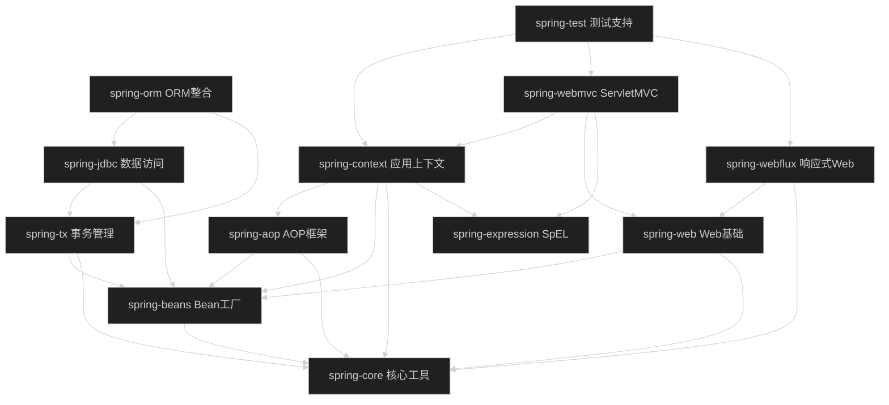

# Spring Framework 7.0.7 源码阅读 — 目录
> 上次修改：2026-07-26 20:39

## 技术栈与项目概述

Spring Framework 是一站式企业级 Java 应用基础框架，提供 IoC 容器、AOP、事务管理、Web（Servlet MVC + 响应式 WebFlux）、数据访问、消息与测试等核心能力。本项目名称为 **Spring Framework 7.0.7**，采用 **Gradle Wrapper（`./gradlew`）** 多模块构建，技术栈为 **Java 25 toolchain（`--release 17` 字节码目标）+ Kotlin 2.2.21**，引入 **Reactor** 实现响应式编程，内部使用 **ASM/javapoet/objenesis** 做字节码与注解处理，测试基于 **JUnit 5**。工程规模约 24+ 模块、9500+ 主源码文件，遵循严格的分层依赖，采用 **Apache License 2.0** 开源。本次分析范围覆盖核心的 10 个模块及 Bean 工厂、应用上下文两处核心源码链路。

## 重点关注

以下入口是理解 Spring 运行机制的关键，建议优先阅读：

- **Bean 工厂的 `doGetBean` 与三级缓存循环依赖**（`DefaultListableBeanFactory` / `DefaultSingletonBeanRegistry`）：IoC 容器的核心，理解单例创建、依赖注入与循环依赖解决是掌握 Spring 的基础。详见 [Bean工厂模块](Bean工厂模块.md) 与 [核心源码分析-Bean工厂模块](核心源码分析-Bean工厂模块.md)。
- **应用上下文 `AbstractApplicationContext.refresh()` 的 12 步启动流程**：容器启动主线，串联 BeanFactory 准备、BeanFactoryPostProcessor、BeanPostProcessor 注册、事件多播、单例预实例化等阶段。详见 [应用上下文模块](应用上下文模块.md) 与 [核心源码分析-应用上下文模块](核心源码分析-应用上下文模块.md)。
- **AOP 代理创建与拦截器链**（`ProxyFactory.getProxy` / `ReflectiveMethodInvocation`）：理解 JDK 动态代理与 CGLIB 代理选择、Advisor 匹配与拦截器链执行。详见 [AOP框架模块](AOP框架模块.md)。
- **事务传播行为**（`TransactionInterceptor.invoke` / `AbstractPlatformTransactionManager`）：声明式事务的入口与七种传播行为处理逻辑。详见 [事务管理模块](事务管理模块.md)。
- **DispatcherServlet 请求分发**（`DispatcherServlet.doDispatch`）：Servlet MVC 的请求处理中枢，HandlerMapping/HandlerAdapter/ViewResolver 的协作链路。详见 [ServletMVC模块](ServletMVC模块.md)。

## 阅读路线

- **新手**：先读 [工程概览](工程概览.md) 建立目录认知 → [编译运行流程](编译运行流程.md) 了解如何构建 → [核心工具模块](核心工具模块.md) 熟悉基础设施 → [Bean工厂模块](Bean工厂模块.md) → [应用上下文模块](应用上下文模块.md) 掌握 IoC 主线。
- **维护者**：从 [应用上下文模块](应用上下文模块.md) 的 `refresh()` 主线切入 → [核心源码分析-应用上下文模块](核心源码分析-应用上下文模块.md) 与 [核心源码分析-Bean工厂模块](核心源码分析-Bean工厂模块.md) 深入实现 → 按需查阅 [AOP框架模块](AOP框架模块.md)、[事务管理模块](事务管理模块.md)。
- **排障者**：按问题域定位——Bean 创建/循环依赖问题看 [核心源码分析-Bean工厂模块](核心源码分析-Bean工厂模块.md)；代理/切面不生效看 [AOP框架模块](AOP框架模块.md)；事务不回滚/传播异常看 [事务管理模块](事务管理模块.md)；请求路由/参数绑定问题看 [ServletMVC模块](ServletMVC模块.md) 或 [响应式Web模块](响应式Web模块.md)。
- **扩展开发者**：先读 [核心工具模块](核心工具模块.md) 掌握 `Resource`/`Environment`/`ConversionService` 扩展点 → [Bean工厂模块](Bean工厂模块.md) 的 BeanPostProcessor/BeanFactoryPostProcessor → [Web基础模块](Web基础模块.md) 的消息转换与客户端抽象 → [测试支持模块](测试支持模块.md) 了解如何为扩展编写测试。

## 文档清单

- [工程概览](工程概览.md)
- [编译运行流程](编译运行流程.md)
- 模块文档
  - [核心工具模块](核心工具模块.md)
  - [Bean工厂模块](Bean工厂模块.md)
  - [AOP框架模块](AOP框架模块.md)
  - [SpEL表达式模块](SpEL表达式模块.md)
  - [应用上下文模块](应用上下文模块.md)
  - [事务管理模块](事务管理模块.md)
  - [Web基础模块](Web基础模块.md)
  - [ServletMVC模块](ServletMVC模块.md)
  - [响应式Web模块](响应式Web模块.md)
  - [测试支持模块](测试支持模块.md)
- 核心源码阅读
  - [核心源码分析-Bean工厂模块](核心源码分析-Bean工厂模块.md)
  - [核心源码分析-应用上下文模块](核心源码分析-应用上下文模块.md)
- 场景分析
  - 暂无，可用 `/source-code-read byCase` 生成

## 模块功能摘要

| 模块 | 主要功能 | 核心入口 | 文档 |
|------|----------|----------|------|
| 核心工具模块 (spring-core) | 资源加载、类型转换、环境/属性管理、注解introspection、ASM 字节码 | `DefaultResourceLoader.getResource` / `GenericConversionService.convert` | [核心工具模块](核心工具模块.md) |
| Bean工厂模块 (spring-beans) | IoC 容器、Bean 定义、依赖注入、三级缓存循环依赖 | `DefaultListableBeanFactory.doGetBean` | [Bean工厂模块](Bean工厂模块.md) |
| AOP框架模块 (spring-aop) | 切点、通知、代理工厂、拦截器链 | `ProxyFactory.getProxy` | [AOP框架模块](AOP框架模块.md) |
| SpEL表达式模块 (spring-expression) | 表达式解析与求值、属性/方法/构造器解析 | `SpelExpressionParser.parseExpression` | [SpEL表达式模块](SpEL表达式模块.md) |
| 应用上下文模块 (spring-context) | ApplicationContext、注解驱动配置、事件、refresh 启动 | `AbstractApplicationContext.refresh` | [应用上下文模块](应用上下文模块.md) |
| 事务管理模块 (spring-tx) | 声明式/编程式事务、传播行为、事务同步 | `TransactionInterceptor.invoke` | [事务管理模块](事务管理模块.md) |
| Web基础模块 (spring-web) | HTTP 抽象、RestClient/WebClient、消息转换、CORS | `RestClient` / `RestTemplate` | [Web基础模块](Web基础模块.md) |
| ServletMVC模块 (spring-webmvc) | DispatcherServlet、@RequestMapping、HandlerMapping/Adapter、视图解析 | `DispatcherServlet.doDispatch` | [ServletMVC模块](ServletMVC模块.md) |
| 响应式Web模块 (spring-webflux) | 响应式 DispatcherHandler、函数式端点、响应式客户端 | `DispatcherHandler.handle` | [响应式Web模块](响应式Web模块.md) |
| 测试支持模块 (spring-test) | TestContext 框架、SpringExtension、MockMvc/WebTestClient | `SpringExtension` / `MockMvc` | [测试支持模块](测试支持模块.md) |

## 架构总览

图说明：箭头方向 `A --> B` 表示"A 依赖 B"。整体呈严格分层：

- **基础层 core**：所有模块的公共底座，提供资源、类型转换、环境与注解工具，不依赖任何其他 Spring 模块。
- **Bean 层 beans**：在 core 之上构建 IoC 容器基础设施，是 aop、context、tx、web 的共同上游依赖。
- **AOP 与表达式层 aop/expression**：aop 依赖 beans+core；expression 为独立模块（不依赖其他 Spring 模块），后被 context 与 webmvc 聚合使用。
- **上下文层 context**：聚合 aop、beans、core、expression 四者，提供完整的 ApplicationContext 能力，是 Web 与测试层的关键上游。
- **数据访问层 jdbc/orm**：jdbc 依赖 tx+beans，orm 进一步依赖 jdbc+tx，形成事务化的数据访问栈。
- **Web 层 webmvc/webflux**：二者共享 web 基础模块的 HTTP 抽象与消息转换；webmvc 走 Servlet 栈并聚合 context，webflux 走 Reactor 响应式栈。
- **测试层 test**：跨层依赖 context、webmvc、webflux（多为可选依赖），提供 TestContext 框架与 Mock 测试支持。

关键耦合点：**所有模块最终都依赖 core**；**context 是聚合中枢**，将 aop/beans/expression 组合成应用上下文；**web 被 webmvc 与 webflux 共享**，是两套 Web 栈的公共协议层。

## 关键场景索引

暂无。可用 `/source-code-read byCase` 生成基于具体业务场景的调用链追踪文档（如"一次 HTTP 请求从 DispatcherServlet 到 Controller 的完整链路""一个单例 Bean 的创建与依赖注入全过程"等）。

## 文档维护记录

| 日期 | 操作 | 文档 | 说明 |
|------|------|------|------|
| 2026-07-26 | init 新增 | 工程概览.md | 工程目录结构与目录说明 |
| 2026-07-26 | init 新增 | 编译运行流程.md | 技术栈、依赖、构建/运行/测试流程 |
| 2026-07-26 | init 新增 | 核心工具模块.md | spring-core 模块文档 |
| 2026-07-26 | init 新增 | Bean工厂模块.md | spring-beans 模块文档 |
| 2026-07-26 | init 新增 | AOP框架模块.md | spring-aop 模块文档 |
| 2026-07-26 | init 新增 | SpEL表达式模块.md | spring-expression 模块文档 |
| 2026-07-26 | init 新增 | 应用上下文模块.md | spring-context 模块文档 |
| 2026-07-26 | init 新增 | 事务管理模块.md | spring-tx 模块文档 |
| 2026-07-26 | init 新增 | Web基础模块.md | spring-web 模块文档 |
| 2026-07-26 | init 新增 | ServletMVC模块.md | spring-webmvc 模块文档 |
| 2026-07-26 | init 新增 | 响应式Web模块.md | spring-webflux 模块文档 |
| 2026-07-26 | init 新增 | 测试支持模块.md | spring-test 模块文档 |
| 2026-07-26 | init 新增 | 核心源码分析-Bean工厂模块.md | Bean 工厂核心源码逐行分析 |
| 2026-07-26 | init 新增 | 核心源码分析-应用上下文模块.md | 应用上下文 refresh 核心源码分析 |
