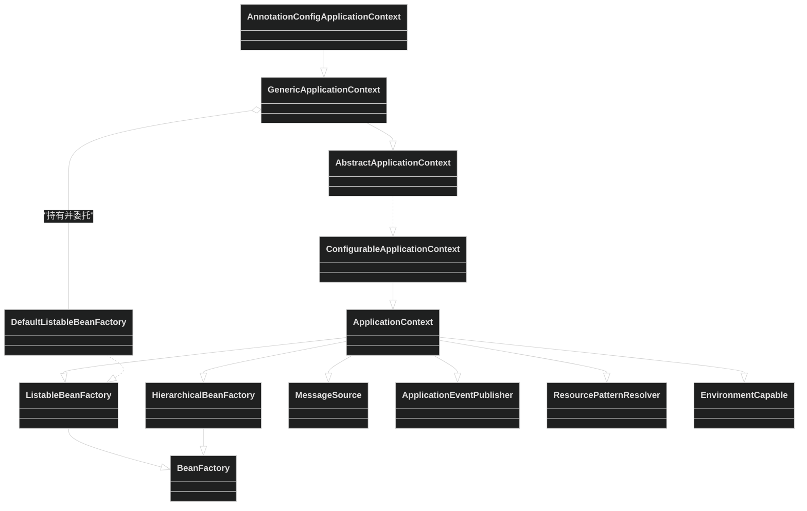
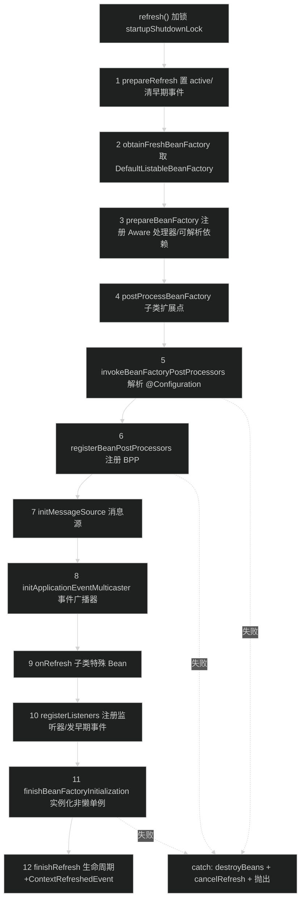
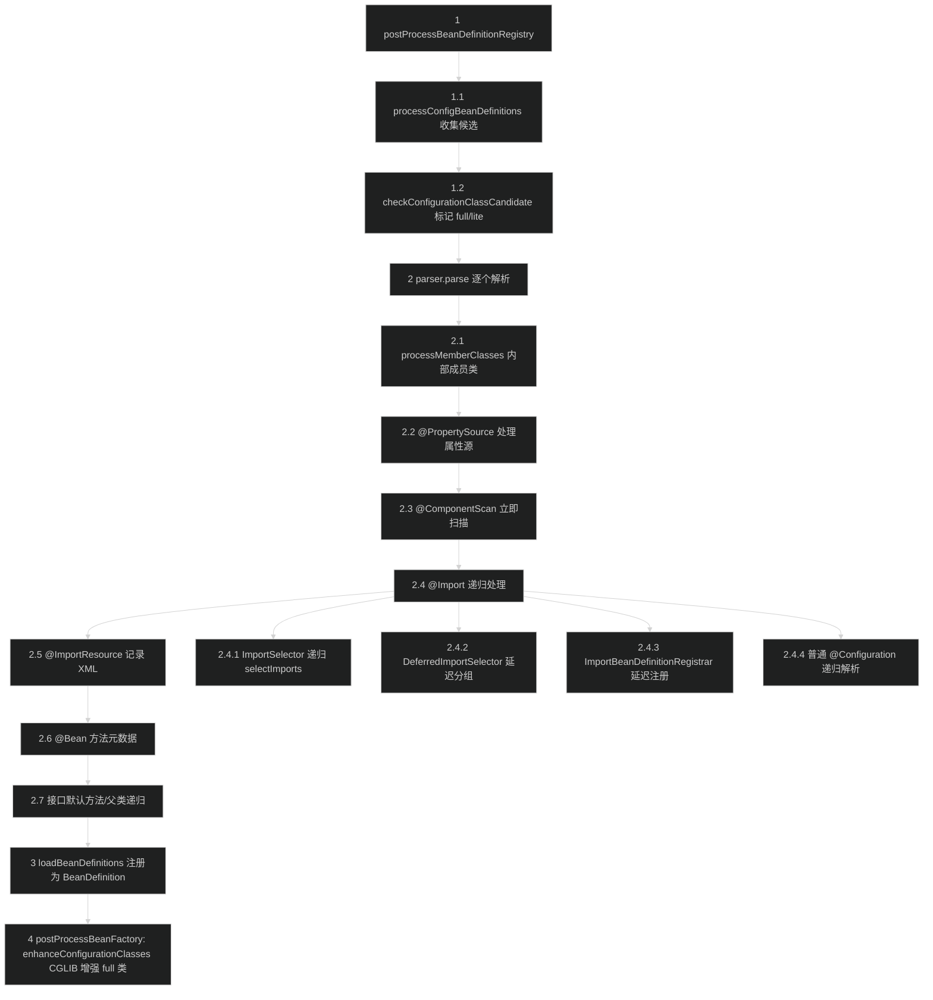
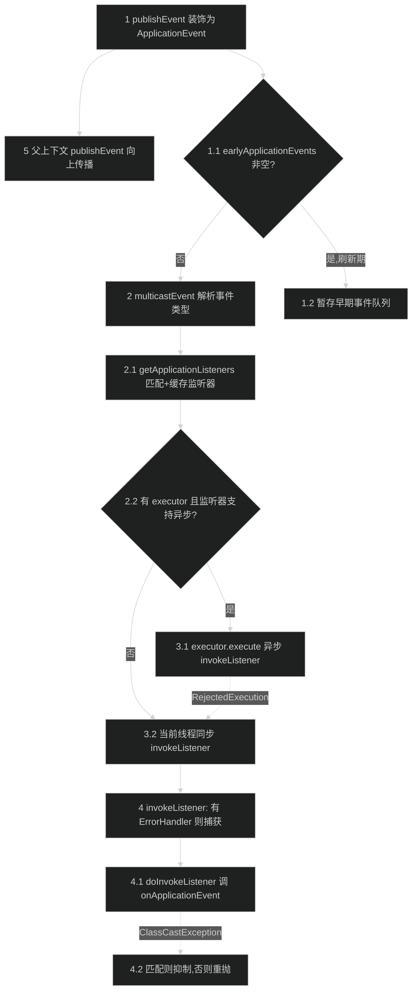

# 应用上下文模块（spring-context）
> 上次修改：2026-07-26 18:10

## 重点关注

- **`refresh()` 12 步启动模板方法**（`AbstractApplicationContext#refresh` L580-661）：整个 IoC 容器的主启动链路，串联工厂准备、后置处理器调用、消息源/事件广播器初始化、单例实例化与事件发布，是理解 Spring 生命周期的第一入口。
- **`ConfigurationClassPostProcessor` + `ConfigurationClassParser` 配置类解析**：`@Configuration`/`@ComponentScan`/`@Bean`/`@Import` 的注册全部发生在 `invokeBeanFactoryPostProcessors` 阶段，是"注解驱动配置"如何变成 `BeanDefinition` 的核心，其中 `doProcessConfigurationClass` 的处理顺序与 `processImports` 递归是最易错的复杂分支。
- **组件扫描 `ClassPathBeanDefinitionScanner#doScan`**：`@Component`/`@Service`/`@Repository`/`@Controller` 如何被 ASM 元数据识别并登记为 `BeanDefinition`。
- **事件广播 `SimpleApplicationEventMulticaster#multicastEvent`**（L136-154）：同步/异步分发、监听器异常处理与 `ClassCastException` 抑制，是排查"事件不触发/顺序错乱"的必读点。
- **`AnnotationConfigApplicationContext` 构造引导**：`register/scan → refresh` 三步引导，以及在 `AnnotatedBeanDefinitionReader` 构造时注入的一批注解处理器（`ConfigurationClassPostProcessor` 等）。

---

## 1. 模块定位与职责边界

**结论**：spring-context 是 Spring 的"应用上下文"层，在 spring-beans 的裸 `BeanFactory` 之上，提供**一个可刷新、可关闭、带生命周期与事件语义的完整 IoC 容器**，并把注解驱动配置（`@Configuration`/`@ComponentScan`/`@Bean`/`@Import`）、事件发布、国际化消息源、资源模式解析、任务调度与缓存抽象等企业级能力聚合到 `ApplicationContext` 这一门面接口下。

**上游/下游位置**：
- 下游依赖 spring-aop、spring-beans、spring-core、spring-expression（见 CLAUDE.md 的模块层级）。它复用 spring-beans 的 `DefaultListableBeanFactory` 作为真正的 Bean 注册与实例化引擎，自身不实现 Bean 生命周期底层逻辑。
- 上游被 spring-webmvc、spring-webflux、spring-context-support、spring-messaging、spring-test 等模块依赖，作为它们的容器基座。

**负责什么**：
- 启动流程编排（`AbstractApplicationContext#refresh` 模板方法，`spring-context/src/main/java/org/springframework/context/support/AbstractApplicationContext.java:580`）。
- 注解配置解析（`org.springframework.context.annotation` 包）。
- 事件发布与广播（`org.springframework.context.event` 包 + `ApplicationEventPublisher`）。
- 消息源 `MessageSource`、生命周期 `Lifecycle`/`SmartLifecycle`、`ApplicationContextAware` 等回调注入。
- 缓存抽象（`org.springframework.cache`）、调度（`org.springframework.scheduling`）、格式化/校验（`org.springframework.format`/`validation`）、JMX、脚本等横切能力。

**不负责什么**：
- 不负责 Bean 定义的底层存储与依赖注入算法本身——这属于 spring-beans 的 `DefaultListableBeanFactory`；上下文只是**持有并委托**给它。
- 不负责 AOP 代理织入的底层实现（spring-aop）与 SpEL 解析本体（spring-expression），只做集成与桥接。
- 不负责 Web/Servlet 层的 `DispatcherServlet` 等（spring-webmvc/webflux）。

**主要输入/输出/状态变化/副作用**：
- 输入：`@Configuration` 类、扫描包路径、XML 定义、`Environment` 属性源、外部注册的 `BeanFactoryPostProcessor`/`ApplicationListener`。
- 输出：一个已刷新、单例已实例化的可用容器；对外提供 `getBean`、`publishEvent`、`getMessage`、`getResources` 等门面能力。
- 状态变化：`active`/`closed` 标志位翻转（`prepareRefresh` L667-702、`cancelRefresh` L1024-1029）；`DefaultListableBeanFactory` 从"仅有定义"到"单例已实例化"。
- 副作用：注册 JVM 关闭钩子、启动 `Lifecycle` bean、发布 `ContextRefreshedEvent`、可能启动调度线程池。

---

## 2. 架构关系与依赖

**结论**：`ApplicationContext` 是一个"多接口聚合门面"，它**继承**了 `ListableBeanFactory`、`HierarchicalBeanFactory`、`MessageSource`、`ApplicationEventPublisher`、`ResourcePatternResolver`、`EnvironmentCapable` 六大能力接口；但在实现上，容器**不自己实现 Bean 工厂**，而是内部持有一个 `DefaultListableBeanFactory`（由 `GenericApplicationContext` 创建并委托）。这种"接口继承 + 组合委托"的组合，是理解本模块最关键的架构决策。

### 2.1 ApplicationContext 继承体系与 BeanFactory 关系

**说明表**：

| 节点 | 角色 | 关系/依赖方向 | 备注 |
|------|------|---------------|------|
| `BeanFactory` | 最底层 IoC 契约（spring-beans） | 被 `ListableBeanFactory`/`HierarchicalBeanFactory` 扩展 | 跨模块强依赖 |
| `ApplicationContext` | 能力聚合门面接口 | 同时继承 6 个能力接口（`ApplicationContext.java:59-60`） | 只声明能力，不含实现 |
| `ConfigurableApplicationContext` | 可配置/可刷新扩展接口 | 加入 `refresh()`/`close()`/`setParent`/`addBeanFactoryPostProcessor`（L222/L267/L133/L171），继承 `Lifecycle`、`Closeable`（L45） | 容器管理入口 |
| `AbstractApplicationContext` | 刷新流程模板方法骨架 | 实现 `refresh()` 12 步，把 `refreshBeanFactory`/`getBeanFactory` 留给子类 | 核心逻辑所在 |
| `GenericApplicationContext` | 单工厂持有者 | **组合**一个 `final DefaultListableBeanFactory beanFactory`（`GenericApplicationContext.java:108`），并把 `BeanDefinitionRegistry` 全部委托给它 | 单次刷新约束（`refreshed` AtomicBoolean L114） |
| `AnnotationConfigApplicationContext` | 注解驱动上下文实现 | 继承 `GenericApplicationContext`，组合 `reader`/`scanner`（L59/L61） | 最常用入口 |
| `DefaultListableBeanFactory` | 真正的 Bean 工厂引擎（spring-beans） | 被 `GenericApplicationContext` 持有，`getBeanFactory()` 直接返回它（L317-320） | 强依赖、不可替换 |

**关键耦合点**：`AbstractApplicationContext` 的绝大多数 `BeanFactory`/`ListableBeanFactory` 方法（`getBean`、`getBeansWithAnnotation`、`getBeanNamesForType` 等，见 L1468-1498）都通过 `getBeanFactory()` 转发到内部 `DefaultListableBeanFactory`——上下文是"薄门面 + 编排层"，Bean 逻辑本体在 beans 层。

---

## 3. 入口与调用方式

**结论**：本模块最主要的编程入口是"构造一个 `AnnotationConfigApplicationContext` 并触发 `refresh()`"；框架回调入口是各类 `*Aware`/`ApplicationListener`/`@EventListener`；容器管理入口是 `ConfigurableApplicationContext` 上的 `refresh()`/`close()`/`start()`/`stop()`。

| 入口 | 类型 | 触发条件 / 关键参数 | 之后进入的核心流程 | 源码位置 |
|------|------|---------------------|---------------------|----------|
| `new AnnotationConfigApplicationContext(Config.class)` | 编程 API | 传入 `@Configuration`/组件类 | `this()` → `register(...)` → `refresh()` | `AnnotationConfigApplicationContext.java:89-93` |
| `new AnnotationConfigApplicationContext("com.pkg")` | 编程 API | 传入扫描基础包 | `this()` → `scan(...)` → `refresh()` | `AnnotationConfigApplicationContext.java:101-105` |
| `context.refresh()` | 容器管理 | 手动刷新（`GenericApplicationContext` 仅允许一次） | 12 步启动模板方法 | `AbstractApplicationContext.java:580` |
| `context.register(Class...)` / `scan(String...)` | 编程 API | 刷新前追加定义 | 委托 `reader`/`scanner` | `AnnotationConfigApplicationContext.java:168/185` |
| `context.publishEvent(event)` | 事件入口 | 运行期发布任意事件/负载 | `multicastEvent` 广播 | `AbstractApplicationContext.java:414` |
| `context.close()` / JVM 关闭钩子 | 生命周期 | 显式关闭或进程退出 | `destroyBeans` + 发布 `ContextClosedEvent` | `ConfigurableApplicationContext.java:256/267` |
| `start()`/`stop()`/`restart()`/`pause()` | 生命周期 | 控制 `Lifecycle` bean | 委托 `LifecycleProcessor` 并发对应事件 | `AbstractApplicationContext.java:1582-1604` |
| `ApplicationListener` / `@EventListener` | 框架回调 | 匹配事件类型时被广播器回调 | `invokeListener` | `SimpleApplicationEventMulticaster.java:162` |
| `ApplicationContextAware` 等 `*Aware` | 框架回调 | Bean 初始化阶段注入上下文引用 | `ApplicationContextAwareProcessor` | `AbstractApplicationContext.java:736` |

引导链最关键的隐藏动作：构造 `AnnotatedBeanDefinitionReader(this)` 时会调用 `AnnotationConfigUtils.registerAnnotationConfigProcessors(registry)`（`AnnotatedBeanDefinitionReader.java:90`），**在 refresh 之前**就把 `ConfigurationClassPostProcessor`、`AutowiredAnnotationBeanPostProcessor`、`CommonAnnotationBeanPostProcessor`、`EventListenerMethodProcessor` 等处理器登记为 Bean 定义（`AnnotationConfigUtils.java:159/165/172/193`）。

---

## 4. 核心概念与领域模型

### 4.1 ApplicationContext（应用上下文）
- **定义**：聚合 6 大能力的 IoC 容器门面接口（`ApplicationContext.java:59-60`）。
- **作用**：对外提供统一的取 Bean、发事件、取消息、解析资源、读环境的入口。
- **生命周期**：`refresh()` 建立 → 运行期服务 → `close()` 销毁。
- **相关类型**：`ConfigurableApplicationContext`、`AbstractApplicationContext`、`GenericApplicationContext`。
- **三维评估**：好处——单一门面降低使用者认知成本，能力接口可被独立 mock；替代方案——直接使用裸 `BeanFactory`（丧失事件/生命周期/消息源）；风险——门面接口过宽，实现类必须覆盖大量方法（`AbstractApplicationContext` 达 1600+ 行）。

### 4.2 refresh() 模板方法
- **定义**：`AbstractApplicationContext#refresh` 定义的 12 步固定启动序列（L588-624）。
- **作用**：把容器从"仅有配置"变为"单例已实例化、事件已就绪"。
- **生命周期**：全程持有 `startupShutdownLock`（L582），保证与 `close()` 互斥。
- **三维评估**：好处——模板方法把不变的编排流程与可变的工厂创建（`refreshBeanFactory`）解耦，子类只需实现 3 个抽象方法（L1626/L1633/L1649）；替代方案——把流程写死在具体类（丧失 Web/XML/注解上下文复用）；风险——12 步顺序耦合强，任何一步失败都会 `destroyBeans` 回滚（L644）。

### 4.3 ConfigurationClass 模型与 BeanFactoryPostProcessor
- **定义**：`ConfigurationClassParser` 把每个 `@Configuration` 类解析成 `ConfigurationClass` 领域对象，再由 `ConfigurationClassPostProcessor`（一个 `BeanDefinitionRegistryPostProcessor`）注册为 `BeanDefinition`。
- **作用**：让"配置即代码"能在不实例化业务 Bean 的前提下先扩充定义。
- **生命周期**：仅存活于 `invokeBeanFactoryPostProcessors` 阶段。
- **三维评估**：好处——注解配置与 XML 配置统一到同一 `BeanDefinition` 模型；替代方案——运行期反射解析（性能差、无法参与 Bean 定义合并）；风险——full 模式需 CGLIB 增强（`enhanceConfigurationClasses` L514），对 final 类不友好。

### 4.4 ApplicationEvent / ApplicationListener / Multicaster
- **定义**：事件对象 + 监听器契约（`ApplicationListener#onApplicationEvent`）+ 广播器（`ApplicationEventMulticaster`）三件套；非 `ApplicationEvent` 负载被包装为 `PayloadApplicationEvent`（`AbstractApplicationContext.java:432`）。
- **作用**：容器内解耦的观察者机制。
- **生命周期**：广播器在 `initApplicationEventMulticaster`（L853）建立，监听器在 `registerListeners`（L914）注册。
- **三维评估**：好处——发布/订阅解耦，支持泛型事件类型匹配与异步分发；替代方案——直接方法调用（强耦合）；风险——同步广播下单个监听器阻塞会拖慢发布方，异常若无 `ErrorHandler` 会向上抛出（L172-174）。

### 4.5 Stereotype 组件注解
- **定义**：`@Component` 及其派生 `@Service`/`@Repository`/`@Controller`（`org.springframework.stereotype`），`@Component` 元注解 `@Indexed`（`Component.java:66-70`）。
- **作用**：标记类为可被组件扫描发现的候选 Bean。
- **三维评估**：好处——语义化分层 + 元注解可组合自定义 stereotype；替代方案——显式 `@Bean` 逐个声明（冗长）；风险——扫描范围过大导致误装配，需 include/exclude 过滤器约束。

---

## 5. 关键流程

### 5.1 refresh() 12 步启动主流程（主成功路径）

**分阶段步骤说明**：

1-2 环境与工厂准备：`prepareRefresh`（L667-702）将 `active` 置真、`closed` 置假、初始化属性源并校验必需属性、备份早期监听器、开辟 `earlyApplicationEvents` 收集器；`obtainFreshBeanFactory`（L719-722）调用子类 `refreshBeanFactory()`——`GenericApplicationContext` 在此翻转 `refreshed` AtomicBoolean 强制单次刷新（`GenericApplicationContext.java:289-296`），并返回内部 `DefaultListableBeanFactory`。

3-4 工厂加工：`prepareBeanFactory`（L729-775）设置类加载器与 SpEL 表达式解析器、注册 `ApplicationContextAwareProcessor` 与 `ApplicationListenerDetector`、忽略一批 `*Aware` 自动装配接口、把 `BeanFactory`/`ResourceLoader`/`ApplicationEventPublisher`/`ApplicationContext` 登记为可解析依赖、注入 environment 等默认单例；`postProcessBeanFactory`（L599）是空实现供 Web 上下文等子类扩展。此后进入 `try` 块，任何异常都会走回滚分支。

5-6 后置处理器阶段：`invokeBeanFactoryPostProcessors`（L794-804）委托 `PostProcessorRegistrationDelegate`，在此调用 `ConfigurationClassPostProcessor` 解析 `@Configuration`（详见 5.2）；随后 `registerBeanPostProcessors`（L811-813）按 `PriorityOrdered→Ordered→普通` 顺序注册所有 `BeanPostProcessor`，为后续 Bean 创建装好拦截器。

7-10 基础设施初始化：`initMessageSource`（L820-845）与 `initApplicationEventMulticaster`（L853-870）——若容器内无对应 Bean 则分别用 `DelegatingMessageSource`/`SimpleApplicationEventMulticaster` 兜底并注册为单例；`onRefresh`（L906-908）供子类初始化特殊 Bean（如 Web 的内嵌容器）；`registerListeners`（L914-935）先注册静态监听器与监听器 Bean 名，再把 `earlyApplicationEvents` 一次性广播出去（此后 `earlyApplicationEvents` 置 null，`publishEvent` 转为即时广播）。

11-12 实例化与收尾：`finishBeanFactoryInitialization`（L942-995）设置 `conversionService`/内嵌值解析器、提前初始化 `LoadTimeWeaverAware`，最后 `preInstantiateSingletons()` 实例化所有非懒加载单例；`finishRefresh`（L1002-1017）重置公共反射缓存、初始化并触发 `LifecycleProcessor.onRefresh()`、发布 `ContextRefreshedEvent`。失败分支：`catch (RuntimeException | Error)`（L627-651）先停止已启动的 `Lifecycle` bean、`destroyBeans()` 销毁已创建单例、`cancelRefresh(ex)` 把 `active` 置假并重置缓存，再向上抛出。

### 5.2 ConfigurationClassPostProcessor 解析 @Configuration（配置类处理路径）

**分阶段步骤说明**：

1-1.2 候选收集与分类：`postProcessBeanDefinitionRegistry`（`ConfigurationClassPostProcessor.java:304`）调用 `processConfigBeanDefinitions`（L389）遍历已有 `BeanDefinition`，用 `ConfigurationClassUtils.checkConfigurationClassCandidate`（`ConfigurationClassUtils.java:106`）判定：`@Configuration(proxyBeanMethods!=false)` 标记为 **full**（`CONFIGURATION_CLASS_FULL="full"`），带 `@Bean`/`@Component`/`@ComponentScan`/`@Import` 的普通类标记为 **lite**；已处理的跳过（L395）。

2-2.7 解析单个配置类（顺序敏感）：`ConfigurationClassParser#doProcessConfigurationClass`（L303-402）严格按序处理——先递归内部成员类（L309），再 `@PropertySource`（L312）、**立即执行** `@ComponentScan` 扫描（L325-359）、`@Import` 递归（L361-362）、`@ImportResource`（L364-374）、逐个 `@Bean` 方法元数据（L376-383）、接口默认方法（L385-386），最后返回非 `java.*` 父类以在外层循环继续递归（L388-399）。这个顺序保证属性源在扫描前就位、扫描出的类可再次被当作配置类解析。

2.4.1-2.4.4 @Import 递归分派：`processImports`（L579-635）对每个导入目标分类处理——`ImportSelector` 立即 `selectImports` 并对结果**递归** `processImports`（L606-608）；`DeferredImportSelector` 交给 `deferredImportSelectorHandler` 延迟到 `parse` 末尾统一分组处理（L602，L200）；`ImportBeanDefinitionRegistrar` 暂存待后续注册（L620）；普通 `@Configuration` 则包装为候选**递归** `processConfigurationClass`（L629-634）。`importStack` 提供循环导入检测（L586-590）。

3-4 注册与增强：解析完成后 `loadBeanDefinitions` 把 `@Bean` 方法、`@ImportResource`、`ImportBeanDefinitionRegistrar` 产物统一注册为 `BeanDefinition`；随后在 `postProcessBeanFactory`（L324）阶段，`enhanceConfigurationClasses`（L514）只对标记为 `full` 的配置类（L544）用 `ConfigurationClassEnhancer` 生成 CGLIB 子类（L569-582），使 `@Bean` 方法间的相互调用返回容器管理的单例而非新实例。

### 5.3 事件发布 multicastEvent 广播路径（同步/异步分支）

**分阶段步骤说明**：

1-1.2 事件装饰与早期缓冲：`AbstractApplicationContext#publishEvent`（L414-460）先把非 `ApplicationEvent` 负载包装成 `PayloadApplicationEvent`（L432），再确定 `ResolvableType` 事件类型（L436-441）；若此刻仍处于刷新早期（`earlyApplicationEvents != null`，广播器尚未就绪），事件被暂存进早期队列（L444-445），待 `registerListeners` 阶段统一重放（L927-934）。

2-3.2 监听器匹配与分发：广播器就绪后进入 `SimpleApplicationEventMulticaster#multicastEvent`（L136-154），`getApplicationListeners(event, type)`（继承自 `AbstractApplicationEventMulticaster`）按事件类型过滤并缓存匹配监听器；对每个监听器，若配置了 `taskExecutor` 且监听器 `supportsAsyncExecution()`（L141）则提交线程池异步执行，线程池拒绝时降级为本地同步执行（L145-148）；否则当前线程同步调用（L150-152）。默认无 executor，即同步顺序广播。

4-4.2 监听器调用与异常处理：`invokeListener`（L162-175）若设置了 `ErrorHandler` 则包裹 `doInvokeListener` 捕获全部 `Throwable` 交给处理器（L164-170），否则异常直接向上传播；`doInvokeListener`（L178-202）调用 `onApplicationEvent`，对 `ClassCastException` 做特殊判定——当消息表明是事件类型不匹配（常见于泛型无法解析的 lambda 监听器）时**抑制并 trace 记录**（L182-197），否则重抛。

5 父上下文传播：无论是否早期，`publishEvent` 都会把事件继续向父上下文传播（L451-459），实现层级容器的事件冒泡。

---

## 6. 核心实现细节

### 6.1 refresh() 各步职责与失败回滚

`refresh()`（L580-661）在方法体外持有 `startupShutdownLock.lock()`（L582）并记录 `startupShutdownThread`（L584），确保刷新与 `close()` 互斥、且同一线程不会重入。12 步骤全部包在内层 `try/catch/finally` 中：
- **输入**：一个仅登记了定义与处理器的 `DefaultListableBeanFactory`。
- **处理**：依 5.1 所述 12 步顺序编排，前 4 步（`prepareRefresh`/`obtainFreshBeanFactory`/`prepareBeanFactory`/`postProcessBeanFactory`）在 `try` 块内外交界处，从第 5 步起处于回滚保护中。
- **输出/副作用**：单例实例化、发布 `ContextRefreshedEvent`、启动 `Lifecycle`。
- **失败回滚**：`catch (RuntimeException | Error ex)`（L627）→ 停止已启动 `Lifecycle`（L634-641）→ `destroyBeans()` 销毁已创建单例（L644）→ `cancelRefresh(ex)` 置 `active=false` 并 `resetCommonCaches()`（L1024-1029）→ 重新抛出。`finally` 中 `contextRefresh.end()`（L654）与解锁（L657-659）保证锁一定释放。
- **三维评估**：好处——异常安全，避免半初始化容器泄漏资源；替代方案——不回滚（会残留脏单例与已启动线程）；风险——`destroyBeans` 本身若抛异常会掩盖原始异常，源码用 `try/catch` 包裹 lifecycle 停止（L638）缓解但 `destroyBeans` 未加保护。

### 6.2 invokeBeanFactoryPostProcessors：BDRPP 与 BFPP 的执行顺序

`invokeBeanFactoryPostProcessors`（L794）委托 `PostProcessorRegistrationDelegate`。关键顺序（Spring 固定契约）：**先执行所有 `BeanDefinitionRegistryPostProcessor`（BDRPP）的 `postProcessBeanDefinitionRegistry`，再执行所有 `BeanFactoryPostProcessor`（BFPP）的 `postProcessBeanFactory`**；两类内部又各自按 `PriorityOrdered → Ordered → 普通` 三级排序。`ConfigurationClassPostProcessor` 同时是 BDRPP 且实现 `PriorityOrdered`（`ConfigurationClassPostProcessor.java:152-154`，`getOrder` 返回 `LOWEST_PRECEDENCE` L210），因此它在 BDRPP 阶段较晚运行、先让更高优先级的注册器扩充定义，再由它统一解析 `@Configuration`。这一顺序保证：配置类解析产生的新 `BeanDefinition` 仍能被后续 BFPP（如 `PropertySourcesPlaceholderConfigurer`）加工。
- **三维评估**：好处——两阶段 + 三级排序给了扩展点确定的执行时机；替代方案——单一无序列表（无法保证定义先于加工）；风险——顺序契约隐式，自定义 BDRPP 若误加 `@Order` 可能破坏配置解析时机。

### 6.3 ConfigurationClassParser 递归处理 @Import

`processImports`（L579-635）是模块内最深的递归点。它以 `importStack`（L586-590）作为访问栈进行循环导入检测，对四类导入目标差异化处理（见 5.2 的 2.4.1-2.4.4）。递归发生在两处：`ImportSelector.selectImports` 的结果重新走 `processImports`（L606-608，支持"选择器返回选择器"），以及普通 `@Configuration` 导入重新走 `processConfigurationClass`（L629-634，支持"配置类导入配置类"）。`DeferredImportSelector` 不递归而是延迟到 `parse` 末尾 `deferredImportSelectorHandler.process()`（L200）统一分组，用于处理"必须在所有常规配置解析完后再决定导入"的场景（如 Spring Boot 自动配置）。
- **输入/输出**：输入当前 `SourceClass` 与其 `@Import` 集合；输出向 `ConfigurationClass` 追加导入的配置类/注册器/Bean 定义。
- **隐藏假设**：`asSourceClass`（L669/L680/L715）用 ASM 或反射统一抽象类元数据，使字符串类名与 `Class` 对象走同一解析路径。
- **三维评估**：好处——递归 + 延迟两种策略覆盖了从简单导入到条件化自动配置的全谱；替代方案——扁平化一次性处理（无法表达 Deferred 的"最后决定"语义）；风险——递归深度与循环导入需 `importStack` 兜底，错误配置会抛 `CircularImportException`。

### 6.4 组件扫描 doScan 的定义生成

`ClassPathBeanDefinitionScanner#doScan`（L275-296）对每个基础包调用 `findCandidateComponents`（继承自 `ClassPathScanningCandidateComponentProvider` L312，基于 ASM `MetadataReader` 读取字节码），逐个候选：解析 `@Scope`（L281-282）、生成 Bean 名（L283）、`postProcessBeanDefinition` + `processCommonDefinitionAnnotations`（L285/L288）、`checkCandidate` 冲突检测（L290），最终 `registerBeanDefinition`（L295）落库。`registerDefaultFilters`（`ClassPathScanningCandidateComponentProvider.java:216`）注册 `@Component`（含元注解派生的 `@Service`/`@Repository`/`@Controller`）为 include 过滤器。
- **三维评估**：好处——ASM 读字节码避免为筛选而加载全部类，扫描快且不触发静态初始化；替代方案——反射加载后判断注解（慢、有副作用）；风险——过滤器配置不当会漏扫或误扫，`@Conditional` 需在 `isCandidateComponent`（L571）二次判定。

---

## 7. 数据结构、配置与外部协议

**结论**：本模块几乎不涉及网络/持久化外部协议，其"协议"主要是**一批约定的特殊 Bean 名常量**与**注解元数据结构**。

关键约定 Bean 名常量（`ConfigurableApplicationContext.java`）：

| 常量 | 值 | 含义 / 默认行为 |
|------|-----|------|
| `MESSAGE_SOURCE_BEAN_NAME` | `messageSource` | 无则用 `DelegatingMessageSource` 兜底（L822-840） |
| `APPLICATION_EVENT_MULTICASTER_BEAN_NAME` | `applicationEventMulticaster` | 无则用 `SimpleApplicationEventMulticaster`（L855-864） |
| `LIFECYCLE_PROCESSOR_BEAN_NAME` | `lifecycleProcessor` | 无则用 `DefaultLifecycleProcessor` |
| `CONVERSION_SERVICE_BEAN_NAME` | `conversionService` | 存在则设入工厂（L954-957） |
| `BOOTSTRAP_EXECUTOR_BEAN_NAME` | `bootstrapExecutor` | 单例并行初始化执行器（L947-950） |
| `ENVIRONMENT_BEAN_NAME` / `SYSTEM_PROPERTIES_BEAN_NAME` / `SYSTEM_ENVIRONMENT_BEAN_NAME` | `environment` 等 | `prepareBeanFactory` 注册默认单例（L763-771） |
| `LOAD_TIME_WEAVER_BEAN_NAME` | `loadTimeWeaver` | 存在则装 LTW 处理器（L756-760） |
| `SHUTDOWN_HOOK_THREAD_NAME` | `SpringContextShutdownHook` | JVM 关闭钩子线程名 |

注解结构：`@Configuration(proxyBeanMethods)`（决定 full/lite）、`@Bean`、`@ComponentScan`、`@Import`、`@ImportResource`、`@PropertySource`、`@Component`/`@Service`/`@Repository`/`@Controller`（`@Component.java:66-70`，`@Indexed` 元注解）、缓存 `@Cacheable(sync)`（`Cacheable.java:209`）、调度 `@Scheduled`。这些注解经 `MergedAnnotations`（spring-core）读取，字段错误（如 stereotype 未用 `@AliasFor` 声明 value）会在 6.1+ 触发弃用告警（`Component.java:49-53`）。

无外部协议时的内部替代结构：事件系统用内存 `ListenerRetriever` 缓存 + `ResolvableType` 做类型匹配，属性配置依赖 spring-core 的 `Environment`/`PropertySource`。

---

## 8. 异常、边界与降级处理

**结论**：本模块的异常处理集中在三处——**refresh 失败回滚**、**事件监听器异常隔离**、**@Bean CGLIB 增强边界**。

- **refresh 失败回滚**：`refresh` 的 `catch` 块（L627-651）在任意步骤抛出 `RuntimeException`/`Error` 时，依次停止 `Lifecycle`（`try/catch` 包裹，L634-641）、`destroyBeans()` 销毁已创建单例（L644）、`cancelRefresh` 置 `active=false` 并重置反射缓存（L1024-1029），最后重抛原异常。`finally`（L657-659）保证 `startupShutdownThread=null` 与解锁。边界：`destroyBeans` 自身未加异常保护，若销毁回调抛错会覆盖原始异常。
- **重复刷新约束**：`GenericApplicationContext#refreshBeanFactory`（`GenericApplicationContext.java:289-296`）用 `refreshed.compareAndSet(false,true)` 检测，二次刷新抛 `IllegalStateException("does not support multiple refresh attempts")`。这与 `AbstractRefreshableApplicationContext`（每次刷新建新工厂）形成对比。
- **未初始化访问**：`getMessageSource`（L1550-1556）、`getApplicationEventMulticaster`（L467-473）、`getLifecycleProcessor`（L491-497）在 refresh 前访问均抛 `IllegalStateException`，提示"call 'refresh' before ..."。
- **事件监听异常处理**：`invokeListener`（L162-175）在配置了 `ErrorHandler` 时捕获全部 `Throwable`，否则透传；`doInvokeListener`（L178-202）对 `ClassCastException` 做类型不匹配判定后抑制（L182-197），避免泛型 lambda 监听器误触发时炸链。异步分发遇 `RejectedExecutionException`（多发生在关闭期）降级为本地同步执行（L145-148）。
- **@Bean 方法 CGLIB 增强边界**：`enhanceConfigurationClasses`（L514）仅对 full 配置类增强；lite 类的 `@Bean` 方法间互调**不**返回单例（是普通方法调用）。final `@Configuration` 类无法被 CGLIB 继承会失败——这是 full 模式的固有限制。
- **早期事件缓冲边界**：广播器未就绪时事件进 `earlyApplicationEvents`（L444），若这些事件在 `registerListeners`（L927-934）前有监听器需要处理会延迟送达；`publishEvent(null)` 被 `Assert.notNull`（L415）拦截。

未覆盖风险点（基于源码）：`destroyBeans` 缺少与 lifecycle 停止同级的异常包裹，回滚期二次异常可能丢失根因。

---

## 9. 并发、生命周期与性能

- **刷新/关闭互斥**：`startupShutdownLock`（`ReentrantLock`，L582/L659）串行化 `refresh()` 与 `close()`，`startupShutdownThread` 字段用于识别当前刷新线程。
- **单例并行初始化**：`finishBeanFactoryInitialization` 调 `prepareSingletonBootstrap()`（L944）并可装配 `bootstrapExecutor`（L947-950），允许标注了后台初始化的单例并行创建以缩短启动时间。
- **单次刷新语义**：`GenericApplicationContext` 的 `refreshed` AtomicBoolean 保证工厂只建一次，`getBeanFactory()` 返回同一实例（`GenericApplicationContext.java:317-320`），无重复创建开销。
- **事件广播并发**：默认 `SimpleApplicationEventMulticaster` 同步顺序调用（无 executor），可注入 `taskExecutor` 转异步（L141-148）；异步下监听器执行顺序与线程安全由使用者负责。
- **监听器缓存**：`AbstractApplicationEventMulticaster` 用 `ListenerRetriever` 按事件类型缓存匹配结果，避免每次广播都做全量 `ResolvableType` 匹配——这是事件热路径的关键优化。
- **性能热点**：`invokeBeanFactoryPostProcessors` 中的配置类解析与组件扫描是启动期 CPU/IO 热点，扫描基于 ASM 读字节码（比反射轻）；`finishBeanFactoryInitialization` 的 `preInstantiateSingletons` 是启动耗时主体。`finishRefresh` 会 `resetCommonCaches()`/`clearResourceCaches()`（L1003-1007）释放扫描期 ASM 元数据，控制常驻内存。

---

## 10. 扩展点、测试点与维护建议

**扩展点**：
- `BeanFactoryPostProcessor` / `BeanDefinitionRegistryPostProcessor`——刷新期修改定义（`ConfigurationClassPostProcessor` 即范例）。
- `ApplicationContextInitializer`——refresh 前初始化上下文（`ApplicationContextInitializer.java`）。
- `ApplicationListener` / `@EventListener`——事件订阅（`EventListenerMethodProcessor` 把 `@EventListener` 方法转为监听器）。
- `ImportSelector` / `DeferredImportSelector` / `ImportBeanDefinitionRegistrar`——`@Import` 动态注册（`processImports` L579）。
- 覆盖约定 Bean（`messageSource`/`applicationEventMulticaster`/`lifecycleProcessor`/`conversionService`）替换默认实现。
- 子类覆盖 `onRefresh()`/`postProcessBeanFactory()`（Web 上下文的做法）。

**建议测试点**：
- 主路径：`AnnotationConfigApplicationContext(Config.class)` 后 `getBean` 成功、`ContextRefreshedEvent` 已发布。
- 失败路径：让某单例构造抛异常，断言 `destroyBeans` 被调用、`active=false`、异常透传。
- 边界：`refresh()` 二次调用抛 `IllegalStateException`；未 refresh 直接 `getMessage`/`publishEvent`。
- 事件：同步/异步广播、监听器抛异常（有/无 `ErrorHandler`）、泛型不匹配 `ClassCastException` 抑制。
- 配置解析：`@Import(ImportSelector)` 递归、`DeferredImportSelector` 顺序、循环导入检测。

**维护建议**：

| 目标位置 | 问题 | 建议动作 | 收益/风险 |
|----------|------|----------|-----------|
| `refresh` catch 块 `destroyBeans()`（L644） | 回滚期若 `destroyBeans` 抛异常会覆盖根因 | 用 `try/catch` 包裹并把根因作为 suppressed 挂到二次异常 | 收益：保留原始故障根因，便于排障；风险：改动核心回滚逻辑需充分回归 |
| stereotype 约定命名（`Component.java:49-53`） | 6.1 起约定式 value 已弃用 | 排查项目内自定义 stereotype 是否用 `@AliasFor` 显式声明 | 收益：避免未来版本移除后失效；风险：低 |
| 事件异步 executor | 默认同步，长监听器阻塞发布方 | 对耗时监听器场景注入 `taskExecutor` 或改 `@Async` | 收益：发布方不被拖慢；风险：需自行保证监听器线程安全与顺序 |

---

## 11. 文件职责表

| 文件 | 职责 | 关键类/函数 | 被谁调用 | 备注 |
|------|------|-------------|----------|------|
| `spring-context/src/main/java/org/springframework/context/support/AbstractApplicationContext.java` | 刷新流程模板方法骨架，事件/消息源/生命周期编排 | `refresh()` L580、`publishEvent` L414、`registerListeners` L914 | 所有上下文子类 | 模块核心，1600+ 行 |
| `spring-context/src/main/java/org/springframework/context/support/GenericApplicationContext.java` | 持有单个 `DefaultListableBeanFactory` 并委托 `BeanDefinitionRegistry` | `refreshBeanFactory` L289、`getBeanFactory` L317 | `AnnotationConfigApplicationContext` 等 | 单次刷新约束 |
| `spring-context/src/main/java/org/springframework/context/annotation/AnnotationConfigApplicationContext.java` | 注解驱动上下文入口 | 构造器 L89/L101、`register` L168、`scan` L185 | 用户代码 | 组合 reader/scanner |
| `spring-context/src/main/java/org/springframework/context/annotation/AnnotatedBeanDefinitionReader.java` | 注册注解 Bean 定义并引导注解处理器 | `doRegisterBean` L252、构造器 L90 | `AnnotationConfigApplicationContext` | 触发 `registerAnnotationConfigProcessors` |
| `spring-context/src/main/java/org/springframework/context/annotation/ConfigurationClassPostProcessor.java` | 解析 `@Configuration` 并 CGLIB 增强 full 类 | `processConfigBeanDefinitions` L389、`enhanceConfigurationClasses` L514 | `PostProcessorRegistrationDelegate` | BDRPP + PriorityOrdered |
| `spring-context/src/main/java/org/springframework/context/annotation/ConfigurationClassParser.java` | 把配置类解析为 `ConfigurationClass`，处理 Import 递归 | `doProcessConfigurationClass` L303、`processImports` L579 | `ConfigurationClassPostProcessor` | 顺序敏感 + 递归 |
| `spring-context/src/main/java/org/springframework/context/annotation/ClassPathBeanDefinitionScanner.java` | 组件扫描并登记 `BeanDefinition` | `doScan` L275、`scan` L254 | scanner/`@ComponentScan` | 基于 ASM |
| `spring-context/src/main/java/org/springframework/context/annotation/ClassPathScanningCandidateComponentProvider.java` | 候选组件识别与过滤器 | `registerDefaultFilters` L216、`findCandidateComponents` L312 | `ClassPathBeanDefinitionScanner` | include/exclude 过滤 |
| `spring-context/src/main/java/org/springframework/context/annotation/AnnotationConfigUtils.java` | 注册一批注解配置处理器 | `registerAnnotationConfigProcessors` L131 | `AnnotatedBeanDefinitionReader` | 注入核心 BPP |
| `spring-context/src/main/java/org/springframework/context/event/SimpleApplicationEventMulticaster.java` | 事件广播（同步/异步） | `multicastEvent` L136、`invokeListener` L162 | `AbstractApplicationContext` | 默认广播器 |
| `spring-context/src/main/java/org/springframework/context/event/AbstractApplicationEventMulticaster.java` | 监听器检索与缓存 | `getApplicationListeners`、`ListenerRetriever` | `SimpleApplicationEventMulticaster` | 类型匹配缓存 |
| `spring-context/src/main/java/org/springframework/context/ApplicationContext.java` | 能力聚合门面接口 | 继承 6 接口 L59 | 全框架 | 只声明能力 |
| `spring-context/src/main/java/org/springframework/context/ConfigurableApplicationContext.java` | 可配置/可刷新接口 + 约定常量 | `refresh` L222、`close` L267、Bean 名常量 | 上下文实现类 | 容器管理契约 |
| `spring-context/src/main/java/org/springframework/context/ApplicationListener.java` | 监听器契约 | `onApplicationEvent`、`forPayload` | 广播器 | 观察者接口 |
| `spring-context/src/main/java/org/springframework/stereotype/Component.java` | 组件 stereotype 注解 | `@Component`（`@Indexed`）L66 | 组件扫描 | `@Service`/`@Repository` 派生 |

---

## 12. 代码引用索引

| 引用 | 说明 |
|------|------|
| `spring-context/src/main/java/org/springframework/context/support/AbstractApplicationContext.java:580` | `refresh()` 入口与 `startupShutdownLock` 加锁 |
| `.../support/AbstractApplicationContext.java:588-624` | 12 步启动模板方法调用序列 |
| `.../support/AbstractApplicationContext.java:627-651` | refresh 失败回滚（stop lifecycle/destroyBeans/cancelRefresh） |
| `.../support/AbstractApplicationContext.java:667-702` | `prepareRefresh` 置 active、早期事件缓冲 |
| `.../support/AbstractApplicationContext.java:719-722` | `obtainFreshBeanFactory` |
| `.../support/AbstractApplicationContext.java:729-775` | `prepareBeanFactory` 注册 Aware 处理器/可解析依赖 |
| `.../support/AbstractApplicationContext.java:794-804` | `invokeBeanFactoryPostProcessors` |
| `.../support/AbstractApplicationContext.java:811-813` | `registerBeanPostProcessors` |
| `.../support/AbstractApplicationContext.java:820-870` | `initMessageSource` / `initApplicationEventMulticaster` 兜底 |
| `.../support/AbstractApplicationContext.java:914-935` | `registerListeners` 注册监听器 + 重放早期事件 |
| `.../support/AbstractApplicationContext.java:942-995` | `finishBeanFactoryInitialization` 单例实例化 |
| `.../support/AbstractApplicationContext.java:1002-1017` | `finishRefresh` 生命周期 + `ContextRefreshedEvent` |
| `.../support/AbstractApplicationContext.java:414-460` | `publishEvent` 事件装饰、早期缓冲、父上下文传播 |
| `.../support/AbstractApplicationContext.java:1024-1029` | `cancelRefresh` |
| `.../support/AbstractApplicationContext.java:1582-1604` | `start`/`stop`/`restart`/`pause` 生命周期委托 |
| `.../support/AbstractApplicationContext.java:1626/1633/1649` | 三个抽象方法 `refreshBeanFactory`/`closeBeanFactory`/`getBeanFactory` |
| `spring-context/src/main/java/org/springframework/context/support/GenericApplicationContext.java:108` | 持有的 `DefaultListableBeanFactory` 字段 |
| `.../support/GenericApplicationContext.java:289-296` | `refreshBeanFactory` 单次刷新约束 |
| `.../support/GenericApplicationContext.java:317-320` | `getBeanFactory` 返回内部工厂 |
| `spring-context/src/main/java/org/springframework/context/ApplicationContext.java:59-60` | 6 接口继承声明 |
| `spring-context/src/main/java/org/springframework/context/ConfigurableApplicationContext.java:45` | 继承 `Lifecycle`/`Closeable` |
| `.../ConfigurableApplicationContext.java:171/183/222/267` | `addBeanFactoryPostProcessor`/`addApplicationListener`/`refresh`/`close` |
| `spring-context/src/main/java/org/springframework/context/annotation/AnnotationConfigApplicationContext.java:89-105` | 构造器 register/scan → refresh |
| `.../annotation/AnnotationConfigApplicationContext.java:168/185` | `register`/`scan` 委托 |
| `spring-context/src/main/java/org/springframework/context/annotation/AnnotatedBeanDefinitionReader.java:90` | 构造时 `registerAnnotationConfigProcessors` |
| `.../annotation/AnnotatedBeanDefinitionReader.java:252-293` | `doRegisterBean` |
| `spring-context/src/main/java/org/springframework/context/annotation/AnnotationConfigUtils.java:159/165/172/193` | 注册 ConfigurationClassPostProcessor 等处理器 |
| `spring-context/src/main/java/org/springframework/context/annotation/ConfigurationClassPostProcessor.java:152-154` | 实现 BDRPP + PriorityOrdered |
| `.../annotation/ConfigurationClassPostProcessor.java:304/389/514` | `postProcessBeanDefinitionRegistry`/`processConfigBeanDefinitions`/`enhanceConfigurationClasses` |
| `spring-context/src/main/java/org/springframework/context/annotation/ConfigurationClassUtils.java:106-147` | full/lite 判定 |
| `spring-context/src/main/java/org/springframework/context/annotation/ConfigurationClassParser.java:303-402` | `doProcessConfigurationClass` 处理顺序 |
| `.../annotation/ConfigurationClassParser.java:579-635` | `processImports` 四类导入递归/延迟 |
| `spring-context/src/main/java/org/springframework/context/annotation/ClassPathBeanDefinitionScanner.java:254/275/295` | `scan`/`doScan`/`registerBeanDefinition` |
| `spring-context/src/main/java/org/springframework/context/annotation/ClassPathScanningCandidateComponentProvider.java:216/312/571` | 默认过滤器/候选查找/条件判定 |
| `spring-context/src/main/java/org/springframework/context/event/SimpleApplicationEventMulticaster.java:136-154` | `multicastEvent` 同步/异步分发 |
| `.../event/SimpleApplicationEventMulticaster.java:162-202` | `invokeListener`/`doInvokeListener` 异常处理 |
| `spring-context/src/main/java/org/springframework/stereotype/Component.java:49-70` | `@Component` 定义与约定命名弃用说明 |
| `spring-context/src/main/java/org/springframework/cache/annotation/Cacheable.java:209` | `@Cacheable(sync)` |
