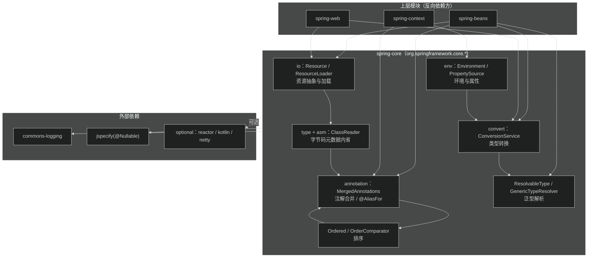
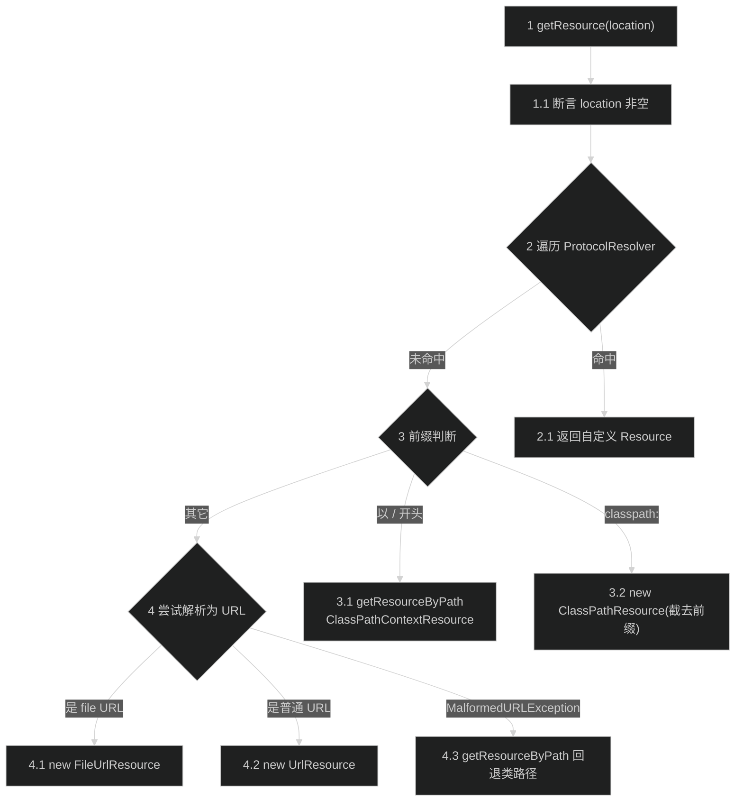
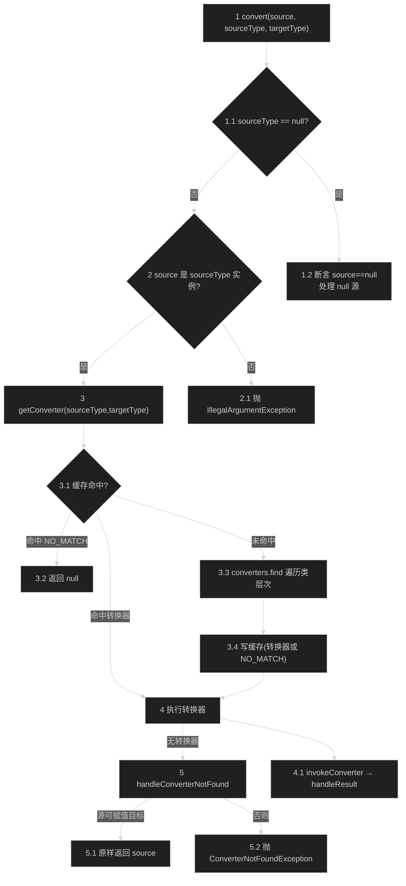
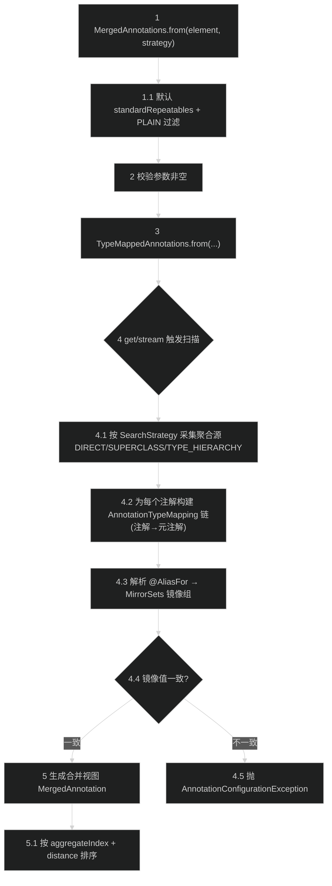

# 核心工具模块（spring-core）
> 上次修改：2026-07-26 17:49

## 重点关注

- **资源加载体系（`core/io`）**：`Resource` 统一抽象 + `DefaultResourceLoader.getResource` 的前缀分派算法（`classpath:` / `file:` / URL / 类路径回退）。这是几乎所有上层模块加载配置文件、XML、类元数据的公共入口，是理解 Spring "一切皆资源" 设计的关键。参见第 5.1、6.1 节。
- **类型转换体系（`core/convert`）**：`ConversionService` 是转换系统总入口，`GenericConversionService` 的 converter 匹配（类层次遍历）+ 缓存（`ConverterCacheKey`）是全框架属性绑定、`@Value` 注入、SpEL 求值背后的引擎。参见第 5.2、6.2 节。
- **合并注解引擎（`core/annotation`）**：`MergedAnnotations` / `AnnotatedElementUtils` 实现了 Spring 组合注解、`@AliasFor` 属性别名与元注解属性覆盖。`@RestController`、`@PostMapping` 等派生注解全部依赖它。这是全模块最复杂、最易踩坑的算法。参见第 5.3、6.3 节。
- **泛型解析（`ResolvableType`）**：1850 行的泛型内省核心，被转换、依赖注入、消息转换广泛复用。理解它才能理解 Spring 如何在运行时"看见"`List<String>` 这种被擦除的泛型。参见第 4、6 节。
- **排序体系（`Ordered` / `OrderComparator` / `AnnotationAwareOrderComparator`）**：贯穿 Bean 排序、过滤器链、后置处理器执行顺序。参见第 4、6.4 节。

---

## 1. 模块定位与职责边界

**结论**：spring-core 是整个 Spring Framework 依赖树的**最底层地基**，向上层所有模块提供与 IoC/AOP/Web 无关的通用基础设施，自身几乎不依赖任何其它 Spring 模块。

**解决的问题**：把 JDK 反射、I/O、注解、类型系统这些"底层能力"封装成 Spring 全家桶统一使用的高层抽象，屏蔽 JDK 版本差异与平台差异（如 VFS、模块系统、Kotlin/协程）。

**上游/下游位置**：
- 上游（被谁依赖）：spring-beans、spring-aop、spring-context、spring-web 等**全部**模块。
- 下游（依赖谁）：仅依赖 `commons-logging`、`jspecify`（`api` 依赖，见 `spring-core/spring-core.gradle` L78-79），以及一批 `optional` 依赖（reactor-core、kotlin、netty-buffer 等，L83-94）——这些仅在对应能力被使用时才需要。

**负责什么**：
- 资源抽象与加载（`core/io`、`core/io/support`）。
- 类型转换（`core/convert`）。
- 环境与属性解析（`core/env`）。
- 注解内省与合并（`core/annotation`）。
- 泛型/类型解析（`ResolvableType`、`GenericTypeResolver`、`MethodParameter`）。
- ASM 字节码内省（`org.springframework.asm`、`core/type`、`core/type/classreading`），无需加载类即可读取注解元数据。
- 排序（`Ordered` 家族）、编解码（`core/codec`）、任务执行（`core/task`）、序列化（`core/serializer`）、反应式适配（`ReactiveAdapterRegistry`）。
- 重打包第三方库：javapoet → `org.springframework.javapoet`，objenesis → `org.springframework.objenesis`（`spring-core.gradle` L30-71）。

**不负责什么**：不提供 `BeanFactory`/依赖注入（spring-beans），不提供 `ApplicationContext`/事件/`@Configuration`（spring-context），不提供 AOP 代理（spring-aop），不提供 SpEL（spring-expression 独立模块）。`ConversionService` 只定义 SPI 与通用实现，具体业务转换器由上层注册。

**主要输入/输出/副作用**：多为无副作用的纯工具调用（如 `convert`、`ResolvableType.forField`）。有副作用者集中在 I/O（`Resource.getInputStream()` 打开流）与环境（`AbstractEnvironment` 读取 `System.getProperties()`/`System.getenv()`，见 `AbstractEnvironment.java` L440-451）。转换器缓存、资源缓存为可变共享状态（见第 9 节）。

---

## 2. 架构关系与依赖

**结论**：spring-core 内部由若干**互相解耦的子系统**组成，彼此仅在少数点耦合（如 `GenericConversionService` 依赖 `ResolvableType` 解析转换器泛型，`AnnotationAwareOrderComparator` 依赖 `MergedAnnotations` 读取 `@Order`）；对外只暴露稳定的 SPI 接口。

**图后说明表**：

| 节点 | 角色 | 依赖方向与耦合说明 |
|------|------|--------------------|
| `io` | 资源抽象子系统 | 被 beans/web 强依赖；内部依赖 `type`（`MetadataReader` 缓存于 `ResourceLoader`）。 |
| `convert` | 类型转换子系统 | 被 beans/web 强依赖；依赖 `ResolvableType` 解析 `Converter<S,T>` 泛型（`GenericConversionService` L86、L261）。 |
| `env` | 环境属性子系统 | 被 context 强依赖；内部依赖 `convert`（`AbstractEnvironment.getConversionService` L496）做属性类型转换。 |
| `annotation` | 注解合并子系统 | 被 beans/context 强依赖；与 `order` 双向协作（`AnnotationAwareOrderComparator` 用它读 `@Order`）。 |
| `type + asm` | 字节码内省 | 服务于 context 的组件扫描；依赖 `annotation` 构建元注解视图，避免过早类加载。 |
| `resolvable` | 泛型解析 | 基础能力，被 `convert`、beans 复用；无反向 Spring 依赖。 |
| `order` | 排序 | 通用能力；`AnnotationAwareOrderComparator` 反向依赖 `annotation`。 |
| `commons-logging` / `jspecify` | 强外部依赖 | `api` 级别，编译期与运行期必需（`spring-core.gradle` L78-79）。 |
| `optional`（reactor/kotlin/netty…） | 可替换/按需依赖 | `optional` 配置：类路径存在才激活，如 `KotlinDetector`、`ReactiveAdapterRegistry`、netty `DataBuffer`。 |

**潜在耦合点**：`convert → resolvable`、`env → convert`、`annotation ↔ order` 是模块内三处需注意的内聚耦合；它们决定了这些子系统无法被单独抽离。

---

## 3. 入口与调用方式

spring-core 无用户命令入口或 HTTP 入口，全部为**编程 API / SPI 入口**，供上层模块或应用直接调用。

| 入口 | 触发条件 | 关键参数 | 返回值 | 后续流程 |
|------|----------|----------|--------|----------|
| `ResourceLoader.getResource(String)` | 需要以位置字符串取得资源句柄 | `location`（`classpath:`/`file:`/URL/相对路径） | `Resource`（永不为 null） | 第 5.1 前缀分派 → 生成对应 `Resource` 子类。`DefaultResourceLoader.java` L145 |
| `ConversionService.convert(Object, Class<T>)` | 需要类型转换（属性绑定、`@Value`、SpEL） | `source`、`targetType` | 目标类型实例或 null | 第 5.2 查找 `GenericConverter` → 执行。`GenericConversionService.java` L163 |
| `MergedAnnotations.from(AnnotatedElement, SearchStrategy)` | 需要读取带 `@AliasFor`/元注解的注解 | 元素、搜索策略 | `MergedAnnotations` 视图 | 第 5.3 构建 `TypeMappedAnnotations` → 扫描层次。`MergedAnnotations.java` L331 |
| `AnnotatedElementUtils.findMergedAnnotation(...)` | 门面式获取合并注解（`find` 语义走类型层次） | 元素、注解类型 | 合并后的注解实例 | 委托 `MergedAnnotations`（`TYPE_HIERARCHY`）。`AnnotatedElementUtils.java` L799 |
| `ResolvableType.forField/forMethodParameter/forClass` | 需要在运行时解析泛型 | `Field`/`MethodParameter`/`Class` | `ResolvableType` | 链式导航 `getGeneric` / `resolve`。`ResolvableType.java` L54-70 |
| `Environment.getProperty(...)` / `acceptsProfiles(...)` | 读取属性或判断激活 profile | key / `Profiles` | 属性值 / 布尔 | 委托 `PropertySourcesPropertyResolver`。`AbstractEnvironment.java` L148-149、L551 |
| `AnnotationAwareOrderComparator.sort(List)` | 需按 `@Order`/`Ordered` 排序 | 集合 | 原地排序 | 读取 order 值升序排序。 |

**权限/上下文要求**：`ResourceLoader`/`Environment` 依赖当前 `ClassLoader`（默认取线程上下文类加载器，`DefaultResourceLoader.getClassLoader` L97）；`Environment` 读取系统属性/环境变量可被 `spring.getenv.ignore` 抑制（`AbstractEnvironment.java` L464）。

---

## 4. 核心概念与领域模型

### 4.1 Resource（资源抽象）
- **定义**：资源描述符接口，抽象文件/类路径/URL/字节数组/输入流等底层来源（`Resource.java` L58，继承 `InputStreamSource`）。
- **作用**：提供统一的 `exists()`、`getInputStream()`、`getURL()`、`getFile()`、`getFilePath()`（NIO，7.0 新增 L140）、`createRelative()` 等。
- **生命周期**：句柄本身可复用（`getResource` 契约要求可多次 `getInputStream`）；持有的流由调用方负责关闭。`isOpen()==true`（如 `InputStreamResource`）表示流只能读一次。
- **相关类型**：`AbstractResource`（模板基类）、`ClassPathResource`、`FileSystemResource`、`UrlResource`、`FileUrlResource`、`ByteArrayResource`、`ModuleResource`、`VfsResource`。
- **三维评估**：
  - 好处：统一抽象让上层"位置字符串 → 内容"零分支；`default` 方法（`getContentAsString` L180）降低实现者负担。
  - 替代方案：直接用 `java.net.URL`/`File`——但无法覆盖类路径、字节数组、VFS、模块系统，且 API 不一致。
  - 风险：`Resource` 句柄存在不代表资源存在，误用 `getResource().getInputStream()` 而不先 `exists()` 会在运行期抛 `FileNotFoundException`。

### 4.2 ConversionService / GenericConverter
- **定义**：`ConversionService` 是转换总入口（`ConversionService.java` L29）；`GenericConverter` 是最灵活的 SPI，携带源/目标 `TypeDescriptor`（`GenericConverter.java` L49）。
- **作用**：在源类型与目标类型之间转换，支持集合/数组/Map、条件转换（`ConditionalConverter`）、工厂转换（`ConverterFactory`）。
- **生命周期**：转换器注册后常驻；`GenericConversionService` 用 `ConverterCacheKey → GenericConverter` 缓存匹配结果（L79），注册/移除时清缓存（L106/L126）。
- **相关类型**：`Converter<S,T>`（简单）、`ConverterFactory`、`ConverterRegistry`、`TypeDescriptor`、`DefaultConversionService`（预注册常用转换器）。
- **三维评估**：
  - 好处：三层 SPI（`Converter`/`ConverterFactory`/`GenericConverter`）兼顾易用与灵活；缓存 + 类层次匹配兼顾性能与多态。
  - 替代方案：JDK `PropertyEditor`——线程不安全、无泛型上下文、无集合支持。
  - 风险：`canConvert` 对集合/数组/Map 返回 `true` 但元素不可转时仍会在 `convert` 抛 `ConversionException`（接口 javadoc L35-39 明确警示）。

### 4.3 Environment / PropertySource
- **定义**：`Environment` 建模应用运行环境的 profile 与属性；`AbstractEnvironment` 为抽象基类（`AbstractEnvironment.java` L55）。
- **作用**：管理激活/默认 profile（`spring.profiles.active`/`default`，L77/L88）、聚合多个 `PropertySource` 并按顺序解析属性、解析占位符 `${...}`。
- **生命周期**：构造时通过 `customizePropertySources` 钩子由子类贡献属性源（L138）；`StandardEnvironment` 添加系统属性 + 环境变量源。
- **相关类型**：`MutablePropertySources`（有序属性源集合）、`PropertySourcesPropertyResolver`、`ConfigurableEnvironment`、`Profiles`。
- **三维评估**：
  - 好处：属性源有序覆盖 + profile 抽象，将"配置从哪来"与"如何读"解耦。
  - 替代方案：直接读 `System.getProperty`——无优先级、无占位符、无 profile。
  - 风险：`customizePropertySources` 在构造期回调，子类实例字段尚未初始化即访问会 NPE（javadoc L226-235 专门警告）。

### 4.4 MergedAnnotations（合并注解）
- **定义**：一组已合并注解的视图（`MergedAnnotations.java` L155，`Iterable<MergedAnnotation<Annotation>>`）。
- **作用**：把组合注解、元注解、`@AliasFor` 别名"拉平"为统一视图；支持 `DIRECT`/`INHERITED_ANNOTATIONS`/`SUPERCLASS`/`TYPE_HIERARCHY` 四种搜索策略（L644-684）。
- **生命周期**：惰性——`from(...)` 返回视图，扫描发生在 `get`/`stream` 时（内部 `TypeMappedAnnotations`）。
- **相关类型**：`MergedAnnotation`、`AnnotationTypeMapping`（单注解映射，含 `MirrorSets`）、`AliasFor`、`RepeatableContainers`、`AnnotationFilter`。
- **三维评估**：
  - 好处：一次建模支持别名/覆盖/可重复/元注解四类语义；`Search` 流式 API（L523）可复用配置。
  - 替代方案：JDK `element.getAnnotation()`——不支持 `@AliasFor`、不透视元注解。
  - 风险：属性引用 classpath 缺失的 `Class`/`Enum` 时该注解将不可见（javadoc L136-142 警示）；`@AliasFor` 镜像值不一致会抛 `AnnotationConfigurationException`（`AnnotationTypeMapping.java` L649）。

### 4.5 ResolvableType（泛型解析）与 Ordered（排序）
- **ResolvableType**：封装 `java.lang.reflect.Type`，提供 `getSuperType`/`getInterfaces`/`getGeneric`/`resolve` 的链式导航（`ResolvableType.java` L48-71），用 `ConcurrentReferenceHashMap` 缓存。是转换、注入、消息转换共用的泛型引擎。
- **Ordered / PriorityOrdered**：`Ordered` 定义 `getOrder()`；`OrderComparator` 按 order 升序、`PriorityOrdered` 优先（`OrderComparator.java` L28-43），非 order 对象隐式为 `LOWEST_PRECEDENCE`。`AnnotationAwareOrderComparator` 扩展为可读 `@Order`/`@Priority`。
  - 三维评估：好处——统一排序契约贯穿全框架；替代方案——散落的比较逻辑难维护；风险——同 order 值排序不稳定（javadoc L35-37 明确）。

---

## 5. 关键流程

### 5.1 资源加载解析主路径（`DefaultResourceLoader.getResource`）

**分阶段说明**：

1-1.1 入口校验：`getResource` 首先断言 `location` 非空（`DefaultResourceLoader.java` L146），保证后续前缀判断安全。

2-2.1 扩展点优先：遍历已注册的 `ProtocolResolver`（L148），任一返回非空则立即返回。这是自定义协议（如 `s3:`）的插入点，优先级高于所有内置规则（javadoc L103-104）。

3-3.2 前缀分派：`/` 开头视为上下文相对路径，走 `getResourceByPath` 生成 `ClassPathContextResource`（L155、L185）；`classpath:` 前缀截去后生成 `ClassPathResource`（L158-159）。

4-4.3 URL 解析与回退：其余情况尝试 `ResourceUtils.toURL`，`file` 协议用 `FileUrlResource`、其它用 `UrlResource`（L164-165）；解析失败（`MalformedURLException`）则回退按类路径处理（L169）。这条回退分支保证了裸路径字符串（如 `config/app.xml`）也能被解析。

### 5.2 类型转换主路径（`GenericConversionService.convert`）

**分阶段说明**：

1-1.2 null 与前置校验：断言 `targetType` 非空（L170）；若 `sourceType==null` 则要求 `source` 也为 null，交由 `convertNullSource` 处理（L171-174，`Optional` 目标返回 `Optional.empty()`）。

2-2.1 实例一致性校验：若 `source` 非 null 却不是 `sourceType` 的实例，抛 `IllegalArgumentException`（L175-178），防止上层传错描述符。

3-3.4 转换器查找（含缓存）：`getConverter` 先查 `converterCache`（L226），命中 `NO_MATCH` 直接返回 null；未命中则 `converters.find` 遍历源/目标的**完整类与接口层次**（`getClassHierarchy` L541 生成有序候选，含数组、枚举、`Object` 兜底），找到即缓存，找不到缓存 `NO_MATCH`（L241）。

4-4.1 执行转换：经 `ConversionUtils.invokeConverter` 调用转换器（L181），`handleResult` 校验结果——若结果为 null 且目标为原始类型则抛 `ConversionFailedException`（L299-303）。

5-5.2 未找到转换器：`handleConverterNotFound`——源为 null 直接返回 null；源可直接赋值给目标则原样返回（L285-287）；否则抛 `ConverterNotFoundException`（L289）。

### 5.3 注解合并流程（`MergedAnnotations.from` → 搜索与合并）

**分阶段说明**：

1-2 配置与校验：`from` 逐层重载默认补齐 `RepeatableContainers.standardRepeatables()` 与 `AnnotationFilter.PLAIN`（L332、L350），并断言各参数非空（L377-381），最终委托 `TypeMappedAnnotations.from`（L382）。

3-4.1 惰性扫描与聚合源采集：真正的层次遍历发生在 `get`/`stream` 时。`SearchStrategy` 决定采集范围：`DIRECT` 仅本元素，`SUPERCLASS` 含父类，`TYPE_HIERARCHY` 遍历父类 + 接口（+ 可选 `withEnclosingClasses` 外围类，L578-584）。

4.2-4.3 映射链与别名解析：每个注解构建 `AnnotationTypeMapping` 链（注解 → 其元注解），并将 `@AliasFor` 声明解析为 `MirrorSets`——互为别名的属性归入同一镜像组（`AnnotationTypeMapping.java` L634 附近 `MirrorSet.resolve`）。

4.4-4.5 镜像一致性校验：镜像组内若同时显式赋了不同值，抛 `AnnotationConfigurationException`（L649-657），这是 `@AliasFor` 误用最常见的失败点。

5-5.1 生成并排序视图：合并后产出 `MergedAnnotation`，`stream()` 结果先按 `aggregateIndex`（聚合源顺序）再按 distance（离根越近越前）排序（`MergedAnnotations.java` L295-299），确保"最合适的注解排最前"。

---

## 6. 核心实现细节

### 6.1 DefaultResourceLoader —— 分派 + 资源缓存
`getResource`（`DefaultResourceLoader.java` L145）本质是一个"扩展点优先 + 前缀分派 + URL 回退"的三段式路由（见 5.1）。另一关键实现是 `getResourceCache(Class<T>)`（L130）：以值类型为 key、`Resource` 为内层 key 的**两级 `ConcurrentHashMap`**，供上层（如 ASM `MetadataReader`）在 `ResourceLoader` 级别共享缓存，避免重复解析同一资源的元数据。
- 好处：缓存挂在 `ResourceLoader` 上，天然随其生命周期，`computeIfAbsent`（L131）保证并发安全。
- 替代方案：每次重新解析——组件扫描场景下重复读取字节码开销巨大。
- 风险：缓存无淘汰策略，长生命周期 `ResourceLoader` 下大量不同资源会持续占用内存；`clearResourceCaches()`（L139）需上层显式调用。

### 6.2 GenericConversionService —— 缓存 + 类层次匹配
两处关键：
1. **converter 缓存**：`converterCache`（L79）为 `ConcurrentReferenceHashMap`，key 是 `ConverterCacheKey(sourceType,targetType)`。用两个哨兵 `NO_OP_CONVERTER`（源可直接赋值目标，L68）与 `NO_MATCH`（无转换器，L74）区分"无需转换""已知无转换器"，把负结果也缓存，避免每次重复穷举。
2. **类层次匹配**：`Converters.find`（L500）对源/目标各生成有序类层次候选列表（`getClassHierarchy` L541），双重循环笛卡尔匹配，先查精确注册的 `ConvertersForPair`（L520），再查全局 `ConditionalConverter`（L528）。`ConvertersForPair.getConverter`（L620）遍历时优先完整泛型匹配，失败再回退 6.2.3 前的"仅 Class 匹配"兼容行为（L629）。
- 好处：负缓存 + 有序层次遍历，让高频重复转换近似 O(1)，同时保证多态（子类命中父类转换器）。
- 替代方案：仅精确类型 Map 查找——无法支持继承与条件转换。
- 风险：`getClassHierarchy` 对每个新类型对做一次较重遍历（L541-566，含数组/枚举/接口展开），首次未命中成本高；依赖缓存摊薄。注册器改动必须 `invalidateCache`（L274）否则脏读。

### 6.3 MergedAnnotations / @AliasFor —— 层次扫描与镜像组
合并语义的核心在 `AnnotationTypeMapping`：每个注解建立到其元注解的映射链，`@AliasFor` 被解析为 `MirrorSets`。`MirrorSet.resolve`（`AnnotationTypeMapping.java` L620-662）在多个互为别名的属性中挑选"唯一显式值"：遍历镜像组各属性，若均为默认值则取首个索引；若出现两个不同的非默认值则抛 `AnnotationConfigurationException`（L649）。搜索侧由 `SearchStrategy`（L644）+ `Search` 流式配置（L523）控制遍历范围（父类、接口、外围类）。
- 好处：把"别名等价""元注解属性覆盖""可重复"统一进一套映射模型；惰性扫描 + `AnnotationFilter.PLAIN`（跳过 `java.*`/`jakarta.*`）显著减少无谓遍历。
- 替代方案：为每种组合注解手写解析——不可维护且无法通用。
- 风险：`TYPE_HIERARCHY` + `withEnclosingClasses(clazz->true)` 会递归搜索外围类，可能匹配到预期外注解（javadoc L563-567 明确警告）；classpath 缺类导致注解静默不可见（L136-142）。

### 6.4 排序体系 —— 值语义与 @Order 感知
`OrderComparator`（L28）按 order 升序、`PriorityOrdered` 优先于普通 `Ordered`；未提供 order 者隐式 `LOWEST_PRECEDENCE`。`sortIfNecessary`（L199）对 0/1 元素跳过排序以省去数组抽取。`AnnotationAwareOrderComparator`（`AnnotationAwareOrderComparator.java` L120）在此基础上通过 `MergedAnnotations` 读取 `@Order`/`@Priority`，使无需实现 `Ordered` 接口的 Bean 也能参与排序。
- 好处：接口 + 注解双通道，兼容侵入式与非侵入式排序需求。
- 替代方案：仅接口 `Ordered`——第三方类无法排序。
- 风险：同 order 值排序不稳定（L35-37），依赖顺序的场景需显式区分 order。

---

## 7. 数据结构、配置与外部协议

**核心数据结构**：

| 结构 | 位置 | 说明 |
|------|------|------|
| `MutablePropertySources` | `core/env` | 有序 `PropertySource` 列表，`addFirst`/`addLast`/`replace` 决定属性覆盖优先级。 |
| `ConverterCacheKey` | `GenericConversionService` L420 | `(sourceType,targetType)` 复合 key，`hashCode = src*29+tgt`（L440），可比较用于稳定输出。 |
| `ConvertiblePair` | `GenericConverter` L72 | 源/目标 Class 对，转换器注册与查找的索引键。 |
| `resourceCaches` | `DefaultResourceLoader` L56 | `Map<Class<?>, Map<Resource,?>>` 两级缓存。 |
| `AnnotationTypeMapping.MirrorSets` | `core/annotation` | `@AliasFor` 镜像组，承载别名等价关系。 |

**关键配置项 / 系统属性**：

| 属性 | 默认值 | 含义 / 错误后果 |
|------|--------|-----------------|
| `spring.profiles.active` | 空 | 逗号分隔的激活 profile（`AbstractEnvironment.java` L77）。 |
| `spring.profiles.default` | `default`（保留名 L100） | 无激活 profile 时启用（L88）。 |
| `spring.getenv.ignore` | `false` | 为 `true` 时 `getSystemEnvironment` 返回空 Map（L464-466），配错会导致环境变量读不到。 |
| `CLASSPATH_URL_PREFIX` = `classpath:` | 常量 | 资源位置前缀（`ResourceLoader.java` L46）。 |

**外部协议**：模块本身无网络协议。ASM 字节码内省读取 `.class` 二进制格式（`org.springframework.asm`），是唯一"外部二进制格式"依赖；`Resource` 抽象了 `file:`/`jar:`/`vfs:`/模块系统等 URL 协议。重打包的 javapoet/objenesis 通过 Shadow JAR 重定位包名（`spring-core.gradle` L34/L56）避免与用户依赖冲突。

---

## 8. 异常、边界与降级处理

**结论**：模块以"快速失败 + 明确异常类型"为主，少量场景做静默降级。

- **参数非法**：入口普遍用 `Assert.notNull`/`Assert.notEmpty`（`getResource` L146、`convert` L170、`from` L377），抛 `IllegalArgumentException`/`IllegalStateException`。
- **转换失败**：`ConverterNotFoundException`（无匹配转换器，L289）、`ConversionFailedException`（转换执行失败或 null → 原始类型，L301）均继承 `ConversionException`。`canConvert` 对集合/Map 的宽松返回是已知边界（第 4.2 风险）。
- **注解冲突**：`@AliasFor` 镜像值不一致抛 `AnnotationConfigurationException`（L649）。
- **资源不存在**：`Resource` 句柄存在 ≠ 资源存在，`getInputStream`/`getFile` 在缺失时抛 `FileNotFoundException`；须先 `exists()`。
- **降级路径**：`getResource` 对 `MalformedURLException` **静默降级**为类路径解析（`DefaultResourceLoader.java` L167-170）——这是有意的容错，让裸路径可用，但也可能掩盖真正的 URL 拼写错误。`getSystemEnvironment` 在抑制标志下降级为空 Map（L448）。
- **未覆盖风险（基于源码）**：`resourceCaches` 无上限，`getClassHierarchy` 对畸形类型层次未做深度限制——极端泛型/继承下可能内存或时间开销偏高（第 6 节）。

---

## 9. 并发、生命周期与性能

**并发安全**：
- `DefaultResourceLoader`：`protocolResolvers` 为 `LinkedHashSet`（非线程安全，约定在启动期配置）；`resourceCaches` 为 `ConcurrentHashMap` + `computeIfAbsent`（读写安全，L56/L131）。
- `GenericConversionService`：`converterCache` 为 `ConcurrentReferenceHashMap`（软/弱引用，L79）；`Converters.globalConverters` 为 `CopyOnWriteArraySet`、`converters` 为 `ConcurrentHashMap`、`ConvertersForPair` 为 `ConcurrentLinkedDeque`（L466-468、L614）——注册与查找可并发，`convert` 天然线程安全（`ConversionService.java` L23 明确"thread-safe"）。
- `AbstractEnvironment`：`activeProfiles`/`defaultProfiles` 的读写用 `synchronized (this.activeProfiles)` 保护（L273、L300），保证 profile 变更的原子可见性。
- `ResolvableType`：用 `ConcurrentReferenceHashMap` 缓存已解析类型，实例不可变，可安全共享。

**生命周期与资源**：`Resource` 打开的流由调用方关闭（`isOpen()` 语义）；转换器缓存、资源缓存随宿主对象生命周期，需 `clearResourceCaches`/`invalidateCache` 主动清理。

**性能关键路径与瓶颈**：
- 转换首次未命中：`getClassHierarchy` 层次展开（L541）+ 双重循环匹配是热点，靠 `converterCache`（含 `NO_MATCH` 负缓存）摊薄（第 6.2）。
- 注解扫描：`TYPE_HIERARCHY` 遍历父类 + 接口成本随层次深度增长，`AnnotationFilter.PLAIN` 提前剪枝 JDK 注解。
- 排序：`sortIfNecessary` 对 ≤1 元素短路（L199），避免不必要的数组抽取。
- 幂等性：`convert`/`getResource`/注解查询均为纯函数式读取（除缓存写入），可安全重试。

---

## 10. 扩展点、测试点与维护建议

**扩展点**：
- `ProtocolResolver`（`addProtocolResolver` L108）：注册自定义资源协议，优先级高于内置规则。
- `Converter` / `ConverterFactory` / `GenericConverter` / `ConditionalConverter`：通过 `ConverterRegistry` 注册业务转换器。
- `PropertySource` + `customizePropertySources`（L240）：贡献自定义属性源。
- `SearchStrategy` / `RepeatableContainers` / `AnnotationFilter`：定制注解搜索行为。
- `OrderSourceProvider`（`OrderComparator` L214）：为排序提供替代 order 源。

**建议测试点**：
- 主路径：`getResource` 四类前缀各一用例；`convert` 命中 `Converter`/`ConverterFactory`/`GenericConverter` 三类。
- 失败路径：`ConverterNotFoundException`、`@AliasFor` 镜像冲突、`MalformedURLException` 回退、原始类型接收 null。
- 边界：集合/Map 元素不可转、`isOpen` 资源二次读取、`spring.getenv.ignore=true` 下环境变量。
- 回归：`Converters.getConverter` 的 6.2.3 前兼容分支（L629）——泛型不可解析时的 fallback。

**维护建议**：

| 目标位置 | 问题 | 建议动作 | 收益/风险 |
|----------|------|----------|-----------|
| `DefaultResourceLoader.resourceCaches` | 无淘汰策略，长生命周期可能内存累积 | 评估引入弱引用或容量上界；或在文档中强调 `clearResourceCaches` 时机 | 收益：降低组件扫描场景内存压力；风险：弱引用会增加缓存 miss。 |
| `getResource` 的 `MalformedURLException` 静默回退（L167-170） | 掩盖真实 URL 错误，排障困难 | 在 `DEBUG` 级别记录回退日志 | 收益：可观测性提升；风险：极低。 |
| `Converters.getClassHierarchy`（L541） | 首次匹配层次展开较重 | 对无泛型的常见类型对增加快速路径 | 收益：冷启动转换更快；风险：增加分支复杂度。 |

---

## 11. 文件职责表

| 文件 | 职责 | 关键类/函数 | 被谁调用 | 备注 |
|------|------|-------------|----------|------|
| `spring-core/src/main/java/org/springframework/core/io/Resource.java` | 资源描述符统一抽象 | `getInputStream`/`exists`/`getFilePath`/`createRelative` | 全框架资源访问方 | 继承 `InputStreamSource`，含大量 `default` 方法 |
| `spring-core/src/main/java/org/springframework/core/io/ResourceLoader.java` | 资源加载策略接口 | `getResource`/`getClassLoader`/`CLASSPATH_URL_PREFIX` | `ApplicationContext`、`ResourceEditor` | 定义 `classpath:` 前缀常量 |
| `spring-core/src/main/java/org/springframework/core/io/DefaultResourceLoader.java` | 默认资源加载实现 + 资源缓存 | `getResource`（前缀分派）、`getResourceCache` | context 基类、独立使用 | 第 5.1/6.1 核心流程 |
| `spring-core/src/main/java/org/springframework/core/convert/ConversionService.java` | 类型转换总入口 SPI | `convert`/`canConvert` | beans 属性绑定、web、env | 契约声明线程安全 |
| `spring-core/src/main/java/org/springframework/core/convert/support/GenericConversionService.java` | 通用转换实现 + 缓存 + 层次匹配 | `getConverter`、`Converters.find`、`ConverterCacheKey` | `DefaultConversionService` 基类 | 第 5.2/6.2 核心 |
| `spring-core/src/main/java/org/springframework/core/convert/converter/GenericConverter.java` | 最灵活转换器 SPI | `convert`、`ConvertiblePair` | 转换器实现方 | 携带 `TypeDescriptor` 上下文 |
| `spring-core/src/main/java/org/springframework/core/env/AbstractEnvironment.java` | 环境抽象基类 | `customizePropertySources`、profile 管理、属性委托 | `StandardEnvironment` 等 | 第 4.3/6 |
| `spring-core/src/main/java/org/springframework/core/annotation/MergedAnnotations.java` | 合并注解入口与搜索 API | `from`/`search`、`SearchStrategy`、`Search` | `AnnotatedElementUtils`、beans/context | 第 5.3/6.3 |
| `spring-core/src/main/java/org/springframework/core/annotation/AnnotatedElementUtils.java` | 合并注解门面（get/find 语义） | `findMergedAnnotation`、`findAnnotations` | context 组件扫描、注解驱动配置 | 委托 `MergedAnnotations` |
| `spring-core/src/main/java/org/springframework/core/annotation/AnnotationTypeMapping.java` | 单注解映射 + `@AliasFor` 镜像 | `MirrorSets`/`MirrorSet.resolve` | `TypeMappedAnnotations` | 镜像冲突抛异常处 |
| `spring-core/src/main/java/org/springframework/core/ResolvableType.java` | 泛型/类型解析引擎 | `forField`/`getGeneric`/`resolve` | convert、beans、消息转换 | 1850 行，含类型缓存 |
| `spring-core/src/main/java/org/springframework/core/OrderComparator.java` | 排序比较器基类 | `compare`、`sortIfNecessary`、`OrderSourceProvider` | 全框架排序 | `PriorityOrdered` 优先 |
| `spring-core/src/main/java/org/springframework/core/annotation/AnnotationAwareOrderComparator.java` | `@Order` 感知排序 | `sort`、`findOrder` | Bean 后置处理器排序等 | 依赖 `MergedAnnotations` |
| `spring-core/spring-core.gradle` | 模块构建 + 重打包 + MR-JAR | `javapoetRepackJar`/`objenesisRepackJar`、`multiRelease 21,24` | 构建系统 | 依赖与打包证据来源 |

---

## 12. 代码引用索引

| 引用 | 说明 |
|------|------|
| `spring-core/src/main/java/org/springframework/core/io/DefaultResourceLoader.java:145` | `getResource` 前缀分派入口（5.1） |
| `spring-core/src/main/java/org/springframework/core/io/DefaultResourceLoader.java:148` | `ProtocolResolver` 扩展点遍历 |
| `spring-core/src/main/java/org/springframework/core/io/DefaultResourceLoader.java:155-170` | `/`、`classpath:`、URL、回退分支 |
| `spring-core/src/main/java/org/springframework/core/io/DefaultResourceLoader.java:130-141` | 两级资源缓存 `getResourceCache`/`clearResourceCaches`（6.1） |
| `spring-core/src/main/java/org/springframework/core/io/Resource.java:58` | `Resource` 接口定义 |
| `spring-core/src/main/java/org/springframework/core/io/Resource.java:140` | `getFilePath`（7.0 NIO 支持） |
| `spring-core/src/main/java/org/springframework/core/io/ResourceLoader.java:46` | `CLASSPATH_URL_PREFIX` 常量 |
| `spring-core/src/main/java/org/springframework/core/convert/ConversionService.java:29` | 转换总入口接口 |
| `spring-core/src/main/java/org/springframework/core/convert/support/GenericConversionService.java:163-185` | `convert` 主路径（5.2） |
| `spring-core/src/main/java/org/springframework/core/convert/support/GenericConversionService.java:224-243` | `getConverter` 缓存查找（6.2） |
| `spring-core/src/main/java/org/springframework/core/convert/support/GenericConversionService.java:500-534` | `Converters.find`/层次匹配 |
| `spring-core/src/main/java/org/springframework/core/convert/support/GenericConversionService.java:541-566` | `getClassHierarchy` 类层次展开 |
| `spring-core/src/main/java/org/springframework/core/convert/support/GenericConversionService.java:620-636` | `ConvertersForPair.getConverter` 兼容 fallback |
| `spring-core/src/main/java/org/springframework/core/convert/converter/GenericConverter.java:49` | `GenericConverter` SPI |
| `spring-core/src/main/java/org/springframework/core/env/AbstractEnvironment.java:135-139` | 构造期 `customizePropertySources` 回调 |
| `spring-core/src/main/java/org/springframework/core/env/AbstractEnvironment.java:272-283` | `doGetActiveProfiles` 惰性解析 |
| `spring-core/src/main/java/org/springframework/core/env/AbstractEnvironment.java:464-466` | `spring.getenv.ignore` 降级 |
| `spring-core/src/main/java/org/springframework/core/annotation/MergedAnnotations.java:331-384` | `from` 重载与委托 `TypeMappedAnnotations`（5.3） |
| `spring-core/src/main/java/org/springframework/core/annotation/MergedAnnotations.java:644-684` | `SearchStrategy` 四种策略 |
| `spring-core/src/main/java/org/springframework/core/annotation/MergedAnnotations.java:295-299` | `stream` 排序规则 |
| `spring-core/src/main/java/org/springframework/core/annotation/AnnotationTypeMapping.java:641-662` | `MirrorSet.resolve` 与冲突异常（6.3） |
| `spring-core/src/main/java/org/springframework/core/annotation/AnnotatedElementUtils.java:799-824` | `find*` 走 `TYPE_HIERARCHY` |
| `spring-core/src/main/java/org/springframework/core/ResolvableType.java:48-71` | 泛型链式导航示例 |
| `spring-core/src/main/java/org/springframework/core/OrderComparator.java:28-43` | 排序语义定义 |
| `spring-core/src/main/java/org/springframework/core/OrderComparator.java:199-206` | `sortIfNecessary` 短路优化 |
| `spring-core/src/main/java/org/springframework/core/annotation/AnnotationAwareOrderComparator.java:120` | `@Order` 感知排序 |
| `spring-core/spring-core.gradle:73-131` | 依赖、重打包、MR-JAR 证据 |
