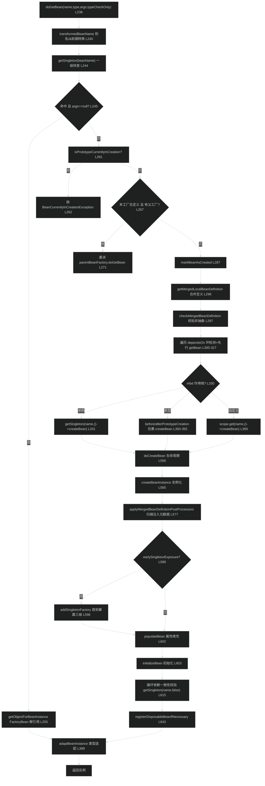

# 源码分析：Bean 工厂模块（spring-beans）—— IoC 容器 Bean 创建与依赖注入核心链路
> 上次修改：2026-07-26 20:22

## 阅读向导

本分析面向需要对 Spring IoC 容器进行**排障、代码审查或深度定制**的开发者，尤其是排查以下问题的读者：循环依赖失败（`BeanCurrentlyInCreationException`）、`@Autowired` 注入到错误候选或过期实例、代理与早期引用不一致、单例创建死锁/并发异常、`depends-on` 环。

阅读前建议先读同目录的 [Bean工厂模块.md](Bean工厂模块.md) 建立宏观认知（类层次、扩展点体系、模块边界）。本文**不重复**宏观介绍，而是对四个核心文件做**逐行级**追踪，聚焦「取 Bean → 造 Bean → 三级缓存 → 依赖解析注入点」这一条主链路。所有结论均标注具体行号，可对照源码逐行核验。

阅读顺序建议：第 4 章主线逐行解读是主干（先读），配合第 3 章三级缓存数据结构；第 5 章分支边界与第 8 章潜在问题服务于排障；第 6 章设计模式服务于审查者理解「为什么这样设计」。

---

## 1. 分析范围与目标

**涵盖范围**（四个核心文件的主链路方法）：

- `AbstractBeanFactory.doGetBean`（`support/AbstractBeanFactory.java` L236-L400）：三级缓存快查、原型循环检测、父工厂委派、合并 `BeanDefinition`、`dependsOn` 处理、单例/原型/自定义作用域三分支。
- `AbstractAutowireCapableBeanFactory.createBean / doCreateBean`（`support/AbstractAutowireCapableBeanFactory.java` L488-L650）：实例化前短路、`createBeanInstance` 构造策略、`applyMergedBeanDefinitionPostProcessors` 扫描注入元数据、`addSingletonFactory` 提前暴露、`populateBean`、`initializeBean`、循环依赖一致性校验、`getEarlyBeanReference`。
- `DefaultSingletonBeanRegistry` 三级缓存（`support/DefaultSingletonBeanRegistry.java` L86-L432、L529-L543）：`singletonObjects` / `earlySingletonObjects` / `singletonFactories` 三 Map、`getSingleton` 双检、`addSingletonFactory`、`getSingleton(name, factory)` 创建流程（含 6.2 lenient creation）、`isSingletonCurrentlyInCreation`、`beforeSingletonCreation`。
- 依赖解析注入点：`AutowiredAnnotationBeanPostProcessor`（`annotation/AutowiredAnnotationBeanPostProcessor.java` L278-L292、L489-L500、L527-L568、L732-L780）注入点扫描与字段注入，以及 `DefaultListableBeanFactory.doResolveDependency`（`support/DefaultListableBeanFactory.java` L1654-L1713）解析前段。

**不涵盖**：XML `<bean>` 解析细节（`xml/` 包）、SpEL 表达式求值内部、AOP 代理生成内部（仅在 `getEarlyBeanReference`/一致性校验的**提前暴露交界处**提及）、`doResolveDependency` 的多候选定夺（`@Primary`/`@Priority`）算法后段（已在 Bean工厂模块.md 覆盖，本文只到「注入点如何触发解析」为止）。

**分析目标**：理解 Bean 从「定义」到「完全初始化实例」的完整核心算法与状态迁移；掌握三级缓存解决循环依赖的精确时序；为排查创建期异常与注入异常提供可对照源码行号的依据；评估热路径性能与并发安全设计。

---

## 2. 核心类/函数全景

| 类/函数 | 职责 | 关键方法/字段 | 代码位置 |
|---------|------|---------------|----------|
| `AbstractBeanFactory` | 取 Bean 模板方法，所有 `getBean` 的收敛点 | `doGetBean`、`getMergedLocalBeanDefinition`、`markBeanAsCreated`、`getBeanPostProcessorCache` | `AbstractBeanFactory.java` L236/L1363/L1772/L1011 |
| `AbstractAutowireCapableBeanFactory` | 造 Bean 模板方法，Bean 生命周期主链路 | `createBean`、`doCreateBean`、`createBeanInstance`、`populateBean`、`initializeBean`、`getEarlyBeanReference` | `AbstractAutowireCapableBeanFactory.java` L488/L556/L1177/L1392/L1799/L968 |
| `DefaultSingletonBeanRegistry` | 单例注册表 + 三级缓存 + 循环依赖检测 | `getSingleton(name,allowEarlyReference)`、`getSingleton(name,factory)`、`addSingletonFactory`、`addSingleton`、`beforeSingletonCreation`、`isSingletonCurrentlyInCreation` | `DefaultSingletonBeanRegistry.java` L208/L255/L183/L159/L539/L529 |
| `AutowiredAnnotationBeanPostProcessor` | `@Autowired`/`@Value`/`@Inject` 注入点扫描与注入 | `postProcessMergedBeanDefinition`、`postProcessProperties`、`findAutowiringMetadata`、`buildAutowiringMetadata`、`AutowiredFieldElement.inject`/`resolveFieldValue` | `AutowiredAnnotationBeanPostProcessor.java` L278/L489/L527/L547/L732/L756 |
| `DefaultListableBeanFactory.doResolveDependency` | 依赖解析算法入口（注入点驱动） | shortcut → `@Value` → 标准名匹配 → 多值 | `DefaultListableBeanFactory.java` L1654 |

**函数关系**：`doGetBean`（取）在单例分支调用 `getSingleton(name, factory)`（三级缓存创建），后者回调 `createBean`→`doCreateBean`（造）；`doCreateBean` 在 `populateBean` 阶段经 `postProcessProperties` 委派 `AutowiredAnnotationBeanPostProcessor`，后者再调 `resolveDependency` 递归 `getBean`，形成完整闭环。

---

## 3. 关键数据结构

### 3.1 三级缓存三个 Map（DefaultSingletonBeanRegistry）

| 缓存 | 类型 | 键→值 | 用途 | 生命周期 |
|------|------|-------|------|----------|
| `singletonObjects`（一级） | `ConcurrentHashMap<String,Object>`（初始容量 256，L86） | beanName → 完全初始化单例 | 成品缓存，热路径命中源 | `addSingleton`（L160）写入，随容器全程存活，`destroySingleton` 移除 |
| `singletonFactories`（三级） | `ConcurrentHashMap<String,ObjectFactory<?>>`（初始 16，L89） | beanName → 生产早期引用的工厂 | 延迟生产早期引用（可能触发 AOP 早期代理） | `addSingletonFactory`（L185）写入，被消费或升级后由 `remove` 清除（L165/L228） |
| `earlySingletonObjects`（二级） | `ConcurrentHashMap<String,Object>`（初始 16，L95） | beanName → 已实例化未初始化完的早期引用 | 缓存已生产的早期引用，保证同一循环内早期引用一致 | 三级工厂被调用后升级写入（L229），`addSingleton` 清除（L166） |

辅助字段：`singletonsCurrentlyInCreation`（`ConcurrentHashMap.newKeySet`，L101）记录「正在创建的单例名」，是循环依赖检测与早期引用生产的门控依据；`registeredSingletons`（`LinkedHashSet`，L98）保序记录注册单例，供销毁逆序；`singletonLock`（`ReentrantLock`，L83）串行化创建。

### 3.2 为什么用三级缓存而非二级缓存

**结论**：三级缓存的核心价值在于**延迟性**——把「生成早期引用」这一动作封装为 `ObjectFactory` 延迟到「确实发生循环引用」时才执行，从而在需要时能插入 AOP 早期代理逻辑，且避免所有 Bean 都为循环依赖付出代价。

**源码依据**：早期引用工厂的内容是 `() -> getEarlyBeanReference(beanName, mbd, bean)`（`AbstractAutowireCapableBeanFactory.java` L596）。`getEarlyBeanReference`（L968-L974）遍历 `SmartInstantiationAwareBeanPostProcessor.getEarlyBeanReference`，AOP 的 `AbstractAutoProxyCreator` 正是在此**可能返回代理对象**。若只用二级缓存（实例化后立即把 raw 对象放入二级），则：

- 无法在「被循环引用」的时点插入代理决策——因为 raw 对象已直接暴露，等到初始化后 `applyBeanPostProcessorsAfterInitialization` 才生成代理，二者不一致；
- 三级的 `singletonFactories.get → getObject → 升级二级 → remove 三级`（L224-L230）保证：早期引用**只生产一次**并缓存到二级，同一循环内多次回取拿到同一早期引用（幂等）。

**三维评估**：
- **好处**：无侵入支持字段/Setter 循环依赖；延迟代理决策，非循环 Bean 零代理成本；早期引用幂等。
- **替代方案**：① 纯二级缓存（提前放 raw 实例）——能解 setter 循环依赖但无法正确插入代理，代理场景会不一致；② 彻底禁止循环依赖（构造器注入即如此），强制开发者重构。
- **风险**：无法解决**构造器循环依赖**（实例尚未产生，无早期引用可暴露）；当 A 被代理且已有 B 注入了 A 的 raw 早期引用时，触发一致性校验异常（见第 5 章）。

### 3.3 6.2 lenient creation 状态字段

为在**并行 bootstrap**（后台线程预实例化）下缩小 `singletonLock` 粒度，6.2 引入一组字段：`lenientCreationLock`（L107）、`lenientCreationFinished`（Condition，L110）、`singletonsInLenientCreation`（L113）、`lenientWaitingThreads`（L116）、`currentCreationThreads`（beanName→创建线程，L119）。它们服务于「某线程持锁创建时，另一线程可在锁外宽松创建同一/相关 Bean 并等待」的协调逻辑（详见第 4 章 4.3 与第 5 章）。这是本模块并发复杂度最高的区域。

---

## 4. 主线流程逐行解读

### 4.1 整体流程图

1-1.4 缓存快路径：`doGetBean`（L236 方法体自 L240 起）首先 `transformedBeanName(name)`（L240）剥离 `&` 工厂前缀并解析别名得到规范 `beanName`；随后 `getSingleton(beanName)`（L244，等价于 `getSingleton(name,true)`）无锁快查一级缓存。若命中且未传显式 `args`（L245），经 `getObjectForBeanInstance`（L255）处理可能的 `FactoryBean` 解引用后直接进入结果适配。这是「已初始化单例」的高频无锁路径。

2-2.3 原型检测与父工厂委派：缓存未命中进入 `else` 分支（L258）。先 `isPrototypeCurrentlyInCreation`（L261）——原型不支持循环依赖，命中即抛 `BeanCurrentlyInCreationException`（L262）。随后若本工厂 `!containsBeanDefinition(beanName)` 且存在父工厂（L267），按父工厂类型委派：父工厂为 `AbstractBeanFactory` 则直接 `abf.doGetBean`（L271），否则按 args/requiredType 转发标准 `getBean`（L273-L283），实现层次化容器语义。

3-3.3 定义合并与前置依赖：`markBeanAsCreated`（L287，仅非 typeCheckOnly）把 beanName 标记为已创建。`getMergedLocalBeanDefinition`（L296）合并父子定义得 `RootBeanDefinition mbd`，`checkMergedBeanDefinition`（L297）校验非抽象（抽象定义抛 `BeanIsAbstractException`）。遍历 `mbd.getDependsOn()`（L300-L327）：对每个 `dep` 先 `isDependent(beanName,dep)` 反向依赖检测，成环抛 `BeanCreationException`「Circular depends-on」（L303-L305）；否则 `registerDependentBean`（L307）+ 先行 `getBean(dep)`（L309），`dep` 缺失或创建失败分别包装异常（L311-L325）。

### 4.2 按作用域创建（doGetBean 的三分支）

4.1 单例分支：`mbd.isSingleton()`（L330）成立时调用 `getSingleton(beanName, ObjectFactory)`（L331），Lambda 内 `createBean(beanName, mbd, args)`（L333）。关键容错：`createBean` 抛 `BeansException` 时 `catch` 内 `destroySingleton(beanName)`（L339）——因为创建过程可能已把早期引用暴露进缓存，失败时必须清理，并连带移除已注入该早期引用的其他 Bean。返回后 `getObjectForBeanInstance`（L343）解引用 `FactoryBean`。

4.2 原型分支：`mbd.isPrototype()`（L346）时用 `beforePrototypeCreation(beanName)`（L350）/ `afterPrototypeCreation`（L354，`finally` 保证）包裹 `createBean`（L351）。原型不进三级缓存、不注册销毁，每次产出新实例。

4.3 自定义作用域分支：否则取 `mbd.getScope()`（L360）查已注册 `Scope`（L364），`scope.get(beanName, ObjectFactory)`（L369）委派作用域实现（如 request/session）创建，内部同样以 `before/afterPrototypeCreation` 包裹（L370-L376）。作用域未激活抛 `IllegalStateException` 被转为 `ScopeNotActiveException`（L380-L382）。三分支创建失败统一经 `cleanupAfterBeanCreationFailure`（L388）回滚，末尾 `adaptBeanInstance`（L399）做 requiredType 类型适配。

### 4.3 单例三级缓存创建（getSingleton(name, factory)）

`getSingleton(String, ObjectFactory)`（`DefaultSingletonBeanRegistry.java` L255）是单例创建的加锁入口：

- **锁策略判定**：`isCurrentThreadAllowedToHoldSingletonLock()`（L259）返回是否允许当前线程持锁；`acquireLock = !Boolean.FALSE.equals(lockFlag)`（L260），`locked = acquireLock && singletonLock.tryLock()`（L261）——用 `tryLock` 避免无条件阻塞。
- **一级快查**：持锁前先 `singletonObjects.get(beanName)`（L264），命中直接返回。
- **未命中且未获锁**：若 `Boolean.TRUE`（协调 bootstrap 中）走 lenient creation——把 beanName 加入 `singletonsInLenientCreation`（L281），允许在锁外创建；否则（无锁定指示）`singletonLock.lock()` 阻塞等待（L290），醒后再查一级（L293-L296）。
- **销毁期守卫**：`singletonsCurrentlyInDestruction` 为真抛 `BeanCreationNotAllowedException`（L300-L303）。
- **标记创建中**：`beforeSingletonCreation(beanName)`（L310）把 beanName 加入 `singletonsCurrentlyInCreation`，重复加入抛 `BeanCurrentlyInCreationException`。若捕获该异常（L312），进入 lenient 等待循环（L313-L358）：查一级、检查是否同线程或依赖等待的另一线程（`checkDependentWaitingThreads` 死锁检测，L318 成立则重新抛出），否则 `lenientCreationFinished.await()`（L328）等待其他线程完成。
- **执行创建**：`recordSuppressedExceptions`（L361）开启抑制异常收集；`currentCreationThreads.put(beanName, currentThread)`（L369）登记创建线程后 `singletonFactory.getObject()`（L371，即回调 `createBean`），`finally` 移除登记（L374），`newSingleton=true`（L376）。
- **异常处理**：`BeanCreationException` 时把 `suppressedExceptions` 作为 `relatedCause` 附加（L387-L393）；`finally` 中 `afterSingletonCreation`（L399）清除创建中标记。
- **升级一级**：`newSingleton` 时 `addSingleton(beanName, singletonObject)`（L404）写一级 + 清二三级（L165-L167）。`finally`（L417-L430）释放 `singletonLock` 并唤醒 lenient 等待线程（`lenientCreationFinished.signalAll()`，L426）。

### 4.4 doCreateBean 生命周期主链路

`doCreateBean`（`AbstractAutowireCapableBeanFactory.java` L556）是 `createBean`（L488，先 `resolveBeanClass` L499、`resolveBeforeInstantiation` 短路 L514）之后的实际创建：

- **实例化**：单例先查 `factoryBeanInstanceCache`（L562），否则 `createBeanInstance`（L565）产出 `BeanWrapper`；取 `bean`（L567）与 `beanType`（L568）。
- **合并定义后处理**：`synchronized(mbd.postProcessingLock)`（L574）内若 `!mbd.postProcessed`（L575），`applyMergedBeanDefinitionPostProcessors`（L577）让 `AutowiredAnnotationBeanPostProcessor` 等**扫描并缓存注入元数据**，随后 `markAsPostProcessed`（L583）。
- **提前暴露**：`earlySingletonExposure = mbd.isSingleton() && allowCircularReferences && isSingletonCurrentlyInCreation(beanName)`（L589-L590）；成立则 `addSingletonFactory(beanName, () -> getEarlyBeanReference(beanName, mbd, bean))`（L596）把早期引用工厂放入三级缓存。
- **填充与初始化**：`populateBean(beanName, mbd, instanceWrapper)`（L602）填充属性（含 `@Autowired` 注入），`initializeBean(beanName, exposedObject, mbd)`（L603）执行初始化并可能产出代理。异常在 L605-L612 处理。
- **一致性校验**：`earlySingletonExposure` 时 `getSingleton(beanName, false)`（L615，不生产新早期引用）取回早期引用；若 `exposedObject == bean`（未被代理，L617）则替换为早期引用（保持同一对象）；否则若 `!allowRawInjectionDespiteWrapping && hasDependentBean`（L620），收集**实际**依赖该 Bean 的名字（排除仅类型检查的，L624），非空则抛 `BeanCurrentlyInCreationException`（L629-L635）——因为其他 Bean 注入了 raw 早期引用但最终对象被包装成代理，二者不一致。
- **注册销毁**：`registerDisposableBeanIfNecessary`（L643）注册销毁回调，`return exposedObject`（L650）。

### 4.5 createBeanInstance 构造策略

`createBeanInstance`（L1177）按优先级：① `resolveBeanClass`（L1179）+ 非 public 校验（L1181）；② 无 args 且有 `instanceSupplier` → `obtainFromSupplier`（L1187-L1190）；③ 有 `factoryMethodName` → `instantiateUsingFactoryMethod`（L1193）；④ 已解析构造器捷径（`synchronized(mbd.constructorArgumentLock)` 读 `resolvedConstructorOrFactoryMethod`，L1201-L1207）→ 按 `autowireNecessary` 走 `autowireConstructor` 或 `instantiateBean`（L1208-L1215）；⑤ `determineConstructorsFromBeanPostProcessors`（L1218，委派 `SmartInstantiationAwareBeanPostProcessor` 推断 `@Autowired` 构造器）非空 或 `AUTOWIRE_CONSTRUCTOR`/有构造参数/有 args → `autowireConstructor`（L1219-L1221）；⑥ `getPreferredConstructors`（L1225）；⑦ 兜底无参 `instantiateBean`（约 L1230）。

### 4.6 populateBean 属性注入

`populateBean`（L1392）：空实例/record 守卫（L1393-L1413）后，先遍历 `InstantiationAwareBeanPostProcessor.postProcessAfterInstantiation`（L1418-L1424），任一返回 false 即终止填充（完全接管场景）。按 `resolvedAutowireMode` 执行 `autowireByName`（L1433）/`autowireByType`（L1437）把匹配 Bean 塞入 `MutablePropertyValues`（XML autowire 驱动）。**核心注入**在 L1441-L1452：遍历 `InstantiationAwareBeanPostProcessor.postProcessProperties`（L1446）——`@Autowired`/`@Value`/`@Resource` 真正注入于此，返回 null 直接返回（L1447-L1449）。最后若 `pvs != null` 则 `applyPropertyValues`（L1461）把显式 `PropertyValues` 经 `BeanWrapper` 写入。

### 4.7 initializeBean 初始化

`initializeBean`（L1799）：`NullBean` 跳过（L1801）；`invokeAwareMethods`（L1805）回调 `BeanNameAware`/`BeanClassLoaderAware`/`BeanFactoryAware`；`applyBeanPostProcessorsBeforeInitialization`（L1809，非 synthetic）；`invokeInitMethods`（L1813，先 `InitializingBean.afterPropertiesSet` 再自定义 init-method）；`applyBeanPostProcessorsAfterInitialization`（L1820，**AOP 代理通常在此产出**）；`return wrappedBean`（L1823）。

### 4.8 注入点扫描与字段注入（AutowiredAnnotationBeanPostProcessor）

- **扫描时机**：`postProcessMergedBeanDefinition`（L278）在实例化前被调用，触发 `findInjectionMetadata`（L281）；单例场景顺带清理 `candidateConstructorsCache`（L287）。
- **元数据构建与缓存**：`findAutowiringMetadata`（L527）以 beanName（或类名）为键先查 `injectionMetadataCache`（L531），`needsRefresh` 时双检锁内 `buildAutowiringMetadata`（L539）。后者 `doWithLocalFields`（L557）扫字段：`findAutowiredAnnotation`（L558）识别 `@Autowired`/`@Value`/`@Inject`，**跳过 static 字段**（L560-L565），按 `required` 建 `AutowiredFieldElement`（L567），逐级向父类递归（`do-while`）。
- **注入**：`postProcessProperties`（L489）取元数据后 `metadata.inject(bean, beanName, pvs)`（L493）。`AutowiredFieldElement.inject`（L732）：已缓存走 `resolveCachedArgument`（L738），否则 `resolveFieldValue`（L744/L748）。`resolveFieldValue`（L756）构造 `DependencyDescriptor`（L757）+ `beanFactory.resolveDependency`（L764，递归解析可能触发 `getBean`）；`synchronized(this)`（L769）内把单候选结果缓存为 `ShortcutDependencyDescriptor`（L774-L778）。解析出的非 null 值经 `field.set(bean, value)`（L752）反射写入。

### 4.9 doResolveDependency 解析前段

`doResolveDependency`（`DefaultListableBeanFactory.java` L1654）：Step1 `resolveShortcut`（L1661，缓存快返回）；Step2 `@Value` 建议值（L1669）经 `resolveEmbeddedValue` + `evaluateBeanDefinitionString` 求值后类型转换（L1671-L1686）；Step3 标准名匹配（L1690-L1708，`usesStandardBeanLookup` 时按依赖名/qualifier 名精确匹配并校验非 fallback、非 self）；Step4a 多值（stream/array/collection/map）`resolveMultipleBeans`（L1711）。注入点调用即从此进入，与 4.8 的 `resolveFieldValue` 衔接。

---

## 5. 分支与边界处理

| 分支/边界 | 触发条件 | 结果 | 风险/说明 |
|-----------|----------|------|-----------|
| 原型循环依赖 | `doGetBean` 中 `isPrototypeCurrentlyInCreation` 为真（L261） | 直接抛 `BeanCurrentlyInCreationException`（L262） | 原型无缓存可暴露早期引用，设计上不支持循环依赖 |
| 单例循环依赖（构造器） | `beforeSingletonCreation` 重入（`DefaultSingletonBeanRegistry.java` L540） | 抛 `BeanCurrentlyInCreationException`（L541） | 实例化阶段就需对方，尚无 raw 对象；需 `@Lazy` 或改字段注入 |
| 单例循环依赖（字段/Setter） | `getSingleton(name,true)` 中 `isSingletonCurrentlyInCreation` 为真且三级有工厂（L211/L224） | 生产早期引用并升级二级（L226-L229） | 可解；早期引用与最终对象需一致 |
| 代理与早期引用不一致 | `doCreateBean` 校验：`exposedObject != bean` 且有实际依赖者（L620/L628） | 抛 `BeanCurrentlyInCreationException`（L629） | 其他 Bean 注入了 raw 版本但最终被包装成代理 |
| `depends-on` 成环 | `isDependent(beanName,dep)` 为真（L303） | 抛 `BeanCreationException`「Circular depends-on」（L304） | 与三级缓存无关，纯依赖图检测 |
| `depends-on` 指向缺失 Bean | `getBean(dep)` 抛 `NoSuchBeanDefinitionException`（L311） | 包装为 `BeanCreationException`（L312） | 提示「depends on missing bean」 |
| 抽象定义 | `checkMergedBeanDefinition` 检出抽象（L297） | 抛 `BeanIsAbstractException` | 抽象定义仅作父模板，不可实例化 |
| 销毁期取 Bean | `getSingleton(name,factory)` 中 `singletonsCurrentlyInDestruction` 为真（L300） | 抛 `BeanCreationNotAllowedException`（L301） | 禁止在销毁方法内向容器请求 Bean |
| 作用域未激活 | 自定义作用域 `scope.get` 抛 `IllegalStateException`（L380） | 转 `ScopeNotActiveException`（L381） | request/session 无当前上下文时 |
| 非 public 类且不允许 | `createBeanInstance` 校验（L1181） | 抛 `BeanCreationException`（L1182） | `nonPublicAccessAllowed=false` 时 |
| static 字段带 `@Autowired` | `buildAutowiringMetadata` 检出 static（L560） | INFO 日志 + 跳过（L562-L564） | 静态字段不注入，静默忽略 |
| `postProcessAfterInstantiation` 返回 false | `populateBean` L1420 | 直接 `return`，跳过所有后续填充（L1421） | 用于完全接管属性的扩展 |
| `postProcessProperties` 返回 null | `populateBean` L1447 | 直接 `return`，跳过 `applyPropertyValues`（L1448） | 后处理器完全接管属性 |

**并发边界（lenient creation）**：`getSingleton(name,factory)` 的 `tryLock` 失败分支（L266）区分两种情况——协调 bootstrap 中（`lockFlag==TRUE`）走宽松创建（锁外创建，L272-L285），非协调场景阻塞等待锁（L290）。`beforeSingletonCreation` 抛异常后进入 `lenientCreationFinished.await()` 等待循环（L315-L339），其中 `checkDependentWaitingThreads`（L318）做**跨线程死锁检测**：若目标线程正等待当前线程完成，则重新抛出原异常打破死锁。此分支是 6.2 为并行预实例化引入的核心并发路径，逻辑复杂度最高。

**早期引用生产的锁边界**：`getSingleton(name, allowEarlyReference)`（L208）用 `singletonLock.tryLock()`（L214）而非 `lock()`——若锁被其他线程持有则**直接返回 null**（L216），刻意避免在非原始创建线程上错误推断早期引用，保证「早期引用只由原始创建线程生产」。

## 6. 设计模式与架构决策

### 6.1 模板方法模式（Template Method）—— doGetBean / doCreateBean

**体现**：`AbstractBeanFactory.doGetBean`（L236）定义取 Bean 的固定骨架（快查→检测→合并→分支创建→适配），把「如何造 Bean」抽象为 `createBean` 交给子类 `AbstractAutowireCapableBeanFactory` 填充（L488）；后者又把 `doGetBean`/`getMergedLocalBeanDefinition` 等继承自父类。`doCreateBean`（L556）进一步把生命周期拆成 `createBeanInstance`/`populateBean`/`initializeBean` 三个可覆盖步骤。

**三维评估**：
- **好处**：取 Bean 的三级缓存、作用域、依赖检测等**公共且易错**的逻辑收敛在抽象类中一处实现，子类只填充「造」的变化点，避免重复与漂移。
- **替代方案**：把取与造揉进单个 God 类——代码集中但违反单一职责，`DefaultListableBeanFactory` 将极难维护；或用组合而非继承（策略对象），但会丢失 protected 钩子方法的细粒度覆盖能力。
- **风险**：继承层次深（`DefaultSingletonBeanRegistry → AbstractBeanFactory → AbstractAutowireCapableBeanFactory → DefaultListableBeanFactory`），protected 方法众多，覆盖时需精确理解调用时序，否则破坏生命周期契约。

### 6.2 工厂方法 + ObjectFactory 延迟求值 —— 三级缓存

**体现**：`getSingleton(name, ObjectFactory)`（L255）以 `ObjectFactory` 作为「延迟创建」的抽象；三级缓存 `singletonFactories` 存的正是 `ObjectFactory<?>`（L89），早期引用工厂 `() -> getEarlyBeanReference(...)`（L596）把「是否生成代理」延迟到确实被循环引用时（L226 `getObject()`）才决定。

**三维评估**：
- **好处**：`ObjectFactory` 封装延迟性，使早期代理决策与「非循环 Bean 零成本」并存；创建与缓存解耦，`DefaultSingletonBeanRegistry` 无需知道 Bean 如何造。
- **替代方案**：实例化后立即把 raw 对象放二级缓存（无 ObjectFactory）——简单但无法在暴露点插入代理；或用显式代理预创建，破坏「仅循环时才代理」的惰性。
- **风险**：三级工厂 `getObject()` 在持 `singletonLock` 时执行，若内部再触发复杂依赖创建可能递归加锁；6.2 lenient creation 正是为化解跨线程场景的死锁而生，代价是并发逻辑显著复杂化。

### 6.3 注册表模式（Registry）—— DefaultSingletonBeanRegistry

**体现**：`DefaultSingletonBeanRegistry` 实现 `SingletonBeanRegistry`，用一组 Map（三级缓存 + `dependentBeanMap`/`disposableBeans`）作为单例的中央注册表，`addSingleton`（L159）/`getSingleton`/`destroySingletons` 是标准的注册/查询/注销三元组。

**三维评估**：
- **好处**：所有单例状态（含创建中标记、依赖图、销毁回调）集中管理，销毁能按依赖逆序（`destroyBean` 先销毁 `dependentBeanMap` 中的依赖者，L787）保证正确性。
- **替代方案**：把单例缓存散落在 `AbstractBeanFactory` 中——但循环依赖检测与销毁编排需要与缓存紧耦合，分散会导致状态一致性难保证。
- **风险**：注册表持有强引用，单例随容器全程存活；`dependentBeanMap`/`containedBeanMap` 用 `synchronized` 块保护（L779/L806/L817），高频注册时可能成为锁点。

### 6.4 后处理器扩展点（Strategy / Interceptor）—— BeanPostProcessor 家族

**体现**：`applyMergedBeanDefinitionPostProcessors`（L577）、`populateBean` 的 `postProcessProperties`（L1446）、`initializeBean` 的 before/after（L1809/L1820）、`getEarlyBeanReference`（L971）都在固定生命周期节点遍历对应的后处理器子类型。`AutowiredAnnotationBeanPostProcessor` 通过实现 `MergedBeanDefinitionPostProcessor` + `SmartInstantiationAwareBeanPostProcessor` 把注解注入插入其中。

**三维评估**：
- **好处**：开闭原则典范——核心容器无需知道 AOP/注解注入细节，增强能力横向插入；后处理器按类型预分类缓存（`BeanPostProcessorCache`，`AbstractBeanFactory.java` L2103）避免每次遍历时 `instanceof` 判定。
- **替代方案**：把注解注入、AOP 硬编码进 `initializeBean`/`populateBean`——破坏可插拔性，第三方无法扩展。
- **风险**：后处理器过早初始化会错过对更早创建 Bean 的处理；`postProcessProperties`（注解路径）与 `applyPropertyValues`（PropertyValues 路径）对同一属性都赋值时，后者后写会覆盖前者，顺序敏感。

## 7. 性能与资源分析

**结论**：模块通过「三级无锁快查 + 合并定义缓存 + 注入元数据缓存 + 单候选 shortcut 缓存」把绝大多数取 Bean/注入操作压到 O(1) 冷路径外。

- **三级缓存查找（热路径）**：`getSingleton(name)`（L196→L208）首行 `singletonObjects.get`（L210）是 `ConcurrentHashMap` 无锁读，已初始化单例取用零竞争。仅当一级未命中且正在创建时才进入 `tryLock` 分支（L214），循环依赖是极少数场景。复杂度 O(1)。
- **合并定义缓存**：`getMergedLocalBeanDefinition`（L1363）缓存 `RootBeanDefinition`，避免每次 `getBean` 都重新合并父子定义；仅在 `!isCacheBeanMetadata()` 时于 `finally` 清理（L393-L395）。
- **注入元数据缓存**：`findAutowiringMetadata`（L527）以 beanName 为键缓存 `InjectionMetadata`（L531/L540），双检锁 + `needsRefresh` 门控（L532/L535），把反射扫字段/方法的成本摊到首次创建。`buildAutowiringMetadata` 先 `isCandidateClass` 短路（L548）避免无注解类的无谓扫描。
- **单候选 shortcut 缓存**：`resolveFieldValue`（L756）首次解析后，若 `autowiredBeanNames.size() == 1` 且类型匹配，缓存为 `ShortcutDependencyDescriptor`（L778），二次注入走 `resolveShortcut`（`doResolveDependency` L1661）直接返回，跳过完整候选查找。
- **构造器捷径**：`createBeanInstance` 缓存 `resolvedConstructorOrFactoryMethod`（L1202），重建同名 Bean（原型多次创建）时跳过构造器推断。
- **潜在瓶颈**：`autowireByType` 与 `findAutowireCandidates`（未在本文范围，但被 `resolveDependency` 调用）需遍历所有候选定义并 `isAutowireCandidate` 判定，大量 Bean 时接近 O(N)；`@Autowired` 集合注入会实例化全部候选。`registeredSingletons` 用 `Collections.synchronizedSet`（L98），高频注册时是同步点。

## 8. 潜在问题与改进建议

**确认的设计约束（非缺陷）**：

1. **构造器循环依赖无法自动解决**（确认）。`beforeSingletonCreation`（L540）在实例化前重入即抛异常，因构造器注入在实例产生前就需要对方引用，三级缓存无从暴露。复现：两个 Bean 互相构造器注入。改进：文档明确引导用 `@Lazy`（注入代理）或改字段/Setter 注入——这是取舍而非 bug。

2. **早期引用与代理不一致校验**（确认）。`doCreateBean` L620-L635 的一致性校验：当 A 被 AOP 代理、而 B 已注入 A 的 raw 早期引用时抛 `BeanCurrentlyInCreationException`。复现：A、B 字段循环依赖且 A 被切面代理。改进：`AbstractAutoProxyCreator` 通过 `getEarlyBeanReference` 提前代理可规避；`allowRawInjectionDespiteWrapping=true` 可强制放行（有风险，B 会持有非最终版本）。

**疑似问题（需进一步验证）**：

3. **lenient creation 分支的可读性与死锁边界**（疑似，需并发验证）。`getSingleton(name,factory)`（L255-L432）的宽松创建涉及 `singletonsInLenientCreation`/`lenientWaitingThreads`/`currentCreationThreads` 三个状态与 `checkDependentWaitingThreads` 死锁检测（L318），分支多、状态耦合紧。严重程度：中（仅并行 bootstrap 触发）。改进建议：**目标** `DefaultSingletonBeanRegistry.getSingleton(name,factory)`；**问题** 跨线程锁协调分支难以静态推断是否覆盖所有死锁形态；**建议动作** 补状态机图与多线程单测覆盖各 await/signal 路径；**收益/风险** 降低误改死锁风险，收益高，改动需完备回归。

4. **注入元数据缓存以 beanName 为键的失效依赖**（疑似）。`injectionMetadataCache`（L531）以 beanName 缓存；若同名定义运行时被替换而缓存未失效，可能注入过期候选。严重程度：低（正常流程 `resetBeanDefinition` 会清理）。改进建议：**目标** `AutowiredAnnotationBeanPostProcessor` 缓存失效；**问题** 依赖调用方正确触发清理；**建议动作** 补充「定义热替换后缓存一致性」测试；**收益/风险** 防御性提升，纯测试改动无风险。

## 9. 文件职责表

| 文件 | 职责 | 关键类/函数 | 分析涉及章节 |
|------|------|-------------|-------------|
| `spring-beans/src/main/java/org/springframework/beans/factory/support/AbstractBeanFactory.java` | 取 Bean 模板方法收敛点 | `doGetBean`、`getMergedLocalBeanDefinition`、`markBeanAsCreated` | 4.1/4.2、5 |
| `spring-beans/src/main/java/org/springframework/beans/factory/support/AbstractAutowireCapableBeanFactory.java` | 造 Bean 模板方法与生命周期 | `createBean`、`doCreateBean`、`createBeanInstance`、`populateBean`、`initializeBean`、`getEarlyBeanReference` | 4.4-4.7、6.1 |
| `spring-beans/src/main/java/org/springframework/beans/factory/support/DefaultSingletonBeanRegistry.java` | 单例注册表 + 三级缓存 + 循环检测 | `getSingleton(x2)`、`addSingletonFactory`、`addSingleton`、`beforeSingletonCreation` | 3、4.3、5、6.2/6.3 |
| `spring-beans/src/main/java/org/springframework/beans/factory/annotation/AutowiredAnnotationBeanPostProcessor.java` | `@Autowired`/`@Value`/`@Inject` 注入 | `postProcessMergedBeanDefinition`、`postProcessProperties`、`buildAutowiringMetadata`、`AutowiredFieldElement.inject`/`resolveFieldValue` | 4.8、6.4、7 |
| `spring-beans/src/main/java/org/springframework/beans/factory/support/DefaultListableBeanFactory.java` | 依赖解析算法入口 | `doResolveDependency` | 4.9 |

## 10. 代码引用索引

| 引用 | 说明 |
|------|------|
| `spring-beans/src/main/java/org/springframework/beans/factory/support/AbstractBeanFactory.java:236-400` | `doGetBean` 主链路 |
| `spring-beans/src/main/java/org/springframework/beans/factory/support/AbstractBeanFactory.java:240-255` | 别名转换 + 一级快查 + FactoryBean 解引用 |
| `spring-beans/src/main/java/org/springframework/beans/factory/support/AbstractBeanFactory.java:261-283` | 原型循环检测 + 父工厂委派 |
| `spring-beans/src/main/java/org/springframework/beans/factory/support/AbstractBeanFactory.java:296-327` | 合并定义 + depends-on 环检测 |
| `spring-beans/src/main/java/org/springframework/beans/factory/support/AbstractBeanFactory.java:330-399` | 单例/原型/作用域三分支创建 + adaptBeanInstance |
| `spring-beans/src/main/java/org/springframework/beans/factory/support/AbstractBeanFactory.java:1011/1363/1772` | `getBeanPostProcessorCache`/`getMergedLocalBeanDefinition`/`markBeanAsCreated` |
| `spring-beans/src/main/java/org/springframework/beans/factory/support/AbstractBeanFactory.java:2103-2112` | `BeanPostProcessorCache` 预分类 |
| `spring-beans/src/main/java/org/springframework/beans/factory/support/DefaultSingletonBeanRegistry.java:83-119` | `singletonLock` + 三级缓存 + lenient creation 字段 |
| `spring-beans/src/main/java/org/springframework/beans/factory/support/DefaultSingletonBeanRegistry.java:159-188` | `addSingleton`/`addSingletonFactory` 升级即清理 |
| `spring-beans/src/main/java/org/springframework/beans/factory/support/DefaultSingletonBeanRegistry.java:208-244` | `getSingleton(name,allowEarlyReference)` 三级探测 + tryLock |
| `spring-beans/src/main/java/org/springframework/beans/factory/support/DefaultSingletonBeanRegistry.java:255-432` | `getSingleton(name,factory)` 创建 + lenient creation 并发 |
| `spring-beans/src/main/java/org/springframework/beans/factory/support/DefaultSingletonBeanRegistry.java:529-543` | `isSingletonCurrentlyInCreation`/`beforeSingletonCreation` |
| `spring-beans/src/main/java/org/springframework/beans/factory/support/DefaultSingletonBeanRegistry.java:776-830` | `destroyBean` 依赖逆序销毁 |
| `spring-beans/src/main/java/org/springframework/beans/factory/support/AbstractAutowireCapableBeanFactory.java:488-540` | `createBean` + 实例化前短路 |
| `spring-beans/src/main/java/org/springframework/beans/factory/support/AbstractAutowireCapableBeanFactory.java:556-650` | `doCreateBean` 生命周期主链路 |
| `spring-beans/src/main/java/org/springframework/beans/factory/support/AbstractAutowireCapableBeanFactory.java:589-596` | 早期单例暴露 `addSingletonFactory` |
| `spring-beans/src/main/java/org/springframework/beans/factory/support/AbstractAutowireCapableBeanFactory.java:614-637` | 循环依赖一致性校验 |
| `spring-beans/src/main/java/org/springframework/beans/factory/support/AbstractAutowireCapableBeanFactory.java:968-974` | `getEarlyBeanReference` |
| `spring-beans/src/main/java/org/springframework/beans/factory/support/AbstractAutowireCapableBeanFactory.java:1177-1230` | `createBeanInstance` 构造策略 |
| `spring-beans/src/main/java/org/springframework/beans/factory/support/AbstractAutowireCapableBeanFactory.java:1392-1462` | `populateBean` 属性注入 |
| `spring-beans/src/main/java/org/springframework/beans/factory/support/AbstractAutowireCapableBeanFactory.java:1799-1823` | `initializeBean` 初始化 |
| `spring-beans/src/main/java/org/springframework/beans/factory/annotation/AutowiredAnnotationBeanPostProcessor.java:278-292` | `postProcessMergedBeanDefinition` 扫描时机 |
| `spring-beans/src/main/java/org/springframework/beans/factory/annotation/AutowiredAnnotationBeanPostProcessor.java:489-500` | `postProcessProperties` 注入入口 |
| `spring-beans/src/main/java/org/springframework/beans/factory/annotation/AutowiredAnnotationBeanPostProcessor.java:527-568` | 注入元数据构建与缓存 |
| `spring-beans/src/main/java/org/springframework/beans/factory/annotation/AutowiredAnnotationBeanPostProcessor.java:732-780` | `AutowiredFieldElement.inject`/`resolveFieldValue` + shortcut 缓存 |
| `spring-beans/src/main/java/org/springframework/beans/factory/support/DefaultListableBeanFactory.java:1654-1713` | `doResolveDependency` 解析前段 |
