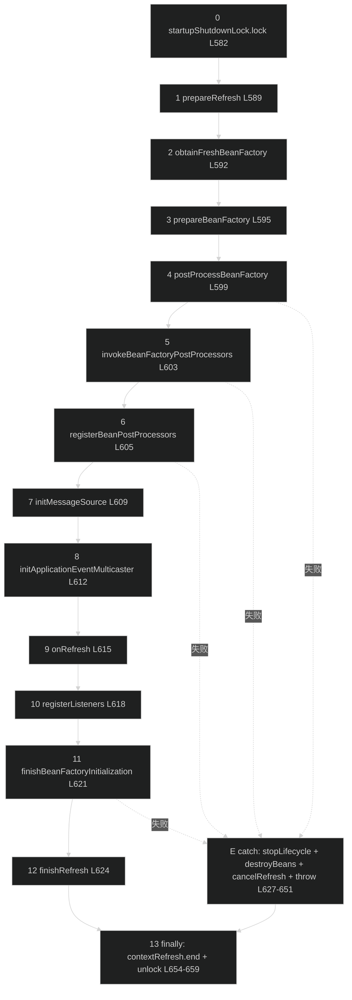
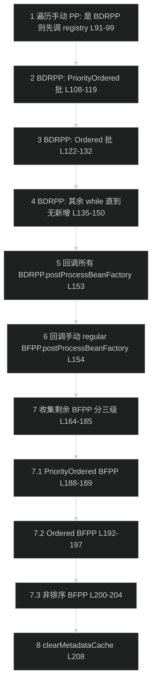
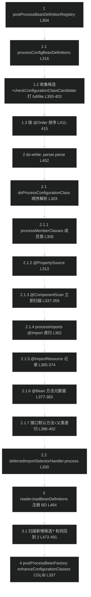

# 源码分析：应用上下文模块 refresh() 启动生命周期与配置类解析

> 上次修改：2026-07-26 20:07

## 阅读向导

- **面向读者**：本分析面向想彻底吃透 Spring 容器启动流程的开发者、排查"Bean 未注册 / 配置类未生效 / 后处理器执行时机错乱"的排障者，以及审查上下文层实现的代码审查者。
- **前置阅读**：建议先读同目录下的 [应用上下文模块.md](应用上下文模块.md)，了解 `ApplicationContext` 继承体系、组合委托 `DefaultListableBeanFactory` 的宏观架构、事件系统与约定 Bean 名等背景。本文**不重复**宏观内容，聚焦 `refresh()` 12 步模板方法、`invokeBeanFactoryPostProcessors` 的后处理器执行顺序、`ConfigurationClassPostProcessor` / `ConfigurationClassParser` 的配置类解析递归这三条链路的**逐行**解读。
- **建议阅读顺序**：第 1 章确认范围 → 第 4 章主线逐行解读（核心）→ 第 2/3 章回查类与数据结构 → 第 5 章分支边界 → 第 6-8 章设计与问题 → 第 10 章代码索引按图索骥。

---

## 1. 分析范围与目标

**涵盖范围**（均引用具体行号）：

- `AbstractApplicationContext.refresh()` 的 12 步模板方法及其失败回滚：`prepareRefresh` / `obtainFreshBeanFactory` / `prepareBeanFactory` / `postProcessBeanFactory` / `invokeBeanFactoryPostProcessors` / `registerBeanPostProcessors` / `initMessageSource` / `initApplicationEventMulticaster` / `onRefresh` / `registerListeners` / `finishBeanFactoryInitialization` / `finishRefresh`，以及 `catch` 块的 `destroyBeans` / `cancelRefresh`（`AbstractApplicationContext.java:580-661`）。
- `invokeBeanFactoryPostProcessors` 中 `BeanDefinitionRegistryPostProcessor`（BDRPP）与 `BeanFactoryPostProcessor`（BFPP）的执行顺序契约（`PostProcessorRegistrationDelegate.java:68-209`）。
- `ConfigurationClassPostProcessor` 驱动的 `@Configuration` 解析：`processConfigBeanDefinitions` 的候选收集 + do-while 增量循环，`enhanceConfigurationClasses` 的 CGLIB 增强（`ConfigurationClassPostProcessor.java:304-586`）。
- `ConfigurationClassParser` 的 `doProcessConfigurationClass` 顺序敏感解析（成员类 → `@PropertySource` → `@ComponentScan` → `@Import` → `@ImportResource` → `@Bean` → 接口默认方法 → 父类递归）与 `processImports` 四类导入分派（`ConfigurationClassParser.java:168-403`、`579-650`）。
- `finishBeanFactoryInitialization` 触发 `preInstantiateSingletons`（`AbstractApplicationContext.java:942-995`）。

**不涵盖**：SpEL 表达式求值本体（spring-expression）、AOP 代理织入内部（spring-aop）、具体 Web 上下文（`WebApplicationContext` 系）的 `onRefresh` 特化、`DefaultListableBeanFactory.preInstantiateSingletons` 内部的 Bean 创建/依赖注入算法（属 spring-beans 层，仅在触发点提及）、组件扫描 ASM 底层（在 `应用上下文模块.md` 第 6.4 节已述，本文只在 `@ComponentScan` 触发点引用）。

**分析目标**：理解启动编排的**不变骨架与可变扩展点**如何解耦、后处理器的**确定性执行时机**如何被多趟循环 + 三级排序保证、注解配置如何在**不实例化业务 Bean** 的前提下扩充 `BeanDefinition`，并评估回滚异常安全、CGLIB 增强边界等可维护性风险。

---

## 2. 核心类/函数全景

| 类 / 函数 | 职责 | 关键方法 / 属性 | 代码位置 |
|-----------|------|-----------------|----------|
| `AbstractApplicationContext#refresh` | 12 步启动模板方法 + 失败回滚 | 顺序调用 12 个受保护方法；`catch (RuntimeException｜Error)` 回滚 | `AbstractApplicationContext.java:580-661` |
| `AbstractApplicationContext#prepareRefresh` | 置 active、校验必需属性、开辟早期事件收集器 | `active.set(true)`、`earlyApplicationEvents` | `.java:667-702` |
| `AbstractApplicationContext#obtainFreshBeanFactory` | 触发子类刷新工厂并返回 | `refreshBeanFactory()` + `getBeanFactory()` | `.java:719-722` |
| `AbstractApplicationContext#prepareBeanFactory` | 注册 Aware 处理器、可解析依赖、默认单例 | `addBeanPostProcessor`、`registerResolvableDependency` | `.java:729-775` |
| `AbstractApplicationContext#invokeBeanFactoryPostProcessors` | 委托 delegate 调用后处理器 | 委托 `PostProcessorRegistrationDelegate` | `.java:794-804` |
| `AbstractApplicationContext#registerListeners` | 注册监听器 + 重放早期事件 | `earlyApplicationEvents = null` | `.java:914-935` |
| `AbstractApplicationContext#finishBeanFactoryInitialization` | 冻结定义 + 实例化非懒单例 | `freezeConfiguration()`、`preInstantiateSingletons()` | `.java:942-995` |
| `AbstractApplicationContext#finishRefresh` | 清缓存、启动生命周期、发 `ContextRefreshedEvent` | `getLifecycleProcessor().onRefresh()` | `.java:1002-1017` |
| `AbstractApplicationContext#cancelRefresh` | 回滚：置 `active=false` + 清反射缓存 | `active.set(false)` | `.java:1024-1029` |
| `PostProcessorRegistrationDelegate#invokeBeanFactoryPostProcessors` | BDRPP → BFPP 两阶段 + 三级排序 | `registryProcessors` / `regularPostProcessors` / `processedBeans` | `PostProcessorRegistrationDelegate.java:68-209` |
| `ConfigurationClassPostProcessor` | BDRPP + `PriorityOrdered`，解析并增强配置类 | `postProcessBeanDefinitionRegistry` / `postProcessBeanFactory` | `ConfigurationClassPostProcessor.java:152-154`、`304-339` |
| `ConfigurationClassPostProcessor#processConfigBeanDefinitions` | 候选收集 + do-while 增量解析 | `parser.parse` / `reader.loadBeanDefinitions` | `.java:389-506` |
| `ConfigurationClassPostProcessor#enhanceConfigurationClasses` | 对 full 类做 CGLIB 增强 | `ConfigurationClassEnhancer#enhance` | `.java:514-586` |
| `ConfigurationClassParser#parse` | 逐个配置类解析入口 + 延迟导入收尾 | `deferredImportSelectorHandler.process()` | `ConfigurationClassParser.java:168-201` |
| `ConfigurationClassParser#doProcessConfigurationClass` | 顺序敏感的单类解析 | 成员类/属性源/扫描/导入/Bean/父类 | `.java:303-403` |
| `ConfigurationClassParser#processImports` | `@Import` 四类目标分派 + 递归 | `importStack`、递归 `processImports` / `processConfigurationClass` | `.java:579-650` |
| `ConfigurationClassUtils#checkConfigurationClassCandidate` | 判定 full / lite 并打标 | `CONFIGURATION_CLASS_ATTRIBUTE` | `ConfigurationClassUtils.java:106-165` |

---

## 3. 关键数据结构

### 3.1 后处理器执行顺序涉及的集合（`PostProcessorRegistrationDelegate.invokeBeanFactoryPostProcessors`）

| 结构 | 类型 | 生命周期 / 用途 |
|------|------|-----------------|
| `processedBeans` | `HashSet<String>`（L85） | 记录**已在 BDRPP 阶段处理过**的处理器 Bean 名，供后续 BFPP 阶段跳过（L173），避免同一处理器被重复调用。 |
| `regularPostProcessors` | `ArrayList<BeanFactoryPostProcessor>`（L88） | 收集"通过 `addBeanFactoryPostProcessor` 手动注册、且不是 BDRPP"的处理器，最后统一回调其 `postProcessBeanFactory`（L154）。 |
| `registryProcessors` | `ArrayList<BeanDefinitionRegistryPostProcessor>`（L89） | 累积**所有**已执行过 `postProcessBeanDefinitionRegistry` 的 BDRPP（含手动 + 三级发现的），最后统一回调其 `postProcessBeanFactory`（L153）。 |
| `currentRegistryProcessors` | `ArrayList<BeanDefinitionRegistryPostProcessor>`（L105） | **每一趟**排序/调用的临时批次容器，调用后 `clear()`（L119/L132/L149），保证三级（PriorityOrdered / Ordered / 其余）分批有序。 |

**为何用多个 List + 多趟循环**：源码 L71-82 明确警示"不要为简化而合并"——三级排序 + 两阶段分离是**契约**，合并会破坏 `PriorityOrdered`/`Ordered` 的实例化与调用顺序。选择 `List`（有序）而非 `Set`，正是因为排序（`sortPostProcessors` L325-338）是核心诉求。

### 3.2 配置类解析数据结构（`ConfigurationClassParser` / `ConfigurationClassPostProcessor`）

| 结构 | 类型 | 生命周期 / 用途 |
|------|------|-----------------|
| `configCandidates` | `List<BeanDefinitionHolder>`（PP.java:390） | 首轮扫描注册表得到的配置类候选，按 `@Order` 排序（PP.java:411-415）后交给 parser。 |
| `candidates` / `alreadyParsed` | `LinkedHashSet`（PP.java:448-449） | do-while 增量循环的工作集：`candidates` 是本轮待解析集，`alreadyParsed` 去重已解析类；解析可能注册**新**配置类，循环直到无新增（PP.java:450-491）。 |
| `configurationClasses` | `Map<ConfigurationClass, ConfigurationClass>`（parser 字段） | 已解析配置类模型的容器，`processConfigurationClass` 用它做 imported / scanned / 显式定义的覆盖裁决（Parser.java:253-292）。 |
| `knownSuperclasses` | `MultiValueMap<String, ConfigurationClass>`（parser 字段） | 记录已遍历父类，避免父类链重复递归（Parser.java:392-394）。 |
| `importStack` | `ImportStack`（既是访问栈又是 `ImportRegistry`） | `processImports` 入栈/出栈（Parser.java:590/647）做**循环导入检测**（`isChainedImportOnStack` L652-664），并登记 imported-by 关系供 `ImportAware` 回填。 |
| `ConfigurationClass` | 领域对象 | 聚合一个配置类的 `@Bean` 方法、`@ImportResource`、`ImportBeanDefinitionRegistrar`、`BeanRegistrar` 及 importedBy 集合；最终由 `ConfigurationClassBeanDefinitionReader` 转成 `BeanDefinition`（PP.java:464）。 |
| `CONFIGURATION_CLASS_ATTRIBUTE` | `BeanDefinition` 属性，值 `"full"`/`"lite"` | full = `@Configuration(proxyBeanMethods!=false)`（需 CGLIB 增强）；lite = 带 `@Bean`/`@Component` 等的普通类（不增强）。由 `checkConfigurationClassCandidate` 打标（Utils.java:146-153）。 |

**为何 `configurationClasses` 用 Map<K,K>**：`ConfigurationClass` 的 `equals/hashCode` 基于类名，用 Map 可"按同一 key 拿回已存实例"以合并 importedBy（Parser.java:257 `mergeImportedBy`），List 无法 O(1) 命中同名已解析类。

---

## 4. 主线流程逐行解读

### 4.1 refresh() 12 步整体流程图

**分阶段步骤说明**：

0 加锁：`refresh()` 方法体首先 `startupShutdownLock.lock()`（L582）并记录 `startupShutdownThread = Thread.currentThread()`（L584），使 `refresh()` 与 `close()` 串行互斥。随后 `applicationStartup.start("spring.context.refresh")`（L586）开启 startup 追踪。

1-4 准备阶段：`prepareRefresh`（L589）→ `obtainFreshBeanFactory`（L592）→ `prepareBeanFactory`（L595）在**内层 try 之前**执行；`postProcessBeanFactory`（L599）是内层 try 的第一步。注意第 1-3 步不在回滚保护内（异常会直接透传到外层 finally 解锁），从第 4 步起才被 `catch` 覆盖（try 起始于 L597）。

5-6 后处理器阶段：`invokeBeanFactoryPostProcessors`（L603）在此解析 `@Configuration`、扩充 `BeanDefinition`；`registerBeanPostProcessors`（L605）注册 `BeanPostProcessor`。两步被 `beanPostProcess` startup step 包裹（L601/L606）。

7-10 基础设施初始化：消息源（L609）、事件广播器（L612）、子类特殊 Bean `onRefresh`（L615）、监听器注册与早期事件重放（L618）。

11-12 实例化与收尾：`finishBeanFactoryInitialization`（L621）实例化所有非懒单例，`finishRefresh`（L624）发布 `ContextRefreshedEvent`。

13/E 收尾与回滚：正常路径 `finally { contextRefresh.end() }`（L654）再走外层 `finally` 解锁（L657-659）；异常路径进入 `catch`（L627）执行停止 Lifecycle、`destroyBeans`、`cancelRefresh` 后重抛（详见 5.1）。

### 4.2 步骤 1 `prepareRefresh`（L667-702）

- **L669-671**：`startupDate = System.currentTimeMillis()`、`closed.set(false)`、`active.set(true)`——**状态翻转**是本步核心，此后 `assertBeanFactoryActive` 等校验才通过。
- **L683 `initPropertySources()`**：默认空实现（L709-711），供 Web 上下文注入 Servlet 属性源等（模板方法扩展点）。
- **L687 `getEnvironment().validateRequiredProperties()`**：**输入校验**，若 `setRequiredProperties` 声明的键缺失则此处抛 `MissingRequiredPropertiesException`，属于最早的失败点。
- **L690-697 早期监听器备份/还原**：首次刷新时把 `applicationListeners` 快照进 `earlyApplicationListeners`（L691）；再次刷新（可刷新上下文）时用快照**还原**监听器集合（L695-696），避免上一轮动态加入的监听器污染本轮。
- **L701 `earlyApplicationEvents = new LinkedHashSet<>()`**：开辟早期事件收集器——**此后到 `registerListeners` 之间**发布的事件会被暂存而非立即广播（因广播器尚未就绪）。

### 4.3 步骤 2 `obtainFreshBeanFactory`（L719-722）

仅两行：`refreshBeanFactory()`（抽象方法，`GenericApplicationContext` 用 `refreshed.compareAndSet(false,true)` 实现**单次刷新**约束，见 `应用上下文模块.md` 5.1）+ `return getBeanFactory()`（返回内部 `DefaultListableBeanFactory`）。**输出**是后续所有步骤操作的工厂实例。

### 4.4 步骤 3 `prepareBeanFactory`（L729-775）

对裸工厂做"上下文化"加工，是理解 Aware 注入与依赖解析的关键：

- **L731-733**：设类加载器、SpEL 表达式解析器 `StandardBeanExpressionResolver`、`ResourceEditorRegistrar`（使 `${...}`/`#{...}` 与资源类型可解析）。
- **L736 `addBeanPostProcessor(new ApplicationContextAwareProcessor(this))`**：注入处理器，Bean 初始化时回填 `ApplicationContextAware` 等六类 Aware。
- **L737-743 `ignoreDependencyInterface(...)`**：**关键设计**——把六个 `*Aware` 接口从自动装配中排除，因为它们由 L736 的处理器以回调方式注入，而非构造/setter 注入，避免歧义。
- **L747-750 `registerResolvableDependency(...)`**：把 `BeanFactory`/`ResourceLoader`/`ApplicationEventPublisher`/`ApplicationContext` 登记为**可注入类型**（裸工厂默认不认这些类型），使业务 Bean 能 `@Autowired ApplicationContext`。
- **L753 `ApplicationListenerDetector`**：探测实现 `ApplicationListener` 的内部 Bean 并自动注册为监听器。
- **L756-760**：若存在 `loadTimeWeaver` Bean 则装 LTW 处理器并设临时类加载器（AspectJ LTW 支持）。
- **L763-774 注册默认单例**：`environment`、`systemProperties`、`systemEnvironment`、`applicationStartup`——仅当本地不存在时注册（`containsLocalBean` 守卫）。

### 4.5 步骤 4 `postProcessBeanFactory`（L786-787）

空实现，纯扩展点。Web 上下文在此注册 `ServletContextAwareProcessor`、忽略更多 Web Aware 接口等。**它是内层 try 的第一步**，从此进入回滚保护区。

### 4.6 步骤 5 `invokeBeanFactoryPostProcessors`（L794-804）

- **L795**：委托 `PostProcessorRegistrationDelegate.invokeBeanFactoryPostProcessors(beanFactory, getBeanFactoryPostProcessors())`，传入的第二参是**手动注册**的后处理器（`addBeanFactoryPostProcessor` 加入的）。此调用内部完成 `@Configuration` 全部解析（详见 4.9-4.11）。
- **L799-803**：解析后可能通过 `@Bean` 方法新增了 `loadTimeWeaver`，故此处**二次探测** LTW 并补装处理器与临时类加载器。

### 4.7 步骤 6 `registerBeanPostProcessors`（L811-813）

委托 `PostProcessorRegistrationDelegate.registerBeanPostProcessors`（Delegate.java:211-292）。此阶段**只注册不调用** `BeanPostProcessor`（调用发生在后续 Bean 创建时）。排序同样是 `PriorityOrdered → Ordered → 普通`，并把 `MergedBeanDefinitionPostProcessor` 单独收集后**重新注册到末尾**（Delegate.java:285-287），最后再次追加 `ApplicationListenerDetector` 移到链尾（L291）以捕获被代理后的监听器。

### 4.8 步骤 7-10 基础设施与监听器（L820-935）

- **步骤 7 `initMessageSource`（L820-845）**：若本地有 `messageSource` Bean 则取用并挂父消息源（L822-833），否则用 `DelegatingMessageSource` 兜底并注册为单例（L836-843）。
- **步骤 8 `initApplicationEventMulticaster`（L853-870）**：同理，无则用 `SimpleApplicationEventMulticaster` 兜底（L863-864）。**此后广播器就绪**。
- **步骤 9 `onRefresh`（L906-908）**：空实现，Web 上下文在此创建内嵌容器等。
- **步骤 10 `registerListeners`（L914-935）**：先注册静态监听器（L916-918）与监听器 Bean 名（L922-925，**不实例化** FactoryBean，用 `getBeanNamesForType(..., true, false)`），再把 `earlyApplicationEvents` 一次性重放（L928-934）并置 `null`——**此后 `publishEvent` 转为即时广播**。

### 4.9 步骤 11 `finishBeanFactoryInitialization`（L942-995）— 触发 preInstantiateSingletons

- **L944 `prepareSingletonBootstrap()`**：标记当前线程进入单例实例化阶段（配合并行引导锁）。
- **L947-951**：若有 `bootstrapExecutor` Bean 则设入工厂，允许后台初始化单例并行创建以缩短启动时间。
- **L954-958**：若有 `conversionService` Bean 则设为工厂的转换服务。
- **L963-965**：若无任何 BFPP（如 `PropertySourcesPlaceholderConfigurer`）注册过嵌入式值解析器，则装一个默认的（用 `environment.resolvePlaceholders` 解析注解属性中的 `${...}`）。
- **L968-985**：提前初始化 `BeanFactoryInitializer` 与 `LoadTimeWeaverAware` Bean（LTW 转换器需在其它 Bean 织入前注册，故必须早于普通单例）。
- **L988 `setTempClassLoader(null)`**：停用类型匹配用的临时类加载器。
- **L991 `freezeConfiguration()`**：**冻结定义**——此后缓存所有合并后 `BeanDefinition`，不再预期变更，是实例化前的性能优化关口。
- **L994 `preInstantiateSingletons()`**：**主线终点触发**——委托 `DefaultListableBeanFactory` 遍历所有非懒非抽象单例定义逐个 `getBean` 实例化（内部算法属 spring-beans，不在本文范围）。这是启动耗时主体。

### 4.10 步骤 12 `finishRefresh`（L1002-1017）

- **L1004 `resetCommonCaches()`** + **L1007 `clearResourceCaches()`**：释放启动期反射与 ASM 元数据缓存，控制常驻内存。
- **L1010 `initLifecycleProcessor()`**：初始化生命周期处理器（无则 `DefaultLifecycleProcessor`）。
- **L1013 `getLifecycleProcessor().onRefresh()`**：启动 `SmartLifecycle` bean。
- **L1016 `publishEvent(new ContextRefreshedEvent(this))`**：发布刷新完成事件——容器就绪信号。

### 4.11 步骤 5 深入：`PostProcessorRegistrationDelegate.invokeBeanFactoryPostProcessors` 顺序（Delegate.java:68-209）

**分阶段步骤说明**：

1-4 BDRPP 阶段（`postProcessBeanDefinitionRegistry`）：先处理**手动注册**的处理器，其中 BDRPP 立即调 `postProcessBeanDefinitionRegistry` 并入 `registryProcessors`（L91-99）；再从工厂**按类型发现** BDRPP，严格分三批——先 `PriorityOrdered`（L108-119，`ConfigurationClassPostProcessor` 落此批），再 `Ordered`（L122-132），最后其余用 `while(reiterate)` 循环（L135-150）直到不再出现新 BDRPP（因为解析配置类可能注册出新的 BDRPP，必须反复扫描）。每批都 `sortPostProcessors` 后调用再 `clear()`。

5-6 BFPP 回调（首轮）：所有已执行过 registry 回调的 BDRPP 再统一回调其 `postProcessBeanFactory`（L153），随后手动注册的普通 BFPP 回调（L154）。**顺序保证**：BDRPP 的定义注册永远早于 BFPP 的定义加工。

7-7.3 常规 BFPP 阶段：从工厂发现所有 BFPP，用 `processedBeans` 跳过已处理者（L173），其余分 `PriorityOrdered`（L176-178 直接取 Bean）/`Ordered`（记名 L180）/非排序（记名 L183）三级，分别排序后调用（L188-204）。`Ordered`/非排序**记名后再取 Bean**，是为了延迟实例化保证顺序契约。

8 清缓存：`clearMetadataCache`（L208）——因 BFPP 可能改了原始元数据（如占位符替换），需清合并定义缓存。

### 4.12 步骤 5 最深入：`ConfigurationClassPostProcessor` → `ConfigurationClassParser` 解析

**分阶段步骤说明**：

1-1.3 候选收集与分类：`postProcessBeanDefinitionRegistry`（L304）先用 `registriesPostProcessed` 防重（L306-314），再调 `processConfigBeanDefinitions`（L316）。后者遍历注册表所有 `BeanDefinition`（L393），跳过已带 `CONFIGURATION_CLASS_ATTRIBUTE` 的（L395-399），对其余用 `checkConfigurationClassCandidate`（L400）判定：`@Configuration(proxyBeanMethods!=false)` → **full**（Utils.java:147-149），带 `@Bean`/`@Component`/`@Import`/`@ComponentScan` 的普通类 → **lite**（Utils.java:150-153），二者皆非则不是候选。候选按 `@Order` 排序（L411-415）后进入解析。

2-2.1.7 顺序敏感解析（`doProcessConfigurationClass` L303-403）：这是**顺序最敏感**的方法，严格按序——① 若类带 `@Component` 先递归成员内部类（L307-310）；② `@PropertySource` 处理属性源（L313-323，**必须先于扫描**以便扫描时占位符可解析）；③ `@ComponentScan` **立即执行扫描**并把扫出的配置类候选**递归 parse**（L337-359）；④ `processImports` 处理 `@Import`（L362，详见 5.2）；⑤ `@ImportResource` 记录 XML 位置（L365-374）；⑥ 逐个 `@Bean` 方法转 `BeanMethod`（L377-383）；⑦ 接口默认方法（L386）+ 返回非 `java.*` 父类以在 `processConfigurationClass` 的 do-while 中继续递归（L389-402）。

2.2 延迟导入收尾：`parse(Set)` 在遍历完所有候选后调 `deferredImportSelectorHandler.process()`（L200），统一处理 `DeferredImportSelector`（如 Spring Boot 自动配置），保证它们在**全部常规配置解析完**后才决定导入。

3-3.1 注册与增量循环：`ConfigurationClassBeanDefinitionReader.loadBeanDefinitions`（PP.java:464）把 `@Bean`、`@ImportResource`、`ImportBeanDefinitionRegistrar` 产物统一转 `BeanDefinition` 落库；随后检查注册表是否新增了候选（PP.java:472-491），有则 `candidates` 非空、do-while **再解析一轮**，直到无新增。

4 增强：BDRPP 阶段结束后，`ConfigurationClassPostProcessor.postProcessBeanFactory`（L324）调 `enhanceConfigurationClasses`（L337 → L514）对所有标 **full** 的类做 CGLIB 增强（详见 5.3）。

---

## 5. 分支与边界处理

### 5.1 refresh 失败回滚：`catch` + `destroyBeans` + `cancelRefresh`（L627-651）

- **触发条件**：内层 try（L597 起，即从第 4 步 `postProcessBeanFactory` 到第 12 步 `finishRefresh`）抛出任意 `RuntimeException | Error`。
- **回滚序列**：① `logger.warn`（L628-631）；② 若 `lifecycleProcessor` 已运行则 `stop()`，且**用 try/catch 包裹**避免二次异常掩盖根因（L634-641）；③ `destroyBeans()`（L644）销毁已创建单例；④ `cancelRefresh(ex)`（L647）置 `active=false` + `resetCommonCaches()`（L1024-1029）；⑤ `throw ex`（L650）重抛原异常。
- **`finally` 保证**：内层 `finally { contextRefresh.end() }`（L654），外层 `finally` 置 `startupShutdownThread=null` 并 `unlock()`（L657-659）——**锁一定释放**。
- **边界风险**：`destroyBeans()`（L644）**未**像 lifecycle 停止那样加 try/catch，若销毁回调抛异常将覆盖原始异常（见第 8 章确认问题）。

### 5.2 `@Import` 三类目标分派（`processImports` L579-650）

`processImports` 先用 `isChainedImportOnStack`（L586-587，基于 `importStack`）检测**循环导入**，命中则 `problemReporter.error(CircularImportProblem)`；否则入栈（L590）后按 `candidate.isAssignable(...)` 分四类：

| 分支 | 触发条件 | 行为 | 源码 |
|------|----------|------|------|
| `ImportSelector`（非 Deferred） | `isAssignable(ImportSelector)` 且非 `DeferredImportSelector` | 实例化 → `selectImports` → 对结果**递归** `processImports`（`checkForCircularImports=false`） | L593-609 |
| `DeferredImportSelector` | `instanceof DeferredImportSelector` | 交 `deferredImportSelectorHandler.handle` **延迟**到 `parse` 末尾分组处理 | L602-604 |
| `BeanRegistrar` | `isAssignable(BeanRegistrar)` | 直接实例化并 `configClass.addBeanRegistrar`（若 `ImportAware` 先回填元数据） | L611-618 |
| `ImportBeanDefinitionRegistrar` | `isAssignable(ImportBeanDefinitionRegistrar)` | 实例化后 `addImportBeanDefinitionRegistrar` **暂存**，待 `loadBeanDefinitions` 阶段回调注册 | L620-627 |
| 普通 `@Configuration` | 以上都不是 | 登记 import 关系后包装为候选**递归** `processConfigurationClass` | L629-634 |

`finally { importStack.pop() }`（L646-648）保证栈平衡。**两处递归**：ImportSelector 结果（L608，支持"选择器返回选择器"）与普通配置类（L634，支持"配置类导入配置类"）。

### 5.3 `@Bean` CGLIB 增强边界（`enhanceConfigurationClasses` L514-586）

- **只增强 full**：遍历定义（L517），仅对 `CONFIGURATION_CLASS_FULL` 的类收集（L544-561）；lite 类**不增强**，其 `@Bean` 方法间互调是普通方法调用（每次返回新实例，非单例）。
- **单例已创建过早的警告**：若 full 配置类的单例已被提前创建（L549），无法增强，仅 `logger.warn`（L550-556）提示"考虑 static @Bean 或 proxyBeanMethods=false"。
- **增强动作**：`ConfigurationClassEnhancer.enhance` 生成 CGLIB 子类并替换 `beanClass`（L575-583），使 full 配置类的 `@Bean` 方法互调经代理返回容器管理单例。
- **固有限制**：final `@Configuration` 类无法被 CGLIB 继承——full 模式对 final 类不友好。

### 5.4 full/lite 判定分支（`checkConfigurationClassCandidate` Utils.java:106-165）

- **提前否决**：`className == null` 或有 `factoryMethodName`（即它是 `@Bean` 方法产物）直接返回 false（L110-112）；已加载类若是 BFPP/BPP/AOP 基础设施/`EventListenerFactory` 也返回 false（L124-129，这些基础设施不当作配置类解析）。
- **full 分支**：`@Configuration` 存在且 `proxyBeanMethods != false`（L147-149）。
- **lite 分支**：有 `@Configuration` 但 `proxyBeanMethods=false`，或带 `CANDIDATE_ATTRIBUTE`，或 `isConfigurationCandidate`（有 `@Component`/`@ComponentScan`/`@Import`/`@ImportResource`/`@Bean`）（L150-153）。
- **打 `@Order` 标**：候选确定后记录 order 属性（L159-162）供后续排序。

---

## 6. 设计模式与架构决策

### 6.1 模板方法模式（Template Method）— refresh 12 步

- **体现**：`refresh()`（L580-661）定义**不变的编排骨架**，把可变步骤下放为受保护/抽象方法：`refreshBeanFactory`/`getBeanFactory`（抽象，子类实现工厂创建策略）、`postProcessBeanFactory`/`onRefresh`/`initPropertySources`（空实现钩子，子类可选扩展）。
- **三维评估**：
  - **好处**：编排流程（12 步顺序）与工厂创建策略解耦，`GenericApplicationContext`（单工厂单次刷新）、`AbstractRefreshableApplicationContext`（每刷新建新工厂）、各 Web 上下文可复用同一骨架仅覆盖差异步骤；异常回滚逻辑集中在一处。
  - **替代方案**：把流程写死在各具体上下文类——会导致回滚/顺序逻辑在多个子类重复，且无法保证一致性。
  - **风险**：12 步顺序**强耦合且隐式**（如 `@PropertySource` 必须先于 `@ComponentScan`、广播器必须先于早期事件重放），子类误改顺序或钩子里做重活会破坏契约；`AbstractApplicationContext` 因承载全部骨架达 1600+ 行。

### 6.2 后处理器扩展点 + 多趟排序（BeanFactoryPostProcessor / BDRPP）

- **体现**：`PostProcessorRegistrationDelegate`（L68-209）用"两阶段（BDRPP 先于 BFPP）+ 三级排序（PriorityOrdered/Ordered/普通）+ while 反复发现"实现确定性执行时机；源码 L71-82 以注释形式**固化契约**并警告勿合并。
- **三维评估**：
  - **好处**：给了扩展者（如 `ConfigurationClassPostProcessor`、`PropertySourcesPlaceholderConfigurer`）确定、可预期的调用顺序；`while(reiterate)`（L136）保证解析中动态注册的新 BDRPP 也被执行。
  - **替代方案**：单一无序列表一次遍历——无法保证"定义注册先于定义加工"，会导致占位符/条件评估时机错乱。
  - **风险**：顺序契约隐式，自定义 BDRPP 误加不当 `@Order` 或在其中提前 `getBean` 会破坏解析时机、触发 `BeanPostProcessorChecker` 警告（Delegate.java:229-234）。

### 6.3 `@Configuration` full / lite 双模式 + CGLIB 增强（策略/代理）

- **体现**：`checkConfigurationClassCandidate` 打 full/lite 标（Utils.java:146-153），`enhanceConfigurationClasses` 仅对 full 类用 `ConfigurationClassEnhancer` 生成 CGLIB 代理（PP.java:544-583）。full = "带 Bean 语义的配置"，lite = "轻量组件/工厂"。
- **三维评估**：
  - **好处**：full 模式让 `@Bean` 方法互调返回容器单例（保证 bean 唯一性）；lite 模式省去 CGLIB 开销，适合无互调的纯声明。用户可用 `proxyBeanMethods=false` 主动降级换取启动性能与 native 友好。
  - **替代方案**：全部走 CGLIB（增加启动开销、对 final 类不友好、native 镜像困难）或全部不代理（`@Bean` 互调破坏单例语义）。
  - **风险**：full 模式无法增强 final 类；单例过早创建时增强失效仅告警（PP.java:549-556）；CGLIB 代理增加一层间接调用，排障时栈更深。

---

## 7. 性能与资源分析

- **启动开销主体**：`finishBeanFactoryInitialization → preInstantiateSingletons()`（L994）实例化所有非懒单例，是启动时间大头；`freezeConfiguration()`（L991）在实例化前冻结合并定义缓存，避免重复合并。
- **组件扫描 / 配置解析热点**：`invokeBeanFactoryPostProcessors` 内的 `@ComponentScan`（Parser.java:346）与配置类解析是启动期 CPU/IO 热点。扫描基于 ASM `MetadataReader`（`CachingMetadataReaderFactory` PP.java:184）读字节码，避免为筛选而加载全部类；解析完 `clearCache()`（PP.java:501-505）释放 ASM 元数据。
- **缓存策略**：`configurationClasses`/`knownSuperclasses`/`importStack` 在解析期去重防重复递归；`ConfigurationClassPostProcessor.registriesPostProcessed`/`factoriesPostProcessed`（PP.java:188-190）防同一注册表重复处理。
- **收尾释放**：`finishRefresh` 的 `resetCommonCaches()` + `clearResourceCaches()`（L1004-1007）释放 `ReflectionUtils`/`AnnotationUtils`/`ResolvableType`/ASM 缓存，控制常驻内存——用启动期缓存换速度、运行期释放换内存。
- **并行引导**：`prepareSingletonBootstrap()`（L944）+ `bootstrapExecutor`（L947-951）允许后台初始化单例并行创建，缩短启动墙钟时间（复杂度不变，靠并发降延迟）。
- **多趟循环复杂度**：`invokeBeanFactoryPostProcessors` 的 `while(reiterate)`（Delegate.java:136）与 `processConfigBeanDefinitions` 的 do-while（PP.java:450-491）在极端"处理器/配置递归生成处理器/配置"场景下可能多趟，但每趟用 `processedBeans`/`alreadyParsed` 去重，实际收敛快。

---

## 8. 潜在问题与改进建议

### 确认的问题

| 问题 | 严重度 | 复现条件 | 改进建议 |
|------|--------|----------|----------|
| 回滚期 `destroyBeans()` 未加异常保护（L644） | 中 | refresh 失败进入 catch，且某单例的 `destroy` 回调抛异常 | 用 try/catch 包裹 `destroyBeans()`，把销毁异常作为 suppressed 挂到原始 `ex` 后再重抛，保留根因（与 L634-641 的 lifecycle 停止同级处理）。 |
| full `@Configuration` 单例过早创建则增强失效仅告警（PP.java:549-556） | 中 | 非 static `@Bean` 返回 BDRPP，导致配置类在增强前被实例化 | 已有告警文案提示改 static / `proxyBeanMethods=false`；维护上可考虑升级为可选的严格失败模式，避免用户忽略告警后出现 `@Bean` 互调返回非单例的隐性 bug。 |

### 疑似问题（需进一步验证）

| 问题 | 严重度 | 说明 |
|------|--------|------|
| 前 3 步不在回滚保护内 | 低 | `prepareRefresh`/`obtainFreshBeanFactory`/`prepareBeanFactory`（L589-595）在内层 try 之前，若在此抛异常，`active` 已被置 true（L671）却不会执行 `cancelRefresh` 复位。需验证这些步骤是否可能抛异常且是否有外部依赖此状态；从源码看这几步异常概率低（多为属性校验/工厂创建），但状态一致性上是潜在缺口。 |
| `while(reiterate)` / do-while 理论上可被恶意配置放大 | 低 | 若自定义处理器每轮持续注册新 BDRPP/配置类，循环可能长时间不收敛。实际由 `processedBeans`/`alreadyParsed` 去重约束，正常配置不会触发；仅在异常扩展实现下需警惕。 |

---

## 9. 文件职责表

| 文件 | 职责 | 关键类/函数 | 分析涉及章节 |
|------|------|-------------|--------------|
| `spring-context/src/main/java/org/springframework/context/support/AbstractApplicationContext.java` | 12 步启动模板方法 + 失败回滚 + 基础设施初始化 | `refresh` L580、`prepareBeanFactory` L729、`finishBeanFactoryInitialization` L942、`cancelRefresh` L1024 | 4.1-4.10、5.1、6.1、7、8 |
| `spring-context/src/main/java/org/springframework/context/support/PostProcessorRegistrationDelegate.java` | BDRPP/BFPP 两阶段 + 三级排序执行 | `invokeBeanFactoryPostProcessors` L68、`registerBeanPostProcessors` L211、`sortPostProcessors` L325 | 3.1、4.7、4.11、6.2 |
| `spring-context/src/main/java/org/springframework/context/annotation/ConfigurationClassPostProcessor.java` | 解析 `@Configuration` 为 BeanDefinition 并 CGLIB 增强 full 类 | `postProcessBeanDefinitionRegistry` L304、`processConfigBeanDefinitions` L389、`enhanceConfigurationClasses` L514 | 3.2、4.12、5.3、6.3 |
| `spring-context/src/main/java/org/springframework/context/annotation/ConfigurationClassParser.java` | 顺序敏感解析单个配置类 + `@Import` 递归/延迟 | `parse` L168、`doProcessConfigurationClass` L303、`processImports` L579 | 3.2、4.12、5.2 |
| `spring-context/src/main/java/org/springframework/context/annotation/ConfigurationClassUtils.java` | full/lite 判定与打标 | `checkConfigurationClassCandidate` L106 | 3.2、5.4 |

---

## 10. 代码引用索引

| 引用 | 说明 |
|------|------|
| `spring-context/src/main/java/org/springframework/context/support/AbstractApplicationContext.java:580-661` | `refresh()` 12 步 + 加锁 + 失败回滚 |
| `.../support/AbstractApplicationContext.java:589-624` | 12 步方法调用序列 |
| `.../support/AbstractApplicationContext.java:627-651` | catch 块：stop lifecycle / destroyBeans / cancelRefresh / throw |
| `.../support/AbstractApplicationContext.java:667-702` | `prepareRefresh` 置 active、校验属性、早期事件收集器 |
| `.../support/AbstractApplicationContext.java:719-722` | `obtainFreshBeanFactory` |
| `.../support/AbstractApplicationContext.java:729-775` | `prepareBeanFactory` Aware 处理器/可解析依赖/默认单例 |
| `.../support/AbstractApplicationContext.java:786-787` | `postProcessBeanFactory` 空扩展点 |
| `.../support/AbstractApplicationContext.java:794-804` | `invokeBeanFactoryPostProcessors` + LTW 二次探测 |
| `.../support/AbstractApplicationContext.java:811-813` | `registerBeanPostProcessors` 委托 |
| `.../support/AbstractApplicationContext.java:820-870` | `initMessageSource` / `initApplicationEventMulticaster` 兜底 |
| `.../support/AbstractApplicationContext.java:906-935` | `onRefresh` / `registerListeners` 早期事件重放 |
| `.../support/AbstractApplicationContext.java:942-995` | `finishBeanFactoryInitialization` → `freezeConfiguration` + `preInstantiateSingletons` |
| `.../support/AbstractApplicationContext.java:1002-1017` | `finishRefresh` 清缓存 + Lifecycle + `ContextRefreshedEvent` |
| `.../support/AbstractApplicationContext.java:1024-1029` | `cancelRefresh` 置 active=false + resetCommonCaches |
| `spring-context/src/main/java/org/springframework/context/support/PostProcessorRegistrationDelegate.java:68-209` | BDRPP/BFPP 两阶段 + 三级排序执行 |
| `.../support/PostProcessorRegistrationDelegate.java:71-82` | 顺序契约警告注释 |
| `.../support/PostProcessorRegistrationDelegate.java:85-99` | processedBeans / registryProcessors / regularPostProcessors 初始化 |
| `.../support/PostProcessorRegistrationDelegate.java:108-150` | BDRPP PriorityOrdered / Ordered / while 三批 |
| `.../support/PostProcessorRegistrationDelegate.java:153-204` | BDRPP+BFPP 的 postProcessBeanFactory 回调与三级 |
| `.../support/PostProcessorRegistrationDelegate.java:211-292` | `registerBeanPostProcessors` 三级 + 内部 BPP 重注册 |
| `.../support/PostProcessorRegistrationDelegate.java:325-338` | `sortPostProcessors` |
| `spring-context/src/main/java/org/springframework/context/annotation/ConfigurationClassPostProcessor.java:152-154` | 实现 BDRPP + PriorityOrdered |
| `.../annotation/ConfigurationClassPostProcessor.java:209-212` | `getOrder` = LOWEST_PRECEDENCE |
| `.../annotation/ConfigurationClassPostProcessor.java:304-339` | `postProcessBeanDefinitionRegistry` / `postProcessBeanFactory` |
| `.../annotation/ConfigurationClassPostProcessor.java:389-506` | `processConfigBeanDefinitions` 候选收集 + do-while 增量 |
| `.../annotation/ConfigurationClassPostProcessor.java:514-586` | `enhanceConfigurationClasses` CGLIB 增强 full 类 |
| `spring-context/src/main/java/org/springframework/context/annotation/ConfigurationClassParser.java:168-201` | `parse(Set)` 逐类解析 + 延迟导入收尾 |
| `.../annotation/ConfigurationClassParser.java:248-293` | `processConfigurationClass` 覆盖裁决 + 父类递归 |
| `.../annotation/ConfigurationClassParser.java:303-403` | `doProcessConfigurationClass` 顺序敏感解析 |
| `.../annotation/ConfigurationClassParser.java:579-650` | `processImports` 四类导入分派 + 循环检测 |
| `.../annotation/ConfigurationClassParser.java:799-857` | `DeferredImportSelectorHandler` 延迟分组处理 |
| `spring-context/src/main/java/org/springframework/context/annotation/ConfigurationClassUtils.java:106-165` | `checkConfigurationClassCandidate` full/lite 判定 |
</content>
</invoke>
