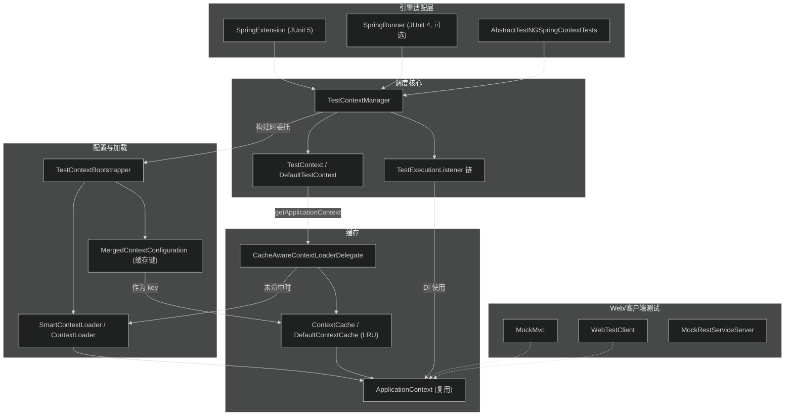
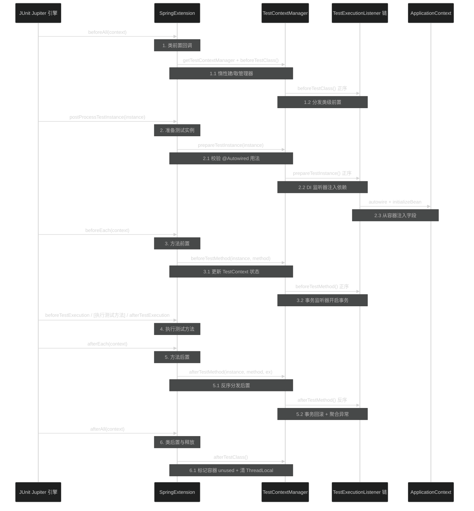
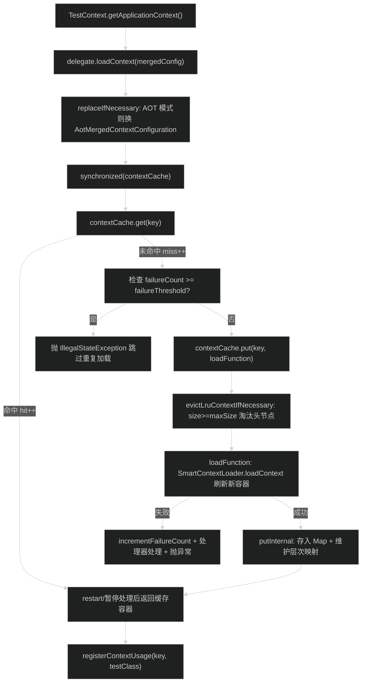
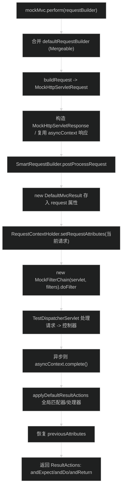

# 测试支持模块（spring-test）
> 上次修改：2026-07-26 18:45

## 重点关注

本模块以 **Spring TestContext 框架** 为核心，最值得优先阅读的入口与章节如下：

- **`SpringExtension` 与 JUnit 5 生命周期对接**（第 5.1 节 / 第 6.3 节）：`SpringExtension` 同时实现了 JUnit Jupiter 的 8 个扩展接口，是 Spring 测试与 JUnit 引擎的唯一桥梁，理解它才能理解"回调何时触发"。源码：`spring-test/src/main/java/org/springframework/test/context/junit/jupiter/SpringExtension.java`。
- **`TestContextManager` 回调编排**（第 6.1 节）：它把 8 个测试执行点分发给一串 `TestExecutionListener`，`before*` 正序、`after*` 反序，实现"洋葱包裹"语义与异常聚合，是整个框架的调度中枢。
- **上下文缓存复用**（第 5.2 节 / 第 6.2 节）：`ContextCache` + `DefaultContextCache`（LRU）+ `MergedContextConfiguration`（缓存键）让同一份配置的 `ApplicationContext` 跨测试类复用，是 Spring 测试性能的关键；这里也是 `@DirtiesContext`、并行隔离、暂停（pause）等复杂边界的集中地。
- **`MockMvc` 服务端模拟**（第 5.3 节）：`perform → MockFilterChain → TestDispatcherServlet → ResultActions` 走完整 Servlet MVC 链路却不启动服务器，是 Web 层测试主入口。
- **可选依赖装配**（第 2 节）：spring-test 对 beans/context/web/webmvc/webflux/tx/jdbc 等几乎全部为 `optional` 依赖，理解这一点才能理解"为什么少引一个 jar 某些 API 就不可用"。

---

## 1. 模块定位与职责边界

**结论**：spring-test 是 Spring Framework 的**测试支持基础设施**，向业务测试代码提供"加载并复用 Spring 容器、把容器里的 Bean 注入测试实例、以事务/回滚方式运行测试、模拟 Web 请求与 REST 客户端"等能力，本身不实现测试引擎（JUnit/TestNG）。

**上游/下游位置**：
- 下游（被谁用）：所有需要 Spring 容器的测试类，通过 `@SpringJUnitConfig` / `@ExtendWith(SpringExtension.class)` / `@RunWith(SpringRunner.class)` 接入。
- 上游（依赖谁）：`spring-core`（唯一 `api` 强依赖），其余 `spring-beans`/`spring-context`/`spring-web`/`spring-webmvc`/`spring-webflux`/`spring-tx`/`spring-jdbc`/`spring-orm` 等均为 **optional**（见 `spring-test/spring-test.gradle` 第 7-18 行）。JUnit Jupiter、JUnit 4、TestNG、Mockito、HtmlUnit、Selenium、reactor-test 亦为 optional。

**负责**：TestContext 框架（容器加载/缓存/生命周期回调/DI）、JUnit 5/4 与 TestNG 集成、`@ContextConfiguration`/`@ActiveProfiles`/`@Sql`/`@Transactional` 回滚/`@DirtiesContext` 等注解语义、Servlet MVC 测试（`MockMvc`）、响应式测试（`WebTestClient`）、客户端测试（`MockRestServiceServer`）、Servlet/环境 Mock（`org.springframework.mock.web` / `mock.env`）。

**不负责**：不提供测试运行器/引擎本体（依赖 JUnit/TestNG）；不实现容器本身（委托 `spring-context`）；不实现事务管理器（委托 `spring-tx`）；不实现 MVC 调度逻辑（复用 `spring-webmvc` 的 `DispatcherServlet`）。

**主要输入 / 输出 / 状态变化 / 副作用**：
- 输入：测试类上的注解（`@ContextConfiguration` 等）、测试实例、测试方法、`RequestBuilder`。
- 输出：注入完毕的测试实例、`ResultActions`/`ResponseSpec` 断言链、`ApplicationContext`。
- 状态变化：`TestContext` 的 `testInstance/testMethod/testException`（可变属性，见 `DefaultTestContext.updateState`）；`ContextCache` 的命中/未命中/失败计数与容器占用登记。
- 副作用：加载/关闭/暂停/重启 `ApplicationContext`；执行 `@Sql` 脚本改动数据库；开启/回滚事务。

---

## 2. 架构关系与依赖

**结论**：模块内部围绕 `TestContextManager` 展开——引擎适配层（`SpringExtension` 等）触发它，它把事件分发给一串 `TestExecutionListener`，容器的加载/缓存由 `CacheAwareContextLoaderDelegate` + `ContextCache` 承担，配置解析由 `TestContextBootstrapper` + `SmartContextLoader` 完成。

**节点与依赖说明表**：

| 节点 | 角色 | 依赖方向 / 耦合说明 |
|------|------|----------------------|
| `SpringExtension` | JUnit 5 适配器 | 强依赖 `junit-jupiter-api`（optional）；调用 `TestContextManager`。可替换为 `SpringRunner`（JUnit 4）或 TestNG 基类 |
| `TestContextManager` | 回调调度中枢 | 持有一个 `TestContext` 与一串 `TestExecutionListener`；仅依赖 `spring-core`/`commons-logging` |
| `TestContext` / `DefaultTestContext` | 单次测试的上下文封装 | 通过 `CacheAwareContextLoaderDelegate` 间接访问缓存与容器；可变状态载体 |
| `TestExecutionListener` 链 | 扩展点（DI、事务、@Sql、@DirtiesContext…） | 通过 `spring.factories` 声明默认实现，`AnnotationAwareOrderComparator` 排序 |
| `TestContextBootstrapper` | 配置解析/构建 | 由 `@BootstrapWith` 指定，默认 `DefaultTestContextBootstrapper`；产出 `TestContext` 与 TEL 列表 |
| `MergedContextConfiguration` | 缓存键（合并后的完整配置） | 被 `ContextCache` 用作 `Map` 键，`equals/hashCode` 决定复用粒度 |
| `CacheAwareContextLoaderDelegate` | 缓存感知的加载委托 | 在 `ContextCache` 与 `SmartContextLoader` 之间协调（强耦合缓存实现） |
| `ContextCache` / `DefaultContextCache` | LRU 容器缓存 | `LinkedHashMap`(access-order) + 层次映射；静态实例跨测试类/整个 JVM 复用 |
| `MockMvc` / `WebTestClient` / `MockRestServiceServer` | Web/客户端测试门面 | 分别强依赖 `spring-webmvc`/`spring-webflux`/`spring-web`（均 optional） |

**可选依赖强调**：由 `spring-test.gradle` 可见，除 `spring-core` 外全部为 `optional`。这意味着 spring-test 是"能力按需激活"的模块：只有类路径存在 `junit-jupiter-api` 时 `SpringExtension` 才可用；只有存在 `spring-webmvc` + `jakarta.servlet-api` 时 `MockMvc` 才可用；只有存在 `spring-webflux` + reactor 时 `WebTestClient` 才可用。潜在耦合点在于**缺失某个 optional 依赖时相关类会在运行期抛 `NoClassDefFoundError`**，而非编译期报错。

---

## 3. 入口与调用方式

**结论**：模块有三类入口——测试引擎回调入口（最主要）、编程式 Web 测试入口、编程式客户端测试入口。

| 入口 | 类型 | 触发条件 | 关键参数/返回 | 源码位置 | 之后进入 |
|------|------|----------|----------------|----------|-----------|
| `@ExtendWith(SpringExtension.class)` / `@SpringJUnitConfig` | JUnit 5 框架回调 | JUnit 平台发现被注解的测试类 | 无（注解驱动） | `junit/jupiter/SpringExtension.java`、`junit/jupiter/SpringJUnitConfig.java` | `TestContextManager` 各回调 |
| `@RunWith(SpringRunner.class)` | JUnit 4 框架回调（可选，`@Deprecated(since=7.0)`） | Vintage 引擎运行 | 无 | `junit4/SpringRunner.java` → `SpringJUnit4ClassRunner` | `TestContextManager` |
| `new TestContextManager(testClass)` | 编程式 | 自定义引擎集成 | 测试类 → 管理器 | `context/TestContextManager.java:125` | 通过 `BootstrapUtils.resolveTestContextBootstrapper` 构建 |
| `MockMvcBuilders.webAppContextSetup(wac).build()` → `mockMvc.perform(...)` | 编程式 Web | 服务端 MVC 测试 | `RequestBuilder` → `ResultActions` | `web/servlet/MockMvc.java:165` | `MockFilterChain` → `TestDispatcherServlet` |
| `WebTestClient.bindToApplicationContext(ctx)` / `bindToController(...)` / `bindToServer()` | 编程式响应式 | WebFlux/HTTP 测试 | 返回 `Builder`/`MockServerSpec` | `web/reactive/server/WebTestClient.java:95` | `exchange()` → `ResponseSpec` 断言 |
| `MockRestServiceServer.bindTo(restClientBuilder).build()` / `createServer(restTemplate)` | 编程式客户端 | REST 客户端测试 | 注入 `ClientHttpRequestFactory` | `web/client/MockRestServiceServer.java:69` | `expect(...)`/`verify()` |

**关键说明**：`SpringExtension` 的 `beforeAll/postProcessTestInstance/beforeEach/beforeTestExecution/afterTestExecution/afterEach/afterAll` 每个回调都先经 `getTestContextManager(context)` 从 JUnit `ExtensionContext.Store` 按测试类惰性取/建 `TestContextManager`（`SpringExtension.java:462-467`），再委托对应回调，实现"每个测试类一个管理器、跨方法复用"。

---

## 4. 核心概念与领域模型

### 4.1 TestContext（测试上下文）
- **定义**：一次测试执行所处上下文的框架无关封装（接口 `context/TestContext.java`，实现 `support/DefaultTestContext.java`）。
- **作用**：持有测试类、当前测试实例/方法/异常（可变），并通过 `CacheAwareContextLoaderDelegate` 惰性提供 `ApplicationContext`。
- **生命周期**：由 `TestContextBootstrapper.buildTestContext()` 创建；`TestContextManager` 用其"拷贝构造器"为并行执行复制模板（`TestContextManager.copyTestContext` 第 654-674 行）。
- **相关类型**：`AttributeAccessor`（属性存储）、`MergedContextConfiguration`（其不可变配置）、`MethodInvoker`。
- **三维评估**：**好处**——框架无关，同一套 `TestContext` 服务 JUnit5/4/TestNG；**替代方案**——每个引擎各自持有状态（重复且难以复用监听器）；**风险**——`testInstance/testMethod` 为 `volatile` 可变字段，`updateState` 并发调用非线程安全（javadoc 明确警告，仅允许 `TestContextManager` 调用）。

### 4.2 TestExecutionListener（测试执行监听器）
- **定义**：7 个测试执行点的回调 SPI（`context/TestExecutionListener.java`，7 个 `default` 空方法：`beforeTestClass`/`prepareTestInstance`/`beforeTestMethod`/`beforeTestExecution`/`afterTestExecution`/`afterTestMethod`/`afterTestClass`）。
- **作用**：把"依赖注入、事务、@Sql、@DirtiesContext、事件记录、Mockito 复位"等横切能力插入执行链。
- **生命周期**：由 Bootstrapper 通过 `spring.factories` 加载默认实现并排序，注册进 `TestContextManager`。
- **默认实现与 `@Order`（`ORDER` 常量越小越先执行 `before*`）**：

| 监听器 | ORDER | 职责 |
|--------|-------|------|
| `ServletTestExecutionListener` | 1000 | 设置/清理 Servlet Mock 请求上下文 |
| `DirtiesContextBeforeModesTestExecutionListener` | 1500 | 处理 `@DirtiesContext` 的 BEFORE 模式 |
| `ApplicationEventsTestExecutionListener` | — | 记录 `ApplicationEvents` |
| `BeanOverrideTestExecutionListener` | — | `@MockitoBean` 等 Bean 覆盖注入 |
| `DependencyInjectionTestExecutionListener` | 2000 | **依赖注入测试实例** |
| `MicrometerObservationRegistryTestExecutionListener` | — | 观测注册表 |
| `DirtiesContextTestExecutionListener` | 3000 | 处理 `@DirtiesContext` 的 AFTER 模式 |
| `CommonCachesTestExecutionListener` | — | 清理通用缓存 |
| `TransactionalTestExecutionListener` | 4000 | **测试事务 + 默认回滚** |
| `SqlScriptsTestExecutionListener` | — | 执行 `@Sql` 脚本 |
| `EventPublishingTestExecutionListener` | — | 发布测试生命周期事件 |
| `MockitoResetTestExecutionListener` | — | 复位 Mockito mock |

（默认列表来自 `spring-test/src/main/resources/META-INF/spring.factories`；`AbstractTestExecutionListener.getOrder()` 默认返回 `Ordered.LOWEST_PRECEDENCE`，自定义监听器默认排在框架监听器之后。）
- **三维评估**：**好处**——开放的 SPI，第三方（如 Spring Boot）可插入；`spring.factories` 声明式装配。**替代方案**——硬编码回调（不可扩展）。**风险**——顺序敏感：`before*` 正序、`after*` 反序形成"洋葱包裹"，顺序配错会破坏事务/DI 的嵌套语义。

### 4.3 MergedContextConfiguration（合并配置 = 缓存键）
- **定义**：把 `@ContextConfiguration`/`@ActiveProfiles`/`@TestPropertySource`/初始化器/定制器等**继承合并后**的完整配置对象（`context/MergedContextConfiguration.java`）。
- **作用**：既描述"如何加载容器"，又作为 `ContextCache` 的 `Map` 键决定"能否复用"。
- **缓存键组成（`equals/hashCode` 使用的字段，`MergedContextConfiguration.java:486-548`）**：`locations`、`classes`、`contextInitializerClasses`、`activeProfiles`、`propertySourceDescriptors`、`propertySourceProperties`、`contextCustomizers`、`parent`（递归）、`nullSafeClassName(contextLoader)`（用类名字符串而非实例）。注意 `propertySourceLocations` 是从 descriptors 派生，**不**单独参与键；`testClass` 也**不**参与键（同配置的不同测试类共享容器）。
- **三维评估**：**好处**——两个测试类只要合并配置相等即可共享同一容器实例，极大加速套件；用类名而非 loader 实例避免实例身份干扰。**替代方案**——以测试类为键（无法跨类复用）。**风险**——`contextCustomizers` 的 `equals` 实现不当会导致意外不复用或错误复用（例如动态属性使键不同）。

### 4.4 ContextCache（上下文缓存）
- **定义**：`ApplicationContext` 的 LRU 缓存 SPI（`cache/ContextCache.java`），默认实现 `DefaultContextCache`。
- **作用**：跨测试类/整个 JVM 复用容器；追踪命中/未命中/失败计数、上下文层次、占用登记与暂停。
- **生命周期**：默认是**静态**实例（`DefaultCacheAwareContextLoaderDelegate.defaultContextCache`，第 76 行），因此在同一 JVM 中长期存活；条目在 `@DirtiesContext`、LRU 淘汰或 `reset()` 时移除并 `close()`。
- **三维评估**：**好处**——初始化昂贵的 Bean（内嵌库、JPA `EntityManagerFactory`）只需初始化一次；**替代方案**——每个测试类新建容器（正确但极慢）；**风险**——静态缓存 + 可变单例 Bean 在测试间泄漏状态，必须靠 `@DirtiesContext` 显式清除，否则测试相互污染。

---

## 5. 关键流程

### 5.1 SpringExtension 驱动的测试执行主路径（成功路径）

1-1.2 类级前置：JUnit `beforeAll` 触发 `SpringExtension.beforeAll`，它从 `ExtensionContext.Store`（root，按测试类为键）惰性创建 `TestContextManager`（`SpringExtension.java:208-212`、`462-467`），随后调用 `TCM.beforeTestClass()`，管理器把事件**正序**分发给每个监听器；任一监听器抛异常则中断后续监听器（`TestContextManager.java:218-226`）。

2-2.3 准备测试实例：JUnit 实例化测试类后回调 `postProcessTestInstance`。`SpringExtension` 先校验测试/生命周期方法未误用 `@Autowired`、校验 `@RecordApplicationEvents` 并行安全（`SpringExtension.java:250-308`），再委托 `TCM.prepareTestInstance`；其中 `DependencyInjectionTestExecutionListener.prepareTestInstance` 取得容器的 `AutowireCapableBeanFactory`，执行 `autowireBeanProperties` + `initializeBean` 完成字段注入（`DependencyInjectionTestExecutionListener.java:152-160`）。此步会**首次触发容器加载**（见 5.2）。

3-3.2 方法前置：`beforeEach` → `TCM.beforeTestMethod`，先 `updateState(testInstance, testMethod, null)` 刷新 `TestContext`（`TestContextManager.java:587-592`），再正序分发；`TransactionalTestExecutionListener.beforeTestMethod` 解析 `@Transactional` 并按 `isRollback` 开启一个测试管理事务（`TransactionalTestExecutionListener.java:208-246`）。

4 执行测试方法：`beforeTestExecution`/`afterTestExecution` 包住真正的测试方法调用，用于计时/记录，异常经 `context.getExecutionException()` 传入。

5-5.2 方法后置：`afterEach` → `TCM.afterTestMethod`，监听器**反序**执行（`getReversedTestExecutionListeners`，`TestContextManager.java:486`），保证"先开的事务后关"；事务监听器根据回滚标志提交或回滚。与 `before*` 不同，后置阶段**即使某监听器抛异常也会继续执行其余监听器**，首个异常抛出、后续异常 `addSuppressed`（`TestContextManager.java:490-503`）。

6-6.1 类后置与释放：`afterAll` → `TCM.afterTestClass` 反序分发类级后置，随后调用 `TestContext.markApplicationContextUnused()` 通知缓存该类不再使用容器（可触发暂停），最后 `testContextHolder.remove()` 清理 `ThreadLocal`（`TestContextManager.java:532-576`）。

### 5.2 上下文缓存命中/未命中加载路径

1-1.2 触发与 AOT 归一：任何 `TestContext.getApplicationContext()`（`DefaultTestContext.java:127-141`）都委托给 `DefaultCacheAwareContextLoaderDelegate.loadContext`。入口先 `replaceIfNecessary`，若处于 AOT 运行期则把键替换为 `AotMergedContextConfiguration`，让 AOT 优化容器透明走同一缓存（`DefaultCacheAwareContextLoaderDelegate.java:312-325`）。

2-3 加锁与命中：整个查/加载在 `synchronized(contextCache)` 内进行以保证并发安全。`DefaultContextCache.get`（第 168-181 行）命中则 `hitCount++`，并按 `PauseMode` 先暂停"上一个"未使用容器、再对返回容器及其父链 `restart()`（此前可能被 pause）；命中即返回。

4-4.1 失败阈值短路：未命中（`missCount++`）后先查该键历史失败次数，若 `>= failureThreshold`（默认 1，`CacheAwareContextLoaderDelegate.DEFAULT_CONTEXT_FAILURE_THRESHOLD`）则直接抛异常，**避免对必然失败的配置反复重试**（`DefaultCacheAwareContextLoaderDelegate.java:152-158`）。

5-5.4 加载与 LRU 淘汰：调用 `contextCache.put(key, loadFunction)`。`DefaultContextCache.put`（第 207-218 行）先 `evictLruContextIfNecessary`——当 `size >= maxSize`（默认 32）时移除 `LinkedHashMap`(access-order) 的**头节点**（最久未用）并 `close()`；随后执行 `loadFunction` 真正加载并刷新新容器（普通模式走 `SmartContextLoader.loadContext`，`DefaultCacheAwareContextLoaderDelegate.java:242-257`），成功后 `putInternal` 存入并自底向上维护 `hierarchyMap` 父子关系。加载失败则 `incrementFailureCount`、交给 `ApplicationContextFailureProcessor` 处理并抛 `IllegalStateException`（第 175-196 行）。

6 占用登记：容器返回给 `DefaultTestContext.getApplicationContext` 后调用 `registerContextUsage(mergedConfig, testClass)`，把测试类登记到 `contextUsageMap`（含父链），供 `markApplicationContextUnused` 判断是否可暂停（`DefaultContextCache.java:250-257`）。

### 5.3 MockMvc 请求模拟路径

1-1.2 构建请求：`MockMvc.perform`（`web/servlet/MockMvc.java:165-170`）先把全局 `defaultRequestBuilder` 通过 `Mergeable.merge` 合并进当前 `RequestBuilder`，再 `buildRequest(servletContext)` 产出纯内存的 `MockHttpServletRequest`（来自 `org.springframework.mock.web`），全程**不涉及真实网络/Servlet 容器**。

2-2.2 准备响应与结果载体：创建 `MockHttpServletResponse`（或从 async 上下文解包已有响应），应用默认字符编码，执行 `SmartRequestBuilder.postProcessRequest`，并把 `DefaultMvcResult` 挂到 request 属性上供后续断言读取（第 172-193 行）。

3-3.2 进入 MVC 调度：`RequestContextHolder` 绑定当前请求属性（保存旧值以便恢复），随后用 `MockFilterChain` 串起过滤器与 `TestDispatcherServlet`（`DispatcherServlet` 子类），`doFilter` 驱动完整的 `HandlerMapping → HandlerAdapter → 控制器 → ViewResolver` 链路（第 195-199 行）。这里复用的是 `spring-webmvc` 的真实调度逻辑，仅请求/响应是 Mock。

4-4.2 收尾：异步请求补 `asyncContext.complete()`；应用全局 `ResultHandler`/`ResultMatcher`；恢复先前的 `RequestContextHolder` 属性，避免污染其他测试（第 201-207 行）。

5 断言链：返回匿名 `ResultActions`，其 `andExpect(matcher)` 委托 `matcher.match(mvcResult)`、`andDo(handler)` 委托 `handler.handle(mvcResult)`、`andReturn()` 返回 `MvcResult`（第 209-224 行），支撑 `status().isOk()`、`content().contentType(...)` 等断言。

---

## 6. 核心实现细节

### 6.1 TestContextManager 的 TestExecutionListener 链编排

`TestContextManager` 是纯调度器：构造时 `buildTestContext()` 得到一个 `TestContext`，并用 `ThreadLocal.withInitial(() -> copyTestContext(...))` 为每个线程惰性拷贝一份上下文，随后把 Bootstrapper 提供的监听器列表 `registerTestExecutionListeners` 追加进 `testExecutionListeners`（`TestContextManager.java:141-145`）。

- **正序 vs 反序**：`before*` 与 `prepareTestInstance` 顺序遍历 `getTestExecutionListeners()`；`after*` 遍历 `getReversedTestExecutionListeners()`（第 190-194 行）。这实现了"洋葱/包裹"语义：先注册的监听器（如事务）在方法前**先**开、方法后**后**关，恰好包住后注册的监听器。
- **异常语义的不对称**：`before*` 阶段任一监听器抛异常即 `rethrow` 并**中断**后续监听器（避免在半初始化状态继续）；`after*` 阶段则**继续执行剩余监听器**，把首个异常抛出、其余 `addSuppressed`（保证清理动作都跑完，第 424-435、490-503 行）。
- **跳过异常识别**：静态注册 `TestAbortedException`/`AssumptionViolatedException`/`SkipException` 为"跳过型"异常（第 97-104、698-705 行），命中时仅 `info` 级日志而非 `warn`，避免把"假设不成立/跳过"误报为错误。
- **`resetMethodInvoker` 的 finally**：每个回调 finally 都把 `MethodInvoker` 复位为默认（第 583-585 行），防止某次测试的自定义 invoker 泄漏到后续测试。

**三维评估**：**好处**——单一调度点集中管理顺序与异常聚合，监听器彼此解耦；**替代方案**——让各引擎自行调用监听器（重复且顺序易错）；**风险**——`getTestExecutionListeners()` 返回可变列表，javadoc 警告"执行期间须保持稳定"，运行时增删会破坏正/反序配对。

### 6.2 ContextCache 的 LRU 缓存与 key 计算

- **LRU 载体**：`contextMap = Collections.synchronizedMap(new LinkedHashMap<>(32, 0.75f, true))`（`DefaultContextCache.java:71-72`）。第三个参数 `accessOrder=true` 使 `get` 也调整顺序，头节点即最久未访问；`evictLruContextIfNecessary` 在 `size>=maxSize` 时移除头节点（第 224-233 行）。
- **上下文层次**：`hierarchyMap`（父→子集合）用于 `@ContextHierarchy`；`remove` 按 `HierarchyMode`（`CURRENT_LEVEL`/`EXHAUSTIVE`）自底向上递归移除并 `close()` 子树（第 317-371 行）。
- **暂停/重启（7.0 新增）**：`PauseMode`（`ALWAYS`/`ON_CONTEXT_SWITCH`(默认)/`NEVER`）。`unregisterContextUsage` 在某容器无活跃测试类时按模式 `pause()` 或加入 `unusedContexts`；下次切到别的容器时再统一 `pause` 之前未用的、并 `restart` 目标容器（第 259-315 行）。此举在保持缓存的同时释放空闲容器的线程/连接资源。
- **key 计算**：键即 `MergedContextConfiguration`，其 `hashCode`（第 539-548 行）串接 `locations/classes/contextInitializerClasses/activeProfiles/propertySourceDescriptors/propertySourceProperties/contextCustomizers/parent/contextLoader类名` 的哈希；`equals` 逐字段比较。`contextLoader` 用**类名字符串**（`nullSafeClassName`）而非实例，避免实例身份导致的误判。
- **失败计数**：`failureCounts` 按键累计加载失败次数，配合 `failureThreshold` 阻断反复失败的加载。

**三维评估**：**好处**——`LinkedHashMap` 原生 access-order 实现 LRU，零额外结构；层次映射精准控制 `@DirtiesContext` 清除粒度；pause 机制兼顾复用与资源释放。**替代方案**——软引用缓存（回收时机不可控）或无上限缓存（内存膨胀）。**风险**——`maxSize` 过小导致频繁淘汰重载（性能反降）；`synchronized` 粗粒度锁在大规模并行测试下可能成为竞争点。

### 6.3 SpringExtension 如何实现 JUnit Jupiter 各扩展接口

`SpringExtension` 一次性实现 8 个接口（`SpringExtension.java:114-116`）：`BeforeAllCallback`/`AfterAllCallback`/`TestInstancePostProcessor`/`BeforeEachCallback`/`AfterEachCallback`/`BeforeTestExecutionCallback`/`AfterTestExecutionCallback`/`ParameterResolver`，每个回调都是"取管理器 → 注册 MethodInvoker → 委托同名 TCM 方法"的薄适配（第 207-358 行），把 JUnit 事件一一映射到 TestContext 的 7 个执行点。

- **管理器缓存**：`getTestContextManager` 用 `context.getRoot().getStore(NAMESPACE).computeIfAbsent(testClass, TestContextManager::new)`，保证每个测试类仅一个管理器且惰性创建（第 462-467 行）。
- **参数解析（构造器/方法注入）**：`supportsParameter` 判断参数是否可自动装配（可注入构造器、`ApplicationContext`、`ApplicationEvents`、或 `ParameterResolutionDelegate.isAutowirable`），且**刻意不触发容器加载**以免过早初始化；`resolveParameter` 才真正取容器并 `ParameterResolutionDelegate.resolveDependency`（第 390-433 行）。
- **作用域（7.0）**：默认 `getTestInstantiationExtensionContextScope` 返回 `TEST_METHOD`，使 `@Nested` 层次下 DI 一致；可经 `@SpringExtensionConfig(useTestClassScopedExtensionContext=true)` 或 `spring.test.extension.context.scope` 属性切回 `TEST_CLASS`（第 197-202、510-576 行）。
- **`@Autowired` 误用校验**：`postProcessTestInstance` 里校验测试/生命周期方法未被 `@Autowired` 注解（应改用参数级注入），结果缓存到 Store 避免重复校验（第 250-269 行）。

**三维评估——上下文缓存复用 vs 隔离**：复用（默认）带来巨大性能收益，但要求测试对容器"只读"或用 `@DirtiesContext` 显式声明脏化；隔离（每测试类新容器或 `@DirtiesContext`）保证纯净但牺牲速度。框架的折中是"默认复用 + 显式脏化 + 7.0 的 pause 释放资源 + 静态缓存跨类"，把是否隔离的决定权交给开发者，同时用 `MergedContextConfiguration` 的精确键把复用限制在真正等价的配置之间。

---

## 7. 数据结构、配置与外部协议

**核心数据结构**：

| 结构 | 说明 |
|------|------|
| `LinkedHashMap<MergedContextConfiguration, ApplicationContext>` (access-order) | 缓存主体，实现 LRU |
| `Map<MCC, Set<MCC>> hierarchyMap` | 上下文父子层次，用于 `@ContextHierarchy` 与递归移除 |
| `Map<MCC, Set<Class<?>>> contextUsageMap` | 容器→活跃测试类，判断是否可暂停 |
| `Map<MCC, Integer> failureCounts` | 每键加载失败计数 |
| `ThreadLocal<TestContext> testContextHolder` | 每线程独立 `TestContext` 拷贝，支撑并行 |

**关键配置项（均经 `SpringProperties`/系统属性读取，见 `ContextCacheUtils`）**：

| 属性 | 默认值 | 含义 / 错误配置后果 |
|------|--------|----------------------|
| `spring.test.context.cache.maxSize` | 32 | 缓存最大容量；过小→频繁重载 |
| `spring.test.context.failure.threshold` | 1 | 加载失败阈值；达到即短路重试 |
| `spring.test.context.cache.pause` | `on_context_switch` | 空闲容器暂停策略（`always`/`never`）；非法值抛异常 |
| `spring.test.extension.context.scope` | `test_method` | `@Nested` 下扩展上下文作用域；非法值抛 `IllegalArgumentException` |

**装配协议（`spring.factories`）**：`org.springframework.test.context.TestExecutionListener` 声明 12 个默认监听器；`ContextCustomizerFactory` 声明 3 个默认工厂。这是模块最重要的"外部协议"——第三方按此机制贡献监听器/定制器。此外 `META-INF/spring/aot.factories` 承载 AOT 处理相关贡献。

**Bootstrapper 协议**：`@BootstrapWith` 指定 `TestContextBootstrapper`（默认 `DefaultTestContextBootstrapper`，其 `getDefaultContextLoaderClass` 返回 `DelegatingSmartContextLoader`），是"如何解析测试配置"的可替换扩展点，Spring Boot 即通过它接管配置解析。

---

## 8. 异常、边界与降级处理

- **上下文加载失败**：`loadFunction` 抛异常时 `incrementFailureCount`，若为 `ContextLoadException` 则解包 cause 并逐个交给 `ApplicationContextFailureProcessor` 处理，最终统一包装为 `IllegalStateException("Failed to load ApplicationContext for ...")`（`DefaultCacheAwareContextLoaderDelegate.java:175-196`）。同一键第二次加载会因 `failureCount>=failureThreshold` 直接短路抛错，**降级为"快速失败"避免整套件在同一坏配置上反复耗时**。
- **容器已被关闭的边界**：`DefaultTestContext.getApplicationContext` 若拿到的容器 `!isActive()`，抛带诊断信息的 `IllegalStateException`，明确提示可能原因（用户代码关闭 / 并行下 `@DirtiesContext` 或 LRU 淘汰导致关闭，第 130-137 行）。
- **`@DirtiesContext` 触发缓存清除**：`AbstractDirtiesContextTestExecutionListener.beforeOrAfterTestMethod/Class` 依据方法级/类级 `@DirtiesContext` 的 `MethodMode`/`ClassMode` 判断是否 `dirtyContext`，后者调用 `TestContext.markApplicationContextDirty(hierarchyMode)` → `delegate.closeContext` 从缓存移除并 `close()`，同时置 `REINJECT_DEPENDENCIES_ATTRIBUTE=true` 以便下次方法重新注入（`AbstractDirtiesContextTestExecutionListener.java:69-163`）。BEFORE 模式由 `DirtiesContextBeforeModesTestExecutionListener`(ORDER 1500) 处理、AFTER 模式由 `DirtiesContextTestExecutionListener`(ORDER 3000) 处理。
- **事务测试回滚**：`TransactionalTestExecutionListener.afterTestMethod`（ORDER 4000）取出当前 `TransactionContext` 并在未完成时 `endTransaction()`，默认按 `isRollback`（类级 `@Rollback/@Commit` 默认 `true`，可被方法级覆盖）**回滚**，保证测试对数据库无持久副作用（第 258-269、425-455 行）。`PROPAGATION_NOT_SUPPORTED`/`NEVER` 会提前返回不建事务。
- **监听器异常聚合**：见 6.1，后置阶段异常不吞不漏——首个抛出、其余 `addSuppressed`；跳过型异常仅降为 info 日志。
- **并行测试隔离**：`TestContext` 要求实现"拷贝构造器"，`TestContextManager` 用 `ThreadLocal` 为每线程复制，拷贝失败时降级为共享原实例并 info 提示"并发执行可能不受支持"（`TestContextManager.java:654-674`）。`@RecordApplicationEvents` + `PER_CLASS` + `CONCURRENT` 组合会被 `SpringExtension.validateRecordApplicationEventsConfig` 主动拒绝（第 278-308 行），因为共享容器下事件记录不确定。
- **未覆盖风险点**：`ContextCache` 的 `synchronized` 为整缓存粒度，超大规模并行套件下存在锁竞争（基于源码结构判断，非缺陷）。

---

## 9. 并发、生命周期与性能

- **容器生命周期**：加载（首次 `getApplicationContext`）→ 缓存复用 → 可暂停/重启（7.0 pause）→ `@DirtiesContext`/LRU 淘汰/`reset` 时关闭。静态缓存使容器默认存活至 JVM 结束。
- **线程模型**：`TestContextManager` 用 `ThreadLocal<TestContext>` + 拷贝构造器支持并行测试，每线程独立可变状态；`ContextCache` 用 `synchronized(contextCache)` + `AtomicInteger` 计数 + `ConcurrentHashMap`（层次/占用/失败映射）保证并发安全。
- **幂等/顺序**：监听器 `before*` 正序、`after*` 反序保证嵌套配对；`updateState` 非线程安全但仅由管理器在单线程回调序列中调用。
- **性能关键路径**：**容器加载**是最昂贵操作，缓存命中把它降为一次 `Map.get`；`hitCount/missCount` 可经 `org.springframework.test.context.cache` 日志类别 DEBUG 观测复用效果。LRU `maxSize` 是性能旋钮——套件配置种类超过 32 时应上调以减少重载。
- **资源释放**：pause 机制在容器空闲时 `pause()`（停线程池/调度器等），切换时再 `restart()`，在不清空缓存的前提下回收资源；`afterTestClass` 的 `markApplicationContextUnused` 是触发点。

---

## 10. 扩展点、测试点与维护建议

**扩展点**：
- `TestExecutionListener`（+ `spring.factories` 或 `@TestExecutionListeners`）：插入横切逻辑，最常见扩展入口。
- `TestContextBootstrapper`（`@BootstrapWith`）：接管配置解析（Spring Boot 用法）。
- `ContextLoader`/`SmartContextLoader`/`AotContextLoader`：自定义容器加载方式。
- `ContextCustomizer`/`ContextCustomizerFactory`：在容器刷新前定制。
- `ContextCache`（自定义 `CacheAwareContextLoaderDelegate`）：替换缓存策略。
- `ActiveProfilesResolver`、`ApplicationContextFailureProcessor`、`MethodInvoker`。

**建议测试点**：
- 主路径：`@SpringJUnitConfig` 下 DI 成功 + 方法执行。
- 缓存路径：两个相同配置的测试类应命中同一容器（可断言 `getHitCount`）；`maxSize` 边界触发 LRU 淘汰。
- 失败路径：坏配置触发 failure threshold 短路；容器被 `@DirtiesContext` 关闭后再次访问抛 `IllegalStateException`。
- 边界：事务默认回滚、方法级 `@Commit` 覆盖；并行 + `@RecordApplicationEvents` + `PER_CLASS` 被拒。

**维护建议**：
- 目标位置 `DefaultContextCache` 的 `synchronized(contextCache)`：问题——整缓存单锁在大并行度下潜在竞争；动作——评估读多写少场景下用读写锁或分段锁；收益——降低并行套件锁争用；风险——层次/暂停逻辑复杂，改锁需保证 `hierarchyMap`/`unusedContexts` 一致性。
- 目标位置 `spring.factories` 顺序与各 TEL 的 `ORDER`：问题——新增监听器若不设 `@Order` 默认 `LOWEST_PRECEDENCE` 可能排在事务之后引发误解；动作——为新监听器显式赋 `ORDER` 并在文档中登记；收益——顺序可预期；风险——低。

---

## 11. 文件职责表

| 文件 | 职责 | 关键类/函数 | 被谁调用 | 备注 |
|------|------|-------------|----------|------|
| `context/TestContextManager.java` | 回调调度中枢，管理 TestContext 与监听器链 | `beforeTestClass`/`prepareTestInstance`/`before*After*`、`copyTestContext` | `SpringExtension`/`SpringRunner`/TestNG 基类 | 正序 before、反序 after |
| `context/TestContext.java` | 框架无关的测试上下文 SPI | `getApplicationContext`/`updateState`/`markApplicationContextDirty` | `TestContextManager`、监听器 | 接口，要求拷贝构造器 |
| `context/support/DefaultTestContext.java` | `TestContext` 默认实现 | `getApplicationContext`(委托 delegate)、`updateState` | `TestContextManager` | 可变 volatile 状态 |
| `context/junit/jupiter/SpringExtension.java` | JUnit 5 适配（实现 8 个扩展接口 + ParameterResolver） | `beforeAll`/`postProcessTestInstance`/`beforeEach`/`resolveParameter` | JUnit Jupiter 引擎 | 需 Jupiter 6.0+ |
| `context/junit/jupiter/SpringJUnitConfig.java` | 组合注解 `@ExtendWith(SpringExtension)`+`@ContextConfiguration` | `@AliasFor` classes/locations | 测试类 | 便捷入口 |
| `context/junit4/SpringRunner.java` | JUnit 4 运行器别名（`@Deprecated 7.0`） | 继承 `SpringJUnit4ClassRunner` | `@RunWith` | 委托 `TestContextManager` |
| `context/support/AbstractTestContextBootstrapper.java` | 解析注解→构建 TestContext/TEL 链/MergedConfig | `getTestExecutionListeners`(SpringFactories+排序)、`buildMergedContextConfiguration` | `TestContextManager` 构造 | 模板方法 |
| `context/support/DefaultTestContextBootstrapper.java` | 默认 Bootstrapper | `getDefaultContextLoaderClass`→`DelegatingSmartContextLoader` | `BootstrapUtils` | 无 `@BootstrapWith` 时默认 |
| `context/MergedContextConfiguration.java` | 合并配置 = 缓存键 | `equals`/`hashCode`(9 字段) | `ContextCache`、加载委托 | testClass 不入键 |
| `context/cache/ContextCache.java` | 容器缓存 SPI | `get`/`put`/`remove`/`register/unregisterContextUsage`、`PauseMode` | 加载委托 | maxSize/pause 常量 |
| `context/cache/DefaultContextCache.java` | LRU 缓存实现 | `evictLruContextIfNecessary`、`hierarchyMap`、pause/restart | `DefaultCacheAwareContextLoaderDelegate` | `LinkedHashMap` access-order |
| `context/cache/DefaultCacheAwareContextLoaderDelegate.java` | 缓存感知加载委托 | `loadContext`(命中/失败阈值/加载)、`replaceIfNecessary`(AOT) | `DefaultTestContext` | 静态默认缓存 |
| `context/support/DependencyInjectionTestExecutionListener.java` | 依赖注入监听器 (ORDER 2000) | `prepareTestInstance`→`injectDependencies` | `TestContextManager` | REINJECT 属性 |
| `context/transaction/TransactionalTestExecutionListener.java` | 测试事务 + 默认回滚 (ORDER 4000) | `beforeTestMethod`/`afterTestMethod`、`isRollback` | `TestContextManager` | `TransactionContext` |
| `context/support/AbstractDirtiesContextTestExecutionListener.java` | `@DirtiesContext` 脏化逻辑基类 | `beforeOrAfterTestMethod/Class`、`dirtyContext` | 两个 DirtiesContext 监听器 | 触发 `closeContext` |
| `web/servlet/MockMvc.java` | 服务端 MVC 测试门面 | `perform`→`MockFilterChain`→`TestDispatcherServlet` | 测试代码 | 需 spring-webmvc |
| `web/reactive/server/WebTestClient.java` | 响应式/HTTP 测试客户端 | `bindToApplicationContext`/`bindToController`/`bindToServer`、`exchange` | 测试代码 | 需 spring-webflux |
| `web/client/MockRestServiceServer.java` | REST 客户端测试 | `bindTo`/`createServer`、`expect`/`verify` | 测试代码 | 注入 `ClientHttpRequestFactory` |
| `resources/META-INF/spring.factories` | 默认 TEL / ContextCustomizerFactory 装配清单 | — | Bootstrapper | 12 个默认 TEL |

---

## 12. 代码引用索引

| 引用 | 说明 |
|------|------|
| `spring-test/spring-test.gradle:7-18` | `spring-core` 为 `api`，其余模块均 `optional` |
| `spring-test/src/main/java/org/springframework/test/context/TestContextManager.java:141-145` | 构造：buildTestContext + ThreadLocal 拷贝 + 注册监听器 |
| `.../context/TestContextManager.java:190-194` | `getReversedTestExecutionListeners`（after 反序） |
| `.../context/TestContextManager.java:218-226` | before 正序分发且异常即中断 |
| `.../context/TestContextManager.java:486-503` | after 反序 + 异常聚合 addSuppressed |
| `.../context/TestContextManager.java:532-576` | afterTestClass：markApplicationContextUnused + 清 ThreadLocal |
| `.../context/TestContextManager.java:654-674` | copyTestContext 拷贝构造器（并行支持） |
| `.../context/TestContext.java:50-190` | TestContext SPI（getApplicationContext/updateState/markDirty） |
| `.../context/support/DefaultTestContext.java:127-141` | getApplicationContext 委托 delegate + 活性校验 + 占用登记 |
| `.../context/junit/jupiter/SpringExtension.java:114-116` | 实现 8 个 JUnit 扩展接口 |
| `.../context/junit/jupiter/SpringExtension.java:208-358` | 各回调薄适配委托 TCM |
| `.../context/junit/jupiter/SpringExtension.java:390-433` | supportsParameter/resolveParameter 参数注入 |
| `.../context/junit/jupiter/SpringExtension.java:462-467` | getTestContextManager 从 Store 惰性建/取 |
| `.../context/cache/ContextCache.java:77-109` | maxSize=32、failure/pause 属性名与 PauseMode |
| `.../context/cache/DefaultContextCache.java:71-72` | LinkedHashMap(access-order) LRU 载体 |
| `.../context/cache/DefaultContextCache.java:168-181` | get：命中计数 + pause/restart |
| `.../context/cache/DefaultContextCache.java:224-233` | evictLruContextIfNecessary 移除头节点 |
| `.../context/cache/DefaultContextCache.java:259-315` | 占用登记/注销 + pause 逻辑 |
| `.../context/cache/DefaultCacheAwareContextLoaderDelegate.java:139-203` | loadContext：命中/失败阈值/加载/失败处理 |
| `.../context/cache/DefaultCacheAwareContextLoaderDelegate.java:312-325` | replaceIfNecessary（AOT 归一） |
| `.../context/cache/ContextCacheUtils.java:41-86` | 读取 maxSize/failureThreshold/pauseMode |
| `.../context/MergedContextConfiguration.java:486-548` | equals/hashCode 的 9 个缓存键字段 |
| `.../context/support/AbstractTestContextBootstrapper.java:122-185` | getTestExecutionListeners（SpringFactories + AnnotationAwareOrderComparator） |
| `.../context/support/DefaultTestContextBootstrapper.java:36-37` | 默认 loader = DelegatingSmartContextLoader |
| `.../context/support/DependencyInjectionTestExecutionListener.java:152-160` | injectDependencies：autowire + initializeBean |
| `.../context/transaction/TransactionalTestExecutionListener.java:208-269` | 事务开启/结束；`ORDER=4000` |
| `.../context/transaction/TransactionalTestExecutionListener.java:425-455` | isDefaultRollback/isRollback |
| `.../context/support/AbstractDirtiesContextTestExecutionListener.java:69-163` | dirtyContext + beforeOrAfterTestMethod/Class |
| `.../context/support/DirtiesContextTestExecutionListener.java:61` / `DirtiesContextBeforeModesTestExecutionListener.java:61` | ORDER 3000 / 1500 |
| `.../web/servlet/MockMvc.java:165-224` | perform 全流程 + ResultActions |
| `.../web/reactive/server/WebTestClient.java:95-104` | WebTestClient 接口与 bindToXxx |
| `.../web/client/MockRestServiceServer.java:69` | MockRestServiceServer 门面 |
| `spring-test/src/main/resources/META-INF/spring.factories:3-22` | 默认 12 个 TEL 与 3 个 ContextCustomizerFactory |

---

## 优化建议

1. **目标**：`DefaultContextCache` 锁粒度 — **问题**：`synchronized(contextCache)` 为整缓存单锁，超大并行测试套件下加载/命中都串行化；**动作**：评估以读写锁区分"命中读"与"加载写"，或对层次子树分段加锁；**收益/风险**：提升并行吞吐 / 需谨慎维护 `hierarchyMap`、`unusedContexts`、pause 状态一致性。
2. **目标**：可选依赖运行期失败 — **问题**：缺失某 optional 依赖时相关门面（如 `MockMvc`）在运行期抛 `NoClassDefFoundError`，排障成本高；**动作**：在门面构造/工厂处增加 `ClassUtils.isPresent` 前置检查并抛清晰的"缺失 spring-webmvc/servlet-api"错误；**收益/风险**：错误信息更可诊断 / 需覆盖多入口，改动面较广。
