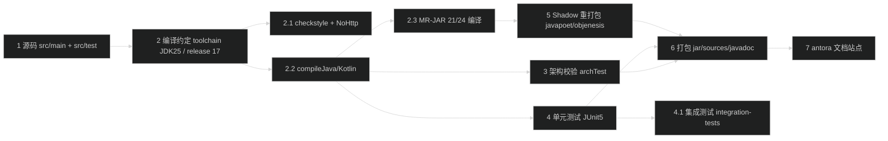

# Spring Framework 编译与运行流程
> 上次修改：2026-07-26 17:49

## 技术栈与依赖

Spring Framework 7.0.7 是一个以 **Java 25 toolchain 编译、`--release 17` 字节码目标** 的多语言（Java + Kotlin）多模块库项目，采用 **Gradle 9.4.1 Wrapper** 聚合构建，启用并行执行（`org.gradle.parallel=true`）与 build cache（`org.gradle.caching=true`）。项目由 22 个 `spring-*` 库模块（`build.gradle:13` 的 `moduleProjects`）加上 `framework-api / framework-bom / framework-platform / framework-docs / integration-tests` 等平台与聚合模块组成，共 28 个 include 子项目（`settings.gradle:5-31`）。构建约定集中在 `buildSrc/`，通过自定义 Gradle 插件统一 toolchain、checkstyle、测试、Kotlin 与架构校验等约定（`buildSrc/src/main/java/org/springframework/build/ConventionsPlugin.java:38-49`）。

技术栈要点：

- **语言**：Java（toolchain JDK 25，字节码 `--release 17`）+ Kotlin 2.2.21（`gradle.properties:7`），Kotlin stdlib 默认依赖被禁用（`kotlin.stdlib.default.dependency=false`）。
- **构建工具**：Gradle 9.4.1（`gradle/wrapper/gradle-wrapper.properties:3`），依赖版本统一由 `framework-platform` 的 `enforcedPlatform` 强制对齐（`build.gradle:39-51`）。
- **响应式栈**：Reactor（reactor-bom `2025.0.5`，即 Reactor Core 3.8 系列）、Reactor Netty、reactive-streams、RxJava3、Mutiny，多为 `optional` 依赖（`spring-core/spring-core.gradle:83-93`）。
- **重打包**：javapoet、objenesis 经 Shadow JAR 重定位为 `org.springframework.javapoet.*` / `org.springframework.objenesis.*`（`spring-core/spring-core.gradle:30-57`），ASM 亦重打包进 spring-core。
- **多版本发布**：spring-core 通过 `org.springframework.build.multiReleaseJar` 插件构建 Java 21/24 的 MR-JAR（`spring-core/spring-core.gradle:13-15`）。
- **测试栈**：JUnit 5（junit-bom `6.0.3`）、Mockito `5.23.0`、AssertJ `3.27.7`、MockK、XMLUnit `2.10.4`、Reactor Test、ArchUnit `1.4.1`（架构校验）。

关键命令（源自 `CLAUDE.md`）：

| 目的 | 命令 |
|------|------|
| 全量构建 | `./gradlew build` |
| 单模块构建 | `./gradlew :spring-core:build` |
| 全量检查（测试+checkstyle+架构） | `./gradlew check` |
| 仅 checkstyle | `./gradlew checkstyleMain checkstyleTest` |
| 架构约束校验 | `./gradlew :spring-core:archTest` |
| 模块单元测试 | `./gradlew :spring-context:test` |
| 参考文档站点 | `./gradlew antora` |

### 主要依赖清单

版本来源以 `framework-platform/framework-platform.gradle` 与 `gradle.properties`、各模块 `.gradle` 为准。

| 依赖 | 版本 | 用途 |
|------|------|------|
| Gradle Wrapper | 9.4.1 | 构建引擎（`gradle-wrapper.properties:3`） |
| Kotlin | 2.2.21 | Kotlin 源码编译（`gradle.properties:7`） |
| Reactor（reactor-bom） | 2025.0.5（Reactor Core 3.8.x） | 响应式编程核心（`framework-platform.gradle:13`） |
| Reactor Netty | 4.2.12.Final（netty-bom） | 响应式网络传输（`framework-platform.gradle:12`） |
| kotlinx-coroutines | 1.10.2 | Kotlin 协程互操作（`framework-platform.gradle:20`） |
| spring-javapoet-repack | 0.10.0 | 代码生成（AOT），重打包（`spring-core.gradle:17`） |
| spring-objenesis-repack | 3.5 | 无构造实例化，重打包（`spring-core.gradle:18`） |
| JSpecify | 1.0.0 | 空安全注解（`framework-platform.gradle:130`） |
| commons-logging | 1.3.5 | 日志抽象（`framework-platform.gradle:48`） |
| micrometer（micrometer-bom） | 1.16.5 | 可观测性（`framework-platform.gradle:11`） |
| Jackson 3 / Jackson 2 | 3.0.4 / 2.20.2 | JSON 序列化（`framework-platform.gradle:24,10`） |
| Hibernate ORM | 7.2.11.Final | JPA / ORM 集成（`framework-platform.gradle:123`） |
| AspectJ | 1.9.25 | AOP 织入（`framework-platform.gradle:103-105`） |
| ByteBuddy Agent | 1.17.6 | 测试期字节码代理（`gradle.properties:8`） |
| JUnit Jupiter（junit-bom） | 6.0.3 | 单元测试框架（`framework-platform.gradle:22`） |
| Mockito（mockito-bom） | 5.23.0 | Mock 框架（`framework-platform.gradle:23`） |
| AssertJ（assertj-bom） | 3.27.7 | 流式断言（`framework-platform.gradle:17`） |
| XMLUnit | 2.10.4 | XML 断言（`framework-platform.gradle:143-144`） |
| ArchUnit | 1.4.1 | 架构约束校验（`buildSrc` 架构插件依赖） |
| Checkstyle 工具 | 13.4.0 | 代码风格检查（`CheckstyleConventions.java:53`） |
| Log4j（log4j-bom） | 2.25.4 | 测试运行时日志实现（`framework-platform.gradle:16`） |

### 环境要求

- **操作系统**：跨平台（Linux / macOS / Windows），无操作系统特定依赖。
- **JDK**：编译需 JDK 25 toolchain（`JavaConventions.java:48` 的 `DEFAULT_LANGUAGE_VERSION = 25`）；若本地无对应 JDK，Gradle toolchain 会尝试自动探测/下载。产出字节码目标为 Java 17（`JavaConventions.java:54`，`--release 17`）。
- **Kotlin**：2.2.21，由 Gradle 插件管理，无需单独安装。
- **Gradle**：无需预装，`./gradlew` 首次执行会按 `gradle-wrapper.properties:3` 自动下载 gradle-9.4.1-bin.zip。
- **内存**：Gradle 守护进程默认 `-Xmx2048m`（`gradle.properties:4`）；Checkstyle 任务 heap 上限 1g（`CheckstyleConventions.java:51`）。
- **网络**：首次构建需访问 Maven Central；预发布版本（version 含 `-`）额外访问 `repo.spring.io/milestone`，SNAPSHOT 访问 `repo.spring.io/snapshot`（`build.gradle:22-30`）。

## 编译流程

### 编译环境准备

1. **准备 JDK 25**：`JavaConventions.applyToolchainConventions` 将 toolchain 语言版本固定为 25（`JavaConventions.java:86-90`）。本地存在 JDK 25 时 Gradle 自动使用；不存在时依赖 toolchain 自动下载能力，否则需手动安装并让 Gradle 发现。
2. **准备 Gradle Wrapper**：直接使用仓库自带的 `./gradlew`（Unix）或 `gradlew.bat`（Windows）。首次执行会依据 `gradle/wrapper/gradle-wrapper.properties` 下载并缓存指定版本，无需全局安装 Gradle。
3. **无需手动装依赖**：所有第三方依赖由 Gradle 从 Maven Central 解析，版本经 `framework-platform` 的 `enforcedPlatform` 强制对齐（`build.gradle:39-51`），保证跨模块版本一致。

### 编译步骤

1. **同步/解析项目**：进入项目根目录，Gradle 读取 `settings.gradle`（含 28 个子项目）与 `build.gradle`，为 `spring-*` 模块套用 `java`、`java-test-fixtures`、`org.springframework.build.conventions` 等约定（`build.gradle:53-90`）。
   - 命令：`./gradlew projects`（仅查看，不编译）。
2. **单模块编译**：编译某个模块的主源码、测试夹具与测试源码。例如 spring-core：
   - 命令：`./gradlew :spring-core:build`
   - 该命令会先编译依赖模块，再编译 spring-core 主源码 + Java 21/24 MR-JAR 源码集（`spring-core/spring-core.gradle:13-15`），并触发其 Shadow 重打包与测试。
3. **仅编译（不测试）**：只想产出 class 而不跑测试时，可用 `./gradlew :spring-core:classes` 或 `./gradlew assemble`（组装所有 JAR 但跳过 test/check）。
4. **代码风格校验**：主源码 checkstyle 以 `-Werror` 严格模式执行（编译参数含 `-Werror`，`JavaConventions.java:67`），风格工具版本 13.4.0（`CheckstyleConventions.java:53`）。
   - 命令：`./gradlew checkstyleMain checkstyleTest`
5. **架构约束校验**：`ArchitecturePlugin` 为每个非 test 源码集注册 `checkArchitecture*` 任务并挂到 `check` 上（`ArchitecturePlugin.java:50-65`），基于 ArchUnit 校验模块依赖方向。
   - 命令：`./gradlew :spring-core:archTest`
6. **全量构建**：编译所有模块 + 全部测试 + checkstyle + 架构校验 + 打包。
   - 命令：`./gradlew build`
7. **全量检查（不打包发布）**：`./gradlew check`（测试 + checkstyle + archTest，`CLAUDE.md`）。
8. **生成参考文档**：Antora 生成 HTML 文档站点。
   - 命令：`./gradlew antora`（`framework-docs/framework-docs.gradle:15` 的 `antora {}` 配置）。

编译约定细节：主源码使用严格编译参数（含 `-Xlint:*` 与 `-Werror`），测试源码放宽相应 lint（`JavaConventions.java:56-72`）；所有 JavaCompile 任务统一 UTF-8 编码并按任务名推断 `--release` 版本（MR-JAR 的 `compile*Java21/24` 会用对应更高版本，`JavaConventions.java:122-132`）。

### 编译产物说明

- **模块 JAR**：各模块产出于 `<module>/build/libs/*.jar`，Manifest 含 `Implementation-Title/Version`、`Automatic-Module-Name`（`gradle/spring-module.gradle:42-55`），并内嵌 `license.txt`/`notice.txt`。
- **sources / javadoc JAR**：`spring-module.gradle:95-106` 注册 `sourcesJar` 与 `javadocJar`，随 `mavenJava` 发布（`spring-module.gradle:108-116`）。
- **spring-core 多版本 JAR（MR-JAR）**：spring-core 的 JAR 内含 `META-INF/versions/21`、`META-INF/versions/24` 目录，源自 `src/main/java21/`、`src/main/java24/`（`spring-core.gradle:13-15`，`MultiReleaseJarPlugin.java:44-60`）。
- **Shadow 重打包 JAR**：`spring-javapoet-repack-0.10.0.jar`、`spring-objenesis-repack-3.5.jar` 由 `javapoetRepackJar`/`objenesisRepackJar` 任务产出并把重定位后的类合并进 spring-core 主 JAR（`spring-core.gradle:30-57,119-131`）。
- **测试夹具 JAR**：`java-test-fixtures` 插件产出 test-fixtures 变体，供其他模块以 `testFixtures(project(...))` 引用；其发布变体被显式跳过（`spring-module.gradle:118-120`）。
- **文档站点**：`./gradlew antora` 输出至 `framework-docs/build/site/index.html`（`CLAUDE.md`）。

## 运行流程

### 本地运行

Spring Framework 是**库（library）项目，无独立可执行启动入口**，不存在 `main` 方法式的应用启动。它作为依赖被下游应用（如 Spring Boot 应用）引用。本地"运行"的含义是：

1. **通过测试验证行为**：运行某模块或某测试类来验证代码正确性（见"测试流程"）。
   - 例：`./gradlew :spring-context:test`
2. **本地发布到 Maven 仓库供下游消费**：`spring-module.gradle:108-116` 定义了 `mavenJava` 发布，可通过 `./gradlew publishToMavenLocal` 将构建产物安装到本地 `~/.m2` 供本机其他工程依赖（发布任务由 `publishing` 约定提供）。
3. **生成并浏览参考文档**：`./gradlew antora` 后打开 `framework-docs/build/site/index.html`。

### Docker 运行（可选）

**不适用**。项目根目录及各模块下未发现 `Dockerfile`（`find_files_by_glob` 搜索 `Dockerfile*` 返回空），项目不以容器镜像形式发布或运行；作为库项目也无需容器化启动。

### 运行配置说明

- **Java Toolchain**：编译统一使用 JDK 25 toolchain（`JavaConventions.java:48,86-90`），字节码目标 Java 17。
- **并行执行**：`org.gradle.parallel=true`（`gradle.properties:5`）允许模块间并行构建。
- **Build Cache**：`org.gradle.caching=true`（`gradle.properties:3`）复用任务输出，加速重复构建。
- **Gradle JVM 参数**：`org.gradle.jvmargs=-Xmx2048m`（`gradle.properties:4`）。
- **ByteBuddy Agent**：`TestConventions.configureByteBuddyAgent` 创建非传递的 `byteBuddyAgentConfig` 配置并作为 `-javaagent` 注入所有 Test 任务（`TestConventions.java:83-95`，版本 `gradle.properties:8` 的 `1.17.6`）。
- **测试 JVM 参数**：测试任务附加 `--add-opens=java.base/java.lang=ALL-UNNAMED`、`--add-opens=java.base/java.util=ALL-UNNAMED`、`-Xshare:off`（`TestConventions.java:76-80`），并设置 `java.awt.headless=true` 等系统属性（`TestConventions.java:68-72`）。
- **依赖版本对齐**：`framework-platform` 以 `enforcedPlatform` 强制统一所有依赖版本（`build.gradle:39-51`）。

## 测试流程（如适用）

项目含大量测试模块（`hasTests=true`），测试目录为各模块 `src/test/java`，共享夹具在 `src/testFixtures/java`。

### 单元测试

- **框架**：JUnit 5（Jupiter Platform）。`TestConventions.configureTests` 对所有 Test 任务调用 `useJUnitPlatform()`（`TestConventions.java:60-67`），根构建为每个 java 项目默认加入 `junit-jupiter`、`junit-platform-suite`、`mockito`、`mockk`、`assertj` 等测试依赖（`build.gradle:59-70`）。
- **命名约定**：测试类须匹配 `**/*Tests.class` 或 `**/*Test.class` 才会被纳入（`TestConventions.java:67`）。
- **运行命令**：

  | 目的 | 命令 |
  |------|------|
  | 运行模块全部测试 | `./gradlew :spring-context:test` |
  | 按类名过滤 | `./gradlew :spring-core:test --tests "*ResourceTests*"` |
  | 按方法过滤 | `./gradlew :spring-core:test --tests "*ResourceTests#testResourceLoading*"` |
  | 按 tag/分组过滤 | `./gradlew :spring-core:test --tests "*Tests" -DtestGroups="performance"` |

- **测试分组**：`testGroups` 系统属性经 `TestConventions.java:73-75` 透传给测试进程，用于门控性能等重量级测试。
- **重试**：CI 环境（`CI=true`）下 flaky 测试重试 3 次，本地为 0（`TestConventions.java:97-107`）。
- **spring-core 特例**：其 test 任务将 main 的 classes 目录而非 JAR 加入 classpath（`ResourceTests` 依赖），并加 `-XX:+AllowRedefinitionToAddDeleteMethods` 以支持 BlockHound（`spring-core.gradle:133-143`）。

### 集成测试

- **integration-tests 模块**：`integration-tests` 是跨模块端到端测试模块（非发布库），以 `testImplementation` 聚合 spring-aop/beans/context/core/expression/jdbc/orm/test/tx/web 及其测试夹具做集成验证（`integration-tests/integration-tests.gradle:8-31`），并套用 `runtimehints-agent` 插件校验 AOT 运行时提示。
  - 命令：`./gradlew :integration-tests:test`
- **架构约束（archTest）**：`ArchitecturePlugin` 基于 ArchUnit 为每个主源码集注册 `checkArchitecture*` 任务并挂到 `check`（`ArchitecturePlugin.java:42-66`），强制模块依赖方向合法。
  - 命令：`./gradlew :spring-core:archTest`
- **Checkstyle / 代码风格**：`CheckstyleConventions` 应用 Spring Java Format + Checkstyle（工具 13.4.0，配置目录 `src/checkstyle`），根项目额外应用 NoHttp 校验（`CheckstyleConventions.java:45-66`）。
  - 命令：`./gradlew checkstyleMain checkstyleTest`
- **整体检查**：`./gradlew check` 一次性执行 test + checkstyle + archTest（`CLAUDE.md`）。

### 测试覆盖率（可选）

**未配置专门的覆盖率工具**。在 `build.gradle`、`gradle/spring-module.gradle`、`buildSrc` 约定插件中未发现 JaCoCo 或其他覆盖率插件；质量保障依赖单元测试 + 架构约束（ArchUnit）+ checkstyle + NoHttp 组合，而非覆盖率阈值门禁。如需覆盖率可在模块 `.gradle` 中自行引入 `jacoco` 插件（当前源码未提供）。

## 构建流水线

1-2 源码与编译准备：从各模块 `src/main`、`src/test` 读取 Java/Kotlin 源码，由 `buildSrc` 约定插件统一 JDK 25 toolchain 与 `--release 17` 字节码目标、UTF-8 编码及 `-Werror` 严格 lint。

2.1-2.3 校验与编译：先做 checkstyle 与根项目 NoHttp 风格校验，随后编译主源码与 Kotlin 源码；spring-core 额外编译 Java 21/24 的多版本源码集用于 MR-JAR。

3-4 质量校验与测试：ArchUnit 架构约束校验模块依赖方向，JUnit 5 运行单元测试（支持 `--tests` 与 `testGroups` 过滤、CI 重试 3 次），integration-tests 模块聚合多模块做端到端集成验证。

5-6 重打包与打包：javapoet/objenesis 经 Shadow 重定位为 `org.springframework.*` 并合并进 spring-core，最终产出各模块 `build/libs/*.jar` 及 sources/javadoc JAR（含 MR-JAR 的 `META-INF/versions/*`）。

7 文档产出：`./gradlew antora` 生成参考文档站点至 `framework-docs/build/site/index.html`。

## 代码引用索引

| 引用 | 说明 |
|------|------|
| `build.gradle:13-15` | `moduleProjects`/`javaProjects` 划分，模块套用约定入口 |
| `build.gradle:22-51` | 仓库配置与 `framework-platform` 强制版本对齐 |
| `build.gradle:59-70` | 各 java 项目默认测试依赖（JUnit/Mockito/AssertJ 等） |
| `settings.gradle:5-31` | 28 个子项目 include 清单 |
| `gradle.properties` | version 7.0.7、caching/parallel、Kotlin 2.2.21、ByteBuddy 1.17.6 |
| `gradle/wrapper/gradle-wrapper.properties:3` | Gradle 9.4.1 Wrapper 分发地址 |
| `framework-platform/framework-platform.gradle` | 全量依赖版本对齐（BOM + constraints） |
| `gradle/spring-module.gradle:42-120` | 模块 JAR/Manifest、sources/javadoc、发布约定 |
| `spring-core/spring-core.gradle:13-15` | MR-JAR（Java 21/24）声明 |
| `spring-core/spring-core.gradle:30-57,119-131` | javapoet/objenesis Shadow 重打包与合并 |
| `spring-core/spring-core.gradle:133-143` | spring-core test classpath 与 BlockHound JVM 参数 |
| `buildSrc/.../ConventionsPlugin.java:38-49` | 约定插件聚合入口 |
| `buildSrc/.../JavaConventions.java:48-54,86-132` | toolchain 25 / release 17 / 编译参数 |
| `buildSrc/.../TestConventions.java:60-107` | JUnit5、命名过滤、testGroups、ByteBuddy agent、CI 重试 |
| `buildSrc/.../CheckstyleConventions.java:45-66` | Checkstyle 13.4.0 + NoHttp 配置 |
| `buildSrc/.../architecture/ArchitecturePlugin.java:42-66` | archTest 任务注册与挂 check |
| `integration-tests/integration-tests.gradle:8-31` | 集成测试模块依赖聚合 |
| `framework-docs/framework-docs.gradle:15-30` | Antora 文档生成配置 |
